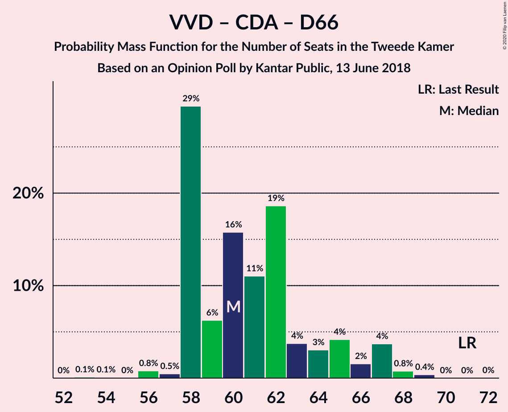

# Opinion Poll by Kantar Public, 13 June 2018

<a href="#voting-intentions">Voting Intentions</a> | <a href="#seats">Seats</a> | <a href="#coalitions">Coalitions</a> | <a href="#technical-information">Technical Information</a>

## Voting Intentions

### Confidence Intervals

| Party | Last Result | Poll Result | 80% Confidence Interval | 90% Confidence Interval | 95% Confidence Interval | 99% Confidence Interval |
|:-----:|:-----------:|:-----------:|:-----------------------:|:-----------------------:|:-----------------------:|:-----------------------:|
| Volkspartij voor Vrijheid en Democratie | 21.3% | 21.3% | 19.7–23.1% |19.2–23.6% |18.8–24.0% |18.1–24.9% |
| Partij voor de Vrijheid | 13.1% | 14.0% | 12.6–15.5% |12.2–15.9% |11.9–16.3% |11.3–17.1% |
| Christen-Democratisch Appèl | 12.4% | 10.0% | 8.8–11.3% |8.5–11.7% |8.2–12.0% |7.7–12.7% |
| GroenLinks | 9.1% | 10.0% | 8.8–11.3% |8.5–11.7% |8.2–12.0% |7.7–12.7% |
| Democraten 66 | 12.2% | 9.3% | 8.2–10.7% |7.9–11.0% |7.7–11.4% |7.1–12.0% |
| Socialistische Partij | 9.1% | 7.3% | 6.4–8.6% |6.1–8.9% |5.9–9.2% |5.4–9.8% |
| Partij van de Arbeid | 5.7% | 6.7% | 5.8–7.9% |5.5–8.2% |5.3–8.5% |4.9–9.1% |
| Forum voor Democratie | 1.8% | 6.0% | 5.1–7.1% |4.8–7.4% |4.6–7.7% |4.3–8.2% |
| ChristenUnie | 3.4% | 5.4% | 4.5–6.4% |4.3–6.7% |4.1–7.0% |3.7–7.5% |
| 50Plus | 3.1% | 4.0% | 3.3–4.9% |3.1–5.2% |2.9–5.4% |2.6–5.9% |
| Partij voor de Dieren | 3.2% | 3.4% | 2.7–4.2% |2.5–4.5% |2.4–4.7% |2.1–5.2% |
| Staatkundig Gereformeerde Partij | 2.1% | 1.4% | 1.0–2.0% |0.9–2.2% |0.8–2.3% |0.7–2.7% |
| DENK | 2.1% | 1.4% | 1.0–2.0% |0.9–2.2% |0.8–2.3% |0.7–2.7% |

*Note:* The poll result column reflects the actual value used in the calculations. Published results may vary slightly, and in addition be rounded to fewer digits.

## Seats

### Confidence Intervals

| Party | Last Result | Median | 80% Confidence Interval | 90% Confidence Interval | 95% Confidence Interval | 99% Confidence Interval |
|:-----:|:-----------:|:------:|:-----------------------:|:-----------------------:|:-----------------------:|:-----------------------:|
| <a href="#volkspartij-voor-vrijheid-en-democratie">Volkspartij voor Vrijheid en Democratie</a> | 33 | 31 | 27–35 |27–36 |27–36 |26–39 |
| <a href="#partij-voor-de-vrijheid">Partij voor de Vrijheid</a> | 20 | 22 | 19–24 |18–24 |17–24 |16–25 |
| <a href="#christen-democratisch-appèl">Christen-Democratisch Appèl</a> | 19 | 15 | 14–18 |13–18 |12–18 |12–19 |
| <a href="#groenlinks">GroenLinks</a> | 14 | 14 | 12–17 |12–17 |12–18 |11–19 |
| <a href="#democraten-66">Democraten 66</a> | 19 | 14 | 12–17 |12–17 |12–17 |10–19 |
| <a href="#socialistische-partij">Socialistische Partij</a> | 14 | 12 | 10–12 |9–13 |8–14 |7–14 |
| <a href="#partij-van-de-arbeid">Partij van de Arbeid</a> | 9 | 10 | 8–13 |8–13 |7–13 |7–13 |
| <a href="#forum-voor-democratie">Forum voor Democratie</a> | 2 | 8 | 7–10 |7–10 |7–11 |5–12 |
| <a href="#christenunie">ChristenUnie</a> | 5 | 7 | 7–9 |6–10 |5–10 |5–11 |
| <a href="#50plus">50Plus</a> | 4 | 6 | 5–7 |5–8 |4–8 |4–9 |
| <a href="#partij-voor-de-dieren">Partij voor de Dieren</a> | 5 | 5 | 4–6 |3–6 |3–7 |3–7 |
| <a href="#staatkundig-gereformeerde-partij">Staatkundig Gereformeerde Partij</a> | 3 | 2 | 1–3 |1–3 |1–4 |0–4 |
| <a href="#denk">DENK</a> | 3 | 2 | 1–4 |1–4 |1–4 |0–4 |

### Volkspartij voor Vrijheid en Democratie

*For a full overview of the results for this party, see the [Volkspartij voor Vrijheid en Democratie](party-volkspartijvoorvrijheidendemocratie.html) page.*

| Number of Seats | Probability | Accumulated | Special Marks |
|:---------------:|:-----------:|:-----------:|:-------------:|
| 26 | 0.8% | 100% |  |
| 27 | 10% | 99.2% |  |
| 28 | 0.8% | 90% |  |
| 29 | 6% | 89% |  |
| 30 | 30% | 83% |  |
| 31 | 23% | 53% | Median |
| 32 | 2% | 29% |  |
| 33 | 5% | 27% | Last Result |
| 34 | 11% | 22% |  |
| 35 | 3% | 11% |  |
| 36 | 6% | 8% |  |
| 37 | 0.6% | 2% |  |
| 38 | 0% | 2% |  |
| 39 | 2% | 2% |  |
| 40 | 0% | 0% |  |

### Partij voor de Vrijheid

*For a full overview of the results for this party, see the [Partij voor de Vrijheid](party-partijvoordevrijheid.html) page.*

| Number of Seats | Probability | Accumulated | Special Marks |
|:---------------:|:-----------:|:-----------:|:-------------:|
| 16 | 0.6% | 100% |  |
| 17 | 4% | 99.4% |  |
| 18 | 1.3% | 95% |  |
| 19 | 4% | 94% |  |
| 20 | 12% | 90% | Last Result |
| 21 | 15% | 78% |  |
| 22 | 25% | 62% | Median |
| 23 | 3% | 37% |  |
| 24 | 34% | 34% |  |
| 25 | 0.2% | 0.6% |  |
| 26 | 0.2% | 0.4% |  |
| 27 | 0.2% | 0.2% |  |
| 28 | 0.1% | 0.1% |  |
| 29 | 0% | 0% |  |

### Christen-Democratisch Appèl

*For a full overview of the results for this party, see the [Christen-Democratisch Appèl](party-christen-democratischappèl.html) page.*

| Number of Seats | Probability | Accumulated | Special Marks |
|:---------------:|:-----------:|:-----------:|:-------------:|
| 10 | 0.1% | 100% |  |
| 11 | 0.1% | 99.9% |  |
| 12 | 2% | 99.8% |  |
| 13 | 4% | 97% |  |
| 14 | 43% | 93% |  |
| 15 | 10% | 50% | Median |
| 16 | 5% | 40% |  |
| 17 | 13% | 36% |  |
| 18 | 22% | 22% |  |
| 19 | 0.4% | 0.7% | Last Result |
| 20 | 0.2% | 0.3% |  |
| 21 | 0.1% | 0.1% |  |
| 22 | 0% | 0% |  |

### GroenLinks

*For a full overview of the results for this party, see the [GroenLinks](party-groenlinks.html) page.*

| Number of Seats | Probability | Accumulated | Special Marks |
|:---------------:|:-----------:|:-----------:|:-------------:|
| 10 | 0% | 100% |  |
| 11 | 0.9% | 99.9% |  |
| 12 | 19% | 99.0% |  |
| 13 | 4% | 80% |  |
| 14 | 34% | 76% | Last Result, Median |
| 15 | 24% | 42% |  |
| 16 | 8% | 18% |  |
| 17 | 6% | 10% |  |
| 18 | 3% | 5% |  |
| 19 | 1.2% | 1.3% |  |
| 20 | 0% | 0.1% |  |
| 21 | 0% | 0% |  |

### Democraten 66

*For a full overview of the results for this party, see the [Democraten 66](party-democraten66.html) page.*

| Number of Seats | Probability | Accumulated | Special Marks |
|:---------------:|:-----------:|:-----------:|:-------------:|
| 10 | 0.6% | 100% |  |
| 11 | 1.1% | 99.4% |  |
| 12 | 12% | 98% |  |
| 13 | 27% | 86% |  |
| 14 | 31% | 60% | Median |
| 15 | 9% | 29% |  |
| 16 | 5% | 20% |  |
| 17 | 13% | 15% |  |
| 18 | 0.7% | 2% |  |
| 19 | 1.0% | 1.2% | Last Result |
| 20 | 0.2% | 0.2% |  |
| 21 | 0% | 0% |  |

### Socialistische Partij

*For a full overview of the results for this party, see the [Socialistische Partij](party-socialistischepartij.html) page.*

| Number of Seats | Probability | Accumulated | Special Marks |
|:---------------:|:-----------:|:-----------:|:-------------:|
| 7 | 2% | 100% |  |
| 8 | 0.8% | 98% |  |
| 9 | 7% | 97% |  |
| 10 | 10% | 91% |  |
| 11 | 25% | 81% |  |
| 12 | 50% | 56% | Median |
| 13 | 4% | 7% |  |
| 14 | 2% | 3% | Last Result |
| 15 | 0.1% | 0.4% |  |
| 16 | 0.3% | 0.3% |  |
| 17 | 0% | 0% |  |

### Partij van de Arbeid

*For a full overview of the results for this party, see the [Partij van de Arbeid](party-partijvandearbeid.html) page.*

| Number of Seats | Probability | Accumulated | Special Marks |
|:---------------:|:-----------:|:-----------:|:-------------:|
| 6 | 0% | 100% |  |
| 7 | 4% | 99.9% |  |
| 8 | 7% | 96% |  |
| 9 | 16% | 90% | Last Result |
| 10 | 49% | 74% | Median |
| 11 | 5% | 25% |  |
| 12 | 2% | 20% |  |
| 13 | 18% | 19% |  |
| 14 | 0.3% | 0.4% |  |
| 15 | 0.1% | 0.1% |  |
| 16 | 0% | 0% |  |

### Forum voor Democratie

*For a full overview of the results for this party, see the [Forum voor Democratie](party-forumvoordemocratie.html) page.*

| Number of Seats | Probability | Accumulated | Special Marks |
|:---------------:|:-----------:|:-----------:|:-------------:|
| 2 | 0% | 100% | Last Result |
| 3 | 0% | 100% |  |
| 4 | 0% | 100% |  |
| 5 | 0.9% | 100% |  |
| 6 | 1.3% | 99.1% |  |
| 7 | 46% | 98% |  |
| 8 | 7% | 52% | Median |
| 9 | 30% | 45% |  |
| 10 | 11% | 15% |  |
| 11 | 3% | 5% |  |
| 12 | 2% | 2% |  |
| 13 | 0.1% | 0.1% |  |
| 14 | 0% | 0% |  |

### ChristenUnie

*For a full overview of the results for this party, see the [ChristenUnie](party-christenunie.html) page.*

| Number of Seats | Probability | Accumulated | Special Marks |
|:---------------:|:-----------:|:-----------:|:-------------:|
| 5 | 4% | 100% | Last Result |
| 6 | 5% | 96% |  |
| 7 | 43% | 91% | Median |
| 8 | 28% | 49% |  |
| 9 | 12% | 20% |  |
| 10 | 5% | 8% |  |
| 11 | 2% | 2% |  |
| 12 | 0.4% | 0.5% |  |
| 13 | 0.1% | 0.1% |  |
| 14 | 0% | 0% |  |

### 50Plus

*For a full overview of the results for this party, see the [50Plus](party-50plus.html) page.*

| Number of Seats | Probability | Accumulated | Special Marks |
|:---------------:|:-----------:|:-----------:|:-------------:|
| 3 | 0.1% | 100% |  |
| 4 | 4% | 99.9% | Last Result |
| 5 | 10% | 96% |  |
| 6 | 55% | 86% | Median |
| 7 | 21% | 31% |  |
| 8 | 9% | 10% |  |
| 9 | 0.9% | 1.0% |  |
| 10 | 0.1% | 0.1% |  |
| 11 | 0% | 0% |  |

### Partij voor de Dieren

*For a full overview of the results for this party, see the [Partij voor de Dieren](party-partijvoordedieren.html) page.*

| Number of Seats | Probability | Accumulated | Special Marks |
|:---------------:|:-----------:|:-----------:|:-------------:|
| 3 | 8% | 100% |  |
| 4 | 26% | 92% |  |
| 5 | 29% | 66% | Last Result, Median |
| 6 | 34% | 38% |  |
| 7 | 3% | 4% |  |
| 8 | 0.4% | 0.5% |  |
| 9 | 0% | 0.1% |  |
| 10 | 0.1% | 0.1% |  |
| 11 | 0% | 0% |  |

### Staatkundig Gereformeerde Partij

*For a full overview of the results for this party, see the [Staatkundig Gereformeerde Partij](party-staatkundiggereformeerdepartij.html) page.*

| Number of Seats | Probability | Accumulated | Special Marks |
|:---------------:|:-----------:|:-----------:|:-------------:|
| 0 | 2% | 100% |  |
| 1 | 22% | 98% |  |
| 2 | 56% | 77% | Median |
| 3 | 18% | 20% | Last Result |
| 4 | 3% | 3% |  |
| 5 | 0% | 0% |  |

### DENK

*For a full overview of the results for this party, see the [DENK](party-denk.html) page.*

| Number of Seats | Probability | Accumulated | Special Marks |
|:---------------:|:-----------:|:-----------:|:-------------:|
| 0 | 2% | 100% |  |
| 1 | 19% | 98% |  |
| 2 | 41% | 80% | Median |
| 3 | 7% | 38% | Last Result |
| 4 | 31% | 31% |  |
| 5 | 0% | 0% |  |

## Coalitions

### Confidence Intervals

| Coalition | Last Result | Median | Majority? | 80% Confidence Interval | 90% Confidence Interval | 95% Confidence Interval | 99% Confidence Interval |
|:---------:|:-----------:|:------:|:---------:|:-----------------------:|:-----------------------:|:-----------------------:|:-----------------------:|
| Volkspartij voor Vrijheid en Democratie – Christen-Democratisch Appèl – GroenLinks – Democraten 66 – ChristenUnie | 90 | 82 | 100% | 79–88 | 79–90 | 79–91 | 78–91 |
| Volkspartij voor Vrijheid en Democratie – Partij voor de Vrijheid – Christen-Democratisch Appèl – Forum voor Democratie – Staatkundig Gereformeerde Partij | 77 | 78 | 86% | 74–82 | 74–84 | 74–85 | 72–87 |
| Volkspartij voor Vrijheid en Democratie – Christen-Democratisch Appèl – Democraten 66 – Partij van de Arbeid – ChristenUnie | 85 | 78 | 65% | 75–83 | 75–84 | 75–84 | 74–86 |
| Volkspartij voor Vrijheid en Democratie – Partij voor de Vrijheid – Christen-Democratisch Appèl – Forum voor Democratie | 74 | 76 | 54% | 73–80 | 73–82 | 72–84 | 70–86 |
| Christen-Democratisch Appèl – GroenLinks – Democraten 66 – Socialistische Partij – Partij van de Arbeid – ChristenUnie | 80 | 71 | 20% | 69–80 | 68–80 | 67–80 | 66–81 |
| Volkspartij voor Vrijheid en Democratie – Christen-Democratisch Appèl – Democraten 66 – ChristenUnie | 76 | 68 | 4% | 65–72 | 65–74 | 65–77 | 64–77 |
| Volkspartij voor Vrijheid en Democratie – Partij voor de Vrijheid – Christen-Democratisch Appèl | 72 | 68 | 0.1% | 64–71 | 64–73 | 63–74 | 61–75 |
| Volkspartij voor Vrijheid en Democratie – Christen-Democratisch Appèl – Forum voor Democratie – 50Plus – Staatkundig Gereformeerde Partij | 61 | 64 | 0% | 59–68 | 59–68 | 59–69 | 57–70 |
| Christen-Democratisch Appèl – GroenLinks – Democraten 66 – Partij van de Arbeid – ChristenUnie | 66 | 61 | 0% | 57–68 | 57–68 | 57–68 | 56–70 |
| Volkspartij voor Vrijheid en Democratie – Christen-Democratisch Appèl – Democraten 66 | 71 | 60 | 0% | 58–65 | 58–66 | 58–67 | 56–68 |
| Volkspartij voor Vrijheid en Democratie – Christen-Democratisch Appèl – Forum voor Democratie – 50Plus | 58 | 62 | 0% | 57–65 | 57–67 | 57–67 | 55–68 |
| Volkspartij voor Vrijheid en Democratie – Christen-Democratisch Appèl – Forum voor Democratie – Staatkundig Gereformeerde Partij | 57 | 57 | 0% | 53–61 | 53–63 | 53–64 | 52–65 |
| Volkspartij voor Vrijheid en Democratie – Christen-Democratisch Appèl – Partij van de Arbeid | 61 | 56 | 0% | 54–62 | 54–62 | 54–63 | 52–64 |
| Volkspartij voor Vrijheid en Democratie – Christen-Democratisch Appèl – Forum voor Democratie | 54 | 55 | 0% | 51–59 | 51–61 | 51–63 | 50–63 |
| Volkspartij voor Vrijheid en Democratie – Democraten 66 – Partij van de Arbeid | 61 | 55 | 0% | 54–59 | 54–61 | 52–61 | 51–63 |
| Volkspartij voor Vrijheid en Democratie – Christen-Democratisch Appèl | 52 | 46 | 0% | 44–50 | 44–52 | 44–53 | 41–54 |
| Volkspartij voor Vrijheid en Democratie – Partij van de Arbeid | 42 | 41 | 0% | 37–44 | 37–45 | 37–47 | 37–49 |
| Christen-Democratisch Appèl – Democraten 66 – Partij van de Arbeid | 47 | 38 | 0% | 36–44 | 35–44 | 35–44 | 34–45 |
| Christen-Democratisch Appèl – Partij van de Arbeid – ChristenUnie | 33 | 32 | 0% | 30–39 | 29–39 | 28–39 | 27–39 |
| Christen-Democratisch Appèl – Democraten 66 | 38 | 28 | 0% | 26–34 | 26–34 | 26–35 | 25–35 |
| Christen-Democratisch Appèl – Partij van de Arbeid | 28 | 24 | 0% | 23–31 | 22–31 | 22–31 | 21–31 |

### Volkspartij voor Vrijheid en Democratie – Christen-Democratisch Appèl – GroenLinks – Democraten 66 – ChristenUnie

| Number of Seats | Probability | Accumulated | Special Marks |
|:---------------:|:-----------:|:-----------:|:-------------:|
| 77 | 0.2% | 100% |  |
| 78 | 1.2% | 99.8% |  |
| 79 | 28% | 98.6% |  |
| 80 | 0.9% | 71% |  |
| 81 | 4% | 70% | Median |
| 82 | 28% | 66% |  |
| 83 | 3% | 38% |  |
| 84 | 6% | 35% |  |
| 85 | 12% | 29% |  |
| 86 | 3% | 16% |  |
| 87 | 3% | 14% |  |
| 88 | 2% | 11% |  |
| 89 | 3% | 9% |  |
| 90 | 0.8% | 5% | Last Result |
| 91 | 4% | 5% |  |
| 92 | 0.2% | 0.2% |  |
| 93 | 0% | 0% |  |

### Volkspartij voor Vrijheid en Democratie – Partij voor de Vrijheid – Christen-Democratisch Appèl – Forum voor Democratie – Staatkundig Gereformeerde Partij

| Number of Seats | Probability | Accumulated | Special Marks |
|:---------------:|:-----------:|:-----------:|:-------------:|
| 71 | 0% | 100% |  |
| 72 | 1.3% | 99.9% |  |
| 73 | 1.0% | 98.7% |  |
| 74 | 10% | 98% |  |
| 75 | 2% | 87% |  |
| 76 | 1.4% | 86% | Majority |
| 77 | 34% | 85% | Last Result |
| 78 | 2% | 51% | Median |
| 79 | 3% | 49% |  |
| 80 | 20% | 46% |  |
| 81 | 12% | 26% |  |
| 82 | 5% | 14% |  |
| 83 | 2% | 8% |  |
| 84 | 2% | 6% |  |
| 85 | 3% | 4% |  |
| 86 | 0.3% | 1.3% |  |
| 87 | 1.0% | 1.0% |  |
| 88 | 0% | 0% |  |

### Volkspartij voor Vrijheid en Democratie – Christen-Democratisch Appèl – Democraten 66 – Partij van de Arbeid – ChristenUnie

| Number of Seats | Probability | Accumulated | Special Marks |
|:---------------:|:-----------:|:-----------:|:-------------:|
| 71 | 0.1% | 100% |  |
| 72 | 0.1% | 99.9% |  |
| 73 | 0.2% | 99.8% |  |
| 74 | 2% | 99.6% |  |
| 75 | 32% | 98% |  |
| 76 | 11% | 65% | Majority |
| 77 | 2% | 54% | Median |
| 78 | 2% | 52% |  |
| 79 | 2% | 50% |  |
| 80 | 19% | 48% |  |
| 81 | 2% | 29% |  |
| 82 | 1.2% | 27% |  |
| 83 | 20% | 26% |  |
| 84 | 4% | 7% |  |
| 85 | 1.3% | 2% | Last Result |
| 86 | 0.9% | 1.0% |  |
| 87 | 0% | 0.1% |  |
| 88 | 0.1% | 0.1% |  |
| 89 | 0% | 0% |  |

### Volkspartij voor Vrijheid en Democratie – Partij voor de Vrijheid – Christen-Democratisch Appèl – Forum voor Democratie

| Number of Seats | Probability | Accumulated | Special Marks |
|:---------------:|:-----------:|:-----------:|:-------------:|
| 70 | 0.7% | 100% |  |
| 71 | 2% | 99.3% |  |
| 72 | 0.3% | 98% |  |
| 73 | 11% | 97% |  |
| 74 | 4% | 86% | Last Result |
| 75 | 28% | 82% |  |
| 76 | 4% | 54% | Median, Majority |
| 77 | 5% | 50% |  |
| 78 | 29% | 45% |  |
| 79 | 4% | 16% |  |
| 80 | 2% | 11% |  |
| 81 | 4% | 10% |  |
| 82 | 2% | 6% |  |
| 83 | 1.4% | 4% |  |
| 84 | 2% | 3% |  |
| 85 | 0% | 1.1% |  |
| 86 | 1.0% | 1.0% |  |
| 87 | 0% | 0% |  |

### Christen-Democratisch Appèl – GroenLinks – Democraten 66 – Socialistische Partij – Partij van de Arbeid – ChristenUnie

| Number of Seats | Probability | Accumulated | Special Marks |
|:---------------:|:-----------:|:-----------:|:-------------:|
| 65 | 0% | 100% |  |
| 66 | 0.5% | 99.9% |  |
| 67 | 4% | 99.4% |  |
| 68 | 3% | 96% |  |
| 69 | 8% | 93% |  |
| 70 | 4% | 84% |  |
| 71 | 31% | 80% |  |
| 72 | 3% | 49% | Median |
| 73 | 3% | 46% |  |
| 74 | 5% | 43% |  |
| 75 | 18% | 38% |  |
| 76 | 4% | 20% | Majority |
| 77 | 0.5% | 16% |  |
| 78 | 0.2% | 15% |  |
| 79 | 3% | 15% |  |
| 80 | 11% | 12% | Last Result |
| 81 | 1.1% | 1.1% |  |
| 82 | 0% | 0% |  |

### Volkspartij voor Vrijheid en Democratie – Christen-Democratisch Appèl – Democraten 66 – ChristenUnie

| Number of Seats | Probability | Accumulated | Special Marks |
|:---------------:|:-----------:|:-----------:|:-------------:|
| 61 | 0.1% | 100% |  |
| 62 | 0.1% | 99.9% |  |
| 63 | 0.1% | 99.8% |  |
| 64 | 0.5% | 99.7% |  |
| 65 | 32% | 99.2% |  |
| 66 | 4% | 67% |  |
| 67 | 12% | 64% | Median |
| 68 | 2% | 52% |  |
| 69 | 4% | 49% |  |
| 70 | 29% | 45% |  |
| 71 | 0.8% | 16% |  |
| 72 | 5% | 15% |  |
| 73 | 3% | 10% |  |
| 74 | 2% | 7% |  |
| 75 | 0.7% | 4% |  |
| 76 | 0.9% | 4% | Last Result, Majority |
| 77 | 3% | 3% |  |
| 78 | 0% | 0.1% |  |
| 79 | 0% | 0% |  |

### Volkspartij voor Vrijheid en Democratie – Partij voor de Vrijheid – Christen-Democratisch Appèl

| Number of Seats | Probability | Accumulated | Special Marks |
|:---------------:|:-----------:|:-----------:|:-------------:|
| 61 | 0.8% | 100% |  |
| 62 | 0.1% | 99.2% |  |
| 63 | 2% | 99.1% |  |
| 64 | 13% | 97% |  |
| 65 | 1.2% | 84% |  |
| 66 | 2% | 83% |  |
| 67 | 3% | 81% |  |
| 68 | 32% | 78% | Median |
| 69 | 14% | 45% |  |
| 70 | 4% | 32% |  |
| 71 | 18% | 28% |  |
| 72 | 5% | 10% | Last Result |
| 73 | 1.1% | 5% |  |
| 74 | 3% | 4% |  |
| 75 | 1.0% | 1.1% |  |
| 76 | 0.1% | 0.1% | Majority |
| 77 | 0% | 0% |  |

### Volkspartij voor Vrijheid en Democratie – Christen-Democratisch Appèl – Forum voor Democratie – 50Plus – Staatkundig Gereformeerde Partij

| Number of Seats | Probability | Accumulated | Special Marks |
|:---------------:|:-----------:|:-----------:|:-------------:|
| 55 | 0.1% | 100% |  |
| 56 | 0.1% | 99.9% |  |
| 57 | 0.8% | 99.8% |  |
| 58 | 1.1% | 99.1% |  |
| 59 | 27% | 98% |  |
| 60 | 12% | 71% |  |
| 61 | 3% | 58% | Last Result |
| 62 | 3% | 56% | Median |
| 63 | 3% | 53% |  |
| 64 | 5% | 50% |  |
| 65 | 21% | 45% |  |
| 66 | 5% | 25% |  |
| 67 | 6% | 19% |  |
| 68 | 10% | 13% |  |
| 69 | 2% | 3% |  |
| 70 | 0.8% | 1.1% |  |
| 71 | 0.1% | 0.3% |  |
| 72 | 0% | 0.3% |  |
| 73 | 0.1% | 0.3% |  |
| 74 | 0.2% | 0.2% |  |
| 75 | 0% | 0% |  |

### Christen-Democratisch Appèl – GroenLinks – Democraten 66 – Partij van de Arbeid – ChristenUnie

| Number of Seats | Probability | Accumulated | Special Marks |
|:---------------:|:-----------:|:-----------:|:-------------:|
| 54 | 0% | 100% |  |
| 55 | 0% | 99.9% |  |
| 56 | 2% | 99.9% |  |
| 57 | 11% | 98% |  |
| 58 | 1.4% | 88% |  |
| 59 | 31% | 86% |  |
| 60 | 4% | 56% | Median |
| 61 | 4% | 52% |  |
| 62 | 5% | 48% |  |
| 63 | 4% | 43% |  |
| 64 | 20% | 39% |  |
| 65 | 3% | 19% |  |
| 66 | 2% | 16% | Last Result |
| 67 | 0.4% | 14% |  |
| 68 | 13% | 14% |  |
| 69 | 0.3% | 1.2% |  |
| 70 | 0.8% | 0.9% |  |
| 71 | 0% | 0% |  |

### Volkspartij voor Vrijheid en Democratie – Christen-Democratisch Appèl – Democraten 66

| Number of Seats | Probability | Accumulated | Special Marks |
|:---------------:|:-----------:|:-----------:|:-------------:|
| 53 | 0.1% | 100% |  |
| 54 | 0.1% | 99.9% |  |
| 55 | 0% | 99.8% |  |
| 56 | 0.8% | 99.8% |  |
| 57 | 0.5% | 99.0% |  |
| 58 | 29% | 98.5% |  |
| 59 | 6% | 69% |  |
| 60 | 16% | 63% | Median |
| 61 | 11% | 47% |  |
| 62 | 19% | 36% |  |
| 63 | 4% | 17% |  |
| 64 | 3% | 14% |  |
| 65 | 4% | 11% |  |
| 66 | 2% | 6% |  |
| 67 | 4% | 5% |  |
| 68 | 0.8% | 1.2% |  |
| 69 | 0.4% | 0.4% |  |
| 70 | 0% | 0% |  |
| 71 | 0% | 0% | Last Result |

### Volkspartij voor Vrijheid en Democratie – Christen-Democratisch Appèl – Forum voor Democratie – 50Plus

| Number of Seats | Probability | Accumulated | Special Marks |
|:---------------:|:-----------:|:-----------:|:-------------:|
| 54 | 0.1% | 100% |  |
| 55 | 0.7% | 99.9% |  |
| 56 | 0.1% | 99.2% |  |
| 57 | 28% | 99.1% |  |
| 58 | 0.4% | 71% | Last Result |
| 59 | 14% | 70% |  |
| 60 | 4% | 56% | Median |
| 61 | 2% | 52% |  |
| 62 | 7% | 50% |  |
| 63 | 23% | 43% |  |
| 64 | 1.3% | 20% |  |
| 65 | 10% | 19% |  |
| 66 | 3% | 9% |  |
| 67 | 5% | 6% |  |
| 68 | 0.7% | 1.1% |  |
| 69 | 0.1% | 0.4% |  |
| 70 | 0.1% | 0.3% |  |
| 71 | 0.1% | 0.2% |  |
| 72 | 0.2% | 0.2% |  |
| 73 | 0% | 0% |  |

### Volkspartij voor Vrijheid en Democratie – Christen-Democratisch Appèl – Forum voor Democratie – Staatkundig Gereformeerde Partij

| Number of Seats | Probability | Accumulated | Special Marks |
|:---------------:|:-----------:|:-----------:|:-------------:|
| 50 | 0% | 100% |  |
| 51 | 0.1% | 99.9% |  |
| 52 | 1.1% | 99.8% |  |
| 53 | 28% | 98.7% |  |
| 54 | 11% | 71% |  |
| 55 | 4% | 60% |  |
| 56 | 3% | 56% | Median |
| 57 | 3% | 53% | Last Result |
| 58 | 21% | 49% |  |
| 59 | 5% | 29% |  |
| 60 | 14% | 24% |  |
| 61 | 3% | 10% |  |
| 62 | 0.5% | 7% |  |
| 63 | 1.5% | 6% |  |
| 64 | 4% | 5% |  |
| 65 | 0.7% | 0.9% |  |
| 66 | 0.2% | 0.3% |  |
| 67 | 0% | 0% |  |

### Volkspartij voor Vrijheid en Democratie – Christen-Democratisch Appèl – Partij van de Arbeid

| Number of Seats | Probability | Accumulated | Special Marks |
|:---------------:|:-----------:|:-----------:|:-------------:|
| 49 | 0.1% | 100% |  |
| 50 | 0% | 99.9% |  |
| 51 | 0.1% | 99.9% |  |
| 52 | 1.2% | 99.8% |  |
| 53 | 1.0% | 98.6% |  |
| 54 | 40% | 98% |  |
| 55 | 7% | 57% |  |
| 56 | 8% | 50% | Median |
| 57 | 9% | 42% |  |
| 58 | 5% | 33% |  |
| 59 | 2% | 27% |  |
| 60 | 2% | 26% |  |
| 61 | 3% | 24% | Last Result |
| 62 | 18% | 21% |  |
| 63 | 2% | 3% |  |
| 64 | 1.0% | 1.1% |  |
| 65 | 0% | 0.1% |  |
| 66 | 0% | 0% |  |

### Volkspartij voor Vrijheid en Democratie – Christen-Democratisch Appèl – Forum voor Democratie

| Number of Seats | Probability | Accumulated | Special Marks |
|:---------------:|:-----------:|:-----------:|:-------------:|
| 49 | 0.1% | 100% |  |
| 50 | 0.8% | 99.9% |  |
| 51 | 28% | 99.1% |  |
| 52 | 0.8% | 71% |  |
| 53 | 14% | 71% |  |
| 54 | 3% | 57% | Last Result, Median |
| 55 | 4% | 54% |  |
| 56 | 24% | 49% |  |
| 57 | 12% | 26% |  |
| 58 | 3% | 13% |  |
| 59 | 2% | 11% |  |
| 60 | 4% | 9% |  |
| 61 | 0.5% | 5% |  |
| 62 | 2% | 5% |  |
| 63 | 3% | 3% |  |
| 64 | 0.2% | 0.2% |  |
| 65 | 0% | 0% |  |

### Volkspartij voor Vrijheid en Democratie – Democraten 66 – Partij van de Arbeid

| Number of Seats | Probability | Accumulated | Special Marks |
|:---------------:|:-----------:|:-----------:|:-------------:|
| 48 | 0.1% | 100% |  |
| 49 | 0% | 99.9% |  |
| 50 | 0.3% | 99.9% |  |
| 51 | 0.7% | 99.6% |  |
| 52 | 3% | 99.0% |  |
| 53 | 1.0% | 96% |  |
| 54 | 45% | 95% |  |
| 55 | 14% | 50% | Median |
| 56 | 3% | 37% |  |
| 57 | 18% | 34% |  |
| 58 | 5% | 15% |  |
| 59 | 3% | 11% |  |
| 60 | 2% | 7% |  |
| 61 | 4% | 5% | Last Result |
| 62 | 0.8% | 1.5% |  |
| 63 | 0.3% | 0.7% |  |
| 64 | 0.3% | 0.3% |  |
| 65 | 0% | 0% |  |

### Volkspartij voor Vrijheid en Democratie – Christen-Democratisch Appèl

| Number of Seats | Probability | Accumulated | Special Marks |
|:---------------:|:-----------:|:-----------:|:-------------:|
| 40 | 0% | 100% |  |
| 41 | 0.8% | 99.9% |  |
| 42 | 0.3% | 99.1% |  |
| 43 | 0.9% | 98.8% |  |
| 44 | 37% | 98% |  |
| 45 | 5% | 60% |  |
| 46 | 8% | 55% | Median |
| 47 | 7% | 46% |  |
| 48 | 10% | 40% |  |
| 49 | 19% | 30% |  |
| 50 | 2% | 11% |  |
| 51 | 3% | 8% |  |
| 52 | 0.8% | 5% | Last Result |
| 53 | 4% | 4% |  |
| 54 | 0.5% | 0.5% |  |
| 55 | 0% | 0% |  |

### Volkspartij voor Vrijheid en Democratie – Partij van de Arbeid

| Number of Seats | Probability | Accumulated | Special Marks |
|:---------------:|:-----------:|:-----------:|:-------------:|
| 35 | 0.1% | 100% |  |
| 36 | 0.1% | 99.9% |  |
| 37 | 13% | 99.8% |  |
| 38 | 1.1% | 87% |  |
| 39 | 5% | 86% |  |
| 40 | 31% | 81% |  |
| 41 | 3% | 50% | Median |
| 42 | 5% | 47% | Last Result |
| 43 | 12% | 41% |  |
| 44 | 22% | 30% |  |
| 45 | 3% | 7% |  |
| 46 | 0.5% | 4% |  |
| 47 | 1.1% | 4% |  |
| 48 | 0.7% | 2% |  |
| 49 | 2% | 2% |  |
| 50 | 0.1% | 0.1% |  |
| 51 | 0% | 0% |  |

### Christen-Democratisch Appèl – Democraten 66 – Partij van de Arbeid

| Number of Seats | Probability | Accumulated | Special Marks |
|:---------------:|:-----------:|:-----------:|:-------------:|
| 32 | 0.1% | 100% |  |
| 33 | 0.2% | 99.9% |  |
| 34 | 0.3% | 99.8% |  |
| 35 | 9% | 99.5% |  |
| 36 | 9% | 91% |  |
| 37 | 2% | 82% |  |
| 38 | 36% | 80% |  |
| 39 | 3% | 44% | Median |
| 40 | 1.1% | 41% |  |
| 41 | 4% | 40% |  |
| 42 | 3% | 35% |  |
| 43 | 3% | 32% |  |
| 44 | 28% | 29% |  |
| 45 | 0.3% | 0.7% |  |
| 46 | 0.1% | 0.5% |  |
| 47 | 0.2% | 0.4% | Last Result |
| 48 | 0.2% | 0.2% |  |
| 49 | 0% | 0% |  |

### Christen-Democratisch Appèl – Partij van de Arbeid – ChristenUnie

| Number of Seats | Probability | Accumulated | Special Marks |
|:---------------:|:-----------:|:-----------:|:-------------:|
| 26 | 0.1% | 100% |  |
| 27 | 2% | 99.9% |  |
| 28 | 2% | 98% |  |
| 29 | 2% | 97% |  |
| 30 | 12% | 95% |  |
| 31 | 30% | 83% |  |
| 32 | 10% | 53% | Median |
| 33 | 2% | 43% | Last Result |
| 34 | 4% | 41% |  |
| 35 | 3% | 36% |  |
| 36 | 15% | 33% |  |
| 37 | 0.2% | 18% |  |
| 38 | 1.1% | 18% |  |
| 39 | 17% | 17% |  |
| 40 | 0.1% | 0.1% |  |
| 41 | 0% | 0.1% |  |
| 42 | 0% | 0% |  |

### Christen-Democratisch Appèl – Democraten 66

| Number of Seats | Probability | Accumulated | Special Marks |
|:---------------:|:-----------:|:-----------:|:-------------:|
| 22 | 0.1% | 100% |  |
| 23 | 0% | 99.9% |  |
| 24 | 0.1% | 99.9% |  |
| 25 | 0.6% | 99.8% |  |
| 26 | 13% | 99.2% |  |
| 27 | 4% | 86% |  |
| 28 | 33% | 82% |  |
| 29 | 5% | 49% | Median |
| 30 | 3% | 44% |  |
| 31 | 24% | 41% |  |
| 32 | 1.3% | 17% |  |
| 33 | 3% | 16% |  |
| 34 | 11% | 13% |  |
| 35 | 3% | 3% |  |
| 36 | 0% | 0% |  |
| 37 | 0% | 0% |  |
| 38 | 0% | 0% | Last Result |

### Christen-Democratisch Appèl – Partij van de Arbeid

| Number of Seats | Probability | Accumulated | Special Marks |
|:---------------:|:-----------:|:-----------:|:-------------:|
| 19 | 0.1% | 100% |  |
| 20 | 0.3% | 99.9% |  |
| 21 | 1.3% | 99.6% |  |
| 22 | 6% | 98% |  |
| 23 | 13% | 92% |  |
| 24 | 32% | 79% |  |
| 25 | 5% | 47% | Median |
| 26 | 9% | 41% |  |
| 27 | 11% | 33% |  |
| 28 | 3% | 22% | Last Result |
| 29 | 2% | 19% |  |
| 30 | 0.6% | 17% |  |
| 31 | 17% | 17% |  |
| 32 | 0% | 0% |  |

## Technical Information

### Opinion Poll

+ **Polling firm:** Kantar Public
+ **Commissioner(s):** —
+ **Fieldwork period:** 13 June 2018

### Calculations

+ **Sample size:** 953
+ **Simulations done:** 1,048,576
+ **Error estimate:** 2.44%

