# Opinion Poll by Ipsos for EenVandaag, 22–25 June 2018

<a href="#voting-intentions">Voting Intentions</a> | <a href="#seats">Seats</a> | <a href="#coalitions">Coalitions</a> | <a href="#technical-information">Technical Information</a>

## Voting Intentions

### Confidence Intervals

| Party | Last Result | Poll Result | 80% Confidence Interval | 90% Confidence Interval | 95% Confidence Interval | 99% Confidence Interval |
|:-----:|:-----------:|:-----------:|:-----------------------:|:-----------------------:|:-----------------------:|:-----------------------:|
| Volkspartij voor Vrijheid en Democratie | 21.3% | 20.4% | 19.0–22.0% |18.5–22.5% |18.2–22.9% |17.5–23.7% |
| Partij voor de Vrijheid | 13.1% | 11.4% | 10.3–12.7% |10.0–13.1% |9.7–13.4% |9.2–14.0% |
| Christen-Democratisch Appèl | 12.4% | 10.8% | 9.7–12.1% |9.4–12.4% |9.1–12.7% |8.6–13.4% |
| GroenLinks | 9.1% | 10.7% | 9.6–12.0% |9.3–12.3% |9.0–12.6% |8.5–13.3% |
| Democraten 66 | 12.2% | 9.9% | 8.9–11.1% |8.6–11.5% |8.3–11.8% |7.8–12.4% |
| Socialistische Partij | 9.1% | 7.4% | 6.5–8.5% |6.2–8.8% |6.0–9.0% |5.6–9.6% |
| Forum voor Democratie | 1.8% | 6.0% | 5.2–7.0% |4.9–7.3% |4.7–7.5% |4.4–8.0% |
| Partij van de Arbeid | 5.7% | 5.1% | 4.3–6.0% |4.1–6.3% |3.9–6.5% |3.6–7.0% |
| Partij voor de Dieren | 3.2% | 4.7% | 4.0–5.7% |3.8–5.9% |3.6–6.1% |3.3–6.6% |
| ChristenUnie | 3.4% | 4.2% | 3.5–5.1% |3.3–5.3% |3.2–5.5% |2.9–6.0% |
| 50Plus | 3.1% | 3.7% | 3.0–4.5% |2.9–4.7% |2.7–5.0% |2.5–5.4% |
| DENK | 2.1% | 3.1% | 2.5–3.8% |2.3–4.1% |2.2–4.3% |2.0–4.6% |
| Staatkundig Gereformeerde Partij | 2.1% | 2.0% | 1.6–2.7% |1.4–2.9% |1.3–3.0% |1.2–3.4% |

*Note:* The poll result column reflects the actual value used in the calculations. Published results may vary slightly, and in addition be rounded to fewer digits.

## Seats

### Confidence Intervals

| Party | Last Result | Median | 80% Confidence Interval | 90% Confidence Interval | 95% Confidence Interval | 99% Confidence Interval |
|:-----:|:-----------:|:------:|:-----------------------:|:-----------------------:|:-----------------------:|:-----------------------:|
| <a href="#volkspartij-voor-vrijheid-en-democratie">Volkspartij voor Vrijheid en Democratie</a> | 33 | 32 | 30–33 |29–34 |28–34 |28–35 |
| <a href="#partij-voor-de-vrijheid">Partij voor de Vrijheid</a> | 20 | 17 | 16–18 |15–20 |14–20 |13–20 |
| <a href="#christen-democratisch-appèl">Christen-Democratisch Appèl</a> | 19 | 17 | 15–17 |13–18 |13–19 |13–19 |
| <a href="#groenlinks">GroenLinks</a> | 14 | 16 | 14–17 |14–17 |14–19 |13–19 |
| <a href="#democraten-66">Democraten 66</a> | 19 | 14 | 13–16 |13–17 |13–17 |12–19 |
| <a href="#socialistische-partij">Socialistische Partij</a> | 14 | 12 | 10–13 |10–13 |10–14 |8–15 |
| <a href="#forum-voor-democratie">Forum voor Democratie</a> | 2 | 9 | 9–10 |8–10 |8–10 |7–11 |
| <a href="#partij-van-de-arbeid">Partij van de Arbeid</a> | 9 | 8 | 7–8 |7–8 |6–9 |6–9 |
| <a href="#partij-voor-de-dieren">Partij voor de Dieren</a> | 5 | 6 | 6–7 |5–8 |5–9 |4–9 |
| <a href="#christenunie">ChristenUnie</a> | 5 | 6 | 5–7 |5–7 |5–8 |4–8 |
| <a href="#50plus">50Plus</a> | 4 | 5 | 4–7 |4–7 |4–7 |3–8 |
| <a href="#denk">DENK</a> | 3 | 5 | 3–6 |3–6 |3–6 |3–6 |
| <a href="#staatkundig-gereformeerde-partij">Staatkundig Gereformeerde Partij</a> | 3 | 2 | 2–4 |2–4 |2–4 |1–4 |

### Volkspartij voor Vrijheid en Democratie

*For a full overview of the results for this party, see the [Volkspartij voor Vrijheid en Democratie](party-volkspartijvoorvrijheidendemocratie.html) page.*

| Number of Seats | Probability | Accumulated | Special Marks |
|:---------------:|:-----------:|:-----------:|:-------------:|
| 26 | 0.2% | 100% |  |
| 27 | 0.2% | 99.8% |  |
| 28 | 4% | 99.6% |  |
| 29 | 1.2% | 96% |  |
| 30 | 6% | 95% |  |
| 31 | 7% | 88% |  |
| 32 | 42% | 81% | Median |
| 33 | 34% | 40% | Last Result |
| 34 | 4% | 6% |  |
| 35 | 2% | 2% |  |
| 36 | 0.2% | 0.5% |  |
| 37 | 0.1% | 0.3% |  |
| 38 | 0.2% | 0.2% |  |
| 39 | 0% | 0% |  |

### Partij voor de Vrijheid

*For a full overview of the results for this party, see the [Partij voor de Vrijheid](party-partijvoordevrijheid.html) page.*

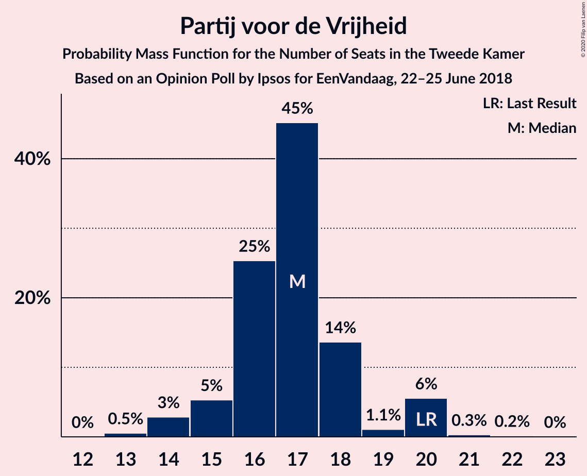

| Number of Seats | Probability | Accumulated | Special Marks |
|:---------------:|:-----------:|:-----------:|:-------------:|
| 13 | 0.5% | 100% |  |
| 14 | 3% | 99.5% |  |
| 15 | 5% | 97% |  |
| 16 | 25% | 91% |  |
| 17 | 45% | 66% | Median |
| 18 | 14% | 21% |  |
| 19 | 1.1% | 7% |  |
| 20 | 6% | 6% | Last Result |
| 21 | 0.3% | 0.5% |  |
| 22 | 0.2% | 0.2% |  |
| 23 | 0% | 0% |  |

### Christen-Democratisch Appèl

*For a full overview of the results for this party, see the [Christen-Democratisch Appèl](party-christen-democratischappèl.html) page.*

| Number of Seats | Probability | Accumulated | Special Marks |
|:---------------:|:-----------:|:-----------:|:-------------:|
| 12 | 0.1% | 100% |  |
| 13 | 7% | 99.9% |  |
| 14 | 1.3% | 93% |  |
| 15 | 4% | 92% |  |
| 16 | 31% | 88% |  |
| 17 | 51% | 56% | Median |
| 18 | 3% | 5% |  |
| 19 | 2% | 3% | Last Result |
| 20 | 0.3% | 0.4% |  |
| 21 | 0.1% | 0.1% |  |
| 22 | 0% | 0% |  |

### GroenLinks

*For a full overview of the results for this party, see the [GroenLinks](party-groenlinks.html) page.*

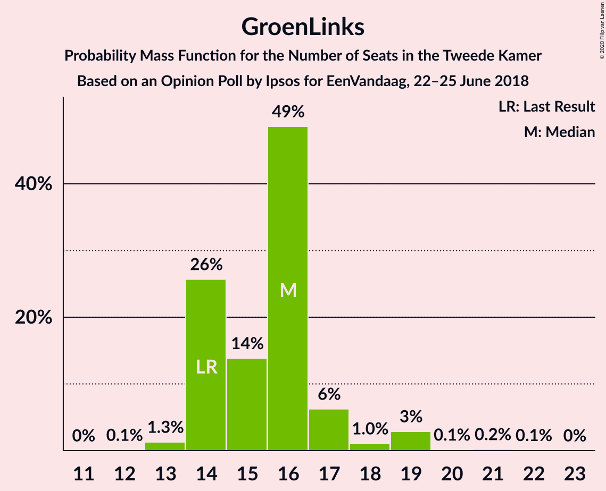

| Number of Seats | Probability | Accumulated | Special Marks |
|:---------------:|:-----------:|:-----------:|:-------------:|
| 12 | 0.1% | 100% |  |
| 13 | 1.3% | 99.9% |  |
| 14 | 26% | 98.6% | Last Result |
| 15 | 14% | 73% |  |
| 16 | 49% | 59% | Median |
| 17 | 6% | 11% |  |
| 18 | 1.0% | 4% |  |
| 19 | 3% | 3% |  |
| 20 | 0.1% | 0.4% |  |
| 21 | 0.2% | 0.2% |  |
| 22 | 0.1% | 0.1% |  |
| 23 | 0% | 0% |  |

### Democraten 66

*For a full overview of the results for this party, see the [Democraten 66](party-democraten66.html) page.*

| Number of Seats | Probability | Accumulated | Special Marks |
|:---------------:|:-----------:|:-----------:|:-------------:|
| 11 | 0% | 100% |  |
| 12 | 2% | 99.9% |  |
| 13 | 42% | 98% |  |
| 14 | 12% | 56% | Median |
| 15 | 14% | 44% |  |
| 16 | 25% | 30% |  |
| 17 | 5% | 5% |  |
| 18 | 0.3% | 0.8% |  |
| 19 | 0.4% | 0.5% | Last Result |
| 20 | 0.1% | 0.1% |  |
| 21 | 0% | 0% |  |

### Socialistische Partij

*For a full overview of the results for this party, see the [Socialistische Partij](party-socialistischepartij.html) page.*

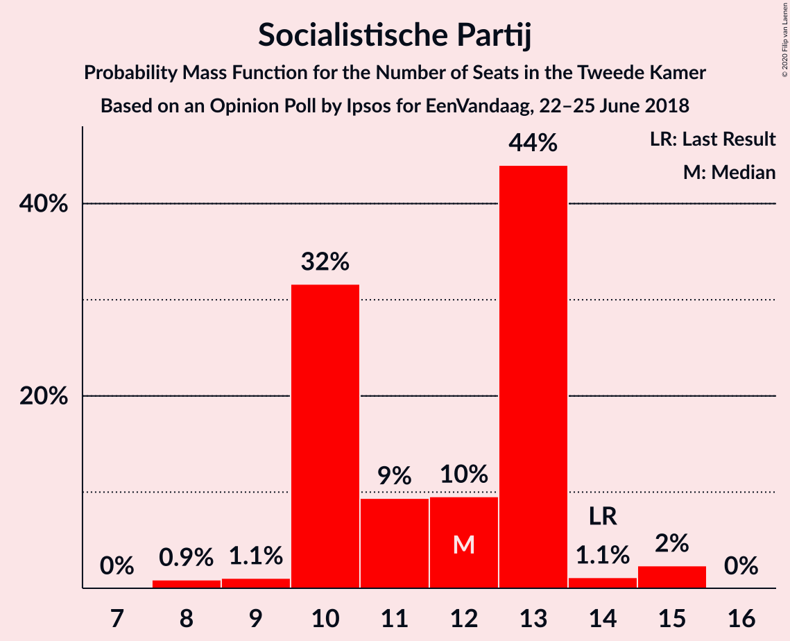

| Number of Seats | Probability | Accumulated | Special Marks |
|:---------------:|:-----------:|:-----------:|:-------------:|
| 8 | 0.9% | 100% |  |
| 9 | 1.1% | 99.1% |  |
| 10 | 32% | 98% |  |
| 11 | 9% | 66% |  |
| 12 | 10% | 57% | Median |
| 13 | 44% | 47% |  |
| 14 | 1.1% | 3% | Last Result |
| 15 | 2% | 2% |  |
| 16 | 0% | 0% |  |

### Forum voor Democratie

*For a full overview of the results for this party, see the [Forum voor Democratie](party-forumvoordemocratie.html) page.*

| Number of Seats | Probability | Accumulated | Special Marks |
|:---------------:|:-----------:|:-----------:|:-------------:|
| 2 | 0% | 100% | Last Result |
| 3 | 0% | 100% |  |
| 4 | 0% | 100% |  |
| 5 | 0% | 100% |  |
| 6 | 0.2% | 100% |  |
| 7 | 2% | 99.8% |  |
| 8 | 3% | 98% |  |
| 9 | 44% | 94% | Median |
| 10 | 48% | 50% |  |
| 11 | 2% | 2% |  |
| 12 | 0.1% | 0.1% |  |
| 13 | 0% | 0% |  |

### Partij van de Arbeid

*For a full overview of the results for this party, see the [Partij van de Arbeid](party-partijvandearbeid.html) page.*

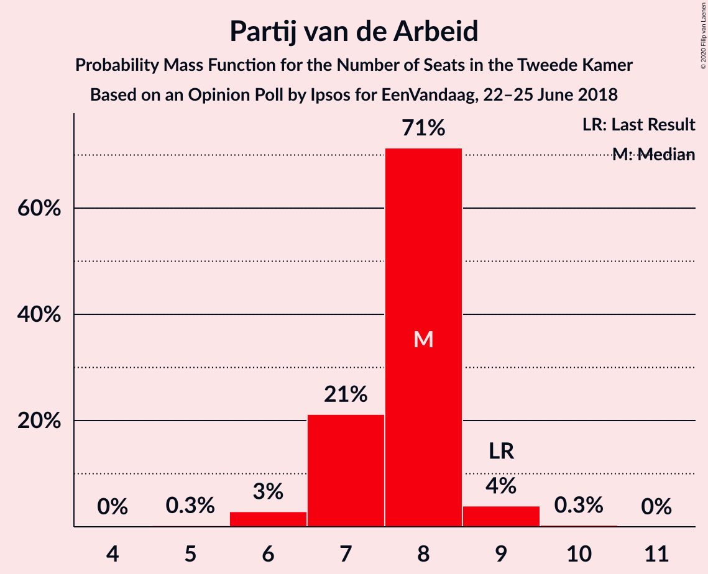

| Number of Seats | Probability | Accumulated | Special Marks |
|:---------------:|:-----------:|:-----------:|:-------------:|
| 5 | 0.3% | 100% |  |
| 6 | 3% | 99.7% |  |
| 7 | 21% | 97% |  |
| 8 | 71% | 76% | Median |
| 9 | 4% | 4% | Last Result |
| 10 | 0.3% | 0.4% |  |
| 11 | 0% | 0% |  |

### Partij voor de Dieren

*For a full overview of the results for this party, see the [Partij voor de Dieren](party-partijvoordedieren.html) page.*

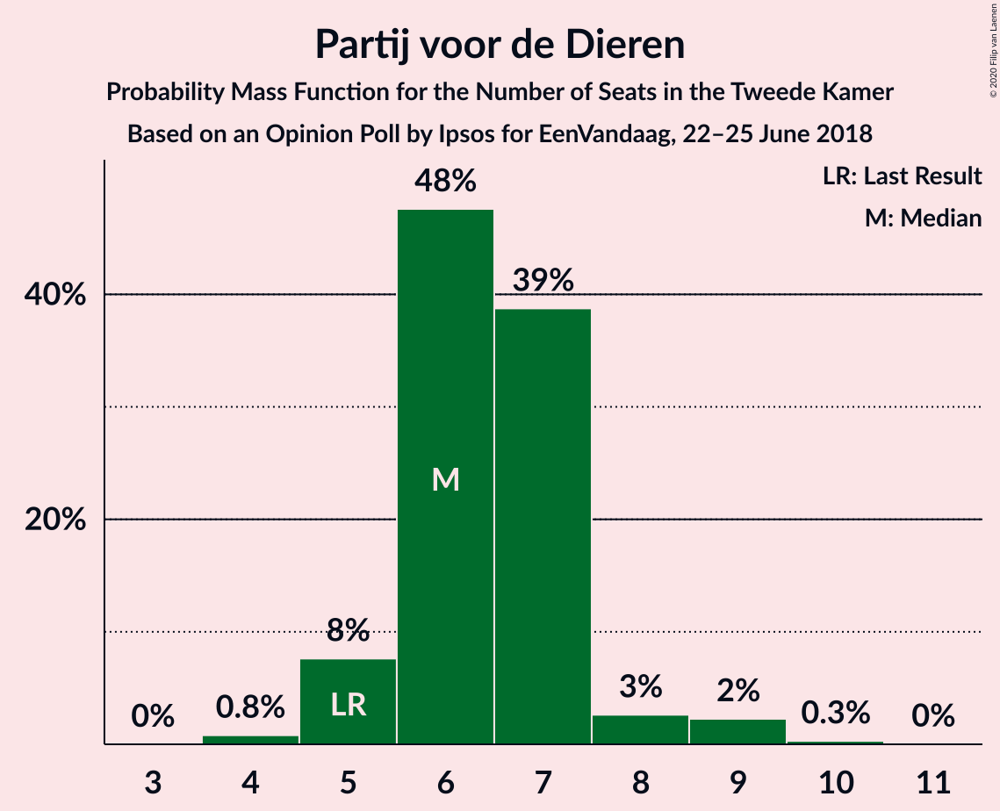

| Number of Seats | Probability | Accumulated | Special Marks |
|:---------------:|:-----------:|:-----------:|:-------------:|
| 4 | 0.8% | 100% |  |
| 5 | 8% | 99.2% | Last Result |
| 6 | 48% | 92% | Median |
| 7 | 39% | 44% |  |
| 8 | 3% | 5% |  |
| 9 | 2% | 3% |  |
| 10 | 0.3% | 0.3% |  |
| 11 | 0% | 0% |  |

### ChristenUnie

*For a full overview of the results for this party, see the [ChristenUnie](party-christenunie.html) page.*

| Number of Seats | Probability | Accumulated | Special Marks |
|:---------------:|:-----------:|:-----------:|:-------------:|
| 4 | 1.3% | 100% |  |
| 5 | 45% | 98.7% | Last Result |
| 6 | 7% | 54% | Median |
| 7 | 43% | 47% |  |
| 8 | 4% | 5% |  |
| 9 | 0.1% | 0.1% |  |
| 10 | 0% | 0% |  |

### 50Plus

*For a full overview of the results for this party, see the [50Plus](party-50plus.html) page.*

| Number of Seats | Probability | Accumulated | Special Marks |
|:---------------:|:-----------:|:-----------:|:-------------:|
| 3 | 0.8% | 100% |  |
| 4 | 11% | 99.2% | Last Result |
| 5 | 45% | 88% | Median |
| 6 | 13% | 43% |  |
| 7 | 30% | 30% |  |
| 8 | 0.3% | 0.5% |  |
| 9 | 0.2% | 0.2% |  |
| 10 | 0.1% | 0.1% |  |
| 11 | 0% | 0% |  |

### DENK

*For a full overview of the results for this party, see the [DENK](party-denk.html) page.*

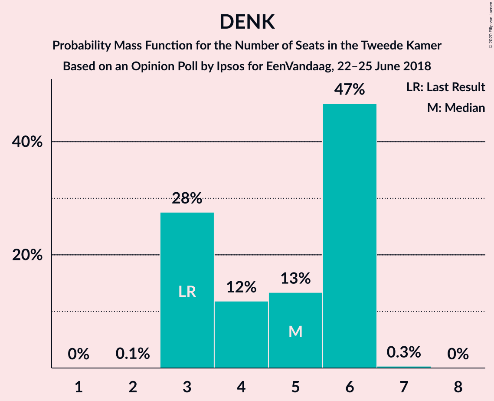

| Number of Seats | Probability | Accumulated | Special Marks |
|:---------------:|:-----------:|:-----------:|:-------------:|
| 2 | 0.1% | 100% |  |
| 3 | 28% | 99.9% | Last Result |
| 4 | 12% | 72% |  |
| 5 | 13% | 61% | Median |
| 6 | 47% | 47% |  |
| 7 | 0.3% | 0.4% |  |
| 8 | 0% | 0% |  |

### Staatkundig Gereformeerde Partij

*For a full overview of the results for this party, see the [Staatkundig Gereformeerde Partij](party-staatkundiggereformeerdepartij.html) page.*

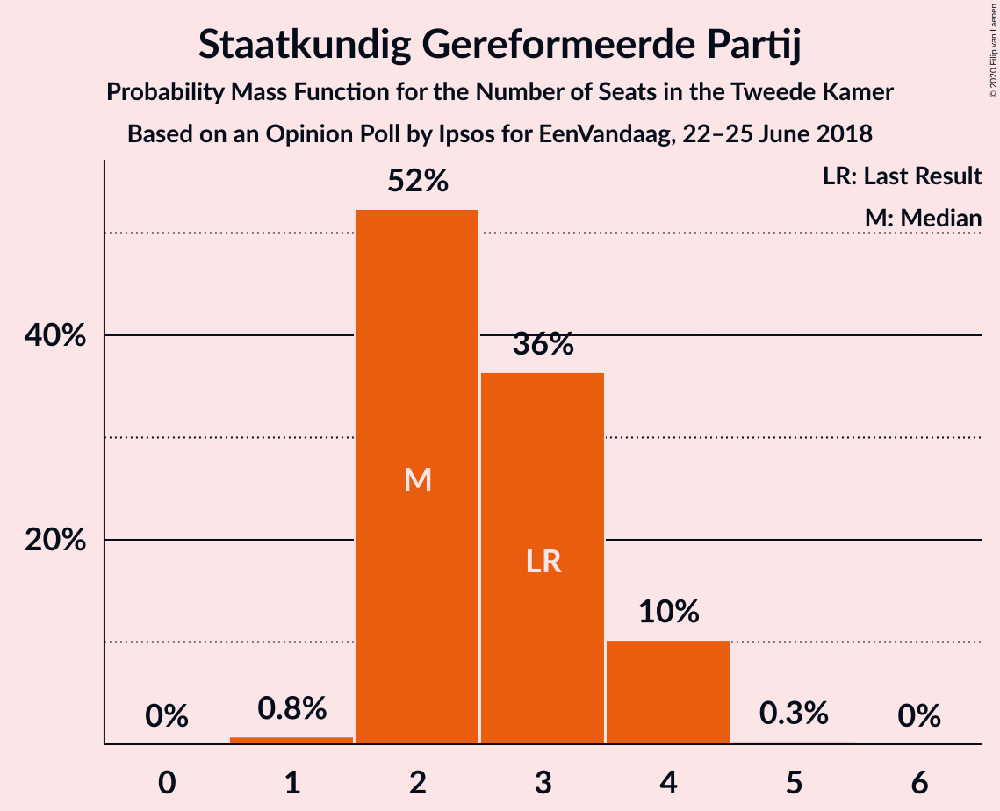

| Number of Seats | Probability | Accumulated | Special Marks |
|:---------------:|:-----------:|:-----------:|:-------------:|
| 1 | 0.8% | 100% |  |
| 2 | 52% | 99.2% | Median |
| 3 | 36% | 47% | Last Result |
| 4 | 10% | 10% |  |
| 5 | 0.3% | 0.3% |  |
| 6 | 0% | 0% |  |

## Coalitions

### Confidence Intervals

| Coalition | Last Result | Median | Majority? | 80% Confidence Interval | 90% Confidence Interval | 95% Confidence Interval | 99% Confidence Interval |
|:---------:|:-----------:|:------:|:---------:|:-----------------------:|:-----------------------:|:-----------------------:|:-----------------------:|
| Volkspartij voor Vrijheid en Democratie – Christen-Democratisch Appèl – GroenLinks – Democraten 66 – ChristenUnie | 90 | 83 | 100% | 83–87 | 81–87 | 81–89 | 79–89 |
| Volkspartij voor Vrijheid en Democratie – Partij voor de Vrijheid – Christen-Democratisch Appèl – Forum voor Democratie – Staatkundig Gereformeerde Partij | 77 | 78 | 89% | 75–79 | 74–80 | 72–80 | 72–82 |
| Volkspartij voor Vrijheid en Democratie – Christen-Democratisch Appèl – Democraten 66 – Partij van de Arbeid – ChristenUnie | 85 | 75 | 46% | 74–80 | 72–80 | 71–80 | 71–81 |
| Christen-Democratisch Appèl – GroenLinks – Democraten 66 – Socialistische Partij – Partij van de Arbeid – ChristenUnie | 80 | 72 | 4% | 70–73 | 69–75 | 68–78 | 65–78 |
| Volkspartij voor Vrijheid en Democratie – Partij voor de Vrijheid – Christen-Democratisch Appèl – Forum voor Democratie | 74 | 76 | 52% | 73–76 | 71–77 | 70–77 | 69–78 |
| Volkspartij voor Vrijheid en Democratie – Christen-Democratisch Appèl – Democraten 66 – ChristenUnie | 76 | 67 | 0.1% | 67–72 | 65–72 | 64–72 | 64–74 |
| Volkspartij voor Vrijheid en Democratie – Christen-Democratisch Appèl – Forum voor Democratie – 50Plus – Staatkundig Gereformeerde Partij | 61 | 66 | 0% | 63–68 | 63–68 | 61–68 | 59–70 |
| Volkspartij voor Vrijheid en Democratie – Partij voor de Vrijheid – Christen-Democratisch Appèl | 72 | 66 | 0% | 63–67 | 62–68 | 61–68 | 61–69 |
| Volkspartij voor Vrijheid en Democratie – Christen-Democratisch Appèl – Democraten 66 | 71 | 62 | 0% | 61–65 | 58–65 | 57–66 | 57–67 |
| Volkspartij voor Vrijheid en Democratie – Christen-Democratisch Appèl – Forum voor Democratie – 50Plus | 58 | 64 | 0% | 60–65 | 59–65 | 59–65 | 57–67 |
| Christen-Democratisch Appèl – GroenLinks – Democraten 66 – Partij van de Arbeid – ChristenUnie | 66 | 59 | 0% | 59–63 | 58–63 | 56–63 | 55–66 |
| Volkspartij voor Vrijheid en Democratie – Christen-Democratisch Appèl – Forum voor Democratie – Staatkundig Gereformeerde Partij | 57 | 61 | 0% | 58–62 | 57–62 | 55–63 | 54–64 |
| Volkspartij voor Vrijheid en Democratie – Christen-Democratisch Appèl – Forum voor Democratie | 54 | 59 | 0% | 55–59 | 53–59 | 53–60 | 52–61 |
| Volkspartij voor Vrijheid en Democratie – Christen-Democratisch Appèl – Partij van de Arbeid | 61 | 57 | 0% | 54–57 | 51–57 | 50–59 | 50–60 |
| Volkspartij voor Vrijheid en Democratie – Democraten 66 – Partij van de Arbeid | 61 | 53 | 0% | 52–57 | 51–57 | 49–58 | 49–58 |
| Volkspartij voor Vrijheid en Democratie – Christen-Democratisch Appèl | 52 | 49 | 0% | 46–50 | 44–50 | 43–51 | 43–52 |
| Volkspartij voor Vrijheid en Democratie – Partij van de Arbeid | 42 | 40 | 0% | 37–41 | 37–41 | 35–41 | 35–43 |
| Christen-Democratisch Appèl – Democraten 66 – Partij van de Arbeid | 47 | 38 | 0% | 37–40 | 34–40 | 34–41 | 34–44 |
| Christen-Democratisch Appèl – Democraten 66 | 38 | 30 | 0% | 30–32 | 28–33 | 27–34 | 27–36 |
| Christen-Democratisch Appèl – Partij van de Arbeid – ChristenUnie | 33 | 30 | 0% | 28–31 | 27–32 | 27–33 | 26–34 |
| Christen-Democratisch Appèl – Partij van de Arbeid | 28 | 24 | 0% | 22–25 | 20–26 | 20–26 | 20–28 |

### Volkspartij voor Vrijheid en Democratie – Christen-Democratisch Appèl – GroenLinks – Democraten 66 – ChristenUnie

| Number of Seats | Probability | Accumulated | Special Marks |
|:---------------:|:-----------:|:-----------:|:-------------:|
| 77 | 0.1% | 100% |  |
| 78 | 0% | 99.9% |  |
| 79 | 0.5% | 99.8% |  |
| 80 | 1.1% | 99.3% |  |
| 81 | 5% | 98% |  |
| 82 | 2% | 94% |  |
| 83 | 43% | 92% |  |
| 84 | 4% | 49% |  |
| 85 | 3% | 44% | Median |
| 86 | 31% | 41% |  |
| 87 | 7% | 11% |  |
| 88 | 0.9% | 3% |  |
| 89 | 2% | 3% |  |
| 90 | 0.2% | 0.4% | Last Result |
| 91 | 0.1% | 0.2% |  |
| 92 | 0% | 0% |  |

### Volkspartij voor Vrijheid en Democratie – Partij voor de Vrijheid – Christen-Democratisch Appèl – Forum voor Democratie – Staatkundig Gereformeerde Partij

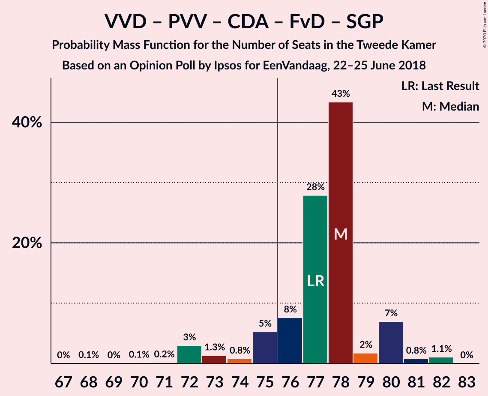

| Number of Seats | Probability | Accumulated | Special Marks |
|:---------------:|:-----------:|:-----------:|:-------------:|
| 68 | 0.1% | 100% |  |
| 69 | 0% | 99.9% |  |
| 70 | 0.1% | 99.9% |  |
| 71 | 0.2% | 99.8% |  |
| 72 | 3% | 99.7% |  |
| 73 | 1.3% | 97% |  |
| 74 | 0.8% | 95% |  |
| 75 | 5% | 95% |  |
| 76 | 8% | 89% | Majority |
| 77 | 28% | 82% | Last Result, Median |
| 78 | 43% | 54% |  |
| 79 | 2% | 11% |  |
| 80 | 7% | 9% |  |
| 81 | 0.8% | 2% |  |
| 82 | 1.1% | 1.1% |  |
| 83 | 0% | 0% |  |

### Volkspartij voor Vrijheid en Democratie – Christen-Democratisch Appèl – Democraten 66 – Partij van de Arbeid – ChristenUnie

| Number of Seats | Probability | Accumulated | Special Marks |
|:---------------:|:-----------:|:-----------:|:-------------:|
| 68 | 0.1% | 100% |  |
| 69 | 0% | 99.9% |  |
| 70 | 0.2% | 99.9% |  |
| 71 | 4% | 99.8% |  |
| 72 | 3% | 96% |  |
| 73 | 0.7% | 93% |  |
| 74 | 3% | 92% |  |
| 75 | 43% | 89% |  |
| 76 | 3% | 46% | Majority |
| 77 | 3% | 43% | Median |
| 78 | 7% | 41% |  |
| 79 | 8% | 34% |  |
| 80 | 24% | 26% |  |
| 81 | 2% | 2% |  |
| 82 | 0.1% | 0.3% |  |
| 83 | 0.1% | 0.2% |  |
| 84 | 0.1% | 0.1% |  |
| 85 | 0% | 0% | Last Result |

### Christen-Democratisch Appèl – GroenLinks – Democraten 66 – Socialistische Partij – Partij van de Arbeid – ChristenUnie

| Number of Seats | Probability | Accumulated | Special Marks |
|:---------------:|:-----------:|:-----------:|:-------------:|
| 65 | 0.5% | 100% |  |
| 66 | 0.2% | 99.4% |  |
| 67 | 1.0% | 99.3% |  |
| 68 | 1.0% | 98% |  |
| 69 | 4% | 97% |  |
| 70 | 6% | 94% |  |
| 71 | 25% | 88% |  |
| 72 | 49% | 63% |  |
| 73 | 6% | 14% | Median |
| 74 | 2% | 8% |  |
| 75 | 3% | 6% |  |
| 76 | 0.7% | 4% | Majority |
| 77 | 0.3% | 3% |  |
| 78 | 3% | 3% |  |
| 79 | 0.1% | 0.1% |  |
| 80 | 0% | 0.1% | Last Result |
| 81 | 0% | 0% |  |

### Volkspartij voor Vrijheid en Democratie – Partij voor de Vrijheid – Christen-Democratisch Appèl – Forum voor Democratie

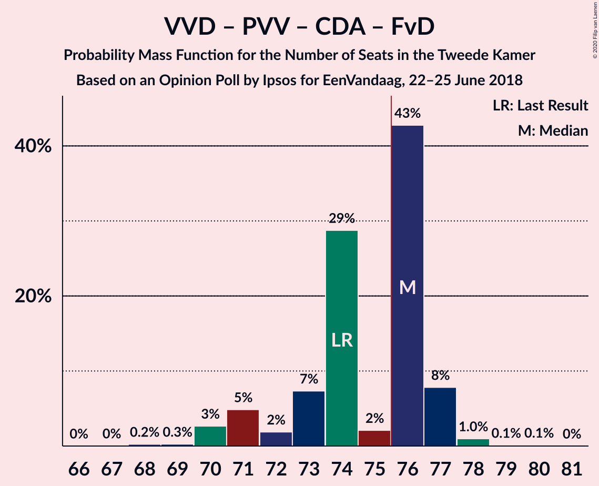

| Number of Seats | Probability | Accumulated | Special Marks |
|:---------------:|:-----------:|:-----------:|:-------------:|
| 66 | 0% | 100% |  |
| 67 | 0% | 99.9% |  |
| 68 | 0.2% | 99.9% |  |
| 69 | 0.3% | 99.7% |  |
| 70 | 3% | 99.4% |  |
| 71 | 5% | 97% |  |
| 72 | 2% | 92% |  |
| 73 | 7% | 90% |  |
| 74 | 29% | 83% | Last Result |
| 75 | 2% | 54% | Median |
| 76 | 43% | 52% | Majority |
| 77 | 8% | 9% |  |
| 78 | 1.0% | 1.2% |  |
| 79 | 0.1% | 0.2% |  |
| 80 | 0.1% | 0.1% |  |
| 81 | 0% | 0% |  |

### Volkspartij voor Vrijheid en Democratie – Christen-Democratisch Appèl – Democraten 66 – ChristenUnie

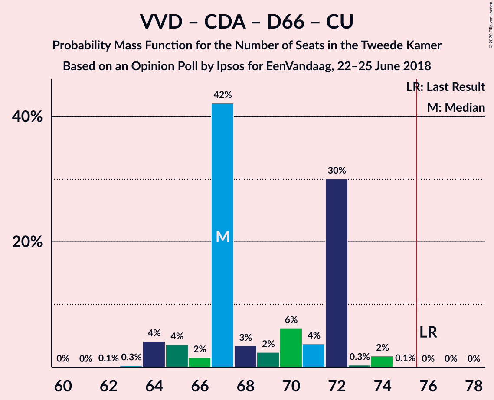

| Number of Seats | Probability | Accumulated | Special Marks |
|:---------------:|:-----------:|:-----------:|:-------------:|
| 60 | 0% | 100% |  |
| 61 | 0% | 99.9% |  |
| 62 | 0.1% | 99.9% |  |
| 63 | 0.3% | 99.8% |  |
| 64 | 4% | 99.6% |  |
| 65 | 4% | 95% |  |
| 66 | 2% | 92% |  |
| 67 | 42% | 90% |  |
| 68 | 3% | 48% |  |
| 69 | 2% | 45% | Median |
| 70 | 6% | 42% |  |
| 71 | 4% | 36% |  |
| 72 | 30% | 32% |  |
| 73 | 0.3% | 2% |  |
| 74 | 2% | 2% |  |
| 75 | 0.1% | 0.2% |  |
| 76 | 0% | 0.1% | Last Result, Majority |
| 77 | 0% | 0% |  |

### Volkspartij voor Vrijheid en Democratie – Christen-Democratisch Appèl – Forum voor Democratie – 50Plus – Staatkundig Gereformeerde Partij

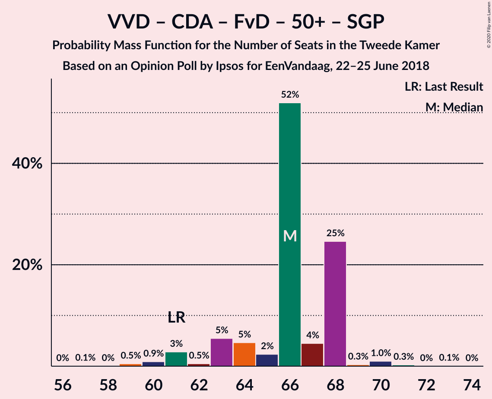

| Number of Seats | Probability | Accumulated | Special Marks |
|:---------------:|:-----------:|:-----------:|:-------------:|
| 57 | 0.1% | 100% |  |
| 58 | 0% | 99.9% |  |
| 59 | 0.5% | 99.9% |  |
| 60 | 0.9% | 99.4% |  |
| 61 | 3% | 98.5% | Last Result |
| 62 | 0.5% | 96% |  |
| 63 | 5% | 95% |  |
| 64 | 5% | 90% |  |
| 65 | 2% | 85% | Median |
| 66 | 52% | 83% |  |
| 67 | 4% | 31% |  |
| 68 | 25% | 26% |  |
| 69 | 0.3% | 2% |  |
| 70 | 1.0% | 1.3% |  |
| 71 | 0.3% | 0.3% |  |
| 72 | 0% | 0.1% |  |
| 73 | 0.1% | 0.1% |  |
| 74 | 0% | 0% |  |

### Volkspartij voor Vrijheid en Democratie – Partij voor de Vrijheid – Christen-Democratisch Appèl

| Number of Seats | Probability | Accumulated | Special Marks |
|:---------------:|:-----------:|:-----------:|:-------------:|
| 57 | 0.1% | 100% |  |
| 58 | 0% | 99.9% |  |
| 59 | 0.2% | 99.9% |  |
| 60 | 0.1% | 99.7% |  |
| 61 | 3% | 99.6% |  |
| 62 | 5% | 97% |  |
| 63 | 6% | 91% |  |
| 64 | 1.2% | 85% |  |
| 65 | 27% | 84% |  |
| 66 | 47% | 57% | Median |
| 67 | 1.5% | 10% |  |
| 68 | 7% | 9% |  |
| 69 | 1.0% | 1.3% |  |
| 70 | 0.2% | 0.3% |  |
| 71 | 0.1% | 0.1% |  |
| 72 | 0% | 0% | Last Result |

### Volkspartij voor Vrijheid en Democratie – Christen-Democratisch Appèl – Democraten 66

| Number of Seats | Probability | Accumulated | Special Marks |
|:---------------:|:-----------:|:-----------:|:-------------:|
| 55 | 0.1% | 100% |  |
| 56 | 0% | 99.9% |  |
| 57 | 4% | 99.9% |  |
| 58 | 3% | 96% |  |
| 59 | 0.8% | 93% |  |
| 60 | 2% | 92% |  |
| 61 | 2% | 90% |  |
| 62 | 48% | 89% |  |
| 63 | 2% | 41% | Median |
| 64 | 5% | 39% |  |
| 65 | 30% | 34% |  |
| 66 | 2% | 4% |  |
| 67 | 2% | 2% |  |
| 68 | 0.2% | 0.3% |  |
| 69 | 0.1% | 0.1% |  |
| 70 | 0% | 0.1% |  |
| 71 | 0% | 0% | Last Result |

### Volkspartij voor Vrijheid en Democratie – Christen-Democratisch Appèl – Forum voor Democratie – 50Plus

| Number of Seats | Probability | Accumulated | Special Marks |
|:---------------:|:-----------:|:-----------:|:-------------:|
| 54 | 0.1% | 100% |  |
| 55 | 0% | 99.9% |  |
| 56 | 0.1% | 99.9% |  |
| 57 | 1.1% | 99.8% |  |
| 58 | 0.5% | 98.7% | Last Result |
| 59 | 7% | 98% |  |
| 60 | 2% | 91% |  |
| 61 | 1.4% | 90% |  |
| 62 | 5% | 88% |  |
| 63 | 12% | 83% | Median |
| 64 | 46% | 72% |  |
| 65 | 24% | 26% |  |
| 66 | 0.4% | 2% |  |
| 67 | 1.3% | 1.4% |  |
| 68 | 0% | 0.1% |  |
| 69 | 0% | 0.1% |  |
| 70 | 0.1% | 0.1% |  |
| 71 | 0% | 0% |  |

### Christen-Democratisch Appèl – GroenLinks – Democraten 66 – Partij van de Arbeid – ChristenUnie

| Number of Seats | Probability | Accumulated | Special Marks |
|:---------------:|:-----------:|:-----------:|:-------------:|
| 54 | 0% | 100% |  |
| 55 | 0.9% | 99.9% |  |
| 56 | 2% | 99.0% |  |
| 57 | 0.2% | 97% |  |
| 58 | 5% | 97% |  |
| 59 | 45% | 91% |  |
| 60 | 3% | 46% |  |
| 61 | 30% | 43% | Median |
| 62 | 2% | 13% |  |
| 63 | 9% | 11% |  |
| 64 | 0.9% | 2% |  |
| 65 | 0.6% | 1.3% |  |
| 66 | 0.4% | 0.7% | Last Result |
| 67 | 0.1% | 0.3% |  |
| 68 | 0.2% | 0.2% |  |
| 69 | 0% | 0.1% |  |
| 70 | 0% | 0% |  |

### Volkspartij voor Vrijheid en Democratie – Christen-Democratisch Appèl – Forum voor Democratie – Staatkundig Gereformeerde Partij

| Number of Seats | Probability | Accumulated | Special Marks |
|:---------------:|:-----------:|:-----------:|:-------------:|
| 53 | 0.2% | 100% |  |
| 54 | 0.4% | 99.8% |  |
| 55 | 3% | 99.4% |  |
| 56 | 1.3% | 97% |  |
| 57 | 5% | 96% | Last Result |
| 58 | 4% | 90% |  |
| 59 | 3% | 86% |  |
| 60 | 6% | 83% | Median |
| 61 | 65% | 77% |  |
| 62 | 9% | 12% |  |
| 63 | 1.5% | 3% |  |
| 64 | 1.2% | 2% |  |
| 65 | 0.2% | 0.4% |  |
| 66 | 0% | 0.1% |  |
| 67 | 0.1% | 0.1% |  |
| 68 | 0% | 0% |  |

### Volkspartij voor Vrijheid en Democratie – Christen-Democratisch Appèl – Forum voor Democratie

| Number of Seats | Probability | Accumulated | Special Marks |
|:---------------:|:-----------:|:-----------:|:-------------:|
| 50 | 0.1% | 100% |  |
| 51 | 0.1% | 99.8% |  |
| 52 | 0.3% | 99.8% |  |
| 53 | 8% | 99.5% |  |
| 54 | 1.3% | 92% | Last Result |
| 55 | 1.1% | 91% |  |
| 56 | 8% | 89% |  |
| 57 | 3% | 81% |  |
| 58 | 25% | 78% | Median |
| 59 | 48% | 53% |  |
| 60 | 4% | 5% |  |
| 61 | 0.6% | 0.8% |  |
| 62 | 0.1% | 0.2% |  |
| 63 | 0% | 0.1% |  |
| 64 | 0.1% | 0.1% |  |
| 65 | 0% | 0% |  |

### Volkspartij voor Vrijheid en Democratie – Christen-Democratisch Appèl – Partij van de Arbeid

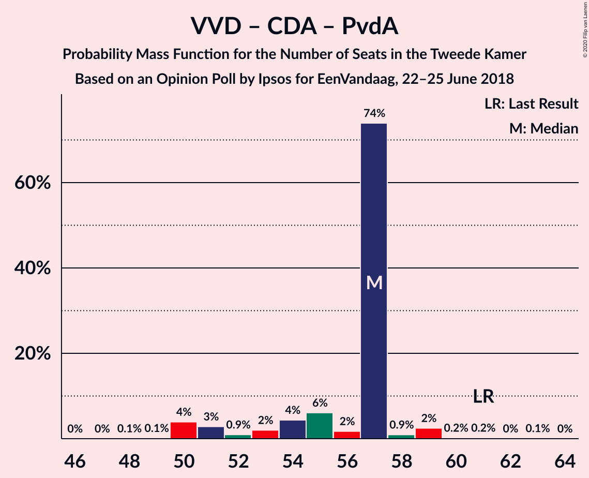

| Number of Seats | Probability | Accumulated | Special Marks |
|:---------------:|:-----------:|:-----------:|:-------------:|
| 48 | 0.1% | 100% |  |
| 49 | 0.1% | 99.9% |  |
| 50 | 4% | 99.8% |  |
| 51 | 3% | 96% |  |
| 52 | 0.9% | 93% |  |
| 53 | 2% | 92% |  |
| 54 | 4% | 90% |  |
| 55 | 6% | 86% |  |
| 56 | 2% | 80% |  |
| 57 | 74% | 78% | Median |
| 58 | 0.9% | 4% |  |
| 59 | 2% | 3% |  |
| 60 | 0.2% | 0.5% |  |
| 61 | 0.2% | 0.3% | Last Result |
| 62 | 0% | 0.1% |  |
| 63 | 0.1% | 0.1% |  |
| 64 | 0% | 0% |  |

### Volkspartij voor Vrijheid en Democratie – Democraten 66 – Partij van de Arbeid

| Number of Seats | Probability | Accumulated | Special Marks |
|:---------------:|:-----------:|:-----------:|:-------------:|
| 47 | 0.1% | 100% |  |
| 48 | 0.1% | 99.9% |  |
| 49 | 3% | 99.8% |  |
| 50 | 0.3% | 97% |  |
| 51 | 7% | 97% |  |
| 52 | 1.2% | 90% |  |
| 53 | 44% | 89% |  |
| 54 | 6% | 45% | Median |
| 55 | 9% | 39% |  |
| 56 | 2% | 30% |  |
| 57 | 24% | 28% |  |
| 58 | 4% | 4% |  |
| 59 | 0.1% | 0.4% |  |
| 60 | 0.1% | 0.3% |  |
| 61 | 0.1% | 0.2% | Last Result |
| 62 | 0% | 0.1% |  |
| 63 | 0% | 0% |  |

### Volkspartij voor Vrijheid en Democratie – Christen-Democratisch Appèl

| Number of Seats | Probability | Accumulated | Special Marks |
|:---------------:|:-----------:|:-----------:|:-------------:|
| 41 | 0.1% | 100% |  |
| 42 | 0.1% | 99.9% |  |
| 43 | 4% | 99.8% |  |
| 44 | 3% | 96% |  |
| 45 | 1.4% | 92% |  |
| 46 | 2% | 91% |  |
| 47 | 8% | 89% |  |
| 48 | 5% | 81% |  |
| 49 | 65% | 77% | Median |
| 50 | 8% | 12% |  |
| 51 | 2% | 4% |  |
| 52 | 2% | 2% | Last Result |
| 53 | 0.2% | 0.3% |  |
| 54 | 0% | 0.1% |  |
| 55 | 0.1% | 0.1% |  |
| 56 | 0% | 0% |  |

### Volkspartij voor Vrijheid en Democratie – Partij van de Arbeid

| Number of Seats | Probability | Accumulated | Special Marks |
|:---------------:|:-----------:|:-----------:|:-------------:|
| 33 | 0.1% | 100% |  |
| 34 | 0.2% | 99.9% |  |
| 35 | 3% | 99.7% |  |
| 36 | 1.2% | 97% |  |
| 37 | 7% | 96% |  |
| 38 | 3% | 89% |  |
| 39 | 4% | 86% |  |
| 40 | 50% | 82% | Median |
| 41 | 30% | 32% |  |
| 42 | 0.9% | 2% | Last Result |
| 43 | 0.3% | 0.8% |  |
| 44 | 0.2% | 0.5% |  |
| 45 | 0.1% | 0.3% |  |
| 46 | 0.2% | 0.2% |  |
| 47 | 0% | 0% |  |

### Christen-Democratisch Appèl – Democraten 66 – Partij van de Arbeid

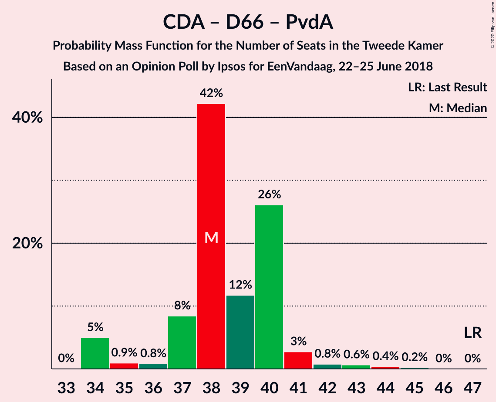

| Number of Seats | Probability | Accumulated | Special Marks |
|:---------------:|:-----------:|:-----------:|:-------------:|
| 33 | 0% | 100% |  |
| 34 | 5% | 99.9% |  |
| 35 | 0.9% | 95% |  |
| 36 | 0.8% | 94% |  |
| 37 | 8% | 93% |  |
| 38 | 42% | 85% |  |
| 39 | 12% | 43% | Median |
| 40 | 26% | 31% |  |
| 41 | 3% | 5% |  |
| 42 | 0.8% | 2% |  |
| 43 | 0.6% | 1.3% |  |
| 44 | 0.4% | 0.6% |  |
| 45 | 0.2% | 0.2% |  |
| 46 | 0% | 0% |  |
| 47 | 0% | 0% | Last Result |

### Christen-Democratisch Appèl – Democraten 66

| Number of Seats | Probability | Accumulated | Special Marks |
|:---------------:|:-----------:|:-----------:|:-------------:|
| 26 | 0.2% | 100% |  |
| 27 | 5% | 99.8% |  |
| 28 | 1.5% | 95% |  |
| 29 | 2% | 94% |  |
| 30 | 48% | 92% |  |
| 31 | 7% | 44% | Median |
| 32 | 32% | 37% |  |
| 33 | 1.0% | 5% |  |
| 34 | 3% | 4% |  |
| 35 | 0.6% | 1.1% |  |
| 36 | 0.4% | 0.5% |  |
| 37 | 0.1% | 0.1% |  |
| 38 | 0% | 0% | Last Result |

### Christen-Democratisch Appèl – Partij van de Arbeid – ChristenUnie

| Number of Seats | Probability | Accumulated | Special Marks |
|:---------------:|:-----------:|:-----------:|:-------------:|
| 24 | 0.1% | 100% |  |
| 25 | 0.2% | 99.9% |  |
| 26 | 1.1% | 99.7% |  |
| 27 | 8% | 98.7% |  |
| 28 | 1.5% | 91% |  |
| 29 | 4% | 89% |  |
| 30 | 45% | 86% |  |
| 31 | 31% | 40% | Median |
| 32 | 6% | 9% |  |
| 33 | 3% | 4% | Last Result |
| 34 | 0.7% | 1.0% |  |
| 35 | 0.1% | 0.3% |  |
| 36 | 0.1% | 0.2% |  |
| 37 | 0% | 0% |  |

### Christen-Democratisch Appèl – Partij van de Arbeid

| Number of Seats | Probability | Accumulated | Special Marks |
|:---------------:|:-----------:|:-----------:|:-------------:|
| 19 | 0.1% | 100% |  |
| 20 | 7% | 99.9% |  |
| 21 | 0.6% | 93% |  |
| 22 | 4% | 92% |  |
| 23 | 5% | 88% |  |
| 24 | 35% | 83% |  |
| 25 | 43% | 49% | Median |
| 26 | 4% | 6% |  |
| 27 | 0.8% | 1.5% |  |
| 28 | 0.5% | 0.7% | Last Result |
| 29 | 0.1% | 0.2% |  |
| 30 | 0.1% | 0.1% |  |
| 31 | 0% | 0% |  |

## Technical Information

### Opinion Poll

+ **Polling firm:** Ipsos
+ **Commissioner(s):** EenVandaag
+ **Fieldwork period:** 22–25 June 2018

### Calculations

+ **Sample size:** 1140
+ **Simulations done:** 1,048,576
+ **Error estimate:** 2.18%

