# Opinion Poll by I&O Research, 13–29 June 2018

<a href="#voting-intentions">Voting Intentions</a> | <a href="#seats">Seats</a> | <a href="#coalitions">Coalitions</a> | <a href="#technical-information">Technical Information</a>

## Voting Intentions

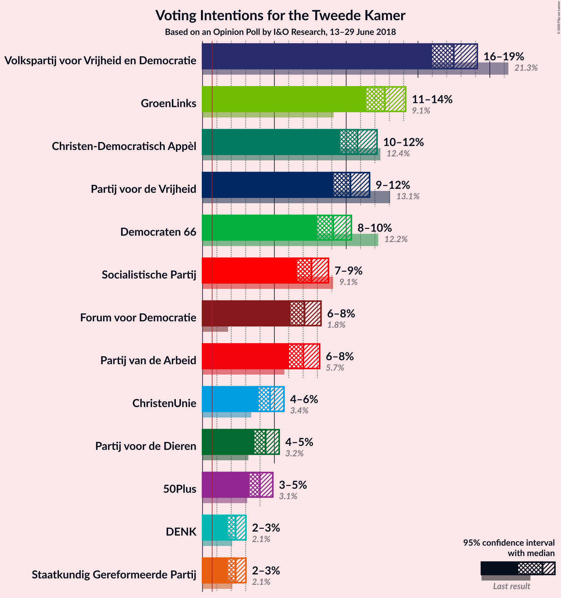

### Confidence Intervals

| Party | Last Result | Poll Result | 80% Confidence Interval | 90% Confidence Interval | 95% Confidence Interval | 99% Confidence Interval |
|:-----:|:-----------:|:-----------:|:-----------------------:|:-----------------------:|:-----------------------:|:-----------------------:|
| Volkspartij voor Vrijheid en Democratie | 21.3% | 17.5% | 16.5–18.6% |16.2–18.9% |16.0–19.1% |15.5–19.6% |
| GroenLinks | 9.1% | 12.7% | 11.8–13.6% |11.6–13.9% |11.4–14.1% |11.0–14.6% |
| Christen-Democratisch Appèl | 12.4% | 10.8% | 10.0–11.7% |9.8–11.9% |9.6–12.1% |9.2–12.6% |
| Partij voor de Vrijheid | 13.1% | 10.3% | 9.5–11.2% |9.3–11.4% |9.1–11.6% |8.7–12.1% |
| Democraten 66 | 12.2% | 9.1% | 8.4–9.9% |8.2–10.2% |8.0–10.4% |7.6–10.8% |
| Socialistische Partij | 9.1% | 7.6% | 6.9–8.4% |6.7–8.6% |6.6–8.8% |6.2–9.1% |
| Forum voor Democratie | 1.8% | 7.1% | 6.4–7.8% |6.3–8.1% |6.1–8.2% |5.8–8.6% |
| Partij van de Arbeid | 5.7% | 7.0% | 6.4–7.8% |6.2–8.0% |6.0–8.2% |5.7–8.5% |
| ChristenUnie | 3.4% | 4.7% | 4.2–5.3% |4.0–5.5% |3.9–5.7% |3.7–6.0% |
| Partij voor de Dieren | 3.2% | 4.4% | 3.9–5.0% |3.7–5.2% |3.6–5.3% |3.4–5.6% |
| 50Plus | 3.1% | 4.0% | 3.5–4.6% |3.4–4.8% |3.3–4.9% |3.0–5.2% |
| Staatkundig Gereformeerde Partij | 2.1% | 2.3% | 2.0–2.8% |1.8–2.9% |1.8–3.0% |1.6–3.3% |
| DENK | 2.1% | 2.3% | 2.0–2.8% |1.8–2.9% |1.8–3.0% |1.6–3.3% |

*Note:* The poll result column reflects the actual value used in the calculations. Published results may vary slightly, and in addition be rounded to fewer digits.

## Seats

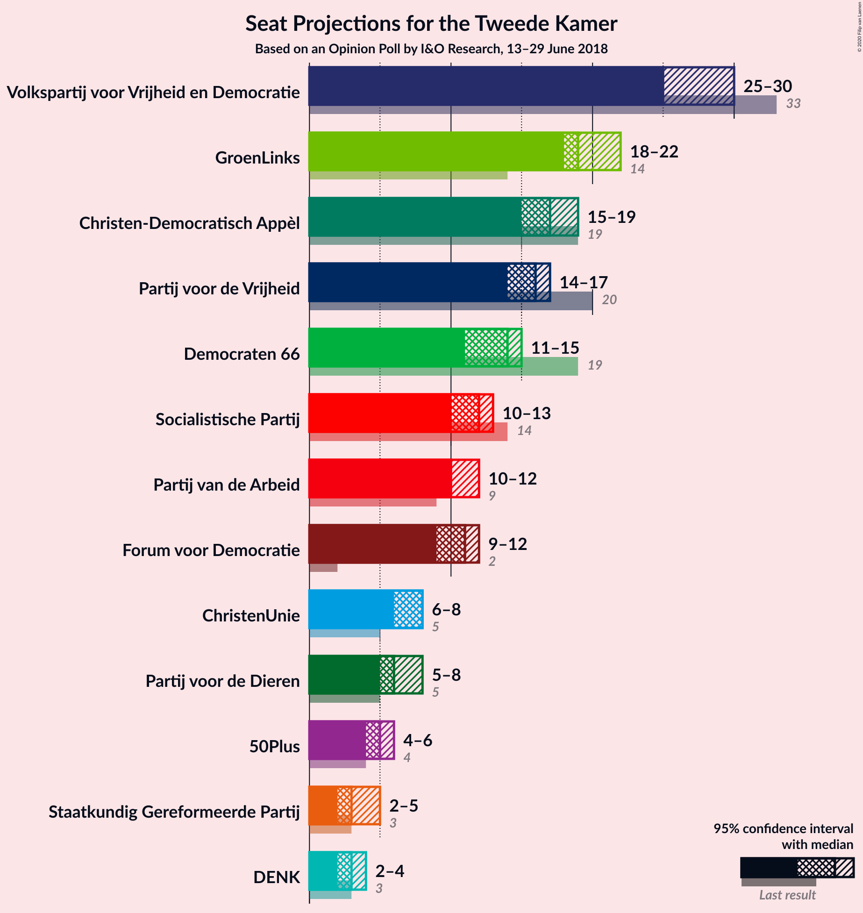

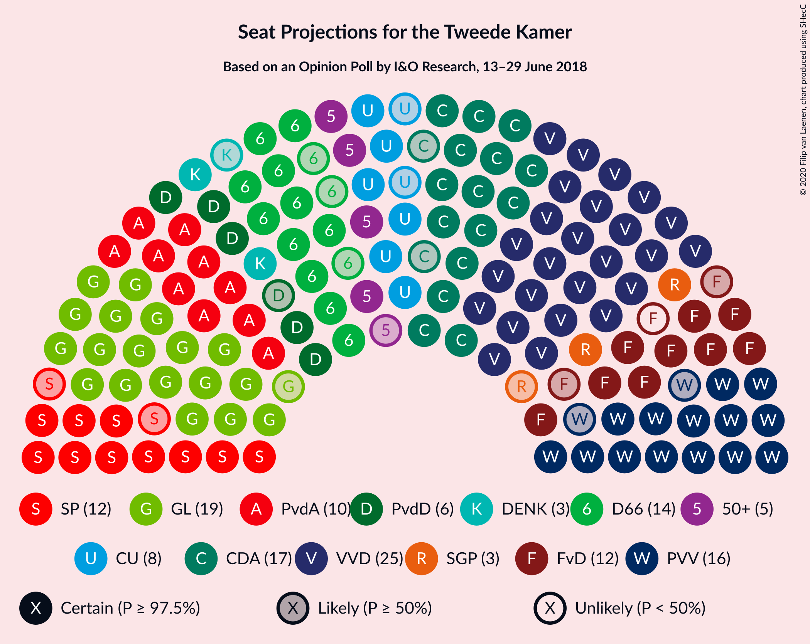

### Confidence Intervals

| Party | Last Result | Median | 80% Confidence Interval | 90% Confidence Interval | 95% Confidence Interval | 99% Confidence Interval |
|:-----:|:-----------:|:------:|:-----------------------:|:-----------------------:|:-----------------------:|:-----------------------:|
| <a href="#volkspartij-voor-vrijheid-en-democratie">Volkspartij voor Vrijheid en Democratie</a> | 33 | 25 | 25–28 |25–30 |25–30 |24–30 |
| <a href="#groenlinks">GroenLinks</a> | 14 | 19 | 18–20 |18–21 |18–22 |17–22 |
| <a href="#christen-democratisch-appèl">Christen-Democratisch Appèl</a> | 19 | 17 | 16–18 |15–18 |15–19 |13–19 |
| <a href="#partij-voor-de-vrijheid">Partij voor de Vrijheid</a> | 20 | 16 | 15–17 |15–17 |14–17 |14–18 |
| <a href="#democraten-66">Democraten 66</a> | 19 | 14 | 12–15 |11–15 |11–15 |11–16 |
| <a href="#socialistische-partij">Socialistische Partij</a> | 14 | 12 | 11–13 |10–13 |10–13 |9–13 |
| <a href="#forum-voor-democratie">Forum voor Democratie</a> | 2 | 11 | 10–12 |9–12 |9–12 |9–13 |
| <a href="#partij-van-de-arbeid">Partij van de Arbeid</a> | 9 | 10 | 10–11 |10–12 |10–12 |9–12 |
| <a href="#christenunie">ChristenUnie</a> | 5 | 8 | 6–8 |6–8 |6–8 |5–9 |
| <a href="#partij-voor-de-dieren">Partij voor de Dieren</a> | 5 | 6 | 6–8 |6–8 |5–8 |5–8 |
| <a href="#50plus">50Plus</a> | 4 | 5 | 5–6 |5–6 |4–6 |4–7 |
| <a href="#staatkundig-gereformeerde-partij">Staatkundig Gereformeerde Partij</a> | 3 | 3 | 2–4 |2–4 |2–5 |2–5 |
| <a href="#denk">DENK</a> | 3 | 3 | 3 |3–4 |2–4 |2–5 |

### Volkspartij voor Vrijheid en Democratie

*For a full overview of the results for this party, see the [Volkspartij voor Vrijheid en Democratie](party-volkspartijvoorvrijheidendemocratie.html) page.*

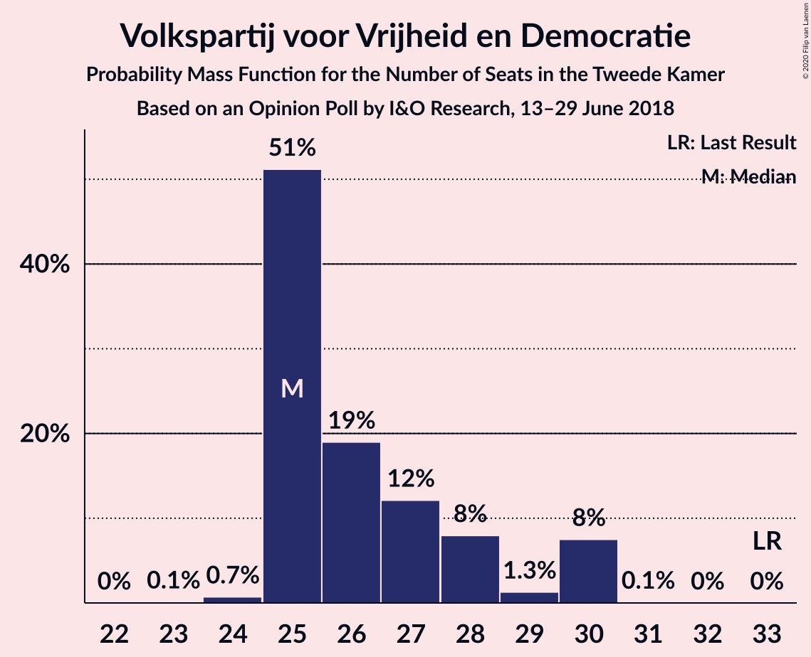

| Number of Seats | Probability | Accumulated | Special Marks |
|:---------------:|:-----------:|:-----------:|:-------------:|
| 23 | 0.1% | 100% |  |
| 24 | 0.7% | 99.9% |  |
| 25 | 51% | 99.2% | Median |
| 26 | 19% | 48% |  |
| 27 | 12% | 29% |  |
| 28 | 8% | 17% |  |
| 29 | 1.3% | 9% |  |
| 30 | 8% | 8% |  |
| 31 | 0.1% | 0.1% |  |
| 32 | 0% | 0% |  |
| 33 | 0% | 0% | Last Result |

### GroenLinks

*For a full overview of the results for this party, see the [GroenLinks](party-groenlinks.html) page.*

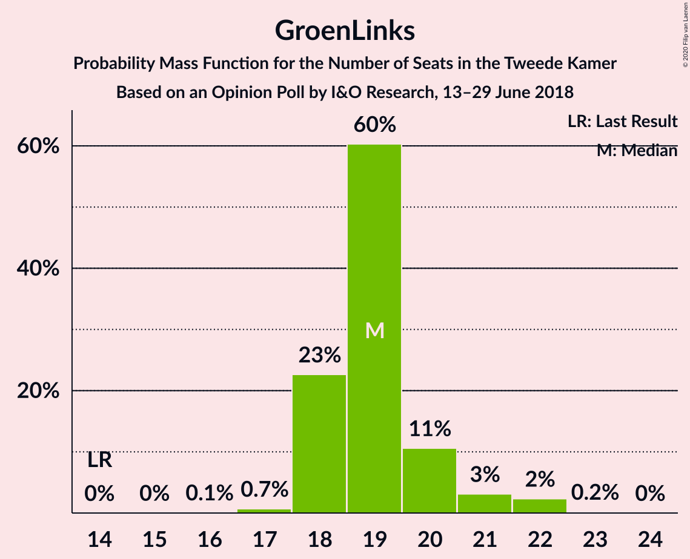

| Number of Seats | Probability | Accumulated | Special Marks |
|:---------------:|:-----------:|:-----------:|:-------------:|
| 14 | 0% | 100% | Last Result |
| 15 | 0% | 100% |  |
| 16 | 0.1% | 100% |  |
| 17 | 0.7% | 99.9% |  |
| 18 | 23% | 99.2% |  |
| 19 | 60% | 77% | Median |
| 20 | 11% | 16% |  |
| 21 | 3% | 6% |  |
| 22 | 2% | 3% |  |
| 23 | 0.2% | 0.2% |  |
| 24 | 0% | 0% |  |

### Christen-Democratisch Appèl

*For a full overview of the results for this party, see the [Christen-Democratisch Appèl](party-christen-democratischappèl.html) page.*

| Number of Seats | Probability | Accumulated | Special Marks |
|:---------------:|:-----------:|:-----------:|:-------------:|
| 13 | 0.5% | 100% |  |
| 14 | 1.4% | 99.5% |  |
| 15 | 6% | 98% |  |
| 16 | 27% | 92% |  |
| 17 | 51% | 66% | Median |
| 18 | 10% | 15% |  |
| 19 | 5% | 5% | Last Result |
| 20 | 0% | 0% |  |

### Partij voor de Vrijheid

*For a full overview of the results for this party, see the [Partij voor de Vrijheid](party-partijvoordevrijheid.html) page.*

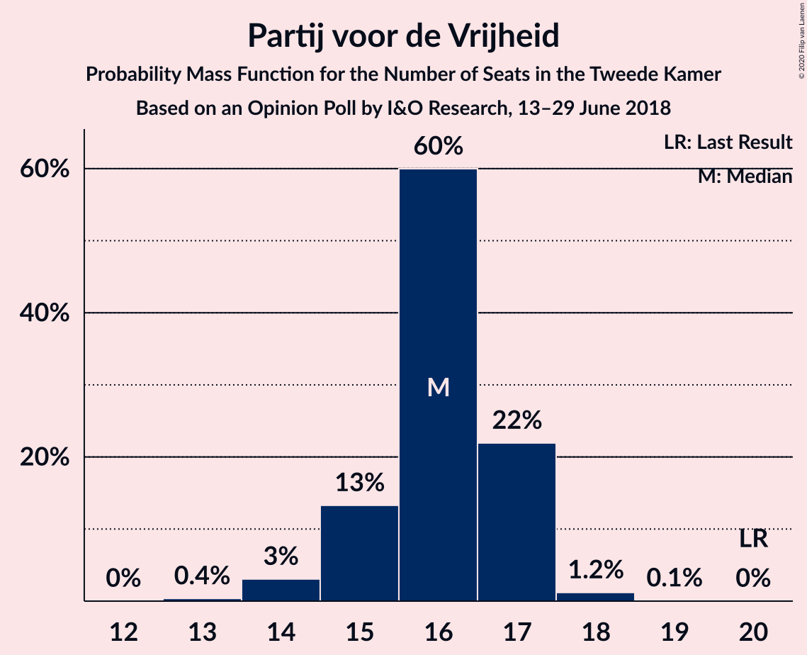

| Number of Seats | Probability | Accumulated | Special Marks |
|:---------------:|:-----------:|:-----------:|:-------------:|
| 13 | 0.4% | 100% |  |
| 14 | 3% | 99.6% |  |
| 15 | 13% | 97% |  |
| 16 | 60% | 83% | Median |
| 17 | 22% | 23% |  |
| 18 | 1.2% | 1.3% |  |
| 19 | 0.1% | 0.1% |  |
| 20 | 0% | 0% | Last Result |

### Democraten 66

*For a full overview of the results for this party, see the [Democraten 66](party-democraten66.html) page.*

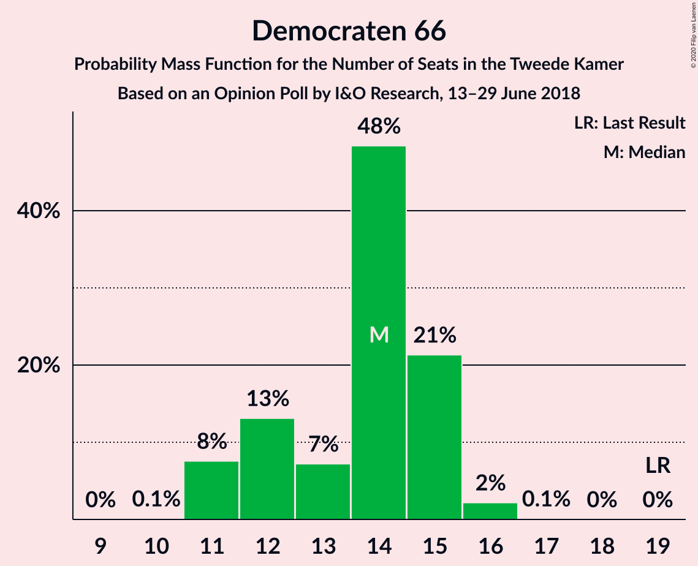

| Number of Seats | Probability | Accumulated | Special Marks |
|:---------------:|:-----------:|:-----------:|:-------------:|
| 10 | 0.1% | 100% |  |
| 11 | 8% | 99.9% |  |
| 12 | 13% | 92% |  |
| 13 | 7% | 79% |  |
| 14 | 48% | 72% | Median |
| 15 | 21% | 24% |  |
| 16 | 2% | 2% |  |
| 17 | 0.1% | 0.1% |  |
| 18 | 0% | 0% |  |
| 19 | 0% | 0% | Last Result |

### Socialistische Partij

*For a full overview of the results for this party, see the [Socialistische Partij](party-socialistischepartij.html) page.*

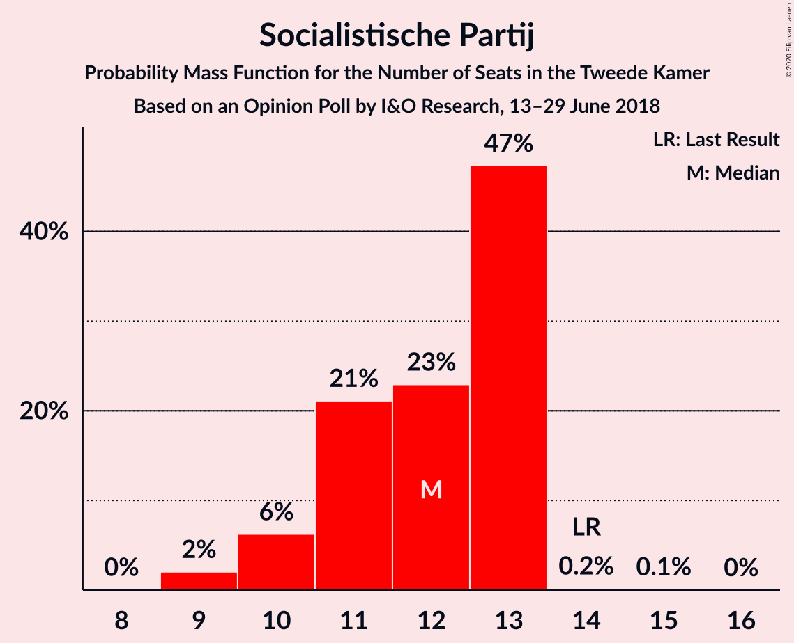

| Number of Seats | Probability | Accumulated | Special Marks |
|:---------------:|:-----------:|:-----------:|:-------------:|
| 9 | 2% | 100% |  |
| 10 | 6% | 98% |  |
| 11 | 21% | 92% |  |
| 12 | 23% | 71% | Median |
| 13 | 47% | 48% |  |
| 14 | 0.2% | 0.3% | Last Result |
| 15 | 0.1% | 0.1% |  |
| 16 | 0% | 0% |  |

### Forum voor Democratie

*For a full overview of the results for this party, see the [Forum voor Democratie](party-forumvoordemocratie.html) page.*

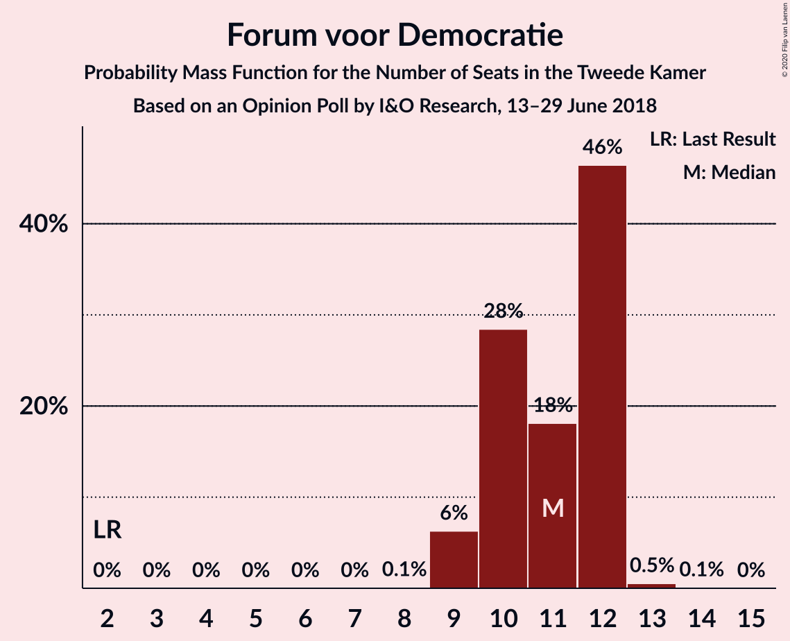

| Number of Seats | Probability | Accumulated | Special Marks |
|:---------------:|:-----------:|:-----------:|:-------------:|
| 2 | 0% | 100% | Last Result |
| 3 | 0% | 100% |  |
| 4 | 0% | 100% |  |
| 5 | 0% | 100% |  |
| 6 | 0% | 100% |  |
| 7 | 0% | 100% |  |
| 8 | 0.1% | 100% |  |
| 9 | 6% | 99.9% |  |
| 10 | 28% | 94% |  |
| 11 | 18% | 65% | Median |
| 12 | 46% | 47% |  |
| 13 | 0.5% | 0.6% |  |
| 14 | 0.1% | 0.1% |  |
| 15 | 0% | 0% |  |

### Partij van de Arbeid

*For a full overview of the results for this party, see the [Partij van de Arbeid](party-partijvandearbeid.html) page.*

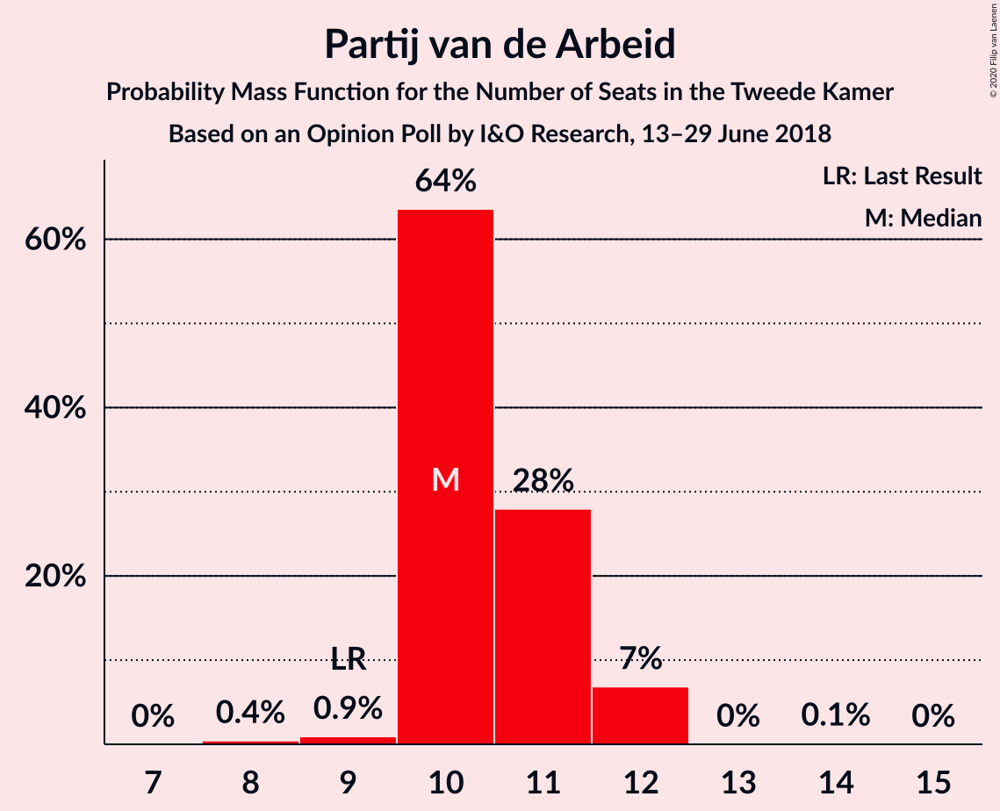

| Number of Seats | Probability | Accumulated | Special Marks |
|:---------------:|:-----------:|:-----------:|:-------------:|
| 8 | 0.4% | 100% |  |
| 9 | 0.9% | 99.6% | Last Result |
| 10 | 64% | 98.6% | Median |
| 11 | 28% | 35% |  |
| 12 | 7% | 7% |  |
| 13 | 0% | 0.2% |  |
| 14 | 0.1% | 0.1% |  |
| 15 | 0% | 0% |  |

### ChristenUnie

*For a full overview of the results for this party, see the [ChristenUnie](party-christenunie.html) page.*

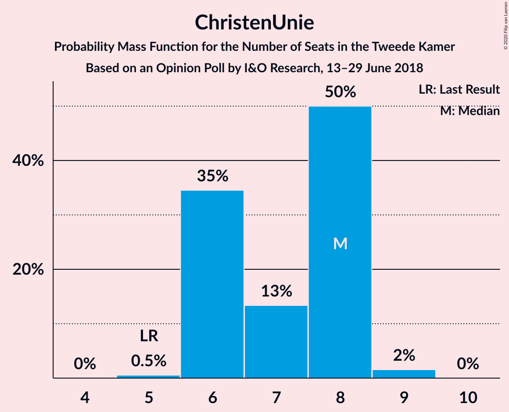

| Number of Seats | Probability | Accumulated | Special Marks |
|:---------------:|:-----------:|:-----------:|:-------------:|
| 5 | 0.5% | 100% | Last Result |
| 6 | 35% | 99.5% |  |
| 7 | 13% | 65% |  |
| 8 | 50% | 52% | Median |
| 9 | 2% | 2% |  |
| 10 | 0% | 0% |  |

### Partij voor de Dieren

*For a full overview of the results for this party, see the [Partij voor de Dieren](party-partijvoordedieren.html) page.*

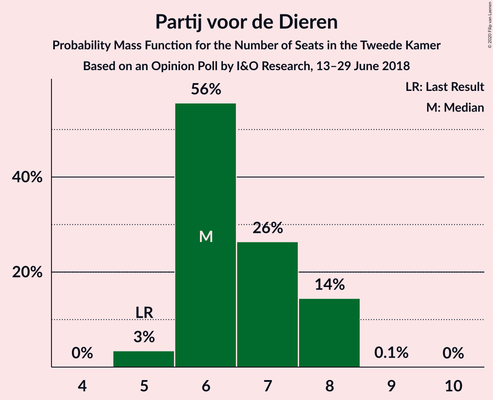

| Number of Seats | Probability | Accumulated | Special Marks |
|:---------------:|:-----------:|:-----------:|:-------------:|
| 5 | 3% | 100% | Last Result |
| 6 | 56% | 97% | Median |
| 7 | 26% | 41% |  |
| 8 | 14% | 15% |  |
| 9 | 0.1% | 0.1% |  |
| 10 | 0% | 0% |  |

### 50Plus

*For a full overview of the results for this party, see the [50Plus](party-50plus.html) page.*

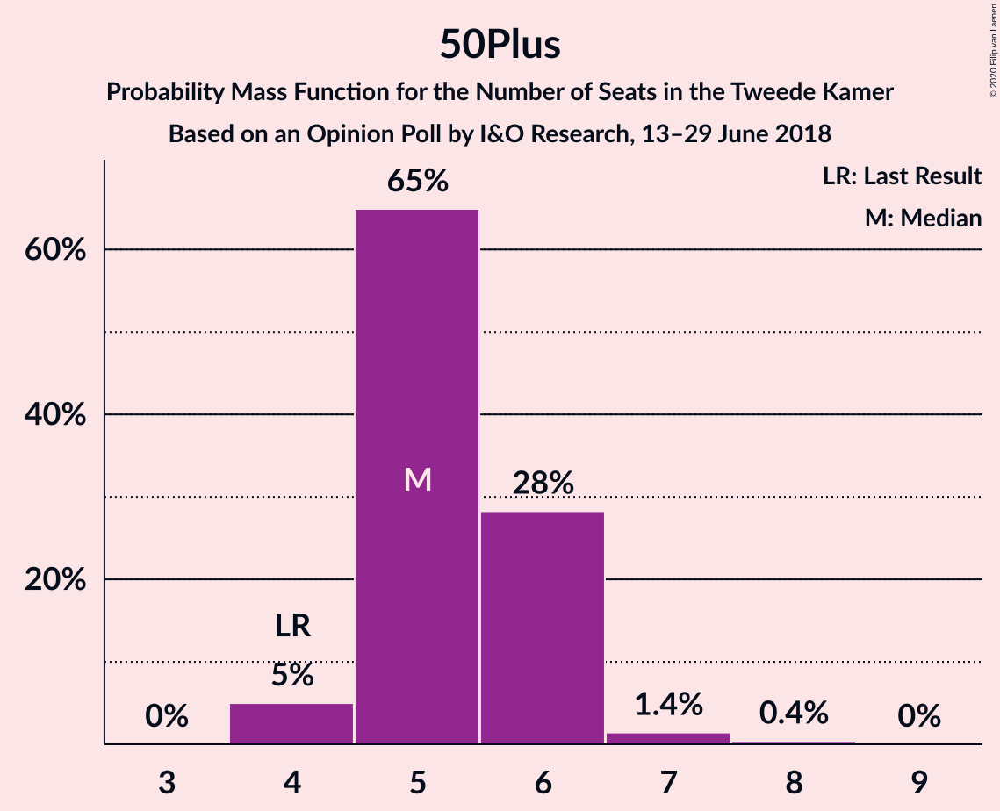

| Number of Seats | Probability | Accumulated | Special Marks |
|:---------------:|:-----------:|:-----------:|:-------------:|
| 4 | 5% | 100% | Last Result |
| 5 | 65% | 95% | Median |
| 6 | 28% | 30% |  |
| 7 | 1.4% | 2% |  |
| 8 | 0.4% | 0.4% |  |
| 9 | 0% | 0% |  |

### Staatkundig Gereformeerde Partij

*For a full overview of the results for this party, see the [Staatkundig Gereformeerde Partij](party-staatkundiggereformeerdepartij.html) page.*

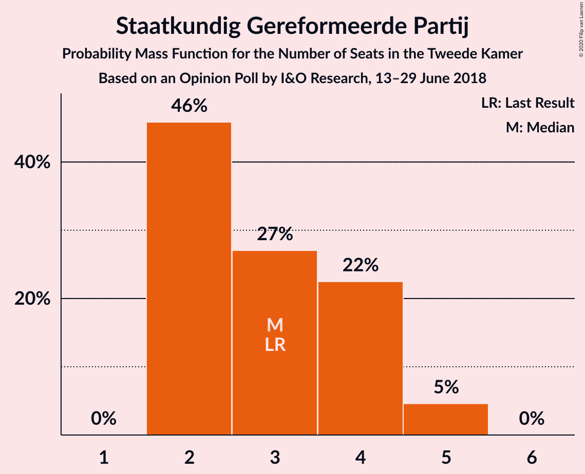

| Number of Seats | Probability | Accumulated | Special Marks |
|:---------------:|:-----------:|:-----------:|:-------------:|
| 2 | 46% | 100% |  |
| 3 | 27% | 54% | Last Result, Median |
| 4 | 22% | 27% |  |
| 5 | 5% | 5% |  |
| 6 | 0% | 0% |  |

### DENK

*For a full overview of the results for this party, see the [DENK](party-denk.html) page.*

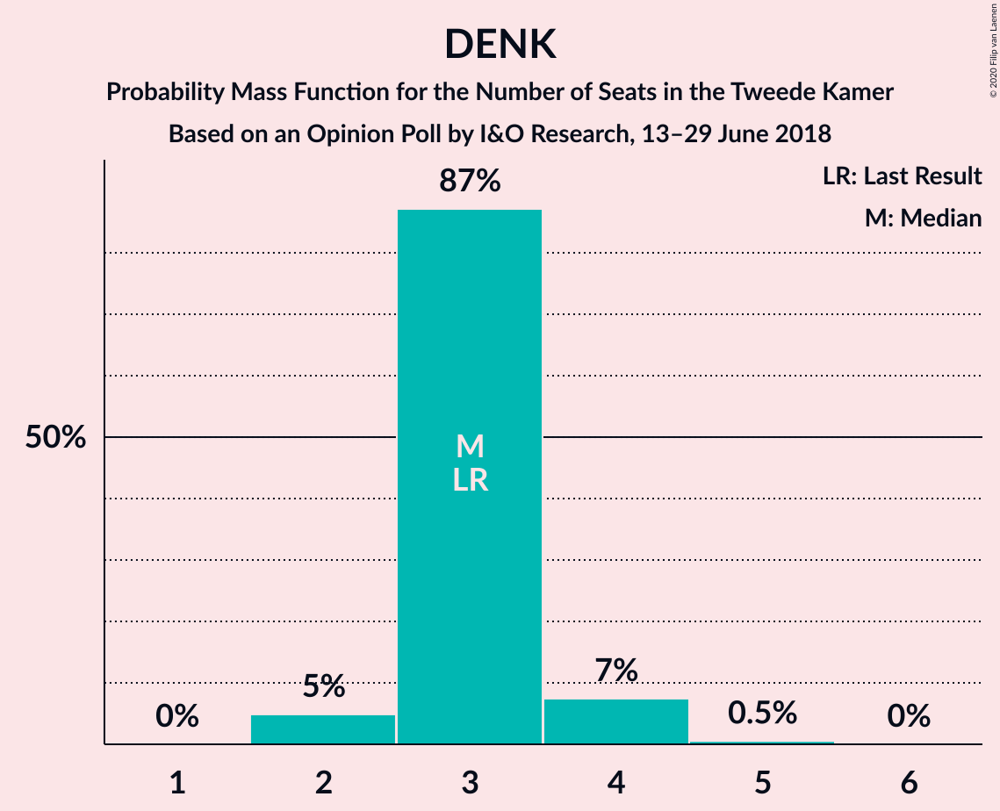

| Number of Seats | Probability | Accumulated | Special Marks |
|:---------------:|:-----------:|:-----------:|:-------------:|
| 2 | 5% | 100% |  |
| 3 | 87% | 95% | Last Result, Median |
| 4 | 7% | 8% |  |
| 5 | 0.5% | 0.5% |  |
| 6 | 0% | 0% |  |

## Coalitions

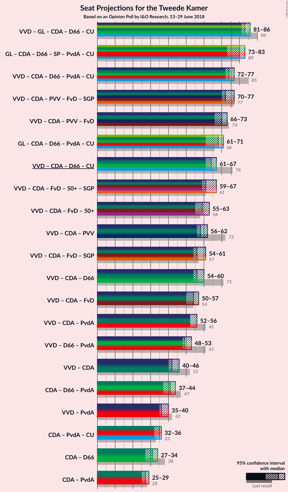

### Confidence Intervals

| Coalition | Last Result | Median | Majority? | 80% Confidence Interval | 90% Confidence Interval | 95% Confidence Interval | 99% Confidence Interval |
|:---------:|:-----------:|:------:|:---------:|:-----------------------:|:-----------------------:|:-----------------------:|:-----------------------:|
| Volkspartij voor Vrijheid en Democratie – GroenLinks – Christen-Democratisch Appèl – Democraten 66 – ChristenUnie | 90 | 83 | 100% | 81–85 | 81–86 | 81–86 | 80–86 |
| GroenLinks – Christen-Democratisch Appèl – Democraten 66 – Socialistische Partij – Partij van de Arbeid – ChristenUnie | 80 | 80 | 92% | 77–81 | 73–81 | 73–83 | 73–83 |
| Volkspartij voor Vrijheid en Democratie – Christen-Democratisch Appèl – Democraten 66 – Partij van de Arbeid – ChristenUnie | 85 | 74 | 10% | 73–75 | 72–77 | 72–77 | 71–78 |
| Volkspartij voor Vrijheid en Democratie – Christen-Democratisch Appèl – Partij voor de Vrijheid – Forum voor Democratie – Staatkundig Gereformeerde Partij | 77 | 72 | 10% | 71–75 | 70–77 | 70–77 | 68–77 |
| Volkspartij voor Vrijheid en Democratie – Christen-Democratisch Appèl – Partij voor de Vrijheid – Forum voor Democratie | 74 | 70 | 0% | 67–72 | 67–73 | 66–73 | 65–74 |
| GroenLinks – Christen-Democratisch Appèl – Democraten 66 – Partij van de Arbeid – ChristenUnie | 66 | 68 | 0% | 65–69 | 61–70 | 61–71 | 61–71 |
| Volkspartij voor Vrijheid en Democratie – Christen-Democratisch Appèl – Democraten 66 – ChristenUnie | 76 | 64 | 0% | 62–65 | 62–67 | 61–67 | 61–68 |
| Volkspartij voor Vrijheid en Democratie – Christen-Democratisch Appèl – Forum voor Democratie – 50Plus – Staatkundig Gereformeerde Partij | 61 | 61 | 0% | 61–64 | 59–67 | 59–67 | 59–67 |
| Volkspartij voor Vrijheid en Democratie – Christen-Democratisch Appèl – Forum voor Democratie – 50Plus | 58 | 59 | 0% | 58–61 | 56–63 | 55–63 | 55–63 |
| Volkspartij voor Vrijheid en Democratie – Christen-Democratisch Appèl – Partij voor de Vrijheid | 72 | 58 | 0% | 57–62 | 56–62 | 56–62 | 55–62 |
| Volkspartij voor Vrijheid en Democratie – Christen-Democratisch Appèl – Forum voor Democratie – Staatkundig Gereformeerde Partij | 57 | 56 | 0% | 56–59 | 55–61 | 54–61 | 54–61 |
| Volkspartij voor Vrijheid en Democratie – Christen-Democratisch Appèl – Democraten 66 | 71 | 56 | 0% | 55–58 | 54–60 | 54–60 | 54–61 |
| Volkspartij voor Vrijheid en Democratie – Christen-Democratisch Appèl – Forum voor Democratie | 54 | 54 | 0% | 52–56 | 51–57 | 50–57 | 50–57 |
| Volkspartij voor Vrijheid en Democratie – Christen-Democratisch Appèl – Partij van de Arbeid | 61 | 52 | 0% | 52–56 | 52–56 | 52–56 | 51–57 |
| Volkspartij voor Vrijheid en Democratie – Democraten 66 – Partij van de Arbeid | 61 | 49 | 0% | 49–53 | 49–53 | 48–53 | 48–55 |
| Volkspartij voor Vrijheid en Democratie – Christen-Democratisch Appèl | 52 | 42 | 0% | 42–45 | 41–46 | 40–46 | 40–46 |
| Christen-Democratisch Appèl – Democraten 66 – Partij van de Arbeid | 47 | 41 | 0% | 38–42 | 37–44 | 37–44 | 37–44 |
| Volkspartij voor Vrijheid en Democratie – Partij van de Arbeid | 42 | 36 | 0% | 35–39 | 35–40 | 35–40 | 35–40 |
| Christen-Democratisch Appèl – Partij van de Arbeid – ChristenUnie | 33 | 35 | 0% | 32–35 | 32–36 | 32–36 | 31–37 |
| Christen-Democratisch Appèl – Democraten 66 | 38 | 31 | 0% | 28–31 | 27–33 | 27–34 | 27–34 |
| Christen-Democratisch Appèl – Partij van de Arbeid | 28 | 27 | 0% | 26–29 | 26–29 | 25–29 | 24–30 |

### Volkspartij voor Vrijheid en Democratie – GroenLinks – Christen-Democratisch Appèl – Democraten 66 – ChristenUnie

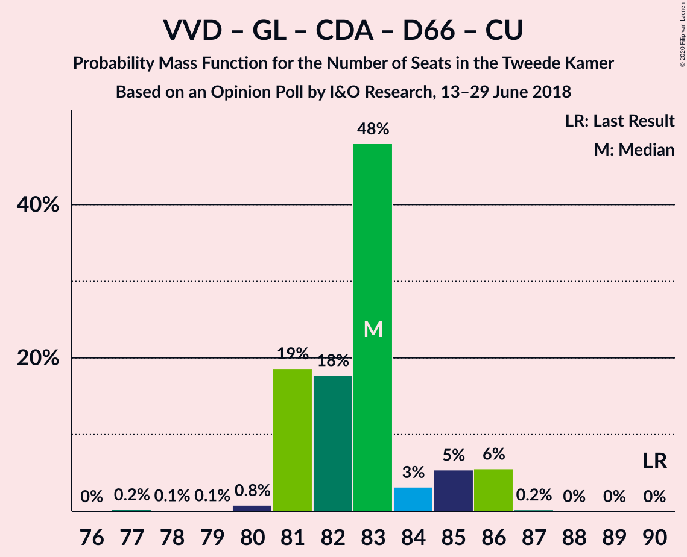

| Number of Seats | Probability | Accumulated | Special Marks |
|:---------------:|:-----------:|:-----------:|:-------------:|
| 77 | 0.2% | 100% |  |
| 78 | 0.1% | 99.8% |  |
| 79 | 0.1% | 99.6% |  |
| 80 | 0.8% | 99.5% |  |
| 81 | 19% | 98.7% |  |
| 82 | 18% | 80% |  |
| 83 | 48% | 62% | Median |
| 84 | 3% | 14% |  |
| 85 | 5% | 11% |  |
| 86 | 6% | 6% |  |
| 87 | 0.2% | 0.3% |  |
| 88 | 0% | 0% |  |
| 89 | 0% | 0% |  |
| 90 | 0% | 0% | Last Result |

### GroenLinks – Christen-Democratisch Appèl – Democraten 66 – Socialistische Partij – Partij van de Arbeid – ChristenUnie

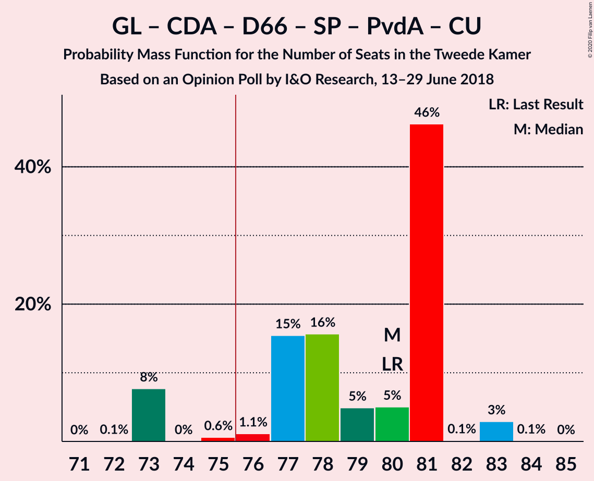

| Number of Seats | Probability | Accumulated | Special Marks |
|:---------------:|:-----------:|:-----------:|:-------------:|
| 72 | 0.1% | 100% |  |
| 73 | 8% | 99.9% |  |
| 74 | 0% | 92% |  |
| 75 | 0.6% | 92% |  |
| 76 | 1.1% | 92% | Majority |
| 77 | 15% | 90% |  |
| 78 | 16% | 75% |  |
| 79 | 5% | 59% |  |
| 80 | 5% | 54% | Last Result, Median |
| 81 | 46% | 49% |  |
| 82 | 0.1% | 3% |  |
| 83 | 3% | 3% |  |
| 84 | 0.1% | 0.1% |  |
| 85 | 0% | 0% |  |

### Volkspartij voor Vrijheid en Democratie – Christen-Democratisch Appèl – Democraten 66 – Partij van de Arbeid – ChristenUnie

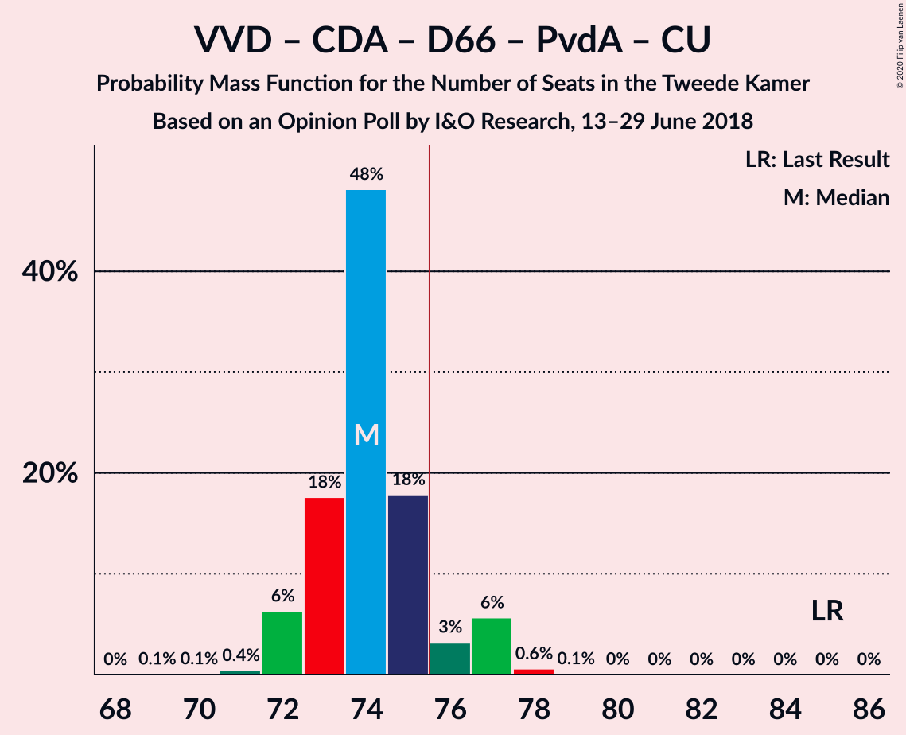

| Number of Seats | Probability | Accumulated | Special Marks |
|:---------------:|:-----------:|:-----------:|:-------------:|
| 69 | 0.1% | 100% |  |
| 70 | 0.1% | 99.9% |  |
| 71 | 0.4% | 99.9% |  |
| 72 | 6% | 99.5% |  |
| 73 | 18% | 93% |  |
| 74 | 48% | 76% | Median |
| 75 | 18% | 27% |  |
| 76 | 3% | 10% | Majority |
| 77 | 6% | 6% |  |
| 78 | 0.6% | 0.7% |  |
| 79 | 0.1% | 0.1% |  |
| 80 | 0% | 0% |  |
| 81 | 0% | 0% |  |
| 82 | 0% | 0% |  |
| 83 | 0% | 0% |  |
| 84 | 0% | 0% |  |
| 85 | 0% | 0% | Last Result |

### Volkspartij voor Vrijheid en Democratie – Christen-Democratisch Appèl – Partij voor de Vrijheid – Forum voor Democratie – Staatkundig Gereformeerde Partij

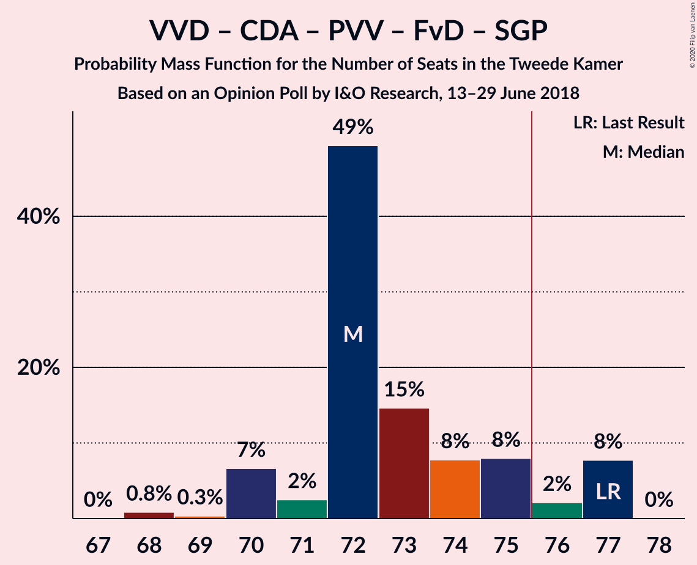

| Number of Seats | Probability | Accumulated | Special Marks |
|:---------------:|:-----------:|:-----------:|:-------------:|
| 68 | 0.8% | 100% |  |
| 69 | 0.3% | 99.1% |  |
| 70 | 7% | 98.8% |  |
| 71 | 2% | 92% |  |
| 72 | 49% | 90% | Median |
| 73 | 15% | 40% |  |
| 74 | 8% | 26% |  |
| 75 | 8% | 18% |  |
| 76 | 2% | 10% | Majority |
| 77 | 8% | 8% | Last Result |
| 78 | 0% | 0% |  |

### Volkspartij voor Vrijheid en Democratie – Christen-Democratisch Appèl – Partij voor de Vrijheid – Forum voor Democratie

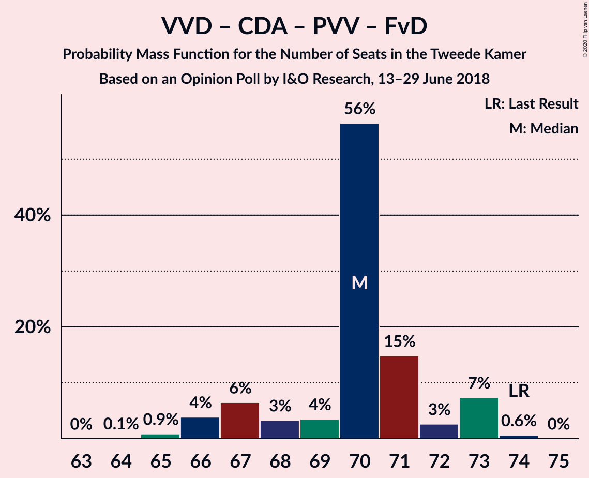

| Number of Seats | Probability | Accumulated | Special Marks |
|:---------------:|:-----------:|:-----------:|:-------------:|
| 64 | 0.1% | 100% |  |
| 65 | 0.9% | 99.9% |  |
| 66 | 4% | 99.1% |  |
| 67 | 6% | 95% |  |
| 68 | 3% | 89% |  |
| 69 | 4% | 85% | Median |
| 70 | 56% | 82% |  |
| 71 | 15% | 25% |  |
| 72 | 3% | 11% |  |
| 73 | 7% | 8% |  |
| 74 | 0.6% | 0.7% | Last Result |
| 75 | 0% | 0% |  |

### GroenLinks – Christen-Democratisch Appèl – Democraten 66 – Partij van de Arbeid – ChristenUnie

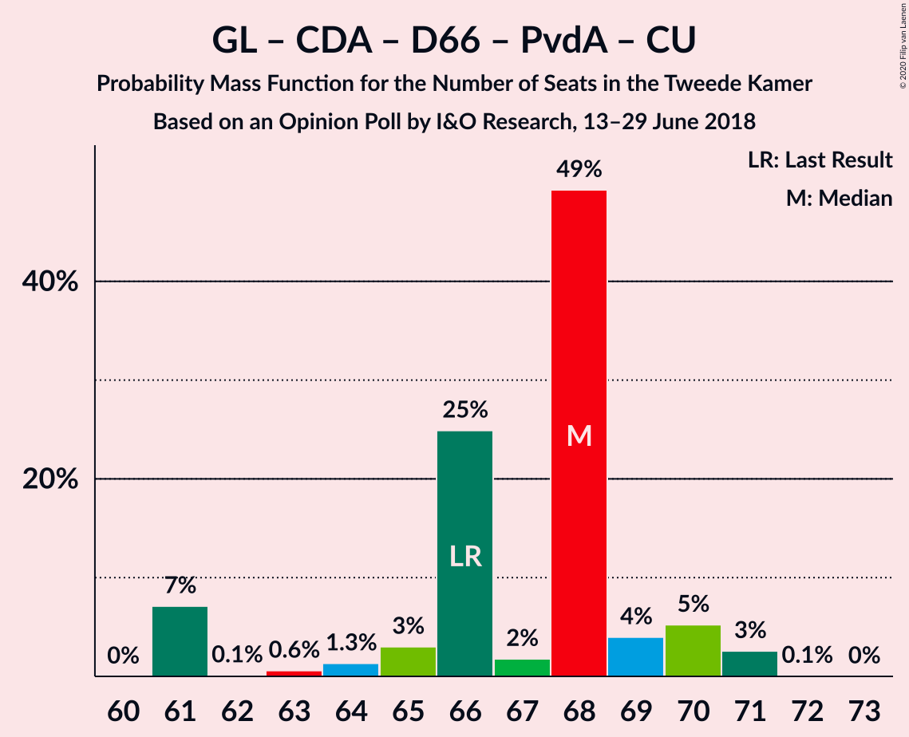

| Number of Seats | Probability | Accumulated | Special Marks |
|:---------------:|:-----------:|:-----------:|:-------------:|
| 61 | 7% | 100% |  |
| 62 | 0.1% | 93% |  |
| 63 | 0.6% | 93% |  |
| 64 | 1.3% | 92% |  |
| 65 | 3% | 91% |  |
| 66 | 25% | 88% | Last Result |
| 67 | 2% | 63% |  |
| 68 | 49% | 61% | Median |
| 69 | 4% | 12% |  |
| 70 | 5% | 8% |  |
| 71 | 3% | 3% |  |
| 72 | 0.1% | 0.1% |  |
| 73 | 0% | 0% |  |

### Volkspartij voor Vrijheid en Democratie – Christen-Democratisch Appèl – Democraten 66 – ChristenUnie

| Number of Seats | Probability | Accumulated | Special Marks |
|:---------------:|:-----------:|:-----------:|:-------------:|
| 59 | 0.3% | 100% |  |
| 60 | 0.1% | 99.7% |  |
| 61 | 5% | 99.5% |  |
| 62 | 13% | 95% |  |
| 63 | 10% | 82% |  |
| 64 | 61% | 71% | Median |
| 65 | 3% | 11% |  |
| 66 | 2% | 8% |  |
| 67 | 5% | 5% |  |
| 68 | 0.6% | 0.7% |  |
| 69 | 0% | 0% |  |
| 70 | 0% | 0% |  |
| 71 | 0% | 0% |  |
| 72 | 0% | 0% |  |
| 73 | 0% | 0% |  |
| 74 | 0% | 0% |  |
| 75 | 0% | 0% |  |
| 76 | 0% | 0% | Last Result, Majority |

### Volkspartij voor Vrijheid en Democratie – Christen-Democratisch Appèl – Forum voor Democratie – 50Plus – Staatkundig Gereformeerde Partij

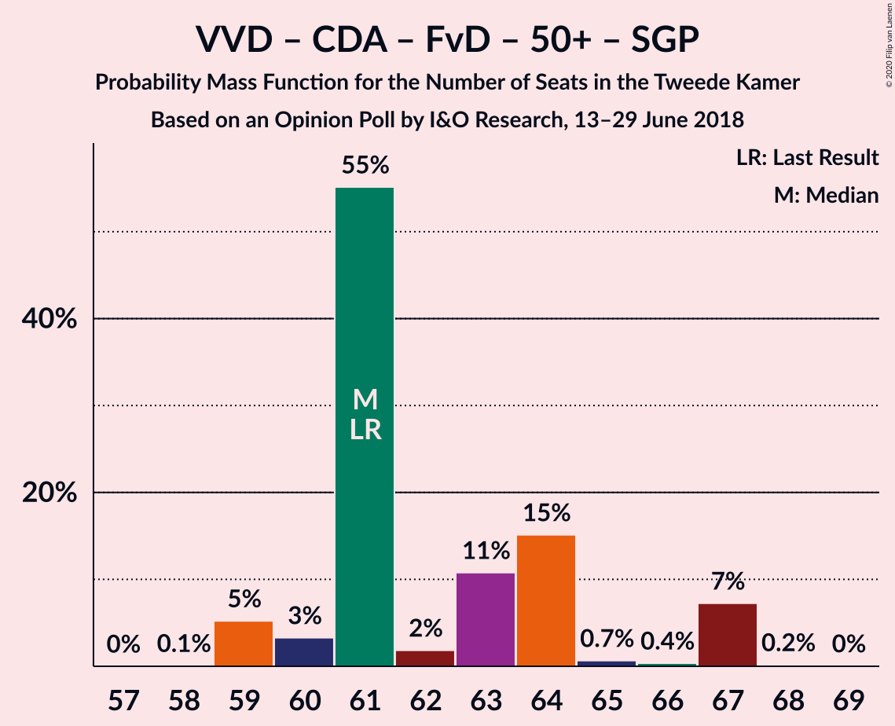

| Number of Seats | Probability | Accumulated | Special Marks |
|:---------------:|:-----------:|:-----------:|:-------------:|
| 58 | 0.1% | 100% |  |
| 59 | 5% | 99.9% |  |
| 60 | 3% | 95% |  |
| 61 | 55% | 91% | Last Result, Median |
| 62 | 2% | 36% |  |
| 63 | 11% | 34% |  |
| 64 | 15% | 24% |  |
| 65 | 0.7% | 8% |  |
| 66 | 0.4% | 8% |  |
| 67 | 7% | 7% |  |
| 68 | 0.2% | 0.2% |  |
| 69 | 0% | 0% |  |

### Volkspartij voor Vrijheid en Democratie – Christen-Democratisch Appèl – Forum voor Democratie – 50Plus

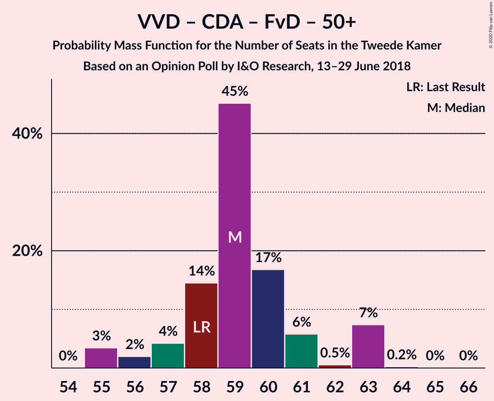

| Number of Seats | Probability | Accumulated | Special Marks |
|:---------------:|:-----------:|:-----------:|:-------------:|
| 55 | 3% | 100% |  |
| 56 | 2% | 97% |  |
| 57 | 4% | 95% |  |
| 58 | 14% | 90% | Last Result, Median |
| 59 | 45% | 76% |  |
| 60 | 17% | 31% |  |
| 61 | 6% | 14% |  |
| 62 | 0.5% | 8% |  |
| 63 | 7% | 8% |  |
| 64 | 0.2% | 0.3% |  |
| 65 | 0% | 0.1% |  |
| 66 | 0% | 0% |  |

### Volkspartij voor Vrijheid en Democratie – Christen-Democratisch Appèl – Partij voor de Vrijheid

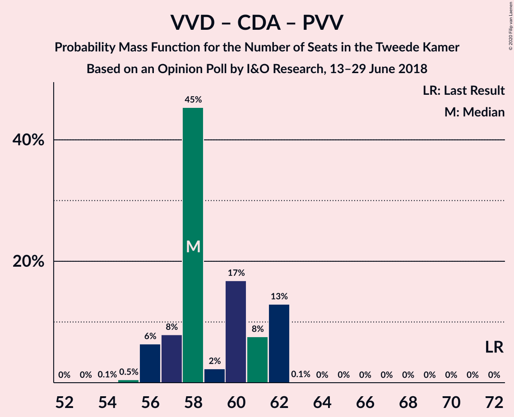

| Number of Seats | Probability | Accumulated | Special Marks |
|:---------------:|:-----------:|:-----------:|:-------------:|
| 54 | 0.1% | 100% |  |
| 55 | 0.5% | 99.9% |  |
| 56 | 6% | 99.4% |  |
| 57 | 8% | 93% |  |
| 58 | 45% | 85% | Median |
| 59 | 2% | 40% |  |
| 60 | 17% | 37% |  |
| 61 | 8% | 21% |  |
| 62 | 13% | 13% |  |
| 63 | 0.1% | 0.2% |  |
| 64 | 0% | 0% |  |
| 65 | 0% | 0% |  |
| 66 | 0% | 0% |  |
| 67 | 0% | 0% |  |
| 68 | 0% | 0% |  |
| 69 | 0% | 0% |  |
| 70 | 0% | 0% |  |
| 71 | 0% | 0% |  |
| 72 | 0% | 0% | Last Result |

### Volkspartij voor Vrijheid en Democratie – Christen-Democratisch Appèl – Forum voor Democratie – Staatkundig Gereformeerde Partij

| Number of Seats | Probability | Accumulated | Special Marks |
|:---------------:|:-----------:|:-----------:|:-------------:|
| 52 | 0.1% | 100% |  |
| 53 | 0.1% | 99.9% |  |
| 54 | 5% | 99.8% |  |
| 55 | 4% | 95% |  |
| 56 | 57% | 91% | Median |
| 57 | 11% | 34% | Last Result |
| 58 | 8% | 24% |  |
| 59 | 6% | 16% |  |
| 60 | 3% | 10% |  |
| 61 | 7% | 7% |  |
| 62 | 0.1% | 0.1% |  |
| 63 | 0% | 0.1% |  |
| 64 | 0% | 0% |  |

### Volkspartij voor Vrijheid en Democratie – Christen-Democratisch Appèl – Democraten 66

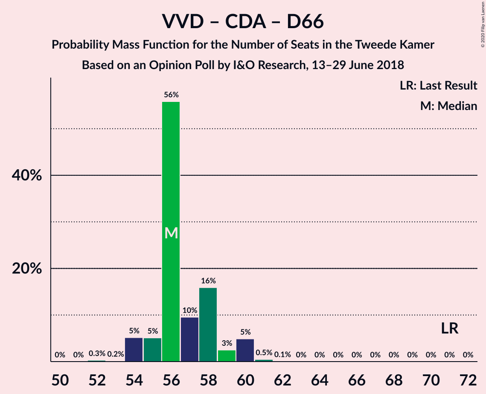

| Number of Seats | Probability | Accumulated | Special Marks |
|:---------------:|:-----------:|:-----------:|:-------------:|
| 52 | 0.3% | 100% |  |
| 53 | 0.2% | 99.7% |  |
| 54 | 5% | 99.5% |  |
| 55 | 5% | 94% |  |
| 56 | 56% | 89% | Median |
| 57 | 10% | 33% |  |
| 58 | 16% | 24% |  |
| 59 | 3% | 8% |  |
| 60 | 5% | 5% |  |
| 61 | 0.5% | 0.6% |  |
| 62 | 0.1% | 0.1% |  |
| 63 | 0% | 0% |  |
| 64 | 0% | 0% |  |
| 65 | 0% | 0% |  |
| 66 | 0% | 0% |  |
| 67 | 0% | 0% |  |
| 68 | 0% | 0% |  |
| 69 | 0% | 0% |  |
| 70 | 0% | 0% |  |
| 71 | 0% | 0% | Last Result |

### Volkspartij voor Vrijheid en Democratie – Christen-Democratisch Appèl – Forum voor Democratie

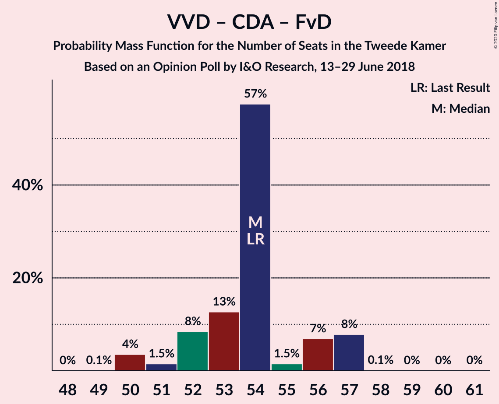

| Number of Seats | Probability | Accumulated | Special Marks |
|:---------------:|:-----------:|:-----------:|:-------------:|
| 49 | 0.1% | 100% |  |
| 50 | 4% | 99.9% |  |
| 51 | 1.5% | 96% |  |
| 52 | 8% | 95% |  |
| 53 | 13% | 86% | Median |
| 54 | 57% | 74% | Last Result |
| 55 | 1.5% | 16% |  |
| 56 | 7% | 15% |  |
| 57 | 8% | 8% |  |
| 58 | 0.1% | 0.2% |  |
| 59 | 0% | 0.1% |  |
| 60 | 0% | 0.1% |  |
| 61 | 0% | 0% |  |

### Volkspartij voor Vrijheid en Democratie – Christen-Democratisch Appèl – Partij van de Arbeid

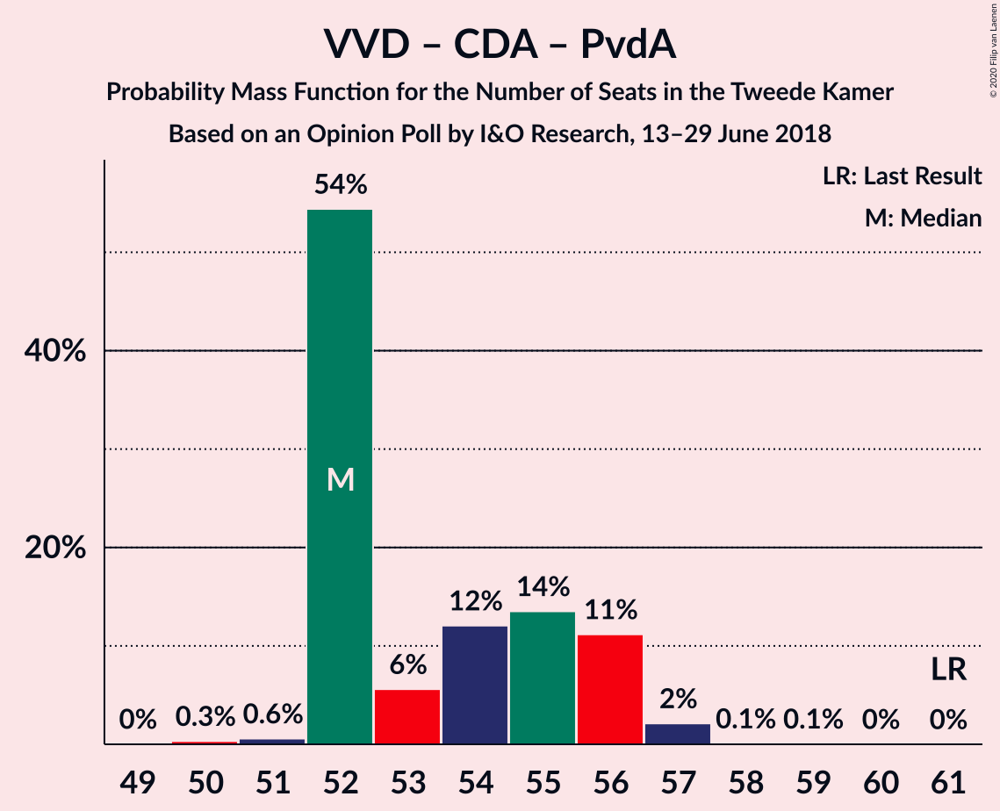

| Number of Seats | Probability | Accumulated | Special Marks |
|:---------------:|:-----------:|:-----------:|:-------------:|
| 50 | 0.3% | 100% |  |
| 51 | 0.6% | 99.6% |  |
| 52 | 54% | 99.0% | Median |
| 53 | 6% | 45% |  |
| 54 | 12% | 39% |  |
| 55 | 14% | 27% |  |
| 56 | 11% | 13% |  |
| 57 | 2% | 2% |  |
| 58 | 0.1% | 0.2% |  |
| 59 | 0.1% | 0.1% |  |
| 60 | 0% | 0% |  |
| 61 | 0% | 0% | Last Result |

### Volkspartij voor Vrijheid en Democratie – Democraten 66 – Partij van de Arbeid

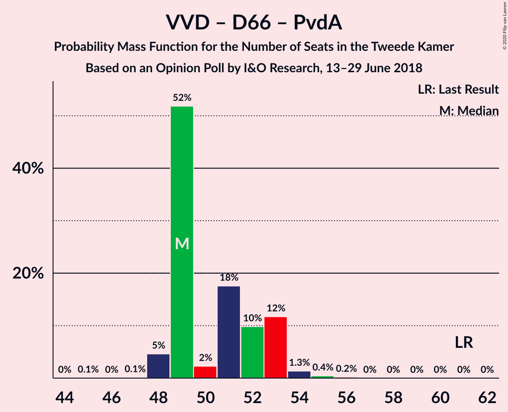

| Number of Seats | Probability | Accumulated | Special Marks |
|:---------------:|:-----------:|:-----------:|:-------------:|
| 45 | 0.1% | 100% |  |
| 46 | 0% | 99.9% |  |
| 47 | 0.1% | 99.9% |  |
| 48 | 5% | 99.8% |  |
| 49 | 52% | 95% | Median |
| 50 | 2% | 43% |  |
| 51 | 18% | 41% |  |
| 52 | 10% | 24% |  |
| 53 | 12% | 14% |  |
| 54 | 1.3% | 2% |  |
| 55 | 0.4% | 0.6% |  |
| 56 | 0.2% | 0.2% |  |
| 57 | 0% | 0% |  |
| 58 | 0% | 0% |  |
| 59 | 0% | 0% |  |
| 60 | 0% | 0% |  |
| 61 | 0% | 0% | Last Result |

### Volkspartij voor Vrijheid en Democratie – Christen-Democratisch Appèl

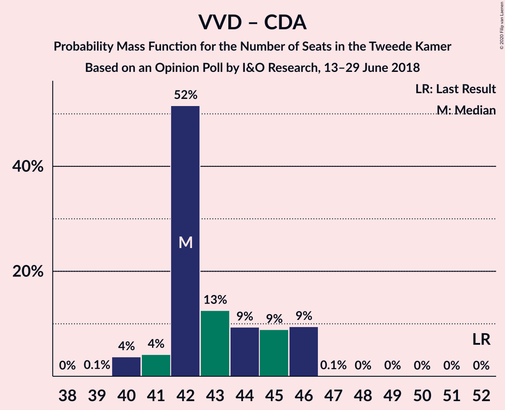

| Number of Seats | Probability | Accumulated | Special Marks |
|:---------------:|:-----------:|:-----------:|:-------------:|
| 39 | 0.1% | 100% |  |
| 40 | 4% | 99.9% |  |
| 41 | 4% | 96% |  |
| 42 | 52% | 92% | Median |
| 43 | 13% | 40% |  |
| 44 | 9% | 28% |  |
| 45 | 9% | 19% |  |
| 46 | 9% | 10% |  |
| 47 | 0.1% | 0.2% |  |
| 48 | 0% | 0.1% |  |
| 49 | 0% | 0% |  |
| 50 | 0% | 0% |  |
| 51 | 0% | 0% |  |
| 52 | 0% | 0% | Last Result |

### Christen-Democratisch Appèl – Democraten 66 – Partij van de Arbeid

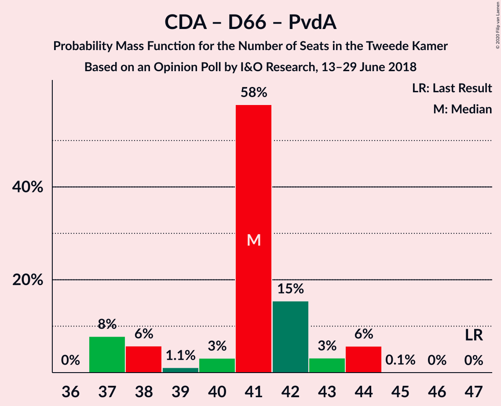

| Number of Seats | Probability | Accumulated | Special Marks |
|:---------------:|:-----------:|:-----------:|:-------------:|
| 36 | 0% | 100% |  |
| 37 | 8% | 99.9% |  |
| 38 | 6% | 92% |  |
| 39 | 1.1% | 86% |  |
| 40 | 3% | 85% |  |
| 41 | 58% | 82% | Median |
| 42 | 15% | 24% |  |
| 43 | 3% | 9% |  |
| 44 | 6% | 6% |  |
| 45 | 0.1% | 0.1% |  |
| 46 | 0% | 0% |  |
| 47 | 0% | 0% | Last Result |

### Volkspartij voor Vrijheid en Democratie – Partij van de Arbeid

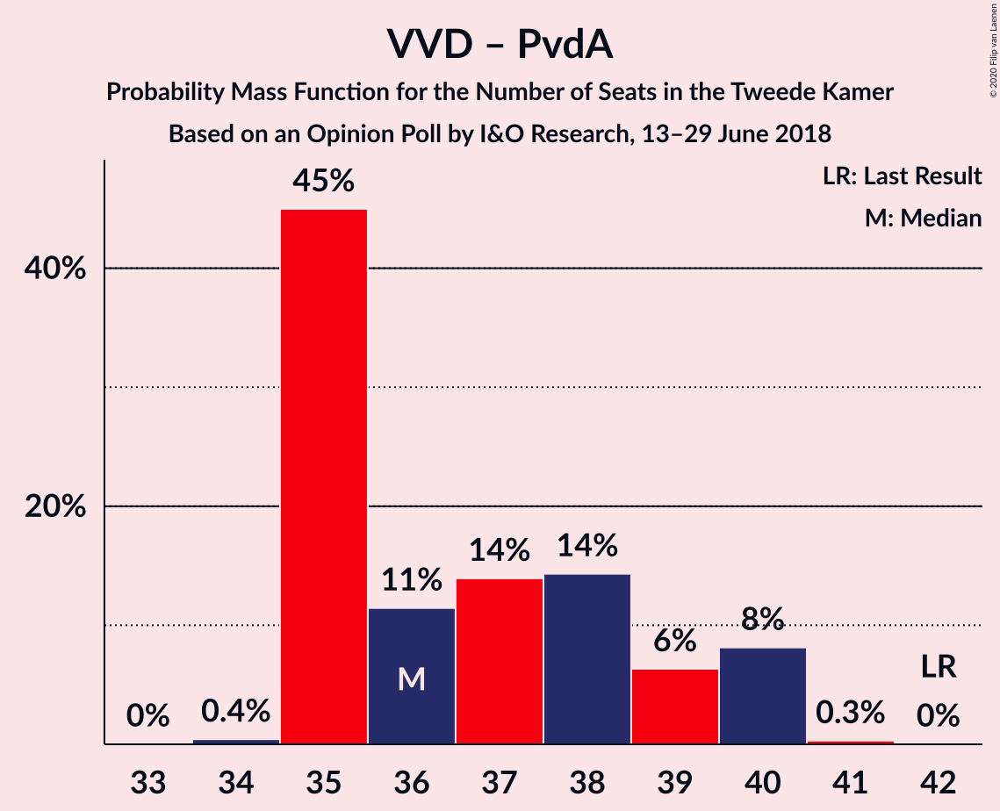

| Number of Seats | Probability | Accumulated | Special Marks |
|:---------------:|:-----------:|:-----------:|:-------------:|
| 34 | 0.4% | 100% |  |
| 35 | 45% | 99.5% | Median |
| 36 | 11% | 55% |  |
| 37 | 14% | 43% |  |
| 38 | 14% | 29% |  |
| 39 | 6% | 15% |  |
| 40 | 8% | 8% |  |
| 41 | 0.3% | 0.3% |  |
| 42 | 0% | 0% | Last Result |

### Christen-Democratisch Appèl – Partij van de Arbeid – ChristenUnie

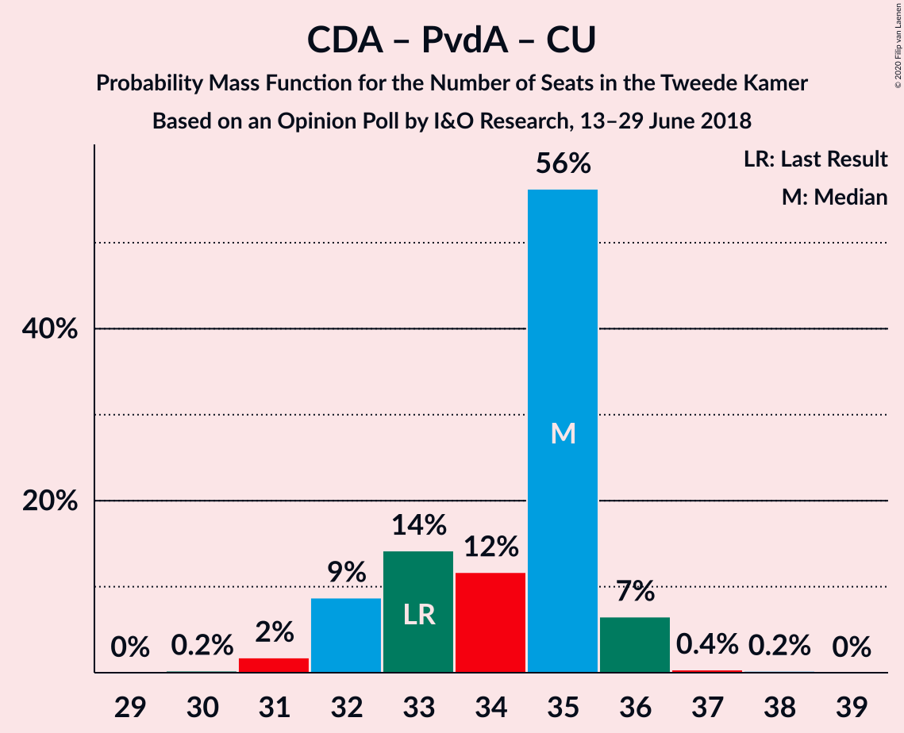

| Number of Seats | Probability | Accumulated | Special Marks |
|:---------------:|:-----------:|:-----------:|:-------------:|
| 30 | 0.2% | 100% |  |
| 31 | 2% | 99.7% |  |
| 32 | 9% | 98% |  |
| 33 | 14% | 89% | Last Result |
| 34 | 12% | 75% |  |
| 35 | 56% | 63% | Median |
| 36 | 7% | 7% |  |
| 37 | 0.4% | 0.6% |  |
| 38 | 0.2% | 0.2% |  |
| 39 | 0% | 0% |  |

### Christen-Democratisch Appèl – Democraten 66

| Number of Seats | Probability | Accumulated | Special Marks |
|:---------------:|:-----------:|:-----------:|:-------------:|
| 26 | 0.3% | 100% |  |
| 27 | 9% | 99.7% |  |
| 28 | 5% | 91% |  |
| 29 | 1.4% | 86% |  |
| 30 | 20% | 84% |  |
| 31 | 57% | 65% | Median |
| 32 | 2% | 8% |  |
| 33 | 2% | 7% |  |
| 34 | 4% | 4% |  |
| 35 | 0% | 0% |  |
| 36 | 0% | 0% |  |
| 37 | 0% | 0% |  |
| 38 | 0% | 0% | Last Result |

### Christen-Democratisch Appèl – Partij van de Arbeid

| Number of Seats | Probability | Accumulated | Special Marks |
|:---------------:|:-----------:|:-----------:|:-------------:|
| 24 | 2% | 100% |  |
| 25 | 2% | 98% |  |
| 26 | 13% | 96% |  |
| 27 | 58% | 83% | Median |
| 28 | 11% | 24% | Last Result |
| 29 | 13% | 14% |  |
| 30 | 0.6% | 0.8% |  |
| 31 | 0.2% | 0.2% |  |
| 32 | 0% | 0% |  |

## Technical Information

### Opinion Poll

+ **Polling firm:** I&O Research
+ **Commissioner(s):** —
+ **Fieldwork period:** 13–29 June 2018

### Calculations

+ **Sample size:** 2252
+ **Simulations done:** 1,048,576
+ **Error estimate:** 3.19%

