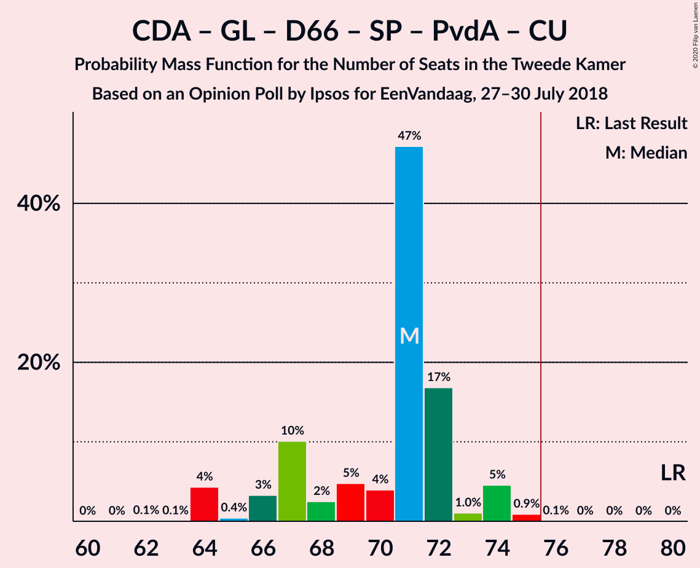

# Opinion Poll by Ipsos for EenVandaag, 27–30 July 2018

<a href="#voting-intentions">Voting Intentions</a> | <a href="#seats">Seats</a> | <a href="#coalitions">Coalitions</a> | <a href="#technical-information">Technical Information</a>

## Voting Intentions

### Confidence Intervals

| Party | Last Result | Poll Result | 80% Confidence Interval | 90% Confidence Interval | 95% Confidence Interval | 99% Confidence Interval |
|:-----:|:-----------:|:-----------:|:-----------------------:|:-----------------------:|:-----------------------:|:-----------------------:|
| Volkspartij voor Vrijheid en Democratie | 21.3% | 21.5% | 20.2–23.0% |19.8–23.4% |19.5–23.7% |18.9–24.4% |
| Partij voor de Vrijheid | 13.1% | 12.0% | 11.0–13.2% |10.7–13.5% |10.4–13.8% |10.0–14.4% |
| Christen-Democratisch Appèl | 12.4% | 10.2% | 9.3–11.3% |9.0–11.6% |8.7–11.9% |8.3–12.4% |
| GroenLinks | 9.1% | 10.0% | 9.0–11.1% |8.8–11.4% |8.6–11.7% |8.1–12.2% |
| Democraten 66 | 12.2% | 8.9% | 8.0–9.9% |7.7–10.2% |7.5–10.5% |7.1–11.0% |
| Socialistische Partij | 9.1% | 7.6% | 6.7–8.6% |6.5–8.8% |6.3–9.1% |5.9–9.5% |
| Forum voor Democratie | 1.8% | 6.2% | 5.4–7.1% |5.2–7.3% |5.0–7.6% |4.7–8.0% |
| Partij voor de Dieren | 3.2% | 5.1% | 4.4–5.9% |4.2–6.1% |4.0–6.3% |3.7–6.8% |
| Partij van de Arbeid | 5.7% | 4.9% | 4.3–5.7% |4.1–6.0% |3.9–6.2% |3.6–6.6% |
| ChristenUnie | 3.4% | 4.3% | 3.7–5.1% |3.5–5.3% |3.4–5.5% |3.1–5.9% |
| 50Plus | 3.1% | 4.1% | 3.5–4.9% |3.3–5.1% |3.2–5.3% |2.9–5.6% |
| Staatkundig Gereformeerde Partij | 2.1% | 2.3% | 1.9–2.9% |1.7–3.1% |1.6–3.2% |1.4–3.5% |
| DENK | 2.1% | 2.3% | 1.9–2.9% |1.7–3.1% |1.6–3.2% |1.4–3.5% |

*Note:* The poll result column reflects the actual value used in the calculations. Published results may vary slightly, and in addition be rounded to fewer digits.

## Seats

### Confidence Intervals

| Party | Last Result | Median | 80% Confidence Interval | 90% Confidence Interval | 95% Confidence Interval | 99% Confidence Interval |
|:-----:|:-----------:|:------:|:-----------------------:|:-----------------------:|:-----------------------:|:-----------------------:|
| <a href="#volkspartij-voor-vrijheid-en-democratie">Volkspartij voor Vrijheid en Democratie</a> | 33 | 32 | 29–35 |29–37 |28–37 |28–37 |
| <a href="#partij-voor-de-vrijheid">Partij voor de Vrijheid</a> | 20 | 16 | 16–19 |16–19 |16–20 |15–21 |
| <a href="#christen-democratisch-appèl">Christen-Democratisch Appèl</a> | 19 | 16 | 14–17 |14–17 |13–18 |12–19 |
| <a href="#groenlinks">GroenLinks</a> | 14 | 15 | 14–18 |13–18 |13–18 |13–18 |
| <a href="#democraten-66">Democraten 66</a> | 19 | 13 | 12–15 |12–16 |12–16 |11–17 |
| <a href="#socialistische-partij">Socialistische Partij</a> | 14 | 12 | 10–12 |10–13 |10–14 |9–14 |
| <a href="#forum-voor-democratie">Forum voor Democratie</a> | 2 | 8 | 8–11 |8–11 |8–11 |7–12 |
| <a href="#partij-voor-de-dieren">Partij voor de Dieren</a> | 5 | 8 | 6–9 |6–9 |6–9 |6–10 |
| <a href="#partij-van-de-arbeid">Partij van de Arbeid</a> | 9 | 8 | 6–9 |6–9 |6–9 |5–10 |
| <a href="#christenunie">ChristenUnie</a> | 5 | 7 | 5–8 |5–9 |5–9 |4–9 |
| <a href="#50plus">50Plus</a> | 4 | 7 | 5–7 |5–7 |5–8 |4–9 |
| <a href="#staatkundig-gereformeerde-partij">Staatkundig Gereformeerde Partij</a> | 3 | 3 | 3–4 |2–4 |2–4 |2–5 |
| <a href="#denk">DENK</a> | 3 | 3 | 3–4 |3–4 |2–4 |2–5 |

### Volkspartij voor Vrijheid en Democratie

*For a full overview of the results for this party, see the [Volkspartij voor Vrijheid en Democratie](party-volkspartijvoorvrijheidendemocratie.html) page.*

| Number of Seats | Probability | Accumulated | Special Marks |
|:---------------:|:-----------:|:-----------:|:-------------:|
| 28 | 4% | 100% |  |
| 29 | 9% | 96% |  |
| 30 | 8% | 88% |  |
| 31 | 4% | 80% |  |
| 32 | 51% | 76% | Median |
| 33 | 10% | 25% | Last Result |
| 34 | 3% | 15% |  |
| 35 | 6% | 12% |  |
| 36 | 2% | 7% |  |
| 37 | 5% | 5% |  |
| 38 | 0.4% | 0.5% |  |
| 39 | 0% | 0% |  |

### Partij voor de Vrijheid

*For a full overview of the results for this party, see the [Partij voor de Vrijheid](party-partijvoordevrijheid.html) page.*

| Number of Seats | Probability | Accumulated | Special Marks |
|:---------------:|:-----------:|:-----------:|:-------------:|
| 14 | 0% | 100% |  |
| 15 | 1.0% | 99.9% |  |
| 16 | 57% | 99.0% | Median |
| 17 | 6% | 41% |  |
| 18 | 14% | 35% |  |
| 19 | 17% | 21% |  |
| 20 | 3% | 4% | Last Result |
| 21 | 1.0% | 1.1% |  |
| 22 | 0.1% | 0.1% |  |
| 23 | 0% | 0% |  |

### Christen-Democratisch Appèl

*For a full overview of the results for this party, see the [Christen-Democratisch Appèl](party-christen-democratischappèl.html) page.*

| Number of Seats | Probability | Accumulated | Special Marks |
|:---------------:|:-----------:|:-----------:|:-------------:|
| 12 | 0.6% | 100% |  |
| 13 | 2% | 99.4% |  |
| 14 | 24% | 97% |  |
| 15 | 8% | 73% |  |
| 16 | 46% | 64% | Median |
| 17 | 15% | 19% |  |
| 18 | 3% | 3% |  |
| 19 | 0.8% | 0.9% | Last Result |
| 20 | 0.1% | 0.1% |  |
| 21 | 0% | 0% |  |

### GroenLinks

*For a full overview of the results for this party, see the [GroenLinks](party-groenlinks.html) page.*

| Number of Seats | Probability | Accumulated | Special Marks |
|:---------------:|:-----------:|:-----------:|:-------------:|
| 12 | 0.3% | 100% |  |
| 13 | 7% | 99.7% |  |
| 14 | 9% | 93% | Last Result |
| 15 | 57% | 84% | Median |
| 16 | 10% | 27% |  |
| 17 | 3% | 17% |  |
| 18 | 14% | 14% |  |
| 19 | 0.2% | 0.2% |  |
| 20 | 0% | 0% |  |

### Democraten 66

*For a full overview of the results for this party, see the [Democraten 66](party-democraten66.html) page.*

| Number of Seats | Probability | Accumulated | Special Marks |
|:---------------:|:-----------:|:-----------:|:-------------:|
| 10 | 0.1% | 100% |  |
| 11 | 2% | 99.8% |  |
| 12 | 18% | 98% |  |
| 13 | 47% | 80% | Median |
| 14 | 17% | 33% |  |
| 15 | 10% | 16% |  |
| 16 | 5% | 6% |  |
| 17 | 0.6% | 0.6% |  |
| 18 | 0% | 0% |  |
| 19 | 0% | 0% | Last Result |

### Socialistische Partij

*For a full overview of the results for this party, see the [Socialistische Partij](party-socialistischepartij.html) page.*

| Number of Seats | Probability | Accumulated | Special Marks |
|:---------------:|:-----------:|:-----------:|:-------------:|
| 8 | 0.1% | 100% |  |
| 9 | 2% | 99.9% |  |
| 10 | 16% | 98% |  |
| 11 | 20% | 82% |  |
| 12 | 53% | 63% | Median |
| 13 | 6% | 9% |  |
| 14 | 3% | 4% | Last Result |
| 15 | 0.2% | 0.2% |  |
| 16 | 0% | 0% |  |

### Forum voor Democratie

*For a full overview of the results for this party, see the [Forum voor Democratie](party-forumvoordemocratie.html) page.*

| Number of Seats | Probability | Accumulated | Special Marks |
|:---------------:|:-----------:|:-----------:|:-------------:|
| 2 | 0% | 100% | Last Result |
| 3 | 0% | 100% |  |
| 4 | 0% | 100% |  |
| 5 | 0% | 100% |  |
| 6 | 0.1% | 100% |  |
| 7 | 2% | 99.9% |  |
| 8 | 52% | 98% | Median |
| 9 | 14% | 46% |  |
| 10 | 20% | 32% |  |
| 11 | 11% | 12% |  |
| 12 | 0.8% | 1.0% |  |
| 13 | 0.2% | 0.2% |  |
| 14 | 0% | 0% |  |

### Partij voor de Dieren

*For a full overview of the results for this party, see the [Partij voor de Dieren](party-partijvoordedieren.html) page.*

| Number of Seats | Probability | Accumulated | Special Marks |
|:---------------:|:-----------:|:-----------:|:-------------:|
| 5 | 0.1% | 100% | Last Result |
| 6 | 11% | 99.8% |  |
| 7 | 25% | 88% |  |
| 8 | 19% | 63% | Median |
| 9 | 43% | 45% |  |
| 10 | 2% | 2% |  |
| 11 | 0.2% | 0.2% |  |
| 12 | 0% | 0% |  |

### Partij van de Arbeid

*For a full overview of the results for this party, see the [Partij van de Arbeid](party-partijvandearbeid.html) page.*

| Number of Seats | Probability | Accumulated | Special Marks |
|:---------------:|:-----------:|:-----------:|:-------------:|
| 5 | 2% | 100% |  |
| 6 | 9% | 98% |  |
| 7 | 10% | 89% |  |
| 8 | 67% | 79% | Median |
| 9 | 9% | 12% | Last Result |
| 10 | 2% | 2% |  |
| 11 | 0.1% | 0.1% |  |
| 12 | 0% | 0% |  |

### ChristenUnie

*For a full overview of the results for this party, see the [ChristenUnie](party-christenunie.html) page.*

| Number of Seats | Probability | Accumulated | Special Marks |
|:---------------:|:-----------:|:-----------:|:-------------:|
| 4 | 0.5% | 100% |  |
| 5 | 18% | 99.5% | Last Result |
| 6 | 18% | 82% |  |
| 7 | 51% | 63% | Median |
| 8 | 6% | 13% |  |
| 9 | 7% | 7% |  |
| 10 | 0% | 0% |  |

### 50Plus

*For a full overview of the results for this party, see the [50Plus](party-50plus.html) page.*

| Number of Seats | Probability | Accumulated | Special Marks |
|:---------------:|:-----------:|:-----------:|:-------------:|
| 4 | 1.1% | 100% | Last Result |
| 5 | 11% | 98.9% |  |
| 6 | 31% | 88% |  |
| 7 | 54% | 57% | Median |
| 8 | 1.5% | 3% |  |
| 9 | 1.5% | 1.5% |  |
| 10 | 0% | 0% |  |

### Staatkundig Gereformeerde Partij

*For a full overview of the results for this party, see the [Staatkundig Gereformeerde Partij](party-staatkundiggereformeerdepartij.html) page.*

| Number of Seats | Probability | Accumulated | Special Marks |
|:---------------:|:-----------:|:-----------:|:-------------:|
| 2 | 7% | 100% |  |
| 3 | 70% | 93% | Last Result, Median |
| 4 | 21% | 23% |  |
| 5 | 2% | 2% |  |
| 6 | 0% | 0% |  |

### DENK

*For a full overview of the results for this party, see the [DENK](party-denk.html) page.*

| Number of Seats | Probability | Accumulated | Special Marks |
|:---------------:|:-----------:|:-----------:|:-------------:|
| 1 | 0.1% | 100% |  |
| 2 | 3% | 99.9% |  |
| 3 | 59% | 97% | Last Result, Median |
| 4 | 35% | 38% |  |
| 5 | 2% | 2% |  |
| 6 | 0.1% | 0.1% |  |
| 7 | 0% | 0% |  |

## Coalitions

### Confidence Intervals

| Coalition | Last Result | Median | Majority? | 80% Confidence Interval | 90% Confidence Interval | 95% Confidence Interval | 99% Confidence Interval |
|:---------:|:-----------:|:------:|:---------:|:-----------------------:|:-----------------------:|:-----------------------:|:-----------------------:|
| Volkspartij voor Vrijheid en Democratie – Christen-Democratisch Appèl – GroenLinks – Democraten 66 – ChristenUnie | 90 | 83 | 100% | 81–85 | 78–86 | 77–86 | 77–87 |
| Volkspartij voor Vrijheid en Democratie – Partij voor de Vrijheid – Christen-Democratisch Appèl – Forum voor Democratie – Staatkundig Gereformeerde Partij | 77 | 76 | 53% | 75–82 | 75–82 | 74–83 | 74–85 |
| Volkspartij voor Vrijheid en Democratie – Partij voor de Vrijheid – Christen-Democratisch Appèl – Forum voor Democratie | 74 | 72 | 18% | 72–78 | 72–79 | 71–80 | 71–82 |
| Volkspartij voor Vrijheid en Democratie – Christen-Democratisch Appèl – Democraten 66 – Partij van de Arbeid – ChristenUnie | 85 | 76 | 63% | 73–77 | 71–79 | 71–79 | 70–80 |
| Christen-Democratisch Appèl – GroenLinks – Democraten 66 – Socialistische Partij – Partij van de Arbeid – ChristenUnie | 80 | 71 | 0.1% | 67–72 | 66–74 | 64–74 | 64–75 |
| Volkspartij voor Vrijheid en Democratie – Christen-Democratisch Appèl – Forum voor Democratie – 50Plus – Staatkundig Gereformeerde Partij | 61 | 66 | 0% | 64–69 | 63–71 | 62–73 | 61–73 |
| Volkspartij voor Vrijheid en Democratie – Christen-Democratisch Appèl – Democraten 66 – ChristenUnie | 76 | 68 | 0% | 65–70 | 63–71 | 62–72 | 62–72 |
| Volkspartij voor Vrijheid en Democratie – Partij voor de Vrijheid – Christen-Democratisch Appèl | 72 | 64 | 0% | 62–68 | 62–70 | 62–70 | 62–73 |
| Volkspartij voor Vrijheid en Democratie – Christen-Democratisch Appèl – Forum voor Democratie – 50Plus | 58 | 63 | 0% | 61–66 | 59–68 | 59–70 | 58–70 |
| Volkspartij voor Vrijheid en Democratie – Christen-Democratisch Appèl – Democraten 66 | 71 | 61 | 0% | 58–63 | 57–65 | 57–66 | 56–66 |
| Volkspartij voor Vrijheid en Democratie – Christen-Democratisch Appèl – Forum voor Democratie – Staatkundig Gereformeerde Partij | 57 | 59 | 0% | 58–63 | 57–65 | 55–66 | 55–66 |
| Volkspartij voor Vrijheid en Democratie – Christen-Democratisch Appèl – Forum voor Democratie | 54 | 56 | 0% | 55–60 | 53–62 | 52–63 | 52–63 |
| Christen-Democratisch Appèl – GroenLinks – Democraten 66 – Partij van de Arbeid – ChristenUnie | 66 | 59 | 0% | 56–61 | 54–61 | 54–62 | 54–62 |
| Volkspartij voor Vrijheid en Democratie – Christen-Democratisch Appèl – Partij van de Arbeid | 61 | 56 | 0% | 53–59 | 52–59 | 52–59 | 51–61 |
| Volkspartij voor Vrijheid en Democratie – Democraten 66 – Partij van de Arbeid | 61 | 53 | 0% | 52–56 | 50–57 | 50–57 | 49–59 |
| Volkspartij voor Vrijheid en Democratie – Christen-Democratisch Appèl | 52 | 48 | 0% | 45–51 | 44–52 | 44–52 | 43–53 |
| Volkspartij voor Vrijheid en Democratie – Partij van de Arbeid | 42 | 40 | 0% | 37–42 | 37–45 | 36–45 | 36–46 |
| Christen-Democratisch Appèl – Democraten 66 – Partij van de Arbeid | 47 | 37 | 0% | 34–39 | 34–40 | 33–40 | 31–41 |
| Christen-Democratisch Appèl – Partij van de Arbeid – ChristenUnie | 33 | 31 | 0% | 27–31 | 26–32 | 26–33 | 25–34 |
| Christen-Democratisch Appèl – Democraten 66 | 38 | 29 | 0% | 26–32 | 26–32 | 26–32 | 25–33 |
| Christen-Democratisch Appèl – Partij van de Arbeid | 28 | 24 | 0% | 21–25 | 20–25 | 20–26 | 19–26 |

### Volkspartij voor Vrijheid en Democratie – Christen-Democratisch Appèl – GroenLinks – Democraten 66 – ChristenUnie

| Number of Seats | Probability | Accumulated | Special Marks |
|:---------------:|:-----------:|:-----------:|:-------------:|
| 77 | 4% | 100% |  |
| 78 | 0.8% | 96% |  |
| 79 | 0.7% | 95% |  |
| 80 | 3% | 94% |  |
| 81 | 12% | 92% |  |
| 82 | 4% | 79% |  |
| 83 | 47% | 76% | Median |
| 84 | 7% | 28% |  |
| 85 | 12% | 21% |  |
| 86 | 8% | 10% |  |
| 87 | 1.2% | 2% |  |
| 88 | 0.2% | 0.3% |  |
| 89 | 0.1% | 0.1% |  |
| 90 | 0% | 0% | Last Result |

### Volkspartij voor Vrijheid en Democratie – Partij voor de Vrijheid – Christen-Democratisch Appèl – Forum voor Democratie – Staatkundig Gereformeerde Partij

| Number of Seats | Probability | Accumulated | Special Marks |
|:---------------:|:-----------:|:-----------:|:-------------:|
| 73 | 0.2% | 100% |  |
| 74 | 4% | 99.8% |  |
| 75 | 43% | 96% | Median |
| 76 | 17% | 53% | Majority |
| 77 | 14% | 36% | Last Result |
| 78 | 3% | 22% |  |
| 79 | 4% | 19% |  |
| 80 | 2% | 15% |  |
| 81 | 1.3% | 13% |  |
| 82 | 9% | 12% |  |
| 83 | 1.1% | 3% |  |
| 84 | 1.0% | 2% |  |
| 85 | 0.7% | 0.7% |  |
| 86 | 0% | 0% |  |

### Volkspartij voor Vrijheid en Democratie – Partij voor de Vrijheid – Christen-Democratisch Appèl – Forum voor Democratie

| Number of Seats | Probability | Accumulated | Special Marks |
|:---------------:|:-----------:|:-----------:|:-------------:|
| 70 | 0.2% | 100% |  |
| 71 | 4% | 99.8% |  |
| 72 | 51% | 95% | Median |
| 73 | 14% | 44% |  |
| 74 | 9% | 31% | Last Result |
| 75 | 4% | 22% |  |
| 76 | 2% | 18% | Majority |
| 77 | 3% | 16% |  |
| 78 | 6% | 13% |  |
| 79 | 5% | 7% |  |
| 80 | 0.8% | 3% |  |
| 81 | 1.1% | 2% |  |
| 82 | 0.7% | 0.8% |  |
| 83 | 0% | 0% |  |

### Volkspartij voor Vrijheid en Democratie – Christen-Democratisch Appèl – Democraten 66 – Partij van de Arbeid – ChristenUnie

| Number of Seats | Probability | Accumulated | Special Marks |
|:---------------:|:-----------:|:-----------:|:-------------:|
| 70 | 0.9% | 100% |  |
| 71 | 4% | 99.1% |  |
| 72 | 2% | 95% |  |
| 73 | 6% | 92% |  |
| 74 | 16% | 87% |  |
| 75 | 7% | 70% |  |
| 76 | 46% | 63% | Median, Majority |
| 77 | 9% | 17% |  |
| 78 | 3% | 8% |  |
| 79 | 5% | 5% |  |
| 80 | 0.5% | 0.6% |  |
| 81 | 0.1% | 0.1% |  |
| 82 | 0% | 0.1% |  |
| 83 | 0% | 0% |  |
| 84 | 0% | 0% |  |
| 85 | 0% | 0% | Last Result |

### Christen-Democratisch Appèl – GroenLinks – Democraten 66 – Socialistische Partij – Partij van de Arbeid – ChristenUnie

| Number of Seats | Probability | Accumulated | Special Marks |
|:---------------:|:-----------:|:-----------:|:-------------:|
| 62 | 0.1% | 100% |  |
| 63 | 0.1% | 99.9% |  |
| 64 | 4% | 99.9% |  |
| 65 | 0.4% | 96% |  |
| 66 | 3% | 95% |  |
| 67 | 10% | 92% |  |
| 68 | 2% | 82% |  |
| 69 | 5% | 79% |  |
| 70 | 4% | 75% |  |
| 71 | 47% | 71% | Median |
| 72 | 17% | 23% |  |
| 73 | 1.0% | 7% |  |
| 74 | 5% | 6% |  |
| 75 | 0.9% | 1.0% |  |
| 76 | 0.1% | 0.1% | Majority |
| 77 | 0% | 0% |  |
| 78 | 0% | 0% |  |
| 79 | 0% | 0% |  |
| 80 | 0% | 0% | Last Result |

### Volkspartij voor Vrijheid en Democratie – Christen-Democratisch Appèl – Forum voor Democratie – 50Plus – Staatkundig Gereformeerde Partij

| Number of Seats | Probability | Accumulated | Special Marks |
|:---------------:|:-----------:|:-----------:|:-------------:|
| 61 | 0.9% | 100% | Last Result |
| 62 | 4% | 99.1% |  |
| 63 | 4% | 95% |  |
| 64 | 9% | 91% |  |
| 65 | 11% | 82% |  |
| 66 | 51% | 72% | Median |
| 67 | 2% | 20% |  |
| 68 | 4% | 19% |  |
| 69 | 6% | 15% |  |
| 70 | 3% | 8% |  |
| 71 | 0.5% | 5% |  |
| 72 | 0.9% | 5% |  |
| 73 | 4% | 4% |  |
| 74 | 0% | 0% |  |

### Volkspartij voor Vrijheid en Democratie – Christen-Democratisch Appèl – Democraten 66 – ChristenUnie

| Number of Seats | Probability | Accumulated | Special Marks |
|:---------------:|:-----------:|:-----------:|:-------------:|
| 62 | 5% | 100% |  |
| 63 | 0.2% | 95% |  |
| 64 | 0.5% | 95% |  |
| 65 | 6% | 94% |  |
| 66 | 11% | 89% |  |
| 67 | 11% | 77% |  |
| 68 | 48% | 66% | Median |
| 69 | 8% | 19% |  |
| 70 | 4% | 10% |  |
| 71 | 1.4% | 6% |  |
| 72 | 5% | 5% |  |
| 73 | 0.3% | 0.4% |  |
| 74 | 0.1% | 0.1% |  |
| 75 | 0% | 0% |  |
| 76 | 0% | 0% | Last Result, Majority |

### Volkspartij voor Vrijheid en Democratie – Partij voor de Vrijheid – Christen-Democratisch Appèl

| Number of Seats | Probability | Accumulated | Special Marks |
|:---------------:|:-----------:|:-----------:|:-------------:|
| 61 | 0.3% | 100% |  |
| 62 | 11% | 99.7% |  |
| 63 | 16% | 89% |  |
| 64 | 47% | 73% | Median |
| 65 | 6% | 27% |  |
| 66 | 4% | 21% |  |
| 67 | 2% | 17% |  |
| 68 | 5% | 15% |  |
| 69 | 2% | 9% |  |
| 70 | 5% | 7% |  |
| 71 | 1.3% | 2% |  |
| 72 | 0.1% | 1.2% | Last Result |
| 73 | 1.0% | 1.1% |  |
| 74 | 0% | 0% |  |

### Volkspartij voor Vrijheid en Democratie – Christen-Democratisch Appèl – Forum voor Democratie – 50Plus

| Number of Seats | Probability | Accumulated | Special Marks |
|:---------------:|:-----------:|:-----------:|:-------------:|
| 57 | 0.3% | 100% |  |
| 58 | 1.0% | 99.7% | Last Result |
| 59 | 4% | 98.7% |  |
| 60 | 2% | 94% |  |
| 61 | 9% | 92% |  |
| 62 | 25% | 83% |  |
| 63 | 38% | 59% | Median |
| 64 | 3% | 21% |  |
| 65 | 7% | 18% |  |
| 66 | 3% | 11% |  |
| 67 | 3% | 8% |  |
| 68 | 0.6% | 5% |  |
| 69 | 0.9% | 5% |  |
| 70 | 4% | 4% |  |
| 71 | 0% | 0% |  |

### Volkspartij voor Vrijheid en Democratie – Christen-Democratisch Appèl – Democraten 66

| Number of Seats | Probability | Accumulated | Special Marks |
|:---------------:|:-----------:|:-----------:|:-------------:|
| 55 | 0.1% | 100% |  |
| 56 | 0.9% | 99.9% |  |
| 57 | 5% | 99.1% |  |
| 58 | 10% | 94% |  |
| 59 | 5% | 84% |  |
| 60 | 3% | 79% |  |
| 61 | 53% | 76% | Median |
| 62 | 6% | 23% |  |
| 63 | 8% | 17% |  |
| 64 | 3% | 10% |  |
| 65 | 3% | 7% |  |
| 66 | 4% | 4% |  |
| 67 | 0.1% | 0.2% |  |
| 68 | 0.1% | 0.1% |  |
| 69 | 0% | 0% |  |
| 70 | 0% | 0% |  |
| 71 | 0% | 0% | Last Result |

### Volkspartij voor Vrijheid en Democratie – Christen-Democratisch Appèl – Forum voor Democratie – Staatkundig Gereformeerde Partij

| Number of Seats | Probability | Accumulated | Special Marks |
|:---------------:|:-----------:|:-----------:|:-------------:|
| 55 | 4% | 100% |  |
| 56 | 1.0% | 96% |  |
| 57 | 4% | 95% | Last Result |
| 58 | 13% | 92% |  |
| 59 | 44% | 79% | Median |
| 60 | 10% | 35% |  |
| 61 | 8% | 24% |  |
| 62 | 3% | 16% |  |
| 63 | 7% | 14% |  |
| 64 | 0.6% | 7% |  |
| 65 | 2% | 6% |  |
| 66 | 4% | 4% |  |
| 67 | 0% | 0% |  |

### Volkspartij voor Vrijheid en Democratie – Christen-Democratisch Appèl – Forum voor Democratie

| Number of Seats | Probability | Accumulated | Special Marks |
|:---------------:|:-----------:|:-----------:|:-------------:|
| 52 | 4% | 100% |  |
| 53 | 2% | 96% |  |
| 54 | 1.5% | 94% | Last Result |
| 55 | 14% | 92% |  |
| 56 | 52% | 79% | Median |
| 57 | 8% | 27% |  |
| 58 | 3% | 19% |  |
| 59 | 6% | 16% |  |
| 60 | 4% | 10% |  |
| 61 | 0.3% | 7% |  |
| 62 | 2% | 6% |  |
| 63 | 4% | 4% |  |
| 64 | 0% | 0.1% |  |
| 65 | 0% | 0% |  |

### Christen-Democratisch Appèl – GroenLinks – Democraten 66 – Partij van de Arbeid – ChristenUnie

| Number of Seats | Probability | Accumulated | Special Marks |
|:---------------:|:-----------:|:-----------:|:-------------:|
| 50 | 0.1% | 100% |  |
| 51 | 0% | 99.9% |  |
| 52 | 0.1% | 99.9% |  |
| 53 | 0.3% | 99.8% |  |
| 54 | 5% | 99.5% |  |
| 55 | 2% | 95% |  |
| 56 | 8% | 92% |  |
| 57 | 9% | 84% |  |
| 58 | 5% | 76% |  |
| 59 | 40% | 71% | Median |
| 60 | 13% | 31% |  |
| 61 | 15% | 18% |  |
| 62 | 3% | 3% |  |
| 63 | 0.1% | 0.1% |  |
| 64 | 0% | 0.1% |  |
| 65 | 0% | 0% |  |
| 66 | 0% | 0% | Last Result |

### Volkspartij voor Vrijheid en Democratie – Christen-Democratisch Appèl – Partij van de Arbeid

| Number of Seats | Probability | Accumulated | Special Marks |
|:---------------:|:-----------:|:-----------:|:-------------:|
| 49 | 0.1% | 100% |  |
| 50 | 0.3% | 99.9% |  |
| 51 | 1.4% | 99.6% |  |
| 52 | 7% | 98% |  |
| 53 | 8% | 91% |  |
| 54 | 17% | 83% |  |
| 55 | 6% | 66% |  |
| 56 | 41% | 59% | Median |
| 57 | 6% | 18% |  |
| 58 | 2% | 12% |  |
| 59 | 8% | 10% |  |
| 60 | 1.3% | 2% |  |
| 61 | 0.4% | 0.5% | Last Result |
| 62 | 0% | 0.1% |  |
| 63 | 0% | 0% |  |

### Volkspartij voor Vrijheid en Democratie – Democraten 66 – Partij van de Arbeid

| Number of Seats | Probability | Accumulated | Special Marks |
|:---------------:|:-----------:|:-----------:|:-------------:|
| 48 | 0.1% | 100% |  |
| 49 | 2% | 99.9% |  |
| 50 | 5% | 98% |  |
| 51 | 1.4% | 93% |  |
| 52 | 22% | 92% |  |
| 53 | 45% | 69% | Median |
| 54 | 6% | 25% |  |
| 55 | 6% | 18% |  |
| 56 | 6% | 12% |  |
| 57 | 6% | 7% |  |
| 58 | 0.5% | 1.3% |  |
| 59 | 0.5% | 0.8% |  |
| 60 | 0.3% | 0.3% |  |
| 61 | 0% | 0% | Last Result |

### Volkspartij voor Vrijheid en Democratie – Christen-Democratisch Appèl

| Number of Seats | Probability | Accumulated | Special Marks |
|:---------------:|:-----------:|:-----------:|:-------------:|
| 43 | 0.8% | 100% |  |
| 44 | 8% | 99.2% |  |
| 45 | 3% | 91% |  |
| 46 | 19% | 89% |  |
| 47 | 12% | 70% |  |
| 48 | 40% | 58% | Median |
| 49 | 4% | 19% |  |
| 50 | 1.3% | 15% |  |
| 51 | 8% | 13% |  |
| 52 | 5% | 6% | Last Result |
| 53 | 0.7% | 0.8% |  |
| 54 | 0% | 0.1% |  |
| 55 | 0% | 0% |  |

### Volkspartij voor Vrijheid en Democratie – Partij van de Arbeid

| Number of Seats | Probability | Accumulated | Special Marks |
|:---------------:|:-----------:|:-----------:|:-------------:|
| 34 | 0% | 100% |  |
| 35 | 0.1% | 99.9% |  |
| 36 | 4% | 99.8% |  |
| 37 | 10% | 96% |  |
| 38 | 8% | 85% |  |
| 39 | 8% | 77% |  |
| 40 | 46% | 69% | Median |
| 41 | 10% | 23% |  |
| 42 | 5% | 13% | Last Result |
| 43 | 2% | 8% |  |
| 44 | 0.4% | 5% |  |
| 45 | 4% | 5% |  |
| 46 | 0.5% | 0.7% |  |
| 47 | 0.2% | 0.2% |  |
| 48 | 0% | 0% |  |

### Christen-Democratisch Appèl – Democraten 66 – Partij van de Arbeid

| Number of Seats | Probability | Accumulated | Special Marks |
|:---------------:|:-----------:|:-----------:|:-------------:|
| 31 | 0.7% | 100% |  |
| 32 | 0.5% | 99.3% |  |
| 33 | 2% | 98.8% |  |
| 34 | 13% | 96% |  |
| 35 | 2% | 84% |  |
| 36 | 17% | 82% |  |
| 37 | 41% | 65% | Median |
| 38 | 13% | 24% |  |
| 39 | 0.8% | 10% |  |
| 40 | 9% | 10% |  |
| 41 | 0.7% | 0.8% |  |
| 42 | 0.1% | 0.1% |  |
| 43 | 0% | 0% |  |
| 44 | 0% | 0% |  |
| 45 | 0% | 0% |  |
| 46 | 0% | 0% |  |
| 47 | 0% | 0% | Last Result |

### Christen-Democratisch Appèl – Partij van de Arbeid – ChristenUnie

| Number of Seats | Probability | Accumulated | Special Marks |
|:---------------:|:-----------:|:-----------:|:-------------:|
| 23 | 0.1% | 100% |  |
| 24 | 0.2% | 99.9% |  |
| 25 | 0.2% | 99.7% |  |
| 26 | 5% | 99.5% |  |
| 27 | 5% | 94% |  |
| 28 | 11% | 90% |  |
| 29 | 7% | 79% |  |
| 30 | 16% | 72% |  |
| 31 | 49% | 56% | Median |
| 32 | 4% | 6% |  |
| 33 | 1.1% | 3% | Last Result |
| 34 | 2% | 2% |  |
| 35 | 0% | 0% |  |

### Christen-Democratisch Appèl – Democraten 66

| Number of Seats | Probability | Accumulated | Special Marks |
|:---------------:|:-----------:|:-----------:|:-------------:|
| 24 | 0.1% | 100% |  |
| 25 | 0.8% | 99.9% |  |
| 26 | 12% | 99.1% |  |
| 27 | 8% | 87% |  |
| 28 | 10% | 79% |  |
| 29 | 41% | 69% | Median |
| 30 | 9% | 27% |  |
| 31 | 8% | 18% |  |
| 32 | 10% | 11% |  |
| 33 | 0.4% | 0.7% |  |
| 34 | 0.2% | 0.2% |  |
| 35 | 0% | 0% |  |
| 36 | 0% | 0% |  |
| 37 | 0% | 0% |  |
| 38 | 0% | 0% | Last Result |

### Christen-Democratisch Appèl – Partij van de Arbeid

| Number of Seats | Probability | Accumulated | Special Marks |
|:---------------:|:-----------:|:-----------:|:-------------:|
| 18 | 0.1% | 100% |  |
| 19 | 1.2% | 99.9% |  |
| 20 | 6% | 98.7% |  |
| 21 | 3% | 93% |  |
| 22 | 18% | 90% |  |
| 23 | 6% | 72% |  |
| 24 | 51% | 65% | Median |
| 25 | 10% | 14% |  |
| 26 | 3% | 4% |  |
| 27 | 0.4% | 0.5% |  |
| 28 | 0% | 0% | Last Result |

## Technical Information

### Opinion Poll

+ **Polling firm:** Ipsos
+ **Commissioner(s):** EenVandaag
+ **Fieldwork period:** 27–30 July 2018

### Calculations

+ **Sample size:** 1440
+ **Simulations done:** 1,048,576
+ **Error estimate:** 2.12%

