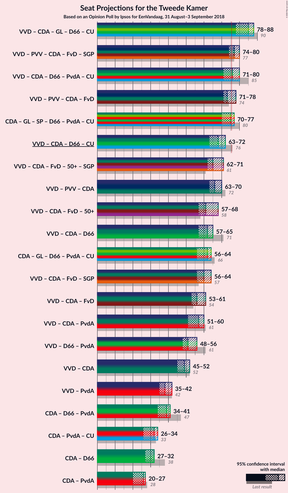

# Opinion Poll by Ipsos for EenVandaag, 31 August–3 September 2018

<a href="#voting-intentions">Voting Intentions</a> | <a href="#seats">Seats</a> | <a href="#coalitions">Coalitions</a> | <a href="#technical-information">Technical Information</a>

## Voting Intentions

### Confidence Intervals

| Party | Last Result | Poll Result | 80% Confidence Interval | 90% Confidence Interval | 95% Confidence Interval | 99% Confidence Interval |
|:-----:|:-----------:|:-----------:|:-----------------------:|:-----------------------:|:-----------------------:|:-----------------------:|
| Volkspartij voor Vrijheid en Democratie | 21.3% | 20.3% | 18.8–22.0% |18.3–22.4% |18.0–22.8% |17.2–23.7% |
| Partij voor de Vrijheid | 13.1% | 11.9% | 10.7–13.2% |10.3–13.6% |10.0–14.0% |9.5–14.7% |
| Christen-Democratisch Appèl | 12.4% | 11.2% | 10.0–12.5% |9.7–12.9% |9.4–13.3% |8.9–13.9% |
| GroenLinks | 9.1% | 10.2% | 9.1–11.5% |8.8–11.9% |8.5–12.2% |8.0–12.9% |
| Socialistische Partij | 9.1% | 9.3% | 8.2–10.5% |7.9–10.9% |7.7–11.2% |7.2–11.8% |
| Democraten 66 | 12.2% | 8.7% | 7.7–9.9% |7.4–10.3% |7.1–10.6% |6.7–11.2% |
| Forum voor Democratie | 1.8% | 5.7% | 4.9–6.8% |4.7–7.1% |4.5–7.3% |4.1–7.8% |
| Partij van de Arbeid | 5.7% | 5.4% | 4.6–6.4% |4.3–6.6% |4.1–6.9% |3.8–7.4% |
| Partij voor de Dieren | 3.2% | 4.7% | 3.9–5.6% |3.7–5.9% |3.6–6.2% |3.2–6.6% |
| ChristenUnie | 3.4% | 4.3% | 3.6–5.2% |3.4–5.5% |3.2–5.7% |2.9–6.2% |
| 50Plus | 3.1% | 3.7% | 3.1–4.6% |2.9–4.8% |2.7–5.1% |2.5–5.5% |
| Staatkundig Gereformeerde Partij | 2.1% | 2.1% | 1.6–2.8% |1.5–3.0% |1.4–3.2% |1.2–3.5% |
| DENK | 2.1% | 1.8% | 1.4–2.5% |1.3–2.7% |1.2–2.8% |1.0–3.2% |

*Note:* The poll result column reflects the actual value used in the calculations. Published results may vary slightly, and in addition be rounded to fewer digits.

## Seats

### Confidence Intervals

| Party | Last Result | Median | 80% Confidence Interval | 90% Confidence Interval | 95% Confidence Interval | 99% Confidence Interval |
|:-----:|:-----------:|:------:|:-----------------------:|:-----------------------:|:-----------------------:|:-----------------------:|
| <a href="#volkspartij-voor-vrijheid-en-democratie">Volkspartij voor Vrijheid en Democratie</a> | 33 | 30 | 29–34 |29–34 |28–34 |27–37 |
| <a href="#partij-voor-de-vrijheid">Partij voor de Vrijheid</a> | 20 | 17 | 17–20 |15–20 |15–20 |15–22 |
| <a href="#christen-democratisch-appèl">Christen-Democratisch Appèl</a> | 19 | 18 | 15–19 |14–19 |14–19 |13–20 |
| <a href="#groenlinks">GroenLinks</a> | 14 | 17 | 14–18 |14–18 |13–19 |12–20 |
| <a href="#socialistische-partij">Socialistische Partij</a> | 14 | 14 | 12–15 |12–15 |12–15 |11–17 |
| <a href="#democraten-66">Democraten 66</a> | 19 | 13 | 13–14 |11–16 |11–16 |10–16 |
| <a href="#forum-voor-democratie">Forum voor Democratie</a> | 2 | 7 | 7–10 |7–10 |7–10 |6–12 |
| <a href="#partij-van-de-arbeid">Partij van de Arbeid</a> | 9 | 8 | 6–9 |6–9 |6–10 |5–10 |
| <a href="#partij-voor-de-dieren">Partij voor de Dieren</a> | 5 | 8 | 6–8 |5–9 |5–10 |4–10 |
| <a href="#christenunie">ChristenUnie</a> | 5 | 6 | 5–7 |5–8 |5–8 |4–9 |
| <a href="#50plus">50Plus</a> | 4 | 5 | 4–7 |4–7 |4–8 |3–8 |
| <a href="#staatkundig-gereformeerde-partij">Staatkundig Gereformeerde Partij</a> | 3 | 3 | 2–4 |2–4 |2–5 |1–5 |
| <a href="#denk">DENK</a> | 3 | 2 | 1–3 |1–3 |1–4 |1–4 |

### Volkspartij voor Vrijheid en Democratie

*For a full overview of the results for this party, see the [Volkspartij voor Vrijheid en Democratie](party-volkspartijvoorvrijheidendemocratie.html) page.*

| Number of Seats | Probability | Accumulated | Special Marks |
|:---------------:|:-----------:|:-----------:|:-------------:|
| 24 | 0.1% | 100% |  |
| 25 | 0% | 99.9% |  |
| 26 | 0.2% | 99.9% |  |
| 27 | 0.5% | 99.7% |  |
| 28 | 3% | 99.2% |  |
| 29 | 9% | 97% |  |
| 30 | 47% | 87% | Median |
| 31 | 7% | 40% |  |
| 32 | 10% | 34% |  |
| 33 | 4% | 24% | Last Result |
| 34 | 18% | 20% |  |
| 35 | 0.4% | 2% |  |
| 36 | 0.8% | 1.5% |  |
| 37 | 0.6% | 0.7% |  |
| 38 | 0% | 0% |  |

### Partij voor de Vrijheid

*For a full overview of the results for this party, see the [Partij voor de Vrijheid](party-partijvoordevrijheid.html) page.*

| Number of Seats | Probability | Accumulated | Special Marks |
|:---------------:|:-----------:|:-----------:|:-------------:|
| 13 | 0.1% | 100% |  |
| 14 | 0.1% | 99.9% |  |
| 15 | 5% | 99.8% |  |
| 16 | 3% | 94% |  |
| 17 | 48% | 91% | Median |
| 18 | 11% | 43% |  |
| 19 | 18% | 33% |  |
| 20 | 12% | 15% | Last Result |
| 21 | 0.9% | 2% |  |
| 22 | 1.3% | 2% |  |
| 23 | 0.2% | 0.3% |  |
| 24 | 0% | 0% |  |

### Christen-Democratisch Appèl

*For a full overview of the results for this party, see the [Christen-Democratisch Appèl](party-christen-democratischappèl.html) page.*

| Number of Seats | Probability | Accumulated | Special Marks |
|:---------------:|:-----------:|:-----------:|:-------------:|
| 12 | 0.1% | 100% |  |
| 13 | 0.5% | 99.9% |  |
| 14 | 6% | 99.5% |  |
| 15 | 5% | 93% |  |
| 16 | 4% | 88% |  |
| 17 | 22% | 84% |  |
| 18 | 16% | 62% | Median |
| 19 | 45% | 46% | Last Result |
| 20 | 0.4% | 0.9% |  |
| 21 | 0.3% | 0.5% |  |
| 22 | 0.2% | 0.2% |  |
| 23 | 0% | 0% |  |

### GroenLinks

*For a full overview of the results for this party, see the [GroenLinks](party-groenlinks.html) page.*

| Number of Seats | Probability | Accumulated | Special Marks |
|:---------------:|:-----------:|:-----------:|:-------------:|
| 11 | 0.1% | 100% |  |
| 12 | 0.8% | 99.9% |  |
| 13 | 3% | 99.1% |  |
| 14 | 9% | 96% | Last Result |
| 15 | 14% | 87% |  |
| 16 | 20% | 73% |  |
| 17 | 43% | 53% | Median |
| 18 | 6% | 10% |  |
| 19 | 2% | 4% |  |
| 20 | 2% | 2% |  |
| 21 | 0% | 0.1% |  |
| 22 | 0% | 0% |  |

### Socialistische Partij

*For a full overview of the results for this party, see the [Socialistische Partij](party-socialistischepartij.html) page.*

| Number of Seats | Probability | Accumulated | Special Marks |
|:---------------:|:-----------:|:-----------:|:-------------:|
| 10 | 0.1% | 100% |  |
| 11 | 2% | 99.9% |  |
| 12 | 15% | 98% |  |
| 13 | 14% | 83% |  |
| 14 | 52% | 69% | Last Result, Median |
| 15 | 15% | 17% |  |
| 16 | 1.3% | 2% |  |
| 17 | 0.8% | 0.9% |  |
| 18 | 0.1% | 0.1% |  |
| 19 | 0% | 0% |  |

### Democraten 66

*For a full overview of the results for this party, see the [Democraten 66](party-democraten66.html) page.*

| Number of Seats | Probability | Accumulated | Special Marks |
|:---------------:|:-----------:|:-----------:|:-------------:|
| 10 | 1.4% | 100% |  |
| 11 | 4% | 98.5% |  |
| 12 | 5% | 95% |  |
| 13 | 60% | 90% | Median |
| 14 | 20% | 30% |  |
| 15 | 2% | 10% |  |
| 16 | 7% | 7% |  |
| 17 | 0.4% | 0.5% |  |
| 18 | 0.1% | 0.1% |  |
| 19 | 0% | 0% | Last Result |

### Forum voor Democratie

*For a full overview of the results for this party, see the [Forum voor Democratie](party-forumvoordemocratie.html) page.*

| Number of Seats | Probability | Accumulated | Special Marks |
|:---------------:|:-----------:|:-----------:|:-------------:|
| 2 | 0% | 100% | Last Result |
| 3 | 0% | 100% |  |
| 4 | 0% | 100% |  |
| 5 | 0% | 100% |  |
| 6 | 0.9% | 100% |  |
| 7 | 63% | 99.0% | Median |
| 8 | 12% | 36% |  |
| 9 | 13% | 24% |  |
| 10 | 10% | 11% |  |
| 11 | 1.0% | 2% |  |
| 12 | 0.5% | 0.5% |  |
| 13 | 0.1% | 0.1% |  |
| 14 | 0% | 0% |  |

### Partij van de Arbeid

*For a full overview of the results for this party, see the [Partij van de Arbeid](party-partijvandearbeid.html) page.*

| Number of Seats | Probability | Accumulated | Special Marks |
|:---------------:|:-----------:|:-----------:|:-------------:|
| 5 | 1.3% | 100% |  |
| 6 | 10% | 98.7% |  |
| 7 | 13% | 89% |  |
| 8 | 64% | 75% | Median |
| 9 | 8% | 11% | Last Result |
| 10 | 3% | 3% |  |
| 11 | 0.2% | 0.3% |  |
| 12 | 0% | 0.1% |  |
| 13 | 0% | 0% |  |

### Partij voor de Dieren

*For a full overview of the results for this party, see the [Partij voor de Dieren](party-partijvoordedieren.html) page.*

| Number of Seats | Probability | Accumulated | Special Marks |
|:---------------:|:-----------:|:-----------:|:-------------:|
| 4 | 1.2% | 100% |  |
| 5 | 5% | 98.8% | Last Result |
| 6 | 23% | 94% |  |
| 7 | 13% | 71% |  |
| 8 | 52% | 58% | Median |
| 9 | 4% | 6% |  |
| 10 | 2% | 3% |  |
| 11 | 0.3% | 0.3% |  |
| 12 | 0% | 0% |  |

### ChristenUnie

*For a full overview of the results for this party, see the [ChristenUnie](party-christenunie.html) page.*

| Number of Seats | Probability | Accumulated | Special Marks |
|:---------------:|:-----------:|:-----------:|:-------------:|
| 4 | 1.3% | 100% |  |
| 5 | 15% | 98.7% | Last Result |
| 6 | 54% | 83% | Median |
| 7 | 24% | 30% |  |
| 8 | 4% | 5% |  |
| 9 | 1.2% | 1.3% |  |
| 10 | 0.1% | 0.1% |  |
| 11 | 0% | 0% |  |

### 50Plus

*For a full overview of the results for this party, see the [50Plus](party-50plus.html) page.*

| Number of Seats | Probability | Accumulated | Special Marks |
|:---------------:|:-----------:|:-----------:|:-------------:|
| 3 | 2% | 100% |  |
| 4 | 15% | 98% | Last Result |
| 5 | 61% | 82% | Median |
| 6 | 6% | 21% |  |
| 7 | 12% | 16% |  |
| 8 | 3% | 3% |  |
| 9 | 0% | 0% |  |

### Staatkundig Gereformeerde Partij

*For a full overview of the results for this party, see the [Staatkundig Gereformeerde Partij](party-staatkundiggereformeerdepartij.html) page.*

| Number of Seats | Probability | Accumulated | Special Marks |
|:---------------:|:-----------:|:-----------:|:-------------:|
| 1 | 0.5% | 100% |  |
| 2 | 14% | 99.5% |  |
| 3 | 35% | 85% | Last Result, Median |
| 4 | 46% | 50% |  |
| 5 | 4% | 4% |  |
| 6 | 0% | 0% |  |

### DENK

*For a full overview of the results for this party, see the [DENK](party-denk.html) page.*

| Number of Seats | Probability | Accumulated | Special Marks |
|:---------------:|:-----------:|:-----------:|:-------------:|
| 1 | 14% | 100% |  |
| 2 | 61% | 86% | Median |
| 3 | 22% | 26% | Last Result |
| 4 | 3% | 4% |  |
| 5 | 0.2% | 0.3% |  |
| 6 | 0% | 0% |  |

## Coalitions

### Confidence Intervals

| Coalition | Last Result | Median | Majority? | 80% Confidence Interval | 90% Confidence Interval | 95% Confidence Interval | 99% Confidence Interval |
|:---------:|:-----------:|:------:|:---------:|:-----------------------:|:-----------------------:|:-----------------------:|:-----------------------:|
| Volkspartij voor Vrijheid en Democratie – Christen-Democratisch Appèl – GroenLinks – Democraten 66 – ChristenUnie | 90 | 85 | 99.6% | 81–88 | 80–88 | 78–88 | 76–89 |
| Volkspartij voor Vrijheid en Democratie – Partij voor de Vrijheid – Christen-Democratisch Appèl – Forum voor Democratie – Staatkundig Gereformeerde Partij | 77 | 77 | 92% | 76–80 | 74–80 | 74–80 | 73–83 |
| Volkspartij voor Vrijheid en Democratie – Christen-Democratisch Appèl – Democraten 66 – Partij van de Arbeid – ChristenUnie | 85 | 76 | 73% | 73–80 | 72–80 | 71–80 | 69–81 |
| Volkspartij voor Vrijheid en Democratie – Partij voor de Vrijheid – Christen-Democratisch Appèl – Forum voor Democratie | 74 | 73 | 33% | 73–77 | 71–78 | 71–78 | 69–80 |
| Christen-Democratisch Appèl – GroenLinks – Socialistische Partij – Democraten 66 – Partij van de Arbeid – ChristenUnie | 80 | 75 | 46% | 72–77 | 71–77 | 70–77 | 69–79 |
| Volkspartij voor Vrijheid en Democratie – Christen-Democratisch Appèl – Democraten 66 – ChristenUnie | 76 | 68 | 0% | 65–72 | 65–72 | 63–72 | 61–73 |
| Volkspartij voor Vrijheid en Democratie – Christen-Democratisch Appèl – Forum voor Democratie – 50Plus – Staatkundig Gereformeerde Partij | 61 | 65 | 0% | 63–68 | 62–71 | 62–71 | 60–71 |
| Volkspartij voor Vrijheid en Democratie – Partij voor de Vrijheid – Christen-Democratisch Appèl | 72 | 66 | 0% | 64–70 | 63–70 | 63–70 | 61–71 |
| Volkspartij voor Vrijheid en Democratie – Christen-Democratisch Appèl – Forum voor Democratie – 50Plus | 58 | 61 | 0% | 60–65 | 59–68 | 57–68 | 56–69 |
| Volkspartij voor Vrijheid en Democratie – Christen-Democratisch Appèl – Democraten 66 | 71 | 62 | 0% | 60–65 | 58–65 | 57–65 | 55–66 |
| Christen-Democratisch Appèl – GroenLinks – Democraten 66 – Partij van de Arbeid – ChristenUnie | 66 | 62 | 0% | 59–63 | 56–63 | 56–64 | 54–65 |
| Volkspartij voor Vrijheid en Democratie – Christen-Democratisch Appèl – Forum voor Democratie – Staatkundig Gereformeerde Partij | 57 | 60 | 0% | 58–61 | 56–64 | 56–64 | 54–64 |
| Volkspartij voor Vrijheid en Democratie – Christen-Democratisch Appèl – Forum voor Democratie | 54 | 56 | 0% | 54–58 | 53–61 | 53–61 | 52–62 |
| Volkspartij voor Vrijheid en Democratie – Christen-Democratisch Appèl – Partij van de Arbeid | 61 | 57 | 0% | 53–59 | 52–59 | 51–60 | 51–63 |
| Volkspartij voor Vrijheid en Democratie – Democraten 66 – Partij van de Arbeid | 61 | 51 | 0% | 49–56 | 48–56 | 48–56 | 47–58 |
| Volkspartij voor Vrijheid en Democratie – Christen-Democratisch Appèl | 52 | 49 | 0% | 46–51 | 45–52 | 45–52 | 43–54 |
| Volkspartij voor Vrijheid en Democratie – Partij van de Arbeid | 42 | 38 | 0% | 37–42 | 36–42 | 35–42 | 34–46 |
| Christen-Democratisch Appèl – Democraten 66 – Partij van de Arbeid | 47 | 39 | 0% | 36–40 | 35–40 | 34–41 | 33–43 |
| Christen-Democratisch Appèl – Partij van de Arbeid – ChristenUnie | 33 | 32 | 0% | 29–33 | 27–33 | 26–34 | 26–36 |
| Christen-Democratisch Appèl – Democraten 66 | 38 | 32 | 0% | 29–32 | 28–32 | 27–32 | 26–35 |
| Christen-Democratisch Appèl – Partij van de Arbeid | 28 | 26 | 0% | 23–27 | 21–27 | 20–27 | 20–29 |

### Volkspartij voor Vrijheid en Democratie – Christen-Democratisch Appèl – GroenLinks – Democraten 66 – ChristenUnie

| Number of Seats | Probability | Accumulated | Special Marks |
|:---------------:|:-----------:|:-----------:|:-------------:|
| 74 | 0.2% | 100% |  |
| 75 | 0.2% | 99.8% |  |
| 76 | 0.3% | 99.6% | Majority |
| 77 | 0.3% | 99.3% |  |
| 78 | 2% | 99.0% |  |
| 79 | 0.6% | 97% |  |
| 80 | 6% | 97% |  |
| 81 | 4% | 91% |  |
| 82 | 1.5% | 87% |  |
| 83 | 12% | 86% |  |
| 84 | 4% | 74% | Median |
| 85 | 47% | 69% |  |
| 86 | 6% | 22% |  |
| 87 | 1.2% | 16% |  |
| 88 | 15% | 15% |  |
| 89 | 0.4% | 0.5% |  |
| 90 | 0.1% | 0.1% | Last Result |
| 91 | 0% | 0% |  |

### Volkspartij voor Vrijheid en Democratie – Partij voor de Vrijheid – Christen-Democratisch Appèl – Forum voor Democratie – Staatkundig Gereformeerde Partij

| Number of Seats | Probability | Accumulated | Special Marks |
|:---------------:|:-----------:|:-----------:|:-------------:|
| 69 | 0% | 100% |  |
| 70 | 0% | 99.9% |  |
| 71 | 0.1% | 99.9% |  |
| 72 | 0.2% | 99.8% |  |
| 73 | 1.2% | 99.6% |  |
| 74 | 5% | 98% |  |
| 75 | 0.8% | 93% | Median |
| 76 | 5% | 92% | Majority |
| 77 | 44% | 87% | Last Result |
| 78 | 11% | 43% |  |
| 79 | 14% | 33% |  |
| 80 | 16% | 18% |  |
| 81 | 1.0% | 2% |  |
| 82 | 0.2% | 1.4% |  |
| 83 | 1.1% | 1.2% |  |
| 84 | 0% | 0.1% |  |
| 85 | 0.1% | 0.1% |  |
| 86 | 0% | 0% |  |

### Volkspartij voor Vrijheid en Democratie – Christen-Democratisch Appèl – Democraten 66 – Partij van de Arbeid – ChristenUnie

| Number of Seats | Probability | Accumulated | Special Marks |
|:---------------:|:-----------:|:-----------:|:-------------:|
| 65 | 0.2% | 100% |  |
| 66 | 0% | 99.8% |  |
| 67 | 0.1% | 99.8% |  |
| 68 | 0% | 99.8% |  |
| 69 | 0.3% | 99.7% |  |
| 70 | 0.2% | 99.5% |  |
| 71 | 3% | 99.2% |  |
| 72 | 3% | 97% |  |
| 73 | 9% | 93% |  |
| 74 | 9% | 84% |  |
| 75 | 2% | 75% | Median |
| 76 | 48% | 73% | Majority |
| 77 | 2% | 25% |  |
| 78 | 1.5% | 23% |  |
| 79 | 7% | 21% |  |
| 80 | 13% | 15% |  |
| 81 | 1.3% | 1.4% |  |
| 82 | 0% | 0.1% |  |
| 83 | 0% | 0% |  |
| 84 | 0% | 0% |  |
| 85 | 0% | 0% | Last Result |

### Volkspartij voor Vrijheid en Democratie – Partij voor de Vrijheid – Christen-Democratisch Appèl – Forum voor Democratie

| Number of Seats | Probability | Accumulated | Special Marks |
|:---------------:|:-----------:|:-----------:|:-------------:|
| 67 | 0.1% | 100% |  |
| 68 | 0.3% | 99.9% |  |
| 69 | 0.5% | 99.6% |  |
| 70 | 0.3% | 99.1% |  |
| 71 | 5% | 98.8% |  |
| 72 | 2% | 94% | Median |
| 73 | 49% | 92% |  |
| 74 | 4% | 43% | Last Result |
| 75 | 6% | 39% |  |
| 76 | 8% | 33% | Majority |
| 77 | 19% | 25% |  |
| 78 | 3% | 5% |  |
| 79 | 0.2% | 2% |  |
| 80 | 1.2% | 1.4% |  |
| 81 | 0.1% | 0.2% |  |
| 82 | 0% | 0.1% |  |
| 83 | 0% | 0% |  |

### Christen-Democratisch Appèl – GroenLinks – Socialistische Partij – Democraten 66 – Partij van de Arbeid – ChristenUnie

| Number of Seats | Probability | Accumulated | Special Marks |
|:---------------:|:-----------:|:-----------:|:-------------:|
| 66 | 0% | 100% |  |
| 67 | 0% | 99.9% |  |
| 68 | 0.3% | 99.9% |  |
| 69 | 2% | 99.6% |  |
| 70 | 0.7% | 98% |  |
| 71 | 5% | 97% |  |
| 72 | 10% | 92% |  |
| 73 | 3% | 83% |  |
| 74 | 24% | 79% |  |
| 75 | 9% | 55% |  |
| 76 | 2% | 46% | Median, Majority |
| 77 | 42% | 44% |  |
| 78 | 0.6% | 2% |  |
| 79 | 1.4% | 2% |  |
| 80 | 0.1% | 0.2% | Last Result |
| 81 | 0% | 0.1% |  |
| 82 | 0% | 0% |  |

### Volkspartij voor Vrijheid en Democratie – Christen-Democratisch Appèl – Democraten 66 – ChristenUnie

| Number of Seats | Probability | Accumulated | Special Marks |
|:---------------:|:-----------:|:-----------:|:-------------:|
| 58 | 0.2% | 100% |  |
| 59 | 0% | 99.8% |  |
| 60 | 0.2% | 99.8% |  |
| 61 | 0.1% | 99.6% |  |
| 62 | 0.3% | 99.5% |  |
| 63 | 2% | 99.1% |  |
| 64 | 2% | 97% |  |
| 65 | 7% | 96% |  |
| 66 | 3% | 89% |  |
| 67 | 12% | 86% | Median |
| 68 | 51% | 74% |  |
| 69 | 1.5% | 24% |  |
| 70 | 1.2% | 22% |  |
| 71 | 2% | 21% |  |
| 72 | 19% | 19% |  |
| 73 | 0.3% | 0.6% |  |
| 74 | 0.1% | 0.3% |  |
| 75 | 0.1% | 0.2% |  |
| 76 | 0% | 0% | Last Result, Majority |

### Volkspartij voor Vrijheid en Democratie – Christen-Democratisch Appèl – Forum voor Democratie – 50Plus – Staatkundig Gereformeerde Partij

| Number of Seats | Probability | Accumulated | Special Marks |
|:---------------:|:-----------:|:-----------:|:-------------:|
| 58 | 0.2% | 100% |  |
| 59 | 0.3% | 99.8% |  |
| 60 | 0.6% | 99.5% |  |
| 61 | 0.6% | 98.9% | Last Result |
| 62 | 5% | 98% |  |
| 63 | 14% | 94% | Median |
| 64 | 9% | 80% |  |
| 65 | 44% | 71% |  |
| 66 | 15% | 27% |  |
| 67 | 2% | 12% |  |
| 68 | 4% | 11% |  |
| 69 | 0.6% | 7% |  |
| 70 | 0.6% | 6% |  |
| 71 | 5% | 5% |  |
| 72 | 0.1% | 0.1% |  |
| 73 | 0% | 0% |  |

### Volkspartij voor Vrijheid en Democratie – Partij voor de Vrijheid – Christen-Democratisch Appèl

| Number of Seats | Probability | Accumulated | Special Marks |
|:---------------:|:-----------:|:-----------:|:-------------:|
| 59 | 0.2% | 100% |  |
| 60 | 0.2% | 99.8% |  |
| 61 | 0.4% | 99.6% |  |
| 62 | 1.5% | 99.2% |  |
| 63 | 6% | 98% |  |
| 64 | 4% | 92% |  |
| 65 | 8% | 88% | Median |
| 66 | 46% | 80% |  |
| 67 | 9% | 34% |  |
| 68 | 3% | 25% |  |
| 69 | 1.2% | 21% |  |
| 70 | 19% | 20% |  |
| 71 | 0.6% | 1.1% |  |
| 72 | 0.4% | 0.4% | Last Result |
| 73 | 0% | 0.1% |  |
| 74 | 0% | 0.1% |  |
| 75 | 0% | 0% |  |

### Volkspartij voor Vrijheid en Democratie – Christen-Democratisch Appèl – Forum voor Democratie – 50Plus

| Number of Seats | Probability | Accumulated | Special Marks |
|:---------------:|:-----------:|:-----------:|:-------------:|
| 55 | 0.3% | 100% |  |
| 56 | 0.2% | 99.7% |  |
| 57 | 3% | 99.4% |  |
| 58 | 0.7% | 96% | Last Result |
| 59 | 2% | 95% |  |
| 60 | 10% | 93% | Median |
| 61 | 49% | 83% |  |
| 62 | 4% | 34% |  |
| 63 | 18% | 29% |  |
| 64 | 0.6% | 12% |  |
| 65 | 4% | 11% |  |
| 66 | 0.9% | 7% |  |
| 67 | 0.5% | 6% |  |
| 68 | 5% | 5% |  |
| 69 | 0.6% | 0.7% |  |
| 70 | 0.1% | 0.1% |  |
| 71 | 0% | 0% |  |

### Volkspartij voor Vrijheid en Democratie – Christen-Democratisch Appèl – Democraten 66

| Number of Seats | Probability | Accumulated | Special Marks |
|:---------------:|:-----------:|:-----------:|:-------------:|
| 54 | 0.4% | 100% |  |
| 55 | 0.1% | 99.6% |  |
| 56 | 1.0% | 99.5% |  |
| 57 | 1.2% | 98% |  |
| 58 | 3% | 97% |  |
| 59 | 2% | 94% |  |
| 60 | 9% | 93% |  |
| 61 | 12% | 84% | Median |
| 62 | 43% | 72% |  |
| 63 | 7% | 29% |  |
| 64 | 4% | 22% |  |
| 65 | 17% | 19% |  |
| 66 | 0.7% | 1.0% |  |
| 67 | 0.1% | 0.3% |  |
| 68 | 0.2% | 0.2% |  |
| 69 | 0% | 0% |  |
| 70 | 0% | 0% |  |
| 71 | 0% | 0% | Last Result |

### Christen-Democratisch Appèl – GroenLinks – Democraten 66 – Partij van de Arbeid – ChristenUnie

| Number of Seats | Probability | Accumulated | Special Marks |
|:---------------:|:-----------:|:-----------:|:-------------:|
| 52 | 0% | 100% |  |
| 53 | 0.2% | 99.9% |  |
| 54 | 0.5% | 99.7% |  |
| 55 | 2% | 99.2% |  |
| 56 | 3% | 98% |  |
| 57 | 1.3% | 94% |  |
| 58 | 2% | 93% |  |
| 59 | 16% | 90% |  |
| 60 | 9% | 75% |  |
| 61 | 4% | 65% |  |
| 62 | 16% | 62% | Median |
| 63 | 43% | 46% |  |
| 64 | 1.5% | 3% |  |
| 65 | 1.0% | 1.2% |  |
| 66 | 0.1% | 0.2% | Last Result |
| 67 | 0.1% | 0.1% |  |
| 68 | 0.1% | 0.1% |  |
| 69 | 0% | 0% |  |

### Volkspartij voor Vrijheid en Democratie – Christen-Democratisch Appèl – Forum voor Democratie – Staatkundig Gereformeerde Partij

| Number of Seats | Probability | Accumulated | Special Marks |
|:---------------:|:-----------:|:-----------:|:-------------:|
| 53 | 0.2% | 100% |  |
| 54 | 0.3% | 99.8% |  |
| 55 | 0.8% | 99.5% |  |
| 56 | 5% | 98.7% |  |
| 57 | 2% | 94% | Last Result |
| 58 | 7% | 92% | Median |
| 59 | 11% | 85% |  |
| 60 | 50% | 74% |  |
| 61 | 15% | 24% |  |
| 62 | 2% | 9% |  |
| 63 | 1.4% | 7% |  |
| 64 | 6% | 6% |  |
| 65 | 0.2% | 0.2% |  |
| 66 | 0% | 0.1% |  |
| 67 | 0% | 0% |  |

### Volkspartij voor Vrijheid en Democratie – Christen-Democratisch Appèl – Forum voor Democratie

| Number of Seats | Probability | Accumulated | Special Marks |
|:---------------:|:-----------:|:-----------:|:-------------:|
| 50 | 0% | 100% |  |
| 51 | 0.4% | 99.9% |  |
| 52 | 0.7% | 99.5% |  |
| 53 | 8% | 98.8% |  |
| 54 | 2% | 90% | Last Result |
| 55 | 3% | 89% | Median |
| 56 | 46% | 85% |  |
| 57 | 16% | 39% |  |
| 58 | 14% | 24% |  |
| 59 | 1.2% | 10% |  |
| 60 | 2% | 8% |  |
| 61 | 5% | 7% |  |
| 62 | 1.0% | 1.1% |  |
| 63 | 0% | 0.1% |  |
| 64 | 0% | 0% |  |

### Volkspartij voor Vrijheid en Democratie – Christen-Democratisch Appèl – Partij van de Arbeid

| Number of Seats | Probability | Accumulated | Special Marks |
|:---------------:|:-----------:|:-----------:|:-------------:|
| 49 | 0.1% | 100% |  |
| 50 | 0.3% | 99.9% |  |
| 51 | 4% | 99.5% |  |
| 52 | 3% | 95% |  |
| 53 | 2% | 92% |  |
| 54 | 5% | 90% |  |
| 55 | 11% | 85% |  |
| 56 | 6% | 73% | Median |
| 57 | 41% | 68% |  |
| 58 | 7% | 27% |  |
| 59 | 17% | 20% |  |
| 60 | 1.0% | 3% |  |
| 61 | 0.4% | 2% | Last Result |
| 62 | 0.2% | 1.2% |  |
| 63 | 0.6% | 1.0% |  |
| 64 | 0.4% | 0.4% |  |
| 65 | 0% | 0% |  |

### Volkspartij voor Vrijheid en Democratie – Democraten 66 – Partij van de Arbeid

| Number of Seats | Probability | Accumulated | Special Marks |
|:---------------:|:-----------:|:-----------:|:-------------:|
| 45 | 0% | 100% |  |
| 46 | 0.3% | 99.9% |  |
| 47 | 1.2% | 99.6% |  |
| 48 | 4% | 98% |  |
| 49 | 5% | 95% |  |
| 50 | 2% | 89% |  |
| 51 | 42% | 87% | Median |
| 52 | 10% | 46% |  |
| 53 | 10% | 35% |  |
| 54 | 6% | 25% |  |
| 55 | 3% | 18% |  |
| 56 | 14% | 16% |  |
| 57 | 1.1% | 2% |  |
| 58 | 0.6% | 0.7% |  |
| 59 | 0% | 0.1% |  |
| 60 | 0% | 0.1% |  |
| 61 | 0% | 0% | Last Result |

### Volkspartij voor Vrijheid en Democratie – Christen-Democratisch Appèl

| Number of Seats | Probability | Accumulated | Special Marks |
|:---------------:|:-----------:|:-----------:|:-------------:|
| 41 | 0.1% | 100% |  |
| 42 | 0.2% | 99.9% |  |
| 43 | 0.5% | 99.7% |  |
| 44 | 0.9% | 99.1% |  |
| 45 | 7% | 98% |  |
| 46 | 7% | 91% |  |
| 47 | 7% | 85% |  |
| 48 | 6% | 78% | Median |
| 49 | 44% | 72% |  |
| 50 | 8% | 27% |  |
| 51 | 13% | 20% |  |
| 52 | 5% | 7% | Last Result |
| 53 | 0.8% | 2% |  |
| 54 | 0.7% | 0.8% |  |
| 55 | 0% | 0.1% |  |
| 56 | 0% | 0% |  |

### Volkspartij voor Vrijheid en Democratie – Partij van de Arbeid

| Number of Seats | Probability | Accumulated | Special Marks |
|:---------------:|:-----------:|:-----------:|:-------------:|
| 33 | 0.1% | 100% |  |
| 34 | 1.2% | 99.8% |  |
| 35 | 2% | 98.6% |  |
| 36 | 4% | 96% |  |
| 37 | 8% | 92% |  |
| 38 | 47% | 84% | Median |
| 39 | 8% | 37% |  |
| 40 | 7% | 29% |  |
| 41 | 7% | 22% |  |
| 42 | 14% | 16% | Last Result |
| 43 | 0.3% | 2% |  |
| 44 | 0.4% | 2% |  |
| 45 | 0.2% | 1.2% |  |
| 46 | 0.6% | 1.0% |  |
| 47 | 0.4% | 0.4% |  |
| 48 | 0% | 0% |  |

### Christen-Democratisch Appèl – Democraten 66 – Partij van de Arbeid

| Number of Seats | Probability | Accumulated | Special Marks |
|:---------------:|:-----------:|:-----------:|:-------------:|
| 32 | 0% | 100% |  |
| 33 | 0.7% | 99.9% |  |
| 34 | 3% | 99.2% |  |
| 35 | 3% | 96% |  |
| 36 | 6% | 93% |  |
| 37 | 6% | 88% |  |
| 38 | 11% | 81% |  |
| 39 | 22% | 70% | Median |
| 40 | 44% | 48% |  |
| 41 | 2% | 4% |  |
| 42 | 0.3% | 2% |  |
| 43 | 1.1% | 1.3% |  |
| 44 | 0.1% | 0.2% |  |
| 45 | 0.1% | 0.1% |  |
| 46 | 0% | 0% |  |
| 47 | 0% | 0% | Last Result |

### Christen-Democratisch Appèl – Partij van de Arbeid – ChristenUnie

| Number of Seats | Probability | Accumulated | Special Marks |
|:---------------:|:-----------:|:-----------:|:-------------:|
| 25 | 0.1% | 100% |  |
| 26 | 4% | 99.9% |  |
| 27 | 0.6% | 96% |  |
| 28 | 3% | 95% |  |
| 29 | 4% | 92% |  |
| 30 | 9% | 88% |  |
| 31 | 11% | 79% |  |
| 32 | 21% | 68% | Median |
| 33 | 43% | 47% | Last Result |
| 34 | 2% | 3% |  |
| 35 | 0.8% | 2% |  |
| 36 | 0.9% | 1.1% |  |
| 37 | 0.1% | 0.1% |  |
| 38 | 0% | 0% |  |

### Christen-Democratisch Appèl – Democraten 66

| Number of Seats | Probability | Accumulated | Special Marks |
|:---------------:|:-----------:|:-----------:|:-------------:|
| 24 | 0.1% | 100% |  |
| 25 | 0.2% | 99.9% |  |
| 26 | 1.1% | 99.8% |  |
| 27 | 2% | 98.7% |  |
| 28 | 6% | 96% |  |
| 29 | 2% | 90% |  |
| 30 | 10% | 88% |  |
| 31 | 27% | 78% | Median |
| 32 | 48% | 51% |  |
| 33 | 2% | 2% |  |
| 34 | 0.3% | 0.8% |  |
| 35 | 0.3% | 0.5% |  |
| 36 | 0.1% | 0.2% |  |
| 37 | 0.1% | 0.1% |  |
| 38 | 0% | 0% | Last Result |

### Christen-Democratisch Appèl – Partij van de Arbeid

| Number of Seats | Probability | Accumulated | Special Marks |
|:---------------:|:-----------:|:-----------:|:-------------:|
| 20 | 4% | 100% |  |
| 21 | 2% | 96% |  |
| 22 | 3% | 94% |  |
| 23 | 5% | 90% |  |
| 24 | 4% | 86% |  |
| 25 | 24% | 81% |  |
| 26 | 11% | 57% | Median |
| 27 | 44% | 46% |  |
| 28 | 0.3% | 1.5% | Last Result |
| 29 | 0.8% | 1.1% |  |
| 30 | 0.2% | 0.3% |  |
| 31 | 0% | 0.1% |  |
| 32 | 0% | 0% |  |

## Technical Information

### Opinion Poll

+ **Polling firm:** Ipsos
+ **Commissioner(s):** EenVandaag
+ **Fieldwork period:** 31 August–3 September 2018

### Calculations

+ **Sample size:** 1045
+ **Simulations done:** 1,048,576
+ **Error estimate:** 2.65%

