# Opinion Poll by Peil.nl, 3–9 September 2018

<a href="#voting-intentions">Voting Intentions</a> | <a href="#seats">Seats</a> | <a href="#coalitions">Coalitions</a> | <a href="#technical-information">Technical Information</a>

## Voting Intentions

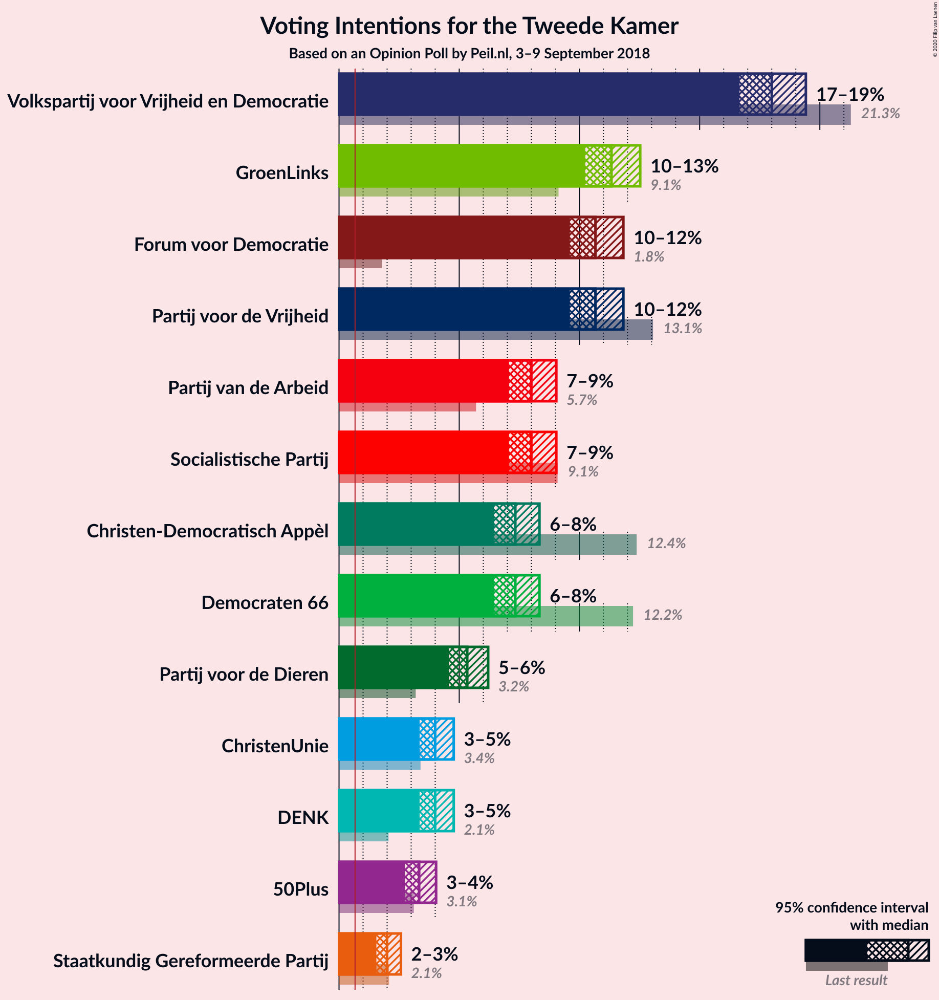

### Confidence Intervals

| Party | Last Result | Poll Result | 80% Confidence Interval | 90% Confidence Interval | 95% Confidence Interval | 99% Confidence Interval |
|:-----:|:-----------:|:-----------:|:-----------------------:|:-----------------------:|:-----------------------:|:-----------------------:|
| Volkspartij voor Vrijheid en Democratie | 21.3% | 18.0% | 17.1–18.9% |16.9–19.2% |16.7–19.4% |16.2–19.9% |
| GroenLinks | 9.1% | 11.3% | 10.6–12.1% |10.4–12.3% |10.2–12.5% |9.9–12.9% |
| Partij voor de Vrijheid | 13.1% | 10.7% | 10.0–11.4% |9.8–11.6% |9.6–11.8% |9.3–12.2% |
| Forum voor Democratie | 1.8% | 10.7% | 10.0–11.4% |9.8–11.6% |9.6–11.8% |9.3–12.2% |
| Socialistische Partij | 9.1% | 8.0% | 7.4–8.7% |7.2–8.9% |7.1–9.0% |6.8–9.4% |
| Partij van de Arbeid | 5.7% | 8.0% | 7.4–8.7% |7.2–8.9% |7.1–9.0% |6.8–9.4% |
| Christen-Democratisch Appèl | 12.4% | 7.3% | 6.8–8.0% |6.6–8.2% |6.4–8.3% |6.2–8.6% |
| Democraten 66 | 12.2% | 7.3% | 6.8–8.0% |6.6–8.2% |6.4–8.3% |6.2–8.6% |
| Partij voor de Dieren | 3.2% | 5.3% | 4.8–5.9% |4.7–6.1% |4.6–6.2% |4.4–6.5% |
| ChristenUnie | 3.4% | 4.0% | 3.6–4.5% |3.4–4.6% |3.4–4.8% |3.2–5.0% |
| DENK | 2.1% | 4.0% | 3.6–4.5% |3.4–4.6% |3.4–4.8% |3.2–5.0% |
| 50Plus | 3.1% | 3.3% | 2.9–3.8% |2.8–3.9% |2.7–4.0% |2.6–4.3% |
| Staatkundig Gereformeerde Partij | 2.1% | 2.0% | 1.7–2.4% |1.6–2.5% |1.6–2.6% |1.4–2.8% |

*Note:* The poll result column reflects the actual value used in the calculations. Published results may vary slightly, and in addition be rounded to fewer digits.

## Seats

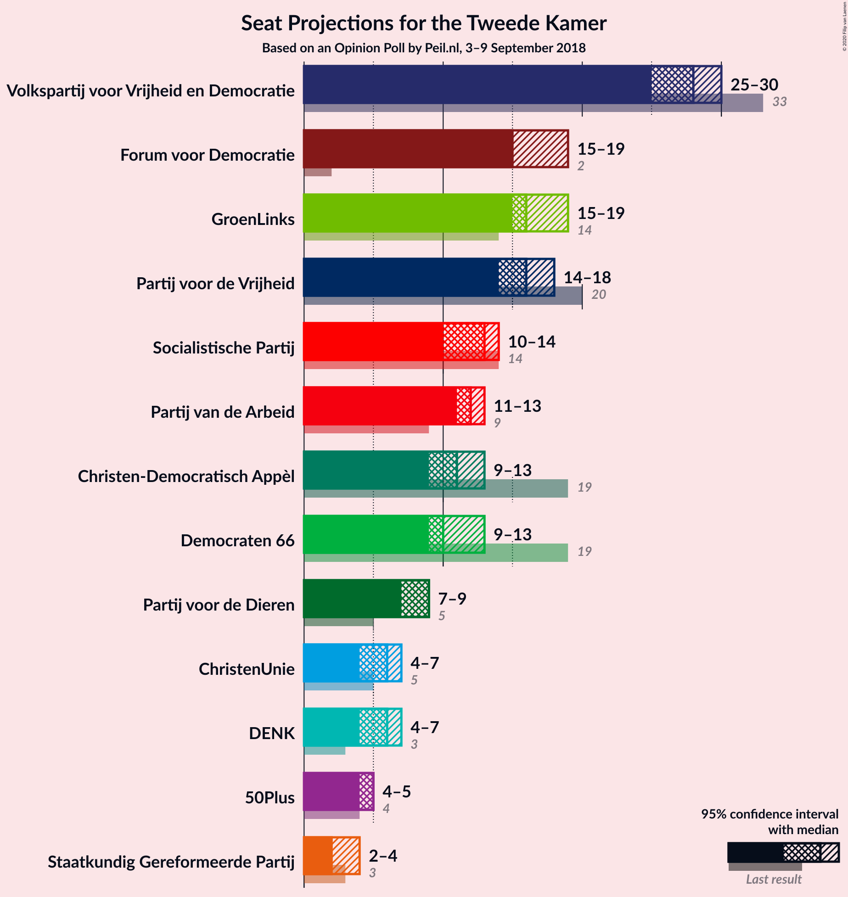

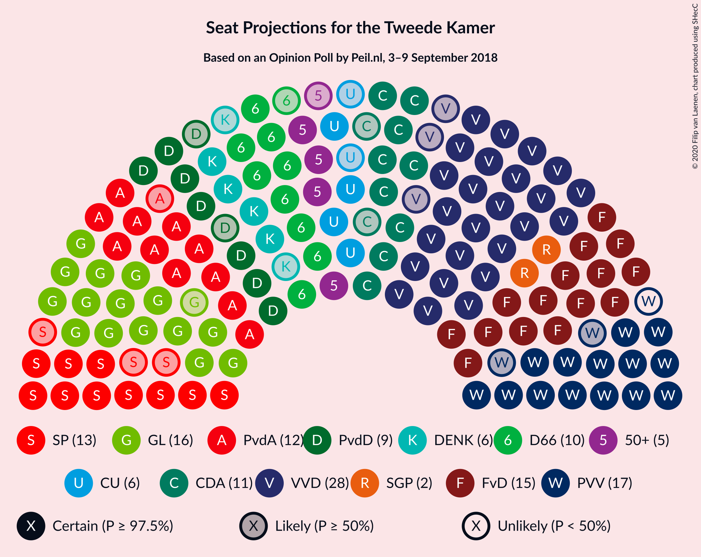

### Confidence Intervals

| Party | Last Result | Median | 80% Confidence Interval | 90% Confidence Interval | 95% Confidence Interval | 99% Confidence Interval |
|:-----:|:-----------:|:------:|:-----------------------:|:-----------------------:|:-----------------------:|:-----------------------:|
| <a href="#volkspartij-voor-vrijheid-en-democratie">Volkspartij voor Vrijheid en Democratie</a> | 33 | 28 | 25–28 |25–29 |25–30 |24–31 |
| <a href="#groenlinks">GroenLinks</a> | 14 | 16 | 16–19 |15–19 |15–19 |15–19 |
| <a href="#partij-voor-de-vrijheid">Partij voor de Vrijheid</a> | 20 | 16 | 15–17 |15–18 |14–18 |14–18 |
| <a href="#forum-voor-democratie">Forum voor Democratie</a> | 2 | 15 | 15–18 |15–19 |15–19 |14–19 |
| <a href="#socialistische-partij">Socialistische Partij</a> | 14 | 13 | 11–14 |10–14 |10–14 |10–15 |
| <a href="#partij-van-de-arbeid">Partij van de Arbeid</a> | 9 | 12 | 12–13 |11–13 |11–13 |10–14 |
| <a href="#christen-democratisch-appèl">Christen-Democratisch Appèl</a> | 19 | 11 | 10–13 |9–13 |9–13 |9–13 |
| <a href="#democraten-66">Democraten 66</a> | 19 | 10 | 9–13 |9–13 |9–13 |9–13 |
| <a href="#partij-voor-de-dieren">Partij voor de Dieren</a> | 5 | 9 | 7–9 |7–9 |7–9 |7–9 |
| <a href="#christenunie">ChristenUnie</a> | 5 | 6 | 5–7 |5–7 |4–7 |4–7 |
| <a href="#denk">DENK</a> | 3 | 6 | 5–6 |5–7 |4–7 |4–8 |
| <a href="#50plus">50Plus</a> | 4 | 5 | 4–5 |4–5 |4–5 |4–6 |
| <a href="#staatkundig-gereformeerde-partij">Staatkundig Gereformeerde Partij</a> | 3 | 2 | 2–3 |2–3 |2–4 |2–4 |

### Volkspartij voor Vrijheid en Democratie

*For a full overview of the results for this party, see the [Volkspartij voor Vrijheid en Democratie](party-volkspartijvoorvrijheidendemocratie.html) page.*

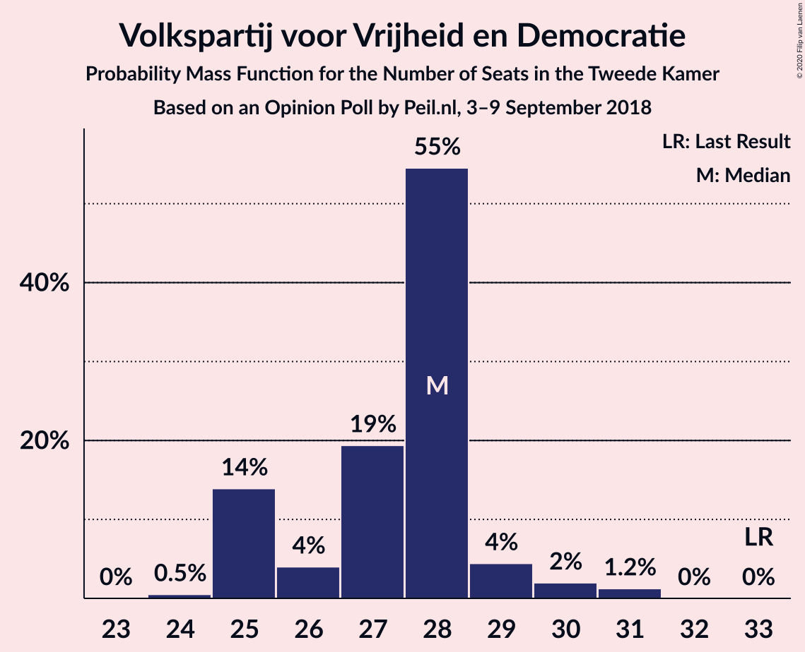

| Number of Seats | Probability | Accumulated | Special Marks |
|:---------------:|:-----------:|:-----------:|:-------------:|
| 24 | 0.5% | 100% |  |
| 25 | 14% | 99.5% |  |
| 26 | 4% | 86% |  |
| 27 | 19% | 82% |  |
| 28 | 55% | 62% | Median |
| 29 | 4% | 8% |  |
| 30 | 2% | 3% |  |
| 31 | 1.2% | 1.3% |  |
| 32 | 0% | 0% |  |
| 33 | 0% | 0% | Last Result |

### GroenLinks

*For a full overview of the results for this party, see the [GroenLinks](party-groenlinks.html) page.*

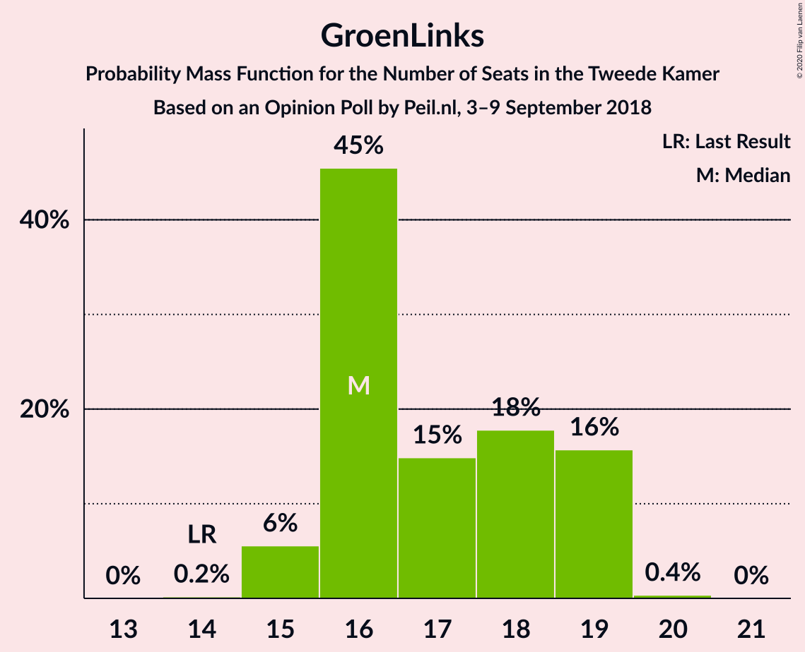

| Number of Seats | Probability | Accumulated | Special Marks |
|:---------------:|:-----------:|:-----------:|:-------------:|
| 14 | 0.2% | 100% | Last Result |
| 15 | 6% | 99.8% |  |
| 16 | 45% | 94% | Median |
| 17 | 15% | 49% |  |
| 18 | 18% | 34% |  |
| 19 | 16% | 16% |  |
| 20 | 0.4% | 0.4% |  |
| 21 | 0% | 0% |  |

### Partij voor de Vrijheid

*For a full overview of the results for this party, see the [Partij voor de Vrijheid](party-partijvoordevrijheid.html) page.*

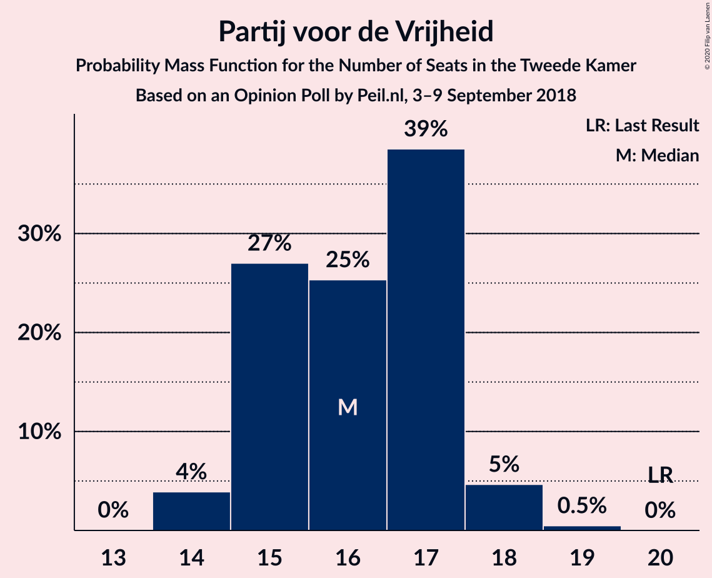

| Number of Seats | Probability | Accumulated | Special Marks |
|:---------------:|:-----------:|:-----------:|:-------------:|
| 14 | 4% | 100% |  |
| 15 | 27% | 96% |  |
| 16 | 25% | 69% | Median |
| 17 | 39% | 44% |  |
| 18 | 5% | 5% |  |
| 19 | 0.5% | 0.5% |  |
| 20 | 0% | 0% | Last Result |

### Forum voor Democratie

*For a full overview of the results for this party, see the [Forum voor Democratie](party-forumvoordemocratie.html) page.*

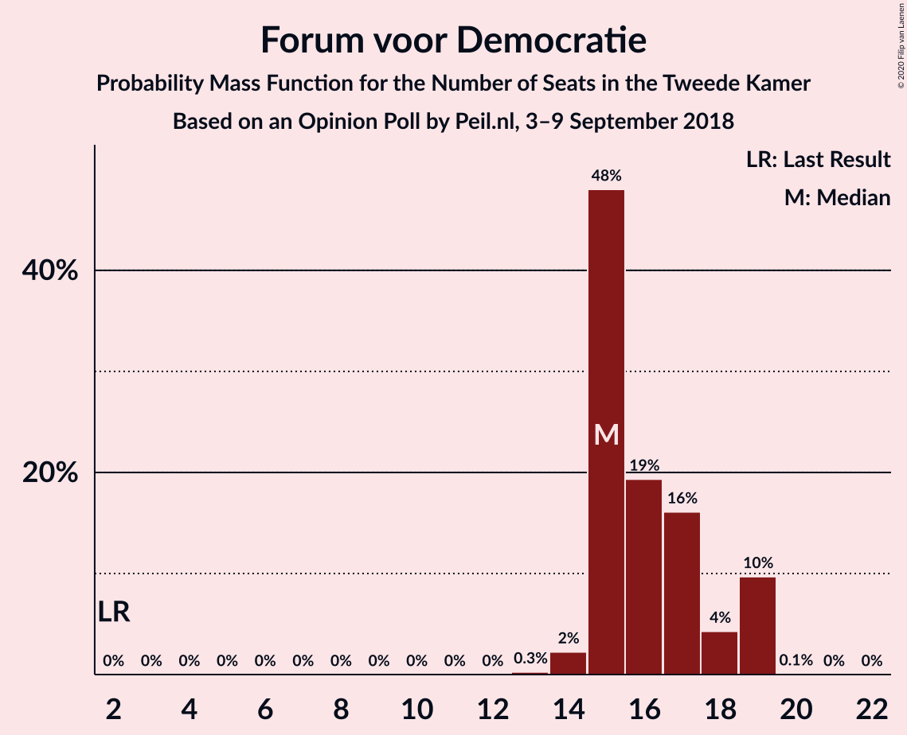

| Number of Seats | Probability | Accumulated | Special Marks |
|:---------------:|:-----------:|:-----------:|:-------------:|
| 2 | 0% | 100% | Last Result |
| 3 | 0% | 100% |  |
| 4 | 0% | 100% |  |
| 5 | 0% | 100% |  |
| 6 | 0% | 100% |  |
| 7 | 0% | 100% |  |
| 8 | 0% | 100% |  |
| 9 | 0% | 100% |  |
| 10 | 0% | 100% |  |
| 11 | 0% | 100% |  |
| 12 | 0% | 100% |  |
| 13 | 0.3% | 100% |  |
| 14 | 2% | 99.7% |  |
| 15 | 48% | 98% | Median |
| 16 | 19% | 49% |  |
| 17 | 16% | 30% |  |
| 18 | 4% | 14% |  |
| 19 | 10% | 10% |  |
| 20 | 0.1% | 0.1% |  |
| 21 | 0% | 0% |  |

### Socialistische Partij

*For a full overview of the results for this party, see the [Socialistische Partij](party-socialistischepartij.html) page.*

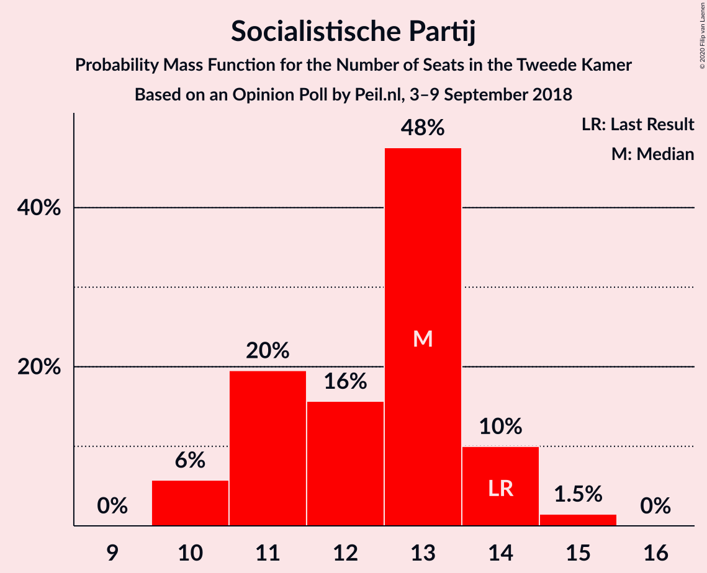

| Number of Seats | Probability | Accumulated | Special Marks |
|:---------------:|:-----------:|:-----------:|:-------------:|
| 10 | 6% | 100% |  |
| 11 | 20% | 94% |  |
| 12 | 16% | 75% |  |
| 13 | 48% | 59% | Median |
| 14 | 10% | 11% | Last Result |
| 15 | 1.5% | 1.5% |  |
| 16 | 0% | 0% |  |

### Partij van de Arbeid

*For a full overview of the results for this party, see the [Partij van de Arbeid](party-partijvandearbeid.html) page.*

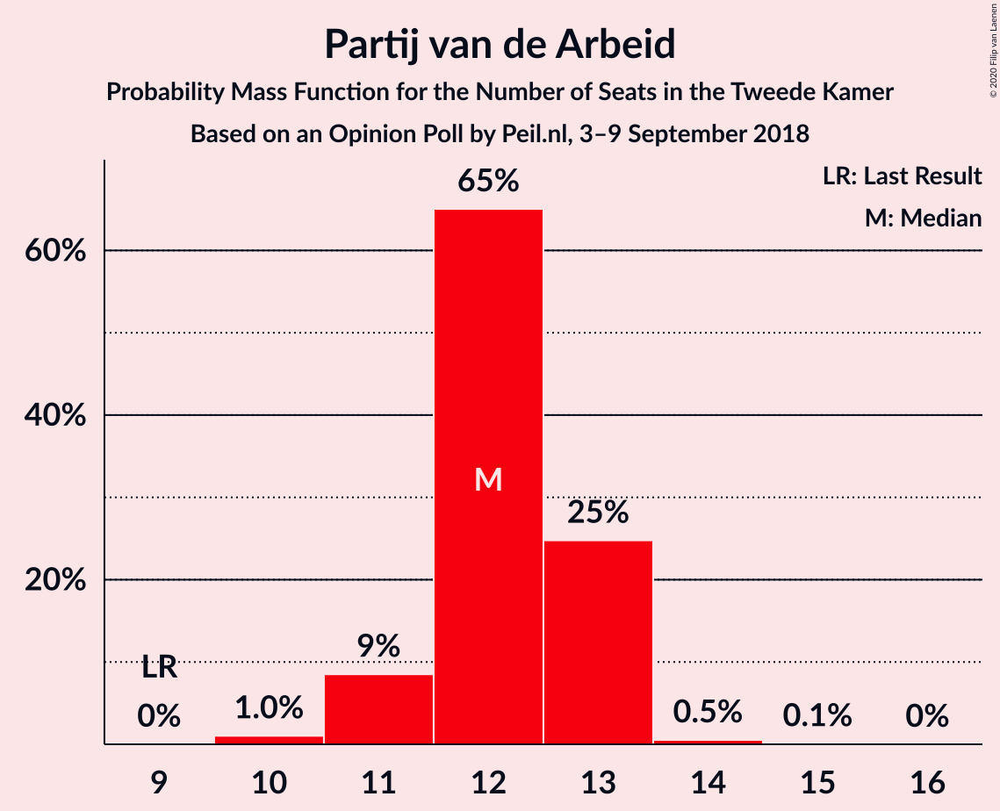

| Number of Seats | Probability | Accumulated | Special Marks |
|:---------------:|:-----------:|:-----------:|:-------------:|
| 9 | 0% | 100% | Last Result |
| 10 | 1.0% | 100% |  |
| 11 | 9% | 99.0% |  |
| 12 | 65% | 90% | Median |
| 13 | 25% | 25% |  |
| 14 | 0.5% | 0.6% |  |
| 15 | 0.1% | 0.1% |  |
| 16 | 0% | 0% |  |

### Christen-Democratisch Appèl

*For a full overview of the results for this party, see the [Christen-Democratisch Appèl](party-christen-democratischappèl.html) page.*

| Number of Seats | Probability | Accumulated | Special Marks |
|:---------------:|:-----------:|:-----------:|:-------------:|
| 9 | 6% | 100% |  |
| 10 | 19% | 94% |  |
| 11 | 50% | 75% | Median |
| 12 | 12% | 25% |  |
| 13 | 13% | 13% |  |
| 14 | 0.5% | 0.5% |  |
| 15 | 0% | 0% |  |
| 16 | 0% | 0% |  |
| 17 | 0% | 0% |  |
| 18 | 0% | 0% |  |
| 19 | 0% | 0% | Last Result |

### Democraten 66

*For a full overview of the results for this party, see the [Democraten 66](party-democraten66.html) page.*

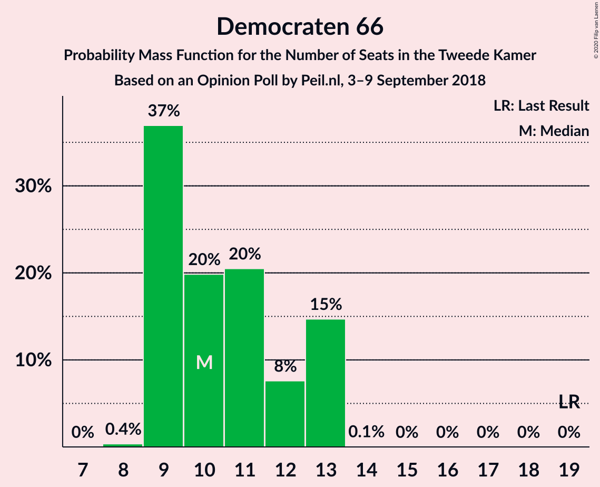

| Number of Seats | Probability | Accumulated | Special Marks |
|:---------------:|:-----------:|:-----------:|:-------------:|
| 8 | 0.4% | 100% |  |
| 9 | 37% | 99.6% |  |
| 10 | 20% | 63% | Median |
| 11 | 20% | 43% |  |
| 12 | 8% | 22% |  |
| 13 | 15% | 15% |  |
| 14 | 0.1% | 0.1% |  |
| 15 | 0% | 0% |  |
| 16 | 0% | 0% |  |
| 17 | 0% | 0% |  |
| 18 | 0% | 0% |  |
| 19 | 0% | 0% | Last Result |

### Partij voor de Dieren

*For a full overview of the results for this party, see the [Partij voor de Dieren](party-partijvoordedieren.html) page.*

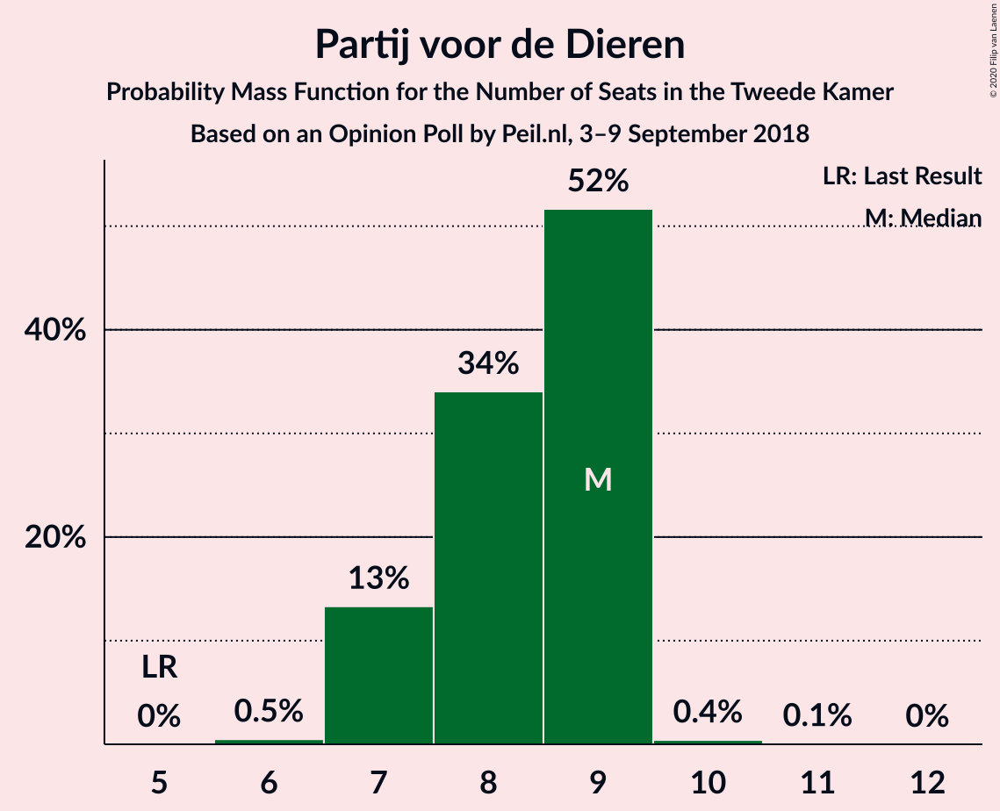

| Number of Seats | Probability | Accumulated | Special Marks |
|:---------------:|:-----------:|:-----------:|:-------------:|
| 5 | 0% | 100% | Last Result |
| 6 | 0.5% | 100% |  |
| 7 | 13% | 99.5% |  |
| 8 | 34% | 86% |  |
| 9 | 52% | 52% | Median |
| 10 | 0.4% | 0.5% |  |
| 11 | 0.1% | 0.1% |  |
| 12 | 0% | 0% |  |

### ChristenUnie

*For a full overview of the results for this party, see the [ChristenUnie](party-christenunie.html) page.*

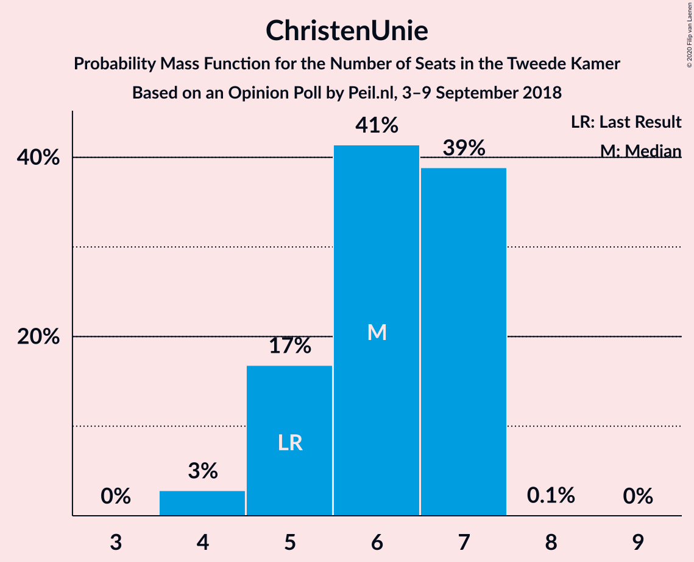

| Number of Seats | Probability | Accumulated | Special Marks |
|:---------------:|:-----------:|:-----------:|:-------------:|
| 4 | 3% | 100% |  |
| 5 | 17% | 97% | Last Result |
| 6 | 41% | 80% | Median |
| 7 | 39% | 39% |  |
| 8 | 0.1% | 0.1% |  |
| 9 | 0% | 0% |  |

### DENK

*For a full overview of the results for this party, see the [DENK](party-denk.html) page.*

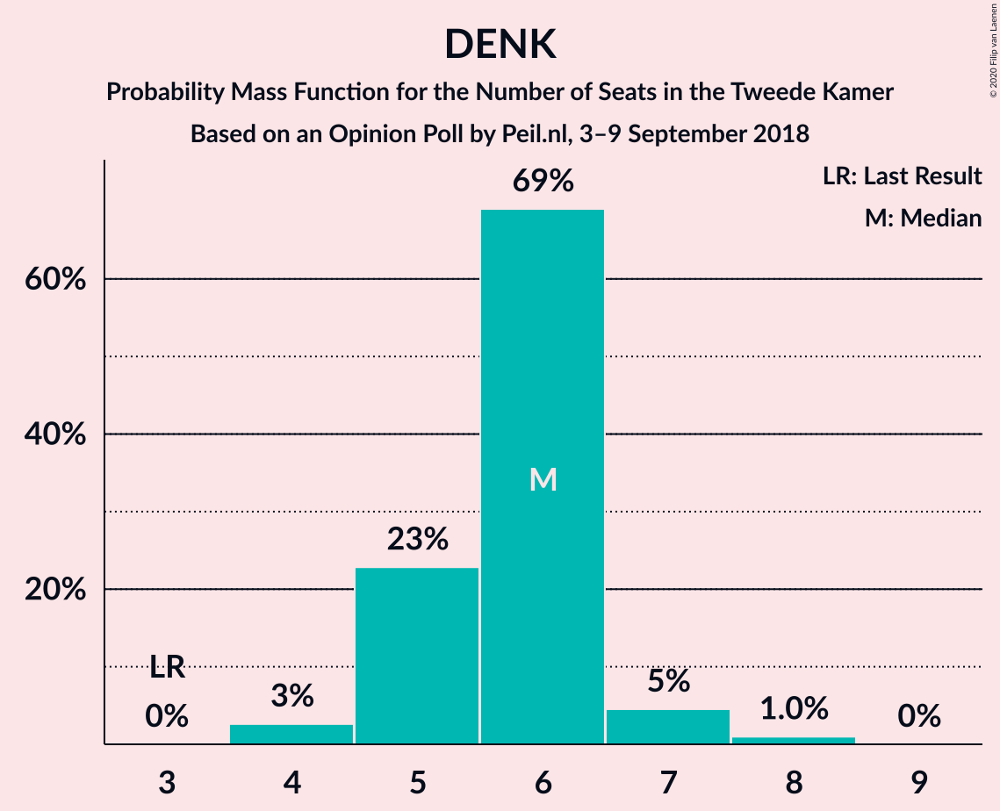

| Number of Seats | Probability | Accumulated | Special Marks |
|:---------------:|:-----------:|:-----------:|:-------------:|
| 3 | 0% | 100% | Last Result |
| 4 | 3% | 100% |  |
| 5 | 23% | 97% |  |
| 6 | 69% | 75% | Median |
| 7 | 5% | 6% |  |
| 8 | 1.0% | 1.0% |  |
| 9 | 0% | 0% |  |

### 50Plus

*For a full overview of the results for this party, see the [50Plus](party-50plus.html) page.*

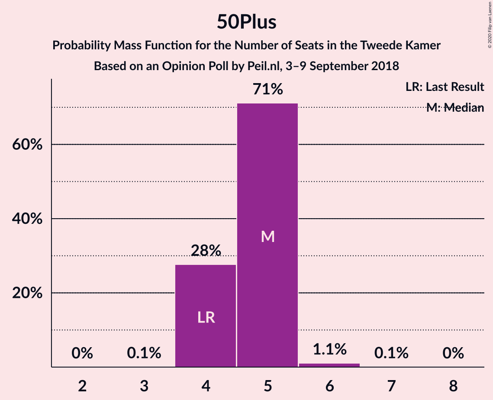

| Number of Seats | Probability | Accumulated | Special Marks |
|:---------------:|:-----------:|:-----------:|:-------------:|
| 3 | 0.1% | 100% |  |
| 4 | 28% | 99.9% | Last Result |
| 5 | 71% | 72% | Median |
| 6 | 1.1% | 1.1% |  |
| 7 | 0.1% | 0.1% |  |
| 8 | 0% | 0% |  |

### Staatkundig Gereformeerde Partij

*For a full overview of the results for this party, see the [Staatkundig Gereformeerde Partij](party-staatkundiggereformeerdepartij.html) page.*

| Number of Seats | Probability | Accumulated | Special Marks |
|:---------------:|:-----------:|:-----------:|:-------------:|
| 2 | 65% | 100% | Median |
| 3 | 32% | 35% | Last Result |
| 4 | 3% | 3% |  |
| 5 | 0% | 0% |  |

## Coalitions

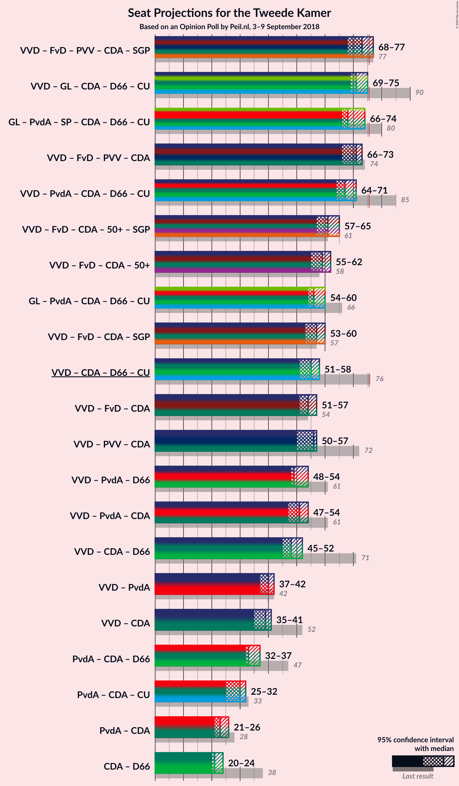

### Confidence Intervals

| Coalition | Last Result | Median | Majority? | 80% Confidence Interval | 90% Confidence Interval | 95% Confidence Interval | 99% Confidence Interval |
|:---------:|:-----------:|:------:|:---------:|:-----------------------:|:-----------------------:|:-----------------------:|:-----------------------:|
| Volkspartij voor Vrijheid en Democratie – Forum voor Democratie – Partij voor de Vrijheid – Christen-Democratisch Appèl – Staatkundig Gereformeerde Partij | 77 | 73 | 5% | 71–75 | 68–75 | 68–77 | 68–77 |
| Volkspartij voor Vrijheid en Democratie – GroenLinks – Christen-Democratisch Appèl – Democraten 66 – ChristenUnie | 90 | 71 | 2% | 69–75 | 69–75 | 69–75 | 69–76 |
| GroenLinks – Partij van de Arbeid – Socialistische Partij – Christen-Democratisch Appèl – Democraten 66 – ChristenUnie | 80 | 68 | 0% | 68–72 | 67–74 | 66–74 | 65–74 |
| Volkspartij voor Vrijheid en Democratie – Forum voor Democratie – Partij voor de Vrijheid – Christen-Democratisch Appèl | 74 | 71 | 0% | 67–72 | 66–73 | 66–73 | 66–75 |
| Volkspartij voor Vrijheid en Democratie – Partij van de Arbeid – Christen-Democratisch Appèl – Democraten 66 – ChristenUnie | 85 | 67 | 0% | 65–71 | 64–71 | 64–71 | 64–73 |
| Volkspartij voor Vrijheid en Democratie – Forum voor Democratie – Christen-Democratisch Appèl – 50Plus – Staatkundig Gereformeerde Partij | 61 | 61 | 0% | 59–65 | 57–65 | 57–65 | 57–67 |
| Volkspartij voor Vrijheid en Democratie – Forum voor Democratie – Christen-Democratisch Appèl – 50Plus | 58 | 59 | 0% | 56–62 | 55–62 | 55–62 | 55–64 |
| GroenLinks – Partij van de Arbeid – Christen-Democratisch Appèl – Democraten 66 – ChristenUnie | 66 | 56 | 0% | 55–60 | 55–60 | 54–60 | 52–60 |
| Volkspartij voor Vrijheid en Democratie – Forum voor Democratie – Christen-Democratisch Appèl – Staatkundig Gereformeerde Partij | 57 | 57 | 0% | 54–60 | 53–60 | 53–60 | 53–62 |
| Volkspartij voor Vrijheid en Democratie – Christen-Democratisch Appèl – Democraten 66 – ChristenUnie | 76 | 55 | 0% | 53–58 | 51–58 | 51–58 | 51–60 |
| Volkspartij voor Vrijheid en Democratie – Forum voor Democratie – Christen-Democratisch Appèl | 54 | 54 | 0% | 51–57 | 51–57 | 51–57 | 51–59 |
| Volkspartij voor Vrijheid en Democratie – Partij voor de Vrijheid – Christen-Democratisch Appèl | 72 | 56 | 0% | 50–56 | 50–56 | 50–57 | 50–58 |
| Volkspartij voor Vrijheid en Democratie – Partij van de Arbeid – Democraten 66 | 61 | 49 | 0% | 48–52 | 48–53 | 48–54 | 47–54 |
| Volkspartij voor Vrijheid en Democratie – Partij van de Arbeid – Christen-Democratisch Appèl | 61 | 51 | 0% | 48–53 | 47–54 | 47–54 | 47–55 |
| Volkspartij voor Vrijheid en Democratie – Christen-Democratisch Appèl – Democraten 66 | 71 | 48 | 0% | 47–52 | 45–52 | 45–52 | 45–54 |
| Volkspartij voor Vrijheid en Democratie – Partij van de Arbeid | 42 | 40 | 0% | 38–41 | 37–42 | 37–42 | 37–43 |
| Volkspartij voor Vrijheid en Democratie – Christen-Democratisch Appèl | 52 | 39 | 0% | 35–41 | 35–41 | 35–41 | 35–43 |
| Partij van de Arbeid – Christen-Democratisch Appèl – Democraten 66 | 47 | 33 | 0% | 32–36 | 32–37 | 32–37 | 31–37 |
| Partij van de Arbeid – Christen-Democratisch Appèl – ChristenUnie | 33 | 30 | 0% | 27–31 | 27–32 | 25–32 | 25–32 |
| Partij van de Arbeid – Christen-Democratisch Appèl | 28 | 23 | 0% | 22–25 | 21–26 | 21–26 | 20–26 |
| Christen-Democratisch Appèl – Democraten 66 | 38 | 21 | 0% | 20–24 | 20–24 | 20–24 | 19–25 |

### Volkspartij voor Vrijheid en Democratie – Forum voor Democratie – Partij voor de Vrijheid – Christen-Democratisch Appèl – Staatkundig Gereformeerde Partij

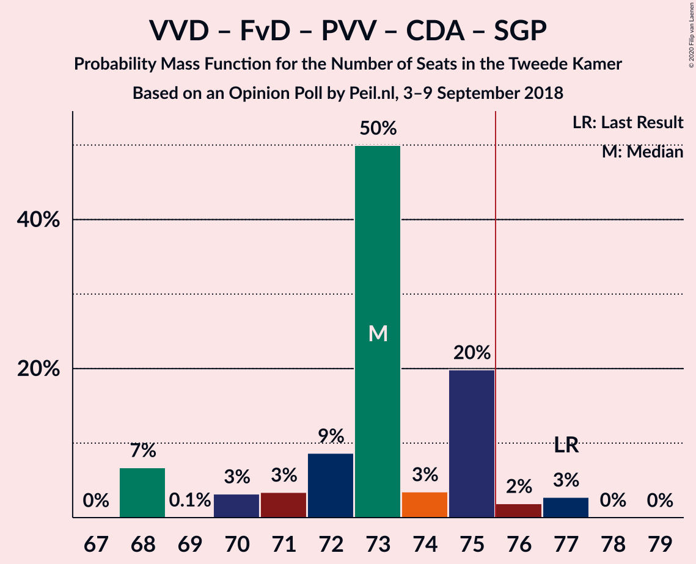

| Number of Seats | Probability | Accumulated | Special Marks |
|:---------------:|:-----------:|:-----------:|:-------------:|
| 68 | 7% | 100% |  |
| 69 | 0.1% | 93% |  |
| 70 | 3% | 93% |  |
| 71 | 3% | 90% |  |
| 72 | 9% | 87% | Median |
| 73 | 50% | 78% |  |
| 74 | 3% | 28% |  |
| 75 | 20% | 25% |  |
| 76 | 2% | 5% | Majority |
| 77 | 3% | 3% | Last Result |
| 78 | 0% | 0.1% |  |
| 79 | 0% | 0% |  |

### Volkspartij voor Vrijheid en Democratie – GroenLinks – Christen-Democratisch Appèl – Democraten 66 – ChristenUnie

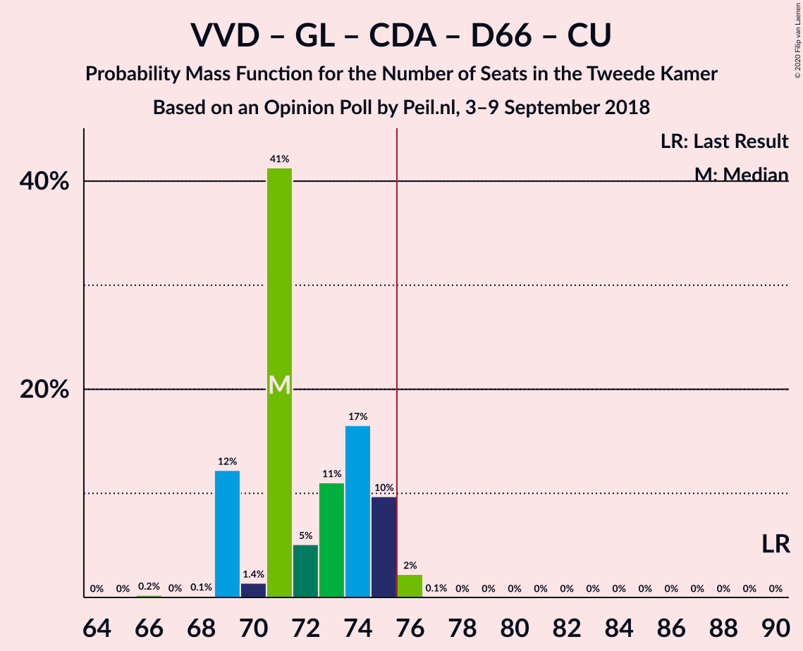

| Number of Seats | Probability | Accumulated | Special Marks |
|:---------------:|:-----------:|:-----------:|:-------------:|
| 66 | 0.2% | 100% |  |
| 67 | 0% | 99.8% |  |
| 68 | 0.1% | 99.7% |  |
| 69 | 12% | 99.6% |  |
| 70 | 1.4% | 87% |  |
| 71 | 41% | 86% | Median |
| 72 | 5% | 45% |  |
| 73 | 11% | 40% |  |
| 74 | 17% | 29% |  |
| 75 | 10% | 12% |  |
| 76 | 2% | 2% | Majority |
| 77 | 0.1% | 0.1% |  |
| 78 | 0% | 0% |  |
| 79 | 0% | 0% |  |
| 80 | 0% | 0% |  |
| 81 | 0% | 0% |  |
| 82 | 0% | 0% |  |
| 83 | 0% | 0% |  |
| 84 | 0% | 0% |  |
| 85 | 0% | 0% |  |
| 86 | 0% | 0% |  |
| 87 | 0% | 0% |  |
| 88 | 0% | 0% |  |
| 89 | 0% | 0% |  |
| 90 | 0% | 0% | Last Result |

### GroenLinks – Partij van de Arbeid – Socialistische Partij – Christen-Democratisch Appèl – Democraten 66 – ChristenUnie

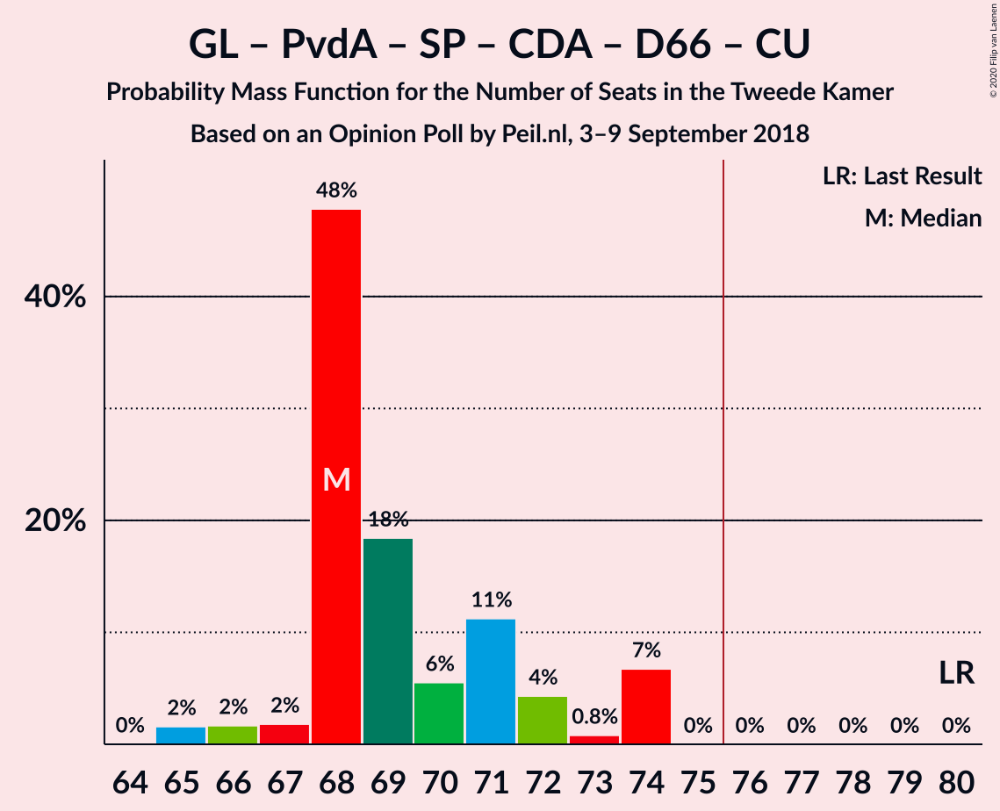

| Number of Seats | Probability | Accumulated | Special Marks |
|:---------------:|:-----------:|:-----------:|:-------------:|
| 65 | 2% | 100% |  |
| 66 | 2% | 98% |  |
| 67 | 2% | 97% |  |
| 68 | 48% | 95% | Median |
| 69 | 18% | 47% |  |
| 70 | 6% | 29% |  |
| 71 | 11% | 23% |  |
| 72 | 4% | 12% |  |
| 73 | 0.8% | 8% |  |
| 74 | 7% | 7% |  |
| 75 | 0% | 0% |  |
| 76 | 0% | 0% | Majority |
| 77 | 0% | 0% |  |
| 78 | 0% | 0% |  |
| 79 | 0% | 0% |  |
| 80 | 0% | 0% | Last Result |

### Volkspartij voor Vrijheid en Democratie – Forum voor Democratie – Partij voor de Vrijheid – Christen-Democratisch Appèl

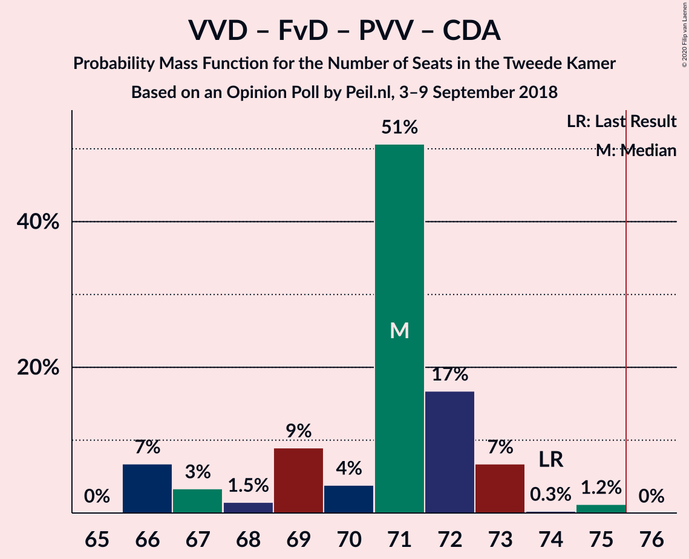

| Number of Seats | Probability | Accumulated | Special Marks |
|:---------------:|:-----------:|:-----------:|:-------------:|
| 66 | 7% | 100% |  |
| 67 | 3% | 93% |  |
| 68 | 1.5% | 90% |  |
| 69 | 9% | 88% |  |
| 70 | 4% | 79% | Median |
| 71 | 51% | 76% |  |
| 72 | 17% | 25% |  |
| 73 | 7% | 8% |  |
| 74 | 0.3% | 1.5% | Last Result |
| 75 | 1.2% | 1.2% |  |
| 76 | 0% | 0% | Majority |

### Volkspartij voor Vrijheid en Democratie – Partij van de Arbeid – Christen-Democratisch Appèl – Democraten 66 – ChristenUnie

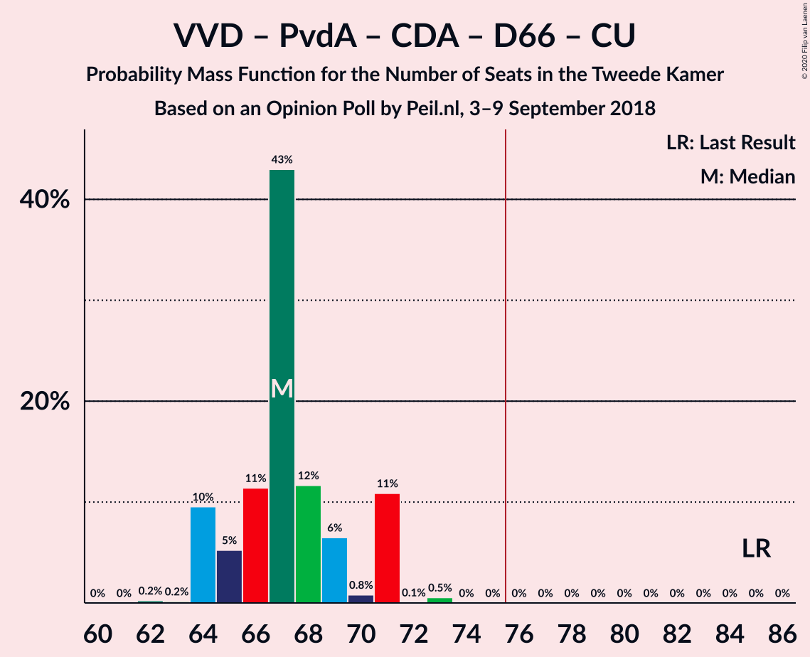

| Number of Seats | Probability | Accumulated | Special Marks |
|:---------------:|:-----------:|:-----------:|:-------------:|
| 62 | 0.2% | 100% |  |
| 63 | 0.2% | 99.8% |  |
| 64 | 10% | 99.6% |  |
| 65 | 5% | 90% |  |
| 66 | 11% | 85% |  |
| 67 | 43% | 73% | Median |
| 68 | 12% | 30% |  |
| 69 | 6% | 19% |  |
| 70 | 0.8% | 12% |  |
| 71 | 11% | 11% |  |
| 72 | 0.1% | 0.6% |  |
| 73 | 0.5% | 0.5% |  |
| 74 | 0% | 0% |  |
| 75 | 0% | 0% |  |
| 76 | 0% | 0% | Majority |
| 77 | 0% | 0% |  |
| 78 | 0% | 0% |  |
| 79 | 0% | 0% |  |
| 80 | 0% | 0% |  |
| 81 | 0% | 0% |  |
| 82 | 0% | 0% |  |
| 83 | 0% | 0% |  |
| 84 | 0% | 0% |  |
| 85 | 0% | 0% | Last Result |

### Volkspartij voor Vrijheid en Democratie – Forum voor Democratie – Christen-Democratisch Appèl – 50Plus – Staatkundig Gereformeerde Partij

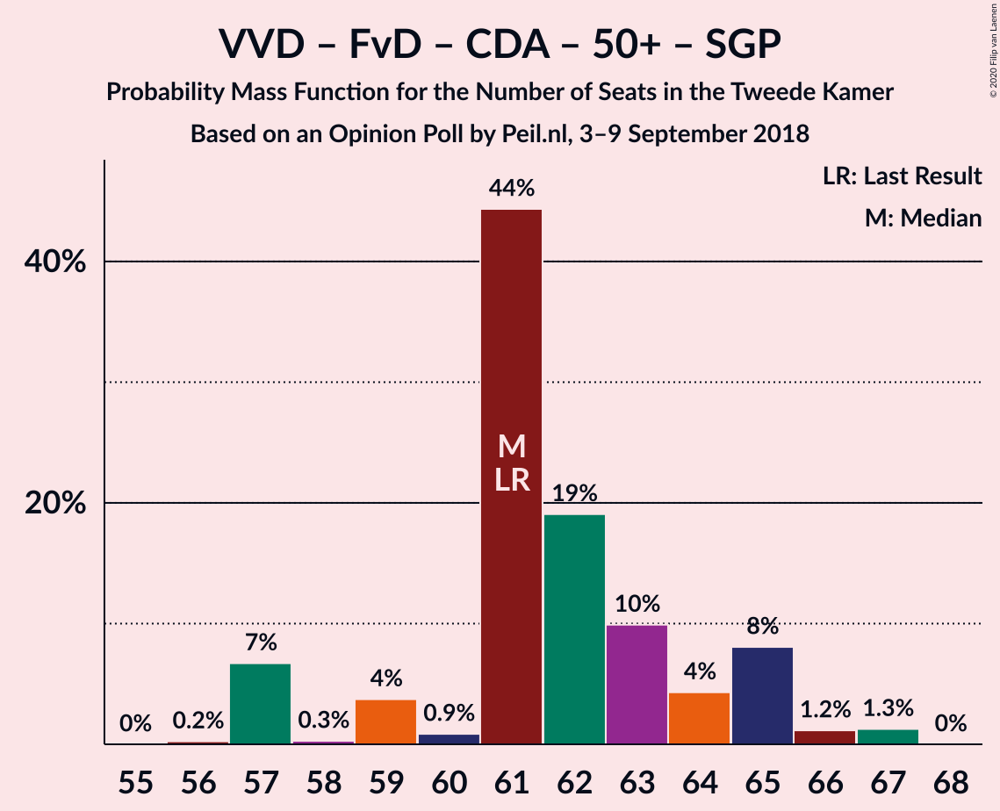

| Number of Seats | Probability | Accumulated | Special Marks |
|:---------------:|:-----------:|:-----------:|:-------------:|
| 56 | 0.2% | 100% |  |
| 57 | 7% | 99.8% |  |
| 58 | 0.3% | 93% |  |
| 59 | 4% | 93% |  |
| 60 | 0.9% | 89% |  |
| 61 | 44% | 88% | Last Result, Median |
| 62 | 19% | 44% |  |
| 63 | 10% | 25% |  |
| 64 | 4% | 15% |  |
| 65 | 8% | 10% |  |
| 66 | 1.2% | 2% |  |
| 67 | 1.3% | 1.3% |  |
| 68 | 0% | 0% |  |

### Volkspartij voor Vrijheid en Democratie – Forum voor Democratie – Christen-Democratisch Appèl – 50Plus

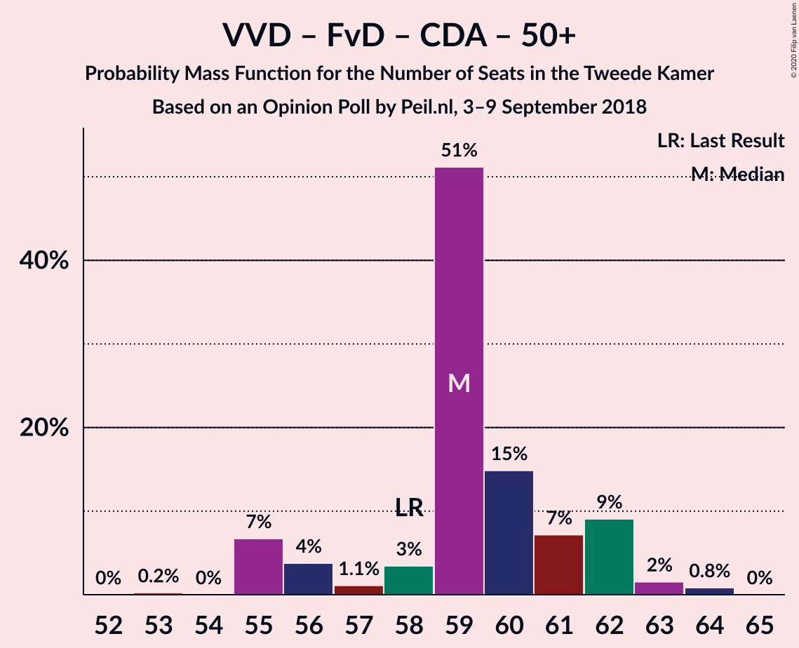

| Number of Seats | Probability | Accumulated | Special Marks |
|:---------------:|:-----------:|:-----------:|:-------------:|
| 53 | 0.2% | 100% |  |
| 54 | 0% | 99.8% |  |
| 55 | 7% | 99.7% |  |
| 56 | 4% | 93% |  |
| 57 | 1.1% | 89% |  |
| 58 | 3% | 88% | Last Result |
| 59 | 51% | 85% | Median |
| 60 | 15% | 34% |  |
| 61 | 7% | 19% |  |
| 62 | 9% | 11% |  |
| 63 | 2% | 2% |  |
| 64 | 0.8% | 0.8% |  |
| 65 | 0% | 0% |  |

### GroenLinks – Partij van de Arbeid – Christen-Democratisch Appèl – Democraten 66 – ChristenUnie

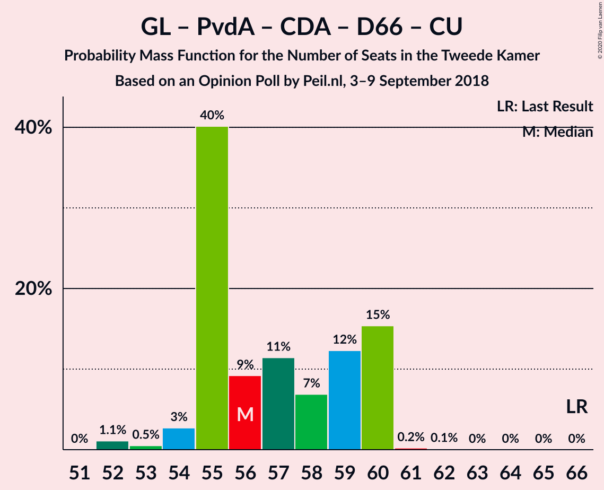

| Number of Seats | Probability | Accumulated | Special Marks |
|:---------------:|:-----------:|:-----------:|:-------------:|
| 52 | 1.1% | 100% |  |
| 53 | 0.5% | 98.9% |  |
| 54 | 3% | 98% |  |
| 55 | 40% | 96% | Median |
| 56 | 9% | 56% |  |
| 57 | 11% | 46% |  |
| 58 | 7% | 35% |  |
| 59 | 12% | 28% |  |
| 60 | 15% | 16% |  |
| 61 | 0.2% | 0.3% |  |
| 62 | 0.1% | 0.1% |  |
| 63 | 0% | 0% |  |
| 64 | 0% | 0% |  |
| 65 | 0% | 0% |  |
| 66 | 0% | 0% | Last Result |

### Volkspartij voor Vrijheid en Democratie – Forum voor Democratie – Christen-Democratisch Appèl – Staatkundig Gereformeerde Partij

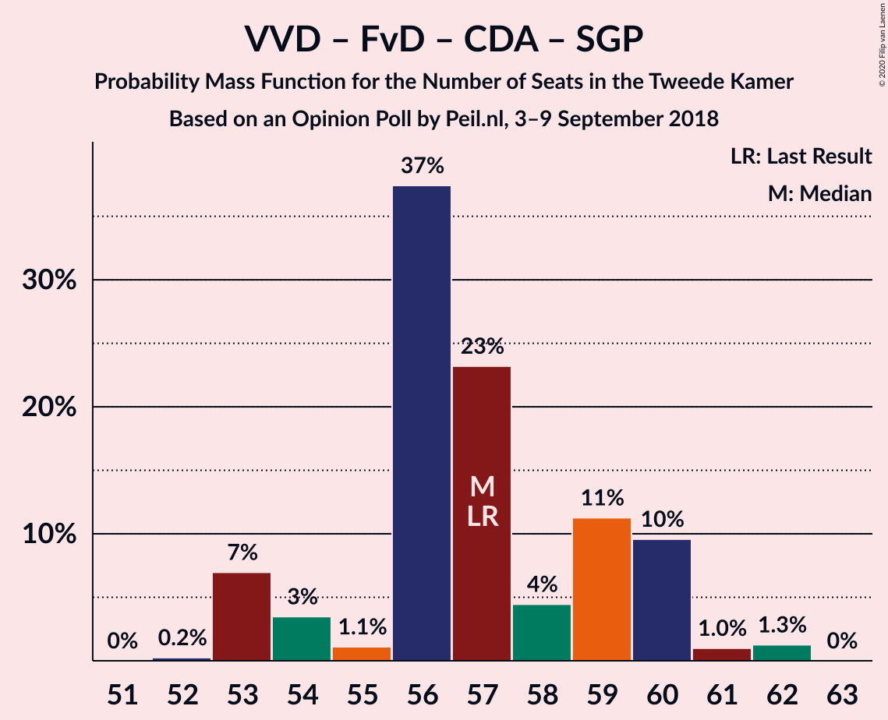

| Number of Seats | Probability | Accumulated | Special Marks |
|:---------------:|:-----------:|:-----------:|:-------------:|
| 52 | 0.2% | 100% |  |
| 53 | 7% | 99.7% |  |
| 54 | 3% | 93% |  |
| 55 | 1.1% | 89% |  |
| 56 | 37% | 88% | Median |
| 57 | 23% | 51% | Last Result |
| 58 | 4% | 28% |  |
| 59 | 11% | 23% |  |
| 60 | 10% | 12% |  |
| 61 | 1.0% | 2% |  |
| 62 | 1.3% | 1.3% |  |
| 63 | 0% | 0% |  |

### Volkspartij voor Vrijheid en Democratie – Christen-Democratisch Appèl – Democraten 66 – ChristenUnie

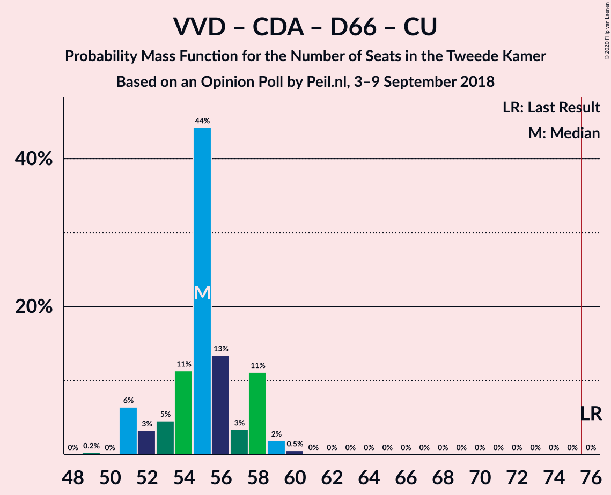

| Number of Seats | Probability | Accumulated | Special Marks |
|:---------------:|:-----------:|:-----------:|:-------------:|
| 49 | 0.2% | 100% |  |
| 50 | 0% | 99.8% |  |
| 51 | 6% | 99.8% |  |
| 52 | 3% | 93% |  |
| 53 | 5% | 90% |  |
| 54 | 11% | 86% |  |
| 55 | 44% | 74% | Median |
| 56 | 13% | 30% |  |
| 57 | 3% | 17% |  |
| 58 | 11% | 13% |  |
| 59 | 2% | 2% |  |
| 60 | 0.5% | 0.5% |  |
| 61 | 0% | 0% |  |
| 62 | 0% | 0% |  |
| 63 | 0% | 0% |  |
| 64 | 0% | 0% |  |
| 65 | 0% | 0% |  |
| 66 | 0% | 0% |  |
| 67 | 0% | 0% |  |
| 68 | 0% | 0% |  |
| 69 | 0% | 0% |  |
| 70 | 0% | 0% |  |
| 71 | 0% | 0% |  |
| 72 | 0% | 0% |  |
| 73 | 0% | 0% |  |
| 74 | 0% | 0% |  |
| 75 | 0% | 0% |  |
| 76 | 0% | 0% | Last Result, Majority |

### Volkspartij voor Vrijheid en Democratie – Forum voor Democratie – Christen-Democratisch Appèl

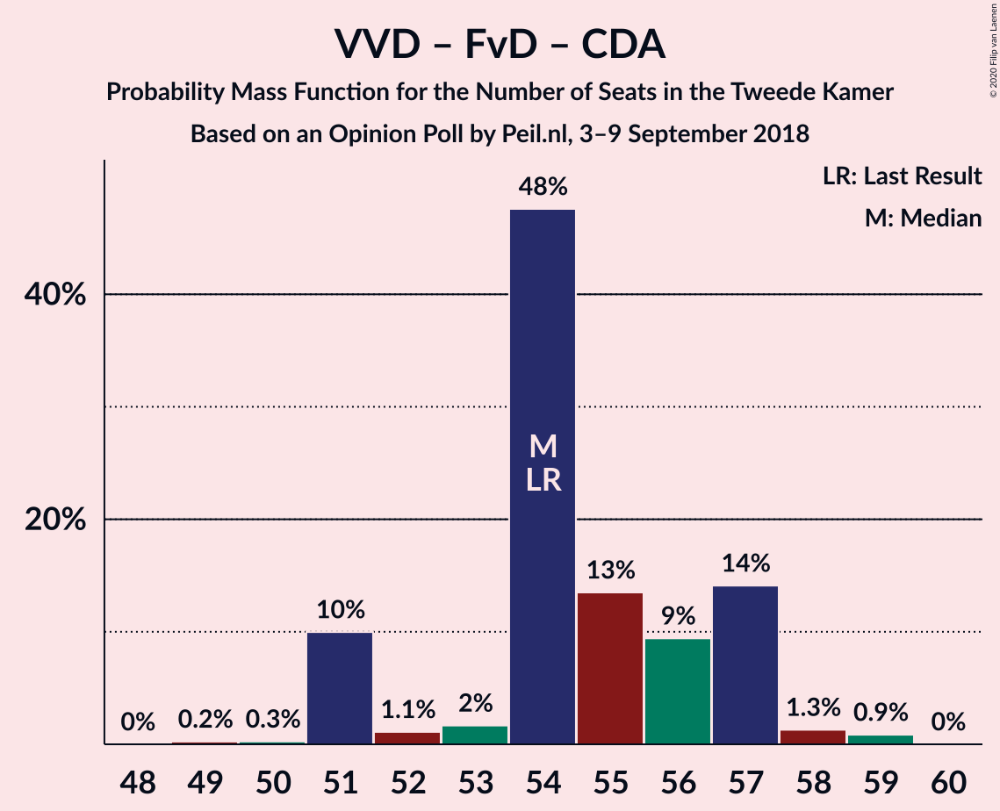

| Number of Seats | Probability | Accumulated | Special Marks |
|:---------------:|:-----------:|:-----------:|:-------------:|
| 49 | 0.2% | 100% |  |
| 50 | 0.3% | 99.8% |  |
| 51 | 10% | 99.5% |  |
| 52 | 1.1% | 90% |  |
| 53 | 2% | 88% |  |
| 54 | 48% | 87% | Last Result, Median |
| 55 | 13% | 39% |  |
| 56 | 9% | 26% |  |
| 57 | 14% | 16% |  |
| 58 | 1.3% | 2% |  |
| 59 | 0.9% | 0.9% |  |
| 60 | 0% | 0% |  |

### Volkspartij voor Vrijheid en Democratie – Partij voor de Vrijheid – Christen-Democratisch Appèl

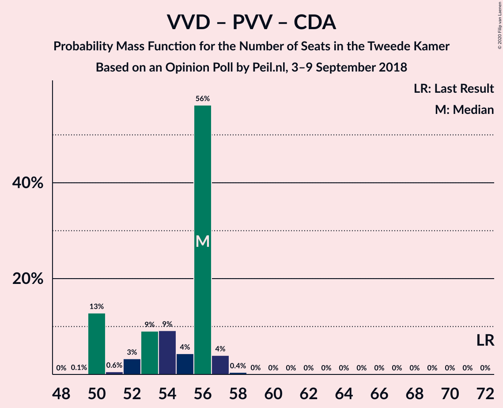

| Number of Seats | Probability | Accumulated | Special Marks |
|:---------------:|:-----------:|:-----------:|:-------------:|
| 49 | 0.1% | 100% |  |
| 50 | 13% | 99.9% |  |
| 51 | 0.6% | 87% |  |
| 52 | 3% | 87% |  |
| 53 | 9% | 83% |  |
| 54 | 9% | 74% |  |
| 55 | 4% | 65% | Median |
| 56 | 56% | 61% |  |
| 57 | 4% | 4% |  |
| 58 | 0.4% | 0.5% |  |
| 59 | 0% | 0.1% |  |
| 60 | 0% | 0% |  |
| 61 | 0% | 0% |  |
| 62 | 0% | 0% |  |
| 63 | 0% | 0% |  |
| 64 | 0% | 0% |  |
| 65 | 0% | 0% |  |
| 66 | 0% | 0% |  |
| 67 | 0% | 0% |  |
| 68 | 0% | 0% |  |
| 69 | 0% | 0% |  |
| 70 | 0% | 0% |  |
| 71 | 0% | 0% |  |
| 72 | 0% | 0% | Last Result |

### Volkspartij voor Vrijheid en Democratie – Partij van de Arbeid – Democraten 66

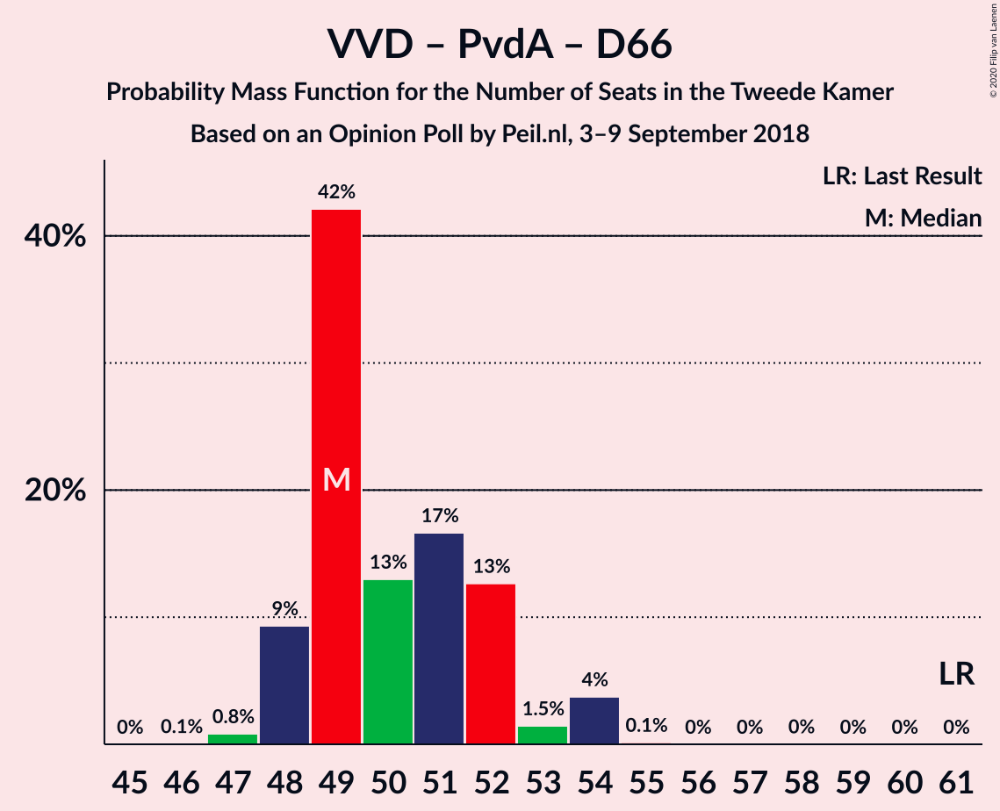

| Number of Seats | Probability | Accumulated | Special Marks |
|:---------------:|:-----------:|:-----------:|:-------------:|
| 46 | 0.1% | 100% |  |
| 47 | 0.8% | 99.9% |  |
| 48 | 9% | 99.1% |  |
| 49 | 42% | 90% |  |
| 50 | 13% | 48% | Median |
| 51 | 17% | 35% |  |
| 52 | 13% | 18% |  |
| 53 | 1.5% | 5% |  |
| 54 | 4% | 4% |  |
| 55 | 0.1% | 0.2% |  |
| 56 | 0% | 0% |  |
| 57 | 0% | 0% |  |
| 58 | 0% | 0% |  |
| 59 | 0% | 0% |  |
| 60 | 0% | 0% |  |
| 61 | 0% | 0% | Last Result |

### Volkspartij voor Vrijheid en Democratie – Partij van de Arbeid – Christen-Democratisch Appèl

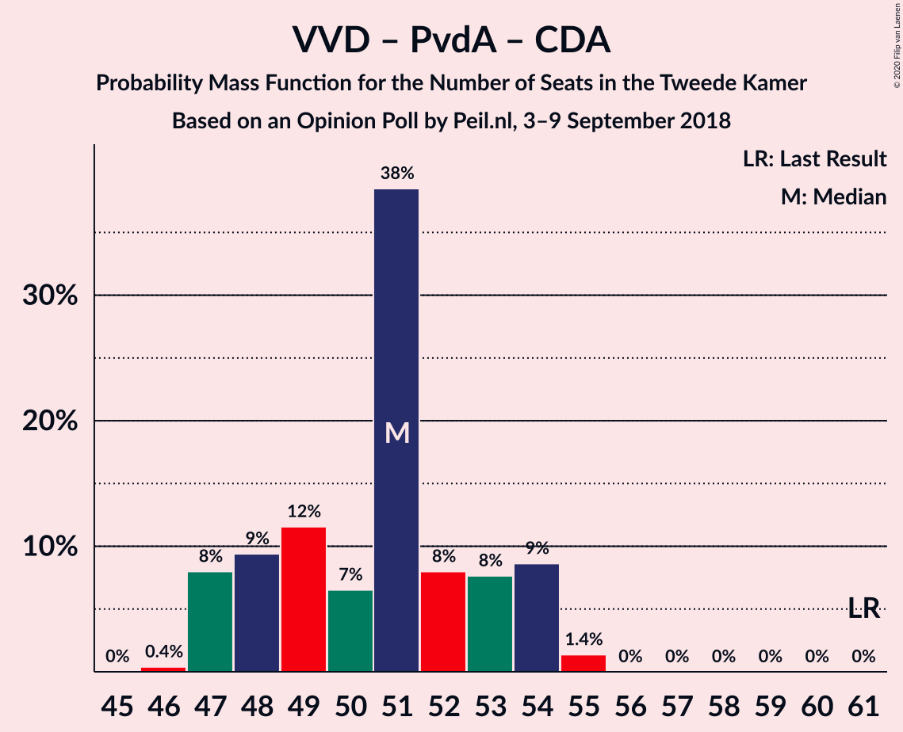

| Number of Seats | Probability | Accumulated | Special Marks |
|:---------------:|:-----------:|:-----------:|:-------------:|
| 46 | 0.4% | 100% |  |
| 47 | 8% | 99.6% |  |
| 48 | 9% | 92% |  |
| 49 | 12% | 82% |  |
| 50 | 7% | 71% |  |
| 51 | 38% | 64% | Median |
| 52 | 8% | 26% |  |
| 53 | 8% | 18% |  |
| 54 | 9% | 10% |  |
| 55 | 1.4% | 1.4% |  |
| 56 | 0% | 0% |  |
| 57 | 0% | 0% |  |
| 58 | 0% | 0% |  |
| 59 | 0% | 0% |  |
| 60 | 0% | 0% |  |
| 61 | 0% | 0% | Last Result |

### Volkspartij voor Vrijheid en Democratie – Christen-Democratisch Appèl – Democraten 66

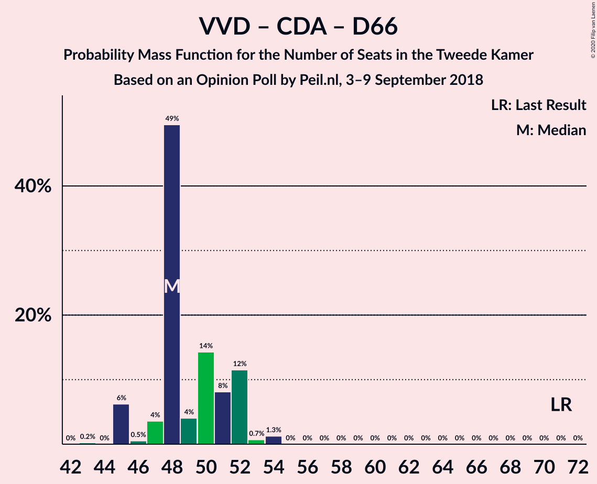

| Number of Seats | Probability | Accumulated | Special Marks |
|:---------------:|:-----------:|:-----------:|:-------------:|
| 43 | 0.2% | 100% |  |
| 44 | 0% | 99.8% |  |
| 45 | 6% | 99.8% |  |
| 46 | 0.5% | 94% |  |
| 47 | 4% | 93% |  |
| 48 | 49% | 89% |  |
| 49 | 4% | 40% | Median |
| 50 | 14% | 36% |  |
| 51 | 8% | 22% |  |
| 52 | 12% | 13% |  |
| 53 | 0.7% | 2% |  |
| 54 | 1.3% | 1.3% |  |
| 55 | 0% | 0% |  |
| 56 | 0% | 0% |  |
| 57 | 0% | 0% |  |
| 58 | 0% | 0% |  |
| 59 | 0% | 0% |  |
| 60 | 0% | 0% |  |
| 61 | 0% | 0% |  |
| 62 | 0% | 0% |  |
| 63 | 0% | 0% |  |
| 64 | 0% | 0% |  |
| 65 | 0% | 0% |  |
| 66 | 0% | 0% |  |
| 67 | 0% | 0% |  |
| 68 | 0% | 0% |  |
| 69 | 0% | 0% |  |
| 70 | 0% | 0% |  |
| 71 | 0% | 0% | Last Result |

### Volkspartij voor Vrijheid en Democratie – Partij van de Arbeid

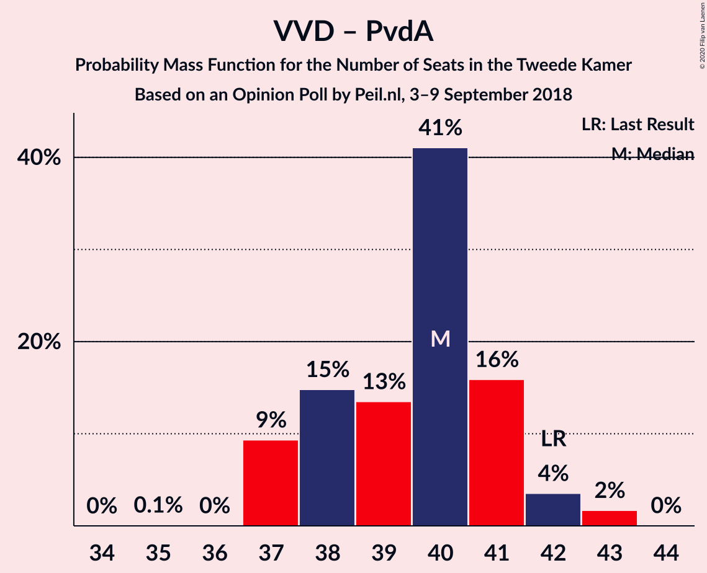

| Number of Seats | Probability | Accumulated | Special Marks |
|:---------------:|:-----------:|:-----------:|:-------------:|
| 35 | 0.1% | 100% |  |
| 36 | 0% | 99.9% |  |
| 37 | 9% | 99.9% |  |
| 38 | 15% | 91% |  |
| 39 | 13% | 76% |  |
| 40 | 41% | 62% | Median |
| 41 | 16% | 21% |  |
| 42 | 4% | 5% | Last Result |
| 43 | 2% | 2% |  |
| 44 | 0% | 0% |  |

### Volkspartij voor Vrijheid en Democratie – Christen-Democratisch Appèl

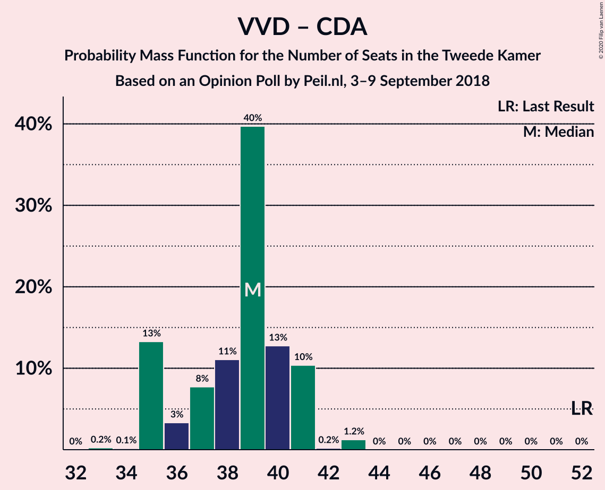

| Number of Seats | Probability | Accumulated | Special Marks |
|:---------------:|:-----------:|:-----------:|:-------------:|
| 33 | 0.2% | 100% |  |
| 34 | 0.1% | 99.8% |  |
| 35 | 13% | 99.6% |  |
| 36 | 3% | 86% |  |
| 37 | 8% | 83% |  |
| 38 | 11% | 75% |  |
| 39 | 40% | 64% | Median |
| 40 | 13% | 25% |  |
| 41 | 10% | 12% |  |
| 42 | 0.2% | 1.4% |  |
| 43 | 1.2% | 1.2% |  |
| 44 | 0% | 0% |  |
| 45 | 0% | 0% |  |
| 46 | 0% | 0% |  |
| 47 | 0% | 0% |  |
| 48 | 0% | 0% |  |
| 49 | 0% | 0% |  |
| 50 | 0% | 0% |  |
| 51 | 0% | 0% |  |
| 52 | 0% | 0% | Last Result |

### Partij van de Arbeid – Christen-Democratisch Appèl – Democraten 66

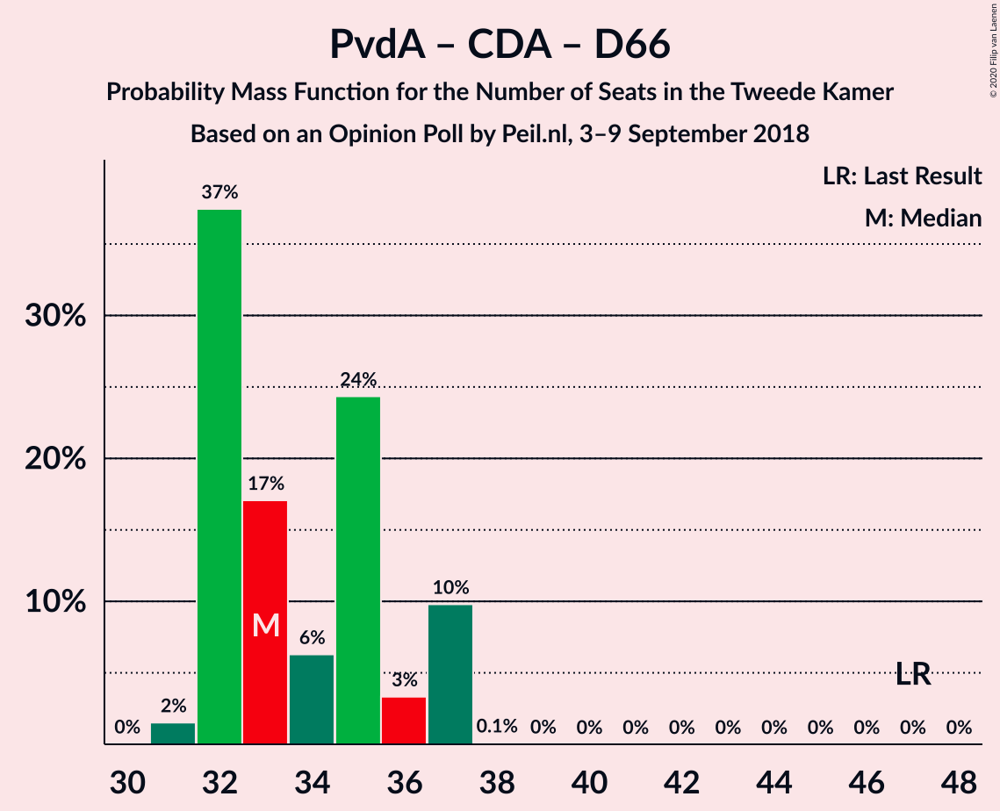

| Number of Seats | Probability | Accumulated | Special Marks |
|:---------------:|:-----------:|:-----------:|:-------------:|
| 31 | 2% | 100% |  |
| 32 | 37% | 98% |  |
| 33 | 17% | 61% | Median |
| 34 | 6% | 44% |  |
| 35 | 24% | 38% |  |
| 36 | 3% | 13% |  |
| 37 | 10% | 10% |  |
| 38 | 0.1% | 0.1% |  |
| 39 | 0% | 0% |  |
| 40 | 0% | 0% |  |
| 41 | 0% | 0% |  |
| 42 | 0% | 0% |  |
| 43 | 0% | 0% |  |
| 44 | 0% | 0% |  |
| 45 | 0% | 0% |  |
| 46 | 0% | 0% |  |
| 47 | 0% | 0% | Last Result |

### Partij van de Arbeid – Christen-Democratisch Appèl – ChristenUnie

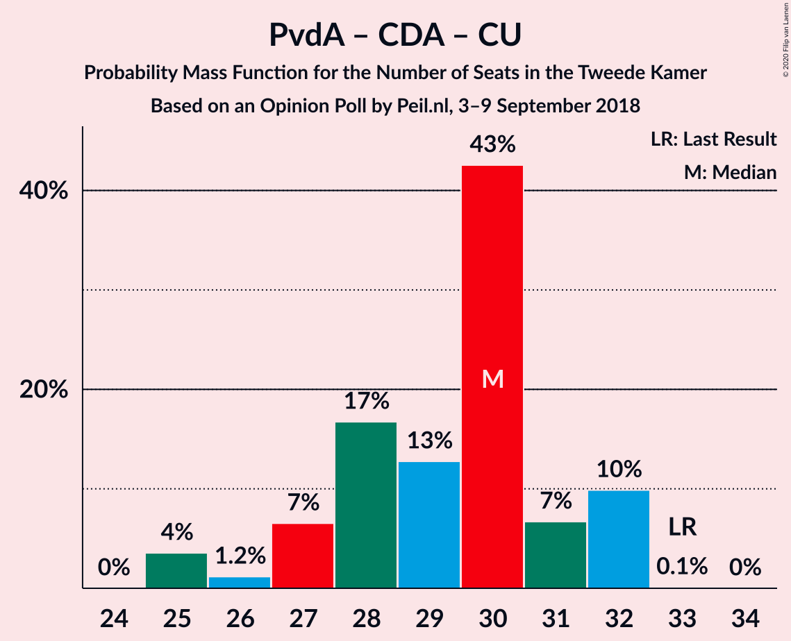

| Number of Seats | Probability | Accumulated | Special Marks |
|:---------------:|:-----------:|:-----------:|:-------------:|
| 25 | 4% | 100% |  |
| 26 | 1.2% | 96% |  |
| 27 | 7% | 95% |  |
| 28 | 17% | 89% |  |
| 29 | 13% | 72% | Median |
| 30 | 43% | 59% |  |
| 31 | 7% | 17% |  |
| 32 | 10% | 10% |  |
| 33 | 0.1% | 0.1% | Last Result |
| 34 | 0% | 0% |  |

### Partij van de Arbeid – Christen-Democratisch Appèl

| Number of Seats | Probability | Accumulated | Special Marks |
|:---------------:|:-----------:|:-----------:|:-------------:|
| 20 | 0.9% | 100% |  |
| 21 | 5% | 99.1% |  |
| 22 | 20% | 94% |  |
| 23 | 49% | 74% | Median |
| 24 | 4% | 25% |  |
| 25 | 13% | 21% |  |
| 26 | 8% | 8% |  |
| 27 | 0.1% | 0.1% |  |
| 28 | 0% | 0% | Last Result |

### Christen-Democratisch Appèl – Democraten 66

| Number of Seats | Probability | Accumulated | Special Marks |
|:---------------:|:-----------:|:-----------:|:-------------:|
| 19 | 2% | 100% |  |
| 20 | 43% | 98% |  |
| 21 | 11% | 55% | Median |
| 22 | 11% | 44% |  |
| 23 | 16% | 33% |  |
| 24 | 16% | 17% |  |
| 25 | 1.4% | 1.4% |  |
| 26 | 0% | 0% |  |
| 27 | 0% | 0% |  |
| 28 | 0% | 0% |  |
| 29 | 0% | 0% |  |
| 30 | 0% | 0% |  |
| 31 | 0% | 0% |  |
| 32 | 0% | 0% |  |
| 33 | 0% | 0% |  |
| 34 | 0% | 0% |  |
| 35 | 0% | 0% |  |
| 36 | 0% | 0% |  |
| 37 | 0% | 0% |  |
| 38 | 0% | 0% | Last Result |

## Technical Information

### Opinion Poll

+ **Polling firm:** Peil.nl
+ **Commissioner(s):** —
+ **Fieldwork period:** 3–9 September 2018

### Calculations

+ **Sample size:** 3000
+ **Simulations done:** 1,048,576
+ **Error estimate:** 1.51%

