# Opinion Poll by Ipsos for EenVandaag, 23–26 November 2018

<a href="#voting-intentions">Voting Intentions</a> | <a href="#seats">Seats</a> | <a href="#coalitions">Coalitions</a> | <a href="#technical-information">Technical Information</a>

## Voting Intentions

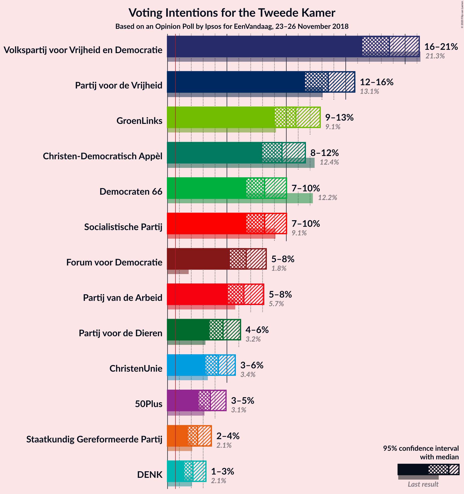

### Confidence Intervals

| Party | Last Result | Poll Result | 80% Confidence Interval | 90% Confidence Interval | 95% Confidence Interval | 99% Confidence Interval |
|:-----:|:-----------:|:-----------:|:-----------------------:|:-----------------------:|:-----------------------:|:-----------------------:|
| Volkspartij voor Vrijheid en Democratie | 21.3% | 18.7% | 17.2–20.3% |16.8–20.8% |16.4–21.2% |15.7–22.0% |
| Partij voor de Vrijheid | 13.1% | 13.5% | 12.2–15.0% |11.9–15.4% |11.6–15.8% |11.0–16.5% |
| GroenLinks | 9.1% | 10.8% | 9.6–12.1% |9.3–12.5% |9.0–12.8% |8.5–13.5% |
| Christen-Democratisch Appèl | 12.4% | 9.6% | 8.5–10.9% |8.2–11.3% |8.0–11.6% |7.5–12.2% |
| Democraten 66 | 12.2% | 8.2% | 7.2–9.4% |6.9–9.7% |6.6–10.0% |6.2–10.6% |
| Socialistische Partij | 9.1% | 8.2% | 7.2–9.4% |6.9–9.7% |6.6–10.0% |6.2–10.6% |
| Forum voor Democratie | 1.8% | 6.6% | 5.7–7.7% |5.5–8.0% |5.2–8.3% |4.8–8.9% |
| Partij van de Arbeid | 5.7% | 6.4% | 5.5–7.5% |5.3–7.8% |5.1–8.1% |4.7–8.6% |
| Partij voor de Dieren | 3.2% | 4.7% | 3.9–5.6% |3.7–5.9% |3.5–6.1% |3.2–6.6% |
| ChristenUnie | 3.4% | 4.3% | 3.6–5.2% |3.4–5.5% |3.2–5.7% |2.9–6.2% |
| 50Plus | 3.1% | 3.6% | 3.0–4.5% |2.8–4.7% |2.6–4.9% |2.3–5.4% |
| Staatkundig Gereformeerde Partij | 2.1% | 2.5% | 2.0–3.3% |1.8–3.5% |1.7–3.7% |1.5–4.1% |
| DENK | 2.1% | 2.1% | 1.7–2.9% |1.5–3.0% |1.4–3.2% |1.2–3.6% |

*Note:* The poll result column reflects the actual value used in the calculations. Published results may vary slightly, and in addition be rounded to fewer digits.

## Seats

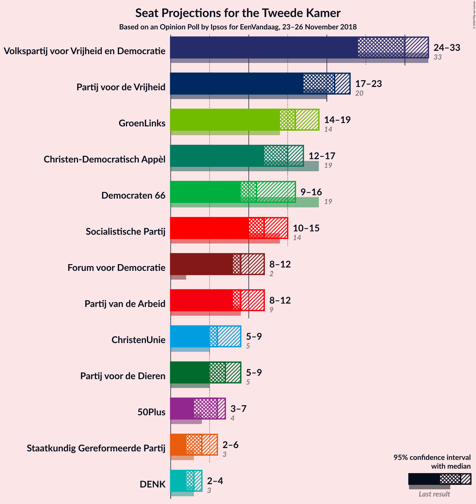

### Confidence Intervals

| Party | Last Result | Median | 80% Confidence Interval | 90% Confidence Interval | 95% Confidence Interval | 99% Confidence Interval |
|:-----:|:-----------:|:------:|:-----------------------:|:-----------------------:|:-----------------------:|:-----------------------:|
| <a href="#volkspartij-voor-vrijheid-en-democratie">Volkspartij voor Vrijheid en Democratie</a> | 33 | 30 | 26–33 |25–33 |24–33 |24–34 |
| <a href="#partij-voor-de-vrijheid">Partij voor de Vrijheid</a> | 20 | 21 | 19–23 |18–23 |17–23 |16–24 |
| <a href="#groenlinks">GroenLinks</a> | 14 | 16 | 14–18 |14–19 |14–19 |12–20 |
| <a href="#christen-democratisch-appèl">Christen-Democratisch Appèl</a> | 19 | 15 | 12–16 |12–17 |12–17 |11–18 |
| <a href="#democraten-66">Democraten 66</a> | 19 | 11 | 9–15 |9–15 |9–16 |9–16 |
| <a href="#socialistische-partij">Socialistische Partij</a> | 14 | 12 | 11–14 |10–14 |10–15 |9–16 |
| <a href="#forum-voor-democratie">Forum voor Democratie</a> | 2 | 9 | 9–11 |9–12 |8–12 |7–13 |
| <a href="#partij-van-de-arbeid">Partij van de Arbeid</a> | 9 | 9 | 8–11 |8–12 |8–12 |7–13 |
| <a href="#partij-voor-de-dieren">Partij voor de Dieren</a> | 5 | 7 | 6–9 |6–9 |5–9 |5–10 |
| <a href="#christenunie">ChristenUnie</a> | 5 | 6 | 5–8 |5–8 |5–9 |4–9 |
| <a href="#50plus">50Plus</a> | 4 | 6 | 4–6 |4–7 |3–7 |3–8 |
| <a href="#staatkundig-gereformeerde-partij">Staatkundig Gereformeerde Partij</a> | 3 | 4 | 3–5 |2–5 |2–6 |2–6 |
| <a href="#denk">DENK</a> | 3 | 3 | 2–4 |2–4 |2–4 |1–5 |

### Volkspartij voor Vrijheid en Democratie

*For a full overview of the results for this party, see the [Volkspartij voor Vrijheid en Democratie](party-volkspartijvoorvrijheidendemocratie.html) page.*

| Number of Seats | Probability | Accumulated | Special Marks |
|:---------------:|:-----------:|:-----------:|:-------------:|
| 22 | 0.1% | 100% |  |
| 23 | 0.2% | 99.9% |  |
| 24 | 5% | 99.7% |  |
| 25 | 5% | 95% |  |
| 26 | 5% | 90% |  |
| 27 | 3% | 86% |  |
| 28 | 4% | 83% |  |
| 29 | 16% | 78% |  |
| 30 | 43% | 62% | Median |
| 31 | 5% | 19% |  |
| 32 | 0.9% | 13% |  |
| 33 | 11% | 13% | Last Result |
| 34 | 2% | 2% |  |
| 35 | 0.1% | 0.1% |  |
| 36 | 0% | 0% |  |

### Partij voor de Vrijheid

*For a full overview of the results for this party, see the [Partij voor de Vrijheid](party-partijvoordevrijheid.html) page.*

| Number of Seats | Probability | Accumulated | Special Marks |
|:---------------:|:-----------:|:-----------:|:-------------:|
| 16 | 0.5% | 100% |  |
| 17 | 4% | 99.5% |  |
| 18 | 2% | 95% |  |
| 19 | 12% | 93% |  |
| 20 | 18% | 82% | Last Result |
| 21 | 29% | 64% | Median |
| 22 | 22% | 35% |  |
| 23 | 12% | 13% |  |
| 24 | 1.0% | 2% |  |
| 25 | 0.2% | 0.5% |  |
| 26 | 0.3% | 0.3% |  |
| 27 | 0% | 0% |  |

### GroenLinks

*For a full overview of the results for this party, see the [GroenLinks](party-groenlinks.html) page.*

| Number of Seats | Probability | Accumulated | Special Marks |
|:---------------:|:-----------:|:-----------:|:-------------:|
| 12 | 0.6% | 100% |  |
| 13 | 0.5% | 99.3% |  |
| 14 | 14% | 98.8% | Last Result |
| 15 | 9% | 85% |  |
| 16 | 41% | 76% | Median |
| 17 | 17% | 35% |  |
| 18 | 12% | 18% |  |
| 19 | 4% | 5% |  |
| 20 | 1.2% | 2% |  |
| 21 | 0.4% | 0.5% |  |
| 22 | 0% | 0% |  |

### Christen-Democratisch Appèl

*For a full overview of the results for this party, see the [Christen-Democratisch Appèl](party-christen-democratischappèl.html) page.*

| Number of Seats | Probability | Accumulated | Special Marks |
|:---------------:|:-----------:|:-----------:|:-------------:|
| 10 | 0.5% | 100% |  |
| 11 | 0.6% | 99.5% |  |
| 12 | 11% | 98.9% |  |
| 13 | 6% | 88% |  |
| 14 | 25% | 82% |  |
| 15 | 37% | 56% | Median |
| 16 | 13% | 19% |  |
| 17 | 4% | 6% |  |
| 18 | 2% | 2% |  |
| 19 | 0.1% | 0.1% | Last Result |
| 20 | 0% | 0% |  |

### Democraten 66

*For a full overview of the results for this party, see the [Democraten 66](party-democraten66.html) page.*

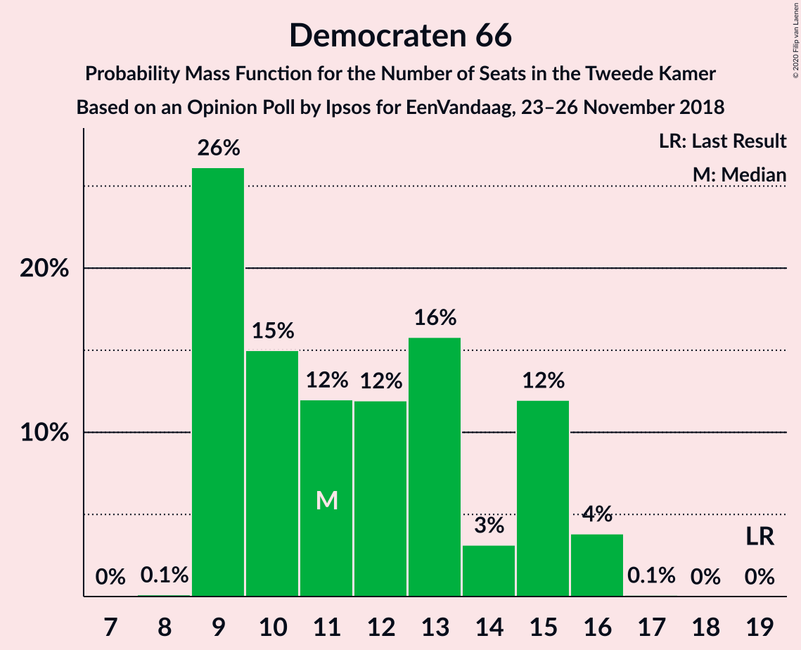

| Number of Seats | Probability | Accumulated | Special Marks |
|:---------------:|:-----------:|:-----------:|:-------------:|
| 8 | 0.1% | 100% |  |
| 9 | 26% | 99.9% |  |
| 10 | 15% | 74% |  |
| 11 | 12% | 59% | Median |
| 12 | 12% | 47% |  |
| 13 | 16% | 35% |  |
| 14 | 3% | 19% |  |
| 15 | 12% | 16% |  |
| 16 | 4% | 4% |  |
| 17 | 0.1% | 0.1% |  |
| 18 | 0% | 0% |  |
| 19 | 0% | 0% | Last Result |

### Socialistische Partij

*For a full overview of the results for this party, see the [Socialistische Partij](party-socialistischepartij.html) page.*

| Number of Seats | Probability | Accumulated | Special Marks |
|:---------------:|:-----------:|:-----------:|:-------------:|
| 8 | 0.1% | 100% |  |
| 9 | 0.5% | 99.9% |  |
| 10 | 8% | 99.4% |  |
| 11 | 6% | 91% |  |
| 12 | 35% | 85% | Median |
| 13 | 35% | 50% |  |
| 14 | 12% | 15% | Last Result |
| 15 | 3% | 4% |  |
| 16 | 1.1% | 1.2% |  |
| 17 | 0% | 0.1% |  |
| 18 | 0% | 0% |  |

### Forum voor Democratie

*For a full overview of the results for this party, see the [Forum voor Democratie](party-forumvoordemocratie.html) page.*

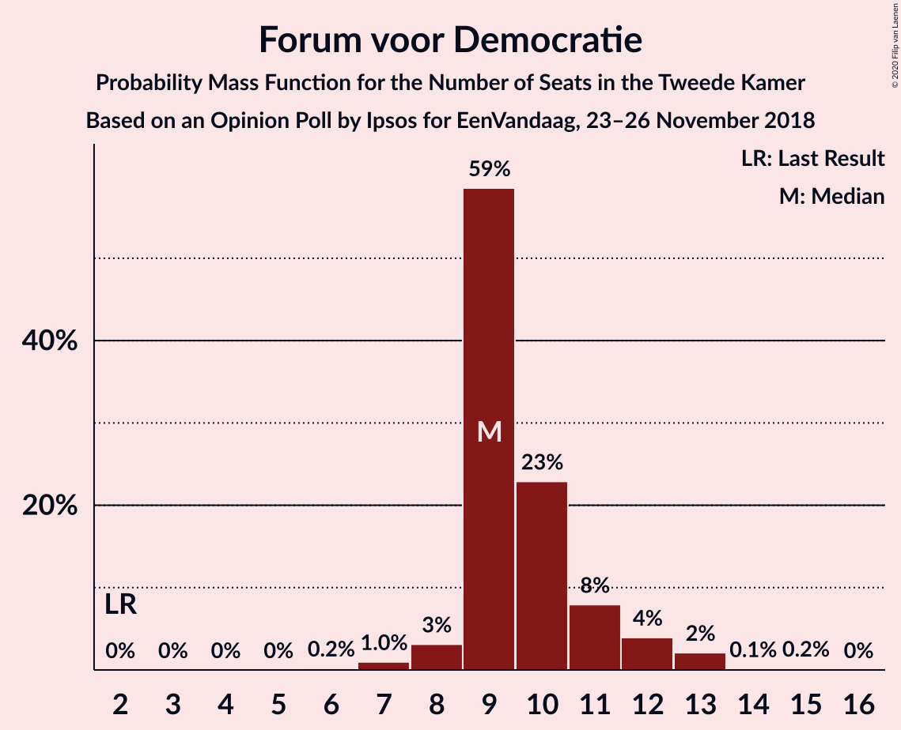

| Number of Seats | Probability | Accumulated | Special Marks |
|:---------------:|:-----------:|:-----------:|:-------------:|
| 2 | 0% | 100% | Last Result |
| 3 | 0% | 100% |  |
| 4 | 0% | 100% |  |
| 5 | 0% | 100% |  |
| 6 | 0.2% | 100% |  |
| 7 | 1.0% | 99.8% |  |
| 8 | 3% | 98.8% |  |
| 9 | 59% | 96% | Median |
| 10 | 23% | 37% |  |
| 11 | 8% | 14% |  |
| 12 | 4% | 6% |  |
| 13 | 2% | 2% |  |
| 14 | 0.1% | 0.3% |  |
| 15 | 0.2% | 0.2% |  |
| 16 | 0% | 0% |  |

### Partij van de Arbeid

*For a full overview of the results for this party, see the [Partij van de Arbeid](party-partijvandearbeid.html) page.*

| Number of Seats | Probability | Accumulated | Special Marks |
|:---------------:|:-----------:|:-----------:|:-------------:|
| 6 | 0.1% | 100% |  |
| 7 | 2% | 99.9% |  |
| 8 | 46% | 98% |  |
| 9 | 18% | 52% | Last Result, Median |
| 10 | 22% | 34% |  |
| 11 | 4% | 12% |  |
| 12 | 6% | 8% |  |
| 13 | 1.2% | 1.2% |  |
| 14 | 0% | 0% |  |

### Partij voor de Dieren

*For a full overview of the results for this party, see the [Partij voor de Dieren](party-partijvoordedieren.html) page.*

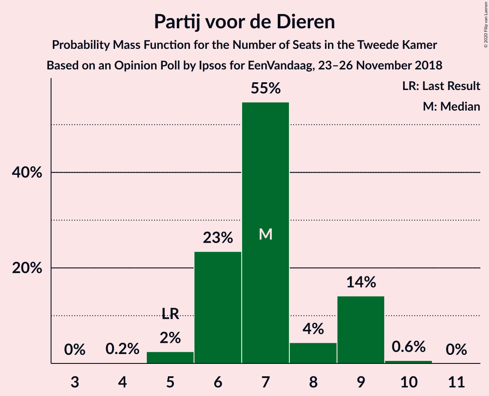

| Number of Seats | Probability | Accumulated | Special Marks |
|:---------------:|:-----------:|:-----------:|:-------------:|
| 4 | 0.2% | 100% |  |
| 5 | 2% | 99.8% | Last Result |
| 6 | 23% | 97% |  |
| 7 | 55% | 74% | Median |
| 8 | 4% | 19% |  |
| 9 | 14% | 15% |  |
| 10 | 0.6% | 0.7% |  |
| 11 | 0% | 0% |  |

### ChristenUnie

*For a full overview of the results for this party, see the [ChristenUnie](party-christenunie.html) page.*

| Number of Seats | Probability | Accumulated | Special Marks |
|:---------------:|:-----------:|:-----------:|:-------------:|
| 4 | 2% | 100% |  |
| 5 | 16% | 98% | Last Result |
| 6 | 39% | 82% | Median |
| 7 | 5% | 43% |  |
| 8 | 35% | 39% |  |
| 9 | 3% | 4% |  |
| 10 | 0.2% | 0.2% |  |
| 11 | 0% | 0% |  |

### 50Plus

*For a full overview of the results for this party, see the [50Plus](party-50plus.html) page.*

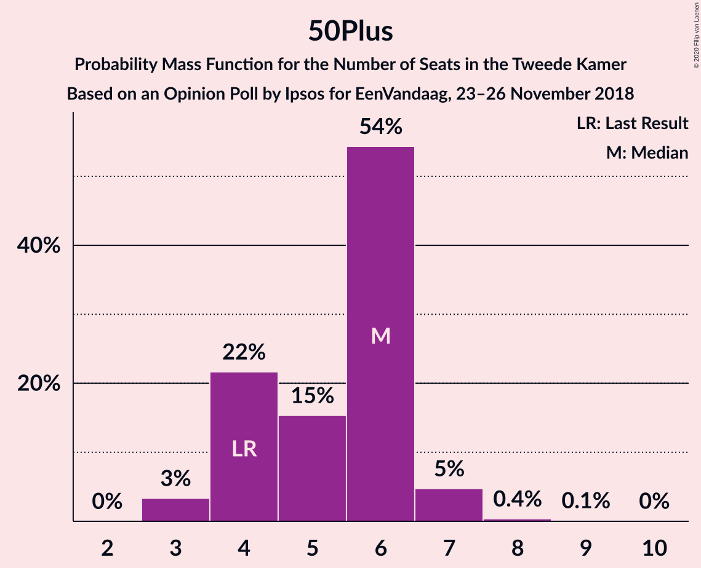

| Number of Seats | Probability | Accumulated | Special Marks |
|:---------------:|:-----------:|:-----------:|:-------------:|
| 3 | 3% | 100% |  |
| 4 | 22% | 97% | Last Result |
| 5 | 15% | 75% |  |
| 6 | 54% | 60% | Median |
| 7 | 5% | 5% |  |
| 8 | 0.4% | 0.5% |  |
| 9 | 0.1% | 0.2% |  |
| 10 | 0% | 0% |  |

### Staatkundig Gereformeerde Partij

*For a full overview of the results for this party, see the [Staatkundig Gereformeerde Partij](party-staatkundiggereformeerdepartij.html) page.*

| Number of Seats | Probability | Accumulated | Special Marks |
|:---------------:|:-----------:|:-----------:|:-------------:|
| 1 | 0.2% | 100% |  |
| 2 | 6% | 99.8% |  |
| 3 | 21% | 93% | Last Result |
| 4 | 60% | 73% | Median |
| 5 | 9% | 12% |  |
| 6 | 3% | 4% |  |
| 7 | 0.2% | 0.2% |  |
| 8 | 0% | 0% |  |

### DENK

*For a full overview of the results for this party, see the [DENK](party-denk.html) page.*

| Number of Seats | Probability | Accumulated | Special Marks |
|:---------------:|:-----------:|:-----------:|:-------------:|
| 1 | 0.6% | 100% |  |
| 2 | 32% | 99.4% |  |
| 3 | 52% | 68% | Last Result, Median |
| 4 | 14% | 16% |  |
| 5 | 2% | 2% |  |
| 6 | 0.2% | 0.2% |  |
| 7 | 0% | 0% |  |

## Coalitions

### Confidence Intervals

| Coalition | Last Result | Median | Majority? | 80% Confidence Interval | 90% Confidence Interval | 95% Confidence Interval | 99% Confidence Interval |
|:---------:|:-----------:|:------:|:---------:|:-----------------------:|:-----------------------:|:-----------------------:|:-----------------------:|
| Volkspartij voor Vrijheid en Democratie – Partij voor de Vrijheid – Christen-Democratisch Appèl – Forum voor Democratie – Staatkundig Gereformeerde Partij | 77 | 79 | 80% | 75–82 | 73–83 | 72–85 | 71–85 |
| Volkspartij voor Vrijheid en Democratie – GroenLinks – Christen-Democratisch Appèl – Democraten 66 – ChristenUnie | 90 | 78 | 90% | 75–81 | 73–81 | 73–82 | 72–84 |
| Volkspartij voor Vrijheid en Democratie – Partij voor de Vrijheid – Christen-Democratisch Appèl – Forum voor Democratie | 74 | 75 | 21% | 71–78 | 70–78 | 69–80 | 68–80 |
| GroenLinks – Christen-Democratisch Appèl – Democraten 66 – Socialistische Partij – Partij van de Arbeid – ChristenUnie | 80 | 69 | 6% | 68–75 | 68–76 | 67–77 | 65–77 |
| Volkspartij voor Vrijheid en Democratie – Christen-Democratisch Appèl – Democraten 66 – Partij van de Arbeid – ChristenUnie | 85 | 70 | 2% | 68–75 | 68–75 | 67–75 | 66–78 |
| Volkspartij voor Vrijheid en Democratie – Partij voor de Vrijheid – Christen-Democratisch Appèl | 72 | 65 | 0% | 61–69 | 60–69 | 59–69 | 58–69 |
| Volkspartij voor Vrijheid en Democratie – Christen-Democratisch Appèl – Forum voor Democratie – 50Plus – Staatkundig Gereformeerde Partij | 61 | 64 | 0% | 59–65 | 58–67 | 57–67 | 55–68 |
| Volkspartij voor Vrijheid en Democratie – Christen-Democratisch Appèl – Democraten 66 – ChristenUnie | 76 | 62 | 0% | 59–66 | 56–66 | 56–66 | 56–68 |
| GroenLinks – Christen-Democratisch Appèl – Democraten 66 – Partij van de Arbeid – ChristenUnie | 66 | 57 | 0% | 56–61 | 55–63 | 55–63 | 53–67 |
| Volkspartij voor Vrijheid en Democratie – Christen-Democratisch Appèl – Forum voor Democratie – Staatkundig Gereformeerde Partij | 57 | 58 | 0% | 53–61 | 53–62 | 52–63 | 50–63 |
| Volkspartij voor Vrijheid en Democratie – Christen-Democratisch Appèl – Forum voor Democratie – 50Plus | 58 | 60 | 0% | 55–61 | 55–62 | 54–62 | 52–64 |
| Volkspartij voor Vrijheid en Democratie – Christen-Democratisch Appèl – Democraten 66 | 71 | 54 | 0% | 51–60 | 51–60 | 51–60 | 49–61 |
| Volkspartij voor Vrijheid en Democratie – Christen-Democratisch Appèl – Forum voor Democratie | 54 | 54 | 0% | 50–56 | 49–58 | 49–58 | 47–59 |
| Volkspartij voor Vrijheid en Democratie – Christen-Democratisch Appèl – Partij van de Arbeid | 61 | 53 | 0% | 51–56 | 50–56 | 48–57 | 47–58 |
| Volkspartij voor Vrijheid en Democratie – Democraten 66 – Partij van de Arbeid | 61 | 49 | 0% | 47–55 | 47–55 | 46–55 | 45–58 |
| Volkspartij voor Vrijheid en Democratie – Christen-Democratisch Appèl | 52 | 45 | 0% | 41–47 | 39–47 | 39–47 | 38–49 |
| Volkspartij voor Vrijheid en Democratie – Partij van de Arbeid | 42 | 38 | 0% | 36–42 | 35–42 | 34–42 | 33–44 |
| Christen-Democratisch Appèl – Democraten 66 – Partij van de Arbeid | 47 | 35 | 0% | 32–39 | 32–40 | 32–40 | 30–43 |
| Christen-Democratisch Appèl – Partij van de Arbeid – ChristenUnie | 33 | 30 | 0% | 28–32 | 28–33 | 27–34 | 24–35 |
| Christen-Democratisch Appèl – Democraten 66 | 38 | 27 | 0% | 23–29 | 22–31 | 22–31 | 21–32 |
| Christen-Democratisch Appèl – Partij van de Arbeid | 28 | 23 | 0% | 22–27 | 22–27 | 21–28 | 19–28 |

### Volkspartij voor Vrijheid en Democratie – Partij voor de Vrijheid – Christen-Democratisch Appèl – Forum voor Democratie – Staatkundig Gereformeerde Partij

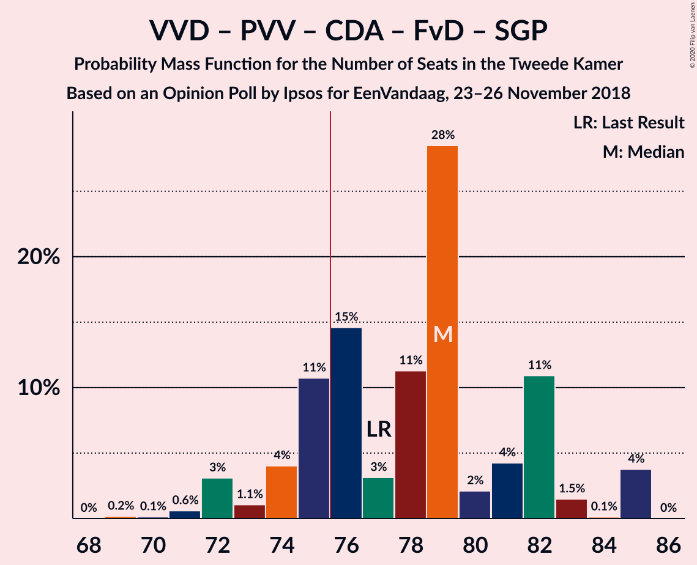

| Number of Seats | Probability | Accumulated | Special Marks |
|:---------------:|:-----------:|:-----------:|:-------------:|
| 69 | 0.2% | 100% |  |
| 70 | 0.1% | 99.8% |  |
| 71 | 0.6% | 99.7% |  |
| 72 | 3% | 99.1% |  |
| 73 | 1.1% | 96% |  |
| 74 | 4% | 95% |  |
| 75 | 11% | 91% |  |
| 76 | 15% | 80% | Majority |
| 77 | 3% | 66% | Last Result |
| 78 | 11% | 62% |  |
| 79 | 28% | 51% | Median |
| 80 | 2% | 23% |  |
| 81 | 4% | 21% |  |
| 82 | 11% | 16% |  |
| 83 | 1.5% | 5% |  |
| 84 | 0.1% | 4% |  |
| 85 | 4% | 4% |  |
| 86 | 0% | 0% |  |

### Volkspartij voor Vrijheid en Democratie – GroenLinks – Christen-Democratisch Appèl – Democraten 66 – ChristenUnie

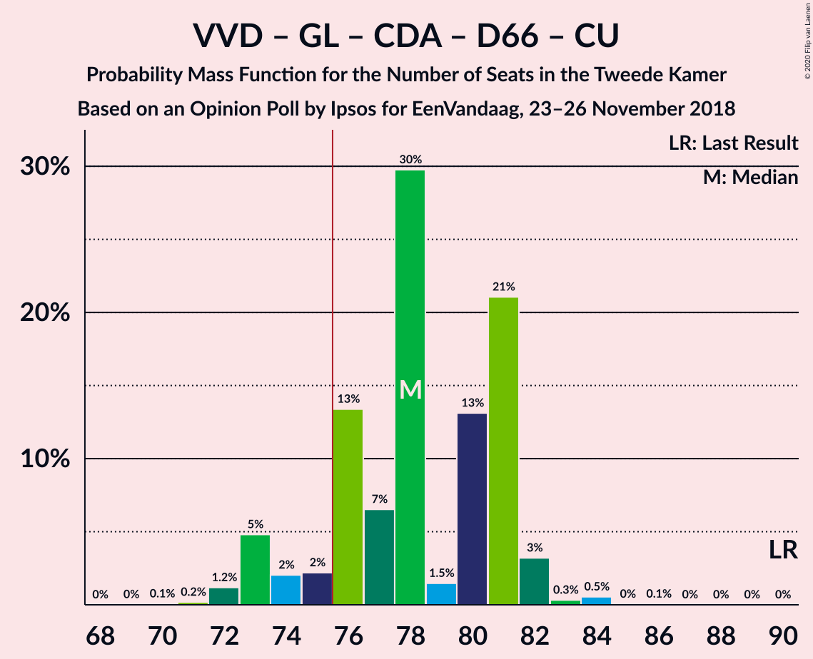

| Number of Seats | Probability | Accumulated | Special Marks |
|:---------------:|:-----------:|:-----------:|:-------------:|
| 70 | 0.1% | 100% |  |
| 71 | 0.2% | 99.9% |  |
| 72 | 1.2% | 99.7% |  |
| 73 | 5% | 98.5% |  |
| 74 | 2% | 94% |  |
| 75 | 2% | 92% |  |
| 76 | 13% | 90% | Majority |
| 77 | 7% | 76% |  |
| 78 | 30% | 70% | Median |
| 79 | 1.5% | 40% |  |
| 80 | 13% | 38% |  |
| 81 | 21% | 25% |  |
| 82 | 3% | 4% |  |
| 83 | 0.3% | 1.0% |  |
| 84 | 0.5% | 0.7% |  |
| 85 | 0% | 0.1% |  |
| 86 | 0.1% | 0.1% |  |
| 87 | 0% | 0% |  |
| 88 | 0% | 0% |  |
| 89 | 0% | 0% |  |
| 90 | 0% | 0% | Last Result |

### Volkspartij voor Vrijheid en Democratie – Partij voor de Vrijheid – Christen-Democratisch Appèl – Forum voor Democratie

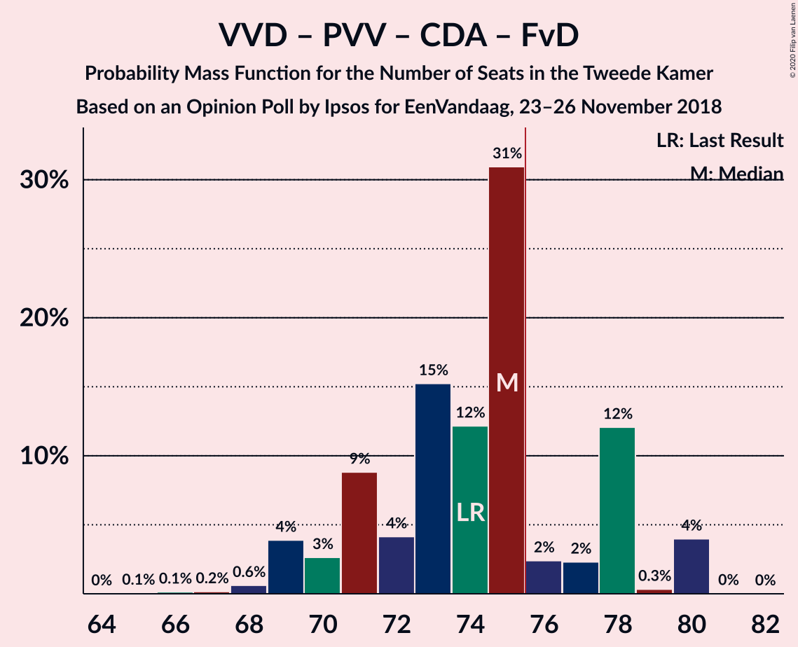

| Number of Seats | Probability | Accumulated | Special Marks |
|:---------------:|:-----------:|:-----------:|:-------------:|
| 65 | 0.1% | 100% |  |
| 66 | 0.1% | 99.9% |  |
| 67 | 0.2% | 99.8% |  |
| 68 | 0.6% | 99.6% |  |
| 69 | 4% | 99.0% |  |
| 70 | 3% | 95% |  |
| 71 | 9% | 92% |  |
| 72 | 4% | 84% |  |
| 73 | 15% | 80% |  |
| 74 | 12% | 64% | Last Result |
| 75 | 31% | 52% | Median |
| 76 | 2% | 21% | Majority |
| 77 | 2% | 19% |  |
| 78 | 12% | 16% |  |
| 79 | 0.3% | 4% |  |
| 80 | 4% | 4% |  |
| 81 | 0% | 0.1% |  |
| 82 | 0% | 0% |  |

### GroenLinks – Christen-Democratisch Appèl – Democraten 66 – Socialistische Partij – Partij van de Arbeid – ChristenUnie

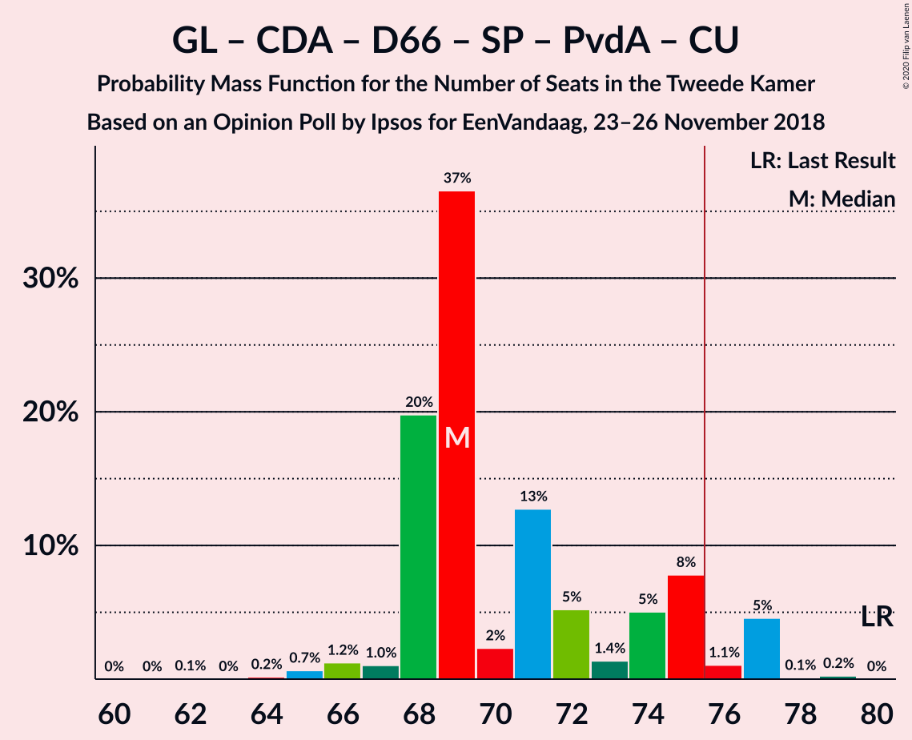

| Number of Seats | Probability | Accumulated | Special Marks |
|:---------------:|:-----------:|:-----------:|:-------------:|
| 62 | 0.1% | 100% |  |
| 63 | 0% | 99.9% |  |
| 64 | 0.2% | 99.9% |  |
| 65 | 0.7% | 99.7% |  |
| 66 | 1.2% | 99.1% |  |
| 67 | 1.0% | 98% |  |
| 68 | 20% | 97% |  |
| 69 | 37% | 77% | Median |
| 70 | 2% | 40% |  |
| 71 | 13% | 38% |  |
| 72 | 5% | 25% |  |
| 73 | 1.4% | 20% |  |
| 74 | 5% | 19% |  |
| 75 | 8% | 14% |  |
| 76 | 1.1% | 6% | Majority |
| 77 | 5% | 5% |  |
| 78 | 0.1% | 0.4% |  |
| 79 | 0.2% | 0.3% |  |
| 80 | 0% | 0% | Last Result |

### Volkspartij voor Vrijheid en Democratie – Christen-Democratisch Appèl – Democraten 66 – Partij van de Arbeid – ChristenUnie

| Number of Seats | Probability | Accumulated | Special Marks |
|:---------------:|:-----------:|:-----------:|:-------------:|
| 63 | 0% | 100% |  |
| 64 | 0.2% | 99.9% |  |
| 65 | 0.1% | 99.8% |  |
| 66 | 2% | 99.6% |  |
| 67 | 2% | 98% |  |
| 68 | 7% | 96% |  |
| 69 | 16% | 89% |  |
| 70 | 27% | 73% |  |
| 71 | 10% | 46% | Median |
| 72 | 3% | 36% |  |
| 73 | 11% | 33% |  |
| 74 | 5% | 23% |  |
| 75 | 16% | 18% |  |
| 76 | 0.7% | 2% | Majority |
| 77 | 0.6% | 1.2% |  |
| 78 | 0.2% | 0.6% |  |
| 79 | 0.2% | 0.4% |  |
| 80 | 0.2% | 0.2% |  |
| 81 | 0% | 0% |  |
| 82 | 0% | 0% |  |
| 83 | 0% | 0% |  |
| 84 | 0% | 0% |  |
| 85 | 0% | 0% | Last Result |

### Volkspartij voor Vrijheid en Democratie – Partij voor de Vrijheid – Christen-Democratisch Appèl

| Number of Seats | Probability | Accumulated | Special Marks |
|:---------------:|:-----------:|:-----------:|:-------------:|
| 56 | 0.1% | 100% |  |
| 57 | 0.2% | 99.8% |  |
| 58 | 1.2% | 99.6% |  |
| 59 | 1.2% | 98% |  |
| 60 | 3% | 97% |  |
| 61 | 9% | 94% |  |
| 62 | 4% | 84% |  |
| 63 | 3% | 80% |  |
| 64 | 25% | 77% |  |
| 65 | 6% | 52% |  |
| 66 | 29% | 46% | Median |
| 67 | 2% | 17% |  |
| 68 | 0.2% | 15% |  |
| 69 | 15% | 15% |  |
| 70 | 0.1% | 0.3% |  |
| 71 | 0% | 0.2% |  |
| 72 | 0.1% | 0.1% | Last Result |
| 73 | 0% | 0% |  |

### Volkspartij voor Vrijheid en Democratie – Christen-Democratisch Appèl – Forum voor Democratie – 50Plus – Staatkundig Gereformeerde Partij

| Number of Seats | Probability | Accumulated | Special Marks |
|:---------------:|:-----------:|:-----------:|:-------------:|
| 54 | 0% | 100% |  |
| 55 | 0.8% | 99.9% |  |
| 56 | 1.2% | 99.2% |  |
| 57 | 0.6% | 98% |  |
| 58 | 3% | 97% |  |
| 59 | 7% | 94% |  |
| 60 | 7% | 87% |  |
| 61 | 9% | 79% | Last Result |
| 62 | 12% | 71% |  |
| 63 | 7% | 59% |  |
| 64 | 40% | 52% | Median |
| 65 | 3% | 12% |  |
| 66 | 1.0% | 9% |  |
| 67 | 7% | 8% |  |
| 68 | 0.3% | 0.8% |  |
| 69 | 0.3% | 0.5% |  |
| 70 | 0.2% | 0.2% |  |
| 71 | 0% | 0% |  |

### Volkspartij voor Vrijheid en Democratie – Christen-Democratisch Appèl – Democraten 66 – ChristenUnie

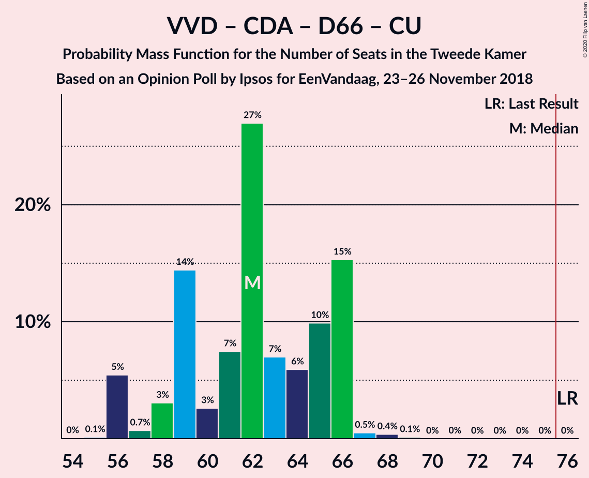

| Number of Seats | Probability | Accumulated | Special Marks |
|:---------------:|:-----------:|:-----------:|:-------------:|
| 54 | 0% | 100% |  |
| 55 | 0.1% | 99.9% |  |
| 56 | 5% | 99.8% |  |
| 57 | 0.7% | 94% |  |
| 58 | 3% | 94% |  |
| 59 | 14% | 91% |  |
| 60 | 3% | 76% |  |
| 61 | 7% | 74% |  |
| 62 | 27% | 66% | Median |
| 63 | 7% | 39% |  |
| 64 | 6% | 32% |  |
| 65 | 10% | 26% |  |
| 66 | 15% | 16% |  |
| 67 | 0.5% | 1.0% |  |
| 68 | 0.4% | 0.5% |  |
| 69 | 0.1% | 0.2% |  |
| 70 | 0% | 0% |  |
| 71 | 0% | 0% |  |
| 72 | 0% | 0% |  |
| 73 | 0% | 0% |  |
| 74 | 0% | 0% |  |
| 75 | 0% | 0% |  |
| 76 | 0% | 0% | Last Result, Majority |

### GroenLinks – Christen-Democratisch Appèl – Democraten 66 – Partij van de Arbeid – ChristenUnie

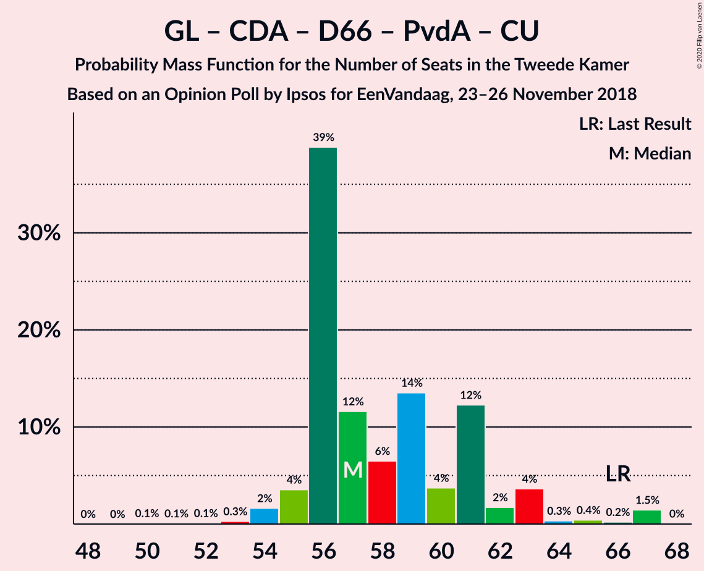

| Number of Seats | Probability | Accumulated | Special Marks |
|:---------------:|:-----------:|:-----------:|:-------------:|
| 50 | 0.1% | 100% |  |
| 51 | 0.1% | 99.9% |  |
| 52 | 0.1% | 99.8% |  |
| 53 | 0.3% | 99.7% |  |
| 54 | 2% | 99.5% |  |
| 55 | 4% | 98% |  |
| 56 | 39% | 94% |  |
| 57 | 12% | 55% | Median |
| 58 | 6% | 44% |  |
| 59 | 14% | 37% |  |
| 60 | 4% | 24% |  |
| 61 | 12% | 20% |  |
| 62 | 2% | 8% |  |
| 63 | 4% | 6% |  |
| 64 | 0.3% | 2% |  |
| 65 | 0.4% | 2% |  |
| 66 | 0.2% | 2% | Last Result |
| 67 | 1.5% | 2% |  |
| 68 | 0% | 0% |  |

### Volkspartij voor Vrijheid en Democratie – Christen-Democratisch Appèl – Forum voor Democratie – Staatkundig Gereformeerde Partij

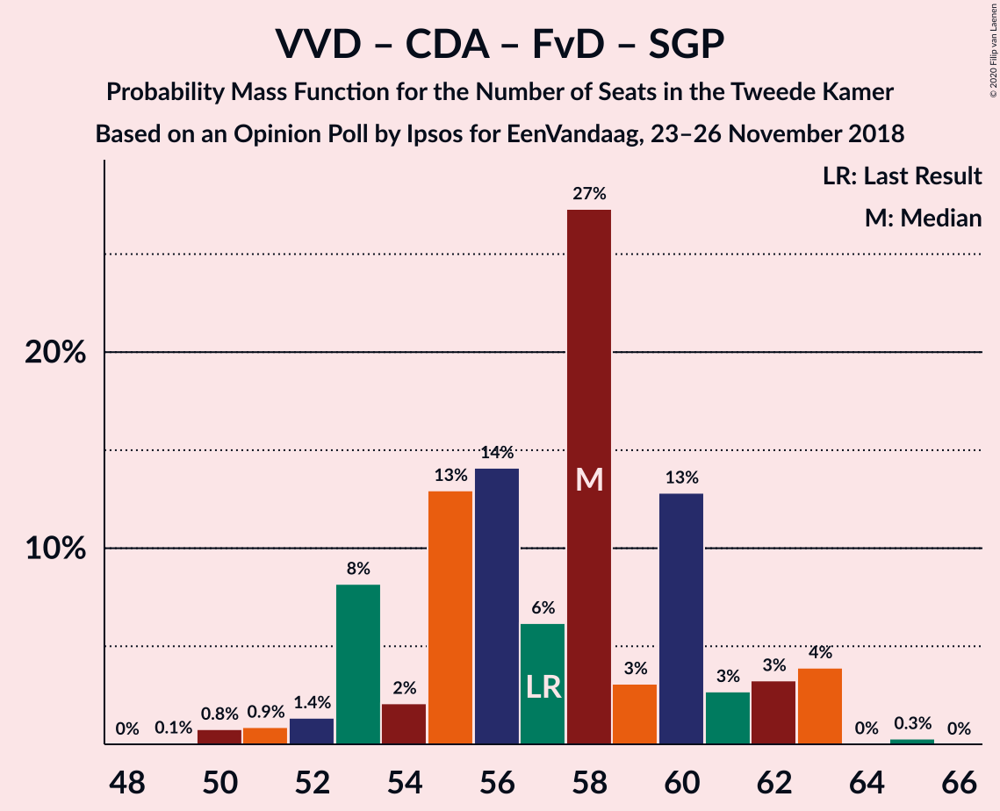

| Number of Seats | Probability | Accumulated | Special Marks |
|:---------------:|:-----------:|:-----------:|:-------------:|
| 49 | 0.1% | 100% |  |
| 50 | 0.8% | 99.9% |  |
| 51 | 0.9% | 99.1% |  |
| 52 | 1.4% | 98% |  |
| 53 | 8% | 97% |  |
| 54 | 2% | 89% |  |
| 55 | 13% | 87% |  |
| 56 | 14% | 74% |  |
| 57 | 6% | 60% | Last Result |
| 58 | 27% | 53% | Median |
| 59 | 3% | 26% |  |
| 60 | 13% | 23% |  |
| 61 | 3% | 10% |  |
| 62 | 3% | 8% |  |
| 63 | 4% | 4% |  |
| 64 | 0% | 0.3% |  |
| 65 | 0.3% | 0.3% |  |
| 66 | 0% | 0% |  |

### Volkspartij voor Vrijheid en Democratie – Christen-Democratisch Appèl – Forum voor Democratie – 50Plus

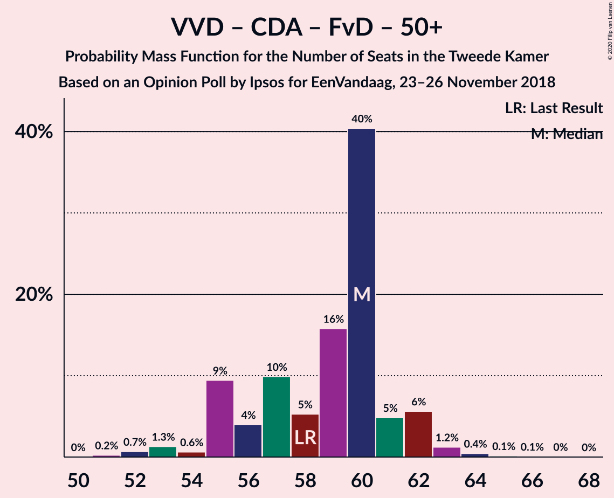

| Number of Seats | Probability | Accumulated | Special Marks |
|:---------------:|:-----------:|:-----------:|:-------------:|
| 51 | 0.2% | 100% |  |
| 52 | 0.7% | 99.7% |  |
| 53 | 1.3% | 99.1% |  |
| 54 | 0.6% | 98% |  |
| 55 | 9% | 97% |  |
| 56 | 4% | 88% |  |
| 57 | 10% | 84% |  |
| 58 | 5% | 74% | Last Result |
| 59 | 16% | 69% |  |
| 60 | 40% | 53% | Median |
| 61 | 5% | 12% |  |
| 62 | 6% | 8% |  |
| 63 | 1.2% | 2% |  |
| 64 | 0.4% | 0.7% |  |
| 65 | 0.1% | 0.3% |  |
| 66 | 0.1% | 0.1% |  |
| 67 | 0% | 0% |  |

### Volkspartij voor Vrijheid en Democratie – Christen-Democratisch Appèl – Democraten 66

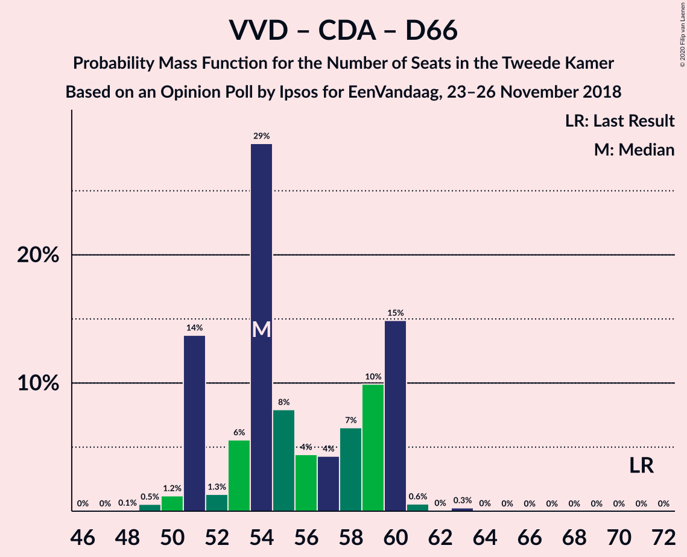

| Number of Seats | Probability | Accumulated | Special Marks |
|:---------------:|:-----------:|:-----------:|:-------------:|
| 48 | 0.1% | 100% |  |
| 49 | 0.5% | 99.9% |  |
| 50 | 1.2% | 99.4% |  |
| 51 | 14% | 98% |  |
| 52 | 1.3% | 84% |  |
| 53 | 6% | 83% |  |
| 54 | 29% | 78% |  |
| 55 | 8% | 49% |  |
| 56 | 4% | 41% | Median |
| 57 | 4% | 37% |  |
| 58 | 7% | 32% |  |
| 59 | 10% | 26% |  |
| 60 | 15% | 16% |  |
| 61 | 0.6% | 0.9% |  |
| 62 | 0% | 0.3% |  |
| 63 | 0.3% | 0.3% |  |
| 64 | 0% | 0% |  |
| 65 | 0% | 0% |  |
| 66 | 0% | 0% |  |
| 67 | 0% | 0% |  |
| 68 | 0% | 0% |  |
| 69 | 0% | 0% |  |
| 70 | 0% | 0% |  |
| 71 | 0% | 0% | Last Result |

### Volkspartij voor Vrijheid en Democratie – Christen-Democratisch Appèl – Forum voor Democratie

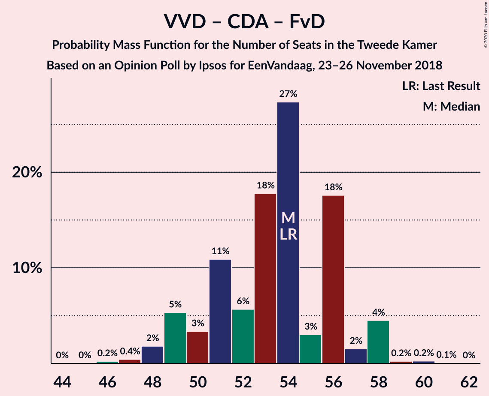

| Number of Seats | Probability | Accumulated | Special Marks |
|:---------------:|:-----------:|:-----------:|:-------------:|
| 46 | 0.2% | 100% |  |
| 47 | 0.4% | 99.7% |  |
| 48 | 2% | 99.3% |  |
| 49 | 5% | 98% |  |
| 50 | 3% | 92% |  |
| 51 | 11% | 89% |  |
| 52 | 6% | 78% |  |
| 53 | 18% | 72% |  |
| 54 | 27% | 55% | Last Result, Median |
| 55 | 3% | 27% |  |
| 56 | 18% | 24% |  |
| 57 | 2% | 7% |  |
| 58 | 4% | 5% |  |
| 59 | 0.2% | 0.5% |  |
| 60 | 0.2% | 0.3% |  |
| 61 | 0.1% | 0.1% |  |
| 62 | 0% | 0% |  |

### Volkspartij voor Vrijheid en Democratie – Christen-Democratisch Appèl – Partij van de Arbeid

| Number of Seats | Probability | Accumulated | Special Marks |
|:---------------:|:-----------:|:-----------:|:-------------:|
| 45 | 0.1% | 100% |  |
| 46 | 0.3% | 99.9% |  |
| 47 | 0.7% | 99.5% |  |
| 48 | 1.5% | 98.8% |  |
| 49 | 2% | 97% |  |
| 50 | 2% | 95% |  |
| 51 | 18% | 93% |  |
| 52 | 12% | 75% |  |
| 53 | 33% | 63% |  |
| 54 | 5% | 30% | Median |
| 55 | 8% | 24% |  |
| 56 | 13% | 17% |  |
| 57 | 2% | 3% |  |
| 58 | 0.8% | 1.3% |  |
| 59 | 0.2% | 0.4% |  |
| 60 | 0% | 0.3% |  |
| 61 | 0% | 0.2% | Last Result |
| 62 | 0.2% | 0.2% |  |
| 63 | 0% | 0% |  |

### Volkspartij voor Vrijheid en Democratie – Democraten 66 – Partij van de Arbeid

| Number of Seats | Probability | Accumulated | Special Marks |
|:---------------:|:-----------:|:-----------:|:-------------:|
| 43 | 0.1% | 100% |  |
| 44 | 0.2% | 99.9% |  |
| 45 | 1.2% | 99.7% |  |
| 46 | 2% | 98% |  |
| 47 | 30% | 96% |  |
| 48 | 8% | 66% |  |
| 49 | 10% | 59% |  |
| 50 | 12% | 49% | Median |
| 51 | 4% | 37% |  |
| 52 | 4% | 33% |  |
| 53 | 13% | 29% |  |
| 54 | 4% | 16% |  |
| 55 | 11% | 13% |  |
| 56 | 0.2% | 2% |  |
| 57 | 0.8% | 1.4% |  |
| 58 | 0.4% | 0.7% |  |
| 59 | 0.2% | 0.2% |  |
| 60 | 0% | 0% |  |
| 61 | 0% | 0% | Last Result |

### Volkspartij voor Vrijheid en Democratie – Christen-Democratisch Appèl

| Number of Seats | Probability | Accumulated | Special Marks |
|:---------------:|:-----------:|:-----------:|:-------------:|
| 36 | 0.2% | 100% |  |
| 37 | 0.2% | 99.8% |  |
| 38 | 1.1% | 99.6% |  |
| 39 | 5% | 98% |  |
| 40 | 1.4% | 93% |  |
| 41 | 15% | 92% |  |
| 42 | 4% | 77% |  |
| 43 | 6% | 73% |  |
| 44 | 17% | 67% |  |
| 45 | 28% | 50% | Median |
| 46 | 5% | 22% |  |
| 47 | 16% | 17% |  |
| 48 | 0.4% | 0.9% |  |
| 49 | 0.2% | 0.5% |  |
| 50 | 0.3% | 0.3% |  |
| 51 | 0% | 0% |  |
| 52 | 0% | 0% | Last Result |

### Volkspartij voor Vrijheid en Democratie – Partij van de Arbeid

| Number of Seats | Probability | Accumulated | Special Marks |
|:---------------:|:-----------:|:-----------:|:-------------:|
| 31 | 0.1% | 100% |  |
| 32 | 0.1% | 99.9% |  |
| 33 | 0.5% | 99.7% |  |
| 34 | 2% | 99.2% |  |
| 35 | 6% | 97% |  |
| 36 | 7% | 91% |  |
| 37 | 4% | 85% |  |
| 38 | 42% | 81% |  |
| 39 | 15% | 38% | Median |
| 40 | 8% | 23% |  |
| 41 | 1.2% | 16% |  |
| 42 | 12% | 14% | Last Result |
| 43 | 1.1% | 2% |  |
| 44 | 0.6% | 0.9% |  |
| 45 | 0.1% | 0.3% |  |
| 46 | 0.2% | 0.2% |  |
| 47 | 0% | 0% |  |

### Christen-Democratisch Appèl – Democraten 66 – Partij van de Arbeid

| Number of Seats | Probability | Accumulated | Special Marks |
|:---------------:|:-----------:|:-----------:|:-------------:|
| 30 | 0.5% | 100% |  |
| 31 | 1.3% | 99.5% |  |
| 32 | 36% | 98% |  |
| 33 | 0.6% | 62% |  |
| 34 | 1.4% | 61% |  |
| 35 | 10% | 60% | Median |
| 36 | 16% | 50% |  |
| 37 | 15% | 34% |  |
| 38 | 5% | 19% |  |
| 39 | 7% | 13% |  |
| 40 | 4% | 7% |  |
| 41 | 0.4% | 2% |  |
| 42 | 0.2% | 2% |  |
| 43 | 2% | 2% |  |
| 44 | 0.1% | 0.1% |  |
| 45 | 0% | 0% |  |
| 46 | 0% | 0% |  |
| 47 | 0% | 0% | Last Result |

### Christen-Democratisch Appèl – Partij van de Arbeid – ChristenUnie

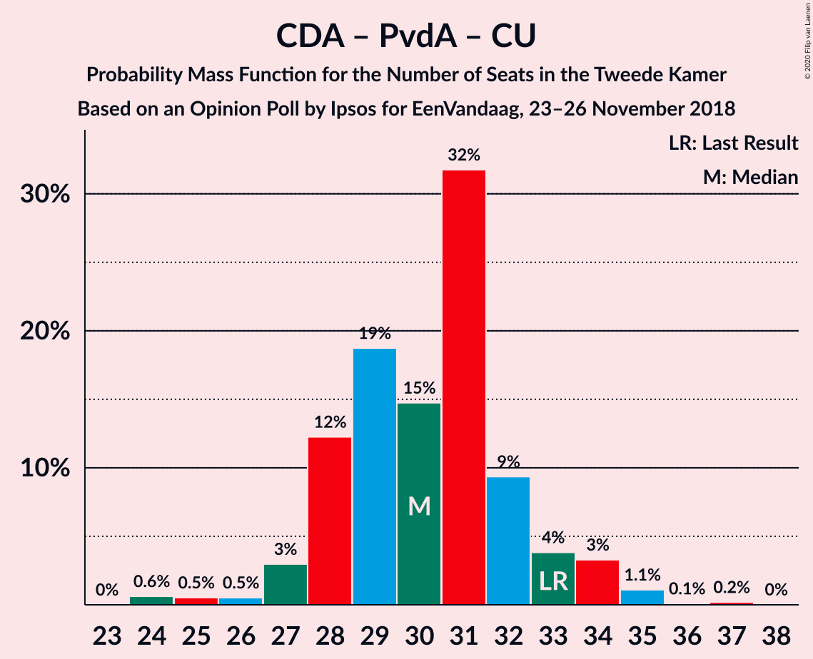

| Number of Seats | Probability | Accumulated | Special Marks |
|:---------------:|:-----------:|:-----------:|:-------------:|
| 24 | 0.6% | 100% |  |
| 25 | 0.5% | 99.4% |  |
| 26 | 0.5% | 98.8% |  |
| 27 | 3% | 98% |  |
| 28 | 12% | 95% |  |
| 29 | 19% | 83% |  |
| 30 | 15% | 64% | Median |
| 31 | 32% | 50% |  |
| 32 | 9% | 18% |  |
| 33 | 4% | 9% | Last Result |
| 34 | 3% | 5% |  |
| 35 | 1.1% | 1.4% |  |
| 36 | 0.1% | 0.3% |  |
| 37 | 0.2% | 0.2% |  |
| 38 | 0% | 0% |  |

### Christen-Democratisch Appèl – Democraten 66

| Number of Seats | Probability | Accumulated | Special Marks |
|:---------------:|:-----------:|:-----------:|:-------------:|
| 21 | 0.5% | 100% |  |
| 22 | 9% | 99.5% |  |
| 23 | 1.2% | 91% |  |
| 24 | 30% | 89% |  |
| 25 | 4% | 59% |  |
| 26 | 6% | 56% | Median |
| 27 | 26% | 50% |  |
| 28 | 4% | 24% |  |
| 29 | 13% | 20% |  |
| 30 | 0.9% | 6% |  |
| 31 | 4% | 6% |  |
| 32 | 2% | 2% |  |
| 33 | 0% | 0.1% |  |
| 34 | 0.1% | 0.1% |  |
| 35 | 0% | 0% |  |
| 36 | 0% | 0% |  |
| 37 | 0% | 0% |  |
| 38 | 0% | 0% | Last Result |

### Christen-Democratisch Appèl – Partij van de Arbeid

| Number of Seats | Probability | Accumulated | Special Marks |
|:---------------:|:-----------:|:-----------:|:-------------:|
| 18 | 0.4% | 100% |  |
| 19 | 0.3% | 99.6% |  |
| 20 | 1.3% | 99.4% |  |
| 21 | 3% | 98% |  |
| 22 | 21% | 95% |  |
| 23 | 41% | 75% |  |
| 24 | 13% | 33% | Median |
| 25 | 1.2% | 21% |  |
| 26 | 8% | 19% |  |
| 27 | 7% | 12% |  |
| 28 | 4% | 4% | Last Result |
| 29 | 0.1% | 0.3% |  |
| 30 | 0.1% | 0.2% |  |
| 31 | 0% | 0% |  |

## Technical Information

### Opinion Poll

+ **Polling firm:** Ipsos
+ **Commissioner(s):** EenVandaag
+ **Fieldwork period:** 23–26 November 2018

### Calculations

+ **Sample size:** 1028
+ **Simulations done:** 1,048,576
+ **Error estimate:** 3.86%

