# Opinion Poll by I&O Research, 18–22 January 2019

<a href="#voting-intentions">Voting Intentions</a> | <a href="#seats">Seats</a> | <a href="#coalitions">Coalitions</a> | <a href="#technical-information">Technical Information</a>

## Voting Intentions

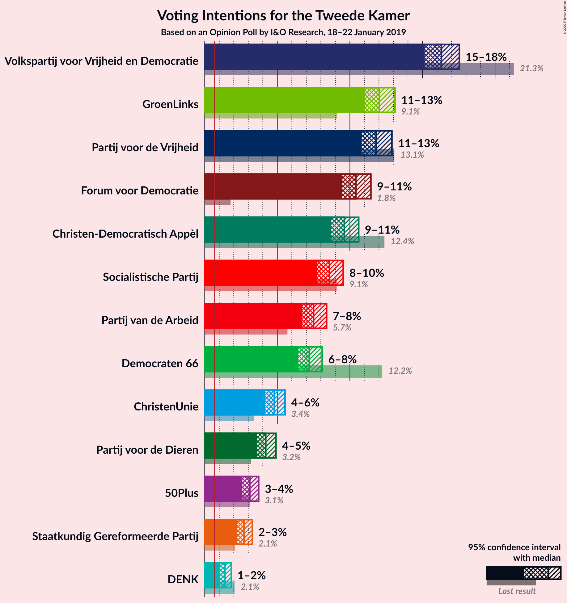

### Confidence Intervals

| Party | Last Result | Poll Result | 80% Confidence Interval | 90% Confidence Interval | 95% Confidence Interval | 99% Confidence Interval |
|:-----:|:-----------:|:-----------:|:-----------------------:|:-----------------------:|:-----------------------:|:-----------------------:|
| Volkspartij voor Vrijheid en Democratie | 21.3% | 16.3% | 15.5–17.1% |15.3–17.3% |15.2–17.5% |14.8–17.9% |
| GroenLinks | 9.1% | 12.0% | 11.4–12.7% |11.2–12.9% |11.0–13.1% |10.7–13.5% |
| Partij voor de Vrijheid | 13.1% | 11.8% | 11.2–12.5% |11.0–12.7% |10.8–12.9% |10.5–13.2% |
| Forum voor Democratie | 1.8% | 10.4% | 9.8–11.1% |9.6–11.3% |9.5–11.4% |9.2–11.8% |
| Christen-Democratisch Appèl | 12.4% | 9.6% | 9.0–10.3% |8.8–10.5% |8.7–10.6% |8.4–10.9% |
| Socialistische Partij | 9.1% | 8.6% | 8.0–9.2% |7.9–9.4% |7.7–9.5% |7.5–9.8% |
| Partij van de Arbeid | 5.7% | 7.5% | 7.0–8.1% |6.8–8.2% |6.7–8.4% |6.4–8.7% |
| Democraten 66 | 12.2% | 7.2% | 6.7–7.8% |6.5–7.9% |6.4–8.1% |6.2–8.4% |
| ChristenUnie | 3.4% | 4.8% | 4.4–5.3% |4.3–5.4% |4.1–5.5% |3.9–5.8% |
| Partij voor de Dieren | 3.2% | 4.2% | 3.8–4.7% |3.7–4.8% |3.6–4.9% |3.4–5.1% |
| 50Plus | 3.1% | 3.1% | 2.8–3.5% |2.7–3.6% |2.6–3.7% |2.4–3.9% |
| Staatkundig Gereformeerde Partij | 2.1% | 2.7% | 2.4–3.1% |2.3–3.2% |2.2–3.3% |2.1–3.5% |
| DENK | 2.1% | 1.4% | 1.2–1.7% |1.1–1.8% |1.1–1.8% |1.0–2.0% |

*Note:* The poll result column reflects the actual value used in the calculations. Published results may vary slightly, and in addition be rounded to fewer digits.

## Seats

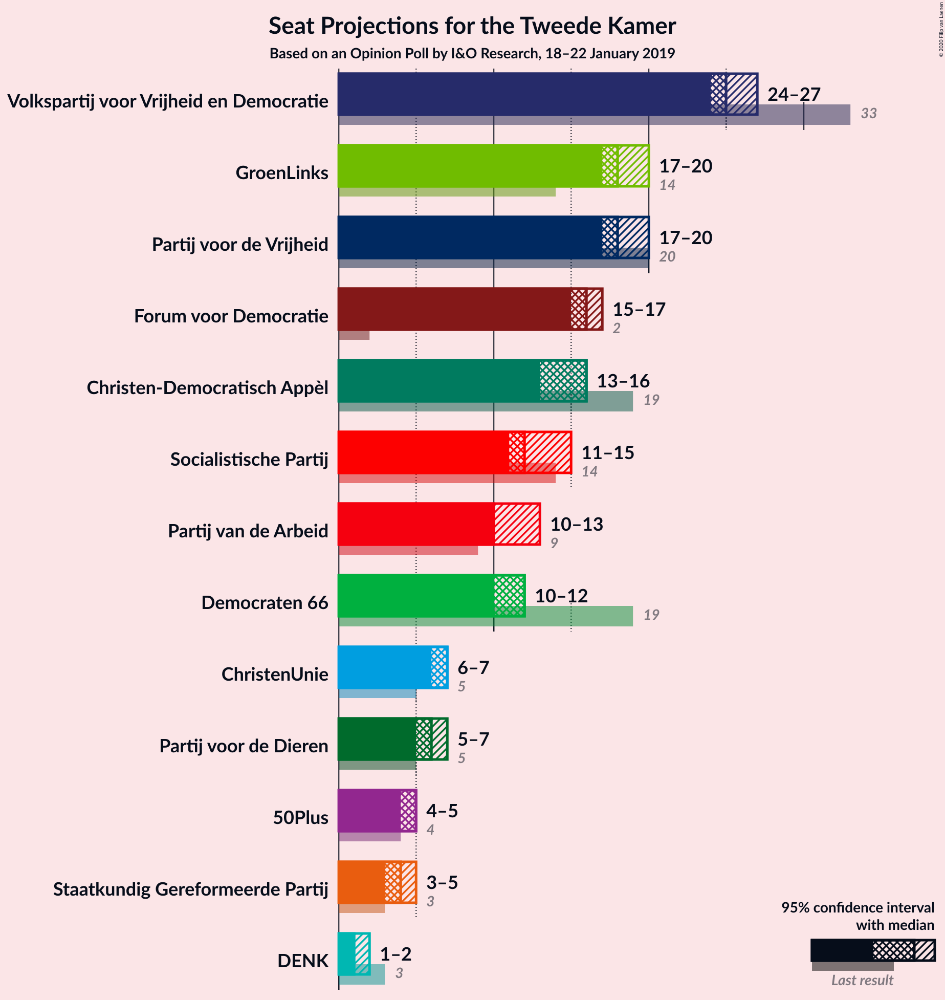

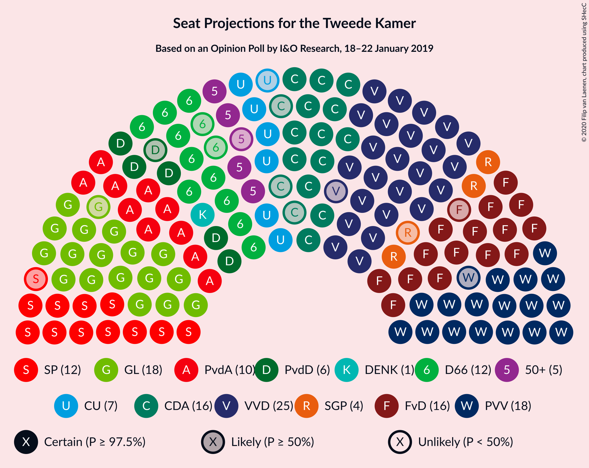

### Confidence Intervals

| Party | Last Result | Median | 80% Confidence Interval | 90% Confidence Interval | 95% Confidence Interval | 99% Confidence Interval |
|:-----:|:-----------:|:------:|:-----------------------:|:-----------------------:|:-----------------------:|:-----------------------:|
| <a href="#volkspartij-voor-vrijheid-en-democratie">Volkspartij voor Vrijheid en Democratie</a> | 33 | 25 | 24–27 |24–27 |24–27 |23–27 |
| <a href="#groenlinks">GroenLinks</a> | 14 | 18 | 18–19 |17–19 |17–20 |16–21 |
| <a href="#partij-voor-de-vrijheid">Partij voor de Vrijheid</a> | 20 | 18 | 17–19 |17–19 |17–20 |16–20 |
| <a href="#forum-voor-democratie">Forum voor Democratie</a> | 2 | 16 | 15–16 |15–16 |15–17 |14–18 |
| <a href="#christen-democratisch-appèl">Christen-Democratisch Appèl</a> | 19 | 16 | 14–16 |14–16 |13–16 |13–16 |
| <a href="#socialistische-partij">Socialistische Partij</a> | 14 | 12 | 12–15 |11–15 |11–15 |11–15 |
| <a href="#partij-van-de-arbeid">Partij van de Arbeid</a> | 9 | 10 | 10–12 |10–13 |10–13 |10–13 |
| <a href="#democraten-66">Democraten 66</a> | 19 | 12 | 10–12 |10–12 |10–12 |9–12 |
| <a href="#christenunie">ChristenUnie</a> | 5 | 7 | 7 |6–7 |6–7 |5–8 |
| <a href="#partij-voor-de-dieren">Partij voor de Dieren</a> | 5 | 6 | 5–7 |5–7 |5–7 |5–7 |
| <a href="#50plus">50Plus</a> | 4 | 5 | 4–5 |4–5 |4–5 |3–6 |
| <a href="#staatkundig-gereformeerde-partij">Staatkundig Gereformeerde Partij</a> | 3 | 4 | 3–4 |3–5 |3–5 |3–5 |
| <a href="#denk">DENK</a> | 3 | 1 | 1–2 |1–2 |1–2 |1–2 |

### Volkspartij voor Vrijheid en Democratie

*For a full overview of the results for this party, see the [Volkspartij voor Vrijheid en Democratie](party-volkspartijvoorvrijheidendemocratie.html) page.*

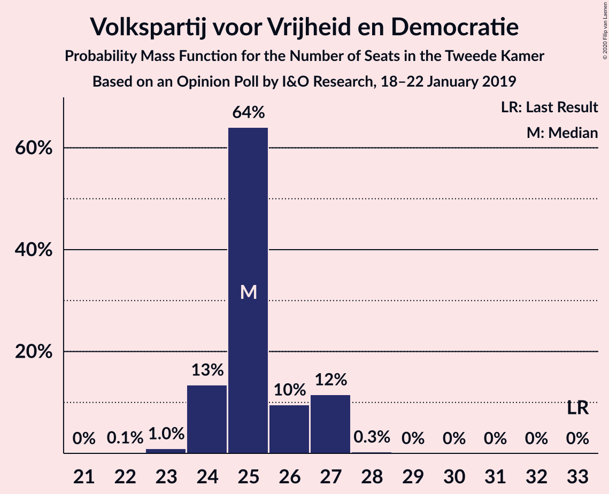

| Number of Seats | Probability | Accumulated | Special Marks |
|:---------------:|:-----------:|:-----------:|:-------------:|
| 22 | 0.1% | 100% |  |
| 23 | 1.0% | 99.9% |  |
| 24 | 13% | 98.9% |  |
| 25 | 64% | 85% | Median |
| 26 | 10% | 21% |  |
| 27 | 12% | 12% |  |
| 28 | 0.3% | 0.3% |  |
| 29 | 0% | 0% |  |
| 30 | 0% | 0% |  |
| 31 | 0% | 0% |  |
| 32 | 0% | 0% |  |
| 33 | 0% | 0% | Last Result |

### GroenLinks

*For a full overview of the results for this party, see the [GroenLinks](party-groenlinks.html) page.*

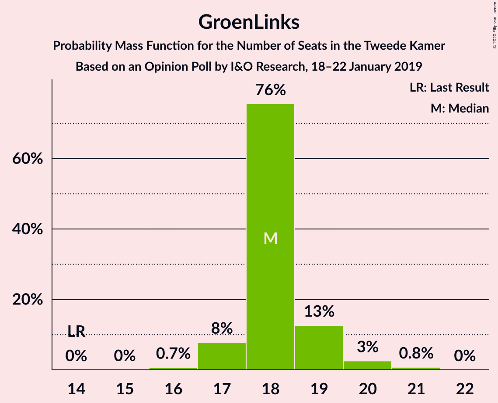

| Number of Seats | Probability | Accumulated | Special Marks |
|:---------------:|:-----------:|:-----------:|:-------------:|
| 14 | 0% | 100% | Last Result |
| 15 | 0% | 100% |  |
| 16 | 0.7% | 100% |  |
| 17 | 8% | 99.3% |  |
| 18 | 76% | 91% | Median |
| 19 | 13% | 16% |  |
| 20 | 3% | 3% |  |
| 21 | 0.8% | 0.8% |  |
| 22 | 0% | 0% |  |

### Partij voor de Vrijheid

*For a full overview of the results for this party, see the [Partij voor de Vrijheid](party-partijvoordevrijheid.html) page.*

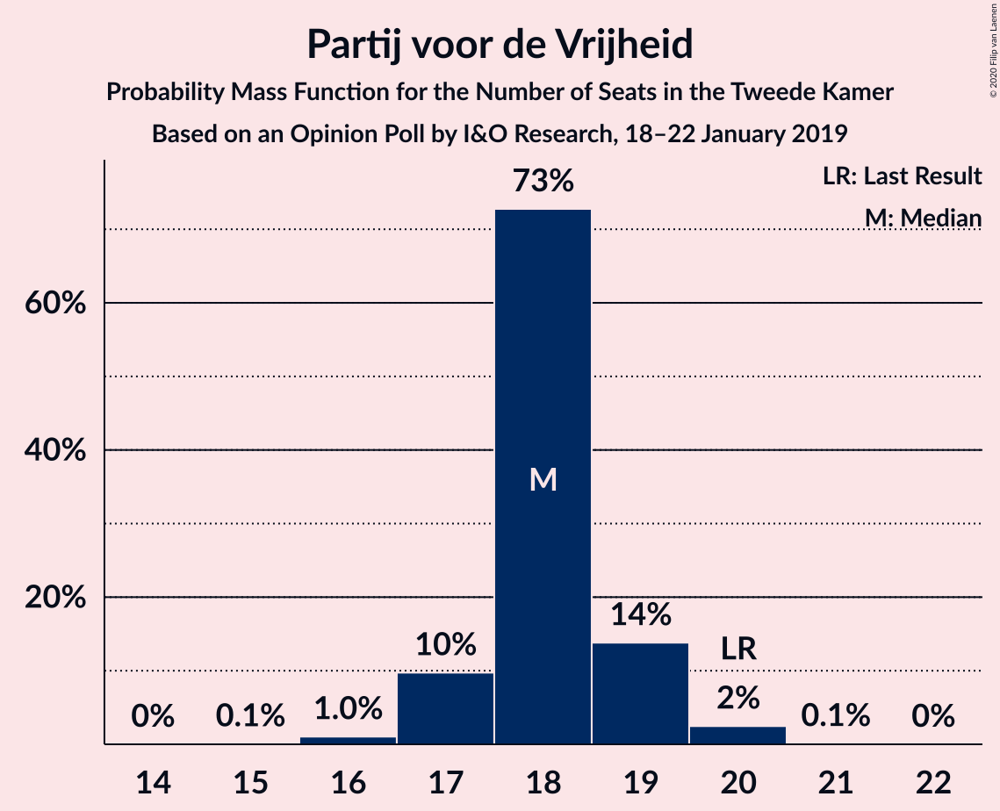

| Number of Seats | Probability | Accumulated | Special Marks |
|:---------------:|:-----------:|:-----------:|:-------------:|
| 15 | 0.1% | 100% |  |
| 16 | 1.0% | 99.9% |  |
| 17 | 10% | 98.9% |  |
| 18 | 73% | 89% | Median |
| 19 | 14% | 16% |  |
| 20 | 2% | 3% | Last Result |
| 21 | 0.1% | 0.1% |  |
| 22 | 0% | 0% |  |

### Forum voor Democratie

*For a full overview of the results for this party, see the [Forum voor Democratie](party-forumvoordemocratie.html) page.*

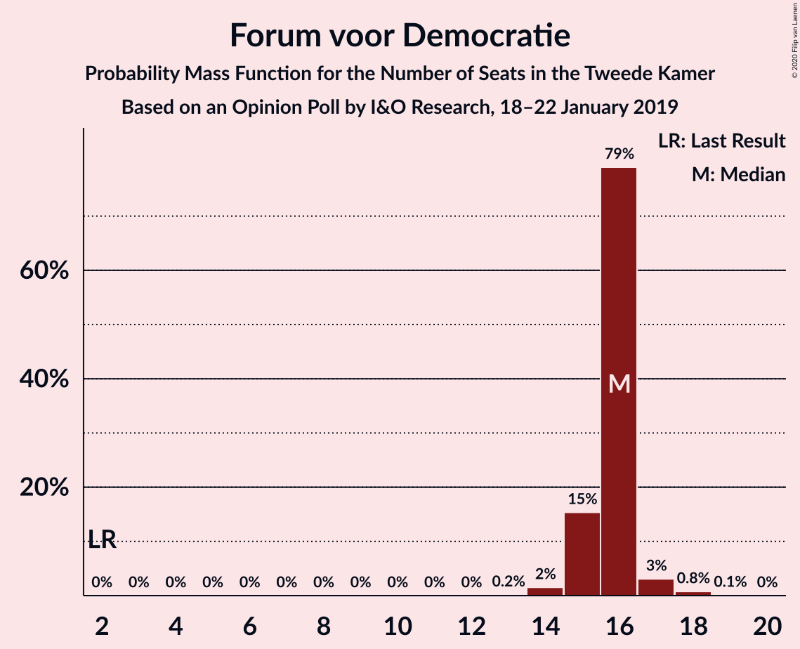

| Number of Seats | Probability | Accumulated | Special Marks |
|:---------------:|:-----------:|:-----------:|:-------------:|
| 2 | 0% | 100% | Last Result |
| 3 | 0% | 100% |  |
| 4 | 0% | 100% |  |
| 5 | 0% | 100% |  |
| 6 | 0% | 100% |  |
| 7 | 0% | 100% |  |
| 8 | 0% | 100% |  |
| 9 | 0% | 100% |  |
| 10 | 0% | 100% |  |
| 11 | 0% | 100% |  |
| 12 | 0% | 100% |  |
| 13 | 0.2% | 100% |  |
| 14 | 2% | 99.8% |  |
| 15 | 15% | 98% |  |
| 16 | 79% | 83% | Median |
| 17 | 3% | 4% |  |
| 18 | 0.8% | 0.9% |  |
| 19 | 0.1% | 0.1% |  |
| 20 | 0% | 0% |  |

### Christen-Democratisch Appèl

*For a full overview of the results for this party, see the [Christen-Democratisch Appèl](party-christen-democratischappèl.html) page.*

| Number of Seats | Probability | Accumulated | Special Marks |
|:---------------:|:-----------:|:-----------:|:-------------:|
| 12 | 0.1% | 100% |  |
| 13 | 3% | 99.9% |  |
| 14 | 21% | 97% |  |
| 15 | 23% | 75% |  |
| 16 | 52% | 52% | Median |
| 17 | 0.1% | 0.1% |  |
| 18 | 0% | 0% |  |
| 19 | 0% | 0% | Last Result |

### Socialistische Partij

*For a full overview of the results for this party, see the [Socialistische Partij](party-socialistischepartij.html) page.*

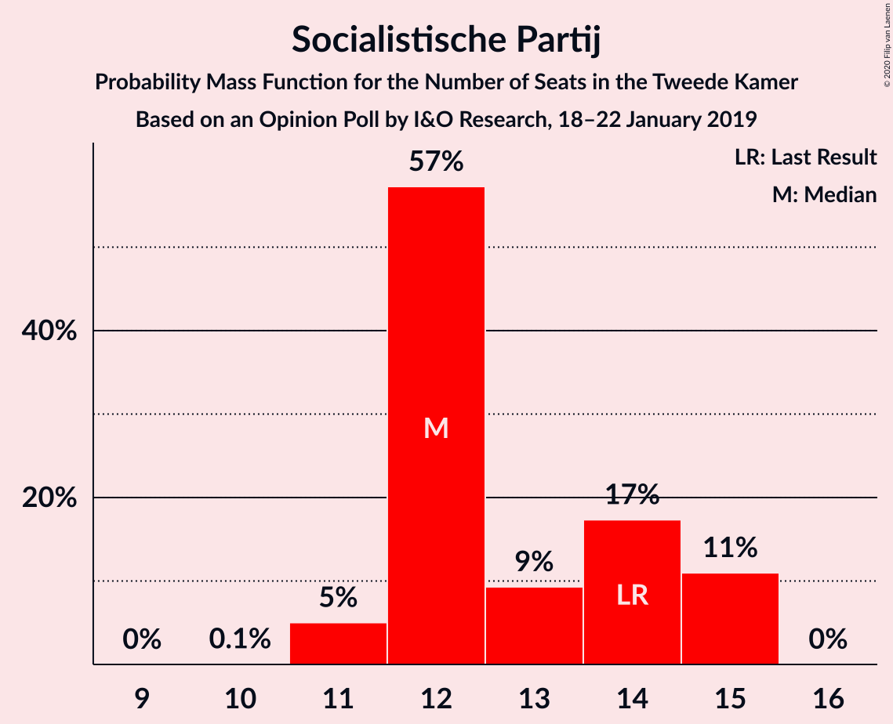

| Number of Seats | Probability | Accumulated | Special Marks |
|:---------------:|:-----------:|:-----------:|:-------------:|
| 10 | 0.1% | 100% |  |
| 11 | 5% | 99.9% |  |
| 12 | 57% | 95% | Median |
| 13 | 9% | 38% |  |
| 14 | 17% | 28% | Last Result |
| 15 | 11% | 11% |  |
| 16 | 0% | 0% |  |

### Partij van de Arbeid

*For a full overview of the results for this party, see the [Partij van de Arbeid](party-partijvandearbeid.html) page.*

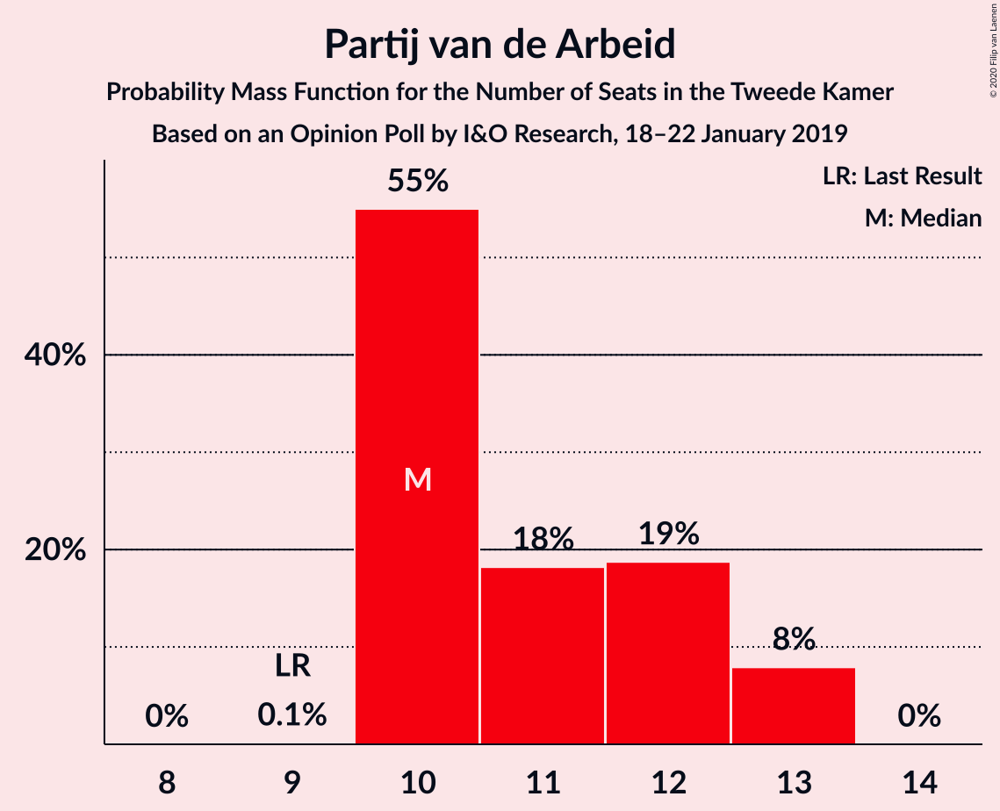

| Number of Seats | Probability | Accumulated | Special Marks |
|:---------------:|:-----------:|:-----------:|:-------------:|
| 9 | 0.1% | 100% | Last Result |
| 10 | 55% | 99.9% | Median |
| 11 | 18% | 45% |  |
| 12 | 19% | 27% |  |
| 13 | 8% | 8% |  |
| 14 | 0% | 0% |  |

### Democraten 66

*For a full overview of the results for this party, see the [Democraten 66](party-democraten66.html) page.*

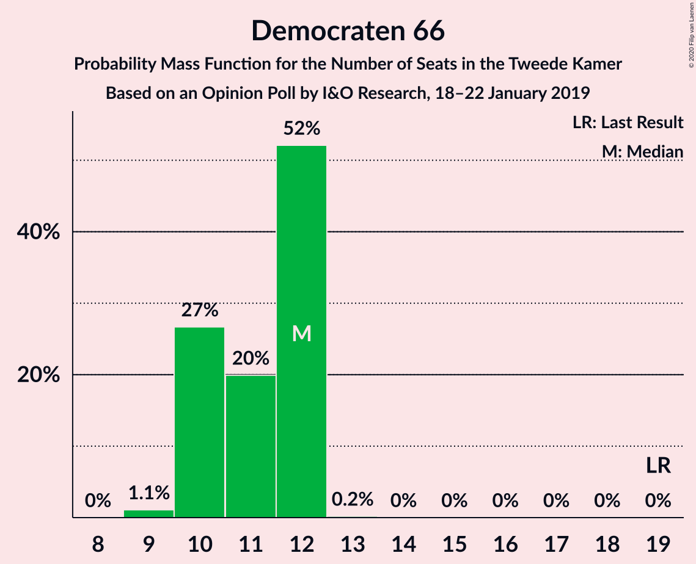

| Number of Seats | Probability | Accumulated | Special Marks |
|:---------------:|:-----------:|:-----------:|:-------------:|
| 9 | 1.1% | 100% |  |
| 10 | 27% | 98.9% |  |
| 11 | 20% | 72% |  |
| 12 | 52% | 52% | Median |
| 13 | 0.2% | 0.2% |  |
| 14 | 0% | 0% |  |
| 15 | 0% | 0% |  |
| 16 | 0% | 0% |  |
| 17 | 0% | 0% |  |
| 18 | 0% | 0% |  |
| 19 | 0% | 0% | Last Result |

### ChristenUnie

*For a full overview of the results for this party, see the [ChristenUnie](party-christenunie.html) page.*

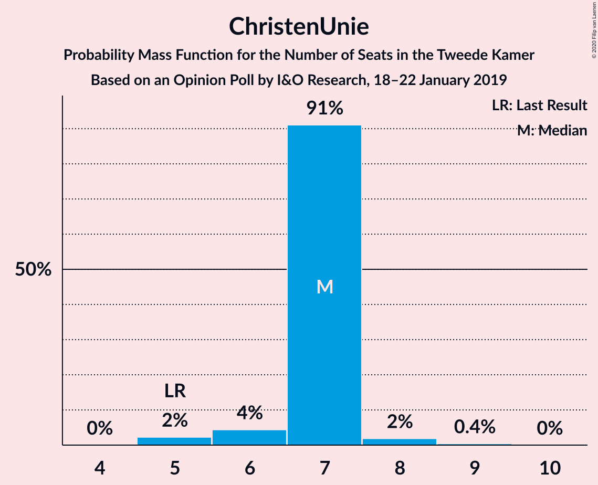

| Number of Seats | Probability | Accumulated | Special Marks |
|:---------------:|:-----------:|:-----------:|:-------------:|
| 5 | 2% | 100% | Last Result |
| 6 | 4% | 98% |  |
| 7 | 91% | 93% | Median |
| 8 | 2% | 2% |  |
| 9 | 0.4% | 0.4% |  |
| 10 | 0% | 0% |  |

### Partij voor de Dieren

*For a full overview of the results for this party, see the [Partij voor de Dieren](party-partijvoordedieren.html) page.*

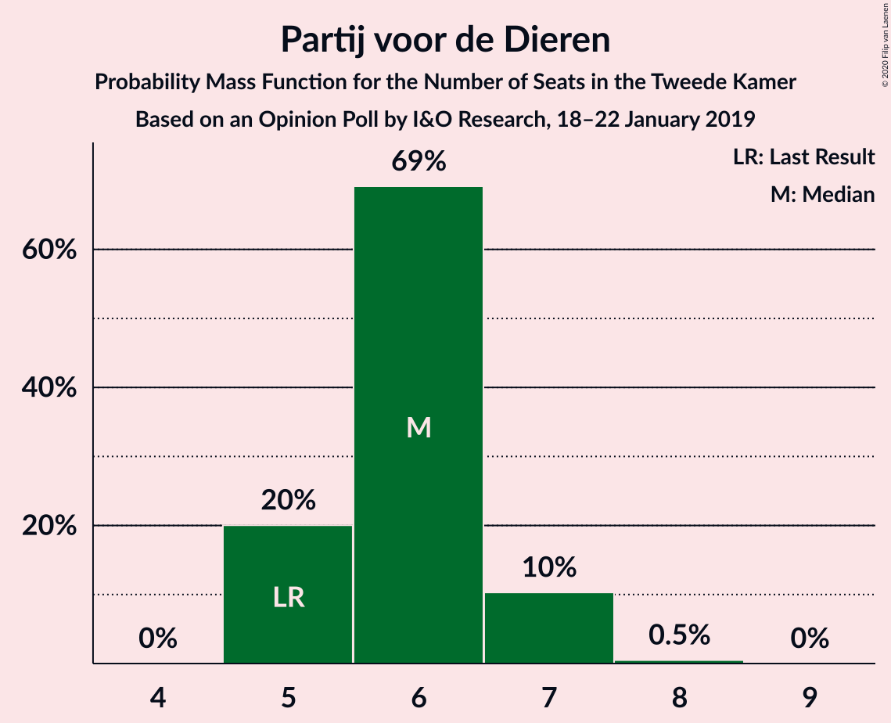

| Number of Seats | Probability | Accumulated | Special Marks |
|:---------------:|:-----------:|:-----------:|:-------------:|
| 5 | 20% | 100% | Last Result |
| 6 | 69% | 80% | Median |
| 7 | 10% | 11% |  |
| 8 | 0.5% | 0.5% |  |
| 9 | 0% | 0% |  |

### 50Plus

*For a full overview of the results for this party, see the [50Plus](party-50plus.html) page.*

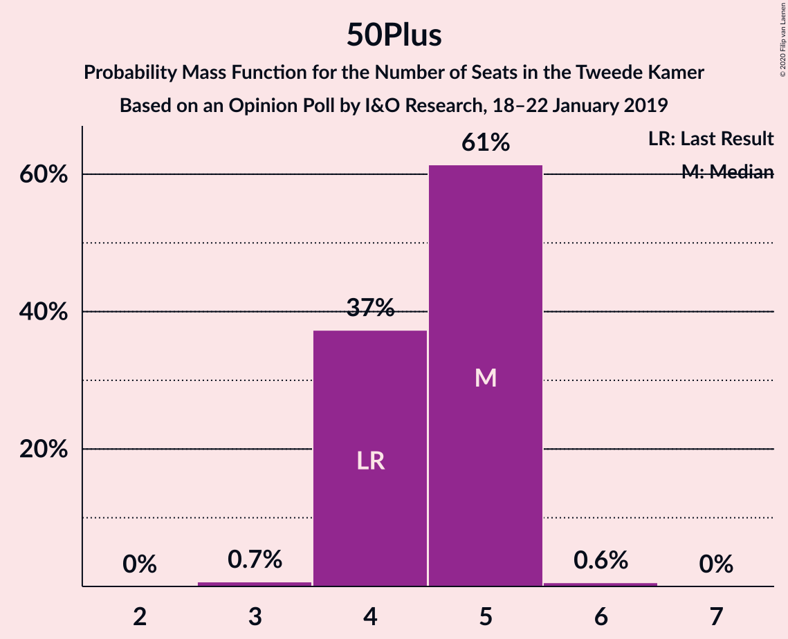

| Number of Seats | Probability | Accumulated | Special Marks |
|:---------------:|:-----------:|:-----------:|:-------------:|
| 3 | 0.7% | 100% |  |
| 4 | 37% | 99.3% | Last Result |
| 5 | 61% | 62% | Median |
| 6 | 0.6% | 0.6% |  |
| 7 | 0% | 0% |  |

### Staatkundig Gereformeerde Partij

*For a full overview of the results for this party, see the [Staatkundig Gereformeerde Partij](party-staatkundiggereformeerdepartij.html) page.*

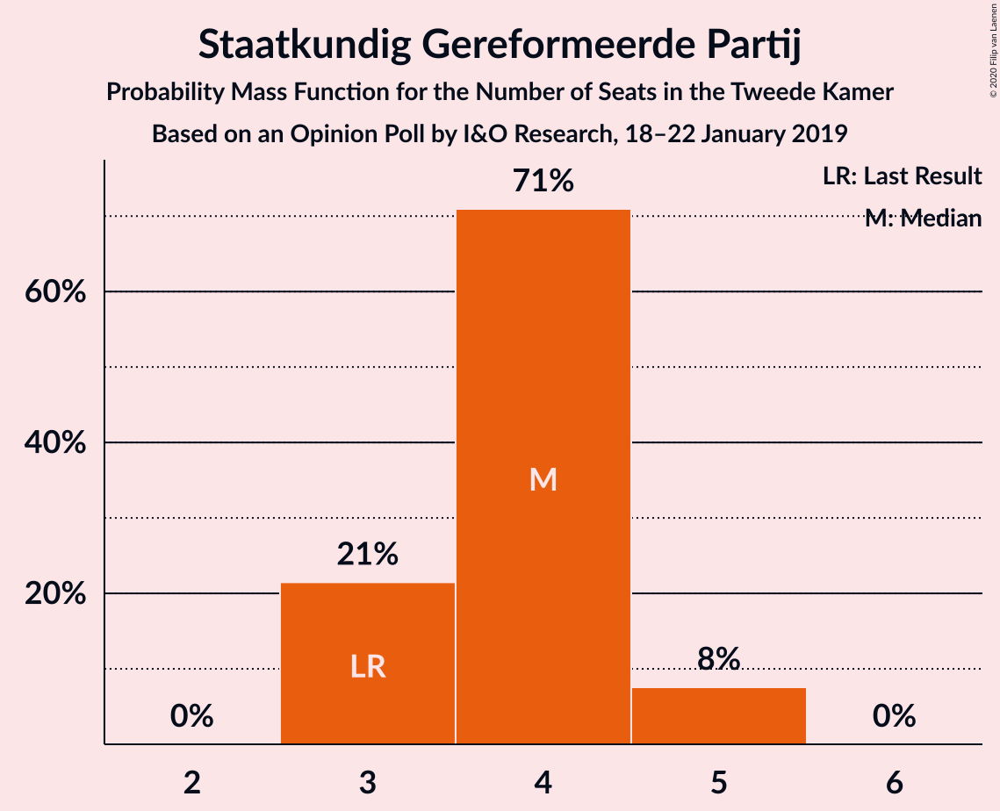

| Number of Seats | Probability | Accumulated | Special Marks |
|:---------------:|:-----------:|:-----------:|:-------------:|
| 3 | 21% | 100% | Last Result |
| 4 | 71% | 79% | Median |
| 5 | 8% | 8% |  |
| 6 | 0% | 0% |  |

### DENK

*For a full overview of the results for this party, see the [DENK](party-denk.html) page.*

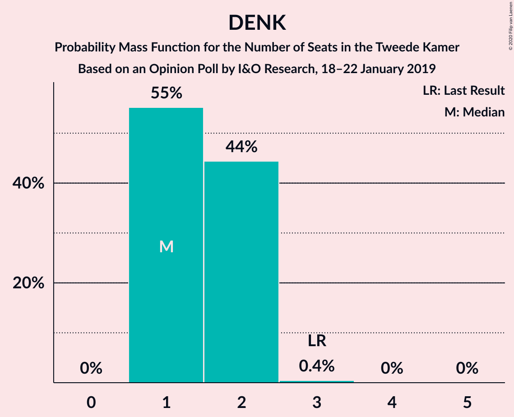

| Number of Seats | Probability | Accumulated | Special Marks |
|:---------------:|:-----------:|:-----------:|:-------------:|
| 1 | 55% | 100% | Median |
| 2 | 44% | 45% |  |
| 3 | 0.4% | 0.4% | Last Result |
| 4 | 0% | 0% |  |

## Coalitions

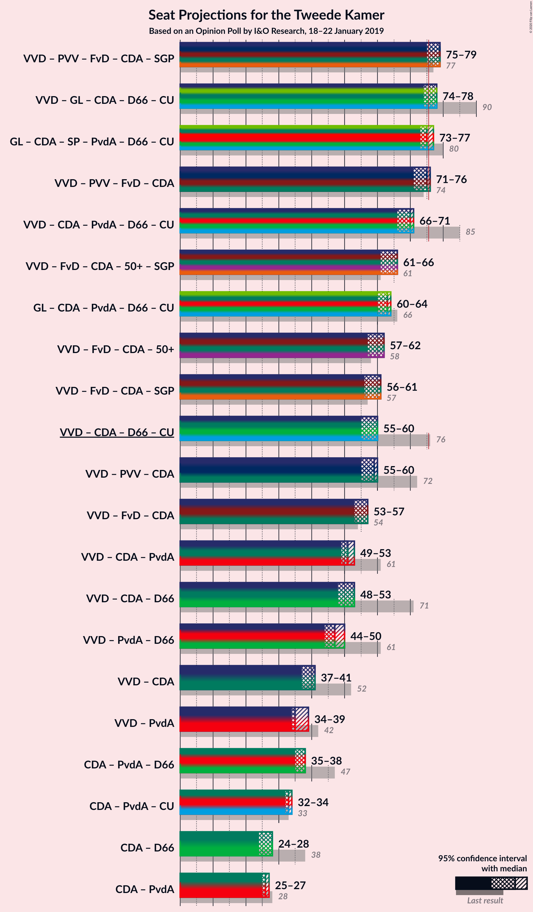

### Confidence Intervals

| Coalition | Last Result | Median | Majority? | 80% Confidence Interval | 90% Confidence Interval | 95% Confidence Interval | 99% Confidence Interval |
|:---------:|:-----------:|:------:|:---------:|:-----------------------:|:-----------------------:|:-----------------------:|:-----------------------:|
| Volkspartij voor Vrijheid en Democratie – Partij voor de Vrijheid – Forum voor Democratie – Christen-Democratisch Appèl – Staatkundig Gereformeerde Partij | 77 | 79 | 94% | 77–79 | 75–79 | 75–79 | 74–80 |
| Volkspartij voor Vrijheid en Democratie – GroenLinks – Christen-Democratisch Appèl – Democraten 66 – ChristenUnie | 90 | 78 | 71% | 75–78 | 74–78 | 74–78 | 73–79 |
| GroenLinks – Christen-Democratisch Appèl – Socialistische Partij – Partij van de Arbeid – Democraten 66 – ChristenUnie | 80 | 75 | 17% | 74–77 | 74–77 | 73–77 | 73–78 |
| Volkspartij voor Vrijheid en Democratie – Partij voor de Vrijheid – Forum voor Democratie – Christen-Democratisch Appèl | 74 | 75 | 10% | 73–75 | 72–76 | 71–76 | 71–76 |
| Volkspartij voor Vrijheid en Democratie – Christen-Democratisch Appèl – Partij van de Arbeid – Democraten 66 – ChristenUnie | 85 | 70 | 0% | 68–70 | 67–71 | 66–71 | 66–72 |
| Volkspartij voor Vrijheid en Democratie – Forum voor Democratie – Christen-Democratisch Appèl – 50Plus – Staatkundig Gereformeerde Partij | 61 | 66 | 0% | 63–66 | 62–66 | 61–66 | 60–66 |
| GroenLinks – Christen-Democratisch Appèl – Partij van de Arbeid – Democraten 66 – ChristenUnie | 66 | 63 | 0% | 60–63 | 60–63 | 60–64 | 60–65 |
| Volkspartij voor Vrijheid en Democratie – Forum voor Democratie – Christen-Democratisch Appèl – 50Plus | 58 | 62 | 0% | 59–62 | 58–62 | 57–62 | 57–62 |
| Volkspartij voor Vrijheid en Democratie – Forum voor Democratie – Christen-Democratisch Appèl – Staatkundig Gereformeerde Partij | 57 | 61 | 0% | 59–61 | 58–61 | 56–61 | 55–61 |
| Volkspartij voor Vrijheid en Democratie – Christen-Democratisch Appèl – Democraten 66 – ChristenUnie | 76 | 60 | 0% | 56–60 | 56–60 | 55–60 | 55–61 |
| Volkspartij voor Vrijheid en Democratie – Partij voor de Vrijheid – Christen-Democratisch Appèl | 72 | 59 | 0% | 57–59 | 57–60 | 55–60 | 54–60 |
| Volkspartij voor Vrijheid en Democratie – Forum voor Democratie – Christen-Democratisch Appèl | 54 | 57 | 0% | 55–57 | 54–57 | 53–57 | 52–58 |
| Volkspartij voor Vrijheid en Democratie – Christen-Democratisch Appèl – Partij van de Arbeid | 61 | 51 | 0% | 50–52 | 49–53 | 49–53 | 49–53 |
| Volkspartij voor Vrijheid en Democratie – Christen-Democratisch Appèl – Democraten 66 | 71 | 53 | 0% | 50–53 | 49–53 | 48–53 | 48–53 |
| Volkspartij voor Vrijheid en Democratie – Partij van de Arbeid – Democraten 66 | 61 | 47 | 0% | 46–48 | 46–50 | 44–50 | 44–50 |
| Volkspartij voor Vrijheid en Democratie – Christen-Democratisch Appèl | 52 | 41 | 0% | 39–41 | 38–41 | 37–41 | 37–42 |
| Volkspartij voor Vrijheid en Democratie – Partij van de Arbeid | 42 | 35 | 0% | 35–38 | 35–39 | 34–39 | 34–39 |
| Christen-Democratisch Appèl – Partij van de Arbeid – Democraten 66 | 47 | 38 | 0% | 35–38 | 35–38 | 35–38 | 35–39 |
| Christen-Democratisch Appèl – Partij van de Arbeid – ChristenUnie | 33 | 33 | 0% | 32–34 | 32–34 | 32–34 | 31–35 |
| Christen-Democratisch Appèl – Democraten 66 | 38 | 28 | 0% | 24–28 | 24–28 | 24–28 | 23–28 |
| Christen-Democratisch Appèl – Partij van de Arbeid | 28 | 26 | 0% | 25–27 | 25–27 | 25–27 | 24–28 |

### Volkspartij voor Vrijheid en Democratie – Partij voor de Vrijheid – Forum voor Democratie – Christen-Democratisch Appèl – Staatkundig Gereformeerde Partij

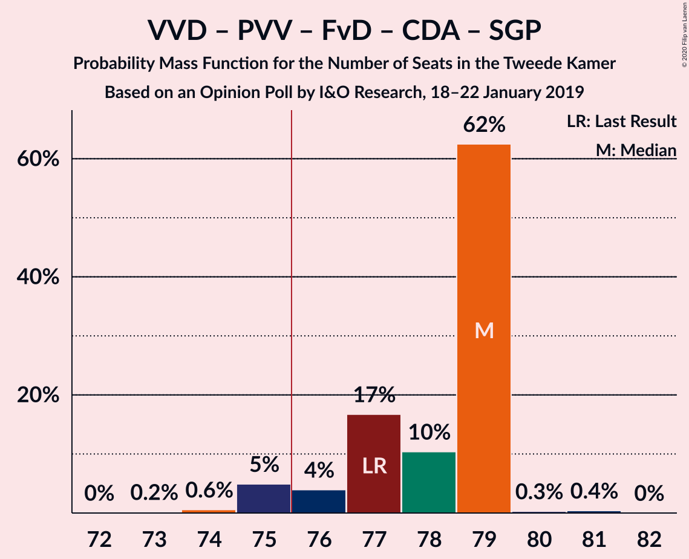

| Number of Seats | Probability | Accumulated | Special Marks |
|:---------------:|:-----------:|:-----------:|:-------------:|
| 73 | 0.2% | 100% |  |
| 74 | 0.6% | 99.8% |  |
| 75 | 5% | 99.2% |  |
| 76 | 4% | 94% | Majority |
| 77 | 17% | 90% | Last Result |
| 78 | 10% | 74% |  |
| 79 | 62% | 63% | Median |
| 80 | 0.3% | 0.7% |  |
| 81 | 0.4% | 0.4% |  |
| 82 | 0% | 0% |  |

### Volkspartij voor Vrijheid en Democratie – GroenLinks – Christen-Democratisch Appèl – Democraten 66 – ChristenUnie

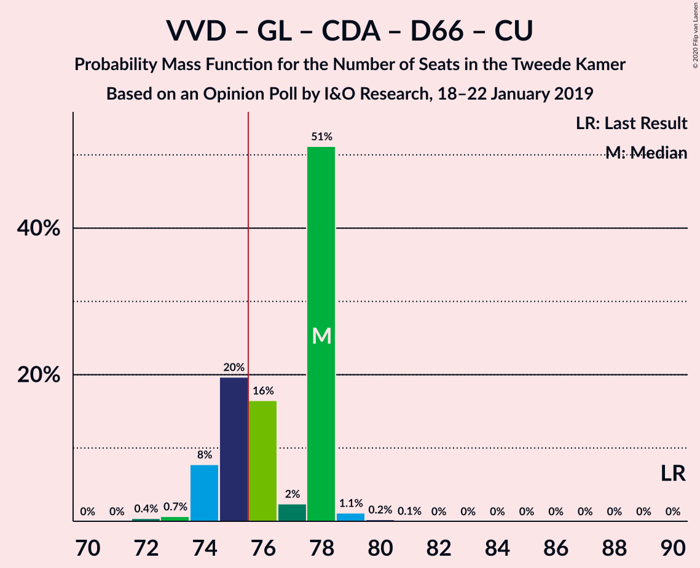

| Number of Seats | Probability | Accumulated | Special Marks |
|:---------------:|:-----------:|:-----------:|:-------------:|
| 72 | 0.4% | 100% |  |
| 73 | 0.7% | 99.6% |  |
| 74 | 8% | 98.9% |  |
| 75 | 20% | 91% |  |
| 76 | 16% | 71% | Majority |
| 77 | 2% | 55% |  |
| 78 | 51% | 53% | Median |
| 79 | 1.1% | 1.5% |  |
| 80 | 0.2% | 0.3% |  |
| 81 | 0.1% | 0.1% |  |
| 82 | 0% | 0% |  |
| 83 | 0% | 0% |  |
| 84 | 0% | 0% |  |
| 85 | 0% | 0% |  |
| 86 | 0% | 0% |  |
| 87 | 0% | 0% |  |
| 88 | 0% | 0% |  |
| 89 | 0% | 0% |  |
| 90 | 0% | 0% | Last Result |

### GroenLinks – Christen-Democratisch Appèl – Socialistische Partij – Partij van de Arbeid – Democraten 66 – ChristenUnie

| Number of Seats | Probability | Accumulated | Special Marks |
|:---------------:|:-----------:|:-----------:|:-------------:|
| 71 | 0.2% | 100% |  |
| 72 | 0.2% | 99.8% |  |
| 73 | 3% | 99.6% |  |
| 74 | 21% | 96% |  |
| 75 | 58% | 76% | Median |
| 76 | 3% | 17% | Majority |
| 77 | 14% | 14% |  |
| 78 | 0.5% | 0.7% |  |
| 79 | 0.2% | 0.2% |  |
| 80 | 0% | 0% | Last Result |

### Volkspartij voor Vrijheid en Democratie – Partij voor de Vrijheid – Forum voor Democratie – Christen-Democratisch Appèl

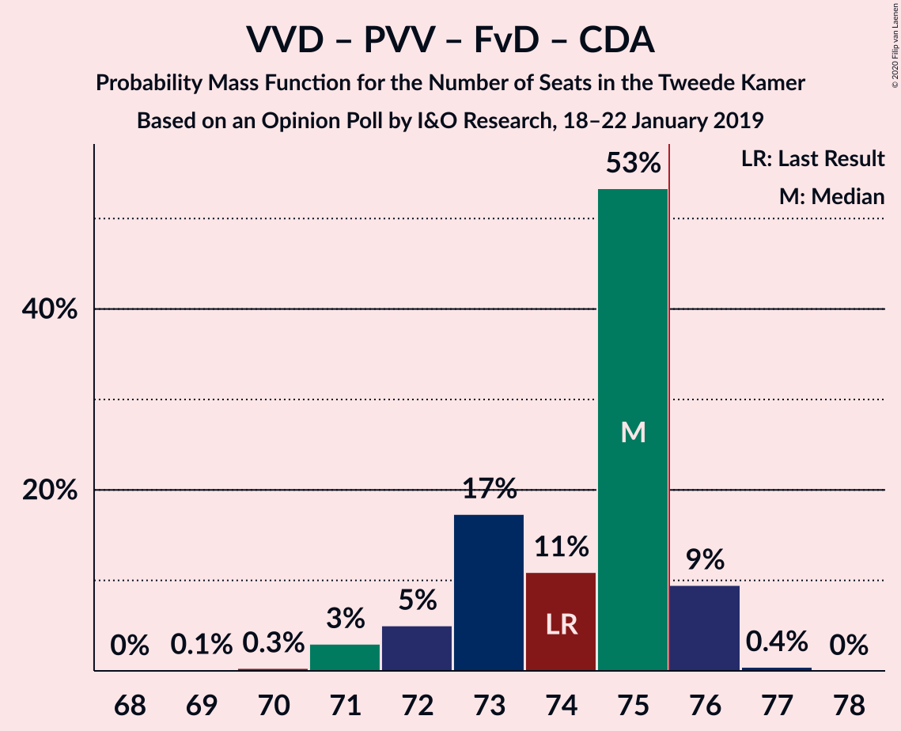

| Number of Seats | Probability | Accumulated | Special Marks |
|:---------------:|:-----------:|:-----------:|:-------------:|
| 69 | 0.1% | 100% |  |
| 70 | 0.3% | 99.9% |  |
| 71 | 3% | 99.6% |  |
| 72 | 5% | 97% |  |
| 73 | 17% | 92% |  |
| 74 | 11% | 74% | Last Result |
| 75 | 53% | 63% | Median |
| 76 | 9% | 10% | Majority |
| 77 | 0.4% | 0.5% |  |
| 78 | 0% | 0% |  |

### Volkspartij voor Vrijheid en Democratie – Christen-Democratisch Appèl – Partij van de Arbeid – Democraten 66 – ChristenUnie

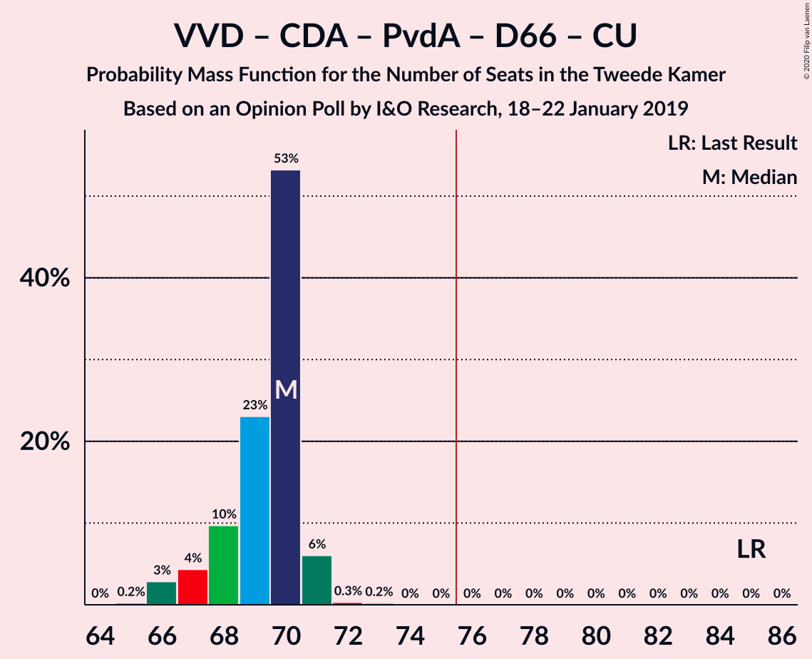

| Number of Seats | Probability | Accumulated | Special Marks |
|:---------------:|:-----------:|:-----------:|:-------------:|
| 65 | 0.2% | 100% |  |
| 66 | 3% | 99.8% |  |
| 67 | 4% | 97% |  |
| 68 | 10% | 93% |  |
| 69 | 23% | 83% |  |
| 70 | 53% | 60% | Median |
| 71 | 6% | 7% |  |
| 72 | 0.3% | 0.5% |  |
| 73 | 0.2% | 0.2% |  |
| 74 | 0% | 0% |  |
| 75 | 0% | 0% |  |
| 76 | 0% | 0% | Majority |
| 77 | 0% | 0% |  |
| 78 | 0% | 0% |  |
| 79 | 0% | 0% |  |
| 80 | 0% | 0% |  |
| 81 | 0% | 0% |  |
| 82 | 0% | 0% |  |
| 83 | 0% | 0% |  |
| 84 | 0% | 0% |  |
| 85 | 0% | 0% | Last Result |

### Volkspartij voor Vrijheid en Democratie – Forum voor Democratie – Christen-Democratisch Appèl – 50Plus – Staatkundig Gereformeerde Partij

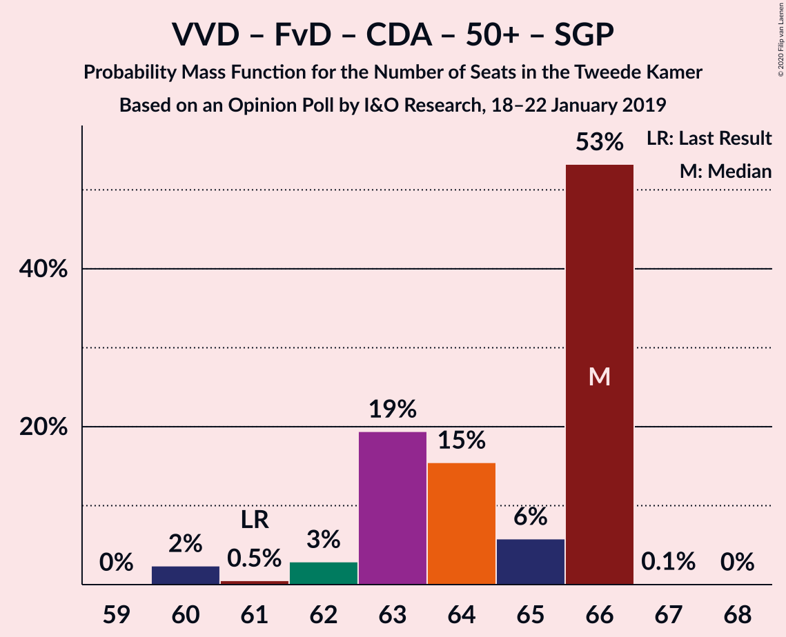

| Number of Seats | Probability | Accumulated | Special Marks |
|:---------------:|:-----------:|:-----------:|:-------------:|
| 60 | 2% | 100% |  |
| 61 | 0.5% | 98% | Last Result |
| 62 | 3% | 97% |  |
| 63 | 19% | 94% |  |
| 64 | 15% | 75% |  |
| 65 | 6% | 59% |  |
| 66 | 53% | 53% | Median |
| 67 | 0.1% | 0.2% |  |
| 68 | 0% | 0% |  |

### GroenLinks – Christen-Democratisch Appèl – Partij van de Arbeid – Democraten 66 – ChristenUnie

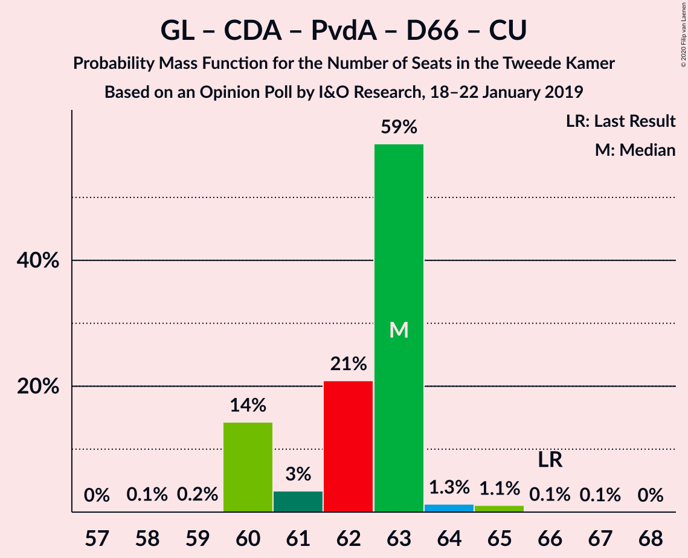

| Number of Seats | Probability | Accumulated | Special Marks |
|:---------------:|:-----------:|:-----------:|:-------------:|
| 58 | 0.1% | 100% |  |
| 59 | 0.2% | 99.8% |  |
| 60 | 14% | 99.7% |  |
| 61 | 3% | 85% |  |
| 62 | 21% | 82% |  |
| 63 | 59% | 61% | Median |
| 64 | 1.3% | 3% |  |
| 65 | 1.1% | 1.3% |  |
| 66 | 0.1% | 0.2% | Last Result |
| 67 | 0.1% | 0.1% |  |
| 68 | 0% | 0% |  |

### Volkspartij voor Vrijheid en Democratie – Forum voor Democratie – Christen-Democratisch Appèl – 50Plus

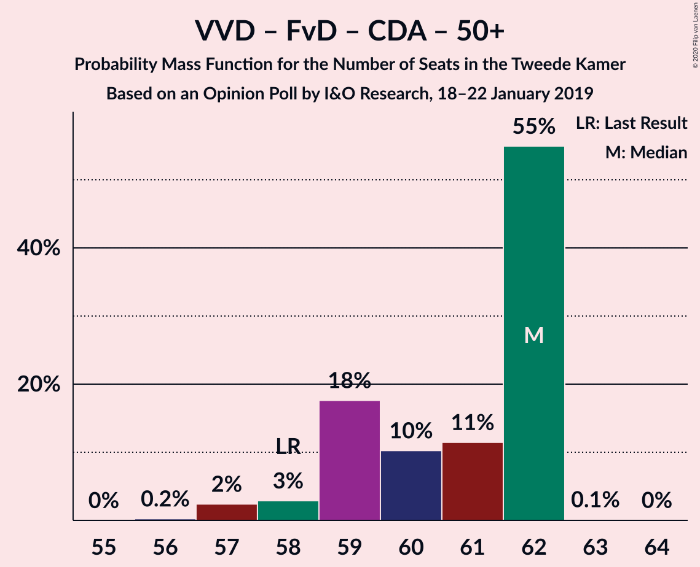

| Number of Seats | Probability | Accumulated | Special Marks |
|:---------------:|:-----------:|:-----------:|:-------------:|
| 56 | 0.2% | 100% |  |
| 57 | 2% | 99.7% |  |
| 58 | 3% | 97% | Last Result |
| 59 | 18% | 94% |  |
| 60 | 10% | 77% |  |
| 61 | 11% | 67% |  |
| 62 | 55% | 55% | Median |
| 63 | 0.1% | 0.2% |  |
| 64 | 0% | 0% |  |

### Volkspartij voor Vrijheid en Democratie – Forum voor Democratie – Christen-Democratisch Appèl – Staatkundig Gereformeerde Partij

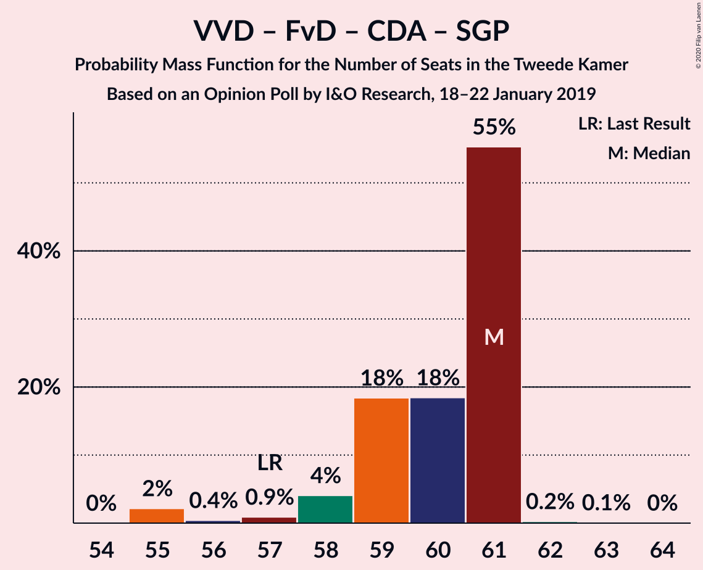

| Number of Seats | Probability | Accumulated | Special Marks |
|:---------------:|:-----------:|:-----------:|:-------------:|
| 55 | 2% | 100% |  |
| 56 | 0.4% | 98% |  |
| 57 | 0.9% | 97% | Last Result |
| 58 | 4% | 97% |  |
| 59 | 18% | 92% |  |
| 60 | 18% | 74% |  |
| 61 | 55% | 56% | Median |
| 62 | 0.2% | 0.4% |  |
| 63 | 0.1% | 0.1% |  |
| 64 | 0% | 0% |  |

### Volkspartij voor Vrijheid en Democratie – Christen-Democratisch Appèl – Democraten 66 – ChristenUnie

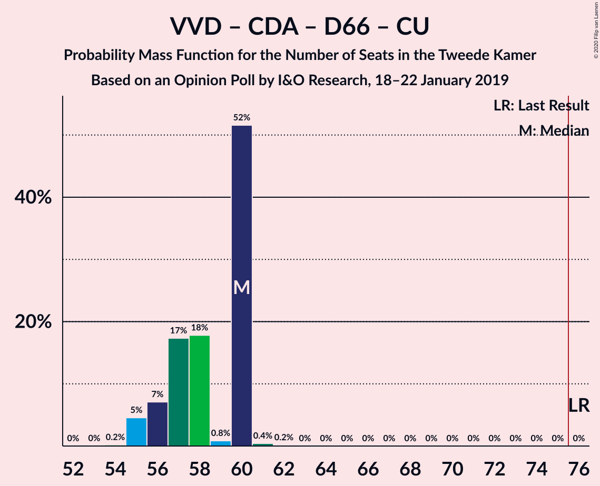

| Number of Seats | Probability | Accumulated | Special Marks |
|:---------------:|:-----------:|:-----------:|:-------------:|
| 54 | 0.2% | 100% |  |
| 55 | 5% | 99.8% |  |
| 56 | 7% | 95% |  |
| 57 | 17% | 88% |  |
| 58 | 18% | 71% |  |
| 59 | 0.8% | 53% |  |
| 60 | 52% | 52% | Median |
| 61 | 0.4% | 0.6% |  |
| 62 | 0.2% | 0.2% |  |
| 63 | 0% | 0% |  |
| 64 | 0% | 0% |  |
| 65 | 0% | 0% |  |
| 66 | 0% | 0% |  |
| 67 | 0% | 0% |  |
| 68 | 0% | 0% |  |
| 69 | 0% | 0% |  |
| 70 | 0% | 0% |  |
| 71 | 0% | 0% |  |
| 72 | 0% | 0% |  |
| 73 | 0% | 0% |  |
| 74 | 0% | 0% |  |
| 75 | 0% | 0% |  |
| 76 | 0% | 0% | Last Result, Majority |

### Volkspartij voor Vrijheid en Democratie – Partij voor de Vrijheid – Christen-Democratisch Appèl

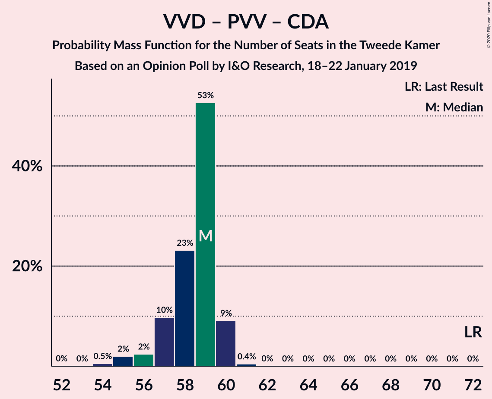

| Number of Seats | Probability | Accumulated | Special Marks |
|:---------------:|:-----------:|:-----------:|:-------------:|
| 53 | 0% | 100% |  |
| 54 | 0.5% | 99.9% |  |
| 55 | 2% | 99.4% |  |
| 56 | 2% | 97% |  |
| 57 | 10% | 95% |  |
| 58 | 23% | 85% |  |
| 59 | 53% | 62% | Median |
| 60 | 9% | 10% |  |
| 61 | 0.4% | 0.5% |  |
| 62 | 0% | 0% |  |
| 63 | 0% | 0% |  |
| 64 | 0% | 0% |  |
| 65 | 0% | 0% |  |
| 66 | 0% | 0% |  |
| 67 | 0% | 0% |  |
| 68 | 0% | 0% |  |
| 69 | 0% | 0% |  |
| 70 | 0% | 0% |  |
| 71 | 0% | 0% |  |
| 72 | 0% | 0% | Last Result |

### Volkspartij voor Vrijheid en Democratie – Forum voor Democratie – Christen-Democratisch Appèl

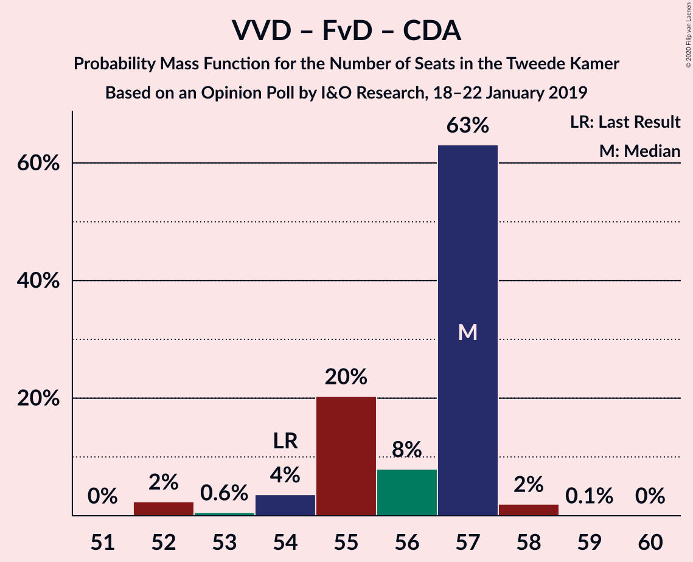

| Number of Seats | Probability | Accumulated | Special Marks |
|:---------------:|:-----------:|:-----------:|:-------------:|
| 52 | 2% | 100% |  |
| 53 | 0.6% | 98% |  |
| 54 | 4% | 97% | Last Result |
| 55 | 20% | 93% |  |
| 56 | 8% | 73% |  |
| 57 | 63% | 65% | Median |
| 58 | 2% | 2% |  |
| 59 | 0.1% | 0.1% |  |
| 60 | 0% | 0% |  |

### Volkspartij voor Vrijheid en Democratie – Christen-Democratisch Appèl – Partij van de Arbeid

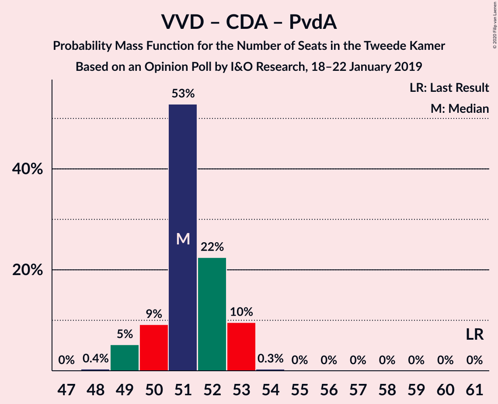

| Number of Seats | Probability | Accumulated | Special Marks |
|:---------------:|:-----------:|:-----------:|:-------------:|
| 47 | 0% | 100% |  |
| 48 | 0.4% | 99.9% |  |
| 49 | 5% | 99.6% |  |
| 50 | 9% | 94% |  |
| 51 | 53% | 85% | Median |
| 52 | 22% | 32% |  |
| 53 | 10% | 10% |  |
| 54 | 0.3% | 0.4% |  |
| 55 | 0% | 0% |  |
| 56 | 0% | 0% |  |
| 57 | 0% | 0% |  |
| 58 | 0% | 0% |  |
| 59 | 0% | 0% |  |
| 60 | 0% | 0% |  |
| 61 | 0% | 0% | Last Result |

### Volkspartij voor Vrijheid en Democratie – Christen-Democratisch Appèl – Democraten 66

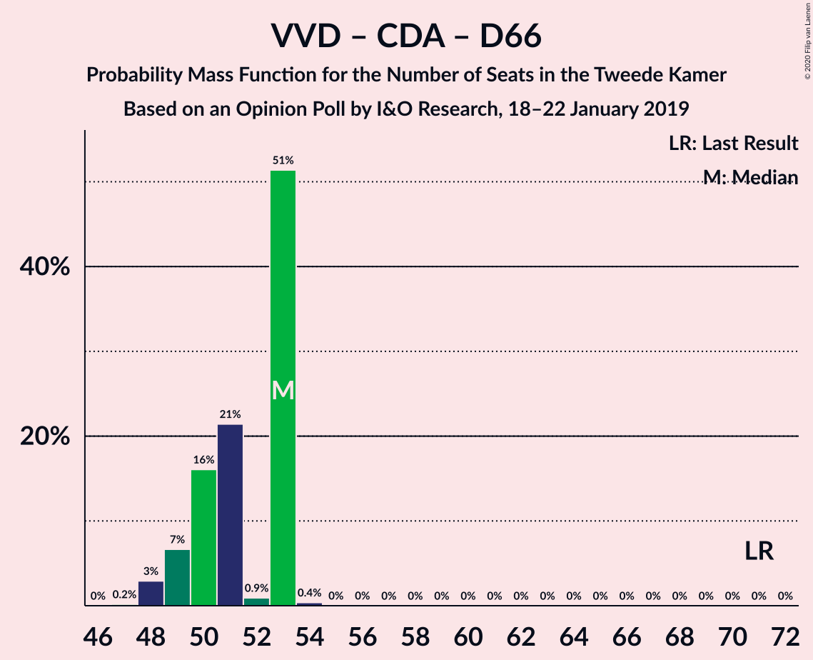

| Number of Seats | Probability | Accumulated | Special Marks |
|:---------------:|:-----------:|:-----------:|:-------------:|
| 47 | 0.2% | 100% |  |
| 48 | 3% | 99.8% |  |
| 49 | 7% | 97% |  |
| 50 | 16% | 90% |  |
| 51 | 21% | 74% |  |
| 52 | 0.9% | 53% |  |
| 53 | 51% | 52% | Median |
| 54 | 0.4% | 0.4% |  |
| 55 | 0% | 0% |  |
| 56 | 0% | 0% |  |
| 57 | 0% | 0% |  |
| 58 | 0% | 0% |  |
| 59 | 0% | 0% |  |
| 60 | 0% | 0% |  |
| 61 | 0% | 0% |  |
| 62 | 0% | 0% |  |
| 63 | 0% | 0% |  |
| 64 | 0% | 0% |  |
| 65 | 0% | 0% |  |
| 66 | 0% | 0% |  |
| 67 | 0% | 0% |  |
| 68 | 0% | 0% |  |
| 69 | 0% | 0% |  |
| 70 | 0% | 0% |  |
| 71 | 0% | 0% | Last Result |

### Volkspartij voor Vrijheid en Democratie – Partij van de Arbeid – Democraten 66

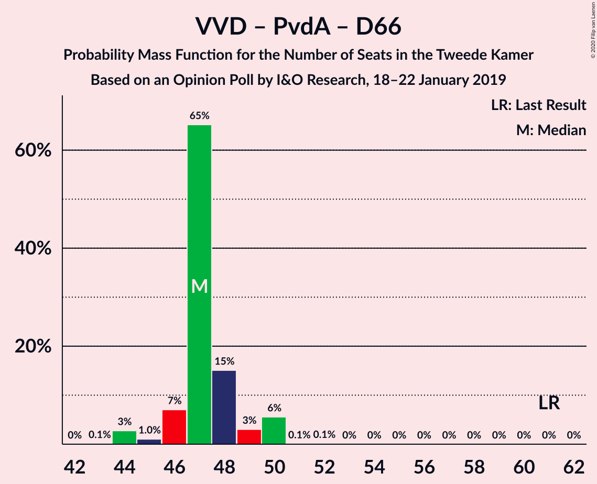

| Number of Seats | Probability | Accumulated | Special Marks |
|:---------------:|:-----------:|:-----------:|:-------------:|
| 43 | 0.1% | 100% |  |
| 44 | 3% | 99.9% |  |
| 45 | 1.0% | 97% |  |
| 46 | 7% | 96% |  |
| 47 | 65% | 89% | Median |
| 48 | 15% | 24% |  |
| 49 | 3% | 9% |  |
| 50 | 6% | 6% |  |
| 51 | 0.1% | 0.2% |  |
| 52 | 0.1% | 0.1% |  |
| 53 | 0% | 0% |  |
| 54 | 0% | 0% |  |
| 55 | 0% | 0% |  |
| 56 | 0% | 0% |  |
| 57 | 0% | 0% |  |
| 58 | 0% | 0% |  |
| 59 | 0% | 0% |  |
| 60 | 0% | 0% |  |
| 61 | 0% | 0% | Last Result |

### Volkspartij voor Vrijheid en Democratie – Christen-Democratisch Appèl

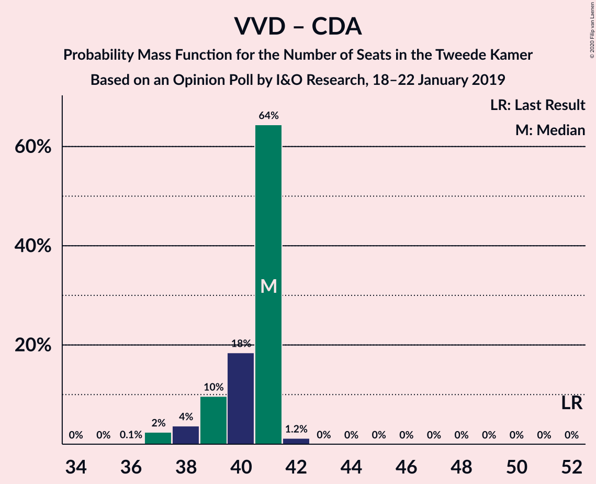

| Number of Seats | Probability | Accumulated | Special Marks |
|:---------------:|:-----------:|:-----------:|:-------------:|
| 36 | 0.1% | 100% |  |
| 37 | 2% | 99.9% |  |
| 38 | 4% | 97% |  |
| 39 | 10% | 94% |  |
| 40 | 18% | 84% |  |
| 41 | 64% | 66% | Median |
| 42 | 1.2% | 1.3% |  |
| 43 | 0% | 0.1% |  |
| 44 | 0% | 0% |  |
| 45 | 0% | 0% |  |
| 46 | 0% | 0% |  |
| 47 | 0% | 0% |  |
| 48 | 0% | 0% |  |
| 49 | 0% | 0% |  |
| 50 | 0% | 0% |  |
| 51 | 0% | 0% |  |
| 52 | 0% | 0% | Last Result |

### Volkspartij voor Vrijheid en Democratie – Partij van de Arbeid

| Number of Seats | Probability | Accumulated | Special Marks |
|:---------------:|:-----------:|:-----------:|:-------------:|
| 33 | 0.2% | 100% |  |
| 34 | 3% | 99.8% |  |
| 35 | 57% | 97% | Median |
| 36 | 6% | 40% |  |
| 37 | 12% | 33% |  |
| 38 | 16% | 22% |  |
| 39 | 5% | 6% |  |
| 40 | 0.3% | 0.3% |  |
| 41 | 0% | 0% |  |
| 42 | 0% | 0% | Last Result |

### Christen-Democratisch Appèl – Partij van de Arbeid – Democraten 66

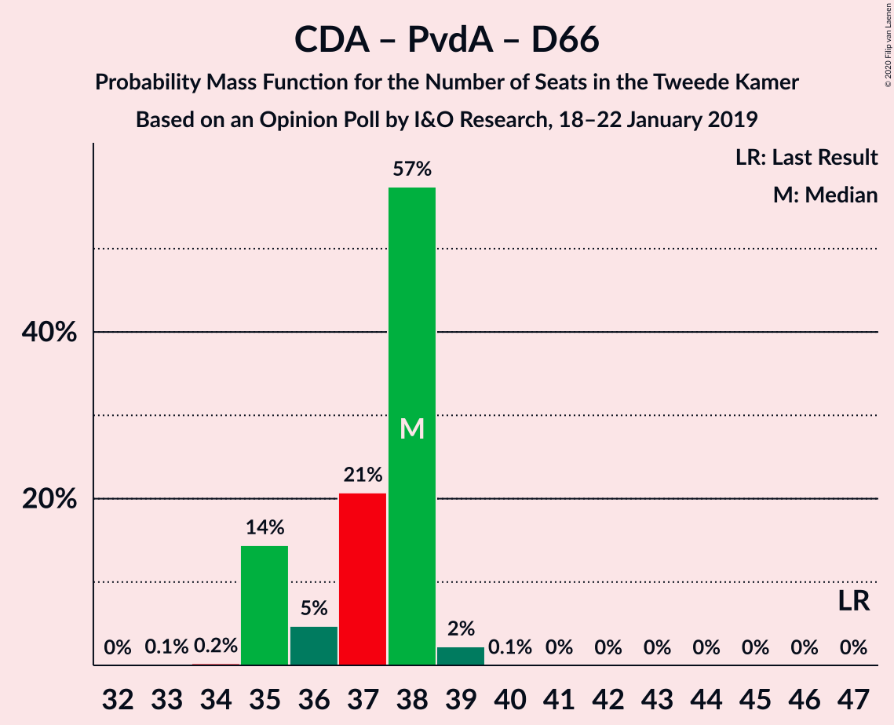

| Number of Seats | Probability | Accumulated | Special Marks |
|:---------------:|:-----------:|:-----------:|:-------------:|
| 33 | 0.1% | 100% |  |
| 34 | 0.2% | 99.9% |  |
| 35 | 14% | 99.6% |  |
| 36 | 5% | 85% |  |
| 37 | 21% | 81% |  |
| 38 | 57% | 60% | Median |
| 39 | 2% | 2% |  |
| 40 | 0.1% | 0.1% |  |
| 41 | 0% | 0% |  |
| 42 | 0% | 0% |  |
| 43 | 0% | 0% |  |
| 44 | 0% | 0% |  |
| 45 | 0% | 0% |  |
| 46 | 0% | 0% |  |
| 47 | 0% | 0% | Last Result |

### Christen-Democratisch Appèl – Partij van de Arbeid – ChristenUnie

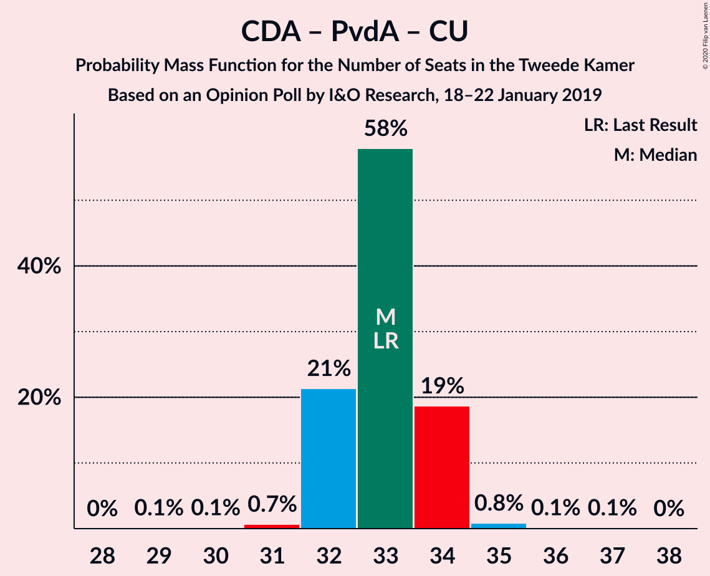

| Number of Seats | Probability | Accumulated | Special Marks |
|:---------------:|:-----------:|:-----------:|:-------------:|
| 29 | 0.1% | 100% |  |
| 30 | 0.1% | 99.9% |  |
| 31 | 0.7% | 99.7% |  |
| 32 | 21% | 99.1% |  |
| 33 | 58% | 78% | Last Result, Median |
| 34 | 19% | 20% |  |
| 35 | 0.8% | 1.1% |  |
| 36 | 0.1% | 0.3% |  |
| 37 | 0.1% | 0.1% |  |
| 38 | 0% | 0% |  |

### Christen-Democratisch Appèl – Democraten 66

| Number of Seats | Probability | Accumulated | Special Marks |
|:---------------:|:-----------:|:-----------:|:-------------:|
| 23 | 1.0% | 100% |  |
| 24 | 14% | 99.0% |  |
| 25 | 24% | 85% |  |
| 26 | 8% | 61% |  |
| 27 | 2% | 53% |  |
| 28 | 51% | 51% | Median |
| 29 | 0.1% | 0.1% |  |
| 30 | 0% | 0% |  |
| 31 | 0% | 0% |  |
| 32 | 0% | 0% |  |
| 33 | 0% | 0% |  |
| 34 | 0% | 0% |  |
| 35 | 0% | 0% |  |
| 36 | 0% | 0% |  |
| 37 | 0% | 0% |  |
| 38 | 0% | 0% | Last Result |

### Christen-Democratisch Appèl – Partij van de Arbeid

| Number of Seats | Probability | Accumulated | Special Marks |
|:---------------:|:-----------:|:-----------:|:-------------:|
| 23 | 0.2% | 100% |  |
| 24 | 0.9% | 99.8% |  |
| 25 | 17% | 99.0% |  |
| 26 | 60% | 82% | Median |
| 27 | 19% | 21% |  |
| 28 | 2% | 2% | Last Result |
| 29 | 0.2% | 0.2% |  |
| 30 | 0% | 0% |  |

## Technical Information

### Opinion Poll

+ **Polling firm:** I&O Research
+ **Commissioner(s):** —
+ **Fieldwork period:** 18–22 January 2019

### Calculations

+ **Sample size:** 3734
+ **Simulations done:** 1,048,576
+ **Error estimate:** 1.33%

