# Opinion Poll by Ipsos, 21 March 2019

<a href="#voting-intentions">Voting Intentions</a> | <a href="#seats">Seats</a> | <a href="#coalitions">Coalitions</a> | <a href="#technical-information">Technical Information</a>

## Voting Intentions

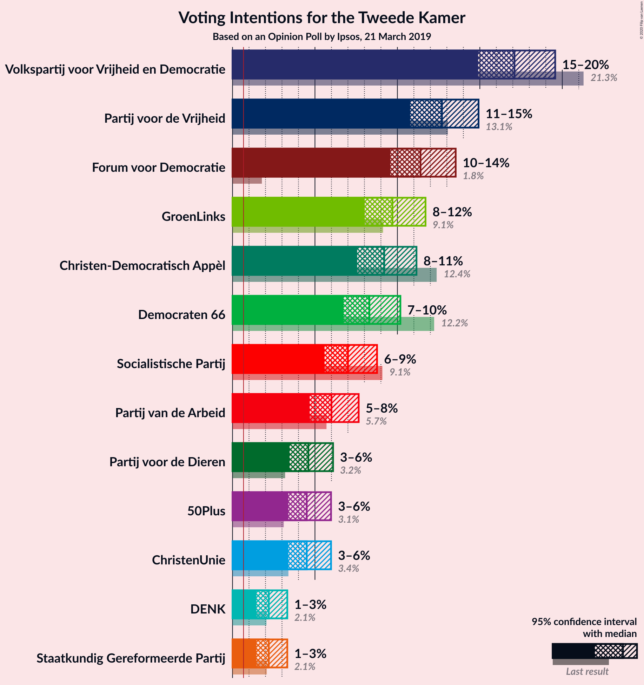

### Confidence Intervals

| Party | Last Result | Poll Result | 80% Confidence Interval | 90% Confidence Interval | 95% Confidence Interval | 99% Confidence Interval |
|:-----:|:-----------:|:-----------:|:-----------------------:|:-----------------------:|:-----------------------:|:-----------------------:|
| Volkspartij voor Vrijheid en Democratie | 21.3% | 17.1% | 15.7–18.7% |15.2–19.2% |14.9–19.6% |14.2–20.4% |
| Partij voor de Vrijheid | 13.1% | 12.7% | 11.4–14.1% |11.1–14.6% |10.8–14.9% |10.2–15.6% |
| Forum voor Democratie | 1.8% | 11.4% | 10.2–12.8% |9.9–13.2% |9.6–13.5% |9.0–14.2% |
| GroenLinks | 9.1% | 9.7% | 8.6–11.0% |8.3–11.4% |8.0–11.7% |7.5–12.3% |
| Christen-Democratisch Appèl | 12.4% | 9.2% | 8.1–10.5% |7.8–10.8% |7.6–11.2% |7.1–11.8% |
| Democraten 66 | 12.2% | 8.3% | 7.3–9.5% |7.0–9.9% |6.7–10.2% |6.3–10.8% |
| Socialistische Partij | 9.1% | 7.0% | 6.1–8.2% |5.8–8.5% |5.6–8.8% |5.2–9.3% |
| Partij van de Arbeid | 5.7% | 6.0% | 5.1–7.1% |4.9–7.4% |4.7–7.7% |4.3–8.2% |
| Partij voor de Dieren | 3.2% | 4.6% | 3.9–5.6% |3.6–5.9% |3.5–6.1% |3.1–6.6% |
| ChristenUnie | 3.4% | 4.5% | 3.8–5.5% |3.6–5.7% |3.4–6.0% |3.0–6.5% |
| 50Plus | 3.1% | 4.5% | 3.8–5.5% |3.6–5.7% |3.4–6.0% |3.0–6.5% |
| Staatkundig Gereformeerde Partij | 2.1% | 2.2% | 1.7–2.9% |1.6–3.1% |1.4–3.3% |1.2–3.7% |
| DENK | 2.1% | 2.2% | 1.7–2.9% |1.6–3.1% |1.4–3.3% |1.2–3.7% |

*Note:* The poll result column reflects the actual value used in the calculations. Published results may vary slightly, and in addition be rounded to fewer digits.

## Seats

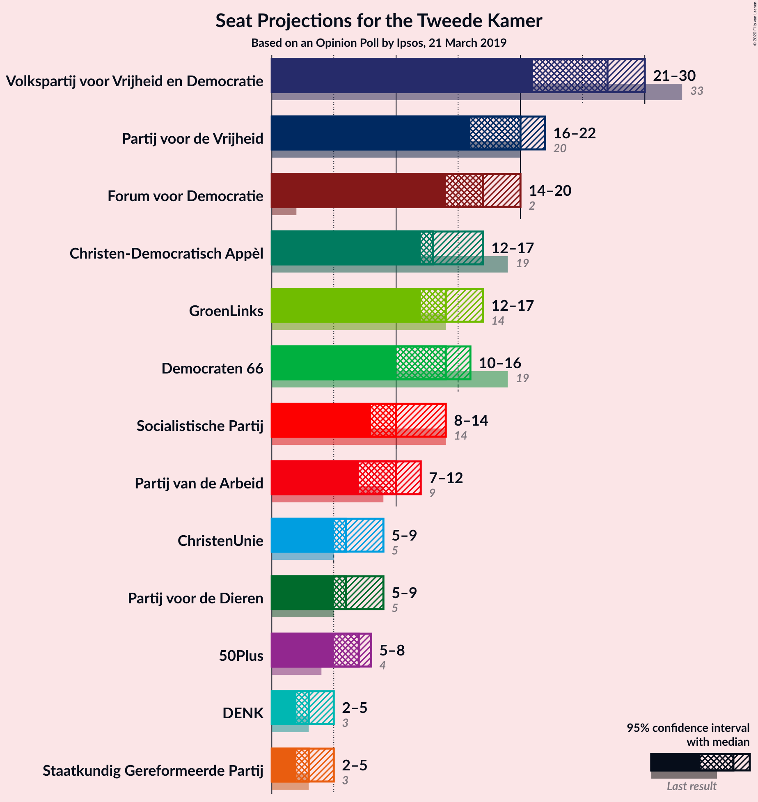

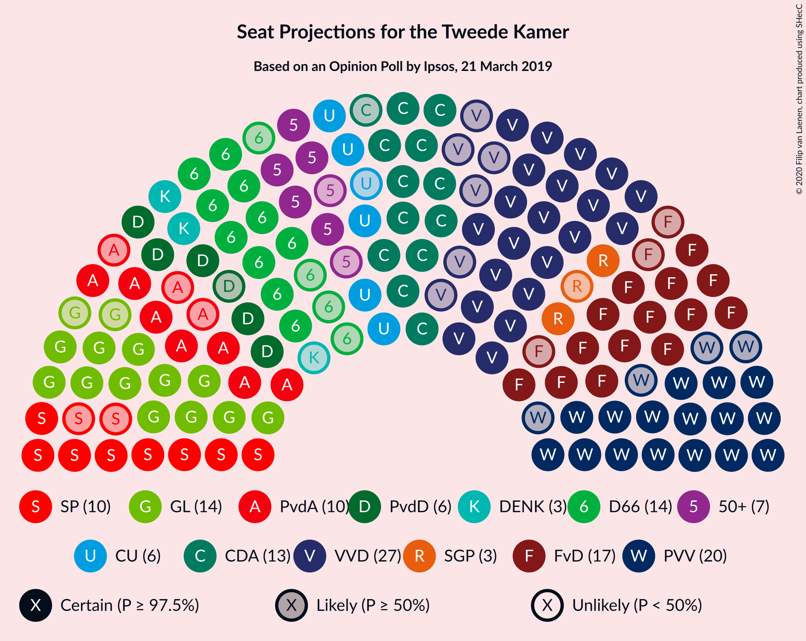

### Confidence Intervals

| Party | Last Result | Median | 80% Confidence Interval | 90% Confidence Interval | 95% Confidence Interval | 99% Confidence Interval |
|:-----:|:-----------:|:------:|:-----------------------:|:-----------------------:|:-----------------------:|:-----------------------:|
| <a href="#volkspartij-voor-vrijheid-en-democratie">Volkspartij voor Vrijheid en Democratie</a> | 33 | 27 | 24–29 |22–29 |21–30 |21–31 |
| <a href="#partij-voor-de-vrijheid">Partij voor de Vrijheid</a> | 20 | 20 | 17–21 |17–22 |16–22 |16–23 |
| <a href="#forum-voor-democratie">Forum voor Democratie</a> | 2 | 17 | 15–19 |15–20 |14–20 |14–21 |
| <a href="#groenlinks">GroenLinks</a> | 14 | 14 | 12–16 |12–17 |12–17 |11–19 |
| <a href="#christen-democratisch-appèl">Christen-Democratisch Appèl</a> | 19 | 13 | 12–16 |12–17 |12–17 |10–18 |
| <a href="#democraten-66">Democraten 66</a> | 19 | 14 | 11–15 |10–15 |10–16 |8–17 |
| <a href="#socialistische-partij">Socialistische Partij</a> | 14 | 10 | 9–12 |8–13 |8–14 |8–14 |
| <a href="#partij-van-de-arbeid">Partij van de Arbeid</a> | 9 | 10 | 7–11 |7–12 |7–12 |6–12 |
| <a href="#partij-voor-de-dieren">Partij voor de Dieren</a> | 5 | 6 | 5–9 |5–9 |5–9 |4–10 |
| <a href="#christenunie">ChristenUnie</a> | 5 | 6 | 5–8 |5–9 |5–9 |4–9 |
| <a href="#50plus">50Plus</a> | 4 | 7 | 5–7 |5–8 |5–8 |4–9 |
| <a href="#staatkundig-gereformeerde-partij">Staatkundig Gereformeerde Partij</a> | 3 | 3 | 2–5 |2–5 |2–5 |1–6 |
| <a href="#denk">DENK</a> | 3 | 3 | 2–4 |2–4 |2–5 |2–5 |

### Volkspartij voor Vrijheid en Democratie

*For a full overview of the results for this party, see the [Volkspartij voor Vrijheid en Democratie](party-volkspartijvoorvrijheidendemocratie.html) page.*

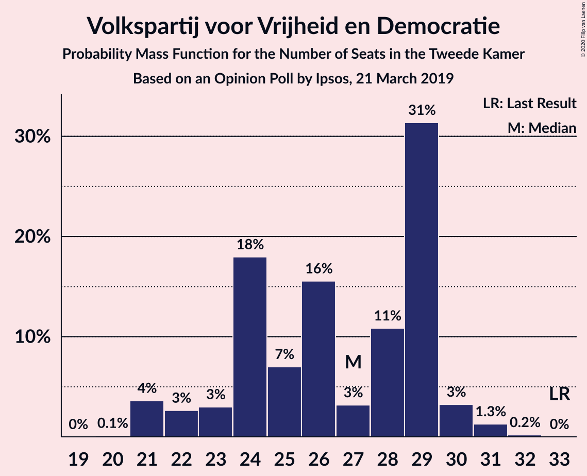

| Number of Seats | Probability | Accumulated | Special Marks |
|:---------------:|:-----------:|:-----------:|:-------------:|
| 20 | 0.1% | 100% |  |
| 21 | 4% | 99.9% |  |
| 22 | 3% | 96% |  |
| 23 | 3% | 94% |  |
| 24 | 18% | 91% |  |
| 25 | 7% | 73% |  |
| 26 | 16% | 66% |  |
| 27 | 3% | 50% | Median |
| 28 | 11% | 47% |  |
| 29 | 31% | 36% |  |
| 30 | 3% | 5% |  |
| 31 | 1.3% | 2% |  |
| 32 | 0.2% | 0.2% |  |
| 33 | 0% | 0% | Last Result |

### Partij voor de Vrijheid

*For a full overview of the results for this party, see the [Partij voor de Vrijheid](party-partijvoordevrijheid.html) page.*

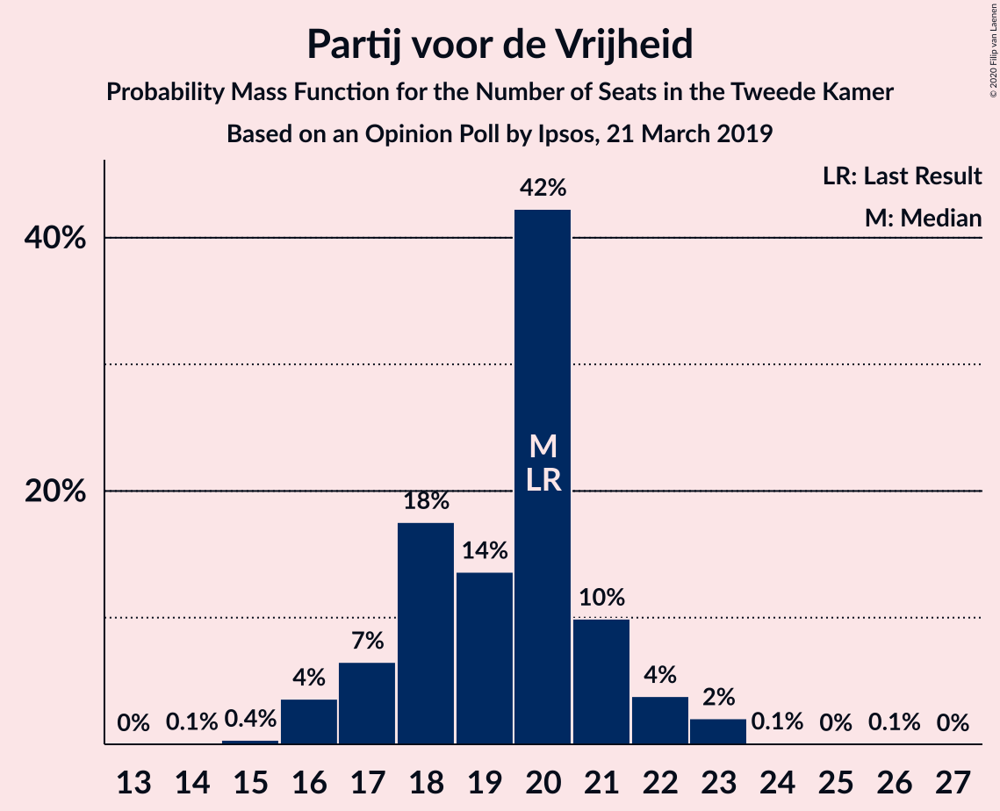

| Number of Seats | Probability | Accumulated | Special Marks |
|:---------------:|:-----------:|:-----------:|:-------------:|
| 14 | 0.1% | 100% |  |
| 15 | 0.4% | 99.9% |  |
| 16 | 4% | 99.5% |  |
| 17 | 7% | 96% |  |
| 18 | 18% | 89% |  |
| 19 | 14% | 72% |  |
| 20 | 42% | 58% | Last Result, Median |
| 21 | 10% | 16% |  |
| 22 | 4% | 6% |  |
| 23 | 2% | 2% |  |
| 24 | 0.1% | 0.2% |  |
| 25 | 0% | 0.1% |  |
| 26 | 0.1% | 0.1% |  |
| 27 | 0% | 0% |  |

### Forum voor Democratie

*For a full overview of the results for this party, see the [Forum voor Democratie](party-forumvoordemocratie.html) page.*

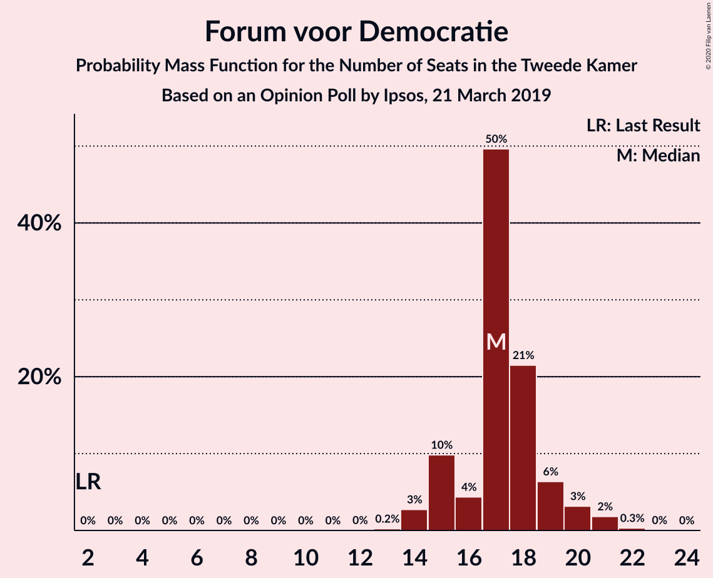

| Number of Seats | Probability | Accumulated | Special Marks |
|:---------------:|:-----------:|:-----------:|:-------------:|
| 2 | 0% | 100% | Last Result |
| 3 | 0% | 100% |  |
| 4 | 0% | 100% |  |
| 5 | 0% | 100% |  |
| 6 | 0% | 100% |  |
| 7 | 0% | 100% |  |
| 8 | 0% | 100% |  |
| 9 | 0% | 100% |  |
| 10 | 0% | 100% |  |
| 11 | 0% | 100% |  |
| 12 | 0% | 100% |  |
| 13 | 0.2% | 100% |  |
| 14 | 3% | 99.7% |  |
| 15 | 10% | 97% |  |
| 16 | 4% | 87% |  |
| 17 | 50% | 83% | Median |
| 18 | 21% | 33% |  |
| 19 | 6% | 12% |  |
| 20 | 3% | 5% |  |
| 21 | 2% | 2% |  |
| 22 | 0.3% | 0.4% |  |
| 23 | 0% | 0% |  |

### GroenLinks

*For a full overview of the results for this party, see the [GroenLinks](party-groenlinks.html) page.*

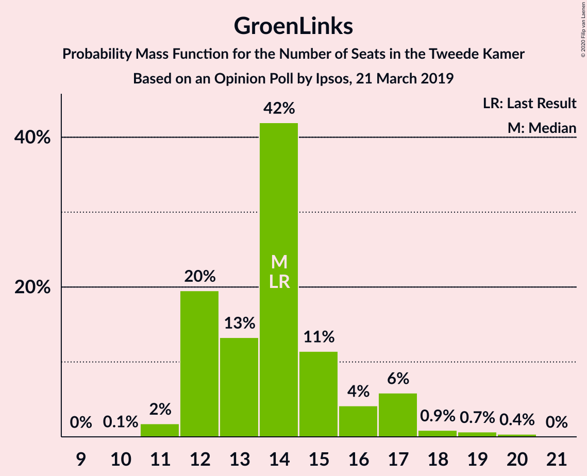

| Number of Seats | Probability | Accumulated | Special Marks |
|:---------------:|:-----------:|:-----------:|:-------------:|
| 10 | 0.1% | 100% |  |
| 11 | 2% | 99.9% |  |
| 12 | 20% | 98% |  |
| 13 | 13% | 79% |  |
| 14 | 42% | 65% | Last Result, Median |
| 15 | 11% | 23% |  |
| 16 | 4% | 12% |  |
| 17 | 6% | 8% |  |
| 18 | 0.9% | 2% |  |
| 19 | 0.7% | 1.1% |  |
| 20 | 0.4% | 0.4% |  |
| 21 | 0% | 0% |  |

### Christen-Democratisch Appèl

*For a full overview of the results for this party, see the [Christen-Democratisch Appèl](party-christen-democratischappèl.html) page.*

| Number of Seats | Probability | Accumulated | Special Marks |
|:---------------:|:-----------:|:-----------:|:-------------:|
| 10 | 1.1% | 100% |  |
| 11 | 1.2% | 98.9% |  |
| 12 | 39% | 98% |  |
| 13 | 12% | 58% | Median |
| 14 | 16% | 47% |  |
| 15 | 8% | 30% |  |
| 16 | 13% | 22% |  |
| 17 | 9% | 9% |  |
| 18 | 0.3% | 0.5% |  |
| 19 | 0.2% | 0.2% | Last Result |
| 20 | 0% | 0% |  |

### Democraten 66

*For a full overview of the results for this party, see the [Democraten 66](party-democraten66.html) page.*

| Number of Seats | Probability | Accumulated | Special Marks |
|:---------------:|:-----------:|:-----------:|:-------------:|
| 8 | 0.9% | 100% |  |
| 9 | 0.6% | 99.1% |  |
| 10 | 5% | 98% |  |
| 11 | 6% | 93% |  |
| 12 | 21% | 88% |  |
| 13 | 5% | 67% |  |
| 14 | 22% | 62% | Median |
| 15 | 36% | 40% |  |
| 16 | 3% | 4% |  |
| 17 | 0.6% | 0.7% |  |
| 18 | 0.1% | 0.1% |  |
| 19 | 0% | 0% | Last Result |

### Socialistische Partij

*For a full overview of the results for this party, see the [Socialistische Partij](party-socialistischepartij.html) page.*

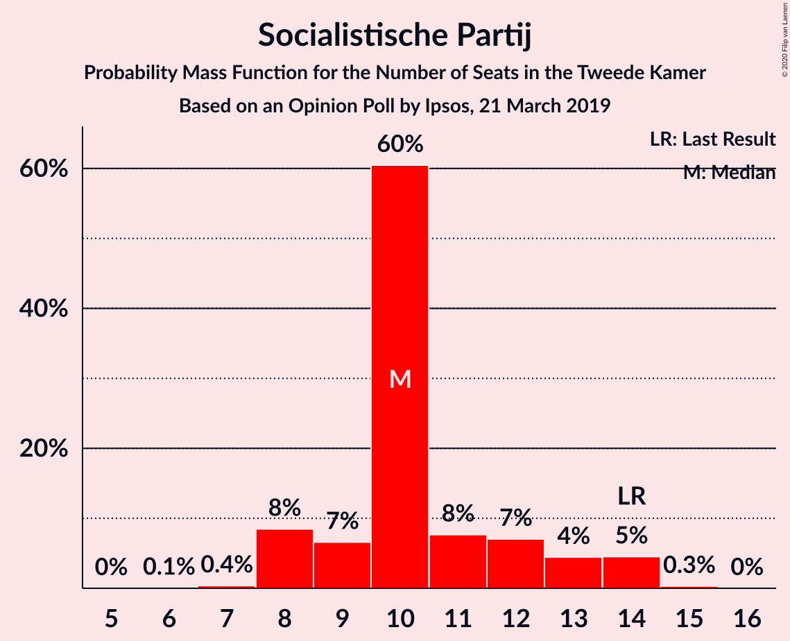

| Number of Seats | Probability | Accumulated | Special Marks |
|:---------------:|:-----------:|:-----------:|:-------------:|
| 6 | 0.1% | 100% |  |
| 7 | 0.4% | 99.9% |  |
| 8 | 8% | 99.6% |  |
| 9 | 7% | 91% |  |
| 10 | 60% | 84% | Median |
| 11 | 8% | 24% |  |
| 12 | 7% | 16% |  |
| 13 | 4% | 9% |  |
| 14 | 5% | 5% | Last Result |
| 15 | 0.3% | 0.3% |  |
| 16 | 0% | 0% |  |

### Partij van de Arbeid

*For a full overview of the results for this party, see the [Partij van de Arbeid](party-partijvandearbeid.html) page.*

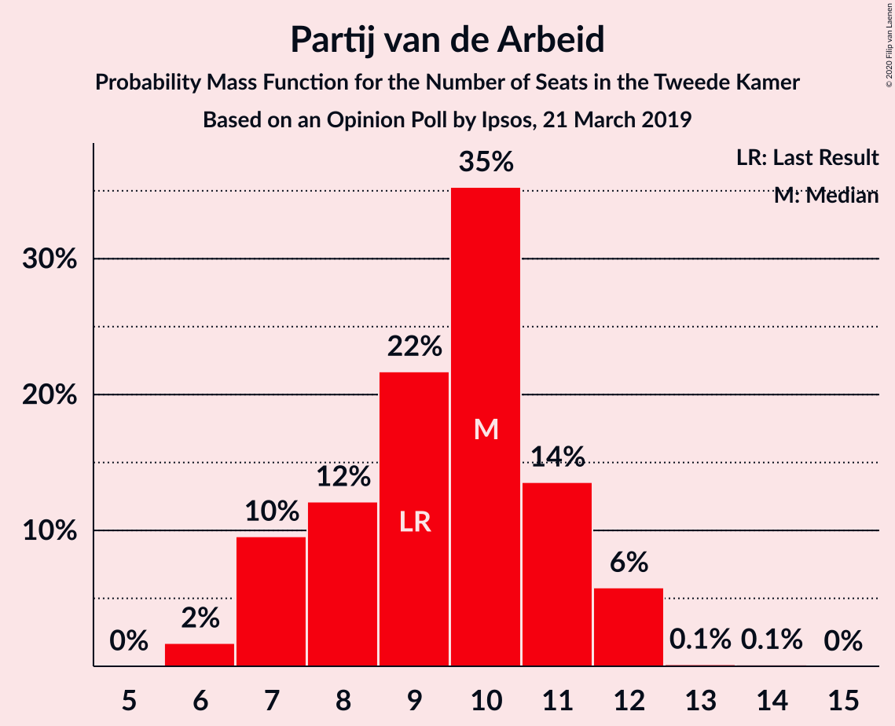

| Number of Seats | Probability | Accumulated | Special Marks |
|:---------------:|:-----------:|:-----------:|:-------------:|
| 6 | 2% | 100% |  |
| 7 | 10% | 98% |  |
| 8 | 12% | 89% |  |
| 9 | 22% | 77% | Last Result |
| 10 | 35% | 55% | Median |
| 11 | 14% | 20% |  |
| 12 | 6% | 6% |  |
| 13 | 0.1% | 0.3% |  |
| 14 | 0.1% | 0.1% |  |
| 15 | 0% | 0% |  |

### Partij voor de Dieren

*For a full overview of the results for this party, see the [Partij voor de Dieren](party-partijvoordedieren.html) page.*

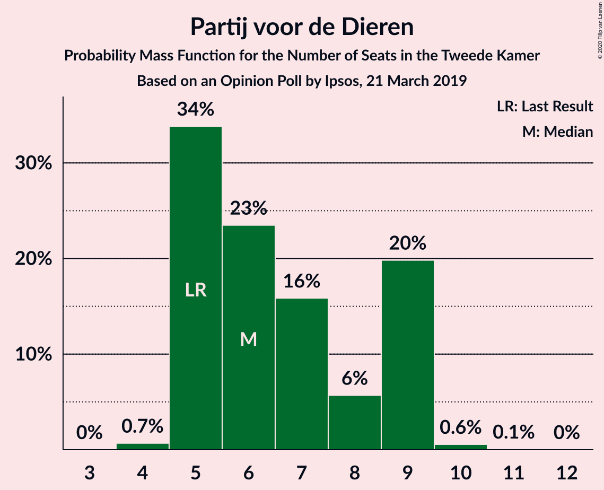

| Number of Seats | Probability | Accumulated | Special Marks |
|:---------------:|:-----------:|:-----------:|:-------------:|
| 4 | 0.7% | 100% |  |
| 5 | 34% | 99.3% | Last Result |
| 6 | 23% | 65% | Median |
| 7 | 16% | 42% |  |
| 8 | 6% | 26% |  |
| 9 | 20% | 20% |  |
| 10 | 0.6% | 0.6% |  |
| 11 | 0.1% | 0.1% |  |
| 12 | 0% | 0% |  |

### ChristenUnie

*For a full overview of the results for this party, see the [ChristenUnie](party-christenunie.html) page.*

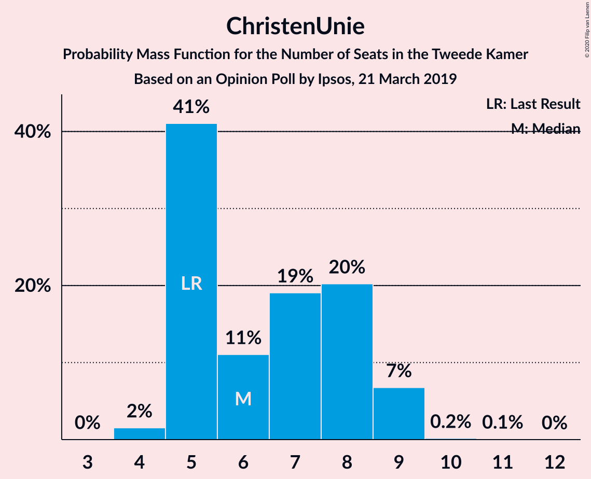

| Number of Seats | Probability | Accumulated | Special Marks |
|:---------------:|:-----------:|:-----------:|:-------------:|
| 4 | 2% | 100% |  |
| 5 | 41% | 98% | Last Result |
| 6 | 11% | 57% | Median |
| 7 | 19% | 46% |  |
| 8 | 20% | 27% |  |
| 9 | 7% | 7% |  |
| 10 | 0.2% | 0.3% |  |
| 11 | 0.1% | 0.1% |  |
| 12 | 0% | 0% |  |

### 50Plus

*For a full overview of the results for this party, see the [50Plus](party-50plus.html) page.*

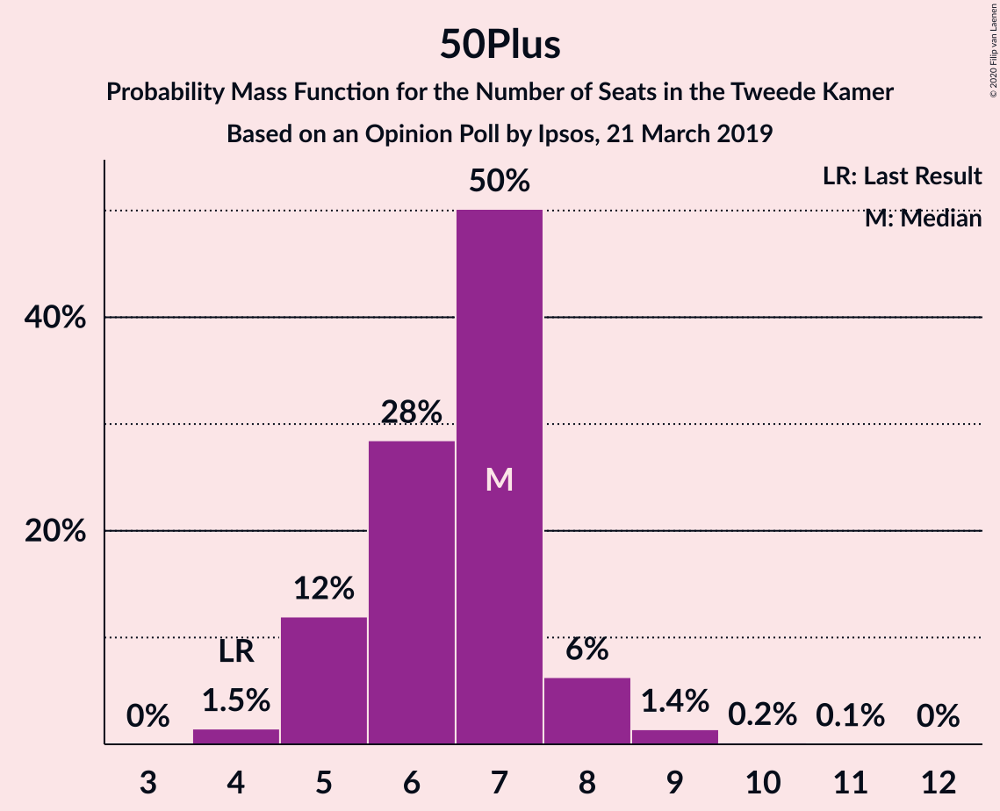

| Number of Seats | Probability | Accumulated | Special Marks |
|:---------------:|:-----------:|:-----------:|:-------------:|
| 4 | 1.5% | 100% | Last Result |
| 5 | 12% | 98.5% |  |
| 6 | 28% | 87% |  |
| 7 | 50% | 58% | Median |
| 8 | 6% | 8% |  |
| 9 | 1.4% | 2% |  |
| 10 | 0.2% | 0.2% |  |
| 11 | 0.1% | 0.1% |  |
| 12 | 0% | 0% |  |

### Staatkundig Gereformeerde Partij

*For a full overview of the results for this party, see the [Staatkundig Gereformeerde Partij](party-staatkundiggereformeerdepartij.html) page.*

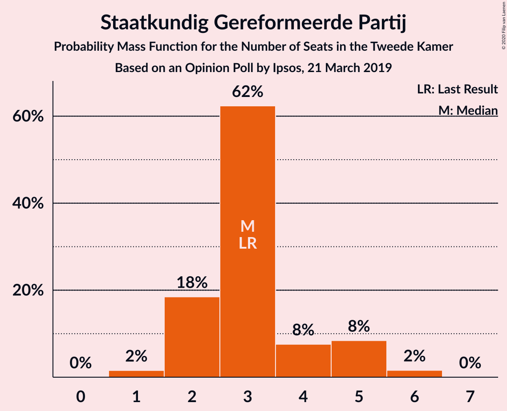

| Number of Seats | Probability | Accumulated | Special Marks |
|:---------------:|:-----------:|:-----------:|:-------------:|
| 1 | 2% | 100% |  |
| 2 | 18% | 98% |  |
| 3 | 62% | 80% | Last Result, Median |
| 4 | 8% | 18% |  |
| 5 | 8% | 10% |  |
| 6 | 2% | 2% |  |
| 7 | 0% | 0% |  |

### DENK

*For a full overview of the results for this party, see the [DENK](party-denk.html) page.*

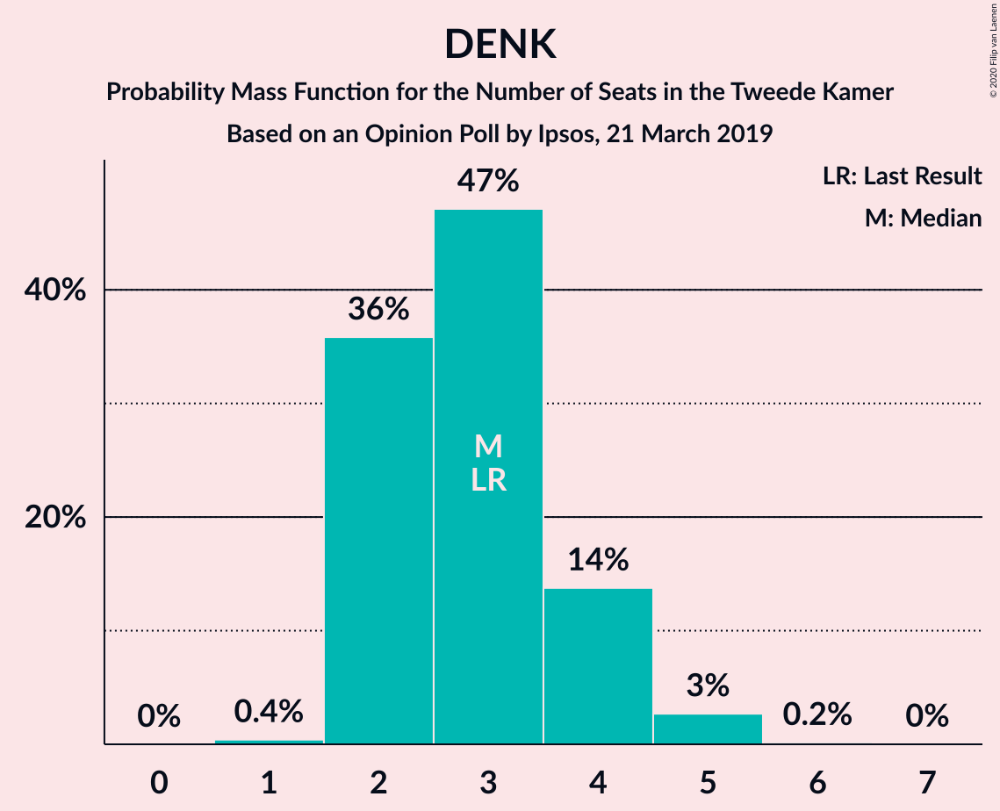

| Number of Seats | Probability | Accumulated | Special Marks |
|:---------------:|:-----------:|:-----------:|:-------------:|
| 1 | 0.4% | 100% |  |
| 2 | 36% | 99.6% |  |
| 3 | 47% | 64% | Last Result, Median |
| 4 | 14% | 17% |  |
| 5 | 3% | 3% |  |
| 6 | 0.2% | 0.2% |  |
| 7 | 0% | 0% |  |

## Coalitions

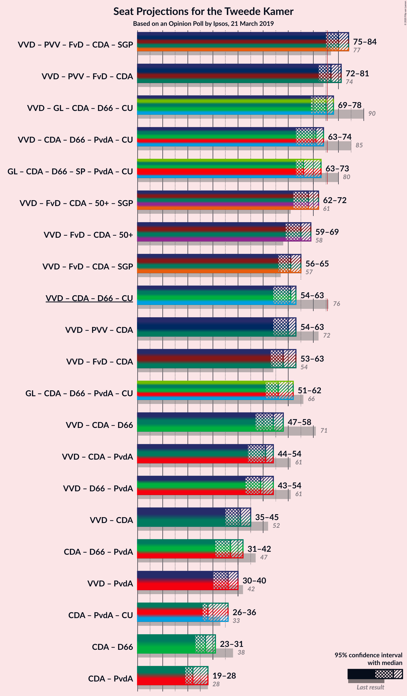

### Confidence Intervals

| Coalition | Last Result | Median | Majority? | 80% Confidence Interval | 90% Confidence Interval | 95% Confidence Interval | 99% Confidence Interval |
|:---------:|:-----------:|:------:|:---------:|:-----------------------:|:-----------------------:|:-----------------------:|:-----------------------:|
| Volkspartij voor Vrijheid en Democratie – Partij voor de Vrijheid – Forum voor Democratie – Christen-Democratisch Appèl – Staatkundig Gereformeerde Partij | 77 | 80 | 96% | 77–83 | 76–83 | 75–84 | 73–87 |
| Volkspartij voor Vrijheid en Democratie – Partij voor de Vrijheid – Forum voor Democratie – Christen-Democratisch Appèl | 74 | 77 | 76% | 74–78 | 73–80 | 72–81 | 70–85 |
| Volkspartij voor Vrijheid en Democratie – GroenLinks – Christen-Democratisch Appèl – Democraten 66 – ChristenUnie | 90 | 75 | 13% | 71–76 | 70–77 | 69–78 | 68–81 |
| Volkspartij voor Vrijheid en Democratie – Christen-Democratisch Appèl – Democraten 66 – Partij van de Arbeid – ChristenUnie | 85 | 71 | 0.2% | 66–74 | 64–74 | 63–74 | 61–75 |
| GroenLinks – Christen-Democratisch Appèl – Democraten 66 – Socialistische Partij – Partij van de Arbeid – ChristenUnie | 80 | 66 | 0% | 65–72 | 64–72 | 63–73 | 60–74 |
| Volkspartij voor Vrijheid en Democratie – Forum voor Democratie – Christen-Democratisch Appèl – 50Plus – Staatkundig Gereformeerde Partij | 61 | 68 | 0.2% | 63–70 | 63–70 | 62–72 | 60–74 |
| Volkspartij voor Vrijheid en Democratie – Forum voor Democratie – Christen-Democratisch Appèl – 50Plus | 58 | 65 | 0% | 61–66 | 60–67 | 59–69 | 58–71 |
| Volkspartij voor Vrijheid en Democratie – Forum voor Democratie – Christen-Democratisch Appèl – Staatkundig Gereformeerde Partij | 57 | 61 | 0% | 58–64 | 57–64 | 56–65 | 53–67 |
| Volkspartij voor Vrijheid en Democratie – Christen-Democratisch Appèl – Democraten 66 – ChristenUnie | 76 | 61 | 0% | 57–63 | 55–63 | 54–63 | 53–65 |
| Volkspartij voor Vrijheid en Democratie – Partij voor de Vrijheid – Christen-Democratisch Appèl | 72 | 60 | 0% | 57–62 | 55–62 | 54–63 | 52–68 |
| Volkspartij voor Vrijheid en Democratie – Forum voor Democratie – Christen-Democratisch Appèl | 54 | 58 | 0% | 55–59 | 54–60 | 53–63 | 51–64 |
| GroenLinks – Christen-Democratisch Appèl – Democraten 66 – Partij van de Arbeid – ChristenUnie | 66 | 56 | 0% | 54–61 | 53–62 | 51–62 | 51–65 |
| Volkspartij voor Vrijheid en Democratie – Christen-Democratisch Appèl – Democraten 66 | 71 | 54 | 0% | 50–56 | 49–56 | 47–58 | 46–59 |
| Volkspartij voor Vrijheid en Democratie – Christen-Democratisch Appèl – Partij van de Arbeid | 61 | 51 | 0% | 45–52 | 45–52 | 44–54 | 43–56 |
| Volkspartij voor Vrijheid en Democratie – Democraten 66 – Partij van de Arbeid | 61 | 49 | 0% | 45–54 | 43–54 | 43–54 | 41–54 |
| Volkspartij voor Vrijheid en Democratie – Christen-Democratisch Appèl | 52 | 41 | 0% | 38–42 | 37–44 | 35–45 | 34–46 |
| Christen-Democratisch Appèl – Democraten 66 – Partij van de Arbeid | 47 | 37 | 0% | 33–40 | 32–42 | 31–42 | 30–42 |
| Volkspartij voor Vrijheid en Democratie – Partij van de Arbeid | 42 | 36 | 0% | 31–39 | 31–40 | 30–40 | 30–41 |
| Christen-Democratisch Appèl – Partij van de Arbeid – ChristenUnie | 33 | 28 | 0% | 27–33 | 27–36 | 26–36 | 25–36 |
| Christen-Democratisch Appèl – Democraten 66 | 38 | 27 | 0% | 24–31 | 24–31 | 23–31 | 21–32 |
| Christen-Democratisch Appèl – Partij van de Arbeid | 28 | 22 | 0% | 21–26 | 20–28 | 19–28 | 18–28 |

### Volkspartij voor Vrijheid en Democratie – Partij voor de Vrijheid – Forum voor Democratie – Christen-Democratisch Appèl – Staatkundig Gereformeerde Partij

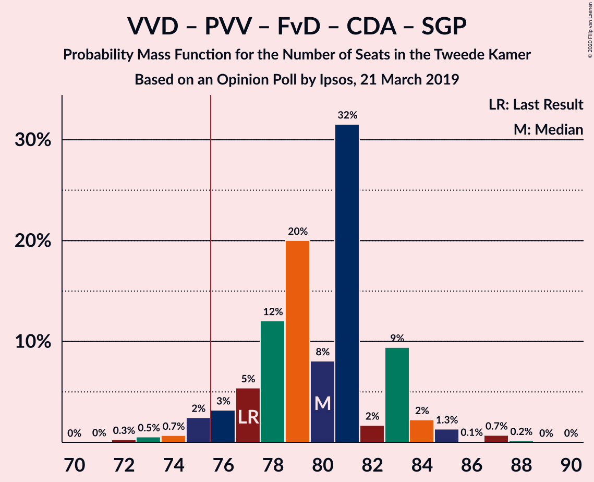

| Number of Seats | Probability | Accumulated | Special Marks |
|:---------------:|:-----------:|:-----------:|:-------------:|
| 71 | 0% | 100% |  |
| 72 | 0.3% | 99.9% |  |
| 73 | 0.5% | 99.7% |  |
| 74 | 0.7% | 99.1% |  |
| 75 | 2% | 98% |  |
| 76 | 3% | 96% | Majority |
| 77 | 5% | 93% | Last Result |
| 78 | 12% | 87% |  |
| 79 | 20% | 75% |  |
| 80 | 8% | 55% | Median |
| 81 | 32% | 47% |  |
| 82 | 2% | 16% |  |
| 83 | 9% | 14% |  |
| 84 | 2% | 5% |  |
| 85 | 1.3% | 2% |  |
| 86 | 0.1% | 1.0% |  |
| 87 | 0.7% | 0.9% |  |
| 88 | 0.2% | 0.2% |  |
| 89 | 0% | 0% |  |

### Volkspartij voor Vrijheid en Democratie – Partij voor de Vrijheid – Forum voor Democratie – Christen-Democratisch Appèl

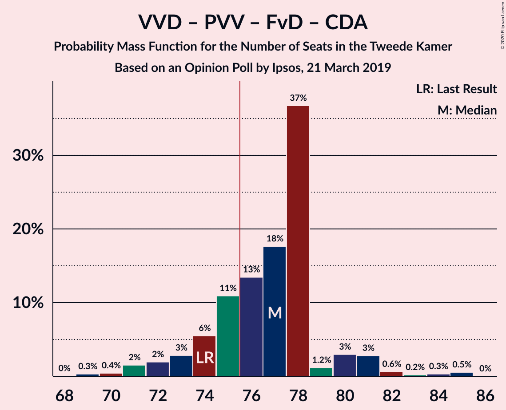

| Number of Seats | Probability | Accumulated | Special Marks |
|:---------------:|:-----------:|:-----------:|:-------------:|
| 68 | 0% | 100% |  |
| 69 | 0.3% | 99.9% |  |
| 70 | 0.4% | 99.6% |  |
| 71 | 2% | 99.2% |  |
| 72 | 2% | 98% |  |
| 73 | 3% | 96% |  |
| 74 | 6% | 93% | Last Result |
| 75 | 11% | 87% |  |
| 76 | 13% | 76% | Majority |
| 77 | 18% | 63% | Median |
| 78 | 37% | 45% |  |
| 79 | 1.2% | 9% |  |
| 80 | 3% | 7% |  |
| 81 | 3% | 4% |  |
| 82 | 0.6% | 2% |  |
| 83 | 0.2% | 1.1% |  |
| 84 | 0.3% | 0.9% |  |
| 85 | 0.5% | 0.6% |  |
| 86 | 0% | 0% |  |

### Volkspartij voor Vrijheid en Democratie – GroenLinks – Christen-Democratisch Appèl – Democraten 66 – ChristenUnie

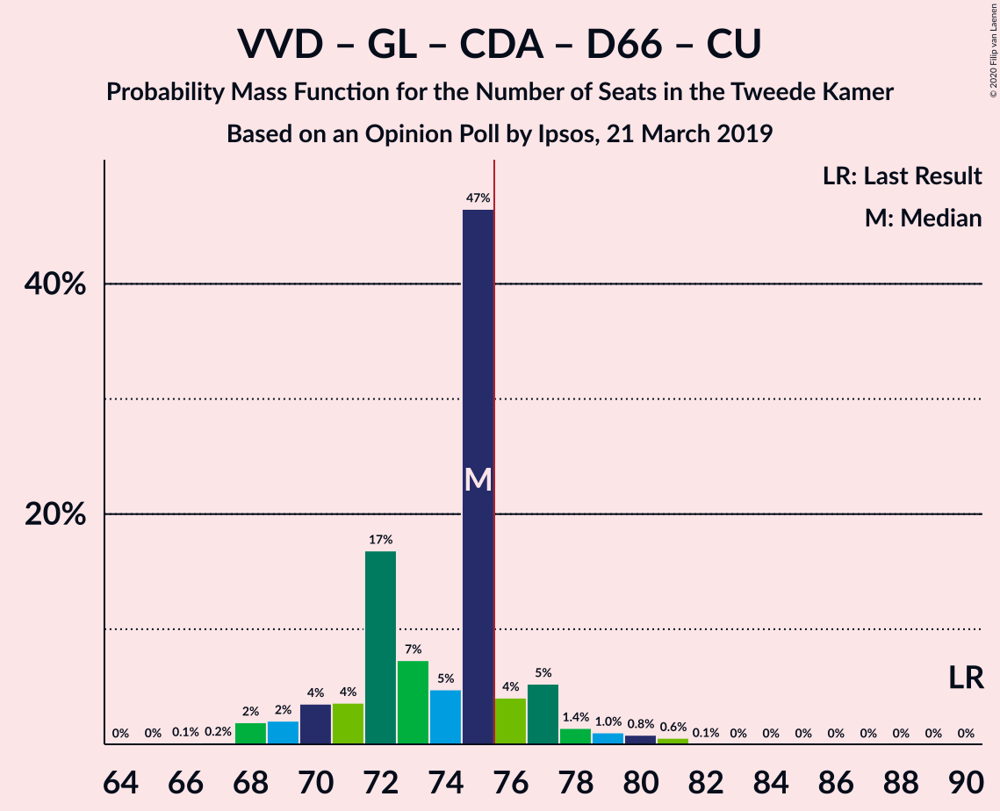

| Number of Seats | Probability | Accumulated | Special Marks |
|:---------------:|:-----------:|:-----------:|:-------------:|
| 66 | 0.1% | 100% |  |
| 67 | 0.2% | 99.9% |  |
| 68 | 2% | 99.7% |  |
| 69 | 2% | 98% |  |
| 70 | 4% | 96% |  |
| 71 | 4% | 92% |  |
| 72 | 17% | 89% |  |
| 73 | 7% | 72% |  |
| 74 | 5% | 64% | Median |
| 75 | 47% | 60% |  |
| 76 | 4% | 13% | Majority |
| 77 | 5% | 9% |  |
| 78 | 1.4% | 4% |  |
| 79 | 1.0% | 2% |  |
| 80 | 0.8% | 1.4% |  |
| 81 | 0.6% | 0.6% |  |
| 82 | 0.1% | 0.1% |  |
| 83 | 0% | 0% |  |
| 84 | 0% | 0% |  |
| 85 | 0% | 0% |  |
| 86 | 0% | 0% |  |
| 87 | 0% | 0% |  |
| 88 | 0% | 0% |  |
| 89 | 0% | 0% |  |
| 90 | 0% | 0% | Last Result |

### Volkspartij voor Vrijheid en Democratie – Christen-Democratisch Appèl – Democraten 66 – Partij van de Arbeid – ChristenUnie

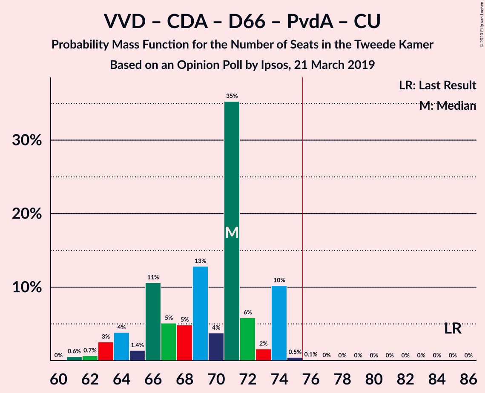

| Number of Seats | Probability | Accumulated | Special Marks |
|:---------------:|:-----------:|:-----------:|:-------------:|
| 60 | 0% | 100% |  |
| 61 | 0.6% | 99.9% |  |
| 62 | 0.7% | 99.4% |  |
| 63 | 3% | 98.7% |  |
| 64 | 4% | 96% |  |
| 65 | 1.4% | 92% |  |
| 66 | 11% | 91% |  |
| 67 | 5% | 80% |  |
| 68 | 5% | 75% |  |
| 69 | 13% | 70% |  |
| 70 | 4% | 57% | Median |
| 71 | 35% | 54% |  |
| 72 | 6% | 18% |  |
| 73 | 2% | 12% |  |
| 74 | 10% | 11% |  |
| 75 | 0.5% | 0.6% |  |
| 76 | 0.1% | 0.2% | Majority |
| 77 | 0% | 0% |  |
| 78 | 0% | 0% |  |
| 79 | 0% | 0% |  |
| 80 | 0% | 0% |  |
| 81 | 0% | 0% |  |
| 82 | 0% | 0% |  |
| 83 | 0% | 0% |  |
| 84 | 0% | 0% |  |
| 85 | 0% | 0% | Last Result |

### GroenLinks – Christen-Democratisch Appèl – Democraten 66 – Socialistische Partij – Partij van de Arbeid – ChristenUnie

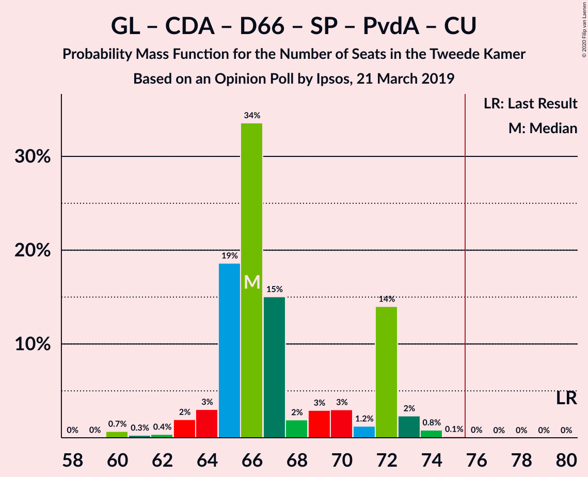

| Number of Seats | Probability | Accumulated | Special Marks |
|:---------------:|:-----------:|:-----------:|:-------------:|
| 59 | 0% | 100% |  |
| 60 | 0.7% | 99.9% |  |
| 61 | 0.3% | 99.3% |  |
| 62 | 0.4% | 99.0% |  |
| 63 | 2% | 98.6% |  |
| 64 | 3% | 97% |  |
| 65 | 19% | 94% |  |
| 66 | 34% | 75% |  |
| 67 | 15% | 41% | Median |
| 68 | 2% | 26% |  |
| 69 | 3% | 24% |  |
| 70 | 3% | 22% |  |
| 71 | 1.2% | 19% |  |
| 72 | 14% | 17% |  |
| 73 | 2% | 3% |  |
| 74 | 0.8% | 1.0% |  |
| 75 | 0.1% | 0.2% |  |
| 76 | 0% | 0% | Majority |
| 77 | 0% | 0% |  |
| 78 | 0% | 0% |  |
| 79 | 0% | 0% |  |
| 80 | 0% | 0% | Last Result |

### Volkspartij voor Vrijheid en Democratie – Forum voor Democratie – Christen-Democratisch Appèl – 50Plus – Staatkundig Gereformeerde Partij

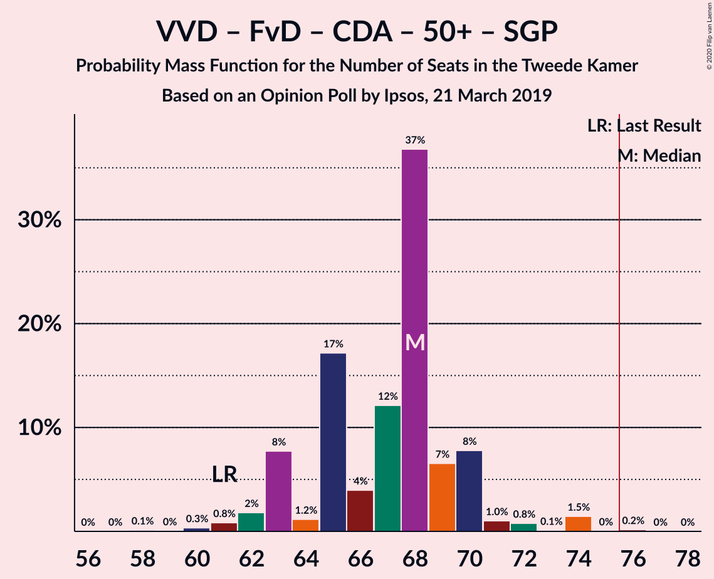

| Number of Seats | Probability | Accumulated | Special Marks |
|:---------------:|:-----------:|:-----------:|:-------------:|
| 58 | 0.1% | 100% |  |
| 59 | 0% | 99.9% |  |
| 60 | 0.3% | 99.8% |  |
| 61 | 0.8% | 99.5% | Last Result |
| 62 | 2% | 98.6% |  |
| 63 | 8% | 97% |  |
| 64 | 1.2% | 89% |  |
| 65 | 17% | 88% |  |
| 66 | 4% | 71% |  |
| 67 | 12% | 67% | Median |
| 68 | 37% | 55% |  |
| 69 | 7% | 18% |  |
| 70 | 8% | 11% |  |
| 71 | 1.0% | 4% |  |
| 72 | 0.8% | 3% |  |
| 73 | 0.1% | 2% |  |
| 74 | 1.5% | 2% |  |
| 75 | 0% | 0.2% |  |
| 76 | 0.2% | 0.2% | Majority |
| 77 | 0% | 0% |  |

### Volkspartij voor Vrijheid en Democratie – Forum voor Democratie – Christen-Democratisch Appèl – 50Plus

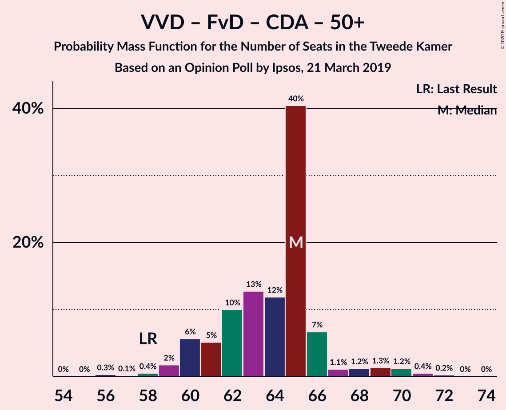

| Number of Seats | Probability | Accumulated | Special Marks |
|:---------------:|:-----------:|:-----------:|:-------------:|
| 56 | 0.3% | 100% |  |
| 57 | 0.1% | 99.7% |  |
| 58 | 0.4% | 99.6% | Last Result |
| 59 | 2% | 99.2% |  |
| 60 | 6% | 97% |  |
| 61 | 5% | 92% |  |
| 62 | 10% | 87% |  |
| 63 | 13% | 77% |  |
| 64 | 12% | 64% | Median |
| 65 | 40% | 52% |  |
| 66 | 7% | 12% |  |
| 67 | 1.1% | 5% |  |
| 68 | 1.2% | 4% |  |
| 69 | 1.3% | 3% |  |
| 70 | 1.2% | 2% |  |
| 71 | 0.4% | 0.7% |  |
| 72 | 0.2% | 0.2% |  |
| 73 | 0% | 0% |  |

### Volkspartij voor Vrijheid en Democratie – Forum voor Democratie – Christen-Democratisch Appèl – Staatkundig Gereformeerde Partij

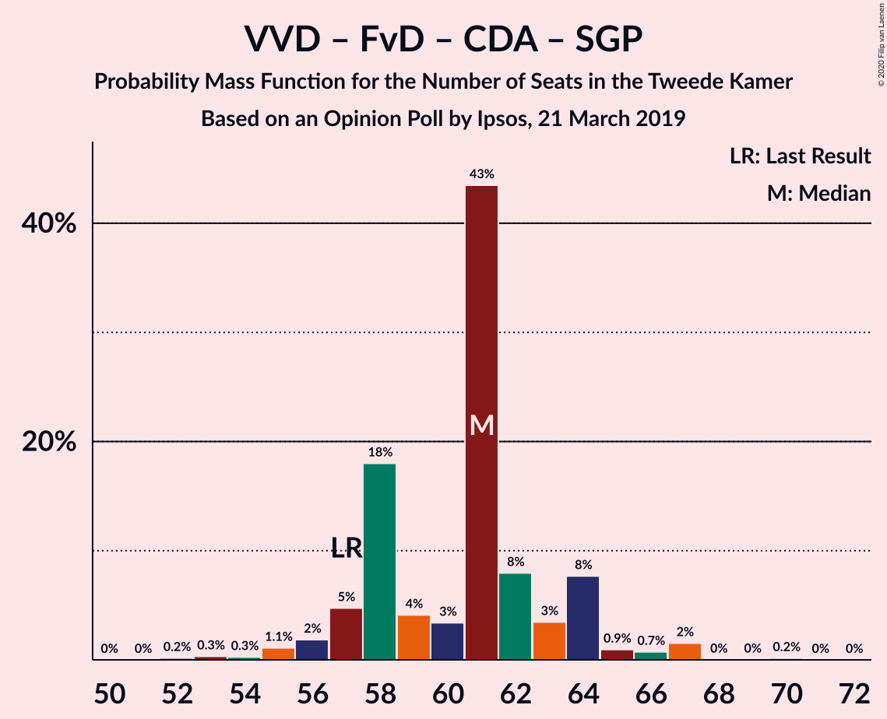

| Number of Seats | Probability | Accumulated | Special Marks |
|:---------------:|:-----------:|:-----------:|:-------------:|
| 52 | 0.2% | 100% |  |
| 53 | 0.3% | 99.8% |  |
| 54 | 0.3% | 99.5% |  |
| 55 | 1.1% | 99.2% |  |
| 56 | 2% | 98% |  |
| 57 | 5% | 96% | Last Result |
| 58 | 18% | 92% |  |
| 59 | 4% | 74% |  |
| 60 | 3% | 69% | Median |
| 61 | 43% | 66% |  |
| 62 | 8% | 23% |  |
| 63 | 3% | 15% |  |
| 64 | 8% | 11% |  |
| 65 | 0.9% | 3% |  |
| 66 | 0.7% | 2% |  |
| 67 | 2% | 2% |  |
| 68 | 0% | 0.2% |  |
| 69 | 0% | 0.2% |  |
| 70 | 0.2% | 0.2% |  |
| 71 | 0% | 0% |  |

### Volkspartij voor Vrijheid en Democratie – Christen-Democratisch Appèl – Democraten 66 – ChristenUnie

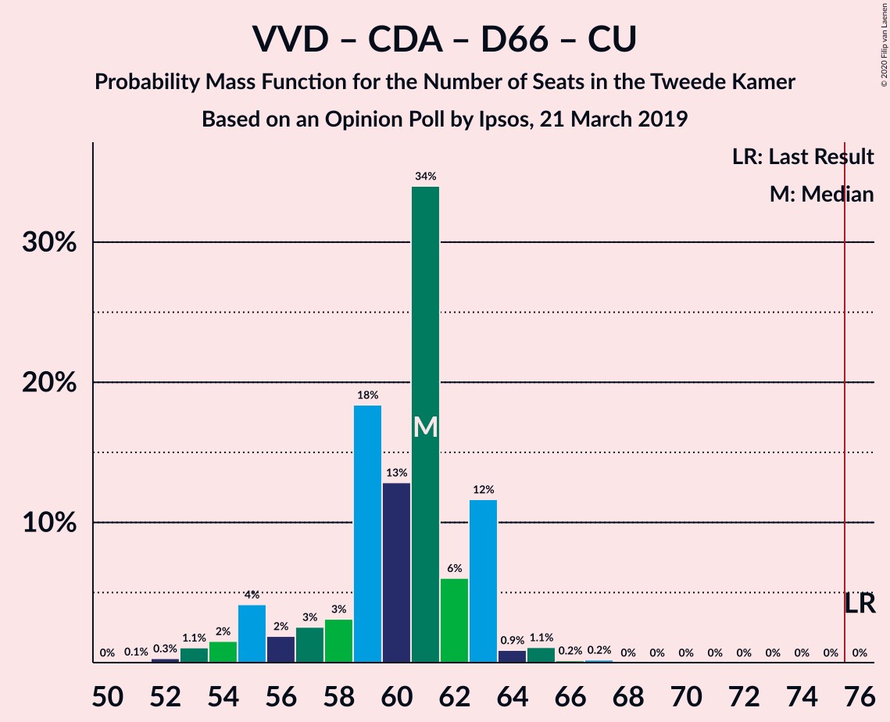

| Number of Seats | Probability | Accumulated | Special Marks |
|:---------------:|:-----------:|:-----------:|:-------------:|
| 51 | 0.1% | 100% |  |
| 52 | 0.3% | 99.9% |  |
| 53 | 1.1% | 99.6% |  |
| 54 | 2% | 98.5% |  |
| 55 | 4% | 97% |  |
| 56 | 2% | 93% |  |
| 57 | 3% | 91% |  |
| 58 | 3% | 88% |  |
| 59 | 18% | 85% |  |
| 60 | 13% | 67% | Median |
| 61 | 34% | 54% |  |
| 62 | 6% | 20% |  |
| 63 | 12% | 14% |  |
| 64 | 0.9% | 2% |  |
| 65 | 1.1% | 1.5% |  |
| 66 | 0.2% | 0.4% |  |
| 67 | 0.2% | 0.2% |  |
| 68 | 0% | 0% |  |
| 69 | 0% | 0% |  |
| 70 | 0% | 0% |  |
| 71 | 0% | 0% |  |
| 72 | 0% | 0% |  |
| 73 | 0% | 0% |  |
| 74 | 0% | 0% |  |
| 75 | 0% | 0% |  |
| 76 | 0% | 0% | Last Result, Majority |

### Volkspartij voor Vrijheid en Democratie – Partij voor de Vrijheid – Christen-Democratisch Appèl

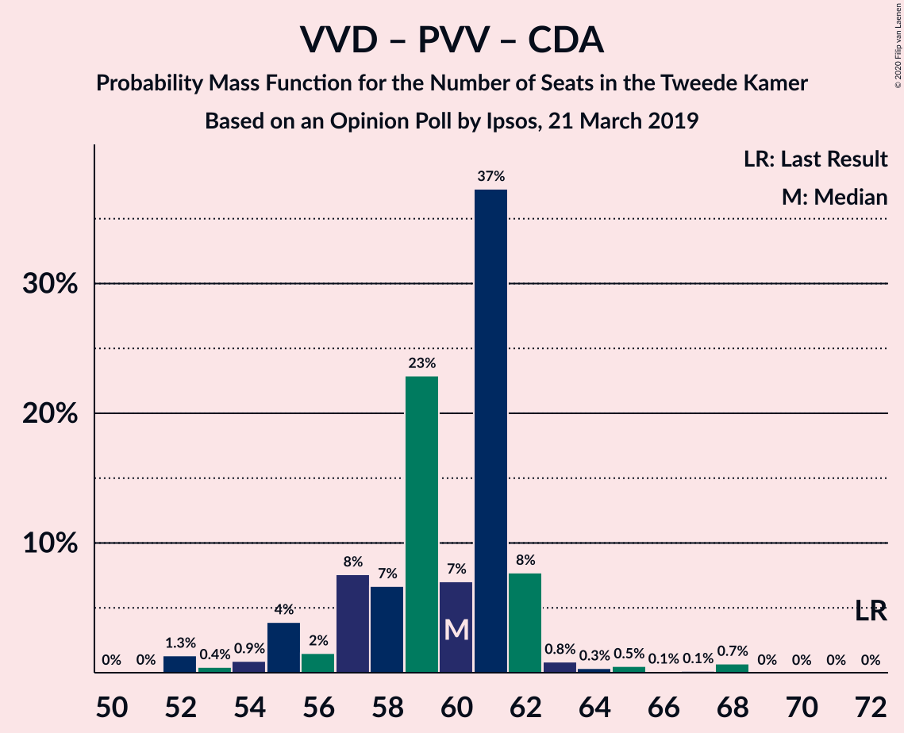

| Number of Seats | Probability | Accumulated | Special Marks |
|:---------------:|:-----------:|:-----------:|:-------------:|
| 52 | 1.3% | 100% |  |
| 53 | 0.4% | 98.6% |  |
| 54 | 0.9% | 98% |  |
| 55 | 4% | 97% |  |
| 56 | 2% | 93% |  |
| 57 | 8% | 92% |  |
| 58 | 7% | 84% |  |
| 59 | 23% | 78% |  |
| 60 | 7% | 55% | Median |
| 61 | 37% | 48% |  |
| 62 | 8% | 10% |  |
| 63 | 0.8% | 3% |  |
| 64 | 0.3% | 2% |  |
| 65 | 0.5% | 1.5% |  |
| 66 | 0.1% | 1.0% |  |
| 67 | 0.1% | 0.9% |  |
| 68 | 0.7% | 0.7% |  |
| 69 | 0% | 0% |  |
| 70 | 0% | 0% |  |
| 71 | 0% | 0% |  |
| 72 | 0% | 0% | Last Result |

### Volkspartij voor Vrijheid en Democratie – Forum voor Democratie – Christen-Democratisch Appèl

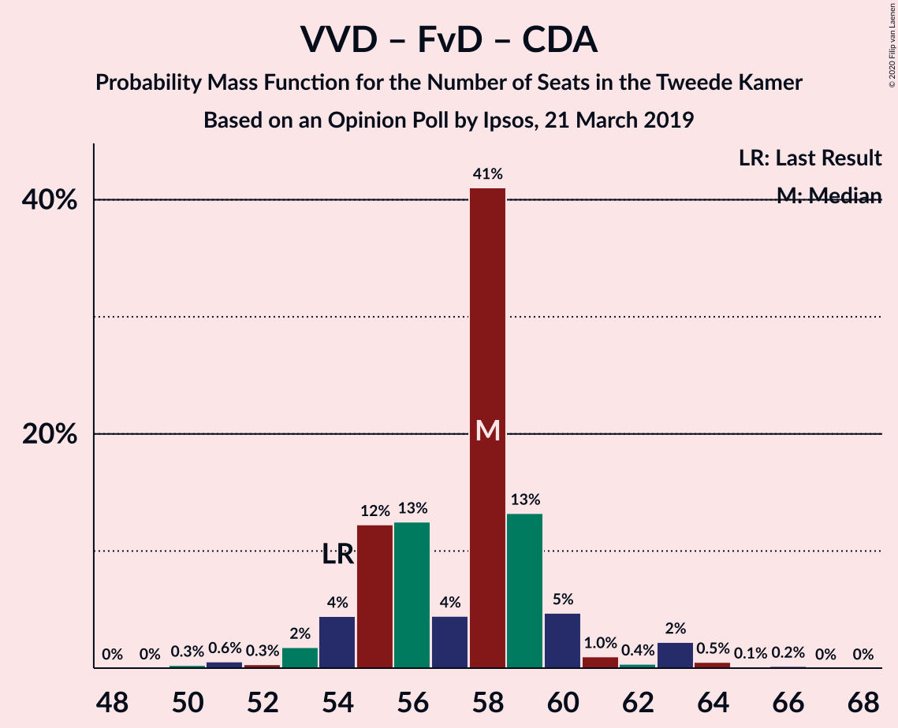

| Number of Seats | Probability | Accumulated | Special Marks |
|:---------------:|:-----------:|:-----------:|:-------------:|
| 50 | 0.3% | 100% |  |
| 51 | 0.6% | 99.7% |  |
| 52 | 0.3% | 99.1% |  |
| 53 | 2% | 98.8% |  |
| 54 | 4% | 97% | Last Result |
| 55 | 12% | 93% |  |
| 56 | 13% | 80% |  |
| 57 | 4% | 68% | Median |
| 58 | 41% | 63% |  |
| 59 | 13% | 22% |  |
| 60 | 5% | 9% |  |
| 61 | 1.0% | 4% |  |
| 62 | 0.4% | 3% |  |
| 63 | 2% | 3% |  |
| 64 | 0.5% | 0.8% |  |
| 65 | 0.1% | 0.3% |  |
| 66 | 0.2% | 0.2% |  |
| 67 | 0% | 0% |  |

### GroenLinks – Christen-Democratisch Appèl – Democraten 66 – Partij van de Arbeid – ChristenUnie

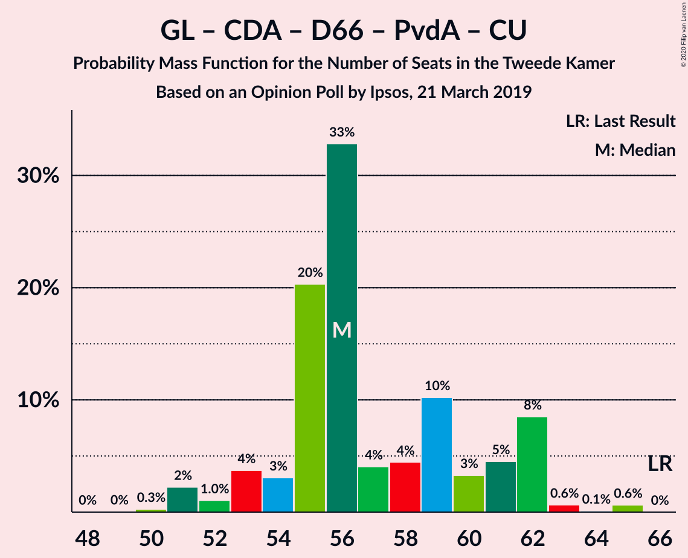

| Number of Seats | Probability | Accumulated | Special Marks |
|:---------------:|:-----------:|:-----------:|:-------------:|
| 49 | 0% | 100% |  |
| 50 | 0.3% | 99.9% |  |
| 51 | 2% | 99.7% |  |
| 52 | 1.0% | 97% |  |
| 53 | 4% | 96% |  |
| 54 | 3% | 93% |  |
| 55 | 20% | 90% |  |
| 56 | 33% | 69% |  |
| 57 | 4% | 36% | Median |
| 58 | 4% | 32% |  |
| 59 | 10% | 28% |  |
| 60 | 3% | 18% |  |
| 61 | 5% | 14% |  |
| 62 | 8% | 10% |  |
| 63 | 0.6% | 1.4% |  |
| 64 | 0.1% | 0.8% |  |
| 65 | 0.6% | 0.6% |  |
| 66 | 0% | 0% | Last Result |

### Volkspartij voor Vrijheid en Democratie – Christen-Democratisch Appèl – Democraten 66

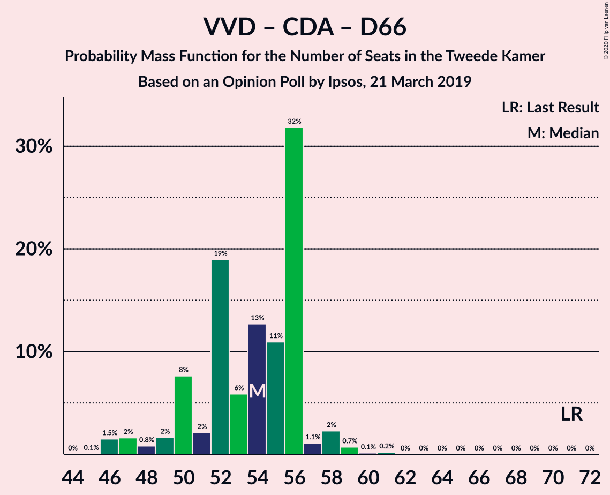

| Number of Seats | Probability | Accumulated | Special Marks |
|:---------------:|:-----------:|:-----------:|:-------------:|
| 45 | 0.1% | 100% |  |
| 46 | 1.5% | 99.9% |  |
| 47 | 2% | 98% |  |
| 48 | 0.8% | 97% |  |
| 49 | 2% | 96% |  |
| 50 | 8% | 94% |  |
| 51 | 2% | 87% |  |
| 52 | 19% | 85% |  |
| 53 | 6% | 66% |  |
| 54 | 13% | 60% | Median |
| 55 | 11% | 47% |  |
| 56 | 32% | 36% |  |
| 57 | 1.1% | 4% |  |
| 58 | 2% | 3% |  |
| 59 | 0.7% | 1.0% |  |
| 60 | 0.1% | 0.3% |  |
| 61 | 0.2% | 0.2% |  |
| 62 | 0% | 0% |  |
| 63 | 0% | 0% |  |
| 64 | 0% | 0% |  |
| 65 | 0% | 0% |  |
| 66 | 0% | 0% |  |
| 67 | 0% | 0% |  |
| 68 | 0% | 0% |  |
| 69 | 0% | 0% |  |
| 70 | 0% | 0% |  |
| 71 | 0% | 0% | Last Result |

### Volkspartij voor Vrijheid en Democratie – Christen-Democratisch Appèl – Partij van de Arbeid

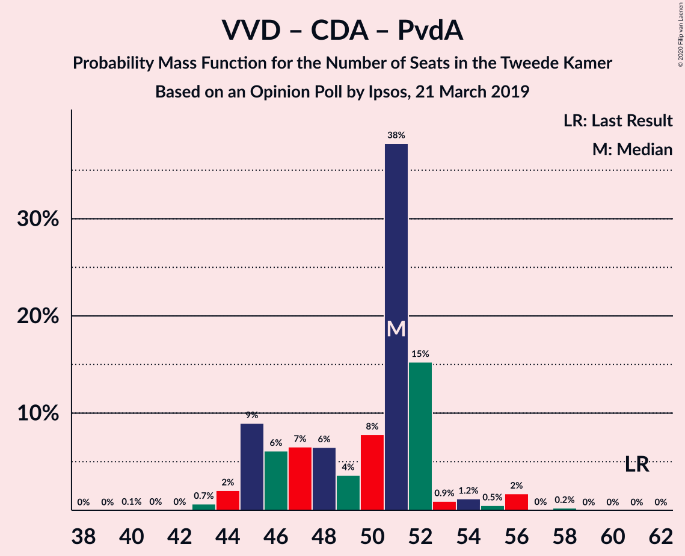

| Number of Seats | Probability | Accumulated | Special Marks |
|:---------------:|:-----------:|:-----------:|:-------------:|
| 40 | 0.1% | 100% |  |
| 41 | 0% | 99.9% |  |
| 42 | 0% | 99.9% |  |
| 43 | 0.7% | 99.9% |  |
| 44 | 2% | 99.2% |  |
| 45 | 9% | 97% |  |
| 46 | 6% | 88% |  |
| 47 | 7% | 82% |  |
| 48 | 6% | 76% |  |
| 49 | 4% | 69% |  |
| 50 | 8% | 65% | Median |
| 51 | 38% | 58% |  |
| 52 | 15% | 20% |  |
| 53 | 0.9% | 5% |  |
| 54 | 1.2% | 4% |  |
| 55 | 0.5% | 2% |  |
| 56 | 2% | 2% |  |
| 57 | 0% | 0.3% |  |
| 58 | 0.2% | 0.2% |  |
| 59 | 0% | 0% |  |
| 60 | 0% | 0% |  |
| 61 | 0% | 0% | Last Result |

### Volkspartij voor Vrijheid en Democratie – Democraten 66 – Partij van de Arbeid

| Number of Seats | Probability | Accumulated | Special Marks |
|:---------------:|:-----------:|:-----------:|:-------------:|
| 39 | 0.1% | 100% |  |
| 40 | 0% | 99.9% |  |
| 41 | 0.5% | 99.9% |  |
| 42 | 0.8% | 99.4% |  |
| 43 | 4% | 98.5% |  |
| 44 | 2% | 94% |  |
| 45 | 14% | 92% |  |
| 46 | 3% | 78% |  |
| 47 | 11% | 75% |  |
| 48 | 3% | 65% |  |
| 49 | 14% | 61% |  |
| 50 | 6% | 47% |  |
| 51 | 2% | 41% | Median |
| 52 | 6% | 39% |  |
| 53 | 1.1% | 33% |  |
| 54 | 31% | 32% |  |
| 55 | 0.4% | 0.4% |  |
| 56 | 0% | 0% |  |
| 57 | 0% | 0% |  |
| 58 | 0% | 0% |  |
| 59 | 0% | 0% |  |
| 60 | 0% | 0% |  |
| 61 | 0% | 0% | Last Result |

### Volkspartij voor Vrijheid en Democratie – Christen-Democratisch Appèl

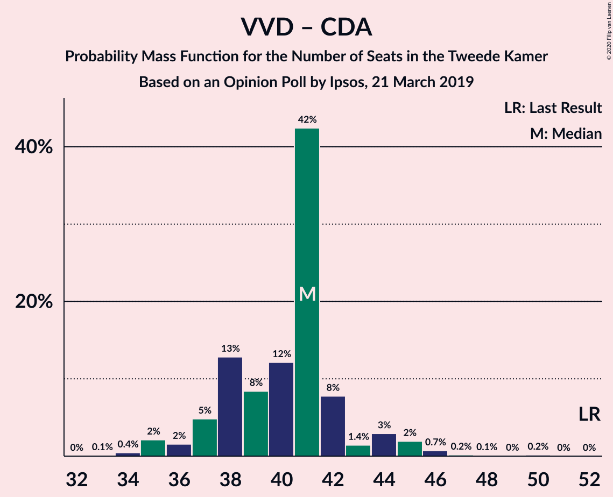

| Number of Seats | Probability | Accumulated | Special Marks |
|:---------------:|:-----------:|:-----------:|:-------------:|
| 33 | 0.1% | 100% |  |
| 34 | 0.4% | 99.9% |  |
| 35 | 2% | 99.4% |  |
| 36 | 2% | 97% |  |
| 37 | 5% | 96% |  |
| 38 | 13% | 91% |  |
| 39 | 8% | 78% |  |
| 40 | 12% | 70% | Median |
| 41 | 42% | 58% |  |
| 42 | 8% | 15% |  |
| 43 | 1.4% | 7% |  |
| 44 | 3% | 6% |  |
| 45 | 2% | 3% |  |
| 46 | 0.7% | 1.2% |  |
| 47 | 0.2% | 0.4% |  |
| 48 | 0.1% | 0.3% |  |
| 49 | 0% | 0.2% |  |
| 50 | 0.2% | 0.2% |  |
| 51 | 0% | 0% |  |
| 52 | 0% | 0% | Last Result |

### Christen-Democratisch Appèl – Democraten 66 – Partij van de Arbeid

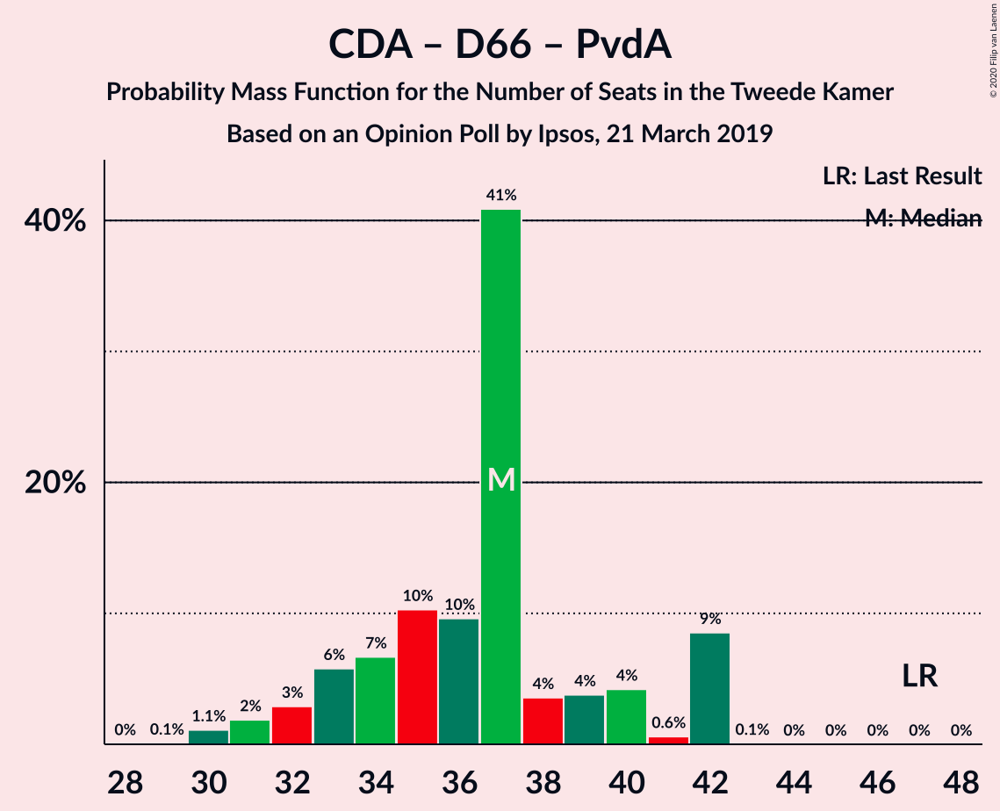

| Number of Seats | Probability | Accumulated | Special Marks |
|:---------------:|:-----------:|:-----------:|:-------------:|
| 29 | 0.1% | 100% |  |
| 30 | 1.1% | 99.9% |  |
| 31 | 2% | 98.8% |  |
| 32 | 3% | 97% |  |
| 33 | 6% | 94% |  |
| 34 | 7% | 88% |  |
| 35 | 10% | 82% |  |
| 36 | 10% | 71% |  |
| 37 | 41% | 62% | Median |
| 38 | 4% | 21% |  |
| 39 | 4% | 17% |  |
| 40 | 4% | 13% |  |
| 41 | 0.6% | 9% |  |
| 42 | 9% | 9% |  |
| 43 | 0.1% | 0.1% |  |
| 44 | 0% | 0% |  |
| 45 | 0% | 0% |  |
| 46 | 0% | 0% |  |
| 47 | 0% | 0% | Last Result |

### Volkspartij voor Vrijheid en Democratie – Partij van de Arbeid

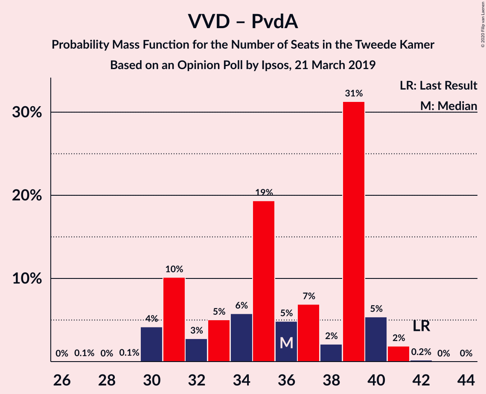

| Number of Seats | Probability | Accumulated | Special Marks |
|:---------------:|:-----------:|:-----------:|:-------------:|
| 27 | 0.1% | 100% |  |
| 28 | 0% | 99.9% |  |
| 29 | 0.1% | 99.9% |  |
| 30 | 4% | 99.8% |  |
| 31 | 10% | 96% |  |
| 32 | 3% | 86% |  |
| 33 | 5% | 83% |  |
| 34 | 6% | 78% |  |
| 35 | 19% | 72% |  |
| 36 | 5% | 53% |  |
| 37 | 7% | 48% | Median |
| 38 | 2% | 41% |  |
| 39 | 31% | 39% |  |
| 40 | 5% | 7% |  |
| 41 | 2% | 2% |  |
| 42 | 0.2% | 0.2% | Last Result |
| 43 | 0% | 0% |  |

### Christen-Democratisch Appèl – Partij van de Arbeid – ChristenUnie

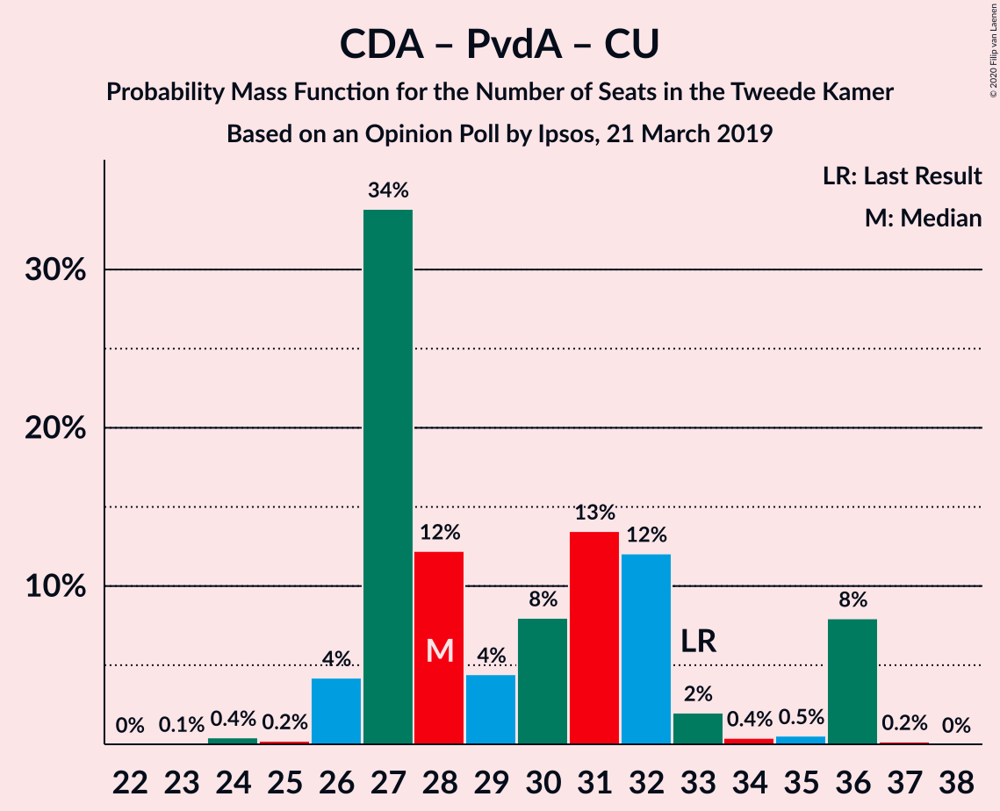

| Number of Seats | Probability | Accumulated | Special Marks |
|:---------------:|:-----------:|:-----------:|:-------------:|
| 23 | 0.1% | 100% |  |
| 24 | 0.4% | 99.9% |  |
| 25 | 0.2% | 99.5% |  |
| 26 | 4% | 99.3% |  |
| 27 | 34% | 95% |  |
| 28 | 12% | 61% |  |
| 29 | 4% | 49% | Median |
| 30 | 8% | 45% |  |
| 31 | 13% | 37% |  |
| 32 | 12% | 23% |  |
| 33 | 2% | 11% | Last Result |
| 34 | 0.4% | 9% |  |
| 35 | 0.5% | 9% |  |
| 36 | 8% | 8% |  |
| 37 | 0.2% | 0.2% |  |
| 38 | 0% | 0% |  |

### Christen-Democratisch Appèl – Democraten 66

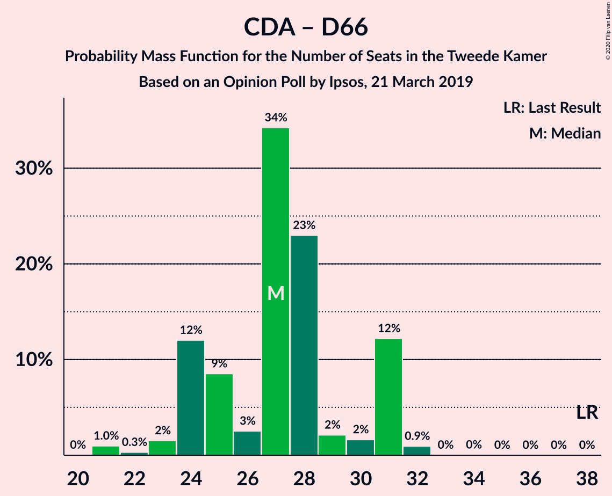

| Number of Seats | Probability | Accumulated | Special Marks |
|:---------------:|:-----------:|:-----------:|:-------------:|
| 21 | 1.0% | 100% |  |
| 22 | 0.3% | 99.0% |  |
| 23 | 2% | 98.7% |  |
| 24 | 12% | 97% |  |
| 25 | 9% | 85% |  |
| 26 | 3% | 77% |  |
| 27 | 34% | 74% | Median |
| 28 | 23% | 40% |  |
| 29 | 2% | 17% |  |
| 30 | 2% | 15% |  |
| 31 | 12% | 13% |  |
| 32 | 0.9% | 1.0% |  |
| 33 | 0% | 0.1% |  |
| 34 | 0% | 0% |  |
| 35 | 0% | 0% |  |
| 36 | 0% | 0% |  |
| 37 | 0% | 0% |  |
| 38 | 0% | 0% | Last Result |

### Christen-Democratisch Appèl – Partij van de Arbeid

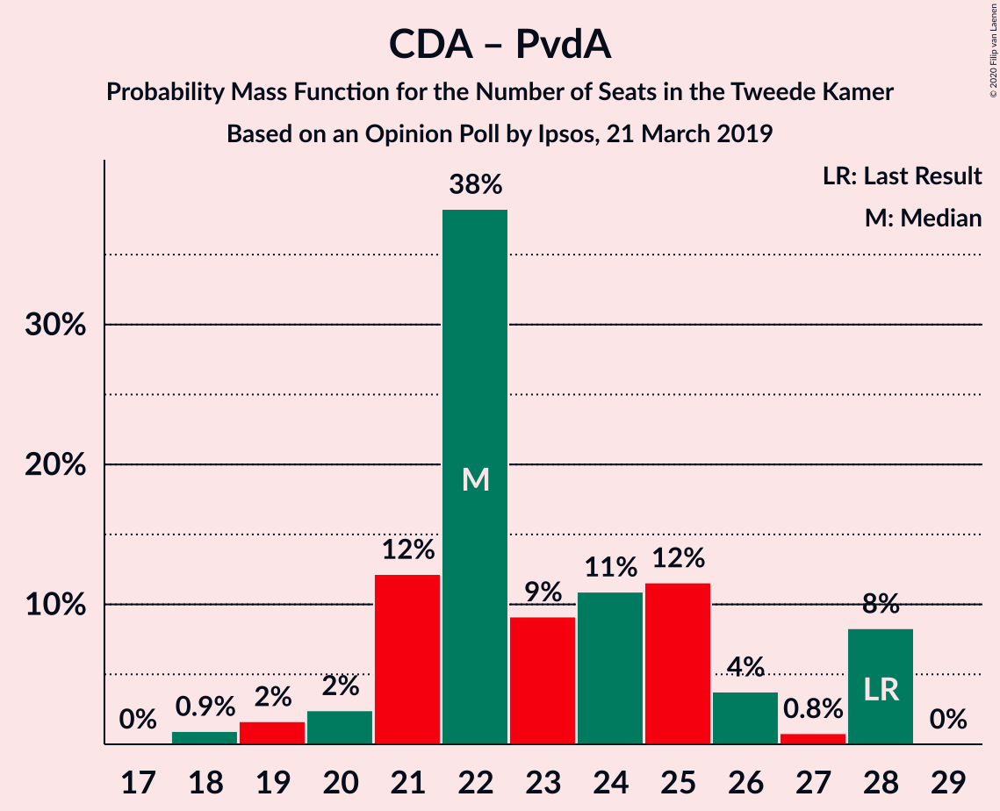

| Number of Seats | Probability | Accumulated | Special Marks |
|:---------------:|:-----------:|:-----------:|:-------------:|
| 18 | 0.9% | 100% |  |
| 19 | 2% | 99.0% |  |
| 20 | 2% | 97% |  |
| 21 | 12% | 95% |  |
| 22 | 38% | 83% |  |
| 23 | 9% | 45% | Median |
| 24 | 11% | 35% |  |
| 25 | 12% | 24% |  |
| 26 | 4% | 13% |  |
| 27 | 0.8% | 9% |  |
| 28 | 8% | 8% | Last Result |
| 29 | 0% | 0% |  |

## Technical Information

### Opinion Poll

+ **Polling firm:** Ipsos
+ **Commissioner(s):** —
+ **Fieldwork period:** 21 March 2019

### Calculations

+ **Sample size:** 1000
+ **Simulations done:** 1,048,576
+ **Error estimate:** 2.94%

