# Opinion Poll by Kantar Public, 17–25 April 2019

<a href="#voting-intentions">Voting Intentions</a> | <a href="#seats">Seats</a> | <a href="#coalitions">Coalitions</a> | <a href="#technical-information">Technical Information</a>

## Voting Intentions

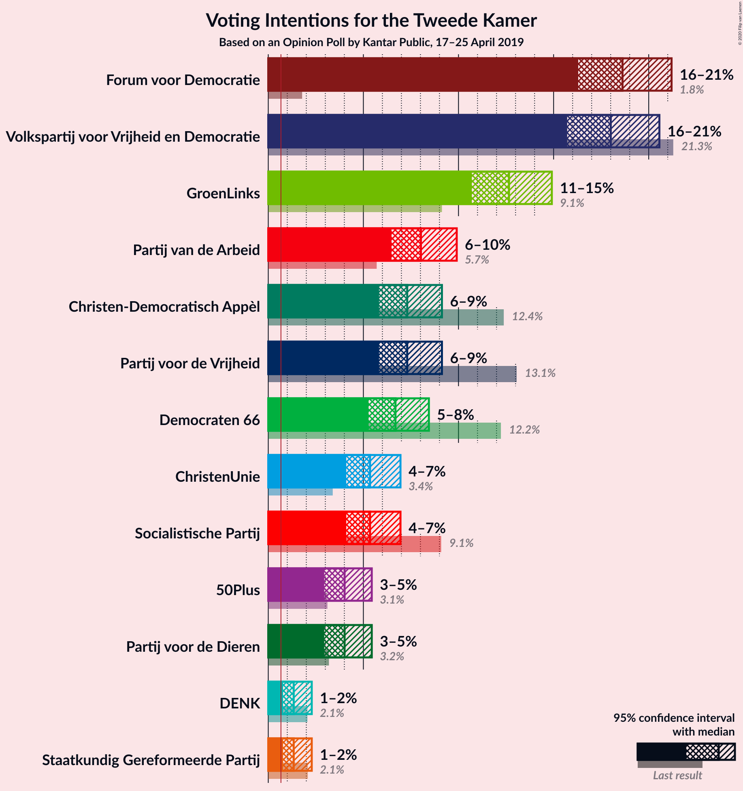

### Confidence Intervals

| Party | Last Result | Poll Result | 80% Confidence Interval | 90% Confidence Interval | 95% Confidence Interval | 99% Confidence Interval |
|:-----:|:-----------:|:-----------:|:-----------------------:|:-----------------------:|:-----------------------:|:-----------------------:|
| Forum voor Democratie | 1.8% | 18.6% | 17.1–20.3% |16.7–20.8% |16.3–21.2% |15.6–22.0% |
| Volkspartij voor Vrijheid en Democratie | 21.3% | 18.0% | 16.5–19.7% |16.1–20.1% |15.7–20.6% |15.0–21.4% |
| GroenLinks | 9.1% | 12.7% | 11.4–14.1% |11.0–14.5% |10.7–14.9% |10.1–15.6% |
| Partij van de Arbeid | 5.7% | 8.0% | 7.0–9.3% |6.7–9.6% |6.5–9.9% |6.0–10.5% |
| Partij voor de Vrijheid | 13.1% | 7.3% | 6.3–8.5% |6.1–8.8% |5.8–9.1% |5.4–9.7% |
| Christen-Democratisch Appèl | 12.4% | 7.3% | 6.3–8.5% |6.1–8.8% |5.8–9.1% |5.4–9.7% |
| Democraten 66 | 12.2% | 6.7% | 5.8–7.8% |5.5–8.2% |5.3–8.4% |4.9–9.0% |
| Socialistische Partij | 9.1% | 5.3% | 4.5–6.4% |4.3–6.7% |4.1–7.0% |3.7–7.5% |
| ChristenUnie | 3.4% | 5.3% | 4.5–6.4% |4.3–6.7% |4.1–7.0% |3.7–7.5% |
| Partij voor de Dieren | 3.2% | 4.0% | 3.3–5.0% |3.1–5.2% |2.9–5.4% |2.6–5.9% |
| 50Plus | 3.1% | 4.0% | 3.3–5.0% |3.1–5.2% |2.9–5.4% |2.6–5.9% |
| Staatkundig Gereformeerde Partij | 2.1% | 1.3% | 1.0–2.0% |0.9–2.1% |0.8–2.3% |0.6–2.6% |
| DENK | 2.1% | 1.3% | 1.0–2.0% |0.9–2.1% |0.8–2.3% |0.6–2.6% |

*Note:* The poll result column reflects the actual value used in the calculations. Published results may vary slightly, and in addition be rounded to fewer digits.

## Seats

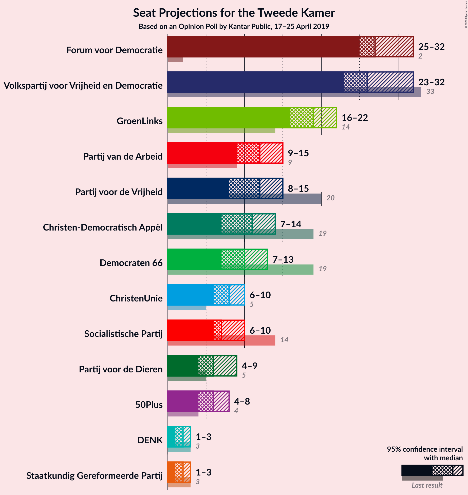

### Confidence Intervals

| Party | Last Result | Median | 80% Confidence Interval | 90% Confidence Interval | 95% Confidence Interval | 99% Confidence Interval |
|:-----:|:-----------:|:------:|:-----------------------:|:-----------------------:|:-----------------------:|:-----------------------:|
| <a href="#forum-voor-democratie">Forum voor Democratie</a> | 2 | 27 | 26–32 |26–32 |25–32 |24–32 |
| <a href="#volkspartij-voor-vrijheid-en-democratie">Volkspartij voor Vrijheid en Democratie</a> | 33 | 26 | 23–30 |23–32 |23–32 |21–32 |
| <a href="#groenlinks">GroenLinks</a> | 14 | 19 | 16–22 |16–22 |16–22 |15–23 |
| <a href="#partij-van-de-arbeid">Partij van de Arbeid</a> | 9 | 12 | 10–15 |9–15 |9–15 |9–16 |
| <a href="#partij-voor-de-vrijheid">Partij voor de Vrijheid</a> | 20 | 12 | 9–15 |8–15 |8–15 |8–15 |
| <a href="#christen-democratisch-appèl">Christen-Democratisch Appèl</a> | 19 | 11 | 10–13 |8–14 |7–14 |7–14 |
| <a href="#democraten-66">Democraten 66</a> | 19 | 10 | 8–13 |8–13 |7–13 |6–15 |
| <a href="#socialistische-partij">Socialistische Partij</a> | 14 | 7 | 6–9 |6–10 |6–10 |6–11 |
| <a href="#christenunie">ChristenUnie</a> | 5 | 8 | 6–9 |6–9 |6–10 |5–11 |
| <a href="#partij-voor-de-dieren">Partij voor de Dieren</a> | 5 | 6 | 4–8 |4–9 |4–9 |4–9 |
| <a href="#50plus">50Plus</a> | 4 | 6 | 5–7 |5–8 |4–8 |4–8 |
| <a href="#staatkundig-gereformeerde-partij">Staatkundig Gereformeerde Partij</a> | 3 | 2 | 1–3 |1–3 |1–3 |0–4 |
| <a href="#denk">DENK</a> | 3 | 2 | 1–3 |1–3 |1–3 |1–4 |

### Forum voor Democratie

*For a full overview of the results for this party, see the [Forum voor Democratie](party-forumvoordemocratie.html) page.*

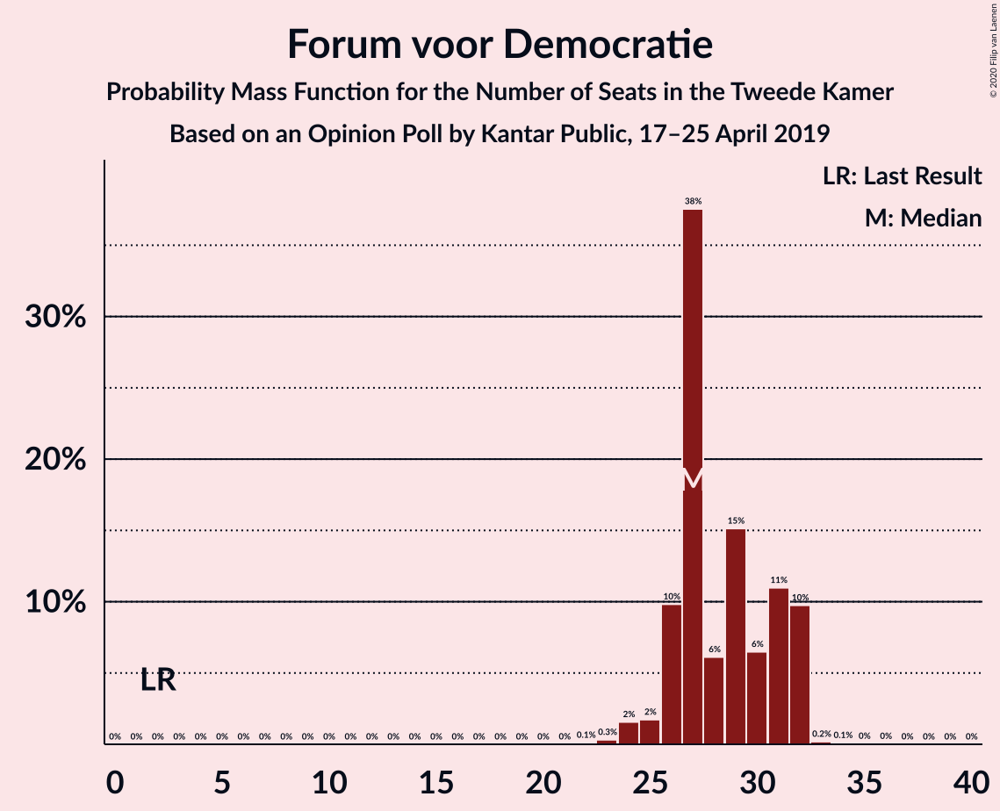

| Number of Seats | Probability | Accumulated | Special Marks |
|:---------------:|:-----------:|:-----------:|:-------------:|
| 2 | 0% | 100% | Last Result |
| 3 | 0% | 100% |  |
| 4 | 0% | 100% |  |
| 5 | 0% | 100% |  |
| 6 | 0% | 100% |  |
| 7 | 0% | 100% |  |
| 8 | 0% | 100% |  |
| 9 | 0% | 100% |  |
| 10 | 0% | 100% |  |
| 11 | 0% | 100% |  |
| 12 | 0% | 100% |  |
| 13 | 0% | 100% |  |
| 14 | 0% | 100% |  |
| 15 | 0% | 100% |  |
| 16 | 0% | 100% |  |
| 17 | 0% | 100% |  |
| 18 | 0% | 100% |  |
| 19 | 0% | 100% |  |
| 20 | 0% | 100% |  |
| 21 | 0% | 100% |  |
| 22 | 0.1% | 100% |  |
| 23 | 0.3% | 99.9% |  |
| 24 | 2% | 99.6% |  |
| 25 | 2% | 98% |  |
| 26 | 10% | 96% |  |
| 27 | 38% | 86% | Median |
| 28 | 6% | 49% |  |
| 29 | 15% | 43% |  |
| 30 | 6% | 28% |  |
| 31 | 11% | 21% |  |
| 32 | 10% | 10% |  |
| 33 | 0.2% | 0.4% |  |
| 34 | 0.1% | 0.2% |  |
| 35 | 0% | 0.1% |  |
| 36 | 0% | 0% |  |

### Volkspartij voor Vrijheid en Democratie

*For a full overview of the results for this party, see the [Volkspartij voor Vrijheid en Democratie](party-volkspartijvoorvrijheidendemocratie.html) page.*

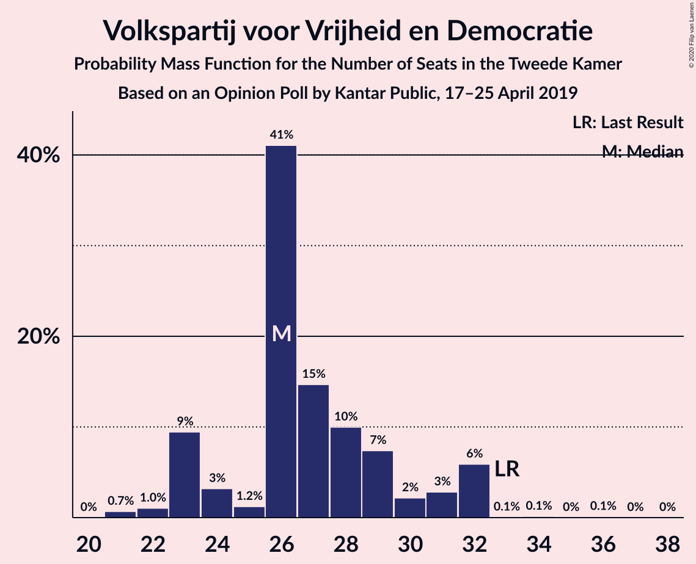

| Number of Seats | Probability | Accumulated | Special Marks |
|:---------------:|:-----------:|:-----------:|:-------------:|
| 21 | 0.7% | 100% |  |
| 22 | 1.0% | 99.3% |  |
| 23 | 9% | 98% |  |
| 24 | 3% | 89% |  |
| 25 | 1.2% | 86% |  |
| 26 | 41% | 84% | Median |
| 27 | 15% | 43% |  |
| 28 | 10% | 29% |  |
| 29 | 7% | 19% |  |
| 30 | 2% | 11% |  |
| 31 | 3% | 9% |  |
| 32 | 6% | 6% |  |
| 33 | 0.1% | 0.3% | Last Result |
| 34 | 0.1% | 0.3% |  |
| 35 | 0% | 0.1% |  |
| 36 | 0.1% | 0.1% |  |
| 37 | 0% | 0% |  |

### GroenLinks

*For a full overview of the results for this party, see the [GroenLinks](party-groenlinks.html) page.*

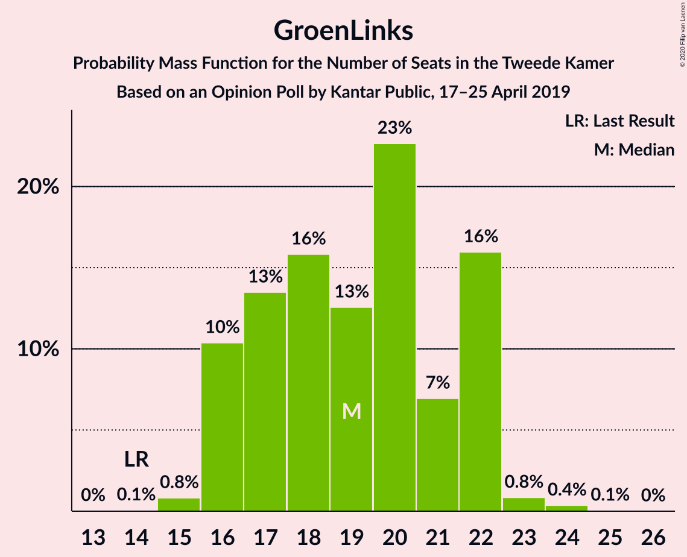

| Number of Seats | Probability | Accumulated | Special Marks |
|:---------------:|:-----------:|:-----------:|:-------------:|
| 14 | 0.1% | 100% | Last Result |
| 15 | 0.8% | 99.9% |  |
| 16 | 10% | 99.1% |  |
| 17 | 13% | 89% |  |
| 18 | 16% | 75% |  |
| 19 | 13% | 59% | Median |
| 20 | 23% | 47% |  |
| 21 | 7% | 24% |  |
| 22 | 16% | 17% |  |
| 23 | 0.8% | 1.3% |  |
| 24 | 0.4% | 0.4% |  |
| 25 | 0.1% | 0.1% |  |
| 26 | 0% | 0% |  |

### Partij van de Arbeid

*For a full overview of the results for this party, see the [Partij van de Arbeid](party-partijvandearbeid.html) page.*

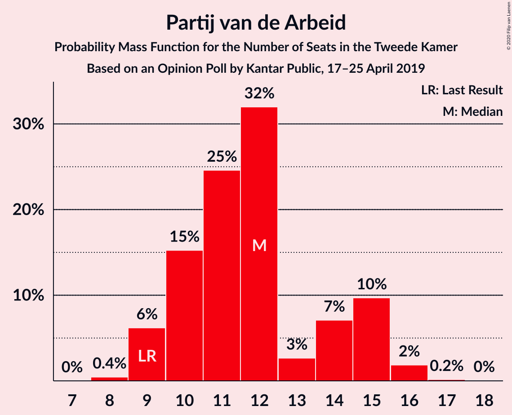

| Number of Seats | Probability | Accumulated | Special Marks |
|:---------------:|:-----------:|:-----------:|:-------------:|
| 8 | 0.4% | 100% |  |
| 9 | 6% | 99.5% | Last Result |
| 10 | 15% | 93% |  |
| 11 | 25% | 78% |  |
| 12 | 32% | 54% | Median |
| 13 | 3% | 22% |  |
| 14 | 7% | 19% |  |
| 15 | 10% | 12% |  |
| 16 | 2% | 2% |  |
| 17 | 0.2% | 0.2% |  |
| 18 | 0% | 0% |  |

### Partij voor de Vrijheid

*For a full overview of the results for this party, see the [Partij voor de Vrijheid](party-partijvoordevrijheid.html) page.*

| Number of Seats | Probability | Accumulated | Special Marks |
|:---------------:|:-----------:|:-----------:|:-------------:|
| 7 | 0.1% | 100% |  |
| 8 | 7% | 99.9% |  |
| 9 | 15% | 92% |  |
| 10 | 12% | 77% |  |
| 11 | 13% | 65% |  |
| 12 | 21% | 52% | Median |
| 13 | 3% | 31% |  |
| 14 | 16% | 29% |  |
| 15 | 12% | 13% |  |
| 16 | 0.2% | 0.3% |  |
| 17 | 0.1% | 0.1% |  |
| 18 | 0% | 0% |  |
| 19 | 0% | 0% |  |
| 20 | 0% | 0% | Last Result |

### Christen-Democratisch Appèl

*For a full overview of the results for this party, see the [Christen-Democratisch Appèl](party-christen-democratischappèl.html) page.*

| Number of Seats | Probability | Accumulated | Special Marks |
|:---------------:|:-----------:|:-----------:|:-------------:|
| 7 | 5% | 100% |  |
| 8 | 2% | 95% |  |
| 9 | 1.2% | 93% |  |
| 10 | 30% | 92% |  |
| 11 | 34% | 62% | Median |
| 12 | 7% | 28% |  |
| 13 | 15% | 21% |  |
| 14 | 6% | 6% |  |
| 15 | 0.2% | 0.2% |  |
| 16 | 0% | 0% |  |
| 17 | 0% | 0% |  |
| 18 | 0% | 0% |  |
| 19 | 0% | 0% | Last Result |

### Democraten 66

*For a full overview of the results for this party, see the [Democraten 66](party-democraten66.html) page.*

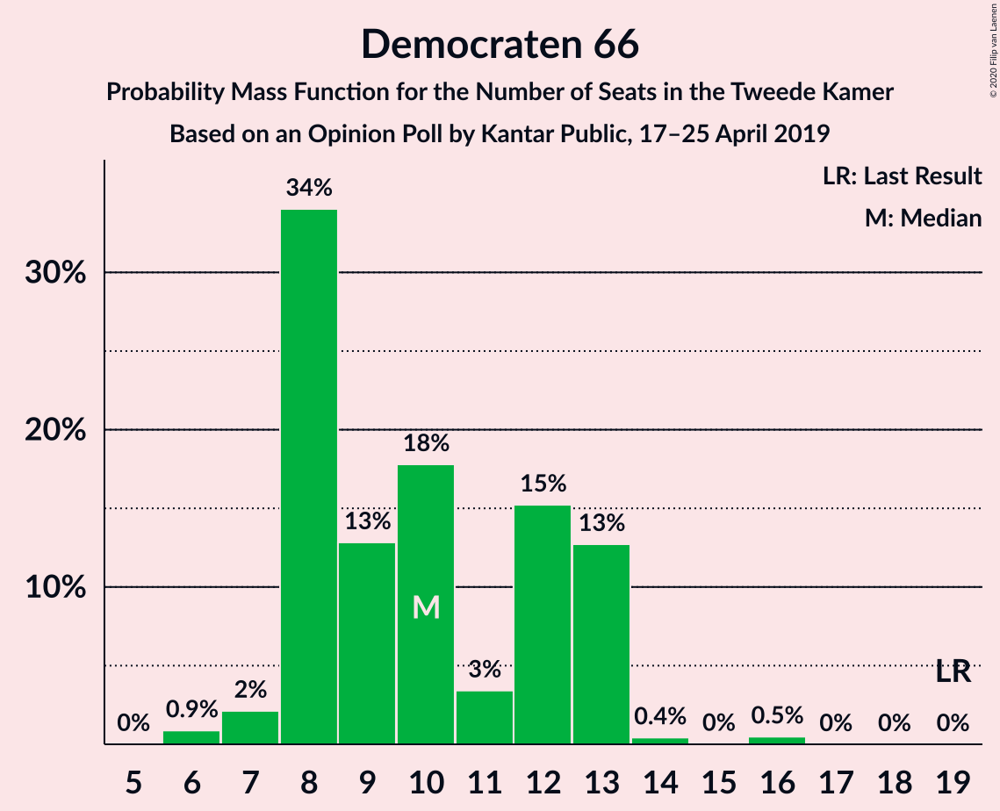

| Number of Seats | Probability | Accumulated | Special Marks |
|:---------------:|:-----------:|:-----------:|:-------------:|
| 6 | 0.9% | 100% |  |
| 7 | 2% | 99.1% |  |
| 8 | 34% | 97% |  |
| 9 | 13% | 63% |  |
| 10 | 18% | 50% | Median |
| 11 | 3% | 32% |  |
| 12 | 15% | 29% |  |
| 13 | 13% | 14% |  |
| 14 | 0.4% | 0.9% |  |
| 15 | 0% | 0.5% |  |
| 16 | 0.5% | 0.5% |  |
| 17 | 0% | 0% |  |
| 18 | 0% | 0% |  |
| 19 | 0% | 0% | Last Result |

### Socialistische Partij

*For a full overview of the results for this party, see the [Socialistische Partij](party-socialistischepartij.html) page.*

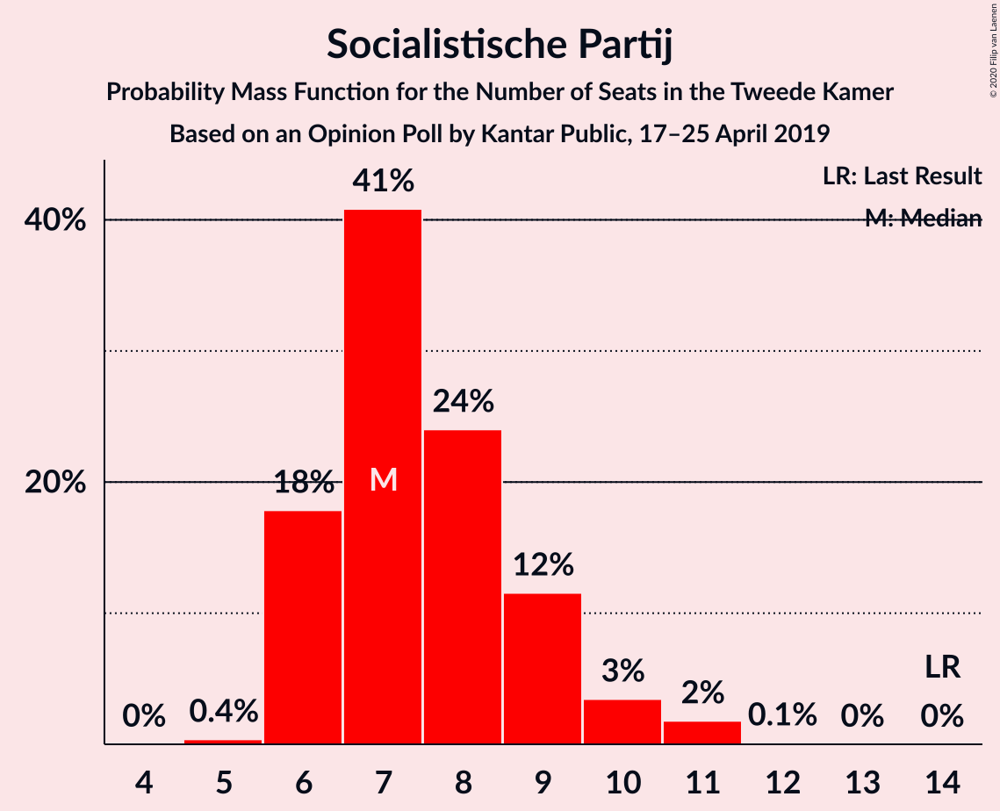

| Number of Seats | Probability | Accumulated | Special Marks |
|:---------------:|:-----------:|:-----------:|:-------------:|
| 5 | 0.4% | 100% |  |
| 6 | 18% | 99.6% |  |
| 7 | 41% | 82% | Median |
| 8 | 24% | 41% |  |
| 9 | 12% | 17% |  |
| 10 | 3% | 5% |  |
| 11 | 2% | 2% |  |
| 12 | 0.1% | 0.1% |  |
| 13 | 0% | 0% |  |
| 14 | 0% | 0% | Last Result |

### ChristenUnie

*For a full overview of the results for this party, see the [ChristenUnie](party-christenunie.html) page.*

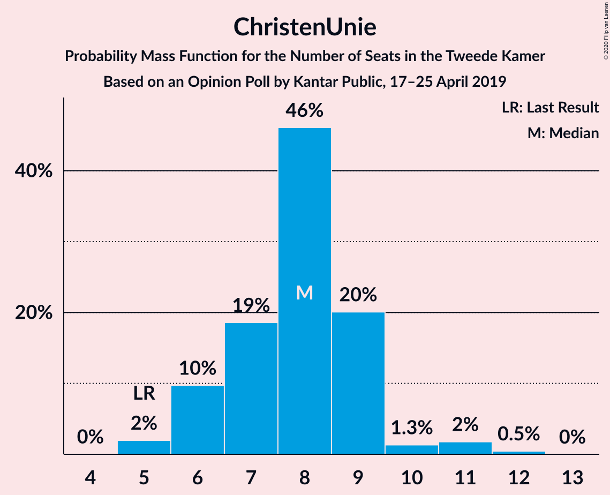

| Number of Seats | Probability | Accumulated | Special Marks |
|:---------------:|:-----------:|:-----------:|:-------------:|
| 5 | 2% | 100% | Last Result |
| 6 | 10% | 98% |  |
| 7 | 19% | 88% |  |
| 8 | 46% | 70% | Median |
| 9 | 20% | 24% |  |
| 10 | 1.3% | 4% |  |
| 11 | 2% | 2% |  |
| 12 | 0.5% | 0.5% |  |
| 13 | 0% | 0% |  |

### Partij voor de Dieren

*For a full overview of the results for this party, see the [Partij voor de Dieren](party-partijvoordedieren.html) page.*

| Number of Seats | Probability | Accumulated | Special Marks |
|:---------------:|:-----------:|:-----------:|:-------------:|
| 3 | 0.2% | 100% |  |
| 4 | 10% | 99.8% |  |
| 5 | 38% | 90% | Last Result |
| 6 | 14% | 52% | Median |
| 7 | 18% | 38% |  |
| 8 | 14% | 20% |  |
| 9 | 6% | 6% |  |
| 10 | 0.1% | 0.1% |  |
| 11 | 0% | 0% |  |

### 50Plus

*For a full overview of the results for this party, see the [50Plus](party-50plus.html) page.*

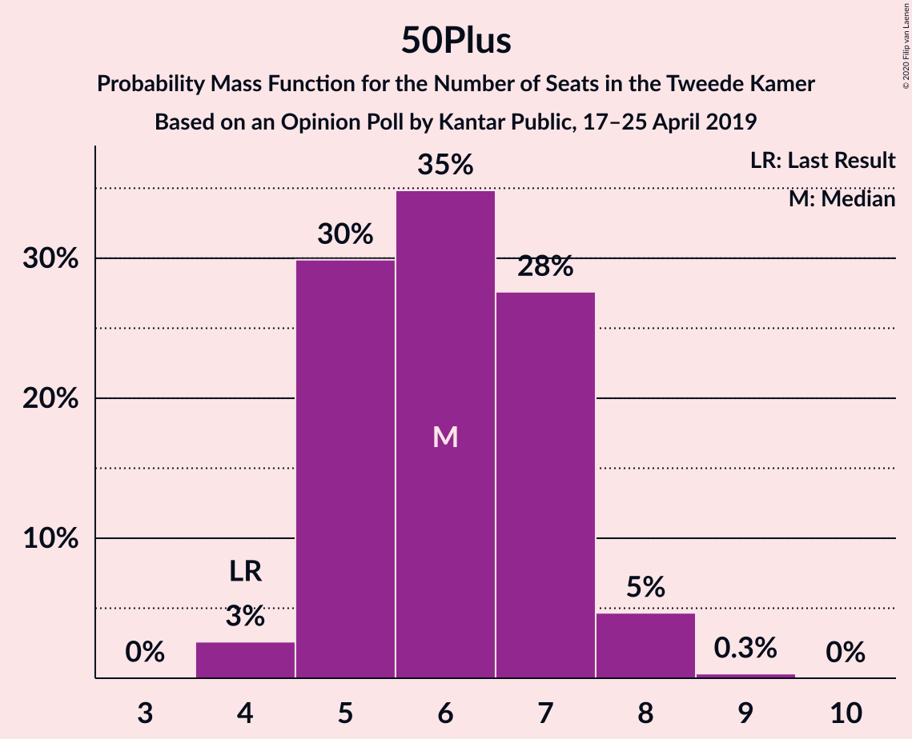

| Number of Seats | Probability | Accumulated | Special Marks |
|:---------------:|:-----------:|:-----------:|:-------------:|
| 4 | 3% | 100% | Last Result |
| 5 | 30% | 97% |  |
| 6 | 35% | 67% | Median |
| 7 | 28% | 33% |  |
| 8 | 5% | 5% |  |
| 9 | 0.3% | 0.3% |  |
| 10 | 0% | 0% |  |

### Staatkundig Gereformeerde Partij

*For a full overview of the results for this party, see the [Staatkundig Gereformeerde Partij](party-staatkundiggereformeerdepartij.html) page.*

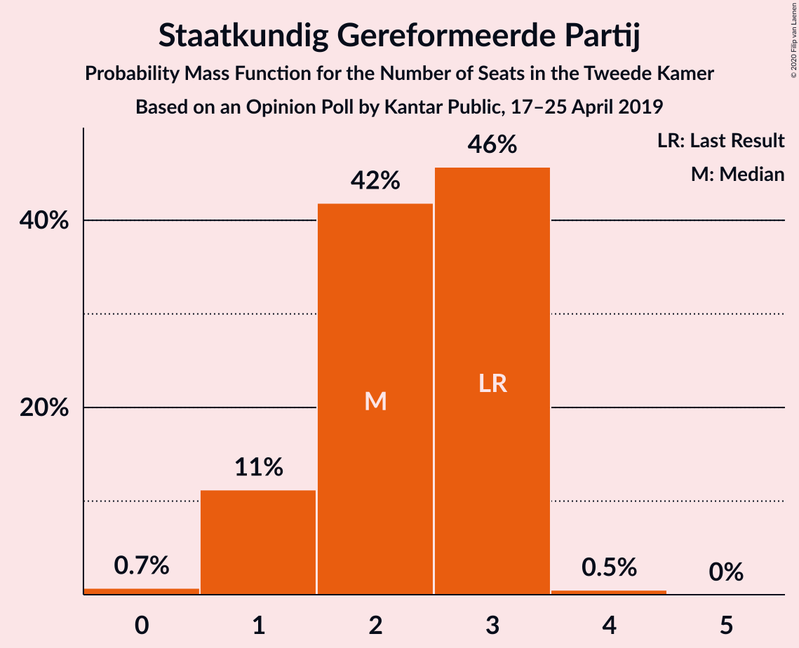

| Number of Seats | Probability | Accumulated | Special Marks |
|:---------------:|:-----------:|:-----------:|:-------------:|
| 0 | 0.7% | 100% |  |
| 1 | 11% | 99.3% |  |
| 2 | 42% | 88% | Median |
| 3 | 46% | 46% | Last Result |
| 4 | 0.5% | 0.5% |  |
| 5 | 0% | 0% |  |

### DENK

*For a full overview of the results for this party, see the [DENK](party-denk.html) page.*

| Number of Seats | Probability | Accumulated | Special Marks |
|:---------------:|:-----------:|:-----------:|:-------------:|
| 0 | 0.1% | 100% |  |
| 1 | 42% | 99.9% |  |
| 2 | 34% | 58% | Median |
| 3 | 24% | 24% | Last Result |
| 4 | 0.7% | 0.8% |  |
| 5 | 0% | 0% |  |

## Coalitions

### Confidence Intervals

| Coalition | Last Result | Median | Majority? | 80% Confidence Interval | 90% Confidence Interval | 95% Confidence Interval | 99% Confidence Interval |
|:---------:|:-----------:|:------:|:---------:|:-----------------------:|:-----------------------:|:-----------------------:|:-----------------------:|
| Forum voor Democratie – Volkspartij voor Vrijheid en Democratie – Christen-Democratisch Appèl – Partij voor de Vrijheid – Staatkundig Gereformeerde Partij | 77 | 81 | 82% | 74–84 | 73–84 | 73–85 | 71–87 |
| Forum voor Democratie – Volkspartij voor Vrijheid en Democratie – Christen-Democratisch Appèl – Partij voor de Vrijheid | 74 | 78 | 71% | 72–82 | 71–83 | 71–83 | 69–86 |
| Volkspartij voor Vrijheid en Democratie – GroenLinks – Christen-Democratisch Appèl – Democraten 66 – ChristenUnie | 90 | 75 | 31% | 70–78 | 70–81 | 70–81 | 69–82 |
| Forum voor Democratie – Volkspartij voor Vrijheid en Democratie – Christen-Democratisch Appèl – 50Plus – Staatkundig Gereformeerde Partij | 61 | 73 | 37% | 69–80 | 68–80 | 68–80 | 68–81 |
| Forum voor Democratie – Volkspartij voor Vrijheid en Democratie – Christen-Democratisch Appèl – 50Plus | 58 | 70 | 29% | 67–78 | 66–78 | 66–79 | 66–79 |
| Forum voor Democratie – Volkspartij voor Vrijheid en Democratie – Christen-Democratisch Appèl – Staatkundig Gereformeerde Partij | 57 | 67 | 1.0% | 63–74 | 61–74 | 61–74 | 61–76 |
| Volkspartij voor Vrijheid en Democratie – Partij van de Arbeid – Christen-Democratisch Appèl – Democraten 66 – ChristenUnie | 85 | 67 | 0.2% | 64–71 | 63–73 | 63–73 | 63–73 |
| GroenLinks – Partij van de Arbeid – Christen-Democratisch Appèl – Democraten 66 – ChristenUnie – Socialistische Partij | 80 | 68 | 0.1% | 63–72 | 61–72 | 61–73 | 61–74 |
| Forum voor Democratie – Volkspartij voor Vrijheid en Democratie – Christen-Democratisch Appèl | 54 | 64 | 0% | 61–72 | 59–73 | 59–73 | 59–73 |
| GroenLinks – Partij van de Arbeid – Christen-Democratisch Appèl – Democraten 66 – ChristenUnie | 66 | 60 | 0% | 56–63 | 54–63 | 54–64 | 53–67 |
| Volkspartij voor Vrijheid en Democratie – Christen-Democratisch Appèl – Democraten 66 – ChristenUnie | 76 | 55 | 0% | 51–59 | 51–61 | 51–61 | 51–61 |
| Volkspartij voor Vrijheid en Democratie – Partij van de Arbeid – Christen-Democratisch Appèl | 61 | 49 | 0% | 47–54 | 45–55 | 45–55 | 43–57 |
| Volkspartij voor Vrijheid en Democratie – Christen-Democratisch Appèl – Partij voor de Vrijheid | 72 | 50 | 0% | 45–52 | 45–53 | 45–55 | 43–56 |
| Volkspartij voor Vrijheid en Democratie – Christen-Democratisch Appèl – Democraten 66 | 71 | 48 | 0% | 43–51 | 42–55 | 42–55 | 42–56 |
| Volkspartij voor Vrijheid en Democratie – Partij van de Arbeid – Democraten 66 | 61 | 48 | 0% | 45–52 | 45–52 | 45–54 | 43–56 |
| Volkspartij voor Vrijheid en Democratie – Partij van de Arbeid | 42 | 38 | 0% | 36–42 | 36–43 | 35–43 | 33–45 |
| Volkspartij voor Vrijheid en Democratie – Christen-Democratisch Appèl | 52 | 37 | 0% | 33–42 | 33–43 | 33–43 | 33–44 |
| Partij van de Arbeid – Christen-Democratisch Appèl – Democraten 66 | 47 | 33 | 0% | 30–36 | 29–37 | 29–37 | 27–39 |
| Partij van de Arbeid – Christen-Democratisch Appèl – ChristenUnie | 33 | 30 | 0% | 27–34 | 27–35 | 27–35 | 26–38 |
| Partij van de Arbeid – Christen-Democratisch Appèl | 28 | 22 | 0% | 21–25 | 19–27 | 19–27 | 17–28 |
| Christen-Democratisch Appèl – Democraten 66 | 38 | 20 | 0% | 19–24 | 17–26 | 17–27 | 16–27 |

### Forum voor Democratie – Volkspartij voor Vrijheid en Democratie – Christen-Democratisch Appèl – Partij voor de Vrijheid – Staatkundig Gereformeerde Partij

| Number of Seats | Probability | Accumulated | Special Marks |
|:---------------:|:-----------:|:-----------:|:-------------:|
| 71 | 0.5% | 100% |  |
| 72 | 0.1% | 99.4% |  |
| 73 | 9% | 99.4% |  |
| 74 | 1.5% | 91% |  |
| 75 | 7% | 89% |  |
| 76 | 9% | 82% | Majority |
| 77 | 1.1% | 73% | Last Result |
| 78 | 3% | 72% | Median |
| 79 | 3% | 70% |  |
| 80 | 3% | 67% |  |
| 81 | 25% | 64% |  |
| 82 | 15% | 38% |  |
| 83 | 0.3% | 24% |  |
| 84 | 20% | 23% |  |
| 85 | 0.5% | 3% |  |
| 86 | 0.9% | 2% |  |
| 87 | 1.4% | 1.5% |  |
| 88 | 0% | 0% |  |

### Forum voor Democratie – Volkspartij voor Vrijheid en Democratie – Christen-Democratisch Appèl – Partij voor de Vrijheid

| Number of Seats | Probability | Accumulated | Special Marks |
|:---------------:|:-----------:|:-----------:|:-------------:|
| 69 | 0.5% | 100% |  |
| 70 | 0.1% | 99.4% |  |
| 71 | 9% | 99.4% |  |
| 72 | 0.7% | 90% |  |
| 73 | 15% | 89% |  |
| 74 | 0.7% | 75% | Last Result |
| 75 | 3% | 74% |  |
| 76 | 1.3% | 71% | Median, Majority |
| 77 | 4% | 70% |  |
| 78 | 16% | 66% |  |
| 79 | 24% | 49% |  |
| 80 | 0.9% | 25% |  |
| 81 | 3% | 24% |  |
| 82 | 14% | 21% |  |
| 83 | 5% | 7% |  |
| 84 | 0.2% | 2% |  |
| 85 | 0.9% | 2% |  |
| 86 | 1.4% | 1.4% |  |
| 87 | 0% | 0% |  |

### Volkspartij voor Vrijheid en Democratie – GroenLinks – Christen-Democratisch Appèl – Democraten 66 – ChristenUnie

| Number of Seats | Probability | Accumulated | Special Marks |
|:---------------:|:-----------:|:-----------:|:-------------:|
| 67 | 0% | 100% |  |
| 68 | 0.1% | 99.9% |  |
| 69 | 0.4% | 99.9% |  |
| 70 | 11% | 99.5% |  |
| 71 | 16% | 88% |  |
| 72 | 3% | 73% |  |
| 73 | 3% | 69% |  |
| 74 | 3% | 66% | Median |
| 75 | 32% | 63% |  |
| 76 | 6% | 31% | Majority |
| 77 | 3% | 25% |  |
| 78 | 15% | 22% |  |
| 79 | 1.1% | 7% |  |
| 80 | 0.7% | 6% |  |
| 81 | 5% | 5% |  |
| 82 | 0.5% | 0.8% |  |
| 83 | 0.2% | 0.3% |  |
| 84 | 0% | 0.2% |  |
| 85 | 0.1% | 0.1% |  |
| 86 | 0% | 0% |  |
| 87 | 0% | 0% |  |
| 88 | 0% | 0% |  |
| 89 | 0% | 0% |  |
| 90 | 0% | 0% | Last Result |

### Forum voor Democratie – Volkspartij voor Vrijheid en Democratie – Christen-Democratisch Appèl – 50Plus – Staatkundig Gereformeerde Partij

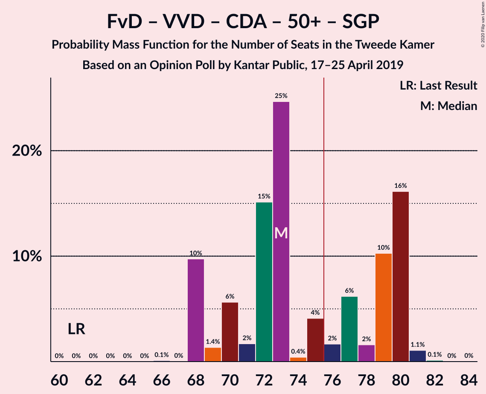

| Number of Seats | Probability | Accumulated | Special Marks |
|:---------------:|:-----------:|:-----------:|:-------------:|
| 61 | 0% | 100% | Last Result |
| 62 | 0% | 100% |  |
| 63 | 0% | 100% |  |
| 64 | 0% | 100% |  |
| 65 | 0% | 100% |  |
| 66 | 0.1% | 100% |  |
| 67 | 0% | 99.9% |  |
| 68 | 10% | 99.9% |  |
| 69 | 1.4% | 90% |  |
| 70 | 6% | 89% |  |
| 71 | 2% | 83% |  |
| 72 | 15% | 81% | Median |
| 73 | 25% | 66% |  |
| 74 | 0.4% | 42% |  |
| 75 | 4% | 41% |  |
| 76 | 2% | 37% | Majority |
| 77 | 6% | 35% |  |
| 78 | 2% | 29% |  |
| 79 | 10% | 28% |  |
| 80 | 16% | 17% |  |
| 81 | 1.1% | 1.2% |  |
| 82 | 0.1% | 0.2% |  |
| 83 | 0% | 0% |  |

### Forum voor Democratie – Volkspartij voor Vrijheid en Democratie – Christen-Democratisch Appèl – 50Plus

| Number of Seats | Probability | Accumulated | Special Marks |
|:---------------:|:-----------:|:-----------:|:-------------:|
| 58 | 0% | 100% | Last Result |
| 59 | 0% | 100% |  |
| 60 | 0% | 100% |  |
| 61 | 0% | 100% |  |
| 62 | 0% | 100% |  |
| 63 | 0% | 100% |  |
| 64 | 0.1% | 100% |  |
| 65 | 0% | 99.9% |  |
| 66 | 10% | 99.9% |  |
| 67 | 2% | 90% |  |
| 68 | 7% | 89% |  |
| 69 | 13% | 82% |  |
| 70 | 25% | 69% | Median |
| 71 | 1.1% | 44% |  |
| 72 | 4% | 43% |  |
| 73 | 0.6% | 38% |  |
| 74 | 4% | 38% |  |
| 75 | 5% | 34% |  |
| 76 | 0.8% | 29% | Majority |
| 77 | 11% | 29% |  |
| 78 | 13% | 18% |  |
| 79 | 5% | 5% |  |
| 80 | 0.2% | 0.2% |  |
| 81 | 0% | 0% |  |

### Forum voor Democratie – Volkspartij voor Vrijheid en Democratie – Christen-Democratisch Appèl – Staatkundig Gereformeerde Partij

| Number of Seats | Probability | Accumulated | Special Marks |
|:---------------:|:-----------:|:-----------:|:-------------:|
| 57 | 0% | 100% | Last Result |
| 58 | 0% | 100% |  |
| 59 | 0% | 100% |  |
| 60 | 0.1% | 100% |  |
| 61 | 9% | 99.9% |  |
| 62 | 0.6% | 91% |  |
| 63 | 5% | 91% |  |
| 64 | 2% | 85% |  |
| 65 | 1.3% | 83% |  |
| 66 | 4% | 82% | Median |
| 67 | 36% | 78% |  |
| 68 | 1.2% | 42% |  |
| 69 | 3% | 41% |  |
| 70 | 3% | 38% |  |
| 71 | 2% | 35% |  |
| 72 | 7% | 33% |  |
| 73 | 14% | 26% |  |
| 74 | 11% | 12% |  |
| 75 | 0.2% | 1.2% |  |
| 76 | 0.9% | 1.0% | Majority |
| 77 | 0.1% | 0.1% |  |
| 78 | 0% | 0% |  |

### Volkspartij voor Vrijheid en Democratie – Partij van de Arbeid – Christen-Democratisch Appèl – Democraten 66 – ChristenUnie

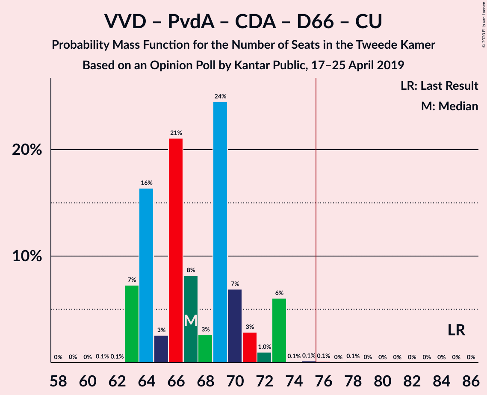

| Number of Seats | Probability | Accumulated | Special Marks |
|:---------------:|:-----------:|:-----------:|:-------------:|
| 59 | 0% | 100% |  |
| 60 | 0% | 99.9% |  |
| 61 | 0.1% | 99.9% |  |
| 62 | 0.1% | 99.9% |  |
| 63 | 7% | 99.8% |  |
| 64 | 16% | 93% |  |
| 65 | 3% | 76% |  |
| 66 | 21% | 74% |  |
| 67 | 8% | 53% | Median |
| 68 | 3% | 44% |  |
| 69 | 24% | 42% |  |
| 70 | 7% | 17% |  |
| 71 | 3% | 10% |  |
| 72 | 1.0% | 8% |  |
| 73 | 6% | 7% |  |
| 74 | 0.1% | 0.5% |  |
| 75 | 0.1% | 0.4% |  |
| 76 | 0.1% | 0.2% | Majority |
| 77 | 0% | 0.1% |  |
| 78 | 0.1% | 0.1% |  |
| 79 | 0% | 0% |  |
| 80 | 0% | 0% |  |
| 81 | 0% | 0% |  |
| 82 | 0% | 0% |  |
| 83 | 0% | 0% |  |
| 84 | 0% | 0% |  |
| 85 | 0% | 0% | Last Result |

### GroenLinks – Partij van de Arbeid – Christen-Democratisch Appèl – Democraten 66 – ChristenUnie – Socialistische Partij

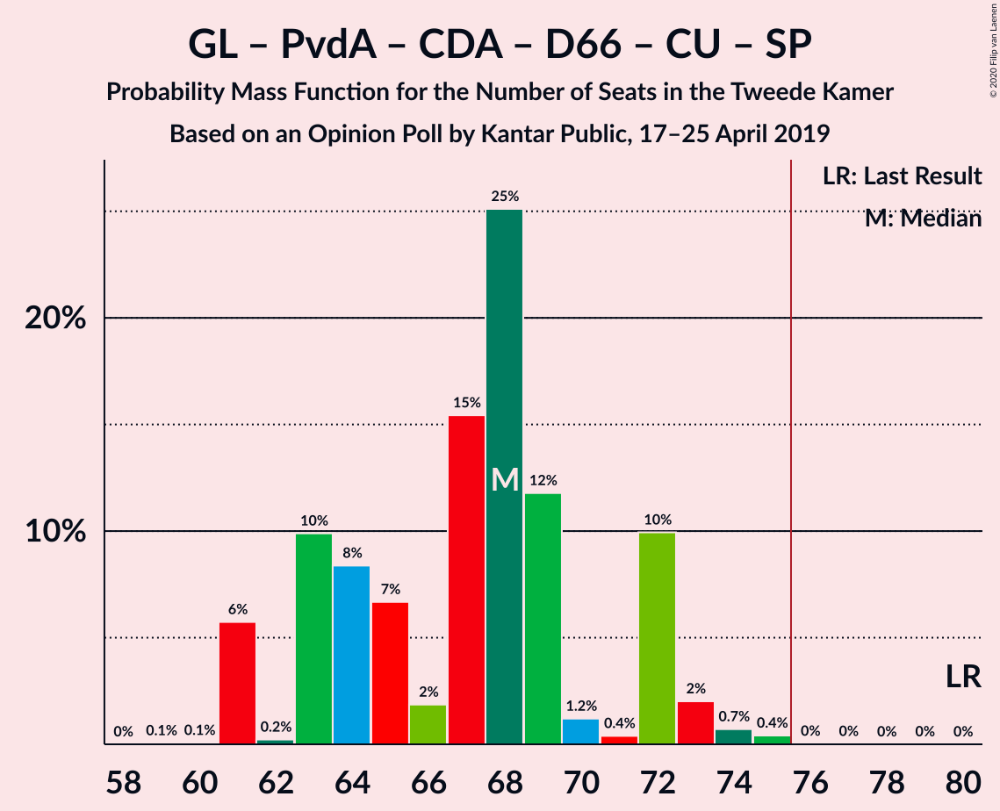

| Number of Seats | Probability | Accumulated | Special Marks |
|:---------------:|:-----------:|:-----------:|:-------------:|
| 59 | 0.1% | 100% |  |
| 60 | 0.1% | 99.9% |  |
| 61 | 6% | 99.9% |  |
| 62 | 0.2% | 94% |  |
| 63 | 10% | 94% |  |
| 64 | 8% | 84% |  |
| 65 | 7% | 76% |  |
| 66 | 2% | 69% |  |
| 67 | 15% | 67% | Median |
| 68 | 25% | 52% |  |
| 69 | 12% | 27% |  |
| 70 | 1.2% | 15% |  |
| 71 | 0.4% | 14% |  |
| 72 | 10% | 13% |  |
| 73 | 2% | 3% |  |
| 74 | 0.7% | 1.2% |  |
| 75 | 0.4% | 0.5% |  |
| 76 | 0% | 0.1% | Majority |
| 77 | 0% | 0% |  |
| 78 | 0% | 0% |  |
| 79 | 0% | 0% |  |
| 80 | 0% | 0% | Last Result |

### Forum voor Democratie – Volkspartij voor Vrijheid en Democratie – Christen-Democratisch Appèl

| Number of Seats | Probability | Accumulated | Special Marks |
|:---------------:|:-----------:|:-----------:|:-------------:|
| 54 | 0% | 100% | Last Result |
| 55 | 0% | 100% |  |
| 56 | 0% | 100% |  |
| 57 | 0% | 100% |  |
| 58 | 0.1% | 100% |  |
| 59 | 9% | 99.9% |  |
| 60 | 0.9% | 91% |  |
| 61 | 5% | 90% |  |
| 62 | 2% | 85% |  |
| 63 | 3% | 83% |  |
| 64 | 36% | 80% | Median |
| 65 | 2% | 44% |  |
| 66 | 2% | 42% |  |
| 67 | 4% | 40% |  |
| 68 | 1.3% | 36% |  |
| 69 | 4% | 35% |  |
| 70 | 5% | 31% |  |
| 71 | 14% | 26% |  |
| 72 | 4% | 12% |  |
| 73 | 7% | 8% |  |
| 74 | 0.1% | 0.2% |  |
| 75 | 0.1% | 0.1% |  |
| 76 | 0% | 0% | Majority |

### GroenLinks – Partij van de Arbeid – Christen-Democratisch Appèl – Democraten 66 – ChristenUnie

| Number of Seats | Probability | Accumulated | Special Marks |
|:---------------:|:-----------:|:-----------:|:-------------:|
| 52 | 0.1% | 100% |  |
| 53 | 2% | 99.9% |  |
| 54 | 4% | 98% |  |
| 55 | 0.6% | 94% |  |
| 56 | 11% | 93% |  |
| 57 | 10% | 82% |  |
| 58 | 3% | 72% |  |
| 59 | 5% | 69% |  |
| 60 | 29% | 64% | Median |
| 61 | 3% | 35% |  |
| 62 | 19% | 32% |  |
| 63 | 10% | 14% |  |
| 64 | 1.1% | 3% |  |
| 65 | 1.2% | 2% |  |
| 66 | 0.5% | 1.1% | Last Result |
| 67 | 0.6% | 0.6% |  |
| 68 | 0% | 0.1% |  |
| 69 | 0% | 0% |  |

### Volkspartij voor Vrijheid en Democratie – Christen-Democratisch Appèl – Democraten 66 – ChristenUnie

| Number of Seats | Probability | Accumulated | Special Marks |
|:---------------:|:-----------:|:-----------:|:-------------:|
| 48 | 0.1% | 100% |  |
| 49 | 0.1% | 99.9% |  |
| 50 | 0.1% | 99.8% |  |
| 51 | 15% | 99.8% |  |
| 52 | 3% | 85% |  |
| 53 | 18% | 82% |  |
| 54 | 11% | 64% |  |
| 55 | 3% | 53% | Median |
| 56 | 4% | 49% |  |
| 57 | 17% | 45% |  |
| 58 | 5% | 28% |  |
| 59 | 16% | 23% |  |
| 60 | 2% | 8% |  |
| 61 | 5% | 6% |  |
| 62 | 0.1% | 0.4% |  |
| 63 | 0% | 0.3% |  |
| 64 | 0.1% | 0.2% |  |
| 65 | 0% | 0.2% |  |
| 66 | 0.1% | 0.1% |  |
| 67 | 0% | 0% |  |
| 68 | 0% | 0% |  |
| 69 | 0% | 0% |  |
| 70 | 0% | 0% |  |
| 71 | 0% | 0% |  |
| 72 | 0% | 0% |  |
| 73 | 0% | 0% |  |
| 74 | 0% | 0% |  |
| 75 | 0% | 0% |  |
| 76 | 0% | 0% | Last Result, Majority |

### Volkspartij voor Vrijheid en Democratie – Partij van de Arbeid – Christen-Democratisch Appèl

| Number of Seats | Probability | Accumulated | Special Marks |
|:---------------:|:-----------:|:-----------:|:-------------:|
| 43 | 1.1% | 100% |  |
| 44 | 0.4% | 98.8% |  |
| 45 | 5% | 98% |  |
| 46 | 1.4% | 93% |  |
| 47 | 11% | 92% |  |
| 48 | 25% | 81% |  |
| 49 | 13% | 56% | Median |
| 50 | 7% | 43% |  |
| 51 | 20% | 36% |  |
| 52 | 1.3% | 16% |  |
| 53 | 0.7% | 15% |  |
| 54 | 8% | 14% |  |
| 55 | 5% | 6% |  |
| 56 | 0.2% | 0.7% |  |
| 57 | 0.3% | 0.5% |  |
| 58 | 0.2% | 0.3% |  |
| 59 | 0.1% | 0.1% |  |
| 60 | 0% | 0% |  |
| 61 | 0% | 0% | Last Result |

### Volkspartij voor Vrijheid en Democratie – Christen-Democratisch Appèl – Partij voor de Vrijheid

| Number of Seats | Probability | Accumulated | Special Marks |
|:---------------:|:-----------:|:-----------:|:-------------:|
| 41 | 0.2% | 100% |  |
| 42 | 0.1% | 99.7% |  |
| 43 | 0.7% | 99.6% |  |
| 44 | 1.1% | 98.9% |  |
| 45 | 15% | 98% |  |
| 46 | 10% | 83% |  |
| 47 | 3% | 73% |  |
| 48 | 5% | 70% |  |
| 49 | 6% | 65% | Median |
| 50 | 17% | 60% |  |
| 51 | 16% | 43% |  |
| 52 | 19% | 27% |  |
| 53 | 5% | 8% |  |
| 54 | 0.4% | 3% |  |
| 55 | 2% | 3% |  |
| 56 | 0.8% | 1.1% |  |
| 57 | 0.2% | 0.3% |  |
| 58 | 0.1% | 0.2% |  |
| 59 | 0% | 0.1% |  |
| 60 | 0% | 0% |  |
| 61 | 0% | 0% |  |
| 62 | 0% | 0% |  |
| 63 | 0% | 0% |  |
| 64 | 0% | 0% |  |
| 65 | 0% | 0% |  |
| 66 | 0% | 0% |  |
| 67 | 0% | 0% |  |
| 68 | 0% | 0% |  |
| 69 | 0% | 0% |  |
| 70 | 0% | 0% |  |
| 71 | 0% | 0% |  |
| 72 | 0% | 0% | Last Result |

### Volkspartij voor Vrijheid en Democratie – Christen-Democratisch Appèl – Democraten 66

| Number of Seats | Probability | Accumulated | Special Marks |
|:---------------:|:-----------:|:-----------:|:-------------:|
| 40 | 0.1% | 100% |  |
| 41 | 0.1% | 99.9% |  |
| 42 | 9% | 99.9% |  |
| 43 | 6% | 91% |  |
| 44 | 3% | 85% |  |
| 45 | 17% | 82% |  |
| 46 | 4% | 65% |  |
| 47 | 11% | 61% | Median |
| 48 | 1.0% | 50% |  |
| 49 | 20% | 49% |  |
| 50 | 11% | 29% |  |
| 51 | 10% | 18% |  |
| 52 | 1.3% | 8% |  |
| 53 | 0.6% | 7% |  |
| 54 | 1.0% | 6% |  |
| 55 | 5% | 5% |  |
| 56 | 0.7% | 0.9% |  |
| 57 | 0.1% | 0.2% |  |
| 58 | 0% | 0% |  |
| 59 | 0% | 0% |  |
| 60 | 0% | 0% |  |
| 61 | 0% | 0% |  |
| 62 | 0% | 0% |  |
| 63 | 0% | 0% |  |
| 64 | 0% | 0% |  |
| 65 | 0% | 0% |  |
| 66 | 0% | 0% |  |
| 67 | 0% | 0% |  |
| 68 | 0% | 0% |  |
| 69 | 0% | 0% |  |
| 70 | 0% | 0% |  |
| 71 | 0% | 0% | Last Result |

### Volkspartij voor Vrijheid en Democratie – Partij van de Arbeid – Democraten 66

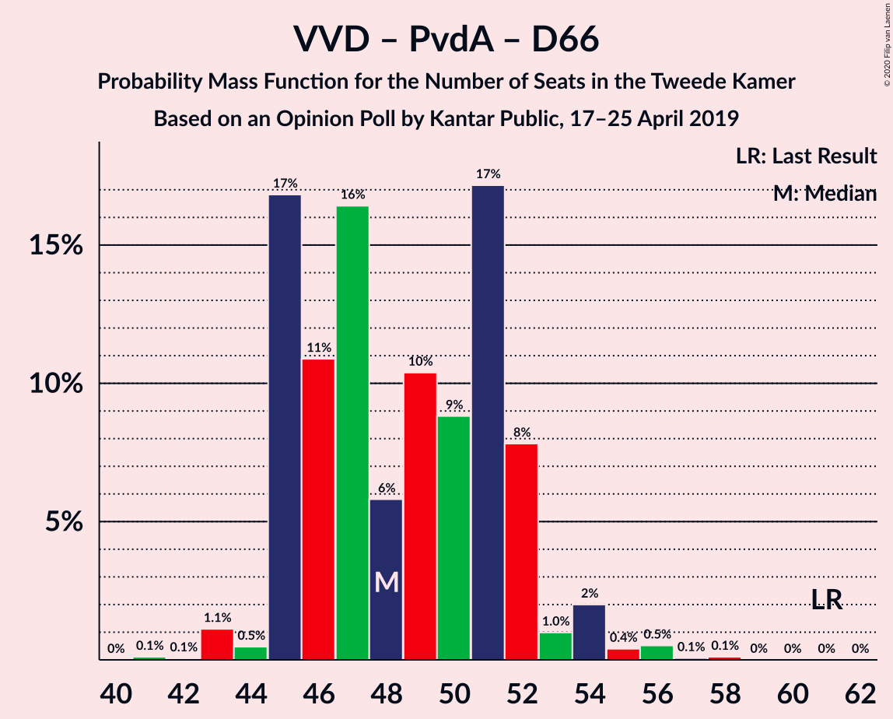

| Number of Seats | Probability | Accumulated | Special Marks |
|:---------------:|:-----------:|:-----------:|:-------------:|
| 41 | 0.1% | 100% |  |
| 42 | 0.1% | 99.9% |  |
| 43 | 1.1% | 99.8% |  |
| 44 | 0.5% | 98.7% |  |
| 45 | 17% | 98% |  |
| 46 | 11% | 81% |  |
| 47 | 16% | 71% |  |
| 48 | 6% | 54% | Median |
| 49 | 10% | 48% |  |
| 50 | 9% | 38% |  |
| 51 | 17% | 29% |  |
| 52 | 8% | 12% |  |
| 53 | 1.0% | 4% |  |
| 54 | 2% | 3% |  |
| 55 | 0.4% | 1.1% |  |
| 56 | 0.5% | 0.7% |  |
| 57 | 0.1% | 0.2% |  |
| 58 | 0.1% | 0.1% |  |
| 59 | 0% | 0% |  |
| 60 | 0% | 0% |  |
| 61 | 0% | 0% | Last Result |

### Volkspartij voor Vrijheid en Democratie – Partij van de Arbeid

| Number of Seats | Probability | Accumulated | Special Marks |
|:---------------:|:-----------:|:-----------:|:-------------:|
| 32 | 0.1% | 100% |  |
| 33 | 1.3% | 99.9% |  |
| 34 | 0.5% | 98.6% |  |
| 35 | 2% | 98% |  |
| 36 | 9% | 96% |  |
| 37 | 22% | 87% |  |
| 38 | 24% | 65% | Median |
| 39 | 18% | 41% |  |
| 40 | 5% | 23% |  |
| 41 | 3% | 18% |  |
| 42 | 6% | 15% | Last Result |
| 43 | 8% | 9% |  |
| 44 | 0.4% | 1.5% |  |
| 45 | 0.8% | 1.1% |  |
| 46 | 0.1% | 0.3% |  |
| 47 | 0.1% | 0.1% |  |
| 48 | 0.1% | 0.1% |  |
| 49 | 0% | 0% |  |

### Volkspartij voor Vrijheid en Democratie – Christen-Democratisch Appèl

| Number of Seats | Probability | Accumulated | Special Marks |
|:---------------:|:-----------:|:-----------:|:-------------:|
| 31 | 0.1% | 100% |  |
| 32 | 0.4% | 99.9% |  |
| 33 | 14% | 99.5% |  |
| 34 | 3% | 86% |  |
| 35 | 3% | 83% |  |
| 36 | 3% | 80% |  |
| 37 | 37% | 77% | Median |
| 38 | 3% | 40% |  |
| 39 | 11% | 37% |  |
| 40 | 3% | 26% |  |
| 41 | 9% | 23% |  |
| 42 | 7% | 14% |  |
| 43 | 5% | 6% |  |
| 44 | 0.8% | 1.0% |  |
| 45 | 0.1% | 0.3% |  |
| 46 | 0% | 0.2% |  |
| 47 | 0% | 0.1% |  |
| 48 | 0.1% | 0.1% |  |
| 49 | 0% | 0% |  |
| 50 | 0% | 0% |  |
| 51 | 0% | 0% |  |
| 52 | 0% | 0% | Last Result |

### Partij van de Arbeid – Christen-Democratisch Appèl – Democraten 66

| Number of Seats | Probability | Accumulated | Special Marks |
|:---------------:|:-----------:|:-----------:|:-------------:|
| 25 | 0.1% | 100% |  |
| 26 | 0% | 99.9% |  |
| 27 | 0.9% | 99.9% |  |
| 28 | 1.0% | 99.0% |  |
| 29 | 5% | 98% |  |
| 30 | 27% | 93% |  |
| 31 | 4% | 66% |  |
| 32 | 3% | 62% |  |
| 33 | 11% | 59% | Median |
| 34 | 31% | 47% |  |
| 35 | 3% | 16% |  |
| 36 | 7% | 13% |  |
| 37 | 5% | 7% |  |
| 38 | 0.1% | 1.5% |  |
| 39 | 1.1% | 1.3% |  |
| 40 | 0.1% | 0.2% |  |
| 41 | 0.1% | 0.1% |  |
| 42 | 0% | 0% |  |
| 43 | 0% | 0% |  |
| 44 | 0% | 0% |  |
| 45 | 0% | 0% |  |
| 46 | 0% | 0% |  |
| 47 | 0% | 0% | Last Result |

### Partij van de Arbeid – Christen-Democratisch Appèl – ChristenUnie

| Number of Seats | Probability | Accumulated | Special Marks |
|:---------------:|:-----------:|:-----------:|:-------------:|
| 25 | 0.1% | 100% |  |
| 26 | 2% | 99.8% |  |
| 27 | 8% | 98% |  |
| 28 | 3% | 90% |  |
| 29 | 10% | 87% |  |
| 30 | 43% | 77% |  |
| 31 | 1.3% | 33% | Median |
| 32 | 12% | 32% |  |
| 33 | 2% | 20% | Last Result |
| 34 | 11% | 18% |  |
| 35 | 6% | 7% |  |
| 36 | 0.2% | 1.0% |  |
| 37 | 0.2% | 0.8% |  |
| 38 | 0.6% | 0.6% |  |
| 39 | 0% | 0% |  |

### Partij van de Arbeid – Christen-Democratisch Appèl

| Number of Seats | Probability | Accumulated | Special Marks |
|:---------------:|:-----------:|:-----------:|:-------------:|
| 17 | 0.9% | 100% |  |
| 18 | 0.3% | 99.1% |  |
| 19 | 5% | 98.7% |  |
| 20 | 2% | 94% |  |
| 21 | 11% | 91% |  |
| 22 | 40% | 80% |  |
| 23 | 10% | 40% | Median |
| 24 | 1.3% | 30% |  |
| 25 | 19% | 28% |  |
| 26 | 3% | 9% |  |
| 27 | 5% | 6% |  |
| 28 | 0.7% | 1.1% | Last Result |
| 29 | 0.2% | 0.4% |  |
| 30 | 0.1% | 0.1% |  |
| 31 | 0% | 0% |  |

### Christen-Democratisch Appèl – Democraten 66

| Number of Seats | Probability | Accumulated | Special Marks |
|:---------------:|:-----------:|:-----------:|:-------------:|
| 16 | 0.9% | 100% |  |
| 17 | 5% | 99.1% |  |
| 18 | 3% | 94% |  |
| 19 | 31% | 90% |  |
| 20 | 10% | 60% |  |
| 21 | 11% | 49% | Median |
| 22 | 16% | 38% |  |
| 23 | 7% | 22% |  |
| 24 | 9% | 16% |  |
| 25 | 2% | 7% |  |
| 26 | 0.6% | 5% |  |
| 27 | 4% | 4% |  |
| 28 | 0% | 0% |  |
| 29 | 0% | 0% |  |
| 30 | 0% | 0% |  |
| 31 | 0% | 0% |  |
| 32 | 0% | 0% |  |
| 33 | 0% | 0% |  |
| 34 | 0% | 0% |  |
| 35 | 0% | 0% |  |
| 36 | 0% | 0% |  |
| 37 | 0% | 0% |  |
| 38 | 0% | 0% | Last Result |

## Technical Information

### Opinion Poll

+ **Polling firm:** Kantar Public
+ **Commissioner(s):** —
+ **Fieldwork period:** 17–25 April 2019

### Calculations

+ **Sample size:** 972
+ **Simulations done:** 1,048,576
+ **Error estimate:** 3.49%

