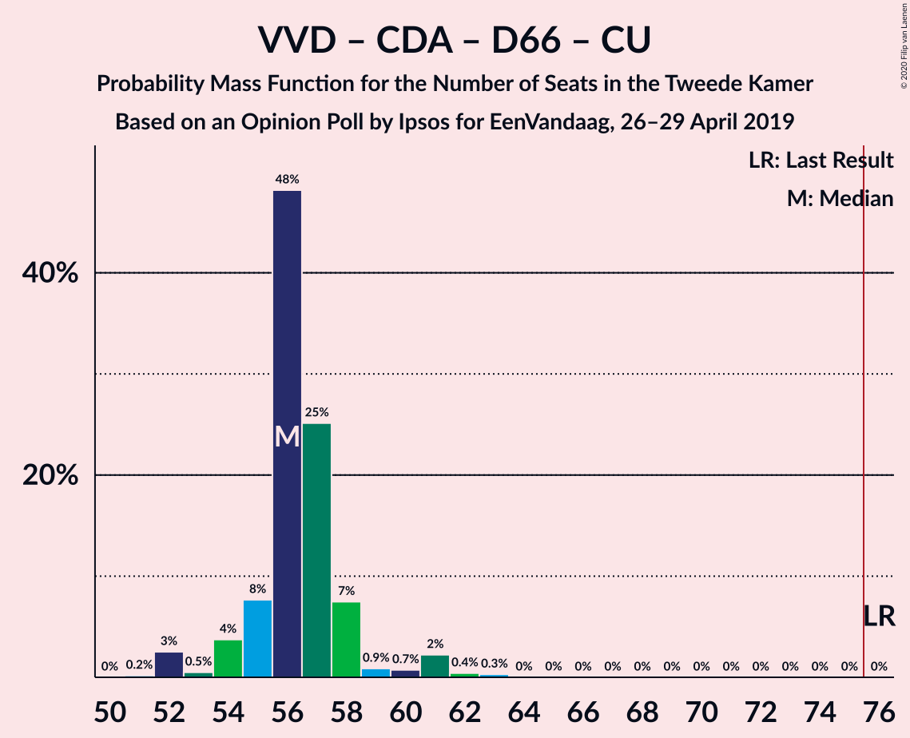

# Opinion Poll by Ipsos for EenVandaag, 26–29 April 2019

<a href="#voting-intentions">Voting Intentions</a> | <a href="#seats">Seats</a> | <a href="#coalitions">Coalitions</a> | <a href="#technical-information">Technical Information</a>

## Voting Intentions

### Confidence Intervals

| Party | Last Result | Poll Result | 80% Confidence Interval | 90% Confidence Interval | 95% Confidence Interval | 99% Confidence Interval |
|:-----:|:-----------:|:-----------:|:-----------------------:|:-----------------------:|:-----------------------:|:-----------------------:|
| Volkspartij voor Vrijheid en Democratie | 21.3% | 17.3% | 15.8–18.9% |15.4–19.3% |15.1–19.7% |14.4–20.5% |
| Forum voor Democratie | 1.8% | 16.5% | 15.1–18.1% |14.7–18.5% |14.4–18.9% |13.7–19.6% |
| Partij voor de Vrijheid | 13.1% | 9.4% | 8.4–10.7% |8.1–11.1% |7.8–11.4% |7.3–12.0% |
| Christen-Democratisch Appèl | 12.4% | 9.0% | 7.9–10.2% |7.6–10.5% |7.4–10.9% |6.9–11.5% |
| GroenLinks | 9.1% | 9.0% | 7.9–10.2% |7.6–10.5% |7.4–10.9% |6.9–11.5% |
| Democraten 66 | 12.2% | 7.3% | 6.4–8.5% |6.1–8.8% |5.9–9.1% |5.5–9.7% |
| Partij van de Arbeid | 5.7% | 6.7% | 5.8–7.8% |5.5–8.1% |5.3–8.4% |4.9–8.9% |
| Socialistische Partij | 9.1% | 6.4% | 5.5–7.5% |5.3–7.8% |5.1–8.0% |4.7–8.6% |
| Partij voor de Dieren | 3.2% | 5.1% | 4.3–6.0% |4.1–6.3% |3.9–6.6% |3.5–7.1% |
| ChristenUnie | 3.4% | 4.3% | 3.6–5.2% |3.4–5.5% |3.2–5.7% |2.9–6.2% |
| 50Plus | 3.1% | 3.8% | 3.2–4.7% |3.0–4.9% |2.8–5.2% |2.5–5.6% |
| Staatkundig Gereformeerde Partij | 2.1% | 2.5% | 2.0–3.2% |1.8–3.4% |1.7–3.6% |1.5–4.0% |
| DENK | 2.1% | 2.4% | 1.9–3.1% |1.7–3.3% |1.6–3.5% |1.4–3.9% |

*Note:* The poll result column reflects the actual value used in the calculations. Published results may vary slightly, and in addition be rounded to fewer digits.

## Seats

### Confidence Intervals

| Party | Last Result | Median | 80% Confidence Interval | 90% Confidence Interval | 95% Confidence Interval | 99% Confidence Interval |
|:-----:|:-----------:|:------:|:-----------------------:|:-----------------------:|:-----------------------:|:-----------------------:|
| <a href="#volkspartij-voor-vrijheid-en-democratie">Volkspartij voor Vrijheid en Democratie</a> | 33 | 27 | 24–27 |24–28 |23–29 |21–30 |
| <a href="#forum-voor-democratie">Forum voor Democratie</a> | 2 | 25 | 24–26 |24–27 |23–28 |21–29 |
| <a href="#partij-voor-de-vrijheid">Partij voor de Vrijheid</a> | 20 | 13 | 13–15 |12–15 |12–16 |11–17 |
| <a href="#christen-democratisch-appèl">Christen-Democratisch Appèl</a> | 19 | 14 | 13–14 |13–15 |12–15 |11–17 |
| <a href="#groenlinks">GroenLinks</a> | 14 | 14 | 13–16 |13–16 |13–16 |11–17 |
| <a href="#democraten-66">Democraten 66</a> | 19 | 9 | 9–12 |9–12 |9–13 |8–14 |
| <a href="#partij-van-de-arbeid">Partij van de Arbeid</a> | 9 | 9 | 9–11 |9–12 |8–12 |8–12 |
| <a href="#socialistische-partij">Socialistische Partij</a> | 14 | 10 | 9–10 |9–10 |8–11 |7–12 |
| <a href="#partij-voor-de-dieren">Partij voor de Dieren</a> | 5 | 8 | 7–9 |7–9 |7–9 |6–10 |
| <a href="#christenunie">ChristenUnie</a> | 5 | 6 | 5–8 |4–8 |4–8 |4–8 |
| <a href="#50plus">50Plus</a> | 4 | 7 | 5–7 |4–7 |4–7 |4–8 |
| <a href="#staatkundig-gereformeerde-partij">Staatkundig Gereformeerde Partij</a> | 3 | 4 | 3–5 |3–5 |3–5 |2–5 |
| <a href="#denk">DENK</a> | 3 | 4 | 3–4 |2–4 |2–4 |2–5 |

### Volkspartij voor Vrijheid en Democratie

*For a full overview of the results for this party, see the [Volkspartij voor Vrijheid en Democratie](party-volkspartijvoorvrijheidendemocratie.html) page.*

| Number of Seats | Probability | Accumulated | Special Marks |
|:---------------:|:-----------:|:-----------:|:-------------:|
| 21 | 2% | 100% |  |
| 22 | 0% | 98% |  |
| 23 | 3% | 98% |  |
| 24 | 26% | 95% |  |
| 25 | 7% | 69% |  |
| 26 | 2% | 62% |  |
| 27 | 54% | 60% | Median |
| 28 | 2% | 6% |  |
| 29 | 2% | 4% |  |
| 30 | 2% | 2% |  |
| 31 | 0.4% | 0.5% |  |
| 32 | 0% | 0% |  |
| 33 | 0% | 0% | Last Result |

### Forum voor Democratie

*For a full overview of the results for this party, see the [Forum voor Democratie](party-forumvoordemocratie.html) page.*

| Number of Seats | Probability | Accumulated | Special Marks |
|:---------------:|:-----------:|:-----------:|:-------------:|
| 2 | 0% | 100% | Last Result |
| 3 | 0% | 100% |  |
| 4 | 0% | 100% |  |
| 5 | 0% | 100% |  |
| 6 | 0% | 100% |  |
| 7 | 0% | 100% |  |
| 8 | 0% | 100% |  |
| 9 | 0% | 100% |  |
| 10 | 0% | 100% |  |
| 11 | 0% | 100% |  |
| 12 | 0% | 100% |  |
| 13 | 0% | 100% |  |
| 14 | 0% | 100% |  |
| 15 | 0% | 100% |  |
| 16 | 0% | 100% |  |
| 17 | 0% | 100% |  |
| 18 | 0% | 100% |  |
| 19 | 0% | 100% |  |
| 20 | 0% | 100% |  |
| 21 | 1.1% | 100% |  |
| 22 | 0.5% | 98.8% |  |
| 23 | 3% | 98% |  |
| 24 | 29% | 95% |  |
| 25 | 51% | 67% | Median |
| 26 | 7% | 16% |  |
| 27 | 4% | 9% |  |
| 28 | 4% | 4% |  |
| 29 | 0.1% | 0.6% |  |
| 30 | 0.4% | 0.5% |  |
| 31 | 0.1% | 0.1% |  |
| 32 | 0% | 0% |  |

### Partij voor de Vrijheid

*For a full overview of the results for this party, see the [Partij voor de Vrijheid](party-partijvoordevrijheid.html) page.*

| Number of Seats | Probability | Accumulated | Special Marks |
|:---------------:|:-----------:|:-----------:|:-------------:|
| 10 | 0.3% | 100% |  |
| 11 | 1.3% | 99.7% |  |
| 12 | 5% | 98% |  |
| 13 | 55% | 94% | Median |
| 14 | 12% | 39% |  |
| 15 | 23% | 26% |  |
| 16 | 2% | 3% |  |
| 17 | 0.5% | 0.8% |  |
| 18 | 0.1% | 0.3% |  |
| 19 | 0.2% | 0.2% |  |
| 20 | 0% | 0% | Last Result |

### Christen-Democratisch Appèl

*For a full overview of the results for this party, see the [Christen-Democratisch Appèl](party-christen-democratischappèl.html) page.*

| Number of Seats | Probability | Accumulated | Special Marks |
|:---------------:|:-----------:|:-----------:|:-------------:|
| 10 | 0.3% | 100% |  |
| 11 | 2% | 99.7% |  |
| 12 | 2% | 98% |  |
| 13 | 11% | 95% |  |
| 14 | 77% | 85% | Median |
| 15 | 6% | 8% |  |
| 16 | 1.3% | 2% |  |
| 17 | 0.3% | 0.7% |  |
| 18 | 0.4% | 0.4% |  |
| 19 | 0% | 0% | Last Result |

### GroenLinks

*For a full overview of the results for this party, see the [GroenLinks](party-groenlinks.html) page.*

| Number of Seats | Probability | Accumulated | Special Marks |
|:---------------:|:-----------:|:-----------:|:-------------:|
| 10 | 0.2% | 100% |  |
| 11 | 0.5% | 99.8% |  |
| 12 | 2% | 99.2% |  |
| 13 | 10% | 98% |  |
| 14 | 51% | 88% | Last Result, Median |
| 15 | 5% | 36% |  |
| 16 | 29% | 31% |  |
| 17 | 2% | 2% |  |
| 18 | 0.1% | 0.1% |  |
| 19 | 0% | 0% |  |

### Democraten 66

*For a full overview of the results for this party, see the [Democraten 66](party-democraten66.html) page.*

| Number of Seats | Probability | Accumulated | Special Marks |
|:---------------:|:-----------:|:-----------:|:-------------:|
| 7 | 0.3% | 100% |  |
| 8 | 0.2% | 99.7% |  |
| 9 | 52% | 99.5% | Median |
| 10 | 2% | 47% |  |
| 11 | 33% | 45% |  |
| 12 | 9% | 12% |  |
| 13 | 2% | 3% |  |
| 14 | 0.9% | 0.9% |  |
| 15 | 0% | 0% |  |
| 16 | 0% | 0% |  |
| 17 | 0% | 0% |  |
| 18 | 0% | 0% |  |
| 19 | 0% | 0% | Last Result |

### Partij van de Arbeid

*For a full overview of the results for this party, see the [Partij van de Arbeid](party-partijvandearbeid.html) page.*

| Number of Seats | Probability | Accumulated | Special Marks |
|:---------------:|:-----------:|:-----------:|:-------------:|
| 7 | 0.1% | 100% |  |
| 8 | 3% | 99.9% |  |
| 9 | 58% | 97% | Last Result, Median |
| 10 | 24% | 39% |  |
| 11 | 7% | 15% |  |
| 12 | 8% | 8% |  |
| 13 | 0.4% | 0.4% |  |
| 14 | 0.1% | 0.1% |  |
| 15 | 0% | 0% |  |

### Socialistische Partij

*For a full overview of the results for this party, see the [Socialistische Partij](party-socialistischepartij.html) page.*

| Number of Seats | Probability | Accumulated | Special Marks |
|:---------------:|:-----------:|:-----------:|:-------------:|
| 6 | 0.4% | 100% |  |
| 7 | 0.5% | 99.6% |  |
| 8 | 2% | 99.1% |  |
| 9 | 35% | 97% |  |
| 10 | 58% | 63% | Median |
| 11 | 3% | 4% |  |
| 12 | 0.6% | 0.7% |  |
| 13 | 0.1% | 0.1% |  |
| 14 | 0% | 0% | Last Result |

### Partij voor de Dieren

*For a full overview of the results for this party, see the [Partij voor de Dieren](party-partijvoordedieren.html) page.*

| Number of Seats | Probability | Accumulated | Special Marks |
|:---------------:|:-----------:|:-----------:|:-------------:|
| 4 | 0.1% | 100% |  |
| 5 | 0.3% | 99.9% | Last Result |
| 6 | 1.1% | 99.6% |  |
| 7 | 33% | 98.5% |  |
| 8 | 53% | 66% | Median |
| 9 | 11% | 12% |  |
| 10 | 1.1% | 1.4% |  |
| 11 | 0.3% | 0.3% |  |
| 12 | 0% | 0% |  |

### ChristenUnie

*For a full overview of the results for this party, see the [ChristenUnie](party-christenunie.html) page.*

| Number of Seats | Probability | Accumulated | Special Marks |
|:---------------:|:-----------:|:-----------:|:-------------:|
| 4 | 6% | 100% |  |
| 5 | 6% | 94% | Last Result |
| 6 | 53% | 88% | Median |
| 7 | 10% | 36% |  |
| 8 | 25% | 25% |  |
| 9 | 0.3% | 0.3% |  |
| 10 | 0% | 0% |  |

### 50Plus

*For a full overview of the results for this party, see the [50Plus](party-50plus.html) page.*

| Number of Seats | Probability | Accumulated | Special Marks |
|:---------------:|:-----------:|:-----------:|:-------------:|
| 3 | 0.1% | 100% |  |
| 4 | 9% | 99.9% | Last Result |
| 5 | 27% | 91% |  |
| 6 | 5% | 64% |  |
| 7 | 57% | 58% | Median |
| 8 | 0.9% | 0.9% |  |
| 9 | 0% | 0% |  |

### Staatkundig Gereformeerde Partij

*For a full overview of the results for this party, see the [Staatkundig Gereformeerde Partij](party-staatkundiggereformeerdepartij.html) page.*

| Number of Seats | Probability | Accumulated | Special Marks |
|:---------------:|:-----------:|:-----------:|:-------------:|
| 2 | 1.1% | 100% |  |
| 3 | 16% | 98.9% | Last Result |
| 4 | 72% | 83% | Median |
| 5 | 11% | 11% |  |
| 6 | 0.1% | 0.1% |  |
| 7 | 0% | 0% |  |

### DENK

*For a full overview of the results for this party, see the [DENK](party-denk.html) page.*

| Number of Seats | Probability | Accumulated | Special Marks |
|:---------------:|:-----------:|:-----------:|:-------------:|
| 2 | 5% | 100% |  |
| 3 | 42% | 95% | Last Result |
| 4 | 52% | 53% | Median |
| 5 | 1.0% | 1.1% |  |
| 6 | 0.1% | 0.1% |  |
| 7 | 0% | 0% |  |

## Coalitions

### Confidence Intervals

| Coalition | Last Result | Median | Majority? | 80% Confidence Interval | 90% Confidence Interval | 95% Confidence Interval | 99% Confidence Interval |
|:---------:|:-----------:|:------:|:---------:|:-----------------------:|:-----------------------:|:-----------------------:|:-----------------------:|
| Volkspartij voor Vrijheid en Democratie – Forum voor Democratie – Partij voor de Vrijheid – Christen-Democratisch Appèl – Staatkundig Gereformeerde Partij | 77 | 83 | 100% | 80–84 | 80–84 | 80–86 | 77–87 |
| Volkspartij voor Vrijheid en Democratie – Forum voor Democratie – Partij voor de Vrijheid – Christen-Democratisch Appèl | 74 | 79 | 97% | 77–79 | 77–80 | 75–82 | 73–84 |
| Volkspartij voor Vrijheid en Democratie – Forum voor Democratie – Christen-Democratisch Appèl – 50Plus – Staatkundig Gereformeerde Partij | 61 | 77 | 60% | 71–77 | 70–78 | 70–78 | 70–78 |
| Volkspartij voor Vrijheid en Democratie – Christen-Democratisch Appèl – GroenLinks – Democraten 66 – ChristenUnie | 90 | 70 | 0.6% | 68–73 | 68–74 | 67–75 | 65–76 |
| Volkspartij voor Vrijheid en Democratie – Forum voor Democratie – Christen-Democratisch Appèl – 50Plus | 58 | 73 | 0.3% | 67–73 | 67–74 | 67–74 | 66–75 |
| Volkspartij voor Vrijheid en Democratie – Forum voor Democratie – Christen-Democratisch Appèl – Staatkundig Gereformeerde Partij | 57 | 70 | 0% | 66–70 | 66–71 | 66–71 | 64–73 |
| Volkspartij voor Vrijheid en Democratie – Christen-Democratisch Appèl – Democraten 66 – Partij van de Arbeid – ChristenUnie | 85 | 65 | 0% | 65–67 | 65–68 | 63–69 | 61–73 |
| Christen-Democratisch Appèl – GroenLinks – Democraten 66 – Partij van de Arbeid – Socialistische Partij – ChristenUnie | 80 | 62 | 0% | 62–68 | 62–68 | 61–68 | 58–70 |
| Volkspartij voor Vrijheid en Democratie – Forum voor Democratie – Christen-Democratisch Appèl | 54 | 66 | 0% | 62–66 | 62–67 | 61–68 | 61–69 |
| Volkspartij voor Vrijheid en Democratie – Christen-Democratisch Appèl – Democraten 66 – ChristenUnie | 76 | 56 | 0% | 55–58 | 54–58 | 52–61 | 52–62 |
| Christen-Democratisch Appèl – GroenLinks – Democraten 66 – Partij van de Arbeid – ChristenUnie | 66 | 53 | 0% | 52–59 | 52–59 | 52–59 | 49–61 |
| Volkspartij voor Vrijheid en Democratie – Partij voor de Vrijheid – Christen-Democratisch Appèl | 72 | 54 | 0% | 52–54 | 50–55 | 50–57 | 48–59 |
| Volkspartij voor Vrijheid en Democratie – Christen-Democratisch Appèl – Democraten 66 | 71 | 50 | 0% | 49–51 | 48–52 | 47–53 | 47–56 |
| Volkspartij voor Vrijheid en Democratie – Christen-Democratisch Appèl – Partij van de Arbeid | 61 | 50 | 0% | 48–52 | 47–52 | 46–52 | 45–55 |
| Volkspartij voor Vrijheid en Democratie – Democraten 66 – Partij van de Arbeid | 61 | 45 | 0% | 45–49 | 44–50 | 43–50 | 43–52 |
| Volkspartij voor Vrijheid en Democratie – Christen-Democratisch Appèl | 52 | 41 | 0% | 38–41 | 36–41 | 36–42 | 36–45 |
| Volkspartij voor Vrijheid en Democratie – Partij van de Arbeid | 42 | 36 | 0% | 34–39 | 33–39 | 33–40 | 32–41 |
| Christen-Democratisch Appèl – Democraten 66 – Partij van de Arbeid | 47 | 33 | 0% | 32–36 | 32–36 | 32–38 | 29–39 |
| Christen-Democratisch Appèl – Partij van de Arbeid – ChristenUnie | 33 | 29 | 0% | 29–32 | 27–32 | 27–33 | 26–35 |
| Christen-Democratisch Appèl – Partij van de Arbeid | 28 | 23 | 0% | 23–25 | 22–26 | 21–27 | 20–28 |
| Christen-Democratisch Appèl – Democraten 66 | 38 | 23 | 0% | 23–26 | 23–26 | 22–26 | 20–29 |

### Volkspartij voor Vrijheid en Democratie – Forum voor Democratie – Partij voor de Vrijheid – Christen-Democratisch Appèl – Staatkundig Gereformeerde Partij

| Number of Seats | Probability | Accumulated | Special Marks |
|:---------------:|:-----------:|:-----------:|:-------------:|
| 76 | 0.4% | 100% | Majority |
| 77 | 0.3% | 99.6% | Last Result |
| 78 | 0.8% | 99.3% |  |
| 79 | 0.2% | 98.6% |  |
| 80 | 11% | 98% |  |
| 81 | 22% | 87% |  |
| 82 | 6% | 65% |  |
| 83 | 48% | 59% | Median |
| 84 | 8% | 11% |  |
| 85 | 0.8% | 3% |  |
| 86 | 0.6% | 3% |  |
| 87 | 1.5% | 2% |  |
| 88 | 0.4% | 0.4% |  |
| 89 | 0.1% | 0.1% |  |
| 90 | 0% | 0% |  |

### Volkspartij voor Vrijheid en Democratie – Forum voor Democratie – Partij voor de Vrijheid – Christen-Democratisch Appèl

| Number of Seats | Probability | Accumulated | Special Marks |
|:---------------:|:-----------:|:-----------:|:-------------:|
| 73 | 0.5% | 100% |  |
| 74 | 0.8% | 99.5% | Last Result |
| 75 | 2% | 98.7% |  |
| 76 | 0.7% | 97% | Majority |
| 77 | 32% | 96% |  |
| 78 | 2% | 64% |  |
| 79 | 57% | 62% | Median |
| 80 | 1.4% | 5% |  |
| 81 | 1.3% | 4% |  |
| 82 | 0.3% | 3% |  |
| 83 | 0.7% | 2% |  |
| 84 | 1.2% | 2% |  |
| 85 | 0.2% | 0.4% |  |
| 86 | 0.2% | 0.2% |  |
| 87 | 0% | 0% |  |

### Volkspartij voor Vrijheid en Democratie – Forum voor Democratie – Christen-Democratisch Appèl – 50Plus – Staatkundig Gereformeerde Partij

| Number of Seats | Probability | Accumulated | Special Marks |
|:---------------:|:-----------:|:-----------:|:-------------:|
| 61 | 0% | 100% | Last Result |
| 62 | 0% | 100% |  |
| 63 | 0% | 100% |  |
| 64 | 0% | 100% |  |
| 65 | 0% | 100% |  |
| 66 | 0% | 100% |  |
| 67 | 0% | 100% |  |
| 68 | 0.1% | 100% |  |
| 69 | 0.1% | 99.9% |  |
| 70 | 7% | 99.8% |  |
| 71 | 23% | 93% |  |
| 72 | 4% | 69% |  |
| 73 | 0.4% | 65% |  |
| 74 | 2% | 64% |  |
| 75 | 2% | 63% |  |
| 76 | 2% | 60% | Majority |
| 77 | 51% | 58% | Median |
| 78 | 7% | 8% |  |
| 79 | 0% | 0.1% |  |
| 80 | 0% | 0.1% |  |
| 81 | 0% | 0% |  |

### Volkspartij voor Vrijheid en Democratie – Christen-Democratisch Appèl – GroenLinks – Democraten 66 – ChristenUnie

| Number of Seats | Probability | Accumulated | Special Marks |
|:---------------:|:-----------:|:-----------:|:-------------:|
| 63 | 0.3% | 100% |  |
| 64 | 0.2% | 99.7% |  |
| 65 | 0.1% | 99.5% |  |
| 66 | 0.1% | 99.4% |  |
| 67 | 4% | 99.3% |  |
| 68 | 6% | 95% |  |
| 69 | 3% | 89% |  |
| 70 | 50% | 86% | Median |
| 71 | 0.5% | 37% |  |
| 72 | 3% | 36% |  |
| 73 | 24% | 33% |  |
| 74 | 7% | 10% |  |
| 75 | 2% | 3% |  |
| 76 | 0.4% | 0.6% | Majority |
| 77 | 0.1% | 0.2% |  |
| 78 | 0.1% | 0.1% |  |
| 79 | 0% | 0% |  |
| 80 | 0% | 0% |  |
| 81 | 0% | 0% |  |
| 82 | 0% | 0% |  |
| 83 | 0% | 0% |  |
| 84 | 0% | 0% |  |
| 85 | 0% | 0% |  |
| 86 | 0% | 0% |  |
| 87 | 0% | 0% |  |
| 88 | 0% | 0% |  |
| 89 | 0% | 0% |  |
| 90 | 0% | 0% | Last Result |

### Volkspartij voor Vrijheid en Democratie – Forum voor Democratie – Christen-Democratisch Appèl – 50Plus

| Number of Seats | Probability | Accumulated | Special Marks |
|:---------------:|:-----------:|:-----------:|:-------------:|
| 58 | 0% | 100% | Last Result |
| 59 | 0% | 100% |  |
| 60 | 0% | 100% |  |
| 61 | 0% | 100% |  |
| 62 | 0% | 100% |  |
| 63 | 0% | 100% |  |
| 64 | 0% | 100% |  |
| 65 | 0.1% | 99.9% |  |
| 66 | 0.4% | 99.8% |  |
| 67 | 31% | 99.4% |  |
| 68 | 3% | 69% |  |
| 69 | 0.9% | 66% |  |
| 70 | 2% | 65% |  |
| 71 | 2% | 63% |  |
| 72 | 2% | 61% |  |
| 73 | 53% | 58% | Median |
| 74 | 4% | 5% |  |
| 75 | 0.7% | 0.9% |  |
| 76 | 0.2% | 0.3% | Majority |
| 77 | 0% | 0.1% |  |
| 78 | 0% | 0.1% |  |
| 79 | 0% | 0% |  |

### Volkspartij voor Vrijheid en Democratie – Forum voor Democratie – Christen-Democratisch Appèl – Staatkundig Gereformeerde Partij

| Number of Seats | Probability | Accumulated | Special Marks |
|:---------------:|:-----------:|:-----------:|:-------------:|
| 57 | 0% | 100% | Last Result |
| 58 | 0% | 100% |  |
| 59 | 0% | 100% |  |
| 60 | 0% | 100% |  |
| 61 | 0% | 100% |  |
| 62 | 0% | 100% |  |
| 63 | 0% | 99.9% |  |
| 64 | 0.7% | 99.9% |  |
| 65 | 0.8% | 99.2% |  |
| 66 | 32% | 98% |  |
| 67 | 2% | 66% |  |
| 68 | 2% | 65% |  |
| 69 | 2% | 63% |  |
| 70 | 51% | 61% | Median |
| 71 | 7% | 10% |  |
| 72 | 0.6% | 2% |  |
| 73 | 2% | 2% |  |
| 74 | 0% | 0.1% |  |
| 75 | 0% | 0.1% |  |
| 76 | 0% | 0% | Majority |

### Volkspartij voor Vrijheid en Democratie – Christen-Democratisch Appèl – Democraten 66 – Partij van de Arbeid – ChristenUnie

| Number of Seats | Probability | Accumulated | Special Marks |
|:---------------:|:-----------:|:-----------:|:-------------:|
| 61 | 2% | 100% |  |
| 62 | 0.2% | 98% |  |
| 63 | 0.8% | 98% |  |
| 64 | 0.5% | 97% |  |
| 65 | 53% | 97% | Median |
| 66 | 0.8% | 44% |  |
| 67 | 36% | 43% |  |
| 68 | 3% | 7% |  |
| 69 | 2% | 4% |  |
| 70 | 0.6% | 2% |  |
| 71 | 0.5% | 2% |  |
| 72 | 0.6% | 1.3% |  |
| 73 | 0.7% | 0.7% |  |
| 74 | 0% | 0% |  |
| 75 | 0% | 0% |  |
| 76 | 0% | 0% | Majority |
| 77 | 0% | 0% |  |
| 78 | 0% | 0% |  |
| 79 | 0% | 0% |  |
| 80 | 0% | 0% |  |
| 81 | 0% | 0% |  |
| 82 | 0% | 0% |  |
| 83 | 0% | 0% |  |
| 84 | 0% | 0% |  |
| 85 | 0% | 0% | Last Result |

### Christen-Democratisch Appèl – GroenLinks – Democraten 66 – Partij van de Arbeid – Socialistische Partij – ChristenUnie

| Number of Seats | Probability | Accumulated | Special Marks |
|:---------------:|:-----------:|:-----------:|:-------------:|
| 57 | 0.3% | 100% |  |
| 58 | 1.1% | 99.7% |  |
| 59 | 0.2% | 98.6% |  |
| 60 | 0.6% | 98% |  |
| 61 | 0.9% | 98% |  |
| 62 | 52% | 97% | Median |
| 63 | 3% | 44% |  |
| 64 | 4% | 42% |  |
| 65 | 2% | 37% |  |
| 66 | 3% | 35% |  |
| 67 | 0.8% | 32% |  |
| 68 | 29% | 31% |  |
| 69 | 0.2% | 2% |  |
| 70 | 2% | 2% |  |
| 71 | 0.1% | 0.1% |  |
| 72 | 0% | 0% |  |
| 73 | 0% | 0% |  |
| 74 | 0% | 0% |  |
| 75 | 0% | 0% |  |
| 76 | 0% | 0% | Majority |
| 77 | 0% | 0% |  |
| 78 | 0% | 0% |  |
| 79 | 0% | 0% |  |
| 80 | 0% | 0% | Last Result |

### Volkspartij voor Vrijheid en Democratie – Forum voor Democratie – Christen-Democratisch Appèl

| Number of Seats | Probability | Accumulated | Special Marks |
|:---------------:|:-----------:|:-----------:|:-------------:|
| 54 | 0% | 100% | Last Result |
| 55 | 0% | 100% |  |
| 56 | 0% | 100% |  |
| 57 | 0% | 100% |  |
| 58 | 0% | 100% |  |
| 59 | 0% | 100% |  |
| 60 | 0.3% | 99.9% |  |
| 61 | 3% | 99.6% |  |
| 62 | 23% | 97% |  |
| 63 | 9% | 74% |  |
| 64 | 3% | 65% |  |
| 65 | 1.2% | 62% |  |
| 66 | 52% | 61% | Median |
| 67 | 5% | 9% |  |
| 68 | 3% | 4% |  |
| 69 | 0.4% | 0.9% |  |
| 70 | 0.2% | 0.5% |  |
| 71 | 0.3% | 0.3% |  |
| 72 | 0% | 0.1% |  |
| 73 | 0% | 0% |  |

### Volkspartij voor Vrijheid en Democratie – Christen-Democratisch Appèl – Democraten 66 – ChristenUnie

| Number of Seats | Probability | Accumulated | Special Marks |
|:---------------:|:-----------:|:-----------:|:-------------:|
| 51 | 0.2% | 100% |  |
| 52 | 3% | 99.8% |  |
| 53 | 0.5% | 97% |  |
| 54 | 4% | 97% |  |
| 55 | 8% | 93% |  |
| 56 | 48% | 85% | Median |
| 57 | 25% | 37% |  |
| 58 | 7% | 12% |  |
| 59 | 0.9% | 5% |  |
| 60 | 0.7% | 4% |  |
| 61 | 2% | 3% |  |
| 62 | 0.4% | 0.7% |  |
| 63 | 0.3% | 0.3% |  |
| 64 | 0% | 0% |  |
| 65 | 0% | 0% |  |
| 66 | 0% | 0% |  |
| 67 | 0% | 0% |  |
| 68 | 0% | 0% |  |
| 69 | 0% | 0% |  |
| 70 | 0% | 0% |  |
| 71 | 0% | 0% |  |
| 72 | 0% | 0% |  |
| 73 | 0% | 0% |  |
| 74 | 0% | 0% |  |
| 75 | 0% | 0% |  |
| 76 | 0% | 0% | Last Result, Majority |

### Christen-Democratisch Appèl – GroenLinks – Democraten 66 – Partij van de Arbeid – ChristenUnie

| Number of Seats | Probability | Accumulated | Special Marks |
|:---------------:|:-----------:|:-----------:|:-------------:|
| 46 | 0.1% | 100% |  |
| 47 | 0% | 99.9% |  |
| 48 | 0% | 99.9% |  |
| 49 | 1.1% | 99.9% |  |
| 50 | 0.3% | 98.7% |  |
| 51 | 0.9% | 98% |  |
| 52 | 47% | 98% | Median |
| 53 | 6% | 50% |  |
| 54 | 6% | 44% |  |
| 55 | 3% | 38% |  |
| 56 | 3% | 35% |  |
| 57 | 1.2% | 32% |  |
| 58 | 7% | 31% |  |
| 59 | 22% | 24% |  |
| 60 | 0.4% | 2% |  |
| 61 | 2% | 2% |  |
| 62 | 0% | 0% |  |
| 63 | 0% | 0% |  |
| 64 | 0% | 0% |  |
| 65 | 0% | 0% |  |
| 66 | 0% | 0% | Last Result |

### Volkspartij voor Vrijheid en Democratie – Partij voor de Vrijheid – Christen-Democratisch Appèl

| Number of Seats | Probability | Accumulated | Special Marks |
|:---------------:|:-----------:|:-----------:|:-------------:|
| 47 | 0.1% | 100% |  |
| 48 | 1.0% | 99.9% |  |
| 49 | 0.4% | 98.9% |  |
| 50 | 4% | 98% |  |
| 51 | 4% | 95% |  |
| 52 | 2% | 91% |  |
| 53 | 35% | 89% |  |
| 54 | 49% | 54% | Median |
| 55 | 1.0% | 6% |  |
| 56 | 0.8% | 5% |  |
| 57 | 2% | 4% |  |
| 58 | 0.7% | 2% |  |
| 59 | 1.0% | 1.4% |  |
| 60 | 0.3% | 0.3% |  |
| 61 | 0% | 0% |  |
| 62 | 0% | 0% |  |
| 63 | 0% | 0% |  |
| 64 | 0% | 0% |  |
| 65 | 0% | 0% |  |
| 66 | 0% | 0% |  |
| 67 | 0% | 0% |  |
| 68 | 0% | 0% |  |
| 69 | 0% | 0% |  |
| 70 | 0% | 0% |  |
| 71 | 0% | 0% |  |
| 72 | 0% | 0% | Last Result |

### Volkspartij voor Vrijheid en Democratie – Christen-Democratisch Appèl – Democraten 66

| Number of Seats | Probability | Accumulated | Special Marks |
|:---------------:|:-----------:|:-----------:|:-------------:|
| 45 | 0.2% | 100% |  |
| 46 | 0.2% | 99.7% |  |
| 47 | 4% | 99.6% |  |
| 48 | 4% | 95% |  |
| 49 | 22% | 91% |  |
| 50 | 49% | 69% | Median |
| 51 | 13% | 20% |  |
| 52 | 3% | 7% |  |
| 53 | 2% | 4% |  |
| 54 | 1.0% | 2% |  |
| 55 | 0.5% | 1.1% |  |
| 56 | 0.3% | 0.6% |  |
| 57 | 0.3% | 0.3% |  |
| 58 | 0% | 0% |  |
| 59 | 0% | 0% |  |
| 60 | 0% | 0% |  |
| 61 | 0% | 0% |  |
| 62 | 0% | 0% |  |
| 63 | 0% | 0% |  |
| 64 | 0% | 0% |  |
| 65 | 0% | 0% |  |
| 66 | 0% | 0% |  |
| 67 | 0% | 0% |  |
| 68 | 0% | 0% |  |
| 69 | 0% | 0% |  |
| 70 | 0% | 0% |  |
| 71 | 0% | 0% | Last Result |

### Volkspartij voor Vrijheid en Democratie – Christen-Democratisch Appèl – Partij van de Arbeid

| Number of Seats | Probability | Accumulated | Special Marks |
|:---------------:|:-----------:|:-----------:|:-------------:|
| 44 | 0.1% | 100% |  |
| 45 | 2% | 99.9% |  |
| 46 | 1.2% | 98% |  |
| 47 | 2% | 96% |  |
| 48 | 30% | 95% |  |
| 49 | 2% | 65% |  |
| 50 | 51% | 62% | Median |
| 51 | 0.7% | 11% |  |
| 52 | 8% | 10% |  |
| 53 | 0.6% | 2% |  |
| 54 | 0.4% | 2% |  |
| 55 | 1.3% | 2% |  |
| 56 | 0.3% | 0.3% |  |
| 57 | 0% | 0% |  |
| 58 | 0% | 0% |  |
| 59 | 0% | 0% |  |
| 60 | 0% | 0% |  |
| 61 | 0% | 0% | Last Result |

### Volkspartij voor Vrijheid en Democratie – Democraten 66 – Partij van de Arbeid

| Number of Seats | Probability | Accumulated | Special Marks |
|:---------------:|:-----------:|:-----------:|:-------------:|
| 42 | 0% | 100% |  |
| 43 | 2% | 99.9% |  |
| 44 | 5% | 97% |  |
| 45 | 69% | 92% | Median |
| 46 | 8% | 23% |  |
| 47 | 3% | 15% |  |
| 48 | 2% | 12% |  |
| 49 | 2% | 10% |  |
| 50 | 6% | 8% |  |
| 51 | 2% | 2% |  |
| 52 | 0.2% | 0.7% |  |
| 53 | 0.4% | 0.5% |  |
| 54 | 0.1% | 0.1% |  |
| 55 | 0% | 0% |  |
| 56 | 0% | 0% |  |
| 57 | 0% | 0% |  |
| 58 | 0% | 0% |  |
| 59 | 0% | 0% |  |
| 60 | 0% | 0% |  |
| 61 | 0% | 0% | Last Result |

### Volkspartij voor Vrijheid en Democratie – Christen-Democratisch Appèl

| Number of Seats | Probability | Accumulated | Special Marks |
|:---------------:|:-----------:|:-----------:|:-------------:|
| 34 | 0% | 100% |  |
| 35 | 0.1% | 99.9% |  |
| 36 | 5% | 99.8% |  |
| 37 | 0.8% | 95% |  |
| 38 | 22% | 94% |  |
| 39 | 11% | 72% |  |
| 40 | 6% | 60% |  |
| 41 | 51% | 54% | Median |
| 42 | 1.1% | 3% |  |
| 43 | 0.4% | 2% |  |
| 44 | 1.3% | 2% |  |
| 45 | 0.3% | 0.6% |  |
| 46 | 0.3% | 0.3% |  |
| 47 | 0% | 0% |  |
| 48 | 0% | 0% |  |
| 49 | 0% | 0% |  |
| 50 | 0% | 0% |  |
| 51 | 0% | 0% |  |
| 52 | 0% | 0% | Last Result |

### Volkspartij voor Vrijheid en Democratie – Partij van de Arbeid

| Number of Seats | Probability | Accumulated | Special Marks |
|:---------------:|:-----------:|:-----------:|:-------------:|
| 31 | 0.1% | 100% |  |
| 32 | 2% | 99.9% |  |
| 33 | 3% | 98% |  |
| 34 | 29% | 95% |  |
| 35 | 6% | 66% |  |
| 36 | 48% | 60% | Median |
| 37 | 0.9% | 12% |  |
| 38 | 1.1% | 11% |  |
| 39 | 8% | 10% |  |
| 40 | 2% | 3% |  |
| 41 | 0.1% | 0.5% |  |
| 42 | 0.4% | 0.4% | Last Result |
| 43 | 0% | 0% |  |

### Christen-Democratisch Appèl – Democraten 66 – Partij van de Arbeid

| Number of Seats | Probability | Accumulated | Special Marks |
|:---------------:|:-----------:|:-----------:|:-------------:|
| 28 | 0.2% | 100% |  |
| 29 | 1.2% | 99.8% |  |
| 30 | 0% | 98.6% |  |
| 31 | 0.3% | 98.6% |  |
| 32 | 47% | 98% | Median |
| 33 | 3% | 51% |  |
| 34 | 5% | 48% |  |
| 35 | 33% | 43% |  |
| 36 | 6% | 10% |  |
| 37 | 1.2% | 4% |  |
| 38 | 2% | 3% |  |
| 39 | 0.5% | 0.7% |  |
| 40 | 0.1% | 0.2% |  |
| 41 | 0.1% | 0.1% |  |
| 42 | 0% | 0% |  |
| 43 | 0% | 0% |  |
| 44 | 0% | 0% |  |
| 45 | 0% | 0% |  |
| 46 | 0% | 0% |  |
| 47 | 0% | 0% | Last Result |

### Christen-Democratisch Appèl – Partij van de Arbeid – ChristenUnie

| Number of Seats | Probability | Accumulated | Special Marks |
|:---------------:|:-----------:|:-----------:|:-------------:|
| 25 | 0.1% | 100% |  |
| 26 | 2% | 99.9% |  |
| 27 | 3% | 98% |  |
| 28 | 2% | 95% |  |
| 29 | 52% | 93% | Median |
| 30 | 10% | 40% |  |
| 31 | 2% | 30% |  |
| 32 | 26% | 29% |  |
| 33 | 0.6% | 3% | Last Result |
| 34 | 0.8% | 2% |  |
| 35 | 2% | 2% |  |
| 36 | 0.1% | 0.1% |  |
| 37 | 0.1% | 0.1% |  |
| 38 | 0% | 0% |  |

### Christen-Democratisch Appèl – Partij van de Arbeid

| Number of Seats | Probability | Accumulated | Special Marks |
|:---------------:|:-----------:|:-----------:|:-------------:|
| 19 | 0.1% | 100% |  |
| 20 | 2% | 99.9% |  |
| 21 | 1.3% | 98% |  |
| 22 | 4% | 97% |  |
| 23 | 56% | 93% | Median |
| 24 | 23% | 37% |  |
| 25 | 7% | 14% |  |
| 26 | 4% | 7% |  |
| 27 | 2% | 3% |  |
| 28 | 0.4% | 0.6% | Last Result |
| 29 | 0.1% | 0.2% |  |
| 30 | 0.1% | 0.1% |  |
| 31 | 0% | 0% |  |

### Christen-Democratisch Appèl – Democraten 66

| Number of Seats | Probability | Accumulated | Special Marks |
|:---------------:|:-----------:|:-----------:|:-------------:|
| 19 | 0.2% | 100% |  |
| 20 | 1.3% | 99.8% |  |
| 21 | 0.7% | 98.5% |  |
| 22 | 0.5% | 98% |  |
| 23 | 49% | 97% | Median |
| 24 | 12% | 49% |  |
| 25 | 23% | 36% |  |
| 26 | 11% | 13% |  |
| 27 | 0.4% | 2% |  |
| 28 | 0.6% | 1.3% |  |
| 29 | 0.6% | 0.7% |  |
| 30 | 0.1% | 0.1% |  |
| 31 | 0% | 0% |  |
| 32 | 0% | 0% |  |
| 33 | 0% | 0% |  |
| 34 | 0% | 0% |  |
| 35 | 0% | 0% |  |
| 36 | 0% | 0% |  |
| 37 | 0% | 0% |  |
| 38 | 0% | 0% | Last Result |

## Technical Information

### Opinion Poll

+ **Polling firm:** Ipsos
+ **Commissioner(s):** EenVandaag
+ **Fieldwork period:** 26–29 April 2019

### Calculations

+ **Sample size:** 1048
+ **Simulations done:** 1,048,576
+ **Error estimate:** 2.10%

