# Opinion Poll by I&O Research, 9–14 May 2019

<a href="#voting-intentions">Voting Intentions</a> | <a href="#seats">Seats</a> | <a href="#coalitions">Coalitions</a> | <a href="#technical-information">Technical Information</a>

## Voting Intentions

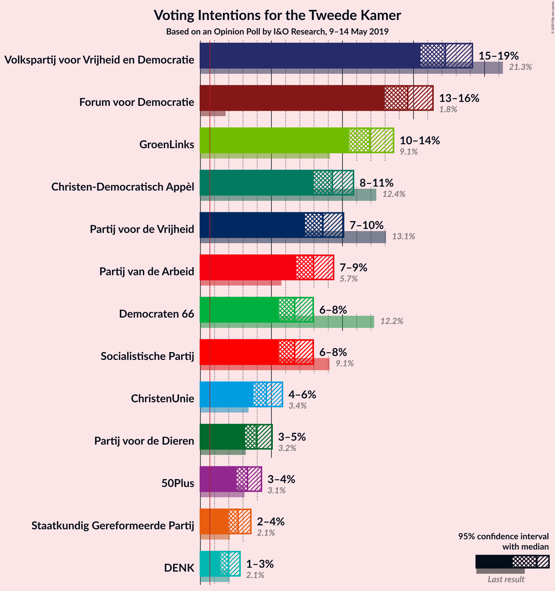

### Confidence Intervals

| Party | Last Result | Poll Result | 80% Confidence Interval | 90% Confidence Interval | 95% Confidence Interval | 99% Confidence Interval |
|:-----:|:-----------:|:-----------:|:-----------------------:|:-----------------------:|:-----------------------:|:-----------------------:|
| Volkspartij voor Vrijheid en Democratie | 21.3% | 17.2% | 16.1–18.5% |15.8–18.8% |15.5–19.1% |15.0–19.8% |
| Forum voor Democratie | 1.8% | 14.6% | 13.5–15.8% |13.2–16.1% |13.0–16.4% |12.5–16.9% |
| GroenLinks | 9.1% | 11.9% | 11.0–13.0% |10.7–13.3% |10.5–13.6% |10.0–14.1% |
| Christen-Democratisch Appèl | 12.4% | 9.3% | 8.4–10.3% |8.2–10.5% |8.0–10.8% |7.6–11.3% |
| Partij voor de Vrijheid | 13.1% | 8.6% | 7.8–9.6% |7.6–9.8% |7.4–10.1% |7.0–10.5% |
| Partij van de Arbeid | 5.7% | 8.0% | 7.2–8.9% |6.9–9.1% |6.7–9.4% |6.4–9.8% |
| Democraten 66 | 12.2% | 6.6% | 5.9–7.5% |5.7–7.7% |5.5–7.9% |5.2–8.4% |
| Socialistische Partij | 9.1% | 6.6% | 5.9–7.5% |5.7–7.7% |5.5–7.9% |5.2–8.4% |
| ChristenUnie | 3.4% | 4.6% | 4.0–5.4% |3.9–5.6% |3.7–5.8% |3.5–6.1% |
| Partij voor de Dieren | 3.2% | 4.0% | 3.4–4.7% |3.3–4.9% |3.1–5.0% |2.9–5.4% |
| 50Plus | 3.1% | 3.3% | 2.8–4.0% |2.7–4.1% |2.5–4.3% |2.3–4.6% |
| Staatkundig Gereformeerde Partij | 2.1% | 2.7% | 2.2–3.2% |2.1–3.4% |2.0–3.6% |1.8–3.8% |
| DENK | 2.1% | 2.0% | 1.6–2.5% |1.5–2.7% |1.4–2.8% |1.2–3.1% |

*Note:* The poll result column reflects the actual value used in the calculations. Published results may vary slightly, and in addition be rounded to fewer digits.

## Seats

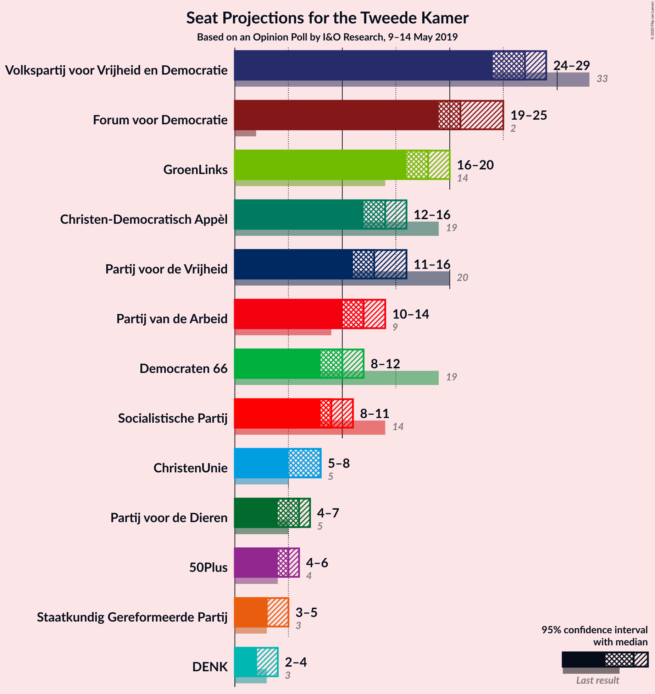

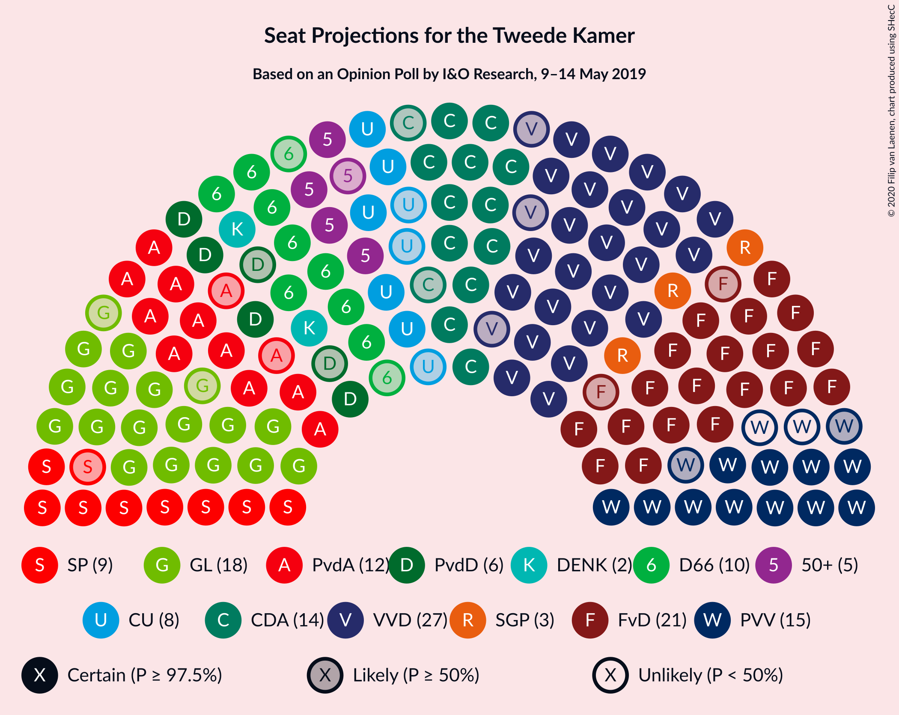

### Confidence Intervals

| Party | Last Result | Median | 80% Confidence Interval | 90% Confidence Interval | 95% Confidence Interval | 99% Confidence Interval |
|:-----:|:-----------:|:------:|:-----------------------:|:-----------------------:|:-----------------------:|:-----------------------:|
| <a href="#volkspartij-voor-vrijheid-en-democratie">Volkspartij voor Vrijheid en Democratie</a> | 33 | 27 | 25–28 |24–28 |24–29 |23–30 |
| <a href="#forum-voor-democratie">Forum voor Democratie</a> | 2 | 21 | 20–23 |20–24 |19–25 |19–26 |
| <a href="#groenlinks">GroenLinks</a> | 14 | 18 | 17–20 |17–20 |16–20 |15–21 |
| <a href="#christen-democratisch-appèl">Christen-Democratisch Appèl</a> | 19 | 14 | 13–16 |12–16 |12–16 |12–17 |
| <a href="#partij-voor-de-vrijheid">Partij voor de Vrijheid</a> | 20 | 13 | 12–15 |11–15 |11–16 |11–16 |
| <a href="#partij-van-de-arbeid">Partij van de Arbeid</a> | 9 | 12 | 11–14 |10–14 |10–14 |10–15 |
| <a href="#democraten-66">Democraten 66</a> | 19 | 10 | 9–10 |8–11 |8–12 |7–13 |
| <a href="#socialistische-partij">Socialistische Partij</a> | 14 | 9 | 9–11 |9–11 |8–11 |8–12 |
| <a href="#christenunie">ChristenUnie</a> | 5 | 8 | 6–8 |6–8 |5–8 |5–9 |
| <a href="#partij-voor-de-dieren">Partij voor de Dieren</a> | 5 | 6 | 4–7 |4–7 |4–7 |4–8 |
| <a href="#50plus">50Plus</a> | 4 | 5 | 4–6 |4–6 |4–6 |3–7 |
| <a href="#staatkundig-gereformeerde-partij">Staatkundig Gereformeerde Partij</a> | 3 | 3 | 3–4 |3–5 |3–5 |3–6 |
| <a href="#denk">DENK</a> | 3 | 2 | 2–3 |2–3 |2–4 |1–4 |

### Volkspartij voor Vrijheid en Democratie

*For a full overview of the results for this party, see the [Volkspartij voor Vrijheid en Democratie](party-volkspartijvoorvrijheidendemocratie.html) page.*

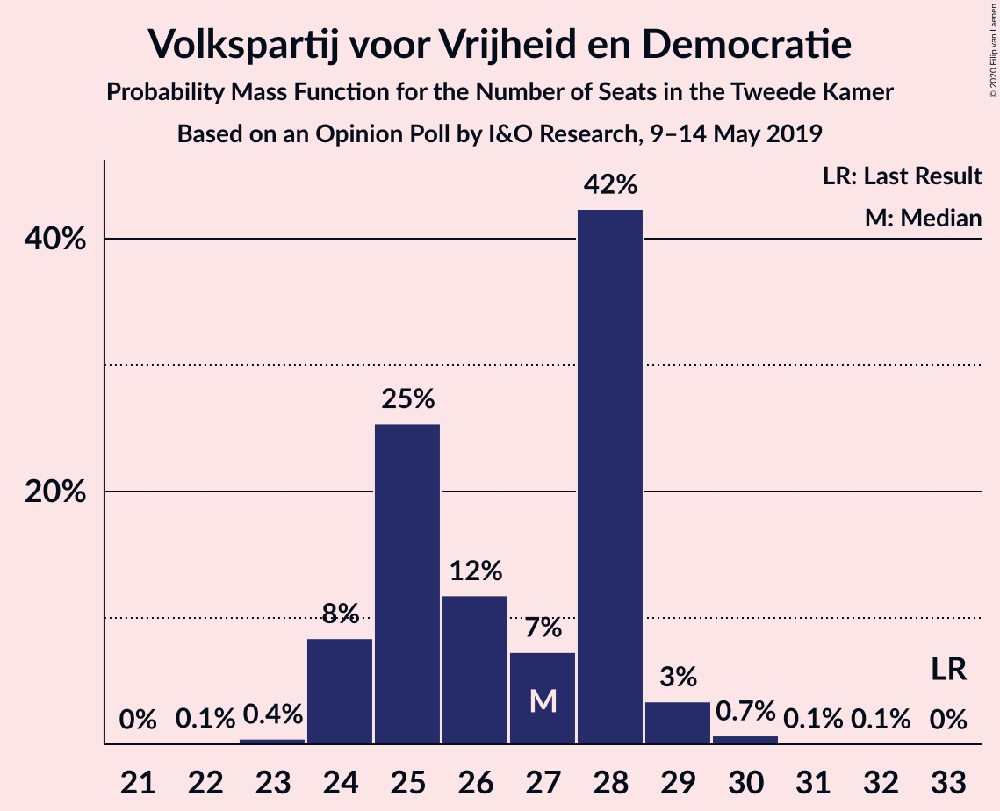

| Number of Seats | Probability | Accumulated | Special Marks |
|:---------------:|:-----------:|:-----------:|:-------------:|
| 22 | 0.1% | 100% |  |
| 23 | 0.4% | 99.9% |  |
| 24 | 8% | 99.4% |  |
| 25 | 25% | 91% |  |
| 26 | 12% | 66% |  |
| 27 | 7% | 54% | Median |
| 28 | 42% | 47% |  |
| 29 | 3% | 4% |  |
| 30 | 0.7% | 0.8% |  |
| 31 | 0.1% | 0.2% |  |
| 32 | 0.1% | 0.1% |  |
| 33 | 0% | 0% | Last Result |

### Forum voor Democratie

*For a full overview of the results for this party, see the [Forum voor Democratie](party-forumvoordemocratie.html) page.*

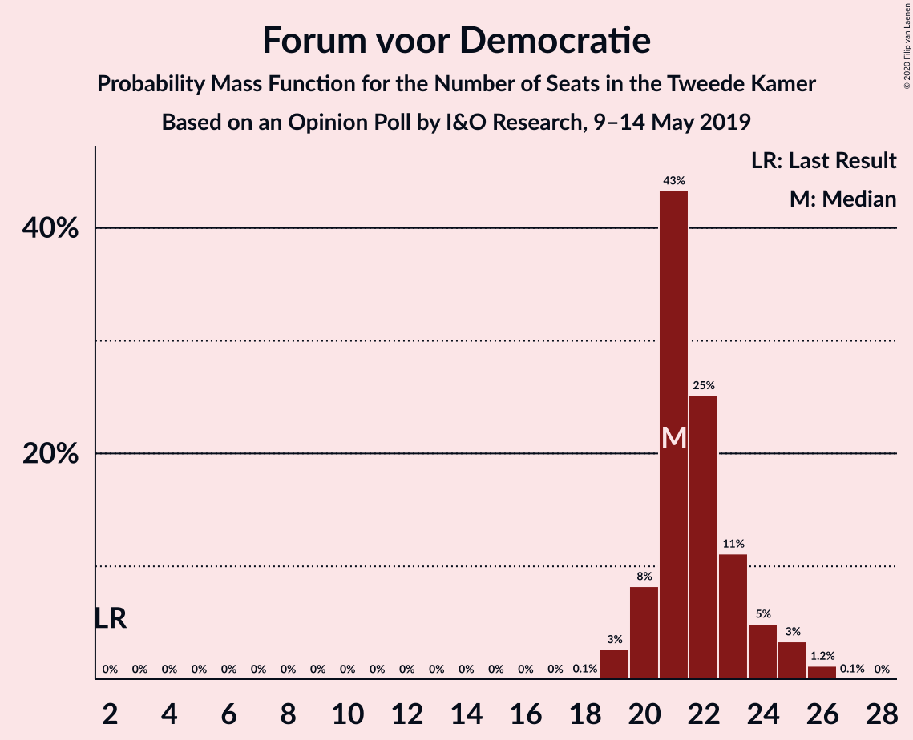

| Number of Seats | Probability | Accumulated | Special Marks |
|:---------------:|:-----------:|:-----------:|:-------------:|
| 2 | 0% | 100% | Last Result |
| 3 | 0% | 100% |  |
| 4 | 0% | 100% |  |
| 5 | 0% | 100% |  |
| 6 | 0% | 100% |  |
| 7 | 0% | 100% |  |
| 8 | 0% | 100% |  |
| 9 | 0% | 100% |  |
| 10 | 0% | 100% |  |
| 11 | 0% | 100% |  |
| 12 | 0% | 100% |  |
| 13 | 0% | 100% |  |
| 14 | 0% | 100% |  |
| 15 | 0% | 100% |  |
| 16 | 0% | 100% |  |
| 17 | 0% | 100% |  |
| 18 | 0.1% | 100% |  |
| 19 | 3% | 99.9% |  |
| 20 | 8% | 97% |  |
| 21 | 43% | 89% | Median |
| 22 | 25% | 46% |  |
| 23 | 11% | 21% |  |
| 24 | 5% | 9% |  |
| 25 | 3% | 5% |  |
| 26 | 1.2% | 1.2% |  |
| 27 | 0.1% | 0.1% |  |
| 28 | 0% | 0% |  |

### GroenLinks

*For a full overview of the results for this party, see the [GroenLinks](party-groenlinks.html) page.*

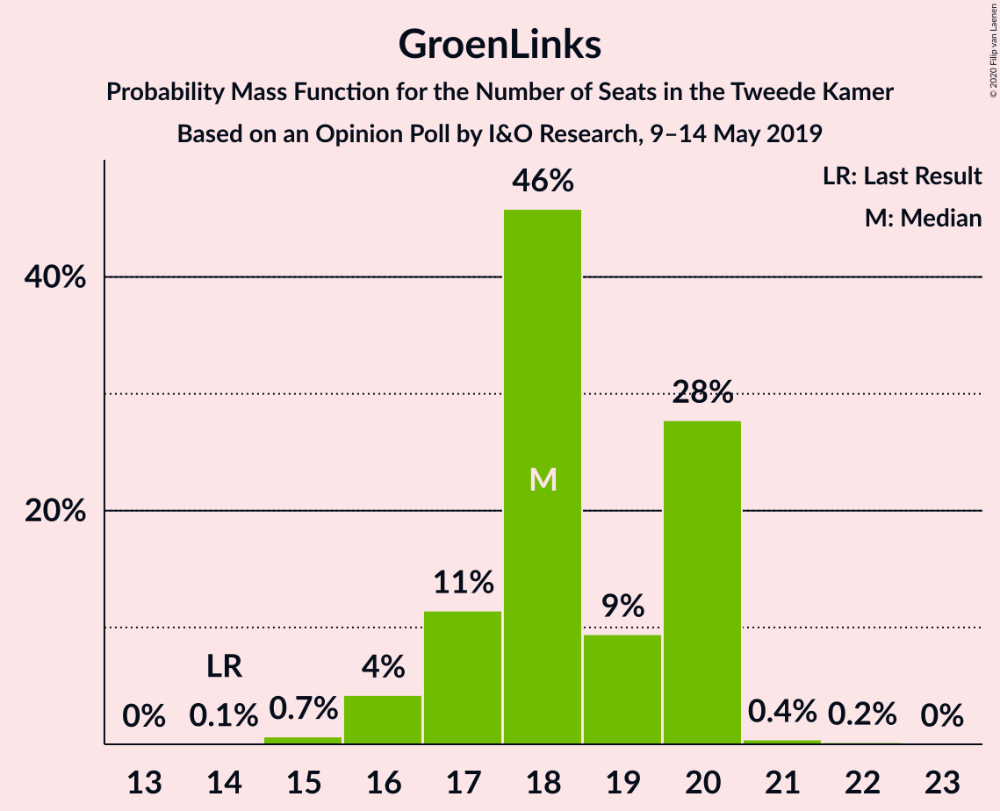

| Number of Seats | Probability | Accumulated | Special Marks |
|:---------------:|:-----------:|:-----------:|:-------------:|
| 14 | 0.1% | 100% | Last Result |
| 15 | 0.7% | 99.9% |  |
| 16 | 4% | 99.3% |  |
| 17 | 11% | 95% |  |
| 18 | 46% | 84% | Median |
| 19 | 9% | 38% |  |
| 20 | 28% | 28% |  |
| 21 | 0.4% | 0.6% |  |
| 22 | 0.2% | 0.2% |  |
| 23 | 0% | 0% |  |

### Christen-Democratisch Appèl

*For a full overview of the results for this party, see the [Christen-Democratisch Appèl](party-christen-democratischappèl.html) page.*

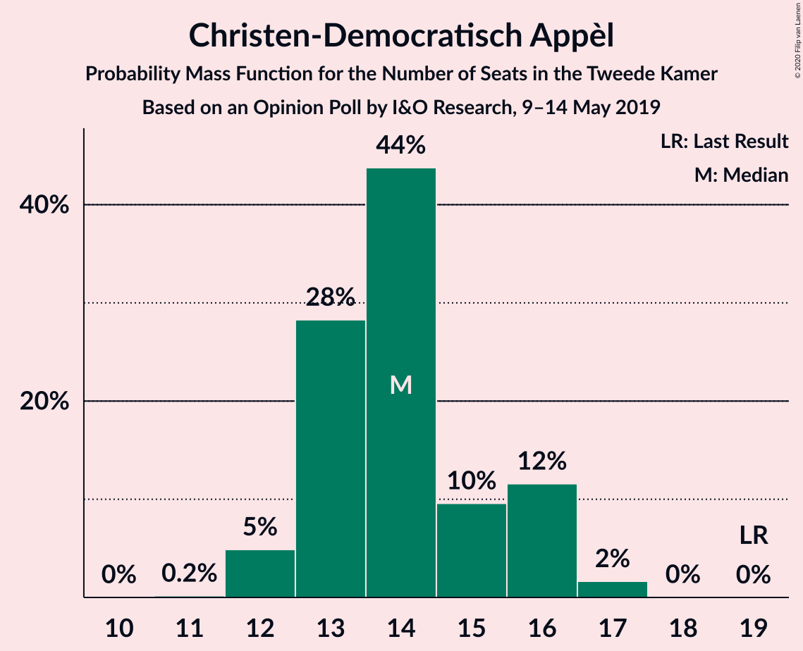

| Number of Seats | Probability | Accumulated | Special Marks |
|:---------------:|:-----------:|:-----------:|:-------------:|
| 11 | 0.2% | 100% |  |
| 12 | 5% | 99.8% |  |
| 13 | 28% | 95% |  |
| 14 | 44% | 67% | Median |
| 15 | 10% | 23% |  |
| 16 | 12% | 13% |  |
| 17 | 2% | 2% |  |
| 18 | 0% | 0% |  |
| 19 | 0% | 0% | Last Result |

### Partij voor de Vrijheid

*For a full overview of the results for this party, see the [Partij voor de Vrijheid](party-partijvoordevrijheid.html) page.*

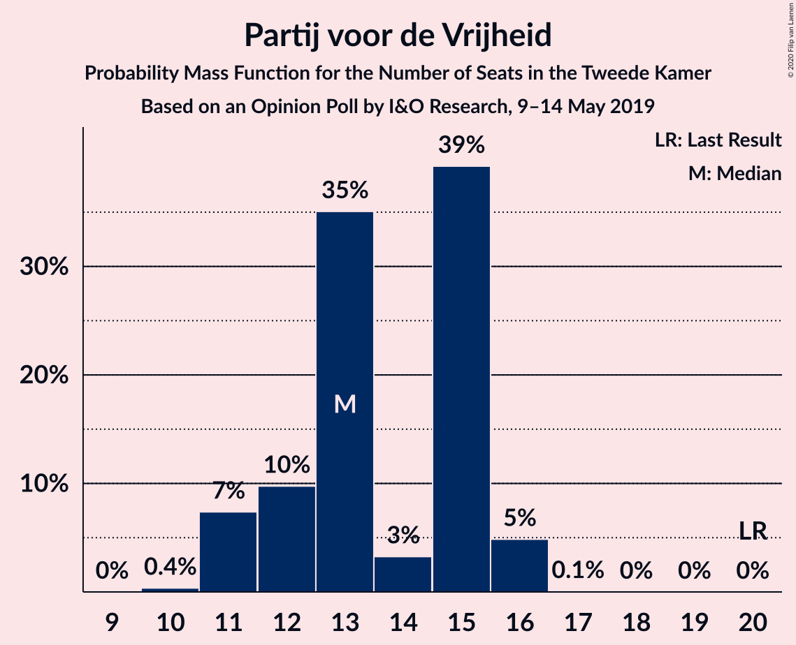

| Number of Seats | Probability | Accumulated | Special Marks |
|:---------------:|:-----------:|:-----------:|:-------------:|
| 10 | 0.4% | 100% |  |
| 11 | 7% | 99.6% |  |
| 12 | 10% | 92% |  |
| 13 | 35% | 82% | Median |
| 14 | 3% | 47% |  |
| 15 | 39% | 44% |  |
| 16 | 5% | 5% |  |
| 17 | 0.1% | 0.1% |  |
| 18 | 0% | 0% |  |
| 19 | 0% | 0% |  |
| 20 | 0% | 0% | Last Result |

### Partij van de Arbeid

*For a full overview of the results for this party, see the [Partij van de Arbeid](party-partijvandearbeid.html) page.*

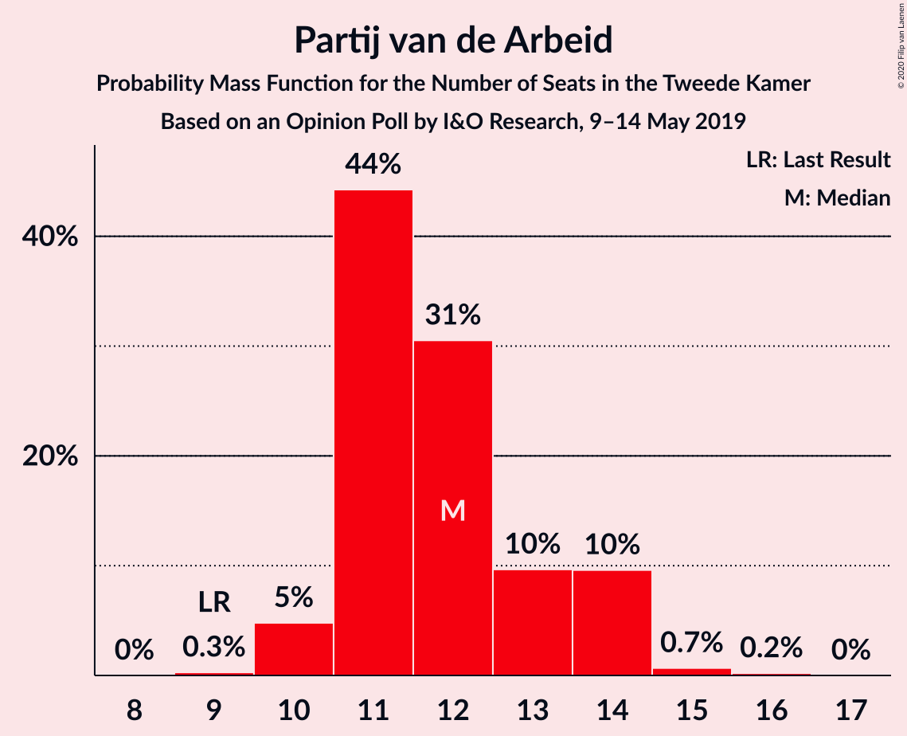

| Number of Seats | Probability | Accumulated | Special Marks |
|:---------------:|:-----------:|:-----------:|:-------------:|
| 9 | 0.3% | 100% | Last Result |
| 10 | 5% | 99.7% |  |
| 11 | 44% | 95% |  |
| 12 | 31% | 51% | Median |
| 13 | 10% | 20% |  |
| 14 | 10% | 10% |  |
| 15 | 0.7% | 0.9% |  |
| 16 | 0.2% | 0.2% |  |
| 17 | 0% | 0% |  |

### Democraten 66

*For a full overview of the results for this party, see the [Democraten 66](party-democraten66.html) page.*

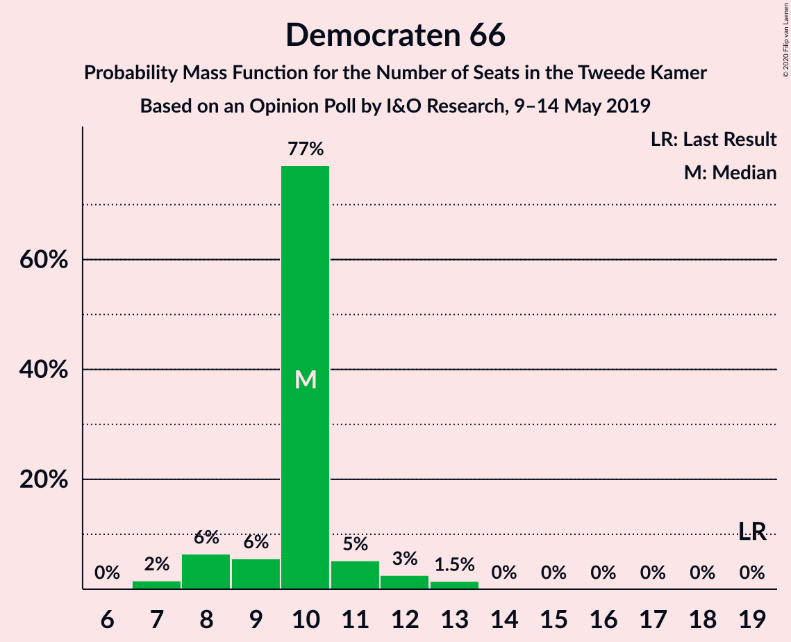

| Number of Seats | Probability | Accumulated | Special Marks |
|:---------------:|:-----------:|:-----------:|:-------------:|
| 7 | 2% | 100% |  |
| 8 | 6% | 98% |  |
| 9 | 6% | 92% |  |
| 10 | 77% | 86% | Median |
| 11 | 5% | 9% |  |
| 12 | 3% | 4% |  |
| 13 | 1.5% | 1.5% |  |
| 14 | 0% | 0% |  |
| 15 | 0% | 0% |  |
| 16 | 0% | 0% |  |
| 17 | 0% | 0% |  |
| 18 | 0% | 0% |  |
| 19 | 0% | 0% | Last Result |

### Socialistische Partij

*For a full overview of the results for this party, see the [Socialistische Partij](party-socialistischepartij.html) page.*

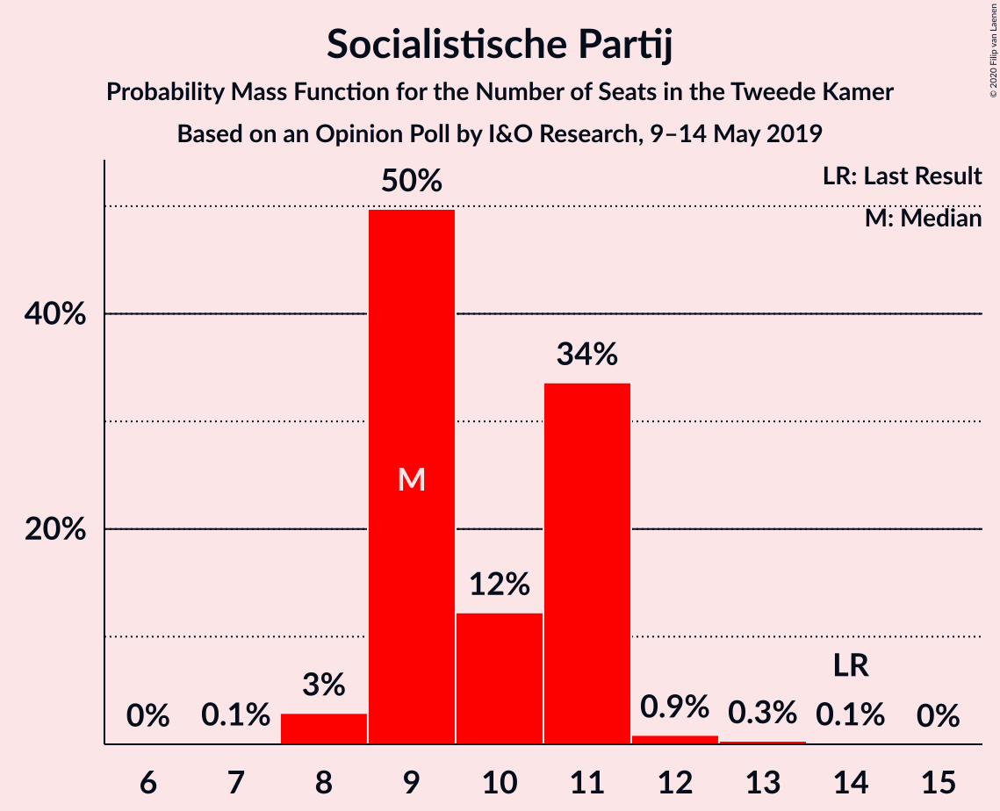

| Number of Seats | Probability | Accumulated | Special Marks |
|:---------------:|:-----------:|:-----------:|:-------------:|
| 7 | 0.1% | 100% |  |
| 8 | 3% | 99.9% |  |
| 9 | 50% | 97% | Median |
| 10 | 12% | 47% |  |
| 11 | 34% | 35% |  |
| 12 | 0.9% | 1.3% |  |
| 13 | 0.3% | 0.5% |  |
| 14 | 0.1% | 0.1% | Last Result |
| 15 | 0% | 0% |  |

### ChristenUnie

*For a full overview of the results for this party, see the [ChristenUnie](party-christenunie.html) page.*

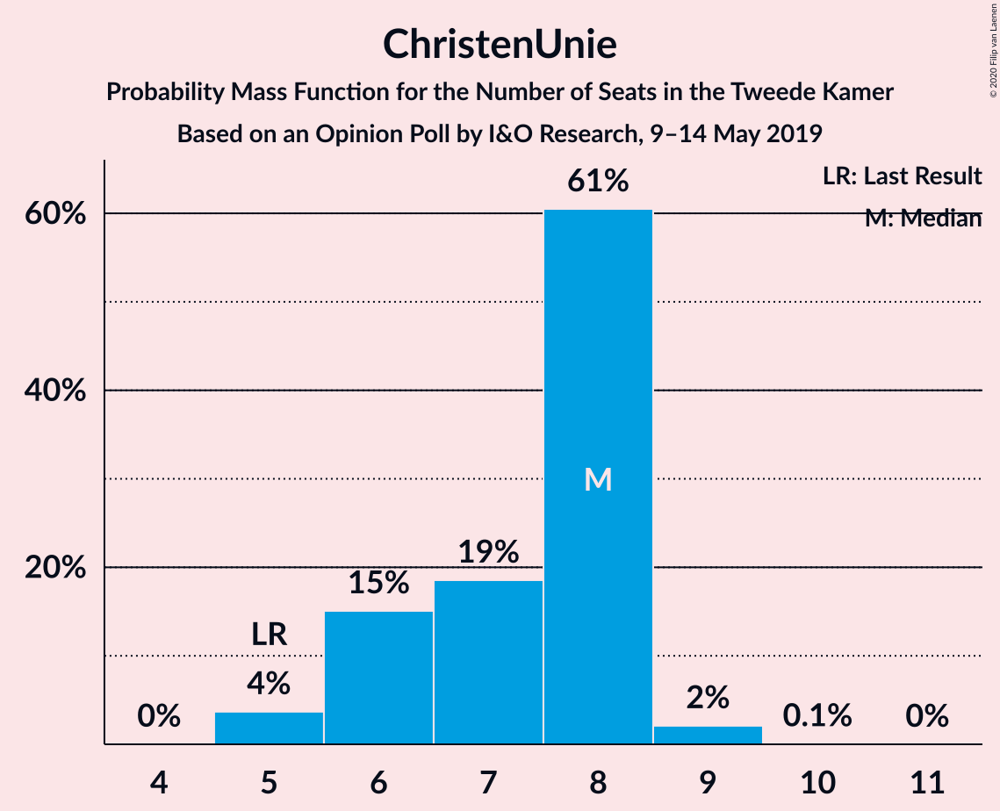

| Number of Seats | Probability | Accumulated | Special Marks |
|:---------------:|:-----------:|:-----------:|:-------------:|
| 5 | 4% | 100% | Last Result |
| 6 | 15% | 96% |  |
| 7 | 19% | 81% |  |
| 8 | 61% | 63% | Median |
| 9 | 2% | 2% |  |
| 10 | 0.1% | 0.1% |  |
| 11 | 0% | 0% |  |

### Partij voor de Dieren

*For a full overview of the results for this party, see the [Partij voor de Dieren](party-partijvoordedieren.html) page.*

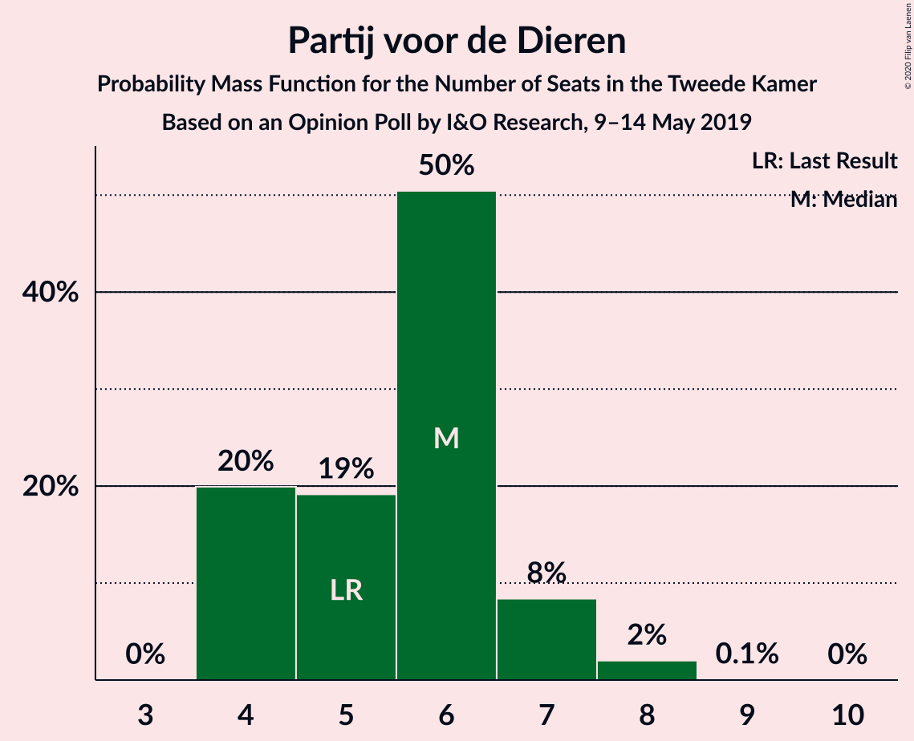

| Number of Seats | Probability | Accumulated | Special Marks |
|:---------------:|:-----------:|:-----------:|:-------------:|
| 4 | 20% | 100% |  |
| 5 | 19% | 80% | Last Result |
| 6 | 50% | 61% | Median |
| 7 | 8% | 10% |  |
| 8 | 2% | 2% |  |
| 9 | 0.1% | 0.1% |  |
| 10 | 0% | 0% |  |

### 50Plus

*For a full overview of the results for this party, see the [50Plus](party-50plus.html) page.*

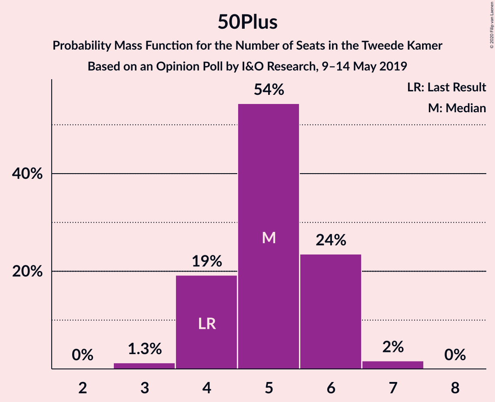

| Number of Seats | Probability | Accumulated | Special Marks |
|:---------------:|:-----------:|:-----------:|:-------------:|
| 3 | 1.3% | 100% |  |
| 4 | 19% | 98.7% | Last Result |
| 5 | 54% | 80% | Median |
| 6 | 24% | 25% |  |
| 7 | 2% | 2% |  |
| 8 | 0% | 0% |  |

### Staatkundig Gereformeerde Partij

*For a full overview of the results for this party, see the [Staatkundig Gereformeerde Partij](party-staatkundiggereformeerdepartij.html) page.*

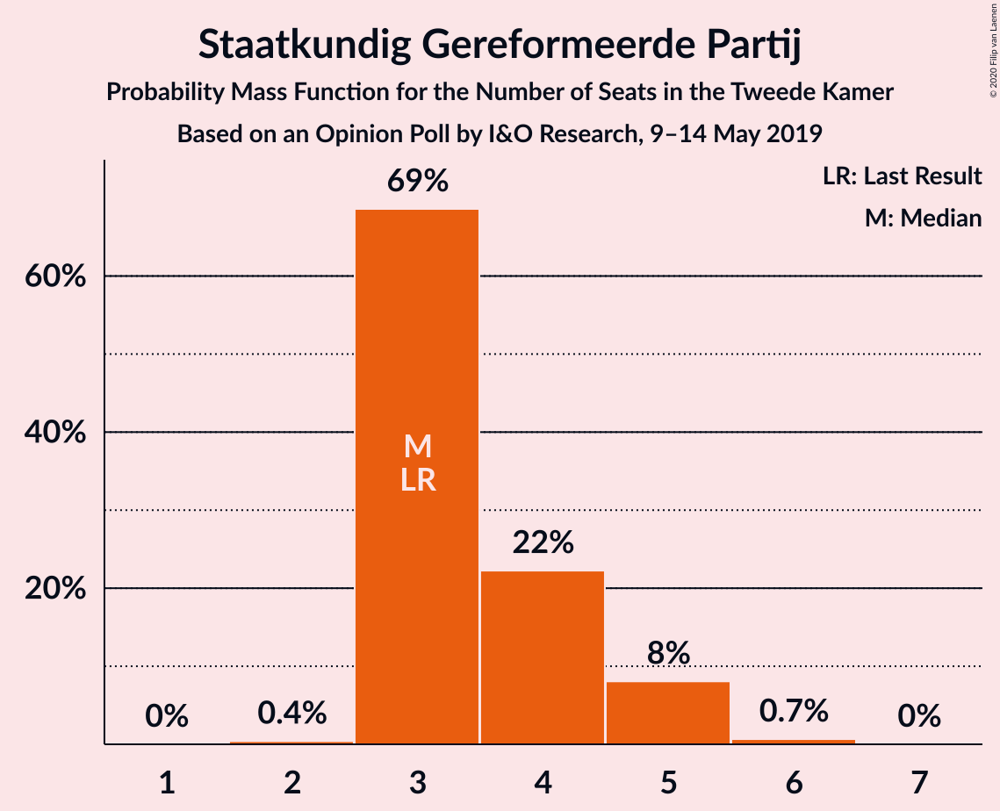

| Number of Seats | Probability | Accumulated | Special Marks |
|:---------------:|:-----------:|:-----------:|:-------------:|
| 2 | 0.4% | 100% |  |
| 3 | 69% | 99.6% | Last Result, Median |
| 4 | 22% | 31% |  |
| 5 | 8% | 9% |  |
| 6 | 0.7% | 0.7% |  |
| 7 | 0% | 0% |  |

### DENK

*For a full overview of the results for this party, see the [DENK](party-denk.html) page.*

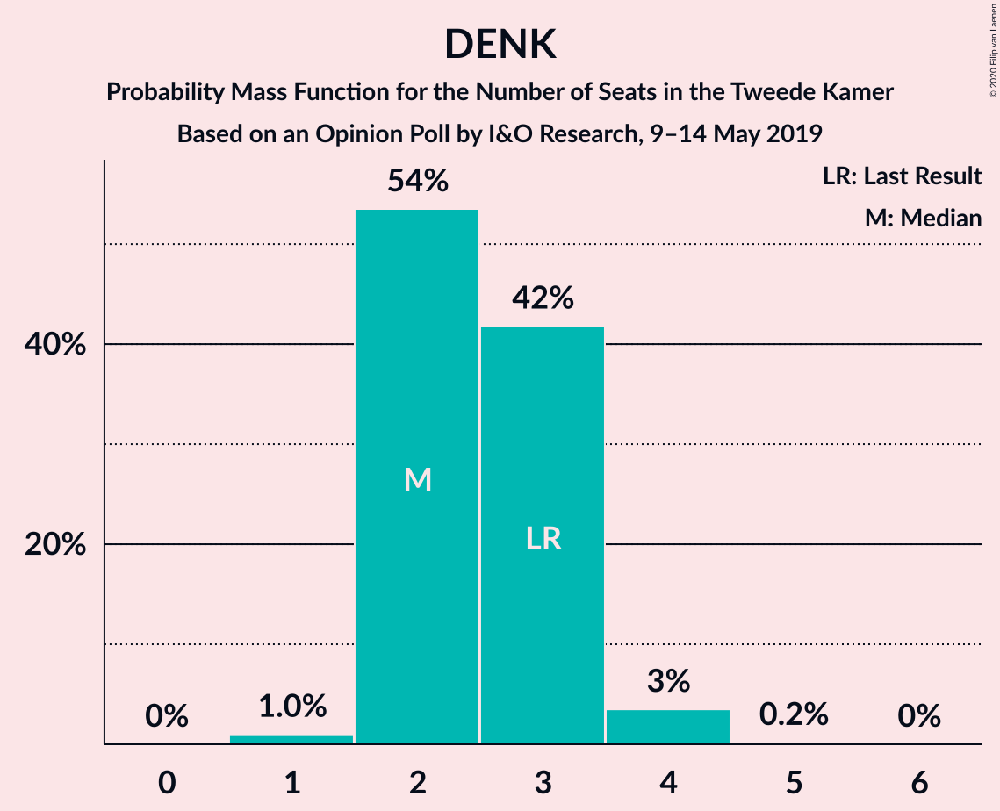

| Number of Seats | Probability | Accumulated | Special Marks |
|:---------------:|:-----------:|:-----------:|:-------------:|
| 1 | 1.0% | 100% |  |
| 2 | 54% | 99.0% | Median |
| 3 | 42% | 45% | Last Result |
| 4 | 3% | 4% |  |
| 5 | 0.2% | 0.2% |  |
| 6 | 0% | 0% |  |

## Coalitions

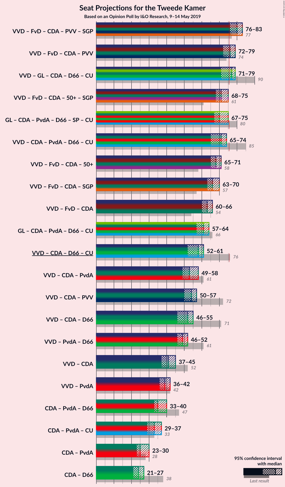

### Confidence Intervals

| Coalition | Last Result | Median | Majority? | 80% Confidence Interval | 90% Confidence Interval | 95% Confidence Interval | 99% Confidence Interval |
|:---------:|:-----------:|:------:|:---------:|:-----------------------:|:-----------------------:|:-----------------------:|:-----------------------:|
| Volkspartij voor Vrijheid en Democratie – Forum voor Democratie – Christen-Democratisch Appèl – Partij voor de Vrijheid – Staatkundig Gereformeerde Partij | 77 | 80 | 98.7% | 76–81 | 76–83 | 76–83 | 75–84 |
| Volkspartij voor Vrijheid en Democratie – Forum voor Democratie – Christen-Democratisch Appèl – Partij voor de Vrijheid | 74 | 76 | 59% | 73–78 | 73–79 | 72–79 | 72–80 |
| Volkspartij voor Vrijheid en Democratie – GroenLinks – Christen-Democratisch Appèl – Democraten 66 – ChristenUnie | 90 | 77 | 75% | 74–78 | 72–78 | 71–79 | 69–80 |
| Volkspartij voor Vrijheid en Democratie – Forum voor Democratie – Christen-Democratisch Appèl – 50Plus – Staatkundig Gereformeerde Partij | 61 | 71 | 2% | 69–72 | 69–73 | 68–75 | 67–76 |
| GroenLinks – Christen-Democratisch Appèl – Partij van de Arbeid – Democraten 66 – Socialistische Partij – ChristenUnie | 80 | 70 | 0.2% | 69–75 | 68–75 | 67–75 | 66–75 |
| Volkspartij voor Vrijheid en Democratie – Christen-Democratisch Appèl – Partij van de Arbeid – Democraten 66 – ChristenUnie | 85 | 71 | 0.1% | 68–71 | 65–73 | 65–74 | 64–74 |
| Volkspartij voor Vrijheid en Democratie – Forum voor Democratie – Christen-Democratisch Appèl – 50Plus | 58 | 68 | 0% | 66–68 | 66–70 | 65–71 | 63–72 |
| Volkspartij voor Vrijheid en Democratie – Forum voor Democratie – Christen-Democratisch Appèl – Staatkundig Gereformeerde Partij | 57 | 66 | 0% | 63–68 | 63–69 | 63–70 | 62–71 |
| Volkspartij voor Vrijheid en Democratie – Forum voor Democratie – Christen-Democratisch Appèl | 54 | 63 | 0% | 60–64 | 60–65 | 60–66 | 58–67 |
| GroenLinks – Christen-Democratisch Appèl – Partij van de Arbeid – Democraten 66 – ChristenUnie | 66 | 61 | 0% | 59–64 | 58–64 | 57–64 | 57–66 |
| Volkspartij voor Vrijheid en Democratie – Christen-Democratisch Appèl – Democraten 66 – ChristenUnie | 76 | 58 | 0% | 55–60 | 53–60 | 52–61 | 52–62 |
| Volkspartij voor Vrijheid en Democratie – Christen-Democratisch Appèl – Partij van de Arbeid | 61 | 53 | 0% | 50–54 | 50–55 | 49–58 | 48–58 |
| Volkspartij voor Vrijheid en Democratie – Christen-Democratisch Appèl – Partij voor de Vrijheid | 72 | 54 | 0% | 51–57 | 51–57 | 50–57 | 49–58 |
| Volkspartij voor Vrijheid en Democratie – Christen-Democratisch Appèl – Democraten 66 | 71 | 52 | 0% | 48–52 | 47–53 | 46–55 | 45–56 |
| Volkspartij voor Vrijheid en Democratie – Partij van de Arbeid – Democraten 66 | 61 | 49 | 0% | 46–50 | 46–51 | 46–52 | 44–53 |
| Volkspartij voor Vrijheid en Democratie – Christen-Democratisch Appèl | 52 | 41 | 0% | 38–42 | 38–42 | 37–45 | 37–46 |
| Volkspartij voor Vrijheid en Democratie – Partij van de Arbeid | 42 | 39 | 0% | 37–40 | 36–41 | 36–42 | 34–42 |
| Christen-Democratisch Appèl – Partij van de Arbeid – Democraten 66 | 47 | 35 | 0% | 34–39 | 33–40 | 33–40 | 32–40 |
| Christen-Democratisch Appèl – Partij van de Arbeid – ChristenUnie | 33 | 33 | 0% | 32–35 | 30–37 | 29–37 | 29–38 |
| Christen-Democratisch Appèl – Partij van de Arbeid | 28 | 25 | 0% | 25–29 | 24–30 | 23–30 | 22–30 |
| Christen-Democratisch Appèl – Democraten 66 | 38 | 24 | 0% | 22–26 | 21–26 | 21–27 | 20–28 |

### Volkspartij voor Vrijheid en Democratie – Forum voor Democratie – Christen-Democratisch Appèl – Partij voor de Vrijheid – Staatkundig Gereformeerde Partij

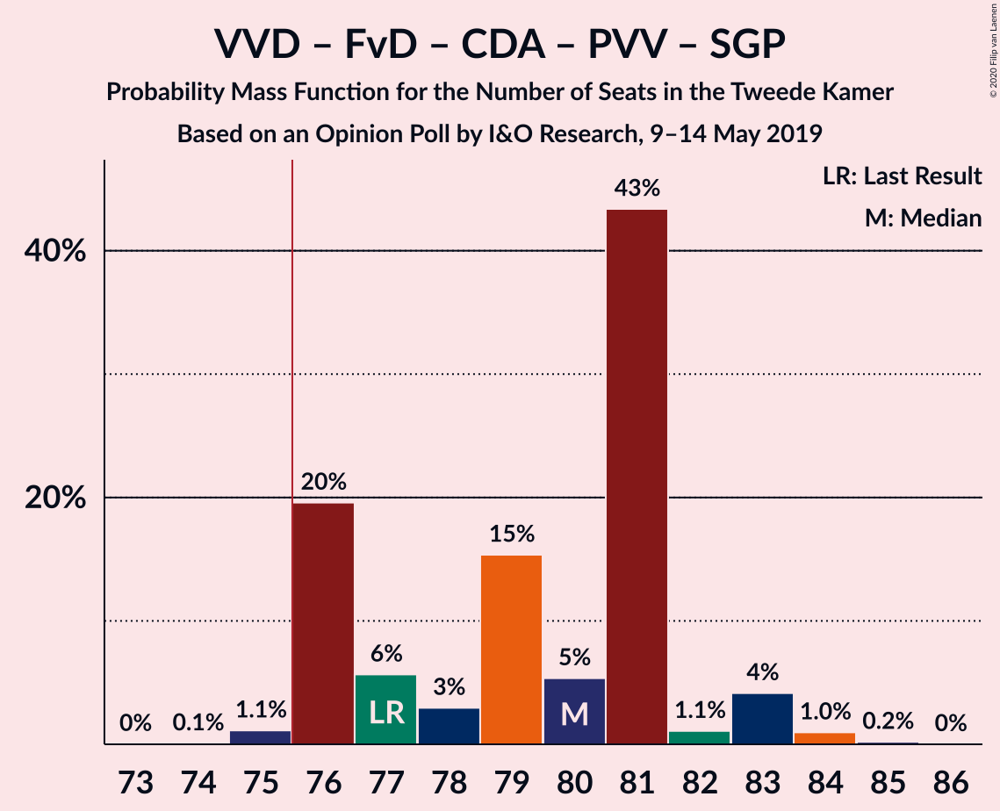

| Number of Seats | Probability | Accumulated | Special Marks |
|:---------------:|:-----------:|:-----------:|:-------------:|
| 73 | 0% | 100% |  |
| 74 | 0.1% | 99.9% |  |
| 75 | 1.1% | 99.9% |  |
| 76 | 20% | 98.7% | Majority |
| 77 | 6% | 79% | Last Result |
| 78 | 3% | 73% | Median |
| 79 | 15% | 71% |  |
| 80 | 5% | 55% |  |
| 81 | 43% | 50% |  |
| 82 | 1.1% | 6% |  |
| 83 | 4% | 5% |  |
| 84 | 1.0% | 1.2% |  |
| 85 | 0.2% | 0.2% |  |
| 86 | 0% | 0% |  |

### Volkspartij voor Vrijheid en Democratie – Forum voor Democratie – Christen-Democratisch Appèl – Partij voor de Vrijheid

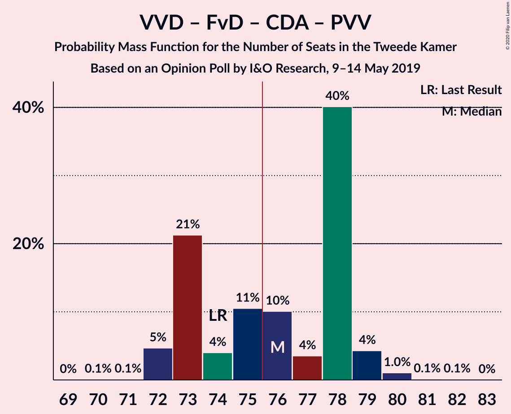

| Number of Seats | Probability | Accumulated | Special Marks |
|:---------------:|:-----------:|:-----------:|:-------------:|
| 70 | 0.1% | 100% |  |
| 71 | 0.1% | 99.9% |  |
| 72 | 5% | 99.8% |  |
| 73 | 21% | 95% |  |
| 74 | 4% | 74% | Last Result |
| 75 | 11% | 70% | Median |
| 76 | 10% | 59% | Majority |
| 77 | 4% | 49% |  |
| 78 | 40% | 46% |  |
| 79 | 4% | 6% |  |
| 80 | 1.0% | 1.3% |  |
| 81 | 0.1% | 0.3% |  |
| 82 | 0.1% | 0.1% |  |
| 83 | 0% | 0% |  |

### Volkspartij voor Vrijheid en Democratie – GroenLinks – Christen-Democratisch Appèl – Democraten 66 – ChristenUnie

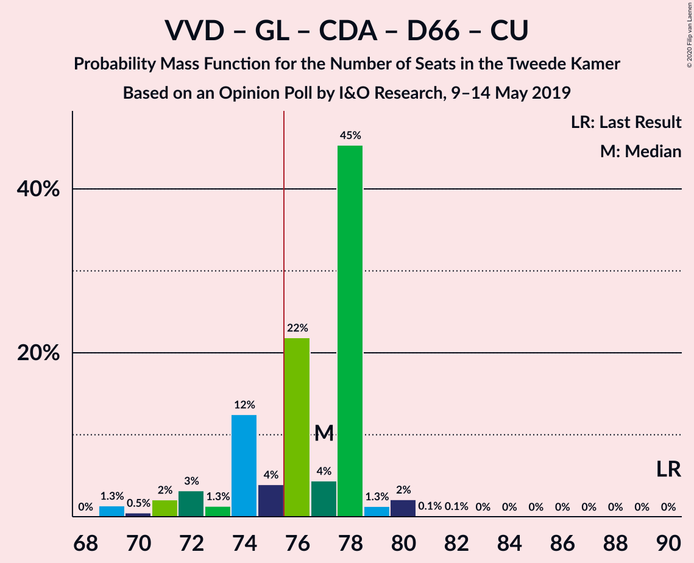

| Number of Seats | Probability | Accumulated | Special Marks |
|:---------------:|:-----------:|:-----------:|:-------------:|
| 69 | 1.3% | 100% |  |
| 70 | 0.5% | 98.6% |  |
| 71 | 2% | 98% |  |
| 72 | 3% | 96% |  |
| 73 | 1.3% | 93% |  |
| 74 | 12% | 92% |  |
| 75 | 4% | 79% |  |
| 76 | 22% | 75% | Majority |
| 77 | 4% | 53% | Median |
| 78 | 45% | 49% |  |
| 79 | 1.3% | 4% |  |
| 80 | 2% | 2% |  |
| 81 | 0.1% | 0.2% |  |
| 82 | 0.1% | 0.1% |  |
| 83 | 0% | 0% |  |
| 84 | 0% | 0% |  |
| 85 | 0% | 0% |  |
| 86 | 0% | 0% |  |
| 87 | 0% | 0% |  |
| 88 | 0% | 0% |  |
| 89 | 0% | 0% |  |
| 90 | 0% | 0% | Last Result |

### Volkspartij voor Vrijheid en Democratie – Forum voor Democratie – Christen-Democratisch Appèl – 50Plus – Staatkundig Gereformeerde Partij

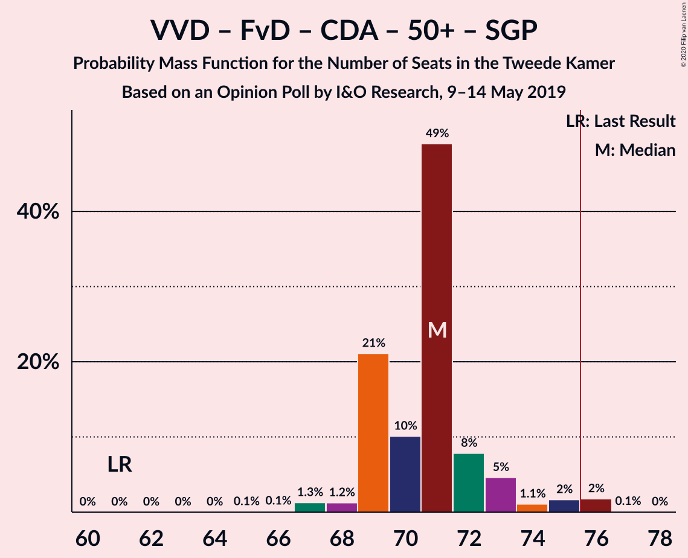

| Number of Seats | Probability | Accumulated | Special Marks |
|:---------------:|:-----------:|:-----------:|:-------------:|
| 61 | 0% | 100% | Last Result |
| 62 | 0% | 100% |  |
| 63 | 0% | 100% |  |
| 64 | 0% | 100% |  |
| 65 | 0.1% | 100% |  |
| 66 | 0.1% | 99.9% |  |
| 67 | 1.3% | 99.8% |  |
| 68 | 1.2% | 98.5% |  |
| 69 | 21% | 97% |  |
| 70 | 10% | 76% | Median |
| 71 | 49% | 66% |  |
| 72 | 8% | 17% |  |
| 73 | 5% | 9% |  |
| 74 | 1.1% | 5% |  |
| 75 | 2% | 4% |  |
| 76 | 2% | 2% | Majority |
| 77 | 0.1% | 0.1% |  |
| 78 | 0% | 0% |  |

### GroenLinks – Christen-Democratisch Appèl – Partij van de Arbeid – Democraten 66 – Socialistische Partij – ChristenUnie

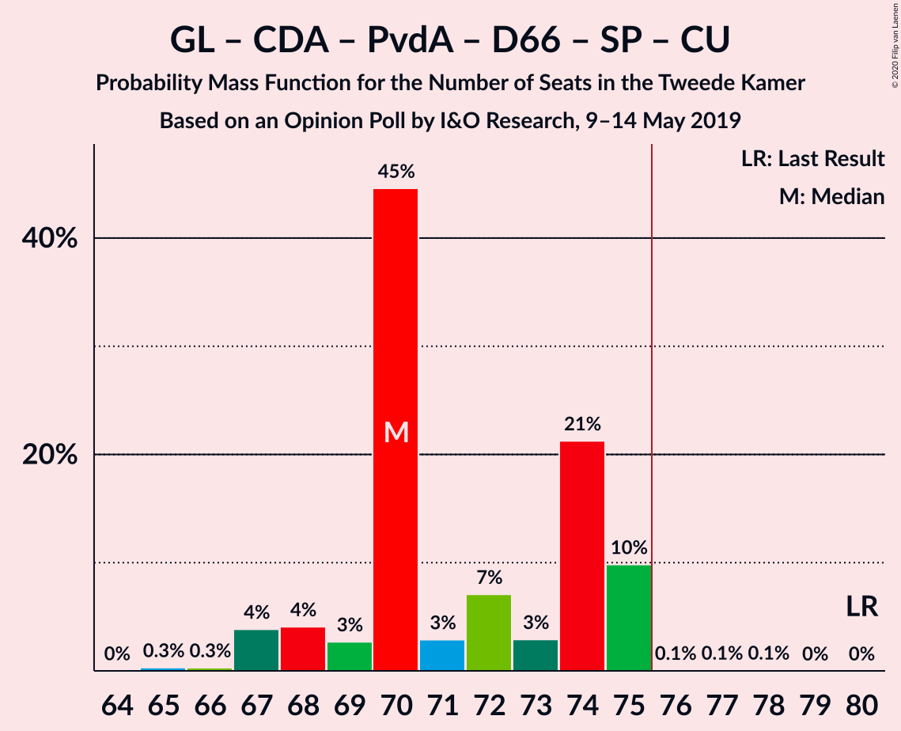

| Number of Seats | Probability | Accumulated | Special Marks |
|:---------------:|:-----------:|:-----------:|:-------------:|
| 65 | 0.3% | 100% |  |
| 66 | 0.3% | 99.7% |  |
| 67 | 4% | 99.4% |  |
| 68 | 4% | 96% |  |
| 69 | 3% | 91% |  |
| 70 | 45% | 89% |  |
| 71 | 3% | 44% | Median |
| 72 | 7% | 41% |  |
| 73 | 3% | 34% |  |
| 74 | 21% | 31% |  |
| 75 | 10% | 10% |  |
| 76 | 0.1% | 0.2% | Majority |
| 77 | 0.1% | 0.2% |  |
| 78 | 0.1% | 0.1% |  |
| 79 | 0% | 0% |  |
| 80 | 0% | 0% | Last Result |

### Volkspartij voor Vrijheid en Democratie – Christen-Democratisch Appèl – Partij van de Arbeid – Democraten 66 – ChristenUnie

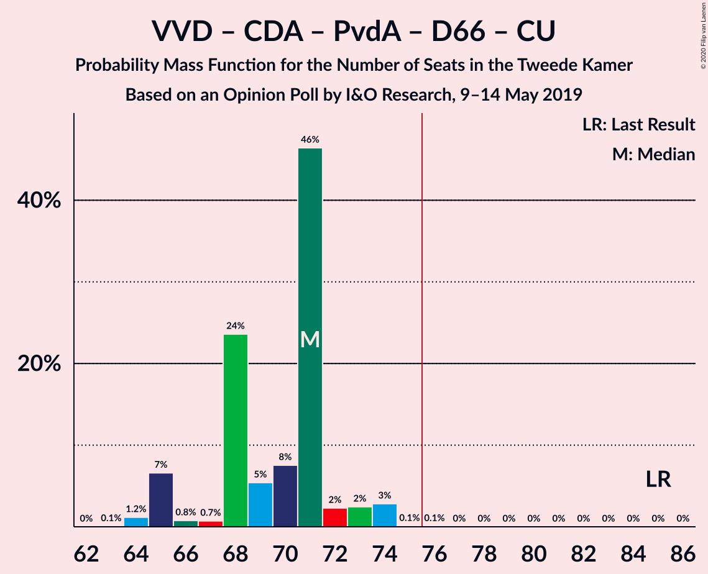

| Number of Seats | Probability | Accumulated | Special Marks |
|:---------------:|:-----------:|:-----------:|:-------------:|
| 63 | 0.1% | 100% |  |
| 64 | 1.2% | 99.9% |  |
| 65 | 7% | 98.8% |  |
| 66 | 0.8% | 92% |  |
| 67 | 0.7% | 91% |  |
| 68 | 24% | 91% |  |
| 69 | 5% | 67% |  |
| 70 | 8% | 62% |  |
| 71 | 46% | 54% | Median |
| 72 | 2% | 8% |  |
| 73 | 2% | 5% |  |
| 74 | 3% | 3% |  |
| 75 | 0.1% | 0.2% |  |
| 76 | 0.1% | 0.1% | Majority |
| 77 | 0% | 0% |  |
| 78 | 0% | 0% |  |
| 79 | 0% | 0% |  |
| 80 | 0% | 0% |  |
| 81 | 0% | 0% |  |
| 82 | 0% | 0% |  |
| 83 | 0% | 0% |  |
| 84 | 0% | 0% |  |
| 85 | 0% | 0% | Last Result |

### Volkspartij voor Vrijheid en Democratie – Forum voor Democratie – Christen-Democratisch Appèl – 50Plus

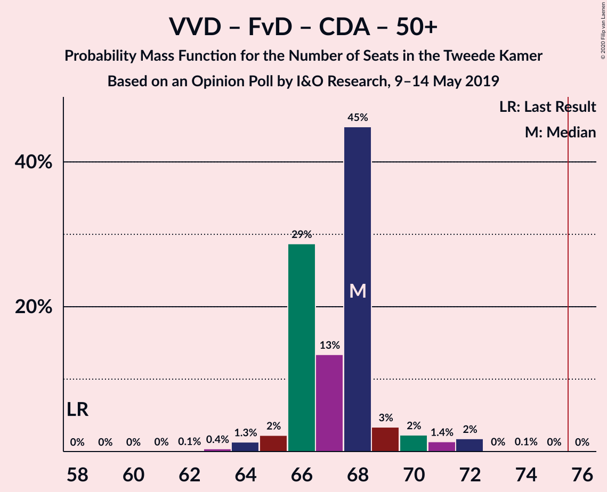

| Number of Seats | Probability | Accumulated | Special Marks |
|:---------------:|:-----------:|:-----------:|:-------------:|
| 58 | 0% | 100% | Last Result |
| 59 | 0% | 100% |  |
| 60 | 0% | 100% |  |
| 61 | 0% | 100% |  |
| 62 | 0.1% | 99.9% |  |
| 63 | 0.4% | 99.8% |  |
| 64 | 1.3% | 99.5% |  |
| 65 | 2% | 98% |  |
| 66 | 29% | 96% |  |
| 67 | 13% | 67% | Median |
| 68 | 45% | 54% |  |
| 69 | 3% | 9% |  |
| 70 | 2% | 6% |  |
| 71 | 1.4% | 3% |  |
| 72 | 2% | 2% |  |
| 73 | 0% | 0.1% |  |
| 74 | 0.1% | 0.1% |  |
| 75 | 0% | 0% |  |

### Volkspartij voor Vrijheid en Democratie – Forum voor Democratie – Christen-Democratisch Appèl – Staatkundig Gereformeerde Partij

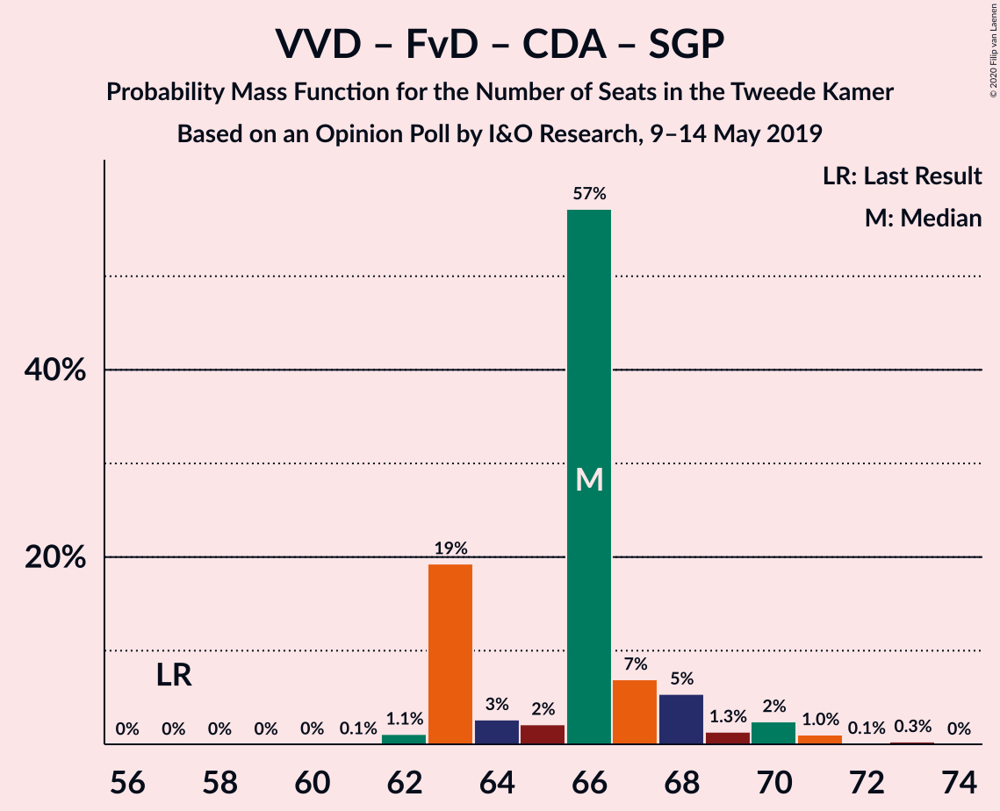

| Number of Seats | Probability | Accumulated | Special Marks |
|:---------------:|:-----------:|:-----------:|:-------------:|
| 57 | 0% | 100% | Last Result |
| 58 | 0% | 100% |  |
| 59 | 0% | 100% |  |
| 60 | 0% | 100% |  |
| 61 | 0.1% | 99.9% |  |
| 62 | 1.1% | 99.9% |  |
| 63 | 19% | 98.8% |  |
| 64 | 3% | 79% |  |
| 65 | 2% | 77% | Median |
| 66 | 57% | 75% |  |
| 67 | 7% | 18% |  |
| 68 | 5% | 11% |  |
| 69 | 1.3% | 5% |  |
| 70 | 2% | 4% |  |
| 71 | 1.0% | 1.4% |  |
| 72 | 0.1% | 0.4% |  |
| 73 | 0.3% | 0.3% |  |
| 74 | 0% | 0% |  |

### Volkspartij voor Vrijheid en Democratie – Forum voor Democratie – Christen-Democratisch Appèl

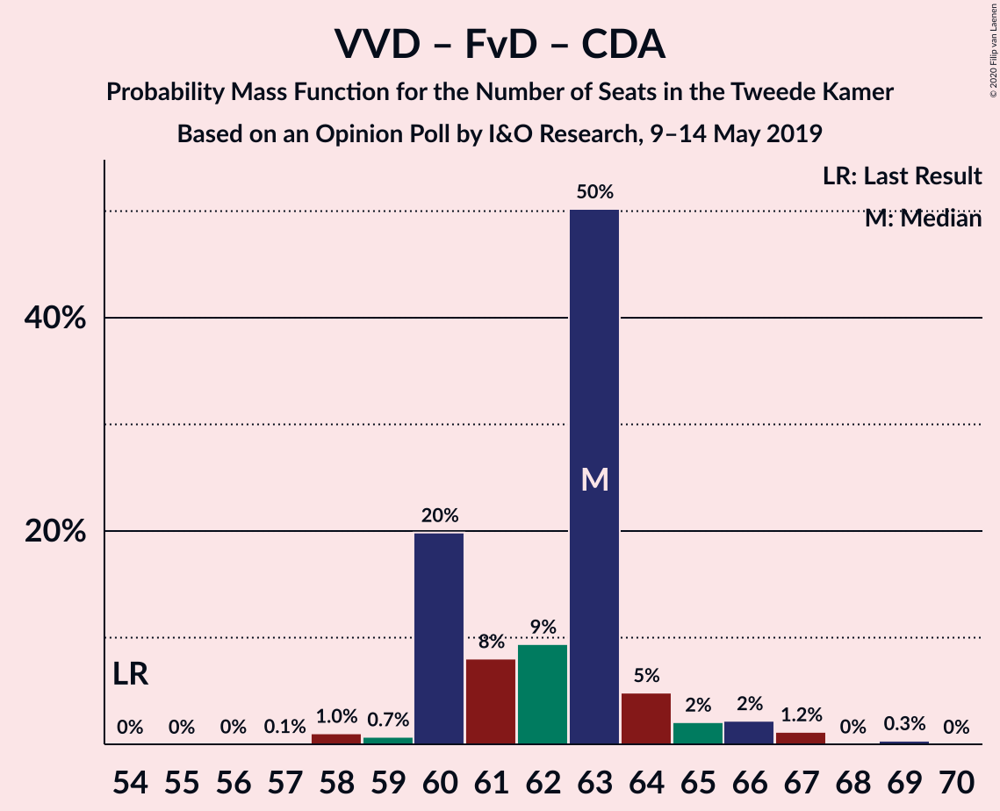

| Number of Seats | Probability | Accumulated | Special Marks |
|:---------------:|:-----------:|:-----------:|:-------------:|
| 54 | 0% | 100% | Last Result |
| 55 | 0% | 100% |  |
| 56 | 0% | 100% |  |
| 57 | 0.1% | 100% |  |
| 58 | 1.0% | 99.9% |  |
| 59 | 0.7% | 98.9% |  |
| 60 | 20% | 98% |  |
| 61 | 8% | 78% |  |
| 62 | 9% | 70% | Median |
| 63 | 50% | 61% |  |
| 64 | 5% | 11% |  |
| 65 | 2% | 6% |  |
| 66 | 2% | 4% |  |
| 67 | 1.2% | 2% |  |
| 68 | 0% | 0.4% |  |
| 69 | 0.3% | 0.4% |  |
| 70 | 0% | 0% |  |

### GroenLinks – Christen-Democratisch Appèl – Partij van de Arbeid – Democraten 66 – ChristenUnie

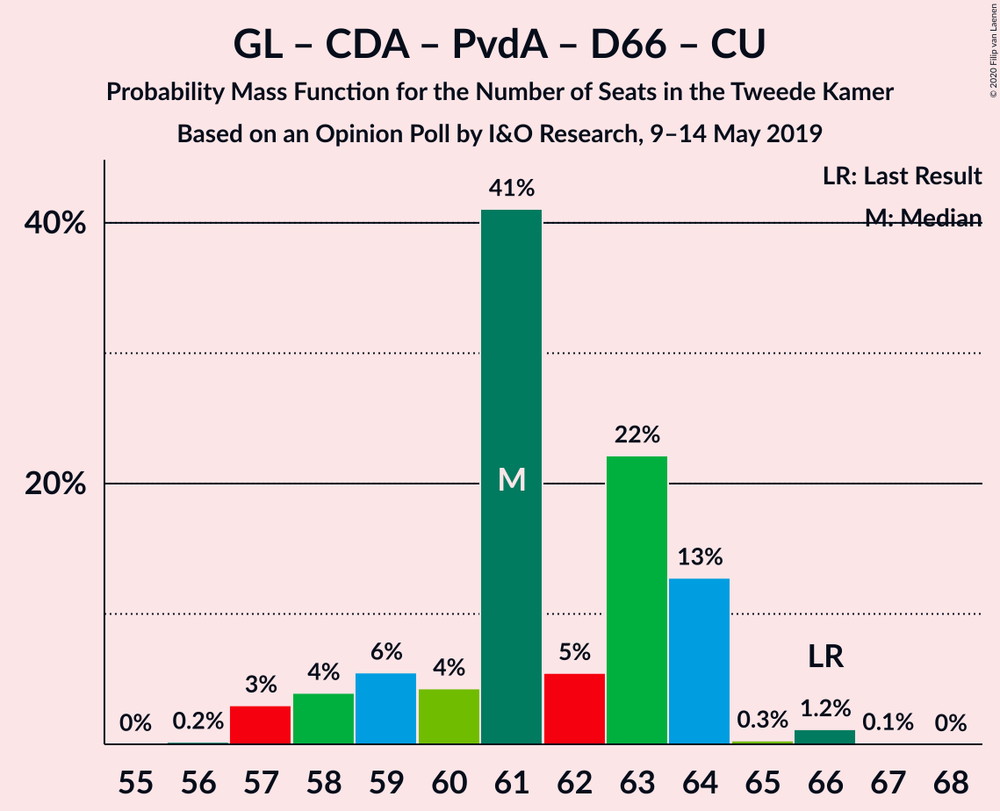

| Number of Seats | Probability | Accumulated | Special Marks |
|:---------------:|:-----------:|:-----------:|:-------------:|
| 55 | 0% | 100% |  |
| 56 | 0.2% | 99.9% |  |
| 57 | 3% | 99.7% |  |
| 58 | 4% | 97% |  |
| 59 | 6% | 93% |  |
| 60 | 4% | 87% |  |
| 61 | 41% | 83% |  |
| 62 | 5% | 42% | Median |
| 63 | 22% | 36% |  |
| 64 | 13% | 14% |  |
| 65 | 0.3% | 2% |  |
| 66 | 1.2% | 1.3% | Last Result |
| 67 | 0.1% | 0.1% |  |
| 68 | 0% | 0% |  |

### Volkspartij voor Vrijheid en Democratie – Christen-Democratisch Appèl – Democraten 66 – ChristenUnie

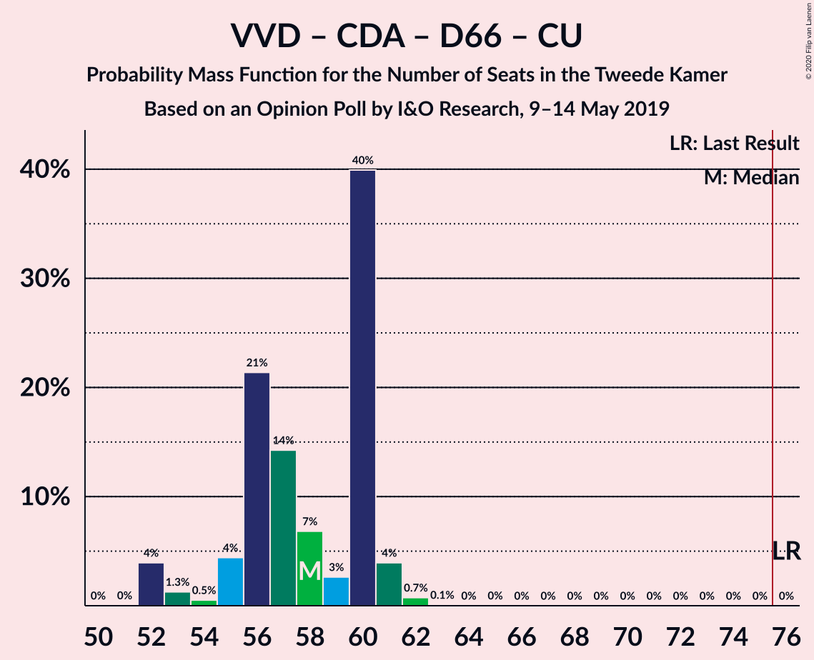

| Number of Seats | Probability | Accumulated | Special Marks |
|:---------------:|:-----------:|:-----------:|:-------------:|
| 51 | 0% | 100% |  |
| 52 | 4% | 99.9% |  |
| 53 | 1.3% | 96% |  |
| 54 | 0.5% | 95% |  |
| 55 | 4% | 94% |  |
| 56 | 21% | 90% |  |
| 57 | 14% | 68% |  |
| 58 | 7% | 54% |  |
| 59 | 3% | 47% | Median |
| 60 | 40% | 45% |  |
| 61 | 4% | 5% |  |
| 62 | 0.7% | 0.9% |  |
| 63 | 0.1% | 0.1% |  |
| 64 | 0% | 0% |  |
| 65 | 0% | 0% |  |
| 66 | 0% | 0% |  |
| 67 | 0% | 0% |  |
| 68 | 0% | 0% |  |
| 69 | 0% | 0% |  |
| 70 | 0% | 0% |  |
| 71 | 0% | 0% |  |
| 72 | 0% | 0% |  |
| 73 | 0% | 0% |  |
| 74 | 0% | 0% |  |
| 75 | 0% | 0% |  |
| 76 | 0% | 0% | Last Result, Majority |

### Volkspartij voor Vrijheid en Democratie – Christen-Democratisch Appèl – Partij van de Arbeid

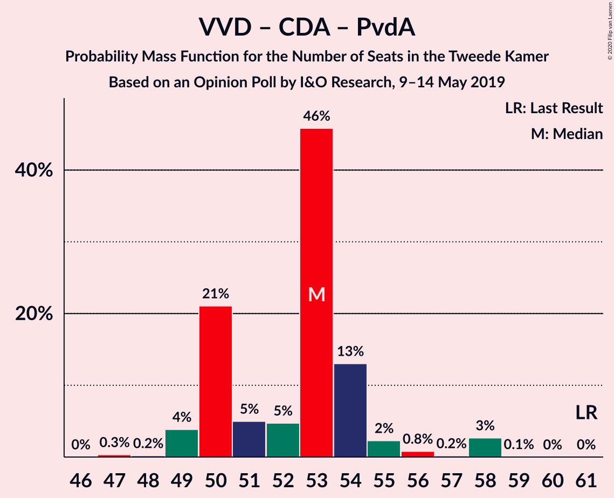

| Number of Seats | Probability | Accumulated | Special Marks |
|:---------------:|:-----------:|:-----------:|:-------------:|
| 47 | 0.3% | 100% |  |
| 48 | 0.2% | 99.7% |  |
| 49 | 4% | 99.5% |  |
| 50 | 21% | 96% |  |
| 51 | 5% | 75% |  |
| 52 | 5% | 70% |  |
| 53 | 46% | 65% | Median |
| 54 | 13% | 19% |  |
| 55 | 2% | 6% |  |
| 56 | 0.8% | 4% |  |
| 57 | 0.2% | 3% |  |
| 58 | 3% | 3% |  |
| 59 | 0.1% | 0.1% |  |
| 60 | 0% | 0% |  |
| 61 | 0% | 0% | Last Result |

### Volkspartij voor Vrijheid en Democratie – Christen-Democratisch Appèl – Partij voor de Vrijheid

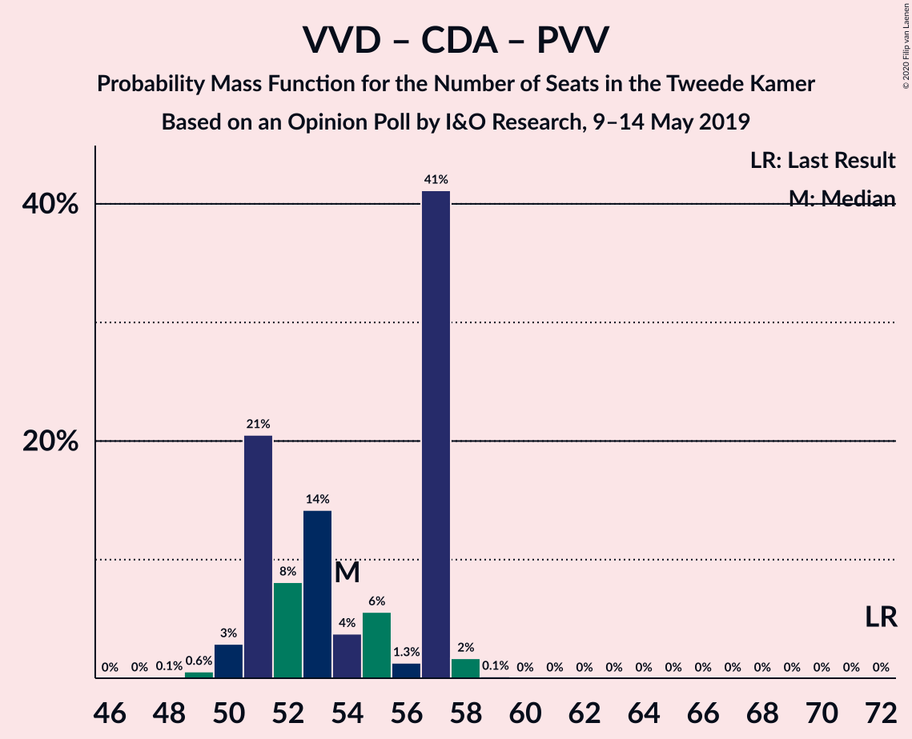

| Number of Seats | Probability | Accumulated | Special Marks |
|:---------------:|:-----------:|:-----------:|:-------------:|
| 48 | 0.1% | 100% |  |
| 49 | 0.6% | 99.9% |  |
| 50 | 3% | 99.3% |  |
| 51 | 21% | 96% |  |
| 52 | 8% | 76% |  |
| 53 | 14% | 68% |  |
| 54 | 4% | 54% | Median |
| 55 | 6% | 50% |  |
| 56 | 1.3% | 44% |  |
| 57 | 41% | 43% |  |
| 58 | 2% | 2% |  |
| 59 | 0.1% | 0.2% |  |
| 60 | 0% | 0% |  |
| 61 | 0% | 0% |  |
| 62 | 0% | 0% |  |
| 63 | 0% | 0% |  |
| 64 | 0% | 0% |  |
| 65 | 0% | 0% |  |
| 66 | 0% | 0% |  |
| 67 | 0% | 0% |  |
| 68 | 0% | 0% |  |
| 69 | 0% | 0% |  |
| 70 | 0% | 0% |  |
| 71 | 0% | 0% |  |
| 72 | 0% | 0% | Last Result |

### Volkspartij voor Vrijheid en Democratie – Christen-Democratisch Appèl – Democraten 66

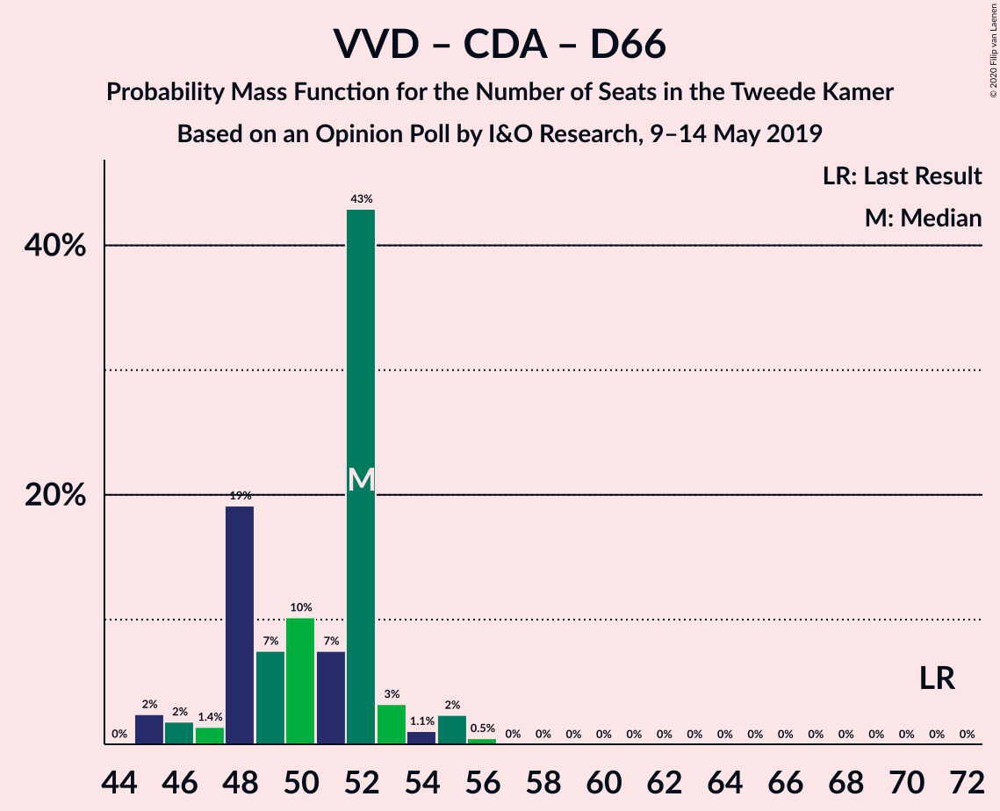

| Number of Seats | Probability | Accumulated | Special Marks |
|:---------------:|:-----------:|:-----------:|:-------------:|
| 45 | 2% | 100% |  |
| 46 | 2% | 98% |  |
| 47 | 1.4% | 96% |  |
| 48 | 19% | 94% |  |
| 49 | 7% | 75% |  |
| 50 | 10% | 68% |  |
| 51 | 7% | 58% | Median |
| 52 | 43% | 50% |  |
| 53 | 3% | 7% |  |
| 54 | 1.1% | 4% |  |
| 55 | 2% | 3% |  |
| 56 | 0.5% | 0.5% |  |
| 57 | 0% | 0% |  |
| 58 | 0% | 0% |  |
| 59 | 0% | 0% |  |
| 60 | 0% | 0% |  |
| 61 | 0% | 0% |  |
| 62 | 0% | 0% |  |
| 63 | 0% | 0% |  |
| 64 | 0% | 0% |  |
| 65 | 0% | 0% |  |
| 66 | 0% | 0% |  |
| 67 | 0% | 0% |  |
| 68 | 0% | 0% |  |
| 69 | 0% | 0% |  |
| 70 | 0% | 0% |  |
| 71 | 0% | 0% | Last Result |

### Volkspartij voor Vrijheid en Democratie – Partij van de Arbeid – Democraten 66

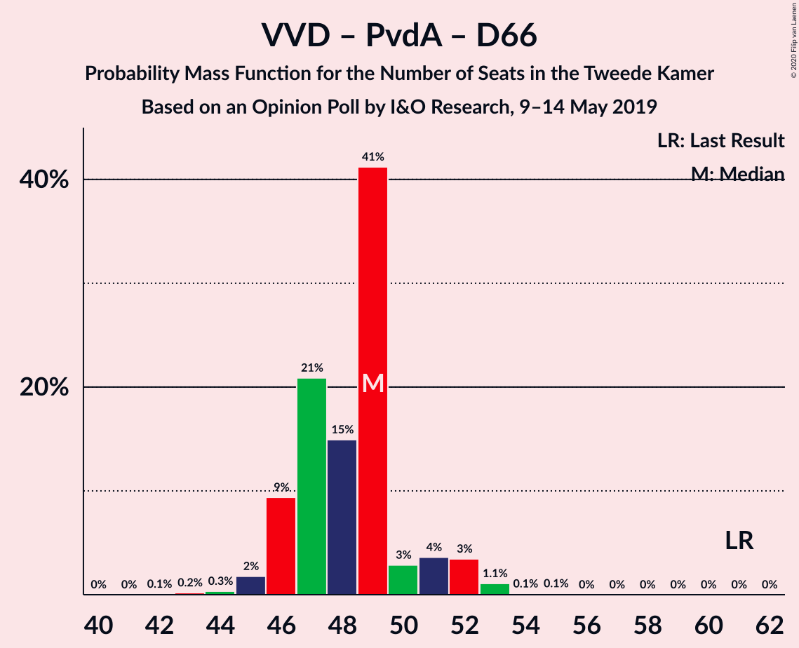

| Number of Seats | Probability | Accumulated | Special Marks |
|:---------------:|:-----------:|:-----------:|:-------------:|
| 42 | 0.1% | 100% |  |
| 43 | 0.2% | 99.9% |  |
| 44 | 0.3% | 99.7% |  |
| 45 | 2% | 99.4% |  |
| 46 | 9% | 98% |  |
| 47 | 21% | 88% |  |
| 48 | 15% | 67% |  |
| 49 | 41% | 52% | Median |
| 50 | 3% | 11% |  |
| 51 | 4% | 8% |  |
| 52 | 3% | 5% |  |
| 53 | 1.1% | 1.3% |  |
| 54 | 0.1% | 0.2% |  |
| 55 | 0.1% | 0.1% |  |
| 56 | 0% | 0% |  |
| 57 | 0% | 0% |  |
| 58 | 0% | 0% |  |
| 59 | 0% | 0% |  |
| 60 | 0% | 0% |  |
| 61 | 0% | 0% | Last Result |

### Volkspartij voor Vrijheid en Democratie – Christen-Democratisch Appèl

| Number of Seats | Probability | Accumulated | Special Marks |
|:---------------:|:-----------:|:-----------:|:-------------:|
| 36 | 0.3% | 100% |  |
| 37 | 3% | 99.6% |  |
| 38 | 21% | 97% |  |
| 39 | 4% | 76% |  |
| 40 | 16% | 72% |  |
| 41 | 8% | 56% | Median |
| 42 | 44% | 49% |  |
| 43 | 1.2% | 5% |  |
| 44 | 0.5% | 3% |  |
| 45 | 2% | 3% |  |
| 46 | 0.5% | 0.5% |  |
| 47 | 0% | 0% |  |
| 48 | 0% | 0% |  |
| 49 | 0% | 0% |  |
| 50 | 0% | 0% |  |
| 51 | 0% | 0% |  |
| 52 | 0% | 0% | Last Result |

### Volkspartij voor Vrijheid en Democratie – Partij van de Arbeid

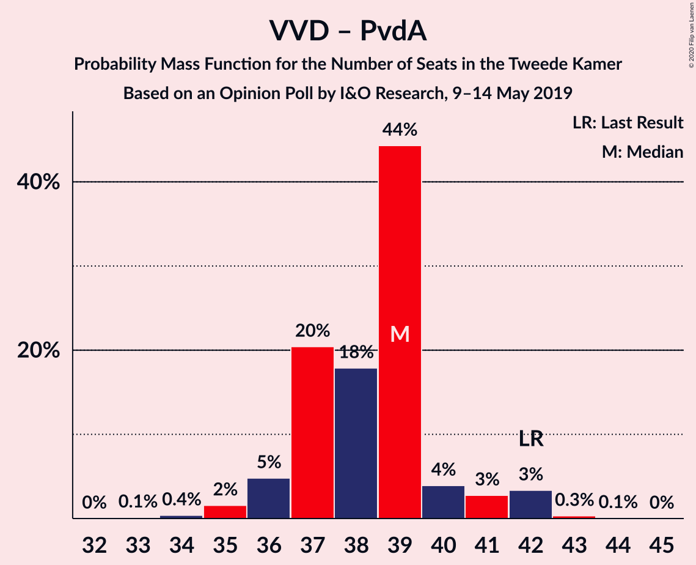

| Number of Seats | Probability | Accumulated | Special Marks |
|:---------------:|:-----------:|:-----------:|:-------------:|
| 33 | 0.1% | 100% |  |
| 34 | 0.4% | 99.9% |  |
| 35 | 2% | 99.5% |  |
| 36 | 5% | 98% |  |
| 37 | 20% | 93% |  |
| 38 | 18% | 73% |  |
| 39 | 44% | 55% | Median |
| 40 | 4% | 10% |  |
| 41 | 3% | 7% |  |
| 42 | 3% | 4% | Last Result |
| 43 | 0.3% | 0.4% |  |
| 44 | 0.1% | 0.1% |  |
| 45 | 0% | 0% |  |

### Christen-Democratisch Appèl – Partij van de Arbeid – Democraten 66

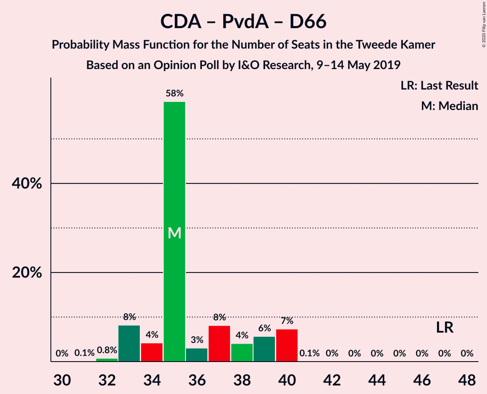

| Number of Seats | Probability | Accumulated | Special Marks |
|:---------------:|:-----------:|:-----------:|:-------------:|
| 31 | 0.1% | 100% |  |
| 32 | 0.8% | 99.9% |  |
| 33 | 8% | 99.1% |  |
| 34 | 4% | 91% |  |
| 35 | 58% | 87% |  |
| 36 | 3% | 28% | Median |
| 37 | 8% | 25% |  |
| 38 | 4% | 17% |  |
| 39 | 6% | 13% |  |
| 40 | 7% | 7% |  |
| 41 | 0.1% | 0.1% |  |
| 42 | 0% | 0% |  |
| 43 | 0% | 0% |  |
| 44 | 0% | 0% |  |
| 45 | 0% | 0% |  |
| 46 | 0% | 0% |  |
| 47 | 0% | 0% | Last Result |

### Christen-Democratisch Appèl – Partij van de Arbeid – ChristenUnie

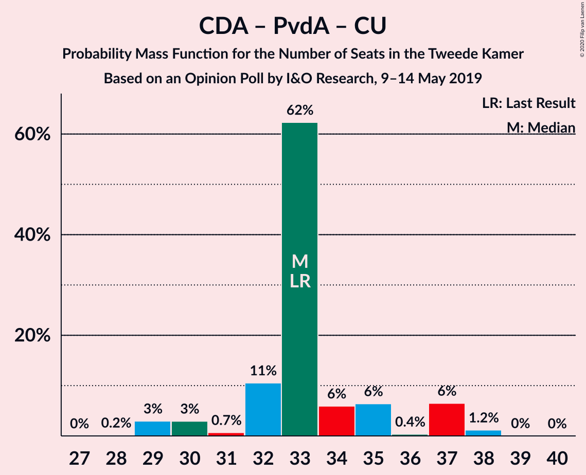

| Number of Seats | Probability | Accumulated | Special Marks |
|:---------------:|:-----------:|:-----------:|:-------------:|
| 28 | 0.2% | 100% |  |
| 29 | 3% | 99.8% |  |
| 30 | 3% | 97% |  |
| 31 | 0.7% | 94% |  |
| 32 | 11% | 93% |  |
| 33 | 62% | 83% | Last Result |
| 34 | 6% | 20% | Median |
| 35 | 6% | 14% |  |
| 36 | 0.4% | 8% |  |
| 37 | 6% | 8% |  |
| 38 | 1.2% | 1.2% |  |
| 39 | 0% | 0.1% |  |
| 40 | 0% | 0% |  |

### Christen-Democratisch Appèl – Partij van de Arbeid

| Number of Seats | Probability | Accumulated | Special Marks |
|:---------------:|:-----------:|:-----------:|:-------------:|
| 22 | 0.5% | 100% |  |
| 23 | 4% | 99.4% |  |
| 24 | 2% | 96% |  |
| 25 | 63% | 94% |  |
| 26 | 6% | 31% | Median |
| 27 | 9% | 24% |  |
| 28 | 3% | 15% | Last Result |
| 29 | 5% | 11% |  |
| 30 | 6% | 6% |  |
| 31 | 0.2% | 0.3% |  |
| 32 | 0% | 0% |  |

### Christen-Democratisch Appèl – Democraten 66

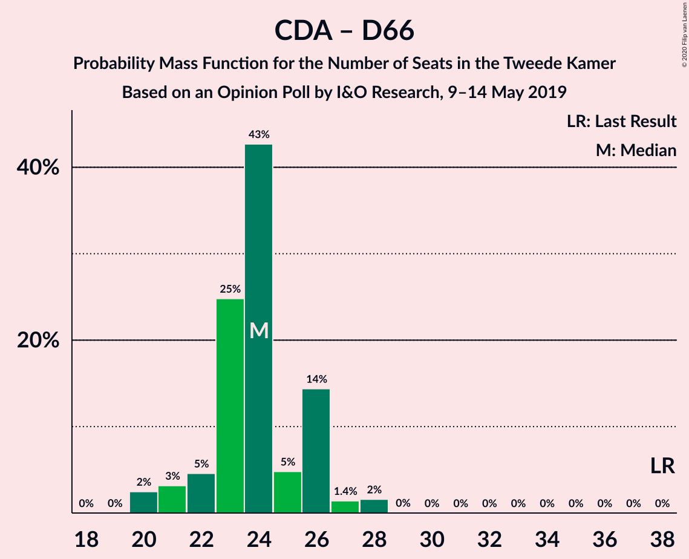

| Number of Seats | Probability | Accumulated | Special Marks |
|:---------------:|:-----------:|:-----------:|:-------------:|
| 20 | 2% | 100% |  |
| 21 | 3% | 98% |  |
| 22 | 5% | 94% |  |
| 23 | 25% | 90% |  |
| 24 | 43% | 65% | Median |
| 25 | 5% | 22% |  |
| 26 | 14% | 17% |  |
| 27 | 1.4% | 3% |  |
| 28 | 2% | 2% |  |
| 29 | 0% | 0% |  |
| 30 | 0% | 0% |  |
| 31 | 0% | 0% |  |
| 32 | 0% | 0% |  |
| 33 | 0% | 0% |  |
| 34 | 0% | 0% |  |
| 35 | 0% | 0% |  |
| 36 | 0% | 0% |  |
| 37 | 0% | 0% |  |
| 38 | 0% | 0% | Last Result |

## Technical Information

### Opinion Poll

+ **Polling firm:** I&O Research
+ **Commissioner(s):** —
+ **Fieldwork period:** 9–14 May 2019

### Calculations

+ **Sample size:** 1659
+ **Simulations done:** 1,048,576
+ **Error estimate:** 2.77%

