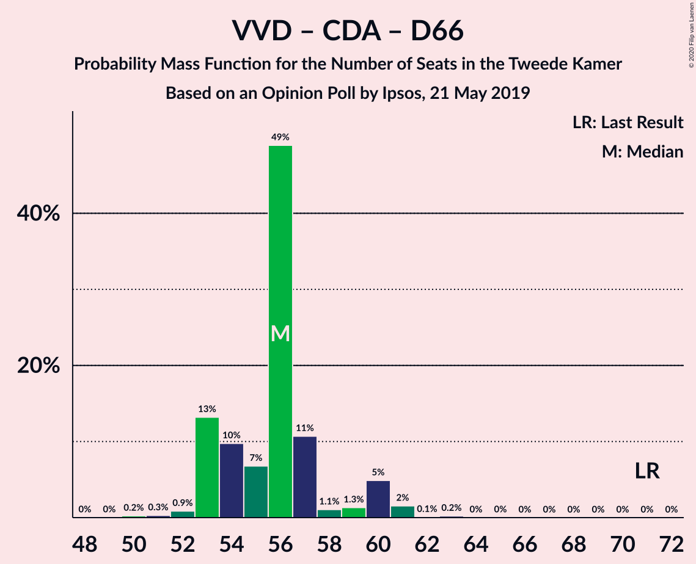

# Opinion Poll by Ipsos, 21 May 2019

<a href="#voting-intentions">Voting Intentions</a> | <a href="#seats">Seats</a> | <a href="#coalitions">Coalitions</a> | <a href="#technical-information">Technical Information</a>

## Voting Intentions

### Confidence Intervals

| Party | Last Result | Poll Result | 80% Confidence Interval | 90% Confidence Interval | 95% Confidence Interval | 99% Confidence Interval |
|:-----:|:-----------:|:-----------:|:-----------------------:|:-----------------------:|:-----------------------:|:-----------------------:|
| Volkspartij voor Vrijheid en Democratie | 21.3% | 18.7% | 17.2–20.4% |16.8–20.8% |16.4–21.2% |15.7–22.1% |
| Forum voor Democratie | 1.8% | 14.0% | 12.7–15.5% |12.3–15.9% |12.0–16.3% |11.4–17.0% |
| GroenLinks | 9.1% | 10.6% | 9.4–11.9% |9.1–12.3% |8.8–12.7% |8.3–13.3% |
| Christen-Democratisch Appèl | 12.4% | 9.9% | 8.8–11.2% |8.5–11.6% |8.2–11.9% |7.7–12.6% |
| Democraten 66 | 12.2% | 8.6% | 7.6–9.8% |7.3–10.2% |7.0–10.5% |6.5–11.1% |
| Partij voor de Vrijheid | 13.1% | 8.2% | 7.2–9.4% |6.9–9.8% |6.6–10.1% |6.2–10.7% |
| Partij van de Arbeid | 5.7% | 7.0% | 6.1–8.2% |5.8–8.5% |5.6–8.8% |5.2–9.3% |
| Socialistische Partij | 9.1% | 6.0% | 5.1–7.1% |4.9–7.4% |4.7–7.7% |4.3–8.2% |
| 50Plus | 3.1% | 4.1% | 3.4–5.0% |3.2–5.3% |3.0–5.5% |2.7–6.0% |
| ChristenUnie | 3.4% | 4.0% | 3.3–4.9% |3.1–5.2% |2.9–5.4% |2.7–5.9% |
| Partij voor de Dieren | 3.2% | 3.8% | 3.1–4.7% |2.9–5.0% |2.8–5.2% |2.5–5.6% |
| Staatkundig Gereformeerde Partij | 2.1% | 2.3% | 1.8–3.0% |1.6–3.2% |1.5–3.4% |1.3–3.8% |
| DENK | 2.1% | 2.0% | 1.5–2.7% |1.4–2.9% |1.3–3.1% |1.1–3.4% |

*Note:* The poll result column reflects the actual value used in the calculations. Published results may vary slightly, and in addition be rounded to fewer digits.

## Seats

### Confidence Intervals

| Party | Last Result | Median | 80% Confidence Interval | 90% Confidence Interval | 95% Confidence Interval | 99% Confidence Interval |
|:-----:|:-----------:|:------:|:-----------------------:|:-----------------------:|:-----------------------:|:-----------------------:|
| <a href="#volkspartij-voor-vrijheid-en-democratie">Volkspartij voor Vrijheid en Democratie</a> | 33 | 27 | 27–30 |26–30 |26–31 |24–33 |
| <a href="#forum-voor-democratie">Forum voor Democratie</a> | 2 | 22 | 19–22 |19–23 |18–23 |17–26 |
| <a href="#groenlinks">GroenLinks</a> | 14 | 18 | 15–18 |14–19 |13–19 |13–19 |
| <a href="#christen-democratisch-appèl">Christen-Democratisch Appèl</a> | 19 | 17 | 13–17 |13–19 |13–19 |12–19 |
| <a href="#democraten-66">Democraten 66</a> | 19 | 12 | 12–15 |11–15 |10–15 |10–16 |
| <a href="#partij-voor-de-vrijheid">Partij voor de Vrijheid</a> | 20 | 11 | 11–13 |10–14 |10–14 |9–16 |
| <a href="#partij-van-de-arbeid">Partij van de Arbeid</a> | 9 | 11 | 10–12 |9–13 |9–13 |8–14 |
| <a href="#socialistische-partij">Socialistische Partij</a> | 14 | 9 | 8–12 |8–12 |7–12 |6–12 |
| <a href="#50plus">50Plus</a> | 4 | 6 | 5–6 |5–7 |5–8 |4–9 |
| <a href="#christenunie">ChristenUnie</a> | 5 | 7 | 5–7 |5–7 |5–8 |4–8 |
| <a href="#partij-voor-de-dieren">Partij voor de Dieren</a> | 5 | 5 | 4–6 |4–6 |4–7 |4–8 |
| <a href="#staatkundig-gereformeerde-partij">Staatkundig Gereformeerde Partij</a> | 3 | 3 | 3–4 |3–4 |2–5 |2–5 |
| <a href="#denk">DENK</a> | 3 | 2 | 2–3 |2–4 |2–4 |1–5 |

### Volkspartij voor Vrijheid en Democratie

*For a full overview of the results for this party, see the [Volkspartij voor Vrijheid en Democratie](party-volkspartijvoorvrijheidendemocratie.html) page.*

| Number of Seats | Probability | Accumulated | Special Marks |
|:---------------:|:-----------:|:-----------:|:-------------:|
| 23 | 0.5% | 100% |  |
| 24 | 0.4% | 99.5% |  |
| 25 | 0.7% | 99.1% |  |
| 26 | 8% | 98% |  |
| 27 | 62% | 90% | Median |
| 28 | 9% | 28% |  |
| 29 | 8% | 19% |  |
| 30 | 9% | 12% |  |
| 31 | 1.2% | 3% |  |
| 32 | 1.0% | 2% |  |
| 33 | 0.6% | 0.8% | Last Result |
| 34 | 0.1% | 0.2% |  |
| 35 | 0.1% | 0.1% |  |
| 36 | 0% | 0% |  |

### Forum voor Democratie

*For a full overview of the results for this party, see the [Forum voor Democratie](party-forumvoordemocratie.html) page.*

| Number of Seats | Probability | Accumulated | Special Marks |
|:---------------:|:-----------:|:-----------:|:-------------:|
| 2 | 0% | 100% | Last Result |
| 3 | 0% | 100% |  |
| 4 | 0% | 100% |  |
| 5 | 0% | 100% |  |
| 6 | 0% | 100% |  |
| 7 | 0% | 100% |  |
| 8 | 0% | 100% |  |
| 9 | 0% | 100% |  |
| 10 | 0% | 100% |  |
| 11 | 0% | 100% |  |
| 12 | 0% | 100% |  |
| 13 | 0% | 100% |  |
| 14 | 0% | 100% |  |
| 15 | 0% | 100% |  |
| 16 | 0.3% | 100% |  |
| 17 | 0.2% | 99.7% |  |
| 18 | 2% | 99.4% |  |
| 19 | 9% | 97% |  |
| 20 | 16% | 89% |  |
| 21 | 11% | 73% |  |
| 22 | 53% | 61% | Median |
| 23 | 6% | 9% |  |
| 24 | 0.6% | 2% |  |
| 25 | 0.4% | 2% |  |
| 26 | 1.1% | 1.2% |  |
| 27 | 0% | 0.1% |  |
| 28 | 0% | 0% |  |

### GroenLinks

*For a full overview of the results for this party, see the [GroenLinks](party-groenlinks.html) page.*

| Number of Seats | Probability | Accumulated | Special Marks |
|:---------------:|:-----------:|:-----------:|:-------------:|
| 12 | 0.1% | 100% |  |
| 13 | 4% | 99.9% |  |
| 14 | 2% | 96% | Last Result |
| 15 | 8% | 94% |  |
| 16 | 6% | 86% |  |
| 17 | 11% | 79% |  |
| 18 | 61% | 69% | Median |
| 19 | 7% | 8% |  |
| 20 | 0.3% | 0.4% |  |
| 21 | 0.1% | 0.1% |  |
| 22 | 0% | 0% |  |

### Christen-Democratisch Appèl

*For a full overview of the results for this party, see the [Christen-Democratisch Appèl](party-christen-democratischappèl.html) page.*

| Number of Seats | Probability | Accumulated | Special Marks |
|:---------------:|:-----------:|:-----------:|:-------------:|
| 11 | 0.1% | 100% |  |
| 12 | 1.2% | 99.9% |  |
| 13 | 26% | 98.7% |  |
| 14 | 5% | 73% |  |
| 15 | 5% | 68% |  |
| 16 | 11% | 64% |  |
| 17 | 47% | 53% | Median |
| 18 | 0.8% | 6% |  |
| 19 | 5% | 5% | Last Result |
| 20 | 0.1% | 0.1% |  |
| 21 | 0% | 0% |  |

### Democraten 66

*For a full overview of the results for this party, see the [Democraten 66](party-democraten66.html) page.*

| Number of Seats | Probability | Accumulated | Special Marks |
|:---------------:|:-----------:|:-----------:|:-------------:|
| 9 | 0.1% | 100% |  |
| 10 | 4% | 99.9% |  |
| 11 | 2% | 96% |  |
| 12 | 59% | 94% | Median |
| 13 | 21% | 35% |  |
| 14 | 4% | 15% |  |
| 15 | 9% | 11% |  |
| 16 | 2% | 2% |  |
| 17 | 0.3% | 0.4% |  |
| 18 | 0.1% | 0.1% |  |
| 19 | 0% | 0% | Last Result |

### Partij voor de Vrijheid

*For a full overview of the results for this party, see the [Partij voor de Vrijheid](party-partijvoordevrijheid.html) page.*

| Number of Seats | Probability | Accumulated | Special Marks |
|:---------------:|:-----------:|:-----------:|:-------------:|
| 9 | 2% | 100% |  |
| 10 | 8% | 98% |  |
| 11 | 49% | 90% | Median |
| 12 | 18% | 41% |  |
| 13 | 16% | 24% |  |
| 14 | 6% | 8% |  |
| 15 | 0.6% | 2% |  |
| 16 | 1.4% | 2% |  |
| 17 | 0.2% | 0.2% |  |
| 18 | 0% | 0% |  |
| 19 | 0% | 0% |  |
| 20 | 0% | 0% | Last Result |

### Partij van de Arbeid

*For a full overview of the results for this party, see the [Partij van de Arbeid](party-partijvandearbeid.html) page.*

| Number of Seats | Probability | Accumulated | Special Marks |
|:---------------:|:-----------:|:-----------:|:-------------:|
| 7 | 0.1% | 100% |  |
| 8 | 1.3% | 99.9% |  |
| 9 | 4% | 98.6% | Last Result |
| 10 | 18% | 95% |  |
| 11 | 52% | 77% | Median |
| 12 | 17% | 25% |  |
| 13 | 8% | 8% |  |
| 14 | 0.3% | 0.7% |  |
| 15 | 0.4% | 0.4% |  |
| 16 | 0% | 0% |  |

### Socialistische Partij

*For a full overview of the results for this party, see the [Socialistische Partij](party-socialistischepartij.html) page.*

| Number of Seats | Probability | Accumulated | Special Marks |
|:---------------:|:-----------:|:-----------:|:-------------:|
| 6 | 1.3% | 100% |  |
| 7 | 2% | 98.6% |  |
| 8 | 14% | 96% |  |
| 9 | 56% | 82% | Median |
| 10 | 8% | 27% |  |
| 11 | 5% | 18% |  |
| 12 | 13% | 13% |  |
| 13 | 0.1% | 0.1% |  |
| 14 | 0% | 0% | Last Result |

### 50Plus

*For a full overview of the results for this party, see the [50Plus](party-50plus.html) page.*

| Number of Seats | Probability | Accumulated | Special Marks |
|:---------------:|:-----------:|:-----------:|:-------------:|
| 4 | 2% | 100% | Last Result |
| 5 | 18% | 98% |  |
| 6 | 71% | 80% | Median |
| 7 | 7% | 10% |  |
| 8 | 2% | 3% |  |
| 9 | 0.6% | 0.7% |  |
| 10 | 0% | 0% |  |

### ChristenUnie

*For a full overview of the results for this party, see the [ChristenUnie](party-christenunie.html) page.*

| Number of Seats | Probability | Accumulated | Special Marks |
|:---------------:|:-----------:|:-----------:|:-------------:|
| 3 | 0.1% | 100% |  |
| 4 | 2% | 99.9% |  |
| 5 | 26% | 98% | Last Result |
| 6 | 13% | 71% |  |
| 7 | 55% | 59% | Median |
| 8 | 3% | 3% |  |
| 9 | 0.3% | 0.4% |  |
| 10 | 0.1% | 0.1% |  |
| 11 | 0% | 0% |  |

### Partij voor de Dieren

*For a full overview of the results for this party, see the [Partij voor de Dieren](party-partijvoordedieren.html) page.*

| Number of Seats | Probability | Accumulated | Special Marks |
|:---------------:|:-----------:|:-----------:|:-------------:|
| 3 | 0.4% | 100% |  |
| 4 | 13% | 99.6% |  |
| 5 | 72% | 87% | Last Result, Median |
| 6 | 10% | 15% |  |
| 7 | 4% | 5% |  |
| 8 | 0.5% | 0.5% |  |
| 9 | 0.1% | 0.1% |  |
| 10 | 0% | 0% |  |

### Staatkundig Gereformeerde Partij

*For a full overview of the results for this party, see the [Staatkundig Gereformeerde Partij](party-staatkundiggereformeerdepartij.html) page.*

| Number of Seats | Probability | Accumulated | Special Marks |
|:---------------:|:-----------:|:-----------:|:-------------:|
| 1 | 0.3% | 100% |  |
| 2 | 4% | 99.7% |  |
| 3 | 75% | 96% | Last Result, Median |
| 4 | 18% | 21% |  |
| 5 | 3% | 4% |  |
| 6 | 0.4% | 0.4% |  |
| 7 | 0% | 0% |  |

### DENK

*For a full overview of the results for this party, see the [DENK](party-denk.html) page.*

| Number of Seats | Probability | Accumulated | Special Marks |
|:---------------:|:-----------:|:-----------:|:-------------:|
| 1 | 0.9% | 100% |  |
| 2 | 59% | 99.1% | Median |
| 3 | 35% | 40% | Last Result |
| 4 | 4% | 5% |  |
| 5 | 0.8% | 0.8% |  |
| 6 | 0% | 0% |  |

## Coalitions

### Confidence Intervals

| Coalition | Last Result | Median | Majority? | 80% Confidence Interval | 90% Confidence Interval | 95% Confidence Interval | 99% Confidence Interval |
|:---------:|:-----------:|:------:|:---------:|:-----------------------:|:-----------------------:|:-----------------------:|:-----------------------:|
| Volkspartij voor Vrijheid en Democratie – Forum voor Democratie – Christen-Democratisch Appèl – Partij voor de Vrijheid – Staatkundig Gereformeerde Partij | 77 | 80 | 80% | 75–83 | 75–85 | 75–86 | 75–86 |
| Volkspartij voor Vrijheid en Democratie – Forum voor Democratie – Christen-Democratisch Appèl – Partij voor de Vrijheid | 74 | 77 | 70% | 72–79 | 71–81 | 71–83 | 71–83 |
| Volkspartij voor Vrijheid en Democratie – GroenLinks – Christen-Democratisch Appèl – Democraten 66 – ChristenUnie | 90 | 81 | 97% | 76–81 | 76–81 | 75–82 | 72–84 |
| Volkspartij voor Vrijheid en Democratie – Forum voor Democratie – Christen-Democratisch Appèl – 50Plus – Staatkundig Gereformeerde Partij | 61 | 75 | 15% | 69–76 | 67–77 | 67–78 | 67–79 |
| Volkspartij voor Vrijheid en Democratie – Christen-Democratisch Appèl – Democraten 66 – Partij van de Arbeid – ChristenUnie | 85 | 74 | 5% | 70–74 | 70–76 | 70–77 | 67–78 |
| GroenLinks – Christen-Democratisch Appèl – Democraten 66 – Partij van de Arbeid – Socialistische Partij – ChristenUnie | 80 | 74 | 1.0% | 68–74 | 67–75 | 66–75 | 63–76 |
| Volkspartij voor Vrijheid en Democratie – Forum voor Democratie – Christen-Democratisch Appèl – 50Plus | 58 | 72 | 2% | 66–72 | 63–74 | 63–74 | 63–77 |
| Volkspartij voor Vrijheid en Democratie – Forum voor Democratie – Christen-Democratisch Appèl – Staatkundig Gereformeerde Partij | 57 | 69 | 0% | 63–70 | 62–72 | 62–73 | 62–74 |
| Volkspartij voor Vrijheid en Democratie – Forum voor Democratie – Christen-Democratisch Appèl | 54 | 66 | 0% | 60–66 | 58–69 | 58–69 | 58–71 |
| Volkspartij voor Vrijheid en Democratie – Christen-Democratisch Appèl – Democraten 66 – ChristenUnie | 76 | 63 | 0% | 58–63 | 58–65 | 58–67 | 57–67 |
| GroenLinks – Christen-Democratisch Appèl – Democraten 66 – Partij van de Arbeid – ChristenUnie | 66 | 65 | 0% | 59–65 | 58–66 | 57–66 | 55–66 |
| Volkspartij voor Vrijheid en Democratie – Christen-Democratisch Appèl – Partij voor de Vrijheid | 72 | 55 | 0% | 52–58 | 52–60 | 52–61 | 51–61 |
| Volkspartij voor Vrijheid en Democratie – Christen-Democratisch Appèl – Democraten 66 | 71 | 56 | 0% | 53–57 | 53–60 | 53–60 | 51–61 |
| Volkspartij voor Vrijheid en Democratie – Christen-Democratisch Appèl – Partij van de Arbeid | 61 | 55 | 0% | 52–55 | 52–58 | 51–58 | 49–60 |
| Volkspartij voor Vrijheid en Democratie – Democraten 66 – Partij van de Arbeid | 61 | 50 | 0% | 50–54 | 49–54 | 49–54 | 46–57 |
| Volkspartij voor Vrijheid en Democratie – Christen-Democratisch Appèl | 52 | 44 | 0% | 40–45 | 39–47 | 39–48 | 39–48 |
| Christen-Democratisch Appèl – Democraten 66 – Partij van de Arbeid | 47 | 40 | 0% | 37–41 | 35–42 | 35–43 | 34–44 |
| Volkspartij voor Vrijheid en Democratie – Partij van de Arbeid | 42 | 38 | 0% | 38–40 | 37–41 | 37–41 | 34–44 |
| Christen-Democratisch Appèl – Partij van de Arbeid – ChristenUnie | 33 | 35 | 0% | 30–35 | 30–35 | 29–35 | 28–36 |
| Christen-Democratisch Appèl – Democraten 66 | 38 | 29 | 0% | 26–29 | 25–31 | 25–32 | 24–32 |
| Christen-Democratisch Appèl – Partij van de Arbeid | 28 | 28 | 0% | 24–28 | 23–29 | 23–30 | 22–31 |

### Volkspartij voor Vrijheid en Democratie – Forum voor Democratie – Christen-Democratisch Appèl – Partij voor de Vrijheid – Staatkundig Gereformeerde Partij

| Number of Seats | Probability | Accumulated | Special Marks |
|:---------------:|:-----------:|:-----------:|:-------------:|
| 73 | 0.1% | 100% |  |
| 74 | 0.3% | 99.9% |  |
| 75 | 19% | 99.6% |  |
| 76 | 2% | 80% | Majority |
| 77 | 1.4% | 78% | Last Result |
| 78 | 3% | 77% |  |
| 79 | 10% | 74% |  |
| 80 | 47% | 64% | Median |
| 81 | 2% | 18% |  |
| 82 | 1.0% | 15% |  |
| 83 | 7% | 14% |  |
| 84 | 2% | 8% |  |
| 85 | 1.2% | 6% |  |
| 86 | 4% | 5% |  |
| 87 | 0.3% | 0.4% |  |
| 88 | 0.1% | 0.1% |  |
| 89 | 0% | 0% |  |

### Volkspartij voor Vrijheid en Democratie – Forum voor Democratie – Christen-Democratisch Appèl – Partij voor de Vrijheid

| Number of Seats | Probability | Accumulated | Special Marks |
|:---------------:|:-----------:|:-----------:|:-------------:|
| 69 | 0% | 100% |  |
| 70 | 0.1% | 99.9% |  |
| 71 | 6% | 99.8% |  |
| 72 | 13% | 93% |  |
| 73 | 2% | 80% |  |
| 74 | 3% | 79% | Last Result |
| 75 | 6% | 76% |  |
| 76 | 6% | 70% | Majority |
| 77 | 47% | 64% | Median |
| 78 | 2% | 17% |  |
| 79 | 6% | 15% |  |
| 80 | 4% | 9% |  |
| 81 | 0.7% | 5% |  |
| 82 | 0.1% | 5% |  |
| 83 | 4% | 5% |  |
| 84 | 0.1% | 0.1% |  |
| 85 | 0% | 0% |  |

### Volkspartij voor Vrijheid en Democratie – GroenLinks – Christen-Democratisch Appèl – Democraten 66 – ChristenUnie

| Number of Seats | Probability | Accumulated | Special Marks |
|:---------------:|:-----------:|:-----------:|:-------------:|
| 71 | 0.1% | 100% |  |
| 72 | 0.5% | 99.9% |  |
| 73 | 0.3% | 99.4% |  |
| 74 | 0.8% | 99.1% |  |
| 75 | 1.5% | 98% |  |
| 76 | 15% | 97% | Majority |
| 77 | 7% | 82% |  |
| 78 | 4% | 75% |  |
| 79 | 17% | 71% |  |
| 80 | 2% | 54% |  |
| 81 | 47% | 52% | Median |
| 82 | 2% | 5% |  |
| 83 | 0.9% | 2% |  |
| 84 | 1.3% | 1.4% |  |
| 85 | 0.1% | 0.1% |  |
| 86 | 0% | 0.1% |  |
| 87 | 0% | 0% |  |
| 88 | 0% | 0% |  |
| 89 | 0% | 0% |  |
| 90 | 0% | 0% | Last Result |

### Volkspartij voor Vrijheid en Democratie – Forum voor Democratie – Christen-Democratisch Appèl – 50Plus – Staatkundig Gereformeerde Partij

| Number of Seats | Probability | Accumulated | Special Marks |
|:---------------:|:-----------:|:-----------:|:-------------:|
| 61 | 0% | 100% | Last Result |
| 62 | 0% | 100% |  |
| 63 | 0% | 100% |  |
| 64 | 0% | 100% |  |
| 65 | 0% | 100% |  |
| 66 | 0.1% | 100% |  |
| 67 | 6% | 99.9% |  |
| 68 | 0.4% | 93% |  |
| 69 | 13% | 93% |  |
| 70 | 0.7% | 80% |  |
| 71 | 1.1% | 79% |  |
| 72 | 4% | 78% |  |
| 73 | 3% | 74% |  |
| 74 | 4% | 71% |  |
| 75 | 52% | 67% | Median |
| 76 | 6% | 15% | Majority |
| 77 | 5% | 9% |  |
| 78 | 2% | 3% |  |
| 79 | 2% | 2% |  |
| 80 | 0.2% | 0.3% |  |
| 81 | 0% | 0.1% |  |
| 82 | 0% | 0.1% |  |
| 83 | 0% | 0% |  |

### Volkspartij voor Vrijheid en Democratie – Christen-Democratisch Appèl – Democraten 66 – Partij van de Arbeid – ChristenUnie

| Number of Seats | Probability | Accumulated | Special Marks |
|:---------------:|:-----------:|:-----------:|:-------------:|
| 64 | 0.1% | 100% |  |
| 65 | 0.2% | 99.9% |  |
| 66 | 0.1% | 99.7% |  |
| 67 | 0.1% | 99.6% |  |
| 68 | 0.3% | 99.4% |  |
| 69 | 1.0% | 99.1% |  |
| 70 | 13% | 98% |  |
| 71 | 2% | 85% |  |
| 72 | 13% | 83% |  |
| 73 | 13% | 70% |  |
| 74 | 50% | 57% | Median |
| 75 | 2% | 8% |  |
| 76 | 2% | 5% | Majority |
| 77 | 3% | 4% |  |
| 78 | 0.2% | 0.7% |  |
| 79 | 0.4% | 0.5% |  |
| 80 | 0% | 0.1% |  |
| 81 | 0% | 0% |  |
| 82 | 0% | 0% |  |
| 83 | 0% | 0% |  |
| 84 | 0% | 0% |  |
| 85 | 0% | 0% | Last Result |

### GroenLinks – Christen-Democratisch Appèl – Democraten 66 – Partij van de Arbeid – Socialistische Partij – ChristenUnie

| Number of Seats | Probability | Accumulated | Special Marks |
|:---------------:|:-----------:|:-----------:|:-------------:|
| 62 | 0.1% | 100% |  |
| 63 | 0.4% | 99.9% |  |
| 64 | 0.3% | 99.4% |  |
| 65 | 0.4% | 99.2% |  |
| 66 | 2% | 98.8% |  |
| 67 | 5% | 97% |  |
| 68 | 8% | 91% |  |
| 69 | 3% | 84% |  |
| 70 | 7% | 81% |  |
| 71 | 3% | 74% |  |
| 72 | 4% | 71% |  |
| 73 | 14% | 67% |  |
| 74 | 46% | 53% | Median |
| 75 | 7% | 8% |  |
| 76 | 0.9% | 1.0% | Majority |
| 77 | 0.1% | 0.1% |  |
| 78 | 0% | 0% |  |
| 79 | 0% | 0% |  |
| 80 | 0% | 0% | Last Result |

### Volkspartij voor Vrijheid en Democratie – Forum voor Democratie – Christen-Democratisch Appèl – 50Plus

| Number of Seats | Probability | Accumulated | Special Marks |
|:---------------:|:-----------:|:-----------:|:-------------:|
| 58 | 0% | 100% | Last Result |
| 59 | 0% | 100% |  |
| 60 | 0% | 100% |  |
| 61 | 0% | 100% |  |
| 62 | 0% | 100% |  |
| 63 | 6% | 100% |  |
| 64 | 0.2% | 94% |  |
| 65 | 0.5% | 93% |  |
| 66 | 13% | 93% |  |
| 67 | 0.6% | 80% |  |
| 68 | 4% | 79% |  |
| 69 | 3% | 75% |  |
| 70 | 2% | 73% |  |
| 71 | 3% | 70% |  |
| 72 | 59% | 67% | Median |
| 73 | 1.0% | 8% |  |
| 74 | 5% | 7% |  |
| 75 | 0.3% | 2% |  |
| 76 | 1.1% | 2% | Majority |
| 77 | 0.6% | 0.7% |  |
| 78 | 0% | 0.1% |  |
| 79 | 0% | 0.1% |  |
| 80 | 0% | 0% |  |

### Volkspartij voor Vrijheid en Democratie – Forum voor Democratie – Christen-Democratisch Appèl – Staatkundig Gereformeerde Partij

| Number of Seats | Probability | Accumulated | Special Marks |
|:---------------:|:-----------:|:-----------:|:-------------:|
| 57 | 0% | 100% | Last Result |
| 58 | 0% | 100% |  |
| 59 | 0% | 100% |  |
| 60 | 0% | 100% |  |
| 61 | 0.1% | 100% |  |
| 62 | 7% | 99.9% |  |
| 63 | 13% | 93% |  |
| 64 | 0.5% | 80% |  |
| 65 | 3% | 80% |  |
| 66 | 3% | 77% |  |
| 67 | 5% | 73% |  |
| 68 | 2% | 69% |  |
| 69 | 52% | 67% | Median |
| 70 | 8% | 16% |  |
| 71 | 0.7% | 7% |  |
| 72 | 4% | 7% |  |
| 73 | 1.4% | 3% |  |
| 74 | 1.2% | 1.3% |  |
| 75 | 0.1% | 0.1% |  |
| 76 | 0% | 0% | Majority |

### Volkspartij voor Vrijheid en Democratie – Forum voor Democratie – Christen-Democratisch Appèl

| Number of Seats | Probability | Accumulated | Special Marks |
|:---------------:|:-----------:|:-----------:|:-------------:|
| 54 | 0% | 100% | Last Result |
| 55 | 0% | 100% |  |
| 56 | 0% | 100% |  |
| 57 | 0% | 100% |  |
| 58 | 6% | 100% |  |
| 59 | 0.2% | 93% |  |
| 60 | 13% | 93% |  |
| 61 | 1.1% | 80% |  |
| 62 | 3% | 79% |  |
| 63 | 4% | 76% |  |
| 64 | 4% | 72% |  |
| 65 | 3% | 68% |  |
| 66 | 56% | 65% | Median |
| 67 | 2% | 9% |  |
| 68 | 0.3% | 7% |  |
| 69 | 4% | 6% |  |
| 70 | 0.6% | 2% |  |
| 71 | 1.2% | 1.3% |  |
| 72 | 0% | 0.1% |  |
| 73 | 0% | 0% |  |

### Volkspartij voor Vrijheid en Democratie – Christen-Democratisch Appèl – Democraten 66 – ChristenUnie

| Number of Seats | Probability | Accumulated | Special Marks |
|:---------------:|:-----------:|:-----------:|:-------------:|
| 55 | 0.2% | 100% |  |
| 56 | 0.2% | 99.7% |  |
| 57 | 0.5% | 99.5% |  |
| 58 | 13% | 99.0% |  |
| 59 | 1.1% | 86% |  |
| 60 | 7% | 85% |  |
| 61 | 3% | 78% |  |
| 62 | 18% | 75% |  |
| 63 | 48% | 57% | Median |
| 64 | 1.1% | 10% |  |
| 65 | 4% | 8% |  |
| 66 | 1.5% | 4% |  |
| 67 | 3% | 3% |  |
| 68 | 0.1% | 0.2% |  |
| 69 | 0% | 0.1% |  |
| 70 | 0% | 0% |  |
| 71 | 0% | 0% |  |
| 72 | 0% | 0% |  |
| 73 | 0% | 0% |  |
| 74 | 0% | 0% |  |
| 75 | 0% | 0% |  |
| 76 | 0% | 0% | Last Result, Majority |

### GroenLinks – Christen-Democratisch Appèl – Democraten 66 – Partij van de Arbeid – ChristenUnie

| Number of Seats | Probability | Accumulated | Special Marks |
|:---------------:|:-----------:|:-----------:|:-------------:|
| 52 | 0.1% | 100% |  |
| 53 | 0% | 99.9% |  |
| 54 | 0.3% | 99.9% |  |
| 55 | 0.2% | 99.6% |  |
| 56 | 0.4% | 99.3% |  |
| 57 | 2% | 99.0% |  |
| 58 | 7% | 97% |  |
| 59 | 8% | 91% |  |
| 60 | 1.2% | 82% |  |
| 61 | 16% | 81% |  |
| 62 | 7% | 65% |  |
| 63 | 1.3% | 58% |  |
| 64 | 3% | 57% |  |
| 65 | 47% | 54% | Median |
| 66 | 7% | 7% | Last Result |
| 67 | 0.2% | 0.3% |  |
| 68 | 0% | 0.1% |  |
| 69 | 0.1% | 0.1% |  |
| 70 | 0% | 0% |  |

### Volkspartij voor Vrijheid en Democratie – Christen-Democratisch Appèl – Partij voor de Vrijheid

| Number of Seats | Probability | Accumulated | Special Marks |
|:---------------:|:-----------:|:-----------:|:-------------:|
| 48 | 0% | 100% |  |
| 49 | 0.2% | 99.9% |  |
| 50 | 0.1% | 99.8% |  |
| 51 | 0.2% | 99.6% |  |
| 52 | 22% | 99.4% |  |
| 53 | 8% | 78% |  |
| 54 | 2% | 69% |  |
| 55 | 46% | 67% | Median |
| 56 | 3% | 21% |  |
| 57 | 4% | 18% |  |
| 58 | 7% | 15% |  |
| 59 | 3% | 8% |  |
| 60 | 1.1% | 5% |  |
| 61 | 4% | 4% |  |
| 62 | 0.1% | 0.2% |  |
| 63 | 0.1% | 0.1% |  |
| 64 | 0% | 0% |  |
| 65 | 0% | 0% |  |
| 66 | 0% | 0% |  |
| 67 | 0% | 0% |  |
| 68 | 0% | 0% |  |
| 69 | 0% | 0% |  |
| 70 | 0% | 0% |  |
| 71 | 0% | 0% |  |
| 72 | 0% | 0% | Last Result |

### Volkspartij voor Vrijheid en Democratie – Christen-Democratisch Appèl – Democraten 66

| Number of Seats | Probability | Accumulated | Special Marks |
|:---------------:|:-----------:|:-----------:|:-------------:|
| 49 | 0% | 100% |  |
| 50 | 0.2% | 99.9% |  |
| 51 | 0.3% | 99.7% |  |
| 52 | 0.9% | 99.4% |  |
| 53 | 13% | 98.5% |  |
| 54 | 10% | 85% |  |
| 55 | 7% | 76% |  |
| 56 | 49% | 69% | Median |
| 57 | 11% | 20% |  |
| 58 | 1.1% | 9% |  |
| 59 | 1.3% | 8% |  |
| 60 | 5% | 7% |  |
| 61 | 2% | 2% |  |
| 62 | 0.1% | 0.3% |  |
| 63 | 0.2% | 0.3% |  |
| 64 | 0% | 0% |  |
| 65 | 0% | 0% |  |
| 66 | 0% | 0% |  |
| 67 | 0% | 0% |  |
| 68 | 0% | 0% |  |
| 69 | 0% | 0% |  |
| 70 | 0% | 0% |  |
| 71 | 0% | 0% | Last Result |

### Volkspartij voor Vrijheid en Democratie – Christen-Democratisch Appèl – Partij van de Arbeid

| Number of Seats | Probability | Accumulated | Special Marks |
|:---------------:|:-----------:|:-----------:|:-------------:|
| 47 | 0% | 100% |  |
| 48 | 0.2% | 99.9% |  |
| 49 | 0.6% | 99.7% |  |
| 50 | 0.7% | 99.1% |  |
| 51 | 2% | 98% |  |
| 52 | 21% | 96% |  |
| 53 | 6% | 76% |  |
| 54 | 7% | 69% |  |
| 55 | 53% | 62% | Median |
| 56 | 2% | 8% |  |
| 57 | 0.8% | 7% |  |
| 58 | 4% | 6% |  |
| 59 | 0.1% | 2% |  |
| 60 | 2% | 2% |  |
| 61 | 0.1% | 0.1% | Last Result |
| 62 | 0% | 0% |  |

### Volkspartij voor Vrijheid en Democratie – Democraten 66 – Partij van de Arbeid

| Number of Seats | Probability | Accumulated | Special Marks |
|:---------------:|:-----------:|:-----------:|:-------------:|
| 43 | 0.1% | 100% |  |
| 44 | 0% | 99.9% |  |
| 45 | 0.2% | 99.8% |  |
| 46 | 0.1% | 99.6% |  |
| 47 | 0.3% | 99.5% |  |
| 48 | 0.8% | 99.2% |  |
| 49 | 5% | 98% |  |
| 50 | 48% | 94% | Median |
| 51 | 8% | 46% |  |
| 52 | 21% | 38% |  |
| 53 | 3% | 17% |  |
| 54 | 11% | 14% |  |
| 55 | 0.7% | 2% |  |
| 56 | 0.6% | 2% |  |
| 57 | 1.0% | 1.2% |  |
| 58 | 0.2% | 0.2% |  |
| 59 | 0% | 0.1% |  |
| 60 | 0% | 0% |  |
| 61 | 0% | 0% | Last Result |

### Volkspartij voor Vrijheid en Democratie – Christen-Democratisch Appèl

| Number of Seats | Probability | Accumulated | Special Marks |
|:---------------:|:-----------:|:-----------:|:-------------:|
| 37 | 0.2% | 100% |  |
| 38 | 0.1% | 99.7% |  |
| 39 | 7% | 99.6% |  |
| 40 | 14% | 93% |  |
| 41 | 3% | 79% |  |
| 42 | 4% | 76% |  |
| 43 | 6% | 72% |  |
| 44 | 50% | 66% | Median |
| 45 | 8% | 16% |  |
| 46 | 2% | 8% |  |
| 47 | 4% | 7% |  |
| 48 | 2% | 3% |  |
| 49 | 0.2% | 0.3% |  |
| 50 | 0.1% | 0.2% |  |
| 51 | 0% | 0% |  |
| 52 | 0% | 0% | Last Result |

### Christen-Democratisch Appèl – Democraten 66 – Partij van de Arbeid

| Number of Seats | Probability | Accumulated | Special Marks |
|:---------------:|:-----------:|:-----------:|:-------------:|
| 32 | 0.2% | 100% |  |
| 33 | 0.1% | 99.8% |  |
| 34 | 0.3% | 99.7% |  |
| 35 | 6% | 99.4% |  |
| 36 | 2% | 93% |  |
| 37 | 3% | 91% |  |
| 38 | 20% | 88% |  |
| 39 | 5% | 68% |  |
| 40 | 50% | 63% | Median |
| 41 | 8% | 13% |  |
| 42 | 3% | 5% |  |
| 43 | 1.1% | 3% |  |
| 44 | 2% | 2% |  |
| 45 | 0.1% | 0.1% |  |
| 46 | 0% | 0% |  |
| 47 | 0% | 0% | Last Result |

### Volkspartij voor Vrijheid en Democratie – Partij van de Arbeid

| Number of Seats | Probability | Accumulated | Special Marks |
|:---------------:|:-----------:|:-----------:|:-------------:|
| 33 | 0.4% | 100% |  |
| 34 | 0.4% | 99.5% |  |
| 35 | 0.7% | 99.1% |  |
| 36 | 0.8% | 98% |  |
| 37 | 4% | 98% |  |
| 38 | 49% | 94% | Median |
| 39 | 32% | 45% |  |
| 40 | 7% | 12% |  |
| 41 | 3% | 6% |  |
| 42 | 1.1% | 2% | Last Result |
| 43 | 0.3% | 1.4% |  |
| 44 | 1.0% | 1.1% |  |
| 45 | 0% | 0.1% |  |
| 46 | 0.1% | 0.1% |  |
| 47 | 0% | 0% |  |

### Christen-Democratisch Appèl – Partij van de Arbeid – ChristenUnie

| Number of Seats | Probability | Accumulated | Special Marks |
|:---------------:|:-----------:|:-----------:|:-------------:|
| 26 | 0.1% | 100% |  |
| 27 | 0.3% | 99.8% |  |
| 28 | 0.4% | 99.6% |  |
| 29 | 3% | 99.1% |  |
| 30 | 21% | 96% |  |
| 31 | 6% | 75% |  |
| 32 | 11% | 69% |  |
| 33 | 3% | 58% | Last Result |
| 34 | 3% | 54% |  |
| 35 | 51% | 52% | Median |
| 36 | 0.4% | 0.5% |  |
| 37 | 0.1% | 0.2% |  |
| 38 | 0% | 0.1% |  |
| 39 | 0% | 0% |  |

### Christen-Democratisch Appèl – Democraten 66

| Number of Seats | Probability | Accumulated | Special Marks |
|:---------------:|:-----------:|:-----------:|:-------------:|
| 23 | 0.1% | 100% |  |
| 24 | 2% | 99.9% |  |
| 25 | 5% | 98% |  |
| 26 | 14% | 93% |  |
| 27 | 4% | 78% |  |
| 28 | 15% | 74% |  |
| 29 | 51% | 60% | Median |
| 30 | 3% | 8% |  |
| 31 | 2% | 6% |  |
| 32 | 4% | 4% |  |
| 33 | 0.2% | 0.4% |  |
| 34 | 0.2% | 0.2% |  |
| 35 | 0% | 0% |  |
| 36 | 0% | 0% |  |
| 37 | 0% | 0% |  |
| 38 | 0% | 0% | Last Result |

### Christen-Democratisch Appèl – Partij van de Arbeid

| Number of Seats | Probability | Accumulated | Special Marks |
|:---------------:|:-----------:|:-----------:|:-------------:|
| 20 | 0% | 100% |  |
| 21 | 0.3% | 99.9% |  |
| 22 | 0.3% | 99.6% |  |
| 23 | 6% | 99.3% |  |
| 24 | 6% | 93% |  |
| 25 | 15% | 87% |  |
| 26 | 16% | 72% |  |
| 27 | 4% | 56% |  |
| 28 | 46% | 52% | Last Result, Median |
| 29 | 1.3% | 6% |  |
| 30 | 3% | 5% |  |
| 31 | 1.4% | 1.5% |  |
| 32 | 0% | 0% |  |

## Technical Information

### Opinion Poll

+ **Polling firm:** Ipsos
+ **Commissioner(s):** —
+ **Fieldwork period:** 21 May 2019

### Calculations

+ **Sample size:** 1000
+ **Simulations done:** 1,048,576
+ **Error estimate:** 2.93%

