# Opinion Poll by Ipsos for EenVandaag, 21–24 June 2019

<a href="#voting-intentions">Voting Intentions</a> | <a href="#seats">Seats</a> | <a href="#coalitions">Coalitions</a> | <a href="#technical-information">Technical Information</a>

## Voting Intentions

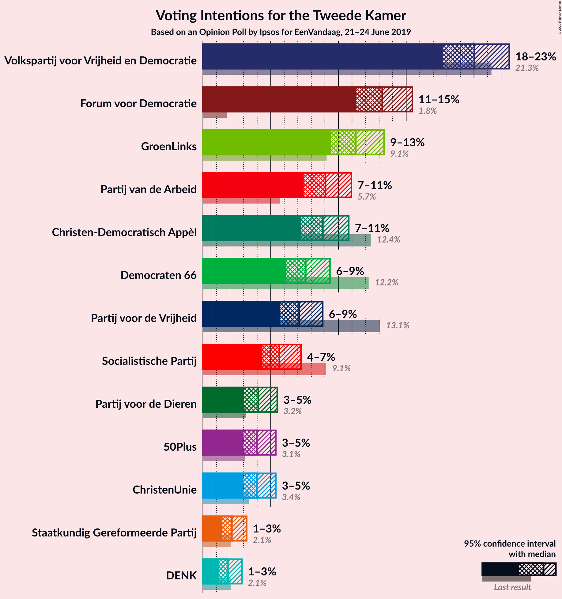

### Confidence Intervals

| Party | Last Result | Poll Result | 80% Confidence Interval | 90% Confidence Interval | 95% Confidence Interval | 99% Confidence Interval |
|:-----:|:-----------:|:-----------:|:-----------------------:|:-----------------------:|:-----------------------:|:-----------------------:|
| Volkspartij voor Vrijheid en Democratie | 21.3% | 20.0% | 18.5–21.7% |18.1–22.2% |17.7–22.6% |17.0–23.4% |
| Forum voor Democratie | 1.8% | 13.2% | 11.9–14.7% |11.6–15.1% |11.3–15.5% |10.7–16.2% |
| GroenLinks | 9.1% | 11.3% | 10.1–12.7% |9.8–13.0% |9.5–13.4% |8.9–14.1% |
| Partij van de Arbeid | 5.7% | 9.0% | 8.0–10.3% |7.7–10.7% |7.4–11.0% |7.0–11.6% |
| Christen-Democratisch Appèl | 12.4% | 8.9% | 7.8–10.1% |7.5–10.4% |7.3–10.8% |6.8–11.4% |
| Democraten 66 | 12.2% | 7.6% | 6.6–8.7% |6.3–9.1% |6.1–9.4% |5.7–10.0% |
| Partij voor de Vrijheid | 13.1% | 7.1% | 6.2–8.2% |5.9–8.6% |5.7–8.8% |5.3–9.4% |
| Socialistische Partij | 9.1% | 5.6% | 4.8–6.7% |4.6–7.0% |4.4–7.2% |4.0–7.8% |
| Partij voor de Dieren | 3.2% | 4.1% | 3.4–5.0% |3.2–5.3% |3.0–5.5% |2.7–5.9% |
| ChristenUnie | 3.4% | 4.0% | 3.3–4.9% |3.1–5.2% |3.0–5.4% |2.7–5.8% |
| 50Plus | 3.1% | 4.0% | 3.3–4.9% |3.1–5.2% |3.0–5.4% |2.7–5.8% |
| Staatkundig Gereformeerde Partij | 2.1% | 2.1% | 1.7–2.9% |1.5–3.0% |1.4–3.2% |1.2–3.6% |
| DENK | 2.1% | 1.8% | 1.4–2.5% |1.3–2.7% |1.2–2.9% |1.0–3.2% |

*Note:* The poll result column reflects the actual value used in the calculations. Published results may vary slightly, and in addition be rounded to fewer digits.

## Seats

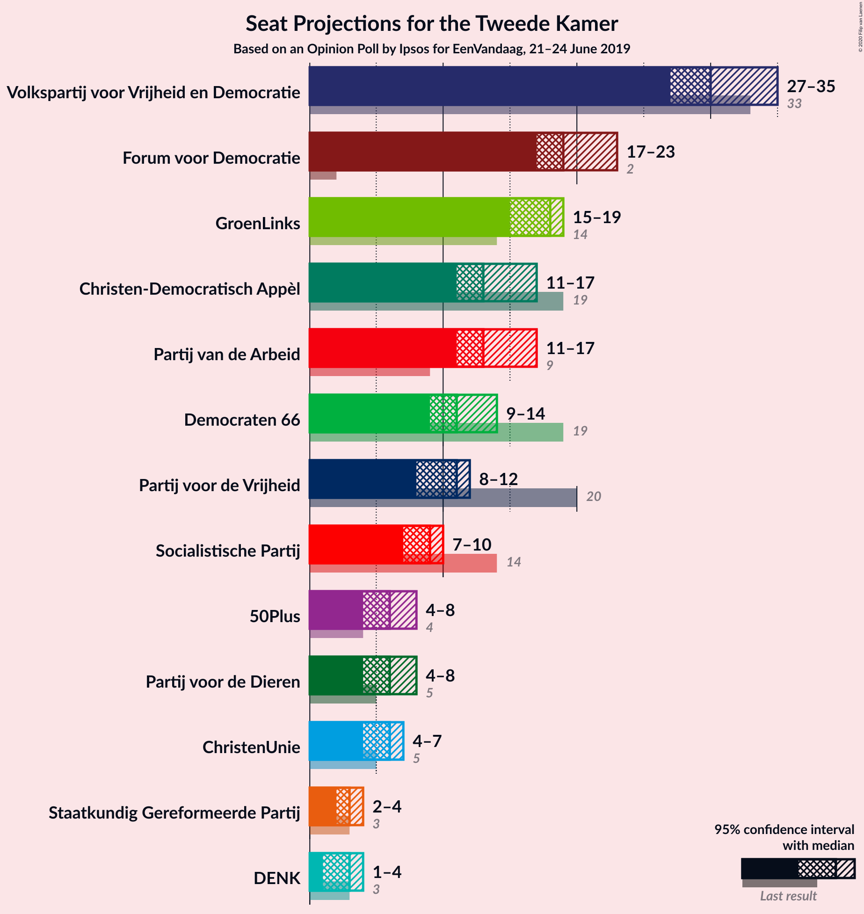

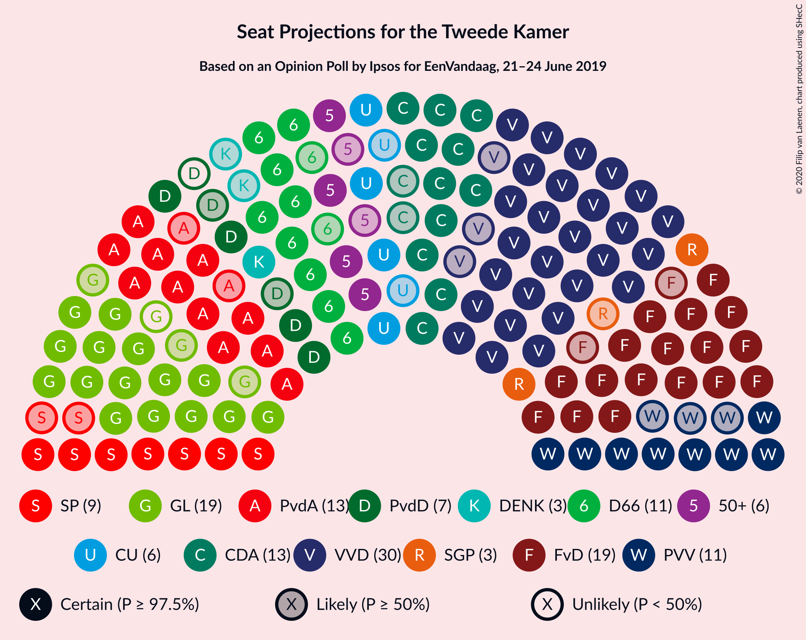

### Confidence Intervals

| Party | Last Result | Median | 80% Confidence Interval | 90% Confidence Interval | 95% Confidence Interval | 99% Confidence Interval |
|:-----:|:-----------:|:------:|:-----------------------:|:-----------------------:|:-----------------------:|:-----------------------:|
| <a href="#volkspartij-voor-vrijheid-en-democratie">Volkspartij voor Vrijheid en Democratie</a> | 33 | 30 | 28–32 |27–34 |27–35 |26–36 |
| <a href="#forum-voor-democratie">Forum voor Democratie</a> | 2 | 19 | 17–22 |17–23 |17–23 |16–25 |
| <a href="#groenlinks">GroenLinks</a> | 14 | 18 | 15–19 |15–19 |15–19 |14–21 |
| <a href="#partij-van-de-arbeid">Partij van de Arbeid</a> | 9 | 13 | 12–16 |12–17 |11–17 |10–17 |
| <a href="#christen-democratisch-appèl">Christen-Democratisch Appèl</a> | 19 | 13 | 11–15 |11–16 |11–17 |10–18 |
| <a href="#democraten-66">Democraten 66</a> | 19 | 11 | 9–14 |9–14 |9–14 |8–15 |
| <a href="#partij-voor-de-vrijheid">Partij voor de Vrijheid</a> | 20 | 11 | 9–12 |9–12 |8–12 |7–14 |
| <a href="#socialistische-partij">Socialistische Partij</a> | 14 | 9 | 7–10 |7–10 |7–10 |5–11 |
| <a href="#partij-voor-de-dieren">Partij voor de Dieren</a> | 5 | 6 | 5–7 |4–8 |4–8 |4–8 |
| <a href="#christenunie">ChristenUnie</a> | 5 | 6 | 4–7 |4–7 |4–7 |4–8 |
| <a href="#50plus">50Plus</a> | 4 | 6 | 4–7 |4–8 |4–8 |4–9 |
| <a href="#staatkundig-gereformeerde-partij">Staatkundig Gereformeerde Partij</a> | 3 | 3 | 2–4 |2–4 |2–4 |1–5 |
| <a href="#denk">DENK</a> | 3 | 3 | 2–3 |2–4 |1–4 |1–4 |

### Volkspartij voor Vrijheid en Democratie

*For a full overview of the results for this party, see the [Volkspartij voor Vrijheid en Democratie](party-volkspartijvoorvrijheidendemocratie.html) page.*

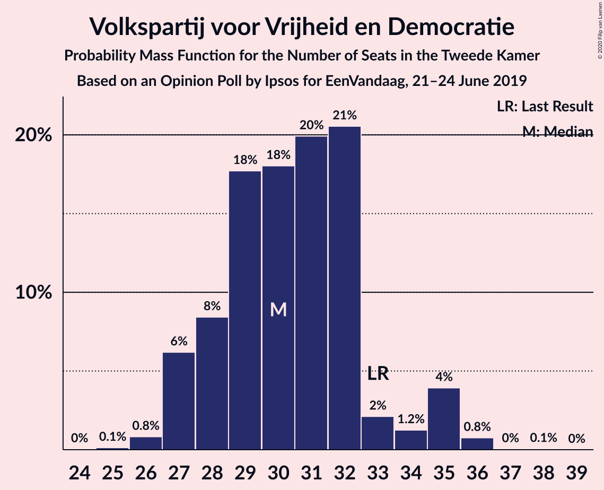

| Number of Seats | Probability | Accumulated | Special Marks |
|:---------------:|:-----------:|:-----------:|:-------------:|
| 25 | 0.1% | 100% |  |
| 26 | 0.8% | 99.8% |  |
| 27 | 6% | 99.0% |  |
| 28 | 8% | 93% |  |
| 29 | 18% | 84% |  |
| 30 | 18% | 67% | Median |
| 31 | 20% | 49% |  |
| 32 | 21% | 29% |  |
| 33 | 2% | 8% | Last Result |
| 34 | 1.2% | 6% |  |
| 35 | 4% | 5% |  |
| 36 | 0.8% | 0.9% |  |
| 37 | 0% | 0.1% |  |
| 38 | 0.1% | 0.1% |  |
| 39 | 0% | 0% |  |

### Forum voor Democratie

*For a full overview of the results for this party, see the [Forum voor Democratie](party-forumvoordemocratie.html) page.*

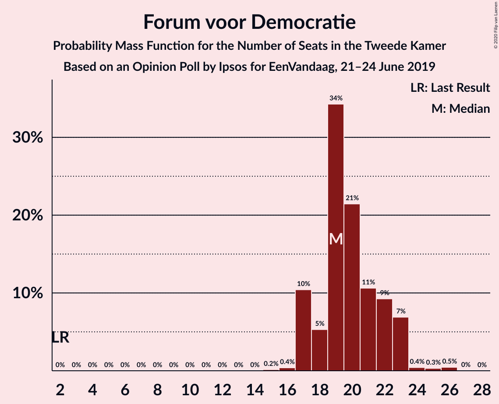

| Number of Seats | Probability | Accumulated | Special Marks |
|:---------------:|:-----------:|:-----------:|:-------------:|
| 2 | 0% | 100% | Last Result |
| 3 | 0% | 100% |  |
| 4 | 0% | 100% |  |
| 5 | 0% | 100% |  |
| 6 | 0% | 100% |  |
| 7 | 0% | 100% |  |
| 8 | 0% | 100% |  |
| 9 | 0% | 100% |  |
| 10 | 0% | 100% |  |
| 11 | 0% | 100% |  |
| 12 | 0% | 100% |  |
| 13 | 0% | 100% |  |
| 14 | 0% | 100% |  |
| 15 | 0.2% | 100% |  |
| 16 | 0.4% | 99.8% |  |
| 17 | 10% | 99.4% |  |
| 18 | 5% | 89% |  |
| 19 | 34% | 84% | Median |
| 20 | 21% | 49% |  |
| 21 | 11% | 28% |  |
| 22 | 9% | 17% |  |
| 23 | 7% | 8% |  |
| 24 | 0.4% | 1.2% |  |
| 25 | 0.3% | 0.8% |  |
| 26 | 0.5% | 0.5% |  |
| 27 | 0% | 0% |  |

### GroenLinks

*For a full overview of the results for this party, see the [GroenLinks](party-groenlinks.html) page.*

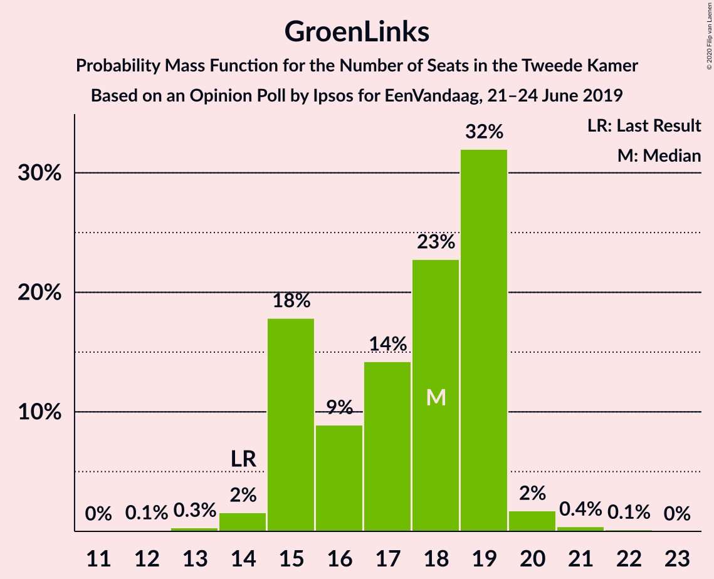

| Number of Seats | Probability | Accumulated | Special Marks |
|:---------------:|:-----------:|:-----------:|:-------------:|
| 12 | 0.1% | 100% |  |
| 13 | 0.3% | 99.9% |  |
| 14 | 2% | 99.6% | Last Result |
| 15 | 18% | 98% |  |
| 16 | 9% | 80% |  |
| 17 | 14% | 71% |  |
| 18 | 23% | 57% | Median |
| 19 | 32% | 34% |  |
| 20 | 2% | 2% |  |
| 21 | 0.4% | 0.6% |  |
| 22 | 0.1% | 0.2% |  |
| 23 | 0% | 0% |  |

### Partij van de Arbeid

*For a full overview of the results for this party, see the [Partij van de Arbeid](party-partijvandearbeid.html) page.*

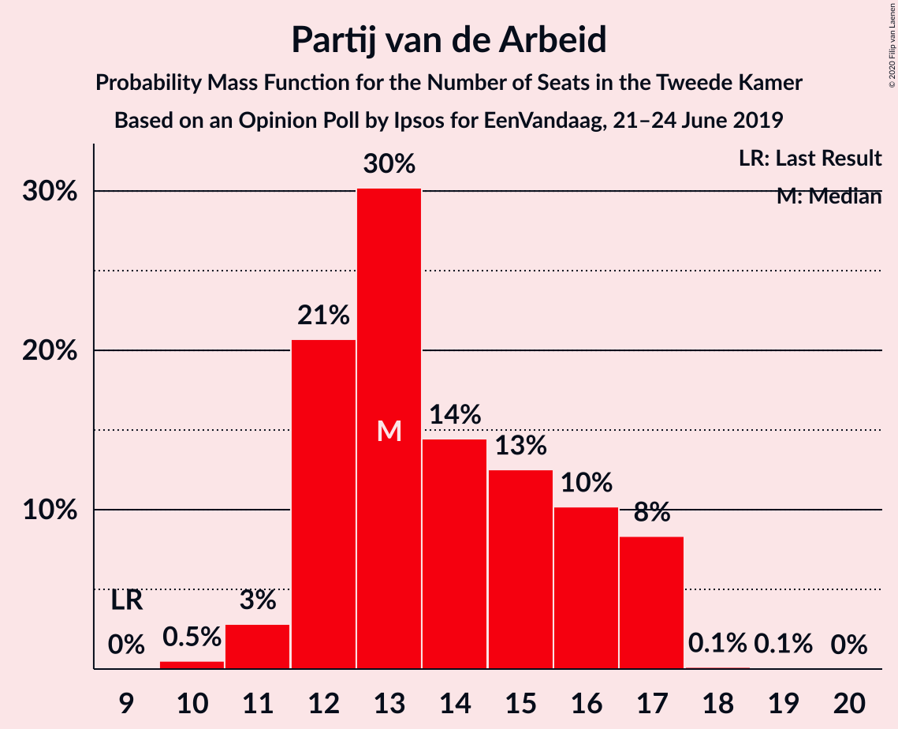

| Number of Seats | Probability | Accumulated | Special Marks |
|:---------------:|:-----------:|:-----------:|:-------------:|
| 9 | 0% | 100% | Last Result |
| 10 | 0.5% | 100% |  |
| 11 | 3% | 99.5% |  |
| 12 | 21% | 97% |  |
| 13 | 30% | 76% | Median |
| 14 | 14% | 46% |  |
| 15 | 13% | 31% |  |
| 16 | 10% | 19% |  |
| 17 | 8% | 9% |  |
| 18 | 0.1% | 0.2% |  |
| 19 | 0.1% | 0.1% |  |
| 20 | 0% | 0% |  |

### Christen-Democratisch Appèl

*For a full overview of the results for this party, see the [Christen-Democratisch Appèl](party-christen-democratischappèl.html) page.*

| Number of Seats | Probability | Accumulated | Special Marks |
|:---------------:|:-----------:|:-----------:|:-------------:|
| 9 | 0.1% | 100% |  |
| 10 | 0.4% | 99.9% |  |
| 11 | 10% | 99.4% |  |
| 12 | 21% | 89% |  |
| 13 | 40% | 69% | Median |
| 14 | 15% | 29% |  |
| 15 | 8% | 14% |  |
| 16 | 2% | 5% |  |
| 17 | 1.2% | 4% |  |
| 18 | 2% | 2% |  |
| 19 | 0% | 0% | Last Result |

### Democraten 66

*For a full overview of the results for this party, see the [Democraten 66](party-democraten66.html) page.*

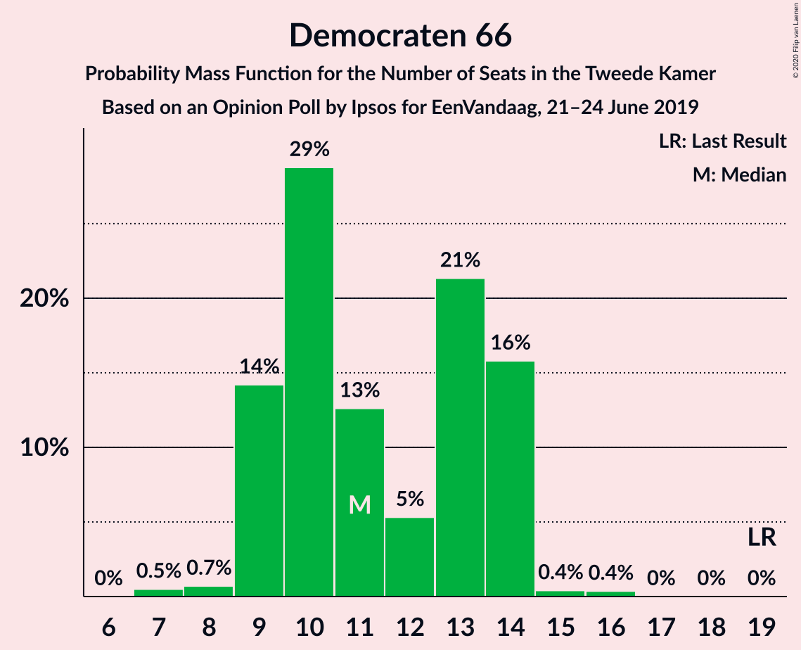

| Number of Seats | Probability | Accumulated | Special Marks |
|:---------------:|:-----------:|:-----------:|:-------------:|
| 7 | 0.5% | 100% |  |
| 8 | 0.7% | 99.5% |  |
| 9 | 14% | 98.8% |  |
| 10 | 29% | 85% |  |
| 11 | 13% | 56% | Median |
| 12 | 5% | 43% |  |
| 13 | 21% | 38% |  |
| 14 | 16% | 17% |  |
| 15 | 0.4% | 0.8% |  |
| 16 | 0.4% | 0.4% |  |
| 17 | 0% | 0% |  |
| 18 | 0% | 0% |  |
| 19 | 0% | 0% | Last Result |

### Partij voor de Vrijheid

*For a full overview of the results for this party, see the [Partij voor de Vrijheid](party-partijvoordevrijheid.html) page.*

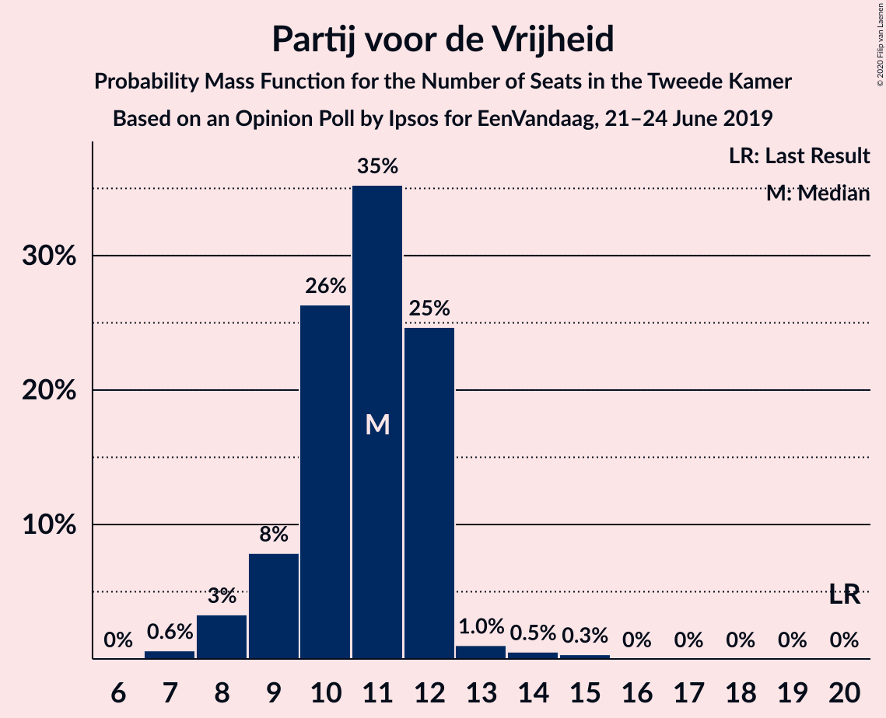

| Number of Seats | Probability | Accumulated | Special Marks |
|:---------------:|:-----------:|:-----------:|:-------------:|
| 7 | 0.6% | 100% |  |
| 8 | 3% | 99.4% |  |
| 9 | 8% | 96% |  |
| 10 | 26% | 88% |  |
| 11 | 35% | 62% | Median |
| 12 | 25% | 27% |  |
| 13 | 1.0% | 2% |  |
| 14 | 0.5% | 0.9% |  |
| 15 | 0.3% | 0.4% |  |
| 16 | 0% | 0% |  |
| 17 | 0% | 0% |  |
| 18 | 0% | 0% |  |
| 19 | 0% | 0% |  |
| 20 | 0% | 0% | Last Result |

### Socialistische Partij

*For a full overview of the results for this party, see the [Socialistische Partij](party-socialistischepartij.html) page.*

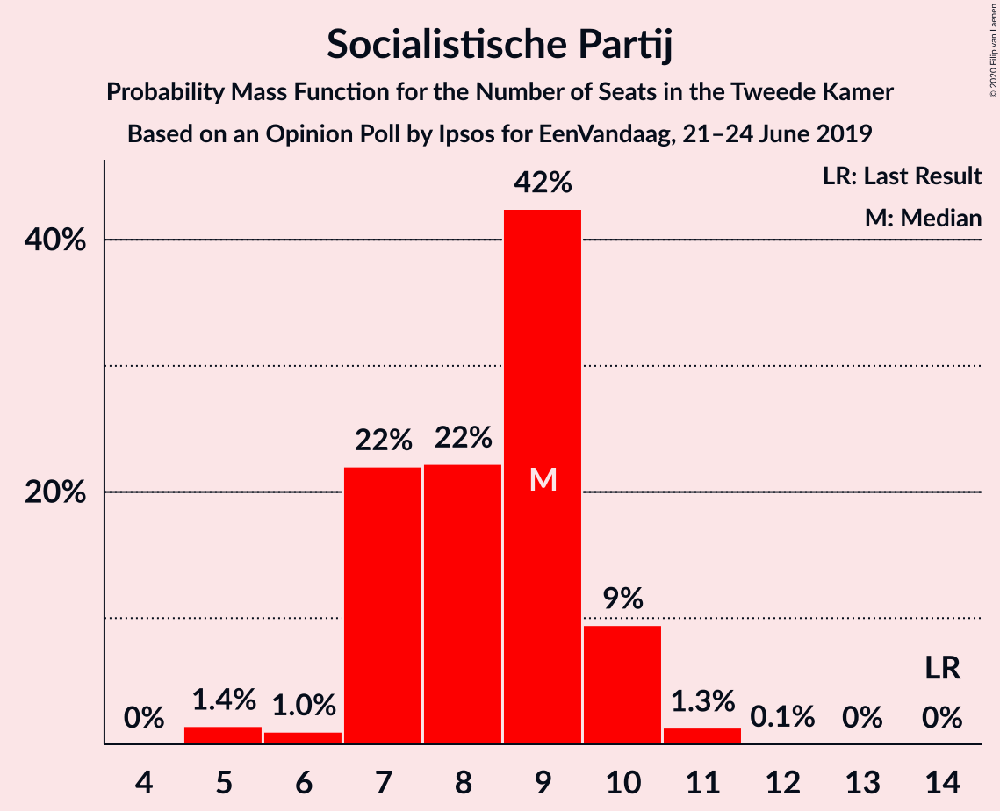

| Number of Seats | Probability | Accumulated | Special Marks |
|:---------------:|:-----------:|:-----------:|:-------------:|
| 5 | 1.4% | 100% |  |
| 6 | 1.0% | 98.6% |  |
| 7 | 22% | 98% |  |
| 8 | 22% | 76% |  |
| 9 | 42% | 53% | Median |
| 10 | 9% | 11% |  |
| 11 | 1.3% | 1.4% |  |
| 12 | 0.1% | 0.1% |  |
| 13 | 0% | 0% |  |
| 14 | 0% | 0% | Last Result |

### Partij voor de Dieren

*For a full overview of the results for this party, see the [Partij voor de Dieren](party-partijvoordedieren.html) page.*

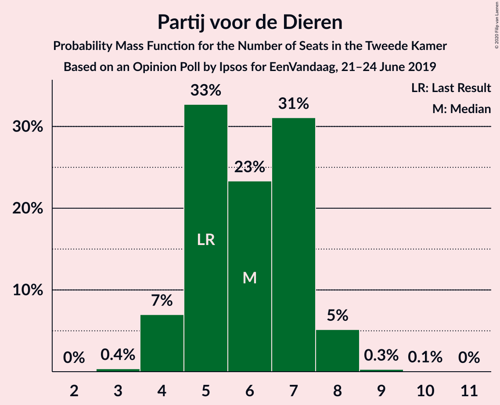

| Number of Seats | Probability | Accumulated | Special Marks |
|:---------------:|:-----------:|:-----------:|:-------------:|
| 3 | 0.4% | 100% |  |
| 4 | 7% | 99.6% |  |
| 5 | 33% | 93% | Last Result |
| 6 | 23% | 60% | Median |
| 7 | 31% | 37% |  |
| 8 | 5% | 6% |  |
| 9 | 0.3% | 0.4% |  |
| 10 | 0.1% | 0.1% |  |
| 11 | 0% | 0% |  |

### ChristenUnie

*For a full overview of the results for this party, see the [ChristenUnie](party-christenunie.html) page.*

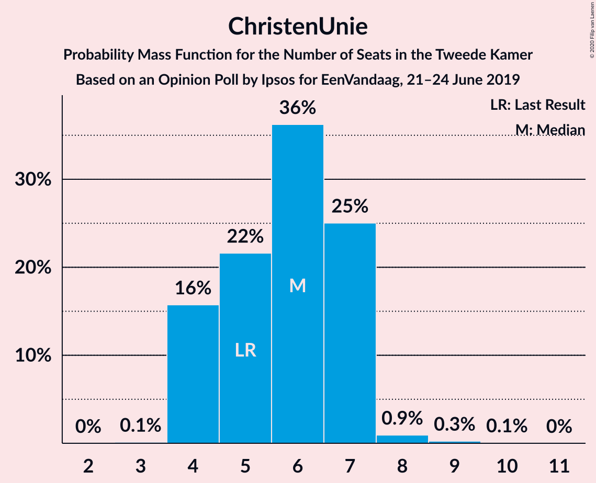

| Number of Seats | Probability | Accumulated | Special Marks |
|:---------------:|:-----------:|:-----------:|:-------------:|
| 3 | 0.1% | 100% |  |
| 4 | 16% | 99.9% |  |
| 5 | 22% | 84% | Last Result |
| 6 | 36% | 63% | Median |
| 7 | 25% | 26% |  |
| 8 | 0.9% | 1.3% |  |
| 9 | 0.3% | 0.3% |  |
| 10 | 0.1% | 0.1% |  |
| 11 | 0% | 0% |  |

### 50Plus

*For a full overview of the results for this party, see the [50Plus](party-50plus.html) page.*

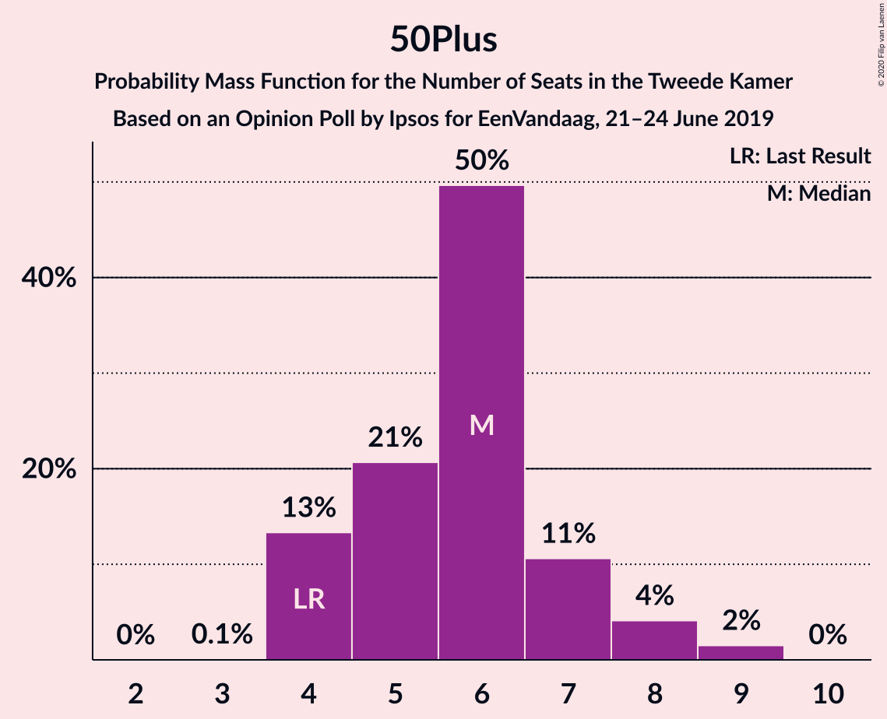

| Number of Seats | Probability | Accumulated | Special Marks |
|:---------------:|:-----------:|:-----------:|:-------------:|
| 3 | 0.1% | 100% |  |
| 4 | 13% | 99.9% | Last Result |
| 5 | 21% | 87% |  |
| 6 | 50% | 66% | Median |
| 7 | 11% | 16% |  |
| 8 | 4% | 6% |  |
| 9 | 2% | 2% |  |
| 10 | 0% | 0% |  |

### Staatkundig Gereformeerde Partij

*For a full overview of the results for this party, see the [Staatkundig Gereformeerde Partij](party-staatkundiggereformeerdepartij.html) page.*

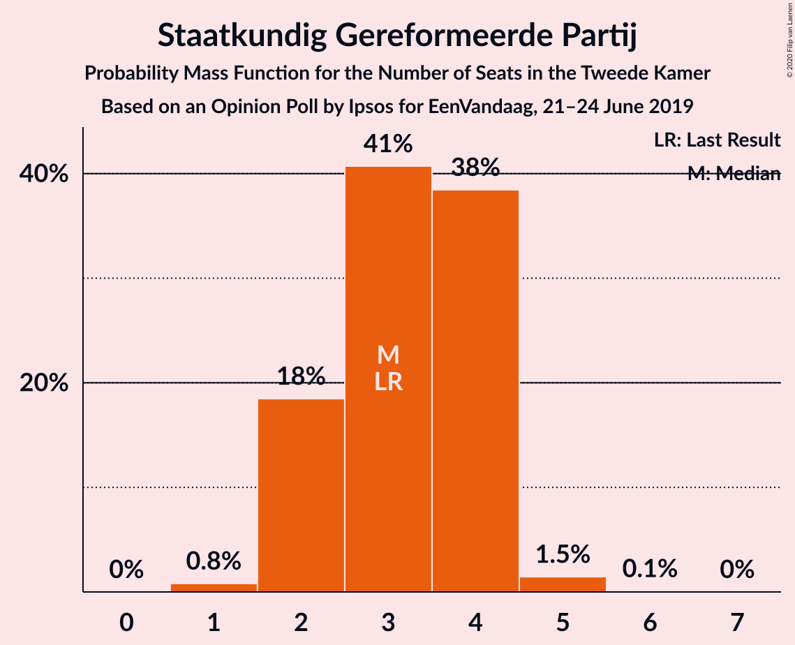

| Number of Seats | Probability | Accumulated | Special Marks |
|:---------------:|:-----------:|:-----------:|:-------------:|
| 1 | 0.8% | 100% |  |
| 2 | 18% | 99.2% |  |
| 3 | 41% | 81% | Last Result, Median |
| 4 | 38% | 40% |  |
| 5 | 1.5% | 2% |  |
| 6 | 0.1% | 0.1% |  |
| 7 | 0% | 0% |  |

### DENK

*For a full overview of the results for this party, see the [DENK](party-denk.html) page.*

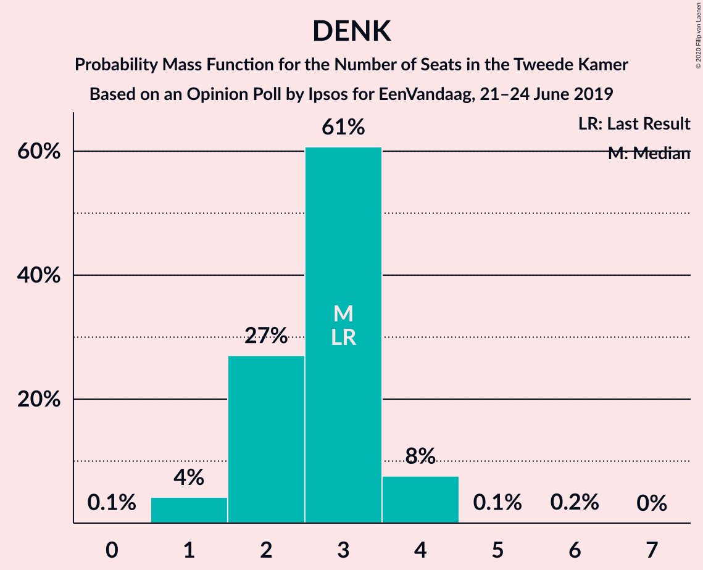

| Number of Seats | Probability | Accumulated | Special Marks |
|:---------------:|:-----------:|:-----------:|:-------------:|
| 0 | 0.1% | 100% |  |
| 1 | 4% | 99.9% |  |
| 2 | 27% | 96% |  |
| 3 | 61% | 69% | Last Result, Median |
| 4 | 8% | 8% |  |
| 5 | 0.1% | 0.3% |  |
| 6 | 0.2% | 0.2% |  |
| 7 | 0% | 0% |  |

## Coalitions

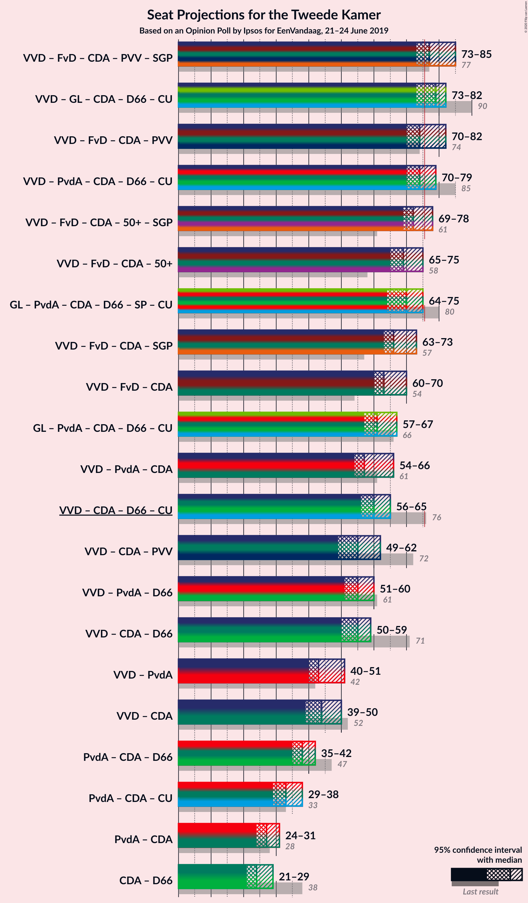

### Confidence Intervals

| Coalition | Last Result | Median | Majority? | 80% Confidence Interval | 90% Confidence Interval | 95% Confidence Interval | 99% Confidence Interval |
|:---------:|:-----------:|:------:|:---------:|:-----------------------:|:-----------------------:|:-----------------------:|:-----------------------:|
| Volkspartij voor Vrijheid en Democratie – Forum voor Democratie – Christen-Democratisch Appèl – Partij voor de Vrijheid – Staatkundig Gereformeerde Partij | 77 | 77 | 74% | 74–80 | 74–83 | 73–85 | 71–85 |
| Volkspartij voor Vrijheid en Democratie – GroenLinks – Christen-Democratisch Appèl – Democraten 66 – ChristenUnie | 90 | 79 | 86% | 73–80 | 73–81 | 73–82 | 72–84 |
| Volkspartij voor Vrijheid en Democratie – Forum voor Democratie – Christen-Democratisch Appèl – Partij voor de Vrijheid | 74 | 74 | 23% | 70–78 | 70–79 | 70–82 | 68–82 |
| Volkspartij voor Vrijheid en Democratie – Partij van de Arbeid – Christen-Democratisch Appèl – Democraten 66 – ChristenUnie | 85 | 74 | 30% | 72–77 | 70–79 | 70–79 | 69–82 |
| Volkspartij voor Vrijheid en Democratie – Forum voor Democratie – Christen-Democratisch Appèl – 50Plus – Staatkundig Gereformeerde Partij | 61 | 72 | 12% | 70–76 | 69–77 | 69–78 | 66–78 |
| Volkspartij voor Vrijheid en Democratie – Forum voor Democratie – Christen-Democratisch Appèl – 50Plus | 58 | 69 | 0.4% | 66–73 | 66–74 | 65–75 | 64–75 |
| GroenLinks – Partij van de Arbeid – Christen-Democratisch Appèl – Democraten 66 – Socialistische Partij – ChristenUnie | 80 | 70 | 1.0% | 67–72 | 66–75 | 64–75 | 63–76 |
| Volkspartij voor Vrijheid en Democratie – Forum voor Democratie – Christen-Democratisch Appèl – Staatkundig Gereformeerde Partij | 57 | 66 | 0% | 64–70 | 63–72 | 63–73 | 61–73 |
| Volkspartij voor Vrijheid en Democratie – Forum voor Democratie – Christen-Democratisch Appèl | 54 | 63 | 0% | 60–66 | 60–68 | 60–70 | 59–70 |
| GroenLinks – Partij van de Arbeid – Christen-Democratisch Appèl – Democraten 66 – ChristenUnie | 66 | 61 | 0% | 59–65 | 58–66 | 57–67 | 55–67 |
| Volkspartij voor Vrijheid en Democratie – Partij van de Arbeid – Christen-Democratisch Appèl | 61 | 57 | 0% | 54–60 | 54–61 | 54–66 | 51–66 |
| Volkspartij voor Vrijheid en Democratie – Christen-Democratisch Appèl – Democraten 66 – ChristenUnie | 76 | 60 | 0% | 56–65 | 56–65 | 56–65 | 56–67 |
| Volkspartij voor Vrijheid en Democratie – Christen-Democratisch Appèl – Partij voor de Vrijheid | 72 | 55 | 0% | 51–57 | 50–58 | 49–62 | 49–62 |
| Volkspartij voor Vrijheid en Democratie – Partij van de Arbeid – Democraten 66 | 61 | 55 | 0% | 52–58 | 51–60 | 51–60 | 50–63 |
| Volkspartij voor Vrijheid en Democratie – Christen-Democratisch Appèl – Democraten 66 | 71 | 55 | 0% | 51–58 | 51–59 | 50–59 | 50–61 |
| Volkspartij voor Vrijheid en Democratie – Partij van de Arbeid | 42 | 43 | 0% | 41–47 | 41–48 | 40–51 | 39–51 |
| Volkspartij voor Vrijheid en Democratie – Christen-Democratisch Appèl | 52 | 44 | 0% | 41–46 | 41–47 | 39–50 | 39–50 |
| Partij van de Arbeid – Christen-Democratisch Appèl – Democraten 66 | 47 | 38 | 0% | 36–40 | 35–42 | 35–42 | 33–43 |
| Partij van de Arbeid – Christen-Democratisch Appèl – ChristenUnie | 33 | 33 | 0% | 31–35 | 29–37 | 29–38 | 28–38 |
| Partij van de Arbeid – Christen-Democratisch Appèl | 28 | 27 | 0% | 25–29 | 24–31 | 24–31 | 23–32 |
| Christen-Democratisch Appèl – Democraten 66 | 38 | 24 | 0% | 22–27 | 21–28 | 21–29 | 19–30 |

### Volkspartij voor Vrijheid en Democratie – Forum voor Democratie – Christen-Democratisch Appèl – Partij voor de Vrijheid – Staatkundig Gereformeerde Partij

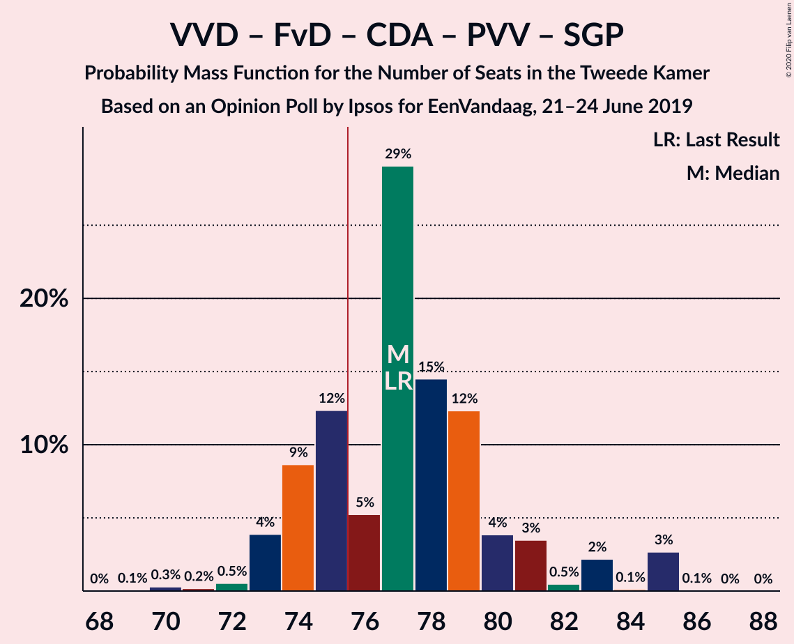

| Number of Seats | Probability | Accumulated | Special Marks |
|:---------------:|:-----------:|:-----------:|:-------------:|
| 69 | 0.1% | 100% |  |
| 70 | 0.3% | 99.9% |  |
| 71 | 0.2% | 99.6% |  |
| 72 | 0.5% | 99.4% |  |
| 73 | 4% | 98.9% |  |
| 74 | 9% | 95% |  |
| 75 | 12% | 86% |  |
| 76 | 5% | 74% | Median, Majority |
| 77 | 29% | 69% | Last Result |
| 78 | 15% | 40% |  |
| 79 | 12% | 25% |  |
| 80 | 4% | 13% |  |
| 81 | 3% | 9% |  |
| 82 | 0.5% | 6% |  |
| 83 | 2% | 5% |  |
| 84 | 0.1% | 3% |  |
| 85 | 3% | 3% |  |
| 86 | 0.1% | 0.1% |  |
| 87 | 0% | 0% |  |

### Volkspartij voor Vrijheid en Democratie – GroenLinks – Christen-Democratisch Appèl – Democraten 66 – ChristenUnie

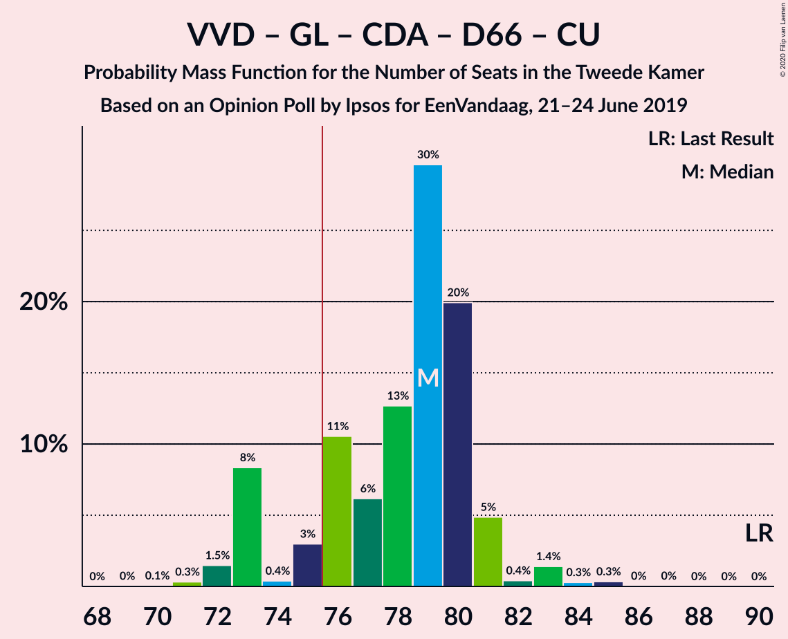

| Number of Seats | Probability | Accumulated | Special Marks |
|:---------------:|:-----------:|:-----------:|:-------------:|
| 70 | 0.1% | 100% |  |
| 71 | 0.3% | 99.9% |  |
| 72 | 1.5% | 99.6% |  |
| 73 | 8% | 98% |  |
| 74 | 0.4% | 90% |  |
| 75 | 3% | 89% |  |
| 76 | 11% | 86% | Majority |
| 77 | 6% | 76% |  |
| 78 | 13% | 70% | Median |
| 79 | 30% | 57% |  |
| 80 | 20% | 27% |  |
| 81 | 5% | 7% |  |
| 82 | 0.4% | 3% |  |
| 83 | 1.4% | 2% |  |
| 84 | 0.3% | 0.7% |  |
| 85 | 0.3% | 0.4% |  |
| 86 | 0% | 0.1% |  |
| 87 | 0% | 0% |  |
| 88 | 0% | 0% |  |
| 89 | 0% | 0% |  |
| 90 | 0% | 0% | Last Result |

### Volkspartij voor Vrijheid en Democratie – Forum voor Democratie – Christen-Democratisch Appèl – Partij voor de Vrijheid

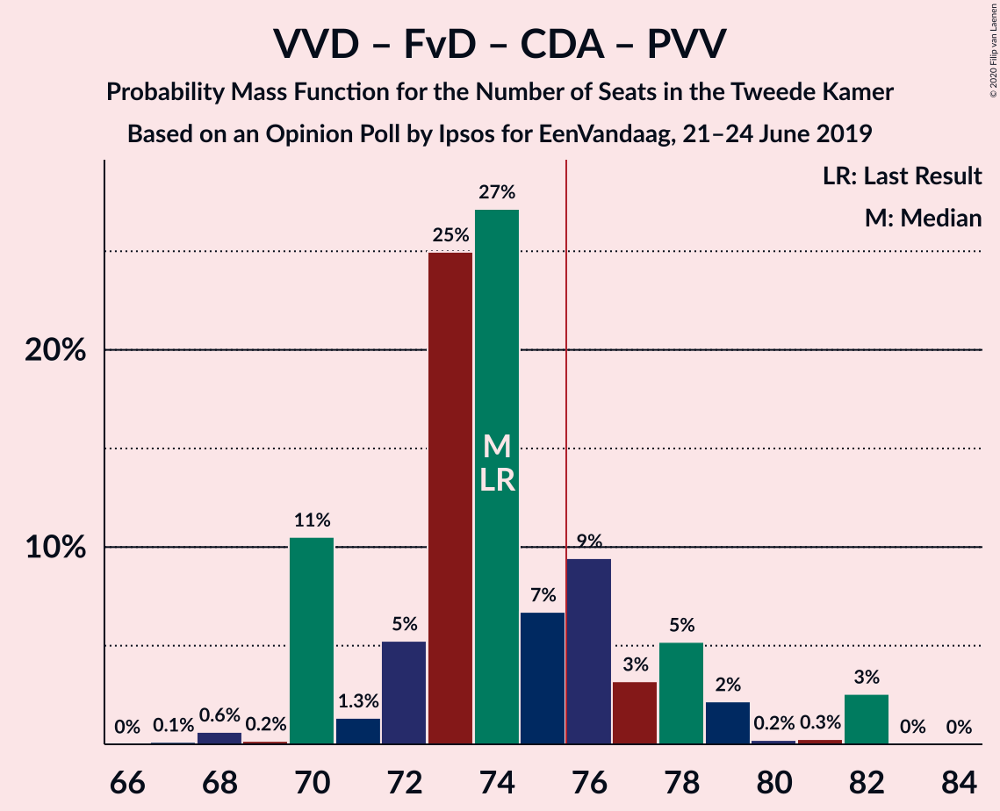

| Number of Seats | Probability | Accumulated | Special Marks |
|:---------------:|:-----------:|:-----------:|:-------------:|
| 67 | 0.1% | 100% |  |
| 68 | 0.6% | 99.8% |  |
| 69 | 0.2% | 99.2% |  |
| 70 | 11% | 99.0% |  |
| 71 | 1.3% | 89% |  |
| 72 | 5% | 87% |  |
| 73 | 25% | 82% | Median |
| 74 | 27% | 57% | Last Result |
| 75 | 7% | 30% |  |
| 76 | 9% | 23% | Majority |
| 77 | 3% | 14% |  |
| 78 | 5% | 10% |  |
| 79 | 2% | 5% |  |
| 80 | 0.2% | 3% |  |
| 81 | 0.3% | 3% |  |
| 82 | 3% | 3% |  |
| 83 | 0% | 0.1% |  |
| 84 | 0% | 0% |  |

### Volkspartij voor Vrijheid en Democratie – Partij van de Arbeid – Christen-Democratisch Appèl – Democraten 66 – ChristenUnie

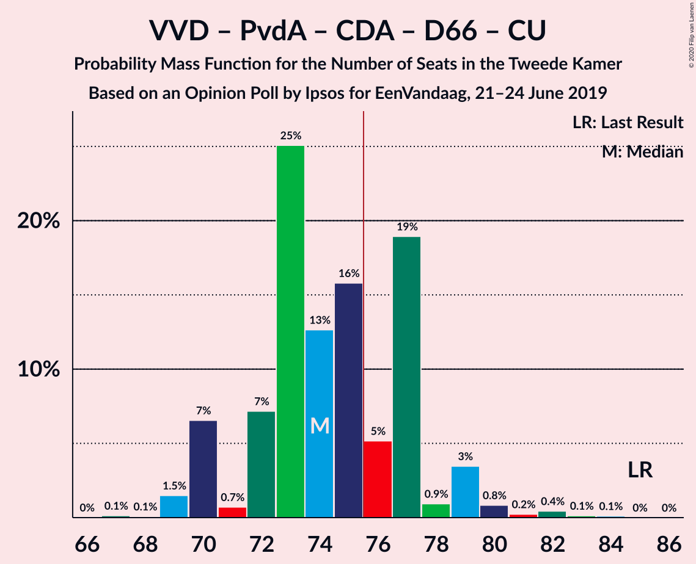

| Number of Seats | Probability | Accumulated | Special Marks |
|:---------------:|:-----------:|:-----------:|:-------------:|
| 67 | 0.1% | 100% |  |
| 68 | 0.1% | 99.8% |  |
| 69 | 1.5% | 99.7% |  |
| 70 | 7% | 98% |  |
| 71 | 0.7% | 92% |  |
| 72 | 7% | 91% |  |
| 73 | 25% | 84% | Median |
| 74 | 13% | 59% |  |
| 75 | 16% | 46% |  |
| 76 | 5% | 30% | Majority |
| 77 | 19% | 25% |  |
| 78 | 0.9% | 6% |  |
| 79 | 3% | 5% |  |
| 80 | 0.8% | 2% |  |
| 81 | 0.2% | 0.9% |  |
| 82 | 0.4% | 0.7% |  |
| 83 | 0.1% | 0.2% |  |
| 84 | 0.1% | 0.1% |  |
| 85 | 0% | 0% | Last Result |

### Volkspartij voor Vrijheid en Democratie – Forum voor Democratie – Christen-Democratisch Appèl – 50Plus – Staatkundig Gereformeerde Partij

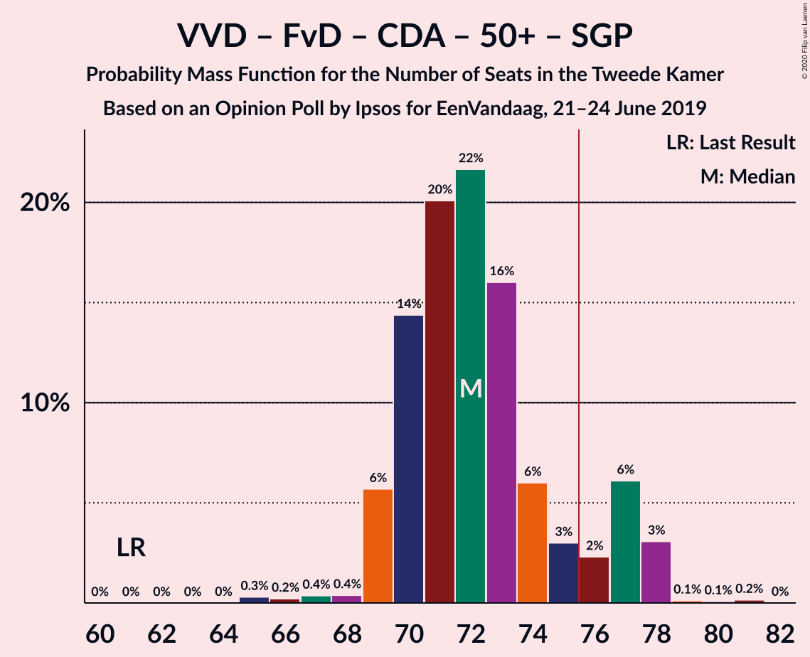

| Number of Seats | Probability | Accumulated | Special Marks |
|:---------------:|:-----------:|:-----------:|:-------------:|
| 61 | 0% | 100% | Last Result |
| 62 | 0% | 100% |  |
| 63 | 0% | 100% |  |
| 64 | 0% | 100% |  |
| 65 | 0.3% | 100% |  |
| 66 | 0.2% | 99.7% |  |
| 67 | 0.4% | 99.5% |  |
| 68 | 0.4% | 99.1% |  |
| 69 | 6% | 98.7% |  |
| 70 | 14% | 93% |  |
| 71 | 20% | 79% | Median |
| 72 | 22% | 59% |  |
| 73 | 16% | 37% |  |
| 74 | 6% | 21% |  |
| 75 | 3% | 15% |  |
| 76 | 2% | 12% | Majority |
| 77 | 6% | 10% |  |
| 78 | 3% | 3% |  |
| 79 | 0.1% | 0.4% |  |
| 80 | 0.1% | 0.3% |  |
| 81 | 0.2% | 0.2% |  |
| 82 | 0% | 0% |  |

### Volkspartij voor Vrijheid en Democratie – Forum voor Democratie – Christen-Democratisch Appèl – 50Plus

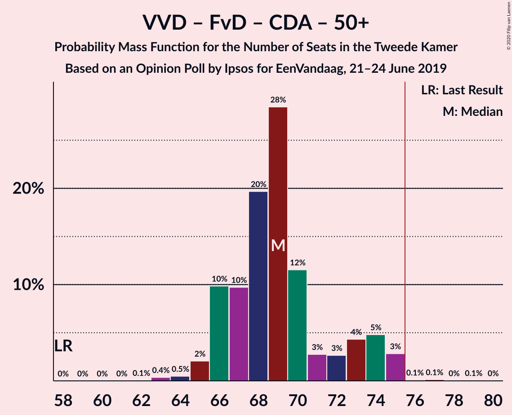

| Number of Seats | Probability | Accumulated | Special Marks |
|:---------------:|:-----------:|:-----------:|:-------------:|
| 58 | 0% | 100% | Last Result |
| 59 | 0% | 100% |  |
| 60 | 0% | 100% |  |
| 61 | 0% | 100% |  |
| 62 | 0.1% | 100% |  |
| 63 | 0.4% | 99.9% |  |
| 64 | 0.5% | 99.6% |  |
| 65 | 2% | 99.1% |  |
| 66 | 10% | 97% |  |
| 67 | 10% | 87% |  |
| 68 | 20% | 77% | Median |
| 69 | 28% | 58% |  |
| 70 | 12% | 29% |  |
| 71 | 3% | 18% |  |
| 72 | 3% | 15% |  |
| 73 | 4% | 12% |  |
| 74 | 5% | 8% |  |
| 75 | 3% | 3% |  |
| 76 | 0.1% | 0.4% | Majority |
| 77 | 0.1% | 0.3% |  |
| 78 | 0% | 0.1% |  |
| 79 | 0.1% | 0.1% |  |
| 80 | 0% | 0% |  |

### GroenLinks – Partij van de Arbeid – Christen-Democratisch Appèl – Democraten 66 – Socialistische Partij – ChristenUnie

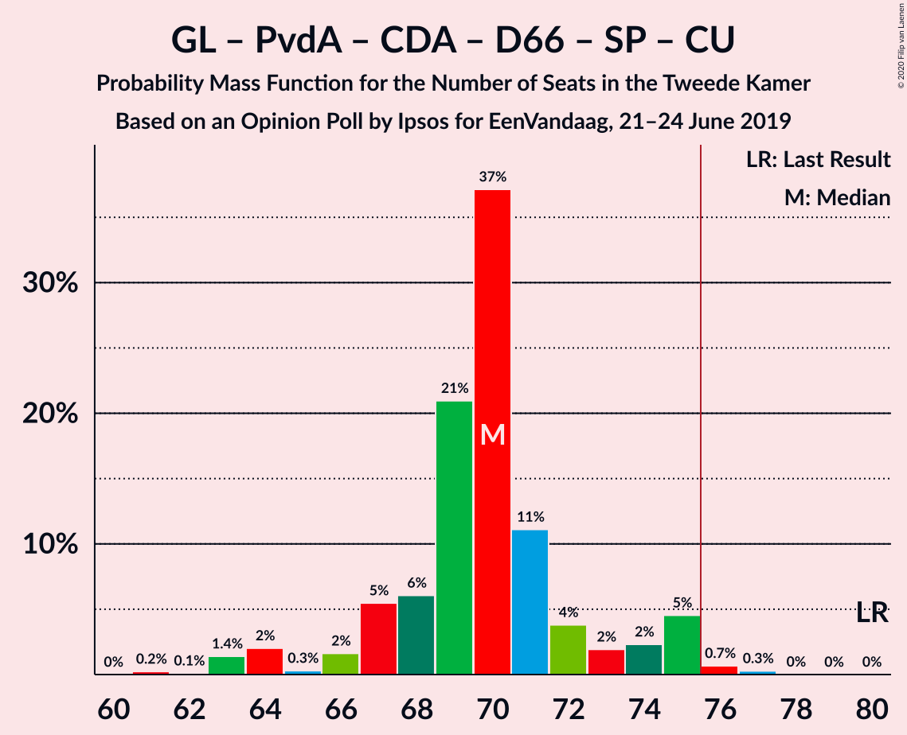

| Number of Seats | Probability | Accumulated | Special Marks |
|:---------------:|:-----------:|:-----------:|:-------------:|
| 61 | 0.2% | 100% |  |
| 62 | 0.1% | 99.8% |  |
| 63 | 1.4% | 99.7% |  |
| 64 | 2% | 98% |  |
| 65 | 0.3% | 96% |  |
| 66 | 2% | 96% |  |
| 67 | 5% | 94% |  |
| 68 | 6% | 89% |  |
| 69 | 21% | 83% |  |
| 70 | 37% | 62% | Median |
| 71 | 11% | 25% |  |
| 72 | 4% | 14% |  |
| 73 | 2% | 10% |  |
| 74 | 2% | 8% |  |
| 75 | 5% | 6% |  |
| 76 | 0.7% | 1.0% | Majority |
| 77 | 0.3% | 0.3% |  |
| 78 | 0% | 0% |  |
| 79 | 0% | 0% |  |
| 80 | 0% | 0% | Last Result |

### Volkspartij voor Vrijheid en Democratie – Forum voor Democratie – Christen-Democratisch Appèl – Staatkundig Gereformeerde Partij

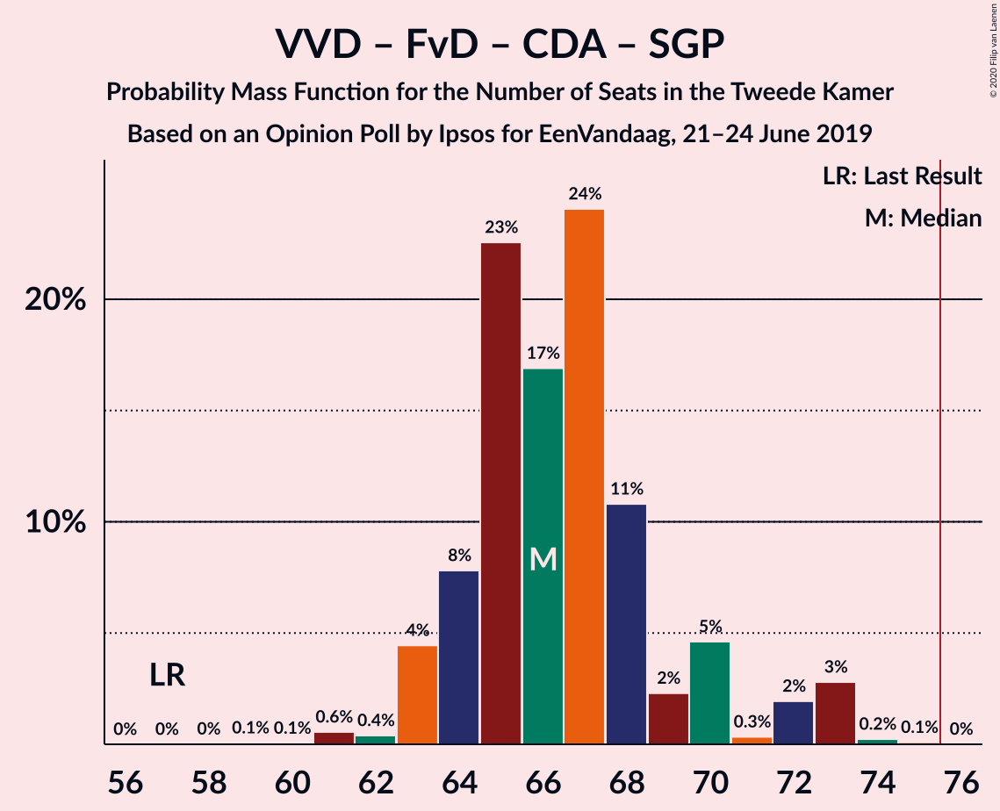

| Number of Seats | Probability | Accumulated | Special Marks |
|:---------------:|:-----------:|:-----------:|:-------------:|
| 57 | 0% | 100% | Last Result |
| 58 | 0% | 100% |  |
| 59 | 0.1% | 100% |  |
| 60 | 0.1% | 99.9% |  |
| 61 | 0.6% | 99.9% |  |
| 62 | 0.4% | 99.3% |  |
| 63 | 4% | 98.9% |  |
| 64 | 8% | 94% |  |
| 65 | 23% | 87% | Median |
| 66 | 17% | 64% |  |
| 67 | 24% | 47% |  |
| 68 | 11% | 23% |  |
| 69 | 2% | 12% |  |
| 70 | 5% | 10% |  |
| 71 | 0.3% | 5% |  |
| 72 | 2% | 5% |  |
| 73 | 3% | 3% |  |
| 74 | 0.2% | 0.3% |  |
| 75 | 0.1% | 0.1% |  |
| 76 | 0% | 0% | Majority |

### Volkspartij voor Vrijheid en Democratie – Forum voor Democratie – Christen-Democratisch Appèl

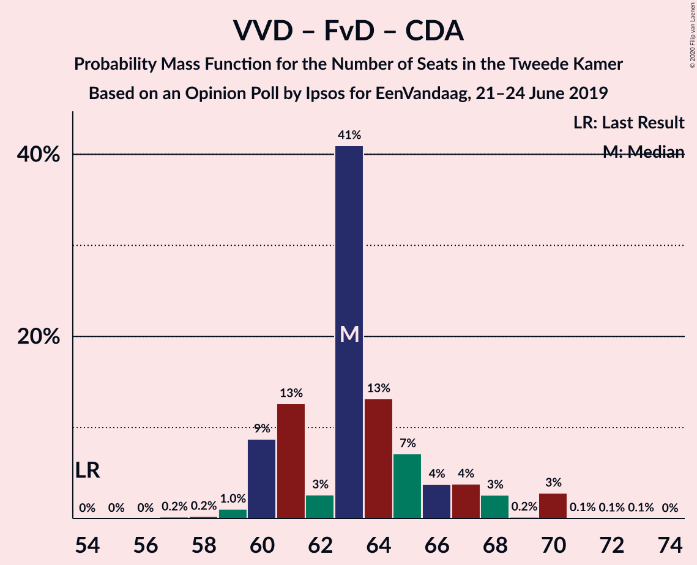

| Number of Seats | Probability | Accumulated | Special Marks |
|:---------------:|:-----------:|:-----------:|:-------------:|
| 54 | 0% | 100% | Last Result |
| 55 | 0% | 100% |  |
| 56 | 0% | 100% |  |
| 57 | 0.2% | 100% |  |
| 58 | 0.2% | 99.8% |  |
| 59 | 1.0% | 99.5% |  |
| 60 | 9% | 98.5% |  |
| 61 | 13% | 90% |  |
| 62 | 3% | 77% | Median |
| 63 | 41% | 75% |  |
| 64 | 13% | 34% |  |
| 65 | 7% | 20% |  |
| 66 | 4% | 13% |  |
| 67 | 4% | 10% |  |
| 68 | 3% | 6% |  |
| 69 | 0.2% | 3% |  |
| 70 | 3% | 3% |  |
| 71 | 0.1% | 0.2% |  |
| 72 | 0.1% | 0.1% |  |
| 73 | 0.1% | 0.1% |  |
| 74 | 0% | 0% |  |

### GroenLinks – Partij van de Arbeid – Christen-Democratisch Appèl – Democraten 66 – ChristenUnie

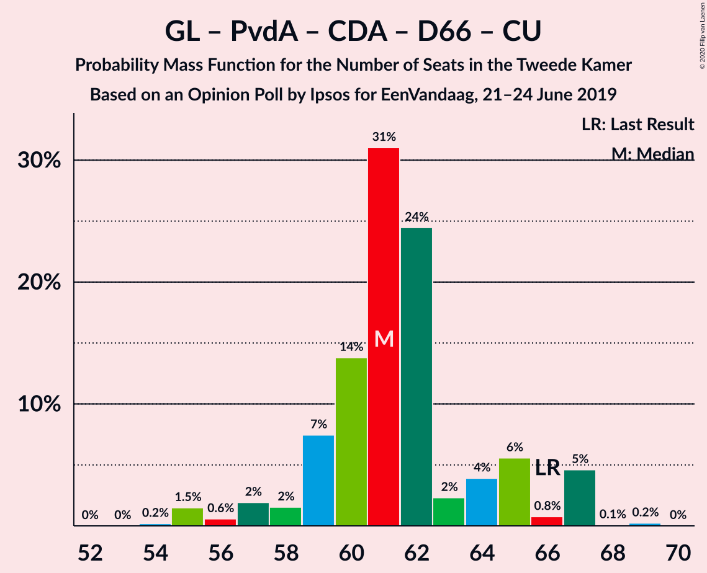

| Number of Seats | Probability | Accumulated | Special Marks |
|:---------------:|:-----------:|:-----------:|:-------------:|
| 54 | 0.2% | 100% |  |
| 55 | 1.5% | 99.8% |  |
| 56 | 0.6% | 98% |  |
| 57 | 2% | 98% |  |
| 58 | 2% | 96% |  |
| 59 | 7% | 94% |  |
| 60 | 14% | 87% |  |
| 61 | 31% | 73% | Median |
| 62 | 24% | 42% |  |
| 63 | 2% | 17% |  |
| 64 | 4% | 15% |  |
| 65 | 6% | 11% |  |
| 66 | 0.8% | 6% | Last Result |
| 67 | 5% | 5% |  |
| 68 | 0.1% | 0.3% |  |
| 69 | 0.2% | 0.3% |  |
| 70 | 0% | 0% |  |

### Volkspartij voor Vrijheid en Democratie – Partij van de Arbeid – Christen-Democratisch Appèl

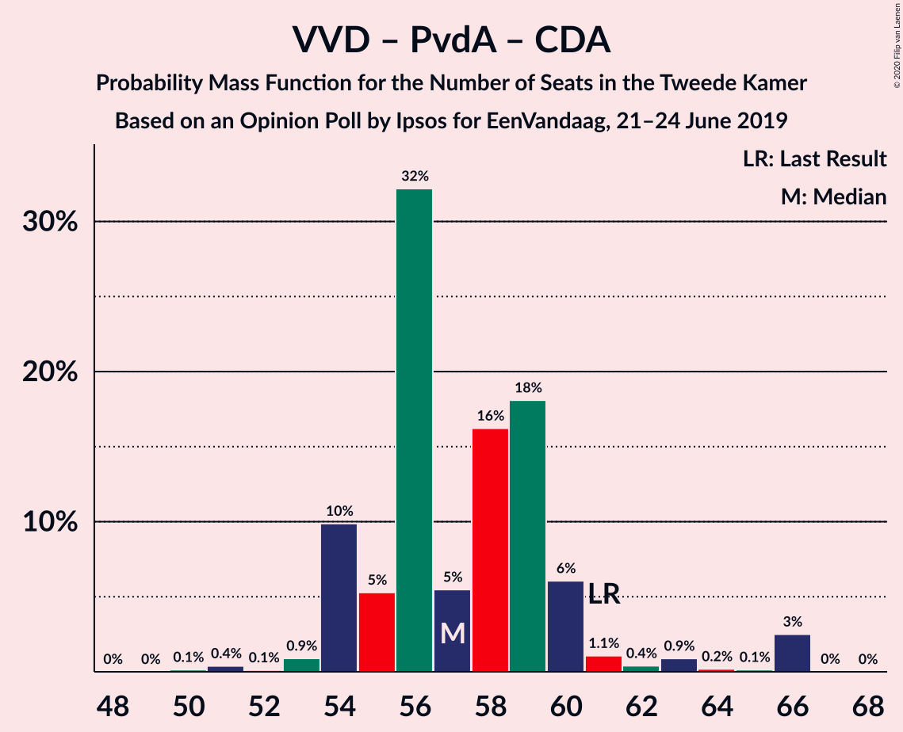

| Number of Seats | Probability | Accumulated | Special Marks |
|:---------------:|:-----------:|:-----------:|:-------------:|
| 50 | 0.1% | 100% |  |
| 51 | 0.4% | 99.8% |  |
| 52 | 0.1% | 99.5% |  |
| 53 | 0.9% | 99.3% |  |
| 54 | 10% | 98% |  |
| 55 | 5% | 89% |  |
| 56 | 32% | 83% | Median |
| 57 | 5% | 51% |  |
| 58 | 16% | 46% |  |
| 59 | 18% | 29% |  |
| 60 | 6% | 11% |  |
| 61 | 1.1% | 5% | Last Result |
| 62 | 0.4% | 4% |  |
| 63 | 0.9% | 4% |  |
| 64 | 0.2% | 3% |  |
| 65 | 0.1% | 3% |  |
| 66 | 3% | 3% |  |
| 67 | 0% | 0% |  |

### Volkspartij voor Vrijheid en Democratie – Christen-Democratisch Appèl – Democraten 66 – ChristenUnie

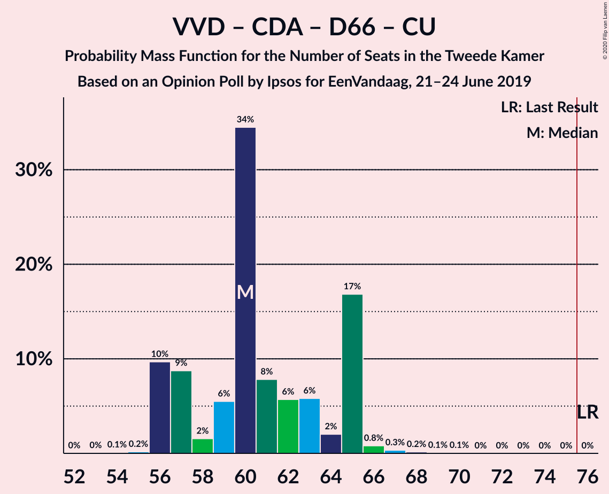

| Number of Seats | Probability | Accumulated | Special Marks |
|:---------------:|:-----------:|:-----------:|:-------------:|
| 53 | 0% | 100% |  |
| 54 | 0.1% | 99.9% |  |
| 55 | 0.2% | 99.8% |  |
| 56 | 10% | 99.6% |  |
| 57 | 9% | 90% |  |
| 58 | 2% | 81% |  |
| 59 | 6% | 80% |  |
| 60 | 34% | 74% | Median |
| 61 | 8% | 40% |  |
| 62 | 6% | 32% |  |
| 63 | 6% | 26% |  |
| 64 | 2% | 20% |  |
| 65 | 17% | 18% |  |
| 66 | 0.8% | 1.4% |  |
| 67 | 0.3% | 0.6% |  |
| 68 | 0.2% | 0.3% |  |
| 69 | 0.1% | 0.1% |  |
| 70 | 0.1% | 0.1% |  |
| 71 | 0% | 0% |  |
| 72 | 0% | 0% |  |
| 73 | 0% | 0% |  |
| 74 | 0% | 0% |  |
| 75 | 0% | 0% |  |
| 76 | 0% | 0% | Last Result, Majority |

### Volkspartij voor Vrijheid en Democratie – Christen-Democratisch Appèl – Partij voor de Vrijheid

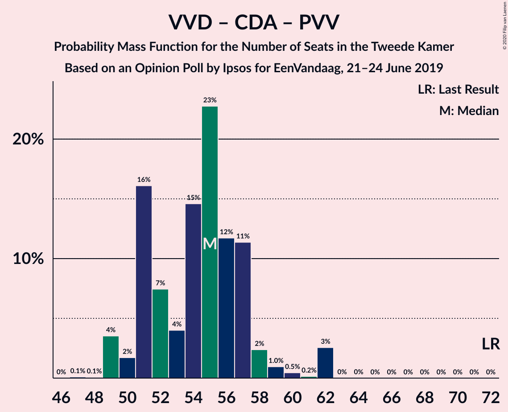

| Number of Seats | Probability | Accumulated | Special Marks |
|:---------------:|:-----------:|:-----------:|:-------------:|
| 47 | 0.1% | 100% |  |
| 48 | 0.1% | 99.9% |  |
| 49 | 4% | 99.8% |  |
| 50 | 2% | 96% |  |
| 51 | 16% | 95% |  |
| 52 | 7% | 78% |  |
| 53 | 4% | 71% |  |
| 54 | 15% | 67% | Median |
| 55 | 23% | 52% |  |
| 56 | 12% | 30% |  |
| 57 | 11% | 18% |  |
| 58 | 2% | 7% |  |
| 59 | 1.0% | 4% |  |
| 60 | 0.5% | 3% |  |
| 61 | 0.2% | 3% |  |
| 62 | 3% | 3% |  |
| 63 | 0% | 0% |  |
| 64 | 0% | 0% |  |
| 65 | 0% | 0% |  |
| 66 | 0% | 0% |  |
| 67 | 0% | 0% |  |
| 68 | 0% | 0% |  |
| 69 | 0% | 0% |  |
| 70 | 0% | 0% |  |
| 71 | 0% | 0% |  |
| 72 | 0% | 0% | Last Result |

### Volkspartij voor Vrijheid en Democratie – Partij van de Arbeid – Democraten 66

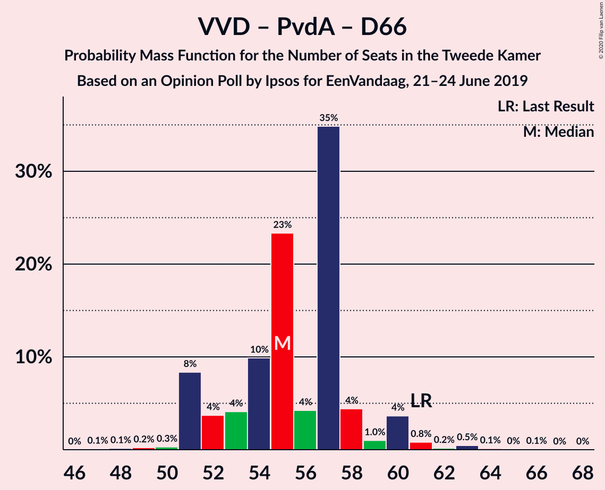

| Number of Seats | Probability | Accumulated | Special Marks |
|:---------------:|:-----------:|:-----------:|:-------------:|
| 47 | 0.1% | 100% |  |
| 48 | 0.1% | 99.9% |  |
| 49 | 0.2% | 99.8% |  |
| 50 | 0.3% | 99.5% |  |
| 51 | 8% | 99.2% |  |
| 52 | 4% | 91% |  |
| 53 | 4% | 87% |  |
| 54 | 10% | 83% | Median |
| 55 | 23% | 73% |  |
| 56 | 4% | 50% |  |
| 57 | 35% | 46% |  |
| 58 | 4% | 11% |  |
| 59 | 1.0% | 6% |  |
| 60 | 4% | 5% |  |
| 61 | 0.8% | 2% | Last Result |
| 62 | 0.2% | 0.9% |  |
| 63 | 0.5% | 0.7% |  |
| 64 | 0.1% | 0.2% |  |
| 65 | 0% | 0.1% |  |
| 66 | 0.1% | 0.1% |  |
| 67 | 0% | 0% |  |

### Volkspartij voor Vrijheid en Democratie – Christen-Democratisch Appèl – Democraten 66

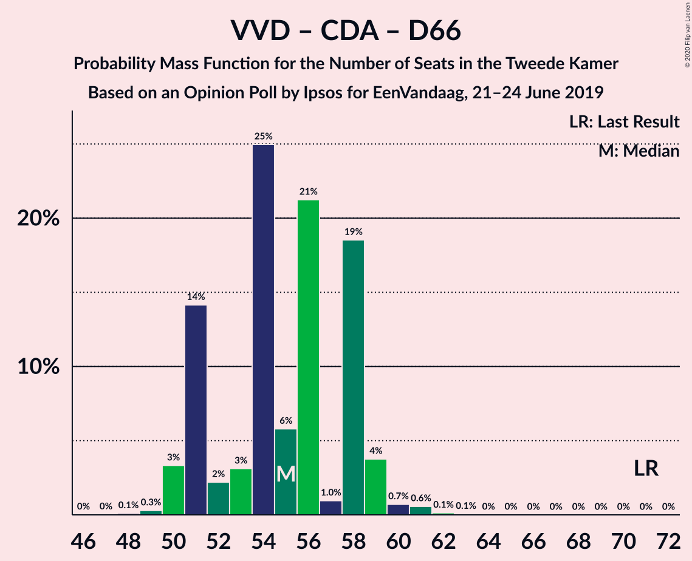

| Number of Seats | Probability | Accumulated | Special Marks |
|:---------------:|:-----------:|:-----------:|:-------------:|
| 48 | 0.1% | 100% |  |
| 49 | 0.3% | 99.9% |  |
| 50 | 3% | 99.6% |  |
| 51 | 14% | 96% |  |
| 52 | 2% | 82% |  |
| 53 | 3% | 80% |  |
| 54 | 25% | 77% | Median |
| 55 | 6% | 52% |  |
| 56 | 21% | 46% |  |
| 57 | 1.0% | 25% |  |
| 58 | 19% | 24% |  |
| 59 | 4% | 5% |  |
| 60 | 0.7% | 2% |  |
| 61 | 0.6% | 0.8% |  |
| 62 | 0.1% | 0.2% |  |
| 63 | 0.1% | 0.1% |  |
| 64 | 0% | 0% |  |
| 65 | 0% | 0% |  |
| 66 | 0% | 0% |  |
| 67 | 0% | 0% |  |
| 68 | 0% | 0% |  |
| 69 | 0% | 0% |  |
| 70 | 0% | 0% |  |
| 71 | 0% | 0% | Last Result |

### Volkspartij voor Vrijheid en Democratie – Partij van de Arbeid

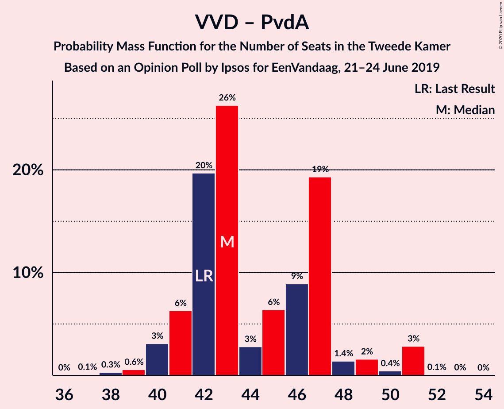

| Number of Seats | Probability | Accumulated | Special Marks |
|:---------------:|:-----------:|:-----------:|:-------------:|
| 37 | 0.1% | 100% |  |
| 38 | 0.3% | 99.9% |  |
| 39 | 0.6% | 99.6% |  |
| 40 | 3% | 99.1% |  |
| 41 | 6% | 96% |  |
| 42 | 20% | 90% | Last Result |
| 43 | 26% | 70% | Median |
| 44 | 3% | 44% |  |
| 45 | 6% | 41% |  |
| 46 | 9% | 35% |  |
| 47 | 19% | 26% |  |
| 48 | 1.4% | 6% |  |
| 49 | 2% | 5% |  |
| 50 | 0.4% | 3% |  |
| 51 | 3% | 3% |  |
| 52 | 0.1% | 0.1% |  |
| 53 | 0% | 0% |  |

### Volkspartij voor Vrijheid en Democratie – Christen-Democratisch Appèl

| Number of Seats | Probability | Accumulated | Special Marks |
|:---------------:|:-----------:|:-----------:|:-------------:|
| 37 | 0.1% | 100% |  |
| 38 | 0.1% | 99.9% |  |
| 39 | 3% | 99.7% |  |
| 40 | 1.1% | 96% |  |
| 41 | 15% | 95% |  |
| 42 | 8% | 80% |  |
| 43 | 16% | 72% | Median |
| 44 | 30% | 56% |  |
| 45 | 15% | 26% |  |
| 46 | 4% | 11% |  |
| 47 | 2% | 6% |  |
| 48 | 1.0% | 4% |  |
| 49 | 0.2% | 3% |  |
| 50 | 3% | 3% |  |
| 51 | 0.1% | 0.1% |  |
| 52 | 0% | 0% | Last Result |

### Partij van de Arbeid – Christen-Democratisch Appèl – Democraten 66

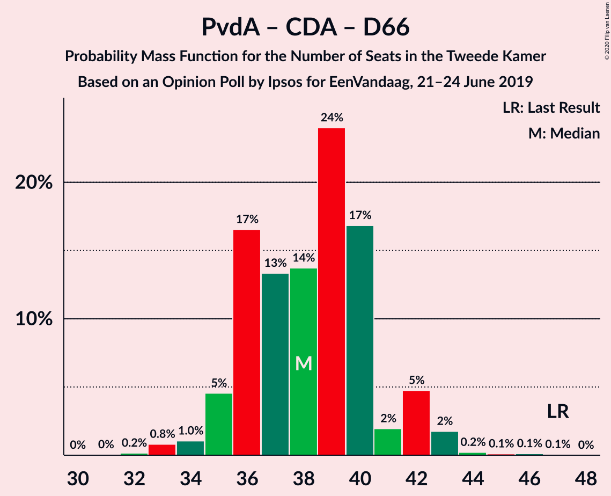

| Number of Seats | Probability | Accumulated | Special Marks |
|:---------------:|:-----------:|:-----------:|:-------------:|
| 32 | 0.2% | 100% |  |
| 33 | 0.8% | 99.8% |  |
| 34 | 1.0% | 99.0% |  |
| 35 | 5% | 98% |  |
| 36 | 17% | 93% |  |
| 37 | 13% | 77% | Median |
| 38 | 14% | 64% |  |
| 39 | 24% | 50% |  |
| 40 | 17% | 26% |  |
| 41 | 2% | 9% |  |
| 42 | 5% | 7% |  |
| 43 | 2% | 2% |  |
| 44 | 0.2% | 0.5% |  |
| 45 | 0.1% | 0.3% |  |
| 46 | 0.1% | 0.2% |  |
| 47 | 0.1% | 0.1% | Last Result |
| 48 | 0% | 0% |  |

### Partij van de Arbeid – Christen-Democratisch Appèl – ChristenUnie

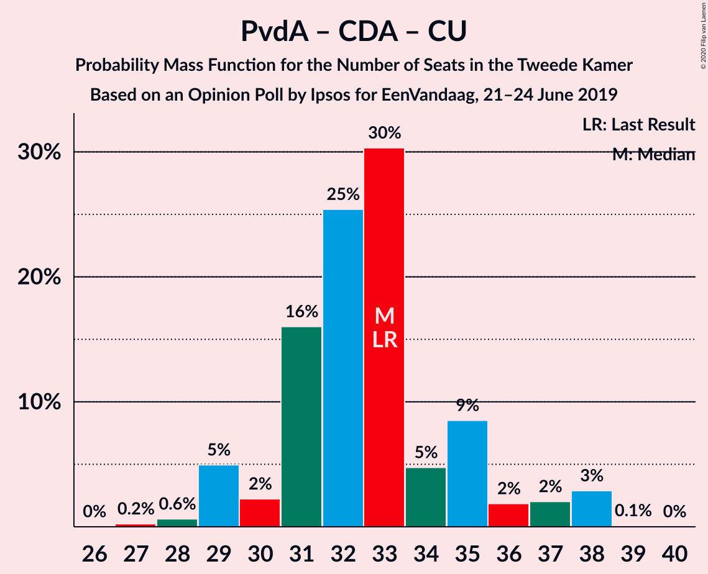

| Number of Seats | Probability | Accumulated | Special Marks |
|:---------------:|:-----------:|:-----------:|:-------------:|
| 27 | 0.2% | 100% |  |
| 28 | 0.6% | 99.7% |  |
| 29 | 5% | 99.1% |  |
| 30 | 2% | 94% |  |
| 31 | 16% | 92% |  |
| 32 | 25% | 76% | Median |
| 33 | 30% | 50% | Last Result |
| 34 | 5% | 20% |  |
| 35 | 9% | 15% |  |
| 36 | 2% | 7% |  |
| 37 | 2% | 5% |  |
| 38 | 3% | 3% |  |
| 39 | 0.1% | 0.1% |  |
| 40 | 0% | 0% |  |

### Partij van de Arbeid – Christen-Democratisch Appèl

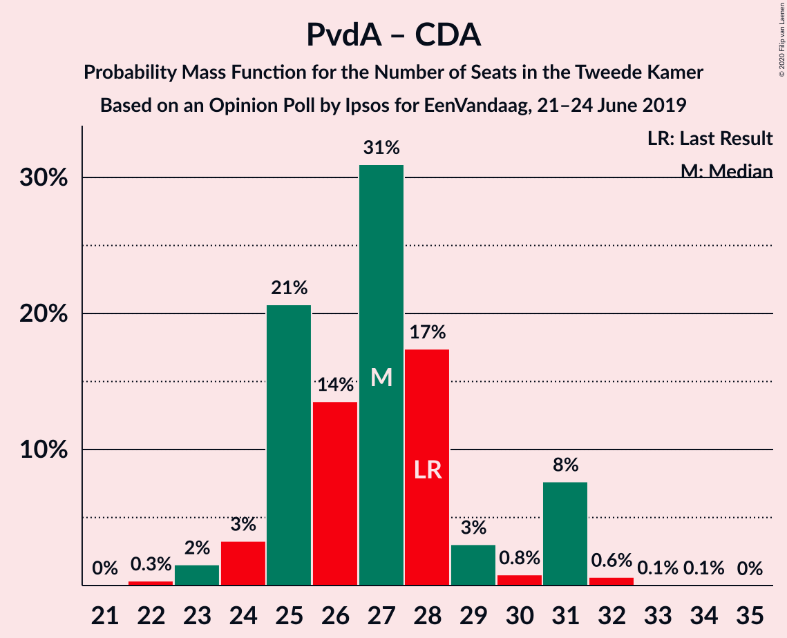

| Number of Seats | Probability | Accumulated | Special Marks |
|:---------------:|:-----------:|:-----------:|:-------------:|
| 21 | 0% | 100% |  |
| 22 | 0.3% | 99.9% |  |
| 23 | 2% | 99.6% |  |
| 24 | 3% | 98% |  |
| 25 | 21% | 95% |  |
| 26 | 14% | 74% | Median |
| 27 | 31% | 61% |  |
| 28 | 17% | 30% | Last Result |
| 29 | 3% | 12% |  |
| 30 | 0.8% | 9% |  |
| 31 | 8% | 8% |  |
| 32 | 0.6% | 0.8% |  |
| 33 | 0.1% | 0.1% |  |
| 34 | 0.1% | 0.1% |  |
| 35 | 0% | 0% |  |

### Christen-Democratisch Appèl – Democraten 66

| Number of Seats | Probability | Accumulated | Special Marks |
|:---------------:|:-----------:|:-----------:|:-------------:|
| 19 | 0.6% | 100% |  |
| 20 | 0.3% | 99.4% |  |
| 21 | 9% | 99.1% |  |
| 22 | 20% | 90% |  |
| 23 | 13% | 70% |  |
| 24 | 8% | 57% | Median |
| 25 | 8% | 50% |  |
| 26 | 9% | 41% |  |
| 27 | 28% | 33% |  |
| 28 | 2% | 5% |  |
| 29 | 3% | 3% |  |
| 30 | 0.5% | 0.5% |  |
| 31 | 0% | 0% |  |
| 32 | 0% | 0% |  |
| 33 | 0% | 0% |  |
| 34 | 0% | 0% |  |
| 35 | 0% | 0% |  |
| 36 | 0% | 0% |  |
| 37 | 0% | 0% |  |
| 38 | 0% | 0% | Last Result |

## Technical Information

### Opinion Poll

+ **Polling firm:** Ipsos
+ **Commissioner(s):** EenVandaag
+ **Fieldwork period:** 21–24 June 2019

### Calculations

+ **Sample size:** 1028
+ **Simulations done:** 1,048,576
+ **Error estimate:** 2.83%

