# Opinion Poll by Ipsos for EenVandaag, 25–28 October 2019

<a href="#voting-intentions">Voting Intentions</a> | <a href="#seats">Seats</a> | <a href="#coalitions">Coalitions</a> | <a href="#technical-information">Technical Information</a>

## Voting Intentions

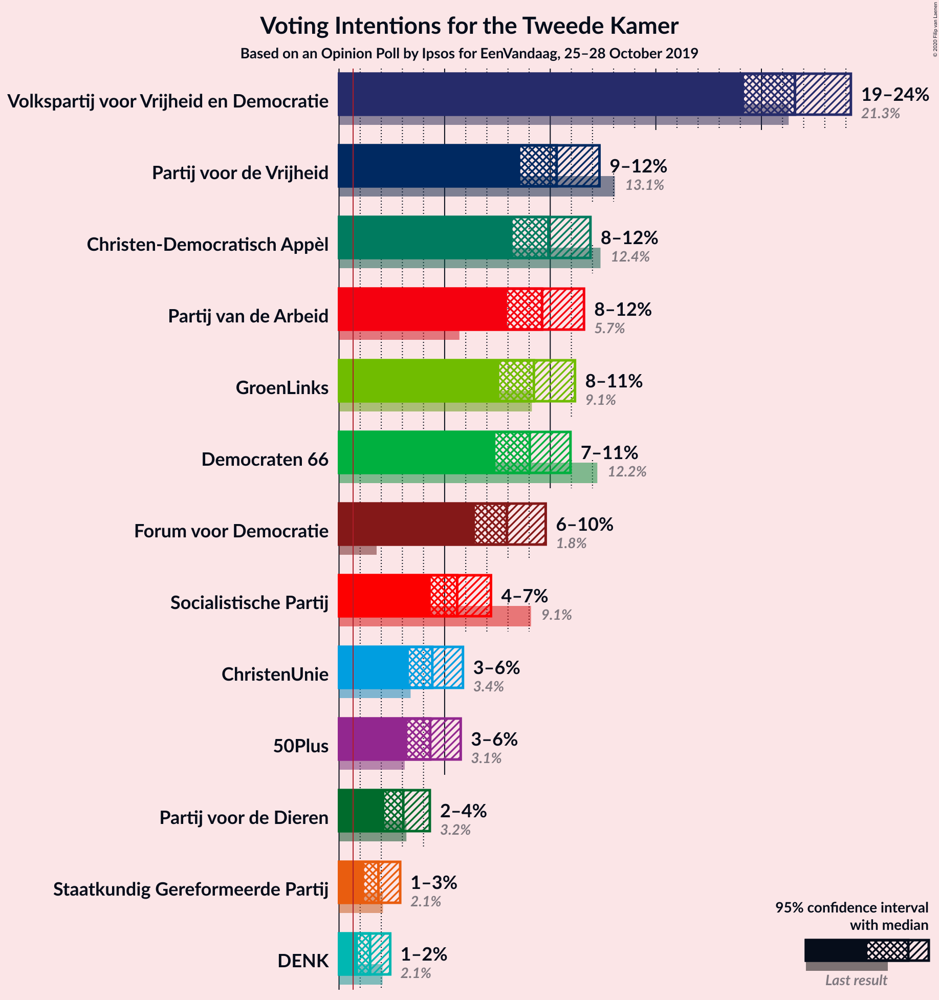

### Confidence Intervals

| Party | Last Result | Poll Result | 80% Confidence Interval | 90% Confidence Interval | 95% Confidence Interval | 99% Confidence Interval |
|:-----:|:-----------:|:-----------:|:-----------------------:|:-----------------------:|:-----------------------:|:-----------------------:|
| Volkspartij voor Vrijheid en Democratie | 21.3% | 21.6% | 20.0–23.3% |19.6–23.8% |19.2–24.2% |18.4–25.1% |
| Partij voor de Vrijheid | 13.1% | 10.3% | 9.2–11.6% |8.9–12.0% |8.6–12.3% |8.1–13.0% |
| Christen-Democratisch Appèl | 12.4% | 9.9% | 8.8–11.2% |8.5–11.6% |8.2–11.9% |7.7–12.6% |
| Partij van de Arbeid | 5.7% | 9.6% | 8.5–10.9% |8.2–11.3% |8.0–11.6% |7.5–12.2% |
| GroenLinks | 9.1% | 9.2% | 8.2–10.5% |7.8–10.9% |7.6–11.2% |7.1–11.8% |
| Democraten 66 | 12.2% | 9.0% | 8.0–10.3% |7.7–10.6% |7.4–11.0% |6.9–11.6% |
| Forum voor Democratie | 1.8% | 7.9% | 7.0–9.1% |6.7–9.5% |6.4–9.8% |6.0–10.4% |
| Socialistische Partij | 9.1% | 5.6% | 4.8–6.6% |4.5–6.9% |4.3–7.2% |4.0–7.7% |
| ChristenUnie | 3.4% | 4.4% | 3.7–5.4% |3.5–5.6% |3.3–5.9% |3.0–6.4% |
| 50Plus | 3.1% | 4.3% | 3.6–5.3% |3.4–5.5% |3.2–5.8% |2.9–6.2% |
| Partij voor de Dieren | 3.2% | 3.0% | 2.5–3.9% |2.3–4.1% |2.1–4.3% |1.9–4.7% |
| Staatkundig Gereformeerde Partij | 2.1% | 1.9% | 1.4–2.5% |1.3–2.7% |1.2–2.9% |1.0–3.3% |
| DENK | 2.1% | 1.5% | 1.1–2.1% |1.0–2.3% |0.9–2.4% |0.7–2.7% |

*Note:* The poll result column reflects the actual value used in the calculations. Published results may vary slightly, and in addition be rounded to fewer digits.

## Seats

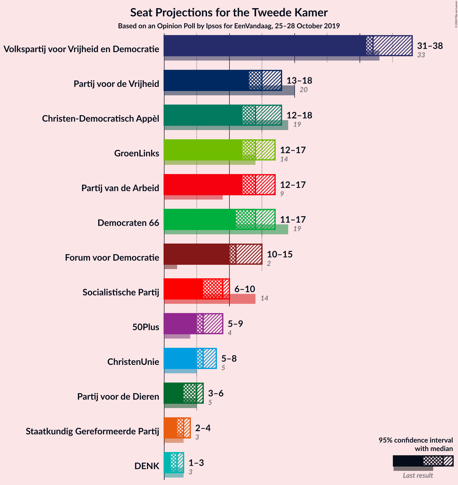

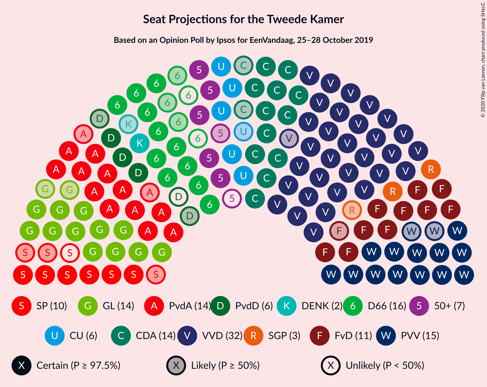

### Confidence Intervals

| Party | Last Result | Median | 80% Confidence Interval | 90% Confidence Interval | 95% Confidence Interval | 99% Confidence Interval |
|:-----:|:-----------:|:------:|:-----------------------:|:-----------------------:|:-----------------------:|:-----------------------:|
| <a href="#volkspartij-voor-vrijheid-en-democratie">Volkspartij voor Vrijheid en Democratie</a> | 33 | 32 | 31–35 |31–36 |31–38 |29–39 |
| <a href="#partij-voor-de-vrijheid">Partij voor de Vrijheid</a> | 20 | 15 | 14–17 |13–17 |13–18 |12–19 |
| <a href="#christen-democratisch-appèl">Christen-Democratisch Appèl</a> | 19 | 14 | 14–17 |13–18 |12–18 |12–18 |
| <a href="#partij-van-de-arbeid">Partij van de Arbeid</a> | 9 | 14 | 13–15 |12–16 |12–17 |11–18 |
| <a href="#groenlinks">GroenLinks</a> | 14 | 14 | 12–16 |12–16 |12–17 |11–17 |
| <a href="#democraten-66">Democraten 66</a> | 19 | 14 | 11–16 |11–17 |11–17 |11–18 |
| <a href="#forum-voor-democratie">Forum voor Democratie</a> | 2 | 11 | 10–13 |10–15 |10–15 |10–15 |
| <a href="#socialistische-partij">Socialistische Partij</a> | 14 | 9 | 7–10 |6–10 |6–10 |6–11 |
| <a href="#christenunie">ChristenUnie</a> | 5 | 6 | 5–7 |5–8 |5–8 |4–8 |
| <a href="#50plus">50Plus</a> | 4 | 6 | 5–7 |5–7 |5–9 |4–9 |
| <a href="#partij-voor-de-dieren">Partij voor de Dieren</a> | 5 | 5 | 3–6 |3–6 |3–6 |3–7 |
| <a href="#staatkundig-gereformeerde-partij">Staatkundig Gereformeerde Partij</a> | 3 | 3 | 2–3 |2–4 |2–4 |1–5 |
| <a href="#denk">DENK</a> | 3 | 2 | 1–3 |1–3 |1–3 |1–4 |

### Volkspartij voor Vrijheid en Democratie

*For a full overview of the results for this party, see the [Volkspartij voor Vrijheid en Democratie](party-volkspartijvoorvrijheidendemocratie.html) page.*

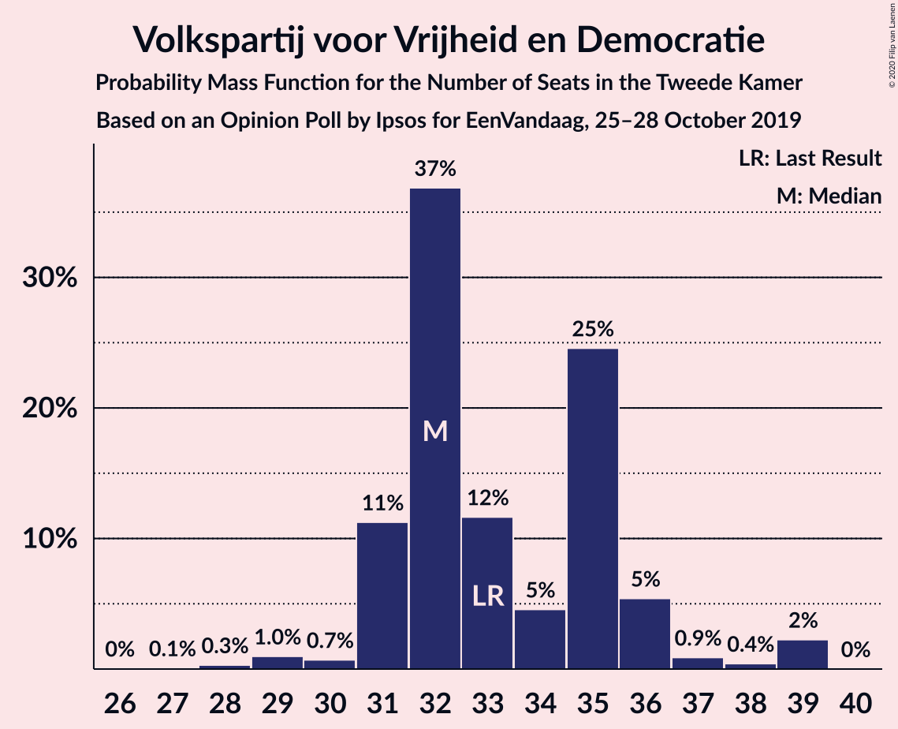

| Number of Seats | Probability | Accumulated | Special Marks |
|:---------------:|:-----------:|:-----------:|:-------------:|
| 26 | 0% | 100% |  |
| 27 | 0.1% | 99.9% |  |
| 28 | 0.3% | 99.9% |  |
| 29 | 1.0% | 99.6% |  |
| 30 | 0.7% | 98.6% |  |
| 31 | 11% | 98% |  |
| 32 | 37% | 87% | Median |
| 33 | 12% | 50% | Last Result |
| 34 | 5% | 38% |  |
| 35 | 25% | 34% |  |
| 36 | 5% | 9% |  |
| 37 | 0.9% | 4% |  |
| 38 | 0.4% | 3% |  |
| 39 | 2% | 2% |  |
| 40 | 0% | 0% |  |

### Partij voor de Vrijheid

*For a full overview of the results for this party, see the [Partij voor de Vrijheid](party-partijvoordevrijheid.html) page.*

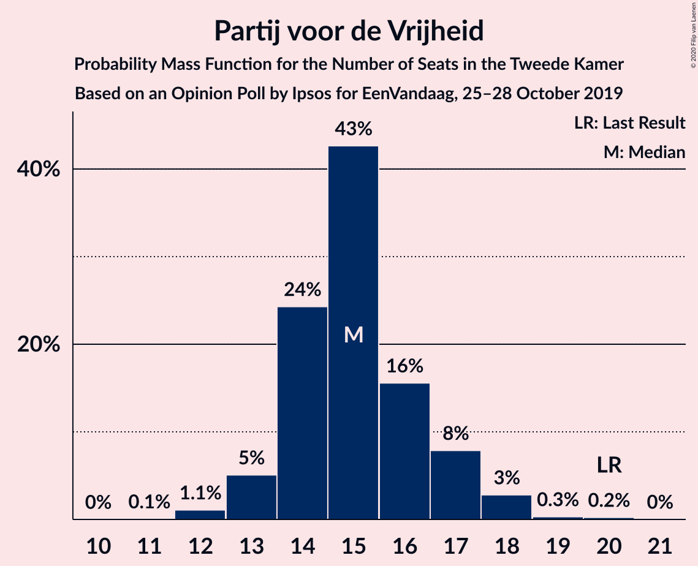

| Number of Seats | Probability | Accumulated | Special Marks |
|:---------------:|:-----------:|:-----------:|:-------------:|
| 11 | 0.1% | 100% |  |
| 12 | 1.1% | 99.9% |  |
| 13 | 5% | 98.9% |  |
| 14 | 24% | 94% |  |
| 15 | 43% | 69% | Median |
| 16 | 16% | 27% |  |
| 17 | 8% | 11% |  |
| 18 | 3% | 3% |  |
| 19 | 0.3% | 0.6% |  |
| 20 | 0.2% | 0.3% | Last Result |
| 21 | 0% | 0% |  |

### Christen-Democratisch Appèl

*For a full overview of the results for this party, see the [Christen-Democratisch Appèl](party-christen-democratischappèl.html) page.*

| Number of Seats | Probability | Accumulated | Special Marks |
|:---------------:|:-----------:|:-----------:|:-------------:|
| 11 | 0.2% | 100% |  |
| 12 | 3% | 99.8% |  |
| 13 | 5% | 96% |  |
| 14 | 44% | 92% | Median |
| 15 | 4% | 48% |  |
| 16 | 13% | 44% |  |
| 17 | 23% | 31% |  |
| 18 | 7% | 7% |  |
| 19 | 0.3% | 0.4% | Last Result |
| 20 | 0% | 0.1% |  |
| 21 | 0% | 0% |  |

### Partij van de Arbeid

*For a full overview of the results for this party, see the [Partij van de Arbeid](party-partijvandearbeid.html) page.*

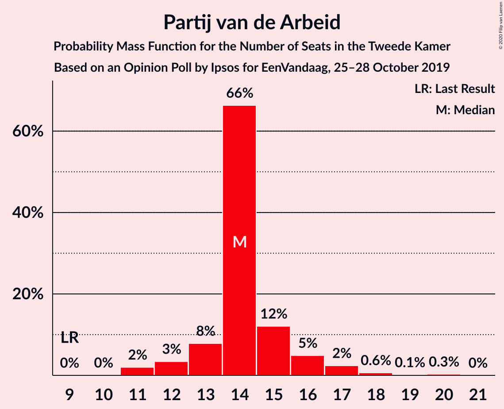

| Number of Seats | Probability | Accumulated | Special Marks |
|:---------------:|:-----------:|:-----------:|:-------------:|
| 9 | 0% | 100% | Last Result |
| 10 | 0% | 100% |  |
| 11 | 2% | 100% |  |
| 12 | 3% | 98% |  |
| 13 | 8% | 95% |  |
| 14 | 66% | 87% | Median |
| 15 | 12% | 20% |  |
| 16 | 5% | 8% |  |
| 17 | 2% | 3% |  |
| 18 | 0.6% | 1.1% |  |
| 19 | 0.1% | 0.4% |  |
| 20 | 0.3% | 0.3% |  |
| 21 | 0% | 0% |  |

### GroenLinks

*For a full overview of the results for this party, see the [GroenLinks](party-groenlinks.html) page.*

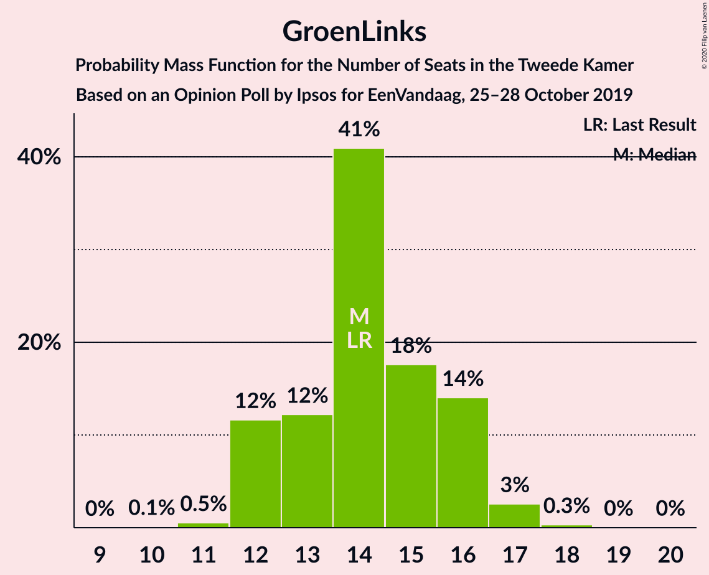

| Number of Seats | Probability | Accumulated | Special Marks |
|:---------------:|:-----------:|:-----------:|:-------------:|
| 10 | 0.1% | 100% |  |
| 11 | 0.5% | 99.9% |  |
| 12 | 12% | 99.3% |  |
| 13 | 12% | 88% |  |
| 14 | 41% | 76% | Last Result, Median |
| 15 | 18% | 35% |  |
| 16 | 14% | 17% |  |
| 17 | 3% | 3% |  |
| 18 | 0.3% | 0.4% |  |
| 19 | 0% | 0.1% |  |
| 20 | 0% | 0% |  |

### Democraten 66

*For a full overview of the results for this party, see the [Democraten 66](party-democraten66.html) page.*

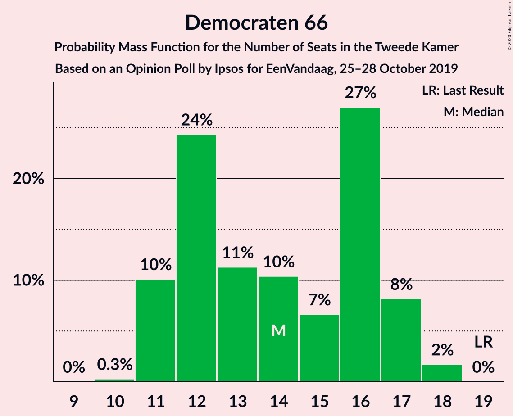

| Number of Seats | Probability | Accumulated | Special Marks |
|:---------------:|:-----------:|:-----------:|:-------------:|
| 10 | 0.3% | 100% |  |
| 11 | 10% | 99.7% |  |
| 12 | 24% | 90% |  |
| 13 | 11% | 65% |  |
| 14 | 10% | 54% | Median |
| 15 | 7% | 44% |  |
| 16 | 27% | 37% |  |
| 17 | 8% | 10% |  |
| 18 | 2% | 2% |  |
| 19 | 0% | 0% | Last Result |

### Forum voor Democratie

*For a full overview of the results for this party, see the [Forum voor Democratie](party-forumvoordemocratie.html) page.*

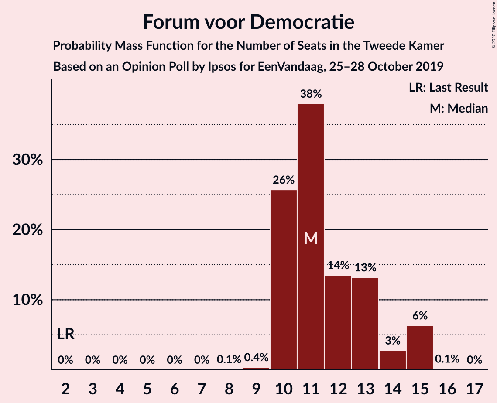

| Number of Seats | Probability | Accumulated | Special Marks |
|:---------------:|:-----------:|:-----------:|:-------------:|
| 2 | 0% | 100% | Last Result |
| 3 | 0% | 100% |  |
| 4 | 0% | 100% |  |
| 5 | 0% | 100% |  |
| 6 | 0% | 100% |  |
| 7 | 0% | 100% |  |
| 8 | 0.1% | 100% |  |
| 9 | 0.4% | 99.9% |  |
| 10 | 26% | 99.6% |  |
| 11 | 38% | 74% | Median |
| 12 | 14% | 36% |  |
| 13 | 13% | 22% |  |
| 14 | 3% | 9% |  |
| 15 | 6% | 6% |  |
| 16 | 0.1% | 0.2% |  |
| 17 | 0% | 0% |  |

### Socialistische Partij

*For a full overview of the results for this party, see the [Socialistische Partij](party-socialistischepartij.html) page.*

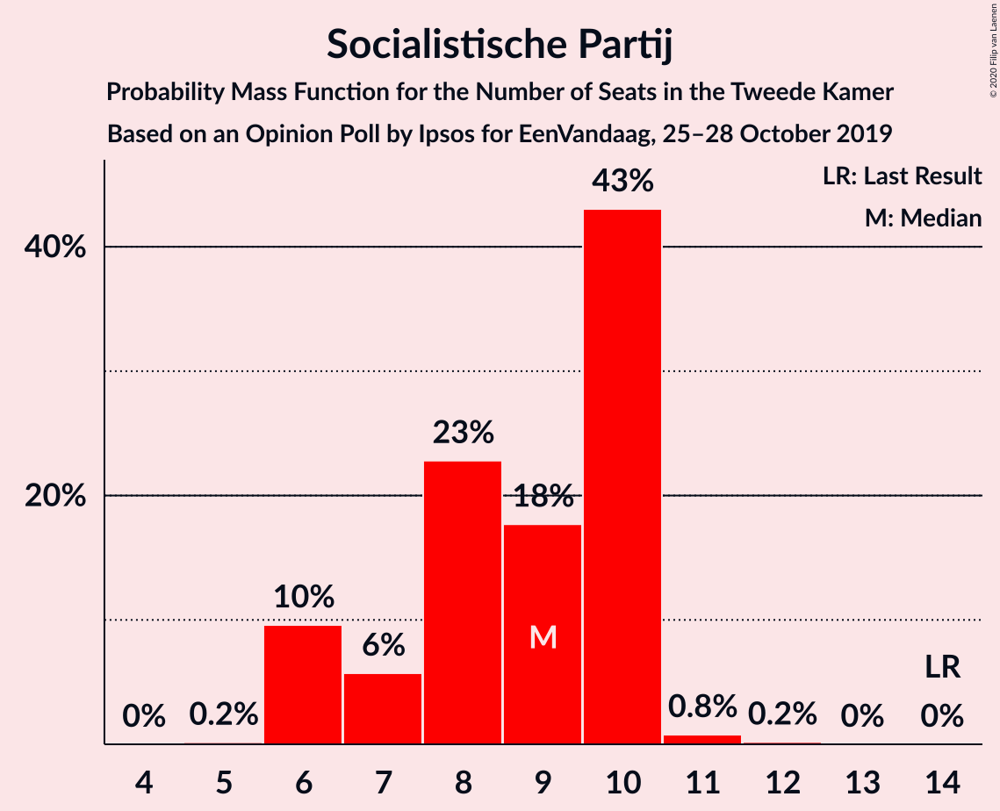

| Number of Seats | Probability | Accumulated | Special Marks |
|:---------------:|:-----------:|:-----------:|:-------------:|
| 5 | 0.2% | 100% |  |
| 6 | 10% | 99.8% |  |
| 7 | 6% | 90% |  |
| 8 | 23% | 85% |  |
| 9 | 18% | 62% | Median |
| 10 | 43% | 44% |  |
| 11 | 0.8% | 1.0% |  |
| 12 | 0.2% | 0.2% |  |
| 13 | 0% | 0% |  |
| 14 | 0% | 0% | Last Result |

### ChristenUnie

*For a full overview of the results for this party, see the [ChristenUnie](party-christenunie.html) page.*

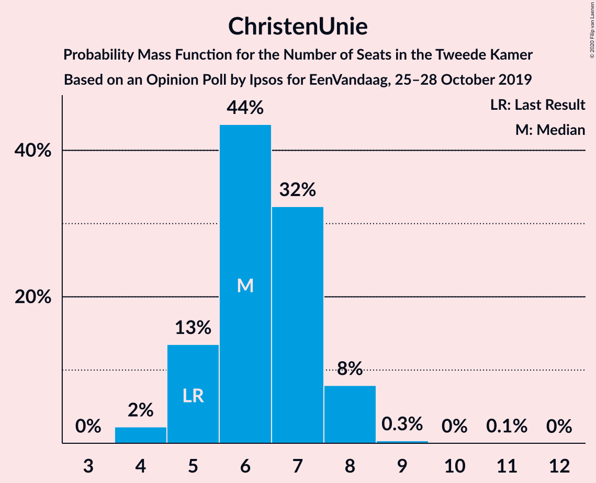

| Number of Seats | Probability | Accumulated | Special Marks |
|:---------------:|:-----------:|:-----------:|:-------------:|
| 4 | 2% | 100% |  |
| 5 | 13% | 98% | Last Result |
| 6 | 44% | 84% | Median |
| 7 | 32% | 41% |  |
| 8 | 8% | 8% |  |
| 9 | 0.3% | 0.4% |  |
| 10 | 0% | 0.1% |  |
| 11 | 0.1% | 0.1% |  |
| 12 | 0% | 0% |  |

### 50Plus

*For a full overview of the results for this party, see the [50Plus](party-50plus.html) page.*

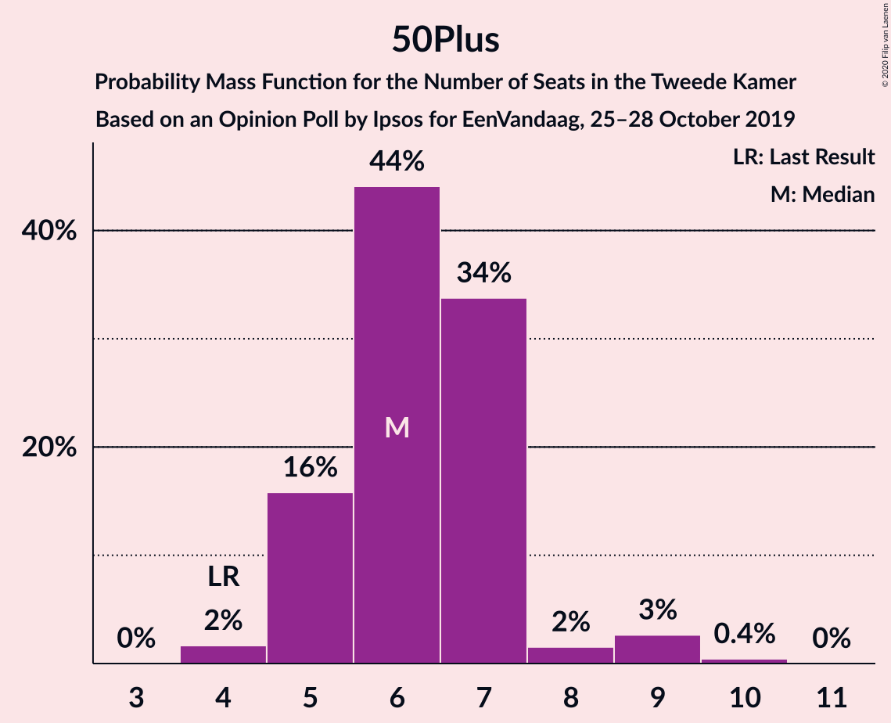

| Number of Seats | Probability | Accumulated | Special Marks |
|:---------------:|:-----------:|:-----------:|:-------------:|
| 4 | 2% | 100% | Last Result |
| 5 | 16% | 98% |  |
| 6 | 44% | 82% | Median |
| 7 | 34% | 38% |  |
| 8 | 2% | 5% |  |
| 9 | 3% | 3% |  |
| 10 | 0.4% | 0.4% |  |
| 11 | 0% | 0% |  |

### Partij voor de Dieren

*For a full overview of the results for this party, see the [Partij voor de Dieren](party-partijvoordedieren.html) page.*

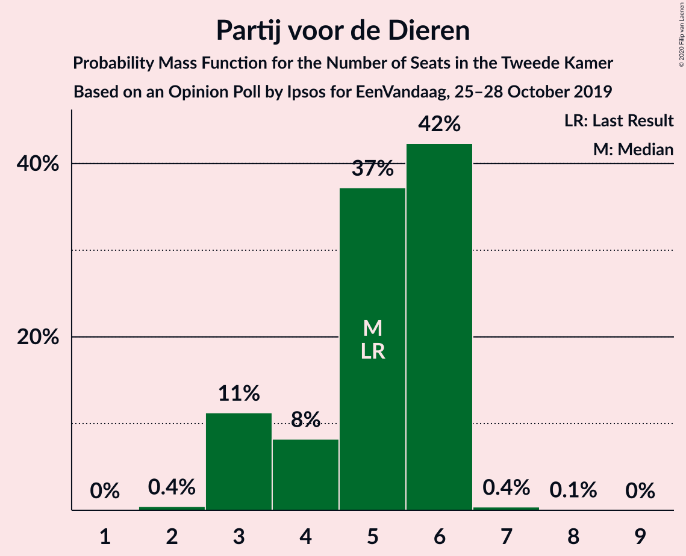

| Number of Seats | Probability | Accumulated | Special Marks |
|:---------------:|:-----------:|:-----------:|:-------------:|
| 2 | 0.4% | 100% |  |
| 3 | 11% | 99.6% |  |
| 4 | 8% | 88% |  |
| 5 | 37% | 80% | Last Result, Median |
| 6 | 42% | 43% |  |
| 7 | 0.4% | 0.5% |  |
| 8 | 0.1% | 0.1% |  |
| 9 | 0% | 0% |  |

### Staatkundig Gereformeerde Partij

*For a full overview of the results for this party, see the [Staatkundig Gereformeerde Partij](party-staatkundiggereformeerdepartij.html) page.*

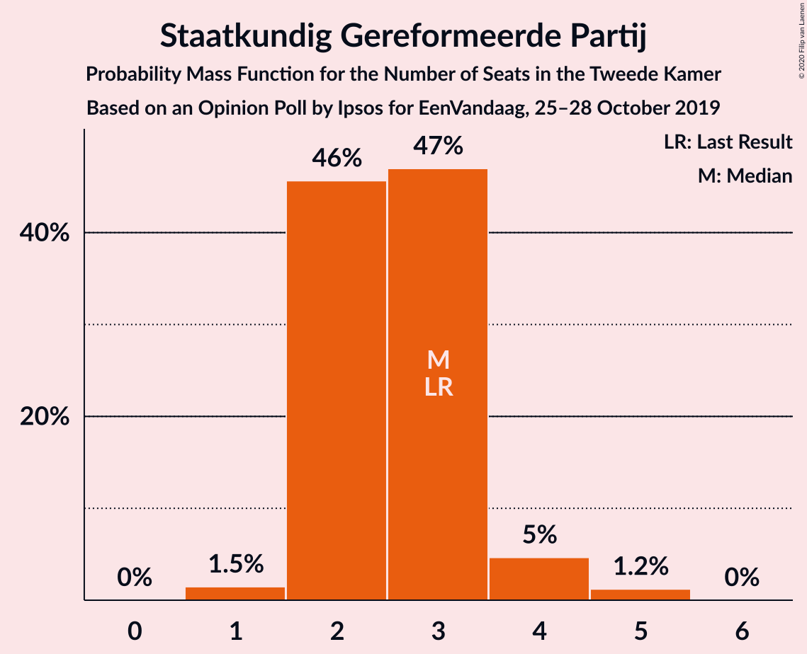

| Number of Seats | Probability | Accumulated | Special Marks |
|:---------------:|:-----------:|:-----------:|:-------------:|
| 1 | 1.5% | 100% |  |
| 2 | 46% | 98.5% |  |
| 3 | 47% | 53% | Last Result, Median |
| 4 | 5% | 6% |  |
| 5 | 1.2% | 1.2% |  |
| 6 | 0% | 0% |  |

### DENK

*For a full overview of the results for this party, see the [DENK](party-denk.html) page.*

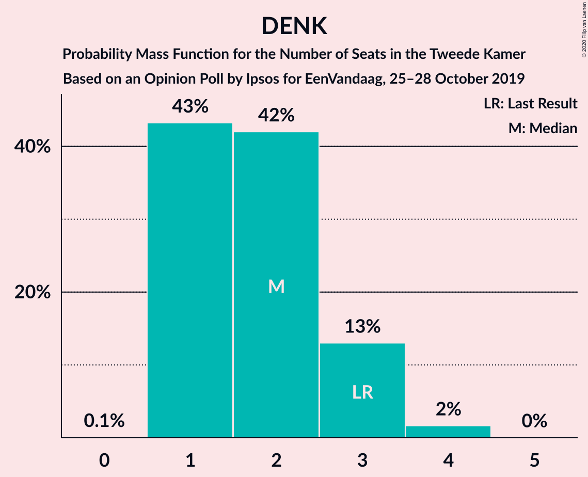

| Number of Seats | Probability | Accumulated | Special Marks |
|:---------------:|:-----------:|:-----------:|:-------------:|
| 0 | 0.1% | 100% |  |
| 1 | 43% | 99.9% |  |
| 2 | 42% | 57% | Median |
| 3 | 13% | 15% | Last Result |
| 4 | 2% | 2% |  |
| 5 | 0% | 0% |  |

## Coalitions

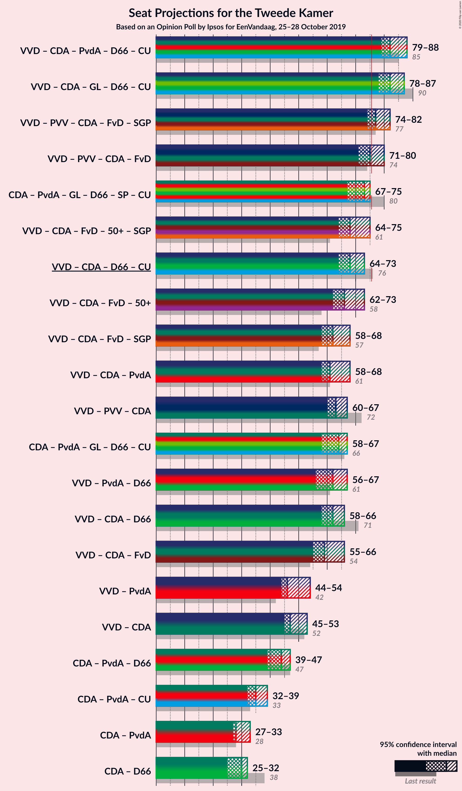

### Confidence Intervals

| Coalition | Last Result | Median | Majority? | 80% Confidence Interval | 90% Confidence Interval | 95% Confidence Interval | 99% Confidence Interval |
|:---------:|:-----------:|:------:|:---------:|:-----------------------:|:-----------------------:|:-----------------------:|:-----------------------:|
| Volkspartij voor Vrijheid en Democratie – Christen-Democratisch Appèl – Partij van de Arbeid – Democraten 66 – ChristenUnie | 85 | 82 | 99.9% | 80–86 | 79–86 | 79–88 | 76–90 |
| Volkspartij voor Vrijheid en Democratie – Christen-Democratisch Appèl – GroenLinks – Democraten 66 – ChristenUnie | 90 | 82 | 99.8% | 79–87 | 79–87 | 78–87 | 77–88 |
| Volkspartij voor Vrijheid en Democratie – Partij voor de Vrijheid – Christen-Democratisch Appèl – Forum voor Democratie – Staatkundig Gereformeerde Partij | 77 | 77 | 59% | 74–82 | 74–82 | 74–82 | 72–83 |
| Volkspartij voor Vrijheid en Democratie – Partij voor de Vrijheid – Christen-Democratisch Appèl – Forum voor Democratie | 74 | 75 | 44% | 72–79 | 71–80 | 71–80 | 70–80 |
| Christen-Democratisch Appèl – Partij van de Arbeid – GroenLinks – Democraten 66 – Socialistische Partij – ChristenUnie | 80 | 73 | 2% | 71–74 | 68–75 | 67–75 | 66–78 |
| Volkspartij voor Vrijheid en Democratie – Christen-Democratisch Appèl – Forum voor Democratie – 50Plus – Staatkundig Gereformeerde Partij | 61 | 68 | 0% | 66–73 | 65–75 | 64–75 | 64–75 |
| Volkspartij voor Vrijheid en Democratie – Christen-Democratisch Appèl – Democraten 66 – ChristenUnie | 76 | 68 | 0.1% | 66–71 | 65–71 | 64–73 | 61–74 |
| Volkspartij voor Vrijheid en Democratie – Christen-Democratisch Appèl – Forum voor Democratie – 50Plus | 58 | 66 | 0% | 63–70 | 62–73 | 62–73 | 61–73 |
| Volkspartij voor Vrijheid en Democratie – Christen-Democratisch Appèl – Forum voor Democratie – Staatkundig Gereformeerde Partij | 57 | 62 | 0% | 59–67 | 58–68 | 58–68 | 58–68 |
| Volkspartij voor Vrijheid en Democratie – Christen-Democratisch Appèl – Partij van de Arbeid | 61 | 61 | 0% | 60–66 | 59–67 | 58–68 | 57–70 |
| Volkspartij voor Vrijheid en Democratie – Partij voor de Vrijheid – Christen-Democratisch Appèl | 72 | 63 | 0% | 61–67 | 60–67 | 60–67 | 58–69 |
| Christen-Democratisch Appèl – Partij van de Arbeid – GroenLinks – Democraten 66 – ChristenUnie | 66 | 64 | 0% | 61–66 | 60–66 | 58–67 | 57–69 |
| Volkspartij voor Vrijheid en Democratie – Partij van de Arbeid – Democraten 66 | 61 | 62 | 0% | 59–63 | 57–64 | 56–67 | 56–70 |
| Volkspartij voor Vrijheid en Democratie – Christen-Democratisch Appèl – Democraten 66 | 71 | 62 | 0% | 59–65 | 58–66 | 58–66 | 55–67 |
| Volkspartij voor Vrijheid en Democratie – Christen-Democratisch Appèl – Forum voor Democratie | 54 | 59 | 0% | 57–65 | 56–66 | 55–66 | 55–66 |
| Volkspartij voor Vrijheid en Democratie – Partij van de Arbeid | 42 | 46 | 0% | 45–50 | 44–51 | 44–54 | 43–55 |
| Volkspartij voor Vrijheid en Democratie – Christen-Democratisch Appèl | 52 | 47 | 0% | 46–52 | 45–52 | 45–53 | 43–53 |
| Christen-Democratisch Appèl – Partij van de Arbeid – Democraten 66 | 47 | 44 | 0% | 41–45 | 40–46 | 39–47 | 39–48 |
| Christen-Democratisch Appèl – Partij van de Arbeid – ChristenUnie | 33 | 35 | 0% | 34–38 | 33–39 | 32–39 | 31–41 |
| Christen-Democratisch Appèl – Partij van de Arbeid | 28 | 28 | 0% | 27–32 | 27–32 | 27–33 | 25–35 |
| Christen-Democratisch Appèl – Democraten 66 | 38 | 30 | 0% | 27–31 | 26–31 | 25–32 | 24–34 |

### Volkspartij voor Vrijheid en Democratie – Christen-Democratisch Appèl – Partij van de Arbeid – Democraten 66 – ChristenUnie

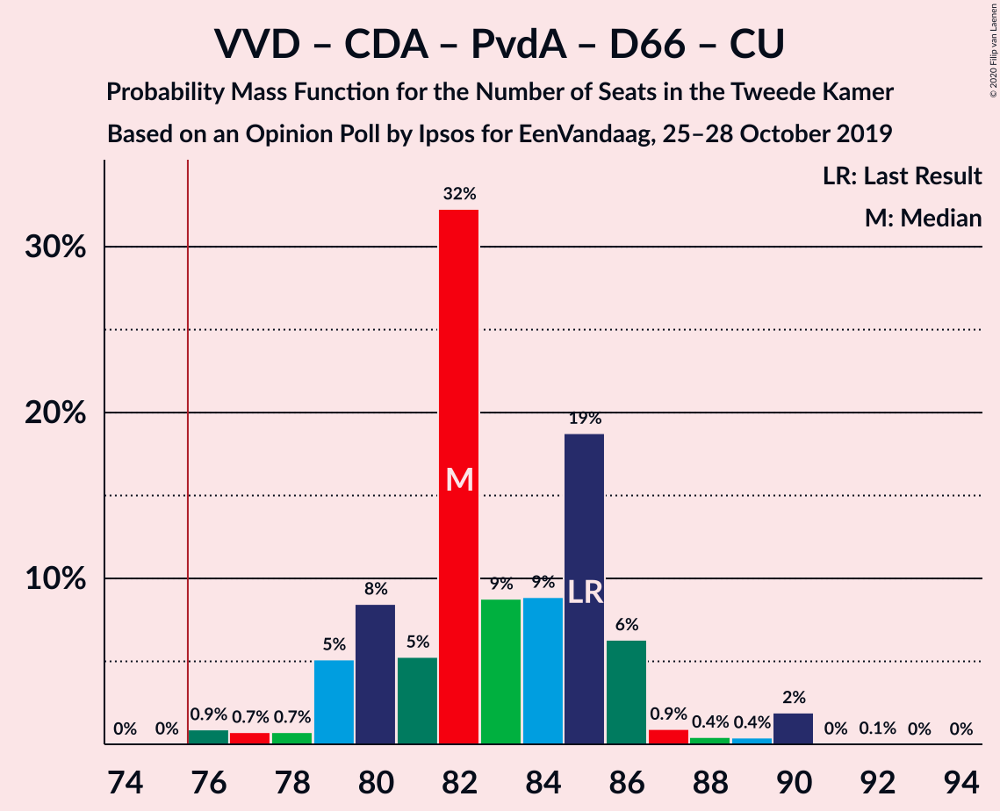

| Number of Seats | Probability | Accumulated | Special Marks |
|:---------------:|:-----------:|:-----------:|:-------------:|
| 75 | 0% | 100% |  |
| 76 | 0.9% | 99.9% | Majority |
| 77 | 0.7% | 99.1% |  |
| 78 | 0.7% | 98% |  |
| 79 | 5% | 98% |  |
| 80 | 8% | 92% | Median |
| 81 | 5% | 84% |  |
| 82 | 32% | 79% |  |
| 83 | 9% | 46% |  |
| 84 | 9% | 38% |  |
| 85 | 19% | 29% | Last Result |
| 86 | 6% | 10% |  |
| 87 | 0.9% | 4% |  |
| 88 | 0.4% | 3% |  |
| 89 | 0.4% | 2% |  |
| 90 | 2% | 2% |  |
| 91 | 0% | 0.1% |  |
| 92 | 0.1% | 0.1% |  |
| 93 | 0% | 0% |  |

### Volkspartij voor Vrijheid en Democratie – Christen-Democratisch Appèl – GroenLinks – Democraten 66 – ChristenUnie

| Number of Seats | Probability | Accumulated | Special Marks |
|:---------------:|:-----------:|:-----------:|:-------------:|
| 75 | 0.1% | 100% |  |
| 76 | 0.2% | 99.8% | Majority |
| 77 | 2% | 99.7% |  |
| 78 | 2% | 98% |  |
| 79 | 7% | 96% |  |
| 80 | 3% | 89% | Median |
| 81 | 4% | 86% |  |
| 82 | 39% | 82% |  |
| 83 | 9% | 44% |  |
| 84 | 9% | 34% |  |
| 85 | 2% | 25% |  |
| 86 | 13% | 24% |  |
| 87 | 10% | 11% |  |
| 88 | 0.6% | 0.6% |  |
| 89 | 0% | 0.1% |  |
| 90 | 0% | 0% | Last Result |

### Volkspartij voor Vrijheid en Democratie – Partij voor de Vrijheid – Christen-Democratisch Appèl – Forum voor Democratie – Staatkundig Gereformeerde Partij

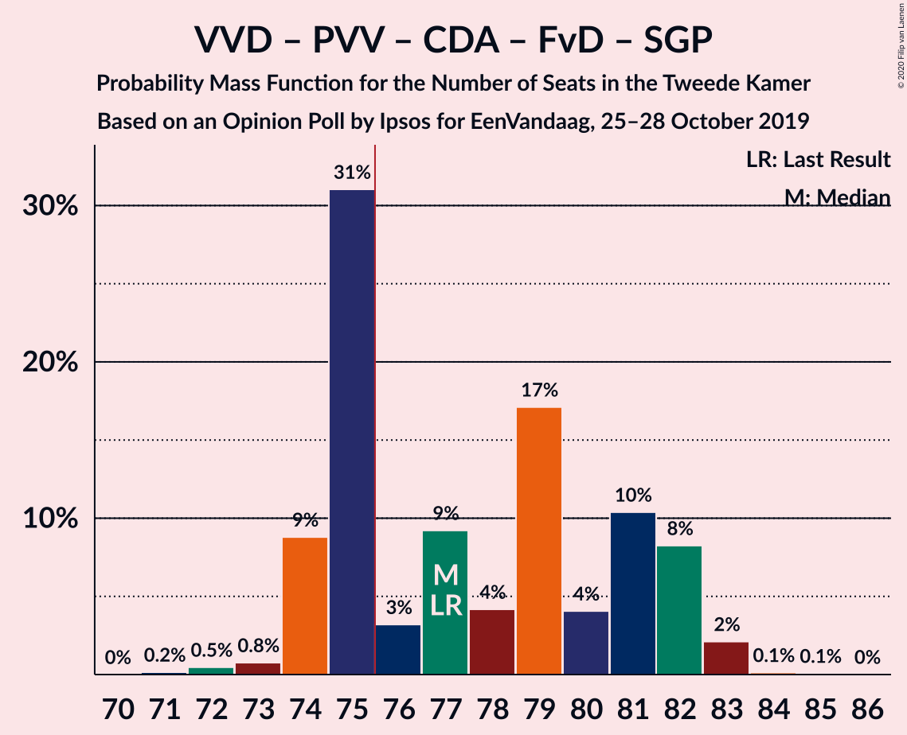

| Number of Seats | Probability | Accumulated | Special Marks |
|:---------------:|:-----------:|:-----------:|:-------------:|
| 71 | 0.2% | 100% |  |
| 72 | 0.5% | 99.8% |  |
| 73 | 0.8% | 99.3% |  |
| 74 | 9% | 98.6% |  |
| 75 | 31% | 90% | Median |
| 76 | 3% | 59% | Majority |
| 77 | 9% | 56% | Last Result |
| 78 | 4% | 46% |  |
| 79 | 17% | 42% |  |
| 80 | 4% | 25% |  |
| 81 | 10% | 21% |  |
| 82 | 8% | 11% |  |
| 83 | 2% | 2% |  |
| 84 | 0.1% | 0.2% |  |
| 85 | 0.1% | 0.1% |  |
| 86 | 0% | 0% |  |

### Volkspartij voor Vrijheid en Democratie – Partij voor de Vrijheid – Christen-Democratisch Appèl – Forum voor Democratie

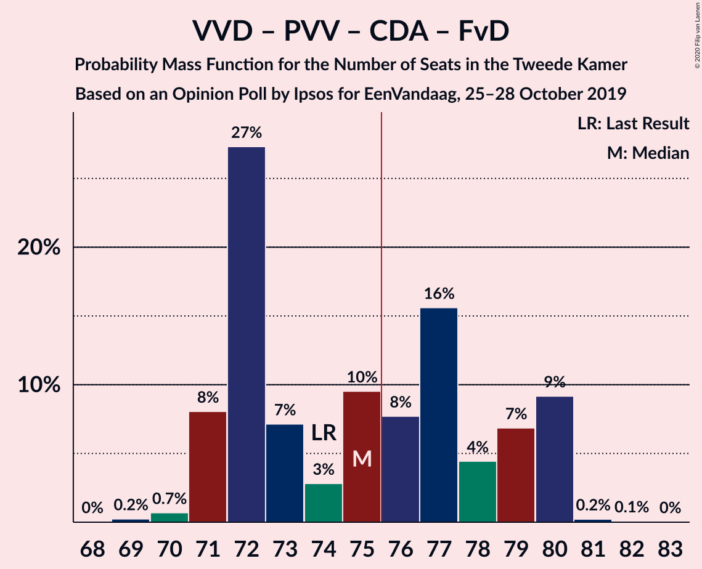

| Number of Seats | Probability | Accumulated | Special Marks |
|:---------------:|:-----------:|:-----------:|:-------------:|
| 68 | 0% | 100% |  |
| 69 | 0.2% | 99.9% |  |
| 70 | 0.7% | 99.7% |  |
| 71 | 8% | 99.0% |  |
| 72 | 27% | 91% | Median |
| 73 | 7% | 64% |  |
| 74 | 3% | 56% | Last Result |
| 75 | 10% | 54% |  |
| 76 | 8% | 44% | Majority |
| 77 | 16% | 36% |  |
| 78 | 4% | 21% |  |
| 79 | 7% | 16% |  |
| 80 | 9% | 10% |  |
| 81 | 0.2% | 0.3% |  |
| 82 | 0.1% | 0.1% |  |
| 83 | 0% | 0% |  |

### Christen-Democratisch Appèl – Partij van de Arbeid – GroenLinks – Democraten 66 – Socialistische Partij – ChristenUnie

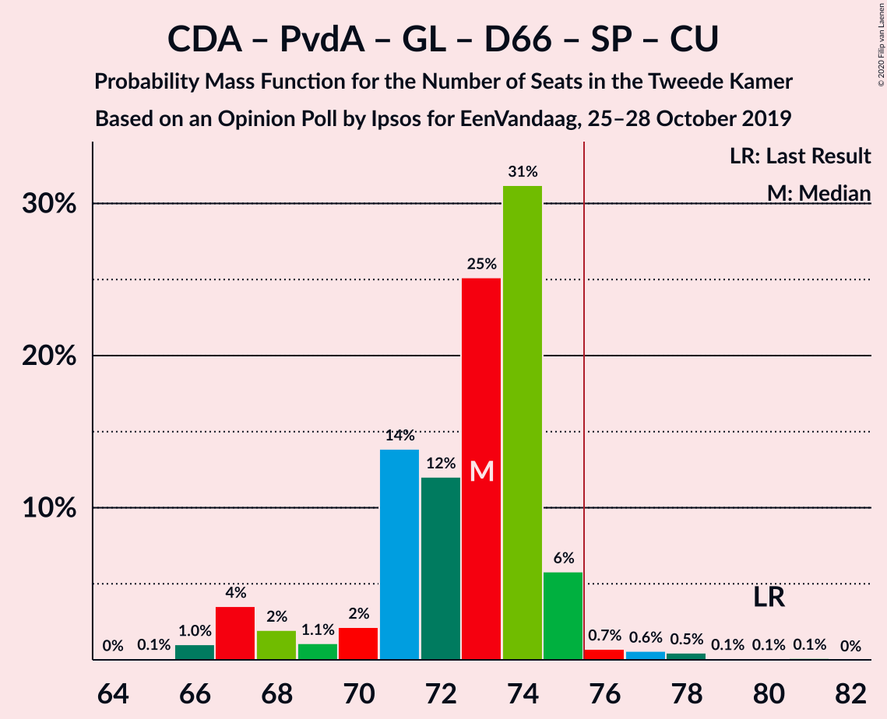

| Number of Seats | Probability | Accumulated | Special Marks |
|:---------------:|:-----------:|:-----------:|:-------------:|
| 64 | 0% | 100% |  |
| 65 | 0.1% | 99.9% |  |
| 66 | 1.0% | 99.8% |  |
| 67 | 4% | 98.8% |  |
| 68 | 2% | 95% |  |
| 69 | 1.1% | 93% |  |
| 70 | 2% | 92% |  |
| 71 | 14% | 90% | Median |
| 72 | 12% | 76% |  |
| 73 | 25% | 64% |  |
| 74 | 31% | 39% |  |
| 75 | 6% | 8% |  |
| 76 | 0.7% | 2% | Majority |
| 77 | 0.6% | 1.4% |  |
| 78 | 0.5% | 0.8% |  |
| 79 | 0.1% | 0.3% |  |
| 80 | 0.1% | 0.2% | Last Result |
| 81 | 0.1% | 0.1% |  |
| 82 | 0% | 0% |  |

### Volkspartij voor Vrijheid en Democratie – Christen-Democratisch Appèl – Forum voor Democratie – 50Plus – Staatkundig Gereformeerde Partij

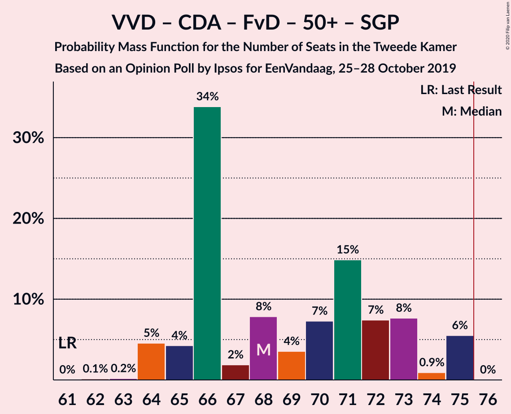

| Number of Seats | Probability | Accumulated | Special Marks |
|:---------------:|:-----------:|:-----------:|:-------------:|
| 61 | 0% | 100% | Last Result |
| 62 | 0.1% | 99.9% |  |
| 63 | 0.2% | 99.8% |  |
| 64 | 5% | 99.6% |  |
| 65 | 4% | 95% |  |
| 66 | 34% | 91% | Median |
| 67 | 2% | 57% |  |
| 68 | 8% | 55% |  |
| 69 | 4% | 47% |  |
| 70 | 7% | 44% |  |
| 71 | 15% | 36% |  |
| 72 | 7% | 22% |  |
| 73 | 8% | 14% |  |
| 74 | 0.9% | 6% |  |
| 75 | 6% | 6% |  |
| 76 | 0% | 0% | Majority |

### Volkspartij voor Vrijheid en Democratie – Christen-Democratisch Appèl – Democraten 66 – ChristenUnie

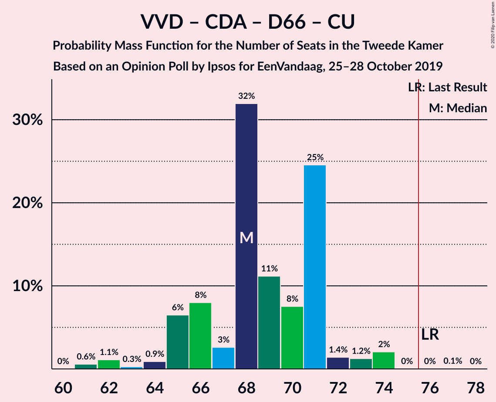

| Number of Seats | Probability | Accumulated | Special Marks |
|:---------------:|:-----------:|:-----------:|:-------------:|
| 61 | 0.6% | 100% |  |
| 62 | 1.1% | 99.4% |  |
| 63 | 0.3% | 98% |  |
| 64 | 0.9% | 98% |  |
| 65 | 6% | 97% |  |
| 66 | 8% | 91% | Median |
| 67 | 3% | 83% |  |
| 68 | 32% | 80% |  |
| 69 | 11% | 48% |  |
| 70 | 8% | 37% |  |
| 71 | 25% | 29% |  |
| 72 | 1.4% | 5% |  |
| 73 | 1.2% | 3% |  |
| 74 | 2% | 2% |  |
| 75 | 0% | 0.1% |  |
| 76 | 0% | 0.1% | Last Result, Majority |
| 77 | 0.1% | 0.1% |  |
| 78 | 0% | 0% |  |

### Volkspartij voor Vrijheid en Democratie – Christen-Democratisch Appèl – Forum voor Democratie – 50Plus

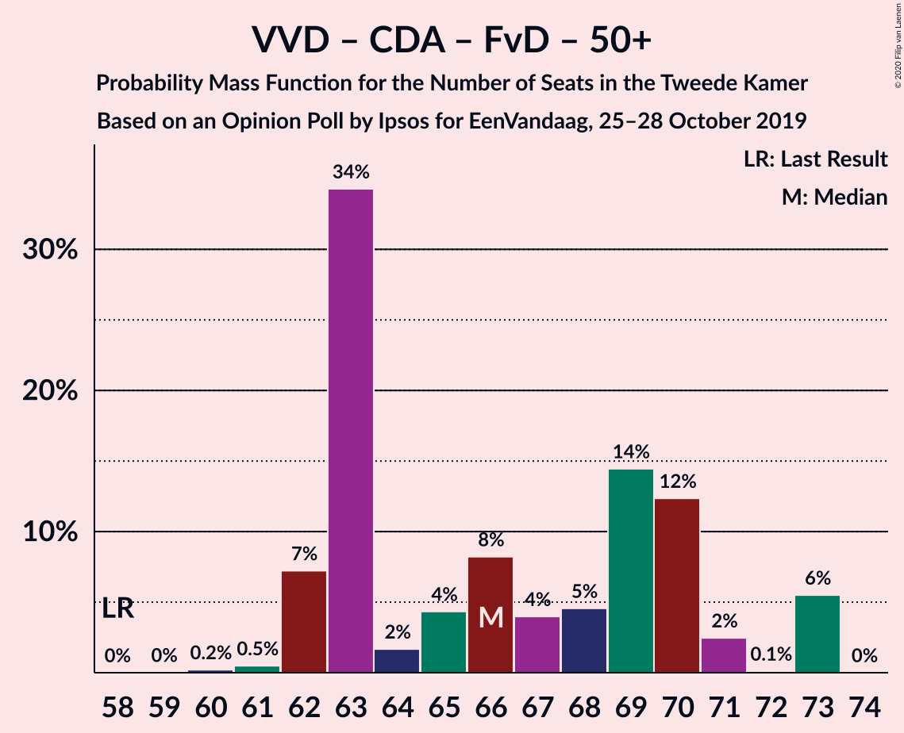

| Number of Seats | Probability | Accumulated | Special Marks |
|:---------------:|:-----------:|:-----------:|:-------------:|
| 58 | 0% | 100% | Last Result |
| 59 | 0% | 100% |  |
| 60 | 0.2% | 99.9% |  |
| 61 | 0.5% | 99.7% |  |
| 62 | 7% | 99.2% |  |
| 63 | 34% | 92% | Median |
| 64 | 2% | 58% |  |
| 65 | 4% | 56% |  |
| 66 | 8% | 52% |  |
| 67 | 4% | 43% |  |
| 68 | 5% | 39% |  |
| 69 | 14% | 35% |  |
| 70 | 12% | 20% |  |
| 71 | 2% | 8% |  |
| 72 | 0.1% | 6% |  |
| 73 | 6% | 6% |  |
| 74 | 0% | 0% |  |

### Volkspartij voor Vrijheid en Democratie – Christen-Democratisch Appèl – Forum voor Democratie – Staatkundig Gereformeerde Partij

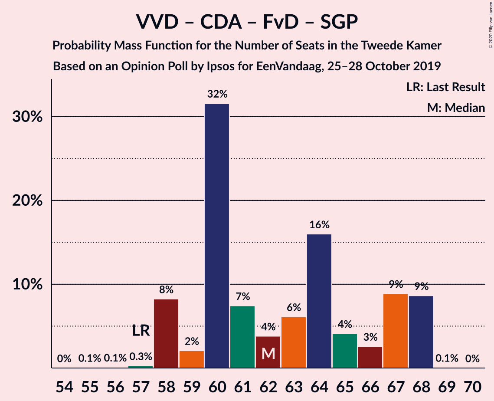

| Number of Seats | Probability | Accumulated | Special Marks |
|:---------------:|:-----------:|:-----------:|:-------------:|
| 55 | 0.1% | 100% |  |
| 56 | 0.1% | 99.9% |  |
| 57 | 0.3% | 99.8% | Last Result |
| 58 | 8% | 99.5% |  |
| 59 | 2% | 91% |  |
| 60 | 32% | 89% | Median |
| 61 | 7% | 58% |  |
| 62 | 4% | 50% |  |
| 63 | 6% | 46% |  |
| 64 | 16% | 40% |  |
| 65 | 4% | 24% |  |
| 66 | 3% | 20% |  |
| 67 | 9% | 18% |  |
| 68 | 9% | 9% |  |
| 69 | 0.1% | 0.1% |  |
| 70 | 0% | 0% |  |

### Volkspartij voor Vrijheid en Democratie – Christen-Democratisch Appèl – Partij van de Arbeid

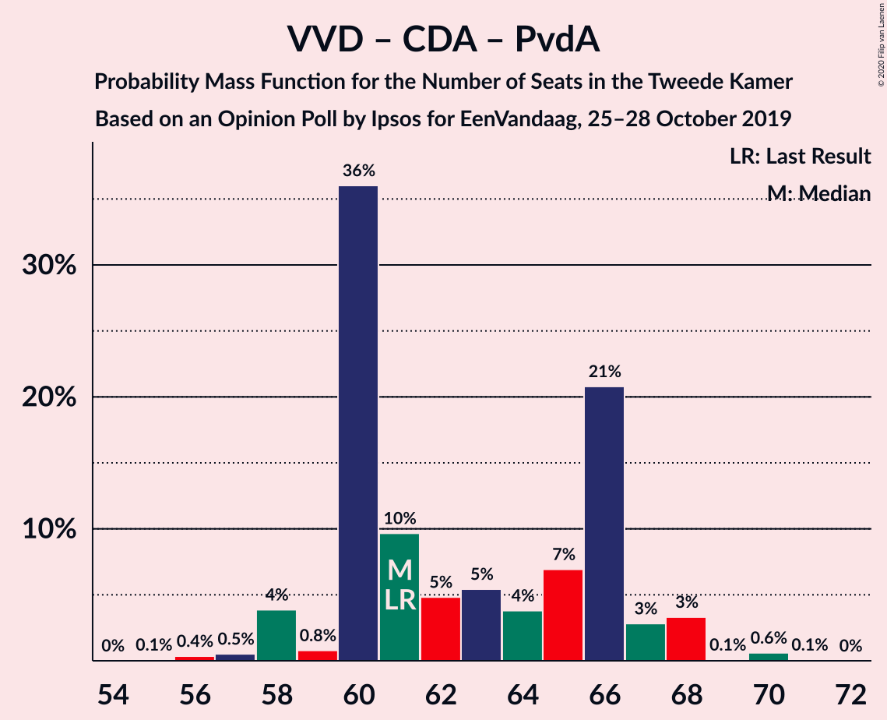

| Number of Seats | Probability | Accumulated | Special Marks |
|:---------------:|:-----------:|:-----------:|:-------------:|
| 55 | 0.1% | 100% |  |
| 56 | 0.4% | 99.9% |  |
| 57 | 0.5% | 99.6% |  |
| 58 | 4% | 99.0% |  |
| 59 | 0.8% | 95% |  |
| 60 | 36% | 94% | Median |
| 61 | 10% | 58% | Last Result |
| 62 | 5% | 49% |  |
| 63 | 5% | 44% |  |
| 64 | 4% | 38% |  |
| 65 | 7% | 35% |  |
| 66 | 21% | 28% |  |
| 67 | 3% | 7% |  |
| 68 | 3% | 4% |  |
| 69 | 0.1% | 0.8% |  |
| 70 | 0.6% | 0.7% |  |
| 71 | 0.1% | 0.1% |  |
| 72 | 0% | 0% |  |

### Volkspartij voor Vrijheid en Democratie – Partij voor de Vrijheid – Christen-Democratisch Appèl

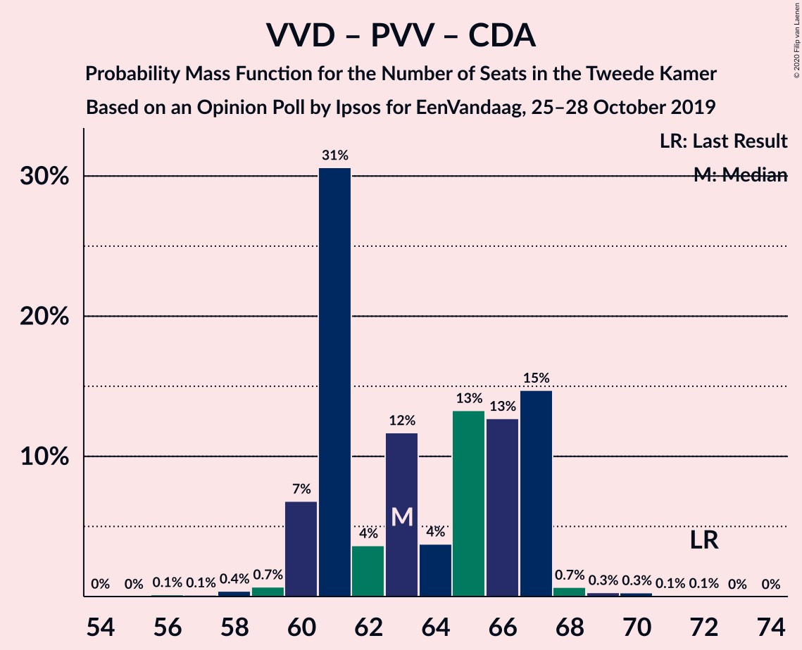

| Number of Seats | Probability | Accumulated | Special Marks |
|:---------------:|:-----------:|:-----------:|:-------------:|
| 55 | 0% | 100% |  |
| 56 | 0.1% | 99.9% |  |
| 57 | 0.1% | 99.8% |  |
| 58 | 0.4% | 99.7% |  |
| 59 | 0.7% | 99.3% |  |
| 60 | 7% | 98.6% |  |
| 61 | 31% | 92% | Median |
| 62 | 4% | 61% |  |
| 63 | 12% | 58% |  |
| 64 | 4% | 46% |  |
| 65 | 13% | 42% |  |
| 66 | 13% | 29% |  |
| 67 | 15% | 16% |  |
| 68 | 0.7% | 1.4% |  |
| 69 | 0.3% | 0.7% |  |
| 70 | 0.3% | 0.4% |  |
| 71 | 0.1% | 0.2% |  |
| 72 | 0.1% | 0.1% | Last Result |
| 73 | 0% | 0% |  |

### Christen-Democratisch Appèl – Partij van de Arbeid – GroenLinks – Democraten 66 – ChristenUnie

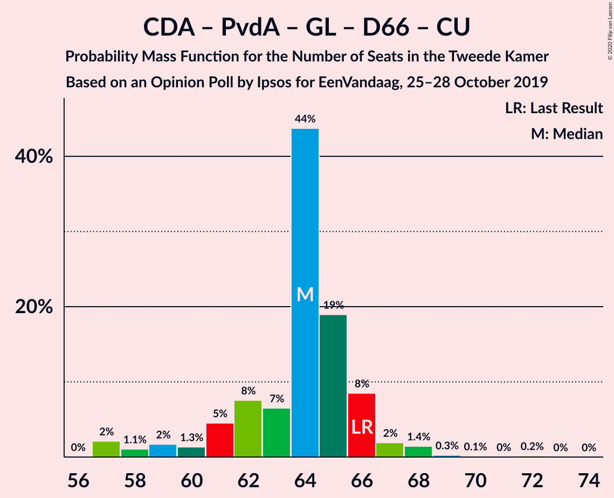

| Number of Seats | Probability | Accumulated | Special Marks |
|:---------------:|:-----------:|:-----------:|:-------------:|
| 56 | 0% | 100% |  |
| 57 | 2% | 99.9% |  |
| 58 | 1.1% | 98% |  |
| 59 | 2% | 97% |  |
| 60 | 1.3% | 95% |  |
| 61 | 5% | 94% |  |
| 62 | 8% | 89% | Median |
| 63 | 7% | 82% |  |
| 64 | 44% | 75% |  |
| 65 | 19% | 31% |  |
| 66 | 8% | 12% | Last Result |
| 67 | 2% | 4% |  |
| 68 | 1.4% | 2% |  |
| 69 | 0.3% | 0.6% |  |
| 70 | 0.1% | 0.3% |  |
| 71 | 0% | 0.2% |  |
| 72 | 0.2% | 0.2% |  |
| 73 | 0% | 0% |  |

### Volkspartij voor Vrijheid en Democratie – Partij van de Arbeid – Democraten 66

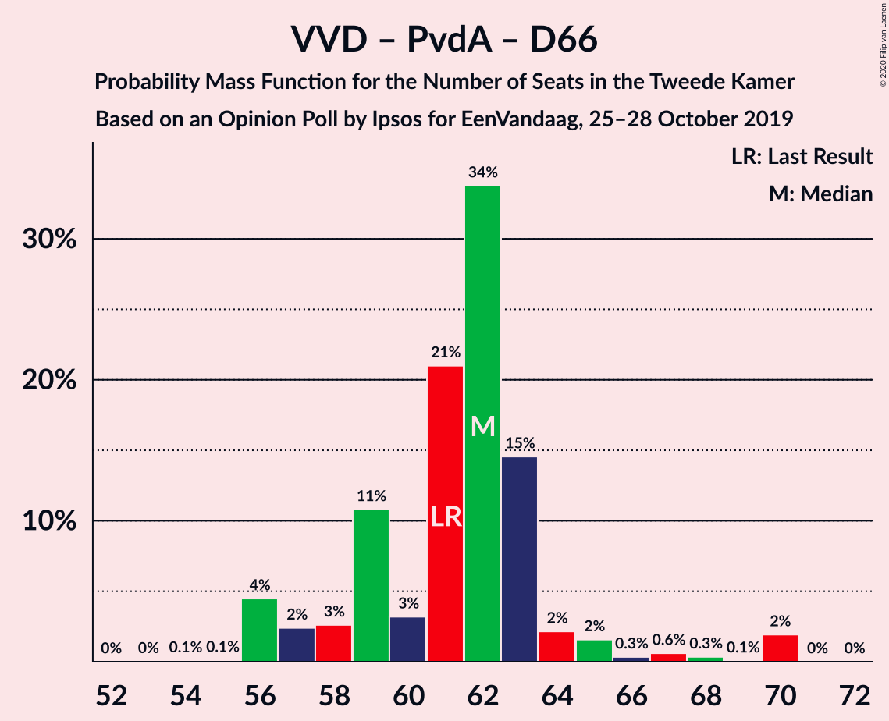

| Number of Seats | Probability | Accumulated | Special Marks |
|:---------------:|:-----------:|:-----------:|:-------------:|
| 54 | 0.1% | 100% |  |
| 55 | 0.1% | 99.9% |  |
| 56 | 4% | 99.8% |  |
| 57 | 2% | 95% |  |
| 58 | 3% | 93% |  |
| 59 | 11% | 90% |  |
| 60 | 3% | 80% | Median |
| 61 | 21% | 76% | Last Result |
| 62 | 34% | 55% |  |
| 63 | 15% | 22% |  |
| 64 | 2% | 7% |  |
| 65 | 2% | 5% |  |
| 66 | 0.3% | 3% |  |
| 67 | 0.6% | 3% |  |
| 68 | 0.3% | 2% |  |
| 69 | 0.1% | 2% |  |
| 70 | 2% | 2% |  |
| 71 | 0% | 0% |  |

### Volkspartij voor Vrijheid en Democratie – Christen-Democratisch Appèl – Democraten 66

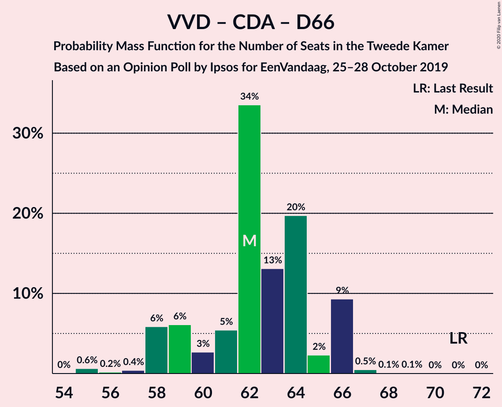

| Number of Seats | Probability | Accumulated | Special Marks |
|:---------------:|:-----------:|:-----------:|:-------------:|
| 54 | 0% | 100% |  |
| 55 | 0.6% | 99.9% |  |
| 56 | 0.2% | 99.3% |  |
| 57 | 0.4% | 99.1% |  |
| 58 | 6% | 98.7% |  |
| 59 | 6% | 93% |  |
| 60 | 3% | 87% | Median |
| 61 | 5% | 84% |  |
| 62 | 34% | 79% |  |
| 63 | 13% | 45% |  |
| 64 | 20% | 32% |  |
| 65 | 2% | 12% |  |
| 66 | 9% | 10% |  |
| 67 | 0.5% | 0.7% |  |
| 68 | 0.1% | 0.2% |  |
| 69 | 0.1% | 0.1% |  |
| 70 | 0% | 0% |  |
| 71 | 0% | 0% | Last Result |

### Volkspartij voor Vrijheid en Democratie – Christen-Democratisch Appèl – Forum voor Democratie

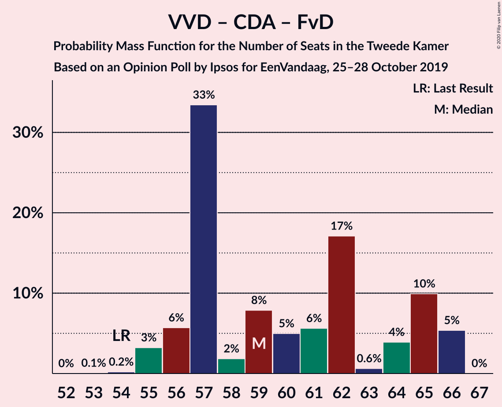

| Number of Seats | Probability | Accumulated | Special Marks |
|:---------------:|:-----------:|:-----------:|:-------------:|
| 52 | 0% | 100% |  |
| 53 | 0.1% | 99.9% |  |
| 54 | 0.2% | 99.9% | Last Result |
| 55 | 3% | 99.7% |  |
| 56 | 6% | 96% |  |
| 57 | 33% | 91% | Median |
| 58 | 2% | 57% |  |
| 59 | 8% | 55% |  |
| 60 | 5% | 48% |  |
| 61 | 6% | 43% |  |
| 62 | 17% | 37% |  |
| 63 | 0.6% | 20% |  |
| 64 | 4% | 19% |  |
| 65 | 10% | 15% |  |
| 66 | 5% | 5% |  |
| 67 | 0% | 0% |  |

### Volkspartij voor Vrijheid en Democratie – Partij van de Arbeid

| Number of Seats | Probability | Accumulated | Special Marks |
|:---------------:|:-----------:|:-----------:|:-------------:|
| 41 | 0.2% | 100% |  |
| 42 | 0.2% | 99.8% | Last Result |
| 43 | 0.9% | 99.5% |  |
| 44 | 5% | 98.6% |  |
| 45 | 7% | 94% |  |
| 46 | 39% | 87% | Median |
| 47 | 11% | 49% |  |
| 48 | 2% | 38% |  |
| 49 | 23% | 36% |  |
| 50 | 5% | 13% |  |
| 51 | 5% | 8% |  |
| 52 | 0.7% | 4% |  |
| 53 | 0.7% | 3% |  |
| 54 | 0.4% | 3% |  |
| 55 | 2% | 2% |  |
| 56 | 0% | 0% |  |

### Volkspartij voor Vrijheid en Democratie – Christen-Democratisch Appèl

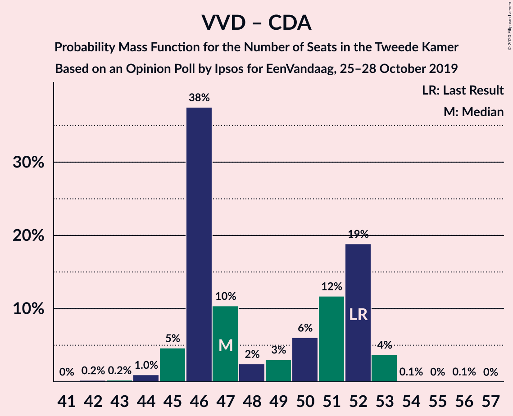

| Number of Seats | Probability | Accumulated | Special Marks |
|:---------------:|:-----------:|:-----------:|:-------------:|
| 41 | 0% | 100% |  |
| 42 | 0.2% | 99.9% |  |
| 43 | 0.2% | 99.7% |  |
| 44 | 1.0% | 99.5% |  |
| 45 | 5% | 98.5% |  |
| 46 | 38% | 94% | Median |
| 47 | 10% | 56% |  |
| 48 | 2% | 46% |  |
| 49 | 3% | 44% |  |
| 50 | 6% | 40% |  |
| 51 | 12% | 34% |  |
| 52 | 19% | 23% | Last Result |
| 53 | 4% | 4% |  |
| 54 | 0.1% | 0.2% |  |
| 55 | 0% | 0.1% |  |
| 56 | 0.1% | 0.1% |  |
| 57 | 0% | 0% |  |

### Christen-Democratisch Appèl – Partij van de Arbeid – Democraten 66

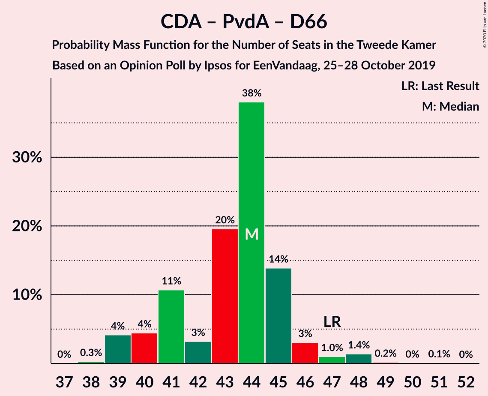

| Number of Seats | Probability | Accumulated | Special Marks |
|:---------------:|:-----------:|:-----------:|:-------------:|
| 37 | 0% | 100% |  |
| 38 | 0.3% | 99.9% |  |
| 39 | 4% | 99.7% |  |
| 40 | 4% | 96% |  |
| 41 | 11% | 91% |  |
| 42 | 3% | 80% | Median |
| 43 | 20% | 77% |  |
| 44 | 38% | 58% |  |
| 45 | 14% | 20% |  |
| 46 | 3% | 6% |  |
| 47 | 1.0% | 3% | Last Result |
| 48 | 1.4% | 2% |  |
| 49 | 0.2% | 0.3% |  |
| 50 | 0% | 0.1% |  |
| 51 | 0.1% | 0.1% |  |
| 52 | 0% | 0% |  |

### Christen-Democratisch Appèl – Partij van de Arbeid – ChristenUnie

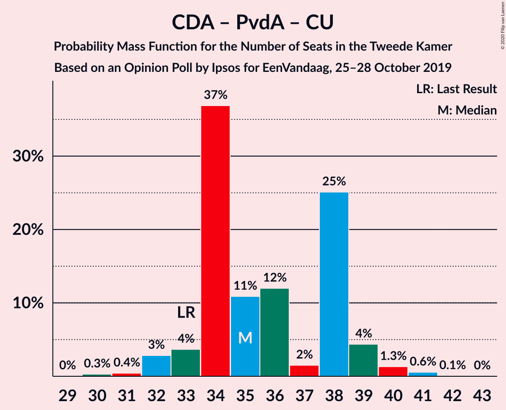

| Number of Seats | Probability | Accumulated | Special Marks |
|:---------------:|:-----------:|:-----------:|:-------------:|
| 29 | 0% | 100% |  |
| 30 | 0.3% | 99.9% |  |
| 31 | 0.4% | 99.7% |  |
| 32 | 3% | 99.2% |  |
| 33 | 4% | 96% | Last Result |
| 34 | 37% | 93% | Median |
| 35 | 11% | 56% |  |
| 36 | 12% | 45% |  |
| 37 | 2% | 33% |  |
| 38 | 25% | 31% |  |
| 39 | 4% | 6% |  |
| 40 | 1.3% | 2% |  |
| 41 | 0.6% | 0.7% |  |
| 42 | 0.1% | 0.1% |  |
| 43 | 0% | 0% |  |

### Christen-Democratisch Appèl – Partij van de Arbeid

| Number of Seats | Probability | Accumulated | Special Marks |
|:---------------:|:-----------:|:-----------:|:-------------:|
| 24 | 0.4% | 100% |  |
| 25 | 0.8% | 99.6% |  |
| 26 | 1.3% | 98.8% |  |
| 27 | 8% | 98% |  |
| 28 | 42% | 90% | Last Result, Median |
| 29 | 3% | 48% |  |
| 30 | 9% | 45% |  |
| 31 | 23% | 36% |  |
| 32 | 10% | 13% |  |
| 33 | 1.3% | 3% |  |
| 34 | 0.7% | 1.3% |  |
| 35 | 0.5% | 0.6% |  |
| 36 | 0% | 0.1% |  |
| 37 | 0% | 0% |  |

### Christen-Democratisch Appèl – Democraten 66

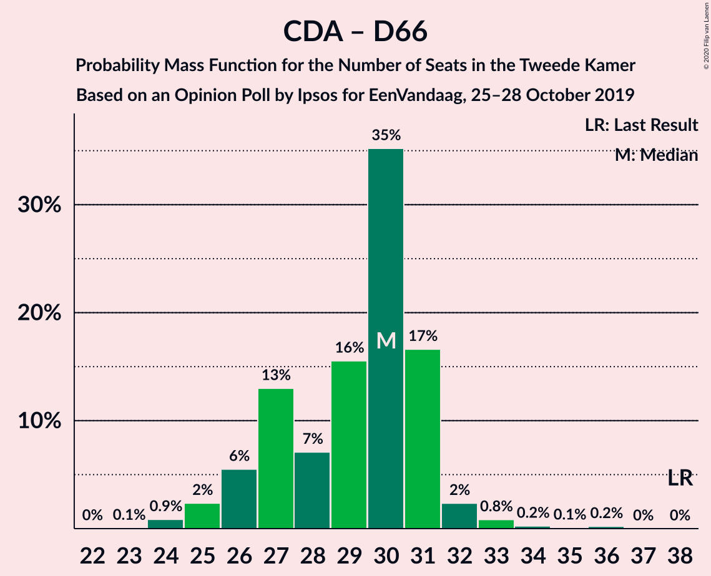

| Number of Seats | Probability | Accumulated | Special Marks |
|:---------------:|:-----------:|:-----------:|:-------------:|
| 23 | 0.1% | 100% |  |
| 24 | 0.9% | 99.9% |  |
| 25 | 2% | 99.1% |  |
| 26 | 6% | 97% |  |
| 27 | 13% | 91% |  |
| 28 | 7% | 78% | Median |
| 29 | 16% | 71% |  |
| 30 | 35% | 56% |  |
| 31 | 17% | 20% |  |
| 32 | 2% | 4% |  |
| 33 | 0.8% | 1.4% |  |
| 34 | 0.2% | 0.5% |  |
| 35 | 0.1% | 0.3% |  |
| 36 | 0.2% | 0.2% |  |
| 37 | 0% | 0% |  |
| 38 | 0% | 0% | Last Result |

## Technical Information

### Opinion Poll

+ **Polling firm:** Ipsos
+ **Commissioner(s):** EenVandaag
+ **Fieldwork period:** 25–28 October 2019

### Calculations

+ **Sample size:** 1019
+ **Simulations done:** 1,048,576
+ **Error estimate:** 2.62%

