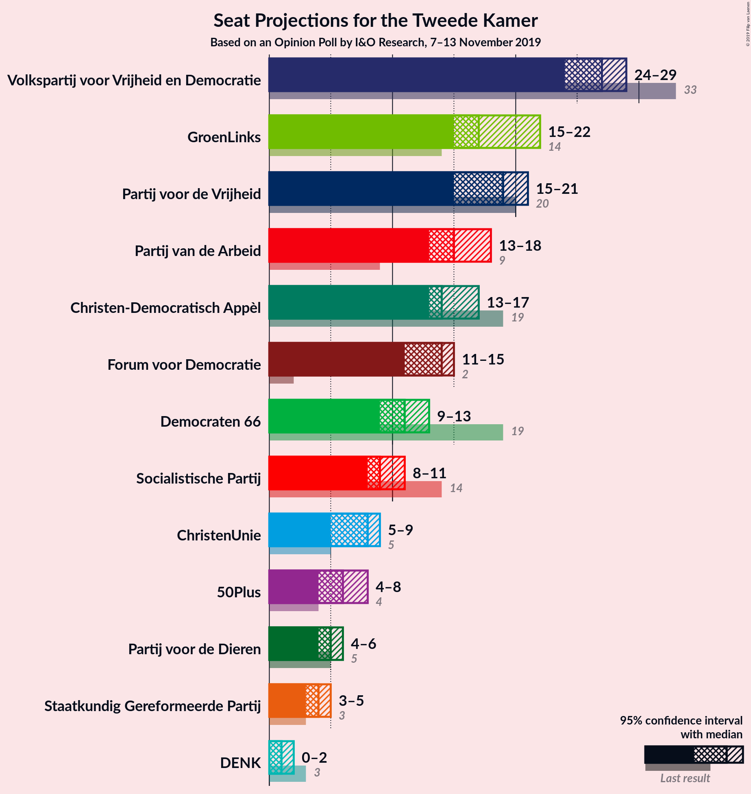
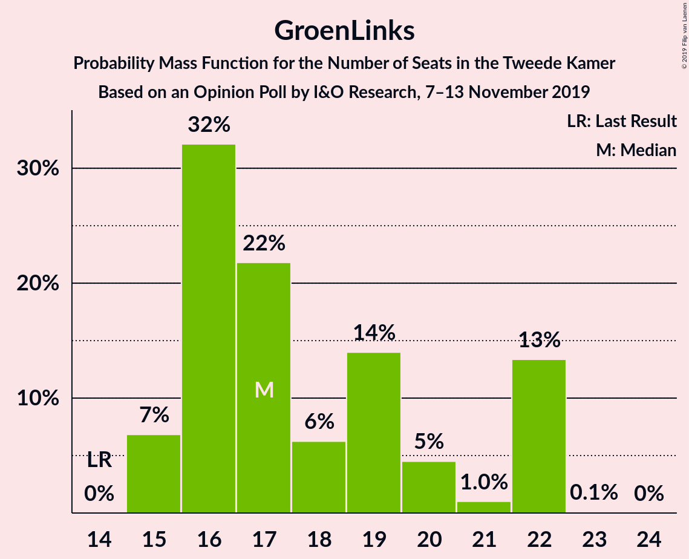
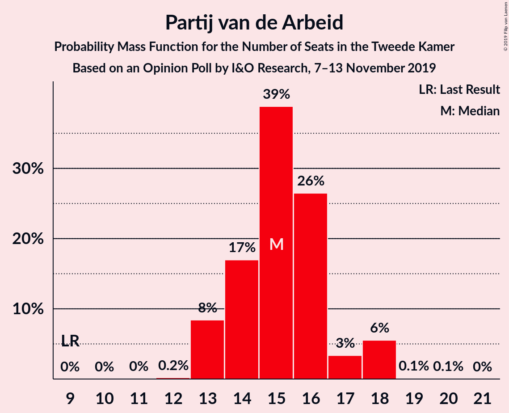
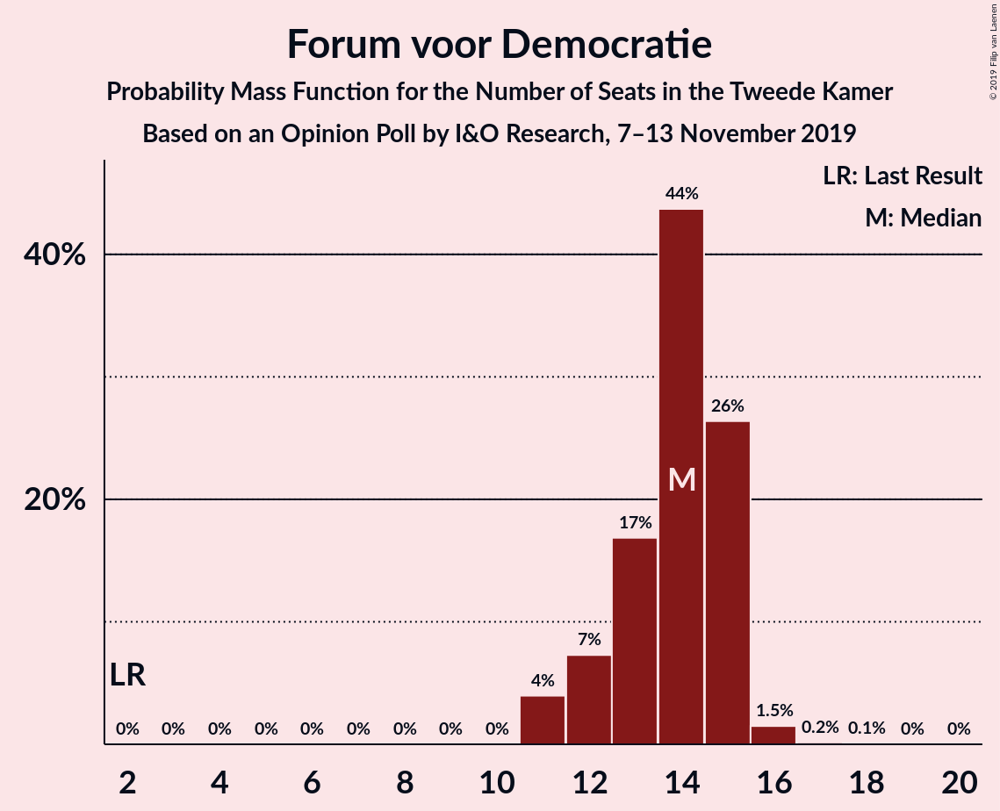
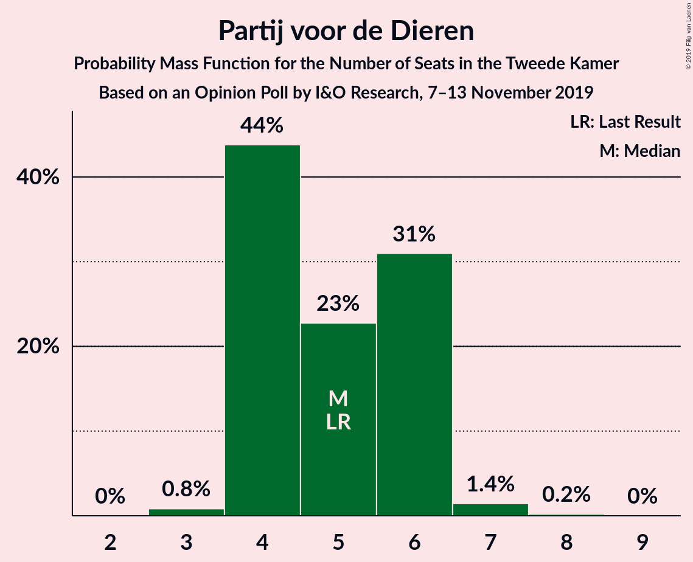
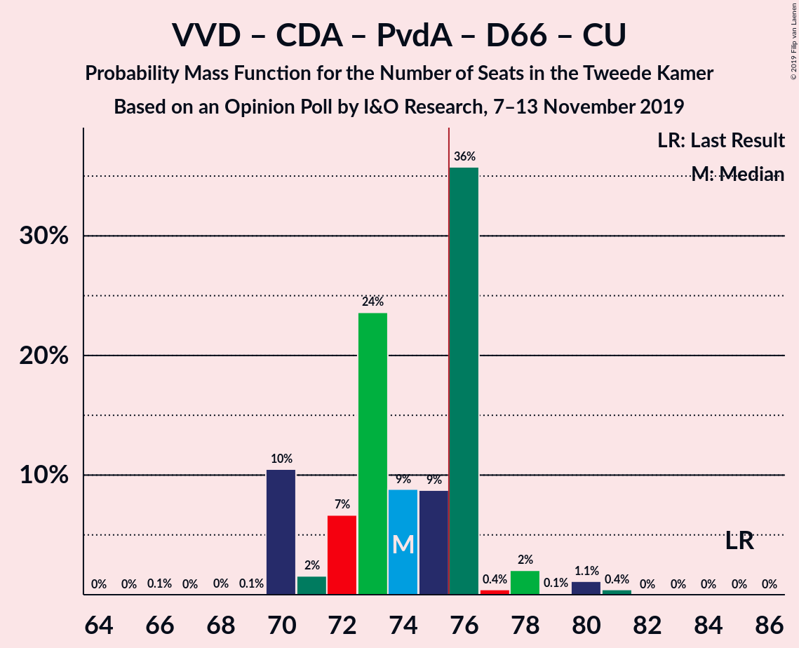
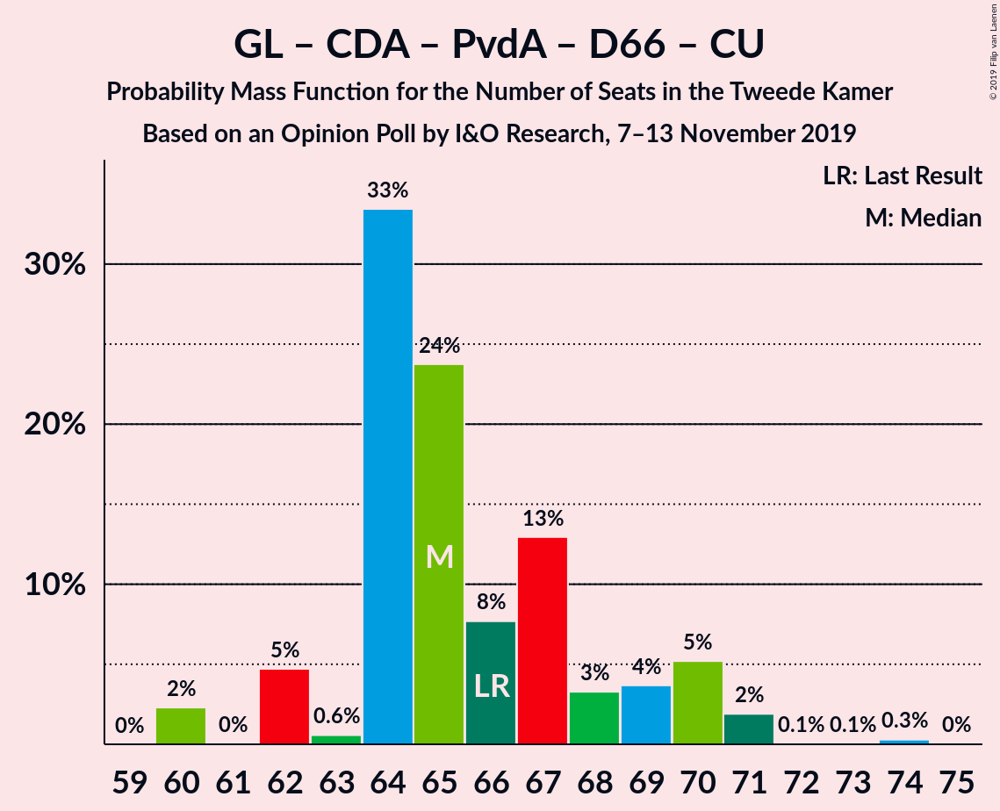
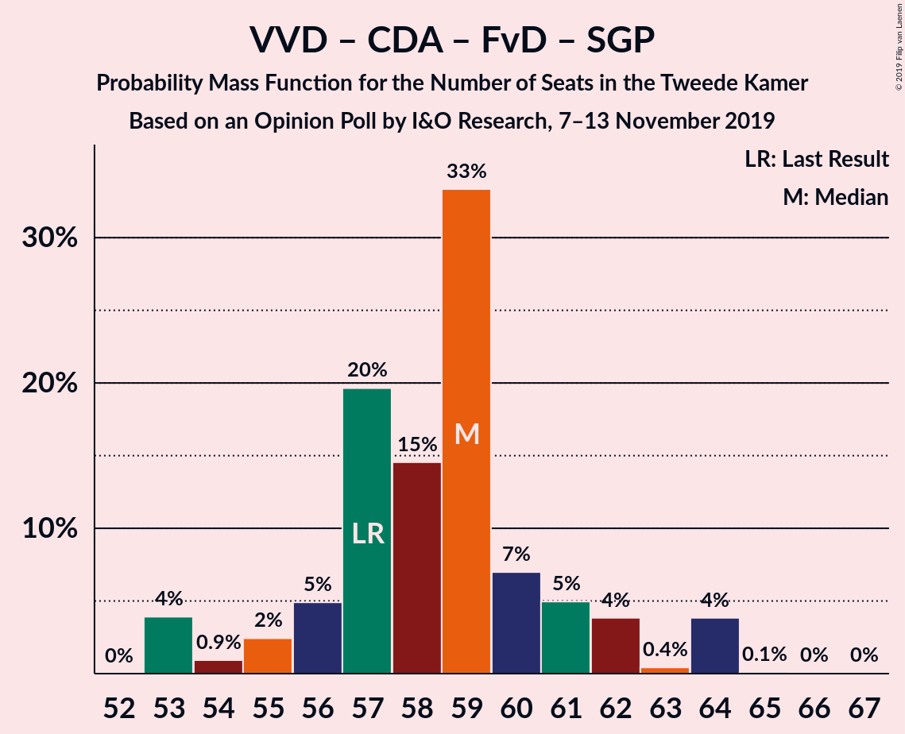
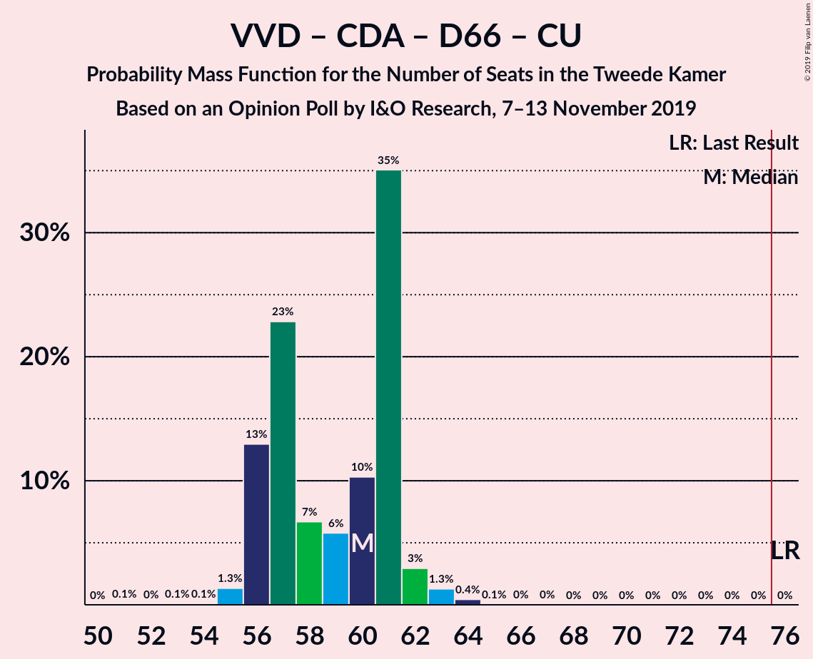

# Opinion Poll by I&O Research, 7–13 November 2019

<a href="#voting-intentions">Voting Intentions</a> | <a href="#seats">Seats</a> | <a href="#coalitions">Coalitions</a> | <a href="#technical-information">Technical Information</a>

## Voting Intentions

### Confidence Intervals

| Party | Last Result | Poll Result | 80% Confidence Interval | 90% Confidence Interval | 95% Confidence Interval | 99% Confidence Interval |
|:-----:|:-----------:|:-----------:|:-----------------------:|:-----------------------:|:-----------------------:|:-----------------------:|
| Volkspartij voor Vrijheid en Democratie | 21.3% | 17.0% | 15.8–18.4% |15.4–18.8% |15.1–19.1% |14.5–19.8% |
| GroenLinks | 9.1% | 12.1% | 11.0–13.3% |10.7–13.7% |10.5–14.0% |10.0–14.6% |
| Partij voor de Vrijheid | 13.1% | 11.9% | 10.8–13.1% |10.5–13.4% |10.2–13.7% |9.8–14.3% |
| Christen-Democratisch Appèl | 12.4% | 9.9% | 8.9–11.1% |8.7–11.4% |8.4–11.7% |8.0–12.2% |
| Partij van de Arbeid | 5.7% | 9.9% | 8.9–11.1% |8.7–11.4% |8.4–11.7% |8.0–12.2% |
| Forum voor Democratie | 1.8% | 9.2% | 8.2–10.3% |8.0–10.6% |7.7–10.9% |7.3–11.4% |
| Democraten 66 | 12.2% | 7.1% | 6.3–8.1% |6.0–8.4% |5.8–8.6% |5.5–9.1% |
| Socialistische Partij | 9.1% | 6.4% | 5.6–7.4% |5.4–7.6% |5.2–7.9% |4.9–8.4% |
| ChristenUnie | 3.4% | 4.9% | 4.2–5.8% |4.1–6.0% |3.9–6.2% |3.6–6.7% |
| 50Plus | 3.1% | 4.0% | 3.4–4.8% |3.2–5.0% |3.1–5.2% |2.8–5.6% |
| Partij voor de Dieren | 3.2% | 3.4% | 2.9–4.2% |2.7–4.4% |2.6–4.6% |2.3–4.9% |
| Staatkundig Gereformeerde Partij | 2.1% | 2.9% | 2.4–3.6% |2.3–3.8% |2.1–4.0% |1.9–4.3% |
| DENK | 2.1% | 0.9% | 0.6–1.3% |0.6–1.4% |0.5–1.6% |0.4–1.8% |

*Note:* The poll result column reflects the actual value used in the calculations. Published results may vary slightly, and in addition be rounded to fewer digits.

## Seats

### Confidence Intervals

| Party | Last Result | Median | 80% Confidence Interval | 90% Confidence Interval | 95% Confidence Interval | 99% Confidence Interval |
|:-----:|:-----------:|:------:|:-----------------------:|:-----------------------:|:-----------------------:|:-----------------------:|
| <a href="#volkspartij-voor-vrijheid-en-democratie">Volkspartij voor Vrijheid en Democratie</a> | 33 | 27 | 25–28 |24–29 |24–29 |23–30 |
| <a href="#groenlinks">GroenLinks</a> | 14 | 17 | 16–22 |15–22 |15–22 |15–22 |
| <a href="#partij-voor-de-vrijheid">Partij voor de Vrijheid</a> | 20 | 19 | 17–20 |16–20 |15–21 |15–22 |
| <a href="#christen-democratisch-appèl">Christen-Democratisch Appèl</a> | 19 | 14 | 13–16 |13–17 |13–17 |12–17 |
| <a href="#partij-van-de-arbeid">Partij van de Arbeid</a> | 9 | 15 | 14–16 |13–18 |13–18 |13–18 |
| <a href="#forum-voor-democratie">Forum voor Democratie</a> | 2 | 14 | 12–15 |12–15 |11–15 |11–16 |
| <a href="#democraten-66">Democraten 66</a> | 19 | 11 | 9–12 |9–12 |9–13 |9–13 |
| <a href="#socialistische-partij">Socialistische Partij</a> | 14 | 9 | 9–10 |8–11 |8–11 |8–12 |
| <a href="#christenunie">ChristenUnie</a> | 5 | 8 | 6–8 |6–8 |5–9 |5–9 |
| <a href="#50plus">50Plus</a> | 4 | 6 | 5–7 |5–7 |4–8 |4–8 |
| <a href="#partij-voor-de-dieren">Partij voor de Dieren</a> | 5 | 5 | 4–6 |4–6 |4–6 |3–7 |
| <a href="#staatkundig-gereformeerde-partij">Staatkundig Gereformeerde Partij</a> | 3 | 4 | 3–5 |3–5 |3–5 |3–6 |
| <a href="#denk">DENK</a> | 3 | 1 | 0–2 |0–2 |0–2 |0–2 |

### Volkspartij voor Vrijheid en Democratie

*For a full overview of the results for this party, see the [Volkspartij voor Vrijheid en Democratie](party-volkspartijvoorvrijheidendemocratie.html) page.*

| Number of Seats | Probability | Accumulated | Special Marks |
|:---------------:|:-----------:|:-----------:|:-------------:|
| 22 | 0.3% | 100% |  |
| 23 | 2% | 99.7% |  |
| 24 | 5% | 98% |  |
| 25 | 35% | 92% |  |
| 26 | 6% | 57% |  |
| 27 | 6% | 51% | Median |
| 28 | 39% | 45% |  |
| 29 | 5% | 6% |  |
| 30 | 1.2% | 1.3% |  |
| 31 | 0.1% | 0.1% |  |
| 32 | 0% | 0% |  |
| 33 | 0% | 0% | Last Result |

### GroenLinks

*For a full overview of the results for this party, see the [GroenLinks](party-groenlinks.html) page.*

| Number of Seats | Probability | Accumulated | Special Marks |
|:---------------:|:-----------:|:-----------:|:-------------:|
| 14 | 0% | 100% | Last Result |
| 15 | 7% | 100% |  |
| 16 | 32% | 93% |  |
| 17 | 22% | 61% | Median |
| 18 | 6% | 39% |  |
| 19 | 14% | 33% |  |
| 20 | 5% | 19% |  |
| 21 | 1.0% | 14% |  |
| 22 | 13% | 13% |  |
| 23 | 0.1% | 0.1% |  |
| 24 | 0% | 0% |  |

### Partij voor de Vrijheid

*For a full overview of the results for this party, see the [Partij voor de Vrijheid](party-partijvoordevrijheid.html) page.*

| Number of Seats | Probability | Accumulated | Special Marks |
|:---------------:|:-----------:|:-----------:|:-------------:|
| 14 | 0.1% | 100% |  |
| 15 | 4% | 99.9% |  |
| 16 | 2% | 95% |  |
| 17 | 7% | 93% |  |
| 18 | 8% | 87% |  |
| 19 | 42% | 78% | Median |
| 20 | 32% | 36% | Last Result |
| 21 | 2% | 4% |  |
| 22 | 2% | 2% |  |
| 23 | 0% | 0% |  |

### Christen-Democratisch Appèl

*For a full overview of the results for this party, see the [Christen-Democratisch Appèl](party-christen-democratischappèl.html) page.*

| Number of Seats | Probability | Accumulated | Special Marks |
|:---------------:|:-----------:|:-----------:|:-------------:|
| 12 | 2% | 100% |  |
| 13 | 38% | 98% |  |
| 14 | 31% | 60% | Median |
| 15 | 17% | 29% |  |
| 16 | 5% | 12% |  |
| 17 | 7% | 7% |  |
| 18 | 0.2% | 0.3% |  |
| 19 | 0% | 0.1% | Last Result |
| 20 | 0% | 0% |  |

### Partij van de Arbeid

*For a full overview of the results for this party, see the [Partij van de Arbeid](party-partijvandearbeid.html) page.*

| Number of Seats | Probability | Accumulated | Special Marks |
|:---------------:|:-----------:|:-----------:|:-------------:|
| 9 | 0% | 100% | Last Result |
| 10 | 0% | 100% |  |
| 11 | 0% | 100% |  |
| 12 | 0.2% | 100% |  |
| 13 | 8% | 99.8% |  |
| 14 | 17% | 91% |  |
| 15 | 39% | 74% | Median |
| 16 | 26% | 36% |  |
| 17 | 3% | 9% |  |
| 18 | 6% | 6% |  |
| 19 | 0.1% | 0.2% |  |
| 20 | 0.1% | 0.1% |  |
| 21 | 0% | 0% |  |

### Forum voor Democratie

*For a full overview of the results for this party, see the [Forum voor Democratie](party-forumvoordemocratie.html) page.*

| Number of Seats | Probability | Accumulated | Special Marks |
|:---------------:|:-----------:|:-----------:|:-------------:|
| 2 | 0% | 100% | Last Result |
| 3 | 0% | 100% |  |
| 4 | 0% | 100% |  |
| 5 | 0% | 100% |  |
| 6 | 0% | 100% |  |
| 7 | 0% | 100% |  |
| 8 | 0% | 100% |  |
| 9 | 0% | 100% |  |
| 10 | 0% | 100% |  |
| 11 | 4% | 100% |  |
| 12 | 7% | 96% |  |
| 13 | 17% | 89% |  |
| 14 | 44% | 72% | Median |
| 15 | 26% | 28% |  |
| 16 | 1.5% | 2% |  |
| 17 | 0.2% | 0.2% |  |
| 18 | 0.1% | 0.1% |  |
| 19 | 0% | 0% |  |

### Democraten 66

*For a full overview of the results for this party, see the [Democraten 66](party-democraten66.html) page.*

| Number of Seats | Probability | Accumulated | Special Marks |
|:---------------:|:-----------:|:-----------:|:-------------:|
| 8 | 0.2% | 100% |  |
| 9 | 18% | 99.8% |  |
| 10 | 8% | 82% |  |
| 11 | 35% | 74% | Median |
| 12 | 34% | 38% |  |
| 13 | 4% | 4% |  |
| 14 | 0.1% | 0.1% |  |
| 15 | 0% | 0% |  |
| 16 | 0% | 0% |  |
| 17 | 0% | 0% |  |
| 18 | 0% | 0% |  |
| 19 | 0% | 0% | Last Result |

### Socialistische Partij

*For a full overview of the results for this party, see the [Socialistische Partij](party-socialistischepartij.html) page.*

| Number of Seats | Probability | Accumulated | Special Marks |
|:---------------:|:-----------:|:-----------:|:-------------:|
| 7 | 0.1% | 100% |  |
| 8 | 6% | 99.9% |  |
| 9 | 54% | 94% | Median |
| 10 | 32% | 40% |  |
| 11 | 7% | 8% |  |
| 12 | 0.6% | 0.7% |  |
| 13 | 0.1% | 0.1% |  |
| 14 | 0% | 0% | Last Result |

### ChristenUnie

*For a full overview of the results for this party, see the [ChristenUnie](party-christenunie.html) page.*

| Number of Seats | Probability | Accumulated | Special Marks |
|:---------------:|:-----------:|:-----------:|:-------------:|
| 5 | 4% | 100% | Last Result |
| 6 | 7% | 96% |  |
| 7 | 34% | 89% |  |
| 8 | 53% | 55% | Median |
| 9 | 2% | 3% |  |
| 10 | 0.1% | 0.2% |  |
| 11 | 0% | 0% |  |

### 50Plus

*For a full overview of the results for this party, see the [50Plus](party-50plus.html) page.*

| Number of Seats | Probability | Accumulated | Special Marks |
|:---------------:|:-----------:|:-----------:|:-------------:|
| 3 | 0.1% | 100% |  |
| 4 | 3% | 99.9% | Last Result |
| 5 | 31% | 97% |  |
| 6 | 55% | 66% | Median |
| 7 | 6% | 11% |  |
| 8 | 5% | 5% |  |
| 9 | 0% | 0% |  |

### Partij voor de Dieren

*For a full overview of the results for this party, see the [Partij voor de Dieren](party-partijvoordedieren.html) page.*

| Number of Seats | Probability | Accumulated | Special Marks |
|:---------------:|:-----------:|:-----------:|:-------------:|
| 3 | 0.8% | 100% |  |
| 4 | 44% | 99.2% |  |
| 5 | 23% | 55% | Last Result, Median |
| 6 | 31% | 33% |  |
| 7 | 1.4% | 2% |  |
| 8 | 0.2% | 0.2% |  |
| 9 | 0% | 0% |  |

### Staatkundig Gereformeerde Partij

*For a full overview of the results for this party, see the [Staatkundig Gereformeerde Partij](party-staatkundiggereformeerdepartij.html) page.*

| Number of Seats | Probability | Accumulated | Special Marks |
|:---------------:|:-----------:|:-----------:|:-------------:|
| 2 | 0.1% | 100% |  |
| 3 | 24% | 99.9% | Last Result |
| 4 | 54% | 76% | Median |
| 5 | 21% | 22% |  |
| 6 | 1.5% | 2% |  |
| 7 | 0% | 0% |  |

### DENK

*For a full overview of the results for this party, see the [DENK](party-denk.html) page.*

| Number of Seats | Probability | Accumulated | Special Marks |
|:---------------:|:-----------:|:-----------:|:-------------:|
| 0 | 16% | 100% |  |
| 1 | 48% | 84% | Median |
| 2 | 35% | 36% |  |
| 3 | 0.4% | 0.4% | Last Result |
| 4 | 0% | 0% |  |

## Coalitions

### Confidence Intervals

| Coalition | Last Result | Median | Majority? | 80% Confidence Interval | 90% Confidence Interval | 95% Confidence Interval | 99% Confidence Interval |
|:---------:|:-----------:|:------:|:---------:|:-----------------------:|:-----------------------:|:-----------------------:|:-----------------------:|
| Volkspartij voor Vrijheid en Democratie – Partij voor de Vrijheid – Christen-Democratisch Appèl – Forum voor Democratie – Staatkundig Gereformeerde Partij | 77 | 78 | 87% | 75–80 | 72–81 | 71–82 | 71–82 |
| Volkspartij voor Vrijheid en Democratie – GroenLinks – Christen-Democratisch Appèl – Democraten 66 – ChristenUnie | 90 | 77 | 68% | 74–80 | 74–80 | 74–81 | 73–81 |
| GroenLinks – Christen-Democratisch Appèl – Partij van de Arbeid – Democraten 66 – Socialistische Partij – ChristenUnie | 80 | 75 | 34% | 73–78 | 73–79 | 70–80 | 70–81 |
| Volkspartij voor Vrijheid en Democratie – Christen-Democratisch Appèl – Partij van de Arbeid – Democraten 66 – ChristenUnie | 85 | 74 | 40% | 70–76 | 70–76 | 70–78 | 70–80 |
| Volkspartij voor Vrijheid en Democratie – Partij voor de Vrijheid – Christen-Democratisch Appèl – Forum voor Democratie | 74 | 74 | 10% | 70–75 | 68–76 | 67–78 | 67–78 |
| GroenLinks – Christen-Democratisch Appèl – Partij van de Arbeid – Democraten 66 – ChristenUnie | 66 | 65 | 0% | 64–69 | 62–70 | 62–70 | 60–71 |
| Volkspartij voor Vrijheid en Democratie – Christen-Democratisch Appèl – Forum voor Democratie – 50Plus – Staatkundig Gereformeerde Partij | 61 | 65 | 0% | 61–67 | 60–70 | 59–70 | 59–70 |
| Volkspartij voor Vrijheid en Democratie – Christen-Democratisch Appèl – Forum voor Democratie – 50Plus | 58 | 61 | 0% | 57–63 | 56–65 | 55–65 | 55–65 |
| Volkspartij voor Vrijheid en Democratie – Christen-Democratisch Appèl – Forum voor Democratie – Staatkundig Gereformeerde Partij | 57 | 59 | 0% | 56–61 | 55–62 | 53–64 | 53–64 |
| Volkspartij voor Vrijheid en Democratie – Partij voor de Vrijheid – Christen-Democratisch Appèl | 72 | 60 | 0% | 58–62 | 56–62 | 56–63 | 54–63 |
| Volkspartij voor Vrijheid en Democratie – Christen-Democratisch Appèl – Democraten 66 – ChristenUnie | 76 | 60 | 0% | 56–61 | 56–61 | 56–62 | 55–64 |
| Volkspartij voor Vrijheid en Democratie – Christen-Democratisch Appèl – Partij van de Arbeid | 61 | 56 | 0% | 54–58 | 54–58 | 53–61 | 52–63 |
| Volkspartij voor Vrijheid en Democratie – Christen-Democratisch Appèl – Forum voor Democratie | 54 | 55 | 0% | 52–57 | 51–59 | 49–59 | 49–59 |
| Volkspartij voor Vrijheid en Democratie – Partij van de Arbeid – Democraten 66 | 61 | 53 | 0% | 48–55 | 48–55 | 47–55 | 47–57 |
| Volkspartij voor Vrijheid en Democratie – Christen-Democratisch Appèl – Democraten 66 | 71 | 52 | 0% | 49–53 | 49–54 | 49–54 | 48–56 |
| Volkspartij voor Vrijheid en Democratie – Partij van de Arbeid | 42 | 42 | 0% | 39–43 | 39–44 | 38–46 | 36–47 |
| Volkspartij voor Vrijheid en Democratie – Christen-Democratisch Appèl | 52 | 41 | 0% | 39–43 | 38–45 | 38–45 | 38–46 |
| Christen-Democratisch Appèl – Partij van de Arbeid – Democraten 66 | 47 | 40 | 0% | 38–42 | 38–43 | 38–44 | 37–45 |
| Christen-Democratisch Appèl – Partij van de Arbeid – ChristenUnie | 33 | 36 | 0% | 36–39 | 34–39 | 34–41 | 33–41 |
| Christen-Democratisch Appèl – Partij van de Arbeid | 28 | 29 | 0% | 28–31 | 28–32 | 27–33 | 26–35 |
| Christen-Democratisch Appèl – Democraten 66 | 38 | 25 | 0% | 24–26 | 24–27 | 23–28 | 22–28 |

### Volkspartij voor Vrijheid en Democratie – Partij voor de Vrijheid – Christen-Democratisch Appèl – Forum voor Democratie – Staatkundig Gereformeerde Partij

| Number of Seats | Probability | Accumulated | Special Marks |
|:---------------:|:-----------:|:-----------:|:-------------:|
| 70 | 0.3% | 100% |  |
| 71 | 4% | 99.7% |  |
| 72 | 0.9% | 96% |  |
| 73 | 4% | 95% |  |
| 74 | 0.7% | 91% |  |
| 75 | 4% | 90% |  |
| 76 | 6% | 87% | Majority |
| 77 | 18% | 81% | Last Result |
| 78 | 47% | 63% | Median |
| 79 | 4% | 15% |  |
| 80 | 3% | 11% |  |
| 81 | 5% | 8% |  |
| 82 | 3% | 3% |  |
| 83 | 0.1% | 0.1% |  |
| 84 | 0.1% | 0.1% |  |
| 85 | 0% | 0% |  |

### Volkspartij voor Vrijheid en Democratie – GroenLinks – Christen-Democratisch Appèl – Democraten 66 – ChristenUnie

| Number of Seats | Probability | Accumulated | Special Marks |
|:---------------:|:-----------:|:-----------:|:-------------:|
| 71 | 0.1% | 100% |  |
| 72 | 0% | 99.9% |  |
| 73 | 0.4% | 99.9% |  |
| 74 | 21% | 99.4% |  |
| 75 | 10% | 78% |  |
| 76 | 1.3% | 68% | Majority |
| 77 | 39% | 67% | Median |
| 78 | 13% | 28% |  |
| 79 | 4% | 15% |  |
| 80 | 6% | 11% |  |
| 81 | 5% | 5% |  |
| 82 | 0.2% | 0.4% |  |
| 83 | 0.1% | 0.2% |  |
| 84 | 0.1% | 0.1% |  |
| 85 | 0% | 0% |  |
| 86 | 0% | 0% |  |
| 87 | 0% | 0% |  |
| 88 | 0% | 0% |  |
| 89 | 0% | 0% |  |
| 90 | 0% | 0% | Last Result |

### GroenLinks – Christen-Democratisch Appèl – Partij van de Arbeid – Democraten 66 – Socialistische Partij – ChristenUnie

| Number of Seats | Probability | Accumulated | Special Marks |
|:---------------:|:-----------:|:-----------:|:-------------:|
| 70 | 3% | 100% |  |
| 71 | 0.7% | 97% |  |
| 72 | 0.2% | 97% |  |
| 73 | 37% | 96% |  |
| 74 | 3% | 59% | Median |
| 75 | 22% | 56% |  |
| 76 | 19% | 34% | Majority |
| 77 | 2% | 15% |  |
| 78 | 6% | 12% |  |
| 79 | 2% | 7% |  |
| 80 | 4% | 5% | Last Result |
| 81 | 0.5% | 1.0% |  |
| 82 | 0.2% | 0.5% |  |
| 83 | 0.3% | 0.3% |  |
| 84 | 0% | 0% |  |

### Volkspartij voor Vrijheid en Democratie – Christen-Democratisch Appèl – Partij van de Arbeid – Democraten 66 – ChristenUnie

| Number of Seats | Probability | Accumulated | Special Marks |
|:---------------:|:-----------:|:-----------:|:-------------:|
| 66 | 0.1% | 100% |  |
| 67 | 0% | 99.9% |  |
| 68 | 0% | 99.9% |  |
| 69 | 0.1% | 99.9% |  |
| 70 | 10% | 99.8% |  |
| 71 | 2% | 89% |  |
| 72 | 7% | 88% |  |
| 73 | 24% | 81% |  |
| 74 | 9% | 57% |  |
| 75 | 9% | 49% | Median |
| 76 | 36% | 40% | Majority |
| 77 | 0.4% | 4% |  |
| 78 | 2% | 4% |  |
| 79 | 0.1% | 2% |  |
| 80 | 1.1% | 2% |  |
| 81 | 0.4% | 0.4% |  |
| 82 | 0% | 0% |  |
| 83 | 0% | 0% |  |
| 84 | 0% | 0% |  |
| 85 | 0% | 0% | Last Result |

### Volkspartij voor Vrijheid en Democratie – Partij voor de Vrijheid – Christen-Democratisch Appèl – Forum voor Democratie

| Number of Seats | Probability | Accumulated | Special Marks |
|:---------------:|:-----------:|:-----------:|:-------------:|
| 66 | 0.3% | 100% |  |
| 67 | 4% | 99.7% |  |
| 68 | 2% | 96% |  |
| 69 | 1.2% | 94% |  |
| 70 | 3% | 93% |  |
| 71 | 4% | 89% |  |
| 72 | 5% | 86% |  |
| 73 | 12% | 80% |  |
| 74 | 53% | 69% | Last Result, Median |
| 75 | 6% | 16% |  |
| 76 | 5% | 10% | Majority |
| 77 | 1.1% | 4% |  |
| 78 | 3% | 3% |  |
| 79 | 0.2% | 0.2% |  |
| 80 | 0% | 0% |  |

### GroenLinks – Christen-Democratisch Appèl – Partij van de Arbeid – Democraten 66 – ChristenUnie

| Number of Seats | Probability | Accumulated | Special Marks |
|:---------------:|:-----------:|:-----------:|:-------------:|
| 60 | 2% | 100% |  |
| 61 | 0% | 98% |  |
| 62 | 5% | 98% |  |
| 63 | 0.6% | 93% |  |
| 64 | 33% | 92% |  |
| 65 | 24% | 59% | Median |
| 66 | 8% | 35% | Last Result |
| 67 | 13% | 27% |  |
| 68 | 3% | 14% |  |
| 69 | 4% | 11% |  |
| 70 | 5% | 8% |  |
| 71 | 2% | 2% |  |
| 72 | 0.1% | 0.4% |  |
| 73 | 0.1% | 0.4% |  |
| 74 | 0.3% | 0.3% |  |
| 75 | 0% | 0% |  |

### Volkspartij voor Vrijheid en Democratie – Christen-Democratisch Appèl – Forum voor Democratie – 50Plus – Staatkundig Gereformeerde Partij

| Number of Seats | Probability | Accumulated | Special Marks |
|:---------------:|:-----------:|:-----------:|:-------------:|
| 57 | 0.3% | 100% |  |
| 58 | 0% | 99.7% |  |
| 59 | 4% | 99.7% |  |
| 60 | 0.3% | 95% |  |
| 61 | 5% | 95% | Last Result |
| 62 | 19% | 90% |  |
| 63 | 3% | 71% |  |
| 64 | 15% | 68% |  |
| 65 | 33% | 53% | Median |
| 66 | 8% | 20% |  |
| 67 | 4% | 12% |  |
| 68 | 0.5% | 7% |  |
| 69 | 2% | 7% |  |
| 70 | 5% | 5% |  |
| 71 | 0% | 0.1% |  |
| 72 | 0% | 0.1% |  |
| 73 | 0% | 0% |  |

### Volkspartij voor Vrijheid en Democratie – Christen-Democratisch Appèl – Forum voor Democratie – 50Plus

| Number of Seats | Probability | Accumulated | Special Marks |
|:---------------:|:-----------:|:-----------:|:-------------:|
| 53 | 0.3% | 100% |  |
| 54 | 0% | 99.7% |  |
| 55 | 4% | 99.7% |  |
| 56 | 3% | 96% |  |
| 57 | 4% | 93% |  |
| 58 | 2% | 89% | Last Result |
| 59 | 29% | 87% |  |
| 60 | 5% | 58% |  |
| 61 | 32% | 53% | Median |
| 62 | 9% | 21% |  |
| 63 | 6% | 13% |  |
| 64 | 1.3% | 7% |  |
| 65 | 5% | 6% |  |
| 66 | 0.1% | 0.2% |  |
| 67 | 0.2% | 0.2% |  |
| 68 | 0% | 0% |  |

### Volkspartij voor Vrijheid en Democratie – Christen-Democratisch Appèl – Forum voor Democratie – Staatkundig Gereformeerde Partij

| Number of Seats | Probability | Accumulated | Special Marks |
|:---------------:|:-----------:|:-----------:|:-------------:|
| 53 | 4% | 100% |  |
| 54 | 0.9% | 96% |  |
| 55 | 2% | 95% |  |
| 56 | 5% | 93% |  |
| 57 | 20% | 88% | Last Result |
| 58 | 15% | 68% |  |
| 59 | 33% | 54% | Median |
| 60 | 7% | 20% |  |
| 61 | 5% | 13% |  |
| 62 | 4% | 8% |  |
| 63 | 0.4% | 4% |  |
| 64 | 4% | 4% |  |
| 65 | 0.1% | 0.2% |  |
| 66 | 0% | 0.1% |  |
| 67 | 0% | 0% |  |

### Volkspartij voor Vrijheid en Democratie – Partij voor de Vrijheid – Christen-Democratisch Appèl

| Number of Seats | Probability | Accumulated | Special Marks |
|:---------------:|:-----------:|:-----------:|:-------------:|
| 52 | 0.1% | 100% |  |
| 53 | 0% | 99.9% |  |
| 54 | 0.6% | 99.9% |  |
| 55 | 0.3% | 99.3% |  |
| 56 | 7% | 99.0% |  |
| 57 | 2% | 92% |  |
| 58 | 9% | 90% |  |
| 59 | 20% | 81% |  |
| 60 | 48% | 61% | Median |
| 61 | 0.9% | 14% |  |
| 62 | 8% | 13% |  |
| 63 | 4% | 4% |  |
| 64 | 0.1% | 0.1% |  |
| 65 | 0% | 0% |  |
| 66 | 0% | 0% |  |
| 67 | 0% | 0% |  |
| 68 | 0% | 0% |  |
| 69 | 0% | 0% |  |
| 70 | 0% | 0% |  |
| 71 | 0% | 0% |  |
| 72 | 0% | 0% | Last Result |

### Volkspartij voor Vrijheid en Democratie – Christen-Democratisch Appèl – Democraten 66 – ChristenUnie

| Number of Seats | Probability | Accumulated | Special Marks |
|:---------------:|:-----------:|:-----------:|:-------------:|
| 51 | 0.1% | 100% |  |
| 52 | 0% | 99.9% |  |
| 53 | 0.1% | 99.9% |  |
| 54 | 0.1% | 99.9% |  |
| 55 | 1.3% | 99.8% |  |
| 56 | 13% | 98% |  |
| 57 | 23% | 85% |  |
| 58 | 7% | 63% |  |
| 59 | 6% | 56% |  |
| 60 | 10% | 50% | Median |
| 61 | 35% | 40% |  |
| 62 | 3% | 5% |  |
| 63 | 1.3% | 2% |  |
| 64 | 0.4% | 0.5% |  |
| 65 | 0.1% | 0.1% |  |
| 66 | 0% | 0% |  |
| 67 | 0% | 0% |  |
| 68 | 0% | 0% |  |
| 69 | 0% | 0% |  |
| 70 | 0% | 0% |  |
| 71 | 0% | 0% |  |
| 72 | 0% | 0% |  |
| 73 | 0% | 0% |  |
| 74 | 0% | 0% |  |
| 75 | 0% | 0% |  |
| 76 | 0% | 0% | Last Result, Majority |

### Volkspartij voor Vrijheid en Democratie – Christen-Democratisch Appèl – Partij van de Arbeid

| Number of Seats | Probability | Accumulated | Special Marks |
|:---------------:|:-----------:|:-----------:|:-------------:|
| 49 | 0.1% | 100% |  |
| 50 | 0.1% | 99.9% |  |
| 51 | 0.3% | 99.9% |  |
| 52 | 1.1% | 99.6% |  |
| 53 | 3% | 98% |  |
| 54 | 12% | 96% |  |
| 55 | 28% | 84% |  |
| 56 | 41% | 55% | Median |
| 57 | 1.0% | 14% |  |
| 58 | 9% | 13% |  |
| 59 | 0.5% | 4% |  |
| 60 | 0.4% | 3% |  |
| 61 | 0.5% | 3% | Last Result |
| 62 | 0% | 2% |  |
| 63 | 2% | 2% |  |
| 64 | 0.1% | 0.1% |  |
| 65 | 0% | 0% |  |

### Volkspartij voor Vrijheid en Democratie – Christen-Democratisch Appèl – Forum voor Democratie

| Number of Seats | Probability | Accumulated | Special Marks |
|:---------------:|:-----------:|:-----------:|:-------------:|
| 49 | 4% | 100% |  |
| 50 | 0.2% | 96% |  |
| 51 | 3% | 96% |  |
| 52 | 6% | 92% |  |
| 53 | 12% | 87% |  |
| 54 | 22% | 75% | Last Result |
| 55 | 33% | 53% | Median |
| 56 | 7% | 20% |  |
| 57 | 7% | 13% |  |
| 58 | 0.6% | 6% |  |
| 59 | 5% | 5% |  |
| 60 | 0.1% | 0.3% |  |
| 61 | 0% | 0.2% |  |
| 62 | 0.2% | 0.2% |  |
| 63 | 0% | 0% |  |

### Volkspartij voor Vrijheid en Democratie – Partij van de Arbeid – Democraten 66

| Number of Seats | Probability | Accumulated | Special Marks |
|:---------------:|:-----------:|:-----------:|:-------------:|
| 46 | 0% | 100% |  |
| 47 | 4% | 99.9% |  |
| 48 | 10% | 96% |  |
| 49 | 0.5% | 86% |  |
| 50 | 4% | 85% |  |
| 51 | 0.5% | 81% |  |
| 52 | 27% | 80% |  |
| 53 | 7% | 53% | Median |
| 54 | 11% | 46% |  |
| 55 | 33% | 35% |  |
| 56 | 0.2% | 2% |  |
| 57 | 1.5% | 2% |  |
| 58 | 0% | 0% |  |
| 59 | 0% | 0% |  |
| 60 | 0% | 0% |  |
| 61 | 0% | 0% | Last Result |

### Volkspartij voor Vrijheid en Democratie – Christen-Democratisch Appèl – Democraten 66

| Number of Seats | Probability | Accumulated | Special Marks |
|:---------------:|:-----------:|:-----------:|:-------------:|
| 44 | 0.1% | 100% |  |
| 45 | 0% | 99.9% |  |
| 46 | 0% | 99.9% |  |
| 47 | 0% | 99.9% |  |
| 48 | 2% | 99.9% |  |
| 49 | 15% | 98% |  |
| 50 | 23% | 83% |  |
| 51 | 5% | 61% |  |
| 52 | 11% | 56% | Median |
| 53 | 37% | 45% |  |
| 54 | 6% | 8% |  |
| 55 | 0.5% | 2% |  |
| 56 | 1.3% | 2% |  |
| 57 | 0.2% | 0.2% |  |
| 58 | 0% | 0% |  |
| 59 | 0% | 0% |  |
| 60 | 0% | 0% |  |
| 61 | 0% | 0% |  |
| 62 | 0% | 0% |  |
| 63 | 0% | 0% |  |
| 64 | 0% | 0% |  |
| 65 | 0% | 0% |  |
| 66 | 0% | 0% |  |
| 67 | 0% | 0% |  |
| 68 | 0% | 0% |  |
| 69 | 0% | 0% |  |
| 70 | 0% | 0% |  |
| 71 | 0% | 0% | Last Result |

### Volkspartij voor Vrijheid en Democratie – Partij van de Arbeid

| Number of Seats | Probability | Accumulated | Special Marks |
|:---------------:|:-----------:|:-----------:|:-------------:|
| 35 | 0.2% | 100% |  |
| 36 | 1.2% | 99.8% |  |
| 37 | 0.1% | 98.7% |  |
| 38 | 3% | 98.5% |  |
| 39 | 10% | 95% |  |
| 40 | 5% | 85% |  |
| 41 | 30% | 80% |  |
| 42 | 5% | 50% | Last Result, Median |
| 43 | 38% | 45% |  |
| 44 | 4% | 7% |  |
| 45 | 0.2% | 3% |  |
| 46 | 1.4% | 3% |  |
| 47 | 1.1% | 1.2% |  |
| 48 | 0% | 0% |  |

### Volkspartij voor Vrijheid en Democratie – Christen-Democratisch Appèl

| Number of Seats | Probability | Accumulated | Special Marks |
|:---------------:|:-----------:|:-----------:|:-------------:|
| 34 | 0.1% | 100% |  |
| 35 | 0% | 99.9% |  |
| 36 | 0% | 99.9% |  |
| 37 | 0.4% | 99.9% |  |
| 38 | 5% | 99.5% |  |
| 39 | 24% | 94% |  |
| 40 | 17% | 70% |  |
| 41 | 38% | 53% | Median |
| 42 | 3% | 15% |  |
| 43 | 7% | 12% |  |
| 44 | 0.5% | 6% |  |
| 45 | 4% | 5% |  |
| 46 | 1.3% | 1.4% |  |
| 47 | 0.1% | 0.1% |  |
| 48 | 0% | 0% |  |
| 49 | 0% | 0% |  |
| 50 | 0% | 0% |  |
| 51 | 0% | 0% |  |
| 52 | 0% | 0% | Last Result |

### Christen-Democratisch Appèl – Partij van de Arbeid – Democraten 66

| Number of Seats | Probability | Accumulated | Special Marks |
|:---------------:|:-----------:|:-----------:|:-------------:|
| 35 | 0.1% | 100% |  |
| 36 | 0.1% | 99.9% |  |
| 37 | 0.5% | 99.9% |  |
| 38 | 14% | 99.3% |  |
| 39 | 13% | 85% |  |
| 40 | 36% | 72% | Median |
| 41 | 21% | 36% |  |
| 42 | 4% | 14% |  |
| 43 | 5% | 10% |  |
| 44 | 3% | 5% |  |
| 45 | 1.3% | 1.5% |  |
| 46 | 0.1% | 0.1% |  |
| 47 | 0.1% | 0.1% | Last Result |
| 48 | 0% | 0% |  |

### Christen-Democratisch Appèl – Partij van de Arbeid – ChristenUnie

| Number of Seats | Probability | Accumulated | Special Marks |
|:---------------:|:-----------:|:-----------:|:-------------:|
| 31 | 0% | 100% |  |
| 32 | 0.1% | 99.9% |  |
| 33 | 0.6% | 99.9% | Last Result |
| 34 | 4% | 99.3% |  |
| 35 | 4% | 95% |  |
| 36 | 47% | 91% |  |
| 37 | 25% | 43% | Median |
| 38 | 6% | 19% |  |
| 39 | 7% | 12% |  |
| 40 | 2% | 5% |  |
| 41 | 2% | 3% |  |
| 42 | 0.1% | 0.2% |  |
| 43 | 0% | 0.1% |  |
| 44 | 0.1% | 0.1% |  |
| 45 | 0% | 0% |  |

### Christen-Democratisch Appèl – Partij van de Arbeid

| Number of Seats | Probability | Accumulated | Special Marks |
|:---------------:|:-----------:|:-----------:|:-------------:|
| 25 | 0% | 100% |  |
| 26 | 2% | 99.9% |  |
| 27 | 0.7% | 98% |  |
| 28 | 39% | 97% | Last Result |
| 29 | 16% | 58% | Median |
| 30 | 26% | 42% |  |
| 31 | 9% | 16% |  |
| 32 | 3% | 7% |  |
| 33 | 3% | 4% |  |
| 34 | 0.4% | 2% |  |
| 35 | 1.0% | 1.1% |  |
| 36 | 0.1% | 0.1% |  |
| 37 | 0.1% | 0.1% |  |
| 38 | 0% | 0% |  |

### Christen-Democratisch Appèl – Democraten 66

| Number of Seats | Probability | Accumulated | Special Marks |
|:---------------:|:-----------:|:-----------:|:-------------:|
| 22 | 1.2% | 100% |  |
| 23 | 2% | 98.7% |  |
| 24 | 18% | 97% |  |
| 25 | 58% | 78% | Median |
| 26 | 11% | 20% |  |
| 27 | 6% | 9% |  |
| 28 | 3% | 3% |  |
| 29 | 0.1% | 0.2% |  |
| 30 | 0.1% | 0.1% |  |
| 31 | 0% | 0% |  |
| 32 | 0% | 0% |  |
| 33 | 0% | 0% |  |
| 34 | 0% | 0% |  |
| 35 | 0% | 0% |  |
| 36 | 0% | 0% |  |
| 37 | 0% | 0% |  |
| 38 | 0% | 0% | Last Result |

## Technical Information

### Opinion Poll

+ **Polling firm:** I&O Research
+ **Commissioner(s):** —
+ **Fieldwork period:** 7–13 November 2019

### Calculations

+ **Sample size:** 1339
+ **Simulations done:** 1,048,576
+ **Error estimate:** 1.16%

