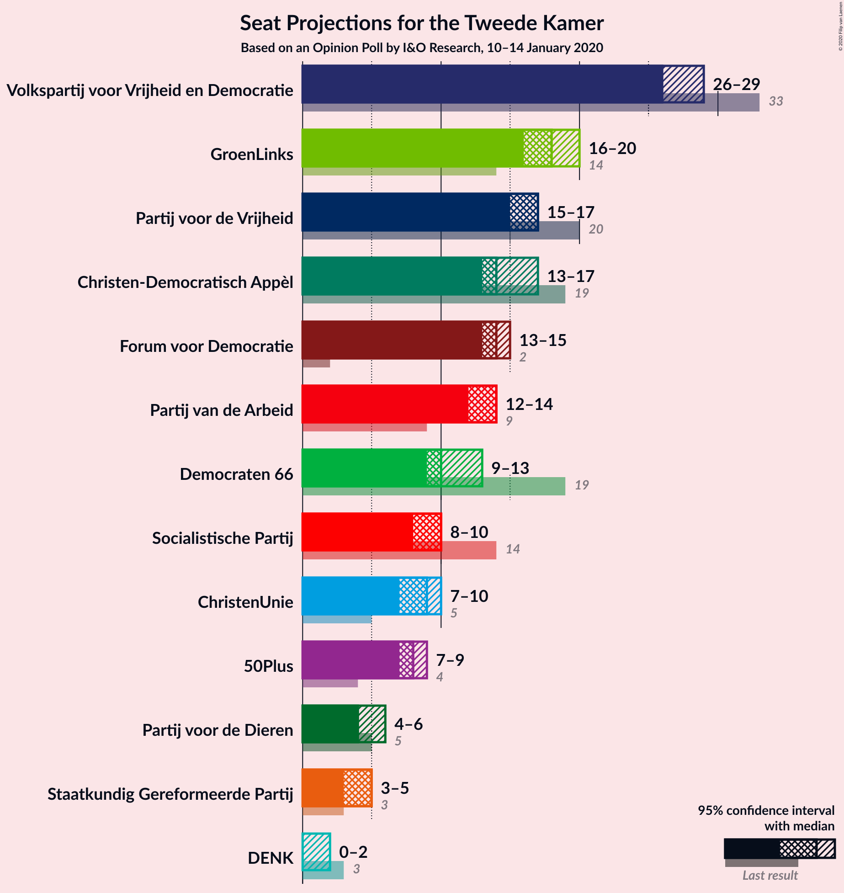
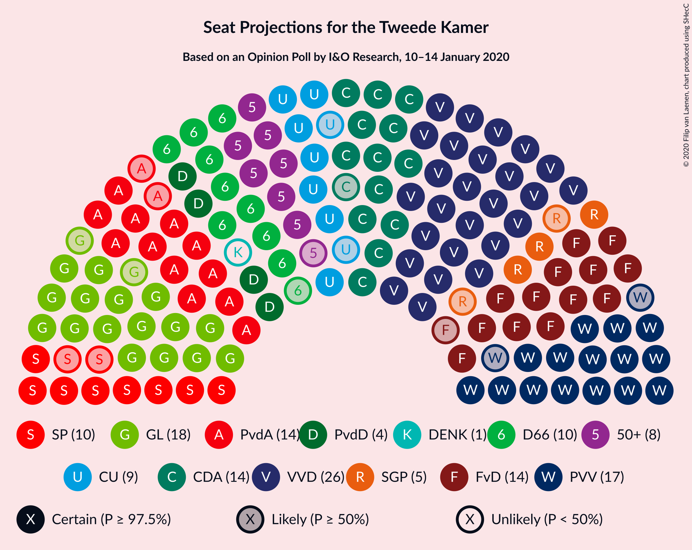
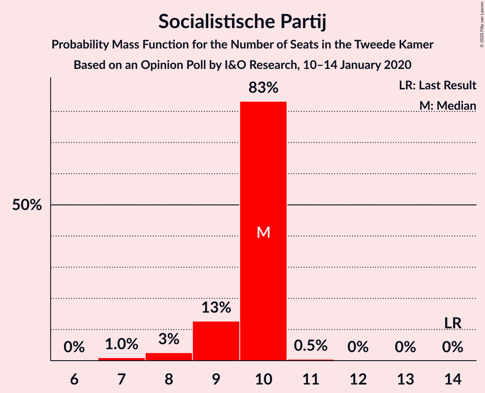
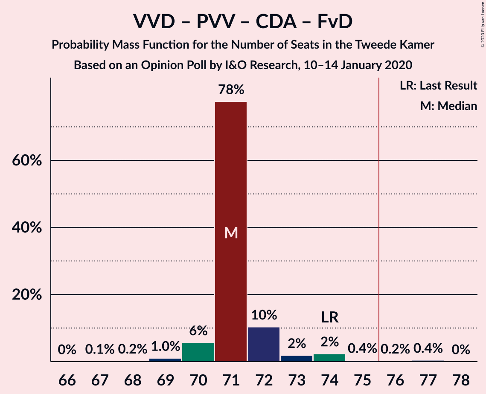
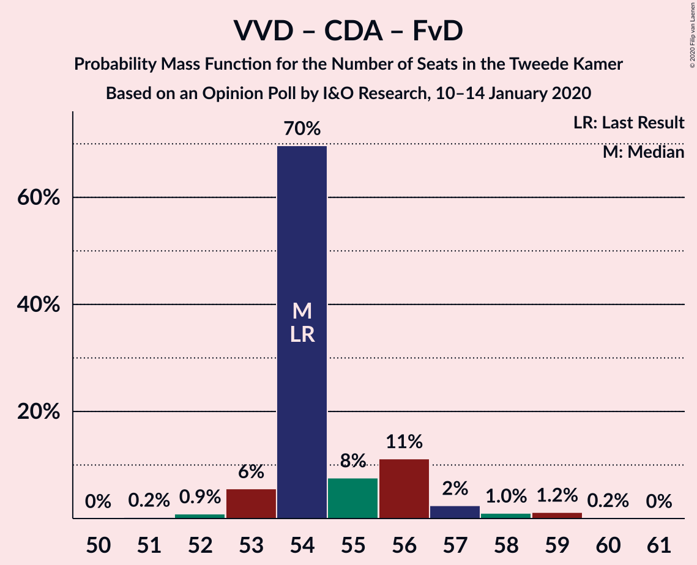
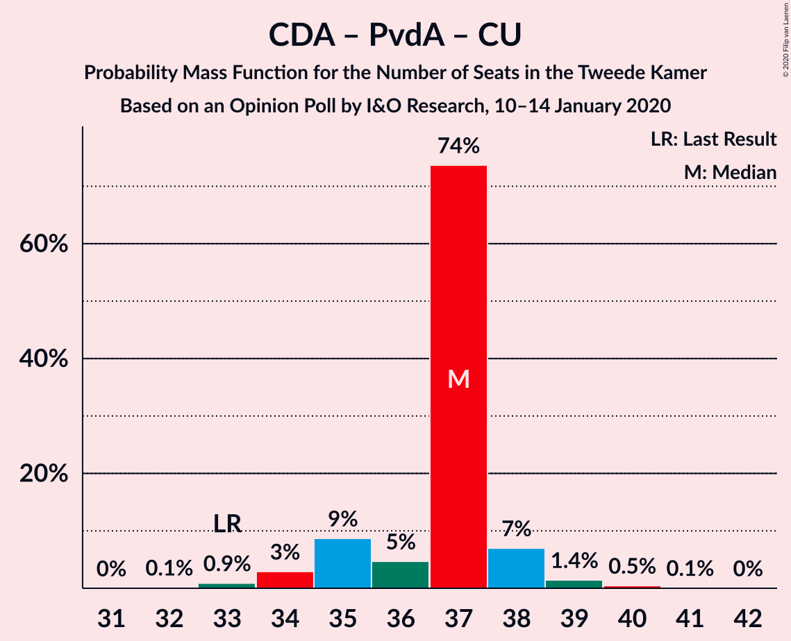

# Opinion Poll by I&O Research, 10–14 January 2020

<a href="#voting-intentions">Voting Intentions</a> | <a href="#seats">Seats</a> | <a href="#coalitions">Coalitions</a> | <a href="#technical-information">Technical Information</a>

## Voting Intentions

### Confidence Intervals

| Party | Last Result | Poll Result | 80% Confidence Interval | 90% Confidence Interval | 95% Confidence Interval | 99% Confidence Interval |
|:-----:|:-----------:|:-----------:|:-----------------------:|:-----------------------:|:-----------------------:|:-----------------------:|
| Volkspartij voor Vrijheid en Democratie | 21.3% | 17.6% | 16.6–18.7% |16.3–19.0% |16.1–19.3% |15.6–19.8% |
| GroenLinks | 9.1% | 11.8% | 11.0–12.7% |10.7–13.0% |10.5–13.2% |10.1–13.7% |
| Partij voor de Vrijheid | 13.1% | 10.7% | 9.9–11.6% |9.7–11.9% |9.5–12.1% |9.1–12.5% |
| Christen-Democratisch Appèl | 12.4% | 9.7% | 8.9–10.5% |8.7–10.8% |8.5–11.0% |8.2–11.4% |
| Forum voor Democratie | 1.8% | 9.2% | 8.4–10.0% |8.2–10.3% |8.0–10.5% |7.7–10.9% |
| Partij van de Arbeid | 5.7% | 8.8% | 8.0–9.6% |7.8–9.8% |7.7–10.0% |7.3–10.4% |
| Democraten 66 | 12.2% | 7.3% | 6.6–8.1% |6.4–8.3% |6.3–8.5% |6.0–8.8% |
| Socialistische Partij | 9.1% | 6.1% | 5.5–6.8% |5.3–7.0% |5.2–7.2% |4.9–7.5% |
| ChristenUnie | 3.4% | 5.8% | 5.2–6.5% |5.0–6.7% |4.9–6.9% |4.6–7.2% |
| 50Plus | 3.1% | 5.3% | 4.7–6.0% |4.6–6.2% |4.5–6.3% |4.2–6.7% |
| Partij voor de Dieren | 3.2% | 3.3% | 2.9–3.8% |2.7–4.0% |2.6–4.1% |2.4–4.4% |
| Staatkundig Gereformeerde Partij | 2.1% | 2.7% | 2.3–3.2% |2.2–3.3% |2.1–3.5% |1.9–3.7% |
| DENK | 2.1% | 0.9% | 0.7–1.2% |0.6–1.3% |0.6–1.4% |0.5–1.6% |

*Note:* The poll result column reflects the actual value used in the calculations. Published results may vary slightly, and in addition be rounded to fewer digits.

## Seats

### Confidence Intervals

| Party | Last Result | Median | 80% Confidence Interval | 90% Confidence Interval | 95% Confidence Interval | 99% Confidence Interval |
|:-----:|:-----------:|:------:|:-----------------------:|:-----------------------:|:-----------------------:|:-----------------------:|
| <a href="#volkspartij-voor-vrijheid-en-democratie">Volkspartij voor Vrijheid en Democratie</a> | 33 | 26 | 26 |26–28 |26–29 |25–30 |
| <a href="#groenlinks">GroenLinks</a> | 14 | 18 | 18–20 |17–20 |16–20 |15–20 |
| <a href="#partij-voor-de-vrijheid">Partij voor de Vrijheid</a> | 20 | 17 | 15–17 |15–17 |15–17 |14–19 |
| <a href="#christen-democratisch-appèl">Christen-Democratisch Appèl</a> | 19 | 14 | 14–15 |13–17 |13–17 |13–17 |
| <a href="#forum-voor-democratie">Forum voor Democratie</a> | 2 | 14 | 13–14 |13–15 |13–15 |11–16 |
| <a href="#partij-van-de-arbeid">Partij van de Arbeid</a> | 9 | 14 | 13–14 |12–14 |12–14 |11–15 |
| <a href="#democraten-66">Democraten 66</a> | 19 | 10 | 10–12 |9–13 |9–13 |9–13 |
| <a href="#socialistische-partij">Socialistische Partij</a> | 14 | 10 | 9–10 |9–10 |8–10 |7–11 |
| <a href="#christenunie">ChristenUnie</a> | 5 | 9 | 8–9 |8–9 |7–10 |7–11 |
| <a href="#50plus">50Plus</a> | 4 | 8 | 8 |7–8 |7–9 |6–10 |
| <a href="#partij-voor-de-dieren">Partij voor de Dieren</a> | 5 | 4 | 4–5 |4–5 |4–6 |4–6 |
| <a href="#staatkundig-gereformeerde-partij">Staatkundig Gereformeerde Partij</a> | 3 | 5 | 3–5 |3–5 |3–5 |3–5 |
| <a href="#denk">DENK</a> | 3 | 0 | 0–1 |0–1 |0–2 |0–2 |

### Volkspartij voor Vrijheid en Democratie

*For a full overview of the results for this party, see the [Volkspartij voor Vrijheid en Democratie](party-volkspartijvoorvrijheidendemocratie.html) page.*

| Number of Seats | Probability | Accumulated | Special Marks |
|:---------------:|:-----------:|:-----------:|:-------------:|
| 23 | 0.2% | 100% |  |
| 24 | 0.1% | 99.8% |  |
| 25 | 1.4% | 99.7% |  |
| 26 | 89% | 98% | Median |
| 27 | 4% | 9% |  |
| 28 | 3% | 6% |  |
| 29 | 2% | 3% |  |
| 30 | 0.6% | 0.7% |  |
| 31 | 0.1% | 0.1% |  |
| 32 | 0% | 0% |  |
| 33 | 0% | 0% | Last Result |

### GroenLinks

*For a full overview of the results for this party, see the [GroenLinks](party-groenlinks.html) page.*

| Number of Seats | Probability | Accumulated | Special Marks |
|:---------------:|:-----------:|:-----------:|:-------------:|
| 14 | 0% | 100% | Last Result |
| 15 | 0.7% | 100% |  |
| 16 | 3% | 99.3% |  |
| 17 | 6% | 97% |  |
| 18 | 79% | 91% | Median |
| 19 | 2% | 12% |  |
| 20 | 10% | 10% |  |
| 21 | 0.3% | 0.3% |  |
| 22 | 0% | 0% |  |

### Partij voor de Vrijheid

*For a full overview of the results for this party, see the [Partij voor de Vrijheid](party-partijvoordevrijheid.html) page.*

| Number of Seats | Probability | Accumulated | Special Marks |
|:---------------:|:-----------:|:-----------:|:-------------:|
| 13 | 0.1% | 100% |  |
| 14 | 0.8% | 99.9% |  |
| 15 | 10% | 99.1% |  |
| 16 | 4% | 89% |  |
| 17 | 83% | 85% | Median |
| 18 | 2% | 2% |  |
| 19 | 0.6% | 0.7% |  |
| 20 | 0.1% | 0.1% | Last Result |
| 21 | 0% | 0% |  |

### Christen-Democratisch Appèl

*For a full overview of the results for this party, see the [Christen-Democratisch Appèl](party-christen-democratischappèl.html) page.*

| Number of Seats | Probability | Accumulated | Special Marks |
|:---------------:|:-----------:|:-----------:|:-------------:|
| 12 | 0.3% | 100% |  |
| 13 | 8% | 99.7% |  |
| 14 | 71% | 91% | Median |
| 15 | 12% | 20% |  |
| 16 | 1.4% | 9% |  |
| 17 | 7% | 7% |  |
| 18 | 0% | 0.1% |  |
| 19 | 0% | 0% | Last Result |

### Forum voor Democratie

*For a full overview of the results for this party, see the [Forum voor Democratie](party-forumvoordemocratie.html) page.*

| Number of Seats | Probability | Accumulated | Special Marks |
|:---------------:|:-----------:|:-----------:|:-------------:|
| 2 | 0% | 100% | Last Result |
| 3 | 0% | 100% |  |
| 4 | 0% | 100% |  |
| 5 | 0% | 100% |  |
| 6 | 0% | 100% |  |
| 7 | 0% | 100% |  |
| 8 | 0% | 100% |  |
| 9 | 0% | 100% |  |
| 10 | 0% | 100% |  |
| 11 | 0.8% | 100% |  |
| 12 | 1.2% | 99.2% |  |
| 13 | 9% | 98% |  |
| 14 | 81% | 89% | Median |
| 15 | 6% | 8% |  |
| 16 | 2% | 2% |  |
| 17 | 0.1% | 0.1% |  |
| 18 | 0% | 0% |  |

### Partij van de Arbeid

*For a full overview of the results for this party, see the [Partij van de Arbeid](party-partijvandearbeid.html) page.*

| Number of Seats | Probability | Accumulated | Special Marks |
|:---------------:|:-----------:|:-----------:|:-------------:|
| 9 | 0% | 100% | Last Result |
| 10 | 0.1% | 100% |  |
| 11 | 2% | 99.9% |  |
| 12 | 6% | 98% |  |
| 13 | 14% | 92% |  |
| 14 | 76% | 78% | Median |
| 15 | 2% | 2% |  |
| 16 | 0.1% | 0.2% |  |
| 17 | 0% | 0% |  |

### Democraten 66

*For a full overview of the results for this party, see the [Democraten 66](party-democraten66.html) page.*

| Number of Seats | Probability | Accumulated | Special Marks |
|:---------------:|:-----------:|:-----------:|:-------------:|
| 9 | 6% | 100% |  |
| 10 | 71% | 94% | Median |
| 11 | 8% | 22% |  |
| 12 | 9% | 14% |  |
| 13 | 5% | 5% |  |
| 14 | 0.3% | 0.3% |  |
| 15 | 0% | 0% |  |
| 16 | 0% | 0% |  |
| 17 | 0% | 0% |  |
| 18 | 0% | 0% |  |
| 19 | 0% | 0% | Last Result |

### Socialistische Partij

*For a full overview of the results for this party, see the [Socialistische Partij](party-socialistischepartij.html) page.*

| Number of Seats | Probability | Accumulated | Special Marks |
|:---------------:|:-----------:|:-----------:|:-------------:|
| 7 | 1.0% | 100% |  |
| 8 | 3% | 99.0% |  |
| 9 | 13% | 96% |  |
| 10 | 83% | 84% | Median |
| 11 | 0.5% | 0.5% |  |
| 12 | 0% | 0% |  |
| 13 | 0% | 0% |  |
| 14 | 0% | 0% | Last Result |

### ChristenUnie

*For a full overview of the results for this party, see the [ChristenUnie](party-christenunie.html) page.*

| Number of Seats | Probability | Accumulated | Special Marks |
|:---------------:|:-----------:|:-----------:|:-------------:|
| 5 | 0% | 100% | Last Result |
| 6 | 0% | 100% |  |
| 7 | 3% | 100% |  |
| 8 | 18% | 97% |  |
| 9 | 74% | 78% | Median |
| 10 | 3% | 4% |  |
| 11 | 0.9% | 0.9% |  |
| 12 | 0% | 0% |  |

### 50Plus

*For a full overview of the results for this party, see the [50Plus](party-50plus.html) page.*

| Number of Seats | Probability | Accumulated | Special Marks |
|:---------------:|:-----------:|:-----------:|:-------------:|
| 4 | 0% | 100% | Last Result |
| 5 | 0% | 100% |  |
| 6 | 2% | 100% |  |
| 7 | 3% | 98% |  |
| 8 | 92% | 95% | Median |
| 9 | 2% | 3% |  |
| 10 | 1.0% | 1.0% |  |
| 11 | 0% | 0% |  |

### Partij voor de Dieren

*For a full overview of the results for this party, see the [Partij voor de Dieren](party-partijvoordedieren.html) page.*

| Number of Seats | Probability | Accumulated | Special Marks |
|:---------------:|:-----------:|:-----------:|:-------------:|
| 3 | 0.4% | 100% |  |
| 4 | 75% | 99.6% | Median |
| 5 | 21% | 24% | Last Result |
| 6 | 4% | 4% |  |
| 7 | 0% | 0% |  |

### Staatkundig Gereformeerde Partij

*For a full overview of the results for this party, see the [Staatkundig Gereformeerde Partij](party-staatkundiggereformeerdepartij.html) page.*

| Number of Seats | Probability | Accumulated | Special Marks |
|:---------------:|:-----------:|:-----------:|:-------------:|
| 2 | 0.2% | 100% |  |
| 3 | 14% | 99.8% | Last Result |
| 4 | 16% | 86% |  |
| 5 | 69% | 70% | Median |
| 6 | 0.1% | 0.1% |  |
| 7 | 0% | 0% |  |

### DENK

*For a full overview of the results for this party, see the [DENK](party-denk.html) page.*

| Number of Seats | Probability | Accumulated | Special Marks |
|:---------------:|:-----------:|:-----------:|:-------------:|
| 0 | 73% | 100% | Median |
| 1 | 24% | 27% |  |
| 2 | 3% | 3% |  |
| 3 | 0% | 0% | Last Result |

## Coalitions

### Confidence Intervals

| Coalition | Last Result | Median | Majority? | 80% Confidence Interval | 90% Confidence Interval | 95% Confidence Interval | 99% Confidence Interval |
|:---------:|:-----------:|:------:|:---------:|:-----------------------:|:-----------------------:|:-----------------------:|:-----------------------:|
| Volkspartij voor Vrijheid en Democratie – GroenLinks – Christen-Democratisch Appèl – Democraten 66 – ChristenUnie | 90 | 77 | 99.0% | 77–80 | 76–81 | 76–81 | 75–83 |
| GroenLinks – Christen-Democratisch Appèl – Partij van de Arbeid – Democraten 66 – Socialistische Partij – ChristenUnie | 80 | 75 | 13% | 74–76 | 73–78 | 71–78 | 70–78 |
| Volkspartij voor Vrijheid en Democratie – Partij voor de Vrijheid – Christen-Democratisch Appèl – Forum voor Democratie – Staatkundig Gereformeerde Partij | 77 | 76 | 79% | 74–76 | 74–77 | 74–77 | 73–80 |
| Volkspartij voor Vrijheid en Democratie – Christen-Democratisch Appèl – Partij van de Arbeid – Democraten 66 – ChristenUnie | 85 | 73 | 15% | 73–76 | 70–76 | 70–76 | 70–78 |
| Volkspartij voor Vrijheid en Democratie – Partij voor de Vrijheid – Christen-Democratisch Appèl – Forum voor Democratie | 74 | 71 | 0.6% | 71–72 | 70–73 | 70–74 | 69–76 |
| Volkspartij voor Vrijheid en Democratie – Christen-Democratisch Appèl – Forum voor Democratie – 50Plus – Staatkundig Gereformeerde Partij | 61 | 67 | 0% | 66–67 | 65–68 | 65–69 | 64–71 |
| GroenLinks – Christen-Democratisch Appèl – Partij van de Arbeid – Democraten 66 – ChristenUnie | 66 | 65 | 0% | 64–67 | 64–68 | 62–68 | 62–68 |
| Volkspartij voor Vrijheid en Democratie – Christen-Democratisch Appèl – Forum voor Democratie – 50Plus | 58 | 62 | 0% | 62–64 | 61–64 | 61–65 | 61–67 |
| Volkspartij voor Vrijheid en Democratie – Christen-Democratisch Appèl – Democraten 66 – ChristenUnie | 76 | 59 | 0% | 59–63 | 56–63 | 56–63 | 56–64 |
| Volkspartij voor Vrijheid en Democratie – Christen-Democratisch Appèl – Forum voor Democratie – Staatkundig Gereformeerde Partij | 57 | 59 | 0% | 58–59 | 57–60 | 57–62 | 56–63 |
| Volkspartij voor Vrijheid en Democratie – Partij voor de Vrijheid – Christen-Democratisch Appèl | 72 | 57 | 0% | 57–58 | 56–58 | 56–60 | 55–61 |
| Volkspartij voor Vrijheid en Democratie – Christen-Democratisch Appèl – Forum voor Democratie | 54 | 54 | 0% | 54–56 | 53–56 | 53–57 | 52–59 |
| Volkspartij voor Vrijheid en Democratie – Christen-Democratisch Appèl – Partij van de Arbeid | 61 | 54 | 0% | 53–56 | 53–56 | 52–57 | 52–58 |
| Volkspartij voor Vrijheid en Democratie – Christen-Democratisch Appèl – Democraten 66 | 71 | 50 | 0% | 50–54 | 48–55 | 48–55 | 48–56 |
| Volkspartij voor Vrijheid en Democratie – Partij van de Arbeid – Democraten 66 | 61 | 50 | 0% | 49–51 | 49–52 | 49–53 | 48–55 |
| Volkspartij voor Vrijheid en Democratie – Christen-Democratisch Appèl | 52 | 40 | 0% | 40–43 | 39–43 | 39–44 | 39–45 |
| Volkspartij voor Vrijheid en Democratie – Partij van de Arbeid | 42 | 40 | 0% | 39–40 | 38–41 | 37–42 | 37–44 |
| Christen-Democratisch Appèl – Partij van de Arbeid – Democraten 66 | 47 | 38 | 0% | 37–41 | 36–42 | 36–42 | 36–43 |
| Christen-Democratisch Appèl – Partij van de Arbeid – ChristenUnie | 33 | 37 | 0% | 35–37 | 35–38 | 34–38 | 33–40 |
| Christen-Democratisch Appèl – Partij van de Arbeid | 28 | 28 | 0% | 27–28 | 27–30 | 26–30 | 25–31 |
| Christen-Democratisch Appèl – Democraten 66 | 38 | 24 | 0% | 24–28 | 22–29 | 22–29 | 22–29 |

### Volkspartij voor Vrijheid en Democratie – GroenLinks – Christen-Democratisch Appèl – Democraten 66 – ChristenUnie

| Number of Seats | Probability | Accumulated | Special Marks |
|:---------------:|:-----------:|:-----------:|:-------------:|
| 74 | 0.2% | 100% |  |
| 75 | 0.8% | 99.8% |  |
| 76 | 6% | 99.0% | Majority |
| 77 | 70% | 93% | Median |
| 78 | 1.2% | 23% |  |
| 79 | 5% | 22% |  |
| 80 | 7% | 17% |  |
| 81 | 8% | 10% |  |
| 82 | 1.3% | 2% |  |
| 83 | 0.3% | 0.6% |  |
| 84 | 0.3% | 0.3% |  |
| 85 | 0% | 0% |  |
| 86 | 0% | 0% |  |
| 87 | 0% | 0% |  |
| 88 | 0% | 0% |  |
| 89 | 0% | 0% |  |
| 90 | 0% | 0% | Last Result |

### GroenLinks – Christen-Democratisch Appèl – Partij van de Arbeid – Democraten 66 – Socialistische Partij – ChristenUnie

| Number of Seats | Probability | Accumulated | Special Marks |
|:---------------:|:-----------:|:-----------:|:-------------:|
| 69 | 0.2% | 100% |  |
| 70 | 0.7% | 99.8% |  |
| 71 | 2% | 99.1% |  |
| 72 | 0.4% | 97% |  |
| 73 | 2% | 96% |  |
| 74 | 10% | 95% |  |
| 75 | 72% | 85% | Median |
| 76 | 5% | 13% | Majority |
| 77 | 1.3% | 8% |  |
| 78 | 7% | 7% |  |
| 79 | 0.1% | 0.2% |  |
| 80 | 0% | 0% | Last Result |

### Volkspartij voor Vrijheid en Democratie – Partij voor de Vrijheid – Christen-Democratisch Appèl – Forum voor Democratie – Staatkundig Gereformeerde Partij

| Number of Seats | Probability | Accumulated | Special Marks |
|:---------------:|:-----------:|:-----------:|:-------------:|
| 71 | 0.2% | 100% |  |
| 72 | 0.2% | 99.8% |  |
| 73 | 1.3% | 99.6% |  |
| 74 | 12% | 98% |  |
| 75 | 7% | 86% |  |
| 76 | 73% | 79% | Median, Majority |
| 77 | 4% | 6% | Last Result |
| 78 | 0.4% | 2% |  |
| 79 | 0.8% | 1.3% |  |
| 80 | 0.1% | 0.6% |  |
| 81 | 0.5% | 0.5% |  |
| 82 | 0% | 0% |  |

### Volkspartij voor Vrijheid en Democratie – Christen-Democratisch Appèl – Partij van de Arbeid – Democraten 66 – ChristenUnie

| Number of Seats | Probability | Accumulated | Special Marks |
|:---------------:|:-----------:|:-----------:|:-------------:|
| 69 | 0.1% | 100% |  |
| 70 | 5% | 99.9% |  |
| 71 | 3% | 95% |  |
| 72 | 1.1% | 92% |  |
| 73 | 73% | 91% | Median |
| 74 | 1.4% | 17% |  |
| 75 | 1.4% | 16% |  |
| 76 | 12% | 15% | Majority |
| 77 | 2% | 2% |  |
| 78 | 0.4% | 0.8% |  |
| 79 | 0.3% | 0.4% |  |
| 80 | 0% | 0% |  |
| 81 | 0% | 0% |  |
| 82 | 0% | 0% |  |
| 83 | 0% | 0% |  |
| 84 | 0% | 0% |  |
| 85 | 0% | 0% | Last Result |

### Volkspartij voor Vrijheid en Democratie – Partij voor de Vrijheid – Christen-Democratisch Appèl – Forum voor Democratie

| Number of Seats | Probability | Accumulated | Special Marks |
|:---------------:|:-----------:|:-----------:|:-------------:|
| 67 | 0.1% | 100% |  |
| 68 | 0.2% | 99.9% |  |
| 69 | 1.0% | 99.7% |  |
| 70 | 6% | 98.7% |  |
| 71 | 78% | 93% | Median |
| 72 | 10% | 15% |  |
| 73 | 2% | 5% |  |
| 74 | 2% | 3% | Last Result |
| 75 | 0.4% | 1.0% |  |
| 76 | 0.2% | 0.6% | Majority |
| 77 | 0.4% | 0.4% |  |
| 78 | 0% | 0% |  |

### Volkspartij voor Vrijheid en Democratie – Christen-Democratisch Appèl – Forum voor Democratie – 50Plus – Staatkundig Gereformeerde Partij

| Number of Seats | Probability | Accumulated | Special Marks |
|:---------------:|:-----------:|:-----------:|:-------------:|
| 61 | 0% | 100% | Last Result |
| 62 | 0% | 100% |  |
| 63 | 0.2% | 100% |  |
| 64 | 0.3% | 99.8% |  |
| 65 | 7% | 99.5% |  |
| 66 | 8% | 93% |  |
| 67 | 77% | 85% | Median |
| 68 | 4% | 8% |  |
| 69 | 2% | 4% |  |
| 70 | 0.8% | 2% |  |
| 71 | 0.7% | 0.8% |  |
| 72 | 0% | 0.1% |  |
| 73 | 0% | 0% |  |

### GroenLinks – Christen-Democratisch Appèl – Partij van de Arbeid – Democraten 66 – ChristenUnie

| Number of Seats | Probability | Accumulated | Special Marks |
|:---------------:|:-----------:|:-----------:|:-------------:|
| 60 | 0.1% | 100% |  |
| 61 | 0.2% | 99.9% |  |
| 62 | 3% | 99.7% |  |
| 63 | 1.2% | 97% |  |
| 64 | 6% | 96% |  |
| 65 | 73% | 90% | Median |
| 66 | 3% | 17% | Last Result |
| 67 | 6% | 14% |  |
| 68 | 7% | 8% |  |
| 69 | 0.2% | 0.4% |  |
| 70 | 0.2% | 0.3% |  |
| 71 | 0% | 0% |  |

### Volkspartij voor Vrijheid en Democratie – Christen-Democratisch Appèl – Forum voor Democratie – 50Plus

| Number of Seats | Probability | Accumulated | Special Marks |
|:---------------:|:-----------:|:-----------:|:-------------:|
| 58 | 0% | 100% | Last Result |
| 59 | 0.1% | 100% |  |
| 60 | 0.3% | 99.9% |  |
| 61 | 6% | 99.6% |  |
| 62 | 70% | 93% | Median |
| 63 | 8% | 23% |  |
| 64 | 11% | 15% |  |
| 65 | 2% | 3% |  |
| 66 | 0.5% | 1.1% |  |
| 67 | 0.4% | 0.7% |  |
| 68 | 0.3% | 0.3% |  |
| 69 | 0% | 0% |  |

### Volkspartij voor Vrijheid en Democratie – Christen-Democratisch Appèl – Democraten 66 – ChristenUnie

| Number of Seats | Probability | Accumulated | Special Marks |
|:---------------:|:-----------:|:-----------:|:-------------:|
| 56 | 5% | 100% |  |
| 57 | 0.1% | 95% |  |
| 58 | 0.3% | 95% |  |
| 59 | 73% | 94% | Median |
| 60 | 1.4% | 21% |  |
| 61 | 2% | 20% |  |
| 62 | 3% | 17% |  |
| 63 | 12% | 14% |  |
| 64 | 2% | 2% |  |
| 65 | 0.2% | 0.3% |  |
| 66 | 0.1% | 0.1% |  |
| 67 | 0% | 0% |  |
| 68 | 0% | 0% |  |
| 69 | 0% | 0% |  |
| 70 | 0% | 0% |  |
| 71 | 0% | 0% |  |
| 72 | 0% | 0% |  |
| 73 | 0% | 0% |  |
| 74 | 0% | 0% |  |
| 75 | 0% | 0% |  |
| 76 | 0% | 0% | Last Result, Majority |

### Volkspartij voor Vrijheid en Democratie – Christen-Democratisch Appèl – Forum voor Democratie – Staatkundig Gereformeerde Partij

| Number of Seats | Probability | Accumulated | Special Marks |
|:---------------:|:-----------:|:-----------:|:-------------:|
| 54 | 0.1% | 100% |  |
| 55 | 0.1% | 99.9% |  |
| 56 | 1.2% | 99.8% |  |
| 57 | 6% | 98.5% | Last Result |
| 58 | 6% | 93% |  |
| 59 | 77% | 87% | Median |
| 60 | 6% | 10% |  |
| 61 | 1.0% | 4% |  |
| 62 | 2% | 3% |  |
| 63 | 1.0% | 1.2% |  |
| 64 | 0.2% | 0.2% |  |
| 65 | 0% | 0% |  |

### Volkspartij voor Vrijheid en Democratie – Partij voor de Vrijheid – Christen-Democratisch Appèl

| Number of Seats | Probability | Accumulated | Special Marks |
|:---------------:|:-----------:|:-----------:|:-------------:|
| 54 | 0.2% | 100% |  |
| 55 | 0.4% | 99.8% |  |
| 56 | 7% | 99.5% |  |
| 57 | 73% | 92% | Median |
| 58 | 14% | 19% |  |
| 59 | 2% | 5% |  |
| 60 | 1.2% | 3% |  |
| 61 | 0.9% | 1.4% |  |
| 62 | 0.1% | 0.5% |  |
| 63 | 0.4% | 0.4% |  |
| 64 | 0% | 0% |  |
| 65 | 0% | 0% |  |
| 66 | 0% | 0% |  |
| 67 | 0% | 0% |  |
| 68 | 0% | 0% |  |
| 69 | 0% | 0% |  |
| 70 | 0% | 0% |  |
| 71 | 0% | 0% |  |
| 72 | 0% | 0% | Last Result |

### Volkspartij voor Vrijheid en Democratie – Christen-Democratisch Appèl – Forum voor Democratie

| Number of Seats | Probability | Accumulated | Special Marks |
|:---------------:|:-----------:|:-----------:|:-------------:|
| 51 | 0.2% | 100% |  |
| 52 | 0.9% | 99.7% |  |
| 53 | 6% | 98.9% |  |
| 54 | 70% | 93% | Last Result, Median |
| 55 | 8% | 24% |  |
| 56 | 11% | 16% |  |
| 57 | 2% | 5% |  |
| 58 | 1.0% | 2% |  |
| 59 | 1.2% | 1.4% |  |
| 60 | 0.2% | 0.2% |  |
| 61 | 0% | 0% |  |

### Volkspartij voor Vrijheid en Democratie – Christen-Democratisch Appèl – Partij van de Arbeid

| Number of Seats | Probability | Accumulated | Special Marks |
|:---------------:|:-----------:|:-----------:|:-------------:|
| 50 | 0% | 100% |  |
| 51 | 0.3% | 99.9% |  |
| 52 | 4% | 99.7% |  |
| 53 | 8% | 96% |  |
| 54 | 73% | 88% | Median |
| 55 | 3% | 14% |  |
| 56 | 8% | 11% |  |
| 57 | 1.1% | 3% |  |
| 58 | 1.3% | 2% |  |
| 59 | 0.1% | 0.3% |  |
| 60 | 0.2% | 0.2% |  |
| 61 | 0% | 0% | Last Result |

### Volkspartij voor Vrijheid en Democratie – Christen-Democratisch Appèl – Democraten 66

| Number of Seats | Probability | Accumulated | Special Marks |
|:---------------:|:-----------:|:-----------:|:-------------:|
| 48 | 5% | 100% |  |
| 49 | 0.3% | 95% |  |
| 50 | 68% | 94% | Median |
| 51 | 4% | 26% |  |
| 52 | 5% | 22% |  |
| 53 | 2% | 16% |  |
| 54 | 6% | 15% |  |
| 55 | 8% | 9% |  |
| 56 | 1.1% | 1.2% |  |
| 57 | 0.2% | 0.2% |  |
| 58 | 0% | 0% |  |
| 59 | 0% | 0% |  |
| 60 | 0% | 0% |  |
| 61 | 0% | 0% |  |
| 62 | 0% | 0% |  |
| 63 | 0% | 0% |  |
| 64 | 0% | 0% |  |
| 65 | 0% | 0% |  |
| 66 | 0% | 0% |  |
| 67 | 0% | 0% |  |
| 68 | 0% | 0% |  |
| 69 | 0% | 0% |  |
| 70 | 0% | 0% |  |
| 71 | 0% | 0% | Last Result |

### Volkspartij voor Vrijheid en Democratie – Partij van de Arbeid – Democraten 66

| Number of Seats | Probability | Accumulated | Special Marks |
|:---------------:|:-----------:|:-----------:|:-------------:|
| 47 | 0.1% | 100% |  |
| 48 | 2% | 99.8% |  |
| 49 | 9% | 98% |  |
| 50 | 71% | 90% | Median |
| 51 | 9% | 19% |  |
| 52 | 6% | 9% |  |
| 53 | 2% | 4% |  |
| 54 | 1.0% | 2% |  |
| 55 | 0.5% | 0.6% |  |
| 56 | 0% | 0% |  |
| 57 | 0% | 0% |  |
| 58 | 0% | 0% |  |
| 59 | 0% | 0% |  |
| 60 | 0% | 0% |  |
| 61 | 0% | 0% | Last Result |

### Volkspartij voor Vrijheid en Democratie – Christen-Democratisch Appèl

| Number of Seats | Probability | Accumulated | Special Marks |
|:---------------:|:-----------:|:-----------:|:-------------:|
| 38 | 0.3% | 100% |  |
| 39 | 5% | 99.6% |  |
| 40 | 70% | 94% | Median |
| 41 | 12% | 24% |  |
| 42 | 2% | 12% |  |
| 43 | 8% | 10% |  |
| 44 | 2% | 3% |  |
| 45 | 0.9% | 0.9% |  |
| 46 | 0% | 0% |  |
| 47 | 0% | 0% |  |
| 48 | 0% | 0% |  |
| 49 | 0% | 0% |  |
| 50 | 0% | 0% |  |
| 51 | 0% | 0% |  |
| 52 | 0% | 0% | Last Result |

### Volkspartij voor Vrijheid en Democratie – Partij van de Arbeid

| Number of Seats | Probability | Accumulated | Special Marks |
|:---------------:|:-----------:|:-----------:|:-------------:|
| 36 | 0.1% | 100% |  |
| 37 | 2% | 99.9% |  |
| 38 | 3% | 97% |  |
| 39 | 13% | 95% |  |
| 40 | 75% | 81% | Median |
| 41 | 3% | 7% |  |
| 42 | 2% | 3% | Last Result |
| 43 | 1.3% | 2% |  |
| 44 | 0.5% | 0.5% |  |
| 45 | 0% | 0.1% |  |
| 46 | 0% | 0% |  |

### Christen-Democratisch Appèl – Partij van de Arbeid – Democraten 66

| Number of Seats | Probability | Accumulated | Special Marks |
|:---------------:|:-----------:|:-----------:|:-------------:|
| 35 | 0.4% | 100% |  |
| 36 | 7% | 99.5% |  |
| 37 | 3% | 93% |  |
| 38 | 73% | 90% | Median |
| 39 | 3% | 16% |  |
| 40 | 2% | 14% |  |
| 41 | 5% | 12% |  |
| 42 | 7% | 7% |  |
| 43 | 0.7% | 0.7% |  |
| 44 | 0% | 0% |  |
| 45 | 0% | 0% |  |
| 46 | 0% | 0% |  |
| 47 | 0% | 0% | Last Result |

### Christen-Democratisch Appèl – Partij van de Arbeid – ChristenUnie

| Number of Seats | Probability | Accumulated | Special Marks |
|:---------------:|:-----------:|:-----------:|:-------------:|
| 32 | 0.1% | 100% |  |
| 33 | 0.9% | 99.9% | Last Result |
| 34 | 3% | 99.0% |  |
| 35 | 9% | 96% |  |
| 36 | 5% | 87% |  |
| 37 | 74% | 83% | Median |
| 38 | 7% | 9% |  |
| 39 | 1.4% | 2% |  |
| 40 | 0.5% | 0.5% |  |
| 41 | 0.1% | 0.1% |  |
| 42 | 0% | 0% |  |

### Christen-Democratisch Appèl – Partij van de Arbeid

| Number of Seats | Probability | Accumulated | Special Marks |
|:---------------:|:-----------:|:-----------:|:-------------:|
| 24 | 0.3% | 100% |  |
| 25 | 2% | 99.7% |  |
| 26 | 2% | 98% |  |
| 27 | 10% | 95% |  |
| 28 | 77% | 86% | Last Result, Median |
| 29 | 1.2% | 9% |  |
| 30 | 7% | 8% |  |
| 31 | 0.6% | 0.8% |  |
| 32 | 0.2% | 0.3% |  |
| 33 | 0% | 0% |  |

### Christen-Democratisch Appèl – Democraten 66

| Number of Seats | Probability | Accumulated | Special Marks |
|:---------------:|:-----------:|:-----------:|:-------------:|
| 22 | 5% | 100% |  |
| 23 | 1.2% | 95% |  |
| 24 | 73% | 94% | Median |
| 25 | 1.5% | 21% |  |
| 26 | 5% | 20% |  |
| 27 | 2% | 14% |  |
| 28 | 6% | 13% |  |
| 29 | 7% | 7% |  |
| 30 | 0.1% | 0.1% |  |
| 31 | 0% | 0% |  |
| 32 | 0% | 0% |  |
| 33 | 0% | 0% |  |
| 34 | 0% | 0% |  |
| 35 | 0% | 0% |  |
| 36 | 0% | 0% |  |
| 37 | 0% | 0% |  |
| 38 | 0% | 0% | Last Result |

## Technical Information

### Opinion Poll

+ **Polling firm:** I&O Research
+ **Commissioner(s):** —
+ **Fieldwork period:** 10–14 January 2020

### Calculations

+ **Sample size:** 2221
+ **Simulations done:** 1,048,576
+ **Error estimate:** 2.07%

