# Opinion Poll by I&O Research, 7–12 May 2020

<a href="#voting-intentions">Voting Intentions</a> | <a href="#seats">Seats</a> | <a href="#coalitions">Coalitions</a> | <a href="#technical-information">Technical Information</a>

## Voting Intentions

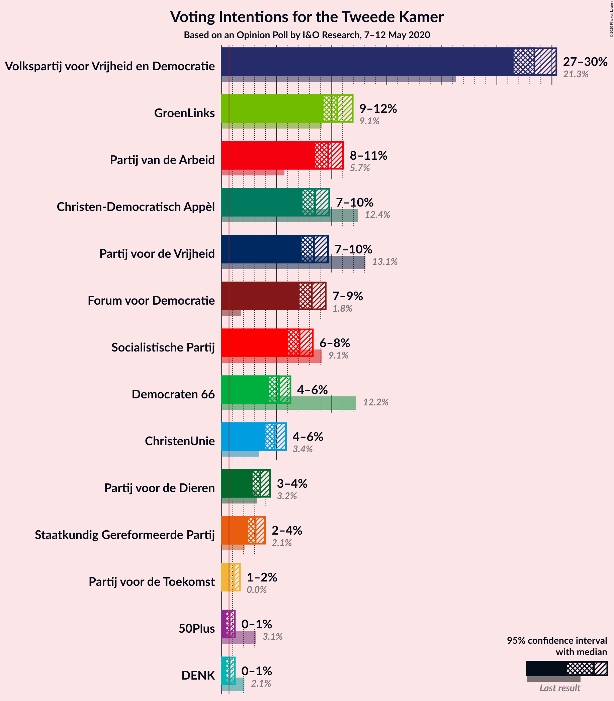

### Confidence Intervals

| Party | Last Result | Poll Result | 80% Confidence Interval | 90% Confidence Interval | 95% Confidence Interval | 99% Confidence Interval |
|:-----:|:-----------:|:-----------:|:-----------------------:|:-----------------------:|:-----------------------:|:-----------------------:|
| Volkspartij voor Vrijheid en Democratie | 21.3% | 28.4% | 27.2–29.7% |26.8–30.1% |26.5–30.4% |25.9–31.0% |
| GroenLinks | 9.1% | 10.5% | 9.7–11.4% |9.4–11.7% |9.3–11.9% |8.9–12.3% |
| Partij van de Arbeid | 5.7% | 9.7% | 8.9–10.6% |8.7–10.8% |8.5–11.0% |8.1–11.5% |
| Christen-Democratisch Appèl | 12.4% | 8.5% | 7.7–9.3% |7.5–9.6% |7.3–9.8% |7.0–10.2% |
| Partij voor de Vrijheid | 13.1% | 8.4% | 7.6–9.2% |7.4–9.4% |7.3–9.7% |6.9–10.1% |
| Forum voor Democratie | 1.8% | 8.2% | 7.5–9.0% |7.3–9.3% |7.1–9.4% |6.8–9.9% |
| Socialistische Partij | 9.1% | 7.1% | 6.4–7.9% |6.2–8.1% |6.1–8.3% |5.7–8.7% |
| Democraten 66 | 12.2% | 5.2% | 4.6–5.9% |4.5–6.1% |4.3–6.2% |4.1–6.6% |
| ChristenUnie | 3.4% | 4.8% | 4.3–5.5% |4.1–5.7% |4.0–5.8% |3.7–6.2% |
| Partij voor de Dieren | 3.2% | 3.5% | 3.0–4.1% |2.9–4.3% |2.8–4.4% |2.6–4.7% |
| Staatkundig Gereformeerde Partij | 2.1% | 3.1% | 2.6–3.6% |2.5–3.8% |2.4–3.9% |2.2–4.2% |
| Partij voor de Toekomst | 0.0% | 1.1% | 0.9–1.5% |0.8–1.6% |0.7–1.7% |0.6–1.9% |
| 50Plus | 3.1% | 0.7% | 0.5–1.0% |0.5–1.1% |0.4–1.2% |0.4–1.4% |
| DENK | 2.1% | 0.7% | 0.5–1.0% |0.5–1.1% |0.4–1.2% |0.4–1.4% |

*Note:* The poll result column reflects the actual value used in the calculations. Published results may vary slightly, and in addition be rounded to fewer digits.

## Seats

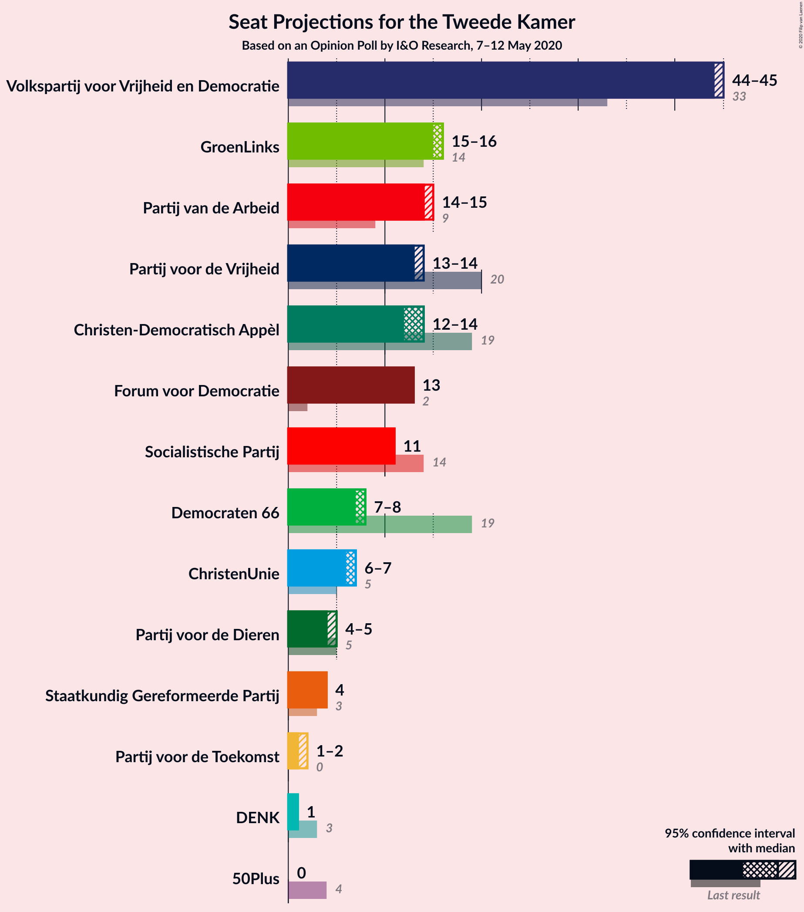

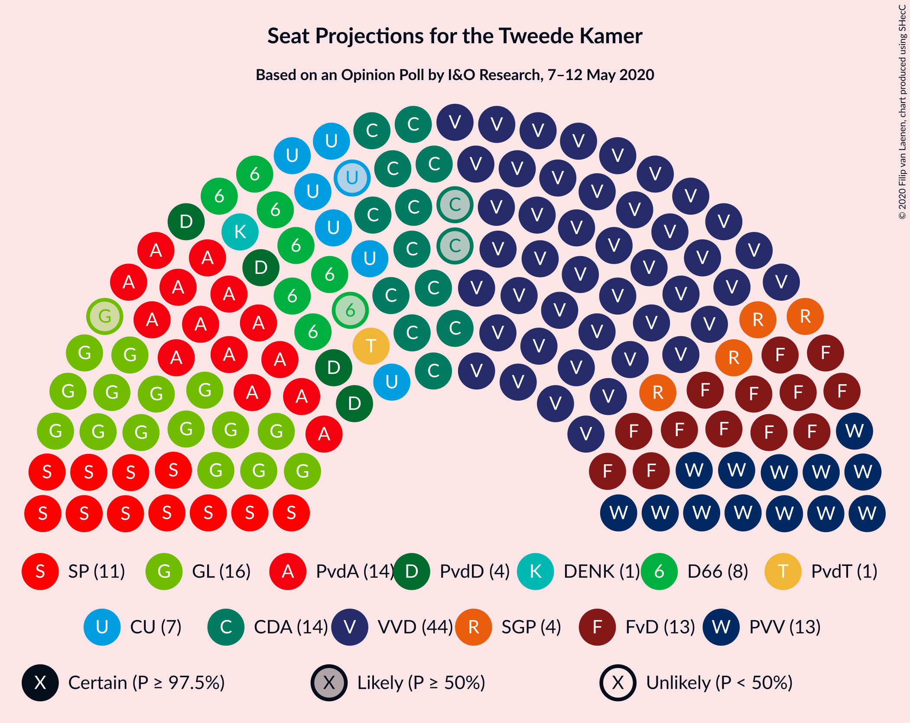

### Confidence Intervals

| Party | Last Result | Median | 80% Confidence Interval | 90% Confidence Interval | 95% Confidence Interval | 99% Confidence Interval |
|:-----:|:-----------:|:------:|:-----------------------:|:-----------------------:|:-----------------------:|:-----------------------:|
| <a href="#volkspartij-voor-vrijheid-en-democratie">Volkspartij voor Vrijheid en Democratie</a> | 33 | 44 | 44–45 |44–45 |44–45 |42–47 |
| <a href="#groenlinks">GroenLinks</a> | 14 | 16 | 15–16 |15–16 |15–16 |13–17 |
| <a href="#partij-van-de-arbeid">Partij van de Arbeid</a> | 9 | 14 | 14–15 |14–15 |14–15 |14–15 |
| <a href="#christen-democratisch-appèl">Christen-Democratisch Appèl</a> | 19 | 14 | 12–14 |12–14 |12–14 |12–15 |
| <a href="#partij-voor-de-vrijheid">Partij voor de Vrijheid</a> | 20 | 13 | 13–14 |13–14 |13–14 |12–14 |
| <a href="#forum-voor-democratie">Forum voor Democratie</a> | 2 | 13 | 13 |13 |13 |12–13 |
| <a href="#socialistische-partij">Socialistische Partij</a> | 14 | 11 | 11 |11 |11 |10–11 |
| <a href="#democraten-66">Democraten 66</a> | 19 | 8 | 7–8 |7–8 |7–8 |7–9 |
| <a href="#christenunie">ChristenUnie</a> | 5 | 7 | 6–7 |6–7 |6–7 |6–8 |
| <a href="#partij-voor-de-dieren">Partij voor de Dieren</a> | 5 | 4 | 4–5 |4–5 |4–5 |4–5 |
| <a href="#staatkundig-gereformeerde-partij">Staatkundig Gereformeerde Partij</a> | 3 | 4 | 4 |4 |4 |4–5 |
| <a href="#partij-voor-de-toekomst">Partij voor de Toekomst</a> | 0 | 1 | 1–2 |1–2 |1–2 |1–3 |
| <a href="#50plus">50Plus</a> | 4 | 0 | 0 |0 |0 |0–1 |
| <a href="#denk">DENK</a> | 3 | 1 | 1 |1 |1 |0–1 |

### Volkspartij voor Vrijheid en Democratie

*For a full overview of the results for this party, see the [Volkspartij voor Vrijheid en Democratie](party-volkspartijvoorvrijheidendemocratie.html) page.*

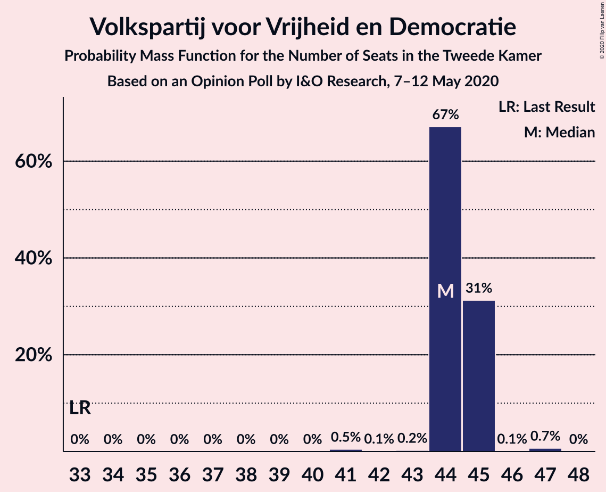

| Number of Seats | Probability | Accumulated | Special Marks |
|:---------------:|:-----------:|:-----------:|:-------------:|
| 33 | 0% | 100% | Last Result |
| 34 | 0% | 100% |  |
| 35 | 0% | 100% |  |
| 36 | 0% | 100% |  |
| 37 | 0% | 100% |  |
| 38 | 0% | 100% |  |
| 39 | 0% | 100% |  |
| 40 | 0% | 100% |  |
| 41 | 0.5% | 100% |  |
| 42 | 0.1% | 99.5% |  |
| 43 | 0.2% | 99.4% |  |
| 44 | 67% | 99.2% | Median |
| 45 | 31% | 32% |  |
| 46 | 0.1% | 0.8% |  |
| 47 | 0.7% | 0.7% |  |
| 48 | 0% | 0% |  |

### GroenLinks

*For a full overview of the results for this party, see the [GroenLinks](party-groenlinks.html) page.*

| Number of Seats | Probability | Accumulated | Special Marks |
|:---------------:|:-----------:|:-----------:|:-------------:|
| 13 | 0.7% | 100% |  |
| 14 | 0.3% | 99.3% | Last Result |
| 15 | 31% | 99.0% |  |
| 16 | 67% | 68% | Median |
| 17 | 0.7% | 1.0% |  |
| 18 | 0.2% | 0.2% |  |
| 19 | 0.1% | 0.1% |  |
| 20 | 0% | 0% |  |

### Partij van de Arbeid

*For a full overview of the results for this party, see the [Partij van de Arbeid](party-partijvandearbeid.html) page.*

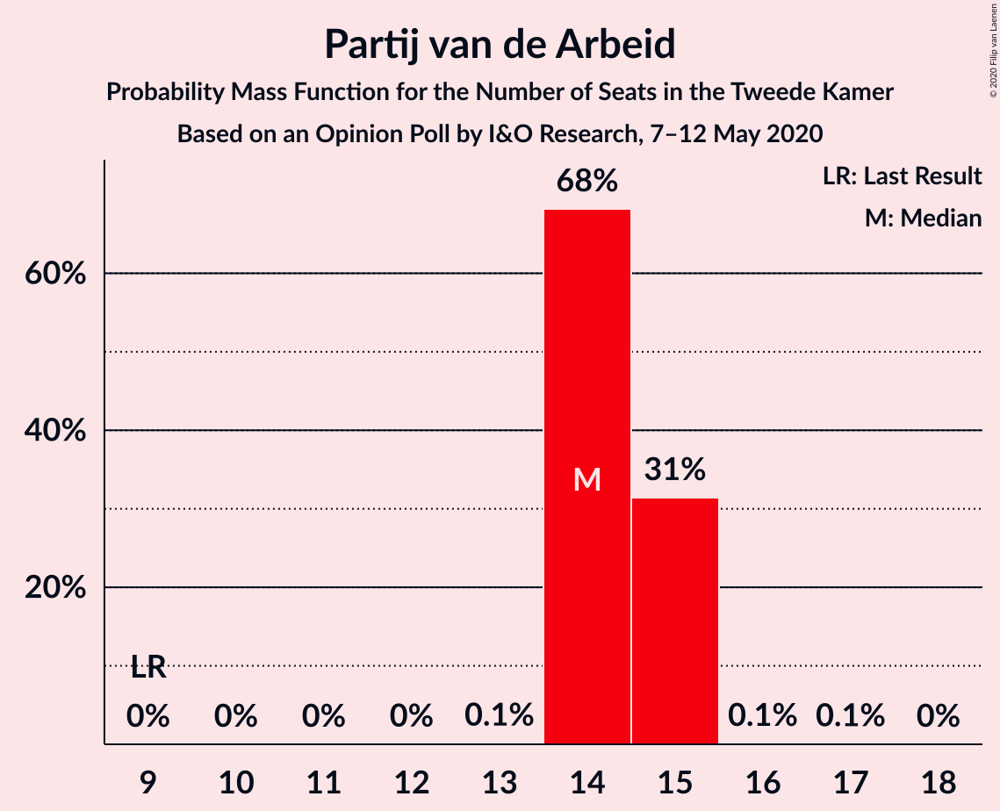

| Number of Seats | Probability | Accumulated | Special Marks |
|:---------------:|:-----------:|:-----------:|:-------------:|
| 9 | 0% | 100% | Last Result |
| 10 | 0% | 100% |  |
| 11 | 0% | 100% |  |
| 12 | 0% | 100% |  |
| 13 | 0.1% | 100% |  |
| 14 | 68% | 99.8% | Median |
| 15 | 31% | 32% |  |
| 16 | 0.1% | 0.2% |  |
| 17 | 0.1% | 0.1% |  |
| 18 | 0% | 0% |  |

### Christen-Democratisch Appèl

*For a full overview of the results for this party, see the [Christen-Democratisch Appèl](party-christen-democratischappèl.html) page.*

| Number of Seats | Probability | Accumulated | Special Marks |
|:---------------:|:-----------:|:-----------:|:-------------:|
| 10 | 0.1% | 100% |  |
| 11 | 0.3% | 99.9% |  |
| 12 | 31% | 99.7% |  |
| 13 | 0.9% | 69% |  |
| 14 | 67% | 68% | Median |
| 15 | 0.7% | 0.8% |  |
| 16 | 0% | 0% |  |
| 17 | 0% | 0% |  |
| 18 | 0% | 0% |  |
| 19 | 0% | 0% | Last Result |

### Partij voor de Vrijheid

*For a full overview of the results for this party, see the [Partij voor de Vrijheid](party-partijvoordevrijheid.html) page.*

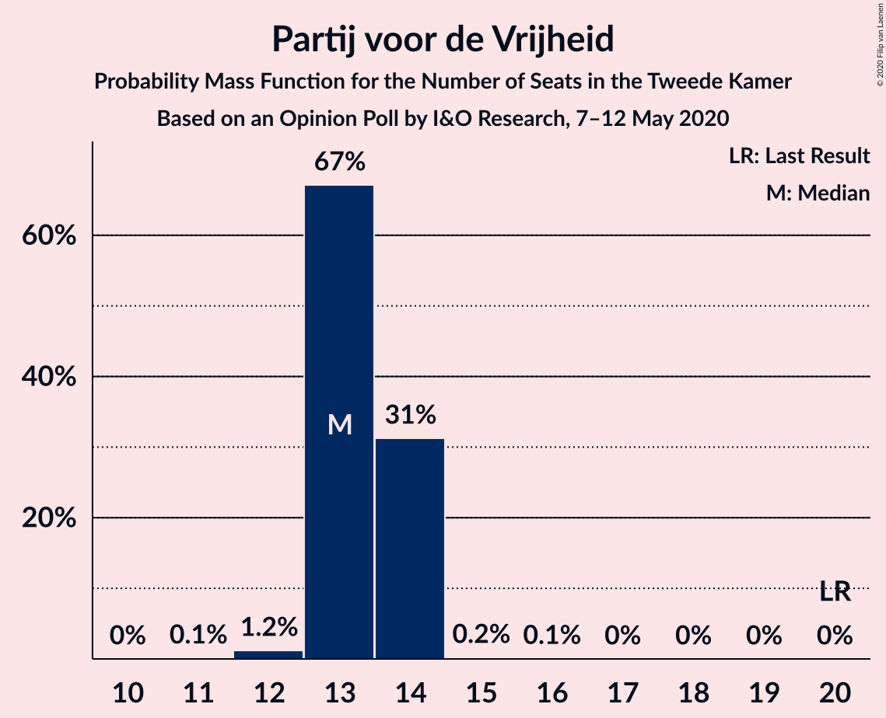

| Number of Seats | Probability | Accumulated | Special Marks |
|:---------------:|:-----------:|:-----------:|:-------------:|
| 11 | 0.1% | 100% |  |
| 12 | 1.2% | 99.9% |  |
| 13 | 67% | 98.7% | Median |
| 14 | 31% | 32% |  |
| 15 | 0.2% | 0.3% |  |
| 16 | 0.1% | 0.1% |  |
| 17 | 0% | 0% |  |
| 18 | 0% | 0% |  |
| 19 | 0% | 0% |  |
| 20 | 0% | 0% | Last Result |

### Forum voor Democratie

*For a full overview of the results for this party, see the [Forum voor Democratie](party-forumvoordemocratie.html) page.*

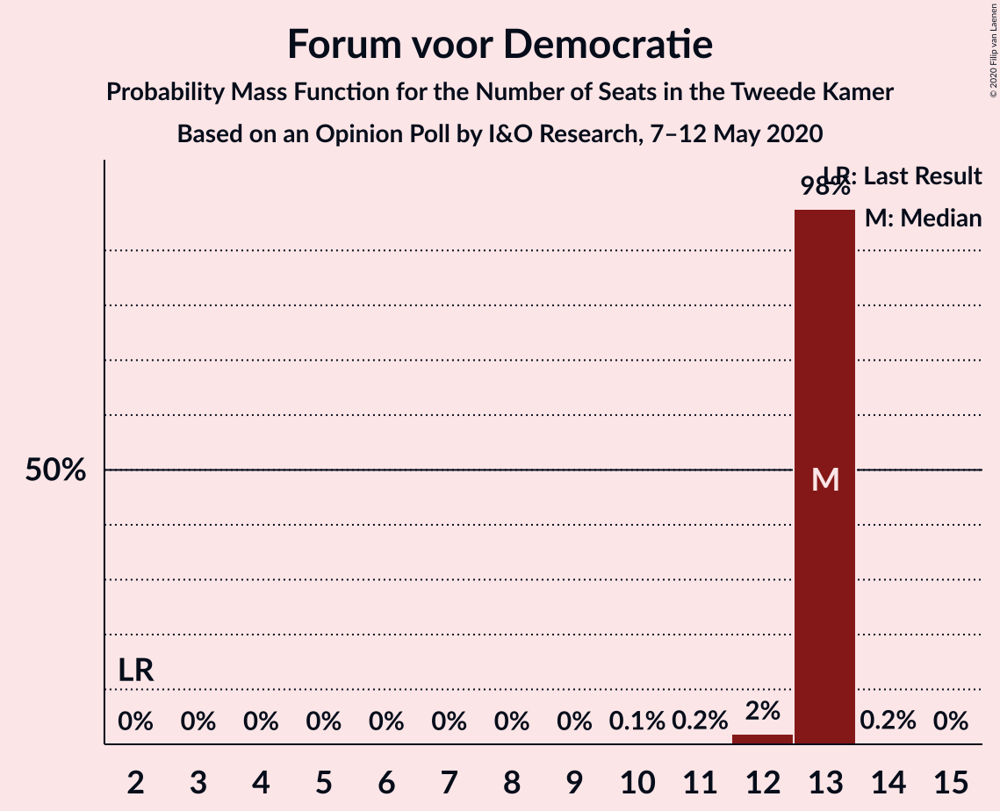

| Number of Seats | Probability | Accumulated | Special Marks |
|:---------------:|:-----------:|:-----------:|:-------------:|
| 2 | 0% | 100% | Last Result |
| 3 | 0% | 100% |  |
| 4 | 0% | 100% |  |
| 5 | 0% | 100% |  |
| 6 | 0% | 100% |  |
| 7 | 0% | 100% |  |
| 8 | 0% | 100% |  |
| 9 | 0% | 100% |  |
| 10 | 0.1% | 100% |  |
| 11 | 0.2% | 99.9% |  |
| 12 | 2% | 99.7% |  |
| 13 | 98% | 98% | Median |
| 14 | 0.2% | 0.3% |  |
| 15 | 0% | 0% |  |

### Socialistische Partij

*For a full overview of the results for this party, see the [Socialistische Partij](party-socialistischepartij.html) page.*

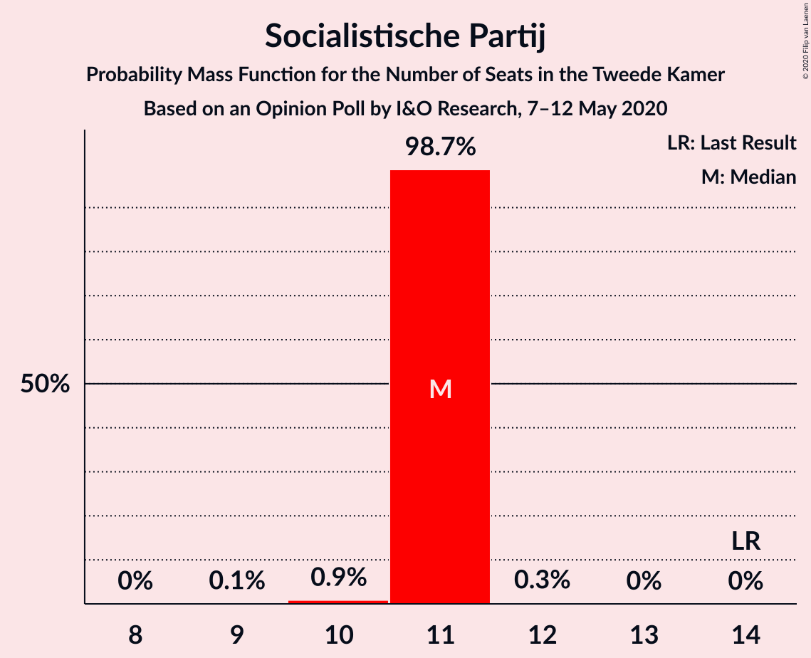

| Number of Seats | Probability | Accumulated | Special Marks |
|:---------------:|:-----------:|:-----------:|:-------------:|
| 9 | 0.1% | 100% |  |
| 10 | 0.9% | 99.8% |  |
| 11 | 98.7% | 99.0% | Median |
| 12 | 0.3% | 0.3% |  |
| 13 | 0% | 0% |  |
| 14 | 0% | 0% | Last Result |

### Democraten 66

*For a full overview of the results for this party, see the [Democraten 66](party-democraten66.html) page.*

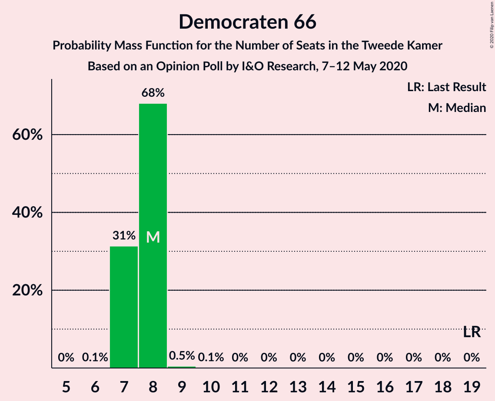

| Number of Seats | Probability | Accumulated | Special Marks |
|:---------------:|:-----------:|:-----------:|:-------------:|
| 6 | 0.1% | 100% |  |
| 7 | 31% | 99.9% |  |
| 8 | 68% | 69% | Median |
| 9 | 0.5% | 0.5% |  |
| 10 | 0.1% | 0.1% |  |
| 11 | 0% | 0% |  |
| 12 | 0% | 0% |  |
| 13 | 0% | 0% |  |
| 14 | 0% | 0% |  |
| 15 | 0% | 0% |  |
| 16 | 0% | 0% |  |
| 17 | 0% | 0% |  |
| 18 | 0% | 0% |  |
| 19 | 0% | 0% | Last Result |

### ChristenUnie

*For a full overview of the results for this party, see the [ChristenUnie](party-christenunie.html) page.*

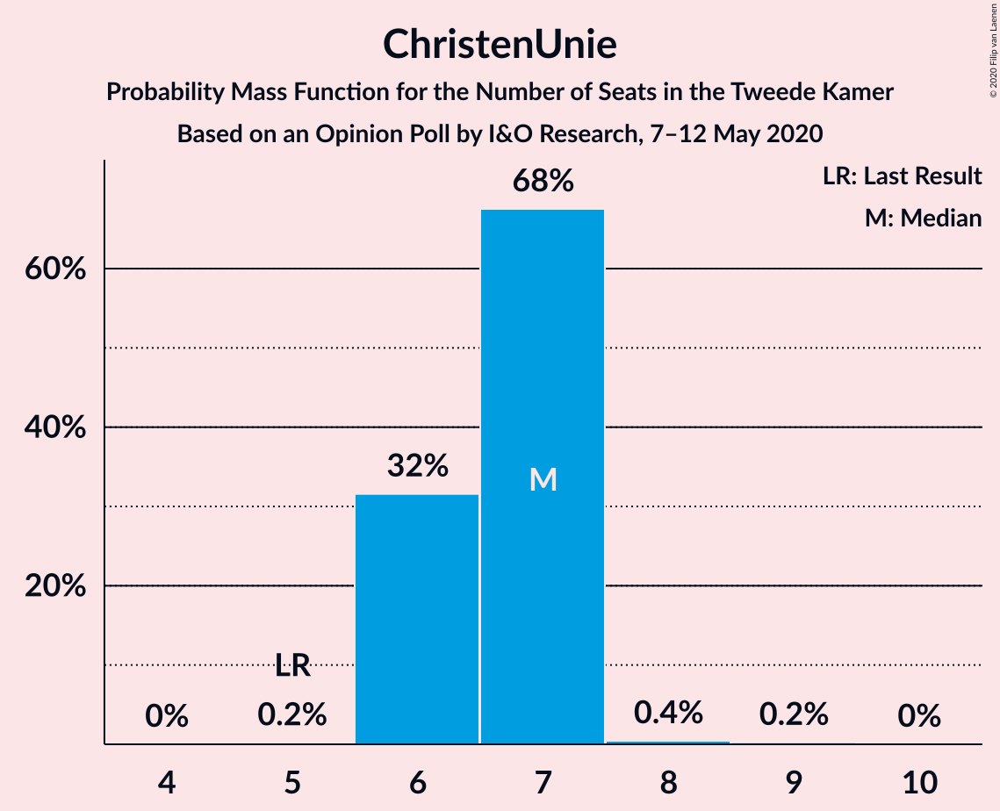

| Number of Seats | Probability | Accumulated | Special Marks |
|:---------------:|:-----------:|:-----------:|:-------------:|
| 5 | 0.2% | 100% | Last Result |
| 6 | 32% | 99.8% |  |
| 7 | 68% | 68% | Median |
| 8 | 0.4% | 0.7% |  |
| 9 | 0.2% | 0.2% |  |
| 10 | 0% | 0% |  |

### Partij voor de Dieren

*For a full overview of the results for this party, see the [Partij voor de Dieren](party-partijvoordedieren.html) page.*

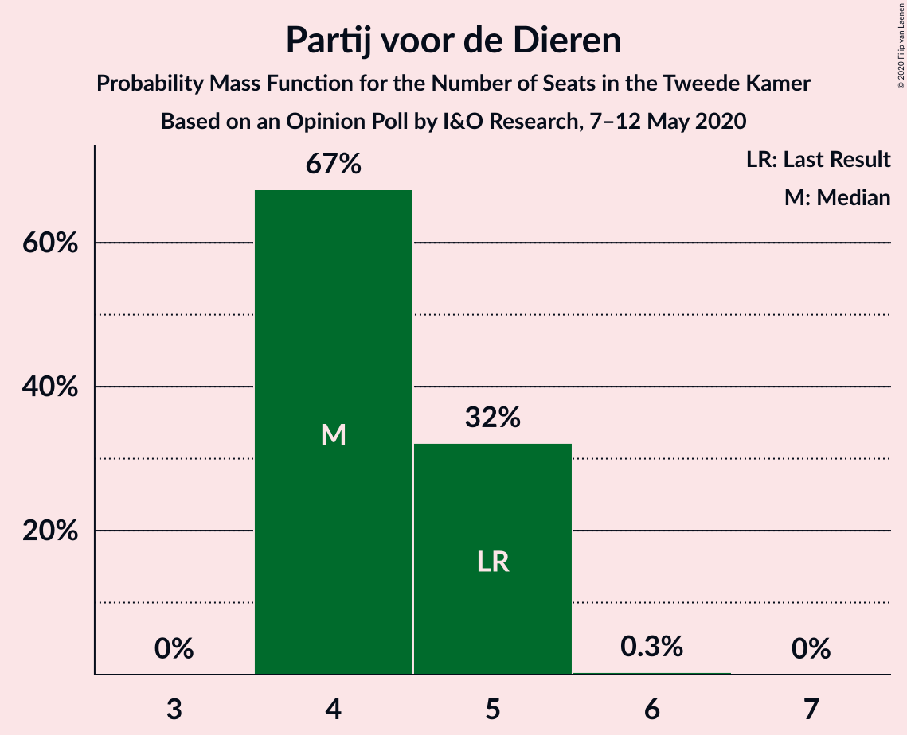

| Number of Seats | Probability | Accumulated | Special Marks |
|:---------------:|:-----------:|:-----------:|:-------------:|
| 4 | 67% | 100% | Median |
| 5 | 32% | 33% | Last Result |
| 6 | 0.3% | 0.4% |  |
| 7 | 0% | 0% |  |

### Staatkundig Gereformeerde Partij

*For a full overview of the results for this party, see the [Staatkundig Gereformeerde Partij](party-staatkundiggereformeerdepartij.html) page.*

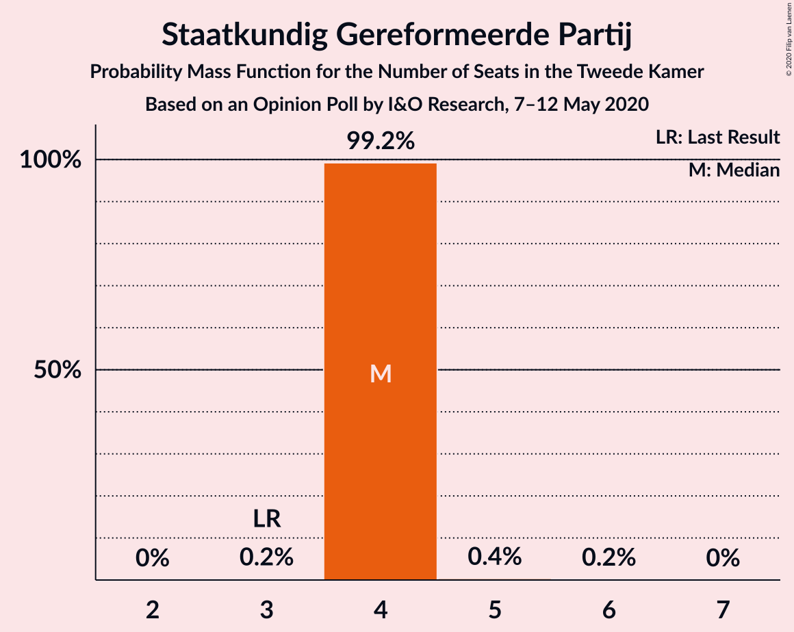

| Number of Seats | Probability | Accumulated | Special Marks |
|:---------------:|:-----------:|:-----------:|:-------------:|
| 3 | 0.2% | 100% | Last Result |
| 4 | 99.2% | 99.8% | Median |
| 5 | 0.4% | 0.5% |  |
| 6 | 0.2% | 0.2% |  |
| 7 | 0% | 0% |  |

### Partij voor de Toekomst

*For a full overview of the results for this party, see the [Partij voor de Toekomst](party-partijvoordetoekomst.html) page.*

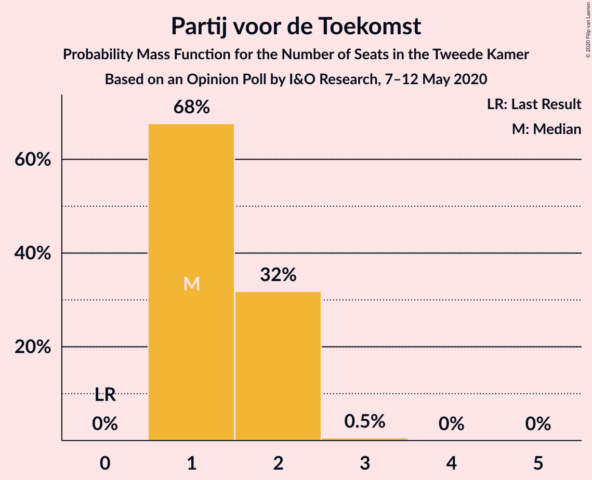

| Number of Seats | Probability | Accumulated | Special Marks |
|:---------------:|:-----------:|:-----------:|:-------------:|
| 0 | 0% | 100% | Last Result |
| 1 | 68% | 100% | Median |
| 2 | 32% | 32% |  |
| 3 | 0.5% | 0.5% |  |
| 4 | 0% | 0% |  |

### 50Plus

*For a full overview of the results for this party, see the [50Plus](party-50plus.html) page.*

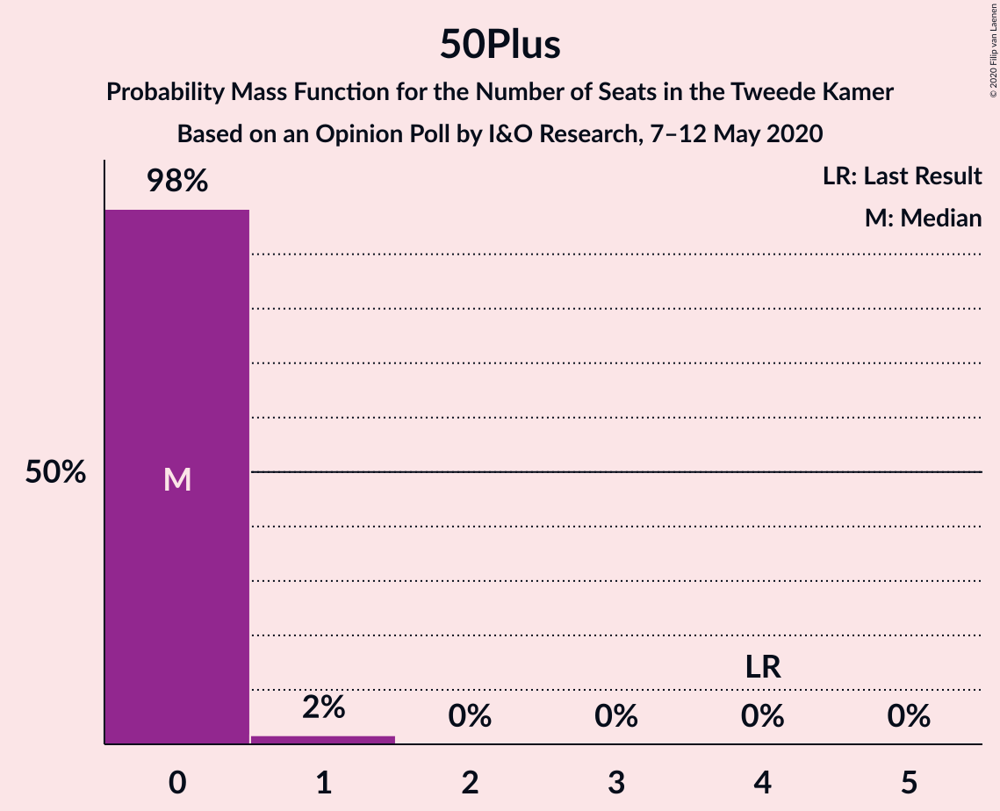

| Number of Seats | Probability | Accumulated | Special Marks |
|:---------------:|:-----------:|:-----------:|:-------------:|
| 0 | 98% | 100% | Median |
| 1 | 2% | 2% |  |
| 2 | 0% | 0% |  |
| 3 | 0% | 0% |  |
| 4 | 0% | 0% | Last Result |

### DENK

*For a full overview of the results for this party, see the [DENK](party-denk.html) page.*

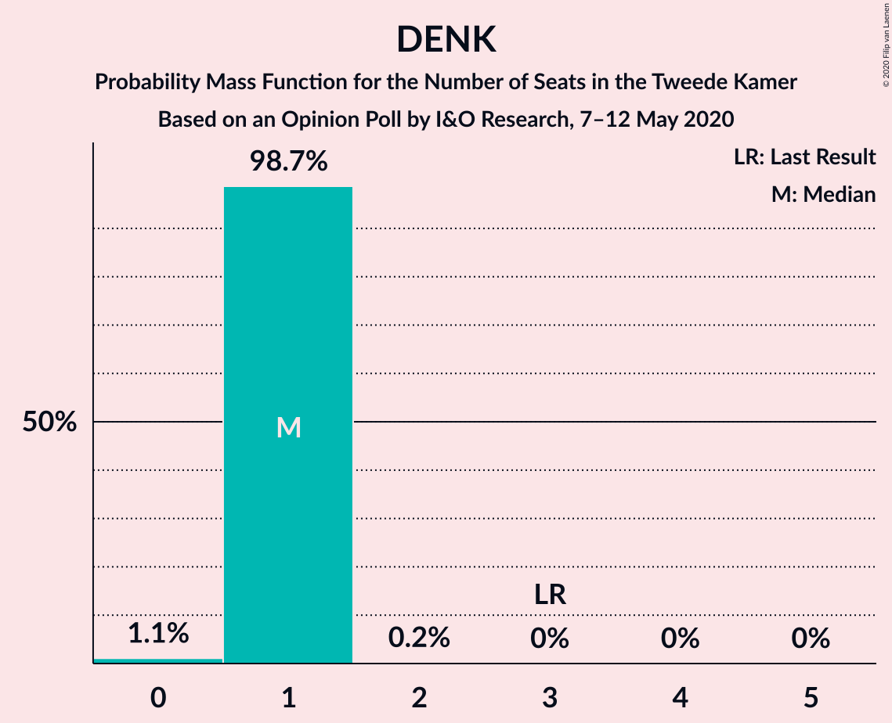

| Number of Seats | Probability | Accumulated | Special Marks |
|:---------------:|:-----------:|:-----------:|:-------------:|
| 0 | 1.1% | 100% |  |
| 1 | 98.7% | 98.9% | Median |
| 2 | 0.2% | 0.2% |  |
| 3 | 0% | 0% | Last Result |

## Coalitions

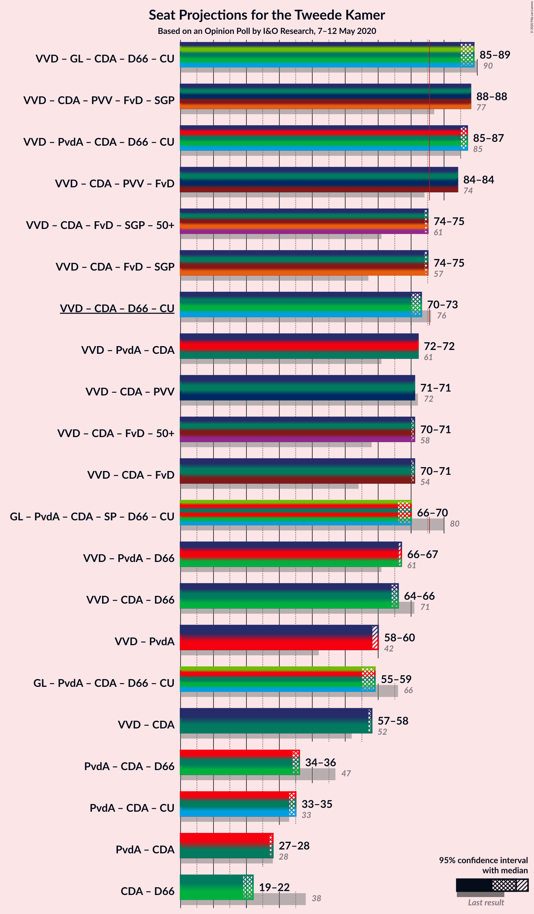

### Confidence Intervals

| Coalition | Last Result | Median | Majority? | 80% Confidence Interval | 90% Confidence Interval | 95% Confidence Interval | 99% Confidence Interval |
|:---------:|:-----------:|:------:|:---------:|:-----------------------:|:-----------------------:|:-----------------------:|:-----------------------:|
| Volkspartij voor Vrijheid en Democratie – GroenLinks – Christen-Democratisch Appèl – Democraten 66 – ChristenUnie | 90 | 89 | 100% | 85–89 | 85–89 | 85–89 | 85–89 |
| Volkspartij voor Vrijheid en Democratie – Christen-Democratisch Appèl – Partij voor de Vrijheid – Forum voor Democratie – Staatkundig Gereformeerde Partij | 77 | 88 | 100% | 88 | 88 | 88 | 85–90 |
| Volkspartij voor Vrijheid en Democratie – Partij van de Arbeid – Christen-Democratisch Appèl – Democraten 66 – ChristenUnie | 85 | 87 | 100% | 85–87 | 85–87 | 85–87 | 85–90 |
| Volkspartij voor Vrijheid en Democratie – Christen-Democratisch Appèl – Partij voor de Vrijheid – Forum voor Democratie | 74 | 84 | 100% | 84 | 84 | 84 | 81–86 |
| Volkspartij voor Vrijheid en Democratie – Christen-Democratisch Appèl – Forum voor Democratie – Staatkundig Gereformeerde Partij – 50Plus | 61 | 75 | 1.0% | 74–75 | 74–75 | 74–75 | 72–78 |
| Volkspartij voor Vrijheid en Democratie – Christen-Democratisch Appèl – Forum voor Democratie – Staatkundig Gereformeerde Partij | 57 | 75 | 0.9% | 74–75 | 74–75 | 74–75 | 72–78 |
| Volkspartij voor Vrijheid en Democratie – Christen-Democratisch Appèl – Democraten 66 – ChristenUnie | 76 | 73 | 0.6% | 70–73 | 70–73 | 70–73 | 70–76 |
| Volkspartij voor Vrijheid en Democratie – Partij van de Arbeid – Christen-Democratisch Appèl | 61 | 72 | 0.6% | 72 | 72 | 72 | 70–76 |
| Volkspartij voor Vrijheid en Democratie – Christen-Democratisch Appèl – Partij voor de Vrijheid | 72 | 71 | 0% | 71 | 71 | 71 | 69–74 |
| Volkspartij voor Vrijheid en Democratie – Christen-Democratisch Appèl – Forum voor Democratie – 50Plus | 58 | 71 | 0% | 70–71 | 70–71 | 70–71 | 68–74 |
| Volkspartij voor Vrijheid en Democratie – Christen-Democratisch Appèl – Forum voor Democratie | 54 | 71 | 0% | 70–71 | 70–71 | 70–71 | 67–74 |
| GroenLinks – Partij van de Arbeid – Christen-Democratisch Appèl – Socialistische Partij – Democraten 66 – ChristenUnie | 80 | 70 | 0% | 66–70 | 66–70 | 66–70 | 66–70 |
| Volkspartij voor Vrijheid en Democratie – Partij van de Arbeid – Democraten 66 | 61 | 66 | 0% | 66–67 | 66–67 | 66–67 | 64–69 |
| Volkspartij voor Vrijheid en Democratie – Christen-Democratisch Appèl – Democraten 66 | 71 | 66 | 0% | 64–66 | 64–66 | 64–66 | 63–70 |
| Volkspartij voor Vrijheid en Democratie – Partij van de Arbeid | 42 | 58 | 0% | 58–60 | 58–60 | 58–60 | 56–61 |
| GroenLinks – Partij van de Arbeid – Christen-Democratisch Appèl – Democraten 66 – ChristenUnie | 66 | 59 | 0% | 55–59 | 55–59 | 55–59 | 55–59 |
| Volkspartij voor Vrijheid en Democratie – Christen-Democratisch Appèl | 52 | 58 | 0% | 57–58 | 57–58 | 57–58 | 55–62 |
| Partij van de Arbeid – Christen-Democratisch Appèl – Democraten 66 | 47 | 36 | 0% | 34–36 | 34–36 | 34–36 | 34–37 |
| Partij van de Arbeid – Christen-Democratisch Appèl – ChristenUnie | 33 | 35 | 0% | 33–35 | 33–35 | 33–35 | 33–36 |
| Partij van de Arbeid – Christen-Democratisch Appèl | 28 | 28 | 0% | 27–28 | 27–28 | 27–28 | 27–29 |
| Christen-Democratisch Appèl – Democraten 66 | 38 | 22 | 0% | 19–22 | 19–22 | 19–22 | 19–23 |

### Volkspartij voor Vrijheid en Democratie – GroenLinks – Christen-Democratisch Appèl – Democraten 66 – ChristenUnie

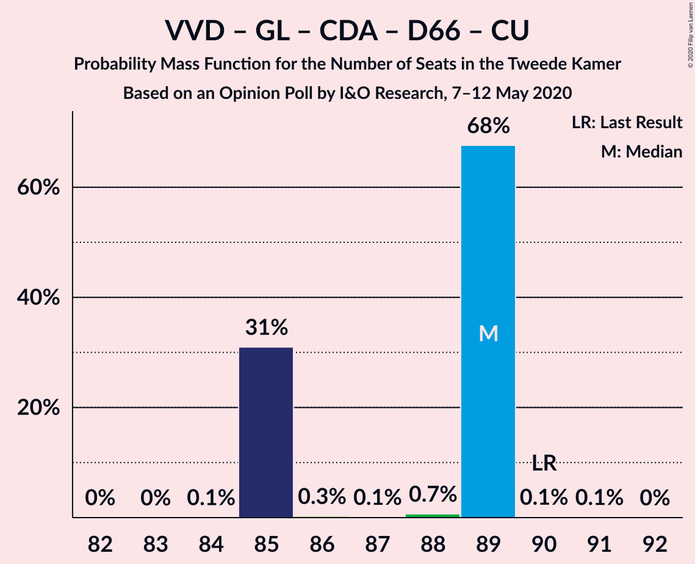

| Number of Seats | Probability | Accumulated | Special Marks |
|:---------------:|:-----------:|:-----------:|:-------------:|
| 82 | 0% | 100% |  |
| 83 | 0% | 99.9% |  |
| 84 | 0.1% | 99.9% |  |
| 85 | 31% | 99.9% |  |
| 86 | 0.3% | 69% |  |
| 87 | 0.1% | 69% |  |
| 88 | 0.7% | 69% |  |
| 89 | 68% | 68% | Median |
| 90 | 0.1% | 0.2% | Last Result |
| 91 | 0.1% | 0.1% |  |
| 92 | 0% | 0% |  |

### Volkspartij voor Vrijheid en Democratie – Christen-Democratisch Appèl – Partij voor de Vrijheid – Forum voor Democratie – Staatkundig Gereformeerde Partij

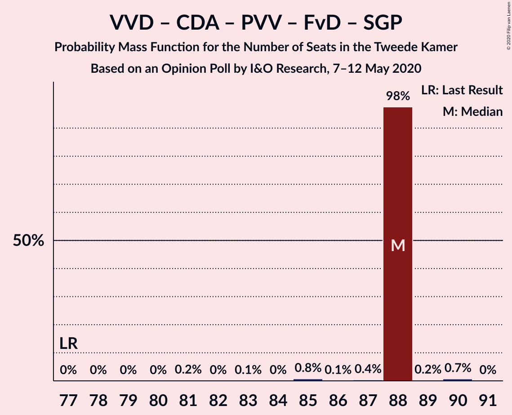

| Number of Seats | Probability | Accumulated | Special Marks |
|:---------------:|:-----------:|:-----------:|:-------------:|
| 77 | 0% | 100% | Last Result |
| 78 | 0% | 100% |  |
| 79 | 0% | 100% |  |
| 80 | 0% | 100% |  |
| 81 | 0.2% | 100% |  |
| 82 | 0% | 99.8% |  |
| 83 | 0.1% | 99.8% |  |
| 84 | 0% | 99.7% |  |
| 85 | 0.8% | 99.7% |  |
| 86 | 0.1% | 98.9% |  |
| 87 | 0.4% | 98.9% |  |
| 88 | 98% | 98.5% | Median |
| 89 | 0.2% | 0.9% |  |
| 90 | 0.7% | 0.8% |  |
| 91 | 0% | 0% |  |

### Volkspartij voor Vrijheid en Democratie – Partij van de Arbeid – Christen-Democratisch Appèl – Democraten 66 – ChristenUnie

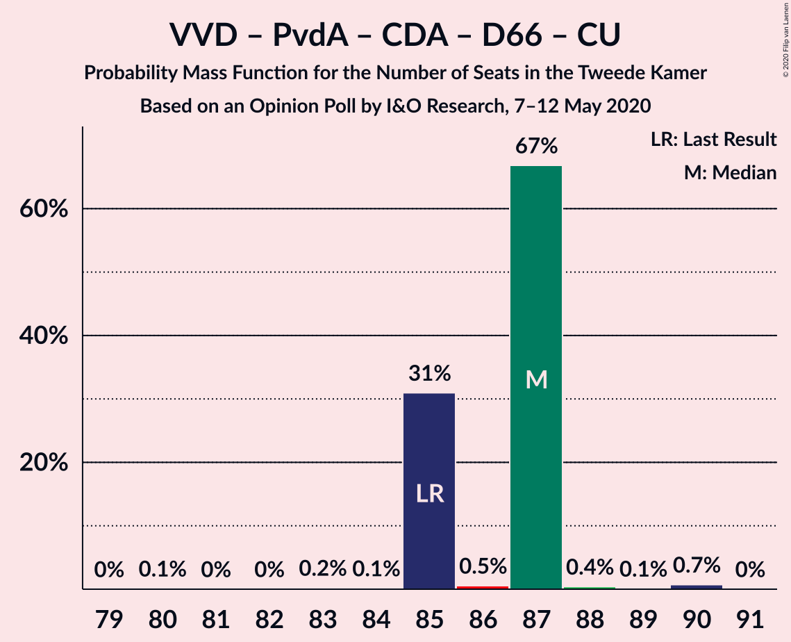

| Number of Seats | Probability | Accumulated | Special Marks |
|:---------------:|:-----------:|:-----------:|:-------------:|
| 80 | 0.1% | 100% |  |
| 81 | 0% | 99.9% |  |
| 82 | 0% | 99.9% |  |
| 83 | 0.2% | 99.9% |  |
| 84 | 0.1% | 99.7% |  |
| 85 | 31% | 99.5% | Last Result |
| 86 | 0.5% | 69% |  |
| 87 | 67% | 68% | Median |
| 88 | 0.4% | 1.2% |  |
| 89 | 0.1% | 0.8% |  |
| 90 | 0.7% | 0.7% |  |
| 91 | 0% | 0% |  |

### Volkspartij voor Vrijheid en Democratie – Christen-Democratisch Appèl – Partij voor de Vrijheid – Forum voor Democratie

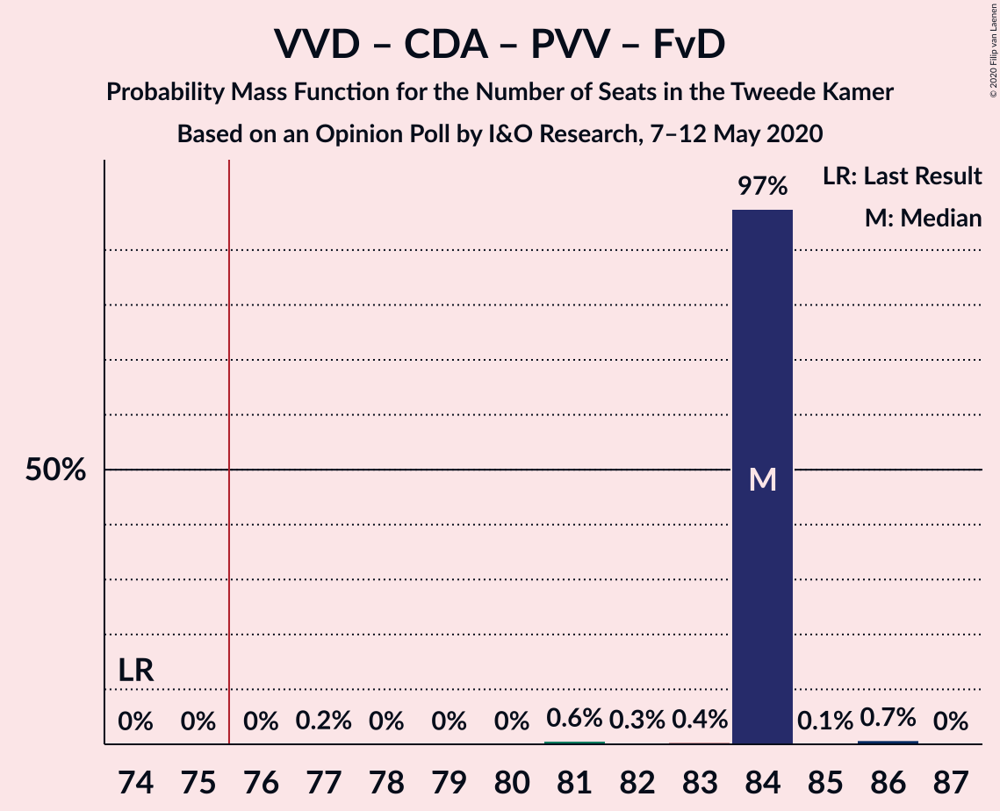

| Number of Seats | Probability | Accumulated | Special Marks |
|:---------------:|:-----------:|:-----------:|:-------------:|
| 74 | 0% | 100% | Last Result |
| 75 | 0% | 100% |  |
| 76 | 0% | 100% | Majority |
| 77 | 0.2% | 100% |  |
| 78 | 0% | 99.8% |  |
| 79 | 0% | 99.8% |  |
| 80 | 0% | 99.7% |  |
| 81 | 0.6% | 99.7% |  |
| 82 | 0.3% | 99.0% |  |
| 83 | 0.4% | 98.7% |  |
| 84 | 97% | 98% | Median |
| 85 | 0.1% | 0.9% |  |
| 86 | 0.7% | 0.7% |  |
| 87 | 0% | 0% |  |

### Volkspartij voor Vrijheid en Democratie – Christen-Democratisch Appèl – Forum voor Democratie – Staatkundig Gereformeerde Partij – 50Plus

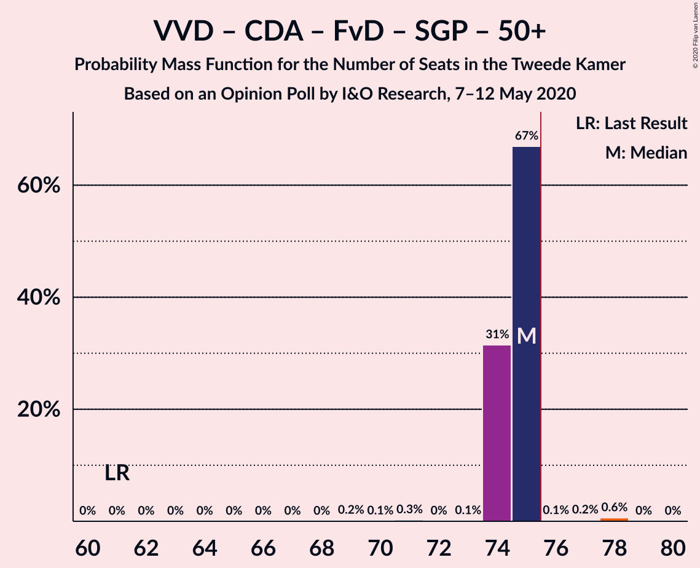

| Number of Seats | Probability | Accumulated | Special Marks |
|:---------------:|:-----------:|:-----------:|:-------------:|
| 61 | 0% | 100% | Last Result |
| 62 | 0% | 100% |  |
| 63 | 0% | 100% |  |
| 64 | 0% | 100% |  |
| 65 | 0% | 100% |  |
| 66 | 0% | 100% |  |
| 67 | 0% | 100% |  |
| 68 | 0% | 100% |  |
| 69 | 0.2% | 100% |  |
| 70 | 0.1% | 99.8% |  |
| 71 | 0.3% | 99.8% |  |
| 72 | 0% | 99.5% |  |
| 73 | 0.1% | 99.5% |  |
| 74 | 31% | 99.4% |  |
| 75 | 67% | 68% | Median |
| 76 | 0.1% | 1.0% | Majority |
| 77 | 0.2% | 0.9% |  |
| 78 | 0.6% | 0.6% |  |
| 79 | 0% | 0% |  |

### Volkspartij voor Vrijheid en Democratie – Christen-Democratisch Appèl – Forum voor Democratie – Staatkundig Gereformeerde Partij

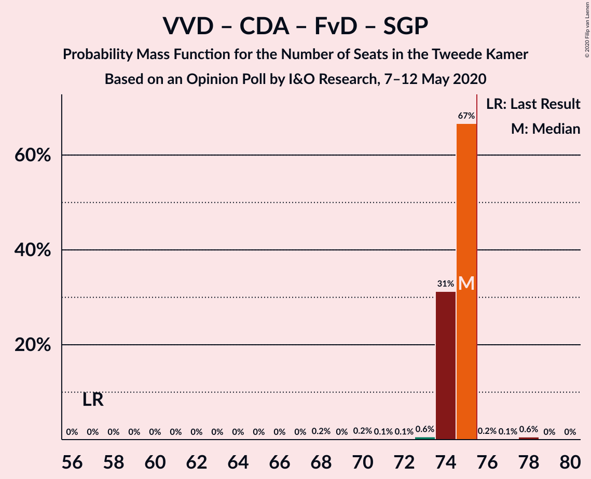

| Number of Seats | Probability | Accumulated | Special Marks |
|:---------------:|:-----------:|:-----------:|:-------------:|
| 57 | 0% | 100% | Last Result |
| 58 | 0% | 100% |  |
| 59 | 0% | 100% |  |
| 60 | 0% | 100% |  |
| 61 | 0% | 100% |  |
| 62 | 0% | 100% |  |
| 63 | 0% | 100% |  |
| 64 | 0% | 100% |  |
| 65 | 0% | 100% |  |
| 66 | 0% | 100% |  |
| 67 | 0% | 100% |  |
| 68 | 0.2% | 100% |  |
| 69 | 0% | 99.8% |  |
| 70 | 0.2% | 99.8% |  |
| 71 | 0.1% | 99.6% |  |
| 72 | 0.1% | 99.5% |  |
| 73 | 0.6% | 99.4% |  |
| 74 | 31% | 98.8% |  |
| 75 | 67% | 68% | Median |
| 76 | 0.2% | 0.9% | Majority |
| 77 | 0.1% | 0.7% |  |
| 78 | 0.6% | 0.6% |  |
| 79 | 0% | 0% |  |

### Volkspartij voor Vrijheid en Democratie – Christen-Democratisch Appèl – Democraten 66 – ChristenUnie

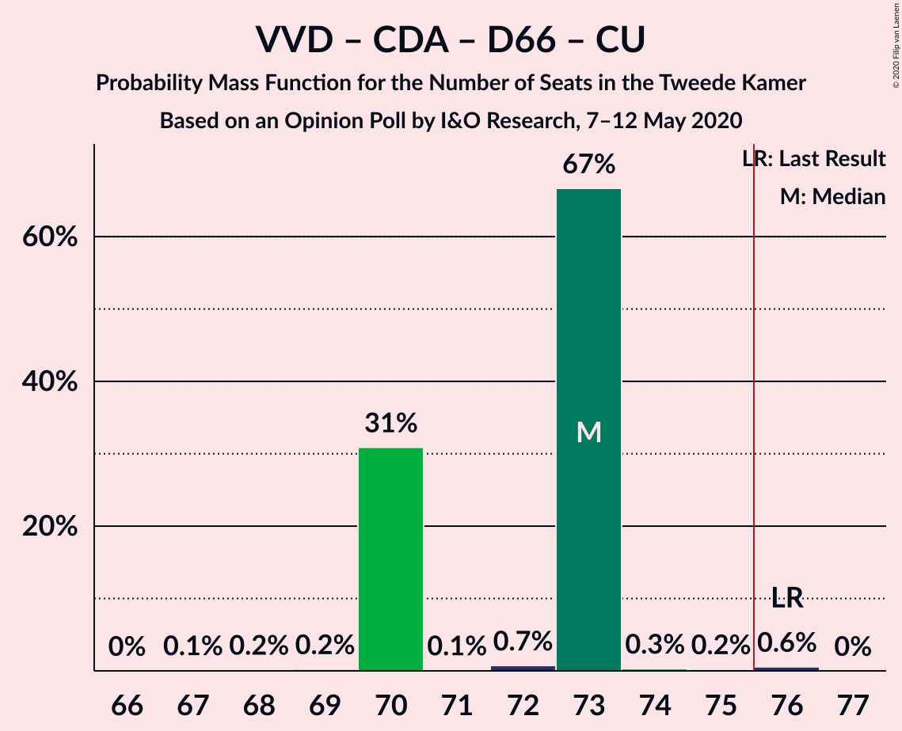

| Number of Seats | Probability | Accumulated | Special Marks |
|:---------------:|:-----------:|:-----------:|:-------------:|
| 67 | 0.1% | 100% |  |
| 68 | 0.2% | 99.9% |  |
| 69 | 0.2% | 99.7% |  |
| 70 | 31% | 99.5% |  |
| 71 | 0.1% | 69% |  |
| 72 | 0.7% | 69% |  |
| 73 | 67% | 68% | Median |
| 74 | 0.3% | 1.1% |  |
| 75 | 0.2% | 0.8% |  |
| 76 | 0.6% | 0.6% | Last Result, Majority |
| 77 | 0% | 0% |  |

### Volkspartij voor Vrijheid en Democratie – Partij van de Arbeid – Christen-Democratisch Appèl

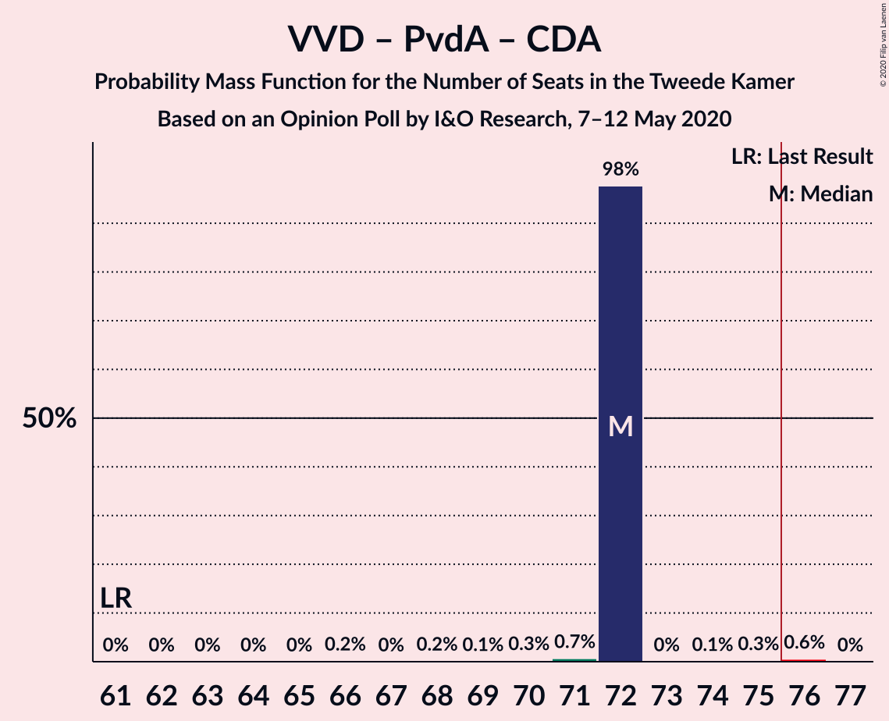

| Number of Seats | Probability | Accumulated | Special Marks |
|:---------------:|:-----------:|:-----------:|:-------------:|
| 61 | 0% | 100% | Last Result |
| 62 | 0% | 100% |  |
| 63 | 0% | 100% |  |
| 64 | 0% | 100% |  |
| 65 | 0% | 100% |  |
| 66 | 0.2% | 100% |  |
| 67 | 0% | 99.8% |  |
| 68 | 0.2% | 99.8% |  |
| 69 | 0.1% | 99.7% |  |
| 70 | 0.3% | 99.6% |  |
| 71 | 0.7% | 99.3% |  |
| 72 | 98% | 98.6% | Median |
| 73 | 0% | 0.9% |  |
| 74 | 0.1% | 0.9% |  |
| 75 | 0.3% | 0.8% |  |
| 76 | 0.6% | 0.6% | Majority |
| 77 | 0% | 0% |  |

### Volkspartij voor Vrijheid en Democratie – Christen-Democratisch Appèl – Partij voor de Vrijheid

| Number of Seats | Probability | Accumulated | Special Marks |
|:---------------:|:-----------:|:-----------:|:-------------:|
| 65 | 0.2% | 100% |  |
| 66 | 0% | 99.8% |  |
| 67 | 0.1% | 99.8% |  |
| 68 | 0.1% | 99.7% |  |
| 69 | 0.7% | 99.5% |  |
| 70 | 0.2% | 98.9% |  |
| 71 | 98% | 98.6% | Median |
| 72 | 0.1% | 1.0% | Last Result |
| 73 | 0.1% | 0.8% |  |
| 74 | 0.7% | 0.8% |  |
| 75 | 0.1% | 0.1% |  |
| 76 | 0% | 0% | Majority |

### Volkspartij voor Vrijheid en Democratie – Christen-Democratisch Appèl – Forum voor Democratie – 50Plus

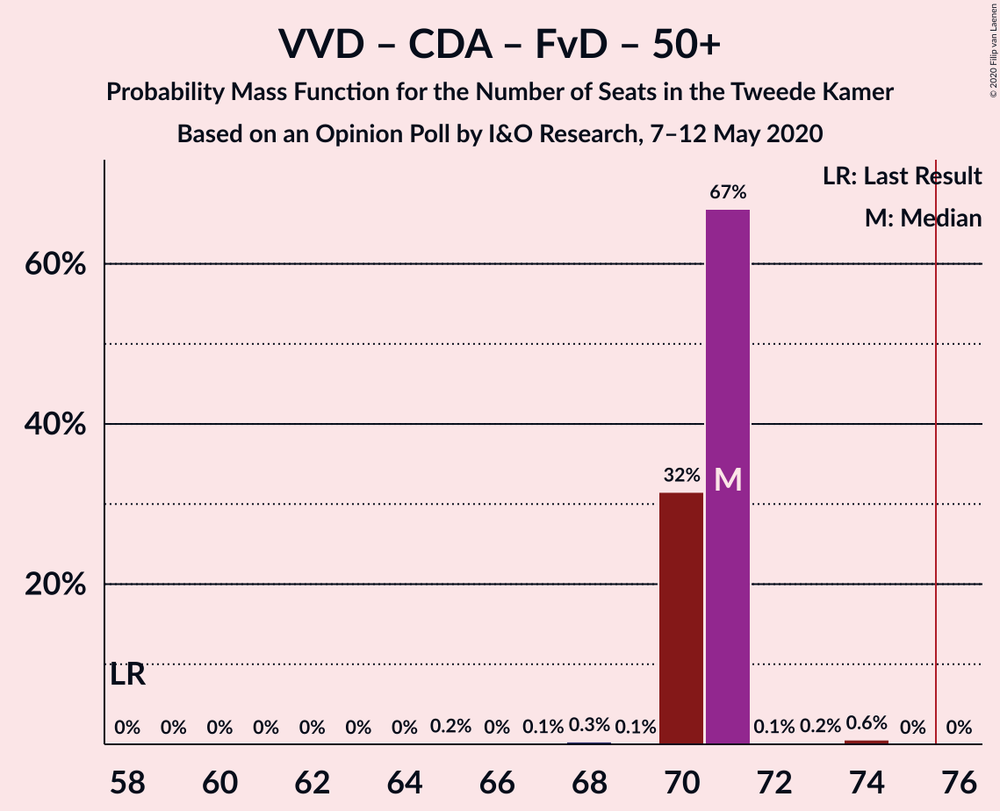

| Number of Seats | Probability | Accumulated | Special Marks |
|:---------------:|:-----------:|:-----------:|:-------------:|
| 58 | 0% | 100% | Last Result |
| 59 | 0% | 100% |  |
| 60 | 0% | 100% |  |
| 61 | 0% | 100% |  |
| 62 | 0% | 100% |  |
| 63 | 0% | 100% |  |
| 64 | 0% | 100% |  |
| 65 | 0.2% | 100% |  |
| 66 | 0% | 99.8% |  |
| 67 | 0.1% | 99.8% |  |
| 68 | 0.3% | 99.7% |  |
| 69 | 0.1% | 99.3% |  |
| 70 | 32% | 99.3% |  |
| 71 | 67% | 68% | Median |
| 72 | 0.1% | 0.9% |  |
| 73 | 0.2% | 0.8% |  |
| 74 | 0.6% | 0.6% |  |
| 75 | 0% | 0% |  |

### Volkspartij voor Vrijheid en Democratie – Christen-Democratisch Appèl – Forum voor Democratie

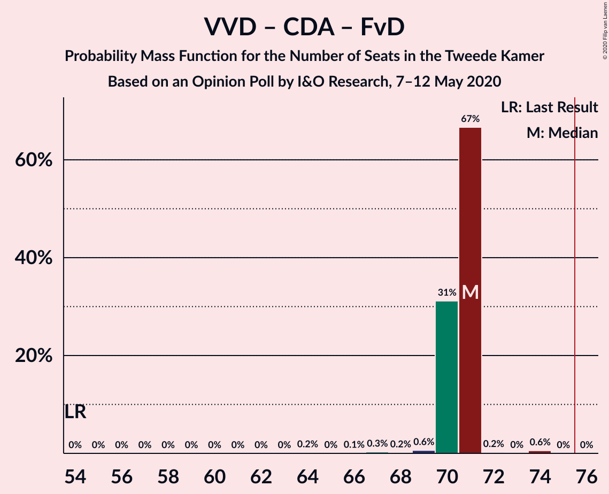

| Number of Seats | Probability | Accumulated | Special Marks |
|:---------------:|:-----------:|:-----------:|:-------------:|
| 54 | 0% | 100% | Last Result |
| 55 | 0% | 100% |  |
| 56 | 0% | 100% |  |
| 57 | 0% | 100% |  |
| 58 | 0% | 100% |  |
| 59 | 0% | 100% |  |
| 60 | 0% | 100% |  |
| 61 | 0% | 100% |  |
| 62 | 0% | 100% |  |
| 63 | 0% | 100% |  |
| 64 | 0.2% | 100% |  |
| 65 | 0% | 99.8% |  |
| 66 | 0.1% | 99.8% |  |
| 67 | 0.3% | 99.7% |  |
| 68 | 0.2% | 99.4% |  |
| 69 | 0.6% | 99.3% |  |
| 70 | 31% | 98.6% |  |
| 71 | 67% | 67% | Median |
| 72 | 0.2% | 0.8% |  |
| 73 | 0% | 0.6% |  |
| 74 | 0.6% | 0.6% |  |
| 75 | 0% | 0% |  |

### GroenLinks – Partij van de Arbeid – Christen-Democratisch Appèl – Socialistische Partij – Democraten 66 – ChristenUnie

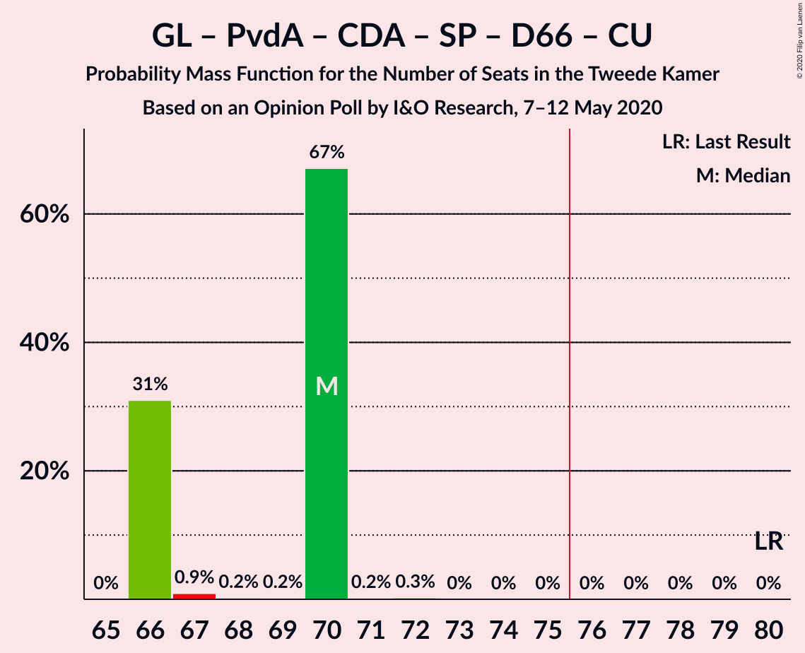

| Number of Seats | Probability | Accumulated | Special Marks |
|:---------------:|:-----------:|:-----------:|:-------------:|
| 66 | 31% | 100% |  |
| 67 | 0.9% | 69% |  |
| 68 | 0.2% | 68% |  |
| 69 | 0.2% | 68% |  |
| 70 | 67% | 68% | Median |
| 71 | 0.2% | 0.5% |  |
| 72 | 0.3% | 0.3% |  |
| 73 | 0% | 0% |  |
| 74 | 0% | 0% |  |
| 75 | 0% | 0% |  |
| 76 | 0% | 0% | Majority |
| 77 | 0% | 0% |  |
| 78 | 0% | 0% |  |
| 79 | 0% | 0% |  |
| 80 | 0% | 0% | Last Result |

### Volkspartij voor Vrijheid en Democratie – Partij van de Arbeid – Democraten 66

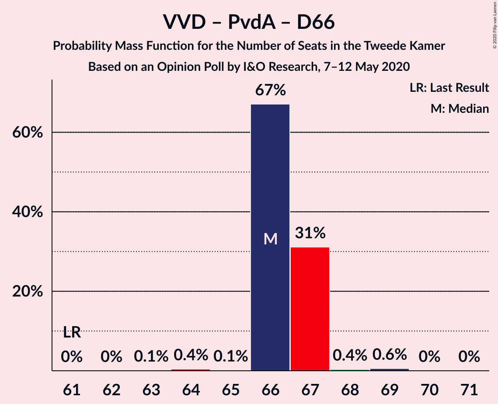

| Number of Seats | Probability | Accumulated | Special Marks |
|:---------------:|:-----------:|:-----------:|:-------------:|
| 61 | 0% | 100% | Last Result |
| 62 | 0% | 100% |  |
| 63 | 0.1% | 100% |  |
| 64 | 0.4% | 99.9% |  |
| 65 | 0.1% | 99.4% |  |
| 66 | 67% | 99.3% | Median |
| 67 | 31% | 32% |  |
| 68 | 0.4% | 1.0% |  |
| 69 | 0.6% | 0.7% |  |
| 70 | 0% | 0.1% |  |
| 71 | 0% | 0% |  |

### Volkspartij voor Vrijheid en Democratie – Christen-Democratisch Appèl – Democraten 66

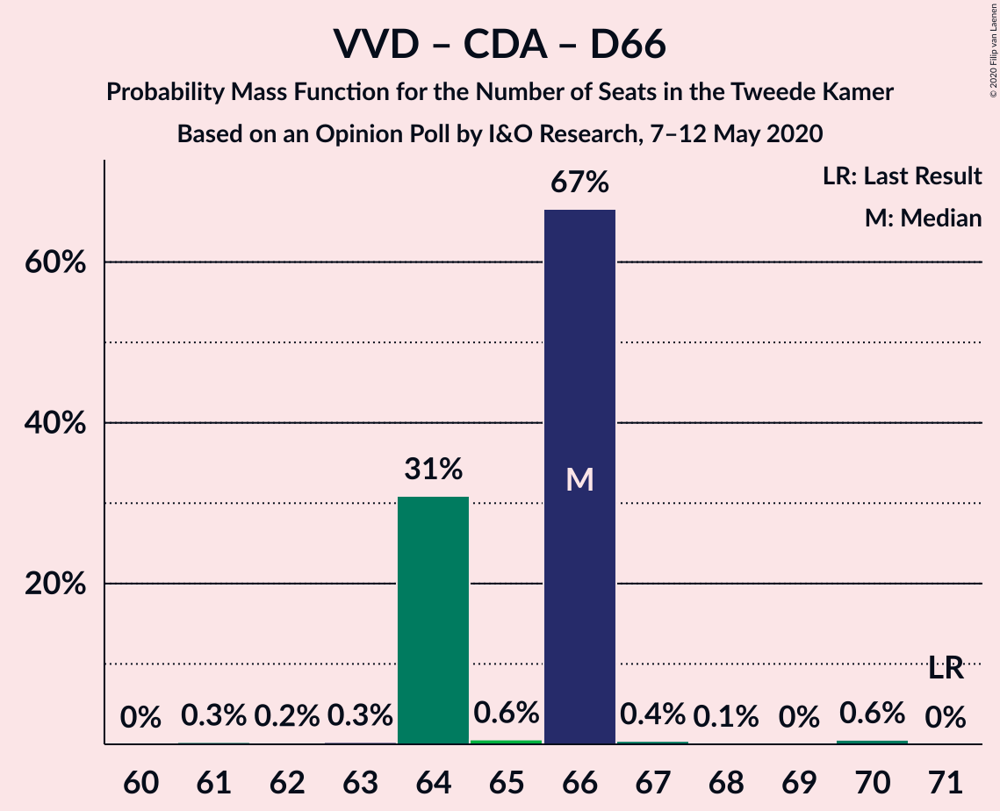

| Number of Seats | Probability | Accumulated | Special Marks |
|:---------------:|:-----------:|:-----------:|:-------------:|
| 61 | 0.3% | 100% |  |
| 62 | 0.2% | 99.7% |  |
| 63 | 0.3% | 99.5% |  |
| 64 | 31% | 99.3% |  |
| 65 | 0.6% | 68% |  |
| 66 | 67% | 68% | Median |
| 67 | 0.4% | 1.1% |  |
| 68 | 0.1% | 0.7% |  |
| 69 | 0% | 0.6% |  |
| 70 | 0.6% | 0.6% |  |
| 71 | 0% | 0% | Last Result |

### Volkspartij voor Vrijheid en Democratie – Partij van de Arbeid

| Number of Seats | Probability | Accumulated | Special Marks |
|:---------------:|:-----------:|:-----------:|:-------------:|
| 42 | 0% | 100% | Last Result |
| 43 | 0% | 100% |  |
| 44 | 0% | 100% |  |
| 45 | 0% | 100% |  |
| 46 | 0% | 100% |  |
| 47 | 0% | 100% |  |
| 48 | 0% | 100% |  |
| 49 | 0% | 100% |  |
| 50 | 0% | 100% |  |
| 51 | 0% | 100% |  |
| 52 | 0% | 100% |  |
| 53 | 0% | 100% |  |
| 54 | 0% | 100% |  |
| 55 | 0.2% | 100% |  |
| 56 | 0.3% | 99.8% |  |
| 57 | 0.2% | 99.5% |  |
| 58 | 67% | 99.3% | Median |
| 59 | 0.4% | 32% |  |
| 60 | 31% | 32% |  |
| 61 | 0.7% | 0.8% |  |
| 62 | 0% | 0% |  |

### GroenLinks – Partij van de Arbeid – Christen-Democratisch Appèl – Democraten 66 – ChristenUnie

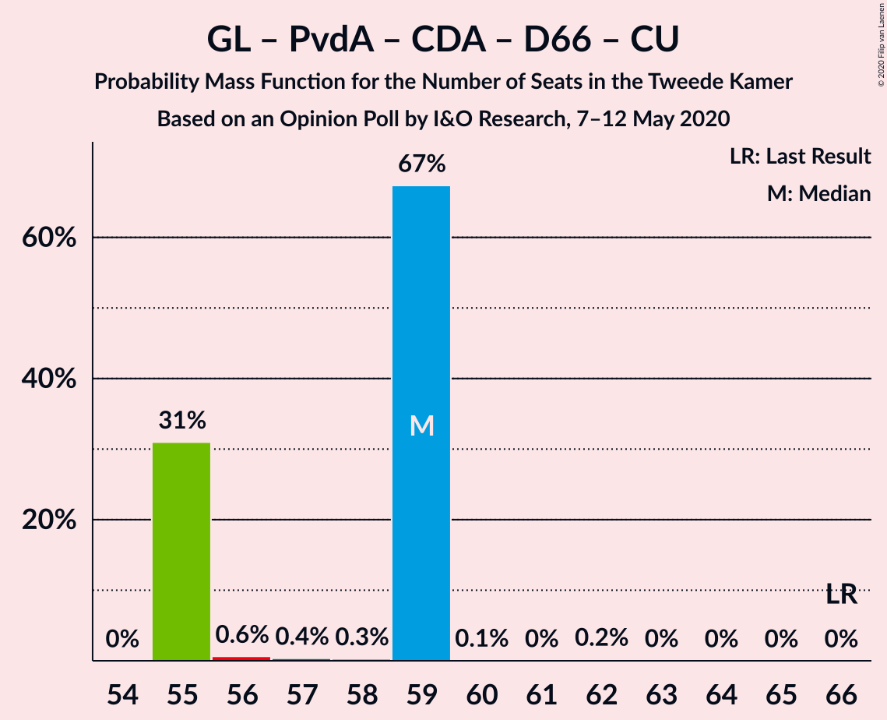

| Number of Seats | Probability | Accumulated | Special Marks |
|:---------------:|:-----------:|:-----------:|:-------------:|
| 55 | 31% | 100% |  |
| 56 | 0.6% | 69% |  |
| 57 | 0.4% | 68% |  |
| 58 | 0.3% | 68% |  |
| 59 | 67% | 68% | Median |
| 60 | 0.1% | 0.4% |  |
| 61 | 0% | 0.3% |  |
| 62 | 0.2% | 0.3% |  |
| 63 | 0% | 0.1% |  |
| 64 | 0% | 0% |  |
| 65 | 0% | 0% |  |
| 66 | 0% | 0% | Last Result |

### Volkspartij voor Vrijheid en Democratie – Christen-Democratisch Appèl

| Number of Seats | Probability | Accumulated | Special Marks |
|:---------------:|:-----------:|:-----------:|:-------------:|
| 52 | 0.2% | 100% | Last Result |
| 53 | 0.1% | 99.8% |  |
| 54 | 0.1% | 99.8% |  |
| 55 | 0.4% | 99.7% |  |
| 56 | 0.1% | 99.3% |  |
| 57 | 31% | 99.2% |  |
| 58 | 67% | 68% | Median |
| 59 | 0.1% | 0.9% |  |
| 60 | 0.2% | 0.9% |  |
| 61 | 0.1% | 0.6% |  |
| 62 | 0.6% | 0.6% |  |
| 63 | 0% | 0% |  |

### Partij van de Arbeid – Christen-Democratisch Appèl – Democraten 66

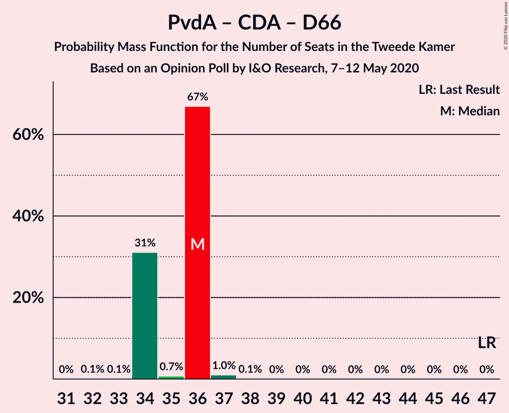

| Number of Seats | Probability | Accumulated | Special Marks |
|:---------------:|:-----------:|:-----------:|:-------------:|
| 32 | 0.1% | 100% |  |
| 33 | 0.1% | 99.9% |  |
| 34 | 31% | 99.8% |  |
| 35 | 0.7% | 69% |  |
| 36 | 67% | 68% | Median |
| 37 | 1.0% | 1.1% |  |
| 38 | 0.1% | 0.1% |  |
| 39 | 0% | 0% |  |
| 40 | 0% | 0% |  |
| 41 | 0% | 0% |  |
| 42 | 0% | 0% |  |
| 43 | 0% | 0% |  |
| 44 | 0% | 0% |  |
| 45 | 0% | 0% |  |
| 46 | 0% | 0% |  |
| 47 | 0% | 0% | Last Result |

### Partij van de Arbeid – Christen-Democratisch Appèl – ChristenUnie

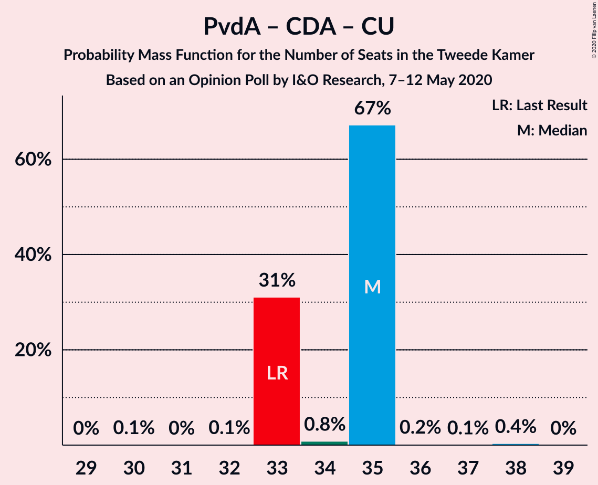

| Number of Seats | Probability | Accumulated | Special Marks |
|:---------------:|:-----------:|:-----------:|:-------------:|
| 30 | 0.1% | 100% |  |
| 31 | 0% | 99.9% |  |
| 32 | 0.1% | 99.9% |  |
| 33 | 31% | 99.7% | Last Result |
| 34 | 0.8% | 69% |  |
| 35 | 67% | 68% | Median |
| 36 | 0.2% | 0.6% |  |
| 37 | 0.1% | 0.4% |  |
| 38 | 0.4% | 0.4% |  |
| 39 | 0% | 0% |  |

### Partij van de Arbeid – Christen-Democratisch Appèl

| Number of Seats | Probability | Accumulated | Special Marks |
|:---------------:|:-----------:|:-----------:|:-------------:|
| 25 | 0.3% | 100% |  |
| 26 | 0.1% | 99.6% |  |
| 27 | 32% | 99.6% |  |
| 28 | 67% | 68% | Last Result, Median |
| 29 | 0.8% | 1.1% |  |
| 30 | 0.3% | 0.3% |  |
| 31 | 0% | 0% |  |

### Christen-Democratisch Appèl – Democraten 66

| Number of Seats | Probability | Accumulated | Special Marks |
|:---------------:|:-----------:|:-----------:|:-------------:|
| 18 | 0.1% | 100% |  |
| 19 | 31% | 99.9% |  |
| 20 | 0.3% | 69% |  |
| 21 | 0.8% | 69% |  |
| 22 | 67% | 68% | Median |
| 23 | 0.6% | 0.6% |  |
| 24 | 0% | 0.1% |  |
| 25 | 0% | 0% |  |
| 26 | 0% | 0% |  |
| 27 | 0% | 0% |  |
| 28 | 0% | 0% |  |
| 29 | 0% | 0% |  |
| 30 | 0% | 0% |  |
| 31 | 0% | 0% |  |
| 32 | 0% | 0% |  |
| 33 | 0% | 0% |  |
| 34 | 0% | 0% |  |
| 35 | 0% | 0% |  |
| 36 | 0% | 0% |  |
| 37 | 0% | 0% |  |
| 38 | 0% | 0% | Last Result |

## Technical Information

### Opinion Poll

+ **Polling firm:** I&O Research
+ **Commissioner(s):** —
+ **Fieldwork period:** 7–12 May 2020

### Calculations

+ **Sample size:** 2076
+ **Simulations done:** 1,048,576
+ **Error estimate:** 1.10%

