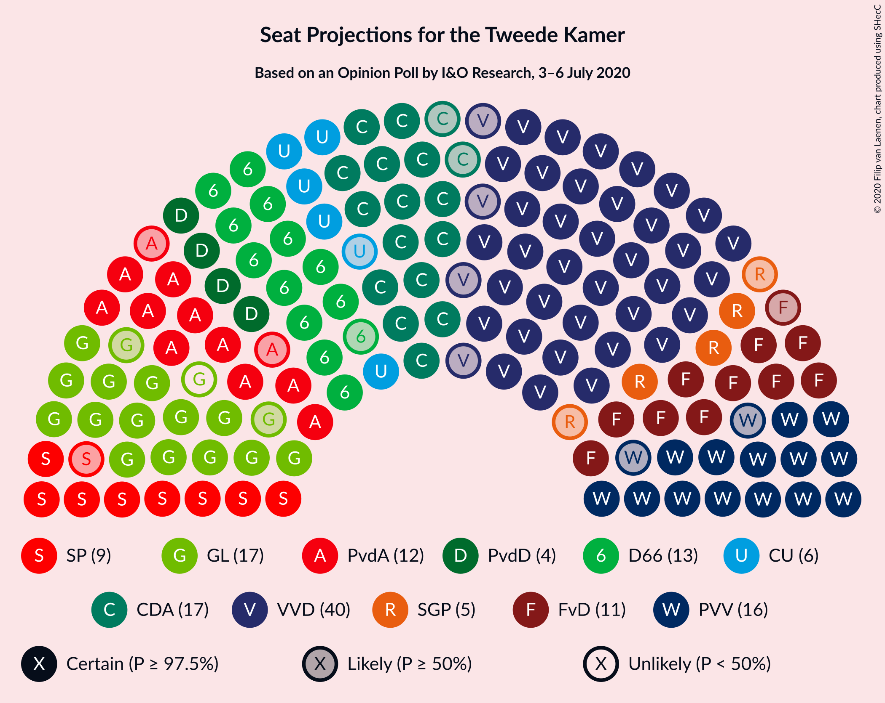
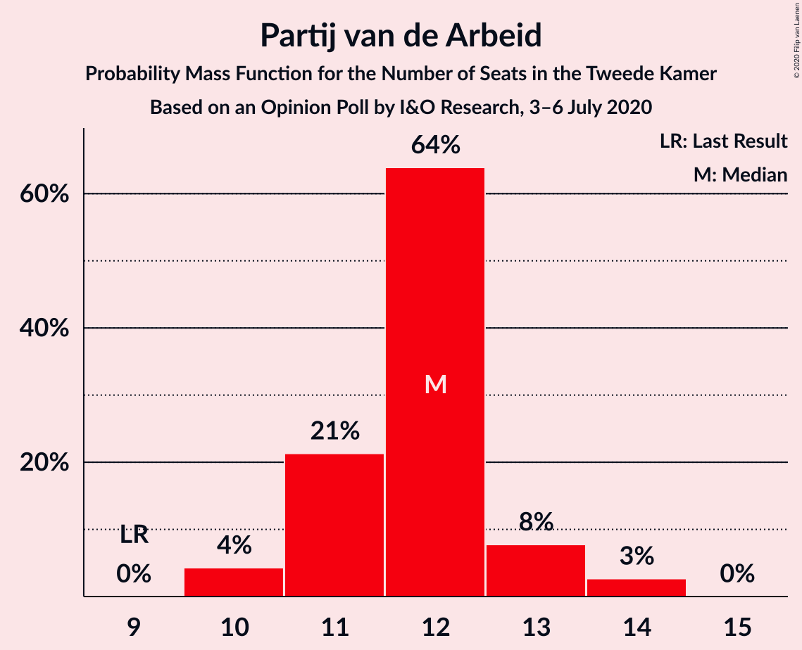
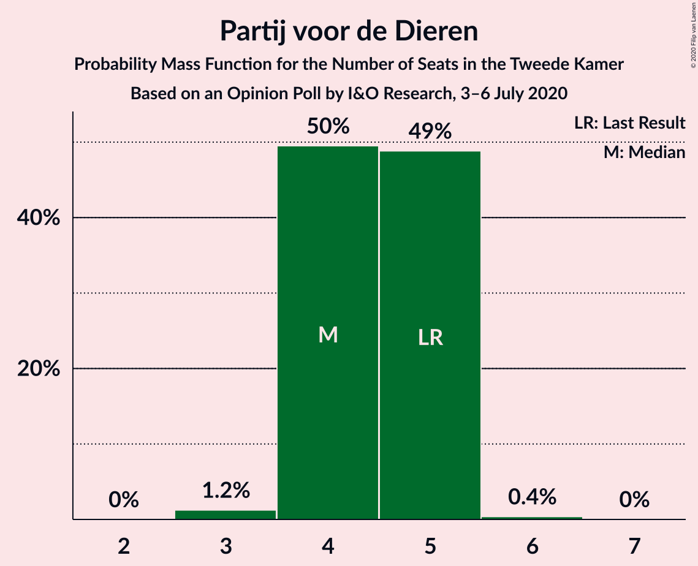
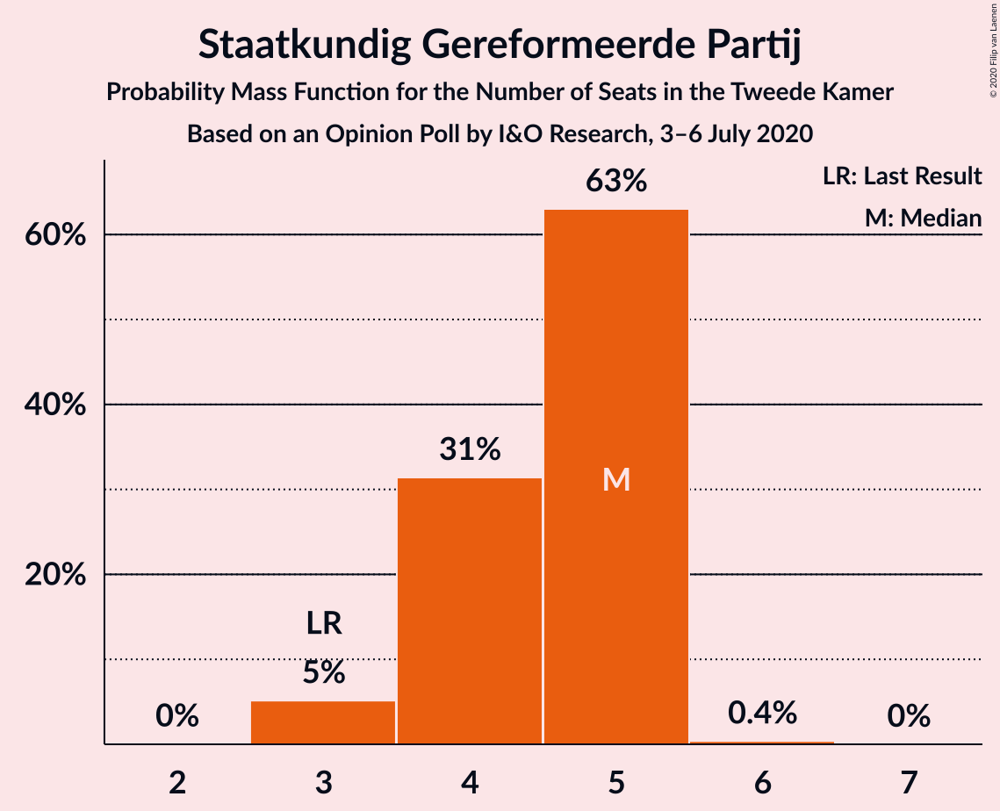
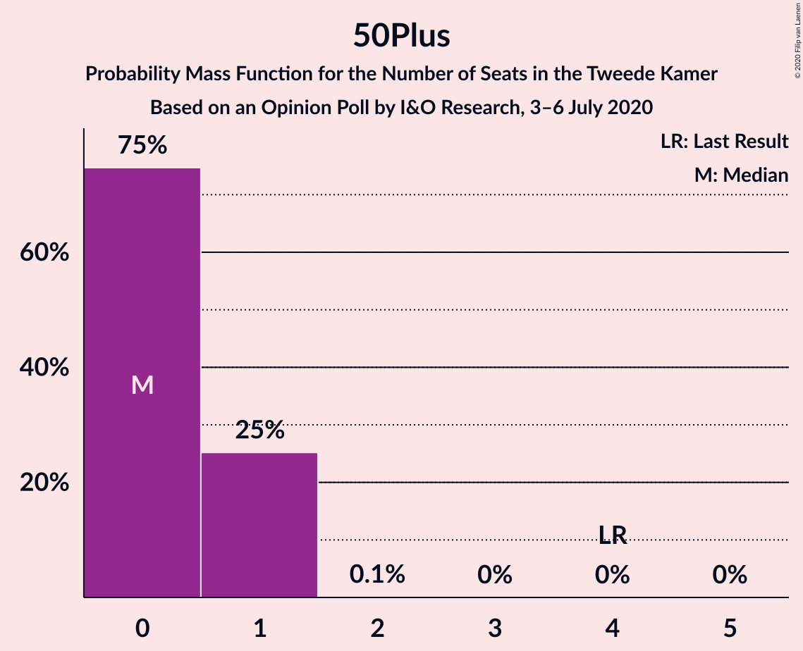
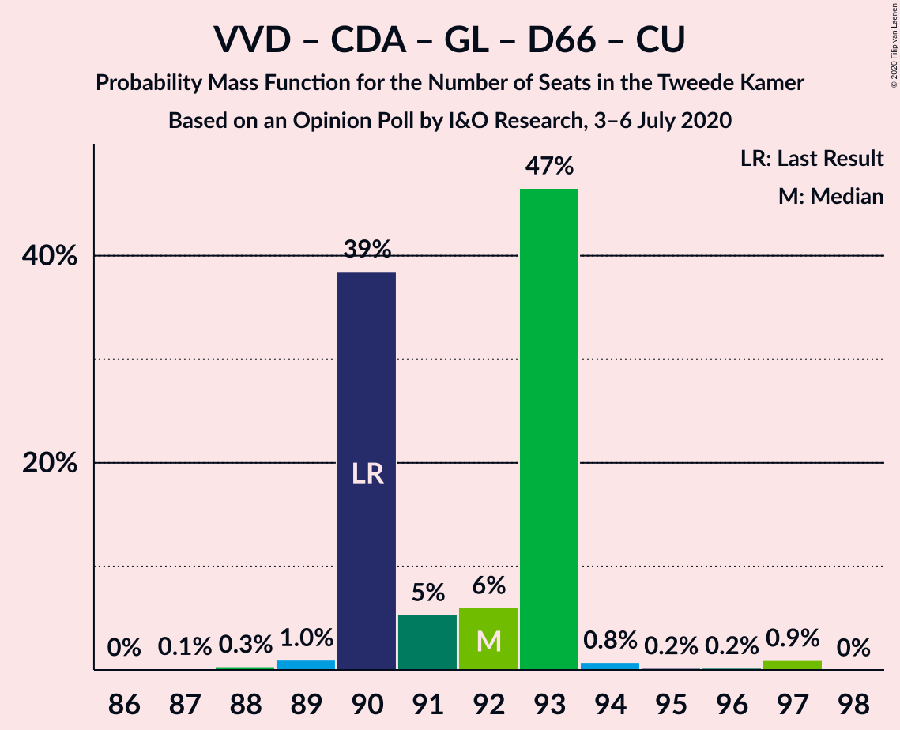
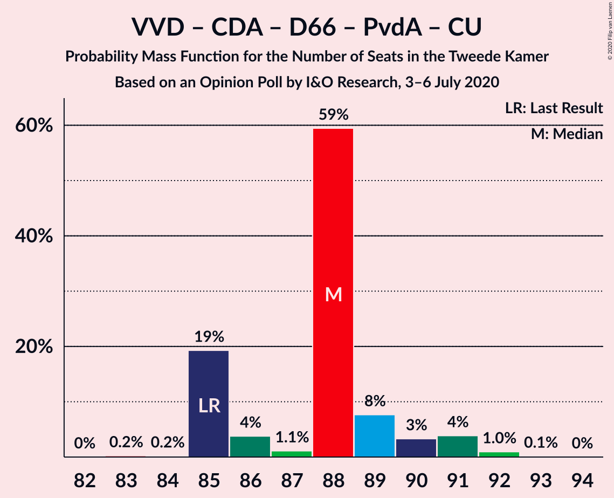
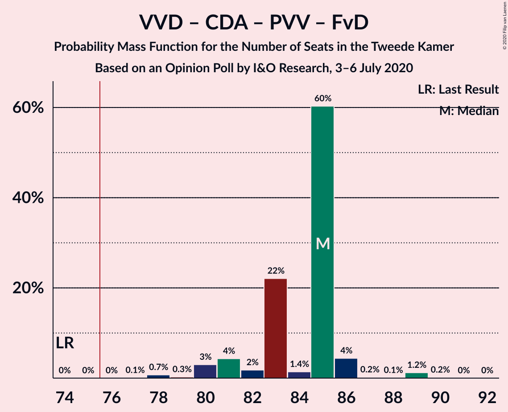
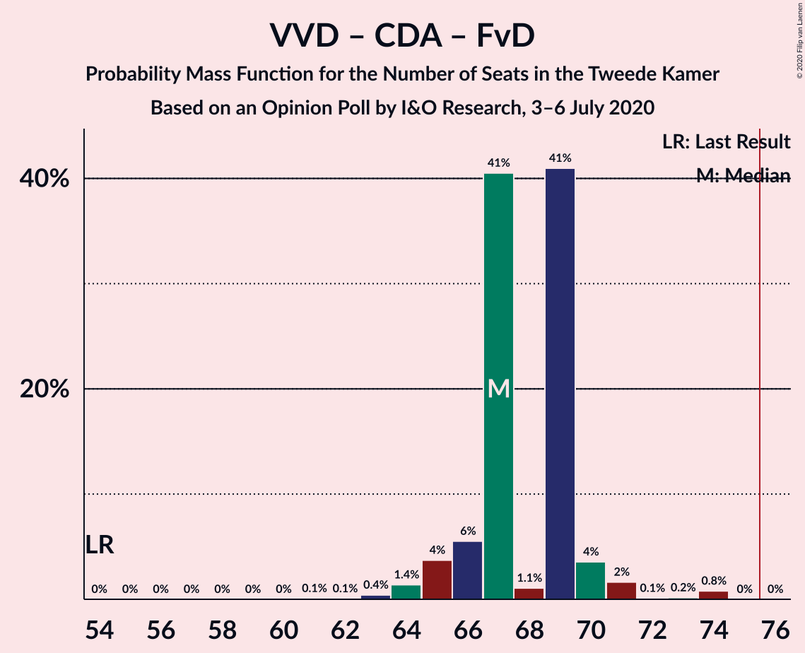
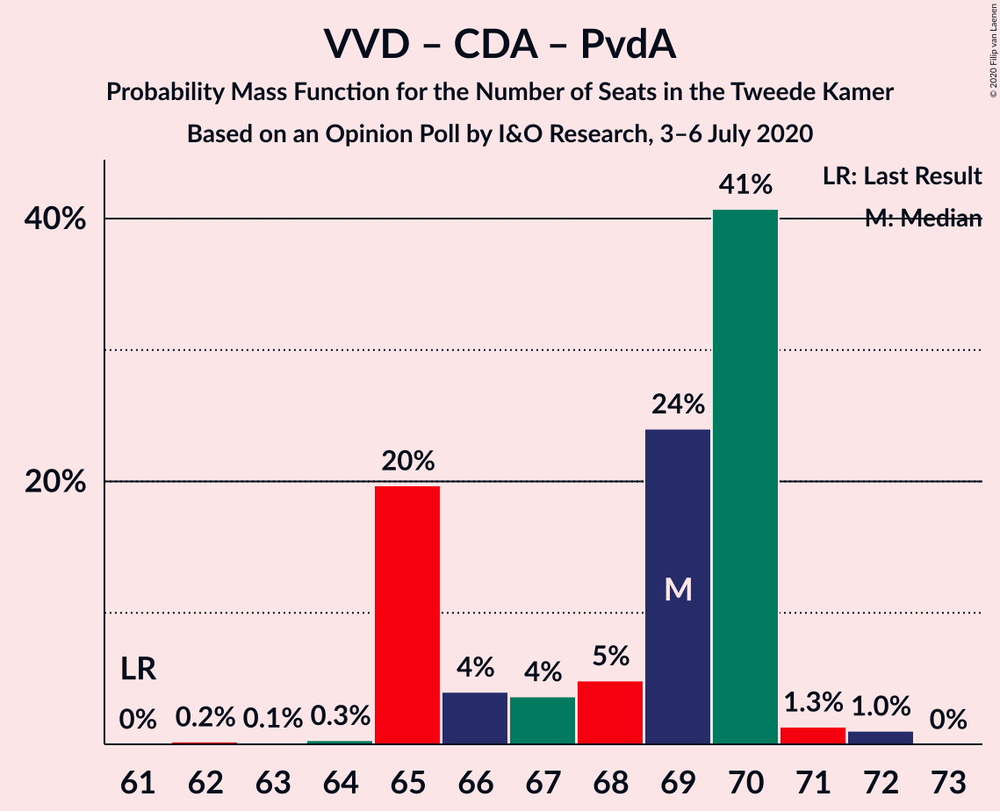

# Opinion Poll by I&O Research, 3–6 July 2020

<a href="#voting-intentions">Voting Intentions</a> | <a href="#seats">Seats</a> | <a href="#coalitions">Coalitions</a> | <a href="#technical-information">Technical Information</a>

## Voting Intentions

### Confidence Intervals

| Party | Last Result | Poll Result | 80% Confidence Interval | 90% Confidence Interval | 95% Confidence Interval | 99% Confidence Interval |
|:-----:|:-----------:|:-----------:|:-----------------------:|:-----------------------:|:-----------------------:|:-----------------------:|
| Volkspartij voor Vrijheid en Democratie | 21.3% | 24.9% | 23.7–26.2% |23.4–26.5% |23.1–26.8% |22.5–27.4% |
| Christen-Democratisch Appèl | 12.4% | 11.1% | 10.2–12.0% |10.0–12.3% |9.8–12.5% |9.4–13.0% |
| Partij voor de Vrijheid | 13.1% | 10.4% | 9.6–11.3% |9.4–11.6% |9.2–11.8% |8.8–12.2% |
| GroenLinks | 9.1% | 10.3% | 9.5–11.2% |9.3–11.5% |9.1–11.7% |8.7–12.1% |
| Democraten 66 | 12.2% | 9.1% | 8.3–10.0% |8.1–10.2% |7.9–10.4% |7.6–10.8% |
| Partij van de Arbeid | 5.7% | 8.0% | 7.3–8.8% |7.1–9.0% |6.9–9.3% |6.6–9.6% |
| Forum voor Democratie | 1.8% | 7.9% | 7.2–8.7% |7.0–8.9% |6.8–9.1% |6.5–9.5% |
| Socialistische Partij | 9.1% | 6.1% | 5.5–6.8% |5.3–7.0% |5.2–7.2% |4.9–7.6% |
| ChristenUnie | 3.4% | 4.4% | 3.9–5.0% |3.7–5.2% |3.6–5.4% |3.4–5.7% |
| Partij voor de Dieren | 3.2% | 3.1% | 2.6–3.6% |2.5–3.8% |2.4–3.9% |2.2–4.2% |
| Staatkundig Gereformeerde Partij | 2.1% | 2.9% | 2.5–3.4% |2.3–3.6% |2.3–3.7% |2.1–4.0% |
| 50Plus | 3.1% | 0.5% | 0.4–0.8% |0.3–0.9% |0.3–0.9% |0.2–1.1% |
| DENK | 2.1% | 0.5% | 0.4–0.8% |0.3–0.9% |0.3–0.9% |0.2–1.1% |
| Partij voor de Toekomst | 0.0% | 0.4% | 0.2–0.6% |0.2–0.7% |0.2–0.7% |0.1–0.9% |

*Note:* The poll result column reflects the actual value used in the calculations. Published results may vary slightly, and in addition be rounded to fewer digits.

## Seats

### Confidence Intervals

| Party | Last Result | Median | 80% Confidence Interval | 90% Confidence Interval | 95% Confidence Interval | 99% Confidence Interval |
|:-----:|:-----------:|:------:|:-----------------------:|:-----------------------:|:-----------------------:|:-----------------------:|
| <a href="#volkspartij-voor-vrijheid-en-democratie">Volkspartij voor Vrijheid en Democratie</a> | 33 | 40 | 38–41 |37–41 |36–41 |36–44 |
| <a href="#christen-democratisch-appèl">Christen-Democratisch Appèl</a> | 19 | 17 | 15–17 |15–18 |15–18 |15–19 |
| <a href="#partij-voor-de-vrijheid">Partij voor de Vrijheid</a> | 20 | 16 | 15–18 |15–18 |14–18 |13–18 |
| <a href="#groenlinks">GroenLinks</a> | 14 | 16 | 14–17 |14–17 |14–18 |14–18 |
| <a href="#democraten-66">Democraten 66</a> | 19 | 13 | 12–15 |12–16 |12–16 |12–16 |
| <a href="#partij-van-de-arbeid">Partij van de Arbeid</a> | 9 | 12 | 11–13 |11–13 |10–14 |10–14 |
| <a href="#forum-voor-democratie">Forum voor Democratie</a> | 2 | 11 | 10–13 |10–13 |10–13 |10–14 |
| <a href="#socialistische-partij">Socialistische Partij</a> | 14 | 9 | 9–10 |8–10 |8–10 |7–11 |
| <a href="#christenunie">ChristenUnie</a> | 5 | 6 | 5–7 |5–7 |5–8 |5–8 |
| <a href="#partij-voor-de-dieren">Partij voor de Dieren</a> | 5 | 4 | 4–5 |4–5 |4–5 |3–5 |
| <a href="#staatkundig-gereformeerde-partij">Staatkundig Gereformeerde Partij</a> | 3 | 5 | 4–5 |3–5 |3–5 |3–5 |
| <a href="#50plus">50Plus</a> | 4 | 0 | 0–1 |0–1 |0–1 |0–1 |
| <a href="#denk">DENK</a> | 3 | 0 | 0–1 |0–1 |0–1 |0–1 |
| <a href="#partij-voor-de-toekomst">Partij voor de Toekomst</a> | 0 | 0 | 0 |0 |0 |0–1 |

### Volkspartij voor Vrijheid en Democratie

*For a full overview of the results for this party, see the [Volkspartij voor Vrijheid en Democratie](party-volkspartijvoorvrijheidendemocratie.html) page.*

| Number of Seats | Probability | Accumulated | Special Marks |
|:---------------:|:-----------:|:-----------:|:-------------:|
| 33 | 0% | 100% | Last Result |
| 34 | 0% | 100% |  |
| 35 | 0.3% | 100% |  |
| 36 | 3% | 99.6% |  |
| 37 | 5% | 96% |  |
| 38 | 3% | 91% |  |
| 39 | 22% | 89% |  |
| 40 | 21% | 66% | Median |
| 41 | 43% | 45% |  |
| 42 | 0.1% | 1.3% |  |
| 43 | 0.4% | 1.2% |  |
| 44 | 0.8% | 0.8% |  |
| 45 | 0% | 0% |  |

### Christen-Democratisch Appèl

*For a full overview of the results for this party, see the [Christen-Democratisch Appèl](party-christen-democratischappèl.html) page.*

| Number of Seats | Probability | Accumulated | Special Marks |
|:---------------:|:-----------:|:-----------:|:-------------:|
| 14 | 0.2% | 100% |  |
| 15 | 17% | 99.8% |  |
| 16 | 7% | 83% |  |
| 17 | 68% | 75% | Median |
| 18 | 6% | 7% |  |
| 19 | 1.1% | 1.5% | Last Result |
| 20 | 0.3% | 0.4% |  |
| 21 | 0% | 0% |  |

### Partij voor de Vrijheid

*For a full overview of the results for this party, see the [Partij voor de Vrijheid](party-partijvoordevrijheid.html) page.*

| Number of Seats | Probability | Accumulated | Special Marks |
|:---------------:|:-----------:|:-----------:|:-------------:|
| 13 | 2% | 100% |  |
| 14 | 1.3% | 98% |  |
| 15 | 7% | 96% |  |
| 16 | 65% | 90% | Median |
| 17 | 0.6% | 25% |  |
| 18 | 24% | 24% |  |
| 19 | 0.2% | 0.2% |  |
| 20 | 0% | 0% | Last Result |

### GroenLinks

*For a full overview of the results for this party, see the [GroenLinks](party-groenlinks.html) page.*

| Number of Seats | Probability | Accumulated | Special Marks |
|:---------------:|:-----------:|:-----------:|:-------------:|
| 12 | 0.1% | 100% |  |
| 13 | 0.2% | 99.9% |  |
| 14 | 28% | 99.7% | Last Result |
| 15 | 7% | 72% |  |
| 16 | 19% | 66% | Median |
| 17 | 43% | 47% |  |
| 18 | 4% | 4% |  |
| 19 | 0.1% | 0.1% |  |
| 20 | 0% | 0% |  |

### Democraten 66

*For a full overview of the results for this party, see the [Democraten 66](party-democraten66.html) page.*

| Number of Seats | Probability | Accumulated | Special Marks |
|:---------------:|:-----------:|:-----------:|:-------------:|
| 11 | 0.2% | 100% |  |
| 12 | 25% | 99.8% |  |
| 13 | 43% | 75% | Median |
| 14 | 21% | 33% |  |
| 15 | 3% | 12% |  |
| 16 | 9% | 10% |  |
| 17 | 0.1% | 0.1% |  |
| 18 | 0% | 0% |  |
| 19 | 0% | 0% | Last Result |

### Partij van de Arbeid

*For a full overview of the results for this party, see the [Partij van de Arbeid](party-partijvandearbeid.html) page.*

| Number of Seats | Probability | Accumulated | Special Marks |
|:---------------:|:-----------:|:-----------:|:-------------:|
| 9 | 0% | 100% | Last Result |
| 10 | 4% | 100% |  |
| 11 | 21% | 96% |  |
| 12 | 64% | 74% | Median |
| 13 | 8% | 10% |  |
| 14 | 3% | 3% |  |
| 15 | 0% | 0% |  |

### Forum voor Democratie

*For a full overview of the results for this party, see the [Forum voor Democratie](party-forumvoordemocratie.html) page.*

| Number of Seats | Probability | Accumulated | Special Marks |
|:---------------:|:-----------:|:-----------:|:-------------:|
| 2 | 0% | 100% | Last Result |
| 3 | 0% | 100% |  |
| 4 | 0% | 100% |  |
| 5 | 0% | 100% |  |
| 6 | 0% | 100% |  |
| 7 | 0% | 100% |  |
| 8 | 0% | 100% |  |
| 9 | 0.1% | 100% |  |
| 10 | 25% | 99.9% |  |
| 11 | 46% | 75% | Median |
| 12 | 4% | 29% |  |
| 13 | 24% | 25% |  |
| 14 | 1.1% | 1.2% |  |
| 15 | 0.1% | 0.1% |  |
| 16 | 0% | 0% |  |

### Socialistische Partij

*For a full overview of the results for this party, see the [Socialistische Partij](party-socialistischepartij.html) page.*

| Number of Seats | Probability | Accumulated | Special Marks |
|:---------------:|:-----------:|:-----------:|:-------------:|
| 6 | 0.1% | 100% |  |
| 7 | 1.2% | 99.9% |  |
| 8 | 6% | 98.7% |  |
| 9 | 65% | 93% | Median |
| 10 | 27% | 27% |  |
| 11 | 0.6% | 0.7% |  |
| 12 | 0.1% | 0.1% |  |
| 13 | 0% | 0% |  |
| 14 | 0% | 0% | Last Result |

### ChristenUnie

*For a full overview of the results for this party, see the [ChristenUnie](party-christenunie.html) page.*

| Number of Seats | Probability | Accumulated | Special Marks |
|:---------------:|:-----------:|:-----------:|:-------------:|
| 5 | 40% | 100% | Last Result |
| 6 | 29% | 60% | Median |
| 7 | 28% | 31% |  |
| 8 | 2% | 3% |  |
| 9 | 0.1% | 0.1% |  |
| 10 | 0% | 0% |  |

### Partij voor de Dieren

*For a full overview of the results for this party, see the [Partij voor de Dieren](party-partijvoordedieren.html) page.*

| Number of Seats | Probability | Accumulated | Special Marks |
|:---------------:|:-----------:|:-----------:|:-------------:|
| 3 | 1.2% | 100% |  |
| 4 | 50% | 98.8% | Median |
| 5 | 49% | 49% | Last Result |
| 6 | 0.4% | 0.4% |  |
| 7 | 0% | 0% |  |

### Staatkundig Gereformeerde Partij

*For a full overview of the results for this party, see the [Staatkundig Gereformeerde Partij](party-staatkundiggereformeerdepartij.html) page.*

| Number of Seats | Probability | Accumulated | Special Marks |
|:---------------:|:-----------:|:-----------:|:-------------:|
| 3 | 5% | 100% | Last Result |
| 4 | 31% | 95% |  |
| 5 | 63% | 63% | Median |
| 6 | 0.4% | 0.4% |  |
| 7 | 0% | 0% |  |

### 50Plus

*For a full overview of the results for this party, see the [50Plus](party-50plus.html) page.*

| Number of Seats | Probability | Accumulated | Special Marks |
|:---------------:|:-----------:|:-----------:|:-------------:|
| 0 | 75% | 100% | Median |
| 1 | 25% | 25% |  |
| 2 | 0.1% | 0.1% |  |
| 3 | 0% | 0% |  |
| 4 | 0% | 0% | Last Result |

### DENK

*For a full overview of the results for this party, see the [DENK](party-denk.html) page.*

| Number of Seats | Probability | Accumulated | Special Marks |
|:---------------:|:-----------:|:-----------:|:-------------:|
| 0 | 68% | 100% | Median |
| 1 | 32% | 32% |  |
| 2 | 0% | 0% |  |
| 3 | 0% | 0% | Last Result |

### Partij voor de Toekomst

*For a full overview of the results for this party, see the [Partij voor de Toekomst](party-partijvoordetoekomst.html) page.*

| Number of Seats | Probability | Accumulated | Special Marks |
|:---------------:|:-----------:|:-----------:|:-------------:|
| 0 | 98% | 100% | Last Result, Median |
| 1 | 2% | 2% |  |
| 2 | 0% | 0% |  |

## Coalitions

### Confidence Intervals

| Coalition | Last Result | Median | Majority? | 80% Confidence Interval | 90% Confidence Interval | 95% Confidence Interval | 99% Confidence Interval |
|:---------:|:-----------:|:------:|:---------:|:-----------------------:|:-----------------------:|:-----------------------:|:-----------------------:|
| Volkspartij voor Vrijheid en Democratie – Christen-Democratisch Appèl – GroenLinks – Democraten 66 – ChristenUnie | 90 | 92 | 100% | 90–93 | 90–93 | 90–93 | 88–97 |
| Volkspartij voor Vrijheid en Democratie – Christen-Democratisch Appèl – Democraten 66 – Partij van de Arbeid – ChristenUnie | 85 | 88 | 100% | 85–89 | 85–90 | 85–91 | 85–92 |
| Volkspartij voor Vrijheid en Democratie – Christen-Democratisch Appèl – Partij voor de Vrijheid – Forum voor Democratie – Staatkundig Gereformeerde Partij | 77 | 89 | 100% | 86–90 | 85–90 | 84–90 | 82–93 |
| Volkspartij voor Vrijheid en Democratie – Christen-Democratisch Appèl – Partij voor de Vrijheid – Forum voor Democratie | 74 | 85 | 100% | 82–85 | 81–86 | 80–86 | 78–89 |
| Volkspartij voor Vrijheid en Democratie – Christen-Democratisch Appèl – Democraten 66 – ChristenUnie | 76 | 76 | 74% | 74–77 | 74–78 | 74–78 | 73–81 |
| Christen-Democratisch Appèl – GroenLinks – Democraten 66 – Partij van de Arbeid – Socialistische Partij – ChristenUnie | 80 | 73 | 9% | 71–75 | 71–76 | 71–76 | 70–78 |
| Volkspartij voor Vrijheid en Democratie – Christen-Democratisch Appèl – Forum voor Democratie – Staatkundig Gereformeerde Partij – 50Plus | 61 | 73 | 1.3% | 71–74 | 70–74 | 69–75 | 68–77 |
| Volkspartij voor Vrijheid en Democratie – Christen-Democratisch Appèl – Forum voor Democratie – Staatkundig Gereformeerde Partij | 57 | 72 | 1.2% | 71–74 | 70–74 | 69–75 | 68–77 |
| Volkspartij voor Vrijheid en Democratie – Christen-Democratisch Appèl – Partij voor de Vrijheid | 72 | 74 | 2% | 70–75 | 70–75 | 68–75 | 67–77 |
| Volkspartij voor Vrijheid en Democratie – Christen-Democratisch Appèl – Democraten 66 | 71 | 70 | 0% | 68–71 | 68–72 | 67–72 | 66–74 |
| Volkspartij voor Vrijheid en Democratie – Christen-Democratisch Appèl – Forum voor Democratie – 50Plus | 58 | 68 | 0% | 67–69 | 65–70 | 65–71 | 64–74 |
| Volkspartij voor Vrijheid en Democratie – Christen-Democratisch Appèl – Forum voor Democratie | 54 | 67 | 0% | 66–69 | 65–70 | 65–71 | 63–74 |
| Volkspartij voor Vrijheid en Democratie – Christen-Democratisch Appèl – Partij van de Arbeid | 61 | 69 | 0% | 65–70 | 65–70 | 65–70 | 64–72 |
| Christen-Democratisch Appèl – GroenLinks – Democraten 66 – Partij van de Arbeid – ChristenUnie | 66 | 64 | 0% | 62–66 | 62–67 | 62–68 | 61–68 |
| Volkspartij voor Vrijheid en Democratie – Democraten 66 – Partij van de Arbeid | 61 | 66 | 0% | 64–66 | 63–68 | 62–68 | 61–68 |
| Volkspartij voor Vrijheid en Democratie – Christen-Democratisch Appèl | 52 | 57 | 0% | 54–58 | 54–58 | 54–59 | 52–61 |
| Volkspartij voor Vrijheid en Democratie – Partij van de Arbeid | 42 | 52 | 0% | 50–53 | 48–53 | 48–53 | 48–55 |
| Christen-Democratisch Appèl – Democraten 66 – Partij van de Arbeid | 47 | 42 | 0% | 40–44 | 40–46 | 38–46 | 38–47 |
| Christen-Democratisch Appèl – Partij van de Arbeid – ChristenUnie | 33 | 34 | 0% | 32–36 | 32–37 | 32–38 | 31–38 |
| Christen-Democratisch Appèl – Democraten 66 | 38 | 30 | 0% | 29–32 | 29–33 | 28–34 | 28–34 |
| Christen-Democratisch Appèl – Partij van de Arbeid | 28 | 29 | 0% | 26–30 | 26–30 | 26–31 | 25–32 |

### Volkspartij voor Vrijheid en Democratie – Christen-Democratisch Appèl – GroenLinks – Democraten 66 – ChristenUnie

| Number of Seats | Probability | Accumulated | Special Marks |
|:---------------:|:-----------:|:-----------:|:-------------:|
| 87 | 0.1% | 100% |  |
| 88 | 0.3% | 99.8% |  |
| 89 | 1.0% | 99.5% |  |
| 90 | 39% | 98.5% | Last Result |
| 91 | 5% | 60% |  |
| 92 | 6% | 55% | Median |
| 93 | 47% | 49% |  |
| 94 | 0.8% | 2% |  |
| 95 | 0.2% | 1.3% |  |
| 96 | 0.2% | 1.2% |  |
| 97 | 0.9% | 0.9% |  |
| 98 | 0% | 0% |  |

### Volkspartij voor Vrijheid en Democratie – Christen-Democratisch Appèl – Democraten 66 – Partij van de Arbeid – ChristenUnie

| Number of Seats | Probability | Accumulated | Special Marks |
|:---------------:|:-----------:|:-----------:|:-------------:|
| 83 | 0.2% | 100% |  |
| 84 | 0.2% | 99.7% |  |
| 85 | 19% | 99.6% | Last Result |
| 86 | 4% | 80% |  |
| 87 | 1.1% | 76% |  |
| 88 | 59% | 75% | Median |
| 89 | 8% | 16% |  |
| 90 | 3% | 8% |  |
| 91 | 4% | 5% |  |
| 92 | 1.0% | 1.1% |  |
| 93 | 0.1% | 0.2% |  |
| 94 | 0% | 0% |  |

### Volkspartij voor Vrijheid en Democratie – Christen-Democratisch Appèl – Partij voor de Vrijheid – Forum voor Democratie – Staatkundig Gereformeerde Partij

| Number of Seats | Probability | Accumulated | Special Marks |
|:---------------:|:-----------:|:-----------:|:-------------:|
| 77 | 0% | 100% | Last Result |
| 78 | 0% | 100% |  |
| 79 | 0% | 100% |  |
| 80 | 0% | 100% |  |
| 81 | 0% | 100% |  |
| 82 | 0.6% | 100% |  |
| 83 | 2% | 99.4% |  |
| 84 | 2% | 98% |  |
| 85 | 2% | 96% |  |
| 86 | 4% | 94% |  |
| 87 | 3% | 90% |  |
| 88 | 21% | 86% |  |
| 89 | 20% | 66% | Median |
| 90 | 44% | 46% |  |
| 91 | 0.2% | 2% |  |
| 92 | 1.0% | 2% |  |
| 93 | 0.4% | 0.6% |  |
| 94 | 0.1% | 0.2% |  |
| 95 | 0% | 0% |  |

### Volkspartij voor Vrijheid en Democratie – Christen-Democratisch Appèl – Partij voor de Vrijheid – Forum voor Democratie

| Number of Seats | Probability | Accumulated | Special Marks |
|:---------------:|:-----------:|:-----------:|:-------------:|
| 74 | 0% | 100% | Last Result |
| 75 | 0% | 100% |  |
| 76 | 0% | 100% | Majority |
| 77 | 0.1% | 100% |  |
| 78 | 0.7% | 99.9% |  |
| 79 | 0.3% | 99.2% |  |
| 80 | 3% | 98.9% |  |
| 81 | 4% | 96% |  |
| 82 | 2% | 92% |  |
| 83 | 22% | 90% |  |
| 84 | 1.4% | 68% | Median |
| 85 | 60% | 66% |  |
| 86 | 4% | 6% |  |
| 87 | 0.2% | 2% |  |
| 88 | 0.1% | 1.4% |  |
| 89 | 1.2% | 1.4% |  |
| 90 | 0.2% | 0.2% |  |
| 91 | 0% | 0% |  |

### Volkspartij voor Vrijheid en Democratie – Christen-Democratisch Appèl – Democraten 66 – ChristenUnie

| Number of Seats | Probability | Accumulated | Special Marks |
|:---------------:|:-----------:|:-----------:|:-------------:|
| 70 | 0% | 100% |  |
| 71 | 0.1% | 99.9% |  |
| 72 | 0.3% | 99.8% |  |
| 73 | 0.4% | 99.5% |  |
| 74 | 16% | 99.2% |  |
| 75 | 9% | 83% |  |
| 76 | 62% | 74% | Last Result, Median, Majority |
| 77 | 5% | 12% |  |
| 78 | 5% | 7% |  |
| 79 | 0.7% | 2% |  |
| 80 | 0.2% | 1.1% |  |
| 81 | 0.9% | 0.9% |  |
| 82 | 0% | 0% |  |

### Christen-Democratisch Appèl – GroenLinks – Democraten 66 – Partij van de Arbeid – Socialistische Partij – ChristenUnie

| Number of Seats | Probability | Accumulated | Special Marks |
|:---------------:|:-----------:|:-----------:|:-------------:|
| 69 | 0.4% | 100% |  |
| 70 | 0.3% | 99.6% |  |
| 71 | 20% | 99.3% |  |
| 72 | 21% | 79% |  |
| 73 | 43% | 59% | Median |
| 74 | 2% | 15% |  |
| 75 | 5% | 14% |  |
| 76 | 6% | 9% | Majority |
| 77 | 0.2% | 2% |  |
| 78 | 2% | 2% |  |
| 79 | 0.1% | 0.1% |  |
| 80 | 0% | 0% | Last Result |

### Volkspartij voor Vrijheid en Democratie – Christen-Democratisch Appèl – Forum voor Democratie – Staatkundig Gereformeerde Partij – 50Plus

| Number of Seats | Probability | Accumulated | Special Marks |
|:---------------:|:-----------:|:-----------:|:-------------:|
| 61 | 0% | 100% | Last Result |
| 62 | 0% | 100% |  |
| 63 | 0% | 100% |  |
| 64 | 0% | 100% |  |
| 65 | 0% | 100% |  |
| 66 | 0.1% | 100% |  |
| 67 | 0.1% | 99.9% |  |
| 68 | 0.3% | 99.8% |  |
| 69 | 2% | 99.4% |  |
| 70 | 5% | 97% |  |
| 71 | 25% | 92% |  |
| 72 | 4% | 68% |  |
| 73 | 17% | 63% | Median |
| 74 | 44% | 47% |  |
| 75 | 1.4% | 3% |  |
| 76 | 0.1% | 1.3% | Majority |
| 77 | 1.2% | 1.2% |  |
| 78 | 0% | 0% |  |

### Volkspartij voor Vrijheid en Democratie – Christen-Democratisch Appèl – Forum voor Democratie – Staatkundig Gereformeerde Partij

| Number of Seats | Probability | Accumulated | Special Marks |
|:---------------:|:-----------:|:-----------:|:-------------:|
| 57 | 0% | 100% | Last Result |
| 58 | 0% | 100% |  |
| 59 | 0% | 100% |  |
| 60 | 0% | 100% |  |
| 61 | 0% | 100% |  |
| 62 | 0% | 100% |  |
| 63 | 0% | 100% |  |
| 64 | 0% | 100% |  |
| 65 | 0.1% | 100% |  |
| 66 | 0.1% | 99.9% |  |
| 67 | 0.1% | 99.8% |  |
| 68 | 2% | 99.7% |  |
| 69 | 2% | 98% |  |
| 70 | 5% | 96% |  |
| 71 | 27% | 91% |  |
| 72 | 16% | 64% |  |
| 73 | 1.4% | 47% | Median |
| 74 | 43% | 46% |  |
| 75 | 1.4% | 3% |  |
| 76 | 0.1% | 1.2% | Majority |
| 77 | 1.1% | 1.1% |  |
| 78 | 0% | 0% |  |

### Volkspartij voor Vrijheid en Democratie – Christen-Democratisch Appèl – Partij voor de Vrijheid

| Number of Seats | Probability | Accumulated | Special Marks |
|:---------------:|:-----------:|:-----------:|:-------------:|
| 66 | 0.3% | 100% |  |
| 67 | 0.6% | 99.7% |  |
| 68 | 2% | 99.1% |  |
| 69 | 0.3% | 97% |  |
| 70 | 21% | 97% |  |
| 71 | 6% | 76% |  |
| 72 | 3% | 69% | Last Result |
| 73 | 4% | 66% | Median |
| 74 | 41% | 62% |  |
| 75 | 20% | 21% |  |
| 76 | 1.1% | 2% | Majority |
| 77 | 0.5% | 0.5% |  |
| 78 | 0% | 0% |  |

### Volkspartij voor Vrijheid en Democratie – Christen-Democratisch Appèl – Democraten 66

| Number of Seats | Probability | Accumulated | Special Marks |
|:---------------:|:-----------:|:-----------:|:-------------:|
| 64 | 0% | 100% |  |
| 65 | 0.1% | 99.9% |  |
| 66 | 0.6% | 99.8% |  |
| 67 | 2% | 99.2% |  |
| 68 | 19% | 97% |  |
| 69 | 24% | 78% |  |
| 70 | 6% | 54% | Median |
| 71 | 43% | 48% | Last Result |
| 72 | 4% | 6% |  |
| 73 | 0.6% | 2% |  |
| 74 | 0.8% | 1.0% |  |
| 75 | 0.1% | 0.2% |  |
| 76 | 0% | 0% | Majority |

### Volkspartij voor Vrijheid en Democratie – Christen-Democratisch Appèl – Forum voor Democratie – 50Plus

| Number of Seats | Probability | Accumulated | Special Marks |
|:---------------:|:-----------:|:-----------:|:-------------:|
| 58 | 0% | 100% | Last Result |
| 59 | 0% | 100% |  |
| 60 | 0% | 100% |  |
| 61 | 0% | 100% |  |
| 62 | 0.1% | 100% |  |
| 63 | 0.3% | 99.8% |  |
| 64 | 0.3% | 99.6% |  |
| 65 | 5% | 99.3% |  |
| 66 | 0.5% | 94% |  |
| 67 | 28% | 94% |  |
| 68 | 18% | 66% | Median |
| 69 | 41% | 48% |  |
| 70 | 4% | 7% |  |
| 71 | 2% | 3% |  |
| 72 | 0.2% | 1.1% |  |
| 73 | 0.2% | 1.0% |  |
| 74 | 0.8% | 0.8% |  |
| 75 | 0% | 0% |  |

### Volkspartij voor Vrijheid en Democratie – Christen-Democratisch Appèl – Forum voor Democratie

| Number of Seats | Probability | Accumulated | Special Marks |
|:---------------:|:-----------:|:-----------:|:-------------:|
| 54 | 0% | 100% | Last Result |
| 55 | 0% | 100% |  |
| 56 | 0% | 100% |  |
| 57 | 0% | 100% |  |
| 58 | 0% | 100% |  |
| 59 | 0% | 100% |  |
| 60 | 0% | 100% |  |
| 61 | 0.1% | 100% |  |
| 62 | 0.1% | 99.9% |  |
| 63 | 0.4% | 99.8% |  |
| 64 | 1.4% | 99.4% |  |
| 65 | 4% | 98% |  |
| 66 | 6% | 94% |  |
| 67 | 41% | 89% |  |
| 68 | 1.1% | 48% | Median |
| 69 | 41% | 47% |  |
| 70 | 4% | 6% |  |
| 71 | 2% | 3% |  |
| 72 | 0.1% | 1.1% |  |
| 73 | 0.2% | 0.9% |  |
| 74 | 0.8% | 0.8% |  |
| 75 | 0% | 0% |  |

### Volkspartij voor Vrijheid en Democratie – Christen-Democratisch Appèl – Partij van de Arbeid

| Number of Seats | Probability | Accumulated | Special Marks |
|:---------------:|:-----------:|:-----------:|:-------------:|
| 61 | 0% | 100% | Last Result |
| 62 | 0.2% | 100% |  |
| 63 | 0.1% | 99.8% |  |
| 64 | 0.3% | 99.6% |  |
| 65 | 20% | 99.3% |  |
| 66 | 4% | 80% |  |
| 67 | 4% | 76% |  |
| 68 | 5% | 72% |  |
| 69 | 24% | 67% | Median |
| 70 | 41% | 43% |  |
| 71 | 1.3% | 2% |  |
| 72 | 1.0% | 1.0% |  |
| 73 | 0% | 0% |  |

### Christen-Democratisch Appèl – GroenLinks – Democraten 66 – Partij van de Arbeid – ChristenUnie

| Number of Seats | Probability | Accumulated | Special Marks |
|:---------------:|:-----------:|:-----------:|:-------------:|
| 60 | 0.1% | 100% |  |
| 61 | 0.6% | 99.9% |  |
| 62 | 39% | 99.3% |  |
| 63 | 0.6% | 60% |  |
| 64 | 44% | 60% | Median |
| 65 | 2% | 15% |  |
| 66 | 5% | 14% | Last Result |
| 67 | 6% | 9% |  |
| 68 | 2% | 3% |  |
| 69 | 0.3% | 0.4% |  |
| 70 | 0% | 0.1% |  |
| 71 | 0% | 0% |  |

### Volkspartij voor Vrijheid en Democratie – Democraten 66 – Partij van de Arbeid

| Number of Seats | Probability | Accumulated | Special Marks |
|:---------------:|:-----------:|:-----------:|:-------------:|
| 60 | 0.1% | 100% |  |
| 61 | 0.6% | 99.9% | Last Result |
| 62 | 4% | 99.3% |  |
| 63 | 4% | 96% |  |
| 64 | 40% | 92% |  |
| 65 | 2% | 52% | Median |
| 66 | 43% | 50% |  |
| 67 | 2% | 7% |  |
| 68 | 5% | 5% |  |
| 69 | 0.5% | 0.5% |  |
| 70 | 0% | 0% |  |

### Volkspartij voor Vrijheid en Democratie – Christen-Democratisch Appèl

| Number of Seats | Probability | Accumulated | Special Marks |
|:---------------:|:-----------:|:-----------:|:-------------:|
| 50 | 0.1% | 100% |  |
| 51 | 0.3% | 99.9% |  |
| 52 | 0.3% | 99.6% | Last Result |
| 53 | 0.2% | 99.3% |  |
| 54 | 24% | 99.1% |  |
| 55 | 5% | 75% |  |
| 56 | 4% | 70% |  |
| 57 | 23% | 66% | Median |
| 58 | 40% | 43% |  |
| 59 | 2% | 3% |  |
| 60 | 0.2% | 1.0% |  |
| 61 | 0.8% | 0.8% |  |
| 62 | 0% | 0% |  |

### Volkspartij voor Vrijheid en Democratie – Partij van de Arbeid

| Number of Seats | Probability | Accumulated | Special Marks |
|:---------------:|:-----------:|:-----------:|:-------------:|
| 42 | 0% | 100% | Last Result |
| 43 | 0% | 100% |  |
| 44 | 0% | 100% |  |
| 45 | 0% | 100% |  |
| 46 | 0.2% | 100% |  |
| 47 | 0.2% | 99.8% |  |
| 48 | 7% | 99.6% |  |
| 49 | 0.8% | 93% |  |
| 50 | 18% | 92% |  |
| 51 | 4% | 74% |  |
| 52 | 27% | 70% | Median |
| 53 | 41% | 42% |  |
| 54 | 0.8% | 2% |  |
| 55 | 0.8% | 0.8% |  |
| 56 | 0% | 0% |  |

### Christen-Democratisch Appèl – Democraten 66 – Partij van de Arbeid

| Number of Seats | Probability | Accumulated | Special Marks |
|:---------------:|:-----------:|:-----------:|:-------------:|
| 38 | 3% | 100% |  |
| 39 | 0.3% | 97% |  |
| 40 | 16% | 96% |  |
| 41 | 22% | 80% |  |
| 42 | 43% | 58% | Median |
| 43 | 3% | 15% |  |
| 44 | 2% | 12% |  |
| 45 | 1.2% | 10% |  |
| 46 | 7% | 9% |  |
| 47 | 2% | 2% | Last Result |
| 48 | 0% | 0% |  |

### Christen-Democratisch Appèl – Partij van de Arbeid – ChristenUnie

| Number of Seats | Probability | Accumulated | Special Marks |
|:---------------:|:-----------:|:-----------:|:-------------:|
| 31 | 0.6% | 100% |  |
| 32 | 19% | 99.4% |  |
| 33 | 0.9% | 80% | Last Result |
| 34 | 40% | 80% |  |
| 35 | 7% | 39% | Median |
| 36 | 25% | 33% |  |
| 37 | 5% | 8% |  |
| 38 | 3% | 3% |  |
| 39 | 0.1% | 0.2% |  |
| 40 | 0.1% | 0.1% |  |
| 41 | 0% | 0% |  |

### Christen-Democratisch Appèl – Democraten 66

| Number of Seats | Probability | Accumulated | Special Marks |
|:---------------:|:-----------:|:-----------:|:-------------:|
| 27 | 0.1% | 100% |  |
| 28 | 4% | 99.8% |  |
| 29 | 37% | 96% |  |
| 30 | 42% | 59% | Median |
| 31 | 7% | 17% |  |
| 32 | 1.1% | 10% |  |
| 33 | 4% | 9% |  |
| 34 | 4% | 5% |  |
| 35 | 0.2% | 0.2% |  |
| 36 | 0% | 0% |  |
| 37 | 0% | 0% |  |
| 38 | 0% | 0% | Last Result |

### Christen-Democratisch Appèl – Partij van de Arbeid

| Number of Seats | Probability | Accumulated | Special Marks |
|:---------------:|:-----------:|:-----------:|:-------------:|
| 25 | 0.6% | 100% |  |
| 26 | 19% | 99.4% |  |
| 27 | 1.2% | 80% |  |
| 28 | 5% | 79% | Last Result |
| 29 | 62% | 74% | Median |
| 30 | 8% | 12% |  |
| 31 | 3% | 4% |  |
| 32 | 0.6% | 0.7% |  |
| 33 | 0.1% | 0.2% |  |
| 34 | 0% | 0% |  |

## Technical Information

### Opinion Poll

+ **Polling firm:** I&O Research
+ **Commissioner(s):** —
+ **Fieldwork period:** 3–6 July 2020

### Calculations

+ **Sample size:** 2112
+ **Simulations done:** 1,048,576
+ **Error estimate:** 1.87%

