# Opinion Poll by Ipsos for EenVandaag, 21–27 August 2020

<a href="#voting-intentions">Voting Intentions</a> | <a href="#seats">Seats</a> | <a href="#coalitions">Coalitions</a> | <a href="#technical-information">Technical Information</a>

## Voting Intentions

### Confidence Intervals

| Party | Last Result | Poll Result | 80% Confidence Interval | 90% Confidence Interval | 95% Confidence Interval | 99% Confidence Interval |
|:-----:|:-----------:|:-----------:|:-----------------------:|:-----------------------:|:-----------------------:|:-----------------------:|
| Volkspartij voor Vrijheid en Democratie | 21.3% | 23.7% | 22.1–25.5% |21.6–26.0% |21.2–26.4% |20.5–27.2% |
| Partij voor de Vrijheid | 13.1% | 11.6% | 10.4–13.0% |10.1–13.4% |9.8–13.7% |9.3–14.4% |
| Christen-Democratisch Appèl | 12.4% | 10.8% | 9.6–12.1% |9.3–12.5% |9.0–12.8% |8.5–13.5% |
| Democraten 66 | 12.2% | 9.5% | 8.5–10.8% |8.2–11.2% |7.9–11.5% |7.4–12.1% |
| Partij van de Arbeid | 5.7% | 8.9% | 7.8–10.1% |7.6–10.5% |7.3–10.8% |6.8–11.4% |
| GroenLinks | 9.1% | 8.7% | 7.7–9.9% |7.4–10.3% |7.1–10.6% |6.7–11.2% |
| Socialistische Partij | 9.1% | 7.0% | 6.1–8.1% |5.8–8.4% |5.6–8.7% |5.2–9.3% |
| Forum voor Democratie | 1.8% | 6.2% | 5.4–7.3% |5.1–7.6% |4.9–7.9% |4.5–8.4% |
| ChristenUnie | 3.4% | 4.8% | 4.1–5.8% |3.9–6.1% |3.7–6.3% |3.4–6.8% |
| Partij voor de Dieren | 3.2% | 3.8% | 3.1–4.6% |2.9–4.9% |2.8–5.1% |2.5–5.6% |
| Staatkundig Gereformeerde Partij | 2.1% | 1.9% | 1.4–2.5% |1.3–2.7% |1.2–2.9% |1.0–3.3% |
| 50Plus | 3.1% | 1.2% | 0.9–1.8% |0.8–2.0% |0.7–2.1% |0.6–2.4% |
| DENK | 2.1% | 0.8% | 0.5–1.2% |0.4–1.4% |0.4–1.5% |0.3–1.8% |

*Note:* The poll result column reflects the actual value used in the calculations. Published results may vary slightly, and in addition be rounded to fewer digits.

## Seats

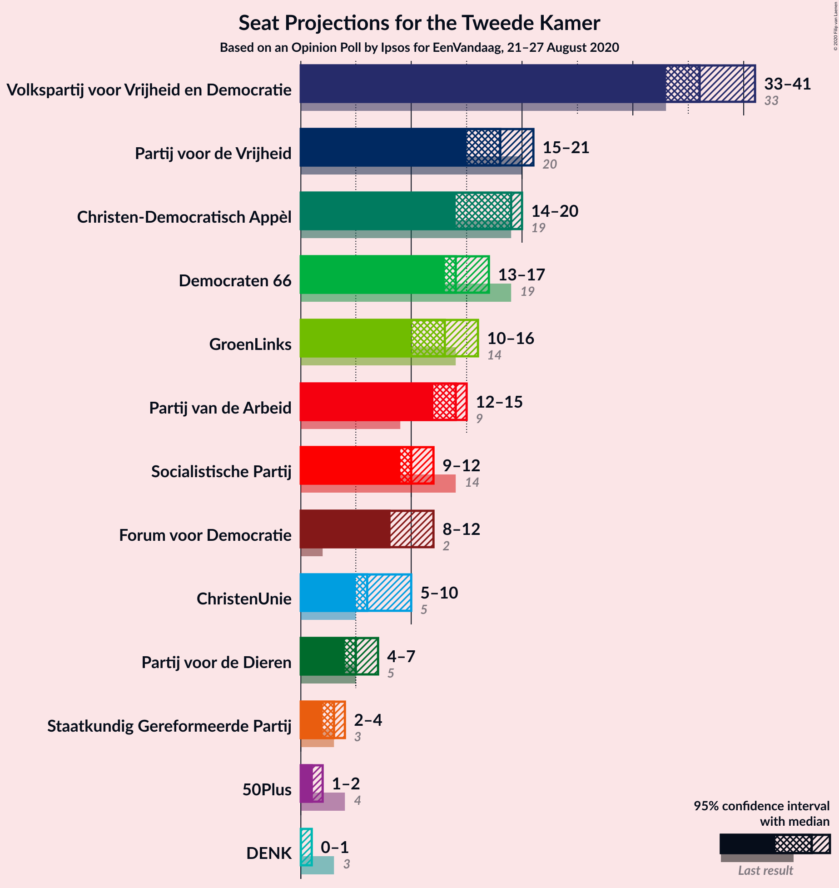

### Confidence Intervals

| Party | Last Result | Median | 80% Confidence Interval | 90% Confidence Interval | 95% Confidence Interval | 99% Confidence Interval |
|:-----:|:-----------:|:------:|:-----------------------:|:-----------------------:|:-----------------------:|:-----------------------:|
| <a href="#volkspartij-voor-vrijheid-en-democratie">Volkspartij voor Vrijheid en Democratie</a> | 33 | 36 | 33–39 |33–39 |33–41 |32–42 |
| <a href="#partij-voor-de-vrijheid">Partij voor de Vrijheid</a> | 20 | 18 | 16–20 |15–20 |15–21 |14–22 |
| <a href="#christen-democratisch-appèl">Christen-Democratisch Appèl</a> | 19 | 19 | 15–20 |14–20 |14–20 |13–20 |
| <a href="#democraten-66">Democraten 66</a> | 19 | 14 | 14–17 |13–17 |13–17 |11–18 |
| <a href="#partij-van-de-arbeid">Partij van de Arbeid</a> | 9 | 14 | 12–14 |12–15 |12–15 |11–16 |
| <a href="#groenlinks">GroenLinks</a> | 14 | 13 | 11–15 |11–15 |10–16 |9–17 |
| <a href="#socialistische-partij">Socialistische Partij</a> | 14 | 10 | 9–12 |9–12 |9–12 |7–14 |
| <a href="#forum-voor-democratie">Forum voor Democratie</a> | 2 | 8 | 8–10 |8–11 |8–12 |6–13 |
| <a href="#christenunie">ChristenUnie</a> | 5 | 6 | 5–9 |5–9 |5–10 |5–11 |
| <a href="#partij-voor-de-dieren">Partij voor de Dieren</a> | 5 | 5 | 4–7 |4–7 |4–7 |4–8 |
| <a href="#staatkundig-gereformeerde-partij">Staatkundig Gereformeerde Partij</a> | 3 | 3 | 2–4 |2–4 |2–4 |1–4 |
| <a href="#50plus">50Plus</a> | 4 | 1 | 1–2 |1–2 |1–2 |0–3 |
| <a href="#denk">DENK</a> | 3 | 0 | 0–1 |0–1 |0–1 |0–2 |

### Volkspartij voor Vrijheid en Democratie

*For a full overview of the results for this party, see the [Volkspartij voor Vrijheid en Democratie](party-volkspartijvoorvrijheidendemocratie.html) page.*

| Number of Seats | Probability | Accumulated | Special Marks |
|:---------------:|:-----------:|:-----------:|:-------------:|
| 30 | 0.1% | 100% |  |
| 31 | 0.2% | 99.9% |  |
| 32 | 0.6% | 99.7% |  |
| 33 | 20% | 99.1% | Last Result |
| 34 | 7% | 79% |  |
| 35 | 8% | 72% |  |
| 36 | 44% | 64% | Median |
| 37 | 7% | 20% |  |
| 38 | 2% | 13% |  |
| 39 | 8% | 11% |  |
| 40 | 1.2% | 4% |  |
| 41 | 2% | 3% |  |
| 42 | 0.9% | 1.0% |  |
| 43 | 0% | 0% |  |

### Partij voor de Vrijheid

*For a full overview of the results for this party, see the [Partij voor de Vrijheid](party-partijvoordevrijheid.html) page.*

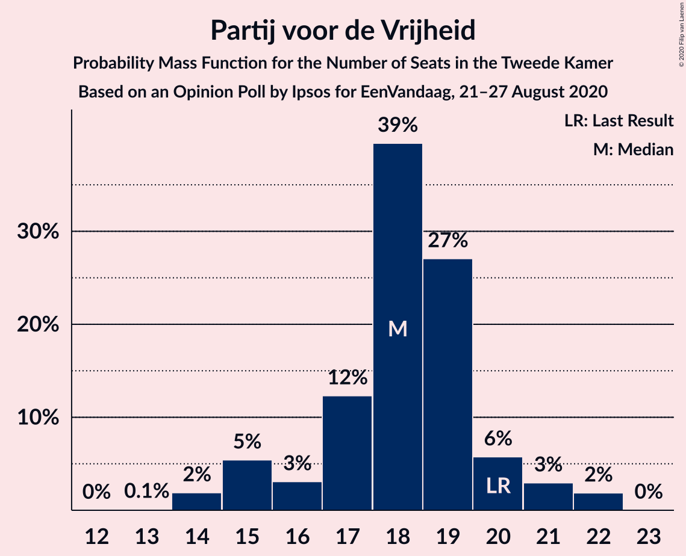

| Number of Seats | Probability | Accumulated | Special Marks |
|:---------------:|:-----------:|:-----------:|:-------------:|
| 13 | 0.1% | 100% |  |
| 14 | 2% | 99.9% |  |
| 15 | 5% | 98% |  |
| 16 | 3% | 93% |  |
| 17 | 12% | 89% |  |
| 18 | 39% | 77% | Median |
| 19 | 27% | 38% |  |
| 20 | 6% | 11% | Last Result |
| 21 | 3% | 5% |  |
| 22 | 2% | 2% |  |
| 23 | 0% | 0% |  |

### Christen-Democratisch Appèl

*For a full overview of the results for this party, see the [Christen-Democratisch Appèl](party-christen-democratischappèl.html) page.*

| Number of Seats | Probability | Accumulated | Special Marks |
|:---------------:|:-----------:|:-----------:|:-------------:|
| 12 | 0.1% | 100% |  |
| 13 | 0.4% | 99.9% |  |
| 14 | 6% | 99.5% |  |
| 15 | 19% | 93% |  |
| 16 | 12% | 75% |  |
| 17 | 4% | 63% |  |
| 18 | 2% | 58% |  |
| 19 | 8% | 56% | Last Result, Median |
| 20 | 48% | 48% |  |
| 21 | 0.1% | 0.1% |  |
| 22 | 0% | 0% |  |

### Democraten 66

*For a full overview of the results for this party, see the [Democraten 66](party-democraten66.html) page.*

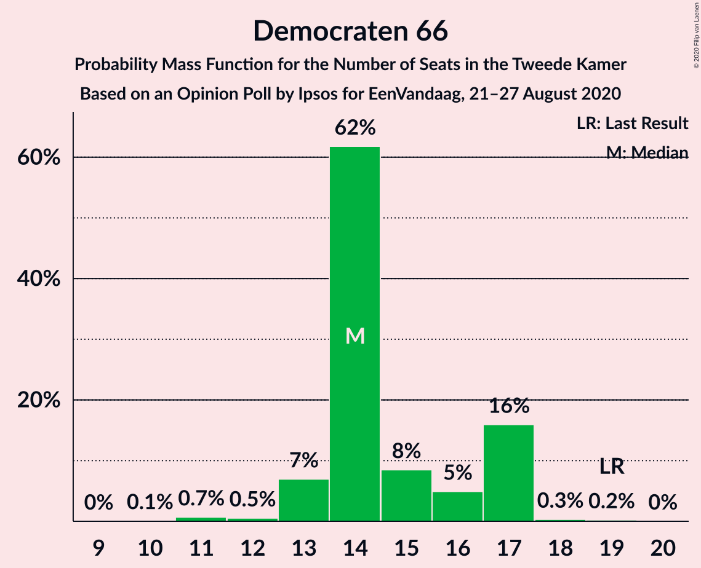

| Number of Seats | Probability | Accumulated | Special Marks |
|:---------------:|:-----------:|:-----------:|:-------------:|
| 10 | 0.1% | 100% |  |
| 11 | 0.7% | 99.9% |  |
| 12 | 0.5% | 99.2% |  |
| 13 | 7% | 98.7% |  |
| 14 | 62% | 92% | Median |
| 15 | 8% | 30% |  |
| 16 | 5% | 21% |  |
| 17 | 16% | 17% |  |
| 18 | 0.3% | 0.6% |  |
| 19 | 0.2% | 0.3% | Last Result |
| 20 | 0% | 0% |  |

### Partij van de Arbeid

*For a full overview of the results for this party, see the [Partij van de Arbeid](party-partijvandearbeid.html) page.*

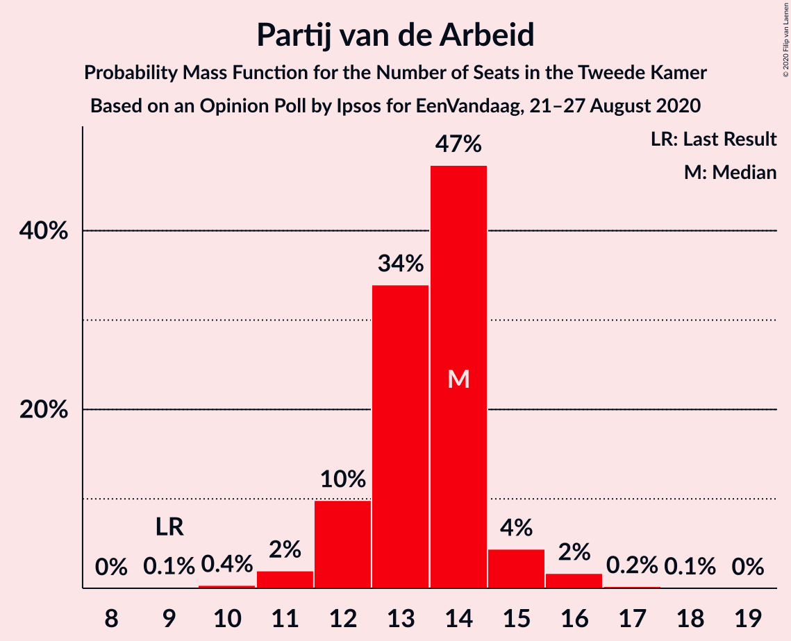

| Number of Seats | Probability | Accumulated | Special Marks |
|:---------------:|:-----------:|:-----------:|:-------------:|
| 9 | 0.1% | 100% | Last Result |
| 10 | 0.4% | 99.9% |  |
| 11 | 2% | 99.5% |  |
| 12 | 10% | 98% |  |
| 13 | 34% | 88% |  |
| 14 | 47% | 54% | Median |
| 15 | 4% | 6% |  |
| 16 | 2% | 2% |  |
| 17 | 0.2% | 0.3% |  |
| 18 | 0.1% | 0.1% |  |
| 19 | 0% | 0% |  |

### GroenLinks

*For a full overview of the results for this party, see the [GroenLinks](party-groenlinks.html) page.*

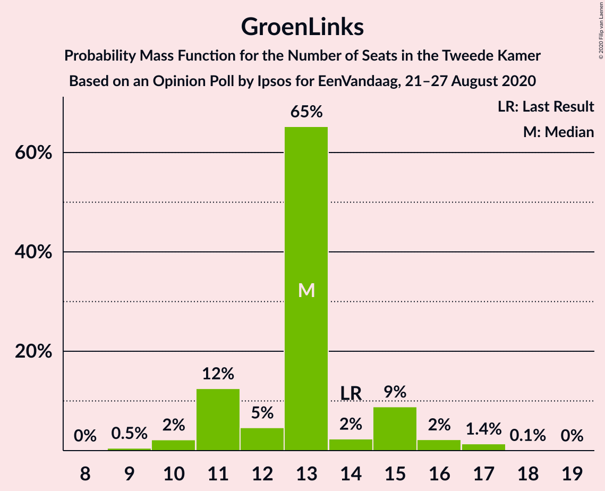

| Number of Seats | Probability | Accumulated | Special Marks |
|:---------------:|:-----------:|:-----------:|:-------------:|
| 9 | 0.5% | 100% |  |
| 10 | 2% | 99.5% |  |
| 11 | 12% | 97% |  |
| 12 | 5% | 85% |  |
| 13 | 65% | 80% | Median |
| 14 | 2% | 15% | Last Result |
| 15 | 9% | 13% |  |
| 16 | 2% | 4% |  |
| 17 | 1.4% | 2% |  |
| 18 | 0.1% | 0.1% |  |
| 19 | 0% | 0% |  |

### Socialistische Partij

*For a full overview of the results for this party, see the [Socialistische Partij](party-socialistischepartij.html) page.*

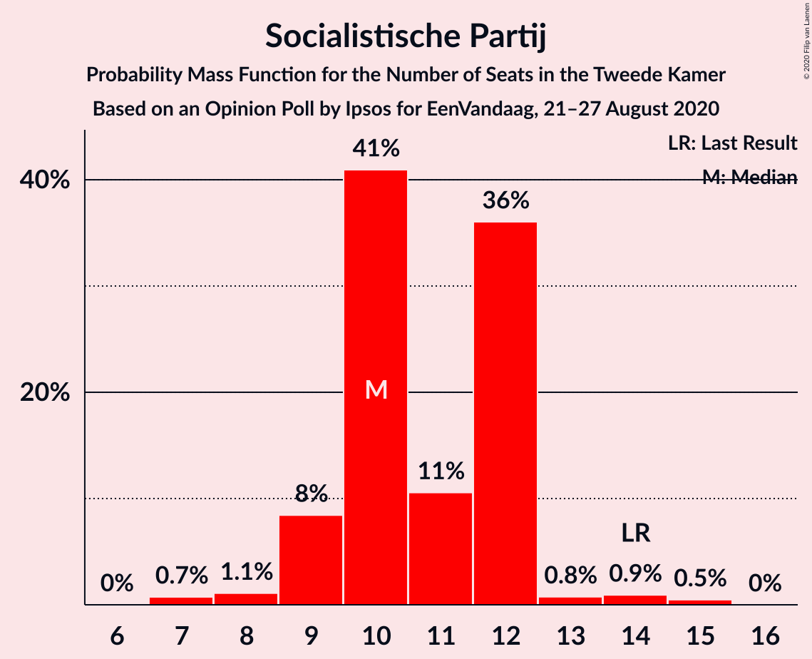

| Number of Seats | Probability | Accumulated | Special Marks |
|:---------------:|:-----------:|:-----------:|:-------------:|
| 7 | 0.7% | 100% |  |
| 8 | 1.1% | 99.2% |  |
| 9 | 8% | 98% |  |
| 10 | 41% | 90% | Median |
| 11 | 11% | 49% |  |
| 12 | 36% | 38% |  |
| 13 | 0.8% | 2% |  |
| 14 | 0.9% | 1.4% | Last Result |
| 15 | 0.5% | 0.5% |  |
| 16 | 0% | 0% |  |

### Forum voor Democratie

*For a full overview of the results for this party, see the [Forum voor Democratie](party-forumvoordemocratie.html) page.*

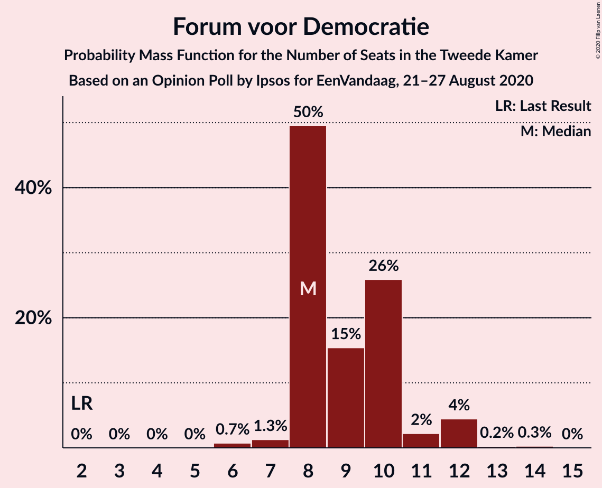

| Number of Seats | Probability | Accumulated | Special Marks |
|:---------------:|:-----------:|:-----------:|:-------------:|
| 2 | 0% | 100% | Last Result |
| 3 | 0% | 100% |  |
| 4 | 0% | 100% |  |
| 5 | 0% | 100% |  |
| 6 | 0.7% | 100% |  |
| 7 | 1.3% | 99.3% |  |
| 8 | 50% | 98% | Median |
| 9 | 15% | 48% |  |
| 10 | 26% | 33% |  |
| 11 | 2% | 7% |  |
| 12 | 4% | 5% |  |
| 13 | 0.2% | 0.5% |  |
| 14 | 0.3% | 0.3% |  |
| 15 | 0% | 0% |  |

### ChristenUnie

*For a full overview of the results for this party, see the [ChristenUnie](party-christenunie.html) page.*

| Number of Seats | Probability | Accumulated | Special Marks |
|:---------------:|:-----------:|:-----------:|:-------------:|
| 4 | 0.1% | 100% |  |
| 5 | 44% | 99.9% | Last Result |
| 6 | 29% | 56% | Median |
| 7 | 6% | 27% |  |
| 8 | 10% | 21% |  |
| 9 | 6% | 11% |  |
| 10 | 4% | 5% |  |
| 11 | 0.6% | 0.6% |  |
| 12 | 0% | 0% |  |

### Partij voor de Dieren

*For a full overview of the results for this party, see the [Partij voor de Dieren](party-partijvoordedieren.html) page.*

| Number of Seats | Probability | Accumulated | Special Marks |
|:---------------:|:-----------:|:-----------:|:-------------:|
| 3 | 0.3% | 100% |  |
| 4 | 12% | 99.7% |  |
| 5 | 56% | 88% | Last Result, Median |
| 6 | 22% | 32% |  |
| 7 | 9% | 10% |  |
| 8 | 0.9% | 1.1% |  |
| 9 | 0.2% | 0.2% |  |
| 10 | 0% | 0% |  |

### Staatkundig Gereformeerde Partij

*For a full overview of the results for this party, see the [Staatkundig Gereformeerde Partij](party-staatkundiggereformeerdepartij.html) page.*

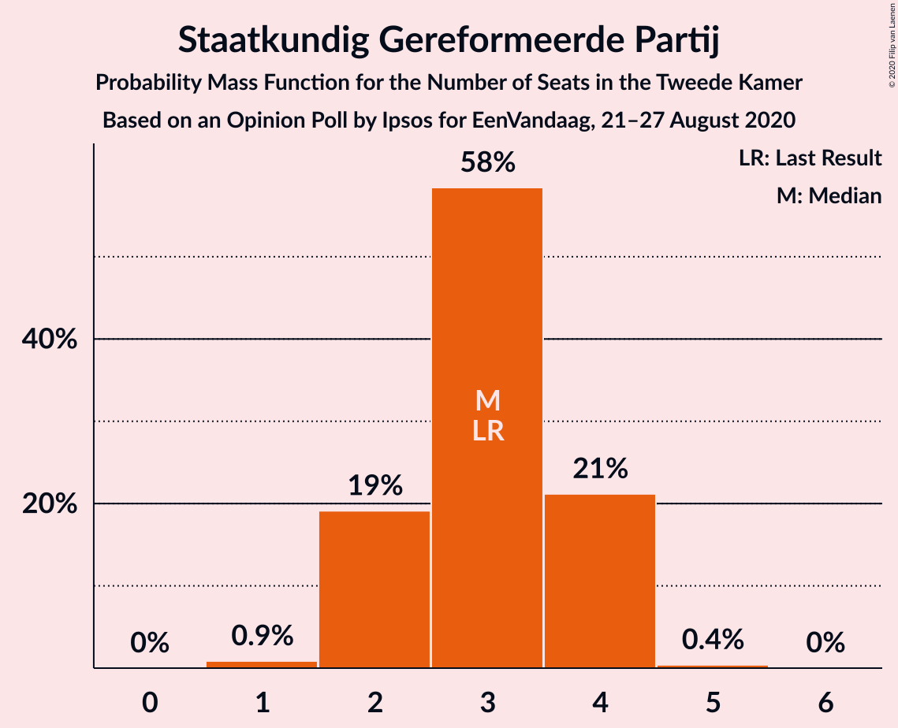

| Number of Seats | Probability | Accumulated | Special Marks |
|:---------------:|:-----------:|:-----------:|:-------------:|
| 1 | 0.9% | 100% |  |
| 2 | 19% | 99.1% |  |
| 3 | 58% | 80% | Last Result, Median |
| 4 | 21% | 22% |  |
| 5 | 0.4% | 0.4% |  |
| 6 | 0% | 0% |  |

### 50Plus

*For a full overview of the results for this party, see the [50Plus](party-50plus.html) page.*

| Number of Seats | Probability | Accumulated | Special Marks |
|:---------------:|:-----------:|:-----------:|:-------------:|
| 0 | 2% | 100% |  |
| 1 | 68% | 98% | Median |
| 2 | 28% | 30% |  |
| 3 | 2% | 2% |  |
| 4 | 0.1% | 0.1% | Last Result |
| 5 | 0% | 0% |  |

### DENK

*For a full overview of the results for this party, see the [DENK](party-denk.html) page.*

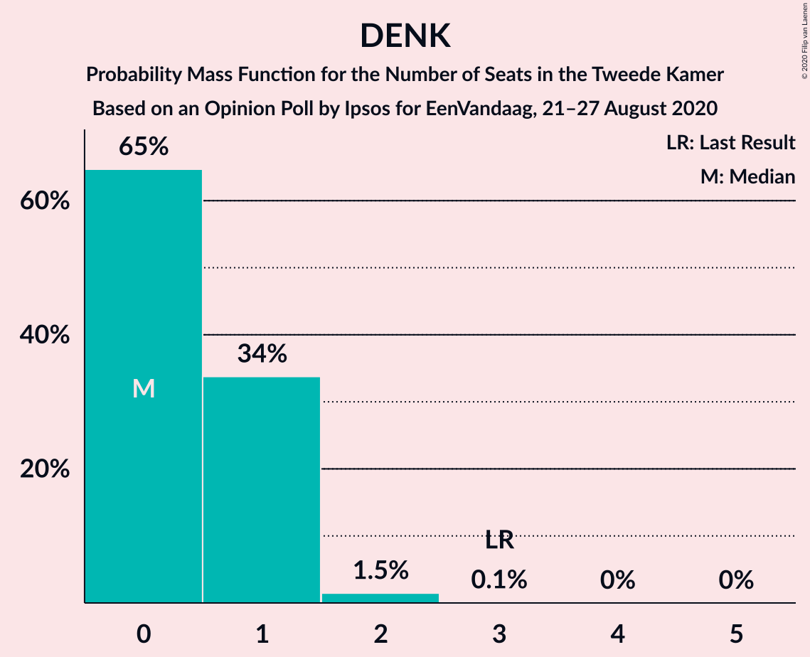

| Number of Seats | Probability | Accumulated | Special Marks |
|:---------------:|:-----------:|:-----------:|:-------------:|
| 0 | 65% | 100% | Median |
| 1 | 34% | 35% |  |
| 2 | 1.5% | 2% |  |
| 3 | 0.1% | 0.1% | Last Result |
| 4 | 0% | 0% |  |

## Coalitions

### Confidence Intervals

| Coalition | Last Result | Median | Majority? | 80% Confidence Interval | 90% Confidence Interval | 95% Confidence Interval | 99% Confidence Interval |
|:---------:|:-----------:|:------:|:---------:|:-----------------------:|:-----------------------:|:-----------------------:|:-----------------------:|
| Volkspartij voor Vrijheid en Democratie – Christen-Democratisch Appèl – Democraten 66 – GroenLinks – ChristenUnie | 90 | 88 | 100% | 85–91 | 83–92 | 83–93 | 81–95 |
| Volkspartij voor Vrijheid en Democratie – Christen-Democratisch Appèl – Democraten 66 – Partij van de Arbeid – ChristenUnie | 85 | 89 | 100% | 86–89 | 85–90 | 84–92 | 82–94 |
| Volkspartij voor Vrijheid en Democratie – Partij voor de Vrijheid – Christen-Democratisch Appèl – Forum voor Democratie – Staatkundig Gereformeerde Partij | 77 | 85 | 99.5% | 80–86 | 79–87 | 78–88 | 75–89 |
| Volkspartij voor Vrijheid en Democratie – Partij voor de Vrijheid – Christen-Democratisch Appèl – Forum voor Democratie | 74 | 82 | 98% | 78–82 | 77–84 | 76–85 | 73–86 |
| Christen-Democratisch Appèl – Democraten 66 – Partij van de Arbeid – GroenLinks – Socialistische Partij – ChristenUnie | 80 | 76 | 66% | 72–78 | 71–80 | 71–80 | 68–81 |
| Volkspartij voor Vrijheid en Democratie – Christen-Democratisch Appèl – Democraten 66 – ChristenUnie | 76 | 75 | 19% | 72–76 | 72–78 | 71–79 | 69–81 |
| Volkspartij voor Vrijheid en Democratie – Partij voor de Vrijheid – Christen-Democratisch Appèl | 72 | 72 | 2% | 68–74 | 67–75 | 66–75 | 64–76 |
| Volkspartij voor Vrijheid en Democratie – Christen-Democratisch Appèl – Democraten 66 | 71 | 68 | 0% | 66–70 | 65–71 | 64–72 | 62–72 |
| Volkspartij voor Vrijheid en Democratie – Christen-Democratisch Appèl – Forum voor Democratie – Staatkundig Gereformeerde Partij – 50Plus | 61 | 68 | 0% | 64–68 | 63–70 | 63–70 | 61–73 |
| Volkspartij voor Vrijheid en Democratie – Christen-Democratisch Appèl – Partij van de Arbeid | 61 | 66 | 0% | 63–70 | 62–70 | 62–70 | 61–72 |
| Christen-Democratisch Appèl – Democraten 66 – Partij van de Arbeid – GroenLinks – ChristenUnie | 66 | 66 | 0% | 61–67 | 61–68 | 61–70 | 58–71 |
| Volkspartij voor Vrijheid en Democratie – Christen-Democratisch Appèl – Forum voor Democratie – Staatkundig Gereformeerde Partij | 57 | 67 | 0% | 62–67 | 62–68 | 61–69 | 58–72 |
| Volkspartij voor Vrijheid en Democratie – Christen-Democratisch Appèl – Forum voor Democratie – 50Plus | 58 | 64 | 0% | 61–65 | 61–67 | 60–68 | 59–70 |
| Volkspartij voor Vrijheid en Democratie – Democraten 66 – Partij van de Arbeid | 61 | 64 | 0% | 60–67 | 60–67 | 60–68 | 59–70 |
| Volkspartij voor Vrijheid en Democratie – Christen-Democratisch Appèl – Forum voor Democratie | 54 | 63 | 0% | 59–64 | 59–65 | 59–66 | 56–69 |
| Volkspartij voor Vrijheid en Democratie – Christen-Democratisch Appèl | 52 | 53 | 0% | 51–56 | 49–56 | 49–57 | 48–59 |
| Volkspartij voor Vrijheid en Democratie – Partij van de Arbeid | 42 | 50 | 0% | 46–52 | 46–53 | 46–54 | 45–55 |
| Christen-Democratisch Appèl – Democraten 66 – Partij van de Arbeid | 47 | 47 | 0% | 43–48 | 42–48 | 41–48 | 39–49 |
| Christen-Democratisch Appèl – Partij van de Arbeid – ChristenUnie | 33 | 39 | 0% | 34–39 | 34–40 | 34–41 | 32–41 |
| Christen-Democratisch Appèl – Democraten 66 | 38 | 34 | 0% | 29–34 | 29–34 | 28–34 | 27–36 |
| Christen-Democratisch Appèl – Partij van de Arbeid | 28 | 32 | 0% | 28–34 | 27–34 | 27–34 | 26–34 |

### Volkspartij voor Vrijheid en Democratie – Christen-Democratisch Appèl – Democraten 66 – GroenLinks – ChristenUnie

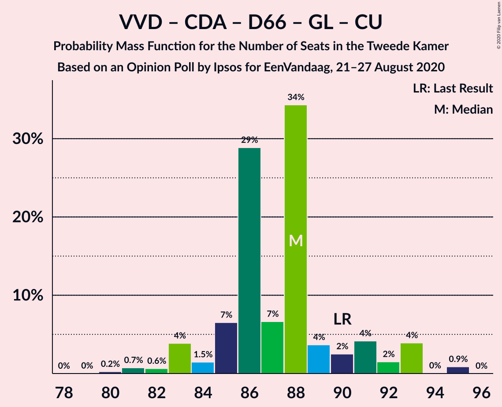

| Number of Seats | Probability | Accumulated | Special Marks |
|:---------------:|:-----------:|:-----------:|:-------------:|
| 80 | 0.2% | 100% |  |
| 81 | 0.7% | 99.7% |  |
| 82 | 0.6% | 99.0% |  |
| 83 | 4% | 98% |  |
| 84 | 1.5% | 94% |  |
| 85 | 7% | 93% |  |
| 86 | 29% | 86% |  |
| 87 | 7% | 58% |  |
| 88 | 34% | 51% | Median |
| 89 | 4% | 17% |  |
| 90 | 2% | 13% | Last Result |
| 91 | 4% | 11% |  |
| 92 | 2% | 6% |  |
| 93 | 4% | 5% |  |
| 94 | 0% | 0.9% |  |
| 95 | 0.9% | 0.9% |  |
| 96 | 0% | 0% |  |

### Volkspartij voor Vrijheid en Democratie – Christen-Democratisch Appèl – Democraten 66 – Partij van de Arbeid – ChristenUnie

| Number of Seats | Probability | Accumulated | Special Marks |
|:---------------:|:-----------:|:-----------:|:-------------:|
| 81 | 0.4% | 100% |  |
| 82 | 0.5% | 99.6% |  |
| 83 | 0.3% | 99.1% |  |
| 84 | 1.4% | 98.8% |  |
| 85 | 6% | 97% | Last Result |
| 86 | 17% | 91% |  |
| 87 | 19% | 74% |  |
| 88 | 5% | 55% |  |
| 89 | 41% | 50% | Median |
| 90 | 5% | 9% |  |
| 91 | 2% | 5% |  |
| 92 | 2% | 3% |  |
| 93 | 0.1% | 1.2% |  |
| 94 | 1.0% | 1.0% |  |
| 95 | 0% | 0.1% |  |
| 96 | 0.1% | 0.1% |  |
| 97 | 0% | 0% |  |

### Volkspartij voor Vrijheid en Democratie – Partij voor de Vrijheid – Christen-Democratisch Appèl – Forum voor Democratie – Staatkundig Gereformeerde Partij

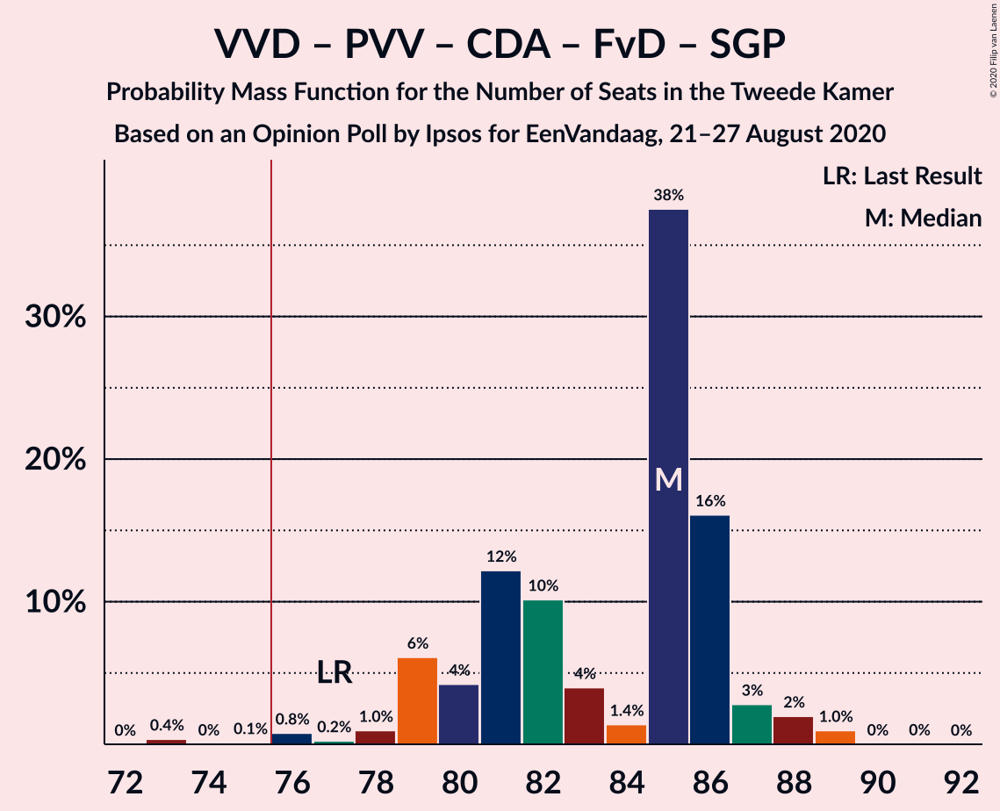

| Number of Seats | Probability | Accumulated | Special Marks |
|:---------------:|:-----------:|:-----------:|:-------------:|
| 73 | 0.4% | 100% |  |
| 74 | 0% | 99.6% |  |
| 75 | 0.1% | 99.6% |  |
| 76 | 0.8% | 99.5% | Majority |
| 77 | 0.2% | 98.7% | Last Result |
| 78 | 1.0% | 98% |  |
| 79 | 6% | 97% |  |
| 80 | 4% | 91% |  |
| 81 | 12% | 87% |  |
| 82 | 10% | 75% |  |
| 83 | 4% | 65% |  |
| 84 | 1.4% | 61% | Median |
| 85 | 38% | 59% |  |
| 86 | 16% | 22% |  |
| 87 | 3% | 6% |  |
| 88 | 2% | 3% |  |
| 89 | 1.0% | 1.0% |  |
| 90 | 0% | 0.1% |  |
| 91 | 0% | 0% |  |

### Volkspartij voor Vrijheid en Democratie – Partij voor de Vrijheid – Christen-Democratisch Appèl – Forum voor Democratie

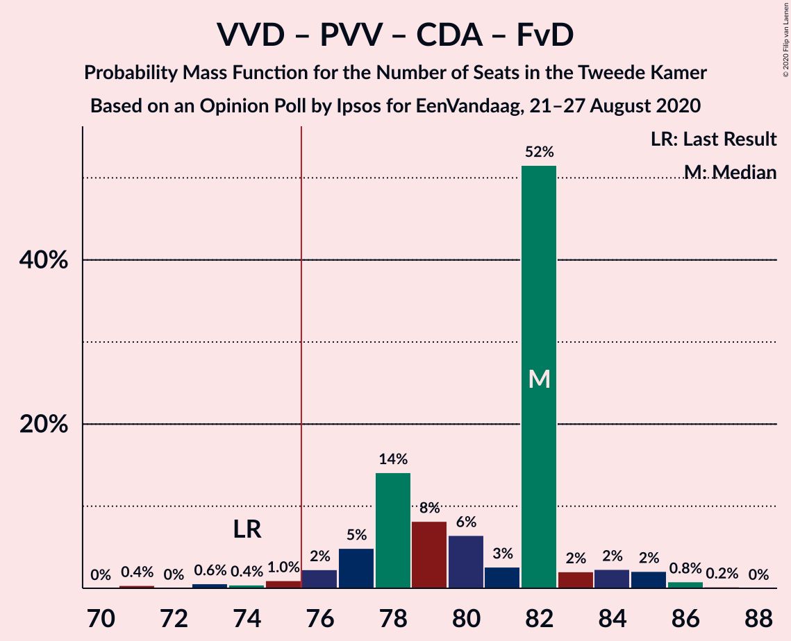

| Number of Seats | Probability | Accumulated | Special Marks |
|:---------------:|:-----------:|:-----------:|:-------------:|
| 71 | 0.4% | 100% |  |
| 72 | 0% | 99.6% |  |
| 73 | 0.6% | 99.6% |  |
| 74 | 0.4% | 99.0% | Last Result |
| 75 | 1.0% | 98.6% |  |
| 76 | 2% | 98% | Majority |
| 77 | 5% | 95% |  |
| 78 | 14% | 90% |  |
| 79 | 8% | 76% |  |
| 80 | 6% | 68% |  |
| 81 | 3% | 62% | Median |
| 82 | 52% | 59% |  |
| 83 | 2% | 7% |  |
| 84 | 2% | 5% |  |
| 85 | 2% | 3% |  |
| 86 | 0.8% | 1.0% |  |
| 87 | 0.2% | 0.2% |  |
| 88 | 0% | 0% |  |

### Christen-Democratisch Appèl – Democraten 66 – Partij van de Arbeid – GroenLinks – Socialistische Partij – ChristenUnie

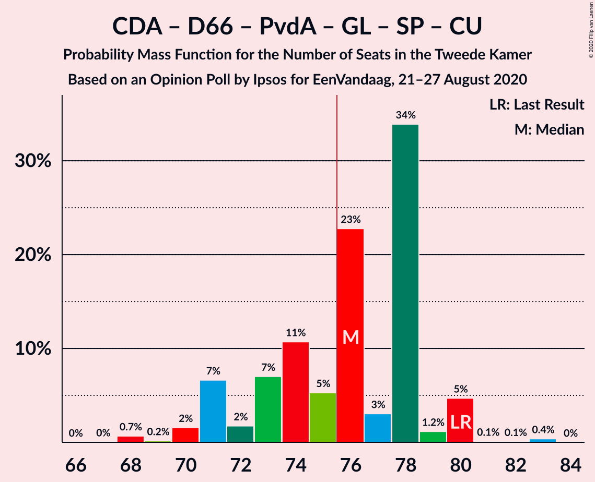

| Number of Seats | Probability | Accumulated | Special Marks |
|:---------------:|:-----------:|:-----------:|:-------------:|
| 67 | 0% | 100% |  |
| 68 | 0.7% | 99.9% |  |
| 69 | 0.2% | 99.3% |  |
| 70 | 2% | 99.1% |  |
| 71 | 7% | 98% |  |
| 72 | 2% | 91% |  |
| 73 | 7% | 89% |  |
| 74 | 11% | 82% |  |
| 75 | 5% | 71% |  |
| 76 | 23% | 66% | Median, Majority |
| 77 | 3% | 43% |  |
| 78 | 34% | 40% |  |
| 79 | 1.2% | 6% |  |
| 80 | 5% | 5% | Last Result |
| 81 | 0.1% | 0.6% |  |
| 82 | 0.1% | 0.5% |  |
| 83 | 0.4% | 0.4% |  |
| 84 | 0% | 0% |  |

### Volkspartij voor Vrijheid en Democratie – Christen-Democratisch Appèl – Democraten 66 – ChristenUnie

| Number of Seats | Probability | Accumulated | Special Marks |
|:---------------:|:-----------:|:-----------:|:-------------:|
| 67 | 0.1% | 100% |  |
| 68 | 0.2% | 99.9% |  |
| 69 | 0.6% | 99.7% |  |
| 70 | 0.8% | 99.1% |  |
| 71 | 2% | 98% |  |
| 72 | 9% | 97% |  |
| 73 | 28% | 88% |  |
| 74 | 6% | 60% |  |
| 75 | 35% | 54% | Median |
| 76 | 9% | 19% | Last Result, Majority |
| 77 | 1.2% | 10% |  |
| 78 | 6% | 9% |  |
| 79 | 2% | 3% |  |
| 80 | 0.1% | 1.1% |  |
| 81 | 0.9% | 0.9% |  |
| 82 | 0% | 0.1% |  |
| 83 | 0.1% | 0.1% |  |
| 84 | 0% | 0% |  |

### Volkspartij voor Vrijheid en Democratie – Partij voor de Vrijheid – Christen-Democratisch Appèl

| Number of Seats | Probability | Accumulated | Special Marks |
|:---------------:|:-----------:|:-----------:|:-------------:|
| 63 | 0.4% | 100% |  |
| 64 | 0.3% | 99.6% |  |
| 65 | 0.7% | 99.2% |  |
| 66 | 1.4% | 98.5% |  |
| 67 | 2% | 97% |  |
| 68 | 5% | 95% |  |
| 69 | 11% | 90% |  |
| 70 | 14% | 79% |  |
| 71 | 6% | 65% |  |
| 72 | 18% | 59% | Last Result |
| 73 | 2% | 41% | Median |
| 74 | 33% | 39% |  |
| 75 | 3% | 6% |  |
| 76 | 2% | 2% | Majority |
| 77 | 0% | 0.4% |  |
| 78 | 0.3% | 0.4% |  |
| 79 | 0% | 0.1% |  |
| 80 | 0% | 0% |  |

### Volkspartij voor Vrijheid en Democratie – Christen-Democratisch Appèl – Democraten 66

| Number of Seats | Probability | Accumulated | Special Marks |
|:---------------:|:-----------:|:-----------:|:-------------:|
| 60 | 0.1% | 100% |  |
| 61 | 0.2% | 99.9% |  |
| 62 | 0.8% | 99.7% |  |
| 63 | 1.5% | 99.0% |  |
| 64 | 1.0% | 98% |  |
| 65 | 3% | 97% |  |
| 66 | 11% | 94% |  |
| 67 | 22% | 83% |  |
| 68 | 20% | 61% |  |
| 69 | 3% | 41% | Median |
| 70 | 33% | 38% |  |
| 71 | 2% | 5% | Last Result |
| 72 | 3% | 3% |  |
| 73 | 0.1% | 0.3% |  |
| 74 | 0.1% | 0.1% |  |
| 75 | 0.1% | 0.1% |  |
| 76 | 0% | 0% | Majority |

### Volkspartij voor Vrijheid en Democratie – Christen-Democratisch Appèl – Forum voor Democratie – Staatkundig Gereformeerde Partij – 50Plus

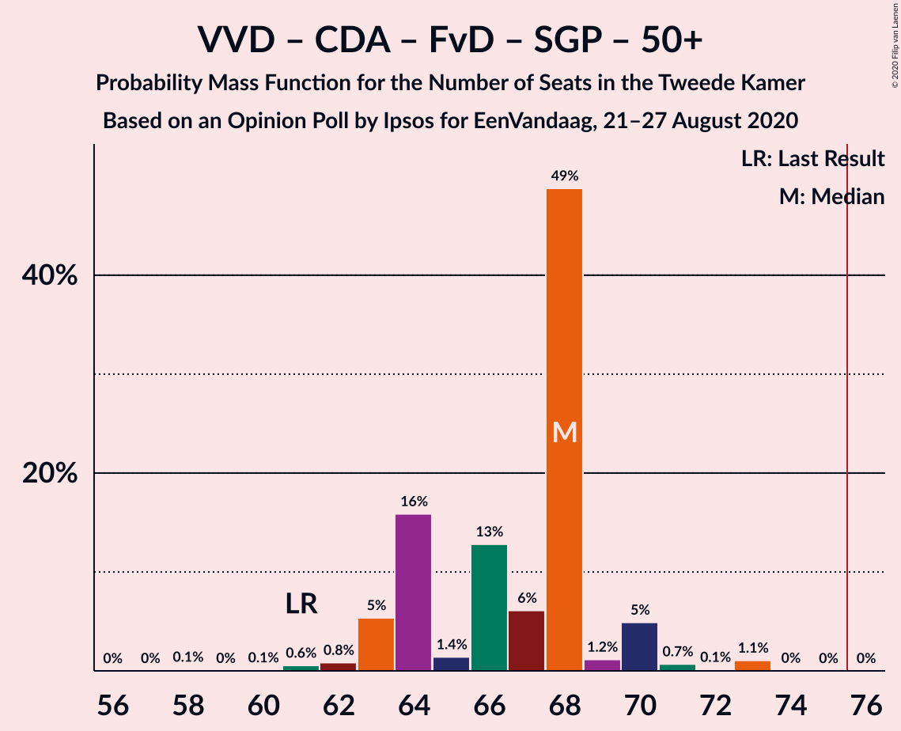

| Number of Seats | Probability | Accumulated | Special Marks |
|:---------------:|:-----------:|:-----------:|:-------------:|
| 58 | 0.1% | 100% |  |
| 59 | 0% | 99.8% |  |
| 60 | 0.1% | 99.8% |  |
| 61 | 0.6% | 99.7% | Last Result |
| 62 | 0.8% | 99.2% |  |
| 63 | 5% | 98% |  |
| 64 | 16% | 93% |  |
| 65 | 1.4% | 77% |  |
| 66 | 13% | 76% |  |
| 67 | 6% | 63% | Median |
| 68 | 49% | 57% |  |
| 69 | 1.2% | 8% |  |
| 70 | 5% | 7% |  |
| 71 | 0.7% | 2% |  |
| 72 | 0.1% | 1.2% |  |
| 73 | 1.1% | 1.1% |  |
| 74 | 0% | 0.1% |  |
| 75 | 0% | 0% |  |

### Volkspartij voor Vrijheid en Democratie – Christen-Democratisch Appèl – Partij van de Arbeid

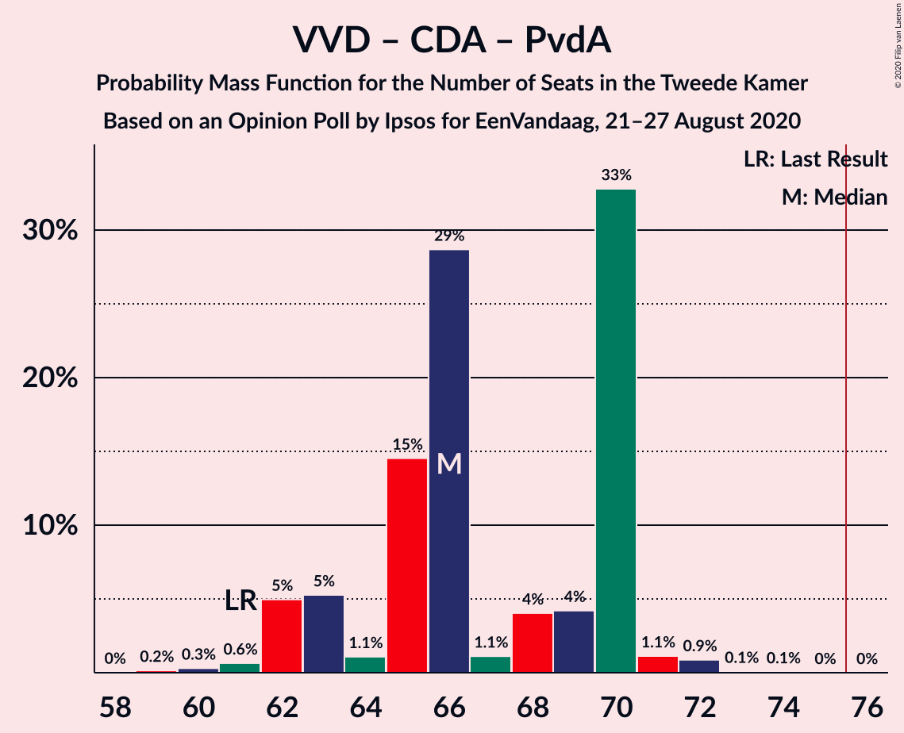

| Number of Seats | Probability | Accumulated | Special Marks |
|:---------------:|:-----------:|:-----------:|:-------------:|
| 59 | 0.2% | 100% |  |
| 60 | 0.3% | 99.8% |  |
| 61 | 0.6% | 99.5% | Last Result |
| 62 | 5% | 98.9% |  |
| 63 | 5% | 94% |  |
| 64 | 1.1% | 89% |  |
| 65 | 15% | 88% |  |
| 66 | 29% | 73% |  |
| 67 | 1.1% | 44% |  |
| 68 | 4% | 43% |  |
| 69 | 4% | 39% | Median |
| 70 | 33% | 35% |  |
| 71 | 1.1% | 2% |  |
| 72 | 0.9% | 1.0% |  |
| 73 | 0.1% | 0.1% |  |
| 74 | 0.1% | 0.1% |  |
| 75 | 0% | 0% |  |

### Christen-Democratisch Appèl – Democraten 66 – Partij van de Arbeid – GroenLinks – ChristenUnie

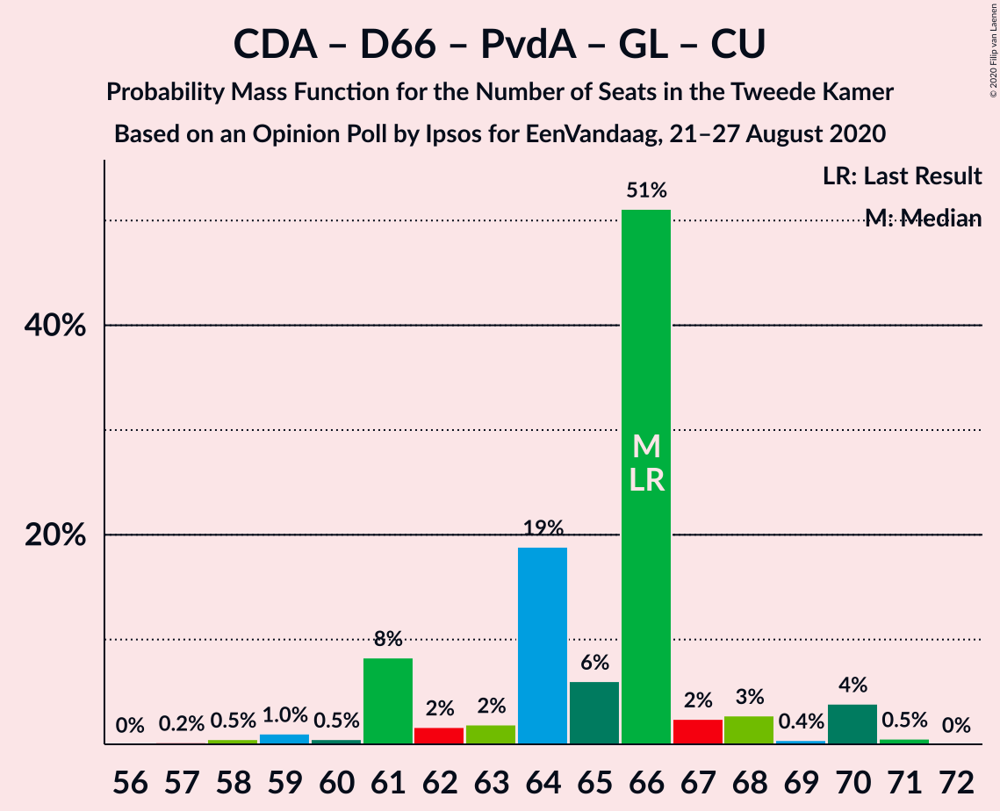

| Number of Seats | Probability | Accumulated | Special Marks |
|:---------------:|:-----------:|:-----------:|:-------------:|
| 57 | 0.2% | 100% |  |
| 58 | 0.5% | 99.8% |  |
| 59 | 1.0% | 99.3% |  |
| 60 | 0.5% | 98% |  |
| 61 | 8% | 98% |  |
| 62 | 2% | 90% |  |
| 63 | 2% | 88% |  |
| 64 | 19% | 86% |  |
| 65 | 6% | 67% |  |
| 66 | 51% | 61% | Last Result, Median |
| 67 | 2% | 10% |  |
| 68 | 3% | 8% |  |
| 69 | 0.4% | 5% |  |
| 70 | 4% | 4% |  |
| 71 | 0.5% | 0.6% |  |
| 72 | 0% | 0% |  |

### Volkspartij voor Vrijheid en Democratie – Christen-Democratisch Appèl – Forum voor Democratie – Staatkundig Gereformeerde Partij

| Number of Seats | Probability | Accumulated | Special Marks |
|:---------------:|:-----------:|:-----------:|:-------------:|
| 56 | 0.2% | 100% |  |
| 57 | 0% | 99.8% | Last Result |
| 58 | 0.4% | 99.8% |  |
| 59 | 0.2% | 99.4% |  |
| 60 | 0.2% | 99.2% |  |
| 61 | 2% | 99.0% |  |
| 62 | 19% | 97% |  |
| 63 | 3% | 78% |  |
| 64 | 5% | 75% |  |
| 65 | 6% | 71% |  |
| 66 | 8% | 64% | Median |
| 67 | 49% | 56% |  |
| 68 | 4% | 7% |  |
| 69 | 2% | 3% |  |
| 70 | 0.3% | 1.3% |  |
| 71 | 0.2% | 1.0% |  |
| 72 | 0.7% | 0.8% |  |
| 73 | 0% | 0% |  |

### Volkspartij voor Vrijheid en Democratie – Christen-Democratisch Appèl – Forum voor Democratie – 50Plus

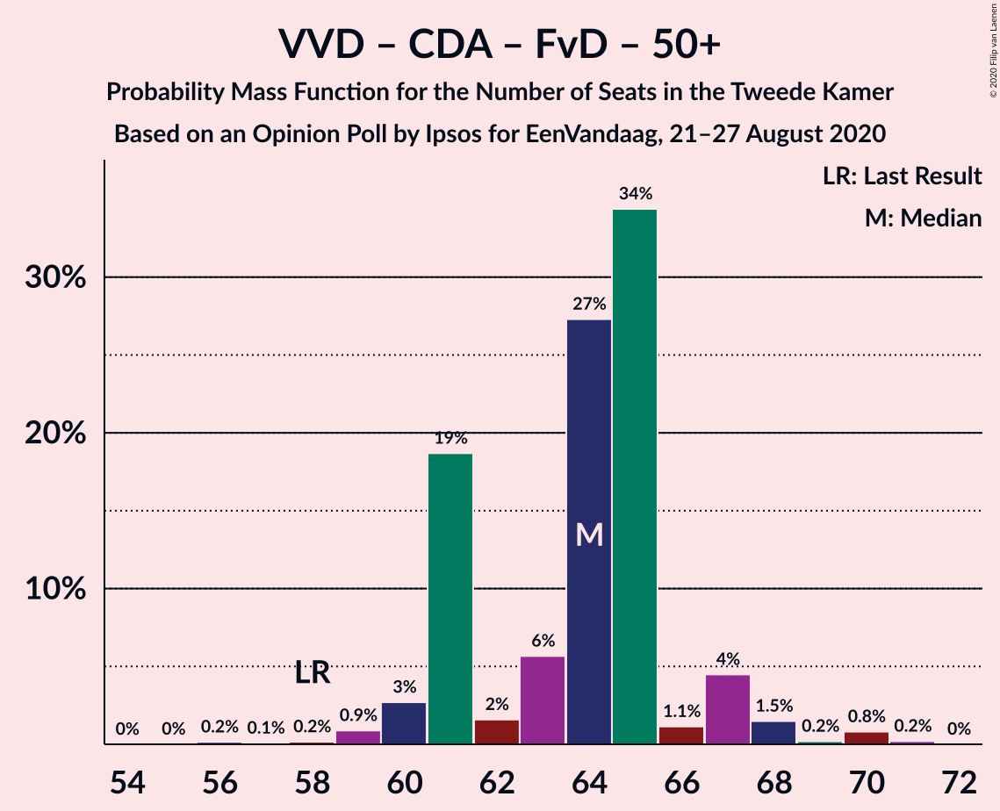

| Number of Seats | Probability | Accumulated | Special Marks |
|:---------------:|:-----------:|:-----------:|:-------------:|
| 56 | 0.2% | 100% |  |
| 57 | 0.1% | 99.8% |  |
| 58 | 0.2% | 99.7% | Last Result |
| 59 | 0.9% | 99.6% |  |
| 60 | 3% | 98.7% |  |
| 61 | 19% | 96% |  |
| 62 | 2% | 77% |  |
| 63 | 6% | 76% |  |
| 64 | 27% | 70% | Median |
| 65 | 34% | 43% |  |
| 66 | 1.1% | 8% |  |
| 67 | 4% | 7% |  |
| 68 | 1.5% | 3% |  |
| 69 | 0.2% | 1.2% |  |
| 70 | 0.8% | 1.0% |  |
| 71 | 0.2% | 0.2% |  |
| 72 | 0% | 0% |  |

### Volkspartij voor Vrijheid en Democratie – Democraten 66 – Partij van de Arbeid

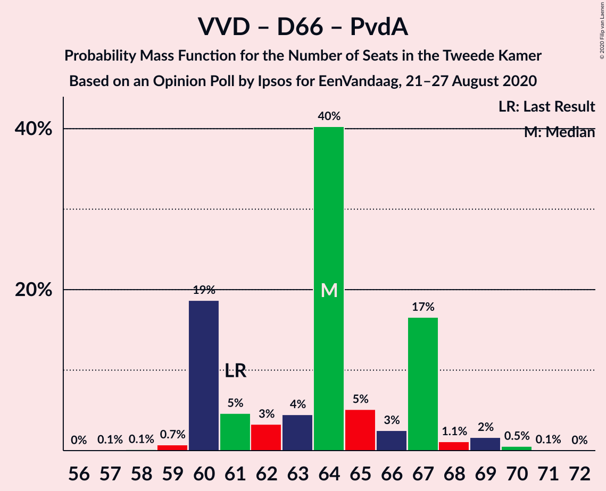

| Number of Seats | Probability | Accumulated | Special Marks |
|:---------------:|:-----------:|:-----------:|:-------------:|
| 57 | 0.1% | 100% |  |
| 58 | 0.1% | 99.9% |  |
| 59 | 0.7% | 99.7% |  |
| 60 | 19% | 99.0% |  |
| 61 | 5% | 80% | Last Result |
| 62 | 3% | 76% |  |
| 63 | 4% | 72% |  |
| 64 | 40% | 68% | Median |
| 65 | 5% | 28% |  |
| 66 | 3% | 23% |  |
| 67 | 17% | 20% |  |
| 68 | 1.1% | 3% |  |
| 69 | 2% | 2% |  |
| 70 | 0.5% | 0.7% |  |
| 71 | 0.1% | 0.1% |  |
| 72 | 0% | 0% |  |

### Volkspartij voor Vrijheid en Democratie – Christen-Democratisch Appèl – Forum voor Democratie

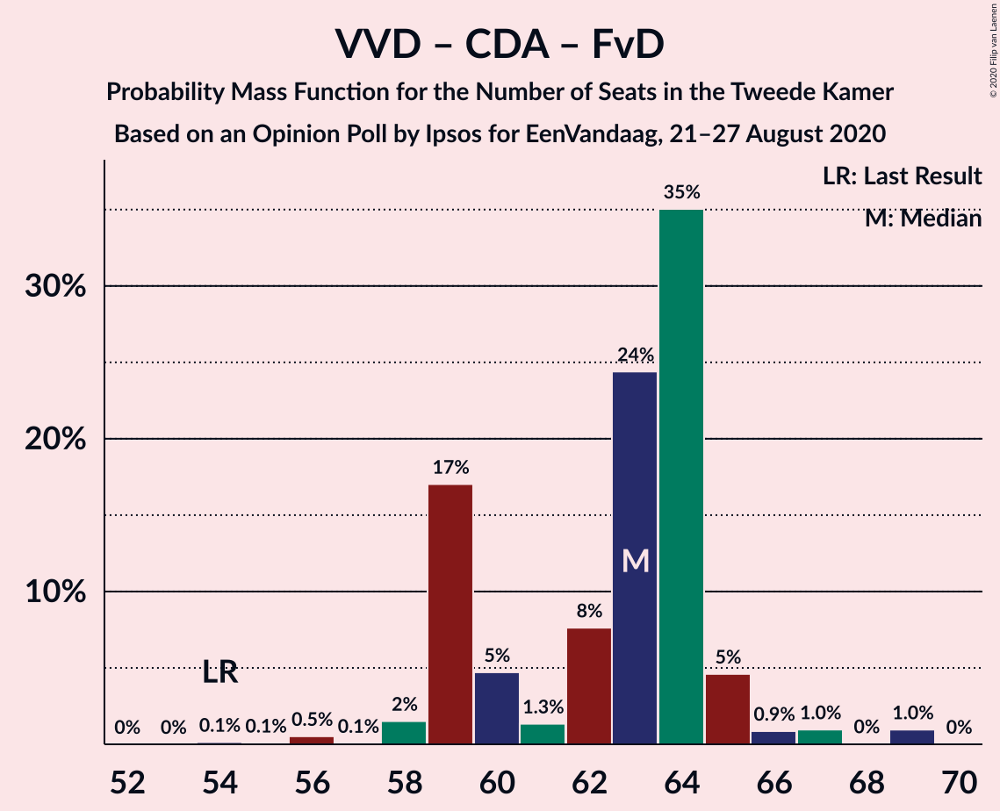

| Number of Seats | Probability | Accumulated | Special Marks |
|:---------------:|:-----------:|:-----------:|:-------------:|
| 54 | 0.1% | 100% | Last Result |
| 55 | 0.1% | 99.8% |  |
| 56 | 0.5% | 99.8% |  |
| 57 | 0.1% | 99.2% |  |
| 58 | 2% | 99.2% |  |
| 59 | 17% | 98% |  |
| 60 | 5% | 81% |  |
| 61 | 1.3% | 76% |  |
| 62 | 8% | 75% |  |
| 63 | 24% | 67% | Median |
| 64 | 35% | 43% |  |
| 65 | 5% | 7% |  |
| 66 | 0.9% | 3% |  |
| 67 | 1.0% | 2% |  |
| 68 | 0% | 1.0% |  |
| 69 | 1.0% | 1.0% |  |
| 70 | 0% | 0% |  |

### Volkspartij voor Vrijheid en Democratie – Christen-Democratisch Appèl

| Number of Seats | Probability | Accumulated | Special Marks |
|:---------------:|:-----------:|:-----------:|:-------------:|
| 46 | 0.1% | 100% |  |
| 47 | 0.3% | 99.8% |  |
| 48 | 0.7% | 99.6% |  |
| 49 | 6% | 98.9% |  |
| 50 | 1.5% | 93% |  |
| 51 | 16% | 92% |  |
| 52 | 4% | 76% | Last Result |
| 53 | 27% | 72% |  |
| 54 | 5% | 45% |  |
| 55 | 3% | 40% | Median |
| 56 | 35% | 37% |  |
| 57 | 0.4% | 3% |  |
| 58 | 1.2% | 2% |  |
| 59 | 1.0% | 1.0% |  |
| 60 | 0% | 0% |  |

### Volkspartij voor Vrijheid en Democratie – Partij van de Arbeid

| Number of Seats | Probability | Accumulated | Special Marks |
|:---------------:|:-----------:|:-----------:|:-------------:|
| 42 | 0% | 100% | Last Result |
| 43 | 0.1% | 100% |  |
| 44 | 0.3% | 99.9% |  |
| 45 | 0.8% | 99.6% |  |
| 46 | 18% | 98.8% |  |
| 47 | 14% | 81% |  |
| 48 | 3% | 67% |  |
| 49 | 1.4% | 64% |  |
| 50 | 46% | 62% | Median |
| 51 | 2% | 17% |  |
| 52 | 9% | 15% |  |
| 53 | 3% | 6% |  |
| 54 | 2% | 3% |  |
| 55 | 0.9% | 1.1% |  |
| 56 | 0.1% | 0.1% |  |
| 57 | 0% | 0.1% |  |
| 58 | 0% | 0% |  |

### Christen-Democratisch Appèl – Democraten 66 – Partij van de Arbeid

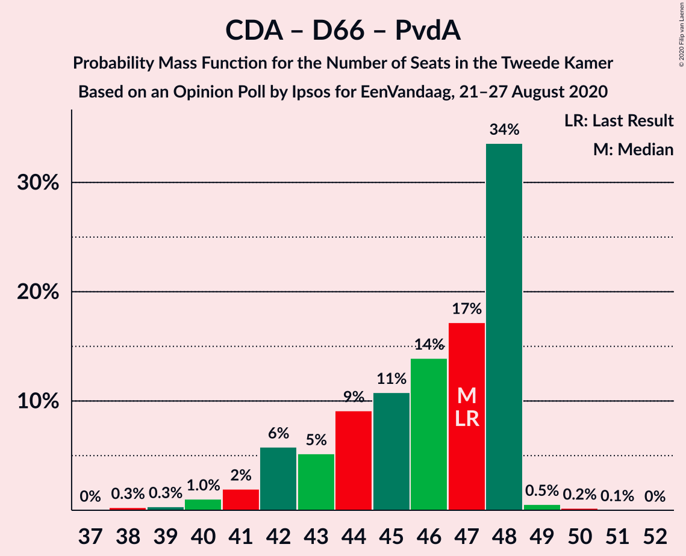

| Number of Seats | Probability | Accumulated | Special Marks |
|:---------------:|:-----------:|:-----------:|:-------------:|
| 38 | 0.3% | 100% |  |
| 39 | 0.3% | 99.7% |  |
| 40 | 1.0% | 99.4% |  |
| 41 | 2% | 98% |  |
| 42 | 6% | 96% |  |
| 43 | 5% | 91% |  |
| 44 | 9% | 85% |  |
| 45 | 11% | 76% |  |
| 46 | 14% | 66% |  |
| 47 | 17% | 52% | Last Result, Median |
| 48 | 34% | 34% |  |
| 49 | 0.5% | 0.8% |  |
| 50 | 0.2% | 0.3% |  |
| 51 | 0.1% | 0.1% |  |
| 52 | 0% | 0% |  |

### Christen-Democratisch Appèl – Partij van de Arbeid – ChristenUnie

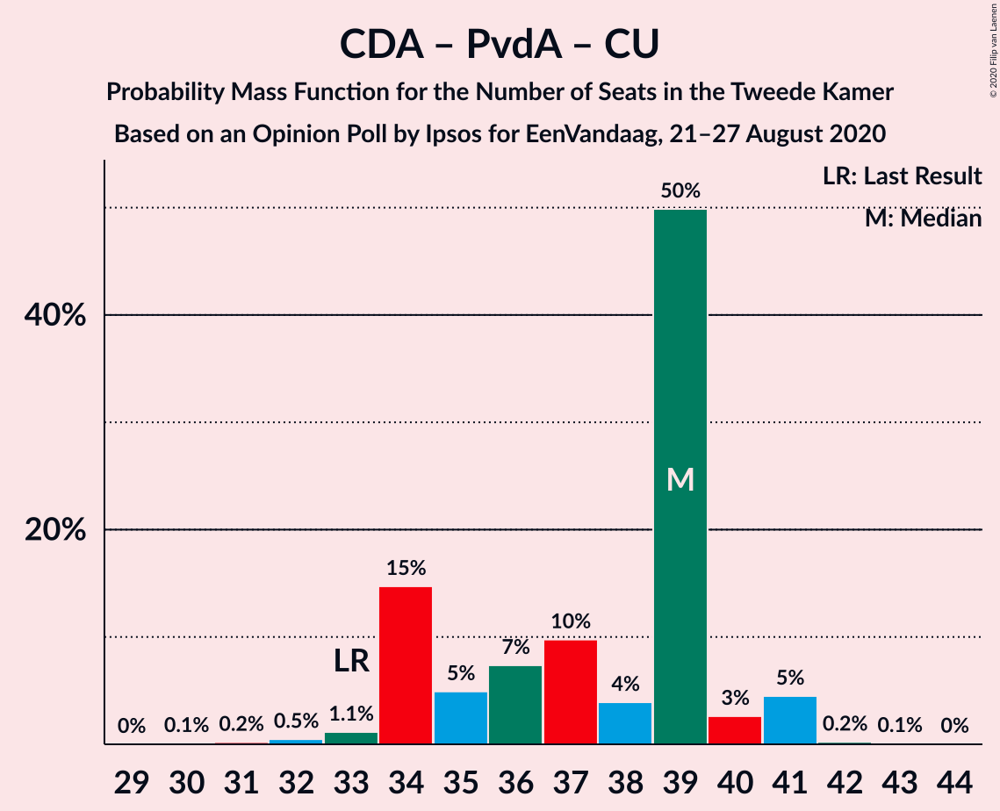

| Number of Seats | Probability | Accumulated | Special Marks |
|:---------------:|:-----------:|:-----------:|:-------------:|
| 30 | 0.1% | 100% |  |
| 31 | 0.2% | 99.9% |  |
| 32 | 0.5% | 99.7% |  |
| 33 | 1.1% | 99.2% | Last Result |
| 34 | 15% | 98% |  |
| 35 | 5% | 83% |  |
| 36 | 7% | 78% |  |
| 37 | 10% | 71% |  |
| 38 | 4% | 61% |  |
| 39 | 50% | 57% | Median |
| 40 | 3% | 7% |  |
| 41 | 5% | 5% |  |
| 42 | 0.2% | 0.4% |  |
| 43 | 0.1% | 0.1% |  |
| 44 | 0% | 0% |  |

### Christen-Democratisch Appèl – Democraten 66

| Number of Seats | Probability | Accumulated | Special Marks |
|:---------------:|:-----------:|:-----------:|:-------------:|
| 25 | 0.1% | 100% |  |
| 26 | 0.1% | 99.9% |  |
| 27 | 0.5% | 99.8% |  |
| 28 | 3% | 99.3% |  |
| 29 | 8% | 96% |  |
| 30 | 8% | 88% |  |
| 31 | 2% | 80% |  |
| 32 | 19% | 77% |  |
| 33 | 7% | 58% | Median |
| 34 | 50% | 51% |  |
| 35 | 0.7% | 1.3% |  |
| 36 | 0.3% | 0.6% |  |
| 37 | 0.3% | 0.3% |  |
| 38 | 0% | 0% | Last Result |

### Christen-Democratisch Appèl – Partij van de Arbeid

| Number of Seats | Probability | Accumulated | Special Marks |
|:---------------:|:-----------:|:-----------:|:-------------:|
| 23 | 0.1% | 100% |  |
| 24 | 0.1% | 99.9% |  |
| 25 | 0.2% | 99.8% |  |
| 26 | 1.1% | 99.6% |  |
| 27 | 6% | 98% |  |
| 28 | 11% | 92% | Last Result |
| 29 | 13% | 81% |  |
| 30 | 5% | 69% |  |
| 31 | 10% | 64% |  |
| 32 | 4% | 54% |  |
| 33 | 17% | 49% | Median |
| 34 | 32% | 33% |  |
| 35 | 0.2% | 0.3% |  |
| 36 | 0.1% | 0.1% |  |
| 37 | 0% | 0% |  |

## Technical Information

### Opinion Poll

+ **Polling firm:** Ipsos
+ **Commissioner(s):** EenVandaag
+ **Fieldwork period:** 21–27 August 2020

### Calculations

+ **Sample size:** 1058
+ **Simulations done:** 1,048,576
+ **Error estimate:** 1.43%

