# Opinion Poll by Ipsos for EenVandaag, 23–26 October 2020

<a href="#voting-intentions">Voting Intentions</a> | <a href="#seats">Seats</a> | <a href="#coalitions">Coalitions</a> | <a href="#technical-information">Technical Information</a>

## Voting Intentions

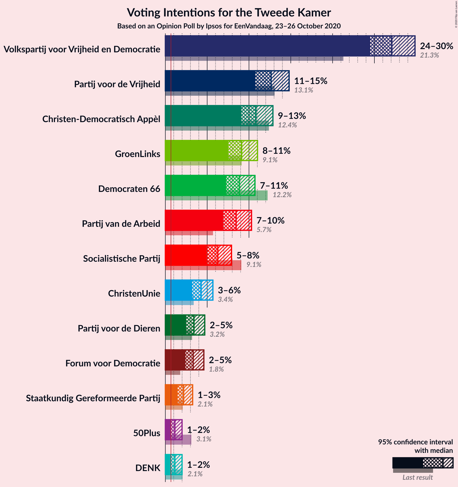

### Confidence Intervals

| Party | Last Result | Poll Result | 80% Confidence Interval | 90% Confidence Interval | 95% Confidence Interval | 99% Confidence Interval |
|:-----:|:-----------:|:-----------:|:-----------------------:|:-----------------------:|:-----------------------:|:-----------------------:|
| Volkspartij voor Vrijheid en Democratie | 21.3% | 27.1% | 25.4–28.9% |24.9–29.4% |24.5–29.9% |23.7–30.7% |
| Partij voor de Vrijheid | 13.1% | 12.6% | 11.4–14.1% |11.1–14.4% |10.8–14.8% |10.2–15.5% |
| Christen-Democratisch Appèl | 12.4% | 10.8% | 9.7–12.2% |9.4–12.5% |9.1–12.9% |8.6–13.5% |
| GroenLinks | 9.1% | 9.1% | 8.1–10.4% |7.8–10.7% |7.5–11.0% |7.1–11.6% |
| Democraten 66 | 12.2% | 8.8% | 7.8–10.1% |7.5–10.4% |7.3–10.7% |6.8–11.3% |
| Partij van de Arbeid | 5.7% | 8.5% | 7.5–9.7% |7.2–10.0% |6.9–10.3% |6.5–10.9% |
| Socialistische Partij | 9.1% | 6.3% | 5.4–7.3% |5.2–7.7% |5.0–7.9% |4.6–8.5% |
| ChristenUnie | 3.4% | 4.3% | 3.6–5.2% |3.4–5.5% |3.2–5.7% |2.9–6.2% |
| Partij voor de Dieren | 3.2% | 3.4% | 2.8–4.3% |2.6–4.5% |2.5–4.7% |2.2–5.1% |
| Forum voor Democratie | 1.8% | 3.3% | 2.7–4.2% |2.5–4.4% |2.4–4.6% |2.1–5.0% |
| Staatkundig Gereformeerde Partij | 2.1% | 2.2% | 1.7–2.9% |1.6–3.1% |1.5–3.3% |1.2–3.6% |
| 50Plus | 3.1% | 1.1% | 0.8–1.7% |0.7–1.8% |0.7–2.0% |0.5–2.3% |
| DENK | 2.1% | 1.1% | 0.8–1.7% |0.7–1.8% |0.7–2.0% |0.5–2.3% |

*Note:* The poll result column reflects the actual value used in the calculations. Published results may vary slightly, and in addition be rounded to fewer digits.

## Seats

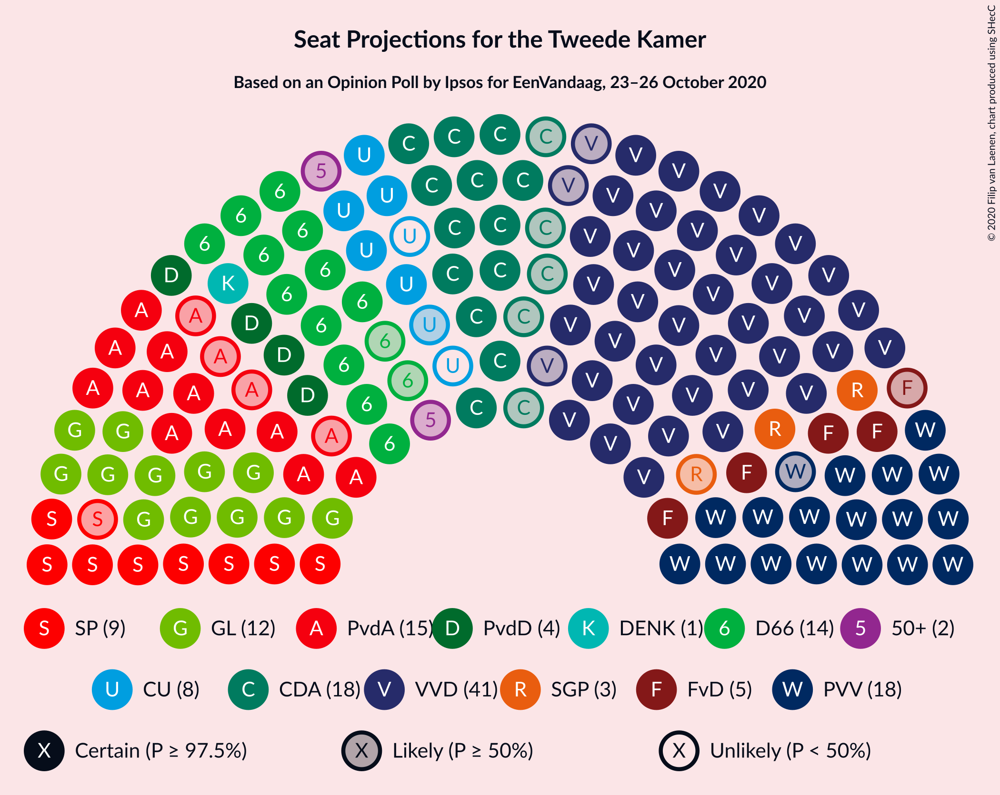

### Confidence Intervals

| Party | Last Result | Median | 80% Confidence Interval | 90% Confidence Interval | 95% Confidence Interval | 99% Confidence Interval |
|:-----:|:-----------:|:------:|:-----------------------:|:-----------------------:|:-----------------------:|:-----------------------:|
| <a href="#volkspartij-voor-vrijheid-en-democratie">Volkspartij voor Vrijheid en Democratie</a> | 33 | 41 | 39–44 |39–45 |38–45 |37–46 |
| <a href="#partij-voor-de-vrijheid">Partij voor de Vrijheid</a> | 20 | 18 | 18–20 |18–22 |17–22 |15–23 |
| <a href="#christen-democratisch-appèl">Christen-Democratisch Appèl</a> | 19 | 18 | 13–18 |13–18 |13–18 |13–20 |
| <a href="#groenlinks">GroenLinks</a> | 14 | 12 | 12–14 |12–15 |12–15 |11–17 |
| <a href="#democraten-66">Democraten 66</a> | 19 | 14 | 13–15 |12–15 |12–15 |10–16 |
| <a href="#partij-van-de-arbeid">Partij van de Arbeid</a> | 9 | 15 | 11–15 |11–15 |11–16 |10–17 |
| <a href="#socialistische-partij">Socialistische Partij</a> | 14 | 9 | 9–11 |8–12 |8–12 |7–12 |
| <a href="#christenunie">ChristenUnie</a> | 5 | 6 | 6–8 |5–8 |5–8 |4–9 |
| <a href="#partij-voor-de-dieren">Partij voor de Dieren</a> | 5 | 4 | 4–6 |4–6 |4–6 |3–8 |
| <a href="#forum-voor-democratie">Forum voor Democratie</a> | 2 | 5 | 4–5 |4–6 |4–6 |3–7 |
| <a href="#staatkundig-gereformeerde-partij">Staatkundig Gereformeerde Partij</a> | 3 | 3 | 3–4 |2–4 |2–4 |2–5 |
| <a href="#50plus">50Plus</a> | 4 | 2 | 1–2 |1–2 |0–2 |0–3 |
| <a href="#denk">DENK</a> | 3 | 1 | 1–2 |1–2 |1–2 |0–3 |

### Volkspartij voor Vrijheid en Democratie

*For a full overview of the results for this party, see the [Volkspartij voor Vrijheid en Democratie](party-volkspartijvoorvrijheidendemocratie.html) page.*

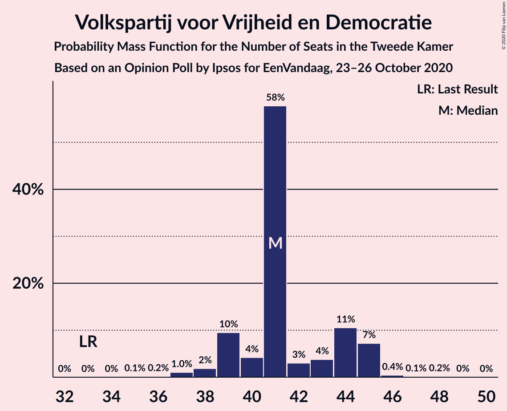

| Number of Seats | Probability | Accumulated | Special Marks |
|:---------------:|:-----------:|:-----------:|:-------------:|
| 33 | 0% | 100% | Last Result |
| 34 | 0% | 100% |  |
| 35 | 0.1% | 100% |  |
| 36 | 0.2% | 99.8% |  |
| 37 | 1.0% | 99.7% |  |
| 38 | 2% | 98.6% |  |
| 39 | 10% | 97% |  |
| 40 | 4% | 87% |  |
| 41 | 58% | 83% | Median |
| 42 | 3% | 25% |  |
| 43 | 4% | 22% |  |
| 44 | 11% | 19% |  |
| 45 | 7% | 8% |  |
| 46 | 0.4% | 0.8% |  |
| 47 | 0.1% | 0.3% |  |
| 48 | 0.2% | 0.2% |  |
| 49 | 0% | 0.1% |  |
| 50 | 0% | 0% |  |

### Partij voor de Vrijheid

*For a full overview of the results for this party, see the [Partij voor de Vrijheid](party-partijvoordevrijheid.html) page.*

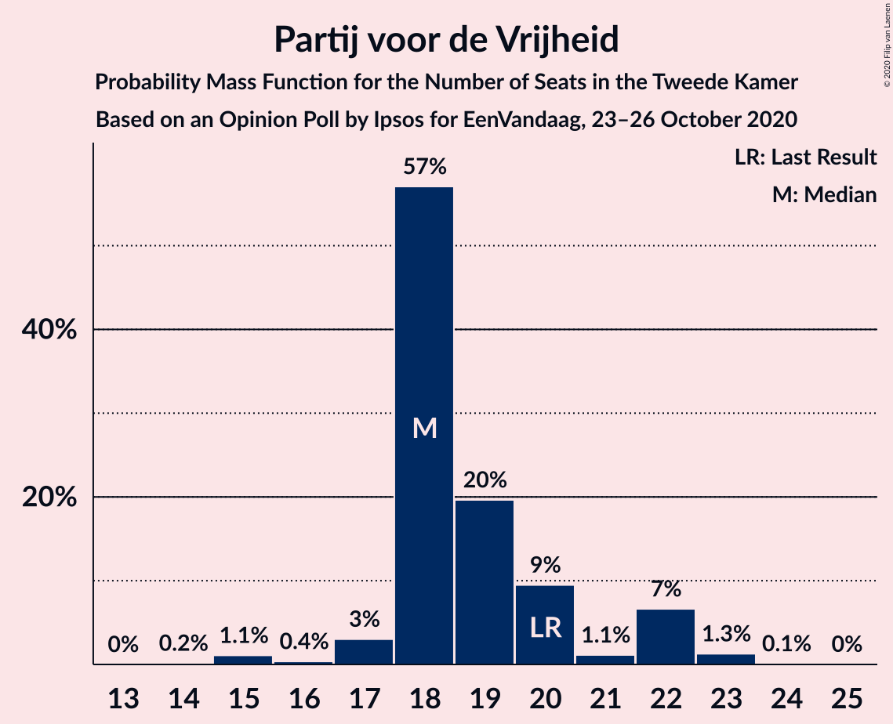

| Number of Seats | Probability | Accumulated | Special Marks |
|:---------------:|:-----------:|:-----------:|:-------------:|
| 14 | 0.2% | 100% |  |
| 15 | 1.1% | 99.8% |  |
| 16 | 0.4% | 98.8% |  |
| 17 | 3% | 98% |  |
| 18 | 57% | 95% | Median |
| 19 | 20% | 38% |  |
| 20 | 9% | 19% | Last Result |
| 21 | 1.1% | 9% |  |
| 22 | 7% | 8% |  |
| 23 | 1.3% | 1.4% |  |
| 24 | 0.1% | 0.1% |  |
| 25 | 0% | 0% |  |

### Christen-Democratisch Appèl

*For a full overview of the results for this party, see the [Christen-Democratisch Appèl](party-christen-democratischappèl.html) page.*

| Number of Seats | Probability | Accumulated | Special Marks |
|:---------------:|:-----------:|:-----------:|:-------------:|
| 11 | 0.1% | 100% |  |
| 12 | 0.3% | 99.9% |  |
| 13 | 12% | 99.6% |  |
| 14 | 6% | 88% |  |
| 15 | 9% | 82% |  |
| 16 | 6% | 72% |  |
| 17 | 2% | 66% |  |
| 18 | 62% | 64% | Median |
| 19 | 1.4% | 2% | Last Result |
| 20 | 0.5% | 0.7% |  |
| 21 | 0.1% | 0.2% |  |
| 22 | 0.1% | 0.1% |  |
| 23 | 0% | 0% |  |

### GroenLinks

*For a full overview of the results for this party, see the [GroenLinks](party-groenlinks.html) page.*

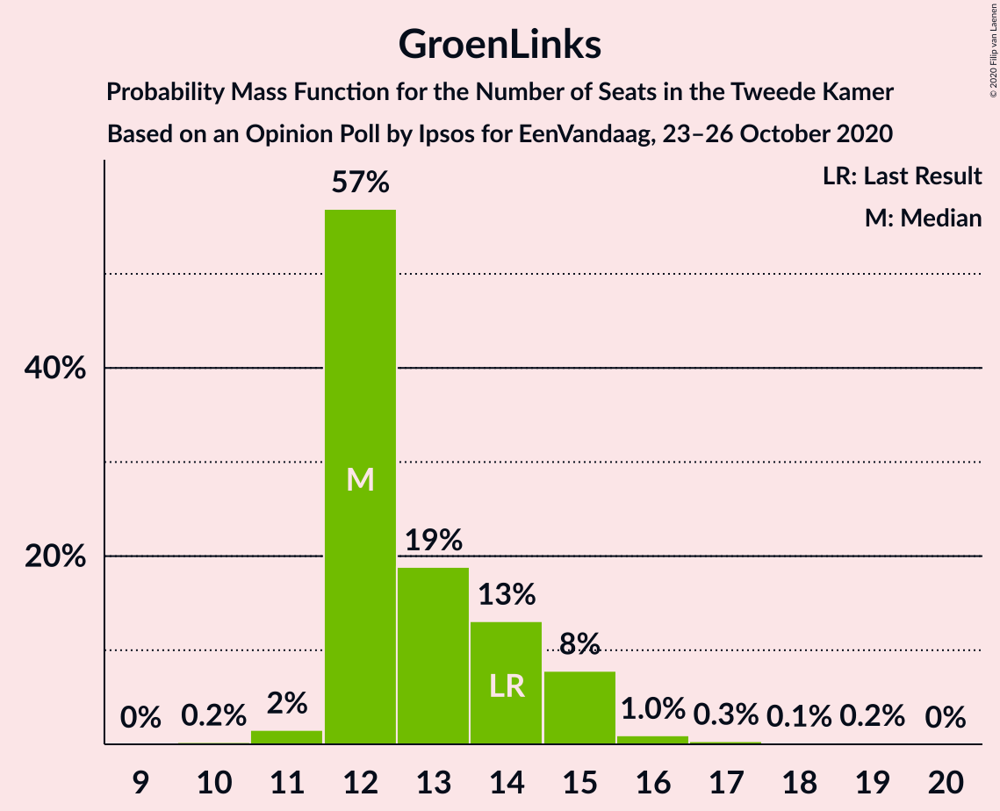

| Number of Seats | Probability | Accumulated | Special Marks |
|:---------------:|:-----------:|:-----------:|:-------------:|
| 10 | 0.2% | 100% |  |
| 11 | 2% | 99.8% |  |
| 12 | 57% | 98% | Median |
| 13 | 19% | 41% |  |
| 14 | 13% | 22% | Last Result |
| 15 | 8% | 9% |  |
| 16 | 1.0% | 2% |  |
| 17 | 0.3% | 0.6% |  |
| 18 | 0.1% | 0.3% |  |
| 19 | 0.2% | 0.2% |  |
| 20 | 0% | 0% |  |

### Democraten 66

*For a full overview of the results for this party, see the [Democraten 66](party-democraten66.html) page.*

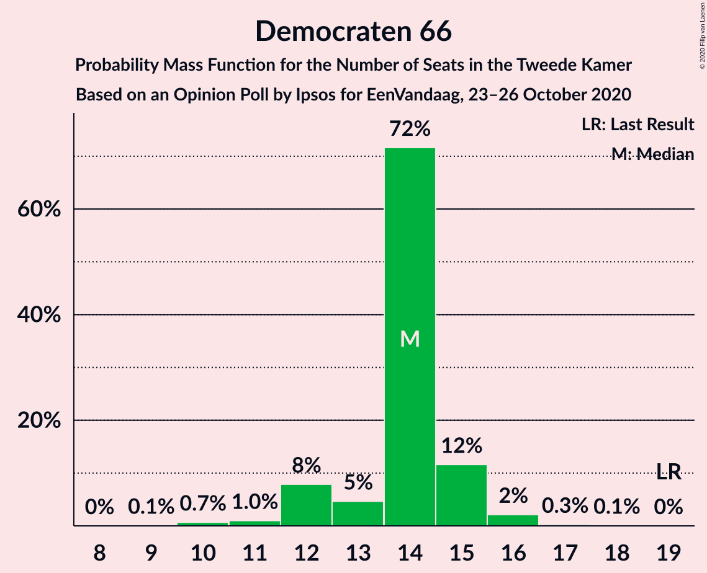

| Number of Seats | Probability | Accumulated | Special Marks |
|:---------------:|:-----------:|:-----------:|:-------------:|
| 9 | 0.1% | 100% |  |
| 10 | 0.7% | 99.9% |  |
| 11 | 1.0% | 99.3% |  |
| 12 | 8% | 98% |  |
| 13 | 5% | 90% |  |
| 14 | 72% | 86% | Median |
| 15 | 12% | 14% |  |
| 16 | 2% | 2% |  |
| 17 | 0.3% | 0.3% |  |
| 18 | 0.1% | 0.1% |  |
| 19 | 0% | 0% | Last Result |

### Partij van de Arbeid

*For a full overview of the results for this party, see the [Partij van de Arbeid](party-partijvandearbeid.html) page.*

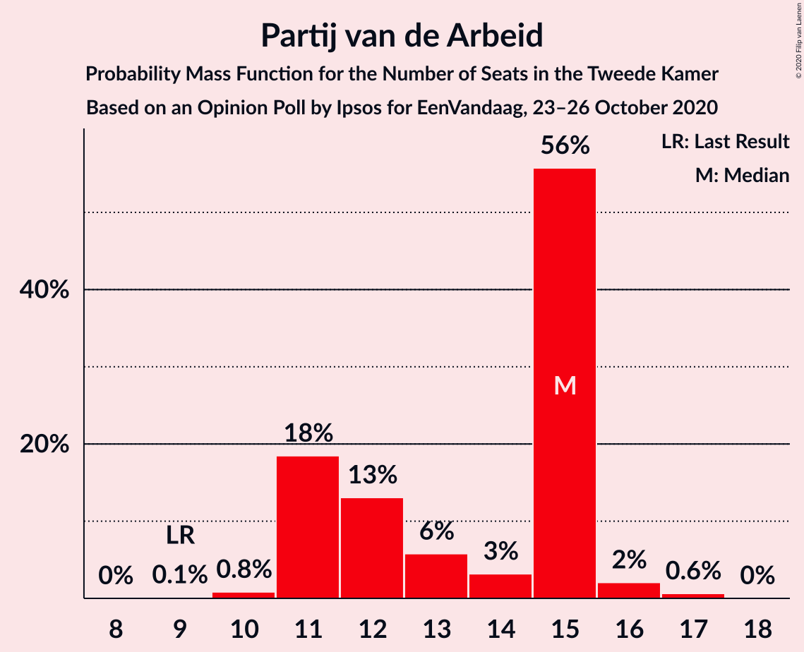

| Number of Seats | Probability | Accumulated | Special Marks |
|:---------------:|:-----------:|:-----------:|:-------------:|
| 9 | 0.1% | 100% | Last Result |
| 10 | 0.8% | 99.8% |  |
| 11 | 18% | 99.0% |  |
| 12 | 13% | 81% |  |
| 13 | 6% | 67% |  |
| 14 | 3% | 62% |  |
| 15 | 56% | 58% | Median |
| 16 | 2% | 3% |  |
| 17 | 0.6% | 0.7% |  |
| 18 | 0% | 0% |  |

### Socialistische Partij

*For a full overview of the results for this party, see the [Socialistische Partij](party-socialistischepartij.html) page.*

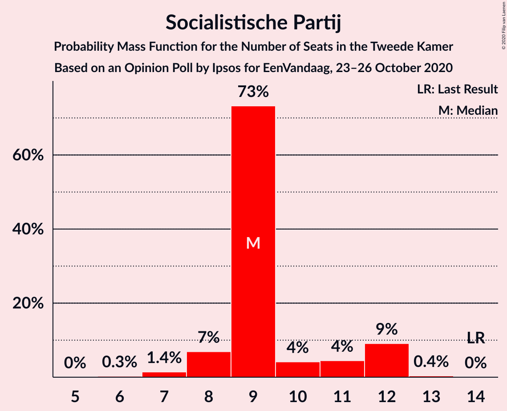

| Number of Seats | Probability | Accumulated | Special Marks |
|:---------------:|:-----------:|:-----------:|:-------------:|
| 6 | 0.3% | 100% |  |
| 7 | 1.4% | 99.7% |  |
| 8 | 7% | 98% |  |
| 9 | 73% | 91% | Median |
| 10 | 4% | 18% |  |
| 11 | 4% | 14% |  |
| 12 | 9% | 9% |  |
| 13 | 0.4% | 0.4% |  |
| 14 | 0% | 0% | Last Result |

### ChristenUnie

*For a full overview of the results for this party, see the [ChristenUnie](party-christenunie.html) page.*

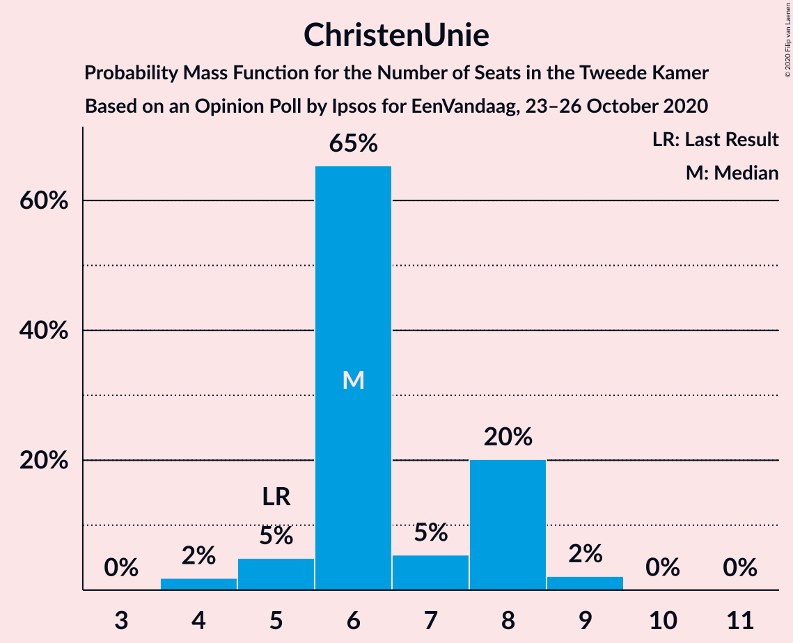

| Number of Seats | Probability | Accumulated | Special Marks |
|:---------------:|:-----------:|:-----------:|:-------------:|
| 4 | 2% | 100% |  |
| 5 | 5% | 98% | Last Result |
| 6 | 65% | 93% | Median |
| 7 | 5% | 28% |  |
| 8 | 20% | 22% |  |
| 9 | 2% | 2% |  |
| 10 | 0% | 0.1% |  |
| 11 | 0% | 0% |  |

### Partij voor de Dieren

*For a full overview of the results for this party, see the [Partij voor de Dieren](party-partijvoordedieren.html) page.*

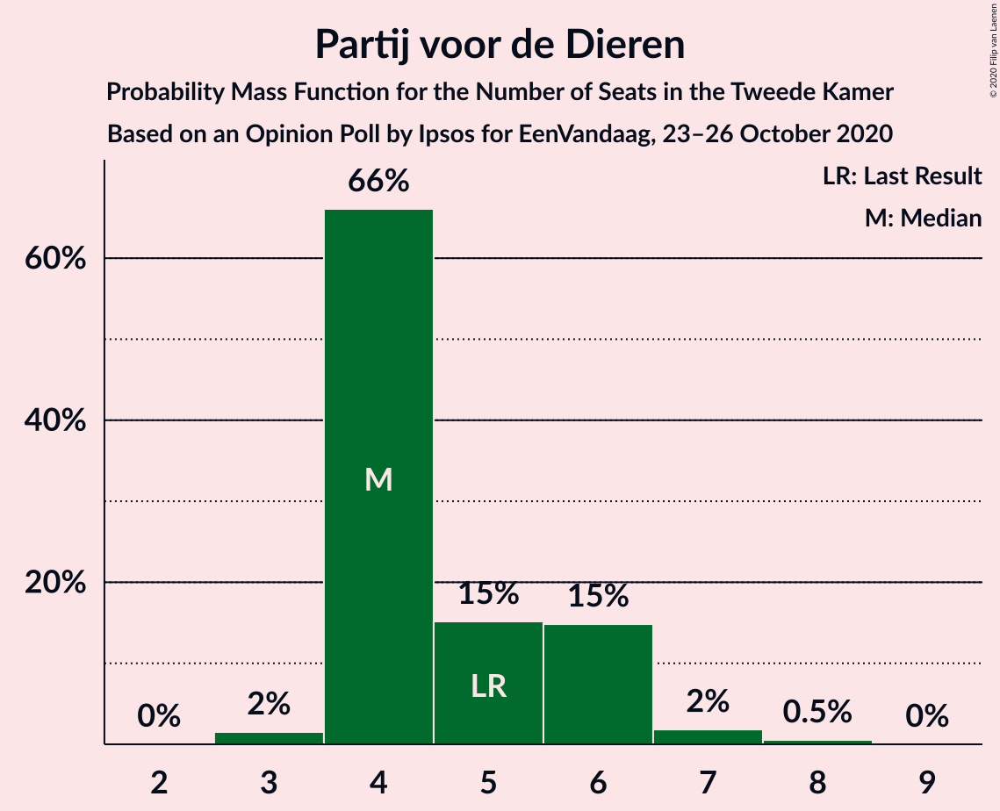

| Number of Seats | Probability | Accumulated | Special Marks |
|:---------------:|:-----------:|:-----------:|:-------------:|
| 3 | 2% | 100% |  |
| 4 | 66% | 98% | Median |
| 5 | 15% | 32% | Last Result |
| 6 | 15% | 17% |  |
| 7 | 2% | 2% |  |
| 8 | 0.5% | 0.5% |  |
| 9 | 0% | 0% |  |

### Forum voor Democratie

*For a full overview of the results for this party, see the [Forum voor Democratie](party-forumvoordemocratie.html) page.*

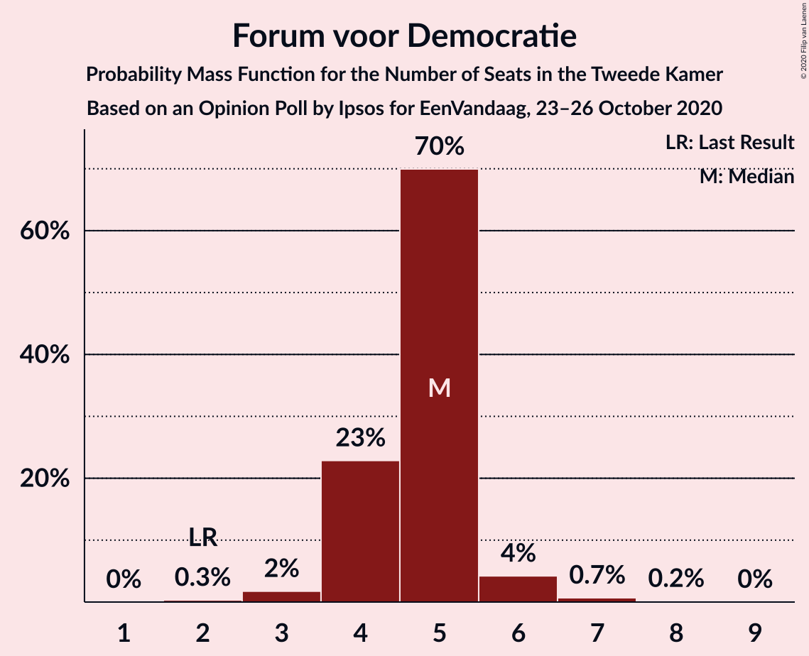

| Number of Seats | Probability | Accumulated | Special Marks |
|:---------------:|:-----------:|:-----------:|:-------------:|
| 2 | 0.3% | 100% | Last Result |
| 3 | 2% | 99.7% |  |
| 4 | 23% | 98% |  |
| 5 | 70% | 75% | Median |
| 6 | 4% | 5% |  |
| 7 | 0.7% | 0.9% |  |
| 8 | 0.2% | 0.2% |  |
| 9 | 0% | 0% |  |

### Staatkundig Gereformeerde Partij

*For a full overview of the results for this party, see the [Staatkundig Gereformeerde Partij](party-staatkundiggereformeerdepartij.html) page.*

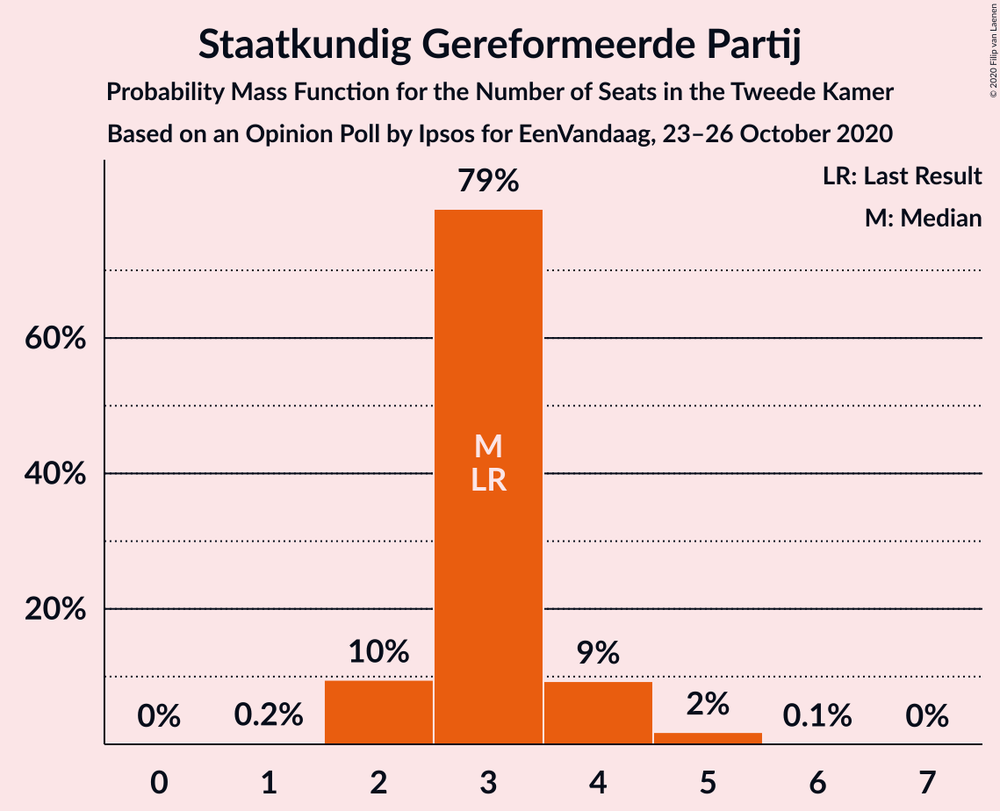

| Number of Seats | Probability | Accumulated | Special Marks |
|:---------------:|:-----------:|:-----------:|:-------------:|
| 1 | 0.2% | 100% |  |
| 2 | 10% | 99.8% |  |
| 3 | 79% | 90% | Last Result, Median |
| 4 | 9% | 11% |  |
| 5 | 2% | 2% |  |
| 6 | 0.1% | 0.1% |  |
| 7 | 0% | 0% |  |

### 50Plus

*For a full overview of the results for this party, see the [50Plus](party-50plus.html) page.*

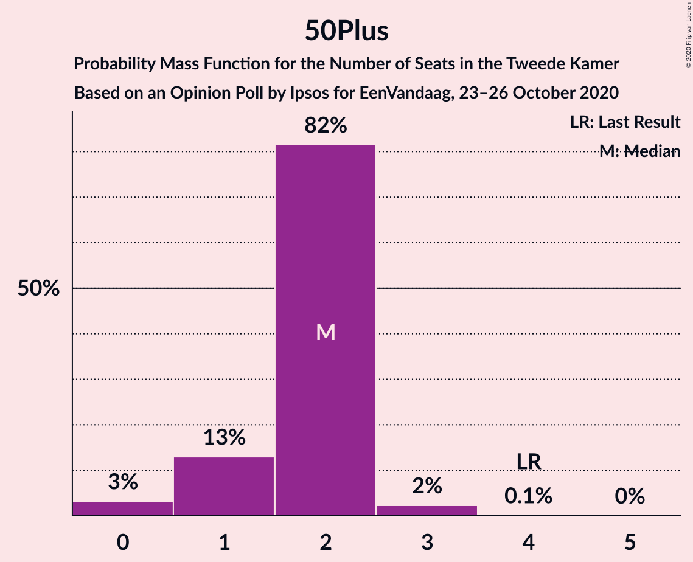

| Number of Seats | Probability | Accumulated | Special Marks |
|:---------------:|:-----------:|:-----------:|:-------------:|
| 0 | 3% | 100% |  |
| 1 | 13% | 97% |  |
| 2 | 82% | 84% | Median |
| 3 | 2% | 2% |  |
| 4 | 0.1% | 0.1% | Last Result |
| 5 | 0% | 0% |  |

### DENK

*For a full overview of the results for this party, see the [DENK](party-denk.html) page.*

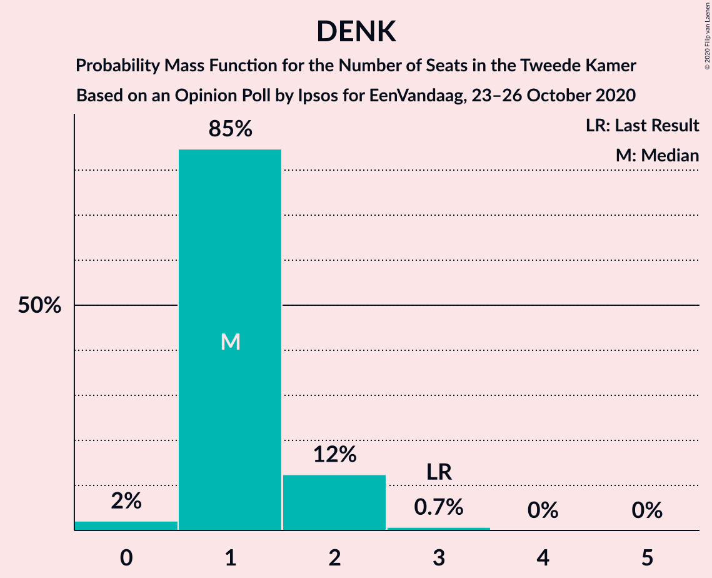

| Number of Seats | Probability | Accumulated | Special Marks |
|:---------------:|:-----------:|:-----------:|:-------------:|
| 0 | 2% | 100% |  |
| 1 | 85% | 98% | Median |
| 2 | 12% | 13% |  |
| 3 | 0.7% | 0.7% | Last Result |
| 4 | 0% | 0% |  |

## Coalitions

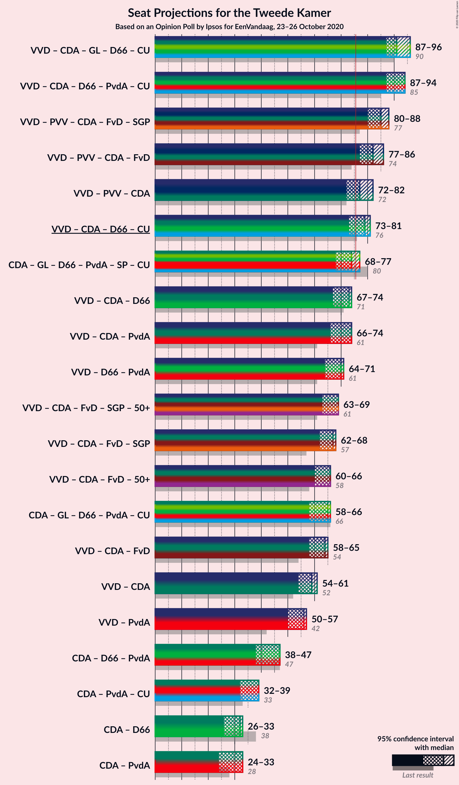

### Confidence Intervals

| Coalition | Last Result | Median | Majority? | 80% Confidence Interval | 90% Confidence Interval | 95% Confidence Interval | 99% Confidence Interval |
|:---------:|:-----------:|:------:|:---------:|:-----------------------:|:-----------------------:|:-----------------------:|:-----------------------:|
| Volkspartij voor Vrijheid en Democratie – Christen-Democratisch Appèl – GroenLinks – Democraten 66 – ChristenUnie | 90 | 91 | 100% | 89–93 | 88–94 | 87–96 | 86–97 |
| Volkspartij voor Vrijheid en Democratie – Christen-Democratisch Appèl – Democraten 66 – Partij van de Arbeid – ChristenUnie | 85 | 94 | 100% | 89–94 | 88–94 | 87–94 | 85–97 |
| Volkspartij voor Vrijheid en Democratie – Partij voor de Vrijheid – Christen-Democratisch Appèl – Forum voor Democratie – Staatkundig Gereformeerde Partij | 77 | 85 | 100% | 83–86 | 82–88 | 80–88 | 79–89 |
| Volkspartij voor Vrijheid en Democratie – Partij voor de Vrijheid – Christen-Democratisch Appèl – Forum voor Democratie | 74 | 82 | 99.3% | 80–83 | 78–85 | 77–86 | 75–86 |
| Volkspartij voor Vrijheid en Democratie – Partij voor de Vrijheid – Christen-Democratisch Appèl | 72 | 77 | 90% | 76–79 | 74–81 | 72–82 | 71–82 |
| Volkspartij voor Vrijheid en Democratie – Christen-Democratisch Appèl – Democraten 66 – ChristenUnie | 76 | 79 | 93% | 76–80 | 75–81 | 73–81 | 72–83 |
| Christen-Democratisch Appèl – GroenLinks – Democraten 66 – Partij van de Arbeid – Socialistische Partij – ChristenUnie | 80 | 74 | 5% | 69–75 | 69–75 | 68–77 | 67–78 |
| Volkspartij voor Vrijheid en Democratie – Christen-Democratisch Appèl – Democraten 66 | 71 | 73 | 0.8% | 70–73 | 68–73 | 67–74 | 65–76 |
| Volkspartij voor Vrijheid en Democratie – Christen-Democratisch Appèl – Partij van de Arbeid | 61 | 74 | 0.8% | 68–74 | 68–74 | 66–74 | 65–77 |
| Volkspartij voor Vrijheid en Democratie – Democraten 66 – Partij van de Arbeid | 61 | 70 | 0% | 65–70 | 65–71 | 64–71 | 63–74 |
| Volkspartij voor Vrijheid en Democratie – Christen-Democratisch Appèl – Forum voor Democratie – Staatkundig Gereformeerde Partij – 50Plus | 61 | 69 | 0% | 65–69 | 64–69 | 63–69 | 62–73 |
| Volkspartij voor Vrijheid en Democratie – Christen-Democratisch Appèl – Forum voor Democratie – Staatkundig Gereformeerde Partij | 57 | 67 | 0% | 64–67 | 62–67 | 62–68 | 60–71 |
| Volkspartij voor Vrijheid en Democratie – Christen-Democratisch Appèl – Forum voor Democratie – 50Plus | 58 | 66 | 0% | 62–66 | 60–66 | 60–66 | 59–69 |
| Christen-Democratisch Appèl – GroenLinks – Democraten 66 – Partij van de Arbeid – ChristenUnie | 66 | 65 | 0% | 60–65 | 60–66 | 58–66 | 57–68 |
| Volkspartij voor Vrijheid en Democratie – Christen-Democratisch Appèl – Forum voor Democratie | 54 | 64 | 0% | 60–64 | 59–64 | 58–65 | 57–67 |
| Volkspartij voor Vrijheid en Democratie – Christen-Democratisch Appèl | 52 | 59 | 0% | 56–59 | 54–60 | 54–61 | 53–63 |
| Volkspartij voor Vrijheid en Democratie – Partij van de Arbeid | 42 | 56 | 0% | 50–56 | 50–57 | 50–57 | 49–60 |
| Christen-Democratisch Appèl – Democraten 66 – Partij van de Arbeid | 47 | 47 | 0% | 39–47 | 38–47 | 38–47 | 38–47 |
| Christen-Democratisch Appèl – Partij van de Arbeid – ChristenUnie | 33 | 39 | 0% | 32–39 | 32–39 | 32–39 | 31–41 |
| Christen-Democratisch Appèl – Democraten 66 | 38 | 32 | 0% | 27–32 | 27–33 | 26–33 | 25–34 |
| Christen-Democratisch Appèl – Partij van de Arbeid | 28 | 33 | 0% | 26–33 | 24–33 | 24–33 | 24–34 |

### Volkspartij voor Vrijheid en Democratie – Christen-Democratisch Appèl – GroenLinks – Democraten 66 – ChristenUnie

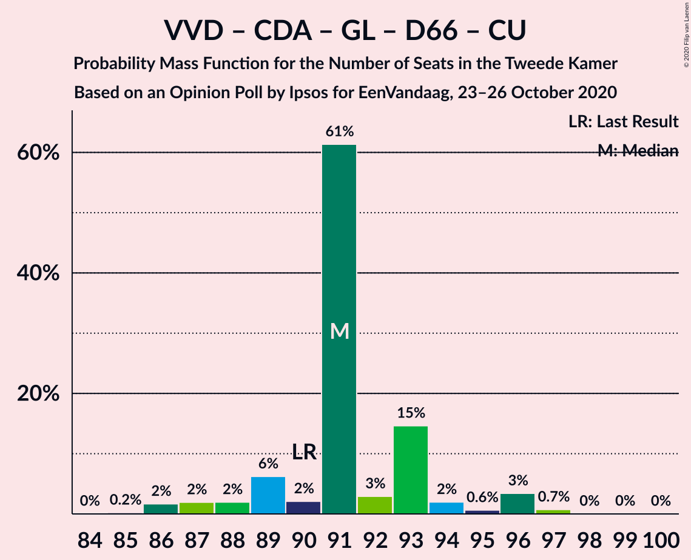

| Number of Seats | Probability | Accumulated | Special Marks |
|:---------------:|:-----------:|:-----------:|:-------------:|
| 84 | 0% | 100% |  |
| 85 | 0.2% | 99.9% |  |
| 86 | 2% | 99.7% |  |
| 87 | 2% | 98% |  |
| 88 | 2% | 96% |  |
| 89 | 6% | 94% |  |
| 90 | 2% | 88% | Last Result |
| 91 | 61% | 86% | Median |
| 92 | 3% | 24% |  |
| 93 | 15% | 22% |  |
| 94 | 2% | 7% |  |
| 95 | 0.6% | 5% |  |
| 96 | 3% | 4% |  |
| 97 | 0.7% | 0.9% |  |
| 98 | 0% | 0.1% |  |
| 99 | 0% | 0.1% |  |
| 100 | 0% | 0% |  |

### Volkspartij voor Vrijheid en Democratie – Christen-Democratisch Appèl – Democraten 66 – Partij van de Arbeid – ChristenUnie

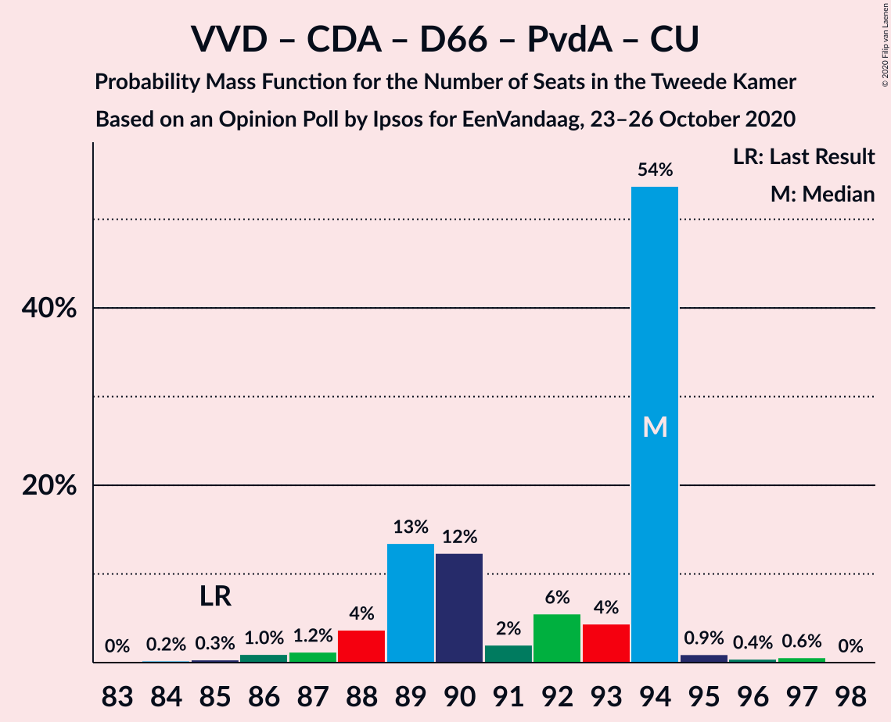

| Number of Seats | Probability | Accumulated | Special Marks |
|:---------------:|:-----------:|:-----------:|:-------------:|
| 84 | 0.2% | 100% |  |
| 85 | 0.3% | 99.7% | Last Result |
| 86 | 1.0% | 99.4% |  |
| 87 | 1.2% | 98% |  |
| 88 | 4% | 97% |  |
| 89 | 13% | 94% |  |
| 90 | 12% | 80% |  |
| 91 | 2% | 68% |  |
| 92 | 6% | 66% |  |
| 93 | 4% | 60% |  |
| 94 | 54% | 56% | Median |
| 95 | 0.9% | 2% |  |
| 96 | 0.4% | 1.0% |  |
| 97 | 0.6% | 0.6% |  |
| 98 | 0% | 0% |  |

### Volkspartij voor Vrijheid en Democratie – Partij voor de Vrijheid – Christen-Democratisch Appèl – Forum voor Democratie – Staatkundig Gereformeerde Partij

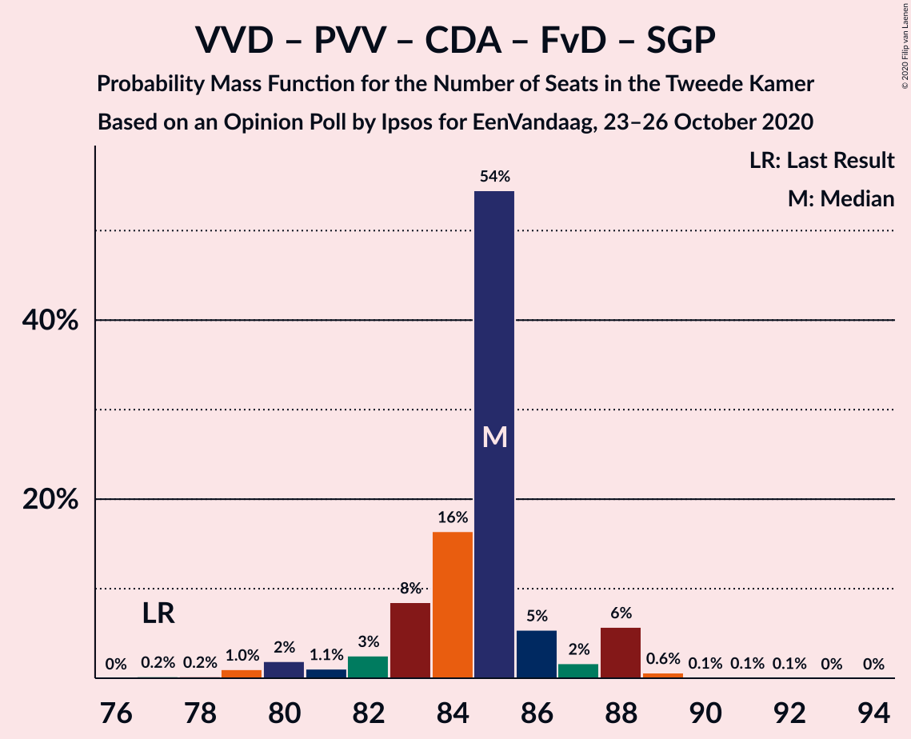

| Number of Seats | Probability | Accumulated | Special Marks |
|:---------------:|:-----------:|:-----------:|:-------------:|
| 77 | 0.2% | 100% | Last Result |
| 78 | 0.2% | 99.8% |  |
| 79 | 1.0% | 99.6% |  |
| 80 | 2% | 98.6% |  |
| 81 | 1.1% | 97% |  |
| 82 | 3% | 96% |  |
| 83 | 8% | 93% |  |
| 84 | 16% | 85% |  |
| 85 | 54% | 68% | Median |
| 86 | 5% | 14% |  |
| 87 | 2% | 8% |  |
| 88 | 6% | 7% |  |
| 89 | 0.6% | 0.9% |  |
| 90 | 0.1% | 0.3% |  |
| 91 | 0.1% | 0.2% |  |
| 92 | 0.1% | 0.1% |  |
| 93 | 0% | 0% |  |

### Volkspartij voor Vrijheid en Democratie – Partij voor de Vrijheid – Christen-Democratisch Appèl – Forum voor Democratie

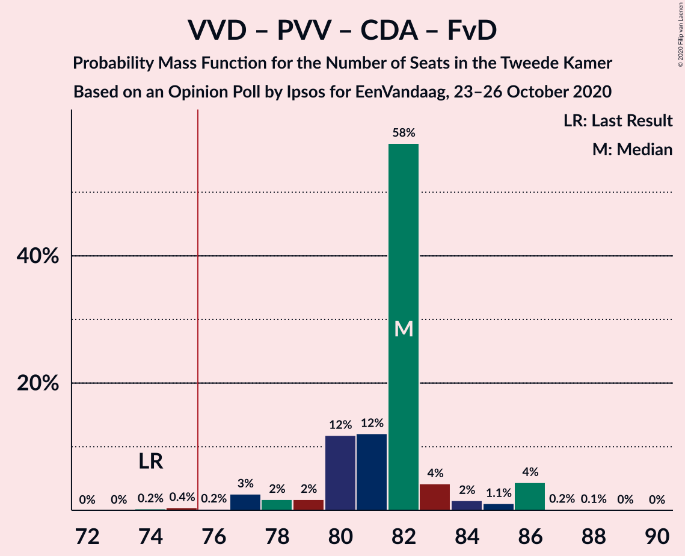

| Number of Seats | Probability | Accumulated | Special Marks |
|:---------------:|:-----------:|:-----------:|:-------------:|
| 74 | 0.2% | 100% | Last Result |
| 75 | 0.4% | 99.7% |  |
| 76 | 0.2% | 99.3% | Majority |
| 77 | 3% | 99.1% |  |
| 78 | 2% | 97% |  |
| 79 | 2% | 95% |  |
| 80 | 12% | 93% |  |
| 81 | 12% | 81% |  |
| 82 | 58% | 69% | Median |
| 83 | 4% | 12% |  |
| 84 | 2% | 7% |  |
| 85 | 1.1% | 6% |  |
| 86 | 4% | 5% |  |
| 87 | 0.2% | 0.4% |  |
| 88 | 0.1% | 0.2% |  |
| 89 | 0% | 0.1% |  |
| 90 | 0% | 0% |  |

### Volkspartij voor Vrijheid en Democratie – Partij voor de Vrijheid – Christen-Democratisch Appèl

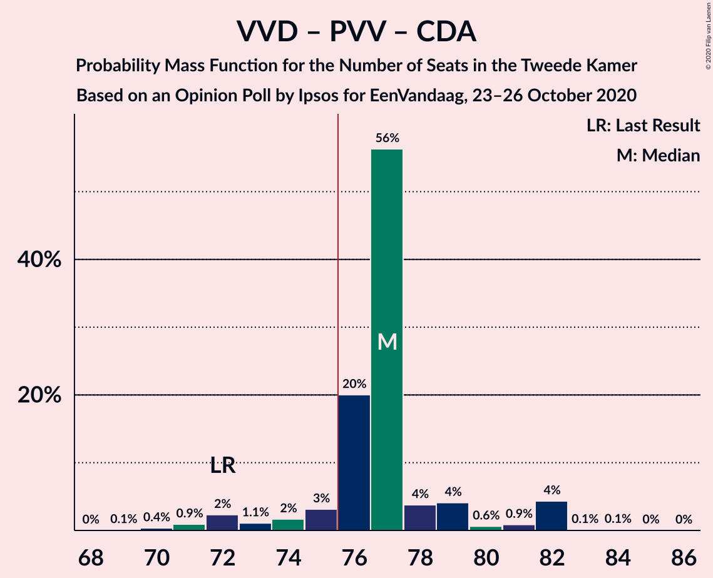

| Number of Seats | Probability | Accumulated | Special Marks |
|:---------------:|:-----------:|:-----------:|:-------------:|
| 69 | 0.1% | 100% |  |
| 70 | 0.4% | 99.9% |  |
| 71 | 0.9% | 99.5% |  |
| 72 | 2% | 98.6% | Last Result |
| 73 | 1.1% | 96% |  |
| 74 | 2% | 95% |  |
| 75 | 3% | 93% |  |
| 76 | 20% | 90% | Majority |
| 77 | 56% | 70% | Median |
| 78 | 4% | 14% |  |
| 79 | 4% | 10% |  |
| 80 | 0.6% | 6% |  |
| 81 | 0.9% | 5% |  |
| 82 | 4% | 5% |  |
| 83 | 0.1% | 0.3% |  |
| 84 | 0.1% | 0.2% |  |
| 85 | 0% | 0.1% |  |
| 86 | 0% | 0% |  |

### Volkspartij voor Vrijheid en Democratie – Christen-Democratisch Appèl – Democraten 66 – ChristenUnie

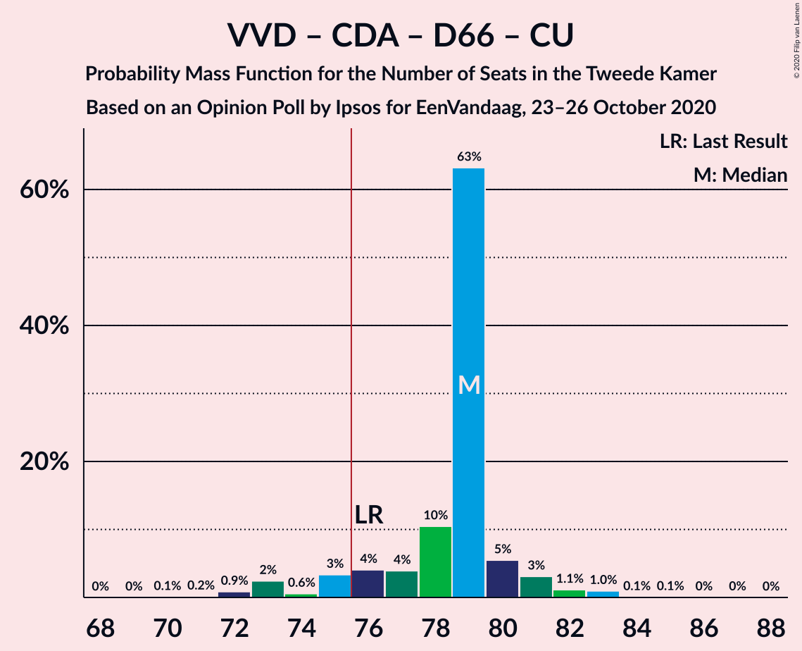

| Number of Seats | Probability | Accumulated | Special Marks |
|:---------------:|:-----------:|:-----------:|:-------------:|
| 70 | 0.1% | 100% |  |
| 71 | 0.2% | 99.9% |  |
| 72 | 0.9% | 99.8% |  |
| 73 | 2% | 98.9% |  |
| 74 | 0.6% | 96% |  |
| 75 | 3% | 96% |  |
| 76 | 4% | 93% | Last Result, Majority |
| 77 | 4% | 88% |  |
| 78 | 10% | 85% |  |
| 79 | 63% | 74% | Median |
| 80 | 5% | 11% |  |
| 81 | 3% | 5% |  |
| 82 | 1.1% | 2% |  |
| 83 | 1.0% | 1.2% |  |
| 84 | 0.1% | 0.2% |  |
| 85 | 0.1% | 0.1% |  |
| 86 | 0% | 0.1% |  |
| 87 | 0% | 0% |  |

### Christen-Democratisch Appèl – GroenLinks – Democraten 66 – Partij van de Arbeid – Socialistische Partij – ChristenUnie

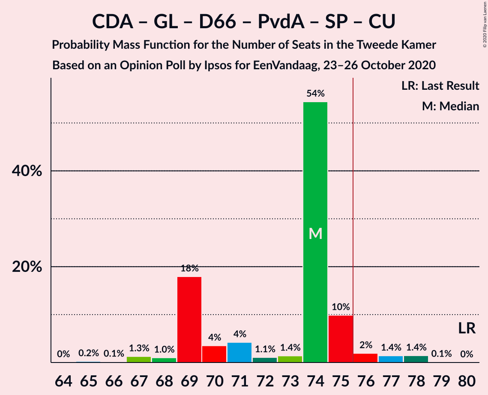

| Number of Seats | Probability | Accumulated | Special Marks |
|:---------------:|:-----------:|:-----------:|:-------------:|
| 64 | 0% | 100% |  |
| 65 | 0.2% | 99.9% |  |
| 66 | 0.1% | 99.7% |  |
| 67 | 1.3% | 99.6% |  |
| 68 | 1.0% | 98% |  |
| 69 | 18% | 97% |  |
| 70 | 4% | 79% |  |
| 71 | 4% | 76% |  |
| 72 | 1.1% | 72% |  |
| 73 | 1.4% | 71% |  |
| 74 | 54% | 69% | Median |
| 75 | 10% | 15% |  |
| 76 | 2% | 5% | Majority |
| 77 | 1.4% | 3% |  |
| 78 | 1.4% | 2% |  |
| 79 | 0.1% | 0.1% |  |
| 80 | 0% | 0% | Last Result |

### Volkspartij voor Vrijheid en Democratie – Christen-Democratisch Appèl – Democraten 66

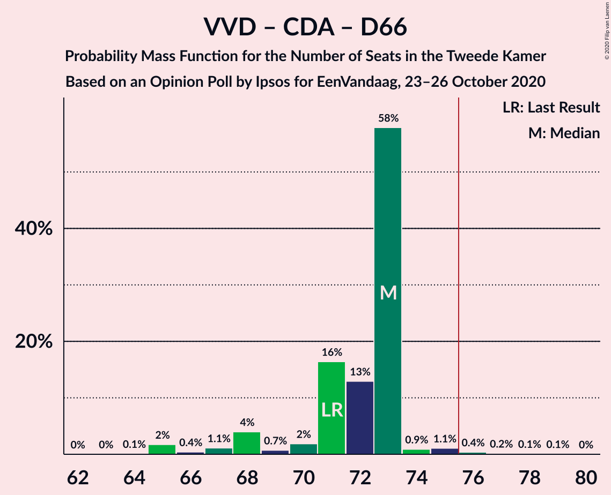

| Number of Seats | Probability | Accumulated | Special Marks |
|:---------------:|:-----------:|:-----------:|:-------------:|
| 64 | 0.1% | 100% |  |
| 65 | 2% | 99.9% |  |
| 66 | 0.4% | 98% |  |
| 67 | 1.1% | 98% |  |
| 68 | 4% | 97% |  |
| 69 | 0.7% | 93% |  |
| 70 | 2% | 92% |  |
| 71 | 16% | 90% | Last Result |
| 72 | 13% | 74% |  |
| 73 | 58% | 61% | Median |
| 74 | 0.9% | 3% |  |
| 75 | 1.1% | 2% |  |
| 76 | 0.4% | 0.8% | Majority |
| 77 | 0.2% | 0.4% |  |
| 78 | 0.1% | 0.2% |  |
| 79 | 0.1% | 0.1% |  |
| 80 | 0% | 0% |  |

### Volkspartij voor Vrijheid en Democratie – Christen-Democratisch Appèl – Partij van de Arbeid

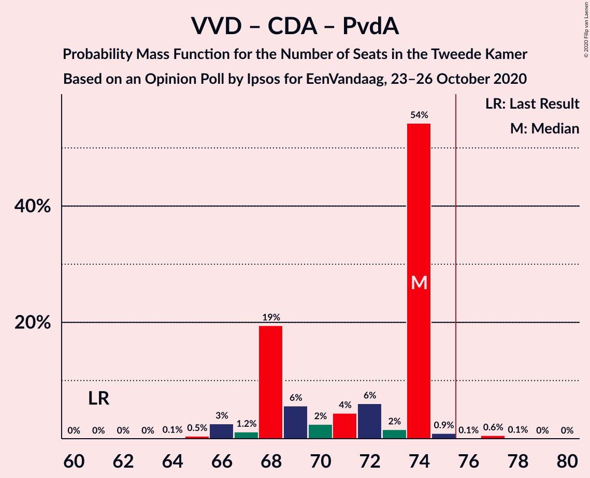

| Number of Seats | Probability | Accumulated | Special Marks |
|:---------------:|:-----------:|:-----------:|:-------------:|
| 61 | 0% | 100% | Last Result |
| 62 | 0% | 100% |  |
| 63 | 0% | 100% |  |
| 64 | 0.1% | 100% |  |
| 65 | 0.5% | 99.8% |  |
| 66 | 3% | 99.4% |  |
| 67 | 1.2% | 97% |  |
| 68 | 19% | 96% |  |
| 69 | 6% | 76% |  |
| 70 | 2% | 71% |  |
| 71 | 4% | 68% |  |
| 72 | 6% | 64% |  |
| 73 | 2% | 58% |  |
| 74 | 54% | 56% | Median |
| 75 | 0.9% | 2% |  |
| 76 | 0.1% | 0.8% | Majority |
| 77 | 0.6% | 0.7% |  |
| 78 | 0.1% | 0.2% |  |
| 79 | 0% | 0% |  |

### Volkspartij voor Vrijheid en Democratie – Democraten 66 – Partij van de Arbeid

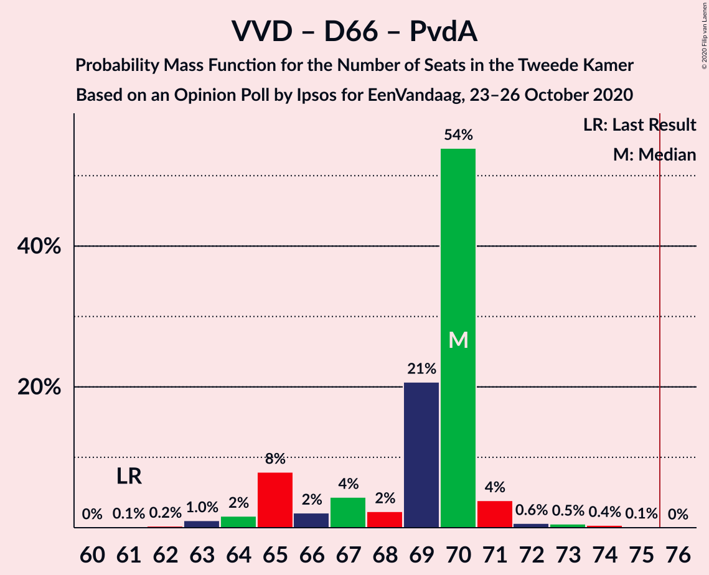

| Number of Seats | Probability | Accumulated | Special Marks |
|:---------------:|:-----------:|:-----------:|:-------------:|
| 60 | 0% | 100% |  |
| 61 | 0.1% | 99.9% | Last Result |
| 62 | 0.2% | 99.8% |  |
| 63 | 1.0% | 99.6% |  |
| 64 | 2% | 98.5% |  |
| 65 | 8% | 97% |  |
| 66 | 2% | 89% |  |
| 67 | 4% | 87% |  |
| 68 | 2% | 82% |  |
| 69 | 21% | 80% |  |
| 70 | 54% | 59% | Median |
| 71 | 4% | 6% |  |
| 72 | 0.6% | 2% |  |
| 73 | 0.5% | 1.1% |  |
| 74 | 0.4% | 0.5% |  |
| 75 | 0.1% | 0.2% |  |
| 76 | 0% | 0% | Majority |

### Volkspartij voor Vrijheid en Democratie – Christen-Democratisch Appèl – Forum voor Democratie – Staatkundig Gereformeerde Partij – 50Plus

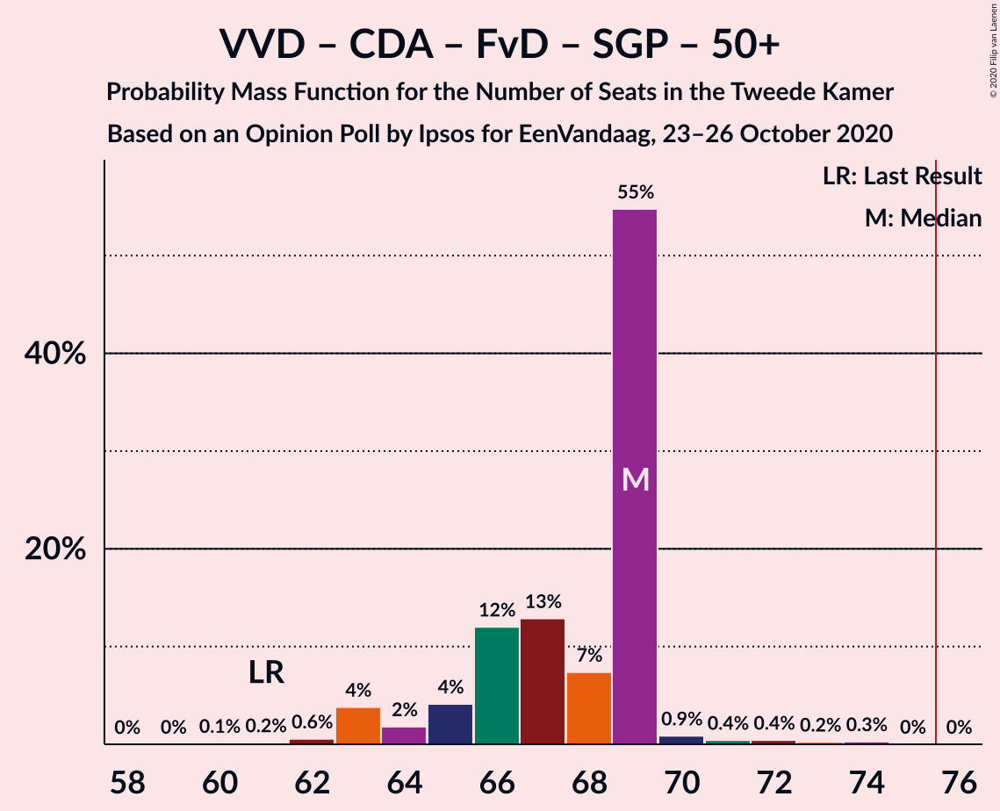

| Number of Seats | Probability | Accumulated | Special Marks |
|:---------------:|:-----------:|:-----------:|:-------------:|
| 60 | 0.1% | 100% |  |
| 61 | 0.2% | 99.9% | Last Result |
| 62 | 0.6% | 99.7% |  |
| 63 | 4% | 99.1% |  |
| 64 | 2% | 95% |  |
| 65 | 4% | 94% |  |
| 66 | 12% | 89% |  |
| 67 | 13% | 77% |  |
| 68 | 7% | 64% |  |
| 69 | 55% | 57% | Median |
| 70 | 0.9% | 2% |  |
| 71 | 0.4% | 1.4% |  |
| 72 | 0.4% | 1.0% |  |
| 73 | 0.2% | 0.6% |  |
| 74 | 0.3% | 0.3% |  |
| 75 | 0% | 0.1% |  |
| 76 | 0% | 0% | Majority |

### Volkspartij voor Vrijheid en Democratie – Christen-Democratisch Appèl – Forum voor Democratie – Staatkundig Gereformeerde Partij

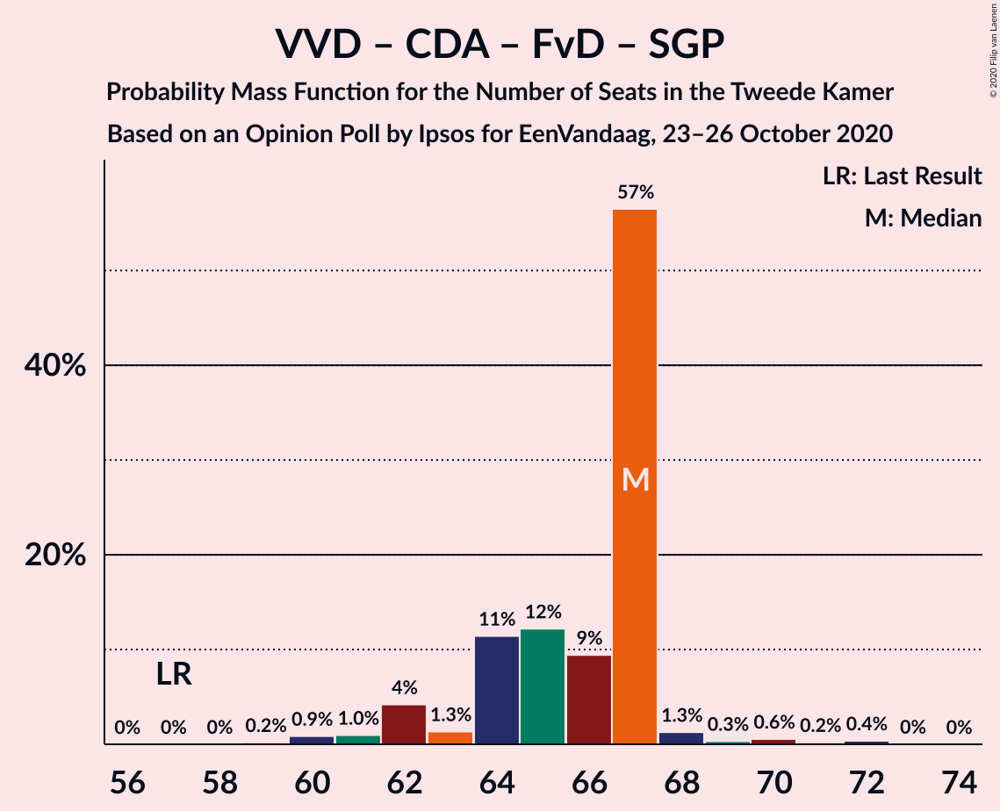

| Number of Seats | Probability | Accumulated | Special Marks |
|:---------------:|:-----------:|:-----------:|:-------------:|
| 57 | 0% | 100% | Last Result |
| 58 | 0% | 100% |  |
| 59 | 0.2% | 100% |  |
| 60 | 0.9% | 99.8% |  |
| 61 | 1.0% | 98.9% |  |
| 62 | 4% | 98% |  |
| 63 | 1.3% | 94% |  |
| 64 | 11% | 92% |  |
| 65 | 12% | 81% |  |
| 66 | 9% | 69% |  |
| 67 | 57% | 59% | Median |
| 68 | 1.3% | 3% |  |
| 69 | 0.3% | 2% |  |
| 70 | 0.6% | 1.2% |  |
| 71 | 0.2% | 0.6% |  |
| 72 | 0.4% | 0.4% |  |
| 73 | 0% | 0.1% |  |
| 74 | 0% | 0% |  |

### Volkspartij voor Vrijheid en Democratie – Christen-Democratisch Appèl – Forum voor Democratie – 50Plus

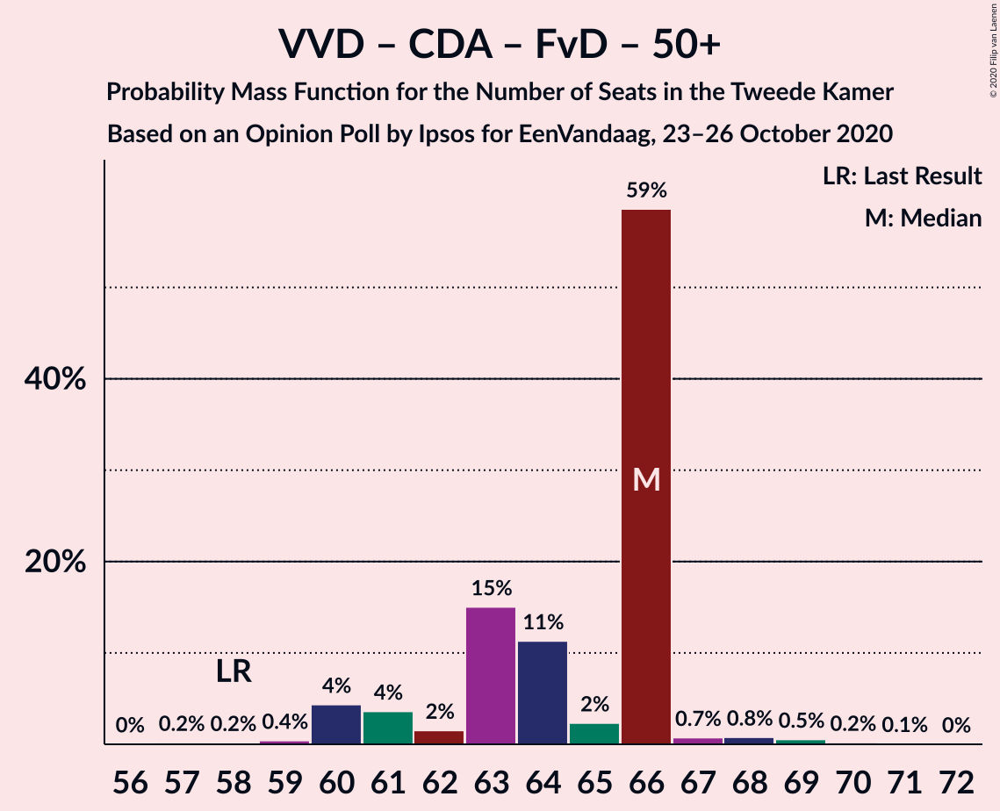

| Number of Seats | Probability | Accumulated | Special Marks |
|:---------------:|:-----------:|:-----------:|:-------------:|
| 57 | 0.2% | 100% |  |
| 58 | 0.2% | 99.8% | Last Result |
| 59 | 0.4% | 99.6% |  |
| 60 | 4% | 99.2% |  |
| 61 | 4% | 95% |  |
| 62 | 2% | 91% |  |
| 63 | 15% | 90% |  |
| 64 | 11% | 75% |  |
| 65 | 2% | 63% |  |
| 66 | 59% | 61% | Median |
| 67 | 0.7% | 2% |  |
| 68 | 0.8% | 2% |  |
| 69 | 0.5% | 0.9% |  |
| 70 | 0.2% | 0.3% |  |
| 71 | 0.1% | 0.1% |  |
| 72 | 0% | 0% |  |

### Christen-Democratisch Appèl – GroenLinks – Democraten 66 – Partij van de Arbeid – ChristenUnie

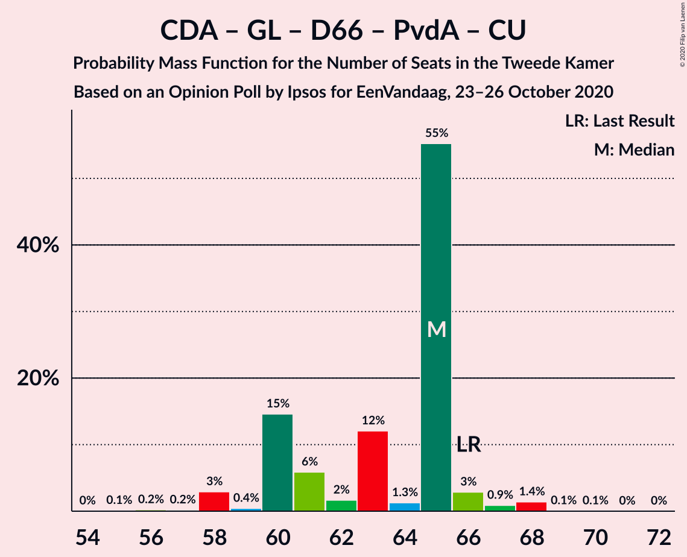

| Number of Seats | Probability | Accumulated | Special Marks |
|:---------------:|:-----------:|:-----------:|:-------------:|
| 55 | 0.1% | 100% |  |
| 56 | 0.2% | 99.8% |  |
| 57 | 0.2% | 99.6% |  |
| 58 | 3% | 99.4% |  |
| 59 | 0.4% | 97% |  |
| 60 | 15% | 96% |  |
| 61 | 6% | 81% |  |
| 62 | 2% | 76% |  |
| 63 | 12% | 74% |  |
| 64 | 1.3% | 62% |  |
| 65 | 55% | 61% | Median |
| 66 | 3% | 5% | Last Result |
| 67 | 0.9% | 2% |  |
| 68 | 1.4% | 2% |  |
| 69 | 0.1% | 0.2% |  |
| 70 | 0.1% | 0.1% |  |
| 71 | 0% | 0% |  |

### Volkspartij voor Vrijheid en Democratie – Christen-Democratisch Appèl – Forum voor Democratie

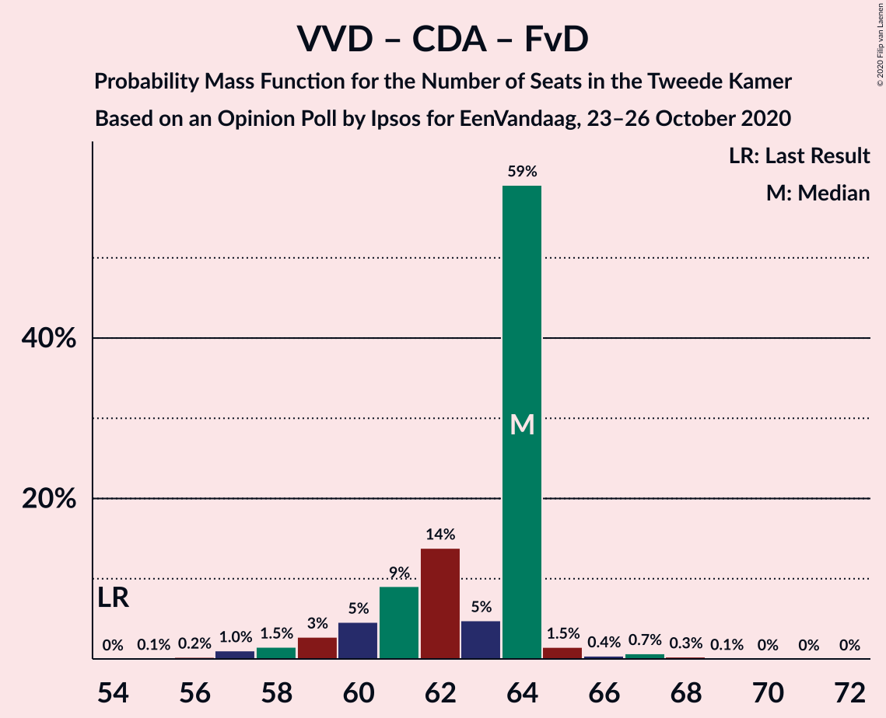

| Number of Seats | Probability | Accumulated | Special Marks |
|:---------------:|:-----------:|:-----------:|:-------------:|
| 54 | 0% | 100% | Last Result |
| 55 | 0.1% | 100% |  |
| 56 | 0.2% | 99.9% |  |
| 57 | 1.0% | 99.7% |  |
| 58 | 1.5% | 98.6% |  |
| 59 | 3% | 97% |  |
| 60 | 5% | 94% |  |
| 61 | 9% | 90% |  |
| 62 | 14% | 81% |  |
| 63 | 5% | 67% |  |
| 64 | 59% | 62% | Median |
| 65 | 1.5% | 3% |  |
| 66 | 0.4% | 1.5% |  |
| 67 | 0.7% | 1.1% |  |
| 68 | 0.3% | 0.4% |  |
| 69 | 0.1% | 0.1% |  |
| 70 | 0% | 0.1% |  |
| 71 | 0% | 0% |  |

### Volkspartij voor Vrijheid en Democratie – Christen-Democratisch Appèl

| Number of Seats | Probability | Accumulated | Special Marks |
|:---------------:|:-----------:|:-----------:|:-------------:|
| 50 | 0.1% | 100% |  |
| 51 | 0.1% | 99.9% |  |
| 52 | 0.3% | 99.8% | Last Result |
| 53 | 2% | 99.5% |  |
| 54 | 3% | 98% |  |
| 55 | 3% | 94% |  |
| 56 | 4% | 92% |  |
| 57 | 19% | 88% |  |
| 58 | 5% | 69% |  |
| 59 | 57% | 64% | Median |
| 60 | 5% | 7% |  |
| 61 | 1.2% | 3% |  |
| 62 | 0.9% | 1.5% |  |
| 63 | 0.4% | 0.6% |  |
| 64 | 0.1% | 0.2% |  |
| 65 | 0% | 0.1% |  |
| 66 | 0% | 0% |  |

### Volkspartij voor Vrijheid en Democratie – Partij van de Arbeid

| Number of Seats | Probability | Accumulated | Special Marks |
|:---------------:|:-----------:|:-----------:|:-------------:|
| 42 | 0% | 100% | Last Result |
| 43 | 0% | 100% |  |
| 44 | 0% | 100% |  |
| 45 | 0% | 100% |  |
| 46 | 0% | 100% |  |
| 47 | 0% | 100% |  |
| 48 | 0% | 100% |  |
| 49 | 0.5% | 99.9% |  |
| 50 | 10% | 99.4% |  |
| 51 | 0.7% | 89% |  |
| 52 | 2% | 88% |  |
| 53 | 2% | 87% |  |
| 54 | 4% | 85% |  |
| 55 | 15% | 81% |  |
| 56 | 56% | 66% | Median |
| 57 | 8% | 10% |  |
| 58 | 0.7% | 2% |  |
| 59 | 0.5% | 1.5% |  |
| 60 | 0.6% | 1.0% |  |
| 61 | 0.1% | 0.4% |  |
| 62 | 0.3% | 0.3% |  |
| 63 | 0% | 0% |  |

### Christen-Democratisch Appèl – Democraten 66 – Partij van de Arbeid

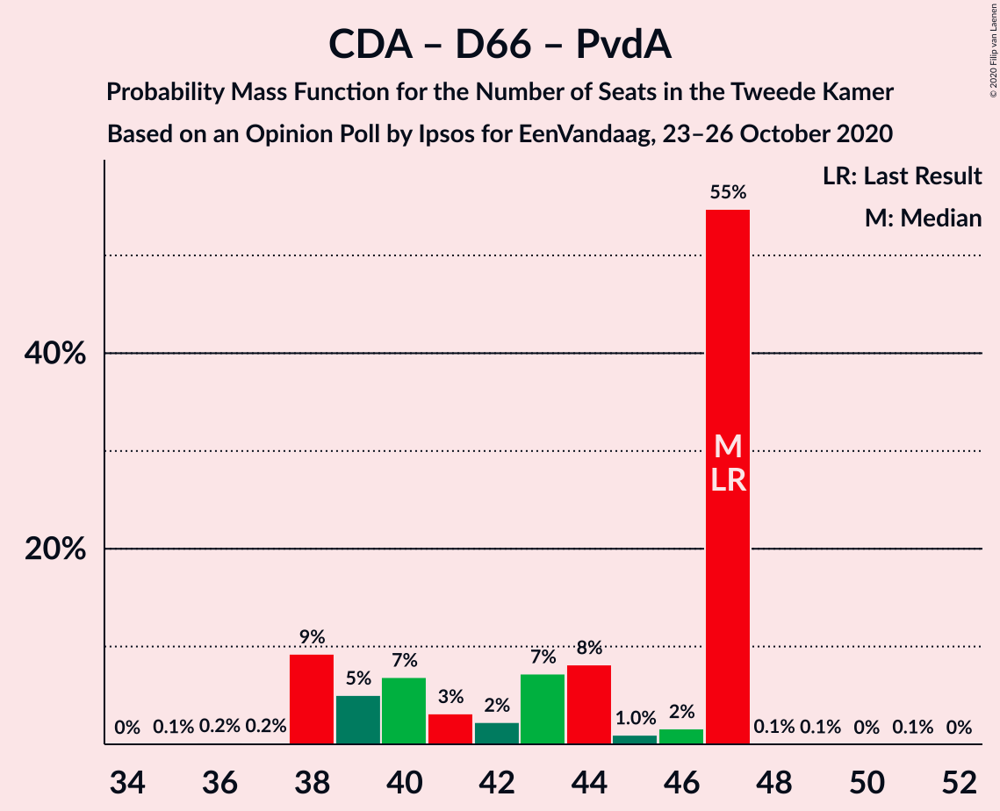

| Number of Seats | Probability | Accumulated | Special Marks |
|:---------------:|:-----------:|:-----------:|:-------------:|
| 35 | 0.1% | 100% |  |
| 36 | 0.2% | 99.9% |  |
| 37 | 0.2% | 99.7% |  |
| 38 | 9% | 99.6% |  |
| 39 | 5% | 90% |  |
| 40 | 7% | 85% |  |
| 41 | 3% | 78% |  |
| 42 | 2% | 75% |  |
| 43 | 7% | 73% |  |
| 44 | 8% | 66% |  |
| 45 | 1.0% | 58% |  |
| 46 | 2% | 57% |  |
| 47 | 55% | 55% | Last Result, Median |
| 48 | 0.1% | 0.2% |  |
| 49 | 0.1% | 0.1% |  |
| 50 | 0% | 0.1% |  |
| 51 | 0.1% | 0.1% |  |
| 52 | 0% | 0% |  |

### Christen-Democratisch Appèl – Partij van de Arbeid – ChristenUnie

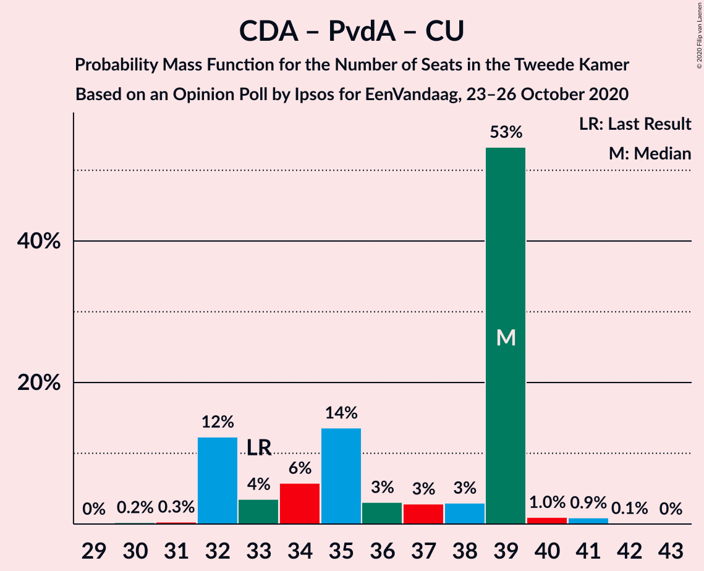

| Number of Seats | Probability | Accumulated | Special Marks |
|:---------------:|:-----------:|:-----------:|:-------------:|
| 30 | 0.2% | 100% |  |
| 31 | 0.3% | 99.8% |  |
| 32 | 12% | 99.4% |  |
| 33 | 4% | 87% | Last Result |
| 34 | 6% | 84% |  |
| 35 | 14% | 78% |  |
| 36 | 3% | 64% |  |
| 37 | 3% | 61% |  |
| 38 | 3% | 58% |  |
| 39 | 53% | 55% | Median |
| 40 | 1.0% | 2% |  |
| 41 | 0.9% | 1.1% |  |
| 42 | 0.1% | 0.2% |  |
| 43 | 0% | 0% |  |

### Christen-Democratisch Appèl – Democraten 66

| Number of Seats | Probability | Accumulated | Special Marks |
|:---------------:|:-----------:|:-----------:|:-------------:|
| 22 | 0.1% | 100% |  |
| 23 | 0% | 99.9% |  |
| 24 | 0.1% | 99.9% |  |
| 25 | 2% | 99.8% |  |
| 26 | 1.3% | 98% |  |
| 27 | 15% | 97% |  |
| 28 | 6% | 81% |  |
| 29 | 2% | 75% |  |
| 30 | 5% | 73% |  |
| 31 | 3% | 68% |  |
| 32 | 55% | 64% | Median |
| 33 | 8% | 9% |  |
| 34 | 0.6% | 1.0% |  |
| 35 | 0.3% | 0.4% |  |
| 36 | 0.1% | 0.1% |  |
| 37 | 0.1% | 0.1% |  |
| 38 | 0% | 0% | Last Result |

### Christen-Democratisch Appèl – Partij van de Arbeid

| Number of Seats | Probability | Accumulated | Special Marks |
|:---------------:|:-----------:|:-----------:|:-------------:|
| 24 | 9% | 100% |  |
| 25 | 0.5% | 91% |  |
| 26 | 5% | 90% |  |
| 27 | 7% | 85% |  |
| 28 | 8% | 79% | Last Result |
| 29 | 10% | 70% |  |
| 30 | 2% | 60% |  |
| 31 | 1.1% | 58% |  |
| 32 | 1.3% | 57% |  |
| 33 | 54% | 55% | Median |
| 34 | 1.2% | 1.3% |  |
| 35 | 0% | 0.1% |  |
| 36 | 0% | 0.1% |  |
| 37 | 0% | 0% |  |

## Technical Information

### Opinion Poll

+ **Polling firm:** Ipsos
+ **Commissioner(s):** EenVandaag
+ **Fieldwork period:** 23–26 October 2020

### Calculations

+ **Sample size:** 1052
+ **Simulations done:** 1,048,576
+ **Error estimate:** 2.39%

