# Opinion Poll by Ipsos for EenVandaag, 20–23 November 2020

<a href="#voting-intentions">Voting Intentions</a> | <a href="#seats">Seats</a> | <a href="#coalitions">Coalitions</a> | <a href="#technical-information">Technical Information</a>

## Voting Intentions

### Confidence Intervals

| Party | Last Result | Poll Result | 80% Confidence Interval | 90% Confidence Interval | 95% Confidence Interval | 99% Confidence Interval |
|:-----:|:-----------:|:-----------:|:-----------------------:|:-----------------------:|:-----------------------:|:-----------------------:|
| Volkspartij voor Vrijheid en Democratie | 21.3% | 21.9% | 20.4–23.7% |19.9–24.1% |19.5–24.6% |18.8–25.4% |
| Partij voor de Vrijheid | 13.1% | 11.4% | 10.2–12.7% |9.8–13.1% |9.6–13.4% |9.0–14.1% |
| Christen-Democratisch Appèl | 12.4% | 10.3% | 9.2–11.6% |8.9–12.0% |8.6–12.3% |8.1–13.0% |
| Democraten 66 | 12.2% | 9.0% | 7.9–10.2% |7.6–10.5% |7.4–10.9% |6.9–11.5% |
| Partij van de Arbeid | 5.7% | 8.3% | 7.3–9.5% |7.0–9.8% |6.8–10.1% |6.3–10.7% |
| GroenLinks | 9.1% | 7.3% | 6.4–8.5% |6.1–8.8% |5.9–9.1% |5.5–9.7% |
| Socialistische Partij | 9.1% | 6.0% | 5.2–7.1% |4.9–7.4% |4.7–7.6% |4.3–8.2% |
| ChristenUnie | 3.4% | 3.7% | 3.1–4.6% |2.9–4.8% |2.7–5.1% |2.5–5.5% |
| Partij voor de Dieren | 3.2% | 3.4% | 2.8–4.3% |2.6–4.5% |2.5–4.7% |2.2–5.2% |
| Forum voor Democratie | 1.8% | 3.4% | 2.8–4.3% |2.6–4.5% |2.5–4.7% |2.2–5.2% |
| Staatkundig Gereformeerde Partij | 2.1% | 1.7% | 1.3–2.4% |1.2–2.5% |1.1–2.7% |0.9–3.0% |
| DENK | 2.1% | 1.1% | 0.8–1.7% |0.7–1.9% |0.7–2.0% |0.5–2.3% |
| 50Plus | 3.1% | 1.0% | 0.7–1.6% |0.7–1.7% |0.6–1.9% |0.5–2.2% |
| Partij voor de Toekomst | 0.0% | 0.8% | 0.5–1.2% |0.4–1.4% |0.4–1.5% |0.3–1.8% |

*Note:* The poll result column reflects the actual value used in the calculations. Published results may vary slightly, and in addition be rounded to fewer digits.

## Seats

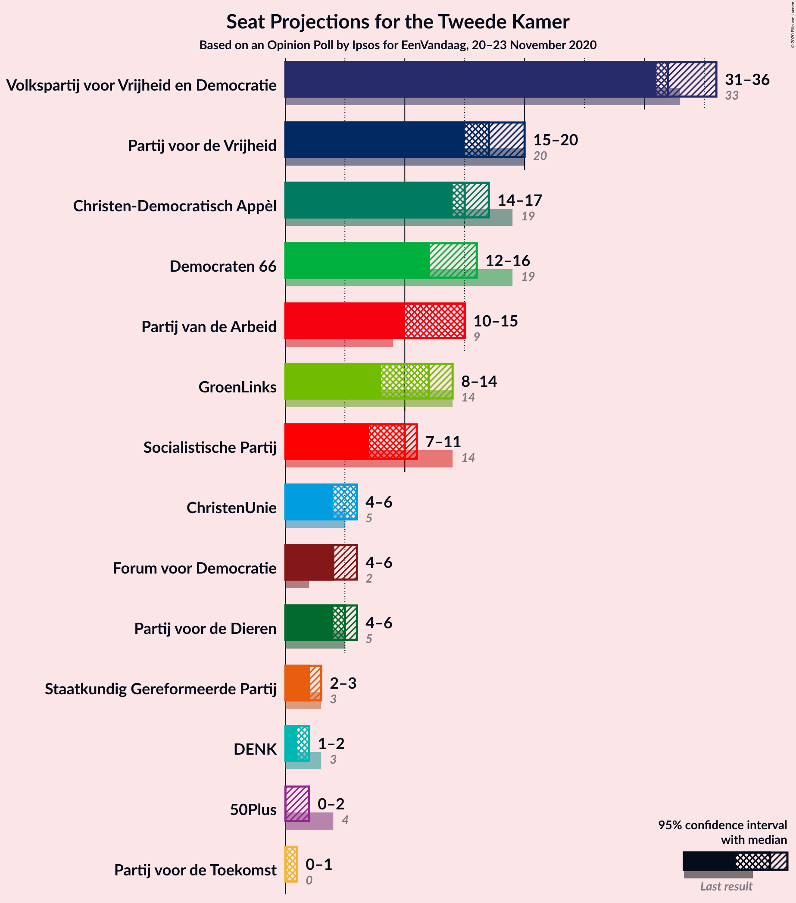

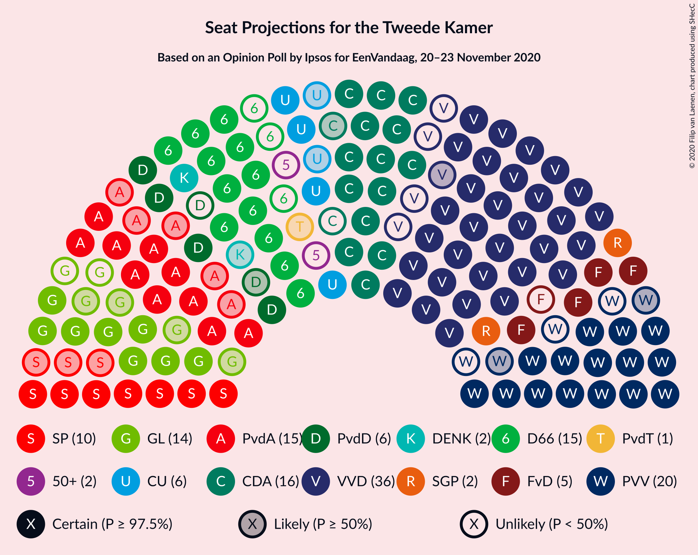

### Confidence Intervals

| Party | Last Result | Median | 80% Confidence Interval | 90% Confidence Interval | 95% Confidence Interval | 99% Confidence Interval |
|:-----:|:-----------:|:------:|:-----------------------:|:-----------------------:|:-----------------------:|:-----------------------:|
| <a href="#volkspartij-voor-vrijheid-en-democratie">Volkspartij voor Vrijheid en Democratie</a> | 33 | 32 | 31–34 |31–35 |31–36 |28–38 |
| <a href="#partij-voor-de-vrijheid">Partij voor de Vrijheid</a> | 20 | 17 | 17–19 |17–20 |15–20 |14–20 |
| <a href="#christen-democratisch-appèl">Christen-Democratisch Appèl</a> | 19 | 15 | 14–16 |14–16 |14–17 |13–21 |
| <a href="#democraten-66">Democraten 66</a> | 19 | 12 | 12–15 |12–15 |12–16 |11–19 |
| <a href="#partij-van-de-arbeid">Partij van de Arbeid</a> | 9 | 15 | 11–15 |10–15 |10–15 |9–16 |
| <a href="#groenlinks">GroenLinks</a> | 14 | 12 | 9–12 |8–12 |8–14 |8–14 |
| <a href="#socialistische-partij">Socialistische Partij</a> | 14 | 10 | 8–10 |8–10 |7–11 |7–11 |
| <a href="#christenunie">ChristenUnie</a> | 5 | 6 | 5–6 |5–6 |4–6 |4–7 |
| <a href="#partij-voor-de-dieren">Partij voor de Dieren</a> | 5 | 5 | 5–6 |4–6 |4–6 |3–7 |
| <a href="#forum-voor-democratie">Forum voor Democratie</a> | 2 | 4 | 4–5 |4–5 |4–6 |3–7 |
| <a href="#staatkundig-gereformeerde-partij">Staatkundig Gereformeerde Partij</a> | 3 | 2 | 2 |2–3 |2–3 |1–4 |
| <a href="#denk">DENK</a> | 3 | 2 | 1–2 |1–2 |1–2 |0–3 |
| <a href="#50plus">50Plus</a> | 4 | 0 | 0–1 |0–2 |0–2 |0–3 |
| <a href="#partij-voor-de-toekomst">Partij voor de Toekomst</a> | 0 | 1 | 1 |0–1 |0–1 |0–2 |

### Volkspartij voor Vrijheid en Democratie

*For a full overview of the results for this party, see the [Volkspartij voor Vrijheid en Democratie](party-volkspartijvoorvrijheidendemocratie.html) page.*

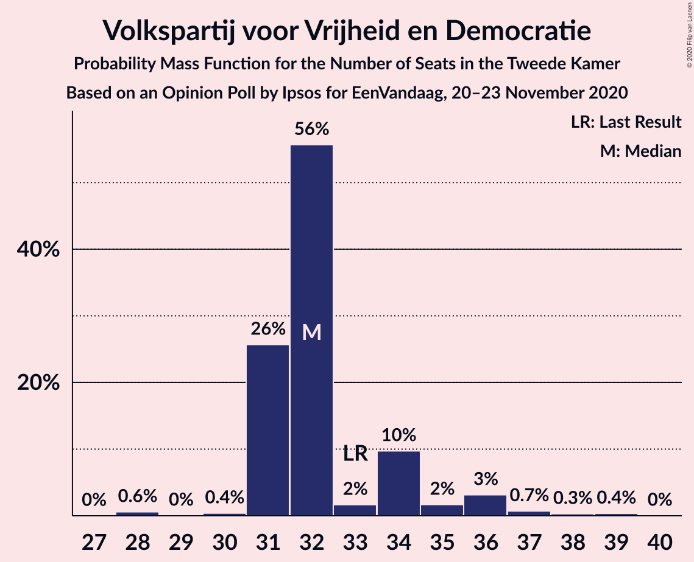

| Number of Seats | Probability | Accumulated | Special Marks |
|:---------------:|:-----------:|:-----------:|:-------------:|
| 28 | 0.6% | 100% |  |
| 29 | 0% | 99.4% |  |
| 30 | 0.4% | 99.4% |  |
| 31 | 26% | 99.0% |  |
| 32 | 56% | 73% | Median |
| 33 | 2% | 18% | Last Result |
| 34 | 10% | 16% |  |
| 35 | 2% | 6% |  |
| 36 | 3% | 5% |  |
| 37 | 0.7% | 1.4% |  |
| 38 | 0.3% | 0.7% |  |
| 39 | 0.4% | 0.4% |  |
| 40 | 0% | 0% |  |

### Partij voor de Vrijheid

*For a full overview of the results for this party, see the [Partij voor de Vrijheid](party-partijvoordevrijheid.html) page.*

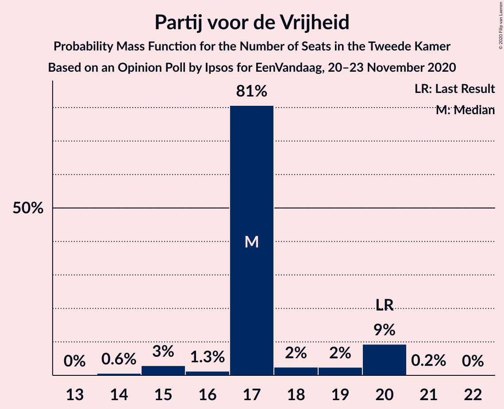

| Number of Seats | Probability | Accumulated | Special Marks |
|:---------------:|:-----------:|:-----------:|:-------------:|
| 14 | 0.6% | 100% |  |
| 15 | 3% | 99.4% |  |
| 16 | 1.3% | 96% |  |
| 17 | 81% | 95% | Median |
| 18 | 2% | 14% |  |
| 19 | 2% | 12% |  |
| 20 | 9% | 10% | Last Result |
| 21 | 0.2% | 0.2% |  |
| 22 | 0% | 0% |  |

### Christen-Democratisch Appèl

*For a full overview of the results for this party, see the [Christen-Democratisch Appèl](party-christen-democratischappèl.html) page.*

| Number of Seats | Probability | Accumulated | Special Marks |
|:---------------:|:-----------:|:-----------:|:-------------:|
| 12 | 0.2% | 100% |  |
| 13 | 0.5% | 99.8% |  |
| 14 | 11% | 99.3% |  |
| 15 | 56% | 88% | Median |
| 16 | 27% | 32% |  |
| 17 | 3% | 5% |  |
| 18 | 0.7% | 2% |  |
| 19 | 0.2% | 1.1% | Last Result |
| 20 | 0.3% | 0.9% |  |
| 21 | 0.5% | 0.5% |  |
| 22 | 0% | 0% |  |

### Democraten 66

*For a full overview of the results for this party, see the [Democraten 66](party-democraten66.html) page.*

| Number of Seats | Probability | Accumulated | Special Marks |
|:---------------:|:-----------:|:-----------:|:-------------:|
| 10 | 0.2% | 100% |  |
| 11 | 2% | 99.8% |  |
| 12 | 56% | 98% | Median |
| 13 | 2% | 42% |  |
| 14 | 12% | 40% |  |
| 15 | 25% | 27% |  |
| 16 | 0.6% | 3% |  |
| 17 | 0.4% | 2% |  |
| 18 | 0.2% | 2% |  |
| 19 | 2% | 2% | Last Result |
| 20 | 0% | 0% |  |

### Partij van de Arbeid

*For a full overview of the results for this party, see the [Partij van de Arbeid](party-partijvandearbeid.html) page.*

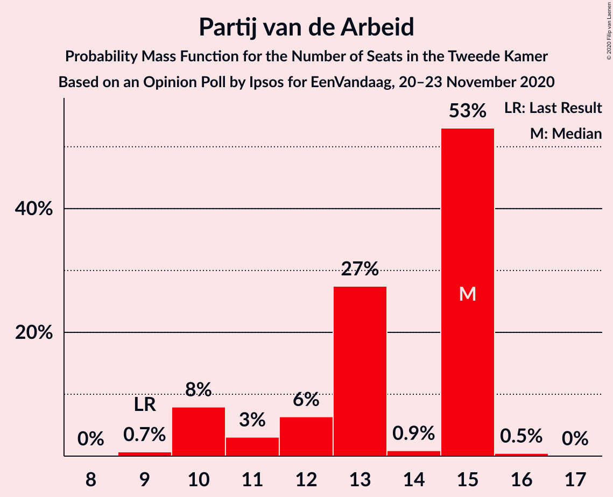

| Number of Seats | Probability | Accumulated | Special Marks |
|:---------------:|:-----------:|:-----------:|:-------------:|
| 9 | 0.7% | 100% | Last Result |
| 10 | 8% | 99.3% |  |
| 11 | 3% | 91% |  |
| 12 | 6% | 88% |  |
| 13 | 27% | 82% |  |
| 14 | 0.9% | 54% |  |
| 15 | 53% | 54% | Median |
| 16 | 0.5% | 0.5% |  |
| 17 | 0% | 0% |  |

### GroenLinks

*For a full overview of the results for this party, see the [GroenLinks](party-groenlinks.html) page.*

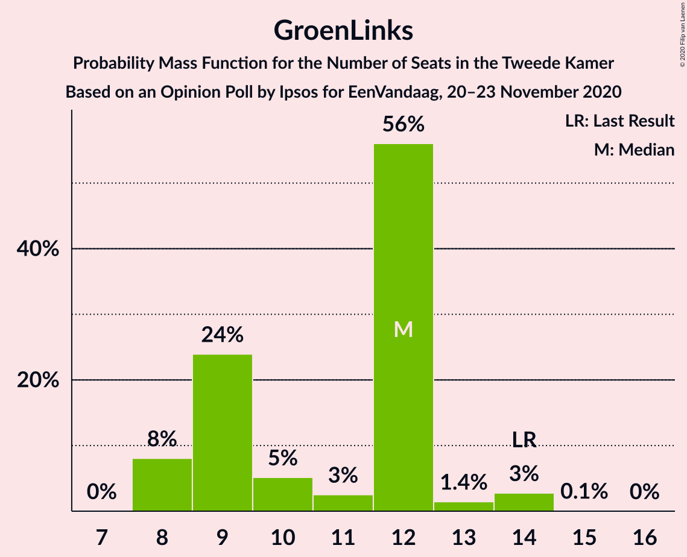

| Number of Seats | Probability | Accumulated | Special Marks |
|:---------------:|:-----------:|:-----------:|:-------------:|
| 8 | 8% | 100% |  |
| 9 | 24% | 92% |  |
| 10 | 5% | 68% |  |
| 11 | 3% | 63% |  |
| 12 | 56% | 60% | Median |
| 13 | 1.4% | 4% |  |
| 14 | 3% | 3% | Last Result |
| 15 | 0.1% | 0.1% |  |
| 16 | 0% | 0% |  |

### Socialistische Partij

*For a full overview of the results for this party, see the [Socialistische Partij](party-socialistischepartij.html) page.*

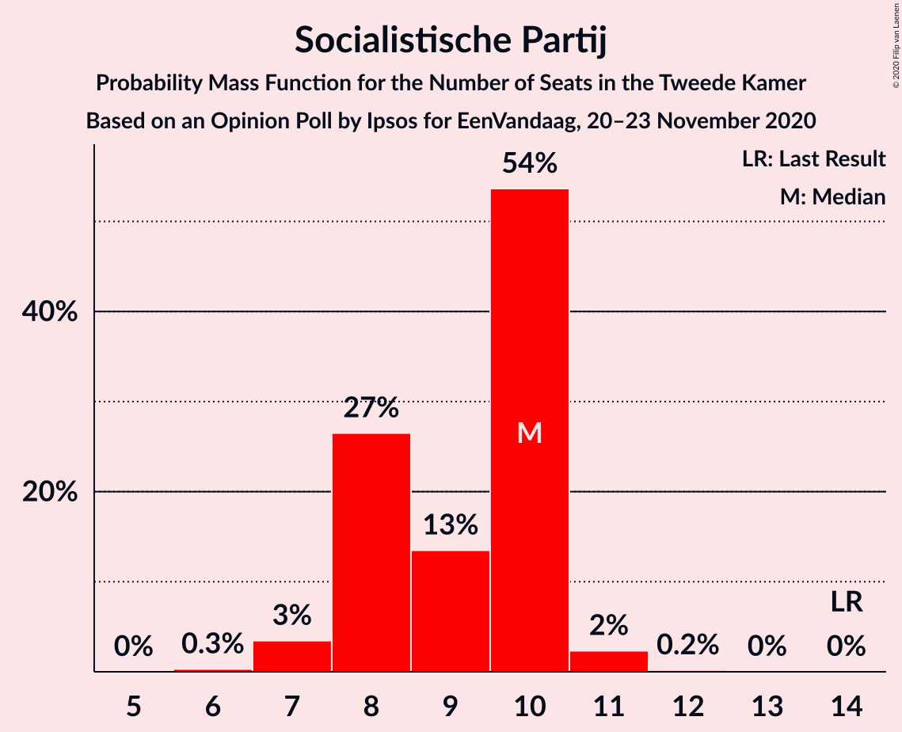

| Number of Seats | Probability | Accumulated | Special Marks |
|:---------------:|:-----------:|:-----------:|:-------------:|
| 6 | 0.3% | 100% |  |
| 7 | 3% | 99.7% |  |
| 8 | 27% | 96% |  |
| 9 | 13% | 70% |  |
| 10 | 54% | 56% | Median |
| 11 | 2% | 3% |  |
| 12 | 0.2% | 0.2% |  |
| 13 | 0% | 0.1% |  |
| 14 | 0% | 0% | Last Result |

### ChristenUnie

*For a full overview of the results for this party, see the [ChristenUnie](party-christenunie.html) page.*

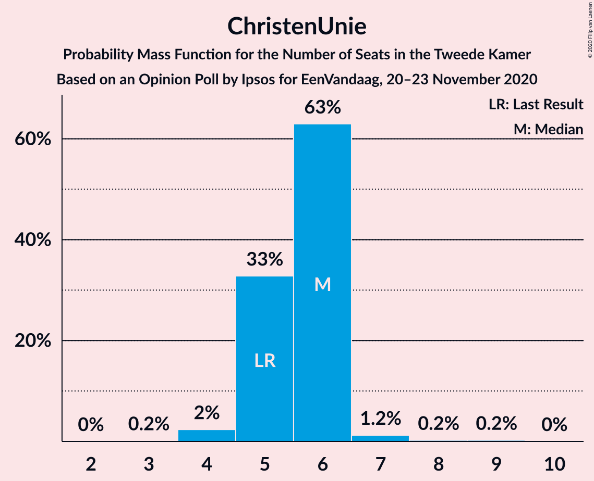

| Number of Seats | Probability | Accumulated | Special Marks |
|:---------------:|:-----------:|:-----------:|:-------------:|
| 3 | 0.2% | 100% |  |
| 4 | 2% | 99.8% |  |
| 5 | 33% | 97% | Last Result |
| 6 | 63% | 65% | Median |
| 7 | 1.2% | 2% |  |
| 8 | 0.2% | 0.5% |  |
| 9 | 0.2% | 0.2% |  |
| 10 | 0% | 0% |  |

### Partij voor de Dieren

*For a full overview of the results for this party, see the [Partij voor de Dieren](party-partijvoordedieren.html) page.*

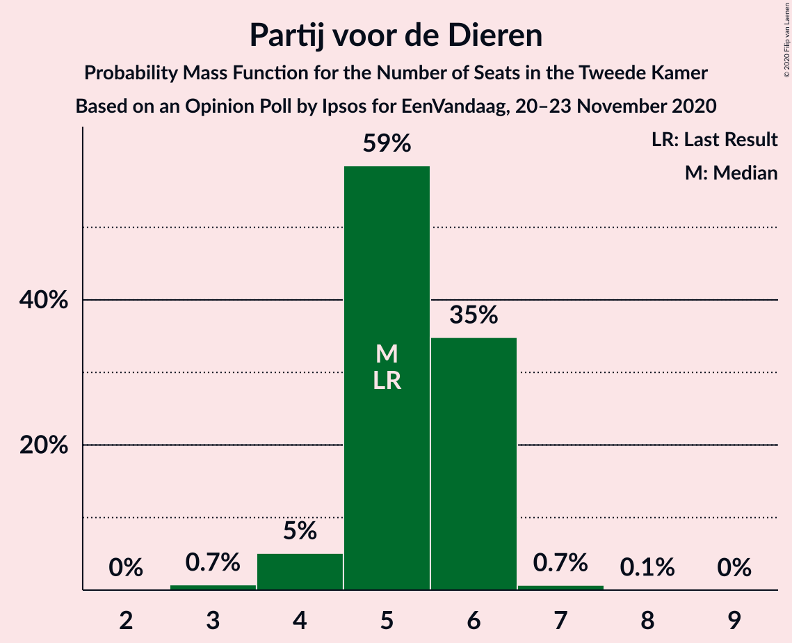

| Number of Seats | Probability | Accumulated | Special Marks |
|:---------------:|:-----------:|:-----------:|:-------------:|
| 3 | 0.7% | 100% |  |
| 4 | 5% | 99.2% |  |
| 5 | 59% | 94% | Last Result, Median |
| 6 | 35% | 36% |  |
| 7 | 0.7% | 0.8% |  |
| 8 | 0.1% | 0.1% |  |
| 9 | 0% | 0% |  |

### Forum voor Democratie

*For a full overview of the results for this party, see the [Forum voor Democratie](party-forumvoordemocratie.html) page.*

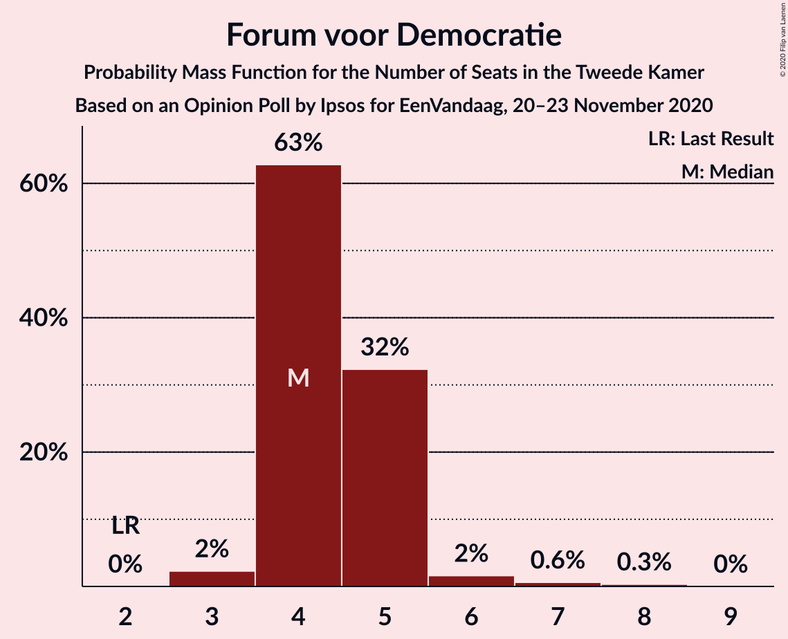

| Number of Seats | Probability | Accumulated | Special Marks |
|:---------------:|:-----------:|:-----------:|:-------------:|
| 2 | 0% | 100% | Last Result |
| 3 | 2% | 100% |  |
| 4 | 63% | 98% | Median |
| 5 | 32% | 35% |  |
| 6 | 2% | 3% |  |
| 7 | 0.6% | 1.0% |  |
| 8 | 0.3% | 0.3% |  |
| 9 | 0% | 0% |  |

### Staatkundig Gereformeerde Partij

*For a full overview of the results for this party, see the [Staatkundig Gereformeerde Partij](party-staatkundiggereformeerdepartij.html) page.*

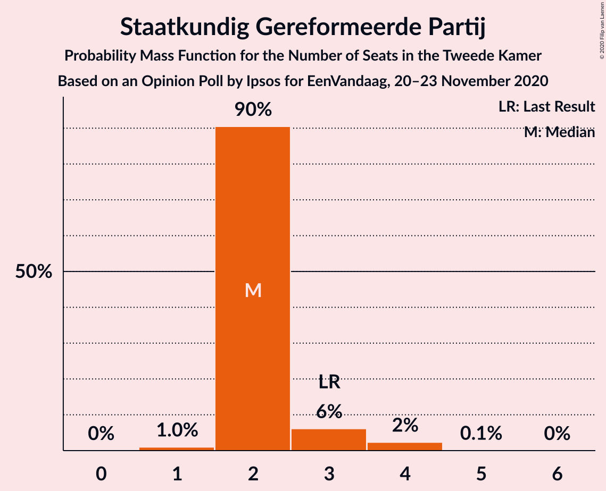

| Number of Seats | Probability | Accumulated | Special Marks |
|:---------------:|:-----------:|:-----------:|:-------------:|
| 1 | 1.0% | 100% |  |
| 2 | 90% | 99.0% | Median |
| 3 | 6% | 9% | Last Result |
| 4 | 2% | 2% |  |
| 5 | 0.1% | 0.1% |  |
| 6 | 0% | 0% |  |

### DENK

*For a full overview of the results for this party, see the [DENK](party-denk.html) page.*

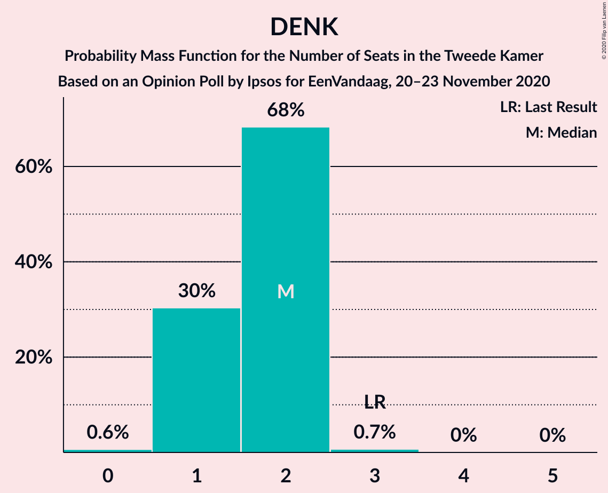

| Number of Seats | Probability | Accumulated | Special Marks |
|:---------------:|:-----------:|:-----------:|:-------------:|
| 0 | 0.6% | 100% |  |
| 1 | 30% | 99.4% |  |
| 2 | 68% | 69% | Median |
| 3 | 0.7% | 0.7% | Last Result |
| 4 | 0% | 0% |  |

### 50Plus

*For a full overview of the results for this party, see the [50Plus](party-50plus.html) page.*

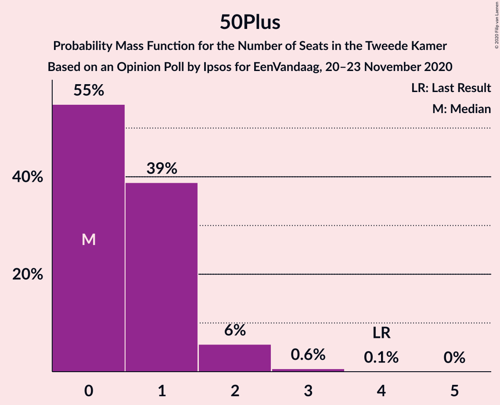

| Number of Seats | Probability | Accumulated | Special Marks |
|:---------------:|:-----------:|:-----------:|:-------------:|
| 0 | 55% | 100% | Median |
| 1 | 39% | 45% |  |
| 2 | 6% | 6% |  |
| 3 | 0.6% | 0.7% |  |
| 4 | 0.1% | 0.1% | Last Result |
| 5 | 0% | 0% |  |

### Partij voor de Toekomst

*For a full overview of the results for this party, see the [Partij voor de Toekomst](party-partijvoordetoekomst.html) page.*

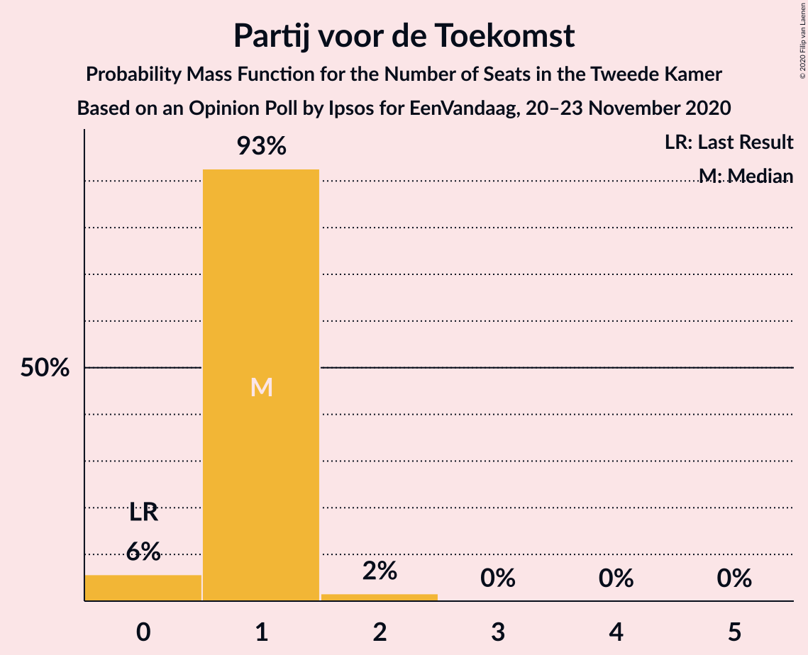

| Number of Seats | Probability | Accumulated | Special Marks |
|:---------------:|:-----------:|:-----------:|:-------------:|
| 0 | 6% | 100% | Last Result |
| 1 | 93% | 94% | Median |
| 2 | 2% | 2% |  |
| 3 | 0% | 0% |  |

## Coalitions

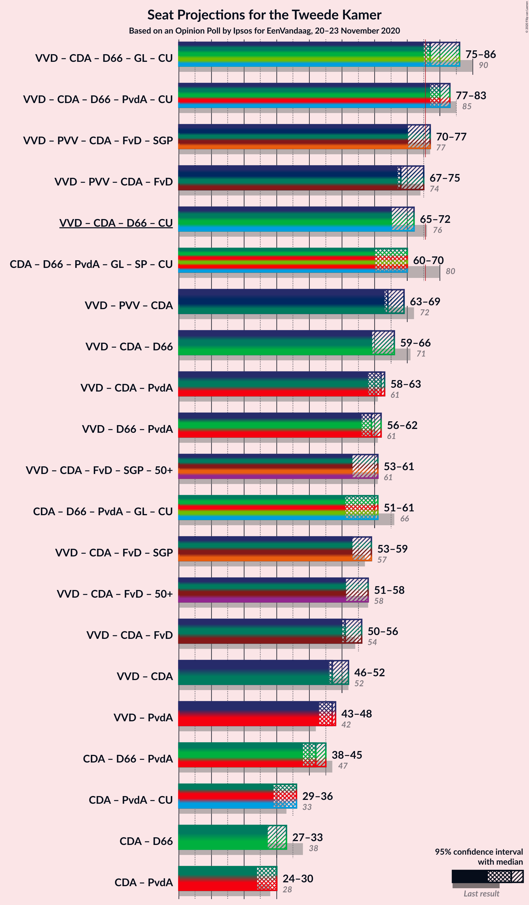

### Confidence Intervals

| Coalition | Last Result | Median | Majority? | 80% Confidence Interval | 90% Confidence Interval | 95% Confidence Interval | 99% Confidence Interval |
|:---------:|:-----------:|:------:|:---------:|:-----------------------:|:-----------------------:|:-----------------------:|:-----------------------:|
| Volkspartij voor Vrijheid en Democratie – Christen-Democratisch Appèl – Democraten 66 – GroenLinks – ChristenUnie | 90 | 77 | 92% | 76–79 | 75–83 | 75–86 | 75–86 |
| Volkspartij voor Vrijheid en Democratie – Christen-Democratisch Appèl – Democraten 66 – Partij van de Arbeid – ChristenUnie | 85 | 80 | 99.6% | 79–81 | 77–82 | 77–83 | 76–85 |
| Volkspartij voor Vrijheid en Democratie – Partij voor de Vrijheid – Christen-Democratisch Appèl – Forum voor Democratie – Staatkundig Gereformeerde Partij | 77 | 70 | 3% | 70–75 | 70–75 | 70–77 | 69–79 |
| Volkspartij voor Vrijheid en Democratie – Partij voor de Vrijheid – Christen-Democratisch Appèl – Forum voor Democratie | 74 | 68 | 1.3% | 68–73 | 68–73 | 67–75 | 67–76 |
| Volkspartij voor Vrijheid en Democratie – Christen-Democratisch Appèl – Democraten 66 – ChristenUnie | 76 | 65 | 0.1% | 65–68 | 65–71 | 65–72 | 63–73 |
| Christen-Democratisch Appèl – Democraten 66 – Partij van de Arbeid – GroenLinks – Socialistische Partij – ChristenUnie | 80 | 70 | 0% | 65–70 | 60–70 | 60–70 | 60–72 |
| Volkspartij voor Vrijheid en Democratie – Partij voor de Vrijheid – Christen-Democratisch Appèl | 72 | 64 | 0% | 64–68 | 64–68 | 63–69 | 62–72 |
| Volkspartij voor Vrijheid en Democratie – Christen-Democratisch Appèl – Democraten 66 | 71 | 59 | 0% | 59–62 | 59–65 | 59–66 | 59–68 |
| Volkspartij voor Vrijheid en Democratie – Christen-Democratisch Appèl – Partij van de Arbeid | 61 | 62 | 0% | 59–62 | 58–63 | 58–63 | 57–67 |
| Volkspartij voor Vrijheid en Democratie – Democraten 66 – Partij van de Arbeid | 61 | 59 | 0% | 58–59 | 58–61 | 56–62 | 55–63 |
| Volkspartij voor Vrijheid en Democratie – Christen-Democratisch Appèl – Forum voor Democratie – Staatkundig Gereformeerde Partij – 50Plus | 61 | 53 | 0% | 53–57 | 53–59 | 53–61 | 53–64 |
| Christen-Democratisch Appèl – Democraten 66 – Partij van de Arbeid – GroenLinks – ChristenUnie | 66 | 60 | 0% | 56–60 | 51–61 | 51–61 | 51–63 |
| Volkspartij voor Vrijheid en Democratie – Christen-Democratisch Appèl – Forum voor Democratie – Staatkundig Gereformeerde Partij | 57 | 53 | 0% | 53–56 | 53–58 | 53–59 | 52–62 |
| Volkspartij voor Vrijheid en Democratie – Christen-Democratisch Appèl – Forum voor Democratie – 50Plus | 58 | 51 | 0% | 51–54 | 51–57 | 51–58 | 50–61 |
| Volkspartij voor Vrijheid en Democratie – Christen-Democratisch Appèl – Forum voor Democratie | 54 | 51 | 0% | 51–53 | 51–56 | 50–56 | 49–59 |
| Volkspartij voor Vrijheid en Democratie – Christen-Democratisch Appèl | 52 | 47 | 0% | 47–49 | 47–51 | 46–52 | 45–55 |
| Volkspartij voor Vrijheid en Democratie – Partij van de Arbeid | 42 | 47 | 0% | 44–47 | 44–47 | 43–48 | 42–50 |
| Christen-Democratisch Appèl – Democraten 66 – Partij van de Arbeid | 47 | 42 | 0% | 39–44 | 38–44 | 38–45 | 38–46 |
| Christen-Democratisch Appèl – Partij van de Arbeid – ChristenUnie | 33 | 36 | 0% | 32–36 | 29–36 | 29–36 | 29–38 |
| Christen-Democratisch Appèl – Democraten 66 | 38 | 27 | 0% | 27–31 | 27–31 | 27–33 | 25–34 |
| Christen-Democratisch Appèl – Partij van de Arbeid | 28 | 30 | 0% | 26–30 | 24–30 | 24–30 | 24–33 |

### Volkspartij voor Vrijheid en Democratie – Christen-Democratisch Appèl – Democraten 66 – GroenLinks – ChristenUnie

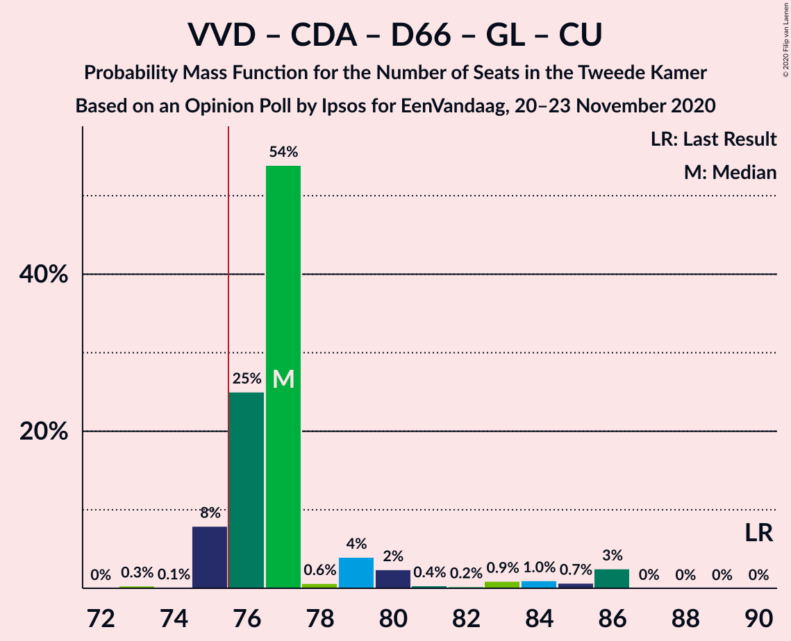

| Number of Seats | Probability | Accumulated | Special Marks |
|:---------------:|:-----------:|:-----------:|:-------------:|
| 73 | 0.3% | 100% |  |
| 74 | 0.1% | 99.7% |  |
| 75 | 8% | 99.6% |  |
| 76 | 25% | 92% | Majority |
| 77 | 54% | 67% | Median |
| 78 | 0.6% | 13% |  |
| 79 | 4% | 12% |  |
| 80 | 2% | 8% |  |
| 81 | 0.4% | 6% |  |
| 82 | 0.2% | 5% |  |
| 83 | 0.9% | 5% |  |
| 84 | 1.0% | 4% |  |
| 85 | 0.7% | 3% |  |
| 86 | 3% | 3% |  |
| 87 | 0% | 0% |  |
| 88 | 0% | 0% |  |
| 89 | 0% | 0% |  |
| 90 | 0% | 0% | Last Result |

### Volkspartij voor Vrijheid en Democratie – Christen-Democratisch Appèl – Democraten 66 – Partij van de Arbeid – ChristenUnie

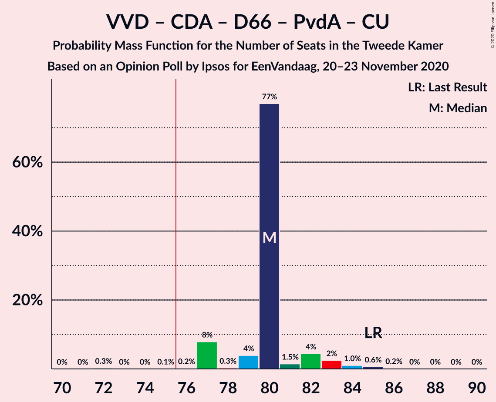

| Number of Seats | Probability | Accumulated | Special Marks |
|:---------------:|:-----------:|:-----------:|:-------------:|
| 72 | 0.3% | 100% |  |
| 73 | 0% | 99.7% |  |
| 74 | 0% | 99.7% |  |
| 75 | 0.1% | 99.7% |  |
| 76 | 0.2% | 99.6% | Majority |
| 77 | 8% | 99.5% |  |
| 78 | 0.3% | 92% |  |
| 79 | 4% | 91% |  |
| 80 | 77% | 87% | Median |
| 81 | 1.5% | 10% |  |
| 82 | 4% | 9% |  |
| 83 | 2% | 4% |  |
| 84 | 1.0% | 2% |  |
| 85 | 0.6% | 0.9% | Last Result |
| 86 | 0.2% | 0.3% |  |
| 87 | 0% | 0.1% |  |
| 88 | 0% | 0.1% |  |
| 89 | 0% | 0% |  |

### Volkspartij voor Vrijheid en Democratie – Partij voor de Vrijheid – Christen-Democratisch Appèl – Forum voor Democratie – Staatkundig Gereformeerde Partij

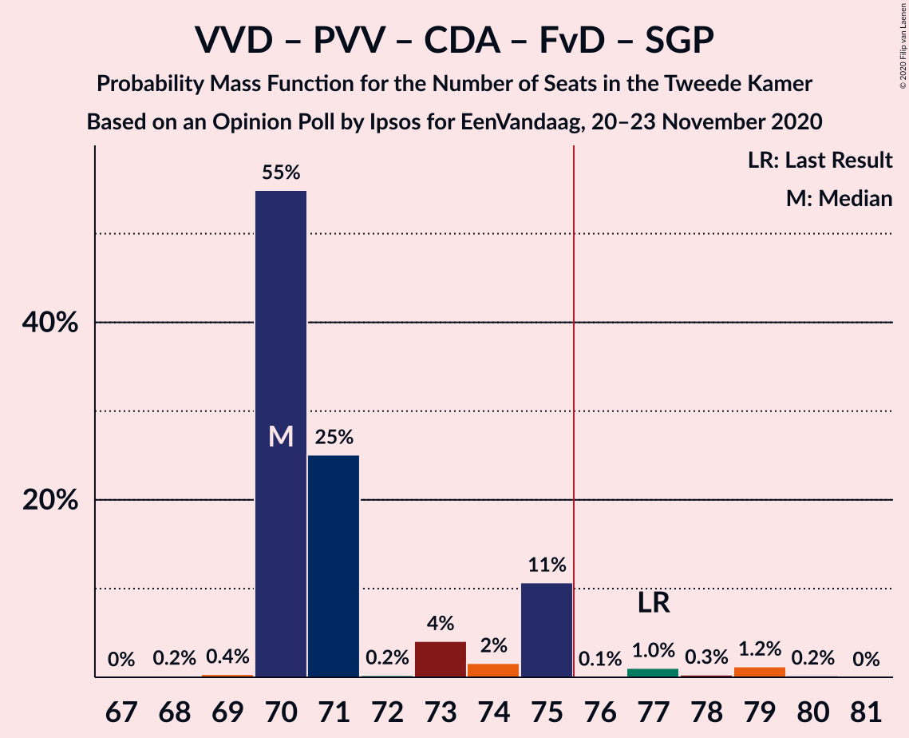

| Number of Seats | Probability | Accumulated | Special Marks |
|:---------------:|:-----------:|:-----------:|:-------------:|
| 68 | 0.2% | 100% |  |
| 69 | 0.4% | 99.8% |  |
| 70 | 55% | 99.4% | Median |
| 71 | 25% | 45% |  |
| 72 | 0.2% | 19% |  |
| 73 | 4% | 19% |  |
| 74 | 2% | 15% |  |
| 75 | 11% | 14% |  |
| 76 | 0.1% | 3% | Majority |
| 77 | 1.0% | 3% | Last Result |
| 78 | 0.3% | 2% |  |
| 79 | 1.2% | 1.4% |  |
| 80 | 0.2% | 0.2% |  |
| 81 | 0% | 0% |  |

### Volkspartij voor Vrijheid en Democratie – Partij voor de Vrijheid – Christen-Democratisch Appèl – Forum voor Democratie

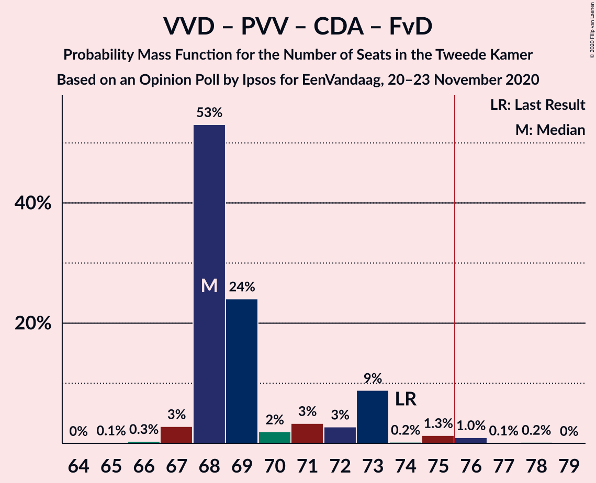

| Number of Seats | Probability | Accumulated | Special Marks |
|:---------------:|:-----------:|:-----------:|:-------------:|
| 65 | 0.1% | 100% |  |
| 66 | 0.3% | 99.9% |  |
| 67 | 3% | 99.5% |  |
| 68 | 53% | 97% | Median |
| 69 | 24% | 44% |  |
| 70 | 2% | 20% |  |
| 71 | 3% | 18% |  |
| 72 | 3% | 14% |  |
| 73 | 9% | 12% |  |
| 74 | 0.2% | 3% | Last Result |
| 75 | 1.3% | 3% |  |
| 76 | 1.0% | 1.3% | Majority |
| 77 | 0.1% | 0.3% |  |
| 78 | 0.2% | 0.2% |  |
| 79 | 0% | 0% |  |

### Volkspartij voor Vrijheid en Democratie – Christen-Democratisch Appèl – Democraten 66 – ChristenUnie

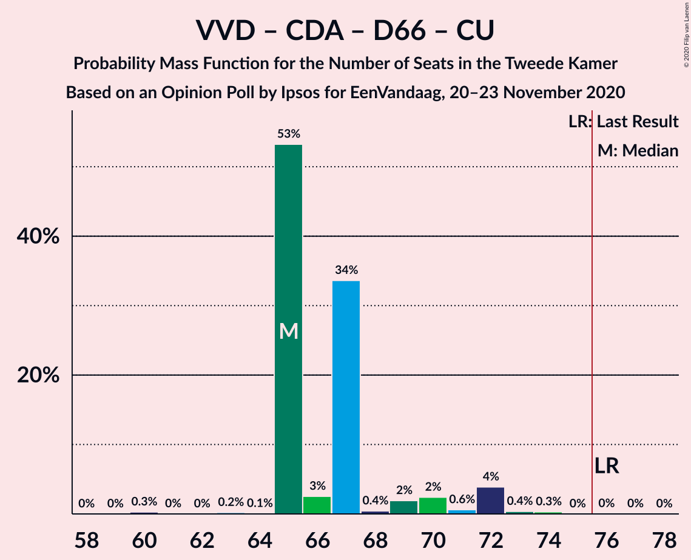

| Number of Seats | Probability | Accumulated | Special Marks |
|:---------------:|:-----------:|:-----------:|:-------------:|
| 60 | 0.3% | 100% |  |
| 61 | 0% | 99.7% |  |
| 62 | 0% | 99.7% |  |
| 63 | 0.2% | 99.7% |  |
| 64 | 0.1% | 99.5% |  |
| 65 | 53% | 99.4% | Median |
| 66 | 3% | 46% |  |
| 67 | 34% | 44% |  |
| 68 | 0.4% | 10% |  |
| 69 | 2% | 10% |  |
| 70 | 2% | 8% |  |
| 71 | 0.6% | 5% |  |
| 72 | 4% | 5% |  |
| 73 | 0.4% | 0.7% |  |
| 74 | 0.3% | 0.4% |  |
| 75 | 0% | 0.1% |  |
| 76 | 0% | 0.1% | Last Result, Majority |
| 77 | 0% | 0% |  |

### Christen-Democratisch Appèl – Democraten 66 – Partij van de Arbeid – GroenLinks – Socialistische Partij – ChristenUnie

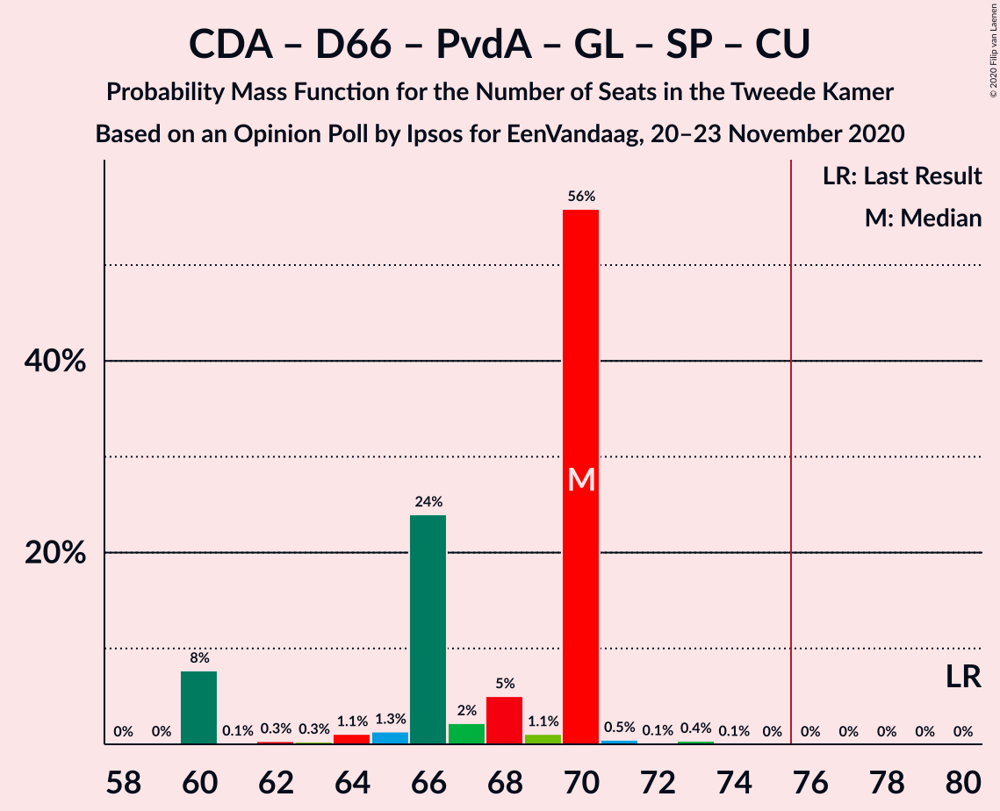

| Number of Seats | Probability | Accumulated | Special Marks |
|:---------------:|:-----------:|:-----------:|:-------------:|
| 60 | 8% | 100% |  |
| 61 | 0.1% | 92% |  |
| 62 | 0.3% | 92% |  |
| 63 | 0.3% | 92% |  |
| 64 | 1.1% | 92% |  |
| 65 | 1.3% | 91% |  |
| 66 | 24% | 89% |  |
| 67 | 2% | 65% |  |
| 68 | 5% | 63% |  |
| 69 | 1.1% | 58% |  |
| 70 | 56% | 57% | Median |
| 71 | 0.5% | 1.0% |  |
| 72 | 0.1% | 0.6% |  |
| 73 | 0.4% | 0.4% |  |
| 74 | 0.1% | 0.1% |  |
| 75 | 0% | 0% |  |
| 76 | 0% | 0% | Majority |
| 77 | 0% | 0% |  |
| 78 | 0% | 0% |  |
| 79 | 0% | 0% |  |
| 80 | 0% | 0% | Last Result |

### Volkspartij voor Vrijheid en Democratie – Partij voor de Vrijheid – Christen-Democratisch Appèl

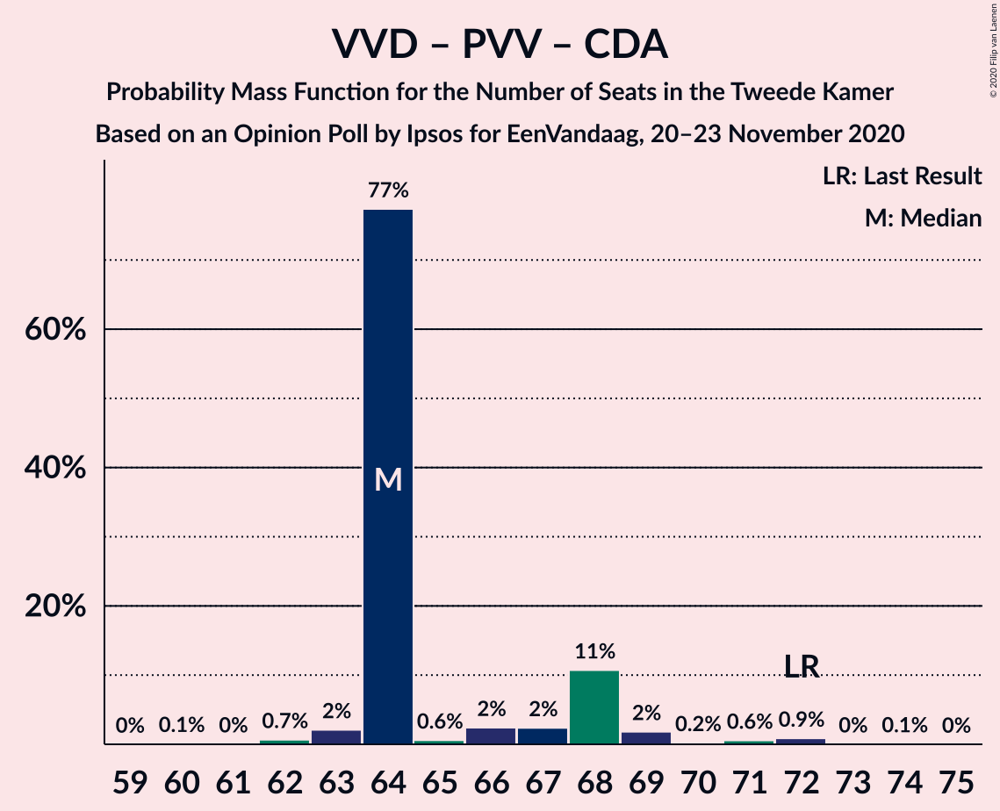

| Number of Seats | Probability | Accumulated | Special Marks |
|:---------------:|:-----------:|:-----------:|:-------------:|
| 60 | 0.1% | 100% |  |
| 61 | 0% | 99.9% |  |
| 62 | 0.7% | 99.8% |  |
| 63 | 2% | 99.2% |  |
| 64 | 77% | 97% | Median |
| 65 | 0.6% | 20% |  |
| 66 | 2% | 19% |  |
| 67 | 2% | 17% |  |
| 68 | 11% | 14% |  |
| 69 | 2% | 4% |  |
| 70 | 0.2% | 2% |  |
| 71 | 0.6% | 2% |  |
| 72 | 0.9% | 1.0% | Last Result |
| 73 | 0% | 0.1% |  |
| 74 | 0.1% | 0.1% |  |
| 75 | 0% | 0% |  |

### Volkspartij voor Vrijheid en Democratie – Christen-Democratisch Appèl – Democraten 66

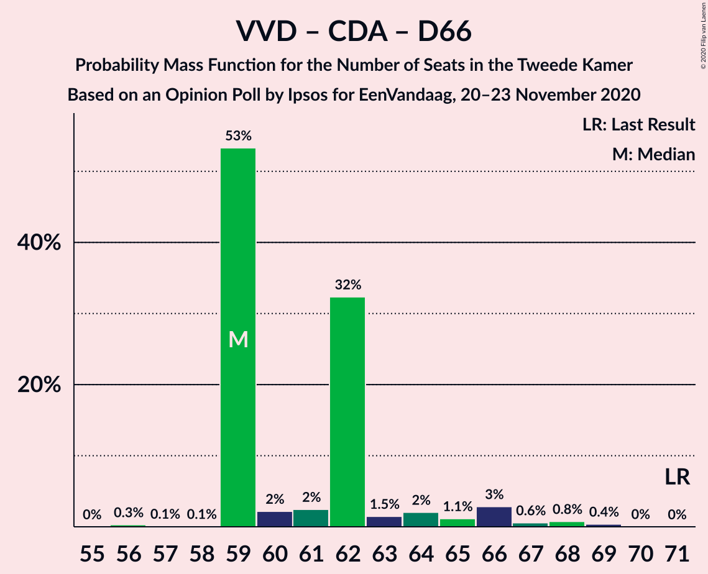

| Number of Seats | Probability | Accumulated | Special Marks |
|:---------------:|:-----------:|:-----------:|:-------------:|
| 56 | 0.3% | 100% |  |
| 57 | 0.1% | 99.7% |  |
| 58 | 0.1% | 99.6% |  |
| 59 | 53% | 99.6% | Median |
| 60 | 2% | 46% |  |
| 61 | 2% | 44% |  |
| 62 | 32% | 42% |  |
| 63 | 1.5% | 9% |  |
| 64 | 2% | 8% |  |
| 65 | 1.1% | 6% |  |
| 66 | 3% | 5% |  |
| 67 | 0.6% | 2% |  |
| 68 | 0.8% | 1.2% |  |
| 69 | 0.4% | 0.4% |  |
| 70 | 0% | 0.1% |  |
| 71 | 0% | 0% | Last Result |

### Volkspartij voor Vrijheid en Democratie – Christen-Democratisch Appèl – Partij van de Arbeid

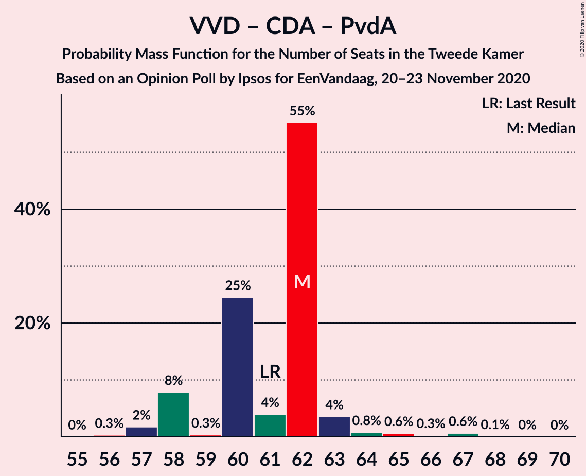

| Number of Seats | Probability | Accumulated | Special Marks |
|:---------------:|:-----------:|:-----------:|:-------------:|
| 56 | 0.3% | 100% |  |
| 57 | 2% | 99.7% |  |
| 58 | 8% | 98% |  |
| 59 | 0.3% | 90% |  |
| 60 | 25% | 90% |  |
| 61 | 4% | 65% | Last Result |
| 62 | 55% | 61% | Median |
| 63 | 4% | 6% |  |
| 64 | 0.8% | 2% |  |
| 65 | 0.6% | 2% |  |
| 66 | 0.3% | 1.0% |  |
| 67 | 0.6% | 0.8% |  |
| 68 | 0.1% | 0.1% |  |
| 69 | 0% | 0.1% |  |
| 70 | 0% | 0% |  |

### Volkspartij voor Vrijheid en Democratie – Democraten 66 – Partij van de Arbeid

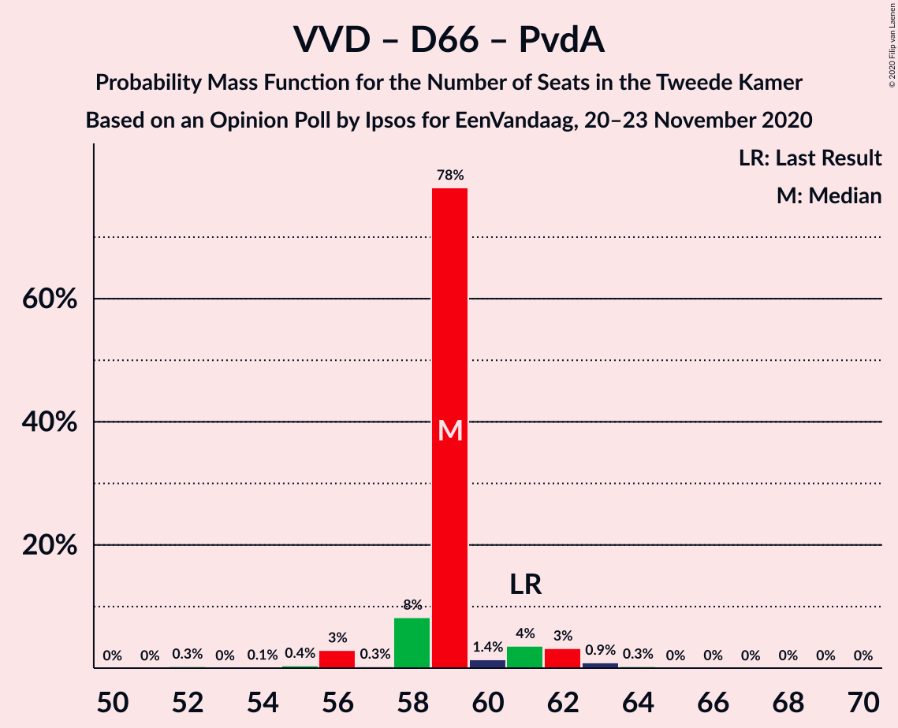

| Number of Seats | Probability | Accumulated | Special Marks |
|:---------------:|:-----------:|:-----------:|:-------------:|
| 52 | 0.3% | 100% |  |
| 53 | 0% | 99.7% |  |
| 54 | 0.1% | 99.7% |  |
| 55 | 0.4% | 99.6% |  |
| 56 | 3% | 99.1% |  |
| 57 | 0.3% | 96% |  |
| 58 | 8% | 96% |  |
| 59 | 78% | 88% | Median |
| 60 | 1.4% | 10% |  |
| 61 | 4% | 8% | Last Result |
| 62 | 3% | 5% |  |
| 63 | 0.9% | 1.4% |  |
| 64 | 0.3% | 0.4% |  |
| 65 | 0% | 0.1% |  |
| 66 | 0% | 0.1% |  |
| 67 | 0% | 0.1% |  |
| 68 | 0% | 0.1% |  |
| 69 | 0% | 0% |  |

### Volkspartij voor Vrijheid en Democratie – Christen-Democratisch Appèl – Forum voor Democratie – Staatkundig Gereformeerde Partij – 50Plus

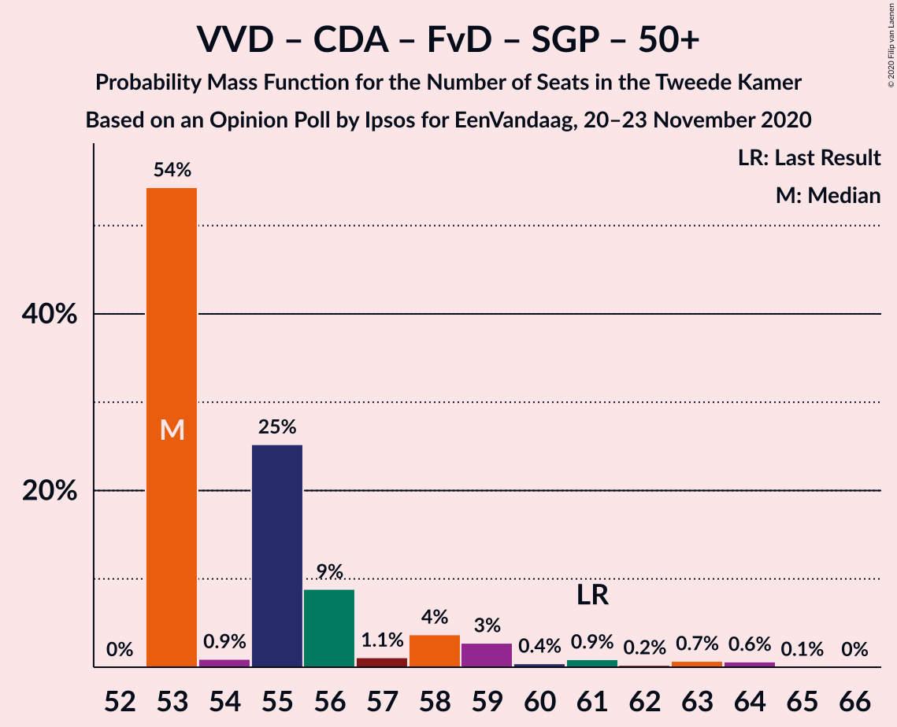

| Number of Seats | Probability | Accumulated | Special Marks |
|:---------------:|:-----------:|:-----------:|:-------------:|
| 52 | 0% | 100% |  |
| 53 | 54% | 99.9% | Median |
| 54 | 0.9% | 46% |  |
| 55 | 25% | 45% |  |
| 56 | 9% | 19% |  |
| 57 | 1.1% | 11% |  |
| 58 | 4% | 9% |  |
| 59 | 3% | 6% |  |
| 60 | 0.4% | 3% |  |
| 61 | 0.9% | 3% | Last Result |
| 62 | 0.2% | 2% |  |
| 63 | 0.7% | 1.4% |  |
| 64 | 0.6% | 0.7% |  |
| 65 | 0.1% | 0.1% |  |
| 66 | 0% | 0% |  |

### Christen-Democratisch Appèl – Democraten 66 – Partij van de Arbeid – GroenLinks – ChristenUnie

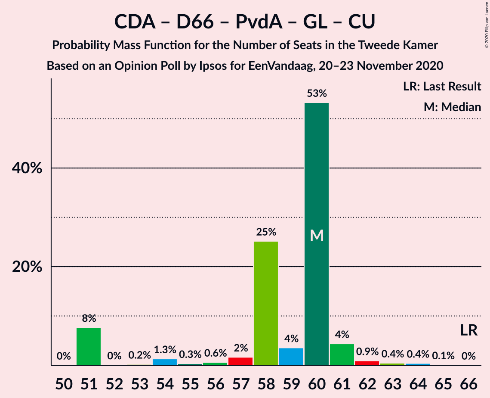

| Number of Seats | Probability | Accumulated | Special Marks |
|:---------------:|:-----------:|:-----------:|:-------------:|
| 51 | 8% | 100% |  |
| 52 | 0% | 92% |  |
| 53 | 0.2% | 92% |  |
| 54 | 1.3% | 92% |  |
| 55 | 0.3% | 91% |  |
| 56 | 0.6% | 90% |  |
| 57 | 2% | 90% |  |
| 58 | 25% | 88% |  |
| 59 | 4% | 63% |  |
| 60 | 53% | 59% | Median |
| 61 | 4% | 6% |  |
| 62 | 0.9% | 2% |  |
| 63 | 0.4% | 0.9% |  |
| 64 | 0.4% | 0.5% |  |
| 65 | 0.1% | 0.1% |  |
| 66 | 0% | 0% | Last Result |

### Volkspartij voor Vrijheid en Democratie – Christen-Democratisch Appèl – Forum voor Democratie – Staatkundig Gereformeerde Partij

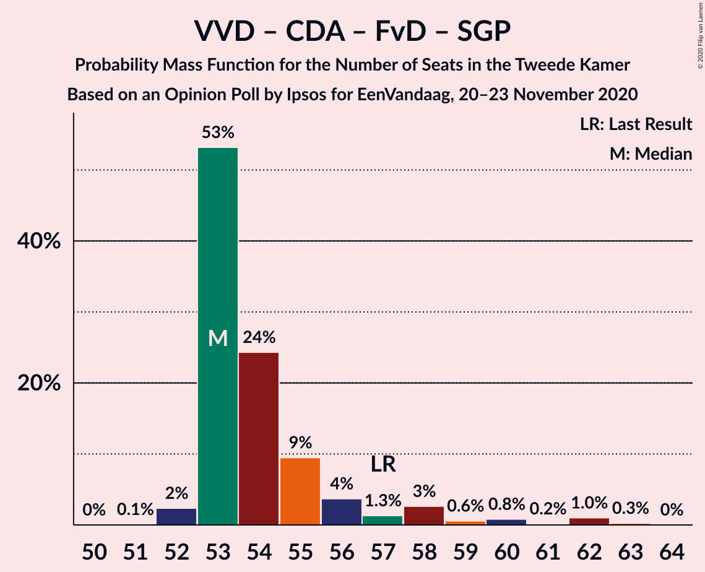

| Number of Seats | Probability | Accumulated | Special Marks |
|:---------------:|:-----------:|:-----------:|:-------------:|
| 51 | 0.1% | 100% |  |
| 52 | 2% | 99.9% |  |
| 53 | 53% | 98% | Median |
| 54 | 24% | 44% |  |
| 55 | 9% | 20% |  |
| 56 | 4% | 11% |  |
| 57 | 1.3% | 7% | Last Result |
| 58 | 3% | 6% |  |
| 59 | 0.6% | 3% |  |
| 60 | 0.8% | 2% |  |
| 61 | 0.2% | 1.5% |  |
| 62 | 1.0% | 1.3% |  |
| 63 | 0.3% | 0.3% |  |
| 64 | 0% | 0% |  |

### Volkspartij voor Vrijheid en Democratie – Christen-Democratisch Appèl – Forum voor Democratie – 50Plus

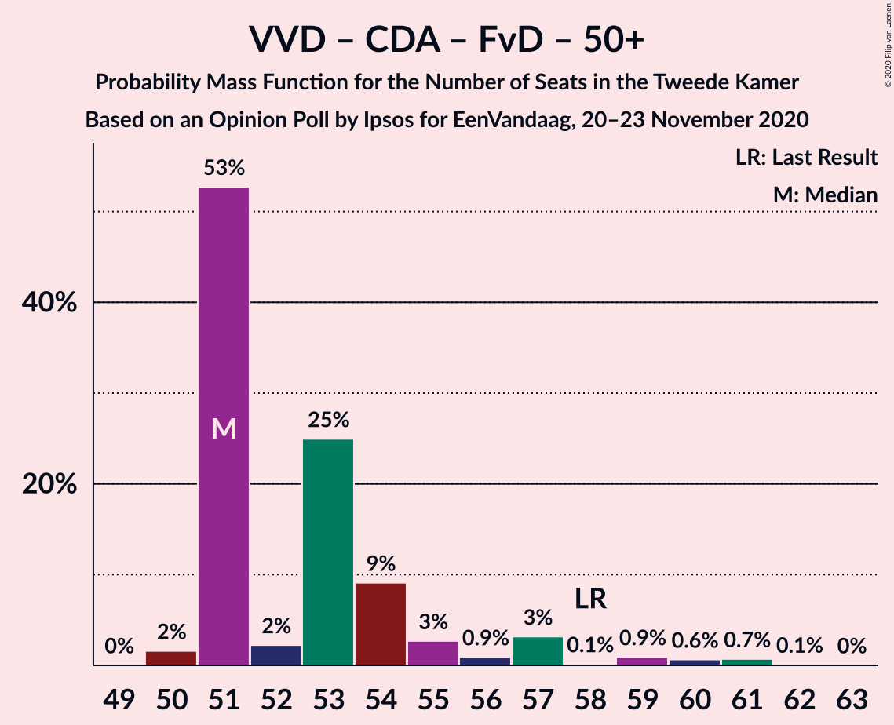

| Number of Seats | Probability | Accumulated | Special Marks |
|:---------------:|:-----------:|:-----------:|:-------------:|
| 50 | 2% | 100% |  |
| 51 | 53% | 98% | Median |
| 52 | 2% | 46% |  |
| 53 | 25% | 43% |  |
| 54 | 9% | 18% |  |
| 55 | 3% | 9% |  |
| 56 | 0.9% | 7% |  |
| 57 | 3% | 6% |  |
| 58 | 0.1% | 3% | Last Result |
| 59 | 0.9% | 2% |  |
| 60 | 0.6% | 1.5% |  |
| 61 | 0.7% | 0.8% |  |
| 62 | 0.1% | 0.1% |  |
| 63 | 0% | 0% |  |

### Volkspartij voor Vrijheid en Democratie – Christen-Democratisch Appèl – Forum voor Democratie

| Number of Seats | Probability | Accumulated | Special Marks |
|:---------------:|:-----------:|:-----------:|:-------------:|
| 49 | 2% | 100% |  |
| 50 | 1.3% | 98% |  |
| 51 | 54% | 97% | Median |
| 52 | 25% | 43% |  |
| 53 | 12% | 19% |  |
| 54 | 0.7% | 7% | Last Result |
| 55 | 1.4% | 7% |  |
| 56 | 3% | 5% |  |
| 57 | 0.2% | 2% |  |
| 58 | 0.8% | 2% |  |
| 59 | 1.2% | 1.4% |  |
| 60 | 0.2% | 0.3% |  |
| 61 | 0% | 0% |  |

### Volkspartij voor Vrijheid en Democratie – Christen-Democratisch Appèl

| Number of Seats | Probability | Accumulated | Special Marks |
|:---------------:|:-----------:|:-----------:|:-------------:|
| 44 | 0.3% | 100% |  |
| 45 | 2% | 99.7% |  |
| 46 | 1.0% | 98% |  |
| 47 | 76% | 97% | Median |
| 48 | 9% | 20% |  |
| 49 | 5% | 11% |  |
| 50 | 0.8% | 7% |  |
| 51 | 1.2% | 6% |  |
| 52 | 3% | 5% | Last Result |
| 53 | 0% | 1.4% |  |
| 54 | 0.6% | 1.4% |  |
| 55 | 0.8% | 0.8% |  |
| 56 | 0% | 0% |  |

### Volkspartij voor Vrijheid en Democratie – Partij van de Arbeid

| Number of Seats | Probability | Accumulated | Special Marks |
|:---------------:|:-----------:|:-----------:|:-------------:|
| 40 | 0.3% | 100% |  |
| 41 | 0.1% | 99.7% |  |
| 42 | 0.4% | 99.6% | Last Result |
| 43 | 2% | 99.2% |  |
| 44 | 34% | 97% |  |
| 45 | 1.1% | 63% |  |
| 46 | 3% | 62% |  |
| 47 | 56% | 59% | Median |
| 48 | 2% | 3% |  |
| 49 | 1.3% | 2% |  |
| 50 | 0.4% | 0.6% |  |
| 51 | 0.1% | 0.2% |  |
| 52 | 0.1% | 0.1% |  |
| 53 | 0% | 0% |  |

### Christen-Democratisch Appèl – Democraten 66 – Partij van de Arbeid

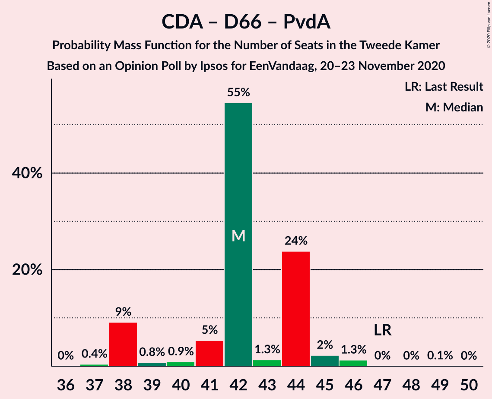

| Number of Seats | Probability | Accumulated | Special Marks |
|:---------------:|:-----------:|:-----------:|:-------------:|
| 36 | 0% | 100% |  |
| 37 | 0.4% | 99.9% |  |
| 38 | 9% | 99.5% |  |
| 39 | 0.8% | 90% |  |
| 40 | 0.9% | 90% |  |
| 41 | 5% | 89% |  |
| 42 | 55% | 83% | Median |
| 43 | 1.3% | 29% |  |
| 44 | 24% | 27% |  |
| 45 | 2% | 4% |  |
| 46 | 1.3% | 1.4% |  |
| 47 | 0% | 0.1% | Last Result |
| 48 | 0% | 0.1% |  |
| 49 | 0.1% | 0.1% |  |
| 50 | 0% | 0% |  |

### Christen-Democratisch Appèl – Partij van de Arbeid – ChristenUnie

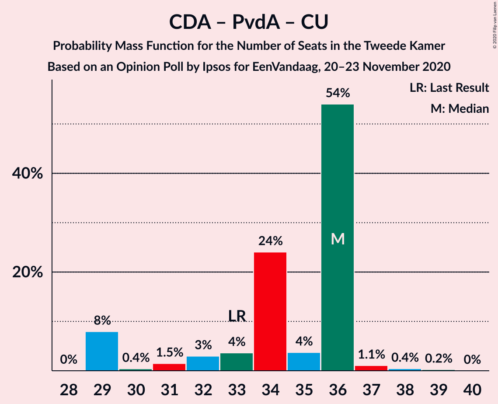

| Number of Seats | Probability | Accumulated | Special Marks |
|:---------------:|:-----------:|:-----------:|:-------------:|
| 29 | 8% | 100% |  |
| 30 | 0.4% | 92% |  |
| 31 | 1.5% | 92% |  |
| 32 | 3% | 90% |  |
| 33 | 4% | 87% | Last Result |
| 34 | 24% | 84% |  |
| 35 | 4% | 59% |  |
| 36 | 54% | 56% | Median |
| 37 | 1.1% | 2% |  |
| 38 | 0.4% | 0.7% |  |
| 39 | 0.2% | 0.3% |  |
| 40 | 0% | 0% |  |

### Christen-Democratisch Appèl – Democraten 66

| Number of Seats | Probability | Accumulated | Special Marks |
|:---------------:|:-----------:|:-----------:|:-------------:|
| 23 | 0.1% | 100% |  |
| 24 | 0% | 99.9% |  |
| 25 | 1.2% | 99.9% |  |
| 26 | 0.6% | 98.7% |  |
| 27 | 53% | 98% | Median |
| 28 | 10% | 45% |  |
| 29 | 4% | 35% |  |
| 30 | 4% | 32% |  |
| 31 | 25% | 28% |  |
| 32 | 0.4% | 3% |  |
| 33 | 2% | 3% |  |
| 34 | 0.6% | 0.7% |  |
| 35 | 0% | 0.1% |  |
| 36 | 0% | 0.1% |  |
| 37 | 0.1% | 0.1% |  |
| 38 | 0% | 0% | Last Result |

### Christen-Democratisch Appèl – Partij van de Arbeid

| Number of Seats | Probability | Accumulated | Special Marks |
|:---------------:|:-----------:|:-----------:|:-------------:|
| 23 | 0.1% | 100% |  |
| 24 | 8% | 99.9% |  |
| 25 | 0.7% | 92% |  |
| 26 | 2% | 91% |  |
| 27 | 5% | 89% |  |
| 28 | 2% | 84% | Last Result |
| 29 | 27% | 82% |  |
| 30 | 54% | 56% | Median |
| 31 | 0.7% | 2% |  |
| 32 | 0.4% | 1.2% |  |
| 33 | 0.8% | 0.8% |  |
| 34 | 0% | 0% |  |

## Technical Information

### Opinion Poll

+ **Polling firm:** Ipsos
+ **Commissioner(s):** EenVandaag
+ **Fieldwork period:** 20–23 November 2020

### Calculations

+ **Sample size:** 1048
+ **Simulations done:** 1,048,576
+ **Error estimate:** 2.77%

