# Opinion Poll by Peil.nl, 26–27 November 2020

<a href="#voting-intentions">Voting Intentions</a> | <a href="#seats">Seats</a> | <a href="#coalitions">Coalitions</a> | <a href="#technical-information">Technical Information</a>

## Voting Intentions

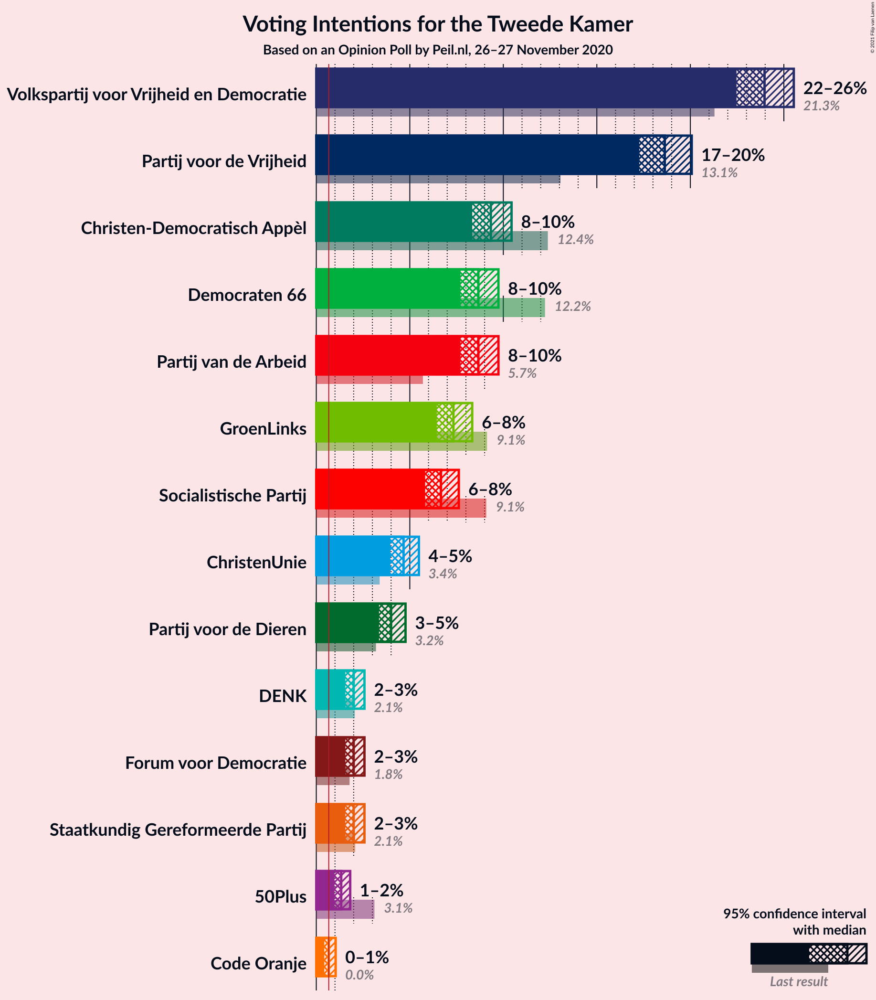

### Confidence Intervals

| Party | Last Result | Poll Result | 80% Confidence Interval | 90% Confidence Interval | 95% Confidence Interval | 99% Confidence Interval |
|:-----:|:-----------:|:-----------:|:-----------------------:|:-----------------------:|:-----------------------:|:-----------------------:|
| Volkspartij voor Vrijheid en Democratie | 21.3% | 24.0% | 23.0–25.0% |22.7–25.3% |22.5–25.5% |22.0–26.0% |
| Partij voor de Vrijheid | 13.1% | 18.6% | 17.7–19.6% |17.5–19.8% |17.3–20.1% |16.9–20.5% |
| Christen-Democratisch Appèl | 12.4% | 9.3% | 8.7–10.1% |8.5–10.3% |8.3–10.4% |8.0–10.8% |
| Democraten 66 | 12.2% | 8.7% | 8.0–9.4% |7.8–9.6% |7.7–9.7% |7.4–10.1% |
| Partij van de Arbeid | 5.7% | 8.7% | 8.0–9.4% |7.8–9.6% |7.7–9.7% |7.4–10.1% |
| GroenLinks | 9.1% | 7.3% | 6.8–8.0% |6.6–8.2% |6.4–8.3% |6.2–8.6% |
| Socialistische Partij | 9.1% | 6.7% | 6.1–7.3% |6.0–7.5% |5.8–7.6% |5.6–7.9% |
| ChristenUnie | 3.4% | 4.7% | 4.2–5.2% |4.1–5.3% |4.0–5.5% |3.7–5.8% |
| Partij voor de Dieren | 3.2% | 4.0% | 3.6–4.5% |3.4–4.6% |3.4–4.8% |3.2–5.0% |
| Staatkundig Gereformeerde Partij | 2.1% | 2.0% | 1.7–2.4% |1.6–2.5% |1.6–2.6% |1.4–2.8% |
| DENK | 2.1% | 2.0% | 1.7–2.4% |1.6–2.5% |1.6–2.6% |1.4–2.8% |
| Forum voor Democratie | 1.8% | 2.0% | 1.7–2.4% |1.6–2.5% |1.6–2.6% |1.4–2.8% |
| 50Plus | 3.1% | 1.3% | 1.1–1.6% |1.0–1.7% |1.0–1.8% |0.9–2.0% |
| Code Oranje | 0.0% | 0.7% | 0.5–0.9% |0.5–1.0% |0.4–1.0% |0.4–1.2% |

*Note:* The poll result column reflects the actual value used in the calculations. Published results may vary slightly, and in addition be rounded to fewer digits.

## Seats

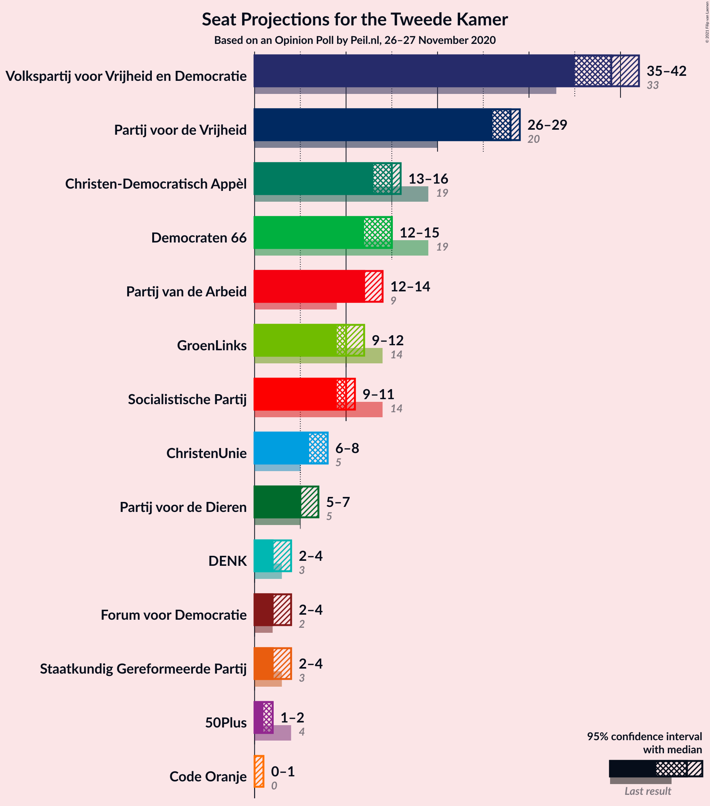

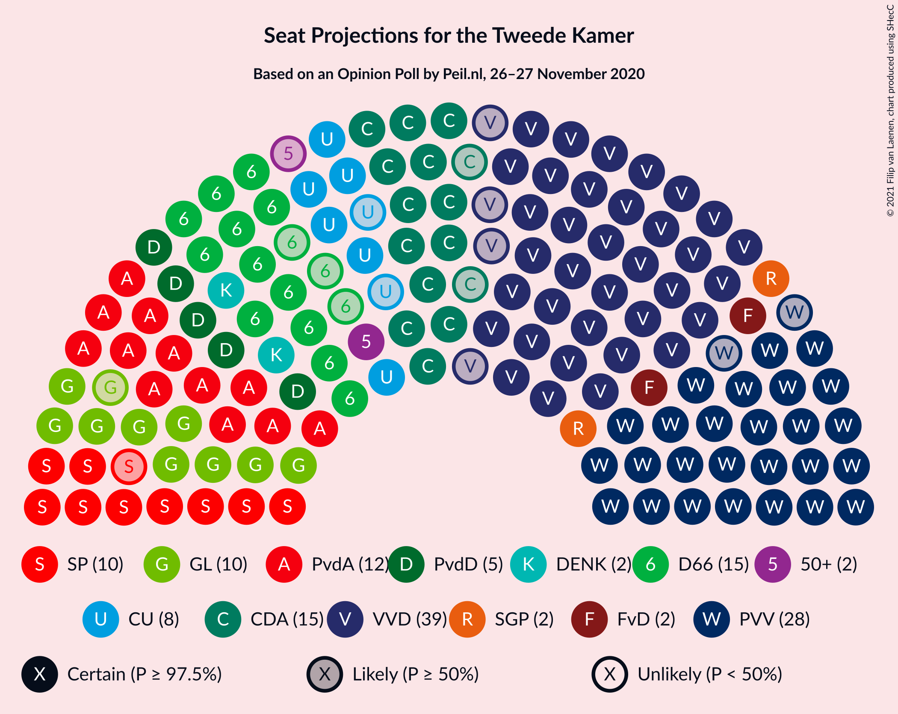

### Confidence Intervals

| Party | Last Result | Median | 80% Confidence Interval | 90% Confidence Interval | 95% Confidence Interval | 99% Confidence Interval |
|:-----:|:-----------:|:------:|:-----------------------:|:-----------------------:|:-----------------------:|:-----------------------:|
| <a href="#volkspartij-voor-vrijheid-en-democratie">Volkspartij voor Vrijheid en Democratie</a> | 33 | 39 | 37–39 |36–39 |35–42 |34–42 |
| <a href="#partij-voor-de-vrijheid">Partij voor de Vrijheid</a> | 20 | 28 | 27–29 |26–29 |26–29 |25–31 |
| <a href="#christen-democratisch-appèl">Christen-Democratisch Appèl</a> | 19 | 15 | 13–16 |13–16 |13–16 |12–17 |
| <a href="#democraten-66">Democraten 66</a> | 19 | 15 | 12–15 |12–15 |12–15 |11–15 |
| <a href="#partij-van-de-arbeid">Partij van de Arbeid</a> | 9 | 12 | 12–14 |12–14 |12–14 |11–15 |
| <a href="#groenlinks">GroenLinks</a> | 14 | 10 | 9–11 |9–11 |9–12 |9–13 |
| <a href="#socialistische-partij">Socialistische Partij</a> | 14 | 10 | 9–11 |9–11 |9–11 |8–12 |
| <a href="#christenunie">ChristenUnie</a> | 5 | 8 | 6–8 |6–8 |6–8 |6–9 |
| <a href="#partij-voor-de-dieren">Partij voor de Dieren</a> | 5 | 5 | 5–7 |5–7 |5–7 |4–7 |
| <a href="#staatkundig-gereformeerde-partij">Staatkundig Gereformeerde Partij</a> | 3 | 2 | 2–4 |2–4 |2–4 |2–4 |
| <a href="#denk">DENK</a> | 3 | 2 | 2–4 |2–4 |2–4 |2–4 |
| <a href="#forum-voor-democratie">Forum voor Democratie</a> | 2 | 2 | 2–3 |2–3 |2–4 |2–4 |
| <a href="#50plus">50Plus</a> | 4 | 2 | 1–2 |1–2 |1–2 |1–3 |
| <a href="#code-oranje">Code Oranje</a> | 0 | 0 | 0–1 |0–1 |0–1 |0–1 |

### Volkspartij voor Vrijheid en Democratie

*For a full overview of the results for this party, see the [Volkspartij voor Vrijheid en Democratie](party-volkspartijvoorvrijheidendemocratie.html) page.*

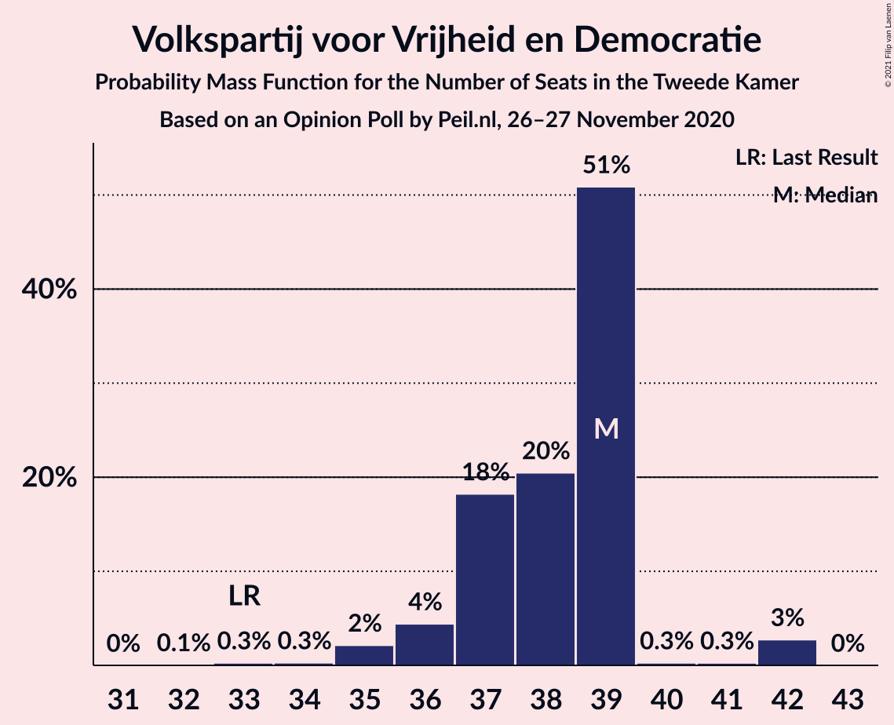

| Number of Seats | Probability | Accumulated | Special Marks |
|:---------------:|:-----------:|:-----------:|:-------------:|
| 32 | 0.1% | 100% |  |
| 33 | 0.3% | 99.9% | Last Result |
| 34 | 0.3% | 99.7% |  |
| 35 | 2% | 99.4% |  |
| 36 | 4% | 97% |  |
| 37 | 18% | 93% |  |
| 38 | 20% | 75% |  |
| 39 | 51% | 54% | Median |
| 40 | 0.3% | 3% |  |
| 41 | 0.3% | 3% |  |
| 42 | 3% | 3% |  |
| 43 | 0% | 0% |  |

### Partij voor de Vrijheid

*For a full overview of the results for this party, see the [Partij voor de Vrijheid](party-partijvoordevrijheid.html) page.*

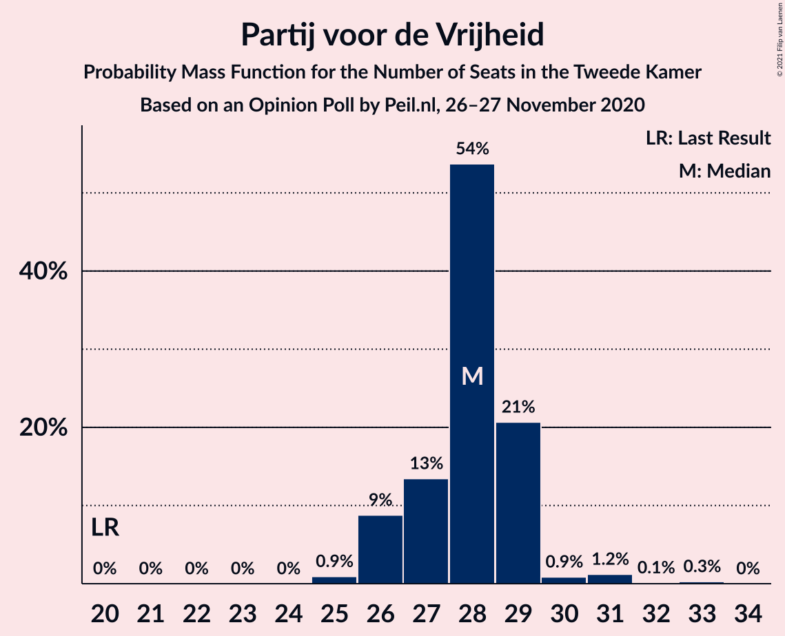

| Number of Seats | Probability | Accumulated | Special Marks |
|:---------------:|:-----------:|:-----------:|:-------------:|
| 20 | 0% | 100% | Last Result |
| 21 | 0% | 100% |  |
| 22 | 0% | 100% |  |
| 23 | 0% | 100% |  |
| 24 | 0% | 100% |  |
| 25 | 0.9% | 100% |  |
| 26 | 9% | 99.1% |  |
| 27 | 13% | 90% |  |
| 28 | 54% | 77% | Median |
| 29 | 21% | 23% |  |
| 30 | 0.9% | 2% |  |
| 31 | 1.2% | 2% |  |
| 32 | 0.1% | 0.4% |  |
| 33 | 0.3% | 0.3% |  |
| 34 | 0% | 0% |  |

### Christen-Democratisch Appèl

*For a full overview of the results for this party, see the [Christen-Democratisch Appèl](party-christen-democratischappèl.html) page.*

| Number of Seats | Probability | Accumulated | Special Marks |
|:---------------:|:-----------:|:-----------:|:-------------:|
| 11 | 0.1% | 100% |  |
| 12 | 0.7% | 99.9% |  |
| 13 | 12% | 99.3% |  |
| 14 | 15% | 87% |  |
| 15 | 62% | 73% | Median |
| 16 | 10% | 11% |  |
| 17 | 0.9% | 0.9% |  |
| 18 | 0% | 0% |  |
| 19 | 0% | 0% | Last Result |

### Democraten 66

*For a full overview of the results for this party, see the [Democraten 66](party-democraten66.html) page.*

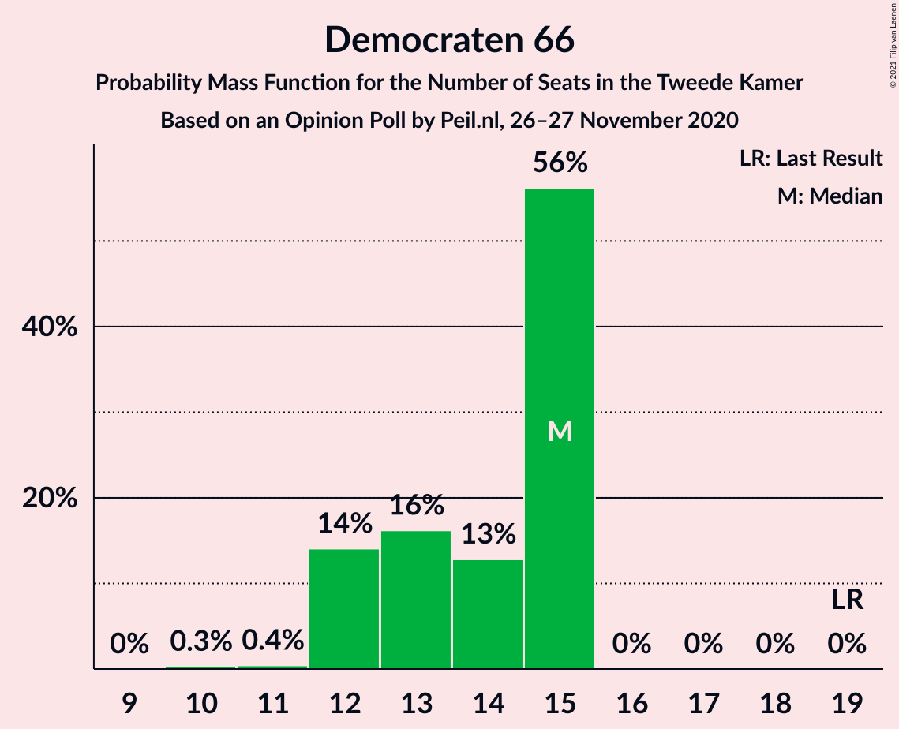

| Number of Seats | Probability | Accumulated | Special Marks |
|:---------------:|:-----------:|:-----------:|:-------------:|
| 10 | 0.3% | 100% |  |
| 11 | 0.4% | 99.7% |  |
| 12 | 14% | 99.3% |  |
| 13 | 16% | 85% |  |
| 14 | 13% | 69% |  |
| 15 | 56% | 56% | Median |
| 16 | 0% | 0% |  |
| 17 | 0% | 0% |  |
| 18 | 0% | 0% |  |
| 19 | 0% | 0% | Last Result |

### Partij van de Arbeid

*For a full overview of the results for this party, see the [Partij van de Arbeid](party-partijvandearbeid.html) page.*

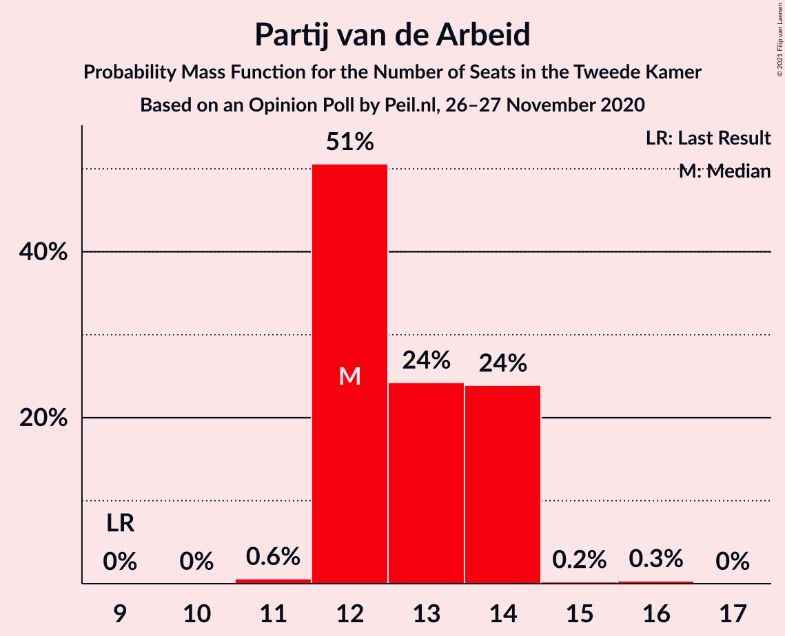

| Number of Seats | Probability | Accumulated | Special Marks |
|:---------------:|:-----------:|:-----------:|:-------------:|
| 9 | 0% | 100% | Last Result |
| 10 | 0% | 100% |  |
| 11 | 0.6% | 100% |  |
| 12 | 51% | 99.4% | Median |
| 13 | 24% | 49% |  |
| 14 | 24% | 25% |  |
| 15 | 0.2% | 0.6% |  |
| 16 | 0.3% | 0.4% |  |
| 17 | 0% | 0% |  |

### GroenLinks

*For a full overview of the results for this party, see the [GroenLinks](party-groenlinks.html) page.*

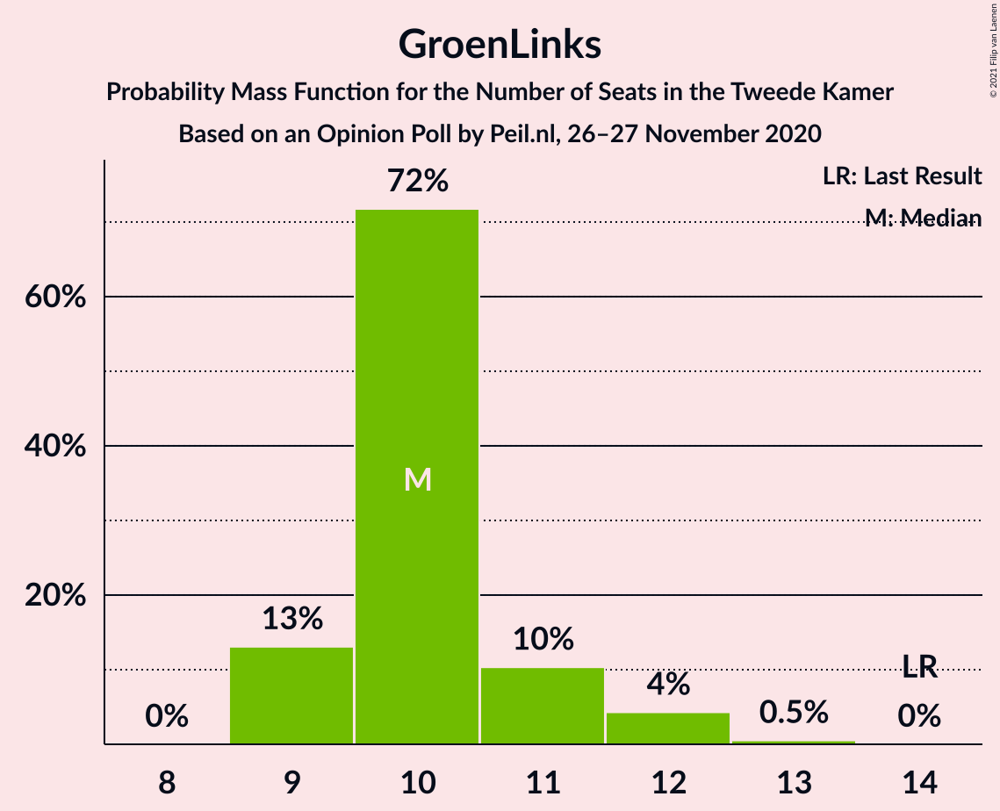

| Number of Seats | Probability | Accumulated | Special Marks |
|:---------------:|:-----------:|:-----------:|:-------------:|
| 9 | 13% | 100% |  |
| 10 | 72% | 87% | Median |
| 11 | 10% | 15% |  |
| 12 | 4% | 5% |  |
| 13 | 0.5% | 0.5% |  |
| 14 | 0% | 0% | Last Result |

### Socialistische Partij

*For a full overview of the results for this party, see the [Socialistische Partij](party-socialistischepartij.html) page.*

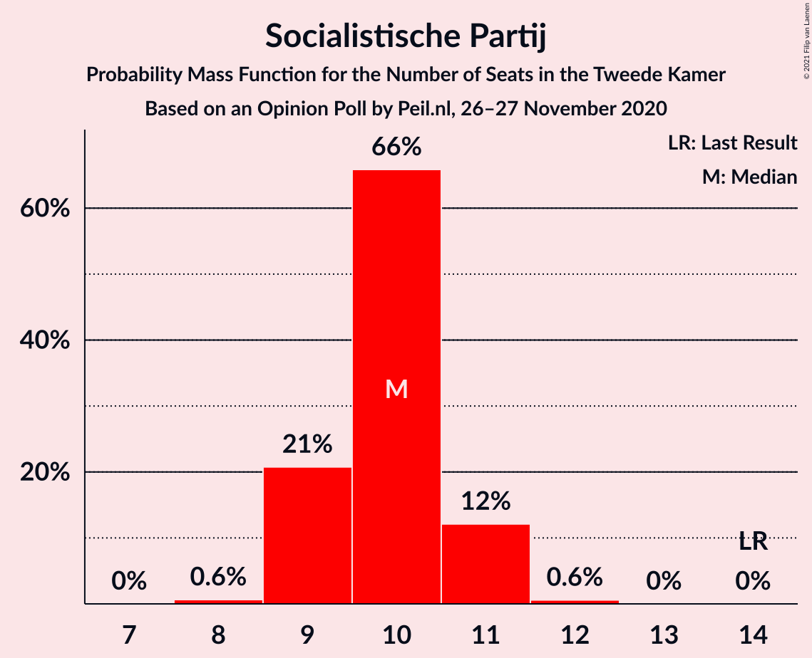

| Number of Seats | Probability | Accumulated | Special Marks |
|:---------------:|:-----------:|:-----------:|:-------------:|
| 8 | 0.6% | 100% |  |
| 9 | 21% | 99.3% |  |
| 10 | 66% | 79% | Median |
| 11 | 12% | 13% |  |
| 12 | 0.6% | 0.6% |  |
| 13 | 0% | 0% |  |
| 14 | 0% | 0% | Last Result |

### ChristenUnie

*For a full overview of the results for this party, see the [ChristenUnie](party-christenunie.html) page.*

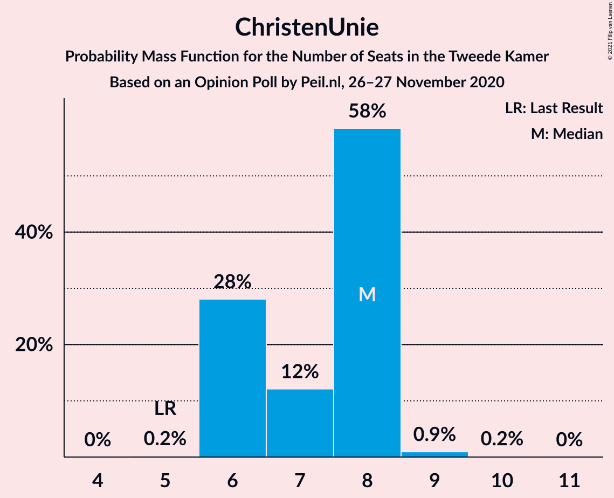

| Number of Seats | Probability | Accumulated | Special Marks |
|:---------------:|:-----------:|:-----------:|:-------------:|
| 5 | 0.2% | 100% | Last Result |
| 6 | 28% | 99.8% |  |
| 7 | 12% | 72% |  |
| 8 | 58% | 60% | Median |
| 9 | 0.9% | 1.1% |  |
| 10 | 0.2% | 0.2% |  |
| 11 | 0% | 0% |  |

### Partij voor de Dieren

*For a full overview of the results for this party, see the [Partij voor de Dieren](party-partijvoordedieren.html) page.*

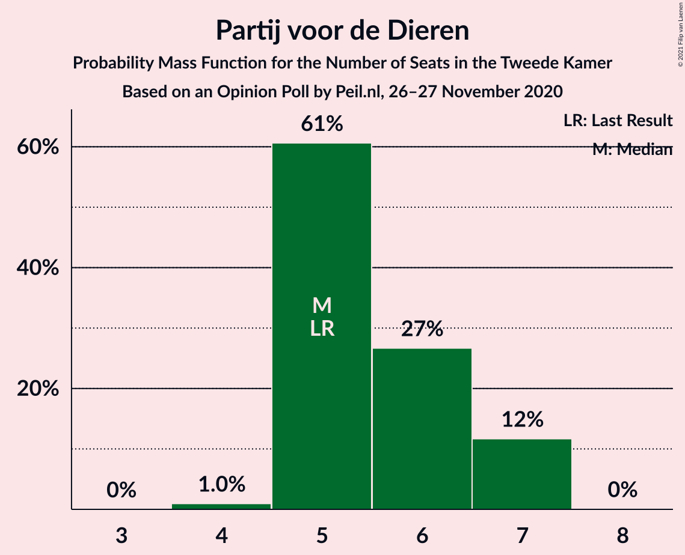

| Number of Seats | Probability | Accumulated | Special Marks |
|:---------------:|:-----------:|:-----------:|:-------------:|
| 4 | 1.0% | 100% |  |
| 5 | 61% | 99.0% | Last Result, Median |
| 6 | 27% | 38% |  |
| 7 | 12% | 12% |  |
| 8 | 0% | 0% |  |

### Staatkundig Gereformeerde Partij

*For a full overview of the results for this party, see the [Staatkundig Gereformeerde Partij](party-staatkundiggereformeerdepartij.html) page.*

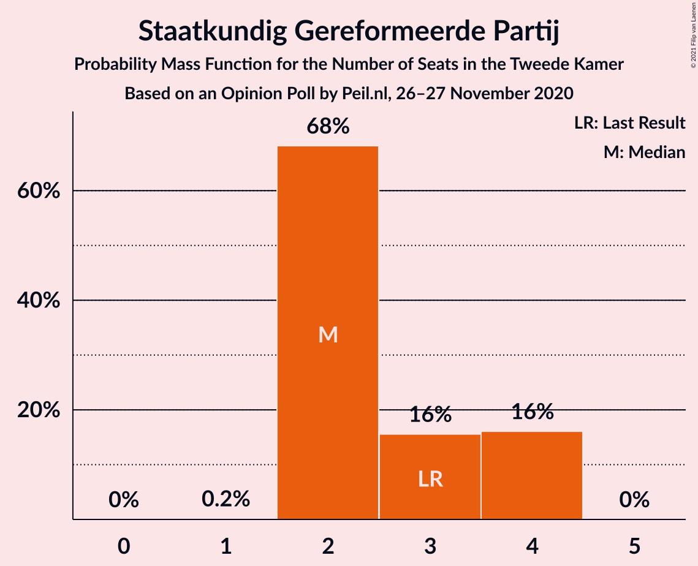

| Number of Seats | Probability | Accumulated | Special Marks |
|:---------------:|:-----------:|:-----------:|:-------------:|
| 1 | 0.2% | 100% |  |
| 2 | 68% | 99.8% | Median |
| 3 | 16% | 32% | Last Result |
| 4 | 16% | 16% |  |
| 5 | 0% | 0% |  |

### DENK

*For a full overview of the results for this party, see the [DENK](party-denk.html) page.*

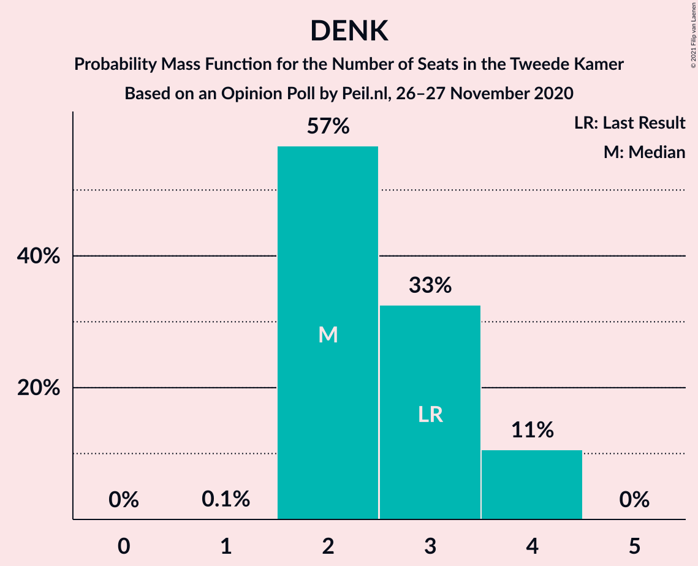

| Number of Seats | Probability | Accumulated | Special Marks |
|:---------------:|:-----------:|:-----------:|:-------------:|
| 1 | 0.1% | 100% |  |
| 2 | 57% | 99.9% | Median |
| 3 | 33% | 43% | Last Result |
| 4 | 11% | 11% |  |
| 5 | 0% | 0% |  |

### Forum voor Democratie

*For a full overview of the results for this party, see the [Forum voor Democratie](party-forumvoordemocratie.html) page.*

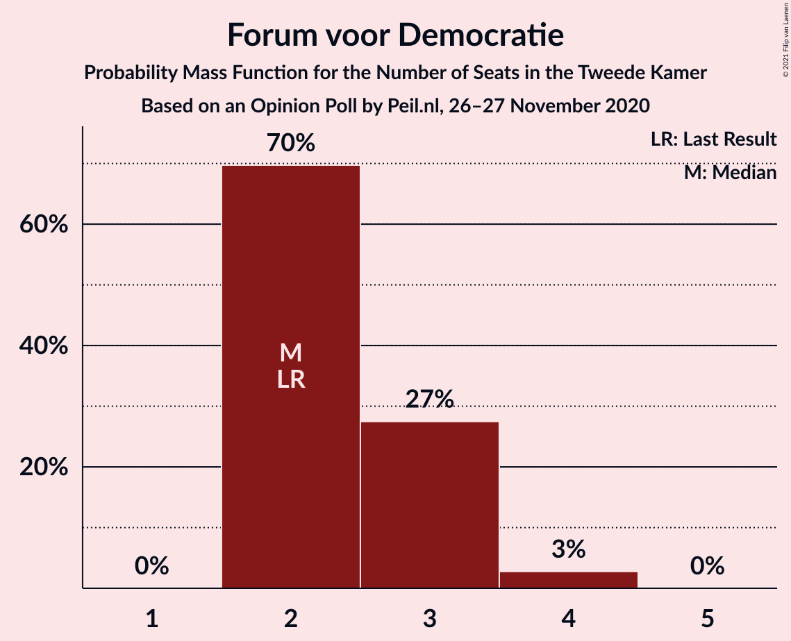

| Number of Seats | Probability | Accumulated | Special Marks |
|:---------------:|:-----------:|:-----------:|:-------------:|
| 2 | 70% | 100% | Last Result, Median |
| 3 | 27% | 30% |  |
| 4 | 3% | 3% |  |
| 5 | 0% | 0% |  |

### 50Plus

*For a full overview of the results for this party, see the [50Plus](party-50plus.html) page.*

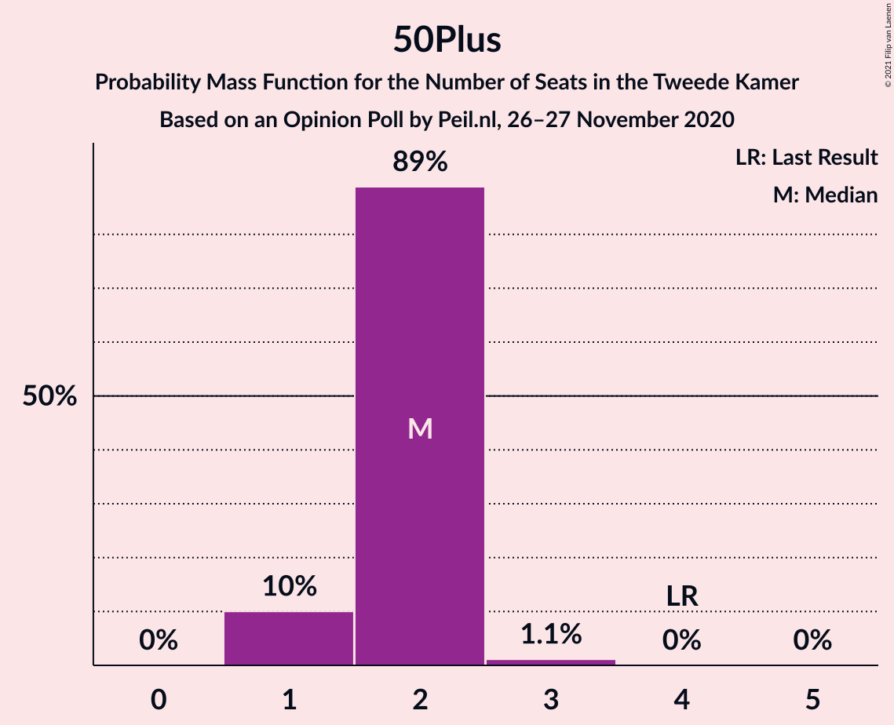

| Number of Seats | Probability | Accumulated | Special Marks |
|:---------------:|:-----------:|:-----------:|:-------------:|
| 1 | 10% | 100% |  |
| 2 | 89% | 90% | Median |
| 3 | 1.1% | 1.1% |  |
| 4 | 0% | 0% | Last Result |

### Code Oranje

*For a full overview of the results for this party, see the [Code Oranje](party-codeoranje.html) page.*

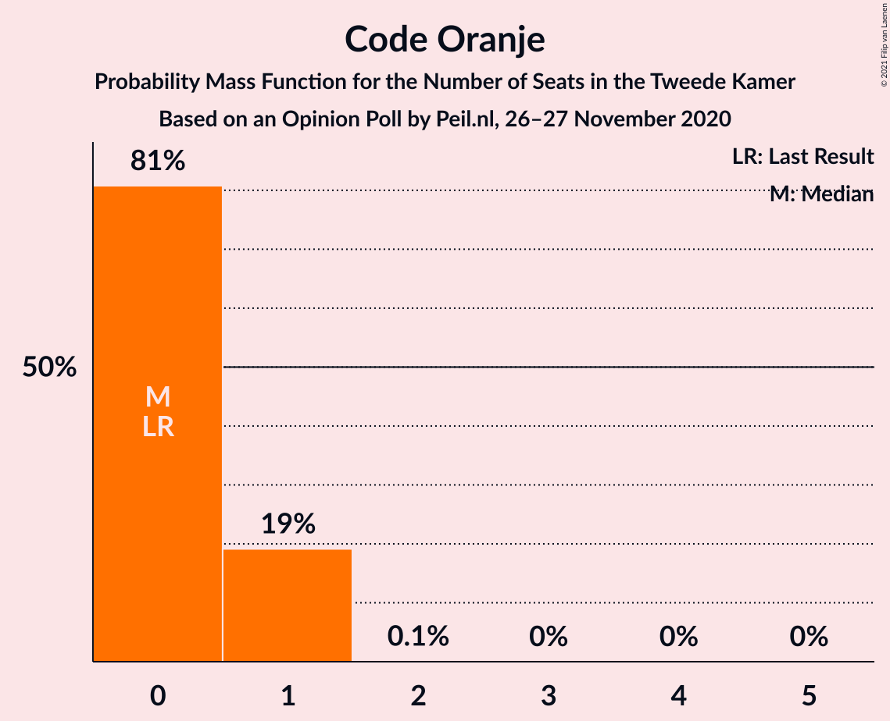

| Number of Seats | Probability | Accumulated | Special Marks |
|:---------------:|:-----------:|:-----------:|:-------------:|
| 0 | 81% | 100% | Last Result, Median |
| 1 | 19% | 19% |  |
| 2 | 0.1% | 0.1% |  |
| 3 | 0% | 0% |  |

## Coalitions

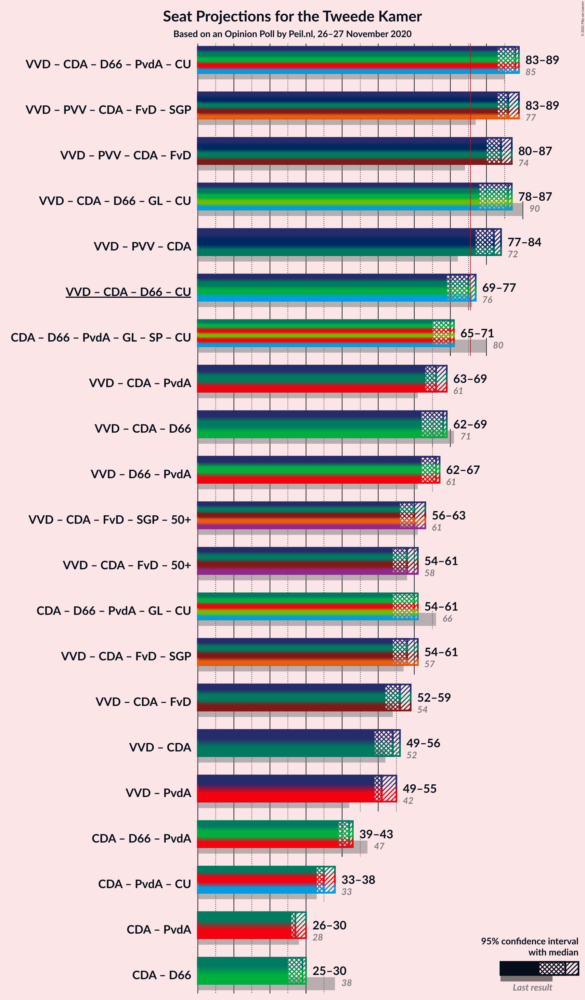

### Confidence Intervals

| Coalition | Last Result | Median | Majority? | 80% Confidence Interval | 90% Confidence Interval | 95% Confidence Interval | 99% Confidence Interval |
|:---------:|:-----------:|:------:|:---------:|:-----------------------:|:-----------------------:|:-----------------------:|:-----------------------:|
| Volkspartij voor Vrijheid en Democratie – Christen-Democratisch Appèl – Democraten 66 – Partij van de Arbeid – ChristenUnie | 85 | 88 | 100% | 83–89 | 83–89 | 83–89 | 81–90 |
| Volkspartij voor Vrijheid en Democratie – Partij voor de Vrijheid – Christen-Democratisch Appèl – Forum voor Democratie – Staatkundig Gereformeerde Partij | 77 | 86 | 100% | 84–86 | 84–87 | 83–89 | 81–89 |
| Volkspartij voor Vrijheid en Democratie – Partij voor de Vrijheid – Christen-Democratisch Appèl – Forum voor Democratie | 74 | 84 | 100% | 82–84 | 81–84 | 80–87 | 78–87 |
| Volkspartij voor Vrijheid en Democratie – Christen-Democratisch Appèl – Democraten 66 – GroenLinks – ChristenUnie | 90 | 86 | 100% | 79–87 | 78–87 | 78–87 | 78–88 |
| Volkspartij voor Vrijheid en Democratie – Partij voor de Vrijheid – Christen-Democratisch Appèl | 72 | 82 | 99.1% | 79–82 | 78–82 | 77–84 | 75–84 |
| Volkspartij voor Vrijheid en Democratie – Christen-Democratisch Appèl – Democraten 66 – ChristenUnie | 76 | 75 | 49% | 69–77 | 69–77 | 69–77 | 68–77 |
| Christen-Democratisch Appèl – Democraten 66 – Partij van de Arbeid – GroenLinks – Socialistische Partij – ChristenUnie | 80 | 70 | 0% | 65–70 | 65–70 | 65–71 | 65–72 |
| Volkspartij voor Vrijheid en Democratie – Christen-Democratisch Appèl – Partij van de Arbeid | 61 | 66 | 0% | 64–67 | 63–67 | 63–69 | 61–69 |
| Volkspartij voor Vrijheid en Democratie – Christen-Democratisch Appèl – Democraten 66 | 71 | 68 | 0% | 63–69 | 63–69 | 62–69 | 61–70 |
| Volkspartij voor Vrijheid en Democratie – Democraten 66 – Partij van de Arbeid | 61 | 66 | 0% | 64–66 | 62–66 | 62–67 | 60–67 |
| Volkspartij voor Vrijheid en Democratie – Christen-Democratisch Appèl – Forum voor Democratie – Staatkundig Gereformeerde Partij – 50Plus | 61 | 60 | 0% | 58–61 | 57–61 | 56–63 | 56–63 |
| Volkspartij voor Vrijheid en Democratie – Christen-Democratisch Appèl – Forum voor Democratie – 50Plus | 58 | 58 | 0% | 55–58 | 54–58 | 54–61 | 53–61 |
| Christen-Democratisch Appèl – Democraten 66 – Partij van de Arbeid – GroenLinks – ChristenUnie | 66 | 60 | 0% | 55–61 | 54–61 | 54–61 | 54–62 |
| Volkspartij voor Vrijheid en Democratie – Christen-Democratisch Appèl – Forum voor Democratie – Staatkundig Gereformeerde Partij | 57 | 58 | 0% | 57–59 | 56–59 | 54–61 | 54–61 |
| Volkspartij voor Vrijheid en Democratie – Christen-Democratisch Appèl – Forum voor Democratie | 54 | 56 | 0% | 53–56 | 53–56 | 52–59 | 51–59 |
| Volkspartij voor Vrijheid en Democratie – Christen-Democratisch Appèl | 52 | 54 | 0% | 51–54 | 50–54 | 49–56 | 48–56 |
| Volkspartij voor Vrijheid en Democratie – Partij van de Arbeid | 42 | 51 | 0% | 50–52 | 49–52 | 49–55 | 47–55 |
| Christen-Democratisch Appèl – Democraten 66 – Partij van de Arbeid | 47 | 42 | 0% | 39–43 | 39–43 | 39–43 | 37–44 |
| Christen-Democratisch Appèl – Partij van de Arbeid – ChristenUnie | 33 | 35 | 0% | 33–36 | 33–38 | 33–38 | 31–38 |
| Christen-Democratisch Appèl – Partij van de Arbeid | 28 | 27 | 0% | 27–30 | 27–30 | 26–30 | 24–30 |
| Christen-Democratisch Appèl – Democraten 66 | 38 | 29 | 0% | 25–30 | 25–30 | 25–30 | 25–31 |

### Volkspartij voor Vrijheid en Democratie – Christen-Democratisch Appèl – Democraten 66 – Partij van de Arbeid – ChristenUnie

| Number of Seats | Probability | Accumulated | Special Marks |
|:---------------:|:-----------:|:-----------:|:-------------:|
| 79 | 0.3% | 100% |  |
| 80 | 0.1% | 99.7% |  |
| 81 | 0.5% | 99.6% |  |
| 82 | 0.6% | 99.1% |  |
| 83 | 14% | 98.5% |  |
| 84 | 1.4% | 84% |  |
| 85 | 8% | 83% | Last Result |
| 86 | 12% | 75% |  |
| 87 | 1.3% | 63% |  |
| 88 | 12% | 62% |  |
| 89 | 49% | 49% | Median |
| 90 | 0.6% | 0.6% |  |
| 91 | 0% | 0% |  |

### Volkspartij voor Vrijheid en Democratie – Partij voor de Vrijheid – Christen-Democratisch Appèl – Forum voor Democratie – Staatkundig Gereformeerde Partij

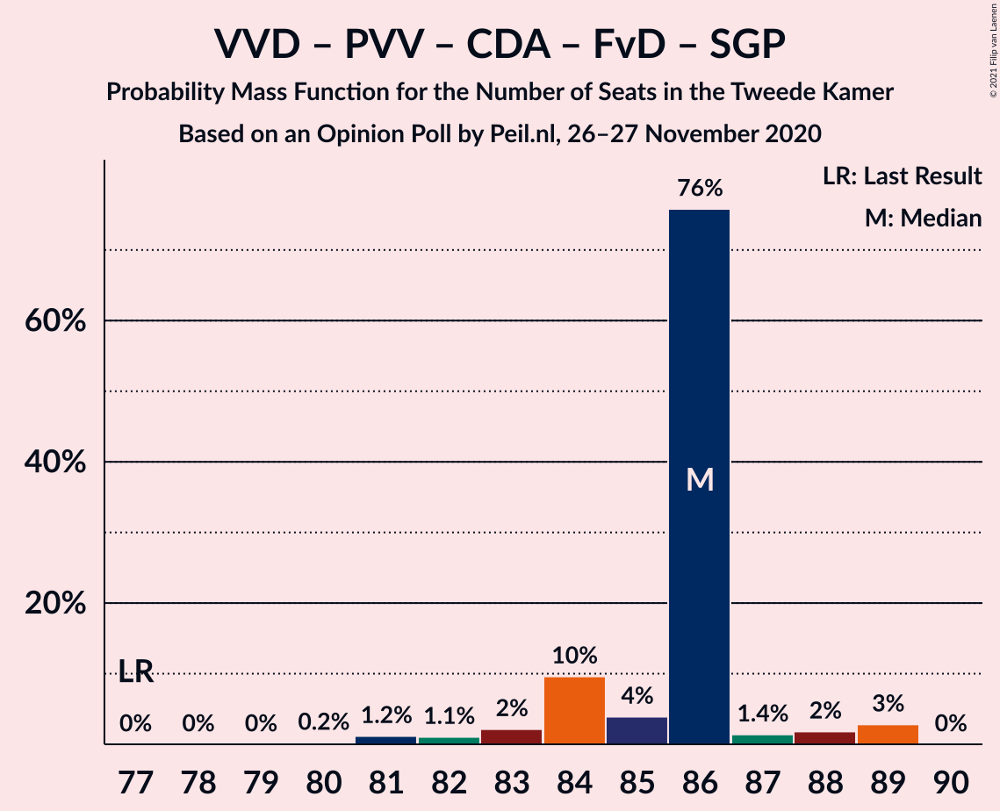

| Number of Seats | Probability | Accumulated | Special Marks |
|:---------------:|:-----------:|:-----------:|:-------------:|
| 77 | 0% | 100% | Last Result |
| 78 | 0% | 100% |  |
| 79 | 0% | 100% |  |
| 80 | 0.2% | 100% |  |
| 81 | 1.2% | 99.8% |  |
| 82 | 1.1% | 98.6% |  |
| 83 | 2% | 98% |  |
| 84 | 10% | 95% |  |
| 85 | 4% | 86% |  |
| 86 | 76% | 82% | Median |
| 87 | 1.4% | 6% |  |
| 88 | 2% | 5% |  |
| 89 | 3% | 3% |  |
| 90 | 0% | 0% |  |

### Volkspartij voor Vrijheid en Democratie – Partij voor de Vrijheid – Christen-Democratisch Appèl – Forum voor Democratie

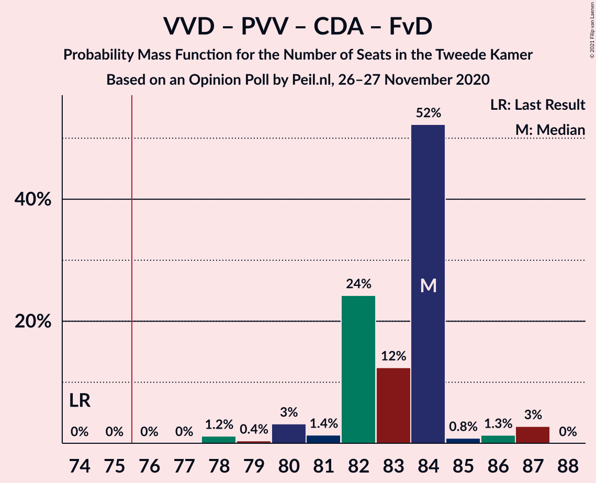

| Number of Seats | Probability | Accumulated | Special Marks |
|:---------------:|:-----------:|:-----------:|:-------------:|
| 74 | 0% | 100% | Last Result |
| 75 | 0% | 100% |  |
| 76 | 0% | 100% | Majority |
| 77 | 0% | 100% |  |
| 78 | 1.2% | 100% |  |
| 79 | 0.4% | 98.8% |  |
| 80 | 3% | 98% |  |
| 81 | 1.4% | 95% |  |
| 82 | 24% | 94% |  |
| 83 | 12% | 70% |  |
| 84 | 52% | 57% | Median |
| 85 | 0.8% | 5% |  |
| 86 | 1.3% | 4% |  |
| 87 | 3% | 3% |  |
| 88 | 0% | 0% |  |

### Volkspartij voor Vrijheid en Democratie – Christen-Democratisch Appèl – Democraten 66 – GroenLinks – ChristenUnie

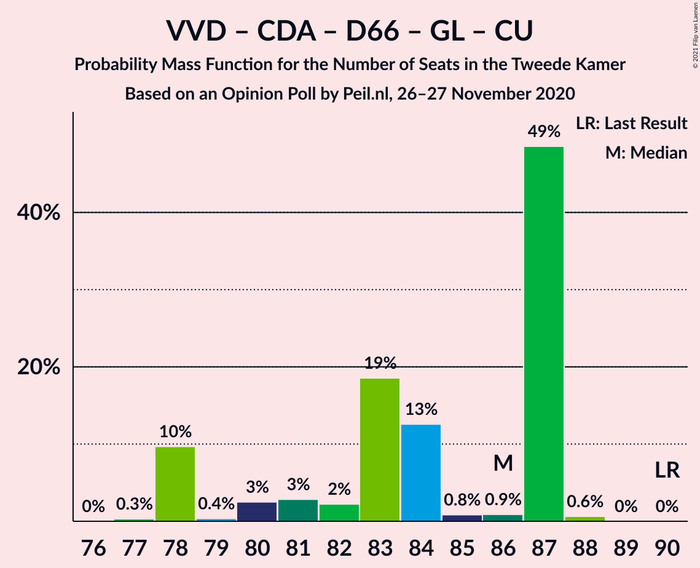

| Number of Seats | Probability | Accumulated | Special Marks |
|:---------------:|:-----------:|:-----------:|:-------------:|
| 77 | 0.3% | 100% |  |
| 78 | 10% | 99.7% |  |
| 79 | 0.4% | 90% |  |
| 80 | 3% | 90% |  |
| 81 | 3% | 87% |  |
| 82 | 2% | 84% |  |
| 83 | 19% | 82% |  |
| 84 | 13% | 64% |  |
| 85 | 0.8% | 51% |  |
| 86 | 0.9% | 50% |  |
| 87 | 49% | 49% | Median |
| 88 | 0.6% | 0.6% |  |
| 89 | 0% | 0% |  |
| 90 | 0% | 0% | Last Result |

### Volkspartij voor Vrijheid en Democratie – Partij voor de Vrijheid – Christen-Democratisch Appèl

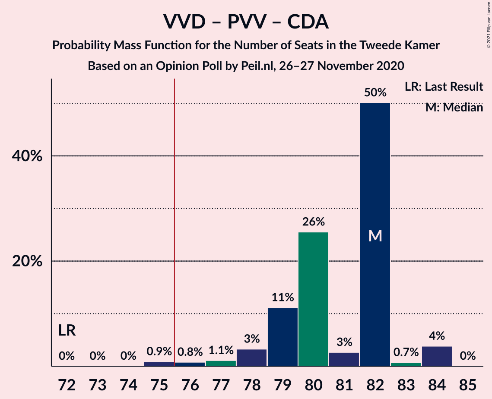

| Number of Seats | Probability | Accumulated | Special Marks |
|:---------------:|:-----------:|:-----------:|:-------------:|
| 72 | 0% | 100% | Last Result |
| 73 | 0% | 100% |  |
| 74 | 0% | 100% |  |
| 75 | 0.9% | 100% |  |
| 76 | 0.8% | 99.1% | Majority |
| 77 | 1.1% | 98% |  |
| 78 | 3% | 97% |  |
| 79 | 11% | 94% |  |
| 80 | 26% | 83% |  |
| 81 | 3% | 57% |  |
| 82 | 50% | 55% | Median |
| 83 | 0.7% | 5% |  |
| 84 | 4% | 4% |  |
| 85 | 0% | 0% |  |

### Volkspartij voor Vrijheid en Democratie – Christen-Democratisch Appèl – Democraten 66 – ChristenUnie

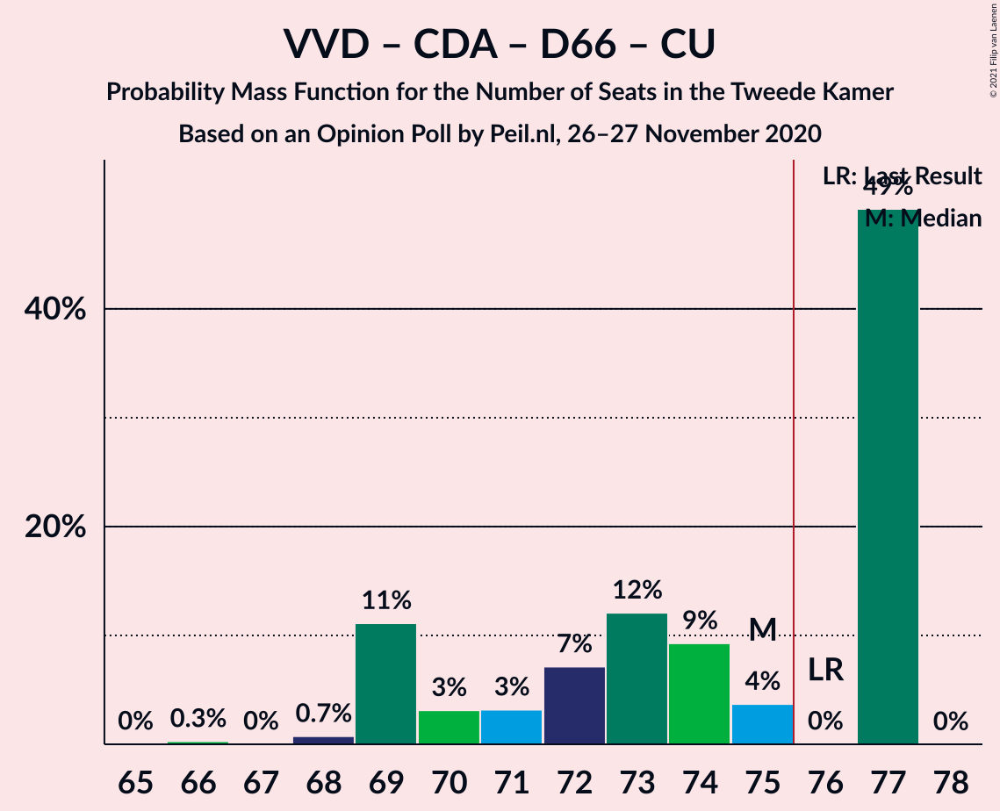

| Number of Seats | Probability | Accumulated | Special Marks |
|:---------------:|:-----------:|:-----------:|:-------------:|
| 66 | 0.3% | 100% |  |
| 67 | 0% | 99.7% |  |
| 68 | 0.7% | 99.6% |  |
| 69 | 11% | 98.9% |  |
| 70 | 3% | 88% |  |
| 71 | 3% | 85% |  |
| 72 | 7% | 81% |  |
| 73 | 12% | 74% |  |
| 74 | 9% | 62% |  |
| 75 | 4% | 53% |  |
| 76 | 0% | 49% | Last Result, Majority |
| 77 | 49% | 49% | Median |
| 78 | 0% | 0% |  |

### Christen-Democratisch Appèl – Democraten 66 – Partij van de Arbeid – GroenLinks – Socialistische Partij – ChristenUnie

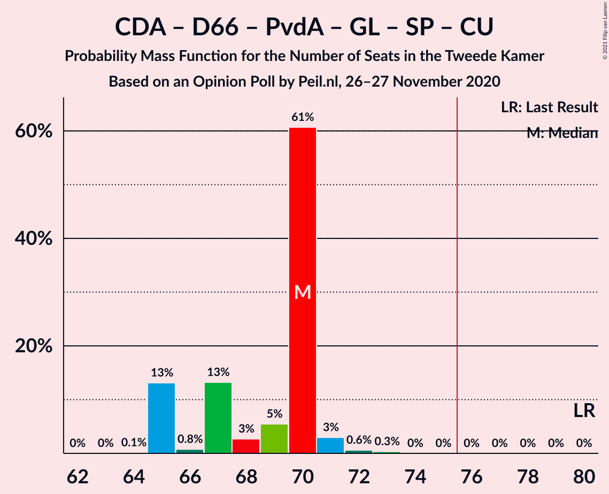

| Number of Seats | Probability | Accumulated | Special Marks |
|:---------------:|:-----------:|:-----------:|:-------------:|
| 64 | 0.1% | 100% |  |
| 65 | 13% | 99.9% |  |
| 66 | 0.8% | 87% |  |
| 67 | 13% | 86% |  |
| 68 | 3% | 73% |  |
| 69 | 5% | 70% |  |
| 70 | 61% | 65% | Median |
| 71 | 3% | 4% |  |
| 72 | 0.6% | 1.0% |  |
| 73 | 0.3% | 0.3% |  |
| 74 | 0% | 0% |  |
| 75 | 0% | 0% |  |
| 76 | 0% | 0% | Majority |
| 77 | 0% | 0% |  |
| 78 | 0% | 0% |  |
| 79 | 0% | 0% |  |
| 80 | 0% | 0% | Last Result |

### Volkspartij voor Vrijheid en Democratie – Christen-Democratisch Appèl – Partij van de Arbeid

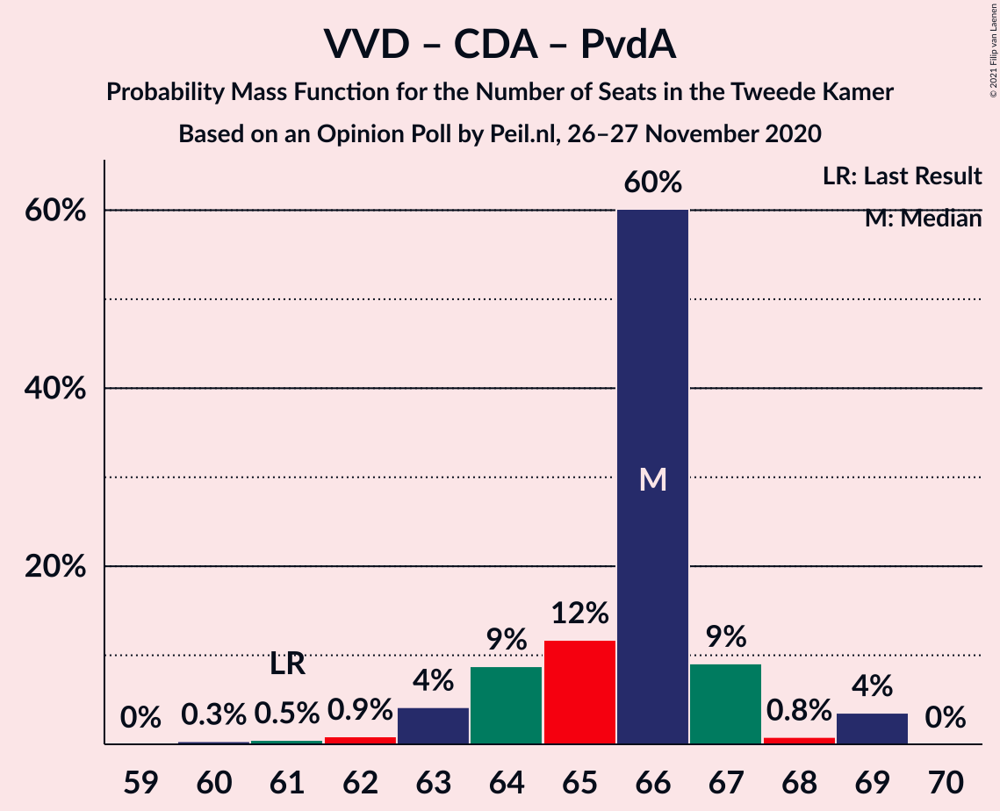

| Number of Seats | Probability | Accumulated | Special Marks |
|:---------------:|:-----------:|:-----------:|:-------------:|
| 60 | 0.3% | 100% |  |
| 61 | 0.5% | 99.6% | Last Result |
| 62 | 0.9% | 99.2% |  |
| 63 | 4% | 98% |  |
| 64 | 9% | 94% |  |
| 65 | 12% | 85% |  |
| 66 | 60% | 74% | Median |
| 67 | 9% | 13% |  |
| 68 | 0.8% | 4% |  |
| 69 | 4% | 4% |  |
| 70 | 0% | 0% |  |

### Volkspartij voor Vrijheid en Democratie – Christen-Democratisch Appèl – Democraten 66

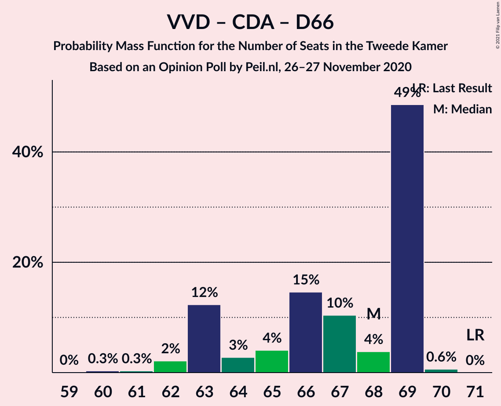

| Number of Seats | Probability | Accumulated | Special Marks |
|:---------------:|:-----------:|:-----------:|:-------------:|
| 59 | 0% | 100% |  |
| 60 | 0.3% | 99.9% |  |
| 61 | 0.3% | 99.6% |  |
| 62 | 2% | 99.3% |  |
| 63 | 12% | 97% |  |
| 64 | 3% | 85% |  |
| 65 | 4% | 82% |  |
| 66 | 15% | 78% |  |
| 67 | 10% | 63% |  |
| 68 | 4% | 53% |  |
| 69 | 49% | 49% | Median |
| 70 | 0.6% | 0.6% |  |
| 71 | 0% | 0% | Last Result |

### Volkspartij voor Vrijheid en Democratie – Democraten 66 – Partij van de Arbeid

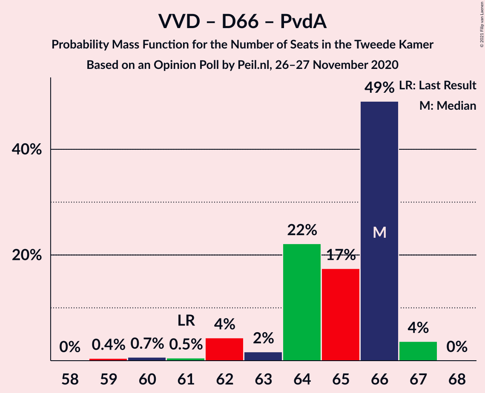

| Number of Seats | Probability | Accumulated | Special Marks |
|:---------------:|:-----------:|:-----------:|:-------------:|
| 59 | 0.4% | 100% |  |
| 60 | 0.7% | 99.5% |  |
| 61 | 0.5% | 98.9% | Last Result |
| 62 | 4% | 98% |  |
| 63 | 2% | 94% |  |
| 64 | 22% | 92% |  |
| 65 | 17% | 70% |  |
| 66 | 49% | 53% | Median |
| 67 | 4% | 4% |  |
| 68 | 0% | 0% |  |

### Volkspartij voor Vrijheid en Democratie – Christen-Democratisch Appèl – Forum voor Democratie – Staatkundig Gereformeerde Partij – 50Plus

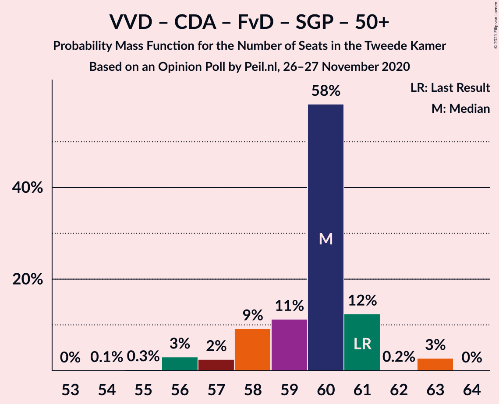

| Number of Seats | Probability | Accumulated | Special Marks |
|:---------------:|:-----------:|:-----------:|:-------------:|
| 54 | 0.1% | 100% |  |
| 55 | 0.3% | 99.9% |  |
| 56 | 3% | 99.6% |  |
| 57 | 2% | 97% |  |
| 58 | 9% | 94% |  |
| 59 | 11% | 85% |  |
| 60 | 58% | 74% | Median |
| 61 | 12% | 15% | Last Result |
| 62 | 0.2% | 3% |  |
| 63 | 3% | 3% |  |
| 64 | 0% | 0% |  |

### Volkspartij voor Vrijheid en Democratie – Christen-Democratisch Appèl – Forum voor Democratie – 50Plus

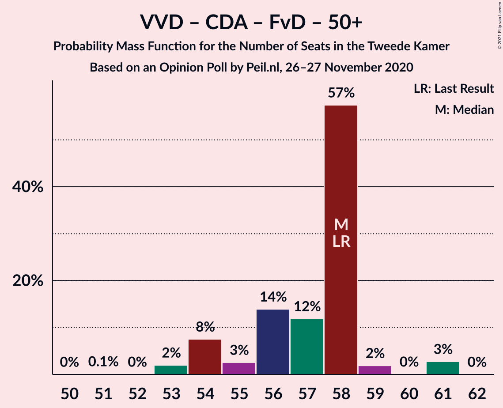

| Number of Seats | Probability | Accumulated | Special Marks |
|:---------------:|:-----------:|:-----------:|:-------------:|
| 51 | 0.1% | 100% |  |
| 52 | 0% | 99.9% |  |
| 53 | 2% | 99.9% |  |
| 54 | 8% | 98% |  |
| 55 | 3% | 90% |  |
| 56 | 14% | 88% |  |
| 57 | 12% | 74% |  |
| 58 | 57% | 62% | Last Result, Median |
| 59 | 2% | 5% |  |
| 60 | 0% | 3% |  |
| 61 | 3% | 3% |  |
| 62 | 0% | 0% |  |

### Christen-Democratisch Appèl – Democraten 66 – Partij van de Arbeid – GroenLinks – ChristenUnie

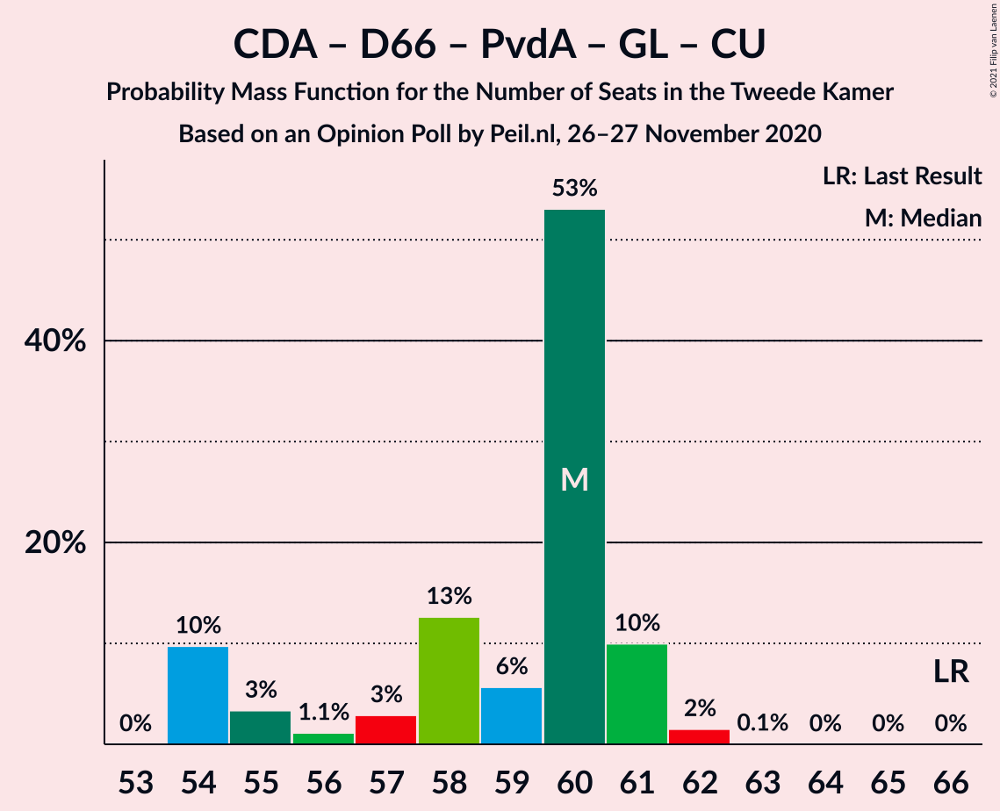

| Number of Seats | Probability | Accumulated | Special Marks |
|:---------------:|:-----------:|:-----------:|:-------------:|
| 54 | 10% | 100% |  |
| 55 | 3% | 90% |  |
| 56 | 1.1% | 87% |  |
| 57 | 3% | 86% |  |
| 58 | 13% | 83% |  |
| 59 | 6% | 70% |  |
| 60 | 53% | 65% | Median |
| 61 | 10% | 12% |  |
| 62 | 2% | 2% |  |
| 63 | 0.1% | 0.1% |  |
| 64 | 0% | 0% |  |
| 65 | 0% | 0% |  |
| 66 | 0% | 0% | Last Result |

### Volkspartij voor Vrijheid en Democratie – Christen-Democratisch Appèl – Forum voor Democratie – Staatkundig Gereformeerde Partij

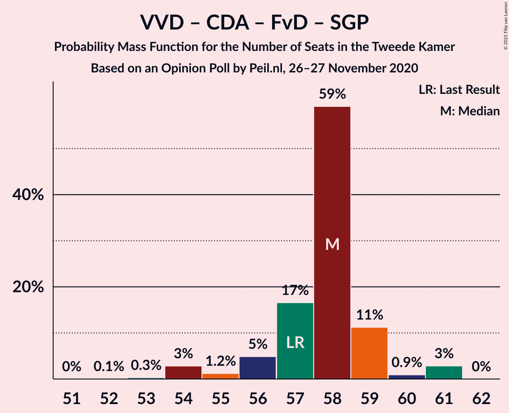

| Number of Seats | Probability | Accumulated | Special Marks |
|:---------------:|:-----------:|:-----------:|:-------------:|
| 52 | 0.1% | 100% |  |
| 53 | 0.3% | 99.9% |  |
| 54 | 3% | 99.6% |  |
| 55 | 1.2% | 97% |  |
| 56 | 5% | 96% |  |
| 57 | 17% | 91% | Last Result |
| 58 | 59% | 74% | Median |
| 59 | 11% | 15% |  |
| 60 | 0.9% | 4% |  |
| 61 | 3% | 3% |  |
| 62 | 0% | 0% |  |

### Volkspartij voor Vrijheid en Democratie – Christen-Democratisch Appèl – Forum voor Democratie

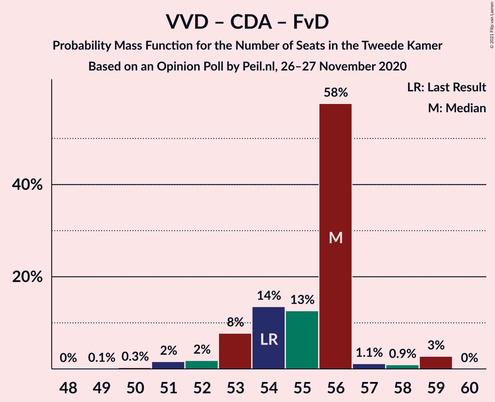

| Number of Seats | Probability | Accumulated | Special Marks |
|:---------------:|:-----------:|:-----------:|:-------------:|
| 49 | 0.1% | 100% |  |
| 50 | 0.3% | 99.9% |  |
| 51 | 2% | 99.6% |  |
| 52 | 2% | 98% |  |
| 53 | 8% | 96% |  |
| 54 | 14% | 88% | Last Result |
| 55 | 13% | 75% |  |
| 56 | 58% | 62% | Median |
| 57 | 1.1% | 5% |  |
| 58 | 0.9% | 4% |  |
| 59 | 3% | 3% |  |
| 60 | 0% | 0% |  |

### Volkspartij voor Vrijheid en Democratie – Christen-Democratisch Appèl

| Number of Seats | Probability | Accumulated | Special Marks |
|:---------------:|:-----------:|:-----------:|:-------------:|
| 46 | 0.1% | 100% |  |
| 47 | 0.3% | 99.9% |  |
| 48 | 0.4% | 99.7% |  |
| 49 | 2% | 99.3% |  |
| 50 | 5% | 97% |  |
| 51 | 17% | 93% |  |
| 52 | 3% | 75% | Last Result |
| 53 | 19% | 72% |  |
| 54 | 49% | 53% | Median |
| 55 | 0.8% | 4% |  |
| 56 | 4% | 4% |  |
| 57 | 0% | 0% |  |

### Volkspartij voor Vrijheid en Democratie – Partij van de Arbeid

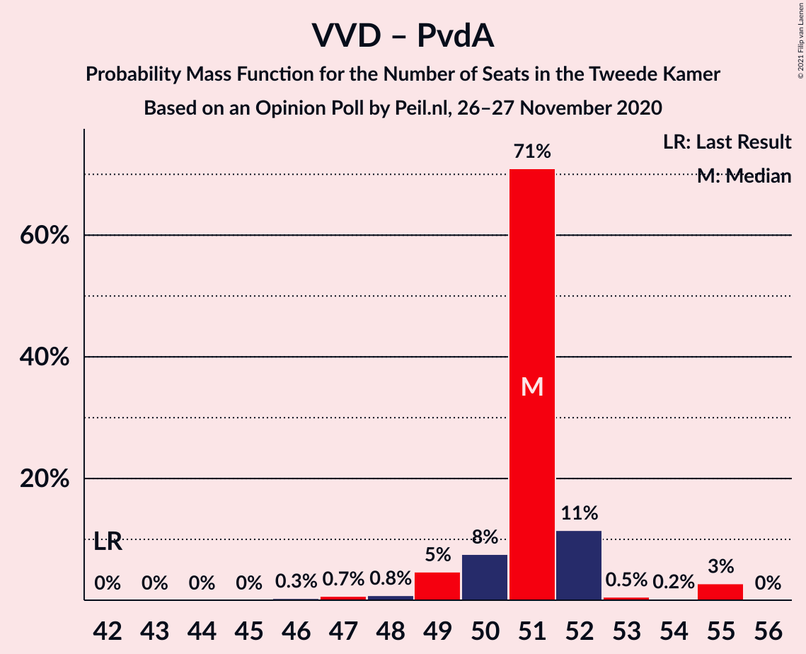

| Number of Seats | Probability | Accumulated | Special Marks |
|:---------------:|:-----------:|:-----------:|:-------------:|
| 42 | 0% | 100% | Last Result |
| 43 | 0% | 100% |  |
| 44 | 0% | 100% |  |
| 45 | 0% | 100% |  |
| 46 | 0.3% | 100% |  |
| 47 | 0.7% | 99.7% |  |
| 48 | 0.8% | 99.0% |  |
| 49 | 5% | 98% |  |
| 50 | 8% | 94% |  |
| 51 | 71% | 86% | Median |
| 52 | 11% | 15% |  |
| 53 | 0.5% | 3% |  |
| 54 | 0.2% | 3% |  |
| 55 | 3% | 3% |  |
| 56 | 0% | 0% |  |

### Christen-Democratisch Appèl – Democraten 66 – Partij van de Arbeid

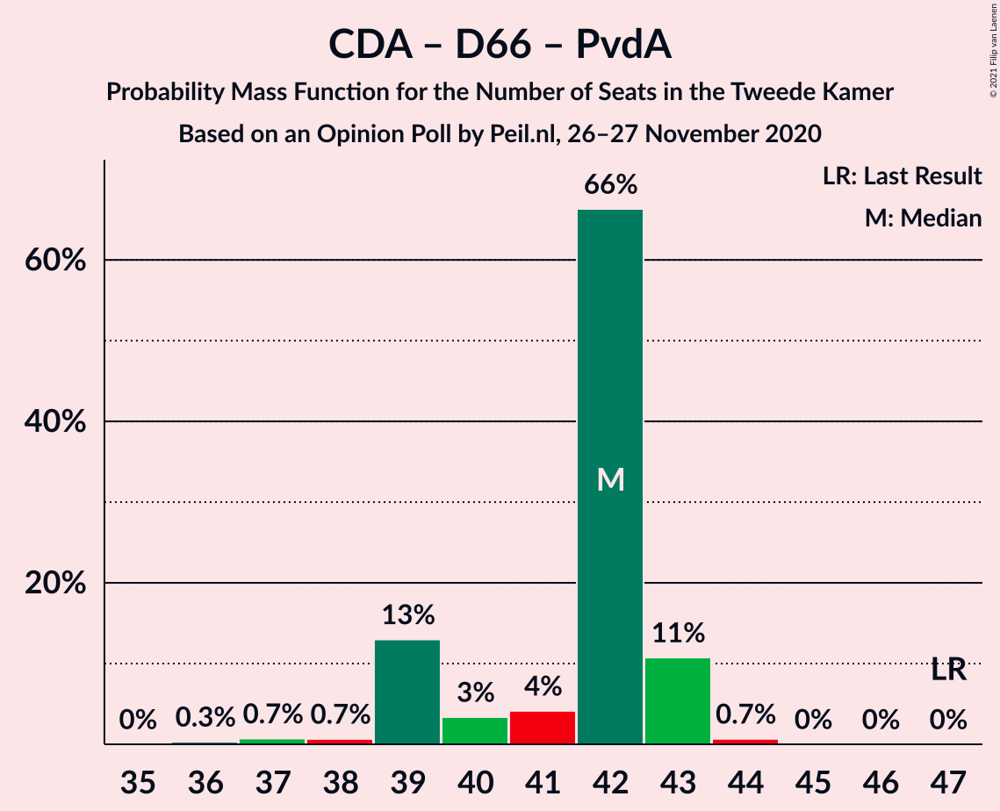

| Number of Seats | Probability | Accumulated | Special Marks |
|:---------------:|:-----------:|:-----------:|:-------------:|
| 36 | 0.3% | 100% |  |
| 37 | 0.7% | 99.7% |  |
| 38 | 0.7% | 99.0% |  |
| 39 | 13% | 98% |  |
| 40 | 3% | 85% |  |
| 41 | 4% | 82% |  |
| 42 | 66% | 78% | Median |
| 43 | 11% | 11% |  |
| 44 | 0.7% | 0.7% |  |
| 45 | 0% | 0% |  |
| 46 | 0% | 0% |  |
| 47 | 0% | 0% | Last Result |

### Christen-Democratisch Appèl – Partij van de Arbeid – ChristenUnie

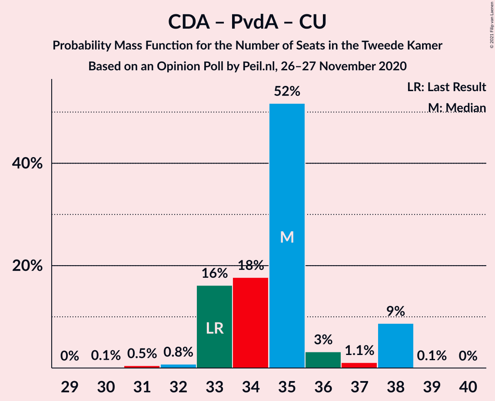

| Number of Seats | Probability | Accumulated | Special Marks |
|:---------------:|:-----------:|:-----------:|:-------------:|
| 30 | 0.1% | 100% |  |
| 31 | 0.5% | 99.9% |  |
| 32 | 0.8% | 99.4% |  |
| 33 | 16% | 98.6% | Last Result |
| 34 | 18% | 82% |  |
| 35 | 52% | 65% | Median |
| 36 | 3% | 13% |  |
| 37 | 1.1% | 10% |  |
| 38 | 9% | 9% |  |
| 39 | 0.1% | 0.1% |  |
| 40 | 0% | 0% |  |

### Christen-Democratisch Appèl – Partij van de Arbeid

| Number of Seats | Probability | Accumulated | Special Marks |
|:---------------:|:-----------:|:-----------:|:-------------:|
| 24 | 0.7% | 100% |  |
| 25 | 0.5% | 99.3% |  |
| 26 | 2% | 98.9% |  |
| 27 | 70% | 97% | Median |
| 28 | 15% | 27% | Last Result |
| 29 | 2% | 12% |  |
| 30 | 10% | 10% |  |
| 31 | 0.1% | 0.1% |  |
| 32 | 0% | 0% |  |

### Christen-Democratisch Appèl – Democraten 66

| Number of Seats | Probability | Accumulated | Special Marks |
|:---------------:|:-----------:|:-----------:|:-------------:|
| 23 | 0.1% | 100% |  |
| 24 | 0.4% | 99.9% |  |
| 25 | 10% | 99.5% |  |
| 26 | 4% | 89% |  |
| 27 | 6% | 85% |  |
| 28 | 3% | 80% |  |
| 29 | 27% | 76% |  |
| 30 | 49% | 50% | Median |
| 31 | 1.0% | 1.0% |  |
| 32 | 0% | 0% |  |
| 33 | 0% | 0% |  |
| 34 | 0% | 0% |  |
| 35 | 0% | 0% |  |
| 36 | 0% | 0% |  |
| 37 | 0% | 0% |  |
| 38 | 0% | 0% | Last Result |

## Technical Information

### Opinion Poll

+ **Polling firm:** Peil.nl
+ **Commissioner(s):** —
+ **Fieldwork period:** 26–27 November 2020

### Calculations

+ **Sample size:** 3000
+ **Simulations done:** 1,048,576
+ **Error estimate:** 0.84%

