# Opinion Poll by I&O Research, 11–14 December 2020

<a href="#voting-intentions">Voting Intentions</a> | <a href="#seats">Seats</a> | <a href="#coalitions">Coalitions</a> | <a href="#technical-information">Technical Information</a>

## Voting Intentions

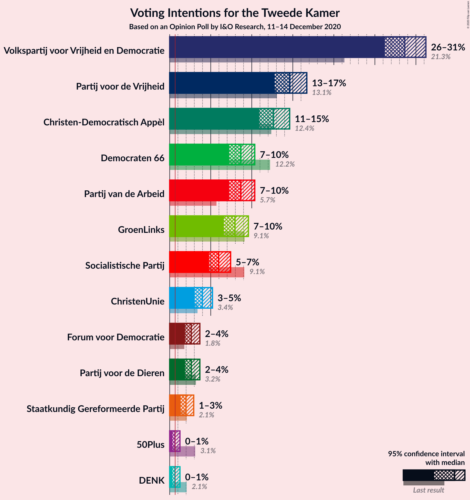

### Confidence Intervals

| Party | Last Result | Poll Result | 80% Confidence Interval | 90% Confidence Interval | 95% Confidence Interval | 99% Confidence Interval |
|:-----:|:-----------:|:-----------:|:-----------------------:|:-----------------------:|:-----------------------:|:-----------------------:|
| Volkspartij voor Vrijheid en Democratie | 21.3% | 28.6% | 27.0–30.3% |26.6–30.8% |26.2–31.2% |25.5–32.0% |
| Partij voor de Vrijheid | 13.1% | 14.6% | 13.4–16.0% |13.1–16.4% |12.8–16.7% |12.2–17.4% |
| Christen-Democratisch Appèl | 12.4% | 12.6% | 11.5–13.9% |11.2–14.3% |10.9–14.6% |10.4–15.2% |
| Democraten 66 | 12.2% | 8.7% | 7.7–9.8% |7.5–10.1% |7.2–10.4% |6.8–10.9% |
| Partij van de Arbeid | 5.7% | 8.7% | 7.7–9.8% |7.5–10.1% |7.2–10.4% |6.8–10.9% |
| GroenLinks | 9.1% | 8.0% | 7.0–9.0% |6.8–9.3% |6.6–9.6% |6.2–10.1% |
| Socialistische Partij | 9.1% | 6.0% | 5.2–6.9% |5.0–7.2% |4.8–7.4% |4.4–7.9% |
| ChristenUnie | 3.4% | 4.0% | 3.4–4.8% |3.2–5.0% |3.0–5.2% |2.7–5.6% |
| Partij voor de Dieren | 3.2% | 2.6% | 2.1–3.3% |2.0–3.5% |1.9–3.7% |1.7–4.0% |
| Forum voor Democratie | 1.8% | 2.6% | 2.1–3.3% |2.0–3.5% |1.9–3.7% |1.7–4.0% |
| Staatkundig Gereformeerde Partij | 2.1% | 2.0% | 1.6–2.6% |1.4–2.8% |1.3–2.9% |1.2–3.2% |
| 50Plus | 3.1% | 0.6% | 0.4–1.0% |0.4–1.2% |0.3–1.2% |0.2–1.5% |
| DENK | 2.1% | 0.6% | 0.4–1.0% |0.4–1.2% |0.3–1.2% |0.2–1.5% |

*Note:* The poll result column reflects the actual value used in the calculations. Published results may vary slightly, and in addition be rounded to fewer digits.

## Seats

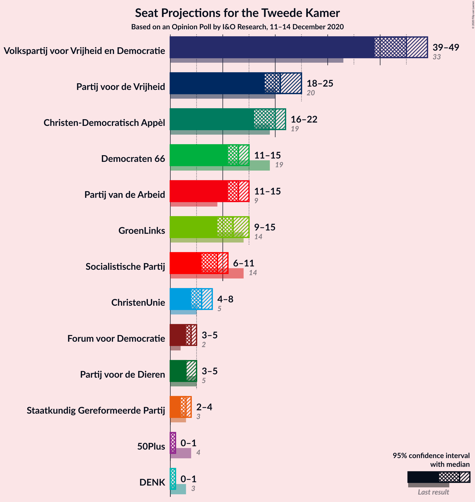

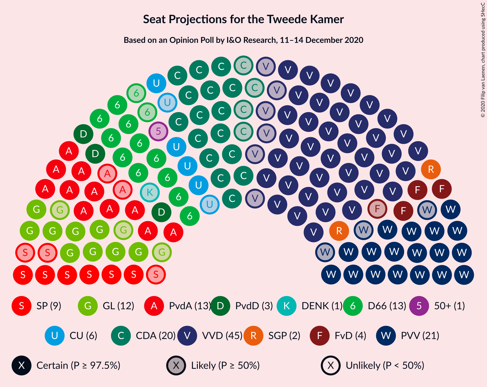

### Confidence Intervals

| Party | Last Result | Median | 80% Confidence Interval | 90% Confidence Interval | 95% Confidence Interval | 99% Confidence Interval |
|:-----:|:-----------:|:------:|:-----------------------:|:-----------------------:|:-----------------------:|:-----------------------:|
| <a href="#volkspartij-voor-vrijheid-en-democratie">Volkspartij voor Vrijheid en Democratie</a> | 33 | 45 | 40–47 |39–47 |39–49 |39–49 |
| <a href="#partij-voor-de-vrijheid">Partij voor de Vrijheid</a> | 20 | 21 | 19–23 |18–24 |18–25 |18–26 |
| <a href="#christen-democratisch-appèl">Christen-Democratisch Appèl</a> | 19 | 20 | 18–22 |17–22 |16–22 |15–23 |
| <a href="#democraten-66">Democraten 66</a> | 19 | 13 | 11–14 |11–15 |11–15 |10–15 |
| <a href="#partij-van-de-arbeid">Partij van de Arbeid</a> | 9 | 13 | 12–14 |11–15 |11–15 |10–16 |
| <a href="#groenlinks">GroenLinks</a> | 14 | 12 | 10–14 |10–14 |9–15 |8–15 |
| <a href="#socialistische-partij">Socialistische Partij</a> | 14 | 9 | 7–11 |6–11 |6–11 |6–12 |
| <a href="#christenunie">ChristenUnie</a> | 5 | 6 | 4–7 |4–8 |4–8 |4–8 |
| <a href="#partij-voor-de-dieren">Partij voor de Dieren</a> | 5 | 3 | 3–5 |3–5 |3–5 |2–6 |
| <a href="#forum-voor-democratie">Forum voor Democratie</a> | 2 | 4 | 3–5 |3–5 |3–5 |2–5 |
| <a href="#staatkundig-gereformeerde-partij">Staatkundig Gereformeerde Partij</a> | 3 | 3 | 2–3 |2–3 |2–4 |2–4 |
| <a href="#50plus">50Plus</a> | 4 | 1 | 0–1 |0–1 |0–1 |0–1 |
| <a href="#denk">DENK</a> | 3 | 1 | 0–1 |0–1 |0–1 |0–2 |

### Volkspartij voor Vrijheid en Democratie

*For a full overview of the results for this party, see the [Volkspartij voor Vrijheid en Democratie](party-volkspartijvoorvrijheidendemocratie.html) page.*

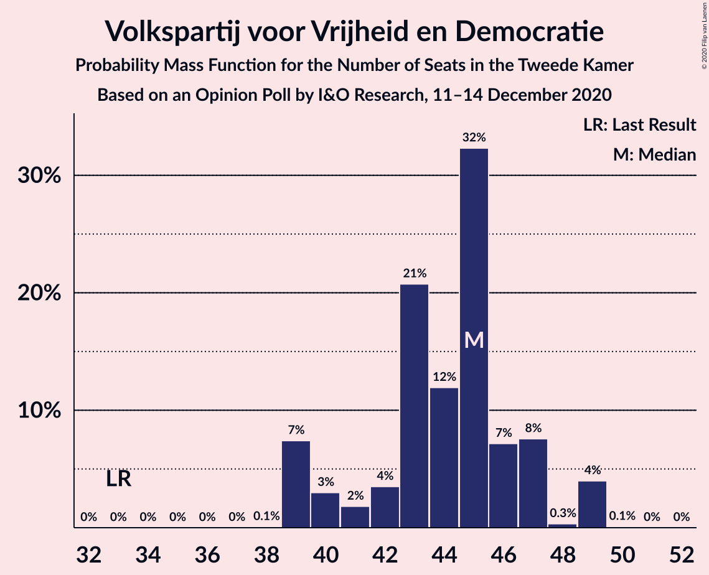

| Number of Seats | Probability | Accumulated | Special Marks |
|:---------------:|:-----------:|:-----------:|:-------------:|
| 33 | 0% | 100% | Last Result |
| 34 | 0% | 100% |  |
| 35 | 0% | 100% |  |
| 36 | 0% | 100% |  |
| 37 | 0% | 100% |  |
| 38 | 0.1% | 100% |  |
| 39 | 7% | 99.9% |  |
| 40 | 3% | 92% |  |
| 41 | 2% | 90% |  |
| 42 | 4% | 88% |  |
| 43 | 21% | 84% |  |
| 44 | 12% | 63% |  |
| 45 | 32% | 51% | Median |
| 46 | 7% | 19% |  |
| 47 | 8% | 12% |  |
| 48 | 0.3% | 4% |  |
| 49 | 4% | 4% |  |
| 50 | 0.1% | 0.1% |  |
| 51 | 0% | 0% |  |

### Partij voor de Vrijheid

*For a full overview of the results for this party, see the [Partij voor de Vrijheid](party-partijvoordevrijheid.html) page.*

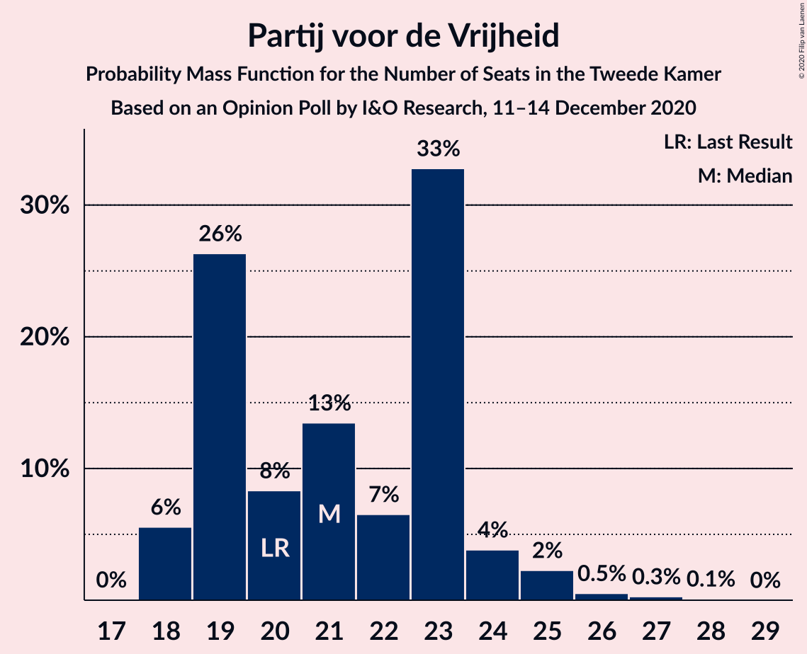

| Number of Seats | Probability | Accumulated | Special Marks |
|:---------------:|:-----------:|:-----------:|:-------------:|
| 18 | 6% | 100% |  |
| 19 | 26% | 94% |  |
| 20 | 8% | 68% | Last Result |
| 21 | 13% | 60% | Median |
| 22 | 7% | 46% |  |
| 23 | 33% | 40% |  |
| 24 | 4% | 7% |  |
| 25 | 2% | 3% |  |
| 26 | 0.5% | 0.9% |  |
| 27 | 0.3% | 0.4% |  |
| 28 | 0.1% | 0.1% |  |
| 29 | 0% | 0% |  |

### Christen-Democratisch Appèl

*For a full overview of the results for this party, see the [Christen-Democratisch Appèl](party-christen-democratischappèl.html) page.*

| Number of Seats | Probability | Accumulated | Special Marks |
|:---------------:|:-----------:|:-----------:|:-------------:|
| 15 | 2% | 100% |  |
| 16 | 1.5% | 98% |  |
| 17 | 3% | 96% |  |
| 18 | 8% | 94% |  |
| 19 | 27% | 86% | Last Result |
| 20 | 36% | 59% | Median |
| 21 | 7% | 23% |  |
| 22 | 15% | 16% |  |
| 23 | 1.0% | 1.5% |  |
| 24 | 0.4% | 0.5% |  |
| 25 | 0.1% | 0.1% |  |
| 26 | 0% | 0% |  |

### Democraten 66

*For a full overview of the results for this party, see the [Democraten 66](party-democraten66.html) page.*

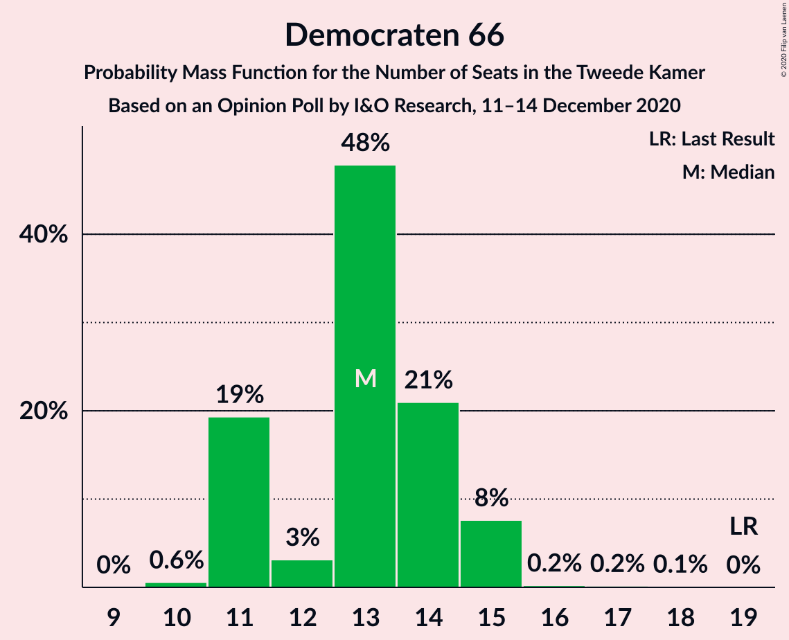

| Number of Seats | Probability | Accumulated | Special Marks |
|:---------------:|:-----------:|:-----------:|:-------------:|
| 10 | 0.6% | 100% |  |
| 11 | 19% | 99.4% |  |
| 12 | 3% | 80% |  |
| 13 | 48% | 77% | Median |
| 14 | 21% | 29% |  |
| 15 | 8% | 8% |  |
| 16 | 0.2% | 0.5% |  |
| 17 | 0.2% | 0.3% |  |
| 18 | 0.1% | 0.1% |  |
| 19 | 0% | 0% | Last Result |

### Partij van de Arbeid

*For a full overview of the results for this party, see the [Partij van de Arbeid](party-partijvandearbeid.html) page.*

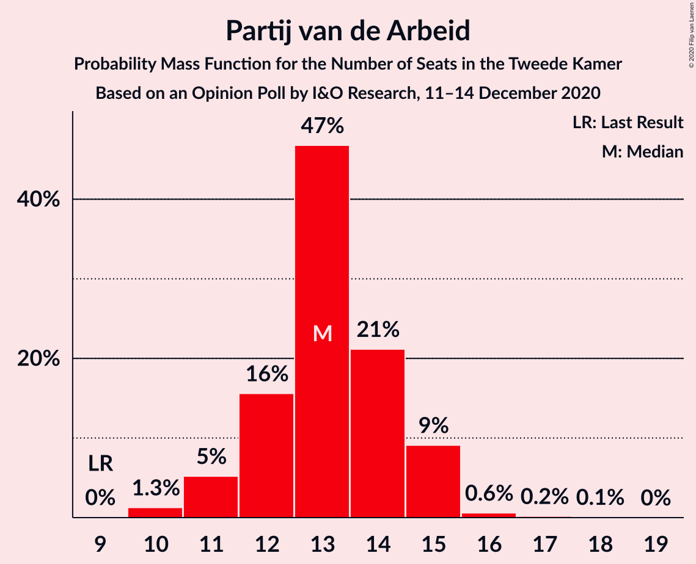

| Number of Seats | Probability | Accumulated | Special Marks |
|:---------------:|:-----------:|:-----------:|:-------------:|
| 9 | 0% | 100% | Last Result |
| 10 | 1.3% | 100% |  |
| 11 | 5% | 98.7% |  |
| 12 | 16% | 93% |  |
| 13 | 47% | 78% | Median |
| 14 | 21% | 31% |  |
| 15 | 9% | 10% |  |
| 16 | 0.6% | 0.8% |  |
| 17 | 0.2% | 0.2% |  |
| 18 | 0.1% | 0.1% |  |
| 19 | 0% | 0% |  |

### GroenLinks

*For a full overview of the results for this party, see the [GroenLinks](party-groenlinks.html) page.*

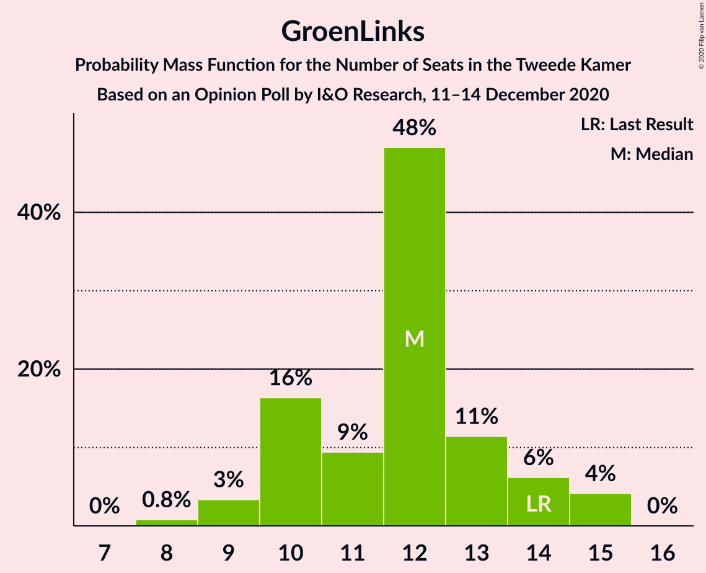

| Number of Seats | Probability | Accumulated | Special Marks |
|:---------------:|:-----------:|:-----------:|:-------------:|
| 8 | 0.8% | 100% |  |
| 9 | 3% | 99.2% |  |
| 10 | 16% | 96% |  |
| 11 | 9% | 79% |  |
| 12 | 48% | 70% | Median |
| 13 | 11% | 22% |  |
| 14 | 6% | 10% | Last Result |
| 15 | 4% | 4% |  |
| 16 | 0% | 0% |  |

### Socialistische Partij

*For a full overview of the results for this party, see the [Socialistische Partij](party-socialistischepartij.html) page.*

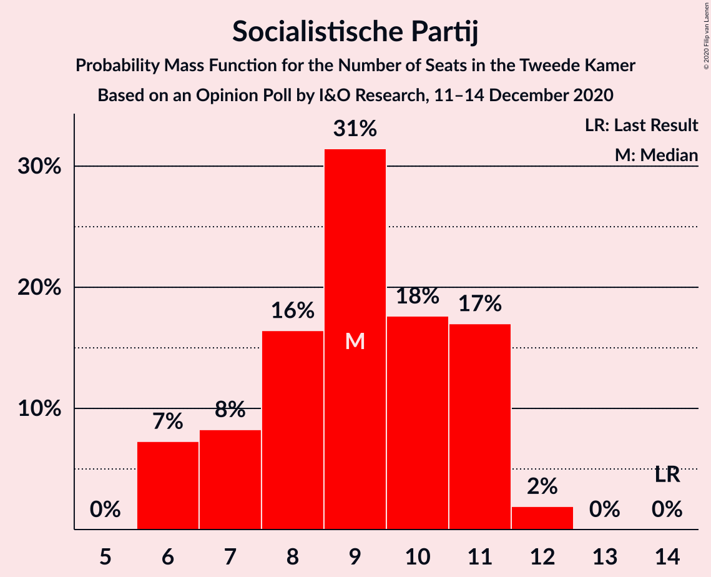

| Number of Seats | Probability | Accumulated | Special Marks |
|:---------------:|:-----------:|:-----------:|:-------------:|
| 6 | 7% | 100% |  |
| 7 | 8% | 93% |  |
| 8 | 16% | 84% |  |
| 9 | 31% | 68% | Median |
| 10 | 18% | 37% |  |
| 11 | 17% | 19% |  |
| 12 | 2% | 2% |  |
| 13 | 0% | 0% |  |
| 14 | 0% | 0% | Last Result |

### ChristenUnie

*For a full overview of the results for this party, see the [ChristenUnie](party-christenunie.html) page.*

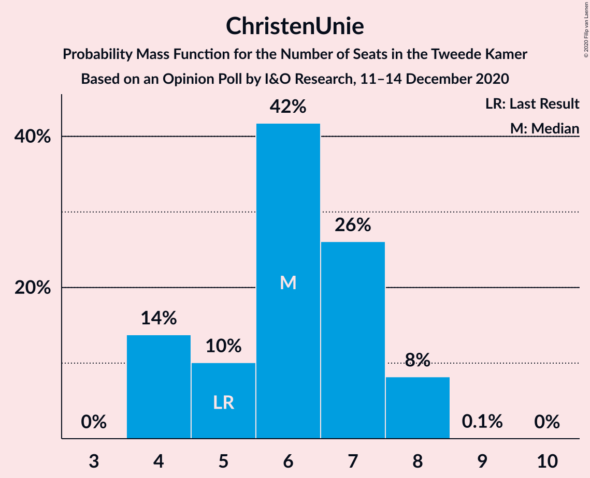

| Number of Seats | Probability | Accumulated | Special Marks |
|:---------------:|:-----------:|:-----------:|:-------------:|
| 4 | 14% | 100% |  |
| 5 | 10% | 86% | Last Result |
| 6 | 42% | 76% | Median |
| 7 | 26% | 34% |  |
| 8 | 8% | 8% |  |
| 9 | 0.1% | 0.1% |  |
| 10 | 0% | 0% |  |

### Partij voor de Dieren

*For a full overview of the results for this party, see the [Partij voor de Dieren](party-partijvoordedieren.html) page.*

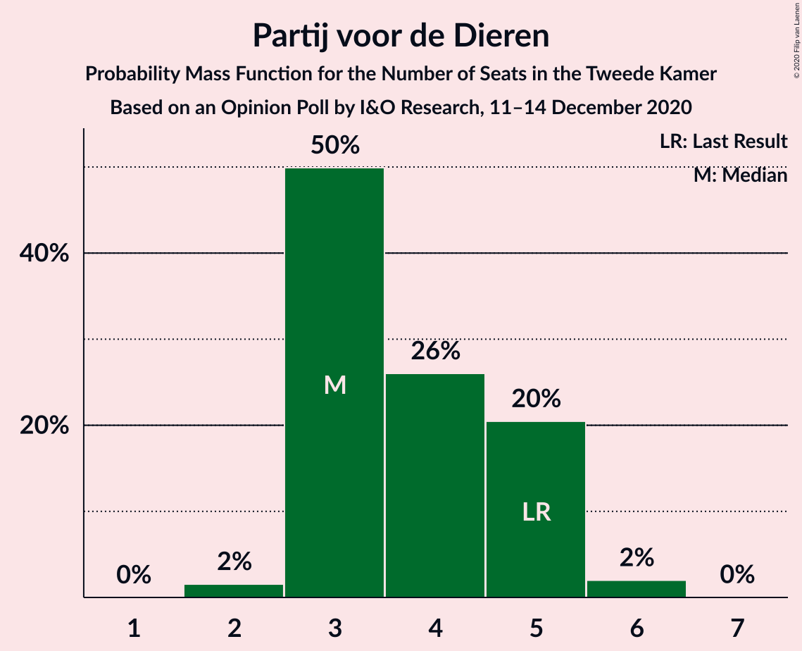

| Number of Seats | Probability | Accumulated | Special Marks |
|:---------------:|:-----------:|:-----------:|:-------------:|
| 2 | 2% | 100% |  |
| 3 | 50% | 98% | Median |
| 4 | 26% | 49% |  |
| 5 | 20% | 23% | Last Result |
| 6 | 2% | 2% |  |
| 7 | 0% | 0% |  |

### Forum voor Democratie

*For a full overview of the results for this party, see the [Forum voor Democratie](party-forumvoordemocratie.html) page.*

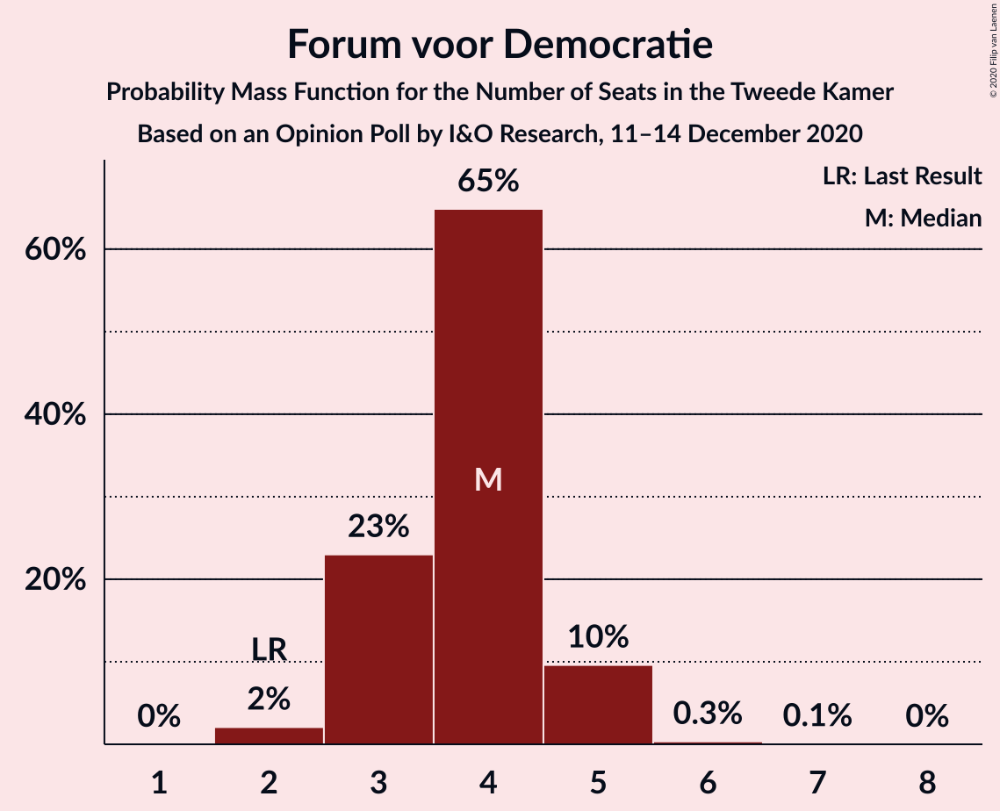

| Number of Seats | Probability | Accumulated | Special Marks |
|:---------------:|:-----------:|:-----------:|:-------------:|
| 2 | 2% | 100% | Last Result |
| 3 | 23% | 98% |  |
| 4 | 65% | 75% | Median |
| 5 | 10% | 10% |  |
| 6 | 0.3% | 0.4% |  |
| 7 | 0.1% | 0.1% |  |
| 8 | 0% | 0% |  |

### Staatkundig Gereformeerde Partij

*For a full overview of the results for this party, see the [Staatkundig Gereformeerde Partij](party-staatkundiggereformeerdepartij.html) page.*

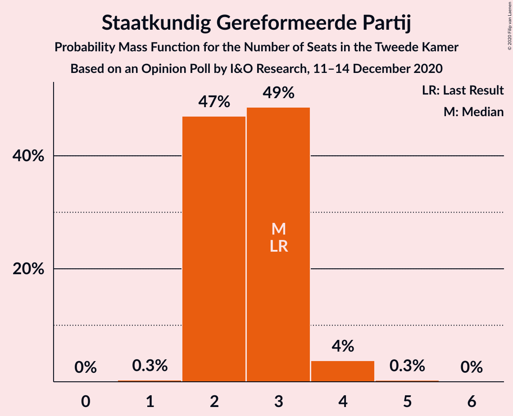

| Number of Seats | Probability | Accumulated | Special Marks |
|:---------------:|:-----------:|:-----------:|:-------------:|
| 1 | 0.3% | 100% |  |
| 2 | 47% | 99.7% |  |
| 3 | 49% | 53% | Last Result, Median |
| 4 | 4% | 4% |  |
| 5 | 0.3% | 0.3% |  |
| 6 | 0% | 0% |  |

### 50Plus

*For a full overview of the results for this party, see the [50Plus](party-50plus.html) page.*

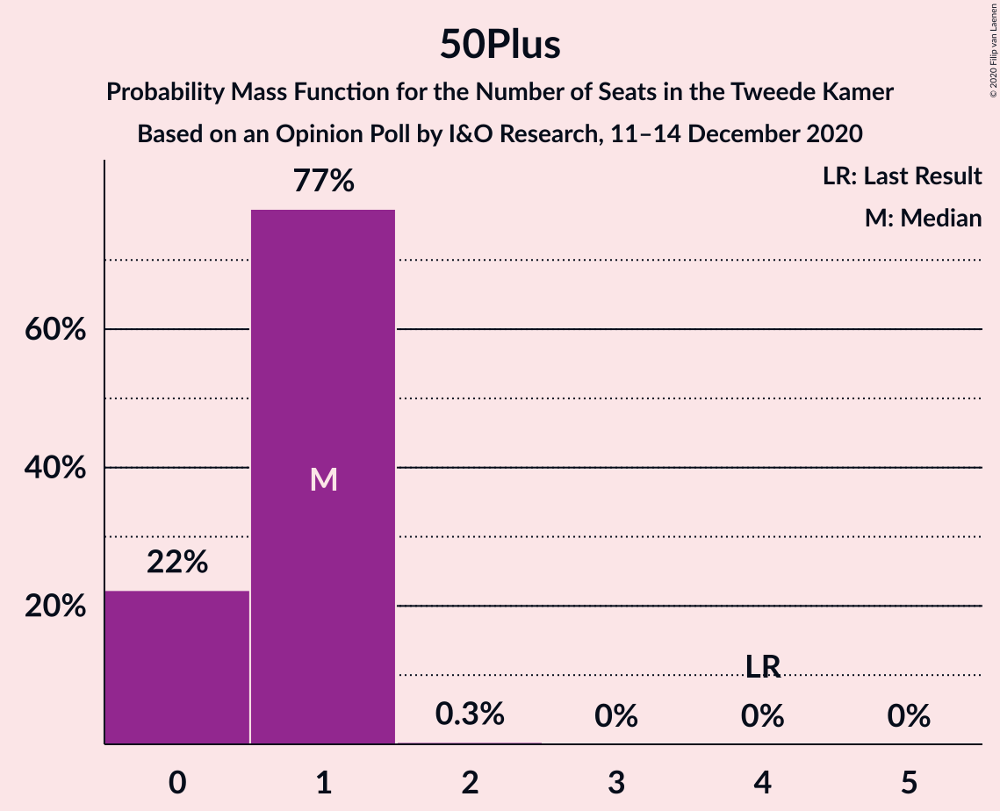

| Number of Seats | Probability | Accumulated | Special Marks |
|:---------------:|:-----------:|:-----------:|:-------------:|
| 0 | 22% | 100% |  |
| 1 | 77% | 78% | Median |
| 2 | 0.3% | 0.3% |  |
| 3 | 0% | 0% |  |
| 4 | 0% | 0% | Last Result |

### DENK

*For a full overview of the results for this party, see the [DENK](party-denk.html) page.*

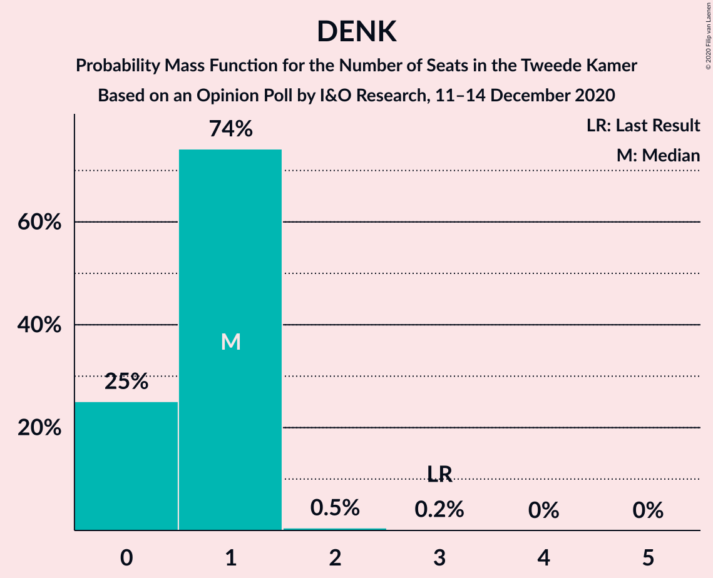

| Number of Seats | Probability | Accumulated | Special Marks |
|:---------------:|:-----------:|:-----------:|:-------------:|
| 0 | 25% | 100% |  |
| 1 | 74% | 75% | Median |
| 2 | 0.5% | 0.7% |  |
| 3 | 0.2% | 0.2% | Last Result |
| 4 | 0% | 0% |  |

## Coalitions

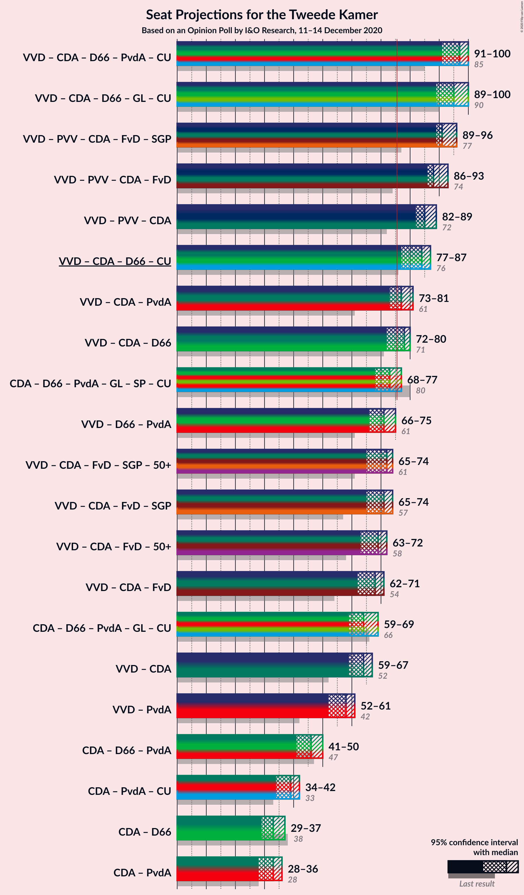

### Confidence Intervals

| Coalition | Last Result | Median | Majority? | 80% Confidence Interval | 90% Confidence Interval | 95% Confidence Interval | 99% Confidence Interval |
|:---------:|:-----------:|:------:|:---------:|:-----------------------:|:-----------------------:|:-----------------------:|:-----------------------:|
| Volkspartij voor Vrijheid en Democratie – Christen-Democratisch Appèl – Democraten 66 – Partij van de Arbeid – ChristenUnie | 85 | 97 | 100% | 91–99 | 91–99 | 91–100 | 89–101 |
| Volkspartij voor Vrijheid en Democratie – Christen-Democratisch Appèl – Democraten 66 – GroenLinks – ChristenUnie | 90 | 95 | 100% | 89–100 | 89–100 | 89–100 | 88–100 |
| Volkspartij voor Vrijheid en Democratie – Partij voor de Vrijheid – Christen-Democratisch Appèl – Forum voor Democratie – Staatkundig Gereformeerde Partij | 77 | 91 | 100% | 90–94 | 89–95 | 89–96 | 87–97 |
| Volkspartij voor Vrijheid en Democratie – Partij voor de Vrijheid – Christen-Democratisch Appèl – Forum voor Democratie | 74 | 88 | 100% | 88–91 | 87–92 | 86–93 | 84–95 |
| Volkspartij voor Vrijheid en Democratie – Partij voor de Vrijheid – Christen-Democratisch Appèl | 72 | 85 | 100% | 84–87 | 84–88 | 82–89 | 81–91 |
| Volkspartij voor Vrijheid en Democratie – Christen-Democratisch Appèl – Democraten 66 – ChristenUnie | 76 | 84 | 99.9% | 77–86 | 77–87 | 77–87 | 77–87 |
| Volkspartij voor Vrijheid en Democratie – Christen-Democratisch Appèl – Partij van de Arbeid | 61 | 77 | 81% | 74–79 | 74–79 | 73–81 | 72–82 |
| Volkspartij voor Vrijheid en Democratie – Christen-Democratisch Appèl – Democraten 66 | 71 | 78 | 77% | 73–79 | 73–80 | 72–80 | 71–82 |
| Christen-Democratisch Appèl – Democraten 66 – Partij van de Arbeid – GroenLinks – Socialistische Partij – ChristenUnie | 80 | 73 | 21% | 70–76 | 69–77 | 68–77 | 66–77 |
| Volkspartij voor Vrijheid en Democratie – Democraten 66 – Partij van de Arbeid | 61 | 71 | 2% | 67–74 | 67–74 | 66–75 | 64–78 |
| Volkspartij voor Vrijheid en Democratie – Christen-Democratisch Appèl – Forum voor Democratie – Staatkundig Gereformeerde Partij – 50Plus | 61 | 72 | 0.6% | 68–73 | 68–73 | 65–74 | 65–76 |
| Volkspartij voor Vrijheid en Democratie – Christen-Democratisch Appèl – Forum voor Democratie – Staatkundig Gereformeerde Partij | 57 | 71 | 0.5% | 67–72 | 67–72 | 65–74 | 64–75 |
| Volkspartij voor Vrijheid en Democratie – Christen-Democratisch Appèl – Forum voor Democratie – 50Plus | 58 | 69 | 0% | 66–70 | 65–71 | 63–72 | 62–73 |
| Volkspartij voor Vrijheid en Democratie – Christen-Democratisch Appèl – Forum voor Democratie | 54 | 68 | 0% | 65–70 | 65–70 | 62–71 | 62–73 |
| Christen-Democratisch Appèl – Democraten 66 – Partij van de Arbeid – GroenLinks – ChristenUnie | 66 | 64 | 0% | 60–67 | 59–69 | 59–69 | 57–69 |
| Volkspartij voor Vrijheid en Democratie – Christen-Democratisch Appèl | 52 | 64 | 0% | 61–66 | 61–66 | 59–67 | 58–69 |
| Volkspartij voor Vrijheid en Democratie – Partij van de Arbeid | 42 | 58 | 0% | 53–60 | 52–61 | 52–61 | 52–64 |
| Christen-Democratisch Appèl – Democraten 66 – Partij van de Arbeid | 47 | 46 | 0% | 44–49 | 42–50 | 41–50 | 40–50 |
| Christen-Democratisch Appèl – Partij van de Arbeid – ChristenUnie | 33 | 39 | 0% | 37–42 | 36–42 | 34–42 | 34–42 |
| Christen-Democratisch Appèl – Democraten 66 | 38 | 33 | 0% | 30–36 | 30–37 | 29–37 | 28–37 |
| Christen-Democratisch Appèl – Partij van de Arbeid | 28 | 33 | 0% | 32–35 | 30–35 | 28–36 | 27–36 |

### Volkspartij voor Vrijheid en Democratie – Christen-Democratisch Appèl – Democraten 66 – Partij van de Arbeid – ChristenUnie

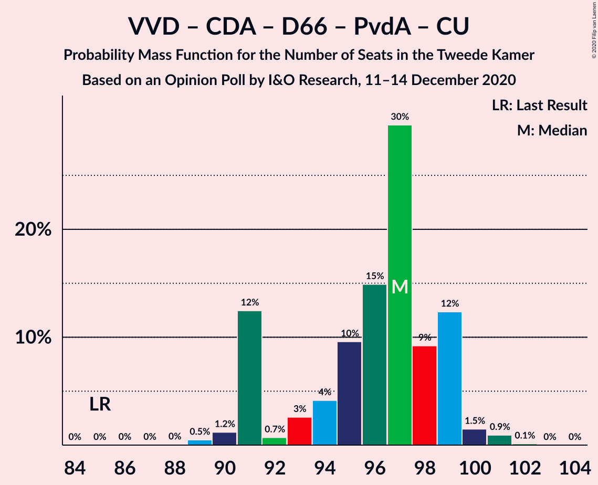

| Number of Seats | Probability | Accumulated | Special Marks |
|:---------------:|:-----------:|:-----------:|:-------------:|
| 85 | 0% | 100% | Last Result |
| 86 | 0% | 100% |  |
| 87 | 0% | 100% |  |
| 88 | 0% | 100% |  |
| 89 | 0.5% | 99.9% |  |
| 90 | 1.2% | 99.4% |  |
| 91 | 12% | 98% |  |
| 92 | 0.7% | 86% |  |
| 93 | 3% | 85% |  |
| 94 | 4% | 82% |  |
| 95 | 10% | 78% |  |
| 96 | 15% | 69% |  |
| 97 | 30% | 54% | Median |
| 98 | 9% | 24% |  |
| 99 | 12% | 15% |  |
| 100 | 1.5% | 3% |  |
| 101 | 0.9% | 1.1% |  |
| 102 | 0.1% | 0.1% |  |
| 103 | 0% | 0% |  |

### Volkspartij voor Vrijheid en Democratie – Christen-Democratisch Appèl – Democraten 66 – GroenLinks – ChristenUnie

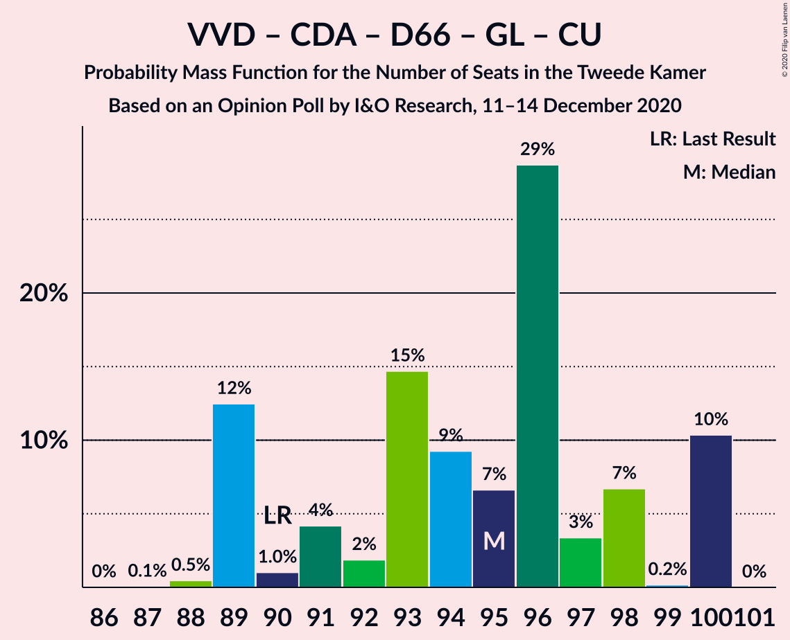

| Number of Seats | Probability | Accumulated | Special Marks |
|:---------------:|:-----------:|:-----------:|:-------------:|
| 87 | 0.1% | 100% |  |
| 88 | 0.5% | 99.9% |  |
| 89 | 12% | 99.5% |  |
| 90 | 1.0% | 87% | Last Result |
| 91 | 4% | 86% |  |
| 92 | 2% | 82% |  |
| 93 | 15% | 80% |  |
| 94 | 9% | 65% |  |
| 95 | 7% | 56% |  |
| 96 | 29% | 49% | Median |
| 97 | 3% | 21% |  |
| 98 | 7% | 17% |  |
| 99 | 0.2% | 11% |  |
| 100 | 10% | 10% |  |
| 101 | 0% | 0% |  |

### Volkspartij voor Vrijheid en Democratie – Partij voor de Vrijheid – Christen-Democratisch Appèl – Forum voor Democratie – Staatkundig Gereformeerde Partij

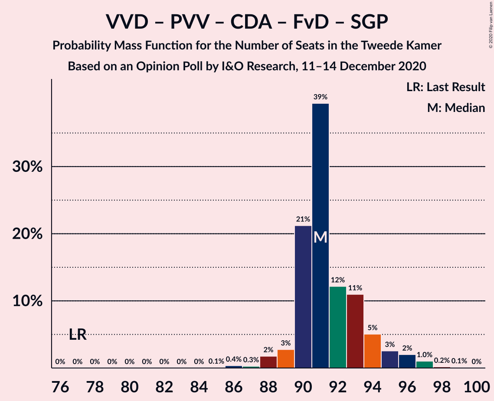

| Number of Seats | Probability | Accumulated | Special Marks |
|:---------------:|:-----------:|:-----------:|:-------------:|
| 77 | 0% | 100% | Last Result |
| 78 | 0% | 100% |  |
| 79 | 0% | 100% |  |
| 80 | 0% | 100% |  |
| 81 | 0% | 100% |  |
| 82 | 0% | 100% |  |
| 83 | 0% | 100% |  |
| 84 | 0% | 100% |  |
| 85 | 0.1% | 100% |  |
| 86 | 0.4% | 99.9% |  |
| 87 | 0.3% | 99.6% |  |
| 88 | 2% | 99.3% |  |
| 89 | 3% | 98% |  |
| 90 | 21% | 95% |  |
| 91 | 39% | 74% |  |
| 92 | 12% | 34% |  |
| 93 | 11% | 22% | Median |
| 94 | 5% | 11% |  |
| 95 | 3% | 6% |  |
| 96 | 2% | 3% |  |
| 97 | 1.0% | 1.3% |  |
| 98 | 0.2% | 0.3% |  |
| 99 | 0.1% | 0.1% |  |
| 100 | 0% | 0% |  |

### Volkspartij voor Vrijheid en Democratie – Partij voor de Vrijheid – Christen-Democratisch Appèl – Forum voor Democratie

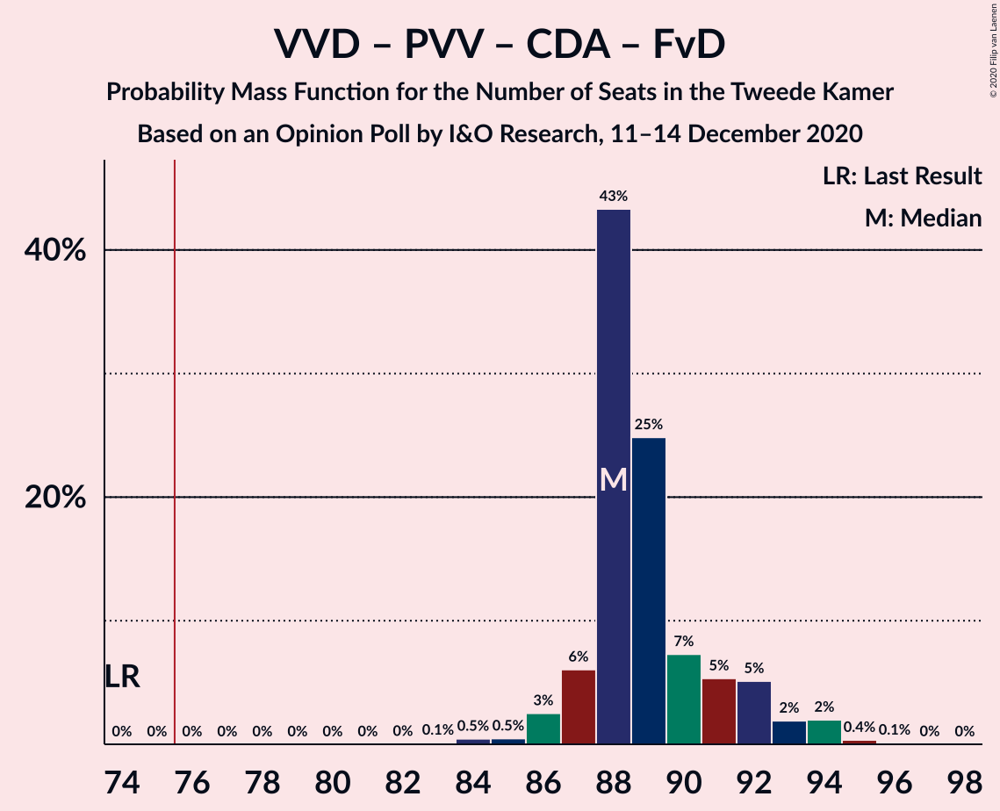

| Number of Seats | Probability | Accumulated | Special Marks |
|:---------------:|:-----------:|:-----------:|:-------------:|
| 74 | 0% | 100% | Last Result |
| 75 | 0% | 100% |  |
| 76 | 0% | 100% | Majority |
| 77 | 0% | 100% |  |
| 78 | 0% | 100% |  |
| 79 | 0% | 100% |  |
| 80 | 0% | 100% |  |
| 81 | 0% | 100% |  |
| 82 | 0% | 100% |  |
| 83 | 0.1% | 100% |  |
| 84 | 0.5% | 99.8% |  |
| 85 | 0.5% | 99.4% |  |
| 86 | 3% | 98.9% |  |
| 87 | 6% | 96% |  |
| 88 | 43% | 90% |  |
| 89 | 25% | 47% |  |
| 90 | 7% | 22% | Median |
| 91 | 5% | 15% |  |
| 92 | 5% | 10% |  |
| 93 | 2% | 4% |  |
| 94 | 2% | 2% |  |
| 95 | 0.4% | 0.5% |  |
| 96 | 0.1% | 0.2% |  |
| 97 | 0% | 0% |  |

### Volkspartij voor Vrijheid en Democratie – Partij voor de Vrijheid – Christen-Democratisch Appèl

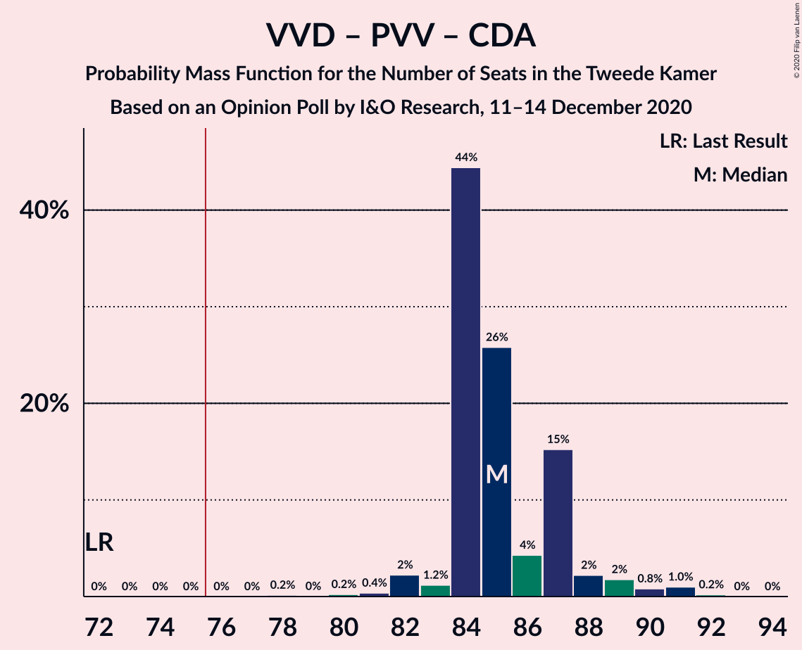

| Number of Seats | Probability | Accumulated | Special Marks |
|:---------------:|:-----------:|:-----------:|:-------------:|
| 72 | 0% | 100% | Last Result |
| 73 | 0% | 100% |  |
| 74 | 0% | 100% |  |
| 75 | 0% | 100% |  |
| 76 | 0% | 100% | Majority |
| 77 | 0% | 100% |  |
| 78 | 0.2% | 100% |  |
| 79 | 0% | 99.8% |  |
| 80 | 0.2% | 99.8% |  |
| 81 | 0.4% | 99.6% |  |
| 82 | 2% | 99.2% |  |
| 83 | 1.2% | 97% |  |
| 84 | 44% | 96% |  |
| 85 | 26% | 51% |  |
| 86 | 4% | 26% | Median |
| 87 | 15% | 21% |  |
| 88 | 2% | 6% |  |
| 89 | 2% | 4% |  |
| 90 | 0.8% | 2% |  |
| 91 | 1.0% | 1.2% |  |
| 92 | 0.2% | 0.2% |  |
| 93 | 0% | 0% |  |

### Volkspartij voor Vrijheid en Democratie – Christen-Democratisch Appèl – Democraten 66 – ChristenUnie

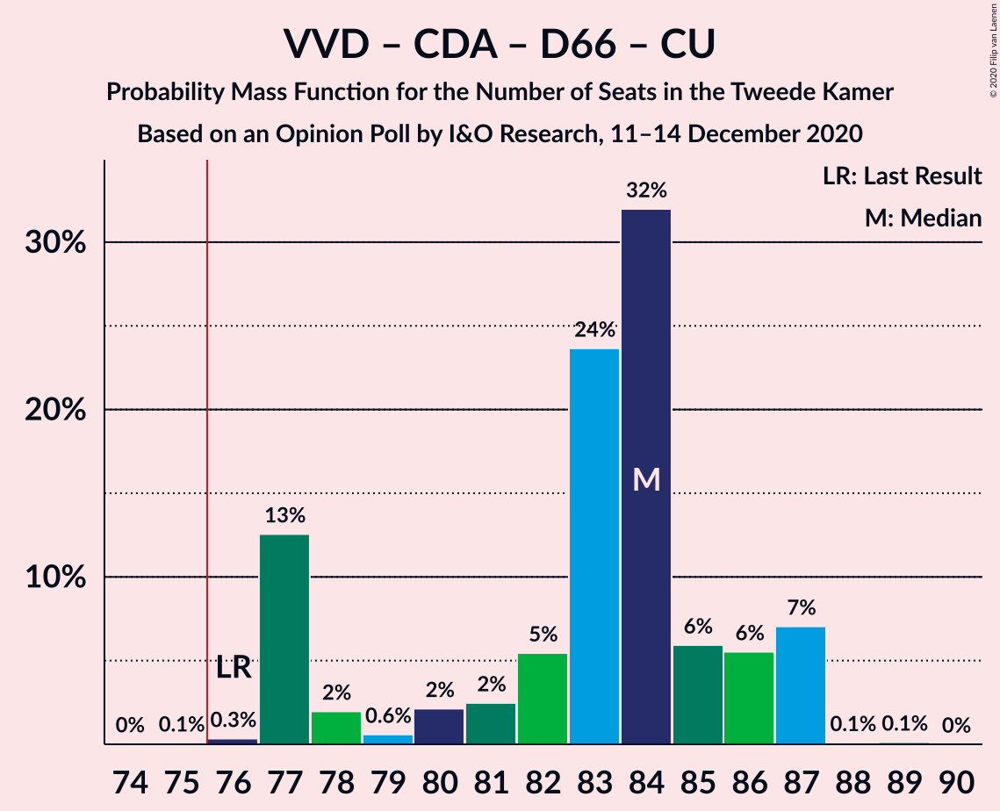

| Number of Seats | Probability | Accumulated | Special Marks |
|:---------------:|:-----------:|:-----------:|:-------------:|
| 75 | 0.1% | 100% |  |
| 76 | 0.3% | 99.9% | Last Result, Majority |
| 77 | 13% | 99.6% |  |
| 78 | 2% | 87% |  |
| 79 | 0.6% | 85% |  |
| 80 | 2% | 84% |  |
| 81 | 2% | 82% |  |
| 82 | 5% | 80% |  |
| 83 | 24% | 74% |  |
| 84 | 32% | 51% | Median |
| 85 | 6% | 19% |  |
| 86 | 6% | 13% |  |
| 87 | 7% | 7% |  |
| 88 | 0.1% | 0.2% |  |
| 89 | 0.1% | 0.1% |  |
| 90 | 0% | 0% |  |

### Volkspartij voor Vrijheid en Democratie – Christen-Democratisch Appèl – Partij van de Arbeid

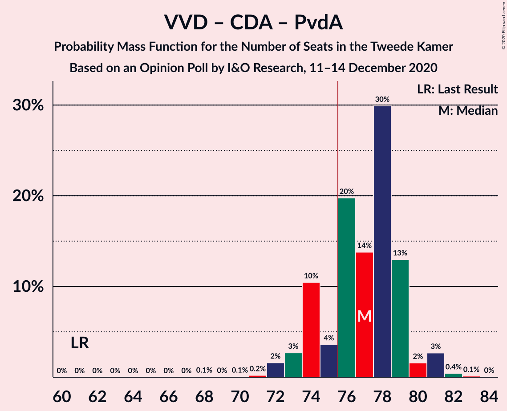

| Number of Seats | Probability | Accumulated | Special Marks |
|:---------------:|:-----------:|:-----------:|:-------------:|
| 61 | 0% | 100% | Last Result |
| 62 | 0% | 100% |  |
| 63 | 0% | 100% |  |
| 64 | 0% | 100% |  |
| 65 | 0% | 100% |  |
| 66 | 0% | 100% |  |
| 67 | 0% | 100% |  |
| 68 | 0.1% | 100% |  |
| 69 | 0% | 99.9% |  |
| 70 | 0.1% | 99.9% |  |
| 71 | 0.2% | 99.9% |  |
| 72 | 2% | 99.6% |  |
| 73 | 3% | 98% |  |
| 74 | 10% | 95% |  |
| 75 | 4% | 85% |  |
| 76 | 20% | 81% | Majority |
| 77 | 14% | 62% |  |
| 78 | 30% | 48% | Median |
| 79 | 13% | 18% |  |
| 80 | 2% | 5% |  |
| 81 | 3% | 3% |  |
| 82 | 0.4% | 0.6% |  |
| 83 | 0.1% | 0.2% |  |
| 84 | 0% | 0% |  |

### Volkspartij voor Vrijheid en Democratie – Christen-Democratisch Appèl – Democraten 66

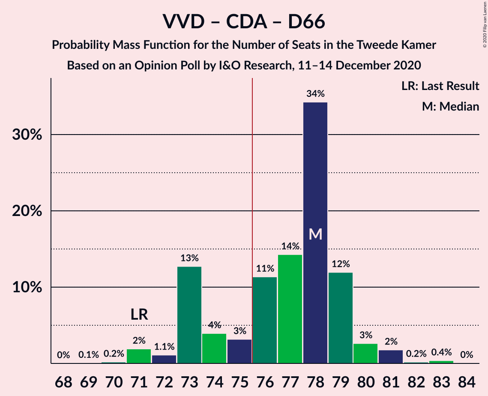

| Number of Seats | Probability | Accumulated | Special Marks |
|:---------------:|:-----------:|:-----------:|:-------------:|
| 69 | 0.1% | 100% |  |
| 70 | 0.2% | 99.9% |  |
| 71 | 2% | 99.7% | Last Result |
| 72 | 1.1% | 98% |  |
| 73 | 13% | 97% |  |
| 74 | 4% | 84% |  |
| 75 | 3% | 80% |  |
| 76 | 11% | 77% | Majority |
| 77 | 14% | 66% |  |
| 78 | 34% | 51% | Median |
| 79 | 12% | 17% |  |
| 80 | 3% | 5% |  |
| 81 | 2% | 2% |  |
| 82 | 0.2% | 0.6% |  |
| 83 | 0.4% | 0.4% |  |
| 84 | 0% | 0% |  |

### Christen-Democratisch Appèl – Democraten 66 – Partij van de Arbeid – GroenLinks – Socialistische Partij – ChristenUnie

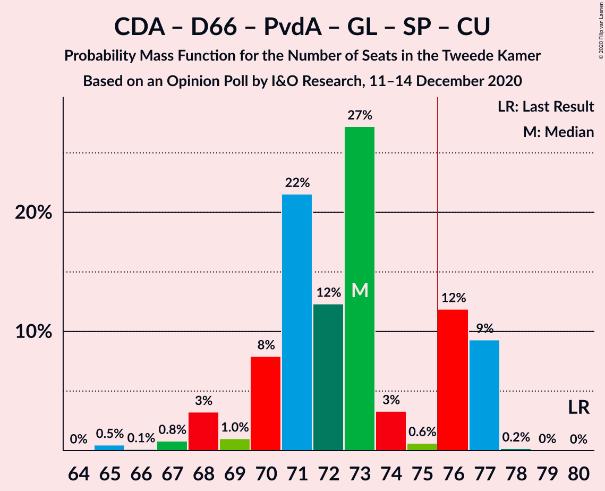

| Number of Seats | Probability | Accumulated | Special Marks |
|:---------------:|:-----------:|:-----------:|:-------------:|
| 65 | 0.5% | 100% |  |
| 66 | 0.1% | 99.5% |  |
| 67 | 0.8% | 99.4% |  |
| 68 | 3% | 98.6% |  |
| 69 | 1.0% | 95% |  |
| 70 | 8% | 94% |  |
| 71 | 22% | 86% |  |
| 72 | 12% | 65% |  |
| 73 | 27% | 53% | Median |
| 74 | 3% | 25% |  |
| 75 | 0.6% | 22% |  |
| 76 | 12% | 21% | Majority |
| 77 | 9% | 10% |  |
| 78 | 0.2% | 0.2% |  |
| 79 | 0% | 0% |  |
| 80 | 0% | 0% | Last Result |

### Volkspartij voor Vrijheid en Democratie – Democraten 66 – Partij van de Arbeid

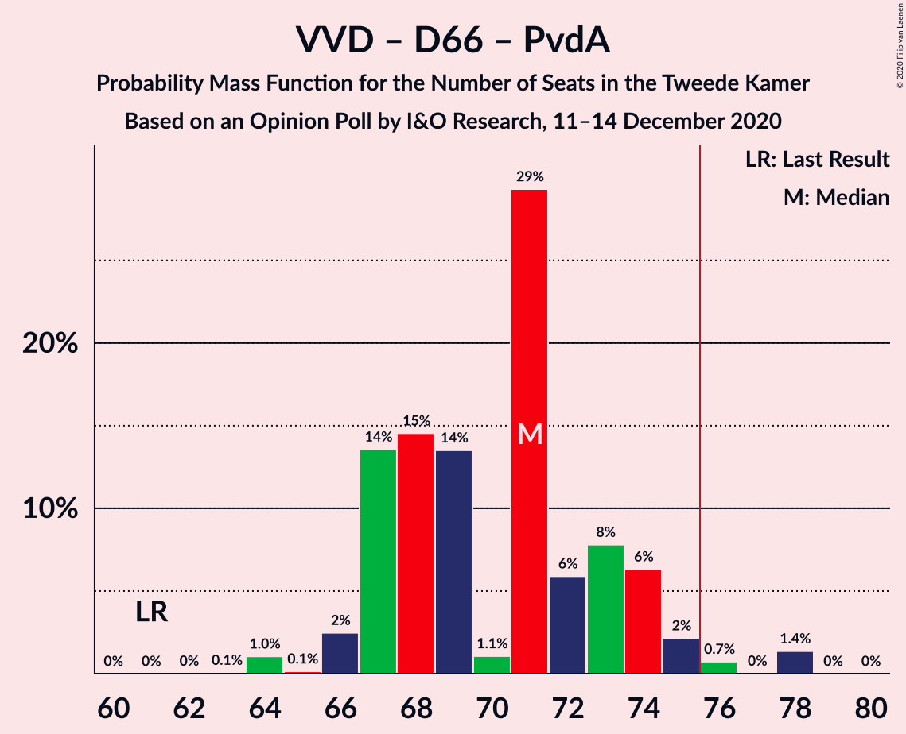

| Number of Seats | Probability | Accumulated | Special Marks |
|:---------------:|:-----------:|:-----------:|:-------------:|
| 61 | 0% | 100% | Last Result |
| 62 | 0% | 100% |  |
| 63 | 0.1% | 100% |  |
| 64 | 1.0% | 99.9% |  |
| 65 | 0.1% | 98.9% |  |
| 66 | 2% | 98.7% |  |
| 67 | 14% | 96% |  |
| 68 | 15% | 83% |  |
| 69 | 14% | 68% |  |
| 70 | 1.1% | 55% |  |
| 71 | 29% | 54% | Median |
| 72 | 6% | 24% |  |
| 73 | 8% | 18% |  |
| 74 | 6% | 11% |  |
| 75 | 2% | 4% |  |
| 76 | 0.7% | 2% | Majority |
| 77 | 0% | 1.4% |  |
| 78 | 1.4% | 1.4% |  |
| 79 | 0% | 0% |  |

### Volkspartij voor Vrijheid en Democratie – Christen-Democratisch Appèl – Forum voor Democratie – Staatkundig Gereformeerde Partij – 50Plus

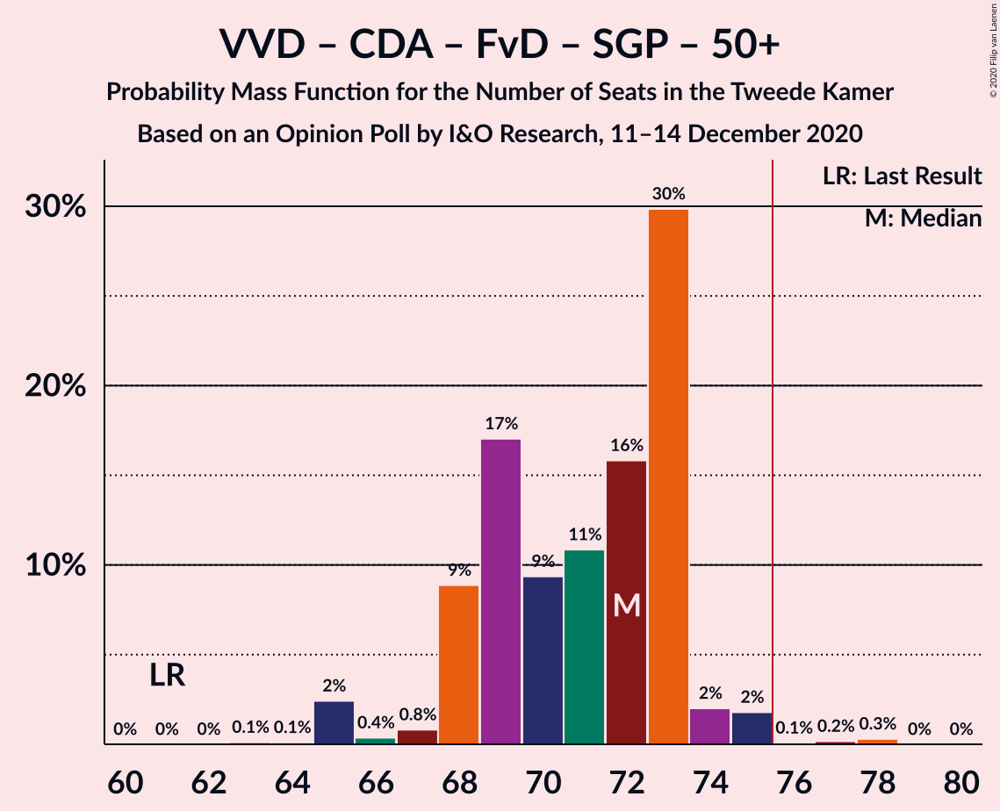

| Number of Seats | Probability | Accumulated | Special Marks |
|:---------------:|:-----------:|:-----------:|:-------------:|
| 61 | 0% | 100% | Last Result |
| 62 | 0% | 100% |  |
| 63 | 0.1% | 100% |  |
| 64 | 0.1% | 99.9% |  |
| 65 | 2% | 99.8% |  |
| 66 | 0.4% | 97% |  |
| 67 | 0.8% | 97% |  |
| 68 | 9% | 96% |  |
| 69 | 17% | 87% |  |
| 70 | 9% | 70% |  |
| 71 | 11% | 61% |  |
| 72 | 16% | 50% |  |
| 73 | 30% | 34% | Median |
| 74 | 2% | 4% |  |
| 75 | 2% | 2% |  |
| 76 | 0.1% | 0.6% | Majority |
| 77 | 0.2% | 0.5% |  |
| 78 | 0.3% | 0.3% |  |
| 79 | 0% | 0% |  |

### Volkspartij voor Vrijheid en Democratie – Christen-Democratisch Appèl – Forum voor Democratie – Staatkundig Gereformeerde Partij

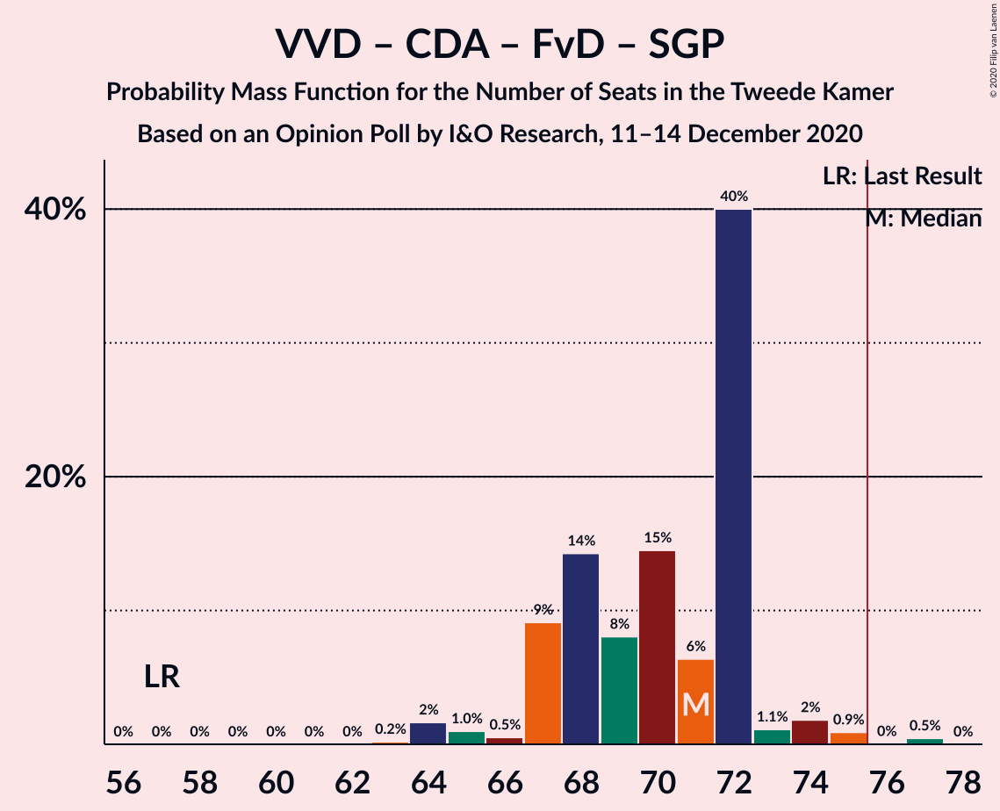

| Number of Seats | Probability | Accumulated | Special Marks |
|:---------------:|:-----------:|:-----------:|:-------------:|
| 57 | 0% | 100% | Last Result |
| 58 | 0% | 100% |  |
| 59 | 0% | 100% |  |
| 60 | 0% | 100% |  |
| 61 | 0% | 100% |  |
| 62 | 0% | 100% |  |
| 63 | 0.2% | 100% |  |
| 64 | 2% | 99.8% |  |
| 65 | 1.0% | 98% |  |
| 66 | 0.5% | 97% |  |
| 67 | 9% | 97% |  |
| 68 | 14% | 88% |  |
| 69 | 8% | 73% |  |
| 70 | 15% | 65% |  |
| 71 | 6% | 51% |  |
| 72 | 40% | 44% | Median |
| 73 | 1.1% | 4% |  |
| 74 | 2% | 3% |  |
| 75 | 0.9% | 1.4% |  |
| 76 | 0% | 0.5% | Majority |
| 77 | 0.5% | 0.5% |  |
| 78 | 0% | 0% |  |

### Volkspartij voor Vrijheid en Democratie – Christen-Democratisch Appèl – Forum voor Democratie – 50Plus

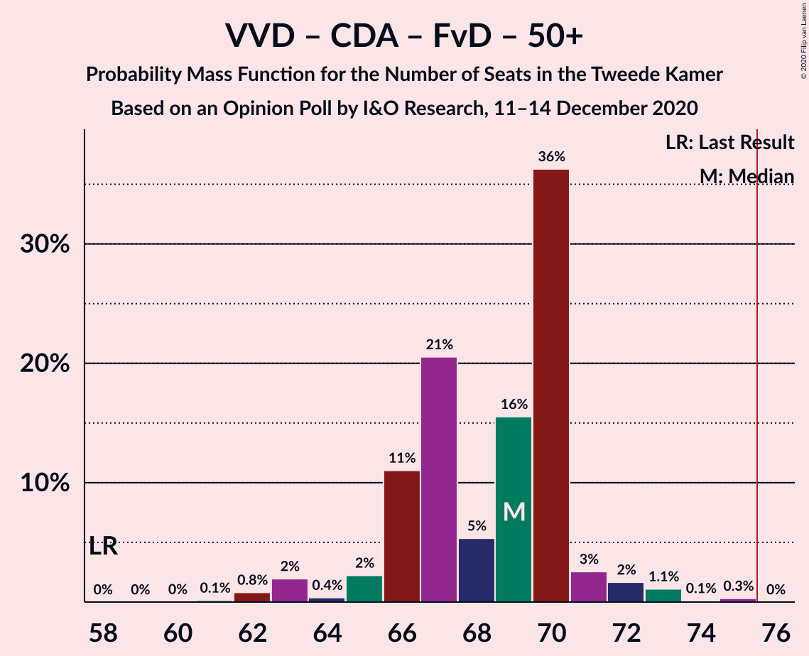

| Number of Seats | Probability | Accumulated | Special Marks |
|:---------------:|:-----------:|:-----------:|:-------------:|
| 58 | 0% | 100% | Last Result |
| 59 | 0% | 100% |  |
| 60 | 0% | 100% |  |
| 61 | 0.1% | 100% |  |
| 62 | 0.8% | 99.8% |  |
| 63 | 2% | 99.0% |  |
| 64 | 0.4% | 97% |  |
| 65 | 2% | 97% |  |
| 66 | 11% | 94% |  |
| 67 | 21% | 83% |  |
| 68 | 5% | 63% |  |
| 69 | 16% | 58% |  |
| 70 | 36% | 42% | Median |
| 71 | 3% | 6% |  |
| 72 | 2% | 3% |  |
| 73 | 1.1% | 2% |  |
| 74 | 0.1% | 0.4% |  |
| 75 | 0.3% | 0.3% |  |
| 76 | 0% | 0% | Majority |

### Volkspartij voor Vrijheid en Democratie – Christen-Democratisch Appèl – Forum voor Democratie

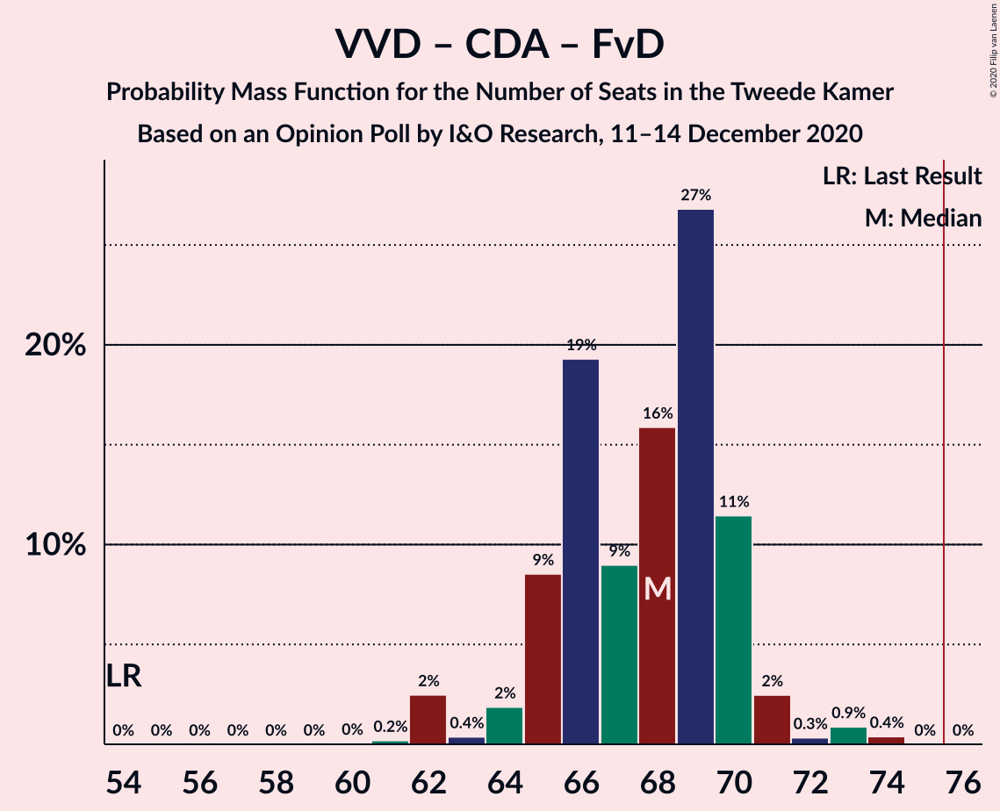

| Number of Seats | Probability | Accumulated | Special Marks |
|:---------------:|:-----------:|:-----------:|:-------------:|
| 54 | 0% | 100% | Last Result |
| 55 | 0% | 100% |  |
| 56 | 0% | 100% |  |
| 57 | 0% | 100% |  |
| 58 | 0% | 100% |  |
| 59 | 0% | 100% |  |
| 60 | 0% | 100% |  |
| 61 | 0.2% | 99.9% |  |
| 62 | 2% | 99.8% |  |
| 63 | 0.4% | 97% |  |
| 64 | 2% | 97% |  |
| 65 | 9% | 95% |  |
| 66 | 19% | 86% |  |
| 67 | 9% | 67% |  |
| 68 | 16% | 58% |  |
| 69 | 27% | 42% | Median |
| 70 | 11% | 16% |  |
| 71 | 2% | 4% |  |
| 72 | 0.3% | 2% |  |
| 73 | 0.9% | 1.3% |  |
| 74 | 0.4% | 0.4% |  |
| 75 | 0% | 0% |  |

### Christen-Democratisch Appèl – Democraten 66 – Partij van de Arbeid – GroenLinks – ChristenUnie

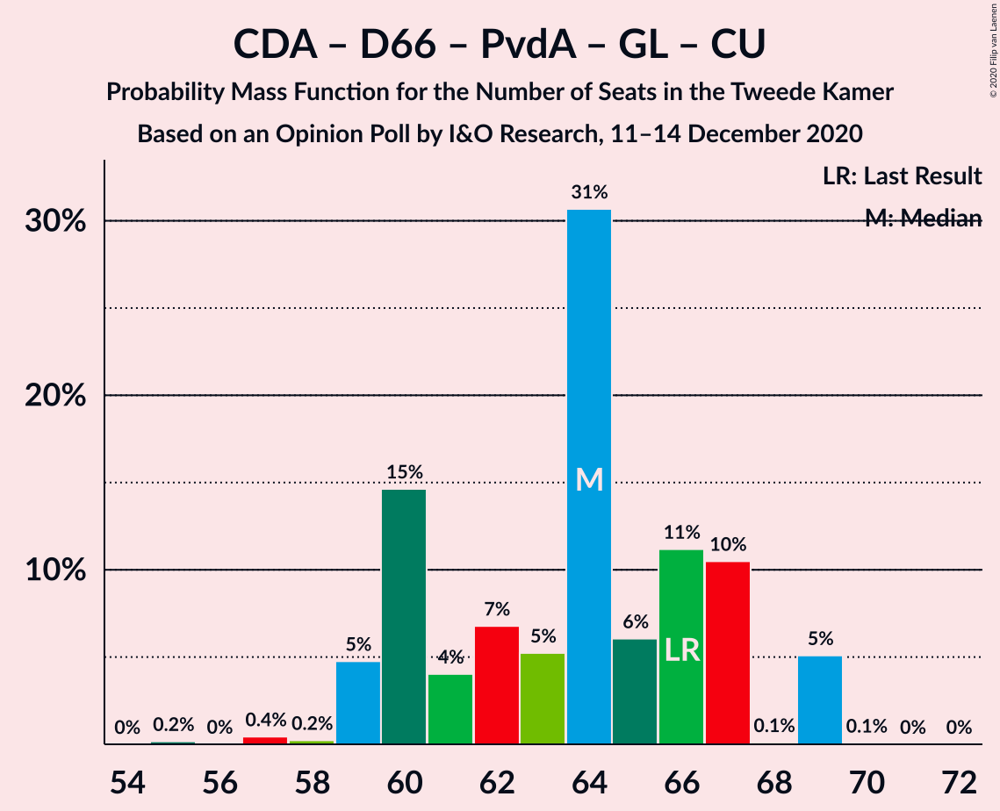

| Number of Seats | Probability | Accumulated | Special Marks |
|:---------------:|:-----------:|:-----------:|:-------------:|
| 55 | 0.2% | 100% |  |
| 56 | 0% | 99.8% |  |
| 57 | 0.4% | 99.8% |  |
| 58 | 0.2% | 99.4% |  |
| 59 | 5% | 99.1% |  |
| 60 | 15% | 94% |  |
| 61 | 4% | 80% |  |
| 62 | 7% | 76% |  |
| 63 | 5% | 69% |  |
| 64 | 31% | 64% | Median |
| 65 | 6% | 33% |  |
| 66 | 11% | 27% | Last Result |
| 67 | 10% | 16% |  |
| 68 | 0.1% | 5% |  |
| 69 | 5% | 5% |  |
| 70 | 0.1% | 0.1% |  |
| 71 | 0% | 0% |  |

### Volkspartij voor Vrijheid en Democratie – Christen-Democratisch Appèl

| Number of Seats | Probability | Accumulated | Special Marks |
|:---------------:|:-----------:|:-----------:|:-------------:|
| 52 | 0% | 100% | Last Result |
| 53 | 0% | 100% |  |
| 54 | 0% | 100% |  |
| 55 | 0% | 100% |  |
| 56 | 0% | 100% |  |
| 57 | 0.2% | 100% |  |
| 58 | 2% | 99.8% |  |
| 59 | 1.0% | 98% |  |
| 60 | 0.5% | 97% |  |
| 61 | 8% | 96% |  |
| 62 | 15% | 88% |  |
| 63 | 7% | 73% |  |
| 64 | 17% | 65% |  |
| 65 | 37% | 48% | Median |
| 66 | 8% | 11% |  |
| 67 | 1.2% | 3% |  |
| 68 | 1.4% | 2% |  |
| 69 | 0.1% | 0.6% |  |
| 70 | 0.1% | 0.4% |  |
| 71 | 0.3% | 0.3% |  |
| 72 | 0% | 0% |  |

### Volkspartij voor Vrijheid en Democratie – Partij van de Arbeid

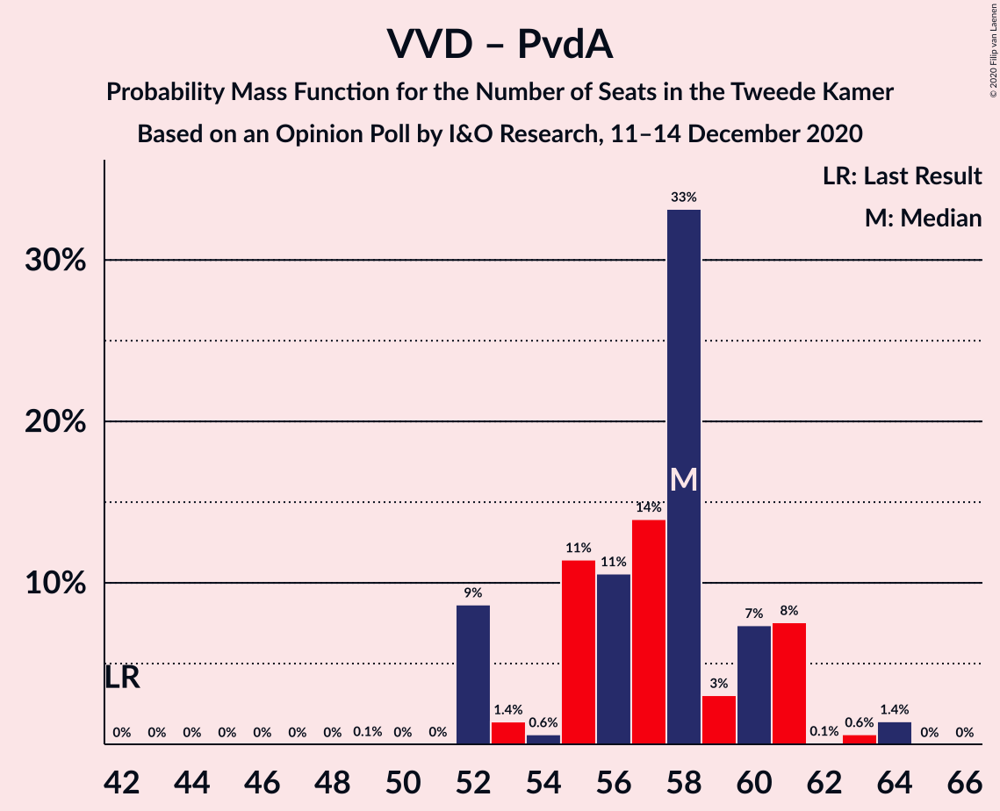

| Number of Seats | Probability | Accumulated | Special Marks |
|:---------------:|:-----------:|:-----------:|:-------------:|
| 42 | 0% | 100% | Last Result |
| 43 | 0% | 100% |  |
| 44 | 0% | 100% |  |
| 45 | 0% | 100% |  |
| 46 | 0% | 100% |  |
| 47 | 0% | 100% |  |
| 48 | 0% | 100% |  |
| 49 | 0.1% | 100% |  |
| 50 | 0% | 99.9% |  |
| 51 | 0% | 99.9% |  |
| 52 | 9% | 99.9% |  |
| 53 | 1.4% | 91% |  |
| 54 | 0.6% | 90% |  |
| 55 | 11% | 89% |  |
| 56 | 11% | 78% |  |
| 57 | 14% | 67% |  |
| 58 | 33% | 53% | Median |
| 59 | 3% | 20% |  |
| 60 | 7% | 17% |  |
| 61 | 8% | 10% |  |
| 62 | 0.1% | 2% |  |
| 63 | 0.6% | 2% |  |
| 64 | 1.4% | 1.4% |  |
| 65 | 0% | 0% |  |

### Christen-Democratisch Appèl – Democraten 66 – Partij van de Arbeid

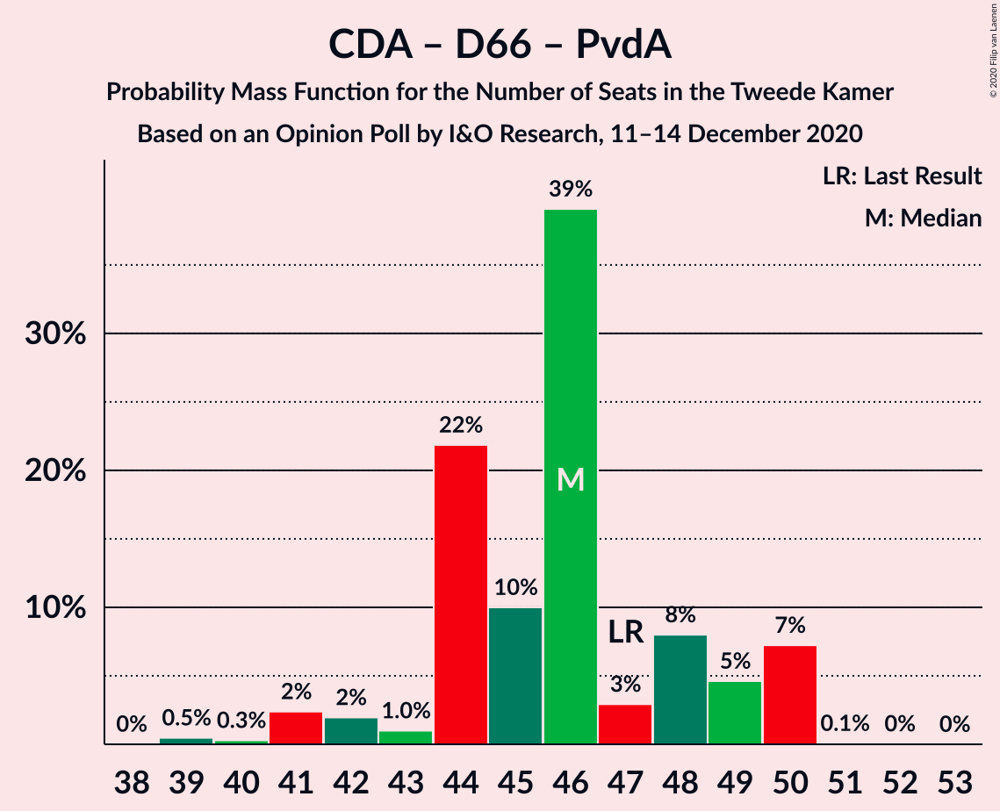

| Number of Seats | Probability | Accumulated | Special Marks |
|:---------------:|:-----------:|:-----------:|:-------------:|
| 39 | 0.5% | 100% |  |
| 40 | 0.3% | 99.5% |  |
| 41 | 2% | 99.2% |  |
| 42 | 2% | 97% |  |
| 43 | 1.0% | 95% |  |
| 44 | 22% | 94% |  |
| 45 | 10% | 72% |  |
| 46 | 39% | 62% | Median |
| 47 | 3% | 23% | Last Result |
| 48 | 8% | 20% |  |
| 49 | 5% | 12% |  |
| 50 | 7% | 7% |  |
| 51 | 0.1% | 0.1% |  |
| 52 | 0% | 0.1% |  |
| 53 | 0% | 0% |  |

### Christen-Democratisch Appèl – Partij van de Arbeid – ChristenUnie

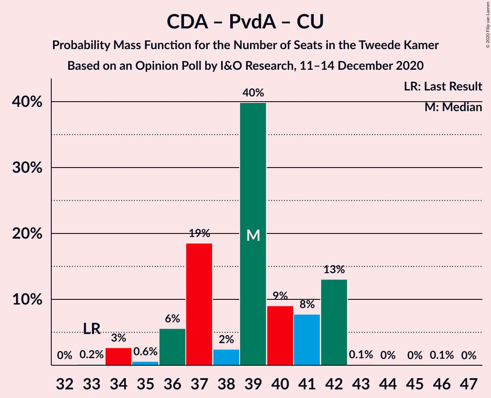

| Number of Seats | Probability | Accumulated | Special Marks |
|:---------------:|:-----------:|:-----------:|:-------------:|
| 32 | 0% | 100% |  |
| 33 | 0.2% | 99.9% | Last Result |
| 34 | 3% | 99.8% |  |
| 35 | 0.6% | 97% |  |
| 36 | 6% | 97% |  |
| 37 | 19% | 91% |  |
| 38 | 2% | 72% |  |
| 39 | 40% | 70% | Median |
| 40 | 9% | 30% |  |
| 41 | 8% | 21% |  |
| 42 | 13% | 13% |  |
| 43 | 0.1% | 0.2% |  |
| 44 | 0% | 0.1% |  |
| 45 | 0% | 0.1% |  |
| 46 | 0.1% | 0.1% |  |
| 47 | 0% | 0% |  |

### Christen-Democratisch Appèl – Democraten 66

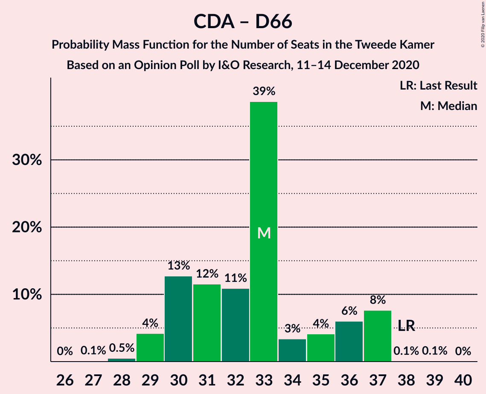

| Number of Seats | Probability | Accumulated | Special Marks |
|:---------------:|:-----------:|:-----------:|:-------------:|
| 27 | 0.1% | 100% |  |
| 28 | 0.5% | 99.9% |  |
| 29 | 4% | 99.4% |  |
| 30 | 13% | 95% |  |
| 31 | 12% | 82% |  |
| 32 | 11% | 71% |  |
| 33 | 39% | 60% | Median |
| 34 | 3% | 21% |  |
| 35 | 4% | 18% |  |
| 36 | 6% | 14% |  |
| 37 | 8% | 8% |  |
| 38 | 0.1% | 0.1% | Last Result |
| 39 | 0.1% | 0.1% |  |
| 40 | 0% | 0% |  |

### Christen-Democratisch Appèl – Partij van de Arbeid

| Number of Seats | Probability | Accumulated | Special Marks |
|:---------------:|:-----------:|:-----------:|:-------------:|
| 27 | 2% | 100% |  |
| 28 | 0.6% | 98% | Last Result |
| 29 | 1.1% | 97% |  |
| 30 | 5% | 96% |  |
| 31 | 1.0% | 91% |  |
| 32 | 15% | 90% |  |
| 33 | 53% | 75% | Median |
| 34 | 9% | 22% |  |
| 35 | 10% | 13% |  |
| 36 | 3% | 3% |  |
| 37 | 0.2% | 0.3% |  |
| 38 | 0% | 0.1% |  |
| 39 | 0% | 0.1% |  |
| 40 | 0.1% | 0.1% |  |
| 41 | 0% | 0% |  |

## Technical Information

### Opinion Poll

+ **Polling firm:** I&O Research
+ **Commissioner(s):** —
+ **Fieldwork period:** 11–14 December 2020

### Calculations

+ **Sample size:** 1257
+ **Simulations done:** 1,048,576
+ **Error estimate:** 1.57%

