# Opinion Poll by Kantar Public, 8–12 January 2021

<a href="#voting-intentions">Voting Intentions</a> | <a href="#seats">Seats</a> | <a href="#coalitions">Coalitions</a> | <a href="#technical-information">Technical Information</a>

## Voting Intentions

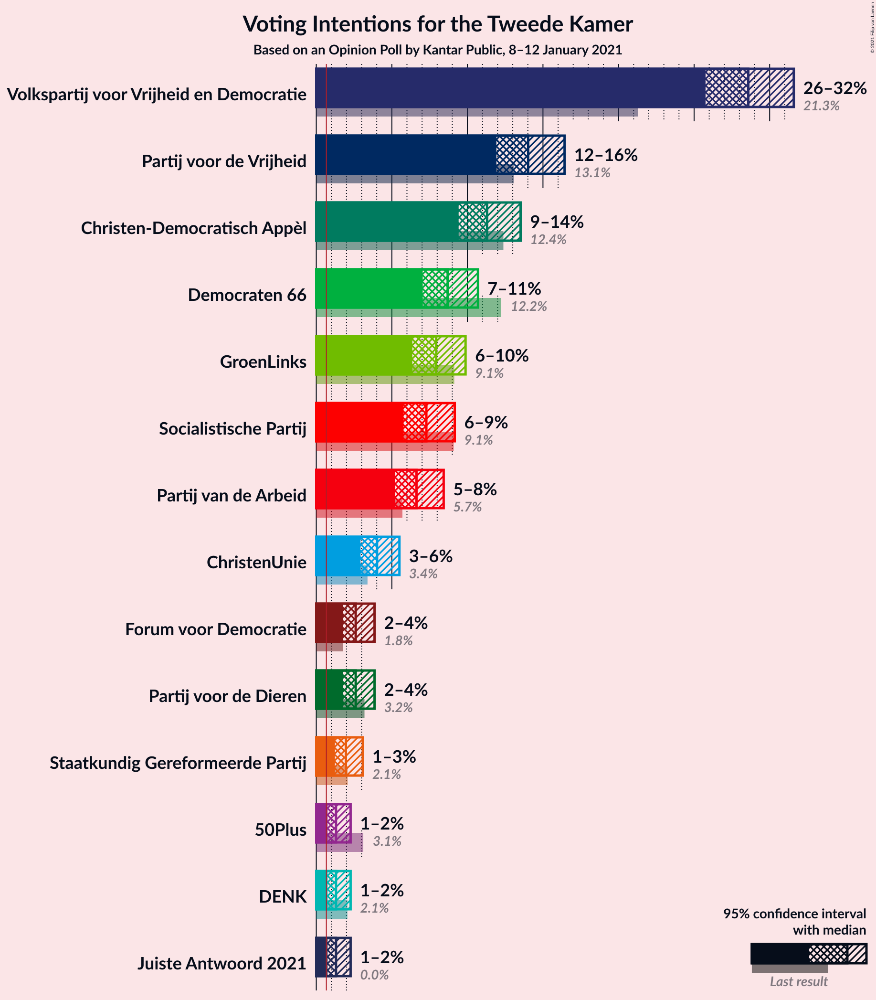

### Confidence Intervals

| Party | Last Result | Poll Result | 80% Confidence Interval | 90% Confidence Interval | 95% Confidence Interval | 99% Confidence Interval |
|:-----:|:-----------:|:-----------:|:-----------------------:|:-----------------------:|:-----------------------:|:-----------------------:|
| Volkspartij voor Vrijheid en Democratie | 21.3% | 28.6% | 26.7–30.6% |26.2–31.1% |25.8–31.6% |24.9–32.6% |
| Partij voor de Vrijheid | 13.1% | 14.0% | 12.6–15.6% |12.3–16.0% |11.9–16.4% |11.3–17.2% |
| Christen-Democratisch Appèl | 12.4% | 11.3% | 10.1–12.8% |9.7–13.2% |9.4–13.5% |8.8–14.3% |
| Democraten 66 | 12.2% | 8.7% | 7.6–10.0% |7.3–10.4% |7.0–10.7% |6.6–11.4% |
| GroenLinks | 9.1% | 7.9% | 6.9–9.2% |6.6–9.6% |6.4–9.9% |5.9–10.5% |
| Socialistische Partij | 9.1% | 7.3% | 6.3–8.5% |6.0–8.9% |5.8–9.2% |5.3–9.8% |
| Partij van de Arbeid | 5.7% | 6.6% | 5.7–7.8% |5.4–8.1% |5.2–8.4% |4.8–9.0% |
| ChristenUnie | 3.4% | 4.0% | 3.3–5.0% |3.1–5.3% |2.9–5.5% |2.6–6.0% |
| Partij voor de Dieren | 3.2% | 2.6% | 2.0–3.4% |1.9–3.7% |1.8–3.9% |1.5–4.3% |
| Forum voor Democratie | 1.8% | 2.6% | 2.0–3.4% |1.9–3.7% |1.8–3.9% |1.5–4.3% |
| Staatkundig Gereformeerde Partij | 2.1% | 2.0% | 1.5–2.7% |1.3–2.9% |1.2–3.1% |1.1–3.5% |
| 50Plus | 3.1% | 1.3% | 0.9–1.9% |0.8–2.1% |0.7–2.3% |0.6–2.6% |
| DENK | 2.1% | 1.3% | 0.9–1.9% |0.8–2.1% |0.7–2.3% |0.6–2.6% |
| Juiste Antwoord 2021 | 0.0% | 1.3% | 0.9–1.9% |0.8–2.1% |0.7–2.3% |0.6–2.6% |

*Note:* The poll result column reflects the actual value used in the calculations. Published results may vary slightly, and in addition be rounded to fewer digits.

## Seats

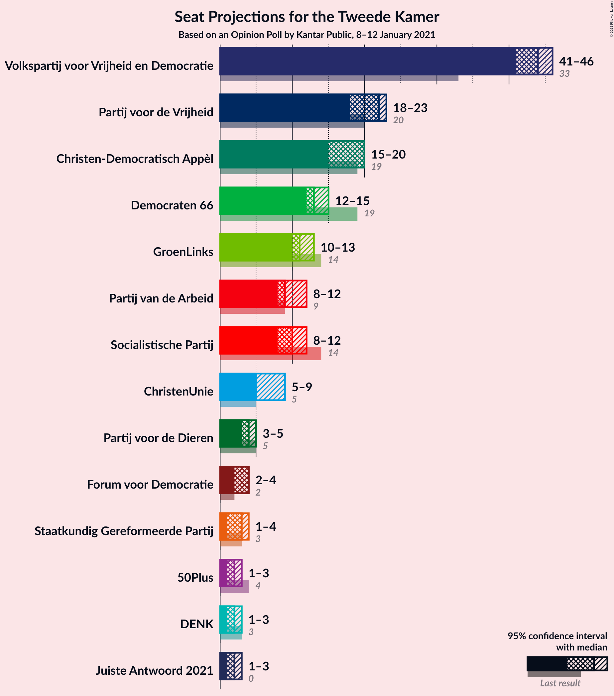

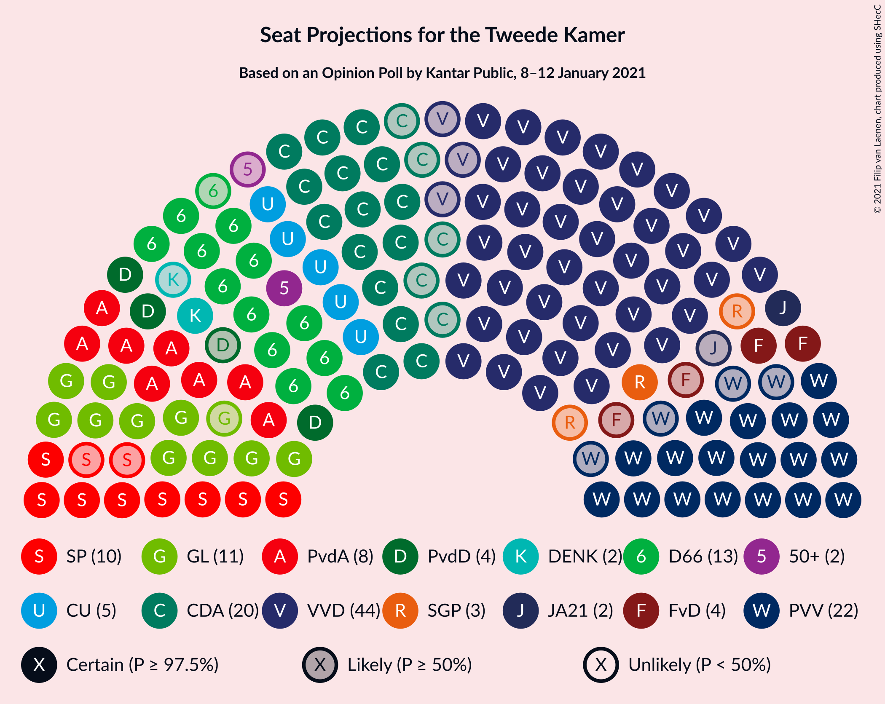

### Confidence Intervals

| Party | Last Result | Median | 80% Confidence Interval | 90% Confidence Interval | 95% Confidence Interval | 99% Confidence Interval |
|:-----:|:-----------:|:------:|:-----------------------:|:-----------------------:|:-----------------------:|:-----------------------:|
| <a href="#volkspartij-voor-vrijheid-en-democratie">Volkspartij voor Vrijheid en Democratie</a> | 33 | 44 | 43–46 |43–46 |41–46 |39–48 |
| <a href="#partij-voor-de-vrijheid">Partij voor de Vrijheid</a> | 20 | 22 | 19–23 |18–23 |18–23 |17–26 |
| <a href="#christen-democratisch-appèl">Christen-Democratisch Appèl</a> | 19 | 20 | 17–20 |17–20 |15–20 |13–21 |
| <a href="#democraten-66">Democraten 66</a> | 19 | 13 | 12–15 |12–15 |12–15 |10–17 |
| <a href="#groenlinks">GroenLinks</a> | 14 | 11 | 10–11 |10–12 |10–13 |10–14 |
| <a href="#socialistische-partij">Socialistische Partij</a> | 14 | 10 | 10–11 |9–12 |8–12 |8–14 |
| <a href="#partij-van-de-arbeid">Partij van de Arbeid</a> | 9 | 9 | 8–10 |8–11 |8–12 |7–13 |
| <a href="#christenunie">ChristenUnie</a> | 5 | 5 | 5–6 |5–9 |5–9 |4–9 |
| <a href="#partij-voor-de-dieren">Partij voor de Dieren</a> | 5 | 4 | 4–5 |3–5 |3–5 |2–6 |
| <a href="#forum-voor-democratie">Forum voor Democratie</a> | 2 | 4 | 3–4 |2–4 |2–4 |2–5 |
| <a href="#staatkundig-gereformeerde-partij">Staatkundig Gereformeerde Partij</a> | 3 | 3 | 3–4 |2–4 |1–4 |1–4 |
| <a href="#50plus">50Plus</a> | 4 | 2 | 2–3 |1–3 |1–3 |1–3 |
| <a href="#denk">DENK</a> | 3 | 2 | 2–3 |1–3 |1–3 |1–3 |
| <a href="#juiste-antwoord-2021">Juiste Antwoord 2021</a> | 0 | 2 | 1–2 |1–2 |1–3 |0–3 |

### Volkspartij voor Vrijheid en Democratie

*For a full overview of the results for this party, see the [Volkspartij voor Vrijheid en Democratie](party-volkspartijvoorvrijheidendemocratie.html) page.*

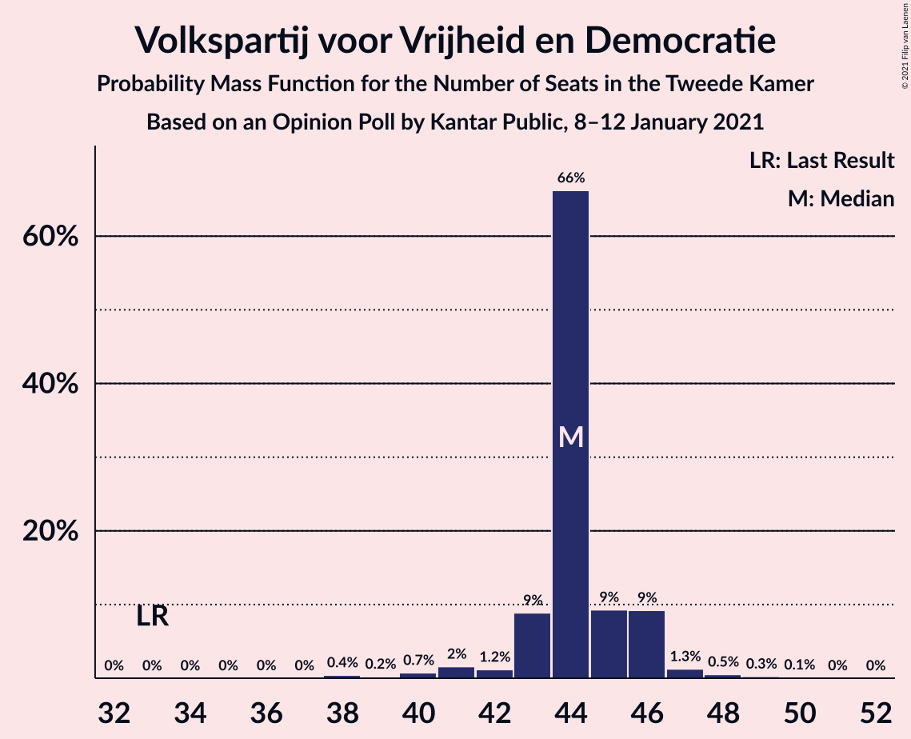

| Number of Seats | Probability | Accumulated | Special Marks |
|:---------------:|:-----------:|:-----------:|:-------------:|
| 33 | 0% | 100% | Last Result |
| 34 | 0% | 100% |  |
| 35 | 0% | 100% |  |
| 36 | 0% | 100% |  |
| 37 | 0% | 100% |  |
| 38 | 0.4% | 100% |  |
| 39 | 0.2% | 99.5% |  |
| 40 | 0.7% | 99.3% |  |
| 41 | 2% | 98.6% |  |
| 42 | 1.2% | 97% |  |
| 43 | 9% | 96% |  |
| 44 | 66% | 87% | Median |
| 45 | 9% | 21% |  |
| 46 | 9% | 11% |  |
| 47 | 1.3% | 2% |  |
| 48 | 0.5% | 0.9% |  |
| 49 | 0.3% | 0.4% |  |
| 50 | 0.1% | 0.1% |  |
| 51 | 0% | 0% |  |

### Partij voor de Vrijheid

*For a full overview of the results for this party, see the [Partij voor de Vrijheid](party-partijvoordevrijheid.html) page.*

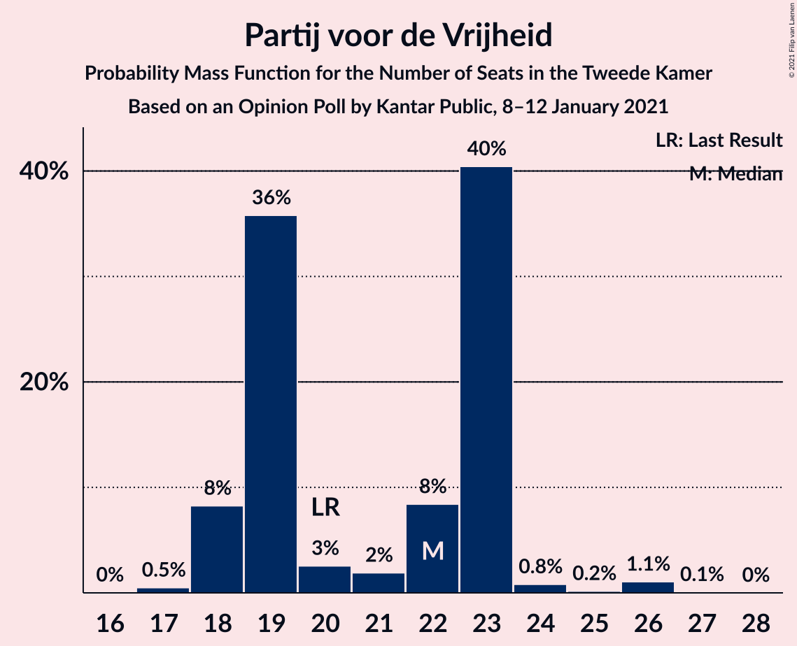

| Number of Seats | Probability | Accumulated | Special Marks |
|:---------------:|:-----------:|:-----------:|:-------------:|
| 17 | 0.5% | 100% |  |
| 18 | 8% | 99.5% |  |
| 19 | 36% | 91% |  |
| 20 | 3% | 55% | Last Result |
| 21 | 2% | 53% |  |
| 22 | 8% | 51% | Median |
| 23 | 40% | 43% |  |
| 24 | 0.8% | 2% |  |
| 25 | 0.2% | 1.3% |  |
| 26 | 1.1% | 1.1% |  |
| 27 | 0.1% | 0.1% |  |
| 28 | 0% | 0% |  |

### Christen-Democratisch Appèl

*For a full overview of the results for this party, see the [Christen-Democratisch Appèl](party-christen-democratischappèl.html) page.*

| Number of Seats | Probability | Accumulated | Special Marks |
|:---------------:|:-----------:|:-----------:|:-------------:|
| 13 | 0.5% | 100% |  |
| 14 | 2% | 99.5% |  |
| 15 | 2% | 98% |  |
| 16 | 0.8% | 96% |  |
| 17 | 16% | 95% |  |
| 18 | 12% | 79% |  |
| 19 | 0.7% | 67% | Last Result |
| 20 | 66% | 67% | Median |
| 21 | 0.7% | 1.0% |  |
| 22 | 0.1% | 0.2% |  |
| 23 | 0% | 0.1% |  |
| 24 | 0% | 0% |  |

### Democraten 66

*For a full overview of the results for this party, see the [Democraten 66](party-democraten66.html) page.*

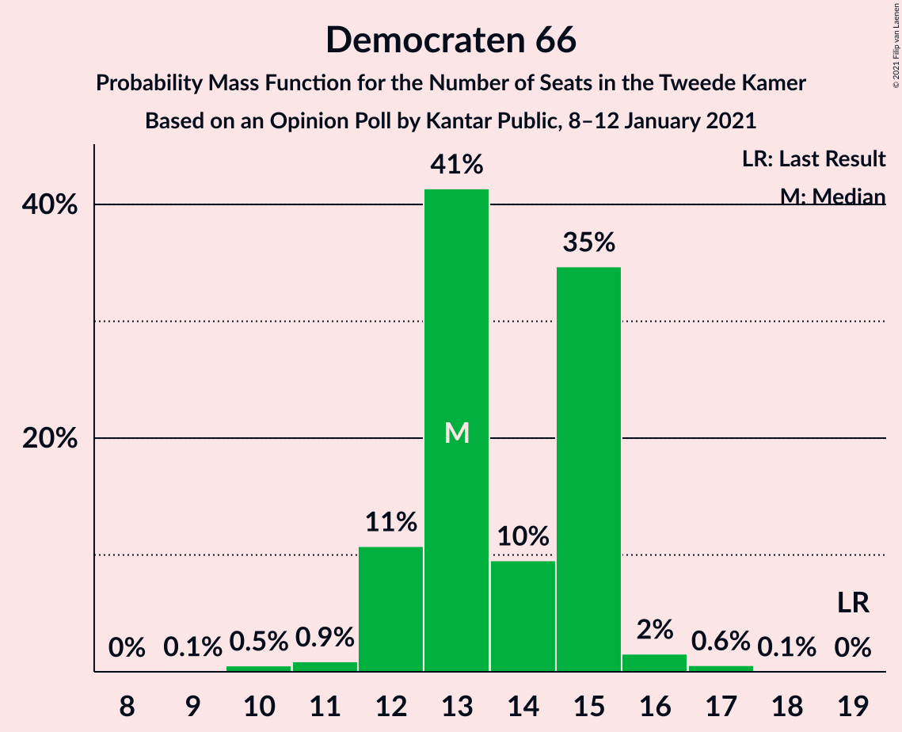

| Number of Seats | Probability | Accumulated | Special Marks |
|:---------------:|:-----------:|:-----------:|:-------------:|
| 9 | 0.1% | 100% |  |
| 10 | 0.5% | 99.9% |  |
| 11 | 0.9% | 99.4% |  |
| 12 | 11% | 98.5% |  |
| 13 | 41% | 88% | Median |
| 14 | 10% | 46% |  |
| 15 | 35% | 37% |  |
| 16 | 2% | 2% |  |
| 17 | 0.6% | 0.6% |  |
| 18 | 0.1% | 0.1% |  |
| 19 | 0% | 0% | Last Result |

### GroenLinks

*For a full overview of the results for this party, see the [GroenLinks](party-groenlinks.html) page.*

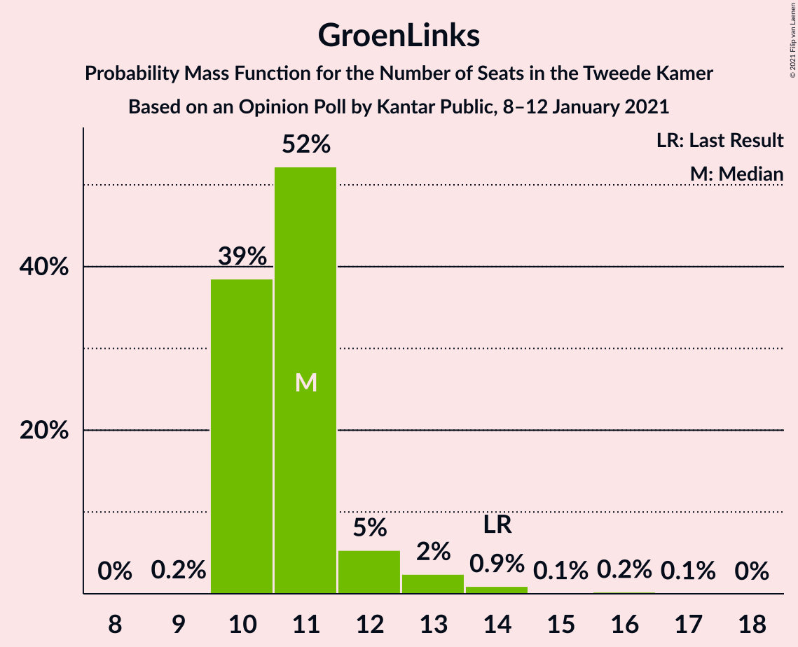

| Number of Seats | Probability | Accumulated | Special Marks |
|:---------------:|:-----------:|:-----------:|:-------------:|
| 9 | 0.2% | 100% |  |
| 10 | 39% | 99.8% |  |
| 11 | 52% | 61% | Median |
| 12 | 5% | 9% |  |
| 13 | 2% | 4% |  |
| 14 | 0.9% | 1.3% | Last Result |
| 15 | 0.1% | 0.4% |  |
| 16 | 0.2% | 0.3% |  |
| 17 | 0.1% | 0.1% |  |
| 18 | 0% | 0% |  |

### Socialistische Partij

*For a full overview of the results for this party, see the [Socialistische Partij](party-socialistischepartij.html) page.*

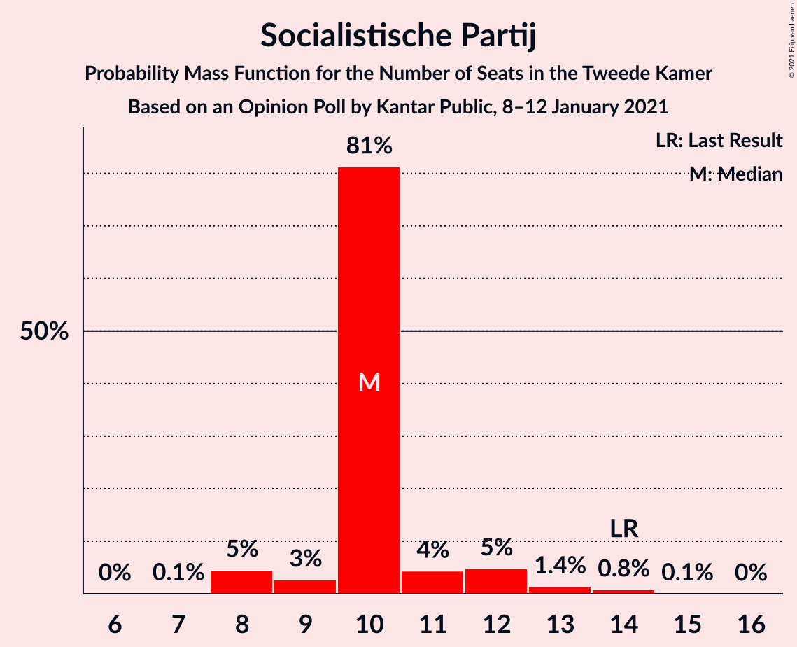

| Number of Seats | Probability | Accumulated | Special Marks |
|:---------------:|:-----------:|:-----------:|:-------------:|
| 7 | 0.1% | 100% |  |
| 8 | 5% | 99.9% |  |
| 9 | 3% | 95% |  |
| 10 | 81% | 93% | Median |
| 11 | 4% | 11% |  |
| 12 | 5% | 7% |  |
| 13 | 1.4% | 2% |  |
| 14 | 0.8% | 0.9% | Last Result |
| 15 | 0.1% | 0.1% |  |
| 16 | 0% | 0% |  |

### Partij van de Arbeid

*For a full overview of the results for this party, see the [Partij van de Arbeid](party-partijvandearbeid.html) page.*

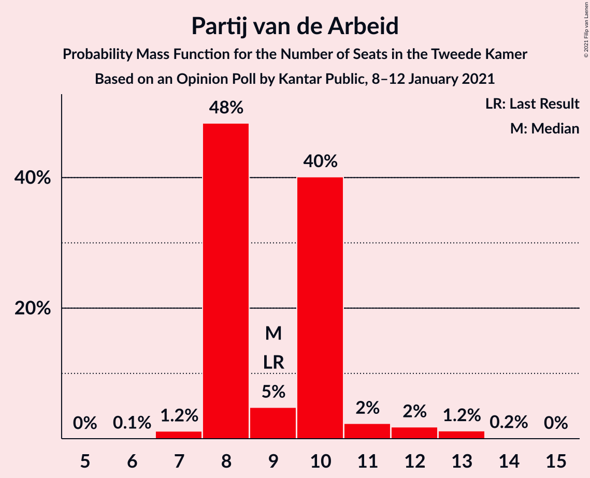

| Number of Seats | Probability | Accumulated | Special Marks |
|:---------------:|:-----------:|:-----------:|:-------------:|
| 6 | 0.1% | 100% |  |
| 7 | 1.2% | 99.9% |  |
| 8 | 48% | 98.8% |  |
| 9 | 5% | 50% | Last Result, Median |
| 10 | 40% | 46% |  |
| 11 | 2% | 6% |  |
| 12 | 2% | 3% |  |
| 13 | 1.2% | 1.4% |  |
| 14 | 0.2% | 0.2% |  |
| 15 | 0% | 0% |  |

### ChristenUnie

*For a full overview of the results for this party, see the [ChristenUnie](party-christenunie.html) page.*

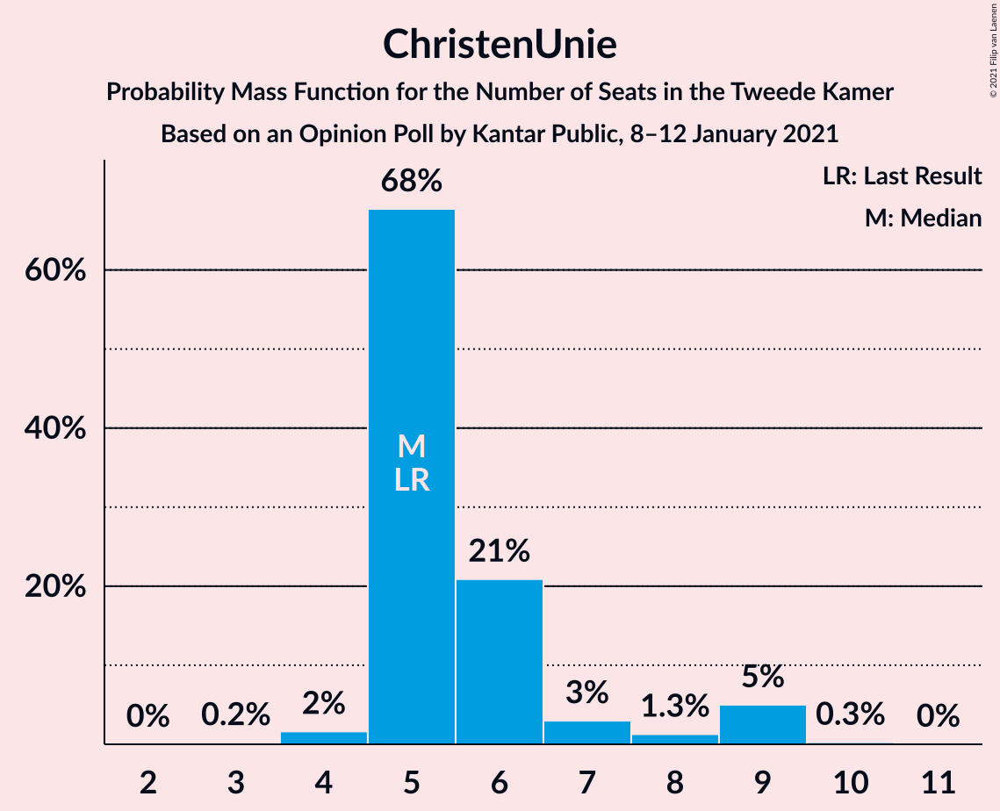

| Number of Seats | Probability | Accumulated | Special Marks |
|:---------------:|:-----------:|:-----------:|:-------------:|
| 3 | 0.2% | 100% |  |
| 4 | 2% | 99.8% |  |
| 5 | 68% | 98% | Last Result, Median |
| 6 | 21% | 30% |  |
| 7 | 3% | 10% |  |
| 8 | 1.3% | 7% |  |
| 9 | 5% | 5% |  |
| 10 | 0.3% | 0.3% |  |
| 11 | 0% | 0% |  |

### Partij voor de Dieren

*For a full overview of the results for this party, see the [Partij voor de Dieren](party-partijvoordedieren.html) page.*

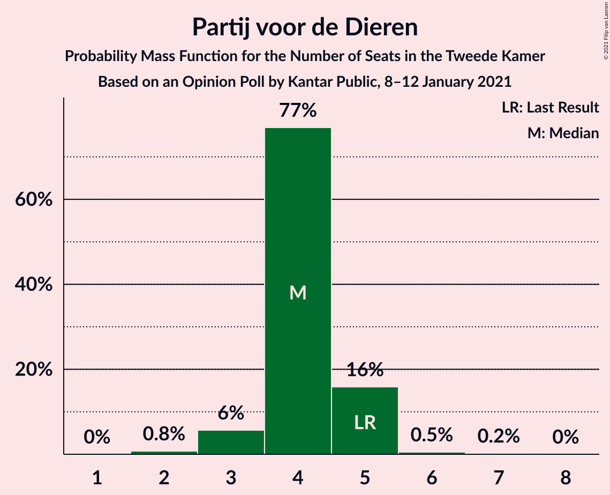

| Number of Seats | Probability | Accumulated | Special Marks |
|:---------------:|:-----------:|:-----------:|:-------------:|
| 2 | 0.8% | 100% |  |
| 3 | 6% | 99.2% |  |
| 4 | 77% | 94% | Median |
| 5 | 16% | 17% | Last Result |
| 6 | 0.5% | 0.8% |  |
| 7 | 0.2% | 0.2% |  |
| 8 | 0% | 0% |  |

### Forum voor Democratie

*For a full overview of the results for this party, see the [Forum voor Democratie](party-forumvoordemocratie.html) page.*

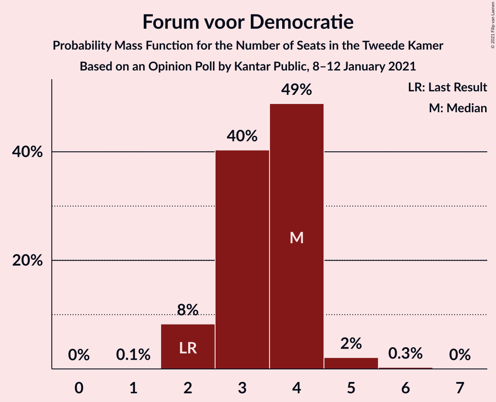

| Number of Seats | Probability | Accumulated | Special Marks |
|:---------------:|:-----------:|:-----------:|:-------------:|
| 1 | 0.1% | 100% |  |
| 2 | 8% | 99.9% | Last Result |
| 3 | 40% | 92% |  |
| 4 | 49% | 51% | Median |
| 5 | 2% | 2% |  |
| 6 | 0.3% | 0.3% |  |
| 7 | 0% | 0% |  |

### Staatkundig Gereformeerde Partij

*For a full overview of the results for this party, see the [Staatkundig Gereformeerde Partij](party-staatkundiggereformeerdepartij.html) page.*

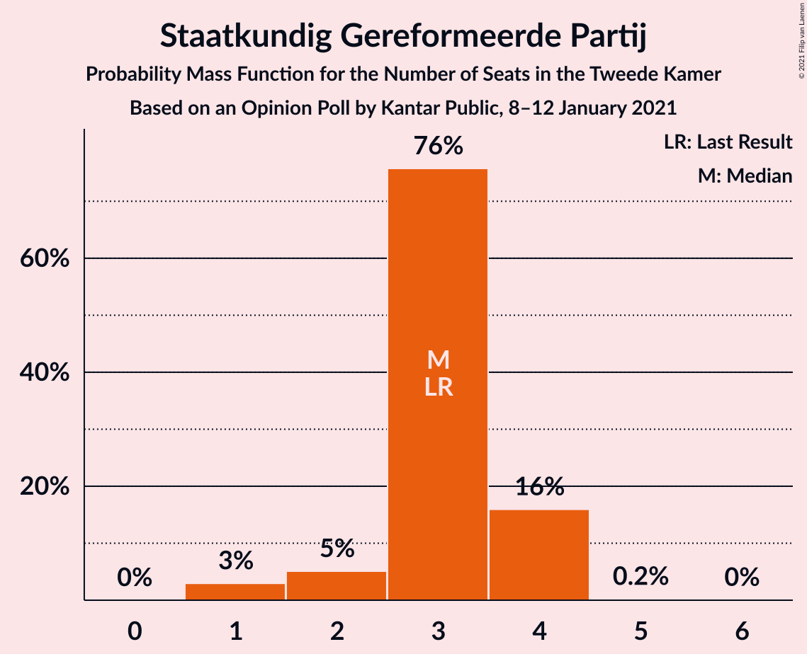

| Number of Seats | Probability | Accumulated | Special Marks |
|:---------------:|:-----------:|:-----------:|:-------------:|
| 1 | 3% | 100% |  |
| 2 | 5% | 97% |  |
| 3 | 76% | 92% | Last Result, Median |
| 4 | 16% | 16% |  |
| 5 | 0.2% | 0.3% |  |
| 6 | 0% | 0% |  |

### 50Plus

*For a full overview of the results for this party, see the [50Plus](party-50plus.html) page.*

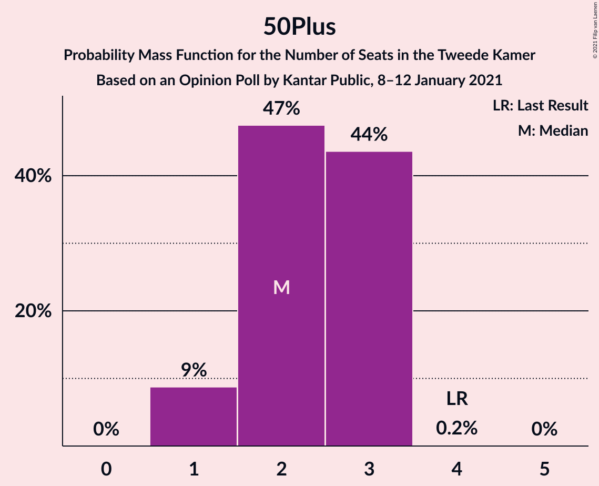

| Number of Seats | Probability | Accumulated | Special Marks |
|:---------------:|:-----------:|:-----------:|:-------------:|
| 1 | 9% | 100% |  |
| 2 | 47% | 91% | Median |
| 3 | 44% | 44% |  |
| 4 | 0.2% | 0.2% | Last Result |
| 5 | 0% | 0% |  |

### DENK

*For a full overview of the results for this party, see the [DENK](party-denk.html) page.*

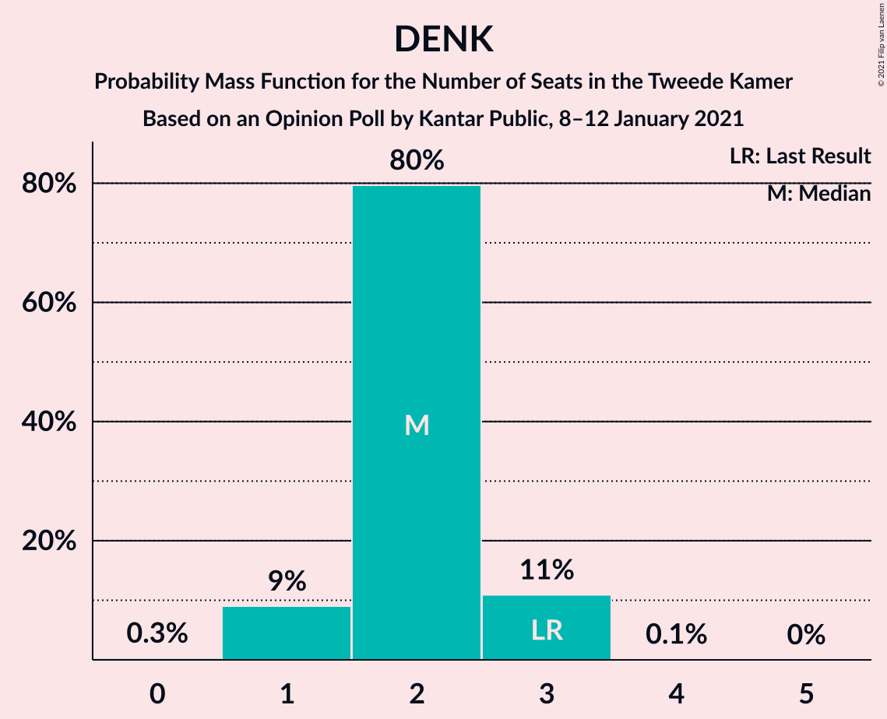

| Number of Seats | Probability | Accumulated | Special Marks |
|:---------------:|:-----------:|:-----------:|:-------------:|
| 0 | 0.3% | 100% |  |
| 1 | 9% | 99.7% |  |
| 2 | 80% | 91% | Median |
| 3 | 11% | 11% | Last Result |
| 4 | 0.1% | 0.1% |  |
| 5 | 0% | 0% |  |

### Juiste Antwoord 2021

*For a full overview of the results for this party, see the [Juiste Antwoord 2021](party-juisteantwoord2021.html) page.*

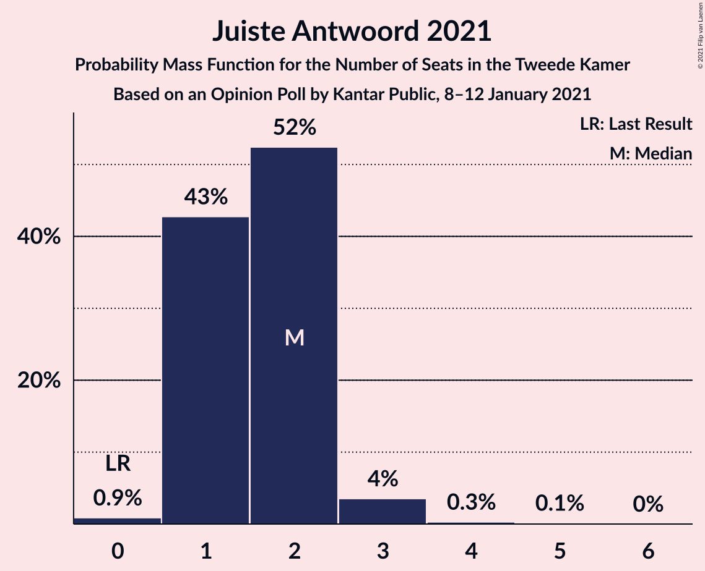

| Number of Seats | Probability | Accumulated | Special Marks |
|:---------------:|:-----------:|:-----------:|:-------------:|
| 0 | 0.9% | 100% | Last Result |
| 1 | 43% | 99.1% |  |
| 2 | 52% | 56% | Median |
| 3 | 4% | 4% |  |
| 4 | 0.3% | 0.4% |  |
| 5 | 0.1% | 0.1% |  |
| 6 | 0% | 0% |  |

## Coalitions

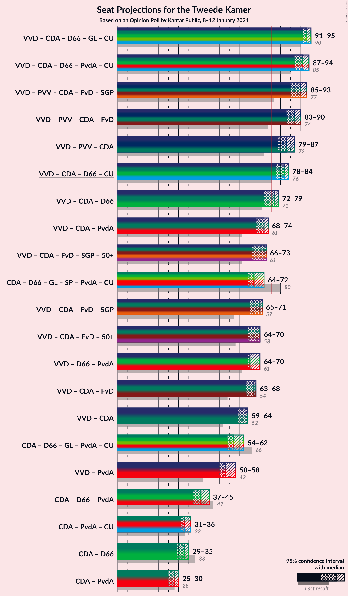

### Confidence Intervals

| Coalition | Last Result | Median | Majority? | 80% Confidence Interval | 90% Confidence Interval | 95% Confidence Interval | 99% Confidence Interval |
|:---------:|:-----------:|:------:|:---------:|:-----------------------:|:-----------------------:|:-----------------------:|:-----------------------:|
| Volkspartij voor Vrijheid en Democratie – Christen-Democratisch Appèl – Democraten 66 – GroenLinks – ChristenUnie | 90 | 93 | 100% | 91–94 | 91–94 | 91–95 | 87–97 |
| Volkspartij voor Vrijheid en Democratie – Christen-Democratisch Appèl – Democraten 66 – Partij van de Arbeid – ChristenUnie | 85 | 91 | 100% | 88–94 | 88–94 | 87–94 | 84–97 |
| Volkspartij voor Vrijheid en Democratie – Partij voor de Vrijheid – Christen-Democratisch Appèl – Forum voor Democratie – Staatkundig Gereformeerde Partij | 77 | 90 | 100% | 88–93 | 87–93 | 85–93 | 82–93 |
| Volkspartij voor Vrijheid en Democratie – Partij voor de Vrijheid – Christen-Democratisch Appèl – Forum voor Democratie | 74 | 87 | 100% | 85–90 | 84–90 | 83–90 | 80–90 |
| Volkspartij voor Vrijheid en Democratie – Partij voor de Vrijheid – Christen-Democratisch Appèl | 72 | 83 | 99.9% | 81–87 | 80–87 | 79–87 | 77–87 |
| Volkspartij voor Vrijheid en Democratie – Christen-Democratisch Appèl – Democraten 66 – ChristenUnie | 76 | 82 | 99.2% | 80–84 | 79–84 | 78–84 | 75–86 |
| Volkspartij voor Vrijheid en Democratie – Christen-Democratisch Appèl – Democraten 66 | 71 | 77 | 80% | 74–79 | 74–79 | 72–79 | 69–79 |
| Volkspartij voor Vrijheid en Democratie – Christen-Democratisch Appèl – Partij van de Arbeid | 61 | 72 | 1.0% | 70–74 | 69–74 | 68–74 | 66–77 |
| Volkspartij voor Vrijheid en Democratie – Christen-Democratisch Appèl – Forum voor Democratie – Staatkundig Gereformeerde Partij – 50Plus | 61 | 73 | 0.3% | 69–73 | 68–73 | 66–73 | 64–74 |
| Christen-Democratisch Appèl – Democraten 66 – GroenLinks – Socialistische Partij – Partij van de Arbeid – ChristenUnie | 80 | 67 | 0.4% | 67–70 | 64–71 | 64–72 | 64–74 |
| Volkspartij voor Vrijheid en Democratie – Christen-Democratisch Appèl – Forum voor Democratie – Staatkundig Gereformeerde Partij | 57 | 70 | 0% | 68–71 | 66–71 | 65–71 | 62–72 |
| Volkspartij voor Vrijheid en Democratie – Christen-Democratisch Appèl – Forum voor Democratie – 50Plus | 58 | 70 | 0% | 66–70 | 66–70 | 64–70 | 61–71 |
| Volkspartij voor Vrijheid en Democratie – Democraten 66 – Partij van de Arbeid | 61 | 65 | 0% | 65–70 | 64–70 | 64–70 | 61–75 |
| Volkspartij voor Vrijheid en Democratie – Christen-Democratisch Appèl – Forum voor Democratie | 54 | 67 | 0% | 64–68 | 63–68 | 63–68 | 60–70 |
| Volkspartij voor Vrijheid en Democratie – Christen-Democratisch Appèl | 52 | 64 | 0% | 61–64 | 60–64 | 59–64 | 56–67 |
| Christen-Democratisch Appèl – Democraten 66 – GroenLinks – Partij van de Arbeid – ChristenUnie | 66 | 57 | 0% | 56–60 | 54–60 | 54–62 | 53–63 |
| Volkspartij voor Vrijheid en Democratie – Partij van de Arbeid | 42 | 53 | 0% | 52–56 | 51–56 | 50–58 | 47–60 |
| Christen-Democratisch Appèl – Democraten 66 – Partij van de Arbeid | 47 | 41 | 0% | 39–45 | 37–45 | 37–45 | 33–45 |
| Christen-Democratisch Appèl – Partij van de Arbeid – ChristenUnie | 33 | 33 | 0% | 31–35 | 31–35 | 31–36 | 28–38 |
| Christen-Democratisch Appèl – Democraten 66 | 38 | 33 | 0% | 29–35 | 29–35 | 29–35 | 25–35 |
| Christen-Democratisch Appèl – Partij van de Arbeid | 28 | 28 | 0% | 26–30 | 25–30 | 25–30 | 21–31 |

### Volkspartij voor Vrijheid en Democratie – Christen-Democratisch Appèl – Democraten 66 – GroenLinks – ChristenUnie

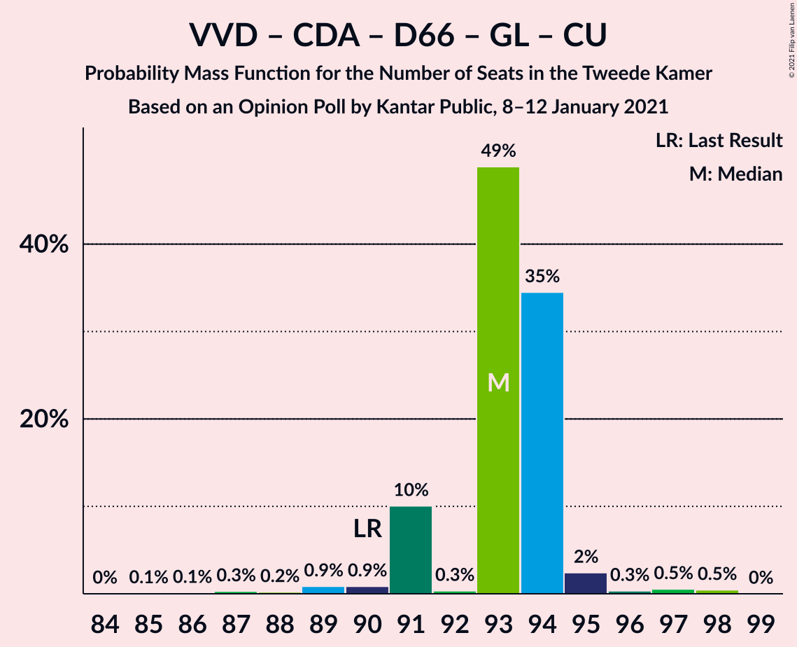

| Number of Seats | Probability | Accumulated | Special Marks |
|:---------------:|:-----------:|:-----------:|:-------------:|
| 85 | 0.1% | 100% |  |
| 86 | 0.1% | 99.9% |  |
| 87 | 0.3% | 99.8% |  |
| 88 | 0.2% | 99.5% |  |
| 89 | 0.9% | 99.3% |  |
| 90 | 0.9% | 98% | Last Result |
| 91 | 10% | 98% |  |
| 92 | 0.3% | 87% |  |
| 93 | 49% | 87% | Median |
| 94 | 35% | 38% |  |
| 95 | 2% | 4% |  |
| 96 | 0.3% | 1.4% |  |
| 97 | 0.5% | 1.0% |  |
| 98 | 0.5% | 0.5% |  |
| 99 | 0% | 0% |  |

### Volkspartij voor Vrijheid en Democratie – Christen-Democratisch Appèl – Democraten 66 – Partij van de Arbeid – ChristenUnie

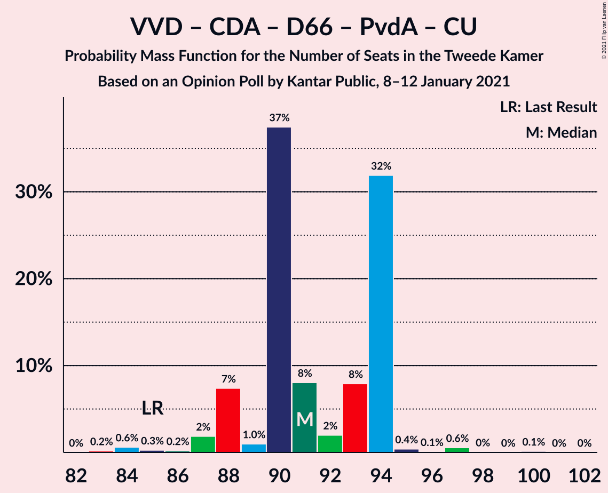

| Number of Seats | Probability | Accumulated | Special Marks |
|:---------------:|:-----------:|:-----------:|:-------------:|
| 83 | 0.2% | 100% |  |
| 84 | 0.6% | 99.8% |  |
| 85 | 0.3% | 99.2% | Last Result |
| 86 | 0.2% | 98.9% |  |
| 87 | 2% | 98.7% |  |
| 88 | 7% | 97% |  |
| 89 | 1.0% | 89% |  |
| 90 | 37% | 89% |  |
| 91 | 8% | 51% | Median |
| 92 | 2% | 43% |  |
| 93 | 8% | 41% |  |
| 94 | 32% | 33% |  |
| 95 | 0.4% | 1.2% |  |
| 96 | 0.1% | 0.8% |  |
| 97 | 0.6% | 0.7% |  |
| 98 | 0% | 0.2% |  |
| 99 | 0% | 0.1% |  |
| 100 | 0.1% | 0.1% |  |
| 101 | 0% | 0% |  |

### Volkspartij voor Vrijheid en Democratie – Partij voor de Vrijheid – Christen-Democratisch Appèl – Forum voor Democratie – Staatkundig Gereformeerde Partij

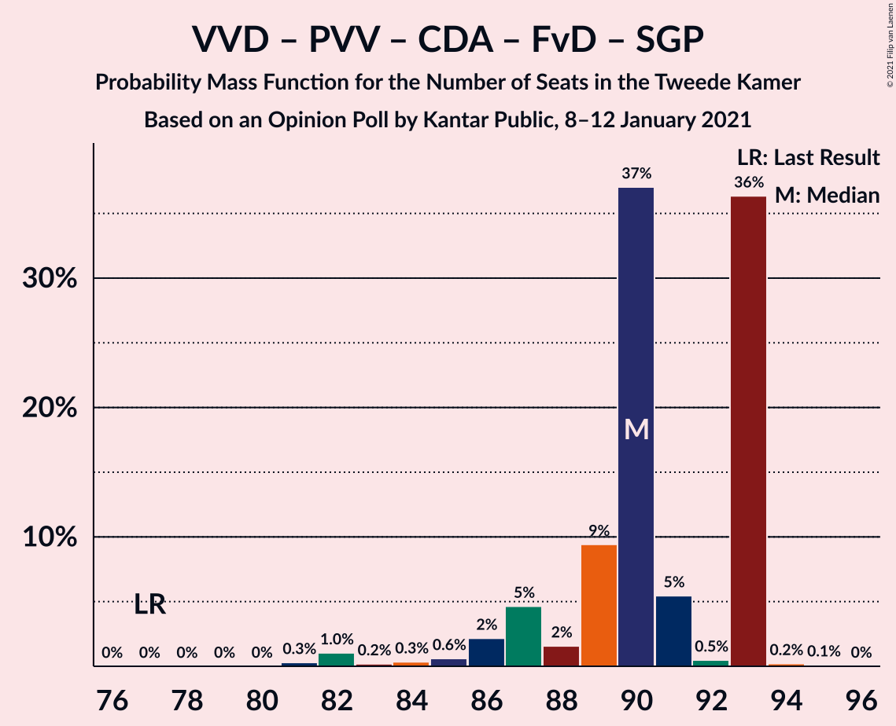

| Number of Seats | Probability | Accumulated | Special Marks |
|:---------------:|:-----------:|:-----------:|:-------------:|
| 77 | 0% | 100% | Last Result |
| 78 | 0% | 100% |  |
| 79 | 0% | 100% |  |
| 80 | 0% | 100% |  |
| 81 | 0.3% | 100% |  |
| 82 | 1.0% | 99.7% |  |
| 83 | 0.2% | 98.6% |  |
| 84 | 0.3% | 98% |  |
| 85 | 0.6% | 98% |  |
| 86 | 2% | 97% |  |
| 87 | 5% | 95% |  |
| 88 | 2% | 91% |  |
| 89 | 9% | 89% |  |
| 90 | 37% | 80% |  |
| 91 | 5% | 43% |  |
| 92 | 0.5% | 37% |  |
| 93 | 36% | 37% | Median |
| 94 | 0.2% | 0.4% |  |
| 95 | 0.1% | 0.1% |  |
| 96 | 0% | 0% |  |

### Volkspartij voor Vrijheid en Democratie – Partij voor de Vrijheid – Christen-Democratisch Appèl – Forum voor Democratie

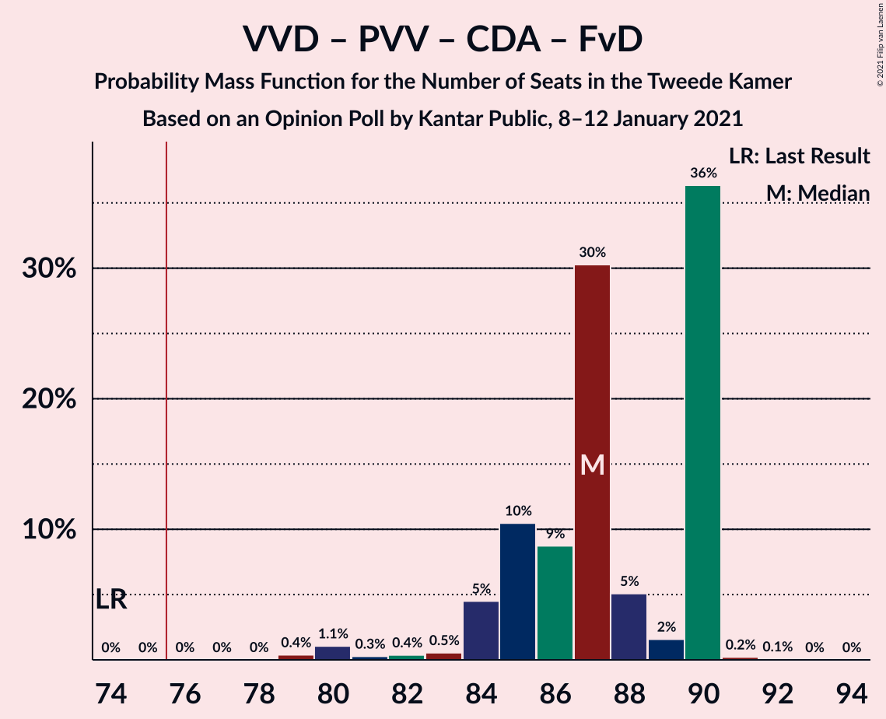

| Number of Seats | Probability | Accumulated | Special Marks |
|:---------------:|:-----------:|:-----------:|:-------------:|
| 74 | 0% | 100% | Last Result |
| 75 | 0% | 100% |  |
| 76 | 0% | 100% | Majority |
| 77 | 0% | 100% |  |
| 78 | 0% | 100% |  |
| 79 | 0.4% | 100% |  |
| 80 | 1.1% | 99.6% |  |
| 81 | 0.3% | 98.5% |  |
| 82 | 0.4% | 98% |  |
| 83 | 0.5% | 98% |  |
| 84 | 5% | 97% |  |
| 85 | 10% | 93% |  |
| 86 | 9% | 82% |  |
| 87 | 30% | 74% |  |
| 88 | 5% | 43% |  |
| 89 | 2% | 38% |  |
| 90 | 36% | 37% | Median |
| 91 | 0.2% | 0.3% |  |
| 92 | 0.1% | 0.1% |  |
| 93 | 0% | 0% |  |

### Volkspartij voor Vrijheid en Democratie – Partij voor de Vrijheid – Christen-Democratisch Appèl

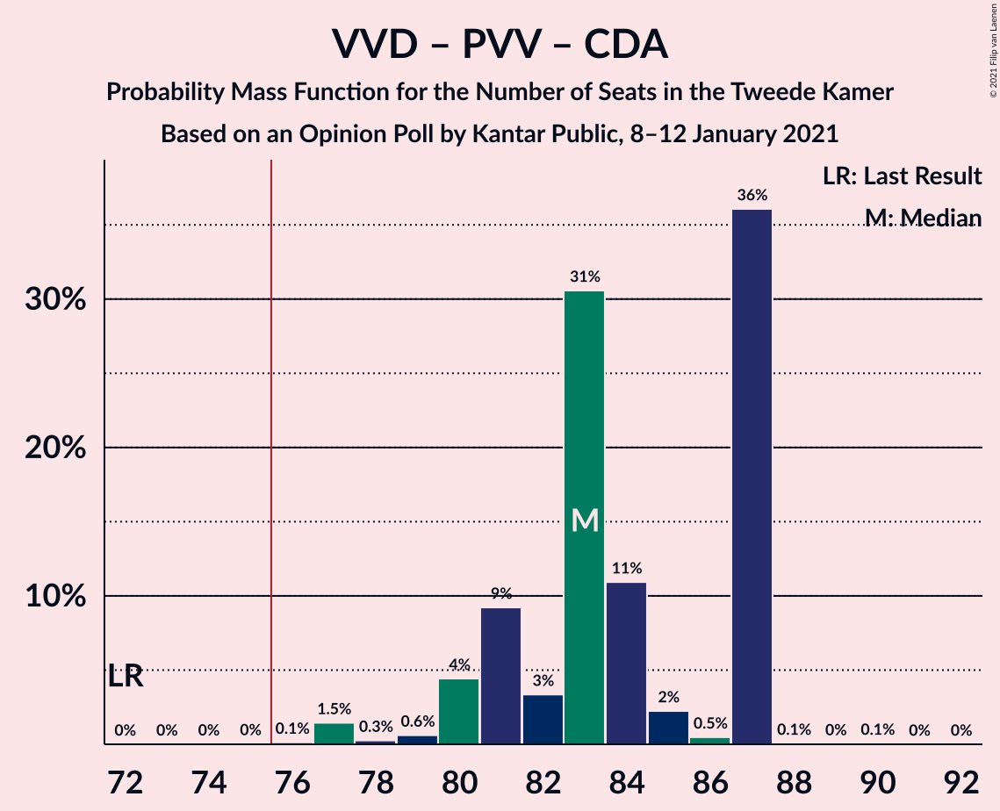

| Number of Seats | Probability | Accumulated | Special Marks |
|:---------------:|:-----------:|:-----------:|:-------------:|
| 72 | 0% | 100% | Last Result |
| 73 | 0% | 100% |  |
| 74 | 0% | 100% |  |
| 75 | 0% | 100% |  |
| 76 | 0.1% | 99.9% | Majority |
| 77 | 1.5% | 99.8% |  |
| 78 | 0.3% | 98% |  |
| 79 | 0.6% | 98% |  |
| 80 | 4% | 97% |  |
| 81 | 9% | 93% |  |
| 82 | 3% | 84% |  |
| 83 | 31% | 80% |  |
| 84 | 11% | 50% |  |
| 85 | 2% | 39% |  |
| 86 | 0.5% | 37% | Median |
| 87 | 36% | 36% |  |
| 88 | 0.1% | 0.2% |  |
| 89 | 0% | 0.1% |  |
| 90 | 0.1% | 0.1% |  |
| 91 | 0% | 0% |  |

### Volkspartij voor Vrijheid en Democratie – Christen-Democratisch Appèl – Democraten 66 – ChristenUnie

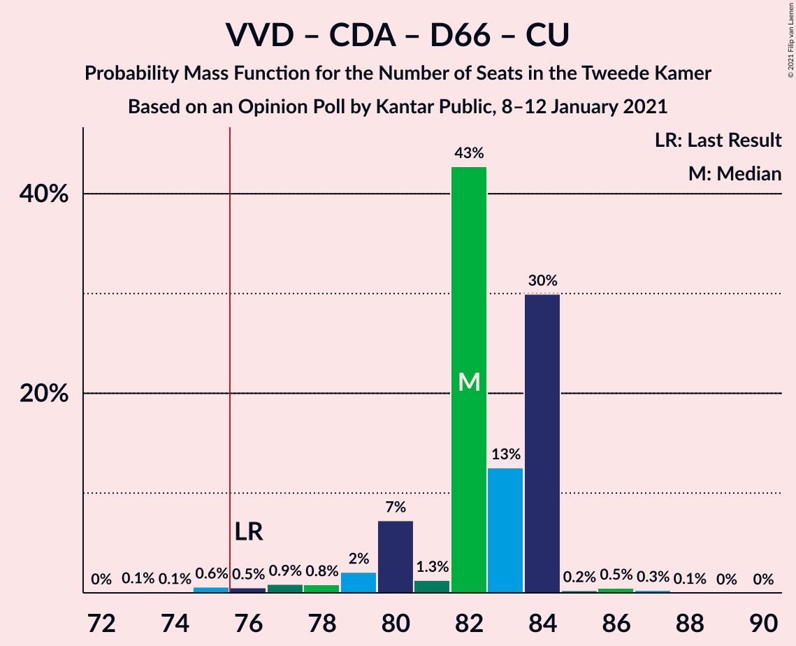

| Number of Seats | Probability | Accumulated | Special Marks |
|:---------------:|:-----------:|:-----------:|:-------------:|
| 73 | 0.1% | 100% |  |
| 74 | 0.1% | 99.8% |  |
| 75 | 0.6% | 99.8% |  |
| 76 | 0.5% | 99.2% | Last Result, Majority |
| 77 | 0.9% | 98.7% |  |
| 78 | 0.8% | 98% |  |
| 79 | 2% | 97% |  |
| 80 | 7% | 95% |  |
| 81 | 1.3% | 88% |  |
| 82 | 43% | 86% | Median |
| 83 | 13% | 44% |  |
| 84 | 30% | 31% |  |
| 85 | 0.2% | 1.1% |  |
| 86 | 0.5% | 0.8% |  |
| 87 | 0.3% | 0.3% |  |
| 88 | 0.1% | 0.1% |  |
| 89 | 0% | 0% |  |

### Volkspartij voor Vrijheid en Democratie – Christen-Democratisch Appèl – Democraten 66

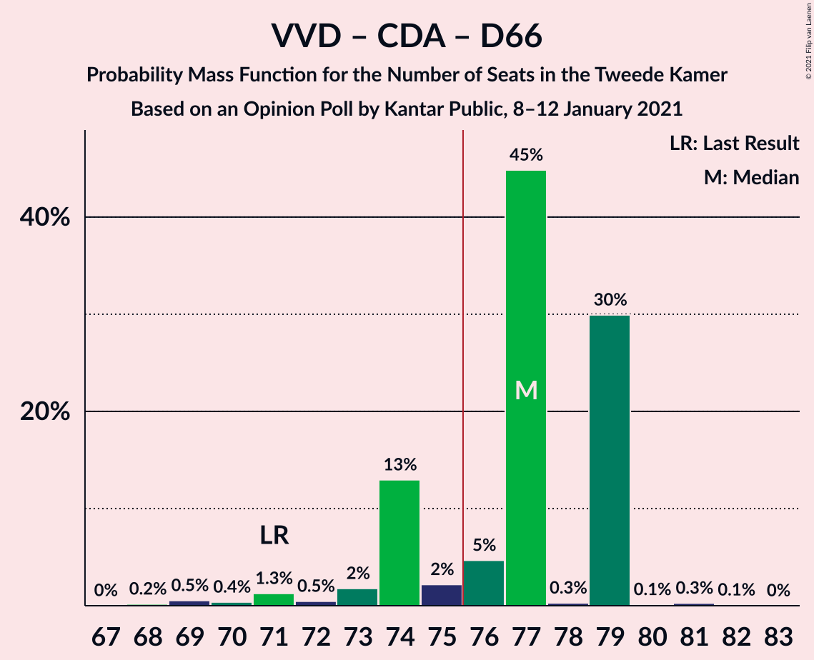

| Number of Seats | Probability | Accumulated | Special Marks |
|:---------------:|:-----------:|:-----------:|:-------------:|
| 67 | 0% | 100% |  |
| 68 | 0.2% | 99.9% |  |
| 69 | 0.5% | 99.8% |  |
| 70 | 0.4% | 99.2% |  |
| 71 | 1.3% | 98.8% | Last Result |
| 72 | 0.5% | 98% |  |
| 73 | 2% | 97% |  |
| 74 | 13% | 95% |  |
| 75 | 2% | 82% |  |
| 76 | 5% | 80% | Majority |
| 77 | 45% | 76% | Median |
| 78 | 0.3% | 31% |  |
| 79 | 30% | 30% |  |
| 80 | 0.1% | 0.5% |  |
| 81 | 0.3% | 0.4% |  |
| 82 | 0.1% | 0.1% |  |
| 83 | 0% | 0% |  |

### Volkspartij voor Vrijheid en Democratie – Christen-Democratisch Appèl – Partij van de Arbeid

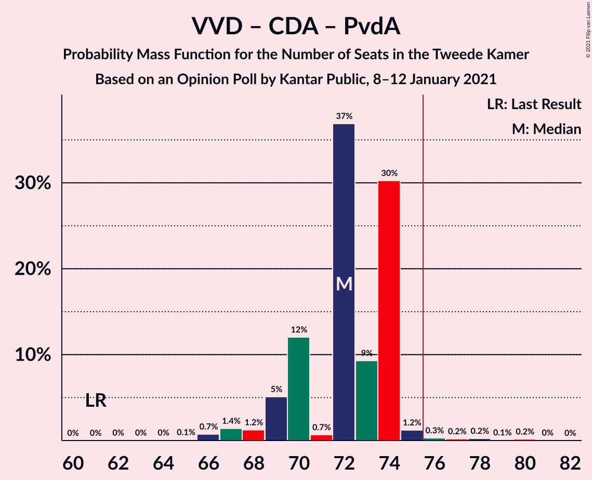

| Number of Seats | Probability | Accumulated | Special Marks |
|:---------------:|:-----------:|:-----------:|:-------------:|
| 61 | 0% | 100% | Last Result |
| 62 | 0% | 100% |  |
| 63 | 0% | 100% |  |
| 64 | 0% | 99.9% |  |
| 65 | 0.1% | 99.9% |  |
| 66 | 0.7% | 99.8% |  |
| 67 | 1.4% | 99.1% |  |
| 68 | 1.2% | 98% |  |
| 69 | 5% | 96% |  |
| 70 | 12% | 91% |  |
| 71 | 0.7% | 79% |  |
| 72 | 37% | 79% |  |
| 73 | 9% | 42% | Median |
| 74 | 30% | 32% |  |
| 75 | 1.2% | 2% |  |
| 76 | 0.3% | 1.0% | Majority |
| 77 | 0.2% | 0.7% |  |
| 78 | 0.2% | 0.5% |  |
| 79 | 0.1% | 0.2% |  |
| 80 | 0.2% | 0.2% |  |
| 81 | 0% | 0% |  |

### Volkspartij voor Vrijheid en Democratie – Christen-Democratisch Appèl – Forum voor Democratie – Staatkundig Gereformeerde Partij – 50Plus

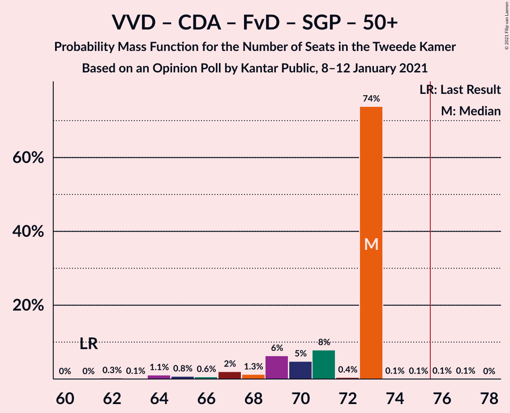

| Number of Seats | Probability | Accumulated | Special Marks |
|:---------------:|:-----------:|:-----------:|:-------------:|
| 61 | 0% | 100% | Last Result |
| 62 | 0.3% | 100% |  |
| 63 | 0.1% | 99.7% |  |
| 64 | 1.1% | 99.6% |  |
| 65 | 0.8% | 98% |  |
| 66 | 0.6% | 98% |  |
| 67 | 2% | 97% |  |
| 68 | 1.3% | 95% |  |
| 69 | 6% | 94% |  |
| 70 | 5% | 88% |  |
| 71 | 8% | 83% |  |
| 72 | 0.4% | 75% |  |
| 73 | 74% | 74% | Median |
| 74 | 0.1% | 0.5% |  |
| 75 | 0.1% | 0.4% |  |
| 76 | 0.1% | 0.3% | Majority |
| 77 | 0.1% | 0.2% |  |
| 78 | 0% | 0% |  |

### Christen-Democratisch Appèl – Democraten 66 – GroenLinks – Socialistische Partij – Partij van de Arbeid – ChristenUnie

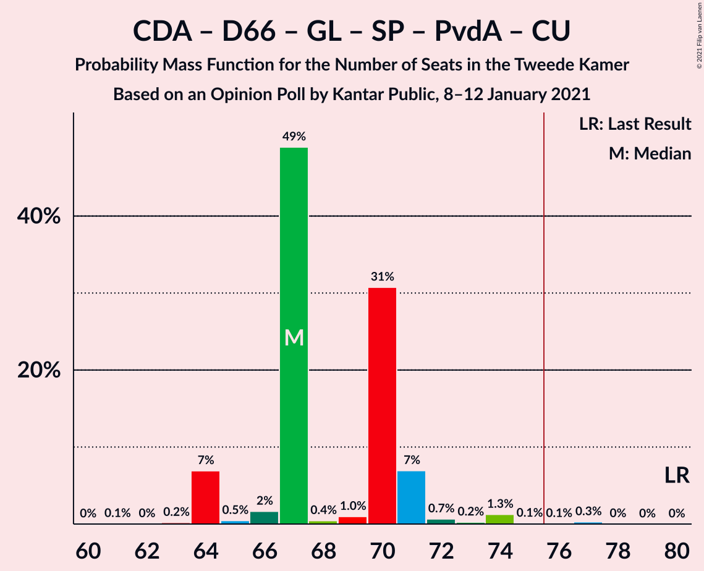

| Number of Seats | Probability | Accumulated | Special Marks |
|:---------------:|:-----------:|:-----------:|:-------------:|
| 61 | 0.1% | 100% |  |
| 62 | 0% | 99.9% |  |
| 63 | 0.2% | 99.9% |  |
| 64 | 7% | 99.7% |  |
| 65 | 0.5% | 93% |  |
| 66 | 2% | 92% |  |
| 67 | 49% | 91% |  |
| 68 | 0.4% | 42% | Median |
| 69 | 1.0% | 41% |  |
| 70 | 31% | 40% |  |
| 71 | 7% | 10% |  |
| 72 | 0.7% | 3% |  |
| 73 | 0.2% | 2% |  |
| 74 | 1.3% | 2% |  |
| 75 | 0.1% | 0.5% |  |
| 76 | 0.1% | 0.4% | Majority |
| 77 | 0.3% | 0.3% |  |
| 78 | 0% | 0% |  |
| 79 | 0% | 0% |  |
| 80 | 0% | 0% | Last Result |

### Volkspartij voor Vrijheid en Democratie – Christen-Democratisch Appèl – Forum voor Democratie – Staatkundig Gereformeerde Partij

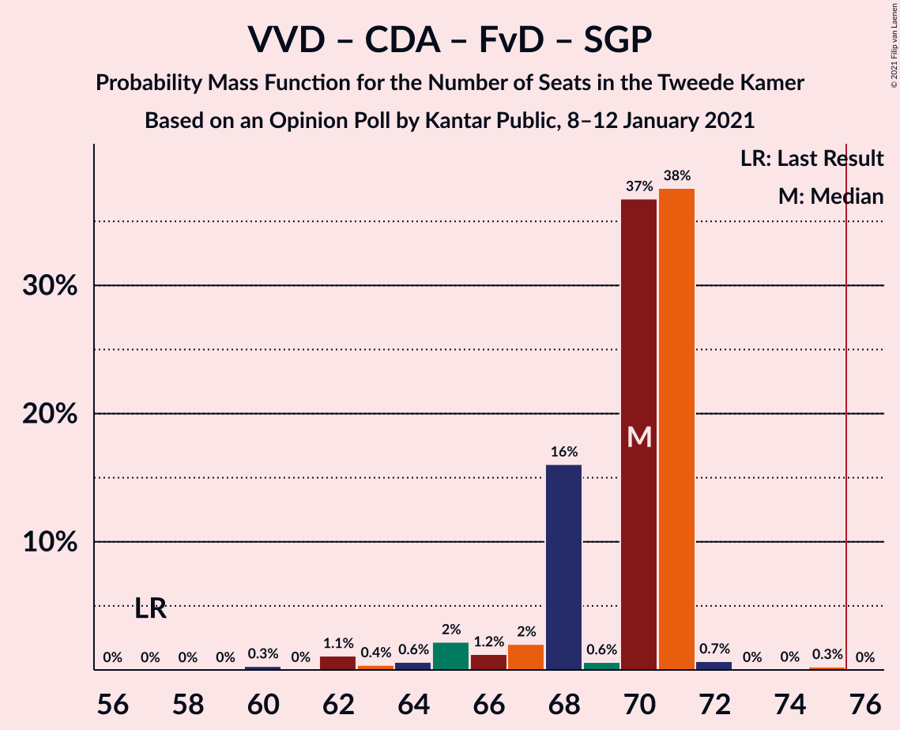

| Number of Seats | Probability | Accumulated | Special Marks |
|:---------------:|:-----------:|:-----------:|:-------------:|
| 57 | 0% | 100% | Last Result |
| 58 | 0% | 100% |  |
| 59 | 0% | 100% |  |
| 60 | 0.3% | 100% |  |
| 61 | 0% | 99.7% |  |
| 62 | 1.1% | 99.6% |  |
| 63 | 0.4% | 98.5% |  |
| 64 | 0.6% | 98% |  |
| 65 | 2% | 98% |  |
| 66 | 1.2% | 95% |  |
| 67 | 2% | 94% |  |
| 68 | 16% | 92% |  |
| 69 | 0.6% | 76% |  |
| 70 | 37% | 75% |  |
| 71 | 38% | 39% | Median |
| 72 | 0.7% | 1.0% |  |
| 73 | 0% | 0.4% |  |
| 74 | 0% | 0.3% |  |
| 75 | 0.3% | 0.3% |  |
| 76 | 0% | 0% | Majority |

### Volkspartij voor Vrijheid en Democratie – Christen-Democratisch Appèl – Forum voor Democratie – 50Plus

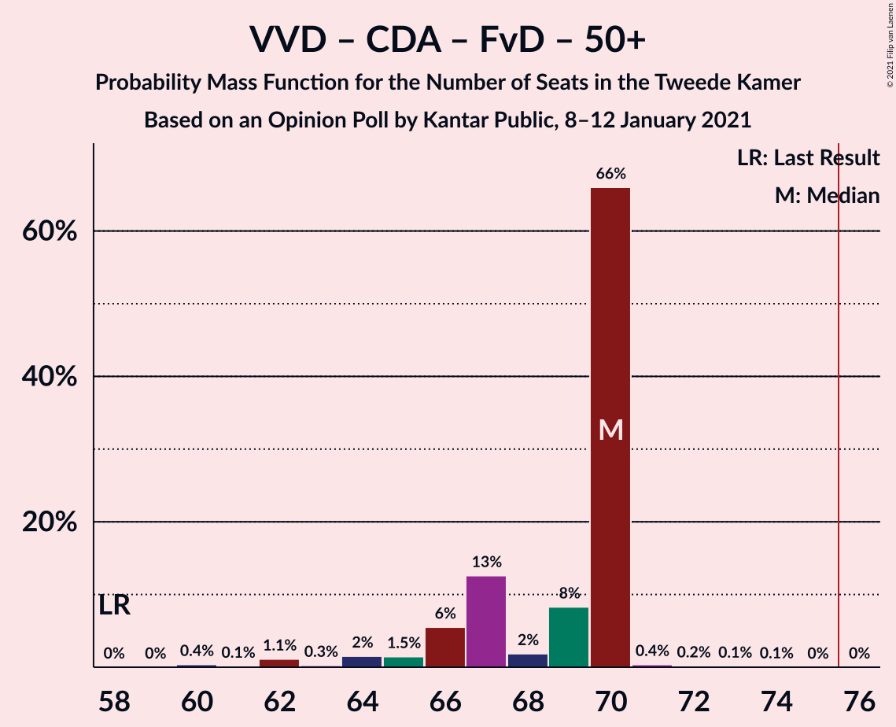

| Number of Seats | Probability | Accumulated | Special Marks |
|:---------------:|:-----------:|:-----------:|:-------------:|
| 58 | 0% | 100% | Last Result |
| 59 | 0% | 100% |  |
| 60 | 0.4% | 100% |  |
| 61 | 0.1% | 99.6% |  |
| 62 | 1.1% | 99.4% |  |
| 63 | 0.3% | 98% |  |
| 64 | 2% | 98% |  |
| 65 | 1.5% | 97% |  |
| 66 | 6% | 95% |  |
| 67 | 13% | 90% |  |
| 68 | 2% | 77% |  |
| 69 | 8% | 75% |  |
| 70 | 66% | 67% | Median |
| 71 | 0.4% | 0.8% |  |
| 72 | 0.2% | 0.4% |  |
| 73 | 0.1% | 0.2% |  |
| 74 | 0.1% | 0.1% |  |
| 75 | 0% | 0% |  |

### Volkspartij voor Vrijheid en Democratie – Democraten 66 – Partij van de Arbeid

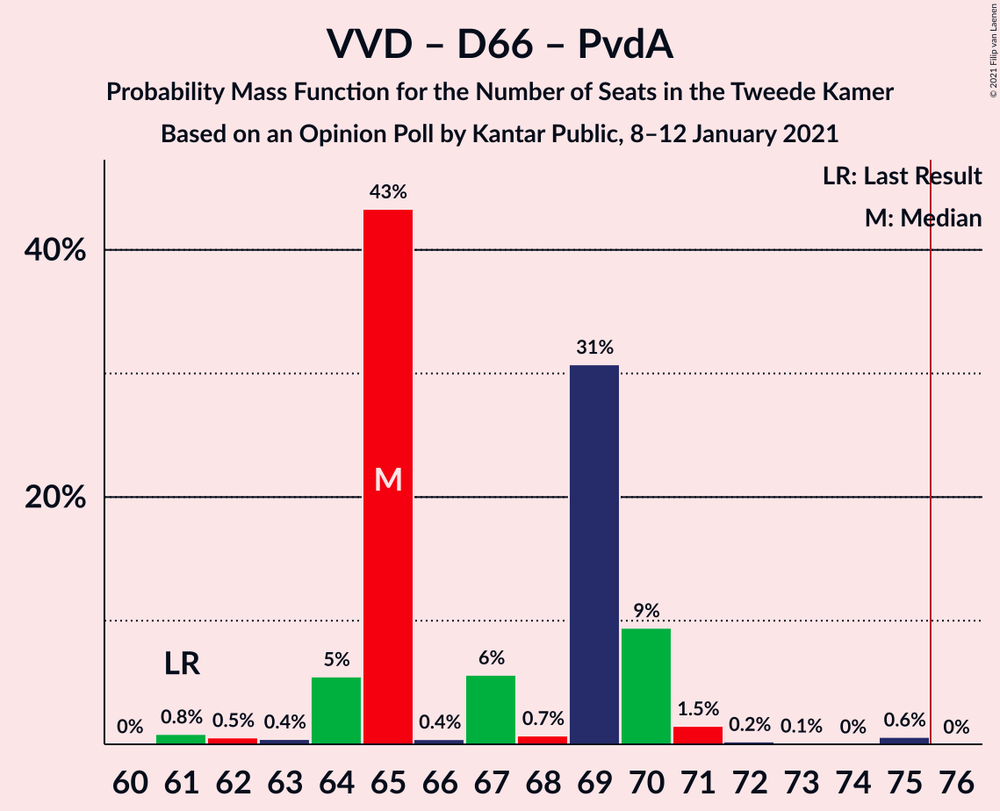

| Number of Seats | Probability | Accumulated | Special Marks |
|:---------------:|:-----------:|:-----------:|:-------------:|
| 60 | 0% | 100% |  |
| 61 | 0.8% | 99.9% | Last Result |
| 62 | 0.5% | 99.1% |  |
| 63 | 0.4% | 98.6% |  |
| 64 | 5% | 98% |  |
| 65 | 43% | 93% |  |
| 66 | 0.4% | 49% | Median |
| 67 | 6% | 49% |  |
| 68 | 0.7% | 43% |  |
| 69 | 31% | 43% |  |
| 70 | 9% | 12% |  |
| 71 | 1.5% | 2% |  |
| 72 | 0.2% | 1.0% |  |
| 73 | 0.1% | 0.7% |  |
| 74 | 0% | 0.6% |  |
| 75 | 0.6% | 0.6% |  |
| 76 | 0% | 0% | Majority |

### Volkspartij voor Vrijheid en Democratie – Christen-Democratisch Appèl – Forum voor Democratie

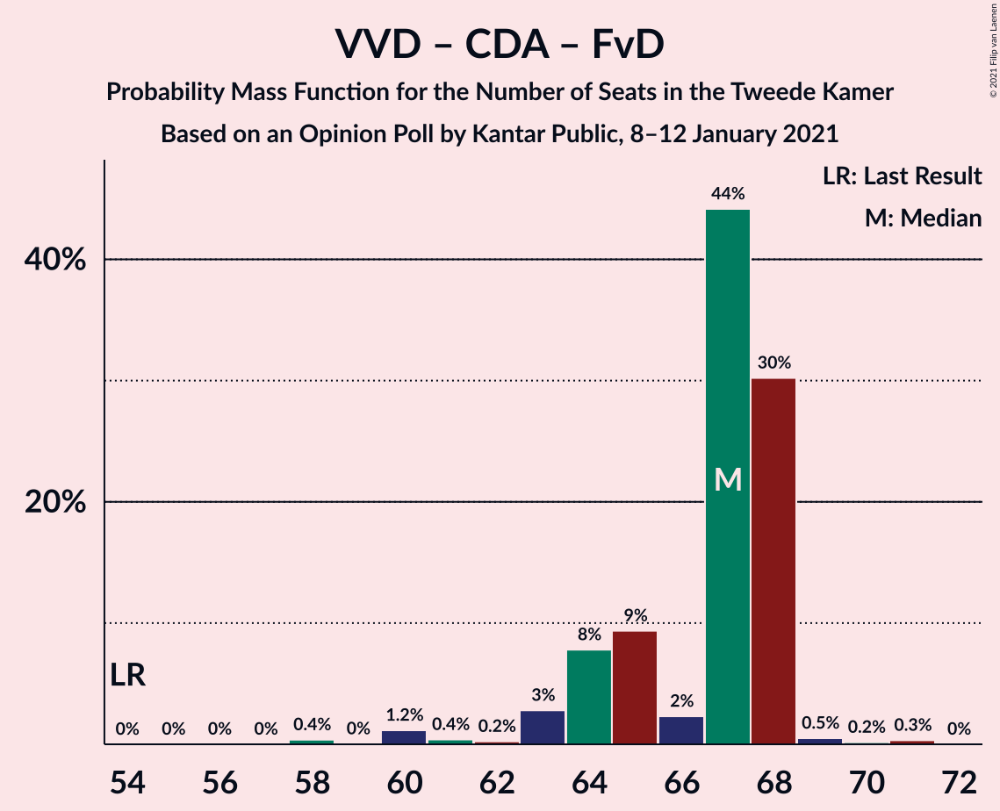

| Number of Seats | Probability | Accumulated | Special Marks |
|:---------------:|:-----------:|:-----------:|:-------------:|
| 54 | 0% | 100% | Last Result |
| 55 | 0% | 100% |  |
| 56 | 0% | 100% |  |
| 57 | 0% | 100% |  |
| 58 | 0.4% | 100% |  |
| 59 | 0% | 99.6% |  |
| 60 | 1.2% | 99.5% |  |
| 61 | 0.4% | 98% |  |
| 62 | 0.2% | 98% |  |
| 63 | 3% | 98% |  |
| 64 | 8% | 95% |  |
| 65 | 9% | 87% |  |
| 66 | 2% | 78% |  |
| 67 | 44% | 75% |  |
| 68 | 30% | 31% | Median |
| 69 | 0.5% | 1.1% |  |
| 70 | 0.2% | 0.5% |  |
| 71 | 0.3% | 0.4% |  |
| 72 | 0% | 0% |  |

### Volkspartij voor Vrijheid en Democratie – Christen-Democratisch Appèl

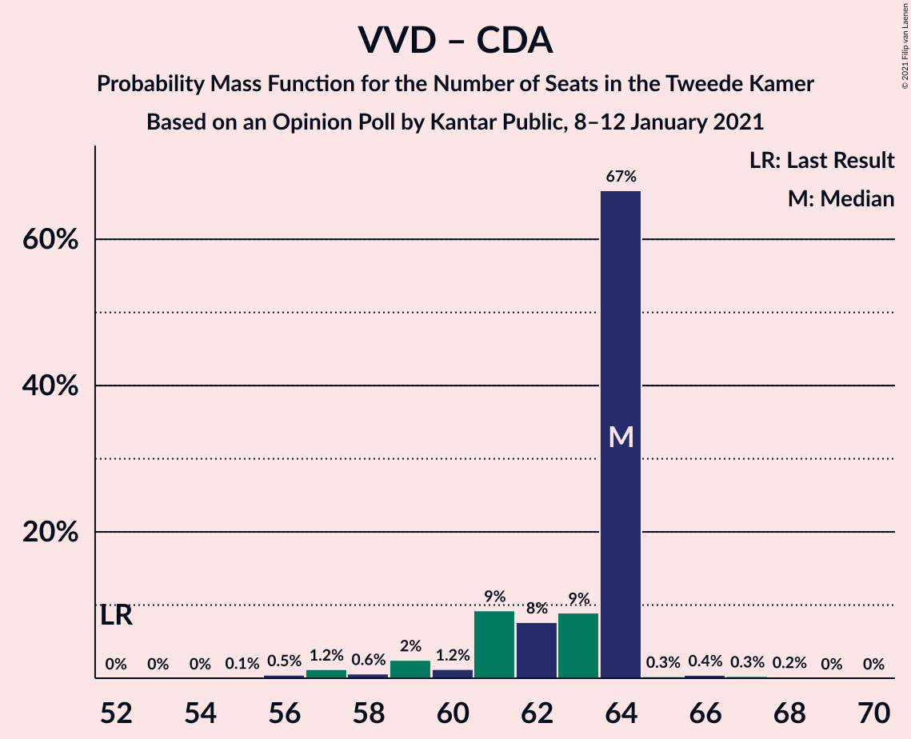

| Number of Seats | Probability | Accumulated | Special Marks |
|:---------------:|:-----------:|:-----------:|:-------------:|
| 52 | 0% | 100% | Last Result |
| 53 | 0% | 100% |  |
| 54 | 0% | 100% |  |
| 55 | 0.1% | 99.9% |  |
| 56 | 0.5% | 99.8% |  |
| 57 | 1.2% | 99.4% |  |
| 58 | 0.6% | 98% |  |
| 59 | 2% | 98% |  |
| 60 | 1.2% | 95% |  |
| 61 | 9% | 94% |  |
| 62 | 8% | 85% |  |
| 63 | 9% | 77% |  |
| 64 | 67% | 68% | Median |
| 65 | 0.3% | 1.2% |  |
| 66 | 0.4% | 1.0% |  |
| 67 | 0.3% | 0.5% |  |
| 68 | 0.2% | 0.2% |  |
| 69 | 0% | 0% |  |

### Christen-Democratisch Appèl – Democraten 66 – GroenLinks – Partij van de Arbeid – ChristenUnie

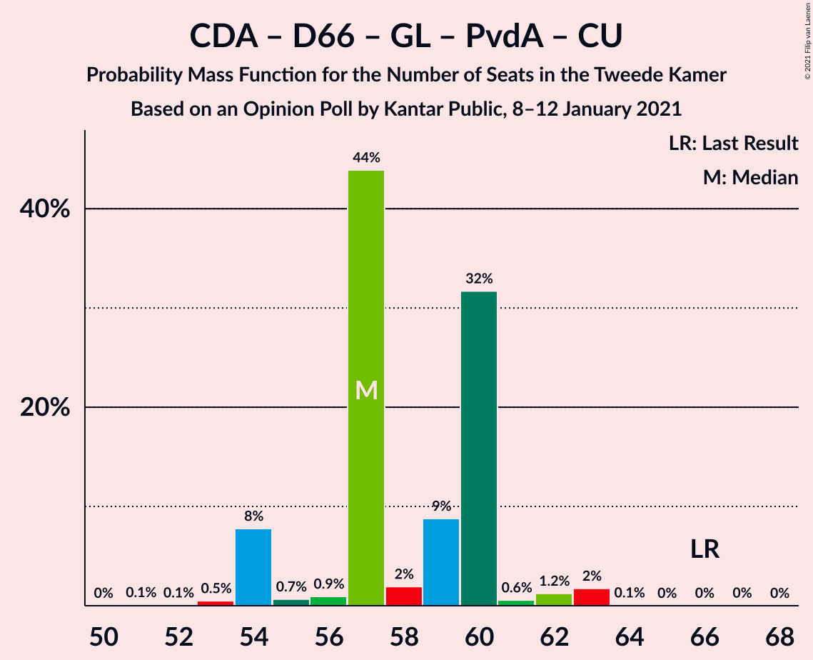

| Number of Seats | Probability | Accumulated | Special Marks |
|:---------------:|:-----------:|:-----------:|:-------------:|
| 51 | 0.1% | 100% |  |
| 52 | 0.1% | 99.9% |  |
| 53 | 0.5% | 99.8% |  |
| 54 | 8% | 99.4% |  |
| 55 | 0.7% | 92% |  |
| 56 | 0.9% | 91% |  |
| 57 | 44% | 90% |  |
| 58 | 2% | 46% | Median |
| 59 | 9% | 44% |  |
| 60 | 32% | 35% |  |
| 61 | 0.6% | 4% |  |
| 62 | 1.2% | 3% |  |
| 63 | 2% | 2% |  |
| 64 | 0.1% | 0.1% |  |
| 65 | 0% | 0.1% |  |
| 66 | 0% | 0.1% | Last Result |
| 67 | 0% | 0% |  |

### Volkspartij voor Vrijheid en Democratie – Partij van de Arbeid

| Number of Seats | Probability | Accumulated | Special Marks |
|:---------------:|:-----------:|:-----------:|:-------------:|
| 42 | 0% | 100% | Last Result |
| 43 | 0% | 100% |  |
| 44 | 0% | 100% |  |
| 45 | 0% | 100% |  |
| 46 | 0% | 100% |  |
| 47 | 0.6% | 100% |  |
| 48 | 0.1% | 99.3% |  |
| 49 | 1.5% | 99.2% |  |
| 50 | 0.4% | 98% |  |
| 51 | 4% | 97% |  |
| 52 | 41% | 93% |  |
| 53 | 7% | 52% | Median |
| 54 | 30% | 45% |  |
| 55 | 3% | 15% |  |
| 56 | 8% | 11% |  |
| 57 | 0.7% | 3% |  |
| 58 | 1.4% | 3% |  |
| 59 | 0.6% | 1.1% |  |
| 60 | 0.2% | 0.5% |  |
| 61 | 0.3% | 0.3% |  |
| 62 | 0% | 0% |  |

### Christen-Democratisch Appèl – Democraten 66 – Partij van de Arbeid

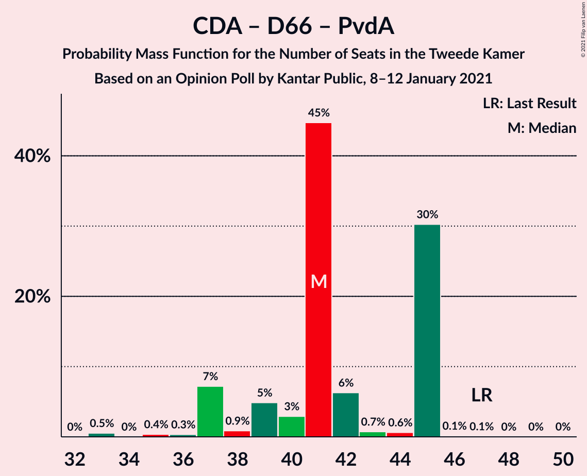

| Number of Seats | Probability | Accumulated | Special Marks |
|:---------------:|:-----------:|:-----------:|:-------------:|
| 33 | 0.5% | 100% |  |
| 34 | 0% | 99.5% |  |
| 35 | 0.4% | 99.4% |  |
| 36 | 0.3% | 99.1% |  |
| 37 | 7% | 98.8% |  |
| 38 | 0.9% | 92% |  |
| 39 | 5% | 91% |  |
| 40 | 3% | 86% |  |
| 41 | 45% | 83% |  |
| 42 | 6% | 38% | Median |
| 43 | 0.7% | 32% |  |
| 44 | 0.6% | 31% |  |
| 45 | 30% | 31% |  |
| 46 | 0.1% | 0.3% |  |
| 47 | 0.1% | 0.1% | Last Result |
| 48 | 0% | 0.1% |  |
| 49 | 0% | 0.1% |  |
| 50 | 0% | 0% |  |

### Christen-Democratisch Appèl – Partij van de Arbeid – ChristenUnie

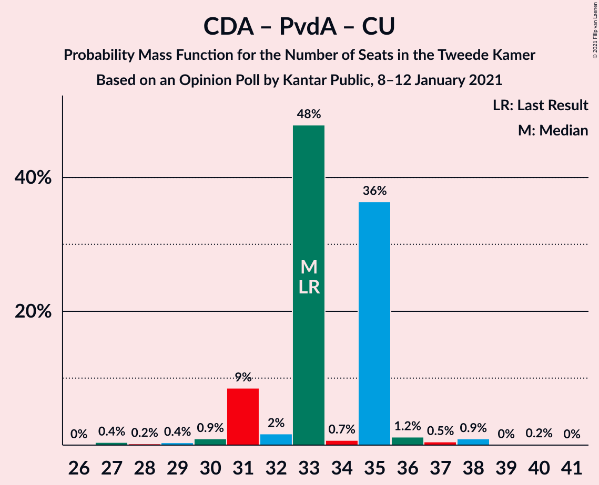

| Number of Seats | Probability | Accumulated | Special Marks |
|:---------------:|:-----------:|:-----------:|:-------------:|
| 27 | 0.4% | 100% |  |
| 28 | 0.2% | 99.6% |  |
| 29 | 0.4% | 99.3% |  |
| 30 | 0.9% | 99.0% |  |
| 31 | 9% | 98% |  |
| 32 | 2% | 89% |  |
| 33 | 48% | 88% | Last Result |
| 34 | 0.7% | 40% | Median |
| 35 | 36% | 39% |  |
| 36 | 1.2% | 3% |  |
| 37 | 0.5% | 2% |  |
| 38 | 0.9% | 1.1% |  |
| 39 | 0% | 0.2% |  |
| 40 | 0.2% | 0.2% |  |
| 41 | 0% | 0% |  |

### Christen-Democratisch Appèl – Democraten 66

| Number of Seats | Probability | Accumulated | Special Marks |
|:---------------:|:-----------:|:-----------:|:-------------:|
| 25 | 0.6% | 100% |  |
| 26 | 0.7% | 99.3% |  |
| 27 | 0.3% | 98.6% |  |
| 28 | 0.8% | 98% |  |
| 29 | 9% | 98% |  |
| 30 | 3% | 88% |  |
| 31 | 13% | 86% |  |
| 32 | 0.6% | 73% |  |
| 33 | 41% | 72% | Median |
| 34 | 0.2% | 31% |  |
| 35 | 31% | 31% |  |
| 36 | 0.1% | 0.2% |  |
| 37 | 0% | 0.1% |  |
| 38 | 0% | 0% | Last Result |

### Christen-Democratisch Appèl – Partij van de Arbeid

| Number of Seats | Probability | Accumulated | Special Marks |
|:---------------:|:-----------:|:-----------:|:-------------:|
| 21 | 0.6% | 100% |  |
| 22 | 0.1% | 99.4% |  |
| 23 | 0.1% | 99.3% |  |
| 24 | 0.4% | 99.2% |  |
| 25 | 8% | 98.8% |  |
| 26 | 8% | 91% |  |
| 27 | 12% | 84% |  |
| 28 | 40% | 72% | Last Result |
| 29 | 0.5% | 32% | Median |
| 30 | 31% | 32% |  |
| 31 | 0.5% | 1.0% |  |
| 32 | 0.3% | 0.4% |  |
| 33 | 0.1% | 0.1% |  |
| 34 | 0% | 0% |  |

## Technical Information

### Opinion Poll

+ **Polling firm:** Kantar Public
+ **Commissioner(s):** —
+ **Fieldwork period:** 8–12 January 2021

### Calculations

+ **Sample size:** 920
+ **Simulations done:** 1,048,576
+ **Error estimate:** 3.29%

