# Opinion Poll by I&O Research, 22–25 January 2021

<a href="#voting-intentions">Voting Intentions</a> | <a href="#seats">Seats</a> | <a href="#coalitions">Coalitions</a> | <a href="#technical-information">Technical Information</a>

## Voting Intentions

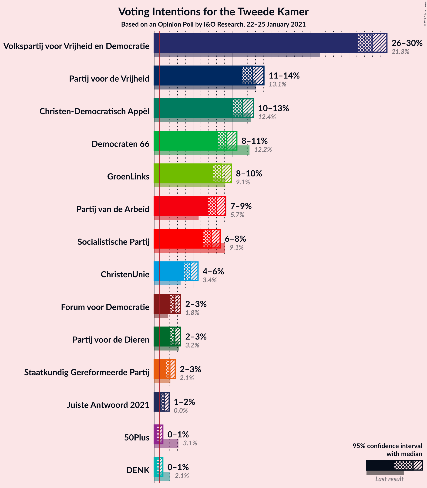

### Confidence Intervals

| Party | Last Result | Poll Result | 80% Confidence Interval | 90% Confidence Interval | 95% Confidence Interval | 99% Confidence Interval |
|:-----:|:-----------:|:-----------:|:-----------------------:|:-----------------------:|:-----------------------:|:-----------------------:|
| Volkspartij voor Vrijheid en Democratie | 21.3% | 28.0% | 26.7–29.2% |26.4–29.6% |26.1–29.9% |25.6–30.5% |
| Partij voor de Vrijheid | 13.1% | 12.6% | 11.8–13.6% |11.5–13.9% |11.3–14.1% |10.9–14.6% |
| Christen-Democratisch Appèl | 12.4% | 11.3% | 10.5–12.2% |10.3–12.5% |10.1–12.7% |9.7–13.2% |
| Democraten 66 | 12.2% | 9.3% | 8.6–10.2% |8.4–10.4% |8.2–10.6% |7.8–11.0% |
| GroenLinks | 9.1% | 8.6% | 7.9–9.5% |7.7–9.7% |7.5–9.9% |7.2–10.3% |
| Partij van de Arbeid | 5.7% | 8.0% | 7.3–8.8% |7.1–9.0% |6.9–9.2% |6.6–9.6% |
| Socialistische Partij | 9.1% | 7.3% | 6.6–8.1% |6.4–8.3% |6.3–8.5% |6.0–8.8% |
| ChristenUnie | 3.4% | 4.7% | 4.1–5.3% |4.0–5.5% |3.9–5.6% |3.6–5.9% |
| Partij voor de Dieren | 3.2% | 2.6% | 2.3–3.1% |2.1–3.3% |2.0–3.4% |1.9–3.7% |
| Forum voor Democratie | 1.8% | 2.6% | 2.3–3.1% |2.1–3.3% |2.0–3.4% |1.9–3.7% |
| Staatkundig Gereformeerde Partij | 2.1% | 2.0% | 1.7–2.5% |1.6–2.6% |1.5–2.7% |1.4–2.9% |
| Juiste Antwoord 2021 | 0.0% | 1.3% | 1.1–1.7% |1.0–1.8% |0.9–1.9% |0.8–2.1% |
| 50Plus | 3.1% | 0.7% | 0.5–1.0% |0.4–1.0% |0.4–1.1% |0.3–1.3% |
| DENK | 2.1% | 0.7% | 0.5–1.0% |0.4–1.0% |0.4–1.1% |0.3–1.3% |

*Note:* The poll result column reflects the actual value used in the calculations. Published results may vary slightly, and in addition be rounded to fewer digits.

## Seats

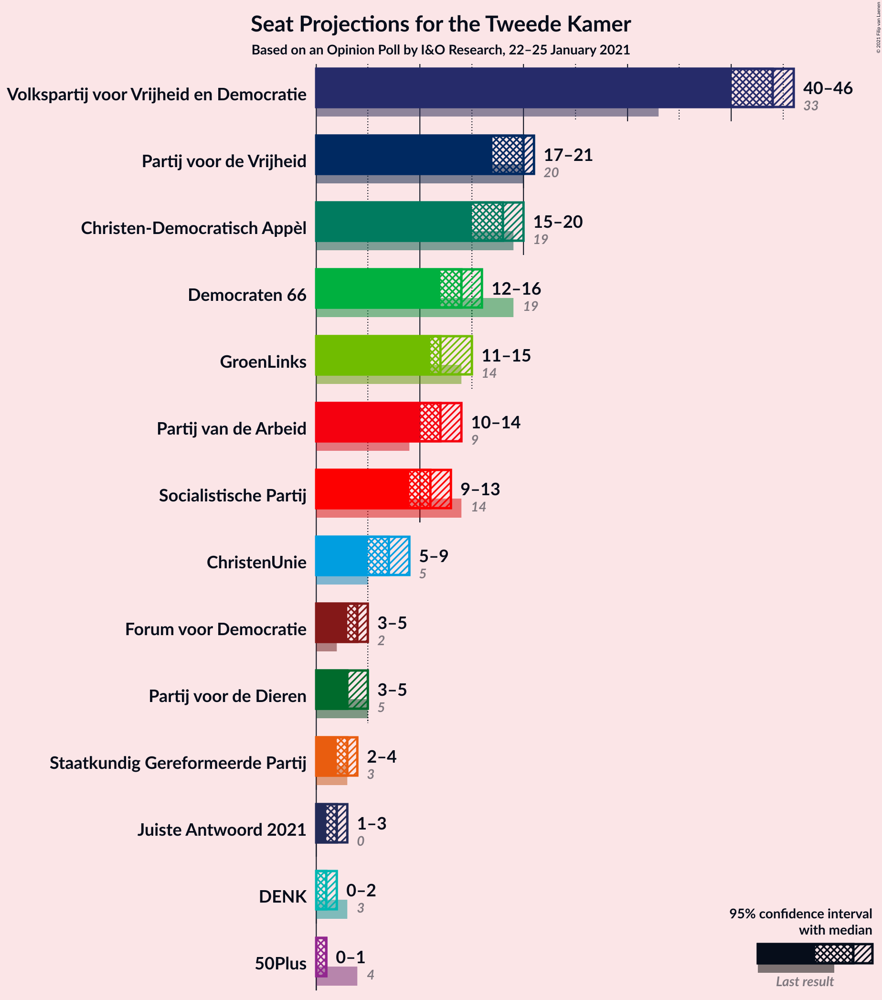

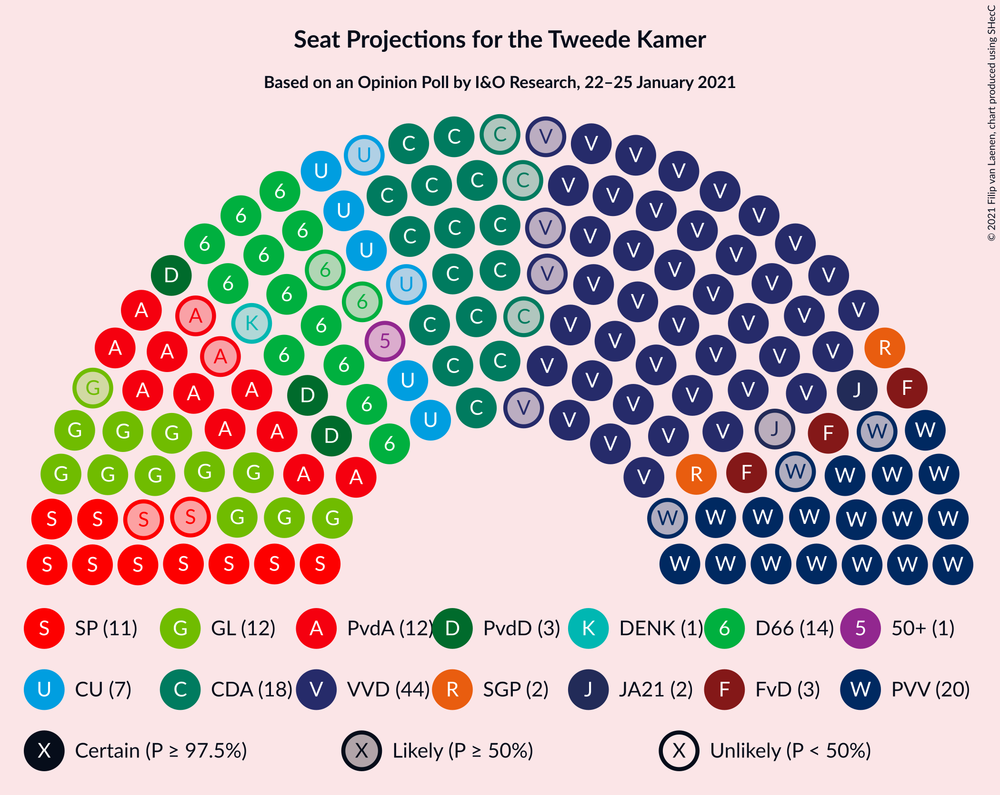

### Confidence Intervals

| Party | Last Result | Median | 80% Confidence Interval | 90% Confidence Interval | 95% Confidence Interval | 99% Confidence Interval |
|:-----:|:-----------:|:------:|:-----------------------:|:-----------------------:|:-----------------------:|:-----------------------:|
| <a href="#volkspartij-voor-vrijheid-en-democratie">Volkspartij voor Vrijheid en Democratie</a> | 33 | 44 | 40–45 |40–46 |40–46 |39–48 |
| <a href="#partij-voor-de-vrijheid">Partij voor de Vrijheid</a> | 20 | 20 | 17–21 |17–21 |17–21 |16–22 |
| <a href="#christen-democratisch-appèl">Christen-Democratisch Appèl</a> | 19 | 18 | 16–19 |16–20 |15–20 |15–20 |
| <a href="#democraten-66">Democraten 66</a> | 19 | 14 | 13–15 |13–16 |12–16 |11–18 |
| <a href="#groenlinks">GroenLinks</a> | 14 | 12 | 11–14 |11–15 |11–15 |11–15 |
| <a href="#partij-van-de-arbeid">Partij van de Arbeid</a> | 9 | 12 | 10–13 |10–14 |10–14 |9–15 |
| <a href="#socialistische-partij">Socialistische Partij</a> | 14 | 11 | 10–12 |10–13 |9–13 |8–14 |
| <a href="#christenunie">ChristenUnie</a> | 5 | 7 | 6–8 |5–8 |5–9 |5–9 |
| <a href="#partij-voor-de-dieren">Partij voor de Dieren</a> | 5 | 3 | 3–5 |3–5 |3–5 |2–5 |
| <a href="#forum-voor-democratie">Forum voor Democratie</a> | 2 | 4 | 3–5 |3–5 |3–5 |2–5 |
| <a href="#staatkundig-gereformeerde-partij">Staatkundig Gereformeerde Partij</a> | 3 | 3 | 2–4 |2–4 |2–4 |2–4 |
| <a href="#juiste-antwoord-2021">Juiste Antwoord 2021</a> | 0 | 2 | 1–2 |1–3 |1–3 |1–3 |
| <a href="#50plus">50Plus</a> | 4 | 1 | 0–1 |0–1 |0–1 |0–2 |
| <a href="#denk">DENK</a> | 3 | 1 | 0–1 |0–2 |0–2 |0–2 |

### Volkspartij voor Vrijheid en Democratie

*For a full overview of the results for this party, see the [Volkspartij voor Vrijheid en Democratie](party-volkspartijvoorvrijheidendemocratie.html) page.*

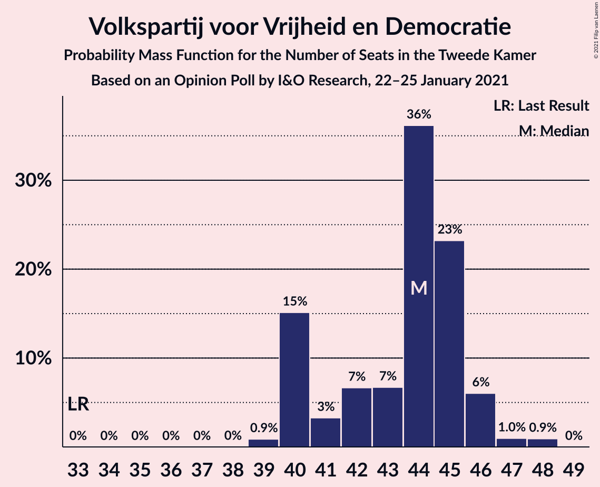

| Number of Seats | Probability | Accumulated | Special Marks |
|:---------------:|:-----------:|:-----------:|:-------------:|
| 33 | 0% | 100% | Last Result |
| 34 | 0% | 100% |  |
| 35 | 0% | 100% |  |
| 36 | 0% | 100% |  |
| 37 | 0% | 100% |  |
| 38 | 0% | 100% |  |
| 39 | 0.9% | 100% |  |
| 40 | 15% | 99.1% |  |
| 41 | 3% | 84% |  |
| 42 | 7% | 81% |  |
| 43 | 7% | 74% |  |
| 44 | 36% | 67% | Median |
| 45 | 23% | 31% |  |
| 46 | 6% | 8% |  |
| 47 | 1.0% | 2% |  |
| 48 | 0.9% | 0.9% |  |
| 49 | 0% | 0% |  |

### Partij voor de Vrijheid

*For a full overview of the results for this party, see the [Partij voor de Vrijheid](party-partijvoordevrijheid.html) page.*

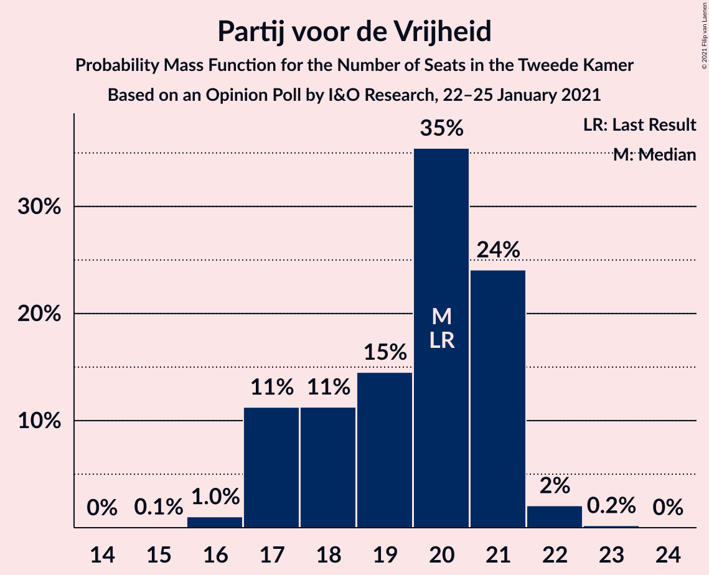

| Number of Seats | Probability | Accumulated | Special Marks |
|:---------------:|:-----------:|:-----------:|:-------------:|
| 15 | 0.1% | 100% |  |
| 16 | 1.0% | 99.9% |  |
| 17 | 11% | 98.9% |  |
| 18 | 11% | 88% |  |
| 19 | 15% | 76% |  |
| 20 | 35% | 62% | Last Result, Median |
| 21 | 24% | 26% |  |
| 22 | 2% | 2% |  |
| 23 | 0.2% | 0.2% |  |
| 24 | 0% | 0% |  |

### Christen-Democratisch Appèl

*For a full overview of the results for this party, see the [Christen-Democratisch Appèl](party-christen-democratischappèl.html) page.*

| Number of Seats | Probability | Accumulated | Special Marks |
|:---------------:|:-----------:|:-----------:|:-------------:|
| 14 | 0.2% | 100% |  |
| 15 | 4% | 99.8% |  |
| 16 | 22% | 96% |  |
| 17 | 16% | 74% |  |
| 18 | 16% | 58% | Median |
| 19 | 35% | 42% | Last Result |
| 20 | 7% | 7% |  |
| 21 | 0.3% | 0.3% |  |
| 22 | 0% | 0% |  |

### Democraten 66

*For a full overview of the results for this party, see the [Democraten 66](party-democraten66.html) page.*

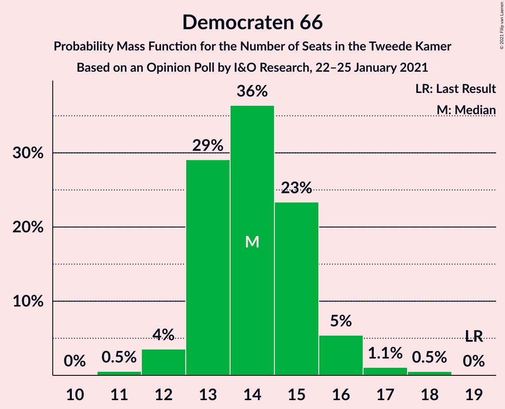

| Number of Seats | Probability | Accumulated | Special Marks |
|:---------------:|:-----------:|:-----------:|:-------------:|
| 11 | 0.5% | 100% |  |
| 12 | 4% | 99.4% |  |
| 13 | 29% | 96% |  |
| 14 | 36% | 67% | Median |
| 15 | 23% | 30% |  |
| 16 | 5% | 7% |  |
| 17 | 1.1% | 2% |  |
| 18 | 0.5% | 0.5% |  |
| 19 | 0% | 0% | Last Result |

### GroenLinks

*For a full overview of the results for this party, see the [GroenLinks](party-groenlinks.html) page.*

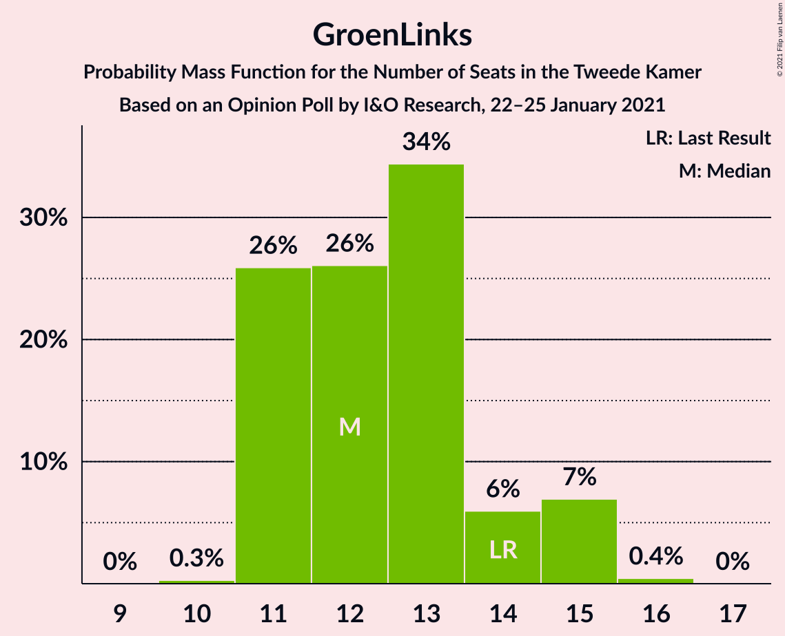

| Number of Seats | Probability | Accumulated | Special Marks |
|:---------------:|:-----------:|:-----------:|:-------------:|
| 10 | 0.3% | 100% |  |
| 11 | 26% | 99.7% |  |
| 12 | 26% | 74% | Median |
| 13 | 34% | 48% |  |
| 14 | 6% | 13% | Last Result |
| 15 | 7% | 7% |  |
| 16 | 0.4% | 0.4% |  |
| 17 | 0% | 0% |  |

### Partij van de Arbeid

*For a full overview of the results for this party, see the [Partij van de Arbeid](party-partijvandearbeid.html) page.*

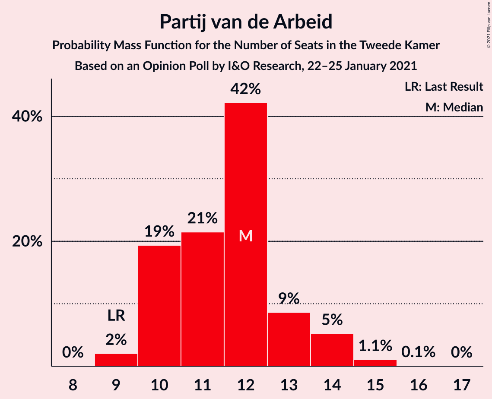

| Number of Seats | Probability | Accumulated | Special Marks |
|:---------------:|:-----------:|:-----------:|:-------------:|
| 9 | 2% | 100% | Last Result |
| 10 | 19% | 98% |  |
| 11 | 21% | 79% |  |
| 12 | 42% | 57% | Median |
| 13 | 9% | 15% |  |
| 14 | 5% | 6% |  |
| 15 | 1.1% | 1.1% |  |
| 16 | 0.1% | 0.1% |  |
| 17 | 0% | 0% |  |

### Socialistische Partij

*For a full overview of the results for this party, see the [Socialistische Partij](party-socialistischepartij.html) page.*

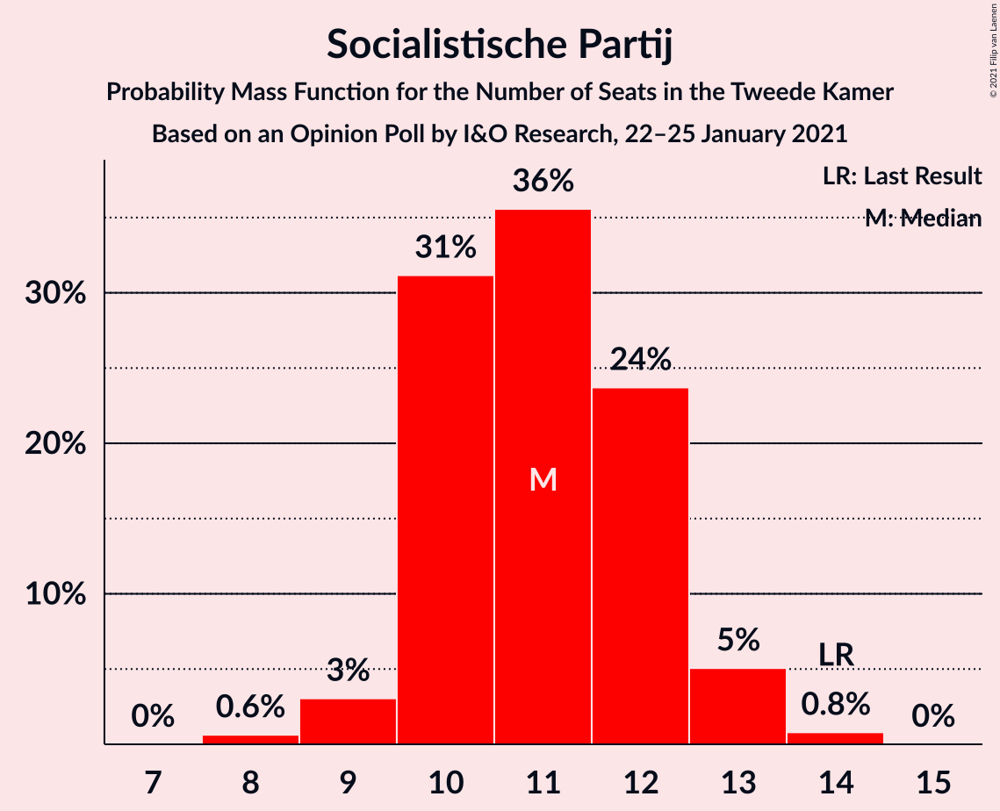

| Number of Seats | Probability | Accumulated | Special Marks |
|:---------------:|:-----------:|:-----------:|:-------------:|
| 8 | 0.6% | 100% |  |
| 9 | 3% | 99.4% |  |
| 10 | 31% | 96% |  |
| 11 | 36% | 65% | Median |
| 12 | 24% | 30% |  |
| 13 | 5% | 6% |  |
| 14 | 0.8% | 0.8% | Last Result |
| 15 | 0% | 0% |  |

### ChristenUnie

*For a full overview of the results for this party, see the [ChristenUnie](party-christenunie.html) page.*

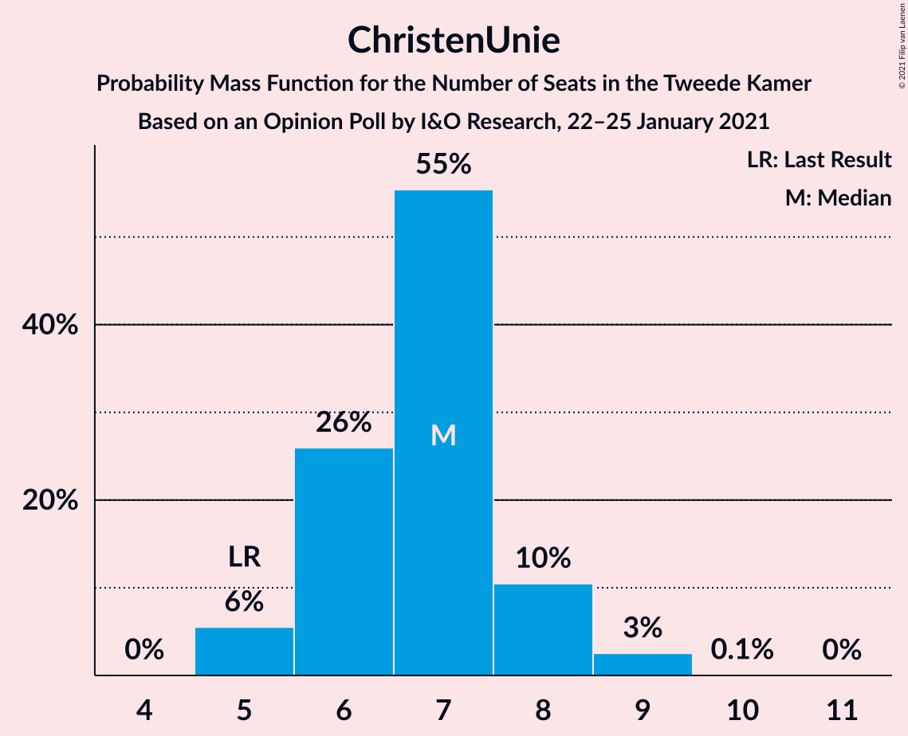

| Number of Seats | Probability | Accumulated | Special Marks |
|:---------------:|:-----------:|:-----------:|:-------------:|
| 5 | 6% | 100% | Last Result |
| 6 | 26% | 94% |  |
| 7 | 55% | 68% | Median |
| 8 | 10% | 13% |  |
| 9 | 3% | 3% |  |
| 10 | 0.1% | 0.1% |  |
| 11 | 0% | 0% |  |

### Partij voor de Dieren

*For a full overview of the results for this party, see the [Partij voor de Dieren](party-partijvoordedieren.html) page.*

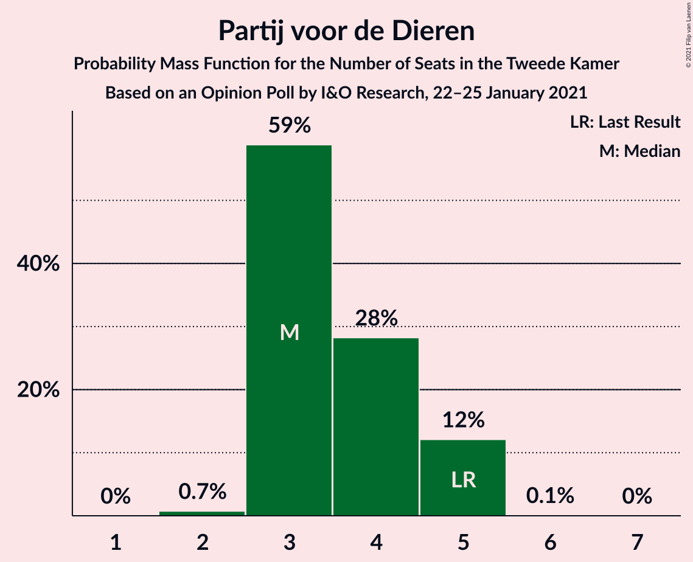

| Number of Seats | Probability | Accumulated | Special Marks |
|:---------------:|:-----------:|:-----------:|:-------------:|
| 2 | 0.7% | 100% |  |
| 3 | 59% | 99.3% | Median |
| 4 | 28% | 40% |  |
| 5 | 12% | 12% | Last Result |
| 6 | 0.1% | 0.1% |  |
| 7 | 0% | 0% |  |

### Forum voor Democratie

*For a full overview of the results for this party, see the [Forum voor Democratie](party-forumvoordemocratie.html) page.*

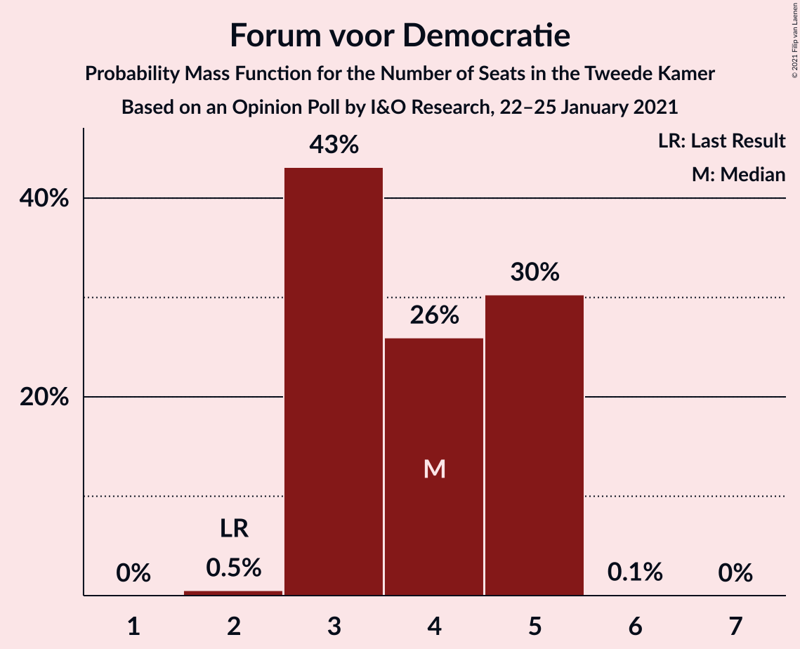

| Number of Seats | Probability | Accumulated | Special Marks |
|:---------------:|:-----------:|:-----------:|:-------------:|
| 2 | 0.5% | 100% | Last Result |
| 3 | 43% | 99.5% |  |
| 4 | 26% | 56% | Median |
| 5 | 30% | 30% |  |
| 6 | 0.1% | 0.1% |  |
| 7 | 0% | 0% |  |

### Staatkundig Gereformeerde Partij

*For a full overview of the results for this party, see the [Staatkundig Gereformeerde Partij](party-staatkundiggereformeerdepartij.html) page.*

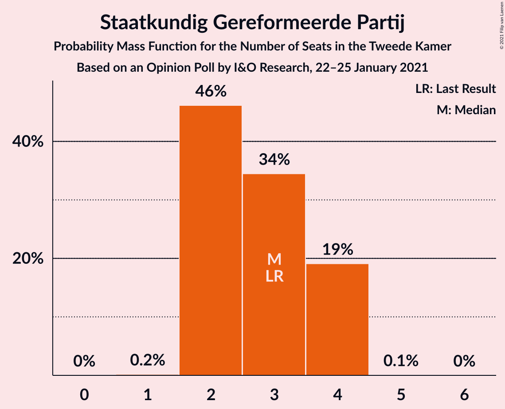

| Number of Seats | Probability | Accumulated | Special Marks |
|:---------------:|:-----------:|:-----------:|:-------------:|
| 1 | 0.2% | 100% |  |
| 2 | 46% | 99.8% |  |
| 3 | 34% | 54% | Last Result, Median |
| 4 | 19% | 19% |  |
| 5 | 0.1% | 0.1% |  |
| 6 | 0% | 0% |  |

### Juiste Antwoord 2021

*For a full overview of the results for this party, see the [Juiste Antwoord 2021](party-juisteantwoord2021.html) page.*

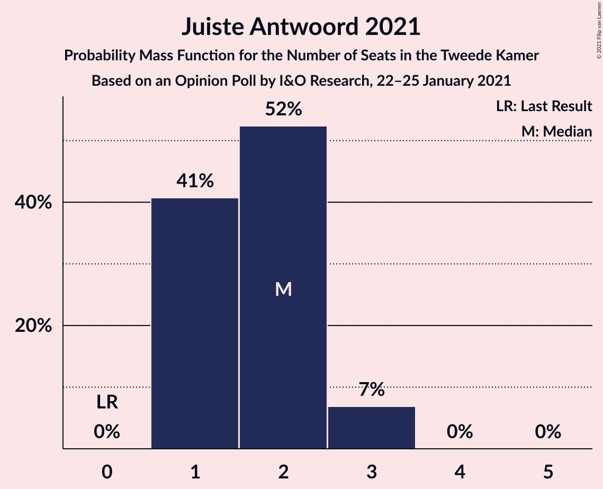

| Number of Seats | Probability | Accumulated | Special Marks |
|:---------------:|:-----------:|:-----------:|:-------------:|
| 0 | 0% | 100% | Last Result |
| 1 | 41% | 100% |  |
| 2 | 52% | 59% | Median |
| 3 | 7% | 7% |  |
| 4 | 0% | 0% |  |

### 50Plus

*For a full overview of the results for this party, see the [50Plus](party-50plus.html) page.*

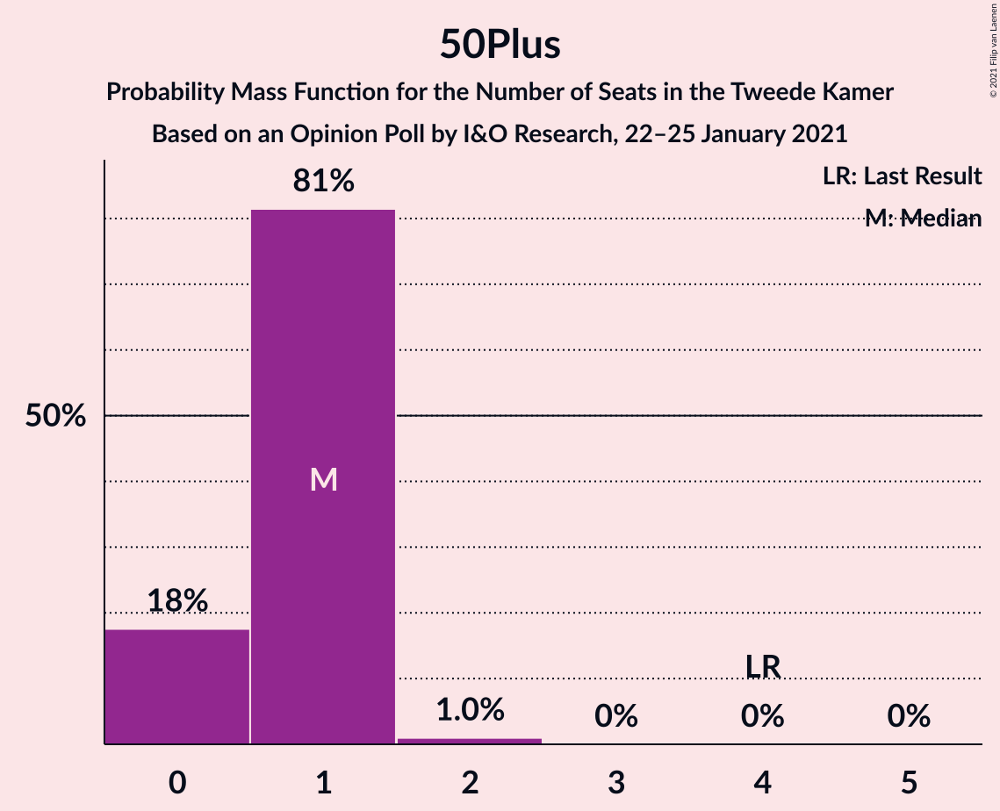

| Number of Seats | Probability | Accumulated | Special Marks |
|:---------------:|:-----------:|:-----------:|:-------------:|
| 0 | 18% | 100% |  |
| 1 | 81% | 82% | Median |
| 2 | 1.0% | 1.0% |  |
| 3 | 0% | 0% |  |
| 4 | 0% | 0% | Last Result |

### DENK

*For a full overview of the results for this party, see the [DENK](party-denk.html) page.*

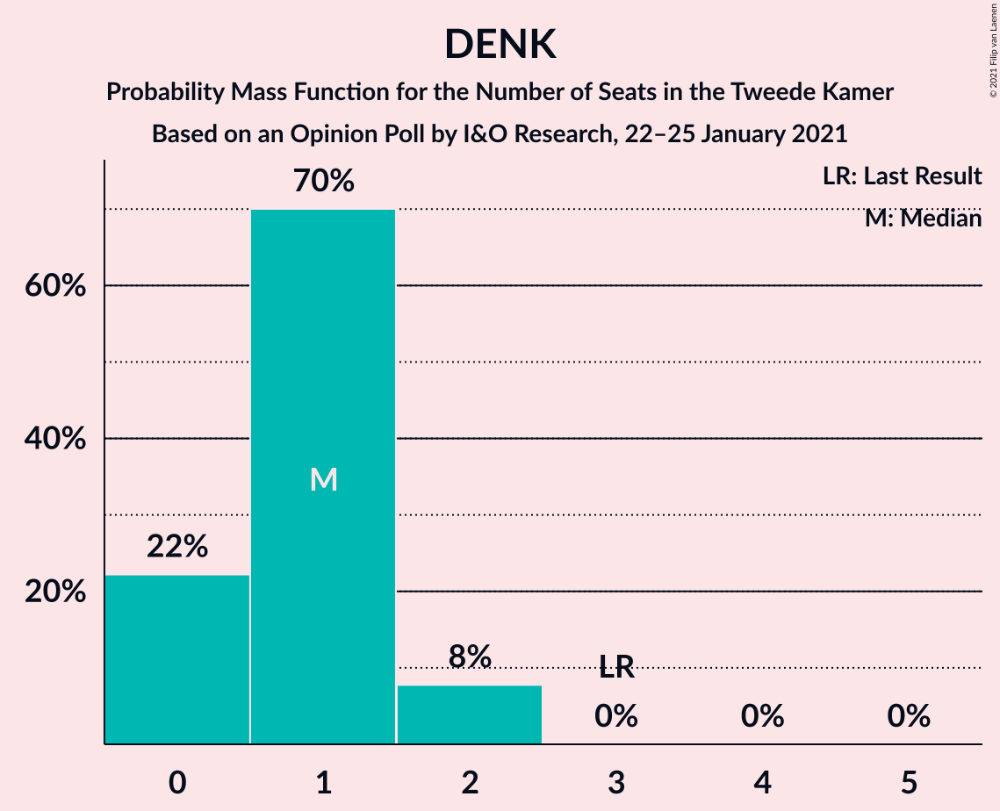

| Number of Seats | Probability | Accumulated | Special Marks |
|:---------------:|:-----------:|:-----------:|:-------------:|
| 0 | 22% | 100% |  |
| 1 | 70% | 78% | Median |
| 2 | 8% | 8% |  |
| 3 | 0% | 0% | Last Result |

## Coalitions

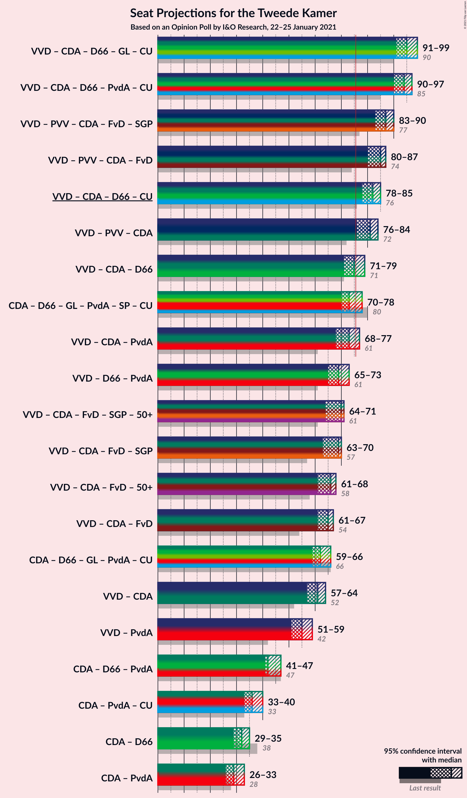

### Confidence Intervals

| Coalition | Last Result | Median | Majority? | 80% Confidence Interval | 90% Confidence Interval | 95% Confidence Interval | 99% Confidence Interval |
|:---------:|:-----------:|:------:|:---------:|:-----------------------:|:-----------------------:|:-----------------------:|:-----------------------:|
| Volkspartij voor Vrijheid en Democratie – Christen-Democratisch Appèl – Democraten 66 – GroenLinks – ChristenUnie | 90 | 95 | 100% | 92–98 | 91–98 | 91–99 | 90–99 |
| Volkspartij voor Vrijheid en Democratie – Christen-Democratisch Appèl – Democraten 66 – Partij van de Arbeid – ChristenUnie | 85 | 94 | 100% | 91–97 | 90–97 | 90–97 | 88–98 |
| Volkspartij voor Vrijheid en Democratie – Partij voor de Vrijheid – Christen-Democratisch Appèl – Forum voor Democratie – Staatkundig Gereformeerde Partij | 77 | 87 | 100% | 84–90 | 83–90 | 83–90 | 82–91 |
| Volkspartij voor Vrijheid en Democratie – Partij voor de Vrijheid – Christen-Democratisch Appèl – Forum voor Democratie | 74 | 85 | 100% | 82–87 | 81–87 | 80–87 | 80–87 |
| Volkspartij voor Vrijheid en Democratie – Christen-Democratisch Appèl – Democraten 66 – ChristenUnie | 76 | 82 | 99.7% | 79–84 | 79–85 | 78–85 | 77–86 |
| Volkspartij voor Vrijheid en Democratie – Partij voor de Vrijheid – Christen-Democratisch Appèl | 72 | 81 | 99.7% | 77–84 | 77–84 | 76–84 | 76–84 |
| Volkspartij voor Vrijheid en Democratie – Christen-Democratisch Appèl – Democraten 66 | 71 | 75 | 46% | 72–78 | 71–79 | 71–79 | 70–80 |
| Christen-Democratisch Appèl – Democraten 66 – GroenLinks – Partij van de Arbeid – Socialistische Partij – ChristenUnie | 80 | 73 | 16% | 70–77 | 70–77 | 70–78 | 69–79 |
| Volkspartij voor Vrijheid en Democratie – Christen-Democratisch Appèl – Partij van de Arbeid | 61 | 73 | 11% | 70–76 | 69–77 | 68–77 | 67–78 |
| Volkspartij voor Vrijheid en Democratie – Democraten 66 – Partij van de Arbeid | 61 | 69 | 0.1% | 66–72 | 66–72 | 65–73 | 64–74 |
| Volkspartij voor Vrijheid en Democratie – Christen-Democratisch Appèl – Forum voor Democratie – Staatkundig Gereformeerde Partij – 50Plus | 61 | 70 | 0% | 66–71 | 66–71 | 64–71 | 63–72 |
| Volkspartij voor Vrijheid en Democratie – Christen-Democratisch Appèl – Forum voor Democratie – Staatkundig Gereformeerde Partij | 57 | 69 | 0% | 65–70 | 65–70 | 63–70 | 62–71 |
| Volkspartij voor Vrijheid en Democratie – Christen-Democratisch Appèl – Forum voor Democratie – 50Plus | 58 | 66 | 0% | 63–68 | 63–68 | 61–68 | 60–70 |
| Volkspartij voor Vrijheid en Democratie – Christen-Democratisch Appèl – Forum voor Democratie | 54 | 65 | 0% | 62–67 | 62–67 | 61–67 | 59–69 |
| Christen-Democratisch Appèl – Democraten 66 – GroenLinks – Partij van de Arbeid – ChristenUnie | 66 | 62 | 0% | 59–66 | 59–66 | 59–66 | 57–69 |
| Volkspartij voor Vrijheid en Democratie – Christen-Democratisch Appèl | 52 | 61 | 0% | 58–64 | 57–64 | 57–64 | 55–65 |
| Volkspartij voor Vrijheid en Democratie – Partij van de Arbeid | 42 | 55 | 0% | 52–57 | 52–58 | 51–59 | 51–60 |
| Christen-Democratisch Appèl – Democraten 66 – Partij van de Arbeid | 47 | 42 | 0% | 41–46 | 41–47 | 41–47 | 39–48 |
| Christen-Democratisch Appèl – Partij van de Arbeid – ChristenUnie | 33 | 36 | 0% | 34–38 | 34–39 | 33–40 | 32–41 |
| Christen-Democratisch Appèl – Democraten 66 | 38 | 32 | 0% | 30–34 | 30–35 | 29–35 | 27–36 |
| Christen-Democratisch Appèl – Partij van de Arbeid | 28 | 29 | 0% | 27–32 | 27–32 | 26–33 | 25–34 |

### Volkspartij voor Vrijheid en Democratie – Christen-Democratisch Appèl – Democraten 66 – GroenLinks – ChristenUnie

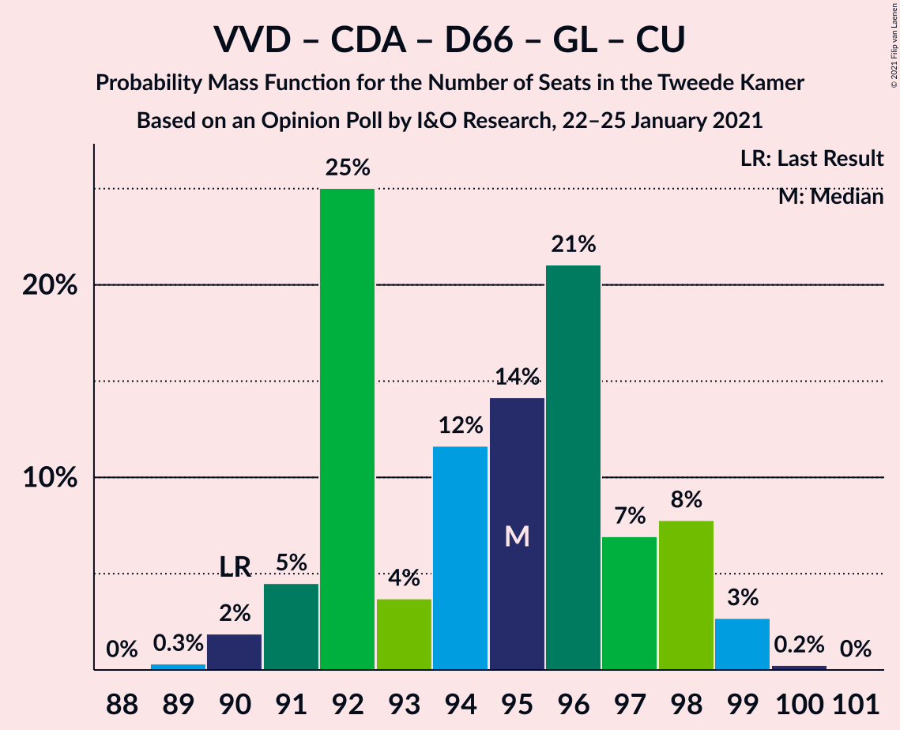

| Number of Seats | Probability | Accumulated | Special Marks |
|:---------------:|:-----------:|:-----------:|:-------------:|
| 89 | 0.3% | 100% |  |
| 90 | 2% | 99.7% | Last Result |
| 91 | 5% | 98% |  |
| 92 | 25% | 93% |  |
| 93 | 4% | 68% |  |
| 94 | 12% | 65% |  |
| 95 | 14% | 53% | Median |
| 96 | 21% | 39% |  |
| 97 | 7% | 18% |  |
| 98 | 8% | 11% |  |
| 99 | 3% | 3% |  |
| 100 | 0.2% | 0.3% |  |
| 101 | 0% | 0% |  |

### Volkspartij voor Vrijheid en Democratie – Christen-Democratisch Appèl – Democraten 66 – Partij van de Arbeid – ChristenUnie

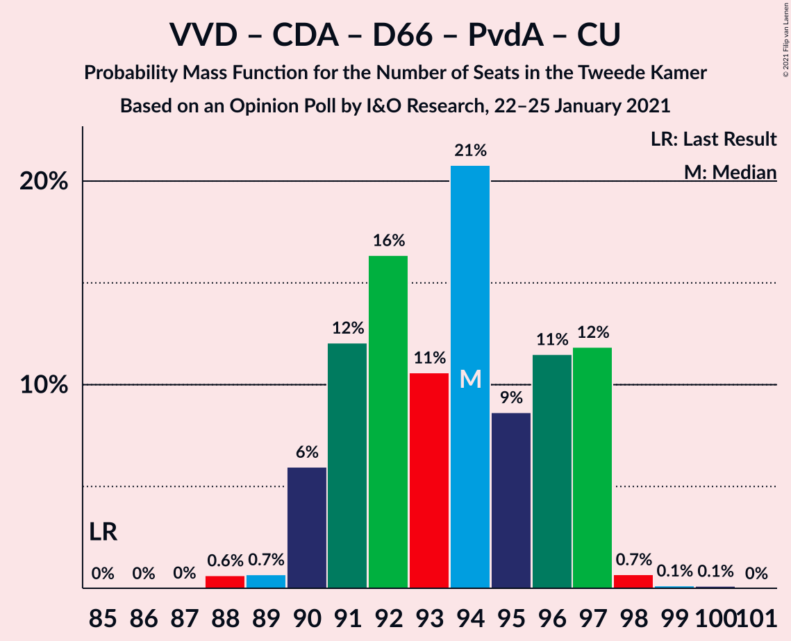

| Number of Seats | Probability | Accumulated | Special Marks |
|:---------------:|:-----------:|:-----------:|:-------------:|
| 85 | 0% | 100% | Last Result |
| 86 | 0% | 100% |  |
| 87 | 0% | 100% |  |
| 88 | 0.6% | 100% |  |
| 89 | 0.7% | 99.3% |  |
| 90 | 6% | 98.7% |  |
| 91 | 12% | 93% |  |
| 92 | 16% | 81% |  |
| 93 | 11% | 64% |  |
| 94 | 21% | 54% |  |
| 95 | 9% | 33% | Median |
| 96 | 11% | 24% |  |
| 97 | 12% | 13% |  |
| 98 | 0.7% | 0.9% |  |
| 99 | 0.1% | 0.2% |  |
| 100 | 0.1% | 0.1% |  |
| 101 | 0% | 0% |  |

### Volkspartij voor Vrijheid en Democratie – Partij voor de Vrijheid – Christen-Democratisch Appèl – Forum voor Democratie – Staatkundig Gereformeerde Partij

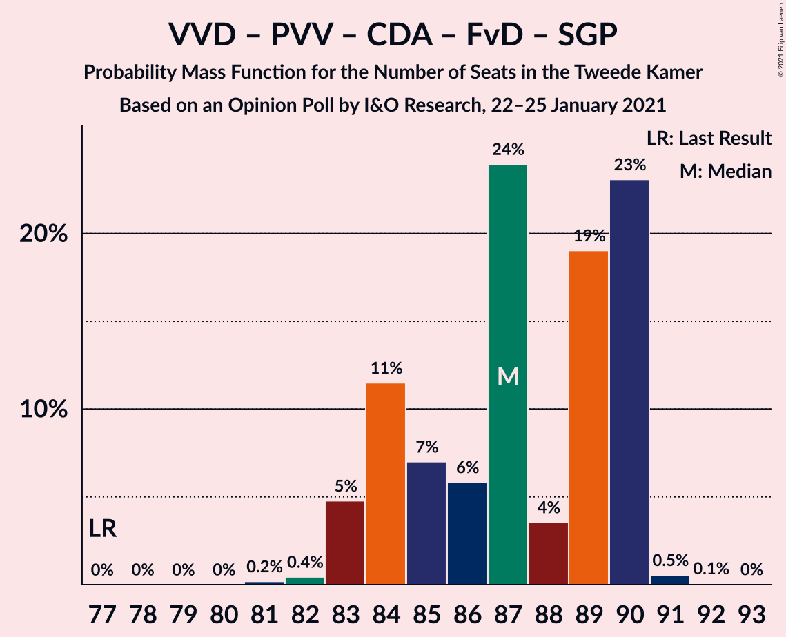

| Number of Seats | Probability | Accumulated | Special Marks |
|:---------------:|:-----------:|:-----------:|:-------------:|
| 77 | 0% | 100% | Last Result |
| 78 | 0% | 100% |  |
| 79 | 0% | 100% |  |
| 80 | 0% | 100% |  |
| 81 | 0.2% | 100% |  |
| 82 | 0.4% | 99.8% |  |
| 83 | 5% | 99.4% |  |
| 84 | 11% | 95% |  |
| 85 | 7% | 83% |  |
| 86 | 6% | 76% |  |
| 87 | 24% | 70% |  |
| 88 | 4% | 46% |  |
| 89 | 19% | 43% | Median |
| 90 | 23% | 24% |  |
| 91 | 0.5% | 0.6% |  |
| 92 | 0.1% | 0.1% |  |
| 93 | 0% | 0% |  |

### Volkspartij voor Vrijheid en Democratie – Partij voor de Vrijheid – Christen-Democratisch Appèl – Forum voor Democratie

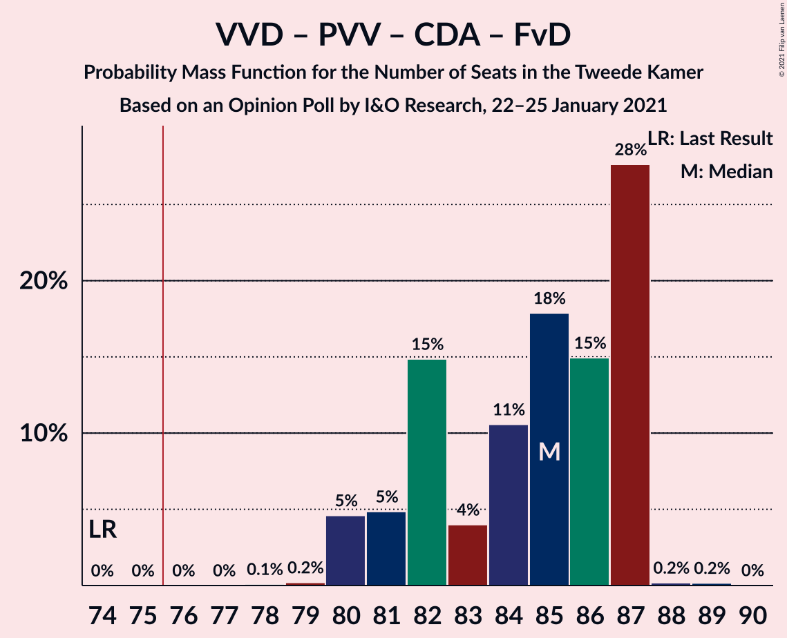

| Number of Seats | Probability | Accumulated | Special Marks |
|:---------------:|:-----------:|:-----------:|:-------------:|
| 74 | 0% | 100% | Last Result |
| 75 | 0% | 100% |  |
| 76 | 0% | 100% | Majority |
| 77 | 0% | 100% |  |
| 78 | 0.1% | 100% |  |
| 79 | 0.2% | 99.9% |  |
| 80 | 5% | 99.7% |  |
| 81 | 5% | 95% |  |
| 82 | 15% | 90% |  |
| 83 | 4% | 75% |  |
| 84 | 11% | 71% |  |
| 85 | 18% | 61% |  |
| 86 | 15% | 43% | Median |
| 87 | 28% | 28% |  |
| 88 | 0.2% | 0.4% |  |
| 89 | 0.2% | 0.2% |  |
| 90 | 0% | 0% |  |

### Volkspartij voor Vrijheid en Democratie – Christen-Democratisch Appèl – Democraten 66 – ChristenUnie

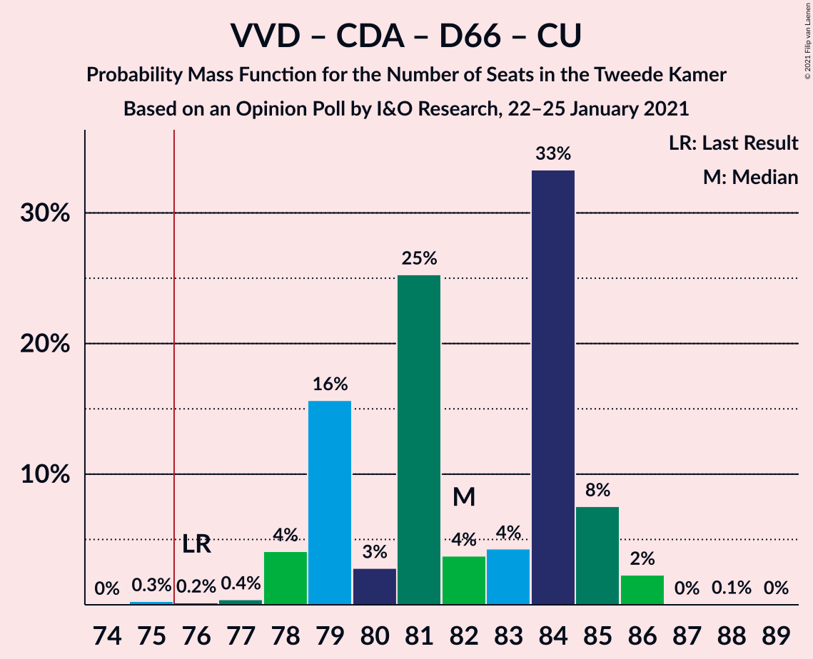

| Number of Seats | Probability | Accumulated | Special Marks |
|:---------------:|:-----------:|:-----------:|:-------------:|
| 75 | 0.3% | 100% |  |
| 76 | 0.2% | 99.7% | Last Result, Majority |
| 77 | 0.4% | 99.6% |  |
| 78 | 4% | 99.2% |  |
| 79 | 16% | 95% |  |
| 80 | 3% | 79% |  |
| 81 | 25% | 77% |  |
| 82 | 4% | 51% |  |
| 83 | 4% | 48% | Median |
| 84 | 33% | 43% |  |
| 85 | 8% | 10% |  |
| 86 | 2% | 2% |  |
| 87 | 0% | 0.1% |  |
| 88 | 0.1% | 0.1% |  |
| 89 | 0% | 0% |  |

### Volkspartij voor Vrijheid en Democratie – Partij voor de Vrijheid – Christen-Democratisch Appèl

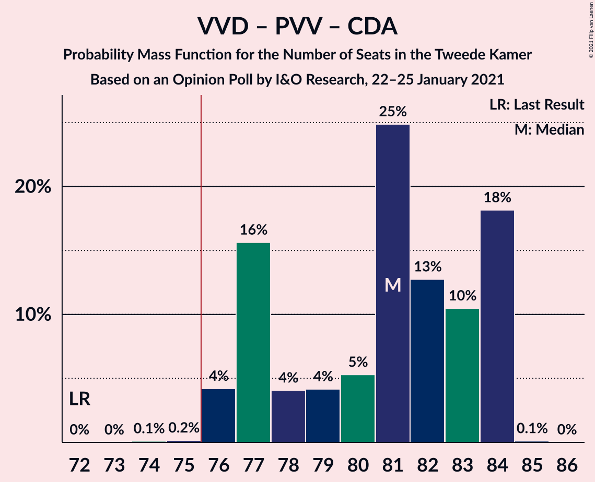

| Number of Seats | Probability | Accumulated | Special Marks |
|:---------------:|:-----------:|:-----------:|:-------------:|
| 72 | 0% | 100% | Last Result |
| 73 | 0% | 100% |  |
| 74 | 0.1% | 100% |  |
| 75 | 0.2% | 99.9% |  |
| 76 | 4% | 99.7% | Majority |
| 77 | 16% | 96% |  |
| 78 | 4% | 80% |  |
| 79 | 4% | 76% |  |
| 80 | 5% | 72% |  |
| 81 | 25% | 66% |  |
| 82 | 13% | 42% | Median |
| 83 | 10% | 29% |  |
| 84 | 18% | 18% |  |
| 85 | 0.1% | 0.1% |  |
| 86 | 0% | 0% |  |

### Volkspartij voor Vrijheid en Democratie – Christen-Democratisch Appèl – Democraten 66

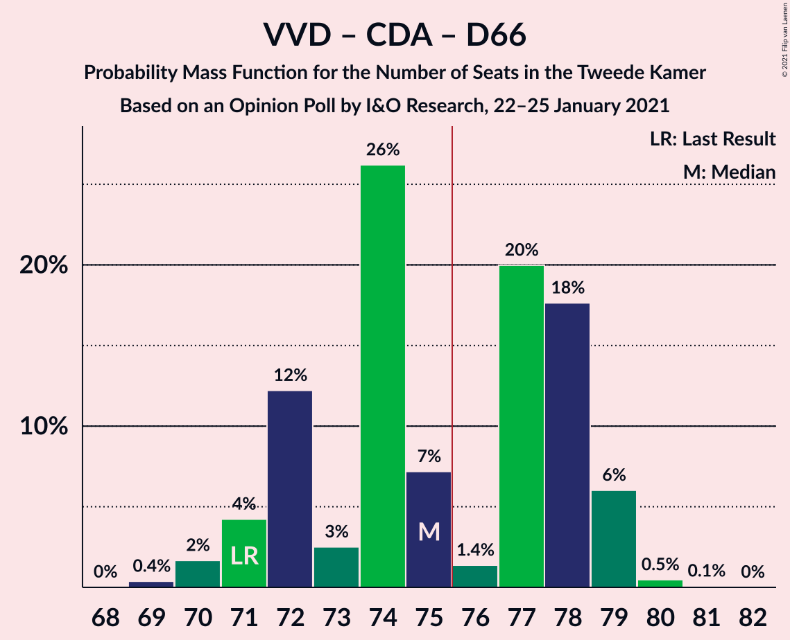

| Number of Seats | Probability | Accumulated | Special Marks |
|:---------------:|:-----------:|:-----------:|:-------------:|
| 69 | 0.4% | 100% |  |
| 70 | 2% | 99.6% |  |
| 71 | 4% | 98% | Last Result |
| 72 | 12% | 94% |  |
| 73 | 3% | 81% |  |
| 74 | 26% | 79% |  |
| 75 | 7% | 53% |  |
| 76 | 1.4% | 46% | Median, Majority |
| 77 | 20% | 44% |  |
| 78 | 18% | 24% |  |
| 79 | 6% | 7% |  |
| 80 | 0.5% | 0.6% |  |
| 81 | 0.1% | 0.1% |  |
| 82 | 0% | 0% |  |

### Christen-Democratisch Appèl – Democraten 66 – GroenLinks – Partij van de Arbeid – Socialistische Partij – ChristenUnie

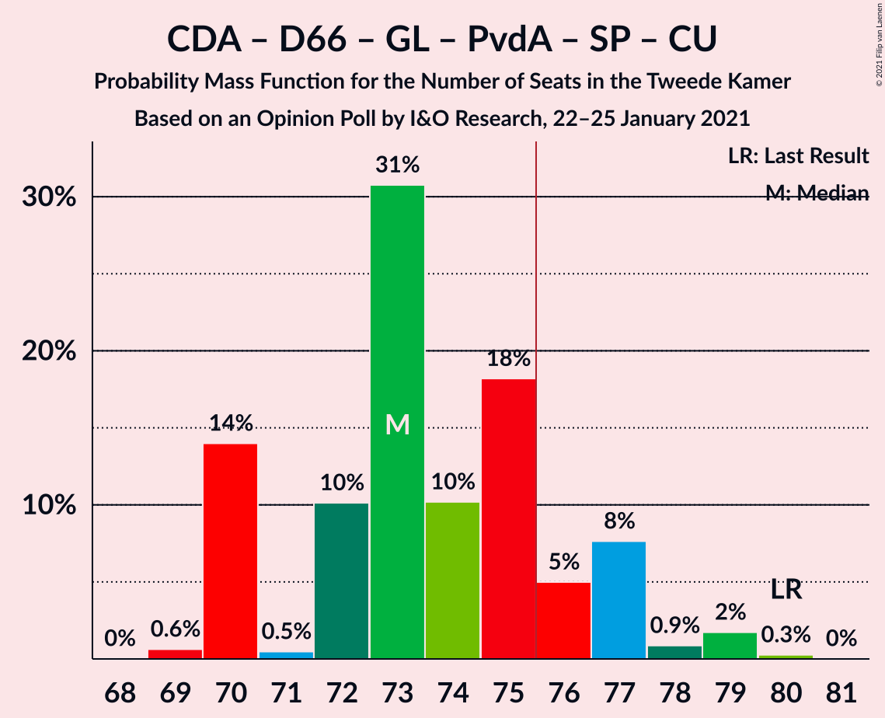

| Number of Seats | Probability | Accumulated | Special Marks |
|:---------------:|:-----------:|:-----------:|:-------------:|
| 68 | 0% | 100% |  |
| 69 | 0.6% | 99.9% |  |
| 70 | 14% | 99.3% |  |
| 71 | 0.5% | 85% |  |
| 72 | 10% | 85% |  |
| 73 | 31% | 75% |  |
| 74 | 10% | 44% | Median |
| 75 | 18% | 34% |  |
| 76 | 5% | 16% | Majority |
| 77 | 8% | 11% |  |
| 78 | 0.9% | 3% |  |
| 79 | 2% | 2% |  |
| 80 | 0.3% | 0.3% | Last Result |
| 81 | 0% | 0% |  |

### Volkspartij voor Vrijheid en Democratie – Christen-Democratisch Appèl – Partij van de Arbeid

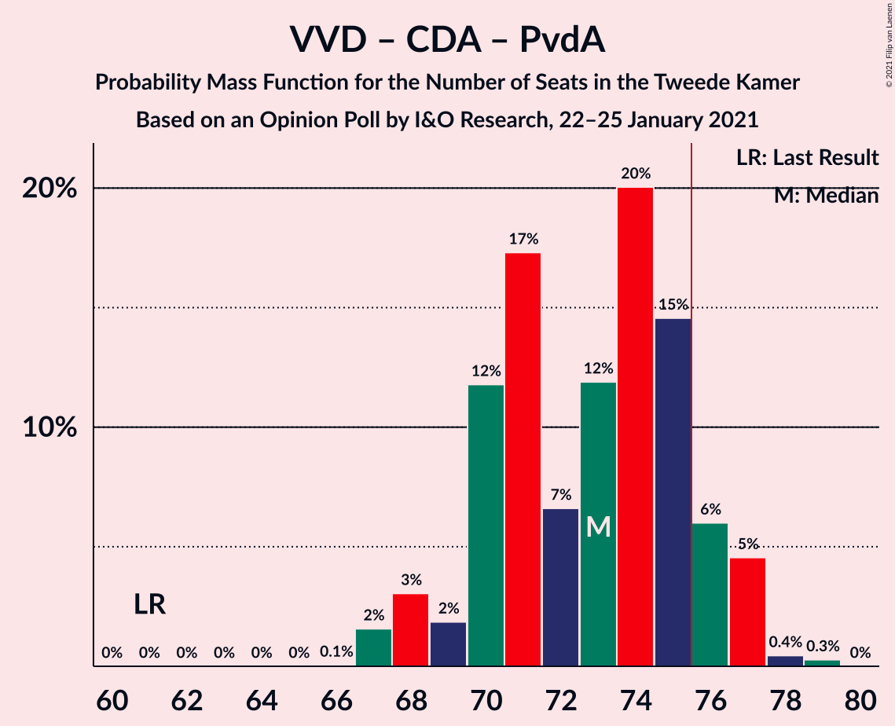

| Number of Seats | Probability | Accumulated | Special Marks |
|:---------------:|:-----------:|:-----------:|:-------------:|
| 61 | 0% | 100% | Last Result |
| 62 | 0% | 100% |  |
| 63 | 0% | 100% |  |
| 64 | 0% | 100% |  |
| 65 | 0% | 100% |  |
| 66 | 0.1% | 100% |  |
| 67 | 2% | 99.9% |  |
| 68 | 3% | 98% |  |
| 69 | 2% | 95% |  |
| 70 | 12% | 93% |  |
| 71 | 17% | 82% |  |
| 72 | 7% | 64% |  |
| 73 | 12% | 58% |  |
| 74 | 20% | 46% | Median |
| 75 | 15% | 26% |  |
| 76 | 6% | 11% | Majority |
| 77 | 5% | 5% |  |
| 78 | 0.4% | 0.7% |  |
| 79 | 0.3% | 0.3% |  |
| 80 | 0% | 0% |  |

### Volkspartij voor Vrijheid en Democratie – Democraten 66 – Partij van de Arbeid

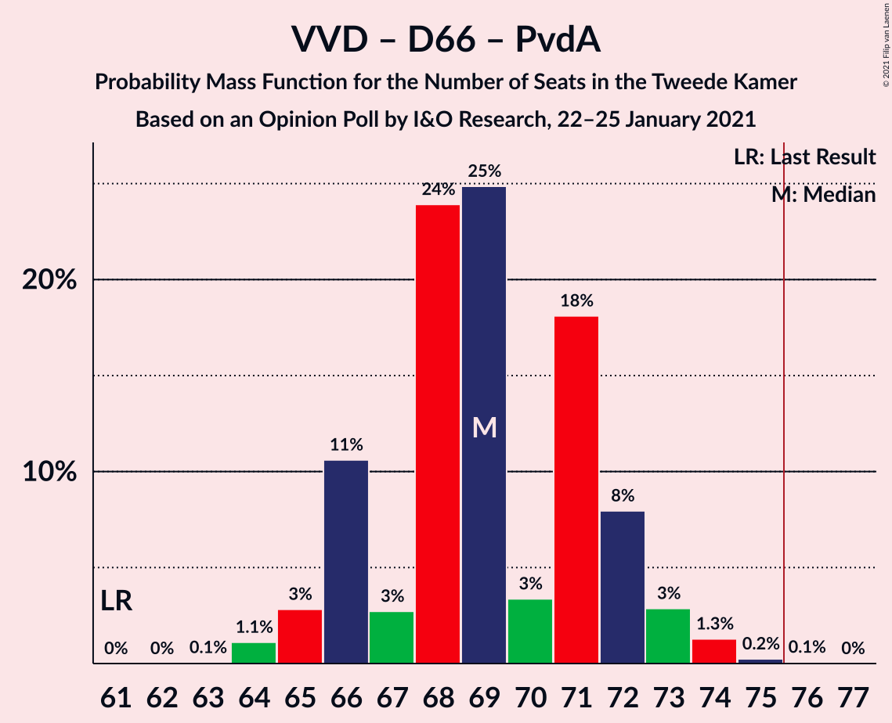

| Number of Seats | Probability | Accumulated | Special Marks |
|:---------------:|:-----------:|:-----------:|:-------------:|
| 61 | 0% | 100% | Last Result |
| 62 | 0% | 100% |  |
| 63 | 0.1% | 100% |  |
| 64 | 1.1% | 99.9% |  |
| 65 | 3% | 98.8% |  |
| 66 | 11% | 96% |  |
| 67 | 3% | 85% |  |
| 68 | 24% | 83% |  |
| 69 | 25% | 59% |  |
| 70 | 3% | 34% | Median |
| 71 | 18% | 31% |  |
| 72 | 8% | 12% |  |
| 73 | 3% | 4% |  |
| 74 | 1.3% | 2% |  |
| 75 | 0.2% | 0.3% |  |
| 76 | 0.1% | 0.1% | Majority |
| 77 | 0% | 0% |  |

### Volkspartij voor Vrijheid en Democratie – Christen-Democratisch Appèl – Forum voor Democratie – Staatkundig Gereformeerde Partij – 50Plus

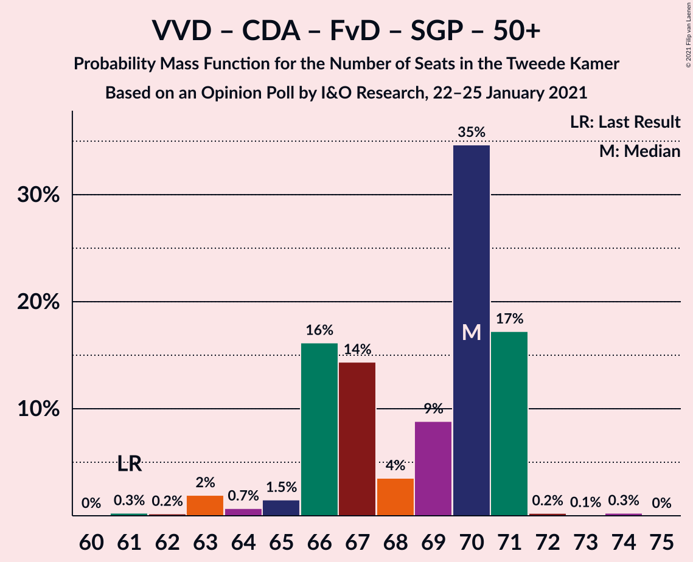

| Number of Seats | Probability | Accumulated | Special Marks |
|:---------------:|:-----------:|:-----------:|:-------------:|
| 61 | 0.3% | 100% | Last Result |
| 62 | 0.2% | 99.7% |  |
| 63 | 2% | 99.5% |  |
| 64 | 0.7% | 98% |  |
| 65 | 1.5% | 97% |  |
| 66 | 16% | 95% |  |
| 67 | 14% | 79% |  |
| 68 | 4% | 65% |  |
| 69 | 9% | 61% |  |
| 70 | 35% | 53% | Median |
| 71 | 17% | 18% |  |
| 72 | 0.2% | 0.6% |  |
| 73 | 0.1% | 0.4% |  |
| 74 | 0.3% | 0.3% |  |
| 75 | 0% | 0% |  |

### Volkspartij voor Vrijheid en Democratie – Christen-Democratisch Appèl – Forum voor Democratie – Staatkundig Gereformeerde Partij

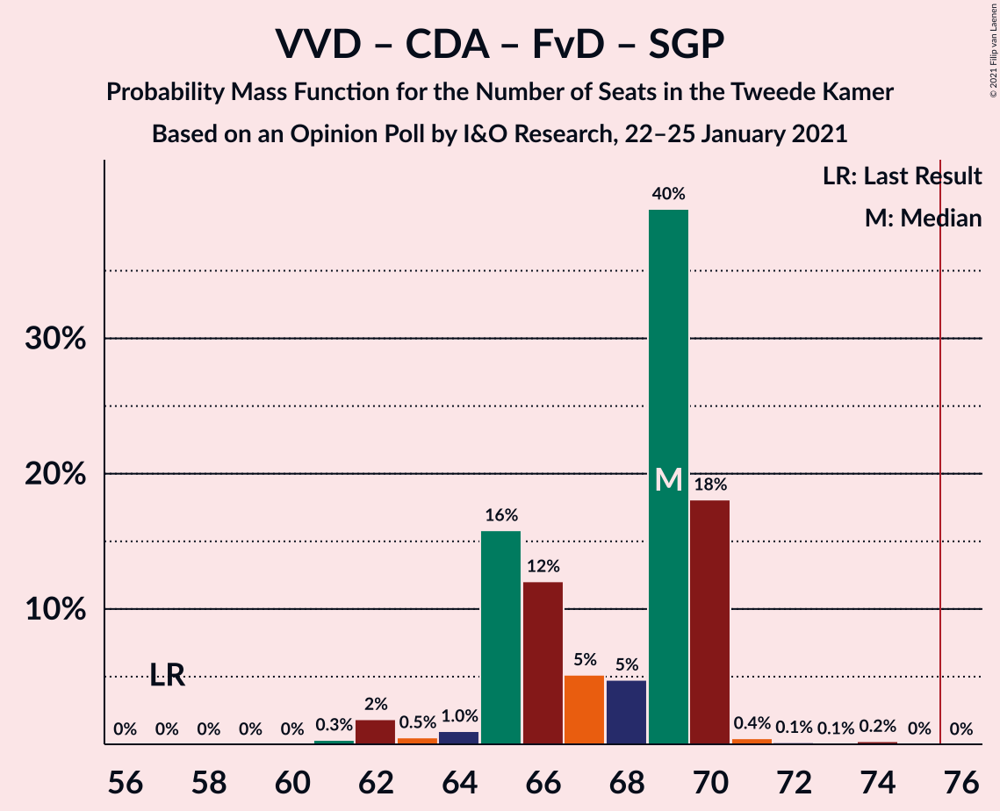

| Number of Seats | Probability | Accumulated | Special Marks |
|:---------------:|:-----------:|:-----------:|:-------------:|
| 57 | 0% | 100% | Last Result |
| 58 | 0% | 100% |  |
| 59 | 0% | 100% |  |
| 60 | 0% | 100% |  |
| 61 | 0.3% | 100% |  |
| 62 | 2% | 99.7% |  |
| 63 | 0.5% | 98% |  |
| 64 | 1.0% | 97% |  |
| 65 | 16% | 96% |  |
| 66 | 12% | 81% |  |
| 67 | 5% | 68% |  |
| 68 | 5% | 63% |  |
| 69 | 40% | 59% | Median |
| 70 | 18% | 19% |  |
| 71 | 0.4% | 0.9% |  |
| 72 | 0.1% | 0.5% |  |
| 73 | 0.1% | 0.3% |  |
| 74 | 0.2% | 0.3% |  |
| 75 | 0% | 0% |  |

### Volkspartij voor Vrijheid en Democratie – Christen-Democratisch Appèl – Forum voor Democratie – 50Plus

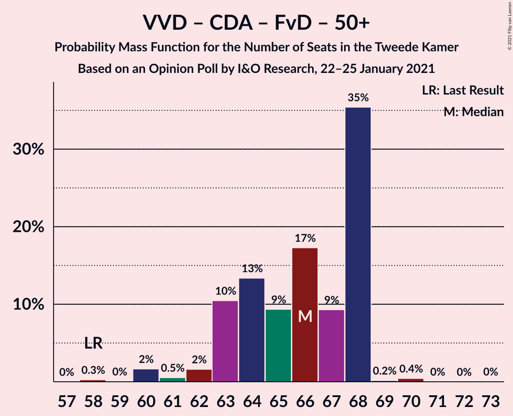

| Number of Seats | Probability | Accumulated | Special Marks |
|:---------------:|:-----------:|:-----------:|:-------------:|
| 58 | 0.3% | 100% | Last Result |
| 59 | 0% | 99.7% |  |
| 60 | 2% | 99.7% |  |
| 61 | 0.5% | 98% |  |
| 62 | 2% | 97% |  |
| 63 | 10% | 96% |  |
| 64 | 13% | 85% |  |
| 65 | 9% | 72% |  |
| 66 | 17% | 63% |  |
| 67 | 9% | 45% | Median |
| 68 | 35% | 36% |  |
| 69 | 0.2% | 0.7% |  |
| 70 | 0.4% | 0.5% |  |
| 71 | 0% | 0.1% |  |
| 72 | 0% | 0.1% |  |
| 73 | 0% | 0% |  |

### Volkspartij voor Vrijheid en Democratie – Christen-Democratisch Appèl – Forum voor Democratie

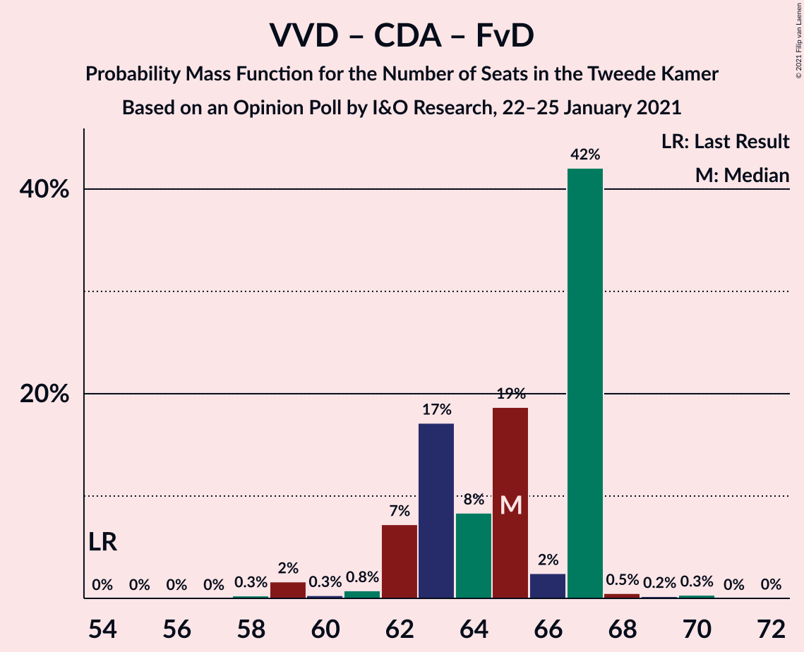

| Number of Seats | Probability | Accumulated | Special Marks |
|:---------------:|:-----------:|:-----------:|:-------------:|
| 54 | 0% | 100% | Last Result |
| 55 | 0% | 100% |  |
| 56 | 0% | 100% |  |
| 57 | 0% | 100% |  |
| 58 | 0.3% | 100% |  |
| 59 | 2% | 99.7% |  |
| 60 | 0.3% | 98% |  |
| 61 | 0.8% | 98% |  |
| 62 | 7% | 97% |  |
| 63 | 17% | 90% |  |
| 64 | 8% | 73% |  |
| 65 | 19% | 64% |  |
| 66 | 2% | 46% | Median |
| 67 | 42% | 43% |  |
| 68 | 0.5% | 1.1% |  |
| 69 | 0.2% | 0.6% |  |
| 70 | 0.3% | 0.4% |  |
| 71 | 0% | 0.1% |  |
| 72 | 0% | 0% |  |

### Christen-Democratisch Appèl – Democraten 66 – GroenLinks – Partij van de Arbeid – ChristenUnie

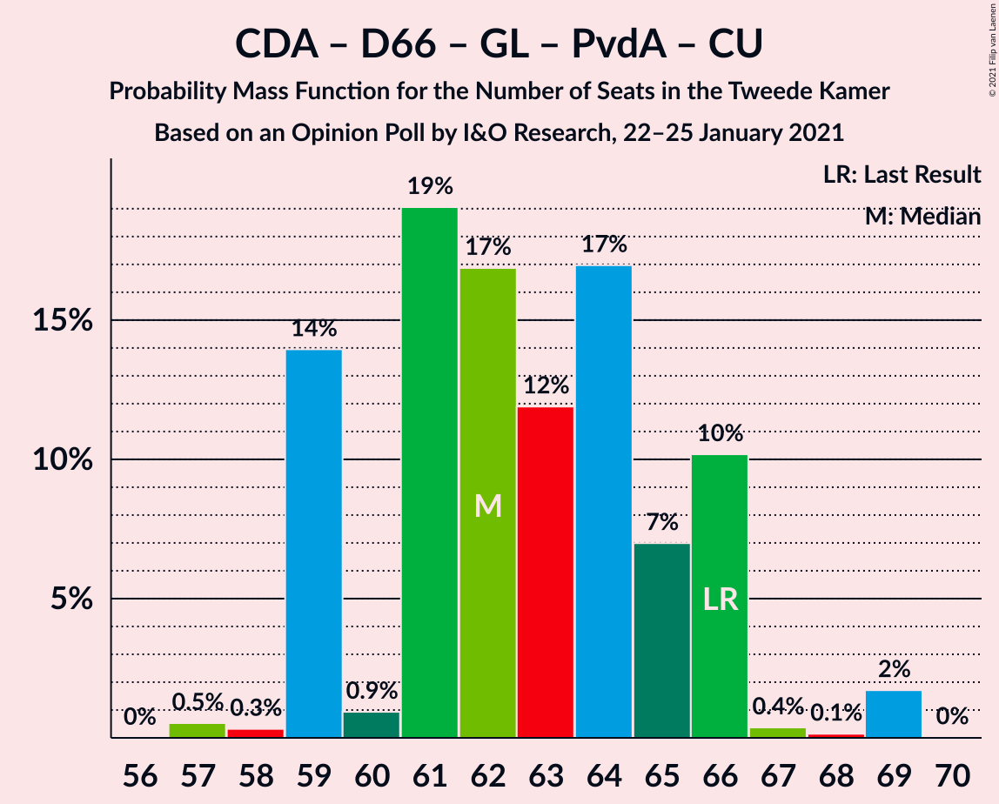

| Number of Seats | Probability | Accumulated | Special Marks |
|:---------------:|:-----------:|:-----------:|:-------------:|
| 57 | 0.5% | 100% |  |
| 58 | 0.3% | 99.5% |  |
| 59 | 14% | 99.1% |  |
| 60 | 0.9% | 85% |  |
| 61 | 19% | 84% |  |
| 62 | 17% | 65% |  |
| 63 | 12% | 48% | Median |
| 64 | 17% | 36% |  |
| 65 | 7% | 19% |  |
| 66 | 10% | 12% | Last Result |
| 67 | 0.4% | 2% |  |
| 68 | 0.1% | 2% |  |
| 69 | 2% | 2% |  |
| 70 | 0% | 0% |  |

### Volkspartij voor Vrijheid en Democratie – Christen-Democratisch Appèl

| Number of Seats | Probability | Accumulated | Special Marks |
|:---------------:|:-----------:|:-----------:|:-------------:|
| 52 | 0% | 100% | Last Result |
| 53 | 0% | 100% |  |
| 54 | 0% | 100% |  |
| 55 | 2% | 100% |  |
| 56 | 0.3% | 98% |  |
| 57 | 3% | 98% |  |
| 58 | 12% | 95% |  |
| 59 | 8% | 83% |  |
| 60 | 18% | 75% |  |
| 61 | 11% | 57% |  |
| 62 | 5% | 47% | Median |
| 63 | 13% | 41% |  |
| 64 | 27% | 28% |  |
| 65 | 0.6% | 0.9% |  |
| 66 | 0.1% | 0.3% |  |
| 67 | 0.2% | 0.3% |  |
| 68 | 0% | 0% |  |

### Volkspartij voor Vrijheid en Democratie – Partij van de Arbeid

| Number of Seats | Probability | Accumulated | Special Marks |
|:---------------:|:-----------:|:-----------:|:-------------:|
| 42 | 0% | 100% | Last Result |
| 43 | 0% | 100% |  |
| 44 | 0% | 100% |  |
| 45 | 0% | 100% |  |
| 46 | 0% | 100% |  |
| 47 | 0% | 100% |  |
| 48 | 0% | 100% |  |
| 49 | 0% | 100% |  |
| 50 | 0.2% | 100% |  |
| 51 | 3% | 99.8% |  |
| 52 | 13% | 97% |  |
| 53 | 4% | 84% |  |
| 54 | 5% | 80% |  |
| 55 | 34% | 75% |  |
| 56 | 26% | 41% | Median |
| 57 | 5% | 14% |  |
| 58 | 7% | 10% |  |
| 59 | 3% | 3% |  |
| 60 | 0.5% | 0.6% |  |
| 61 | 0% | 0% |  |

### Christen-Democratisch Appèl – Democraten 66 – Partij van de Arbeid

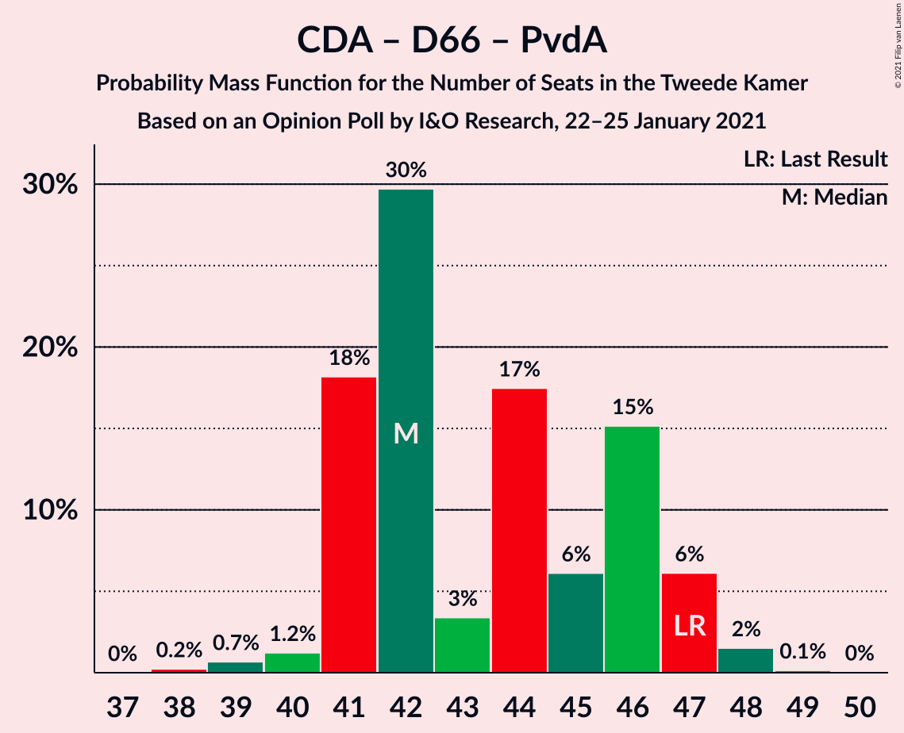

| Number of Seats | Probability | Accumulated | Special Marks |
|:---------------:|:-----------:|:-----------:|:-------------:|
| 38 | 0.2% | 100% |  |
| 39 | 0.7% | 99.8% |  |
| 40 | 1.2% | 99.1% |  |
| 41 | 18% | 98% |  |
| 42 | 30% | 80% |  |
| 43 | 3% | 50% |  |
| 44 | 17% | 47% | Median |
| 45 | 6% | 29% |  |
| 46 | 15% | 23% |  |
| 47 | 6% | 8% | Last Result |
| 48 | 2% | 2% |  |
| 49 | 0.1% | 0.2% |  |
| 50 | 0% | 0% |  |

### Christen-Democratisch Appèl – Partij van de Arbeid – ChristenUnie

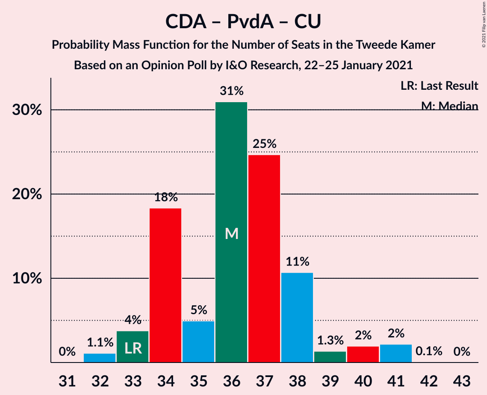

| Number of Seats | Probability | Accumulated | Special Marks |
|:---------------:|:-----------:|:-----------:|:-------------:|
| 32 | 1.1% | 100% |  |
| 33 | 4% | 98.9% | Last Result |
| 34 | 18% | 95% |  |
| 35 | 5% | 77% |  |
| 36 | 31% | 72% |  |
| 37 | 25% | 41% | Median |
| 38 | 11% | 16% |  |
| 39 | 1.3% | 6% |  |
| 40 | 2% | 4% |  |
| 41 | 2% | 2% |  |
| 42 | 0.1% | 0.1% |  |
| 43 | 0% | 0% |  |

### Christen-Democratisch Appèl – Democraten 66

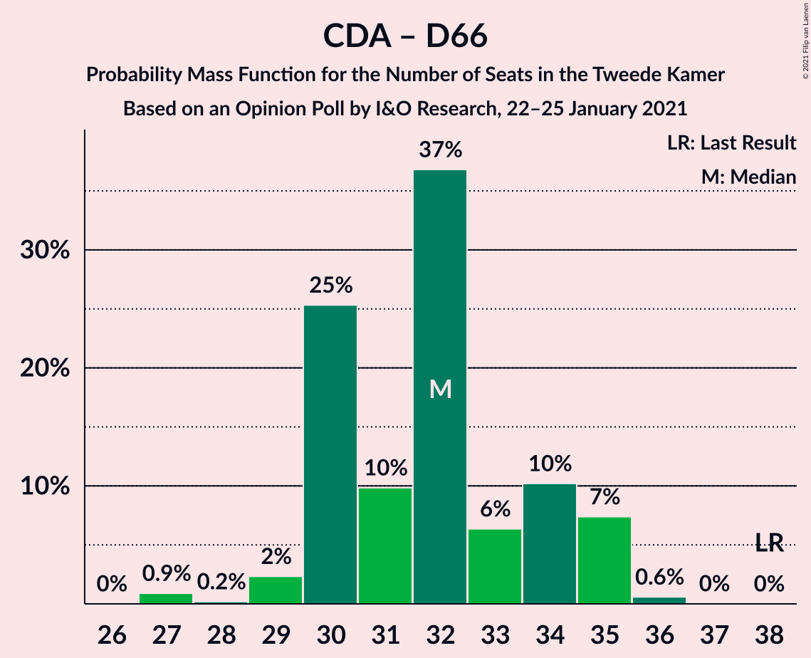

| Number of Seats | Probability | Accumulated | Special Marks |
|:---------------:|:-----------:|:-----------:|:-------------:|
| 27 | 0.9% | 100% |  |
| 28 | 0.2% | 99.1% |  |
| 29 | 2% | 98.9% |  |
| 30 | 25% | 97% |  |
| 31 | 10% | 71% |  |
| 32 | 37% | 61% | Median |
| 33 | 6% | 25% |  |
| 34 | 10% | 18% |  |
| 35 | 7% | 8% |  |
| 36 | 0.6% | 0.6% |  |
| 37 | 0% | 0% |  |
| 38 | 0% | 0% | Last Result |

### Christen-Democratisch Appèl – Partij van de Arbeid

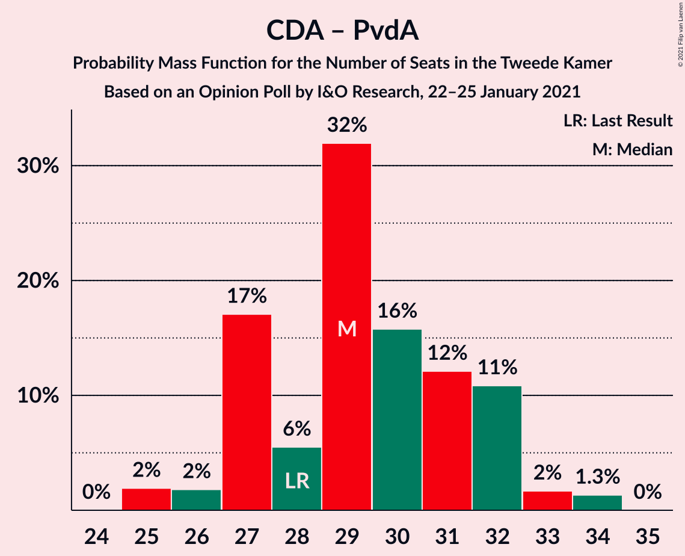

| Number of Seats | Probability | Accumulated | Special Marks |
|:---------------:|:-----------:|:-----------:|:-------------:|
| 25 | 2% | 100% |  |
| 26 | 2% | 98% |  |
| 27 | 17% | 96% |  |
| 28 | 6% | 79% | Last Result |
| 29 | 32% | 74% |  |
| 30 | 16% | 42% | Median |
| 31 | 12% | 26% |  |
| 32 | 11% | 14% |  |
| 33 | 2% | 3% |  |
| 34 | 1.3% | 1.3% |  |
| 35 | 0% | 0% |  |

## Technical Information

### Opinion Poll

+ **Polling firm:** I&O Research
+ **Commissioner(s):** —
+ **Fieldwork period:** 22–25 January 2021

### Calculations

+ **Sample size:** 2232
+ **Simulations done:** 1,048,576
+ **Error estimate:** 1.31%

