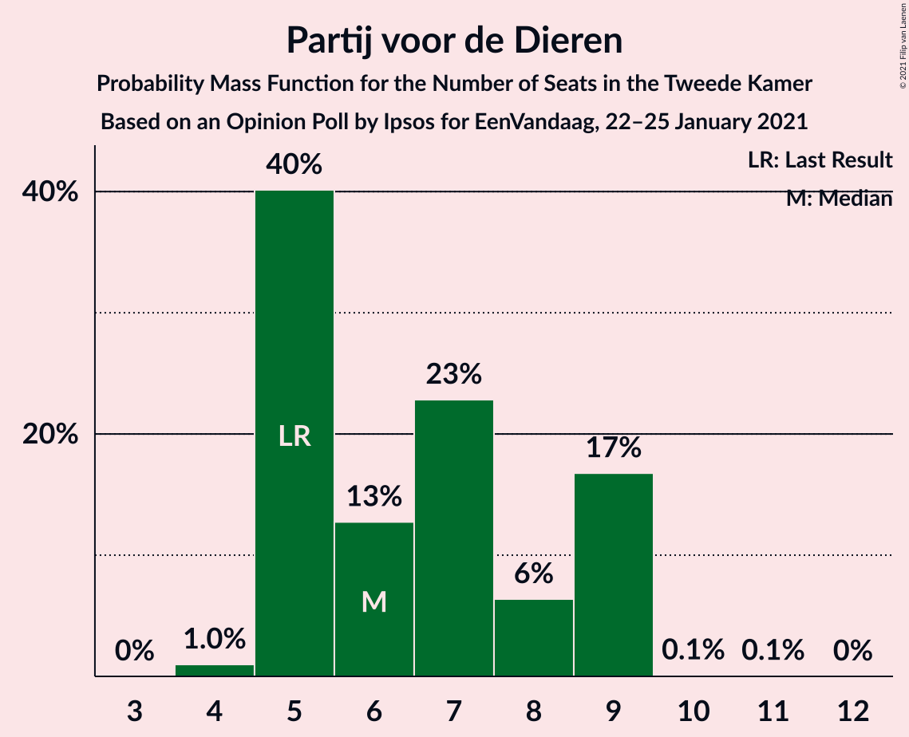

# Opinion Poll by Ipsos for EenVandaag, 22–25 January 2021

<a href="#voting-intentions">Voting Intentions</a> | <a href="#seats">Seats</a> | <a href="#coalitions">Coalitions</a> | <a href="#technical-information">Technical Information</a>

## Voting Intentions

### Confidence Intervals

| Party | Last Result | Poll Result | 80% Confidence Interval | 90% Confidence Interval | 95% Confidence Interval | 99% Confidence Interval |
|:-----:|:-----------:|:-----------:|:-----------------------:|:-----------------------:|:-----------------------:|:-----------------------:|
| Volkspartij voor Vrijheid en Democratie | 21.3% | 26.0% | 24.3–27.8% |23.9–28.3% |23.5–28.8% |22.7–29.7% |
| Christen-Democratisch Appèl | 12.4% | 13.1% | 11.8–14.5% |11.5–15.0% |11.2–15.3% |10.6–16.0% |
| Partij voor de Vrijheid | 13.1% | 12.7% | 11.5–14.1% |11.1–14.5% |10.8–14.9% |10.3–15.6% |
| Democraten 66 | 12.2% | 10.1% | 9.0–11.4% |8.7–11.8% |8.5–12.1% |7.9–12.8% |
| GroenLinks | 9.1% | 7.8% | 6.9–9.0% |6.6–9.4% |6.4–9.6% |5.9–10.2% |
| Partij van de Arbeid | 5.7% | 7.7% | 6.7–8.8% |6.4–9.1% |6.2–9.4% |5.8–10.0% |
| Socialistische Partij | 9.1% | 6.2% | 5.3–7.3% |5.1–7.6% |4.9–7.9% |4.5–8.4% |
| Partij voor de Dieren | 3.2% | 4.4% | 3.7–5.3% |3.5–5.6% |3.3–5.8% |3.0–6.3% |
| ChristenUnie | 3.4% | 3.9% | 3.2–4.8% |3.1–5.1% |2.9–5.3% |2.6–5.7% |
| Forum voor Democratie | 1.8% | 2.1% | 1.6–2.8% |1.5–3.0% |1.4–3.2% |1.2–3.5% |
| Staatkundig Gereformeerde Partij | 2.1% | 1.5% | 1.1–2.1% |1.0–2.3% |0.9–2.5% |0.8–2.8% |
| DENK | 2.1% | 1.5% | 1.1–2.1% |1.0–2.3% |0.9–2.5% |0.8–2.8% |
| Juiste Antwoord 2021 | 0.0% | 1.3% | 1.0–1.9% |0.9–2.1% |0.8–2.2% |0.7–2.6% |
| 50Plus | 3.1% | 1.1% | 0.7–1.6% |0.7–1.7% |0.6–1.9% |0.5–2.2% |

*Note:* The poll result column reflects the actual value used in the calculations. Published results may vary slightly, and in addition be rounded to fewer digits.

## Seats

### Confidence Intervals

| Party | Last Result | Median | 80% Confidence Interval | 90% Confidence Interval | 95% Confidence Interval | 99% Confidence Interval |
|:-----:|:-----------:|:------:|:-----------------------:|:-----------------------:|:-----------------------:|:-----------------------:|
| <a href="#volkspartij-voor-vrijheid-en-democratie">Volkspartij voor Vrijheid en Democratie</a> | 33 | 40 | 37–45 |36–45 |36–46 |34–46 |
| <a href="#christen-democratisch-appèl">Christen-Democratisch Appèl</a> | 19 | 20 | 17–22 |17–22 |17–22 |16–23 |
| <a href="#partij-voor-de-vrijheid">Partij voor de Vrijheid</a> | 20 | 21 | 17–21 |17–24 |17–24 |17–24 |
| <a href="#democraten-66">Democraten 66</a> | 19 | 14 | 13–17 |13–17 |12–18 |12–20 |
| <a href="#groenlinks">GroenLinks</a> | 14 | 12 | 10–15 |10–15 |10–15 |10–15 |
| <a href="#partij-van-de-arbeid">Partij van de Arbeid</a> | 9 | 12 | 11–13 |9–14 |9–15 |8–15 |
| <a href="#socialistische-partij">Socialistische Partij</a> | 14 | 9 | 8–10 |7–11 |7–11 |7–12 |
| <a href="#partij-voor-de-dieren">Partij voor de Dieren</a> | 5 | 6 | 5–9 |5–9 |5–9 |4–9 |
| <a href="#christenunie">ChristenUnie</a> | 5 | 6 | 5–7 |4–7 |4–8 |4–8 |
| <a href="#forum-voor-democratie">Forum voor Democratie</a> | 2 | 3 | 2–4 |1–4 |1–4 |1–5 |
| <a href="#staatkundig-gereformeerde-partij">Staatkundig Gereformeerde Partij</a> | 3 | 2 | 2–3 |1–3 |1–3 |1–3 |
| <a href="#denk">DENK</a> | 3 | 2 | 1–3 |1–3 |1–3 |1–3 |
| <a href="#juiste-antwoord-2021">Juiste Antwoord 2021</a> | 0 | 2 | 1–2 |1–3 |1–3 |0–3 |
| <a href="#50plus">50Plus</a> | 4 | 1 | 1–2 |1–2 |0–2 |0–2 |

### Volkspartij voor Vrijheid en Democratie

*For a full overview of the results for this party, see the [Volkspartij voor Vrijheid en Democratie](party-volkspartijvoorvrijheidendemocratie.html) page.*

| Number of Seats | Probability | Accumulated | Special Marks |
|:---------------:|:-----------:|:-----------:|:-------------:|
| 33 | 0.4% | 100% | Last Result |
| 34 | 0.1% | 99.6% |  |
| 35 | 0.4% | 99.5% |  |
| 36 | 7% | 99.1% |  |
| 37 | 18% | 92% |  |
| 38 | 17% | 74% |  |
| 39 | 5% | 57% |  |
| 40 | 28% | 52% | Median |
| 41 | 2% | 24% |  |
| 42 | 4% | 22% |  |
| 43 | 2% | 17% |  |
| 44 | 3% | 16% |  |
| 45 | 9% | 13% |  |
| 46 | 4% | 4% |  |
| 47 | 0.5% | 0.5% |  |
| 48 | 0% | 0% |  |

### Christen-Democratisch Appèl

*For a full overview of the results for this party, see the [Christen-Democratisch Appèl](party-christen-democratischappèl.html) page.*

| Number of Seats | Probability | Accumulated | Special Marks |
|:---------------:|:-----------:|:-----------:|:-------------:|
| 15 | 0.2% | 100% |  |
| 16 | 0.5% | 99.8% |  |
| 17 | 25% | 99.3% |  |
| 18 | 4% | 74% |  |
| 19 | 10% | 70% | Last Result |
| 20 | 20% | 60% | Median |
| 21 | 19% | 40% |  |
| 22 | 19% | 21% |  |
| 23 | 2% | 2% |  |
| 24 | 0.1% | 0.2% |  |
| 25 | 0% | 0% |  |

### Partij voor de Vrijheid

*For a full overview of the results for this party, see the [Partij voor de Vrijheid](party-partijvoordevrijheid.html) page.*

| Number of Seats | Probability | Accumulated | Special Marks |
|:---------------:|:-----------:|:-----------:|:-------------:|
| 14 | 0.1% | 100% |  |
| 15 | 0.1% | 99.9% |  |
| 16 | 0.1% | 99.8% |  |
| 17 | 14% | 99.7% |  |
| 18 | 7% | 86% |  |
| 19 | 7% | 79% |  |
| 20 | 22% | 72% | Last Result |
| 21 | 41% | 51% | Median |
| 22 | 3% | 9% |  |
| 23 | 0.3% | 7% |  |
| 24 | 6% | 7% |  |
| 25 | 0% | 0.1% |  |
| 26 | 0.1% | 0.1% |  |
| 27 | 0% | 0% |  |

### Democraten 66

*For a full overview of the results for this party, see the [Democraten 66](party-democraten66.html) page.*

| Number of Seats | Probability | Accumulated | Special Marks |
|:---------------:|:-----------:|:-----------:|:-------------:|
| 12 | 4% | 100% |  |
| 13 | 19% | 96% |  |
| 14 | 28% | 77% | Median |
| 15 | 33% | 49% |  |
| 16 | 6% | 16% |  |
| 17 | 7% | 10% |  |
| 18 | 2% | 4% |  |
| 19 | 0.2% | 1.2% | Last Result |
| 20 | 1.0% | 1.0% |  |
| 21 | 0% | 0% |  |

### GroenLinks

*For a full overview of the results for this party, see the [GroenLinks](party-groenlinks.html) page.*

| Number of Seats | Probability | Accumulated | Special Marks |
|:---------------:|:-----------:|:-----------:|:-------------:|
| 9 | 0.2% | 100% |  |
| 10 | 29% | 99.7% |  |
| 11 | 14% | 71% |  |
| 12 | 11% | 57% | Median |
| 13 | 20% | 47% |  |
| 14 | 3% | 27% | Last Result |
| 15 | 23% | 24% |  |
| 16 | 0.1% | 0.1% |  |
| 17 | 0% | 0% |  |

### Partij van de Arbeid

*For a full overview of the results for this party, see the [Partij van de Arbeid](party-partijvandearbeid.html) page.*

| Number of Seats | Probability | Accumulated | Special Marks |
|:---------------:|:-----------:|:-----------:|:-------------:|
| 7 | 0.2% | 100% |  |
| 8 | 0.4% | 99.8% |  |
| 9 | 6% | 99.4% | Last Result |
| 10 | 2% | 94% |  |
| 11 | 29% | 92% |  |
| 12 | 38% | 62% | Median |
| 13 | 16% | 25% |  |
| 14 | 5% | 9% |  |
| 15 | 3% | 3% |  |
| 16 | 0.1% | 0.1% |  |
| 17 | 0% | 0% |  |

### Socialistische Partij

*For a full overview of the results for this party, see the [Socialistische Partij](party-socialistischepartij.html) page.*

| Number of Seats | Probability | Accumulated | Special Marks |
|:---------------:|:-----------:|:-----------:|:-------------:|
| 6 | 0.3% | 100% |  |
| 7 | 6% | 99.7% |  |
| 8 | 19% | 94% |  |
| 9 | 34% | 75% | Median |
| 10 | 35% | 41% |  |
| 11 | 5% | 7% |  |
| 12 | 2% | 2% |  |
| 13 | 0.1% | 0.1% |  |
| 14 | 0% | 0% | Last Result |

### Partij voor de Dieren

*For a full overview of the results for this party, see the [Partij voor de Dieren](party-partijvoordedieren.html) page.*

| Number of Seats | Probability | Accumulated | Special Marks |
|:---------------:|:-----------:|:-----------:|:-------------:|
| 4 | 1.0% | 100% |  |
| 5 | 40% | 99.0% | Last Result |
| 6 | 13% | 59% | Median |
| 7 | 23% | 46% |  |
| 8 | 6% | 23% |  |
| 9 | 17% | 17% |  |
| 10 | 0.1% | 0.1% |  |
| 11 | 0.1% | 0.1% |  |
| 12 | 0% | 0% |  |

### ChristenUnie

*For a full overview of the results for this party, see the [ChristenUnie](party-christenunie.html) page.*

| Number of Seats | Probability | Accumulated | Special Marks |
|:---------------:|:-----------:|:-----------:|:-------------:|
| 3 | 0.1% | 100% |  |
| 4 | 7% | 99.9% |  |
| 5 | 33% | 93% | Last Result |
| 6 | 39% | 60% | Median |
| 7 | 17% | 21% |  |
| 8 | 4% | 4% |  |
| 9 | 0.2% | 0.2% |  |
| 10 | 0% | 0% |  |

### Forum voor Democratie

*For a full overview of the results for this party, see the [Forum voor Democratie](party-forumvoordemocratie.html) page.*

| Number of Seats | Probability | Accumulated | Special Marks |
|:---------------:|:-----------:|:-----------:|:-------------:|
| 1 | 5% | 100% |  |
| 2 | 33% | 95% | Last Result |
| 3 | 17% | 62% | Median |
| 4 | 44% | 45% |  |
| 5 | 0.7% | 0.8% |  |
| 6 | 0% | 0% |  |

### Staatkundig Gereformeerde Partij

*For a full overview of the results for this party, see the [Staatkundig Gereformeerde Partij](party-staatkundiggereformeerdepartij.html) page.*

| Number of Seats | Probability | Accumulated | Special Marks |
|:---------------:|:-----------:|:-----------:|:-------------:|
| 1 | 5% | 100% |  |
| 2 | 70% | 95% | Median |
| 3 | 24% | 24% | Last Result |
| 4 | 0.3% | 0.4% |  |
| 5 | 0.1% | 0.1% |  |
| 6 | 0% | 0% |  |

### DENK

*For a full overview of the results for this party, see the [DENK](party-denk.html) page.*

| Number of Seats | Probability | Accumulated | Special Marks |
|:---------------:|:-----------:|:-----------:|:-------------:|
| 0 | 0.1% | 100% |  |
| 1 | 11% | 99.9% |  |
| 2 | 62% | 89% | Median |
| 3 | 26% | 26% | Last Result |
| 4 | 0.2% | 0.2% |  |
| 5 | 0% | 0% |  |

### Juiste Antwoord 2021

*For a full overview of the results for this party, see the [Juiste Antwoord 2021](party-juisteantwoord2021.html) page.*

| Number of Seats | Probability | Accumulated | Special Marks |
|:---------------:|:-----------:|:-----------:|:-------------:|
| 0 | 1.4% | 100% | Last Result |
| 1 | 33% | 98.6% |  |
| 2 | 58% | 66% | Median |
| 3 | 8% | 8% |  |
| 4 | 0.1% | 0.1% |  |
| 5 | 0% | 0% |  |

### 50Plus

*For a full overview of the results for this party, see the [50Plus](party-50plus.html) page.*

| Number of Seats | Probability | Accumulated | Special Marks |
|:---------------:|:-----------:|:-----------:|:-------------:|
| 0 | 5% | 100% |  |
| 1 | 70% | 95% | Median |
| 2 | 25% | 25% |  |
| 3 | 0.3% | 0.3% |  |
| 4 | 0% | 0% | Last Result |

## Coalitions

### Confidence Intervals

| Coalition | Last Result | Median | Majority? | 80% Confidence Interval | 90% Confidence Interval | 95% Confidence Interval | 99% Confidence Interval |
|:---------:|:-----------:|:------:|:---------:|:-----------------------:|:-----------------------:|:-----------------------:|:-----------------------:|
| Volkspartij voor Vrijheid en Democratie – Christen-Democratisch Appèl – Democraten 66 – Partij van de Arbeid – ChristenUnie | 85 | 91 | 100% | 87–97 | 87–98 | 87–98 | 87–98 |
| Volkspartij voor Vrijheid en Democratie – Christen-Democratisch Appèl – Democraten 66 – GroenLinks – ChristenUnie | 90 | 92 | 100% | 89–97 | 89–97 | 89–97 | 87–97 |
| Volkspartij voor Vrijheid en Democratie – Christen-Democratisch Appèl – Partij voor de Vrijheid – Forum voor Democratie – Staatkundig Gereformeerde Partij | 77 | 84 | 100% | 83–88 | 81–88 | 81–88 | 79–90 |
| Volkspartij voor Vrijheid en Democratie – Christen-Democratisch Appèl – Democraten 66 – ChristenUnie | 76 | 79 | 99.3% | 76–84 | 76–87 | 76–87 | 75–87 |
| Volkspartij voor Vrijheid en Democratie – Christen-Democratisch Appèl – Partij voor de Vrijheid – Forum voor Democratie | 74 | 82 | 99.7% | 80–86 | 79–86 | 78–86 | 76–89 |
| Volkspartij voor Vrijheid en Democratie – Christen-Democratisch Appèl – Partij voor de Vrijheid | 72 | 79 | 98% | 78–84 | 77–84 | 76–85 | 73–86 |
| Volkspartij voor Vrijheid en Democratie – Christen-Democratisch Appèl – Democraten 66 | 71 | 73 | 25% | 71–80 | 71–82 | 71–82 | 70–82 |
| Volkspartij voor Vrijheid en Democratie – Christen-Democratisch Appèl – Partij van de Arbeid | 61 | 70 | 13% | 69–78 | 69–78 | 68–79 | 65–79 |
| Christen-Democratisch Appèl – Democraten 66 – GroenLinks – Partij van de Arbeid – Socialistische Partij – ChristenUnie | 80 | 74 | 9% | 71–75 | 71–76 | 70–77 | 68–81 |
| Volkspartij voor Vrijheid en Democratie – Christen-Democratisch Appèl – Forum voor Democratie – Staatkundig Gereformeerde Partij – 50Plus | 61 | 65 | 0% | 64–69 | 63–72 | 63–72 | 61–72 |
| Volkspartij voor Vrijheid en Democratie – Democraten 66 – Partij van de Arbeid | 61 | 66 | 0% | 61–71 | 61–71 | 61–72 | 61–73 |
| Volkspartij voor Vrijheid en Democratie – Christen-Democratisch Appèl – Forum voor Democratie – Staatkundig Gereformeerde Partij | 57 | 63 | 0% | 63–68 | 63–71 | 61–71 | 60–71 |
| Volkspartij voor Vrijheid en Democratie – Christen-Democratisch Appèl – Forum voor Democratie – 50Plus | 58 | 62 | 0% | 62–67 | 61–70 | 61–70 | 58–70 |
| Volkspartij voor Vrijheid en Democratie – Christen-Democratisch Appèl – Forum voor Democratie | 54 | 61 | 0% | 60–66 | 60–69 | 59–69 | 57–69 |
| Christen-Democratisch Appèl – Democraten 66 – GroenLinks – Partij van de Arbeid – ChristenUnie | 66 | 64 | 0% | 62–66 | 61–67 | 60–68 | 59–70 |
| Volkspartij voor Vrijheid en Democratie – Christen-Democratisch Appèl | 52 | 58 | 0% | 57–65 | 57–67 | 57–67 | 54–67 |
| Volkspartij voor Vrijheid en Democratie – Partij van de Arbeid | 42 | 52 | 0% | 48–56 | 48–56 | 47–60 | 45–60 |
| Christen-Democratisch Appèl – Democraten 66 – Partij van de Arbeid | 47 | 45 | 0% | 43–49 | 43–50 | 43–51 | 41–51 |
| Christen-Democratisch Appèl – Partij van de Arbeid – ChristenUnie | 33 | 37 | 0% | 35–40 | 34–41 | 32–42 | 32–42 |
| Christen-Democratisch Appèl – Democraten 66 | 38 | 34 | 0% | 31–37 | 31–38 | 31–38 | 31–40 |
| Christen-Democratisch Appèl – Partij van de Arbeid | 28 | 32 | 0% | 29–34 | 29–34 | 26–35 | 26–37 |

### Volkspartij voor Vrijheid en Democratie – Christen-Democratisch Appèl – Democraten 66 – Partij van de Arbeid – ChristenUnie

| Number of Seats | Probability | Accumulated | Special Marks |
|:---------------:|:-----------:|:-----------:|:-------------:|
| 85 | 0% | 100% | Last Result |
| 86 | 0.3% | 99.9% |  |
| 87 | 17% | 99.6% |  |
| 88 | 0.2% | 83% |  |
| 89 | 22% | 82% |  |
| 90 | 5% | 60% |  |
| 91 | 11% | 55% |  |
| 92 | 2% | 45% | Median |
| 93 | 19% | 43% |  |
| 94 | 4% | 24% |  |
| 95 | 0.4% | 20% |  |
| 96 | 8% | 19% |  |
| 97 | 2% | 12% |  |
| 98 | 9% | 9% |  |
| 99 | 0.1% | 0.1% |  |
| 100 | 0% | 0% |  |

### Volkspartij voor Vrijheid en Democratie – Christen-Democratisch Appèl – Democraten 66 – GroenLinks – ChristenUnie

| Number of Seats | Probability | Accumulated | Special Marks |
|:---------------:|:-----------:|:-----------:|:-------------:|
| 85 | 0% | 100% |  |
| 86 | 0.3% | 99.9% |  |
| 87 | 0.1% | 99.6% |  |
| 88 | 1.3% | 99.5% |  |
| 89 | 17% | 98% |  |
| 90 | 21% | 81% | Last Result |
| 91 | 5% | 60% |  |
| 92 | 26% | 55% | Median |
| 93 | 3% | 29% |  |
| 94 | 7% | 26% |  |
| 95 | 7% | 19% |  |
| 96 | 2% | 12% |  |
| 97 | 10% | 11% |  |
| 98 | 0.1% | 0.4% |  |
| 99 | 0.1% | 0.3% |  |
| 100 | 0% | 0.2% |  |
| 101 | 0.2% | 0.2% |  |
| 102 | 0% | 0% |  |

### Volkspartij voor Vrijheid en Democratie – Christen-Democratisch Appèl – Partij voor de Vrijheid – Forum voor Democratie – Staatkundig Gereformeerde Partij

| Number of Seats | Probability | Accumulated | Special Marks |
|:---------------:|:-----------:|:-----------:|:-------------:|
| 77 | 0.3% | 100% | Last Result |
| 78 | 0.1% | 99.6% |  |
| 79 | 1.0% | 99.5% |  |
| 80 | 0.5% | 98.5% |  |
| 81 | 4% | 98% |  |
| 82 | 0.5% | 94% |  |
| 83 | 23% | 94% |  |
| 84 | 25% | 71% |  |
| 85 | 19% | 46% |  |
| 86 | 4% | 27% | Median |
| 87 | 9% | 23% |  |
| 88 | 13% | 14% |  |
| 89 | 0.2% | 0.9% |  |
| 90 | 0.6% | 0.7% |  |
| 91 | 0.1% | 0.2% |  |
| 92 | 0% | 0% |  |

### Volkspartij voor Vrijheid en Democratie – Christen-Democratisch Appèl – Democraten 66 – ChristenUnie

| Number of Seats | Probability | Accumulated | Special Marks |
|:---------------:|:-----------:|:-----------:|:-------------:|
| 73 | 0.1% | 100% |  |
| 74 | 0.4% | 99.9% |  |
| 75 | 0.3% | 99.5% |  |
| 76 | 16% | 99.3% | Last Result, Majority |
| 77 | 22% | 83% |  |
| 78 | 6% | 61% |  |
| 79 | 8% | 55% |  |
| 80 | 16% | 47% | Median |
| 81 | 1.0% | 31% |  |
| 82 | 12% | 30% |  |
| 83 | 3% | 18% |  |
| 84 | 5% | 15% |  |
| 85 | 0.2% | 10% |  |
| 86 | 0.1% | 9% |  |
| 87 | 9% | 9% |  |
| 88 | 0% | 0.1% |  |
| 89 | 0.1% | 0.1% |  |
| 90 | 0% | 0% |  |

### Volkspartij voor Vrijheid en Democratie – Christen-Democratisch Appèl – Partij voor de Vrijheid – Forum voor Democratie

| Number of Seats | Probability | Accumulated | Special Marks |
|:---------------:|:-----------:|:-----------:|:-------------:|
| 74 | 0.3% | 100% | Last Result |
| 75 | 0% | 99.7% |  |
| 76 | 0.6% | 99.7% | Majority |
| 77 | 0.6% | 99.1% |  |
| 78 | 1.4% | 98.6% |  |
| 79 | 3% | 97% |  |
| 80 | 15% | 94% |  |
| 81 | 6% | 80% |  |
| 82 | 30% | 74% |  |
| 83 | 21% | 44% |  |
| 84 | 1.3% | 23% | Median |
| 85 | 8% | 22% |  |
| 86 | 13% | 14% |  |
| 87 | 0% | 0.8% |  |
| 88 | 0.1% | 0.7% |  |
| 89 | 0.6% | 0.7% |  |
| 90 | 0.1% | 0.1% |  |
| 91 | 0% | 0% |  |

### Volkspartij voor Vrijheid en Democratie – Christen-Democratisch Appèl – Partij voor de Vrijheid

| Number of Seats | Probability | Accumulated | Special Marks |
|:---------------:|:-----------:|:-----------:|:-------------:|
| 71 | 0% | 100% |  |
| 72 | 0.3% | 99.9% | Last Result |
| 73 | 0.6% | 99.6% |  |
| 74 | 0.3% | 99.1% |  |
| 75 | 0.6% | 98.7% |  |
| 76 | 1.3% | 98% | Majority |
| 77 | 2% | 97% |  |
| 78 | 41% | 95% |  |
| 79 | 27% | 54% |  |
| 80 | 4% | 26% |  |
| 81 | 0.8% | 22% | Median |
| 82 | 7% | 22% |  |
| 83 | 1.4% | 15% |  |
| 84 | 9% | 13% |  |
| 85 | 4% | 4% |  |
| 86 | 0.4% | 0.6% |  |
| 87 | 0.2% | 0.2% |  |
| 88 | 0% | 0% |  |

### Volkspartij voor Vrijheid en Democratie – Christen-Democratisch Appèl – Democraten 66

| Number of Seats | Probability | Accumulated | Special Marks |
|:---------------:|:-----------:|:-----------:|:-------------:|
| 68 | 0.1% | 100% |  |
| 69 | 0.4% | 99.9% |  |
| 70 | 0.3% | 99.5% |  |
| 71 | 38% | 99.2% | Last Result |
| 72 | 1.0% | 61% |  |
| 73 | 22% | 60% |  |
| 74 | 8% | 38% | Median |
| 75 | 5% | 30% |  |
| 76 | 4% | 25% | Majority |
| 77 | 6% | 21% |  |
| 78 | 5% | 15% |  |
| 79 | 0.2% | 11% |  |
| 80 | 1.0% | 10% |  |
| 81 | 0.3% | 9% |  |
| 82 | 9% | 9% |  |
| 83 | 0% | 0.1% |  |
| 84 | 0% | 0.1% |  |
| 85 | 0.1% | 0.1% |  |
| 86 | 0% | 0% |  |

### Volkspartij voor Vrijheid en Democratie – Christen-Democratisch Appèl – Partij van de Arbeid

| Number of Seats | Probability | Accumulated | Special Marks |
|:---------------:|:-----------:|:-----------:|:-------------:|
| 61 | 0% | 100% | Last Result |
| 62 | 0% | 100% |  |
| 63 | 0% | 100% |  |
| 64 | 0% | 100% |  |
| 65 | 0.7% | 100% |  |
| 66 | 0.1% | 99.3% |  |
| 67 | 0.4% | 99.2% |  |
| 68 | 1.5% | 98.8% |  |
| 69 | 42% | 97% |  |
| 70 | 14% | 55% |  |
| 71 | 15% | 42% |  |
| 72 | 5% | 27% | Median |
| 73 | 4% | 22% |  |
| 74 | 1.3% | 18% |  |
| 75 | 4% | 17% |  |
| 76 | 0.5% | 13% | Majority |
| 77 | 0.1% | 13% |  |
| 78 | 9% | 13% |  |
| 79 | 4% | 4% |  |
| 80 | 0% | 0% |  |

### Christen-Democratisch Appèl – Democraten 66 – GroenLinks – Partij van de Arbeid – Socialistische Partij – ChristenUnie

| Number of Seats | Probability | Accumulated | Special Marks |
|:---------------:|:-----------:|:-----------:|:-------------:|
| 66 | 0.1% | 100% |  |
| 67 | 0.1% | 99.9% |  |
| 68 | 0.4% | 99.8% |  |
| 69 | 0.1% | 99.3% |  |
| 70 | 4% | 99.2% |  |
| 71 | 23% | 95% |  |
| 72 | 2% | 72% |  |
| 73 | 11% | 70% | Median |
| 74 | 40% | 59% |  |
| 75 | 10% | 18% |  |
| 76 | 6% | 9% | Majority |
| 77 | 0.3% | 3% |  |
| 78 | 1.3% | 2% |  |
| 79 | 0.5% | 1.1% |  |
| 80 | 0% | 0.7% | Last Result |
| 81 | 0.5% | 0.6% |  |
| 82 | 0.1% | 0.1% |  |
| 83 | 0% | 0% |  |

### Volkspartij voor Vrijheid en Democratie – Christen-Democratisch Appèl – Forum voor Democratie – Staatkundig Gereformeerde Partij – 50Plus

| Number of Seats | Probability | Accumulated | Special Marks |
|:---------------:|:-----------:|:-----------:|:-------------:|
| 59 | 0% | 100% |  |
| 60 | 0.3% | 99.9% |  |
| 61 | 0.7% | 99.7% | Last Result |
| 62 | 1.0% | 99.0% |  |
| 63 | 3% | 98% |  |
| 64 | 30% | 95% |  |
| 65 | 35% | 64% |  |
| 66 | 4% | 30% | Median |
| 67 | 5% | 25% |  |
| 68 | 2% | 20% |  |
| 69 | 8% | 18% |  |
| 70 | 0.1% | 9% |  |
| 71 | 0.1% | 9% |  |
| 72 | 9% | 9% |  |
| 73 | 0.1% | 0.2% |  |
| 74 | 0.1% | 0.1% |  |
| 75 | 0% | 0% |  |

### Volkspartij voor Vrijheid en Democratie – Democraten 66 – Partij van de Arbeid

| Number of Seats | Probability | Accumulated | Special Marks |
|:---------------:|:-----------:|:-----------:|:-------------:|
| 59 | 0.4% | 100% |  |
| 60 | 0% | 99.6% |  |
| 61 | 17% | 99.6% | Last Result |
| 62 | 2% | 83% |  |
| 63 | 7% | 81% |  |
| 64 | 2% | 74% |  |
| 65 | 1.5% | 71% |  |
| 66 | 38% | 70% | Median |
| 67 | 3% | 31% |  |
| 68 | 4% | 29% |  |
| 69 | 1.3% | 24% |  |
| 70 | 6% | 23% |  |
| 71 | 13% | 17% |  |
| 72 | 4% | 4% |  |
| 73 | 0.4% | 0.6% |  |
| 74 | 0.1% | 0.2% |  |
| 75 | 0% | 0% |  |

### Volkspartij voor Vrijheid en Democratie – Christen-Democratisch Appèl – Forum voor Democratie – Staatkundig Gereformeerde Partij

| Number of Seats | Probability | Accumulated | Special Marks |
|:---------------:|:-----------:|:-----------:|:-------------:|
| 57 | 0% | 100% | Last Result |
| 58 | 0% | 100% |  |
| 59 | 0.3% | 99.9% |  |
| 60 | 1.2% | 99.6% |  |
| 61 | 1.1% | 98% |  |
| 62 | 2% | 97% |  |
| 63 | 47% | 96% |  |
| 64 | 21% | 49% |  |
| 65 | 2% | 28% | Median |
| 66 | 6% | 26% |  |
| 67 | 7% | 20% |  |
| 68 | 4% | 14% |  |
| 69 | 0.1% | 9% |  |
| 70 | 0.1% | 9% |  |
| 71 | 9% | 9% |  |
| 72 | 0.1% | 0.2% |  |
| 73 | 0% | 0% |  |

### Volkspartij voor Vrijheid en Democratie – Christen-Democratisch Appèl – Forum voor Democratie – 50Plus

| Number of Seats | Probability | Accumulated | Special Marks |
|:---------------:|:-----------:|:-----------:|:-------------:|
| 57 | 0.3% | 100% |  |
| 58 | 0.3% | 99.7% | Last Result |
| 59 | 0.7% | 99.4% |  |
| 60 | 0.9% | 98.8% |  |
| 61 | 3% | 98% |  |
| 62 | 45% | 95% |  |
| 63 | 19% | 50% |  |
| 64 | 8% | 31% | Median |
| 65 | 3% | 23% |  |
| 66 | 5% | 20% |  |
| 67 | 5% | 15% |  |
| 68 | 0.5% | 10% |  |
| 69 | 0.1% | 9% |  |
| 70 | 9% | 9% |  |
| 71 | 0% | 0.2% |  |
| 72 | 0% | 0.1% |  |
| 73 | 0.1% | 0.1% |  |
| 74 | 0% | 0% |  |

### Volkspartij voor Vrijheid en Democratie – Christen-Democratisch Appèl – Forum voor Democratie

| Number of Seats | Probability | Accumulated | Special Marks |
|:---------------:|:-----------:|:-----------:|:-------------:|
| 54 | 0% | 100% | Last Result |
| 55 | 0% | 100% |  |
| 56 | 0.3% | 100% |  |
| 57 | 0.7% | 99.7% |  |
| 58 | 0.3% | 99.0% |  |
| 59 | 1.3% | 98.7% |  |
| 60 | 17% | 97% |  |
| 61 | 31% | 81% |  |
| 62 | 19% | 49% |  |
| 63 | 5% | 30% | Median |
| 64 | 9% | 25% |  |
| 65 | 2% | 15% |  |
| 66 | 4% | 14% |  |
| 67 | 0.5% | 10% |  |
| 68 | 0.1% | 9% |  |
| 69 | 9% | 9% |  |
| 70 | 0% | 0.2% |  |
| 71 | 0.1% | 0.1% |  |
| 72 | 0% | 0% |  |

### Christen-Democratisch Appèl – Democraten 66 – GroenLinks – Partij van de Arbeid – ChristenUnie

| Number of Seats | Probability | Accumulated | Special Marks |
|:---------------:|:-----------:|:-----------:|:-------------:|
| 57 | 0.1% | 100% |  |
| 58 | 0% | 99.9% |  |
| 59 | 0.5% | 99.9% |  |
| 60 | 3% | 99.3% |  |
| 61 | 4% | 96% |  |
| 62 | 5% | 93% |  |
| 63 | 26% | 87% |  |
| 64 | 24% | 61% | Median |
| 65 | 18% | 37% |  |
| 66 | 11% | 20% | Last Result |
| 67 | 4% | 8% |  |
| 68 | 3% | 4% |  |
| 69 | 0.4% | 1.4% |  |
| 70 | 0.8% | 1.0% |  |
| 71 | 0.2% | 0.2% |  |
| 72 | 0% | 0% |  |

### Volkspartij voor Vrijheid en Democratie – Christen-Democratisch Appèl

| Number of Seats | Probability | Accumulated | Special Marks |
|:---------------:|:-----------:|:-----------:|:-------------:|
| 52 | 0% | 100% | Last Result |
| 53 | 0% | 100% |  |
| 54 | 0.8% | 99.9% |  |
| 55 | 0.4% | 99.2% |  |
| 56 | 0.7% | 98.8% |  |
| 57 | 22% | 98% |  |
| 58 | 41% | 76% |  |
| 59 | 3% | 35% |  |
| 60 | 9% | 32% | Median |
| 61 | 8% | 23% |  |
| 62 | 1.3% | 15% |  |
| 63 | 0.2% | 14% |  |
| 64 | 0.7% | 13% |  |
| 65 | 4% | 13% |  |
| 66 | 0% | 9% |  |
| 67 | 9% | 9% |  |
| 68 | 0.1% | 0.1% |  |
| 69 | 0% | 0% |  |

### Volkspartij voor Vrijheid en Democratie – Partij van de Arbeid

| Number of Seats | Probability | Accumulated | Special Marks |
|:---------------:|:-----------:|:-----------:|:-------------:|
| 42 | 0% | 100% | Last Result |
| 43 | 0% | 100% |  |
| 44 | 0.4% | 100% |  |
| 45 | 0.1% | 99.6% |  |
| 46 | 0.7% | 99.5% |  |
| 47 | 2% | 98.8% |  |
| 48 | 23% | 97% |  |
| 49 | 3% | 73% |  |
| 50 | 2% | 71% |  |
| 51 | 18% | 69% |  |
| 52 | 25% | 50% | Median |
| 53 | 4% | 26% |  |
| 54 | 5% | 22% |  |
| 55 | 2% | 17% |  |
| 56 | 10% | 15% |  |
| 57 | 0.3% | 4% |  |
| 58 | 0% | 4% |  |
| 59 | 0.4% | 4% |  |
| 60 | 4% | 4% |  |
| 61 | 0% | 0% |  |

### Christen-Democratisch Appèl – Democraten 66 – Partij van de Arbeid

| Number of Seats | Probability | Accumulated | Special Marks |
|:---------------:|:-----------:|:-----------:|:-------------:|
| 40 | 0.3% | 100% |  |
| 41 | 0.3% | 99.7% |  |
| 42 | 0.1% | 99.3% |  |
| 43 | 25% | 99.2% |  |
| 44 | 4% | 74% |  |
| 45 | 21% | 70% |  |
| 46 | 3% | 50% | Median |
| 47 | 7% | 47% | Last Result |
| 48 | 24% | 40% |  |
| 49 | 9% | 15% |  |
| 50 | 2% | 6% |  |
| 51 | 4% | 4% |  |
| 52 | 0.2% | 0.4% |  |
| 53 | 0% | 0.1% |  |
| 54 | 0.1% | 0.1% |  |
| 55 | 0% | 0% |  |

### Christen-Democratisch Appèl – Partij van de Arbeid – ChristenUnie

| Number of Seats | Probability | Accumulated | Special Marks |
|:---------------:|:-----------:|:-----------:|:-------------:|
| 32 | 3% | 100% |  |
| 33 | 2% | 97% | Last Result |
| 34 | 5% | 95% |  |
| 35 | 24% | 90% |  |
| 36 | 2% | 67% |  |
| 37 | 17% | 65% |  |
| 38 | 19% | 48% | Median |
| 39 | 1.0% | 29% |  |
| 40 | 22% | 28% |  |
| 41 | 2% | 6% |  |
| 42 | 3% | 3% |  |
| 43 | 0% | 0.1% |  |
| 44 | 0% | 0.1% |  |
| 45 | 0% | 0% |  |

### Christen-Democratisch Appèl – Democraten 66

| Number of Seats | Probability | Accumulated | Special Marks |
|:---------------:|:-----------:|:-----------:|:-------------:|
| 29 | 0% | 100% |  |
| 30 | 0.4% | 99.9% |  |
| 31 | 26% | 99.6% |  |
| 32 | 4% | 74% |  |
| 33 | 1.2% | 70% |  |
| 34 | 21% | 68% | Median |
| 35 | 19% | 48% |  |
| 36 | 6% | 29% |  |
| 37 | 17% | 23% |  |
| 38 | 3% | 6% | Last Result |
| 39 | 1.2% | 2% |  |
| 40 | 1.0% | 1.2% |  |
| 41 | 0.1% | 0.1% |  |
| 42 | 0% | 0.1% |  |
| 43 | 0% | 0% |  |

### Christen-Democratisch Appèl – Partij van de Arbeid

| Number of Seats | Probability | Accumulated | Special Marks |
|:---------------:|:-----------:|:-----------:|:-------------:|
| 26 | 3% | 100% |  |
| 27 | 0.7% | 97% |  |
| 28 | 0.3% | 97% | Last Result |
| 29 | 25% | 96% |  |
| 30 | 6% | 71% |  |
| 31 | 3% | 66% |  |
| 32 | 21% | 63% | Median |
| 33 | 29% | 41% |  |
| 34 | 9% | 12% |  |
| 35 | 3% | 4% |  |
| 36 | 0.1% | 1.2% |  |
| 37 | 1.0% | 1.1% |  |
| 38 | 0% | 0% |  |

## Technical Information

### Opinion Poll

+ **Polling firm:** Ipsos
+ **Commissioner(s):** EenVandaag
+ **Fieldwork period:** 22–25 January 2021

### Calculations

+ **Sample size:** 1045
+ **Simulations done:** 1,048,576
+ **Error estimate:** 3.31%

