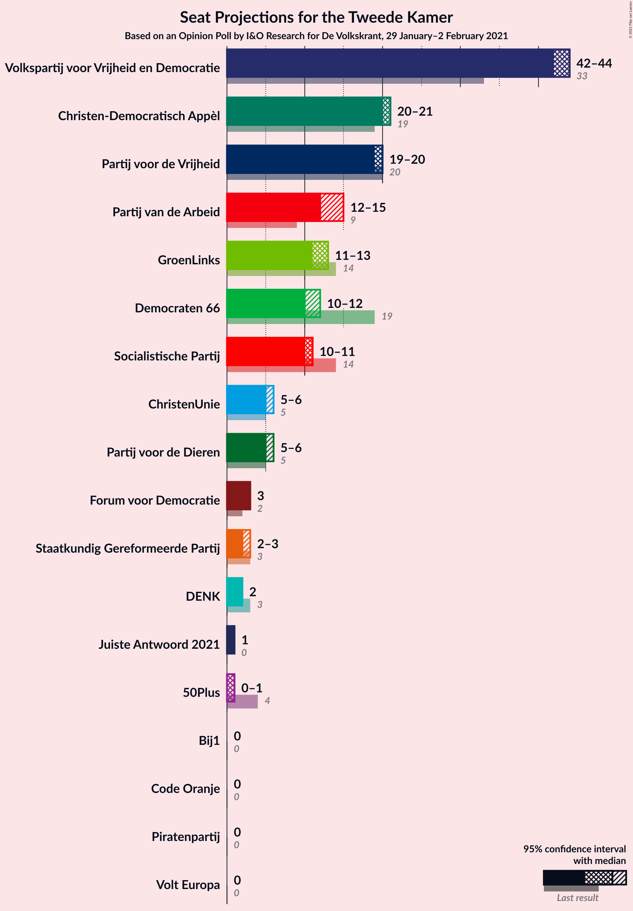
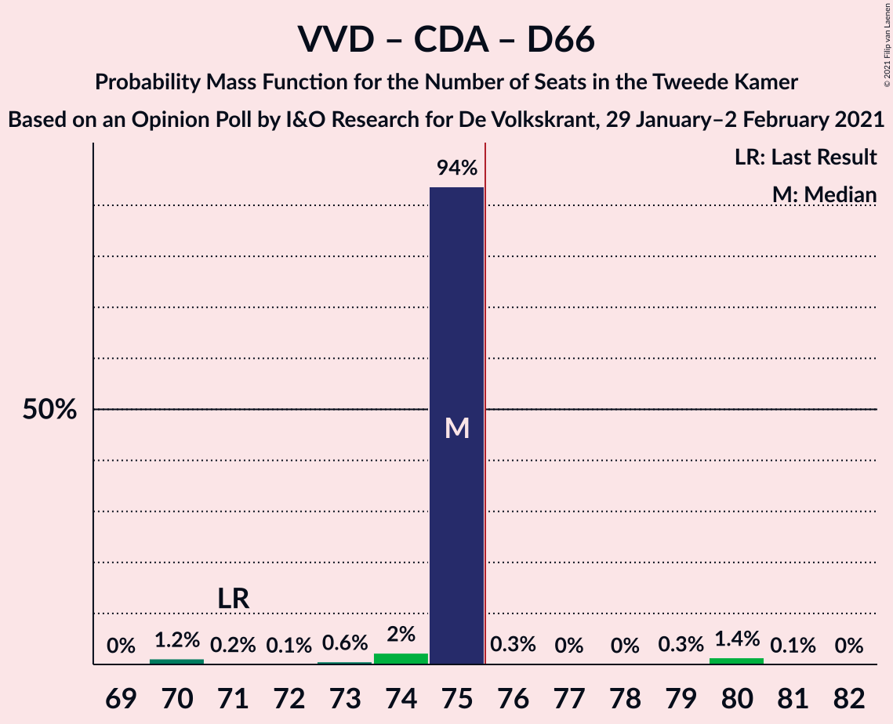

# Opinion Poll by I&O Research for De Volkskrant, 29 January–2 February 2021

<a href="#voting-intentions">Voting Intentions</a> | <a href="#seats">Seats</a> | <a href="#coalitions">Coalitions</a> | <a href="#technical-information">Technical Information</a>

## Voting Intentions

### Confidence Intervals

| Party | Last Result | Poll Result | 80% Confidence Interval | 90% Confidence Interval | 95% Confidence Interval | 99% Confidence Interval |
|:-----:|:-----------:|:-----------:|:-----------------------:|:-----------------------:|:-----------------------:|:-----------------------:|
| Volkspartij voor Vrijheid en Democratie | 21.3% | 28.4% | 27.2–29.7% |26.9–30.0% |26.6–30.3% |26.0–31.0% |
| Partij voor de Vrijheid | 13.1% | 12.6% | 11.7–13.5% |11.4–13.8% |11.2–14.0% |10.8–14.5% |
| Christen-Democratisch Appèl | 12.4% | 12.6% | 11.7–13.5% |11.4–13.8% |11.2–14.0% |10.8–14.5% |
| Partij van de Arbeid | 5.7% | 8.6% | 7.9–9.4% |7.7–9.6% |7.5–9.8% |7.1–10.3% |
| Democraten 66 | 12.2% | 7.9% | 7.2–8.7% |7.0–8.9% |6.8–9.1% |6.5–9.5% |
| GroenLinks | 9.1% | 7.3% | 6.6–8.0% |6.4–8.3% |6.3–8.4% |5.9–8.8% |
| Socialistische Partij | 9.1% | 7.3% | 6.6–8.0% |6.4–8.3% |6.3–8.4% |5.9–8.8% |
| ChristenUnie | 3.4% | 4.6% | 4.1–5.3% |4.0–5.5% |3.8–5.6% |3.6–5.9% |
| Partij voor de Dieren | 3.2% | 3.3% | 2.9–3.9% |2.7–4.0% |2.6–4.2% |2.4–4.4% |
| Staatkundig Gereformeerde Partij | 2.1% | 2.0% | 1.7–2.5% |1.6–2.6% |1.5–2.7% |1.3–2.9% |
| Forum voor Democratie | 1.8% | 2.0% | 1.7–2.5% |1.6–2.6% |1.5–2.7% |1.3–2.9% |
| DENK | 2.1% | 1.3% | 1.1–1.7% |1.0–1.8% |0.9–1.9% |0.8–2.1% |
| 50Plus | 3.1% | 0.7% | 0.5–1.0% |0.4–1.1% |0.4–1.1% |0.3–1.3% |
| Juiste Antwoord 2021 | 0.0% | 0.7% | 0.5–1.0% |0.4–1.1% |0.4–1.1% |0.3–1.3% |
| Piratenpartij | 0.3% | 0.2% | 0.1–0.4% |0.1–0.4% |0.1–0.5% |0.0–0.6% |
| Bij1 | 0.3% | 0.2% | 0.1–0.4% |0.1–0.4% |0.1–0.5% |0.0–0.6% |
| Code Oranje | 0.0% | 0.2% | 0.1–0.4% |0.1–0.4% |0.1–0.5% |0.0–0.6% |
| Volt Europa | 0.0% | 0.2% | 0.1–0.4% |0.1–0.4% |0.1–0.5% |0.0–0.6% |

*Note:* The poll result column reflects the actual value used in the calculations. Published results may vary slightly, and in addition be rounded to fewer digits.

## Seats

### Confidence Intervals

| Party | Last Result | Median | 80% Confidence Interval | 90% Confidence Interval | 95% Confidence Interval | 99% Confidence Interval |
|:-----:|:-----------:|:------:|:-----------------------:|:-----------------------:|:-----------------------:|:-----------------------:|
| <a href="#volkspartij-voor-vrijheid-en-democratie">Volkspartij voor Vrijheid en Democratie</a> | 33 | 44 | 44 |44 |42–44 |41–46 |
| <a href="#partij-voor-de-vrijheid">Partij voor de Vrijheid</a> | 20 | 20 | 20 |20 |19–20 |18–21 |
| <a href="#christen-democratisch-appèl">Christen-Democratisch Appèl</a> | 19 | 21 | 21 |21 |20–21 |18–22 |
| <a href="#partij-van-de-arbeid">Partij van de Arbeid</a> | 9 | 12 | 12 |12 |12–15 |12–16 |
| <a href="#democraten-66">Democraten 66</a> | 19 | 10 | 10 |10–11 |10–12 |10–14 |
| <a href="#groenlinks">GroenLinks</a> | 14 | 13 | 13 |13 |11–13 |9–13 |
| <a href="#socialistische-partij">Socialistische Partij</a> | 14 | 11 | 11 |10–11 |10–11 |9–12 |
| <a href="#christenunie">ChristenUnie</a> | 5 | 5 | 5 |5–6 |5–6 |5–7 |
| <a href="#partij-voor-de-dieren">Partij voor de Dieren</a> | 5 | 5 | 5 |5 |5–6 |3–7 |
| <a href="#staatkundig-gereformeerde-partij">Staatkundig Gereformeerde Partij</a> | 3 | 2 | 2 |2 |2–3 |2–3 |
| <a href="#forum-voor-democratie">Forum voor Democratie</a> | 2 | 3 | 3 |3 |3 |2–3 |
| <a href="#denk">DENK</a> | 3 | 2 | 2 |2 |2 |1–2 |
| <a href="#50plus">50Plus</a> | 4 | 1 | 1 |1 |0–1 |0–1 |
| <a href="#juiste-antwoord-2021">Juiste Antwoord 2021</a> | 0 | 1 | 1 |1 |1 |0–1 |
| <a href="#piratenpartij">Piratenpartij</a> | 0 | 0 | 0 |0 |0 |0 |
| <a href="#bij1">Bij1</a> | 0 | 0 | 0 |0 |0 |0 |
| <a href="#code-oranje">Code Oranje</a> | 0 | 0 | 0 |0 |0 |0 |
| <a href="#volt-europa">Volt Europa</a> | 0 | 0 | 0 |0 |0 |0 |

### Volkspartij voor Vrijheid en Democratie

*For a full overview of the results for this party, see the [Volkspartij voor Vrijheid en Democratie](party-volkspartijvoorvrijheidendemocratie.html) page.*

| Number of Seats | Probability | Accumulated | Special Marks |
|:---------------:|:-----------:|:-----------:|:-------------:|
| 33 | 0% | 100% | Last Result |
| 34 | 0% | 100% |  |
| 35 | 0% | 100% |  |
| 36 | 0% | 100% |  |
| 37 | 0% | 100% |  |
| 38 | 0% | 100% |  |
| 39 | 0% | 100% |  |
| 40 | 0.1% | 100% |  |
| 41 | 1.3% | 99.9% |  |
| 42 | 2% | 98.6% |  |
| 43 | 0.4% | 96% |  |
| 44 | 95% | 96% | Median |
| 45 | 0.1% | 0.8% |  |
| 46 | 0.2% | 0.6% |  |
| 47 | 0.3% | 0.4% |  |
| 48 | 0% | 0.1% |  |
| 49 | 0.1% | 0.1% |  |
| 50 | 0% | 0% |  |

### Partij voor de Vrijheid

*For a full overview of the results for this party, see the [Partij voor de Vrijheid](party-partijvoordevrijheid.html) page.*

| Number of Seats | Probability | Accumulated | Special Marks |
|:---------------:|:-----------:|:-----------:|:-------------:|
| 18 | 0.7% | 100% |  |
| 19 | 3% | 99.3% |  |
| 20 | 95% | 96% | Last Result, Median |
| 21 | 1.4% | 2% |  |
| 22 | 0.2% | 0.2% |  |
| 23 | 0% | 0% |  |

### Christen-Democratisch Appèl

*For a full overview of the results for this party, see the [Christen-Democratisch Appèl](party-christen-democratischappèl.html) page.*

| Number of Seats | Probability | Accumulated | Special Marks |
|:---------------:|:-----------:|:-----------:|:-------------:|
| 16 | 0.1% | 100% |  |
| 17 | 0.3% | 99.9% |  |
| 18 | 2% | 99.6% |  |
| 19 | 0.4% | 98% | Last Result |
| 20 | 0.9% | 98% |  |
| 21 | 95% | 97% | Median |
| 22 | 1.4% | 1.4% |  |
| 23 | 0% | 0% |  |

### Partij van de Arbeid

*For a full overview of the results for this party, see the [Partij van de Arbeid](party-partijvandearbeid.html) page.*

| Number of Seats | Probability | Accumulated | Special Marks |
|:---------------:|:-----------:|:-----------:|:-------------:|
| 9 | 0% | 100% | Last Result |
| 10 | 0% | 100% |  |
| 11 | 0.3% | 100% |  |
| 12 | 95% | 99.7% | Median |
| 13 | 0.8% | 4% |  |
| 14 | 0.2% | 4% |  |
| 15 | 2% | 3% |  |
| 16 | 1.2% | 1.2% |  |
| 17 | 0% | 0% |  |

### Democraten 66

*For a full overview of the results for this party, see the [Democraten 66](party-democraten66.html) page.*

| Number of Seats | Probability | Accumulated | Special Marks |
|:---------------:|:-----------:|:-----------:|:-------------:|
| 10 | 94% | 100% | Median |
| 11 | 3% | 6% |  |
| 12 | 1.4% | 3% |  |
| 13 | 0.4% | 2% |  |
| 14 | 2% | 2% |  |
| 15 | 0% | 0% |  |
| 16 | 0% | 0% |  |
| 17 | 0% | 0% |  |
| 18 | 0% | 0% |  |
| 19 | 0% | 0% | Last Result |

### GroenLinks

*For a full overview of the results for this party, see the [GroenLinks](party-groenlinks.html) page.*

| Number of Seats | Probability | Accumulated | Special Marks |
|:---------------:|:-----------:|:-----------:|:-------------:|
| 8 | 0.2% | 100% |  |
| 9 | 0.3% | 99.8% |  |
| 10 | 0.3% | 99.5% |  |
| 11 | 4% | 99.2% |  |
| 12 | 0% | 96% |  |
| 13 | 96% | 96% | Median |
| 14 | 0% | 0% | Last Result |

### Socialistische Partij

*For a full overview of the results for this party, see the [Socialistische Partij](party-socialistischepartij.html) page.*

| Number of Seats | Probability | Accumulated | Special Marks |
|:---------------:|:-----------:|:-----------:|:-------------:|
| 8 | 0.3% | 100% |  |
| 9 | 1.4% | 99.7% |  |
| 10 | 4% | 98% |  |
| 11 | 94% | 95% | Median |
| 12 | 0.5% | 0.7% |  |
| 13 | 0.2% | 0.2% |  |
| 14 | 0% | 0% | Last Result |

### ChristenUnie

*For a full overview of the results for this party, see the [ChristenUnie](party-christenunie.html) page.*

| Number of Seats | Probability | Accumulated | Special Marks |
|:---------------:|:-----------:|:-----------:|:-------------:|
| 5 | 94% | 100% | Last Result, Median |
| 6 | 4% | 6% |  |
| 7 | 2% | 2% |  |
| 8 | 0.1% | 0.1% |  |
| 9 | 0% | 0% |  |

### Partij voor de Dieren

*For a full overview of the results for this party, see the [Partij voor de Dieren](party-partijvoordedieren.html) page.*

| Number of Seats | Probability | Accumulated | Special Marks |
|:---------------:|:-----------:|:-----------:|:-------------:|
| 3 | 2% | 100% |  |
| 4 | 0% | 98% |  |
| 5 | 96% | 98% | Last Result, Median |
| 6 | 1.0% | 3% |  |
| 7 | 2% | 2% |  |
| 8 | 0% | 0% |  |

### Staatkundig Gereformeerde Partij

*For a full overview of the results for this party, see the [Staatkundig Gereformeerde Partij](party-staatkundiggereformeerdepartij.html) page.*

| Number of Seats | Probability | Accumulated | Special Marks |
|:---------------:|:-----------:|:-----------:|:-------------:|
| 2 | 96% | 100% | Median |
| 3 | 4% | 4% | Last Result |
| 4 | 0.4% | 0.4% |  |
| 5 | 0% | 0% |  |

### Forum voor Democratie

*For a full overview of the results for this party, see the [Forum voor Democratie](party-forumvoordemocratie.html) page.*

| Number of Seats | Probability | Accumulated | Special Marks |
|:---------------:|:-----------:|:-----------:|:-------------:|
| 2 | 1.5% | 100% | Last Result |
| 3 | 98% | 98.5% | Median |
| 4 | 0.4% | 0.4% |  |
| 5 | 0% | 0% |  |

### DENK

*For a full overview of the results for this party, see the [DENK](party-denk.html) page.*

| Number of Seats | Probability | Accumulated | Special Marks |
|:---------------:|:-----------:|:-----------:|:-------------:|
| 1 | 0.7% | 100% |  |
| 2 | 99.2% | 99.3% | Median |
| 3 | 0.1% | 0.1% | Last Result |
| 4 | 0% | 0% |  |

### 50Plus

*For a full overview of the results for this party, see the [50Plus](party-50plus.html) page.*

| Number of Seats | Probability | Accumulated | Special Marks |
|:---------------:|:-----------:|:-----------:|:-------------:|
| 0 | 3% | 100% |  |
| 1 | 97% | 97% | Median |
| 2 | 0.2% | 0.2% |  |
| 3 | 0% | 0% |  |
| 4 | 0% | 0% | Last Result |

### Juiste Antwoord 2021

*For a full overview of the results for this party, see the [Juiste Antwoord 2021](party-juisteantwoord2021.html) page.*

| Number of Seats | Probability | Accumulated | Special Marks |
|:---------------:|:-----------:|:-----------:|:-------------:|
| 0 | 1.1% | 100% | Last Result |
| 1 | 98.9% | 98.9% | Median |
| 2 | 0% | 0% |  |

### Piratenpartij

*For a full overview of the results for this party, see the [Piratenpartij](party-piratenpartij.html) page.*

| Number of Seats | Probability | Accumulated | Special Marks |
|:---------------:|:-----------:|:-----------:|:-------------:|
| 0 | 100% | 100% | Last Result, Median |

### Bij1

*For a full overview of the results for this party, see the [Bij1](party-bij1.html) page.*

| Number of Seats | Probability | Accumulated | Special Marks |
|:---------------:|:-----------:|:-----------:|:-------------:|
| 0 | 100% | 100% | Last Result, Median |

### Code Oranje

*For a full overview of the results for this party, see the [Code Oranje](party-codeoranje.html) page.*

| Number of Seats | Probability | Accumulated | Special Marks |
|:---------------:|:-----------:|:-----------:|:-------------:|
| 0 | 100% | 100% | Last Result, Median |

### Volt Europa

*For a full overview of the results for this party, see the [Volt Europa](party-volteuropa.html) page.*

| Number of Seats | Probability | Accumulated | Special Marks |
|:---------------:|:-----------:|:-----------:|:-------------:|
| 0 | 100% | 100% | Last Result, Median |

## Coalitions

### Confidence Intervals

| Coalition | Last Result | Median | Majority? | 80% Confidence Interval | 90% Confidence Interval | 95% Confidence Interval | 99% Confidence Interval |
|:---------:|:-----------:|:------:|:---------:|:-----------------------:|:-----------------------:|:-----------------------:|:-----------------------:|
| Volkspartij voor Vrijheid en Democratie – Christen-Democratisch Appèl – Partij van de Arbeid – Democraten 66 – ChristenUnie | 85 | 92 | 100% | 92 | 92 | 92–95 | 92–98 |
| Volkspartij voor Vrijheid en Democratie – Christen-Democratisch Appèl – Democraten 66 – GroenLinks – ChristenUnie | 90 | 93 | 100% | 93 | 93 | 93–94 | 87–97 |
| Volkspartij voor Vrijheid en Democratie – Christen-Democratisch Appèl – Partij voor de Vrijheid – Forum voor Democratie – Staatkundig Gereformeerde Partij | 77 | 90 | 100% | 90 | 90 | 87–90 | 85–91 |
| Volkspartij voor Vrijheid en Democratie – Christen-Democratisch Appèl – Partij voor de Vrijheid – Forum voor Democratie | 74 | 88 | 100% | 88 | 88 | 84–88 | 83–88 |
| Volkspartij voor Vrijheid en Democratie – Christen-Democratisch Appèl – Partij voor de Vrijheid | 72 | 85 | 100% | 85 | 85 | 82–85 | 80–85 |
| Volkspartij voor Vrijheid en Democratie – Christen-Democratisch Appèl – Democraten 66 – ChristenUnie | 76 | 80 | 100% | 80 | 80 | 80–81 | 76–86 |
| Volkspartij voor Vrijheid en Democratie – Christen-Democratisch Appèl – Partij van de Arbeid | 61 | 77 | 98% | 77 | 77 | 76–78 | 74–78 |
| Volkspartij voor Vrijheid en Democratie – Christen-Democratisch Appèl – Democraten 66 | 71 | 75 | 2% | 75 | 75 | 74–75 | 70–80 |
| Christen-Democratisch Appèl – Partij van de Arbeid – Democraten 66 – GroenLinks – Socialistische Partij – ChristenUnie | 80 | 72 | 2% | 72 | 72 | 72–74 | 70–77 |
| Volkspartij voor Vrijheid en Democratie – Christen-Democratisch Appèl – Forum voor Democratie – Staatkundig Gereformeerde Partij – 50Plus | 61 | 71 | 0% | 71 | 71 | 68–71 | 65–73 |
| Volkspartij voor Vrijheid en Democratie – Christen-Democratisch Appèl – Forum voor Democratie – Staatkundig Gereformeerde Partij | 57 | 70 | 0% | 70 | 70 | 68–70 | 64–72 |
| Volkspartij voor Vrijheid en Democratie – Partij van de Arbeid – Democraten 66 | 61 | 66 | 0% | 66 | 66–68 | 66–69 | 66–70 |
| Volkspartij voor Vrijheid en Democratie – Christen-Democratisch Appèl – Forum voor Democratie – 50Plus | 58 | 69 | 0% | 69 | 69 | 65–69 | 63–70 |
| Volkspartij voor Vrijheid en Democratie – Christen-Democratisch Appèl – Forum voor Democratie | 54 | 68 | 0% | 68 | 68 | 65–68 | 62–69 |
| Volkspartij voor Vrijheid en Democratie – Christen-Democratisch Appèl | 52 | 65 | 0% | 65 | 65 | 62–65 | 59–66 |
| Christen-Democratisch Appèl – Partij van de Arbeid – Democraten 66 – GroenLinks – ChristenUnie | 66 | 61 | 0% | 61 | 61–62 | 61–65 | 61–67 |
| Volkspartij voor Vrijheid en Democratie – Partij van de Arbeid | 42 | 56 | 0% | 56 | 56 | 56–57 | 55–58 |
| Christen-Democratisch Appèl – Partij van de Arbeid – Democraten 66 | 47 | 43 | 0% | 43 | 43–45 | 43–47 | 43–48 |
| Christen-Democratisch Appèl – Partij van de Arbeid – ChristenUnie | 33 | 38 | 0% | 38 | 38–39 | 38–40 | 38–42 |
| Christen-Democratisch Appèl – Partij van de Arbeid | 28 | 33 | 0% | 33 | 33 | 33–34 | 31–36 |
| Christen-Democratisch Appèl – Democraten 66 | 38 | 31 | 0% | 31 | 31 | 31–32 | 29–36 |

### Volkspartij voor Vrijheid en Democratie – Christen-Democratisch Appèl – Partij van de Arbeid – Democraten 66 – ChristenUnie

| Number of Seats | Probability | Accumulated | Special Marks |
|:---------------:|:-----------:|:-----------:|:-------------:|
| 85 | 0% | 100% | Last Result |
| 86 | 0% | 100% |  |
| 87 | 0% | 100% |  |
| 88 | 0% | 100% |  |
| 89 | 0% | 100% |  |
| 90 | 0% | 100% |  |
| 91 | 0.1% | 100% |  |
| 92 | 95% | 99.9% | Median |
| 93 | 0.7% | 5% |  |
| 94 | 0.5% | 4% |  |
| 95 | 1.3% | 4% |  |
| 96 | 0.6% | 2% |  |
| 97 | 0% | 2% |  |
| 98 | 1.4% | 2% |  |
| 99 | 0.1% | 0.4% |  |
| 100 | 0.3% | 0.3% |  |
| 101 | 0% | 0% |  |

### Volkspartij voor Vrijheid en Democratie – Christen-Democratisch Appèl – Democraten 66 – GroenLinks – ChristenUnie

| Number of Seats | Probability | Accumulated | Special Marks |
|:---------------:|:-----------:|:-----------:|:-------------:|
| 87 | 1.2% | 100% |  |
| 88 | 0.2% | 98.8% |  |
| 89 | 0.2% | 98.6% |  |
| 90 | 0.2% | 98% | Last Result |
| 91 | 0.4% | 98% |  |
| 92 | 0.2% | 98% |  |
| 93 | 95% | 98% | Median |
| 94 | 1.2% | 3% |  |
| 95 | 0% | 1.5% |  |
| 96 | 0% | 1.5% |  |
| 97 | 1.4% | 1.4% |  |
| 98 | 0% | 0.1% |  |
| 99 | 0% | 0.1% |  |
| 100 | 0.1% | 0.1% |  |
| 101 | 0% | 0% |  |

### Volkspartij voor Vrijheid en Democratie – Christen-Democratisch Appèl – Partij voor de Vrijheid – Forum voor Democratie – Staatkundig Gereformeerde Partij

| Number of Seats | Probability | Accumulated | Special Marks |
|:---------------:|:-----------:|:-----------:|:-------------:|
| 77 | 0% | 100% | Last Result |
| 78 | 0% | 100% |  |
| 79 | 0% | 100% |  |
| 80 | 0% | 100% |  |
| 81 | 0% | 100% |  |
| 82 | 0% | 100% |  |
| 83 | 0% | 100% |  |
| 84 | 0% | 100% |  |
| 85 | 2% | 100% |  |
| 86 | 0.2% | 98% |  |
| 87 | 2% | 98% |  |
| 88 | 0.1% | 96% |  |
| 89 | 0.6% | 96% |  |
| 90 | 94% | 96% | Median |
| 91 | 1.5% | 2% |  |
| 92 | 0.3% | 0.3% |  |
| 93 | 0% | 0% |  |

### Volkspartij voor Vrijheid en Democratie – Christen-Democratisch Appèl – Partij voor de Vrijheid – Forum voor Democratie

| Number of Seats | Probability | Accumulated | Special Marks |
|:---------------:|:-----------:|:-----------:|:-------------:|
| 74 | 0% | 100% | Last Result |
| 75 | 0% | 100% |  |
| 76 | 0% | 100% | Majority |
| 77 | 0% | 100% |  |
| 78 | 0% | 100% |  |
| 79 | 0% | 100% |  |
| 80 | 0% | 100% |  |
| 81 | 0% | 100% |  |
| 82 | 0.1% | 100% |  |
| 83 | 2% | 99.8% |  |
| 84 | 1.4% | 98% |  |
| 85 | 0.6% | 97% |  |
| 86 | 0.4% | 96% |  |
| 87 | 0.2% | 96% |  |
| 88 | 95% | 95% | Median |
| 89 | 0% | 0.3% |  |
| 90 | 0.3% | 0.3% |  |
| 91 | 0% | 0% |  |

### Volkspartij voor Vrijheid en Democratie – Christen-Democratisch Appèl – Partij voor de Vrijheid

| Number of Seats | Probability | Accumulated | Special Marks |
|:---------------:|:-----------:|:-----------:|:-------------:|
| 72 | 0% | 100% | Last Result |
| 73 | 0% | 100% |  |
| 74 | 0% | 100% |  |
| 75 | 0% | 100% |  |
| 76 | 0% | 100% | Majority |
| 77 | 0% | 100% |  |
| 78 | 0% | 100% |  |
| 79 | 0.1% | 100% |  |
| 80 | 2% | 99.9% |  |
| 81 | 0.6% | 98% |  |
| 82 | 2% | 98% |  |
| 83 | 0.4% | 96% |  |
| 84 | 0.2% | 96% |  |
| 85 | 95% | 95% | Median |
| 86 | 0.1% | 0.4% |  |
| 87 | 0.3% | 0.3% |  |
| 88 | 0% | 0% |  |

### Volkspartij voor Vrijheid en Democratie – Christen-Democratisch Appèl – Democraten 66 – ChristenUnie

| Number of Seats | Probability | Accumulated | Special Marks |
|:---------------:|:-----------:|:-----------:|:-------------:|
| 76 | 1.2% | 100% | Last Result, Majority |
| 77 | 0% | 98.8% |  |
| 78 | 0.2% | 98.8% |  |
| 79 | 0.2% | 98.6% |  |
| 80 | 95% | 98% | Median |
| 81 | 1.0% | 3% |  |
| 82 | 0% | 2% |  |
| 83 | 0.3% | 2% |  |
| 84 | 0% | 2% |  |
| 85 | 0.3% | 2% |  |
| 86 | 1.4% | 1.4% |  |
| 87 | 0.1% | 0.1% |  |
| 88 | 0% | 0% |  |

### Volkspartij voor Vrijheid en Democratie – Christen-Democratisch Appèl – Partij van de Arbeid

| Number of Seats | Probability | Accumulated | Special Marks |
|:---------------:|:-----------:|:-----------:|:-------------:|
| 61 | 0% | 100% | Last Result |
| 62 | 0% | 100% |  |
| 63 | 0% | 100% |  |
| 64 | 0% | 100% |  |
| 65 | 0% | 100% |  |
| 66 | 0% | 100% |  |
| 67 | 0% | 100% |  |
| 68 | 0% | 100% |  |
| 69 | 0% | 100% |  |
| 70 | 0% | 100% |  |
| 71 | 0% | 100% |  |
| 72 | 0.1% | 100% |  |
| 73 | 0.2% | 99.8% |  |
| 74 | 0.7% | 99.7% |  |
| 75 | 1.4% | 99.0% |  |
| 76 | 0.2% | 98% | Majority |
| 77 | 94% | 97% | Median |
| 78 | 3% | 3% |  |
| 79 | 0% | 0.4% |  |
| 80 | 0.1% | 0.4% |  |
| 81 | 0% | 0.3% |  |
| 82 | 0.3% | 0.3% |  |
| 83 | 0% | 0% |  |

### Volkspartij voor Vrijheid en Democratie – Christen-Democratisch Appèl – Democraten 66

| Number of Seats | Probability | Accumulated | Special Marks |
|:---------------:|:-----------:|:-----------:|:-------------:|
| 70 | 1.2% | 100% |  |
| 71 | 0.2% | 98.8% | Last Result |
| 72 | 0.1% | 98.7% |  |
| 73 | 0.6% | 98.6% |  |
| 74 | 2% | 98% |  |
| 75 | 94% | 96% | Median |
| 76 | 0.3% | 2% | Majority |
| 77 | 0% | 2% |  |
| 78 | 0% | 2% |  |
| 79 | 0.3% | 2% |  |
| 80 | 1.4% | 1.4% |  |
| 81 | 0.1% | 0.1% |  |
| 82 | 0% | 0% |  |

### Christen-Democratisch Appèl – Partij van de Arbeid – Democraten 66 – GroenLinks – Socialistische Partij – ChristenUnie

| Number of Seats | Probability | Accumulated | Special Marks |
|:---------------:|:-----------:|:-----------:|:-------------:|
| 67 | 0.2% | 100% |  |
| 68 | 0.1% | 99.8% |  |
| 69 | 0% | 99.7% |  |
| 70 | 0.3% | 99.7% |  |
| 71 | 0.2% | 99.4% |  |
| 72 | 95% | 99.2% | Median |
| 73 | 0.4% | 4% |  |
| 74 | 2% | 4% |  |
| 75 | 0.1% | 2% |  |
| 76 | 1.3% | 2% | Majority |
| 77 | 0.6% | 0.6% |  |
| 78 | 0% | 0% |  |
| 79 | 0% | 0% |  |
| 80 | 0% | 0% | Last Result |

### Volkspartij voor Vrijheid en Democratie – Christen-Democratisch Appèl – Forum voor Democratie – Staatkundig Gereformeerde Partij – 50Plus

| Number of Seats | Probability | Accumulated | Special Marks |
|:---------------:|:-----------:|:-----------:|:-------------:|
| 61 | 0% | 100% | Last Result |
| 62 | 0% | 100% |  |
| 63 | 0% | 100% |  |
| 64 | 0% | 100% |  |
| 65 | 1.2% | 100% |  |
| 66 | 0.1% | 98.8% |  |
| 67 | 1.1% | 98.7% |  |
| 68 | 1.3% | 98% |  |
| 69 | 0.1% | 96% |  |
| 70 | 0.6% | 96% |  |
| 71 | 94% | 96% | Median |
| 72 | 0.3% | 2% |  |
| 73 | 1.5% | 1.5% |  |
| 74 | 0% | 0% |  |

### Volkspartij voor Vrijheid en Democratie – Christen-Democratisch Appèl – Forum voor Democratie – Staatkundig Gereformeerde Partij

| Number of Seats | Probability | Accumulated | Special Marks |
|:---------------:|:-----------:|:-----------:|:-------------:|
| 57 | 0% | 100% | Last Result |
| 58 | 0% | 100% |  |
| 59 | 0% | 100% |  |
| 60 | 0% | 100% |  |
| 61 | 0% | 100% |  |
| 62 | 0% | 100% |  |
| 63 | 0% | 100% |  |
| 64 | 1.2% | 100% |  |
| 65 | 0.2% | 98.8% |  |
| 66 | 0.1% | 98.7% |  |
| 67 | 1.0% | 98.5% |  |
| 68 | 1.4% | 98% |  |
| 69 | 0.5% | 96% |  |
| 70 | 94% | 96% | Median |
| 71 | 0.1% | 2% |  |
| 72 | 2% | 2% |  |
| 73 | 0.1% | 0.1% |  |
| 74 | 0% | 0% |  |

### Volkspartij voor Vrijheid en Democratie – Partij van de Arbeid – Democraten 66

| Number of Seats | Probability | Accumulated | Special Marks |
|:---------------:|:-----------:|:-----------:|:-------------:|
| 61 | 0% | 100% | Last Result |
| 62 | 0% | 100% |  |
| 63 | 0% | 100% |  |
| 64 | 0% | 100% |  |
| 65 | 0% | 100% |  |
| 66 | 94% | 99.9% | Median |
| 67 | 0.3% | 6% |  |
| 68 | 3% | 6% |  |
| 69 | 0.9% | 3% |  |
| 70 | 1.4% | 2% |  |
| 71 | 0% | 0.4% |  |
| 72 | 0% | 0.4% |  |
| 73 | 0% | 0.4% |  |
| 74 | 0.4% | 0.4% |  |
| 75 | 0% | 0% |  |

### Volkspartij voor Vrijheid en Democratie – Christen-Democratisch Appèl – Forum voor Democratie – 50Plus

| Number of Seats | Probability | Accumulated | Special Marks |
|:---------------:|:-----------:|:-----------:|:-------------:|
| 58 | 0% | 100% | Last Result |
| 59 | 0% | 100% |  |
| 60 | 0% | 100% |  |
| 61 | 0% | 100% |  |
| 62 | 0.1% | 100% |  |
| 63 | 1.2% | 99.9% |  |
| 64 | 0.2% | 98.7% |  |
| 65 | 2% | 98% |  |
| 66 | 0.1% | 96% |  |
| 67 | 0.7% | 96% |  |
| 68 | 0.1% | 95% |  |
| 69 | 94% | 95% | Median |
| 70 | 2% | 2% |  |
| 71 | 0% | 0% |  |

### Volkspartij voor Vrijheid en Democratie – Christen-Democratisch Appèl – Forum voor Democratie

| Number of Seats | Probability | Accumulated | Special Marks |
|:---------------:|:-----------:|:-----------:|:-------------:|
| 54 | 0% | 100% | Last Result |
| 55 | 0% | 100% |  |
| 56 | 0% | 100% |  |
| 57 | 0% | 100% |  |
| 58 | 0% | 100% |  |
| 59 | 0% | 100% |  |
| 60 | 0% | 100% |  |
| 61 | 0% | 100% |  |
| 62 | 1.4% | 100% |  |
| 63 | 0% | 98.6% |  |
| 64 | 0.1% | 98.5% |  |
| 65 | 2% | 98% |  |
| 66 | 0.7% | 96% |  |
| 67 | 0.1% | 95% |  |
| 68 | 94% | 95% | Median |
| 69 | 1.4% | 2% |  |
| 70 | 0.4% | 0.4% |  |
| 71 | 0% | 0% |  |

### Volkspartij voor Vrijheid en Democratie – Christen-Democratisch Appèl

| Number of Seats | Probability | Accumulated | Special Marks |
|:---------------:|:-----------:|:-----------:|:-------------:|
| 52 | 0% | 100% | Last Result |
| 53 | 0% | 100% |  |
| 54 | 0% | 100% |  |
| 55 | 0% | 100% |  |
| 56 | 0% | 100% |  |
| 57 | 0% | 100% |  |
| 58 | 0% | 100% |  |
| 59 | 1.4% | 100% |  |
| 60 | 0% | 98.6% |  |
| 61 | 0.4% | 98.5% |  |
| 62 | 0.6% | 98% |  |
| 63 | 2% | 97% |  |
| 64 | 0% | 95% |  |
| 65 | 94% | 95% | Median |
| 66 | 1.4% | 2% |  |
| 67 | 0.3% | 0.4% |  |
| 68 | 0.1% | 0.1% |  |
| 69 | 0% | 0% |  |

### Christen-Democratisch Appèl – Partij van de Arbeid – Democraten 66 – GroenLinks – ChristenUnie

| Number of Seats | Probability | Accumulated | Special Marks |
|:---------------:|:-----------:|:-----------:|:-------------:|
| 55 | 0.2% | 100% |  |
| 56 | 0.1% | 99.8% |  |
| 57 | 0% | 99.7% |  |
| 58 | 0% | 99.7% |  |
| 59 | 0.1% | 99.7% |  |
| 60 | 0% | 99.7% |  |
| 61 | 94% | 99.6% | Median |
| 62 | 1.5% | 5% |  |
| 63 | 0.5% | 4% |  |
| 64 | 0% | 3% |  |
| 65 | 1.4% | 3% |  |
| 66 | 1.3% | 2% | Last Result |
| 67 | 0.6% | 0.6% |  |
| 68 | 0% | 0% |  |

### Volkspartij voor Vrijheid en Democratie – Partij van de Arbeid

| Number of Seats | Probability | Accumulated | Special Marks |
|:---------------:|:-----------:|:-----------:|:-------------:|
| 42 | 0% | 100% | Last Result |
| 43 | 0% | 100% |  |
| 44 | 0% | 100% |  |
| 45 | 0% | 100% |  |
| 46 | 0% | 100% |  |
| 47 | 0% | 100% |  |
| 48 | 0% | 100% |  |
| 49 | 0% | 100% |  |
| 50 | 0% | 100% |  |
| 51 | 0% | 100% |  |
| 52 | 0% | 100% |  |
| 53 | 0.4% | 100% |  |
| 54 | 0% | 99.6% |  |
| 55 | 0.2% | 99.6% |  |
| 56 | 95% | 99.4% | Median |
| 57 | 3% | 4% |  |
| 58 | 0.3% | 0.7% |  |
| 59 | 0.1% | 0.4% |  |
| 60 | 0% | 0.4% |  |
| 61 | 0.1% | 0.4% |  |
| 62 | 0.3% | 0.3% |  |
| 63 | 0% | 0% |  |

### Christen-Democratisch Appèl – Partij van de Arbeid – Democraten 66

| Number of Seats | Probability | Accumulated | Special Marks |
|:---------------:|:-----------:|:-----------:|:-------------:|
| 40 | 0.3% | 100% |  |
| 41 | 0% | 99.7% |  |
| 42 | 0.1% | 99.7% |  |
| 43 | 94% | 99.6% | Median |
| 44 | 0.3% | 5% |  |
| 45 | 1.5% | 5% |  |
| 46 | 0.2% | 4% |  |
| 47 | 2% | 4% | Last Result |
| 48 | 1.4% | 1.4% |  |
| 49 | 0% | 0% |  |

### Christen-Democratisch Appèl – Partij van de Arbeid – ChristenUnie

| Number of Seats | Probability | Accumulated | Special Marks |
|:---------------:|:-----------:|:-----------:|:-------------:|
| 33 | 0% | 100% | Last Result |
| 34 | 0% | 100% |  |
| 35 | 0.1% | 100% |  |
| 36 | 0.2% | 99.9% |  |
| 37 | 0.1% | 99.7% |  |
| 38 | 94% | 99.6% | Median |
| 39 | 0.7% | 5% |  |
| 40 | 3% | 5% |  |
| 41 | 0.3% | 2% |  |
| 42 | 2% | 2% |  |
| 43 | 0% | 0% |  |

### Christen-Democratisch Appèl – Partij van de Arbeid

| Number of Seats | Probability | Accumulated | Special Marks |
|:---------------:|:-----------:|:-----------:|:-------------:|
| 28 | 0% | 100% | Last Result |
| 29 | 0.3% | 100% |  |
| 30 | 0.1% | 99.7% |  |
| 31 | 0.4% | 99.6% |  |
| 32 | 0.8% | 99.2% |  |
| 33 | 94% | 98% | Median |
| 34 | 3% | 5% |  |
| 35 | 0.9% | 2% |  |
| 36 | 1.3% | 1.3% |  |
| 37 | 0% | 0% |  |

### Christen-Democratisch Appèl – Democraten 66

| Number of Seats | Probability | Accumulated | Special Marks |
|:---------------:|:-----------:|:-----------:|:-------------:|
| 27 | 0.1% | 100% |  |
| 28 | 0.3% | 99.9% |  |
| 29 | 1.2% | 99.7% |  |
| 30 | 0.8% | 98.5% |  |
| 31 | 94% | 98% | Median |
| 32 | 2% | 4% |  |
| 33 | 0.1% | 2% |  |
| 34 | 0.3% | 2% |  |
| 35 | 0% | 1.4% |  |
| 36 | 1.4% | 1.4% |  |
| 37 | 0% | 0% |  |
| 38 | 0% | 0% | Last Result |

## Technical Information

### Opinion Poll

+ **Polling firm:** I&O Research
+ **Commissioner(s):** De Volkskrant
+ **Fieldwork period:** 29 January–2 February 2021

### Calculations

+ **Sample size:** 2199
+ **Simulations done:** 1,048,576
+ **Error estimate:** 1.94%

