# Opinion Poll by Ipsos for EenVandaag, 14–15 February 2021

<a href="#voting-intentions">Voting Intentions</a> | <a href="#seats">Seats</a> | <a href="#coalitions">Coalitions</a> | <a href="#technical-information">Technical Information</a>

## Voting Intentions

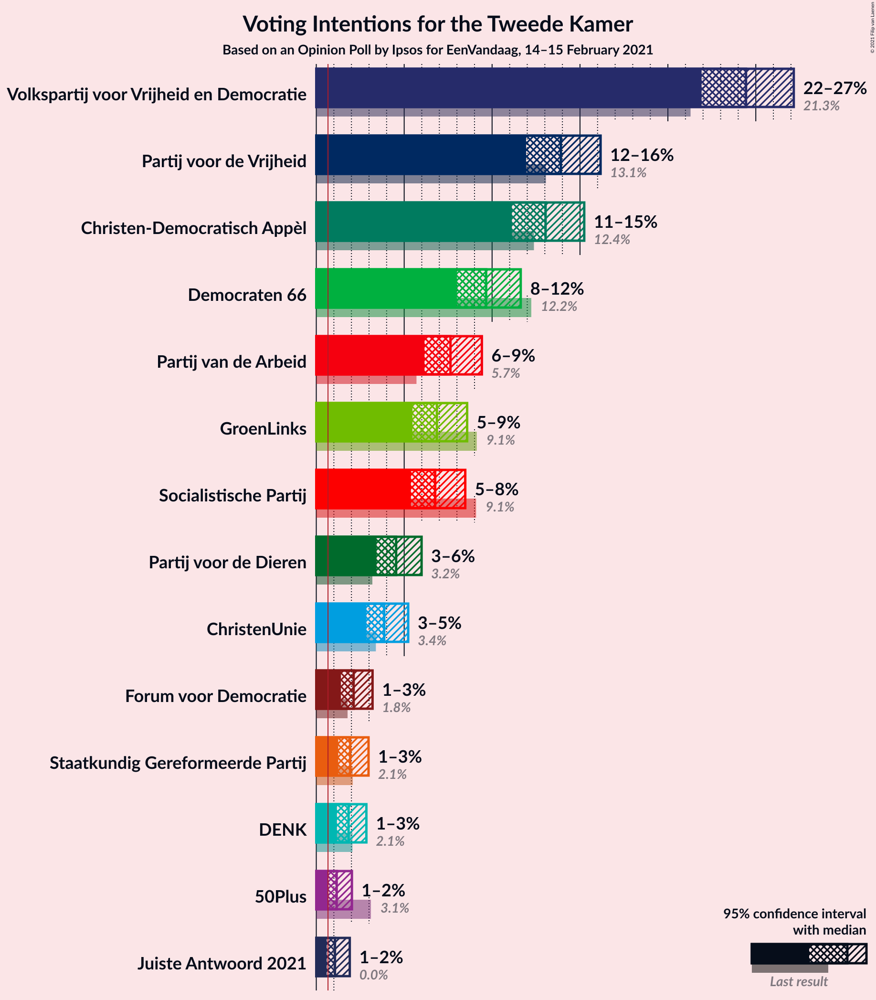

### Confidence Intervals

| Party | Last Result | Poll Result | 80% Confidence Interval | 90% Confidence Interval | 95% Confidence Interval | 99% Confidence Interval |
|:-----:|:-----------:|:-----------:|:-----------------------:|:-----------------------:|:-----------------------:|:-----------------------:|
| Volkspartij voor Vrijheid en Democratie | 21.3% | 24.4% | 22.8–26.2% |22.3–26.7% |21.9–27.2% |21.1–28.0% |
| Partij voor de Vrijheid | 13.1% | 13.9% | 12.6–15.4% |12.2–15.8% |11.9–16.2% |11.3–16.9% |
| Christen-Democratisch Appèl | 12.4% | 13.0% | 11.8–14.5% |11.4–14.9% |11.1–15.2% |10.5–16.0% |
| Democraten 66 | 12.2% | 9.7% | 8.6–10.9% |8.3–11.3% |8.0–11.6% |7.5–12.3% |
| Partij van de Arbeid | 5.7% | 7.6% | 6.7–8.8% |6.4–9.1% |6.2–9.4% |5.7–10.0% |
| GroenLinks | 9.1% | 6.9% | 5.9–8.0% |5.7–8.3% |5.5–8.6% |5.1–9.1% |
| Socialistische Partij | 9.1% | 6.8% | 5.9–7.9% |5.6–8.2% |5.4–8.5% |5.0–9.0% |
| Partij voor de Dieren | 3.2% | 4.5% | 3.8–5.5% |3.6–5.8% |3.4–6.0% |3.1–6.5% |
| ChristenUnie | 3.4% | 3.9% | 3.2–4.8% |3.0–5.0% |2.9–5.2% |2.6–5.7% |
| Forum voor Democratie | 1.8% | 2.1% | 1.6–2.8% |1.5–3.0% |1.4–3.2% |1.2–3.6% |
| Staatkundig Gereformeerde Partij | 2.1% | 1.9% | 1.5–2.6% |1.4–2.8% |1.2–3.0% |1.1–3.3% |
| DENK | 2.1% | 1.8% | 1.4–2.5% |1.3–2.7% |1.2–2.9% |1.0–3.2% |
| 50Plus | 3.1% | 1.2% | 0.8–1.7% |0.7–1.9% |0.7–2.0% |0.5–2.3% |
| Juiste Antwoord 2021 | 0.0% | 1.1% | 0.7–1.6% |0.7–1.8% |0.6–1.9% |0.5–2.2% |

*Note:* The poll result column reflects the actual value used in the calculations. Published results may vary slightly, and in addition be rounded to fewer digits.

## Seats

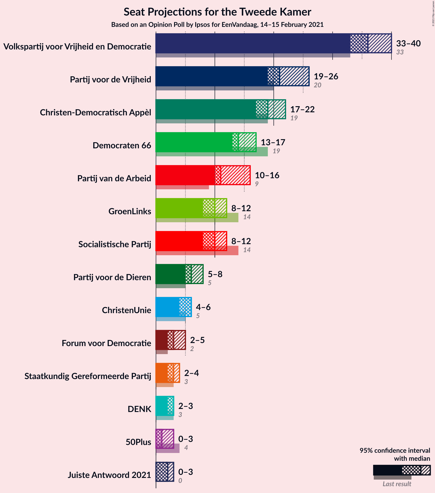

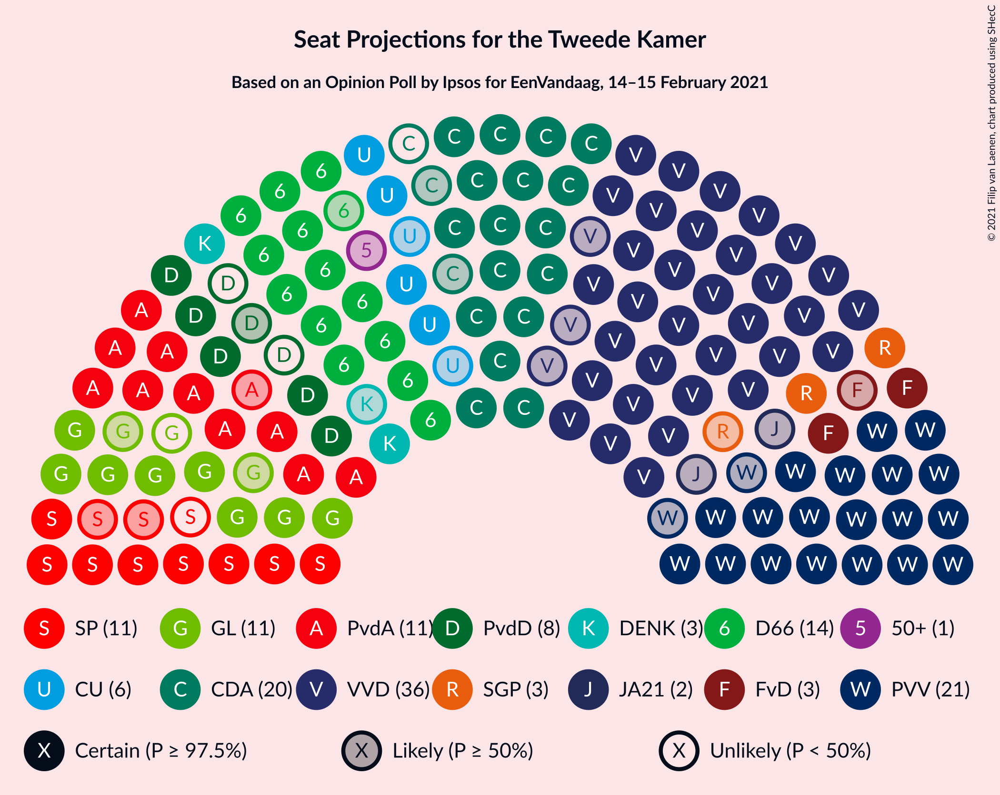

### Confidence Intervals

| Party | Last Result | Median | 80% Confidence Interval | 90% Confidence Interval | 95% Confidence Interval | 99% Confidence Interval |
|:-----:|:-----------:|:------:|:-----------------------:|:-----------------------:|:-----------------------:|:-----------------------:|
| <a href="#volkspartij-voor-vrijheid-en-democratie">Volkspartij voor Vrijheid en Democratie</a> | 33 | 36 | 35–40 |34–40 |33–40 |32–41 |
| <a href="#partij-voor-de-vrijheid">Partij voor de Vrijheid</a> | 20 | 21 | 20–23 |19–24 |19–26 |18–26 |
| <a href="#christen-democratisch-appèl">Christen-Democratisch Appèl</a> | 19 | 19 | 18–22 |18–22 |17–22 |17–23 |
| <a href="#democraten-66">Democraten 66</a> | 19 | 14 | 14–17 |14–17 |13–17 |12–18 |
| <a href="#partij-van-de-arbeid">Partij van de Arbeid</a> | 9 | 11 | 10–16 |10–16 |10–16 |9–16 |
| <a href="#groenlinks">GroenLinks</a> | 14 | 10 | 9–12 |8–12 |8–12 |8–13 |
| <a href="#socialistische-partij">Socialistische Partij</a> | 14 | 10 | 8–11 |8–11 |8–12 |8–14 |
| <a href="#partij-voor-de-dieren">Partij voor de Dieren</a> | 5 | 6 | 5–8 |5–8 |5–8 |5–9 |
| <a href="#christenunie">ChristenUnie</a> | 5 | 6 | 5–6 |4–6 |4–6 |4–8 |
| <a href="#forum-voor-democratie">Forum voor Democratie</a> | 2 | 3 | 2–4 |2–5 |2–5 |1–5 |
| <a href="#staatkundig-gereformeerde-partij">Staatkundig Gereformeerde Partij</a> | 3 | 3 | 2–3 |2–3 |2–4 |2–4 |
| <a href="#denk">DENK</a> | 3 | 3 | 2–3 |2–3 |2–3 |1–5 |
| <a href="#50plus">50Plus</a> | 4 | 1 | 1–2 |1–3 |0–3 |0–3 |
| <a href="#juiste-antwoord-2021">Juiste Antwoord 2021</a> | 0 | 2 | 1–3 |1–3 |0–3 |0–3 |

### Volkspartij voor Vrijheid en Democratie

*For a full overview of the results for this party, see the [Volkspartij voor Vrijheid en Democratie](party-volkspartijvoorvrijheidendemocratie.html) page.*

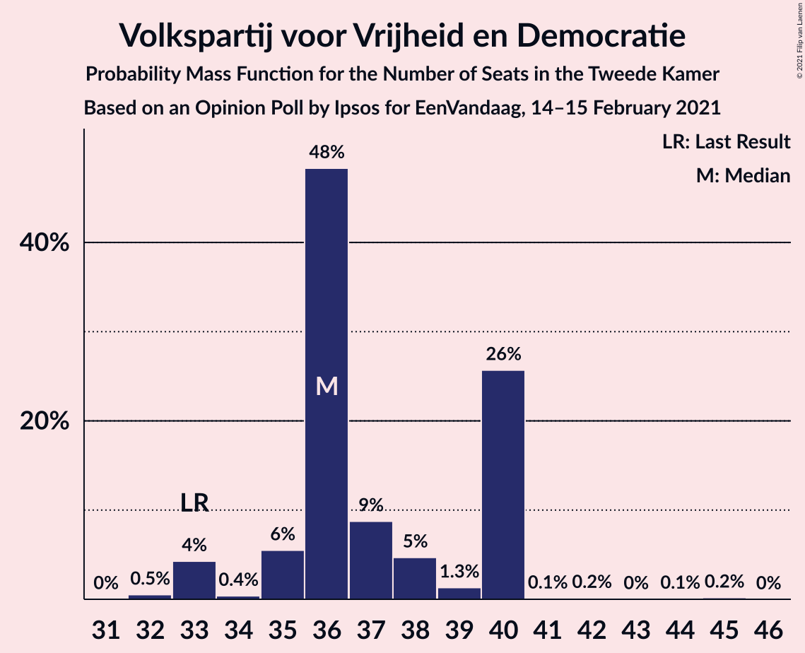

| Number of Seats | Probability | Accumulated | Special Marks |
|:---------------:|:-----------:|:-----------:|:-------------:|
| 32 | 0.5% | 100% |  |
| 33 | 4% | 99.5% | Last Result |
| 34 | 0.4% | 95% |  |
| 35 | 6% | 95% |  |
| 36 | 48% | 89% | Median |
| 37 | 9% | 41% |  |
| 38 | 5% | 32% |  |
| 39 | 1.3% | 28% |  |
| 40 | 26% | 26% |  |
| 41 | 0.1% | 0.5% |  |
| 42 | 0.2% | 0.4% |  |
| 43 | 0% | 0.3% |  |
| 44 | 0.1% | 0.3% |  |
| 45 | 0.2% | 0.2% |  |
| 46 | 0% | 0% |  |

### Partij voor de Vrijheid

*For a full overview of the results for this party, see the [Partij voor de Vrijheid](party-partijvoordevrijheid.html) page.*

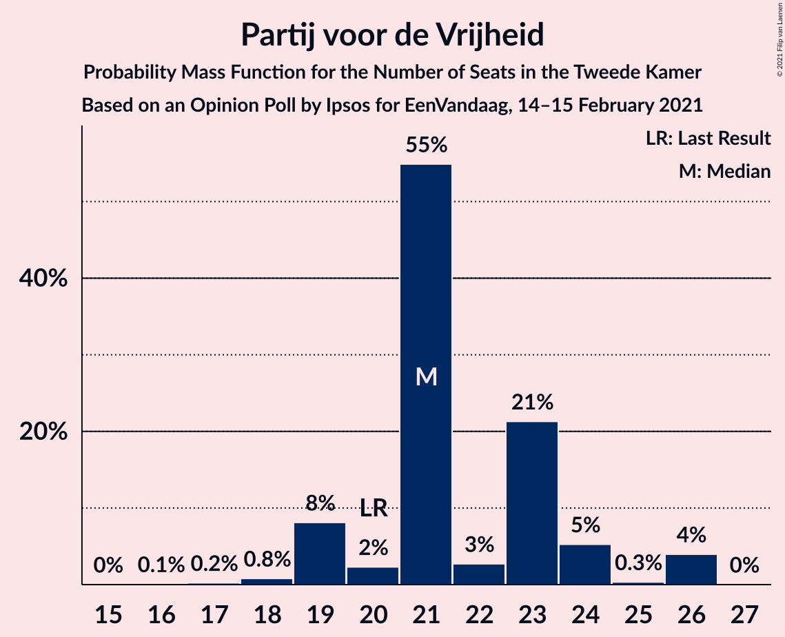

| Number of Seats | Probability | Accumulated | Special Marks |
|:---------------:|:-----------:|:-----------:|:-------------:|
| 16 | 0.1% | 100% |  |
| 17 | 0.2% | 99.9% |  |
| 18 | 0.8% | 99.7% |  |
| 19 | 8% | 98.9% |  |
| 20 | 2% | 91% | Last Result |
| 21 | 55% | 88% | Median |
| 22 | 3% | 34% |  |
| 23 | 21% | 31% |  |
| 24 | 5% | 10% |  |
| 25 | 0.3% | 4% |  |
| 26 | 4% | 4% |  |
| 27 | 0% | 0% |  |

### Christen-Democratisch Appèl

*For a full overview of the results for this party, see the [Christen-Democratisch Appèl](party-christen-democratischappèl.html) page.*

| Number of Seats | Probability | Accumulated | Special Marks |
|:---------------:|:-----------:|:-----------:|:-------------:|
| 15 | 0.2% | 100% |  |
| 16 | 0.1% | 99.8% |  |
| 17 | 3% | 99.7% |  |
| 18 | 32% | 97% |  |
| 19 | 16% | 65% | Last Result, Median |
| 20 | 23% | 49% |  |
| 21 | 9% | 26% |  |
| 22 | 17% | 18% |  |
| 23 | 0.6% | 0.7% |  |
| 24 | 0.1% | 0.1% |  |
| 25 | 0% | 0% |  |

### Democraten 66

*For a full overview of the results for this party, see the [Democraten 66](party-democraten66.html) page.*

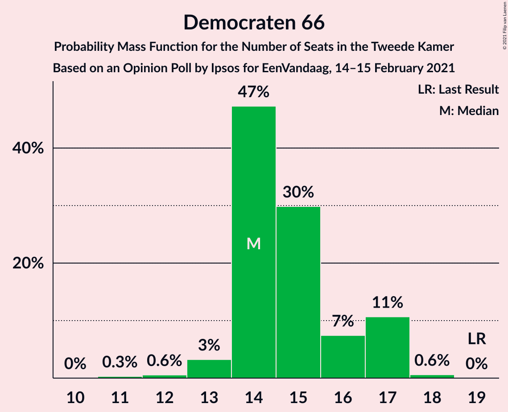

| Number of Seats | Probability | Accumulated | Special Marks |
|:---------------:|:-----------:|:-----------:|:-------------:|
| 11 | 0.3% | 100% |  |
| 12 | 0.6% | 99.7% |  |
| 13 | 3% | 99.1% |  |
| 14 | 47% | 96% | Median |
| 15 | 30% | 49% |  |
| 16 | 7% | 19% |  |
| 17 | 11% | 11% |  |
| 18 | 0.6% | 0.6% |  |
| 19 | 0% | 0% | Last Result |

### Partij van de Arbeid

*For a full overview of the results for this party, see the [Partij van de Arbeid](party-partijvandearbeid.html) page.*

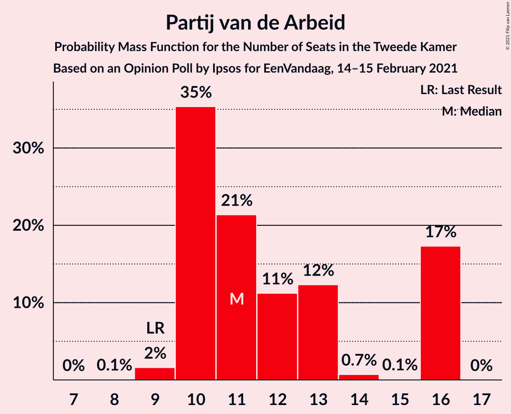

| Number of Seats | Probability | Accumulated | Special Marks |
|:---------------:|:-----------:|:-----------:|:-------------:|
| 8 | 0.1% | 100% |  |
| 9 | 2% | 99.9% | Last Result |
| 10 | 35% | 98% |  |
| 11 | 21% | 63% | Median |
| 12 | 11% | 42% |  |
| 13 | 12% | 30% |  |
| 14 | 0.7% | 18% |  |
| 15 | 0.1% | 17% |  |
| 16 | 17% | 17% |  |
| 17 | 0% | 0% |  |

### GroenLinks

*For a full overview of the results for this party, see the [GroenLinks](party-groenlinks.html) page.*

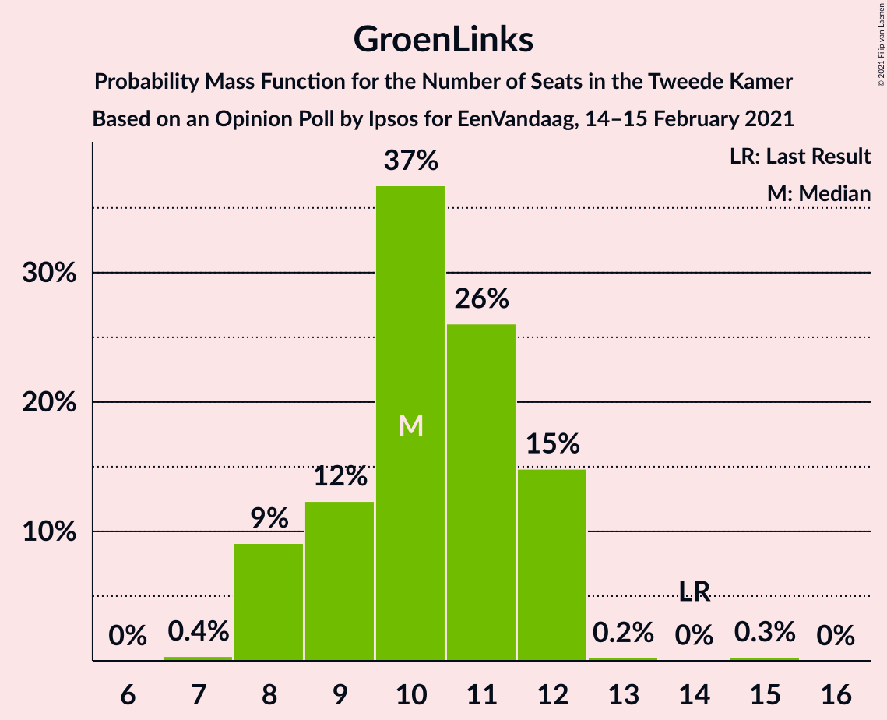

| Number of Seats | Probability | Accumulated | Special Marks |
|:---------------:|:-----------:|:-----------:|:-------------:|
| 7 | 0.4% | 100% |  |
| 8 | 9% | 99.6% |  |
| 9 | 12% | 91% |  |
| 10 | 37% | 78% | Median |
| 11 | 26% | 41% |  |
| 12 | 15% | 15% |  |
| 13 | 0.2% | 0.6% |  |
| 14 | 0% | 0.3% | Last Result |
| 15 | 0.3% | 0.3% |  |
| 16 | 0% | 0% |  |

### Socialistische Partij

*For a full overview of the results for this party, see the [Socialistische Partij](party-socialistischepartij.html) page.*

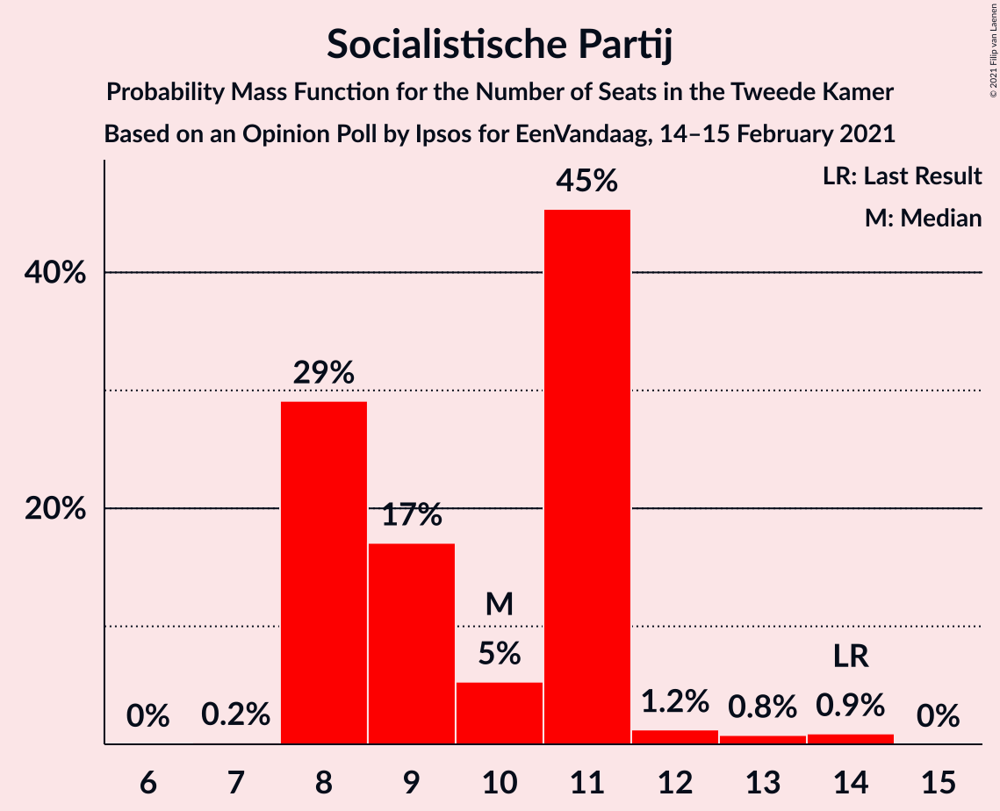

| Number of Seats | Probability | Accumulated | Special Marks |
|:---------------:|:-----------:|:-----------:|:-------------:|
| 7 | 0.2% | 100% |  |
| 8 | 29% | 99.8% |  |
| 9 | 17% | 71% |  |
| 10 | 5% | 54% | Median |
| 11 | 45% | 48% |  |
| 12 | 1.2% | 3% |  |
| 13 | 0.8% | 2% |  |
| 14 | 0.9% | 0.9% | Last Result |
| 15 | 0% | 0% |  |

### Partij voor de Dieren

*For a full overview of the results for this party, see the [Partij voor de Dieren](party-partijvoordedieren.html) page.*

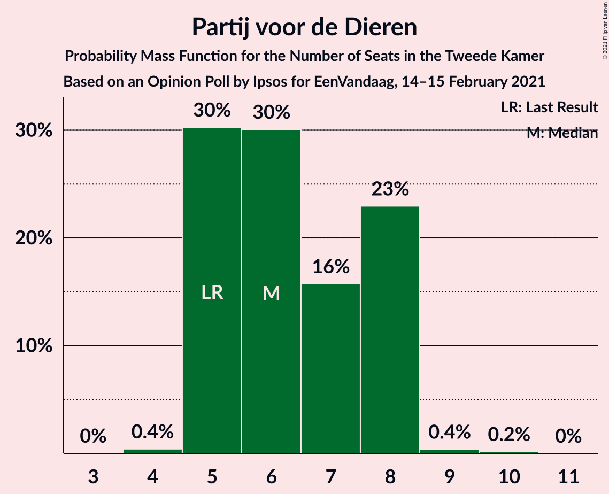

| Number of Seats | Probability | Accumulated | Special Marks |
|:---------------:|:-----------:|:-----------:|:-------------:|
| 4 | 0.4% | 100% |  |
| 5 | 30% | 99.6% | Last Result |
| 6 | 30% | 69% | Median |
| 7 | 16% | 39% |  |
| 8 | 23% | 23% |  |
| 9 | 0.4% | 0.5% |  |
| 10 | 0.2% | 0.2% |  |
| 11 | 0% | 0% |  |

### ChristenUnie

*For a full overview of the results for this party, see the [ChristenUnie](party-christenunie.html) page.*

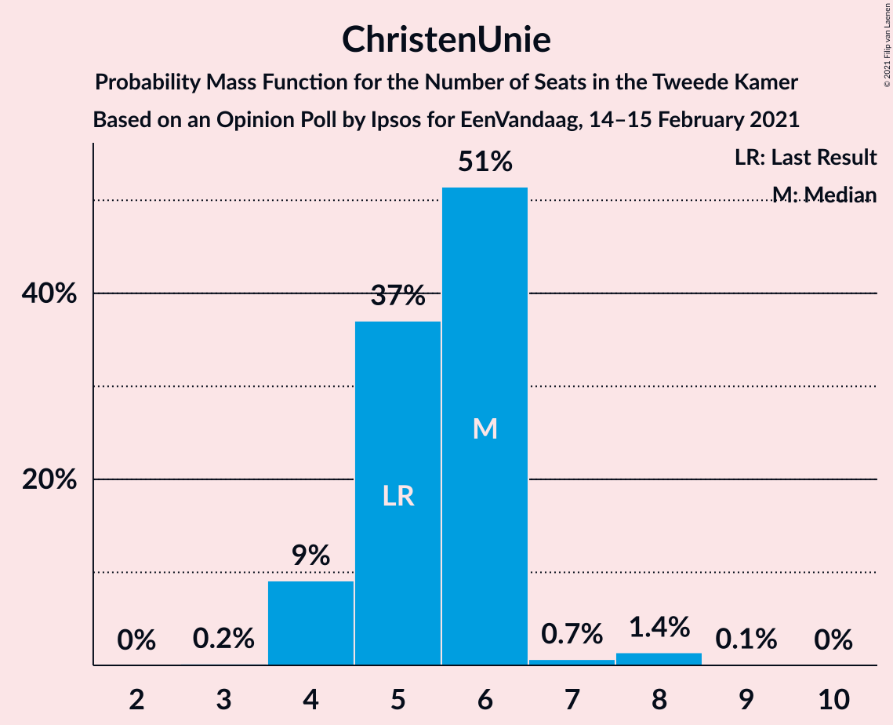

| Number of Seats | Probability | Accumulated | Special Marks |
|:---------------:|:-----------:|:-----------:|:-------------:|
| 3 | 0.2% | 100% |  |
| 4 | 9% | 99.8% |  |
| 5 | 37% | 91% | Last Result |
| 6 | 51% | 54% | Median |
| 7 | 0.7% | 2% |  |
| 8 | 1.4% | 2% |  |
| 9 | 0.1% | 0.1% |  |
| 10 | 0% | 0% |  |

### Forum voor Democratie

*For a full overview of the results for this party, see the [Forum voor Democratie](party-forumvoordemocratie.html) page.*

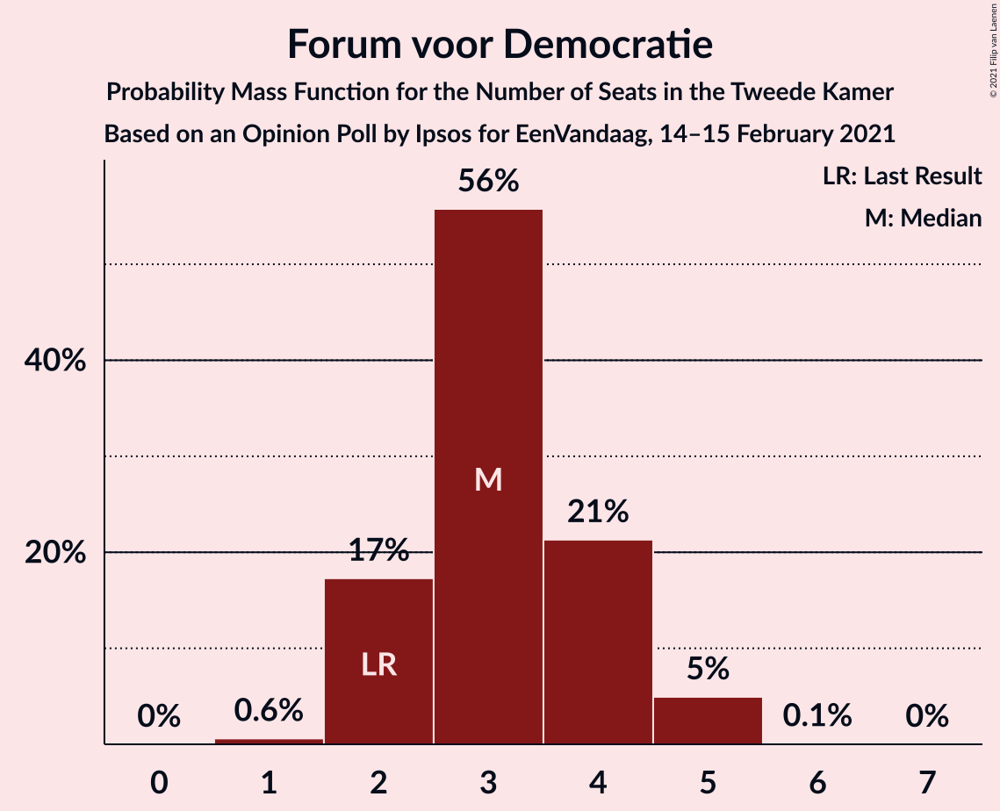

| Number of Seats | Probability | Accumulated | Special Marks |
|:---------------:|:-----------:|:-----------:|:-------------:|
| 1 | 0.6% | 100% |  |
| 2 | 17% | 99.4% | Last Result |
| 3 | 56% | 82% | Median |
| 4 | 21% | 26% |  |
| 5 | 5% | 5% |  |
| 6 | 0.1% | 0.1% |  |
| 7 | 0% | 0% |  |

### Staatkundig Gereformeerde Partij

*For a full overview of the results for this party, see the [Staatkundig Gereformeerde Partij](party-staatkundiggereformeerdepartij.html) page.*

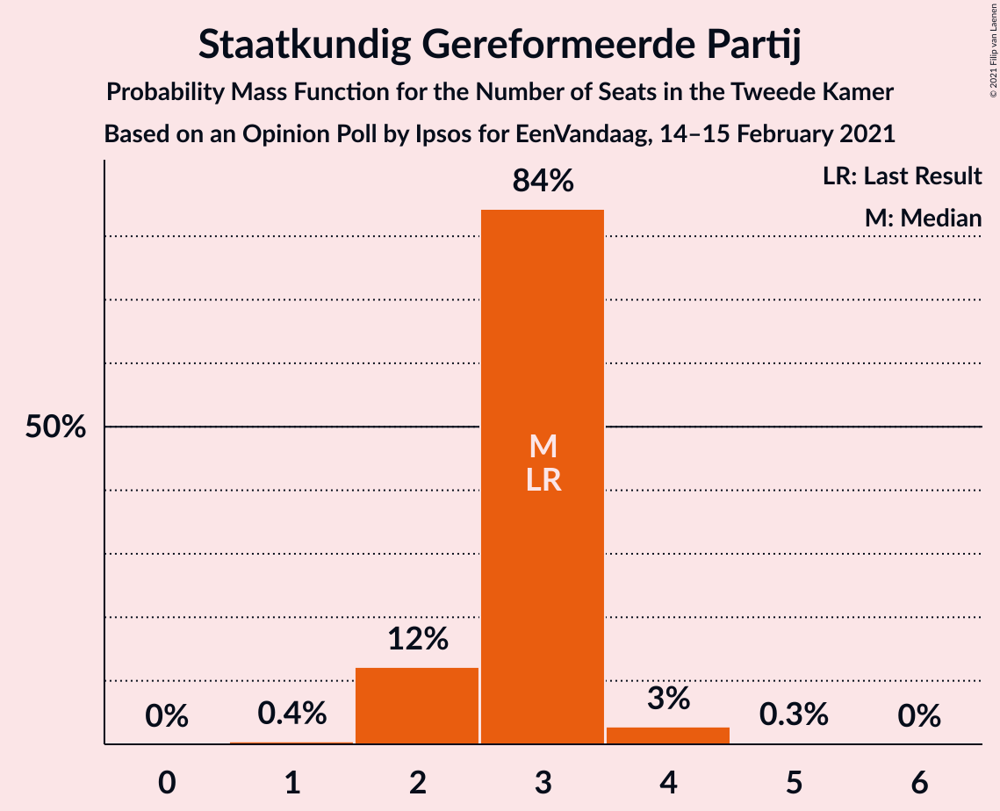

| Number of Seats | Probability | Accumulated | Special Marks |
|:---------------:|:-----------:|:-----------:|:-------------:|
| 1 | 0.4% | 100% |  |
| 2 | 12% | 99.6% |  |
| 3 | 84% | 87% | Last Result, Median |
| 4 | 3% | 3% |  |
| 5 | 0.3% | 0.3% |  |
| 6 | 0% | 0% |  |

### DENK

*For a full overview of the results for this party, see the [DENK](party-denk.html) page.*

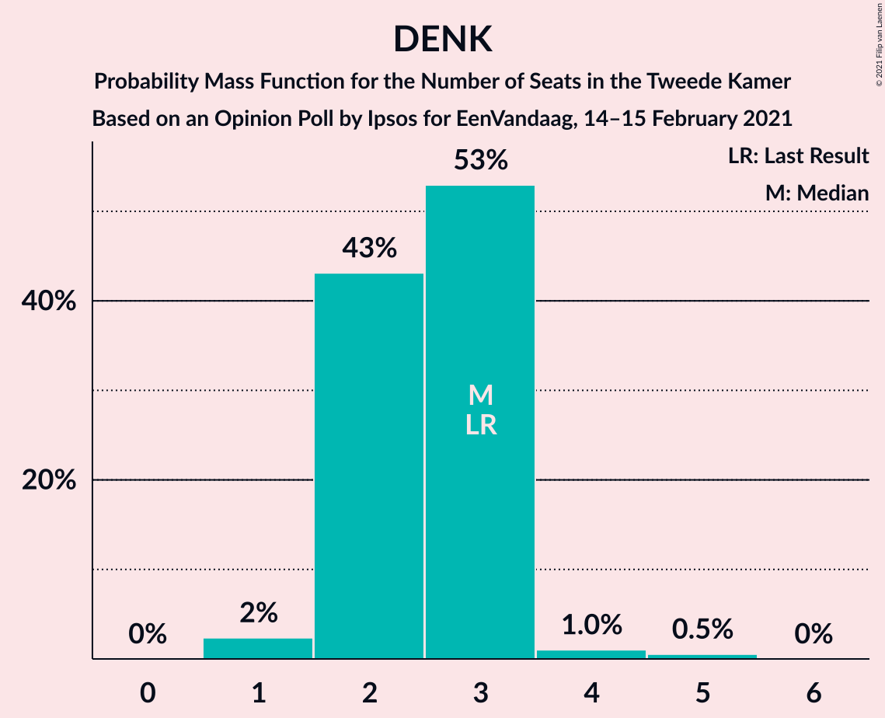

| Number of Seats | Probability | Accumulated | Special Marks |
|:---------------:|:-----------:|:-----------:|:-------------:|
| 1 | 2% | 100% |  |
| 2 | 43% | 98% |  |
| 3 | 53% | 55% | Last Result, Median |
| 4 | 1.0% | 2% |  |
| 5 | 0.5% | 0.5% |  |
| 6 | 0% | 0% |  |

### 50Plus

*For a full overview of the results for this party, see the [50Plus](party-50plus.html) page.*

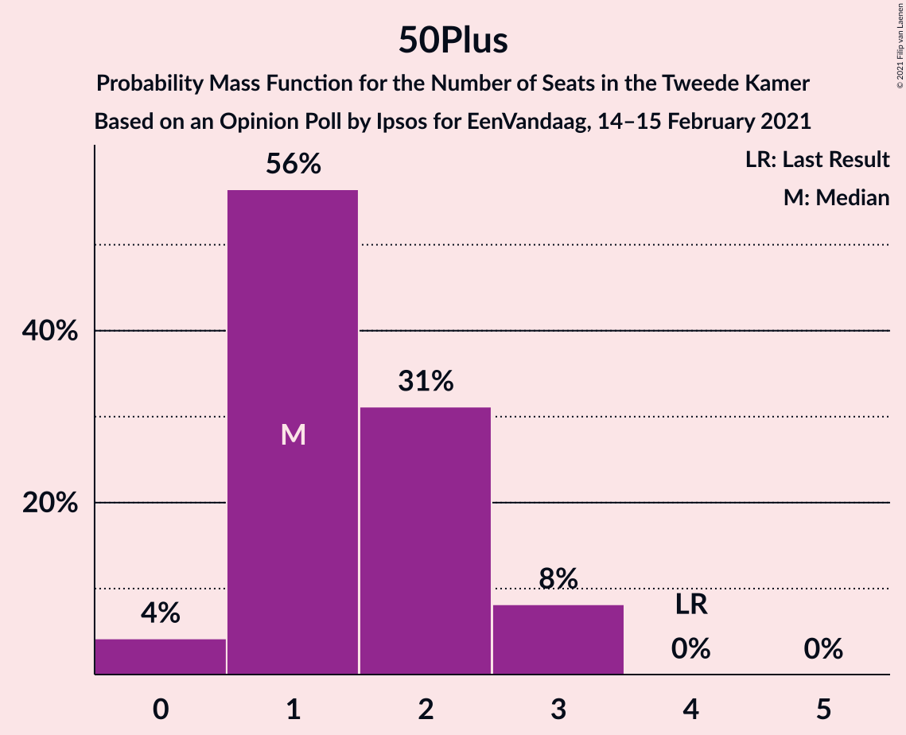

| Number of Seats | Probability | Accumulated | Special Marks |
|:---------------:|:-----------:|:-----------:|:-------------:|
| 0 | 4% | 100% |  |
| 1 | 56% | 96% | Median |
| 2 | 31% | 39% |  |
| 3 | 8% | 8% |  |
| 4 | 0% | 0% | Last Result |

### Juiste Antwoord 2021

*For a full overview of the results for this party, see the [Juiste Antwoord 2021](party-juisteantwoord2021.html) page.*

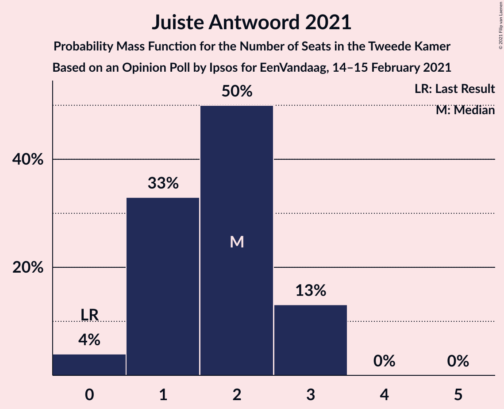

| Number of Seats | Probability | Accumulated | Special Marks |
|:---------------:|:-----------:|:-----------:|:-------------:|
| 0 | 4% | 100% | Last Result |
| 1 | 33% | 96% |  |
| 2 | 50% | 63% | Median |
| 3 | 13% | 13% |  |
| 4 | 0% | 0% |  |

## Coalitions

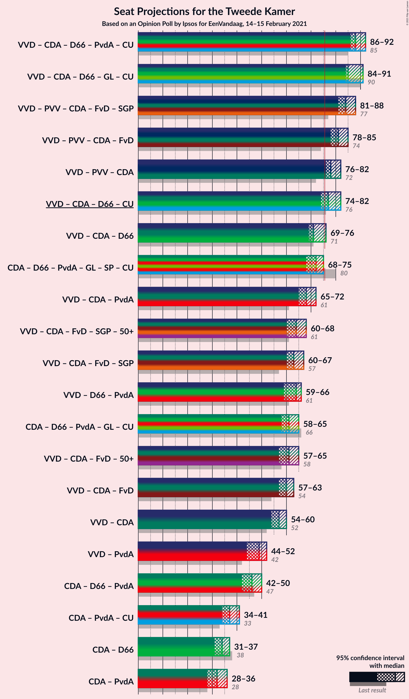

### Confidence Intervals

| Coalition | Last Result | Median | Majority? | 80% Confidence Interval | 90% Confidence Interval | 95% Confidence Interval | 99% Confidence Interval |
|:---------:|:-----------:|:------:|:---------:|:-----------------------:|:-----------------------:|:-----------------------:|:-----------------------:|
| Volkspartij voor Vrijheid en Democratie – Christen-Democratisch Appèl – Democraten 66 – Partij van de Arbeid – ChristenUnie | 85 | 88 | 100% | 87–91 | 86–91 | 86–92 | 83–96 |
| Volkspartij voor Vrijheid en Democratie – Christen-Democratisch Appèl – Democraten 66 – GroenLinks – ChristenUnie | 90 | 85 | 100% | 84–90 | 84–90 | 84–91 | 83–92 |
| Volkspartij voor Vrijheid en Democratie – Partij voor de Vrijheid – Christen-Democratisch Appèl – Forum voor Democratie – Staatkundig Gereformeerde Partij | 77 | 84 | 100% | 81–88 | 81–88 | 81–88 | 77–88 |
| Volkspartij voor Vrijheid en Democratie – Partij voor de Vrijheid – Christen-Democratisch Appèl – Forum voor Democratie | 74 | 81 | 99.3% | 78–85 | 78–85 | 78–85 | 75–85 |
| Volkspartij voor Vrijheid en Democratie – Partij voor de Vrijheid – Christen-Democratisch Appèl | 72 | 78 | 98% | 76–81 | 76–81 | 76–82 | 72–83 |
| Volkspartij voor Vrijheid en Democratie – Christen-Democratisch Appèl – Democraten 66 – ChristenUnie | 76 | 77 | 64% | 74–79 | 74–79 | 74–82 | 73–83 |
| Volkspartij voor Vrijheid en Democratie – Christen-Democratisch Appèl – Democraten 66 | 71 | 71 | 3% | 69–73 | 69–73 | 69–76 | 67–78 |
| Christen-Democratisch Appèl – Democraten 66 – Partij van de Arbeid – GroenLinks – Socialistische Partij – ChristenUnie | 80 | 72 | 2% | 69–74 | 69–74 | 68–75 | 67–77 |
| Volkspartij voor Vrijheid en Democratie – Christen-Democratisch Appèl – Partij van de Arbeid | 61 | 68 | 0.3% | 65–72 | 65–72 | 65–72 | 63–75 |
| Volkspartij voor Vrijheid en Democratie – Christen-Democratisch Appèl – Forum voor Democratie – Staatkundig Gereformeerde Partij – 50Plus | 61 | 64 | 0% | 61–67 | 61–67 | 60–68 | 60–69 |
| Volkspartij voor Vrijheid en Democratie – Christen-Democratisch Appèl – Forum voor Democratie – Staatkundig Gereformeerde Partij | 57 | 63 | 0% | 60–65 | 60–65 | 60–67 | 58–67 |
| Volkspartij voor Vrijheid en Democratie – Democraten 66 – Partij van de Arbeid | 61 | 64 | 0% | 60–66 | 60–66 | 59–66 | 59–69 |
| Christen-Democratisch Appèl – Democraten 66 – Partij van de Arbeid – GroenLinks – ChristenUnie | 66 | 61 | 0% | 60–65 | 60–65 | 58–65 | 57–66 |
| Volkspartij voor Vrijheid en Democratie – Christen-Democratisch Appèl – Forum voor Democratie – 50Plus | 58 | 61 | 0% | 58–64 | 58–64 | 57–65 | 56–66 |
| Volkspartij voor Vrijheid en Democratie – Christen-Democratisch Appèl – Forum voor Democratie | 54 | 60 | 0% | 57–62 | 57–62 | 57–63 | 55–65 |
| Volkspartij voor Vrijheid en Democratie – Christen-Democratisch Appèl | 52 | 57 | 0% | 54–58 | 54–58 | 54–60 | 51–62 |
| Volkspartij voor Vrijheid en Democratie – Partij van de Arbeid | 42 | 49 | 0% | 46–52 | 44–52 | 44–52 | 44–53 |
| Christen-Democratisch Appèl – Democraten 66 – Partij van de Arbeid | 47 | 46 | 0% | 43–50 | 43–50 | 42–50 | 41–51 |
| Christen-Democratisch Appèl – Partij van de Arbeid – ChristenUnie | 33 | 37 | 0% | 34–41 | 34–41 | 34–41 | 33–41 |
| Christen-Democratisch Appèl – Democraten 66 | 38 | 34 | 0% | 33–36 | 33–37 | 31–37 | 30–39 |
| Christen-Democratisch Appèl – Partij van de Arbeid | 28 | 32 | 0% | 28–36 | 28–36 | 28–36 | 27–36 |

### Volkspartij voor Vrijheid en Democratie – Christen-Democratisch Appèl – Democraten 66 – Partij van de Arbeid – ChristenUnie

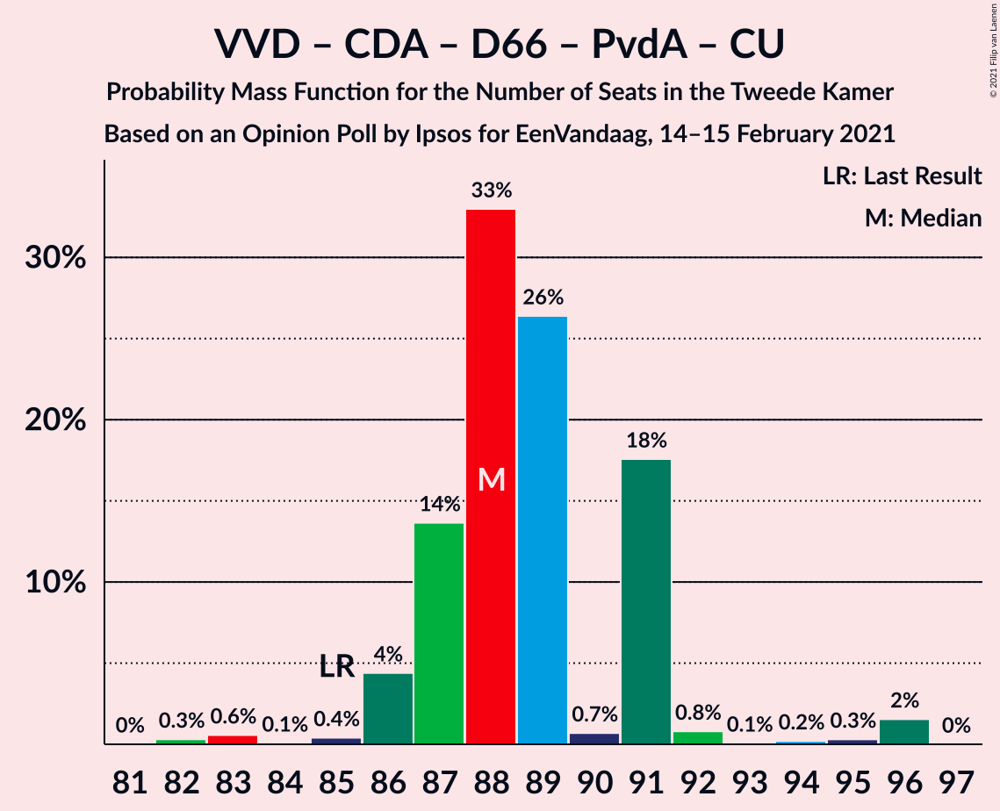

| Number of Seats | Probability | Accumulated | Special Marks |
|:---------------:|:-----------:|:-----------:|:-------------:|
| 82 | 0.3% | 100% |  |
| 83 | 0.6% | 99.7% |  |
| 84 | 0.1% | 99.1% |  |
| 85 | 0.4% | 99.0% | Last Result |
| 86 | 4% | 98.6% | Median |
| 87 | 14% | 94% |  |
| 88 | 33% | 81% |  |
| 89 | 26% | 48% |  |
| 90 | 0.7% | 21% |  |
| 91 | 18% | 20% |  |
| 92 | 0.8% | 3% |  |
| 93 | 0.1% | 2% |  |
| 94 | 0.2% | 2% |  |
| 95 | 0.3% | 2% |  |
| 96 | 2% | 2% |  |
| 97 | 0% | 0% |  |

### Volkspartij voor Vrijheid en Democratie – Christen-Democratisch Appèl – Democraten 66 – GroenLinks – ChristenUnie

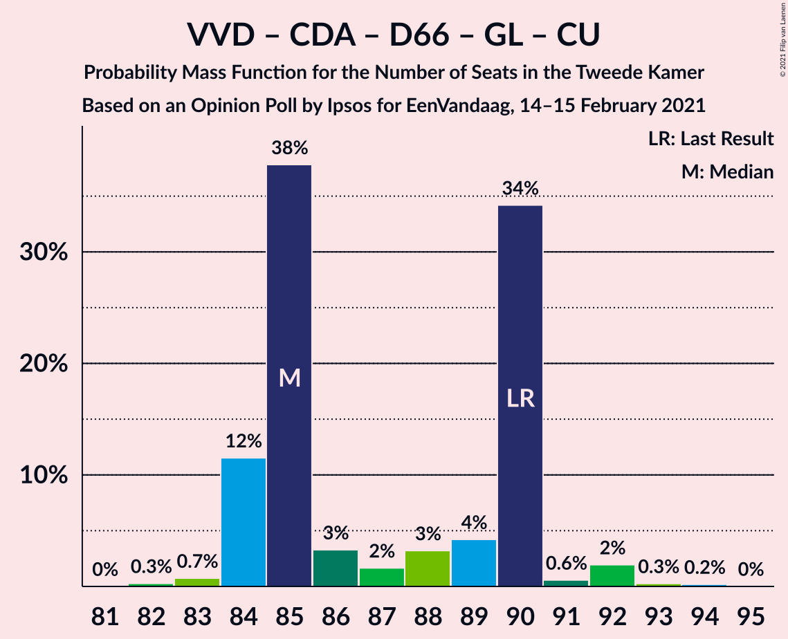

| Number of Seats | Probability | Accumulated | Special Marks |
|:---------------:|:-----------:|:-----------:|:-------------:|
| 82 | 0.3% | 100% |  |
| 83 | 0.7% | 99.7% |  |
| 84 | 12% | 98.9% |  |
| 85 | 38% | 87% | Median |
| 86 | 3% | 50% |  |
| 87 | 2% | 46% |  |
| 88 | 3% | 45% |  |
| 89 | 4% | 41% |  |
| 90 | 34% | 37% | Last Result |
| 91 | 0.6% | 3% |  |
| 92 | 2% | 2% |  |
| 93 | 0.3% | 0.5% |  |
| 94 | 0.2% | 0.2% |  |
| 95 | 0% | 0% |  |

### Volkspartij voor Vrijheid en Democratie – Partij voor de Vrijheid – Christen-Democratisch Appèl – Forum voor Democratie – Staatkundig Gereformeerde Partij

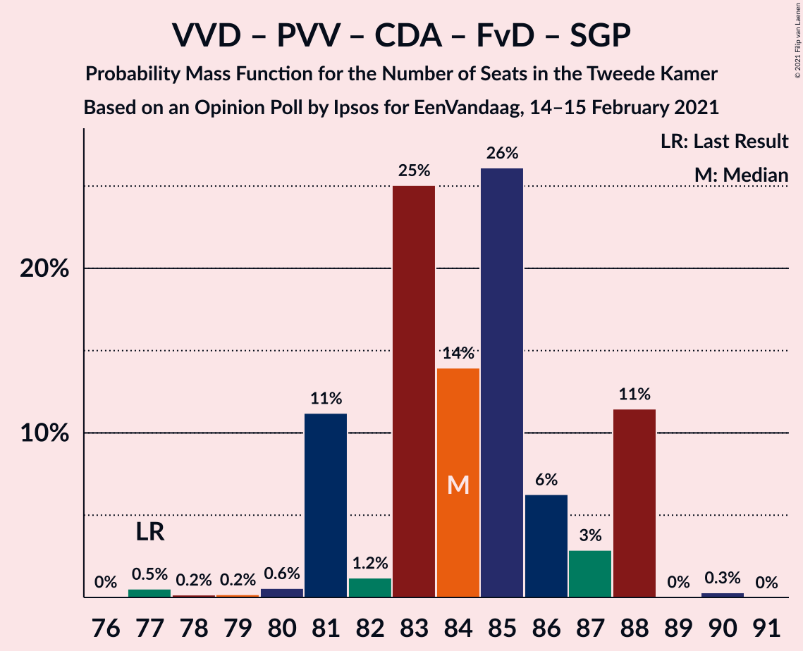

| Number of Seats | Probability | Accumulated | Special Marks |
|:---------------:|:-----------:|:-----------:|:-------------:|
| 77 | 0.5% | 100% | Last Result |
| 78 | 0.2% | 99.4% |  |
| 79 | 0.2% | 99.3% |  |
| 80 | 0.6% | 99.1% |  |
| 81 | 11% | 98.5% |  |
| 82 | 1.2% | 87% | Median |
| 83 | 25% | 86% |  |
| 84 | 14% | 61% |  |
| 85 | 26% | 47% |  |
| 86 | 6% | 21% |  |
| 87 | 3% | 15% |  |
| 88 | 11% | 12% |  |
| 89 | 0% | 0.4% |  |
| 90 | 0.3% | 0.3% |  |
| 91 | 0% | 0% |  |

### Volkspartij voor Vrijheid en Democratie – Partij voor de Vrijheid – Christen-Democratisch Appèl – Forum voor Democratie

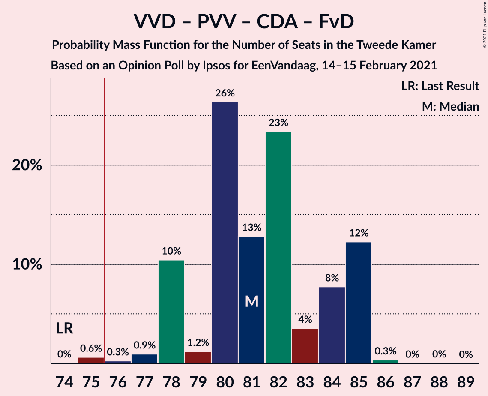

| Number of Seats | Probability | Accumulated | Special Marks |
|:---------------:|:-----------:|:-----------:|:-------------:|
| 74 | 0% | 100% | Last Result |
| 75 | 0.6% | 100% |  |
| 76 | 0.3% | 99.3% | Majority |
| 77 | 0.9% | 99.1% |  |
| 78 | 10% | 98% |  |
| 79 | 1.2% | 88% | Median |
| 80 | 26% | 87% |  |
| 81 | 13% | 60% |  |
| 82 | 23% | 47% |  |
| 83 | 4% | 24% |  |
| 84 | 8% | 20% |  |
| 85 | 12% | 13% |  |
| 86 | 0.3% | 0.4% |  |
| 87 | 0% | 0.1% |  |
| 88 | 0% | 0.1% |  |
| 89 | 0% | 0% |  |

### Volkspartij voor Vrijheid en Democratie – Partij voor de Vrijheid – Christen-Democratisch Appèl

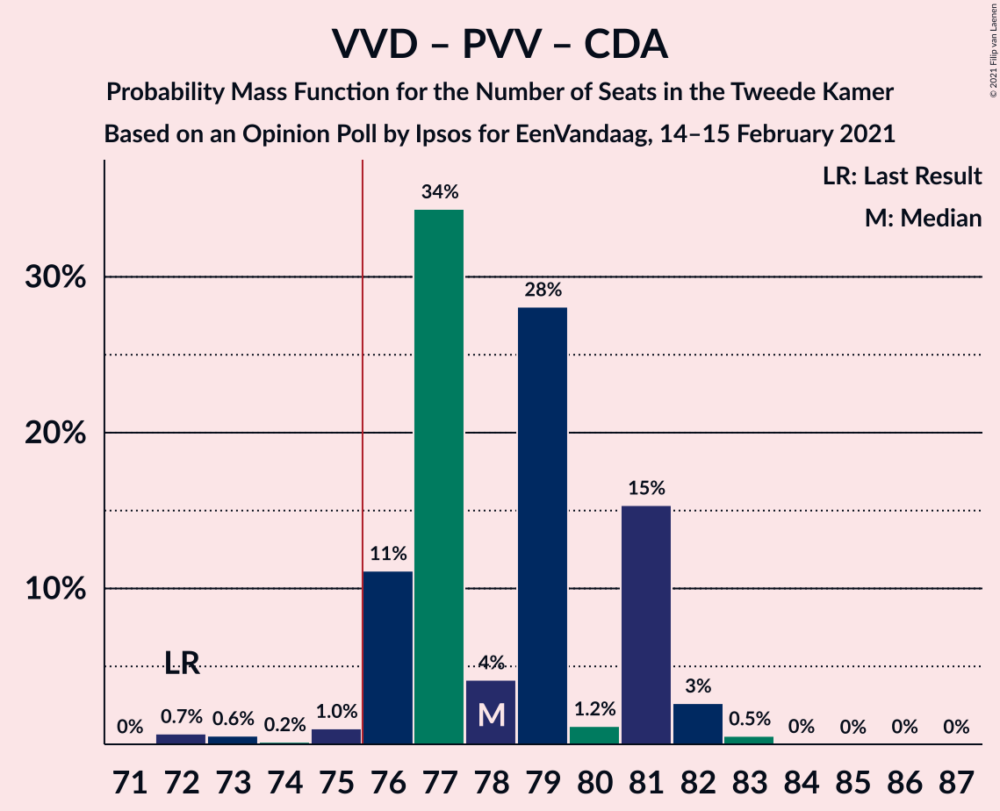

| Number of Seats | Probability | Accumulated | Special Marks |
|:---------------:|:-----------:|:-----------:|:-------------:|
| 72 | 0.7% | 100% | Last Result |
| 73 | 0.6% | 99.3% |  |
| 74 | 0.2% | 98.7% |  |
| 75 | 1.0% | 98.6% |  |
| 76 | 11% | 98% | Median, Majority |
| 77 | 34% | 86% |  |
| 78 | 4% | 52% |  |
| 79 | 28% | 48% |  |
| 80 | 1.2% | 20% |  |
| 81 | 15% | 19% |  |
| 82 | 3% | 3% |  |
| 83 | 0.5% | 0.6% |  |
| 84 | 0% | 0.1% |  |
| 85 | 0% | 0.1% |  |
| 86 | 0% | 0.1% |  |
| 87 | 0% | 0% |  |

### Volkspartij voor Vrijheid en Democratie – Christen-Democratisch Appèl – Democraten 66 – ChristenUnie

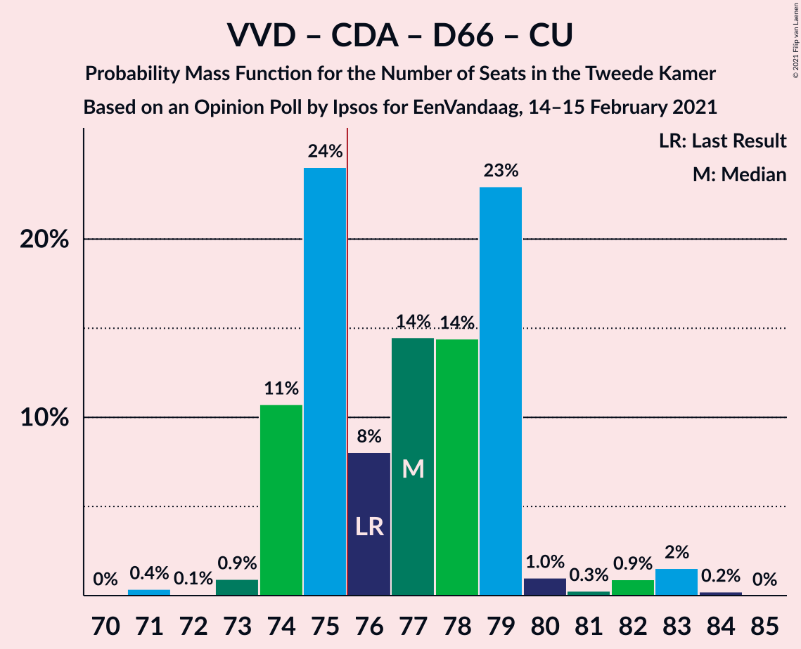

| Number of Seats | Probability | Accumulated | Special Marks |
|:---------------:|:-----------:|:-----------:|:-------------:|
| 71 | 0.4% | 100% |  |
| 72 | 0.1% | 99.6% |  |
| 73 | 0.9% | 99.5% |  |
| 74 | 11% | 98.6% |  |
| 75 | 24% | 88% | Median |
| 76 | 8% | 64% | Last Result, Majority |
| 77 | 14% | 56% |  |
| 78 | 14% | 41% |  |
| 79 | 23% | 27% |  |
| 80 | 1.0% | 4% |  |
| 81 | 0.3% | 3% |  |
| 82 | 0.9% | 3% |  |
| 83 | 2% | 2% |  |
| 84 | 0.2% | 0.2% |  |
| 85 | 0% | 0% |  |

### Volkspartij voor Vrijheid en Democratie – Christen-Democratisch Appèl – Democraten 66

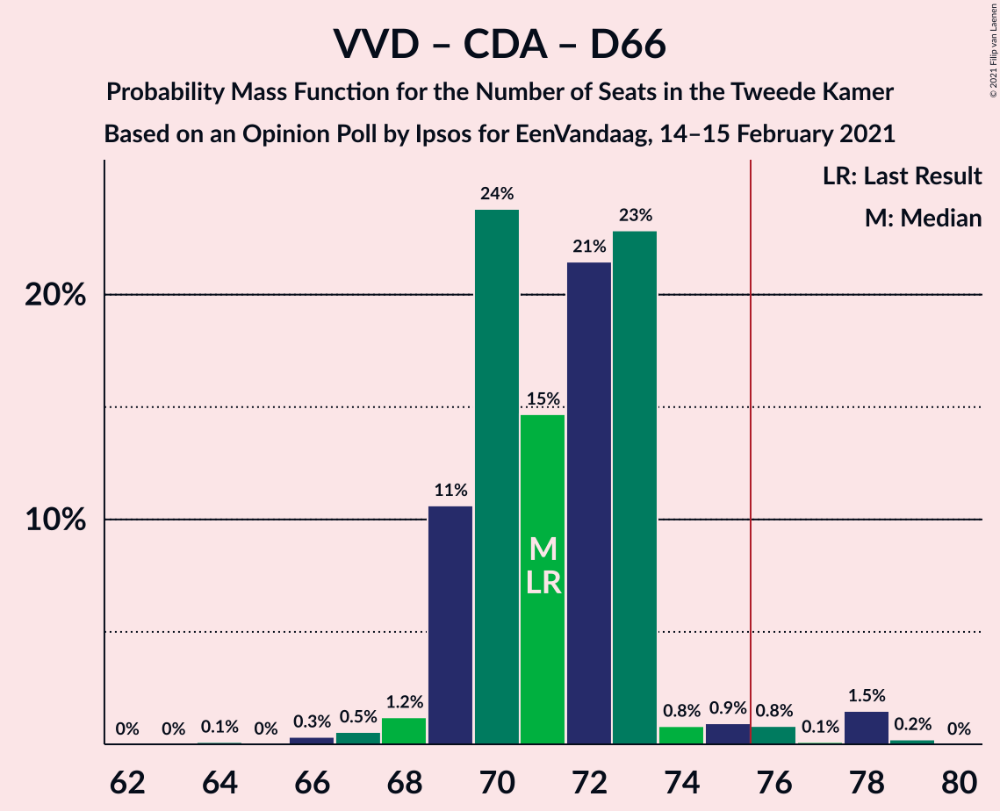

| Number of Seats | Probability | Accumulated | Special Marks |
|:---------------:|:-----------:|:-----------:|:-------------:|
| 64 | 0.1% | 100% |  |
| 65 | 0% | 99.9% |  |
| 66 | 0.3% | 99.9% |  |
| 67 | 0.5% | 99.5% |  |
| 68 | 1.2% | 99.0% |  |
| 69 | 11% | 98% | Median |
| 70 | 24% | 87% |  |
| 71 | 15% | 63% | Last Result |
| 72 | 21% | 49% |  |
| 73 | 23% | 27% |  |
| 74 | 0.8% | 4% |  |
| 75 | 0.9% | 4% |  |
| 76 | 0.8% | 3% | Majority |
| 77 | 0.1% | 2% |  |
| 78 | 1.5% | 2% |  |
| 79 | 0.2% | 0.2% |  |
| 80 | 0% | 0% |  |

### Christen-Democratisch Appèl – Democraten 66 – Partij van de Arbeid – GroenLinks – Socialistische Partij – ChristenUnie

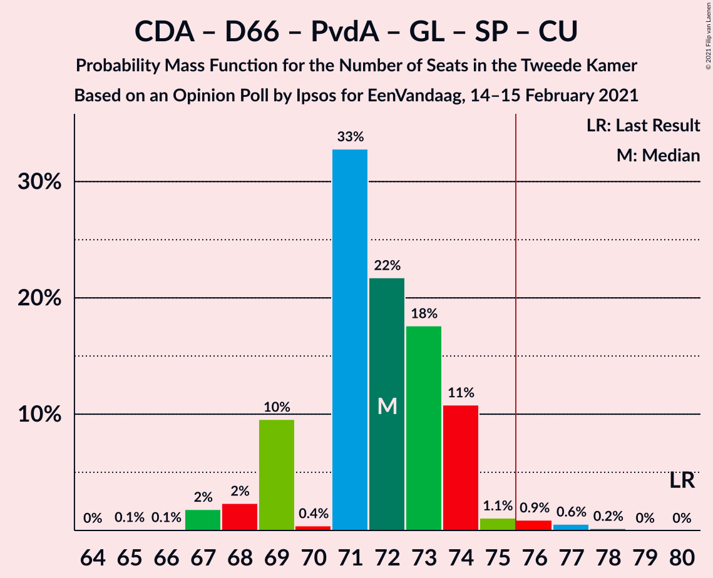

| Number of Seats | Probability | Accumulated | Special Marks |
|:---------------:|:-----------:|:-----------:|:-------------:|
| 65 | 0.1% | 100% |  |
| 66 | 0.1% | 99.9% |  |
| 67 | 2% | 99.8% |  |
| 68 | 2% | 98% |  |
| 69 | 10% | 96% |  |
| 70 | 0.4% | 86% | Median |
| 71 | 33% | 86% |  |
| 72 | 22% | 53% |  |
| 73 | 18% | 31% |  |
| 74 | 11% | 14% |  |
| 75 | 1.1% | 3% |  |
| 76 | 0.9% | 2% | Majority |
| 77 | 0.6% | 0.8% |  |
| 78 | 0.2% | 0.2% |  |
| 79 | 0% | 0% |  |
| 80 | 0% | 0% | Last Result |

### Volkspartij voor Vrijheid en Democratie – Christen-Democratisch Appèl – Partij van de Arbeid

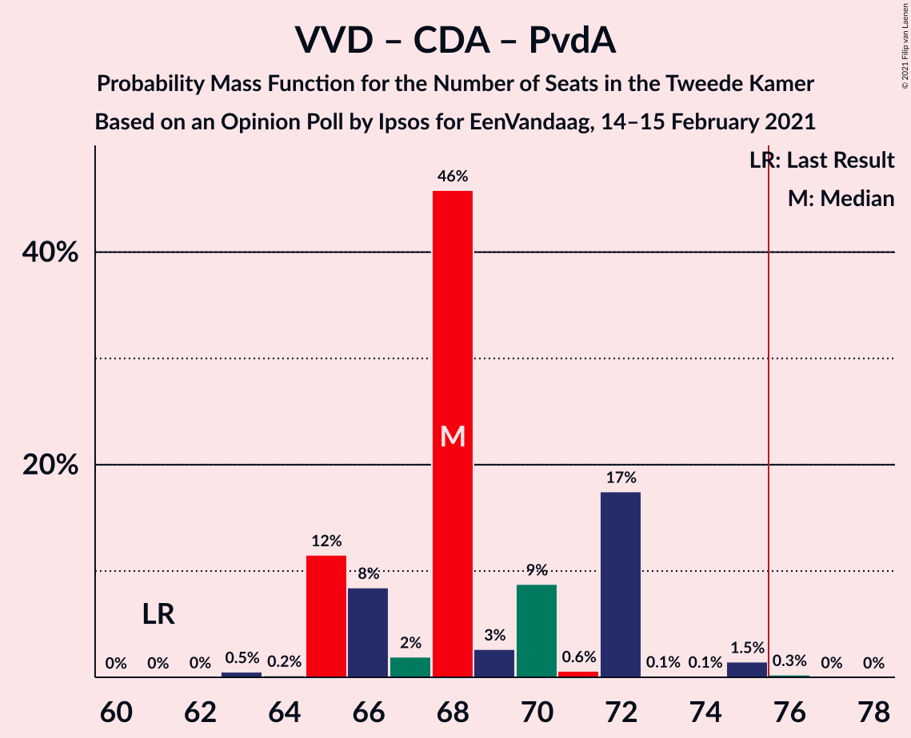

| Number of Seats | Probability | Accumulated | Special Marks |
|:---------------:|:-----------:|:-----------:|:-------------:|
| 61 | 0% | 100% | Last Result |
| 62 | 0% | 100% |  |
| 63 | 0.5% | 99.9% |  |
| 64 | 0.2% | 99.4% |  |
| 65 | 12% | 99.2% |  |
| 66 | 8% | 88% | Median |
| 67 | 2% | 79% |  |
| 68 | 46% | 77% |  |
| 69 | 3% | 32% |  |
| 70 | 9% | 29% |  |
| 71 | 0.6% | 20% |  |
| 72 | 17% | 19% |  |
| 73 | 0.1% | 2% |  |
| 74 | 0.1% | 2% |  |
| 75 | 1.5% | 2% |  |
| 76 | 0.3% | 0.3% | Majority |
| 77 | 0% | 0.1% |  |
| 78 | 0% | 0% |  |

### Volkspartij voor Vrijheid en Democratie – Christen-Democratisch Appèl – Forum voor Democratie – Staatkundig Gereformeerde Partij – 50Plus

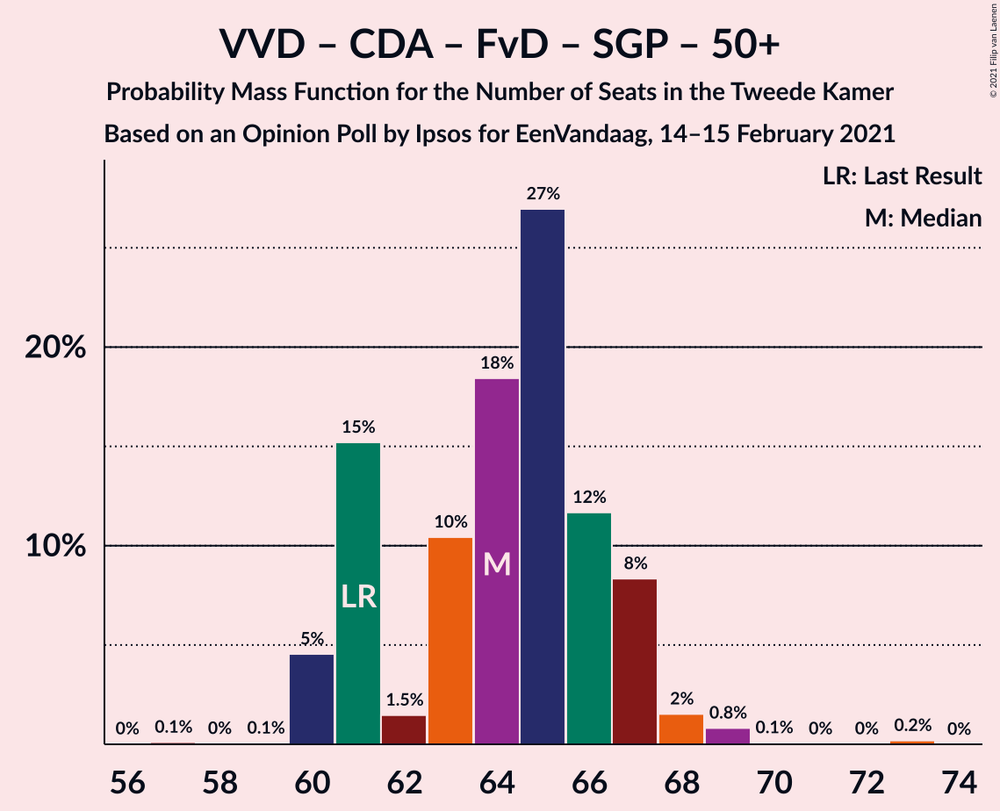

| Number of Seats | Probability | Accumulated | Special Marks |
|:---------------:|:-----------:|:-----------:|:-------------:|
| 57 | 0.1% | 100% |  |
| 58 | 0% | 99.9% |  |
| 59 | 0.1% | 99.8% |  |
| 60 | 5% | 99.8% |  |
| 61 | 15% | 95% | Last Result |
| 62 | 1.5% | 80% | Median |
| 63 | 10% | 79% |  |
| 64 | 18% | 68% |  |
| 65 | 27% | 50% |  |
| 66 | 12% | 23% |  |
| 67 | 8% | 11% |  |
| 68 | 2% | 3% |  |
| 69 | 0.8% | 1.2% |  |
| 70 | 0.1% | 0.3% |  |
| 71 | 0% | 0.2% |  |
| 72 | 0% | 0.2% |  |
| 73 | 0.2% | 0.2% |  |
| 74 | 0% | 0% |  |

### Volkspartij voor Vrijheid en Democratie – Christen-Democratisch Appèl – Forum voor Democratie – Staatkundig Gereformeerde Partij

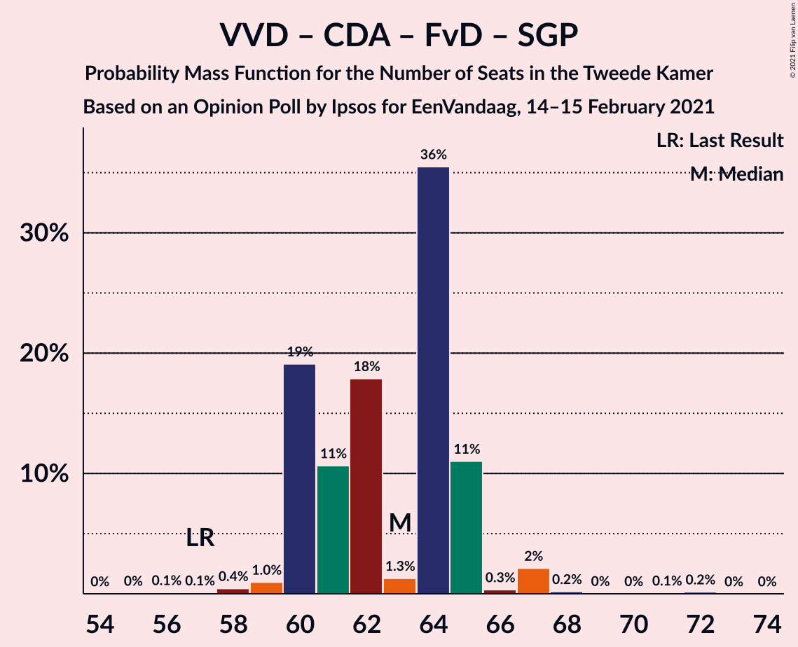

| Number of Seats | Probability | Accumulated | Special Marks |
|:---------------:|:-----------:|:-----------:|:-------------:|
| 55 | 0% | 100% |  |
| 56 | 0.1% | 99.9% |  |
| 57 | 0.1% | 99.8% | Last Result |
| 58 | 0.4% | 99.8% |  |
| 59 | 1.0% | 99.3% |  |
| 60 | 19% | 98% |  |
| 61 | 11% | 79% | Median |
| 62 | 18% | 69% |  |
| 63 | 1.3% | 51% |  |
| 64 | 36% | 49% |  |
| 65 | 11% | 14% |  |
| 66 | 0.3% | 3% |  |
| 67 | 2% | 3% |  |
| 68 | 0.2% | 0.5% |  |
| 69 | 0% | 0.3% |  |
| 70 | 0% | 0.2% |  |
| 71 | 0.1% | 0.2% |  |
| 72 | 0.2% | 0.2% |  |
| 73 | 0% | 0% |  |

### Volkspartij voor Vrijheid en Democratie – Democraten 66 – Partij van de Arbeid

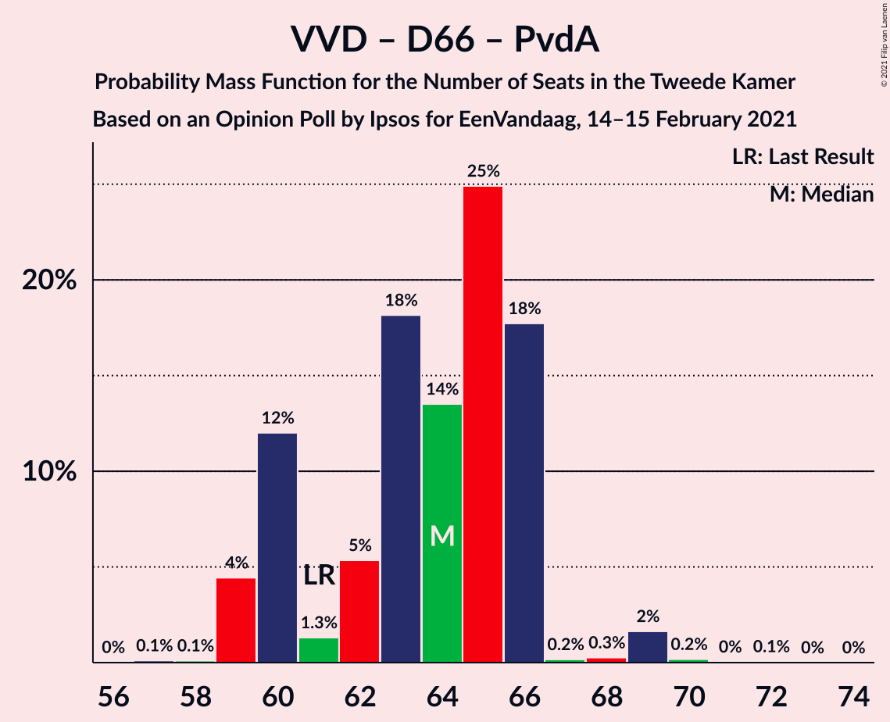

| Number of Seats | Probability | Accumulated | Special Marks |
|:---------------:|:-----------:|:-----------:|:-------------:|
| 57 | 0.1% | 100% |  |
| 58 | 0.1% | 99.9% |  |
| 59 | 4% | 99.8% |  |
| 60 | 12% | 95% |  |
| 61 | 1.3% | 83% | Last Result, Median |
| 62 | 5% | 82% |  |
| 63 | 18% | 77% |  |
| 64 | 14% | 58% |  |
| 65 | 25% | 45% |  |
| 66 | 18% | 20% |  |
| 67 | 0.2% | 2% |  |
| 68 | 0.3% | 2% |  |
| 69 | 2% | 2% |  |
| 70 | 0.2% | 0.3% |  |
| 71 | 0% | 0.1% |  |
| 72 | 0.1% | 0.1% |  |
| 73 | 0% | 0% |  |

### Christen-Democratisch Appèl – Democraten 66 – Partij van de Arbeid – GroenLinks – ChristenUnie

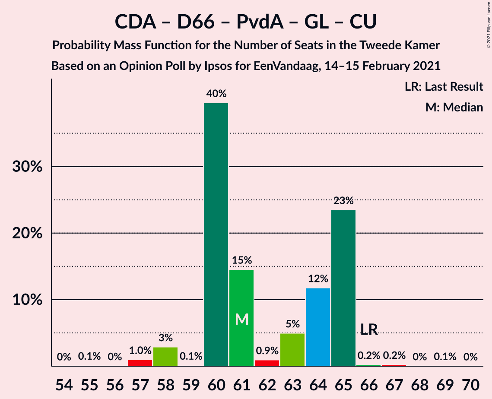

| Number of Seats | Probability | Accumulated | Special Marks |
|:---------------:|:-----------:|:-----------:|:-------------:|
| 55 | 0.1% | 100% |  |
| 56 | 0% | 99.9% |  |
| 57 | 1.0% | 99.8% |  |
| 58 | 3% | 98.9% |  |
| 59 | 0.1% | 96% |  |
| 60 | 40% | 96% | Median |
| 61 | 15% | 56% |  |
| 62 | 0.9% | 42% |  |
| 63 | 5% | 41% |  |
| 64 | 12% | 36% |  |
| 65 | 23% | 24% |  |
| 66 | 0.2% | 0.6% | Last Result |
| 67 | 0.2% | 0.3% |  |
| 68 | 0% | 0.1% |  |
| 69 | 0.1% | 0.1% |  |
| 70 | 0% | 0% |  |

### Volkspartij voor Vrijheid en Democratie – Christen-Democratisch Appèl – Forum voor Democratie – 50Plus

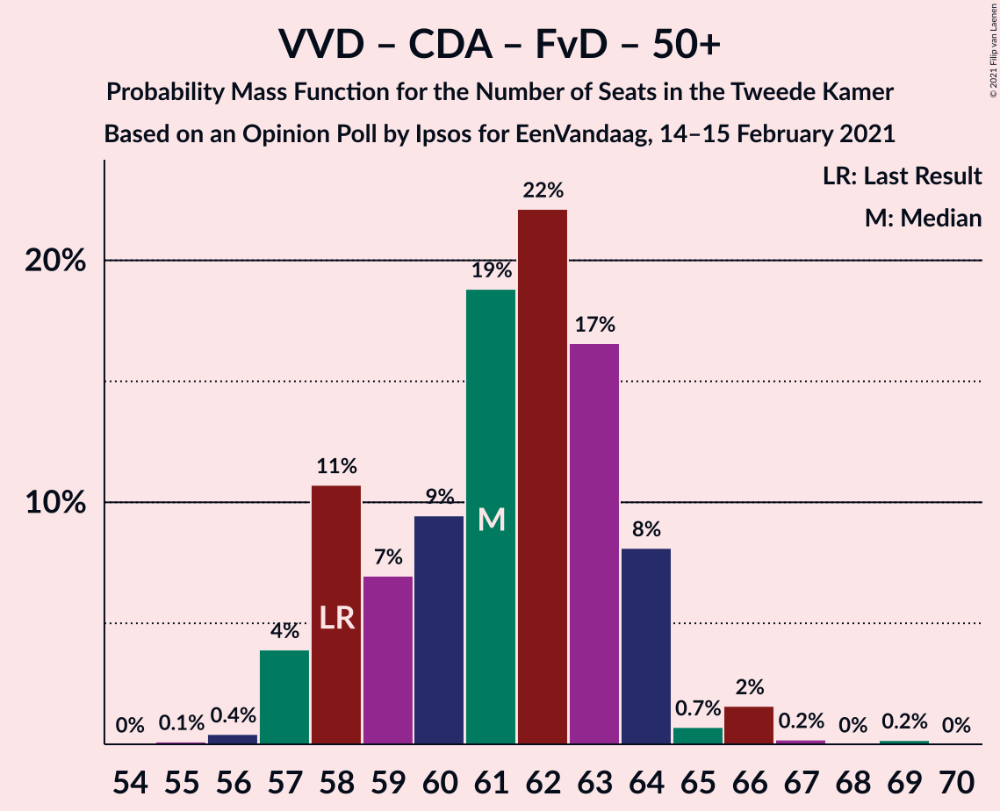

| Number of Seats | Probability | Accumulated | Special Marks |
|:---------------:|:-----------:|:-----------:|:-------------:|
| 55 | 0.1% | 100% |  |
| 56 | 0.4% | 99.8% |  |
| 57 | 4% | 99.4% |  |
| 58 | 11% | 96% | Last Result |
| 59 | 7% | 85% | Median |
| 60 | 9% | 78% |  |
| 61 | 19% | 68% |  |
| 62 | 22% | 50% |  |
| 63 | 17% | 27% |  |
| 64 | 8% | 11% |  |
| 65 | 0.7% | 3% |  |
| 66 | 2% | 2% |  |
| 67 | 0.2% | 0.4% |  |
| 68 | 0% | 0.2% |  |
| 69 | 0.2% | 0.2% |  |
| 70 | 0% | 0% |  |

### Volkspartij voor Vrijheid en Democratie – Christen-Democratisch Appèl – Forum voor Democratie

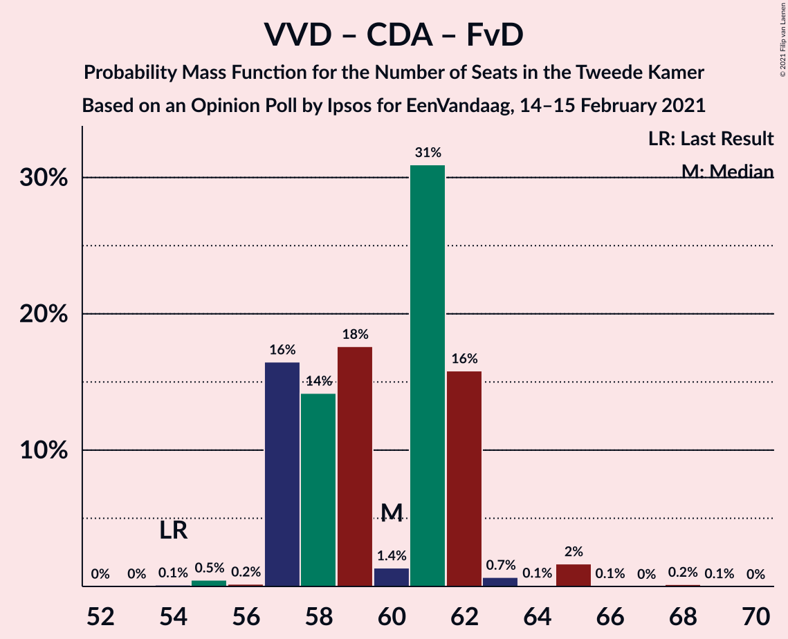

| Number of Seats | Probability | Accumulated | Special Marks |
|:---------------:|:-----------:|:-----------:|:-------------:|
| 53 | 0% | 100% |  |
| 54 | 0.1% | 99.9% | Last Result |
| 55 | 0.5% | 99.8% |  |
| 56 | 0.2% | 99.3% |  |
| 57 | 16% | 99.1% |  |
| 58 | 14% | 83% | Median |
| 59 | 18% | 68% |  |
| 60 | 1.4% | 51% |  |
| 61 | 31% | 50% |  |
| 62 | 16% | 19% |  |
| 63 | 0.7% | 3% |  |
| 64 | 0.1% | 2% |  |
| 65 | 2% | 2% |  |
| 66 | 0.1% | 0.3% |  |
| 67 | 0% | 0.2% |  |
| 68 | 0.2% | 0.2% |  |
| 69 | 0.1% | 0.1% |  |
| 70 | 0% | 0% |  |

### Volkspartij voor Vrijheid en Democratie – Christen-Democratisch Appèl

| Number of Seats | Probability | Accumulated | Special Marks |
|:---------------:|:-----------:|:-----------:|:-------------:|
| 50 | 0.1% | 100% |  |
| 51 | 0.5% | 99.9% |  |
| 52 | 0.1% | 99.5% | Last Result |
| 53 | 0.2% | 99.4% |  |
| 54 | 10% | 99.2% |  |
| 55 | 21% | 89% | Median |
| 56 | 18% | 68% |  |
| 57 | 5% | 50% |  |
| 58 | 41% | 46% |  |
| 59 | 1.3% | 4% |  |
| 60 | 0.8% | 3% |  |
| 61 | 0.1% | 2% |  |
| 62 | 2% | 2% |  |
| 63 | 0.1% | 0.3% |  |
| 64 | 0% | 0.2% |  |
| 65 | 0.2% | 0.2% |  |
| 66 | 0% | 0% |  |

### Volkspartij voor Vrijheid en Democratie – Partij van de Arbeid

| Number of Seats | Probability | Accumulated | Special Marks |
|:---------------:|:-----------:|:-----------:|:-------------:|
| 42 | 0% | 100% | Last Result |
| 43 | 0% | 100% |  |
| 44 | 5% | 99.9% |  |
| 45 | 0.2% | 95% |  |
| 46 | 15% | 95% |  |
| 47 | 11% | 79% | Median |
| 48 | 2% | 68% |  |
| 49 | 22% | 66% |  |
| 50 | 23% | 44% |  |
| 51 | 0.6% | 22% |  |
| 52 | 19% | 21% |  |
| 53 | 2% | 2% |  |
| 54 | 0.1% | 0.4% |  |
| 55 | 0.1% | 0.3% |  |
| 56 | 0.2% | 0.3% |  |
| 57 | 0% | 0.1% |  |
| 58 | 0.1% | 0.1% |  |
| 59 | 0% | 0% |  |

### Christen-Democratisch Appèl – Democraten 66 – Partij van de Arbeid

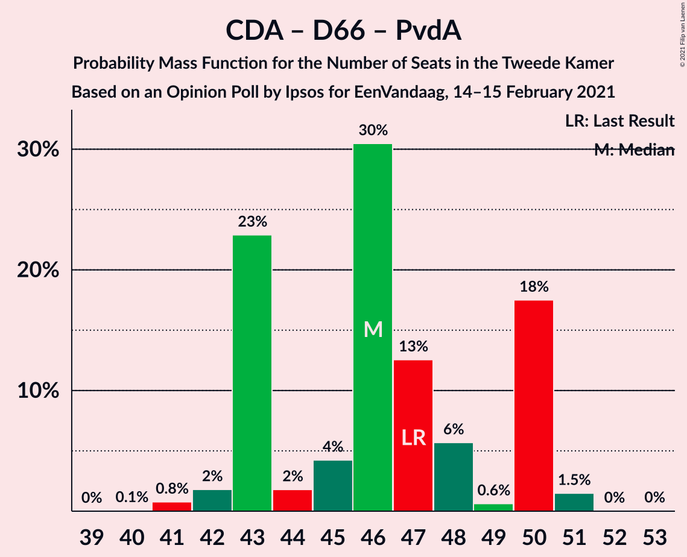

| Number of Seats | Probability | Accumulated | Special Marks |
|:---------------:|:-----------:|:-----------:|:-------------:|
| 40 | 0.1% | 100% |  |
| 41 | 0.8% | 99.9% |  |
| 42 | 2% | 99.1% |  |
| 43 | 23% | 97% |  |
| 44 | 2% | 74% | Median |
| 45 | 4% | 73% |  |
| 46 | 30% | 68% |  |
| 47 | 13% | 38% | Last Result |
| 48 | 6% | 25% |  |
| 49 | 0.6% | 20% |  |
| 50 | 18% | 19% |  |
| 51 | 1.5% | 2% |  |
| 52 | 0% | 0.1% |  |
| 53 | 0% | 0% |  |

### Christen-Democratisch Appèl – Partij van de Arbeid – ChristenUnie

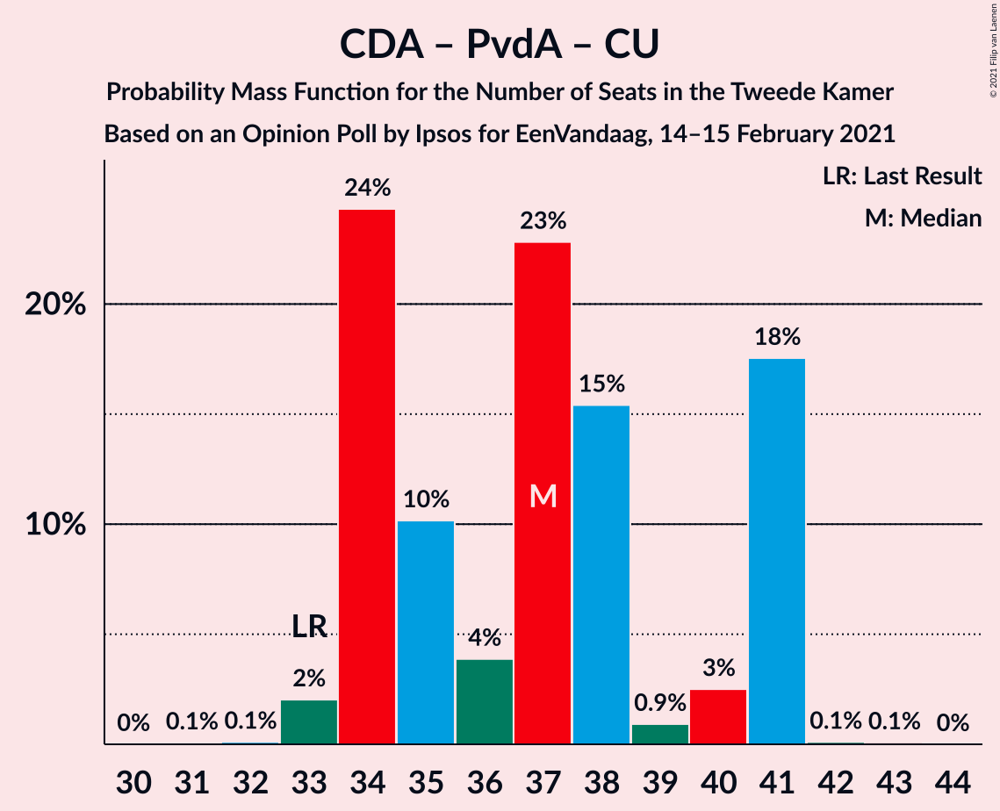

| Number of Seats | Probability | Accumulated | Special Marks |
|:---------------:|:-----------:|:-----------:|:-------------:|
| 31 | 0.1% | 100% |  |
| 32 | 0.1% | 99.9% |  |
| 33 | 2% | 99.8% | Last Result |
| 34 | 24% | 98% |  |
| 35 | 10% | 73% |  |
| 36 | 4% | 63% | Median |
| 37 | 23% | 59% |  |
| 38 | 15% | 37% |  |
| 39 | 0.9% | 21% |  |
| 40 | 3% | 20% |  |
| 41 | 18% | 18% |  |
| 42 | 0.1% | 0.2% |  |
| 43 | 0.1% | 0.1% |  |
| 44 | 0% | 0% |  |

### Christen-Democratisch Appèl – Democraten 66

| Number of Seats | Probability | Accumulated | Special Marks |
|:---------------:|:-----------:|:-----------:|:-------------:|
| 29 | 0.1% | 100% |  |
| 30 | 2% | 99.9% |  |
| 31 | 1.0% | 98% |  |
| 32 | 0.6% | 97% |  |
| 33 | 34% | 96% | Median |
| 34 | 22% | 63% |  |
| 35 | 18% | 41% |  |
| 36 | 17% | 24% |  |
| 37 | 5% | 7% |  |
| 38 | 2% | 2% | Last Result |
| 39 | 0.7% | 0.8% |  |
| 40 | 0% | 0.1% |  |
| 41 | 0% | 0% |  |

### Christen-Democratisch Appèl – Partij van de Arbeid

| Number of Seats | Probability | Accumulated | Special Marks |
|:---------------:|:-----------:|:-----------:|:-------------:|
| 26 | 0% | 100% |  |
| 27 | 0.8% | 99.9% |  |
| 28 | 23% | 99.1% | Last Result |
| 29 | 12% | 76% |  |
| 30 | 4% | 64% | Median |
| 31 | 5% | 59% |  |
| 32 | 22% | 54% |  |
| 33 | 12% | 33% |  |
| 34 | 1.1% | 20% |  |
| 35 | 2% | 19% |  |
| 36 | 17% | 17% |  |
| 37 | 0.1% | 0.1% |  |
| 38 | 0% | 0% |  |

## Technical Information

### Opinion Poll

+ **Polling firm:** Ipsos
+ **Commissioner(s):** EenVandaag
+ **Fieldwork period:** 14–15 February 2021

### Calculations

+ **Sample size:** 1035
+ **Simulations done:** 1,048,576
+ **Error estimate:** 2.07%

