# Opinion Poll by Peil.nl, 21 February 2021

<a href="#voting-intentions">Voting Intentions</a> | <a href="#seats">Seats</a> | <a href="#coalitions">Coalitions</a> | <a href="#technical-information">Technical Information</a>

## Voting Intentions

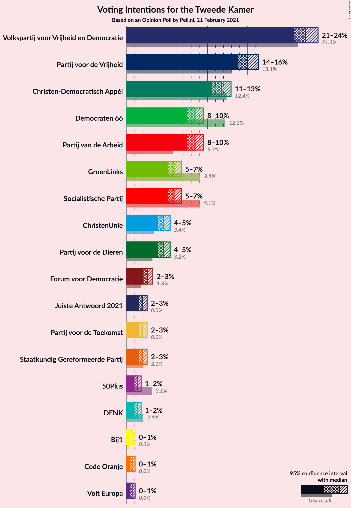

### Confidence Intervals

| Party | Last Result | Poll Result | 80% Confidence Interval | 90% Confidence Interval | 95% Confidence Interval | 99% Confidence Interval |
|:-----:|:-----------:|:-----------:|:-----------------------:|:-----------------------:|:-----------------------:|:-----------------------:|
| Volkspartij voor Vrijheid en Democratie | 21.3% | 22.2% | 21.2–23.2% |21.0–23.5% |20.7–23.7% |20.3–24.2% |
| Partij voor de Vrijheid | 13.1% | 15.0% | 14.2–15.9% |14.0–16.1% |13.8–16.3% |13.4–16.8% |
| Christen-Democratisch Appèl | 12.4% | 11.7% | 11.0–12.5% |10.8–12.7% |10.6–12.9% |10.3–13.3% |
| Democraten 66 | 12.2% | 8.5% | 7.8–9.2% |7.7–9.4% |7.5–9.5% |7.2–9.9% |
| Partij van de Arbeid | 5.7% | 8.5% | 7.8–9.2% |7.7–9.4% |7.5–9.5% |7.2–9.9% |
| GroenLinks | 9.1% | 5.9% | 5.3–6.5% |5.2–6.6% |5.1–6.8% |4.8–7.1% |
| Socialistische Partij | 9.1% | 5.9% | 5.3–6.5% |5.2–6.6% |5.1–6.8% |4.8–7.1% |
| ChristenUnie | 3.4% | 4.6% | 4.1–5.1% |4.0–5.2% |3.9–5.4% |3.7–5.6% |
| Partij voor de Dieren | 3.2% | 4.6% | 4.1–5.1% |4.0–5.2% |3.9–5.4% |3.7–5.6% |
| Forum voor Democratie | 1.8% | 2.6% | 2.3–3.0% |2.2–3.1% |2.1–3.2% |1.9–3.4% |
| Staatkundig Gereformeerde Partij | 2.1% | 2.0% | 1.7–2.3% |1.6–2.4% |1.5–2.5% |1.4–2.7% |
| Partij voor de Toekomst | 0.0% | 2.0% | 1.7–2.3% |1.6–2.4% |1.5–2.5% |1.4–2.7% |
| Juiste Antwoord 2021 | 0.0% | 2.0% | 1.7–2.3% |1.6–2.4% |1.5–2.5% |1.4–2.7% |
| 50Plus | 3.1% | 1.3% | 1.1–1.6% |1.0–1.7% |0.9–1.8% |0.9–1.9% |
| DENK | 2.1% | 1.3% | 1.1–1.6% |1.0–1.7% |0.9–1.8% |0.9–1.9% |
| Bij1 | 0.3% | 0.7% | 0.5–0.9% |0.5–1.0% |0.4–1.0% |0.4–1.2% |
| Code Oranje | 0.0% | 0.7% | 0.5–0.9% |0.5–1.0% |0.4–1.0% |0.4–1.2% |
| Volt Europa | 0.0% | 0.7% | 0.5–0.9% |0.5–1.0% |0.4–1.0% |0.4–1.2% |

*Note:* The poll result column reflects the actual value used in the calculations. Published results may vary slightly, and in addition be rounded to fewer digits.

## Seats

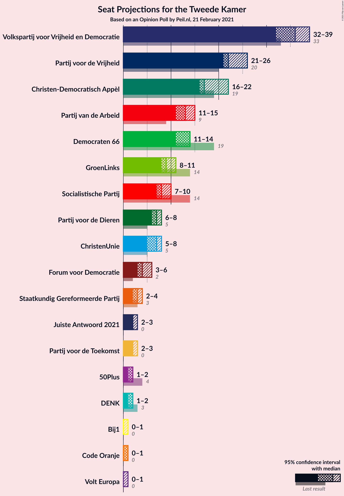

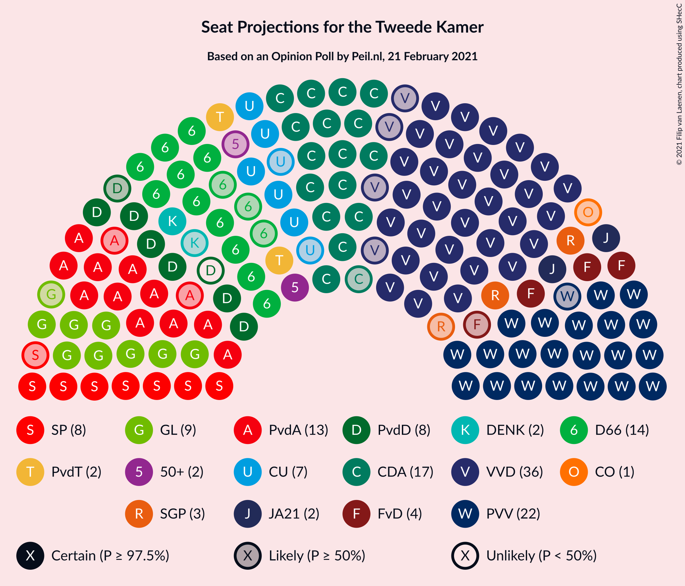

### Confidence Intervals

| Party | Last Result | Median | 80% Confidence Interval | 90% Confidence Interval | 95% Confidence Interval | 99% Confidence Interval |
|:-----:|:-----------:|:------:|:-----------------------:|:-----------------------:|:-----------------------:|:-----------------------:|
| <a href="#volkspartij-voor-vrijheid-en-democratie">Volkspartij voor Vrijheid en Democratie</a> | 33 | 36 | 32–39 |32–39 |32–39 |31–39 |
| <a href="#partij-voor-de-vrijheid">Partij voor de Vrijheid</a> | 20 | 22 | 21–24 |21–26 |21–26 |21–26 |
| <a href="#christen-democratisch-appèl">Christen-Democratisch Appèl</a> | 19 | 17 | 17–19 |17–20 |16–22 |15–22 |
| <a href="#democraten-66">Democraten 66</a> | 19 | 14 | 12–14 |11–14 |11–14 |11–15 |
| <a href="#partij-van-de-arbeid">Partij van de Arbeid</a> | 9 | 13 | 12–15 |11–15 |11–15 |11–16 |
| <a href="#groenlinks">GroenLinks</a> | 14 | 9 | 8–10 |8–11 |8–11 |7–11 |
| <a href="#socialistische-partij">Socialistische Partij</a> | 14 | 8 | 7–9 |7–10 |7–10 |6–10 |
| <a href="#christenunie">ChristenUnie</a> | 5 | 7 | 5–8 |5–8 |5–8 |5–8 |
| <a href="#partij-voor-de-dieren">Partij voor de Dieren</a> | 5 | 7 | 6–8 |6–8 |6–8 |5–9 |
| <a href="#forum-voor-democratie">Forum voor Democratie</a> | 2 | 4 | 4 |4–5 |3–6 |3–6 |
| <a href="#staatkundig-gereformeerde-partij">Staatkundig Gereformeerde Partij</a> | 3 | 3 | 2–3 |2–3 |2–4 |2–4 |
| <a href="#partij-voor-de-toekomst">Partij voor de Toekomst</a> | 0 | 2 | 2–3 |2–3 |2–3 |1–3 |
| <a href="#juiste-antwoord-2021">Juiste Antwoord 2021</a> | 0 | 2 | 2–3 |2–3 |2–3 |2–4 |
| <a href="#50plus">50Plus</a> | 4 | 2 | 1–2 |1–2 |1–2 |0–2 |
| <a href="#denk">DENK</a> | 3 | 2 | 2 |1–2 |1–2 |1–3 |
| <a href="#bij1">Bij1</a> | 0 | 0 | 0–1 |0–1 |0–1 |0–1 |
| <a href="#code-oranje">Code Oranje</a> | 0 | 1 | 0–1 |0–1 |0–1 |0–2 |
| <a href="#volt-europa">Volt Europa</a> | 0 | 0 | 0–1 |0–1 |0–1 |0–1 |

### Volkspartij voor Vrijheid en Democratie

*For a full overview of the results for this party, see the [Volkspartij voor Vrijheid en Democratie](party-volkspartijvoorvrijheidendemocratie.html) page.*

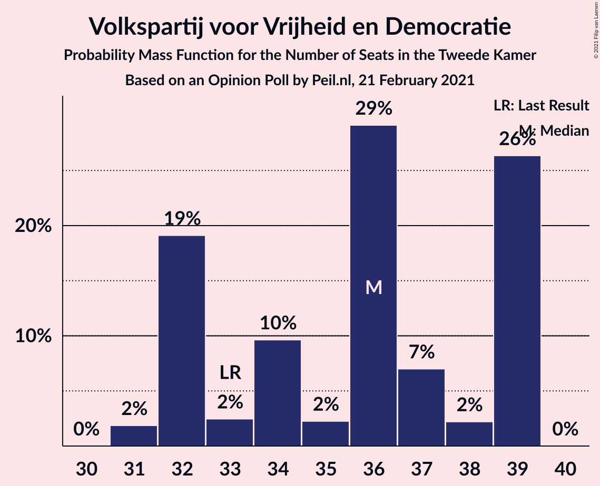

| Number of Seats | Probability | Accumulated | Special Marks |
|:---------------:|:-----------:|:-----------:|:-------------:|
| 31 | 2% | 100% |  |
| 32 | 19% | 98% |  |
| 33 | 2% | 79% | Last Result |
| 34 | 10% | 77% |  |
| 35 | 2% | 67% |  |
| 36 | 29% | 65% | Median |
| 37 | 7% | 36% |  |
| 38 | 2% | 29% |  |
| 39 | 26% | 26% |  |
| 40 | 0% | 0% |  |

### Partij voor de Vrijheid

*For a full overview of the results for this party, see the [Partij voor de Vrijheid](party-partijvoordevrijheid.html) page.*

| Number of Seats | Probability | Accumulated | Special Marks |
|:---------------:|:-----------:|:-----------:|:-------------:|
| 20 | 0.1% | 100% | Last Result |
| 21 | 24% | 99.9% |  |
| 22 | 32% | 76% | Median |
| 23 | 6% | 44% |  |
| 24 | 31% | 38% |  |
| 25 | 2% | 7% |  |
| 26 | 5% | 5% |  |
| 27 | 0.4% | 0.4% |  |
| 28 | 0% | 0% |  |

### Christen-Democratisch Appèl

*For a full overview of the results for this party, see the [Christen-Democratisch Appèl](party-christen-democratischappèl.html) page.*

| Number of Seats | Probability | Accumulated | Special Marks |
|:---------------:|:-----------:|:-----------:|:-------------:|
| 15 | 0.9% | 100% |  |
| 16 | 2% | 99.0% |  |
| 17 | 55% | 97% | Median |
| 18 | 31% | 43% |  |
| 19 | 5% | 11% | Last Result |
| 20 | 3% | 7% |  |
| 21 | 1.0% | 4% |  |
| 22 | 3% | 3% |  |
| 23 | 0% | 0% |  |

### Democraten 66

*For a full overview of the results for this party, see the [Democraten 66](party-democraten66.html) page.*

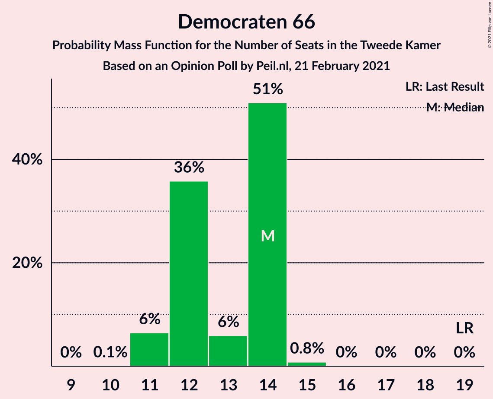

| Number of Seats | Probability | Accumulated | Special Marks |
|:---------------:|:-----------:|:-----------:|:-------------:|
| 10 | 0.1% | 100% |  |
| 11 | 6% | 99.9% |  |
| 12 | 36% | 93% |  |
| 13 | 6% | 58% |  |
| 14 | 51% | 52% | Median |
| 15 | 0.8% | 0.8% |  |
| 16 | 0% | 0.1% |  |
| 17 | 0% | 0% |  |
| 18 | 0% | 0% |  |
| 19 | 0% | 0% | Last Result |

### Partij van de Arbeid

*For a full overview of the results for this party, see the [Partij van de Arbeid](party-partijvandearbeid.html) page.*

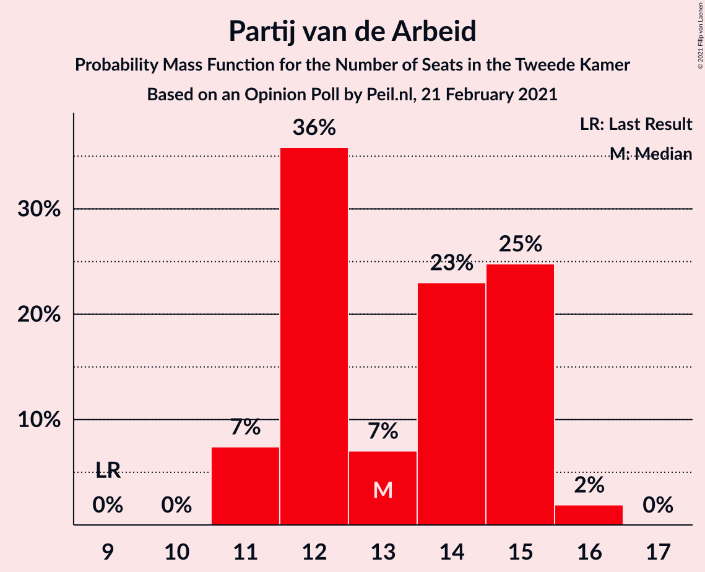

| Number of Seats | Probability | Accumulated | Special Marks |
|:---------------:|:-----------:|:-----------:|:-------------:|
| 9 | 0% | 100% | Last Result |
| 10 | 0% | 100% |  |
| 11 | 7% | 100% |  |
| 12 | 36% | 93% |  |
| 13 | 7% | 57% | Median |
| 14 | 23% | 50% |  |
| 15 | 25% | 27% |  |
| 16 | 2% | 2% |  |
| 17 | 0% | 0% |  |

### GroenLinks

*For a full overview of the results for this party, see the [GroenLinks](party-groenlinks.html) page.*

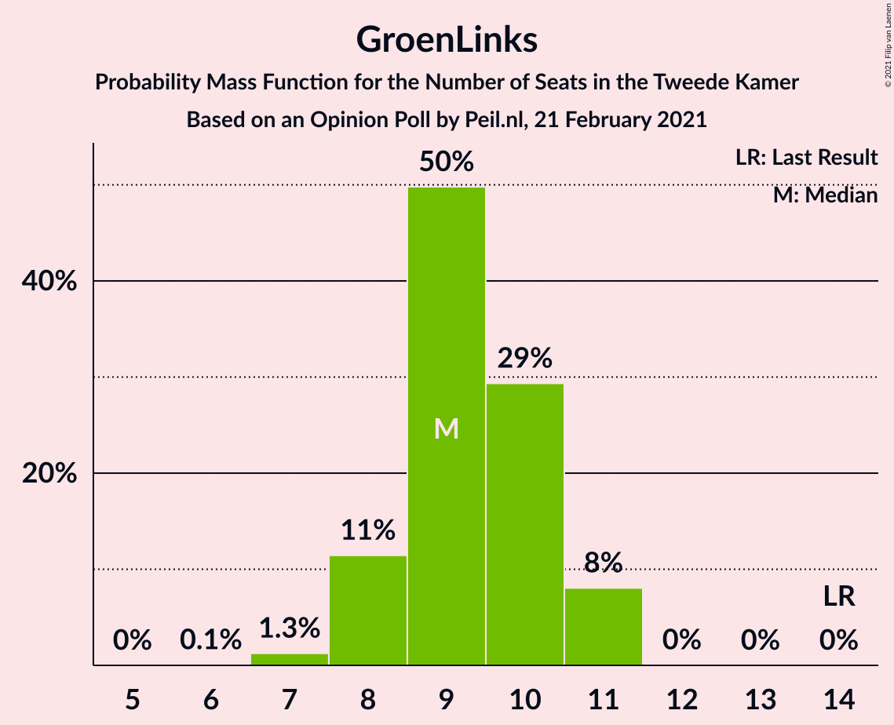

| Number of Seats | Probability | Accumulated | Special Marks |
|:---------------:|:-----------:|:-----------:|:-------------:|
| 6 | 0.1% | 100% |  |
| 7 | 1.3% | 99.9% |  |
| 8 | 11% | 98.7% |  |
| 9 | 50% | 87% | Median |
| 10 | 29% | 37% |  |
| 11 | 8% | 8% |  |
| 12 | 0% | 0% |  |
| 13 | 0% | 0% |  |
| 14 | 0% | 0% | Last Result |

### Socialistische Partij

*For a full overview of the results for this party, see the [Socialistische Partij](party-socialistischepartij.html) page.*

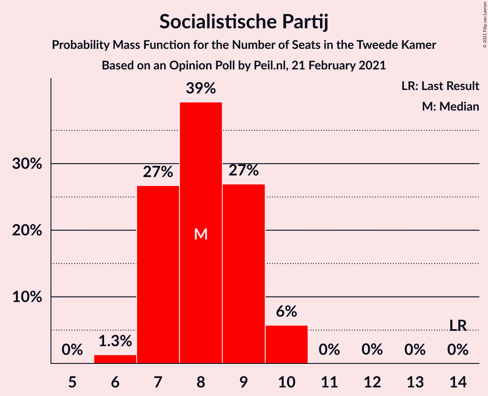

| Number of Seats | Probability | Accumulated | Special Marks |
|:---------------:|:-----------:|:-----------:|:-------------:|
| 6 | 1.3% | 100% |  |
| 7 | 27% | 98.7% |  |
| 8 | 39% | 72% | Median |
| 9 | 27% | 33% |  |
| 10 | 6% | 6% |  |
| 11 | 0% | 0.1% |  |
| 12 | 0% | 0% |  |
| 13 | 0% | 0% |  |
| 14 | 0% | 0% | Last Result |

### ChristenUnie

*For a full overview of the results for this party, see the [ChristenUnie](party-christenunie.html) page.*

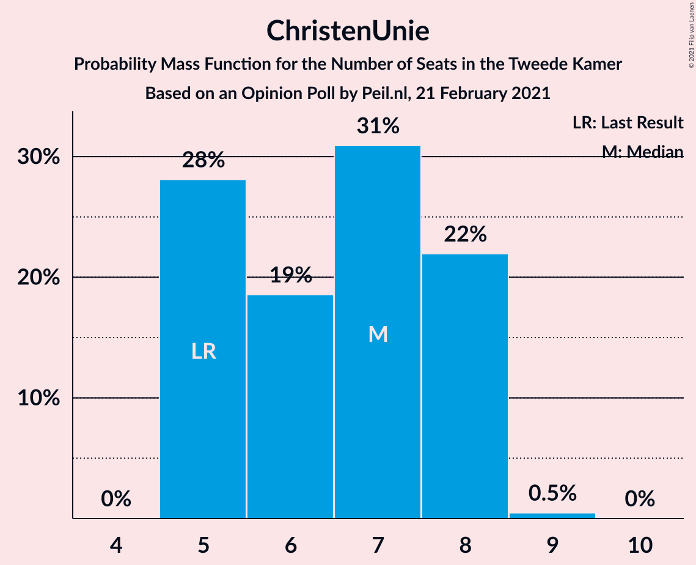

| Number of Seats | Probability | Accumulated | Special Marks |
|:---------------:|:-----------:|:-----------:|:-------------:|
| 5 | 28% | 100% | Last Result |
| 6 | 19% | 72% |  |
| 7 | 31% | 53% | Median |
| 8 | 22% | 22% |  |
| 9 | 0.5% | 0.5% |  |
| 10 | 0% | 0% |  |

### Partij voor de Dieren

*For a full overview of the results for this party, see the [Partij voor de Dieren](party-partijvoordedieren.html) page.*

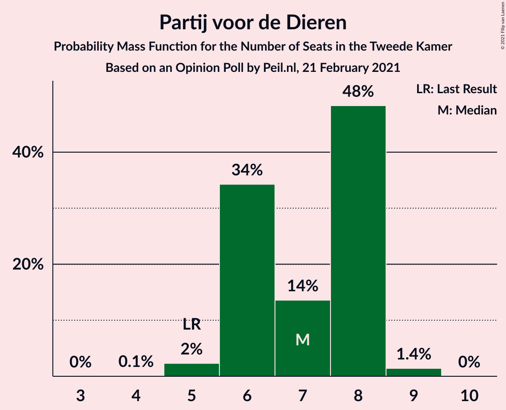

| Number of Seats | Probability | Accumulated | Special Marks |
|:---------------:|:-----------:|:-----------:|:-------------:|
| 4 | 0.1% | 100% |  |
| 5 | 2% | 99.9% | Last Result |
| 6 | 34% | 98% |  |
| 7 | 14% | 63% | Median |
| 8 | 48% | 50% |  |
| 9 | 1.4% | 1.4% |  |
| 10 | 0% | 0% |  |

### Forum voor Democratie

*For a full overview of the results for this party, see the [Forum voor Democratie](party-forumvoordemocratie.html) page.*

| Number of Seats | Probability | Accumulated | Special Marks |
|:---------------:|:-----------:|:-----------:|:-------------:|
| 2 | 0% | 100% | Last Result |
| 3 | 4% | 100% |  |
| 4 | 86% | 95% | Median |
| 5 | 5% | 9% |  |
| 6 | 4% | 4% |  |
| 7 | 0% | 0% |  |

### Staatkundig Gereformeerde Partij

*For a full overview of the results for this party, see the [Staatkundig Gereformeerde Partij](party-staatkundiggereformeerdepartij.html) page.*

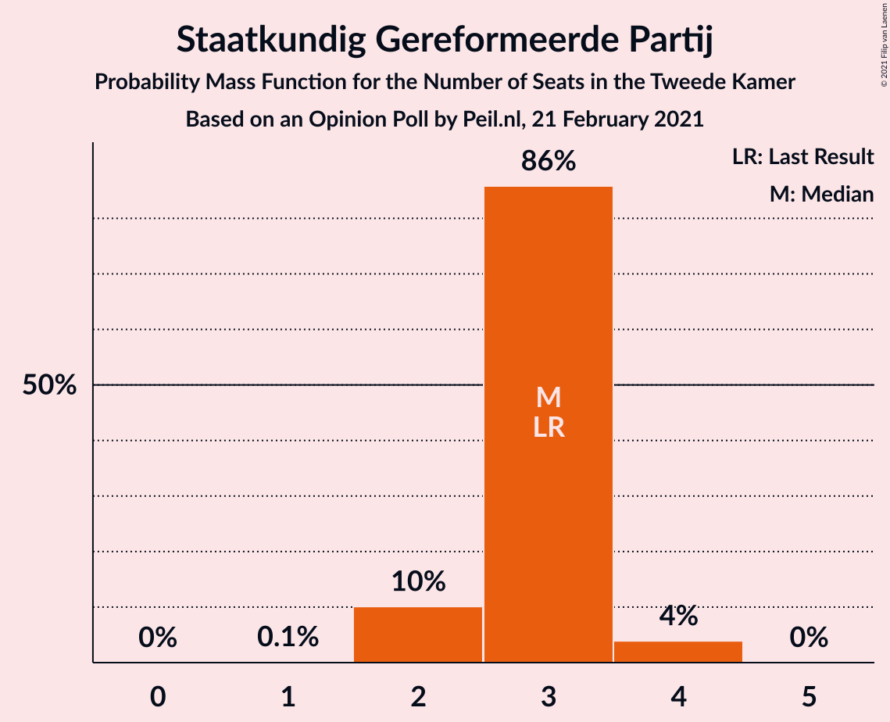

| Number of Seats | Probability | Accumulated | Special Marks |
|:---------------:|:-----------:|:-----------:|:-------------:|
| 1 | 0.1% | 100% |  |
| 2 | 10% | 99.9% |  |
| 3 | 86% | 90% | Last Result, Median |
| 4 | 4% | 4% |  |
| 5 | 0% | 0% |  |

### Partij voor de Toekomst

*For a full overview of the results for this party, see the [Partij voor de Toekomst](party-partijvoordetoekomst.html) page.*

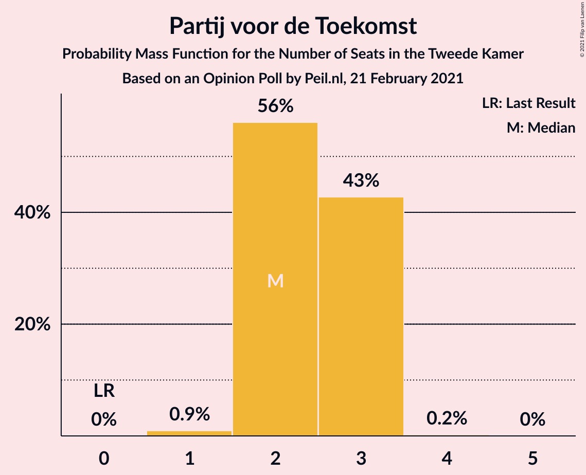

| Number of Seats | Probability | Accumulated | Special Marks |
|:---------------:|:-----------:|:-----------:|:-------------:|
| 0 | 0% | 100% | Last Result |
| 1 | 0.9% | 100% |  |
| 2 | 56% | 99.1% | Median |
| 3 | 43% | 43% |  |
| 4 | 0.2% | 0.2% |  |
| 5 | 0% | 0% |  |

### Juiste Antwoord 2021

*For a full overview of the results for this party, see the [Juiste Antwoord 2021](party-juisteantwoord2021.html) page.*

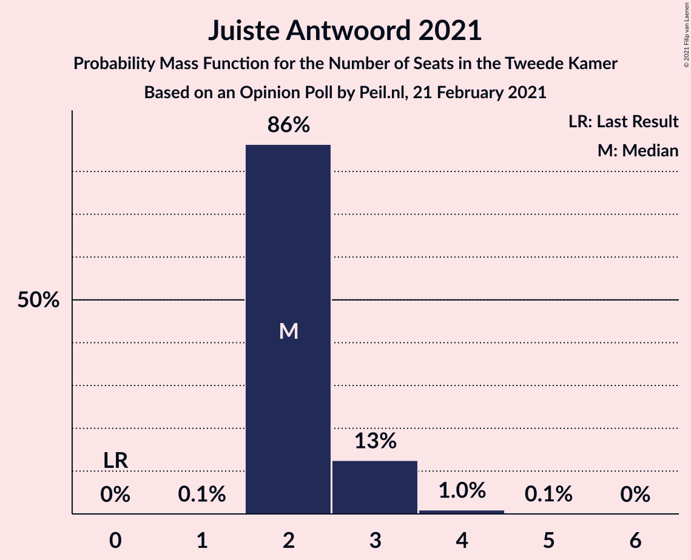

| Number of Seats | Probability | Accumulated | Special Marks |
|:---------------:|:-----------:|:-----------:|:-------------:|
| 0 | 0% | 100% | Last Result |
| 1 | 0.1% | 100% |  |
| 2 | 86% | 99.9% | Median |
| 3 | 13% | 14% |  |
| 4 | 1.0% | 1.1% |  |
| 5 | 0.1% | 0.1% |  |
| 6 | 0% | 0% |  |

### 50Plus

*For a full overview of the results for this party, see the [50Plus](party-50plus.html) page.*

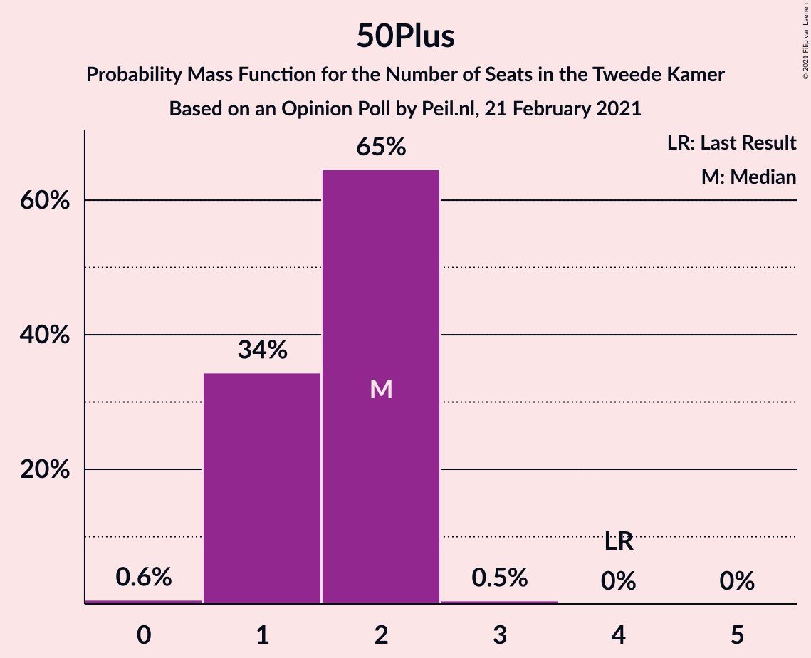

| Number of Seats | Probability | Accumulated | Special Marks |
|:---------------:|:-----------:|:-----------:|:-------------:|
| 0 | 0.6% | 100% |  |
| 1 | 34% | 99.4% |  |
| 2 | 65% | 65% | Median |
| 3 | 0.5% | 0.5% |  |
| 4 | 0% | 0% | Last Result |

### DENK

*For a full overview of the results for this party, see the [DENK](party-denk.html) page.*

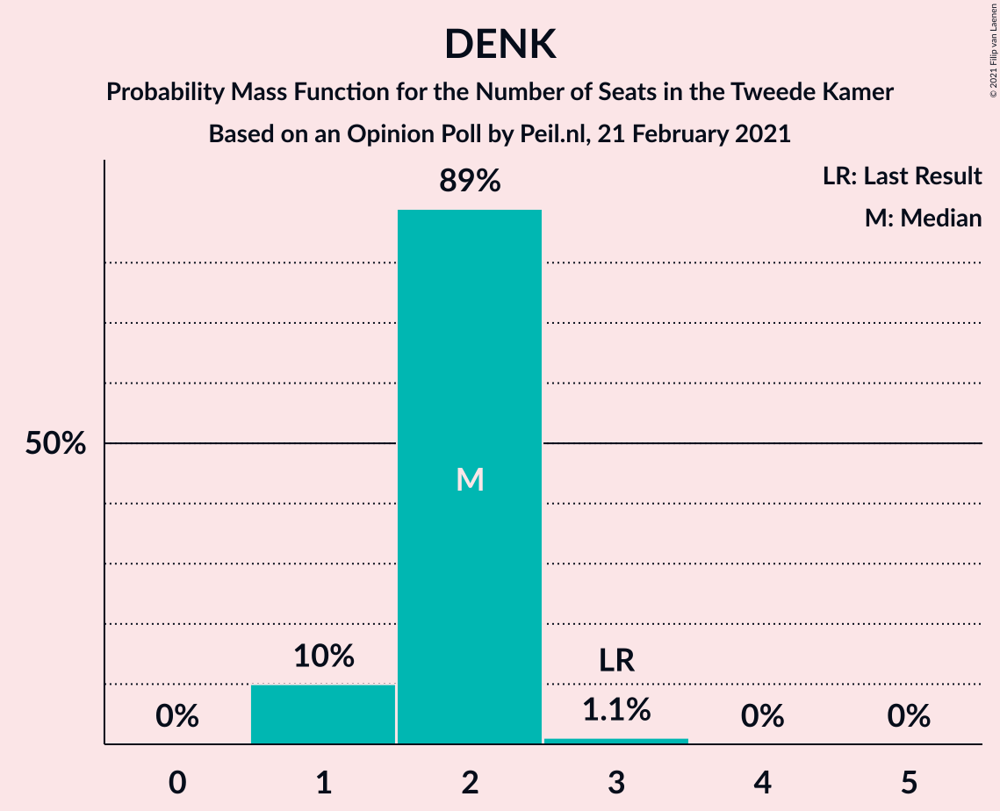

| Number of Seats | Probability | Accumulated | Special Marks |
|:---------------:|:-----------:|:-----------:|:-------------:|
| 1 | 10% | 100% |  |
| 2 | 89% | 90% | Median |
| 3 | 1.1% | 1.1% | Last Result |
| 4 | 0% | 0% |  |

### Bij1

*For a full overview of the results for this party, see the [Bij1](party-bij1.html) page.*

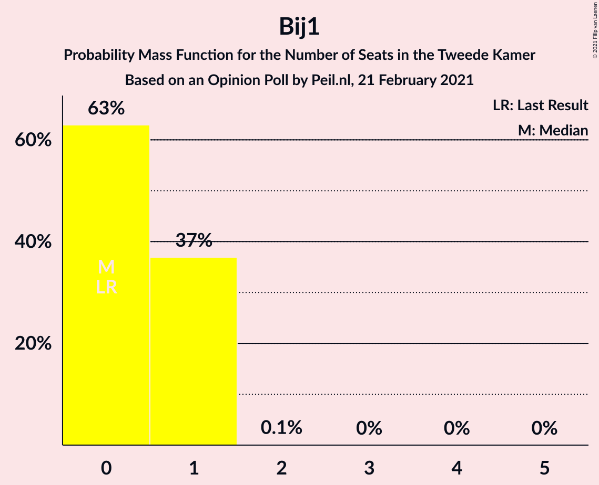

| Number of Seats | Probability | Accumulated | Special Marks |
|:---------------:|:-----------:|:-----------:|:-------------:|
| 0 | 63% | 100% | Last Result, Median |
| 1 | 37% | 37% |  |
| 2 | 0.1% | 0.1% |  |
| 3 | 0% | 0% |  |

### Code Oranje

*For a full overview of the results for this party, see the [Code Oranje](party-codeoranje.html) page.*

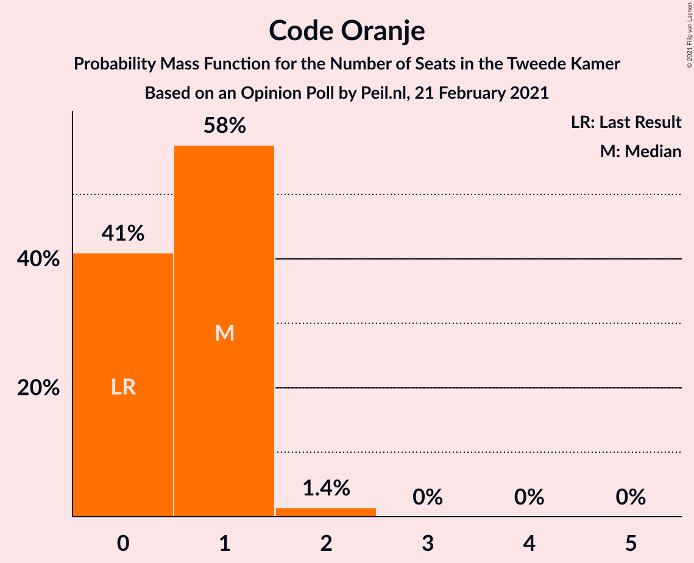

| Number of Seats | Probability | Accumulated | Special Marks |
|:---------------:|:-----------:|:-----------:|:-------------:|
| 0 | 41% | 100% | Last Result |
| 1 | 58% | 59% | Median |
| 2 | 1.4% | 1.4% |  |
| 3 | 0% | 0% |  |

### Volt Europa

*For a full overview of the results for this party, see the [Volt Europa](party-volteuropa.html) page.*

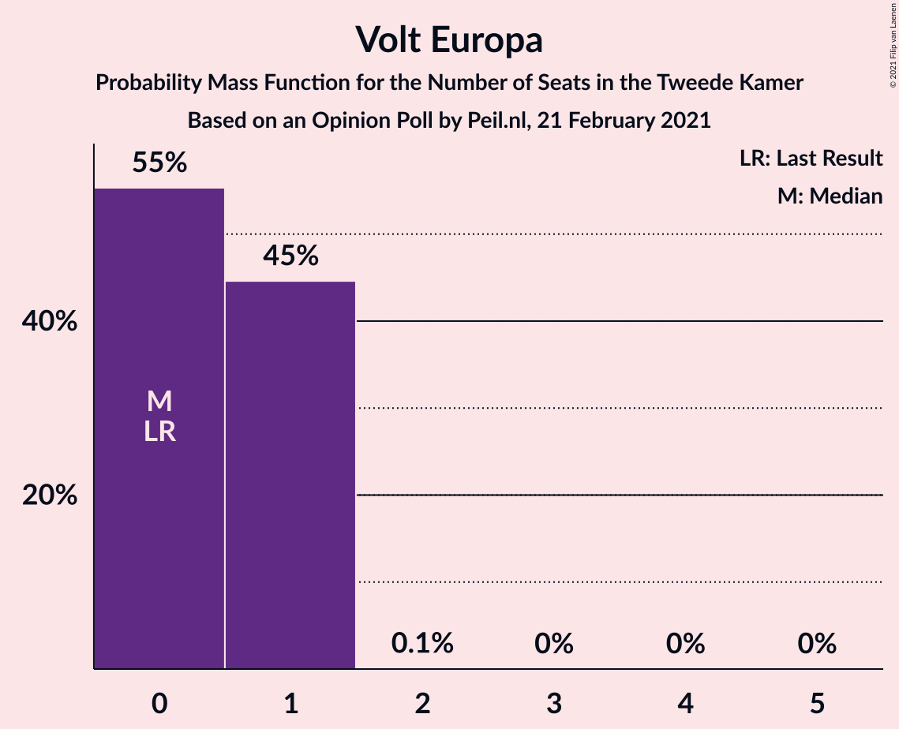

| Number of Seats | Probability | Accumulated | Special Marks |
|:---------------:|:-----------:|:-----------:|:-------------:|
| 0 | 55% | 100% | Last Result, Median |
| 1 | 45% | 45% |  |
| 2 | 0.1% | 0.1% |  |
| 3 | 0% | 0% |  |

## Coalitions

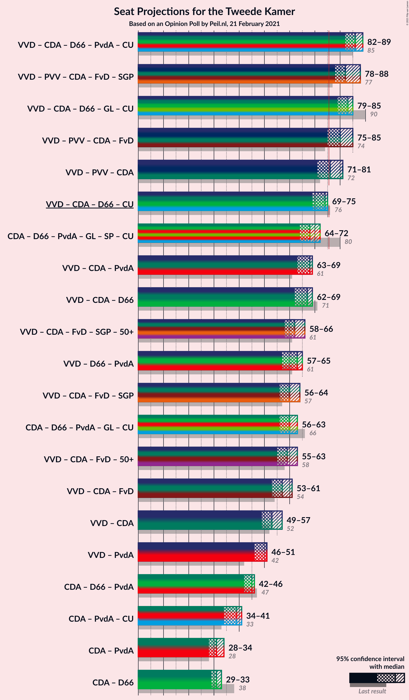

### Confidence Intervals

| Coalition | Last Result | Median | Majority? | 80% Confidence Interval | 90% Confidence Interval | 95% Confidence Interval | 99% Confidence Interval |
|:---------:|:-----------:|:------:|:---------:|:-----------------------:|:-----------------------:|:-----------------------:|:-----------------------:|
| Volkspartij voor Vrijheid en Democratie – Christen-Democratisch Appèl – Democraten 66 – Partij van de Arbeid – ChristenUnie | 85 | 86 | 100% | 85–89 | 83–89 | 82–89 | 81–90 |
| Volkspartij voor Vrijheid en Democratie – Partij voor de Vrijheid – Christen-Democratisch Appèl – Forum voor Democratie – Staatkundig Gereformeerde Partij | 77 | 82 | 100% | 78–88 | 78–88 | 78–88 | 78–88 |
| Volkspartij voor Vrijheid en Democratie – Christen-Democratisch Appèl – Democraten 66 – GroenLinks – ChristenUnie | 90 | 83 | 100% | 80–84 | 79–85 | 79–85 | 78–85 |
| Volkspartij voor Vrijheid en Democratie – Partij voor de Vrijheid – Christen-Democratisch Appèl – Forum voor Democratie | 74 | 80 | 81% | 75–85 | 75–85 | 75–85 | 75–85 |
| Volkspartij voor Vrijheid en Democratie – Partij voor de Vrijheid – Christen-Democratisch Appèl | 72 | 76 | 51% | 71–81 | 71–81 | 71–81 | 71–81 |
| Volkspartij voor Vrijheid en Democratie – Christen-Democratisch Appèl – Democraten 66 – ChristenUnie | 76 | 74 | 2% | 71–74 | 69–74 | 69–75 | 69–77 |
| Christen-Democratisch Appèl – Democraten 66 – Partij van de Arbeid – GroenLinks – Socialistische Partij – ChristenUnie | 80 | 68 | 0% | 64–71 | 64–71 | 64–72 | 63–74 |
| Volkspartij voor Vrijheid en Democratie – Christen-Democratisch Appèl – Partij van de Arbeid | 61 | 68 | 0% | 63–69 | 63–69 | 63–69 | 62–70 |
| Volkspartij voor Vrijheid en Democratie – Christen-Democratisch Appèl – Democraten 66 | 71 | 67 | 0% | 63–69 | 63–69 | 62–69 | 61–69 |
| Volkspartij voor Vrijheid en Democratie – Christen-Democratisch Appèl – Forum voor Democratie – Staatkundig Gereformeerde Partij – 50Plus | 61 | 62 | 0% | 58–65 | 58–65 | 58–66 | 57–66 |
| Volkspartij voor Vrijheid en Democratie – Democraten 66 – Partij van de Arbeid | 61 | 63 | 0% | 59–65 | 57–65 | 57–65 | 57–65 |
| Volkspartij voor Vrijheid en Democratie – Christen-Democratisch Appèl – Forum voor Democratie – Staatkundig Gereformeerde Partij | 57 | 60 | 0% | 56–64 | 56–64 | 56–64 | 55–64 |
| Christen-Democratisch Appèl – Democraten 66 – Partij van de Arbeid – GroenLinks – ChristenUnie | 66 | 60 | 0% | 56–63 | 56–63 | 56–63 | 55–65 |
| Volkspartij voor Vrijheid en Democratie – Christen-Democratisch Appèl – Forum voor Democratie – 50Plus | 58 | 59 | 0% | 55–62 | 55–62 | 55–63 | 55–63 |
| Volkspartij voor Vrijheid en Democratie – Christen-Democratisch Appèl – Forum voor Democratie | 54 | 57 | 0% | 53–61 | 53–61 | 53–61 | 53–61 |
| Volkspartij voor Vrijheid en Democratie – Christen-Democratisch Appèl | 52 | 53 | 0% | 49–57 | 49–57 | 49–57 | 49–57 |
| Volkspartij voor Vrijheid en Democratie – Partij van de Arbeid | 42 | 51 | 0% | 46–51 | 46–51 | 46–51 | 45–51 |
| Christen-Democratisch Appèl – Democraten 66 – Partij van de Arbeid | 47 | 45 | 0% | 42–46 | 42–46 | 42–46 | 40–48 |
| Christen-Democratisch Appèl – Partij van de Arbeid – ChristenUnie | 33 | 39 | 0% | 35–39 | 34–40 | 34–41 | 34–42 |
| Christen-Democratisch Appèl – Partij van de Arbeid | 28 | 31 | 0% | 30–32 | 28–34 | 28–34 | 28–34 |
| Christen-Democratisch Appèl – Democraten 66 | 38 | 31 | 0% | 30–31 | 29–33 | 29–33 | 27–34 |

### Volkspartij voor Vrijheid en Democratie – Christen-Democratisch Appèl – Democraten 66 – Partij van de Arbeid – ChristenUnie

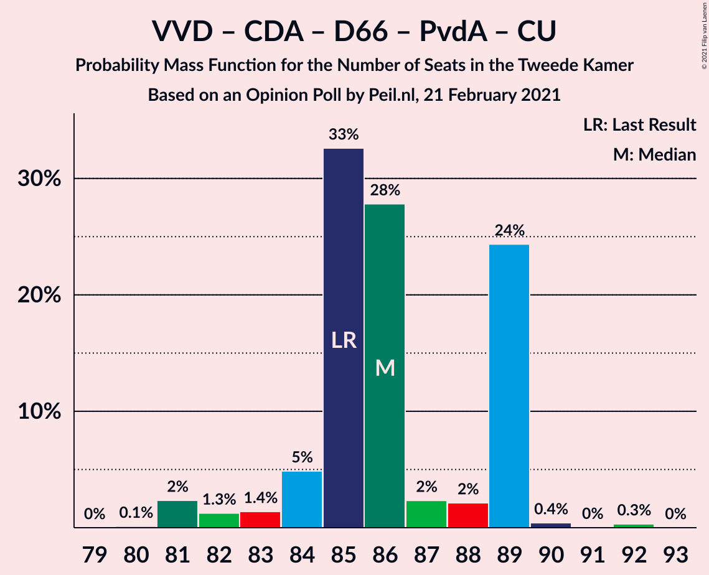

| Number of Seats | Probability | Accumulated | Special Marks |
|:---------------:|:-----------:|:-----------:|:-------------:|
| 80 | 0.1% | 100% |  |
| 81 | 2% | 99.9% |  |
| 82 | 1.3% | 98% |  |
| 83 | 1.4% | 96% |  |
| 84 | 5% | 95% |  |
| 85 | 33% | 90% | Last Result |
| 86 | 28% | 57% |  |
| 87 | 2% | 30% | Median |
| 88 | 2% | 27% |  |
| 89 | 24% | 25% |  |
| 90 | 0.4% | 0.8% |  |
| 91 | 0% | 0.3% |  |
| 92 | 0.3% | 0.3% |  |
| 93 | 0% | 0% |  |

### Volkspartij voor Vrijheid en Democratie – Partij voor de Vrijheid – Christen-Democratisch Appèl – Forum voor Democratie – Staatkundig Gereformeerde Partij

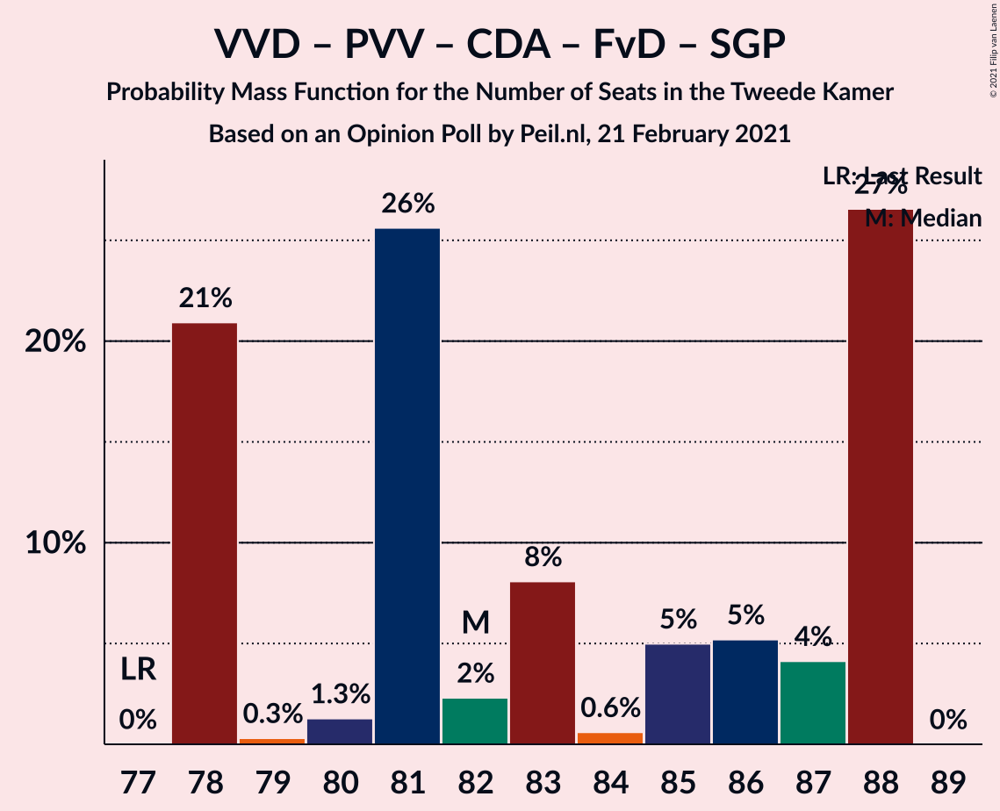

| Number of Seats | Probability | Accumulated | Special Marks |
|:---------------:|:-----------:|:-----------:|:-------------:|
| 77 | 0% | 100% | Last Result |
| 78 | 21% | 100% |  |
| 79 | 0.3% | 79% |  |
| 80 | 1.3% | 79% |  |
| 81 | 26% | 77% |  |
| 82 | 2% | 52% | Median |
| 83 | 8% | 50% |  |
| 84 | 0.6% | 41% |  |
| 85 | 5% | 41% |  |
| 86 | 5% | 36% |  |
| 87 | 4% | 31% |  |
| 88 | 27% | 27% |  |
| 89 | 0% | 0% |  |

### Volkspartij voor Vrijheid en Democratie – Christen-Democratisch Appèl – Democraten 66 – GroenLinks – ChristenUnie

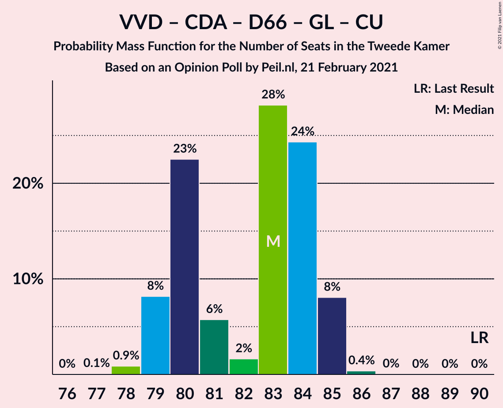

| Number of Seats | Probability | Accumulated | Special Marks |
|:---------------:|:-----------:|:-----------:|:-------------:|
| 77 | 0.1% | 100% |  |
| 78 | 0.9% | 99.9% |  |
| 79 | 8% | 99.0% |  |
| 80 | 23% | 91% |  |
| 81 | 6% | 68% |  |
| 82 | 2% | 63% |  |
| 83 | 28% | 61% | Median |
| 84 | 24% | 33% |  |
| 85 | 8% | 8% |  |
| 86 | 0.4% | 0.4% |  |
| 87 | 0% | 0% |  |
| 88 | 0% | 0% |  |
| 89 | 0% | 0% |  |
| 90 | 0% | 0% | Last Result |

### Volkspartij voor Vrijheid en Democratie – Partij voor de Vrijheid – Christen-Democratisch Appèl – Forum voor Democratie

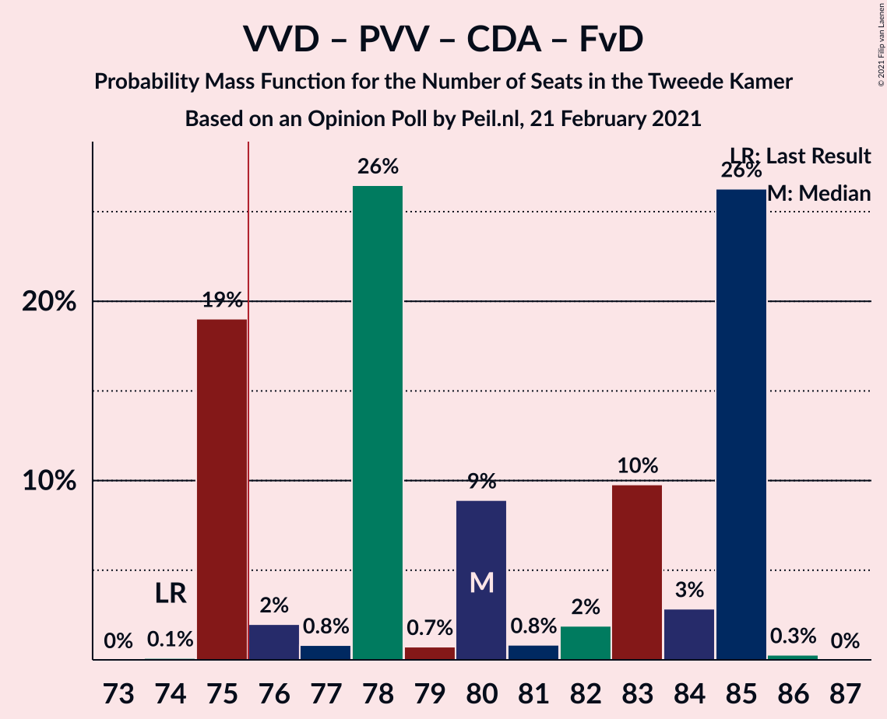

| Number of Seats | Probability | Accumulated | Special Marks |
|:---------------:|:-----------:|:-----------:|:-------------:|
| 74 | 0.1% | 100% | Last Result |
| 75 | 19% | 99.9% |  |
| 76 | 2% | 81% | Majority |
| 77 | 0.8% | 79% |  |
| 78 | 26% | 78% |  |
| 79 | 0.7% | 52% | Median |
| 80 | 9% | 51% |  |
| 81 | 0.8% | 42% |  |
| 82 | 2% | 41% |  |
| 83 | 10% | 39% |  |
| 84 | 3% | 29% |  |
| 85 | 26% | 27% |  |
| 86 | 0.3% | 0.3% |  |
| 87 | 0% | 0% |  |

### Volkspartij voor Vrijheid en Democratie – Partij voor de Vrijheid – Christen-Democratisch Appèl

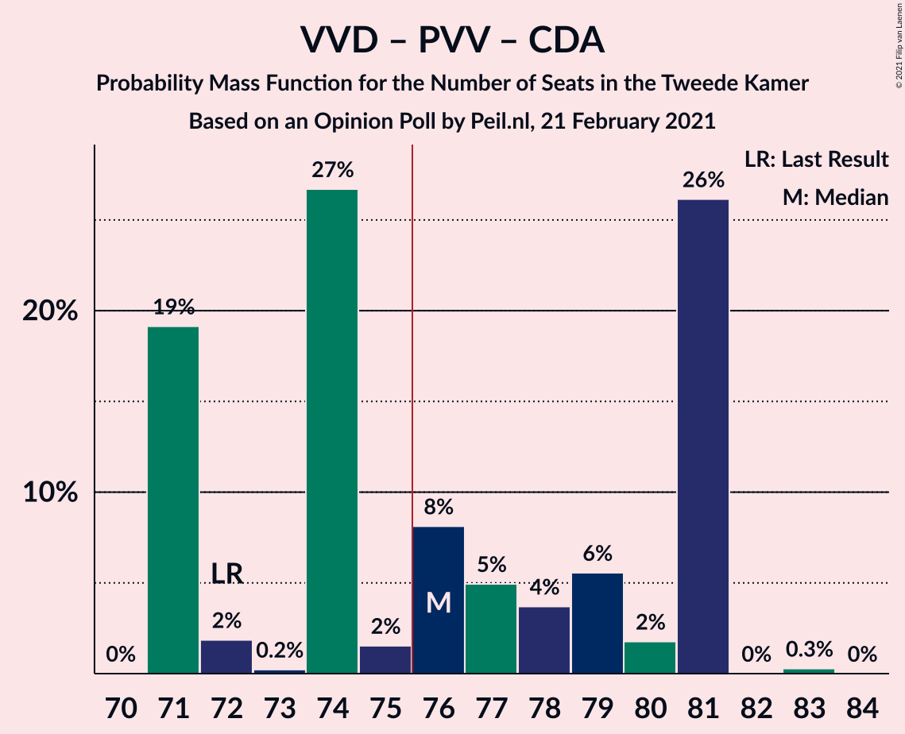

| Number of Seats | Probability | Accumulated | Special Marks |
|:---------------:|:-----------:|:-----------:|:-------------:|
| 71 | 19% | 100% |  |
| 72 | 2% | 81% | Last Result |
| 73 | 0.2% | 79% |  |
| 74 | 27% | 79% |  |
| 75 | 2% | 52% | Median |
| 76 | 8% | 51% | Majority |
| 77 | 5% | 42% |  |
| 78 | 4% | 37% |  |
| 79 | 6% | 34% |  |
| 80 | 2% | 28% |  |
| 81 | 26% | 26% |  |
| 82 | 0% | 0.3% |  |
| 83 | 0.3% | 0.3% |  |
| 84 | 0% | 0% |  |

### Volkspartij voor Vrijheid en Democratie – Christen-Democratisch Appèl – Democraten 66 – ChristenUnie

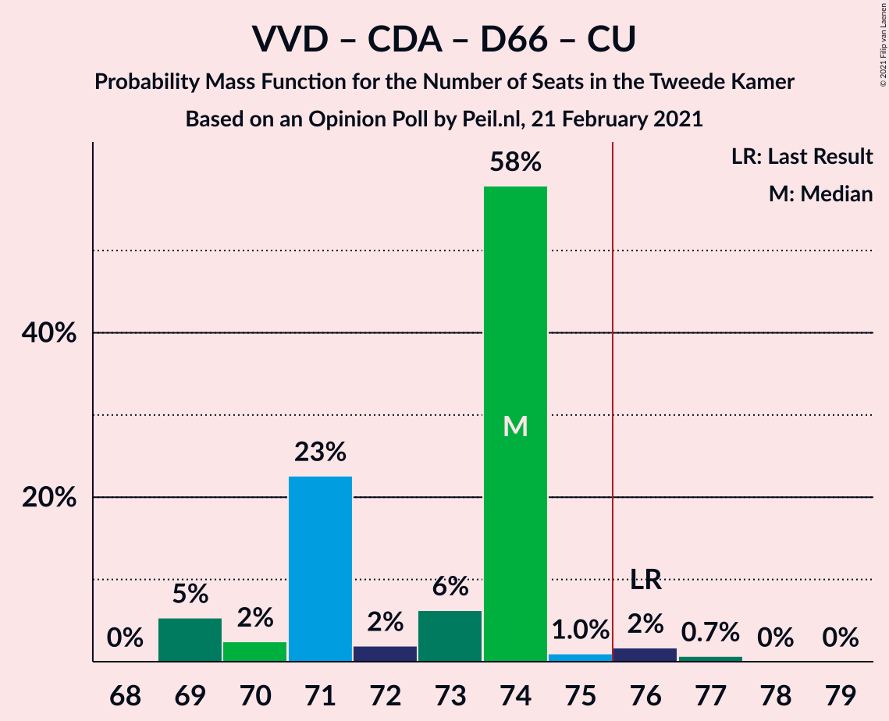

| Number of Seats | Probability | Accumulated | Special Marks |
|:---------------:|:-----------:|:-----------:|:-------------:|
| 69 | 5% | 100% |  |
| 70 | 2% | 95% |  |
| 71 | 23% | 92% |  |
| 72 | 2% | 70% |  |
| 73 | 6% | 68% |  |
| 74 | 58% | 61% | Median |
| 75 | 1.0% | 3% |  |
| 76 | 2% | 2% | Last Result, Majority |
| 77 | 0.7% | 0.7% |  |
| 78 | 0% | 0.1% |  |
| 79 | 0% | 0% |  |

### Christen-Democratisch Appèl – Democraten 66 – Partij van de Arbeid – GroenLinks – Socialistische Partij – ChristenUnie

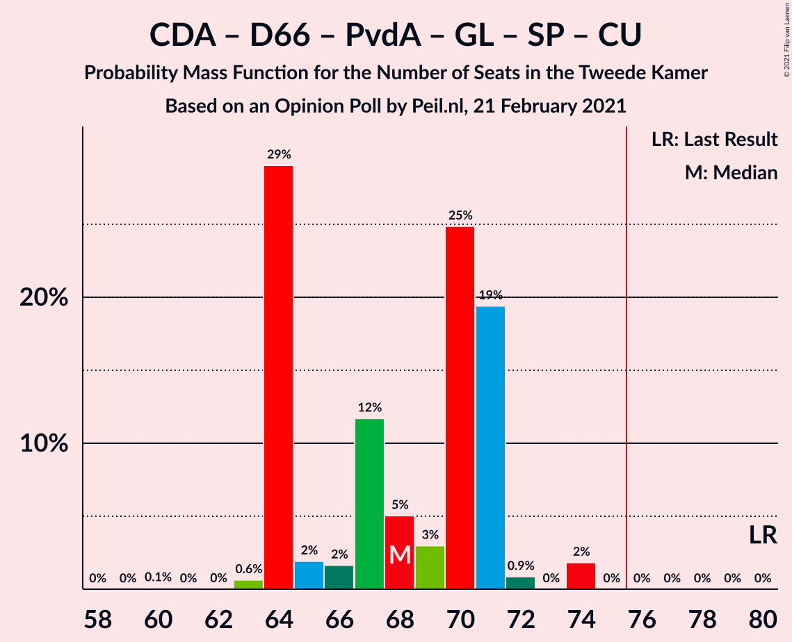

| Number of Seats | Probability | Accumulated | Special Marks |
|:---------------:|:-----------:|:-----------:|:-------------:|
| 60 | 0.1% | 100% |  |
| 61 | 0% | 99.9% |  |
| 62 | 0% | 99.9% |  |
| 63 | 0.6% | 99.9% |  |
| 64 | 29% | 99.3% |  |
| 65 | 2% | 70% |  |
| 66 | 2% | 68% |  |
| 67 | 12% | 67% |  |
| 68 | 5% | 55% | Median |
| 69 | 3% | 50% |  |
| 70 | 25% | 47% |  |
| 71 | 19% | 22% |  |
| 72 | 0.9% | 3% |  |
| 73 | 0% | 2% |  |
| 74 | 2% | 2% |  |
| 75 | 0% | 0% |  |
| 76 | 0% | 0% | Majority |
| 77 | 0% | 0% |  |
| 78 | 0% | 0% |  |
| 79 | 0% | 0% |  |
| 80 | 0% | 0% | Last Result |

### Volkspartij voor Vrijheid en Democratie – Christen-Democratisch Appèl – Partij van de Arbeid

| Number of Seats | Probability | Accumulated | Special Marks |
|:---------------:|:-----------:|:-----------:|:-------------:|
| 61 | 0.3% | 100% | Last Result |
| 62 | 0.3% | 99.7% |  |
| 63 | 21% | 99.4% |  |
| 64 | 0.8% | 79% |  |
| 65 | 11% | 78% |  |
| 66 | 7% | 67% | Median |
| 67 | 2% | 60% |  |
| 68 | 31% | 58% |  |
| 69 | 26% | 27% |  |
| 70 | 0.7% | 0.7% |  |
| 71 | 0% | 0% |  |

### Volkspartij voor Vrijheid en Democratie – Christen-Democratisch Appèl – Democraten 66

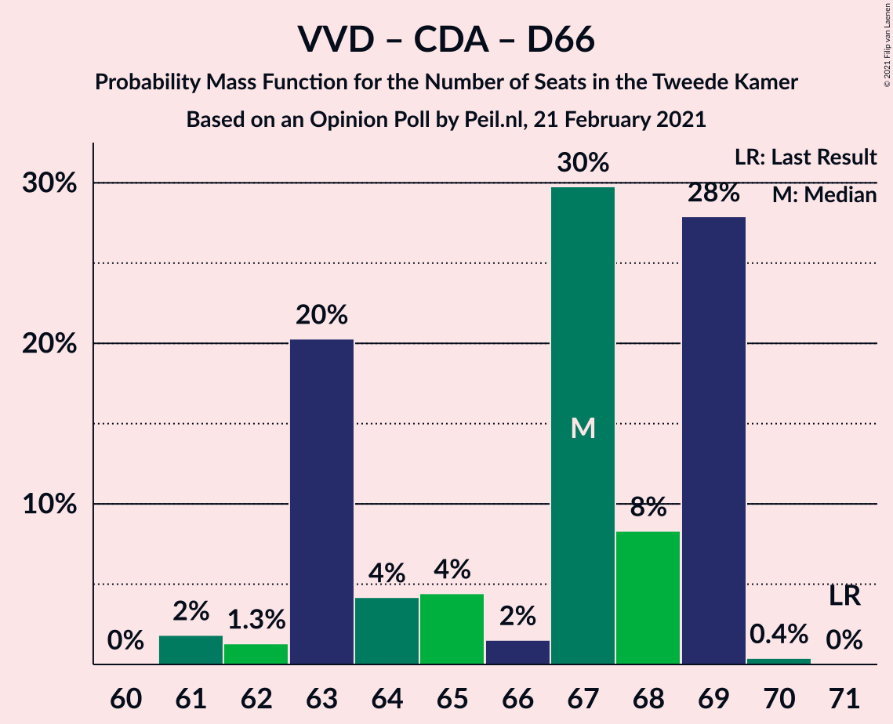

| Number of Seats | Probability | Accumulated | Special Marks |
|:---------------:|:-----------:|:-----------:|:-------------:|
| 61 | 2% | 100% |  |
| 62 | 1.3% | 98% |  |
| 63 | 20% | 97% |  |
| 64 | 4% | 77% |  |
| 65 | 4% | 72% |  |
| 66 | 2% | 68% |  |
| 67 | 30% | 66% | Median |
| 68 | 8% | 37% |  |
| 69 | 28% | 28% |  |
| 70 | 0.4% | 0.4% |  |
| 71 | 0% | 0% | Last Result |

### Volkspartij voor Vrijheid en Democratie – Christen-Democratisch Appèl – Forum voor Democratie – Staatkundig Gereformeerde Partij – 50Plus

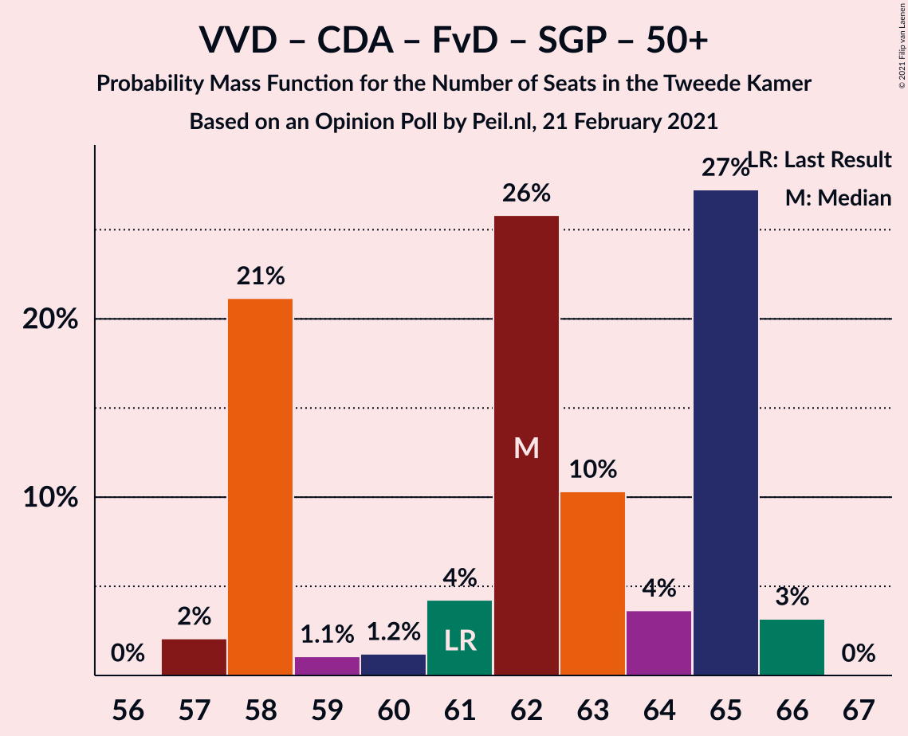

| Number of Seats | Probability | Accumulated | Special Marks |
|:---------------:|:-----------:|:-----------:|:-------------:|
| 57 | 2% | 100% |  |
| 58 | 21% | 98% |  |
| 59 | 1.1% | 77% |  |
| 60 | 1.2% | 76% |  |
| 61 | 4% | 74% | Last Result |
| 62 | 26% | 70% | Median |
| 63 | 10% | 44% |  |
| 64 | 4% | 34% |  |
| 65 | 27% | 30% |  |
| 66 | 3% | 3% |  |
| 67 | 0% | 0% |  |

### Volkspartij voor Vrijheid en Democratie – Democraten 66 – Partij van de Arbeid

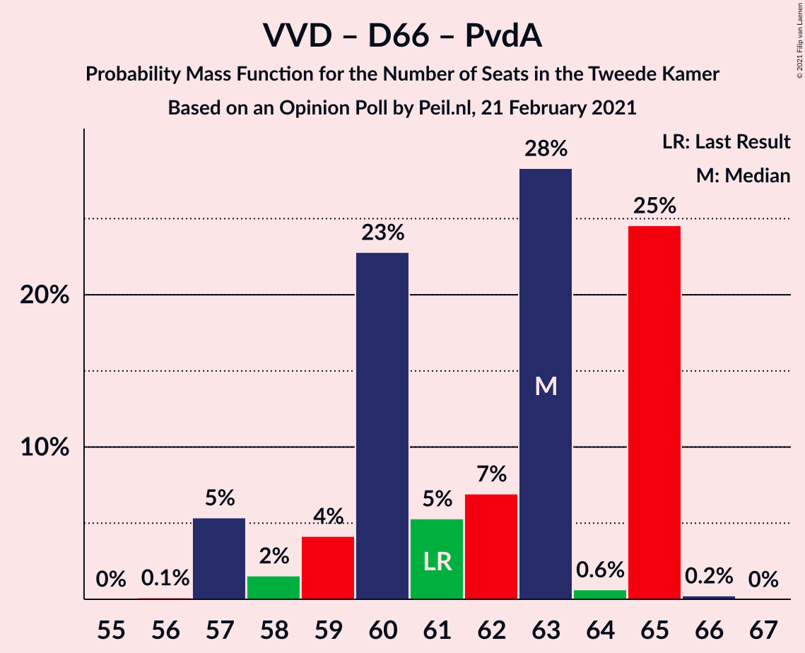

| Number of Seats | Probability | Accumulated | Special Marks |
|:---------------:|:-----------:|:-----------:|:-------------:|
| 56 | 0.1% | 100% |  |
| 57 | 5% | 99.9% |  |
| 58 | 2% | 95% |  |
| 59 | 4% | 93% |  |
| 60 | 23% | 89% |  |
| 61 | 5% | 66% | Last Result |
| 62 | 7% | 61% |  |
| 63 | 28% | 54% | Median |
| 64 | 0.6% | 25% |  |
| 65 | 25% | 25% |  |
| 66 | 0.2% | 0.3% |  |
| 67 | 0% | 0% |  |

### Volkspartij voor Vrijheid en Democratie – Christen-Democratisch Appèl – Forum voor Democratie – Staatkundig Gereformeerde Partij

| Number of Seats | Probability | Accumulated | Special Marks |
|:---------------:|:-----------:|:-----------:|:-------------:|
| 55 | 2% | 100% |  |
| 56 | 21% | 98% |  |
| 57 | 2% | 77% | Last Result |
| 58 | 0.4% | 76% |  |
| 59 | 4% | 75% |  |
| 60 | 26% | 71% | Median |
| 61 | 10% | 45% |  |
| 62 | 2% | 35% |  |
| 63 | 3% | 34% |  |
| 64 | 30% | 30% |  |
| 65 | 0% | 0% |  |

### Christen-Democratisch Appèl – Democraten 66 – Partij van de Arbeid – GroenLinks – ChristenUnie

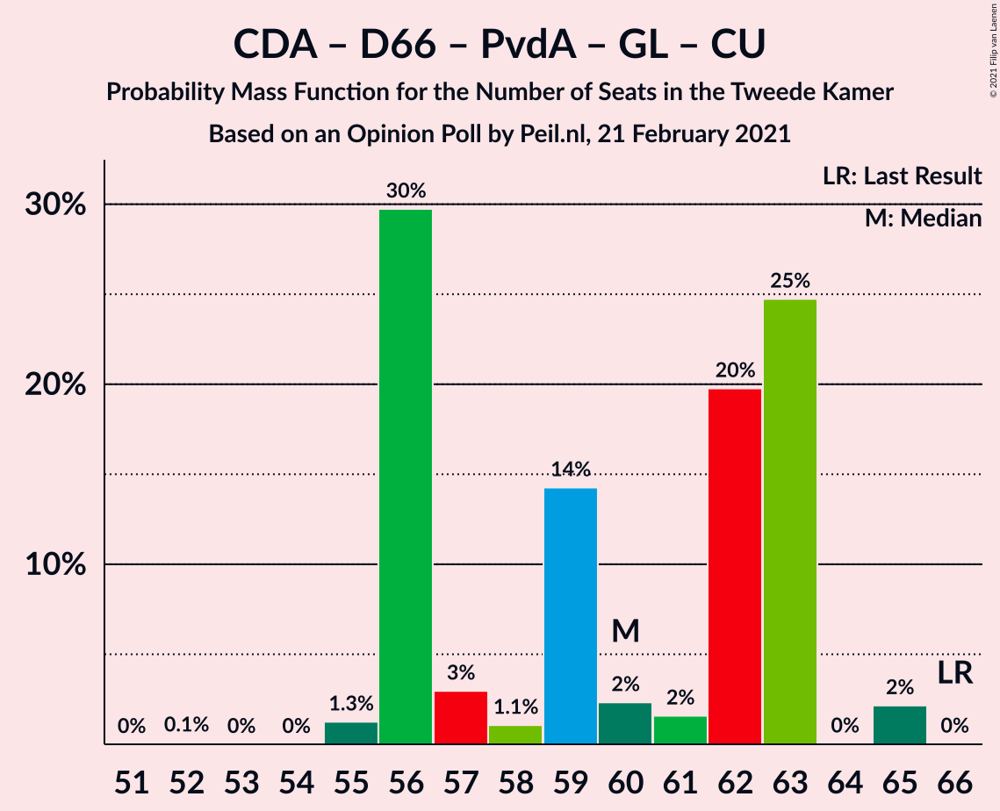

| Number of Seats | Probability | Accumulated | Special Marks |
|:---------------:|:-----------:|:-----------:|:-------------:|
| 52 | 0.1% | 100% |  |
| 53 | 0% | 99.9% |  |
| 54 | 0% | 99.9% |  |
| 55 | 1.3% | 99.9% |  |
| 56 | 30% | 98.7% |  |
| 57 | 3% | 69% |  |
| 58 | 1.1% | 66% |  |
| 59 | 14% | 65% |  |
| 60 | 2% | 51% | Median |
| 61 | 2% | 48% |  |
| 62 | 20% | 47% |  |
| 63 | 25% | 27% |  |
| 64 | 0% | 2% |  |
| 65 | 2% | 2% |  |
| 66 | 0% | 0% | Last Result |

### Volkspartij voor Vrijheid en Democratie – Christen-Democratisch Appèl – Forum voor Democratie – 50Plus

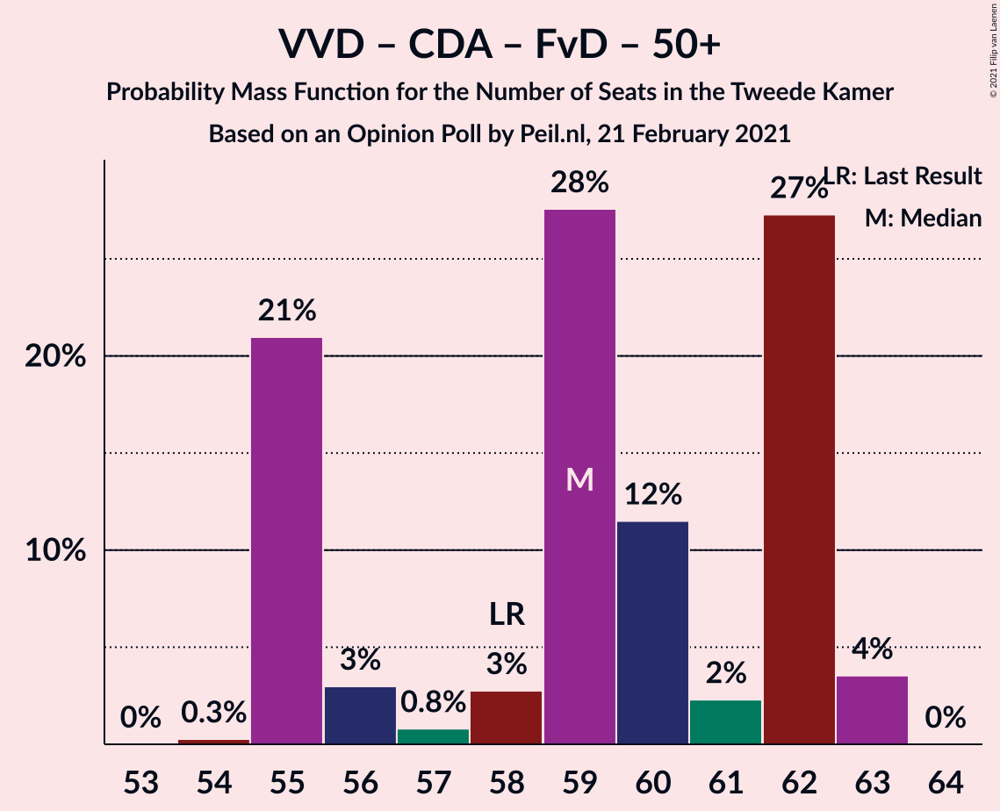

| Number of Seats | Probability | Accumulated | Special Marks |
|:---------------:|:-----------:|:-----------:|:-------------:|
| 54 | 0.3% | 100% |  |
| 55 | 21% | 99.7% |  |
| 56 | 3% | 79% |  |
| 57 | 0.8% | 76% |  |
| 58 | 3% | 75% | Last Result |
| 59 | 28% | 72% | Median |
| 60 | 12% | 45% |  |
| 61 | 2% | 33% |  |
| 62 | 27% | 31% |  |
| 63 | 4% | 4% |  |
| 64 | 0% | 0% |  |

### Volkspartij voor Vrijheid en Democratie – Christen-Democratisch Appèl – Forum voor Democratie

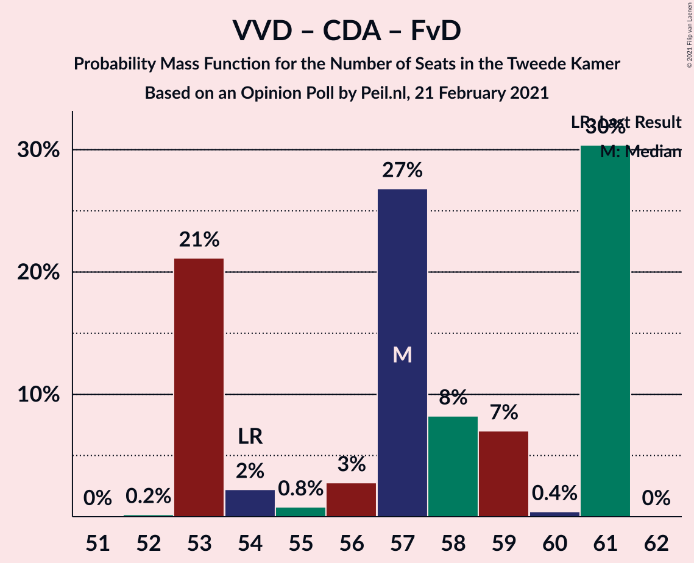

| Number of Seats | Probability | Accumulated | Special Marks |
|:---------------:|:-----------:|:-----------:|:-------------:|
| 52 | 0.2% | 100% |  |
| 53 | 21% | 99.8% |  |
| 54 | 2% | 79% | Last Result |
| 55 | 0.8% | 76% |  |
| 56 | 3% | 76% |  |
| 57 | 27% | 73% | Median |
| 58 | 8% | 46% |  |
| 59 | 7% | 38% |  |
| 60 | 0.4% | 31% |  |
| 61 | 30% | 30% |  |
| 62 | 0% | 0% |  |

### Volkspartij voor Vrijheid en Democratie – Christen-Democratisch Appèl

| Number of Seats | Probability | Accumulated | Special Marks |
|:---------------:|:-----------:|:-----------:|:-------------:|
| 49 | 21% | 100% |  |
| 50 | 2% | 79% |  |
| 51 | 1.2% | 77% |  |
| 52 | 2% | 76% | Last Result |
| 53 | 32% | 74% | Median |
| 54 | 8% | 42% |  |
| 55 | 1.3% | 34% |  |
| 56 | 5% | 32% |  |
| 57 | 27% | 27% |  |
| 58 | 0% | 0% |  |

### Volkspartij voor Vrijheid en Democratie – Partij van de Arbeid

| Number of Seats | Probability | Accumulated | Special Marks |
|:---------------:|:-----------:|:-----------:|:-------------:|
| 42 | 0% | 100% | Last Result |
| 43 | 0% | 100% |  |
| 44 | 0.2% | 100% |  |
| 45 | 0.4% | 99.8% |  |
| 46 | 28% | 99.4% |  |
| 47 | 3% | 72% |  |
| 48 | 9% | 68% |  |
| 49 | 6% | 59% | Median |
| 50 | 2% | 53% |  |
| 51 | 51% | 51% |  |
| 52 | 0.3% | 0.3% |  |
| 53 | 0% | 0% |  |

### Christen-Democratisch Appèl – Democraten 66 – Partij van de Arbeid

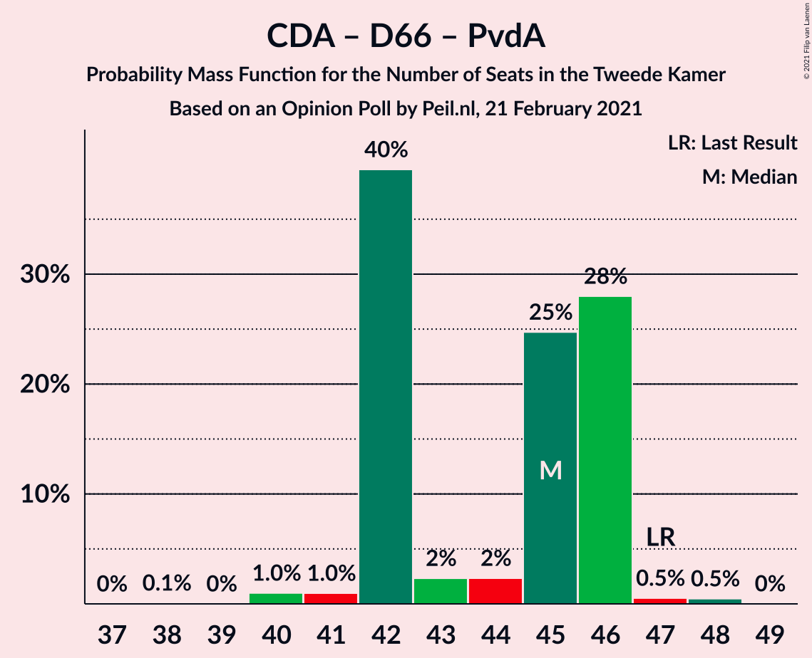

| Number of Seats | Probability | Accumulated | Special Marks |
|:---------------:|:-----------:|:-----------:|:-------------:|
| 38 | 0.1% | 100% |  |
| 39 | 0% | 99.9% |  |
| 40 | 1.0% | 99.9% |  |
| 41 | 1.0% | 98.9% |  |
| 42 | 40% | 98% |  |
| 43 | 2% | 58% |  |
| 44 | 2% | 56% | Median |
| 45 | 25% | 54% |  |
| 46 | 28% | 29% |  |
| 47 | 0.5% | 1.0% | Last Result |
| 48 | 0.5% | 0.5% |  |
| 49 | 0% | 0% |  |

### Christen-Democratisch Appèl – Partij van de Arbeid – ChristenUnie

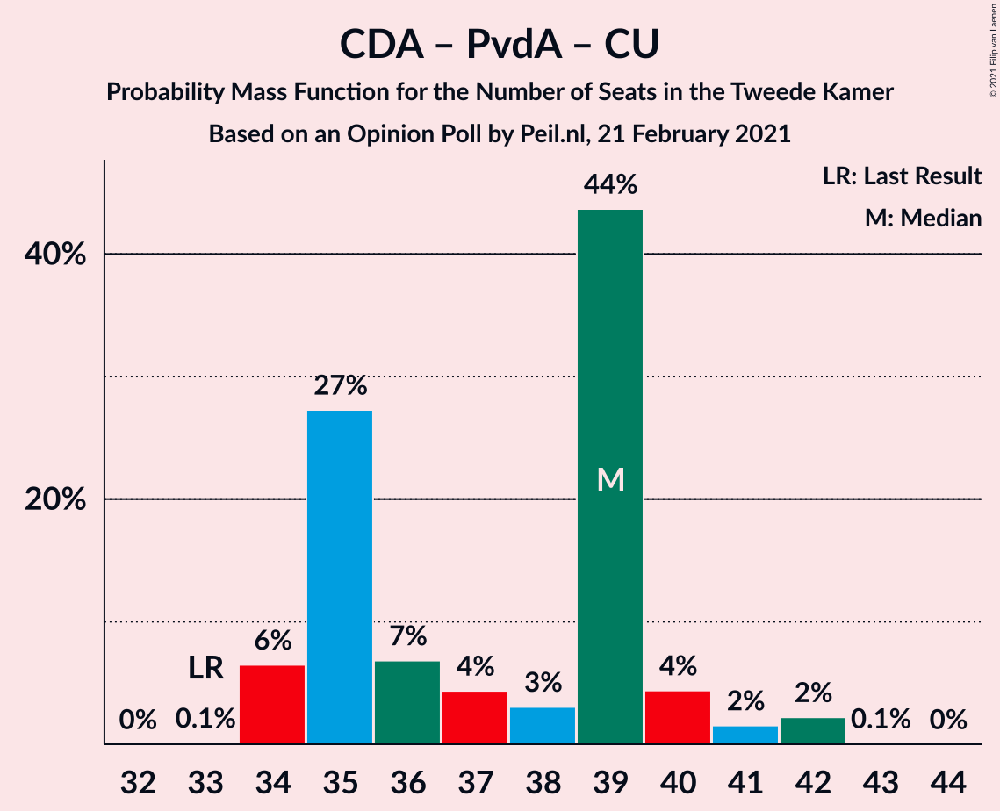

| Number of Seats | Probability | Accumulated | Special Marks |
|:---------------:|:-----------:|:-----------:|:-------------:|
| 33 | 0.1% | 100% | Last Result |
| 34 | 6% | 99.9% |  |
| 35 | 27% | 93% |  |
| 36 | 7% | 66% |  |
| 37 | 4% | 59% | Median |
| 38 | 3% | 55% |  |
| 39 | 44% | 52% |  |
| 40 | 4% | 8% |  |
| 41 | 2% | 4% |  |
| 42 | 2% | 2% |  |
| 43 | 0.1% | 0.1% |  |
| 44 | 0% | 0% |  |

### Christen-Democratisch Appèl – Partij van de Arbeid

| Number of Seats | Probability | Accumulated | Special Marks |
|:---------------:|:-----------:|:-----------:|:-------------:|
| 27 | 0.1% | 100% |  |
| 28 | 8% | 99.9% | Last Result |
| 29 | 1.4% | 92% |  |
| 30 | 33% | 91% | Median |
| 31 | 23% | 58% |  |
| 32 | 27% | 35% |  |
| 33 | 2% | 8% |  |
| 34 | 6% | 7% |  |
| 35 | 0.2% | 0.2% |  |
| 36 | 0% | 0% |  |

### Christen-Democratisch Appèl – Democraten 66

| Number of Seats | Probability | Accumulated | Special Marks |
|:---------------:|:-----------:|:-----------:|:-------------:|
| 27 | 0.7% | 100% |  |
| 28 | 0.5% | 99.3% |  |
| 29 | 5% | 98.8% |  |
| 30 | 33% | 94% |  |
| 31 | 51% | 60% | Median |
| 32 | 2% | 9% |  |
| 33 | 6% | 7% |  |
| 34 | 0.5% | 0.7% |  |
| 35 | 0.1% | 0.1% |  |
| 36 | 0% | 0% |  |
| 37 | 0% | 0% |  |
| 38 | 0% | 0% | Last Result |

## Technical Information

### Opinion Poll

+ **Polling firm:** Peil.nl
+ **Commissioner(s):** —
+ **Fieldwork period:** 21 February 2021

### Calculations

+ **Sample size:** 3000
+ **Simulations done:** 1,048,576
+ **Error estimate:** 1.92%

