# Opinion Poll by Ipsos for EenVandaag, 5–8 March 2021

<a href="#voting-intentions">Voting Intentions</a> | <a href="#seats">Seats</a> | <a href="#coalitions">Coalitions</a> | <a href="#technical-information">Technical Information</a>

## Voting Intentions

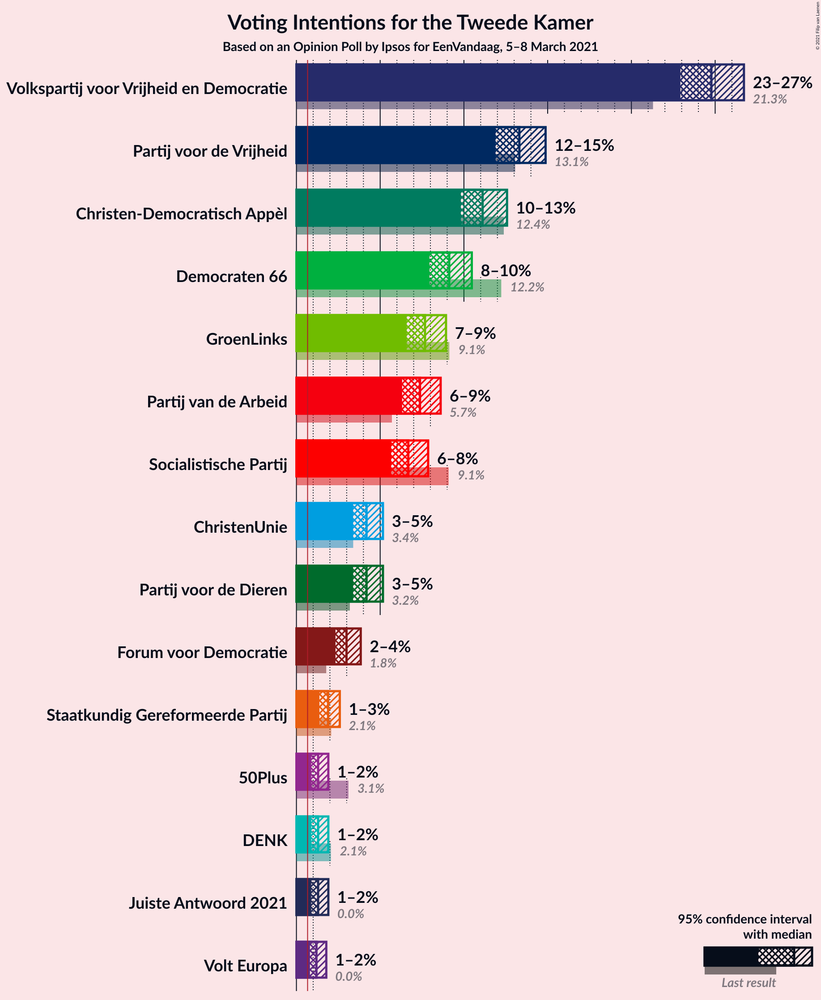

### Confidence Intervals

| Party | Last Result | Poll Result | 80% Confidence Interval | 90% Confidence Interval | 95% Confidence Interval | 99% Confidence Interval |
|:-----:|:-----------:|:-----------:|:-----------------------:|:-----------------------:|:-----------------------:|:-----------------------:|
| Volkspartij voor Vrijheid en Democratie | 21.3% | 24.8% | 23.6–26.0% |23.2–26.4% |22.9–26.7% |22.4–27.3% |
| Partij voor de Vrijheid | 13.1% | 13.3% | 12.4–14.3% |12.1–14.6% |11.9–14.9% |11.5–15.4% |
| Christen-Democratisch Appèl | 12.4% | 11.1% | 10.3–12.1% |10.0–12.3% |9.8–12.6% |9.4–13.0% |
| Democraten 66 | 12.2% | 9.1% | 8.3–10.0% |8.1–10.3% |7.9–10.5% |7.6–10.9% |
| GroenLinks | 9.1% | 7.7% | 7.0–8.5% |6.8–8.7% |6.6–8.9% |6.3–9.3% |
| Partij van de Arbeid | 5.7% | 7.4% | 6.7–8.2% |6.5–8.4% |6.3–8.6% |6.0–9.0% |
| Socialistische Partij | 9.1% | 6.7% | 6.0–7.5% |5.8–7.7% |5.7–7.9% |5.4–8.2% |
| ChristenUnie | 3.4% | 4.2% | 3.7–4.8% |3.5–5.0% |3.4–5.2% |3.2–5.5% |
| Partij voor de Dieren | 3.2% | 4.2% | 3.7–4.8% |3.5–5.0% |3.4–5.2% |3.2–5.5% |
| Forum voor Democratie | 1.8% | 3.0% | 2.5–3.6% |2.4–3.7% |2.3–3.8% |2.1–4.1% |
| Staatkundig Gereformeerde Partij | 2.1% | 1.9% | 1.6–2.3% |1.5–2.5% |1.4–2.6% |1.2–2.8% |
| 50Plus | 3.1% | 1.3% | 1.0–1.7% |0.9–1.8% |0.9–1.9% |0.8–2.1% |
| DENK | 2.1% | 1.3% | 1.0–1.7% |0.9–1.8% |0.9–1.9% |0.8–2.1% |
| Juiste Antwoord 2021 | 0.0% | 1.3% | 1.0–1.7% |0.9–1.8% |0.9–1.9% |0.8–2.1% |
| Volt Europa | 0.0% | 1.2% | 0.9–1.6% |0.9–1.7% |0.8–1.8% |0.7–2.0% |

*Note:* The poll result column reflects the actual value used in the calculations. Published results may vary slightly, and in addition be rounded to fewer digits.

## Seats

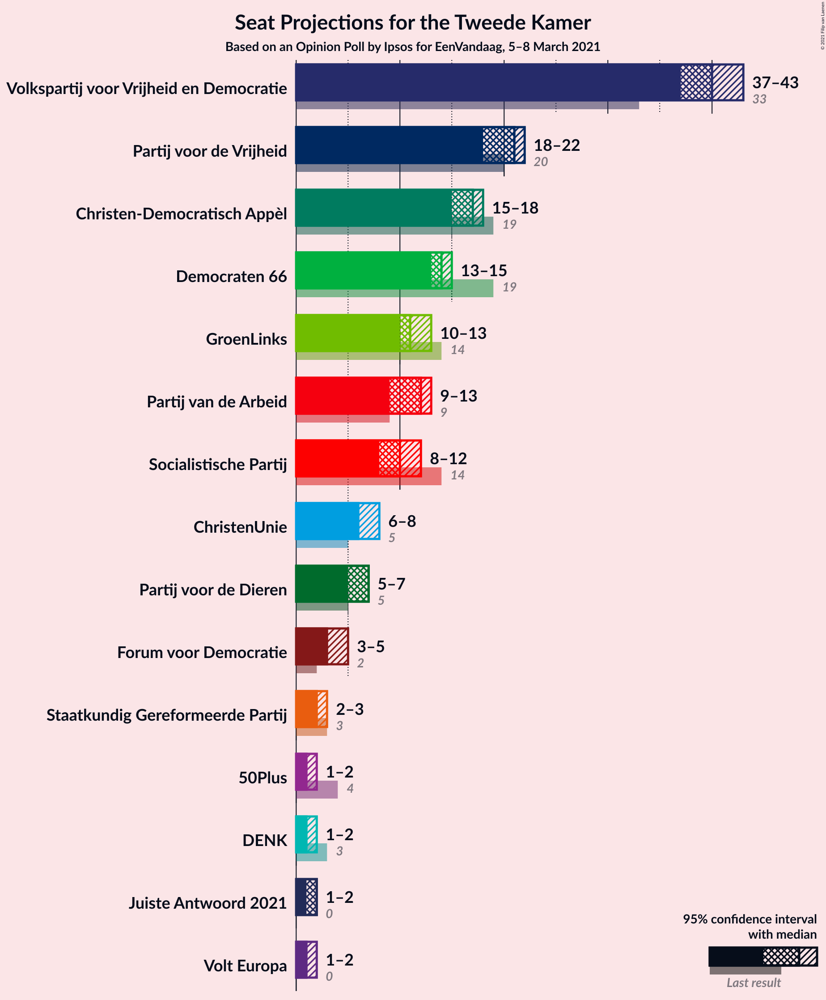

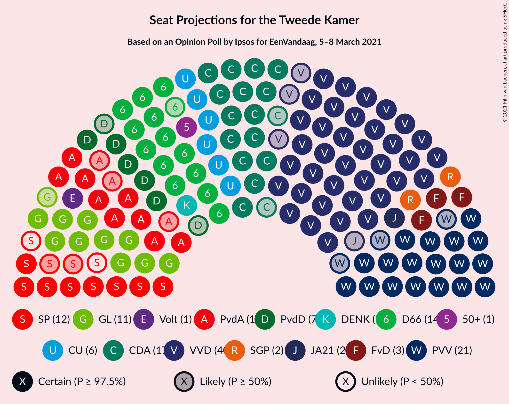

### Confidence Intervals

| Party | Last Result | Median | 80% Confidence Interval | 90% Confidence Interval | 95% Confidence Interval | 99% Confidence Interval |
|:-----:|:-----------:|:------:|:-----------------------:|:-----------------------:|:-----------------------:|:-----------------------:|
| <a href="#volkspartij-voor-vrijheid-en-democratie">Volkspartij voor Vrijheid en Democratie</a> | 33 | 40 | 38–43 |38–43 |37–43 |36–43 |
| <a href="#partij-voor-de-vrijheid">Partij voor de Vrijheid</a> | 20 | 21 | 19–21 |18–21 |18–22 |18–23 |
| <a href="#christen-democratisch-appèl">Christen-Democratisch Appèl</a> | 19 | 17 | 15–18 |15–18 |15–18 |15–20 |
| <a href="#democraten-66">Democraten 66</a> | 19 | 14 | 13–15 |13–15 |13–15 |12–16 |
| <a href="#groenlinks">GroenLinks</a> | 14 | 11 | 10–13 |10–13 |10–13 |9–14 |
| <a href="#partij-van-de-arbeid">Partij van de Arbeid</a> | 9 | 12 | 10–13 |10–13 |9–13 |9–13 |
| <a href="#socialistische-partij">Socialistische Partij</a> | 14 | 10 | 9–12 |8–12 |8–12 |8–12 |
| <a href="#christenunie">ChristenUnie</a> | 5 | 6 | 6–7 |6–7 |6–8 |5–9 |
| <a href="#partij-voor-de-dieren">Partij voor de Dieren</a> | 5 | 7 | 5–7 |5–7 |5–7 |5–8 |
| <a href="#forum-voor-democratie">Forum voor Democratie</a> | 2 | 3 | 3–4 |3–4 |3–5 |3–6 |
| <a href="#staatkundig-gereformeerde-partij">Staatkundig Gereformeerde Partij</a> | 3 | 2 | 2–3 |2–3 |2–3 |2–4 |
| <a href="#50plus">50Plus</a> | 4 | 1 | 1–2 |1–2 |1–2 |1–3 |
| <a href="#denk">DENK</a> | 3 | 1 | 1–2 |1–2 |1–2 |1–2 |
| <a href="#juiste-antwoord-2021">Juiste Antwoord 2021</a> | 0 | 2 | 1–2 |1–2 |1–2 |1–2 |
| <a href="#volt-europa">Volt Europa</a> | 0 | 1 | 1–2 |1–2 |1–2 |1–2 |

### Volkspartij voor Vrijheid en Democratie

*For a full overview of the results for this party, see the [Volkspartij voor Vrijheid en Democratie](party-volkspartijvoorvrijheidendemocratie.html) page.*

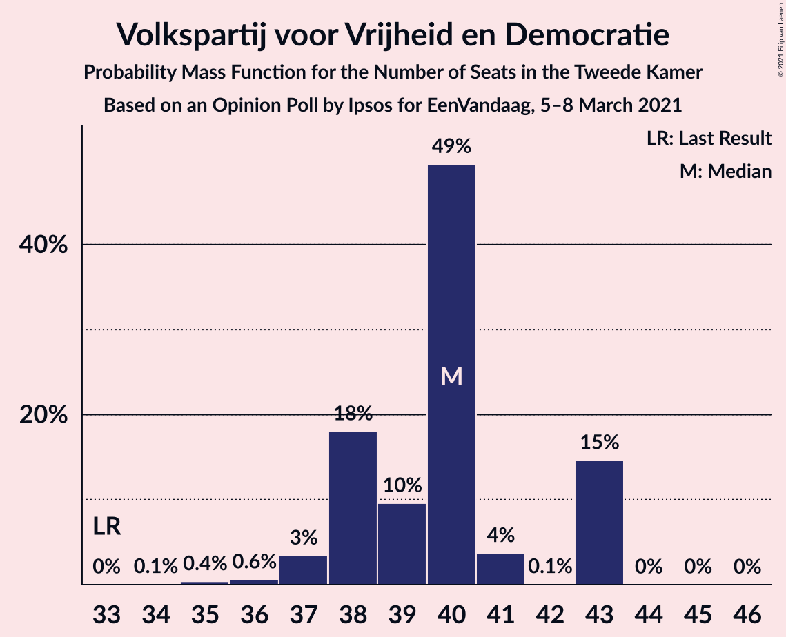

| Number of Seats | Probability | Accumulated | Special Marks |
|:---------------:|:-----------:|:-----------:|:-------------:|
| 33 | 0% | 100% | Last Result |
| 34 | 0.1% | 100% |  |
| 35 | 0.4% | 99.9% |  |
| 36 | 0.6% | 99.5% |  |
| 37 | 3% | 98.9% |  |
| 38 | 18% | 96% |  |
| 39 | 10% | 77% |  |
| 40 | 49% | 68% | Median |
| 41 | 4% | 18% |  |
| 42 | 0.1% | 15% |  |
| 43 | 15% | 15% |  |
| 44 | 0% | 0.1% |  |
| 45 | 0% | 0.1% |  |
| 46 | 0% | 0% |  |

### Partij voor de Vrijheid

*For a full overview of the results for this party, see the [Partij voor de Vrijheid](party-partijvoordevrijheid.html) page.*

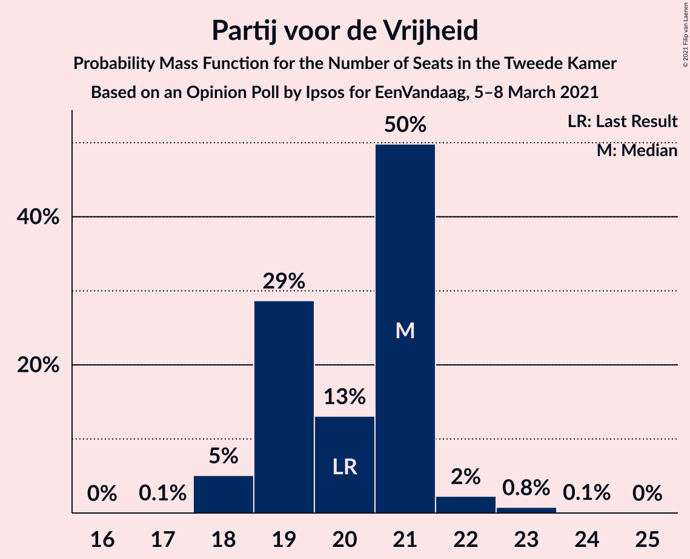

| Number of Seats | Probability | Accumulated | Special Marks |
|:---------------:|:-----------:|:-----------:|:-------------:|
| 17 | 0.1% | 100% |  |
| 18 | 5% | 99.9% |  |
| 19 | 29% | 95% |  |
| 20 | 13% | 66% | Last Result |
| 21 | 50% | 53% | Median |
| 22 | 2% | 3% |  |
| 23 | 0.8% | 1.0% |  |
| 24 | 0.1% | 0.2% |  |
| 25 | 0% | 0% |  |

### Christen-Democratisch Appèl

*For a full overview of the results for this party, see the [Christen-Democratisch Appèl](party-christen-democratischappèl.html) page.*

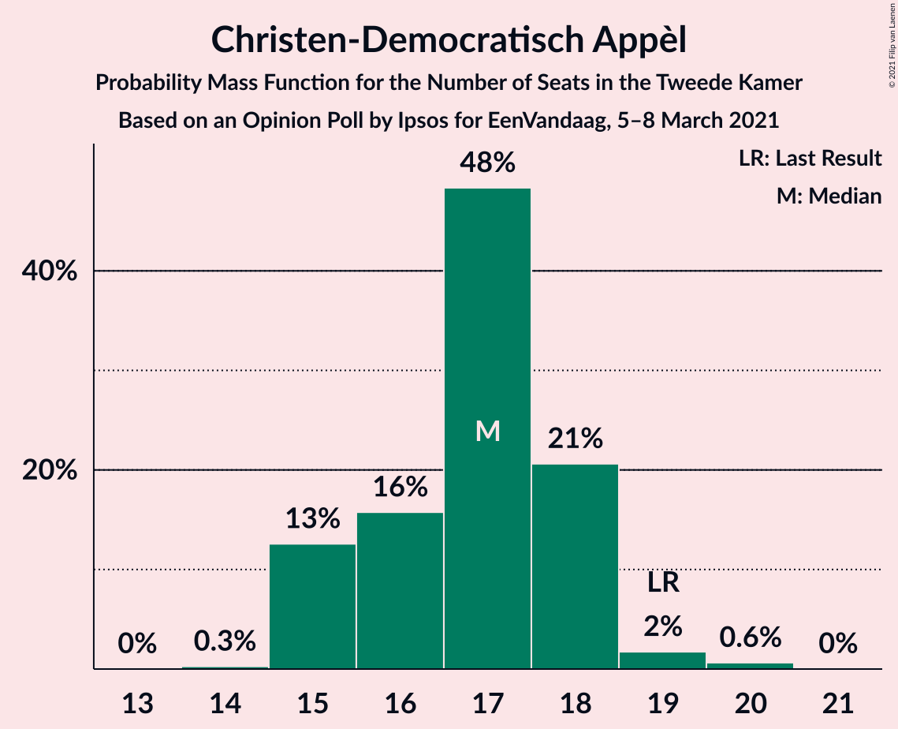

| Number of Seats | Probability | Accumulated | Special Marks |
|:---------------:|:-----------:|:-----------:|:-------------:|
| 14 | 0.3% | 100% |  |
| 15 | 13% | 99.7% |  |
| 16 | 16% | 87% |  |
| 17 | 48% | 71% | Median |
| 18 | 21% | 23% |  |
| 19 | 2% | 2% | Last Result |
| 20 | 0.6% | 0.7% |  |
| 21 | 0% | 0% |  |

### Democraten 66

*For a full overview of the results for this party, see the [Democraten 66](party-democraten66.html) page.*

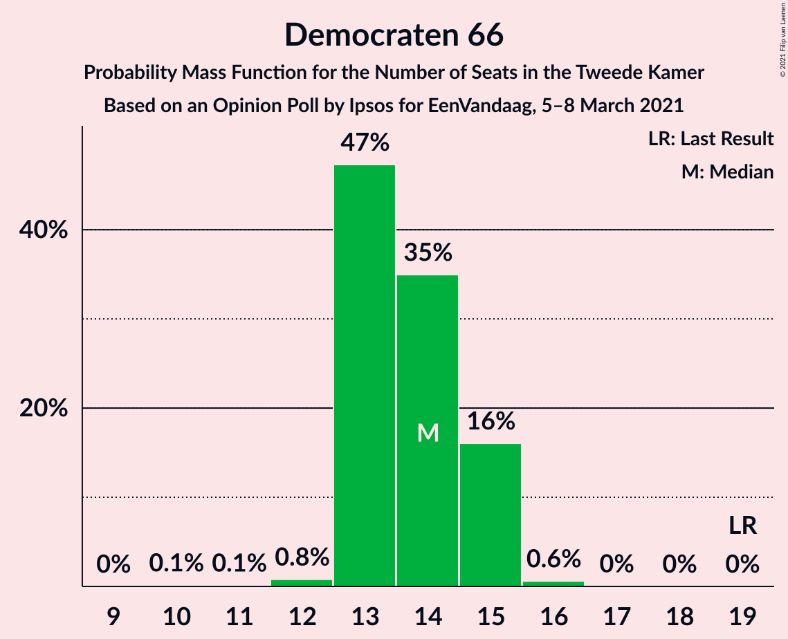

| Number of Seats | Probability | Accumulated | Special Marks |
|:---------------:|:-----------:|:-----------:|:-------------:|
| 10 | 0.1% | 100% |  |
| 11 | 0.1% | 99.9% |  |
| 12 | 0.8% | 99.7% |  |
| 13 | 47% | 98.9% |  |
| 14 | 35% | 52% | Median |
| 15 | 16% | 17% |  |
| 16 | 0.6% | 0.6% |  |
| 17 | 0% | 0% |  |
| 18 | 0% | 0% |  |
| 19 | 0% | 0% | Last Result |

### GroenLinks

*For a full overview of the results for this party, see the [GroenLinks](party-groenlinks.html) page.*

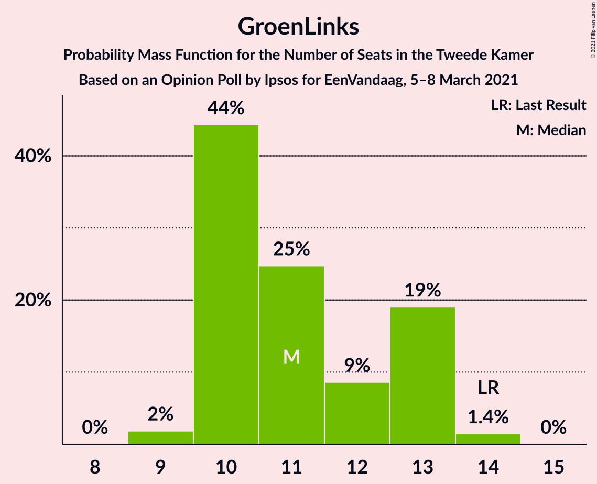

| Number of Seats | Probability | Accumulated | Special Marks |
|:---------------:|:-----------:|:-----------:|:-------------:|
| 9 | 2% | 100% |  |
| 10 | 44% | 98% |  |
| 11 | 25% | 54% | Median |
| 12 | 9% | 29% |  |
| 13 | 19% | 20% |  |
| 14 | 1.4% | 1.5% | Last Result |
| 15 | 0% | 0% |  |

### Partij van de Arbeid

*For a full overview of the results for this party, see the [Partij van de Arbeid](party-partijvandearbeid.html) page.*

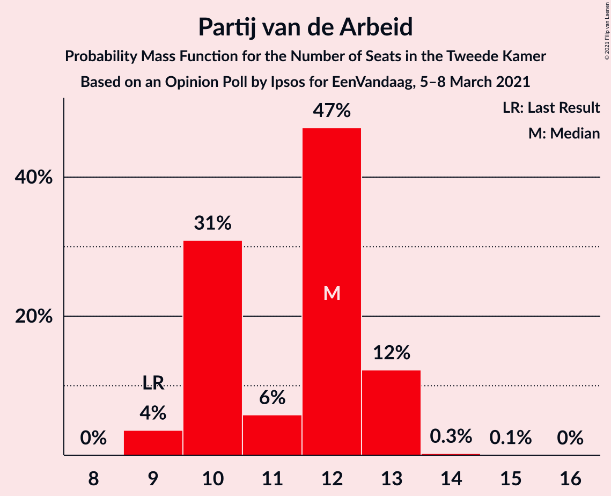

| Number of Seats | Probability | Accumulated | Special Marks |
|:---------------:|:-----------:|:-----------:|:-------------:|
| 9 | 4% | 100% | Last Result |
| 10 | 31% | 96% |  |
| 11 | 6% | 65% |  |
| 12 | 47% | 60% | Median |
| 13 | 12% | 13% |  |
| 14 | 0.3% | 0.3% |  |
| 15 | 0.1% | 0.1% |  |
| 16 | 0% | 0% |  |

### Socialistische Partij

*For a full overview of the results for this party, see the [Socialistische Partij](party-socialistischepartij.html) page.*

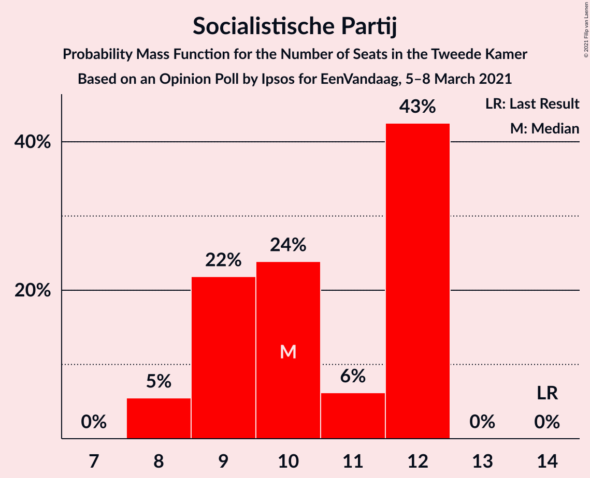

| Number of Seats | Probability | Accumulated | Special Marks |
|:---------------:|:-----------:|:-----------:|:-------------:|
| 8 | 5% | 100% |  |
| 9 | 22% | 94% |  |
| 10 | 24% | 73% | Median |
| 11 | 6% | 49% |  |
| 12 | 43% | 43% |  |
| 13 | 0% | 0% |  |
| 14 | 0% | 0% | Last Result |

### ChristenUnie

*For a full overview of the results for this party, see the [ChristenUnie](party-christenunie.html) page.*

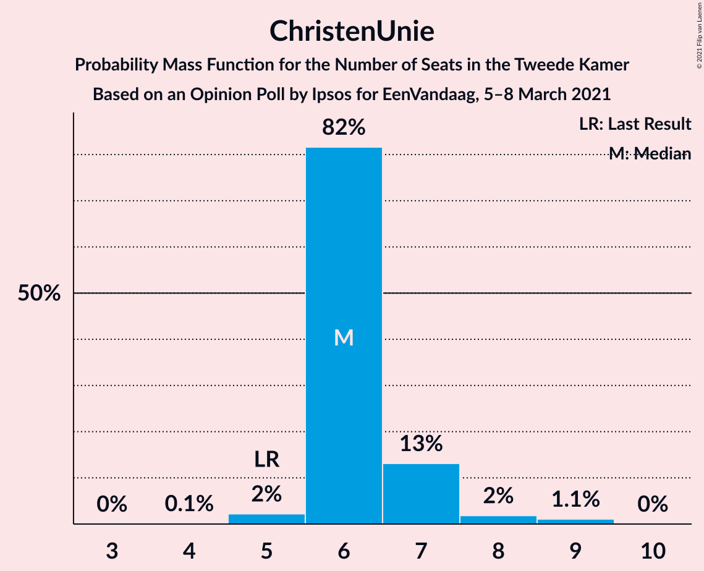

| Number of Seats | Probability | Accumulated | Special Marks |
|:---------------:|:-----------:|:-----------:|:-------------:|
| 4 | 0.1% | 100% |  |
| 5 | 2% | 99.9% | Last Result |
| 6 | 82% | 98% | Median |
| 7 | 13% | 16% |  |
| 8 | 2% | 3% |  |
| 9 | 1.1% | 1.1% |  |
| 10 | 0% | 0% |  |

### Partij voor de Dieren

*For a full overview of the results for this party, see the [Partij voor de Dieren](party-partijvoordedieren.html) page.*

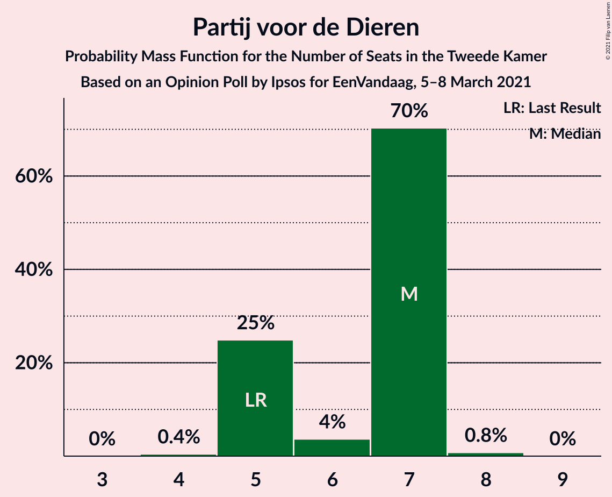

| Number of Seats | Probability | Accumulated | Special Marks |
|:---------------:|:-----------:|:-----------:|:-------------:|
| 4 | 0.4% | 100% |  |
| 5 | 25% | 99.6% | Last Result |
| 6 | 4% | 75% |  |
| 7 | 70% | 71% | Median |
| 8 | 0.8% | 0.8% |  |
| 9 | 0% | 0% |  |

### Forum voor Democratie

*For a full overview of the results for this party, see the [Forum voor Democratie](party-forumvoordemocratie.html) page.*

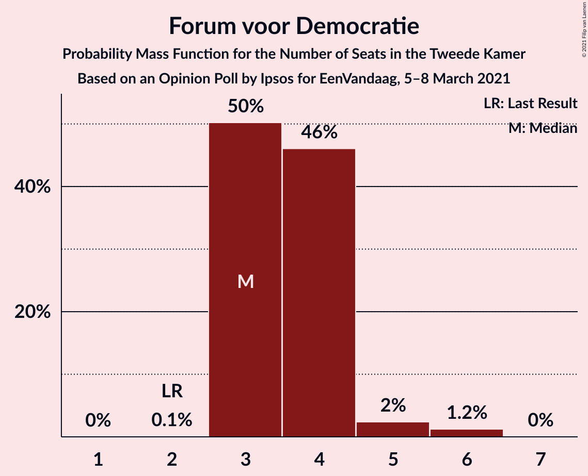

| Number of Seats | Probability | Accumulated | Special Marks |
|:---------------:|:-----------:|:-----------:|:-------------:|
| 2 | 0.1% | 100% | Last Result |
| 3 | 50% | 99.9% | Median |
| 4 | 46% | 50% |  |
| 5 | 2% | 4% |  |
| 6 | 1.2% | 1.3% |  |
| 7 | 0% | 0% |  |

### Staatkundig Gereformeerde Partij

*For a full overview of the results for this party, see the [Staatkundig Gereformeerde Partij](party-staatkundiggereformeerdepartij.html) page.*

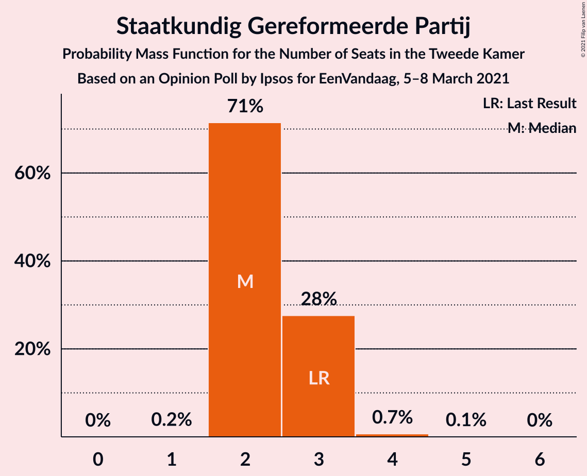

| Number of Seats | Probability | Accumulated | Special Marks |
|:---------------:|:-----------:|:-----------:|:-------------:|
| 1 | 0.2% | 100% |  |
| 2 | 71% | 99.8% | Median |
| 3 | 28% | 28% | Last Result |
| 4 | 0.7% | 0.8% |  |
| 5 | 0.1% | 0.1% |  |
| 6 | 0% | 0% |  |

### 50Plus

*For a full overview of the results for this party, see the [50Plus](party-50plus.html) page.*

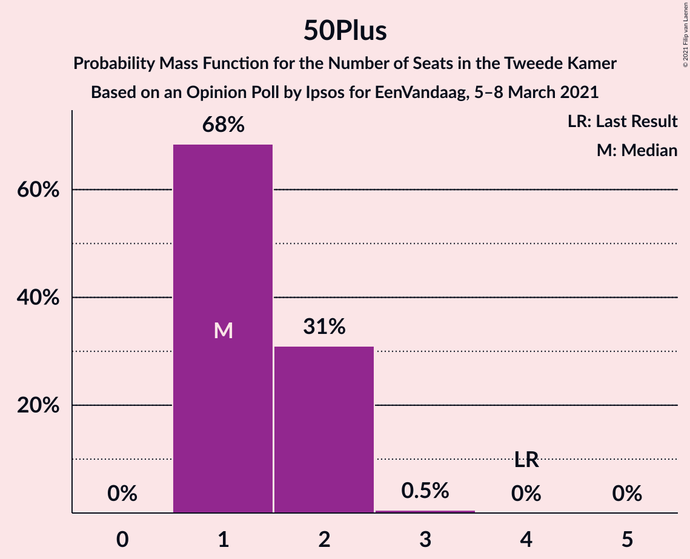

| Number of Seats | Probability | Accumulated | Special Marks |
|:---------------:|:-----------:|:-----------:|:-------------:|
| 1 | 68% | 100% | Median |
| 2 | 31% | 32% |  |
| 3 | 0.5% | 0.5% |  |
| 4 | 0% | 0% | Last Result |

### DENK

*For a full overview of the results for this party, see the [DENK](party-denk.html) page.*

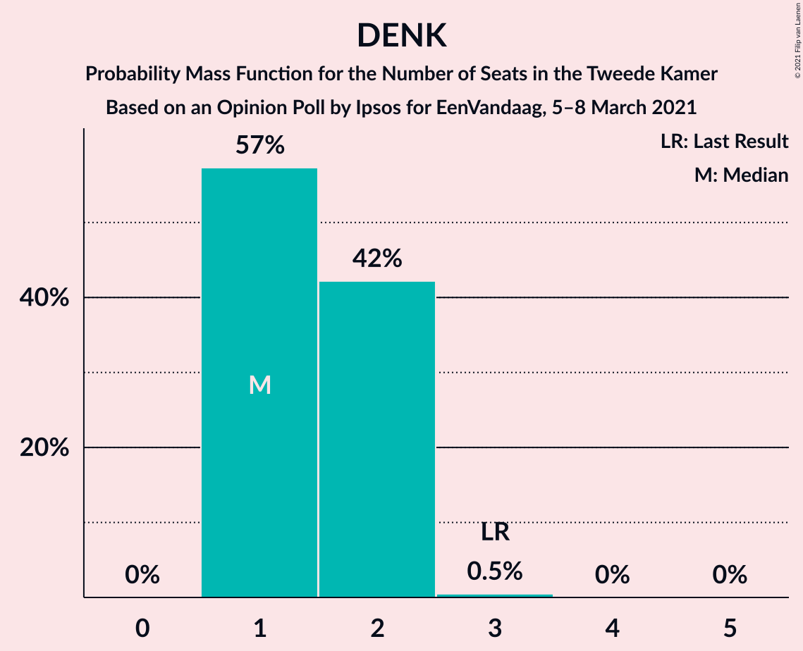

| Number of Seats | Probability | Accumulated | Special Marks |
|:---------------:|:-----------:|:-----------:|:-------------:|
| 1 | 57% | 100% | Median |
| 2 | 42% | 43% |  |
| 3 | 0.5% | 0.5% | Last Result |
| 4 | 0% | 0% |  |

### Juiste Antwoord 2021

*For a full overview of the results for this party, see the [Juiste Antwoord 2021](party-juisteantwoord2021.html) page.*

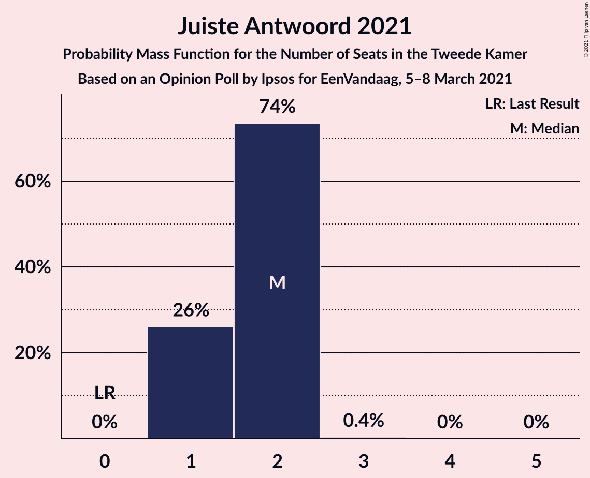

| Number of Seats | Probability | Accumulated | Special Marks |
|:---------------:|:-----------:|:-----------:|:-------------:|
| 0 | 0% | 100% | Last Result |
| 1 | 26% | 100% |  |
| 2 | 74% | 74% | Median |
| 3 | 0.4% | 0.4% |  |
| 4 | 0% | 0% |  |

### Volt Europa

*For a full overview of the results for this party, see the [Volt Europa](party-volteuropa.html) page.*

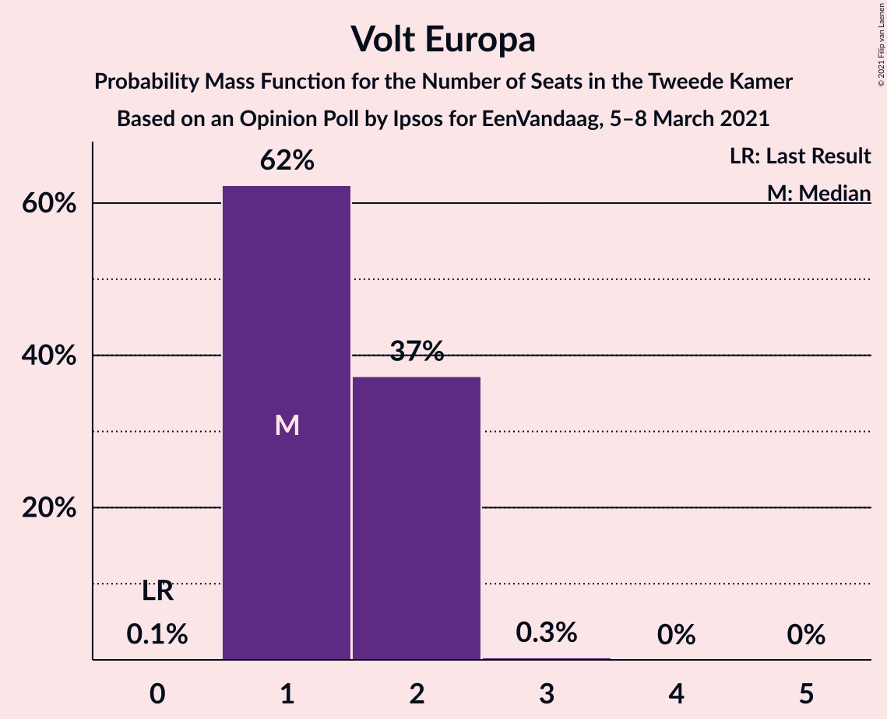

| Number of Seats | Probability | Accumulated | Special Marks |
|:---------------:|:-----------:|:-----------:|:-------------:|
| 0 | 0.1% | 100% | Last Result |
| 1 | 62% | 99.9% | Median |
| 2 | 37% | 38% |  |
| 3 | 0.3% | 0.3% |  |
| 4 | 0% | 0% |  |

## Coalitions

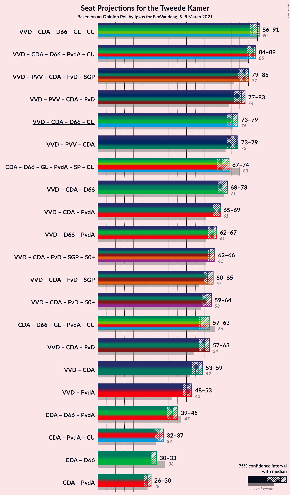

### Confidence Intervals

| Coalition | Last Result | Median | Majority? | 80% Confidence Interval | 90% Confidence Interval | 95% Confidence Interval | 99% Confidence Interval |
|:---------:|:-----------:|:------:|:---------:|:-----------------------:|:-----------------------:|:-----------------------:|:-----------------------:|
| Volkspartij voor Vrijheid en Democratie – Christen-Democratisch Appèl – Democraten 66 – GroenLinks – ChristenUnie | 90 | 87 | 100% | 86–90 | 86–91 | 86–91 | 82–92 |
| Volkspartij voor Vrijheid en Democratie – Christen-Democratisch Appèl – Democraten 66 – Partij van de Arbeid – ChristenUnie | 85 | 88 | 100% | 87–89 | 86–89 | 84–89 | 83–92 |
| Volkspartij voor Vrijheid en Democratie – Partij voor de Vrijheid – Christen-Democratisch Appèl – Forum voor Democratie – Staatkundig Gereformeerde Partij | 77 | 83 | 100% | 80–84 | 80–85 | 79–85 | 79–85 |
| Volkspartij voor Vrijheid en Democratie – Partij voor de Vrijheid – Christen-Democratisch Appèl – Forum voor Democratie | 74 | 81 | 99.9% | 77–82 | 77–83 | 77–83 | 77–83 |
| Volkspartij voor Vrijheid en Democratie – Christen-Democratisch Appèl – Democraten 66 – ChristenUnie | 76 | 76 | 83% | 74–79 | 74–79 | 73–79 | 71–81 |
| Volkspartij voor Vrijheid en Democratie – Partij voor de Vrijheid – Christen-Democratisch Appèl | 72 | 78 | 81% | 73–78 | 73–79 | 73–79 | 73–79 |
| Christen-Democratisch Appèl – Democraten 66 – GroenLinks – Partij van de Arbeid – Socialistische Partij – ChristenUnie | 80 | 70 | 0% | 67–71 | 67–72 | 67–74 | 67–74 |
| Volkspartij voor Vrijheid en Democratie – Christen-Democratisch Appèl – Democraten 66 | 71 | 70 | 0% | 68–73 | 68–73 | 68–73 | 65–73 |
| Volkspartij voor Vrijheid en Democratie – Christen-Democratisch Appèl – Partij van de Arbeid | 61 | 69 | 0% | 66–69 | 66–69 | 65–69 | 64–70 |
| Volkspartij voor Vrijheid en Democratie – Democraten 66 – Partij van de Arbeid | 61 | 65 | 0% | 63–67 | 62–67 | 62–67 | 60–67 |
| Volkspartij voor Vrijheid en Democratie – Christen-Democratisch Appèl – Forum voor Democratie – Staatkundig Gereformeerde Partij – 50Plus | 61 | 63 | 0% | 62–66 | 62–66 | 62–66 | 60–68 |
| Volkspartij voor Vrijheid en Democratie – Christen-Democratisch Appèl – Forum voor Democratie – Staatkundig Gereformeerde Partij | 57 | 62 | 0% | 60–65 | 60–65 | 60–65 | 59–66 |
| Volkspartij voor Vrijheid en Democratie – Christen-Democratisch Appèl – Forum voor Democratie – 50Plus | 58 | 61 | 0% | 59–64 | 59–64 | 59–64 | 58–65 |
| Christen-Democratisch Appèl – Democraten 66 – GroenLinks – Partij van de Arbeid – ChristenUnie | 66 | 58 | 0% | 57–62 | 57–62 | 57–63 | 57–63 |
| Volkspartij voor Vrijheid en Democratie – Christen-Democratisch Appèl – Forum voor Democratie | 54 | 60 | 0% | 57–63 | 57–63 | 57–63 | 56–64 |
| Volkspartij voor Vrijheid en Democratie – Christen-Democratisch Appèl | 52 | 57 | 0% | 53–59 | 53–59 | 53–59 | 52–59 |
| Volkspartij voor Vrijheid en Democratie – Partij van de Arbeid | 42 | 52 | 0% | 49–53 | 49–53 | 48–53 | 47–53 |
| Christen-Democratisch Appèl – Democraten 66 – Partij van de Arbeid | 47 | 42 | 0% | 40–43 | 40–44 | 39–45 | 39–45 |
| Christen-Democratisch Appèl – Partij van de Arbeid – ChristenUnie | 33 | 35 | 0% | 32–35 | 32–36 | 32–37 | 32–38 |
| Christen-Democratisch Appèl – Democraten 66 | 38 | 30 | 0% | 30–32 | 30–33 | 30–33 | 28–34 |
| Christen-Democratisch Appèl – Partij van de Arbeid | 28 | 28 | 0% | 26–29 | 26–30 | 26–30 | 26–31 |

### Volkspartij voor Vrijheid en Democratie – Christen-Democratisch Appèl – Democraten 66 – GroenLinks – ChristenUnie

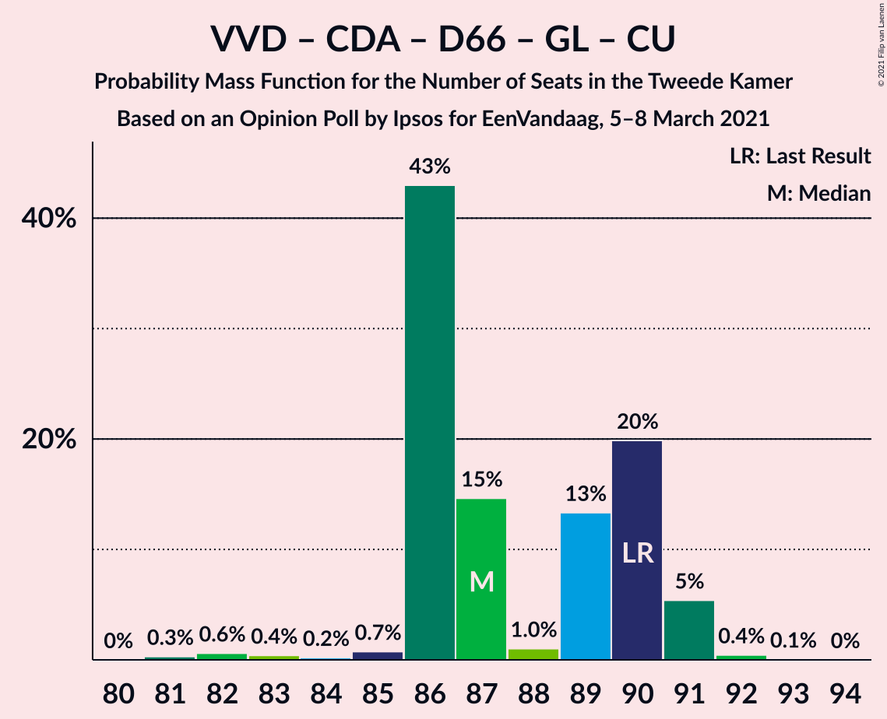

| Number of Seats | Probability | Accumulated | Special Marks |
|:---------------:|:-----------:|:-----------:|:-------------:|
| 81 | 0.3% | 100% |  |
| 82 | 0.6% | 99.7% |  |
| 83 | 0.4% | 99.1% |  |
| 84 | 0.2% | 98.7% |  |
| 85 | 0.7% | 98% |  |
| 86 | 43% | 98% |  |
| 87 | 15% | 55% |  |
| 88 | 1.0% | 40% | Median |
| 89 | 13% | 39% |  |
| 90 | 20% | 26% | Last Result |
| 91 | 5% | 6% |  |
| 92 | 0.4% | 0.5% |  |
| 93 | 0.1% | 0.1% |  |
| 94 | 0% | 0% |  |

### Volkspartij voor Vrijheid en Democratie – Christen-Democratisch Appèl – Democraten 66 – Partij van de Arbeid – ChristenUnie

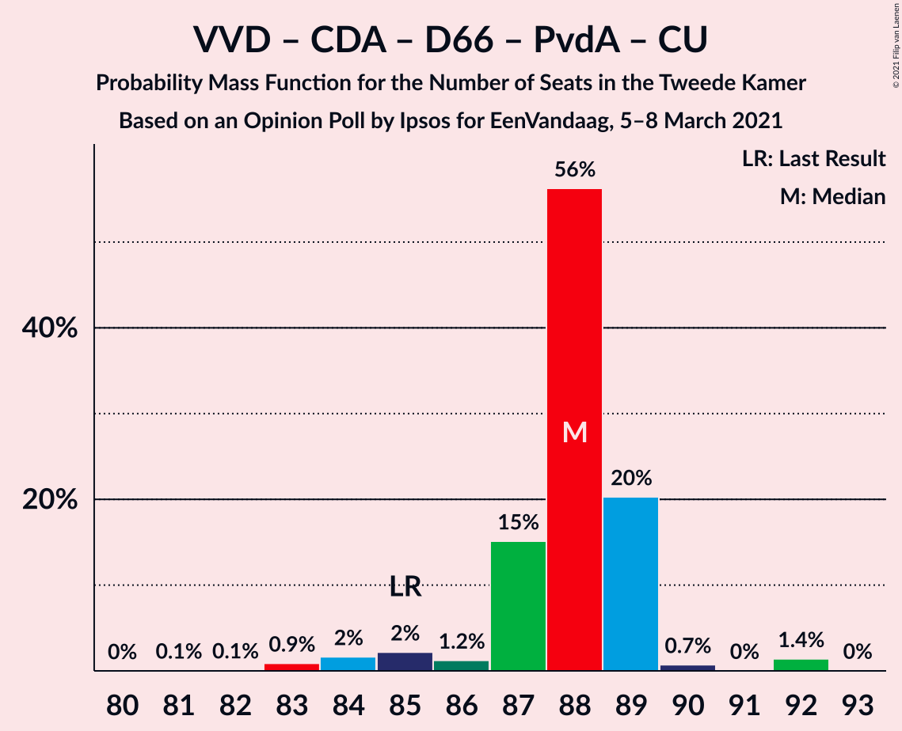

| Number of Seats | Probability | Accumulated | Special Marks |
|:---------------:|:-----------:|:-----------:|:-------------:|
| 81 | 0.1% | 100% |  |
| 82 | 0.1% | 99.9% |  |
| 83 | 0.9% | 99.8% |  |
| 84 | 2% | 98.9% |  |
| 85 | 2% | 97% | Last Result |
| 86 | 1.2% | 95% |  |
| 87 | 15% | 94% |  |
| 88 | 56% | 79% |  |
| 89 | 20% | 22% | Median |
| 90 | 0.7% | 2% |  |
| 91 | 0% | 1.5% |  |
| 92 | 1.4% | 1.4% |  |
| 93 | 0% | 0% |  |

### Volkspartij voor Vrijheid en Democratie – Partij voor de Vrijheid – Christen-Democratisch Appèl – Forum voor Democratie – Staatkundig Gereformeerde Partij

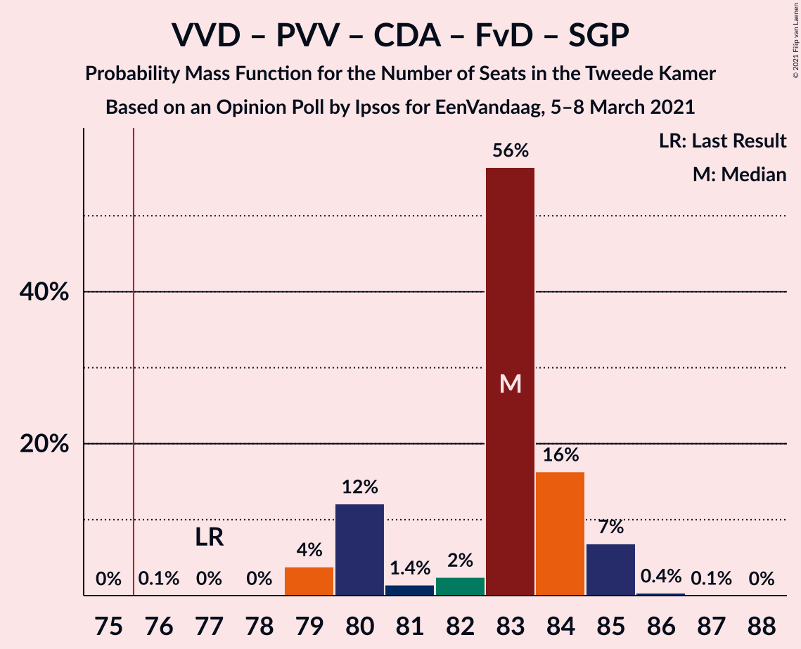

| Number of Seats | Probability | Accumulated | Special Marks |
|:---------------:|:-----------:|:-----------:|:-------------:|
| 76 | 0.1% | 100% | Majority |
| 77 | 0% | 99.9% | Last Result |
| 78 | 0% | 99.9% |  |
| 79 | 4% | 99.8% |  |
| 80 | 12% | 96% |  |
| 81 | 1.4% | 84% |  |
| 82 | 2% | 82% |  |
| 83 | 56% | 80% | Median |
| 84 | 16% | 24% |  |
| 85 | 7% | 7% |  |
| 86 | 0.4% | 0.5% |  |
| 87 | 0.1% | 0.1% |  |
| 88 | 0% | 0% |  |

### Volkspartij voor Vrijheid en Democratie – Partij voor de Vrijheid – Christen-Democratisch Appèl – Forum voor Democratie

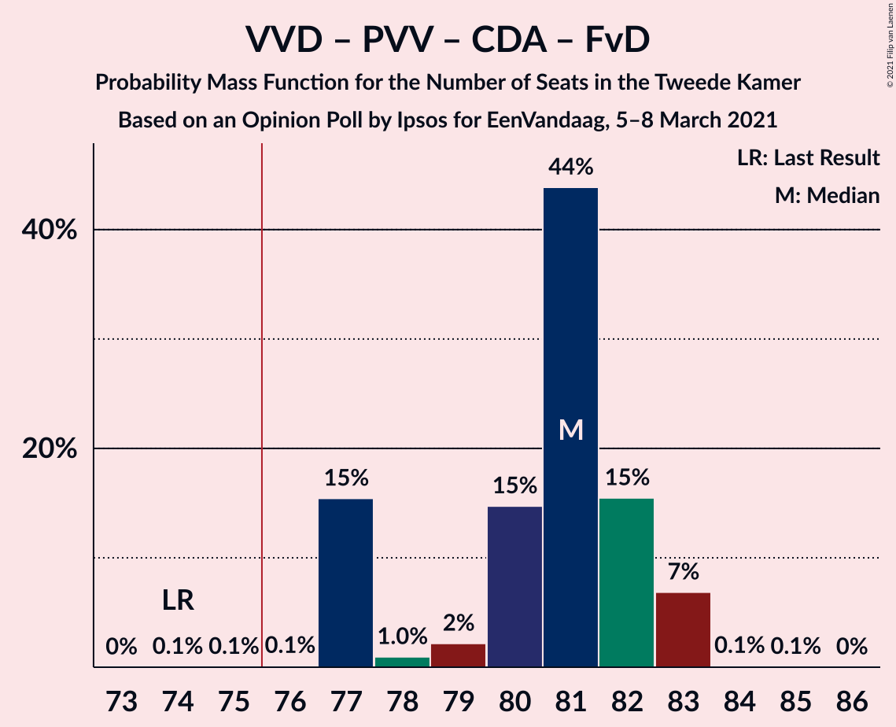

| Number of Seats | Probability | Accumulated | Special Marks |
|:---------------:|:-----------:|:-----------:|:-------------:|
| 74 | 0.1% | 100% | Last Result |
| 75 | 0.1% | 99.9% |  |
| 76 | 0.1% | 99.9% | Majority |
| 77 | 15% | 99.7% |  |
| 78 | 1.0% | 84% |  |
| 79 | 2% | 83% |  |
| 80 | 15% | 81% |  |
| 81 | 44% | 66% | Median |
| 82 | 15% | 23% |  |
| 83 | 7% | 7% |  |
| 84 | 0.1% | 0.2% |  |
| 85 | 0.1% | 0.1% |  |
| 86 | 0% | 0% |  |

### Volkspartij voor Vrijheid en Democratie – Christen-Democratisch Appèl – Democraten 66 – ChristenUnie

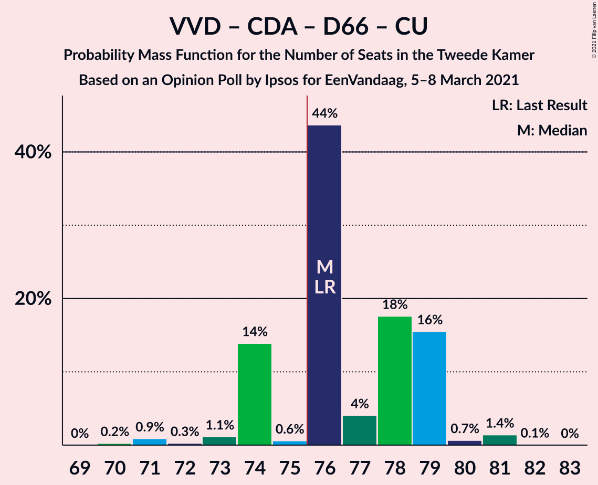

| Number of Seats | Probability | Accumulated | Special Marks |
|:---------------:|:-----------:|:-----------:|:-------------:|
| 70 | 0.2% | 100% |  |
| 71 | 0.9% | 99.7% |  |
| 72 | 0.3% | 98.9% |  |
| 73 | 1.1% | 98.6% |  |
| 74 | 14% | 97% |  |
| 75 | 0.6% | 84% |  |
| 76 | 44% | 83% | Last Result, Majority |
| 77 | 4% | 39% | Median |
| 78 | 18% | 35% |  |
| 79 | 16% | 18% |  |
| 80 | 0.7% | 2% |  |
| 81 | 1.4% | 1.5% |  |
| 82 | 0.1% | 0.1% |  |
| 83 | 0% | 0% |  |

### Volkspartij voor Vrijheid en Democratie – Partij voor de Vrijheid – Christen-Democratisch Appèl

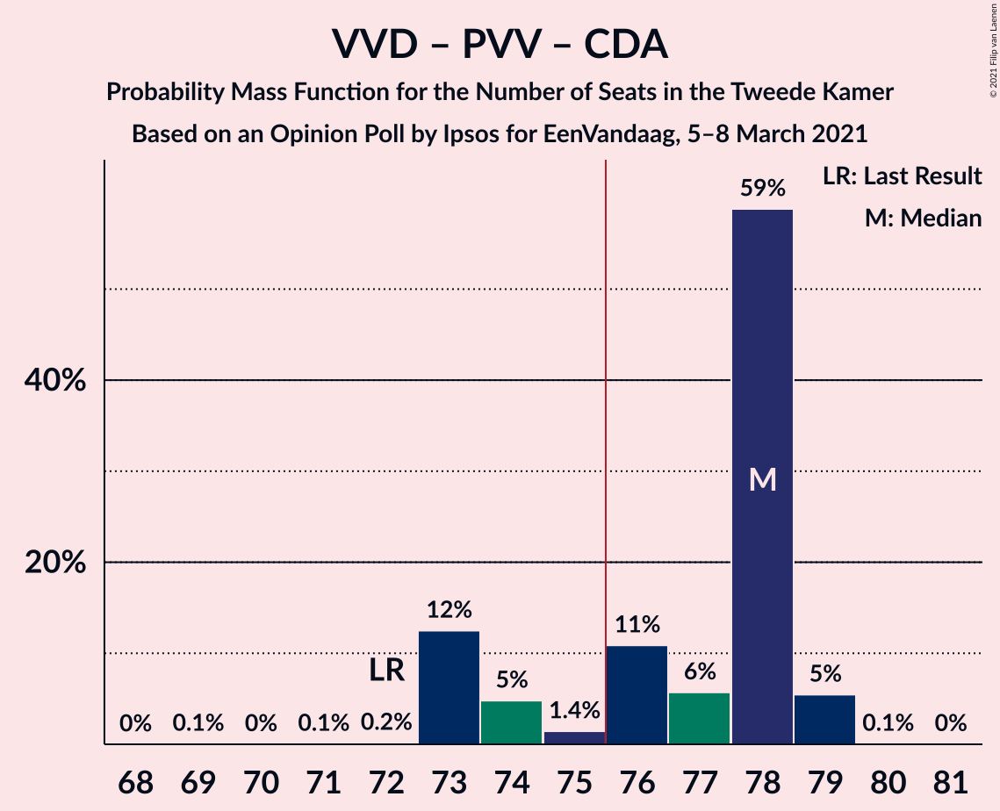

| Number of Seats | Probability | Accumulated | Special Marks |
|:---------------:|:-----------:|:-----------:|:-------------:|
| 69 | 0.1% | 100% |  |
| 70 | 0% | 99.9% |  |
| 71 | 0.1% | 99.9% |  |
| 72 | 0.2% | 99.9% | Last Result |
| 73 | 12% | 99.7% |  |
| 74 | 5% | 87% |  |
| 75 | 1.4% | 82% |  |
| 76 | 11% | 81% | Majority |
| 77 | 6% | 70% |  |
| 78 | 59% | 64% | Median |
| 79 | 5% | 6% |  |
| 80 | 0.1% | 0.1% |  |
| 81 | 0% | 0% |  |

### Christen-Democratisch Appèl – Democraten 66 – GroenLinks – Partij van de Arbeid – Socialistische Partij – ChristenUnie

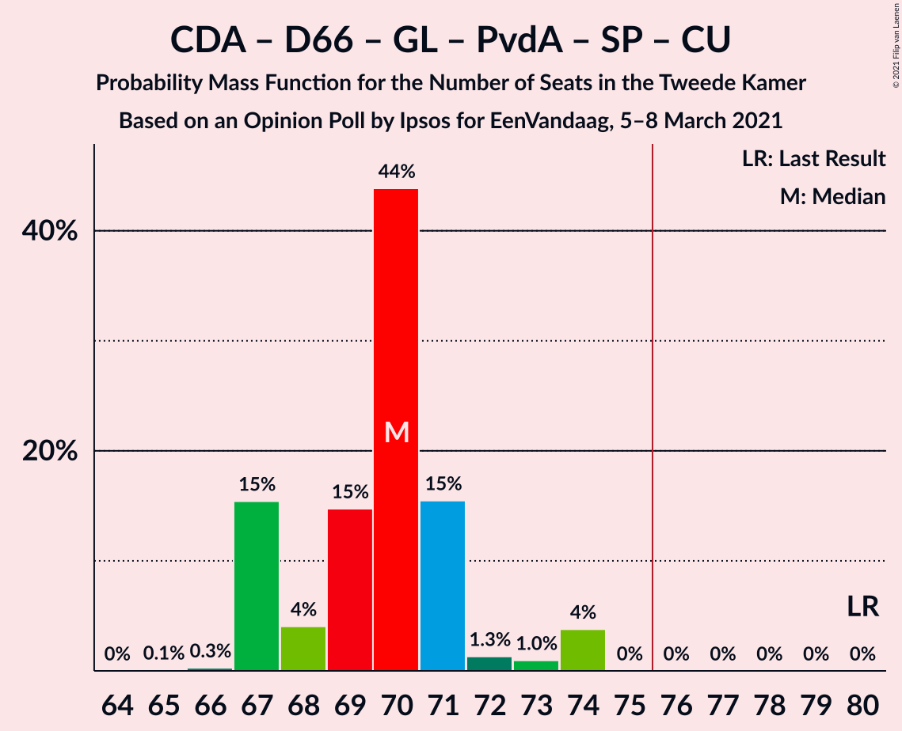

| Number of Seats | Probability | Accumulated | Special Marks |
|:---------------:|:-----------:|:-----------:|:-------------:|
| 65 | 0.1% | 100% |  |
| 66 | 0.3% | 99.9% |  |
| 67 | 15% | 99.6% |  |
| 68 | 4% | 84% |  |
| 69 | 15% | 80% |  |
| 70 | 44% | 65% | Median |
| 71 | 15% | 22% |  |
| 72 | 1.3% | 6% |  |
| 73 | 1.0% | 5% |  |
| 74 | 4% | 4% |  |
| 75 | 0% | 0% |  |
| 76 | 0% | 0% | Majority |
| 77 | 0% | 0% |  |
| 78 | 0% | 0% |  |
| 79 | 0% | 0% |  |
| 80 | 0% | 0% | Last Result |

### Volkspartij voor Vrijheid en Democratie – Christen-Democratisch Appèl – Democraten 66

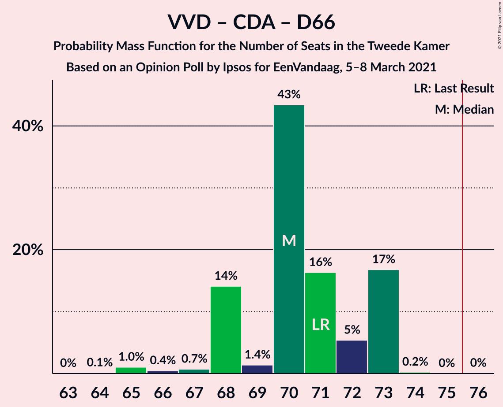

| Number of Seats | Probability | Accumulated | Special Marks |
|:---------------:|:-----------:|:-----------:|:-------------:|
| 64 | 0.1% | 100% |  |
| 65 | 1.0% | 99.9% |  |
| 66 | 0.4% | 98.8% |  |
| 67 | 0.7% | 98% |  |
| 68 | 14% | 98% |  |
| 69 | 1.4% | 84% |  |
| 70 | 43% | 82% |  |
| 71 | 16% | 39% | Last Result, Median |
| 72 | 5% | 22% |  |
| 73 | 17% | 17% |  |
| 74 | 0.2% | 0.3% |  |
| 75 | 0% | 0.1% |  |
| 76 | 0% | 0% | Majority |

### Volkspartij voor Vrijheid en Democratie – Christen-Democratisch Appèl – Partij van de Arbeid

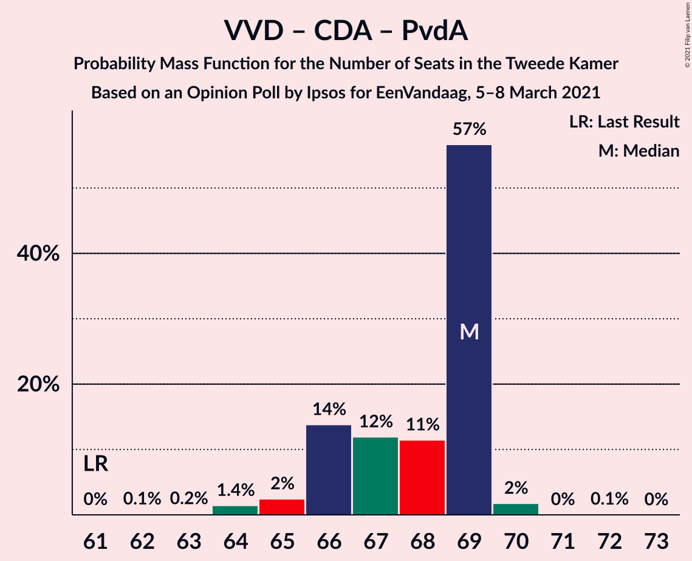

| Number of Seats | Probability | Accumulated | Special Marks |
|:---------------:|:-----------:|:-----------:|:-------------:|
| 61 | 0% | 100% | Last Result |
| 62 | 0.1% | 99.9% |  |
| 63 | 0.2% | 99.8% |  |
| 64 | 1.4% | 99.6% |  |
| 65 | 2% | 98% |  |
| 66 | 14% | 96% |  |
| 67 | 12% | 82% |  |
| 68 | 11% | 70% |  |
| 69 | 57% | 59% | Median |
| 70 | 2% | 2% |  |
| 71 | 0% | 0.2% |  |
| 72 | 0.1% | 0.1% |  |
| 73 | 0% | 0% |  |

### Volkspartij voor Vrijheid en Democratie – Democraten 66 – Partij van de Arbeid

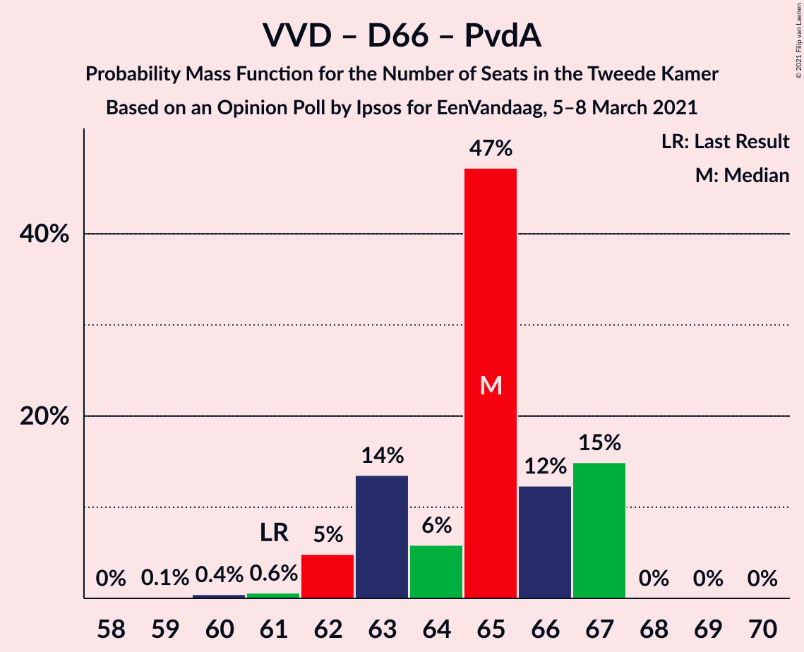

| Number of Seats | Probability | Accumulated | Special Marks |
|:---------------:|:-----------:|:-----------:|:-------------:|
| 59 | 0.1% | 100% |  |
| 60 | 0.4% | 99.8% |  |
| 61 | 0.6% | 99.4% | Last Result |
| 62 | 5% | 98.8% |  |
| 63 | 14% | 94% |  |
| 64 | 6% | 80% |  |
| 65 | 47% | 75% |  |
| 66 | 12% | 27% | Median |
| 67 | 15% | 15% |  |
| 68 | 0% | 0.1% |  |
| 69 | 0% | 0.1% |  |
| 70 | 0% | 0% |  |

### Volkspartij voor Vrijheid en Democratie – Christen-Democratisch Appèl – Forum voor Democratie – Staatkundig Gereformeerde Partij – 50Plus

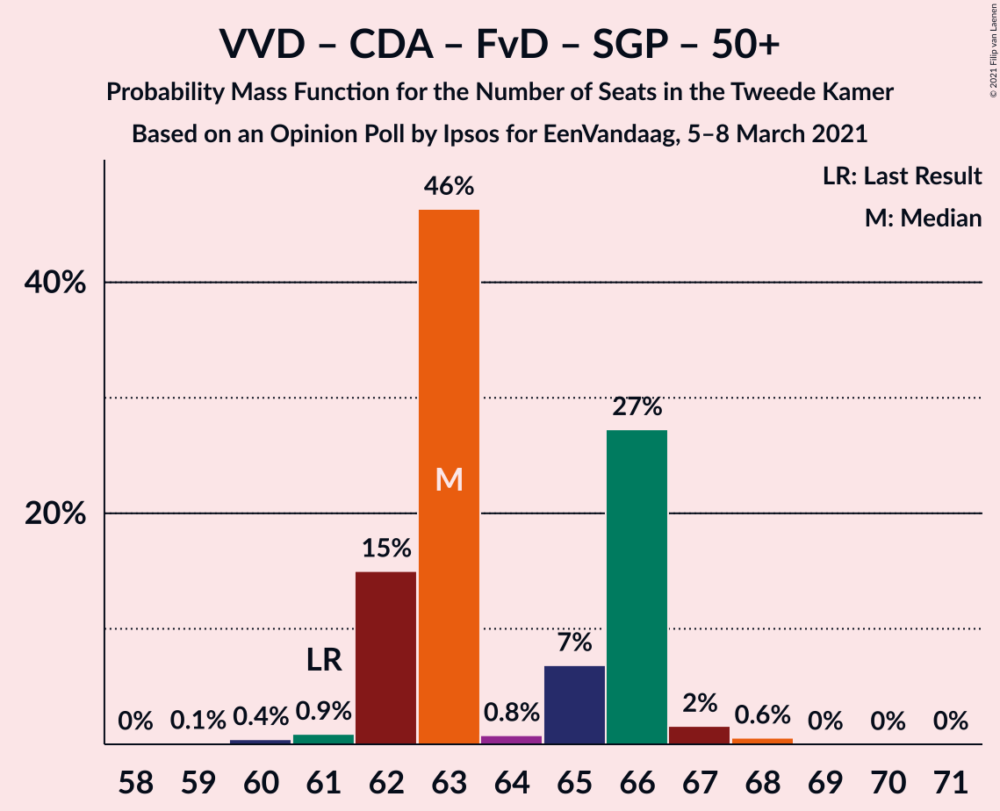

| Number of Seats | Probability | Accumulated | Special Marks |
|:---------------:|:-----------:|:-----------:|:-------------:|
| 59 | 0.1% | 100% |  |
| 60 | 0.4% | 99.9% |  |
| 61 | 0.9% | 99.4% | Last Result |
| 62 | 15% | 98.5% |  |
| 63 | 46% | 84% | Median |
| 64 | 0.8% | 37% |  |
| 65 | 7% | 36% |  |
| 66 | 27% | 30% |  |
| 67 | 2% | 2% |  |
| 68 | 0.6% | 0.7% |  |
| 69 | 0% | 0.1% |  |
| 70 | 0% | 0.1% |  |
| 71 | 0% | 0% |  |

### Volkspartij voor Vrijheid en Democratie – Christen-Democratisch Appèl – Forum voor Democratie – Staatkundig Gereformeerde Partij

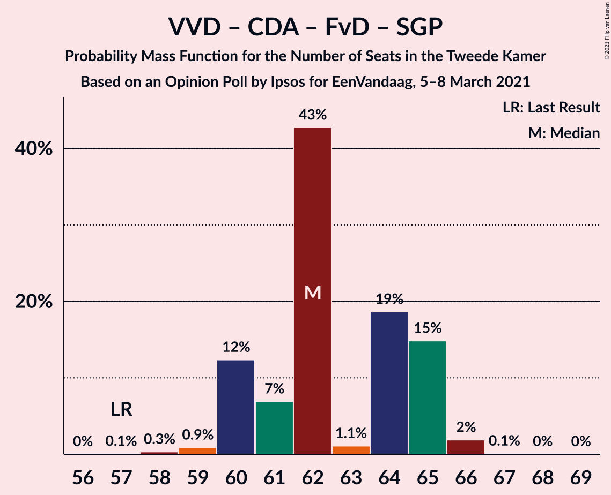

| Number of Seats | Probability | Accumulated | Special Marks |
|:---------------:|:-----------:|:-----------:|:-------------:|
| 57 | 0.1% | 100% | Last Result |
| 58 | 0.3% | 99.9% |  |
| 59 | 0.9% | 99.6% |  |
| 60 | 12% | 98.7% |  |
| 61 | 7% | 86% |  |
| 62 | 43% | 79% | Median |
| 63 | 1.1% | 37% |  |
| 64 | 19% | 36% |  |
| 65 | 15% | 17% |  |
| 66 | 2% | 2% |  |
| 67 | 0.1% | 0.2% |  |
| 68 | 0% | 0.1% |  |
| 69 | 0% | 0% |  |

### Volkspartij voor Vrijheid en Democratie – Christen-Democratisch Appèl – Forum voor Democratie – 50Plus

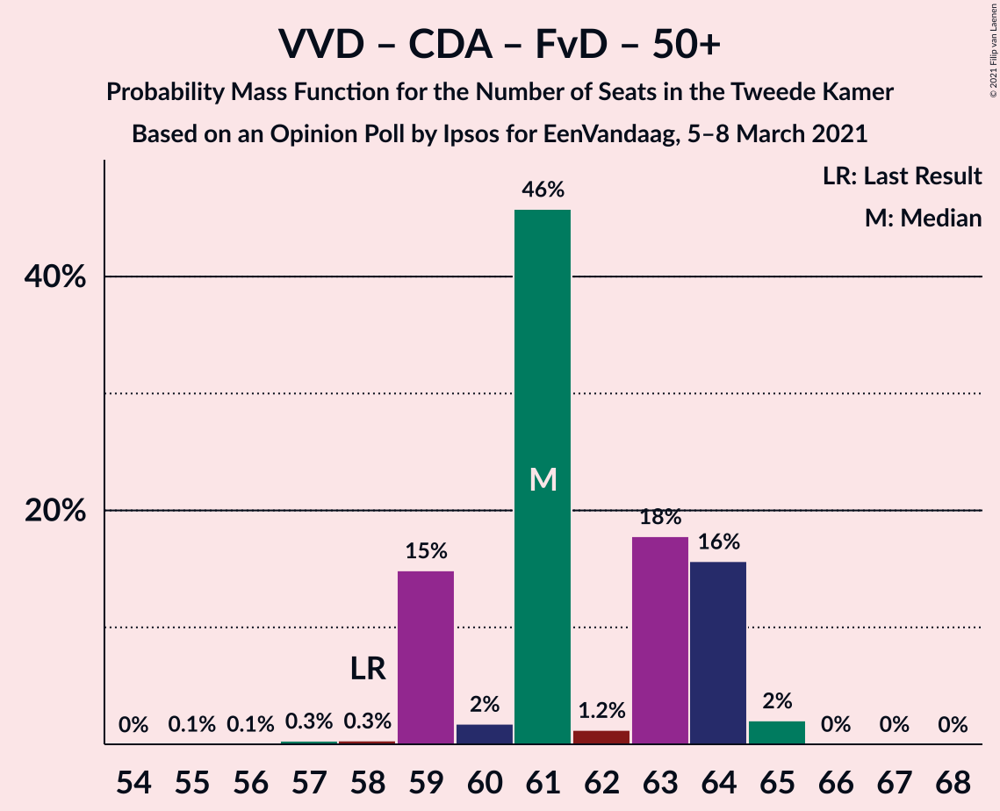

| Number of Seats | Probability | Accumulated | Special Marks |
|:---------------:|:-----------:|:-----------:|:-------------:|
| 55 | 0.1% | 100% |  |
| 56 | 0.1% | 99.9% |  |
| 57 | 0.3% | 99.9% |  |
| 58 | 0.3% | 99.6% | Last Result |
| 59 | 15% | 99.3% |  |
| 60 | 2% | 84% |  |
| 61 | 46% | 83% | Median |
| 62 | 1.2% | 37% |  |
| 63 | 18% | 36% |  |
| 64 | 16% | 18% |  |
| 65 | 2% | 2% |  |
| 66 | 0% | 0.1% |  |
| 67 | 0% | 0.1% |  |
| 68 | 0% | 0% |  |

### Christen-Democratisch Appèl – Democraten 66 – GroenLinks – Partij van de Arbeid – ChristenUnie

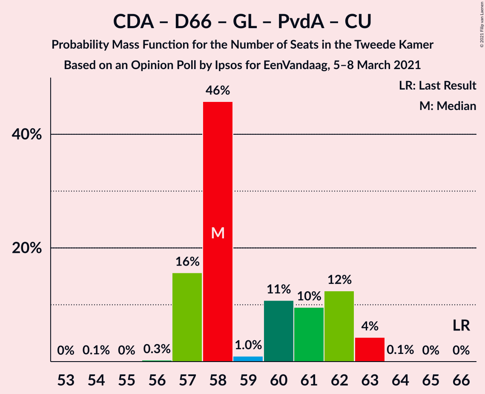

| Number of Seats | Probability | Accumulated | Special Marks |
|:---------------:|:-----------:|:-----------:|:-------------:|
| 54 | 0.1% | 100% |  |
| 55 | 0% | 99.9% |  |
| 56 | 0.3% | 99.9% |  |
| 57 | 16% | 99.6% |  |
| 58 | 46% | 84% |  |
| 59 | 1.0% | 38% |  |
| 60 | 11% | 37% | Median |
| 61 | 10% | 26% |  |
| 62 | 12% | 17% |  |
| 63 | 4% | 4% |  |
| 64 | 0.1% | 0.2% |  |
| 65 | 0% | 0.1% |  |
| 66 | 0% | 0% | Last Result |

### Volkspartij voor Vrijheid en Democratie – Christen-Democratisch Appèl – Forum voor Democratie

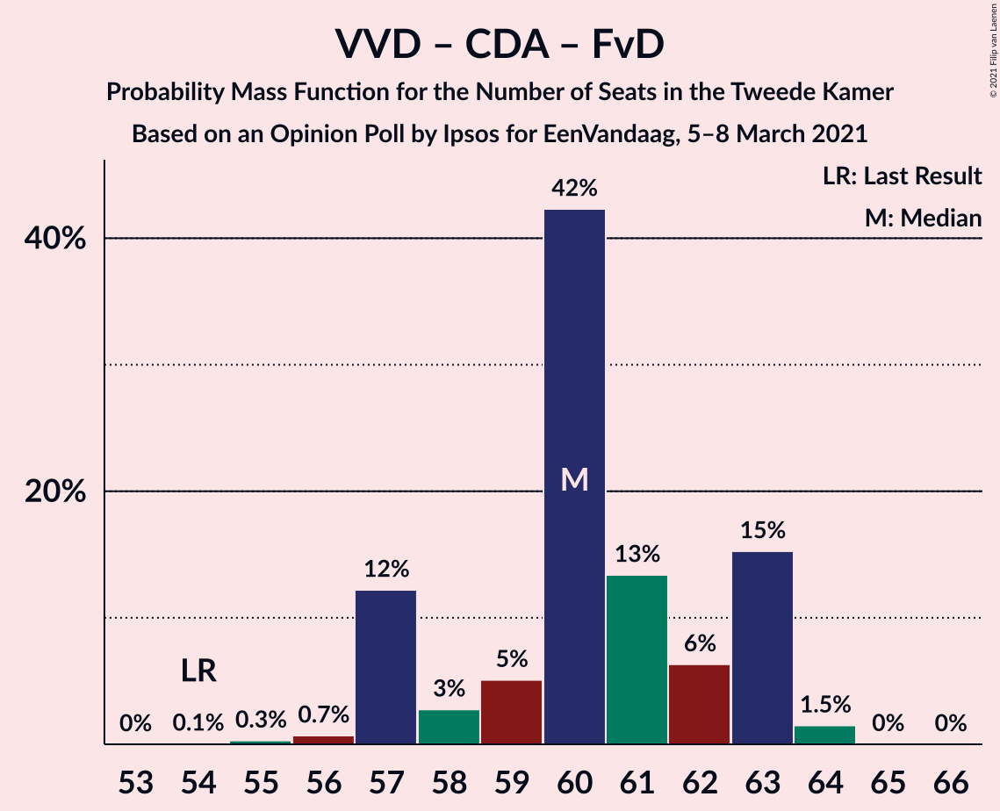

| Number of Seats | Probability | Accumulated | Special Marks |
|:---------------:|:-----------:|:-----------:|:-------------:|
| 54 | 0.1% | 100% | Last Result |
| 55 | 0.3% | 99.9% |  |
| 56 | 0.7% | 99.6% |  |
| 57 | 12% | 98.9% |  |
| 58 | 3% | 87% |  |
| 59 | 5% | 84% |  |
| 60 | 42% | 79% | Median |
| 61 | 13% | 37% |  |
| 62 | 6% | 23% |  |
| 63 | 15% | 17% |  |
| 64 | 1.5% | 2% |  |
| 65 | 0% | 0.1% |  |
| 66 | 0% | 0% |  |

### Volkspartij voor Vrijheid en Democratie – Christen-Democratisch Appèl

| Number of Seats | Probability | Accumulated | Special Marks |
|:---------------:|:-----------:|:-----------:|:-------------:|
| 50 | 0.1% | 100% |  |
| 51 | 0.3% | 99.9% |  |
| 52 | 0.8% | 99.6% | Last Result |
| 53 | 12% | 98.8% |  |
| 54 | 3% | 87% |  |
| 55 | 1.1% | 84% |  |
| 56 | 6% | 83% |  |
| 57 | 51% | 77% | Median |
| 58 | 9% | 26% |  |
| 59 | 17% | 17% |  |
| 60 | 0% | 0.1% |  |
| 61 | 0% | 0.1% |  |
| 62 | 0% | 0% |  |

### Volkspartij voor Vrijheid en Democratie – Partij van de Arbeid

| Number of Seats | Probability | Accumulated | Special Marks |
|:---------------:|:-----------:|:-----------:|:-------------:|
| 42 | 0% | 100% | Last Result |
| 43 | 0% | 100% |  |
| 44 | 0% | 100% |  |
| 45 | 0% | 100% |  |
| 46 | 0.2% | 99.9% |  |
| 47 | 0.7% | 99.7% |  |
| 48 | 4% | 99.0% |  |
| 49 | 10% | 95% |  |
| 50 | 14% | 85% |  |
| 51 | 14% | 71% |  |
| 52 | 42% | 57% | Median |
| 53 | 15% | 15% |  |
| 54 | 0% | 0.1% |  |
| 55 | 0% | 0.1% |  |
| 56 | 0% | 0.1% |  |
| 57 | 0% | 0.1% |  |
| 58 | 0% | 0% |  |

### Christen-Democratisch Appèl – Democraten 66 – Partij van de Arbeid

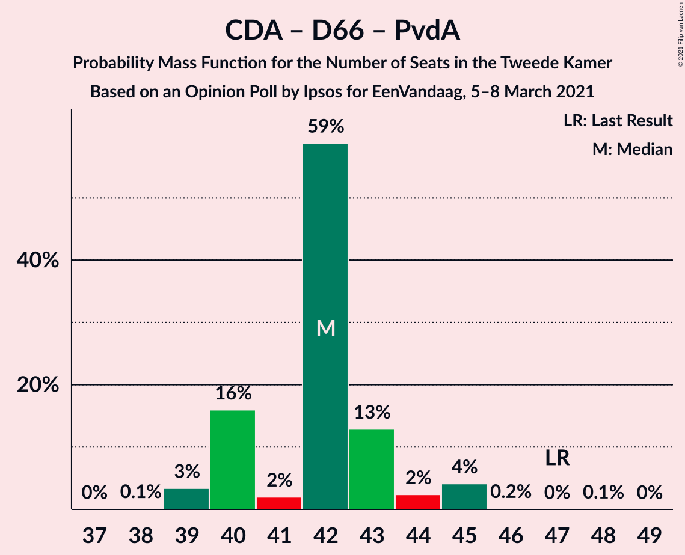

| Number of Seats | Probability | Accumulated | Special Marks |
|:---------------:|:-----------:|:-----------:|:-------------:|
| 38 | 0.1% | 100% |  |
| 39 | 3% | 99.8% |  |
| 40 | 16% | 96% |  |
| 41 | 2% | 80% |  |
| 42 | 59% | 78% |  |
| 43 | 13% | 20% | Median |
| 44 | 2% | 7% |  |
| 45 | 4% | 4% |  |
| 46 | 0.2% | 0.3% |  |
| 47 | 0% | 0.1% | Last Result |
| 48 | 0.1% | 0.1% |  |
| 49 | 0% | 0% |  |

### Christen-Democratisch Appèl – Partij van de Arbeid – ChristenUnie

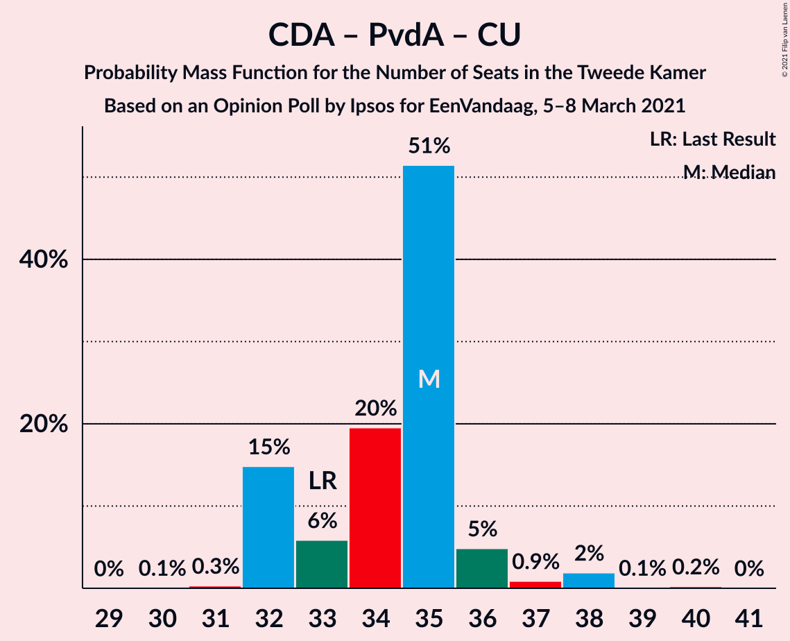

| Number of Seats | Probability | Accumulated | Special Marks |
|:---------------:|:-----------:|:-----------:|:-------------:|
| 30 | 0.1% | 100% |  |
| 31 | 0.3% | 99.9% |  |
| 32 | 15% | 99.6% |  |
| 33 | 6% | 85% | Last Result |
| 34 | 20% | 79% |  |
| 35 | 51% | 59% | Median |
| 36 | 5% | 8% |  |
| 37 | 0.9% | 3% |  |
| 38 | 2% | 2% |  |
| 39 | 0.1% | 0.3% |  |
| 40 | 0.2% | 0.3% |  |
| 41 | 0% | 0% |  |

### Christen-Democratisch Appèl – Democraten 66

| Number of Seats | Probability | Accumulated | Special Marks |
|:---------------:|:-----------:|:-----------:|:-------------:|
| 27 | 0.3% | 100% |  |
| 28 | 1.1% | 99.7% |  |
| 29 | 0.4% | 98.6% |  |
| 30 | 73% | 98% |  |
| 31 | 3% | 25% | Median |
| 32 | 16% | 22% |  |
| 33 | 6% | 7% |  |
| 34 | 0.8% | 0.8% |  |
| 35 | 0.1% | 0.1% |  |
| 36 | 0% | 0% |  |
| 37 | 0% | 0% |  |
| 38 | 0% | 0% | Last Result |

### Christen-Democratisch Appèl – Partij van de Arbeid

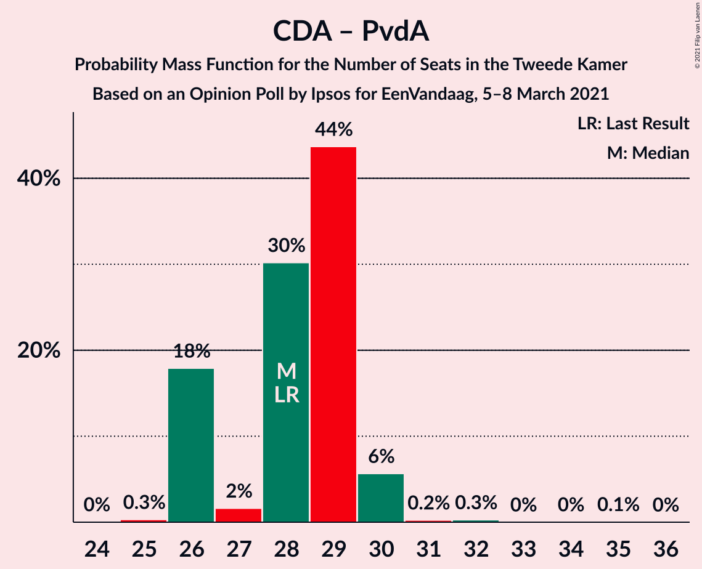

| Number of Seats | Probability | Accumulated | Special Marks |
|:---------------:|:-----------:|:-----------:|:-------------:|
| 25 | 0.3% | 100% |  |
| 26 | 18% | 99.7% |  |
| 27 | 2% | 82% |  |
| 28 | 30% | 80% | Last Result |
| 29 | 44% | 50% | Median |
| 30 | 6% | 6% |  |
| 31 | 0.2% | 0.6% |  |
| 32 | 0.3% | 0.4% |  |
| 33 | 0% | 0.1% |  |
| 34 | 0% | 0.1% |  |
| 35 | 0.1% | 0.1% |  |
| 36 | 0% | 0% |  |

## Technical Information

### Opinion Poll

+ **Polling firm:** Ipsos
+ **Commissioner(s):** EenVandaag
+ **Fieldwork period:** 5–8 March 2021

### Calculations

+ **Sample size:** 2006
+ **Simulations done:** 1,048,576
+ **Error estimate:** 1.60%

