# Opinion Poll by Kantar Public, 6–8 March 2021

<a href="#voting-intentions">Voting Intentions</a> | <a href="#seats">Seats</a> | <a href="#coalitions">Coalitions</a> | <a href="#technical-information">Technical Information</a>

## Voting Intentions

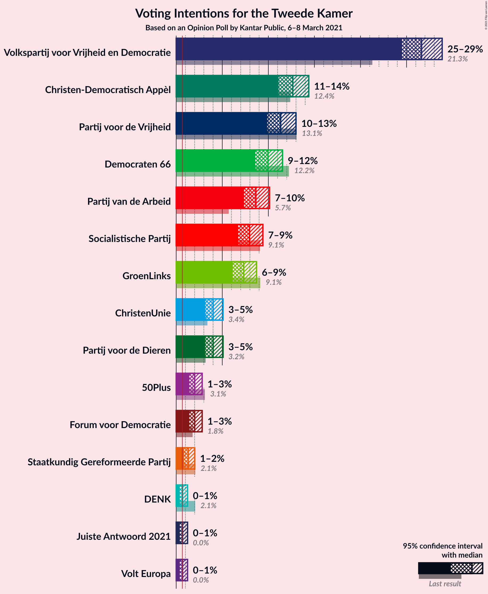

### Confidence Intervals

| Party | Last Result | Poll Result | 80% Confidence Interval | 90% Confidence Interval | 95% Confidence Interval | 99% Confidence Interval |
|:-----:|:-----------:|:-----------:|:-----------------------:|:-----------------------:|:-----------------------:|:-----------------------:|
| Volkspartij voor Vrijheid en Democratie | 21.3% | 26.6% | 25.2–28.1% |24.8–28.5% |24.5–28.9% |23.9–29.6% |
| Christen-Democratisch Appèl | 12.4% | 12.7% | 11.6–13.8% |11.4–14.1% |11.1–14.4% |10.6–14.9% |
| Partij voor de Vrijheid | 13.1% | 11.3% | 10.4–12.4% |10.1–12.7% |9.9–13.0% |9.4–13.5% |
| Democraten 66 | 12.2% | 10.0% | 9.1–11.0% |8.8–11.3% |8.6–11.5% |8.2–12.0% |
| Partij van de Arbeid | 5.7% | 8.6% | 7.8–9.6% |7.6–9.9% |7.4–10.1% |7.0–10.6% |
| Socialistische Partij | 9.1% | 8.0% | 7.1–8.9% |6.9–9.2% |6.7–9.4% |6.4–9.9% |
| GroenLinks | 9.1% | 7.3% | 6.6–8.2% |6.3–8.5% |6.1–8.7% |5.8–9.2% |
| ChristenUnie | 3.4% | 4.0% | 3.4–4.7% |3.3–4.9% |3.2–5.1% |2.9–5.5% |
| Partij voor de Dieren | 3.2% | 4.0% | 3.4–4.7% |3.3–4.9% |3.2–5.1% |2.9–5.5% |
| 50Plus | 3.1% | 2.0% | 1.6–2.5% |1.5–2.7% |1.4–2.8% |1.2–3.1% |
| Forum voor Democratie | 1.8% | 2.0% | 1.6–2.5% |1.5–2.7% |1.4–2.8% |1.2–3.1% |
| Staatkundig Gereformeerde Partij | 2.1% | 1.3% | 1.0–1.8% |0.9–1.9% |0.9–2.0% |0.7–2.2% |
| DENK | 2.1% | 0.7% | 0.5–1.1% |0.4–1.1% |0.4–1.2% |0.3–1.4% |
| Juiste Antwoord 2021 | 0.0% | 0.7% | 0.5–1.1% |0.4–1.1% |0.4–1.2% |0.3–1.4% |
| Volt Europa | 0.0% | 0.7% | 0.5–1.1% |0.4–1.1% |0.4–1.2% |0.3–1.4% |

*Note:* The poll result column reflects the actual value used in the calculations. Published results may vary slightly, and in addition be rounded to fewer digits.

## Seats

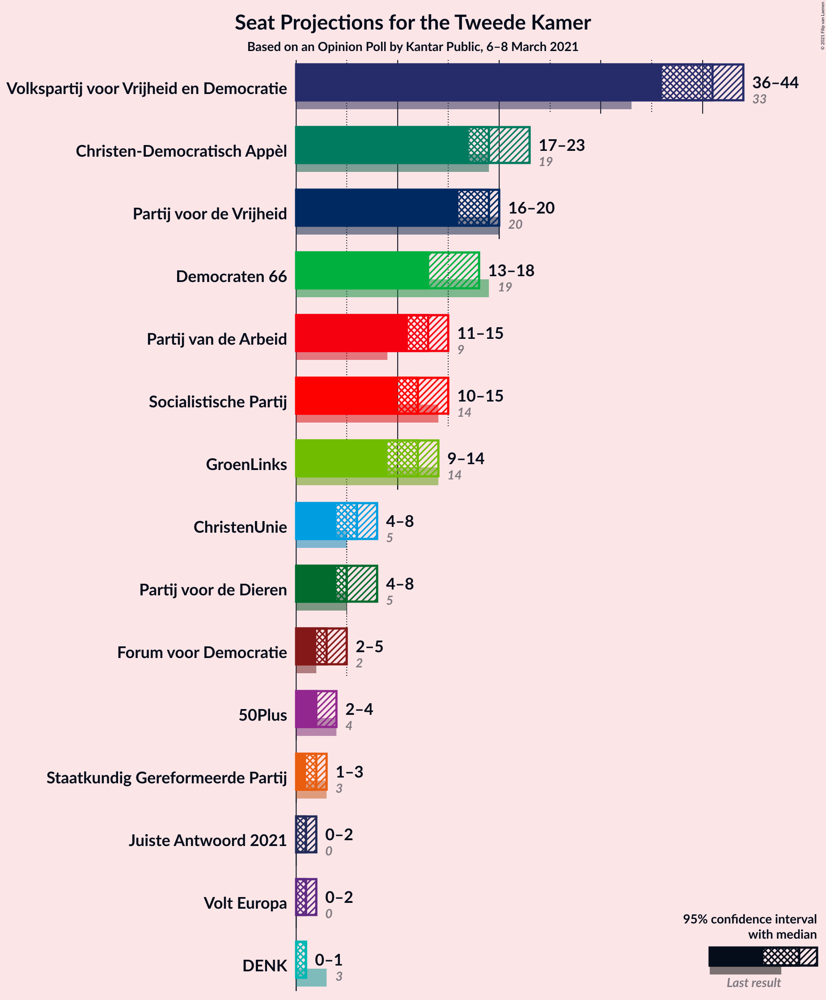

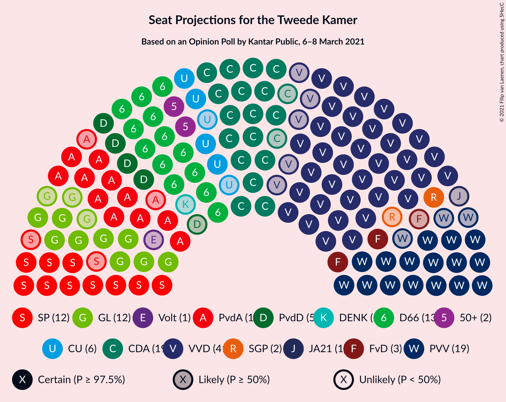

### Confidence Intervals

| Party | Last Result | Median | 80% Confidence Interval | 90% Confidence Interval | 95% Confidence Interval | 99% Confidence Interval |
|:-----:|:-----------:|:------:|:-----------------------:|:-----------------------:|:-----------------------:|:-----------------------:|
| <a href="#volkspartij-voor-vrijheid-en-democratie">Volkspartij voor Vrijheid en Democratie</a> | 33 | 41 | 38–43 |37–43 |36–44 |36–47 |
| <a href="#christen-democratisch-appèl">Christen-Democratisch Appèl</a> | 19 | 19 | 18–22 |17–23 |17–23 |16–23 |
| <a href="#partij-voor-de-vrijheid">Partij voor de Vrijheid</a> | 20 | 19 | 16–19 |16–19 |16–20 |15–21 |
| <a href="#democraten-66">Democraten 66</a> | 19 | 13 | 13–16 |13–17 |13–18 |12–18 |
| <a href="#partij-van-de-arbeid">Partij van de Arbeid</a> | 9 | 13 | 11–14 |11–15 |11–15 |9–16 |
| <a href="#socialistische-partij">Socialistische Partij</a> | 14 | 12 | 11–14 |10–14 |10–15 |9–15 |
| <a href="#groenlinks">GroenLinks</a> | 14 | 12 | 9–14 |9–14 |9–14 |9–15 |
| <a href="#christenunie">ChristenUnie</a> | 5 | 6 | 5–7 |4–8 |4–8 |4–8 |
| <a href="#partij-voor-de-dieren">Partij voor de Dieren</a> | 5 | 5 | 4–7 |4–8 |4–8 |4–8 |
| <a href="#50plus">50Plus</a> | 4 | 2 | 2–3 |2–4 |2–4 |2–4 |
| <a href="#forum-voor-democratie">Forum voor Democratie</a> | 2 | 3 | 2–4 |2–4 |2–5 |1–5 |
| <a href="#staatkundig-gereformeerde-partij">Staatkundig Gereformeerde Partij</a> | 3 | 2 | 1–3 |1–3 |1–3 |1–4 |
| <a href="#denk">DENK</a> | 3 | 1 | 0–1 |0–1 |0–1 |0–2 |
| <a href="#juiste-antwoord-2021">Juiste Antwoord 2021</a> | 0 | 1 | 0–1 |0–1 |0–2 |0–2 |
| <a href="#volt-europa">Volt Europa</a> | 0 | 1 | 0–1 |0–2 |0–2 |0–2 |

### Volkspartij voor Vrijheid en Democratie

*For a full overview of the results for this party, see the [Volkspartij voor Vrijheid en Democratie](party-volkspartijvoorvrijheidendemocratie.html) page.*

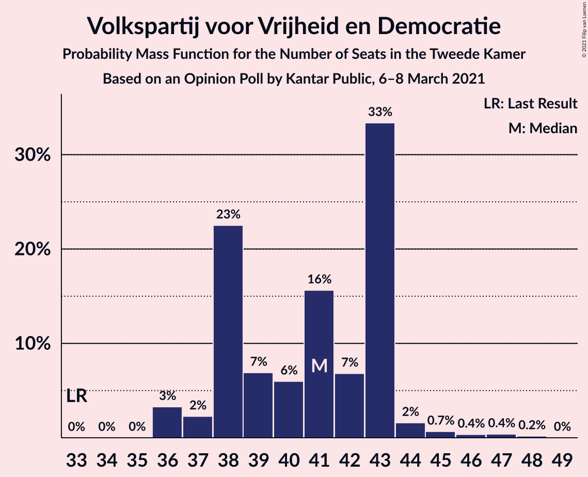

| Number of Seats | Probability | Accumulated | Special Marks |
|:---------------:|:-----------:|:-----------:|:-------------:|
| 33 | 0% | 100% | Last Result |
| 34 | 0% | 100% |  |
| 35 | 0% | 100% |  |
| 36 | 3% | 100% |  |
| 37 | 2% | 97% |  |
| 38 | 23% | 94% |  |
| 39 | 7% | 72% |  |
| 40 | 6% | 65% |  |
| 41 | 16% | 59% | Median |
| 42 | 7% | 43% |  |
| 43 | 33% | 37% |  |
| 44 | 2% | 3% |  |
| 45 | 0.7% | 2% |  |
| 46 | 0.4% | 0.9% |  |
| 47 | 0.4% | 0.6% |  |
| 48 | 0.2% | 0.2% |  |
| 49 | 0% | 0% |  |

### Christen-Democratisch Appèl

*For a full overview of the results for this party, see the [Christen-Democratisch Appèl](party-christen-democratischappèl.html) page.*

| Number of Seats | Probability | Accumulated | Special Marks |
|:---------------:|:-----------:|:-----------:|:-------------:|
| 14 | 0.1% | 100% |  |
| 15 | 0% | 99.9% |  |
| 16 | 0.7% | 99.9% |  |
| 17 | 5% | 99.3% |  |
| 18 | 9% | 95% |  |
| 19 | 42% | 86% | Last Result, Median |
| 20 | 10% | 44% |  |
| 21 | 21% | 34% |  |
| 22 | 6% | 13% |  |
| 23 | 7% | 7% |  |
| 24 | 0% | 0% |  |

### Partij voor de Vrijheid

*For a full overview of the results for this party, see the [Partij voor de Vrijheid](party-partijvoordevrijheid.html) page.*

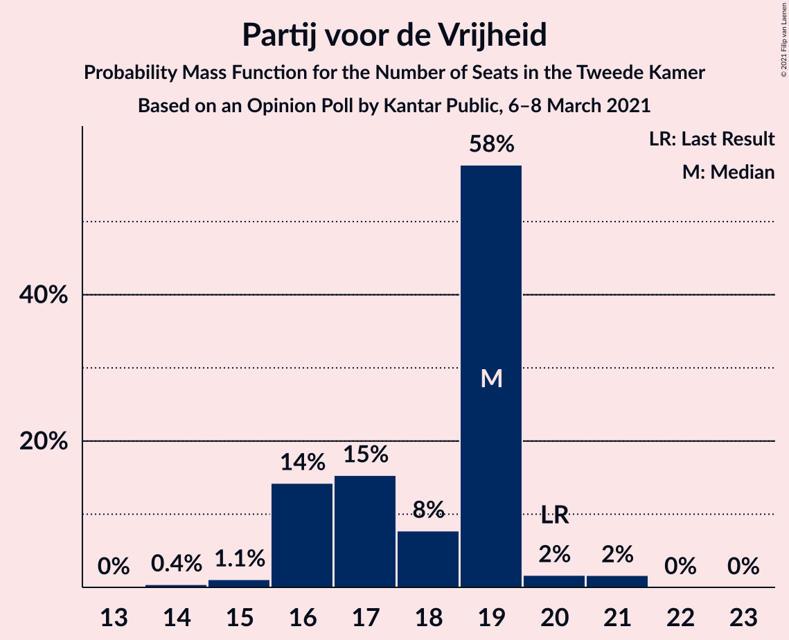

| Number of Seats | Probability | Accumulated | Special Marks |
|:---------------:|:-----------:|:-----------:|:-------------:|
| 14 | 0.4% | 100% |  |
| 15 | 1.1% | 99.6% |  |
| 16 | 14% | 98% |  |
| 17 | 15% | 84% |  |
| 18 | 8% | 69% |  |
| 19 | 58% | 61% | Median |
| 20 | 2% | 3% | Last Result |
| 21 | 2% | 2% |  |
| 22 | 0% | 0.1% |  |
| 23 | 0% | 0% |  |

### Democraten 66

*For a full overview of the results for this party, see the [Democraten 66](party-democraten66.html) page.*

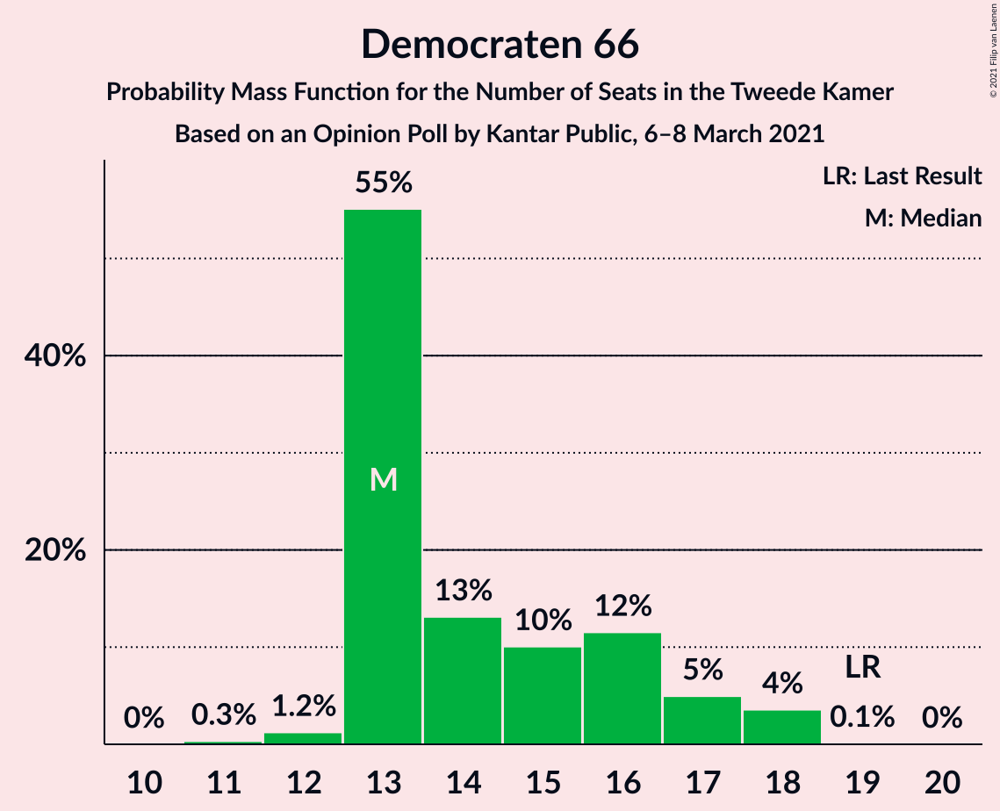

| Number of Seats | Probability | Accumulated | Special Marks |
|:---------------:|:-----------:|:-----------:|:-------------:|
| 11 | 0.3% | 100% |  |
| 12 | 1.2% | 99.7% |  |
| 13 | 55% | 98% | Median |
| 14 | 13% | 43% |  |
| 15 | 10% | 30% |  |
| 16 | 12% | 20% |  |
| 17 | 5% | 9% |  |
| 18 | 4% | 4% |  |
| 19 | 0.1% | 0.1% | Last Result |
| 20 | 0% | 0% |  |

### Partij van de Arbeid

*For a full overview of the results for this party, see the [Partij van de Arbeid](party-partijvandearbeid.html) page.*

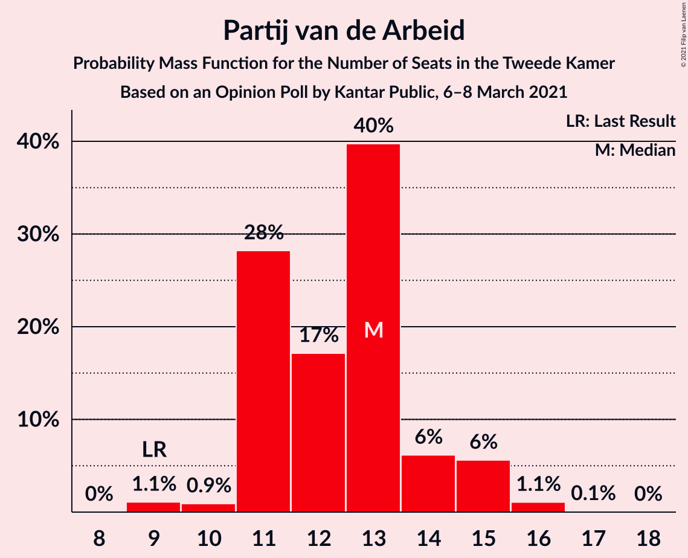

| Number of Seats | Probability | Accumulated | Special Marks |
|:---------------:|:-----------:|:-----------:|:-------------:|
| 9 | 1.1% | 100% | Last Result |
| 10 | 0.9% | 98.9% |  |
| 11 | 28% | 98% |  |
| 12 | 17% | 70% |  |
| 13 | 40% | 53% | Median |
| 14 | 6% | 13% |  |
| 15 | 6% | 7% |  |
| 16 | 1.1% | 1.1% |  |
| 17 | 0.1% | 0.1% |  |
| 18 | 0% | 0% |  |

### Socialistische Partij

*For a full overview of the results for this party, see the [Socialistische Partij](party-socialistischepartij.html) page.*

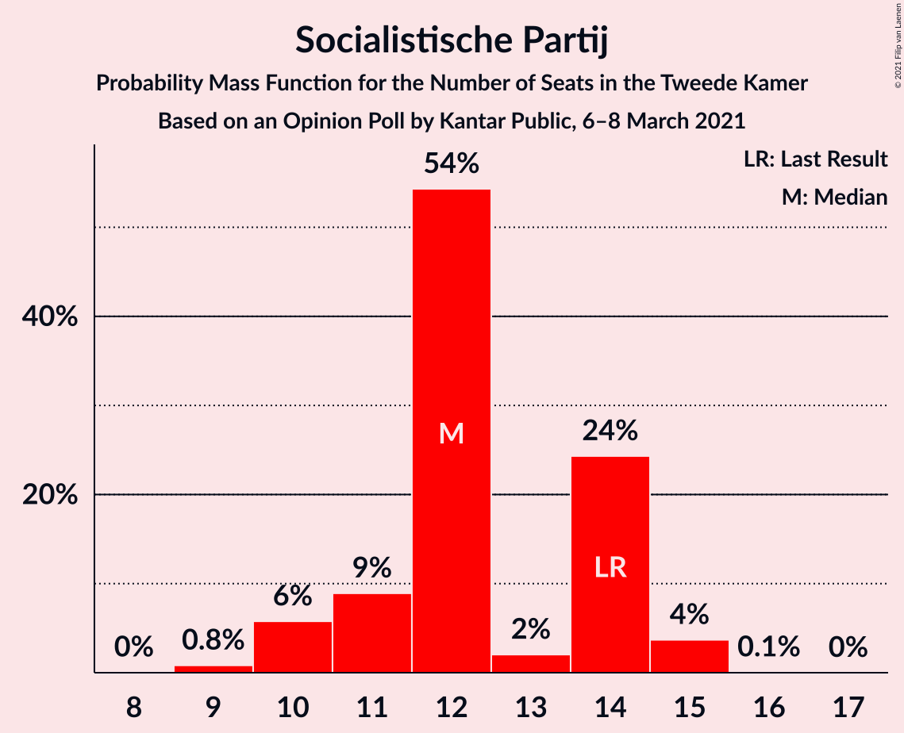

| Number of Seats | Probability | Accumulated | Special Marks |
|:---------------:|:-----------:|:-----------:|:-------------:|
| 9 | 0.8% | 100% |  |
| 10 | 6% | 99.1% |  |
| 11 | 9% | 93% |  |
| 12 | 54% | 84% | Median |
| 13 | 2% | 30% |  |
| 14 | 24% | 28% | Last Result |
| 15 | 4% | 4% |  |
| 16 | 0.1% | 0.1% |  |
| 17 | 0% | 0% |  |

### GroenLinks

*For a full overview of the results for this party, see the [GroenLinks](party-groenlinks.html) page.*

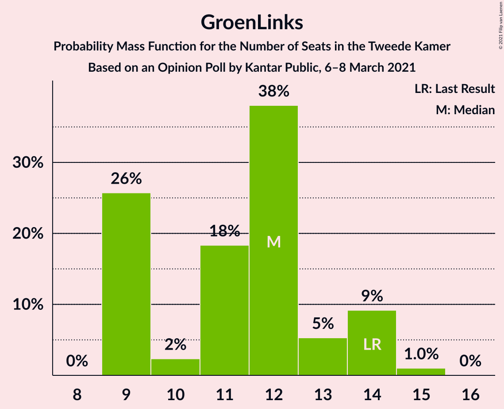

| Number of Seats | Probability | Accumulated | Special Marks |
|:---------------:|:-----------:|:-----------:|:-------------:|
| 9 | 26% | 100% |  |
| 10 | 2% | 74% |  |
| 11 | 18% | 72% |  |
| 12 | 38% | 54% | Median |
| 13 | 5% | 16% |  |
| 14 | 9% | 10% | Last Result |
| 15 | 1.0% | 1.0% |  |
| 16 | 0% | 0% |  |

### ChristenUnie

*For a full overview of the results for this party, see the [ChristenUnie](party-christenunie.html) page.*

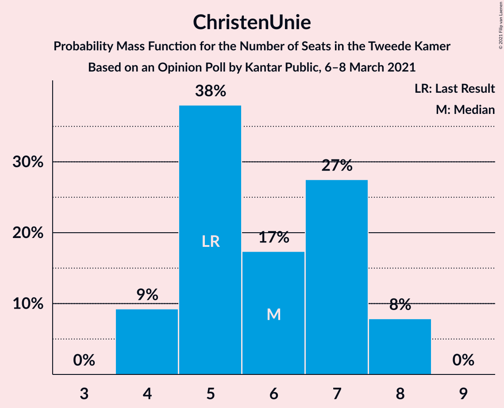

| Number of Seats | Probability | Accumulated | Special Marks |
|:---------------:|:-----------:|:-----------:|:-------------:|
| 4 | 9% | 100% |  |
| 5 | 38% | 91% | Last Result |
| 6 | 17% | 53% | Median |
| 7 | 27% | 35% |  |
| 8 | 8% | 8% |  |
| 9 | 0% | 0% |  |

### Partij voor de Dieren

*For a full overview of the results for this party, see the [Partij voor de Dieren](party-partijvoordedieren.html) page.*

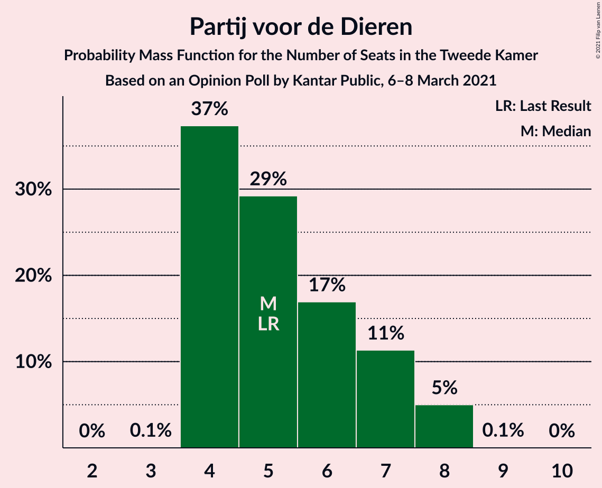

| Number of Seats | Probability | Accumulated | Special Marks |
|:---------------:|:-----------:|:-----------:|:-------------:|
| 3 | 0.1% | 100% |  |
| 4 | 37% | 99.9% |  |
| 5 | 29% | 63% | Last Result, Median |
| 6 | 17% | 33% |  |
| 7 | 11% | 16% |  |
| 8 | 5% | 5% |  |
| 9 | 0.1% | 0.1% |  |
| 10 | 0% | 0% |  |

### 50Plus

*For a full overview of the results for this party, see the [50Plus](party-50plus.html) page.*

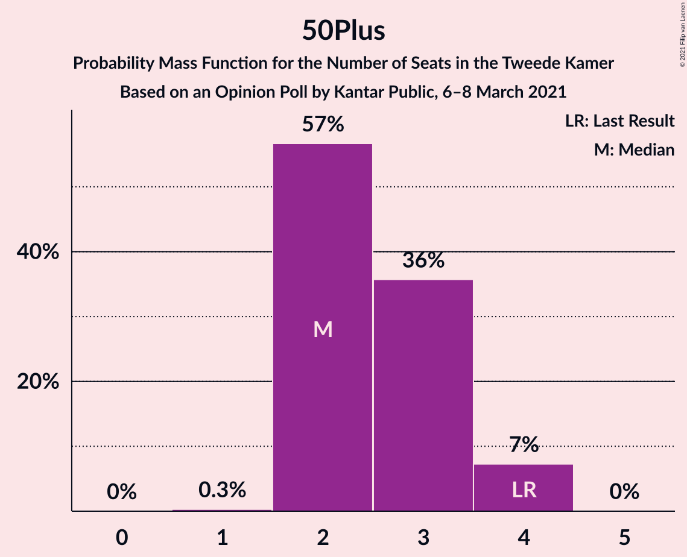

| Number of Seats | Probability | Accumulated | Special Marks |
|:---------------:|:-----------:|:-----------:|:-------------:|
| 1 | 0.3% | 100% |  |
| 2 | 57% | 99.7% | Median |
| 3 | 36% | 43% |  |
| 4 | 7% | 7% | Last Result |
| 5 | 0% | 0% |  |

### Forum voor Democratie

*For a full overview of the results for this party, see the [Forum voor Democratie](party-forumvoordemocratie.html) page.*

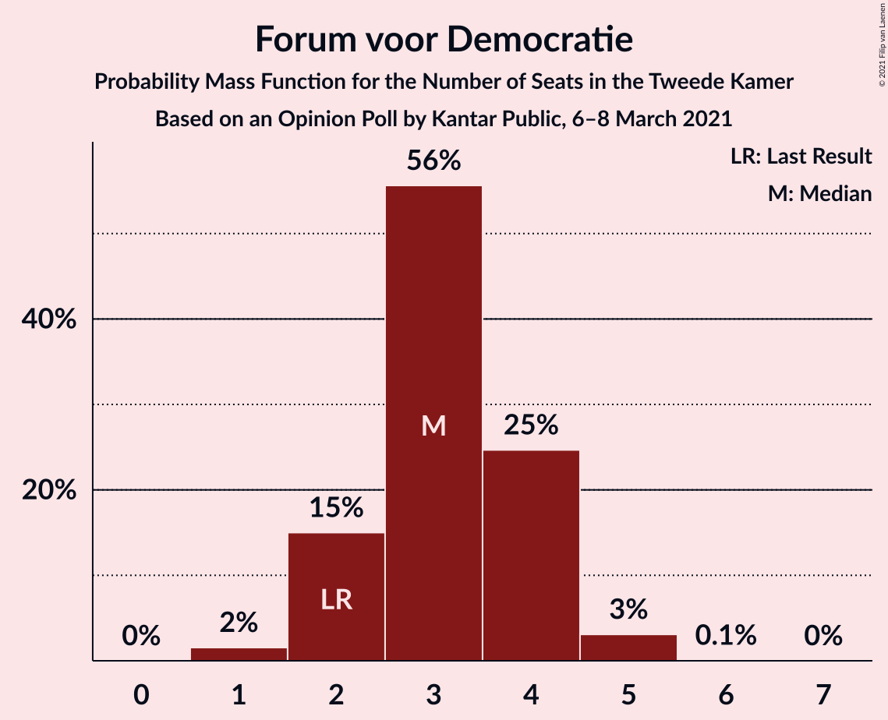

| Number of Seats | Probability | Accumulated | Special Marks |
|:---------------:|:-----------:|:-----------:|:-------------:|
| 1 | 2% | 100% |  |
| 2 | 15% | 98% | Last Result |
| 3 | 56% | 83% | Median |
| 4 | 25% | 28% |  |
| 5 | 3% | 3% |  |
| 6 | 0.1% | 0.1% |  |
| 7 | 0% | 0% |  |

### Staatkundig Gereformeerde Partij

*For a full overview of the results for this party, see the [Staatkundig Gereformeerde Partij](party-staatkundiggereformeerdepartij.html) page.*

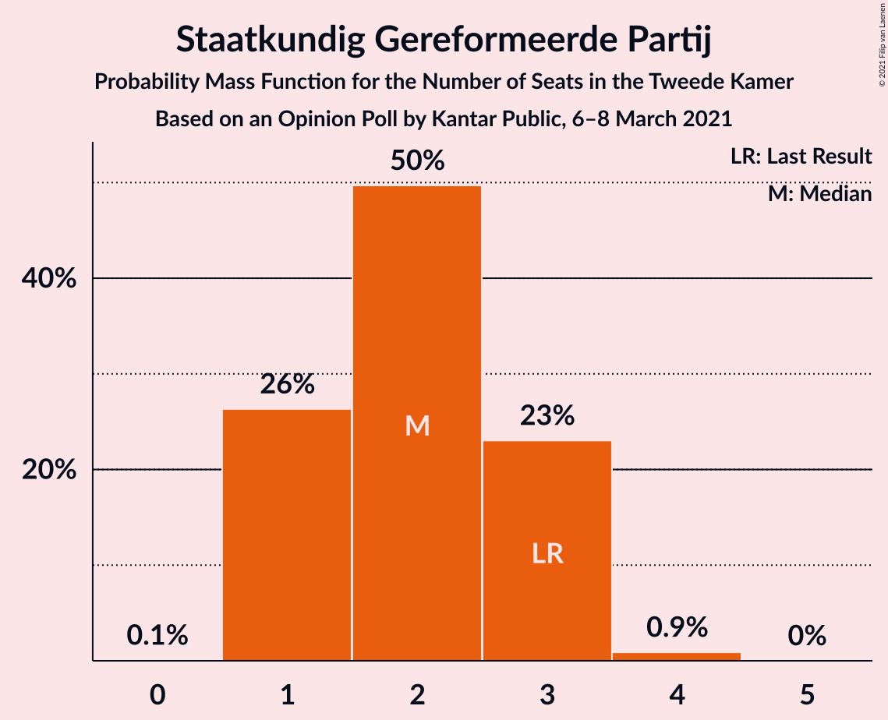

| Number of Seats | Probability | Accumulated | Special Marks |
|:---------------:|:-----------:|:-----------:|:-------------:|
| 0 | 0.1% | 100% |  |
| 1 | 26% | 99.9% |  |
| 2 | 50% | 74% | Median |
| 3 | 23% | 24% | Last Result |
| 4 | 0.9% | 0.9% |  |
| 5 | 0% | 0% |  |

### DENK

*For a full overview of the results for this party, see the [DENK](party-denk.html) page.*

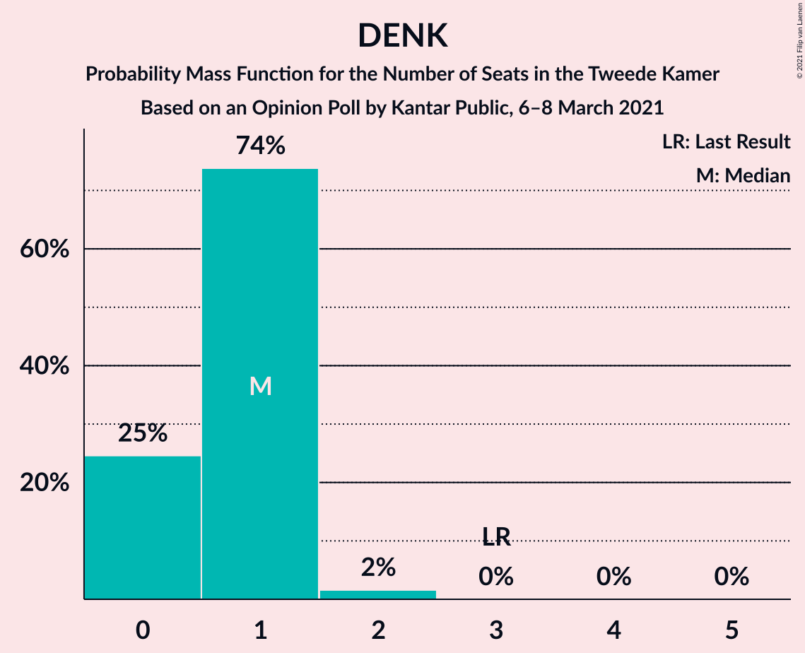

| Number of Seats | Probability | Accumulated | Special Marks |
|:---------------:|:-----------:|:-----------:|:-------------:|
| 0 | 25% | 100% |  |
| 1 | 74% | 75% | Median |
| 2 | 2% | 2% |  |
| 3 | 0% | 0% | Last Result |

### Juiste Antwoord 2021

*For a full overview of the results for this party, see the [Juiste Antwoord 2021](party-juisteantwoord2021.html) page.*

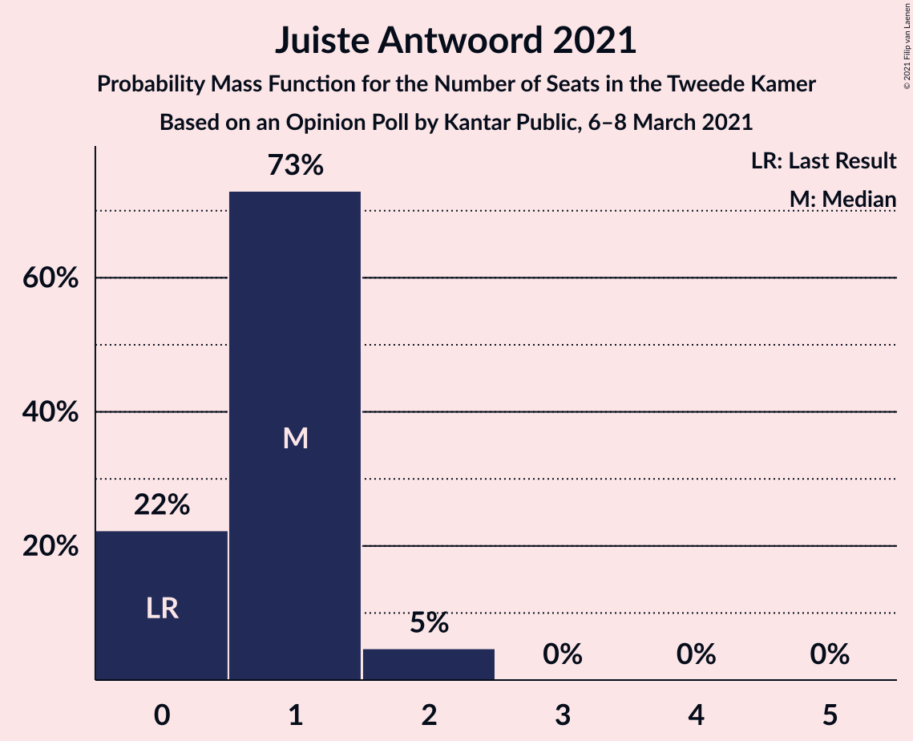

| Number of Seats | Probability | Accumulated | Special Marks |
|:---------------:|:-----------:|:-----------:|:-------------:|
| 0 | 22% | 100% | Last Result |
| 1 | 73% | 78% | Median |
| 2 | 5% | 5% |  |
| 3 | 0% | 0% |  |

### Volt Europa

*For a full overview of the results for this party, see the [Volt Europa](party-volteuropa.html) page.*

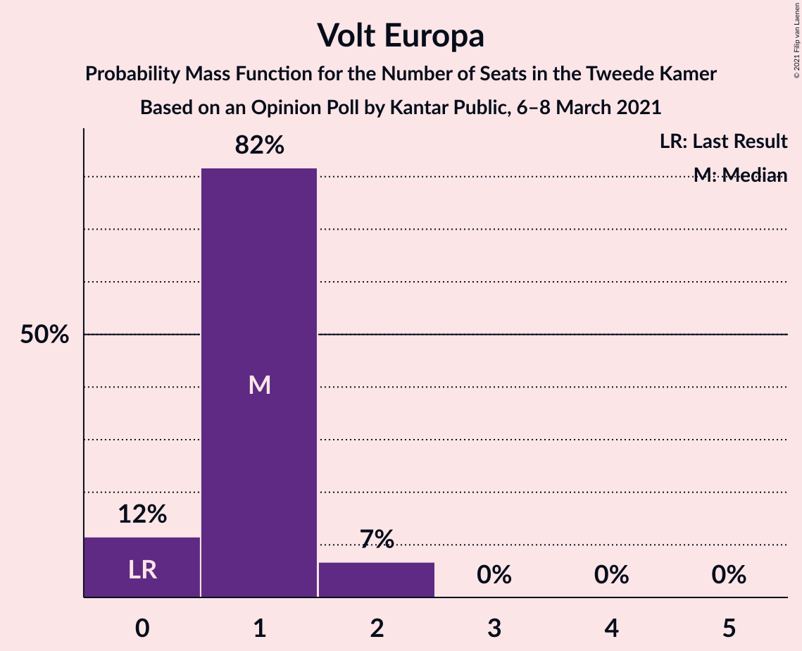

| Number of Seats | Probability | Accumulated | Special Marks |
|:---------------:|:-----------:|:-----------:|:-------------:|
| 0 | 12% | 100% | Last Result |
| 1 | 82% | 88% | Median |
| 2 | 7% | 7% |  |
| 3 | 0% | 0% |  |

## Coalitions

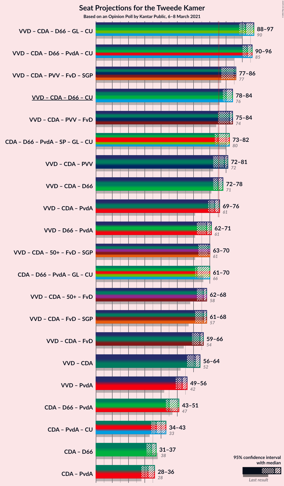

### Confidence Intervals

| Coalition | Last Result | Median | Majority? | 80% Confidence Interval | 90% Confidence Interval | 95% Confidence Interval | 99% Confidence Interval |
|:---------:|:-----------:|:------:|:---------:|:-----------------------:|:-----------------------:|:-----------------------:|:-----------------------:|
| Volkspartij voor Vrijheid en Democratie – Christen-Democratisch Appèl – Democraten 66 – GroenLinks – ChristenUnie | 90 | 92 | 100% | 88–96 | 88–97 | 88–97 | 88–98 |
| Volkspartij voor Vrijheid en Democratie – Christen-Democratisch Appèl – Democraten 66 – Partij van de Arbeid – ChristenUnie | 85 | 93 | 100% | 90–95 | 90–96 | 90–96 | 89–100 |
| Volkspartij voor Vrijheid en Democratie – Christen-Democratisch Appèl – Partij voor de Vrijheid – Forum voor Democratie – Staatkundig Gereformeerde Partij | 77 | 85 | 99.9% | 80–86 | 78–86 | 77–86 | 77–88 |
| Volkspartij voor Vrijheid en Democratie – Christen-Democratisch Appèl – Democraten 66 – ChristenUnie | 76 | 80 | 100% | 79–83 | 79–84 | 78–84 | 77–87 |
| Volkspartij voor Vrijheid en Democratie – Christen-Democratisch Appèl – Partij voor de Vrijheid – Forum voor Democratie | 74 | 82 | 97% | 79–84 | 76–84 | 75–84 | 75–85 |
| Christen-Democratisch Appèl – Democraten 66 – Partij van de Arbeid – Socialistische Partij – GroenLinks – ChristenUnie | 80 | 75 | 37% | 74–79 | 74–79 | 73–82 | 71–82 |
| Volkspartij voor Vrijheid en Democratie – Christen-Democratisch Appèl – Partij voor de Vrijheid | 72 | 79 | 89% | 75–81 | 74–81 | 72–81 | 72–82 |
| Volkspartij voor Vrijheid en Democratie – Christen-Democratisch Appèl – Democraten 66 | 71 | 75 | 23% | 72–78 | 72–78 | 72–78 | 71–82 |
| Volkspartij voor Vrijheid en Democratie – Christen-Democratisch Appèl – Partij van de Arbeid | 61 | 73 | 10% | 70–75 | 70–76 | 69–76 | 68–78 |
| Volkspartij voor Vrijheid en Democratie – Democraten 66 – Partij van de Arbeid | 61 | 68 | 0.2% | 62–69 | 62–71 | 62–71 | 62–74 |
| Volkspartij voor Vrijheid en Democratie – Christen-Democratisch Appèl – 50Plus – Forum voor Democratie – Staatkundig Gereformeerde Partij | 61 | 69 | 0% | 66–69 | 64–69 | 63–70 | 61–71 |
| Christen-Democratisch Appèl – Democraten 66 – Partij van de Arbeid – GroenLinks – ChristenUnie | 66 | 62 | 0% | 61–67 | 61–68 | 61–70 | 59–70 |
| Volkspartij voor Vrijheid en Democratie – Christen-Democratisch Appèl – 50Plus – Forum voor Democratie | 58 | 66 | 0% | 65–68 | 62–68 | 62–68 | 60–69 |
| Volkspartij voor Vrijheid en Democratie – Christen-Democratisch Appèl – Forum voor Democratie – Staatkundig Gereformeerde Partij | 57 | 66 | 0% | 62–67 | 61–67 | 61–68 | 58–69 |
| Volkspartij voor Vrijheid en Democratie – Christen-Democratisch Appèl – Forum voor Democratie | 54 | 64 | 0% | 61–65 | 59–66 | 59–66 | 57–67 |
| Volkspartij voor Vrijheid en Democratie – Christen-Democratisch Appèl | 52 | 61 | 0% | 58–63 | 57–64 | 56–64 | 54–64 |
| Volkspartij voor Vrijheid en Democratie – Partij van de Arbeid | 42 | 53 | 0% | 49–56 | 49–56 | 49–56 | 49–59 |
| Christen-Democratisch Appèl – Democraten 66 – Partij van de Arbeid | 47 | 45 | 0% | 45–49 | 45–51 | 43–51 | 42–52 |
| Christen-Democratisch Appèl – Partij van de Arbeid – ChristenUnie | 33 | 37 | 0% | 36–40 | 35–43 | 34–43 | 32–45 |
| Christen-Democratisch Appèl – Democraten 66 | 38 | 34 | 0% | 32–37 | 32–37 | 31–37 | 30–38 |
| Christen-Democratisch Appèl – Partij van de Arbeid | 28 | 32 | 0% | 30–35 | 30–35 | 28–36 | 27–38 |

### Volkspartij voor Vrijheid en Democratie – Christen-Democratisch Appèl – Democraten 66 – GroenLinks – ChristenUnie

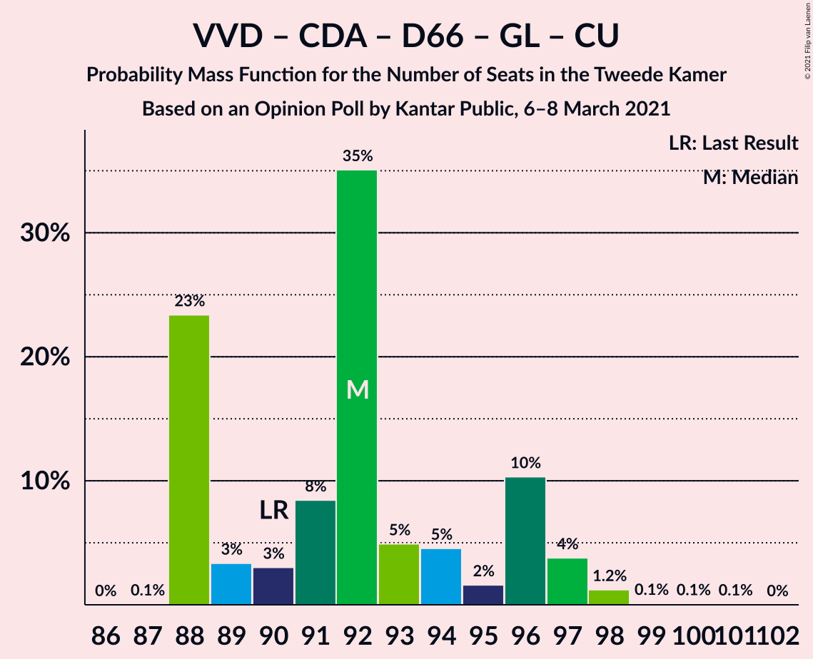

| Number of Seats | Probability | Accumulated | Special Marks |
|:---------------:|:-----------:|:-----------:|:-------------:|
| 87 | 0.1% | 100% |  |
| 88 | 23% | 99.9% |  |
| 89 | 3% | 77% |  |
| 90 | 3% | 73% | Last Result |
| 91 | 8% | 70% | Median |
| 92 | 35% | 62% |  |
| 93 | 5% | 27% |  |
| 94 | 5% | 22% |  |
| 95 | 2% | 17% |  |
| 96 | 10% | 16% |  |
| 97 | 4% | 5% |  |
| 98 | 1.2% | 1.5% |  |
| 99 | 0.1% | 0.3% |  |
| 100 | 0.1% | 0.1% |  |
| 101 | 0.1% | 0.1% |  |
| 102 | 0% | 0% |  |

### Volkspartij voor Vrijheid en Democratie – Christen-Democratisch Appèl – Democraten 66 – Partij van de Arbeid – ChristenUnie

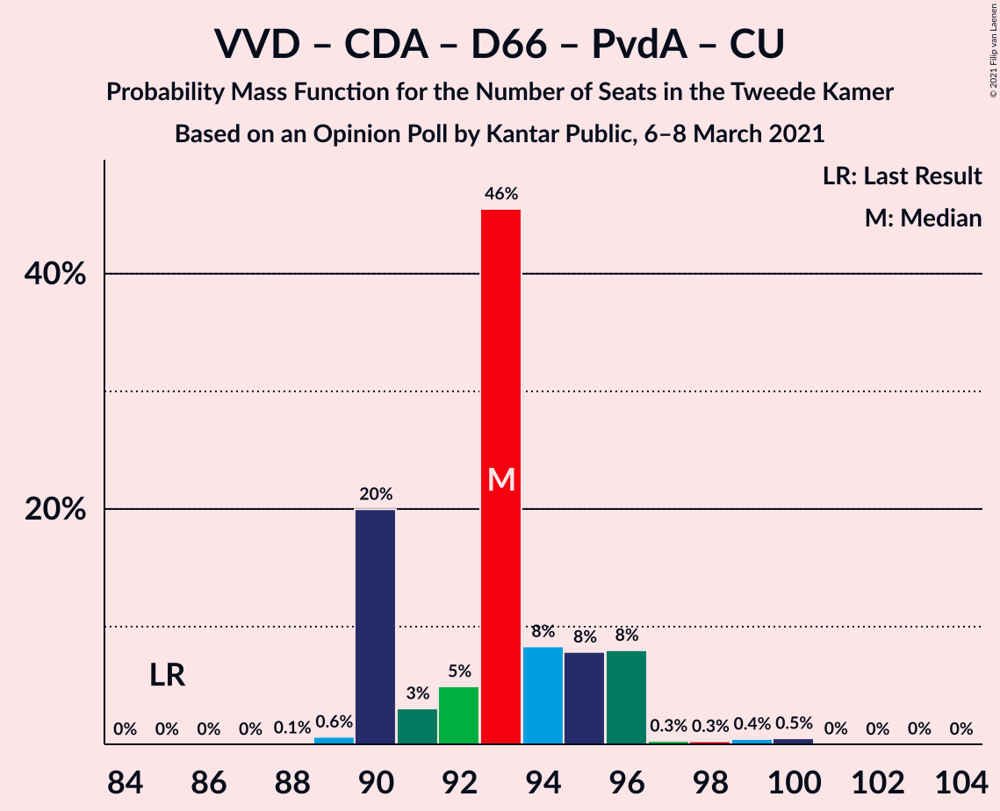

| Number of Seats | Probability | Accumulated | Special Marks |
|:---------------:|:-----------:|:-----------:|:-------------:|
| 85 | 0% | 100% | Last Result |
| 86 | 0% | 100% |  |
| 87 | 0% | 100% |  |
| 88 | 0.1% | 100% |  |
| 89 | 0.6% | 99.9% |  |
| 90 | 20% | 99.2% |  |
| 91 | 3% | 79% |  |
| 92 | 5% | 76% | Median |
| 93 | 46% | 71% |  |
| 94 | 8% | 26% |  |
| 95 | 8% | 17% |  |
| 96 | 8% | 10% |  |
| 97 | 0.3% | 2% |  |
| 98 | 0.3% | 1.3% |  |
| 99 | 0.4% | 1.1% |  |
| 100 | 0.5% | 0.6% |  |
| 101 | 0% | 0.1% |  |
| 102 | 0% | 0.1% |  |
| 103 | 0% | 0.1% |  |
| 104 | 0% | 0% |  |

### Volkspartij voor Vrijheid en Democratie – Christen-Democratisch Appèl – Partij voor de Vrijheid – Forum voor Democratie – Staatkundig Gereformeerde Partij

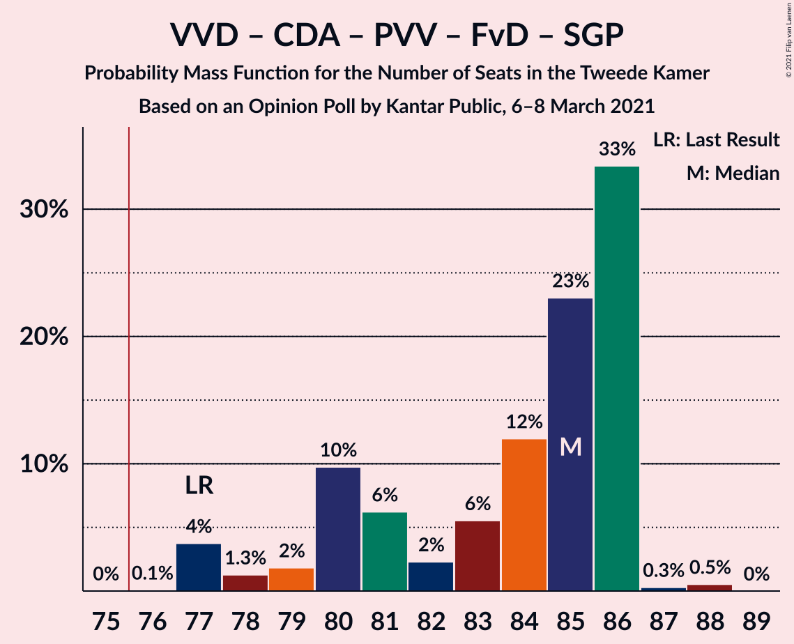

| Number of Seats | Probability | Accumulated | Special Marks |
|:---------------:|:-----------:|:-----------:|:-------------:|
| 75 | 0% | 100% |  |
| 76 | 0.1% | 99.9% | Majority |
| 77 | 4% | 99.9% | Last Result |
| 78 | 1.3% | 96% |  |
| 79 | 2% | 95% |  |
| 80 | 10% | 93% |  |
| 81 | 6% | 83% |  |
| 82 | 2% | 77% |  |
| 83 | 6% | 75% |  |
| 84 | 12% | 69% | Median |
| 85 | 23% | 57% |  |
| 86 | 33% | 34% |  |
| 87 | 0.3% | 0.8% |  |
| 88 | 0.5% | 0.5% |  |
| 89 | 0% | 0% |  |

### Volkspartij voor Vrijheid en Democratie – Christen-Democratisch Appèl – Democraten 66 – ChristenUnie

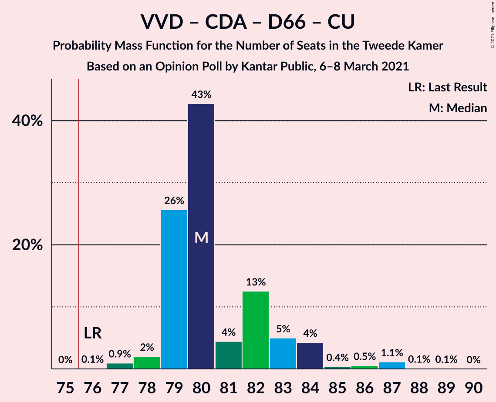

| Number of Seats | Probability | Accumulated | Special Marks |
|:---------------:|:-----------:|:-----------:|:-------------:|
| 76 | 0.1% | 100% | Last Result, Majority |
| 77 | 0.9% | 99.9% |  |
| 78 | 2% | 98.9% |  |
| 79 | 26% | 97% | Median |
| 80 | 43% | 71% |  |
| 81 | 4% | 28% |  |
| 82 | 13% | 24% |  |
| 83 | 5% | 12% |  |
| 84 | 4% | 7% |  |
| 85 | 0.4% | 2% |  |
| 86 | 0.5% | 2% |  |
| 87 | 1.1% | 1.3% |  |
| 88 | 0.1% | 0.2% |  |
| 89 | 0.1% | 0.1% |  |
| 90 | 0% | 0% |  |

### Volkspartij voor Vrijheid en Democratie – Christen-Democratisch Appèl – Partij voor de Vrijheid – Forum voor Democratie

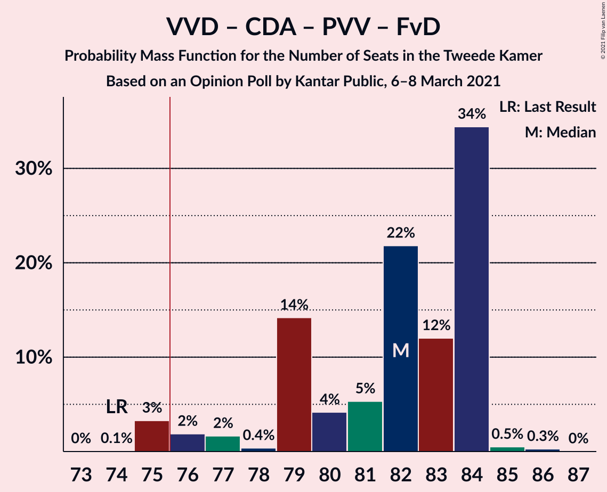

| Number of Seats | Probability | Accumulated | Special Marks |
|:---------------:|:-----------:|:-----------:|:-------------:|
| 74 | 0.1% | 100% | Last Result |
| 75 | 3% | 99.9% |  |
| 76 | 2% | 97% | Majority |
| 77 | 2% | 95% |  |
| 78 | 0.4% | 93% |  |
| 79 | 14% | 93% |  |
| 80 | 4% | 79% |  |
| 81 | 5% | 74% |  |
| 82 | 22% | 69% | Median |
| 83 | 12% | 47% |  |
| 84 | 34% | 35% |  |
| 85 | 0.5% | 0.8% |  |
| 86 | 0.3% | 0.3% |  |
| 87 | 0% | 0% |  |

### Christen-Democratisch Appèl – Democraten 66 – Partij van de Arbeid – Socialistische Partij – GroenLinks – ChristenUnie

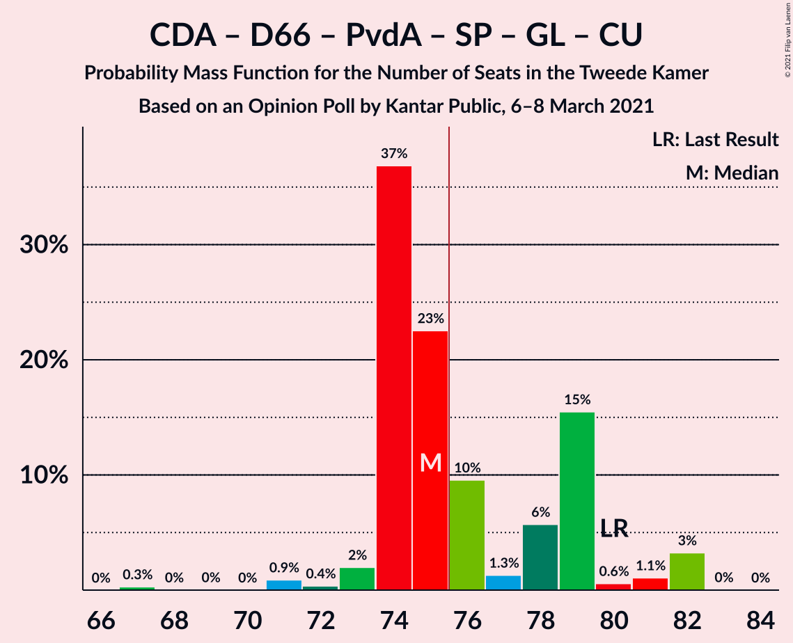

| Number of Seats | Probability | Accumulated | Special Marks |
|:---------------:|:-----------:|:-----------:|:-------------:|
| 67 | 0.3% | 100% |  |
| 68 | 0% | 99.7% |  |
| 69 | 0% | 99.7% |  |
| 70 | 0% | 99.7% |  |
| 71 | 0.9% | 99.6% |  |
| 72 | 0.4% | 98.8% |  |
| 73 | 2% | 98% |  |
| 74 | 37% | 96% |  |
| 75 | 23% | 60% | Median |
| 76 | 10% | 37% | Majority |
| 77 | 1.3% | 27% |  |
| 78 | 6% | 26% |  |
| 79 | 15% | 20% |  |
| 80 | 0.6% | 5% | Last Result |
| 81 | 1.1% | 4% |  |
| 82 | 3% | 3% |  |
| 83 | 0% | 0.1% |  |
| 84 | 0% | 0% |  |

### Volkspartij voor Vrijheid en Democratie – Christen-Democratisch Appèl – Partij voor de Vrijheid

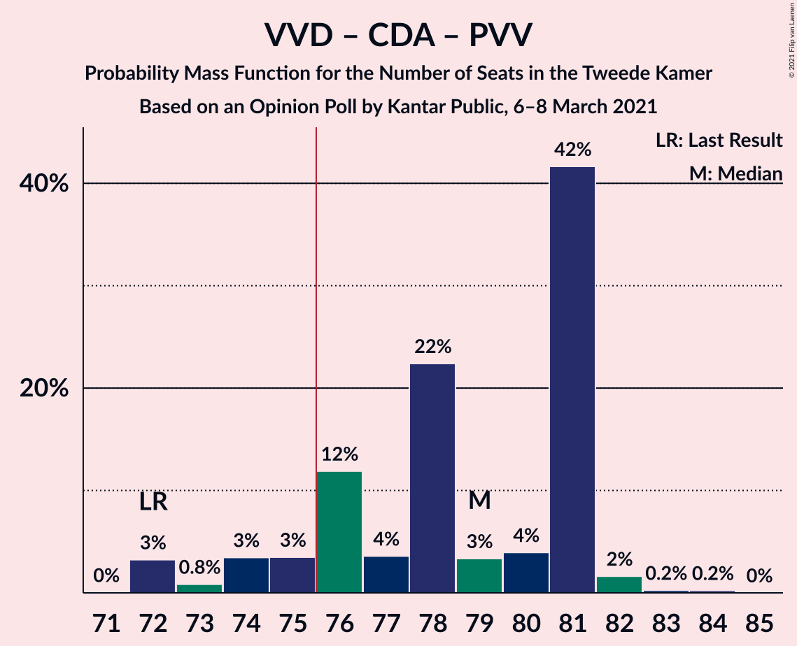

| Number of Seats | Probability | Accumulated | Special Marks |
|:---------------:|:-----------:|:-----------:|:-------------:|
| 71 | 0% | 100% |  |
| 72 | 3% | 99.9% | Last Result |
| 73 | 0.8% | 97% |  |
| 74 | 3% | 96% |  |
| 75 | 3% | 92% |  |
| 76 | 12% | 89% | Majority |
| 77 | 4% | 77% |  |
| 78 | 22% | 73% |  |
| 79 | 3% | 51% | Median |
| 80 | 4% | 48% |  |
| 81 | 42% | 44% |  |
| 82 | 2% | 2% |  |
| 83 | 0.2% | 0.5% |  |
| 84 | 0.2% | 0.2% |  |
| 85 | 0% | 0% |  |

### Volkspartij voor Vrijheid en Democratie – Christen-Democratisch Appèl – Democraten 66

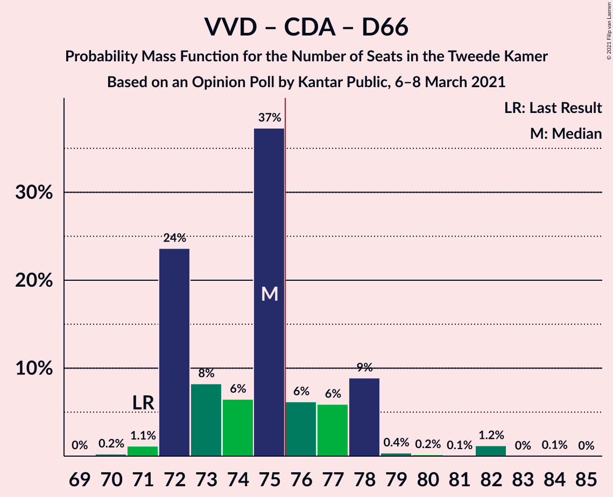

| Number of Seats | Probability | Accumulated | Special Marks |
|:---------------:|:-----------:|:-----------:|:-------------:|
| 69 | 0% | 100% |  |
| 70 | 0.2% | 99.9% |  |
| 71 | 1.1% | 99.7% | Last Result |
| 72 | 24% | 98.5% |  |
| 73 | 8% | 75% | Median |
| 74 | 6% | 67% |  |
| 75 | 37% | 60% |  |
| 76 | 6% | 23% | Majority |
| 77 | 6% | 17% |  |
| 78 | 9% | 11% |  |
| 79 | 0.4% | 2% |  |
| 80 | 0.2% | 2% |  |
| 81 | 0.1% | 1.3% |  |
| 82 | 1.2% | 1.3% |  |
| 83 | 0% | 0.1% |  |
| 84 | 0.1% | 0.1% |  |
| 85 | 0% | 0% |  |

### Volkspartij voor Vrijheid en Democratie – Christen-Democratisch Appèl – Partij van de Arbeid

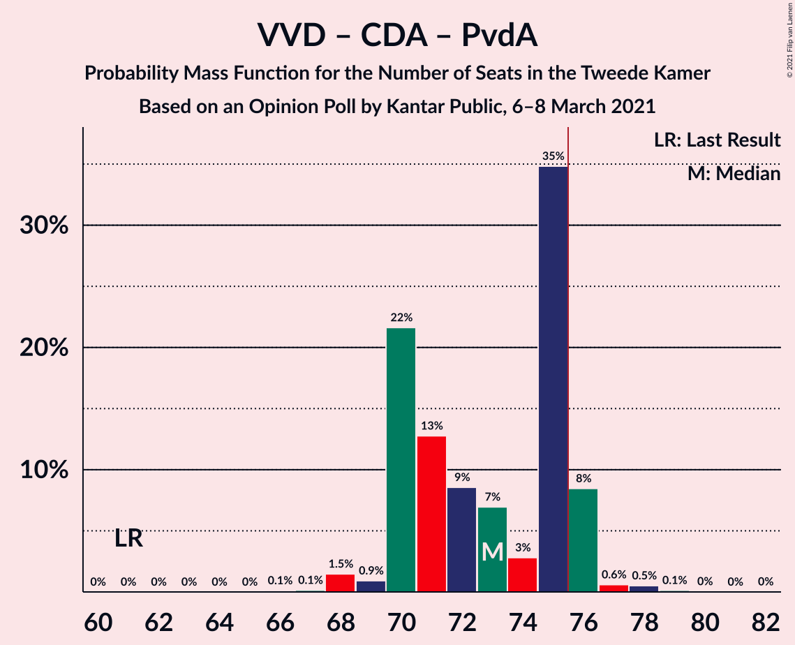

| Number of Seats | Probability | Accumulated | Special Marks |
|:---------------:|:-----------:|:-----------:|:-------------:|
| 61 | 0% | 100% | Last Result |
| 62 | 0% | 100% |  |
| 63 | 0% | 100% |  |
| 64 | 0% | 100% |  |
| 65 | 0% | 100% |  |
| 66 | 0.1% | 100% |  |
| 67 | 0.1% | 99.9% |  |
| 68 | 1.5% | 99.7% |  |
| 69 | 0.9% | 98% |  |
| 70 | 22% | 97% |  |
| 71 | 13% | 76% |  |
| 72 | 9% | 63% |  |
| 73 | 7% | 54% | Median |
| 74 | 3% | 47% |  |
| 75 | 35% | 45% |  |
| 76 | 8% | 10% | Majority |
| 77 | 0.6% | 1.3% |  |
| 78 | 0.5% | 0.7% |  |
| 79 | 0.1% | 0.2% |  |
| 80 | 0% | 0.1% |  |
| 81 | 0% | 0% |  |

### Volkspartij voor Vrijheid en Democratie – Democraten 66 – Partij van de Arbeid

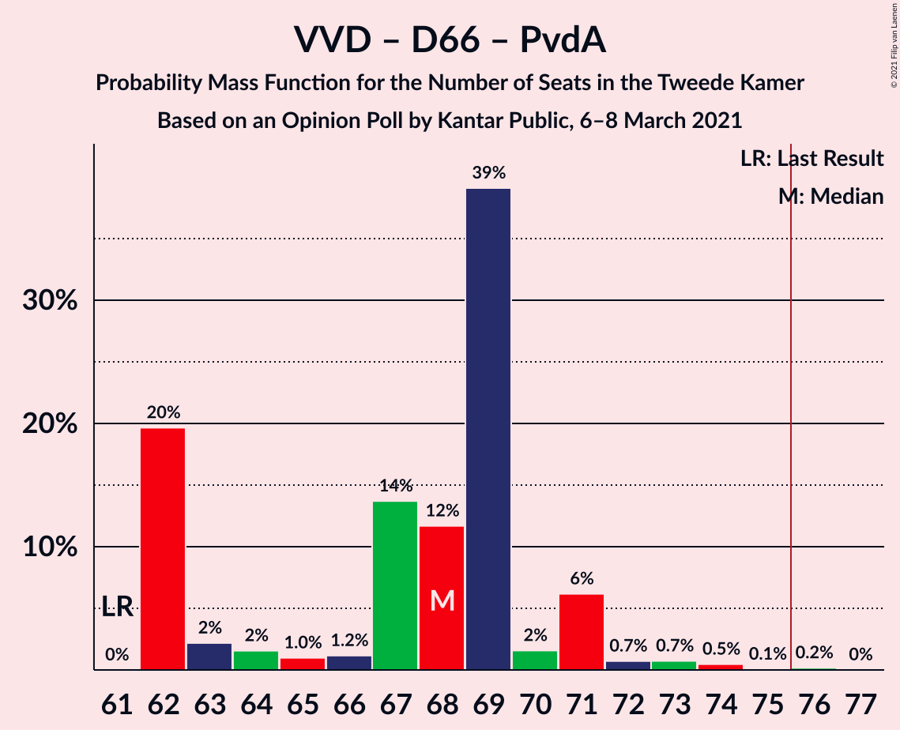

| Number of Seats | Probability | Accumulated | Special Marks |
|:---------------:|:-----------:|:-----------:|:-------------:|
| 61 | 0% | 100% | Last Result |
| 62 | 20% | 100% |  |
| 63 | 2% | 80% |  |
| 64 | 2% | 78% |  |
| 65 | 1.0% | 77% |  |
| 66 | 1.2% | 76% |  |
| 67 | 14% | 74% | Median |
| 68 | 12% | 61% |  |
| 69 | 39% | 49% |  |
| 70 | 2% | 10% |  |
| 71 | 6% | 8% |  |
| 72 | 0.7% | 2% |  |
| 73 | 0.7% | 1.5% |  |
| 74 | 0.5% | 0.7% |  |
| 75 | 0.1% | 0.3% |  |
| 76 | 0.2% | 0.2% | Majority |
| 77 | 0% | 0% |  |

### Volkspartij voor Vrijheid en Democratie – Christen-Democratisch Appèl – 50Plus – Forum voor Democratie – Staatkundig Gereformeerde Partij

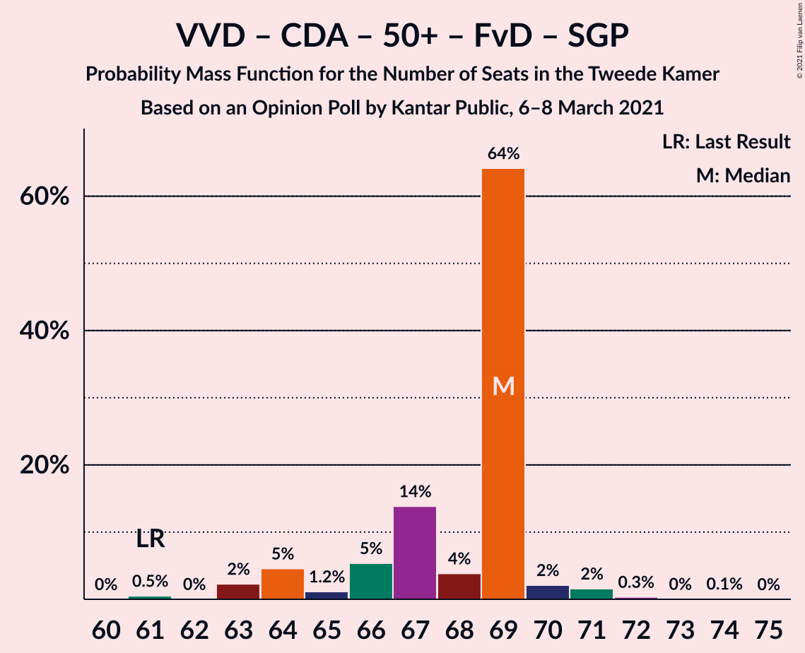

| Number of Seats | Probability | Accumulated | Special Marks |
|:---------------:|:-----------:|:-----------:|:-------------:|
| 61 | 0.5% | 100% | Last Result |
| 62 | 0% | 99.5% |  |
| 63 | 2% | 99.4% |  |
| 64 | 5% | 97% |  |
| 65 | 1.2% | 93% |  |
| 66 | 5% | 91% |  |
| 67 | 14% | 86% | Median |
| 68 | 4% | 72% |  |
| 69 | 64% | 68% |  |
| 70 | 2% | 4% |  |
| 71 | 2% | 2% |  |
| 72 | 0.3% | 0.5% |  |
| 73 | 0% | 0.1% |  |
| 74 | 0.1% | 0.1% |  |
| 75 | 0% | 0% |  |

### Christen-Democratisch Appèl – Democraten 66 – Partij van de Arbeid – GroenLinks – ChristenUnie

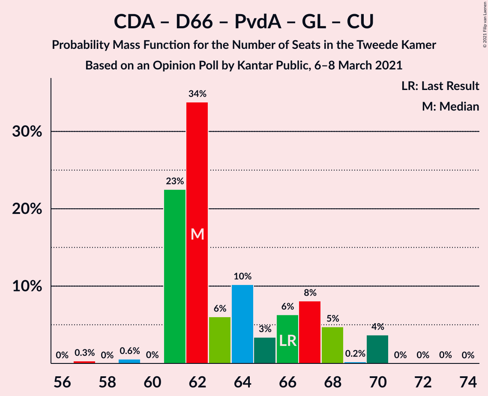

| Number of Seats | Probability | Accumulated | Special Marks |
|:---------------:|:-----------:|:-----------:|:-------------:|
| 57 | 0.3% | 100% |  |
| 58 | 0% | 99.7% |  |
| 59 | 0.6% | 99.7% |  |
| 60 | 0% | 99.1% |  |
| 61 | 23% | 99.1% |  |
| 62 | 34% | 77% |  |
| 63 | 6% | 43% | Median |
| 64 | 10% | 37% |  |
| 65 | 3% | 27% |  |
| 66 | 6% | 23% | Last Result |
| 67 | 8% | 17% |  |
| 68 | 5% | 9% |  |
| 69 | 0.2% | 4% |  |
| 70 | 4% | 4% |  |
| 71 | 0% | 0.1% |  |
| 72 | 0% | 0.1% |  |
| 73 | 0% | 0% |  |

### Volkspartij voor Vrijheid en Democratie – Christen-Democratisch Appèl – 50Plus – Forum voor Democratie

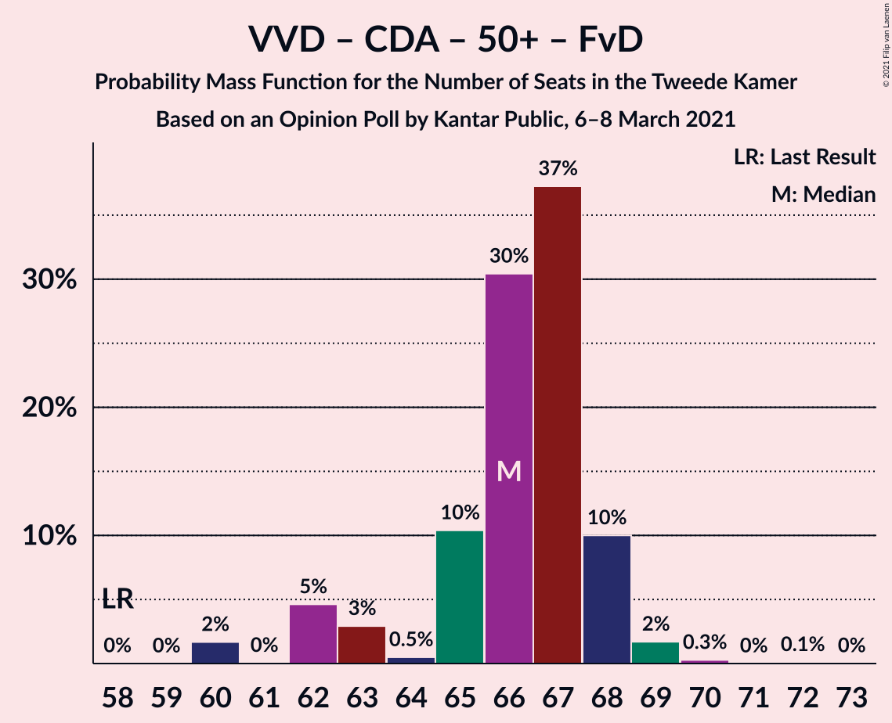

| Number of Seats | Probability | Accumulated | Special Marks |
|:---------------:|:-----------:|:-----------:|:-------------:|
| 58 | 0% | 100% | Last Result |
| 59 | 0% | 100% |  |
| 60 | 2% | 100% |  |
| 61 | 0% | 98% |  |
| 62 | 5% | 98% |  |
| 63 | 3% | 94% |  |
| 64 | 0.5% | 91% |  |
| 65 | 10% | 90% | Median |
| 66 | 30% | 80% |  |
| 67 | 37% | 49% |  |
| 68 | 10% | 12% |  |
| 69 | 2% | 2% |  |
| 70 | 0.3% | 0.4% |  |
| 71 | 0% | 0.1% |  |
| 72 | 0.1% | 0.1% |  |
| 73 | 0% | 0% |  |

### Volkspartij voor Vrijheid en Democratie – Christen-Democratisch Appèl – Forum voor Democratie – Staatkundig Gereformeerde Partij

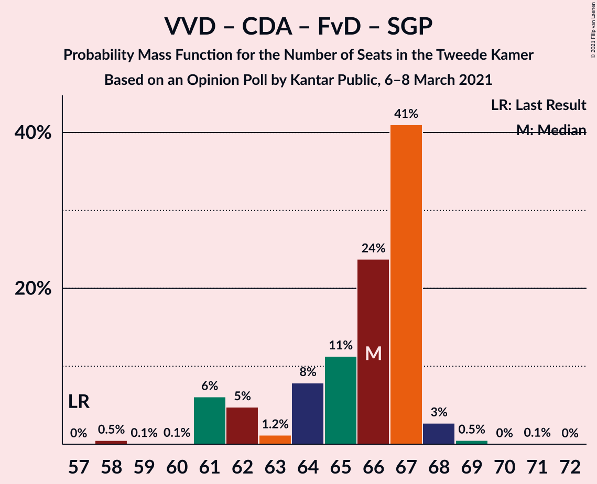

| Number of Seats | Probability | Accumulated | Special Marks |
|:---------------:|:-----------:|:-----------:|:-------------:|
| 57 | 0% | 100% | Last Result |
| 58 | 0.5% | 100% |  |
| 59 | 0.1% | 99.5% |  |
| 60 | 0.1% | 99.4% |  |
| 61 | 6% | 99.3% |  |
| 62 | 5% | 93% |  |
| 63 | 1.2% | 88% |  |
| 64 | 8% | 87% |  |
| 65 | 11% | 79% | Median |
| 66 | 24% | 68% |  |
| 67 | 41% | 44% |  |
| 68 | 3% | 3% |  |
| 69 | 0.5% | 0.6% |  |
| 70 | 0% | 0.1% |  |
| 71 | 0.1% | 0.1% |  |
| 72 | 0% | 0% |  |

### Volkspartij voor Vrijheid en Democratie – Christen-Democratisch Appèl – Forum voor Democratie

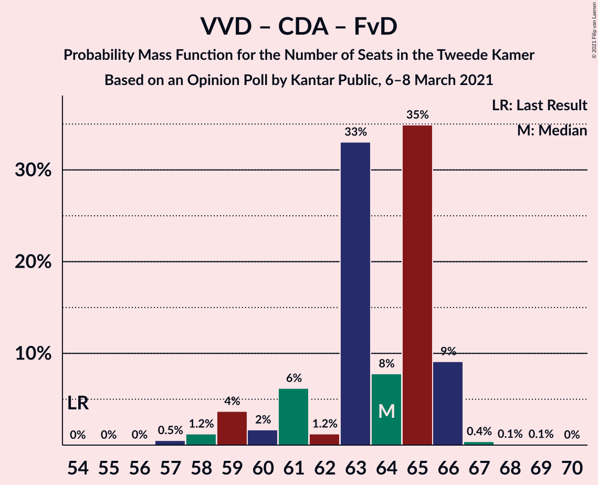

| Number of Seats | Probability | Accumulated | Special Marks |
|:---------------:|:-----------:|:-----------:|:-------------:|
| 54 | 0% | 100% | Last Result |
| 55 | 0% | 100% |  |
| 56 | 0% | 100% |  |
| 57 | 0.5% | 100% |  |
| 58 | 1.2% | 99.5% |  |
| 59 | 4% | 98% |  |
| 60 | 2% | 95% |  |
| 61 | 6% | 93% |  |
| 62 | 1.2% | 87% |  |
| 63 | 33% | 85% | Median |
| 64 | 8% | 52% |  |
| 65 | 35% | 45% |  |
| 66 | 9% | 10% |  |
| 67 | 0.4% | 0.6% |  |
| 68 | 0.1% | 0.2% |  |
| 69 | 0.1% | 0.1% |  |
| 70 | 0% | 0% |  |

### Volkspartij voor Vrijheid en Democratie – Christen-Democratisch Appèl

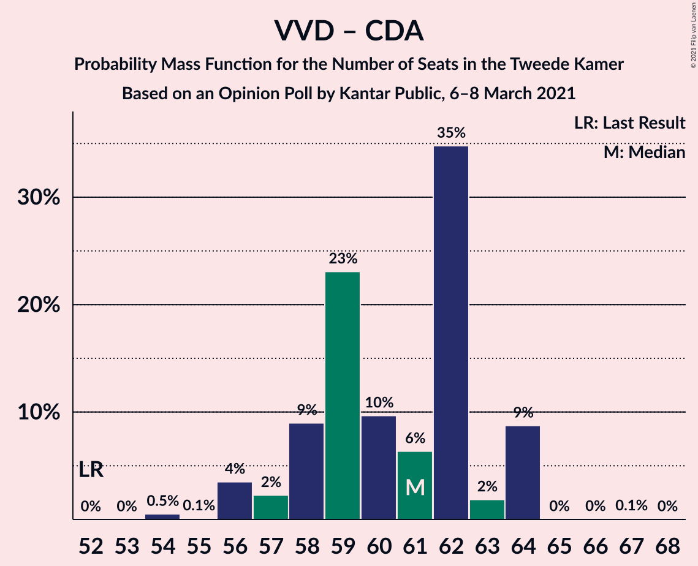

| Number of Seats | Probability | Accumulated | Special Marks |
|:---------------:|:-----------:|:-----------:|:-------------:|
| 52 | 0% | 100% | Last Result |
| 53 | 0% | 100% |  |
| 54 | 0.5% | 100% |  |
| 55 | 0.1% | 99.5% |  |
| 56 | 4% | 99.4% |  |
| 57 | 2% | 96% |  |
| 58 | 9% | 94% |  |
| 59 | 23% | 85% |  |
| 60 | 10% | 62% | Median |
| 61 | 6% | 52% |  |
| 62 | 35% | 46% |  |
| 63 | 2% | 11% |  |
| 64 | 9% | 9% |  |
| 65 | 0% | 0.2% |  |
| 66 | 0% | 0.2% |  |
| 67 | 0.1% | 0.1% |  |
| 68 | 0% | 0% |  |

### Volkspartij voor Vrijheid en Democratie – Partij van de Arbeid

| Number of Seats | Probability | Accumulated | Special Marks |
|:---------------:|:-----------:|:-----------:|:-------------:|
| 42 | 0% | 100% | Last Result |
| 43 | 0% | 100% |  |
| 44 | 0% | 100% |  |
| 45 | 0% | 100% |  |
| 46 | 0% | 100% |  |
| 47 | 0% | 100% |  |
| 48 | 0.1% | 100% |  |
| 49 | 22% | 99.8% |  |
| 50 | 2% | 78% |  |
| 51 | 6% | 76% |  |
| 52 | 4% | 70% |  |
| 53 | 21% | 66% |  |
| 54 | 7% | 45% | Median |
| 55 | 2% | 38% |  |
| 56 | 34% | 36% |  |
| 57 | 0.3% | 2% |  |
| 58 | 0.2% | 1.3% |  |
| 59 | 0.8% | 1.0% |  |
| 60 | 0.2% | 0.3% |  |
| 61 | 0.1% | 0.1% |  |
| 62 | 0% | 0% |  |

### Christen-Democratisch Appèl – Democraten 66 – Partij van de Arbeid

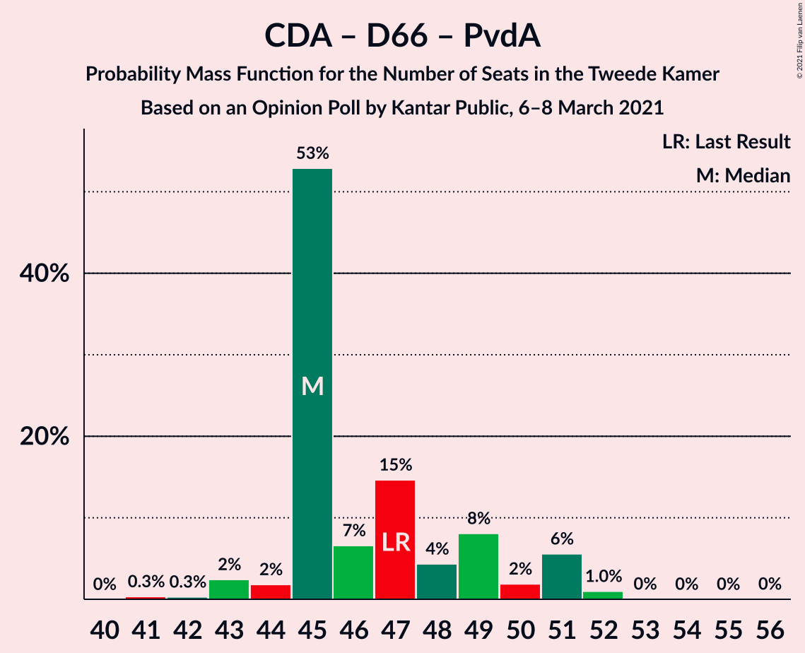

| Number of Seats | Probability | Accumulated | Special Marks |
|:---------------:|:-----------:|:-----------:|:-------------:|
| 41 | 0.3% | 100% |  |
| 42 | 0.3% | 99.7% |  |
| 43 | 2% | 99.4% |  |
| 44 | 2% | 97% |  |
| 45 | 53% | 95% | Median |
| 46 | 7% | 42% |  |
| 47 | 15% | 36% | Last Result |
| 48 | 4% | 21% |  |
| 49 | 8% | 17% |  |
| 50 | 2% | 9% |  |
| 51 | 6% | 7% |  |
| 52 | 1.0% | 1.1% |  |
| 53 | 0% | 0.1% |  |
| 54 | 0% | 0.1% |  |
| 55 | 0% | 0.1% |  |
| 56 | 0% | 0% |  |

### Christen-Democratisch Appèl – Partij van de Arbeid – ChristenUnie

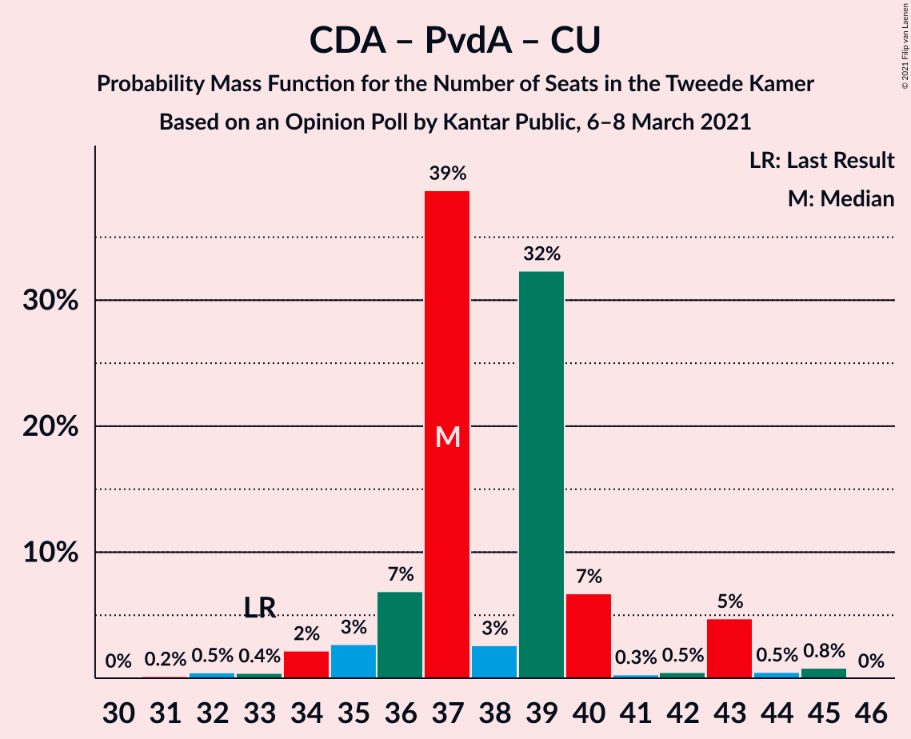

| Number of Seats | Probability | Accumulated | Special Marks |
|:---------------:|:-----------:|:-----------:|:-------------:|
| 31 | 0.2% | 100% |  |
| 32 | 0.5% | 99.8% |  |
| 33 | 0.4% | 99.4% | Last Result |
| 34 | 2% | 99.0% |  |
| 35 | 3% | 97% |  |
| 36 | 7% | 94% |  |
| 37 | 39% | 87% |  |
| 38 | 3% | 48% | Median |
| 39 | 32% | 46% |  |
| 40 | 7% | 14% |  |
| 41 | 0.3% | 7% |  |
| 42 | 0.5% | 7% |  |
| 43 | 5% | 6% |  |
| 44 | 0.5% | 1.3% |  |
| 45 | 0.8% | 0.8% |  |
| 46 | 0% | 0% |  |

### Christen-Democratisch Appèl – Democraten 66

| Number of Seats | Probability | Accumulated | Special Marks |
|:---------------:|:-----------:|:-----------:|:-------------:|
| 29 | 0% | 100% |  |
| 30 | 1.2% | 99.9% |  |
| 31 | 2% | 98.8% |  |
| 32 | 35% | 97% | Median |
| 33 | 0.8% | 62% |  |
| 34 | 27% | 61% |  |
| 35 | 14% | 34% |  |
| 36 | 9% | 19% |  |
| 37 | 9% | 10% |  |
| 38 | 1.1% | 1.5% | Last Result |
| 39 | 0.1% | 0.4% |  |
| 40 | 0.1% | 0.2% |  |
| 41 | 0.1% | 0.1% |  |
| 42 | 0% | 0% |  |

### Christen-Democratisch Appèl – Partij van de Arbeid

| Number of Seats | Probability | Accumulated | Special Marks |
|:---------------:|:-----------:|:-----------:|:-------------:|
| 27 | 0.8% | 100% |  |
| 28 | 2% | 99.2% | Last Result |
| 29 | 2% | 97% |  |
| 30 | 9% | 95% |  |
| 31 | 3% | 86% |  |
| 32 | 58% | 83% | Median |
| 33 | 9% | 24% |  |
| 34 | 2% | 15% |  |
| 35 | 11% | 14% |  |
| 36 | 0.7% | 3% |  |
| 37 | 1.4% | 2% |  |
| 38 | 0.9% | 0.9% |  |
| 39 | 0% | 0% |  |

## Technical Information

### Opinion Poll

+ **Polling firm:** Kantar Public
+ **Commissioner(s):** —
+ **Fieldwork period:** 6–8 March 2021

### Calculations

+ **Sample size:** 1596
+ **Simulations done:** 1,048,576
+ **Error estimate:** 2.68%

