# Poll Average

<a href="#voting-intentions">Voting Intentions</a> | <a href="#seats">Seats</a> | <a href="#coalitions">Coalitions</a> | <a href="#technical-information">Technical Information</a>

## Summary

The table below lists the polls on which the average is based. They are the most recent polls (less than 90 days old) registered and analyzed so far.

| Period     | Polling firm/Commissioner(s) | VVD | PVV | CDA | D66 | GL | SP | PvdA | CU | PvdD | 50+ | SGP | DENK | FvD | PP | B1 | PvdT | JA21 | CO | Volt | BBB | Spl |
|:----------:|:----------------------------:|:--:|:--:|:--:|:--:|:--:|:--:|:--:|:--:|:--:|:--:|:--:|:--:|:--:|:--:|:--:|:--:|:--:|:--:|:--:|:--:|:--:|
| 15 March 2017 | General Election | 21.3%   33 | 13.1%   20 | 12.4%   19 | 12.2%   19 | 9.1%   14 | 9.1%   14 | 5.7%   9 | 3.4%   5 | 3.2%   5 | 3.1%   4 | 2.1%   3 | 2.1%   3 | 1.8%   2 | 0.3%   0 | 0.3%   0 | 0.0%   0 | 0.0%   0 | 0.0%   0 | 0.0%   0 | 0.0%   0 | 0.0%   0 |
| N/A | Poll Average | 20–25%   31–41 | 11–15%   16–22 | 9–12%   13–19 | 10–14%   15–20 | 5–8%   9–13 | 6–9%   9–14 | 6–9%   8–13 | 3–5%   5–8 | 3–5%   4–7 | 0–1%   0–2 | 2–3%   2–4 | 1–2%   1–2 | 3–4%   4–6 | 0%   0 | 0–1%   0–1 | N/A   N/A | 1–2%   1–3 | 0%   0 | 1–4%   1–5 | 0–1%   0–2 | 0–1%   0–1 |
| [16 March 2021](2021-03-16-Peilnl.html) | Peil.nl | 20–23%   32–37 | 13–16%   21–23 | 10–12%   15–18 | 11–14%   19 | 5–6%   7–10 | 6–8%   11–12 | 6–8%   8–10 | 3–5%   5–7 | 3–5%   5–7 | 0%   0 | 2–3%   2–3 | 1–2%   1–2 | 3–5%   5–6 | N/A   N/A | 0–1%   0–1 | N/A   N/A | 2–3%   3–4 | 0%   0 | 2–3%   2–3 | 0–1%   0–1 | 0%   0 |
| [14–16 March 2021](2021-03-16-KantarPublic.html) | Kantar Public | 22–26%   35–41 | 11–13%   16–22 | 9–11%   13–16 | 10–13%   15–20 | 5–7%   8–10 | 7–9%   10–14 | 7–9%   11–14 | 3–5%   5–7 | 3–5%   4–7 | 0–1%   0–1 | 2–3%   2–4 | 1–2%   1–2 | 3–4%   4–6 | N/A   N/A | 0–1%   0–1 | N/A   N/A | 1–2%   1–2 | N/A   N/A | 2–3%   2–4 | 0–1%   0–1 | 0–1%   0–1 |
| [15–16 March 2021](2021-03-16-Ipsos.html) | Ipsos   EenVandaag | 22–25%   33–38 | 11–14%   17–20 | 10–13%   15–19 | 11–14%   18–20 | 6–8%   10–13 | 6–8%   10–13 | 6–8%   10–13 | 3–5%   5–8 | 3–5%   5–7 | 0%   0 | 2–3%   2–3 | 1–2%   2 | 3–4%   4–5 | N/A   N/A | 0%   0 | N/A   N/A | 1–2%   2 | N/A   N/A | 1–2%   1–2 | 0–1%   0–1 | N/A   N/A |
| [12–15 March 2021](2021-03-15-IOResearch.html) | I&O Research | 20–23%   30–36 | 11–14%   17–22 | 9–11%   13–19 | 11–13%   17–20 | 6–8%   9–13 | 6–8%   8–13 | 6–8%   10–12 | 3–5%   5–6 | 3–4%   3–6 | 1%   0–2 | 2–3%   2–4 | 1–2%   1–2 | 3–4%   4–6 | 0%   0 | 0–1%   0–1 | N/A   N/A | 1–2%   1–3 | 0–1%   0 | 3–4%   4–5 | 1%   0–2 | N/A   N/A |
| 15 March 2017 | General Election | 21.3%   33 | 13.1%   20 | 12.4%   19 | 12.2%   19 | 9.1%   14 | 9.1%   14 | 5.7%   9 | 3.4%   5 | 3.2%   5 | 3.1%   4 | 2.1%   3 | 2.1%   3 | 1.8%   2 | 0.3%   0 | 0.3%   0 | 0.0%   0 | 0.0%   0 | 0.0%   0 | 0.0%   0 | 0.0%   0 | 0.0%   0 |

Only polls for which at least the sample size has been published are included in the table above.

**Legend:**
+ **Top half of each row:** Voting intentions (95% confidence interval)
+ **Bottom half of each row:** Seat projections for the Tweede Kamer (95% confidence interval)
+ **VVD:** Volkspartij voor Vrijheid en Democratie
+ **PVV:** Partij voor de Vrijheid
+ **CDA:** Christen-Democratisch Appèl
+ **D66:** Democraten 66
+ **GL:** GroenLinks
+ **SP:** Socialistische Partij
+ **PvdA:** Partij van de Arbeid
+ **CU:** ChristenUnie
+ **PvdD:** Partij voor de Dieren
+ **50+:** 50Plus
+ **SGP:** Staatkundig Gereformeerde Partij
+ **DENK:** DENK
+ **FvD:** Forum voor Democratie
+ **PP:** Piratenpartij
+ **B1:** Bij1
+ **PvdT:** Partij voor de Toekomst
+ **JA21:** Juiste Antwoord 2021
+ **CO:** Code Oranje
+ **Volt:** Volt Europa
+ **BBB:** BoerBurgerBeweging
+ **Spl:** Splinter
+ **N/A (single party):** Party not included the published results
+ **N/A (entire row):** Calculation for this opinion poll not started yet

## Voting Intentions

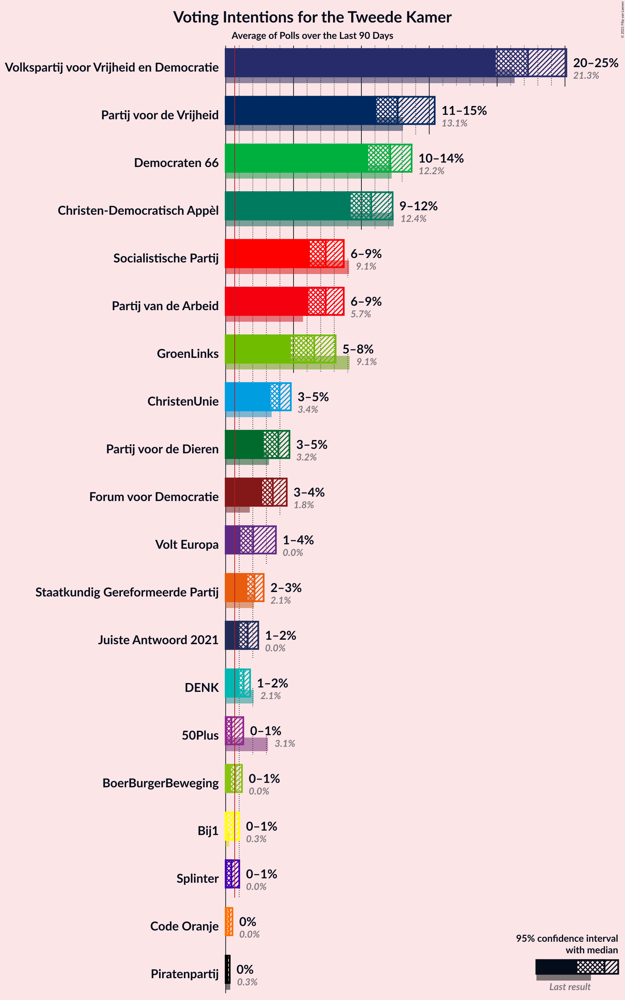

### Confidence Intervals

| Party | Last Result | Median | 80% Confidence Interval | 90% Confidence Interval | 95% Confidence Interval | 99% Confidence Interval |
|:-----:|:-----------:|:------:|:-----------------------:|:-----------------------:|:-----------------------:|:-----------------------:|
| <a href="#volkspartij-voor-vrijheid-en-democratie">Volkspartij voor Vrijheid en Democratie</a> | 21.3% | 22.3% | 20.5–24.4% |20.2–24.8% | 19.9–25.1% | 19.4–25.7% |
| <a href="#partij-voor-de-vrijheid">Partij voor de Vrijheid</a> | 13.1% | 12.7% | 11.6–14.7% |11.4–15.1% | 11.1–15.4% | 10.7–15.9% |
| <a href="#christen-democratisch-appèl">Christen-Democratisch Appèl</a> | 12.4% | 10.7% | 9.6–11.8% |9.4–12.1% | 9.2–12.3% | 8.8–12.7% |
| <a href="#democraten-66">Democraten 66</a> | 12.2% | 12.1% | 11.0–13.2% |10.8–13.5% | 10.5–13.7% | 10.1–14.1% |
| <a href="#groenlinks">GroenLinks</a> | 9.1% | 6.5% | 5.2–7.7% |5.0–7.9% | 4.8–8.1% | 4.5–8.5% |
| <a href="#socialistische-partij">Socialistische Partij</a> | 9.1% | 7.4% | 6.5–8.3% |6.3–8.5% | 6.2–8.7% | 5.9–9.1% |
| <a href="#partij-van-de-arbeid">Partij van de Arbeid</a> | 5.7% | 7.4% | 6.5–8.3% |6.2–8.5% | 6.1–8.7% | 5.8–9.1% |
| <a href="#christenunie">ChristenUnie</a> | 3.4% | 4.0% | 3.5–4.5% |3.4–4.6% | 3.3–4.8% | 3.1–5.0% |
| <a href="#partij-voor-de-dieren">Partij voor de Dieren</a> | 3.2% | 3.9% | 3.1–4.4% |2.9–4.6% | 2.8–4.7% | 2.6–5.0% |
| <a href="#50plus">50Plus</a> | 3.1% | 0.4% | 0.1–1.1% |0.1–1.2% | 0.1–1.3% | 0.1–1.5% |
| <a href="#staatkundig-gereformeerde-partij">Staatkundig Gereformeerde Partij</a> | 2.1% | 2.1% | 1.7–2.6% |1.7–2.7% | 1.6–2.8% | 1.4–3.1% |
| <a href="#denk">DENK</a> | 2.1% | 1.3% | 1.1–1.7% |1.0–1.7% | 1.0–1.8% | 0.9–2.0% |
| <a href="#forum-voor-democratie">Forum voor Democratie</a> | 1.8% | 3.5% | 2.9–4.1% |2.8–4.3% | 2.7–4.5% | 2.5–4.8% |
| <a href="#piratenpartij">Piratenpartij</a> | 0.3% | 0.1% | 0.1–0.2% |0.1–0.3% | 0.0–0.3% | 0.0–0.4% |
| <a href="#bij1">Bij1</a> | 0.3% | 0.6% | 0.2–0.9% |0.1–1.0% | 0.1–1.0% | 0.1–1.2% |
| <a href="#partij-voor-de-toekomst">Partij voor de Toekomst</a> | 0.0% | N/A | N/A |N/A | N/A | N/A |
| <a href="#juiste-antwoord-2021">Juiste Antwoord 2021</a> | 0.0% | 1.6% | 1.2–2.2% |1.1–2.3% | 1.0–2.4% | 0.9–2.6% |
| <a href="#code-oranje">Code Oranje</a> | 0.0% | 0.3% | 0.1–0.4% |0.1–0.5% | 0.1–0.5% | 0.1–0.6% |
| <a href="#volt-europa">Volt Europa</a> | 0.0% | 2.0% | 1.3–3.3% |1.2–3.5% | 1.1–3.7% | 0.9–4.0% |
| <a href="#boerburgerbeweging">BoerBurgerBeweging</a> | 0.0% | 0.7% | 0.5–1.0% |0.5–1.1% | 0.4–1.2% | 0.4–1.3% |
| <a href="#splinter">Splinter</a> | 0.0% | 0.4% | 0.1–0.8% |0.1–0.9% | 0.1–1.0% | 0.1–1.1% |

### Volkspartij voor Vrijheid en Democratie

*For a full overview of the results for this party, see the [Volkspartij voor Vrijheid en Democratie](party-volkspartijvoorvrijheidendemocratie.html) page.*

| Voting Intentions | Probability | Accumulated | Special Marks |
|:-----------------:|:-----------:|:-----------:|:-------------:|
| 17.5–18.5% | 0% | 100% |  |
| 18.5–19.5% | 0.9% | 100% |  |
| 19.5–20.5% | 10% | 99.1% |  |
| 20.5–21.5% | 25% | 89% | Last Result |
| 21.5–22.5% | 18% | 64% | Median |
| 22.5–23.5% | 19% | 46% |  |
| 23.5–24.5% | 19% | 27% |  |
| 24.5–25.5% | 7% | 7% |  |
| 25.5–26.5% | 0.7% | 0.7% |  |
| 26.5–27.5% | 0% | 0% |  |

### Partij voor de Vrijheid

*For a full overview of the results for this party, see the [Partij voor de Vrijheid](party-partijvoordevrijheid.html) page.*

| Voting Intentions | Probability | Accumulated | Special Marks |
|:-----------------:|:-----------:|:-----------:|:-------------:|
| 8.5–9.5% | 0% | 100% |  |
| 9.5–10.5% | 0.2% | 100% |  |
| 10.5–11.5% | 8% | 99.8% |  |
| 11.5–12.5% | 36% | 91% |  |
| 12.5–13.5% | 28% | 55% | Last Result, Median |
| 13.5–14.5% | 14% | 27% |  |
| 14.5–15.5% | 11% | 13% |  |
| 15.5–16.5% | 2% | 2% |  |
| 16.5–17.5% | 0% | 0% |  |

### Christen-Democratisch Appèl

*For a full overview of the results for this party, see the [Christen-Democratisch Appèl](party-christen-democratischappèl.html) page.*

| Voting Intentions | Probability | Accumulated | Special Marks |
|:-----------------:|:-----------:|:-----------:|:-------------:|
| 7.5–8.5% | 0.1% | 100% |  |
| 8.5–9.5% | 8% | 99.9% |  |
| 9.5–10.5% | 36% | 92% |  |
| 10.5–11.5% | 39% | 56% | Median |
| 11.5–12.5% | 16% | 17% | Last Result |
| 12.5–13.5% | 1.1% | 1.1% |  |
| 13.5–14.5% | 0% | 0% |  |

### Democraten 66

*For a full overview of the results for this party, see the [Democraten 66](party-democraten66.html) page.*

| Voting Intentions | Probability | Accumulated | Special Marks |
|:-----------------:|:-----------:|:-----------:|:-------------:|
| 8.5–9.5% | 0% | 100% |  |
| 9.5–10.5% | 3% | 100% |  |
| 10.5–11.5% | 24% | 97% |  |
| 11.5–12.5% | 43% | 73% | Last Result, Median |
| 12.5–13.5% | 27% | 31% |  |
| 13.5–14.5% | 4% | 4% |  |
| 14.5–15.5% | 0.1% | 0.1% |  |
| 15.5–16.5% | 0% | 0% |  |

### GroenLinks

*For a full overview of the results for this party, see the [GroenLinks](party-groenlinks.html) page.*

| Voting Intentions | Probability | Accumulated | Special Marks |
|:-----------------:|:-----------:|:-----------:|:-------------:|
| 2.5–3.5% | 0% | 100% |  |
| 3.5–4.5% | 0.6% | 100% |  |
| 4.5–5.5% | 20% | 99.4% |  |
| 5.5–6.5% | 30% | 79% |  |
| 6.5–7.5% | 35% | 49% | Median |
| 7.5–8.5% | 14% | 14% |  |
| 8.5–9.5% | 0.4% | 0.4% | Last Result |
| 9.5–10.5% | 0% | 0% |  |

### Socialistische Partij

*For a full overview of the results for this party, see the [Socialistische Partij](party-socialistischepartij.html) page.*

| Voting Intentions | Probability | Accumulated | Special Marks |
|:-----------------:|:-----------:|:-----------:|:-------------:|
| 4.5–5.5% | 0.1% | 100% |  |
| 5.5–6.5% | 10% | 99.9% |  |
| 6.5–7.5% | 51% | 90% | Median |
| 7.5–8.5% | 34% | 39% |  |
| 8.5–9.5% | 4% | 4% | Last Result |
| 9.5–10.5% | 0% | 0% |  |
| 10.5–11.5% | 0% | 0% |  |

### Partij van de Arbeid

*For a full overview of the results for this party, see the [Partij van de Arbeid](party-partijvandearbeid.html) page.*

| Voting Intentions | Probability | Accumulated | Special Marks |
|:-----------------:|:-----------:|:-----------:|:-------------:|
| 3.5–4.5% | 0% | 100% |  |
| 4.5–5.5% | 0.1% | 100% |  |
| 5.5–6.5% | 13% | 99.9% | Last Result |
| 6.5–7.5% | 48% | 87% | Median |
| 7.5–8.5% | 35% | 40% |  |
| 8.5–9.5% | 4% | 4% |  |
| 9.5–10.5% | 0% | 0% |  |
| 10.5–11.5% | 0% | 0% |  |

### ChristenUnie

*For a full overview of the results for this party, see the [ChristenUnie](party-christenunie.html) page.*

| Voting Intentions | Probability | Accumulated | Special Marks |
|:-----------------:|:-----------:|:-----------:|:-------------:|
| 1.5–2.5% | 0% | 100% |  |
| 2.5–3.5% | 11% | 100% | Last Result |
| 3.5–4.5% | 82% | 89% | Median |
| 4.5–5.5% | 7% | 7% |  |
| 5.5–6.5% | 0% | 0% |  |

### Partij voor de Dieren

*For a full overview of the results for this party, see the [Partij voor de Dieren](party-partijvoordedieren.html) page.*

| Voting Intentions | Probability | Accumulated | Special Marks |
|:-----------------:|:-----------:|:-----------:|:-------------:|
| 0.5–1.5% | 0% | 100% |  |
| 1.5–2.5% | 0.4% | 100% |  |
| 2.5–3.5% | 28% | 99.6% | Last Result |
| 3.5–4.5% | 66% | 72% | Median |
| 4.5–5.5% | 6% | 6% |  |
| 5.5–6.5% | 0% | 0% |  |

### 50Plus

*For a full overview of the results for this party, see the [50Plus](party-50plus.html) page.*

| Voting Intentions | Probability | Accumulated | Special Marks |
|:-----------------:|:-----------:|:-----------:|:-------------:|
| 0.0–0.5% | 54% | 100% | Median |
| 0.5–1.5% | 45% | 46% |  |
| 1.5–2.5% | 0.2% | 0.2% |  |
| 2.5–3.5% | 0% | 0% | Last Result |

### Staatkundig Gereformeerde Partij

*For a full overview of the results for this party, see the [Staatkundig Gereformeerde Partij](party-staatkundiggereformeerdepartij.html) page.*

| Voting Intentions | Probability | Accumulated | Special Marks |
|:-----------------:|:-----------:|:-----------:|:-------------:|
| 0.0–0.5% | 0% | 100% |  |
| 0.5–1.5% | 2% | 100% |  |
| 1.5–2.5% | 87% | 98% | Last Result, Median |
| 2.5–3.5% | 10% | 10% |  |
| 3.5–4.5% | 0% | 0% |  |

### DENK

*For a full overview of the results for this party, see the [DENK](party-denk.html) page.*

| Voting Intentions | Probability | Accumulated | Special Marks |
|:-----------------:|:-----------:|:-----------:|:-------------:|
| 0.0–0.5% | 0% | 100% |  |
| 0.5–1.5% | 81% | 100% | Median |
| 1.5–2.5% | 19% | 19% | Last Result |
| 2.5–3.5% | 0% | 0% |  |

### Forum voor Democratie

*For a full overview of the results for this party, see the [Forum voor Democratie](party-forumvoordemocratie.html) page.*

| Voting Intentions | Probability | Accumulated | Special Marks |
|:-----------------:|:-----------:|:-----------:|:-------------:|
| 0.5–1.5% | 0% | 100% |  |
| 1.5–2.5% | 0.6% | 100% | Last Result |
| 2.5–3.5% | 58% | 99.4% | Median |
| 3.5–4.5% | 40% | 41% |  |
| 4.5–5.5% | 2% | 2% |  |
| 5.5–6.5% | 0% | 0% |  |

### Piratenpartij

*For a full overview of the results for this party, see the [Piratenpartij](party-piratenpartij.html) page.*

| Voting Intentions | Probability | Accumulated | Special Marks |
|:-----------------:|:-----------:|:-----------:|:-------------:|
| 0.0–0.5% | 100% | 100% | Last Result, Median |
| 0.5–1.5% | 0% | 0% |  |

### Bij1

*For a full overview of the results for this party, see the [Bij1](party-bij1.html) page.*

| Voting Intentions | Probability | Accumulated | Special Marks |
|:-----------------:|:-----------:|:-----------:|:-------------:|
| 0.0–0.5% | 36% | 100% | Last Result |
| 0.5–1.5% | 64% | 64% | Median |
| 1.5–2.5% | 0% | 0% |  |

### Juiste Antwoord 2021

*For a full overview of the results for this party, see the [Juiste Antwoord 2021](party-juisteantwoord2021.html) page.*

| Voting Intentions | Probability | Accumulated | Special Marks |
|:-----------------:|:-----------:|:-----------:|:-------------:|
| 0.0–0.5% | 0% | 100% | Last Result |
| 0.5–1.5% | 43% | 100% |  |
| 1.5–2.5% | 56% | 57% | Median |
| 2.5–3.5% | 0.9% | 0.9% |  |
| 3.5–4.5% | 0% | 0% |  |

### Code Oranje

*For a full overview of the results for this party, see the [Code Oranje](party-codeoranje.html) page.*

| Voting Intentions | Probability | Accumulated | Special Marks |
|:-----------------:|:-----------:|:-----------:|:-------------:|
| 0.0–0.5% | 98% | 100% | Last Result, Median |
| 0.5–1.5% | 2% | 2% |  |
| 1.5–2.5% | 0% | 0% |  |

### Volt Europa

*For a full overview of the results for this party, see the [Volt Europa](party-volteuropa.html) page.*

| Voting Intentions | Probability | Accumulated | Special Marks |
|:-----------------:|:-----------:|:-----------:|:-------------:|
| 0.0–0.5% | 0% | 100% | Last Result |
| 0.5–1.5% | 21% | 100% |  |
| 1.5–2.5% | 53% | 79% | Median |
| 2.5–3.5% | 22% | 26% |  |
| 3.5–4.5% | 4% | 4% |  |
| 4.5–5.5% | 0% | 0% |  |

### BoerBurgerBeweging

*For a full overview of the results for this party, see the [BoerBurgerBeweging](party-boerburgerbeweging.html) page.*

| Voting Intentions | Probability | Accumulated | Special Marks |
|:-----------------:|:-----------:|:-----------:|:-------------:|
| 0.0–0.5% | 13% | 100% | Last Result |
| 0.5–1.5% | 87% | 87% | Median |
| 1.5–2.5% | 0% | 0% |  |
| 2.5–3.5% | 0% | 0% |  |

### Splinter

*For a full overview of the results for this party, see the [Splinter](party-splinter.html) page.*

| Voting Intentions | Probability | Accumulated | Special Marks |
|:-----------------:|:-----------:|:-----------:|:-------------:|
| 0.0–0.5% | 59% | 100% | Last Result, Median |
| 0.5–1.5% | 41% | 41% |  |
| 1.5–2.5% | 0% | 0% |  |

## Seats

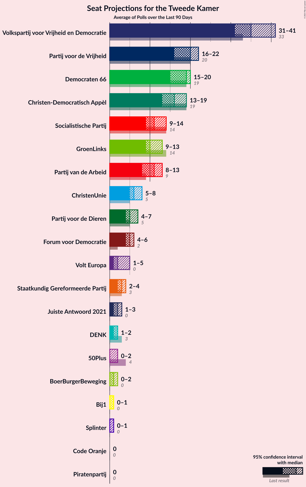

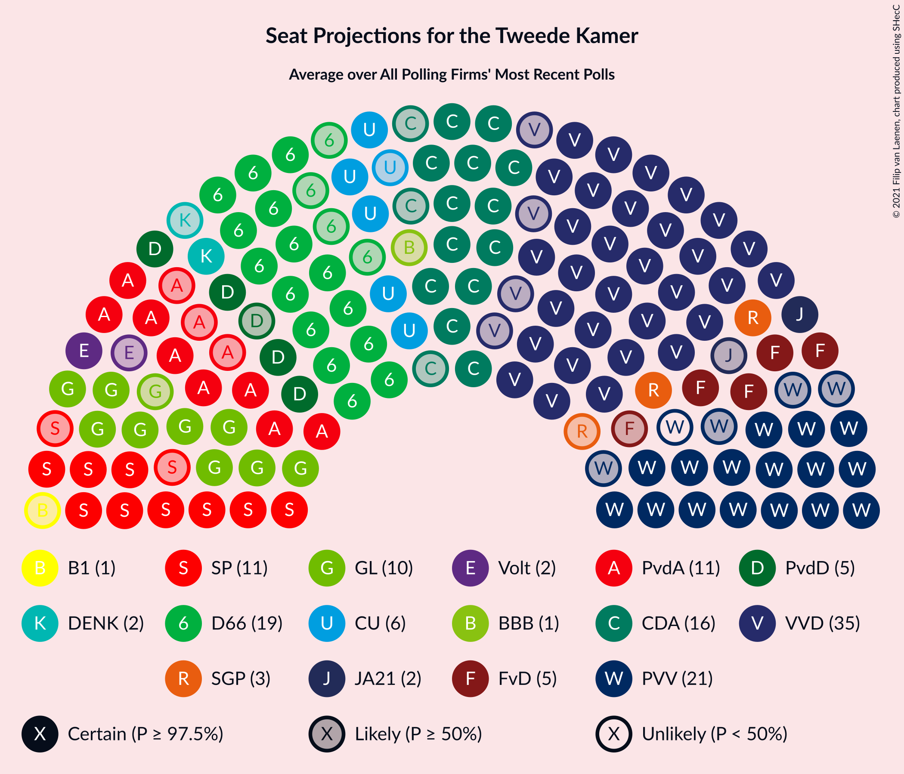

### Confidence Intervals

| Party | Last Result | Median | 80% Confidence Interval | 90% Confidence Interval | 95% Confidence Interval | 99% Confidence Interval |
|:-----:|:-----------:|:------:|:-----------------------:|:-----------------------:|:-----------------------:|:-----------------------:|
| <a href="#volkspartij-voor-vrijheid-en-democratie">Volkspartij voor Vrijheid en Democratie</a> | 33 | 35 | 33–39 |32–41 | 31–41 | 30–41 |
| <a href="#partij-voor-de-vrijheid">Partij voor de Vrijheid</a> | 20 | 20 | 17–22 |16–22 | 16–22 | 16–23 |
| <a href="#christen-democratisch-appèl">Christen-Democratisch Appèl</a> | 19 | 16 | 14–17 |14–19 | 13–19 | 13–19 |
| <a href="#democraten-66">Democraten 66</a> | 19 | 19 | 17–20 |15–20 | 15–20 | 15–21 |
| <a href="#groenlinks">GroenLinks</a> | 14 | 10 | 9–13 |9–13 | 9–13 | 7–13 |
| <a href="#socialistische-partij">Socialistische Partij</a> | 14 | 11 | 10–12 |10–13 | 9–14 | 8–14 |
| <a href="#partij-van-de-arbeid">Partij van de Arbeid</a> | 9 | 11 | 8–13 |8–13 | 8–13 | 8–14 |
| <a href="#christenunie">ChristenUnie</a> | 5 | 6 | 5–7 |5–7 | 5–8 | 5–8 |
| <a href="#partij-voor-de-dieren">Partij voor de Dieren</a> | 5 | 5 | 5–6 |4–7 | 4–7 | 3–7 |
| <a href="#50plus">50Plus</a> | 4 | 0 | 0–2 |0–2 | 0–2 | 0–2 |
| <a href="#staatkundig-gereformeerde-partij">Staatkundig Gereformeerde Partij</a> | 3 | 3 | 2–3 |2–4 | 2–4 | 2–4 |
| <a href="#denk">DENK</a> | 3 | 2 | 1–2 |1–2 | 1–2 | 1–2 |
| <a href="#forum-voor-democratie">Forum voor Democratie</a> | 2 | 5 | 4–6 |4–6 | 4–6 | 3–6 |
| <a href="#piratenpartij">Piratenpartij</a> | 0 | 0 | 0 |0 | 0 | 0 |
| <a href="#bij1">Bij1</a> | 0 | 1 | 0–1 |0–1 | 0–1 | 0–2 |
| <a href="#partij-voor-de-toekomst">Partij voor de Toekomst</a> | 0 | N/A | N/A |N/A | N/A | N/A |
| <a href="#juiste-antwoord-2021">Juiste Antwoord 2021</a> | 0 | 2 | 1–3 |1–3 | 1–3 | 1–4 |
| <a href="#code-oranje">Code Oranje</a> | 0 | 0 | 0 |0 | 0 | 0 |
| <a href="#volt-europa">Volt Europa</a> | 0 | 2 | 2–5 |2–5 | 1–5 | 1–5 |
| <a href="#boerburgerbeweging">BoerBurgerBeweging</a> | 0 | 1 | 0–1 |0–1 | 0–2 | 0–2 |
| <a href="#splinter">Splinter</a> | 0 | 0 | 0–1 |0–1 | 0–1 | 0–1 |

### Volkspartij voor Vrijheid en Democratie

*For a full overview of the results for this party, see the [Volkspartij voor Vrijheid en Democratie](party-volkspartijvoorvrijheidendemocratie.html) page.*

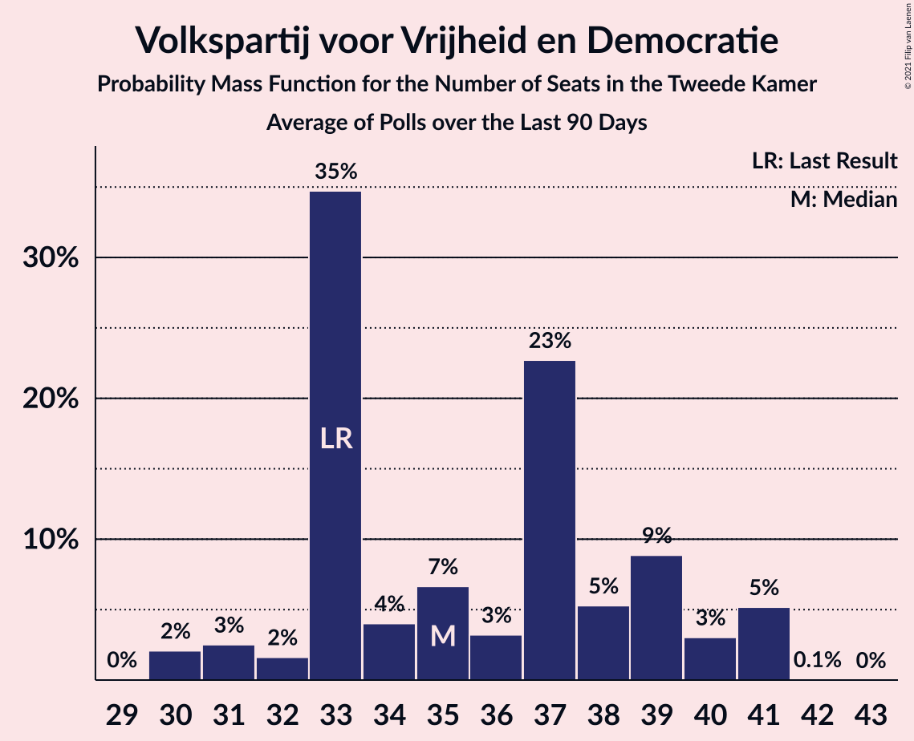

| Number of Seats | Probability | Accumulated | Special Marks |
|:---------------:|:-----------:|:-----------:|:-------------:|
| 29 | 0% | 100% |  |
| 30 | 2% | 99.9% |  |
| 31 | 3% | 98% |  |
| 32 | 2% | 95% |  |
| 33 | 35% | 94% | Last Result |
| 34 | 4% | 59% |  |
| 35 | 7% | 55% | Median |
| 36 | 3% | 48% |  |
| 37 | 23% | 45% |  |
| 38 | 5% | 22% |  |
| 39 | 9% | 17% |  |
| 40 | 3% | 8% |  |
| 41 | 5% | 5% |  |
| 42 | 0.1% | 0.1% |  |
| 43 | 0% | 0% |  |

### Partij voor de Vrijheid

*For a full overview of the results for this party, see the [Partij voor de Vrijheid](party-partijvoordevrijheid.html) page.*

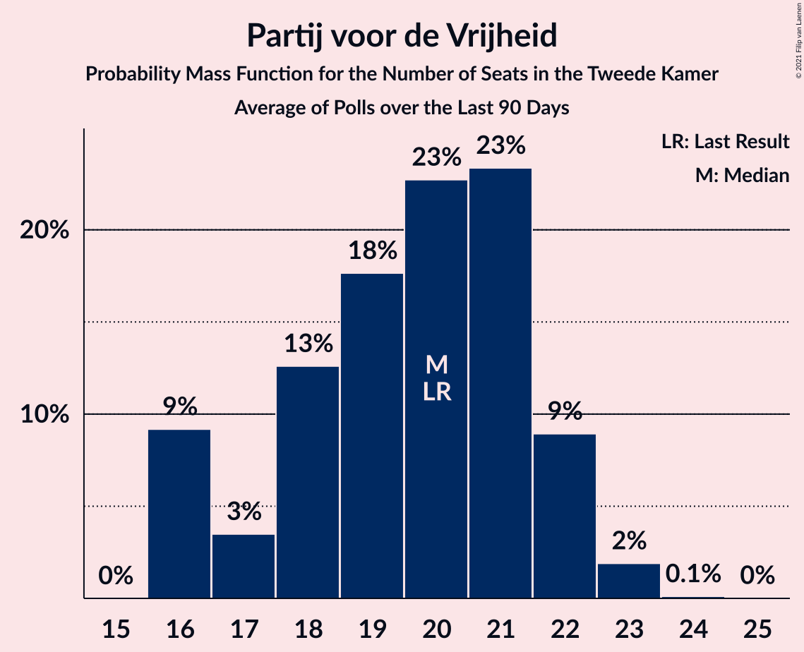

| Number of Seats | Probability | Accumulated | Special Marks |
|:---------------:|:-----------:|:-----------:|:-------------:|
| 16 | 9% | 100% |  |
| 17 | 3% | 91% |  |
| 18 | 13% | 87% |  |
| 19 | 18% | 75% |  |
| 20 | 23% | 57% | Last Result, Median |
| 21 | 23% | 34% |  |
| 22 | 9% | 11% |  |
| 23 | 2% | 2% |  |
| 24 | 0.1% | 0.2% |  |
| 25 | 0% | 0% |  |

### Christen-Democratisch Appèl

*For a full overview of the results for this party, see the [Christen-Democratisch Appèl](party-christen-democratischappèl.html) page.*

| Number of Seats | Probability | Accumulated | Special Marks |
|:---------------:|:-----------:|:-----------:|:-------------:|
| 12 | 0.1% | 100% |  |
| 13 | 4% | 99.9% |  |
| 14 | 10% | 96% |  |
| 15 | 30% | 86% |  |
| 16 | 45% | 56% | Median |
| 17 | 3% | 11% |  |
| 18 | 1.4% | 7% |  |
| 19 | 6% | 6% | Last Result |
| 20 | 0.1% | 0.1% |  |
| 21 | 0% | 0% |  |

### Democraten 66

*For a full overview of the results for this party, see the [Democraten 66](party-democraten66.html) page.*

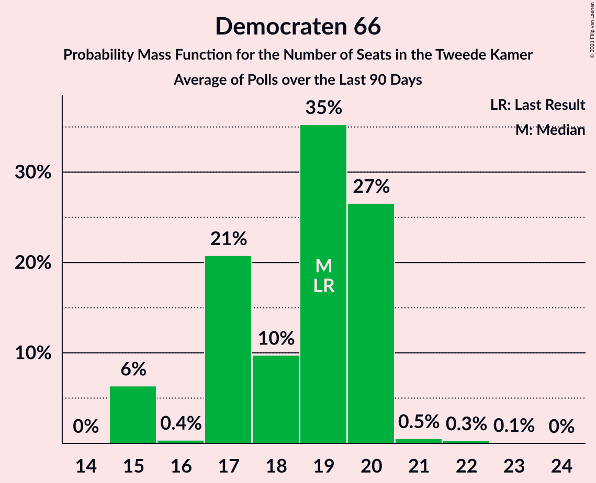

| Number of Seats | Probability | Accumulated | Special Marks |
|:---------------:|:-----------:|:-----------:|:-------------:|
| 15 | 6% | 100% |  |
| 16 | 0.4% | 94% |  |
| 17 | 21% | 93% |  |
| 18 | 10% | 73% |  |
| 19 | 35% | 63% | Last Result, Median |
| 20 | 27% | 27% |  |
| 21 | 0.5% | 0.9% |  |
| 22 | 0.3% | 0.4% |  |
| 23 | 0.1% | 0.1% |  |
| 24 | 0% | 0% |  |

### GroenLinks

*For a full overview of the results for this party, see the [GroenLinks](party-groenlinks.html) page.*

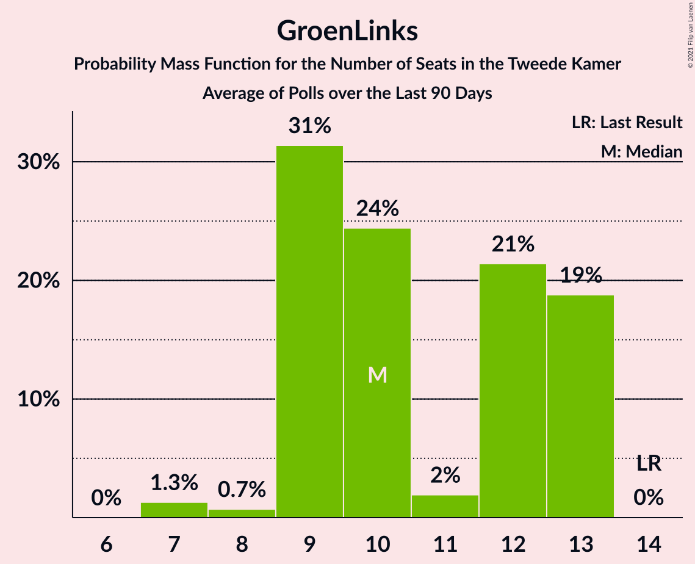

| Number of Seats | Probability | Accumulated | Special Marks |
|:---------------:|:-----------:|:-----------:|:-------------:|
| 7 | 1.3% | 100% |  |
| 8 | 0.7% | 98.7% |  |
| 9 | 31% | 98% |  |
| 10 | 24% | 67% | Median |
| 11 | 2% | 42% |  |
| 12 | 21% | 40% |  |
| 13 | 19% | 19% |  |
| 14 | 0% | 0% | Last Result |

### Socialistische Partij

*For a full overview of the results for this party, see the [Socialistische Partij](party-socialistischepartij.html) page.*

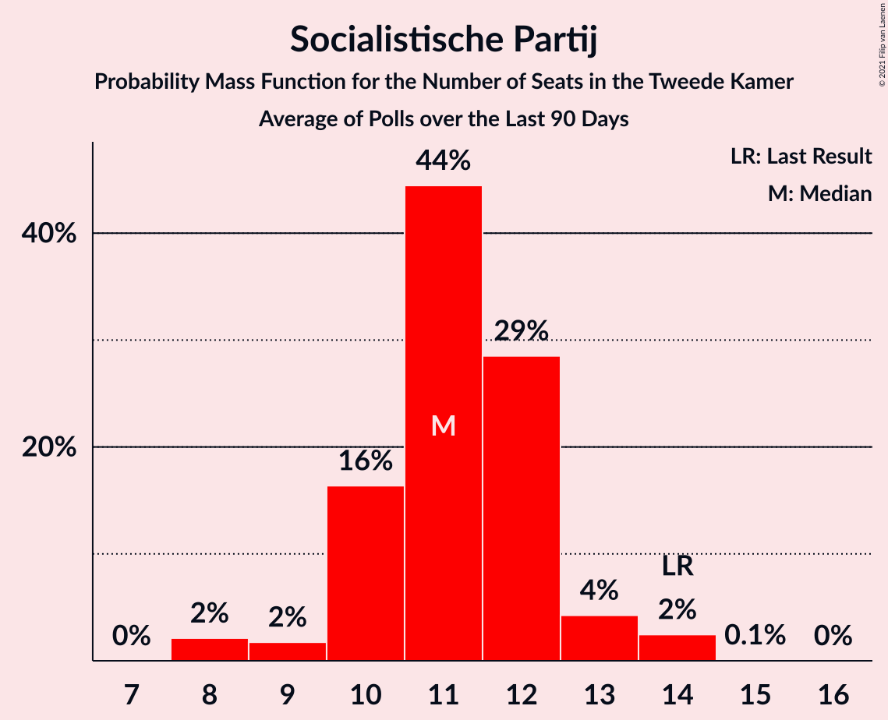

| Number of Seats | Probability | Accumulated | Special Marks |
|:---------------:|:-----------:|:-----------:|:-------------:|
| 8 | 2% | 100% |  |
| 9 | 2% | 98% |  |
| 10 | 16% | 96% |  |
| 11 | 44% | 80% | Median |
| 12 | 29% | 35% |  |
| 13 | 4% | 7% |  |
| 14 | 2% | 3% | Last Result |
| 15 | 0.1% | 0.1% |  |
| 16 | 0% | 0% |  |

### Partij van de Arbeid

*For a full overview of the results for this party, see the [Partij van de Arbeid](party-partijvandearbeid.html) page.*

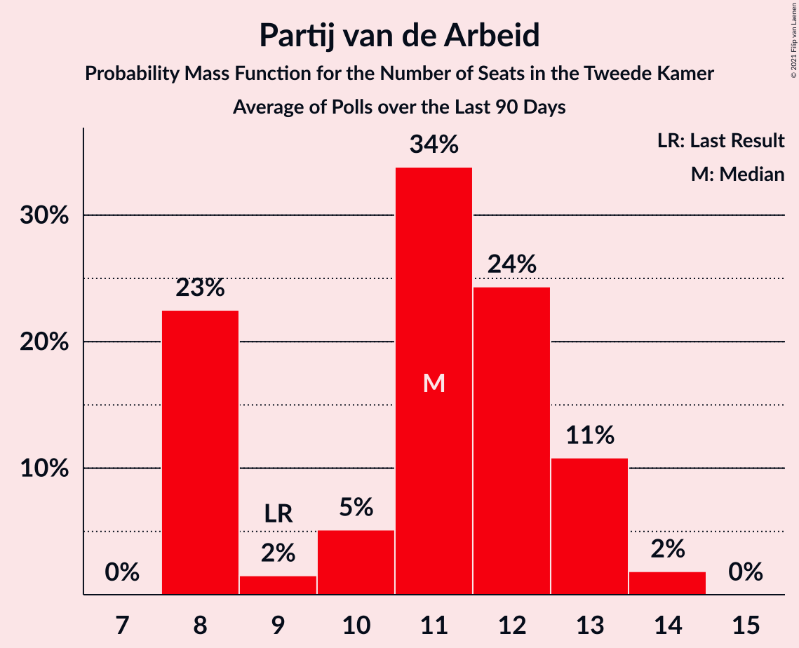

| Number of Seats | Probability | Accumulated | Special Marks |
|:---------------:|:-----------:|:-----------:|:-------------:|
| 8 | 23% | 100% |  |
| 9 | 2% | 77% | Last Result |
| 10 | 5% | 76% |  |
| 11 | 34% | 71% | Median |
| 12 | 24% | 37% |  |
| 13 | 11% | 13% |  |
| 14 | 2% | 2% |  |
| 15 | 0% | 0% |  |

### ChristenUnie

*For a full overview of the results for this party, see the [ChristenUnie](party-christenunie.html) page.*

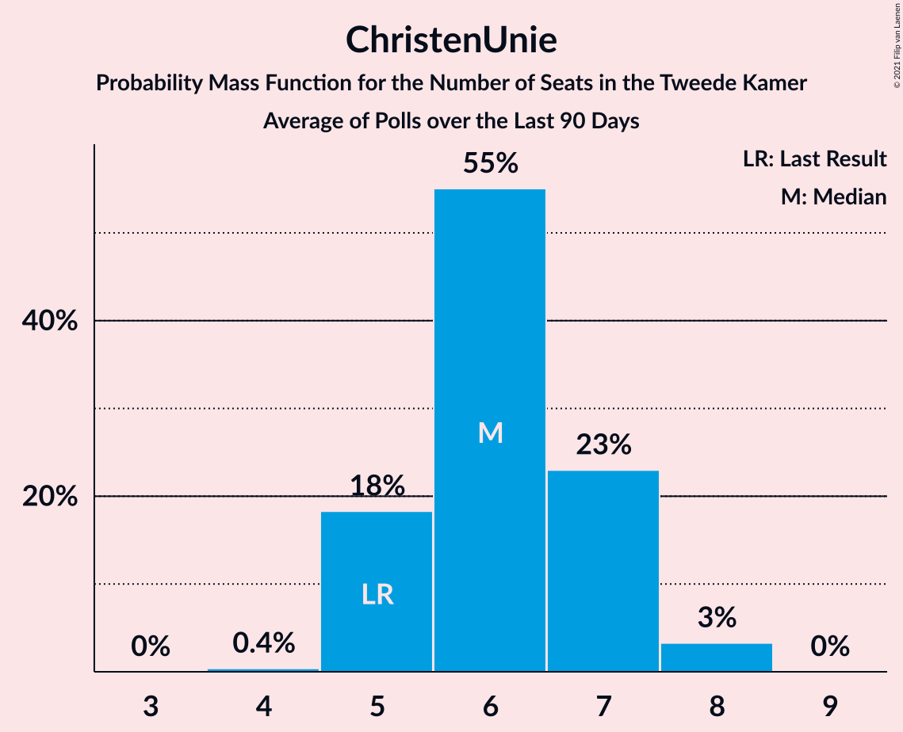

| Number of Seats | Probability | Accumulated | Special Marks |
|:---------------:|:-----------:|:-----------:|:-------------:|
| 4 | 0.4% | 100% |  |
| 5 | 18% | 99.6% | Last Result |
| 6 | 55% | 81% | Median |
| 7 | 23% | 26% |  |
| 8 | 3% | 3% |  |
| 9 | 0% | 0% |  |

### Partij voor de Dieren

*For a full overview of the results for this party, see the [Partij voor de Dieren](party-partijvoordedieren.html) page.*

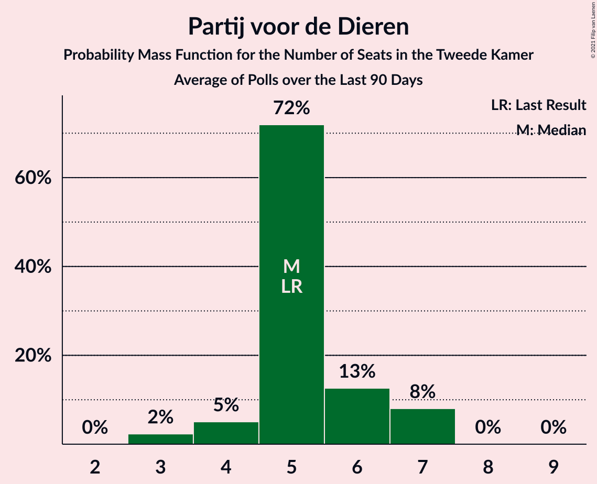

| Number of Seats | Probability | Accumulated | Special Marks |
|:---------------:|:-----------:|:-----------:|:-------------:|
| 3 | 2% | 100% |  |
| 4 | 5% | 98% |  |
| 5 | 72% | 93% | Last Result, Median |
| 6 | 13% | 21% |  |
| 7 | 8% | 8% |  |
| 8 | 0% | 0.1% |  |
| 9 | 0% | 0% |  |

### 50Plus

*For a full overview of the results for this party, see the [50Plus](party-50plus.html) page.*

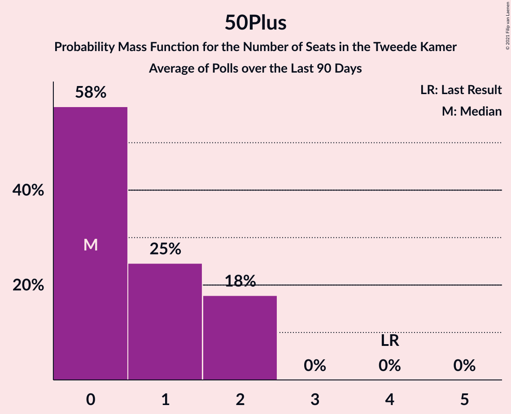

| Number of Seats | Probability | Accumulated | Special Marks |
|:---------------:|:-----------:|:-----------:|:-------------:|
| 0 | 58% | 100% | Median |
| 1 | 25% | 42% |  |
| 2 | 18% | 18% |  |
| 3 | 0% | 0% |  |
| 4 | 0% | 0% | Last Result |

### Staatkundig Gereformeerde Partij

*For a full overview of the results for this party, see the [Staatkundig Gereformeerde Partij](party-staatkundiggereformeerdepartij.html) page.*

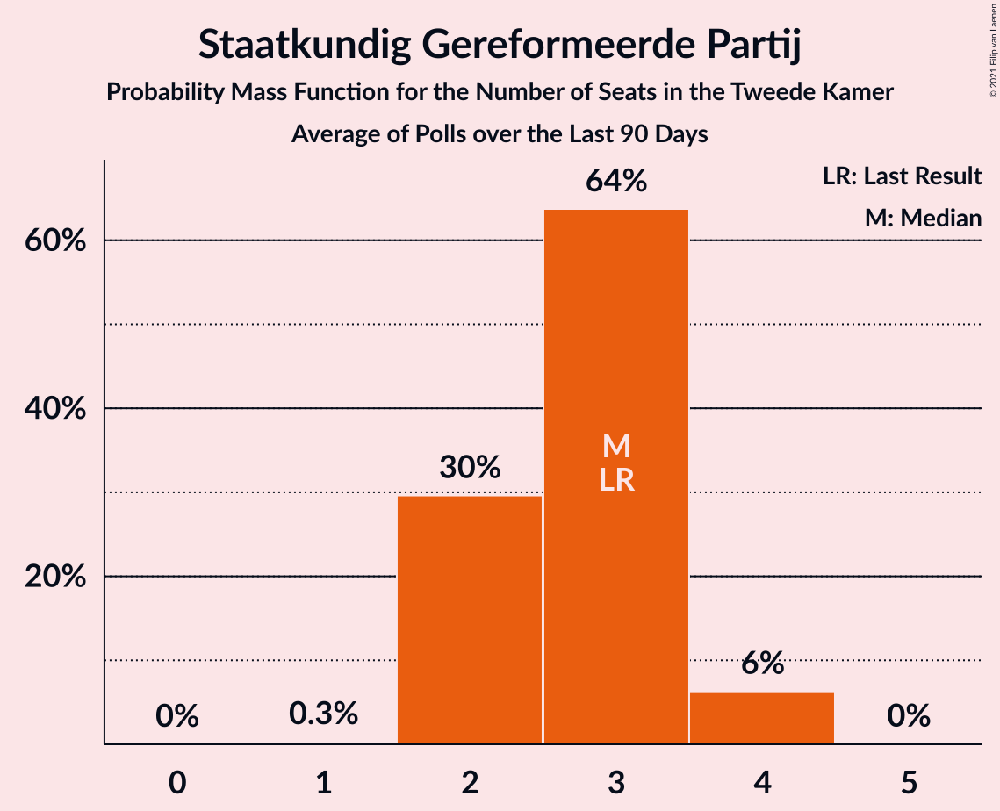

| Number of Seats | Probability | Accumulated | Special Marks |
|:---------------:|:-----------:|:-----------:|:-------------:|
| 1 | 0.3% | 100% |  |
| 2 | 30% | 99.7% |  |
| 3 | 64% | 70% | Last Result, Median |
| 4 | 6% | 6% |  |
| 5 | 0% | 0% |  |

### DENK

*For a full overview of the results for this party, see the [DENK](party-denk.html) page.*

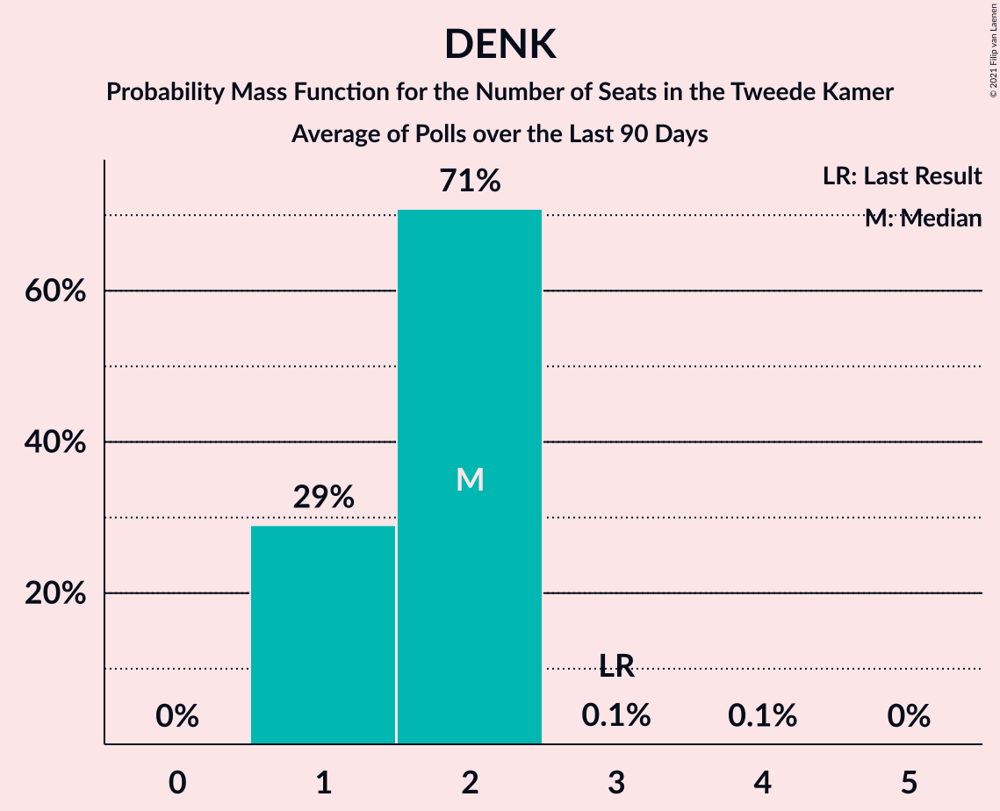

| Number of Seats | Probability | Accumulated | Special Marks |
|:---------------:|:-----------:|:-----------:|:-------------:|
| 1 | 29% | 100% |  |
| 2 | 71% | 71% | Median |
| 3 | 0.1% | 0.2% | Last Result |
| 4 | 0.1% | 0.1% |  |
| 5 | 0% | 0% |  |

### Forum voor Democratie

*For a full overview of the results for this party, see the [Forum voor Democratie](party-forumvoordemocratie.html) page.*

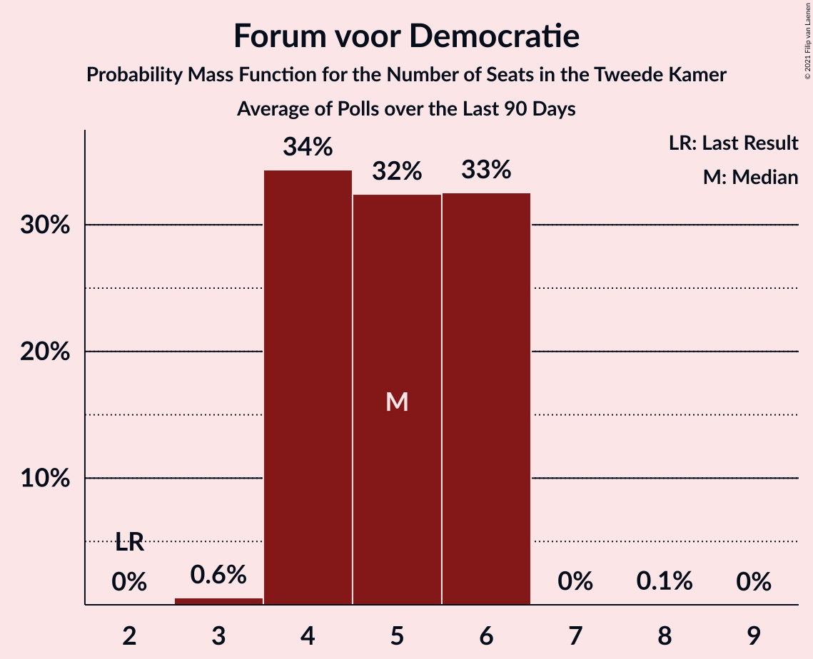

| Number of Seats | Probability | Accumulated | Special Marks |
|:---------------:|:-----------:|:-----------:|:-------------:|
| 2 | 0% | 100% | Last Result |
| 3 | 0.6% | 100% |  |
| 4 | 34% | 99.4% |  |
| 5 | 32% | 65% | Median |
| 6 | 33% | 33% |  |
| 7 | 0% | 0.1% |  |
| 8 | 0.1% | 0.1% |  |
| 9 | 0% | 0% |  |

### Piratenpartij

*For a full overview of the results for this party, see the [Piratenpartij](party-piratenpartij.html) page.*

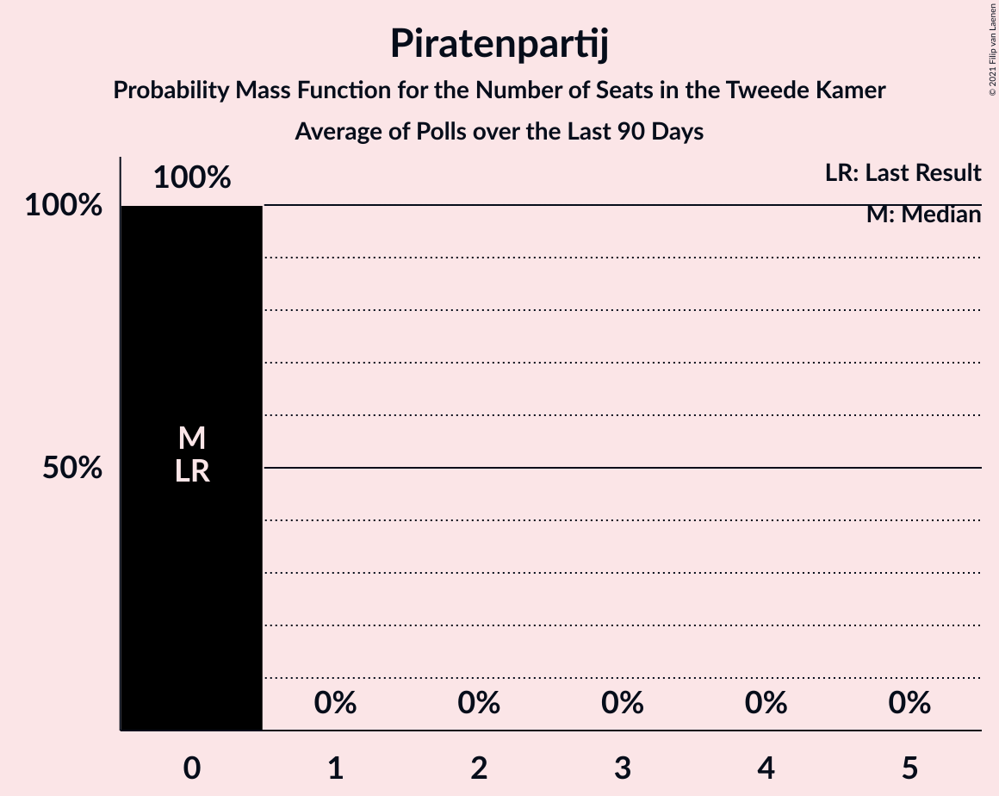

| Number of Seats | Probability | Accumulated | Special Marks |
|:---------------:|:-----------:|:-----------:|:-------------:|
| 0 | 100% | 100% | Last Result, Median |

### Bij1

*For a full overview of the results for this party, see the [Bij1](party-bij1.html) page.*

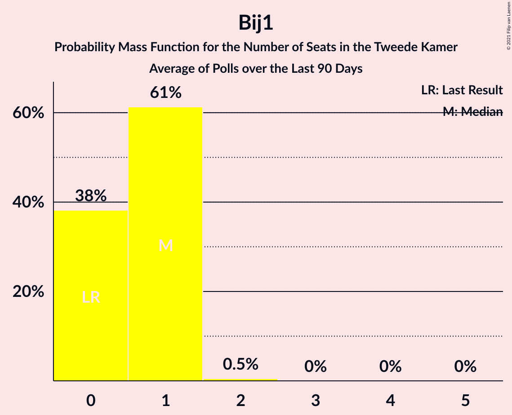

| Number of Seats | Probability | Accumulated | Special Marks |
|:---------------:|:-----------:|:-----------:|:-------------:|
| 0 | 38% | 100% | Last Result |
| 1 | 61% | 62% | Median |
| 2 | 0.5% | 0.5% |  |
| 3 | 0% | 0% |  |

### Partij voor de Toekomst

*For a full overview of the results for this party, see the [Partij voor de Toekomst](party-partijvoordetoekomst.html) page.*

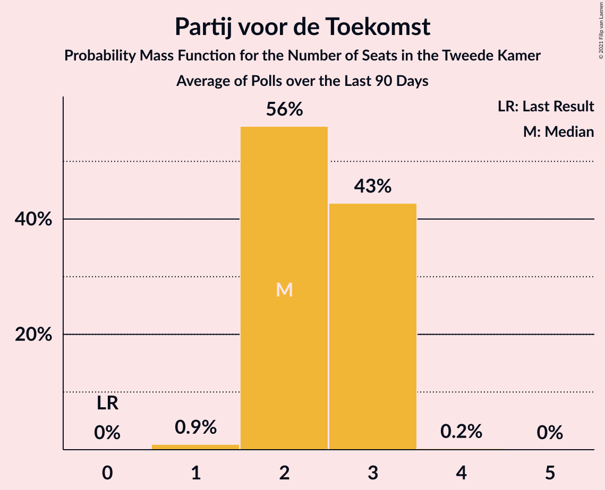

### Juiste Antwoord 2021

*For a full overview of the results for this party, see the [Juiste Antwoord 2021](party-juisteantwoord2021.html) page.*

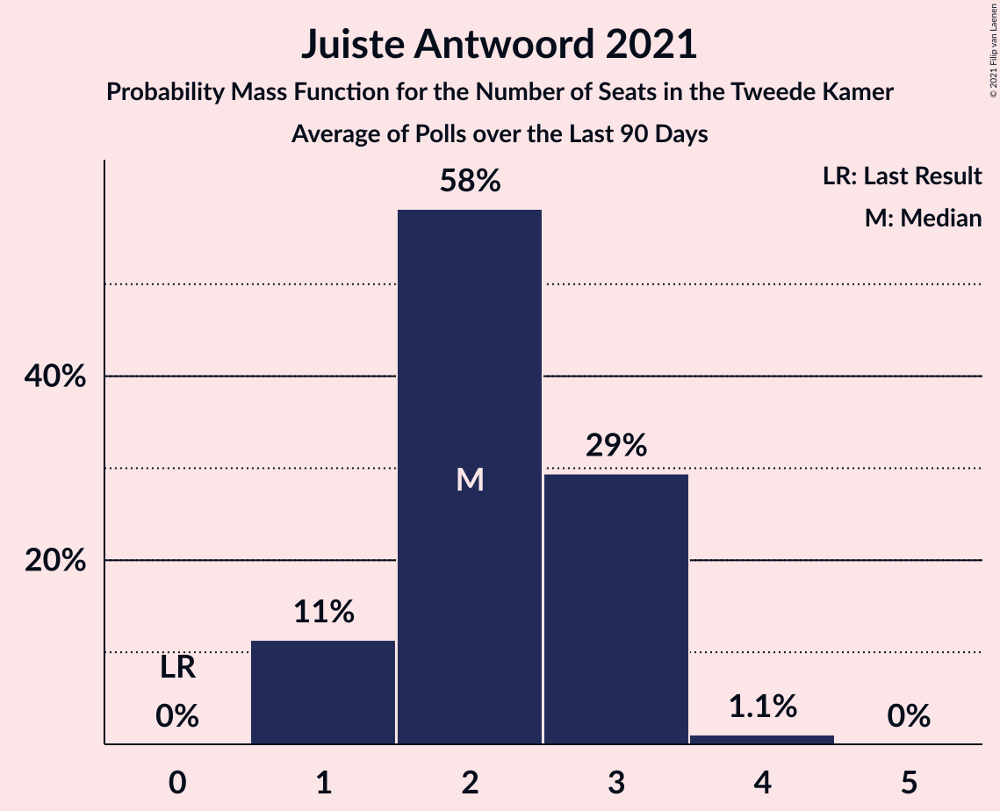

| Number of Seats | Probability | Accumulated | Special Marks |
|:---------------:|:-----------:|:-----------:|:-------------:|
| 0 | 0% | 100% | Last Result |
| 1 | 11% | 100% |  |
| 2 | 58% | 89% | Median |
| 3 | 29% | 30% |  |
| 4 | 1.1% | 1.1% |  |
| 5 | 0% | 0% |  |

### Code Oranje

*For a full overview of the results for this party, see the [Code Oranje](party-codeoranje.html) page.*

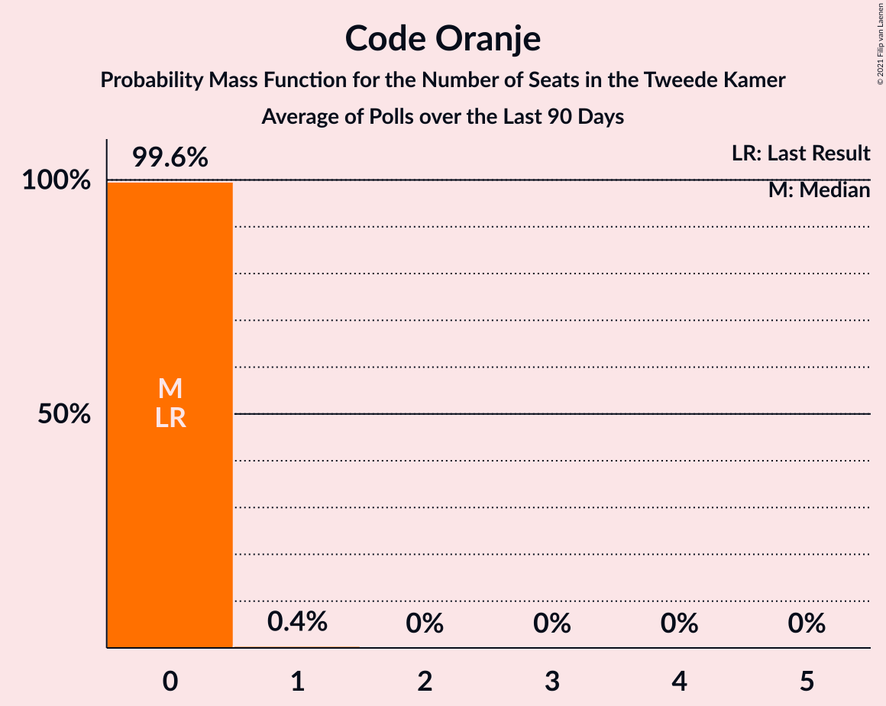

| Number of Seats | Probability | Accumulated | Special Marks |
|:---------------:|:-----------:|:-----------:|:-------------:|
| 0 | 99.6% | 100% | Last Result, Median |
| 1 | 0.4% | 0.4% |  |
| 2 | 0% | 0% |  |

### Volt Europa

*For a full overview of the results for this party, see the [Volt Europa](party-volteuropa.html) page.*

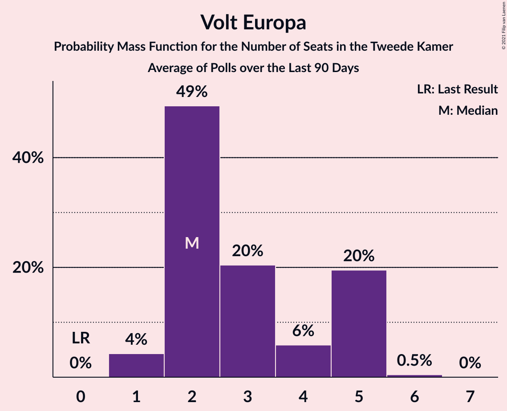

| Number of Seats | Probability | Accumulated | Special Marks |
|:---------------:|:-----------:|:-----------:|:-------------:|
| 0 | 0% | 100% | Last Result |
| 1 | 4% | 100% |  |
| 2 | 49% | 96% | Median |
| 3 | 20% | 46% |  |
| 4 | 6% | 26% |  |
| 5 | 20% | 20% |  |
| 6 | 0.5% | 0.5% |  |
| 7 | 0% | 0% |  |

### BoerBurgerBeweging

*For a full overview of the results for this party, see the [BoerBurgerBeweging](party-boerburgerbeweging.html) page.*

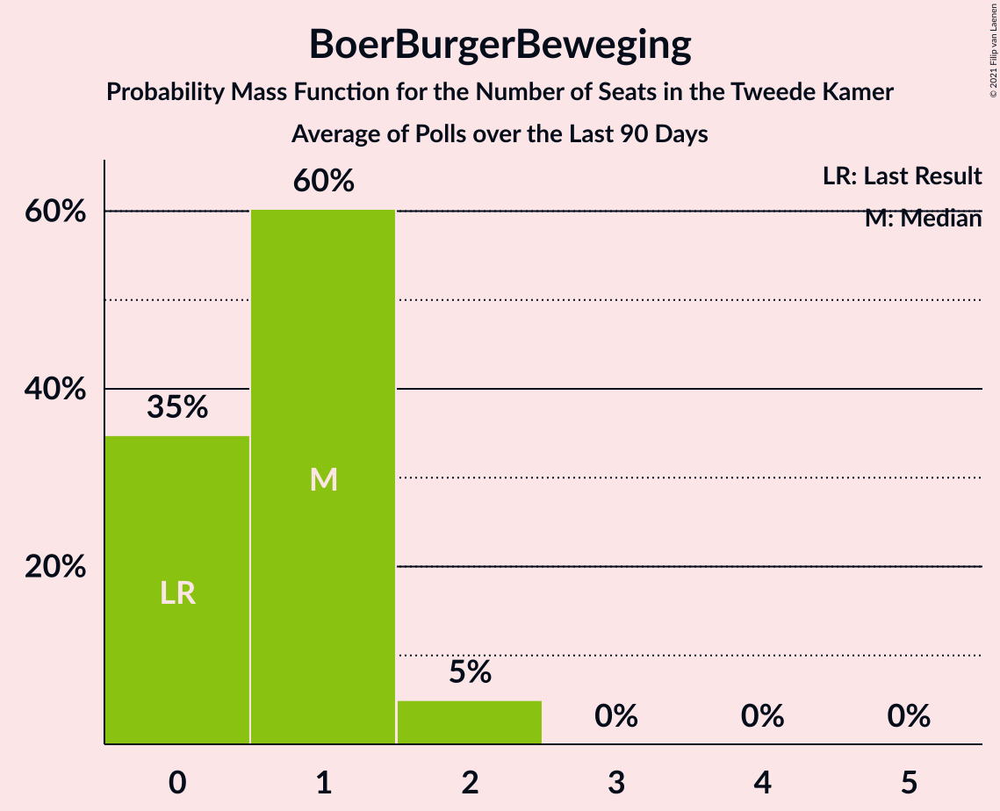

| Number of Seats | Probability | Accumulated | Special Marks |
|:---------------:|:-----------:|:-----------:|:-------------:|
| 0 | 35% | 100% | Last Result |
| 1 | 60% | 65% | Median |
| 2 | 5% | 5% |  |
| 3 | 0% | 0% |  |

### Splinter

*For a full overview of the results for this party, see the [Splinter](party-splinter.html) page.*

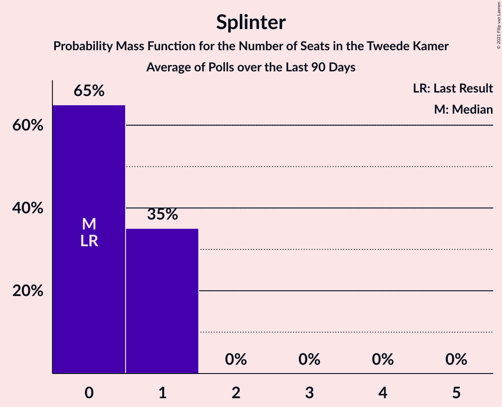

| Number of Seats | Probability | Accumulated | Special Marks |
|:---------------:|:-----------:|:-----------:|:-------------:|
| 0 | 65% | 100% | Last Result, Median |
| 1 | 35% | 35% |  |
| 2 | 0% | 0% |  |

## Coalitions

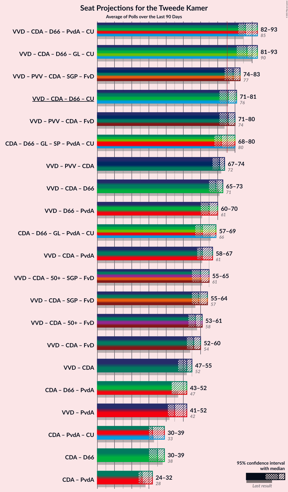

### Confidence Intervals

| Coalition | Last Result | Median | Majority? | 80% Confidence Interval | 90% Confidence Interval | 95% Confidence Interval | 99% Confidence Interval |
|:---------:|:-----------:|:------:|:---------:|:-----------------------:|:-----------------------:|:-----------------------:|:-----------------------:|
| Volkspartij voor Vrijheid en Democratie – Christen-Democratisch Appèl – Democraten 66 – Partij van de Arbeid – ChristenUnie | 85 | 86 | 100% | 82–90 | 82–91 | 82–93 | 78–93 |
| Volkspartij voor Vrijheid en Democratie – Christen-Democratisch Appèl – Democraten 66 – GroenLinks – ChristenUnie | 90 | 87 | 100% | 83–89 | 83–90 | 81–93 | 79–93 |
| Volkspartij voor Vrijheid en Democratie – Partij voor de Vrijheid – Christen-Democratisch Appèl – Staatkundig Gereformeerde Partij – Forum voor Democratie | 77 | 79 | 63% | 75–83 | 75–83 | 74–83 | 71–83 |
| Volkspartij voor Vrijheid en Democratie – Christen-Democratisch Appèl – Democraten 66 – ChristenUnie | 76 | 76 | 59% | 71–79 | 71–80 | 71–81 | 67–81 |
| Volkspartij voor Vrijheid en Democratie – Partij voor de Vrijheid – Christen-Democratisch Appèl – Forum voor Democratie | 74 | 76 | 55% | 72–80 | 72–80 | 71–80 | 69–80 |
| Christen-Democratisch Appèl – Democraten 66 – GroenLinks – Socialistische Partij – Partij van de Arbeid – ChristenUnie | 80 | 72 | 24% | 69–80 | 68–80 | 68–80 | 68–80 |
| Volkspartij voor Vrijheid en Democratie – Partij voor de Vrijheid – Christen-Democratisch Appèl | 72 | 71 | 0.1% | 67–74 | 67–74 | 67–74 | 63–74 |
| Volkspartij voor Vrijheid en Democratie – Christen-Democratisch Appèl – Democraten 66 | 71 | 69 | 0.1% | 65–73 | 65–73 | 65–73 | 62–75 |
| Volkspartij voor Vrijheid en Democratie – Democraten 66 – Partij van de Arbeid | 61 | 65 | 0% | 61–69 | 60–70 | 60–70 | 59–70 |
| Christen-Democratisch Appèl – Democraten 66 – GroenLinks – Partij van de Arbeid – ChristenUnie | 66 | 61 | 0% | 58–68 | 57–68 | 57–69 | 56–69 |
| Volkspartij voor Vrijheid en Democratie – Christen-Democratisch Appèl – Partij van de Arbeid | 61 | 61 | 0% | 59–66 | 59–67 | 58–67 | 54–67 |
| Volkspartij voor Vrijheid en Democratie – Christen-Democratisch Appèl – 50Plus – Staatkundig Gereformeerde Partij – Forum voor Democratie | 61 | 60 | 0% | 55–64 | 55–65 | 55–65 | 52–65 |
| Volkspartij voor Vrijheid en Democratie – Christen-Democratisch Appèl – Staatkundig Gereformeerde Partij – Forum voor Democratie | 57 | 59 | 0% | 55–63 | 55–64 | 55–64 | 51–64 |
| Volkspartij voor Vrijheid en Democratie – Christen-Democratisch Appèl – 50Plus – Forum voor Democratie | 58 | 57 | 0% | 53–61 | 53–61 | 53–61 | 50–61 |
| Volkspartij voor Vrijheid en Democratie – Christen-Democratisch Appèl – Forum voor Democratie | 54 | 56 | 0% | 53–60 | 53–60 | 52–60 | 49–60 |
| Volkspartij voor Vrijheid en Democratie – Christen-Democratisch Appèl | 52 | 52 | 0% | 48–54 | 48–55 | 47–55 | 43–55 |
| Christen-Democratisch Appèl – Democraten 66 – Partij van de Arbeid | 47 | 43 | 0% | 43–48 | 43–48 | 43–52 | 42–52 |
| Volkspartij voor Vrijheid en Democratie – Partij van de Arbeid | 42 | 45 | 0% | 44–52 | 42–52 | 41–52 | 41–53 |
| Christen-Democratisch Appèl – Partij van de Arbeid – ChristenUnie | 33 | 32 | 0% | 30–35 | 30–36 | 30–39 | 29–39 |
| Christen-Democratisch Appèl – Democraten 66 | 38 | 35 | 0% | 32–36 | 30–37 | 30–39 | 30–39 |
| Christen-Democratisch Appèl – Partij van de Arbeid | 28 | 26 | 0% | 24–28 | 24–30 | 24–32 | 24–32 |

### Volkspartij voor Vrijheid en Democratie – Christen-Democratisch Appèl – Democraten 66 – Partij van de Arbeid – ChristenUnie

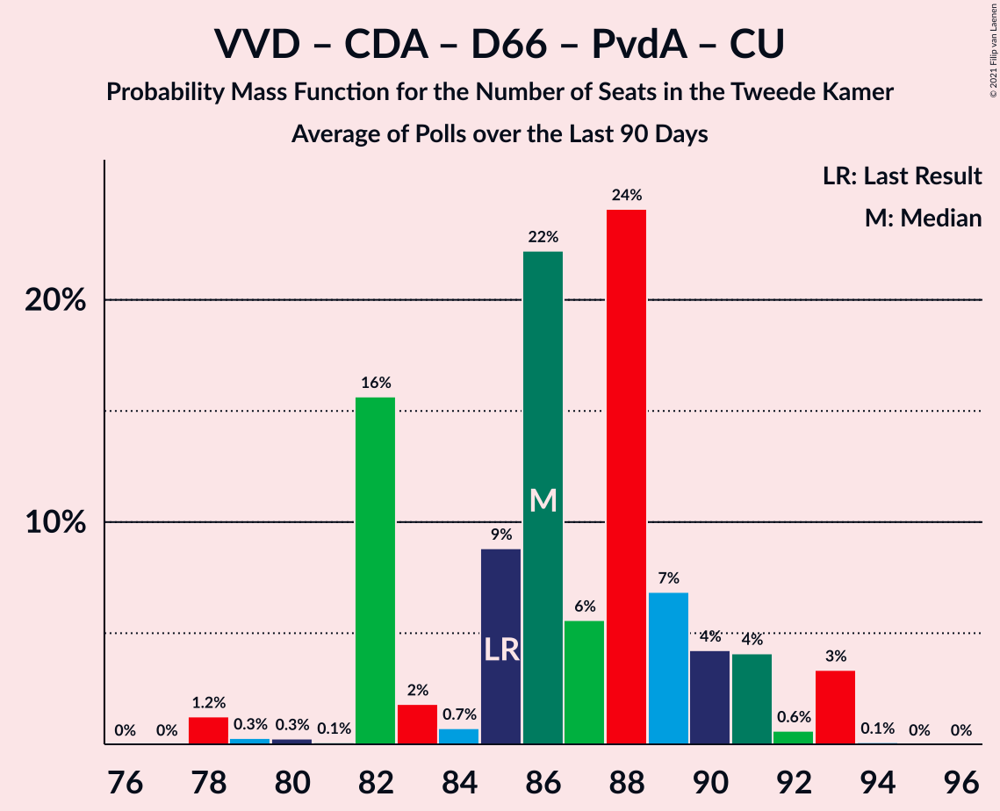

| Number of Seats | Probability | Accumulated | Special Marks |
|:---------------:|:-----------:|:-----------:|:-------------:|
| 78 | 1.2% | 100% |  |
| 79 | 0.3% | 98.7% |  |
| 80 | 0.3% | 98% |  |
| 81 | 0.1% | 98% |  |
| 82 | 16% | 98% |  |
| 83 | 2% | 82% |  |
| 84 | 0.7% | 81% |  |
| 85 | 9% | 80% | Last Result |
| 86 | 22% | 71% |  |
| 87 | 6% | 49% | Median |
| 88 | 24% | 43% |  |
| 89 | 7% | 19% |  |
| 90 | 4% | 12% |  |
| 91 | 4% | 8% |  |
| 92 | 0.6% | 4% |  |
| 93 | 3% | 3% |  |
| 94 | 0.1% | 0.1% |  |
| 95 | 0% | 0% |  |

### Volkspartij voor Vrijheid en Democratie – Christen-Democratisch Appèl – Democraten 66 – GroenLinks – ChristenUnie

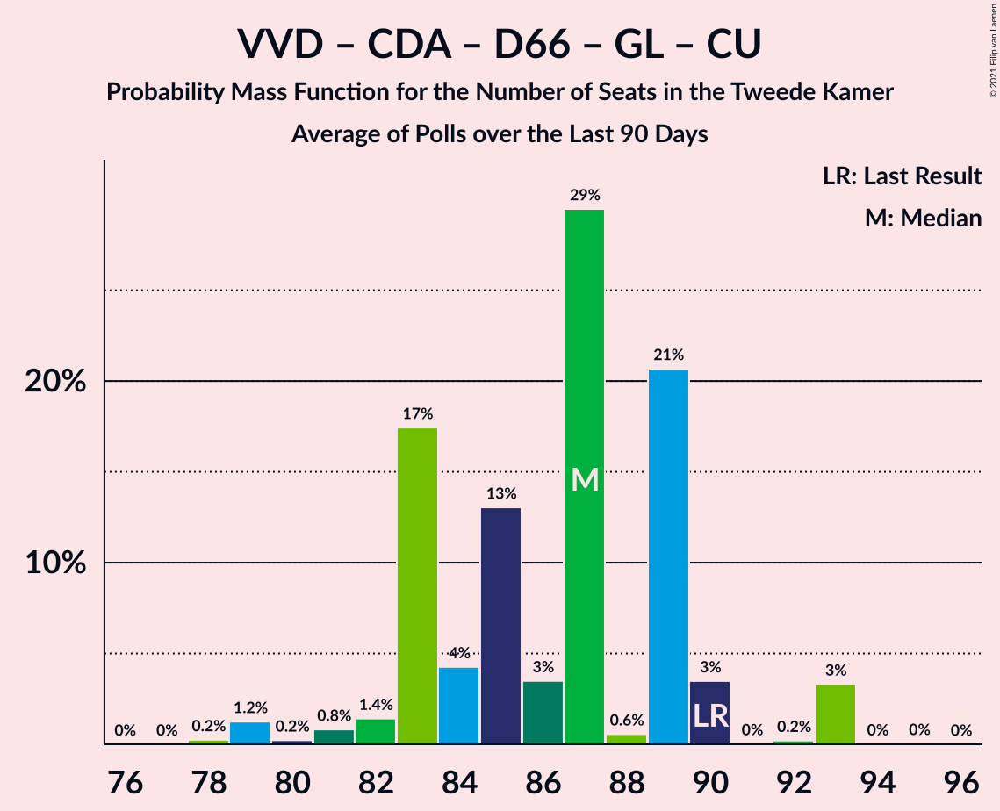

| Number of Seats | Probability | Accumulated | Special Marks |
|:---------------:|:-----------:|:-----------:|:-------------:|
| 78 | 0.2% | 100% |  |
| 79 | 1.2% | 99.7% |  |
| 80 | 0.2% | 98.5% |  |
| 81 | 0.8% | 98% |  |
| 82 | 1.4% | 97% |  |
| 83 | 17% | 96% |  |
| 84 | 4% | 79% |  |
| 85 | 13% | 74% |  |
| 86 | 3% | 61% | Median |
| 87 | 29% | 58% |  |
| 88 | 0.6% | 28% |  |
| 89 | 21% | 28% |  |
| 90 | 3% | 7% | Last Result |
| 91 | 0% | 4% |  |
| 92 | 0.2% | 4% |  |
| 93 | 3% | 3% |  |
| 94 | 0% | 0.1% |  |
| 95 | 0% | 0% |  |

### Volkspartij voor Vrijheid en Democratie – Partij voor de Vrijheid – Christen-Democratisch Appèl – Staatkundig Gereformeerde Partij – Forum voor Democratie

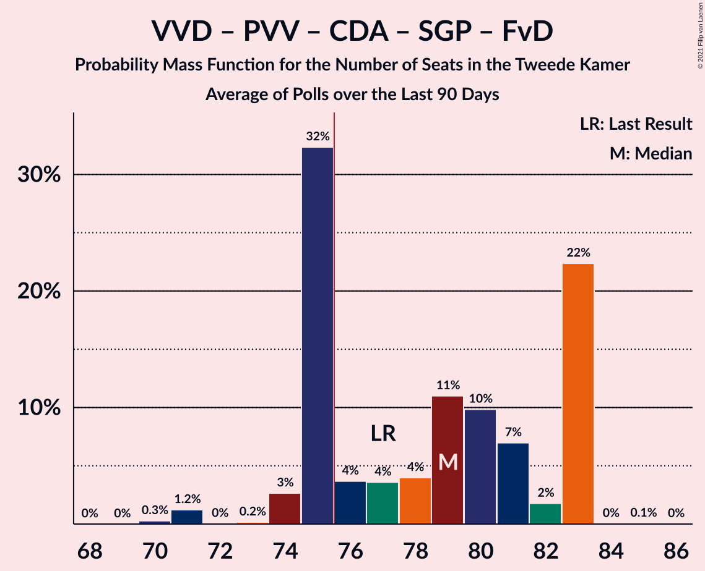

| Number of Seats | Probability | Accumulated | Special Marks |
|:---------------:|:-----------:|:-----------:|:-------------:|
| 70 | 0.3% | 100% |  |
| 71 | 1.2% | 99.7% |  |
| 72 | 0% | 98% |  |
| 73 | 0.2% | 98% |  |
| 74 | 3% | 98% |  |
| 75 | 32% | 96% |  |
| 76 | 4% | 63% | Majority |
| 77 | 4% | 60% | Last Result |
| 78 | 4% | 56% |  |
| 79 | 11% | 52% | Median |
| 80 | 10% | 41% |  |
| 81 | 7% | 31% |  |
| 82 | 2% | 24% |  |
| 83 | 22% | 22% |  |
| 84 | 0% | 0.1% |  |
| 85 | 0.1% | 0.1% |  |
| 86 | 0% | 0% |  |

### Volkspartij voor Vrijheid en Democratie – Christen-Democratisch Appèl – Democraten 66 – ChristenUnie

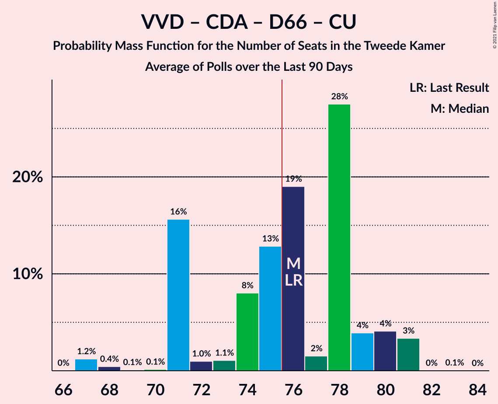

| Number of Seats | Probability | Accumulated | Special Marks |
|:---------------:|:-----------:|:-----------:|:-------------:|
| 67 | 1.2% | 100% |  |
| 68 | 0.4% | 98.8% |  |
| 69 | 0.1% | 98% |  |
| 70 | 0.1% | 98% |  |
| 71 | 16% | 98% |  |
| 72 | 1.0% | 82% |  |
| 73 | 1.1% | 81% |  |
| 74 | 8% | 80% |  |
| 75 | 13% | 72% |  |
| 76 | 19% | 59% | Last Result, Median, Majority |
| 77 | 2% | 40% |  |
| 78 | 28% | 39% |  |
| 79 | 4% | 11% |  |
| 80 | 4% | 8% |  |
| 81 | 3% | 3% |  |
| 82 | 0% | 0.1% |  |
| 83 | 0.1% | 0.1% |  |
| 84 | 0% | 0% |  |

### Volkspartij voor Vrijheid en Democratie – Partij voor de Vrijheid – Christen-Democratisch Appèl – Forum voor Democratie

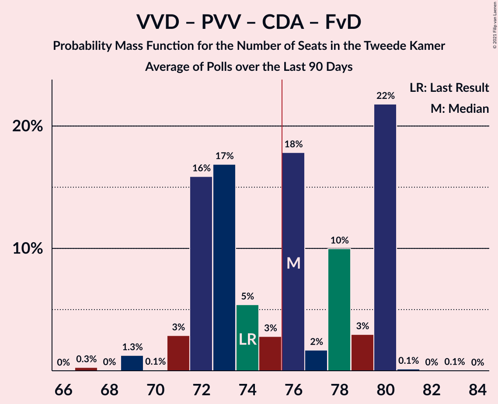

| Number of Seats | Probability | Accumulated | Special Marks |
|:---------------:|:-----------:|:-----------:|:-------------:|
| 67 | 0.3% | 100% |  |
| 68 | 0% | 99.7% |  |
| 69 | 1.3% | 99.7% |  |
| 70 | 0.1% | 98% |  |
| 71 | 3% | 98% |  |
| 72 | 16% | 95% |  |
| 73 | 17% | 80% |  |
| 74 | 5% | 63% | Last Result |
| 75 | 3% | 57% |  |
| 76 | 18% | 55% | Median, Majority |
| 77 | 2% | 37% |  |
| 78 | 10% | 35% |  |
| 79 | 3% | 25% |  |
| 80 | 22% | 22% |  |
| 81 | 0.1% | 0.2% |  |
| 82 | 0% | 0.1% |  |
| 83 | 0.1% | 0.1% |  |
| 84 | 0% | 0% |  |

### Christen-Democratisch Appèl – Democraten 66 – GroenLinks – Socialistische Partij – Partij van de Arbeid – ChristenUnie

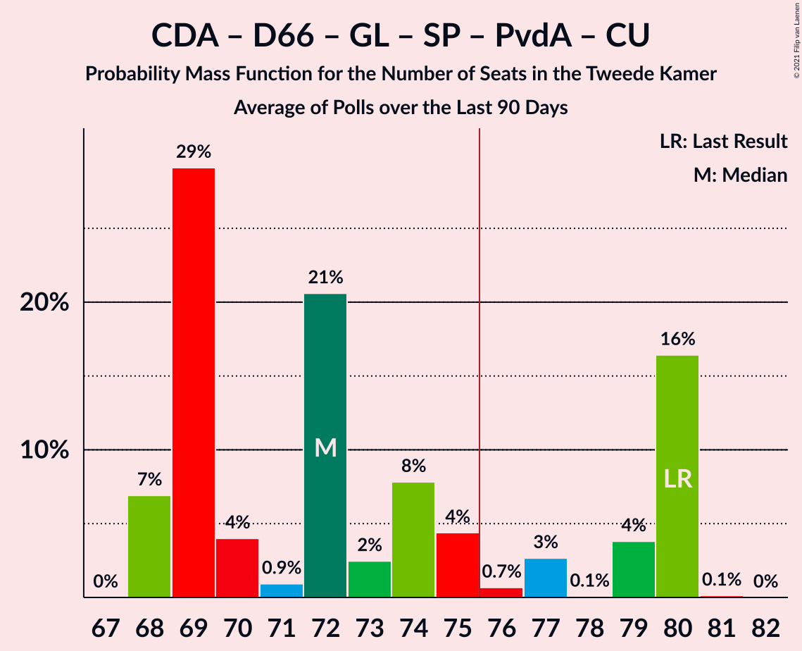

| Number of Seats | Probability | Accumulated | Special Marks |
|:---------------:|:-----------:|:-----------:|:-------------:|
| 68 | 7% | 100% |  |
| 69 | 29% | 93% |  |
| 70 | 4% | 64% |  |
| 71 | 0.9% | 60% |  |
| 72 | 21% | 59% |  |
| 73 | 2% | 38% | Median |
| 74 | 8% | 36% |  |
| 75 | 4% | 28% |  |
| 76 | 0.7% | 24% | Majority |
| 77 | 3% | 23% |  |
| 78 | 0.1% | 20% |  |
| 79 | 4% | 20% |  |
| 80 | 16% | 17% | Last Result |
| 81 | 0.1% | 0.1% |  |
| 82 | 0% | 0% |  |

### Volkspartij voor Vrijheid en Democratie – Partij voor de Vrijheid – Christen-Democratisch Appèl

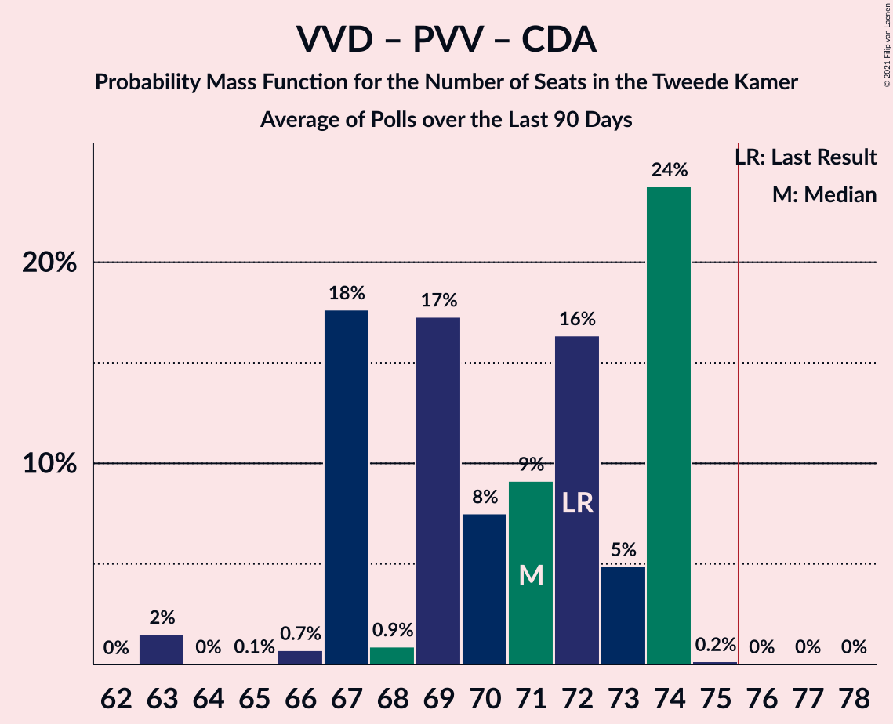

| Number of Seats | Probability | Accumulated | Special Marks |
|:---------------:|:-----------:|:-----------:|:-------------:|
| 63 | 2% | 100% |  |
| 64 | 0% | 98% |  |
| 65 | 0.1% | 98% |  |
| 66 | 0.7% | 98% |  |
| 67 | 18% | 98% |  |
| 68 | 0.9% | 80% |  |
| 69 | 17% | 79% |  |
| 70 | 8% | 62% |  |
| 71 | 9% | 54% | Median |
| 72 | 16% | 45% | Last Result |
| 73 | 5% | 29% |  |
| 74 | 24% | 24% |  |
| 75 | 0.2% | 0.3% |  |
| 76 | 0% | 0.1% | Majority |
| 77 | 0% | 0.1% |  |
| 78 | 0% | 0% |  |

### Volkspartij voor Vrijheid en Democratie – Christen-Democratisch Appèl – Democraten 66

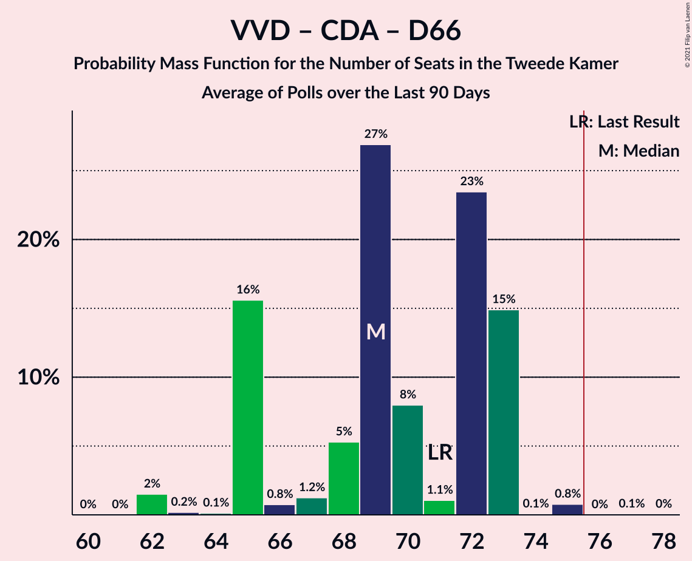

| Number of Seats | Probability | Accumulated | Special Marks |
|:---------------:|:-----------:|:-----------:|:-------------:|
| 62 | 2% | 100% |  |
| 63 | 0.2% | 98% |  |
| 64 | 0.1% | 98% |  |
| 65 | 16% | 98% |  |
| 66 | 0.8% | 83% |  |
| 67 | 1.2% | 82% |  |
| 68 | 5% | 81% |  |
| 69 | 27% | 75% |  |
| 70 | 8% | 48% | Median |
| 71 | 1.1% | 40% | Last Result |
| 72 | 23% | 39% |  |
| 73 | 15% | 16% |  |
| 74 | 0.1% | 0.9% |  |
| 75 | 0.8% | 0.9% |  |
| 76 | 0% | 0.1% | Majority |
| 77 | 0.1% | 0.1% |  |
| 78 | 0% | 0% |  |

### Volkspartij voor Vrijheid en Democratie – Democraten 66 – Partij van de Arbeid

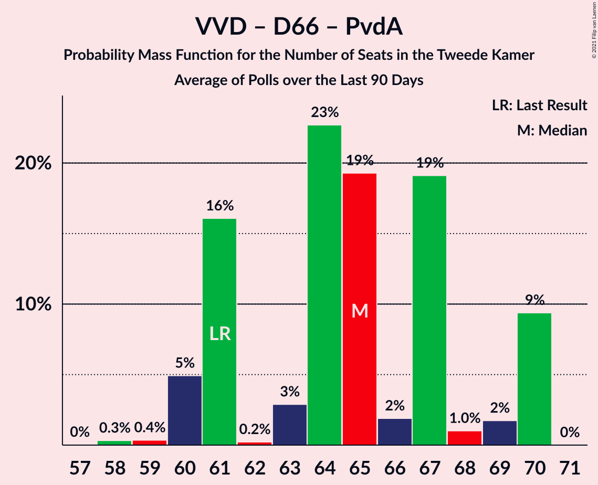

| Number of Seats | Probability | Accumulated | Special Marks |
|:---------------:|:-----------:|:-----------:|:-------------:|
| 58 | 0.3% | 100% |  |
| 59 | 0.4% | 99.6% |  |
| 60 | 5% | 99.3% |  |
| 61 | 16% | 94% | Last Result |
| 62 | 0.2% | 78% |  |
| 63 | 3% | 78% |  |
| 64 | 23% | 75% |  |
| 65 | 19% | 52% | Median |
| 66 | 2% | 33% |  |
| 67 | 19% | 31% |  |
| 68 | 1.0% | 12% |  |
| 69 | 2% | 11% |  |
| 70 | 9% | 9% |  |
| 71 | 0% | 0% |  |

### Christen-Democratisch Appèl – Democraten 66 – GroenLinks – Partij van de Arbeid – ChristenUnie

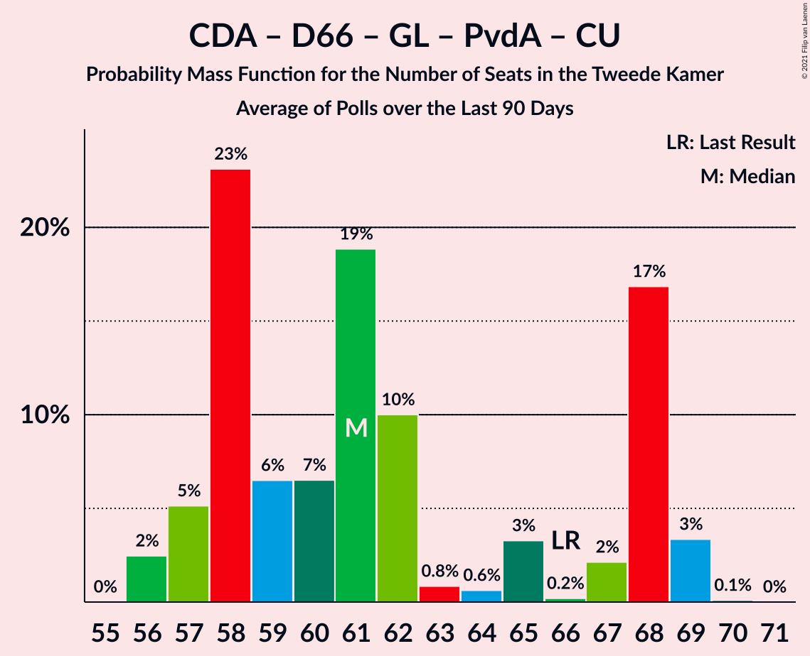

| Number of Seats | Probability | Accumulated | Special Marks |
|:---------------:|:-----------:|:-----------:|:-------------:|
| 56 | 2% | 100% |  |
| 57 | 5% | 98% |  |
| 58 | 23% | 92% |  |
| 59 | 6% | 69% |  |
| 60 | 7% | 63% |  |
| 61 | 19% | 56% |  |
| 62 | 10% | 37% | Median |
| 63 | 0.8% | 27% |  |
| 64 | 0.6% | 27% |  |
| 65 | 3% | 26% |  |
| 66 | 0.2% | 23% | Last Result |
| 67 | 2% | 22% |  |
| 68 | 17% | 20% |  |
| 69 | 3% | 3% |  |
| 70 | 0.1% | 0.1% |  |
| 71 | 0% | 0% |  |

### Volkspartij voor Vrijheid en Democratie – Christen-Democratisch Appèl – Partij van de Arbeid

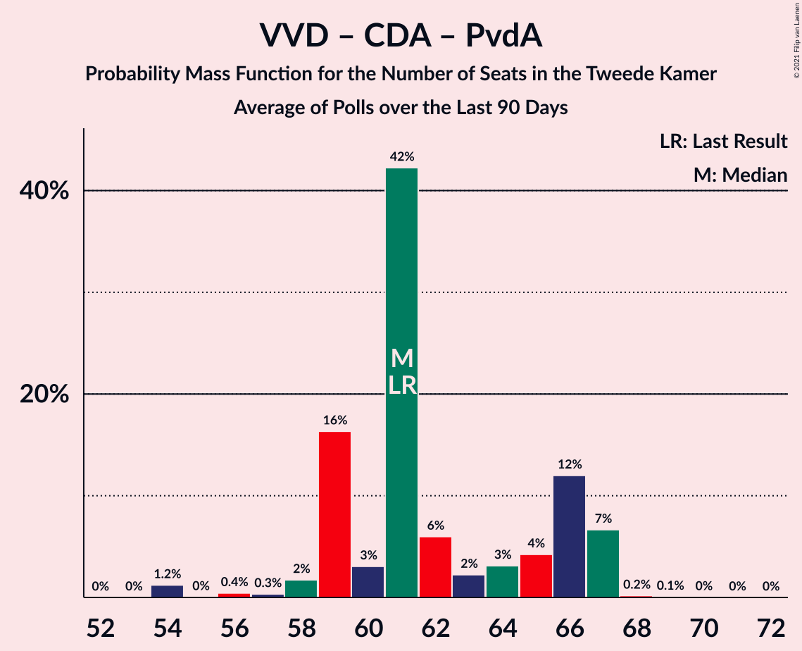

| Number of Seats | Probability | Accumulated | Special Marks |
|:---------------:|:-----------:|:-----------:|:-------------:|
| 54 | 1.2% | 100% |  |
| 55 | 0% | 98.8% |  |
| 56 | 0.4% | 98.7% |  |
| 57 | 0.3% | 98% |  |
| 58 | 2% | 98% |  |
| 59 | 16% | 96% |  |
| 60 | 3% | 80% |  |
| 61 | 42% | 77% | Last Result |
| 62 | 6% | 35% | Median |
| 63 | 2% | 29% |  |
| 64 | 3% | 26% |  |
| 65 | 4% | 23% |  |
| 66 | 12% | 19% |  |
| 67 | 7% | 7% |  |
| 68 | 0.2% | 0.3% |  |
| 69 | 0.1% | 0.1% |  |
| 70 | 0% | 0.1% |  |
| 71 | 0% | 0% |  |

### Volkspartij voor Vrijheid en Democratie – Christen-Democratisch Appèl – 50Plus – Staatkundig Gereformeerde Partij – Forum voor Democratie

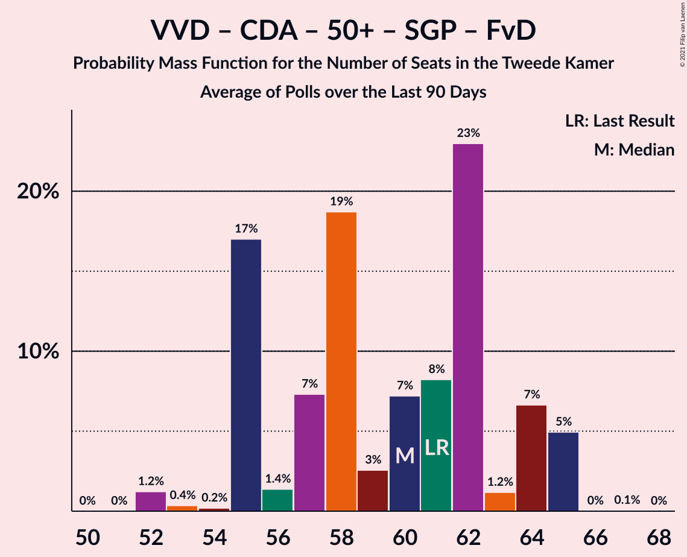

| Number of Seats | Probability | Accumulated | Special Marks |
|:---------------:|:-----------:|:-----------:|:-------------:|
| 52 | 1.2% | 100% |  |
| 53 | 0.4% | 98.8% |  |
| 54 | 0.2% | 98% |  |
| 55 | 17% | 98% |  |
| 56 | 1.4% | 81% |  |
| 57 | 7% | 80% |  |
| 58 | 19% | 73% |  |
| 59 | 3% | 54% | Median |
| 60 | 7% | 51% |  |
| 61 | 8% | 44% | Last Result |
| 62 | 23% | 36% |  |
| 63 | 1.2% | 13% |  |
| 64 | 7% | 12% |  |
| 65 | 5% | 5% |  |
| 66 | 0% | 0.1% |  |
| 67 | 0.1% | 0.1% |  |
| 68 | 0% | 0% |  |

### Volkspartij voor Vrijheid en Democratie – Christen-Democratisch Appèl – Staatkundig Gereformeerde Partij – Forum voor Democratie

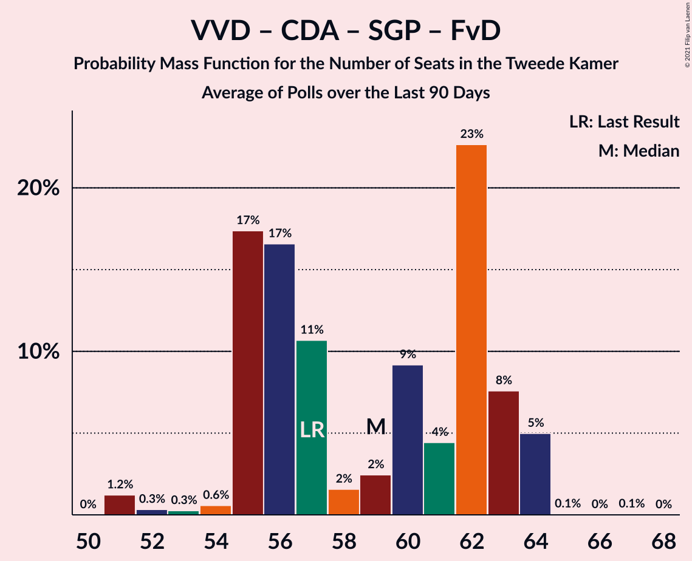

| Number of Seats | Probability | Accumulated | Special Marks |
|:---------------:|:-----------:|:-----------:|:-------------:|
| 51 | 1.2% | 100% |  |
| 52 | 0.3% | 98.8% |  |
| 53 | 0.3% | 98% |  |
| 54 | 0.6% | 98% |  |
| 55 | 17% | 98% |  |
| 56 | 17% | 80% |  |
| 57 | 11% | 64% | Last Result |
| 58 | 2% | 53% |  |
| 59 | 2% | 51% | Median |
| 60 | 9% | 49% |  |
| 61 | 4% | 40% |  |
| 62 | 23% | 35% |  |
| 63 | 8% | 13% |  |
| 64 | 5% | 5% |  |
| 65 | 0.1% | 0.1% |  |
| 66 | 0% | 0.1% |  |
| 67 | 0.1% | 0.1% |  |
| 68 | 0% | 0% |  |

### Volkspartij voor Vrijheid en Democratie – Christen-Democratisch Appèl – 50Plus – Forum voor Democratie

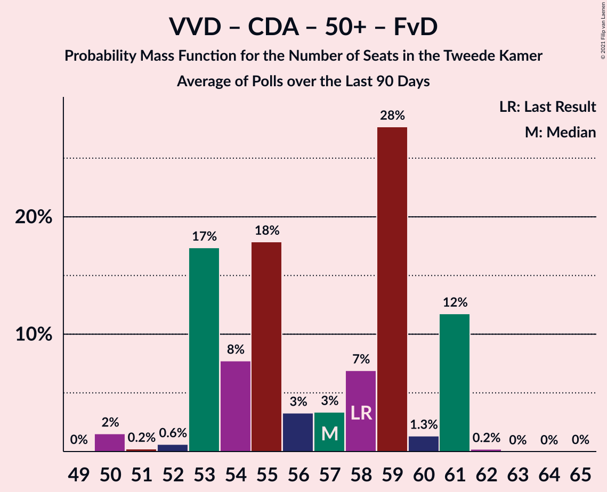

| Number of Seats | Probability | Accumulated | Special Marks |
|:---------------:|:-----------:|:-----------:|:-------------:|
| 49 | 0% | 100% |  |
| 50 | 2% | 99.9% |  |
| 51 | 0.2% | 98% |  |
| 52 | 0.6% | 98% |  |
| 53 | 17% | 98% |  |
| 54 | 8% | 80% |  |
| 55 | 18% | 72% |  |
| 56 | 3% | 55% | Median |
| 57 | 3% | 51% |  |
| 58 | 7% | 48% | Last Result |
| 59 | 28% | 41% |  |
| 60 | 1.3% | 13% |  |
| 61 | 12% | 12% |  |
| 62 | 0.2% | 0.3% |  |
| 63 | 0% | 0.1% |  |
| 64 | 0% | 0.1% |  |
| 65 | 0% | 0% |  |

### Volkspartij voor Vrijheid en Democratie – Christen-Democratisch Appèl – Forum voor Democratie

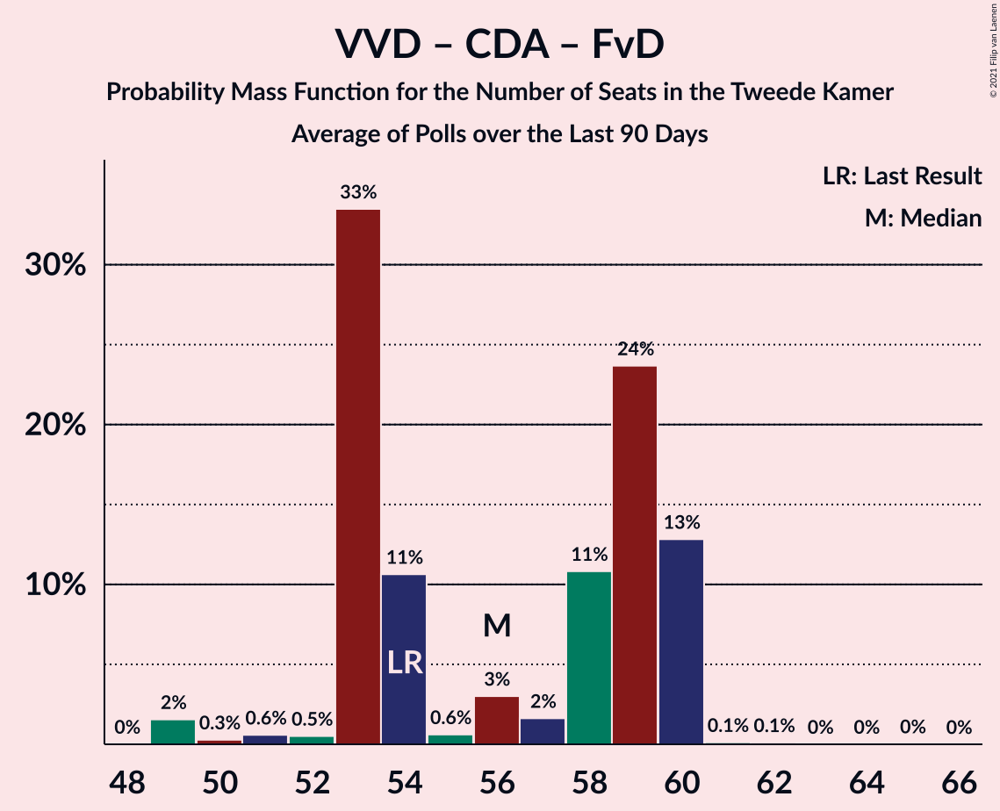

| Number of Seats | Probability | Accumulated | Special Marks |
|:---------------:|:-----------:|:-----------:|:-------------:|
| 49 | 2% | 100% |  |
| 50 | 0.3% | 98% |  |
| 51 | 0.6% | 98% |  |
| 52 | 0.5% | 98% |  |
| 53 | 33% | 97% |  |
| 54 | 11% | 64% | Last Result |
| 55 | 0.6% | 53% |  |
| 56 | 3% | 52% | Median |
| 57 | 2% | 49% |  |
| 58 | 11% | 48% |  |
| 59 | 24% | 37% |  |
| 60 | 13% | 13% |  |
| 61 | 0.1% | 0.3% |  |
| 62 | 0.1% | 0.2% |  |
| 63 | 0% | 0.1% |  |
| 64 | 0% | 0.1% |  |
| 65 | 0% | 0% |  |

### Volkspartij voor Vrijheid en Democratie – Christen-Democratisch Appèl

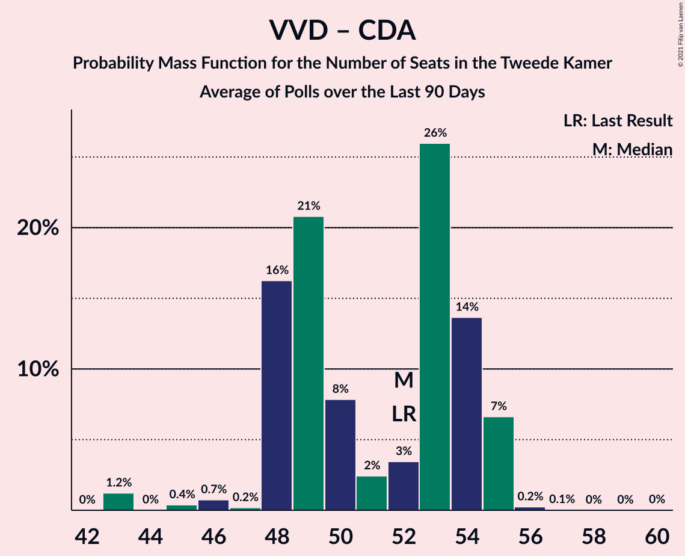

| Number of Seats | Probability | Accumulated | Special Marks |
|:---------------:|:-----------:|:-----------:|:-------------:|
| 43 | 1.2% | 100% |  |
| 44 | 0% | 98.8% |  |
| 45 | 0.4% | 98.7% |  |
| 46 | 0.7% | 98% |  |
| 47 | 0.2% | 98% |  |
| 48 | 16% | 97% |  |
| 49 | 21% | 81% |  |
| 50 | 8% | 60% |  |
| 51 | 2% | 53% | Median |
| 52 | 3% | 50% | Last Result |
| 53 | 26% | 47% |  |
| 54 | 14% | 21% |  |
| 55 | 7% | 7% |  |
| 56 | 0.2% | 0.4% |  |
| 57 | 0.1% | 0.1% |  |
| 58 | 0% | 0.1% |  |
| 59 | 0% | 0.1% |  |
| 60 | 0% | 0% |  |

### Christen-Democratisch Appèl – Democraten 66 – Partij van de Arbeid

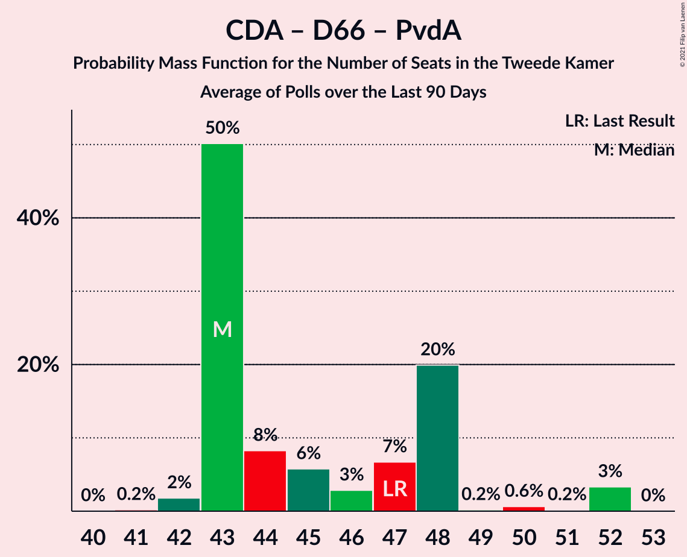

| Number of Seats | Probability | Accumulated | Special Marks |
|:---------------:|:-----------:|:-----------:|:-------------:|
| 41 | 0.2% | 100% |  |
| 42 | 2% | 99.8% |  |
| 43 | 50% | 98% |  |
| 44 | 8% | 48% |  |
| 45 | 6% | 40% |  |
| 46 | 3% | 34% | Median |
| 47 | 7% | 31% | Last Result |
| 48 | 20% | 24% |  |
| 49 | 0.2% | 4% |  |
| 50 | 0.6% | 4% |  |
| 51 | 0.2% | 3% |  |
| 52 | 3% | 3% |  |
| 53 | 0% | 0% |  |

### Volkspartij voor Vrijheid en Democratie – Partij van de Arbeid

| Number of Seats | Probability | Accumulated | Special Marks |
|:---------------:|:-----------:|:-----------:|:-------------:|
| 41 | 4% | 100% |  |
| 42 | 3% | 96% | Last Result |
| 43 | 0.2% | 94% |  |
| 44 | 18% | 94% |  |
| 45 | 39% | 76% |  |
| 46 | 2% | 37% | Median |
| 47 | 11% | 34% |  |
| 48 | 3% | 24% |  |
| 49 | 2% | 20% |  |
| 50 | 2% | 18% |  |
| 51 | 4% | 17% |  |
| 52 | 12% | 13% |  |
| 53 | 1.3% | 2% |  |
| 54 | 0.2% | 0.2% |  |
| 55 | 0% | 0% |  |

### Christen-Democratisch Appèl – Partij van de Arbeid – ChristenUnie

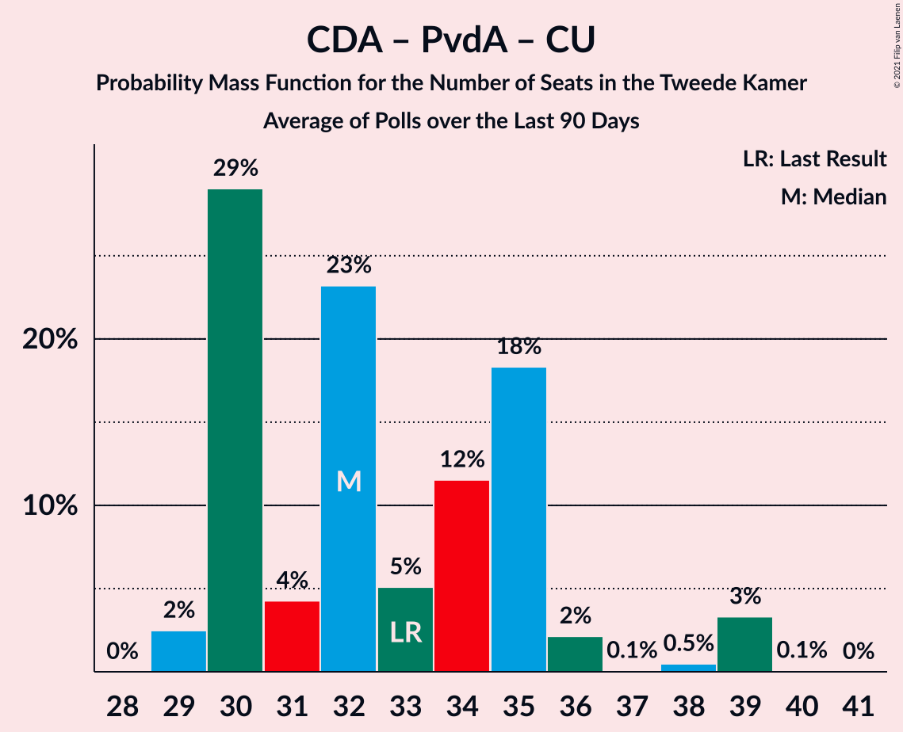

| Number of Seats | Probability | Accumulated | Special Marks |
|:---------------:|:-----------:|:-----------:|:-------------:|
| 29 | 2% | 100% |  |
| 30 | 29% | 98% |  |
| 31 | 4% | 68% |  |
| 32 | 23% | 64% |  |
| 33 | 5% | 41% | Last Result, Median |
| 34 | 12% | 36% |  |
| 35 | 18% | 24% |  |
| 36 | 2% | 6% |  |
| 37 | 0.1% | 4% |  |
| 38 | 0.5% | 4% |  |
| 39 | 3% | 3% |  |
| 40 | 0.1% | 0.1% |  |
| 41 | 0% | 0% |  |

### Christen-Democratisch Appèl – Democraten 66

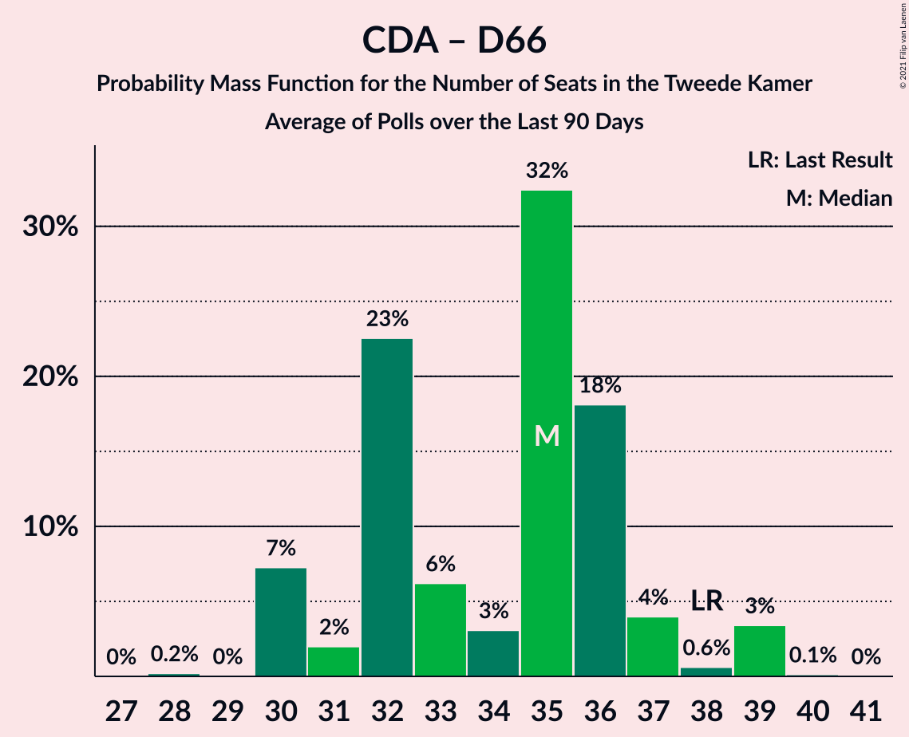

| Number of Seats | Probability | Accumulated | Special Marks |
|:---------------:|:-----------:|:-----------:|:-------------:|
| 28 | 0.2% | 100% |  |
| 29 | 0% | 99.8% |  |
| 30 | 7% | 99.8% |  |
| 31 | 2% | 93% |  |
| 32 | 23% | 91% |  |
| 33 | 6% | 68% |  |
| 34 | 3% | 62% |  |
| 35 | 32% | 59% | Median |
| 36 | 18% | 26% |  |
| 37 | 4% | 8% |  |
| 38 | 0.6% | 4% | Last Result |
| 39 | 3% | 4% |  |
| 40 | 0.1% | 0.2% |  |
| 41 | 0% | 0% |  |

### Christen-Democratisch Appèl – Partij van de Arbeid

| Number of Seats | Probability | Accumulated | Special Marks |
|:---------------:|:-----------:|:-----------:|:-------------:|
| 23 | 0.4% | 100% |  |
| 24 | 24% | 99.6% |  |
| 25 | 11% | 76% |  |
| 26 | 22% | 65% |  |
| 27 | 10% | 43% | Median |
| 28 | 25% | 33% | Last Result |
| 29 | 1.4% | 8% |  |
| 30 | 3% | 7% |  |
| 31 | 0.1% | 4% |  |
| 32 | 3% | 3% |  |
| 33 | 0.1% | 0.1% |  |
| 34 | 0% | 0% |  |

## Technical Information

+ **Number of polls included in this average:** 4
+ **Lowest number of simulations done in a poll included in this average:** 1,048,576
+ **Total number of simulations done in the polls included in this average:** 4,194,304
+ **Error estimate:** 2.93%
