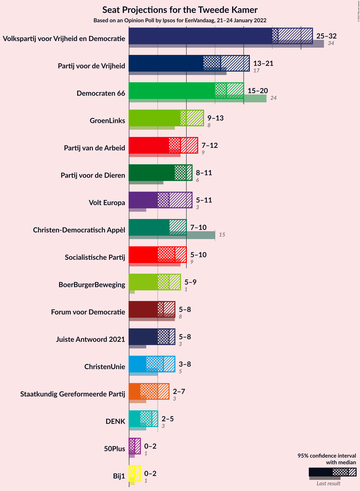
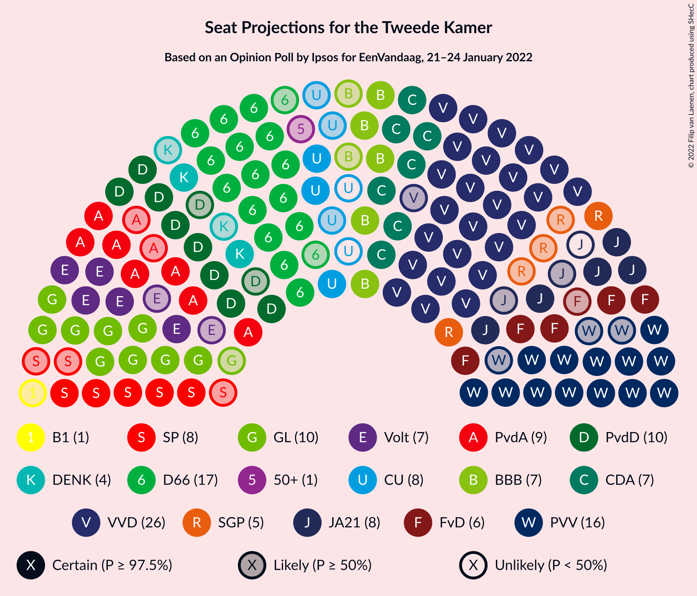
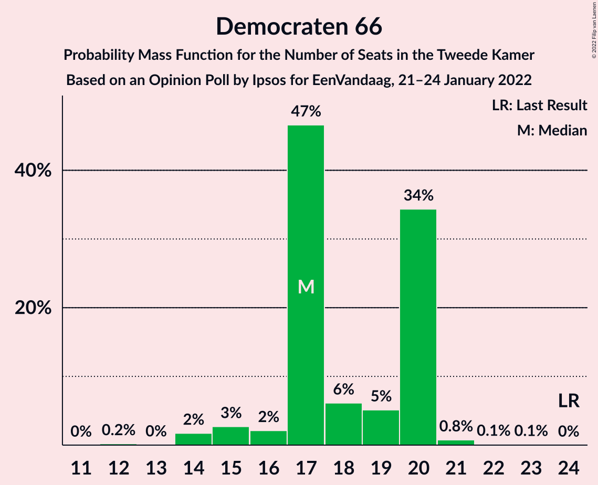
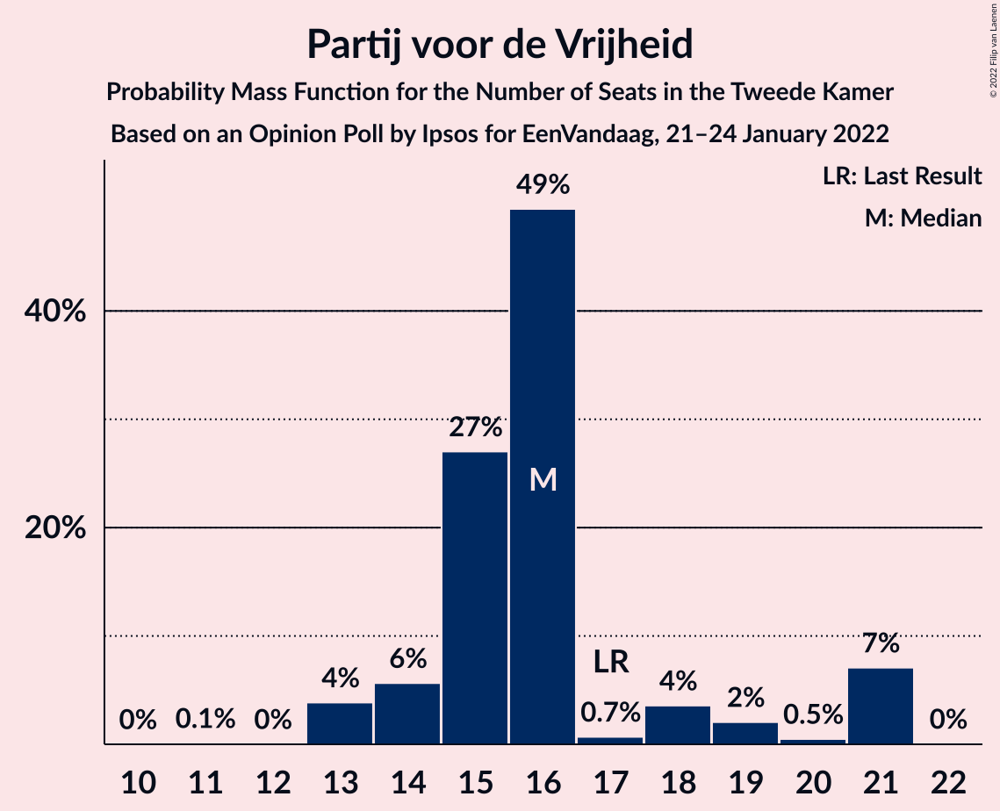
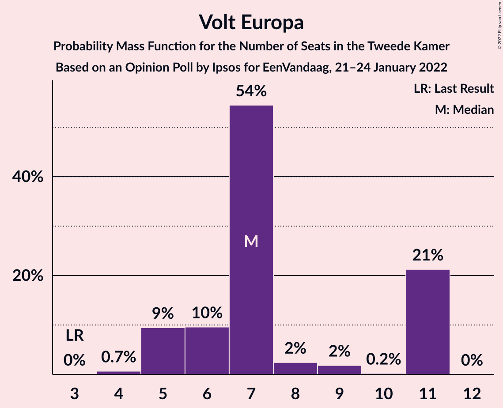
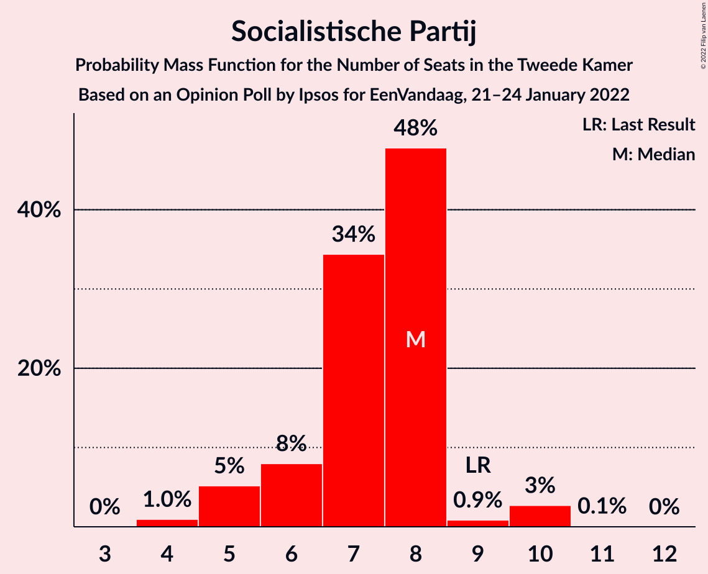
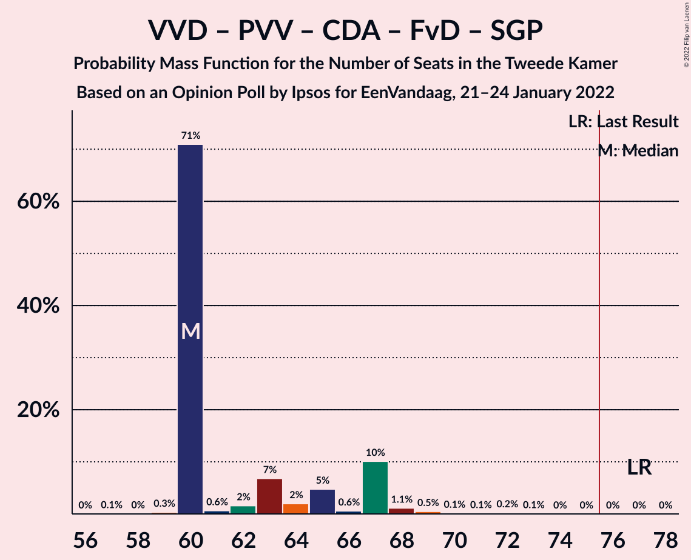

# Opinion Poll by Ipsos for EenVandaag, 21–24 January 2022

<a href="#voting-intentions">Voting Intentions</a> | <a href="#seats">Seats</a> | <a href="#coalitions">Coalitions</a> | <a href="#technical-information">Technical Information</a>

## Voting Intentions

### Confidence Intervals

| Party | Last Result | Poll Result | 80% Confidence Interval | 90% Confidence Interval | 95% Confidence Interval | 99% Confidence Interval |
|:-----:|:-----------:|:-----------:|:-----------------------:|:-----------------------:|:-----------------------:|:-----------------------:|
| Volkspartij voor Vrijheid en Democratie | 21.9% | 19.2% | 17.7–20.9% |17.3–21.4% |16.9–21.8% |16.2–22.6% |
| Democraten 66 | 15.0% | 11.8% | 10.6–13.2% |10.3–13.6% |10.0–13.9% |9.4–14.6% |
| Partij voor de Vrijheid | 10.8% | 10.7% | 9.6–12.1% |9.3–12.5% |9.0–12.8% |8.5–13.5% |
| GroenLinks | 5.2% | 6.8% | 5.9–8.0% |5.7–8.3% |5.4–8.6% |5.0–9.1% |
| Partij van de Arbeid | 5.7% | 6.3% | 5.5–7.4% |5.2–7.7% |5.0–8.0% |4.6–8.6% |
| Christen-Democratisch Appèl | 9.5% | 6.0% | 5.1–7.0% |4.9–7.3% |4.7–7.6% |4.3–8.1% |
| Partij voor de Dieren | 3.8% | 6.0% | 5.1–7.0% |4.9–7.3% |4.7–7.6% |4.3–8.1% |
| Volt Europa | 2.4% | 4.7% | 3.9–5.7% |3.7–5.9% |3.6–6.2% |3.2–6.7% |
| BoerBurgerBeweging | 1.0% | 4.7% | 3.9–5.7% |3.7–5.9% |3.6–6.2% |3.2–6.7% |
| Socialistische Partij | 6.0% | 4.5% | 3.8–5.4% |3.6–5.7% |3.4–5.9% |3.1–6.4% |
| Juiste Antwoord 2021 | 2.4% | 4.3% | 3.6–5.2% |3.4–5.5% |3.2–5.7% |2.9–6.2% |
| Forum voor Democratie | 5.0% | 4.2% | 3.5–5.1% |3.3–5.4% |3.1–5.6% |2.8–6.1% |
| ChristenUnie | 3.4% | 3.4% | 2.8–4.3% |2.6–4.5% |2.5–4.7% |2.2–5.2% |
| Staatkundig Gereformeerde Partij | 2.1% | 2.5% | 2.0–3.3% |1.9–3.5% |1.7–3.7% |1.5–4.1% |
| DENK | 2.0% | 2.3% | 1.8–3.1% |1.7–3.3% |1.6–3.5% |1.4–3.9% |
| 50Plus | 1.0% | 0.9% | 0.6–1.4% |0.5–1.5% |0.5–1.7% |0.4–2.0% |
| Bij1 | 0.8% | 0.8% | 0.5–1.3% |0.5–1.4% |0.4–1.5% |0.3–1.8% |

*Note:* The poll result column reflects the actual value used in the calculations. Published results may vary slightly, and in addition be rounded to fewer digits.

## Seats

### Confidence Intervals

| Party | Last Result | Median | 80% Confidence Interval | 90% Confidence Interval | 95% Confidence Interval | 99% Confidence Interval |
|:-----:|:-----------:|:------:|:-----------------------:|:-----------------------:|:-----------------------:|:-----------------------:|
| <a href="#volkspartij-voor-vrijheid-en-democratie">Volkspartij voor Vrijheid en Democratie</a> | 34 | 28 | 28–29 |28–29 |28–32 |28–35 |
| <a href="#democraten-66">Democraten 66</a> | 24 | 16 | 16–18 |16–18 |16–18 |16–19 |
| <a href="#partij-voor-de-vrijheid">Partij voor de Vrijheid</a> | 17 | 18 | 17–18 |17–18 |16–18 |16–20 |
| <a href="#groenlinks">GroenLinks</a> | 8 | 12 | 11–12 |11–12 |11–12 |8–12 |
| <a href="#partij-van-de-arbeid">Partij van de Arbeid</a> | 9 | 9 | 9–11 |9–11 |9–11 |9–11 |
| <a href="#christen-democratisch-appèl">Christen-Democratisch Appèl</a> | 15 | 7 | 7–9 |7–9 |7–9 |6–10 |
| <a href="#partij-voor-de-dieren">Partij voor de Dieren</a> | 6 | 13 | 10–13 |10–13 |9–13 |9–13 |
| <a href="#volt-europa">Volt Europa</a> | 3 | 7 | 7 |7 |7 |6–8 |
| <a href="#boerburgerbeweging">BoerBurgerBeweging</a> | 1 | 8 | 8 |8 |8–9 |6–9 |
| <a href="#socialistische-partij">Socialistische Partij</a> | 9 | 4 | 4–7 |4–7 |4–7 |4–10 |
| <a href="#juiste-antwoord-2021">Juiste Antwoord 2021</a> | 3 | 6 | 6 |6 |6 |4–6 |
| <a href="#forum-voor-democratie">Forum voor Democratie</a> | 8 | 8 | 5–8 |5–8 |5–8 |5–8 |
| <a href="#christenunie">ChristenUnie</a> | 5 | 3 | 3–4 |3–4 |3–5 |3–5 |
| <a href="#staatkundig-gereformeerde-partij">Staatkundig Gereformeerde Partij</a> | 3 | 4 | 3–4 |3–4 |1–4 |1–5 |
| <a href="#denk">DENK</a> | 3 | 3 | 2–3 |2–3 |2–3 |2–4 |
| <a href="#50plus">50Plus</a> | 1 | 2 | 0–2 |0–2 |0–2 |0–2 |
| <a href="#bij1">Bij1</a> | 1 | 1 | 0–1 |0–1 |0–1 |0–3 |

### Volkspartij voor Vrijheid en Democratie

*For a full overview of the results for this party, see the [Volkspartij voor Vrijheid en Democratie](party-volkspartijvoorvrijheidendemocratie.html) page.*

| Number of Seats | Probability | Accumulated | Special Marks |
|:---------------:|:-----------:|:-----------:|:-------------:|
| 24 | 0.3% | 100% |  |
| 25 | 0% | 99.7% |  |
| 26 | 0% | 99.7% |  |
| 27 | 0.1% | 99.7% |  |
| 28 | 81% | 99.5% | Median |
| 29 | 15% | 19% |  |
| 30 | 0.5% | 4% |  |
| 31 | 0% | 4% |  |
| 32 | 3% | 4% |  |
| 33 | 0% | 0.6% |  |
| 34 | 0% | 0.5% | Last Result |
| 35 | 0.5% | 0.5% |  |
| 36 | 0% | 0% |  |

### Democraten 66

*For a full overview of the results for this party, see the [Democraten 66](party-democraten66.html) page.*

| Number of Seats | Probability | Accumulated | Special Marks |
|:---------------:|:-----------:|:-----------:|:-------------:|
| 15 | 0.2% | 100% |  |
| 16 | 81% | 99.8% | Median |
| 17 | 3% | 19% |  |
| 18 | 14% | 15% |  |
| 19 | 1.0% | 1.0% |  |
| 20 | 0% | 0% |  |
| 21 | 0% | 0% |  |
| 22 | 0% | 0% |  |
| 23 | 0% | 0% |  |
| 24 | 0% | 0% | Last Result |

### Partij voor de Vrijheid

*For a full overview of the results for this party, see the [Partij voor de Vrijheid](party-partijvoordevrijheid.html) page.*

| Number of Seats | Probability | Accumulated | Special Marks |
|:---------------:|:-----------:|:-----------:|:-------------:|
| 13 | 0.2% | 100% |  |
| 14 | 0.1% | 99.8% |  |
| 15 | 0.1% | 99.8% |  |
| 16 | 3% | 99.6% |  |
| 17 | 14% | 96% | Last Result |
| 18 | 81% | 82% | Median |
| 19 | 0% | 0.6% |  |
| 20 | 0.6% | 0.6% |  |
| 21 | 0% | 0% |  |

### GroenLinks

*For a full overview of the results for this party, see the [GroenLinks](party-groenlinks.html) page.*

| Number of Seats | Probability | Accumulated | Special Marks |
|:---------------:|:-----------:|:-----------:|:-------------:|
| 8 | 0.6% | 100% | Last Result |
| 9 | 0.6% | 99.4% |  |
| 10 | 0.1% | 98.8% |  |
| 11 | 15% | 98.7% |  |
| 12 | 84% | 84% | Median |
| 13 | 0.1% | 0.2% |  |
| 14 | 0% | 0% |  |

### Partij van de Arbeid

*For a full overview of the results for this party, see the [Partij van de Arbeid](party-partijvandearbeid.html) page.*

| Number of Seats | Probability | Accumulated | Special Marks |
|:---------------:|:-----------:|:-----------:|:-------------:|
| 8 | 0.1% | 100% |  |
| 9 | 81% | 99.9% | Last Result, Median |
| 10 | 0.2% | 19% |  |
| 11 | 18% | 19% |  |
| 12 | 0% | 0.3% |  |
| 13 | 0% | 0.3% |  |
| 14 | 0.3% | 0.3% |  |
| 15 | 0% | 0% |  |

### Christen-Democratisch Appèl

*For a full overview of the results for this party, see the [Christen-Democratisch Appèl](party-christen-democratischappèl.html) page.*

| Number of Seats | Probability | Accumulated | Special Marks |
|:---------------:|:-----------:|:-----------:|:-------------:|
| 6 | 0.7% | 100% |  |
| 7 | 81% | 99.3% | Median |
| 8 | 4% | 19% |  |
| 9 | 14% | 15% |  |
| 10 | 0.8% | 0.9% |  |
| 11 | 0% | 0% |  |
| 12 | 0% | 0% |  |
| 13 | 0% | 0% |  |
| 14 | 0% | 0% |  |
| 15 | 0% | 0% | Last Result |

### Partij voor de Dieren

*For a full overview of the results for this party, see the [Partij voor de Dieren](party-partijvoordedieren.html) page.*

| Number of Seats | Probability | Accumulated | Special Marks |
|:---------------:|:-----------:|:-----------:|:-------------:|
| 6 | 0% | 100% | Last Result |
| 7 | 0% | 100% |  |
| 8 | 0% | 100% |  |
| 9 | 4% | 99.9% |  |
| 10 | 15% | 96% |  |
| 11 | 0.1% | 81% |  |
| 12 | 0.1% | 81% |  |
| 13 | 81% | 81% | Median |
| 14 | 0% | 0% |  |

### Volt Europa

*For a full overview of the results for this party, see the [Volt Europa](party-volteuropa.html) page.*

| Number of Seats | Probability | Accumulated | Special Marks |
|:---------------:|:-----------:|:-----------:|:-------------:|
| 3 | 0% | 100% | Last Result |
| 4 | 0% | 100% |  |
| 5 | 0% | 100% |  |
| 6 | 1.3% | 99.9% |  |
| 7 | 98% | 98.6% | Median |
| 8 | 0.4% | 0.6% |  |
| 9 | 0.2% | 0.2% |  |
| 10 | 0% | 0% |  |

### BoerBurgerBeweging

*For a full overview of the results for this party, see the [BoerBurgerBeweging](party-boerburgerbeweging.html) page.*

| Number of Seats | Probability | Accumulated | Special Marks |
|:---------------:|:-----------:|:-----------:|:-------------:|
| 1 | 0% | 100% | Last Result |
| 2 | 0% | 100% |  |
| 3 | 0% | 100% |  |
| 4 | 0% | 100% |  |
| 5 | 0.2% | 100% |  |
| 6 | 2% | 99.8% |  |
| 7 | 0.5% | 98% |  |
| 8 | 95% | 98% | Median |
| 9 | 3% | 3% |  |
| 10 | 0% | 0% |  |

### Socialistische Partij

*For a full overview of the results for this party, see the [Socialistische Partij](party-socialistischepartij.html) page.*

| Number of Seats | Probability | Accumulated | Special Marks |
|:---------------:|:-----------:|:-----------:|:-------------:|
| 4 | 81% | 100% | Median |
| 5 | 0.4% | 19% |  |
| 6 | 4% | 19% |  |
| 7 | 14% | 15% |  |
| 8 | 0.1% | 0.8% |  |
| 9 | 0% | 0.6% | Last Result |
| 10 | 0.6% | 0.6% |  |
| 11 | 0% | 0% |  |

### Juiste Antwoord 2021

*For a full overview of the results for this party, see the [Juiste Antwoord 2021](party-juisteantwoord2021.html) page.*

| Number of Seats | Probability | Accumulated | Special Marks |
|:---------------:|:-----------:|:-----------:|:-------------:|
| 3 | 0% | 100% | Last Result |
| 4 | 0.8% | 100% |  |
| 5 | 0% | 99.2% |  |
| 6 | 98.9% | 99.1% | Median |
| 7 | 0.2% | 0.3% |  |
| 8 | 0% | 0.1% |  |
| 9 | 0% | 0.1% |  |
| 10 | 0.1% | 0.1% |  |
| 11 | 0% | 0% |  |

### Forum voor Democratie

*For a full overview of the results for this party, see the [Forum voor Democratie](party-forumvoordemocratie.html) page.*

| Number of Seats | Probability | Accumulated | Special Marks |
|:---------------:|:-----------:|:-----------:|:-------------:|
| 3 | 0.1% | 100% |  |
| 4 | 0.2% | 99.9% |  |
| 5 | 14% | 99.7% |  |
| 6 | 4% | 86% |  |
| 7 | 0.9% | 82% |  |
| 8 | 81% | 81% | Last Result, Median |
| 9 | 0.3% | 0.3% |  |
| 10 | 0% | 0% |  |

### ChristenUnie

*For a full overview of the results for this party, see the [ChristenUnie](party-christenunie.html) page.*

| Number of Seats | Probability | Accumulated | Special Marks |
|:---------------:|:-----------:|:-----------:|:-------------:|
| 3 | 82% | 100% | Median |
| 4 | 15% | 18% |  |
| 5 | 3% | 3% | Last Result |
| 6 | 0% | 0.2% |  |
| 7 | 0.1% | 0.2% |  |
| 8 | 0.1% | 0.2% |  |
| 9 | 0% | 0% |  |

### Staatkundig Gereformeerde Partij

*For a full overview of the results for this party, see the [Staatkundig Gereformeerde Partij](party-staatkundiggereformeerdepartij.html) page.*

| Number of Seats | Probability | Accumulated | Special Marks |
|:---------------:|:-----------:|:-----------:|:-------------:|
| 1 | 3% | 100% |  |
| 2 | 1.1% | 97% |  |
| 3 | 14% | 96% | Last Result |
| 4 | 81% | 82% | Median |
| 5 | 0.9% | 0.9% |  |
| 6 | 0% | 0% |  |

### DENK

*For a full overview of the results for this party, see the [DENK](party-denk.html) page.*

| Number of Seats | Probability | Accumulated | Special Marks |
|:---------------:|:-----------:|:-----------:|:-------------:|
| 2 | 14% | 100% |  |
| 3 | 85% | 86% | Last Result, Median |
| 4 | 0.1% | 0.6% |  |
| 5 | 0.3% | 0.4% |  |
| 6 | 0% | 0.2% |  |
| 7 | 0.2% | 0.2% |  |
| 8 | 0% | 0% |  |

### 50Plus

*For a full overview of the results for this party, see the [50Plus](party-50plus.html) page.*

| Number of Seats | Probability | Accumulated | Special Marks |
|:---------------:|:-----------:|:-----------:|:-------------:|
| 0 | 18% | 100% |  |
| 1 | 0.8% | 82% | Last Result |
| 2 | 81% | 81% | Median |
| 3 | 0% | 0% |  |

### Bij1

*For a full overview of the results for this party, see the [Bij1](party-bij1.html) page.*

| Number of Seats | Probability | Accumulated | Special Marks |
|:---------------:|:-----------:|:-----------:|:-------------:|
| 0 | 17% | 100% |  |
| 1 | 82% | 83% | Last Result, Median |
| 2 | 0.6% | 1.2% |  |
| 3 | 0.5% | 0.6% |  |
| 4 | 0.1% | 0.1% |  |
| 5 | 0% | 0% |  |

## Coalitions

### Confidence Intervals

| Coalition | Last Result | Median | Majority? | 80% Confidence Interval | 90% Confidence Interval | 95% Confidence Interval | 99% Confidence Interval |
|:---------:|:-----------:|:------:|:---------:|:-----------------------:|:-----------------------:|:-----------------------:|:-----------------------:|
| Volkspartij voor Vrijheid en Democratie – Democraten 66 – GroenLinks – Christen-Democratisch Appèl – ChristenUnie | 86 | 66 | 0% | 66–71 | 66–71 | 66–74 | 66–75 |
| Volkspartij voor Vrijheid en Democratie – Democraten 66 – Partij van de Arbeid – Christen-Democratisch Appèl – ChristenUnie | 87 | 63 | 0% | 63–71 | 63–71 | 63–73 | 63–75 |
| Volkspartij voor Vrijheid en Democratie – Partij voor de Vrijheid – Christen-Democratisch Appèl – Forum voor Democratie – Staatkundig Gereformeerde Partij | 77 | 65 | 0% | 63–65 | 63–65 | 63–65 | 63–71 |
| Volkspartij voor Vrijheid en Democratie – Partij voor de Vrijheid – Christen-Democratisch Appèl – Forum voor Democratie | 74 | 61 | 0% | 60–61 | 60–61 | 60–62 | 58–69 |
| Volkspartij voor Vrijheid en Democratie – Democraten 66 – Christen-Democratisch Appèl – ChristenUnie | 78 | 54 | 0% | 54–60 | 54–60 | 54–62 | 54–64 |
| Volkspartij voor Vrijheid en Democratie – Democraten 66 – Partij van de Arbeid | 67 | 53 | 0% | 53–58 | 53–58 | 53–60 | 53–62 |
| Democraten 66 – GroenLinks – Partij van de Arbeid – Christen-Democratisch Appèl – Socialistische Partij – ChristenUnie | 70 | 51 | 0% | 51–60 | 51–60 | 51–60 | 51–60 |
| Volkspartij voor Vrijheid en Democratie – Democraten 66 – Christen-Democratisch Appèl | 73 | 51 | 0% | 51–56 | 51–56 | 51–57 | 51–61 |
| Volkspartij voor Vrijheid en Democratie – Partij voor de Vrijheid – Christen-Democratisch Appèl | 66 | 53 | 0% | 53–55 | 53–55 | 53–56 | 51–63 |
| Democraten 66 – GroenLinks – Partij van de Arbeid – Christen-Democratisch Appèl – ChristenUnie | 61 | 47 | 0% | 47–53 | 47–53 | 47–53 | 47–53 |
| Volkspartij voor Vrijheid en Democratie – Partij van de Arbeid – Christen-Democratisch Appèl | 58 | 44 | 0% | 44–49 | 44–49 | 44–51 | 44–56 |
| Volkspartij voor Vrijheid en Democratie – Christen-Democratisch Appèl – Forum voor Democratie – Staatkundig Gereformeerde Partij – 50Plus | 61 | 49 | 0% | 46–49 | 46–49 | 46–49 | 44–53 |
| Volkspartij voor Vrijheid en Democratie – Christen-Democratisch Appèl – Forum voor Democratie – Staatkundig Gereformeerde Partij | 60 | 47 | 0% | 46–47 | 46–47 | 46–47 | 44–53 |
| Volkspartij voor Vrijheid en Democratie – Christen-Democratisch Appèl – Forum voor Democratie – 50Plus | 58 | 45 | 0% | 43–45 | 43–45 | 43–46 | 42–51 |
| Volkspartij voor Vrijheid en Democratie – Christen-Democratisch Appèl – Forum voor Democratie | 57 | 43 | 0% | 43 | 43 | 43–46 | 42–51 |
| Volkspartij voor Vrijheid en Democratie – Partij van de Arbeid | 43 | 37 | 0% | 37–40 | 37–40 | 37–43 | 37–46 |
| Volkspartij voor Vrijheid en Democratie – Christen-Democratisch Appèl | 49 | 35 | 0% | 35–38 | 35–38 | 35–40 | 35–45 |
| Democraten 66 – Partij van de Arbeid – Christen-Democratisch Appèl | 48 | 32 | 0% | 32–38 | 32–38 | 32–38 | 32–38 |
| Democraten 66 – Christen-Democratisch Appèl | 39 | 23 | 0% | 23–27 | 23–27 | 23–27 | 23–28 |
| Partij van de Arbeid – Christen-Democratisch Appèl – ChristenUnie | 29 | 19 | 0% | 19–24 | 19–24 | 19–24 | 19–25 |
| Partij van de Arbeid – Christen-Democratisch Appèl | 24 | 16 | 0% | 16–20 | 16–20 | 16–20 | 16–21 |

### Volkspartij voor Vrijheid en Democratie – Democraten 66 – GroenLinks – Christen-Democratisch Appèl – ChristenUnie

| Number of Seats | Probability | Accumulated | Special Marks |
|:---------------:|:-----------:|:-----------:|:-------------:|
| 66 | 81% | 100% | Median |
| 67 | 1.0% | 19% |  |
| 68 | 0% | 18% |  |
| 69 | 0.3% | 18% |  |
| 70 | 0% | 18% |  |
| 71 | 14% | 18% |  |
| 72 | 0% | 4% |  |
| 73 | 0.1% | 4% |  |
| 74 | 3% | 4% |  |
| 75 | 0.5% | 0.5% |  |
| 76 | 0% | 0% | Majority |
| 77 | 0% | 0% |  |
| 78 | 0% | 0% |  |
| 79 | 0% | 0% |  |
| 80 | 0% | 0% |  |
| 81 | 0% | 0% |  |
| 82 | 0% | 0% |  |
| 83 | 0% | 0% |  |
| 84 | 0% | 0% |  |
| 85 | 0% | 0% |  |
| 86 | 0% | 0% | Last Result |

### Volkspartij voor Vrijheid en Democratie – Democraten 66 – Partij van de Arbeid – Christen-Democratisch Appèl – ChristenUnie

| Number of Seats | Probability | Accumulated | Special Marks |
|:---------------:|:-----------:|:-----------:|:-------------:|
| 63 | 81% | 100% | Median |
| 64 | 0.3% | 19% |  |
| 65 | 0% | 19% |  |
| 66 | 0.1% | 19% |  |
| 67 | 0% | 19% |  |
| 68 | 0% | 19% |  |
| 69 | 0.6% | 19% |  |
| 70 | 0.2% | 18% |  |
| 71 | 14% | 18% |  |
| 72 | 0% | 4% |  |
| 73 | 3% | 4% |  |
| 74 | 0% | 0.5% |  |
| 75 | 0.5% | 0.5% |  |
| 76 | 0% | 0% | Majority |
| 77 | 0% | 0% |  |
| 78 | 0% | 0% |  |
| 79 | 0% | 0% |  |
| 80 | 0% | 0% |  |
| 81 | 0% | 0% |  |
| 82 | 0% | 0% |  |
| 83 | 0% | 0% |  |
| 84 | 0% | 0% |  |
| 85 | 0% | 0% |  |
| 86 | 0% | 0% |  |
| 87 | 0% | 0% | Last Result |

### Volkspartij voor Vrijheid en Democratie – Partij voor de Vrijheid – Christen-Democratisch Appèl – Forum voor Democratie – Staatkundig Gereformeerde Partij

| Number of Seats | Probability | Accumulated | Special Marks |
|:---------------:|:-----------:|:-----------:|:-------------:|
| 58 | 0.1% | 100% |  |
| 59 | 0.1% | 99.9% |  |
| 60 | 0% | 99.7% |  |
| 61 | 0% | 99.7% |  |
| 62 | 0.2% | 99.7% |  |
| 63 | 17% | 99.6% |  |
| 64 | 0.6% | 82% |  |
| 65 | 81% | 82% | Median |
| 66 | 0% | 0.9% |  |
| 67 | 0% | 0.9% |  |
| 68 | 0.3% | 0.9% |  |
| 69 | 0% | 0.6% |  |
| 70 | 0% | 0.6% |  |
| 71 | 0.5% | 0.5% |  |
| 72 | 0% | 0% |  |
| 73 | 0% | 0% |  |
| 74 | 0% | 0% |  |
| 75 | 0% | 0% |  |
| 76 | 0% | 0% | Majority |
| 77 | 0% | 0% | Last Result |

### Volkspartij voor Vrijheid en Democratie – Partij voor de Vrijheid – Christen-Democratisch Appèl – Forum voor Democratie

| Number of Seats | Probability | Accumulated | Special Marks |
|:---------------:|:-----------:|:-----------:|:-------------:|
| 55 | 0.1% | 100% |  |
| 56 | 0.1% | 99.8% |  |
| 57 | 0.2% | 99.8% |  |
| 58 | 0.3% | 99.6% |  |
| 59 | 0% | 99.3% |  |
| 60 | 14% | 99.3% |  |
| 61 | 81% | 85% | Median |
| 62 | 4% | 5% |  |
| 63 | 0.3% | 0.9% |  |
| 64 | 0% | 0.5% |  |
| 65 | 0% | 0.5% |  |
| 66 | 0% | 0.5% |  |
| 67 | 0% | 0.5% |  |
| 68 | 0% | 0.5% |  |
| 69 | 0.5% | 0.5% |  |
| 70 | 0% | 0% |  |
| 71 | 0% | 0% |  |
| 72 | 0% | 0% |  |
| 73 | 0% | 0% |  |
| 74 | 0% | 0% | Last Result |

### Volkspartij voor Vrijheid en Democratie – Democraten 66 – Christen-Democratisch Appèl – ChristenUnie

| Number of Seats | Probability | Accumulated | Special Marks |
|:---------------:|:-----------:|:-----------:|:-------------:|
| 54 | 81% | 100% | Median |
| 55 | 0.3% | 19% |  |
| 56 | 0.1% | 19% |  |
| 57 | 0.1% | 19% |  |
| 58 | 0.6% | 19% |  |
| 59 | 0.3% | 18% |  |
| 60 | 14% | 18% |  |
| 61 | 0.3% | 4% |  |
| 62 | 3% | 4% |  |
| 63 | 0% | 0.6% |  |
| 64 | 0.5% | 0.6% |  |
| 65 | 0% | 0% |  |
| 66 | 0% | 0% |  |
| 67 | 0% | 0% |  |
| 68 | 0% | 0% |  |
| 69 | 0% | 0% |  |
| 70 | 0% | 0% |  |
| 71 | 0% | 0% |  |
| 72 | 0% | 0% |  |
| 73 | 0% | 0% |  |
| 74 | 0% | 0% |  |
| 75 | 0% | 0% |  |
| 76 | 0% | 0% | Majority |
| 77 | 0% | 0% |  |
| 78 | 0% | 0% | Last Result |

### Volkspartij voor Vrijheid en Democratie – Democraten 66 – Partij van de Arbeid

| Number of Seats | Probability | Accumulated | Special Marks |
|:---------------:|:-----------:|:-----------:|:-------------:|
| 48 | 0.1% | 100% |  |
| 49 | 0% | 99.9% |  |
| 50 | 0% | 99.9% |  |
| 51 | 0% | 99.9% |  |
| 52 | 0.3% | 99.9% |  |
| 53 | 81% | 99.7% | Median |
| 54 | 0% | 19% |  |
| 55 | 0.2% | 19% |  |
| 56 | 0.2% | 19% |  |
| 57 | 0.1% | 19% |  |
| 58 | 14% | 18% |  |
| 59 | 0.6% | 5% |  |
| 60 | 3% | 4% |  |
| 61 | 0% | 0.8% |  |
| 62 | 0.8% | 0.8% |  |
| 63 | 0% | 0% |  |
| 64 | 0% | 0% |  |
| 65 | 0% | 0% |  |
| 66 | 0% | 0% |  |
| 67 | 0% | 0% | Last Result |

### Democraten 66 – GroenLinks – Partij van de Arbeid – Christen-Democratisch Appèl – Socialistische Partij – ChristenUnie

| Number of Seats | Probability | Accumulated | Special Marks |
|:---------------:|:-----------:|:-----------:|:-------------:|
| 51 | 81% | 100% | Median |
| 52 | 0% | 19% |  |
| 53 | 0% | 19% |  |
| 54 | 0.1% | 19% |  |
| 55 | 0.1% | 19% |  |
| 56 | 0.4% | 19% |  |
| 57 | 0.6% | 19% |  |
| 58 | 0.3% | 18% |  |
| 59 | 4% | 18% |  |
| 60 | 14% | 14% |  |
| 61 | 0% | 0.2% |  |
| 62 | 0% | 0.2% |  |
| 63 | 0% | 0.2% |  |
| 64 | 0% | 0.1% |  |
| 65 | 0.1% | 0.1% |  |
| 66 | 0% | 0% |  |
| 67 | 0% | 0% |  |
| 68 | 0% | 0% |  |
| 69 | 0% | 0% |  |
| 70 | 0% | 0% | Last Result |

### Volkspartij voor Vrijheid en Democratie – Democraten 66 – Christen-Democratisch Appèl

| Number of Seats | Probability | Accumulated | Special Marks |
|:---------------:|:-----------:|:-----------:|:-------------:|
| 49 | 0.1% | 100% |  |
| 50 | 0% | 99.9% |  |
| 51 | 81% | 99.9% | Median |
| 52 | 0.3% | 19% |  |
| 53 | 0.1% | 19% |  |
| 54 | 0.6% | 19% |  |
| 55 | 0% | 18% |  |
| 56 | 14% | 18% |  |
| 57 | 3% | 4% |  |
| 58 | 0% | 0.5% |  |
| 59 | 0% | 0.5% |  |
| 60 | 0% | 0.5% |  |
| 61 | 0.5% | 0.5% |  |
| 62 | 0% | 0% |  |
| 63 | 0% | 0% |  |
| 64 | 0% | 0% |  |
| 65 | 0% | 0% |  |
| 66 | 0% | 0% |  |
| 67 | 0% | 0% |  |
| 68 | 0% | 0% |  |
| 69 | 0% | 0% |  |
| 70 | 0% | 0% |  |
| 71 | 0% | 0% |  |
| 72 | 0% | 0% |  |
| 73 | 0% | 0% | Last Result |

### Volkspartij voor Vrijheid en Democratie – Partij voor de Vrijheid – Christen-Democratisch Appèl

| Number of Seats | Probability | Accumulated | Special Marks |
|:---------------:|:-----------:|:-----------:|:-------------:|
| 48 | 0.1% | 100% |  |
| 49 | 0.1% | 99.9% |  |
| 50 | 0% | 99.9% |  |
| 51 | 0.4% | 99.9% |  |
| 52 | 0.1% | 99.4% |  |
| 53 | 81% | 99.3% | Median |
| 54 | 0.3% | 19% |  |
| 55 | 14% | 18% |  |
| 56 | 3% | 4% |  |
| 57 | 0% | 0.5% |  |
| 58 | 0% | 0.5% |  |
| 59 | 0% | 0.5% |  |
| 60 | 0% | 0.5% |  |
| 61 | 0% | 0.5% |  |
| 62 | 0% | 0.5% |  |
| 63 | 0.5% | 0.5% |  |
| 64 | 0% | 0% |  |
| 65 | 0% | 0% |  |
| 66 | 0% | 0% | Last Result |

### Democraten 66 – GroenLinks – Partij van de Arbeid – Christen-Democratisch Appèl – ChristenUnie

| Number of Seats | Probability | Accumulated | Special Marks |
|:---------------:|:-----------:|:-----------:|:-------------:|
| 47 | 81% | 100% | Median |
| 48 | 0.1% | 19% |  |
| 49 | 0.9% | 19% |  |
| 50 | 0% | 18% |  |
| 51 | 1.1% | 18% |  |
| 52 | 0% | 17% |  |
| 53 | 17% | 17% |  |
| 54 | 0% | 0.2% |  |
| 55 | 0% | 0.2% |  |
| 56 | 0% | 0.1% |  |
| 57 | 0.1% | 0.1% |  |
| 58 | 0% | 0% |  |
| 59 | 0% | 0% |  |
| 60 | 0% | 0% |  |
| 61 | 0% | 0% | Last Result |

### Volkspartij voor Vrijheid en Democratie – Partij van de Arbeid – Christen-Democratisch Appèl

| Number of Seats | Probability | Accumulated | Special Marks |
|:---------------:|:-----------:|:-----------:|:-------------:|
| 41 | 0.1% | 100% |  |
| 42 | 0.3% | 99.9% |  |
| 43 | 0.1% | 99.7% |  |
| 44 | 81% | 99.6% | Median |
| 45 | 0% | 19% |  |
| 46 | 0.6% | 19% |  |
| 47 | 0% | 18% |  |
| 48 | 0.4% | 18% |  |
| 49 | 14% | 18% |  |
| 50 | 0% | 4% |  |
| 51 | 3% | 4% |  |
| 52 | 0.3% | 0.8% |  |
| 53 | 0% | 0.5% |  |
| 54 | 0% | 0.5% |  |
| 55 | 0% | 0.5% |  |
| 56 | 0.5% | 0.5% |  |
| 57 | 0% | 0% |  |
| 58 | 0% | 0% | Last Result |

### Volkspartij voor Vrijheid en Democratie – Christen-Democratisch Appèl – Forum voor Democratie – Staatkundig Gereformeerde Partij – 50Plus

| Number of Seats | Probability | Accumulated | Special Marks |
|:---------------:|:-----------:|:-----------:|:-------------:|
| 44 | 0.8% | 100% |  |
| 45 | 0% | 99.2% |  |
| 46 | 14% | 99.2% |  |
| 47 | 3% | 85% |  |
| 48 | 0% | 82% |  |
| 49 | 81% | 82% | Median |
| 50 | 0.2% | 1.0% |  |
| 51 | 0% | 0.9% |  |
| 52 | 0% | 0.9% |  |
| 53 | 0.8% | 0.9% |  |
| 54 | 0% | 0% |  |
| 55 | 0% | 0% |  |
| 56 | 0% | 0% |  |
| 57 | 0% | 0% |  |
| 58 | 0% | 0% |  |
| 59 | 0% | 0% |  |
| 60 | 0% | 0% |  |
| 61 | 0% | 0% | Last Result |

### Volkspartij voor Vrijheid en Democratie – Christen-Democratisch Appèl – Forum voor Democratie – Staatkundig Gereformeerde Partij

| Number of Seats | Probability | Accumulated | Special Marks |
|:---------------:|:-----------:|:-----------:|:-------------:|
| 43 | 0.2% | 100% |  |
| 44 | 0.6% | 99.8% |  |
| 45 | 0.3% | 99.2% |  |
| 46 | 14% | 98.9% |  |
| 47 | 84% | 85% | Median |
| 48 | 0.2% | 1.2% |  |
| 49 | 0.2% | 1.0% |  |
| 50 | 0% | 0.9% |  |
| 51 | 0% | 0.9% |  |
| 52 | 0.3% | 0.9% |  |
| 53 | 0.5% | 0.5% |  |
| 54 | 0% | 0% |  |
| 55 | 0% | 0% |  |
| 56 | 0% | 0% |  |
| 57 | 0% | 0% |  |
| 58 | 0% | 0% |  |
| 59 | 0% | 0% |  |
| 60 | 0% | 0% | Last Result |

### Volkspartij voor Vrijheid en Democratie – Christen-Democratisch Appèl – Forum voor Democratie – 50Plus

| Number of Seats | Probability | Accumulated | Special Marks |
|:---------------:|:-----------:|:-----------:|:-------------:|
| 41 | 0.1% | 100% |  |
| 42 | 0.9% | 99.8% |  |
| 43 | 14% | 99.0% |  |
| 44 | 0.2% | 85% |  |
| 45 | 81% | 85% | Median |
| 46 | 3% | 4% |  |
| 47 | 0% | 0.9% |  |
| 48 | 0.3% | 0.9% |  |
| 49 | 0% | 0.5% |  |
| 50 | 0% | 0.5% |  |
| 51 | 0.5% | 0.5% |  |
| 52 | 0% | 0% |  |
| 53 | 0% | 0% |  |
| 54 | 0% | 0% |  |
| 55 | 0% | 0% |  |
| 56 | 0% | 0% |  |
| 57 | 0% | 0% |  |
| 58 | 0% | 0% | Last Result |

### Volkspartij voor Vrijheid en Democratie – Christen-Democratisch Appèl – Forum voor Democratie

| Number of Seats | Probability | Accumulated | Special Marks |
|:---------------:|:-----------:|:-----------:|:-------------:|
| 40 | 0.4% | 100% |  |
| 41 | 0.1% | 99.6% |  |
| 42 | 0.6% | 99.5% |  |
| 43 | 95% | 98.9% | Median |
| 44 | 0.2% | 4% |  |
| 45 | 0% | 4% |  |
| 46 | 3% | 4% |  |
| 47 | 0.3% | 0.9% |  |
| 48 | 0% | 0.5% |  |
| 49 | 0% | 0.5% |  |
| 50 | 0% | 0.5% |  |
| 51 | 0.5% | 0.5% |  |
| 52 | 0% | 0% |  |
| 53 | 0% | 0% |  |
| 54 | 0% | 0% |  |
| 55 | 0% | 0% |  |
| 56 | 0% | 0% |  |
| 57 | 0% | 0% | Last Result |

### Volkspartij voor Vrijheid en Democratie – Partij van de Arbeid

| Number of Seats | Probability | Accumulated | Special Marks |
|:---------------:|:-----------:|:-----------:|:-------------:|
| 32 | 0.1% | 100% |  |
| 33 | 0.3% | 99.9% |  |
| 34 | 0% | 99.7% |  |
| 35 | 0% | 99.7% |  |
| 36 | 0% | 99.7% |  |
| 37 | 81% | 99.7% | Median |
| 38 | 0.3% | 19% |  |
| 39 | 0% | 19% |  |
| 40 | 15% | 19% |  |
| 41 | 0% | 4% |  |
| 42 | 0% | 4% |  |
| 43 | 3% | 4% | Last Result |
| 44 | 0.3% | 0.8% |  |
| 45 | 0% | 0.5% |  |
| 46 | 0.5% | 0.5% |  |
| 47 | 0% | 0% |  |

### Volkspartij voor Vrijheid en Democratie – Christen-Democratisch Appèl

| Number of Seats | Probability | Accumulated | Special Marks |
|:---------------:|:-----------:|:-----------:|:-------------:|
| 33 | 0.3% | 100% |  |
| 34 | 0.1% | 99.7% |  |
| 35 | 81% | 99.6% | Median |
| 36 | 0% | 18% |  |
| 37 | 0.2% | 18% |  |
| 38 | 14% | 18% |  |
| 39 | 0.2% | 4% |  |
| 40 | 3% | 4% |  |
| 41 | 0% | 0.5% |  |
| 42 | 0% | 0.5% |  |
| 43 | 0% | 0.5% |  |
| 44 | 0% | 0.5% |  |
| 45 | 0.5% | 0.5% |  |
| 46 | 0% | 0% |  |
| 47 | 0% | 0% |  |
| 48 | 0% | 0% |  |
| 49 | 0% | 0% | Last Result |

### Democraten 66 – Partij van de Arbeid – Christen-Democratisch Appèl

| Number of Seats | Probability | Accumulated | Special Marks |
|:---------------:|:-----------:|:-----------:|:-------------:|
| 32 | 81% | 100% | Median |
| 33 | 0.3% | 19% |  |
| 34 | 0% | 19% |  |
| 35 | 0% | 19% |  |
| 36 | 4% | 19% |  |
| 37 | 0.9% | 15% |  |
| 38 | 14% | 14% |  |
| 39 | 0% | 0.5% |  |
| 40 | 0.4% | 0.5% |  |
| 41 | 0% | 0% |  |
| 42 | 0% | 0% |  |
| 43 | 0% | 0% |  |
| 44 | 0% | 0% |  |
| 45 | 0% | 0% |  |
| 46 | 0% | 0% |  |
| 47 | 0% | 0% |  |
| 48 | 0% | 0% | Last Result |

### Democraten 66 – Christen-Democratisch Appèl

| Number of Seats | Probability | Accumulated | Special Marks |
|:---------------:|:-----------:|:-----------:|:-------------:|
| 23 | 81% | 100% | Median |
| 24 | 0.1% | 19% |  |
| 25 | 4% | 19% |  |
| 26 | 0.8% | 15% |  |
| 27 | 14% | 14% |  |
| 28 | 0.4% | 0.6% |  |
| 29 | 0.1% | 0.2% |  |
| 30 | 0% | 0% |  |
| 31 | 0% | 0% |  |
| 32 | 0% | 0% |  |
| 33 | 0% | 0% |  |
| 34 | 0% | 0% |  |
| 35 | 0% | 0% |  |
| 36 | 0% | 0% |  |
| 37 | 0% | 0% |  |
| 38 | 0% | 0% |  |
| 39 | 0% | 0% | Last Result |

### Partij van de Arbeid – Christen-Democratisch Appèl – ChristenUnie

| Number of Seats | Probability | Accumulated | Special Marks |
|:---------------:|:-----------:|:-----------:|:-------------:|
| 19 | 81% | 100% | Median |
| 20 | 0.1% | 19% |  |
| 21 | 0.8% | 19% |  |
| 22 | 0% | 18% |  |
| 23 | 0.2% | 18% |  |
| 24 | 18% | 18% |  |
| 25 | 0.5% | 0.6% |  |
| 26 | 0.1% | 0.2% |  |
| 27 | 0% | 0% |  |
| 28 | 0% | 0% |  |
| 29 | 0% | 0% | Last Result |

### Partij van de Arbeid – Christen-Democratisch Appèl

| Number of Seats | Probability | Accumulated | Special Marks |
|:---------------:|:-----------:|:-----------:|:-------------:|
| 15 | 0.1% | 100% |  |
| 16 | 81% | 99.9% | Median |
| 17 | 0.7% | 19% |  |
| 18 | 0.4% | 19% |  |
| 19 | 3% | 18% |  |
| 20 | 14% | 15% |  |
| 21 | 0.7% | 1.0% |  |
| 22 | 0.3% | 0.3% |  |
| 23 | 0% | 0% |  |
| 24 | 0% | 0% | Last Result |

## Technical Information

### Opinion Poll

+ **Polling firm:** Ipsos
+ **Commissioner(s):** EenVandaag
+ **Fieldwork period:** 21–24 January 2022

### Calculations

+ **Sample size:** 1024
+ **Simulations done:** 32,768
+ **Error estimate:** 1.87%

