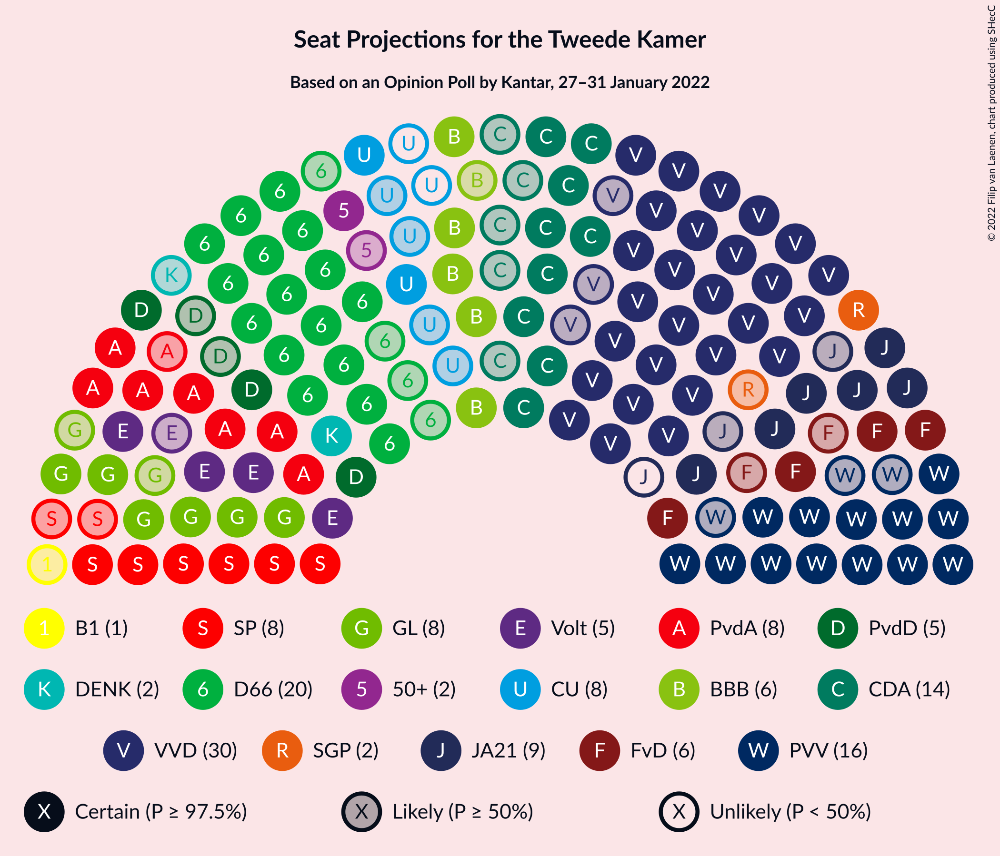
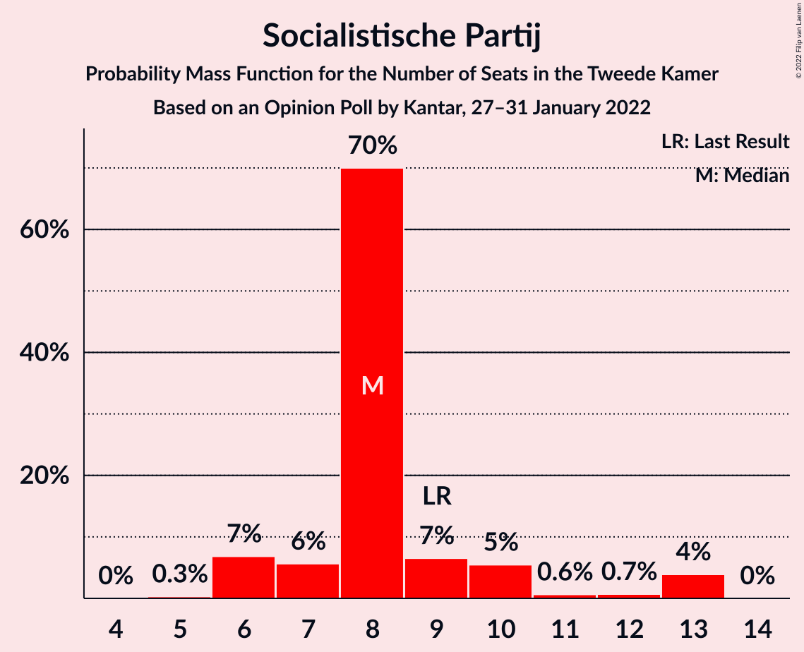
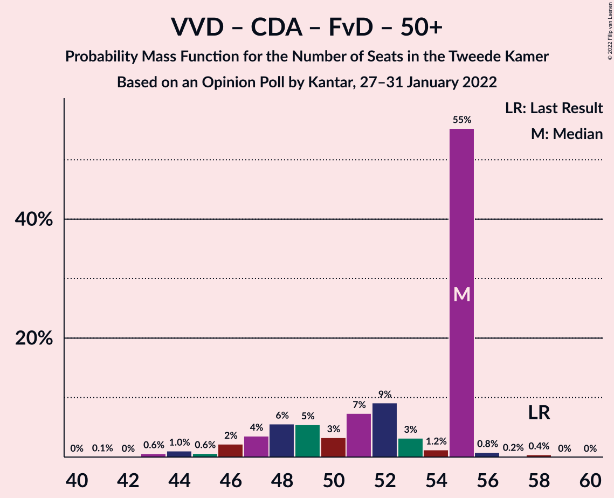

# Opinion Poll by Kantar, 27–31 January 2022

<a href="#voting-intentions">Voting Intentions</a> | <a href="#seats">Seats</a> | <a href="#coalitions">Coalitions</a> | <a href="#technical-information">Technical Information</a>

## Voting Intentions

### Confidence Intervals

| Party | Last Result | Poll Result | 80% Confidence Interval | 90% Confidence Interval | 95% Confidence Interval | 99% Confidence Interval |
|:-----:|:-----------:|:-----------:|:-----------------------:|:-----------------------:|:-----------------------:|:-----------------------:|
| Volkspartij voor Vrijheid en Democratie | 21.9% | 20.5% | 18.9–22.2% |18.5–22.7% |18.1–23.1% |17.4–24.0% |
| Democraten 66 | 15.0% | 12.6% | 11.4–14.1% |11.0–14.5% |10.7–14.9% |10.2–15.6% |
| Partij voor de Vrijheid | 10.8% | 10.2% | 9.0–11.5% |8.7–11.9% |8.4–12.2% |7.9–12.8% |
| Christen-Democratisch Appèl | 9.5% | 7.6% | 6.6–8.7% |6.3–9.1% |6.1–9.4% |5.7–10.0% |
| Partij van de Arbeid | 5.7% | 6.4% | 5.5–7.5% |5.2–7.8% |5.0–8.1% |4.6–8.6% |
| Juiste Antwoord 2021 | 2.4% | 5.9% | 5.0–7.0% |4.8–7.2% |4.6–7.5% |4.2–8.1% |
| GroenLinks | 5.2% | 5.6% | 4.7–6.6% |4.5–6.9% |4.3–7.2% |3.9–7.7% |
| Socialistische Partij | 6.0% | 5.5% | 4.6–6.5% |4.4–6.8% |4.2–7.1% |3.9–7.6% |
| BoerBurgerBeweging | 1.0% | 4.9% | 4.1–5.9% |3.9–6.2% |3.7–6.4% |3.4–6.9% |
| Forum voor Democratie | 5.0% | 4.1% | 3.4–5.0% |3.2–5.3% |3.0–5.5% |2.7–6.0% |
| Volt Europa | 2.4% | 3.8% | 3.1–4.7% |2.9–4.9% |2.8–5.2% |2.5–5.6% |
| ChristenUnie | 3.4% | 3.7% | 3.0–4.6% |2.8–4.8% |2.7–5.0% |2.4–5.5% |
| Partij voor de Dieren | 3.8% | 3.6% | 2.9–4.5% |2.7–4.7% |2.6–4.9% |2.3–5.4% |
| Staatkundig Gereformeerde Partij | 2.1% | 1.7% | 1.3–2.3% |1.2–2.5% |1.1–2.7% |0.9–3.0% |
| DENK | 2.0% | 1.5% | 1.1–2.1% |1.0–2.3% |0.9–2.5% |0.7–2.8% |
| 50Plus | 1.0% | 1.4% | 1.0–2.0% |0.9–2.2% |0.8–2.3% |0.7–2.7% |
| Bij1 | 0.8% | 1.2% | 0.9–1.8% |0.8–1.9% |0.7–2.1% |0.5–2.4% |

*Note:* The poll result column reflects the actual value used in the calculations. Published results may vary slightly, and in addition be rounded to fewer digits.

## Seats

### Confidence Intervals

| Party | Last Result | Median | 80% Confidence Interval | 90% Confidence Interval | 95% Confidence Interval | 99% Confidence Interval |
|:-----:|:-----------:|:------:|:-----------------------:|:-----------------------:|:-----------------------:|:-----------------------:|
| <a href="#volkspartij-voor-vrijheid-en-democratie">Volkspartij voor Vrijheid en Democratie</a> | 34 | 30 | 29–33 |29–33 |27–33 |24–38 |
| <a href="#democraten-66">Democraten 66</a> | 24 | 20 | 18–22 |16–23 |16–23 |14–24 |
| <a href="#partij-voor-de-vrijheid">Partij voor de Vrijheid</a> | 17 | 16 | 14–16 |14–17 |13–18 |12–19 |
| <a href="#christen-democratisch-appèl">Christen-Democratisch Appèl</a> | 15 | 14 | 10–15 |9–15 |9–15 |8–15 |
| <a href="#partij-van-de-arbeid">Partij van de Arbeid</a> | 9 | 8 | 8–11 |7–12 |7–12 |7–13 |
| <a href="#juiste-antwoord-2021">Juiste Antwoord 2021</a> | 3 | 8 | 7–10 |7–11 |6–11 |6–13 |
| <a href="#groenlinks">GroenLinks</a> | 8 | 8 | 6–10 |6–12 |6–13 |6–13 |
| <a href="#socialistische-partij">Socialistische Partij</a> | 9 | 8 | 7–10 |6–11 |6–13 |6–13 |
| <a href="#boerburgerbeweging">BoerBurgerBeweging</a> | 1 | 6 | 6–9 |5–10 |5–10 |5–12 |
| <a href="#forum-voor-democratie">Forum voor Democratie</a> | 8 | 6 | 5–9 |4–9 |4–9 |4–9 |
| <a href="#volt-europa">Volt Europa</a> | 3 | 5 | 5–7 |5–7 |4–7 |4–8 |
| <a href="#christenunie">ChristenUnie</a> | 5 | 6 | 4–8 |4–8 |2–8 |2–8 |
| <a href="#partij-voor-de-dieren">Partij voor de Dieren</a> | 6 | 5 | 4–6 |4–7 |3–7 |3–8 |
| <a href="#staatkundig-gereformeerde-partij">Staatkundig Gereformeerde Partij</a> | 3 | 2 | 1–4 |1–5 |1–5 |1–5 |
| <a href="#denk">DENK</a> | 3 | 2 | 1–4 |1–4 |1–4 |1–5 |
| <a href="#50plus">50Plus</a> | 1 | 2 | 1–3 |1–3 |1–3 |0–5 |
| <a href="#bij1">Bij1</a> | 1 | 1 | 0–2 |0–2 |0–3 |0–3 |

### Volkspartij voor Vrijheid en Democratie

*For a full overview of the results for this party, see the [Volkspartij voor Vrijheid en Democratie](party-volkspartijvoorvrijheidendemocratie.html) page.*

| Number of Seats | Probability | Accumulated | Special Marks |
|:---------------:|:-----------:|:-----------:|:-------------:|
| 24 | 0.6% | 100% |  |
| 25 | 0.7% | 99.4% |  |
| 26 | 0.4% | 98.7% |  |
| 27 | 1.1% | 98% |  |
| 28 | 0.8% | 97% |  |
| 29 | 41% | 96% |  |
| 30 | 16% | 56% | Median |
| 31 | 6% | 40% |  |
| 32 | 11% | 34% |  |
| 33 | 21% | 23% |  |
| 34 | 0.2% | 2% | Last Result |
| 35 | 0.4% | 2% |  |
| 36 | 0.3% | 1.3% |  |
| 37 | 0.3% | 0.9% |  |
| 38 | 0.3% | 0.7% |  |
| 39 | 0% | 0.4% |  |
| 40 | 0% | 0.4% |  |
| 41 | 0.4% | 0.4% |  |
| 42 | 0% | 0% |  |

### Democraten 66

*For a full overview of the results for this party, see the [Democraten 66](party-democraten66.html) page.*

| Number of Seats | Probability | Accumulated | Special Marks |
|:---------------:|:-----------:|:-----------:|:-------------:|
| 13 | 0.1% | 100% |  |
| 14 | 2% | 99.9% |  |
| 15 | 0.1% | 98% |  |
| 16 | 4% | 98% |  |
| 17 | 2% | 95% |  |
| 18 | 4% | 92% |  |
| 19 | 5% | 88% |  |
| 20 | 45% | 83% | Median |
| 21 | 10% | 37% |  |
| 22 | 22% | 28% |  |
| 23 | 5% | 5% |  |
| 24 | 0.5% | 0.6% | Last Result |
| 25 | 0% | 0% |  |

### Partij voor de Vrijheid

*For a full overview of the results for this party, see the [Partij voor de Vrijheid](party-partijvoordevrijheid.html) page.*

| Number of Seats | Probability | Accumulated | Special Marks |
|:---------------:|:-----------:|:-----------:|:-------------:|
| 11 | 0.1% | 100% |  |
| 12 | 0.5% | 99.8% |  |
| 13 | 4% | 99.3% |  |
| 14 | 28% | 95% |  |
| 15 | 7% | 67% |  |
| 16 | 52% | 60% | Median |
| 17 | 4% | 8% | Last Result |
| 18 | 4% | 5% |  |
| 19 | 0.5% | 0.6% |  |
| 20 | 0% | 0.1% |  |
| 21 | 0.1% | 0.1% |  |
| 22 | 0% | 0% |  |

### Christen-Democratisch Appèl

*For a full overview of the results for this party, see the [Christen-Democratisch Appèl](party-christen-democratischappèl.html) page.*

| Number of Seats | Probability | Accumulated | Special Marks |
|:---------------:|:-----------:|:-----------:|:-------------:|
| 7 | 0.4% | 100% |  |
| 8 | 0.7% | 99.6% |  |
| 9 | 6% | 98.9% |  |
| 10 | 9% | 93% |  |
| 11 | 8% | 84% |  |
| 12 | 6% | 76% |  |
| 13 | 3% | 70% |  |
| 14 | 38% | 66% | Median |
| 15 | 28% | 28% | Last Result |
| 16 | 0.2% | 0.2% |  |
| 17 | 0% | 0% |  |

### Partij van de Arbeid

*For a full overview of the results for this party, see the [Partij van de Arbeid](party-partijvandearbeid.html) page.*

| Number of Seats | Probability | Accumulated | Special Marks |
|:---------------:|:-----------:|:-----------:|:-------------:|
| 6 | 0.2% | 100% |  |
| 7 | 7% | 99.7% |  |
| 8 | 47% | 93% | Median |
| 9 | 30% | 46% | Last Result |
| 10 | 5% | 16% |  |
| 11 | 2% | 10% |  |
| 12 | 6% | 8% |  |
| 13 | 2% | 2% |  |
| 14 | 0.3% | 0.3% |  |
| 15 | 0% | 0% |  |

### Juiste Antwoord 2021

*For a full overview of the results for this party, see the [Juiste Antwoord 2021](party-juisteantwoord2021.html) page.*

| Number of Seats | Probability | Accumulated | Special Marks |
|:---------------:|:-----------:|:-----------:|:-------------:|
| 3 | 0% | 100% | Last Result |
| 4 | 0% | 100% |  |
| 5 | 0.4% | 100% |  |
| 6 | 2% | 99.6% |  |
| 7 | 38% | 97% |  |
| 8 | 20% | 59% | Median |
| 9 | 26% | 39% |  |
| 10 | 5% | 13% |  |
| 11 | 7% | 9% |  |
| 12 | 0.3% | 2% |  |
| 13 | 2% | 2% |  |
| 14 | 0% | 0% |  |

### GroenLinks

*For a full overview of the results for this party, see the [GroenLinks](party-groenlinks.html) page.*

| Number of Seats | Probability | Accumulated | Special Marks |
|:---------------:|:-----------:|:-----------:|:-------------:|
| 5 | 0.1% | 100% |  |
| 6 | 11% | 99.9% |  |
| 7 | 27% | 89% |  |
| 8 | 42% | 62% | Last Result, Median |
| 9 | 7% | 20% |  |
| 10 | 5% | 13% |  |
| 11 | 4% | 9% |  |
| 12 | 1.3% | 5% |  |
| 13 | 4% | 4% |  |
| 14 | 0% | 0% |  |

### Socialistische Partij

*For a full overview of the results for this party, see the [Socialistische Partij](party-socialistischepartij.html) page.*

| Number of Seats | Probability | Accumulated | Special Marks |
|:---------------:|:-----------:|:-----------:|:-------------:|
| 5 | 0.3% | 100% |  |
| 6 | 7% | 99.7% |  |
| 7 | 6% | 93% |  |
| 8 | 70% | 87% | Median |
| 9 | 7% | 17% | Last Result |
| 10 | 5% | 11% |  |
| 11 | 0.6% | 5% |  |
| 12 | 0.7% | 5% |  |
| 13 | 4% | 4% |  |
| 14 | 0% | 0% |  |

### BoerBurgerBeweging

*For a full overview of the results for this party, see the [BoerBurgerBeweging](party-boerburgerbeweging.html) page.*

| Number of Seats | Probability | Accumulated | Special Marks |
|:---------------:|:-----------:|:-----------:|:-------------:|
| 1 | 0% | 100% | Last Result |
| 2 | 0% | 100% |  |
| 3 | 0% | 100% |  |
| 4 | 0.1% | 100% |  |
| 5 | 7% | 99.9% |  |
| 6 | 64% | 93% | Median |
| 7 | 7% | 30% |  |
| 8 | 11% | 23% |  |
| 9 | 6% | 11% |  |
| 10 | 3% | 5% |  |
| 11 | 2% | 2% |  |
| 12 | 0.3% | 0.7% |  |
| 13 | 0.3% | 0.3% |  |
| 14 | 0% | 0% |  |

### Forum voor Democratie

*For a full overview of the results for this party, see the [Forum voor Democratie](party-forumvoordemocratie.html) page.*

| Number of Seats | Probability | Accumulated | Special Marks |
|:---------------:|:-----------:|:-----------:|:-------------:|
| 3 | 0.1% | 100% |  |
| 4 | 5% | 99.9% |  |
| 5 | 36% | 95% |  |
| 6 | 10% | 58% | Median |
| 7 | 4% | 48% |  |
| 8 | 7% | 44% | Last Result |
| 9 | 37% | 37% |  |
| 10 | 0.1% | 0.2% |  |
| 11 | 0.1% | 0.1% |  |
| 12 | 0% | 0% |  |

### Volt Europa

*For a full overview of the results for this party, see the [Volt Europa](party-volteuropa.html) page.*

| Number of Seats | Probability | Accumulated | Special Marks |
|:---------------:|:-----------:|:-----------:|:-------------:|
| 3 | 0.2% | 100% | Last Result |
| 4 | 3% | 99.8% |  |
| 5 | 74% | 97% | Median |
| 6 | 12% | 23% |  |
| 7 | 9% | 11% |  |
| 8 | 1.0% | 1.2% |  |
| 9 | 0.2% | 0.2% |  |
| 10 | 0% | 0% |  |

### ChristenUnie

*For a full overview of the results for this party, see the [ChristenUnie](party-christenunie.html) page.*

| Number of Seats | Probability | Accumulated | Special Marks |
|:---------------:|:-----------:|:-----------:|:-------------:|
| 2 | 3% | 100% |  |
| 3 | 0.8% | 97% |  |
| 4 | 26% | 96% |  |
| 5 | 12% | 71% | Last Result |
| 6 | 10% | 59% | Median |
| 7 | 14% | 49% |  |
| 8 | 36% | 36% |  |
| 9 | 0.1% | 0.1% |  |
| 10 | 0% | 0% |  |

### Partij voor de Dieren

*For a full overview of the results for this party, see the [Partij voor de Dieren](party-partijvoordedieren.html) page.*

| Number of Seats | Probability | Accumulated | Special Marks |
|:---------------:|:-----------:|:-----------:|:-------------:|
| 2 | 0.2% | 100% |  |
| 3 | 4% | 99.8% |  |
| 4 | 31% | 96% |  |
| 5 | 46% | 66% | Median |
| 6 | 15% | 20% | Last Result |
| 7 | 3% | 5% |  |
| 8 | 2% | 2% |  |
| 9 | 0.1% | 0.1% |  |
| 10 | 0% | 0% |  |

### Staatkundig Gereformeerde Partij

*For a full overview of the results for this party, see the [Staatkundig Gereformeerde Partij](party-staatkundiggereformeerdepartij.html) page.*

| Number of Seats | Probability | Accumulated | Special Marks |
|:---------------:|:-----------:|:-----------:|:-------------:|
| 0 | 0.1% | 100% |  |
| 1 | 31% | 99.9% |  |
| 2 | 46% | 69% | Median |
| 3 | 9% | 22% | Last Result |
| 4 | 5% | 13% |  |
| 5 | 9% | 9% |  |
| 6 | 0% | 0% |  |

### DENK

*For a full overview of the results for this party, see the [DENK](party-denk.html) page.*

| Number of Seats | Probability | Accumulated | Special Marks |
|:---------------:|:-----------:|:-----------:|:-------------:|
| 0 | 0.1% | 100% |  |
| 1 | 49% | 99.9% |  |
| 2 | 20% | 51% | Median |
| 3 | 8% | 32% | Last Result |
| 4 | 22% | 23% |  |
| 5 | 1.2% | 1.2% |  |
| 6 | 0% | 0% |  |

### 50Plus

*For a full overview of the results for this party, see the [50Plus](party-50plus.html) page.*

| Number of Seats | Probability | Accumulated | Special Marks |
|:---------------:|:-----------:|:-----------:|:-------------:|
| 0 | 0.9% | 100% |  |
| 1 | 15% | 99.1% | Last Result |
| 2 | 40% | 84% | Median |
| 3 | 42% | 44% |  |
| 4 | 0.6% | 1.3% |  |
| 5 | 0.7% | 0.7% |  |
| 6 | 0% | 0% |  |

### Bij1

*For a full overview of the results for this party, see the [Bij1](party-bij1.html) page.*

| Number of Seats | Probability | Accumulated | Special Marks |
|:---------------:|:-----------:|:-----------:|:-------------:|
| 0 | 11% | 100% |  |
| 1 | 54% | 89% | Last Result, Median |
| 2 | 33% | 35% |  |
| 3 | 2% | 3% |  |
| 4 | 0.2% | 0.2% |  |
| 5 | 0% | 0% |  |

## Coalitions

### Confidence Intervals

| Coalition | Last Result | Median | Majority? | 80% Confidence Interval | 90% Confidence Interval | 95% Confidence Interval | 99% Confidence Interval |
|:---------:|:-----------:|:------:|:---------:|:-----------------------:|:-----------------------:|:-----------------------:|:-----------------------:|
| Volkspartij voor Vrijheid en Democratie – Democraten 66 – Christen-Democratisch Appèl – Partij van de Arbeid – ChristenUnie | 87 | 79 | 78% | 74–83 | 73–83 | 71–83 | 69–83 |
| Volkspartij voor Vrijheid en Democratie – Democraten 66 – Christen-Democratisch Appèl – GroenLinks – ChristenUnie | 86 | 79 | 80% | 74–81 | 71–81 | 70–81 | 67–81 |
| Volkspartij voor Vrijheid en Democratie – Democraten 66 – Christen-Democratisch Appèl – ChristenUnie | 78 | 71 | 0% | 64–74 | 63–74 | 61–74 | 60–74 |
| Volkspartij voor Vrijheid en Democratie – Partij voor de Vrijheid – Christen-Democratisch Appèl – Forum voor Democratie – Staatkundig Gereformeerde Partij | 77 | 68 | 0% | 64–70 | 62–71 | 61–71 | 58–71 |
| Volkspartij voor Vrijheid en Democratie – Democraten 66 – Christen-Democratisch Appèl | 73 | 63 | 0% | 59–70 | 58–70 | 56–70 | 55–70 |
| Volkspartij voor Vrijheid en Democratie – Partij voor de Vrijheid – Christen-Democratisch Appèl – Forum voor Democratie | 74 | 67 | 0% | 62–68 | 60–68 | 59–68 | 57–69 |
| Democraten 66 – Christen-Democratisch Appèl – Partij van de Arbeid – GroenLinks – Socialistische Partij – ChristenUnie | 70 | 65 | 0% | 61–66 | 58–66 | 57–66 | 55–70 |
| Volkspartij voor Vrijheid en Democratie – Democraten 66 – Partij van de Arbeid | 67 | 58 | 0% | 57–64 | 56–64 | 56–66 | 52–66 |
| Volkspartij voor Vrijheid en Democratie – Partij voor de Vrijheid – Christen-Democratisch Appèl | 66 | 59 | 0% | 56–62 | 54–62 | 53–62 | 52–64 |
| Democraten 66 – Christen-Democratisch Appèl – Partij van de Arbeid – GroenLinks – ChristenUnie | 61 | 57 | 0% | 51–58 | 50–58 | 49–59 | 46–61 |
| Volkspartij voor Vrijheid en Democratie – Christen-Democratisch Appèl – Partij van de Arbeid | 58 | 51 | 0% | 49–57 | 49–57 | 48–57 | 45–58 |
| Volkspartij voor Vrijheid en Democratie – Christen-Democratisch Appèl – Forum voor Democratie – Staatkundig Gereformeerde Partij – 50Plus | 61 | 56 | 0% | 51–57 | 48–57 | 47–57 | 45–59 |
| Volkspartij voor Vrijheid en Democratie – Christen-Democratisch Appèl – Forum voor Democratie – 50Plus | 58 | 55 | 0% | 48–55 | 47–55 | 46–55 | 43–57 |
| Volkspartij voor Vrijheid en Democratie – Christen-Democratisch Appèl – Forum voor Democratie – Staatkundig Gereformeerde Partij | 60 | 54 | 0% | 48–55 | 47–55 | 45–55 | 43–57 |
| Volkspartij voor Vrijheid en Democratie – Christen-Democratisch Appèl – Forum voor Democratie | 57 | 52 | 0% | 46–53 | 44–53 | 43–53 | 41–55 |
| Volkspartij voor Vrijheid en Democratie – Christen-Democratisch Appèl | 49 | 43 | 0% | 40–48 | 39–48 | 38–48 | 36–49 |
| Democraten 66 – Christen-Democratisch Appèl – Partij van de Arbeid | 48 | 42 | 0% | 37–46 | 37–46 | 36–46 | 34–46 |
| Volkspartij voor Vrijheid en Democratie – Partij van de Arbeid | 43 | 39 | 0% | 37–42 | 37–43 | 36–44 | 33–49 |
| Democraten 66 – Christen-Democratisch Appèl | 39 | 34 | 0% | 30–37 | 27–37 | 26–37 | 24–37 |
| Christen-Democratisch Appèl – Partij van de Arbeid – ChristenUnie | 29 | 28 | 0% | 24–30 | 22–30 | 22–30 | 21–32 |
| Christen-Democratisch Appèl – Partij van de Arbeid | 24 | 22 | 0% | 19–24 | 17–24 | 17–24 | 17–26 |

### Volkspartij voor Vrijheid en Democratie – Democraten 66 – Christen-Democratisch Appèl – Partij van de Arbeid – ChristenUnie

| Number of Seats | Probability | Accumulated | Special Marks |
|:---------------:|:-----------:|:-----------:|:-------------:|
| 66 | 0.1% | 100% |  |
| 67 | 0% | 99.9% |  |
| 68 | 0.3% | 99.9% |  |
| 69 | 0.8% | 99.5% |  |
| 70 | 0.8% | 98.8% |  |
| 71 | 1.4% | 98% |  |
| 72 | 0.5% | 97% |  |
| 73 | 3% | 96% |  |
| 74 | 8% | 93% |  |
| 75 | 7% | 85% |  |
| 76 | 3% | 78% | Majority |
| 77 | 2% | 76% |  |
| 78 | 2% | 74% | Median |
| 79 | 39% | 72% |  |
| 80 | 2% | 33% |  |
| 81 | 10% | 31% |  |
| 82 | 1.1% | 21% |  |
| 83 | 20% | 20% |  |
| 84 | 0% | 0.1% |  |
| 85 | 0% | 0% |  |
| 86 | 0% | 0% |  |
| 87 | 0% | 0% | Last Result |

### Volkspartij voor Vrijheid en Democratie – Democraten 66 – Christen-Democratisch Appèl – GroenLinks – ChristenUnie

| Number of Seats | Probability | Accumulated | Special Marks |
|:---------------:|:-----------:|:-----------:|:-------------:|
| 67 | 0.7% | 100% |  |
| 68 | 0.1% | 99.2% |  |
| 69 | 0.2% | 99.1% |  |
| 70 | 2% | 98.9% |  |
| 71 | 2% | 97% |  |
| 72 | 1.2% | 95% |  |
| 73 | 0.8% | 93% |  |
| 74 | 5% | 93% |  |
| 75 | 7% | 88% |  |
| 76 | 6% | 80% | Majority |
| 77 | 3% | 74% |  |
| 78 | 2% | 72% | Median |
| 79 | 47% | 69% |  |
| 80 | 2% | 22% |  |
| 81 | 20% | 20% |  |
| 82 | 0.1% | 0.2% |  |
| 83 | 0% | 0.1% |  |
| 84 | 0% | 0% |  |
| 85 | 0% | 0% |  |
| 86 | 0% | 0% | Last Result |

### Volkspartij voor Vrijheid en Democratie – Democraten 66 – Christen-Democratisch Appèl – ChristenUnie

| Number of Seats | Probability | Accumulated | Special Marks |
|:---------------:|:-----------:|:-----------:|:-------------:|
| 59 | 0.2% | 100% |  |
| 60 | 1.2% | 99.8% |  |
| 61 | 1.5% | 98.6% |  |
| 62 | 0.9% | 97% |  |
| 63 | 5% | 96% |  |
| 64 | 2% | 92% |  |
| 65 | 2% | 90% |  |
| 66 | 4% | 88% |  |
| 67 | 11% | 84% |  |
| 68 | 3% | 73% |  |
| 69 | 3% | 70% |  |
| 70 | 0.6% | 67% | Median |
| 71 | 37% | 66% |  |
| 72 | 0.1% | 29% |  |
| 73 | 9% | 29% |  |
| 74 | 20% | 20% |  |
| 75 | 0.1% | 0.1% |  |
| 76 | 0% | 0% | Majority |
| 77 | 0% | 0% |  |
| 78 | 0% | 0% | Last Result |

### Volkspartij voor Vrijheid en Democratie – Partij voor de Vrijheid – Christen-Democratisch Appèl – Forum voor Democratie – Staatkundig Gereformeerde Partij

| Number of Seats | Probability | Accumulated | Special Marks |
|:---------------:|:-----------:|:-----------:|:-------------:|
| 57 | 0.1% | 100% |  |
| 58 | 0.5% | 99.9% |  |
| 59 | 0% | 99.5% |  |
| 60 | 2% | 99.4% |  |
| 61 | 2% | 98% |  |
| 62 | 1.4% | 96% |  |
| 63 | 2% | 95% |  |
| 64 | 5% | 93% |  |
| 65 | 7% | 88% |  |
| 66 | 8% | 82% |  |
| 67 | 4% | 74% |  |
| 68 | 23% | 70% | Median |
| 69 | 0.7% | 46% |  |
| 70 | 36% | 46% |  |
| 71 | 10% | 10% |  |
| 72 | 0.3% | 0.5% |  |
| 73 | 0.1% | 0.1% |  |
| 74 | 0% | 0% |  |
| 75 | 0% | 0% |  |
| 76 | 0% | 0% | Majority |
| 77 | 0% | 0% | Last Result |

### Volkspartij voor Vrijheid en Democratie – Democraten 66 – Christen-Democratisch Appèl

| Number of Seats | Probability | Accumulated | Special Marks |
|:---------------:|:-----------:|:-----------:|:-------------:|
| 54 | 0.4% | 100% |  |
| 55 | 2% | 99.5% |  |
| 56 | 0.7% | 98% |  |
| 57 | 1.1% | 97% |  |
| 58 | 2% | 96% |  |
| 59 | 5% | 94% |  |
| 60 | 6% | 89% |  |
| 61 | 3% | 84% |  |
| 62 | 8% | 81% |  |
| 63 | 38% | 73% |  |
| 64 | 2% | 35% | Median |
| 65 | 4% | 33% |  |
| 66 | 9% | 30% |  |
| 67 | 0.5% | 21% |  |
| 68 | 0.5% | 20% |  |
| 69 | 0% | 20% |  |
| 70 | 20% | 20% |  |
| 71 | 0% | 0% |  |
| 72 | 0% | 0% |  |
| 73 | 0% | 0% | Last Result |

### Volkspartij voor Vrijheid en Democratie – Partij voor de Vrijheid – Christen-Democratisch Appèl – Forum voor Democratie

| Number of Seats | Probability | Accumulated | Special Marks |
|:---------------:|:-----------:|:-----------:|:-------------:|
| 55 | 0.1% | 100% |  |
| 56 | 0.3% | 99.9% |  |
| 57 | 0.2% | 99.6% |  |
| 58 | 0.7% | 99.4% |  |
| 59 | 2% | 98.6% |  |
| 60 | 4% | 97% |  |
| 61 | 2% | 93% |  |
| 62 | 4% | 92% |  |
| 63 | 8% | 88% |  |
| 64 | 10% | 79% |  |
| 65 | 0.6% | 70% |  |
| 66 | 10% | 69% | Median |
| 67 | 22% | 59% |  |
| 68 | 36% | 37% |  |
| 69 | 1.1% | 1.3% |  |
| 70 | 0.1% | 0.2% |  |
| 71 | 0% | 0.1% |  |
| 72 | 0.1% | 0.1% |  |
| 73 | 0% | 0% |  |
| 74 | 0% | 0% | Last Result |

### Democraten 66 – Christen-Democratisch Appèl – Partij van de Arbeid – GroenLinks – Socialistische Partij – ChristenUnie

| Number of Seats | Probability | Accumulated | Special Marks |
|:---------------:|:-----------:|:-----------:|:-------------:|
| 52 | 0.1% | 100% |  |
| 53 | 0% | 99.9% |  |
| 54 | 0.1% | 99.9% |  |
| 55 | 0.6% | 99.8% |  |
| 56 | 0.7% | 99.2% |  |
| 57 | 2% | 98.5% |  |
| 58 | 1.4% | 96% |  |
| 59 | 1.1% | 95% |  |
| 60 | 4% | 94% |  |
| 61 | 1.3% | 90% |  |
| 62 | 2% | 89% |  |
| 63 | 11% | 87% |  |
| 64 | 3% | 76% | Median |
| 65 | 33% | 73% |  |
| 66 | 38% | 41% |  |
| 67 | 0.7% | 2% |  |
| 68 | 0% | 2% |  |
| 69 | 0.2% | 2% |  |
| 70 | 1.2% | 1.3% | Last Result |
| 71 | 0.1% | 0.1% |  |
| 72 | 0% | 0% |  |

### Volkspartij voor Vrijheid en Democratie – Democraten 66 – Partij van de Arbeid

| Number of Seats | Probability | Accumulated | Special Marks |
|:---------------:|:-----------:|:-----------:|:-------------:|
| 50 | 0.1% | 100% |  |
| 51 | 0% | 99.9% |  |
| 52 | 0.7% | 99.9% |  |
| 53 | 0.5% | 99.2% |  |
| 54 | 0.4% | 98.7% |  |
| 55 | 0.8% | 98% |  |
| 56 | 4% | 98% |  |
| 57 | 41% | 94% |  |
| 58 | 4% | 53% | Median |
| 59 | 16% | 49% |  |
| 60 | 1.1% | 33% |  |
| 61 | 2% | 32% |  |
| 62 | 0.4% | 30% |  |
| 63 | 4% | 29% |  |
| 64 | 21% | 26% |  |
| 65 | 0.6% | 5% |  |
| 66 | 4% | 4% |  |
| 67 | 0% | 0.5% | Last Result |
| 68 | 0.2% | 0.5% |  |
| 69 | 0.3% | 0.3% |  |
| 70 | 0% | 0% |  |

### Volkspartij voor Vrijheid en Democratie – Partij voor de Vrijheid – Christen-Democratisch Appèl

| Number of Seats | Probability | Accumulated | Special Marks |
|:---------------:|:-----------:|:-----------:|:-------------:|
| 49 | 0.2% | 100% |  |
| 50 | 0.1% | 99.8% |  |
| 51 | 0.1% | 99.8% |  |
| 52 | 0.4% | 99.6% |  |
| 53 | 3% | 99.2% |  |
| 54 | 2% | 96% |  |
| 55 | 1.0% | 93% |  |
| 56 | 10% | 92% |  |
| 57 | 7% | 83% |  |
| 58 | 5% | 76% |  |
| 59 | 38% | 71% |  |
| 60 | 0.7% | 33% | Median |
| 61 | 10% | 33% |  |
| 62 | 22% | 23% |  |
| 63 | 0.1% | 0.8% |  |
| 64 | 0.5% | 0.6% |  |
| 65 | 0.1% | 0.1% |  |
| 66 | 0% | 0% | Last Result |

### Democraten 66 – Christen-Democratisch Appèl – Partij van de Arbeid – GroenLinks – ChristenUnie

| Number of Seats | Probability | Accumulated | Special Marks |
|:---------------:|:-----------:|:-----------:|:-------------:|
| 46 | 0.7% | 100% |  |
| 47 | 0.5% | 99.3% |  |
| 48 | 0.8% | 98.8% |  |
| 49 | 2% | 98% |  |
| 50 | 5% | 96% |  |
| 51 | 3% | 91% |  |
| 52 | 2% | 89% |  |
| 53 | 2% | 86% |  |
| 54 | 3% | 84% |  |
| 55 | 4% | 82% |  |
| 56 | 3% | 78% | Median |
| 57 | 33% | 75% |  |
| 58 | 39% | 42% |  |
| 59 | 0.8% | 3% |  |
| 60 | 0.1% | 2% |  |
| 61 | 2% | 2% | Last Result |
| 62 | 0.2% | 0.2% |  |
| 63 | 0% | 0% |  |

### Volkspartij voor Vrijheid en Democratie – Christen-Democratisch Appèl – Partij van de Arbeid

| Number of Seats | Probability | Accumulated | Special Marks |
|:---------------:|:-----------:|:-----------:|:-------------:|
| 43 | 0.1% | 100% |  |
| 44 | 0% | 99.9% |  |
| 45 | 0.9% | 99.9% |  |
| 46 | 0.9% | 99.0% |  |
| 47 | 0.5% | 98% |  |
| 48 | 2% | 98% |  |
| 49 | 9% | 96% |  |
| 50 | 4% | 86% |  |
| 51 | 39% | 82% |  |
| 52 | 4% | 44% | Median |
| 53 | 11% | 40% |  |
| 54 | 5% | 29% |  |
| 55 | 1.4% | 23% |  |
| 56 | 0.3% | 22% |  |
| 57 | 21% | 22% |  |
| 58 | 0.6% | 1.0% | Last Result |
| 59 | 0.4% | 0.4% |  |
| 60 | 0% | 0% |  |

### Volkspartij voor Vrijheid en Democratie – Christen-Democratisch Appèl – Forum voor Democratie – Staatkundig Gereformeerde Partij – 50Plus

| Number of Seats | Probability | Accumulated | Special Marks |
|:---------------:|:-----------:|:-----------:|:-------------:|
| 43 | 0.1% | 100% |  |
| 44 | 0% | 99.9% |  |
| 45 | 1.2% | 99.9% |  |
| 46 | 0.3% | 98.7% |  |
| 47 | 1.4% | 98% |  |
| 48 | 2% | 97% |  |
| 49 | 0.2% | 94% |  |
| 50 | 3% | 94% |  |
| 51 | 5% | 91% |  |
| 52 | 12% | 86% |  |
| 53 | 4% | 74% |  |
| 54 | 3% | 71% | Median |
| 55 | 0.4% | 68% |  |
| 56 | 21% | 67% |  |
| 57 | 45% | 46% |  |
| 58 | 0.7% | 2% |  |
| 59 | 0.5% | 0.9% |  |
| 60 | 0.4% | 0.5% |  |
| 61 | 0% | 0% | Last Result |

### Volkspartij voor Vrijheid en Democratie – Christen-Democratisch Appèl – Forum voor Democratie – 50Plus

| Number of Seats | Probability | Accumulated | Special Marks |
|:---------------:|:-----------:|:-----------:|:-------------:|
| 41 | 0.1% | 100% |  |
| 42 | 0% | 99.9% |  |
| 43 | 0.6% | 99.9% |  |
| 44 | 1.0% | 99.3% |  |
| 45 | 0.6% | 98% |  |
| 46 | 2% | 98% |  |
| 47 | 4% | 95% |  |
| 48 | 6% | 92% |  |
| 49 | 5% | 86% |  |
| 50 | 3% | 81% |  |
| 51 | 7% | 78% |  |
| 52 | 9% | 70% | Median |
| 53 | 3% | 61% |  |
| 54 | 1.2% | 58% |  |
| 55 | 55% | 57% |  |
| 56 | 0.8% | 1.4% |  |
| 57 | 0.2% | 0.6% |  |
| 58 | 0.4% | 0.4% | Last Result |
| 59 | 0% | 0% |  |

### Volkspartij voor Vrijheid en Democratie – Christen-Democratisch Appèl – Forum voor Democratie – Staatkundig Gereformeerde Partij

| Number of Seats | Probability | Accumulated | Special Marks |
|:---------------:|:-----------:|:-----------:|:-------------:|
| 42 | 0.1% | 100% |  |
| 43 | 0.8% | 99.9% |  |
| 44 | 0.8% | 99.1% |  |
| 45 | 2% | 98% |  |
| 46 | 1.3% | 96% |  |
| 47 | 0.1% | 95% |  |
| 48 | 6% | 95% |  |
| 49 | 3% | 89% |  |
| 50 | 3% | 86% |  |
| 51 | 12% | 83% |  |
| 52 | 4% | 71% | Median |
| 53 | 0.4% | 68% |  |
| 54 | 57% | 67% |  |
| 55 | 9% | 10% |  |
| 56 | 0.4% | 1.4% |  |
| 57 | 0.5% | 1.0% |  |
| 58 | 0.4% | 0.4% |  |
| 59 | 0% | 0% |  |
| 60 | 0% | 0% | Last Result |

### Volkspartij voor Vrijheid en Democratie – Christen-Democratisch Appèl – Forum voor Democratie

| Number of Seats | Probability | Accumulated | Special Marks |
|:---------------:|:-----------:|:-----------:|:-------------:|
| 40 | 0.1% | 100% |  |
| 41 | 0.8% | 99.9% |  |
| 42 | 0.1% | 99.1% |  |
| 43 | 2% | 99.0% |  |
| 44 | 4% | 97% |  |
| 45 | 0.2% | 93% |  |
| 46 | 4% | 93% |  |
| 47 | 4% | 89% |  |
| 48 | 7% | 85% |  |
| 49 | 5% | 79% |  |
| 50 | 13% | 73% | Median |
| 51 | 4% | 60% |  |
| 52 | 35% | 57% |  |
| 53 | 20% | 21% |  |
| 54 | 0.4% | 1.2% |  |
| 55 | 0.4% | 0.8% |  |
| 56 | 0.4% | 0.4% |  |
| 57 | 0% | 0% | Last Result |

### Volkspartij voor Vrijheid en Democratie – Christen-Democratisch Appèl

| Number of Seats | Probability | Accumulated | Special Marks |
|:---------------:|:-----------:|:-----------:|:-------------:|
| 36 | 0.8% | 100% |  |
| 37 | 0.6% | 99.2% |  |
| 38 | 2% | 98.6% |  |
| 39 | 4% | 97% |  |
| 40 | 7% | 93% |  |
| 41 | 3% | 86% |  |
| 42 | 10% | 83% |  |
| 43 | 38% | 73% |  |
| 44 | 4% | 36% | Median |
| 45 | 9% | 32% |  |
| 46 | 2% | 23% |  |
| 47 | 0.4% | 21% |  |
| 48 | 20% | 21% |  |
| 49 | 0.1% | 0.5% | Last Result |
| 50 | 0% | 0.4% |  |
| 51 | 0.4% | 0.4% |  |
| 52 | 0% | 0% |  |

### Democraten 66 – Christen-Democratisch Appèl – Partij van de Arbeid

| Number of Seats | Probability | Accumulated | Special Marks |
|:---------------:|:-----------:|:-----------:|:-------------:|
| 31 | 0.1% | 100% |  |
| 32 | 0% | 99.9% |  |
| 33 | 0.2% | 99.9% |  |
| 34 | 1.0% | 99.7% |  |
| 35 | 0.7% | 98.7% |  |
| 36 | 2% | 98% |  |
| 37 | 7% | 96% |  |
| 38 | 3% | 89% |  |
| 39 | 6% | 86% |  |
| 40 | 5% | 81% |  |
| 41 | 4% | 76% |  |
| 42 | 38% | 73% | Median |
| 43 | 0.8% | 35% |  |
| 44 | 9% | 34% |  |
| 45 | 2% | 25% |  |
| 46 | 23% | 23% |  |
| 47 | 0% | 0.1% |  |
| 48 | 0% | 0% | Last Result |

### Volkspartij voor Vrijheid en Democratie – Partij van de Arbeid

| Number of Seats | Probability | Accumulated | Special Marks |
|:---------------:|:-----------:|:-----------:|:-------------:|
| 31 | 0.1% | 100% |  |
| 32 | 0% | 99.9% |  |
| 33 | 0.6% | 99.9% |  |
| 34 | 0% | 99.3% |  |
| 35 | 0.4% | 99.2% |  |
| 36 | 2% | 98.9% |  |
| 37 | 36% | 97% |  |
| 38 | 9% | 61% | Median |
| 39 | 16% | 52% |  |
| 40 | 4% | 36% |  |
| 41 | 0.8% | 32% |  |
| 42 | 22% | 31% |  |
| 43 | 6% | 10% | Last Result |
| 44 | 2% | 4% |  |
| 45 | 0.5% | 1.5% |  |
| 46 | 0.1% | 1.0% |  |
| 47 | 0% | 0.9% |  |
| 48 | 0.2% | 0.9% |  |
| 49 | 0.4% | 0.7% |  |
| 50 | 0.3% | 0.3% |  |
| 51 | 0% | 0% |  |

### Democraten 66 – Christen-Democratisch Appèl

| Number of Seats | Probability | Accumulated | Special Marks |
|:---------------:|:-----------:|:-----------:|:-------------:|
| 24 | 0.6% | 100% |  |
| 25 | 0.5% | 99.4% |  |
| 26 | 3% | 98.8% |  |
| 27 | 1.1% | 96% |  |
| 28 | 0.7% | 95% |  |
| 29 | 3% | 94% |  |
| 30 | 15% | 91% |  |
| 31 | 3% | 76% |  |
| 32 | 3% | 73% |  |
| 33 | 1.3% | 70% |  |
| 34 | 39% | 69% | Median |
| 35 | 2% | 30% |  |
| 36 | 8% | 28% |  |
| 37 | 20% | 20% |  |
| 38 | 0% | 0% |  |
| 39 | 0% | 0% | Last Result |

### Christen-Democratisch Appèl – Partij van de Arbeid – ChristenUnie

| Number of Seats | Probability | Accumulated | Special Marks |
|:---------------:|:-----------:|:-----------:|:-------------:|
| 20 | 0.5% | 100% |  |
| 21 | 0.1% | 99.5% |  |
| 22 | 5% | 99.4% |  |
| 23 | 1.1% | 94% |  |
| 24 | 5% | 93% |  |
| 25 | 11% | 89% |  |
| 26 | 4% | 78% |  |
| 27 | 3% | 74% |  |
| 28 | 21% | 71% | Median |
| 29 | 3% | 49% | Last Result |
| 30 | 45% | 47% |  |
| 31 | 0.3% | 2% |  |
| 32 | 0.9% | 1.2% |  |
| 33 | 0.1% | 0.4% |  |
| 34 | 0.3% | 0.3% |  |
| 35 | 0% | 0% |  |

### Christen-Democratisch Appèl – Partij van de Arbeid

| Number of Seats | Probability | Accumulated | Special Marks |
|:---------------:|:-----------:|:-----------:|:-------------:|
| 15 | 0.1% | 100% |  |
| 16 | 0.2% | 99.9% |  |
| 17 | 5% | 99.7% |  |
| 18 | 3% | 94% |  |
| 19 | 6% | 91% |  |
| 20 | 2% | 85% |  |
| 21 | 6% | 83% |  |
| 22 | 40% | 76% | Median |
| 23 | 14% | 36% |  |
| 24 | 20% | 22% | Last Result |
| 25 | 0.9% | 2% |  |
| 26 | 0.4% | 0.7% |  |
| 27 | 0.3% | 0.3% |  |
| 28 | 0% | 0% |  |

## Technical Information

### Opinion Poll

+ **Polling firm:** Kantar
+ **Commissioner(s):** —
+ **Fieldwork period:** 27–31 January 2022

### Calculations

+ **Sample size:** 1004
+ **Simulations done:** 1,048,576
+ **Error estimate:** 3.08%

