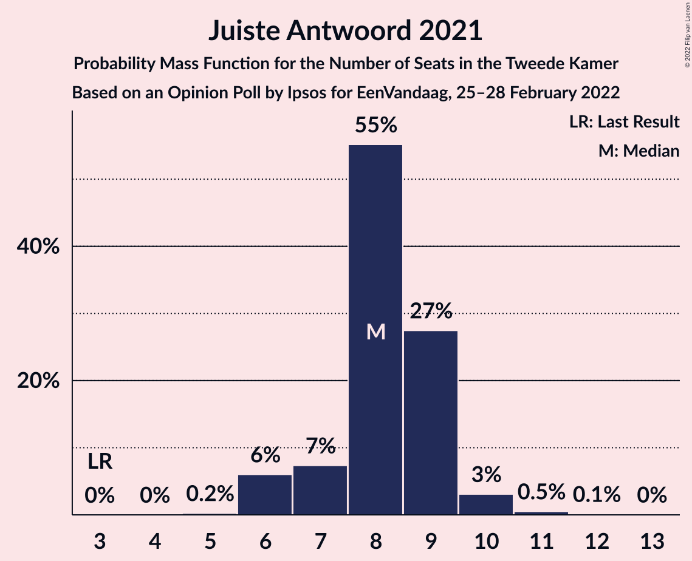

# Opinion Poll by Ipsos for EenVandaag, 25–28 February 2022

<a href="#voting-intentions">Voting Intentions</a> | <a href="#seats">Seats</a> | <a href="#coalitions">Coalitions</a> | <a href="#technical-information">Technical Information</a>

## Voting Intentions

### Confidence Intervals

| Party | Last Result | Poll Result | 80% Confidence Interval | 90% Confidence Interval | 95% Confidence Interval | 99% Confidence Interval |
|:-----:|:-----------:|:-----------:|:-----------------------:|:-----------------------:|:-----------------------:|:-----------------------:|
| Volkspartij voor Vrijheid en Democratie | 21.9% | 20.0% | 18.5–21.7% |18.0–22.1% |17.7–22.6% |16.9–23.4% |
| Democraten 66 | 15.0% | 12.8% | 11.5–14.2% |11.2–14.6% |10.9–15.0% |10.3–15.7% |
| Partij voor de Vrijheid | 10.8% | 10.8% | 9.7–12.2% |9.3–12.6% |9.1–12.9% |8.5–13.6% |
| Christen-Democratisch Appèl | 9.5% | 6.9% | 6.0–8.1% |5.7–8.4% |5.5–8.7% |5.1–9.2% |
| Partij van de Arbeid | 5.7% | 6.5% | 5.6–7.6% |5.4–8.0% |5.2–8.2% |4.8–8.8% |
| GroenLinks | 5.2% | 5.7% | 4.8–6.7% |4.6–7.0% |4.4–7.3% |4.0–7.8% |
| Partij voor de Dieren | 3.8% | 5.7% | 4.8–6.7% |4.6–7.0% |4.4–7.3% |4.0–7.8% |
| Juiste Antwoord 2021 | 2.4% | 5.3% | 4.5–6.3% |4.2–6.6% |4.1–6.8% |3.7–7.3% |
| Socialistische Partij | 6.0% | 4.8% | 4.0–5.7% |3.8–6.0% |3.6–6.3% |3.3–6.8% |
| ChristenUnie | 3.4% | 3.6% | 3.0–4.5% |2.8–4.7% |2.6–4.9% |2.3–5.4% |
| Volt Europa | 2.4% | 3.2% | 2.6–4.1% |2.4–4.3% |2.3–4.5% |2.0–4.9% |
| BoerBurgerBeweging | 1.0% | 3.2% | 2.6–4.1% |2.4–4.3% |2.3–4.5% |2.0–4.9% |
| Forum voor Democratie | 5.0% | 3.0% | 2.4–3.8% |2.3–4.1% |2.1–4.3% |1.9–4.7% |
| DENK | 2.0% | 2.8% | 2.3–3.6% |2.1–3.8% |2.0–4.0% |1.7–4.5% |
| Staatkundig Gereformeerde Partij | 2.1% | 2.4% | 1.9–3.2% |1.8–3.4% |1.7–3.6% |1.4–4.0% |
| 50Plus | 1.0% | 1.0% | 0.7–1.5% |0.6–1.7% |0.5–1.8% |0.4–2.1% |
| Bij1 | 0.8% | 0.7% | 0.4–1.2% |0.4–1.3% |0.3–1.4% |0.2–1.7% |

*Note:* The poll result column reflects the actual value used in the calculations. Published results may vary slightly, and in addition be rounded to fewer digits.

## Seats

### Confidence Intervals

| Party | Last Result | Median | 80% Confidence Interval | 90% Confidence Interval | 95% Confidence Interval | 99% Confidence Interval |
|:-----:|:-----------:|:------:|:-----------------------:|:-----------------------:|:-----------------------:|:-----------------------:|
| <a href="#volkspartij-voor-vrijheid-en-democratie">Volkspartij voor Vrijheid en Democratie</a> | 34 | 27 | 27–33 |27–33 |27–33 |24–36 |
| <a href="#democraten-66">Democraten 66</a> | 24 | 18 | 18–21 |16–22 |16–22 |15–24 |
| <a href="#partij-voor-de-vrijheid">Partij voor de Vrijheid</a> | 17 | 15 | 14–21 |14–21 |13–21 |12–21 |
| <a href="#christen-democratisch-appèl">Christen-Democratisch Appèl</a> | 15 | 10 | 10–11 |10–14 |9–16 |8–16 |
| <a href="#partij-van-de-arbeid">Partij van de Arbeid</a> | 9 | 10 | 10–11 |9–11 |8–12 |8–14 |
| <a href="#groenlinks">GroenLinks</a> | 8 | 8 | 7–9 |7–9 |7–10 |6–12 |
| <a href="#partij-voor-de-dieren">Partij voor de Dieren</a> | 6 | 11 | 7–11 |7–12 |6–12 |6–12 |
| <a href="#juiste-antwoord-2021">Juiste Antwoord 2021</a> | 3 | 8 | 7–9 |6–9 |6–10 |6–11 |
| <a href="#socialistische-partij">Socialistische Partij</a> | 9 | 6 | 6–9 |6–9 |6–9 |5–10 |
| <a href="#christenunie">ChristenUnie</a> | 5 | 6 | 4–6 |4–6 |4–7 |3–8 |
| <a href="#volt-europa">Volt Europa</a> | 3 | 6 | 4–6 |3–6 |3–7 |3–8 |
| <a href="#boerburgerbeweging">BoerBurgerBeweging</a> | 1 | 4 | 4–6 |4–7 |3–7 |3–7 |
| <a href="#forum-voor-democratie">Forum voor Democratie</a> | 8 | 5 | 2–5 |2–5 |2–5 |2–7 |
| <a href="#denk">DENK</a> | 3 | 5 | 3–6 |3–6 |3–6 |2–6 |
| <a href="#staatkundig-gereformeerde-partij">Staatkundig Gereformeerde Partij</a> | 3 | 4 | 2–4 |2–4 |2–4 |2–6 |
| <a href="#50plus">50Plus</a> | 1 | 2 | 0–2 |0–2 |0–2 |0–2 |
| <a href="#bij1">Bij1</a> | 1 | 2 | 0–2 |0–2 |0–2 |0–3 |

### Volkspartij voor Vrijheid en Democratie

*For a full overview of the results for this party, see the [Volkspartij voor Vrijheid en Democratie](party-volkspartijvoorvrijheidendemocratie.html) page.*

| Number of Seats | Probability | Accumulated | Special Marks |
|:---------------:|:-----------:|:-----------:|:-------------:|
| 24 | 0.9% | 100% |  |
| 25 | 0.1% | 99.1% |  |
| 26 | 0.1% | 99.0% |  |
| 27 | 49% | 98.9% | Median |
| 28 | 2% | 50% |  |
| 29 | 7% | 48% |  |
| 30 | 5% | 41% |  |
| 31 | 12% | 36% |  |
| 32 | 4% | 24% |  |
| 33 | 18% | 20% |  |
| 34 | 0.5% | 2% | Last Result |
| 35 | 0.2% | 1.5% |  |
| 36 | 1.3% | 1.3% |  |
| 37 | 0% | 0% |  |

### Democraten 66

*For a full overview of the results for this party, see the [Democraten 66](party-democraten66.html) page.*

| Number of Seats | Probability | Accumulated | Special Marks |
|:---------------:|:-----------:|:-----------:|:-------------:|
| 14 | 0% | 100% |  |
| 15 | 0.8% | 99.9% |  |
| 16 | 6% | 99.2% |  |
| 17 | 2% | 93% |  |
| 18 | 64% | 91% | Median |
| 19 | 1.2% | 28% |  |
| 20 | 14% | 27% |  |
| 21 | 7% | 12% |  |
| 22 | 3% | 5% |  |
| 23 | 0.7% | 2% |  |
| 24 | 1.1% | 1.2% | Last Result |
| 25 | 0.1% | 0.1% |  |
| 26 | 0% | 0% |  |

### Partij voor de Vrijheid

*For a full overview of the results for this party, see the [Partij voor de Vrijheid](party-partijvoordevrijheid.html) page.*

| Number of Seats | Probability | Accumulated | Special Marks |
|:---------------:|:-----------:|:-----------:|:-------------:|
| 12 | 2% | 100% |  |
| 13 | 2% | 98% |  |
| 14 | 15% | 96% |  |
| 15 | 59% | 81% | Median |
| 16 | 3% | 22% |  |
| 17 | 6% | 19% | Last Result |
| 18 | 0.7% | 13% |  |
| 19 | 1.2% | 13% |  |
| 20 | 0.2% | 11% |  |
| 21 | 11% | 11% |  |
| 22 | 0% | 0% |  |

### Christen-Democratisch Appèl

*For a full overview of the results for this party, see the [Christen-Democratisch Appèl](party-christen-democratischappèl.html) page.*

| Number of Seats | Probability | Accumulated | Special Marks |
|:---------------:|:-----------:|:-----------:|:-------------:|
| 7 | 0.1% | 100% |  |
| 8 | 2% | 99.9% |  |
| 9 | 1.2% | 98% |  |
| 10 | 67% | 97% | Median |
| 11 | 21% | 30% |  |
| 12 | 3% | 10% |  |
| 13 | 1.3% | 7% |  |
| 14 | 0.4% | 5% |  |
| 15 | 0.4% | 5% | Last Result |
| 16 | 4% | 4% |  |
| 17 | 0% | 0% |  |

### Partij van de Arbeid

*For a full overview of the results for this party, see the [Partij van de Arbeid](party-partijvandearbeid.html) page.*

| Number of Seats | Probability | Accumulated | Special Marks |
|:---------------:|:-----------:|:-----------:|:-------------:|
| 7 | 0.2% | 100% |  |
| 8 | 3% | 99.7% |  |
| 9 | 2% | 97% | Last Result |
| 10 | 56% | 94% | Median |
| 11 | 35% | 39% |  |
| 12 | 2% | 4% |  |
| 13 | 0.2% | 2% |  |
| 14 | 1.4% | 1.4% |  |
| 15 | 0% | 0% |  |

### GroenLinks

*For a full overview of the results for this party, see the [GroenLinks](party-groenlinks.html) page.*

| Number of Seats | Probability | Accumulated | Special Marks |
|:---------------:|:-----------:|:-----------:|:-------------:|
| 5 | 0% | 100% |  |
| 6 | 0.5% | 99.9% |  |
| 7 | 27% | 99.4% |  |
| 8 | 58% | 73% | Last Result, Median |
| 9 | 10% | 14% |  |
| 10 | 2% | 4% |  |
| 11 | 0.9% | 1.5% |  |
| 12 | 0.5% | 0.6% |  |
| 13 | 0% | 0% |  |

### Partij voor de Dieren

*For a full overview of the results for this party, see the [Partij voor de Dieren](party-partijvoordedieren.html) page.*

| Number of Seats | Probability | Accumulated | Special Marks |
|:---------------:|:-----------:|:-----------:|:-------------:|
| 5 | 0.2% | 100% |  |
| 6 | 4% | 99.8% | Last Result |
| 7 | 19% | 96% |  |
| 8 | 4% | 76% |  |
| 9 | 12% | 72% |  |
| 10 | 6% | 60% |  |
| 11 | 49% | 55% | Median |
| 12 | 5% | 5% |  |
| 13 | 0.1% | 0.1% |  |
| 14 | 0% | 0% |  |

### Juiste Antwoord 2021

*For a full overview of the results for this party, see the [Juiste Antwoord 2021](party-juisteantwoord2021.html) page.*

| Number of Seats | Probability | Accumulated | Special Marks |
|:---------------:|:-----------:|:-----------:|:-------------:|
| 3 | 0% | 100% | Last Result |
| 4 | 0% | 100% |  |
| 5 | 0.2% | 100% |  |
| 6 | 6% | 99.7% |  |
| 7 | 7% | 94% |  |
| 8 | 55% | 86% | Median |
| 9 | 27% | 31% |  |
| 10 | 3% | 4% |  |
| 11 | 0.5% | 0.7% |  |
| 12 | 0.1% | 0.1% |  |
| 13 | 0% | 0% |  |

### Socialistische Partij

*For a full overview of the results for this party, see the [Socialistische Partij](party-socialistischepartij.html) page.*

| Number of Seats | Probability | Accumulated | Special Marks |
|:---------------:|:-----------:|:-----------:|:-------------:|
| 4 | 0.3% | 100% |  |
| 5 | 2% | 99.7% |  |
| 6 | 51% | 98% | Median |
| 7 | 13% | 47% |  |
| 8 | 18% | 34% |  |
| 9 | 14% | 15% | Last Result |
| 10 | 1.3% | 1.4% |  |
| 11 | 0.1% | 0.1% |  |
| 12 | 0% | 0% |  |

### ChristenUnie

*For a full overview of the results for this party, see the [ChristenUnie](party-christenunie.html) page.*

| Number of Seats | Probability | Accumulated | Special Marks |
|:---------------:|:-----------:|:-----------:|:-------------:|
| 3 | 0.7% | 100% |  |
| 4 | 16% | 99.3% |  |
| 5 | 12% | 83% | Last Result |
| 6 | 66% | 71% | Median |
| 7 | 4% | 5% |  |
| 8 | 1.2% | 1.2% |  |
| 9 | 0% | 0.1% |  |
| 10 | 0% | 0% |  |

### Volt Europa

*For a full overview of the results for this party, see the [Volt Europa](party-volteuropa.html) page.*

| Number of Seats | Probability | Accumulated | Special Marks |
|:---------------:|:-----------:|:-----------:|:-------------:|
| 2 | 0.1% | 100% |  |
| 3 | 7% | 99.9% | Last Result |
| 4 | 19% | 93% |  |
| 5 | 21% | 75% |  |
| 6 | 51% | 54% | Median |
| 7 | 0.9% | 3% |  |
| 8 | 2% | 2% |  |
| 9 | 0% | 0% |  |

### BoerBurgerBeweging

*For a full overview of the results for this party, see the [BoerBurgerBeweging](party-boerburgerbeweging.html) page.*

| Number of Seats | Probability | Accumulated | Special Marks |
|:---------------:|:-----------:|:-----------:|:-------------:|
| 1 | 0% | 100% | Last Result |
| 2 | 0.3% | 100% |  |
| 3 | 2% | 99.7% |  |
| 4 | 63% | 97% | Median |
| 5 | 24% | 34% |  |
| 6 | 4% | 10% |  |
| 7 | 6% | 6% |  |
| 8 | 0.1% | 0.1% |  |
| 9 | 0.1% | 0.1% |  |
| 10 | 0% | 0% |  |

### Forum voor Democratie

*For a full overview of the results for this party, see the [Forum voor Democratie](party-forumvoordemocratie.html) page.*

| Number of Seats | Probability | Accumulated | Special Marks |
|:---------------:|:-----------:|:-----------:|:-------------:|
| 2 | 11% | 100% |  |
| 3 | 5% | 89% |  |
| 4 | 29% | 84% |  |
| 5 | 53% | 55% | Median |
| 6 | 1.1% | 2% |  |
| 7 | 1.0% | 1.0% |  |
| 8 | 0.1% | 0.1% | Last Result |
| 9 | 0% | 0% |  |

### DENK

*For a full overview of the results for this party, see the [DENK](party-denk.html) page.*

| Number of Seats | Probability | Accumulated | Special Marks |
|:---------------:|:-----------:|:-----------:|:-------------:|
| 2 | 0.5% | 100% |  |
| 3 | 14% | 99.5% | Last Result |
| 4 | 14% | 86% |  |
| 5 | 22% | 72% | Median |
| 6 | 49% | 49% |  |
| 7 | 0.3% | 0.3% |  |
| 8 | 0% | 0% |  |

### Staatkundig Gereformeerde Partij

*For a full overview of the results for this party, see the [Staatkundig Gereformeerde Partij](party-staatkundiggereformeerdepartij.html) page.*

| Number of Seats | Probability | Accumulated | Special Marks |
|:---------------:|:-----------:|:-----------:|:-------------:|
| 1 | 0.1% | 100% |  |
| 2 | 19% | 99.9% |  |
| 3 | 12% | 81% | Last Result |
| 4 | 68% | 70% | Median |
| 5 | 0.9% | 2% |  |
| 6 | 1.0% | 1.0% |  |
| 7 | 0% | 0% |  |

### 50Plus

*For a full overview of the results for this party, see the [50Plus](party-50plus.html) page.*

| Number of Seats | Probability | Accumulated | Special Marks |
|:---------------:|:-----------:|:-----------:|:-------------:|
| 0 | 23% | 100% |  |
| 1 | 8% | 77% | Last Result |
| 2 | 68% | 69% | Median |
| 3 | 0.4% | 0.4% |  |
| 4 | 0% | 0% |  |

### Bij1

*For a full overview of the results for this party, see the [Bij1](party-bij1.html) page.*

| Number of Seats | Probability | Accumulated | Special Marks |
|:---------------:|:-----------:|:-----------:|:-------------:|
| 0 | 11% | 100% |  |
| 1 | 36% | 89% | Last Result |
| 2 | 53% | 54% | Median |
| 3 | 0.5% | 0.5% |  |
| 4 | 0% | 0% |  |

## Coalitions

### Confidence Intervals

| Coalition | Last Result | Median | Majority? | 80% Confidence Interval | 90% Confidence Interval | 95% Confidence Interval | 99% Confidence Interval |
|:---------:|:-----------:|:------:|:---------:|:-----------------------:|:-----------------------:|:-----------------------:|:-----------------------:|
| Volkspartij voor Vrijheid en Democratie – Democraten 66 – Christen-Democratisch Appèl – Partij van de Arbeid – ChristenUnie | 87 | 72 | 47% | 71–79 | 71–79 | 71–82 | 69–84 |
| Volkspartij voor Vrijheid en Democratie – Democraten 66 – Christen-Democratisch Appèl – GroenLinks – ChristenUnie | 86 | 72 | 10% | 69–76 | 69–78 | 69–79 | 69–81 |
| Volkspartij voor Vrijheid en Democratie – Democraten 66 – Christen-Democratisch Appèl – ChristenUnie | 78 | 63 | 0% | 61–68 | 61–70 | 61–71 | 60–72 |
| Volkspartij voor Vrijheid en Democratie – Partij voor de Vrijheid – Christen-Democratisch Appèl – Forum voor Democratie – Staatkundig Gereformeerde Partij | 77 | 61 | 0% | 61–68 | 61–70 | 61–70 | 60–71 |
| Volkspartij voor Vrijheid en Democratie – Partij voor de Vrijheid – Christen-Democratisch Appèl – Forum voor Democratie | 74 | 58 | 0% | 57–64 | 57–67 | 57–67 | 57–68 |
| Democraten 66 – Christen-Democratisch Appèl – Partij van de Arbeid – GroenLinks – Socialistische Partij – ChristenUnie | 70 | 58 | 0% | 58–65 | 58–65 | 57–65 | 54–69 |
| Volkspartij voor Vrijheid en Democratie – Democraten 66 – Partij van de Arbeid | 67 | 56 | 0% | 55–62 | 55–63 | 55–65 | 54–66 |
| Volkspartij voor Vrijheid en Democratie – Democraten 66 – Christen-Democratisch Appèl | 73 | 57 | 0% | 55–62 | 55–64 | 55–64 | 55–66 |
| Volkspartij voor Vrijheid en Democratie – Partij voor de Vrijheid – Christen-Democratisch Appèl | 66 | 53 | 0% | 52–62 | 52–63 | 52–63 | 52–64 |
| Democraten 66 – Christen-Democratisch Appèl – Partij van de Arbeid – GroenLinks – ChristenUnie | 61 | 52 | 0% | 52–57 | 52–58 | 51–58 | 49–63 |
| Volkspartij voor Vrijheid en Democratie – Christen-Democratisch Appèl – Partij van de Arbeid | 58 | 47 | 0% | 47–55 | 47–56 | 47–56 | 46–59 |
| Volkspartij voor Vrijheid en Democratie – Christen-Democratisch Appèl – Forum voor Democratie – Staatkundig Gereformeerde Partij – 50Plus | 61 | 48 | 0% | 47–52 | 47–53 | 47–53 | 45–58 |
| Volkspartij voor Vrijheid en Democratie – Christen-Democratisch Appèl – Forum voor Democratie – Staatkundig Gereformeerde Partij | 60 | 46 | 0% | 46–50 | 46–53 | 46–53 | 44–56 |
| Volkspartij voor Vrijheid en Democratie – Christen-Democratisch Appèl – Forum voor Democratie – 50Plus | 58 | 44 | 0% | 43–50 | 43–50 | 43–50 | 42–54 |
| Volkspartij voor Vrijheid en Democratie – Christen-Democratisch Appèl – Forum voor Democratie | 57 | 42 | 0% | 42–48 | 42–50 | 42–50 | 41–52 |
| Volkspartij voor Vrijheid en Democratie – Christen-Democratisch Appèl | 49 | 37 | 0% | 37–44 | 37–46 | 37–46 | 36–48 |
| Volkspartij voor Vrijheid en Democratie – Partij van de Arbeid | 43 | 37 | 0% | 37–44 | 37–44 | 37–44 | 36–47 |
| Democraten 66 – Christen-Democratisch Appèl – Partij van de Arbeid | 48 | 38 | 0% | 38–43 | 38–43 | 37–43 | 36–48 |
| Democraten 66 – Christen-Democratisch Appèl | 39 | 28 | 0% | 28–32 | 28–32 | 27–33 | 25–37 |
| Christen-Democratisch Appèl – Partij van de Arbeid – ChristenUnie | 29 | 26 | 0% | 25–28 | 24–31 | 23–31 | 20–33 |
| Christen-Democratisch Appèl – Partij van de Arbeid | 24 | 20 | 0% | 20–22 | 20–26 | 18–26 | 16–27 |

### Volkspartij voor Vrijheid en Democratie – Democraten 66 – Christen-Democratisch Appèl – Partij van de Arbeid – ChristenUnie

| Number of Seats | Probability | Accumulated | Special Marks |
|:---------------:|:-----------:|:-----------:|:-------------:|
| 68 | 0.1% | 100% |  |
| 69 | 0.4% | 99.8% |  |
| 70 | 0.1% | 99.4% |  |
| 71 | 49% | 99.3% | Median |
| 72 | 0.7% | 50% |  |
| 73 | 0.6% | 50% |  |
| 74 | 2% | 49% |  |
| 75 | 0.5% | 47% |  |
| 76 | 13% | 47% | Majority |
| 77 | 13% | 34% |  |
| 78 | 1.0% | 21% |  |
| 79 | 15% | 20% |  |
| 80 | 0.2% | 5% |  |
| 81 | 0.5% | 5% |  |
| 82 | 3% | 4% |  |
| 83 | 0.9% | 2% |  |
| 84 | 0.6% | 0.6% |  |
| 85 | 0% | 0% |  |
| 86 | 0% | 0% |  |
| 87 | 0% | 0% | Last Result |

### Volkspartij voor Vrijheid en Democratie – Democraten 66 – Christen-Democratisch Appèl – GroenLinks – ChristenUnie

| Number of Seats | Probability | Accumulated | Special Marks |
|:---------------:|:-----------:|:-----------:|:-------------:|
| 68 | 0.4% | 100% |  |
| 69 | 49% | 99.6% | Median |
| 70 | 0.5% | 51% |  |
| 71 | 0.3% | 50% |  |
| 72 | 11% | 50% |  |
| 73 | 2% | 39% |  |
| 74 | 1.2% | 37% |  |
| 75 | 25% | 35% |  |
| 76 | 4% | 10% | Majority |
| 77 | 0.9% | 6% |  |
| 78 | 2% | 6% |  |
| 79 | 3% | 4% |  |
| 80 | 0.2% | 0.7% |  |
| 81 | 0.4% | 0.5% |  |
| 82 | 0% | 0.1% |  |
| 83 | 0.1% | 0.1% |  |
| 84 | 0% | 0% |  |
| 85 | 0% | 0% |  |
| 86 | 0% | 0% | Last Result |

### Volkspartij voor Vrijheid en Democratie – Democraten 66 – Christen-Democratisch Appèl – ChristenUnie

| Number of Seats | Probability | Accumulated | Special Marks |
|:---------------:|:-----------:|:-----------:|:-------------:|
| 58 | 0.1% | 100% |  |
| 59 | 0% | 99.9% |  |
| 60 | 0.6% | 99.9% |  |
| 61 | 49% | 99.2% | Median |
| 62 | 0.3% | 51% |  |
| 63 | 1.4% | 50% |  |
| 64 | 2% | 49% |  |
| 65 | 13% | 47% |  |
| 66 | 7% | 35% |  |
| 67 | 7% | 28% |  |
| 68 | 16% | 21% |  |
| 69 | 0.5% | 6% |  |
| 70 | 0.8% | 5% |  |
| 71 | 4% | 4% |  |
| 72 | 0.4% | 0.6% |  |
| 73 | 0.2% | 0.2% |  |
| 74 | 0% | 0% |  |
| 75 | 0% | 0% |  |
| 76 | 0% | 0% | Majority |
| 77 | 0% | 0% |  |
| 78 | 0% | 0% | Last Result |

### Volkspartij voor Vrijheid en Democratie – Partij voor de Vrijheid – Christen-Democratisch Appèl – Forum voor Democratie – Staatkundig Gereformeerde Partij

| Number of Seats | Probability | Accumulated | Special Marks |
|:---------------:|:-----------:|:-----------:|:-------------:|
| 57 | 0.1% | 100% |  |
| 58 | 0% | 99.8% |  |
| 59 | 0.1% | 99.8% |  |
| 60 | 1.1% | 99.7% |  |
| 61 | 51% | 98.6% | Median |
| 62 | 0.3% | 47% |  |
| 63 | 9% | 47% |  |
| 64 | 16% | 38% |  |
| 65 | 2% | 23% |  |
| 66 | 1.1% | 21% |  |
| 67 | 1.2% | 20% |  |
| 68 | 12% | 19% |  |
| 69 | 1.2% | 7% |  |
| 70 | 5% | 6% |  |
| 71 | 0.9% | 1.2% |  |
| 72 | 0.1% | 0.3% |  |
| 73 | 0.1% | 0.2% |  |
| 74 | 0.1% | 0.1% |  |
| 75 | 0% | 0.1% |  |
| 76 | 0% | 0% | Majority |
| 77 | 0% | 0% | Last Result |

### Volkspartij voor Vrijheid en Democratie – Partij voor de Vrijheid – Christen-Democratisch Appèl – Forum voor Democratie

| Number of Seats | Probability | Accumulated | Special Marks |
|:---------------:|:-----------:|:-----------:|:-------------:|
| 54 | 0.1% | 100% |  |
| 55 | 0% | 99.8% |  |
| 56 | 0.1% | 99.8% |  |
| 57 | 49% | 99.7% | Median |
| 58 | 1.1% | 50% |  |
| 59 | 8% | 49% |  |
| 60 | 4% | 41% |  |
| 61 | 1.2% | 38% |  |
| 62 | 16% | 37% |  |
| 63 | 2% | 21% |  |
| 64 | 12% | 19% |  |
| 65 | 1.2% | 7% |  |
| 66 | 0.1% | 6% |  |
| 67 | 4% | 5% |  |
| 68 | 0.8% | 1.2% |  |
| 69 | 0.3% | 0.4% |  |
| 70 | 0.1% | 0.1% |  |
| 71 | 0% | 0.1% |  |
| 72 | 0% | 0% |  |
| 73 | 0% | 0% |  |
| 74 | 0% | 0% | Last Result |

### Democraten 66 – Christen-Democratisch Appèl – Partij van de Arbeid – GroenLinks – Socialistische Partij – ChristenUnie

| Number of Seats | Probability | Accumulated | Special Marks |
|:---------------:|:-----------:|:-----------:|:-------------:|
| 54 | 0.7% | 100% |  |
| 55 | 0.1% | 99.3% |  |
| 56 | 0.3% | 99.2% |  |
| 57 | 2% | 98.9% |  |
| 58 | 49% | 97% | Median |
| 59 | 0.7% | 48% |  |
| 60 | 13% | 47% |  |
| 61 | 2% | 34% |  |
| 62 | 19% | 32% |  |
| 63 | 0.9% | 13% |  |
| 64 | 0.8% | 12% |  |
| 65 | 9% | 11% |  |
| 66 | 0.9% | 2% |  |
| 67 | 0.2% | 1.5% |  |
| 68 | 0.1% | 1.2% |  |
| 69 | 0.7% | 1.1% |  |
| 70 | 0% | 0.4% | Last Result |
| 71 | 0.4% | 0.4% |  |
| 72 | 0% | 0% |  |

### Volkspartij voor Vrijheid en Democratie – Democraten 66 – Partij van de Arbeid

| Number of Seats | Probability | Accumulated | Special Marks |
|:---------------:|:-----------:|:-----------:|:-------------:|
| 53 | 0.1% | 100% |  |
| 54 | 0.6% | 99.9% |  |
| 55 | 49% | 99.3% | Median |
| 56 | 5% | 50% |  |
| 57 | 0.9% | 45% |  |
| 58 | 1.0% | 44% |  |
| 59 | 1.2% | 43% |  |
| 60 | 1.5% | 42% |  |
| 61 | 7% | 41% |  |
| 62 | 26% | 34% |  |
| 63 | 4% | 8% |  |
| 64 | 0.9% | 4% |  |
| 65 | 3% | 4% |  |
| 66 | 0.3% | 0.6% |  |
| 67 | 0.2% | 0.3% | Last Result |
| 68 | 0.1% | 0.1% |  |
| 69 | 0% | 0% |  |

### Volkspartij voor Vrijheid en Democratie – Democraten 66 – Christen-Democratisch Appèl

| Number of Seats | Probability | Accumulated | Special Marks |
|:---------------:|:-----------:|:-----------:|:-------------:|
| 52 | 0.1% | 100% |  |
| 53 | 0% | 99.9% |  |
| 54 | 0.2% | 99.9% |  |
| 55 | 49% | 99.8% | Median |
| 56 | 0.3% | 51% |  |
| 57 | 1.3% | 50% |  |
| 58 | 0.8% | 49% |  |
| 59 | 1.1% | 48% |  |
| 60 | 1.2% | 47% |  |
| 61 | 17% | 46% |  |
| 62 | 20% | 29% |  |
| 63 | 3% | 9% |  |
| 64 | 4% | 6% |  |
| 65 | 0.6% | 2% |  |
| 66 | 0.6% | 1.0% |  |
| 67 | 0.3% | 0.4% |  |
| 68 | 0% | 0.1% |  |
| 69 | 0.1% | 0.1% |  |
| 70 | 0% | 0% |  |
| 71 | 0% | 0% |  |
| 72 | 0% | 0% |  |
| 73 | 0% | 0% | Last Result |

### Volkspartij voor Vrijheid en Democratie – Partij voor de Vrijheid – Christen-Democratisch Appèl

| Number of Seats | Probability | Accumulated | Special Marks |
|:---------------:|:-----------:|:-----------:|:-------------:|
| 50 | 0.2% | 100% |  |
| 51 | 0.1% | 99.8% |  |
| 52 | 50% | 99.7% | Median |
| 53 | 0.3% | 50% |  |
| 54 | 0.6% | 50% |  |
| 55 | 9% | 49% |  |
| 56 | 1.4% | 40% |  |
| 57 | 4% | 39% |  |
| 58 | 14% | 35% |  |
| 59 | 1.2% | 21% |  |
| 60 | 1.4% | 19% |  |
| 61 | 1.3% | 18% |  |
| 62 | 11% | 17% |  |
| 63 | 4% | 5% |  |
| 64 | 0.8% | 0.9% |  |
| 65 | 0% | 0.1% |  |
| 66 | 0% | 0.1% | Last Result |
| 67 | 0.1% | 0.1% |  |
| 68 | 0% | 0% |  |

### Democraten 66 – Christen-Democratisch Appèl – Partij van de Arbeid – GroenLinks – ChristenUnie

| Number of Seats | Probability | Accumulated | Special Marks |
|:---------------:|:-----------:|:-----------:|:-------------:|
| 47 | 0.1% | 100% |  |
| 48 | 0.1% | 99.9% |  |
| 49 | 1.1% | 99.8% |  |
| 50 | 1.1% | 98.7% |  |
| 51 | 1.0% | 98% |  |
| 52 | 61% | 97% | Median |
| 53 | 17% | 36% |  |
| 54 | 1.4% | 19% |  |
| 55 | 5% | 18% |  |
| 56 | 0.7% | 12% |  |
| 57 | 6% | 12% |  |
| 58 | 4% | 6% |  |
| 59 | 0.6% | 2% |  |
| 60 | 0% | 1.4% |  |
| 61 | 0.3% | 1.4% | Last Result |
| 62 | 0% | 1.1% |  |
| 63 | 0.7% | 1.1% |  |
| 64 | 0% | 0.4% |  |
| 65 | 0% | 0.4% |  |
| 66 | 0.4% | 0.4% |  |
| 67 | 0% | 0% |  |

### Volkspartij voor Vrijheid en Democratie – Christen-Democratisch Appèl – Partij van de Arbeid

| Number of Seats | Probability | Accumulated | Special Marks |
|:---------------:|:-----------:|:-----------:|:-------------:|
| 44 | 0.2% | 100% |  |
| 45 | 0.2% | 99.8% |  |
| 46 | 1.1% | 99.6% |  |
| 47 | 49% | 98.5% | Median |
| 48 | 0.4% | 49% |  |
| 49 | 1.2% | 49% |  |
| 50 | 1.4% | 48% |  |
| 51 | 6% | 46% |  |
| 52 | 12% | 40% |  |
| 53 | 5% | 28% |  |
| 54 | 2% | 23% |  |
| 55 | 15% | 21% |  |
| 56 | 4% | 7% |  |
| 57 | 0.9% | 2% |  |
| 58 | 0.1% | 1.2% | Last Result |
| 59 | 1.1% | 1.1% |  |
| 60 | 0% | 0% |  |

### Volkspartij voor Vrijheid en Democratie – Christen-Democratisch Appèl – Forum voor Democratie – Staatkundig Gereformeerde Partij – 50Plus

| Number of Seats | Probability | Accumulated | Special Marks |
|:---------------:|:-----------:|:-----------:|:-------------:|
| 43 | 0% | 100% |  |
| 44 | 0.3% | 99.9% |  |
| 45 | 0.9% | 99.6% |  |
| 46 | 0.3% | 98.7% |  |
| 47 | 11% | 98% |  |
| 48 | 55% | 87% | Median |
| 49 | 4% | 32% |  |
| 50 | 2% | 28% |  |
| 51 | 3% | 27% |  |
| 52 | 16% | 23% |  |
| 53 | 5% | 8% |  |
| 54 | 0.4% | 2% |  |
| 55 | 0.6% | 2% |  |
| 56 | 0.3% | 1.3% |  |
| 57 | 0% | 1.0% |  |
| 58 | 1.0% | 1.0% |  |
| 59 | 0.1% | 0.1% |  |
| 60 | 0% | 0% |  |
| 61 | 0% | 0% | Last Result |

### Volkspartij voor Vrijheid en Democratie – Christen-Democratisch Appèl – Forum voor Democratie – Staatkundig Gereformeerde Partij

| Number of Seats | Probability | Accumulated | Special Marks |
|:---------------:|:-----------:|:-----------:|:-------------:|
| 42 | 0.3% | 100% |  |
| 43 | 0.1% | 99.7% |  |
| 44 | 0.9% | 99.6% |  |
| 45 | 0.2% | 98.6% |  |
| 46 | 49% | 98% | Median |
| 47 | 13% | 50% |  |
| 48 | 9% | 37% |  |
| 49 | 3% | 28% |  |
| 50 | 16% | 25% |  |
| 51 | 0.5% | 9% |  |
| 52 | 2% | 8% |  |
| 53 | 5% | 7% |  |
| 54 | 0.5% | 2% |  |
| 55 | 0.2% | 1.2% |  |
| 56 | 0.9% | 1.0% |  |
| 57 | 0.1% | 0.1% |  |
| 58 | 0% | 0% |  |
| 59 | 0% | 0% |  |
| 60 | 0% | 0% | Last Result |

### Volkspartij voor Vrijheid en Democratie – Christen-Democratisch Appèl – Forum voor Democratie – 50Plus

| Number of Seats | Probability | Accumulated | Special Marks |
|:---------------:|:-----------:|:-----------:|:-------------:|
| 40 | 0.1% | 100% |  |
| 41 | 0.3% | 99.9% |  |
| 42 | 0.9% | 99.6% |  |
| 43 | 11% | 98.7% |  |
| 44 | 55% | 87% | Median |
| 45 | 0.3% | 33% |  |
| 46 | 4% | 32% |  |
| 47 | 3% | 29% |  |
| 48 | 3% | 26% |  |
| 49 | 3% | 23% |  |
| 50 | 19% | 21% |  |
| 51 | 0.2% | 2% |  |
| 52 | 0.6% | 2% |  |
| 53 | 0.2% | 1.2% |  |
| 54 | 0.9% | 1.0% |  |
| 55 | 0% | 0.1% |  |
| 56 | 0.1% | 0.1% |  |
| 57 | 0% | 0% |  |
| 58 | 0% | 0% | Last Result |

### Volkspartij voor Vrijheid en Democratie – Christen-Democratisch Appèl – Forum voor Democratie

| Number of Seats | Probability | Accumulated | Special Marks |
|:---------------:|:-----------:|:-----------:|:-------------:|
| 39 | 0.2% | 100% |  |
| 40 | 0.2% | 99.7% |  |
| 41 | 1.2% | 99.5% |  |
| 42 | 49% | 98% | Median |
| 43 | 12% | 50% |  |
| 44 | 6% | 38% |  |
| 45 | 5% | 32% |  |
| 46 | 2% | 27% |  |
| 47 | 3% | 26% |  |
| 48 | 15% | 23% |  |
| 49 | 1.1% | 7% |  |
| 50 | 5% | 6% |  |
| 51 | 0.3% | 1.4% |  |
| 52 | 0.9% | 1.0% |  |
| 53 | 0% | 0.1% |  |
| 54 | 0.1% | 0.1% |  |
| 55 | 0% | 0% |  |
| 56 | 0% | 0% |  |
| 57 | 0% | 0% | Last Result |

### Volkspartij voor Vrijheid en Democratie – Christen-Democratisch Appèl

| Number of Seats | Probability | Accumulated | Special Marks |
|:---------------:|:-----------:|:-----------:|:-------------:|
| 35 | 0.2% | 100% |  |
| 36 | 1.1% | 99.7% |  |
| 37 | 49% | 98.6% | Median |
| 38 | 1.3% | 50% |  |
| 39 | 0.7% | 49% |  |
| 40 | 6% | 48% |  |
| 41 | 13% | 42% |  |
| 42 | 3% | 29% |  |
| 43 | 3% | 25% |  |
| 44 | 14% | 22% |  |
| 45 | 2% | 8% |  |
| 46 | 4% | 6% |  |
| 47 | 0.1% | 1.2% |  |
| 48 | 1.1% | 1.1% |  |
| 49 | 0% | 0% | Last Result |

### Volkspartij voor Vrijheid en Democratie – Partij van de Arbeid

| Number of Seats | Probability | Accumulated | Special Marks |
|:---------------:|:-----------:|:-----------:|:-------------:|
| 34 | 0.1% | 100% |  |
| 35 | 0.4% | 99.9% |  |
| 36 | 0.6% | 99.5% |  |
| 37 | 50% | 98.9% | Median |
| 38 | 1.4% | 49% |  |
| 39 | 1.3% | 48% |  |
| 40 | 10% | 46% |  |
| 41 | 2% | 36% |  |
| 42 | 12% | 35% |  |
| 43 | 5% | 23% | Last Result |
| 44 | 15% | 17% |  |
| 45 | 0.4% | 2% |  |
| 46 | 0% | 2% |  |
| 47 | 1.3% | 2% |  |
| 48 | 0.2% | 0.2% |  |
| 49 | 0% | 0% |  |

### Democraten 66 – Christen-Democratisch Appèl – Partij van de Arbeid

| Number of Seats | Probability | Accumulated | Special Marks |
|:---------------:|:-----------:|:-----------:|:-------------:|
| 34 | 0.1% | 100% |  |
| 35 | 0.1% | 99.9% |  |
| 36 | 2% | 99.8% |  |
| 37 | 0.9% | 98% |  |
| 38 | 49% | 97% | Median |
| 39 | 3% | 48% |  |
| 40 | 17% | 45% |  |
| 41 | 12% | 28% |  |
| 42 | 5% | 16% |  |
| 43 | 9% | 11% |  |
| 44 | 0.3% | 2% |  |
| 45 | 0.1% | 2% |  |
| 46 | 0.4% | 2% |  |
| 47 | 0.7% | 1.3% |  |
| 48 | 0.2% | 0.6% | Last Result |
| 49 | 0% | 0.4% |  |
| 50 | 0% | 0.4% |  |
| 51 | 0.4% | 0.4% |  |
| 52 | 0% | 0% |  |

### Democraten 66 – Christen-Democratisch Appèl

| Number of Seats | Probability | Accumulated | Special Marks |
|:---------------:|:-----------:|:-----------:|:-------------:|
| 25 | 0.6% | 100% |  |
| 26 | 0.6% | 99.4% |  |
| 27 | 1.4% | 98.8% |  |
| 28 | 51% | 97% | Median |
| 29 | 14% | 46% |  |
| 30 | 14% | 32% |  |
| 31 | 3% | 18% |  |
| 32 | 12% | 16% |  |
| 33 | 2% | 3% |  |
| 34 | 0.3% | 1.2% |  |
| 35 | 0.1% | 0.9% |  |
| 36 | 0.2% | 0.8% |  |
| 37 | 0.2% | 0.6% |  |
| 38 | 0% | 0.4% |  |
| 39 | 0.4% | 0.4% | Last Result |
| 40 | 0% | 0% |  |

### Christen-Democratisch Appèl – Partij van de Arbeid – ChristenUnie

| Number of Seats | Probability | Accumulated | Special Marks |
|:---------------:|:-----------:|:-----------:|:-------------:|
| 19 | 0.5% | 100% |  |
| 20 | 0.1% | 99.5% |  |
| 21 | 0.7% | 99.4% |  |
| 22 | 0.5% | 98.6% |  |
| 23 | 0.9% | 98% |  |
| 24 | 3% | 97% |  |
| 25 | 11% | 94% |  |
| 26 | 50% | 82% | Median |
| 27 | 7% | 32% |  |
| 28 | 17% | 25% |  |
| 29 | 0.2% | 8% | Last Result |
| 30 | 0.7% | 7% |  |
| 31 | 4% | 7% |  |
| 32 | 1.0% | 2% |  |
| 33 | 1.3% | 1.3% |  |
| 34 | 0% | 0% |  |

### Christen-Democratisch Appèl – Partij van de Arbeid

| Number of Seats | Probability | Accumulated | Special Marks |
|:---------------:|:-----------:|:-----------:|:-------------:|
| 16 | 0.7% | 100% |  |
| 17 | 1.0% | 99.3% |  |
| 18 | 0.9% | 98% |  |
| 19 | 1.5% | 97% |  |
| 20 | 52% | 96% | Median |
| 21 | 16% | 44% |  |
| 22 | 20% | 29% |  |
| 23 | 2% | 9% |  |
| 24 | 0% | 7% | Last Result |
| 25 | 1.2% | 7% |  |
| 26 | 5% | 6% |  |
| 27 | 0.6% | 0.6% |  |
| 28 | 0% | 0% |  |

## Technical Information

### Opinion Poll

+ **Polling firm:** Ipsos
+ **Commissioner(s):** EenVandaag
+ **Fieldwork period:** 25–28 February 2022

### Calculations

+ **Sample size:** 1025
+ **Simulations done:** 1,048,576
+ **Error estimate:** 3.89%

