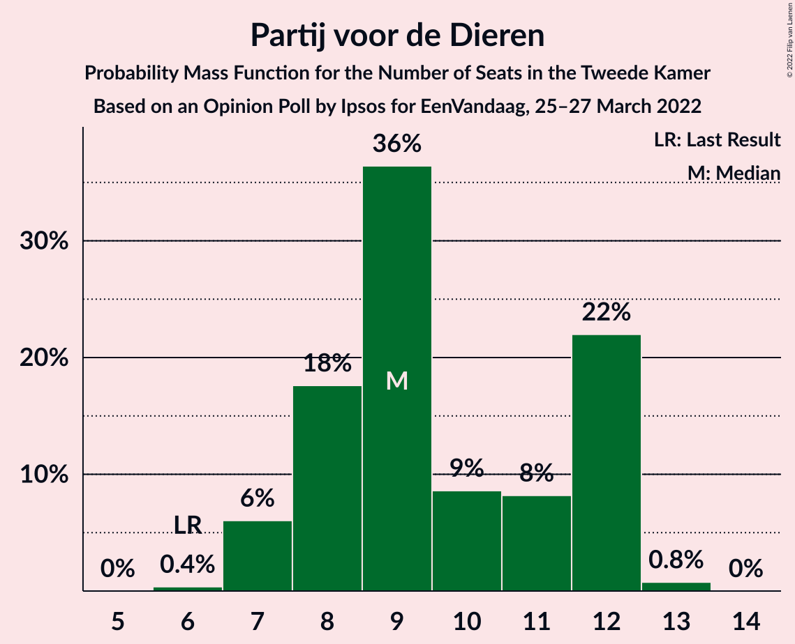

# Opinion Poll by Ipsos for EenVandaag, 25–27 March 2022

<a href="#voting-intentions">Voting Intentions</a> | <a href="#seats">Seats</a> | <a href="#coalitions">Coalitions</a> | <a href="#technical-information">Technical Information</a>

## Voting Intentions

### Confidence Intervals

| Party | Last Result | Poll Result | 80% Confidence Interval | 90% Confidence Interval | 95% Confidence Interval | 99% Confidence Interval |
|:-----:|:-----------:|:-----------:|:-----------------------:|:-----------------------:|:-----------------------:|:-----------------------:|
| Volkspartij voor Vrijheid en Democratie | 21.9% | 20.6% | 19.1–22.3% |18.6–22.8% |18.3–23.2% |17.5–24.0% |
| Democraten 66 | 15.0% | 12.2% | 11.0–13.6% |10.7–14.0% |10.4–14.3% |9.8–15.0% |
| Partij voor de Vrijheid | 10.8% | 9.3% | 8.2–10.5% |7.9–10.9% |7.6–11.2% |7.2–11.8% |
| Partij van de Arbeid | 5.7% | 7.0% | 6.1–8.1% |5.8–8.4% |5.6–8.7% |5.2–9.2% |
| GroenLinks | 5.2% | 6.6% | 5.7–7.7% |5.4–8.0% |5.2–8.3% |4.8–8.8% |
| Christen-Democratisch Appèl | 9.5% | 6.0% | 5.2–7.1% |4.9–7.4% |4.7–7.6% |4.3–8.2% |
| Partij voor de Dieren | 3.8% | 6.0% | 5.2–7.1% |4.9–7.4% |4.7–7.6% |4.3–8.2% |
| Juiste Antwoord 2021 | 2.4% | 5.2% | 4.5–6.2% |4.2–6.5% |4.1–6.8% |3.7–7.3% |
| Socialistische Partij | 6.0% | 4.6% | 3.8–5.5% |3.6–5.8% |3.5–6.0% |3.1–6.5% |
| BoerBurgerBeweging | 1.0% | 4.0% | 3.3–4.9% |3.1–5.2% |3.0–5.4% |2.7–5.8% |
| ChristenUnie | 3.4% | 3.6% | 3.0–4.5% |2.8–4.7% |2.7–5.0% |2.4–5.4% |
| DENK | 2.0% | 3.0% | 2.4–3.7% |2.2–4.0% |2.1–4.2% |1.8–4.6% |
| Volt Europa | 2.4% | 3.0% | 2.4–3.7% |2.2–4.0% |2.1–4.2% |1.8–4.6% |
| Forum voor Democratie | 5.0% | 2.8% | 2.2–3.5% |2.1–3.8% |1.9–3.9% |1.7–4.4% |
| Staatkundig Gereformeerde Partij | 2.1% | 2.6% | 2.0–3.3% |1.9–3.5% |1.8–3.7% |1.6–4.1% |
| Bij1 | 0.8% | 0.9% | 0.6–1.4% |0.5–1.5% |0.5–1.6% |0.4–1.9% |
| 50Plus | 1.0% | 0.8% | 0.5–1.2% |0.4–1.4% |0.4–1.5% |0.3–1.8% |

*Note:* The poll result column reflects the actual value used in the calculations. Published results may vary slightly, and in addition be rounded to fewer digits.

## Seats

### Confidence Intervals

| Party | Last Result | Median | 80% Confidence Interval | 90% Confidence Interval | 95% Confidence Interval | 99% Confidence Interval |
|:-----:|:-----------:|:------:|:-----------------------:|:-----------------------:|:-----------------------:|:-----------------------:|
| <a href="#volkspartij-voor-vrijheid-en-democratie">Volkspartij voor Vrijheid en Democratie</a> | 34 | 32 | 29–36 |29–36 |27–36 |27–37 |
| <a href="#democraten-66">Democraten 66</a> | 24 | 16 | 16–21 |16–24 |16–24 |15–24 |
| <a href="#partij-voor-de-vrijheid">Partij voor de Vrijheid</a> | 17 | 15 | 12–15 |12–16 |11–16 |11–18 |
| <a href="#partij-van-de-arbeid">Partij van de Arbeid</a> | 9 | 11 | 10–13 |9–13 |8–13 |7–13 |
| <a href="#groenlinks">GroenLinks</a> | 8 | 10 | 8–12 |8–12 |8–12 |8–13 |
| <a href="#christen-democratisch-appèl">Christen-Democratisch Appèl</a> | 15 | 8 | 7–10 |7–10 |7–10 |6–12 |
| <a href="#partij-voor-de-dieren">Partij voor de Dieren</a> | 6 | 9 | 8–12 |7–12 |7–12 |7–13 |
| <a href="#juiste-antwoord-2021">Juiste Antwoord 2021</a> | 3 | 8 | 6–9 |6–10 |6–10 |6–10 |
| <a href="#socialistische-partij">Socialistische Partij</a> | 9 | 7 | 5–7 |5–8 |4–8 |4–9 |
| <a href="#boerburgerbeweging">BoerBurgerBeweging</a> | 1 | 7 | 5–8 |5–8 |5–8 |4–8 |
| <a href="#christenunie">ChristenUnie</a> | 5 | 5 | 4–7 |4–8 |4–8 |4–8 |
| <a href="#denk">DENK</a> | 3 | 4 | 3–5 |3–5 |3–5 |3–6 |
| <a href="#volt-europa">Volt Europa</a> | 3 | 4 | 4–6 |3–8 |3–8 |3–8 |
| <a href="#forum-voor-democratie">Forum voor Democratie</a> | 8 | 3 | 3–4 |2–5 |2–6 |2–7 |
| <a href="#staatkundig-gereformeerde-partij">Staatkundig Gereformeerde Partij</a> | 3 | 4 | 3–4 |3–4 |3–5 |3–6 |
| <a href="#bij1">Bij1</a> | 1 | 1 | 1 |0–1 |0–2 |0–2 |
| <a href="#50plus">50Plus</a> | 1 | 1 | 0–1 |0–1 |0–2 |0–2 |

### Volkspartij voor Vrijheid en Democratie

*For a full overview of the results for this party, see the [Volkspartij voor Vrijheid en Democratie](party-volkspartijvoorvrijheidendemocratie.html) page.*

| Number of Seats | Probability | Accumulated | Special Marks |
|:---------------:|:-----------:|:-----------:|:-------------:|
| 26 | 0.1% | 100% |  |
| 27 | 4% | 99.8% |  |
| 28 | 0.3% | 96% |  |
| 29 | 15% | 96% |  |
| 30 | 20% | 81% |  |
| 31 | 10% | 61% |  |
| 32 | 4% | 51% | Median |
| 33 | 2% | 47% |  |
| 34 | 0.8% | 45% | Last Result |
| 35 | 0.5% | 44% |  |
| 36 | 42% | 44% |  |
| 37 | 1.2% | 1.3% |  |
| 38 | 0% | 0.1% |  |
| 39 | 0% | 0% |  |

### Democraten 66

*For a full overview of the results for this party, see the [Democraten 66](party-democraten66.html) page.*

| Number of Seats | Probability | Accumulated | Special Marks |
|:---------------:|:-----------:|:-----------:|:-------------:|
| 14 | 0% | 100% |  |
| 15 | 0.5% | 99.9% |  |
| 16 | 53% | 99.5% | Median |
| 17 | 22% | 47% |  |
| 18 | 4% | 24% |  |
| 19 | 3% | 21% |  |
| 20 | 7% | 18% |  |
| 21 | 1.0% | 10% |  |
| 22 | 0.2% | 9% |  |
| 23 | 0.3% | 9% |  |
| 24 | 9% | 9% | Last Result |
| 25 | 0.1% | 0.1% |  |
| 26 | 0% | 0% |  |

### Partij voor de Vrijheid

*For a full overview of the results for this party, see the [Partij voor de Vrijheid](party-partijvoordevrijheid.html) page.*

| Number of Seats | Probability | Accumulated | Special Marks |
|:---------------:|:-----------:|:-----------:|:-------------:|
| 10 | 0.2% | 100% |  |
| 11 | 4% | 99.8% |  |
| 12 | 25% | 96% |  |
| 13 | 3% | 72% |  |
| 14 | 12% | 69% |  |
| 15 | 48% | 56% | Median |
| 16 | 6% | 8% |  |
| 17 | 0.2% | 2% | Last Result |
| 18 | 2% | 2% |  |
| 19 | 0% | 0% |  |

### Partij van de Arbeid

*For a full overview of the results for this party, see the [Partij van de Arbeid](party-partijvandearbeid.html) page.*

| Number of Seats | Probability | Accumulated | Special Marks |
|:---------------:|:-----------:|:-----------:|:-------------:|
| 7 | 0.6% | 100% |  |
| 8 | 2% | 99.4% |  |
| 9 | 3% | 97% | Last Result |
| 10 | 16% | 94% |  |
| 11 | 50% | 78% | Median |
| 12 | 10% | 28% |  |
| 13 | 17% | 18% |  |
| 14 | 0.1% | 0.3% |  |
| 15 | 0.1% | 0.1% |  |
| 16 | 0% | 0% |  |

### GroenLinks

*For a full overview of the results for this party, see the [GroenLinks](party-groenlinks.html) page.*

| Number of Seats | Probability | Accumulated | Special Marks |
|:---------------:|:-----------:|:-----------:|:-------------:|
| 7 | 0.1% | 100% |  |
| 8 | 37% | 99.8% | Last Result |
| 9 | 11% | 63% |  |
| 10 | 25% | 52% | Median |
| 11 | 5% | 27% |  |
| 12 | 22% | 22% |  |
| 13 | 0.7% | 0.7% |  |
| 14 | 0% | 0.1% |  |
| 15 | 0% | 0% |  |

### Christen-Democratisch Appèl

*For a full overview of the results for this party, see the [Christen-Democratisch Appèl](party-christen-democratischappèl.html) page.*

| Number of Seats | Probability | Accumulated | Special Marks |
|:---------------:|:-----------:|:-----------:|:-------------:|
| 5 | 0.1% | 100% |  |
| 6 | 0.6% | 99.9% |  |
| 7 | 18% | 99.3% |  |
| 8 | 44% | 81% | Median |
| 9 | 16% | 37% |  |
| 10 | 19% | 21% |  |
| 11 | 0.4% | 2% |  |
| 12 | 1.2% | 1.4% |  |
| 13 | 0.2% | 0.2% |  |
| 14 | 0% | 0% |  |
| 15 | 0% | 0% | Last Result |

### Partij voor de Dieren

*For a full overview of the results for this party, see the [Partij voor de Dieren](party-partijvoordedieren.html) page.*

| Number of Seats | Probability | Accumulated | Special Marks |
|:---------------:|:-----------:|:-----------:|:-------------:|
| 6 | 0.4% | 100% | Last Result |
| 7 | 6% | 99.6% |  |
| 8 | 18% | 94% |  |
| 9 | 36% | 76% | Median |
| 10 | 9% | 40% |  |
| 11 | 8% | 31% |  |
| 12 | 22% | 23% |  |
| 13 | 0.8% | 0.8% |  |
| 14 | 0% | 0% |  |

### Juiste Antwoord 2021

*For a full overview of the results for this party, see the [Juiste Antwoord 2021](party-juisteantwoord2021.html) page.*

| Number of Seats | Probability | Accumulated | Special Marks |
|:---------------:|:-----------:|:-----------:|:-------------:|
| 3 | 0% | 100% | Last Result |
| 4 | 0% | 100% |  |
| 5 | 0% | 100% |  |
| 6 | 12% | 100% |  |
| 7 | 2% | 88% |  |
| 8 | 48% | 86% | Median |
| 9 | 28% | 38% |  |
| 10 | 10% | 10% |  |
| 11 | 0% | 0.1% |  |
| 12 | 0.1% | 0.1% |  |
| 13 | 0% | 0% |  |

### Socialistische Partij

*For a full overview of the results for this party, see the [Socialistische Partij](party-socialistischepartij.html) page.*

| Number of Seats | Probability | Accumulated | Special Marks |
|:---------------:|:-----------:|:-----------:|:-------------:|
| 4 | 3% | 100% |  |
| 5 | 28% | 97% |  |
| 6 | 11% | 69% |  |
| 7 | 49% | 59% | Median |
| 8 | 9% | 10% |  |
| 9 | 0.6% | 1.0% | Last Result |
| 10 | 0.4% | 0.4% |  |
| 11 | 0% | 0% |  |

### BoerBurgerBeweging

*For a full overview of the results for this party, see the [BoerBurgerBeweging](party-boerburgerbeweging.html) page.*

| Number of Seats | Probability | Accumulated | Special Marks |
|:---------------:|:-----------:|:-----------:|:-------------:|
| 1 | 0% | 100% | Last Result |
| 2 | 0% | 100% |  |
| 3 | 0.2% | 100% |  |
| 4 | 2% | 99.8% |  |
| 5 | 18% | 98% |  |
| 6 | 23% | 80% |  |
| 7 | 38% | 57% | Median |
| 8 | 19% | 19% |  |
| 9 | 0.2% | 0.2% |  |
| 10 | 0% | 0% |  |

### ChristenUnie

*For a full overview of the results for this party, see the [ChristenUnie](party-christenunie.html) page.*

| Number of Seats | Probability | Accumulated | Special Marks |
|:---------------:|:-----------:|:-----------:|:-------------:|
| 3 | 0.2% | 100% |  |
| 4 | 29% | 99.8% |  |
| 5 | 22% | 71% | Last Result, Median |
| 6 | 2% | 48% |  |
| 7 | 38% | 46% |  |
| 8 | 8% | 8% |  |
| 9 | 0.3% | 0.3% |  |
| 10 | 0% | 0% |  |

### DENK

*For a full overview of the results for this party, see the [DENK](party-denk.html) page.*

| Number of Seats | Probability | Accumulated | Special Marks |
|:---------------:|:-----------:|:-----------:|:-------------:|
| 2 | 0.3% | 100% |  |
| 3 | 43% | 99.7% | Last Result |
| 4 | 18% | 57% | Median |
| 5 | 38% | 39% |  |
| 6 | 1.3% | 1.4% |  |
| 7 | 0.1% | 0.1% |  |
| 8 | 0% | 0% |  |

### Volt Europa

*For a full overview of the results for this party, see the [Volt Europa](party-volteuropa.html) page.*

| Number of Seats | Probability | Accumulated | Special Marks |
|:---------------:|:-----------:|:-----------:|:-------------:|
| 2 | 0.1% | 100% |  |
| 3 | 9% | 99.9% | Last Result |
| 4 | 64% | 91% | Median |
| 5 | 11% | 26% |  |
| 6 | 9% | 15% |  |
| 7 | 0.1% | 7% |  |
| 8 | 7% | 7% |  |
| 9 | 0% | 0% |  |

### Forum voor Democratie

*For a full overview of the results for this party, see the [Forum voor Democratie](party-forumvoordemocratie.html) page.*

| Number of Seats | Probability | Accumulated | Special Marks |
|:---------------:|:-----------:|:-----------:|:-------------:|
| 2 | 7% | 100% |  |
| 3 | 49% | 93% | Median |
| 4 | 38% | 44% |  |
| 5 | 2% | 6% |  |
| 6 | 3% | 4% |  |
| 7 | 1.0% | 1.0% |  |
| 8 | 0% | 0% | Last Result |

### Staatkundig Gereformeerde Partij

*For a full overview of the results for this party, see the [Staatkundig Gereformeerde Partij](party-staatkundiggereformeerdepartij.html) page.*

| Number of Seats | Probability | Accumulated | Special Marks |
|:---------------:|:-----------:|:-----------:|:-------------:|
| 1 | 0.1% | 100% |  |
| 2 | 0.3% | 99.9% |  |
| 3 | 32% | 99.6% | Last Result |
| 4 | 64% | 68% | Median |
| 5 | 3% | 3% |  |
| 6 | 0.3% | 0.5% |  |
| 7 | 0.2% | 0.2% |  |
| 8 | 0% | 0% |  |

### Bij1

*For a full overview of the results for this party, see the [Bij1](party-bij1.html) page.*

| Number of Seats | Probability | Accumulated | Special Marks |
|:---------------:|:-----------:|:-----------:|:-------------:|
| 0 | 9% | 100% |  |
| 1 | 86% | 91% | Last Result, Median |
| 2 | 5% | 5% |  |
| 3 | 0.1% | 0.1% |  |
| 4 | 0% | 0% |  |

### 50Plus

*For a full overview of the results for this party, see the [50Plus](party-50plus.html) page.*

| Number of Seats | Probability | Accumulated | Special Marks |
|:---------------:|:-----------:|:-----------:|:-------------:|
| 0 | 44% | 100% |  |
| 1 | 52% | 56% | Last Result, Median |
| 2 | 4% | 4% |  |
| 3 | 0% | 0% |  |

## Coalitions

### Confidence Intervals

| Coalition | Last Result | Median | Majority? | 80% Confidence Interval | 90% Confidence Interval | 95% Confidence Interval | 99% Confidence Interval |
|:---------:|:-----------:|:------:|:---------:|:-----------------------:|:-----------------------:|:-----------------------:|:-----------------------:|
| Volkspartij voor Vrijheid en Democratie – Democraten 66 – GroenLinks – Christen-Democratisch Appèl – ChristenUnie | 86 | 75 | 25% | 69–77 | 69–78 | 69–79 | 69–79 |
| Volkspartij voor Vrijheid en Democratie – Democraten 66 – Partij van de Arbeid – Christen-Democratisch Appèl – ChristenUnie | 87 | 76 | 57% | 70–78 | 70–78 | 69–79 | 69–79 |
| Volkspartij voor Vrijheid en Democratie – Partij voor de Vrijheid – Christen-Democratisch Appèl – Forum voor Democratie – Staatkundig Gereformeerde Partij | 77 | 61 | 0% | 58–66 | 58–66 | 55–70 | 55–70 |
| Volkspartij voor Vrijheid en Democratie – Democraten 66 – Christen-Democratisch Appèl – ChristenUnie | 78 | 65 | 0% | 60–67 | 60–67 | 59–69 | 59–69 |
| Volkspartij voor Vrijheid en Democratie – Partij voor de Vrijheid – Christen-Democratisch Appèl – Forum voor Democratie | 74 | 57 | 0% | 54–62 | 54–62 | 52–66 | 52–67 |
| Volkspartij voor Vrijheid en Democratie – Democraten 66 – Partij van de Arbeid | 67 | 63 | 0% | 57–64 | 56–65 | 56–65 | 56–65 |
| Democraten 66 – Partij van de Arbeid – GroenLinks – Christen-Democratisch Appèl – Socialistische Partij – ChristenUnie | 70 | 58 | 0% | 57–63 | 57–64 | 57–64 | 56–65 |
| Volkspartij voor Vrijheid en Democratie – Democraten 66 – Christen-Democratisch Appèl | 73 | 60 | 0% | 55–61 | 55–61 | 54–64 | 54–65 |
| Volkspartij voor Vrijheid en Democratie – Partij voor de Vrijheid – Christen-Democratisch Appèl | 66 | 54 | 0% | 51–59 | 51–59 | 48–62 | 48–64 |
| Democraten 66 – Partij van de Arbeid – GroenLinks – Christen-Democratisch Appèl – ChristenUnie | 61 | 52 | 0% | 50–57 | 50–59 | 50–59 | 49–59 |
| Volkspartij voor Vrijheid en Democratie – Partij van de Arbeid – Christen-Democratisch Appèl | 58 | 53 | 0% | 48–55 | 48–55 | 44–55 | 44–56 |
| Volkspartij voor Vrijheid en Democratie – Christen-Democratisch Appèl – Forum voor Democratie – Staatkundig Gereformeerde Partij – 50Plus | 61 | 49 | 0% | 45–51 | 45–53 | 42–53 | 42–54 |
| Volkspartij voor Vrijheid en Democratie – Christen-Democratisch Appèl – Forum voor Democratie – Staatkundig Gereformeerde Partij | 60 | 48 | 0% | 44–51 | 44–52 | 41–53 | 41–54 |
| Volkspartij voor Vrijheid en Democratie – Christen-Democratisch Appèl – Forum voor Democratie – 50Plus | 58 | 45 | 0% | 41–47 | 41–49 | 39–50 | 39–50 |
| Volkspartij voor Vrijheid en Democratie – Christen-Democratisch Appèl – Forum voor Democratie | 57 | 44 | 0% | 40–47 | 40–48 | 38–49 | 38–50 |
| Volkspartij voor Vrijheid en Democratie – Partij van de Arbeid | 43 | 43 | 0% | 39–47 | 39–48 | 37–48 | 37–48 |
| Volkspartij voor Vrijheid en Democratie – Christen-Democratisch Appèl | 49 | 41 | 0% | 37–44 | 37–44 | 34–46 | 34–46 |
| Democraten 66 – Partij van de Arbeid – Christen-Democratisch Appèl | 48 | 36 | 0% | 35–41 | 35–43 | 35–43 | 32–43 |
| Democraten 66 – Christen-Democratisch Appèl | 39 | 25 | 0% | 24–29 | 24–32 | 24–32 | 23–33 |
| Partij van de Arbeid – Christen-Democratisch Appèl – ChristenUnie | 29 | 26 | 0% | 23–27 | 22–27 | 22–27 | 21–29 |
| Partij van de Arbeid – Christen-Democratisch Appèl | 24 | 19 | 0% | 18–23 | 17–23 | 17–23 | 15–23 |

### Volkspartij voor Vrijheid en Democratie – Democraten 66 – GroenLinks – Christen-Democratisch Appèl – ChristenUnie

| Number of Seats | Probability | Accumulated | Special Marks |
|:---------------:|:-----------:|:-----------:|:-------------:|
| 68 | 0.1% | 100% |  |
| 69 | 11% | 99.9% |  |
| 70 | 18% | 89% |  |
| 71 | 0.9% | 72% | Median |
| 72 | 1.1% | 71% |  |
| 73 | 2% | 70% |  |
| 74 | 0.3% | 68% |  |
| 75 | 42% | 67% |  |
| 76 | 2% | 25% | Majority |
| 77 | 18% | 23% |  |
| 78 | 0.2% | 5% |  |
| 79 | 5% | 5% |  |
| 80 | 0.2% | 0.3% |  |
| 81 | 0.1% | 0.1% |  |
| 82 | 0% | 0.1% |  |
| 83 | 0% | 0% |  |
| 84 | 0% | 0% |  |
| 85 | 0% | 0% |  |
| 86 | 0% | 0% | Last Result |

### Volkspartij voor Vrijheid en Democratie – Democraten 66 – Partij van de Arbeid – Christen-Democratisch Appèl – ChristenUnie

| Number of Seats | Probability | Accumulated | Special Marks |
|:---------------:|:-----------:|:-----------:|:-------------:|
| 67 | 0.1% | 100% |  |
| 68 | 0.1% | 99.9% |  |
| 69 | 3% | 99.7% |  |
| 70 | 7% | 96% |  |
| 71 | 0.5% | 90% |  |
| 72 | 1.3% | 89% | Median |
| 73 | 18% | 88% |  |
| 74 | 8% | 70% |  |
| 75 | 5% | 62% |  |
| 76 | 9% | 57% | Majority |
| 77 | 6% | 47% |  |
| 78 | 37% | 41% |  |
| 79 | 3% | 4% |  |
| 80 | 0.1% | 0.3% |  |
| 81 | 0.1% | 0.2% |  |
| 82 | 0.1% | 0.1% |  |
| 83 | 0% | 0% |  |
| 84 | 0% | 0% |  |
| 85 | 0% | 0% |  |
| 86 | 0% | 0% |  |
| 87 | 0% | 0% | Last Result |

### Volkspartij voor Vrijheid en Democratie – Partij voor de Vrijheid – Christen-Democratisch Appèl – Forum voor Democratie – Staatkundig Gereformeerde Partij

| Number of Seats | Probability | Accumulated | Special Marks |
|:---------------:|:-----------:|:-----------:|:-------------:|
| 55 | 4% | 100% |  |
| 56 | 0% | 96% |  |
| 57 | 0% | 96% |  |
| 58 | 9% | 96% |  |
| 59 | 18% | 87% |  |
| 60 | 8% | 69% |  |
| 61 | 14% | 61% |  |
| 62 | 2% | 47% | Median |
| 63 | 2% | 46% |  |
| 64 | 4% | 43% |  |
| 65 | 0.4% | 39% |  |
| 66 | 35% | 39% |  |
| 67 | 0.2% | 4% |  |
| 68 | 0.4% | 3% |  |
| 69 | 0% | 3% |  |
| 70 | 3% | 3% |  |
| 71 | 0% | 0% |  |
| 72 | 0% | 0% |  |
| 73 | 0% | 0% |  |
| 74 | 0% | 0% |  |
| 75 | 0% | 0% |  |
| 76 | 0% | 0% | Majority |
| 77 | 0% | 0% | Last Result |

### Volkspartij voor Vrijheid en Democratie – Democraten 66 – Christen-Democratisch Appèl – ChristenUnie

| Number of Seats | Probability | Accumulated | Special Marks |
|:---------------:|:-----------:|:-----------:|:-------------:|
| 58 | 0.1% | 100% |  |
| 59 | 4% | 99.9% |  |
| 60 | 24% | 96% |  |
| 61 | 0.1% | 72% | Median |
| 62 | 0.5% | 72% |  |
| 63 | 9% | 71% |  |
| 64 | 1.5% | 62% |  |
| 65 | 15% | 60% |  |
| 66 | 4% | 46% |  |
| 67 | 38% | 42% |  |
| 68 | 0.7% | 4% |  |
| 69 | 3% | 3% |  |
| 70 | 0.1% | 0.3% |  |
| 71 | 0.1% | 0.2% |  |
| 72 | 0.1% | 0.1% |  |
| 73 | 0% | 0% |  |
| 74 | 0% | 0% |  |
| 75 | 0% | 0% |  |
| 76 | 0% | 0% | Majority |
| 77 | 0% | 0% |  |
| 78 | 0% | 0% | Last Result |

### Volkspartij voor Vrijheid en Democratie – Partij voor de Vrijheid – Christen-Democratisch Appèl – Forum voor Democratie

| Number of Seats | Probability | Accumulated | Special Marks |
|:---------------:|:-----------:|:-----------:|:-------------:|
| 51 | 0.1% | 100% |  |
| 52 | 3% | 99.9% |  |
| 53 | 1.0% | 96% |  |
| 54 | 8% | 95% |  |
| 55 | 1.5% | 87% |  |
| 56 | 18% | 86% |  |
| 57 | 20% | 68% |  |
| 58 | 0.5% | 47% | Median |
| 59 | 3% | 47% |  |
| 60 | 4% | 43% |  |
| 61 | 0.2% | 39% |  |
| 62 | 36% | 39% |  |
| 63 | 0.1% | 4% |  |
| 64 | 0.1% | 3% |  |
| 65 | 0.4% | 3% |  |
| 66 | 1.1% | 3% |  |
| 67 | 2% | 2% |  |
| 68 | 0% | 0% |  |
| 69 | 0% | 0% |  |
| 70 | 0% | 0% |  |
| 71 | 0% | 0% |  |
| 72 | 0% | 0% |  |
| 73 | 0% | 0% |  |
| 74 | 0% | 0% | Last Result |

### Volkspartij voor Vrijheid en Democratie – Democraten 66 – Partij van de Arbeid

| Number of Seats | Probability | Accumulated | Special Marks |
|:---------------:|:-----------:|:-----------:|:-------------:|
| 55 | 0.2% | 100% |  |
| 56 | 8% | 99.7% |  |
| 57 | 5% | 92% |  |
| 58 | 0.4% | 87% |  |
| 59 | 27% | 87% | Median |
| 60 | 1.2% | 60% |  |
| 61 | 2% | 59% |  |
| 62 | 0.2% | 56% |  |
| 63 | 36% | 56% |  |
| 64 | 11% | 21% |  |
| 65 | 9% | 9% |  |
| 66 | 0% | 0.3% |  |
| 67 | 0.2% | 0.3% | Last Result |
| 68 | 0% | 0% |  |

### Democraten 66 – Partij van de Arbeid – GroenLinks – Christen-Democratisch Appèl – Socialistische Partij – ChristenUnie

| Number of Seats | Probability | Accumulated | Special Marks |
|:---------------:|:-----------:|:-----------:|:-------------:|
| 54 | 0.1% | 100% |  |
| 55 | 0% | 99.9% |  |
| 56 | 1.1% | 99.9% |  |
| 57 | 36% | 98.8% | Median |
| 58 | 29% | 63% |  |
| 59 | 12% | 34% |  |
| 60 | 0.5% | 22% |  |
| 61 | 3% | 22% |  |
| 62 | 8% | 18% |  |
| 63 | 0.6% | 10% |  |
| 64 | 9% | 10% |  |
| 65 | 0.3% | 0.7% |  |
| 66 | 0.4% | 0.4% |  |
| 67 | 0% | 0% |  |
| 68 | 0% | 0% |  |
| 69 | 0% | 0% |  |
| 70 | 0% | 0% | Last Result |

### Volkspartij voor Vrijheid en Democratie – Democraten 66 – Christen-Democratisch Appèl

| Number of Seats | Probability | Accumulated | Special Marks |
|:---------------:|:-----------:|:-----------:|:-------------:|
| 53 | 0.1% | 100% |  |
| 54 | 4% | 99.9% |  |
| 55 | 14% | 96% |  |
| 56 | 18% | 82% | Median |
| 57 | 1.1% | 64% |  |
| 58 | 2% | 63% |  |
| 59 | 1.2% | 60% |  |
| 60 | 43% | 59% |  |
| 61 | 12% | 17% |  |
| 62 | 0.1% | 5% |  |
| 63 | 2% | 5% |  |
| 64 | 1.3% | 3% |  |
| 65 | 2% | 2% |  |
| 66 | 0% | 0.1% |  |
| 67 | 0% | 0.1% |  |
| 68 | 0% | 0% |  |
| 69 | 0% | 0% |  |
| 70 | 0% | 0% |  |
| 71 | 0% | 0% |  |
| 72 | 0% | 0% |  |
| 73 | 0% | 0% | Last Result |

### Volkspartij voor Vrijheid en Democratie – Partij voor de Vrijheid – Christen-Democratisch Appèl

| Number of Seats | Probability | Accumulated | Special Marks |
|:---------------:|:-----------:|:-----------:|:-------------:|
| 47 | 0.1% | 100% |  |
| 48 | 3% | 99.9% |  |
| 49 | 0% | 96% |  |
| 50 | 0.8% | 96% |  |
| 51 | 9% | 96% |  |
| 52 | 20% | 87% |  |
| 53 | 17% | 67% |  |
| 54 | 0.6% | 50% |  |
| 55 | 7% | 50% | Median |
| 56 | 0.8% | 42% |  |
| 57 | 4% | 41% |  |
| 58 | 0.1% | 38% |  |
| 59 | 34% | 38% |  |
| 60 | 0.1% | 3% |  |
| 61 | 0% | 3% |  |
| 62 | 1.4% | 3% |  |
| 63 | 0% | 2% |  |
| 64 | 2% | 2% |  |
| 65 | 0% | 0% |  |
| 66 | 0% | 0% | Last Result |

### Democraten 66 – Partij van de Arbeid – GroenLinks – Christen-Democratisch Appèl – ChristenUnie

| Number of Seats | Probability | Accumulated | Special Marks |
|:---------------:|:-----------:|:-----------:|:-------------:|
| 47 | 0% | 100% |  |
| 48 | 0.1% | 99.9% |  |
| 49 | 0.8% | 99.8% |  |
| 50 | 42% | 99.0% | Median |
| 51 | 4% | 57% |  |
| 52 | 4% | 52% |  |
| 53 | 27% | 48% |  |
| 54 | 1.2% | 22% |  |
| 55 | 7% | 20% |  |
| 56 | 0.6% | 14% |  |
| 57 | 3% | 13% |  |
| 58 | 1.1% | 9% |  |
| 59 | 8% | 8% |  |
| 60 | 0.2% | 0.2% |  |
| 61 | 0% | 0% | Last Result |

### Volkspartij voor Vrijheid en Democratie – Partij van de Arbeid – Christen-Democratisch Appèl

| Number of Seats | Probability | Accumulated | Special Marks |
|:---------------:|:-----------:|:-----------:|:-------------:|
| 44 | 4% | 100% |  |
| 45 | 0.1% | 96% |  |
| 46 | 0.2% | 96% |  |
| 47 | 1.1% | 96% |  |
| 48 | 15% | 95% |  |
| 49 | 8% | 80% |  |
| 50 | 4% | 72% |  |
| 51 | 0.8% | 68% | Median |
| 52 | 2% | 67% |  |
| 53 | 21% | 65% |  |
| 54 | 0.2% | 44% |  |
| 55 | 41% | 43% |  |
| 56 | 2% | 2% |  |
| 57 | 0% | 0.1% |  |
| 58 | 0% | 0% | Last Result |

### Volkspartij voor Vrijheid en Democratie – Christen-Democratisch Appèl – Forum voor Democratie – Staatkundig Gereformeerde Partij – 50Plus

| Number of Seats | Probability | Accumulated | Special Marks |
|:---------------:|:-----------:|:-----------:|:-------------:|
| 42 | 3% | 100% |  |
| 43 | 0% | 97% |  |
| 44 | 0.1% | 97% |  |
| 45 | 8% | 96% |  |
| 46 | 7% | 88% |  |
| 47 | 8% | 81% |  |
| 48 | 20% | 73% | Median |
| 49 | 7% | 53% |  |
| 50 | 4% | 46% |  |
| 51 | 36% | 42% |  |
| 52 | 0.4% | 7% |  |
| 53 | 5% | 6% |  |
| 54 | 1.3% | 1.5% |  |
| 55 | 0.1% | 0.2% |  |
| 56 | 0.1% | 0.1% |  |
| 57 | 0% | 0% |  |
| 58 | 0% | 0% |  |
| 59 | 0% | 0% |  |
| 60 | 0% | 0% |  |
| 61 | 0% | 0% | Last Result |

### Volkspartij voor Vrijheid en Democratie – Christen-Democratisch Appèl – Forum voor Democratie – Staatkundig Gereformeerde Partij

| Number of Seats | Probability | Accumulated | Special Marks |
|:---------------:|:-----------:|:-----------:|:-------------:|
| 41 | 3% | 100% |  |
| 42 | 0.1% | 97% |  |
| 43 | 0.1% | 96% |  |
| 44 | 8% | 96% |  |
| 45 | 7% | 88% |  |
| 46 | 8% | 82% |  |
| 47 | 19% | 74% | Median |
| 48 | 5% | 54% |  |
| 49 | 7% | 49% |  |
| 50 | 1.2% | 42% |  |
| 51 | 34% | 41% |  |
| 52 | 4% | 6% |  |
| 53 | 1.3% | 3% |  |
| 54 | 1.2% | 1.2% |  |
| 55 | 0% | 0.1% |  |
| 56 | 0% | 0% |  |
| 57 | 0% | 0% |  |
| 58 | 0% | 0% |  |
| 59 | 0% | 0% |  |
| 60 | 0% | 0% | Last Result |

### Volkspartij voor Vrijheid en Democratie – Christen-Democratisch Appèl – Forum voor Democratie – 50Plus

| Number of Seats | Probability | Accumulated | Special Marks |
|:---------------:|:-----------:|:-----------:|:-------------:|
| 39 | 3% | 100% |  |
| 40 | 0.2% | 97% |  |
| 41 | 8% | 96% |  |
| 42 | 0.6% | 88% |  |
| 43 | 14% | 88% |  |
| 44 | 3% | 73% | Median |
| 45 | 24% | 71% |  |
| 46 | 4% | 46% |  |
| 47 | 35% | 42% |  |
| 48 | 0.6% | 7% |  |
| 49 | 3% | 6% |  |
| 50 | 3% | 3% |  |
| 51 | 0% | 0.1% |  |
| 52 | 0.1% | 0.1% |  |
| 53 | 0% | 0% |  |
| 54 | 0% | 0% |  |
| 55 | 0% | 0% |  |
| 56 | 0% | 0% |  |
| 57 | 0% | 0% |  |
| 58 | 0% | 0% | Last Result |

### Volkspartij voor Vrijheid en Democratie – Christen-Democratisch Appèl – Forum voor Democratie

| Number of Seats | Probability | Accumulated | Special Marks |
|:---------------:|:-----------:|:-----------:|:-------------:|
| 38 | 3% | 100% |  |
| 39 | 0.2% | 97% |  |
| 40 | 8% | 96% |  |
| 41 | 0.4% | 89% |  |
| 42 | 15% | 88% |  |
| 43 | 3% | 73% | Median |
| 44 | 21% | 71% |  |
| 45 | 7% | 49% |  |
| 46 | 0.8% | 42% |  |
| 47 | 35% | 41% |  |
| 48 | 2% | 6% |  |
| 49 | 3% | 4% |  |
| 50 | 1.2% | 1.3% |  |
| 51 | 0% | 0.1% |  |
| 52 | 0% | 0% |  |
| 53 | 0% | 0% |  |
| 54 | 0% | 0% |  |
| 55 | 0% | 0% |  |
| 56 | 0% | 0% |  |
| 57 | 0% | 0% | Last Result |

### Volkspartij voor Vrijheid en Democratie – Partij van de Arbeid

| Number of Seats | Probability | Accumulated | Special Marks |
|:---------------:|:-----------:|:-----------:|:-------------:|
| 36 | 0% | 100% |  |
| 37 | 4% | 99.9% |  |
| 38 | 0.4% | 96% |  |
| 39 | 7% | 96% |  |
| 40 | 11% | 89% |  |
| 41 | 4% | 78% |  |
| 42 | 7% | 74% |  |
| 43 | 19% | 66% | Last Result, Median |
| 44 | 4% | 48% |  |
| 45 | 0.5% | 44% |  |
| 46 | 3% | 43% |  |
| 47 | 34% | 40% |  |
| 48 | 6% | 6% |  |
| 49 | 0.1% | 0.1% |  |
| 50 | 0% | 0% |  |

### Volkspartij voor Vrijheid en Democratie – Christen-Democratisch Appèl

| Number of Seats | Probability | Accumulated | Special Marks |
|:---------------:|:-----------:|:-----------:|:-------------:|
| 34 | 3% | 100% |  |
| 35 | 0.2% | 97% |  |
| 36 | 0.1% | 96% |  |
| 37 | 9% | 96% |  |
| 38 | 14% | 87% |  |
| 39 | 2% | 74% |  |
| 40 | 20% | 72% | Median |
| 41 | 4% | 52% |  |
| 42 | 4% | 48% |  |
| 43 | 6% | 44% |  |
| 44 | 35% | 38% |  |
| 45 | 0.2% | 3% |  |
| 46 | 3% | 3% |  |
| 47 | 0% | 0.1% |  |
| 48 | 0% | 0.1% |  |
| 49 | 0% | 0% | Last Result |

### Democraten 66 – Partij van de Arbeid – Christen-Democratisch Appèl

| Number of Seats | Probability | Accumulated | Special Marks |
|:---------------:|:-----------:|:-----------:|:-------------:|
| 31 | 0.3% | 100% |  |
| 32 | 0.4% | 99.7% |  |
| 33 | 1.4% | 99.3% |  |
| 34 | 0.3% | 98% |  |
| 35 | 45% | 98% | Median |
| 36 | 13% | 53% |  |
| 37 | 4% | 40% |  |
| 38 | 1.4% | 36% |  |
| 39 | 21% | 35% |  |
| 40 | 0.5% | 13% |  |
| 41 | 4% | 13% |  |
| 42 | 0.2% | 9% |  |
| 43 | 9% | 9% |  |
| 44 | 0% | 0.3% |  |
| 45 | 0.3% | 0.3% |  |
| 46 | 0% | 0% |  |
| 47 | 0% | 0% |  |
| 48 | 0% | 0% | Last Result |

### Democraten 66 – Christen-Democratisch Appèl

| Number of Seats | Probability | Accumulated | Special Marks |
|:---------------:|:-----------:|:-----------:|:-------------:|
| 22 | 0.1% | 100% |  |
| 23 | 0.9% | 99.9% |  |
| 24 | 48% | 99.1% | Median |
| 25 | 1.3% | 51% |  |
| 26 | 25% | 50% |  |
| 27 | 7% | 25% |  |
| 28 | 2% | 18% |  |
| 29 | 6% | 16% |  |
| 30 | 0.3% | 10% |  |
| 31 | 0.4% | 10% |  |
| 32 | 8% | 9% |  |
| 33 | 1.1% | 1.3% |  |
| 34 | 0% | 0.2% |  |
| 35 | 0.2% | 0.2% |  |
| 36 | 0% | 0% |  |
| 37 | 0% | 0% |  |
| 38 | 0% | 0% |  |
| 39 | 0% | 0% | Last Result |

### Partij van de Arbeid – Christen-Democratisch Appèl – ChristenUnie

| Number of Seats | Probability | Accumulated | Special Marks |
|:---------------:|:-----------:|:-----------:|:-------------:|
| 19 | 0.1% | 100% |  |
| 20 | 0.2% | 99.9% |  |
| 21 | 0.2% | 99.7% |  |
| 22 | 6% | 99.5% |  |
| 23 | 9% | 93% |  |
| 24 | 18% | 85% | Median |
| 25 | 1.5% | 66% |  |
| 26 | 46% | 65% |  |
| 27 | 18% | 19% |  |
| 28 | 1.1% | 2% |  |
| 29 | 0.3% | 0.5% | Last Result |
| 30 | 0.1% | 0.2% |  |
| 31 | 0.2% | 0.2% |  |
| 32 | 0% | 0% |  |

### Partij van de Arbeid – Christen-Democratisch Appèl

| Number of Seats | Probability | Accumulated | Special Marks |
|:---------------:|:-----------:|:-----------:|:-------------:|
| 14 | 0.1% | 100% |  |
| 15 | 0.8% | 99.9% |  |
| 16 | 0.7% | 99.1% |  |
| 17 | 8% | 98% |  |
| 18 | 8% | 90% |  |
| 19 | 56% | 82% | Median |
| 20 | 3% | 26% |  |
| 21 | 5% | 23% |  |
| 22 | 1.4% | 19% |  |
| 23 | 17% | 18% |  |
| 24 | 0% | 0.2% | Last Result |
| 25 | 0% | 0.2% |  |
| 26 | 0% | 0.1% |  |
| 27 | 0.1% | 0.1% |  |
| 28 | 0% | 0% |  |

## Technical Information

### Opinion Poll

+ **Polling firm:** Ipsos
+ **Commissioner(s):** EenVandaag
+ **Fieldwork period:** 25–27 March 2022

### Calculations

+ **Sample size:** 1048
+ **Simulations done:** 1,048,576
+ **Error estimate:** 3.73%

