# Opinion Poll by I&O Research, 8–11 April 2022

<a href="#voting-intentions">Voting Intentions</a> | <a href="#seats">Seats</a> | <a href="#coalitions">Coalitions</a> | <a href="#technical-information">Technical Information</a>

## Voting Intentions

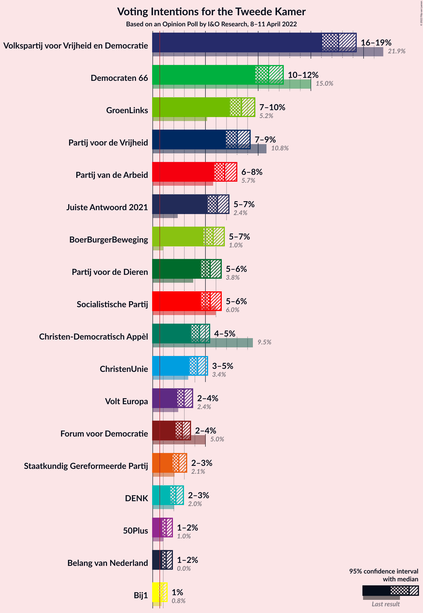

### Confidence Intervals

| Party | Last Result | Poll Result | 80% Confidence Interval | 90% Confidence Interval | 95% Confidence Interval | 99% Confidence Interval |
|:-----:|:-----------:|:-----------:|:-----------------------:|:-----------------------:|:-----------------------:|:-----------------------:|
| Volkspartij voor Vrijheid en Democratie | 21.9% | 17.6% | 16.6–18.7% |16.3–19.0% |16.1–19.3% |15.6–19.8% |
| Democraten 66 | 15.0% | 11.0% | 10.2–11.9% |9.9–12.1% |9.7–12.4% |9.4–12.8% |
| GroenLinks | 5.2% | 8.4% | 7.7–9.2% |7.5–9.5% |7.3–9.7% |7.0–10.1% |
| Partij voor de Vrijheid | 10.8% | 8.0% | 7.3–8.8% |7.1–9.0% |6.9–9.2% |6.6–9.6% |
| Partij van de Arbeid | 5.7% | 6.8% | 6.2–7.6% |6.0–7.8% |5.8–8.0% |5.5–8.3% |
| Juiste Antwoord 2021 | 2.4% | 6.1% | 5.5–6.8% |5.3–7.1% |5.2–7.2% |4.9–7.6% |
| BoerBurgerBeweging | 1.0% | 5.7% | 5.1–6.4% |5.0–6.6% |4.8–6.8% |4.5–7.1% |
| Socialistische Partij | 6.0% | 5.4% | 4.9–6.1% |4.7–6.3% |4.6–6.5% |4.3–6.8% |
| Partij voor de Dieren | 3.8% | 5.4% | 4.9–6.1% |4.7–6.3% |4.6–6.5% |4.3–6.8% |
| Christen-Democratisch Appèl | 9.5% | 4.4% | 3.9–5.1% |3.8–5.2% |3.6–5.4% |3.4–5.7% |
| ChristenUnie | 3.4% | 4.3% | 3.7–4.9% |3.6–5.0% |3.5–5.2% |3.3–5.5% |
| Volt Europa | 2.4% | 3.0% | 2.5–3.5% |2.4–3.7% |2.3–3.8% |2.1–4.1% |
| Forum voor Democratie | 5.0% | 2.8% | 2.4–3.3% |2.3–3.4% |2.2–3.6% |2.0–3.8% |
| Staatkundig Gereformeerde Partij | 2.1% | 2.5% | 2.1–3.0% |2.0–3.1% |1.9–3.2% |1.7–3.5% |
| DENK | 2.0% | 2.2% | 1.8–2.7% |1.7–2.8% |1.7–2.9% |1.5–3.1% |
| 50Plus | 1.0% | 1.3% | 1.0–1.7% |0.9–1.8% |0.9–1.9% |0.8–2.0% |
| Belang van Nederland | 0.0% | 1.3% | 1.0–1.7% |0.9–1.8% |0.9–1.9% |0.8–2.0% |
| Bij1 | 0.8% | 0.9% | 0.7–1.2% |0.6–1.3% |0.5–1.4% |0.5–1.5% |

*Note:* The poll result column reflects the actual value used in the calculations. Published results may vary slightly, and in addition be rounded to fewer digits.

## Seats

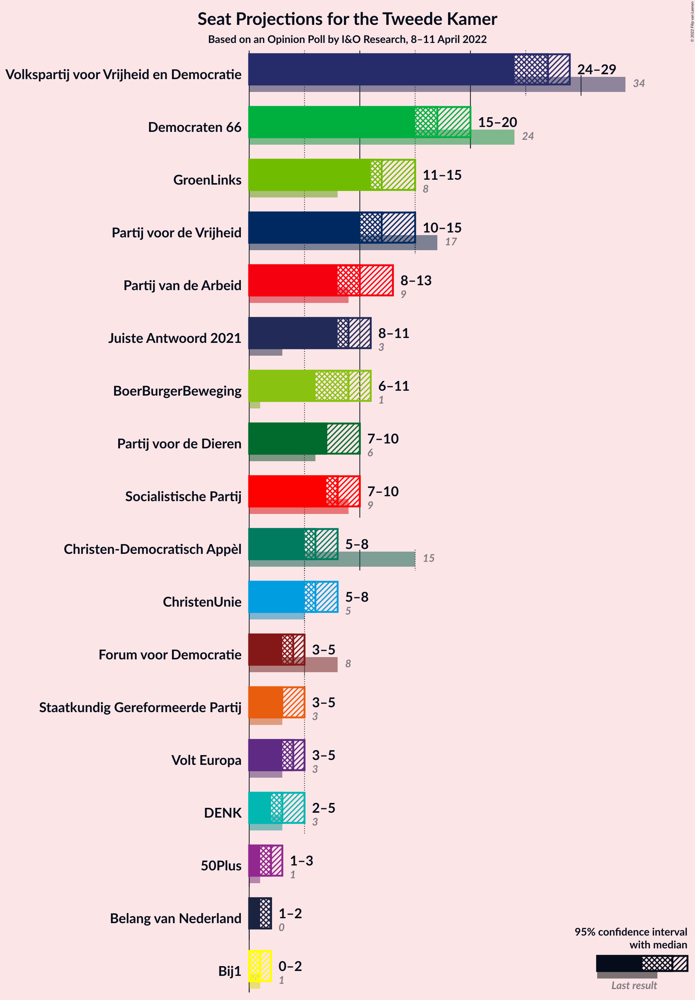

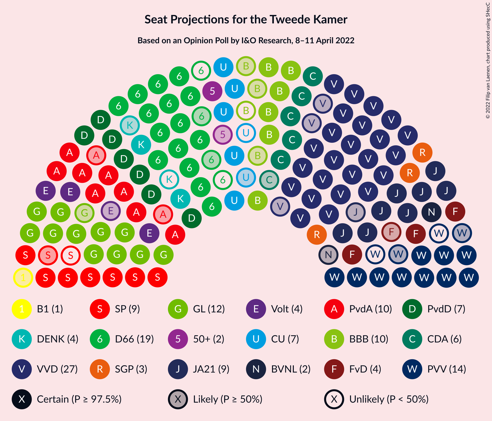

### Confidence Intervals

| Party | Last Result | Median | 80% Confidence Interval | 90% Confidence Interval | 95% Confidence Interval | 99% Confidence Interval |
|:-----:|:-----------:|:------:|:-----------------------:|:-----------------------:|:-----------------------:|:-----------------------:|
| <a href="#volkspartij-voor-vrijheid-en-democratie">Volkspartij voor Vrijheid en Democratie</a> | 34 | 27 | 26–28 |25–29 |24–29 |22–30 |
| <a href="#democraten-66">Democraten 66</a> | 24 | 17 | 15–20 |15–20 |15–20 |14–20 |
| <a href="#groenlinks">GroenLinks</a> | 8 | 12 | 12–15 |12–15 |11–15 |9–15 |
| <a href="#partij-voor-de-vrijheid">Partij voor de Vrijheid</a> | 17 | 12 | 10–14 |10–14 |10–15 |10–16 |
| <a href="#partij-van-de-arbeid">Partij van de Arbeid</a> | 9 | 10 | 8–11 |8–11 |8–13 |8–13 |
| <a href="#juiste-antwoord-2021">Juiste Antwoord 2021</a> | 3 | 9 | 8–10 |8–11 |8–11 |7–12 |
| <a href="#boerburgerbeweging">BoerBurgerBeweging</a> | 1 | 9 | 7–10 |6–11 |6–11 |6–11 |
| <a href="#socialistische-partij">Socialistische Partij</a> | 9 | 8 | 7–9 |7–10 |7–10 |6–11 |
| <a href="#partij-voor-de-dieren">Partij voor de Dieren</a> | 6 | 7 | 7–9 |7–10 |7–10 |6–10 |
| <a href="#christen-democratisch-appèl">Christen-Democratisch Appèl</a> | 15 | 6 | 5–8 |5–8 |5–8 |4–9 |
| <a href="#christenunie">ChristenUnie</a> | 5 | 6 | 5–7 |5–7 |5–8 |5–8 |
| <a href="#volt-europa">Volt Europa</a> | 3 | 4 | 3–5 |3–5 |3–5 |3–6 |
| <a href="#forum-voor-democratie">Forum voor Democratie</a> | 8 | 4 | 3–5 |3–5 |3–5 |3–6 |
| <a href="#staatkundig-gereformeerde-partij">Staatkundig Gereformeerde Partij</a> | 3 | 3 | 3–5 |3–5 |3–5 |2–5 |
| <a href="#denk">DENK</a> | 3 | 3 | 3–4 |2–5 |2–5 |2–5 |
| <a href="#50plus">50Plus</a> | 1 | 2 | 1–3 |1–3 |1–3 |1–3 |
| <a href="#belang-van-nederland">Belang van Nederland</a> | 0 | 2 | 1–2 |1–2 |1–2 |1–3 |
| <a href="#bij1">Bij1</a> | 1 | 1 | 1–2 |1–2 |0–2 |0–2 |

### Volkspartij voor Vrijheid en Democratie

*For a full overview of the results for this party, see the [Volkspartij voor Vrijheid en Democratie](party-volkspartijvoorvrijheidendemocratie.html) page.*

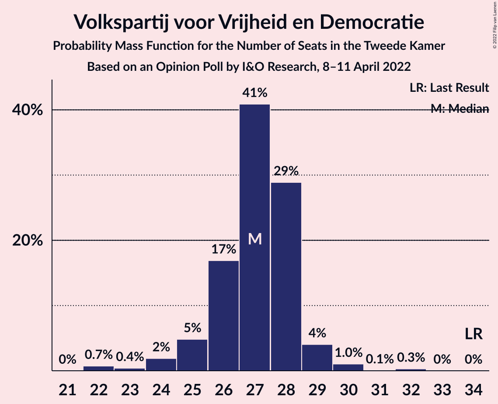

| Number of Seats | Probability | Accumulated | Special Marks |
|:---------------:|:-----------:|:-----------:|:-------------:|
| 22 | 0.7% | 100% |  |
| 23 | 0.4% | 99.3% |  |
| 24 | 2% | 98.9% |  |
| 25 | 5% | 97% |  |
| 26 | 17% | 92% |  |
| 27 | 41% | 75% | Median |
| 28 | 29% | 34% |  |
| 29 | 4% | 5% |  |
| 30 | 1.0% | 1.4% |  |
| 31 | 0.1% | 0.4% |  |
| 32 | 0.3% | 0.3% |  |
| 33 | 0% | 0% |  |
| 34 | 0% | 0% | Last Result |

### Democraten 66

*For a full overview of the results for this party, see the [Democraten 66](party-democraten66.html) page.*

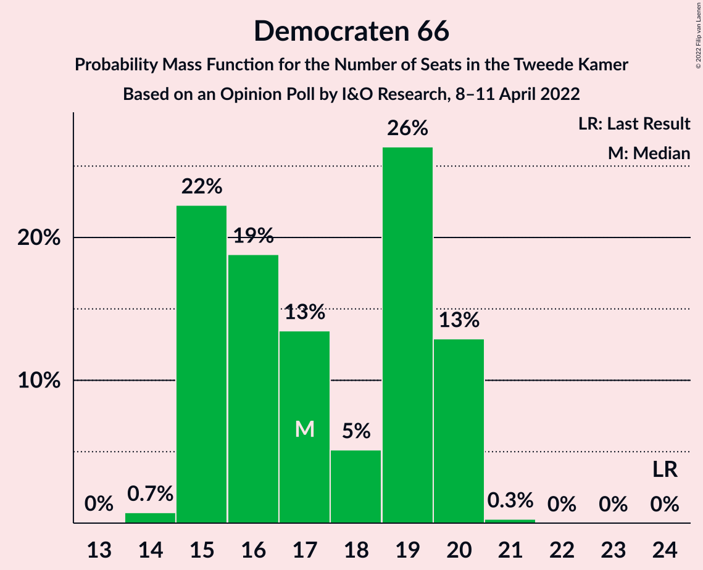

| Number of Seats | Probability | Accumulated | Special Marks |
|:---------------:|:-----------:|:-----------:|:-------------:|
| 14 | 0.7% | 100% |  |
| 15 | 22% | 99.2% |  |
| 16 | 19% | 77% |  |
| 17 | 13% | 58% | Median |
| 18 | 5% | 45% |  |
| 19 | 26% | 40% |  |
| 20 | 13% | 13% |  |
| 21 | 0.3% | 0.3% |  |
| 22 | 0% | 0% |  |
| 23 | 0% | 0% |  |
| 24 | 0% | 0% | Last Result |

### GroenLinks

*For a full overview of the results for this party, see the [GroenLinks](party-groenlinks.html) page.*

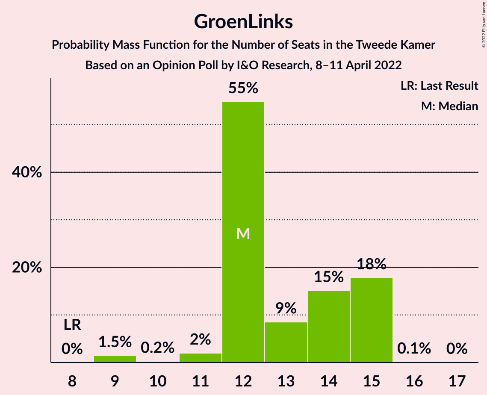

| Number of Seats | Probability | Accumulated | Special Marks |
|:---------------:|:-----------:|:-----------:|:-------------:|
| 8 | 0% | 100% | Last Result |
| 9 | 1.5% | 100% |  |
| 10 | 0.2% | 98.5% |  |
| 11 | 2% | 98% |  |
| 12 | 55% | 96% | Median |
| 13 | 9% | 42% |  |
| 14 | 15% | 33% |  |
| 15 | 18% | 18% |  |
| 16 | 0.1% | 0.1% |  |
| 17 | 0% | 0% |  |

### Partij voor de Vrijheid

*For a full overview of the results for this party, see the [Partij voor de Vrijheid](party-partijvoordevrijheid.html) page.*

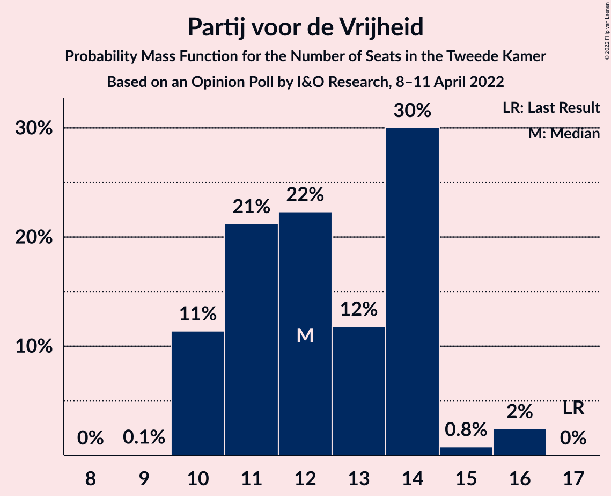

| Number of Seats | Probability | Accumulated | Special Marks |
|:---------------:|:-----------:|:-----------:|:-------------:|
| 9 | 0.1% | 100% |  |
| 10 | 11% | 99.9% |  |
| 11 | 21% | 89% |  |
| 12 | 22% | 67% | Median |
| 13 | 12% | 45% |  |
| 14 | 30% | 33% |  |
| 15 | 0.8% | 3% |  |
| 16 | 2% | 2% |  |
| 17 | 0% | 0% | Last Result |

### Partij van de Arbeid

*For a full overview of the results for this party, see the [Partij van de Arbeid](party-partijvandearbeid.html) page.*

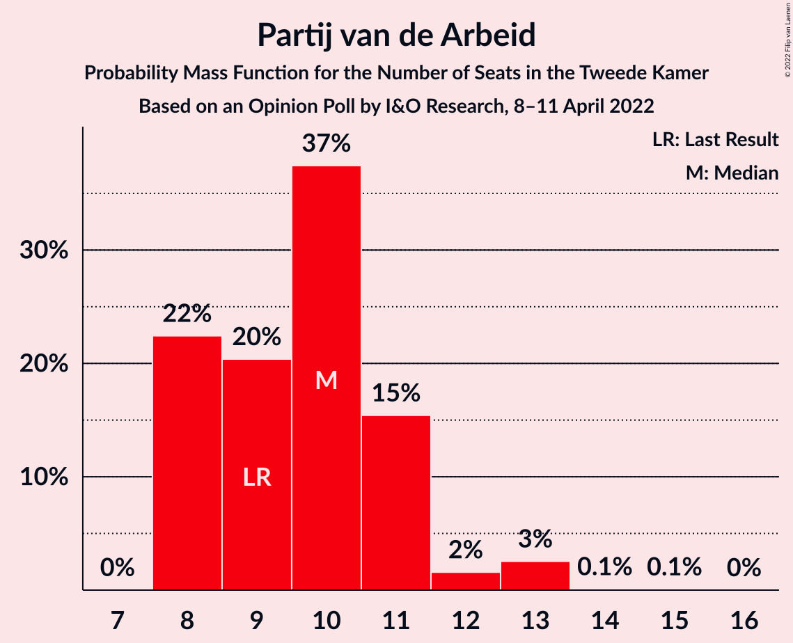

| Number of Seats | Probability | Accumulated | Special Marks |
|:---------------:|:-----------:|:-----------:|:-------------:|
| 8 | 22% | 100% |  |
| 9 | 20% | 78% | Last Result |
| 10 | 37% | 57% | Median |
| 11 | 15% | 20% |  |
| 12 | 2% | 4% |  |
| 13 | 3% | 3% |  |
| 14 | 0.1% | 0.2% |  |
| 15 | 0.1% | 0.1% |  |
| 16 | 0% | 0% |  |

### Juiste Antwoord 2021

*For a full overview of the results for this party, see the [Juiste Antwoord 2021](party-juisteantwoord2021.html) page.*

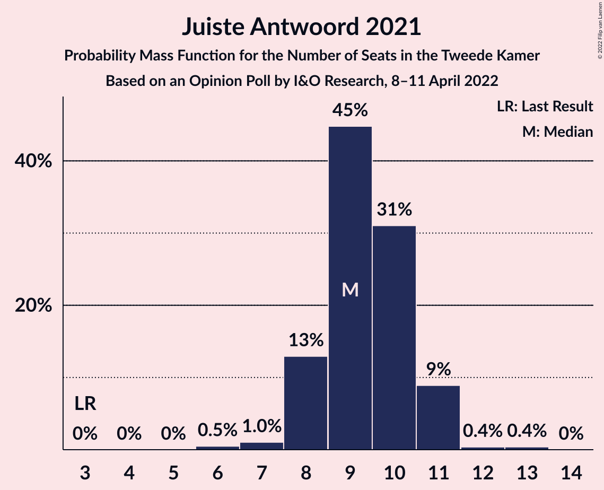

| Number of Seats | Probability | Accumulated | Special Marks |
|:---------------:|:-----------:|:-----------:|:-------------:|
| 3 | 0% | 100% | Last Result |
| 4 | 0% | 100% |  |
| 5 | 0% | 100% |  |
| 6 | 0.5% | 100% |  |
| 7 | 1.0% | 99.5% |  |
| 8 | 13% | 98% |  |
| 9 | 45% | 86% | Median |
| 10 | 31% | 41% |  |
| 11 | 9% | 10% |  |
| 12 | 0.4% | 0.8% |  |
| 13 | 0.4% | 0.4% |  |
| 14 | 0% | 0% |  |

### BoerBurgerBeweging

*For a full overview of the results for this party, see the [BoerBurgerBeweging](party-boerburgerbeweging.html) page.*

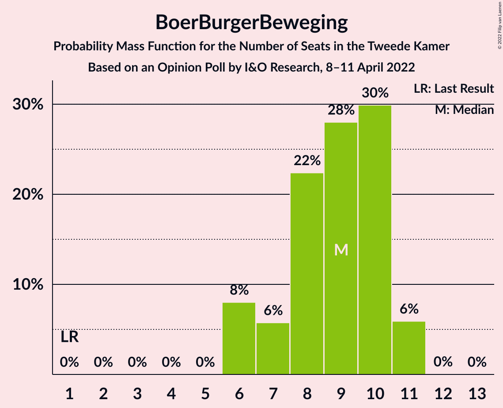

| Number of Seats | Probability | Accumulated | Special Marks |
|:---------------:|:-----------:|:-----------:|:-------------:|
| 1 | 0% | 100% | Last Result |
| 2 | 0% | 100% |  |
| 3 | 0% | 100% |  |
| 4 | 0% | 100% |  |
| 5 | 0% | 100% |  |
| 6 | 8% | 100% |  |
| 7 | 6% | 92% |  |
| 8 | 22% | 86% |  |
| 9 | 28% | 64% | Median |
| 10 | 30% | 36% |  |
| 11 | 6% | 6% |  |
| 12 | 0% | 0.1% |  |
| 13 | 0% | 0% |  |

### Socialistische Partij

*For a full overview of the results for this party, see the [Socialistische Partij](party-socialistischepartij.html) page.*

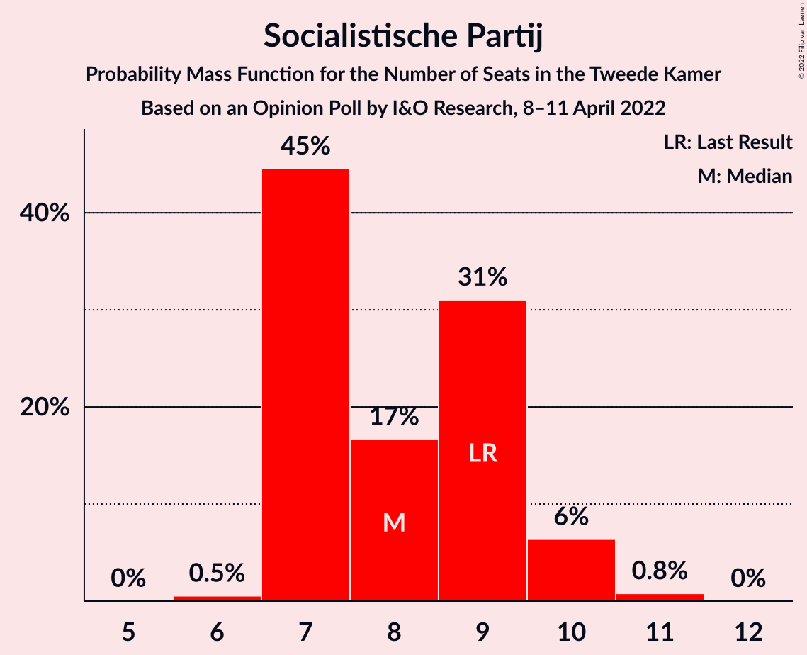

| Number of Seats | Probability | Accumulated | Special Marks |
|:---------------:|:-----------:|:-----------:|:-------------:|
| 6 | 0.5% | 100% |  |
| 7 | 45% | 99.4% |  |
| 8 | 17% | 55% | Median |
| 9 | 31% | 38% | Last Result |
| 10 | 6% | 7% |  |
| 11 | 0.8% | 0.8% |  |
| 12 | 0% | 0% |  |

### Partij voor de Dieren

*For a full overview of the results for this party, see the [Partij voor de Dieren](party-partijvoordedieren.html) page.*

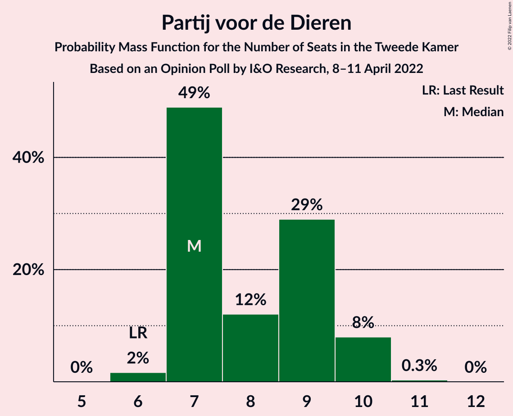

| Number of Seats | Probability | Accumulated | Special Marks |
|:---------------:|:-----------:|:-----------:|:-------------:|
| 6 | 2% | 100% | Last Result |
| 7 | 49% | 98% | Median |
| 8 | 12% | 49% |  |
| 9 | 29% | 37% |  |
| 10 | 8% | 8% |  |
| 11 | 0.3% | 0.3% |  |
| 12 | 0% | 0% |  |

### Christen-Democratisch Appèl

*For a full overview of the results for this party, see the [Christen-Democratisch Appèl](party-christen-democratischappèl.html) page.*

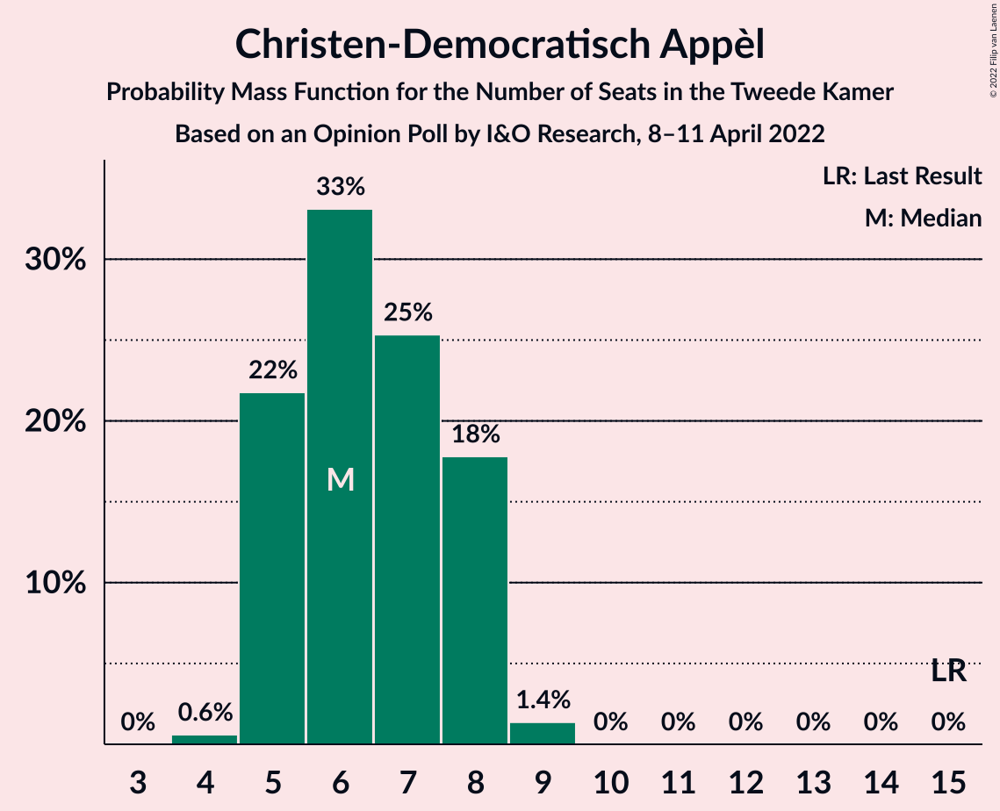

| Number of Seats | Probability | Accumulated | Special Marks |
|:---------------:|:-----------:|:-----------:|:-------------:|
| 4 | 0.6% | 100% |  |
| 5 | 22% | 99.4% |  |
| 6 | 33% | 78% | Median |
| 7 | 25% | 45% |  |
| 8 | 18% | 19% |  |
| 9 | 1.4% | 1.4% |  |
| 10 | 0% | 0% |  |
| 11 | 0% | 0% |  |
| 12 | 0% | 0% |  |
| 13 | 0% | 0% |  |
| 14 | 0% | 0% |  |
| 15 | 0% | 0% | Last Result |

### ChristenUnie

*For a full overview of the results for this party, see the [ChristenUnie](party-christenunie.html) page.*

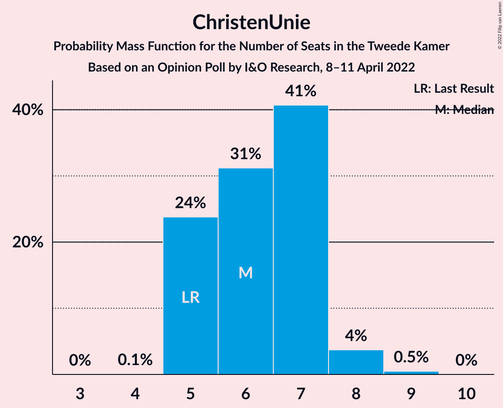

| Number of Seats | Probability | Accumulated | Special Marks |
|:---------------:|:-----------:|:-----------:|:-------------:|
| 4 | 0.1% | 100% |  |
| 5 | 24% | 99.9% | Last Result |
| 6 | 31% | 76% | Median |
| 7 | 41% | 45% |  |
| 8 | 4% | 4% |  |
| 9 | 0.5% | 0.5% |  |
| 10 | 0% | 0% |  |

### Volt Europa

*For a full overview of the results for this party, see the [Volt Europa](party-volteuropa.html) page.*

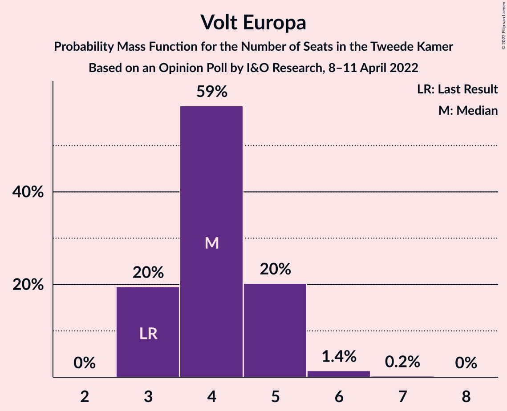

| Number of Seats | Probability | Accumulated | Special Marks |
|:---------------:|:-----------:|:-----------:|:-------------:|
| 3 | 20% | 100% | Last Result |
| 4 | 59% | 80% | Median |
| 5 | 20% | 22% |  |
| 6 | 1.4% | 2% |  |
| 7 | 0.2% | 0.2% |  |
| 8 | 0% | 0% |  |

### Forum voor Democratie

*For a full overview of the results for this party, see the [Forum voor Democratie](party-forumvoordemocratie.html) page.*

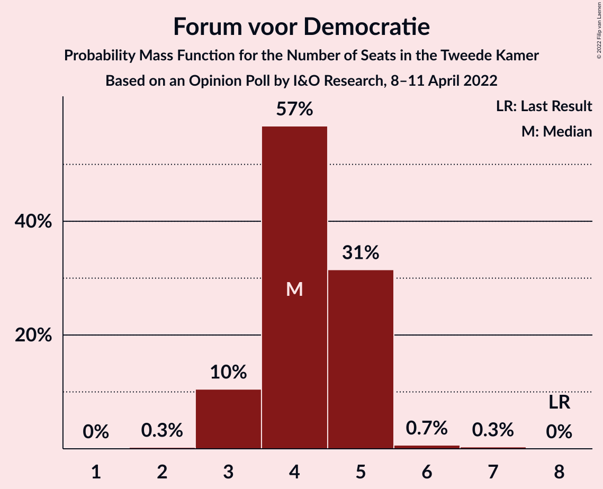

| Number of Seats | Probability | Accumulated | Special Marks |
|:---------------:|:-----------:|:-----------:|:-------------:|
| 2 | 0.3% | 100% |  |
| 3 | 10% | 99.7% |  |
| 4 | 57% | 89% | Median |
| 5 | 31% | 32% |  |
| 6 | 0.7% | 1.0% |  |
| 7 | 0.3% | 0.3% |  |
| 8 | 0% | 0% | Last Result |

### Staatkundig Gereformeerde Partij

*For a full overview of the results for this party, see the [Staatkundig Gereformeerde Partij](party-staatkundiggereformeerdepartij.html) page.*

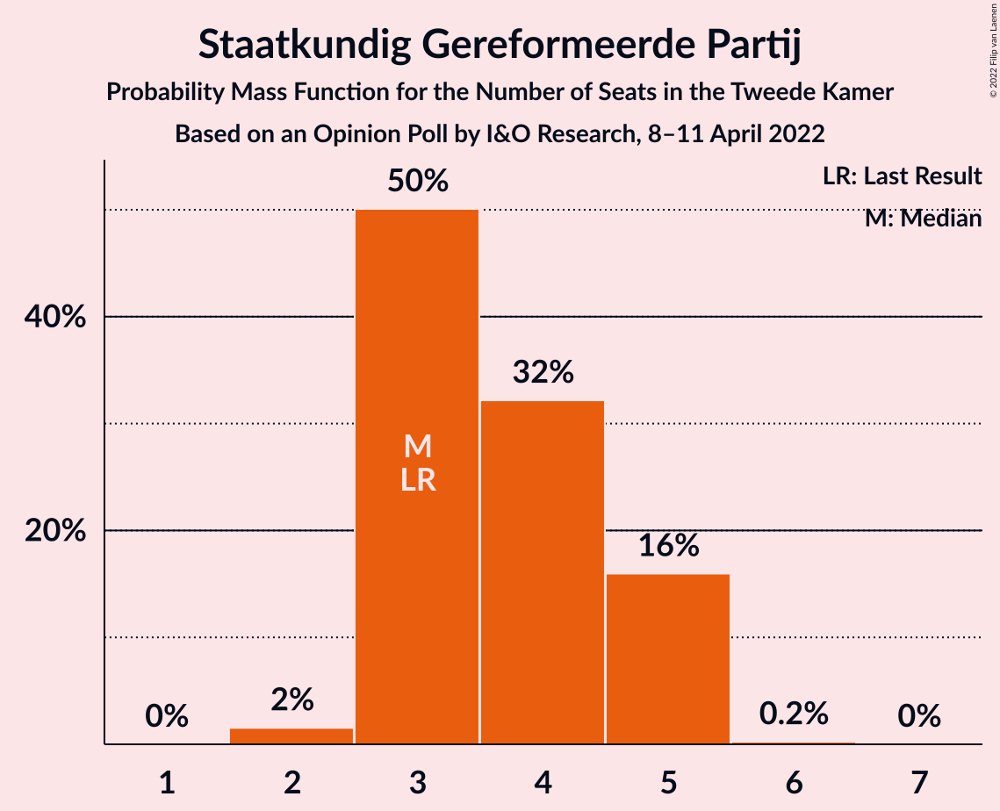

| Number of Seats | Probability | Accumulated | Special Marks |
|:---------------:|:-----------:|:-----------:|:-------------:|
| 2 | 2% | 100% |  |
| 3 | 50% | 98% | Last Result, Median |
| 4 | 32% | 48% |  |
| 5 | 16% | 16% |  |
| 6 | 0.2% | 0.2% |  |
| 7 | 0% | 0% |  |

### DENK

*For a full overview of the results for this party, see the [DENK](party-denk.html) page.*

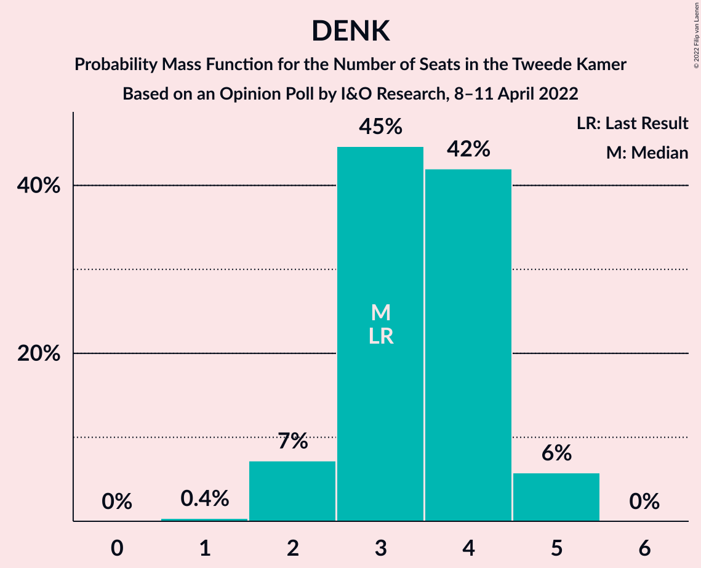

| Number of Seats | Probability | Accumulated | Special Marks |
|:---------------:|:-----------:|:-----------:|:-------------:|
| 1 | 0.4% | 100% |  |
| 2 | 7% | 99.6% |  |
| 3 | 45% | 92% | Last Result, Median |
| 4 | 42% | 48% |  |
| 5 | 6% | 6% |  |
| 6 | 0% | 0% |  |

### 50Plus

*For a full overview of the results for this party, see the [50Plus](party-50plus.html) page.*

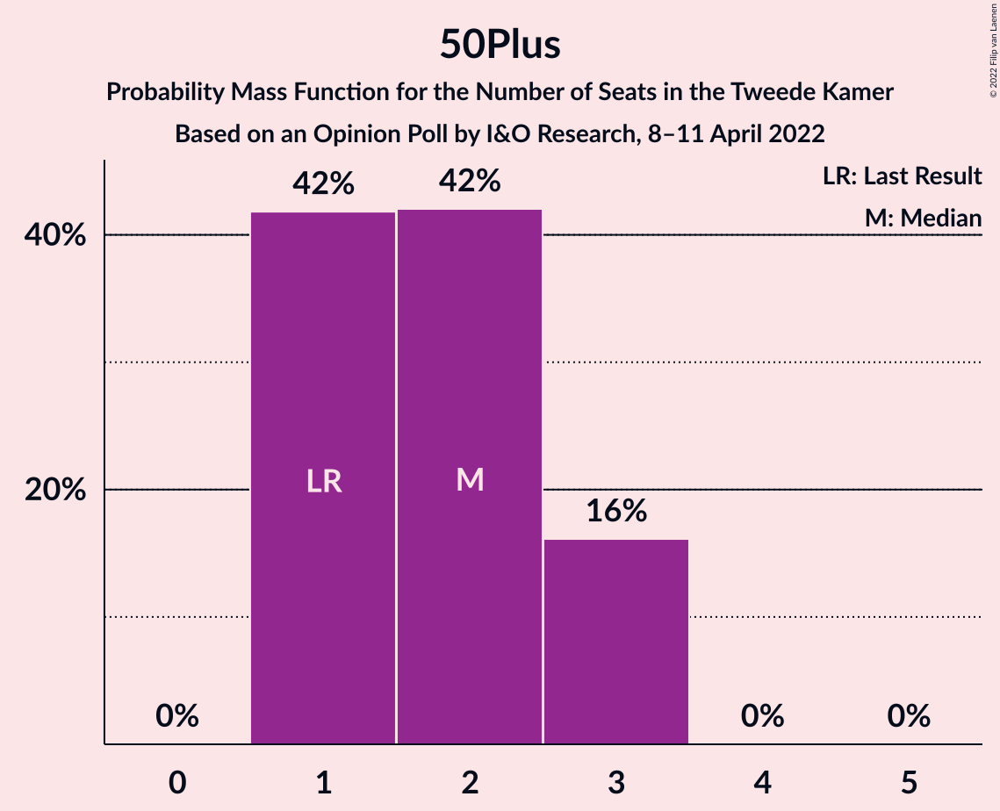

| Number of Seats | Probability | Accumulated | Special Marks |
|:---------------:|:-----------:|:-----------:|:-------------:|
| 1 | 42% | 100% | Last Result |
| 2 | 42% | 58% | Median |
| 3 | 16% | 16% |  |
| 4 | 0% | 0% |  |

### Belang van Nederland

*For a full overview of the results for this party, see the [Belang van Nederland](party-belangvannederland.html) page.*

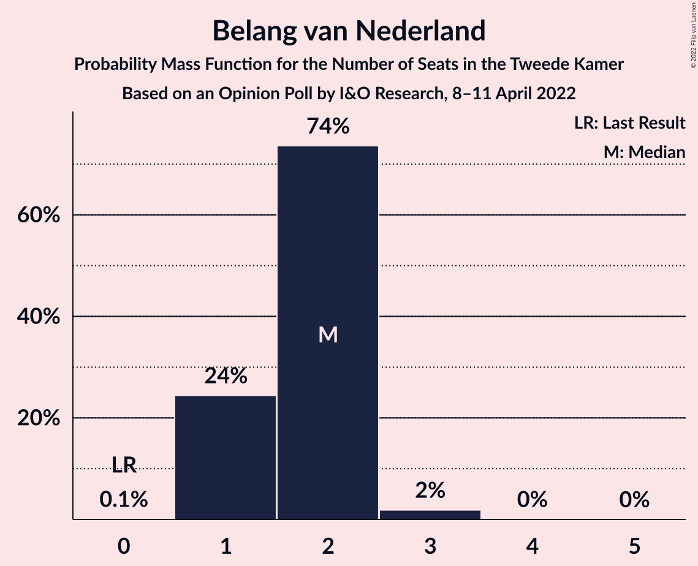

| Number of Seats | Probability | Accumulated | Special Marks |
|:---------------:|:-----------:|:-----------:|:-------------:|
| 0 | 0.1% | 100% | Last Result |
| 1 | 24% | 99.9% |  |
| 2 | 74% | 76% | Median |
| 3 | 2% | 2% |  |
| 4 | 0% | 0% |  |

### Bij1

*For a full overview of the results for this party, see the [Bij1](party-bij1.html) page.*

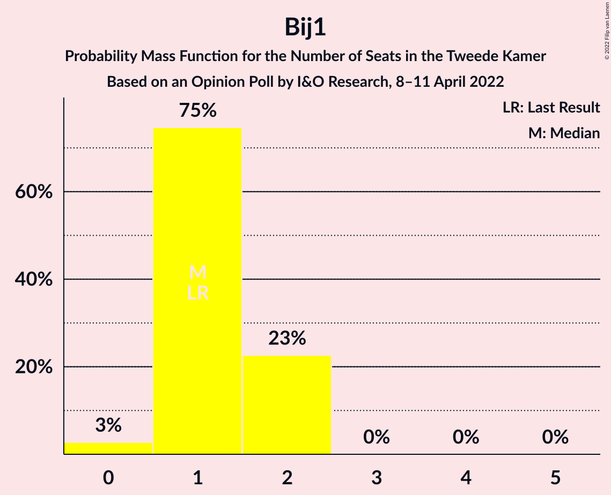

| Number of Seats | Probability | Accumulated | Special Marks |
|:---------------:|:-----------:|:-----------:|:-------------:|
| 0 | 3% | 100% |  |
| 1 | 75% | 97% | Last Result, Median |
| 2 | 23% | 23% |  |
| 3 | 0% | 0% |  |

## Coalitions

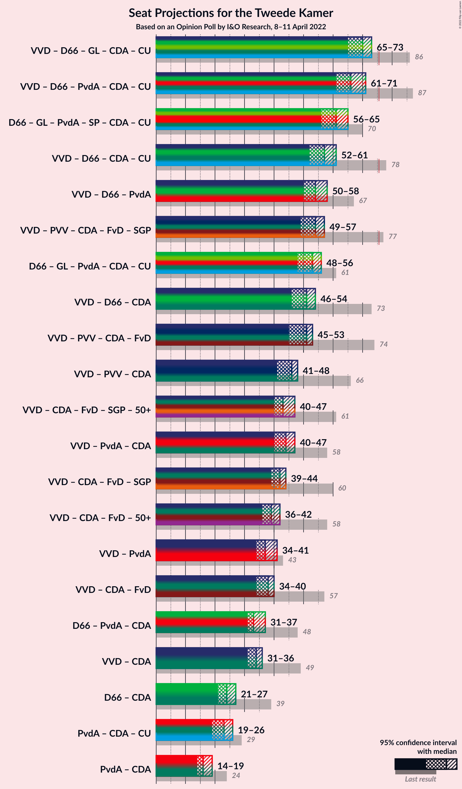

### Confidence Intervals

| Coalition | Last Result | Median | Majority? | 80% Confidence Interval | 90% Confidence Interval | 95% Confidence Interval | 99% Confidence Interval |
|:---------:|:-----------:|:------:|:---------:|:-----------------------:|:-----------------------:|:-----------------------:|:-----------------------:|
| Volkspartij voor Vrijheid en Democratie – Democraten 66 – GroenLinks – Christen-Democratisch Appèl – ChristenUnie | 86 | 70 | 0.4% | 68–73 | 66–73 | 65–73 | 63–74 |
| Volkspartij voor Vrijheid en Democratie – Democraten 66 – Partij van de Arbeid – Christen-Democratisch Appèl – ChristenUnie | 87 | 66 | 0% | 65–69 | 64–70 | 61–71 | 61–72 |
| Democraten 66 – GroenLinks – Partij van de Arbeid – Socialistische Partij – Christen-Democratisch Appèl – ChristenUnie | 70 | 61 | 0% | 58–63 | 56–64 | 56–65 | 55–66 |
| Volkspartij voor Vrijheid en Democratie – Democraten 66 – Christen-Democratisch Appèl – ChristenUnie | 78 | 57 | 0% | 56–58 | 54–59 | 52–61 | 51–62 |
| Volkspartij voor Vrijheid en Democratie – Democraten 66 – Partij van de Arbeid | 67 | 54 | 0% | 52–57 | 51–57 | 50–58 | 48–59 |
| Volkspartij voor Vrijheid en Democratie – Partij voor de Vrijheid – Christen-Democratisch Appèl – Forum voor Democratie – Staatkundig Gereformeerde Partij | 77 | 54 | 0% | 49–56 | 49–57 | 49–57 | 49–57 |
| Democraten 66 – GroenLinks – Partij van de Arbeid – Christen-Democratisch Appèl – ChristenUnie | 61 | 53 | 0% | 50–54 | 49–55 | 48–56 | 48–58 |
| Volkspartij voor Vrijheid en Democratie – Democraten 66 – Christen-Democratisch Appèl | 73 | 51 | 0% | 49–53 | 47–53 | 46–54 | 46–56 |
| Volkspartij voor Vrijheid en Democratie – Partij voor de Vrijheid – Christen-Democratisch Appèl – Forum voor Democratie | 74 | 51 | 0% | 45–52 | 45–52 | 45–53 | 45–54 |
| Volkspartij voor Vrijheid en Democratie – Partij voor de Vrijheid – Christen-Democratisch Appèl | 66 | 46 | 0% | 42–48 | 41–48 | 41–48 | 41–50 |
| Volkspartij voor Vrijheid en Democratie – Christen-Democratisch Appèl – Forum voor Democratie – Staatkundig Gereformeerde Partij – 50Plus | 61 | 43 | 0% | 41–45 | 41–45 | 40–47 | 38–47 |
| Volkspartij voor Vrijheid en Democratie – Partij van de Arbeid – Christen-Democratisch Appèl | 58 | 44 | 0% | 40–45 | 40–46 | 40–47 | 39–49 |
| Volkspartij voor Vrijheid en Democratie – Christen-Democratisch Appèl – Forum voor Democratie – Staatkundig Gereformeerde Partij | 60 | 42 | 0% | 39–43 | 39–43 | 39–44 | 37–46 |
| Volkspartij voor Vrijheid en Democratie – Christen-Democratisch Appèl – Forum voor Democratie – 50Plus | 58 | 39 | 0% | 37–42 | 36–42 | 36–42 | 34–44 |
| Volkspartij voor Vrijheid en Democratie – Partij van de Arbeid | 43 | 37 | 0% | 35–38 | 35–39 | 34–41 | 32–42 |
| Volkspartij voor Vrijheid en Democratie – Christen-Democratisch Appèl – Forum voor Democratie | 57 | 38 | 0% | 35–39 | 34–39 | 34–40 | 33–42 |
| Democraten 66 – Partij van de Arbeid – Christen-Democratisch Appèl | 48 | 33 | 0% | 31–36 | 31–36 | 31–37 | 30–38 |
| Volkspartij voor Vrijheid en Democratie – Christen-Democratisch Appèl | 49 | 34 | 0% | 31–35 | 31–35 | 31–36 | 29–38 |
| Democraten 66 – Christen-Democratisch Appèl | 39 | 24 | 0% | 22–25 | 21–26 | 21–27 | 20–27 |
| Partij van de Arbeid – Christen-Democratisch Appèl – ChristenUnie | 29 | 23 | 0% | 19–25 | 19–26 | 19–26 | 19–28 |
| Partij van de Arbeid – Christen-Democratisch Appèl | 24 | 16 | 0% | 14–18 | 14–19 | 14–19 | 14–21 |

### Volkspartij voor Vrijheid en Democratie – Democraten 66 – GroenLinks – Christen-Democratisch Appèl – ChristenUnie

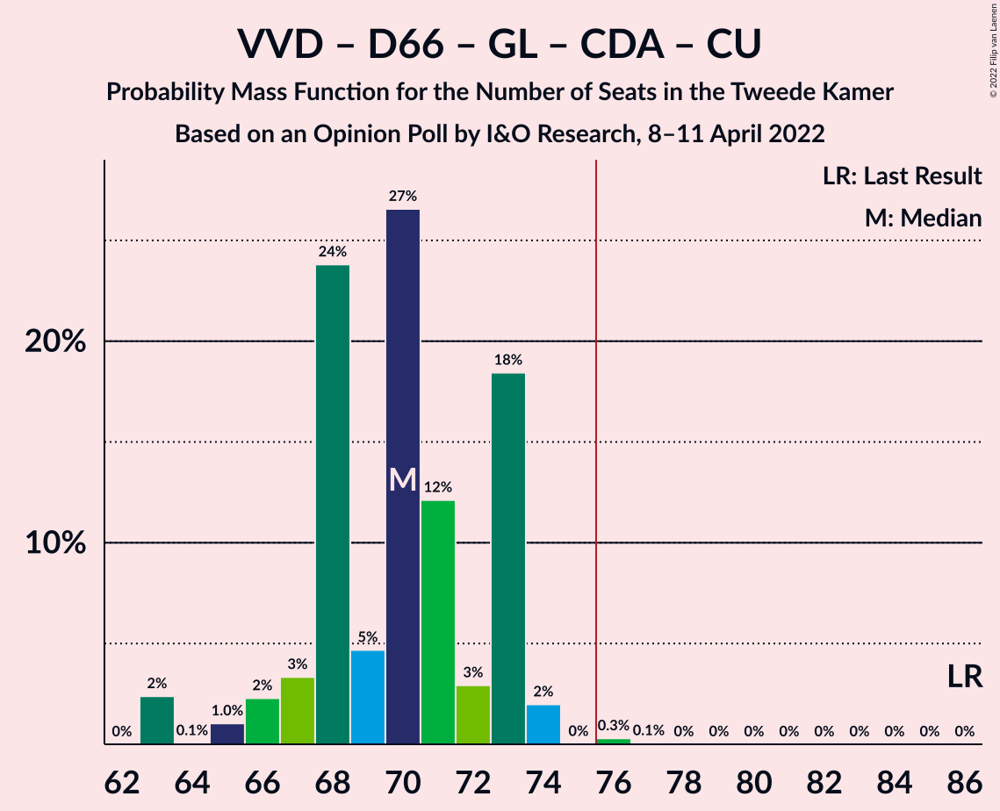

| Number of Seats | Probability | Accumulated | Special Marks |
|:---------------:|:-----------:|:-----------:|:-------------:|
| 63 | 2% | 100% |  |
| 64 | 0.1% | 98% |  |
| 65 | 1.0% | 98% |  |
| 66 | 2% | 97% |  |
| 67 | 3% | 94% |  |
| 68 | 24% | 91% | Median |
| 69 | 5% | 67% |  |
| 70 | 27% | 62% |  |
| 71 | 12% | 36% |  |
| 72 | 3% | 24% |  |
| 73 | 18% | 21% |  |
| 74 | 2% | 2% |  |
| 75 | 0% | 0.4% |  |
| 76 | 0.3% | 0.4% | Majority |
| 77 | 0.1% | 0.1% |  |
| 78 | 0% | 0% |  |
| 79 | 0% | 0% |  |
| 80 | 0% | 0% |  |
| 81 | 0% | 0% |  |
| 82 | 0% | 0% |  |
| 83 | 0% | 0% |  |
| 84 | 0% | 0% |  |
| 85 | 0% | 0% |  |
| 86 | 0% | 0% | Last Result |

### Volkspartij voor Vrijheid en Democratie – Democraten 66 – Partij van de Arbeid – Christen-Democratisch Appèl – ChristenUnie

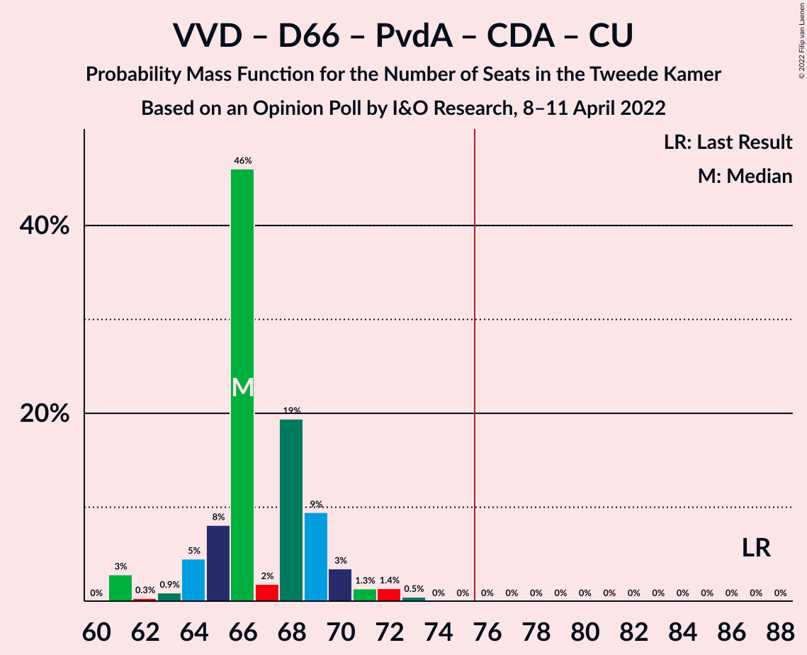

| Number of Seats | Probability | Accumulated | Special Marks |
|:---------------:|:-----------:|:-----------:|:-------------:|
| 61 | 3% | 100% |  |
| 62 | 0.3% | 97% |  |
| 63 | 0.9% | 97% |  |
| 64 | 5% | 96% |  |
| 65 | 8% | 91% |  |
| 66 | 46% | 83% | Median |
| 67 | 2% | 37% |  |
| 68 | 19% | 35% |  |
| 69 | 9% | 16% |  |
| 70 | 3% | 7% |  |
| 71 | 1.3% | 3% |  |
| 72 | 1.4% | 2% |  |
| 73 | 0.5% | 0.5% |  |
| 74 | 0% | 0% |  |
| 75 | 0% | 0% |  |
| 76 | 0% | 0% | Majority |
| 77 | 0% | 0% |  |
| 78 | 0% | 0% |  |
| 79 | 0% | 0% |  |
| 80 | 0% | 0% |  |
| 81 | 0% | 0% |  |
| 82 | 0% | 0% |  |
| 83 | 0% | 0% |  |
| 84 | 0% | 0% |  |
| 85 | 0% | 0% |  |
| 86 | 0% | 0% |  |
| 87 | 0% | 0% | Last Result |

### Democraten 66 – GroenLinks – Partij van de Arbeid – Socialistische Partij – Christen-Democratisch Appèl – ChristenUnie

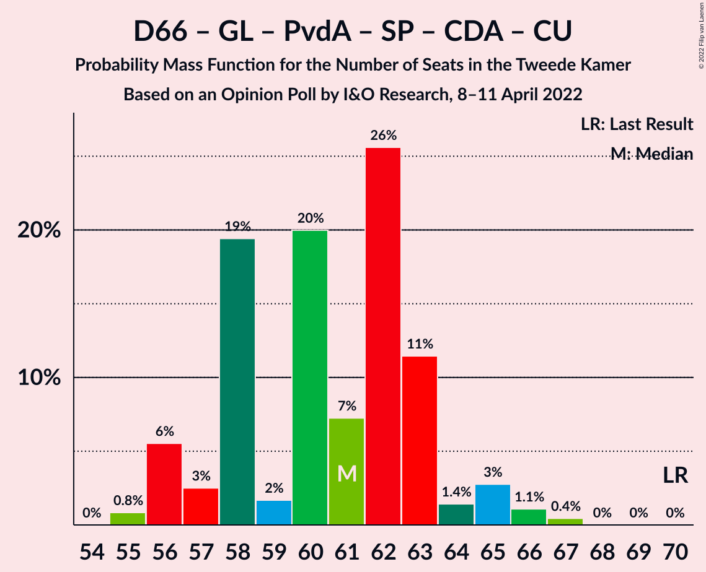

| Number of Seats | Probability | Accumulated | Special Marks |
|:---------------:|:-----------:|:-----------:|:-------------:|
| 55 | 0.8% | 100% |  |
| 56 | 6% | 99.2% |  |
| 57 | 3% | 94% |  |
| 58 | 19% | 91% |  |
| 59 | 2% | 72% | Median |
| 60 | 20% | 70% |  |
| 61 | 7% | 50% |  |
| 62 | 26% | 43% |  |
| 63 | 11% | 17% |  |
| 64 | 1.4% | 6% |  |
| 65 | 3% | 4% |  |
| 66 | 1.1% | 2% |  |
| 67 | 0.4% | 0.5% |  |
| 68 | 0% | 0% |  |
| 69 | 0% | 0% |  |
| 70 | 0% | 0% | Last Result |

### Volkspartij voor Vrijheid en Democratie – Democraten 66 – Christen-Democratisch Appèl – ChristenUnie

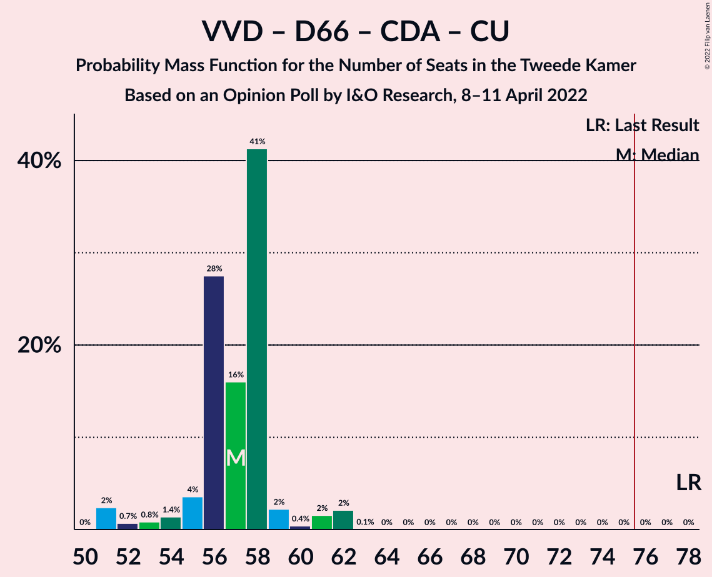

| Number of Seats | Probability | Accumulated | Special Marks |
|:---------------:|:-----------:|:-----------:|:-------------:|
| 51 | 2% | 100% |  |
| 52 | 0.7% | 98% |  |
| 53 | 0.8% | 97% |  |
| 54 | 1.4% | 96% |  |
| 55 | 4% | 95% |  |
| 56 | 28% | 91% | Median |
| 57 | 16% | 64% |  |
| 58 | 41% | 48% |  |
| 59 | 2% | 6% |  |
| 60 | 0.4% | 4% |  |
| 61 | 2% | 4% |  |
| 62 | 2% | 2% |  |
| 63 | 0.1% | 0.1% |  |
| 64 | 0% | 0% |  |
| 65 | 0% | 0% |  |
| 66 | 0% | 0% |  |
| 67 | 0% | 0% |  |
| 68 | 0% | 0% |  |
| 69 | 0% | 0% |  |
| 70 | 0% | 0% |  |
| 71 | 0% | 0% |  |
| 72 | 0% | 0% |  |
| 73 | 0% | 0% |  |
| 74 | 0% | 0% |  |
| 75 | 0% | 0% |  |
| 76 | 0% | 0% | Majority |
| 77 | 0% | 0% |  |
| 78 | 0% | 0% | Last Result |

### Volkspartij voor Vrijheid en Democratie – Democraten 66 – Partij van de Arbeid

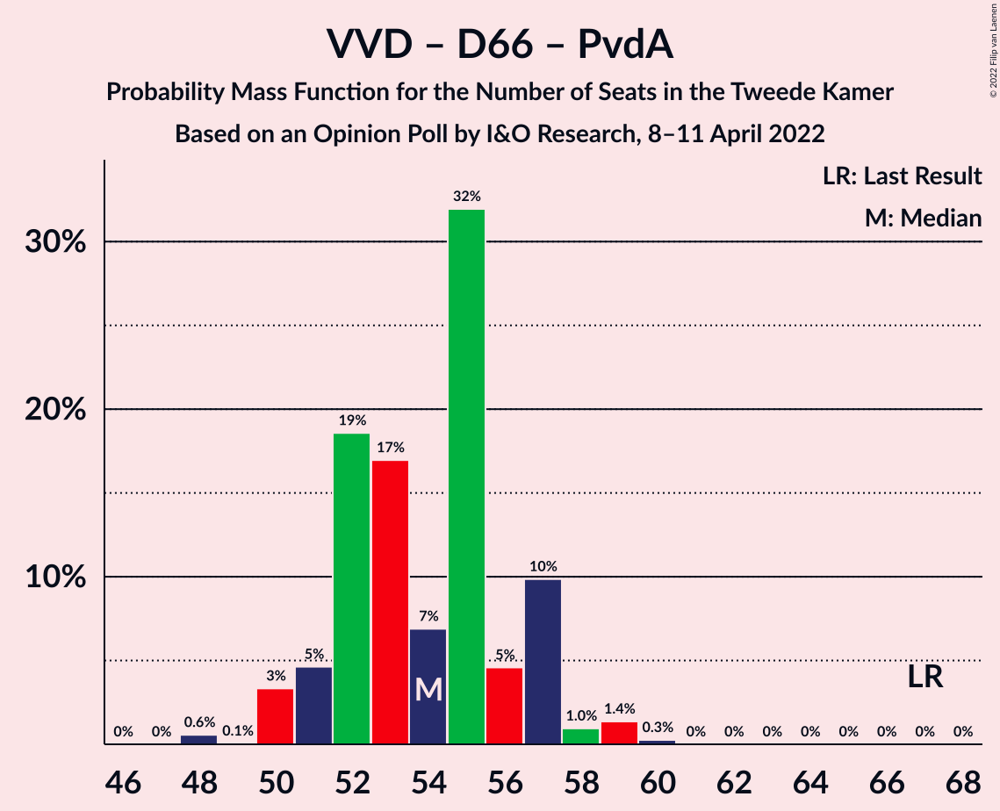

| Number of Seats | Probability | Accumulated | Special Marks |
|:---------------:|:-----------:|:-----------:|:-------------:|
| 48 | 0.6% | 100% |  |
| 49 | 0.1% | 99.4% |  |
| 50 | 3% | 99.4% |  |
| 51 | 5% | 96% |  |
| 52 | 19% | 91% |  |
| 53 | 17% | 73% |  |
| 54 | 7% | 56% | Median |
| 55 | 32% | 49% |  |
| 56 | 5% | 17% |  |
| 57 | 10% | 12% |  |
| 58 | 1.0% | 3% |  |
| 59 | 1.4% | 2% |  |
| 60 | 0.3% | 0.3% |  |
| 61 | 0% | 0% |  |
| 62 | 0% | 0% |  |
| 63 | 0% | 0% |  |
| 64 | 0% | 0% |  |
| 65 | 0% | 0% |  |
| 66 | 0% | 0% |  |
| 67 | 0% | 0% | Last Result |

### Volkspartij voor Vrijheid en Democratie – Partij voor de Vrijheid – Christen-Democratisch Appèl – Forum voor Democratie – Staatkundig Gereformeerde Partij

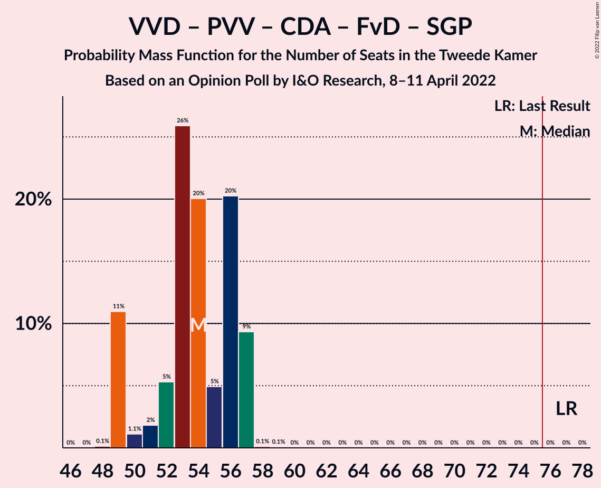

| Number of Seats | Probability | Accumulated | Special Marks |
|:---------------:|:-----------:|:-----------:|:-------------:|
| 48 | 0.1% | 100% |  |
| 49 | 11% | 99.9% |  |
| 50 | 1.1% | 89% |  |
| 51 | 2% | 88% |  |
| 52 | 5% | 86% | Median |
| 53 | 26% | 81% |  |
| 54 | 20% | 55% |  |
| 55 | 5% | 35% |  |
| 56 | 20% | 30% |  |
| 57 | 9% | 10% |  |
| 58 | 0.1% | 0.2% |  |
| 59 | 0.1% | 0.1% |  |
| 60 | 0% | 0% |  |
| 61 | 0% | 0% |  |
| 62 | 0% | 0% |  |
| 63 | 0% | 0% |  |
| 64 | 0% | 0% |  |
| 65 | 0% | 0% |  |
| 66 | 0% | 0% |  |
| 67 | 0% | 0% |  |
| 68 | 0% | 0% |  |
| 69 | 0% | 0% |  |
| 70 | 0% | 0% |  |
| 71 | 0% | 0% |  |
| 72 | 0% | 0% |  |
| 73 | 0% | 0% |  |
| 74 | 0% | 0% |  |
| 75 | 0% | 0% |  |
| 76 | 0% | 0% | Majority |
| 77 | 0% | 0% | Last Result |

### Democraten 66 – GroenLinks – Partij van de Arbeid – Christen-Democratisch Appèl – ChristenUnie

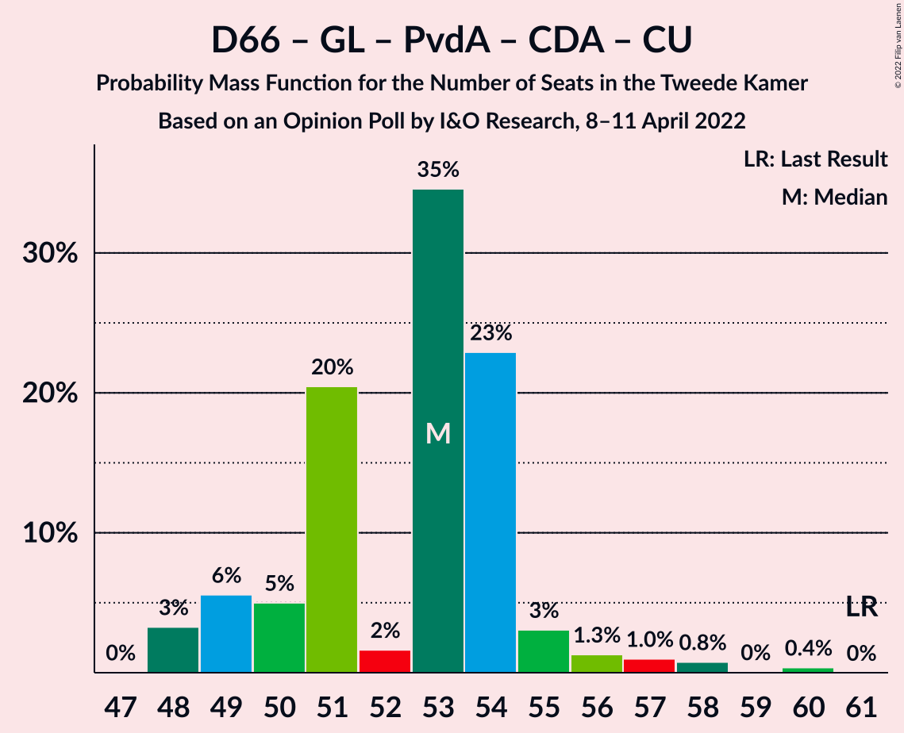

| Number of Seats | Probability | Accumulated | Special Marks |
|:---------------:|:-----------:|:-----------:|:-------------:|
| 48 | 3% | 100% |  |
| 49 | 6% | 97% |  |
| 50 | 5% | 91% |  |
| 51 | 20% | 86% | Median |
| 52 | 2% | 66% |  |
| 53 | 35% | 64% |  |
| 54 | 23% | 29% |  |
| 55 | 3% | 7% |  |
| 56 | 1.3% | 3% |  |
| 57 | 1.0% | 2% |  |
| 58 | 0.8% | 1.2% |  |
| 59 | 0% | 0.4% |  |
| 60 | 0.4% | 0.4% |  |
| 61 | 0% | 0% | Last Result |

### Volkspartij voor Vrijheid en Democratie – Democraten 66 – Christen-Democratisch Appèl

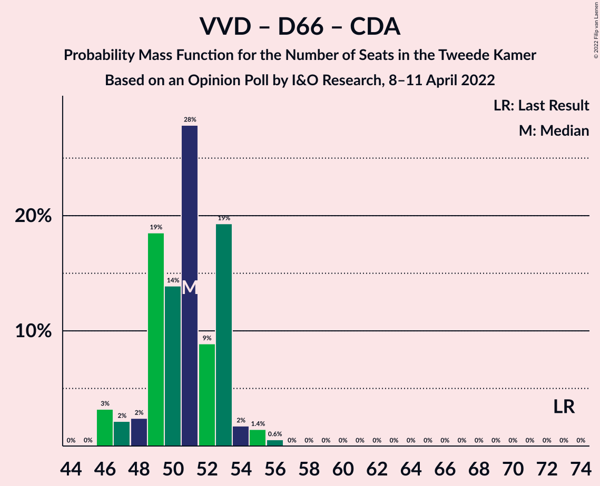

| Number of Seats | Probability | Accumulated | Special Marks |
|:---------------:|:-----------:|:-----------:|:-------------:|
| 46 | 3% | 100% |  |
| 47 | 2% | 97% |  |
| 48 | 2% | 95% |  |
| 49 | 19% | 92% |  |
| 50 | 14% | 74% | Median |
| 51 | 28% | 60% |  |
| 52 | 9% | 32% |  |
| 53 | 19% | 23% |  |
| 54 | 2% | 4% |  |
| 55 | 1.4% | 2% |  |
| 56 | 0.6% | 0.6% |  |
| 57 | 0% | 0% |  |
| 58 | 0% | 0% |  |
| 59 | 0% | 0% |  |
| 60 | 0% | 0% |  |
| 61 | 0% | 0% |  |
| 62 | 0% | 0% |  |
| 63 | 0% | 0% |  |
| 64 | 0% | 0% |  |
| 65 | 0% | 0% |  |
| 66 | 0% | 0% |  |
| 67 | 0% | 0% |  |
| 68 | 0% | 0% |  |
| 69 | 0% | 0% |  |
| 70 | 0% | 0% |  |
| 71 | 0% | 0% |  |
| 72 | 0% | 0% |  |
| 73 | 0% | 0% | Last Result |

### Volkspartij voor Vrijheid en Democratie – Partij voor de Vrijheid – Christen-Democratisch Appèl – Forum voor Democratie

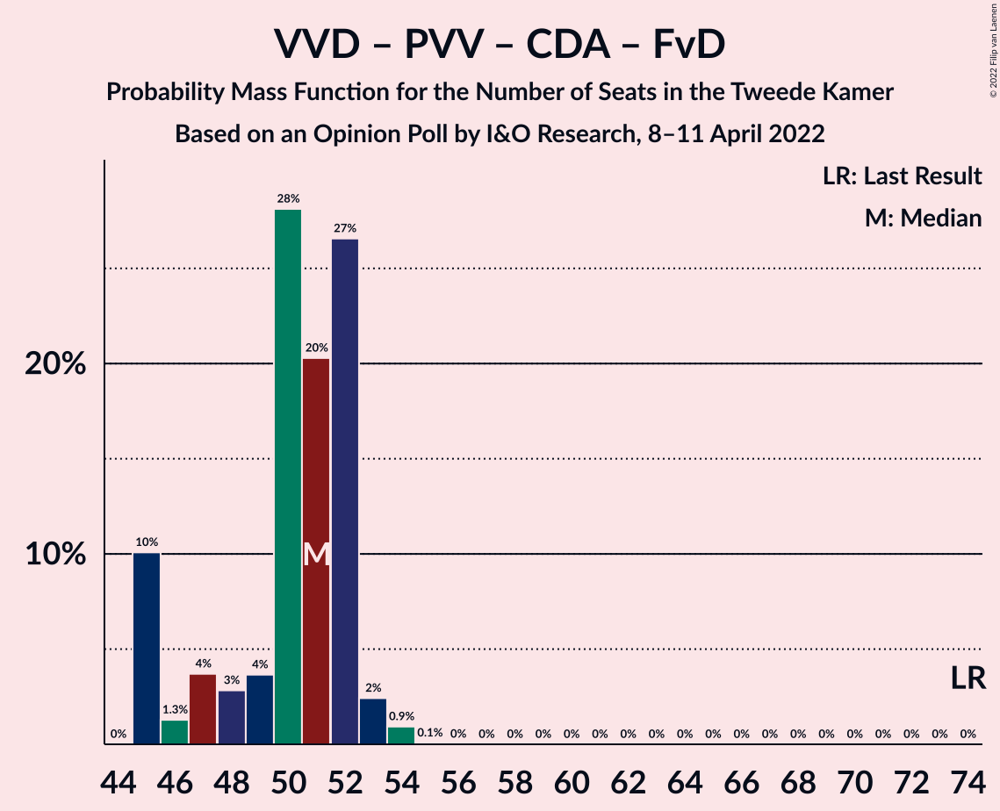

| Number of Seats | Probability | Accumulated | Special Marks |
|:---------------:|:-----------:|:-----------:|:-------------:|
| 45 | 10% | 100% |  |
| 46 | 1.3% | 90% |  |
| 47 | 4% | 89% |  |
| 48 | 3% | 85% |  |
| 49 | 4% | 82% | Median |
| 50 | 28% | 78% |  |
| 51 | 20% | 50% |  |
| 52 | 27% | 30% |  |
| 53 | 2% | 3% |  |
| 54 | 0.9% | 1.0% |  |
| 55 | 0.1% | 0.1% |  |
| 56 | 0% | 0% |  |
| 57 | 0% | 0% |  |
| 58 | 0% | 0% |  |
| 59 | 0% | 0% |  |
| 60 | 0% | 0% |  |
| 61 | 0% | 0% |  |
| 62 | 0% | 0% |  |
| 63 | 0% | 0% |  |
| 64 | 0% | 0% |  |
| 65 | 0% | 0% |  |
| 66 | 0% | 0% |  |
| 67 | 0% | 0% |  |
| 68 | 0% | 0% |  |
| 69 | 0% | 0% |  |
| 70 | 0% | 0% |  |
| 71 | 0% | 0% |  |
| 72 | 0% | 0% |  |
| 73 | 0% | 0% |  |
| 74 | 0% | 0% | Last Result |

### Volkspartij voor Vrijheid en Democratie – Partij voor de Vrijheid – Christen-Democratisch Appèl

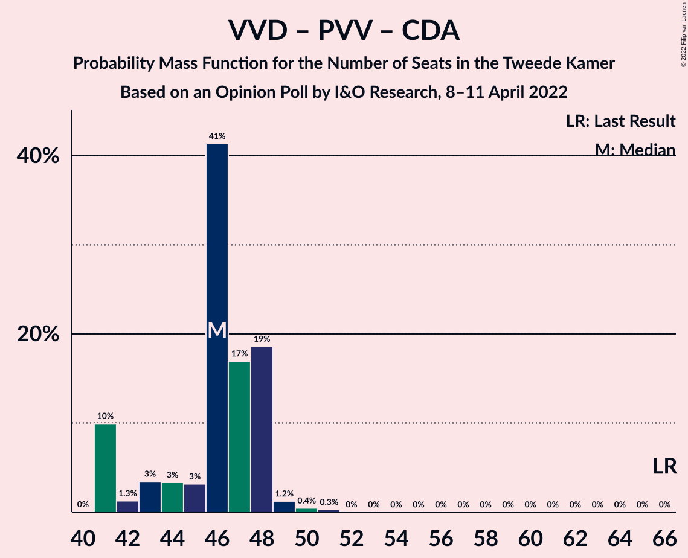

| Number of Seats | Probability | Accumulated | Special Marks |
|:---------------:|:-----------:|:-----------:|:-------------:|
| 41 | 10% | 100% |  |
| 42 | 1.3% | 90% |  |
| 43 | 3% | 89% |  |
| 44 | 3% | 85% |  |
| 45 | 3% | 82% | Median |
| 46 | 41% | 79% |  |
| 47 | 17% | 38% |  |
| 48 | 19% | 21% |  |
| 49 | 1.2% | 2% |  |
| 50 | 0.4% | 0.7% |  |
| 51 | 0.3% | 0.3% |  |
| 52 | 0% | 0% |  |
| 53 | 0% | 0% |  |
| 54 | 0% | 0% |  |
| 55 | 0% | 0% |  |
| 56 | 0% | 0% |  |
| 57 | 0% | 0% |  |
| 58 | 0% | 0% |  |
| 59 | 0% | 0% |  |
| 60 | 0% | 0% |  |
| 61 | 0% | 0% |  |
| 62 | 0% | 0% |  |
| 63 | 0% | 0% |  |
| 64 | 0% | 0% |  |
| 65 | 0% | 0% |  |
| 66 | 0% | 0% | Last Result |

### Volkspartij voor Vrijheid en Democratie – Christen-Democratisch Appèl – Forum voor Democratie – Staatkundig Gereformeerde Partij – 50Plus

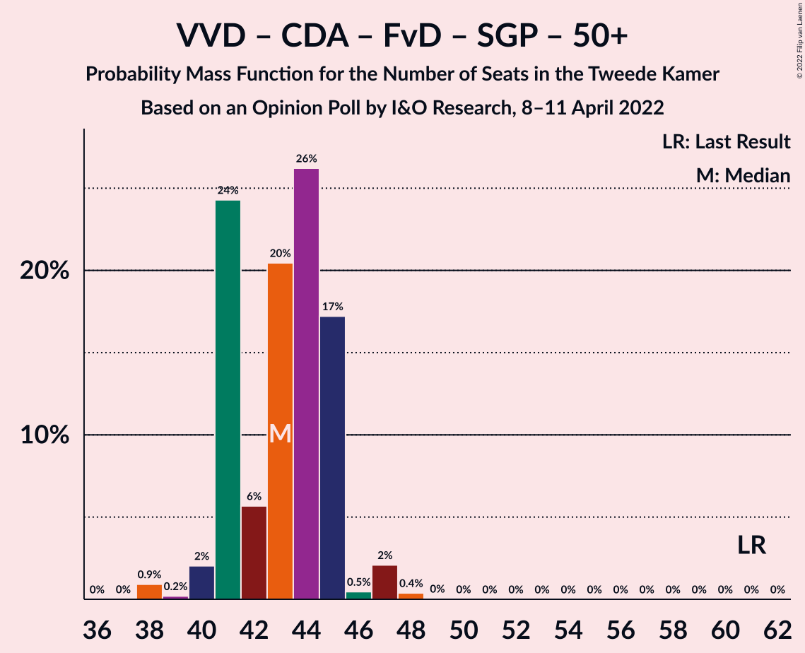

| Number of Seats | Probability | Accumulated | Special Marks |
|:---------------:|:-----------:|:-----------:|:-------------:|
| 38 | 0.9% | 100% |  |
| 39 | 0.2% | 99.1% |  |
| 40 | 2% | 98.9% |  |
| 41 | 24% | 97% |  |
| 42 | 6% | 73% | Median |
| 43 | 20% | 67% |  |
| 44 | 26% | 46% |  |
| 45 | 17% | 20% |  |
| 46 | 0.5% | 3% |  |
| 47 | 2% | 3% |  |
| 48 | 0.4% | 0.4% |  |
| 49 | 0% | 0.1% |  |
| 50 | 0% | 0% |  |
| 51 | 0% | 0% |  |
| 52 | 0% | 0% |  |
| 53 | 0% | 0% |  |
| 54 | 0% | 0% |  |
| 55 | 0% | 0% |  |
| 56 | 0% | 0% |  |
| 57 | 0% | 0% |  |
| 58 | 0% | 0% |  |
| 59 | 0% | 0% |  |
| 60 | 0% | 0% |  |
| 61 | 0% | 0% | Last Result |

### Volkspartij voor Vrijheid en Democratie – Partij van de Arbeid – Christen-Democratisch Appèl

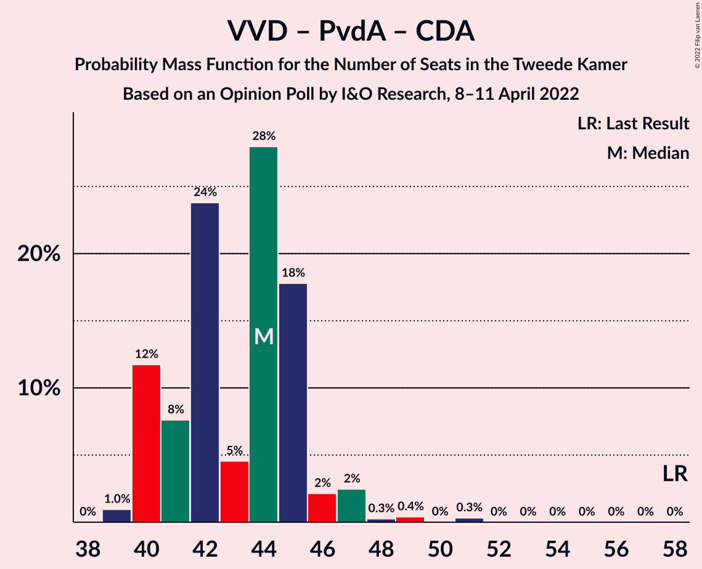

| Number of Seats | Probability | Accumulated | Special Marks |
|:---------------:|:-----------:|:-----------:|:-------------:|
| 39 | 1.0% | 100% |  |
| 40 | 12% | 99.0% |  |
| 41 | 8% | 87% |  |
| 42 | 24% | 80% |  |
| 43 | 5% | 56% | Median |
| 44 | 28% | 51% |  |
| 45 | 18% | 23% |  |
| 46 | 2% | 6% |  |
| 47 | 2% | 3% |  |
| 48 | 0.3% | 1.0% |  |
| 49 | 0.4% | 0.7% |  |
| 50 | 0% | 0.3% |  |
| 51 | 0.3% | 0.3% |  |
| 52 | 0% | 0% |  |
| 53 | 0% | 0% |  |
| 54 | 0% | 0% |  |
| 55 | 0% | 0% |  |
| 56 | 0% | 0% |  |
| 57 | 0% | 0% |  |
| 58 | 0% | 0% | Last Result |

### Volkspartij voor Vrijheid en Democratie – Christen-Democratisch Appèl – Forum voor Democratie – Staatkundig Gereformeerde Partij

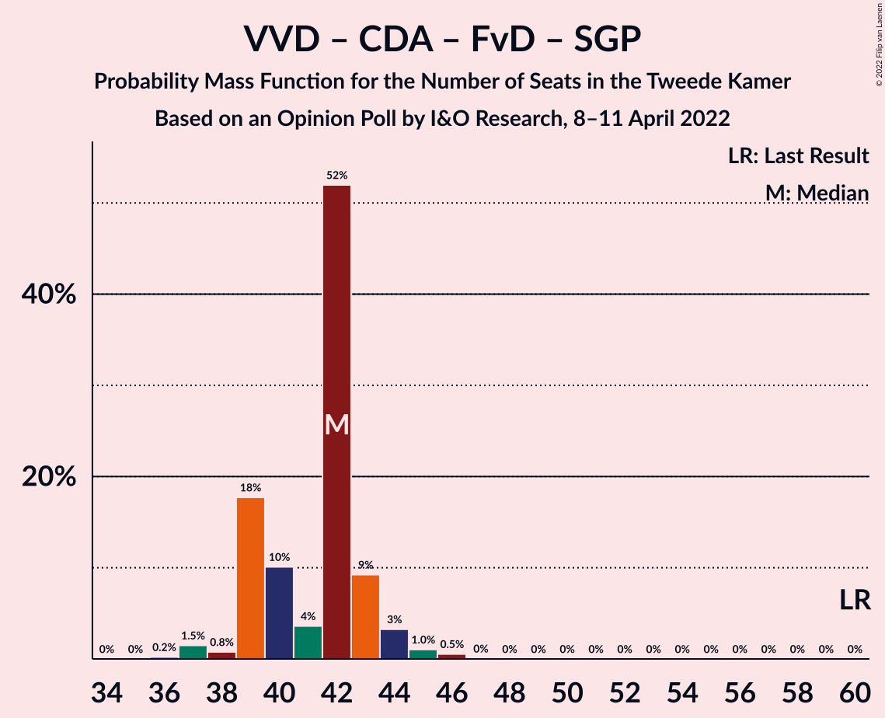

| Number of Seats | Probability | Accumulated | Special Marks |
|:---------------:|:-----------:|:-----------:|:-------------:|
| 36 | 0.2% | 100% |  |
| 37 | 1.5% | 99.8% |  |
| 38 | 0.8% | 98% |  |
| 39 | 18% | 98% |  |
| 40 | 10% | 80% | Median |
| 41 | 4% | 70% |  |
| 42 | 52% | 66% |  |
| 43 | 9% | 14% |  |
| 44 | 3% | 5% |  |
| 45 | 1.0% | 2% |  |
| 46 | 0.5% | 0.6% |  |
| 47 | 0% | 0.1% |  |
| 48 | 0% | 0% |  |
| 49 | 0% | 0% |  |
| 50 | 0% | 0% |  |
| 51 | 0% | 0% |  |
| 52 | 0% | 0% |  |
| 53 | 0% | 0% |  |
| 54 | 0% | 0% |  |
| 55 | 0% | 0% |  |
| 56 | 0% | 0% |  |
| 57 | 0% | 0% |  |
| 58 | 0% | 0% |  |
| 59 | 0% | 0% |  |
| 60 | 0% | 0% | Last Result |

### Volkspartij voor Vrijheid en Democratie – Christen-Democratisch Appèl – Forum voor Democratie – 50Plus

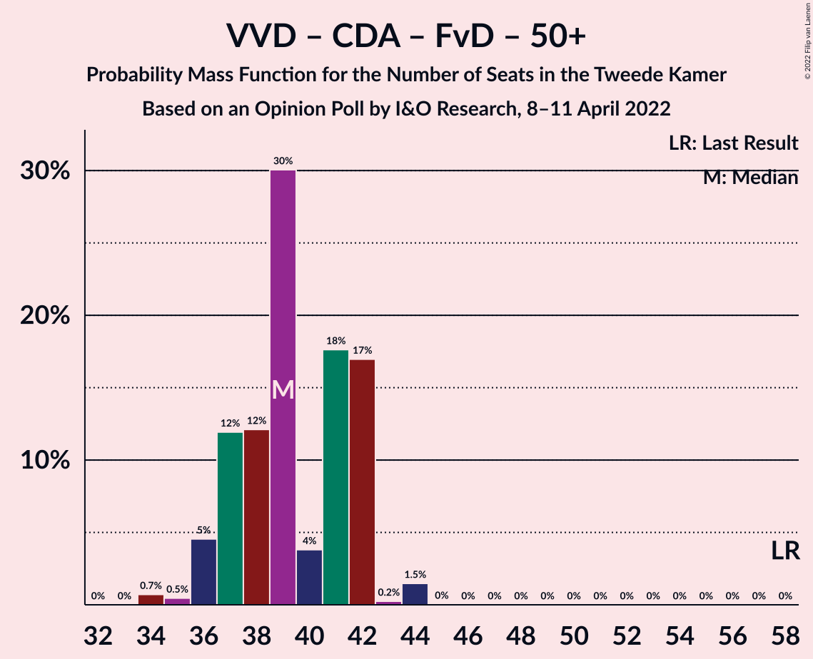

| Number of Seats | Probability | Accumulated | Special Marks |
|:---------------:|:-----------:|:-----------:|:-------------:|
| 34 | 0.7% | 100% |  |
| 35 | 0.5% | 99.3% |  |
| 36 | 5% | 98.8% |  |
| 37 | 12% | 94% |  |
| 38 | 12% | 82% |  |
| 39 | 30% | 70% | Median |
| 40 | 4% | 40% |  |
| 41 | 18% | 36% |  |
| 42 | 17% | 19% |  |
| 43 | 0.2% | 2% |  |
| 44 | 1.5% | 2% |  |
| 45 | 0% | 0% |  |
| 46 | 0% | 0% |  |
| 47 | 0% | 0% |  |
| 48 | 0% | 0% |  |
| 49 | 0% | 0% |  |
| 50 | 0% | 0% |  |
| 51 | 0% | 0% |  |
| 52 | 0% | 0% |  |
| 53 | 0% | 0% |  |
| 54 | 0% | 0% |  |
| 55 | 0% | 0% |  |
| 56 | 0% | 0% |  |
| 57 | 0% | 0% |  |
| 58 | 0% | 0% | Last Result |

### Volkspartij voor Vrijheid en Democratie – Partij van de Arbeid

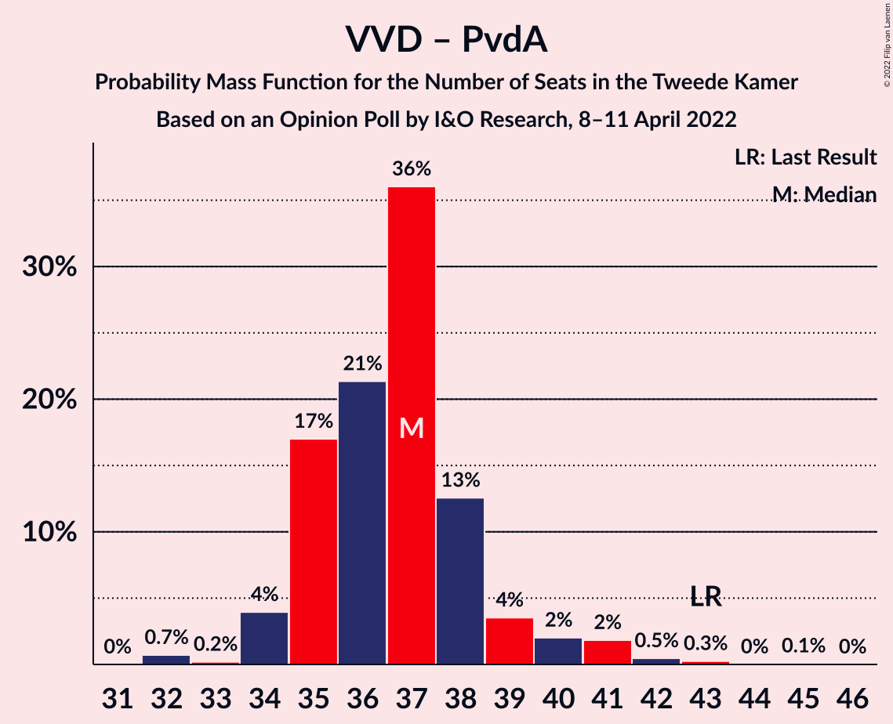

| Number of Seats | Probability | Accumulated | Special Marks |
|:---------------:|:-----------:|:-----------:|:-------------:|
| 32 | 0.7% | 100% |  |
| 33 | 0.2% | 99.3% |  |
| 34 | 4% | 99.1% |  |
| 35 | 17% | 95% |  |
| 36 | 21% | 78% |  |
| 37 | 36% | 57% | Median |
| 38 | 13% | 21% |  |
| 39 | 4% | 8% |  |
| 40 | 2% | 5% |  |
| 41 | 2% | 3% |  |
| 42 | 0.5% | 0.8% |  |
| 43 | 0.3% | 0.3% | Last Result |
| 44 | 0% | 0.1% |  |
| 45 | 0.1% | 0.1% |  |
| 46 | 0% | 0% |  |

### Volkspartij voor Vrijheid en Democratie – Christen-Democratisch Appèl – Forum voor Democratie

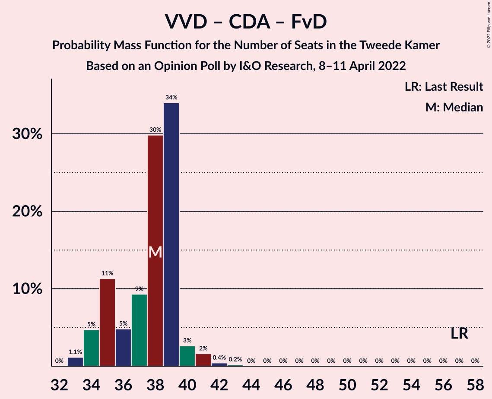

| Number of Seats | Probability | Accumulated | Special Marks |
|:---------------:|:-----------:|:-----------:|:-------------:|
| 33 | 1.1% | 100% |  |
| 34 | 5% | 98.8% |  |
| 35 | 11% | 94% |  |
| 36 | 5% | 83% |  |
| 37 | 9% | 78% | Median |
| 38 | 30% | 69% |  |
| 39 | 34% | 39% |  |
| 40 | 3% | 5% |  |
| 41 | 2% | 2% |  |
| 42 | 0.4% | 0.6% |  |
| 43 | 0.2% | 0.2% |  |
| 44 | 0% | 0% |  |
| 45 | 0% | 0% |  |
| 46 | 0% | 0% |  |
| 47 | 0% | 0% |  |
| 48 | 0% | 0% |  |
| 49 | 0% | 0% |  |
| 50 | 0% | 0% |  |
| 51 | 0% | 0% |  |
| 52 | 0% | 0% |  |
| 53 | 0% | 0% |  |
| 54 | 0% | 0% |  |
| 55 | 0% | 0% |  |
| 56 | 0% | 0% |  |
| 57 | 0% | 0% | Last Result |

### Democraten 66 – Partij van de Arbeid – Christen-Democratisch Appèl

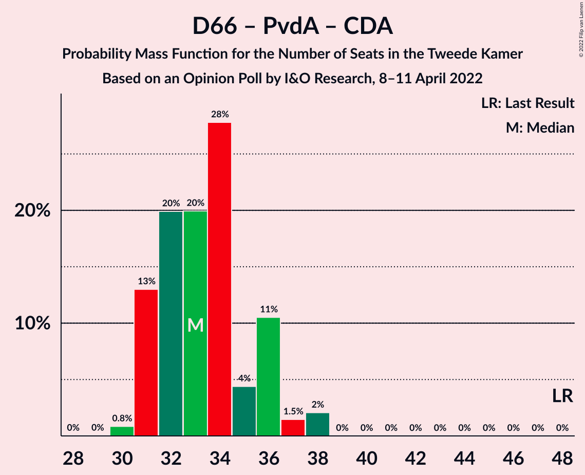

| Number of Seats | Probability | Accumulated | Special Marks |
|:---------------:|:-----------:|:-----------:|:-------------:|
| 30 | 0.8% | 100% |  |
| 31 | 13% | 99.1% |  |
| 32 | 20% | 86% |  |
| 33 | 20% | 66% | Median |
| 34 | 28% | 46% |  |
| 35 | 4% | 18% |  |
| 36 | 11% | 14% |  |
| 37 | 1.5% | 4% |  |
| 38 | 2% | 2% |  |
| 39 | 0% | 0% |  |
| 40 | 0% | 0% |  |
| 41 | 0% | 0% |  |
| 42 | 0% | 0% |  |
| 43 | 0% | 0% |  |
| 44 | 0% | 0% |  |
| 45 | 0% | 0% |  |
| 46 | 0% | 0% |  |
| 47 | 0% | 0% |  |
| 48 | 0% | 0% | Last Result |

### Volkspartij voor Vrijheid en Democratie – Christen-Democratisch Appèl

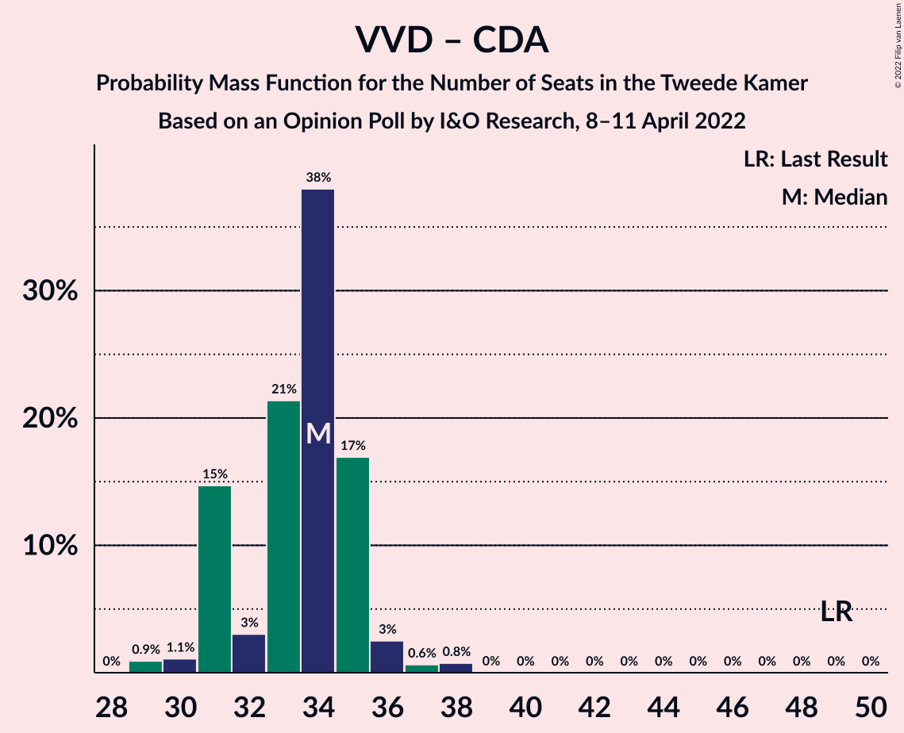

| Number of Seats | Probability | Accumulated | Special Marks |
|:---------------:|:-----------:|:-----------:|:-------------:|
| 29 | 0.9% | 100% |  |
| 30 | 1.1% | 99.1% |  |
| 31 | 15% | 98% |  |
| 32 | 3% | 83% |  |
| 33 | 21% | 80% | Median |
| 34 | 38% | 59% |  |
| 35 | 17% | 21% |  |
| 36 | 3% | 4% |  |
| 37 | 0.6% | 1.4% |  |
| 38 | 0.8% | 0.8% |  |
| 39 | 0% | 0% |  |
| 40 | 0% | 0% |  |
| 41 | 0% | 0% |  |
| 42 | 0% | 0% |  |
| 43 | 0% | 0% |  |
| 44 | 0% | 0% |  |
| 45 | 0% | 0% |  |
| 46 | 0% | 0% |  |
| 47 | 0% | 0% |  |
| 48 | 0% | 0% |  |
| 49 | 0% | 0% | Last Result |

### Democraten 66 – Christen-Democratisch Appèl

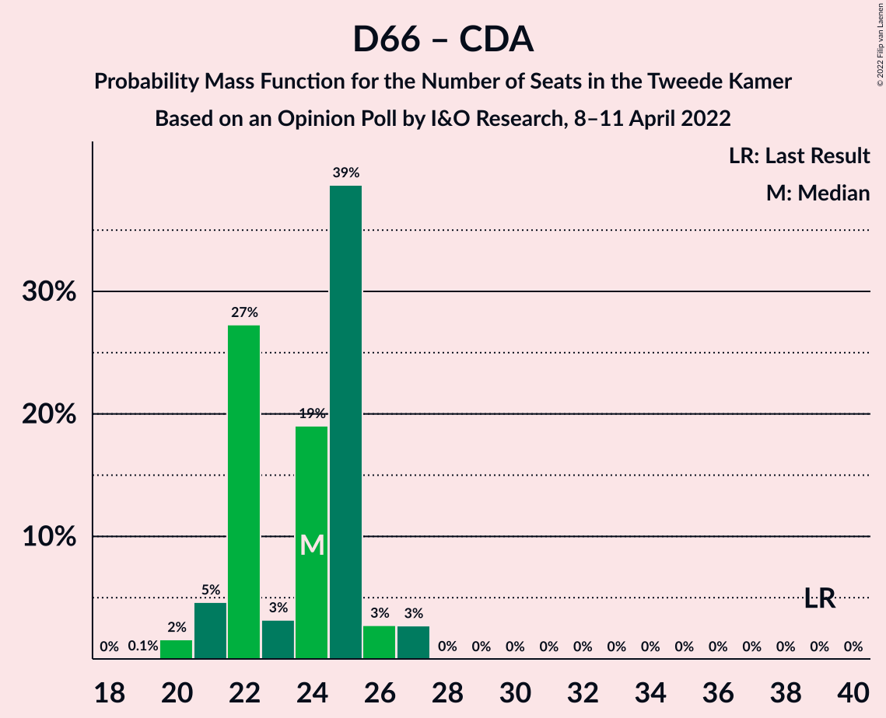

| Number of Seats | Probability | Accumulated | Special Marks |
|:---------------:|:-----------:|:-----------:|:-------------:|
| 19 | 0.1% | 100% |  |
| 20 | 2% | 99.9% |  |
| 21 | 5% | 98% |  |
| 22 | 27% | 94% |  |
| 23 | 3% | 66% | Median |
| 24 | 19% | 63% |  |
| 25 | 39% | 44% |  |
| 26 | 3% | 6% |  |
| 27 | 3% | 3% |  |
| 28 | 0% | 0% |  |
| 29 | 0% | 0% |  |
| 30 | 0% | 0% |  |
| 31 | 0% | 0% |  |
| 32 | 0% | 0% |  |
| 33 | 0% | 0% |  |
| 34 | 0% | 0% |  |
| 35 | 0% | 0% |  |
| 36 | 0% | 0% |  |
| 37 | 0% | 0% |  |
| 38 | 0% | 0% |  |
| 39 | 0% | 0% | Last Result |

### Partij van de Arbeid – Christen-Democratisch Appèl – ChristenUnie

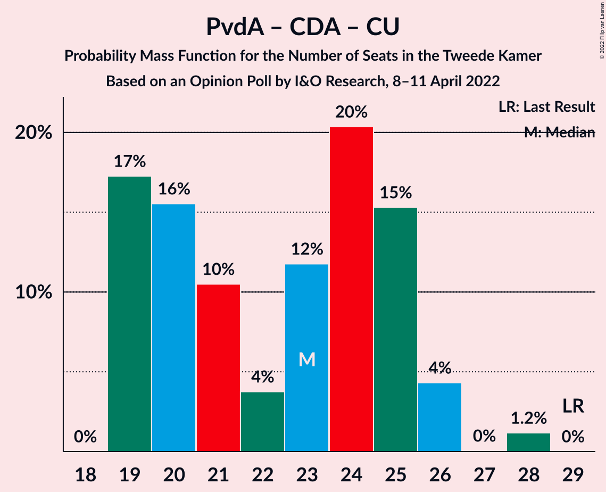

| Number of Seats | Probability | Accumulated | Special Marks |
|:---------------:|:-----------:|:-----------:|:-------------:|
| 19 | 17% | 100% |  |
| 20 | 16% | 83% |  |
| 21 | 10% | 67% |  |
| 22 | 4% | 57% | Median |
| 23 | 12% | 53% |  |
| 24 | 20% | 41% |  |
| 25 | 15% | 21% |  |
| 26 | 4% | 6% |  |
| 27 | 0% | 1.2% |  |
| 28 | 1.2% | 1.2% |  |
| 29 | 0% | 0% | Last Result |

### Partij van de Arbeid – Christen-Democratisch Appèl

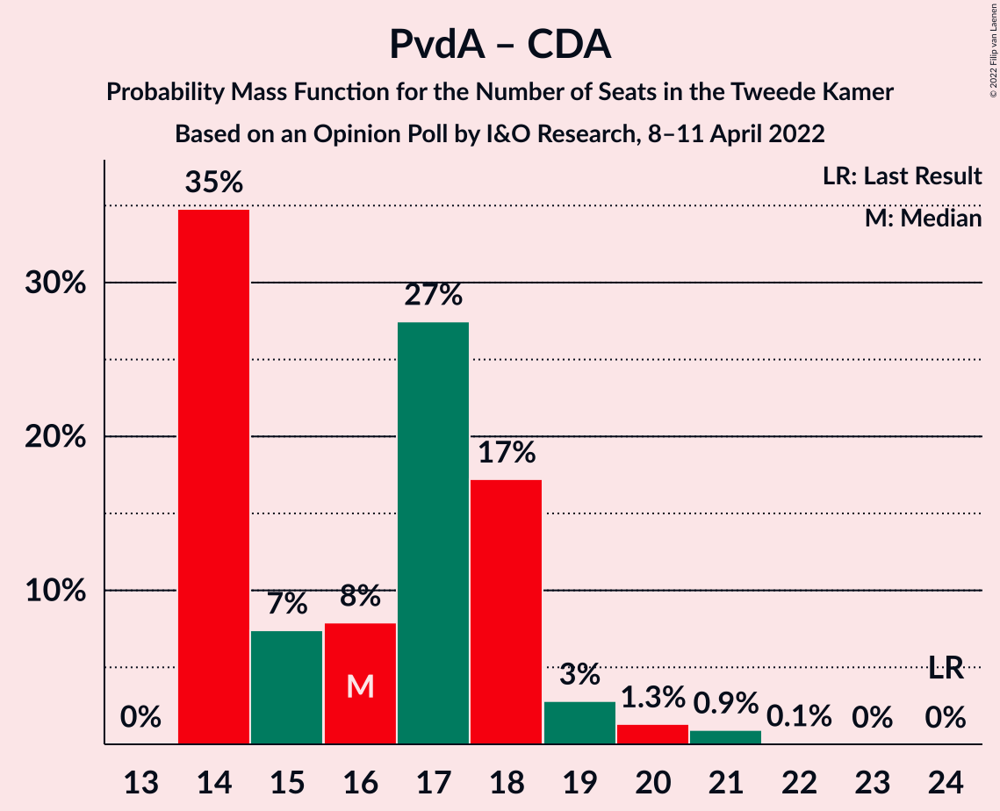

| Number of Seats | Probability | Accumulated | Special Marks |
|:---------------:|:-----------:|:-----------:|:-------------:|
| 14 | 35% | 100% |  |
| 15 | 7% | 65% |  |
| 16 | 8% | 58% | Median |
| 17 | 27% | 50% |  |
| 18 | 17% | 22% |  |
| 19 | 3% | 5% |  |
| 20 | 1.3% | 2% |  |
| 21 | 0.9% | 1.0% |  |
| 22 | 0.1% | 0.1% |  |
| 23 | 0% | 0% |  |
| 24 | 0% | 0% | Last Result |

## Technical Information

### Opinion Poll

+ **Polling firm:** I&O Research
+ **Commissioner(s):** —
+ **Fieldwork period:** 8–11 April 2022

### Calculations

+ **Sample size:** 2184
+ **Simulations done:** 1,048,576
+ **Error estimate:** 2.07%

