# Opinion Poll by Ipsos for EenVandaag, 22–25 April 2022

<a href="#voting-intentions">Voting Intentions</a> | <a href="#seats">Seats</a> | <a href="#coalitions">Coalitions</a> | <a href="#technical-information">Technical Information</a>

## Voting Intentions

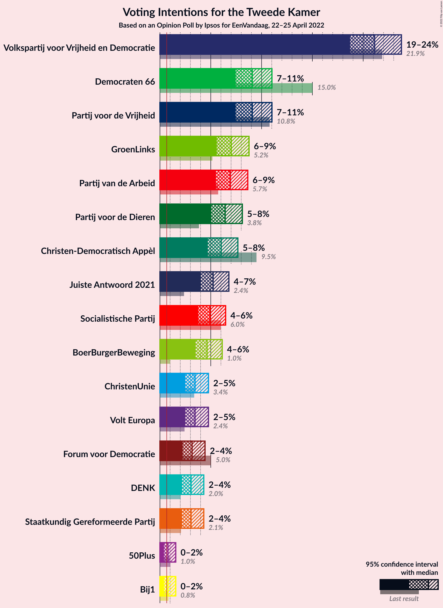

### Confidence Intervals

| Party | Last Result | Poll Result | 80% Confidence Interval | 90% Confidence Interval | 95% Confidence Interval | 99% Confidence Interval |
|:-----:|:-----------:|:-----------:|:-----------------------:|:-----------------------:|:-----------------------:|:-----------------------:|
| Volkspartij voor Vrijheid en Democratie | 21.9% | 21.1% | 19.5–22.8% |19.1–23.3% |18.7–23.8% |18.0–24.6% |
| Partij voor de Vrijheid | 10.8% | 9.1% | 8.0–10.3% |7.7–10.7% |7.5–11.0% |7.0–11.6% |
| Democraten 66 | 15.0% | 9.1% | 8.0–10.3% |7.7–10.7% |7.5–11.0% |7.0–11.6% |
| GroenLinks | 5.2% | 7.0% | 6.1–8.2% |5.8–8.5% |5.6–8.8% |5.2–9.3% |
| Partij van de Arbeid | 5.7% | 6.9% | 6.0–8.0% |5.7–8.4% |5.5–8.6% |5.1–9.2% |
| Partij voor de Dieren | 3.8% | 6.4% | 5.5–7.5% |5.3–7.8% |5.1–8.1% |4.7–8.7% |
| Christen-Democratisch Appèl | 9.5% | 6.0% | 5.2–7.1% |4.9–7.4% |4.7–7.7% |4.3–8.2% |
| Juiste Antwoord 2021 | 2.4% | 5.2% | 4.4–6.2% |4.2–6.5% |4.0–6.8% |3.7–7.3% |
| Socialistische Partij | 6.0% | 4.9% | 4.2–5.9% |3.9–6.2% |3.8–6.5% |3.4–7.0% |
| BoerBurgerBeweging | 1.0% | 4.6% | 3.9–5.6% |3.7–5.9% |3.5–6.1% |3.2–6.6% |
| ChristenUnie | 3.4% | 3.5% | 2.8–4.3% |2.6–4.6% |2.5–4.8% |2.2–5.2% |
| Volt Europa | 2.4% | 3.5% | 2.8–4.3% |2.6–4.6% |2.5–4.8% |2.2–5.2% |
| Forum voor Democratie | 5.0% | 3.2% | 2.6–4.0% |2.4–4.2% |2.2–4.4% |2.0–4.9% |
| Staatkundig Gereformeerde Partij | 2.1% | 3.1% | 2.5–3.9% |2.3–4.1% |2.2–4.3% |1.9–4.7% |
| DENK | 2.0% | 3.1% | 2.5–3.9% |2.3–4.1% |2.2–4.3% |1.9–4.7% |
| 50Plus | 1.0% | 0.8% | 0.5–1.3% |0.5–1.4% |0.4–1.6% |0.3–1.8% |
| Bij1 | 0.8% | 0.8% | 0.5–1.3% |0.5–1.4% |0.4–1.6% |0.3–1.8% |

*Note:* The poll result column reflects the actual value used in the calculations. Published results may vary slightly, and in addition be rounded to fewer digits.

## Seats

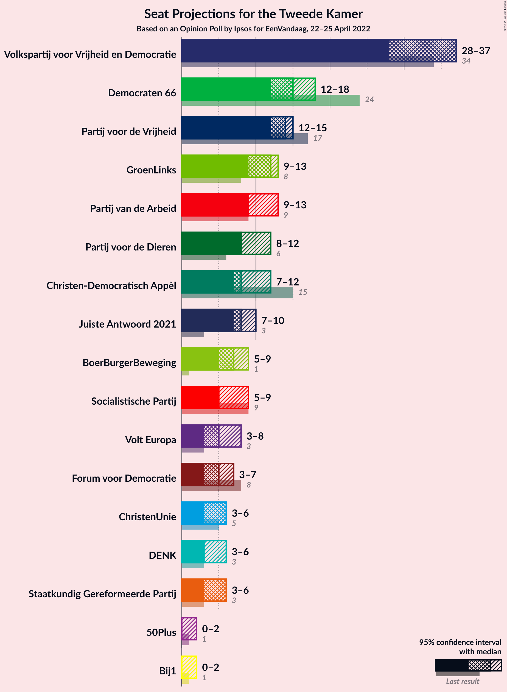

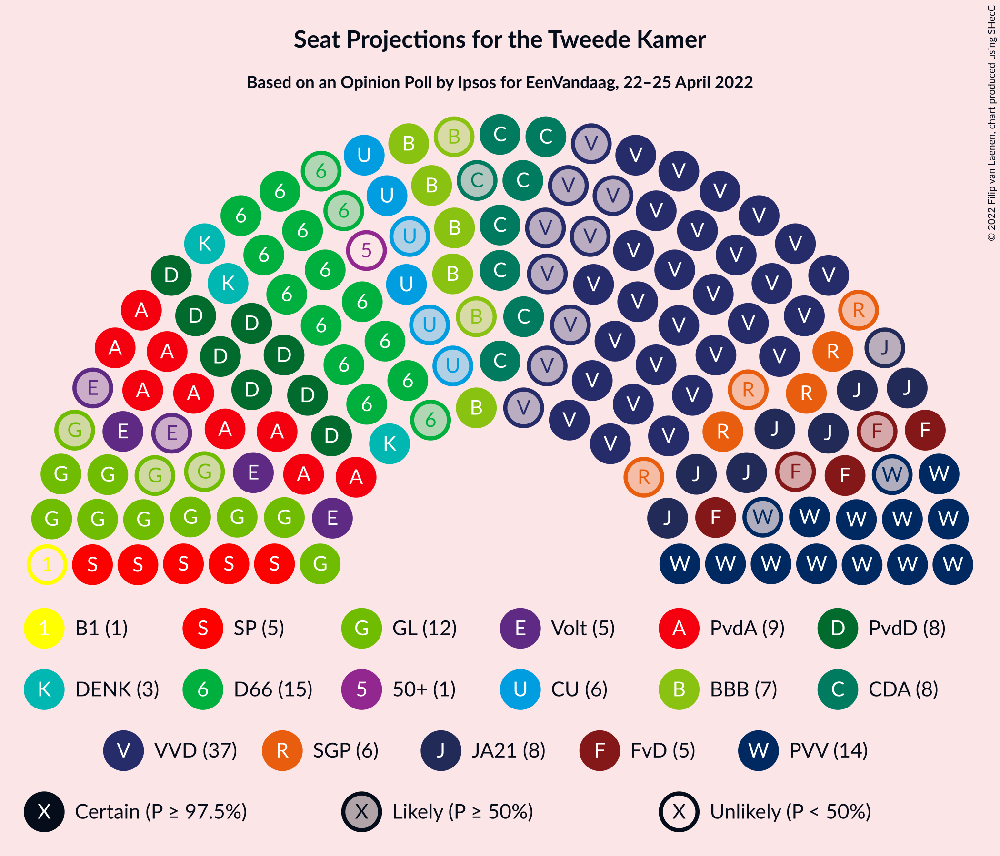

### Confidence Intervals

| Party | Last Result | Median | 80% Confidence Interval | 90% Confidence Interval | 95% Confidence Interval | 99% Confidence Interval |
|:-----:|:-----------:|:------:|:-----------------------:|:-----------------------:|:-----------------------:|:-----------------------:|
| <a href="#volkspartij-voor-vrijheid-en-democratie">Volkspartij voor Vrijheid en Democratie</a> | 34 | 37 | 30–37 |30–37 |28–37 |28–37 |
| <a href="#partij-voor-de-vrijheid">Partij voor de Vrijheid</a> | 17 | 14 | 14–15 |12–15 |12–15 |11–16 |
| <a href="#democraten-66">Democraten 66</a> | 24 | 15 | 13–16 |12–18 |12–18 |11–18 |
| <a href="#groenlinks">GroenLinks</a> | 8 | 12 | 10–12 |9–12 |9–13 |8–13 |
| <a href="#partij-van-de-arbeid">Partij van de Arbeid</a> | 9 | 9 | 9–11 |9–12 |9–13 |8–14 |
| <a href="#partij-voor-de-dieren">Partij voor de Dieren</a> | 6 | 8 | 8–10 |8–11 |8–12 |7–13 |
| <a href="#christen-democratisch-appèl">Christen-Democratisch Appèl</a> | 15 | 8 | 7–8 |7–10 |7–12 |6–12 |
| <a href="#juiste-antwoord-2021">Juiste Antwoord 2021</a> | 3 | 8 | 8 |7–10 |7–10 |5–11 |
| <a href="#socialistische-partij">Socialistische Partij</a> | 9 | 5 | 5–8 |5–8 |5–9 |5–9 |
| <a href="#boerburgerbeweging">BoerBurgerBeweging</a> | 1 | 7 | 7–8 |6–8 |5–9 |4–10 |
| <a href="#christenunie">ChristenUnie</a> | 5 | 6 | 4–6 |4–6 |3–6 |3–7 |
| <a href="#volt-europa">Volt Europa</a> | 3 | 5 | 3–5 |3–7 |3–8 |3–9 |
| <a href="#forum-voor-democratie">Forum voor Democratie</a> | 8 | 5 | 4–5 |4–6 |3–7 |3–7 |
| <a href="#staatkundig-gereformeerde-partij">Staatkundig Gereformeerde Partij</a> | 3 | 6 | 5–6 |4–6 |3–6 |2–6 |
| <a href="#denk">DENK</a> | 3 | 3 | 3–5 |3–5 |3–6 |3–6 |
| <a href="#50plus">50Plus</a> | 1 | 0 | 0–1 |0–2 |0–2 |0–2 |
| <a href="#bij1">Bij1</a> | 1 | 0 | 0–1 |0–1 |0–2 |0–2 |

### Volkspartij voor Vrijheid en Democratie

*For a full overview of the results for this party, see the [Volkspartij voor Vrijheid en Democratie](party-volkspartijvoorvrijheidendemocratie.html) page.*

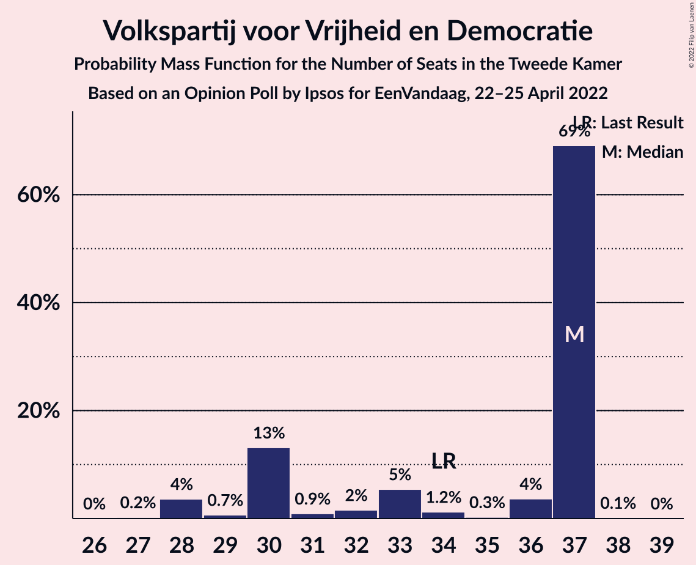

| Number of Seats | Probability | Accumulated | Special Marks |
|:---------------:|:-----------:|:-----------:|:-------------:|
| 27 | 0.2% | 100% |  |
| 28 | 4% | 99.8% |  |
| 29 | 0.7% | 96% |  |
| 30 | 13% | 95% |  |
| 31 | 0.9% | 82% |  |
| 32 | 2% | 81% |  |
| 33 | 5% | 80% |  |
| 34 | 1.2% | 74% | Last Result |
| 35 | 0.3% | 73% |  |
| 36 | 4% | 73% |  |
| 37 | 69% | 69% | Median |
| 38 | 0.1% | 0.2% |  |
| 39 | 0% | 0% |  |

### Partij voor de Vrijheid

*For a full overview of the results for this party, see the [Partij voor de Vrijheid](party-partijvoordevrijheid.html) page.*

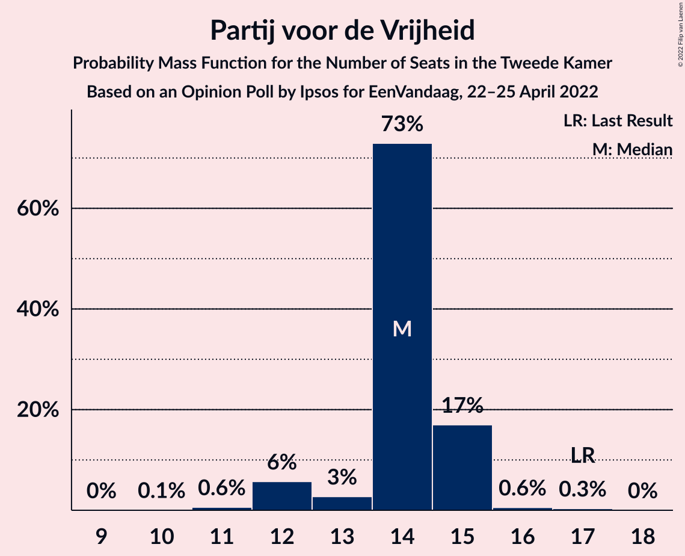

| Number of Seats | Probability | Accumulated | Special Marks |
|:---------------:|:-----------:|:-----------:|:-------------:|
| 10 | 0.1% | 100% |  |
| 11 | 0.6% | 99.9% |  |
| 12 | 6% | 99.3% |  |
| 13 | 3% | 94% |  |
| 14 | 73% | 91% | Median |
| 15 | 17% | 18% |  |
| 16 | 0.6% | 1.0% |  |
| 17 | 0.3% | 0.4% | Last Result |
| 18 | 0% | 0% |  |

### Democraten 66

*For a full overview of the results for this party, see the [Democraten 66](party-democraten66.html) page.*

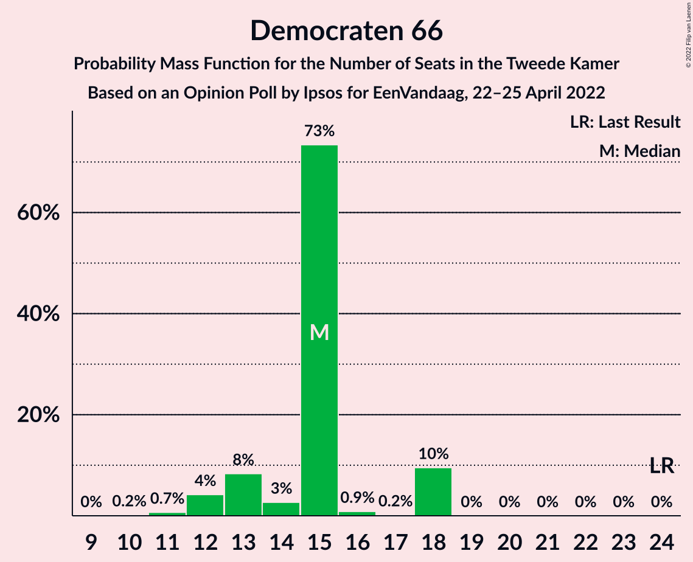

| Number of Seats | Probability | Accumulated | Special Marks |
|:---------------:|:-----------:|:-----------:|:-------------:|
| 10 | 0.2% | 100% |  |
| 11 | 0.7% | 99.8% |  |
| 12 | 4% | 99.2% |  |
| 13 | 8% | 95% |  |
| 14 | 3% | 87% |  |
| 15 | 73% | 84% | Median |
| 16 | 0.9% | 11% |  |
| 17 | 0.2% | 10% |  |
| 18 | 10% | 10% |  |
| 19 | 0% | 0% |  |
| 20 | 0% | 0% |  |
| 21 | 0% | 0% |  |
| 22 | 0% | 0% |  |
| 23 | 0% | 0% |  |
| 24 | 0% | 0% | Last Result |

### GroenLinks

*For a full overview of the results for this party, see the [GroenLinks](party-groenlinks.html) page.*

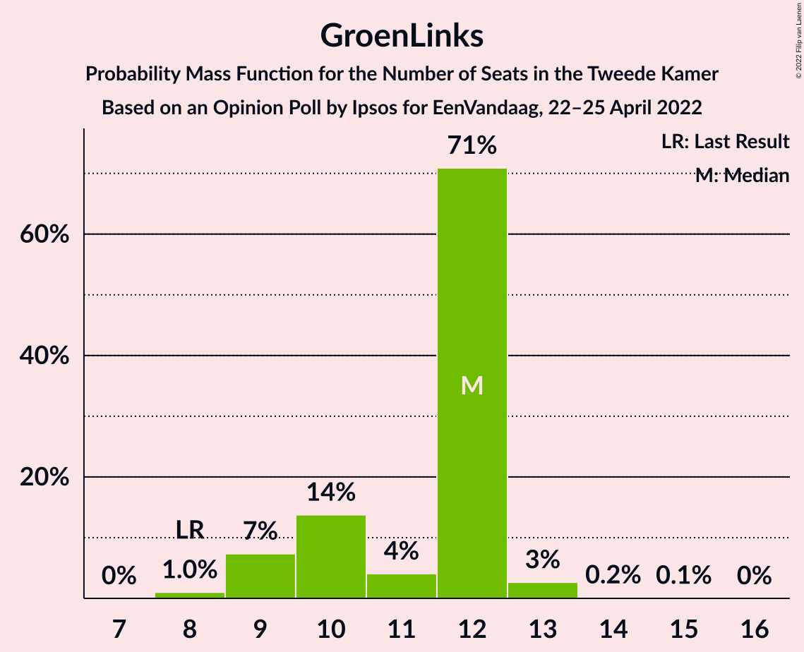

| Number of Seats | Probability | Accumulated | Special Marks |
|:---------------:|:-----------:|:-----------:|:-------------:|
| 8 | 1.0% | 100% | Last Result |
| 9 | 7% | 99.0% |  |
| 10 | 14% | 92% |  |
| 11 | 4% | 78% |  |
| 12 | 71% | 74% | Median |
| 13 | 3% | 3% |  |
| 14 | 0.2% | 0.2% |  |
| 15 | 0.1% | 0.1% |  |
| 16 | 0% | 0% |  |

### Partij van de Arbeid

*For a full overview of the results for this party, see the [Partij van de Arbeid](party-partijvandearbeid.html) page.*

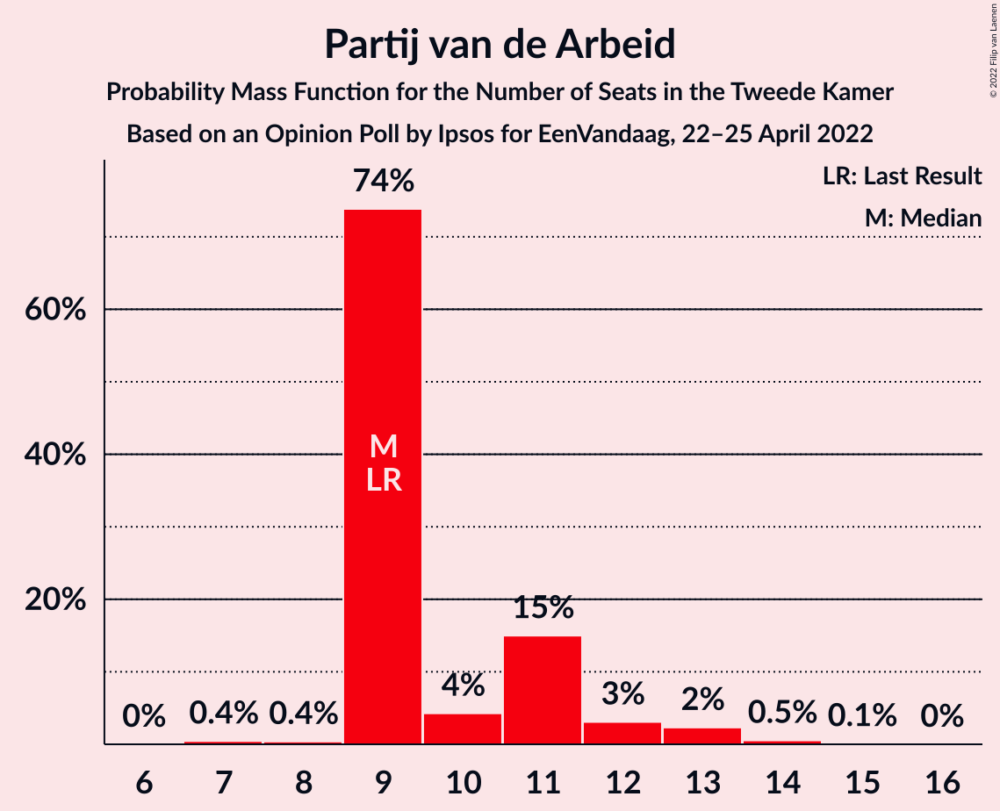

| Number of Seats | Probability | Accumulated | Special Marks |
|:---------------:|:-----------:|:-----------:|:-------------:|
| 7 | 0.4% | 100% |  |
| 8 | 0.4% | 99.5% |  |
| 9 | 74% | 99.2% | Last Result, Median |
| 10 | 4% | 25% |  |
| 11 | 15% | 21% |  |
| 12 | 3% | 6% |  |
| 13 | 2% | 3% |  |
| 14 | 0.5% | 0.6% |  |
| 15 | 0.1% | 0.1% |  |
| 16 | 0% | 0% |  |

### Partij voor de Dieren

*For a full overview of the results for this party, see the [Partij voor de Dieren](party-partijvoordedieren.html) page.*

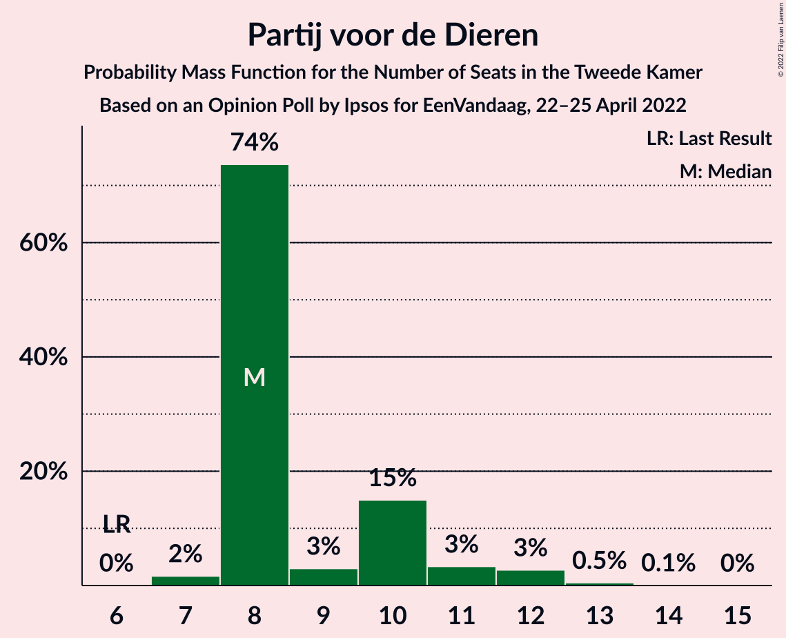

| Number of Seats | Probability | Accumulated | Special Marks |
|:---------------:|:-----------:|:-----------:|:-------------:|
| 6 | 0% | 100% | Last Result |
| 7 | 2% | 100% |  |
| 8 | 74% | 98% | Median |
| 9 | 3% | 25% |  |
| 10 | 15% | 22% |  |
| 11 | 3% | 7% |  |
| 12 | 3% | 3% |  |
| 13 | 0.5% | 0.6% |  |
| 14 | 0.1% | 0.1% |  |
| 15 | 0% | 0% |  |

### Christen-Democratisch Appèl

*For a full overview of the results for this party, see the [Christen-Democratisch Appèl](party-christen-democratischappèl.html) page.*

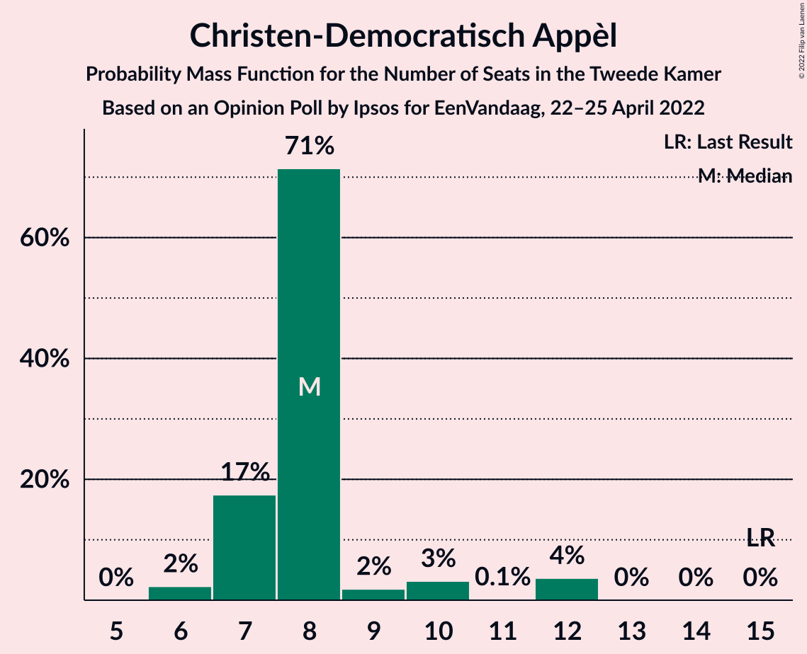

| Number of Seats | Probability | Accumulated | Special Marks |
|:---------------:|:-----------:|:-----------:|:-------------:|
| 6 | 2% | 100% |  |
| 7 | 17% | 98% |  |
| 8 | 71% | 80% | Median |
| 9 | 2% | 9% |  |
| 10 | 3% | 7% |  |
| 11 | 0.1% | 4% |  |
| 12 | 4% | 4% |  |
| 13 | 0% | 0% |  |
| 14 | 0% | 0% |  |
| 15 | 0% | 0% | Last Result |

### Juiste Antwoord 2021

*For a full overview of the results for this party, see the [Juiste Antwoord 2021](party-juisteantwoord2021.html) page.*

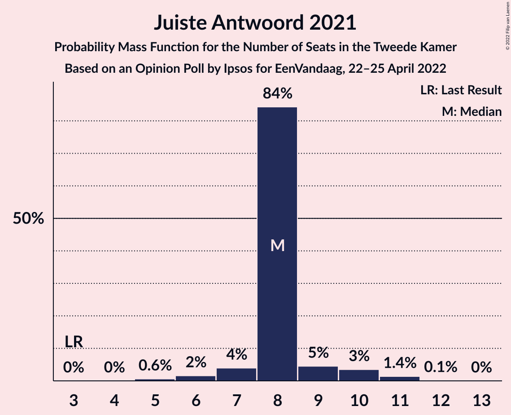

| Number of Seats | Probability | Accumulated | Special Marks |
|:---------------:|:-----------:|:-----------:|:-------------:|
| 3 | 0% | 100% | Last Result |
| 4 | 0% | 100% |  |
| 5 | 0.6% | 100% |  |
| 6 | 2% | 99.4% |  |
| 7 | 4% | 98% |  |
| 8 | 84% | 94% | Median |
| 9 | 5% | 10% |  |
| 10 | 3% | 5% |  |
| 11 | 1.4% | 2% |  |
| 12 | 0.1% | 0.1% |  |
| 13 | 0% | 0% |  |

### Socialistische Partij

*For a full overview of the results for this party, see the [Socialistische Partij](party-socialistischepartij.html) page.*

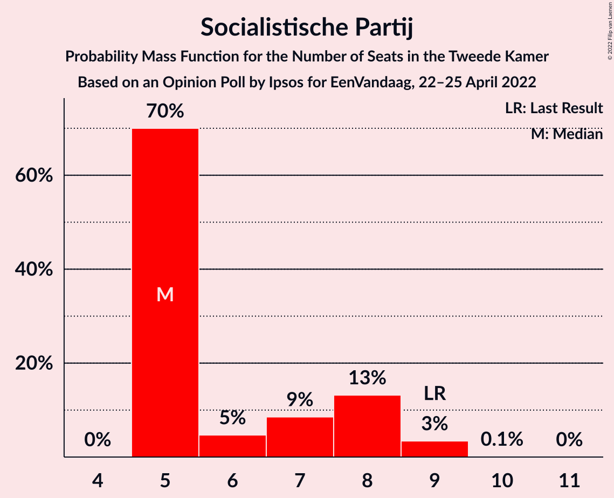

| Number of Seats | Probability | Accumulated | Special Marks |
|:---------------:|:-----------:|:-----------:|:-------------:|
| 5 | 70% | 100% | Median |
| 6 | 5% | 30% |  |
| 7 | 9% | 25% |  |
| 8 | 13% | 17% |  |
| 9 | 3% | 4% | Last Result |
| 10 | 0.1% | 0.1% |  |
| 11 | 0% | 0% |  |

### BoerBurgerBeweging

*For a full overview of the results for this party, see the [BoerBurgerBeweging](party-boerburgerbeweging.html) page.*

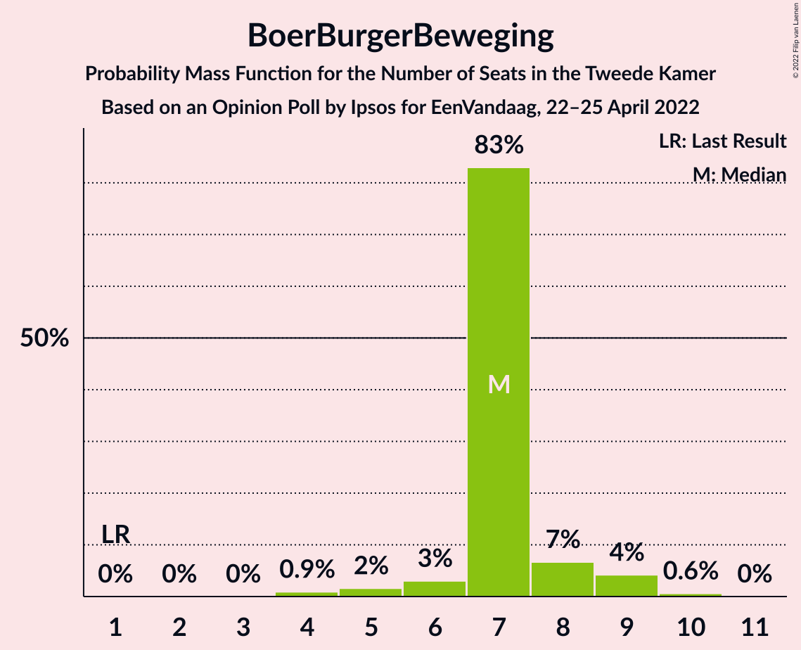

| Number of Seats | Probability | Accumulated | Special Marks |
|:---------------:|:-----------:|:-----------:|:-------------:|
| 1 | 0% | 100% | Last Result |
| 2 | 0% | 100% |  |
| 3 | 0% | 100% |  |
| 4 | 0.9% | 100% |  |
| 5 | 2% | 99.1% |  |
| 6 | 3% | 97% |  |
| 7 | 83% | 94% | Median |
| 8 | 7% | 11% |  |
| 9 | 4% | 5% |  |
| 10 | 0.6% | 0.6% |  |
| 11 | 0% | 0% |  |

### ChristenUnie

*For a full overview of the results for this party, see the [ChristenUnie](party-christenunie.html) page.*

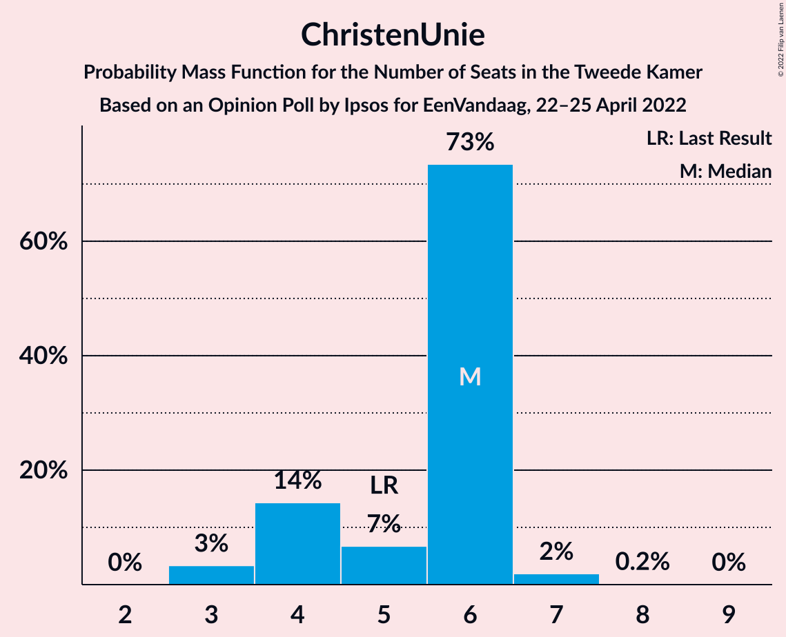

| Number of Seats | Probability | Accumulated | Special Marks |
|:---------------:|:-----------:|:-----------:|:-------------:|
| 3 | 3% | 100% |  |
| 4 | 14% | 97% |  |
| 5 | 7% | 82% | Last Result |
| 6 | 73% | 76% | Median |
| 7 | 2% | 2% |  |
| 8 | 0.2% | 0.2% |  |
| 9 | 0% | 0% |  |

### Volt Europa

*For a full overview of the results for this party, see the [Volt Europa](party-volteuropa.html) page.*

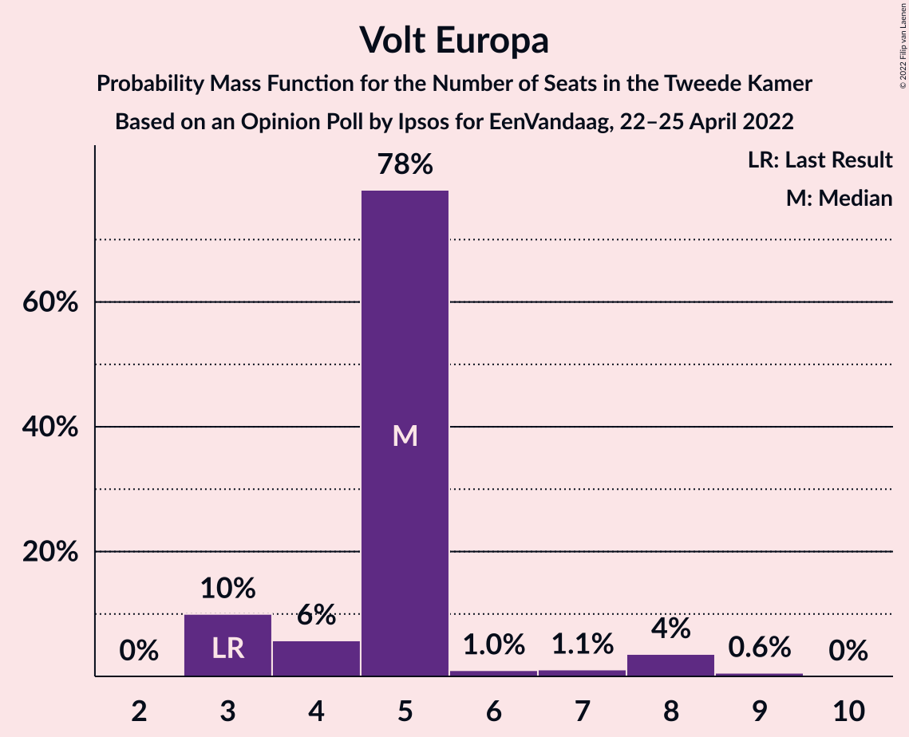

| Number of Seats | Probability | Accumulated | Special Marks |
|:---------------:|:-----------:|:-----------:|:-------------:|
| 3 | 10% | 100% | Last Result |
| 4 | 6% | 90% |  |
| 5 | 78% | 84% | Median |
| 6 | 1.0% | 6% |  |
| 7 | 1.1% | 5% |  |
| 8 | 4% | 4% |  |
| 9 | 0.6% | 0.6% |  |
| 10 | 0% | 0% |  |

### Forum voor Democratie

*For a full overview of the results for this party, see the [Forum voor Democratie](party-forumvoordemocratie.html) page.*

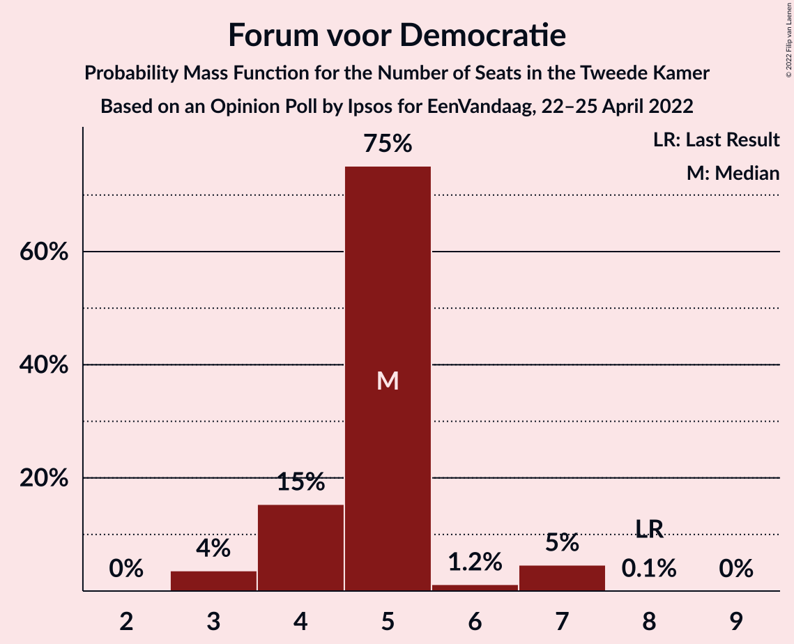

| Number of Seats | Probability | Accumulated | Special Marks |
|:---------------:|:-----------:|:-----------:|:-------------:|
| 3 | 4% | 100% |  |
| 4 | 15% | 96% |  |
| 5 | 75% | 81% | Median |
| 6 | 1.2% | 6% |  |
| 7 | 5% | 5% |  |
| 8 | 0.1% | 0.1% | Last Result |
| 9 | 0% | 0% |  |

### Staatkundig Gereformeerde Partij

*For a full overview of the results for this party, see the [Staatkundig Gereformeerde Partij](party-staatkundiggereformeerdepartij.html) page.*

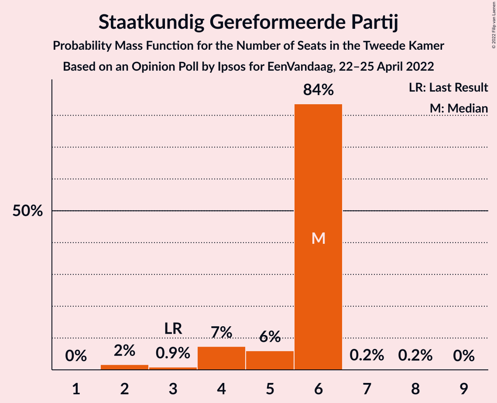

| Number of Seats | Probability | Accumulated | Special Marks |
|:---------------:|:-----------:|:-----------:|:-------------:|
| 2 | 2% | 100% |  |
| 3 | 0.9% | 98% | Last Result |
| 4 | 7% | 97% |  |
| 5 | 6% | 90% |  |
| 6 | 84% | 84% | Median |
| 7 | 0.2% | 0.4% |  |
| 8 | 0.2% | 0.2% |  |
| 9 | 0% | 0% |  |

### DENK

*For a full overview of the results for this party, see the [DENK](party-denk.html) page.*

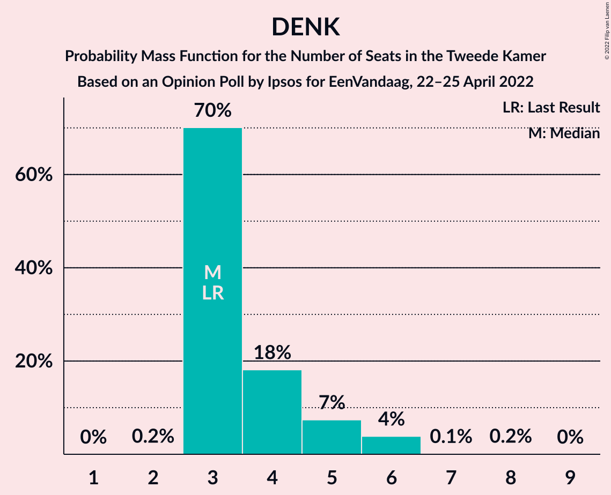

| Number of Seats | Probability | Accumulated | Special Marks |
|:---------------:|:-----------:|:-----------:|:-------------:|
| 2 | 0.2% | 100% |  |
| 3 | 70% | 99.8% | Last Result, Median |
| 4 | 18% | 30% |  |
| 5 | 7% | 12% |  |
| 6 | 4% | 4% |  |
| 7 | 0.1% | 0.3% |  |
| 8 | 0.2% | 0.2% |  |
| 9 | 0% | 0% |  |

### 50Plus

*For a full overview of the results for this party, see the [50Plus](party-50plus.html) page.*

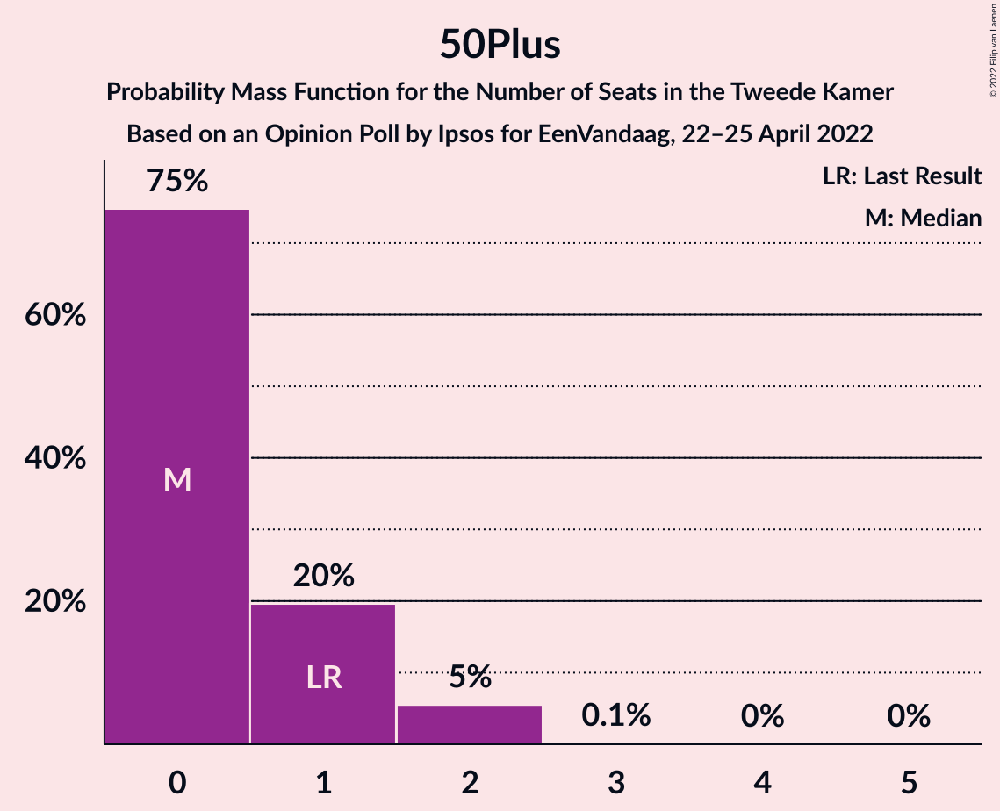

| Number of Seats | Probability | Accumulated | Special Marks |
|:---------------:|:-----------:|:-----------:|:-------------:|
| 0 | 75% | 100% | Median |
| 1 | 20% | 25% | Last Result |
| 2 | 5% | 6% |  |
| 3 | 0.1% | 0.1% |  |
| 4 | 0% | 0% |  |

### Bij1

*For a full overview of the results for this party, see the [Bij1](party-bij1.html) page.*

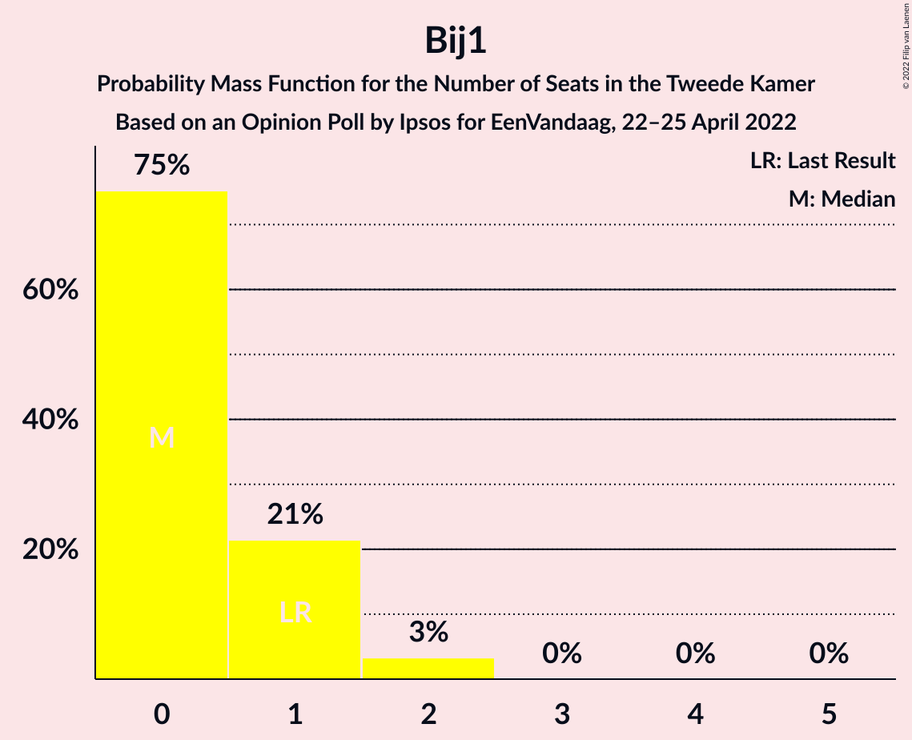

| Number of Seats | Probability | Accumulated | Special Marks |
|:---------------:|:-----------:|:-----------:|:-------------:|
| 0 | 75% | 100% | Median |
| 1 | 21% | 25% | Last Result |
| 2 | 3% | 3% |  |
| 3 | 0% | 0% |  |

## Coalitions

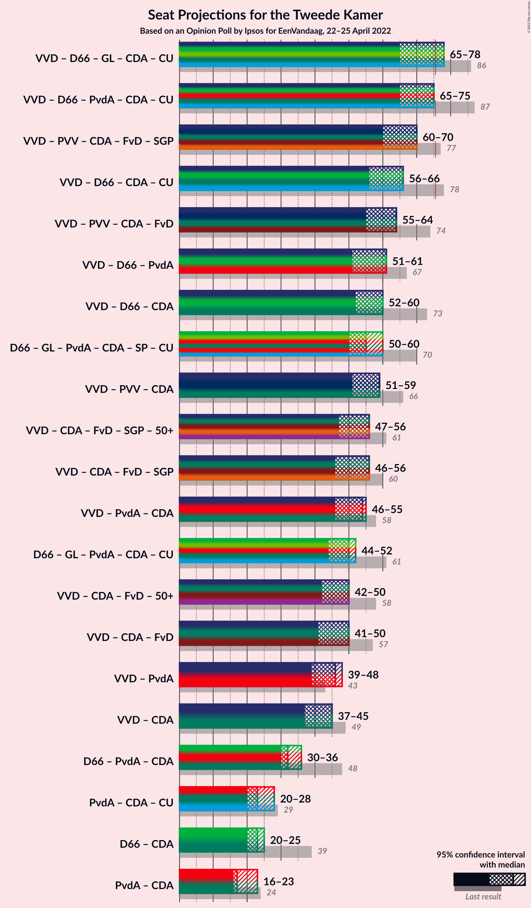

### Confidence Intervals

| Coalition | Last Result | Median | Majority? | 80% Confidence Interval | 90% Confidence Interval | 95% Confidence Interval | 99% Confidence Interval |
|:---------:|:-----------:|:------:|:---------:|:-----------------------:|:-----------------------:|:-----------------------:|:-----------------------:|
| Volkspartij voor Vrijheid en Democratie – Democraten 66 – GroenLinks – Christen-Democratisch Appèl – ChristenUnie | 86 | 78 | 70% | 68–78 | 67–78 | 65–78 | 65–78 |
| Volkspartij voor Vrijheid en Democratie – Democraten 66 – Partij van de Arbeid – Christen-Democratisch Appèl – ChristenUnie | 87 | 75 | 2% | 69–75 | 67–75 | 65–75 | 65–77 |
| Volkspartij voor Vrijheid en Democratie – Partij voor de Vrijheid – Christen-Democratisch Appèl – Forum voor Democratie – Staatkundig Gereformeerde Partij | 77 | 70 | 0% | 62–70 | 62–70 | 60–70 | 58–70 |
| Volkspartij voor Vrijheid en Democratie – Democraten 66 – Christen-Democratisch Appèl – ChristenUnie | 78 | 66 | 0% | 58–66 | 57–66 | 56–66 | 55–66 |
| Volkspartij voor Vrijheid en Democratie – Partij voor de Vrijheid – Christen-Democratisch Appèl – Forum voor Democratie | 74 | 64 | 0% | 56–64 | 56–64 | 55–64 | 53–64 |
| Volkspartij voor Vrijheid en Democratie – Democraten 66 – Partij van de Arbeid | 67 | 61 | 0% | 55–61 | 54–61 | 51–61 | 51–62 |
| Volkspartij voor Vrijheid en Democratie – Democraten 66 – Christen-Democratisch Appèl | 73 | 60 | 0% | 53–60 | 52–60 | 52–60 | 49–60 |
| Democraten 66 – GroenLinks – Partij van de Arbeid – Christen-Democratisch Appèl – Socialistische Partij – ChristenUnie | 70 | 55 | 0% | 55–58 | 51–58 | 50–60 | 50–61 |
| Volkspartij voor Vrijheid en Democratie – Partij voor de Vrijheid – Christen-Democratisch Appèl | 66 | 59 | 0% | 52–59 | 52–59 | 51–59 | 49–59 |
| Volkspartij voor Vrijheid en Democratie – Christen-Democratisch Appèl – Forum voor Democratie – Staatkundig Gereformeerde Partij – 50Plus | 61 | 56 | 0% | 48–56 | 48–56 | 47–56 | 46–56 |
| Volkspartij voor Vrijheid en Democratie – Christen-Democratisch Appèl – Forum voor Democratie – Staatkundig Gereformeerde Partij | 60 | 56 | 0% | 47–56 | 47–56 | 46–56 | 46–56 |
| Volkspartij voor Vrijheid en Democratie – Partij van de Arbeid – Christen-Democratisch Appèl | 58 | 54 | 0% | 48–54 | 48–55 | 46–55 | 46–57 |
| Democraten 66 – GroenLinks – Partij van de Arbeid – Christen-Democratisch Appèl – ChristenUnie | 61 | 50 | 0% | 47–50 | 44–50 | 44–52 | 44–55 |
| Volkspartij voor Vrijheid en Democratie – Christen-Democratisch Appèl – Forum voor Democratie – 50Plus | 58 | 50 | 0% | 42–50 | 42–50 | 42–50 | 42–51 |
| Volkspartij voor Vrijheid en Democratie – Christen-Democratisch Appèl – Forum voor Democratie | 57 | 50 | 0% | 42–50 | 41–50 | 41–50 | 41–50 |
| Volkspartij voor Vrijheid en Democratie – Partij van de Arbeid | 43 | 46 | 0% | 41–46 | 39–46 | 39–48 | 39–48 |
| Volkspartij voor Vrijheid en Democratie – Christen-Democratisch Appèl | 49 | 45 | 0% | 37–45 | 37–45 | 37–45 | 36–45 |
| Democraten 66 – Partij van de Arbeid – Christen-Democratisch Appèl | 48 | 32 | 0% | 32–36 | 31–36 | 30–36 | 29–39 |
| Partij van de Arbeid – Christen-Democratisch Appèl – ChristenUnie | 29 | 23 | 0% | 22–23 | 22–28 | 20–28 | 20–30 |
| Democraten 66 – Christen-Democratisch Appèl | 39 | 23 | 0% | 22–25 | 20–25 | 20–25 | 19–27 |
| Partij van de Arbeid – Christen-Democratisch Appèl | 24 | 17 | 0% | 17–19 | 16–23 | 16–23 | 16–23 |

### Volkspartij voor Vrijheid en Democratie – Democraten 66 – GroenLinks – Christen-Democratisch Appèl – ChristenUnie

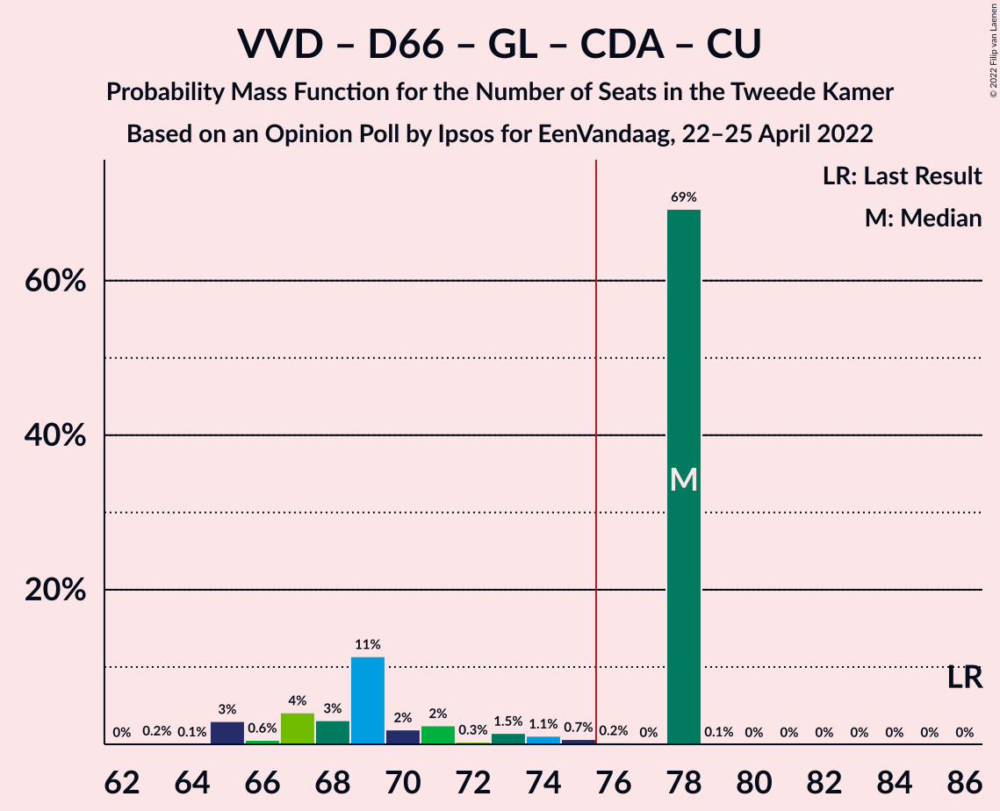

| Number of Seats | Probability | Accumulated | Special Marks |
|:---------------:|:-----------:|:-----------:|:-------------:|
| 63 | 0.2% | 100% |  |
| 64 | 0.1% | 99.8% |  |
| 65 | 3% | 99.7% |  |
| 66 | 0.6% | 97% |  |
| 67 | 4% | 96% |  |
| 68 | 3% | 92% |  |
| 69 | 11% | 89% |  |
| 70 | 2% | 78% |  |
| 71 | 2% | 76% |  |
| 72 | 0.3% | 73% |  |
| 73 | 1.5% | 73% |  |
| 74 | 1.1% | 71% |  |
| 75 | 0.7% | 70% |  |
| 76 | 0.2% | 70% | Majority |
| 77 | 0% | 69% |  |
| 78 | 69% | 69% | Median |
| 79 | 0.1% | 0.1% |  |
| 80 | 0% | 0% |  |
| 81 | 0% | 0% |  |
| 82 | 0% | 0% |  |
| 83 | 0% | 0% |  |
| 84 | 0% | 0% |  |
| 85 | 0% | 0% |  |
| 86 | 0% | 0% | Last Result |

### Volkspartij voor Vrijheid en Democratie – Democraten 66 – Partij van de Arbeid – Christen-Democratisch Appèl – ChristenUnie

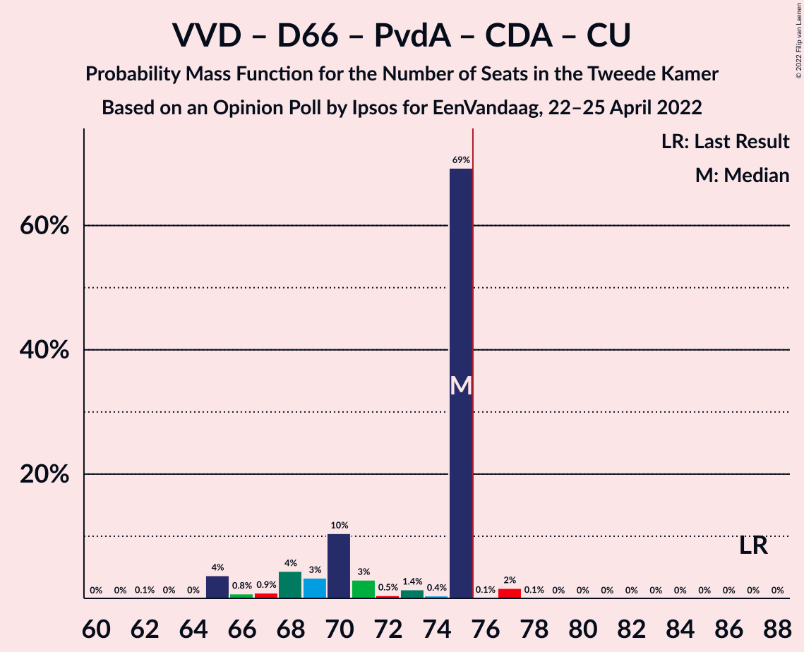

| Number of Seats | Probability | Accumulated | Special Marks |
|:---------------:|:-----------:|:-----------:|:-------------:|
| 62 | 0.1% | 100% |  |
| 63 | 0% | 99.9% |  |
| 64 | 0% | 99.9% |  |
| 65 | 4% | 99.9% |  |
| 66 | 0.8% | 96% |  |
| 67 | 0.9% | 95% |  |
| 68 | 4% | 95% |  |
| 69 | 3% | 90% |  |
| 70 | 10% | 87% |  |
| 71 | 3% | 76% |  |
| 72 | 0.5% | 73% |  |
| 73 | 1.4% | 73% |  |
| 74 | 0.4% | 72% |  |
| 75 | 69% | 71% | Median |
| 76 | 0.1% | 2% | Majority |
| 77 | 2% | 2% |  |
| 78 | 0.1% | 0.1% |  |
| 79 | 0% | 0% |  |
| 80 | 0% | 0% |  |
| 81 | 0% | 0% |  |
| 82 | 0% | 0% |  |
| 83 | 0% | 0% |  |
| 84 | 0% | 0% |  |
| 85 | 0% | 0% |  |
| 86 | 0% | 0% |  |
| 87 | 0% | 0% | Last Result |

### Volkspartij voor Vrijheid en Democratie – Partij voor de Vrijheid – Christen-Democratisch Appèl – Forum voor Democratie – Staatkundig Gereformeerde Partij

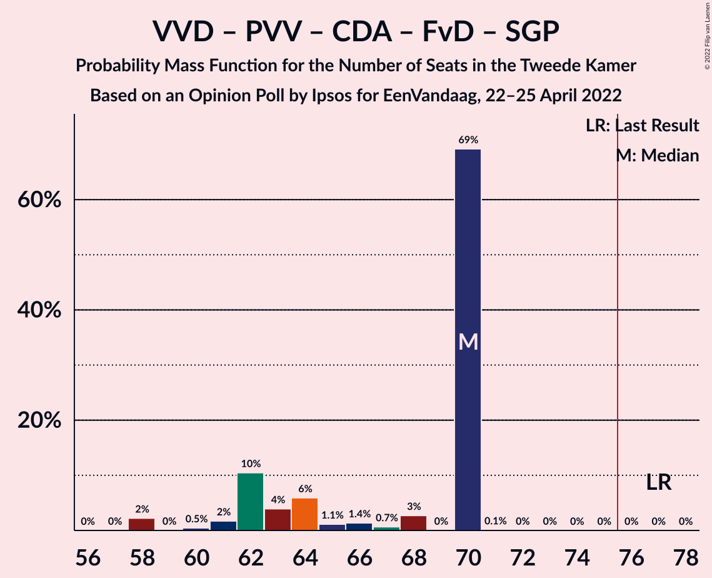

| Number of Seats | Probability | Accumulated | Special Marks |
|:---------------:|:-----------:|:-----------:|:-------------:|
| 58 | 2% | 100% |  |
| 59 | 0% | 98% |  |
| 60 | 0.5% | 98% |  |
| 61 | 2% | 97% |  |
| 62 | 10% | 96% |  |
| 63 | 4% | 85% |  |
| 64 | 6% | 81% |  |
| 65 | 1.1% | 75% |  |
| 66 | 1.4% | 74% |  |
| 67 | 0.7% | 73% |  |
| 68 | 3% | 72% |  |
| 69 | 0% | 69% |  |
| 70 | 69% | 69% | Median |
| 71 | 0.1% | 0.1% |  |
| 72 | 0% | 0% |  |
| 73 | 0% | 0% |  |
| 74 | 0% | 0% |  |
| 75 | 0% | 0% |  |
| 76 | 0% | 0% | Majority |
| 77 | 0% | 0% | Last Result |

### Volkspartij voor Vrijheid en Democratie – Democraten 66 – Christen-Democratisch Appèl – ChristenUnie

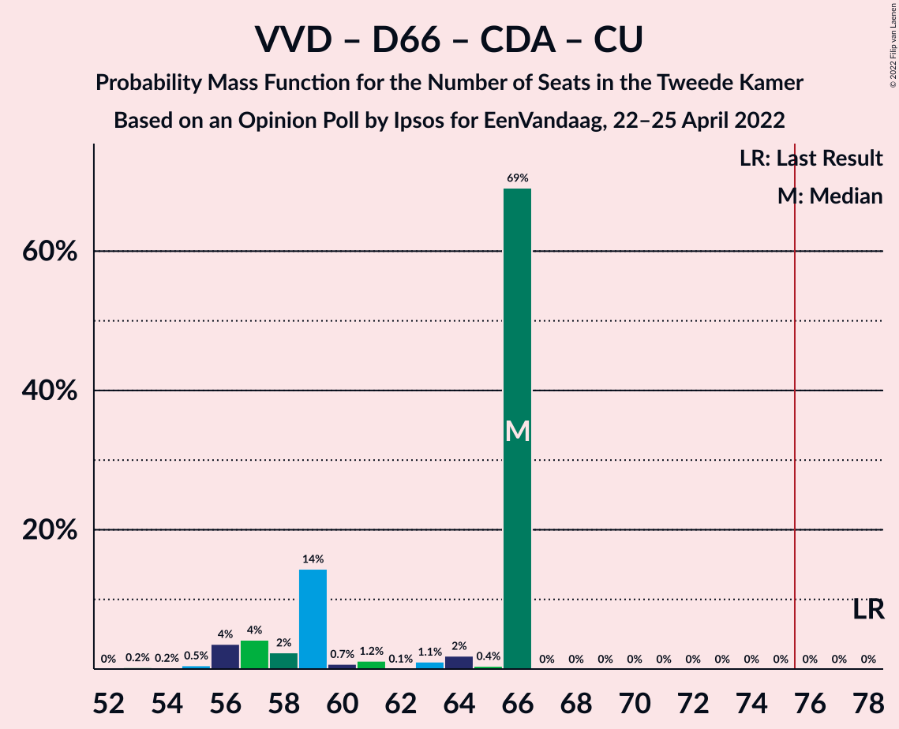

| Number of Seats | Probability | Accumulated | Special Marks |
|:---------------:|:-----------:|:-----------:|:-------------:|
| 52 | 0% | 100% |  |
| 53 | 0.2% | 99.9% |  |
| 54 | 0.2% | 99.7% |  |
| 55 | 0.5% | 99.5% |  |
| 56 | 4% | 99.0% |  |
| 57 | 4% | 95% |  |
| 58 | 2% | 91% |  |
| 59 | 14% | 89% |  |
| 60 | 0.7% | 74% |  |
| 61 | 1.2% | 74% |  |
| 62 | 0.1% | 73% |  |
| 63 | 1.1% | 73% |  |
| 64 | 2% | 71% |  |
| 65 | 0.4% | 70% |  |
| 66 | 69% | 69% | Median |
| 67 | 0% | 0% |  |
| 68 | 0% | 0% |  |
| 69 | 0% | 0% |  |
| 70 | 0% | 0% |  |
| 71 | 0% | 0% |  |
| 72 | 0% | 0% |  |
| 73 | 0% | 0% |  |
| 74 | 0% | 0% |  |
| 75 | 0% | 0% |  |
| 76 | 0% | 0% | Majority |
| 77 | 0% | 0% |  |
| 78 | 0% | 0% | Last Result |

### Volkspartij voor Vrijheid en Democratie – Partij voor de Vrijheid – Christen-Democratisch Appèl – Forum voor Democratie

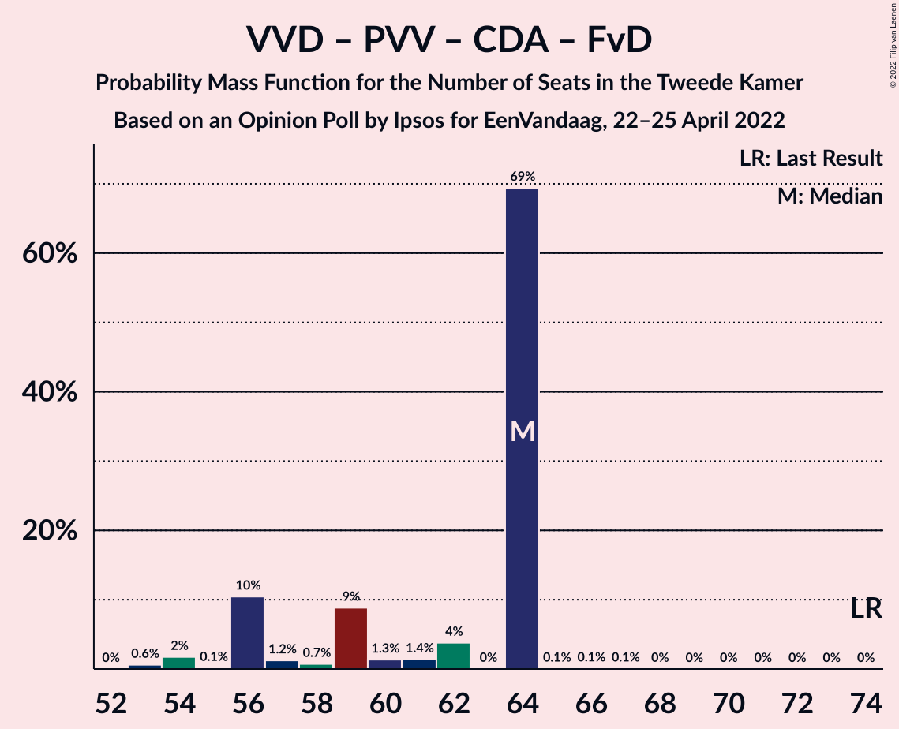

| Number of Seats | Probability | Accumulated | Special Marks |
|:---------------:|:-----------:|:-----------:|:-------------:|
| 53 | 0.6% | 100% |  |
| 54 | 2% | 99.4% |  |
| 55 | 0.1% | 98% |  |
| 56 | 10% | 97% |  |
| 57 | 1.2% | 87% |  |
| 58 | 0.7% | 86% |  |
| 59 | 9% | 85% |  |
| 60 | 1.3% | 76% |  |
| 61 | 1.4% | 75% |  |
| 62 | 4% | 74% |  |
| 63 | 0% | 70% |  |
| 64 | 69% | 70% | Median |
| 65 | 0.1% | 0.2% |  |
| 66 | 0.1% | 0.2% |  |
| 67 | 0.1% | 0.1% |  |
| 68 | 0% | 0% |  |
| 69 | 0% | 0% |  |
| 70 | 0% | 0% |  |
| 71 | 0% | 0% |  |
| 72 | 0% | 0% |  |
| 73 | 0% | 0% |  |
| 74 | 0% | 0% | Last Result |

### Volkspartij voor Vrijheid en Democratie – Democraten 66 – Partij van de Arbeid

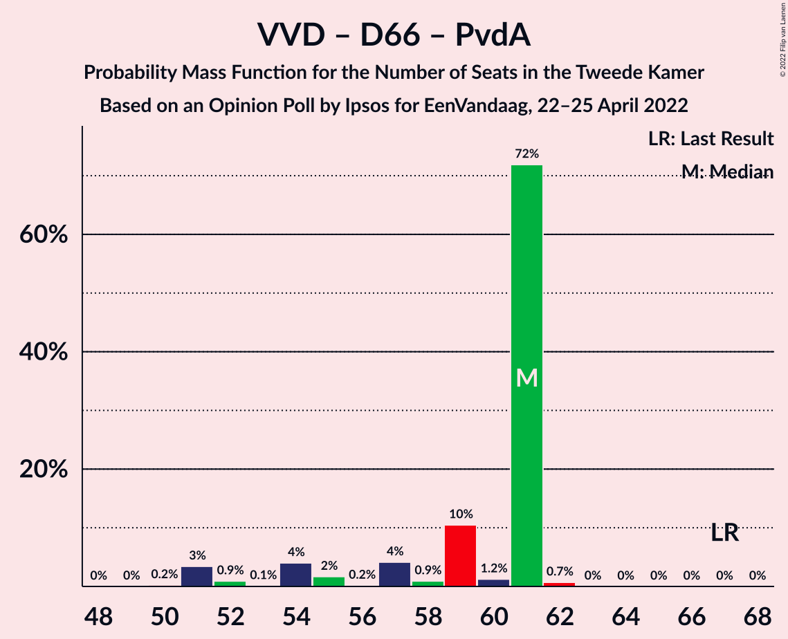

| Number of Seats | Probability | Accumulated | Special Marks |
|:---------------:|:-----------:|:-----------:|:-------------:|
| 50 | 0.2% | 100% |  |
| 51 | 3% | 99.7% |  |
| 52 | 0.9% | 96% |  |
| 53 | 0.1% | 95% |  |
| 54 | 4% | 95% |  |
| 55 | 2% | 91% |  |
| 56 | 0.2% | 90% |  |
| 57 | 4% | 89% |  |
| 58 | 0.9% | 85% |  |
| 59 | 10% | 84% |  |
| 60 | 1.2% | 74% |  |
| 61 | 72% | 73% | Median |
| 62 | 0.7% | 0.7% |  |
| 63 | 0% | 0% |  |
| 64 | 0% | 0% |  |
| 65 | 0% | 0% |  |
| 66 | 0% | 0% |  |
| 67 | 0% | 0% | Last Result |

### Volkspartij voor Vrijheid en Democratie – Democraten 66 – Christen-Democratisch Appèl

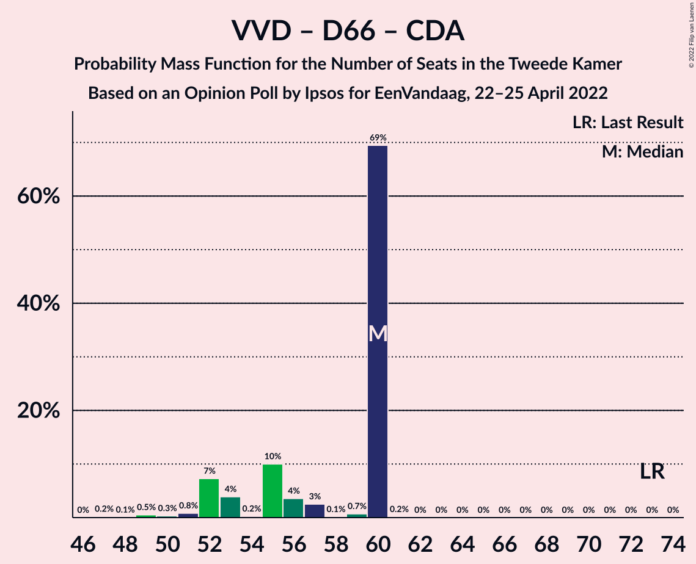

| Number of Seats | Probability | Accumulated | Special Marks |
|:---------------:|:-----------:|:-----------:|:-------------:|
| 47 | 0.2% | 100% |  |
| 48 | 0.1% | 99.8% |  |
| 49 | 0.5% | 99.7% |  |
| 50 | 0.3% | 99.2% |  |
| 51 | 0.8% | 98.9% |  |
| 52 | 7% | 98% |  |
| 53 | 4% | 91% |  |
| 54 | 0.2% | 87% |  |
| 55 | 10% | 87% |  |
| 56 | 4% | 77% |  |
| 57 | 3% | 73% |  |
| 58 | 0.1% | 71% |  |
| 59 | 0.7% | 70% |  |
| 60 | 69% | 70% | Median |
| 61 | 0.2% | 0.2% |  |
| 62 | 0% | 0% |  |
| 63 | 0% | 0% |  |
| 64 | 0% | 0% |  |
| 65 | 0% | 0% |  |
| 66 | 0% | 0% |  |
| 67 | 0% | 0% |  |
| 68 | 0% | 0% |  |
| 69 | 0% | 0% |  |
| 70 | 0% | 0% |  |
| 71 | 0% | 0% |  |
| 72 | 0% | 0% |  |
| 73 | 0% | 0% | Last Result |

### Democraten 66 – GroenLinks – Partij van de Arbeid – Christen-Democratisch Appèl – Socialistische Partij – ChristenUnie

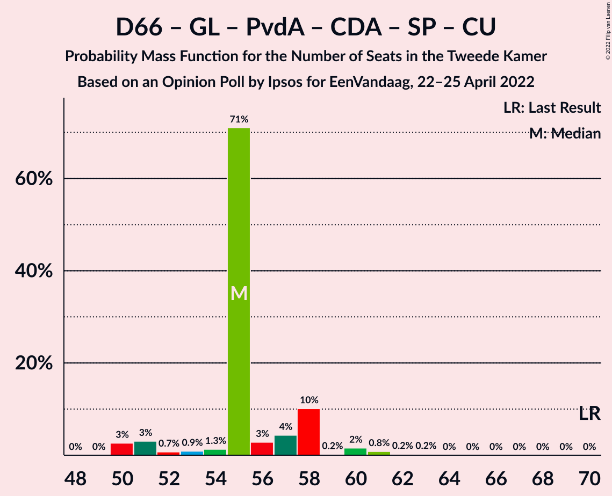

| Number of Seats | Probability | Accumulated | Special Marks |
|:---------------:|:-----------:|:-----------:|:-------------:|
| 50 | 3% | 100% |  |
| 51 | 3% | 97% |  |
| 52 | 0.7% | 94% |  |
| 53 | 0.9% | 94% |  |
| 54 | 1.3% | 93% |  |
| 55 | 71% | 91% | Median |
| 56 | 3% | 20% |  |
| 57 | 4% | 18% |  |
| 58 | 10% | 13% |  |
| 59 | 0.2% | 3% |  |
| 60 | 2% | 3% |  |
| 61 | 0.8% | 1.3% |  |
| 62 | 0.2% | 0.5% |  |
| 63 | 0.2% | 0.2% |  |
| 64 | 0% | 0% |  |
| 65 | 0% | 0% |  |
| 66 | 0% | 0% |  |
| 67 | 0% | 0% |  |
| 68 | 0% | 0% |  |
| 69 | 0% | 0% |  |
| 70 | 0% | 0% | Last Result |

### Volkspartij voor Vrijheid en Democratie – Partij voor de Vrijheid – Christen-Democratisch Appèl

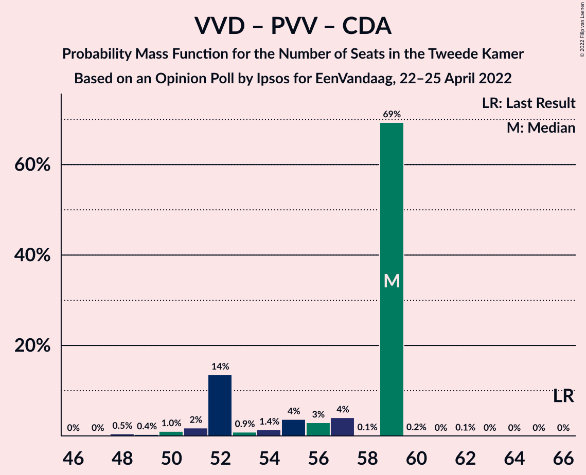

| Number of Seats | Probability | Accumulated | Special Marks |
|:---------------:|:-----------:|:-----------:|:-------------:|
| 48 | 0.5% | 100% |  |
| 49 | 0.4% | 99.5% |  |
| 50 | 1.0% | 99.2% |  |
| 51 | 2% | 98% |  |
| 52 | 14% | 96% |  |
| 53 | 0.9% | 83% |  |
| 54 | 1.4% | 82% |  |
| 55 | 4% | 81% |  |
| 56 | 3% | 77% |  |
| 57 | 4% | 74% |  |
| 58 | 0.1% | 70% |  |
| 59 | 69% | 70% | Median |
| 60 | 0.2% | 0.3% |  |
| 61 | 0% | 0.1% |  |
| 62 | 0.1% | 0.1% |  |
| 63 | 0% | 0% |  |
| 64 | 0% | 0% |  |
| 65 | 0% | 0% |  |
| 66 | 0% | 0% | Last Result |

### Volkspartij voor Vrijheid en Democratie – Christen-Democratisch Appèl – Forum voor Democratie – Staatkundig Gereformeerde Partij – 50Plus

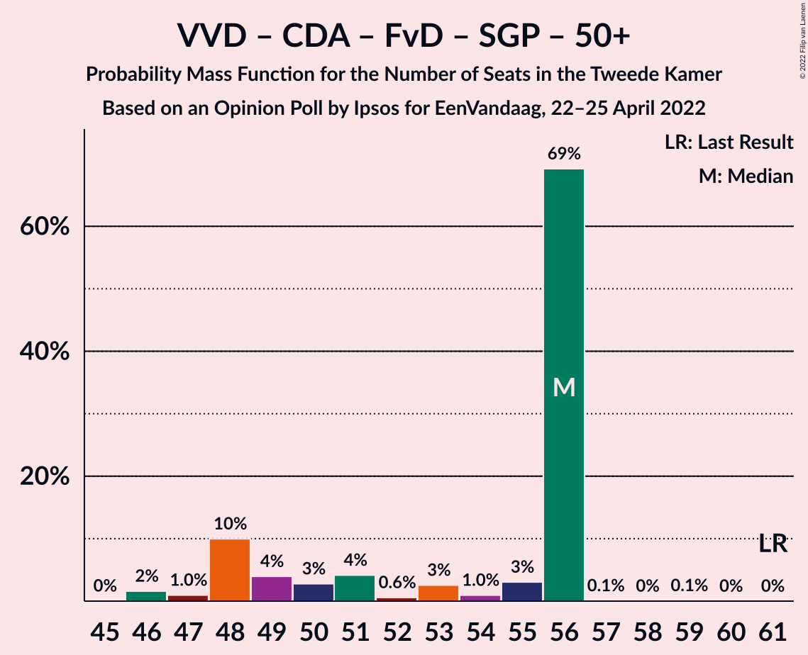

| Number of Seats | Probability | Accumulated | Special Marks |
|:---------------:|:-----------:|:-----------:|:-------------:|
| 46 | 2% | 100% |  |
| 47 | 1.0% | 98% |  |
| 48 | 10% | 97% |  |
| 49 | 4% | 87% |  |
| 50 | 3% | 83% |  |
| 51 | 4% | 81% |  |
| 52 | 0.6% | 77% |  |
| 53 | 3% | 76% |  |
| 54 | 1.0% | 73% |  |
| 55 | 3% | 72% |  |
| 56 | 69% | 69% | Median |
| 57 | 0.1% | 0.2% |  |
| 58 | 0% | 0.1% |  |
| 59 | 0.1% | 0.1% |  |
| 60 | 0% | 0% |  |
| 61 | 0% | 0% | Last Result |

### Volkspartij voor Vrijheid en Democratie – Christen-Democratisch Appèl – Forum voor Democratie – Staatkundig Gereformeerde Partij

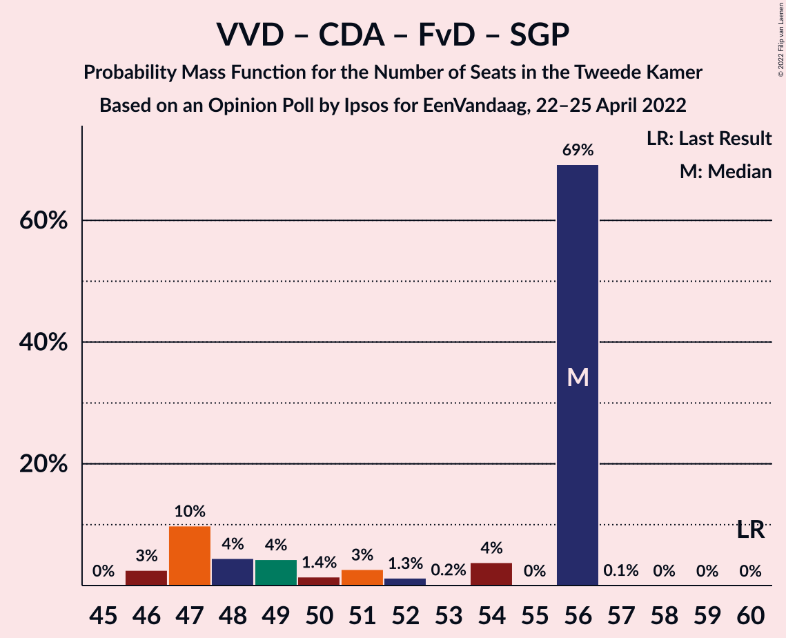

| Number of Seats | Probability | Accumulated | Special Marks |
|:---------------:|:-----------:|:-----------:|:-------------:|
| 45 | 0% | 100% |  |
| 46 | 3% | 99.9% |  |
| 47 | 10% | 97% |  |
| 48 | 4% | 88% |  |
| 49 | 4% | 83% |  |
| 50 | 1.4% | 79% |  |
| 51 | 3% | 77% |  |
| 52 | 1.3% | 75% |  |
| 53 | 0.2% | 73% |  |
| 54 | 4% | 73% |  |
| 55 | 0% | 69% |  |
| 56 | 69% | 69% | Median |
| 57 | 0.1% | 0.2% |  |
| 58 | 0% | 0% |  |
| 59 | 0% | 0% |  |
| 60 | 0% | 0% | Last Result |

### Volkspartij voor Vrijheid en Democratie – Partij van de Arbeid – Christen-Democratisch Appèl

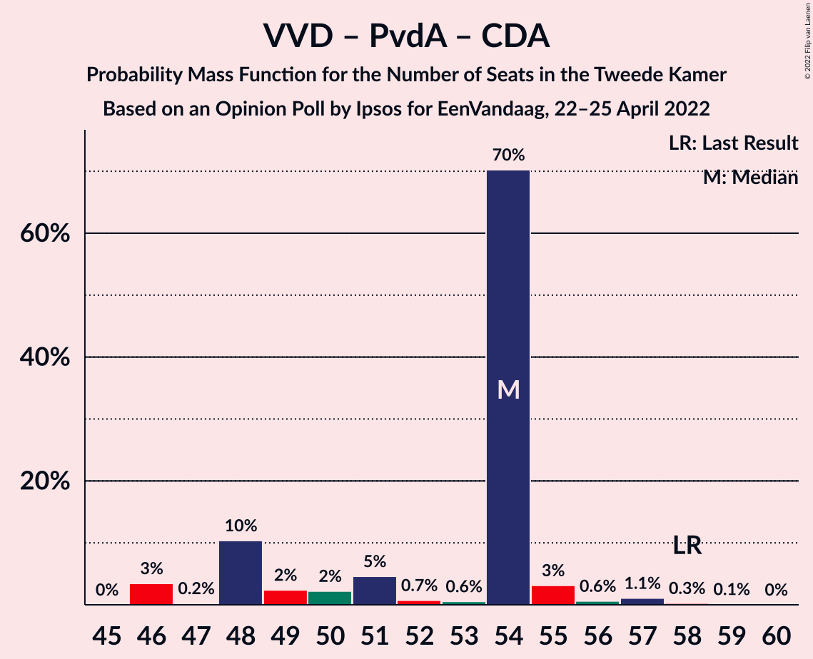

| Number of Seats | Probability | Accumulated | Special Marks |
|:---------------:|:-----------:|:-----------:|:-------------:|
| 46 | 3% | 100% |  |
| 47 | 0.2% | 97% |  |
| 48 | 10% | 96% |  |
| 49 | 2% | 86% |  |
| 50 | 2% | 84% |  |
| 51 | 5% | 81% |  |
| 52 | 0.7% | 77% |  |
| 53 | 0.6% | 76% |  |
| 54 | 70% | 75% | Median |
| 55 | 3% | 5% |  |
| 56 | 0.6% | 2% |  |
| 57 | 1.1% | 1.4% |  |
| 58 | 0.3% | 0.4% | Last Result |
| 59 | 0.1% | 0.1% |  |
| 60 | 0% | 0% |  |

### Democraten 66 – GroenLinks – Partij van de Arbeid – Christen-Democratisch Appèl – ChristenUnie

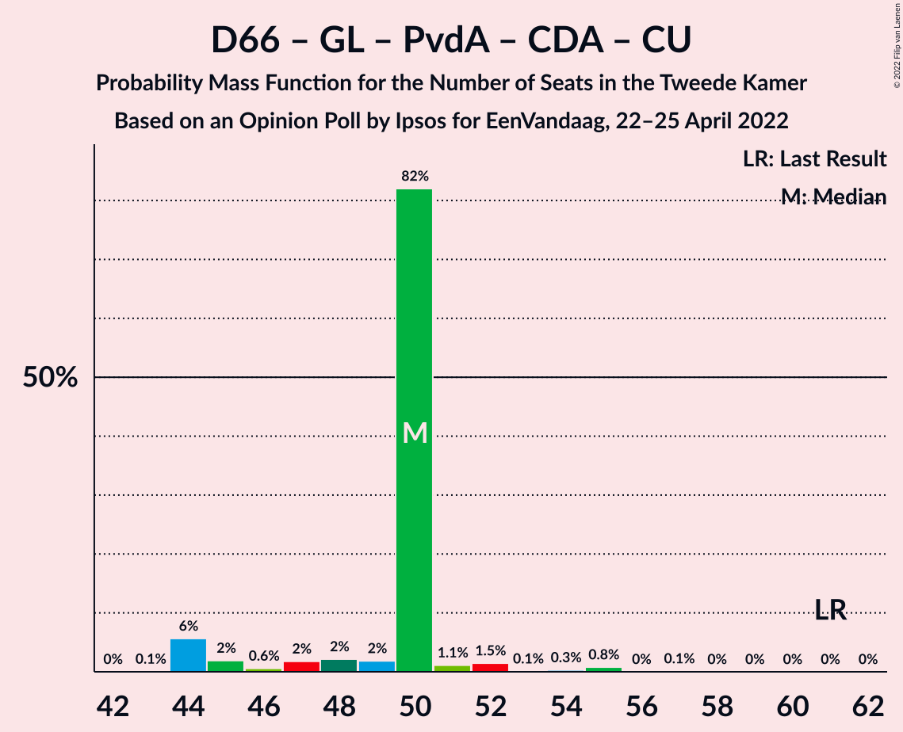

| Number of Seats | Probability | Accumulated | Special Marks |
|:---------------:|:-----------:|:-----------:|:-------------:|
| 43 | 0.1% | 100% |  |
| 44 | 6% | 99.9% |  |
| 45 | 2% | 94% |  |
| 46 | 0.6% | 92% |  |
| 47 | 2% | 92% |  |
| 48 | 2% | 90% |  |
| 49 | 2% | 88% |  |
| 50 | 82% | 86% | Median |
| 51 | 1.1% | 4% |  |
| 52 | 1.5% | 3% |  |
| 53 | 0.1% | 1.3% |  |
| 54 | 0.3% | 1.2% |  |
| 55 | 0.8% | 0.9% |  |
| 56 | 0% | 0.1% |  |
| 57 | 0.1% | 0.1% |  |
| 58 | 0% | 0% |  |
| 59 | 0% | 0% |  |
| 60 | 0% | 0% |  |
| 61 | 0% | 0% | Last Result |

### Volkspartij voor Vrijheid en Democratie – Christen-Democratisch Appèl – Forum voor Democratie – 50Plus

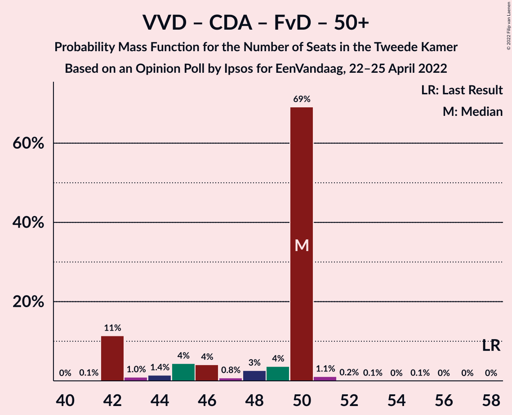

| Number of Seats | Probability | Accumulated | Special Marks |
|:---------------:|:-----------:|:-----------:|:-------------:|
| 41 | 0.1% | 100% |  |
| 42 | 11% | 99.9% |  |
| 43 | 1.0% | 88% |  |
| 44 | 1.4% | 88% |  |
| 45 | 4% | 86% |  |
| 46 | 4% | 82% |  |
| 47 | 0.8% | 78% |  |
| 48 | 3% | 77% |  |
| 49 | 4% | 74% |  |
| 50 | 69% | 71% | Median |
| 51 | 1.1% | 1.4% |  |
| 52 | 0.2% | 0.3% |  |
| 53 | 0.1% | 0.1% |  |
| 54 | 0% | 0.1% |  |
| 55 | 0.1% | 0.1% |  |
| 56 | 0% | 0% |  |
| 57 | 0% | 0% |  |
| 58 | 0% | 0% | Last Result |

### Volkspartij voor Vrijheid en Democratie – Christen-Democratisch Appèl – Forum voor Democratie

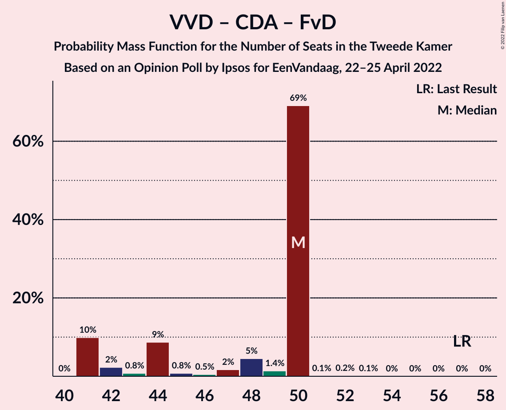

| Number of Seats | Probability | Accumulated | Special Marks |
|:---------------:|:-----------:|:-----------:|:-------------:|
| 41 | 10% | 100% |  |
| 42 | 2% | 90% |  |
| 43 | 0.8% | 88% |  |
| 44 | 9% | 87% |  |
| 45 | 0.8% | 78% |  |
| 46 | 0.5% | 78% |  |
| 47 | 2% | 77% |  |
| 48 | 5% | 75% |  |
| 49 | 1.4% | 71% |  |
| 50 | 69% | 69% | Median |
| 51 | 0.1% | 0.3% |  |
| 52 | 0.2% | 0.2% |  |
| 53 | 0.1% | 0.1% |  |
| 54 | 0% | 0% |  |
| 55 | 0% | 0% |  |
| 56 | 0% | 0% |  |
| 57 | 0% | 0% | Last Result |

### Volkspartij voor Vrijheid en Democratie – Partij van de Arbeid

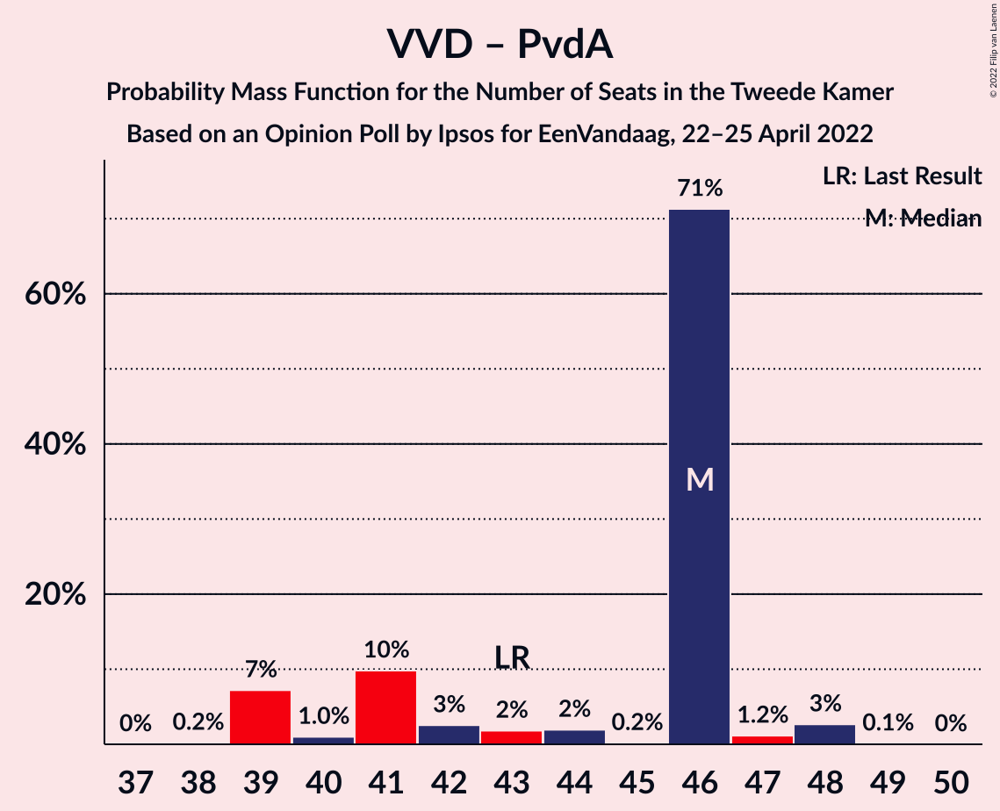

| Number of Seats | Probability | Accumulated | Special Marks |
|:---------------:|:-----------:|:-----------:|:-------------:|
| 38 | 0.2% | 100% |  |
| 39 | 7% | 99.8% |  |
| 40 | 1.0% | 93% |  |
| 41 | 10% | 92% |  |
| 42 | 3% | 82% |  |
| 43 | 2% | 79% | Last Result |
| 44 | 2% | 77% |  |
| 45 | 0.2% | 75% |  |
| 46 | 71% | 75% | Median |
| 47 | 1.2% | 4% |  |
| 48 | 3% | 3% |  |
| 49 | 0.1% | 0.1% |  |
| 50 | 0% | 0% |  |

### Volkspartij voor Vrijheid en Democratie – Christen-Democratisch Appèl

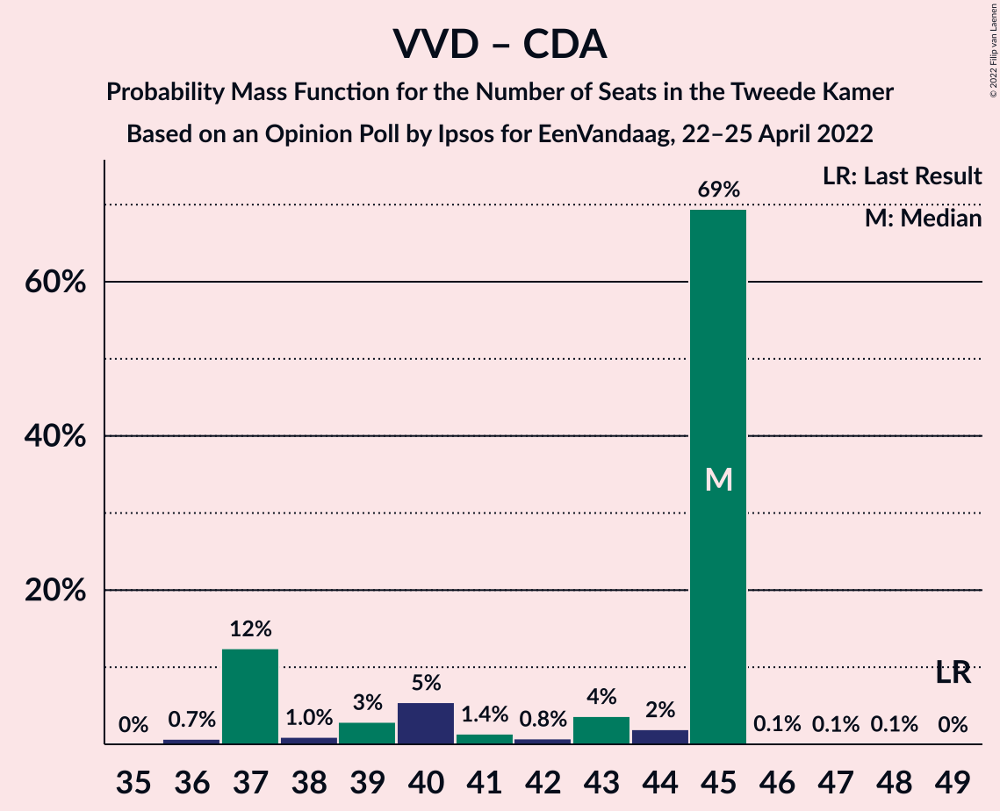

| Number of Seats | Probability | Accumulated | Special Marks |
|:---------------:|:-----------:|:-----------:|:-------------:|
| 36 | 0.7% | 100% |  |
| 37 | 12% | 99.3% |  |
| 38 | 1.0% | 87% |  |
| 39 | 3% | 86% |  |
| 40 | 5% | 83% |  |
| 41 | 1.4% | 78% |  |
| 42 | 0.8% | 76% |  |
| 43 | 4% | 75% |  |
| 44 | 2% | 72% |  |
| 45 | 69% | 70% | Median |
| 46 | 0.1% | 0.3% |  |
| 47 | 0.1% | 0.2% |  |
| 48 | 0.1% | 0.1% |  |
| 49 | 0% | 0% | Last Result |

### Democraten 66 – Partij van de Arbeid – Christen-Democratisch Appèl

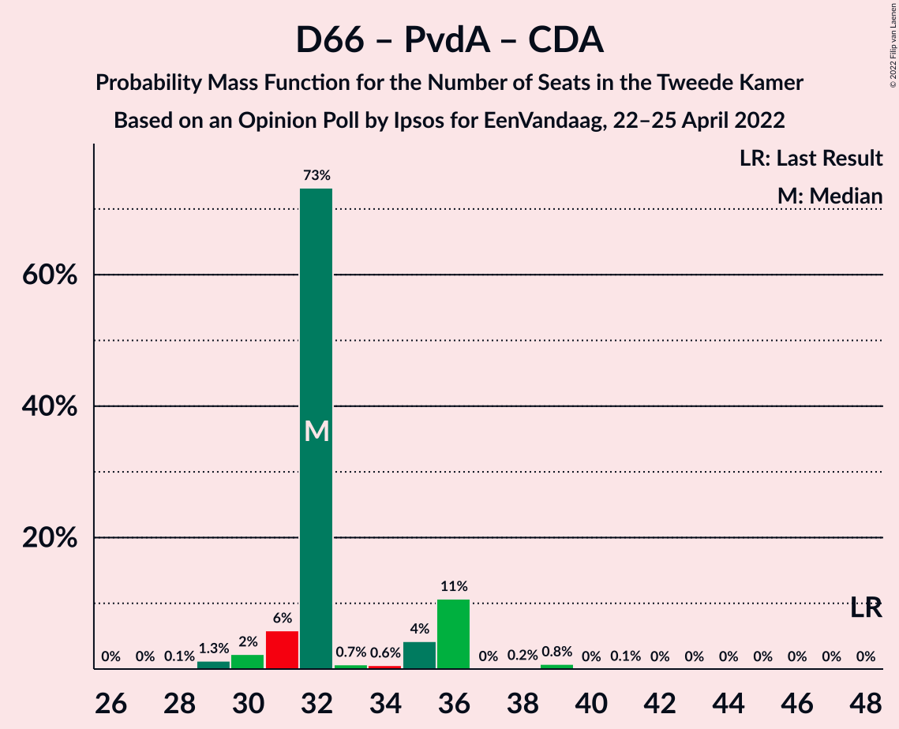

| Number of Seats | Probability | Accumulated | Special Marks |
|:---------------:|:-----------:|:-----------:|:-------------:|
| 28 | 0.1% | 100% |  |
| 29 | 1.3% | 99.9% |  |
| 30 | 2% | 98.6% |  |
| 31 | 6% | 96% |  |
| 32 | 73% | 91% | Median |
| 33 | 0.7% | 17% |  |
| 34 | 0.6% | 17% |  |
| 35 | 4% | 16% |  |
| 36 | 11% | 12% |  |
| 37 | 0% | 1.1% |  |
| 38 | 0.2% | 1.1% |  |
| 39 | 0.8% | 0.8% |  |
| 40 | 0% | 0.1% |  |
| 41 | 0.1% | 0.1% |  |
| 42 | 0% | 0% |  |
| 43 | 0% | 0% |  |
| 44 | 0% | 0% |  |
| 45 | 0% | 0% |  |
| 46 | 0% | 0% |  |
| 47 | 0% | 0% |  |
| 48 | 0% | 0% | Last Result |

### Partij van de Arbeid – Christen-Democratisch Appèl – ChristenUnie

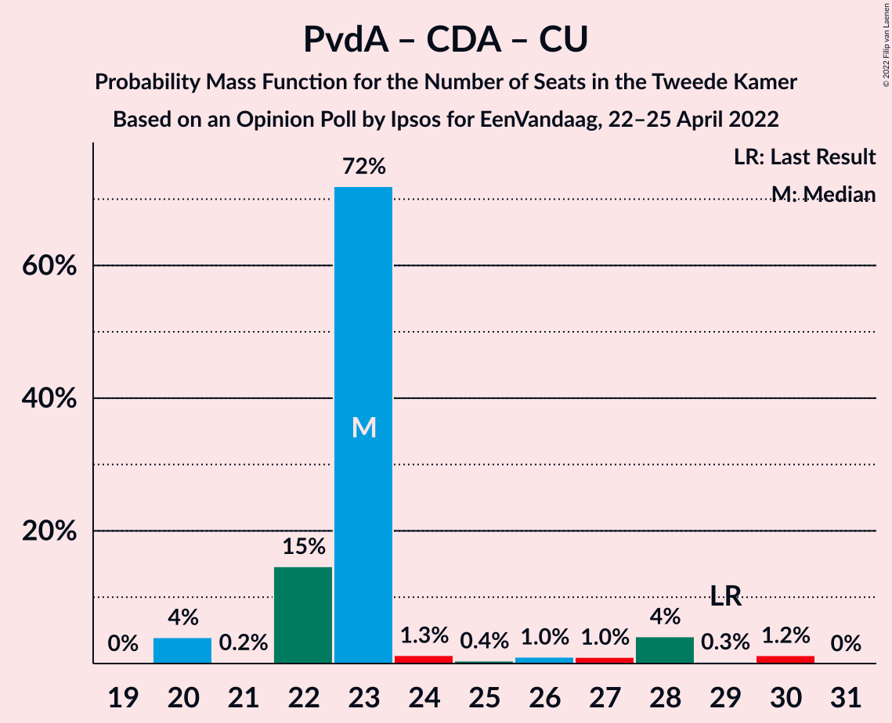

| Number of Seats | Probability | Accumulated | Special Marks |
|:---------------:|:-----------:|:-----------:|:-------------:|
| 20 | 4% | 100% |  |
| 21 | 0.2% | 96% |  |
| 22 | 15% | 96% |  |
| 23 | 72% | 81% | Median |
| 24 | 1.3% | 9% |  |
| 25 | 0.4% | 8% |  |
| 26 | 1.0% | 8% |  |
| 27 | 1.0% | 7% |  |
| 28 | 4% | 6% |  |
| 29 | 0.3% | 2% | Last Result |
| 30 | 1.2% | 1.3% |  |
| 31 | 0% | 0% |  |

### Democraten 66 – Christen-Democratisch Appèl

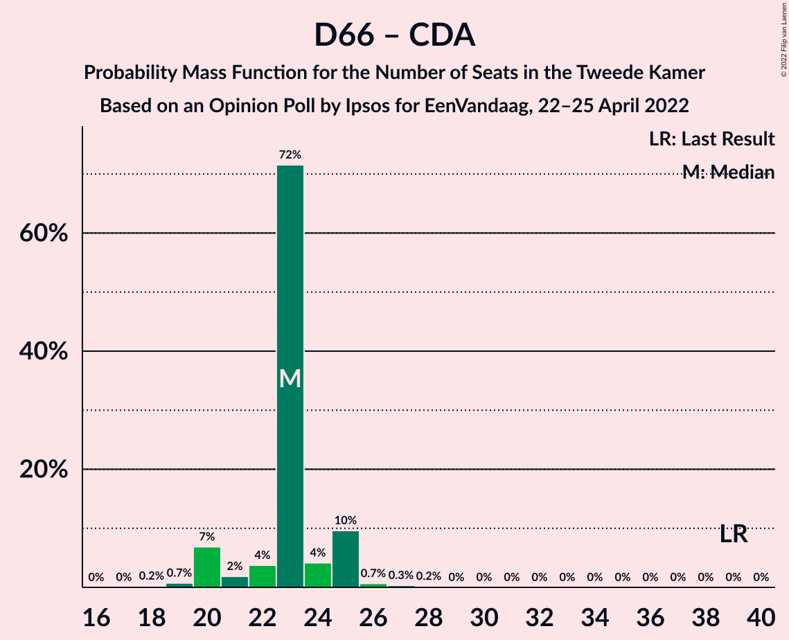

| Number of Seats | Probability | Accumulated | Special Marks |
|:---------------:|:-----------:|:-----------:|:-------------:|
| 18 | 0.2% | 100% |  |
| 19 | 0.7% | 99.8% |  |
| 20 | 7% | 99.0% |  |
| 21 | 2% | 92% |  |
| 22 | 4% | 90% |  |
| 23 | 72% | 87% | Median |
| 24 | 4% | 15% |  |
| 25 | 10% | 11% |  |
| 26 | 0.7% | 1.2% |  |
| 27 | 0.3% | 0.5% |  |
| 28 | 0.2% | 0.2% |  |
| 29 | 0% | 0% |  |
| 30 | 0% | 0% |  |
| 31 | 0% | 0% |  |
| 32 | 0% | 0% |  |
| 33 | 0% | 0% |  |
| 34 | 0% | 0% |  |
| 35 | 0% | 0% |  |
| 36 | 0% | 0% |  |
| 37 | 0% | 0% |  |
| 38 | 0% | 0% |  |
| 39 | 0% | 0% | Last Result |

### Partij van de Arbeid – Christen-Democratisch Appèl

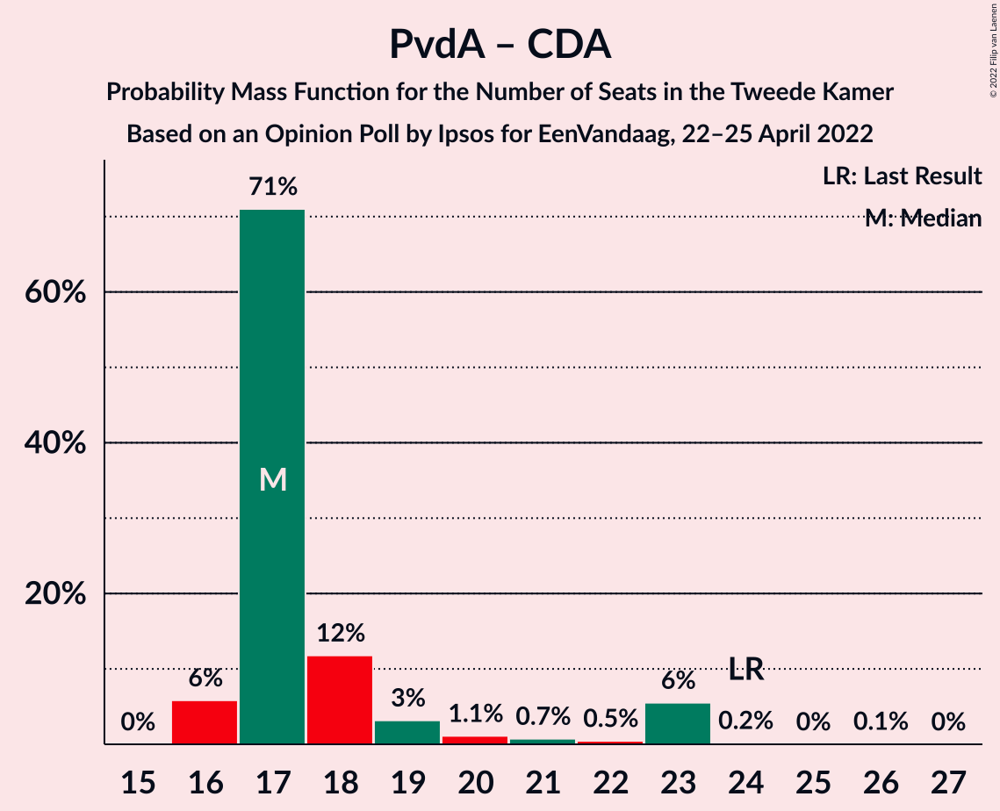

| Number of Seats | Probability | Accumulated | Special Marks |
|:---------------:|:-----------:|:-----------:|:-------------:|
| 16 | 6% | 100% |  |
| 17 | 71% | 94% | Median |
| 18 | 12% | 23% |  |
| 19 | 3% | 11% |  |
| 20 | 1.1% | 8% |  |
| 21 | 0.7% | 7% |  |
| 22 | 0.5% | 6% |  |
| 23 | 6% | 6% |  |
| 24 | 0.2% | 0.3% | Last Result |
| 25 | 0% | 0.1% |  |
| 26 | 0.1% | 0.1% |  |
| 27 | 0% | 0% |  |

## Technical Information

### Opinion Poll

+ **Polling firm:** Ipsos
+ **Commissioner(s):** EenVandaag
+ **Fieldwork period:** 22–25 April 2022

### Calculations

+ **Sample size:** 1013
+ **Simulations done:** 1,048,576
+ **Error estimate:** 3.67%

