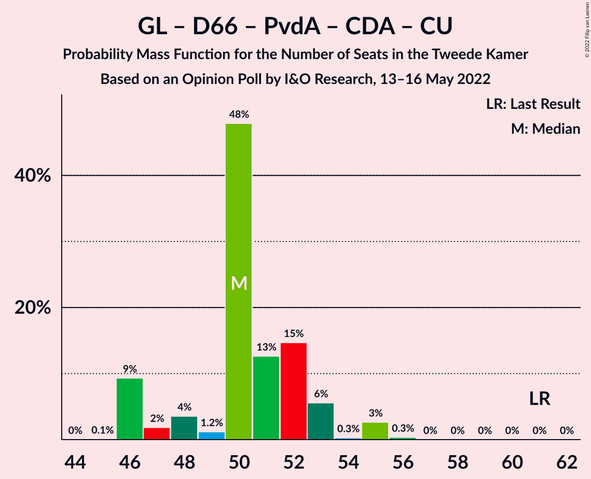
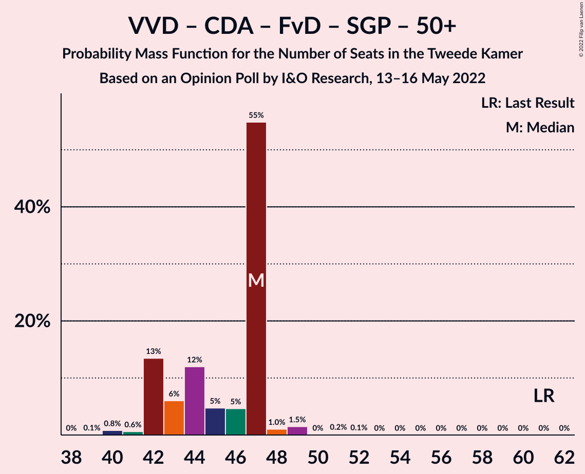

# Opinion Poll by I&O Research, 13–16 May 2022

<a href="#voting-intentions">Voting Intentions</a> | <a href="#seats">Seats</a> | <a href="#coalitions">Coalitions</a> | <a href="#technical-information">Technical Information</a>

## Voting Intentions

### Confidence Intervals

| Party | Last Result | Poll Result | 80% Confidence Interval | 90% Confidence Interval | 95% Confidence Interval | 99% Confidence Interval |
|:-----:|:-----------:|:-----------:|:-----------------------:|:-----------------------:|:-----------------------:|:-----------------------:|
| Volkspartij voor Vrijheid en Democratie | 21.9% | 17.4% | 16.2–18.6% |15.9–19.0% |15.6–19.3% |15.1–19.9% |
| Partij voor de Vrijheid | 10.8% | 9.7% | 8.8–10.7% |8.6–11.0% |8.4–11.2% |8.0–11.8% |
| GroenLinks | 5.2% | 8.7% | 7.9–9.6% |7.6–9.9% |7.4–10.2% |7.0–10.6% |
| Democraten 66 | 15.0% | 8.3% | 7.5–9.3% |7.3–9.5% |7.1–9.8% |6.7–10.2% |
| Partij van de Arbeid | 5.7% | 6.7% | 6.0–7.6% |5.8–7.8% |5.6–8.0% |5.3–8.4% |
| Juiste Antwoord 2021 | 2.4% | 6.6% | 5.9–7.4% |5.7–7.7% |5.5–7.9% |5.2–8.3% |
| BoerBurgerBeweging | 1.0% | 5.5% | 4.8–6.3% |4.6–6.5% |4.5–6.7% |4.2–7.1% |
| Socialistische Partij | 6.0% | 5.3% | 4.7–6.1% |4.5–6.3% |4.3–6.5% |4.0–6.9% |
| Partij voor de Dieren | 3.8% | 5.3% | 4.7–6.1% |4.5–6.3% |4.3–6.5% |4.0–6.9% |
| Christen-Democratisch Appèl | 9.5% | 5.2% | 4.6–6.0% |4.4–6.2% |4.2–6.4% |3.9–6.8% |
| ChristenUnie | 3.4% | 4.1% | 3.5–4.8% |3.4–5.0% |3.2–5.2% |3.0–5.5% |
| Forum voor Democratie | 5.0% | 3.3% | 2.8–4.0% |2.7–4.1% |2.6–4.3% |2.3–4.6% |
| Volt Europa | 2.4% | 3.3% | 2.8–4.0% |2.7–4.1% |2.6–4.3% |2.3–4.6% |
| Staatkundig Gereformeerde Partij | 2.1% | 2.7% | 2.3–3.3% |2.1–3.5% |2.0–3.6% |1.8–3.9% |
| DENK | 2.0% | 2.1% | 1.7–2.7% |1.6–2.8% |1.5–2.9% |1.4–3.2% |
| Bij1 | 0.8% | 1.0% | 0.8–1.4% |0.7–1.5% |0.6–1.6% |0.5–1.9% |
| Belang van Nederland | 0.0% | 1.0% | 0.8–1.4% |0.7–1.5% |0.6–1.6% |0.5–1.9% |
| 50Plus | 1.0% | 0.7% | 0.5–1.1% |0.5–1.2% |0.4–1.3% |0.3–1.5% |

*Note:* The poll result column reflects the actual value used in the calculations. Published results may vary slightly, and in addition be rounded to fewer digits.

## Seats

### Confidence Intervals

| Party | Last Result | Median | 80% Confidence Interval | 90% Confidence Interval | 95% Confidence Interval | 99% Confidence Interval |
|:-----:|:-----------:|:------:|:-----------------------:|:-----------------------:|:-----------------------:|:-----------------------:|
| <a href="#volkspartij-voor-vrijheid-en-democratie">Volkspartij voor Vrijheid en Democratie</a> | 34 | 28 | 25–28 |25–29 |25–30 |23–31 |
| <a href="#partij-voor-de-vrijheid">Partij voor de Vrijheid</a> | 17 | 12 | 11–17 |11–17 |11–17 |11–18 |
| <a href="#groenlinks">GroenLinks</a> | 8 | 13 | 12–14 |12–15 |11–15 |10–16 |
| <a href="#democraten-66">Democraten 66</a> | 24 | 11 | 11–16 |11–16 |11–16 |10–16 |
| <a href="#partij-van-de-arbeid">Partij van de Arbeid</a> | 9 | 11 | 8–12 |8–12 |8–12 |8–13 |
| <a href="#juiste-antwoord-2021">Juiste Antwoord 2021</a> | 3 | 9 | 9–10 |9–11 |9–12 |8–13 |
| <a href="#boerburgerbeweging">BoerBurgerBeweging</a> | 1 | 8 | 7–10 |7–11 |7–11 |7–12 |
| <a href="#socialistische-partij">Socialistische Partij</a> | 9 | 9 | 7–9 |5–9 |5–9 |5–9 |
| <a href="#partij-voor-de-dieren">Partij voor de Dieren</a> | 6 | 9 | 7–9 |7–10 |7–10 |6–10 |
| <a href="#christen-democratisch-appèl">Christen-Democratisch Appèl</a> | 15 | 9 | 6–9 |6–10 |6–10 |6–10 |
| <a href="#christenunie">ChristenUnie</a> | 5 | 6 | 6–7 |6–7 |5–7 |4–8 |
| <a href="#forum-voor-democratie">Forum voor Democratie</a> | 8 | 4 | 4–6 |4–7 |3–7 |3–7 |
| <a href="#volt-europa">Volt Europa</a> | 3 | 5 | 4–6 |4–6 |3–6 |3–8 |
| <a href="#staatkundig-gereformeerde-partij">Staatkundig Gereformeerde Partij</a> | 3 | 5 | 4–5 |3–5 |3–5 |3–5 |
| <a href="#denk">DENK</a> | 3 | 3 | 3 |2–3 |2–4 |2–4 |
| <a href="#bij1">Bij1</a> | 1 | 1 | 1 |0–1 |0–2 |0–2 |
| <a href="#belang-van-nederland">Belang van Nederland</a> | 0 | 1 | 1 |1–2 |1–2 |0–2 |
| <a href="#50plus">50Plus</a> | 1 | 1 | 0–1 |0–1 |0–2 |0–2 |

### Volkspartij voor Vrijheid en Democratie

*For a full overview of the results for this party, see the [Volkspartij voor Vrijheid en Democratie](party-volkspartijvoorvrijheidendemocratie.html) page.*

| Number of Seats | Probability | Accumulated | Special Marks |
|:---------------:|:-----------:|:-----------:|:-------------:|
| 21 | 0.5% | 100% |  |
| 22 | 0% | 99.5% |  |
| 23 | 0.2% | 99.5% |  |
| 24 | 1.0% | 99.4% |  |
| 25 | 26% | 98% |  |
| 26 | 10% | 72% |  |
| 27 | 7% | 62% |  |
| 28 | 47% | 54% | Median |
| 29 | 3% | 7% |  |
| 30 | 3% | 4% |  |
| 31 | 0.9% | 1.0% |  |
| 32 | 0% | 0% |  |
| 33 | 0% | 0% |  |
| 34 | 0% | 0% | Last Result |

### Partij voor de Vrijheid

*For a full overview of the results for this party, see the [Partij voor de Vrijheid](party-partijvoordevrijheid.html) page.*

| Number of Seats | Probability | Accumulated | Special Marks |
|:---------------:|:-----------:|:-----------:|:-------------:|
| 11 | 47% | 100% |  |
| 12 | 7% | 53% | Median |
| 13 | 8% | 47% |  |
| 14 | 18% | 39% |  |
| 15 | 4% | 21% |  |
| 16 | 2% | 17% |  |
| 17 | 14% | 15% | Last Result |
| 18 | 0.9% | 1.1% |  |
| 19 | 0.2% | 0.2% |  |
| 20 | 0% | 0% |  |

### GroenLinks

*For a full overview of the results for this party, see the [GroenLinks](party-groenlinks.html) page.*

| Number of Seats | Probability | Accumulated | Special Marks |
|:---------------:|:-----------:|:-----------:|:-------------:|
| 8 | 0% | 100% | Last Result |
| 9 | 0% | 100% |  |
| 10 | 2% | 100% |  |
| 11 | 0.7% | 98% |  |
| 12 | 17% | 97% |  |
| 13 | 63% | 80% | Median |
| 14 | 10% | 17% |  |
| 15 | 5% | 7% |  |
| 16 | 2% | 2% |  |
| 17 | 0% | 0% |  |

### Democraten 66

*For a full overview of the results for this party, see the [Democraten 66](party-democraten66.html) page.*

| Number of Seats | Probability | Accumulated | Special Marks |
|:---------------:|:-----------:|:-----------:|:-------------:|
| 9 | 0.2% | 100% |  |
| 10 | 0.4% | 99.8% |  |
| 11 | 64% | 99.4% | Median |
| 12 | 10% | 35% |  |
| 13 | 6% | 25% |  |
| 14 | 1.1% | 19% |  |
| 15 | 5% | 18% |  |
| 16 | 13% | 13% |  |
| 17 | 0% | 0% |  |
| 18 | 0% | 0% |  |
| 19 | 0% | 0% |  |
| 20 | 0% | 0% |  |
| 21 | 0% | 0% |  |
| 22 | 0% | 0% |  |
| 23 | 0% | 0% |  |
| 24 | 0% | 0% | Last Result |

### Partij van de Arbeid

*For a full overview of the results for this party, see the [Partij van de Arbeid](party-partijvandearbeid.html) page.*

| Number of Seats | Probability | Accumulated | Special Marks |
|:---------------:|:-----------:|:-----------:|:-------------:|
| 7 | 0.1% | 100% |  |
| 8 | 10% | 99.9% |  |
| 9 | 9% | 89% | Last Result |
| 10 | 14% | 81% |  |
| 11 | 54% | 67% | Median |
| 12 | 12% | 13% |  |
| 13 | 1.0% | 1.1% |  |
| 14 | 0.1% | 0.1% |  |
| 15 | 0% | 0% |  |

### Juiste Antwoord 2021

*For a full overview of the results for this party, see the [Juiste Antwoord 2021](party-juisteantwoord2021.html) page.*

| Number of Seats | Probability | Accumulated | Special Marks |
|:---------------:|:-----------:|:-----------:|:-------------:|
| 3 | 0% | 100% | Last Result |
| 4 | 0% | 100% |  |
| 5 | 0% | 100% |  |
| 6 | 0% | 100% |  |
| 7 | 0.1% | 100% |  |
| 8 | 1.0% | 99.9% |  |
| 9 | 60% | 98.9% | Median |
| 10 | 30% | 38% |  |
| 11 | 4% | 9% |  |
| 12 | 2% | 4% |  |
| 13 | 2% | 2% |  |
| 14 | 0% | 0% |  |

### BoerBurgerBeweging

*For a full overview of the results for this party, see the [BoerBurgerBeweging](party-boerburgerbeweging.html) page.*

| Number of Seats | Probability | Accumulated | Special Marks |
|:---------------:|:-----------:|:-----------:|:-------------:|
| 1 | 0% | 100% | Last Result |
| 2 | 0% | 100% |  |
| 3 | 0% | 100% |  |
| 4 | 0% | 100% |  |
| 5 | 0% | 100% |  |
| 6 | 0.2% | 100% |  |
| 7 | 13% | 99.8% |  |
| 8 | 52% | 87% | Median |
| 9 | 22% | 35% |  |
| 10 | 5% | 13% |  |
| 11 | 6% | 8% |  |
| 12 | 2% | 2% |  |
| 13 | 0% | 0% |  |

### Socialistische Partij

*For a full overview of the results for this party, see the [Socialistische Partij](party-socialistischepartij.html) page.*

| Number of Seats | Probability | Accumulated | Special Marks |
|:---------------:|:-----------:|:-----------:|:-------------:|
| 5 | 5% | 100% |  |
| 6 | 0.4% | 95% |  |
| 7 | 39% | 94% |  |
| 8 | 2% | 56% |  |
| 9 | 53% | 53% | Last Result, Median |
| 10 | 0.1% | 0.3% |  |
| 11 | 0.2% | 0.2% |  |
| 12 | 0% | 0% |  |

### Partij voor de Dieren

*For a full overview of the results for this party, see the [Partij voor de Dieren](party-partijvoordedieren.html) page.*

| Number of Seats | Probability | Accumulated | Special Marks |
|:---------------:|:-----------:|:-----------:|:-------------:|
| 5 | 0.4% | 100% |  |
| 6 | 1.0% | 99.6% | Last Result |
| 7 | 17% | 98.6% |  |
| 8 | 12% | 82% |  |
| 9 | 62% | 70% | Median |
| 10 | 8% | 8% |  |
| 11 | 0.1% | 0.2% |  |
| 12 | 0% | 0% |  |

### Christen-Democratisch Appèl

*For a full overview of the results for this party, see the [Christen-Democratisch Appèl](party-christen-democratischappèl.html) page.*

| Number of Seats | Probability | Accumulated | Special Marks |
|:---------------:|:-----------:|:-----------:|:-------------:|
| 5 | 0.3% | 100% |  |
| 6 | 16% | 99.7% |  |
| 7 | 2% | 84% |  |
| 8 | 11% | 81% |  |
| 9 | 63% | 70% | Median |
| 10 | 7% | 7% |  |
| 11 | 0.1% | 0.1% |  |
| 12 | 0% | 0% |  |
| 13 | 0% | 0% |  |
| 14 | 0% | 0% |  |
| 15 | 0% | 0% | Last Result |

### ChristenUnie

*For a full overview of the results for this party, see the [ChristenUnie](party-christenunie.html) page.*

| Number of Seats | Probability | Accumulated | Special Marks |
|:---------------:|:-----------:|:-----------:|:-------------:|
| 4 | 2% | 100% |  |
| 5 | 3% | 98% | Last Result |
| 6 | 71% | 95% | Median |
| 7 | 23% | 25% |  |
| 8 | 2% | 2% |  |
| 9 | 0% | 0% |  |

### Forum voor Democratie

*For a full overview of the results for this party, see the [Forum voor Democratie](party-forumvoordemocratie.html) page.*

| Number of Seats | Probability | Accumulated | Special Marks |
|:---------------:|:-----------:|:-----------:|:-------------:|
| 3 | 3% | 100% |  |
| 4 | 55% | 97% | Median |
| 5 | 18% | 41% |  |
| 6 | 15% | 23% |  |
| 7 | 8% | 8% |  |
| 8 | 0% | 0% | Last Result |

### Volt Europa

*For a full overview of the results for this party, see the [Volt Europa](party-volteuropa.html) page.*

| Number of Seats | Probability | Accumulated | Special Marks |
|:---------------:|:-----------:|:-----------:|:-------------:|
| 3 | 4% | 100% | Last Result |
| 4 | 27% | 96% |  |
| 5 | 20% | 69% | Median |
| 6 | 47% | 49% |  |
| 7 | 0.6% | 2% |  |
| 8 | 1.0% | 1.0% |  |
| 9 | 0% | 0% |  |

### Staatkundig Gereformeerde Partij

*For a full overview of the results for this party, see the [Staatkundig Gereformeerde Partij](party-staatkundiggereformeerdepartij.html) page.*

| Number of Seats | Probability | Accumulated | Special Marks |
|:---------------:|:-----------:|:-----------:|:-------------:|
| 2 | 0.2% | 100% |  |
| 3 | 6% | 99.8% | Last Result |
| 4 | 27% | 94% |  |
| 5 | 67% | 67% | Median |
| 6 | 0.2% | 0.2% |  |
| 7 | 0% | 0% |  |

### DENK

*For a full overview of the results for this party, see the [DENK](party-denk.html) page.*

| Number of Seats | Probability | Accumulated | Special Marks |
|:---------------:|:-----------:|:-----------:|:-------------:|
| 1 | 0.2% | 100% |  |
| 2 | 10% | 99.8% |  |
| 3 | 86% | 90% | Last Result, Median |
| 4 | 3% | 4% |  |
| 5 | 0.2% | 0.2% |  |
| 6 | 0% | 0% |  |

### Bij1

*For a full overview of the results for this party, see the [Bij1](party-bij1.html) page.*

| Number of Seats | Probability | Accumulated | Special Marks |
|:---------------:|:-----------:|:-----------:|:-------------:|
| 0 | 6% | 100% |  |
| 1 | 90% | 94% | Last Result, Median |
| 2 | 4% | 4% |  |
| 3 | 0.2% | 0.2% |  |
| 4 | 0% | 0% |  |

### Belang van Nederland

*For a full overview of the results for this party, see the [Belang van Nederland](party-belangvannederland.html) page.*

| Number of Seats | Probability | Accumulated | Special Marks |
|:---------------:|:-----------:|:-----------:|:-------------:|
| 0 | 2% | 100% | Last Result |
| 1 | 91% | 98% | Median |
| 2 | 7% | 7% |  |
| 3 | 0.2% | 0.2% |  |
| 4 | 0% | 0% |  |

### 50Plus

*For a full overview of the results for this party, see the [50Plus](party-50plus.html) page.*

| Number of Seats | Probability | Accumulated | Special Marks |
|:---------------:|:-----------:|:-----------:|:-------------:|
| 0 | 18% | 100% |  |
| 1 | 79% | 82% | Last Result, Median |
| 2 | 3% | 3% |  |
| 3 | 0% | 0% |  |

## Coalitions

### Confidence Intervals

| Coalition | Last Result | Median | Majority? | 80% Confidence Interval | 90% Confidence Interval | 95% Confidence Interval | 99% Confidence Interval |
|:---------:|:-----------:|:------:|:---------:|:-----------------------:|:-----------------------:|:-----------------------:|:-----------------------:|
| Volkspartij voor Vrijheid en Democratie – GroenLinks – Democraten 66 – Christen-Democratisch Appèl – ChristenUnie | 86 | 67 | 0% | 64–69 | 64–71 | 64–71 | 63–74 |
| Volkspartij voor Vrijheid en Democratie – Democraten 66 – Partij van de Arbeid – Christen-Democratisch Appèl – ChristenUnie | 87 | 65 | 0% | 61–65 | 60–67 | 60–68 | 57–70 |
| GroenLinks – Democraten 66 – Partij van de Arbeid – Socialistische Partij – Christen-Democratisch Appèl – ChristenUnie | 70 | 59 | 0% | 55–59 | 53–60 | 53–64 | 53–64 |
| Volkspartij voor Vrijheid en Democratie – Partij voor de Vrijheid – Christen-Democratisch Appèl – Forum voor Democratie – Staatkundig Gereformeerde Partij | 77 | 57 | 0% | 55–62 | 55–63 | 55–63 | 53–63 |
| Volkspartij voor Vrijheid en Democratie – Partij voor de Vrijheid – Christen-Democratisch Appèl – Forum voor Democratie | 74 | 52 | 0% | 51–59 | 50–59 | 50–59 | 50–59 |
| Volkspartij voor Vrijheid en Democratie – Democraten 66 – Christen-Democratisch Appèl – ChristenUnie | 78 | 54 | 0% | 52–56 | 50–56 | 50–57 | 48–58 |
| GroenLinks – Democraten 66 – Partij van de Arbeid – Christen-Democratisch Appèl – ChristenUnie | 61 | 50 | 0% | 47–52 | 46–53 | 46–55 | 46–55 |
| Volkspartij voor Vrijheid en Democratie – Partij voor de Vrijheid – Christen-Democratisch Appèl | 66 | 48 | 0% | 45–52 | 45–52 | 45–53 | 45–54 |
| Volkspartij voor Vrijheid en Democratie – Democraten 66 – Partij van de Arbeid | 67 | 50 | 0% | 48–51 | 45–52 | 45–53 | 44–55 |
| Volkspartij voor Vrijheid en Democratie – Democraten 66 – Christen-Democratisch Appèl | 73 | 48 | 0% | 46–49 | 44–50 | 44–51 | 42–51 |
| Volkspartij voor Vrijheid en Democratie – Christen-Democratisch Appèl – Forum voor Democratie – Staatkundig Gereformeerde Partij – 50Plus | 61 | 47 | 0% | 42–47 | 42–47 | 42–48 | 40–49 |
| Volkspartij voor Vrijheid en Democratie – Partij van de Arbeid – Christen-Democratisch Appèl | 58 | 47 | 0% | 41–48 | 41–48 | 41–48 | 40–51 |
| Volkspartij voor Vrijheid en Democratie – Christen-Democratisch Appèl – Forum voor Democratie – Staatkundig Gereformeerde Partij | 60 | 46 | 0% | 41–46 | 41–46 | 41–47 | 39–48 |
| Volkspartij voor Vrijheid en Democratie – Christen-Democratisch Appèl – Forum voor Democratie – 50Plus | 58 | 42 | 0% | 38–43 | 38–43 | 38–43 | 36–45 |
| Volkspartij voor Vrijheid en Democratie – Christen-Democratisch Appèl – Forum voor Democratie | 57 | 41 | 0% | 37–42 | 37–42 | 37–43 | 35–44 |
| Volkspartij voor Vrijheid en Democratie – Partij van de Arbeid | 43 | 39 | 0% | 35–39 | 34–39 | 34–40 | 32–42 |
| Volkspartij voor Vrijheid en Democratie – Christen-Democratisch Appèl | 49 | 37 | 0% | 31–37 | 31–37 | 31–38 | 30–39 |
| Democraten 66 – Partij van de Arbeid – Christen-Democratisch Appèl | 48 | 31 | 0% | 28–33 | 28–33 | 28–36 | 27–36 |
| Partij van de Arbeid – Christen-Democratisch Appèl – ChristenUnie | 29 | 26 | 0% | 23–26 | 23–27 | 22–28 | 21–28 |
| Democraten 66 – Christen-Democratisch Appèl | 39 | 20 | 0% | 19–22 | 19–23 | 19–25 | 18–25 |
| Partij van de Arbeid – Christen-Democratisch Appèl | 24 | 20 | 0% | 16–20 | 16–21 | 16–21 | 16–22 |

### Volkspartij voor Vrijheid en Democratie – GroenLinks – Democraten 66 – Christen-Democratisch Appèl – ChristenUnie

| Number of Seats | Probability | Accumulated | Special Marks |
|:---------------:|:-----------:|:-----------:|:-------------:|
| 61 | 0.2% | 100% |  |
| 62 | 0.2% | 99.8% |  |
| 63 | 0.9% | 99.6% |  |
| 64 | 20% | 98.7% |  |
| 65 | 0.4% | 79% |  |
| 66 | 4% | 78% |  |
| 67 | 59% | 74% | Median |
| 68 | 3% | 14% |  |
| 69 | 5% | 11% |  |
| 70 | 0.5% | 6% |  |
| 71 | 5% | 6% |  |
| 72 | 0% | 0.8% |  |
| 73 | 0% | 0.8% |  |
| 74 | 0.7% | 0.8% |  |
| 75 | 0.1% | 0.1% |  |
| 76 | 0% | 0% | Majority |
| 77 | 0% | 0% |  |
| 78 | 0% | 0% |  |
| 79 | 0% | 0% |  |
| 80 | 0% | 0% |  |
| 81 | 0% | 0% |  |
| 82 | 0% | 0% |  |
| 83 | 0% | 0% |  |
| 84 | 0% | 0% |  |
| 85 | 0% | 0% |  |
| 86 | 0% | 0% | Last Result |

### Volkspartij voor Vrijheid en Democratie – Democraten 66 – Partij van de Arbeid – Christen-Democratisch Appèl – ChristenUnie

| Number of Seats | Probability | Accumulated | Special Marks |
|:---------------:|:-----------:|:-----------:|:-------------:|
| 57 | 0.5% | 100% |  |
| 58 | 0.2% | 99.5% |  |
| 59 | 0% | 99.3% |  |
| 60 | 8% | 99.2% |  |
| 61 | 1.4% | 91% |  |
| 62 | 8% | 90% |  |
| 63 | 2% | 82% |  |
| 64 | 20% | 80% |  |
| 65 | 53% | 60% | Median |
| 66 | 2% | 7% |  |
| 67 | 1.1% | 5% |  |
| 68 | 3% | 4% |  |
| 69 | 0.4% | 1.0% |  |
| 70 | 0.5% | 0.6% |  |
| 71 | 0% | 0.2% |  |
| 72 | 0.1% | 0.1% |  |
| 73 | 0% | 0% |  |
| 74 | 0% | 0% |  |
| 75 | 0% | 0% |  |
| 76 | 0% | 0% | Majority |
| 77 | 0% | 0% |  |
| 78 | 0% | 0% |  |
| 79 | 0% | 0% |  |
| 80 | 0% | 0% |  |
| 81 | 0% | 0% |  |
| 82 | 0% | 0% |  |
| 83 | 0% | 0% |  |
| 84 | 0% | 0% |  |
| 85 | 0% | 0% |  |
| 86 | 0% | 0% |  |
| 87 | 0% | 0% | Last Result |

### GroenLinks – Democraten 66 – Partij van de Arbeid – Socialistische Partij – Christen-Democratisch Appèl – ChristenUnie

| Number of Seats | Probability | Accumulated | Special Marks |
|:---------------:|:-----------:|:-----------:|:-------------:|
| 53 | 9% | 100% |  |
| 54 | 0.4% | 91% |  |
| 55 | 4% | 91% |  |
| 56 | 0.3% | 86% |  |
| 57 | 3% | 86% |  |
| 58 | 18% | 83% |  |
| 59 | 60% | 66% | Median |
| 60 | 1.1% | 6% |  |
| 61 | 1.1% | 4% |  |
| 62 | 0% | 3% |  |
| 63 | 0.6% | 3% |  |
| 64 | 3% | 3% |  |
| 65 | 0% | 0% |  |
| 66 | 0% | 0% |  |
| 67 | 0% | 0% |  |
| 68 | 0% | 0% |  |
| 69 | 0% | 0% |  |
| 70 | 0% | 0% | Last Result |

### Volkspartij voor Vrijheid en Democratie – Partij voor de Vrijheid – Christen-Democratisch Appèl – Forum voor Democratie – Staatkundig Gereformeerde Partij

| Number of Seats | Probability | Accumulated | Special Marks |
|:---------------:|:-----------:|:-----------:|:-------------:|
| 53 | 0.8% | 100% |  |
| 54 | 0% | 99.2% |  |
| 55 | 19% | 99.1% |  |
| 56 | 4% | 80% |  |
| 57 | 48% | 75% |  |
| 58 | 2% | 28% | Median |
| 59 | 6% | 26% |  |
| 60 | 4% | 19% |  |
| 61 | 5% | 16% |  |
| 62 | 0.8% | 11% |  |
| 63 | 10% | 10% |  |
| 64 | 0.3% | 0.3% |  |
| 65 | 0% | 0% |  |
| 66 | 0% | 0% |  |
| 67 | 0% | 0% |  |
| 68 | 0% | 0% |  |
| 69 | 0% | 0% |  |
| 70 | 0% | 0% |  |
| 71 | 0% | 0% |  |
| 72 | 0% | 0% |  |
| 73 | 0% | 0% |  |
| 74 | 0% | 0% |  |
| 75 | 0% | 0% |  |
| 76 | 0% | 0% | Majority |
| 77 | 0% | 0% | Last Result |

### Volkspartij voor Vrijheid en Democratie – Partij voor de Vrijheid – Christen-Democratisch Appèl – Forum voor Democratie

| Number of Seats | Probability | Accumulated | Special Marks |
|:---------------:|:-----------:|:-----------:|:-------------:|
| 49 | 0% | 100% |  |
| 50 | 7% | 99.9% |  |
| 51 | 15% | 93% |  |
| 52 | 48% | 77% |  |
| 53 | 2% | 29% | Median |
| 54 | 4% | 27% |  |
| 55 | 3% | 23% |  |
| 56 | 7% | 19% |  |
| 57 | 2% | 13% |  |
| 58 | 0.4% | 10% |  |
| 59 | 10% | 10% |  |
| 60 | 0.2% | 0.2% |  |
| 61 | 0% | 0% |  |
| 62 | 0% | 0% |  |
| 63 | 0% | 0% |  |
| 64 | 0% | 0% |  |
| 65 | 0% | 0% |  |
| 66 | 0% | 0% |  |
| 67 | 0% | 0% |  |
| 68 | 0% | 0% |  |
| 69 | 0% | 0% |  |
| 70 | 0% | 0% |  |
| 71 | 0% | 0% |  |
| 72 | 0% | 0% |  |
| 73 | 0% | 0% |  |
| 74 | 0% | 0% | Last Result |

### Volkspartij voor Vrijheid en Democratie – Democraten 66 – Christen-Democratisch Appèl – ChristenUnie

| Number of Seats | Probability | Accumulated | Special Marks |
|:---------------:|:-----------:|:-----------:|:-------------:|
| 47 | 0.2% | 100% |  |
| 48 | 0.5% | 99.8% |  |
| 49 | 0.2% | 99.3% |  |
| 50 | 7% | 99.2% |  |
| 51 | 1.0% | 92% |  |
| 52 | 14% | 91% |  |
| 53 | 0.3% | 77% |  |
| 54 | 60% | 77% | Median |
| 55 | 5% | 16% |  |
| 56 | 6% | 11% |  |
| 57 | 3% | 4% |  |
| 58 | 0.9% | 1.2% |  |
| 59 | 0% | 0.3% |  |
| 60 | 0.1% | 0.3% |  |
| 61 | 0% | 0.1% |  |
| 62 | 0% | 0.1% |  |
| 63 | 0.1% | 0.1% |  |
| 64 | 0% | 0% |  |
| 65 | 0% | 0% |  |
| 66 | 0% | 0% |  |
| 67 | 0% | 0% |  |
| 68 | 0% | 0% |  |
| 69 | 0% | 0% |  |
| 70 | 0% | 0% |  |
| 71 | 0% | 0% |  |
| 72 | 0% | 0% |  |
| 73 | 0% | 0% |  |
| 74 | 0% | 0% |  |
| 75 | 0% | 0% |  |
| 76 | 0% | 0% | Majority |
| 77 | 0% | 0% |  |
| 78 | 0% | 0% | Last Result |

### GroenLinks – Democraten 66 – Partij van de Arbeid – Christen-Democratisch Appèl – ChristenUnie

| Number of Seats | Probability | Accumulated | Special Marks |
|:---------------:|:-----------:|:-----------:|:-------------:|
| 45 | 0.1% | 100% |  |
| 46 | 9% | 99.9% |  |
| 47 | 2% | 91% |  |
| 48 | 4% | 89% |  |
| 49 | 1.2% | 85% |  |
| 50 | 48% | 84% | Median |
| 51 | 13% | 36% |  |
| 52 | 15% | 24% |  |
| 53 | 6% | 9% |  |
| 54 | 0.3% | 3% |  |
| 55 | 3% | 3% |  |
| 56 | 0.3% | 0.4% |  |
| 57 | 0% | 0% |  |
| 58 | 0% | 0% |  |
| 59 | 0% | 0% |  |
| 60 | 0% | 0% |  |
| 61 | 0% | 0% | Last Result |

### Volkspartij voor Vrijheid en Democratie – Partij voor de Vrijheid – Christen-Democratisch Appèl

| Number of Seats | Probability | Accumulated | Special Marks |
|:---------------:|:-----------:|:-----------:|:-------------:|
| 43 | 0% | 100% |  |
| 44 | 0% | 99.9% |  |
| 45 | 19% | 99.9% |  |
| 46 | 1.2% | 81% |  |
| 47 | 1.2% | 80% |  |
| 48 | 51% | 79% |  |
| 49 | 2% | 27% | Median |
| 50 | 6% | 26% |  |
| 51 | 4% | 20% |  |
| 52 | 11% | 15% |  |
| 53 | 2% | 4% |  |
| 54 | 1.4% | 2% |  |
| 55 | 0.2% | 0.2% |  |
| 56 | 0% | 0% |  |
| 57 | 0% | 0% |  |
| 58 | 0% | 0% |  |
| 59 | 0% | 0% |  |
| 60 | 0% | 0% |  |
| 61 | 0% | 0% |  |
| 62 | 0% | 0% |  |
| 63 | 0% | 0% |  |
| 64 | 0% | 0% |  |
| 65 | 0% | 0% |  |
| 66 | 0% | 0% | Last Result |

### Volkspartij voor Vrijheid en Democratie – Democraten 66 – Partij van de Arbeid

| Number of Seats | Probability | Accumulated | Special Marks |
|:---------------:|:-----------:|:-----------:|:-------------:|
| 42 | 0.5% | 100% |  |
| 43 | 0% | 99.5% |  |
| 44 | 0.4% | 99.5% |  |
| 45 | 8% | 99.1% |  |
| 46 | 0.5% | 91% |  |
| 47 | 0.5% | 91% |  |
| 48 | 11% | 90% |  |
| 49 | 6% | 80% |  |
| 50 | 49% | 73% | Median |
| 51 | 18% | 24% |  |
| 52 | 1.3% | 5% |  |
| 53 | 3% | 4% |  |
| 54 | 0.7% | 1.5% |  |
| 55 | 0.7% | 0.7% |  |
| 56 | 0% | 0% |  |
| 57 | 0% | 0% |  |
| 58 | 0% | 0% |  |
| 59 | 0% | 0% |  |
| 60 | 0% | 0% |  |
| 61 | 0% | 0% |  |
| 62 | 0% | 0% |  |
| 63 | 0% | 0% |  |
| 64 | 0% | 0% |  |
| 65 | 0% | 0% |  |
| 66 | 0% | 0% |  |
| 67 | 0% | 0% | Last Result |

### Volkspartij voor Vrijheid en Democratie – Democraten 66 – Christen-Democratisch Appèl

| Number of Seats | Probability | Accumulated | Special Marks |
|:---------------:|:-----------:|:-----------:|:-------------:|
| 41 | 0.2% | 100% |  |
| 42 | 0.5% | 99.8% |  |
| 43 | 0.2% | 99.3% |  |
| 44 | 7% | 99.1% |  |
| 45 | 1.0% | 92% |  |
| 46 | 14% | 91% |  |
| 47 | 14% | 77% |  |
| 48 | 49% | 64% | Median |
| 49 | 7% | 14% |  |
| 50 | 4% | 7% |  |
| 51 | 3% | 3% |  |
| 52 | 0.1% | 0.3% |  |
| 53 | 0.1% | 0.2% |  |
| 54 | 0% | 0.1% |  |
| 55 | 0% | 0.1% |  |
| 56 | 0.1% | 0.1% |  |
| 57 | 0% | 0% |  |
| 58 | 0% | 0% |  |
| 59 | 0% | 0% |  |
| 60 | 0% | 0% |  |
| 61 | 0% | 0% |  |
| 62 | 0% | 0% |  |
| 63 | 0% | 0% |  |
| 64 | 0% | 0% |  |
| 65 | 0% | 0% |  |
| 66 | 0% | 0% |  |
| 67 | 0% | 0% |  |
| 68 | 0% | 0% |  |
| 69 | 0% | 0% |  |
| 70 | 0% | 0% |  |
| 71 | 0% | 0% |  |
| 72 | 0% | 0% |  |
| 73 | 0% | 0% | Last Result |

### Volkspartij voor Vrijheid en Democratie – Christen-Democratisch Appèl – Forum voor Democratie – Staatkundig Gereformeerde Partij – 50Plus

| Number of Seats | Probability | Accumulated | Special Marks |
|:---------------:|:-----------:|:-----------:|:-------------:|
| 39 | 0.1% | 100% |  |
| 40 | 0.8% | 99.9% |  |
| 41 | 0.6% | 99.1% |  |
| 42 | 13% | 98.5% |  |
| 43 | 6% | 85% |  |
| 44 | 12% | 79% |  |
| 45 | 5% | 67% |  |
| 46 | 5% | 62% |  |
| 47 | 55% | 58% | Median |
| 48 | 1.0% | 3% |  |
| 49 | 1.5% | 2% |  |
| 50 | 0% | 0.3% |  |
| 51 | 0.2% | 0.3% |  |
| 52 | 0.1% | 0.1% |  |
| 53 | 0% | 0% |  |
| 54 | 0% | 0% |  |
| 55 | 0% | 0% |  |
| 56 | 0% | 0% |  |
| 57 | 0% | 0% |  |
| 58 | 0% | 0% |  |
| 59 | 0% | 0% |  |
| 60 | 0% | 0% |  |
| 61 | 0% | 0% | Last Result |

### Volkspartij voor Vrijheid en Democratie – Partij van de Arbeid – Christen-Democratisch Appèl

| Number of Seats | Probability | Accumulated | Special Marks |
|:---------------:|:-----------:|:-----------:|:-------------:|
| 39 | 0.5% | 100% |  |
| 40 | 0.2% | 99.5% |  |
| 41 | 13% | 99.4% |  |
| 42 | 0.9% | 87% |  |
| 43 | 10% | 86% |  |
| 44 | 1.4% | 76% |  |
| 45 | 9% | 75% |  |
| 46 | 14% | 65% |  |
| 47 | 2% | 51% |  |
| 48 | 48% | 49% | Median |
| 49 | 0.5% | 1.1% |  |
| 50 | 0% | 0.6% |  |
| 51 | 0.2% | 0.6% |  |
| 52 | 0.4% | 0.4% |  |
| 53 | 0% | 0% |  |
| 54 | 0% | 0% |  |
| 55 | 0% | 0% |  |
| 56 | 0% | 0% |  |
| 57 | 0% | 0% |  |
| 58 | 0% | 0% | Last Result |

### Volkspartij voor Vrijheid en Democratie – Christen-Democratisch Appèl – Forum voor Democratie – Staatkundig Gereformeerde Partij

| Number of Seats | Probability | Accumulated | Special Marks |
|:---------------:|:-----------:|:-----------:|:-------------:|
| 38 | 0.1% | 100% |  |
| 39 | 0.8% | 99.9% |  |
| 40 | 0.6% | 99.1% |  |
| 41 | 13% | 98.5% |  |
| 42 | 2% | 85% |  |
| 43 | 11% | 83% |  |
| 44 | 6% | 72% |  |
| 45 | 4% | 66% |  |
| 46 | 59% | 61% | Median |
| 47 | 2% | 3% |  |
| 48 | 1.1% | 1.4% |  |
| 49 | 0% | 0.3% |  |
| 50 | 0.2% | 0.3% |  |
| 51 | 0.1% | 0.1% |  |
| 52 | 0% | 0% |  |
| 53 | 0% | 0% |  |
| 54 | 0% | 0% |  |
| 55 | 0% | 0% |  |
| 56 | 0% | 0% |  |
| 57 | 0% | 0% |  |
| 58 | 0% | 0% |  |
| 59 | 0% | 0% |  |
| 60 | 0% | 0% | Last Result |

### Volkspartij voor Vrijheid en Democratie – Christen-Democratisch Appèl – Forum voor Democratie – 50Plus

| Number of Seats | Probability | Accumulated | Special Marks |
|:---------------:|:-----------:|:-----------:|:-------------:|
| 36 | 0.6% | 100% |  |
| 37 | 1.1% | 99.3% |  |
| 38 | 15% | 98% |  |
| 39 | 12% | 83% |  |
| 40 | 5% | 71% |  |
| 41 | 5% | 65% |  |
| 42 | 49% | 60% | Median |
| 43 | 9% | 11% |  |
| 44 | 0.7% | 2% |  |
| 45 | 1.3% | 2% |  |
| 46 | 0% | 0.3% |  |
| 47 | 0.3% | 0.3% |  |
| 48 | 0% | 0% |  |
| 49 | 0% | 0% |  |
| 50 | 0% | 0% |  |
| 51 | 0% | 0% |  |
| 52 | 0% | 0% |  |
| 53 | 0% | 0% |  |
| 54 | 0% | 0% |  |
| 55 | 0% | 0% |  |
| 56 | 0% | 0% |  |
| 57 | 0% | 0% |  |
| 58 | 0% | 0% | Last Result |

### Volkspartij voor Vrijheid en Democratie – Christen-Democratisch Appèl – Forum voor Democratie

| Number of Seats | Probability | Accumulated | Special Marks |
|:---------------:|:-----------:|:-----------:|:-------------:|
| 35 | 0.6% | 100% |  |
| 36 | 1.1% | 99.3% |  |
| 37 | 13% | 98% |  |
| 38 | 11% | 86% |  |
| 39 | 5% | 74% |  |
| 40 | 5% | 69% |  |
| 41 | 51% | 64% | Median |
| 42 | 10% | 13% |  |
| 43 | 3% | 3% |  |
| 44 | 0.3% | 0.6% |  |
| 45 | 0% | 0.3% |  |
| 46 | 0.3% | 0.3% |  |
| 47 | 0% | 0% |  |
| 48 | 0% | 0% |  |
| 49 | 0% | 0% |  |
| 50 | 0% | 0% |  |
| 51 | 0% | 0% |  |
| 52 | 0% | 0% |  |
| 53 | 0% | 0% |  |
| 54 | 0% | 0% |  |
| 55 | 0% | 0% |  |
| 56 | 0% | 0% |  |
| 57 | 0% | 0% | Last Result |

### Volkspartij voor Vrijheid en Democratie – Partij van de Arbeid

| Number of Seats | Probability | Accumulated | Special Marks |
|:---------------:|:-----------:|:-----------:|:-------------:|
| 30 | 0.5% | 100% |  |
| 31 | 0% | 99.5% |  |
| 32 | 0% | 99.5% |  |
| 33 | 0.6% | 99.5% |  |
| 34 | 9% | 98.9% |  |
| 35 | 14% | 90% |  |
| 36 | 8% | 77% |  |
| 37 | 12% | 69% |  |
| 38 | 3% | 56% |  |
| 39 | 49% | 53% | Median |
| 40 | 2% | 4% |  |
| 41 | 0.8% | 2% |  |
| 42 | 0.3% | 0.8% |  |
| 43 | 0.4% | 0.5% | Last Result |
| 44 | 0% | 0% |  |

### Volkspartij voor Vrijheid en Democratie – Christen-Democratisch Appèl

| Number of Seats | Probability | Accumulated | Special Marks |
|:---------------:|:-----------:|:-----------:|:-------------:|
| 30 | 0.5% | 100% |  |
| 31 | 13% | 99.5% |  |
| 32 | 1.0% | 87% |  |
| 33 | 9% | 86% |  |
| 34 | 5% | 77% |  |
| 35 | 13% | 72% |  |
| 36 | 2% | 58% |  |
| 37 | 52% | 56% | Median |
| 38 | 3% | 4% |  |
| 39 | 0.5% | 0.9% |  |
| 40 | 0.3% | 0.4% |  |
| 41 | 0% | 0.1% |  |
| 42 | 0.1% | 0.1% |  |
| 43 | 0% | 0% |  |
| 44 | 0% | 0% |  |
| 45 | 0% | 0% |  |
| 46 | 0% | 0% |  |
| 47 | 0% | 0% |  |
| 48 | 0% | 0% |  |
| 49 | 0% | 0% | Last Result |

### Democraten 66 – Partij van de Arbeid – Christen-Democratisch Appèl

| Number of Seats | Probability | Accumulated | Special Marks |
|:---------------:|:-----------:|:-----------:|:-------------:|
| 25 | 0.1% | 100% |  |
| 26 | 0.2% | 99.9% |  |
| 27 | 1.3% | 99.7% |  |
| 28 | 10% | 98% |  |
| 29 | 2% | 89% |  |
| 30 | 4% | 87% |  |
| 31 | 57% | 83% | Median |
| 32 | 15% | 26% |  |
| 33 | 6% | 10% |  |
| 34 | 0.5% | 4% |  |
| 35 | 1.0% | 4% |  |
| 36 | 3% | 3% |  |
| 37 | 0% | 0% |  |
| 38 | 0% | 0% |  |
| 39 | 0% | 0% |  |
| 40 | 0% | 0% |  |
| 41 | 0% | 0% |  |
| 42 | 0% | 0% |  |
| 43 | 0% | 0% |  |
| 44 | 0% | 0% |  |
| 45 | 0% | 0% |  |
| 46 | 0% | 0% |  |
| 47 | 0% | 0% |  |
| 48 | 0% | 0% | Last Result |

### Partij van de Arbeid – Christen-Democratisch Appèl – ChristenUnie

| Number of Seats | Probability | Accumulated | Special Marks |
|:---------------:|:-----------:|:-----------:|:-------------:|
| 21 | 2% | 100% |  |
| 22 | 2% | 98% |  |
| 23 | 25% | 96% |  |
| 24 | 4% | 72% |  |
| 25 | 2% | 68% |  |
| 26 | 57% | 66% | Median |
| 27 | 4% | 9% |  |
| 28 | 4% | 4% |  |
| 29 | 0% | 0.5% | Last Result |
| 30 | 0.5% | 0.5% |  |
| 31 | 0% | 0% |  |

### Democraten 66 – Christen-Democratisch Appèl

| Number of Seats | Probability | Accumulated | Special Marks |
|:---------------:|:-----------:|:-----------:|:-------------:|
| 15 | 0.2% | 100% |  |
| 16 | 0.2% | 99.8% |  |
| 17 | 0.1% | 99.6% |  |
| 18 | 0.4% | 99.5% |  |
| 19 | 12% | 99.2% |  |
| 20 | 57% | 87% | Median |
| 21 | 8% | 30% |  |
| 22 | 17% | 23% |  |
| 23 | 0.6% | 5% |  |
| 24 | 2% | 5% |  |
| 25 | 3% | 3% |  |
| 26 | 0.1% | 0.1% |  |
| 27 | 0% | 0% |  |
| 28 | 0% | 0% |  |
| 29 | 0% | 0% |  |
| 30 | 0% | 0% |  |
| 31 | 0% | 0% |  |
| 32 | 0% | 0% |  |
| 33 | 0% | 0% |  |
| 34 | 0% | 0% |  |
| 35 | 0% | 0% |  |
| 36 | 0% | 0% |  |
| 37 | 0% | 0% |  |
| 38 | 0% | 0% |  |
| 39 | 0% | 0% | Last Result |

### Partij van de Arbeid – Christen-Democratisch Appèl

| Number of Seats | Probability | Accumulated | Special Marks |
|:---------------:|:-----------:|:-----------:|:-------------:|
| 15 | 0.4% | 100% |  |
| 16 | 15% | 99.6% |  |
| 17 | 14% | 85% |  |
| 18 | 3% | 71% |  |
| 19 | 6% | 68% |  |
| 20 | 54% | 62% | Median |
| 21 | 7% | 8% |  |
| 22 | 0.9% | 0.9% |  |
| 23 | 0% | 0% |  |
| 24 | 0% | 0% | Last Result |

## Technical Information

### Opinion Poll

+ **Polling firm:** I&O Research
+ **Commissioner(s):** —
+ **Fieldwork period:** 13–16 May 2022

### Calculations

+ **Sample size:** 1656
+ **Simulations done:** 1,048,576
+ **Error estimate:** 2.80%

