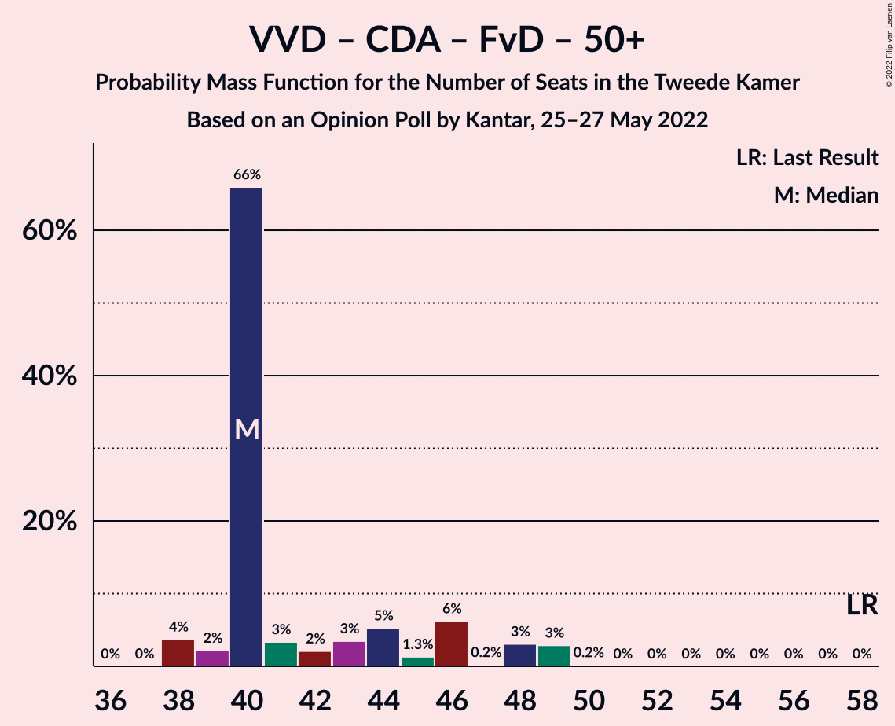

# Opinion Poll by Kantar, 25–27 May 2022

<a href="#voting-intentions">Voting Intentions</a> | <a href="#seats">Seats</a> | <a href="#coalitions">Coalitions</a> | <a href="#technical-information">Technical Information</a>

## Voting Intentions

### Confidence Intervals

| Party | Last Result | Poll Result | 80% Confidence Interval | 90% Confidence Interval | 95% Confidence Interval | 99% Confidence Interval |
|:-----:|:-----------:|:-----------:|:-----------------------:|:-----------------------:|:-----------------------:|:-----------------------:|
| Volkspartij voor Vrijheid en Democratie | 21.9% | 18.9% | 17.5–20.5% |17.0–21.0% |16.7–21.4% |16.0–22.2% |
| Partij voor de Vrijheid | 10.8% | 10.0% | 8.9–11.3% |8.6–11.6% |8.4–12.0% |7.9–12.6% |
| Partij van de Arbeid | 5.7% | 9.0% | 8.0–10.2% |7.7–10.6% |7.4–10.9% |7.0–11.5% |
| Democraten 66 | 15.0% | 8.0% | 7.0–9.1% |6.7–9.5% |6.5–9.8% |6.1–10.3% |
| GroenLinks | 5.2% | 8.0% | 7.0–9.1% |6.7–9.5% |6.5–9.8% |6.1–10.3% |
| BoerBurgerBeweging | 1.0% | 8.0% | 7.0–9.1% |6.7–9.5% |6.5–9.8% |6.1–10.3% |
| Christen-Democratisch Appèl | 9.5% | 6.0% | 5.2–7.1% |5.0–7.4% |4.8–7.6% |4.4–8.1% |
| Partij voor de Dieren | 3.8% | 5.0% | 4.3–6.0% |4.0–6.2% |3.9–6.5% |3.5–7.0% |
| Socialistische Partij | 6.0% | 4.0% | 3.3–4.9% |3.1–5.1% |3.0–5.3% |2.7–5.8% |
| ChristenUnie | 3.4% | 4.0% | 3.3–4.9% |3.1–5.1% |3.0–5.3% |2.7–5.8% |
| Juiste Antwoord 2021 | 2.4% | 4.0% | 3.3–4.9% |3.1–5.1% |3.0–5.3% |2.7–5.8% |
| Volt Europa | 2.4% | 4.0% | 3.3–4.9% |3.1–5.1% |3.0–5.3% |2.7–5.8% |
| Staatkundig Gereformeerde Partij | 2.1% | 3.0% | 2.4–3.7% |2.2–4.0% |2.1–4.2% |1.9–4.6% |
| DENK | 2.0% | 3.0% | 2.4–3.7% |2.2–4.0% |2.1–4.2% |1.9–4.6% |
| Forum voor Democratie | 5.0% | 3.0% | 2.4–3.7% |2.2–4.0% |2.1–4.2% |1.9–4.6% |
| 50Plus | 1.0% | 1.0% | 0.7–1.5% |0.6–1.7% |0.6–1.8% |0.5–2.1% |
| Bij1 | 0.8% | 1.0% | 0.7–1.5% |0.6–1.7% |0.6–1.8% |0.5–2.1% |

*Note:* The poll result column reflects the actual value used in the calculations. Published results may vary slightly, and in addition be rounded to fewer digits.

## Seats

### Confidence Intervals

| Party | Last Result | Median | 80% Confidence Interval | 90% Confidence Interval | 95% Confidence Interval | 99% Confidence Interval |
|:-----:|:-----------:|:------:|:-----------------------:|:-----------------------:|:-----------------------:|:-----------------------:|
| <a href="#volkspartij-voor-vrijheid-en-democratie">Volkspartij voor Vrijheid en Democratie</a> | 34 | 26 | 26–30 |26–31 |24–32 |24–33 |
| <a href="#partij-voor-de-vrijheid">Partij voor de Vrijheid</a> | 17 | 15 | 14–15 |13–18 |13–19 |11–19 |
| <a href="#partij-van-de-arbeid">Partij van de Arbeid</a> | 9 | 13 | 12–14 |11–15 |10–16 |10–17 |
| <a href="#democraten-66">Democraten 66</a> | 24 | 9 | 9–14 |9–14 |9–15 |9–15 |
| <a href="#groenlinks">GroenLinks</a> | 8 | 14 | 12–14 |11–14 |10–14 |10–15 |
| <a href="#boerburgerbeweging">BoerBurgerBeweging</a> | 1 | 15 | 11–15 |10–15 |10–16 |8–17 |
| <a href="#christen-democratisch-appèl">Christen-Democratisch Appèl</a> | 15 | 9 | 9–10 |9–13 |8–13 |6–13 |
| <a href="#partij-voor-de-dieren">Partij voor de Dieren</a> | 6 | 8 | 7–8 |6–9 |5–10 |5–11 |
| <a href="#socialistische-partij">Socialistische Partij</a> | 9 | 7 | 5–7 |4–7 |4–7 |4–8 |
| <a href="#christenunie">ChristenUnie</a> | 5 | 7 | 6–7 |5–7 |5–7 |5–9 |
| <a href="#juiste-antwoord-2021">Juiste Antwoord 2021</a> | 3 | 6 | 6 |5–9 |5–9 |4–9 |
| <a href="#volt-europa">Volt Europa</a> | 3 | 6 | 5–6 |4–6 |4–7 |3–9 |
| <a href="#staatkundig-gereformeerde-partij">Staatkundig Gereformeerde Partij</a> | 3 | 5 | 4–5 |4–6 |3–6 |3–7 |
| <a href="#denk">DENK</a> | 3 | 4 | 4–5 |3–7 |3–7 |2–7 |
| <a href="#forum-voor-democratie">Forum voor Democratie</a> | 8 | 4 | 4–5 |3–6 |3–7 |2–7 |
| <a href="#50plus">50Plus</a> | 1 | 1 | 1–2 |1–2 |1–2 |0–3 |
| <a href="#bij1">Bij1</a> | 1 | 1 | 1–2 |0–2 |0–2 |0–2 |

### Volkspartij voor Vrijheid en Democratie

*For a full overview of the results for this party, see the [Volkspartij voor Vrijheid en Democratie](party-volkspartijvoorvrijheidendemocratie.html) page.*

| Number of Seats | Probability | Accumulated | Special Marks |
|:---------------:|:-----------:|:-----------:|:-------------:|
| 24 | 3% | 100% |  |
| 25 | 1.2% | 97% |  |
| 26 | 73% | 95% | Median |
| 27 | 3% | 23% |  |
| 28 | 6% | 19% |  |
| 29 | 0.6% | 13% |  |
| 30 | 3% | 12% |  |
| 31 | 6% | 9% |  |
| 32 | 2% | 4% |  |
| 33 | 0.6% | 1.1% |  |
| 34 | 0.4% | 0.5% | Last Result |
| 35 | 0.1% | 0.1% |  |
| 36 | 0% | 0% |  |

### Partij voor de Vrijheid

*For a full overview of the results for this party, see the [Partij voor de Vrijheid](party-partijvoordevrijheid.html) page.*

| Number of Seats | Probability | Accumulated | Special Marks |
|:---------------:|:-----------:|:-----------:|:-------------:|
| 11 | 2% | 100% |  |
| 12 | 0.1% | 98% |  |
| 13 | 7% | 98% |  |
| 14 | 4% | 90% |  |
| 15 | 76% | 86% | Median |
| 16 | 3% | 10% |  |
| 17 | 1.5% | 7% | Last Result |
| 18 | 1.5% | 6% |  |
| 19 | 4% | 4% |  |
| 20 | 0% | 0.1% |  |
| 21 | 0% | 0% |  |

### Partij van de Arbeid

*For a full overview of the results for this party, see the [Partij van de Arbeid](party-partijvandearbeid.html) page.*

| Number of Seats | Probability | Accumulated | Special Marks |
|:---------------:|:-----------:|:-----------:|:-------------:|
| 9 | 0% | 100% | Last Result |
| 10 | 4% | 100% |  |
| 11 | 5% | 96% |  |
| 12 | 4% | 91% |  |
| 13 | 69% | 86% | Median |
| 14 | 10% | 18% |  |
| 15 | 3% | 8% |  |
| 16 | 4% | 5% |  |
| 17 | 1.1% | 1.3% |  |
| 18 | 0.2% | 0.2% |  |
| 19 | 0% | 0% |  |

### Democraten 66

*For a full overview of the results for this party, see the [Democraten 66](party-democraten66.html) page.*

| Number of Seats | Probability | Accumulated | Special Marks |
|:---------------:|:-----------:|:-----------:|:-------------:|
| 8 | 0.1% | 100% |  |
| 9 | 72% | 99.9% | Median |
| 10 | 0.8% | 27% |  |
| 11 | 4% | 27% |  |
| 12 | 7% | 22% |  |
| 13 | 3% | 16% |  |
| 14 | 9% | 12% |  |
| 15 | 3% | 4% |  |
| 16 | 0.2% | 0.3% |  |
| 17 | 0% | 0% |  |
| 18 | 0% | 0% |  |
| 19 | 0% | 0% |  |
| 20 | 0% | 0% |  |
| 21 | 0% | 0% |  |
| 22 | 0% | 0% |  |
| 23 | 0% | 0% |  |
| 24 | 0% | 0% | Last Result |

### GroenLinks

*For a full overview of the results for this party, see the [GroenLinks](party-groenlinks.html) page.*

| Number of Seats | Probability | Accumulated | Special Marks |
|:---------------:|:-----------:|:-----------:|:-------------:|
| 8 | 0.1% | 100% | Last Result |
| 9 | 0.2% | 99.9% |  |
| 10 | 4% | 99.6% |  |
| 11 | 1.1% | 96% |  |
| 12 | 20% | 95% |  |
| 13 | 4% | 74% |  |
| 14 | 70% | 71% | Median |
| 15 | 0.3% | 0.5% |  |
| 16 | 0.1% | 0.2% |  |
| 17 | 0.1% | 0.2% |  |
| 18 | 0% | 0% |  |

### BoerBurgerBeweging

*For a full overview of the results for this party, see the [BoerBurgerBeweging](party-boerburgerbeweging.html) page.*

| Number of Seats | Probability | Accumulated | Special Marks |
|:---------------:|:-----------:|:-----------:|:-------------:|
| 1 | 0% | 100% | Last Result |
| 2 | 0% | 100% |  |
| 3 | 0% | 100% |  |
| 4 | 0% | 100% |  |
| 5 | 0% | 100% |  |
| 6 | 0% | 100% |  |
| 7 | 0.2% | 100% |  |
| 8 | 0.5% | 99.8% |  |
| 9 | 1.4% | 99.3% |  |
| 10 | 7% | 98% |  |
| 11 | 4% | 91% |  |
| 12 | 10% | 87% |  |
| 13 | 2% | 76% |  |
| 14 | 6% | 75% |  |
| 15 | 66% | 69% | Median |
| 16 | 2% | 3% |  |
| 17 | 0.8% | 0.9% |  |
| 18 | 0% | 0% |  |

### Christen-Democratisch Appèl

*For a full overview of the results for this party, see the [Christen-Democratisch Appèl](party-christen-democratischappèl.html) page.*

| Number of Seats | Probability | Accumulated | Special Marks |
|:---------------:|:-----------:|:-----------:|:-------------:|
| 5 | 0.1% | 100% |  |
| 6 | 0.6% | 99.9% |  |
| 7 | 1.2% | 99.3% |  |
| 8 | 3% | 98% |  |
| 9 | 79% | 95% | Median |
| 10 | 9% | 16% |  |
| 11 | 1.5% | 8% |  |
| 12 | 0.7% | 6% |  |
| 13 | 6% | 6% |  |
| 14 | 0% | 0% |  |
| 15 | 0% | 0% | Last Result |

### Partij voor de Dieren

*For a full overview of the results for this party, see the [Partij voor de Dieren](party-partijvoordedieren.html) page.*

| Number of Seats | Probability | Accumulated | Special Marks |
|:---------------:|:-----------:|:-----------:|:-------------:|
| 5 | 3% | 100% |  |
| 6 | 5% | 97% | Last Result |
| 7 | 13% | 93% |  |
| 8 | 72% | 80% | Median |
| 9 | 3% | 7% |  |
| 10 | 4% | 4% |  |
| 11 | 0.6% | 0.6% |  |
| 12 | 0% | 0% |  |

### Socialistische Partij

*For a full overview of the results for this party, see the [Socialistische Partij](party-socialistischepartij.html) page.*

| Number of Seats | Probability | Accumulated | Special Marks |
|:---------------:|:-----------:|:-----------:|:-------------:|
| 3 | 0.1% | 100% |  |
| 4 | 6% | 99.9% |  |
| 5 | 13% | 94% |  |
| 6 | 5% | 81% |  |
| 7 | 74% | 76% | Median |
| 8 | 2% | 2% |  |
| 9 | 0% | 0% | Last Result |

### ChristenUnie

*For a full overview of the results for this party, see the [ChristenUnie](party-christenunie.html) page.*

| Number of Seats | Probability | Accumulated | Special Marks |
|:---------------:|:-----------:|:-----------:|:-------------:|
| 4 | 0.2% | 100% |  |
| 5 | 9% | 99.8% | Last Result |
| 6 | 21% | 90% |  |
| 7 | 69% | 70% | Median |
| 8 | 0% | 0.6% |  |
| 9 | 0.4% | 0.6% |  |
| 10 | 0.2% | 0.2% |  |
| 11 | 0% | 0% |  |

### Juiste Antwoord 2021

*For a full overview of the results for this party, see the [Juiste Antwoord 2021](party-juisteantwoord2021.html) page.*

| Number of Seats | Probability | Accumulated | Special Marks |
|:---------------:|:-----------:|:-----------:|:-------------:|
| 3 | 0.3% | 100% | Last Result |
| 4 | 2% | 99.7% |  |
| 5 | 7% | 98% |  |
| 6 | 81% | 91% | Median |
| 7 | 1.1% | 10% |  |
| 8 | 3% | 9% |  |
| 9 | 6% | 6% |  |
| 10 | 0% | 0% |  |

### Volt Europa

*For a full overview of the results for this party, see the [Volt Europa](party-volteuropa.html) page.*

| Number of Seats | Probability | Accumulated | Special Marks |
|:---------------:|:-----------:|:-----------:|:-------------:|
| 3 | 0.8% | 100% | Last Result |
| 4 | 7% | 99.2% |  |
| 5 | 5% | 92% |  |
| 6 | 84% | 87% | Median |
| 7 | 0.7% | 3% |  |
| 8 | 0.6% | 2% |  |
| 9 | 2% | 2% |  |
| 10 | 0% | 0% |  |

### Staatkundig Gereformeerde Partij

*For a full overview of the results for this party, see the [Staatkundig Gereformeerde Partij](party-staatkundiggereformeerdepartij.html) page.*

| Number of Seats | Probability | Accumulated | Special Marks |
|:---------------:|:-----------:|:-----------:|:-------------:|
| 2 | 0.1% | 100% |  |
| 3 | 3% | 99.9% | Last Result |
| 4 | 9% | 97% |  |
| 5 | 79% | 88% | Median |
| 6 | 9% | 10% |  |
| 7 | 0.5% | 0.6% |  |
| 8 | 0.1% | 0.1% |  |
| 9 | 0% | 0% |  |

### DENK

*For a full overview of the results for this party, see the [DENK](party-denk.html) page.*

| Number of Seats | Probability | Accumulated | Special Marks |
|:---------------:|:-----------:|:-----------:|:-------------:|
| 2 | 0.6% | 100% |  |
| 3 | 6% | 99.4% | Last Result |
| 4 | 78% | 93% | Median |
| 5 | 5% | 15% |  |
| 6 | 3% | 10% |  |
| 7 | 7% | 7% |  |
| 8 | 0% | 0% |  |

### Forum voor Democratie

*For a full overview of the results for this party, see the [Forum voor Democratie](party-forumvoordemocratie.html) page.*

| Number of Seats | Probability | Accumulated | Special Marks |
|:---------------:|:-----------:|:-----------:|:-------------:|
| 2 | 0.6% | 100% |  |
| 3 | 7% | 99.4% |  |
| 4 | 81% | 92% | Median |
| 5 | 4% | 11% |  |
| 6 | 3% | 7% |  |
| 7 | 4% | 4% |  |
| 8 | 0% | 0% | Last Result |

### 50Plus

*For a full overview of the results for this party, see the [50Plus](party-50plus.html) page.*

| Number of Seats | Probability | Accumulated | Special Marks |
|:---------------:|:-----------:|:-----------:|:-------------:|
| 0 | 1.0% | 100% |  |
| 1 | 88% | 99.0% | Last Result, Median |
| 2 | 9% | 11% |  |
| 3 | 2% | 2% |  |
| 4 | 0% | 0% |  |

### Bij1

*For a full overview of the results for this party, see the [Bij1](party-bij1.html) page.*

| Number of Seats | Probability | Accumulated | Special Marks |
|:---------------:|:-----------:|:-----------:|:-------------:|
| 0 | 7% | 100% |  |
| 1 | 80% | 93% | Last Result, Median |
| 2 | 14% | 14% |  |
| 3 | 0.2% | 0.2% |  |
| 4 | 0% | 0% |  |

## Coalitions

### Confidence Intervals

| Coalition | Last Result | Median | Majority? | 80% Confidence Interval | 90% Confidence Interval | 95% Confidence Interval | 99% Confidence Interval |
|:---------:|:-----------:|:------:|:---------:|:-----------------------:|:-----------------------:|:-----------------------:|:-----------------------:|
| Volkspartij voor Vrijheid en Democratie – Partij van de Arbeid – Democraten 66 – Christen-Democratisch Appèl – ChristenUnie | 87 | 64 | 0.2% | 64–70 | 64–71 | 64–75 | 64–75 |
| Volkspartij voor Vrijheid en Democratie – Democraten 66 – GroenLinks – Christen-Democratisch Appèl – ChristenUnie | 86 | 65 | 0.2% | 65–71 | 64–72 | 64–74 | 62–74 |
| Volkspartij voor Vrijheid en Democratie – Partij voor de Vrijheid – Christen-Democratisch Appèl – Forum voor Democratie – Staatkundig Gereformeerde Partij | 77 | 59 | 0% | 59–64 | 58–65 | 58–66 | 56–68 |
| Partij van de Arbeid – Democraten 66 – GroenLinks – Christen-Democratisch Appèl – ChristenUnie – Socialistische Partij | 70 | 59 | 0% | 57–61 | 55–62 | 55–63 | 55–64 |
| Volkspartij voor Vrijheid en Democratie – Democraten 66 – Christen-Democratisch Appèl – ChristenUnie | 78 | 51 | 0% | 51–59 | 51–60 | 50–61 | 50–62 |
| Volkspartij voor Vrijheid en Democratie – Partij voor de Vrijheid – Christen-Democratisch Appèl – Forum voor Democratie | 74 | 54 | 0% | 54–60 | 53–60 | 53–60 | 51–65 |
| Volkspartij voor Vrijheid en Democratie – Partij van de Arbeid – Democraten 66 | 67 | 48 | 0% | 48–55 | 48–56 | 48–60 | 48–61 |
| Partij van de Arbeid – Democraten 66 – GroenLinks – Christen-Democratisch Appèl – ChristenUnie | 61 | 52 | 0% | 51–54 | 51–56 | 50–57 | 48–59 |
| Volkspartij voor Vrijheid en Democratie – Partij voor de Vrijheid – Christen-Democratisch Appèl | 66 | 50 | 0% | 50–55 | 49–56 | 49–56 | 46–60 |
| Volkspartij voor Vrijheid en Democratie – Partij van de Arbeid – Christen-Democratisch Appèl | 58 | 48 | 0% | 48–54 | 48–55 | 47–55 | 47–56 |
| Volkspartij voor Vrijheid en Democratie – Democraten 66 – Christen-Democratisch Appèl | 73 | 44 | 0% | 44–54 | 44–54 | 44–55 | 44–56 |
| Volkspartij voor Vrijheid en Democratie – Christen-Democratisch Appèl – Forum voor Democratie – Staatkundig Gereformeerde Partij – 50Plus | 61 | 45 | 0% | 45–50 | 44–52 | 43–55 | 43–55 |
| Volkspartij voor Vrijheid en Democratie – Christen-Democratisch Appèl – Forum voor Democratie – Staatkundig Gereformeerde Partij | 60 | 44 | 0% | 44–49 | 43–51 | 42–53 | 41–53 |
| Volkspartij voor Vrijheid en Democratie – Christen-Democratisch Appèl – Forum voor Democratie – 50Plus | 58 | 40 | 0% | 40–46 | 39–48 | 38–49 | 38–49 |
| Volkspartij voor Vrijheid en Democratie – Christen-Democratisch Appèl – Forum voor Democratie | 57 | 39 | 0% | 39–45 | 38–47 | 37–47 | 36–47 |
| Volkspartij voor Vrijheid en Democratie – Partij van de Arbeid | 43 | 39 | 0% | 39–42 | 39–43 | 38–45 | 38–48 |
| Volkspartij voor Vrijheid en Democratie – Christen-Democratisch Appèl | 49 | 35 | 0% | 35–40 | 34–41 | 33–41 | 33–41 |
| Partij van de Arbeid – Democraten 66 – Christen-Democratisch Appèl | 48 | 31 | 0% | 31–36 | 31–37 | 31–38 | 31–40 |
| Partij van de Arbeid – Christen-Democratisch Appèl – ChristenUnie | 29 | 29 | 0% | 27–31 | 26–33 | 25–33 | 25–33 |
| Partij van de Arbeid – Christen-Democratisch Appèl | 24 | 22 | 0% | 21–25 | 20–27 | 20–27 | 20–27 |
| Democraten 66 – Christen-Democratisch Appèl | 39 | 18 | 0% | 18–23 | 18–24 | 18–24 | 18–25 |

### Volkspartij voor Vrijheid en Democratie – Partij van de Arbeid – Democraten 66 – Christen-Democratisch Appèl – ChristenUnie

| Number of Seats | Probability | Accumulated | Special Marks |
|:---------------:|:-----------:|:-----------:|:-------------:|
| 63 | 0% | 100% |  |
| 64 | 65% | 99.9% | Median |
| 65 | 2% | 35% |  |
| 66 | 7% | 33% |  |
| 67 | 3% | 26% |  |
| 68 | 2% | 23% |  |
| 69 | 1.2% | 21% |  |
| 70 | 14% | 20% |  |
| 71 | 1.0% | 5% |  |
| 72 | 0.5% | 4% |  |
| 73 | 0.1% | 4% |  |
| 74 | 0.7% | 4% |  |
| 75 | 3% | 3% |  |
| 76 | 0% | 0.2% | Majority |
| 77 | 0.2% | 0.2% |  |
| 78 | 0% | 0% |  |
| 79 | 0% | 0% |  |
| 80 | 0% | 0% |  |
| 81 | 0% | 0% |  |
| 82 | 0% | 0% |  |
| 83 | 0% | 0% |  |
| 84 | 0% | 0% |  |
| 85 | 0% | 0% |  |
| 86 | 0% | 0% |  |
| 87 | 0% | 0% | Last Result |

### Volkspartij voor Vrijheid en Democratie – Democraten 66 – GroenLinks – Christen-Democratisch Appèl – ChristenUnie

| Number of Seats | Probability | Accumulated | Special Marks |
|:---------------:|:-----------:|:-----------:|:-------------:|
| 61 | 0.1% | 100% |  |
| 62 | 0.7% | 99.8% |  |
| 63 | 0.1% | 99.1% |  |
| 64 | 7% | 99.0% |  |
| 65 | 67% | 92% | Median |
| 66 | 3% | 25% |  |
| 67 | 0.9% | 22% |  |
| 68 | 7% | 21% |  |
| 69 | 1.4% | 14% |  |
| 70 | 0.6% | 13% |  |
| 71 | 6% | 12% |  |
| 72 | 4% | 7% |  |
| 73 | 0.2% | 3% |  |
| 74 | 2% | 3% |  |
| 75 | 0.2% | 0.4% |  |
| 76 | 0.1% | 0.2% | Majority |
| 77 | 0% | 0% |  |
| 78 | 0% | 0% |  |
| 79 | 0% | 0% |  |
| 80 | 0% | 0% |  |
| 81 | 0% | 0% |  |
| 82 | 0% | 0% |  |
| 83 | 0% | 0% |  |
| 84 | 0% | 0% |  |
| 85 | 0% | 0% |  |
| 86 | 0% | 0% | Last Result |

### Volkspartij voor Vrijheid en Democratie – Partij voor de Vrijheid – Christen-Democratisch Appèl – Forum voor Democratie – Staatkundig Gereformeerde Partij

| Number of Seats | Probability | Accumulated | Special Marks |
|:---------------:|:-----------:|:-----------:|:-------------:|
| 54 | 0% | 100% |  |
| 55 | 0.1% | 99.9% |  |
| 56 | 2% | 99.8% |  |
| 57 | 0.1% | 98% |  |
| 58 | 4% | 98% |  |
| 59 | 67% | 94% | Median |
| 60 | 1.4% | 27% |  |
| 61 | 5% | 26% |  |
| 62 | 3% | 21% |  |
| 63 | 2% | 18% |  |
| 64 | 11% | 17% |  |
| 65 | 2% | 6% |  |
| 66 | 3% | 4% |  |
| 67 | 0.1% | 1.3% |  |
| 68 | 1.0% | 1.3% |  |
| 69 | 0.2% | 0.2% |  |
| 70 | 0% | 0% |  |
| 71 | 0% | 0% |  |
| 72 | 0% | 0% |  |
| 73 | 0% | 0% |  |
| 74 | 0% | 0% |  |
| 75 | 0% | 0% |  |
| 76 | 0% | 0% | Majority |
| 77 | 0% | 0% | Last Result |

### Partij van de Arbeid – Democraten 66 – GroenLinks – Christen-Democratisch Appèl – ChristenUnie – Socialistische Partij

| Number of Seats | Probability | Accumulated | Special Marks |
|:---------------:|:-----------:|:-----------:|:-------------:|
| 52 | 0.1% | 100% |  |
| 53 | 0.1% | 99.8% |  |
| 54 | 0.2% | 99.7% |  |
| 55 | 7% | 99.6% |  |
| 56 | 2% | 93% |  |
| 57 | 2% | 91% |  |
| 58 | 0.4% | 88% |  |
| 59 | 76% | 88% | Median |
| 60 | 0.1% | 11% |  |
| 61 | 6% | 11% |  |
| 62 | 2% | 5% |  |
| 63 | 0.1% | 3% |  |
| 64 | 2% | 2% |  |
| 65 | 0.2% | 0.3% |  |
| 66 | 0% | 0.2% |  |
| 67 | 0.1% | 0.1% |  |
| 68 | 0% | 0% |  |
| 69 | 0% | 0% |  |
| 70 | 0% | 0% | Last Result |

### Volkspartij voor Vrijheid en Democratie – Democraten 66 – Christen-Democratisch Appèl – ChristenUnie

| Number of Seats | Probability | Accumulated | Special Marks |
|:---------------:|:-----------:|:-----------:|:-------------:|
| 49 | 0.1% | 100% |  |
| 50 | 3% | 99.9% |  |
| 51 | 65% | 97% | Median |
| 52 | 2% | 31% |  |
| 53 | 4% | 29% |  |
| 54 | 4% | 25% |  |
| 55 | 0.9% | 21% |  |
| 56 | 6% | 20% |  |
| 57 | 2% | 14% |  |
| 58 | 0.2% | 12% |  |
| 59 | 6% | 12% |  |
| 60 | 3% | 6% |  |
| 61 | 0.7% | 3% |  |
| 62 | 2% | 2% |  |
| 63 | 0% | 0.1% |  |
| 64 | 0% | 0% |  |
| 65 | 0% | 0% |  |
| 66 | 0% | 0% |  |
| 67 | 0% | 0% |  |
| 68 | 0% | 0% |  |
| 69 | 0% | 0% |  |
| 70 | 0% | 0% |  |
| 71 | 0% | 0% |  |
| 72 | 0% | 0% |  |
| 73 | 0% | 0% |  |
| 74 | 0% | 0% |  |
| 75 | 0% | 0% |  |
| 76 | 0% | 0% | Majority |
| 77 | 0% | 0% |  |
| 78 | 0% | 0% | Last Result |

### Volkspartij voor Vrijheid en Democratie – Partij voor de Vrijheid – Christen-Democratisch Appèl – Forum voor Democratie

| Number of Seats | Probability | Accumulated | Special Marks |
|:---------------:|:-----------:|:-----------:|:-------------:|
| 50 | 0% | 100% |  |
| 51 | 1.4% | 99.9% |  |
| 52 | 0.6% | 98.5% |  |
| 53 | 4% | 98% |  |
| 54 | 67% | 94% | Median |
| 55 | 3% | 27% |  |
| 56 | 4% | 25% |  |
| 57 | 0.6% | 21% |  |
| 58 | 7% | 20% |  |
| 59 | 1.0% | 13% |  |
| 60 | 10% | 12% |  |
| 61 | 0.3% | 2% |  |
| 62 | 0.1% | 1.3% |  |
| 63 | 0.1% | 1.2% |  |
| 64 | 0.2% | 1.1% |  |
| 65 | 0.8% | 0.8% |  |
| 66 | 0% | 0% |  |
| 67 | 0% | 0% |  |
| 68 | 0% | 0% |  |
| 69 | 0% | 0% |  |
| 70 | 0% | 0% |  |
| 71 | 0% | 0% |  |
| 72 | 0% | 0% |  |
| 73 | 0% | 0% |  |
| 74 | 0% | 0% | Last Result |

### Volkspartij voor Vrijheid en Democratie – Partij van de Arbeid – Democraten 66

| Number of Seats | Probability | Accumulated | Special Marks |
|:---------------:|:-----------:|:-----------:|:-------------:|
| 48 | 66% | 100% | Median |
| 49 | 0.4% | 34% |  |
| 50 | 3% | 33% |  |
| 51 | 9% | 31% |  |
| 52 | 4% | 21% |  |
| 53 | 1.4% | 18% |  |
| 54 | 6% | 16% |  |
| 55 | 0.3% | 10% |  |
| 56 | 6% | 10% |  |
| 57 | 0.6% | 4% |  |
| 58 | 0.1% | 4% |  |
| 59 | 0.3% | 4% |  |
| 60 | 2% | 3% |  |
| 61 | 0.8% | 0.9% |  |
| 62 | 0% | 0.1% |  |
| 63 | 0% | 0% |  |
| 64 | 0% | 0% |  |
| 65 | 0% | 0% |  |
| 66 | 0% | 0% |  |
| 67 | 0% | 0% | Last Result |

### Partij van de Arbeid – Democraten 66 – GroenLinks – Christen-Democratisch Appèl – ChristenUnie

| Number of Seats | Probability | Accumulated | Special Marks |
|:---------------:|:-----------:|:-----------:|:-------------:|
| 47 | 0.2% | 100% |  |
| 48 | 1.0% | 99.7% |  |
| 49 | 0.1% | 98.7% |  |
| 50 | 3% | 98.6% |  |
| 51 | 6% | 95% |  |
| 52 | 70% | 90% | Median |
| 53 | 3% | 20% |  |
| 54 | 8% | 17% |  |
| 55 | 2% | 9% |  |
| 56 | 3% | 6% |  |
| 57 | 0.6% | 3% |  |
| 58 | 2% | 2% |  |
| 59 | 0.5% | 0.7% |  |
| 60 | 0.1% | 0.1% |  |
| 61 | 0% | 0.1% | Last Result |
| 62 | 0.1% | 0.1% |  |
| 63 | 0% | 0% |  |

### Volkspartij voor Vrijheid en Democratie – Partij voor de Vrijheid – Christen-Democratisch Appèl

| Number of Seats | Probability | Accumulated | Special Marks |
|:---------------:|:-----------:|:-----------:|:-------------:|
| 46 | 0.6% | 100% |  |
| 47 | 1.4% | 99.4% |  |
| 48 | 0.3% | 98% |  |
| 49 | 4% | 98% |  |
| 50 | 66% | 93% | Median |
| 51 | 2% | 27% |  |
| 52 | 7% | 26% |  |
| 53 | 5% | 19% |  |
| 54 | 1.0% | 15% |  |
| 55 | 5% | 14% |  |
| 56 | 7% | 9% |  |
| 57 | 0.4% | 2% |  |
| 58 | 0.1% | 1.2% |  |
| 59 | 0.2% | 1.1% |  |
| 60 | 0.8% | 0.9% |  |
| 61 | 0% | 0% |  |
| 62 | 0% | 0% |  |
| 63 | 0% | 0% |  |
| 64 | 0% | 0% |  |
| 65 | 0% | 0% |  |
| 66 | 0% | 0% | Last Result |

### Volkspartij voor Vrijheid en Democratie – Partij van de Arbeid – Christen-Democratisch Appèl

| Number of Seats | Probability | Accumulated | Special Marks |
|:---------------:|:-----------:|:-----------:|:-------------:|
| 46 | 0.1% | 100% |  |
| 47 | 3% | 99.9% |  |
| 48 | 66% | 96% | Median |
| 49 | 6% | 30% |  |
| 50 | 6% | 24% |  |
| 51 | 6% | 18% |  |
| 52 | 1.5% | 12% |  |
| 53 | 0.2% | 10% |  |
| 54 | 3% | 10% |  |
| 55 | 6% | 7% |  |
| 56 | 0.4% | 0.7% |  |
| 57 | 0.2% | 0.3% |  |
| 58 | 0.1% | 0.1% | Last Result |
| 59 | 0% | 0% |  |

### Volkspartij voor Vrijheid en Democratie – Democraten 66 – Christen-Democratisch Appèl

| Number of Seats | Probability | Accumulated | Special Marks |
|:---------------:|:-----------:|:-----------:|:-------------:|
| 43 | 0.1% | 100% |  |
| 44 | 68% | 99.9% | Median |
| 45 | 0% | 32% |  |
| 46 | 1.2% | 31% |  |
| 47 | 7% | 30% |  |
| 48 | 3% | 24% |  |
| 49 | 0.8% | 21% |  |
| 50 | 6% | 20% |  |
| 51 | 2% | 14% |  |
| 52 | 0.4% | 12% |  |
| 53 | 1.1% | 12% |  |
| 54 | 8% | 11% |  |
| 55 | 0.2% | 3% |  |
| 56 | 2% | 2% |  |
| 57 | 0% | 0.1% |  |
| 58 | 0% | 0% |  |
| 59 | 0% | 0% |  |
| 60 | 0% | 0% |  |
| 61 | 0% | 0% |  |
| 62 | 0% | 0% |  |
| 63 | 0% | 0% |  |
| 64 | 0% | 0% |  |
| 65 | 0% | 0% |  |
| 66 | 0% | 0% |  |
| 67 | 0% | 0% |  |
| 68 | 0% | 0% |  |
| 69 | 0% | 0% |  |
| 70 | 0% | 0% |  |
| 71 | 0% | 0% |  |
| 72 | 0% | 0% |  |
| 73 | 0% | 0% | Last Result |

### Volkspartij voor Vrijheid en Democratie – Christen-Democratisch Appèl – Forum voor Democratie – Staatkundig Gereformeerde Partij – 50Plus

| Number of Seats | Probability | Accumulated | Special Marks |
|:---------------:|:-----------:|:-----------:|:-------------:|
| 41 | 0.4% | 100% |  |
| 42 | 0% | 99.6% |  |
| 43 | 3% | 99.5% |  |
| 44 | 3% | 96% |  |
| 45 | 65% | 93% | Median |
| 46 | 2% | 28% |  |
| 47 | 4% | 26% |  |
| 48 | 4% | 23% |  |
| 49 | 0.1% | 18% |  |
| 50 | 11% | 18% |  |
| 51 | 1.3% | 7% |  |
| 52 | 2% | 6% |  |
| 53 | 0.2% | 3% |  |
| 54 | 0.2% | 3% |  |
| 55 | 3% | 3% |  |
| 56 | 0% | 0% |  |
| 57 | 0% | 0% |  |
| 58 | 0% | 0% |  |
| 59 | 0% | 0% |  |
| 60 | 0% | 0% |  |
| 61 | 0% | 0% | Last Result |

### Volkspartij voor Vrijheid en Democratie – Christen-Democratisch Appèl – Forum voor Democratie – Staatkundig Gereformeerde Partij

| Number of Seats | Probability | Accumulated | Special Marks |
|:---------------:|:-----------:|:-----------:|:-------------:|
| 39 | 0.1% | 100% |  |
| 40 | 0.1% | 99.9% |  |
| 41 | 1.1% | 99.9% |  |
| 42 | 3% | 98.8% |  |
| 43 | 2% | 95% |  |
| 44 | 68% | 93% | Median |
| 45 | 2% | 26% |  |
| 46 | 3% | 24% |  |
| 47 | 3% | 21% |  |
| 48 | 0.6% | 18% |  |
| 49 | 12% | 18% |  |
| 50 | 0.3% | 6% |  |
| 51 | 2% | 6% |  |
| 52 | 0.1% | 3% |  |
| 53 | 3% | 3% |  |
| 54 | 0% | 0.1% |  |
| 55 | 0% | 0% |  |
| 56 | 0% | 0% |  |
| 57 | 0% | 0% |  |
| 58 | 0% | 0% |  |
| 59 | 0% | 0% |  |
| 60 | 0% | 0% | Last Result |

### Volkspartij voor Vrijheid en Democratie – Christen-Democratisch Appèl – Forum voor Democratie – 50Plus

| Number of Seats | Probability | Accumulated | Special Marks |
|:---------------:|:-----------:|:-----------:|:-------------:|
| 38 | 4% | 100% |  |
| 39 | 2% | 96% |  |
| 40 | 66% | 94% | Median |
| 41 | 3% | 28% |  |
| 42 | 2% | 25% |  |
| 43 | 3% | 23% |  |
| 44 | 5% | 19% |  |
| 45 | 1.3% | 14% |  |
| 46 | 6% | 13% |  |
| 47 | 0.2% | 6% |  |
| 48 | 3% | 6% |  |
| 49 | 3% | 3% |  |
| 50 | 0.2% | 0.2% |  |
| 51 | 0% | 0% |  |
| 52 | 0% | 0% |  |
| 53 | 0% | 0% |  |
| 54 | 0% | 0% |  |
| 55 | 0% | 0% |  |
| 56 | 0% | 0% |  |
| 57 | 0% | 0% |  |
| 58 | 0% | 0% | Last Result |

### Volkspartij voor Vrijheid en Democratie – Christen-Democratisch Appèl – Forum voor Democratie

| Number of Seats | Probability | Accumulated | Special Marks |
|:---------------:|:-----------:|:-----------:|:-------------:|
| 36 | 0.8% | 100% |  |
| 37 | 3% | 99.2% |  |
| 38 | 2% | 96% |  |
| 39 | 70% | 94% | Median |
| 40 | 0.4% | 24% |  |
| 41 | 3% | 24% |  |
| 42 | 2% | 21% |  |
| 43 | 5% | 19% |  |
| 44 | 1.4% | 14% |  |
| 45 | 6% | 12% |  |
| 46 | 1.0% | 6% |  |
| 47 | 5% | 5% |  |
| 48 | 0.1% | 0.3% |  |
| 49 | 0.2% | 0.2% |  |
| 50 | 0% | 0% |  |
| 51 | 0% | 0% |  |
| 52 | 0% | 0% |  |
| 53 | 0% | 0% |  |
| 54 | 0% | 0% |  |
| 55 | 0% | 0% |  |
| 56 | 0% | 0% |  |
| 57 | 0% | 0% | Last Result |

### Volkspartij voor Vrijheid en Democratie – Partij van de Arbeid

| Number of Seats | Probability | Accumulated | Special Marks |
|:---------------:|:-----------:|:-----------:|:-------------:|
| 37 | 0.1% | 100% |  |
| 38 | 3% | 99.9% |  |
| 39 | 68% | 97% | Median |
| 40 | 9% | 29% |  |
| 41 | 3% | 20% |  |
| 42 | 11% | 17% |  |
| 43 | 1.0% | 6% | Last Result |
| 44 | 1.1% | 5% |  |
| 45 | 2% | 4% |  |
| 46 | 0.1% | 1.3% |  |
| 47 | 0.6% | 1.2% |  |
| 48 | 0.6% | 0.7% |  |
| 49 | 0% | 0.1% |  |
| 50 | 0% | 0% |  |

### Volkspartij voor Vrijheid en Democratie – Christen-Democratisch Appèl

| Number of Seats | Probability | Accumulated | Special Marks |
|:---------------:|:-----------:|:-----------:|:-------------:|
| 32 | 0.1% | 100% |  |
| 33 | 5% | 99.9% |  |
| 34 | 2% | 95% |  |
| 35 | 68% | 93% | Median |
| 36 | 3% | 26% |  |
| 37 | 2% | 22% |  |
| 38 | 2% | 20% |  |
| 39 | 0.2% | 18% |  |
| 40 | 8% | 18% |  |
| 41 | 9% | 10% |  |
| 42 | 0.2% | 0.5% |  |
| 43 | 0% | 0.3% |  |
| 44 | 0.3% | 0.3% |  |
| 45 | 0% | 0% |  |
| 46 | 0% | 0% |  |
| 47 | 0% | 0% |  |
| 48 | 0% | 0% |  |
| 49 | 0% | 0% | Last Result |

### Partij van de Arbeid – Democraten 66 – Christen-Democratisch Appèl

| Number of Seats | Probability | Accumulated | Special Marks |
|:---------------:|:-----------:|:-----------:|:-------------:|
| 29 | 0% | 100% |  |
| 30 | 0.2% | 99.9% |  |
| 31 | 65% | 99.7% | Median |
| 32 | 3% | 34% |  |
| 33 | 3% | 32% |  |
| 34 | 8% | 29% |  |
| 35 | 3% | 20% |  |
| 36 | 12% | 17% |  |
| 37 | 3% | 5% |  |
| 38 | 1.4% | 3% |  |
| 39 | 0.7% | 1.2% |  |
| 40 | 0.3% | 0.5% |  |
| 41 | 0% | 0.2% |  |
| 42 | 0.2% | 0.2% |  |
| 43 | 0% | 0% |  |
| 44 | 0% | 0% |  |
| 45 | 0% | 0% |  |
| 46 | 0% | 0% |  |
| 47 | 0% | 0% |  |
| 48 | 0% | 0% | Last Result |

### Partij van de Arbeid – Christen-Democratisch Appèl – ChristenUnie

| Number of Seats | Probability | Accumulated | Special Marks |
|:---------------:|:-----------:|:-----------:|:-------------:|
| 24 | 0.3% | 100% |  |
| 25 | 5% | 99.7% |  |
| 26 | 4% | 95% |  |
| 27 | 2% | 91% |  |
| 28 | 7% | 89% |  |
| 29 | 69% | 82% | Last Result, Median |
| 30 | 1.0% | 12% |  |
| 31 | 4% | 11% |  |
| 32 | 1.0% | 8% |  |
| 33 | 6% | 7% |  |
| 34 | 0.1% | 0.4% |  |
| 35 | 0.3% | 0.3% |  |
| 36 | 0% | 0% |  |

### Partij van de Arbeid – Christen-Democratisch Appèl

| Number of Seats | Probability | Accumulated | Special Marks |
|:---------------:|:-----------:|:-----------:|:-------------:|
| 18 | 0.3% | 100% |  |
| 19 | 0% | 99.7% |  |
| 20 | 8% | 99.6% |  |
| 21 | 5% | 91% |  |
| 22 | 68% | 86% | Median |
| 23 | 4% | 18% |  |
| 24 | 3% | 14% | Last Result |
| 25 | 4% | 11% |  |
| 26 | 1.0% | 7% |  |
| 27 | 6% | 6% |  |
| 28 | 0.1% | 0.1% |  |
| 29 | 0% | 0% |  |

### Democraten 66 – Christen-Democratisch Appèl

| Number of Seats | Probability | Accumulated | Special Marks |
|:---------------:|:-----------:|:-----------:|:-------------:|
| 16 | 0.1% | 100% |  |
| 17 | 0.1% | 99.9% |  |
| 18 | 65% | 99.8% | Median |
| 19 | 0.9% | 34% |  |
| 20 | 6% | 33% |  |
| 21 | 6% | 28% |  |
| 22 | 9% | 21% |  |
| 23 | 5% | 12% |  |
| 24 | 6% | 7% |  |
| 25 | 1.2% | 1.3% |  |
| 26 | 0% | 0.1% |  |
| 27 | 0.1% | 0.1% |  |
| 28 | 0% | 0% |  |
| 29 | 0% | 0% |  |
| 30 | 0% | 0% |  |
| 31 | 0% | 0% |  |
| 32 | 0% | 0% |  |
| 33 | 0% | 0% |  |
| 34 | 0% | 0% |  |
| 35 | 0% | 0% |  |
| 36 | 0% | 0% |  |
| 37 | 0% | 0% |  |
| 38 | 0% | 0% |  |
| 39 | 0% | 0% | Last Result |

## Technical Information

### Opinion Poll

+ **Polling firm:** Kantar
+ **Commissioner(s):** —
+ **Fieldwork period:** 25–27 May 2022

### Calculations

+ **Sample size:** 1078
+ **Simulations done:** 1,048,576
+ **Error estimate:** 3.61%

