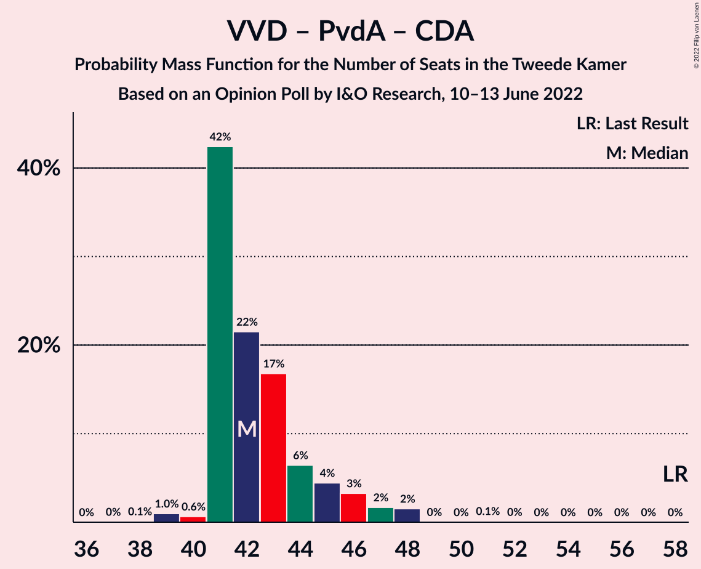
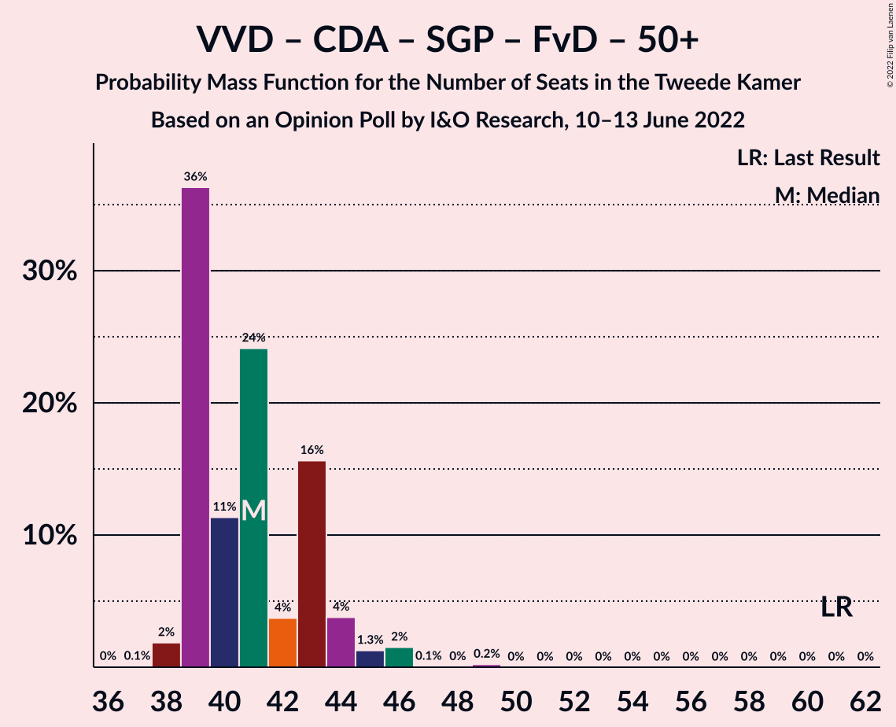
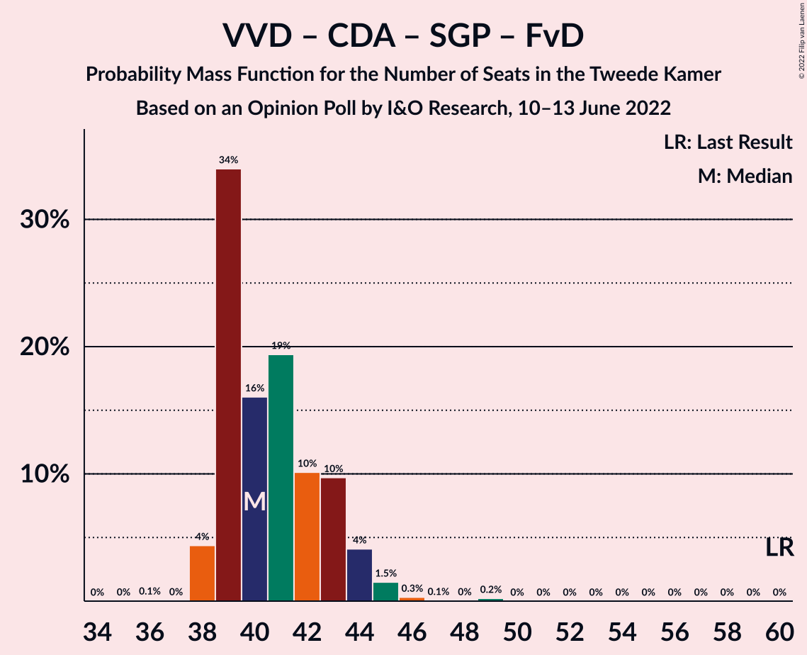

# Opinion Poll by I&O Research, 10–13 June 2022

<a href="#voting-intentions">Voting Intentions</a> | <a href="#seats">Seats</a> | <a href="#coalitions">Coalitions</a> | <a href="#technical-information">Technical Information</a>

## Voting Intentions

### Confidence Intervals

| Party | Last Result | Poll Result | 80% Confidence Interval | 90% Confidence Interval | 95% Confidence Interval | 99% Confidence Interval |
|:-----:|:-----------:|:-----------:|:-----------------------:|:-----------------------:|:-----------------------:|:-----------------------:|
| Volkspartij voor Vrijheid en Democratie | 21.9% | 15.3% | 14.3–16.4% |14.1–16.8% |13.8–17.0% |13.3–17.6% |
| Partij voor de Vrijheid | 10.8% | 9.5% | 8.7–10.5% |8.5–10.7% |8.3–10.9% |7.9–11.4% |
| Democraten 66 | 15.0% | 8.7% | 7.9–9.6% |7.7–9.8% |7.5–10.1% |7.2–10.5% |
| BoerBurgerBeweging | 1.0% | 7.7% | 7.0–8.6% |6.8–8.8% |6.6–9.0% |6.3–9.4% |
| GroenLinks | 5.2% | 7.6% | 6.9–8.5% |6.7–8.7% |6.5–8.9% |6.2–9.3% |
| Partij van de Arbeid | 5.7% | 7.2% | 6.5–8.0% |6.3–8.3% |6.2–8.5% |5.8–8.9% |
| Juiste Antwoord 2021 | 2.4% | 6.7% | 6.0–7.5% |5.9–7.7% |5.7–7.9% |5.4–8.3% |
| Socialistische Partij | 6.0% | 6.2% | 5.5–7.0% |5.4–7.2% |5.2–7.4% |4.9–7.8% |
| Christen-Democratisch Appèl | 9.5% | 5.5% | 4.9–6.3% |4.8–6.5% |4.6–6.7% |4.3–7.0% |
| Partij voor de Dieren | 3.8% | 5.5% | 4.9–6.3% |4.8–6.5% |4.6–6.7% |4.3–7.0% |
| ChristenUnie | 3.4% | 3.8% | 3.3–4.4% |3.2–4.6% |3.0–4.8% |2.8–5.1% |
| Volt Europa | 2.4% | 3.7% | 3.2–4.3% |3.0–4.5% |2.9–4.6% |2.7–4.9% |
| Staatkundig Gereformeerde Partij | 2.1% | 3.1% | 2.7–3.7% |2.5–3.9% |2.4–4.0% |2.2–4.3% |
| Forum voor Democratie | 5.0% | 2.9% | 2.5–3.5% |2.4–3.6% |2.3–3.8% |2.1–4.1% |
| DENK | 2.0% | 2.1% | 1.7–2.6% |1.6–2.7% |1.6–2.9% |1.4–3.1% |
| Bij1 | 0.8% | 1.5% | 1.2–1.9% |1.1–2.0% |1.0–2.1% |0.9–2.4% |
| 50Plus | 1.0% | 0.4% | 0.3–0.7% |0.2–0.7% |0.2–0.8% |0.2–1.0% |
| Belang van Nederland | 0.0% | 0.3% | 0.2–0.5% |0.2–0.6% |0.1–0.7% |0.1–0.8% |

*Note:* The poll result column reflects the actual value used in the calculations. Published results may vary slightly, and in addition be rounded to fewer digits.

## Seats

### Confidence Intervals

| Party | Last Result | Median | 80% Confidence Interval | 90% Confidence Interval | 95% Confidence Interval | 99% Confidence Interval |
|:-----:|:-----------:|:------:|:-----------------------:|:-----------------------:|:-----------------------:|:-----------------------:|
| <a href="#volkspartij-voor-vrijheid-en-democratie">Volkspartij voor Vrijheid en Democratie</a> | 34 | 23 | 22–25 |22–27 |22–27 |21–28 |
| <a href="#partij-voor-de-vrijheid">Partij voor de Vrijheid</a> | 17 | 15 | 13–17 |12–17 |12–17 |12–18 |
| <a href="#democraten-66">Democraten 66</a> | 24 | 14 | 12–15 |12–15 |11–17 |11–17 |
| <a href="#boerburgerbeweging">BoerBurgerBeweging</a> | 1 | 12 | 11–14 |10–14 |10–14 |10–15 |
| <a href="#groenlinks">GroenLinks</a> | 8 | 10 | 9–13 |9–13 |9–14 |9–15 |
| <a href="#partij-van-de-arbeid">Partij van de Arbeid</a> | 9 | 11 | 10–12 |10–12 |10–13 |9–14 |
| <a href="#juiste-antwoord-2021">Juiste Antwoord 2021</a> | 3 | 9 | 8–11 |8–12 |8–13 |8–13 |
| <a href="#socialistische-partij">Socialistische Partij</a> | 9 | 9 | 8–12 |7–12 |7–12 |7–12 |
| <a href="#christen-democratisch-appèl">Christen-Democratisch Appèl</a> | 15 | 8 | 7–9 |7–10 |7–10 |6–11 |
| <a href="#partij-voor-de-dieren">Partij voor de Dieren</a> | 6 | 8 | 7–10 |7–10 |7–10 |7–11 |
| <a href="#christenunie">ChristenUnie</a> | 5 | 6 | 5–7 |5–8 |4–8 |4–8 |
| <a href="#volt-europa">Volt Europa</a> | 3 | 6 | 4–6 |4–6 |4–7 |4–7 |
| <a href="#staatkundig-gereformeerde-partij">Staatkundig Gereformeerde Partij</a> | 3 | 5 | 4–5 |3–6 |3–6 |3–7 |
| <a href="#forum-voor-democratie">Forum voor Democratie</a> | 8 | 4 | 4–5 |3–5 |3–5 |3–6 |
| <a href="#denk">DENK</a> | 3 | 3 | 2–4 |2–4 |2–4 |2–5 |
| <a href="#bij1">Bij1</a> | 1 | 2 | 1–3 |1–3 |1–3 |1–3 |
| <a href="#50plus">50Plus</a> | 1 | 0 | 0–1 |0–1 |0–1 |0–1 |
| <a href="#belang-van-nederland">Belang van Nederland</a> | 0 | 0 | 0–1 |0–2 |0–2 |0–2 |

### Volkspartij voor Vrijheid en Democratie

*For a full overview of the results for this party, see the [Volkspartij voor Vrijheid en Democratie](party-volkspartijvoorvrijheidendemocratie.html) page.*

| Number of Seats | Probability | Accumulated | Special Marks |
|:---------------:|:-----------:|:-----------:|:-------------:|
| 20 | 0.1% | 100% |  |
| 21 | 0.9% | 99.9% |  |
| 22 | 40% | 99.0% |  |
| 23 | 27% | 59% | Median |
| 24 | 9% | 31% |  |
| 25 | 13% | 22% |  |
| 26 | 2% | 9% |  |
| 27 | 6% | 7% |  |
| 28 | 1.1% | 1.1% |  |
| 29 | 0.1% | 0.1% |  |
| 30 | 0% | 0% |  |
| 31 | 0% | 0% |  |
| 32 | 0% | 0% |  |
| 33 | 0% | 0% |  |
| 34 | 0% | 0% | Last Result |

### Partij voor de Vrijheid

*For a full overview of the results for this party, see the [Partij voor de Vrijheid](party-partijvoordevrijheid.html) page.*

| Number of Seats | Probability | Accumulated | Special Marks |
|:---------------:|:-----------:|:-----------:|:-------------:|
| 12 | 7% | 100% |  |
| 13 | 4% | 93% |  |
| 14 | 11% | 89% |  |
| 15 | 45% | 78% | Median |
| 16 | 22% | 33% |  |
| 17 | 8% | 11% | Last Result |
| 18 | 2% | 2% |  |
| 19 | 0% | 0% |  |

### Democraten 66

*For a full overview of the results for this party, see the [Democraten 66](party-democraten66.html) page.*

| Number of Seats | Probability | Accumulated | Special Marks |
|:---------------:|:-----------:|:-----------:|:-------------:|
| 10 | 0.4% | 100% |  |
| 11 | 2% | 99.6% |  |
| 12 | 30% | 97% |  |
| 13 | 6% | 67% |  |
| 14 | 50% | 61% | Median |
| 15 | 8% | 11% |  |
| 16 | 0.7% | 3% |  |
| 17 | 2% | 3% |  |
| 18 | 0.4% | 0.4% |  |
| 19 | 0% | 0% |  |
| 20 | 0% | 0% |  |
| 21 | 0% | 0% |  |
| 22 | 0% | 0% |  |
| 23 | 0% | 0% |  |
| 24 | 0% | 0% | Last Result |

### BoerBurgerBeweging

*For a full overview of the results for this party, see the [BoerBurgerBeweging](party-boerburgerbeweging.html) page.*

| Number of Seats | Probability | Accumulated | Special Marks |
|:---------------:|:-----------:|:-----------:|:-------------:|
| 1 | 0% | 100% | Last Result |
| 2 | 0% | 100% |  |
| 3 | 0% | 100% |  |
| 4 | 0% | 100% |  |
| 5 | 0% | 100% |  |
| 6 | 0% | 100% |  |
| 7 | 0% | 100% |  |
| 8 | 0.2% | 100% |  |
| 9 | 0.2% | 99.8% |  |
| 10 | 9% | 99.6% |  |
| 11 | 15% | 90% |  |
| 12 | 55% | 76% | Median |
| 13 | 10% | 21% |  |
| 14 | 9% | 11% |  |
| 15 | 2% | 2% |  |
| 16 | 0.1% | 0.1% |  |
| 17 | 0% | 0% |  |

### GroenLinks

*For a full overview of the results for this party, see the [GroenLinks](party-groenlinks.html) page.*

| Number of Seats | Probability | Accumulated | Special Marks |
|:---------------:|:-----------:|:-----------:|:-------------:|
| 8 | 0.1% | 100% | Last Result |
| 9 | 33% | 99.9% |  |
| 10 | 29% | 66% | Median |
| 11 | 9% | 37% |  |
| 12 | 6% | 29% |  |
| 13 | 19% | 22% |  |
| 14 | 2% | 3% |  |
| 15 | 2% | 2% |  |
| 16 | 0% | 0% |  |

### Partij van de Arbeid

*For a full overview of the results for this party, see the [Partij van de Arbeid](party-partijvandearbeid.html) page.*

| Number of Seats | Probability | Accumulated | Special Marks |
|:---------------:|:-----------:|:-----------:|:-------------:|
| 8 | 0% | 100% |  |
| 9 | 2% | 99.9% | Last Result |
| 10 | 14% | 98% |  |
| 11 | 74% | 84% | Median |
| 12 | 8% | 10% |  |
| 13 | 2% | 3% |  |
| 14 | 0.7% | 0.8% |  |
| 15 | 0% | 0% |  |

### Juiste Antwoord 2021

*For a full overview of the results for this party, see the [Juiste Antwoord 2021](party-juisteantwoord2021.html) page.*

| Number of Seats | Probability | Accumulated | Special Marks |
|:---------------:|:-----------:|:-----------:|:-------------:|
| 3 | 0% | 100% | Last Result |
| 4 | 0% | 100% |  |
| 5 | 0% | 100% |  |
| 6 | 0% | 100% |  |
| 7 | 0.1% | 100% |  |
| 8 | 35% | 99.9% |  |
| 9 | 19% | 65% | Median |
| 10 | 33% | 47% |  |
| 11 | 4% | 14% |  |
| 12 | 7% | 9% |  |
| 13 | 2% | 3% |  |
| 14 | 0.1% | 0.1% |  |
| 15 | 0% | 0% |  |

### Socialistische Partij

*For a full overview of the results for this party, see the [Socialistische Partij](party-socialistischepartij.html) page.*

| Number of Seats | Probability | Accumulated | Special Marks |
|:---------------:|:-----------:|:-----------:|:-------------:|
| 6 | 0.2% | 100% |  |
| 7 | 9% | 99.8% |  |
| 8 | 13% | 91% |  |
| 9 | 32% | 78% | Last Result, Median |
| 10 | 13% | 46% |  |
| 11 | 4% | 33% |  |
| 12 | 29% | 29% |  |
| 13 | 0.1% | 0.1% |  |
| 14 | 0% | 0% |  |

### Christen-Democratisch Appèl

*For a full overview of the results for this party, see the [Christen-Democratisch Appèl](party-christen-democratischappèl.html) page.*

| Number of Seats | Probability | Accumulated | Special Marks |
|:---------------:|:-----------:|:-----------:|:-------------:|
| 6 | 1.4% | 100% |  |
| 7 | 13% | 98.6% |  |
| 8 | 73% | 86% | Median |
| 9 | 7% | 13% |  |
| 10 | 5% | 6% |  |
| 11 | 0.4% | 0.8% |  |
| 12 | 0.4% | 0.4% |  |
| 13 | 0% | 0% |  |
| 14 | 0% | 0% |  |
| 15 | 0% | 0% | Last Result |

### Partij voor de Dieren

*For a full overview of the results for this party, see the [Partij voor de Dieren](party-partijvoordedieren.html) page.*

| Number of Seats | Probability | Accumulated | Special Marks |
|:---------------:|:-----------:|:-----------:|:-------------:|
| 6 | 0.3% | 100% | Last Result |
| 7 | 15% | 99.7% |  |
| 8 | 37% | 84% | Median |
| 9 | 14% | 47% |  |
| 10 | 33% | 34% |  |
| 11 | 1.2% | 1.2% |  |
| 12 | 0% | 0% |  |

### ChristenUnie

*For a full overview of the results for this party, see the [ChristenUnie](party-christenunie.html) page.*

| Number of Seats | Probability | Accumulated | Special Marks |
|:---------------:|:-----------:|:-----------:|:-------------:|
| 4 | 4% | 100% |  |
| 5 | 13% | 95% | Last Result |
| 6 | 44% | 82% | Median |
| 7 | 30% | 39% |  |
| 8 | 9% | 9% |  |
| 9 | 0% | 0% |  |

### Volt Europa

*For a full overview of the results for this party, see the [Volt Europa](party-volteuropa.html) page.*

| Number of Seats | Probability | Accumulated | Special Marks |
|:---------------:|:-----------:|:-----------:|:-------------:|
| 3 | 0.3% | 100% | Last Result |
| 4 | 23% | 99.7% |  |
| 5 | 13% | 77% |  |
| 6 | 60% | 64% | Median |
| 7 | 4% | 4% |  |
| 8 | 0.1% | 0.3% |  |
| 9 | 0.2% | 0.2% |  |
| 10 | 0% | 0% |  |

### Staatkundig Gereformeerde Partij

*For a full overview of the results for this party, see the [Staatkundig Gereformeerde Partij](party-staatkundiggereformeerdepartij.html) page.*

| Number of Seats | Probability | Accumulated | Special Marks |
|:---------------:|:-----------:|:-----------:|:-------------:|
| 2 | 0.1% | 100% |  |
| 3 | 8% | 99.9% | Last Result |
| 4 | 11% | 92% |  |
| 5 | 74% | 81% | Median |
| 6 | 6% | 7% |  |
| 7 | 0.8% | 0.8% |  |
| 8 | 0% | 0% |  |

### Forum voor Democratie

*For a full overview of the results for this party, see the [Forum voor Democratie](party-forumvoordemocratie.html) page.*

| Number of Seats | Probability | Accumulated | Special Marks |
|:---------------:|:-----------:|:-----------:|:-------------:|
| 2 | 0.1% | 100% |  |
| 3 | 9% | 99.9% |  |
| 4 | 43% | 91% | Median |
| 5 | 46% | 48% |  |
| 6 | 2% | 2% |  |
| 7 | 0% | 0% |  |
| 8 | 0% | 0% | Last Result |

### DENK

*For a full overview of the results for this party, see the [DENK](party-denk.html) page.*

| Number of Seats | Probability | Accumulated | Special Marks |
|:---------------:|:-----------:|:-----------:|:-------------:|
| 2 | 37% | 100% |  |
| 3 | 48% | 63% | Last Result, Median |
| 4 | 13% | 14% |  |
| 5 | 1.5% | 1.5% |  |
| 6 | 0% | 0% |  |

### Bij1

*For a full overview of the results for this party, see the [Bij1](party-bij1.html) page.*

| Number of Seats | Probability | Accumulated | Special Marks |
|:---------------:|:-----------:|:-----------:|:-------------:|
| 1 | 21% | 100% | Last Result |
| 2 | 50% | 79% | Median |
| 3 | 29% | 29% |  |
| 4 | 0.1% | 0.1% |  |
| 5 | 0% | 0% |  |

### 50Plus

*For a full overview of the results for this party, see the [50Plus](party-50plus.html) page.*

| Number of Seats | Probability | Accumulated | Special Marks |
|:---------------:|:-----------:|:-----------:|:-------------:|
| 0 | 83% | 100% | Median |
| 1 | 17% | 17% | Last Result |
| 2 | 0% | 0% |  |

### Belang van Nederland

*For a full overview of the results for this party, see the [Belang van Nederland](party-belangvannederland.html) page.*

| Number of Seats | Probability | Accumulated | Special Marks |
|:---------------:|:-----------:|:-----------:|:-------------:|
| 0 | 89% | 100% | Last Result, Median |
| 1 | 6% | 11% |  |
| 2 | 6% | 6% |  |
| 3 | 0% | 0% |  |

## Coalitions

### Confidence Intervals

| Coalition | Last Result | Median | Majority? | 80% Confidence Interval | 90% Confidence Interval | 95% Confidence Interval | 99% Confidence Interval |
|:---------:|:-----------:|:------:|:---------:|:-----------------------:|:-----------------------:|:-----------------------:|:-----------------------:|
| Volkspartij voor Vrijheid en Democratie – Democraten 66 – GroenLinks – Christen-Democratisch Appèl – ChristenUnie | 86 | 60 | 0% | 59–67 | 58–68 | 58–69 | 57–70 |
| Volkspartij voor Vrijheid en Democratie – Democraten 66 – Partij van de Arbeid – Christen-Democratisch Appèl – ChristenUnie | 87 | 61 | 0% | 61–65 | 60–66 | 59–68 | 57–68 |
| Democraten 66 – GroenLinks – Partij van de Arbeid – Socialistische Partij – Christen-Democratisch Appèl – ChristenUnie | 70 | 60 | 0% | 57–62 | 56–63 | 56–65 | 53–65 |
| Volkspartij voor Vrijheid en Democratie – Partij voor de Vrijheid – Christen-Democratisch Appèl – Staatkundig Gereformeerde Partij – Forum voor Democratie | 77 | 55 | 0% | 54–57 | 54–59 | 52–61 | 52–62 |
| Volkspartij voor Vrijheid en Democratie – Democraten 66 – Christen-Democratisch Appèl – ChristenUnie | 78 | 50 | 0% | 49–55 | 48–55 | 48–56 | 47–57 |
| Volkspartij voor Vrijheid en Democratie – Partij voor de Vrijheid – Christen-Democratisch Appèl – Forum voor Democratie | 74 | 50 | 0% | 49–53 | 49–55 | 48–56 | 47–57 |
| Democraten 66 – GroenLinks – Partij van de Arbeid – Christen-Democratisch Appèl – ChristenUnie | 61 | 48 | 0% | 47–53 | 46–54 | 46–56 | 44–56 |
| Volkspartij voor Vrijheid en Democratie – Democraten 66 – Partij van de Arbeid | 67 | 47 | 0% | 46–50 | 46–51 | 46–53 | 44–55 |
| Volkspartij voor Vrijheid en Democratie – Partij voor de Vrijheid – Christen-Democratisch Appèl | 66 | 46 | 0% | 45–48 | 44–50 | 44–51 | 42–52 |
| Volkspartij voor Vrijheid en Democratie – Democraten 66 – Christen-Democratisch Appèl | 73 | 44 | 0% | 43–47 | 42–48 | 42–50 | 42–53 |
| Volkspartij voor Vrijheid en Democratie – Partij van de Arbeid – Christen-Democratisch Appèl | 58 | 42 | 0% | 41–45 | 41–46 | 41–47 | 39–48 |
| Volkspartij voor Vrijheid en Democratie – Christen-Democratisch Appèl – Staatkundig Gereformeerde Partij – Forum voor Democratie – 50Plus | 61 | 41 | 0% | 39–43 | 39–44 | 39–45 | 38–46 |
| Volkspartij voor Vrijheid en Democratie – Christen-Democratisch Appèl – Staatkundig Gereformeerde Partij – Forum voor Democratie | 60 | 40 | 0% | 39–43 | 39–44 | 38–44 | 38–46 |
| Volkspartij voor Vrijheid en Democratie – Christen-Democratisch Appèl – Forum voor Democratie – 50Plus | 58 | 36 | 0% | 34–39 | 34–40 | 34–41 | 33–42 |
| Volkspartij voor Vrijheid en Democratie – Christen-Democratisch Appèl – Forum voor Democratie | 57 | 35 | 0% | 34–39 | 34–40 | 34–40 | 33–41 |
| Volkspartij voor Vrijheid en Democratie – Partij van de Arbeid | 43 | 34 | 0% | 33–37 | 33–38 | 33–38 | 31–39 |
| Democraten 66 – Partij van de Arbeid – Christen-Democratisch Appèl | 48 | 33 | 0% | 31–34 | 30–36 | 30–37 | 28–37 |
| Volkspartij voor Vrijheid en Democratie – Christen-Democratisch Appèl | 49 | 31 | 0% | 30–34 | 30–35 | 30–36 | 29–37 |
| Partij van de Arbeid – Christen-Democratisch Appèl – ChristenUnie | 29 | 25 | 0% | 24–26 | 23–27 | 23–29 | 21–29 |
| Democraten 66 – Christen-Democratisch Appèl | 39 | 22 | 0% | 20–23 | 19–24 | 19–26 | 18–26 |
| Partij van de Arbeid – Christen-Democratisch Appèl | 24 | 19 | 0% | 18–20 | 17–21 | 17–22 | 16–23 |

### Volkspartij voor Vrijheid en Democratie – Democraten 66 – GroenLinks – Christen-Democratisch Appèl – ChristenUnie

| Number of Seats | Probability | Accumulated | Special Marks |
|:---------------:|:-----------:|:-----------:|:-------------:|
| 56 | 0.1% | 100% |  |
| 57 | 0.5% | 99.9% |  |
| 58 | 5% | 99.5% |  |
| 59 | 29% | 95% |  |
| 60 | 25% | 66% |  |
| 61 | 0.7% | 40% | Median |
| 62 | 9% | 40% |  |
| 63 | 2% | 30% |  |
| 64 | 10% | 29% |  |
| 65 | 2% | 19% |  |
| 66 | 5% | 17% |  |
| 67 | 2% | 12% |  |
| 68 | 7% | 10% |  |
| 69 | 1.3% | 3% |  |
| 70 | 1.4% | 1.4% |  |
| 71 | 0% | 0% |  |
| 72 | 0% | 0% |  |
| 73 | 0% | 0% |  |
| 74 | 0% | 0% |  |
| 75 | 0% | 0% |  |
| 76 | 0% | 0% | Majority |
| 77 | 0% | 0% |  |
| 78 | 0% | 0% |  |
| 79 | 0% | 0% |  |
| 80 | 0% | 0% |  |
| 81 | 0% | 0% |  |
| 82 | 0% | 0% |  |
| 83 | 0% | 0% |  |
| 84 | 0% | 0% |  |
| 85 | 0% | 0% |  |
| 86 | 0% | 0% | Last Result |

### Volkspartij voor Vrijheid en Democratie – Democraten 66 – Partij van de Arbeid – Christen-Democratisch Appèl – ChristenUnie

| Number of Seats | Probability | Accumulated | Special Marks |
|:---------------:|:-----------:|:-----------:|:-------------:|
| 56 | 0.1% | 100% |  |
| 57 | 0.5% | 99.9% |  |
| 58 | 0.4% | 99.4% |  |
| 59 | 4% | 99.0% |  |
| 60 | 4% | 95% |  |
| 61 | 55% | 91% |  |
| 62 | 12% | 36% | Median |
| 63 | 2% | 24% |  |
| 64 | 5% | 22% |  |
| 65 | 12% | 17% |  |
| 66 | 2% | 5% |  |
| 67 | 0.1% | 3% |  |
| 68 | 3% | 3% |  |
| 69 | 0.4% | 0.4% |  |
| 70 | 0% | 0% |  |
| 71 | 0% | 0% |  |
| 72 | 0% | 0% |  |
| 73 | 0% | 0% |  |
| 74 | 0% | 0% |  |
| 75 | 0% | 0% |  |
| 76 | 0% | 0% | Majority |
| 77 | 0% | 0% |  |
| 78 | 0% | 0% |  |
| 79 | 0% | 0% |  |
| 80 | 0% | 0% |  |
| 81 | 0% | 0% |  |
| 82 | 0% | 0% |  |
| 83 | 0% | 0% |  |
| 84 | 0% | 0% |  |
| 85 | 0% | 0% |  |
| 86 | 0% | 0% |  |
| 87 | 0% | 0% | Last Result |

### Democraten 66 – GroenLinks – Partij van de Arbeid – Socialistische Partij – Christen-Democratisch Appèl – ChristenUnie

| Number of Seats | Probability | Accumulated | Special Marks |
|:---------------:|:-----------:|:-----------:|:-------------:|
| 53 | 0.5% | 100% |  |
| 54 | 0.1% | 99.5% |  |
| 55 | 0.6% | 99.4% |  |
| 56 | 8% | 98.8% |  |
| 57 | 24% | 90% |  |
| 58 | 9% | 66% | Median |
| 59 | 4% | 57% |  |
| 60 | 38% | 52% |  |
| 61 | 0.8% | 14% |  |
| 62 | 8% | 13% |  |
| 63 | 0.7% | 5% |  |
| 64 | 1.3% | 4% |  |
| 65 | 3% | 3% |  |
| 66 | 0% | 0% |  |
| 67 | 0% | 0% |  |
| 68 | 0% | 0% |  |
| 69 | 0% | 0% |  |
| 70 | 0% | 0% | Last Result |

### Volkspartij voor Vrijheid en Democratie – Partij voor de Vrijheid – Christen-Democratisch Appèl – Staatkundig Gereformeerde Partij – Forum voor Democratie

| Number of Seats | Probability | Accumulated | Special Marks |
|:---------------:|:-----------:|:-----------:|:-------------:|
| 50 | 0% | 100% |  |
| 51 | 0.1% | 99.9% |  |
| 52 | 3% | 99.9% |  |
| 53 | 0.5% | 96% |  |
| 54 | 33% | 96% |  |
| 55 | 20% | 63% | Median |
| 56 | 4% | 43% |  |
| 57 | 29% | 39% |  |
| 58 | 5% | 10% |  |
| 59 | 3% | 5% |  |
| 60 | 0.1% | 3% |  |
| 61 | 2% | 3% |  |
| 62 | 0.3% | 0.5% |  |
| 63 | 0% | 0.2% |  |
| 64 | 0.2% | 0.2% |  |
| 65 | 0% | 0% |  |
| 66 | 0% | 0% |  |
| 67 | 0% | 0% |  |
| 68 | 0% | 0% |  |
| 69 | 0% | 0% |  |
| 70 | 0% | 0% |  |
| 71 | 0% | 0% |  |
| 72 | 0% | 0% |  |
| 73 | 0% | 0% |  |
| 74 | 0% | 0% |  |
| 75 | 0% | 0% |  |
| 76 | 0% | 0% | Majority |
| 77 | 0% | 0% | Last Result |

### Volkspartij voor Vrijheid en Democratie – Democraten 66 – Christen-Democratisch Appèl – ChristenUnie

| Number of Seats | Probability | Accumulated | Special Marks |
|:---------------:|:-----------:|:-----------:|:-------------:|
| 45 | 0.1% | 100% |  |
| 46 | 0% | 99.9% |  |
| 47 | 0.7% | 99.9% |  |
| 48 | 4% | 99.2% |  |
| 49 | 5% | 95% |  |
| 50 | 53% | 90% |  |
| 51 | 13% | 37% | Median |
| 52 | 2% | 24% |  |
| 53 | 4% | 22% |  |
| 54 | 6% | 17% |  |
| 55 | 9% | 12% |  |
| 56 | 0.8% | 3% |  |
| 57 | 2% | 2% |  |
| 58 | 0% | 0% |  |
| 59 | 0% | 0% |  |
| 60 | 0% | 0% |  |
| 61 | 0% | 0% |  |
| 62 | 0% | 0% |  |
| 63 | 0% | 0% |  |
| 64 | 0% | 0% |  |
| 65 | 0% | 0% |  |
| 66 | 0% | 0% |  |
| 67 | 0% | 0% |  |
| 68 | 0% | 0% |  |
| 69 | 0% | 0% |  |
| 70 | 0% | 0% |  |
| 71 | 0% | 0% |  |
| 72 | 0% | 0% |  |
| 73 | 0% | 0% |  |
| 74 | 0% | 0% |  |
| 75 | 0% | 0% |  |
| 76 | 0% | 0% | Majority |
| 77 | 0% | 0% |  |
| 78 | 0% | 0% | Last Result |

### Volkspartij voor Vrijheid en Democratie – Partij voor de Vrijheid – Christen-Democratisch Appèl – Forum voor Democratie

| Number of Seats | Probability | Accumulated | Special Marks |
|:---------------:|:-----------:|:-----------:|:-------------:|
| 45 | 0.3% | 100% |  |
| 46 | 0.1% | 99.6% |  |
| 47 | 0.3% | 99.5% |  |
| 48 | 3% | 99.2% |  |
| 49 | 33% | 96% |  |
| 50 | 15% | 64% | Median |
| 51 | 7% | 49% |  |
| 52 | 31% | 41% |  |
| 53 | 1.4% | 10% |  |
| 54 | 3% | 9% |  |
| 55 | 3% | 6% |  |
| 56 | 0.2% | 3% |  |
| 57 | 2% | 2% |  |
| 58 | 0.1% | 0.4% |  |
| 59 | 0.2% | 0.2% |  |
| 60 | 0% | 0% |  |
| 61 | 0% | 0% |  |
| 62 | 0% | 0% |  |
| 63 | 0% | 0% |  |
| 64 | 0% | 0% |  |
| 65 | 0% | 0% |  |
| 66 | 0% | 0% |  |
| 67 | 0% | 0% |  |
| 68 | 0% | 0% |  |
| 69 | 0% | 0% |  |
| 70 | 0% | 0% |  |
| 71 | 0% | 0% |  |
| 72 | 0% | 0% |  |
| 73 | 0% | 0% |  |
| 74 | 0% | 0% | Last Result |

### Democraten 66 – GroenLinks – Partij van de Arbeid – Christen-Democratisch Appèl – ChristenUnie

| Number of Seats | Probability | Accumulated | Special Marks |
|:---------------:|:-----------:|:-----------:|:-------------:|
| 43 | 0.1% | 100% |  |
| 44 | 0.4% | 99.9% |  |
| 45 | 1.4% | 99.5% |  |
| 46 | 4% | 98% |  |
| 47 | 11% | 94% |  |
| 48 | 47% | 83% |  |
| 49 | 3% | 36% | Median |
| 50 | 8% | 33% |  |
| 51 | 1.0% | 24% |  |
| 52 | 3% | 23% |  |
| 53 | 14% | 20% |  |
| 54 | 2% | 7% |  |
| 55 | 1.0% | 4% |  |
| 56 | 3% | 3% |  |
| 57 | 0% | 0% |  |
| 58 | 0% | 0% |  |
| 59 | 0% | 0% |  |
| 60 | 0% | 0% |  |
| 61 | 0% | 0% | Last Result |

### Volkspartij voor Vrijheid en Democratie – Democraten 66 – Partij van de Arbeid

| Number of Seats | Probability | Accumulated | Special Marks |
|:---------------:|:-----------:|:-----------:|:-------------:|
| 43 | 0.2% | 100% |  |
| 44 | 0.5% | 99.8% |  |
| 45 | 0.8% | 99.3% |  |
| 46 | 22% | 98.5% |  |
| 47 | 43% | 76% |  |
| 48 | 6% | 33% | Median |
| 49 | 14% | 27% |  |
| 50 | 5% | 13% |  |
| 51 | 4% | 8% |  |
| 52 | 0.2% | 4% |  |
| 53 | 2% | 4% |  |
| 54 | 0% | 2% |  |
| 55 | 2% | 2% |  |
| 56 | 0% | 0% |  |
| 57 | 0% | 0% |  |
| 58 | 0% | 0% |  |
| 59 | 0% | 0% |  |
| 60 | 0% | 0% |  |
| 61 | 0% | 0% |  |
| 62 | 0% | 0% |  |
| 63 | 0% | 0% |  |
| 64 | 0% | 0% |  |
| 65 | 0% | 0% |  |
| 66 | 0% | 0% |  |
| 67 | 0% | 0% | Last Result |

### Volkspartij voor Vrijheid en Democratie – Partij voor de Vrijheid – Christen-Democratisch Appèl

| Number of Seats | Probability | Accumulated | Special Marks |
|:---------------:|:-----------:|:-----------:|:-------------:|
| 41 | 0.2% | 100% |  |
| 42 | 0.4% | 99.8% |  |
| 43 | 1.4% | 99.4% |  |
| 44 | 4% | 98% |  |
| 45 | 44% | 94% |  |
| 46 | 2% | 51% | Median |
| 47 | 27% | 49% |  |
| 48 | 12% | 22% |  |
| 49 | 2% | 10% |  |
| 50 | 3% | 8% |  |
| 51 | 2% | 5% |  |
| 52 | 2% | 2% |  |
| 53 | 0.2% | 0.4% |  |
| 54 | 0.2% | 0.2% |  |
| 55 | 0% | 0% |  |
| 56 | 0% | 0% |  |
| 57 | 0% | 0% |  |
| 58 | 0% | 0% |  |
| 59 | 0% | 0% |  |
| 60 | 0% | 0% |  |
| 61 | 0% | 0% |  |
| 62 | 0% | 0% |  |
| 63 | 0% | 0% |  |
| 64 | 0% | 0% |  |
| 65 | 0% | 0% |  |
| 66 | 0% | 0% | Last Result |

### Volkspartij voor Vrijheid en Democratie – Democraten 66 – Christen-Democratisch Appèl

| Number of Seats | Probability | Accumulated | Special Marks |
|:---------------:|:-----------:|:-----------:|:-------------:|
| 40 | 0.1% | 100% |  |
| 41 | 0.2% | 99.9% |  |
| 42 | 5% | 99.7% |  |
| 43 | 18% | 94% |  |
| 44 | 42% | 76% |  |
| 45 | 5% | 34% | Median |
| 46 | 9% | 29% |  |
| 47 | 10% | 20% |  |
| 48 | 5% | 10% |  |
| 49 | 1.3% | 4% |  |
| 50 | 0.7% | 3% |  |
| 51 | 1.1% | 2% |  |
| 52 | 0% | 1.4% |  |
| 53 | 1.4% | 1.4% |  |
| 54 | 0% | 0% |  |
| 55 | 0% | 0% |  |
| 56 | 0% | 0% |  |
| 57 | 0% | 0% |  |
| 58 | 0% | 0% |  |
| 59 | 0% | 0% |  |
| 60 | 0% | 0% |  |
| 61 | 0% | 0% |  |
| 62 | 0% | 0% |  |
| 63 | 0% | 0% |  |
| 64 | 0% | 0% |  |
| 65 | 0% | 0% |  |
| 66 | 0% | 0% |  |
| 67 | 0% | 0% |  |
| 68 | 0% | 0% |  |
| 69 | 0% | 0% |  |
| 70 | 0% | 0% |  |
| 71 | 0% | 0% |  |
| 72 | 0% | 0% |  |
| 73 | 0% | 0% | Last Result |

### Volkspartij voor Vrijheid en Democratie – Partij van de Arbeid – Christen-Democratisch Appèl

| Number of Seats | Probability | Accumulated | Special Marks |
|:---------------:|:-----------:|:-----------:|:-------------:|
| 38 | 0.1% | 100% |  |
| 39 | 1.0% | 99.9% |  |
| 40 | 0.6% | 98.9% |  |
| 41 | 42% | 98% |  |
| 42 | 22% | 56% | Median |
| 43 | 17% | 34% |  |
| 44 | 6% | 18% |  |
| 45 | 4% | 11% |  |
| 46 | 3% | 7% |  |
| 47 | 2% | 3% |  |
| 48 | 2% | 2% |  |
| 49 | 0% | 0.2% |  |
| 50 | 0% | 0.2% |  |
| 51 | 0.1% | 0.2% |  |
| 52 | 0% | 0% |  |
| 53 | 0% | 0% |  |
| 54 | 0% | 0% |  |
| 55 | 0% | 0% |  |
| 56 | 0% | 0% |  |
| 57 | 0% | 0% |  |
| 58 | 0% | 0% | Last Result |

### Volkspartij voor Vrijheid en Democratie – Christen-Democratisch Appèl – Staatkundig Gereformeerde Partij – Forum voor Democratie – 50Plus

| Number of Seats | Probability | Accumulated | Special Marks |
|:---------------:|:-----------:|:-----------:|:-------------:|
| 36 | 0% | 100% |  |
| 37 | 0.1% | 99.9% |  |
| 38 | 2% | 99.9% |  |
| 39 | 36% | 98% |  |
| 40 | 11% | 62% | Median |
| 41 | 24% | 50% |  |
| 42 | 4% | 26% |  |
| 43 | 16% | 23% |  |
| 44 | 4% | 7% |  |
| 45 | 1.3% | 3% |  |
| 46 | 2% | 2% |  |
| 47 | 0.1% | 0.3% |  |
| 48 | 0% | 0.3% |  |
| 49 | 0.2% | 0.2% |  |
| 50 | 0% | 0% |  |
| 51 | 0% | 0% |  |
| 52 | 0% | 0% |  |
| 53 | 0% | 0% |  |
| 54 | 0% | 0% |  |
| 55 | 0% | 0% |  |
| 56 | 0% | 0% |  |
| 57 | 0% | 0% |  |
| 58 | 0% | 0% |  |
| 59 | 0% | 0% |  |
| 60 | 0% | 0% |  |
| 61 | 0% | 0% | Last Result |

### Volkspartij voor Vrijheid en Democratie – Christen-Democratisch Appèl – Staatkundig Gereformeerde Partij – Forum voor Democratie

| Number of Seats | Probability | Accumulated | Special Marks |
|:---------------:|:-----------:|:-----------:|:-------------:|
| 36 | 0.1% | 100% |  |
| 37 | 0% | 99.9% |  |
| 38 | 4% | 99.9% |  |
| 39 | 34% | 95% |  |
| 40 | 16% | 62% | Median |
| 41 | 19% | 45% |  |
| 42 | 10% | 26% |  |
| 43 | 10% | 16% |  |
| 44 | 4% | 6% |  |
| 45 | 1.5% | 2% |  |
| 46 | 0.3% | 0.6% |  |
| 47 | 0.1% | 0.3% |  |
| 48 | 0% | 0.3% |  |
| 49 | 0.2% | 0.2% |  |
| 50 | 0% | 0% |  |
| 51 | 0% | 0% |  |
| 52 | 0% | 0% |  |
| 53 | 0% | 0% |  |
| 54 | 0% | 0% |  |
| 55 | 0% | 0% |  |
| 56 | 0% | 0% |  |
| 57 | 0% | 0% |  |
| 58 | 0% | 0% |  |
| 59 | 0% | 0% |  |
| 60 | 0% | 0% | Last Result |

### Volkspartij voor Vrijheid en Democratie – Christen-Democratisch Appèl – Forum voor Democratie – 50Plus

| Number of Seats | Probability | Accumulated | Special Marks |
|:---------------:|:-----------:|:-----------:|:-------------:|
| 32 | 0.4% | 100% |  |
| 33 | 1.4% | 99.6% |  |
| 34 | 35% | 98% |  |
| 35 | 10% | 63% | Median |
| 36 | 24% | 53% |  |
| 37 | 3% | 29% |  |
| 38 | 15% | 26% |  |
| 39 | 5% | 11% |  |
| 40 | 4% | 6% |  |
| 41 | 1.3% | 3% |  |
| 42 | 1.1% | 1.4% |  |
| 43 | 0.1% | 0.3% |  |
| 44 | 0.2% | 0.2% |  |
| 45 | 0% | 0% |  |
| 46 | 0% | 0% |  |
| 47 | 0% | 0% |  |
| 48 | 0% | 0% |  |
| 49 | 0% | 0% |  |
| 50 | 0% | 0% |  |
| 51 | 0% | 0% |  |
| 52 | 0% | 0% |  |
| 53 | 0% | 0% |  |
| 54 | 0% | 0% |  |
| 55 | 0% | 0% |  |
| 56 | 0% | 0% |  |
| 57 | 0% | 0% |  |
| 58 | 0% | 0% | Last Result |

### Volkspartij voor Vrijheid en Democratie – Christen-Democratisch Appèl – Forum voor Democratie

| Number of Seats | Probability | Accumulated | Special Marks |
|:---------------:|:-----------:|:-----------:|:-------------:|
| 32 | 0.4% | 100% |  |
| 33 | 1.4% | 99.5% |  |
| 34 | 37% | 98% |  |
| 35 | 11% | 61% | Median |
| 36 | 23% | 50% |  |
| 37 | 8% | 27% |  |
| 38 | 9% | 20% |  |
| 39 | 4% | 10% |  |
| 40 | 4% | 6% |  |
| 41 | 1.1% | 2% |  |
| 42 | 0.1% | 0.4% |  |
| 43 | 0.1% | 0.3% |  |
| 44 | 0.2% | 0.2% |  |
| 45 | 0% | 0% |  |
| 46 | 0% | 0% |  |
| 47 | 0% | 0% |  |
| 48 | 0% | 0% |  |
| 49 | 0% | 0% |  |
| 50 | 0% | 0% |  |
| 51 | 0% | 0% |  |
| 52 | 0% | 0% |  |
| 53 | 0% | 0% |  |
| 54 | 0% | 0% |  |
| 55 | 0% | 0% |  |
| 56 | 0% | 0% |  |
| 57 | 0% | 0% | Last Result |

### Volkspartij voor Vrijheid en Democratie – Partij van de Arbeid

| Number of Seats | Probability | Accumulated | Special Marks |
|:---------------:|:-----------:|:-----------:|:-------------:|
| 30 | 0.1% | 100% |  |
| 31 | 0.5% | 99.9% |  |
| 32 | 1.3% | 99.5% |  |
| 33 | 36% | 98% |  |
| 34 | 31% | 62% | Median |
| 35 | 14% | 31% |  |
| 36 | 6% | 16% |  |
| 37 | 6% | 11% |  |
| 38 | 4% | 5% |  |
| 39 | 1.2% | 1.4% |  |
| 40 | 0.2% | 0.2% |  |
| 41 | 0% | 0% |  |
| 42 | 0% | 0% |  |
| 43 | 0% | 0% | Last Result |

### Democraten 66 – Partij van de Arbeid – Christen-Democratisch Appèl

| Number of Seats | Probability | Accumulated | Special Marks |
|:---------------:|:-----------:|:-----------:|:-------------:|
| 28 | 0.8% | 100% |  |
| 29 | 1.5% | 99.2% |  |
| 30 | 5% | 98% |  |
| 31 | 28% | 93% |  |
| 32 | 10% | 65% |  |
| 33 | 40% | 55% | Median |
| 34 | 8% | 15% |  |
| 35 | 1.3% | 8% |  |
| 36 | 4% | 6% |  |
| 37 | 2% | 3% |  |
| 38 | 0% | 0.4% |  |
| 39 | 0.4% | 0.4% |  |
| 40 | 0% | 0% |  |
| 41 | 0% | 0% |  |
| 42 | 0% | 0% |  |
| 43 | 0% | 0% |  |
| 44 | 0% | 0% |  |
| 45 | 0% | 0% |  |
| 46 | 0% | 0% |  |
| 47 | 0% | 0% |  |
| 48 | 0% | 0% | Last Result |

### Volkspartij voor Vrijheid en Democratie – Christen-Democratisch Appèl

| Number of Seats | Probability | Accumulated | Special Marks |
|:---------------:|:-----------:|:-----------:|:-------------:|
| 28 | 0.1% | 100% |  |
| 29 | 2% | 99.9% |  |
| 30 | 41% | 98% |  |
| 31 | 24% | 57% | Median |
| 32 | 13% | 33% |  |
| 33 | 8% | 20% |  |
| 34 | 4% | 12% |  |
| 35 | 5% | 8% |  |
| 36 | 2% | 3% |  |
| 37 | 1.0% | 1.4% |  |
| 38 | 0.4% | 0.4% |  |
| 39 | 0% | 0% |  |
| 40 | 0% | 0% |  |
| 41 | 0% | 0% |  |
| 42 | 0% | 0% |  |
| 43 | 0% | 0% |  |
| 44 | 0% | 0% |  |
| 45 | 0% | 0% |  |
| 46 | 0% | 0% |  |
| 47 | 0% | 0% |  |
| 48 | 0% | 0% |  |
| 49 | 0% | 0% | Last Result |

### Partij van de Arbeid – Christen-Democratisch Appèl – ChristenUnie

| Number of Seats | Probability | Accumulated | Special Marks |
|:---------------:|:-----------:|:-----------:|:-------------:|
| 20 | 0.1% | 100% |  |
| 21 | 0.5% | 99.9% |  |
| 22 | 1.1% | 99.4% |  |
| 23 | 7% | 98% |  |
| 24 | 12% | 91% |  |
| 25 | 37% | 79% | Median |
| 26 | 35% | 42% |  |
| 27 | 3% | 7% |  |
| 28 | 0.7% | 4% |  |
| 29 | 3% | 3% | Last Result |
| 30 | 0.4% | 0.4% |  |
| 31 | 0% | 0% |  |

### Democraten 66 – Christen-Democratisch Appèl

| Number of Seats | Probability | Accumulated | Special Marks |
|:---------------:|:-----------:|:-----------:|:-------------:|
| 17 | 0.1% | 100% |  |
| 18 | 0.9% | 99.9% |  |
| 19 | 5% | 99.0% |  |
| 20 | 28% | 94% |  |
| 21 | 6% | 66% |  |
| 22 | 47% | 61% | Median |
| 23 | 6% | 13% |  |
| 24 | 4% | 7% |  |
| 25 | 0.6% | 3% |  |
| 26 | 2% | 3% |  |
| 27 | 0% | 0% |  |
| 28 | 0% | 0% |  |
| 29 | 0% | 0% |  |
| 30 | 0% | 0% |  |
| 31 | 0% | 0% |  |
| 32 | 0% | 0% |  |
| 33 | 0% | 0% |  |
| 34 | 0% | 0% |  |
| 35 | 0% | 0% |  |
| 36 | 0% | 0% |  |
| 37 | 0% | 0% |  |
| 38 | 0% | 0% |  |
| 39 | 0% | 0% | Last Result |

### Partij van de Arbeid – Christen-Democratisch Appèl

| Number of Seats | Probability | Accumulated | Special Marks |
|:---------------:|:-----------:|:-----------:|:-------------:|
| 15 | 0% | 100% |  |
| 16 | 2% | 99.9% |  |
| 17 | 3% | 98% |  |
| 18 | 14% | 95% |  |
| 19 | 67% | 80% | Median |
| 20 | 5% | 13% |  |
| 21 | 4% | 8% |  |
| 22 | 4% | 4% |  |
| 23 | 0.3% | 0.6% |  |
| 24 | 0.2% | 0.3% | Last Result |
| 25 | 0.2% | 0.2% |  |
| 26 | 0% | 0% |  |

## Technical Information

### Opinion Poll

+ **Polling firm:** I&O Research
+ **Commissioner(s):** —
+ **Fieldwork period:** 10–13 June 2022

### Calculations

+ **Sample size:** 1949
+ **Simulations done:** 1,048,576
+ **Error estimate:** 3.16%

