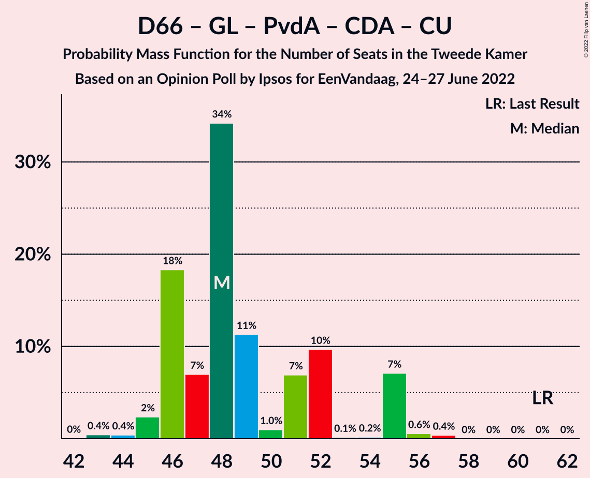

# Opinion Poll by Ipsos for EenVandaag, 24–27 June 2022

<a href="#voting-intentions">Voting Intentions</a> | <a href="#seats">Seats</a> | <a href="#coalitions">Coalitions</a> | <a href="#technical-information">Technical Information</a>

## Voting Intentions

### Confidence Intervals

| Party | Last Result | Poll Result | 80% Confidence Interval | 90% Confidence Interval | 95% Confidence Interval | 99% Confidence Interval |
|:-----:|:-----------:|:-----------:|:-----------------------:|:-----------------------:|:-----------------------:|:-----------------------:|
| Volkspartij voor Vrijheid en Democratie | 21.9% | 19.2% | 17.6–20.8% |17.2–21.3% |16.9–21.7% |16.2–22.5% |
| Partij voor de Vrijheid | 10.8% | 10.0% | 8.9–11.3% |8.6–11.7% |8.3–12.0% |7.8–12.7% |
| Democraten 66 | 15.0% | 10.0% | 8.9–11.3% |8.6–11.7% |8.3–12.0% |7.8–12.7% |
| BoerBurgerBeweging | 1.0% | 7.7% | 6.7–8.9% |6.4–9.2% |6.2–9.5% |5.8–10.1% |
| GroenLinks | 5.2% | 7.2% | 6.2–8.3% |6.0–8.7% |5.8–8.9% |5.3–9.5% |
| Partij van de Arbeid | 5.7% | 6.2% | 5.3–7.3% |5.1–7.6% |4.9–7.9% |4.5–8.4% |
| Socialistische Partij | 6.0% | 5.8% | 5.0–6.9% |4.8–7.2% |4.6–7.5% |4.2–8.0% |
| Christen-Democratisch Appèl | 9.5% | 5.7% | 4.9–6.8% |4.7–7.1% |4.5–7.3% |4.1–7.9% |
| Partij voor de Dieren | 3.8% | 5.3% | 4.5–6.3% |4.2–6.6% |4.0–6.8% |3.7–7.3% |
| Juiste Antwoord 2021 | 2.4% | 3.9% | 3.2–4.8% |3.0–5.0% |2.9–5.3% |2.6–5.7% |
| Forum voor Democratie | 5.0% | 3.5% | 2.9–4.4% |2.7–4.6% |2.5–4.8% |2.3–5.3% |
| ChristenUnie | 3.4% | 3.2% | 2.6–4.0% |2.4–4.3% |2.3–4.5% |2.0–4.9% |
| Staatkundig Gereformeerde Partij | 2.1% | 3.2% | 2.6–4.0% |2.4–4.3% |2.3–4.5% |2.0–4.9% |
| Volt Europa | 2.4% | 2.8% | 2.3–3.6% |2.1–3.8% |2.0–4.0% |1.7–4.4% |
| DENK | 2.0% | 2.6% | 2.1–3.4% |1.9–3.6% |1.8–3.8% |1.6–4.2% |
| Bij1 | 0.8% | 0.8% | 0.5–1.3% |0.4–1.4% |0.4–1.5% |0.3–1.8% |
| 50Plus | 1.0% | 0.7% | 0.4–1.1% |0.4–1.3% |0.3–1.4% |0.2–1.7% |

*Note:* The poll result column reflects the actual value used in the calculations. Published results may vary slightly, and in addition be rounded to fewer digits.

## Seats

### Confidence Intervals

| Party | Last Result | Median | 80% Confidence Interval | 90% Confidence Interval | 95% Confidence Interval | 99% Confidence Interval |
|:-----:|:-----------:|:------:|:-----------------------:|:-----------------------:|:-----------------------:|:-----------------------:|
| <a href="#volkspartij-voor-vrijheid-en-democratie">Volkspartij voor Vrijheid en Democratie</a> | 34 | 30 | 26–32 |25–34 |25–34 |25–38 |
| <a href="#partij-voor-de-vrijheid">Partij voor de Vrijheid</a> | 17 | 16 | 15–18 |15–19 |13–19 |11–20 |
| <a href="#democraten-66">Democraten 66</a> | 24 | 15 | 13–19 |13–19 |13–19 |13–19 |
| <a href="#boerburgerbeweging">BoerBurgerBeweging</a> | 1 | 11 | 10–13 |10–13 |10–14 |8–14 |
| <a href="#groenlinks">GroenLinks</a> | 8 | 12 | 8–13 |8–13 |8–13 |7–15 |
| <a href="#partij-van-de-arbeid">Partij van de Arbeid</a> | 9 | 10 | 8–11 |7–12 |7–12 |7–12 |
| <a href="#socialistische-partij">Socialistische Partij</a> | 9 | 8 | 7–10 |7–10 |7–11 |7–11 |
| <a href="#christen-democratisch-appèl">Christen-Democratisch Appèl</a> | 15 | 8 | 6–10 |6–10 |6–11 |6–12 |
| <a href="#partij-voor-de-dieren">Partij voor de Dieren</a> | 6 | 8 | 6–10 |6–10 |6–10 |6–11 |
| <a href="#juiste-antwoord-2021">Juiste Antwoord 2021</a> | 3 | 6 | 4–8 |4–8 |4–8 |3–8 |
| <a href="#forum-voor-democratie">Forum voor Democratie</a> | 8 | 5 | 4–7 |3–7 |3–8 |3–9 |
| <a href="#christenunie">ChristenUnie</a> | 5 | 5 | 3–6 |3–7 |3–7 |2–7 |
| <a href="#staatkundig-gereformeerde-partij">Staatkundig Gereformeerde Partij</a> | 3 | 5 | 4–6 |4–6 |3–6 |3–7 |
| <a href="#volt-europa">Volt Europa</a> | 3 | 4 | 2–7 |2–7 |2–7 |2–7 |
| <a href="#denk">DENK</a> | 3 | 4 | 2–5 |2–5 |2–5 |2–6 |
| <a href="#bij1">Bij1</a> | 1 | 1 | 0–2 |0–2 |0–2 |0–2 |
| <a href="#50plus">50Plus</a> | 1 | 0 | 0–1 |0–1 |0–1 |0–2 |

### Volkspartij voor Vrijheid en Democratie

*For a full overview of the results for this party, see the [Volkspartij voor Vrijheid en Democratie](party-volkspartijvoorvrijheidendemocratie.html) page.*

| Number of Seats | Probability | Accumulated | Special Marks |
|:---------------:|:-----------:|:-----------:|:-------------:|
| 23 | 0.3% | 100% |  |
| 24 | 0.1% | 99.7% |  |
| 25 | 7% | 99.6% |  |
| 26 | 3% | 92% |  |
| 27 | 10% | 89% |  |
| 28 | 5% | 80% |  |
| 29 | 18% | 75% |  |
| 30 | 10% | 57% | Median |
| 31 | 30% | 47% |  |
| 32 | 8% | 16% |  |
| 33 | 0.5% | 8% |  |
| 34 | 7% | 8% | Last Result |
| 35 | 0.1% | 0.6% |  |
| 36 | 0% | 0.5% |  |
| 37 | 0% | 0.5% |  |
| 38 | 0.5% | 0.5% |  |
| 39 | 0% | 0% |  |

### Partij voor de Vrijheid

*For a full overview of the results for this party, see the [Partij voor de Vrijheid](party-partijvoordevrijheid.html) page.*

| Number of Seats | Probability | Accumulated | Special Marks |
|:---------------:|:-----------:|:-----------:|:-------------:|
| 11 | 0.6% | 100% |  |
| 12 | 0.7% | 99.4% |  |
| 13 | 1.2% | 98.7% |  |
| 14 | 0.6% | 97% |  |
| 15 | 35% | 97% |  |
| 16 | 37% | 61% | Median |
| 17 | 11% | 24% | Last Result |
| 18 | 4% | 14% |  |
| 19 | 8% | 10% |  |
| 20 | 2% | 2% |  |
| 21 | 0% | 0% |  |

### Democraten 66

*For a full overview of the results for this party, see the [Democraten 66](party-democraten66.html) page.*

| Number of Seats | Probability | Accumulated | Special Marks |
|:---------------:|:-----------:|:-----------:|:-------------:|
| 11 | 0.1% | 100% |  |
| 12 | 0.2% | 99.9% |  |
| 13 | 39% | 99.7% |  |
| 14 | 2% | 61% |  |
| 15 | 26% | 59% | Median |
| 16 | 10% | 34% |  |
| 17 | 0.7% | 24% |  |
| 18 | 0.9% | 23% |  |
| 19 | 22% | 22% |  |
| 20 | 0.1% | 0.4% |  |
| 21 | 0.3% | 0.3% |  |
| 22 | 0% | 0% |  |
| 23 | 0% | 0% |  |
| 24 | 0% | 0% | Last Result |

### BoerBurgerBeweging

*For a full overview of the results for this party, see the [BoerBurgerBeweging](party-boerburgerbeweging.html) page.*

| Number of Seats | Probability | Accumulated | Special Marks |
|:---------------:|:-----------:|:-----------:|:-------------:|
| 1 | 0% | 100% | Last Result |
| 2 | 0% | 100% |  |
| 3 | 0% | 100% |  |
| 4 | 0% | 100% |  |
| 5 | 0% | 100% |  |
| 6 | 0% | 100% |  |
| 7 | 0% | 100% |  |
| 8 | 0.9% | 100% |  |
| 9 | 0.4% | 99.0% |  |
| 10 | 16% | 98.7% |  |
| 11 | 44% | 82% | Median |
| 12 | 17% | 39% |  |
| 13 | 19% | 21% |  |
| 14 | 2% | 3% |  |
| 15 | 0.1% | 0.5% |  |
| 16 | 0.2% | 0.4% |  |
| 17 | 0.2% | 0.2% |  |
| 18 | 0% | 0% |  |

### GroenLinks

*For a full overview of the results for this party, see the [GroenLinks](party-groenlinks.html) page.*

| Number of Seats | Probability | Accumulated | Special Marks |
|:---------------:|:-----------:|:-----------:|:-------------:|
| 7 | 0.7% | 100% |  |
| 8 | 19% | 99.3% | Last Result |
| 9 | 3% | 81% |  |
| 10 | 16% | 77% |  |
| 11 | 5% | 61% |  |
| 12 | 38% | 56% | Median |
| 13 | 16% | 19% |  |
| 14 | 0.7% | 2% |  |
| 15 | 2% | 2% |  |
| 16 | 0% | 0.1% |  |
| 17 | 0% | 0% |  |

### Partij van de Arbeid

*For a full overview of the results for this party, see the [Partij van de Arbeid](party-partijvandearbeid.html) page.*

| Number of Seats | Probability | Accumulated | Special Marks |
|:---------------:|:-----------:|:-----------:|:-------------:|
| 6 | 0% | 100% |  |
| 7 | 8% | 99.9% |  |
| 8 | 24% | 92% |  |
| 9 | 16% | 68% | Last Result |
| 10 | 29% | 51% | Median |
| 11 | 13% | 22% |  |
| 12 | 9% | 9% |  |
| 13 | 0.1% | 0.1% |  |
| 14 | 0% | 0% |  |

### Socialistische Partij

*For a full overview of the results for this party, see the [Socialistische Partij](party-socialistischepartij.html) page.*

| Number of Seats | Probability | Accumulated | Special Marks |
|:---------------:|:-----------:|:-----------:|:-------------:|
| 5 | 0.1% | 100% |  |
| 6 | 0.3% | 99.9% |  |
| 7 | 20% | 99.7% |  |
| 8 | 30% | 79% | Median |
| 9 | 18% | 49% | Last Result |
| 10 | 28% | 31% |  |
| 11 | 3% | 3% |  |
| 12 | 0.3% | 0.4% |  |
| 13 | 0.1% | 0.1% |  |
| 14 | 0% | 0.1% |  |
| 15 | 0% | 0% |  |

### Christen-Democratisch Appèl

*For a full overview of the results for this party, see the [Christen-Democratisch Appèl](party-christen-democratischappèl.html) page.*

| Number of Seats | Probability | Accumulated | Special Marks |
|:---------------:|:-----------:|:-----------:|:-------------:|
| 5 | 0.1% | 100% |  |
| 6 | 20% | 99.9% |  |
| 7 | 3% | 80% |  |
| 8 | 33% | 78% | Median |
| 9 | 29% | 45% |  |
| 10 | 13% | 16% |  |
| 11 | 2% | 3% |  |
| 12 | 0.6% | 0.6% |  |
| 13 | 0% | 0% |  |
| 14 | 0% | 0% |  |
| 15 | 0% | 0% | Last Result |

### Partij voor de Dieren

*For a full overview of the results for this party, see the [Partij voor de Dieren](party-partijvoordedieren.html) page.*

| Number of Seats | Probability | Accumulated | Special Marks |
|:---------------:|:-----------:|:-----------:|:-------------:|
| 4 | 0.1% | 100% |  |
| 5 | 0.3% | 99.9% |  |
| 6 | 12% | 99.7% | Last Result |
| 7 | 16% | 87% |  |
| 8 | 50% | 71% | Median |
| 9 | 10% | 21% |  |
| 10 | 9% | 11% |  |
| 11 | 2% | 2% |  |
| 12 | 0% | 0% |  |

### Juiste Antwoord 2021

*For a full overview of the results for this party, see the [Juiste Antwoord 2021](party-juisteantwoord2021.html) page.*

| Number of Seats | Probability | Accumulated | Special Marks |
|:---------------:|:-----------:|:-----------:|:-------------:|
| 3 | 0.7% | 100% | Last Result |
| 4 | 23% | 99.3% |  |
| 5 | 23% | 76% |  |
| 6 | 36% | 53% | Median |
| 7 | 1.4% | 17% |  |
| 8 | 16% | 16% |  |
| 9 | 0.1% | 0.1% |  |
| 10 | 0% | 0% |  |

### Forum voor Democratie

*For a full overview of the results for this party, see the [Forum voor Democratie](party-forumvoordemocratie.html) page.*

| Number of Seats | Probability | Accumulated | Special Marks |
|:---------------:|:-----------:|:-----------:|:-------------:|
| 3 | 9% | 100% |  |
| 4 | 1.2% | 91% |  |
| 5 | 44% | 90% | Median |
| 6 | 29% | 46% |  |
| 7 | 12% | 16% |  |
| 8 | 3% | 4% | Last Result |
| 9 | 1.2% | 1.2% |  |
| 10 | 0% | 0% |  |

### ChristenUnie

*For a full overview of the results for this party, see the [ChristenUnie](party-christenunie.html) page.*

| Number of Seats | Probability | Accumulated | Special Marks |
|:---------------:|:-----------:|:-----------:|:-------------:|
| 2 | 1.4% | 100% |  |
| 3 | 13% | 98.6% |  |
| 4 | 25% | 85% |  |
| 5 | 19% | 60% | Last Result, Median |
| 6 | 33% | 41% |  |
| 7 | 7% | 8% |  |
| 8 | 0.2% | 0.2% |  |
| 9 | 0% | 0% |  |

### Staatkundig Gereformeerde Partij

*For a full overview of the results for this party, see the [Staatkundig Gereformeerde Partij](party-staatkundiggereformeerdepartij.html) page.*

| Number of Seats | Probability | Accumulated | Special Marks |
|:---------------:|:-----------:|:-----------:|:-------------:|
| 2 | 0.2% | 100% |  |
| 3 | 4% | 99.8% | Last Result |
| 4 | 38% | 96% |  |
| 5 | 48% | 58% | Median |
| 6 | 10% | 10% |  |
| 7 | 0.5% | 0.7% |  |
| 8 | 0.2% | 0.2% |  |
| 9 | 0% | 0% |  |

### Volt Europa

*For a full overview of the results for this party, see the [Volt Europa](party-volteuropa.html) page.*

| Number of Seats | Probability | Accumulated | Special Marks |
|:---------------:|:-----------:|:-----------:|:-------------:|
| 2 | 32% | 100% |  |
| 3 | 13% | 68% | Last Result |
| 4 | 17% | 55% | Median |
| 5 | 18% | 38% |  |
| 6 | 1.4% | 20% |  |
| 7 | 19% | 19% |  |
| 8 | 0% | 0% |  |

### DENK

*For a full overview of the results for this party, see the [DENK](party-denk.html) page.*

| Number of Seats | Probability | Accumulated | Special Marks |
|:---------------:|:-----------:|:-----------:|:-------------:|
| 2 | 25% | 100% |  |
| 3 | 19% | 75% | Last Result |
| 4 | 37% | 55% | Median |
| 5 | 18% | 19% |  |
| 6 | 0.8% | 0.9% |  |
| 7 | 0% | 0.1% |  |
| 8 | 0.1% | 0.1% |  |
| 9 | 0% | 0% |  |

### Bij1

*For a full overview of the results for this party, see the [Bij1](party-bij1.html) page.*

| Number of Seats | Probability | Accumulated | Special Marks |
|:---------------:|:-----------:|:-----------:|:-------------:|
| 0 | 34% | 100% |  |
| 1 | 23% | 66% | Last Result, Median |
| 2 | 43% | 43% |  |
| 3 | 0.1% | 0.1% |  |
| 4 | 0% | 0% |  |

### 50Plus

*For a full overview of the results for this party, see the [50Plus](party-50plus.html) page.*

| Number of Seats | Probability | Accumulated | Special Marks |
|:---------------:|:-----------:|:-----------:|:-------------:|
| 0 | 55% | 100% | Median |
| 1 | 45% | 45% | Last Result |
| 2 | 0.7% | 0.8% |  |
| 3 | 0.1% | 0.1% |  |
| 4 | 0% | 0% |  |

## Coalitions

### Confidence Intervals

| Coalition | Last Result | Median | Majority? | 80% Confidence Interval | 90% Confidence Interval | 95% Confidence Interval | 99% Confidence Interval |
|:---------:|:-----------:|:------:|:---------:|:-----------------------:|:-----------------------:|:-----------------------:|:-----------------------:|
| Volkspartij voor Vrijheid en Democratie – Democraten 66 – GroenLinks – Christen-Democratisch Appèl – ChristenUnie | 86 | 69 | 0.3% | 67–71 | 65–71 | 64–72 | 62–75 |
| Volkspartij voor Vrijheid en Democratie – Democraten 66 – Partij van de Arbeid – Christen-Democratisch Appèl – ChristenUnie | 87 | 68 | 0% | 64–71 | 64–71 | 64–71 | 62–73 |
| Volkspartij voor Vrijheid en Democratie – Partij voor de Vrijheid – Christen-Democratisch Appèl – Forum voor Democratie – Staatkundig Gereformeerde Partij | 77 | 64 | 0% | 61–68 | 60–68 | 60–68 | 57–72 |
| Volkspartij voor Vrijheid en Democratie – Partij voor de Vrijheid – Christen-Democratisch Appèl – Forum voor Democratie | 74 | 60 | 0% | 56–62 | 56–62 | 56–63 | 53–67 |
| Democraten 66 – GroenLinks – Partij van de Arbeid – Socialistische Partij – Christen-Democratisch Appèl – ChristenUnie | 70 | 58 | 0% | 53–62 | 53–63 | 53–63 | 53–65 |
| Volkspartij voor Vrijheid en Democratie – Democraten 66 – Christen-Democratisch Appèl – ChristenUnie | 78 | 57 | 0% | 56–62 | 55–62 | 54–62 | 52–64 |
| Volkspartij voor Vrijheid en Democratie – Democraten 66 – Partij van de Arbeid | 67 | 54 | 0% | 50–60 | 50–61 | 49–61 | 49–61 |
| Volkspartij voor Vrijheid en Democratie – Partij voor de Vrijheid – Christen-Democratisch Appèl | 66 | 54 | 0% | 51–59 | 51–59 | 51–59 | 47–62 |
| Volkspartij voor Vrijheid en Democratie – Democraten 66 – Christen-Democratisch Appèl | 73 | 53 | 0% | 49–56 | 49–56 | 49–56 | 48–61 |
| Democraten 66 – GroenLinks – Partij van de Arbeid – Christen-Democratisch Appèl – ChristenUnie | 61 | 48 | 0% | 46–52 | 46–55 | 45–55 | 44–56 |
| Volkspartij voor Vrijheid en Democratie – Christen-Democratisch Appèl – Forum voor Democratie – Staatkundig Gereformeerde Partij – 50Plus | 61 | 49 | 0% | 46–50 | 43–50 | 43–53 | 43–56 |
| Volkspartij voor Vrijheid en Democratie – Christen-Democratisch Appèl – Forum voor Democratie – Staatkundig Gereformeerde Partij | 60 | 49 | 0% | 46–50 | 43–50 | 43–52 | 42–56 |
| Volkspartij voor Vrijheid en Democratie – Partij van de Arbeid – Christen-Democratisch Appèl | 58 | 47 | 0% | 45–50 | 44–51 | 44–51 | 42–56 |
| Volkspartij voor Vrijheid en Democratie – Christen-Democratisch Appèl – Forum voor Democratie – 50Plus | 58 | 44 | 0% | 42–46 | 39–46 | 39–48 | 38–50 |
| Volkspartij voor Vrijheid en Democratie – Christen-Democratisch Appèl – Forum voor Democratie | 57 | 44 | 0% | 41–46 | 39–46 | 39–47 | 37–50 |
| Volkspartij voor Vrijheid en Democratie – Partij van de Arbeid | 43 | 38 | 0% | 36–42 | 36–45 | 36–45 | 34–47 |
| Volkspartij voor Vrijheid en Democratie – Christen-Democratisch Appèl | 49 | 37 | 0% | 36–40 | 34–40 | 34–40 | 32–47 |
| Democraten 66 – Partij van de Arbeid – Christen-Democratisch Appèl | 48 | 32 | 0% | 29–38 | 29–38 | 29–38 | 29–39 |
| Democraten 66 – Christen-Democratisch Appèl | 39 | 23 | 0% | 21–27 | 21–29 | 21–29 | 20–31 |
| Partij van de Arbeid – Christen-Democratisch Appèl – ChristenUnie | 29 | 22 | 0% | 20–25 | 20–28 | 20–28 | 19–28 |
| Partij van de Arbeid – Christen-Democratisch Appèl | 24 | 18 | 0% | 15–20 | 14–21 | 14–21 | 14–21 |

### Volkspartij voor Vrijheid en Democratie – Democraten 66 – GroenLinks – Christen-Democratisch Appèl – ChristenUnie

| Number of Seats | Probability | Accumulated | Special Marks |
|:---------------:|:-----------:|:-----------:|:-------------:|
| 61 | 0.1% | 100% |  |
| 62 | 0.6% | 99.8% |  |
| 63 | 0.2% | 99.3% |  |
| 64 | 4% | 99.1% |  |
| 65 | 3% | 96% |  |
| 66 | 2% | 93% |  |
| 67 | 7% | 91% |  |
| 68 | 8% | 83% |  |
| 69 | 35% | 76% |  |
| 70 | 18% | 41% | Median |
| 71 | 21% | 23% |  |
| 72 | 0.6% | 3% |  |
| 73 | 0.2% | 2% |  |
| 74 | 0.6% | 2% |  |
| 75 | 0.8% | 1.2% |  |
| 76 | 0% | 0.3% | Majority |
| 77 | 0.3% | 0.3% |  |
| 78 | 0% | 0% |  |
| 79 | 0% | 0% |  |
| 80 | 0% | 0% |  |
| 81 | 0% | 0% |  |
| 82 | 0% | 0% |  |
| 83 | 0% | 0% |  |
| 84 | 0% | 0% |  |
| 85 | 0% | 0% |  |
| 86 | 0% | 0% | Last Result |

### Volkspartij voor Vrijheid en Democratie – Democraten 66 – Partij van de Arbeid – Christen-Democratisch Appèl – ChristenUnie

| Number of Seats | Probability | Accumulated | Special Marks |
|:---------------:|:-----------:|:-----------:|:-------------:|
| 60 | 0.3% | 100% |  |
| 61 | 0.2% | 99.7% |  |
| 62 | 0.2% | 99.5% |  |
| 63 | 0.3% | 99.3% |  |
| 64 | 20% | 99.0% |  |
| 65 | 3% | 79% |  |
| 66 | 2% | 77% |  |
| 67 | 21% | 75% |  |
| 68 | 15% | 54% | Median |
| 69 | 22% | 39% |  |
| 70 | 6% | 17% |  |
| 71 | 10% | 11% |  |
| 72 | 0.6% | 2% |  |
| 73 | 0.8% | 1.0% |  |
| 74 | 0.2% | 0.2% |  |
| 75 | 0% | 0% |  |
| 76 | 0% | 0% | Majority |
| 77 | 0% | 0% |  |
| 78 | 0% | 0% |  |
| 79 | 0% | 0% |  |
| 80 | 0% | 0% |  |
| 81 | 0% | 0% |  |
| 82 | 0% | 0% |  |
| 83 | 0% | 0% |  |
| 84 | 0% | 0% |  |
| 85 | 0% | 0% |  |
| 86 | 0% | 0% |  |
| 87 | 0% | 0% | Last Result |

### Volkspartij voor Vrijheid en Democratie – Partij voor de Vrijheid – Christen-Democratisch Appèl – Forum voor Democratie – Staatkundig Gereformeerde Partij

| Number of Seats | Probability | Accumulated | Special Marks |
|:---------------:|:-----------:|:-----------:|:-------------:|
| 53 | 0.1% | 100% |  |
| 54 | 0.1% | 99.9% |  |
| 55 | 0% | 99.8% |  |
| 56 | 0.1% | 99.8% |  |
| 57 | 0.3% | 99.7% |  |
| 58 | 0.2% | 99.4% |  |
| 59 | 0.4% | 99.2% |  |
| 60 | 7% | 98.7% |  |
| 61 | 9% | 91% |  |
| 62 | 0.5% | 82% |  |
| 63 | 8% | 81% |  |
| 64 | 35% | 74% | Median |
| 65 | 20% | 38% |  |
| 66 | 7% | 18% |  |
| 67 | 1.0% | 11% |  |
| 68 | 8% | 10% |  |
| 69 | 0% | 2% |  |
| 70 | 0% | 2% |  |
| 71 | 0.6% | 2% |  |
| 72 | 2% | 2% |  |
| 73 | 0% | 0% |  |
| 74 | 0% | 0% |  |
| 75 | 0% | 0% |  |
| 76 | 0% | 0% | Majority |
| 77 | 0% | 0% | Last Result |

### Volkspartij voor Vrijheid en Democratie – Partij voor de Vrijheid – Christen-Democratisch Appèl – Forum voor Democratie

| Number of Seats | Probability | Accumulated | Special Marks |
|:---------------:|:-----------:|:-----------:|:-------------:|
| 48 | 0.1% | 100% |  |
| 49 | 0.1% | 99.9% |  |
| 50 | 0.1% | 99.8% |  |
| 51 | 0.1% | 99.8% |  |
| 52 | 0.1% | 99.7% |  |
| 53 | 0.3% | 99.6% |  |
| 54 | 0.4% | 99.3% |  |
| 55 | 0.6% | 98.8% |  |
| 56 | 15% | 98% |  |
| 57 | 1.3% | 83% |  |
| 58 | 6% | 81% |  |
| 59 | 18% | 76% | Median |
| 60 | 30% | 58% |  |
| 61 | 13% | 28% |  |
| 62 | 11% | 14% |  |
| 63 | 1.1% | 3% |  |
| 64 | 0% | 2% |  |
| 65 | 0.5% | 2% |  |
| 66 | 0% | 2% |  |
| 67 | 2% | 2% |  |
| 68 | 0% | 0% |  |
| 69 | 0% | 0% |  |
| 70 | 0% | 0% |  |
| 71 | 0% | 0% |  |
| 72 | 0% | 0% |  |
| 73 | 0% | 0% |  |
| 74 | 0% | 0% | Last Result |

### Democraten 66 – GroenLinks – Partij van de Arbeid – Socialistische Partij – Christen-Democratisch Appèl – ChristenUnie

| Number of Seats | Probability | Accumulated | Special Marks |
|:---------------:|:-----------:|:-----------:|:-------------:|
| 50 | 0% | 100% |  |
| 51 | 0.1% | 99.9% |  |
| 52 | 0.2% | 99.8% |  |
| 53 | 15% | 99.6% |  |
| 54 | 3% | 85% |  |
| 55 | 2% | 82% |  |
| 56 | 28% | 81% |  |
| 57 | 0.8% | 53% |  |
| 58 | 29% | 52% | Median |
| 59 | 5% | 24% |  |
| 60 | 0.9% | 19% |  |
| 61 | 0.4% | 18% |  |
| 62 | 9% | 18% |  |
| 63 | 7% | 8% |  |
| 64 | 0.1% | 0.9% |  |
| 65 | 0.7% | 0.8% |  |
| 66 | 0% | 0% |  |
| 67 | 0% | 0% |  |
| 68 | 0% | 0% |  |
| 69 | 0% | 0% |  |
| 70 | 0% | 0% | Last Result |

### Volkspartij voor Vrijheid en Democratie – Democraten 66 – Christen-Democratisch Appèl – ChristenUnie

| Number of Seats | Probability | Accumulated | Special Marks |
|:---------------:|:-----------:|:-----------:|:-------------:|
| 50 | 0.3% | 100% |  |
| 51 | 0.1% | 99.7% |  |
| 52 | 0.2% | 99.6% |  |
| 53 | 0.3% | 99.5% |  |
| 54 | 3% | 99.2% |  |
| 55 | 3% | 96% |  |
| 56 | 25% | 93% |  |
| 57 | 20% | 68% |  |
| 58 | 8% | 48% | Median |
| 59 | 12% | 40% |  |
| 60 | 0.6% | 27% |  |
| 61 | 16% | 27% |  |
| 62 | 9% | 11% |  |
| 63 | 0.2% | 1.2% |  |
| 64 | 1.0% | 1.0% |  |
| 65 | 0% | 0% |  |
| 66 | 0% | 0% |  |
| 67 | 0% | 0% |  |
| 68 | 0% | 0% |  |
| 69 | 0% | 0% |  |
| 70 | 0% | 0% |  |
| 71 | 0% | 0% |  |
| 72 | 0% | 0% |  |
| 73 | 0% | 0% |  |
| 74 | 0% | 0% |  |
| 75 | 0% | 0% |  |
| 76 | 0% | 0% | Majority |
| 77 | 0% | 0% |  |
| 78 | 0% | 0% | Last Result |

### Volkspartij voor Vrijheid en Democratie – Democraten 66 – Partij van de Arbeid

| Number of Seats | Probability | Accumulated | Special Marks |
|:---------------:|:-----------:|:-----------:|:-------------:|
| 47 | 0.3% | 100% |  |
| 48 | 0.2% | 99.7% |  |
| 49 | 3% | 99.5% |  |
| 50 | 16% | 97% |  |
| 51 | 2% | 81% |  |
| 52 | 11% | 79% |  |
| 53 | 0.5% | 68% |  |
| 54 | 19% | 68% |  |
| 55 | 18% | 48% | Median |
| 56 | 7% | 30% |  |
| 57 | 9% | 23% |  |
| 58 | 2% | 14% |  |
| 59 | 0.7% | 13% |  |
| 60 | 7% | 12% |  |
| 61 | 5% | 5% |  |
| 62 | 0% | 0% |  |
| 63 | 0% | 0% |  |
| 64 | 0% | 0% |  |
| 65 | 0% | 0% |  |
| 66 | 0% | 0% |  |
| 67 | 0% | 0% | Last Result |

### Volkspartij voor Vrijheid en Democratie – Partij voor de Vrijheid – Christen-Democratisch Appèl

| Number of Seats | Probability | Accumulated | Special Marks |
|:---------------:|:-----------:|:-----------:|:-------------:|
| 44 | 0.1% | 100% |  |
| 45 | 0.1% | 99.9% |  |
| 46 | 0.1% | 99.8% |  |
| 47 | 0.4% | 99.7% |  |
| 48 | 0.1% | 99.3% |  |
| 49 | 0.4% | 99.2% |  |
| 50 | 0.7% | 98.8% |  |
| 51 | 16% | 98% |  |
| 52 | 2% | 82% |  |
| 53 | 30% | 80% |  |
| 54 | 5% | 50% | Median |
| 55 | 33% | 45% |  |
| 56 | 1.0% | 12% |  |
| 57 | 0.4% | 11% |  |
| 58 | 0.1% | 10% |  |
| 59 | 8% | 10% |  |
| 60 | 2% | 2% |  |
| 61 | 0% | 0.6% |  |
| 62 | 0.5% | 0.5% |  |
| 63 | 0% | 0% |  |
| 64 | 0% | 0% |  |
| 65 | 0% | 0% |  |
| 66 | 0% | 0% | Last Result |

### Volkspartij voor Vrijheid en Democratie – Democraten 66 – Christen-Democratisch Appèl

| Number of Seats | Probability | Accumulated | Special Marks |
|:---------------:|:-----------:|:-----------:|:-------------:|
| 45 | 0.2% | 100% |  |
| 46 | 0% | 99.7% |  |
| 47 | 0.2% | 99.7% |  |
| 48 | 0.3% | 99.5% |  |
| 49 | 10% | 99.2% |  |
| 50 | 16% | 90% |  |
| 51 | 2% | 74% |  |
| 52 | 3% | 72% |  |
| 53 | 22% | 69% | Median |
| 54 | 8% | 47% |  |
| 55 | 15% | 39% |  |
| 56 | 23% | 24% |  |
| 57 | 0.1% | 1.4% |  |
| 58 | 0.1% | 1.3% |  |
| 59 | 0.3% | 1.2% |  |
| 60 | 0.3% | 0.9% |  |
| 61 | 0.6% | 0.6% |  |
| 62 | 0% | 0% |  |
| 63 | 0% | 0% |  |
| 64 | 0% | 0% |  |
| 65 | 0% | 0% |  |
| 66 | 0% | 0% |  |
| 67 | 0% | 0% |  |
| 68 | 0% | 0% |  |
| 69 | 0% | 0% |  |
| 70 | 0% | 0% |  |
| 71 | 0% | 0% |  |
| 72 | 0% | 0% |  |
| 73 | 0% | 0% | Last Result |

### Democraten 66 – GroenLinks – Partij van de Arbeid – Christen-Democratisch Appèl – ChristenUnie

| Number of Seats | Probability | Accumulated | Special Marks |
|:---------------:|:-----------:|:-----------:|:-------------:|
| 42 | 0% | 100% |  |
| 43 | 0.4% | 99.9% |  |
| 44 | 0.4% | 99.5% |  |
| 45 | 2% | 99.1% |  |
| 46 | 18% | 97% |  |
| 47 | 7% | 78% |  |
| 48 | 34% | 71% |  |
| 49 | 11% | 37% |  |
| 50 | 1.0% | 26% | Median |
| 51 | 7% | 25% |  |
| 52 | 10% | 18% |  |
| 53 | 0.1% | 8% |  |
| 54 | 0.2% | 8% |  |
| 55 | 7% | 8% |  |
| 56 | 0.6% | 0.9% |  |
| 57 | 0.4% | 0.4% |  |
| 58 | 0% | 0% |  |
| 59 | 0% | 0% |  |
| 60 | 0% | 0% |  |
| 61 | 0% | 0% | Last Result |

### Volkspartij voor Vrijheid en Democratie – Christen-Democratisch Appèl – Forum voor Democratie – Staatkundig Gereformeerde Partij – 50Plus

| Number of Seats | Probability | Accumulated | Special Marks |
|:---------------:|:-----------:|:-----------:|:-------------:|
| 41 | 0.3% | 100% |  |
| 42 | 0.1% | 99.6% |  |
| 43 | 7% | 99.6% |  |
| 44 | 0.1% | 92% |  |
| 45 | 0.2% | 92% |  |
| 46 | 4% | 92% |  |
| 47 | 9% | 88% |  |
| 48 | 8% | 79% | Median |
| 49 | 42% | 71% |  |
| 50 | 25% | 29% |  |
| 51 | 0.4% | 4% |  |
| 52 | 0.7% | 3% |  |
| 53 | 2% | 3% |  |
| 54 | 0.1% | 0.8% |  |
| 55 | 0.1% | 0.7% |  |
| 56 | 0.6% | 0.6% |  |
| 57 | 0% | 0% |  |
| 58 | 0% | 0% |  |
| 59 | 0% | 0% |  |
| 60 | 0% | 0% |  |
| 61 | 0% | 0% | Last Result |

### Volkspartij voor Vrijheid en Democratie – Christen-Democratisch Appèl – Forum voor Democratie – Staatkundig Gereformeerde Partij

| Number of Seats | Probability | Accumulated | Special Marks |
|:---------------:|:-----------:|:-----------:|:-------------:|
| 41 | 0.4% | 100% |  |
| 42 | 0.2% | 99.6% |  |
| 43 | 7% | 99.4% |  |
| 44 | 0.2% | 92% |  |
| 45 | 0.7% | 92% |  |
| 46 | 12% | 91% |  |
| 47 | 8% | 79% |  |
| 48 | 17% | 72% | Median |
| 49 | 36% | 55% |  |
| 50 | 15% | 19% |  |
| 51 | 0.8% | 3% |  |
| 52 | 2% | 3% |  |
| 53 | 0% | 0.7% |  |
| 54 | 0.1% | 0.7% |  |
| 55 | 0% | 0.6% |  |
| 56 | 0.6% | 0.6% |  |
| 57 | 0% | 0% |  |
| 58 | 0% | 0% |  |
| 59 | 0% | 0% |  |
| 60 | 0% | 0% | Last Result |

### Volkspartij voor Vrijheid en Democratie – Partij van de Arbeid – Christen-Democratisch Appèl

| Number of Seats | Probability | Accumulated | Special Marks |
|:---------------:|:-----------:|:-----------:|:-------------:|
| 40 | 0.1% | 100% |  |
| 41 | 0.3% | 99.9% |  |
| 42 | 0.3% | 99.7% |  |
| 43 | 0.4% | 99.4% |  |
| 44 | 8% | 99.0% |  |
| 45 | 17% | 91% |  |
| 46 | 22% | 74% |  |
| 47 | 9% | 52% |  |
| 48 | 5% | 43% | Median |
| 49 | 10% | 38% |  |
| 50 | 19% | 28% |  |
| 51 | 7% | 9% |  |
| 52 | 0.2% | 1.2% |  |
| 53 | 0.3% | 1.0% |  |
| 54 | 0% | 0.7% |  |
| 55 | 0% | 0.6% |  |
| 56 | 0.6% | 0.6% |  |
| 57 | 0% | 0% |  |
| 58 | 0% | 0% | Last Result |

### Volkspartij voor Vrijheid en Democratie – Christen-Democratisch Appèl – Forum voor Democratie – 50Plus

| Number of Seats | Probability | Accumulated | Special Marks |
|:---------------:|:-----------:|:-----------:|:-------------:|
| 37 | 0.4% | 100% |  |
| 38 | 0.1% | 99.6% |  |
| 39 | 7% | 99.4% |  |
| 40 | 0.5% | 92% |  |
| 41 | 0.5% | 92% |  |
| 42 | 12% | 91% |  |
| 43 | 14% | 80% | Median |
| 44 | 16% | 66% |  |
| 45 | 38% | 50% |  |
| 46 | 8% | 12% |  |
| 47 | 0.9% | 4% |  |
| 48 | 2% | 3% |  |
| 49 | 0.1% | 0.8% |  |
| 50 | 0.6% | 0.7% |  |
| 51 | 0% | 0.1% |  |
| 52 | 0% | 0% |  |
| 53 | 0% | 0% |  |
| 54 | 0% | 0% |  |
| 55 | 0% | 0% |  |
| 56 | 0% | 0% |  |
| 57 | 0% | 0% |  |
| 58 | 0% | 0% | Last Result |

### Volkspartij voor Vrijheid en Democratie – Christen-Democratisch Appèl – Forum voor Democratie

| Number of Seats | Probability | Accumulated | Special Marks |
|:---------------:|:-----------:|:-----------:|:-------------:|
| 36 | 0.1% | 100% |  |
| 37 | 0.4% | 99.9% |  |
| 38 | 0.2% | 99.5% |  |
| 39 | 7% | 99.2% |  |
| 40 | 0.4% | 92% |  |
| 41 | 8% | 92% |  |
| 42 | 9% | 83% |  |
| 43 | 24% | 74% | Median |
| 44 | 13% | 50% |  |
| 45 | 27% | 38% |  |
| 46 | 8% | 11% |  |
| 47 | 2% | 3% |  |
| 48 | 0.1% | 0.8% |  |
| 49 | 0.1% | 0.7% |  |
| 50 | 0.6% | 0.6% |  |
| 51 | 0% | 0% |  |
| 52 | 0% | 0% |  |
| 53 | 0% | 0% |  |
| 54 | 0% | 0% |  |
| 55 | 0% | 0% |  |
| 56 | 0% | 0% |  |
| 57 | 0% | 0% | Last Result |

### Volkspartij voor Vrijheid en Democratie – Partij van de Arbeid

| Number of Seats | Probability | Accumulated | Special Marks |
|:---------------:|:-----------:|:-----------:|:-------------:|
| 33 | 0.4% | 100% |  |
| 34 | 0.2% | 99.6% |  |
| 35 | 0.6% | 99.4% |  |
| 36 | 12% | 98.8% |  |
| 37 | 27% | 87% |  |
| 38 | 10% | 60% |  |
| 39 | 9% | 50% |  |
| 40 | 1.0% | 41% | Median |
| 41 | 25% | 40% |  |
| 42 | 7% | 15% |  |
| 43 | 0.3% | 8% | Last Result |
| 44 | 0.2% | 8% |  |
| 45 | 7% | 7% |  |
| 46 | 0% | 0.6% |  |
| 47 | 0.6% | 0.6% |  |
| 48 | 0% | 0% |  |

### Volkspartij voor Vrijheid en Democratie – Christen-Democratisch Appèl

| Number of Seats | Probability | Accumulated | Special Marks |
|:---------------:|:-----------:|:-----------:|:-------------:|
| 31 | 0.3% | 100% |  |
| 32 | 0.2% | 99.7% |  |
| 33 | 0.2% | 99.5% |  |
| 34 | 7% | 99.3% |  |
| 35 | 0.8% | 92% |  |
| 36 | 12% | 91% |  |
| 37 | 33% | 79% |  |
| 38 | 0.9% | 46% | Median |
| 39 | 9% | 45% |  |
| 40 | 35% | 36% |  |
| 41 | 0.5% | 2% |  |
| 42 | 0.3% | 1.2% |  |
| 43 | 0.2% | 0.9% |  |
| 44 | 0.1% | 0.6% |  |
| 45 | 0% | 0.6% |  |
| 46 | 0% | 0.5% |  |
| 47 | 0.5% | 0.5% |  |
| 48 | 0% | 0% |  |
| 49 | 0% | 0% | Last Result |

### Democraten 66 – Partij van de Arbeid – Christen-Democratisch Appèl

| Number of Seats | Probability | Accumulated | Special Marks |
|:---------------:|:-----------:|:-----------:|:-------------:|
| 25 | 0.1% | 100% |  |
| 26 | 0% | 99.9% |  |
| 27 | 0% | 99.9% |  |
| 28 | 0% | 99.8% |  |
| 29 | 15% | 99.8% |  |
| 30 | 0.6% | 85% |  |
| 31 | 8% | 84% |  |
| 32 | 28% | 76% |  |
| 33 | 21% | 48% | Median |
| 34 | 1.2% | 26% |  |
| 35 | 2% | 25% |  |
| 36 | 13% | 23% |  |
| 37 | 0.3% | 10% |  |
| 38 | 9% | 10% |  |
| 39 | 0.5% | 0.7% |  |
| 40 | 0% | 0.2% |  |
| 41 | 0.2% | 0.2% |  |
| 42 | 0% | 0% |  |
| 43 | 0% | 0% |  |
| 44 | 0% | 0% |  |
| 45 | 0% | 0% |  |
| 46 | 0% | 0% |  |
| 47 | 0% | 0% |  |
| 48 | 0% | 0% | Last Result |

### Democraten 66 – Christen-Democratisch Appèl

| Number of Seats | Probability | Accumulated | Special Marks |
|:---------------:|:-----------:|:-----------:|:-------------:|
| 18 | 0.1% | 100% |  |
| 19 | 0.1% | 99.9% |  |
| 20 | 0.5% | 99.8% |  |
| 21 | 22% | 99.3% |  |
| 22 | 19% | 77% |  |
| 23 | 13% | 58% | Median |
| 24 | 20% | 45% |  |
| 25 | 14% | 25% |  |
| 26 | 0.8% | 11% |  |
| 27 | 0.3% | 10% |  |
| 28 | 0.1% | 10% |  |
| 29 | 9% | 10% |  |
| 30 | 0.2% | 0.7% |  |
| 31 | 0.5% | 0.5% |  |
| 32 | 0% | 0% |  |
| 33 | 0% | 0% |  |
| 34 | 0% | 0% |  |
| 35 | 0% | 0% |  |
| 36 | 0% | 0% |  |
| 37 | 0% | 0% |  |
| 38 | 0% | 0% |  |
| 39 | 0% | 0% | Last Result |

### Partij van de Arbeid – Christen-Democratisch Appèl – ChristenUnie

| Number of Seats | Probability | Accumulated | Special Marks |
|:---------------:|:-----------:|:-----------:|:-------------:|
| 18 | 0.1% | 100% |  |
| 19 | 0.6% | 99.9% |  |
| 20 | 27% | 99.2% |  |
| 21 | 4% | 72% |  |
| 22 | 19% | 68% |  |
| 23 | 26% | 50% | Median |
| 24 | 2% | 23% |  |
| 25 | 13% | 21% |  |
| 26 | 0.6% | 8% |  |
| 27 | 0.4% | 7% |  |
| 28 | 7% | 7% |  |
| 29 | 0% | 0% | Last Result |

### Partij van de Arbeid – Christen-Democratisch Appèl

| Number of Seats | Probability | Accumulated | Special Marks |
|:---------------:|:-----------:|:-----------:|:-------------:|
| 12 | 0.1% | 100% |  |
| 13 | 0% | 99.9% |  |
| 14 | 8% | 99.9% |  |
| 15 | 8% | 92% |  |
| 16 | 16% | 84% |  |
| 17 | 14% | 68% |  |
| 18 | 11% | 54% | Median |
| 19 | 30% | 43% |  |
| 20 | 5% | 14% |  |
| 21 | 8% | 9% |  |
| 22 | 0.4% | 0.5% |  |
| 23 | 0% | 0% |  |
| 24 | 0% | 0% | Last Result |

## Technical Information

### Opinion Poll

+ **Polling firm:** Ipsos
+ **Commissioner(s):** EenVandaag
+ **Fieldwork period:** 24–27 June 2022

### Calculations

+ **Sample size:** 1028
+ **Simulations done:** 1,048,576
+ **Error estimate:** 2.70%

