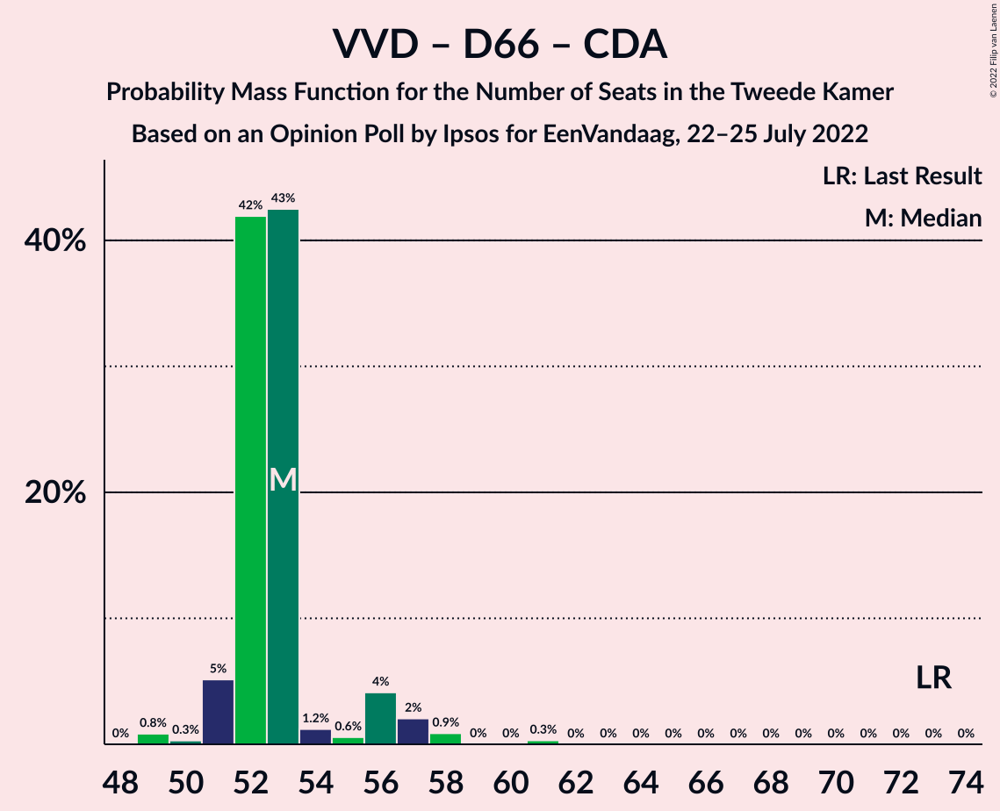

# Opinion Poll by Ipsos for EenVandaag, 22–25 July 2022

<a href="#voting-intentions">Voting Intentions</a> | <a href="#seats">Seats</a> | <a href="#coalitions">Coalitions</a> | <a href="#technical-information">Technical Information</a>

## Voting Intentions

### Confidence Intervals

| Party | Last Result | Poll Result | 80% Confidence Interval | 90% Confidence Interval | 95% Confidence Interval | 99% Confidence Interval |
|:-----:|:-----------:|:-----------:|:-----------------------:|:-----------------------:|:-----------------------:|:-----------------------:|
| Volkspartij voor Vrijheid en Democratie | 21.9% | 18.6% | 17.1–20.3% |16.7–20.8% |16.3–21.2% |15.7–22.0% |
| Partij voor de Vrijheid | 10.8% | 11.5% | 10.3–12.9% |10.0–13.3% |9.7–13.6% |9.1–14.3% |
| Democraten 66 | 15.0% | 11.0% | 9.8–12.4% |9.5–12.8% |9.2–13.1% |8.7–13.8% |
| BoerBurgerBeweging | 1.0% | 9.6% | 8.5–10.9% |8.2–11.3% |7.9–11.6% |7.4–12.2% |
| GroenLinks | 5.2% | 6.3% | 5.5–7.4% |5.2–7.8% |5.0–8.0% |4.6–8.6% |
| Partij voor de Dieren | 3.8% | 6.0% | 5.2–7.1% |4.9–7.4% |4.7–7.7% |4.3–8.2% |
| Partij van de Arbeid | 5.7% | 5.7% | 4.9–6.8% |4.7–7.1% |4.5–7.4% |4.1–7.9% |
| Christen-Democratisch Appèl | 9.5% | 5.6% | 4.7–6.6% |4.5–6.9% |4.3–7.1% |3.9–7.7% |
| Socialistische Partij | 6.0% | 5.1% | 4.3–6.1% |4.0–6.3% |3.9–6.6% |3.5–7.1% |
| Juiste Antwoord 2021 | 2.4% | 4.2% | 3.5–5.1% |3.3–5.3% |3.1–5.6% |2.8–6.1% |
| ChristenUnie | 3.4% | 3.4% | 2.7–4.2% |2.6–4.5% |2.4–4.7% |2.1–5.1% |
| Forum voor Democratie | 5.0% | 2.8% | 2.2–3.6% |2.1–3.8% |1.9–4.0% |1.7–4.4% |
| DENK | 2.0% | 2.7% | 2.1–3.5% |2.0–3.7% |1.8–3.9% |1.6–4.3% |
| Staatkundig Gereformeerde Partij | 2.1% | 2.3% | 1.8–3.0% |1.6–3.2% |1.5–3.4% |1.3–3.8% |
| Volt Europa | 2.4% | 2.1% | 1.6–2.8% |1.5–3.0% |1.4–3.2% |1.2–3.5% |
| Bij1 | 0.8% | 0.9% | 0.6–1.4% |0.5–1.6% |0.5–1.7% |0.4–2.0% |
| 50Plus | 1.0% | 0.5% | 0.3–0.9% |0.3–1.1% |0.2–1.2% |0.2–1.4% |

*Note:* The poll result column reflects the actual value used in the calculations. Published results may vary slightly, and in addition be rounded to fewer digits.

## Seats

### Confidence Intervals

| Party | Last Result | Median | 80% Confidence Interval | 90% Confidence Interval | 95% Confidence Interval | 99% Confidence Interval |
|:-----:|:-----------:|:------:|:-----------------------:|:-----------------------:|:-----------------------:|:-----------------------:|
| <a href="#volkspartij-voor-vrijheid-en-democratie">Volkspartij voor Vrijheid en Democratie</a> | 34 | 27 | 26–28 |26–29 |25–31 |24–35 |
| <a href="#partij-voor-de-vrijheid">Partij voor de Vrijheid</a> | 17 | 17 | 17–20 |16–20 |16–20 |13–20 |
| <a href="#democraten-66">Democraten 66</a> | 24 | 17 | 16–17 |16–18 |14–20 |14–20 |
| <a href="#boerburgerbeweging">BoerBurgerBeweging</a> | 1 | 14 | 13–15 |13–16 |13–16 |11–17 |
| <a href="#groenlinks">GroenLinks</a> | 8 | 9 | 7–10 |7–10 |7–10 |7–12 |
| <a href="#partij-voor-de-dieren">Partij voor de Dieren</a> | 6 | 9 | 7–11 |7–11 |7–12 |7–13 |
| <a href="#partij-van-de-arbeid">Partij van de Arbeid</a> | 9 | 9 | 9–11 |8–11 |7–11 |6–11 |
| <a href="#christen-democratisch-appèl">Christen-Democratisch Appèl</a> | 15 | 9 | 9–10 |7–10 |7–12 |6–12 |
| <a href="#socialistische-partij">Socialistische Partij</a> | 9 | 8 | 7–9 |7–9 |7–9 |5–10 |
| <a href="#juiste-antwoord-2021">Juiste Antwoord 2021</a> | 3 | 7 | 5–8 |5–8 |5–8 |4–8 |
| <a href="#christenunie">ChristenUnie</a> | 5 | 4 | 4–6 |4–6 |4–6 |3–6 |
| <a href="#forum-voor-democratie">Forum voor Democratie</a> | 8 | 4 | 4–5 |3–5 |3–5 |3–6 |
| <a href="#denk">DENK</a> | 3 | 4 | 3–5 |3–5 |3–6 |2–6 |
| <a href="#staatkundig-gereformeerde-partij">Staatkundig Gereformeerde Partij</a> | 3 | 4 | 3–4 |2–5 |2–6 |1–6 |
| <a href="#volt-europa">Volt Europa</a> | 3 | 3 | 2–3 |2–4 |2–5 |1–6 |
| <a href="#bij1">Bij1</a> | 1 | 1 | 0–1 |0–2 |0–2 |0–2 |
| <a href="#50plus">50Plus</a> | 1 | 0 | 0–1 |0–1 |0–2 |0–2 |

### Volkspartij voor Vrijheid en Democratie

*For a full overview of the results for this party, see the [Volkspartij voor Vrijheid en Democratie](party-volkspartijvoorvrijheidendemocratie.html) page.*

| Number of Seats | Probability | Accumulated | Special Marks |
|:---------------:|:-----------:|:-----------:|:-------------:|
| 24 | 0.8% | 100% |  |
| 25 | 3% | 99.1% |  |
| 26 | 44% | 96% |  |
| 27 | 41% | 52% | Median |
| 28 | 2% | 10% |  |
| 29 | 3% | 8% |  |
| 30 | 2% | 5% |  |
| 31 | 0.6% | 3% |  |
| 32 | 0.1% | 2% |  |
| 33 | 1.2% | 2% |  |
| 34 | 0.2% | 0.8% | Last Result |
| 35 | 0.5% | 0.5% |  |
| 36 | 0% | 0% |  |

### Partij voor de Vrijheid

*For a full overview of the results for this party, see the [Partij voor de Vrijheid](party-partijvoordevrijheid.html) page.*

| Number of Seats | Probability | Accumulated | Special Marks |
|:---------------:|:-----------:|:-----------:|:-------------:|
| 12 | 0.5% | 100% |  |
| 13 | 0.1% | 99.5% |  |
| 14 | 0.8% | 99.5% |  |
| 15 | 0.3% | 98.7% |  |
| 16 | 6% | 98% |  |
| 17 | 47% | 92% | Last Result, Median |
| 18 | 4% | 45% |  |
| 19 | 2% | 41% |  |
| 20 | 39% | 39% |  |
| 21 | 0.1% | 0.2% |  |
| 22 | 0.1% | 0.1% |  |
| 23 | 0% | 0% |  |

### Democraten 66

*For a full overview of the results for this party, see the [Democraten 66](party-democraten66.html) page.*

| Number of Seats | Probability | Accumulated | Special Marks |
|:---------------:|:-----------:|:-----------:|:-------------:|
| 12 | 0% | 100% |  |
| 13 | 0.1% | 99.9% |  |
| 14 | 3% | 99.9% |  |
| 15 | 0.7% | 97% |  |
| 16 | 46% | 96% |  |
| 17 | 43% | 51% | Median |
| 18 | 4% | 7% |  |
| 19 | 0.7% | 3% |  |
| 20 | 2% | 3% |  |
| 21 | 0.2% | 0.2% |  |
| 22 | 0% | 0% |  |
| 23 | 0% | 0% |  |
| 24 | 0% | 0% | Last Result |

### BoerBurgerBeweging

*For a full overview of the results for this party, see the [BoerBurgerBeweging](party-boerburgerbeweging.html) page.*

| Number of Seats | Probability | Accumulated | Special Marks |
|:---------------:|:-----------:|:-----------:|:-------------:|
| 1 | 0% | 100% | Last Result |
| 2 | 0% | 100% |  |
| 3 | 0% | 100% |  |
| 4 | 0% | 100% |  |
| 5 | 0% | 100% |  |
| 6 | 0% | 100% |  |
| 7 | 0% | 100% |  |
| 8 | 0% | 100% |  |
| 9 | 0% | 100% |  |
| 10 | 0% | 100% |  |
| 11 | 0.6% | 100% |  |
| 12 | 0.6% | 99.4% |  |
| 13 | 46% | 98.8% |  |
| 14 | 41% | 52% | Median |
| 15 | 5% | 11% |  |
| 16 | 5% | 6% |  |
| 17 | 0% | 0.5% |  |
| 18 | 0.3% | 0.5% |  |
| 19 | 0.2% | 0.2% |  |
| 20 | 0% | 0% |  |

### GroenLinks

*For a full overview of the results for this party, see the [GroenLinks](party-groenlinks.html) page.*

| Number of Seats | Probability | Accumulated | Special Marks |
|:---------------:|:-----------:|:-----------:|:-------------:|
| 6 | 0.1% | 100% |  |
| 7 | 41% | 99.9% |  |
| 8 | 4% | 59% | Last Result |
| 9 | 13% | 55% | Median |
| 10 | 40% | 42% |  |
| 11 | 0.6% | 2% |  |
| 12 | 1.0% | 1.3% |  |
| 13 | 0.2% | 0.3% |  |
| 14 | 0.1% | 0.1% |  |
| 15 | 0% | 0% |  |

### Partij voor de Dieren

*For a full overview of the results for this party, see the [Partij voor de Dieren](party-partijvoordedieren.html) page.*

| Number of Seats | Probability | Accumulated | Special Marks |
|:---------------:|:-----------:|:-----------:|:-------------:|
| 6 | 0.2% | 100% | Last Result |
| 7 | 40% | 99.8% |  |
| 8 | 0.9% | 60% |  |
| 9 | 10% | 59% | Median |
| 10 | 2% | 49% |  |
| 11 | 42% | 47% |  |
| 12 | 4% | 4% |  |
| 13 | 0.5% | 0.5% |  |
| 14 | 0% | 0% |  |

### Partij van de Arbeid

*For a full overview of the results for this party, see the [Partij van de Arbeid](party-partijvandearbeid.html) page.*

| Number of Seats | Probability | Accumulated | Special Marks |
|:---------------:|:-----------:|:-----------:|:-------------:|
| 6 | 1.3% | 100% |  |
| 7 | 2% | 98.7% |  |
| 8 | 3% | 96% |  |
| 9 | 52% | 93% | Last Result, Median |
| 10 | 2% | 41% |  |
| 11 | 39% | 39% |  |
| 12 | 0.2% | 0.2% |  |
| 13 | 0% | 0% |  |

### Christen-Democratisch Appèl

*For a full overview of the results for this party, see the [Christen-Democratisch Appèl](party-christen-democratischappèl.html) page.*

| Number of Seats | Probability | Accumulated | Special Marks |
|:---------------:|:-----------:|:-----------:|:-------------:|
| 6 | 2% | 100% |  |
| 7 | 4% | 98% |  |
| 8 | 0.9% | 95% |  |
| 9 | 47% | 94% | Median |
| 10 | 44% | 47% |  |
| 11 | 0.2% | 3% |  |
| 12 | 2% | 3% |  |
| 13 | 0.1% | 0.1% |  |
| 14 | 0.1% | 0.1% |  |
| 15 | 0% | 0% | Last Result |

### Socialistische Partij

*For a full overview of the results for this party, see the [Socialistische Partij](party-socialistischepartij.html) page.*

| Number of Seats | Probability | Accumulated | Special Marks |
|:---------------:|:-----------:|:-----------:|:-------------:|
| 5 | 2% | 100% |  |
| 6 | 0.5% | 98% |  |
| 7 | 47% | 98% |  |
| 8 | 8% | 51% | Median |
| 9 | 41% | 43% | Last Result |
| 10 | 2% | 2% |  |
| 11 | 0.1% | 0.1% |  |
| 12 | 0% | 0% |  |

### Juiste Antwoord 2021

*For a full overview of the results for this party, see the [Juiste Antwoord 2021](party-juisteantwoord2021.html) page.*

| Number of Seats | Probability | Accumulated | Special Marks |
|:---------------:|:-----------:|:-----------:|:-------------:|
| 3 | 0% | 100% | Last Result |
| 4 | 2% | 100% |  |
| 5 | 9% | 98% |  |
| 6 | 6% | 89% |  |
| 7 | 44% | 83% | Median |
| 8 | 39% | 39% |  |
| 9 | 0.1% | 0.2% |  |
| 10 | 0% | 0.1% |  |
| 11 | 0% | 0% |  |

### ChristenUnie

*For a full overview of the results for this party, see the [ChristenUnie](party-christenunie.html) page.*

| Number of Seats | Probability | Accumulated | Special Marks |
|:---------------:|:-----------:|:-----------:|:-------------:|
| 2 | 0.2% | 100% |  |
| 3 | 1.1% | 99.8% |  |
| 4 | 51% | 98.7% | Median |
| 5 | 4% | 48% | Last Result |
| 6 | 44% | 44% |  |
| 7 | 0.2% | 0.3% |  |
| 8 | 0% | 0.1% |  |
| 9 | 0% | 0% |  |

### Forum voor Democratie

*For a full overview of the results for this party, see the [Forum voor Democratie](party-forumvoordemocratie.html) page.*

| Number of Seats | Probability | Accumulated | Special Marks |
|:---------------:|:-----------:|:-----------:|:-------------:|
| 2 | 0.5% | 100% |  |
| 3 | 6% | 99.5% |  |
| 4 | 48% | 94% | Median |
| 5 | 44% | 45% |  |
| 6 | 0.9% | 1.1% |  |
| 7 | 0.2% | 0.2% |  |
| 8 | 0% | 0% | Last Result |

### DENK

*For a full overview of the results for this party, see the [DENK](party-denk.html) page.*

| Number of Seats | Probability | Accumulated | Special Marks |
|:---------------:|:-----------:|:-----------:|:-------------:|
| 2 | 0.7% | 100% |  |
| 3 | 42% | 99.3% | Last Result |
| 4 | 43% | 58% | Median |
| 5 | 12% | 14% |  |
| 6 | 3% | 3% |  |
| 7 | 0.1% | 0.2% |  |
| 8 | 0% | 0.1% |  |
| 9 | 0.1% | 0.1% |  |
| 10 | 0% | 0% |  |

### Staatkundig Gereformeerde Partij

*For a full overview of the results for this party, see the [Staatkundig Gereformeerde Partij](party-staatkundiggereformeerdepartij.html) page.*

| Number of Seats | Probability | Accumulated | Special Marks |
|:---------------:|:-----------:|:-----------:|:-------------:|
| 1 | 2% | 100% |  |
| 2 | 5% | 98% |  |
| 3 | 40% | 93% | Last Result |
| 4 | 46% | 52% | Median |
| 5 | 2% | 6% |  |
| 6 | 5% | 5% |  |
| 7 | 0% | 0% |  |

### Volt Europa

*For a full overview of the results for this party, see the [Volt Europa](party-volteuropa.html) page.*

| Number of Seats | Probability | Accumulated | Special Marks |
|:---------------:|:-----------:|:-----------:|:-------------:|
| 1 | 2% | 100% |  |
| 2 | 44% | 98% |  |
| 3 | 45% | 54% | Last Result, Median |
| 4 | 5% | 8% |  |
| 5 | 3% | 4% |  |
| 6 | 0.7% | 0.7% |  |
| 7 | 0% | 0% |  |

### Bij1

*For a full overview of the results for this party, see the [Bij1](party-bij1.html) page.*

| Number of Seats | Probability | Accumulated | Special Marks |
|:---------------:|:-----------:|:-----------:|:-------------:|
| 0 | 44% | 100% |  |
| 1 | 49% | 56% | Last Result, Median |
| 2 | 7% | 7% |  |
| 3 | 0.1% | 0.1% |  |
| 4 | 0% | 0% |  |

### 50Plus

*For a full overview of the results for this party, see the [50Plus](party-50plus.html) page.*

| Number of Seats | Probability | Accumulated | Special Marks |
|:---------------:|:-----------:|:-----------:|:-------------:|
| 0 | 82% | 100% | Median |
| 1 | 14% | 18% | Last Result |
| 2 | 4% | 4% |  |
| 3 | 0% | 0% |  |

## Coalitions

### Confidence Intervals

| Coalition | Last Result | Median | Majority? | 80% Confidence Interval | 90% Confidence Interval | 95% Confidence Interval | 99% Confidence Interval |
|:---------:|:-----------:|:------:|:---------:|:-----------------------:|:-----------------------:|:-----------------------:|:-----------------------:|
| Volkspartij voor Vrijheid en Democratie – Democraten 66 – GroenLinks – Christen-Democratisch Appèl – ChristenUnie | 86 | 66 | 0.3% | 66–67 | 64–69 | 64–71 | 61–75 |
| Volkspartij voor Vrijheid en Democratie – Democraten 66 – Partij van de Arbeid – Christen-Democratisch Appèl – ChristenUnie | 87 | 67 | 0.2% | 66–68 | 64–69 | 64–70 | 61–73 |
| Volkspartij voor Vrijheid en Democratie – Partij voor de Vrijheid – Christen-Democratisch Appèl – Forum voor Democratie – Staatkundig Gereformeerde Partij | 77 | 62 | 0% | 60–65 | 59–65 | 58–65 | 56–67 |
| Volkspartij voor Vrijheid en Democratie – Democraten 66 – Christen-Democratisch Appèl – ChristenUnie | 78 | 58 | 0% | 56–59 | 55–61 | 55–62 | 53–64 |
| Volkspartij voor Vrijheid en Democratie – Partij voor de Vrijheid – Christen-Democratisch Appèl – Forum voor Democratie | 74 | 58 | 0% | 56–61 | 55–61 | 54–61 | 53–63 |
| Democraten 66 – GroenLinks – Partij van de Arbeid – Christen-Democratisch Appèl – Socialistische Partij – ChristenUnie | 70 | 57 | 0% | 55–58 | 54–58 | 52–59 | 50–60 |
| Volkspartij voor Vrijheid en Democratie – Democraten 66 – Partij van de Arbeid | 67 | 53 | 0% | 52–53 | 51–56 | 51–58 | 49–59 |
| Volkspartij voor Vrijheid en Democratie – Democraten 66 – Christen-Democratisch Appèl | 73 | 53 | 0% | 52–53 | 51–56 | 51–57 | 49–58 |
| Volkspartij voor Vrijheid en Democratie – Partij voor de Vrijheid – Christen-Democratisch Appèl | 66 | 53 | 0% | 53–56 | 51–56 | 51–56 | 49–60 |
| Democraten 66 – GroenLinks – Partij van de Arbeid – Christen-Democratisch Appèl – ChristenUnie | 61 | 48 | 0% | 47–51 | 46–51 | 45–52 | 42–52 |
| Volkspartij voor Vrijheid en Democratie – Christen-Democratisch Appèl – Forum voor Democratie – Staatkundig Gereformeerde Partij – 50Plus | 61 | 45 | 0% | 43–46 | 43–47 | 43–48 | 41–51 |
| Volkspartij voor Vrijheid en Democratie – Christen-Democratisch Appèl – Forum voor Democratie – Staatkundig Gereformeerde Partij | 60 | 45 | 0% | 43–45 | 43–46 | 42–48 | 40–50 |
| Volkspartij voor Vrijheid en Democratie – Partij van de Arbeid – Christen-Democratisch Appèl | 58 | 46 | 0% | 44–47 | 44–47 | 43–47 | 41–51 |
| Volkspartij voor Vrijheid en Democratie – Christen-Democratisch Appèl – Forum voor Democratie – 50Plus | 58 | 41 | 0% | 40–41 | 40–44 | 40–45 | 38–47 |
| Volkspartij voor Vrijheid en Democratie – Christen-Democratisch Appèl – Forum voor Democratie | 57 | 40 | 0% | 40–41 | 39–44 | 38–44 | 37–47 |
| Volkspartij voor Vrijheid en Democratie – Christen-Democratisch Appèl | 49 | 36 | 0% | 36–37 | 35–39 | 35–39 | 33–43 |
| Volkspartij voor Vrijheid en Democratie – Partij van de Arbeid | 43 | 36 | 0% | 35–37 | 34–38 | 34–39 | 33–43 |
| Democraten 66 – Partij van de Arbeid – Christen-Democratisch Appèl | 48 | 35 | 0% | 34–37 | 32–37 | 31–37 | 29–39 |
| Democraten 66 – Christen-Democratisch Appèl | 39 | 26 | 0% | 25–26 | 23–28 | 23–29 | 23–30 |
| Partij van de Arbeid – Christen-Democratisch Appèl – ChristenUnie | 29 | 24 | 0% | 22–25 | 20–25 | 19–25 | 17–25 |
| Partij van de Arbeid – Christen-Democratisch Appèl | 24 | 18 | 0% | 18–21 | 16–21 | 15–21 | 13–21 |

### Volkspartij voor Vrijheid en Democratie – Democraten 66 – GroenLinks – Christen-Democratisch Appèl – ChristenUnie

| Number of Seats | Probability | Accumulated | Special Marks |
|:---------------:|:-----------:|:-----------:|:-------------:|
| 60 | 0.1% | 100% |  |
| 61 | 0.7% | 99.9% |  |
| 62 | 0% | 99.2% |  |
| 63 | 0.6% | 99.2% |  |
| 64 | 5% | 98.6% |  |
| 65 | 0.5% | 94% |  |
| 66 | 80% | 93% | Median |
| 67 | 3% | 13% |  |
| 68 | 3% | 10% |  |
| 69 | 3% | 7% |  |
| 70 | 0.7% | 4% |  |
| 71 | 2% | 3% |  |
| 72 | 0.5% | 1.3% |  |
| 73 | 0.3% | 0.8% |  |
| 74 | 0% | 0.6% |  |
| 75 | 0.2% | 0.5% |  |
| 76 | 0% | 0.3% | Majority |
| 77 | 0.2% | 0.3% |  |
| 78 | 0.1% | 0.1% |  |
| 79 | 0% | 0% |  |
| 80 | 0% | 0% |  |
| 81 | 0% | 0% |  |
| 82 | 0% | 0% |  |
| 83 | 0% | 0% |  |
| 84 | 0% | 0% |  |
| 85 | 0% | 0% |  |
| 86 | 0% | 0% | Last Result |

### Volkspartij voor Vrijheid en Democratie – Democraten 66 – Partij van de Arbeid – Christen-Democratisch Appèl – ChristenUnie

| Number of Seats | Probability | Accumulated | Special Marks |
|:---------------:|:-----------:|:-----------:|:-------------:|
| 61 | 0.7% | 100% |  |
| 62 | 0.8% | 99.3% |  |
| 63 | 0.2% | 98% |  |
| 64 | 5% | 98% |  |
| 65 | 1.0% | 93% |  |
| 66 | 2% | 92% | Median |
| 67 | 40% | 90% |  |
| 68 | 45% | 50% |  |
| 69 | 1.3% | 5% |  |
| 70 | 2% | 4% |  |
| 71 | 0.5% | 1.5% |  |
| 72 | 0.1% | 0.9% |  |
| 73 | 0.4% | 0.8% |  |
| 74 | 0.2% | 0.4% |  |
| 75 | 0% | 0.2% |  |
| 76 | 0.2% | 0.2% | Majority |
| 77 | 0% | 0% |  |
| 78 | 0% | 0% |  |
| 79 | 0% | 0% |  |
| 80 | 0% | 0% |  |
| 81 | 0% | 0% |  |
| 82 | 0% | 0% |  |
| 83 | 0% | 0% |  |
| 84 | 0% | 0% |  |
| 85 | 0% | 0% |  |
| 86 | 0% | 0% |  |
| 87 | 0% | 0% | Last Result |

### Volkspartij voor Vrijheid en Democratie – Partij voor de Vrijheid – Christen-Democratisch Appèl – Forum voor Democratie – Staatkundig Gereformeerde Partij

| Number of Seats | Probability | Accumulated | Special Marks |
|:---------------:|:-----------:|:-----------:|:-------------:|
| 55 | 0.5% | 100% |  |
| 56 | 0% | 99.5% |  |
| 57 | 0.2% | 99.5% |  |
| 58 | 4% | 99.3% |  |
| 59 | 0.4% | 95% |  |
| 60 | 42% | 95% |  |
| 61 | 0.5% | 52% | Median |
| 62 | 9% | 52% |  |
| 63 | 0.7% | 43% |  |
| 64 | 0.9% | 42% |  |
| 65 | 39% | 41% |  |
| 66 | 0.3% | 2% |  |
| 67 | 1.3% | 2% |  |
| 68 | 0% | 0.4% |  |
| 69 | 0.4% | 0.4% |  |
| 70 | 0% | 0% |  |
| 71 | 0% | 0% |  |
| 72 | 0% | 0% |  |
| 73 | 0% | 0% |  |
| 74 | 0% | 0% |  |
| 75 | 0% | 0% |  |
| 76 | 0% | 0% | Majority |
| 77 | 0% | 0% | Last Result |

### Volkspartij voor Vrijheid en Democratie – Democraten 66 – Christen-Democratisch Appèl – ChristenUnie

| Number of Seats | Probability | Accumulated | Special Marks |
|:---------------:|:-----------:|:-----------:|:-------------:|
| 53 | 0.7% | 100% |  |
| 54 | 0.5% | 99.3% |  |
| 55 | 5% | 98.8% |  |
| 56 | 39% | 93% |  |
| 57 | 4% | 54% | Median |
| 58 | 0.4% | 50% |  |
| 59 | 42% | 50% |  |
| 60 | 3% | 8% |  |
| 61 | 2% | 5% |  |
| 62 | 2% | 3% |  |
| 63 | 0.1% | 1.0% |  |
| 64 | 0.5% | 0.9% |  |
| 65 | 0% | 0.4% |  |
| 66 | 0% | 0.4% |  |
| 67 | 0.3% | 0.3% |  |
| 68 | 0% | 0% |  |
| 69 | 0% | 0% |  |
| 70 | 0% | 0% |  |
| 71 | 0% | 0% |  |
| 72 | 0% | 0% |  |
| 73 | 0% | 0% |  |
| 74 | 0% | 0% |  |
| 75 | 0% | 0% |  |
| 76 | 0% | 0% | Majority |
| 77 | 0% | 0% |  |
| 78 | 0% | 0% | Last Result |

### Volkspartij voor Vrijheid en Democratie – Partij voor de Vrijheid – Christen-Democratisch Appèl – Forum voor Democratie

| Number of Seats | Probability | Accumulated | Special Marks |
|:---------------:|:-----------:|:-----------:|:-------------:|
| 52 | 0% | 100% |  |
| 53 | 0.5% | 99.9% |  |
| 54 | 3% | 99.5% |  |
| 55 | 2% | 96% |  |
| 56 | 4% | 94% |  |
| 57 | 39% | 90% | Median |
| 58 | 3% | 51% |  |
| 59 | 4% | 48% |  |
| 60 | 3% | 45% |  |
| 61 | 39% | 41% |  |
| 62 | 0.2% | 2% |  |
| 63 | 2% | 2% |  |
| 64 | 0% | 0.5% |  |
| 65 | 0% | 0.4% |  |
| 66 | 0% | 0.4% |  |
| 67 | 0.4% | 0.4% |  |
| 68 | 0% | 0% |  |
| 69 | 0% | 0% |  |
| 70 | 0% | 0% |  |
| 71 | 0% | 0% |  |
| 72 | 0% | 0% |  |
| 73 | 0% | 0% |  |
| 74 | 0% | 0% | Last Result |

### Democraten 66 – GroenLinks – Partij van de Arbeid – Christen-Democratisch Appèl – Socialistische Partij – ChristenUnie

| Number of Seats | Probability | Accumulated | Special Marks |
|:---------------:|:-----------:|:-----------:|:-------------:|
| 48 | 0.2% | 100% |  |
| 49 | 0.1% | 99.8% |  |
| 50 | 1.5% | 99.7% |  |
| 51 | 0.8% | 98% |  |
| 52 | 0.4% | 98% |  |
| 53 | 0.1% | 97% |  |
| 54 | 3% | 97% |  |
| 55 | 8% | 94% |  |
| 56 | 1.4% | 86% | Median |
| 57 | 39% | 85% |  |
| 58 | 41% | 46% |  |
| 59 | 4% | 5% |  |
| 60 | 0.5% | 0.9% |  |
| 61 | 0.1% | 0.4% |  |
| 62 | 0.2% | 0.3% |  |
| 63 | 0.1% | 0.1% |  |
| 64 | 0% | 0% |  |
| 65 | 0% | 0% |  |
| 66 | 0% | 0% |  |
| 67 | 0% | 0% |  |
| 68 | 0% | 0% |  |
| 69 | 0% | 0% |  |
| 70 | 0% | 0% | Last Result |

### Volkspartij voor Vrijheid en Democratie – Democraten 66 – Partij van de Arbeid

| Number of Seats | Probability | Accumulated | Special Marks |
|:---------------:|:-----------:|:-----------:|:-------------:|
| 48 | 0.1% | 100% |  |
| 49 | 0.7% | 99.9% |  |
| 50 | 0.8% | 99.2% |  |
| 51 | 5% | 98% |  |
| 52 | 8% | 93% |  |
| 53 | 78% | 85% | Median |
| 54 | 1.1% | 7% |  |
| 55 | 0.4% | 5% |  |
| 56 | 0.3% | 5% |  |
| 57 | 2% | 5% |  |
| 58 | 0.9% | 3% |  |
| 59 | 2% | 2% |  |
| 60 | 0.2% | 0.3% |  |
| 61 | 0% | 0.2% |  |
| 62 | 0% | 0.2% |  |
| 63 | 0.2% | 0.2% |  |
| 64 | 0% | 0% |  |
| 65 | 0% | 0% |  |
| 66 | 0% | 0% |  |
| 67 | 0% | 0% | Last Result |

### Volkspartij voor Vrijheid en Democratie – Democraten 66 – Christen-Democratisch Appèl

| Number of Seats | Probability | Accumulated | Special Marks |
|:---------------:|:-----------:|:-----------:|:-------------:|
| 48 | 0% | 100% |  |
| 49 | 0.8% | 99.9% |  |
| 50 | 0.3% | 99.1% |  |
| 51 | 5% | 98.8% |  |
| 52 | 42% | 94% |  |
| 53 | 43% | 52% | Median |
| 54 | 1.2% | 9% |  |
| 55 | 0.6% | 8% |  |
| 56 | 4% | 7% |  |
| 57 | 2% | 3% |  |
| 58 | 0.9% | 1.3% |  |
| 59 | 0% | 0.4% |  |
| 60 | 0% | 0.3% |  |
| 61 | 0.3% | 0.3% |  |
| 62 | 0% | 0% |  |
| 63 | 0% | 0% |  |
| 64 | 0% | 0% |  |
| 65 | 0% | 0% |  |
| 66 | 0% | 0% |  |
| 67 | 0% | 0% |  |
| 68 | 0% | 0% |  |
| 69 | 0% | 0% |  |
| 70 | 0% | 0% |  |
| 71 | 0% | 0% |  |
| 72 | 0% | 0% |  |
| 73 | 0% | 0% | Last Result |

### Volkspartij voor Vrijheid en Democratie – Partij voor de Vrijheid – Christen-Democratisch Appèl

| Number of Seats | Probability | Accumulated | Special Marks |
|:---------------:|:-----------:|:-----------:|:-------------:|
| 48 | 0% | 100% |  |
| 49 | 0.6% | 99.9% |  |
| 50 | 0.3% | 99.4% |  |
| 51 | 4% | 99.1% |  |
| 52 | 5% | 95% |  |
| 53 | 41% | 90% | Median |
| 54 | 0.5% | 49% |  |
| 55 | 7% | 49% |  |
| 56 | 40% | 42% |  |
| 57 | 0.2% | 2% |  |
| 58 | 1.4% | 2% |  |
| 59 | 0.1% | 0.7% |  |
| 60 | 0.2% | 0.6% |  |
| 61 | 0% | 0.4% |  |
| 62 | 0.4% | 0.4% |  |
| 63 | 0% | 0% |  |
| 64 | 0% | 0% |  |
| 65 | 0% | 0% |  |
| 66 | 0% | 0% | Last Result |

### Democraten 66 – GroenLinks – Partij van de Arbeid – Christen-Democratisch Appèl – ChristenUnie

| Number of Seats | Probability | Accumulated | Special Marks |
|:---------------:|:-----------:|:-----------:|:-------------:|
| 41 | 0.2% | 100% |  |
| 42 | 0.7% | 99.8% |  |
| 43 | 0.1% | 99.1% |  |
| 44 | 0.1% | 99.0% |  |
| 45 | 2% | 98.9% |  |
| 46 | 3% | 97% |  |
| 47 | 5% | 94% |  |
| 48 | 44% | 89% | Median |
| 49 | 1.0% | 45% |  |
| 50 | 1.2% | 44% |  |
| 51 | 39% | 43% |  |
| 52 | 4% | 4% |  |
| 53 | 0.2% | 0.5% |  |
| 54 | 0.1% | 0.3% |  |
| 55 | 0.1% | 0.3% |  |
| 56 | 0.1% | 0.1% |  |
| 57 | 0% | 0% |  |
| 58 | 0% | 0% |  |
| 59 | 0% | 0% |  |
| 60 | 0% | 0% |  |
| 61 | 0% | 0% | Last Result |

### Volkspartij voor Vrijheid en Democratie – Christen-Democratisch Appèl – Forum voor Democratie – Staatkundig Gereformeerde Partij – 50Plus

| Number of Seats | Probability | Accumulated | Special Marks |
|:---------------:|:-----------:|:-----------:|:-------------:|
| 40 | 0.1% | 100% |  |
| 41 | 0.9% | 99.8% |  |
| 42 | 0.5% | 99.0% |  |
| 43 | 40% | 98.5% |  |
| 44 | 6% | 58% | Median |
| 45 | 41% | 52% |  |
| 46 | 5% | 11% |  |
| 47 | 4% | 6% |  |
| 48 | 1.4% | 3% |  |
| 49 | 0.5% | 1.5% |  |
| 50 | 0.4% | 1.0% |  |
| 51 | 0.5% | 0.6% |  |
| 52 | 0% | 0% |  |
| 53 | 0% | 0% |  |
| 54 | 0% | 0% |  |
| 55 | 0% | 0% |  |
| 56 | 0% | 0% |  |
| 57 | 0% | 0% |  |
| 58 | 0% | 0% |  |
| 59 | 0% | 0% |  |
| 60 | 0% | 0% |  |
| 61 | 0% | 0% | Last Result |

### Volkspartij voor Vrijheid en Democratie – Christen-Democratisch Appèl – Forum voor Democratie – Staatkundig Gereformeerde Partij

| Number of Seats | Probability | Accumulated | Special Marks |
|:---------------:|:-----------:|:-----------:|:-------------:|
| 39 | 0% | 100% |  |
| 40 | 0.8% | 99.9% |  |
| 41 | 0.4% | 99.2% |  |
| 42 | 4% | 98.8% |  |
| 43 | 43% | 95% |  |
| 44 | 2% | 52% | Median |
| 45 | 43% | 50% |  |
| 46 | 3% | 7% |  |
| 47 | 0.5% | 3% |  |
| 48 | 2% | 3% |  |
| 49 | 0.5% | 1.1% |  |
| 50 | 0.1% | 0.6% |  |
| 51 | 0.4% | 0.4% |  |
| 52 | 0% | 0% |  |
| 53 | 0% | 0% |  |
| 54 | 0% | 0% |  |
| 55 | 0% | 0% |  |
| 56 | 0% | 0% |  |
| 57 | 0% | 0% |  |
| 58 | 0% | 0% |  |
| 59 | 0% | 0% |  |
| 60 | 0% | 0% | Last Result |

### Volkspartij voor Vrijheid en Democratie – Partij van de Arbeid – Christen-Democratisch Appèl

| Number of Seats | Probability | Accumulated | Special Marks |
|:---------------:|:-----------:|:-----------:|:-------------:|
| 41 | 0.9% | 100% |  |
| 42 | 0.8% | 99.0% |  |
| 43 | 0.9% | 98% |  |
| 44 | 8% | 97% |  |
| 45 | 39% | 89% | Median |
| 46 | 4% | 50% |  |
| 47 | 45% | 46% |  |
| 48 | 0.5% | 2% |  |
| 49 | 0.1% | 1.1% |  |
| 50 | 0.5% | 1.0% |  |
| 51 | 0.1% | 0.5% |  |
| 52 | 0% | 0.4% |  |
| 53 | 0.4% | 0.4% |  |
| 54 | 0% | 0% |  |
| 55 | 0% | 0% |  |
| 56 | 0% | 0% |  |
| 57 | 0% | 0% |  |
| 58 | 0% | 0% | Last Result |

### Volkspartij voor Vrijheid en Democratie – Christen-Democratisch Appèl – Forum voor Democratie – 50Plus

| Number of Seats | Probability | Accumulated | Special Marks |
|:---------------:|:-----------:|:-----------:|:-------------:|
| 35 | 0.1% | 100% |  |
| 36 | 0% | 99.9% |  |
| 37 | 0.2% | 99.9% |  |
| 38 | 1.4% | 99.7% |  |
| 39 | 0.5% | 98% |  |
| 40 | 46% | 98% | Median |
| 41 | 42% | 52% |  |
| 42 | 2% | 10% |  |
| 43 | 3% | 8% |  |
| 44 | 2% | 5% |  |
| 45 | 2% | 4% |  |
| 46 | 0.6% | 1.3% |  |
| 47 | 0.3% | 0.8% |  |
| 48 | 0% | 0.5% |  |
| 49 | 0.4% | 0.4% |  |
| 50 | 0% | 0% |  |
| 51 | 0% | 0% |  |
| 52 | 0% | 0% |  |
| 53 | 0% | 0% |  |
| 54 | 0% | 0% |  |
| 55 | 0% | 0% |  |
| 56 | 0% | 0% |  |
| 57 | 0% | 0% |  |
| 58 | 0% | 0% | Last Result |

### Volkspartij voor Vrijheid en Democratie – Christen-Democratisch Appèl – Forum voor Democratie

| Number of Seats | Probability | Accumulated | Special Marks |
|:---------------:|:-----------:|:-----------:|:-------------:|
| 35 | 0.1% | 100% |  |
| 36 | 0.1% | 99.9% |  |
| 37 | 0.9% | 99.8% |  |
| 38 | 4% | 98.9% |  |
| 39 | 5% | 95% |  |
| 40 | 40% | 90% | Median |
| 41 | 42% | 50% |  |
| 42 | 3% | 8% |  |
| 43 | 0.3% | 5% |  |
| 44 | 4% | 5% |  |
| 45 | 0.4% | 1.3% |  |
| 46 | 0.5% | 1.0% |  |
| 47 | 0.1% | 0.5% |  |
| 48 | 0% | 0.4% |  |
| 49 | 0.4% | 0.4% |  |
| 50 | 0% | 0% |  |
| 51 | 0% | 0% |  |
| 52 | 0% | 0% |  |
| 53 | 0% | 0% |  |
| 54 | 0% | 0% |  |
| 55 | 0% | 0% |  |
| 56 | 0% | 0% |  |
| 57 | 0% | 0% | Last Result |

### Volkspartij voor Vrijheid en Democratie – Christen-Democratisch Appèl

| Number of Seats | Probability | Accumulated | Special Marks |
|:---------------:|:-----------:|:-----------:|:-------------:|
| 32 | 0.2% | 100% |  |
| 33 | 0.8% | 99.8% |  |
| 34 | 0.6% | 98.9% |  |
| 35 | 8% | 98% |  |
| 36 | 79% | 90% | Median |
| 37 | 3% | 12% |  |
| 38 | 3% | 8% |  |
| 39 | 4% | 5% |  |
| 40 | 0.1% | 1.3% |  |
| 41 | 0.5% | 1.2% |  |
| 42 | 0.2% | 0.7% |  |
| 43 | 0.1% | 0.6% |  |
| 44 | 0.4% | 0.4% |  |
| 45 | 0% | 0% |  |
| 46 | 0% | 0% |  |
| 47 | 0% | 0% |  |
| 48 | 0% | 0% |  |
| 49 | 0% | 0% | Last Result |

### Volkspartij voor Vrijheid en Democratie – Partij van de Arbeid

| Number of Seats | Probability | Accumulated | Special Marks |
|:---------------:|:-----------:|:-----------:|:-------------:|
| 33 | 1.3% | 100% |  |
| 34 | 4% | 98.7% |  |
| 35 | 7% | 94% |  |
| 36 | 39% | 87% | Median |
| 37 | 40% | 48% |  |
| 38 | 3% | 8% |  |
| 39 | 2% | 5% |  |
| 40 | 2% | 2% |  |
| 41 | 0.1% | 0.9% |  |
| 42 | 0.2% | 0.8% |  |
| 43 | 0.2% | 0.6% | Last Result |
| 44 | 0.4% | 0.4% |  |
| 45 | 0% | 0% |  |

### Democraten 66 – Partij van de Arbeid – Christen-Democratisch Appèl

| Number of Seats | Probability | Accumulated | Special Marks |
|:---------------:|:-----------:|:-----------:|:-------------:|
| 29 | 0.8% | 100% |  |
| 30 | 1.5% | 99.2% |  |
| 31 | 0.4% | 98% |  |
| 32 | 3% | 97% |  |
| 33 | 0.5% | 94% |  |
| 34 | 6% | 94% |  |
| 35 | 40% | 88% | Median |
| 36 | 3% | 48% |  |
| 37 | 44% | 45% |  |
| 38 | 0.2% | 0.9% |  |
| 39 | 0.6% | 0.7% |  |
| 40 | 0% | 0% |  |
| 41 | 0% | 0% |  |
| 42 | 0% | 0% |  |
| 43 | 0% | 0% |  |
| 44 | 0% | 0% |  |
| 45 | 0% | 0% |  |
| 46 | 0% | 0% |  |
| 47 | 0% | 0% |  |
| 48 | 0% | 0% | Last Result |

### Democraten 66 – Christen-Democratisch Appèl

| Number of Seats | Probability | Accumulated | Special Marks |
|:---------------:|:-----------:|:-----------:|:-------------:|
| 21 | 0.2% | 100% |  |
| 22 | 0% | 99.7% |  |
| 23 | 5% | 99.7% |  |
| 24 | 0.8% | 95% |  |
| 25 | 6% | 94% |  |
| 26 | 79% | 88% | Median |
| 27 | 2% | 9% |  |
| 28 | 4% | 7% |  |
| 29 | 3% | 3% |  |
| 30 | 0.4% | 0.5% |  |
| 31 | 0.1% | 0.1% |  |
| 32 | 0% | 0% |  |
| 33 | 0% | 0% |  |
| 34 | 0% | 0% |  |
| 35 | 0% | 0% |  |
| 36 | 0% | 0% |  |
| 37 | 0% | 0% |  |
| 38 | 0% | 0% |  |
| 39 | 0% | 0% | Last Result |

### Partij van de Arbeid – Christen-Democratisch Appèl – ChristenUnie

| Number of Seats | Probability | Accumulated | Special Marks |
|:---------------:|:-----------:|:-----------:|:-------------:|
| 17 | 0.7% | 100% |  |
| 18 | 0.3% | 99.2% |  |
| 19 | 1.5% | 98.9% |  |
| 20 | 3% | 97% |  |
| 21 | 1.1% | 95% |  |
| 22 | 6% | 94% | Median |
| 23 | 3% | 88% |  |
| 24 | 42% | 84% |  |
| 25 | 42% | 42% |  |
| 26 | 0.2% | 0.4% |  |
| 27 | 0.1% | 0.2% |  |
| 28 | 0% | 0.1% |  |
| 29 | 0.1% | 0.1% | Last Result |
| 30 | 0% | 0% |  |

### Partij van de Arbeid – Christen-Democratisch Appèl

| Number of Seats | Probability | Accumulated | Special Marks |
|:---------------:|:-----------:|:-----------:|:-------------:|
| 12 | 0.1% | 100% |  |
| 13 | 2% | 99.9% |  |
| 14 | 0.1% | 98% |  |
| 15 | 0.5% | 98% |  |
| 16 | 3% | 97% |  |
| 17 | 2% | 94% |  |
| 18 | 46% | 92% | Median |
| 19 | 5% | 46% |  |
| 20 | 3% | 42% |  |
| 21 | 39% | 39% |  |
| 22 | 0.1% | 0.3% |  |
| 23 | 0.2% | 0.2% |  |
| 24 | 0% | 0% | Last Result |

## Technical Information

### Opinion Poll

+ **Polling firm:** Ipsos
+ **Commissioner(s):** EenVandaag
+ **Fieldwork period:** 22–25 July 2022

### Calculations

+ **Sample size:** 1009
+ **Simulations done:** 1,048,576
+ **Error estimate:** 1.75%

