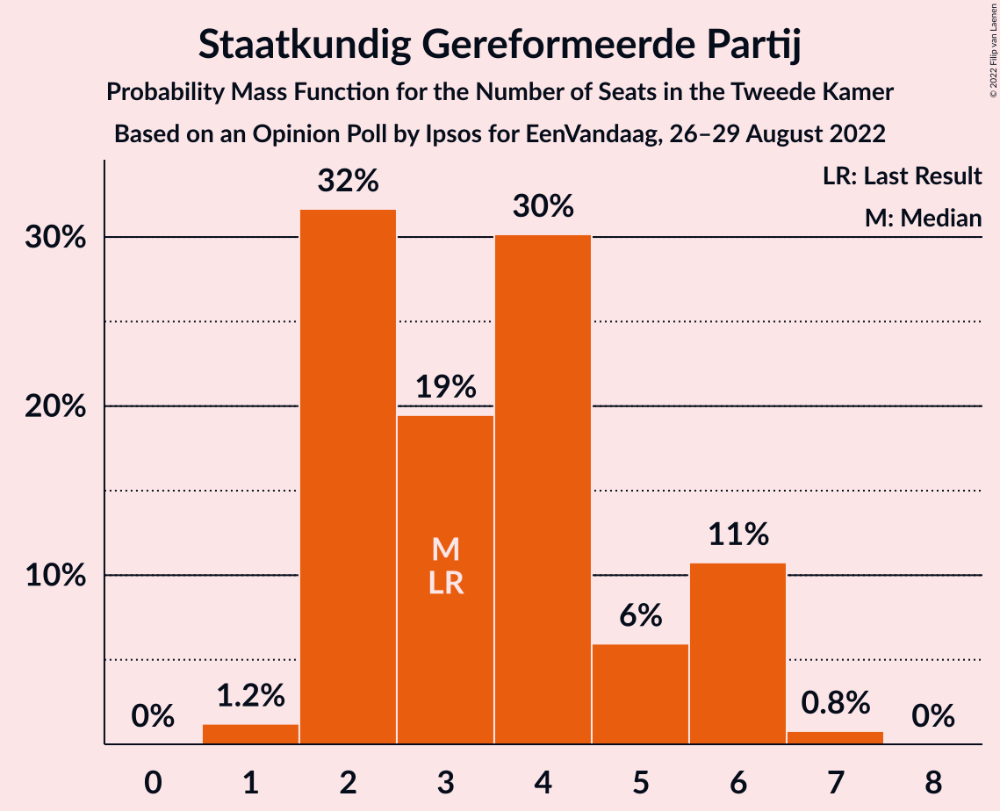
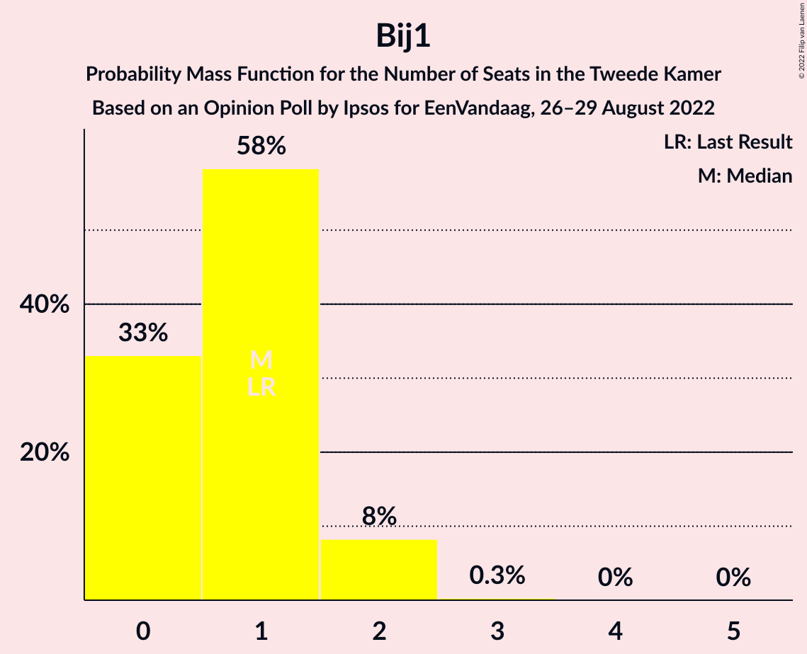
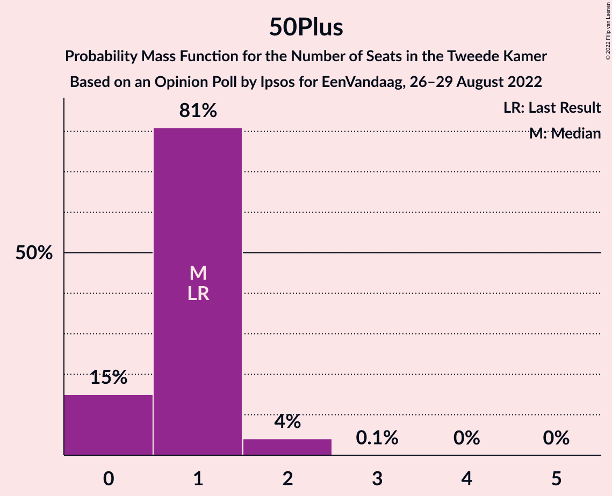
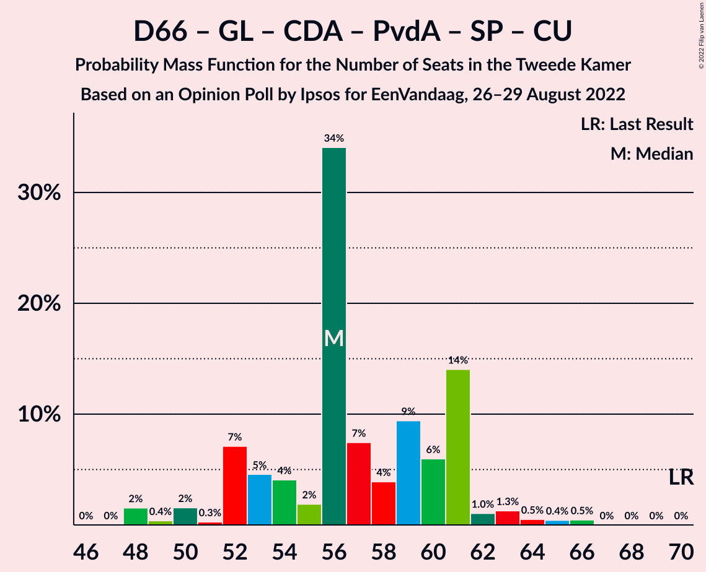
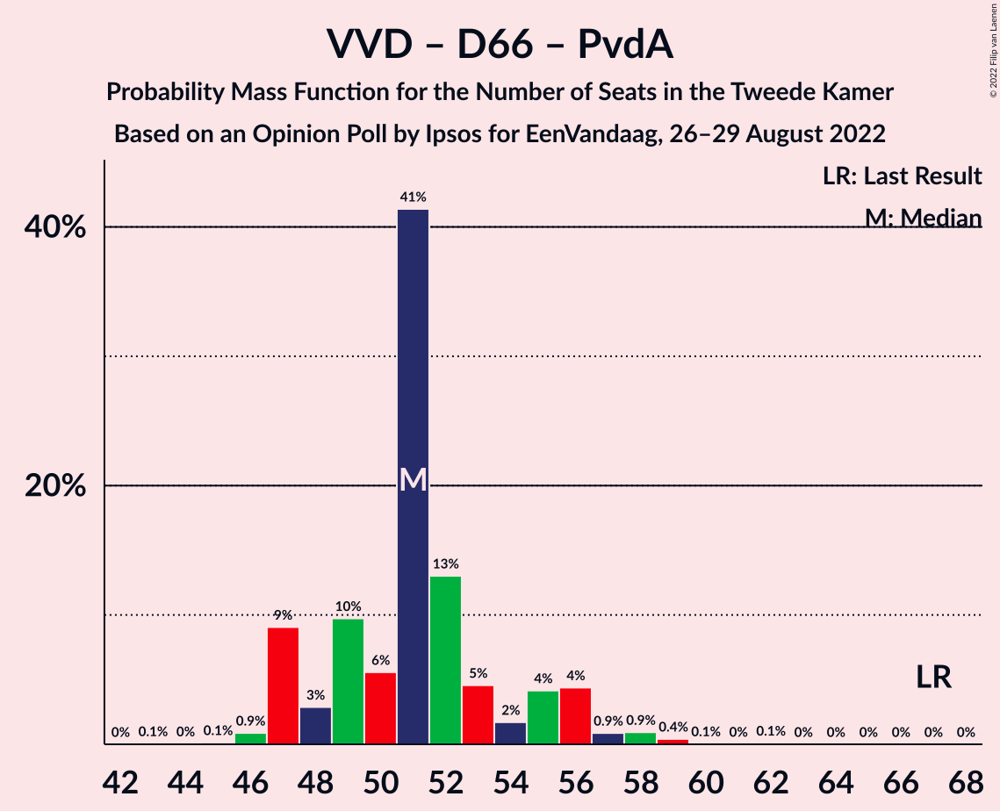

# Opinion Poll by Ipsos for EenVandaag, 26–29 August 2022

<a href="#voting-intentions">Voting Intentions</a> | <a href="#seats">Seats</a> | <a href="#coalitions">Coalitions</a> | <a href="#technical-information">Technical Information</a>

## Voting Intentions

### Confidence Intervals

| Party | Last Result | Poll Result | 80% Confidence Interval | 90% Confidence Interval | 95% Confidence Interval | 99% Confidence Interval |
|:-----:|:-----------:|:-----------:|:-----------------------:|:-----------------------:|:-----------------------:|:-----------------------:|
| Volkspartij voor Vrijheid en Democratie | 21.9% | 17.1% | 15.6–18.7% |15.2–19.1% |14.9–19.5% |14.2–20.3% |
| Partij voor de Vrijheid | 10.8% | 11.5% | 10.3–12.9% |10.0–13.3% |9.7–13.6% |9.1–14.3% |
| Democraten 66 | 15.0% | 11.3% | 10.1–12.7% |9.8–13.1% |9.5–13.4% |9.0–14.1% |
| BoerBurgerBeweging | 1.0% | 10.1% | 9.0–11.4% |8.7–11.8% |8.4–12.2% |7.9–12.8% |
| GroenLinks | 5.2% | 7.1% | 6.1–8.2% |5.9–8.5% |5.6–8.8% |5.2–9.4% |
| Juiste Antwoord 2021 | 2.4% | 6.1% | 5.2–7.1% |4.9–7.4% |4.7–7.7% |4.4–8.3% |
| Christen-Democratisch Appèl | 9.5% | 5.8% | 4.9–6.8% |4.7–7.1% |4.5–7.4% |4.1–7.9% |
| Partij voor de Dieren | 3.8% | 5.8% | 4.9–6.8% |4.7–7.1% |4.5–7.4% |4.1–7.9% |
| Partij van de Arbeid | 5.7% | 5.5% | 4.6–6.5% |4.4–6.8% |4.2–7.1% |3.9–7.6% |
| Socialistische Partij | 6.0% | 4.8% | 4.0–5.7% |3.8–6.0% |3.6–6.3% |3.3–6.8% |
| ChristenUnie | 3.4% | 3.4% | 2.7–4.2% |2.6–4.5% |2.4–4.7% |2.1–5.1% |
| Forum voor Democratie | 5.0% | 2.7% | 2.1–3.5% |2.0–3.7% |1.8–3.9% |1.6–4.3% |
| Staatkundig Gereformeerde Partij | 2.1% | 2.3% | 1.8–3.0% |1.6–3.2% |1.5–3.4% |1.3–3.8% |
| DENK | 2.0% | 2.2% | 1.7–2.9% |1.6–3.1% |1.4–3.3% |1.2–3.7% |
| Volt Europa | 2.4% | 1.5% | 1.1–2.1% |1.0–2.3% |0.9–2.5% |0.7–2.8% |
| Bij1 | 0.8% | 0.7% | 0.5–1.2% |0.4–1.3% |0.3–1.4% |0.2–1.7% |
| 50Plus | 1.0% | 0.6% | 0.4–1.1% |0.3–1.2% |0.3–1.3% |0.2–1.6% |

*Note:* The poll result column reflects the actual value used in the calculations. Published results may vary slightly, and in addition be rounded to fewer digits.

## Seats

### Confidence Intervals

| Party | Last Result | Median | 80% Confidence Interval | 90% Confidence Interval | 95% Confidence Interval | 99% Confidence Interval |
|:-----:|:-----------:|:------:|:-----------------------:|:-----------------------:|:-----------------------:|:-----------------------:|
| <a href="#volkspartij-voor-vrijheid-en-democratie">Volkspartij voor Vrijheid en Democratie</a> | 34 | 24 | 22–30 |22–30 |22–31 |21–32 |
| <a href="#partij-voor-de-vrijheid">Partij voor de Vrijheid</a> | 17 | 18 | 16–20 |16–21 |15–22 |14–22 |
| <a href="#democraten-66">Democraten 66</a> | 24 | 19 | 15–20 |15–21 |14–23 |14–25 |
| <a href="#boerburgerbeweging">BoerBurgerBeweging</a> | 1 | 16 | 14–17 |12–18 |11–19 |11–19 |
| <a href="#groenlinks">GroenLinks</a> | 8 | 10 | 9–13 |8–14 |8–14 |8–15 |
| <a href="#juiste-antwoord-2021">Juiste Antwoord 2021</a> | 3 | 9 | 7–11 |7–11 |7–11 |6–13 |
| <a href="#christen-democratisch-appèl">Christen-Democratisch Appèl</a> | 15 | 9 | 7–10 |6–10 |6–11 |6–12 |
| <a href="#partij-voor-de-dieren">Partij voor de Dieren</a> | 6 | 9 | 7–10 |6–11 |6–11 |5–12 |
| <a href="#partij-van-de-arbeid">Partij van de Arbeid</a> | 9 | 8 | 6–9 |6–11 |6–11 |5–12 |
| <a href="#socialistische-partij">Socialistische Partij</a> | 9 | 6 | 4–8 |4–10 |4–10 |4–10 |
| <a href="#christenunie">ChristenUnie</a> | 5 | 5 | 4–8 |4–8 |3–8 |3–8 |
| <a href="#forum-voor-democratie">Forum voor Democratie</a> | 8 | 3 | 2–5 |2–6 |2–6 |2–6 |
| <a href="#staatkundig-gereformeerde-partij">Staatkundig Gereformeerde Partij</a> | 3 | 3 | 2–6 |2–6 |2–6 |1–7 |
| <a href="#denk">DENK</a> | 3 | 4 | 3–4 |2–5 |2–6 |2–6 |
| <a href="#volt-europa">Volt Europa</a> | 3 | 2 | 2–3 |1–3 |1–4 |0–4 |
| <a href="#bij1">Bij1</a> | 1 | 1 | 0–1 |0–2 |0–2 |0–2 |
| <a href="#50plus">50Plus</a> | 1 | 1 | 0–1 |0–1 |0–2 |0–2 |

### Volkspartij voor Vrijheid en Democratie

*For a full overview of the results for this party, see the [Volkspartij voor Vrijheid en Democratie](party-volkspartijvoorvrijheidendemocratie.html) page.*

| Number of Seats | Probability | Accumulated | Special Marks |
|:---------------:|:-----------:|:-----------:|:-------------:|
| 20 | 0.3% | 100% |  |
| 21 | 0.8% | 99.7% |  |
| 22 | 9% | 98.8% |  |
| 23 | 21% | 90% |  |
| 24 | 27% | 69% | Median |
| 25 | 8% | 42% |  |
| 26 | 8% | 35% |  |
| 27 | 10% | 27% |  |
| 28 | 3% | 17% |  |
| 29 | 2% | 14% |  |
| 30 | 9% | 12% |  |
| 31 | 3% | 3% |  |
| 32 | 0.2% | 0.6% |  |
| 33 | 0.2% | 0.4% |  |
| 34 | 0.2% | 0.2% | Last Result |
| 35 | 0% | 0% |  |

### Partij voor de Vrijheid

*For a full overview of the results for this party, see the [Partij voor de Vrijheid](party-partijvoordevrijheid.html) page.*

| Number of Seats | Probability | Accumulated | Special Marks |
|:---------------:|:-----------:|:-----------:|:-------------:|
| 13 | 0.3% | 100% |  |
| 14 | 1.0% | 99.7% |  |
| 15 | 3% | 98.7% |  |
| 16 | 31% | 96% |  |
| 17 | 7% | 65% | Last Result |
| 18 | 18% | 58% | Median |
| 19 | 28% | 39% |  |
| 20 | 3% | 11% |  |
| 21 | 5% | 9% |  |
| 22 | 4% | 4% |  |
| 23 | 0.2% | 0.2% |  |
| 24 | 0% | 0% |  |

### Democraten 66

*For a full overview of the results for this party, see the [Democraten 66](party-democraten66.html) page.*

| Number of Seats | Probability | Accumulated | Special Marks |
|:---------------:|:-----------:|:-----------:|:-------------:|
| 13 | 0% | 100% |  |
| 14 | 3% | 99.9% |  |
| 15 | 17% | 97% |  |
| 16 | 4% | 80% |  |
| 17 | 13% | 76% |  |
| 18 | 5% | 63% |  |
| 19 | 34% | 58% | Median |
| 20 | 18% | 24% |  |
| 21 | 2% | 6% |  |
| 22 | 0.5% | 4% |  |
| 23 | 3% | 3% |  |
| 24 | 0.1% | 0.7% | Last Result |
| 25 | 0.6% | 0.6% |  |
| 26 | 0% | 0% |  |

### BoerBurgerBeweging

*For a full overview of the results for this party, see the [BoerBurgerBeweging](party-boerburgerbeweging.html) page.*

| Number of Seats | Probability | Accumulated | Special Marks |
|:---------------:|:-----------:|:-----------:|:-------------:|
| 1 | 0% | 100% | Last Result |
| 2 | 0% | 100% |  |
| 3 | 0% | 100% |  |
| 4 | 0% | 100% |  |
| 5 | 0% | 100% |  |
| 6 | 0% | 100% |  |
| 7 | 0% | 100% |  |
| 8 | 0% | 100% |  |
| 9 | 0% | 100% |  |
| 10 | 0% | 100% |  |
| 11 | 3% | 100% |  |
| 12 | 2% | 97% |  |
| 13 | 3% | 95% |  |
| 14 | 12% | 92% |  |
| 15 | 28% | 80% |  |
| 16 | 36% | 52% | Median |
| 17 | 11% | 16% |  |
| 18 | 2% | 5% |  |
| 19 | 2% | 3% |  |
| 20 | 0.4% | 0.5% |  |
| 21 | 0% | 0% |  |

### GroenLinks

*For a full overview of the results for this party, see the [GroenLinks](party-groenlinks.html) page.*

| Number of Seats | Probability | Accumulated | Special Marks |
|:---------------:|:-----------:|:-----------:|:-------------:|
| 6 | 0.1% | 100% |  |
| 7 | 0.3% | 99.9% |  |
| 8 | 8% | 99.5% | Last Result |
| 9 | 33% | 92% |  |
| 10 | 23% | 59% | Median |
| 11 | 10% | 36% |  |
| 12 | 4% | 26% |  |
| 13 | 15% | 22% |  |
| 14 | 5% | 7% |  |
| 15 | 2% | 2% |  |
| 16 | 0.1% | 0.2% |  |
| 17 | 0% | 0% |  |

### Juiste Antwoord 2021

*For a full overview of the results for this party, see the [Juiste Antwoord 2021](party-juisteantwoord2021.html) page.*

| Number of Seats | Probability | Accumulated | Special Marks |
|:---------------:|:-----------:|:-----------:|:-------------:|
| 3 | 0% | 100% | Last Result |
| 4 | 0% | 100% |  |
| 5 | 0.1% | 100% |  |
| 6 | 2% | 99.9% |  |
| 7 | 12% | 98% |  |
| 8 | 10% | 85% |  |
| 9 | 34% | 75% | Median |
| 10 | 18% | 41% |  |
| 11 | 21% | 23% |  |
| 12 | 1.4% | 2% |  |
| 13 | 0.6% | 1.0% |  |
| 14 | 0% | 0.3% |  |
| 15 | 0.3% | 0.3% |  |
| 16 | 0% | 0% |  |

### Christen-Democratisch Appèl

*For a full overview of the results for this party, see the [Christen-Democratisch Appèl](party-christen-democratischappèl.html) page.*

| Number of Seats | Probability | Accumulated | Special Marks |
|:---------------:|:-----------:|:-----------:|:-------------:|
| 5 | 0.1% | 100% |  |
| 6 | 8% | 99.9% |  |
| 7 | 7% | 92% |  |
| 8 | 21% | 86% |  |
| 9 | 34% | 65% | Median |
| 10 | 27% | 31% |  |
| 11 | 2% | 3% |  |
| 12 | 1.2% | 2% |  |
| 13 | 0.3% | 0.3% |  |
| 14 | 0.1% | 0.1% |  |
| 15 | 0% | 0% | Last Result |

### Partij voor de Dieren

*For a full overview of the results for this party, see the [Partij voor de Dieren](party-partijvoordedieren.html) page.*

| Number of Seats | Probability | Accumulated | Special Marks |
|:---------------:|:-----------:|:-----------:|:-------------:|
| 5 | 2% | 100% |  |
| 6 | 4% | 98% | Last Result |
| 7 | 11% | 95% |  |
| 8 | 6% | 84% |  |
| 9 | 53% | 78% | Median |
| 10 | 19% | 25% |  |
| 11 | 4% | 6% |  |
| 12 | 2% | 2% |  |
| 13 | 0.1% | 0.2% |  |
| 14 | 0.1% | 0.1% |  |
| 15 | 0% | 0% |  |

### Partij van de Arbeid

*For a full overview of the results for this party, see the [Partij van de Arbeid](party-partijvandearbeid.html) page.*

| Number of Seats | Probability | Accumulated | Special Marks |
|:---------------:|:-----------:|:-----------:|:-------------:|
| 5 | 0.6% | 100% |  |
| 6 | 12% | 99.4% |  |
| 7 | 22% | 87% |  |
| 8 | 49% | 65% | Median |
| 9 | 7% | 16% | Last Result |
| 10 | 3% | 9% |  |
| 11 | 6% | 6% |  |
| 12 | 0.8% | 0.8% |  |
| 13 | 0% | 0% |  |

### Socialistische Partij

*For a full overview of the results for this party, see the [Socialistische Partij](party-socialistischepartij.html) page.*

| Number of Seats | Probability | Accumulated | Special Marks |
|:---------------:|:-----------:|:-----------:|:-------------:|
| 4 | 23% | 100% |  |
| 5 | 19% | 77% |  |
| 6 | 17% | 58% | Median |
| 7 | 17% | 41% |  |
| 8 | 16% | 24% |  |
| 9 | 3% | 9% | Last Result |
| 10 | 5% | 6% |  |
| 11 | 0.5% | 0.5% |  |
| 12 | 0% | 0% |  |

### ChristenUnie

*For a full overview of the results for this party, see the [ChristenUnie](party-christenunie.html) page.*

| Number of Seats | Probability | Accumulated | Special Marks |
|:---------------:|:-----------:|:-----------:|:-------------:|
| 2 | 0.1% | 100% |  |
| 3 | 4% | 99.9% |  |
| 4 | 18% | 96% |  |
| 5 | 29% | 78% | Last Result, Median |
| 6 | 31% | 50% |  |
| 7 | 7% | 19% |  |
| 8 | 12% | 12% |  |
| 9 | 0.3% | 0.3% |  |
| 10 | 0% | 0% |  |

### Forum voor Democratie

*For a full overview of the results for this party, see the [Forum voor Democratie](party-forumvoordemocratie.html) page.*

| Number of Seats | Probability | Accumulated | Special Marks |
|:---------------:|:-----------:|:-----------:|:-------------:|
| 2 | 35% | 100% |  |
| 3 | 18% | 65% | Median |
| 4 | 12% | 47% |  |
| 5 | 26% | 35% |  |
| 6 | 8% | 9% |  |
| 7 | 0.4% | 0.4% |  |
| 8 | 0.1% | 0.1% | Last Result |
| 9 | 0% | 0% |  |

### Staatkundig Gereformeerde Partij

*For a full overview of the results for this party, see the [Staatkundig Gereformeerde Partij](party-staatkundiggereformeerdepartij.html) page.*

| Number of Seats | Probability | Accumulated | Special Marks |
|:---------------:|:-----------:|:-----------:|:-------------:|
| 1 | 1.2% | 100% |  |
| 2 | 32% | 98.8% |  |
| 3 | 19% | 67% | Last Result, Median |
| 4 | 30% | 48% |  |
| 5 | 6% | 17% |  |
| 6 | 11% | 12% |  |
| 7 | 0.8% | 0.8% |  |
| 8 | 0% | 0% |  |

### DENK

*For a full overview of the results for this party, see the [DENK](party-denk.html) page.*

| Number of Seats | Probability | Accumulated | Special Marks |
|:---------------:|:-----------:|:-----------:|:-------------:|
| 1 | 0.2% | 100% |  |
| 2 | 7% | 99.8% |  |
| 3 | 39% | 93% | Last Result |
| 4 | 47% | 54% | Median |
| 5 | 3% | 6% |  |
| 6 | 3% | 3% |  |
| 7 | 0% | 0% |  |

### Volt Europa

*For a full overview of the results for this party, see the [Volt Europa](party-volteuropa.html) page.*

| Number of Seats | Probability | Accumulated | Special Marks |
|:---------------:|:-----------:|:-----------:|:-------------:|
| 0 | 0.7% | 100% |  |
| 1 | 8% | 99.3% |  |
| 2 | 50% | 91% | Median |
| 3 | 38% | 41% | Last Result |
| 4 | 4% | 4% |  |
| 5 | 0.1% | 0.1% |  |
| 6 | 0% | 0% |  |

### Bij1

*For a full overview of the results for this party, see the [Bij1](party-bij1.html) page.*

| Number of Seats | Probability | Accumulated | Special Marks |
|:---------------:|:-----------:|:-----------:|:-------------:|
| 0 | 33% | 100% |  |
| 1 | 58% | 67% | Last Result, Median |
| 2 | 8% | 9% |  |
| 3 | 0.3% | 0.3% |  |
| 4 | 0% | 0% |  |

### 50Plus

*For a full overview of the results for this party, see the [50Plus](party-50plus.html) page.*

| Number of Seats | Probability | Accumulated | Special Marks |
|:---------------:|:-----------:|:-----------:|:-------------:|
| 0 | 15% | 100% |  |
| 1 | 81% | 85% | Last Result, Median |
| 2 | 4% | 4% |  |
| 3 | 0.1% | 0.1% |  |
| 4 | 0% | 0% |  |

## Coalitions

### Confidence Intervals

| Coalition | Last Result | Median | Majority? | 80% Confidence Interval | 90% Confidence Interval | 95% Confidence Interval | 99% Confidence Interval |
|:---------:|:-----------:|:------:|:---------:|:-----------------------:|:-----------------------:|:-----------------------:|:-----------------------:|
| Volkspartij voor Vrijheid en Democratie – Democraten 66 – GroenLinks – Christen-Democratisch Appèl – ChristenUnie | 86 | 68 | 1.3% | 64–71 | 64–71 | 62–73 | 62–76 |
| Volkspartij voor Vrijheid en Democratie – Democraten 66 – Christen-Democratisch Appèl – Partij van de Arbeid – ChristenUnie | 87 | 66 | 0% | 63–67 | 62–69 | 59–71 | 59–73 |
| Volkspartij voor Vrijheid en Democratie – Partij voor de Vrijheid – Christen-Democratisch Appèl – Forum voor Democratie – Staatkundig Gereformeerde Partij | 77 | 60 | 0% | 54–62 | 53–63 | 52–64 | 52–66 |
| Volkspartij voor Vrijheid en Democratie – Democraten 66 – Christen-Democratisch Appèl – ChristenUnie | 78 | 57 | 0% | 55–60 | 54–62 | 53–63 | 50–64 |
| Democraten 66 – GroenLinks – Christen-Democratisch Appèl – Partij van de Arbeid – Socialistische Partij – ChristenUnie | 70 | 56 | 0% | 52–61 | 52–61 | 50–63 | 48–65 |
| Volkspartij voor Vrijheid en Democratie – Partij voor de Vrijheid – Christen-Democratisch Appèl – Forum voor Democratie | 74 | 56 | 0% | 50–59 | 50–59 | 49–60 | 49–62 |
| Volkspartij voor Vrijheid en Democratie – Democraten 66 – Christen-Democratisch Appèl | 73 | 52 | 0% | 48–54 | 47–57 | 47–58 | 46–58 |
| Volkspartij voor Vrijheid en Democratie – Partij voor de Vrijheid – Christen-Democratisch Appèl | 66 | 53 | 0% | 48–56 | 47–56 | 47–57 | 45–58 |
| Volkspartij voor Vrijheid en Democratie – Democraten 66 – Partij van de Arbeid | 67 | 51 | 0% | 47–55 | 47–56 | 47–56 | 46–59 |
| Democraten 66 – GroenLinks – Christen-Democratisch Appèl – Partij van de Arbeid – ChristenUnie | 61 | 52 | 0% | 44–55 | 44–55 | 43–55 | 41–57 |
| Volkspartij voor Vrijheid en Democratie – Christen-Democratisch Appèl – Forum voor Democratie – Staatkundig Gereformeerde Partij – 50Plus | 61 | 42 | 0% | 38–47 | 37–47 | 37–47 | 36–49 |
| Volkspartij voor Vrijheid en Democratie – Christen-Democratisch Appèl – Partij van de Arbeid | 58 | 42 | 0% | 38–45 | 38–46 | 37–47 | 37–49 |
| Volkspartij voor Vrijheid en Democratie – Christen-Democratisch Appèl – Forum voor Democratie – Staatkundig Gereformeerde Partij | 60 | 41 | 0% | 37–46 | 36–46 | 36–46 | 35–47 |
| Volkspartij voor Vrijheid en Democratie – Christen-Democratisch Appèl – Forum voor Democratie – 50Plus | 58 | 40 | 0% | 34–41 | 34–42 | 34–42 | 33–45 |
| Volkspartij voor Vrijheid en Democratie – Christen-Democratisch Appèl – Forum voor Democratie | 57 | 39 | 0% | 34–40 | 33–41 | 33–42 | 32–44 |
| Democraten 66 – Christen-Democratisch Appèl – Partij van de Arbeid | 48 | 36 | 0% | 30–37 | 30–38 | 29–39 | 28–40 |
| Volkspartij voor Vrijheid en Democratie – Partij van de Arbeid | 43 | 32 | 0% | 30–37 | 29–39 | 28–39 | 28–40 |
| Volkspartij voor Vrijheid en Democratie – Christen-Democratisch Appèl | 49 | 34 | 0% | 31–38 | 31–38 | 31–38 | 29–40 |
| Democraten 66 – Christen-Democratisch Appèl | 39 | 28 | 0% | 23–29 | 23–30 | 22–32 | 21–32 |
| Christen-Democratisch Appèl – Partij van de Arbeid – ChristenUnie | 29 | 22 | 0% | 19–24 | 18–26 | 18–28 | 17–28 |
| Christen-Democratisch Appèl – Partij van de Arbeid | 24 | 17 | 0% | 14–19 | 13–20 | 13–20 | 12–22 |

### Volkspartij voor Vrijheid en Democratie – Democraten 66 – GroenLinks – Christen-Democratisch Appèl – ChristenUnie

| Number of Seats | Probability | Accumulated | Special Marks |
|:---------------:|:-----------:|:-----------:|:-------------:|
| 60 | 0.1% | 100% |  |
| 61 | 0.1% | 99.8% |  |
| 62 | 2% | 99.7% |  |
| 63 | 0.9% | 97% |  |
| 64 | 7% | 96% |  |
| 65 | 7% | 89% |  |
| 66 | 4% | 83% |  |
| 67 | 13% | 79% | Median |
| 68 | 30% | 66% |  |
| 69 | 6% | 36% |  |
| 70 | 20% | 30% |  |
| 71 | 6% | 10% |  |
| 72 | 2% | 5% |  |
| 73 | 1.0% | 3% |  |
| 74 | 0.1% | 2% |  |
| 75 | 0.2% | 2% |  |
| 76 | 1.3% | 1.3% | Majority |
| 77 | 0% | 0% |  |
| 78 | 0% | 0% |  |
| 79 | 0% | 0% |  |
| 80 | 0% | 0% |  |
| 81 | 0% | 0% |  |
| 82 | 0% | 0% |  |
| 83 | 0% | 0% |  |
| 84 | 0% | 0% |  |
| 85 | 0% | 0% |  |
| 86 | 0% | 0% | Last Result |

### Volkspartij voor Vrijheid en Democratie – Democraten 66 – Christen-Democratisch Appèl – Partij van de Arbeid – ChristenUnie

| Number of Seats | Probability | Accumulated | Special Marks |
|:---------------:|:-----------:|:-----------:|:-------------:|
| 57 | 0.1% | 100% |  |
| 58 | 0.3% | 99.9% |  |
| 59 | 2% | 99.6% |  |
| 60 | 0.6% | 97% |  |
| 61 | 2% | 97% |  |
| 62 | 4% | 95% |  |
| 63 | 10% | 91% |  |
| 64 | 11% | 80% |  |
| 65 | 19% | 69% | Median |
| 66 | 15% | 50% |  |
| 67 | 26% | 35% |  |
| 68 | 3% | 9% |  |
| 69 | 2% | 6% |  |
| 70 | 0.6% | 4% |  |
| 71 | 3% | 3% |  |
| 72 | 0.1% | 0.8% |  |
| 73 | 0.4% | 0.7% |  |
| 74 | 0% | 0.3% |  |
| 75 | 0.3% | 0.3% |  |
| 76 | 0% | 0% | Majority |
| 77 | 0% | 0% |  |
| 78 | 0% | 0% |  |
| 79 | 0% | 0% |  |
| 80 | 0% | 0% |  |
| 81 | 0% | 0% |  |
| 82 | 0% | 0% |  |
| 83 | 0% | 0% |  |
| 84 | 0% | 0% |  |
| 85 | 0% | 0% |  |
| 86 | 0% | 0% |  |
| 87 | 0% | 0% | Last Result |

### Volkspartij voor Vrijheid en Democratie – Partij voor de Vrijheid – Christen-Democratisch Appèl – Forum voor Democratie – Staatkundig Gereformeerde Partij

| Number of Seats | Probability | Accumulated | Special Marks |
|:---------------:|:-----------:|:-----------:|:-------------:|
| 51 | 0.1% | 100% |  |
| 52 | 5% | 99.9% |  |
| 53 | 0.7% | 95% |  |
| 54 | 14% | 94% |  |
| 55 | 2% | 80% |  |
| 56 | 2% | 78% |  |
| 57 | 6% | 76% | Median |
| 58 | 6% | 70% |  |
| 59 | 10% | 64% |  |
| 60 | 28% | 54% |  |
| 61 | 8% | 26% |  |
| 62 | 11% | 18% |  |
| 63 | 4% | 7% |  |
| 64 | 2% | 3% |  |
| 65 | 0.4% | 0.9% |  |
| 66 | 0.1% | 0.5% |  |
| 67 | 0.3% | 0.4% |  |
| 68 | 0.1% | 0.1% |  |
| 69 | 0% | 0% |  |
| 70 | 0% | 0% |  |
| 71 | 0% | 0% |  |
| 72 | 0% | 0% |  |
| 73 | 0% | 0% |  |
| 74 | 0% | 0% |  |
| 75 | 0% | 0% |  |
| 76 | 0% | 0% | Majority |
| 77 | 0% | 0% | Last Result |

### Volkspartij voor Vrijheid en Democratie – Democraten 66 – Christen-Democratisch Appèl – ChristenUnie

| Number of Seats | Probability | Accumulated | Special Marks |
|:---------------:|:-----------:|:-----------:|:-------------:|
| 49 | 0.1% | 100% |  |
| 50 | 0.5% | 99.9% |  |
| 51 | 1.2% | 99.4% |  |
| 52 | 0.4% | 98% |  |
| 53 | 3% | 98% |  |
| 54 | 3% | 95% |  |
| 55 | 7% | 92% |  |
| 56 | 14% | 85% |  |
| 57 | 23% | 71% | Median |
| 58 | 10% | 48% |  |
| 59 | 27% | 38% |  |
| 60 | 3% | 11% |  |
| 61 | 2% | 8% |  |
| 62 | 1.2% | 6% |  |
| 63 | 3% | 5% |  |
| 64 | 2% | 2% |  |
| 65 | 0% | 0.1% |  |
| 66 | 0.1% | 0.1% |  |
| 67 | 0% | 0% |  |
| 68 | 0% | 0% |  |
| 69 | 0% | 0% |  |
| 70 | 0% | 0% |  |
| 71 | 0% | 0% |  |
| 72 | 0% | 0% |  |
| 73 | 0% | 0% |  |
| 74 | 0% | 0% |  |
| 75 | 0% | 0% |  |
| 76 | 0% | 0% | Majority |
| 77 | 0% | 0% |  |
| 78 | 0% | 0% | Last Result |

### Democraten 66 – GroenLinks – Christen-Democratisch Appèl – Partij van de Arbeid – Socialistische Partij – ChristenUnie

| Number of Seats | Probability | Accumulated | Special Marks |
|:---------------:|:-----------:|:-----------:|:-------------:|
| 48 | 2% | 100% |  |
| 49 | 0.4% | 98% |  |
| 50 | 2% | 98% |  |
| 51 | 0.3% | 97% |  |
| 52 | 7% | 96% |  |
| 53 | 5% | 89% |  |
| 54 | 4% | 85% |  |
| 55 | 2% | 80% |  |
| 56 | 34% | 79% |  |
| 57 | 7% | 45% | Median |
| 58 | 4% | 37% |  |
| 59 | 9% | 33% |  |
| 60 | 6% | 24% |  |
| 61 | 14% | 18% |  |
| 62 | 1.0% | 4% |  |
| 63 | 1.3% | 3% |  |
| 64 | 0.5% | 1.4% |  |
| 65 | 0.4% | 0.9% |  |
| 66 | 0.5% | 0.5% |  |
| 67 | 0% | 0% |  |
| 68 | 0% | 0% |  |
| 69 | 0% | 0% |  |
| 70 | 0% | 0% | Last Result |

### Volkspartij voor Vrijheid en Democratie – Partij voor de Vrijheid – Christen-Democratisch Appèl – Forum voor Democratie

| Number of Seats | Probability | Accumulated | Special Marks |
|:---------------:|:-----------:|:-----------:|:-------------:|
| 48 | 0.4% | 100% |  |
| 49 | 5% | 99.6% |  |
| 50 | 13% | 95% |  |
| 51 | 2% | 82% |  |
| 52 | 2% | 80% |  |
| 53 | 7% | 78% |  |
| 54 | 6% | 71% | Median |
| 55 | 8% | 65% |  |
| 56 | 13% | 57% |  |
| 57 | 6% | 44% |  |
| 58 | 27% | 37% |  |
| 59 | 7% | 10% |  |
| 60 | 1.2% | 3% |  |
| 61 | 1.3% | 2% |  |
| 62 | 0.2% | 0.6% |  |
| 63 | 0.1% | 0.4% |  |
| 64 | 0.3% | 0.4% |  |
| 65 | 0% | 0.1% |  |
| 66 | 0% | 0% |  |
| 67 | 0% | 0% |  |
| 68 | 0% | 0% |  |
| 69 | 0% | 0% |  |
| 70 | 0% | 0% |  |
| 71 | 0% | 0% |  |
| 72 | 0% | 0% |  |
| 73 | 0% | 0% |  |
| 74 | 0% | 0% | Last Result |

### Volkspartij voor Vrijheid en Democratie – Democraten 66 – Christen-Democratisch Appèl

| Number of Seats | Probability | Accumulated | Special Marks |
|:---------------:|:-----------:|:-----------:|:-------------:|
| 45 | 0.1% | 100% |  |
| 46 | 2% | 99.9% |  |
| 47 | 4% | 98% |  |
| 48 | 4% | 94% |  |
| 49 | 5% | 90% |  |
| 50 | 8% | 85% |  |
| 51 | 11% | 76% |  |
| 52 | 16% | 65% | Median |
| 53 | 33% | 49% |  |
| 54 | 7% | 17% |  |
| 55 | 2% | 10% |  |
| 56 | 0.9% | 7% |  |
| 57 | 3% | 6% |  |
| 58 | 3% | 4% |  |
| 59 | 0% | 0.3% |  |
| 60 | 0.1% | 0.3% |  |
| 61 | 0.2% | 0.2% |  |
| 62 | 0% | 0% |  |
| 63 | 0% | 0% |  |
| 64 | 0% | 0% |  |
| 65 | 0% | 0% |  |
| 66 | 0% | 0% |  |
| 67 | 0% | 0% |  |
| 68 | 0% | 0% |  |
| 69 | 0% | 0% |  |
| 70 | 0% | 0% |  |
| 71 | 0% | 0% |  |
| 72 | 0% | 0% |  |
| 73 | 0% | 0% | Last Result |

### Volkspartij voor Vrijheid en Democratie – Partij voor de Vrijheid – Christen-Democratisch Appèl

| Number of Seats | Probability | Accumulated | Special Marks |
|:---------------:|:-----------:|:-----------:|:-------------:|
| 45 | 0.6% | 100% |  |
| 46 | 0.5% | 99.4% |  |
| 47 | 5% | 98.9% |  |
| 48 | 13% | 94% |  |
| 49 | 6% | 81% |  |
| 50 | 11% | 75% |  |
| 51 | 6% | 63% | Median |
| 52 | 3% | 57% |  |
| 53 | 35% | 54% |  |
| 54 | 8% | 20% |  |
| 55 | 2% | 12% |  |
| 56 | 7% | 10% |  |
| 57 | 1.3% | 3% |  |
| 58 | 1.4% | 2% |  |
| 59 | 0.2% | 0.3% |  |
| 60 | 0.1% | 0.1% |  |
| 61 | 0% | 0% |  |
| 62 | 0% | 0% |  |
| 63 | 0% | 0% |  |
| 64 | 0% | 0% |  |
| 65 | 0% | 0% |  |
| 66 | 0% | 0% | Last Result |

### Volkspartij voor Vrijheid en Democratie – Democraten 66 – Partij van de Arbeid

| Number of Seats | Probability | Accumulated | Special Marks |
|:---------------:|:-----------:|:-----------:|:-------------:|
| 43 | 0.1% | 100% |  |
| 44 | 0% | 99.9% |  |
| 45 | 0.1% | 99.9% |  |
| 46 | 0.9% | 99.8% |  |
| 47 | 9% | 98.9% |  |
| 48 | 3% | 90% |  |
| 49 | 10% | 87% |  |
| 50 | 6% | 77% |  |
| 51 | 41% | 72% | Median |
| 52 | 13% | 30% |  |
| 53 | 5% | 17% |  |
| 54 | 2% | 13% |  |
| 55 | 4% | 11% |  |
| 56 | 4% | 7% |  |
| 57 | 0.9% | 2% |  |
| 58 | 0.9% | 2% |  |
| 59 | 0.4% | 0.6% |  |
| 60 | 0.1% | 0.2% |  |
| 61 | 0% | 0.1% |  |
| 62 | 0.1% | 0.1% |  |
| 63 | 0% | 0% |  |
| 64 | 0% | 0% |  |
| 65 | 0% | 0% |  |
| 66 | 0% | 0% |  |
| 67 | 0% | 0% | Last Result |

### Democraten 66 – GroenLinks – Christen-Democratisch Appèl – Partij van de Arbeid – ChristenUnie

| Number of Seats | Probability | Accumulated | Special Marks |
|:---------------:|:-----------:|:-----------:|:-------------:|
| 40 | 0.2% | 100% |  |
| 41 | 2% | 99.8% |  |
| 42 | 0.4% | 98% |  |
| 43 | 1.3% | 98% |  |
| 44 | 7% | 97% |  |
| 45 | 4% | 89% |  |
| 46 | 1.1% | 85% |  |
| 47 | 1.4% | 84% |  |
| 48 | 0.5% | 83% |  |
| 49 | 14% | 82% |  |
| 50 | 5% | 69% |  |
| 51 | 11% | 64% | Median |
| 52 | 29% | 53% |  |
| 53 | 2% | 24% |  |
| 54 | 1.4% | 22% |  |
| 55 | 18% | 21% |  |
| 56 | 1.3% | 2% |  |
| 57 | 1.1% | 1.2% |  |
| 58 | 0% | 0.1% |  |
| 59 | 0.1% | 0.1% |  |
| 60 | 0% | 0% |  |
| 61 | 0% | 0% | Last Result |

### Volkspartij voor Vrijheid en Democratie – Christen-Democratisch Appèl – Forum voor Democratie – Staatkundig Gereformeerde Partij – 50Plus

| Number of Seats | Probability | Accumulated | Special Marks |
|:---------------:|:-----------:|:-----------:|:-------------:|
| 34 | 0.1% | 100% |  |
| 35 | 0.4% | 99.9% |  |
| 36 | 1.1% | 99.5% |  |
| 37 | 6% | 98% |  |
| 38 | 4% | 93% |  |
| 39 | 18% | 89% |  |
| 40 | 4% | 71% | Median |
| 41 | 4% | 67% |  |
| 42 | 34% | 63% |  |
| 43 | 7% | 30% |  |
| 44 | 7% | 23% |  |
| 45 | 2% | 16% |  |
| 46 | 3% | 14% |  |
| 47 | 10% | 11% |  |
| 48 | 0.6% | 1.1% |  |
| 49 | 0.2% | 0.5% |  |
| 50 | 0.2% | 0.3% |  |
| 51 | 0.1% | 0.1% |  |
| 52 | 0% | 0% |  |
| 53 | 0% | 0% |  |
| 54 | 0% | 0% |  |
| 55 | 0% | 0% |  |
| 56 | 0% | 0% |  |
| 57 | 0% | 0% |  |
| 58 | 0% | 0% |  |
| 59 | 0% | 0% |  |
| 60 | 0% | 0% |  |
| 61 | 0% | 0% | Last Result |

### Volkspartij voor Vrijheid en Democratie – Christen-Democratisch Appèl – Partij van de Arbeid

| Number of Seats | Probability | Accumulated | Special Marks |
|:---------------:|:-----------:|:-----------:|:-------------:|
| 35 | 0.4% | 100% |  |
| 36 | 0.1% | 99.6% |  |
| 37 | 3% | 99.5% |  |
| 38 | 8% | 97% |  |
| 39 | 2% | 88% |  |
| 40 | 18% | 86% |  |
| 41 | 14% | 68% | Median |
| 42 | 24% | 55% |  |
| 43 | 12% | 31% |  |
| 44 | 1.3% | 18% |  |
| 45 | 11% | 17% |  |
| 46 | 3% | 6% |  |
| 47 | 1.0% | 3% |  |
| 48 | 0.5% | 2% |  |
| 49 | 1.1% | 1.4% |  |
| 50 | 0% | 0.2% |  |
| 51 | 0% | 0.2% |  |
| 52 | 0% | 0.2% |  |
| 53 | 0.2% | 0.2% |  |
| 54 | 0% | 0% |  |
| 55 | 0% | 0% |  |
| 56 | 0% | 0% |  |
| 57 | 0% | 0% |  |
| 58 | 0% | 0% | Last Result |

### Volkspartij voor Vrijheid en Democratie – Christen-Democratisch Appèl – Forum voor Democratie – Staatkundig Gereformeerde Partij

| Number of Seats | Probability | Accumulated | Special Marks |
|:---------------:|:-----------:|:-----------:|:-------------:|
| 34 | 0.4% | 100% |  |
| 35 | 0.1% | 99.5% |  |
| 36 | 6% | 99.5% |  |
| 37 | 5% | 94% |  |
| 38 | 13% | 89% |  |
| 39 | 7% | 76% | Median |
| 40 | 4% | 68% |  |
| 41 | 34% | 64% |  |
| 42 | 7% | 31% |  |
| 43 | 8% | 24% |  |
| 44 | 1.4% | 16% |  |
| 45 | 4% | 15% |  |
| 46 | 9% | 10% |  |
| 47 | 0.8% | 1.2% |  |
| 48 | 0.1% | 0.4% |  |
| 49 | 0.2% | 0.3% |  |
| 50 | 0.1% | 0.1% |  |
| 51 | 0% | 0% |  |
| 52 | 0% | 0% |  |
| 53 | 0% | 0% |  |
| 54 | 0% | 0% |  |
| 55 | 0% | 0% |  |
| 56 | 0% | 0% |  |
| 57 | 0% | 0% |  |
| 58 | 0% | 0% |  |
| 59 | 0% | 0% |  |
| 60 | 0% | 0% | Last Result |

### Volkspartij voor Vrijheid en Democratie – Christen-Democratisch Appèl – Forum voor Democratie – 50Plus

| Number of Seats | Probability | Accumulated | Special Marks |
|:---------------:|:-----------:|:-----------:|:-------------:|
| 31 | 0.4% | 100% |  |
| 32 | 0% | 99.6% |  |
| 33 | 1.1% | 99.6% |  |
| 34 | 9% | 98.5% |  |
| 35 | 17% | 90% |  |
| 36 | 2% | 73% |  |
| 37 | 7% | 71% | Median |
| 38 | 7% | 65% |  |
| 39 | 8% | 58% |  |
| 40 | 34% | 50% |  |
| 41 | 9% | 16% |  |
| 42 | 5% | 7% |  |
| 43 | 0.9% | 2% |  |
| 44 | 0.7% | 1.4% |  |
| 45 | 0.4% | 0.8% |  |
| 46 | 0.2% | 0.3% |  |
| 47 | 0.1% | 0.1% |  |
| 48 | 0% | 0% |  |
| 49 | 0% | 0% |  |
| 50 | 0% | 0% |  |
| 51 | 0% | 0% |  |
| 52 | 0% | 0% |  |
| 53 | 0% | 0% |  |
| 54 | 0% | 0% |  |
| 55 | 0% | 0% |  |
| 56 | 0% | 0% |  |
| 57 | 0% | 0% |  |
| 58 | 0% | 0% | Last Result |

### Volkspartij voor Vrijheid en Democratie – Christen-Democratisch Appèl – Forum voor Democratie

| Number of Seats | Probability | Accumulated | Special Marks |
|:---------------:|:-----------:|:-----------:|:-------------:|
| 30 | 0.3% | 100% |  |
| 31 | 0.1% | 99.7% |  |
| 32 | 0.1% | 99.6% |  |
| 33 | 9% | 99.5% |  |
| 34 | 15% | 91% |  |
| 35 | 5% | 76% |  |
| 36 | 5% | 71% | Median |
| 37 | 8% | 66% |  |
| 38 | 7% | 58% |  |
| 39 | 33% | 51% |  |
| 40 | 11% | 18% |  |
| 41 | 4% | 7% |  |
| 42 | 2% | 4% |  |
| 43 | 0.7% | 2% |  |
| 44 | 0.6% | 0.9% |  |
| 45 | 0.2% | 0.3% |  |
| 46 | 0.1% | 0.1% |  |
| 47 | 0% | 0.1% |  |
| 48 | 0% | 0% |  |
| 49 | 0% | 0% |  |
| 50 | 0% | 0% |  |
| 51 | 0% | 0% |  |
| 52 | 0% | 0% |  |
| 53 | 0% | 0% |  |
| 54 | 0% | 0% |  |
| 55 | 0% | 0% |  |
| 56 | 0% | 0% |  |
| 57 | 0% | 0% | Last Result |

### Democraten 66 – Christen-Democratisch Appèl – Partij van de Arbeid

| Number of Seats | Probability | Accumulated | Special Marks |
|:---------------:|:-----------:|:-----------:|:-------------:|
| 27 | 0.2% | 100% |  |
| 28 | 2% | 99.8% |  |
| 29 | 1.1% | 98% |  |
| 30 | 9% | 97% |  |
| 31 | 6% | 88% |  |
| 32 | 7% | 82% |  |
| 33 | 6% | 75% |  |
| 34 | 10% | 69% |  |
| 35 | 7% | 59% |  |
| 36 | 8% | 52% | Median |
| 37 | 38% | 44% |  |
| 38 | 3% | 6% |  |
| 39 | 3% | 3% |  |
| 40 | 0.4% | 0.7% |  |
| 41 | 0.2% | 0.3% |  |
| 42 | 0.1% | 0.1% |  |
| 43 | 0% | 0% |  |
| 44 | 0% | 0% |  |
| 45 | 0% | 0% |  |
| 46 | 0% | 0% |  |
| 47 | 0% | 0% |  |
| 48 | 0% | 0% | Last Result |

### Volkspartij voor Vrijheid en Democratie – Partij van de Arbeid

| Number of Seats | Probability | Accumulated | Special Marks |
|:---------------:|:-----------:|:-----------:|:-------------:|
| 28 | 3% | 100% |  |
| 29 | 5% | 97% |  |
| 30 | 4% | 92% |  |
| 31 | 15% | 88% |  |
| 32 | 31% | 74% | Median |
| 33 | 10% | 43% |  |
| 34 | 11% | 33% |  |
| 35 | 4% | 21% |  |
| 36 | 2% | 18% |  |
| 37 | 9% | 16% |  |
| 38 | 1.3% | 7% |  |
| 39 | 5% | 5% |  |
| 40 | 0.2% | 0.6% |  |
| 41 | 0.3% | 0.4% |  |
| 42 | 0% | 0% |  |
| 43 | 0% | 0% | Last Result |

### Volkspartij voor Vrijheid en Democratie – Christen-Democratisch Appèl

| Number of Seats | Probability | Accumulated | Special Marks |
|:---------------:|:-----------:|:-----------:|:-------------:|
| 27 | 0.1% | 100% |  |
| 28 | 0.4% | 99.9% |  |
| 29 | 0.6% | 99.5% |  |
| 30 | 0.4% | 98.9% |  |
| 31 | 14% | 98% |  |
| 32 | 19% | 85% |  |
| 33 | 8% | 66% | Median |
| 34 | 26% | 57% |  |
| 35 | 10% | 31% |  |
| 36 | 4% | 21% |  |
| 37 | 6% | 17% |  |
| 38 | 9% | 11% |  |
| 39 | 1.3% | 2% |  |
| 40 | 0.3% | 0.7% |  |
| 41 | 0.1% | 0.4% |  |
| 42 | 0.4% | 0.4% |  |
| 43 | 0% | 0% |  |
| 44 | 0% | 0% |  |
| 45 | 0% | 0% |  |
| 46 | 0% | 0% |  |
| 47 | 0% | 0% |  |
| 48 | 0% | 0% |  |
| 49 | 0% | 0% | Last Result |

### Democraten 66 – Christen-Democratisch Appèl

| Number of Seats | Probability | Accumulated | Special Marks |
|:---------------:|:-----------:|:-----------:|:-------------:|
| 21 | 0.8% | 100% |  |
| 22 | 4% | 99.2% |  |
| 23 | 12% | 96% |  |
| 24 | 10% | 84% |  |
| 25 | 11% | 74% |  |
| 26 | 2% | 62% |  |
| 27 | 4% | 60% |  |
| 28 | 8% | 56% | Median |
| 29 | 41% | 48% |  |
| 30 | 3% | 7% |  |
| 31 | 1.0% | 4% |  |
| 32 | 2% | 3% |  |
| 33 | 0.1% | 0.1% |  |
| 34 | 0% | 0.1% |  |
| 35 | 0.1% | 0.1% |  |
| 36 | 0% | 0% |  |
| 37 | 0% | 0% |  |
| 38 | 0% | 0% |  |
| 39 | 0% | 0% | Last Result |

### Christen-Democratisch Appèl – Partij van de Arbeid – ChristenUnie

| Number of Seats | Probability | Accumulated | Special Marks |
|:---------------:|:-----------:|:-----------:|:-------------:|
| 15 | 0.2% | 100% |  |
| 16 | 0.2% | 99.8% |  |
| 17 | 2% | 99.6% |  |
| 18 | 6% | 98% |  |
| 19 | 9% | 92% |  |
| 20 | 9% | 83% |  |
| 21 | 11% | 74% |  |
| 22 | 17% | 63% | Median |
| 23 | 8% | 46% |  |
| 24 | 30% | 38% |  |
| 25 | 2% | 9% |  |
| 26 | 2% | 6% |  |
| 27 | 1.3% | 5% |  |
| 28 | 3% | 4% |  |
| 29 | 0.2% | 0.3% | Last Result |
| 30 | 0.1% | 0.1% |  |
| 31 | 0% | 0% |  |

### Christen-Democratisch Appèl – Partij van de Arbeid

| Number of Seats | Probability | Accumulated | Special Marks |
|:---------------:|:-----------:|:-----------:|:-------------:|
| 12 | 0.6% | 100% |  |
| 13 | 4% | 99.4% |  |
| 14 | 6% | 95% |  |
| 15 | 22% | 89% |  |
| 16 | 14% | 68% |  |
| 17 | 17% | 54% | Median |
| 18 | 25% | 36% |  |
| 19 | 4% | 11% |  |
| 20 | 5% | 7% |  |
| 21 | 2% | 2% |  |
| 22 | 0.3% | 0.6% |  |
| 23 | 0.2% | 0.2% |  |
| 24 | 0% | 0% | Last Result |

## Technical Information

### Opinion Poll

+ **Polling firm:** Ipsos
+ **Commissioner(s):** EenVandaag
+ **Fieldwork period:** 26–29 August 2022

### Calculations

+ **Sample size:** 1007
+ **Simulations done:** 1,048,576
+ **Error estimate:** 2.38%

