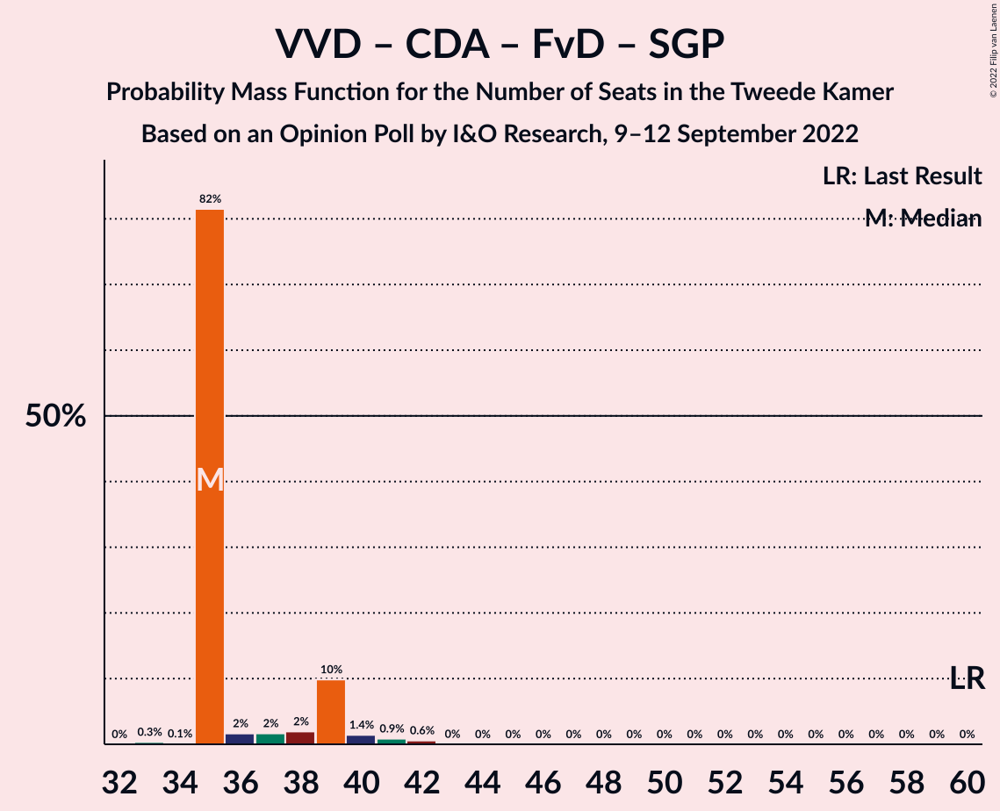

# Opinion Poll by I&O Research, 9–12 September 2022

<a href="#voting-intentions">Voting Intentions</a> | <a href="#seats">Seats</a> | <a href="#coalitions">Coalitions</a> | <a href="#technical-information">Technical Information</a>

## Voting Intentions

### Confidence Intervals

| Party | Last Result | Poll Result | 80% Confidence Interval | 90% Confidence Interval | 95% Confidence Interval | 99% Confidence Interval |
|:-----:|:-----------:|:-----------:|:-----------------------:|:-----------------------:|:-----------------------:|:-----------------------:|
| Volkspartij voor Vrijheid en Democratie | 21.9% | 14.6% | 13.6–15.7% |13.3–16.0% |13.0–16.3% |12.5–16.9% |
| Partij voor de Vrijheid | 10.8% | 10.7% | 9.8–11.7% |9.5–11.9% |9.3–12.2% |8.9–12.7% |
| BoerBurgerBeweging | 1.0% | 9.9% | 9.0–10.9% |8.8–11.1% |8.6–11.4% |8.2–11.8% |
| Democraten 66 | 15.0% | 9.6% | 8.8–10.6% |8.5–10.8% |8.3–11.1% |7.9–11.6% |
| GroenLinks | 5.2% | 7.9% | 7.1–8.8% |6.9–9.0% |6.7–9.2% |6.4–9.7% |
| Juiste Antwoord 2021 | 2.4% | 7.8% | 7.0–8.6% |6.8–8.9% |6.6–9.1% |6.3–9.5% |
| Partij van de Arbeid | 5.7% | 7.4% | 6.6–8.2% |6.4–8.5% |6.2–8.7% |5.9–9.1% |
| Socialistische Partij | 6.0% | 5.1% | 4.5–5.8% |4.3–6.0% |4.2–6.2% |3.9–6.6% |
| Partij voor de Dieren | 3.8% | 4.9% | 4.3–5.6% |4.1–5.9% |4.0–6.0% |3.7–6.4% |
| Christen-Democratisch Appèl | 9.5% | 4.1% | 3.5–4.8% |3.4–4.9% |3.2–5.1% |3.0–5.4% |
| Forum voor Democratie | 5.0% | 3.8% | 3.3–4.5% |3.1–4.6% |3.0–4.8% |2.8–5.1% |
| Volt Europa | 2.4% | 3.6% | 3.1–4.2% |2.9–4.4% |2.8–4.6% |2.6–4.9% |
| ChristenUnie | 3.4% | 3.3% | 2.8–3.9% |2.7–4.1% |2.6–4.2% |2.3–4.5% |
| Staatkundig Gereformeerde Partij | 2.1% | 2.6% | 2.1–3.1% |2.0–3.3% |1.9–3.4% |1.7–3.7% |
| DENK | 2.0% | 1.6% | 1.3–2.1% |1.2–2.2% |1.1–2.3% |1.0–2.6% |
| Bij1 | 0.8% | 1.1% | 0.9–1.5% |0.8–1.6% |0.7–1.7% |0.6–1.9% |
| Belang van Nederland | 0.0% | 1.0% | 0.8–1.4% |0.7–1.5% |0.6–1.6% |0.5–1.8% |
| 50Plus | 1.0% | 0.8% | 0.6–1.1% |0.5–1.2% |0.5–1.3% |0.4–1.5% |

*Note:* The poll result column reflects the actual value used in the calculations. Published results may vary slightly, and in addition be rounded to fewer digits.

## Seats

### Confidence Intervals

| Party | Last Result | Median | 80% Confidence Interval | 90% Confidence Interval | 95% Confidence Interval | 99% Confidence Interval |
|:-----:|:-----------:|:------:|:-----------------------:|:-----------------------:|:-----------------------:|:-----------------------:|
| <a href="#volkspartij-voor-vrijheid-en-democratie">Volkspartij voor Vrijheid en Democratie</a> | 34 | 21 | 21–25 |21–25 |21–26 |20–26 |
| <a href="#partij-voor-de-vrijheid">Partij voor de Vrijheid</a> | 17 | 17 | 15–17 |15–17 |14–17 |13–19 |
| <a href="#boerburgerbeweging">BoerBurgerBeweging</a> | 1 | 19 | 15–19 |13–19 |13–19 |13–19 |
| <a href="#democraten-66">Democraten 66</a> | 24 | 14 | 14–15 |13–16 |12–17 |12–18 |
| <a href="#groenlinks">GroenLinks</a> | 8 | 12 | 12 |12–14 |11–14 |10–15 |
| <a href="#juiste-antwoord-2021">Juiste Antwoord 2021</a> | 3 | 10 | 10–12 |10–12 |10–12 |9–14 |
| <a href="#partij-van-de-arbeid">Partij van de Arbeid</a> | 9 | 11 | 11 |11–13 |10–13 |10–13 |
| <a href="#socialistische-partij">Socialistische Partij</a> | 9 | 9 | 7–9 |6–9 |5–9 |5–9 |
| <a href="#partij-voor-de-dieren">Partij voor de Dieren</a> | 6 | 7 | 7 |7–8 |6–9 |5–10 |
| <a href="#christen-democratisch-appèl">Christen-Democratisch Appèl</a> | 15 | 5 | 5–6 |5–7 |5–8 |5–8 |
| <a href="#forum-voor-democratie">Forum voor Democratie</a> | 8 | 5 | 5 |4–5 |4–6 |4–7 |
| <a href="#volt-europa">Volt Europa</a> | 3 | 5 | 5 |5–6 |5–6 |4–7 |
| <a href="#christenunie">ChristenUnie</a> | 5 | 5 | 5 |4–5 |4–7 |3–7 |
| <a href="#staatkundig-gereformeerde-partij">Staatkundig Gereformeerde Partij</a> | 3 | 4 | 3–4 |3–4 |2–4 |2–5 |
| <a href="#denk">DENK</a> | 3 | 2 | 2 |2–3 |1–3 |1–3 |
| <a href="#bij1">Bij1</a> | 1 | 1 | 1 |1–2 |1–2 |1–3 |
| <a href="#belang-van-nederland">Belang van Nederland</a> | 0 | 2 | 2 |1–2 |1–2 |0–2 |
| <a href="#50plus">50Plus</a> | 1 | 1 | 1 |1 |0–1 |0–2 |

### Volkspartij voor Vrijheid en Democratie

*For a full overview of the results for this party, see the [Volkspartij voor Vrijheid en Democratie](party-volkspartijvoorvrijheidendemocratie.html) page.*

| Number of Seats | Probability | Accumulated | Special Marks |
|:---------------:|:-----------:|:-----------:|:-------------:|
| 19 | 0.4% | 100% |  |
| 20 | 1.4% | 99.6% |  |
| 21 | 82% | 98% | Median |
| 22 | 2% | 16% |  |
| 23 | 2% | 14% |  |
| 24 | 1.4% | 12% |  |
| 25 | 8% | 11% |  |
| 26 | 3% | 3% |  |
| 27 | 0% | 0% |  |
| 28 | 0% | 0% |  |
| 29 | 0% | 0% |  |
| 30 | 0% | 0% |  |
| 31 | 0% | 0% |  |
| 32 | 0% | 0% |  |
| 33 | 0% | 0% |  |
| 34 | 0% | 0% | Last Result |

### Partij voor de Vrijheid

*For a full overview of the results for this party, see the [Partij voor de Vrijheid](party-partijvoordevrijheid.html) page.*

| Number of Seats | Probability | Accumulated | Special Marks |
|:---------------:|:-----------:|:-----------:|:-------------:|
| 12 | 0.2% | 100% |  |
| 13 | 2% | 99.8% |  |
| 14 | 1.4% | 98% |  |
| 15 | 8% | 96% |  |
| 16 | 0.1% | 89% |  |
| 17 | 87% | 88% | Last Result, Median |
| 18 | 0.7% | 1.5% |  |
| 19 | 0.5% | 0.8% |  |
| 20 | 0.3% | 0.3% |  |
| 21 | 0% | 0% |  |

### BoerBurgerBeweging

*For a full overview of the results for this party, see the [BoerBurgerBeweging](party-boerburgerbeweging.html) page.*

| Number of Seats | Probability | Accumulated | Special Marks |
|:---------------:|:-----------:|:-----------:|:-------------:|
| 1 | 0% | 100% | Last Result |
| 2 | 0% | 100% |  |
| 3 | 0% | 100% |  |
| 4 | 0% | 100% |  |
| 5 | 0% | 100% |  |
| 6 | 0% | 100% |  |
| 7 | 0% | 100% |  |
| 8 | 0% | 100% |  |
| 9 | 0% | 100% |  |
| 10 | 0% | 100% |  |
| 11 | 0% | 100% |  |
| 12 | 0.1% | 100% |  |
| 13 | 6% | 99.9% |  |
| 14 | 3% | 94% |  |
| 15 | 5% | 91% |  |
| 16 | 3% | 86% |  |
| 17 | 1.5% | 83% |  |
| 18 | 0.9% | 82% |  |
| 19 | 81% | 81% | Median |
| 20 | 0% | 0% |  |

### Democraten 66

*For a full overview of the results for this party, see the [Democraten 66](party-democraten66.html) page.*

| Number of Seats | Probability | Accumulated | Special Marks |
|:---------------:|:-----------:|:-----------:|:-------------:|
| 10 | 0.1% | 100% |  |
| 11 | 0% | 99.9% |  |
| 12 | 3% | 99.9% |  |
| 13 | 3% | 97% |  |
| 14 | 82% | 93% | Median |
| 15 | 6% | 11% |  |
| 16 | 2% | 5% |  |
| 17 | 2% | 3% |  |
| 18 | 0.6% | 0.6% |  |
| 19 | 0% | 0% |  |
| 20 | 0% | 0% |  |
| 21 | 0% | 0% |  |
| 22 | 0% | 0% |  |
| 23 | 0% | 0% |  |
| 24 | 0% | 0% | Last Result |

### GroenLinks

*For a full overview of the results for this party, see the [GroenLinks](party-groenlinks.html) page.*

| Number of Seats | Probability | Accumulated | Special Marks |
|:---------------:|:-----------:|:-----------:|:-------------:|
| 8 | 0% | 100% | Last Result |
| 9 | 0% | 100% |  |
| 10 | 2% | 100% |  |
| 11 | 3% | 98% |  |
| 12 | 86% | 95% | Median |
| 13 | 3% | 9% |  |
| 14 | 5% | 6% |  |
| 15 | 0.7% | 0.8% |  |
| 16 | 0.1% | 0.1% |  |
| 17 | 0% | 0% |  |

### Juiste Antwoord 2021

*For a full overview of the results for this party, see the [Juiste Antwoord 2021](party-juisteantwoord2021.html) page.*

| Number of Seats | Probability | Accumulated | Special Marks |
|:---------------:|:-----------:|:-----------:|:-------------:|
| 3 | 0% | 100% | Last Result |
| 4 | 0% | 100% |  |
| 5 | 0% | 100% |  |
| 6 | 0% | 100% |  |
| 7 | 0% | 100% |  |
| 8 | 0% | 100% |  |
| 9 | 1.0% | 100% |  |
| 10 | 82% | 99.0% | Median |
| 11 | 1.3% | 17% |  |
| 12 | 14% | 15% |  |
| 13 | 1.0% | 2% |  |
| 14 | 0.6% | 0.7% |  |
| 15 | 0.1% | 0.1% |  |
| 16 | 0% | 0% |  |

### Partij van de Arbeid

*For a full overview of the results for this party, see the [Partij van de Arbeid](party-partijvandearbeid.html) page.*

| Number of Seats | Probability | Accumulated | Special Marks |
|:---------------:|:-----------:|:-----------:|:-------------:|
| 9 | 0.2% | 100% | Last Result |
| 10 | 3% | 99.8% |  |
| 11 | 88% | 97% | Median |
| 12 | 3% | 9% |  |
| 13 | 5% | 6% |  |
| 14 | 0% | 0.3% |  |
| 15 | 0.3% | 0.3% |  |
| 16 | 0% | 0% |  |

### Socialistische Partij

*For a full overview of the results for this party, see the [Socialistische Partij](party-socialistischepartij.html) page.*

| Number of Seats | Probability | Accumulated | Special Marks |
|:---------------:|:-----------:|:-----------:|:-------------:|
| 5 | 4% | 100% |  |
| 6 | 3% | 96% |  |
| 7 | 3% | 93% |  |
| 8 | 7% | 90% |  |
| 9 | 83% | 83% | Last Result, Median |
| 10 | 0.4% | 0.4% |  |
| 11 | 0% | 0% |  |

### Partij voor de Dieren

*For a full overview of the results for this party, see the [Partij voor de Dieren](party-partijvoordedieren.html) page.*

| Number of Seats | Probability | Accumulated | Special Marks |
|:---------------:|:-----------:|:-----------:|:-------------:|
| 5 | 0.6% | 100% |  |
| 6 | 2% | 99.4% | Last Result |
| 7 | 88% | 97% | Median |
| 8 | 6% | 9% |  |
| 9 | 0.2% | 3% |  |
| 10 | 2% | 2% |  |
| 11 | 0% | 0% |  |

### Christen-Democratisch Appèl

*For a full overview of the results for this party, see the [Christen-Democratisch Appèl](party-christen-democratischappèl.html) page.*

| Number of Seats | Probability | Accumulated | Special Marks |
|:---------------:|:-----------:|:-----------:|:-------------:|
| 4 | 0.1% | 100% |  |
| 5 | 83% | 99.9% | Median |
| 6 | 9% | 17% |  |
| 7 | 4% | 8% |  |
| 8 | 4% | 4% |  |
| 9 | 0.4% | 0.4% |  |
| 10 | 0% | 0% |  |
| 11 | 0% | 0% |  |
| 12 | 0% | 0% |  |
| 13 | 0% | 0% |  |
| 14 | 0% | 0% |  |
| 15 | 0% | 0% | Last Result |

### Forum voor Democratie

*For a full overview of the results for this party, see the [Forum voor Democratie](party-forumvoordemocratie.html) page.*

| Number of Seats | Probability | Accumulated | Special Marks |
|:---------------:|:-----------:|:-----------:|:-------------:|
| 4 | 6% | 100% |  |
| 5 | 90% | 94% | Median |
| 6 | 3% | 4% |  |
| 7 | 2% | 2% |  |
| 8 | 0.1% | 0.1% | Last Result |
| 9 | 0% | 0% |  |

### Volt Europa

*For a full overview of the results for this party, see the [Volt Europa](party-volteuropa.html) page.*

| Number of Seats | Probability | Accumulated | Special Marks |
|:---------------:|:-----------:|:-----------:|:-------------:|
| 3 | 0.1% | 100% | Last Result |
| 4 | 1.3% | 99.9% |  |
| 5 | 92% | 98.6% | Median |
| 6 | 5% | 7% |  |
| 7 | 1.0% | 1.4% |  |
| 8 | 0.4% | 0.4% |  |
| 9 | 0% | 0% |  |

### ChristenUnie

*For a full overview of the results for this party, see the [ChristenUnie](party-christenunie.html) page.*

| Number of Seats | Probability | Accumulated | Special Marks |
|:---------------:|:-----------:|:-----------:|:-------------:|
| 3 | 2% | 100% |  |
| 4 | 3% | 98% |  |
| 5 | 92% | 95% | Last Result, Median |
| 6 | 0.6% | 3% |  |
| 7 | 3% | 3% |  |
| 8 | 0% | 0% |  |

### Staatkundig Gereformeerde Partij

*For a full overview of the results for this party, see the [Staatkundig Gereformeerde Partij](party-staatkundiggereformeerdepartij.html) page.*

| Number of Seats | Probability | Accumulated | Special Marks |
|:---------------:|:-----------:|:-----------:|:-------------:|
| 2 | 4% | 100% |  |
| 3 | 10% | 96% | Last Result |
| 4 | 84% | 86% | Median |
| 5 | 2% | 2% |  |
| 6 | 0% | 0% |  |

### DENK

*For a full overview of the results for this party, see the [DENK](party-denk.html) page.*

| Number of Seats | Probability | Accumulated | Special Marks |
|:---------------:|:-----------:|:-----------:|:-------------:|
| 1 | 4% | 100% |  |
| 2 | 90% | 96% | Median |
| 3 | 6% | 6% | Last Result |
| 4 | 0.2% | 0.4% |  |
| 5 | 0.1% | 0.1% |  |
| 6 | 0% | 0% |  |

### Bij1

*For a full overview of the results for this party, see the [Bij1](party-bij1.html) page.*

| Number of Seats | Probability | Accumulated | Special Marks |
|:---------------:|:-----------:|:-----------:|:-------------:|
| 0 | 0.4% | 100% |  |
| 1 | 91% | 99.6% | Last Result, Median |
| 2 | 7% | 9% |  |
| 3 | 1.3% | 1.3% |  |
| 4 | 0% | 0% |  |

### Belang van Nederland

*For a full overview of the results for this party, see the [Belang van Nederland](party-belangvannederland.html) page.*

| Number of Seats | Probability | Accumulated | Special Marks |
|:---------------:|:-----------:|:-----------:|:-------------:|
| 0 | 1.3% | 100% | Last Result |
| 1 | 8% | 98.7% |  |
| 2 | 91% | 91% | Median |
| 3 | 0% | 0% |  |

### 50Plus

*For a full overview of the results for this party, see the [50Plus](party-50plus.html) page.*

| Number of Seats | Probability | Accumulated | Special Marks |
|:---------------:|:-----------:|:-----------:|:-------------:|
| 0 | 3% | 100% |  |
| 1 | 97% | 97% | Last Result, Median |
| 2 | 0.8% | 0.8% |  |
| 3 | 0% | 0% |  |

## Coalitions

### Confidence Intervals

| Coalition | Last Result | Median | Majority? | 80% Confidence Interval | 90% Confidence Interval | 95% Confidence Interval | 99% Confidence Interval |
|:---------:|:-----------:|:------:|:---------:|:-----------------------:|:-----------------------:|:-----------------------:|:-----------------------:|
| Volkspartij voor Vrijheid en Democratie – Democraten 66 – GroenLinks – Christen-Democratisch Appèl – ChristenUnie | 86 | 57 | 0% | 57–62 | 57–65 | 57–65 | 55–65 |
| Volkspartij voor Vrijheid en Democratie – Democraten 66 – Partij van de Arbeid – Christen-Democratisch Appèl – ChristenUnie | 87 | 56 | 0% | 56–61 | 56–63 | 56–64 | 56–64 |
| Democraten 66 – GroenLinks – Partij van de Arbeid – Socialistische Partij – Christen-Democratisch Appèl – ChristenUnie | 70 | 56 | 0% | 56 | 56–58 | 55–59 | 52–61 |
| Volkspartij voor Vrijheid en Democratie – Partij voor de Vrijheid – Christen-Democratisch Appèl – Forum voor Democratie – Staatkundig Gereformeerde Partij | 77 | 52 | 0% | 52–54 | 52–56 | 52–56 | 51–59 |
| Volkspartij voor Vrijheid en Democratie – Partij voor de Vrijheid – Christen-Democratisch Appèl – Forum voor Democratie | 74 | 48 | 0% | 48–51 | 48–53 | 48–54 | 48–54 |
| Democraten 66 – GroenLinks – Partij van de Arbeid – Christen-Democratisch Appèl – ChristenUnie | 61 | 47 | 0% | 47–49 | 47–53 | 47–53 | 46–53 |
| Volkspartij voor Vrijheid en Democratie – Democraten 66 – Partij van de Arbeid | 67 | 46 | 0% | 46–49 | 46–53 | 46–53 | 45–53 |
| Volkspartij voor Vrijheid en Democratie – Democraten 66 – Christen-Democratisch Appèl – ChristenUnie | 78 | 45 | 0% | 45–50 | 45–51 | 45–51 | 44–52 |
| Volkspartij voor Vrijheid en Democratie – Partij voor de Vrijheid – Christen-Democratisch Appèl | 66 | 43 | 0% | 43–46 | 43–46 | 43–50 | 42–50 |
| Volkspartij voor Vrijheid en Democratie – Democraten 66 – Christen-Democratisch Appèl | 73 | 40 | 0% | 40–45 | 40–46 | 40–46 | 39–47 |
| Volkspartij voor Vrijheid en Democratie – Partij van de Arbeid – Christen-Democratisch Appèl | 58 | 37 | 0% | 37–42 | 37–44 | 37–44 | 37–44 |
| Volkspartij voor Vrijheid en Democratie – Christen-Democratisch Appèl – Forum voor Democratie – Staatkundig Gereformeerde Partij – 50Plus | 61 | 36 | 0% | 36–40 | 36–40 | 36–41 | 35–43 |
| Volkspartij voor Vrijheid en Democratie – Christen-Democratisch Appèl – Forum voor Democratie – Staatkundig Gereformeerde Partij | 60 | 35 | 0% | 35–39 | 35–39 | 35–40 | 35–42 |
| Volkspartij voor Vrijheid en Democratie – Christen-Democratisch Appèl – Forum voor Democratie – 50Plus | 58 | 32 | 0% | 32–37 | 32–38 | 32–38 | 32–39 |
| Volkspartij voor Vrijheid en Democratie – Partij van de Arbeid | 43 | 32 | 0% | 32–36 | 32–37 | 32–38 | 31–38 |
| Volkspartij voor Vrijheid en Democratie – Christen-Democratisch Appèl – Forum voor Democratie | 57 | 31 | 0% | 31–36 | 31–37 | 31–37 | 31–38 |
| Democraten 66 – Partij van de Arbeid – Christen-Democratisch Appèl | 48 | 30 | 0% | 30–33 | 30–34 | 30–35 | 29–36 |
| Volkspartij voor Vrijheid en Democratie – Christen-Democratisch Appèl | 49 | 26 | 0% | 26–31 | 26–32 | 26–33 | 25–33 |
| Partij van de Arbeid – Christen-Democratisch Appèl – ChristenUnie | 29 | 21 | 0% | 21–23 | 21–24 | 21–24 | 19–25 |
| Democraten 66 – Christen-Democratisch Appèl | 39 | 19 | 0% | 19–21 | 19–21 | 19–23 | 18–24 |
| Partij van de Arbeid – Christen-Democratisch Appèl | 24 | 16 | 0% | 16–19 | 16–19 | 16–19 | 16–20 |

### Volkspartij voor Vrijheid en Democratie – Democraten 66 – GroenLinks – Christen-Democratisch Appèl – ChristenUnie

| Number of Seats | Probability | Accumulated | Special Marks |
|:---------------:|:-----------:|:-----------:|:-------------:|
| 53 | 0.1% | 100% |  |
| 54 | 0% | 99.9% |  |
| 55 | 0.8% | 99.9% |  |
| 56 | 0.1% | 99.1% |  |
| 57 | 81% | 99.0% | Median |
| 58 | 1.0% | 18% |  |
| 59 | 0.9% | 17% |  |
| 60 | 2% | 16% |  |
| 61 | 1.1% | 14% |  |
| 62 | 4% | 13% |  |
| 63 | 0.1% | 8% |  |
| 64 | 0.2% | 8% |  |
| 65 | 8% | 8% |  |
| 66 | 0% | 0% |  |
| 67 | 0% | 0% |  |
| 68 | 0% | 0% |  |
| 69 | 0% | 0% |  |
| 70 | 0% | 0% |  |
| 71 | 0% | 0% |  |
| 72 | 0% | 0% |  |
| 73 | 0% | 0% |  |
| 74 | 0% | 0% |  |
| 75 | 0% | 0% |  |
| 76 | 0% | 0% | Majority |
| 77 | 0% | 0% |  |
| 78 | 0% | 0% |  |
| 79 | 0% | 0% |  |
| 80 | 0% | 0% |  |
| 81 | 0% | 0% |  |
| 82 | 0% | 0% |  |
| 83 | 0% | 0% |  |
| 84 | 0% | 0% |  |
| 85 | 0% | 0% |  |
| 86 | 0% | 0% | Last Result |

### Volkspartij voor Vrijheid en Democratie – Democraten 66 – Partij van de Arbeid – Christen-Democratisch Appèl – ChristenUnie

| Number of Seats | Probability | Accumulated | Special Marks |
|:---------------:|:-----------:|:-----------:|:-------------:|
| 52 | 0.1% | 100% |  |
| 53 | 0% | 99.9% |  |
| 54 | 0.1% | 99.9% |  |
| 55 | 0% | 99.8% |  |
| 56 | 82% | 99.8% | Median |
| 57 | 0.3% | 18% |  |
| 58 | 0.9% | 18% |  |
| 59 | 1.0% | 17% |  |
| 60 | 0.8% | 16% |  |
| 61 | 5% | 15% |  |
| 62 | 4% | 10% |  |
| 63 | 1.1% | 6% |  |
| 64 | 4% | 4% |  |
| 65 | 0% | 0% |  |
| 66 | 0% | 0% |  |
| 67 | 0% | 0% |  |
| 68 | 0% | 0% |  |
| 69 | 0% | 0% |  |
| 70 | 0% | 0% |  |
| 71 | 0% | 0% |  |
| 72 | 0% | 0% |  |
| 73 | 0% | 0% |  |
| 74 | 0% | 0% |  |
| 75 | 0% | 0% |  |
| 76 | 0% | 0% | Majority |
| 77 | 0% | 0% |  |
| 78 | 0% | 0% |  |
| 79 | 0% | 0% |  |
| 80 | 0% | 0% |  |
| 81 | 0% | 0% |  |
| 82 | 0% | 0% |  |
| 83 | 0% | 0% |  |
| 84 | 0% | 0% |  |
| 85 | 0% | 0% |  |
| 86 | 0% | 0% |  |
| 87 | 0% | 0% | Last Result |

### Democraten 66 – GroenLinks – Partij van de Arbeid – Socialistische Partij – Christen-Democratisch Appèl – ChristenUnie

| Number of Seats | Probability | Accumulated | Special Marks |
|:---------------:|:-----------:|:-----------:|:-------------:|
| 50 | 0.1% | 100% |  |
| 51 | 0% | 99.9% |  |
| 52 | 0.6% | 99.9% |  |
| 53 | 0.2% | 99.4% |  |
| 54 | 0.1% | 99.2% |  |
| 55 | 2% | 99.1% |  |
| 56 | 87% | 97% | Median |
| 57 | 0.1% | 10% |  |
| 58 | 6% | 10% |  |
| 59 | 2% | 4% |  |
| 60 | 1.0% | 2% |  |
| 61 | 0.7% | 1.0% |  |
| 62 | 0.3% | 0.3% |  |
| 63 | 0% | 0% |  |
| 64 | 0% | 0% |  |
| 65 | 0% | 0% |  |
| 66 | 0% | 0% |  |
| 67 | 0% | 0% |  |
| 68 | 0% | 0% |  |
| 69 | 0% | 0% |  |
| 70 | 0% | 0% | Last Result |

### Volkspartij voor Vrijheid en Democratie – Partij voor de Vrijheid – Christen-Democratisch Appèl – Forum voor Democratie – Staatkundig Gereformeerde Partij

| Number of Seats | Probability | Accumulated | Special Marks |
|:---------------:|:-----------:|:-----------:|:-------------:|
| 50 | 0% | 100% |  |
| 51 | 0.7% | 99.9% |  |
| 52 | 85% | 99.3% | Median |
| 53 | 3% | 14% |  |
| 54 | 5% | 11% |  |
| 55 | 0.3% | 6% |  |
| 56 | 3% | 6% |  |
| 57 | 1.4% | 2% |  |
| 58 | 0.2% | 0.8% |  |
| 59 | 0.6% | 0.6% |  |
| 60 | 0% | 0% |  |
| 61 | 0% | 0% |  |
| 62 | 0% | 0% |  |
| 63 | 0% | 0% |  |
| 64 | 0% | 0% |  |
| 65 | 0% | 0% |  |
| 66 | 0% | 0% |  |
| 67 | 0% | 0% |  |
| 68 | 0% | 0% |  |
| 69 | 0% | 0% |  |
| 70 | 0% | 0% |  |
| 71 | 0% | 0% |  |
| 72 | 0% | 0% |  |
| 73 | 0% | 0% |  |
| 74 | 0% | 0% |  |
| 75 | 0% | 0% |  |
| 76 | 0% | 0% | Majority |
| 77 | 0% | 0% | Last Result |

### Volkspartij voor Vrijheid en Democratie – Partij voor de Vrijheid – Christen-Democratisch Appèl – Forum voor Democratie

| Number of Seats | Probability | Accumulated | Special Marks |
|:---------------:|:-----------:|:-----------:|:-------------:|
| 47 | 0.2% | 100% |  |
| 48 | 83% | 99.7% | Median |
| 49 | 4% | 17% |  |
| 50 | 2% | 13% |  |
| 51 | 5% | 11% |  |
| 52 | 0.2% | 6% |  |
| 53 | 0.6% | 5% |  |
| 54 | 5% | 5% |  |
| 55 | 0% | 0.1% |  |
| 56 | 0% | 0% |  |
| 57 | 0% | 0% |  |
| 58 | 0% | 0% |  |
| 59 | 0% | 0% |  |
| 60 | 0% | 0% |  |
| 61 | 0% | 0% |  |
| 62 | 0% | 0% |  |
| 63 | 0% | 0% |  |
| 64 | 0% | 0% |  |
| 65 | 0% | 0% |  |
| 66 | 0% | 0% |  |
| 67 | 0% | 0% |  |
| 68 | 0% | 0% |  |
| 69 | 0% | 0% |  |
| 70 | 0% | 0% |  |
| 71 | 0% | 0% |  |
| 72 | 0% | 0% |  |
| 73 | 0% | 0% |  |
| 74 | 0% | 0% | Last Result |

### Democraten 66 – GroenLinks – Partij van de Arbeid – Christen-Democratisch Appèl – ChristenUnie

| Number of Seats | Probability | Accumulated | Special Marks |
|:---------------:|:-----------:|:-----------:|:-------------:|
| 43 | 0.1% | 100% |  |
| 44 | 0% | 99.9% |  |
| 45 | 0.1% | 99.9% |  |
| 46 | 0.7% | 99.8% |  |
| 47 | 82% | 99.1% | Median |
| 48 | 4% | 17% |  |
| 49 | 4% | 13% |  |
| 50 | 3% | 10% |  |
| 51 | 0.7% | 7% |  |
| 52 | 0.5% | 6% |  |
| 53 | 6% | 6% |  |
| 54 | 0% | 0.4% |  |
| 55 | 0.3% | 0.3% |  |
| 56 | 0% | 0% |  |
| 57 | 0% | 0% |  |
| 58 | 0% | 0% |  |
| 59 | 0% | 0% |  |
| 60 | 0% | 0% |  |
| 61 | 0% | 0% | Last Result |

### Volkspartij voor Vrijheid en Democratie – Democraten 66 – Partij van de Arbeid

| Number of Seats | Probability | Accumulated | Special Marks |
|:---------------:|:-----------:|:-----------:|:-------------:|
| 42 | 0.1% | 100% |  |
| 43 | 0% | 99.9% |  |
| 44 | 0.2% | 99.8% |  |
| 45 | 1.0% | 99.7% |  |
| 46 | 81% | 98.7% | Median |
| 47 | 0.2% | 17% |  |
| 48 | 4% | 17% |  |
| 49 | 5% | 14% |  |
| 50 | 1.0% | 9% |  |
| 51 | 2% | 8% |  |
| 52 | 0.6% | 6% |  |
| 53 | 5% | 5% |  |
| 54 | 0% | 0% |  |
| 55 | 0% | 0% |  |
| 56 | 0% | 0% |  |
| 57 | 0% | 0% |  |
| 58 | 0% | 0% |  |
| 59 | 0% | 0% |  |
| 60 | 0% | 0% |  |
| 61 | 0% | 0% |  |
| 62 | 0% | 0% |  |
| 63 | 0% | 0% |  |
| 64 | 0% | 0% |  |
| 65 | 0% | 0% |  |
| 66 | 0% | 0% |  |
| 67 | 0% | 0% | Last Result |

### Volkspartij voor Vrijheid en Democratie – Democraten 66 – Christen-Democratisch Appèl – ChristenUnie

| Number of Seats | Probability | Accumulated | Special Marks |
|:---------------:|:-----------:|:-----------:|:-------------:|
| 41 | 0.1% | 100% |  |
| 42 | 0.1% | 99.9% |  |
| 43 | 0% | 99.9% |  |
| 44 | 0.9% | 99.9% |  |
| 45 | 81% | 98.9% | Median |
| 46 | 0.7% | 18% |  |
| 47 | 1.2% | 17% |  |
| 48 | 2% | 16% |  |
| 49 | 0.1% | 15% |  |
| 50 | 7% | 15% |  |
| 51 | 5% | 8% |  |
| 52 | 2% | 2% |  |
| 53 | 0.3% | 0.3% |  |
| 54 | 0% | 0% |  |
| 55 | 0% | 0% |  |
| 56 | 0% | 0% |  |
| 57 | 0% | 0% |  |
| 58 | 0% | 0% |  |
| 59 | 0% | 0% |  |
| 60 | 0% | 0% |  |
| 61 | 0% | 0% |  |
| 62 | 0% | 0% |  |
| 63 | 0% | 0% |  |
| 64 | 0% | 0% |  |
| 65 | 0% | 0% |  |
| 66 | 0% | 0% |  |
| 67 | 0% | 0% |  |
| 68 | 0% | 0% |  |
| 69 | 0% | 0% |  |
| 70 | 0% | 0% |  |
| 71 | 0% | 0% |  |
| 72 | 0% | 0% |  |
| 73 | 0% | 0% |  |
| 74 | 0% | 0% |  |
| 75 | 0% | 0% |  |
| 76 | 0% | 0% | Majority |
| 77 | 0% | 0% |  |
| 78 | 0% | 0% | Last Result |

### Volkspartij voor Vrijheid en Democratie – Partij voor de Vrijheid – Christen-Democratisch Appèl

| Number of Seats | Probability | Accumulated | Special Marks |
|:---------------:|:-----------:|:-----------:|:-------------:|
| 40 | 0.1% | 100% |  |
| 41 | 0% | 99.9% |  |
| 42 | 0.8% | 99.9% |  |
| 43 | 83% | 99.1% | Median |
| 44 | 3% | 16% |  |
| 45 | 3% | 13% |  |
| 46 | 5% | 10% |  |
| 47 | 0.1% | 5% |  |
| 48 | 0.9% | 5% |  |
| 49 | 0.6% | 4% |  |
| 50 | 3% | 3% |  |
| 51 | 0% | 0% |  |
| 52 | 0% | 0% |  |
| 53 | 0% | 0% |  |
| 54 | 0% | 0% |  |
| 55 | 0% | 0% |  |
| 56 | 0% | 0% |  |
| 57 | 0% | 0% |  |
| 58 | 0% | 0% |  |
| 59 | 0% | 0% |  |
| 60 | 0% | 0% |  |
| 61 | 0% | 0% |  |
| 62 | 0% | 0% |  |
| 63 | 0% | 0% |  |
| 64 | 0% | 0% |  |
| 65 | 0% | 0% |  |
| 66 | 0% | 0% | Last Result |

### Volkspartij voor Vrijheid en Democratie – Democraten 66 – Christen-Democratisch Appèl

| Number of Seats | Probability | Accumulated | Special Marks |
|:---------------:|:-----------:|:-----------:|:-------------:|
| 36 | 0.1% | 100% |  |
| 37 | 0.1% | 99.9% |  |
| 38 | 0% | 99.9% |  |
| 39 | 0.9% | 99.9% |  |
| 40 | 81% | 99.0% | Median |
| 41 | 0.5% | 18% |  |
| 42 | 1.0% | 18% |  |
| 43 | 0.4% | 17% |  |
| 44 | 1.1% | 16% |  |
| 45 | 7% | 15% |  |
| 46 | 6% | 8% |  |
| 47 | 1.2% | 2% |  |
| 48 | 0.3% | 0.3% |  |
| 49 | 0% | 0% |  |
| 50 | 0% | 0% |  |
| 51 | 0% | 0% |  |
| 52 | 0% | 0% |  |
| 53 | 0% | 0% |  |
| 54 | 0% | 0% |  |
| 55 | 0% | 0% |  |
| 56 | 0% | 0% |  |
| 57 | 0% | 0% |  |
| 58 | 0% | 0% |  |
| 59 | 0% | 0% |  |
| 60 | 0% | 0% |  |
| 61 | 0% | 0% |  |
| 62 | 0% | 0% |  |
| 63 | 0% | 0% |  |
| 64 | 0% | 0% |  |
| 65 | 0% | 0% |  |
| 66 | 0% | 0% |  |
| 67 | 0% | 0% |  |
| 68 | 0% | 0% |  |
| 69 | 0% | 0% |  |
| 70 | 0% | 0% |  |
| 71 | 0% | 0% |  |
| 72 | 0% | 0% |  |
| 73 | 0% | 0% | Last Result |

### Volkspartij voor Vrijheid en Democratie – Partij van de Arbeid – Christen-Democratisch Appèl

| Number of Seats | Probability | Accumulated | Special Marks |
|:---------------:|:-----------:|:-----------:|:-------------:|
| 35 | 0.1% | 100% |  |
| 36 | 0.1% | 99.9% |  |
| 37 | 81% | 99.8% | Median |
| 38 | 2% | 18% |  |
| 39 | 0.4% | 17% |  |
| 40 | 1.4% | 16% |  |
| 41 | 2% | 15% |  |
| 42 | 4% | 13% |  |
| 43 | 0.7% | 9% |  |
| 44 | 8% | 8% |  |
| 45 | 0% | 0% |  |
| 46 | 0% | 0% |  |
| 47 | 0% | 0% |  |
| 48 | 0% | 0% |  |
| 49 | 0% | 0% |  |
| 50 | 0% | 0% |  |
| 51 | 0% | 0% |  |
| 52 | 0% | 0% |  |
| 53 | 0% | 0% |  |
| 54 | 0% | 0% |  |
| 55 | 0% | 0% |  |
| 56 | 0% | 0% |  |
| 57 | 0% | 0% |  |
| 58 | 0% | 0% | Last Result |

### Volkspartij voor Vrijheid en Democratie – Christen-Democratisch Appèl – Forum voor Democratie – Staatkundig Gereformeerde Partij – 50Plus

| Number of Seats | Probability | Accumulated | Special Marks |
|:---------------:|:-----------:|:-----------:|:-------------:|
| 34 | 0.4% | 100% |  |
| 35 | 0.2% | 99.6% |  |
| 36 | 81% | 99.3% | Median |
| 37 | 3% | 18% |  |
| 38 | 0.9% | 15% |  |
| 39 | 1.4% | 14% |  |
| 40 | 10% | 13% |  |
| 41 | 2% | 3% |  |
| 42 | 0.6% | 1.2% |  |
| 43 | 0.6% | 0.6% |  |
| 44 | 0% | 0% |  |
| 45 | 0% | 0% |  |
| 46 | 0% | 0% |  |
| 47 | 0% | 0% |  |
| 48 | 0% | 0% |  |
| 49 | 0% | 0% |  |
| 50 | 0% | 0% |  |
| 51 | 0% | 0% |  |
| 52 | 0% | 0% |  |
| 53 | 0% | 0% |  |
| 54 | 0% | 0% |  |
| 55 | 0% | 0% |  |
| 56 | 0% | 0% |  |
| 57 | 0% | 0% |  |
| 58 | 0% | 0% |  |
| 59 | 0% | 0% |  |
| 60 | 0% | 0% |  |
| 61 | 0% | 0% | Last Result |

### Volkspartij voor Vrijheid en Democratie – Christen-Democratisch Appèl – Forum voor Democratie – Staatkundig Gereformeerde Partij

| Number of Seats | Probability | Accumulated | Special Marks |
|:---------------:|:-----------:|:-----------:|:-------------:|
| 33 | 0.3% | 100% |  |
| 34 | 0.1% | 99.6% |  |
| 35 | 82% | 99.5% | Median |
| 36 | 2% | 18% |  |
| 37 | 2% | 16% |  |
| 38 | 2% | 15% |  |
| 39 | 10% | 13% |  |
| 40 | 1.4% | 3% |  |
| 41 | 0.9% | 1.5% |  |
| 42 | 0.6% | 0.6% |  |
| 43 | 0% | 0% |  |
| 44 | 0% | 0% |  |
| 45 | 0% | 0% |  |
| 46 | 0% | 0% |  |
| 47 | 0% | 0% |  |
| 48 | 0% | 0% |  |
| 49 | 0% | 0% |  |
| 50 | 0% | 0% |  |
| 51 | 0% | 0% |  |
| 52 | 0% | 0% |  |
| 53 | 0% | 0% |  |
| 54 | 0% | 0% |  |
| 55 | 0% | 0% |  |
| 56 | 0% | 0% |  |
| 57 | 0% | 0% |  |
| 58 | 0% | 0% |  |
| 59 | 0% | 0% |  |
| 60 | 0% | 0% | Last Result |

### Volkspartij voor Vrijheid en Democratie – Christen-Democratisch Appèl – Forum voor Democratie – 50Plus

| Number of Seats | Probability | Accumulated | Special Marks |
|:---------------:|:-----------:|:-----------:|:-------------:|
| 30 | 0% | 100% |  |
| 31 | 0% | 99.9% |  |
| 32 | 83% | 99.9% | Median |
| 33 | 0.6% | 17% |  |
| 34 | 2% | 17% |  |
| 35 | 1.0% | 15% |  |
| 36 | 1.3% | 14% |  |
| 37 | 7% | 13% |  |
| 38 | 5% | 5% |  |
| 39 | 0.6% | 0.6% |  |
| 40 | 0% | 0% |  |
| 41 | 0% | 0% |  |
| 42 | 0% | 0% |  |
| 43 | 0% | 0% |  |
| 44 | 0% | 0% |  |
| 45 | 0% | 0% |  |
| 46 | 0% | 0% |  |
| 47 | 0% | 0% |  |
| 48 | 0% | 0% |  |
| 49 | 0% | 0% |  |
| 50 | 0% | 0% |  |
| 51 | 0% | 0% |  |
| 52 | 0% | 0% |  |
| 53 | 0% | 0% |  |
| 54 | 0% | 0% |  |
| 55 | 0% | 0% |  |
| 56 | 0% | 0% |  |
| 57 | 0% | 0% |  |
| 58 | 0% | 0% | Last Result |

### Volkspartij voor Vrijheid en Democratie – Partij van de Arbeid

| Number of Seats | Probability | Accumulated | Special Marks |
|:---------------:|:-----------:|:-----------:|:-------------:|
| 29 | 0% | 100% |  |
| 30 | 0.1% | 99.9% |  |
| 31 | 0.5% | 99.9% |  |
| 32 | 83% | 99.4% | Median |
| 33 | 1.3% | 17% |  |
| 34 | 2% | 15% |  |
| 35 | 2% | 13% |  |
| 36 | 6% | 11% |  |
| 37 | 0.7% | 5% |  |
| 38 | 4% | 5% |  |
| 39 | 0.3% | 0.3% |  |
| 40 | 0% | 0% |  |
| 41 | 0% | 0% |  |
| 42 | 0% | 0% |  |
| 43 | 0% | 0% | Last Result |

### Volkspartij voor Vrijheid en Democratie – Christen-Democratisch Appèl – Forum voor Democratie

| Number of Seats | Probability | Accumulated | Special Marks |
|:---------------:|:-----------:|:-----------:|:-------------:|
| 30 | 0.1% | 100% |  |
| 31 | 82% | 99.9% | Median |
| 32 | 0.9% | 18% |  |
| 33 | 0.7% | 17% |  |
| 34 | 2% | 16% |  |
| 35 | 1.3% | 14% |  |
| 36 | 7% | 13% |  |
| 37 | 5% | 6% |  |
| 38 | 0.6% | 0.7% |  |
| 39 | 0% | 0% |  |
| 40 | 0% | 0% |  |
| 41 | 0% | 0% |  |
| 42 | 0% | 0% |  |
| 43 | 0% | 0% |  |
| 44 | 0% | 0% |  |
| 45 | 0% | 0% |  |
| 46 | 0% | 0% |  |
| 47 | 0% | 0% |  |
| 48 | 0% | 0% |  |
| 49 | 0% | 0% |  |
| 50 | 0% | 0% |  |
| 51 | 0% | 0% |  |
| 52 | 0% | 0% |  |
| 53 | 0% | 0% |  |
| 54 | 0% | 0% |  |
| 55 | 0% | 0% |  |
| 56 | 0% | 0% |  |
| 57 | 0% | 0% | Last Result |

### Democraten 66 – Partij van de Arbeid – Christen-Democratisch Appèl

| Number of Seats | Probability | Accumulated | Special Marks |
|:---------------:|:-----------:|:-----------:|:-------------:|
| 26 | 0.1% | 100% |  |
| 27 | 0.1% | 99.9% |  |
| 28 | 0% | 99.8% |  |
| 29 | 2% | 99.8% |  |
| 30 | 81% | 98% | Median |
| 31 | 4% | 17% |  |
| 32 | 2% | 12% |  |
| 33 | 1.3% | 10% |  |
| 34 | 6% | 9% |  |
| 35 | 0.7% | 3% |  |
| 36 | 2% | 2% |  |
| 37 | 0% | 0.4% |  |
| 38 | 0.3% | 0.3% |  |
| 39 | 0% | 0% |  |
| 40 | 0% | 0% |  |
| 41 | 0% | 0% |  |
| 42 | 0% | 0% |  |
| 43 | 0% | 0% |  |
| 44 | 0% | 0% |  |
| 45 | 0% | 0% |  |
| 46 | 0% | 0% |  |
| 47 | 0% | 0% |  |
| 48 | 0% | 0% | Last Result |

### Volkspartij voor Vrijheid en Democratie – Christen-Democratisch Appèl

| Number of Seats | Probability | Accumulated | Special Marks |
|:---------------:|:-----------:|:-----------:|:-------------:|
| 25 | 0.5% | 100% |  |
| 26 | 82% | 99.5% | Median |
| 27 | 0.5% | 17% |  |
| 28 | 0.8% | 17% |  |
| 29 | 3% | 16% |  |
| 30 | 0.8% | 13% |  |
| 31 | 7% | 12% |  |
| 32 | 2% | 5% |  |
| 33 | 3% | 3% |  |
| 34 | 0% | 0% |  |
| 35 | 0% | 0% |  |
| 36 | 0% | 0% |  |
| 37 | 0% | 0% |  |
| 38 | 0% | 0% |  |
| 39 | 0% | 0% |  |
| 40 | 0% | 0% |  |
| 41 | 0% | 0% |  |
| 42 | 0% | 0% |  |
| 43 | 0% | 0% |  |
| 44 | 0% | 0% |  |
| 45 | 0% | 0% |  |
| 46 | 0% | 0% |  |
| 47 | 0% | 0% |  |
| 48 | 0% | 0% |  |
| 49 | 0% | 0% | Last Result |

### Partij van de Arbeid – Christen-Democratisch Appèl – ChristenUnie

| Number of Seats | Probability | Accumulated | Special Marks |
|:---------------:|:-----------:|:-----------:|:-------------:|
| 19 | 1.1% | 100% |  |
| 20 | 0.3% | 98.9% |  |
| 21 | 82% | 98.6% | Median |
| 22 | 1.1% | 16% |  |
| 23 | 6% | 15% |  |
| 24 | 8% | 9% |  |
| 25 | 0.5% | 1.0% |  |
| 26 | 0.1% | 0.5% |  |
| 27 | 0.3% | 0.3% |  |
| 28 | 0% | 0% |  |
| 29 | 0% | 0% | Last Result |

### Democraten 66 – Christen-Democratisch Appèl

| Number of Seats | Probability | Accumulated | Special Marks |
|:---------------:|:-----------:|:-----------:|:-------------:|
| 15 | 0.1% | 100% |  |
| 16 | 0% | 99.9% |  |
| 17 | 0.1% | 99.9% |  |
| 18 | 0.4% | 99.9% |  |
| 19 | 84% | 99.4% | Median |
| 20 | 4% | 16% |  |
| 21 | 7% | 12% |  |
| 22 | 0.5% | 5% |  |
| 23 | 2% | 4% |  |
| 24 | 2% | 2% |  |
| 25 | 0.3% | 0.3% |  |
| 26 | 0% | 0% |  |
| 27 | 0% | 0% |  |
| 28 | 0% | 0% |  |
| 29 | 0% | 0% |  |
| 30 | 0% | 0% |  |
| 31 | 0% | 0% |  |
| 32 | 0% | 0% |  |
| 33 | 0% | 0% |  |
| 34 | 0% | 0% |  |
| 35 | 0% | 0% |  |
| 36 | 0% | 0% |  |
| 37 | 0% | 0% |  |
| 38 | 0% | 0% |  |
| 39 | 0% | 0% | Last Result |

### Partij van de Arbeid – Christen-Democratisch Appèl

| Number of Seats | Probability | Accumulated | Special Marks |
|:---------------:|:-----------:|:-----------:|:-------------:|
| 14 | 0.1% | 100% |  |
| 15 | 0.3% | 99.9% |  |
| 16 | 84% | 99.6% | Median |
| 17 | 1.1% | 15% |  |
| 18 | 3% | 14% |  |
| 19 | 11% | 12% |  |
| 20 | 0.4% | 0.9% |  |
| 21 | 0% | 0.4% |  |
| 22 | 0.4% | 0.4% |  |
| 23 | 0% | 0% |  |
| 24 | 0% | 0% | Last Result |

## Technical Information

### Opinion Poll

+ **Polling firm:** I&O Research
+ **Commissioner(s):** —
+ **Fieldwork period:** 9–12 September 2022

### Calculations

+ **Sample size:** 1789
+ **Simulations done:** 1,048,576
+ **Error estimate:** 2.64%

