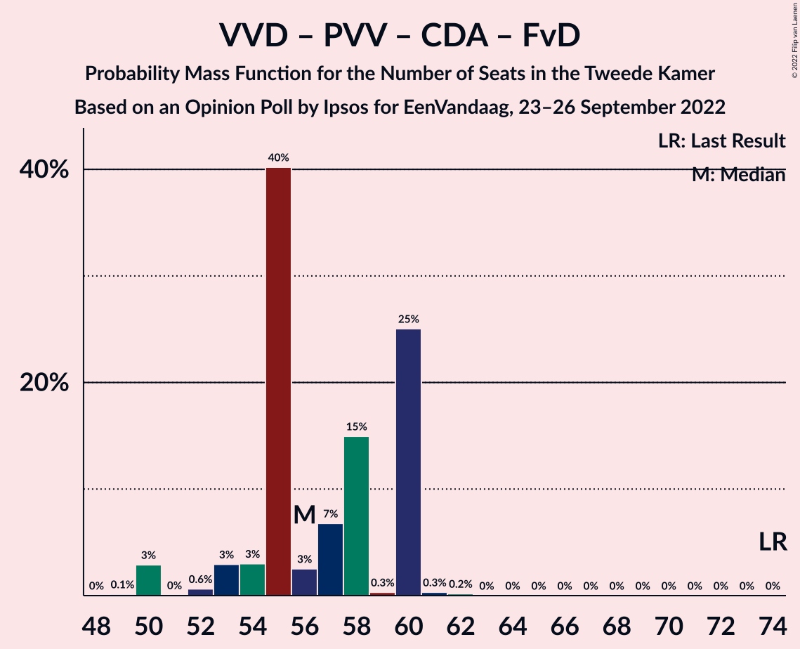
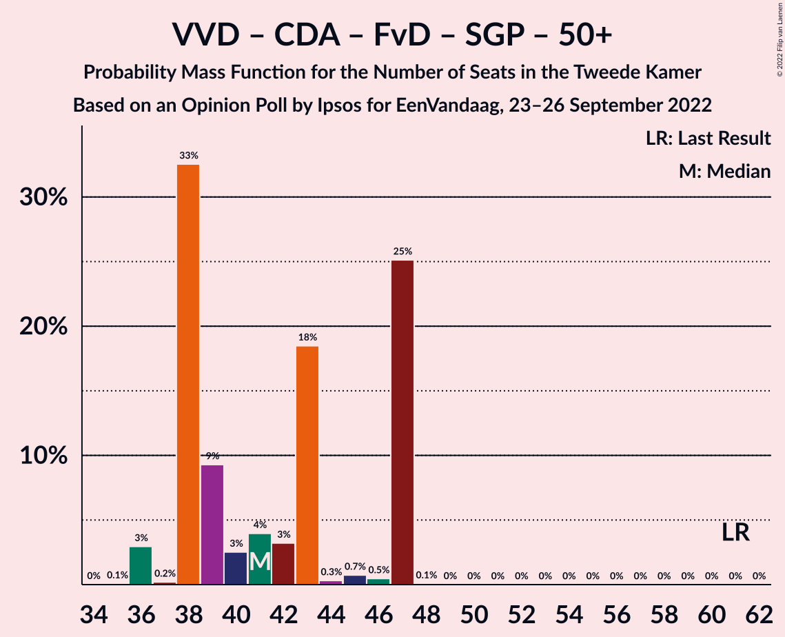
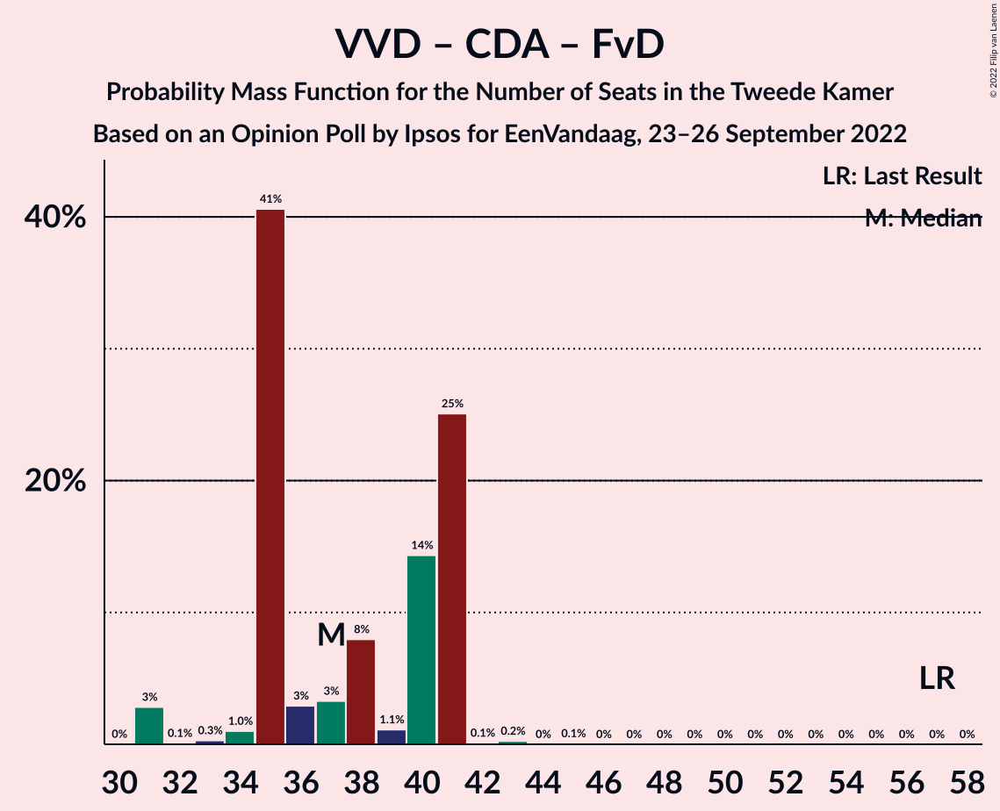

# Opinion Poll by Ipsos for EenVandaag, 23–26 September 2022

<a href="#voting-intentions">Voting Intentions</a> | <a href="#seats">Seats</a> | <a href="#coalitions">Coalitions</a> | <a href="#technical-information">Technical Information</a>

## Voting Intentions

### Confidence Intervals

| Party | Last Result | Poll Result | 80% Confidence Interval | 90% Confidence Interval | 95% Confidence Interval | 99% Confidence Interval |
|:-----:|:-----------:|:-----------:|:-----------------------:|:-----------------------:|:-----------------------:|:-----------------------:|
| Volkspartij voor Vrijheid en Democratie | 21.9% | 16.1% | 14.6–17.6% |14.3–18.1% |13.9–18.5% |13.3–19.2% |
| Partij voor de Vrijheid | 10.8% | 12.5% | 11.2–13.9% |10.9–14.3% |10.6–14.7% |10.0–15.4% |
| Democraten 66 | 15.0% | 10.0% | 8.8–11.3% |8.5–11.7% |8.3–12.0% |7.8–12.7% |
| BoerBurgerBeweging | 1.0% | 9.4% | 8.3–10.7% |8.0–11.0% |7.7–11.3% |7.2–12.0% |
| Partij van de Arbeid | 5.7% | 7.8% | 6.8–9.0% |6.5–9.3% |6.3–9.6% |5.8–10.2% |
| GroenLinks | 5.2% | 7.2% | 6.2–8.3% |6.0–8.7% |5.7–8.9% |5.3–9.5% |
| Partij voor de Dieren | 3.8% | 6.4% | 5.5–7.5% |5.2–7.8% |5.0–8.1% |4.6–8.6% |
| Christen-Democratisch Appèl | 9.5% | 5.7% | 4.8–6.7% |4.6–7.0% |4.4–7.3% |4.0–7.8% |
| Juiste Antwoord 2021 | 2.4% | 5.2% | 4.4–6.2% |4.2–6.5% |4.0–6.7% |3.6–7.3% |
| Socialistische Partij | 6.0% | 4.8% | 4.0–5.8% |3.8–6.1% |3.6–6.3% |3.3–6.8% |
| ChristenUnie | 3.4% | 3.0% | 2.4–3.8% |2.2–4.0% |2.1–4.3% |1.8–4.7% |
| Forum voor Democratie | 5.0% | 2.4% | 1.9–3.1% |1.7–3.4% |1.6–3.5% |1.4–3.9% |
| Staatkundig Gereformeerde Partij | 2.1% | 2.3% | 1.8–3.0% |1.6–3.2% |1.5–3.4% |1.3–3.8% |
| DENK | 2.0% | 2.2% | 1.7–2.9% |1.6–3.1% |1.4–3.3% |1.2–3.7% |
| Volt Europa | 2.4% | 2.0% | 1.5–2.7% |1.4–2.9% |1.3–3.1% |1.1–3.4% |
| Bij1 | 0.8% | 0.9% | 0.6–1.4% |0.5–1.6% |0.5–1.7% |0.4–2.0% |
| 50Plus | 1.0% | 0.6% | 0.4–1.1% |0.3–1.2% |0.3–1.3% |0.2–1.6% |

*Note:* The poll result column reflects the actual value used in the calculations. Published results may vary slightly, and in addition be rounded to fewer digits.

## Seats

### Confidence Intervals

| Party | Last Result | Median | 80% Confidence Interval | 90% Confidence Interval | 95% Confidence Interval | 99% Confidence Interval |
|:-----:|:-----------:|:------:|:-----------------------:|:-----------------------:|:-----------------------:|:-----------------------:|
| <a href="#volkspartij-voor-vrijheid-en-democratie">Volkspartij voor Vrijheid en Democratie</a> | 34 | 25 | 23–27 |23–27 |23–27 |21–28 |
| <a href="#partij-voor-de-vrijheid">Partij voor de Vrijheid</a> | 17 | 19 | 17–20 |17–22 |17–22 |15–22 |
| <a href="#democraten-66">Democraten 66</a> | 24 | 15 | 12–16 |12–17 |12–17 |11–18 |
| <a href="#boerburgerbeweging">BoerBurgerBeweging</a> | 1 | 13 | 13–16 |12–16 |11–19 |11–19 |
| <a href="#partij-van-de-arbeid">Partij van de Arbeid</a> | 9 | 9 | 9–16 |9–16 |9–16 |9–16 |
| <a href="#groenlinks">GroenLinks</a> | 8 | 10 | 9–13 |9–13 |9–13 |8–14 |
| <a href="#partij-voor-de-dieren">Partij voor de Dieren</a> | 6 | 10 | 9–11 |8–12 |8–12 |7–13 |
| <a href="#christen-democratisch-appèl">Christen-Democratisch Appèl</a> | 15 | 9 | 7–11 |7–11 |6–11 |5–12 |
| <a href="#juiste-antwoord-2021">Juiste Antwoord 2021</a> | 3 | 7 | 6–10 |6–11 |6–11 |6–11 |
| <a href="#socialistische-partij">Socialistische Partij</a> | 9 | 7 | 6–8 |6–9 |6–9 |5–9 |
| <a href="#christenunie">ChristenUnie</a> | 5 | 5 | 4–7 |3–7 |3–7 |2–7 |
| <a href="#forum-voor-democratie">Forum voor Democratie</a> | 8 | 4 | 2–4 |2–4 |2–5 |2–6 |
| <a href="#staatkundig-gereformeerde-partij">Staatkundig Gereformeerde Partij</a> | 3 | 3 | 3–5 |3–5 |2–5 |2–6 |
| <a href="#denk">DENK</a> | 3 | 4 | 2–4 |2–4 |2–5 |2–5 |
| <a href="#volt-europa">Volt Europa</a> | 3 | 3 | 2–3 |2–3 |2–3 |2–4 |
| <a href="#bij1">Bij1</a> | 1 | 1 | 0–1 |0–2 |0–2 |0–2 |
| <a href="#50plus">50Plus</a> | 1 | 0 | 0–1 |0–2 |0–2 |0–3 |

### Volkspartij voor Vrijheid en Democratie

*For a full overview of the results for this party, see the [Volkspartij voor Vrijheid en Democratie](party-volkspartijvoorvrijheidendemocratie.html) page.*

| Number of Seats | Probability | Accumulated | Special Marks |
|:---------------:|:-----------:|:-----------:|:-------------:|
| 19 | 0.1% | 100% |  |
| 20 | 0.2% | 99.9% |  |
| 21 | 0.5% | 99.7% |  |
| 22 | 1.1% | 99.2% |  |
| 23 | 39% | 98% |  |
| 24 | 6% | 59% |  |
| 25 | 4% | 53% | Median |
| 26 | 9% | 49% |  |
| 27 | 39% | 40% |  |
| 28 | 0.8% | 1.1% |  |
| 29 | 0.1% | 0.3% |  |
| 30 | 0.1% | 0.1% |  |
| 31 | 0% | 0% |  |
| 32 | 0% | 0% |  |
| 33 | 0% | 0% |  |
| 34 | 0% | 0% | Last Result |

### Partij voor de Vrijheid

*For a full overview of the results for this party, see the [Partij voor de Vrijheid](party-partijvoordevrijheid.html) page.*

| Number of Seats | Probability | Accumulated | Special Marks |
|:---------------:|:-----------:|:-----------:|:-------------:|
| 15 | 0.8% | 100% |  |
| 16 | 0.8% | 99.1% |  |
| 17 | 10% | 98% | Last Result |
| 18 | 16% | 89% |  |
| 19 | 29% | 72% | Median |
| 20 | 36% | 43% |  |
| 21 | 0.8% | 7% |  |
| 22 | 6% | 6% |  |
| 23 | 0.1% | 0.2% |  |
| 24 | 0.1% | 0.1% |  |
| 25 | 0% | 0% |  |

### Democraten 66

*For a full overview of the results for this party, see the [Democraten 66](party-democraten66.html) page.*

| Number of Seats | Probability | Accumulated | Special Marks |
|:---------------:|:-----------:|:-----------:|:-------------:|
| 10 | 0.1% | 100% |  |
| 11 | 0.6% | 99.9% |  |
| 12 | 17% | 99.3% |  |
| 13 | 1.2% | 82% |  |
| 14 | 29% | 81% |  |
| 15 | 7% | 52% | Median |
| 16 | 38% | 45% |  |
| 17 | 6% | 7% |  |
| 18 | 0.7% | 0.7% |  |
| 19 | 0% | 0.1% |  |
| 20 | 0% | 0% |  |
| 21 | 0% | 0% |  |
| 22 | 0% | 0% |  |
| 23 | 0% | 0% |  |
| 24 | 0% | 0% | Last Result |

### BoerBurgerBeweging

*For a full overview of the results for this party, see the [BoerBurgerBeweging](party-boerburgerbeweging.html) page.*

| Number of Seats | Probability | Accumulated | Special Marks |
|:---------------:|:-----------:|:-----------:|:-------------:|
| 1 | 0% | 100% | Last Result |
| 2 | 0% | 100% |  |
| 3 | 0% | 100% |  |
| 4 | 0% | 100% |  |
| 5 | 0% | 100% |  |
| 6 | 0% | 100% |  |
| 7 | 0% | 100% |  |
| 8 | 0% | 100% |  |
| 9 | 0% | 100% |  |
| 10 | 0.1% | 100% |  |
| 11 | 3% | 99.9% |  |
| 12 | 7% | 97% |  |
| 13 | 43% | 90% | Median |
| 14 | 7% | 47% |  |
| 15 | 2% | 41% |  |
| 16 | 35% | 38% |  |
| 17 | 0.1% | 4% |  |
| 18 | 0.3% | 4% |  |
| 19 | 3% | 3% |  |
| 20 | 0% | 0% |  |

### Partij van de Arbeid

*For a full overview of the results for this party, see the [Partij van de Arbeid](party-partijvandearbeid.html) page.*

| Number of Seats | Probability | Accumulated | Special Marks |
|:---------------:|:-----------:|:-----------:|:-------------:|
| 8 | 0.5% | 100% |  |
| 9 | 57% | 99.5% | Last Result, Median |
| 10 | 3% | 42% |  |
| 11 | 7% | 39% |  |
| 12 | 10% | 32% |  |
| 13 | 4% | 22% |  |
| 14 | 0.4% | 18% |  |
| 15 | 0.2% | 18% |  |
| 16 | 17% | 17% |  |
| 17 | 0% | 0% |  |

### GroenLinks

*For a full overview of the results for this party, see the [GroenLinks](party-groenlinks.html) page.*

| Number of Seats | Probability | Accumulated | Special Marks |
|:---------------:|:-----------:|:-----------:|:-------------:|
| 7 | 0.1% | 100% |  |
| 8 | 1.0% | 99.9% | Last Result |
| 9 | 36% | 98.9% |  |
| 10 | 32% | 63% | Median |
| 11 | 10% | 31% |  |
| 12 | 6% | 21% |  |
| 13 | 15% | 15% |  |
| 14 | 0.5% | 0.5% |  |
| 15 | 0% | 0% |  |

### Partij voor de Dieren

*For a full overview of the results for this party, see the [Partij voor de Dieren](party-partijvoordedieren.html) page.*

| Number of Seats | Probability | Accumulated | Special Marks |
|:---------------:|:-----------:|:-----------:|:-------------:|
| 6 | 0.4% | 100% | Last Result |
| 7 | 0.6% | 99.6% |  |
| 8 | 5% | 99.0% |  |
| 9 | 21% | 94% |  |
| 10 | 32% | 73% | Median |
| 11 | 36% | 41% |  |
| 12 | 3% | 5% |  |
| 13 | 2% | 2% |  |
| 14 | 0% | 0% |  |

### Christen-Democratisch Appèl

*For a full overview of the results for this party, see the [Christen-Democratisch Appèl](party-christen-democratischappèl.html) page.*

| Number of Seats | Probability | Accumulated | Special Marks |
|:---------------:|:-----------:|:-----------:|:-------------:|
| 5 | 1.4% | 100% |  |
| 6 | 3% | 98.6% |  |
| 7 | 6% | 95% |  |
| 8 | 34% | 89% |  |
| 9 | 25% | 55% | Median |
| 10 | 1.1% | 30% |  |
| 11 | 29% | 29% |  |
| 12 | 0.6% | 0.6% |  |
| 13 | 0% | 0% |  |
| 14 | 0% | 0% |  |
| 15 | 0% | 0% | Last Result |

### Juiste Antwoord 2021

*For a full overview of the results for this party, see the [Juiste Antwoord 2021](party-juisteantwoord2021.html) page.*

| Number of Seats | Probability | Accumulated | Special Marks |
|:---------------:|:-----------:|:-----------:|:-------------:|
| 3 | 0% | 100% | Last Result |
| 4 | 0% | 100% |  |
| 5 | 0.1% | 100% |  |
| 6 | 15% | 99.8% |  |
| 7 | 67% | 85% | Median |
| 8 | 4% | 18% |  |
| 9 | 2% | 14% |  |
| 10 | 4% | 12% |  |
| 11 | 8% | 8% |  |
| 12 | 0.1% | 0.1% |  |
| 13 | 0% | 0% |  |

### Socialistische Partij

*For a full overview of the results for this party, see the [Socialistische Partij](party-socialistischepartij.html) page.*

| Number of Seats | Probability | Accumulated | Special Marks |
|:---------------:|:-----------:|:-----------:|:-------------:|
| 5 | 0.5% | 100% |  |
| 6 | 13% | 99.4% |  |
| 7 | 47% | 86% | Median |
| 8 | 34% | 40% |  |
| 9 | 5% | 5% | Last Result |
| 10 | 0.2% | 0.3% |  |
| 11 | 0% | 0% |  |

### ChristenUnie

*For a full overview of the results for this party, see the [ChristenUnie](party-christenunie.html) page.*

| Number of Seats | Probability | Accumulated | Special Marks |
|:---------------:|:-----------:|:-----------:|:-------------:|
| 2 | 0.6% | 100% |  |
| 3 | 9% | 99.4% |  |
| 4 | 9% | 91% |  |
| 5 | 48% | 82% | Last Result, Median |
| 6 | 1.0% | 33% |  |
| 7 | 32% | 32% |  |
| 8 | 0.1% | 0.1% |  |
| 9 | 0% | 0% |  |

### Forum voor Democratie

*For a full overview of the results for this party, see the [Forum voor Democratie](party-forumvoordemocratie.html) page.*

| Number of Seats | Probability | Accumulated | Special Marks |
|:---------------:|:-----------:|:-----------:|:-------------:|
| 2 | 11% | 100% |  |
| 3 | 30% | 89% |  |
| 4 | 55% | 59% | Median |
| 5 | 3% | 4% |  |
| 6 | 0.7% | 0.8% |  |
| 7 | 0% | 0% |  |
| 8 | 0% | 0% | Last Result |

### Staatkundig Gereformeerde Partij

*For a full overview of the results for this party, see the [Staatkundig Gereformeerde Partij](party-staatkundiggereformeerdepartij.html) page.*

| Number of Seats | Probability | Accumulated | Special Marks |
|:---------------:|:-----------:|:-----------:|:-------------:|
| 1 | 0.1% | 100% |  |
| 2 | 3% | 99.9% |  |
| 3 | 57% | 97% | Last Result, Median |
| 4 | 13% | 40% |  |
| 5 | 26% | 27% |  |
| 6 | 0.7% | 0.7% |  |
| 7 | 0% | 0% |  |

### DENK

*For a full overview of the results for this party, see the [DENK](party-denk.html) page.*

| Number of Seats | Probability | Accumulated | Special Marks |
|:---------------:|:-----------:|:-----------:|:-------------:|
| 1 | 0.1% | 100% |  |
| 2 | 20% | 99.9% |  |
| 3 | 9% | 80% | Last Result |
| 4 | 66% | 71% | Median |
| 5 | 4% | 4% |  |
| 6 | 0% | 0% |  |

### Volt Europa

*For a full overview of the results for this party, see the [Volt Europa](party-volteuropa.html) page.*

| Number of Seats | Probability | Accumulated | Special Marks |
|:---------------:|:-----------:|:-----------:|:-------------:|
| 1 | 0.4% | 100% |  |
| 2 | 46% | 99.6% |  |
| 3 | 52% | 54% | Last Result, Median |
| 4 | 2% | 2% |  |
| 5 | 0.3% | 0.3% |  |
| 6 | 0% | 0% |  |

### Bij1

*For a full overview of the results for this party, see the [Bij1](party-bij1.html) page.*

| Number of Seats | Probability | Accumulated | Special Marks |
|:---------------:|:-----------:|:-----------:|:-------------:|
| 0 | 40% | 100% |  |
| 1 | 53% | 60% | Last Result, Median |
| 2 | 6% | 7% |  |
| 3 | 0.1% | 0.3% |  |
| 4 | 0.2% | 0.2% |  |
| 5 | 0% | 0% |  |

### 50Plus

*For a full overview of the results for this party, see the [50Plus](party-50plus.html) page.*

| Number of Seats | Probability | Accumulated | Special Marks |
|:---------------:|:-----------:|:-----------:|:-------------:|
| 0 | 60% | 100% | Median |
| 1 | 33% | 40% | Last Result |
| 2 | 4% | 7% |  |
| 3 | 2% | 2% |  |
| 4 | 0% | 0% |  |

## Coalitions

### Confidence Intervals

| Coalition | Last Result | Median | Majority? | 80% Confidence Interval | 90% Confidence Interval | 95% Confidence Interval | 99% Confidence Interval |
|:---------:|:-----------:|:------:|:---------:|:-----------------------:|:-----------------------:|:-----------------------:|:-----------------------:|
| Volkspartij voor Vrijheid en Democratie – Democraten 66 – Partij van de Arbeid – Christen-Democratisch Appèl – ChristenUnie | 87 | 65 | 0% | 63–69 | 62–69 | 61–69 | 58–70 |
| Volkspartij voor Vrijheid en Democratie – Democraten 66 – GroenLinks – Christen-Democratisch Appèl – ChristenUnie | 86 | 63 | 0% | 62–67 | 61–67 | 60–67 | 56–69 |
| Volkspartij voor Vrijheid en Democratie – Partij voor de Vrijheid – Christen-Democratisch Appèl – Forum voor Democratie – Staatkundig Gereformeerde Partij | 77 | 59 | 0% | 58–65 | 56–65 | 53–65 | 53–65 |
| Democraten 66 – Partij van de Arbeid – GroenLinks – Christen-Democratisch Appèl – Socialistische Partij – ChristenUnie | 70 | 57 | 0% | 56–62 | 55–62 | 53–62 | 53–62 |
| Volkspartij voor Vrijheid en Democratie – Partij voor de Vrijheid – Christen-Democratisch Appèl – Forum voor Democratie | 74 | 56 | 0% | 55–60 | 53–60 | 50–60 | 50–61 |
| Volkspartij voor Vrijheid en Democratie – Democraten 66 – Christen-Democratisch Appèl – ChristenUnie | 78 | 54 | 0% | 52–57 | 51–57 | 49–57 | 45–57 |
| Volkspartij voor Vrijheid en Democratie – Partij voor de Vrijheid – Christen-Democratisch Appèl | 66 | 52 | 0% | 51–57 | 48–57 | 48–57 | 47–57 |
| Volkspartij voor Vrijheid en Democratie – Democraten 66 – Partij van de Arbeid | 67 | 50 | 0% | 48–55 | 48–55 | 48–55 | 45–56 |
| Democraten 66 – Partij van de Arbeid – GroenLinks – Christen-Democratisch Appèl – ChristenUnie | 61 | 49 | 0% | 49–55 | 48–55 | 47–55 | 46–55 |
| Volkspartij voor Vrijheid en Democratie – Democraten 66 – Christen-Democratisch Appèl | 73 | 48 | 0% | 47–52 | 46–52 | 44–52 | 41–52 |
| Volkspartij voor Vrijheid en Democratie – Partij van de Arbeid – Christen-Democratisch Appèl | 58 | 45 | 0% | 40–52 | 40–52 | 40–52 | 40–52 |
| Volkspartij voor Vrijheid en Democratie – Christen-Democratisch Appèl – Forum voor Democratie – Staatkundig Gereformeerde Partij – 50Plus | 61 | 41 | 0% | 38–47 | 38–47 | 36–47 | 36–47 |
| Volkspartij voor Vrijheid en Democratie – Christen-Democratisch Appèl – Forum voor Democratie – Staatkundig Gereformeerde Partij | 60 | 40 | 0% | 38–46 | 38–46 | 34–46 | 34–46 |
| Volkspartij voor Vrijheid en Democratie – Partij van de Arbeid | 43 | 36 | 0% | 32–43 | 32–43 | 32–43 | 32–43 |
| Volkspartij voor Vrijheid en Democratie – Christen-Democratisch Appèl – Forum voor Democratie – 50Plus | 58 | 38 | 0% | 35–42 | 35–42 | 33–42 | 33–42 |
| Volkspartij voor Vrijheid en Democratie – Christen-Democratisch Appèl – Forum voor Democratie | 57 | 37 | 0% | 35–41 | 35–41 | 31–41 | 31–41 |
| Democraten 66 – Partij van de Arbeid – Christen-Democratisch Appèl | 48 | 34 | 0% | 33–37 | 33–38 | 33–38 | 31–39 |
| Volkspartij voor Vrijheid en Democratie – Christen-Democratisch Appèl | 49 | 33 | 0% | 31–38 | 30–38 | 29–38 | 29–38 |
| Partij van de Arbeid – Christen-Democratisch Appèl – ChristenUnie | 29 | 25 | 0% | 23–30 | 22–30 | 20–30 | 20–30 |
| Democraten 66 – Christen-Democratisch Appèl | 39 | 24 | 0% | 21–25 | 21–26 | 21–26 | 19–26 |
| Partij van de Arbeid – Christen-Democratisch Appèl | 24 | 20 | 0% | 17–25 | 17–25 | 17–25 | 16–25 |

### Volkspartij voor Vrijheid en Democratie – Democraten 66 – Partij van de Arbeid – Christen-Democratisch Appèl – ChristenUnie

| Number of Seats | Probability | Accumulated | Special Marks |
|:---------------:|:-----------:|:-----------:|:-------------:|
| 57 | 0% | 100% |  |
| 58 | 0.5% | 99.9% |  |
| 59 | 0.5% | 99.4% |  |
| 60 | 0.6% | 98.9% |  |
| 61 | 3% | 98% |  |
| 62 | 5% | 95% |  |
| 63 | 36% | 90% | Median |
| 64 | 2% | 54% |  |
| 65 | 6% | 52% |  |
| 66 | 25% | 46% |  |
| 67 | 2% | 21% |  |
| 68 | 4% | 19% |  |
| 69 | 15% | 15% |  |
| 70 | 0% | 0.5% |  |
| 71 | 0.2% | 0.5% |  |
| 72 | 0.3% | 0.3% |  |
| 73 | 0.1% | 0.1% |  |
| 74 | 0% | 0% |  |
| 75 | 0% | 0% |  |
| 76 | 0% | 0% | Majority |
| 77 | 0% | 0% |  |
| 78 | 0% | 0% |  |
| 79 | 0% | 0% |  |
| 80 | 0% | 0% |  |
| 81 | 0% | 0% |  |
| 82 | 0% | 0% |  |
| 83 | 0% | 0% |  |
| 84 | 0% | 0% |  |
| 85 | 0% | 0% |  |
| 86 | 0% | 0% |  |
| 87 | 0% | 0% | Last Result |

### Volkspartij voor Vrijheid en Democratie – Democraten 66 – GroenLinks – Christen-Democratisch Appèl – ChristenUnie

| Number of Seats | Probability | Accumulated | Special Marks |
|:---------------:|:-----------:|:-----------:|:-------------:|
| 56 | 0.5% | 100% |  |
| 57 | 0.1% | 99.5% |  |
| 58 | 0.5% | 99.4% |  |
| 59 | 0.2% | 98.9% |  |
| 60 | 3% | 98.7% |  |
| 61 | 4% | 95% |  |
| 62 | 3% | 92% |  |
| 63 | 42% | 88% |  |
| 64 | 4% | 47% | Median |
| 65 | 2% | 42% |  |
| 66 | 14% | 40% |  |
| 67 | 25% | 26% |  |
| 68 | 0.1% | 1.1% |  |
| 69 | 0.6% | 0.9% |  |
| 70 | 0% | 0.4% |  |
| 71 | 0.3% | 0.4% |  |
| 72 | 0% | 0.1% |  |
| 73 | 0% | 0.1% |  |
| 74 | 0.1% | 0.1% |  |
| 75 | 0% | 0% |  |
| 76 | 0% | 0% | Majority |
| 77 | 0% | 0% |  |
| 78 | 0% | 0% |  |
| 79 | 0% | 0% |  |
| 80 | 0% | 0% |  |
| 81 | 0% | 0% |  |
| 82 | 0% | 0% |  |
| 83 | 0% | 0% |  |
| 84 | 0% | 0% |  |
| 85 | 0% | 0% |  |
| 86 | 0% | 0% | Last Result |

### Volkspartij voor Vrijheid en Democratie – Partij voor de Vrijheid – Christen-Democratisch Appèl – Forum voor Democratie – Staatkundig Gereformeerde Partij

| Number of Seats | Probability | Accumulated | Special Marks |
|:---------------:|:-----------:|:-----------:|:-------------:|
| 52 | 0.1% | 100% |  |
| 53 | 3% | 99.9% |  |
| 54 | 0.1% | 97% |  |
| 55 | 0.2% | 97% |  |
| 56 | 3% | 97% |  |
| 57 | 3% | 94% |  |
| 58 | 37% | 91% |  |
| 59 | 7% | 54% |  |
| 60 | 0.5% | 48% | Median |
| 61 | 20% | 47% |  |
| 62 | 1.0% | 27% |  |
| 63 | 0.6% | 26% |  |
| 64 | 0.4% | 25% |  |
| 65 | 25% | 25% |  |
| 66 | 0% | 0.1% |  |
| 67 | 0% | 0% |  |
| 68 | 0% | 0% |  |
| 69 | 0% | 0% |  |
| 70 | 0% | 0% |  |
| 71 | 0% | 0% |  |
| 72 | 0% | 0% |  |
| 73 | 0% | 0% |  |
| 74 | 0% | 0% |  |
| 75 | 0% | 0% |  |
| 76 | 0% | 0% | Majority |
| 77 | 0% | 0% | Last Result |

### Democraten 66 – Partij van de Arbeid – GroenLinks – Christen-Democratisch Appèl – Socialistische Partij – ChristenUnie

| Number of Seats | Probability | Accumulated | Special Marks |
|:---------------:|:-----------:|:-----------:|:-------------:|
| 51 | 0.1% | 100% |  |
| 52 | 0% | 99.9% |  |
| 53 | 3% | 99.9% |  |
| 54 | 0.4% | 97% |  |
| 55 | 6% | 97% | Median |
| 56 | 27% | 91% |  |
| 57 | 38% | 64% |  |
| 58 | 5% | 26% |  |
| 59 | 2% | 21% |  |
| 60 | 0.6% | 19% |  |
| 61 | 4% | 18% |  |
| 62 | 14% | 14% |  |
| 63 | 0.2% | 0.4% |  |
| 64 | 0% | 0.2% |  |
| 65 | 0.1% | 0.1% |  |
| 66 | 0% | 0% |  |
| 67 | 0% | 0% |  |
| 68 | 0% | 0% |  |
| 69 | 0% | 0% |  |
| 70 | 0% | 0% | Last Result |

### Volkspartij voor Vrijheid en Democratie – Partij voor de Vrijheid – Christen-Democratisch Appèl – Forum voor Democratie

| Number of Seats | Probability | Accumulated | Special Marks |
|:---------------:|:-----------:|:-----------:|:-------------:|
| 49 | 0.1% | 100% |  |
| 50 | 3% | 99.8% |  |
| 51 | 0% | 97% |  |
| 52 | 0.6% | 97% |  |
| 53 | 3% | 96% |  |
| 54 | 3% | 93% |  |
| 55 | 40% | 90% |  |
| 56 | 3% | 50% |  |
| 57 | 7% | 48% | Median |
| 58 | 15% | 41% |  |
| 59 | 0.3% | 26% |  |
| 60 | 25% | 26% |  |
| 61 | 0.3% | 0.5% |  |
| 62 | 0.2% | 0.2% |  |
| 63 | 0% | 0% |  |
| 64 | 0% | 0% |  |
| 65 | 0% | 0% |  |
| 66 | 0% | 0% |  |
| 67 | 0% | 0% |  |
| 68 | 0% | 0% |  |
| 69 | 0% | 0% |  |
| 70 | 0% | 0% |  |
| 71 | 0% | 0% |  |
| 72 | 0% | 0% |  |
| 73 | 0% | 0% |  |
| 74 | 0% | 0% | Last Result |

### Volkspartij voor Vrijheid en Democratie – Democraten 66 – Christen-Democratisch Appèl – ChristenUnie

| Number of Seats | Probability | Accumulated | Special Marks |
|:---------------:|:-----------:|:-----------:|:-------------:|
| 45 | 0.6% | 100% |  |
| 46 | 0.1% | 99.4% |  |
| 47 | 0% | 99.3% |  |
| 48 | 0.6% | 99.3% |  |
| 49 | 3% | 98.7% |  |
| 50 | 0.2% | 95% |  |
| 51 | 4% | 95% |  |
| 52 | 10% | 91% |  |
| 53 | 20% | 81% |  |
| 54 | 34% | 61% | Median |
| 55 | 1.0% | 27% |  |
| 56 | 0.9% | 26% |  |
| 57 | 25% | 26% |  |
| 58 | 0.1% | 0.4% |  |
| 59 | 0.2% | 0.4% |  |
| 60 | 0.1% | 0.1% |  |
| 61 | 0% | 0.1% |  |
| 62 | 0.1% | 0.1% |  |
| 63 | 0% | 0% |  |
| 64 | 0% | 0% |  |
| 65 | 0% | 0% |  |
| 66 | 0% | 0% |  |
| 67 | 0% | 0% |  |
| 68 | 0% | 0% |  |
| 69 | 0% | 0% |  |
| 70 | 0% | 0% |  |
| 71 | 0% | 0% |  |
| 72 | 0% | 0% |  |
| 73 | 0% | 0% |  |
| 74 | 0% | 0% |  |
| 75 | 0% | 0% |  |
| 76 | 0% | 0% | Majority |
| 77 | 0% | 0% |  |
| 78 | 0% | 0% | Last Result |

### Volkspartij voor Vrijheid en Democratie – Partij voor de Vrijheid – Christen-Democratisch Appèl

| Number of Seats | Probability | Accumulated | Special Marks |
|:---------------:|:-----------:|:-----------:|:-------------:|
| 45 | 0.2% | 100% |  |
| 46 | 0% | 99.8% |  |
| 47 | 0.4% | 99.8% |  |
| 48 | 4% | 99.4% |  |
| 49 | 0.8% | 95% |  |
| 50 | 3% | 94% |  |
| 51 | 36% | 91% |  |
| 52 | 6% | 55% |  |
| 53 | 2% | 49% | Median |
| 54 | 14% | 47% |  |
| 55 | 7% | 32% |  |
| 56 | 0.2% | 26% |  |
| 57 | 25% | 25% |  |
| 58 | 0.1% | 0.3% |  |
| 59 | 0.2% | 0.2% |  |
| 60 | 0% | 0% |  |
| 61 | 0% | 0% |  |
| 62 | 0% | 0% |  |
| 63 | 0% | 0% |  |
| 64 | 0% | 0% |  |
| 65 | 0% | 0% |  |
| 66 | 0% | 0% | Last Result |

### Volkspartij voor Vrijheid en Democratie – Democraten 66 – Partij van de Arbeid

| Number of Seats | Probability | Accumulated | Special Marks |
|:---------------:|:-----------:|:-----------:|:-------------:|
| 44 | 0% | 100% |  |
| 45 | 0.5% | 99.9% |  |
| 46 | 0.9% | 99.5% |  |
| 47 | 0.2% | 98.6% |  |
| 48 | 36% | 98% |  |
| 49 | 0.7% | 63% | Median |
| 50 | 29% | 62% |  |
| 51 | 3% | 33% |  |
| 52 | 3% | 31% |  |
| 53 | 6% | 28% |  |
| 54 | 6% | 22% |  |
| 55 | 16% | 16% |  |
| 56 | 0.3% | 0.7% |  |
| 57 | 0.1% | 0.3% |  |
| 58 | 0% | 0.3% |  |
| 59 | 0.3% | 0.3% |  |
| 60 | 0% | 0% |  |
| 61 | 0% | 0% |  |
| 62 | 0% | 0% |  |
| 63 | 0% | 0% |  |
| 64 | 0% | 0% |  |
| 65 | 0% | 0% |  |
| 66 | 0% | 0% |  |
| 67 | 0% | 0% | Last Result |

### Democraten 66 – Partij van de Arbeid – GroenLinks – Christen-Democratisch Appèl – ChristenUnie

| Number of Seats | Probability | Accumulated | Special Marks |
|:---------------:|:-----------:|:-----------:|:-------------:|
| 45 | 0.4% | 100% |  |
| 46 | 0.1% | 99.6% |  |
| 47 | 3% | 99.5% |  |
| 48 | 3% | 97% | Median |
| 49 | 61% | 94% |  |
| 50 | 0.8% | 32% |  |
| 51 | 11% | 32% |  |
| 52 | 6% | 21% |  |
| 53 | 0.8% | 15% |  |
| 54 | 0.2% | 15% |  |
| 55 | 14% | 14% |  |
| 56 | 0.2% | 0.3% |  |
| 57 | 0% | 0% |  |
| 58 | 0% | 0% |  |
| 59 | 0% | 0% |  |
| 60 | 0% | 0% |  |
| 61 | 0% | 0% | Last Result |

### Volkspartij voor Vrijheid en Democratie – Democraten 66 – Christen-Democratisch Appèl

| Number of Seats | Probability | Accumulated | Special Marks |
|:---------------:|:-----------:|:-----------:|:-------------:|
| 41 | 0.9% | 100% |  |
| 42 | 0% | 99.1% |  |
| 43 | 0.2% | 99.1% |  |
| 44 | 3% | 98.9% |  |
| 45 | 0.4% | 96% |  |
| 46 | 2% | 96% |  |
| 47 | 39% | 94% |  |
| 48 | 18% | 55% |  |
| 49 | 3% | 37% | Median |
| 50 | 7% | 34% |  |
| 51 | 0.7% | 27% |  |
| 52 | 26% | 26% |  |
| 53 | 0.1% | 0.5% |  |
| 54 | 0.1% | 0.4% |  |
| 55 | 0.2% | 0.3% |  |
| 56 | 0% | 0.1% |  |
| 57 | 0.1% | 0.1% |  |
| 58 | 0% | 0% |  |
| 59 | 0% | 0% |  |
| 60 | 0% | 0% |  |
| 61 | 0% | 0% |  |
| 62 | 0% | 0% |  |
| 63 | 0% | 0% |  |
| 64 | 0% | 0% |  |
| 65 | 0% | 0% |  |
| 66 | 0% | 0% |  |
| 67 | 0% | 0% |  |
| 68 | 0% | 0% |  |
| 69 | 0% | 0% |  |
| 70 | 0% | 0% |  |
| 71 | 0% | 0% |  |
| 72 | 0% | 0% |  |
| 73 | 0% | 0% | Last Result |

### Volkspartij voor Vrijheid en Democratie – Partij van de Arbeid – Christen-Democratisch Appèl

| Number of Seats | Probability | Accumulated | Special Marks |
|:---------------:|:-----------:|:-----------:|:-------------:|
| 39 | 0.1% | 100% |  |
| 40 | 33% | 99.8% |  |
| 41 | 3% | 67% |  |
| 42 | 0.3% | 64% |  |
| 43 | 7% | 64% | Median |
| 44 | 0.8% | 57% |  |
| 45 | 10% | 56% |  |
| 46 | 1.2% | 46% |  |
| 47 | 25% | 45% |  |
| 48 | 1.3% | 20% |  |
| 49 | 0.8% | 19% |  |
| 50 | 0.4% | 18% |  |
| 51 | 3% | 17% |  |
| 52 | 14% | 14% |  |
| 53 | 0.1% | 0.1% |  |
| 54 | 0% | 0% |  |
| 55 | 0% | 0% |  |
| 56 | 0% | 0% |  |
| 57 | 0% | 0% |  |
| 58 | 0% | 0% | Last Result |

### Volkspartij voor Vrijheid en Democratie – Christen-Democratisch Appèl – Forum voor Democratie – Staatkundig Gereformeerde Partij – 50Plus

| Number of Seats | Probability | Accumulated | Special Marks |
|:---------------:|:-----------:|:-----------:|:-------------:|
| 35 | 0.1% | 100% |  |
| 36 | 3% | 99.9% |  |
| 37 | 0.2% | 97% |  |
| 38 | 33% | 97% |  |
| 39 | 9% | 64% |  |
| 40 | 3% | 55% |  |
| 41 | 4% | 52% | Median |
| 42 | 3% | 48% |  |
| 43 | 18% | 45% |  |
| 44 | 0.3% | 27% |  |
| 45 | 0.7% | 26% |  |
| 46 | 0.5% | 26% |  |
| 47 | 25% | 25% |  |
| 48 | 0.1% | 0.1% |  |
| 49 | 0% | 0% |  |
| 50 | 0% | 0% |  |
| 51 | 0% | 0% |  |
| 52 | 0% | 0% |  |
| 53 | 0% | 0% |  |
| 54 | 0% | 0% |  |
| 55 | 0% | 0% |  |
| 56 | 0% | 0% |  |
| 57 | 0% | 0% |  |
| 58 | 0% | 0% |  |
| 59 | 0% | 0% |  |
| 60 | 0% | 0% |  |
| 61 | 0% | 0% | Last Result |

### Volkspartij voor Vrijheid en Democratie – Christen-Democratisch Appèl – Forum voor Democratie – Staatkundig Gereformeerde Partij

| Number of Seats | Probability | Accumulated | Special Marks |
|:---------------:|:-----------:|:-----------:|:-------------:|
| 34 | 3% | 100% |  |
| 35 | 0.1% | 97% |  |
| 36 | 0.1% | 97% |  |
| 37 | 0.3% | 97% |  |
| 38 | 34% | 97% |  |
| 39 | 12% | 63% |  |
| 40 | 0.7% | 50% |  |
| 41 | 5% | 50% | Median |
| 42 | 4% | 45% |  |
| 43 | 14% | 41% |  |
| 44 | 1.2% | 27% |  |
| 45 | 0.1% | 25% |  |
| 46 | 25% | 25% |  |
| 47 | 0.2% | 0.3% |  |
| 48 | 0.1% | 0.1% |  |
| 49 | 0% | 0% |  |
| 50 | 0% | 0% |  |
| 51 | 0% | 0% |  |
| 52 | 0% | 0% |  |
| 53 | 0% | 0% |  |
| 54 | 0% | 0% |  |
| 55 | 0% | 0% |  |
| 56 | 0% | 0% |  |
| 57 | 0% | 0% |  |
| 58 | 0% | 0% |  |
| 59 | 0% | 0% |  |
| 60 | 0% | 0% | Last Result |

### Volkspartij voor Vrijheid en Democratie – Partij van de Arbeid

| Number of Seats | Probability | Accumulated | Special Marks |
|:---------------:|:-----------:|:-----------:|:-------------:|
| 30 | 0.1% | 100% |  |
| 31 | 0.1% | 99.9% |  |
| 32 | 33% | 99.8% |  |
| 33 | 0.4% | 67% |  |
| 34 | 4% | 67% | Median |
| 35 | 4% | 62% |  |
| 36 | 35% | 58% |  |
| 37 | 0.3% | 23% |  |
| 38 | 2% | 23% |  |
| 39 | 3% | 21% |  |
| 40 | 0.7% | 18% |  |
| 41 | 0.3% | 18% |  |
| 42 | 4% | 17% |  |
| 43 | 14% | 14% | Last Result |
| 44 | 0% | 0% |  |

### Volkspartij voor Vrijheid en Democratie – Christen-Democratisch Appèl – Forum voor Democratie – 50Plus

| Number of Seats | Probability | Accumulated | Special Marks |
|:---------------:|:-----------:|:-----------:|:-------------:|
| 32 | 0% | 100% |  |
| 33 | 3% | 99.9% |  |
| 34 | 0.7% | 97% |  |
| 35 | 39% | 96% |  |
| 36 | 2% | 58% |  |
| 37 | 3% | 55% |  |
| 38 | 4% | 52% | Median |
| 39 | 7% | 48% |  |
| 40 | 14% | 40% |  |
| 41 | 0.4% | 26% |  |
| 42 | 25% | 26% |  |
| 43 | 0.3% | 0.4% |  |
| 44 | 0% | 0.1% |  |
| 45 | 0.1% | 0.1% |  |
| 46 | 0% | 0% |  |
| 47 | 0% | 0% |  |
| 48 | 0% | 0% |  |
| 49 | 0% | 0% |  |
| 50 | 0% | 0% |  |
| 51 | 0% | 0% |  |
| 52 | 0% | 0% |  |
| 53 | 0% | 0% |  |
| 54 | 0% | 0% |  |
| 55 | 0% | 0% |  |
| 56 | 0% | 0% |  |
| 57 | 0% | 0% |  |
| 58 | 0% | 0% | Last Result |

### Volkspartij voor Vrijheid en Democratie – Christen-Democratisch Appèl – Forum voor Democratie

| Number of Seats | Probability | Accumulated | Special Marks |
|:---------------:|:-----------:|:-----------:|:-------------:|
| 31 | 3% | 100% |  |
| 32 | 0.1% | 97% |  |
| 33 | 0.3% | 97% |  |
| 34 | 1.0% | 97% |  |
| 35 | 41% | 96% |  |
| 36 | 3% | 55% |  |
| 37 | 3% | 52% |  |
| 38 | 8% | 49% | Median |
| 39 | 1.1% | 41% |  |
| 40 | 14% | 40% |  |
| 41 | 25% | 26% |  |
| 42 | 0.1% | 0.4% |  |
| 43 | 0.2% | 0.3% |  |
| 44 | 0% | 0.1% |  |
| 45 | 0.1% | 0.1% |  |
| 46 | 0% | 0% |  |
| 47 | 0% | 0% |  |
| 48 | 0% | 0% |  |
| 49 | 0% | 0% |  |
| 50 | 0% | 0% |  |
| 51 | 0% | 0% |  |
| 52 | 0% | 0% |  |
| 53 | 0% | 0% |  |
| 54 | 0% | 0% |  |
| 55 | 0% | 0% |  |
| 56 | 0% | 0% |  |
| 57 | 0% | 0% | Last Result |

### Democraten 66 – Partij van de Arbeid – Christen-Democratisch Appèl

| Number of Seats | Probability | Accumulated | Special Marks |
|:---------------:|:-----------:|:-----------:|:-------------:|
| 30 | 0.2% | 100% |  |
| 31 | 0.5% | 99.7% |  |
| 32 | 1.0% | 99.2% |  |
| 33 | 40% | 98% | Median |
| 34 | 27% | 59% |  |
| 35 | 1.4% | 32% |  |
| 36 | 5% | 30% |  |
| 37 | 18% | 25% |  |
| 38 | 6% | 7% |  |
| 39 | 0.7% | 1.2% |  |
| 40 | 0.4% | 0.4% |  |
| 41 | 0% | 0.1% |  |
| 42 | 0% | 0% |  |
| 43 | 0% | 0% |  |
| 44 | 0% | 0% |  |
| 45 | 0% | 0% |  |
| 46 | 0% | 0% |  |
| 47 | 0% | 0% |  |
| 48 | 0% | 0% | Last Result |

### Volkspartij voor Vrijheid en Democratie – Christen-Democratisch Appèl

| Number of Seats | Probability | Accumulated | Special Marks |
|:---------------:|:-----------:|:-----------:|:-------------:|
| 28 | 0.4% | 100% |  |
| 29 | 3% | 99.5% |  |
| 30 | 2% | 96% |  |
| 31 | 32% | 94% |  |
| 32 | 4% | 62% |  |
| 33 | 9% | 59% |  |
| 34 | 4% | 50% | Median |
| 35 | 5% | 45% |  |
| 36 | 15% | 41% |  |
| 37 | 0.2% | 25% |  |
| 38 | 25% | 25% |  |
| 39 | 0.1% | 0.2% |  |
| 40 | 0.1% | 0.2% |  |
| 41 | 0% | 0.1% |  |
| 42 | 0.1% | 0.1% |  |
| 43 | 0% | 0% |  |
| 44 | 0% | 0% |  |
| 45 | 0% | 0% |  |
| 46 | 0% | 0% |  |
| 47 | 0% | 0% |  |
| 48 | 0% | 0% |  |
| 49 | 0% | 0% | Last Result |

### Partij van de Arbeid – Christen-Democratisch Appèl – ChristenUnie

| Number of Seats | Probability | Accumulated | Special Marks |
|:---------------:|:-----------:|:-----------:|:-------------:|
| 20 | 3% | 100% |  |
| 21 | 1.1% | 97% |  |
| 22 | 2% | 96% |  |
| 23 | 5% | 94% | Median |
| 24 | 39% | 89% |  |
| 25 | 26% | 51% |  |
| 26 | 6% | 24% |  |
| 27 | 0.9% | 19% |  |
| 28 | 0.3% | 18% |  |
| 29 | 0.2% | 18% | Last Result |
| 30 | 17% | 17% |  |
| 31 | 0% | 0% |  |

### Democraten 66 – Christen-Democratisch Appèl

| Number of Seats | Probability | Accumulated | Special Marks |
|:---------------:|:-----------:|:-----------:|:-------------:|
| 19 | 0.7% | 100% |  |
| 20 | 0.5% | 99.3% |  |
| 21 | 22% | 98.8% |  |
| 22 | 3% | 77% |  |
| 23 | 4% | 74% |  |
| 24 | 33% | 70% | Median |
| 25 | 29% | 37% |  |
| 26 | 7% | 7% |  |
| 27 | 0.3% | 0.4% |  |
| 28 | 0.1% | 0.1% |  |
| 29 | 0% | 0% |  |
| 30 | 0% | 0% |  |
| 31 | 0% | 0% |  |
| 32 | 0% | 0% |  |
| 33 | 0% | 0% |  |
| 34 | 0% | 0% |  |
| 35 | 0% | 0% |  |
| 36 | 0% | 0% |  |
| 37 | 0% | 0% |  |
| 38 | 0% | 0% |  |
| 39 | 0% | 0% | Last Result |

### Partij van de Arbeid – Christen-Democratisch Appèl

| Number of Seats | Probability | Accumulated | Special Marks |
|:---------------:|:-----------:|:-----------:|:-------------:|
| 15 | 0.4% | 100% |  |
| 16 | 0.5% | 99.6% |  |
| 17 | 35% | 99.1% |  |
| 18 | 7% | 65% | Median |
| 19 | 0.7% | 58% |  |
| 20 | 27% | 57% |  |
| 21 | 6% | 30% |  |
| 22 | 5% | 24% |  |
| 23 | 0.8% | 18% |  |
| 24 | 0.3% | 18% | Last Result |
| 25 | 17% | 17% |  |
| 26 | 0% | 0% |  |

## Technical Information

### Opinion Poll

+ **Polling firm:** Ipsos
+ **Commissioner(s):** EenVandaag
+ **Fieldwork period:** 23–26 September 2022

### Calculations

+ **Sample size:** 1003
+ **Simulations done:** 1,048,576
+ **Error estimate:** 3.96%

