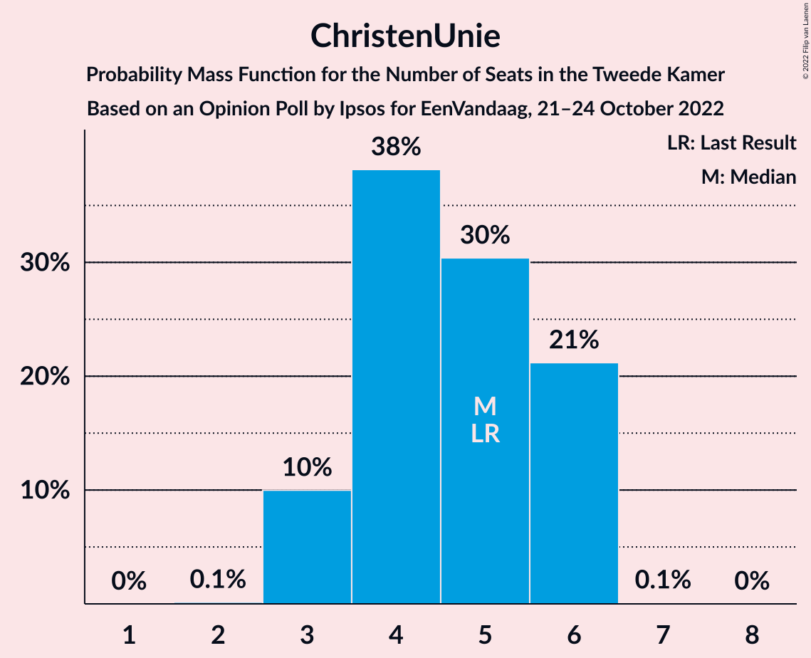
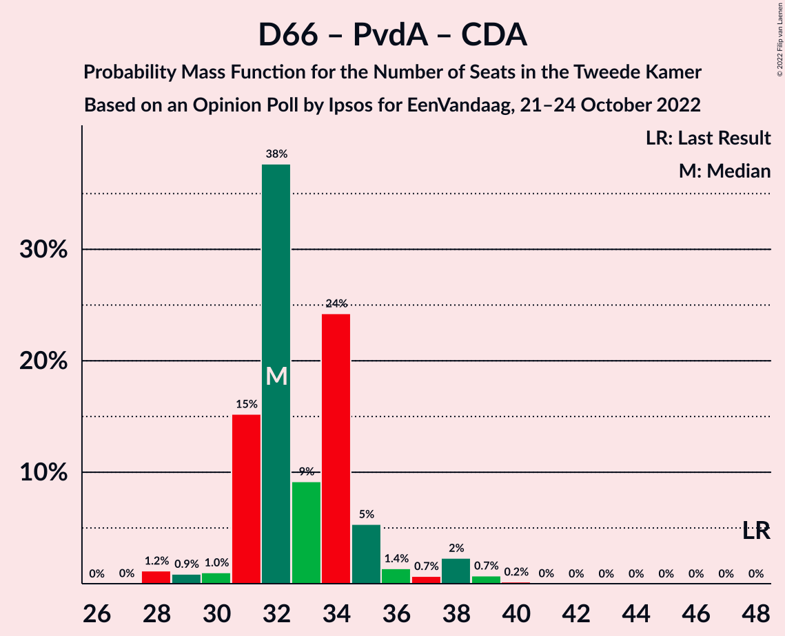

# Opinion Poll by Ipsos for EenVandaag, 21–24 October 2022

<a href="#voting-intentions">Voting Intentions</a> | <a href="#seats">Seats</a> | <a href="#coalitions">Coalitions</a> | <a href="#technical-information">Technical Information</a>

## Voting Intentions

### Confidence Intervals

| Party | Last Result | Poll Result | 80% Confidence Interval | 90% Confidence Interval | 95% Confidence Interval | 99% Confidence Interval |
|:-----:|:-----------:|:-----------:|:-----------------------:|:-----------------------:|:-----------------------:|:-----------------------:|
| Volkspartij voor Vrijheid en Democratie | 21.9% | 17.2% | 15.8–18.8% |15.4–19.3% |15.0–19.7% |14.4–20.5% |
| Partij voor de Vrijheid | 10.8% | 13.4% | 12.1–14.9% |11.8–15.3% |11.5–15.7% |10.9–16.4% |
| Democraten 66 | 15.0% | 10.3% | 9.1–11.6% |8.8–12.0% |8.6–12.3% |8.0–13.0% |
| BoerBurgerBeweging | 1.0% | 7.6% | 6.7–8.8% |6.4–9.1% |6.2–9.4% |5.7–10.0% |
| Partij van de Arbeid | 5.7% | 6.9% | 5.9–8.0% |5.7–8.3% |5.5–8.6% |5.0–9.1% |
| Partij voor de Dieren | 3.8% | 6.4% | 5.5–7.5% |5.2–7.8% |5.0–8.0% |4.6–8.6% |
| GroenLinks | 5.2% | 6.2% | 5.3–7.3% |5.1–7.6% |4.8–7.8% |4.5–8.4% |
| Juiste Antwoord 2021 | 2.4% | 5.7% | 4.8–6.7% |4.6–7.0% |4.4–7.3% |4.1–7.8% |
| Socialistische Partij | 6.0% | 5.5% | 4.7–6.5% |4.4–6.8% |4.2–7.1% |3.9–7.6% |
| Christen-Democratisch Appèl | 9.5% | 5.0% | 4.2–6.0% |4.0–6.3% |3.8–6.5% |3.5–7.0% |
| Volt Europa | 2.4% | 3.0% | 2.4–3.9% |2.3–4.1% |2.1–4.3% |1.9–4.7% |
| ChristenUnie | 3.4% | 2.9% | 2.4–3.7% |2.2–4.0% |2.1–4.2% |1.8–4.6% |
| Staatkundig Gereformeerde Partij | 2.1% | 2.3% | 1.8–3.0% |1.6–3.2% |1.5–3.4% |1.3–3.7% |
| DENK | 2.0% | 2.1% | 1.6–2.8% |1.4–3.0% |1.3–3.1% |1.2–3.5% |
| Forum voor Democratie | 5.0% | 1.9% | 1.4–2.5% |1.3–2.7% |1.2–2.9% |1.0–3.2% |
| Bij1 | 0.8% | 1.1% | 0.8–1.6% |0.7–1.8% |0.6–1.9% |0.5–2.2% |
| 50Plus | 1.0% | 0.5% | 0.3–0.9% |0.2–1.0% |0.2–1.1% |0.1–1.4% |

*Note:* The poll result column reflects the actual value used in the calculations. Published results may vary slightly, and in addition be rounded to fewer digits.

## Seats

### Confidence Intervals

| Party | Last Result | Median | 80% Confidence Interval | 90% Confidence Interval | 95% Confidence Interval | 99% Confidence Interval |
|:-----:|:-----------:|:------:|:-----------------------:|:-----------------------:|:-----------------------:|:-----------------------:|
| <a href="#volkspartij-voor-vrijheid-en-democratie">Volkspartij voor Vrijheid en Democratie</a> | 34 | 27 | 23–29 |23–29 |23–31 |22–31 |
| <a href="#partij-voor-de-vrijheid">Partij voor de Vrijheid</a> | 17 | 21 | 18–25 |18–25 |17–25 |17–25 |
| <a href="#democraten-66">Democraten 66</a> | 24 | 16 | 15–17 |14–17 |13–18 |13–22 |
| <a href="#boerburgerbeweging">BoerBurgerBeweging</a> | 1 | 11 | 10–14 |10–15 |9–15 |9–15 |
| <a href="#partij-van-de-arbeid">Partij van de Arbeid</a> | 9 | 11 | 8–12 |8–12 |8–12 |8–13 |
| <a href="#partij-voor-de-dieren">Partij voor de Dieren</a> | 6 | 9 | 8–12 |7–12 |7–12 |7–13 |
| <a href="#groenlinks">GroenLinks</a> | 8 | 9 | 8–11 |7–11 |7–12 |6–13 |
| <a href="#juiste-antwoord-2021">Juiste Antwoord 2021</a> | 3 | 8 | 7–10 |7–11 |7–12 |6–12 |
| <a href="#socialistische-partij">Socialistische Partij</a> | 9 | 8 | 7–11 |7–11 |7–11 |5–11 |
| <a href="#christen-democratisch-appèl">Christen-Democratisch Appèl</a> | 15 | 7 | 5–8 |5–9 |5–10 |5–10 |
| <a href="#volt-europa">Volt Europa</a> | 3 | 4 | 3–6 |3–6 |3–6 |3–7 |
| <a href="#christenunie">ChristenUnie</a> | 5 | 5 | 3–6 |3–6 |3–6 |3–6 |
| <a href="#staatkundig-gereformeerde-partij">Staatkundig Gereformeerde Partij</a> | 3 | 3 | 2–3 |2–4 |2–4 |1–5 |
| <a href="#denk">DENK</a> | 3 | 3 | 2–4 |2–4 |2–5 |2–5 |
| <a href="#forum-voor-democratie">Forum voor Democratie</a> | 8 | 2 | 2–4 |2–4 |1–4 |1–5 |
| <a href="#bij1">Bij1</a> | 1 | 1 | 1–2 |1–3 |0–3 |0–3 |
| <a href="#50plus">50Plus</a> | 1 | 0 | 0–1 |0–2 |0–2 |0–2 |

### Volkspartij voor Vrijheid en Democratie

*For a full overview of the results for this party, see the [Volkspartij voor Vrijheid en Democratie](party-volkspartijvoorvrijheidendemocratie.html) page.*

| Number of Seats | Probability | Accumulated | Special Marks |
|:---------------:|:-----------:|:-----------:|:-------------:|
| 21 | 0.1% | 100% |  |
| 22 | 0.4% | 99.9% |  |
| 23 | 21% | 99.5% |  |
| 24 | 3% | 78% |  |
| 25 | 7% | 75% |  |
| 26 | 4% | 68% |  |
| 27 | 43% | 65% | Median |
| 28 | 10% | 22% |  |
| 29 | 8% | 12% |  |
| 30 | 0.2% | 4% |  |
| 31 | 3% | 4% |  |
| 32 | 0.2% | 0.5% |  |
| 33 | 0.3% | 0.3% |  |
| 34 | 0% | 0% | Last Result |

### Partij voor de Vrijheid

*For a full overview of the results for this party, see the [Partij voor de Vrijheid](party-partijvoordevrijheid.html) page.*

| Number of Seats | Probability | Accumulated | Special Marks |
|:---------------:|:-----------:|:-----------:|:-------------:|
| 16 | 0.3% | 100% |  |
| 17 | 4% | 99.7% | Last Result |
| 18 | 20% | 96% |  |
| 19 | 4% | 76% |  |
| 20 | 20% | 72% |  |
| 21 | 23% | 52% | Median |
| 22 | 6% | 29% |  |
| 23 | 1.5% | 23% |  |
| 24 | 0.3% | 21% |  |
| 25 | 21% | 21% |  |
| 26 | 0.1% | 0.1% |  |
| 27 | 0% | 0% |  |

### Democraten 66

*For a full overview of the results for this party, see the [Democraten 66](party-democraten66.html) page.*

| Number of Seats | Probability | Accumulated | Special Marks |
|:---------------:|:-----------:|:-----------:|:-------------:|
| 12 | 0.2% | 100% |  |
| 13 | 3% | 99.8% |  |
| 14 | 7% | 97% |  |
| 15 | 35% | 90% |  |
| 16 | 26% | 56% | Median |
| 17 | 27% | 30% |  |
| 18 | 2% | 3% |  |
| 19 | 0.2% | 1.3% |  |
| 20 | 0.5% | 1.1% |  |
| 21 | 0% | 0.5% |  |
| 22 | 0.5% | 0.5% |  |
| 23 | 0% | 0% |  |
| 24 | 0% | 0% | Last Result |

### BoerBurgerBeweging

*For a full overview of the results for this party, see the [BoerBurgerBeweging](party-boerburgerbeweging.html) page.*

| Number of Seats | Probability | Accumulated | Special Marks |
|:---------------:|:-----------:|:-----------:|:-------------:|
| 1 | 0% | 100% | Last Result |
| 2 | 0% | 100% |  |
| 3 | 0% | 100% |  |
| 4 | 0% | 100% |  |
| 5 | 0% | 100% |  |
| 6 | 0% | 100% |  |
| 7 | 0% | 100% |  |
| 8 | 0.1% | 100% |  |
| 9 | 4% | 99.9% |  |
| 10 | 22% | 96% |  |
| 11 | 31% | 73% | Median |
| 12 | 3% | 42% |  |
| 13 | 21% | 39% |  |
| 14 | 8% | 18% |  |
| 15 | 10% | 10% |  |
| 16 | 0.1% | 0.1% |  |
| 17 | 0% | 0% |  |

### Partij van de Arbeid

*For a full overview of the results for this party, see the [Partij van de Arbeid](party-partijvandearbeid.html) page.*

| Number of Seats | Probability | Accumulated | Special Marks |
|:---------------:|:-----------:|:-----------:|:-------------:|
| 7 | 0.1% | 100% |  |
| 8 | 13% | 99.9% |  |
| 9 | 2% | 86% | Last Result |
| 10 | 27% | 84% |  |
| 11 | 46% | 57% | Median |
| 12 | 10% | 11% |  |
| 13 | 0.7% | 1.1% |  |
| 14 | 0.1% | 0.4% |  |
| 15 | 0.3% | 0.3% |  |
| 16 | 0% | 0% |  |

### Partij voor de Dieren

*For a full overview of the results for this party, see the [Partij voor de Dieren](party-partijvoordedieren.html) page.*

| Number of Seats | Probability | Accumulated | Special Marks |
|:---------------:|:-----------:|:-----------:|:-------------:|
| 6 | 0.1% | 100% | Last Result |
| 7 | 9% | 99.9% |  |
| 8 | 32% | 90% |  |
| 9 | 11% | 59% | Median |
| 10 | 4% | 47% |  |
| 11 | 4% | 43% |  |
| 12 | 38% | 39% |  |
| 13 | 1.3% | 1.3% |  |
| 14 | 0% | 0% |  |

### GroenLinks

*For a full overview of the results for this party, see the [GroenLinks](party-groenlinks.html) page.*

| Number of Seats | Probability | Accumulated | Special Marks |
|:---------------:|:-----------:|:-----------:|:-------------:|
| 6 | 0.7% | 100% |  |
| 7 | 6% | 99.3% |  |
| 8 | 23% | 93% | Last Result |
| 9 | 52% | 70% | Median |
| 10 | 5% | 18% |  |
| 11 | 8% | 13% |  |
| 12 | 4% | 5% |  |
| 13 | 1.0% | 1.0% |  |
| 14 | 0% | 0% |  |

### Juiste Antwoord 2021

*For a full overview of the results for this party, see the [Juiste Antwoord 2021](party-juisteantwoord2021.html) page.*

| Number of Seats | Probability | Accumulated | Special Marks |
|:---------------:|:-----------:|:-----------:|:-------------:|
| 3 | 0% | 100% | Last Result |
| 4 | 0% | 100% |  |
| 5 | 0.1% | 100% |  |
| 6 | 1.3% | 99.9% |  |
| 7 | 48% | 98.6% |  |
| 8 | 15% | 51% | Median |
| 9 | 18% | 36% |  |
| 10 | 10% | 17% |  |
| 11 | 4% | 7% |  |
| 12 | 3% | 3% |  |
| 13 | 0.3% | 0.3% |  |
| 14 | 0% | 0% |  |

### Socialistische Partij

*For a full overview of the results for this party, see the [Socialistische Partij](party-socialistischepartij.html) page.*

| Number of Seats | Probability | Accumulated | Special Marks |
|:---------------:|:-----------:|:-----------:|:-------------:|
| 5 | 0.7% | 100% |  |
| 6 | 1.1% | 99.3% |  |
| 7 | 27% | 98% |  |
| 8 | 31% | 72% | Median |
| 9 | 13% | 40% | Last Result |
| 10 | 8% | 28% |  |
| 11 | 20% | 20% |  |
| 12 | 0.1% | 0.1% |  |
| 13 | 0% | 0% |  |

### Christen-Democratisch Appèl

*For a full overview of the results for this party, see the [Christen-Democratisch Appèl](party-christen-democratischappèl.html) page.*

| Number of Seats | Probability | Accumulated | Special Marks |
|:---------------:|:-----------:|:-----------:|:-------------:|
| 5 | 16% | 100% |  |
| 6 | 32% | 84% |  |
| 7 | 41% | 53% | Median |
| 8 | 3% | 11% |  |
| 9 | 5% | 8% |  |
| 10 | 3% | 3% |  |
| 11 | 0.1% | 0.2% |  |
| 12 | 0% | 0% |  |
| 13 | 0% | 0% |  |
| 14 | 0% | 0% |  |
| 15 | 0% | 0% | Last Result |

### Volt Europa

*For a full overview of the results for this party, see the [Volt Europa](party-volteuropa.html) page.*

| Number of Seats | Probability | Accumulated | Special Marks |
|:---------------:|:-----------:|:-----------:|:-------------:|
| 2 | 0.3% | 100% |  |
| 3 | 10% | 99.7% | Last Result |
| 4 | 40% | 90% | Median |
| 5 | 32% | 49% |  |
| 6 | 16% | 17% |  |
| 7 | 0.2% | 0.6% |  |
| 8 | 0.4% | 0.4% |  |
| 9 | 0% | 0% |  |

### ChristenUnie

*For a full overview of the results for this party, see the [ChristenUnie](party-christenunie.html) page.*

| Number of Seats | Probability | Accumulated | Special Marks |
|:---------------:|:-----------:|:-----------:|:-------------:|
| 2 | 0.1% | 100% |  |
| 3 | 10% | 99.8% |  |
| 4 | 38% | 90% |  |
| 5 | 30% | 52% | Last Result, Median |
| 6 | 21% | 21% |  |
| 7 | 0.1% | 0.1% |  |
| 8 | 0% | 0% |  |

### Staatkundig Gereformeerde Partij

*For a full overview of the results for this party, see the [Staatkundig Gereformeerde Partij](party-staatkundiggereformeerdepartij.html) page.*

| Number of Seats | Probability | Accumulated | Special Marks |
|:---------------:|:-----------:|:-----------:|:-------------:|
| 1 | 0.6% | 100% |  |
| 2 | 43% | 99.4% |  |
| 3 | 48% | 57% | Last Result, Median |
| 4 | 7% | 8% |  |
| 5 | 2% | 2% |  |
| 6 | 0% | 0% |  |

### DENK

*For a full overview of the results for this party, see the [DENK](party-denk.html) page.*

| Number of Seats | Probability | Accumulated | Special Marks |
|:---------------:|:-----------:|:-----------:|:-------------:|
| 1 | 0.5% | 100% |  |
| 2 | 34% | 99.5% |  |
| 3 | 34% | 66% | Last Result, Median |
| 4 | 29% | 32% |  |
| 5 | 3% | 3% |  |
| 6 | 0% | 0% |  |

### Forum voor Democratie

*For a full overview of the results for this party, see the [Forum voor Democratie](party-forumvoordemocratie.html) page.*

| Number of Seats | Probability | Accumulated | Special Marks |
|:---------------:|:-----------:|:-----------:|:-------------:|
| 1 | 4% | 100% |  |
| 2 | 62% | 96% | Median |
| 3 | 10% | 34% |  |
| 4 | 23% | 24% |  |
| 5 | 1.2% | 1.2% |  |
| 6 | 0% | 0% |  |
| 7 | 0% | 0% |  |
| 8 | 0% | 0% | Last Result |

### Bij1

*For a full overview of the results for this party, see the [Bij1](party-bij1.html) page.*

| Number of Seats | Probability | Accumulated | Special Marks |
|:---------------:|:-----------:|:-----------:|:-------------:|
| 0 | 5% | 100% |  |
| 1 | 68% | 95% | Last Result, Median |
| 2 | 20% | 28% |  |
| 3 | 8% | 8% |  |
| 4 | 0% | 0% |  |

### 50Plus

*For a full overview of the results for this party, see the [50Plus](party-50plus.html) page.*

| Number of Seats | Probability | Accumulated | Special Marks |
|:---------------:|:-----------:|:-----------:|:-------------:|
| 0 | 55% | 100% | Median |
| 1 | 37% | 45% | Last Result |
| 2 | 8% | 8% |  |
| 3 | 0% | 0% |  |

## Coalitions

### Confidence Intervals

| Coalition | Last Result | Median | Majority? | 80% Confidence Interval | 90% Confidence Interval | 95% Confidence Interval | 99% Confidence Interval |
|:---------:|:-----------:|:------:|:---------:|:-----------------------:|:-----------------------:|:-----------------------:|:-----------------------:|
| Volkspartij voor Vrijheid en Democratie – Democraten 66 – Partij van de Arbeid – Christen-Democratisch Appèl – ChristenUnie | 87 | 63 | 0% | 62–66 | 61–67 | 60–69 | 59–70 |
| Volkspartij voor Vrijheid en Democratie – Democraten 66 – GroenLinks – Christen-Democratisch Appèl – ChristenUnie | 86 | 62 | 0% | 61–66 | 57–67 | 57–69 | 56–72 |
| Volkspartij voor Vrijheid en Democratie – Partij voor de Vrijheid – Christen-Democratisch Appèl – Staatkundig Gereformeerde Partij – Forum voor Democratie | 77 | 60 | 0% | 55–61 | 55–63 | 55–63 | 54–65 |
| Democraten 66 – Partij van de Arbeid – GroenLinks – Socialistische Partij – Christen-Democratisch Appèl – ChristenUnie | 70 | 56 | 0% | 53–57 | 53–59 | 53–60 | 48–62 |
| Volkspartij voor Vrijheid en Democratie – Partij voor de Vrijheid – Christen-Democratisch Appèl – Forum voor Democratie | 74 | 57 | 0% | 52–58 | 52–60 | 52–60 | 52–62 |
| Volkspartij voor Vrijheid en Democratie – Partij voor de Vrijheid – Christen-Democratisch Appèl | 66 | 54 | 0% | 50–55 | 50–58 | 50–58 | 49–60 |
| Volkspartij voor Vrijheid en Democratie – Democraten 66 – Partij van de Arbeid | 67 | 53 | 0% | 50–54 | 50–56 | 50–58 | 49–58 |
| Volkspartij voor Vrijheid en Democratie – Democraten 66 – Christen-Democratisch Appèl – ChristenUnie | 78 | 53 | 0% | 52–56 | 50–57 | 50–57 | 48–62 |
| Volkspartij voor Vrijheid en Democratie – Democraten 66 – Christen-Democratisch Appèl | 73 | 48 | 0% | 47–52 | 46–53 | 46–53 | 45–57 |
| Democraten 66 – Partij van de Arbeid – GroenLinks – Christen-Democratisch Appèl – ChristenUnie | 61 | 46 | 0% | 44–49 | 44–50 | 43–53 | 40–54 |
| Volkspartij voor Vrijheid en Democratie – Partij van de Arbeid – Christen-Democratisch Appèl | 58 | 43 | 0% | 40–45 | 40–49 | 40–50 | 40–50 |
| Volkspartij voor Vrijheid en Democratie – Christen-Democratisch Appèl – Staatkundig Gereformeerde Partij – Forum voor Democratie – 50Plus | 61 | 39 | 0% | 35–42 | 35–45 | 35–45 | 35–45 |
| Volkspartij voor Vrijheid en Democratie – Christen-Democratisch Appèl – Staatkundig Gereformeerde Partij – Forum voor Democratie | 60 | 39 | 0% | 35–41 | 35–43 | 35–44 | 35–44 |
| Volkspartij voor Vrijheid en Democratie – Partij van de Arbeid | 43 | 38 | 0% | 33–39 | 33–40 | 33–43 | 33–43 |
| Volkspartij voor Vrijheid en Democratie – Christen-Democratisch Appèl – Forum voor Democratie – 50Plus | 58 | 36 | 0% | 32–39 | 32–42 | 32–42 | 32–42 |
| Volkspartij voor Vrijheid en Democratie – Christen-Democratisch Appèl – Forum voor Democratie | 57 | 36 | 0% | 32–37 | 32–40 | 32–41 | 32–41 |
| Democraten 66 – Partij van de Arbeid – Christen-Democratisch Appèl | 48 | 32 | 0% | 31–35 | 31–36 | 30–38 | 28–39 |
| Volkspartij voor Vrijheid en Democratie – Christen-Democratisch Appèl | 49 | 33 | 0% | 30–35 | 30–38 | 30–38 | 29–38 |
| Democraten 66 – Christen-Democratisch Appèl | 39 | 22 | 0% | 21–24 | 21–25 | 19–27 | 19–31 |
| Partij van de Arbeid – Christen-Democratisch Appèl – ChristenUnie | 29 | 22 | 0% | 19–23 | 19–23 | 19–25 | 17–27 |
| Partij van de Arbeid – Christen-Democratisch Appèl | 24 | 17 | 0% | 15–19 | 15–20 | 15–21 | 14–22 |

### Volkspartij voor Vrijheid en Democratie – Democraten 66 – Partij van de Arbeid – Christen-Democratisch Appèl – ChristenUnie

| Number of Seats | Probability | Accumulated | Special Marks |
|:---------------:|:-----------:|:-----------:|:-------------:|
| 58 | 0.1% | 100% |  |
| 59 | 0.9% | 99.9% |  |
| 60 | 4% | 99.0% |  |
| 61 | 1.4% | 95% |  |
| 62 | 7% | 94% |  |
| 63 | 44% | 87% |  |
| 64 | 24% | 43% |  |
| 65 | 7% | 18% |  |
| 66 | 3% | 12% | Median |
| 67 | 5% | 9% |  |
| 68 | 0% | 4% |  |
| 69 | 3% | 4% |  |
| 70 | 1.0% | 1.1% |  |
| 71 | 0% | 0.1% |  |
| 72 | 0% | 0.1% |  |
| 73 | 0.1% | 0.1% |  |
| 74 | 0% | 0% |  |
| 75 | 0% | 0% |  |
| 76 | 0% | 0% | Majority |
| 77 | 0% | 0% |  |
| 78 | 0% | 0% |  |
| 79 | 0% | 0% |  |
| 80 | 0% | 0% |  |
| 81 | 0% | 0% |  |
| 82 | 0% | 0% |  |
| 83 | 0% | 0% |  |
| 84 | 0% | 0% |  |
| 85 | 0% | 0% |  |
| 86 | 0% | 0% |  |
| 87 | 0% | 0% | Last Result |

### Volkspartij voor Vrijheid en Democratie – Democraten 66 – GroenLinks – Christen-Democratisch Appèl – ChristenUnie

| Number of Seats | Probability | Accumulated | Special Marks |
|:---------------:|:-----------:|:-----------:|:-------------:|
| 56 | 2% | 100% |  |
| 57 | 6% | 98% |  |
| 58 | 0.1% | 93% |  |
| 59 | 0.6% | 93% |  |
| 60 | 0.8% | 92% |  |
| 61 | 37% | 91% |  |
| 62 | 23% | 54% |  |
| 63 | 2% | 30% |  |
| 64 | 12% | 28% | Median |
| 65 | 4% | 17% |  |
| 66 | 5% | 13% |  |
| 67 | 4% | 8% |  |
| 68 | 0.1% | 3% |  |
| 69 | 2% | 3% |  |
| 70 | 0.1% | 0.9% |  |
| 71 | 0.3% | 0.8% |  |
| 72 | 0.5% | 0.5% |  |
| 73 | 0% | 0% |  |
| 74 | 0% | 0% |  |
| 75 | 0% | 0% |  |
| 76 | 0% | 0% | Majority |
| 77 | 0% | 0% |  |
| 78 | 0% | 0% |  |
| 79 | 0% | 0% |  |
| 80 | 0% | 0% |  |
| 81 | 0% | 0% |  |
| 82 | 0% | 0% |  |
| 83 | 0% | 0% |  |
| 84 | 0% | 0% |  |
| 85 | 0% | 0% |  |
| 86 | 0% | 0% | Last Result |

### Volkspartij voor Vrijheid en Democratie – Partij voor de Vrijheid – Christen-Democratisch Appèl – Staatkundig Gereformeerde Partij – Forum voor Democratie

| Number of Seats | Probability | Accumulated | Special Marks |
|:---------------:|:-----------:|:-----------:|:-------------:|
| 53 | 0% | 100% |  |
| 54 | 0.6% | 99.9% |  |
| 55 | 16% | 99.3% |  |
| 56 | 0.6% | 83% |  |
| 57 | 4% | 82% |  |
| 58 | 8% | 78% |  |
| 59 | 13% | 70% |  |
| 60 | 45% | 57% | Median |
| 61 | 4% | 11% |  |
| 62 | 1.0% | 7% |  |
| 63 | 5% | 6% |  |
| 64 | 0.5% | 1.3% |  |
| 65 | 0.4% | 0.8% |  |
| 66 | 0.1% | 0.4% |  |
| 67 | 0.3% | 0.3% |  |
| 68 | 0% | 0% |  |
| 69 | 0% | 0% |  |
| 70 | 0% | 0% |  |
| 71 | 0% | 0% |  |
| 72 | 0% | 0% |  |
| 73 | 0% | 0% |  |
| 74 | 0% | 0% |  |
| 75 | 0% | 0% |  |
| 76 | 0% | 0% | Majority |
| 77 | 0% | 0% | Last Result |

### Democraten 66 – Partij van de Arbeid – GroenLinks – Socialistische Partij – Christen-Democratisch Appèl – ChristenUnie

| Number of Seats | Probability | Accumulated | Special Marks |
|:---------------:|:-----------:|:-----------:|:-------------:|
| 48 | 0.5% | 100% |  |
| 49 | 0.1% | 99.5% |  |
| 50 | 1.0% | 99.4% |  |
| 51 | 0.4% | 98% |  |
| 52 | 0.4% | 98% |  |
| 53 | 35% | 98% |  |
| 54 | 1.0% | 63% |  |
| 55 | 10% | 62% |  |
| 56 | 39% | 51% | Median |
| 57 | 5% | 12% |  |
| 58 | 0.8% | 7% |  |
| 59 | 3% | 6% |  |
| 60 | 2% | 3% |  |
| 61 | 0% | 0.7% |  |
| 62 | 0.6% | 0.7% |  |
| 63 | 0% | 0% |  |
| 64 | 0% | 0% |  |
| 65 | 0% | 0% |  |
| 66 | 0% | 0% |  |
| 67 | 0% | 0% |  |
| 68 | 0% | 0% |  |
| 69 | 0% | 0% |  |
| 70 | 0% | 0% | Last Result |

### Volkspartij voor Vrijheid en Democratie – Partij voor de Vrijheid – Christen-Democratisch Appèl – Forum voor Democratie

| Number of Seats | Probability | Accumulated | Special Marks |
|:---------------:|:-----------:|:-----------:|:-------------:|
| 49 | 0.1% | 100% |  |
| 50 | 0% | 99.9% |  |
| 51 | 0% | 99.9% |  |
| 52 | 16% | 99.9% |  |
| 53 | 2% | 83% |  |
| 54 | 1.4% | 82% |  |
| 55 | 7% | 80% |  |
| 56 | 10% | 74% |  |
| 57 | 30% | 63% | Median |
| 58 | 26% | 33% |  |
| 59 | 2% | 7% |  |
| 60 | 4% | 5% |  |
| 61 | 0.8% | 1.4% |  |
| 62 | 0.2% | 0.6% |  |
| 63 | 0.1% | 0.4% |  |
| 64 | 0.1% | 0.3% |  |
| 65 | 0.1% | 0.1% |  |
| 66 | 0% | 0% |  |
| 67 | 0% | 0% |  |
| 68 | 0% | 0% |  |
| 69 | 0% | 0% |  |
| 70 | 0% | 0% |  |
| 71 | 0% | 0% |  |
| 72 | 0% | 0% |  |
| 73 | 0% | 0% |  |
| 74 | 0% | 0% | Last Result |

### Volkspartij voor Vrijheid en Democratie – Partij voor de Vrijheid – Christen-Democratisch Appèl

| Number of Seats | Probability | Accumulated | Special Marks |
|:---------------:|:-----------:|:-----------:|:-------------:|
| 48 | 0.1% | 100% |  |
| 49 | 0.8% | 99.9% |  |
| 50 | 16% | 99.0% |  |
| 51 | 0.3% | 83% |  |
| 52 | 3% | 82% |  |
| 53 | 9% | 79% |  |
| 54 | 28% | 71% |  |
| 55 | 36% | 43% | Median |
| 56 | 2% | 7% |  |
| 57 | 0.3% | 5% |  |
| 58 | 4% | 5% |  |
| 59 | 0.2% | 0.9% |  |
| 60 | 0.5% | 0.6% |  |
| 61 | 0% | 0.2% |  |
| 62 | 0.1% | 0.1% |  |
| 63 | 0% | 0% |  |
| 64 | 0% | 0% |  |
| 65 | 0% | 0% |  |
| 66 | 0% | 0% | Last Result |

### Volkspartij voor Vrijheid en Democratie – Democraten 66 – Partij van de Arbeid

| Number of Seats | Probability | Accumulated | Special Marks |
|:---------------:|:-----------:|:-----------:|:-------------:|
| 47 | 0.1% | 100% |  |
| 48 | 0.2% | 99.9% |  |
| 49 | 0.3% | 99.6% |  |
| 50 | 24% | 99.3% |  |
| 51 | 9% | 75% |  |
| 52 | 13% | 66% |  |
| 53 | 23% | 52% |  |
| 54 | 20% | 29% | Median |
| 55 | 5% | 10% |  |
| 56 | 0.6% | 5% |  |
| 57 | 0.8% | 4% |  |
| 58 | 3% | 4% |  |
| 59 | 0.4% | 0.4% |  |
| 60 | 0% | 0% |  |
| 61 | 0% | 0% |  |
| 62 | 0% | 0% |  |
| 63 | 0% | 0% |  |
| 64 | 0% | 0% |  |
| 65 | 0% | 0% |  |
| 66 | 0% | 0% |  |
| 67 | 0% | 0% | Last Result |

### Volkspartij voor Vrijheid en Democratie – Democraten 66 – Christen-Democratisch Appèl – ChristenUnie

| Number of Seats | Probability | Accumulated | Special Marks |
|:---------------:|:-----------:|:-----------:|:-------------:|
| 45 | 0.1% | 100% |  |
| 46 | 0% | 99.9% |  |
| 47 | 0% | 99.9% |  |
| 48 | 0.8% | 99.9% |  |
| 49 | 1.3% | 99.1% |  |
| 50 | 6% | 98% |  |
| 51 | 1.0% | 92% |  |
| 52 | 18% | 91% |  |
| 53 | 45% | 72% |  |
| 54 | 1.1% | 27% |  |
| 55 | 15% | 26% | Median |
| 56 | 5% | 12% |  |
| 57 | 6% | 7% |  |
| 58 | 0.3% | 1.2% |  |
| 59 | 0% | 0.9% |  |
| 60 | 0.3% | 0.9% |  |
| 61 | 0% | 0.6% |  |
| 62 | 0.5% | 0.6% |  |
| 63 | 0.1% | 0.1% |  |
| 64 | 0% | 0% |  |
| 65 | 0% | 0% |  |
| 66 | 0% | 0% |  |
| 67 | 0% | 0% |  |
| 68 | 0% | 0% |  |
| 69 | 0% | 0% |  |
| 70 | 0% | 0% |  |
| 71 | 0% | 0% |  |
| 72 | 0% | 0% |  |
| 73 | 0% | 0% |  |
| 74 | 0% | 0% |  |
| 75 | 0% | 0% |  |
| 76 | 0% | 0% | Majority |
| 77 | 0% | 0% |  |
| 78 | 0% | 0% | Last Result |

### Volkspartij voor Vrijheid en Democratie – Democraten 66 – Christen-Democratisch Appèl

| Number of Seats | Probability | Accumulated | Special Marks |
|:---------------:|:-----------:|:-----------:|:-------------:|
| 42 | 0% | 100% |  |
| 43 | 0.1% | 99.9% |  |
| 44 | 0% | 99.9% |  |
| 45 | 1.0% | 99.8% |  |
| 46 | 8% | 98.8% |  |
| 47 | 22% | 91% |  |
| 48 | 38% | 69% |  |
| 49 | 4% | 31% |  |
| 50 | 4% | 27% | Median |
| 51 | 12% | 23% |  |
| 52 | 3% | 12% |  |
| 53 | 8% | 9% |  |
| 54 | 0.2% | 1.1% |  |
| 55 | 0% | 0.9% |  |
| 56 | 0.3% | 0.9% |  |
| 57 | 0.5% | 0.6% |  |
| 58 | 0% | 0% |  |
| 59 | 0% | 0% |  |
| 60 | 0% | 0% |  |
| 61 | 0% | 0% |  |
| 62 | 0% | 0% |  |
| 63 | 0% | 0% |  |
| 64 | 0% | 0% |  |
| 65 | 0% | 0% |  |
| 66 | 0% | 0% |  |
| 67 | 0% | 0% |  |
| 68 | 0% | 0% |  |
| 69 | 0% | 0% |  |
| 70 | 0% | 0% |  |
| 71 | 0% | 0% |  |
| 72 | 0% | 0% |  |
| 73 | 0% | 0% | Last Result |

### Democraten 66 – Partij van de Arbeid – GroenLinks – Christen-Democratisch Appèl – ChristenUnie

| Number of Seats | Probability | Accumulated | Special Marks |
|:---------------:|:-----------:|:-----------:|:-------------:|
| 40 | 0.8% | 100% |  |
| 41 | 0% | 99.2% |  |
| 42 | 0.5% | 99.1% |  |
| 43 | 2% | 98.6% |  |
| 44 | 15% | 96% |  |
| 45 | 16% | 81% |  |
| 46 | 28% | 65% |  |
| 47 | 4% | 37% |  |
| 48 | 22% | 33% | Median |
| 49 | 5% | 11% |  |
| 50 | 2% | 7% |  |
| 51 | 1.4% | 5% |  |
| 52 | 0.6% | 3% |  |
| 53 | 2% | 3% |  |
| 54 | 0.5% | 0.6% |  |
| 55 | 0% | 0% |  |
| 56 | 0% | 0% |  |
| 57 | 0% | 0% |  |
| 58 | 0% | 0% |  |
| 59 | 0% | 0% |  |
| 60 | 0% | 0% |  |
| 61 | 0% | 0% | Last Result |

### Volkspartij voor Vrijheid en Democratie – Partij van de Arbeid – Christen-Democratisch Appèl

| Number of Seats | Probability | Accumulated | Special Marks |
|:---------------:|:-----------:|:-----------:|:-------------:|
| 37 | 0.1% | 100% |  |
| 38 | 0% | 99.9% |  |
| 39 | 0.1% | 99.9% |  |
| 40 | 23% | 99.8% |  |
| 41 | 0.2% | 77% |  |
| 42 | 2% | 77% |  |
| 43 | 30% | 75% |  |
| 44 | 29% | 45% |  |
| 45 | 7% | 16% | Median |
| 46 | 0.5% | 9% |  |
| 47 | 0.7% | 9% |  |
| 48 | 0.2% | 8% |  |
| 49 | 4% | 8% |  |
| 50 | 3% | 3% |  |
| 51 | 0% | 0.1% |  |
| 52 | 0% | 0.1% |  |
| 53 | 0% | 0% |  |
| 54 | 0% | 0% |  |
| 55 | 0% | 0% |  |
| 56 | 0% | 0% |  |
| 57 | 0% | 0% |  |
| 58 | 0% | 0% | Last Result |

### Volkspartij voor Vrijheid en Democratie – Christen-Democratisch Appèl – Staatkundig Gereformeerde Partij – Forum voor Democratie – 50Plus

| Number of Seats | Probability | Accumulated | Special Marks |
|:---------------:|:-----------:|:-----------:|:-------------:|
| 33 | 0% | 100% |  |
| 34 | 0% | 99.9% |  |
| 35 | 22% | 99.9% |  |
| 36 | 0.2% | 78% |  |
| 37 | 6% | 78% |  |
| 38 | 18% | 72% |  |
| 39 | 23% | 53% | Median |
| 40 | 15% | 30% |  |
| 41 | 5% | 15% |  |
| 42 | 3% | 10% |  |
| 43 | 0.2% | 8% |  |
| 44 | 0.3% | 8% |  |
| 45 | 7% | 7% |  |
| 46 | 0.1% | 0.1% |  |
| 47 | 0% | 0.1% |  |
| 48 | 0% | 0% |  |
| 49 | 0% | 0% |  |
| 50 | 0% | 0% |  |
| 51 | 0% | 0% |  |
| 52 | 0% | 0% |  |
| 53 | 0% | 0% |  |
| 54 | 0% | 0% |  |
| 55 | 0% | 0% |  |
| 56 | 0% | 0% |  |
| 57 | 0% | 0% |  |
| 58 | 0% | 0% |  |
| 59 | 0% | 0% |  |
| 60 | 0% | 0% |  |
| 61 | 0% | 0% | Last Result |

### Volkspartij voor Vrijheid en Democratie – Christen-Democratisch Appèl – Staatkundig Gereformeerde Partij – Forum voor Democratie

| Number of Seats | Probability | Accumulated | Special Marks |
|:---------------:|:-----------:|:-----------:|:-------------:|
| 33 | 0% | 100% |  |
| 34 | 0% | 99.9% |  |
| 35 | 22% | 99.9% |  |
| 36 | 6% | 78% |  |
| 37 | 16% | 72% |  |
| 38 | 2% | 56% |  |
| 39 | 36% | 53% | Median |
| 40 | 7% | 17% |  |
| 41 | 1.5% | 10% |  |
| 42 | 0.7% | 9% |  |
| 43 | 4% | 8% |  |
| 44 | 4% | 4% |  |
| 45 | 0.3% | 0.3% |  |
| 46 | 0% | 0.1% |  |
| 47 | 0% | 0.1% |  |
| 48 | 0% | 0% |  |
| 49 | 0% | 0% |  |
| 50 | 0% | 0% |  |
| 51 | 0% | 0% |  |
| 52 | 0% | 0% |  |
| 53 | 0% | 0% |  |
| 54 | 0% | 0% |  |
| 55 | 0% | 0% |  |
| 56 | 0% | 0% |  |
| 57 | 0% | 0% |  |
| 58 | 0% | 0% |  |
| 59 | 0% | 0% |  |
| 60 | 0% | 0% | Last Result |

### Volkspartij voor Vrijheid en Democratie – Partij van de Arbeid

| Number of Seats | Probability | Accumulated | Special Marks |
|:---------------:|:-----------:|:-----------:|:-------------:|
| 30 | 0.1% | 100% |  |
| 31 | 0% | 99.9% |  |
| 32 | 0.1% | 99.9% |  |
| 33 | 21% | 99.8% |  |
| 34 | 3% | 79% |  |
| 35 | 6% | 76% |  |
| 36 | 11% | 70% |  |
| 37 | 9% | 60% |  |
| 38 | 38% | 50% | Median |
| 39 | 4% | 12% |  |
| 40 | 4% | 8% |  |
| 41 | 0.2% | 4% |  |
| 42 | 0.4% | 4% |  |
| 43 | 3% | 3% | Last Result |
| 44 | 0% | 0% |  |

### Volkspartij voor Vrijheid en Democratie – Christen-Democratisch Appèl – Forum voor Democratie – 50Plus

| Number of Seats | Probability | Accumulated | Special Marks |
|:---------------:|:-----------:|:-----------:|:-------------:|
| 31 | 0.1% | 100% |  |
| 32 | 21% | 99.9% |  |
| 33 | 2% | 79% |  |
| 34 | 2% | 77% |  |
| 35 | 22% | 76% |  |
| 36 | 4% | 53% | Median |
| 37 | 27% | 50% |  |
| 38 | 10% | 23% |  |
| 39 | 5% | 13% |  |
| 40 | 0.1% | 8% |  |
| 41 | 0.1% | 8% |  |
| 42 | 7% | 8% |  |
| 43 | 0.4% | 0.4% |  |
| 44 | 0% | 0.1% |  |
| 45 | 0% | 0% |  |
| 46 | 0% | 0% |  |
| 47 | 0% | 0% |  |
| 48 | 0% | 0% |  |
| 49 | 0% | 0% |  |
| 50 | 0% | 0% |  |
| 51 | 0% | 0% |  |
| 52 | 0% | 0% |  |
| 53 | 0% | 0% |  |
| 54 | 0% | 0% |  |
| 55 | 0% | 0% |  |
| 56 | 0% | 0% |  |
| 57 | 0% | 0% |  |
| 58 | 0% | 0% | Last Result |

### Volkspartij voor Vrijheid en Democratie – Christen-Democratisch Appèl – Forum voor Democratie

| Number of Seats | Probability | Accumulated | Special Marks |
|:---------------:|:-----------:|:-----------:|:-------------:|
| 31 | 0.1% | 100% |  |
| 32 | 21% | 99.9% |  |
| 33 | 2% | 79% |  |
| 34 | 22% | 77% |  |
| 35 | 2% | 55% |  |
| 36 | 5% | 52% | Median |
| 37 | 38% | 47% |  |
| 38 | 1.4% | 10% |  |
| 39 | 0.5% | 8% |  |
| 40 | 4% | 8% |  |
| 41 | 3% | 4% |  |
| 42 | 0.1% | 0.5% |  |
| 43 | 0.4% | 0.4% |  |
| 44 | 0% | 0.1% |  |
| 45 | 0% | 0% |  |
| 46 | 0% | 0% |  |
| 47 | 0% | 0% |  |
| 48 | 0% | 0% |  |
| 49 | 0% | 0% |  |
| 50 | 0% | 0% |  |
| 51 | 0% | 0% |  |
| 52 | 0% | 0% |  |
| 53 | 0% | 0% |  |
| 54 | 0% | 0% |  |
| 55 | 0% | 0% |  |
| 56 | 0% | 0% |  |
| 57 | 0% | 0% | Last Result |

### Democraten 66 – Partij van de Arbeid – Christen-Democratisch Appèl

| Number of Seats | Probability | Accumulated | Special Marks |
|:---------------:|:-----------:|:-----------:|:-------------:|
| 28 | 1.2% | 100% |  |
| 29 | 0.9% | 98.8% |  |
| 30 | 1.0% | 98% |  |
| 31 | 15% | 97% |  |
| 32 | 38% | 82% |  |
| 33 | 9% | 44% |  |
| 34 | 24% | 35% | Median |
| 35 | 5% | 11% |  |
| 36 | 1.4% | 5% |  |
| 37 | 0.7% | 4% |  |
| 38 | 2% | 3% |  |
| 39 | 0.7% | 0.9% |  |
| 40 | 0.2% | 0.2% |  |
| 41 | 0% | 0% |  |
| 42 | 0% | 0% |  |
| 43 | 0% | 0% |  |
| 44 | 0% | 0% |  |
| 45 | 0% | 0% |  |
| 46 | 0% | 0% |  |
| 47 | 0% | 0% |  |
| 48 | 0% | 0% | Last Result |

### Volkspartij voor Vrijheid en Democratie – Christen-Democratisch Appèl

| Number of Seats | Probability | Accumulated | Special Marks |
|:---------------:|:-----------:|:-----------:|:-------------:|
| 28 | 0.1% | 100% |  |
| 29 | 1.0% | 99.9% |  |
| 30 | 21% | 98.9% |  |
| 31 | 1.1% | 78% |  |
| 32 | 23% | 77% |  |
| 33 | 25% | 54% |  |
| 34 | 5% | 29% | Median |
| 35 | 15% | 24% |  |
| 36 | 0.9% | 9% |  |
| 37 | 0.4% | 8% |  |
| 38 | 7% | 8% |  |
| 39 | 0.1% | 0.4% |  |
| 40 | 0.3% | 0.3% |  |
| 41 | 0% | 0.1% |  |
| 42 | 0% | 0% |  |
| 43 | 0% | 0% |  |
| 44 | 0% | 0% |  |
| 45 | 0% | 0% |  |
| 46 | 0% | 0% |  |
| 47 | 0% | 0% |  |
| 48 | 0% | 0% |  |
| 49 | 0% | 0% | Last Result |

### Democraten 66 – Christen-Democratisch Appèl

| Number of Seats | Probability | Accumulated | Special Marks |
|:---------------:|:-----------:|:-----------:|:-------------:|
| 18 | 0% | 100% |  |
| 19 | 3% | 99.9% |  |
| 20 | 0.9% | 97% |  |
| 21 | 46% | 96% |  |
| 22 | 6% | 51% |  |
| 23 | 12% | 45% | Median |
| 24 | 26% | 33% |  |
| 25 | 4% | 8% |  |
| 26 | 1.0% | 4% |  |
| 27 | 2% | 3% |  |
| 28 | 0% | 0.6% |  |
| 29 | 0% | 0.6% |  |
| 30 | 0% | 0.5% |  |
| 31 | 0.5% | 0.5% |  |
| 32 | 0% | 0% |  |
| 33 | 0% | 0% |  |
| 34 | 0% | 0% |  |
| 35 | 0% | 0% |  |
| 36 | 0% | 0% |  |
| 37 | 0% | 0% |  |
| 38 | 0% | 0% |  |
| 39 | 0% | 0% | Last Result |

### Partij van de Arbeid – Christen-Democratisch Appèl – ChristenUnie

| Number of Seats | Probability | Accumulated | Special Marks |
|:---------------:|:-----------:|:-----------:|:-------------:|
| 17 | 2% | 100% |  |
| 18 | 0.3% | 98% |  |
| 19 | 10% | 98% |  |
| 20 | 20% | 88% |  |
| 21 | 6% | 68% |  |
| 22 | 24% | 62% |  |
| 23 | 34% | 38% | Median |
| 24 | 0.7% | 4% |  |
| 25 | 2% | 3% |  |
| 26 | 0.2% | 0.9% |  |
| 27 | 0.3% | 0.7% |  |
| 28 | 0.3% | 0.3% |  |
| 29 | 0% | 0% | Last Result |

### Partij van de Arbeid – Christen-Democratisch Appèl

| Number of Seats | Probability | Accumulated | Special Marks |
|:---------------:|:-----------:|:-----------:|:-------------:|
| 13 | 0% | 100% |  |
| 14 | 2% | 99.9% |  |
| 15 | 11% | 98% |  |
| 16 | 22% | 87% |  |
| 17 | 46% | 65% |  |
| 18 | 2% | 19% | Median |
| 19 | 9% | 17% |  |
| 20 | 5% | 8% |  |
| 21 | 2% | 3% |  |
| 22 | 0.6% | 0.9% |  |
| 23 | 0.3% | 0.3% |  |
| 24 | 0% | 0% | Last Result |

## Technical Information

### Opinion Poll

+ **Polling firm:** Ipsos
+ **Commissioner(s):** EenVandaag
+ **Fieldwork period:** 21–24 October 2022

### Calculations

+ **Sample size:** 1021
+ **Simulations done:** 1,048,576
+ **Error estimate:** 2.12%

