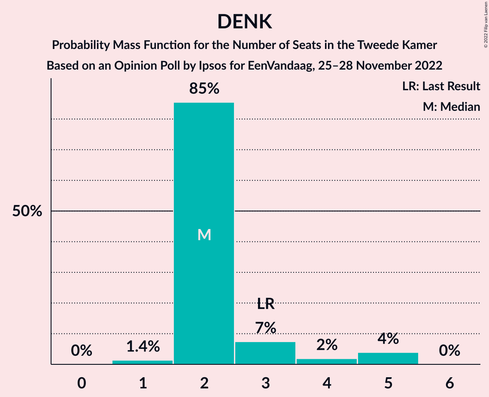
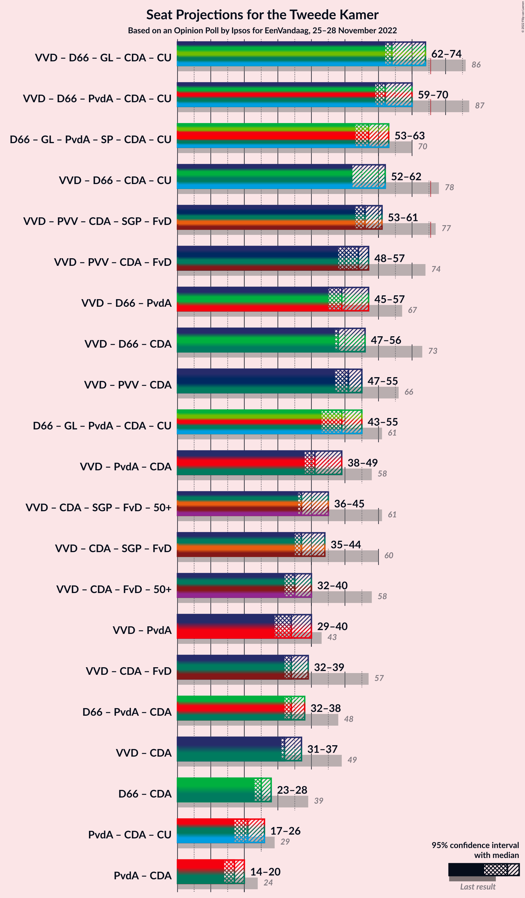

# Opinion Poll by Ipsos for EenVandaag, 25–28 November 2022

<a href="#voting-intentions">Voting Intentions</a> | <a href="#seats">Seats</a> | <a href="#coalitions">Coalitions</a> | <a href="#technical-information">Technical Information</a>

## Voting Intentions

### Confidence Intervals

| Party | Last Result | Poll Result | 80% Confidence Interval | 90% Confidence Interval | 95% Confidence Interval | 99% Confidence Interval |
|:-----:|:-----------:|:-----------:|:-----------------------:|:-----------------------:|:-----------------------:|:-----------------------:|
| Volkspartij voor Vrijheid en Democratie | 21.9% | 16.9% | 15.5–18.5% |15.1–18.9% |14.8–19.3% |14.1–20.1% |
| Partij voor de Vrijheid | 10.8% | 11.8% | 10.6–13.2% |10.3–13.6% |10.0–13.9% |9.4–14.6% |
| Democraten 66 | 15.0% | 10.9% | 9.7–12.2% |9.4–12.6% |9.1–12.9% |8.6–13.6% |
| BoerBurgerBeweging | 1.0% | 7.8% | 6.8–9.0% |6.5–9.3% |6.3–9.6% |5.9–10.2% |
| GroenLinks | 5.2% | 7.4% | 6.4–8.6% |6.2–8.9% |6.0–9.2% |5.5–9.7% |
| Partij van de Arbeid | 5.7% | 6.4% | 5.6–7.5% |5.3–7.8% |5.1–8.1% |4.7–8.7% |
| Partij voor de Dieren | 3.8% | 5.7% | 4.8–6.7% |4.6–7.0% |4.4–7.3% |4.1–7.8% |
| Juiste Antwoord 2021 | 2.4% | 5.7% | 4.8–6.7% |4.6–7.0% |4.4–7.3% |4.1–7.8% |
| Socialistische Partij | 6.0% | 5.6% | 4.8–6.6% |4.5–6.9% |4.3–7.1% |4.0–7.7% |
| Christen-Democratisch Appèl | 9.5% | 5.3% | 4.5–6.3% |4.3–6.6% |4.1–6.8% |3.7–7.3% |
| ChristenUnie | 3.4% | 3.1% | 2.5–3.9% |2.3–4.1% |2.2–4.3% |1.9–4.7% |
| Volt Europa | 2.4% | 3.1% | 2.5–3.9% |2.3–4.1% |2.2–4.3% |1.9–4.7% |
| Staatkundig Gereformeerde Partij | 2.1% | 2.0% | 1.6–2.7% |1.4–2.9% |1.3–3.1% |1.1–3.4% |
| DENK | 2.0% | 2.0% | 1.6–2.7% |1.4–2.9% |1.3–3.1% |1.1–3.4% |
| Forum voor Democratie | 5.0% | 1.3% | 1.0–1.9% |0.9–2.1% |0.8–2.3% |0.7–2.6% |
| Bij1 | 0.8% | 1.2% | 0.9–1.8% |0.8–2.0% |0.7–2.1% |0.6–2.4% |
| Belang van Nederland | 0.0% | 1.2% | 0.9–1.8% |0.8–2.0% |0.7–2.1% |0.6–2.4% |
| 50Plus | 1.0% | 0.6% | 0.4–1.0% |0.3–1.1% |0.3–1.3% |0.2–1.5% |

*Note:* The poll result column reflects the actual value used in the calculations. Published results may vary slightly, and in addition be rounded to fewer digits.

## Seats

### Confidence Intervals

| Party | Last Result | Median | 80% Confidence Interval | 90% Confidence Interval | 95% Confidence Interval | 99% Confidence Interval |
|:-----:|:-----------:|:------:|:-----------------------:|:-----------------------:|:-----------------------:|:-----------------------:|
| <a href="#volkspartij-voor-vrijheid-en-democratie">Volkspartij voor Vrijheid en Democratie</a> | 34 | 23 | 22–29 |22–29 |22–29 |21–31 |
| <a href="#partij-voor-de-vrijheid">Partij voor de Vrijheid</a> | 17 | 18 | 16–20 |15–20 |14–20 |14–21 |
| <a href="#democraten-66">Democraten 66</a> | 24 | 17 | 14–18 |14–18 |14–19 |13–21 |
| <a href="#boerburgerbeweging">BoerBurgerBeweging</a> | 1 | 14 | 10–15 |9–15 |9–16 |8–16 |
| <a href="#groenlinks">GroenLinks</a> | 8 | 12 | 11–14 |10–14 |8–14 |8–15 |
| <a href="#partij-van-de-arbeid">Partij van de Arbeid</a> | 9 | 9 | 7–10 |7–11 |7–12 |7–14 |
| <a href="#partij-voor-de-dieren">Partij voor de Dieren</a> | 6 | 10 | 6–11 |5–11 |5–11 |5–11 |
| <a href="#juiste-antwoord-2021">Juiste Antwoord 2021</a> | 3 | 9 | 7–10 |7–10 |7–11 |6–12 |
| <a href="#socialistische-partij">Socialistische Partij</a> | 9 | 8 | 7–9 |7–10 |6–11 |6–14 |
| <a href="#christen-democratisch-appèl">Christen-Democratisch Appèl</a> | 15 | 8 | 8–10 |7–10 |6–10 |6–11 |
| <a href="#christenunie">ChristenUnie</a> | 5 | 5 | 4–7 |3–7 |3–7 |3–8 |
| <a href="#volt-europa">Volt Europa</a> | 3 | 4 | 3–5 |3–5 |3–6 |2–6 |
| <a href="#staatkundig-gereformeerde-partij">Staatkundig Gereformeerde Partij</a> | 3 | 4 | 2–4 |2–4 |2–4 |1–6 |
| <a href="#denk">DENK</a> | 3 | 2 | 2–3 |2–4 |2–5 |1–5 |
| <a href="#forum-voor-democratie">Forum voor Democratie</a> | 8 | 2 | 2–3 |1–3 |1–3 |0–4 |
| <a href="#bij1">Bij1</a> | 1 | 2 | 1–2 |1–2 |1–2 |0–3 |
| <a href="#belang-van-nederland">Belang van Nederland</a> | 0 | 1 | 1–3 |1–3 |1–3 |0–3 |
| <a href="#50plus">50Plus</a> | 1 | 1 | 0–1 |0–1 |0–1 |0–1 |

### Volkspartij voor Vrijheid en Democratie

*For a full overview of the results for this party, see the [Volkspartij voor Vrijheid en Democratie](party-volkspartijvoorvrijheidendemocratie.html) page.*

| Number of Seats | Probability | Accumulated | Special Marks |
|:---------------:|:-----------:|:-----------:|:-------------:|
| 21 | 0.5% | 100% |  |
| 22 | 16% | 99.5% |  |
| 23 | 33% | 83% | Median |
| 24 | 2% | 50% |  |
| 25 | 24% | 48% |  |
| 26 | 5% | 23% |  |
| 27 | 6% | 18% |  |
| 28 | 2% | 13% |  |
| 29 | 9% | 11% |  |
| 30 | 0.3% | 2% |  |
| 31 | 2% | 2% |  |
| 32 | 0% | 0% |  |
| 33 | 0% | 0% |  |
| 34 | 0% | 0% | Last Result |

### Partij voor de Vrijheid

*For a full overview of the results for this party, see the [Partij voor de Vrijheid](party-partijvoordevrijheid.html) page.*

| Number of Seats | Probability | Accumulated | Special Marks |
|:---------------:|:-----------:|:-----------:|:-------------:|
| 14 | 5% | 100% |  |
| 15 | 0.7% | 95% |  |
| 16 | 8% | 95% |  |
| 17 | 37% | 87% | Last Result |
| 18 | 6% | 50% | Median |
| 19 | 4% | 45% |  |
| 20 | 40% | 41% |  |
| 21 | 0.7% | 0.7% |  |
| 22 | 0% | 0.1% |  |
| 23 | 0% | 0% |  |

### Democraten 66

*For a full overview of the results for this party, see the [Democraten 66](party-democraten66.html) page.*

| Number of Seats | Probability | Accumulated | Special Marks |
|:---------------:|:-----------:|:-----------:|:-------------:|
| 13 | 0.9% | 100% |  |
| 14 | 25% | 99.1% |  |
| 15 | 1.1% | 74% |  |
| 16 | 20% | 73% |  |
| 17 | 33% | 53% | Median |
| 18 | 16% | 20% |  |
| 19 | 3% | 4% |  |
| 20 | 0.3% | 1.1% |  |
| 21 | 0.8% | 0.8% |  |
| 22 | 0% | 0% |  |
| 23 | 0% | 0% |  |
| 24 | 0% | 0% | Last Result |

### BoerBurgerBeweging

*For a full overview of the results for this party, see the [BoerBurgerBeweging](party-boerburgerbeweging.html) page.*

| Number of Seats | Probability | Accumulated | Special Marks |
|:---------------:|:-----------:|:-----------:|:-------------:|
| 1 | 0% | 100% | Last Result |
| 2 | 0% | 100% |  |
| 3 | 0% | 100% |  |
| 4 | 0% | 100% |  |
| 5 | 0% | 100% |  |
| 6 | 0% | 100% |  |
| 7 | 0.3% | 100% |  |
| 8 | 0.2% | 99.7% |  |
| 9 | 5% | 99.5% |  |
| 10 | 27% | 95% |  |
| 11 | 5% | 68% |  |
| 12 | 9% | 63% |  |
| 13 | 2% | 54% |  |
| 14 | 17% | 51% | Median |
| 15 | 32% | 34% |  |
| 16 | 3% | 3% |  |
| 17 | 0% | 0% |  |

### GroenLinks

*For a full overview of the results for this party, see the [GroenLinks](party-groenlinks.html) page.*

| Number of Seats | Probability | Accumulated | Special Marks |
|:---------------:|:-----------:|:-----------:|:-------------:|
| 8 | 3% | 100% | Last Result |
| 9 | 2% | 97% |  |
| 10 | 2% | 95% |  |
| 11 | 34% | 93% |  |
| 12 | 26% | 59% | Median |
| 13 | 5% | 33% |  |
| 14 | 27% | 28% |  |
| 15 | 1.3% | 1.4% |  |
| 16 | 0.1% | 0.1% |  |
| 17 | 0% | 0% |  |

### Partij van de Arbeid

*For a full overview of the results for this party, see the [Partij van de Arbeid](party-partijvandearbeid.html) page.*

| Number of Seats | Probability | Accumulated | Special Marks |
|:---------------:|:-----------:|:-----------:|:-------------:|
| 6 | 0.1% | 100% |  |
| 7 | 19% | 99.9% |  |
| 8 | 11% | 81% |  |
| 9 | 59% | 70% | Last Result, Median |
| 10 | 5% | 11% |  |
| 11 | 3% | 6% |  |
| 12 | 2% | 3% |  |
| 13 | 1.0% | 1.5% |  |
| 14 | 0.5% | 0.5% |  |
| 15 | 0% | 0% |  |

### Partij voor de Dieren

*For a full overview of the results for this party, see the [Partij voor de Dieren](party-partijvoordedieren.html) page.*

| Number of Seats | Probability | Accumulated | Special Marks |
|:---------------:|:-----------:|:-----------:|:-------------:|
| 5 | 7% | 100% |  |
| 6 | 4% | 93% | Last Result |
| 7 | 3% | 88% |  |
| 8 | 29% | 85% |  |
| 9 | 2% | 56% |  |
| 10 | 21% | 53% | Median |
| 11 | 33% | 33% |  |
| 12 | 0.2% | 0.2% |  |
| 13 | 0% | 0% |  |

### Juiste Antwoord 2021

*For a full overview of the results for this party, see the [Juiste Antwoord 2021](party-juisteantwoord2021.html) page.*

| Number of Seats | Probability | Accumulated | Special Marks |
|:---------------:|:-----------:|:-----------:|:-------------:|
| 3 | 0% | 100% | Last Result |
| 4 | 0% | 100% |  |
| 5 | 0.1% | 100% |  |
| 6 | 0.8% | 99.9% |  |
| 7 | 39% | 99.1% |  |
| 8 | 5% | 60% |  |
| 9 | 34% | 55% | Median |
| 10 | 18% | 22% |  |
| 11 | 3% | 4% |  |
| 12 | 0.1% | 0.6% |  |
| 13 | 0.4% | 0.5% |  |
| 14 | 0.1% | 0.1% |  |
| 15 | 0% | 0% |  |

### Socialistische Partij

*For a full overview of the results for this party, see the [Socialistische Partij](party-socialistischepartij.html) page.*

| Number of Seats | Probability | Accumulated | Special Marks |
|:---------------:|:-----------:|:-----------:|:-------------:|
| 5 | 0.1% | 100% |  |
| 6 | 2% | 99.9% |  |
| 7 | 35% | 97% |  |
| 8 | 51% | 62% | Median |
| 9 | 2% | 11% | Last Result |
| 10 | 6% | 9% |  |
| 11 | 2% | 3% |  |
| 12 | 0.1% | 1.1% |  |
| 13 | 0.4% | 1.0% |  |
| 14 | 0.6% | 0.6% |  |
| 15 | 0% | 0% |  |

### Christen-Democratisch Appèl

*For a full overview of the results for this party, see the [Christen-Democratisch Appèl](party-christen-democratischappèl.html) page.*

| Number of Seats | Probability | Accumulated | Special Marks |
|:---------------:|:-----------:|:-----------:|:-------------:|
| 5 | 0.2% | 100% |  |
| 6 | 3% | 99.8% |  |
| 7 | 7% | 97% |  |
| 8 | 47% | 90% | Median |
| 9 | 18% | 44% |  |
| 10 | 25% | 26% |  |
| 11 | 0.6% | 0.6% |  |
| 12 | 0% | 0% |  |
| 13 | 0% | 0% |  |
| 14 | 0% | 0% |  |
| 15 | 0% | 0% | Last Result |

### ChristenUnie

*For a full overview of the results for this party, see the [ChristenUnie](party-christenunie.html) page.*

| Number of Seats | Probability | Accumulated | Special Marks |
|:---------------:|:-----------:|:-----------:|:-------------:|
| 2 | 0.5% | 100% |  |
| 3 | 6% | 99.5% |  |
| 4 | 38% | 93% |  |
| 5 | 19% | 55% | Last Result, Median |
| 6 | 26% | 36% |  |
| 7 | 9% | 10% |  |
| 8 | 1.4% | 1.4% |  |
| 9 | 0% | 0% |  |

### Volt Europa

*For a full overview of the results for this party, see the [Volt Europa](party-volteuropa.html) page.*

| Number of Seats | Probability | Accumulated | Special Marks |
|:---------------:|:-----------:|:-----------:|:-------------:|
| 2 | 0.8% | 100% |  |
| 3 | 28% | 99.2% | Last Result |
| 4 | 25% | 71% | Median |
| 5 | 43% | 46% |  |
| 6 | 3% | 4% |  |
| 7 | 0.2% | 0.3% |  |
| 8 | 0.1% | 0.1% |  |
| 9 | 0% | 0% |  |

### Staatkundig Gereformeerde Partij

*For a full overview of the results for this party, see the [Staatkundig Gereformeerde Partij](party-staatkundiggereformeerdepartij.html) page.*

| Number of Seats | Probability | Accumulated | Special Marks |
|:---------------:|:-----------:|:-----------:|:-------------:|
| 1 | 0.8% | 100% |  |
| 2 | 21% | 99.2% |  |
| 3 | 11% | 79% | Last Result |
| 4 | 66% | 68% | Median |
| 5 | 1.4% | 2% |  |
| 6 | 0.8% | 0.8% |  |
| 7 | 0% | 0% |  |

### DENK

*For a full overview of the results for this party, see the [DENK](party-denk.html) page.*

| Number of Seats | Probability | Accumulated | Special Marks |
|:---------------:|:-----------:|:-----------:|:-------------:|
| 1 | 1.4% | 100% |  |
| 2 | 85% | 98.6% | Median |
| 3 | 7% | 13% | Last Result |
| 4 | 2% | 6% |  |
| 5 | 4% | 4% |  |
| 6 | 0% | 0% |  |

### Forum voor Democratie

*For a full overview of the results for this party, see the [Forum voor Democratie](party-forumvoordemocratie.html) page.*

| Number of Seats | Probability | Accumulated | Special Marks |
|:---------------:|:-----------:|:-----------:|:-------------:|
| 0 | 1.4% | 100% |  |
| 1 | 6% | 98.6% |  |
| 2 | 70% | 93% | Median |
| 3 | 23% | 23% |  |
| 4 | 0.5% | 0.5% |  |
| 5 | 0% | 0% |  |
| 6 | 0% | 0% |  |
| 7 | 0% | 0% |  |
| 8 | 0% | 0% | Last Result |

### Bij1

*For a full overview of the results for this party, see the [Bij1](party-bij1.html) page.*

| Number of Seats | Probability | Accumulated | Special Marks |
|:---------------:|:-----------:|:-----------:|:-------------:|
| 0 | 1.3% | 100% |  |
| 1 | 15% | 98.7% | Last Result |
| 2 | 82% | 84% | Median |
| 3 | 2% | 2% |  |
| 4 | 0.3% | 0.3% |  |
| 5 | 0% | 0% |  |

### Belang van Nederland

*For a full overview of the results for this party, see the [Belang van Nederland](party-belangvannederland.html) page.*

| Number of Seats | Probability | Accumulated | Special Marks |
|:---------------:|:-----------:|:-----------:|:-------------:|
| 0 | 1.1% | 100% | Last Result |
| 1 | 54% | 98.9% | Median |
| 2 | 12% | 45% |  |
| 3 | 33% | 33% |  |
| 4 | 0% | 0% |  |

### 50Plus

*For a full overview of the results for this party, see the [50Plus](party-50plus.html) page.*

| Number of Seats | Probability | Accumulated | Special Marks |
|:---------------:|:-----------:|:-----------:|:-------------:|
| 0 | 49% | 100% |  |
| 1 | 51% | 51% | Last Result, Median |
| 2 | 0.2% | 0.2% |  |
| 3 | 0% | 0% |  |

## Coalitions

### Confidence Intervals

| Coalition | Last Result | Median | Majority? | 80% Confidence Interval | 90% Confidence Interval | 95% Confidence Interval | 99% Confidence Interval |
|:---------:|:-----------:|:------:|:---------:|:-----------------------:|:-----------------------:|:-----------------------:|:-----------------------:|
| Volkspartij voor Vrijheid en Democratie – Democraten 66 – GroenLinks – Christen-Democratisch Appèl – ChristenUnie | 86 | 64 | 0% | 63–71 | 63–74 | 62–74 | 61–74 |
| Volkspartij voor Vrijheid en Democratie – Democraten 66 – Partij van de Arbeid – Christen-Democratisch Appèl – ChristenUnie | 87 | 62 | 0% | 59–70 | 59–70 | 59–70 | 59–72 |
| Democraten 66 – GroenLinks – Partij van de Arbeid – Socialistische Partij – Christen-Democratisch Appèl – ChristenUnie | 70 | 57 | 0% | 56–61 | 56–62 | 53–63 | 52–67 |
| Volkspartij voor Vrijheid en Democratie – Democraten 66 – Christen-Democratisch Appèl – ChristenUnie | 78 | 52 | 0% | 52–60 | 52–62 | 52–62 | 49–62 |
| Volkspartij voor Vrijheid en Democratie – Partij voor de Vrijheid – Christen-Democratisch Appèl – Staatkundig Gereformeerde Partij – Forum voor Democratie | 77 | 56 | 0% | 54–61 | 54–61 | 53–61 | 49–62 |
| Volkspartij voor Vrijheid en Democratie – Partij voor de Vrijheid – Christen-Democratisch Appèl – Forum voor Democratie | 74 | 54 | 0% | 50–57 | 50–57 | 48–57 | 46–57 |
| Volkspartij voor Vrijheid en Democratie – Democraten 66 – Partij van de Arbeid | 67 | 49 | 0% | 45–55 | 45–55 | 45–57 | 45–59 |
| Volkspartij voor Vrijheid en Democratie – Democraten 66 – Christen-Democratisch Appèl | 73 | 48 | 0% | 47–55 | 47–55 | 47–56 | 45–57 |
| Volkspartij voor Vrijheid en Democratie – Partij voor de Vrijheid – Christen-Democratisch Appèl | 66 | 51 | 0% | 48–55 | 48–55 | 47–55 | 46–56 |
| Democraten 66 – GroenLinks – Partij van de Arbeid – Christen-Democratisch Appèl – ChristenUnie | 61 | 49 | 0% | 49–53 | 48–53 | 43–55 | 43–59 |
| Volkspartij voor Vrijheid en Democratie – Partij van de Arbeid – Christen-Democratisch Appèl | 58 | 41 | 0% | 38–45 | 38–45 | 38–49 | 38–49 |
| Volkspartij voor Vrijheid en Democratie – Christen-Democratisch Appèl – Staatkundig Gereformeerde Partij – Forum voor Democratie – 50Plus | 61 | 37 | 0% | 37–43 | 37–43 | 36–45 | 34–46 |
| Volkspartij voor Vrijheid en Democratie – Christen-Democratisch Appèl – Staatkundig Gereformeerde Partij – Forum voor Democratie | 60 | 37 | 0% | 36–43 | 36–43 | 35–44 | 34–45 |
| Volkspartij voor Vrijheid en Democratie – Christen-Democratisch Appèl – Forum voor Democratie – 50Plus | 58 | 35 | 0% | 33–39 | 33–39 | 32–40 | 31–41 |
| Volkspartij voor Vrijheid en Democratie – Partij van de Arbeid | 43 | 34 | 0% | 29–37 | 29–38 | 29–40 | 29–42 |
| Volkspartij voor Vrijheid en Democratie – Christen-Democratisch Appèl – Forum voor Democratie | 57 | 34 | 0% | 33–39 | 33–39 | 32–39 | 31–40 |
| Democraten 66 – Partij van de Arbeid – Christen-Democratisch Appèl | 48 | 34 | 0% | 32–35 | 32–36 | 32–38 | 28–40 |
| Volkspartij voor Vrijheid en Democratie – Christen-Democratisch Appèl | 49 | 32 | 0% | 31–37 | 31–37 | 31–37 | 29–39 |
| Democraten 66 – Christen-Democratisch Appèl | 39 | 25 | 0% | 24–26 | 23–26 | 23–28 | 20–28 |
| Partij van de Arbeid – Christen-Democratisch Appèl – ChristenUnie | 29 | 21 | 0% | 21–25 | 20–25 | 17–26 | 17–28 |
| Partij van de Arbeid – Christen-Democratisch Appèl | 24 | 17 | 0% | 16–19 | 16–19 | 14–20 | 14–22 |

### Volkspartij voor Vrijheid en Democratie – Democraten 66 – GroenLinks – Christen-Democratisch Appèl – ChristenUnie

| Number of Seats | Probability | Accumulated | Special Marks |
|:---------------:|:-----------:|:-----------:|:-------------:|
| 57 | 0.3% | 100% |  |
| 58 | 0.1% | 99.7% |  |
| 59 | 0% | 99.6% |  |
| 60 | 0% | 99.6% |  |
| 61 | 0.9% | 99.6% |  |
| 62 | 1.3% | 98.7% |  |
| 63 | 35% | 97% |  |
| 64 | 17% | 63% |  |
| 65 | 0.3% | 46% | Median |
| 66 | 0.7% | 46% |  |
| 67 | 2% | 45% |  |
| 68 | 2% | 43% |  |
| 69 | 26% | 42% |  |
| 70 | 4% | 16% |  |
| 71 | 2% | 11% |  |
| 72 | 0.2% | 10% |  |
| 73 | 0% | 9% |  |
| 74 | 9% | 9% |  |
| 75 | 0% | 0% |  |
| 76 | 0% | 0% | Majority |
| 77 | 0% | 0% |  |
| 78 | 0% | 0% |  |
| 79 | 0% | 0% |  |
| 80 | 0% | 0% |  |
| 81 | 0% | 0% |  |
| 82 | 0% | 0% |  |
| 83 | 0% | 0% |  |
| 84 | 0% | 0% |  |
| 85 | 0% | 0% |  |
| 86 | 0% | 0% | Last Result |

### Volkspartij voor Vrijheid en Democratie – Democraten 66 – Partij van de Arbeid – Christen-Democratisch Appèl – ChristenUnie

| Number of Seats | Probability | Accumulated | Special Marks |
|:---------------:|:-----------:|:-----------:|:-------------:|
| 55 | 0.3% | 100% |  |
| 56 | 0% | 99.7% |  |
| 57 | 0% | 99.7% |  |
| 58 | 0% | 99.7% |  |
| 59 | 16% | 99.6% |  |
| 60 | 0.8% | 83% |  |
| 61 | 32% | 82% |  |
| 62 | 3% | 50% | Median |
| 63 | 2% | 47% |  |
| 64 | 24% | 45% |  |
| 65 | 3% | 21% |  |
| 66 | 2% | 18% |  |
| 67 | 3% | 16% |  |
| 68 | 0.2% | 13% |  |
| 69 | 2% | 13% |  |
| 70 | 9% | 10% |  |
| 71 | 0.1% | 1.1% |  |
| 72 | 0.9% | 1.0% |  |
| 73 | 0% | 0% |  |
| 74 | 0% | 0% |  |
| 75 | 0% | 0% |  |
| 76 | 0% | 0% | Majority |
| 77 | 0% | 0% |  |
| 78 | 0% | 0% |  |
| 79 | 0% | 0% |  |
| 80 | 0% | 0% |  |
| 81 | 0% | 0% |  |
| 82 | 0% | 0% |  |
| 83 | 0% | 0% |  |
| 84 | 0% | 0% |  |
| 85 | 0% | 0% |  |
| 86 | 0% | 0% |  |
| 87 | 0% | 0% | Last Result |

### Democraten 66 – GroenLinks – Partij van de Arbeid – Socialistische Partij – Christen-Democratisch Appèl – ChristenUnie

| Number of Seats | Probability | Accumulated | Special Marks |
|:---------------:|:-----------:|:-----------:|:-------------:|
| 52 | 0.7% | 100% |  |
| 53 | 3% | 99.3% |  |
| 54 | 0.2% | 97% |  |
| 55 | 0.1% | 97% |  |
| 56 | 32% | 96% |  |
| 57 | 18% | 65% |  |
| 58 | 2% | 47% |  |
| 59 | 5% | 45% | Median |
| 60 | 0.4% | 40% |  |
| 61 | 34% | 40% |  |
| 62 | 2% | 6% |  |
| 63 | 3% | 5% |  |
| 64 | 0.2% | 2% |  |
| 65 | 0.5% | 2% |  |
| 66 | 0% | 1.3% |  |
| 67 | 1.3% | 1.3% |  |
| 68 | 0% | 0% |  |
| 69 | 0% | 0% |  |
| 70 | 0% | 0% | Last Result |

### Volkspartij voor Vrijheid en Democratie – Democraten 66 – Christen-Democratisch Appèl – ChristenUnie

| Number of Seats | Probability | Accumulated | Special Marks |
|:---------------:|:-----------:|:-----------:|:-------------:|
| 46 | 0.3% | 100% |  |
| 47 | 0% | 99.7% |  |
| 48 | 0% | 99.7% |  |
| 49 | 0.8% | 99.6% |  |
| 50 | 0.6% | 98.9% |  |
| 51 | 0.8% | 98% |  |
| 52 | 48% | 98% |  |
| 53 | 1.1% | 49% | Median |
| 54 | 0.3% | 48% |  |
| 55 | 28% | 48% |  |
| 56 | 3% | 20% |  |
| 57 | 4% | 17% |  |
| 58 | 2% | 13% |  |
| 59 | 0.3% | 11% |  |
| 60 | 2% | 11% |  |
| 61 | 1.3% | 9% |  |
| 62 | 7% | 7% |  |
| 63 | 0% | 0% |  |
| 64 | 0% | 0% |  |
| 65 | 0% | 0% |  |
| 66 | 0% | 0% |  |
| 67 | 0% | 0% |  |
| 68 | 0% | 0% |  |
| 69 | 0% | 0% |  |
| 70 | 0% | 0% |  |
| 71 | 0% | 0% |  |
| 72 | 0% | 0% |  |
| 73 | 0% | 0% |  |
| 74 | 0% | 0% |  |
| 75 | 0% | 0% |  |
| 76 | 0% | 0% | Majority |
| 77 | 0% | 0% |  |
| 78 | 0% | 0% | Last Result |

### Volkspartij voor Vrijheid en Democratie – Partij voor de Vrijheid – Christen-Democratisch Appèl – Staatkundig Gereformeerde Partij – Forum voor Democratie

| Number of Seats | Probability | Accumulated | Special Marks |
|:---------------:|:-----------:|:-----------:|:-------------:|
| 49 | 2% | 100% |  |
| 50 | 0.1% | 98% |  |
| 51 | 0.2% | 98% |  |
| 52 | 0.1% | 98% |  |
| 53 | 2% | 98% |  |
| 54 | 32% | 96% |  |
| 55 | 3% | 64% | Median |
| 56 | 17% | 62% |  |
| 57 | 7% | 45% |  |
| 58 | 4% | 38% |  |
| 59 | 8% | 34% |  |
| 60 | 0.9% | 26% |  |
| 61 | 24% | 25% |  |
| 62 | 1.1% | 1.2% |  |
| 63 | 0% | 0.1% |  |
| 64 | 0% | 0.1% |  |
| 65 | 0.1% | 0.1% |  |
| 66 | 0% | 0% |  |
| 67 | 0% | 0% |  |
| 68 | 0% | 0% |  |
| 69 | 0% | 0% |  |
| 70 | 0% | 0% |  |
| 71 | 0% | 0% |  |
| 72 | 0% | 0% |  |
| 73 | 0% | 0% |  |
| 74 | 0% | 0% |  |
| 75 | 0% | 0% |  |
| 76 | 0% | 0% | Majority |
| 77 | 0% | 0% | Last Result |

### Volkspartij voor Vrijheid en Democratie – Partij voor de Vrijheid – Christen-Democratisch Appèl – Forum voor Democratie

| Number of Seats | Probability | Accumulated | Special Marks |
|:---------------:|:-----------:|:-----------:|:-------------:|
| 46 | 2% | 100% |  |
| 47 | 0% | 98% |  |
| 48 | 0.8% | 98% |  |
| 49 | 0.2% | 97% |  |
| 50 | 33% | 97% |  |
| 51 | 0.7% | 65% | Median |
| 52 | 2% | 64% |  |
| 53 | 2% | 62% |  |
| 54 | 22% | 60% |  |
| 55 | 11% | 38% |  |
| 56 | 2% | 28% |  |
| 57 | 25% | 26% |  |
| 58 | 0.1% | 0.2% |  |
| 59 | 0% | 0.1% |  |
| 60 | 0% | 0.1% |  |
| 61 | 0% | 0.1% |  |
| 62 | 0.1% | 0.1% |  |
| 63 | 0% | 0% |  |
| 64 | 0% | 0% |  |
| 65 | 0% | 0% |  |
| 66 | 0% | 0% |  |
| 67 | 0% | 0% |  |
| 68 | 0% | 0% |  |
| 69 | 0% | 0% |  |
| 70 | 0% | 0% |  |
| 71 | 0% | 0% |  |
| 72 | 0% | 0% |  |
| 73 | 0% | 0% |  |
| 74 | 0% | 0% | Last Result |

### Volkspartij voor Vrijheid en Democratie – Democraten 66 – Partij van de Arbeid

| Number of Seats | Probability | Accumulated | Special Marks |
|:---------------:|:-----------:|:-----------:|:-------------:|
| 45 | 16% | 100% |  |
| 46 | 0% | 84% |  |
| 47 | 0.8% | 84% |  |
| 48 | 24% | 83% |  |
| 49 | 31% | 59% | Median |
| 50 | 1.1% | 27% |  |
| 51 | 2% | 26% |  |
| 52 | 6% | 24% |  |
| 53 | 3% | 18% |  |
| 54 | 1.5% | 15% |  |
| 55 | 9% | 14% |  |
| 56 | 1.0% | 5% |  |
| 57 | 1.0% | 4% |  |
| 58 | 0.1% | 2% |  |
| 59 | 2% | 2% |  |
| 60 | 0% | 0.5% |  |
| 61 | 0.5% | 0.5% |  |
| 62 | 0% | 0% |  |
| 63 | 0% | 0% |  |
| 64 | 0% | 0% |  |
| 65 | 0% | 0% |  |
| 66 | 0% | 0% |  |
| 67 | 0% | 0% | Last Result |

### Volkspartij voor Vrijheid en Democratie – Democraten 66 – Christen-Democratisch Appèl

| Number of Seats | Probability | Accumulated | Special Marks |
|:---------------:|:-----------:|:-----------:|:-------------:|
| 43 | 0.3% | 100% |  |
| 44 | 0% | 99.6% |  |
| 45 | 0.2% | 99.6% |  |
| 46 | 2% | 99.4% |  |
| 47 | 17% | 98% |  |
| 48 | 32% | 81% | Median |
| 49 | 26% | 49% |  |
| 50 | 2% | 23% |  |
| 51 | 2% | 21% |  |
| 52 | 5% | 19% |  |
| 53 | 0.9% | 13% |  |
| 54 | 2% | 13% |  |
| 55 | 8% | 11% |  |
| 56 | 0.8% | 3% |  |
| 57 | 2% | 2% |  |
| 58 | 0% | 0% |  |
| 59 | 0% | 0% |  |
| 60 | 0% | 0% |  |
| 61 | 0% | 0% |  |
| 62 | 0% | 0% |  |
| 63 | 0% | 0% |  |
| 64 | 0% | 0% |  |
| 65 | 0% | 0% |  |
| 66 | 0% | 0% |  |
| 67 | 0% | 0% |  |
| 68 | 0% | 0% |  |
| 69 | 0% | 0% |  |
| 70 | 0% | 0% |  |
| 71 | 0% | 0% |  |
| 72 | 0% | 0% |  |
| 73 | 0% | 0% | Last Result |

### Volkspartij voor Vrijheid en Democratie – Partij voor de Vrijheid – Christen-Democratisch Appèl

| Number of Seats | Probability | Accumulated | Special Marks |
|:---------------:|:-----------:|:-----------:|:-------------:|
| 44 | 0.4% | 100% |  |
| 45 | 0% | 99.6% |  |
| 46 | 1.4% | 99.6% |  |
| 47 | 1.0% | 98% |  |
| 48 | 31% | 97% |  |
| 49 | 3% | 66% | Median |
| 50 | 1.1% | 63% |  |
| 51 | 21% | 62% |  |
| 52 | 1.0% | 41% |  |
| 53 | 13% | 40% |  |
| 54 | 0.9% | 27% |  |
| 55 | 25% | 26% |  |
| 56 | 0.4% | 0.6% |  |
| 57 | 0.1% | 0.2% |  |
| 58 | 0% | 0.1% |  |
| 59 | 0% | 0.1% |  |
| 60 | 0.1% | 0.1% |  |
| 61 | 0% | 0% |  |
| 62 | 0% | 0% |  |
| 63 | 0% | 0% |  |
| 64 | 0% | 0% |  |
| 65 | 0% | 0% |  |
| 66 | 0% | 0% | Last Result |

### Democraten 66 – GroenLinks – Partij van de Arbeid – Christen-Democratisch Appèl – ChristenUnie

| Number of Seats | Probability | Accumulated | Special Marks |
|:---------------:|:-----------:|:-----------:|:-------------:|
| 43 | 3% | 100% |  |
| 44 | 0% | 97% |  |
| 45 | 1.3% | 97% |  |
| 46 | 0.6% | 96% |  |
| 47 | 0.4% | 95% |  |
| 48 | 2% | 95% |  |
| 49 | 47% | 93% |  |
| 50 | 3% | 46% |  |
| 51 | 1.2% | 43% | Median |
| 52 | 3% | 42% |  |
| 53 | 34% | 39% |  |
| 54 | 2% | 5% |  |
| 55 | 0.5% | 3% |  |
| 56 | 1.1% | 2% |  |
| 57 | 0% | 1.3% |  |
| 58 | 0% | 1.3% |  |
| 59 | 1.3% | 1.3% |  |
| 60 | 0% | 0% |  |
| 61 | 0% | 0% | Last Result |

### Volkspartij voor Vrijheid en Democratie – Partij van de Arbeid – Christen-Democratisch Appèl

| Number of Seats | Probability | Accumulated | Special Marks |
|:---------------:|:-----------:|:-----------:|:-------------:|
| 37 | 0.5% | 100% |  |
| 38 | 17% | 99.5% |  |
| 39 | 0.5% | 83% |  |
| 40 | 32% | 83% | Median |
| 41 | 3% | 51% |  |
| 42 | 0.8% | 48% |  |
| 43 | 6% | 47% |  |
| 44 | 28% | 41% |  |
| 45 | 9% | 14% |  |
| 46 | 1.0% | 5% |  |
| 47 | 0.9% | 4% |  |
| 48 | 0.2% | 3% |  |
| 49 | 2% | 3% |  |
| 50 | 0.1% | 0.1% |  |
| 51 | 0% | 0% |  |
| 52 | 0% | 0% |  |
| 53 | 0% | 0% |  |
| 54 | 0% | 0% |  |
| 55 | 0% | 0% |  |
| 56 | 0% | 0% |  |
| 57 | 0% | 0% |  |
| 58 | 0% | 0% | Last Result |

### Volkspartij voor Vrijheid en Democratie – Christen-Democratisch Appèl – Staatkundig Gereformeerde Partij – Forum voor Democratie – 50Plus

| Number of Seats | Probability | Accumulated | Special Marks |
|:---------------:|:-----------:|:-----------:|:-------------:|
| 32 | 0.1% | 100% |  |
| 33 | 0.4% | 99.9% |  |
| 34 | 0.6% | 99.5% |  |
| 35 | 1.4% | 99.0% |  |
| 36 | 2% | 98% |  |
| 37 | 49% | 96% |  |
| 38 | 1.2% | 47% | Median |
| 39 | 4% | 46% |  |
| 40 | 2% | 42% |  |
| 41 | 4% | 40% |  |
| 42 | 25% | 36% |  |
| 43 | 8% | 11% |  |
| 44 | 0.7% | 3% |  |
| 45 | 2% | 3% |  |
| 46 | 0.8% | 0.8% |  |
| 47 | 0% | 0% |  |
| 48 | 0% | 0% |  |
| 49 | 0% | 0% |  |
| 50 | 0% | 0% |  |
| 51 | 0% | 0% |  |
| 52 | 0% | 0% |  |
| 53 | 0% | 0% |  |
| 54 | 0% | 0% |  |
| 55 | 0% | 0% |  |
| 56 | 0% | 0% |  |
| 57 | 0% | 0% |  |
| 58 | 0% | 0% |  |
| 59 | 0% | 0% |  |
| 60 | 0% | 0% |  |
| 61 | 0% | 0% | Last Result |

### Volkspartij voor Vrijheid en Democratie – Christen-Democratisch Appèl – Staatkundig Gereformeerde Partij – Forum voor Democratie

| Number of Seats | Probability | Accumulated | Special Marks |
|:---------------:|:-----------:|:-----------:|:-------------:|
| 32 | 0.1% | 100% |  |
| 33 | 0.4% | 99.9% |  |
| 34 | 0.6% | 99.5% |  |
| 35 | 1.5% | 98.9% |  |
| 36 | 18% | 97% |  |
| 37 | 32% | 79% | Median |
| 38 | 3% | 47% |  |
| 39 | 2% | 43% |  |
| 40 | 5% | 41% |  |
| 41 | 25% | 37% |  |
| 42 | 1.0% | 12% |  |
| 43 | 8% | 11% |  |
| 44 | 2% | 3% |  |
| 45 | 0.9% | 0.9% |  |
| 46 | 0% | 0% |  |
| 47 | 0% | 0% |  |
| 48 | 0% | 0% |  |
| 49 | 0% | 0% |  |
| 50 | 0% | 0% |  |
| 51 | 0% | 0% |  |
| 52 | 0% | 0% |  |
| 53 | 0% | 0% |  |
| 54 | 0% | 0% |  |
| 55 | 0% | 0% |  |
| 56 | 0% | 0% |  |
| 57 | 0% | 0% |  |
| 58 | 0% | 0% |  |
| 59 | 0% | 0% |  |
| 60 | 0% | 0% | Last Result |

### Volkspartij voor Vrijheid en Democratie – Christen-Democratisch Appèl – Forum voor Democratie – 50Plus

| Number of Seats | Probability | Accumulated | Special Marks |
|:---------------:|:-----------:|:-----------:|:-------------:|
| 29 | 0.3% | 100% |  |
| 30 | 0.1% | 99.7% |  |
| 31 | 1.1% | 99.6% |  |
| 32 | 1.5% | 98% |  |
| 33 | 32% | 97% |  |
| 34 | 2% | 65% | Median |
| 35 | 16% | 63% |  |
| 36 | 2% | 47% |  |
| 37 | 4% | 44% |  |
| 38 | 28% | 41% |  |
| 39 | 9% | 12% |  |
| 40 | 1.2% | 3% |  |
| 41 | 2% | 2% |  |
| 42 | 0.1% | 0.2% |  |
| 43 | 0% | 0% |  |
| 44 | 0% | 0% |  |
| 45 | 0% | 0% |  |
| 46 | 0% | 0% |  |
| 47 | 0% | 0% |  |
| 48 | 0% | 0% |  |
| 49 | 0% | 0% |  |
| 50 | 0% | 0% |  |
| 51 | 0% | 0% |  |
| 52 | 0% | 0% |  |
| 53 | 0% | 0% |  |
| 54 | 0% | 0% |  |
| 55 | 0% | 0% |  |
| 56 | 0% | 0% |  |
| 57 | 0% | 0% |  |
| 58 | 0% | 0% | Last Result |

### Volkspartij voor Vrijheid en Democratie – Partij van de Arbeid

| Number of Seats | Probability | Accumulated | Special Marks |
|:---------------:|:-----------:|:-----------:|:-------------:|
| 29 | 16% | 100% |  |
| 30 | 0.5% | 84% |  |
| 31 | 0.7% | 84% |  |
| 32 | 31% | 83% | Median |
| 33 | 1.1% | 52% |  |
| 34 | 28% | 51% |  |
| 35 | 4% | 23% |  |
| 36 | 4% | 18% |  |
| 37 | 8% | 14% |  |
| 38 | 3% | 6% |  |
| 39 | 0.1% | 3% |  |
| 40 | 0.3% | 3% |  |
| 41 | 2% | 2% |  |
| 42 | 0.5% | 0.5% |  |
| 43 | 0% | 0% | Last Result |

### Volkspartij voor Vrijheid en Democratie – Christen-Democratisch Appèl – Forum voor Democratie

| Number of Seats | Probability | Accumulated | Special Marks |
|:---------------:|:-----------:|:-----------:|:-------------:|
| 29 | 0.3% | 100% |  |
| 30 | 0.1% | 99.7% |  |
| 31 | 1.1% | 99.5% |  |
| 32 | 1.5% | 98% |  |
| 33 | 33% | 97% | Median |
| 34 | 17% | 64% |  |
| 35 | 0.8% | 47% |  |
| 36 | 4% | 46% |  |
| 37 | 28% | 42% |  |
| 38 | 2% | 14% |  |
| 39 | 10% | 12% |  |
| 40 | 2% | 2% |  |
| 41 | 0% | 0.1% |  |
| 42 | 0.1% | 0.1% |  |
| 43 | 0% | 0% |  |
| 44 | 0% | 0% |  |
| 45 | 0% | 0% |  |
| 46 | 0% | 0% |  |
| 47 | 0% | 0% |  |
| 48 | 0% | 0% |  |
| 49 | 0% | 0% |  |
| 50 | 0% | 0% |  |
| 51 | 0% | 0% |  |
| 52 | 0% | 0% |  |
| 53 | 0% | 0% |  |
| 54 | 0% | 0% |  |
| 55 | 0% | 0% |  |
| 56 | 0% | 0% |  |
| 57 | 0% | 0% | Last Result |

### Democraten 66 – Partij van de Arbeid – Christen-Democratisch Appèl

| Number of Seats | Probability | Accumulated | Special Marks |
|:---------------:|:-----------:|:-----------:|:-------------:|
| 28 | 0.6% | 100% |  |
| 29 | 0.1% | 99.4% |  |
| 30 | 0.2% | 99.3% |  |
| 31 | 1.3% | 99.2% |  |
| 32 | 20% | 98% |  |
| 33 | 26% | 78% |  |
| 34 | 41% | 52% | Median |
| 35 | 3% | 11% |  |
| 36 | 4% | 8% |  |
| 37 | 0.2% | 4% |  |
| 38 | 2% | 4% |  |
| 39 | 1.0% | 2% |  |
| 40 | 0.5% | 0.6% |  |
| 41 | 0.1% | 0.1% |  |
| 42 | 0% | 0% |  |
| 43 | 0% | 0% |  |
| 44 | 0% | 0% |  |
| 45 | 0% | 0% |  |
| 46 | 0% | 0% |  |
| 47 | 0% | 0% |  |
| 48 | 0% | 0% | Last Result |

### Volkspartij voor Vrijheid en Democratie – Christen-Democratisch Appèl

| Number of Seats | Probability | Accumulated | Special Marks |
|:---------------:|:-----------:|:-----------:|:-------------:|
| 28 | 0.4% | 100% |  |
| 29 | 0.4% | 99.6% |  |
| 30 | 2% | 99.1% |  |
| 31 | 47% | 98% | Median |
| 32 | 3% | 50% |  |
| 33 | 4% | 47% |  |
| 34 | 5% | 44% |  |
| 35 | 25% | 39% |  |
| 36 | 1.5% | 13% |  |
| 37 | 10% | 12% |  |
| 38 | 0.2% | 2% |  |
| 39 | 2% | 2% |  |
| 40 | 0.1% | 0.1% |  |
| 41 | 0% | 0% |  |
| 42 | 0% | 0% |  |
| 43 | 0% | 0% |  |
| 44 | 0% | 0% |  |
| 45 | 0% | 0% |  |
| 46 | 0% | 0% |  |
| 47 | 0% | 0% |  |
| 48 | 0% | 0% |  |
| 49 | 0% | 0% | Last Result |

### Democraten 66 – Christen-Democratisch Appèl

| Number of Seats | Probability | Accumulated | Special Marks |
|:---------------:|:-----------:|:-----------:|:-------------:|
| 20 | 1.3% | 100% |  |
| 21 | 0.3% | 98.6% |  |
| 22 | 0.6% | 98% |  |
| 23 | 3% | 98% |  |
| 24 | 26% | 94% |  |
| 25 | 51% | 69% | Median |
| 26 | 14% | 17% |  |
| 27 | 0.4% | 3% |  |
| 28 | 2% | 3% |  |
| 29 | 0.2% | 0.3% |  |
| 30 | 0.1% | 0.1% |  |
| 31 | 0% | 0% |  |
| 32 | 0% | 0% |  |
| 33 | 0% | 0% |  |
| 34 | 0% | 0% |  |
| 35 | 0% | 0% |  |
| 36 | 0% | 0% |  |
| 37 | 0% | 0% |  |
| 38 | 0% | 0% |  |
| 39 | 0% | 0% | Last Result |

### Partij van de Arbeid – Christen-Democratisch Appèl – ChristenUnie

| Number of Seats | Probability | Accumulated | Special Marks |
|:---------------:|:-----------:|:-----------:|:-------------:|
| 17 | 3% | 100% |  |
| 18 | 0.6% | 97% |  |
| 19 | 2% | 97% |  |
| 20 | 2% | 95% |  |
| 21 | 53% | 93% |  |
| 22 | 2% | 40% | Median |
| 23 | 8% | 38% |  |
| 24 | 1.4% | 30% |  |
| 25 | 26% | 29% |  |
| 26 | 0.8% | 3% |  |
| 27 | 1.3% | 2% |  |
| 28 | 0.5% | 0.5% |  |
| 29 | 0% | 0% | Last Result |

### Partij van de Arbeid – Christen-Democratisch Appèl

| Number of Seats | Probability | Accumulated | Special Marks |
|:---------------:|:-----------:|:-----------:|:-------------:|
| 13 | 0.2% | 100% |  |
| 14 | 3% | 99.8% |  |
| 15 | 0.9% | 97% |  |
| 16 | 26% | 96% |  |
| 17 | 38% | 70% | Median |
| 18 | 3% | 32% |  |
| 19 | 25% | 29% |  |
| 20 | 2% | 4% |  |
| 21 | 1.4% | 2% |  |
| 22 | 0.6% | 0.6% |  |
| 23 | 0% | 0% |  |
| 24 | 0% | 0% | Last Result |

## Technical Information

### Opinion Poll

+ **Polling firm:** Ipsos
+ **Commissioner(s):** EenVandaag
+ **Fieldwork period:** 25–28 November 2022

### Calculations

+ **Sample size:** 1040
+ **Simulations done:** 1,048,576
+ **Error estimate:** 2.10%

