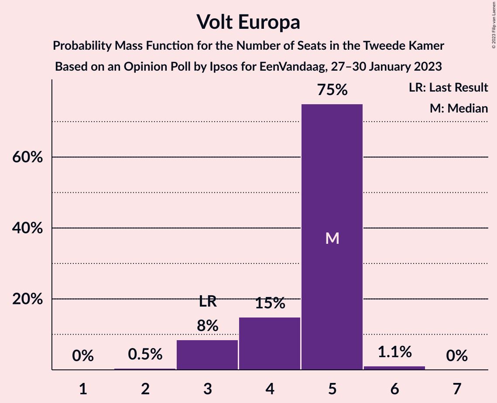

# Opinion Poll by Ipsos for EenVandaag, 27–30 January 2023

<a href="#voting-intentions">Voting Intentions</a> | <a href="#seats">Seats</a> | <a href="#coalitions">Coalitions</a> | <a href="#technical-information">Technical Information</a>

## Voting Intentions

### Confidence Intervals

| Party | Last Result | Poll Result | 80% Confidence Interval | 90% Confidence Interval | 95% Confidence Interval | 99% Confidence Interval |
|:-----:|:-----------:|:-----------:|:-----------------------:|:-----------------------:|:-----------------------:|:-----------------------:|
| Volkspartij voor Vrijheid en Democratie | 21.9% | 18.5% | 17.0–20.1% |16.5–20.6% |16.2–21.0% |15.5–21.8% |
| Partij voor de Vrijheid | 10.8% | 11.2% | 10.0–12.6% |9.6–12.9% |9.4–13.3% |8.8–14.0% |
| Democraten 66 | 15.0% | 9.8% | 8.7–11.1% |8.4–11.5% |8.1–11.8% |7.6–12.4% |
| Christen-Democratisch Appèl | 9.5% | 7.1% | 6.1–8.2% |5.9–8.6% |5.7–8.9% |5.2–9.4% |
| Juiste Antwoord 2021 | 2.4% | 6.8% | 5.9–7.9% |5.6–8.2% |5.4–8.5% |5.0–9.1% |
| GroenLinks | 5.2% | 6.7% | 5.8–7.8% |5.5–8.1% |5.3–8.4% |4.9–9.0% |
| BoerBurgerBeweging | 1.0% | 6.5% | 5.6–7.6% |5.3–7.9% |5.1–8.2% |4.7–8.7% |
| Partij van de Arbeid | 5.7% | 6.2% | 5.3–7.3% |5.1–7.6% |4.8–7.9% |4.5–8.4% |
| Partij voor de Dieren | 3.8% | 6.1% | 5.2–7.2% |5.0–7.5% |4.8–7.8% |4.4–8.3% |
| Socialistische Partij | 6.0% | 5.1% | 4.3–6.1% |4.1–6.4% |3.9–6.6% |3.5–7.1% |
| Forum voor Democratie | 5.0% | 3.5% | 2.9–4.4% |2.7–4.6% |2.5–4.8% |2.2–5.3% |
| ChristenUnie | 3.4% | 3.1% | 2.5–3.9% |2.3–4.2% |2.2–4.4% |1.9–4.8% |
| Volt Europa | 2.4% | 2.6% | 2.1–3.4% |1.9–3.6% |1.8–3.8% |1.5–4.2% |
| Staatkundig Gereformeerde Partij | 2.1% | 2.1% | 1.6–2.8% |1.5–3.0% |1.4–3.2% |1.2–3.6% |
| DENK | 2.0% | 2.0% | 1.5–2.7% |1.4–2.9% |1.3–3.1% |1.1–3.4% |
| Bij1 | 0.8% | 0.7% | 0.5–1.2% |0.4–1.3% |0.3–1.4% |0.2–1.7% |
| 50Plus | 1.0% | 0.6% | 0.4–1.1% |0.3–1.2% |0.3–1.3% |0.2–1.6% |

*Note:* The poll result column reflects the actual value used in the calculations. Published results may vary slightly, and in addition be rounded to fewer digits.

## Seats

### Confidence Intervals

| Party | Last Result | Median | 80% Confidence Interval | 90% Confidence Interval | 95% Confidence Interval | 99% Confidence Interval |
|:-----:|:-----------:|:------:|:-----------------------:|:-----------------------:|:-----------------------:|:-----------------------:|
| <a href="#volkspartij-voor-vrijheid-en-democratie">Volkspartij voor Vrijheid en Democratie</a> | 34 | 30 | 26–30 |26–30 |26–30 |25–34 |
| <a href="#partij-voor-de-vrijheid">Partij voor de Vrijheid</a> | 17 | 18 | 17–19 |16–19 |15–21 |14–21 |
| <a href="#democraten-66">Democraten 66</a> | 24 | 15 | 13–15 |13–15 |12–15 |12–17 |
| <a href="#christen-democratisch-appèl">Christen-Democratisch Appèl</a> | 15 | 11 | 9–14 |9–14 |9–14 |9–15 |
| <a href="#juiste-antwoord-2021">Juiste Antwoord 2021</a> | 3 | 10 | 9–11 |9–12 |7–13 |6–13 |
| <a href="#groenlinks">GroenLinks</a> | 8 | 12 | 10–13 |10–13 |9–14 |8–14 |
| <a href="#boerburgerbeweging">BoerBurgerBeweging</a> | 1 | 8 | 7–10 |7–10 |7–10 |7–11 |
| <a href="#partij-van-de-arbeid">Partij van de Arbeid</a> | 9 | 8 | 7–10 |6–10 |6–10 |6–11 |
| <a href="#partij-voor-de-dieren">Partij voor de Dieren</a> | 6 | 9 | 8–10 |8–10 |8–10 |7–12 |
| <a href="#socialistische-partij">Socialistische Partij</a> | 9 | 7 | 6–8 |6–9 |5–9 |5–9 |
| <a href="#forum-voor-democratie">Forum voor Democratie</a> | 8 | 5 | 5 |4–6 |4–6 |3–7 |
| <a href="#christenunie">ChristenUnie</a> | 5 | 5 | 4–7 |4–7 |3–7 |3–7 |
| <a href="#volt-europa">Volt Europa</a> | 3 | 5 | 4–5 |3–5 |3–5 |3–6 |
| <a href="#staatkundig-gereformeerde-partij">Staatkundig Gereformeerde Partij</a> | 3 | 3 | 2–4 |2–5 |2–5 |2–5 |
| <a href="#denk">DENK</a> | 3 | 3 | 2–3 |2–3 |2–4 |1–4 |
| <a href="#bij1">Bij1</a> | 1 | 1 | 1–2 |1–2 |1–2 |0–2 |
| <a href="#50plus">50Plus</a> | 1 | 0 | 0–1 |0–1 |0–1 |0–1 |

### Volkspartij voor Vrijheid en Democratie

*For a full overview of the results for this party, see the [Volkspartij voor Vrijheid en Democratie](party-volkspartijvoorvrijheidendemocratie.html) page.*

| Number of Seats | Probability | Accumulated | Special Marks |
|:---------------:|:-----------:|:-----------:|:-------------:|
| 23 | 0.2% | 100% |  |
| 24 | 0.1% | 99.8% |  |
| 25 | 0.2% | 99.7% |  |
| 26 | 12% | 99.5% |  |
| 27 | 32% | 88% |  |
| 28 | 0.6% | 56% |  |
| 29 | 4% | 55% |  |
| 30 | 50% | 51% | Median |
| 31 | 0.2% | 1.3% |  |
| 32 | 0.5% | 1.1% |  |
| 33 | 0.1% | 0.6% |  |
| 34 | 0.5% | 0.6% | Last Result |
| 35 | 0% | 0% |  |

### Partij voor de Vrijheid

*For a full overview of the results for this party, see the [Partij voor de Vrijheid](party-partijvoordevrijheid.html) page.*

| Number of Seats | Probability | Accumulated | Special Marks |
|:---------------:|:-----------:|:-----------:|:-------------:|
| 13 | 0.2% | 100% |  |
| 14 | 0.4% | 99.8% |  |
| 15 | 4% | 99.5% |  |
| 16 | 5% | 95% |  |
| 17 | 9% | 90% | Last Result |
| 18 | 46% | 82% | Median |
| 19 | 32% | 36% |  |
| 20 | 0.3% | 4% |  |
| 21 | 3% | 3% |  |
| 22 | 0% | 0.2% |  |
| 23 | 0.2% | 0.2% |  |
| 24 | 0% | 0% |  |

### Democraten 66

*For a full overview of the results for this party, see the [Democraten 66](party-democraten66.html) page.*

| Number of Seats | Probability | Accumulated | Special Marks |
|:---------------:|:-----------:|:-----------:|:-------------:|
| 10 | 0.2% | 100% |  |
| 11 | 0.1% | 99.8% |  |
| 12 | 4% | 99.7% |  |
| 13 | 38% | 96% |  |
| 14 | 4% | 58% |  |
| 15 | 53% | 54% | Median |
| 16 | 0.5% | 1.2% |  |
| 17 | 0.3% | 0.7% |  |
| 18 | 0.3% | 0.4% |  |
| 19 | 0.1% | 0.2% |  |
| 20 | 0% | 0.1% |  |
| 21 | 0.1% | 0.1% |  |
| 22 | 0% | 0% |  |
| 23 | 0% | 0% |  |
| 24 | 0% | 0% | Last Result |

### Christen-Democratisch Appèl

*For a full overview of the results for this party, see the [Christen-Democratisch Appèl](party-christen-democratischappèl.html) page.*

| Number of Seats | Probability | Accumulated | Special Marks |
|:---------------:|:-----------:|:-----------:|:-------------:|
| 8 | 0.1% | 100% |  |
| 9 | 42% | 99.9% |  |
| 10 | 4% | 58% |  |
| 11 | 36% | 54% | Median |
| 12 | 6% | 18% |  |
| 13 | 0.4% | 12% |  |
| 14 | 11% | 11% |  |
| 15 | 0.6% | 0.6% | Last Result |
| 16 | 0% | 0% |  |

### Juiste Antwoord 2021

*For a full overview of the results for this party, see the [Juiste Antwoord 2021](party-juisteantwoord2021.html) page.*

| Number of Seats | Probability | Accumulated | Special Marks |
|:---------------:|:-----------:|:-----------:|:-------------:|
| 3 | 0% | 100% | Last Result |
| 4 | 0% | 100% |  |
| 5 | 0% | 100% |  |
| 6 | 2% | 100% |  |
| 7 | 0.2% | 98% |  |
| 8 | 1.1% | 97% |  |
| 9 | 33% | 96% |  |
| 10 | 44% | 64% | Median |
| 11 | 12% | 20% |  |
| 12 | 4% | 8% |  |
| 13 | 3% | 3% |  |
| 14 | 0.3% | 0.4% |  |
| 15 | 0.1% | 0.1% |  |
| 16 | 0% | 0% |  |

### GroenLinks

*For a full overview of the results for this party, see the [GroenLinks](party-groenlinks.html) page.*

| Number of Seats | Probability | Accumulated | Special Marks |
|:---------------:|:-----------:|:-----------:|:-------------:|
| 7 | 0.4% | 100% |  |
| 8 | 0.2% | 99.6% | Last Result |
| 9 | 3% | 99.3% |  |
| 10 | 36% | 96% |  |
| 11 | 4% | 61% |  |
| 12 | 9% | 57% | Median |
| 13 | 45% | 48% |  |
| 14 | 3% | 3% |  |
| 15 | 0% | 0% |  |

### BoerBurgerBeweging

*For a full overview of the results for this party, see the [BoerBurgerBeweging](party-boerburgerbeweging.html) page.*

| Number of Seats | Probability | Accumulated | Special Marks |
|:---------------:|:-----------:|:-----------:|:-------------:|
| 1 | 0% | 100% | Last Result |
| 2 | 0% | 100% |  |
| 3 | 0% | 100% |  |
| 4 | 0% | 100% |  |
| 5 | 0% | 100% |  |
| 6 | 0% | 100% |  |
| 7 | 41% | 100% |  |
| 8 | 10% | 59% | Median |
| 9 | 3% | 49% |  |
| 10 | 44% | 46% |  |
| 11 | 1.5% | 2% |  |
| 12 | 0.3% | 0.4% |  |
| 13 | 0.1% | 0.1% |  |
| 14 | 0% | 0.1% |  |
| 15 | 0% | 0% |  |

### Partij van de Arbeid

*For a full overview of the results for this party, see the [Partij van de Arbeid](party-partijvandearbeid.html) page.*

| Number of Seats | Probability | Accumulated | Special Marks |
|:---------------:|:-----------:|:-----------:|:-------------:|
| 6 | 8% | 100% |  |
| 7 | 2% | 92% |  |
| 8 | 44% | 89% | Median |
| 9 | 9% | 45% | Last Result |
| 10 | 36% | 36% |  |
| 11 | 0.2% | 0.6% |  |
| 12 | 0.3% | 0.4% |  |
| 13 | 0.1% | 0.1% |  |
| 14 | 0% | 0.1% |  |
| 15 | 0% | 0% |  |

### Partij voor de Dieren

*For a full overview of the results for this party, see the [Partij voor de Dieren](party-partijvoordedieren.html) page.*

| Number of Seats | Probability | Accumulated | Special Marks |
|:---------------:|:-----------:|:-----------:|:-------------:|
| 6 | 0.3% | 100% | Last Result |
| 7 | 0.8% | 99.7% |  |
| 8 | 47% | 98.9% |  |
| 9 | 42% | 52% | Median |
| 10 | 9% | 10% |  |
| 11 | 0.7% | 1.3% |  |
| 12 | 0.5% | 0.6% |  |
| 13 | 0% | 0% |  |

### Socialistische Partij

*For a full overview of the results for this party, see the [Socialistische Partij](party-socialistischepartij.html) page.*

| Number of Seats | Probability | Accumulated | Special Marks |
|:---------------:|:-----------:|:-----------:|:-------------:|
| 5 | 3% | 100% |  |
| 6 | 36% | 97% |  |
| 7 | 41% | 61% | Median |
| 8 | 11% | 20% |  |
| 9 | 9% | 9% | Last Result |
| 10 | 0.4% | 0.4% |  |
| 11 | 0% | 0.1% |  |
| 12 | 0% | 0% |  |

### Forum voor Democratie

*For a full overview of the results for this party, see the [Forum voor Democratie](party-forumvoordemocratie.html) page.*

| Number of Seats | Probability | Accumulated | Special Marks |
|:---------------:|:-----------:|:-----------:|:-------------:|
| 3 | 1.4% | 100% |  |
| 4 | 4% | 98.6% |  |
| 5 | 86% | 94% | Median |
| 6 | 7% | 8% |  |
| 7 | 0.7% | 0.9% |  |
| 8 | 0.2% | 0.2% | Last Result |
| 9 | 0% | 0% |  |

### ChristenUnie

*For a full overview of the results for this party, see the [ChristenUnie](party-christenunie.html) page.*

| Number of Seats | Probability | Accumulated | Special Marks |
|:---------------:|:-----------:|:-----------:|:-------------:|
| 2 | 0.1% | 100% |  |
| 3 | 4% | 99.9% |  |
| 4 | 46% | 96% |  |
| 5 | 16% | 51% | Last Result, Median |
| 6 | 3% | 34% |  |
| 7 | 31% | 31% |  |
| 8 | 0% | 0% |  |

### Volt Europa

*For a full overview of the results for this party, see the [Volt Europa](party-volteuropa.html) page.*

| Number of Seats | Probability | Accumulated | Special Marks |
|:---------------:|:-----------:|:-----------:|:-------------:|
| 2 | 0.5% | 100% |  |
| 3 | 8% | 99.5% | Last Result |
| 4 | 15% | 91% |  |
| 5 | 75% | 76% | Median |
| 6 | 1.1% | 1.1% |  |
| 7 | 0% | 0% |  |

### Staatkundig Gereformeerde Partij

*For a full overview of the results for this party, see the [Staatkundig Gereformeerde Partij](party-staatkundiggereformeerdepartij.html) page.*

| Number of Seats | Probability | Accumulated | Special Marks |
|:---------------:|:-----------:|:-----------:|:-------------:|
| 1 | 0.2% | 100% |  |
| 2 | 39% | 99.8% |  |
| 3 | 12% | 61% | Last Result, Median |
| 4 | 41% | 48% |  |
| 5 | 7% | 7% |  |
| 6 | 0% | 0% |  |

### DENK

*For a full overview of the results for this party, see the [DENK](party-denk.html) page.*

| Number of Seats | Probability | Accumulated | Special Marks |
|:---------------:|:-----------:|:-----------:|:-------------:|
| 1 | 0.8% | 100% |  |
| 2 | 11% | 99.2% |  |
| 3 | 84% | 88% | Last Result, Median |
| 4 | 4% | 4% |  |
| 5 | 0.3% | 0.3% |  |
| 6 | 0% | 0% |  |

### Bij1

*For a full overview of the results for this party, see the [Bij1](party-bij1.html) page.*

| Number of Seats | Probability | Accumulated | Special Marks |
|:---------------:|:-----------:|:-----------:|:-------------:|
| 0 | 2% | 100% |  |
| 1 | 66% | 98% | Last Result, Median |
| 2 | 32% | 32% |  |
| 3 | 0.2% | 0.2% |  |
| 4 | 0% | 0% |  |

### 50Plus

*For a full overview of the results for this party, see the [50Plus](party-50plus.html) page.*

| Number of Seats | Probability | Accumulated | Special Marks |
|:---------------:|:-----------:|:-----------:|:-------------:|
| 0 | 56% | 100% | Median |
| 1 | 44% | 44% | Last Result |
| 2 | 0.5% | 0.5% |  |
| 3 | 0% | 0% |  |

## Coalitions

### Confidence Intervals

| Coalition | Last Result | Median | Majority? | 80% Confidence Interval | 90% Confidence Interval | 95% Confidence Interval | 99% Confidence Interval |
|:---------:|:-----------:|:------:|:---------:|:-----------------------:|:-----------------------:|:-----------------------:|:-----------------------:|
| Volkspartij voor Vrijheid en Democratie – Democraten 66 – Christen-Democratisch Appèl – GroenLinks – ChristenUnie | 86 | 71 | 0.2% | 68–72 | 67–72 | 64–74 | 64–75 |
| Volkspartij voor Vrijheid en Democratie – Partij voor de Vrijheid – Christen-Democratisch Appèl – Forum voor Democratie – Staatkundig Gereformeerde Partij | 77 | 66 | 0% | 64–66 | 63–70 | 63–71 | 60–71 |
| Volkspartij voor Vrijheid en Democratie – Democraten 66 – Christen-Democratisch Appèl – Partij van de Arbeid – ChristenUnie | 87 | 66 | 0% | 66–69 | 66–70 | 62–70 | 62–72 |
| Volkspartij voor Vrijheid en Democratie – Partij voor de Vrijheid – Christen-Democratisch Appèl – Forum voor Democratie | 74 | 62 | 0% | 62 | 61–65 | 61–68 | 58–68 |
| Volkspartij voor Vrijheid en Democratie – Democraten 66 – Christen-Democratisch Appèl – ChristenUnie | 78 | 58 | 0% | 58–60 | 57–61 | 54–63 | 53–64 |
| Volkspartij voor Vrijheid en Democratie – Partij voor de Vrijheid – Christen-Democratisch Appèl | 66 | 57 | 0% | 57 | 56–60 | 56–62 | 52–64 |
| Democraten 66 – Christen-Democratisch Appèl – GroenLinks – Partij van de Arbeid – Socialistische Partij – ChristenUnie | 70 | 57 | 0% | 56–60 | 54–61 | 52–61 | 52–61 |
| Volkspartij voor Vrijheid en Democratie – Democraten 66 – Christen-Democratisch Appèl | 73 | 54 | 0% | 51–55 | 51–56 | 51–57 | 49–59 |
| Volkspartij voor Vrijheid en Democratie – Democraten 66 – Partij van de Arbeid | 67 | 51 | 0% | 49–53 | 47–53 | 47–53 | 47–57 |
| Volkspartij voor Vrijheid en Democratie – Christen-Democratisch Appèl – Forum voor Democratie – Staatkundig Gereformeerde Partij – 50Plus | 61 | 48 | 0% | 46–49 | 46–53 | 46–53 | 44–54 |
| Volkspartij voor Vrijheid en Democratie – Christen-Democratisch Appèl – Forum voor Democratie – Staatkundig Gereformeerde Partij | 60 | 48 | 0% | 45–48 | 45–52 | 45–53 | 44–54 |
| Democraten 66 – Christen-Democratisch Appèl – GroenLinks – Partij van de Arbeid – ChristenUnie | 61 | 51 | 0% | 49–52 | 47–52 | 46–52 | 45–55 |
| Volkspartij voor Vrijheid en Democratie – Christen-Democratisch Appèl – Partij van de Arbeid | 58 | 47 | 0% | 46–51 | 46–52 | 44–52 | 44–54 |
| Volkspartij voor Vrijheid en Democratie – Christen-Democratisch Appèl – Forum voor Democratie – 50Plus | 58 | 44 | 0% | 44–47 | 44–48 | 41–50 | 41–50 |
| Volkspartij voor Vrijheid en Democratie – Christen-Democratisch Appèl – Forum voor Democratie | 57 | 44 | 0% | 43–46 | 43–47 | 41–50 | 41–50 |
| Volkspartij voor Vrijheid en Democratie – Christen-Democratisch Appèl | 49 | 39 | 0% | 38–42 | 38–42 | 36–44 | 36–45 |
| Volkspartij voor Vrijheid en Democratie – Partij van de Arbeid | 43 | 38 | 0% | 34–38 | 32–40 | 32–40 | 32–42 |
| Democraten 66 – Christen-Democratisch Appèl – Partij van de Arbeid | 48 | 34 | 0% | 32–35 | 32–35 | 32–35 | 31–39 |
| Democraten 66 – Christen-Democratisch Appèl | 39 | 24 | 0% | 24–27 | 24–29 | 24–29 | 22–29 |
| Christen-Democratisch Appèl – Partij van de Arbeid – ChristenUnie | 29 | 25 | 0% | 21–28 | 21–28 | 21–28 | 21–28 |
| Christen-Democratisch Appèl – Partij van de Arbeid | 24 | 20 | 0% | 17–21 | 17–22 | 17–22 | 17–24 |

### Volkspartij voor Vrijheid en Democratie – Democraten 66 – Christen-Democratisch Appèl – GroenLinks – ChristenUnie

| Number of Seats | Probability | Accumulated | Special Marks |
|:---------------:|:-----------:|:-----------:|:-------------:|
| 61 | 0.1% | 100% |  |
| 62 | 0.1% | 99.9% |  |
| 63 | 0.1% | 99.8% |  |
| 64 | 3% | 99.8% |  |
| 65 | 0.3% | 97% |  |
| 66 | 1.0% | 96% |  |
| 67 | 0.6% | 95% |  |
| 68 | 32% | 95% |  |
| 69 | 0.2% | 63% |  |
| 70 | 3% | 63% |  |
| 71 | 45% | 60% |  |
| 72 | 12% | 16% |  |
| 73 | 0.1% | 4% | Median |
| 74 | 3% | 4% |  |
| 75 | 0.6% | 0.7% |  |
| 76 | 0.1% | 0.2% | Majority |
| 77 | 0% | 0% |  |
| 78 | 0% | 0% |  |
| 79 | 0% | 0% |  |
| 80 | 0% | 0% |  |
| 81 | 0% | 0% |  |
| 82 | 0% | 0% |  |
| 83 | 0% | 0% |  |
| 84 | 0% | 0% |  |
| 85 | 0% | 0% |  |
| 86 | 0% | 0% | Last Result |

### Volkspartij voor Vrijheid en Democratie – Partij voor de Vrijheid – Christen-Democratisch Appèl – Forum voor Democratie – Staatkundig Gereformeerde Partij

| Number of Seats | Probability | Accumulated | Special Marks |
|:---------------:|:-----------:|:-----------:|:-------------:|
| 57 | 0% | 100% |  |
| 58 | 0.1% | 99.9% |  |
| 59 | 0.1% | 99.8% |  |
| 60 | 0.3% | 99.8% |  |
| 61 | 0.1% | 99.4% |  |
| 62 | 0.3% | 99.3% |  |
| 63 | 4% | 99.1% |  |
| 64 | 35% | 95% |  |
| 65 | 9% | 60% |  |
| 66 | 41% | 50% |  |
| 67 | 3% | 9% | Median |
| 68 | 0.1% | 6% |  |
| 69 | 0% | 6% |  |
| 70 | 3% | 6% |  |
| 71 | 3% | 3% |  |
| 72 | 0.3% | 0.3% |  |
| 73 | 0% | 0% |  |
| 74 | 0% | 0% |  |
| 75 | 0% | 0% |  |
| 76 | 0% | 0% | Majority |
| 77 | 0% | 0% | Last Result |

### Volkspartij voor Vrijheid en Democratie – Democraten 66 – Christen-Democratisch Appèl – Partij van de Arbeid – ChristenUnie

| Number of Seats | Probability | Accumulated | Special Marks |
|:---------------:|:-----------:|:-----------:|:-------------:|
| 61 | 0.3% | 100% |  |
| 62 | 3% | 99.6% |  |
| 63 | 0.2% | 97% |  |
| 64 | 0.1% | 96% |  |
| 65 | 1.1% | 96% |  |
| 66 | 52% | 95% |  |
| 67 | 0.5% | 43% |  |
| 68 | 31% | 42% |  |
| 69 | 4% | 11% | Median |
| 70 | 5% | 7% |  |
| 71 | 0.8% | 2% |  |
| 72 | 0.9% | 1.3% |  |
| 73 | 0.2% | 0.4% |  |
| 74 | 0.2% | 0.2% |  |
| 75 | 0% | 0% |  |
| 76 | 0% | 0% | Majority |
| 77 | 0% | 0% |  |
| 78 | 0% | 0% |  |
| 79 | 0% | 0% |  |
| 80 | 0% | 0% |  |
| 81 | 0% | 0% |  |
| 82 | 0% | 0% |  |
| 83 | 0% | 0% |  |
| 84 | 0% | 0% |  |
| 85 | 0% | 0% |  |
| 86 | 0% | 0% |  |
| 87 | 0% | 0% | Last Result |

### Volkspartij voor Vrijheid en Democratie – Partij voor de Vrijheid – Christen-Democratisch Appèl – Forum voor Democratie

| Number of Seats | Probability | Accumulated | Special Marks |
|:---------------:|:-----------:|:-----------:|:-------------:|
| 54 | 0.1% | 100% |  |
| 55 | 0% | 99.9% |  |
| 56 | 0.3% | 99.9% |  |
| 57 | 0% | 99.6% |  |
| 58 | 0.3% | 99.5% |  |
| 59 | 0.3% | 99.3% |  |
| 60 | 1.0% | 99.0% |  |
| 61 | 5% | 98% |  |
| 62 | 87% | 93% |  |
| 63 | 0.3% | 6% |  |
| 64 | 0.1% | 6% | Median |
| 65 | 3% | 6% |  |
| 66 | 0% | 3% |  |
| 67 | 0.5% | 3% |  |
| 68 | 3% | 3% |  |
| 69 | 0% | 0.3% |  |
| 70 | 0.3% | 0.3% |  |
| 71 | 0% | 0% |  |
| 72 | 0% | 0% |  |
| 73 | 0% | 0% |  |
| 74 | 0% | 0% | Last Result |

### Volkspartij voor Vrijheid en Democratie – Democraten 66 – Christen-Democratisch Appèl – ChristenUnie

| Number of Seats | Probability | Accumulated | Special Marks |
|:---------------:|:-----------:|:-----------:|:-------------:|
| 51 | 0% | 100% |  |
| 52 | 0.1% | 99.9% |  |
| 53 | 0.5% | 99.9% |  |
| 54 | 3% | 99.4% |  |
| 55 | 0.2% | 96% |  |
| 56 | 1.1% | 96% |  |
| 57 | 4% | 95% |  |
| 58 | 72% | 91% |  |
| 59 | 4% | 19% |  |
| 60 | 8% | 15% |  |
| 61 | 3% | 7% | Median |
| 62 | 0.7% | 4% |  |
| 63 | 3% | 3% |  |
| 64 | 0.4% | 0.5% |  |
| 65 | 0.1% | 0.2% |  |
| 66 | 0% | 0% |  |
| 67 | 0% | 0% |  |
| 68 | 0% | 0% |  |
| 69 | 0% | 0% |  |
| 70 | 0% | 0% |  |
| 71 | 0% | 0% |  |
| 72 | 0% | 0% |  |
| 73 | 0% | 0% |  |
| 74 | 0% | 0% |  |
| 75 | 0% | 0% |  |
| 76 | 0% | 0% | Majority |
| 77 | 0% | 0% |  |
| 78 | 0% | 0% | Last Result |

### Volkspartij voor Vrijheid en Democratie – Partij voor de Vrijheid – Christen-Democratisch Appèl

| Number of Seats | Probability | Accumulated | Special Marks |
|:---------------:|:-----------:|:-----------:|:-------------:|
| 50 | 0.1% | 100% |  |
| 51 | 0% | 99.9% |  |
| 52 | 0.4% | 99.8% |  |
| 53 | 0.1% | 99.5% |  |
| 54 | 1.2% | 99.3% |  |
| 55 | 0.5% | 98% |  |
| 56 | 4% | 98% |  |
| 57 | 87% | 94% |  |
| 58 | 0.8% | 7% |  |
| 59 | 0.1% | 6% | Median |
| 60 | 2% | 6% |  |
| 61 | 0% | 3% |  |
| 62 | 2% | 3% |  |
| 63 | 0.5% | 1.1% |  |
| 64 | 0.6% | 0.6% |  |
| 65 | 0% | 0% |  |
| 66 | 0% | 0% | Last Result |

### Democraten 66 – Christen-Democratisch Appèl – GroenLinks – Partij van de Arbeid – Socialistische Partij – ChristenUnie

| Number of Seats | Probability | Accumulated | Special Marks |
|:---------------:|:-----------:|:-----------:|:-------------:|
| 48 | 0.1% | 100% |  |
| 49 | 0% | 99.9% |  |
| 50 | 0% | 99.9% |  |
| 51 | 0.1% | 99.9% |  |
| 52 | 3% | 99.8% |  |
| 53 | 0.2% | 97% |  |
| 54 | 2% | 96% |  |
| 55 | 0.1% | 95% |  |
| 56 | 43% | 95% |  |
| 57 | 34% | 52% |  |
| 58 | 0.8% | 18% | Median |
| 59 | 4% | 17% |  |
| 60 | 4% | 13% |  |
| 61 | 8% | 9% |  |
| 62 | 0.1% | 0.4% |  |
| 63 | 0.2% | 0.3% |  |
| 64 | 0% | 0.1% |  |
| 65 | 0.1% | 0.1% |  |
| 66 | 0% | 0% |  |
| 67 | 0% | 0% |  |
| 68 | 0% | 0% |  |
| 69 | 0% | 0% |  |
| 70 | 0% | 0% | Last Result |

### Volkspartij voor Vrijheid en Democratie – Democraten 66 – Christen-Democratisch Appèl

| Number of Seats | Probability | Accumulated | Special Marks |
|:---------------:|:-----------:|:-----------:|:-------------:|
| 46 | 0% | 100% |  |
| 47 | 0% | 99.9% |  |
| 48 | 0.2% | 99.9% |  |
| 49 | 0.3% | 99.8% |  |
| 50 | 0.3% | 99.5% |  |
| 51 | 35% | 99.1% |  |
| 52 | 0.4% | 64% |  |
| 53 | 3% | 63% |  |
| 54 | 45% | 60% |  |
| 55 | 9% | 16% |  |
| 56 | 3% | 7% | Median |
| 57 | 3% | 4% |  |
| 58 | 0% | 1.3% |  |
| 59 | 0.9% | 1.3% |  |
| 60 | 0.4% | 0.4% |  |
| 61 | 0% | 0% |  |
| 62 | 0% | 0% |  |
| 63 | 0% | 0% |  |
| 64 | 0% | 0% |  |
| 65 | 0% | 0% |  |
| 66 | 0% | 0% |  |
| 67 | 0% | 0% |  |
| 68 | 0% | 0% |  |
| 69 | 0% | 0% |  |
| 70 | 0% | 0% |  |
| 71 | 0% | 0% |  |
| 72 | 0% | 0% |  |
| 73 | 0% | 0% | Last Result |

### Volkspartij voor Vrijheid en Democratie – Democraten 66 – Partij van de Arbeid

| Number of Seats | Probability | Accumulated | Special Marks |
|:---------------:|:-----------:|:-----------:|:-------------:|
| 46 | 0.1% | 100% |  |
| 47 | 9% | 99.9% |  |
| 48 | 0.2% | 91% |  |
| 49 | 3% | 91% |  |
| 50 | 34% | 88% |  |
| 51 | 5% | 54% |  |
| 52 | 4% | 50% |  |
| 53 | 44% | 46% | Median |
| 54 | 0.1% | 2% |  |
| 55 | 0.5% | 2% |  |
| 56 | 0.6% | 1.5% |  |
| 57 | 0.6% | 0.9% |  |
| 58 | 0.2% | 0.3% |  |
| 59 | 0% | 0% |  |
| 60 | 0% | 0% |  |
| 61 | 0% | 0% |  |
| 62 | 0% | 0% |  |
| 63 | 0% | 0% |  |
| 64 | 0% | 0% |  |
| 65 | 0% | 0% |  |
| 66 | 0% | 0% |  |
| 67 | 0% | 0% | Last Result |

### Volkspartij voor Vrijheid en Democratie – Christen-Democratisch Appèl – Forum voor Democratie – Staatkundig Gereformeerde Partij – 50Plus

| Number of Seats | Probability | Accumulated | Special Marks |
|:---------------:|:-----------:|:-----------:|:-------------:|
| 40 | 0.1% | 100% |  |
| 41 | 0% | 99.9% |  |
| 42 | 0.1% | 99.9% |  |
| 43 | 0.1% | 99.7% |  |
| 44 | 0.3% | 99.6% |  |
| 45 | 0.5% | 99.3% |  |
| 46 | 34% | 98.8% |  |
| 47 | 0.4% | 64% |  |
| 48 | 49% | 64% |  |
| 49 | 7% | 15% | Median |
| 50 | 2% | 8% |  |
| 51 | 0.2% | 6% |  |
| 52 | 0.8% | 6% |  |
| 53 | 5% | 5% |  |
| 54 | 0% | 0.5% |  |
| 55 | 0.3% | 0.5% |  |
| 56 | 0.1% | 0.1% |  |
| 57 | 0% | 0% |  |
| 58 | 0% | 0% |  |
| 59 | 0% | 0% |  |
| 60 | 0% | 0% |  |
| 61 | 0% | 0% | Last Result |

### Volkspartij voor Vrijheid en Democratie – Christen-Democratisch Appèl – Forum voor Democratie – Staatkundig Gereformeerde Partij

| Number of Seats | Probability | Accumulated | Special Marks |
|:---------------:|:-----------:|:-----------:|:-------------:|
| 40 | 0.1% | 100% |  |
| 41 | 0.1% | 99.9% |  |
| 42 | 0% | 99.7% |  |
| 43 | 0.1% | 99.7% |  |
| 44 | 0.4% | 99.6% |  |
| 45 | 32% | 99.2% |  |
| 46 | 3% | 67% |  |
| 47 | 0.2% | 64% |  |
| 48 | 56% | 64% |  |
| 49 | 1.2% | 8% | Median |
| 50 | 0.8% | 7% |  |
| 51 | 0.6% | 6% |  |
| 52 | 2% | 5% |  |
| 53 | 3% | 3% |  |
| 54 | 0.5% | 0.5% |  |
| 55 | 0% | 0% |  |
| 56 | 0% | 0% |  |
| 57 | 0% | 0% |  |
| 58 | 0% | 0% |  |
| 59 | 0% | 0% |  |
| 60 | 0% | 0% | Last Result |

### Democraten 66 – Christen-Democratisch Appèl – GroenLinks – Partij van de Arbeid – ChristenUnie

| Number of Seats | Probability | Accumulated | Special Marks |
|:---------------:|:-----------:|:-----------:|:-------------:|
| 40 | 0.1% | 100% |  |
| 41 | 0% | 99.9% |  |
| 42 | 0% | 99.9% |  |
| 43 | 0% | 99.9% |  |
| 44 | 0.1% | 99.9% |  |
| 45 | 0.4% | 99.8% |  |
| 46 | 4% | 99.3% |  |
| 47 | 0.4% | 95% |  |
| 48 | 0.2% | 95% |  |
| 49 | 43% | 95% |  |
| 50 | 0.2% | 51% |  |
| 51 | 37% | 51% | Median |
| 52 | 12% | 14% |  |
| 53 | 0.8% | 1.5% |  |
| 54 | 0.2% | 0.7% |  |
| 55 | 0.3% | 0.5% |  |
| 56 | 0.1% | 0.2% |  |
| 57 | 0.1% | 0.2% |  |
| 58 | 0% | 0.1% |  |
| 59 | 0% | 0% |  |
| 60 | 0% | 0% |  |
| 61 | 0% | 0% | Last Result |

### Volkspartij voor Vrijheid en Democratie – Christen-Democratisch Appèl – Partij van de Arbeid

| Number of Seats | Probability | Accumulated | Special Marks |
|:---------------:|:-----------:|:-----------:|:-------------:|
| 42 | 0.2% | 100% |  |
| 43 | 0% | 99.8% |  |
| 44 | 3% | 99.8% |  |
| 45 | 0.2% | 97% |  |
| 46 | 8% | 97% |  |
| 47 | 42% | 88% |  |
| 48 | 32% | 46% |  |
| 49 | 4% | 14% | Median |
| 50 | 0.1% | 10% |  |
| 51 | 5% | 10% |  |
| 52 | 4% | 5% |  |
| 53 | 0.4% | 1.1% |  |
| 54 | 0.7% | 0.8% |  |
| 55 | 0% | 0% |  |
| 56 | 0% | 0% |  |
| 57 | 0% | 0% |  |
| 58 | 0% | 0% | Last Result |

### Volkspartij voor Vrijheid en Democratie – Christen-Democratisch Appèl – Forum voor Democratie – 50Plus

| Number of Seats | Probability | Accumulated | Special Marks |
|:---------------:|:-----------:|:-----------:|:-------------:|
| 39 | 0.3% | 100% |  |
| 40 | 0.2% | 99.7% |  |
| 41 | 3% | 99.5% |  |
| 42 | 0.6% | 96% |  |
| 43 | 0.1% | 96% |  |
| 44 | 72% | 96% |  |
| 45 | 10% | 24% |  |
| 46 | 0.3% | 14% | Median |
| 47 | 7% | 13% |  |
| 48 | 3% | 6% |  |
| 49 | 0.8% | 4% |  |
| 50 | 3% | 3% |  |
| 51 | 0% | 0.5% |  |
| 52 | 0.1% | 0.5% |  |
| 53 | 0.3% | 0.3% |  |
| 54 | 0% | 0% |  |
| 55 | 0% | 0% |  |
| 56 | 0% | 0% |  |
| 57 | 0% | 0% |  |
| 58 | 0% | 0% | Last Result |

### Volkspartij voor Vrijheid en Democratie – Christen-Democratisch Appèl – Forum voor Democratie

| Number of Seats | Probability | Accumulated | Special Marks |
|:---------------:|:-----------:|:-----------:|:-------------:|
| 38 | 0.1% | 100% |  |
| 39 | 0.2% | 99.9% |  |
| 40 | 0.1% | 99.6% |  |
| 41 | 3% | 99.5% |  |
| 42 | 0.5% | 96% |  |
| 43 | 31% | 96% |  |
| 44 | 42% | 64% |  |
| 45 | 9% | 22% |  |
| 46 | 7% | 13% | Median |
| 47 | 3% | 6% |  |
| 48 | 0.6% | 4% |  |
| 49 | 0% | 3% |  |
| 50 | 3% | 3% |  |
| 51 | 0% | 0.4% |  |
| 52 | 0.3% | 0.3% |  |
| 53 | 0% | 0% |  |
| 54 | 0% | 0% |  |
| 55 | 0% | 0% |  |
| 56 | 0% | 0% |  |
| 57 | 0% | 0% | Last Result |

### Volkspartij voor Vrijheid en Democratie – Christen-Democratisch Appèl

| Number of Seats | Probability | Accumulated | Special Marks |
|:---------------:|:-----------:|:-----------:|:-------------:|
| 33 | 0% | 100% |  |
| 34 | 0.3% | 99.9% |  |
| 35 | 0.1% | 99.7% |  |
| 36 | 3% | 99.6% |  |
| 37 | 0.5% | 96% |  |
| 38 | 33% | 96% |  |
| 39 | 41% | 63% |  |
| 40 | 12% | 22% |  |
| 41 | 0.1% | 10% | Median |
| 42 | 7% | 10% |  |
| 43 | 0.2% | 4% |  |
| 44 | 2% | 3% |  |
| 45 | 1.0% | 1.1% |  |
| 46 | 0% | 0% |  |
| 47 | 0% | 0% |  |
| 48 | 0% | 0% |  |
| 49 | 0% | 0% | Last Result |

### Volkspartij voor Vrijheid en Democratie – Partij van de Arbeid

| Number of Seats | Probability | Accumulated | Special Marks |
|:---------------:|:-----------:|:-----------:|:-------------:|
| 32 | 8% | 100% |  |
| 33 | 0.1% | 92% |  |
| 34 | 3% | 91% |  |
| 35 | 0.2% | 88% |  |
| 36 | 0.6% | 88% |  |
| 37 | 34% | 88% |  |
| 38 | 45% | 54% | Median |
| 39 | 3% | 8% |  |
| 40 | 4% | 5% |  |
| 41 | 0.6% | 1.2% |  |
| 42 | 0.4% | 0.6% |  |
| 43 | 0.2% | 0.3% | Last Result |
| 44 | 0% | 0% |  |

### Democraten 66 – Christen-Democratisch Appèl – Partij van de Arbeid

| Number of Seats | Probability | Accumulated | Special Marks |
|:---------------:|:-----------:|:-----------:|:-------------:|
| 27 | 0.1% | 100% |  |
| 28 | 0% | 99.9% |  |
| 29 | 0% | 99.9% |  |
| 30 | 0% | 99.9% |  |
| 31 | 1.2% | 99.9% |  |
| 32 | 41% | 98.7% |  |
| 33 | 7% | 58% |  |
| 34 | 39% | 51% | Median |
| 35 | 11% | 13% |  |
| 36 | 0.1% | 2% |  |
| 37 | 0.4% | 2% |  |
| 38 | 0.7% | 1.2% |  |
| 39 | 0.2% | 0.5% |  |
| 40 | 0.2% | 0.4% |  |
| 41 | 0% | 0.2% |  |
| 42 | 0.1% | 0.2% |  |
| 43 | 0% | 0.1% |  |
| 44 | 0.1% | 0.1% |  |
| 45 | 0% | 0% |  |
| 46 | 0% | 0% |  |
| 47 | 0% | 0% |  |
| 48 | 0% | 0% | Last Result |

### Democraten 66 – Christen-Democratisch Appèl

| Number of Seats | Probability | Accumulated | Special Marks |
|:---------------:|:-----------:|:-----------:|:-------------:|
| 19 | 0.1% | 100% |  |
| 20 | 0% | 99.9% |  |
| 21 | 0.1% | 99.9% |  |
| 22 | 1.2% | 99.8% |  |
| 23 | 0.3% | 98.6% |  |
| 24 | 79% | 98% |  |
| 25 | 4% | 19% |  |
| 26 | 3% | 15% | Median |
| 27 | 3% | 12% |  |
| 28 | 0.3% | 10% |  |
| 29 | 9% | 9% |  |
| 30 | 0.1% | 0.2% |  |
| 31 | 0% | 0.1% |  |
| 32 | 0% | 0.1% |  |
| 33 | 0% | 0% |  |
| 34 | 0% | 0% |  |
| 35 | 0% | 0% |  |
| 36 | 0% | 0% |  |
| 37 | 0% | 0% |  |
| 38 | 0% | 0% |  |
| 39 | 0% | 0% | Last Result |

### Christen-Democratisch Appèl – Partij van de Arbeid – ChristenUnie

| Number of Seats | Probability | Accumulated | Special Marks |
|:---------------:|:-----------:|:-----------:|:-------------:|
| 21 | 44% | 100% |  |
| 22 | 0.5% | 56% |  |
| 23 | 2% | 56% |  |
| 24 | 4% | 54% | Median |
| 25 | 9% | 50% |  |
| 26 | 3% | 41% |  |
| 27 | 6% | 39% |  |
| 28 | 32% | 32% |  |
| 29 | 0.1% | 0.2% | Last Result |
| 30 | 0.1% | 0.1% |  |
| 31 | 0% | 0% |  |

### Christen-Democratisch Appèl – Partij van de Arbeid

| Number of Seats | Probability | Accumulated | Special Marks |
|:---------------:|:-----------:|:-----------:|:-------------:|
| 17 | 41% | 100% |  |
| 18 | 4% | 59% |  |
| 19 | 2% | 55% | Median |
| 20 | 12% | 53% |  |
| 21 | 36% | 41% |  |
| 22 | 4% | 5% |  |
| 23 | 0.4% | 1.1% |  |
| 24 | 0.7% | 0.7% | Last Result |
| 25 | 0% | 0.1% |  |
| 26 | 0% | 0% |  |

## Technical Information

### Opinion Poll

+ **Polling firm:** Ipsos
+ **Commissioner(s):** EenVandaag
+ **Fieldwork period:** 27–30 January 2023

### Calculations

+ **Sample size:** 1002
+ **Simulations done:** 1,048,576
+ **Error estimate:** 3.26%

